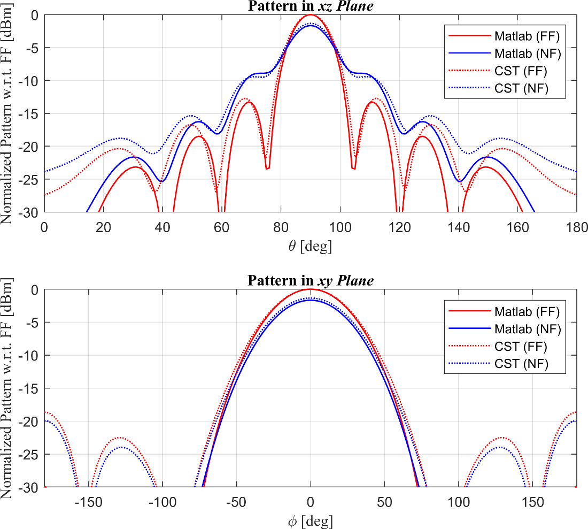
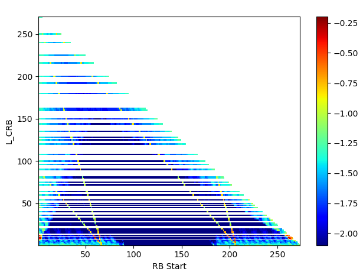

#### 7.1.1.3 Uplink Data Transfer

##### 7.1.1.3.1 Correct Handling of UL MAC PDU / Assignment / HARQ process

##### 7.1.1.3.1.1 Test Purpose (TP) {#test-purpose-tp .H6}

##### (1) {#section .H6}

**with** { UE in RRC\_CONNECTED state }

**ensure that** {

**when** { UE receives for a Slot an uplink grant with valid C-RNTI }

**then** { UE transmits data and associated HARQ information to the HARQ
entity for this Slot }

}

##### (2) {#section-1 .H6}

**with** { UE in RRC\_CONNECTED state }

**ensure that** {

**when** { SS transmits for a Slot an uplink grant with not allocated
C-RNTI }

**then** { UE does not transmit data and associated HARQ information to
the HARQ entity for this Slot }

}

##### (3) {#section-2 .H6}

**with** { UE in RRC\_CONNECTED state }

**ensure that** {

**when** { UE receives an UL Grant with toggled NDI and has data
available for transmission }

**then** { UE transmits a new MAC PDU }

}

##### (4) {#section-3 .H6}

**with** { UE in RRC\_CONNECTED state and having transmitted a MAC PDU
on a HARQ process }

**ensure that** {

**when** { UE receives an uplink grant on PDCCH for the next Slot
corresponding to the HARQ process with old NDI not toggled }

**then** { UE performs an adaptive retransmission of the MAC PDU with
redundancy version as received on PDCCH }

}

##### (5) {#section-4 .H6}

**with** { UE in E-UTRA RRC\_CONNECTED state }

**ensure that** {

**when** { UE receives an uplink grant on PDCCH for the next Slot
corresponding to the HARQ process with toggled NDI, and data is not
available for transmission }

**then** { UE transmits any MAC Padding PDU }

}

##### (6) {#section-5 .H6}

**with** { UE in RRC\_CONNECTED state }

**ensure that** {

**when** { UE has a MAC SDU to be transmitted that is smaller or equal
to 256 bytes }

**then** { UE sets F field to 0 and includes 8 bit L field in the MAC
sub PDU }

}

##### (7) {#section-6 .H6}

**with** { UE in RRC\_CONNECTED state }

**ensure that** {

**when** { UE has a MAC SDU to be transmitted that is larger than 256
bytes }

**then** { UE sets F field to 1 and includes 16 bit L field in the MAC
sub PDU }

}

##### (8) {#section-7 .H6}

**with** { UE in E-UTRA RRC\_CONNECTED state }

**ensure that** {

**when** { UE has to insert padding in a MAC PDU }

**then** { UE inserts the last MAC sub PDU as a padding sub PDU }

}

##### (9) {#section-8 .H6}

**with** { UE in  RRC\_CONNECTED state and configured with a specific
*TDD-UL-DL-ConfigCommon* including configuration of *pattern2* }

**ensure that** {

**when** { UE receives for a Slot an uplink grant associated with
*pattern2* with valid C-RNTI }

**then** { UE transmits data and associated HARQ information to the HARQ
entity for this Slot }

}

##### 7.1.1.3.1.2 Conformance requirements {#conformance-requirements .H6}

References: The conformance requirements covered in the present TC are
specified in: TS 38.321, clauses 5.4.1, 5.4.2.1, 5.4.2.2 and 6.1.2.
Unless otherwise stated these are Rel-15 requirements.

\[TS 38.321, clause 5.4.1\]

Uplink grant is either received dynamically on the PDCCH, in a Random
Access Response, or configured semi-persistently by RRC. The MAC entity
shall have an uplink grant to transmit on the UL-SCH. To perform the
requested transmissions, the MAC layer receives HARQ information from
lower layers.

If the MAC entity has a C-RNTI, a Temporary C-RNTI or CS-RNTI, the MAC
entity shall for each PDCCH occasion and for each Serving Cell belonging
to a TAG that has a running *timeAlignmentTimer* and for each grant
received for this PDCCH occasion:

1\> if an uplink grant for this Serving Cell has been received on the
PDCCH for the MAC entity's C-RNTI or Temporary C-RNTI; or

1\> if an uplink grant has been received in a Random Access Response:

2\> if the uplink grant is for MAC entity's C-RNTI and if the previous
uplink grant delivered to the HARQ entity for the same HARQ process was
either an uplink grant received for the MAC entity's CS-RNTI or a
configured uplink grant:

3\> consider the NDI to have been toggled for the corresponding HARQ
process regardless of the value of the NDI.

2\> deliver the uplink grant and the associated HARQ information to the
HARQ entity.

1\> else if an uplink grant for this PDCCH occasion has been received
for this serving cell on the PDCCH for the MAC entity's CS-RNTI:

2\> if the NDI in the received HARQ information is 1:

3\> consider the NDI for the corresponding HARQ process not to have been
toggled;

3\> stop the *ConfiguredGrantTimer* for the corresponding HARQ process,
if running;

3\> deliver the uplink grant and the associated HARQ information to the
HARQ entity.

2\> else if the NDI in the received HARQ information is 0:

3\> if PDCCH contents indicate configured grant Type 2 deactivation:

4\> trigger configured grant confirmation.

3\> else if PDCCH contents indicate configured grant Type 2 activation:

4\> trigger configured grant confirmation;

4\> store the uplink grant for this serving cell and the associated HARQ
information as configured uplink grant;

4\> initialise or re-initialise the configured uplink grant for this
serving cell to start in the associated PUSCH duration and to recur
according to rules in subclause 5.8.2;

4\> set the HARQ Process ID to the HARQ Process ID associated with this
PUSCH duration;

4\> consider the NDI bit for the corresponding HARQ process to have been
toggled;

4\> stop the *ConfiguredGrantTimer* for the corresponding HARQ process,
if running;

4\> deliver the configured uplink grant and the associated HARQ
information to the HARQ entity.

For each Serving Cell and each configured uplink grant, if configured
and activated, the MAC entity shall:

1\> set the HARQ Process ID to the HARQ Process ID associated with this
PUSCH duration;

1\> if the *ConfiguredGrantTimer* for the corresponding HARQ process is
not running:

2\> consider the NDI bit for the corresponding HARQ process to have been
toggled;

2\> deliver the configured uplink grant and the associated HARQ
information to the HARQ entity.

NOTE 1: For the same serving cell, an uplink grant addressed to C-RNTI
shall override a configured uplink grant in case of overlap in time
domain.

For configured uplink grants, the HARQ Process ID associated with this
symbol is derived from the following equation:

HARQ Process ID = \[floor(CURRENT\_symbol/*periodicity*)\] modulo
*numberOfConfGrant-Processes*

where CURRENT\_symbol=(SFN \* *numberOfSlotsPerFrame* \*
*numberOfSymbolsPerSlot* + slot number in the frame \*
*numberOfSymbolsPerSlot* + symbol number in the slot), and
*numberOfSlotsPerFrame* and *numberOfSymbolsPerSlot* refer to the number
of consecutive slots per frame and the number of consecutive symbols per
slot, respectively as specified in TS 38.211 \[8\].

NOTE 2: CURRENT\_symbol refers to the symbol index of the first
transmission of a repetition bundle that takes place. \[TS 36.322,
clause 5.4.2.1\]

The MAC entity includes a HARQ entity for each Serving Cell with
configured uplink (including the case when it is configured with
*supplementaryUplink*),which maintains a number of parallel HARQ
processes.

The number of parallel UL HARQ processes per HARQ entity is specified in
TS 38.214 \[7\].

Each HARQ process supports one TB.

Each HARQ process is associated with a HARQ process identifier. For UL
transmission with UL grant in RA Response, HARQ process identifier 0 is
used.

When repetition is configured with *repK* \>1, the parameter *repK*
provides the number of repetitions of a TB within a bundle. Repetition
operation relies on the HARQ entity for invoking the same HARQ process
for each transmission that is part of the same bundle. Within a bundle
HARQ retransmissions are non-adaptive and triggered without waiting for
feedback from previous transmissions according to *repK*.

For each uplink grant, the HARQ entity shall:

1\> identify the HARQ process(es) associated with this grant, and for
each identified HARQ process:

2\> if the received grant was not addressed to a Temporary C-RNTI on
PDCCH, and the NDI provided in the associated HARQ information has been
toggled compared to the value in the previous transmission of this TB of
this HARQ process; or

2\> if the uplink grant was received on PDCCH for the C-RNTI and the
HARQ buffer of the identified process is empty; or

2\> if the uplink grant was received in a Random Access Response:

3\> if there is a MAC PDU in the Msg3 buffer and the uplink grant was
received in a Random Access Response:

4\> obtain the MAC PDU to transmit from the Msg3 buffer.

3\> else:

4\> obtain the MAC PDU to transmit from the \"Multiplexing and
assembly\" entity, if any;

3\> if a MAC PDU to transmit has been obtained:

4\> deliver the MAC PDU and the uplink grant and the HARQ information of
the TB to the identified HARQ process;

4\> instruct the identified HARQ process to trigger a new transmission.

4\> if the uplink grant is addressed to CS-RNTI or the uplink grant is a
configured uplink grant:

5\> start or restart the *ConfiguredGrantTimer*, if configured, for the
corresponding HARQ process when the transmission is performed.

2\> else:

3\> if the uplink grant received on PDCCH was addressed to CS-RNTI and
if the HARQ buffer of the identified process is empty:

4\> ignore the uplink grant.

3\> else:

4\> deliver the uplink grant and the HARQ information (redundancy
version) of the TB to the identified HARQ process;

4\> instruct the identified HARQ process to trigger a retransmission;

4\> if the uplink grant is addressed to CS-RNTI or the uplink grant is a
configured uplink grant:

5\> start or restart the *ConfiguredGrantTimer*, if configured, for the
corresponding HARQ process when the transmission is performed.

When determining if NDI has been toggled compared to the value in the
previous transmission the MAC entity shall ignore NDI received in all
uplink grants on PDCCH for its Temporary C-RNTI.

\[TS 38.321, clause 5.4.2.2\]

Each HARQ process is associated with a HARQ buffer.

New transmissions are performed on the resource and with the MCS
indicated on either PDCCH, Random Access Response, or RRC.
Retransmissions are performed on the resource and, if provided, with the
MCS indicated on PDCCH.

If the HARQ entity requests a new transmission for a TB, the HARQ
process shall:

1\> store the MAC PDU in the associated HARQ buffer;

1\> store the uplink grant received from the HARQ entity;

1\> generate a transmission as described below.

If the HARQ entity requests a retransmission for a TB, the HARQ process
shall:

1\> store the uplink grant received from the HARQ entity;

1\> generate a transmission as described below.

To generate a transmission for a TB, the HARQ process shall:

1\> if the MAC PDU was obtained from the Msg3 buffer; or

1\> if there is no measurement gap at the time of the transmission and,
in case of retransmission, the retransmission does not collide with a
transmission for a MAC PDU obtained from the Msg3 buffer:

2\> instruct the physical layer to generate a transmission according to
the stored uplink grant.

\[TS 38.321, clause 6.1.2\]

A MAC PDU consists of one or more MAC subPDUs. Each MAC subPDU consists
of one of the following:

\- A MAC subheader only (including padding);

\- A MAC subheader and a MAC SDU;

\- A MAC subheader and a MAC CE;

\- A MAC subheader and padding.

The MAC SDUs are of variable sizes.

Each MAC subheader corresponds to either a MAC SDU, a MAC CE, or
padding.

A MAC subheader except for fixed sized MAC CE and padding consists of
the four header fields R/F/LCID/L. A MAC subheader for fixed sized MAC
CE and padding consists of the two header fields R/LCID.

Figure 6.1.2-1: R/F/LCID/L MAC subheader with 8-bit L field

Figure 6.1.2-2: R/F/LCID/L MAC subheader with 16-bit L field

Figure 6.1.2-3: R/LCID MAC subheader

MAC CEs are placed together. DL MAC subPDU(s) with MAC CE(s) is placed
before any MAC subPDU with MAC SDU and MAC subPDU with padding as
depicted in Figure 6.1.2-4. UL MAC subPDU(s) with MAC CE(s) is placed
after all the MAC subPDU(s) with MAC SDU and before the MAC subPDU with
padding in the MAC PDU as depicted in Figure 6.1.2-5. The size of
padding can be zero.

Figure 6.1.2-4: Example of a DL MAC PDU

Figure 6.1.2-5: Example of a UL MAC PDU

A maximum of one MAC PDU can be transmitted per TB per MAC entity.

##### 7.1.1.3.1.3 Test description {#test-description .H6}

##### 7.1.1.3.1.3.1 Pre-test conditions {#pre-test-conditions .H6}

Same Pre-test conditions as in clause 7.1.1.0.

##### 7.1.1.3.1.3.2 Test procedure sequence {#test-procedure-sequence .H6}

Table 7.1.1.3.1.3.2-1: Main behaviour

+-----------+-----------+-----------+-----------+---------+----+
| St        | Procedure | Message   | TP        | Verdict |    |
|           |           | Sequence  |           |         |    |
+===========+===========+===========+===========+=========+====+
|           |           | U - S     | Message   |         |    |
+-----------+-----------+-----------+-----------+---------+----+
| 1         | The SS    | \-        | \-        | \-      | \- |
|           | ignores   |           |           |         |    |
|           | s         |           |           |         |    |
|           | cheduling |           |           |         |    |
|           | requests  |           |           |         |    |
|           | and does  |           |           |         |    |
|           | not       |           |           |         |    |
|           | allocate  |           |           |         |    |
|           | any       |           |           |         |    |
|           | uplink    |           |           |         |    |
|           | grant.    |           |           |         |    |
+-----------+-----------+-----------+-----------+---------+----+
| 2         | SS        | \<\--     | MAC PDU   | \-      | \- |
|           | transmits |           |           |         |    |
|           | a MAC PDU |           |           |         |    |
|           | including |           |           |         |    |
|           | a RLC SDU |           |           |         |    |
+-----------+-----------+-----------+-----------+---------+----+
| \-        | E         | \-        | \-        | \-      | \- |
|           | XCEPTION: |           |           |         |    |
|           | Step 3    |           |           |         |    |
|           | runs in   |           |           |         |    |
|           | parallel  |           |           |         |    |
|           | with      |           |           |         |    |
|           | behaviour |           |           |         |    |
|           | in table  |           |           |         |    |
|           | 7.1.1.    |           |           |         |    |
|           | 3.1.3.2-2 |           |           |         |    |
+-----------+-----------+-----------+-----------+---------+----+
| 3         | For 100   | \<\--     | (UL Grant | \-      | \- |
|           | ms SS     |           | (unknown  |         |    |
|           | transmits |           | C-RNTI))  |         |    |
|           | an UL     |           |           |         |    |
|           | Grant     |           |           |         |    |
|           | every 10  |           |           |         |    |
|           | ms ,      |           |           |         |    |
|           | allowing  |           |           |         |    |
|           | the UE to |           |           |         |    |
|           | return    |           |           |         |    |
|           | the RLC   |           |           |         |    |
|           | SDU as    |           |           |         |    |
|           | received  |           |           |         |    |
|           | in step   |           |           |         |    |
|           | 2, on     |           |           |         |    |
|           | PDCCH,    |           |           |         |    |
|           | but with  |           |           |         |    |
|           | the       |           |           |         |    |
|           | C-RNTI    |           |           |         |    |
|           | different |           |           |         |    |
|           | from the  |           |           |         |    |
|           | C-RNTI    |           |           |         |    |
|           | assigned  |           |           |         |    |
|           | to the    |           |           |         |    |
|           | UE.       |           |           |         |    |
+-----------+-----------+-----------+-----------+---------+----+
| 4         | Check:    | \--\>     | MAC PDU   | 2       | F  |
|           | Does the  |           |           |         |    |
|           | UE        |           |           |         |    |
|           | transmit  |           |           |         |    |
|           | a MAC PDU |           |           |         |    |
|           | corr      |           |           |         |    |
|           | esponding |           |           |         |    |
|           | to grant  |           |           |         |    |
|           | in step   |           |           |         |    |
|           | 3?        |           |           |         |    |
+-----------+-----------+-----------+-----------+---------+----+
| 5         | SS        | \<\--     | (UL Grant | \-      | \- |
|           | transmits |           | (C-RNTI)) |         |    |
|           | an UL     |           |           |         |    |
|           | Grant,    |           |           |         |    |
|           | allowing  |           |           |         |    |
|           | the UE to |           |           |         |    |
|           | return    |           |           |         |    |
|           | the RLC   |           |           |         |    |
|           | SDU as    |           |           |         |    |
|           | received  |           |           |         |    |
|           | in step   |           |           |         |    |
|           | 2, on     |           |           |         |    |
|           | PDCCH     |           |           |         |    |
|           | with the  |           |           |         |    |
|           | C-RNTI    |           |           |         |    |
|           | assigned  |           |           |         |    |
|           | to the    |           |           |         |    |
|           | UE.       |           |           |         |    |
+-----------+-----------+-----------+-----------+---------+----+
| 6         | Check:    | \--\>     | MAC PDU   | 1       | P  |
|           | Does the  |           |           |         |    |
|           | UE        |           |           |         |    |
|           | transmit  |           |           |         |    |
|           | a MAC PDU |           |           |         |    |
|           | corr      |           |           |         |    |
|           | esponding |           |           |         |    |
|           | to grant  |           |           |         |    |
|           | in step   |           |           |         |    |
|           | 6?        |           |           |         |    |
+-----------+-----------+-----------+-----------+---------+----+
| 6A        | SS        | \<\--     | MAC PDU   | \-      | \- |
|           | transmits |           | (RLC      |         |    |
|           | a MAC PDU |           | STATUS    |         |    |
|           | c         |           | PDU)      |         |    |
|           | ontaining |           |           |         |    |
|           | an RLC    |           |           |         |    |
|           | STATUS    |           |           |         |    |
|           | PDU       |           |           |         |    |
|           | ackn      |           |           |         |    |
|           | owledging |           |           |         |    |
|           | the       |           |           |         |    |
|           | reception |           |           |         |    |
|           | of the    |           |           |         |    |
|           | AMD PDUs  |           |           |         |    |
|           | in step   |           |           |         |    |
|           | 6.        |           |           |         |    |
+-----------+-----------+-----------+-----------+---------+----+
| 7         | The SS    | \<\--     | MAC PDU   | \-      | \- |
|           | Transmits |           |           |         |    |
|           | a valid   |           |           |         |    |
|           | MAC PDU   |           |           |         |    |
|           | c         |           |           |         |    |
|           | ontaining |           |           |         |    |
|           | RLC PDU   |           |           |         |    |
+-----------+-----------+-----------+-----------+---------+----+
| 8         | The SS    | \<\--     | Uplink    | \-      | \- |
|           | allocates |           | Grant     |         |    |
|           | an UL     |           |           |         |    |
|           | Grant for |           |           |         |    |
|           | one HARQ  |           |           |         |    |
|           | process   |           |           |         |    |
|           | X,        |           |           |         |    |
|           | s         |           |           |         |    |
|           | ufficient |           |           |         |    |
|           | for one   |           |           |         |    |
|           | RLC SDU   |           |           |         |    |
|           | to be     |           |           |         |    |
|           | looped    |           |           |         |    |
|           | back in a |           |           |         |    |
|           | Slot, and |           |           |         |    |
|           | NDI       |           |           |         |    |
|           | indicates |           |           |         |    |
|           | new       |           |           |         |    |
|           | tra       |           |           |         |    |
|           | nsmission |           |           |         |    |
|           | r         |           |           |         |    |
|           | edundancy |           |           |         |    |
|           | version   |           |           |         |    |
|           | to be     |           |           |         |    |
|           | used as 0 |           |           |         |    |
+-----------+-----------+-----------+-----------+---------+----+
| 9         | Check:    | \--\>     | MAC PDU   | 3       | P  |
|           | Does the  |           |           |         |    |
|           | UE        |           |           |         |    |
|           | transmit  |           |           |         |    |
|           | a MAC PDU |           |           |         |    |
|           | including |           |           |         |    |
|           | one RLC   |           |           |         |    |
|           | SDU, in   |           |           |         |    |
|           | HARQ      |           |           |         |    |
|           | process   |           |           |         |    |
|           | X?        |           |           |         |    |
+-----------+-----------+-----------+-----------+---------+----+
| 10        | The SS    | \<\--     | Uplink    | \-      | \- |
|           | transmits |           | Grant     |         |    |
|           | an UL     |           |           |         |    |
|           | grant     |           |           |         |    |
|           | corr      |           |           |         |    |
|           | esponding |           |           |         |    |
|           | to slot   |           |           |         |    |
|           | for HARQ  |           |           |         |    |
|           | process   |           |           |         |    |
|           | X, with   |           |           |         |    |
|           | NDI not   |           |           |         |    |
|           | toggled   |           |           |         |    |
|           | and       |           |           |         |    |
|           | r         |           |           |         |    |
|           | edundancy |           |           |         |    |
|           | version   |           |           |         |    |
|           | to be     |           |           |         |    |
|           | used as 1 |           |           |         |    |
+-----------+-----------+-----------+-----------+---------+----+
| 11        | Check:    | \--\>     | MAC PDU   | 4       | P  |
|           | Does the  |           |           |         |    |
|           | UE        |           |           |         |    |
|           | r         |           |           |         |    |
|           | etransmit |           |           |         |    |
|           | the MAC   |           |           |         |    |
|           | PDU in    |           |           |         |    |
|           | for HARQ  |           |           |         |    |
|           | process   |           |           |         |    |
|           | X, using  |           |           |         |    |
|           | r         |           |           |         |    |
|           | edundancy |           |           |         |    |
|           | version1? |           |           |         |    |
+-----------+-----------+-----------+-----------+---------+----+
| 11A       | SS        | \<\--     | MAC PDU   | \-      | \- |
|           | transmits |           | (RLC      |         |    |
|           | a MAC PDU |           | STATUS    |         |    |
|           | c         |           | PDU)      |         |    |
|           | ontaining |           |           |         |    |
|           | an RLC    |           |           |         |    |
|           | STATUS    |           |           |         |    |
|           | PDU       |           |           |         |    |
|           | ackn      |           |           |         |    |
|           | owledging |           |           |         |    |
|           | the       |           |           |         |    |
|           | reception |           |           |         |    |
|           | of the    |           |           |         |    |
|           | AMD PDUs  |           |           |         |    |
|           | in step   |           |           |         |    |
|           | 11.       |           |           |         |    |
+-----------+-----------+-----------+-----------+---------+----+
| 12        | The SS    | \<\--     | Uplink    | \-      | \- |
|           | transmits |           | Grant     |         |    |
|           | an UL     |           |           |         |    |
|           | grant     |           |           |         |    |
|           | corr      |           |           |         |    |
|           | esponding |           |           |         |    |
|           | to SLOT   |           |           |         |    |
|           | for HARQ  |           |           |         |    |
|           | process   |           |           |         |    |
|           | X, with   |           |           |         |    |
|           | NDI       |           |           |         |    |
|           | toggled   |           |           |         |    |
|           | and       |           |           |         |    |
|           | r         |           |           |         |    |
|           | edundancy |           |           |         |    |
|           | version   |           |           |         |    |
|           | to be     |           |           |         |    |
|           | used as 0 |           |           |         |    |
+-----------+-----------+-----------+-----------+---------+----+
| 13        | Check:    | \--\>     | MAC PDU   | 5       | P  |
|           | Does the  |           |           |         |    |
|           | UE        |           |           |         |    |
|           | r         |           |           |         |    |
|           | etransmit |           |           |         |    |
|           | the MAC   |           |           |         |    |
|           | PDU       |           |           |         |    |
|           | c         |           |           |         |    |
|           | ontaining |           |           |         |    |
|           | padding   |           |           |         |    |
|           | for HARQ  |           |           |         |    |
|           | process   |           |           |         |    |
|           | X, using  |           |           |         |    |
|           | r         |           |           |         |    |
|           | edundancy |           |           |         |    |
|           | version   |           |           |         |    |
|           | 0?        |           |           |         |    |
+-----------+-----------+-----------+-----------+---------+----+
| 14        | SS        | \<\--     | MAC PDU   | \-      | \- |
|           | transmits |           |           |         |    |
|           | a MAC PDU |           |           |         |    |
|           | including |           |           |         |    |
|           | a RLC PDU |           |           |         |    |
|           | of size   |           |           |         |    |
|           | 128 bytes |           |           |         |    |
+-----------+-----------+-----------+-----------+---------+----+
| 15        | The SS    | \<\--     | (UL Grant | \-      | \- |
|           | transmits |           | (C-RNTI)) |         |    |
|           | an UL     |           |           |         |    |
|           | Grant,    |           |           |         |    |
|           | allowing  |           |           |         |    |
|           | the UE to |           |           |         |    |
|           | return    |           |           |         |    |
|           | the RLC   |           |           |         |    |
|           | SDU as    |           |           |         |    |
|           | received  |           |           |         |    |
|           | in step   |           |           |         |    |
|           | 14 and    |           |           |         |    |
|           | padding.  |           |           |         |    |
+-----------+-----------+-----------+-----------+---------+----+
| 16        | Check:    | \--\>     | MAC PDU   | 6,8     | P  |
|           | Does the  |           |           |         |    |
|           | UE        |           |           |         |    |
|           | transmit  |           |           |         |    |
|           | a MAC PDU |           |           |         |    |
|           | corr      |           |           |         |    |
|           | esponding |           |           |         |    |
|           | to grant  |           |           |         |    |
|           | in step   |           |           |         |    |
|           | 14 with F |           |           |         |    |
|           | field set |           |           |         |    |
|           | to 0 and  |           |           |         |    |
|           | includes  |           |           |         |    |
|           | 8 bit L   |           |           |         |    |
|           | field in  |           |           |         |    |
|           | the MAC   |           |           |         |    |
|           | sub PDU   |           |           |         |    |
|           | and       |           |           |         |    |
|           | includes  |           |           |         |    |
|           | a padding |           |           |         |    |
|           | sub PDU   |           |           |         |    |
|           | at end?   |           |           |         |    |
+-----------+-----------+-----------+-----------+---------+----+
| 16A       | SS        | \<\--     | MAC PDU   | \-      | \- |
|           | transmits |           | (RLC      |         |    |
|           | a MAC PDU |           | STATUS    |         |    |
|           | c         |           | PDU)      |         |    |
|           | ontaining |           |           |         |    |
|           | an RLC    |           |           |         |    |
|           | STATUS    |           |           |         |    |
|           | PDU       |           |           |         |    |
|           | ackn      |           |           |         |    |
|           | owledging |           |           |         |    |
|           | the       |           |           |         |    |
|           | reception |           |           |         |    |
|           | of the    |           |           |         |    |
|           | AMD PDUs  |           |           |         |    |
|           | in step   |           |           |         |    |
|           | 16.       |           |           |         |    |
+-----------+-----------+-----------+-----------+---------+----+
| 17        | SS        | \<\--     | MAC PDU   | \-      | \- |
|           | transmits |           |           |         |    |
|           | a MAC PDU |           |           |         |    |
|           | including |           |           |         |    |
|           | a RLC PDU |           |           |         |    |
|           | of size   |           |           |         |    |
|           | 512 bytes |           |           |         |    |
+-----------+-----------+-----------+-----------+---------+----+
| 18        | The SS    | \<\--     | (UL Grant | \-      | \- |
|           | transmits |           | (C-RNTI)) |         |    |
|           | an UL     |           |           |         |    |
|           | Grant,    |           |           |         |    |
|           | allowing  |           |           |         |    |
|           | the UE to |           |           |         |    |
|           | return    |           |           |         |    |
|           | the RLC   |           |           |         |    |
|           | SDU as    |           |           |         |    |
|           | received  |           |           |         |    |
|           | in step   |           |           |         |    |
|           | 17 and    |           |           |         |    |
|           | padding.  |           |           |         |    |
+-----------+-----------+-----------+-----------+---------+----+
| 19        | Check:    | \--\>     | MAC PDU   | 7,8     | P  |
|           | Does the  |           |           |         |    |
|           | UE        |           |           |         |    |
|           | transmit  |           |           |         |    |
|           | a MAC PDU |           |           |         |    |
|           | corr      |           |           |         |    |
|           | esponding |           |           |         |    |
|           | to grant  |           |           |         |    |
|           | in step   |           |           |         |    |
|           | 17 with F |           |           |         |    |
|           | field set |           |           |         |    |
|           | to 1 and  |           |           |         |    |
|           | includes  |           |           |         |    |
|           | 16 bit L  |           |           |         |    |
|           | field in  |           |           |         |    |
|           | the MAC   |           |           |         |    |
|           | sub PDU   |           |           |         |    |
|           | and       |           |           |         |    |
|           | includes  |           |           |         |    |
|           | a padding |           |           |         |    |
|           | sub PDU   |           |           |         |    |
|           | at end?   |           |           |         |    |
+-----------+-----------+-----------+-----------+---------+----+
| 19A       | SS        | \<\--     | MAC PDU   | \-      | \- |
|           | transmits |           | (RLC      |         |    |
|           | a MAC PDU |           | STATUS    |         |    |
|           | c         |           | PDU)      |         |    |
|           | ontaining |           |           |         |    |
|           | an RLC    |           |           |         |    |
|           | STATUS    |           |           |         |    |
|           | PDU       |           |           |         |    |
|           | ackn      |           |           |         |    |
|           | owledging |           |           |         |    |
|           | the       |           |           |         |    |
|           | reception |           |           |         |    |
|           | of the    |           |           |         |    |
|           | AMD PDUs  |           |           |         |    |
|           | in step   |           |           |         |    |
|           | 19.       |           |           |         |    |
+-----------+-----------+-----------+-----------+---------+----+
| \-        | EXCEPTION | \-        | *-*       | \-      | \- |
|           | : Steps   |           |           |         |    |
|           | 20a0 to   |           |           |         |    |
|           | 20a6 are  |           |           |         |    |
|           | executed  |           |           |         |    |
|           | for       |           |           |         |    |
|           | operation |           |           |         |    |
|           | on NR TDD |           |           |         |    |
|           | band only |           |           |         |    |
+-----------+-----------+-----------+-----------+---------+----+
| 20a0      | The SS    |           |           |         |    |
|           | transmits |           |           |         |    |
|           | an        |           |           |         |    |
|           | updated   |           |           |         |    |
|           | system    |           |           |         |    |
|           | in        |           |           |         |    |
|           | formation |           |           |         |    |
|           | as        |           |           |         |    |
|           | specified |           |           |         |    |
|           | in Table  |           |           |         |    |
|           | 7.1.1.3.  |           |           |         |    |
|           | 1.3.3-14. |           |           |         |    |
+-----------+-----------+-----------+-----------+---------+----+
| 20a1      | The SS    | \<\--     | *(RR      | \-      | \- |
|           | transmits |           | CReconfig |         |    |
|           | a NR      |           | uration)* |         |    |
|           | RRCReconf |           |           |         |    |
|           | iguration |           |           |         |    |
|           | message   |           |           |         |    |
|           | including |           |           |         |    |
|           | *TDD-U    |           |           |         |    |
|           | L-DL-Conf |           |           |         |    |
|           | igCommon* |           |           |         |    |
|           | with      |           |           |         |    |
|           | *pattern1 |           |           |         |    |
|           | and       |           |           |         |    |
|           | pattern   |           |           |         |    |
|           | 2*        |           |           |         |    |
|           | specified |           |           |         |    |
|           | in Table  |           |           |         |    |
|           | 7.1.1.    |           |           |         |    |
|           | 3.1.3.3-6 |           |           |         |    |
|           | (Note 1)  |           |           |         |    |
+-----------+-----------+-----------+-----------+---------+----+
| 20a2      | The UE    | \--\>     | *(R       | \-      | \- |
|           | transmit  |           | RCReconfi |         |    |
|           | a NR      |           | gurationC |         |    |
|           | *         |           | omplete)* |         |    |
|           | RRCReconf |           |           |         |    |
|           | iguration |           |           |         |    |
|           | Complete* |           |           |         |    |
|           | message.  |           |           |         |    |
|           | (Note 2)  |           |           |         |    |
+-----------+-----------+-----------+-----------+---------+----+
| 20a3      | SS        | \<\--     | MAC PDU   | \-      | \- |
|           | transmits |           |           |         |    |
|           | a MAC PDU |           |           |         |    |
|           | including |           |           |         |    |
|           | a RLC SDU |           |           |         |    |
+-----------+-----------+-----------+-----------+---------+----+
| 20a4      | SS        | \<\--     | (UL Grant | \-      | \- |
|           | transmits |           | (C-RNTI)) |         |    |
|           | an UL     |           |           |         |    |
|           | Grant,    |           |           |         |    |
|           | allowing  |           |           |         |    |
|           | the UE to |           |           |         |    |
|           | return    |           |           |         |    |
|           | the RLC   |           |           |         |    |
|           | SDU as    |           |           |         |    |
|           | received  |           |           |         |    |
|           | in step   |           |           |         |    |
|           | 20a3, on  |           |           |         |    |
|           | PDCCH     |           |           |         |    |
|           | with the  |           |           |         |    |
|           | C-RNTI    |           |           |         |    |
|           | assigned  |           |           |         |    |
|           | to the    |           |           |         |    |
|           | UE.       |           |           |         |    |
+-----------+-----------+-----------+-----------+---------+----+
| 20a5      | Check:    | \--\>     | MAC PDU   | 9       | P  |
|           | Does the  |           |           |         |    |
|           | UE        |           |           |         |    |
|           | transmit  |           |           |         |    |
|           | a MAC PDU |           |           |         |    |
|           | corr      |           |           |         |    |
|           | esponding |           |           |         |    |
|           | to grant  |           |           |         |    |
|           | in step   |           |           |         |    |
|           | 20a4?     |           |           |         |    |
+-----------+-----------+-----------+-----------+---------+----+
| 20a6      | SS        | \<\--     | MAC PDU   | \-      | \- |
|           | transmits |           | (RLC      |         |    |
|           | a MAC PDU |           | STATUS    |         |    |
|           | c         |           | PDU)      |         |    |
|           | ontaining |           |           |         |    |
|           | an RLC    |           |           |         |    |
|           | STATUS    |           |           |         |    |
|           | PDU       |           |           |         |    |
|           | ackn      |           |           |         |    |
|           | owledging |           |           |         |    |
|           | the       |           |           |         |    |
|           | reception |           |           |         |    |
|           | of the    |           |           |         |    |
|           | AMD PDUs  |           |           |         |    |
|           | in step   |           |           |         |    |
|           | 20a5.     |           |           |         |    |
+-----------+-----------+-----------+-----------+---------+----+
| Note 1:   |           |           |           |         |    |
| For EN-DC |           |           |           |         |    |
| the NR    |           |           |           |         |    |
| RRCReconf |           |           |           |         |    |
| iguration |           |           |           |         |    |
| message   |           |           |           |         |    |
| is        |           |           |           |         |    |
| contained |           |           |           |         |    |
| in        |           |           |           |         |    |
| R         |           |           |           |         |    |
| RCConnect |           |           |           |         |    |
| ionReconf |           |           |           |         |    |
| iguration |           |           |           |         |    |
| 36.508    |           |           |           |         |    |
| \[7\],    |           |           |           |         |    |
| Table     |           |           |           |         |    |
| 4.6.1-8   |           |           |           |         |    |
| using     |           |           |           |         |    |
| condition |           |           |           |         |    |
| EN-DC\_   |           |           |           |         |    |
| EmbedNR\_ |           |           |           |         |    |
| RRCRecon. |           |           |           |         |    |
|           |           |           |           |         |    |
| Note 2:   |           |           |           |         |    |
| For EN-DC |           |           |           |         |    |
| the NR    |           |           |           |         |    |
| RRCRecon  |           |           |           |         |    |
| figuratio |           |           |           |         |    |
| nComplete |           |           |           |         |    |
| message   |           |           |           |         |    |
| is        |           |           |           |         |    |
| contained |           |           |           |         |    |
| in        |           |           |           |         |    |
| R         |           |           |           |         |    |
| RCConnect |           |           |           |         |    |
| ionReconf |           |           |           |         |    |
| iguration |           |           |           |         |    |
| Complete. |           |           |           |         |    |
+-----------+-----------+-----------+-----------+---------+----+

Table 7.1.1.3.1.3.2-2: Parallel behaviour

  St   Procedure                            Message Sequence   TP        Verdict   
  ---- ------------------------------------ ------------------ --------- --------- ----
                                            U - S              Message             
  1    UE transmits a Scheduling Request.   \--\>              (SR)      \-        \-

##### 7.1.1.3.1.3.3 Specific message contents {#specific-message-contents .H6}

Table 7.1.1.3.1.3.3-1: *Void*

Table 7.1.1.3.1.3.3-2: *Void*

Table 7.1.1.3.1.3.3-3: *RRCReconfiguration* (step 20a1, Table
7.1.1.3.1.3.2-1)

  ---------------------------------------------------- ----------------- --------- -----------
  Derivation Path: TS 38.508-1 \[4\], Table 4.6.1-13                               
  Information Element                                  Value/remark      Comment   Condition
  RRCReconfiguration ::= SEQUENCE {                                                
  criticalExtensions CHOICE {                                                      
  rrcReconfiguration SEQUENCE {                                                    
  secondaryCellGroup                                   CellGroupConfig             EN-DC
  nonCriticalExtension SEQUENCE {                                                  NR
  masterCellGroup                                      CellGroupConfig             
  }                                                                                
  }                                                                                
  }                                                                                
  ---------------------------------------------------- ----------------- --------- -----------

Table 7.1.1.3.1.3.3-4: *CellGroupConfig (*Table 7.1.1.3.1.3.3-3)

  ---------------------------------------------------- ------------------------- --------- -----------
  Derivation Path: TS 38.508-1 \[4\], Table 4.6.3-19                                       
  Information Element                                  Value/remark              Comment   Condition
  CellGroupConfig ::= SEQUENCE {                                                           
  spCellConfig SEQUENCE {                                                                  
  reconfigurationWithSync SEQUENCE {                                                       
  spCellConfigCommon                                   ServingCellConfigCommon             
  }                                                                                        
  spCellConfigDedicated                                ServingCellConfig                   
  }                                                                                        
  }                                                                                        
  ---------------------------------------------------- ------------------------- --------- -----------

Table 7.1.1.3.1.3.3-5: *ServingCellConfigCommon (*Table 7.1.1.3.1.3.3-4,
Table 7.1.1.3.1.3.3-14)

  ----------------------------------------------------- ------------------------ --------- -----------
  Derivation Path: TS 38.508-1 \[4\], Table 4.6.3-168                                      
  Information Element                                   Value/remark             Comment   Condition
  ServingCellConfigCommon ::= SEQUENCE {                                                   
  uplinkConfigCommon SEQUENCE {                                                            
  initialUplinkBWP                                      BWP-UplinkCommon                   
  }                                                                                        
  tdd-UL-DL-ConfigurationCommon                         TDD-UL-DL-ConfigCommon             
  }                                                                                        
  ----------------------------------------------------- ------------------------ --------- -----------

Table 7.1.1.3.1.3.3-6: *TDD-UL-DL-ConfigCommon (*Table 7.1.1.3.1.3.3-5)

  ----------------------------------------------------- ------------------- --------- -----------
  Derivation Path: TS 38.508-1 \[4\], Table 4.6.3-192                                 
  Information Element                                   Value/remark        Comment   Condition
  TDD-UL-DL-ConfigCommon ::= SEQUENCE {                                               
  referenceSubcarrierSpacing                            SubcarrierSpacing             
  pattern1 SEQUENCE {                                                                 
  dl-UL-TransmissionPeriodicity                         ms5                           FR1
                                                        ms0p625                       FR2
  nrofDownlinkSlots                                     3                             FR1
                                                        2                             FR2
  nrofDownlinkSymbols                                   6                             FR1
                                                        6                             FR2
  nrofUplinkSlots                                       2                             FR1
                                                        2                             FR2
  nrofUplinkSymbols                                     4                             FR1
                                                        2                             FR2
  dl-UL-TransmissionPeriodicity-v1530                   ms3                           FR1
  }                                                                                   
  pattern2 SEQUENCE {                                                                 
  dl-UL-TransmissionPeriodicity                         ms2                           FR1
                                                        ms0p625                       FR2
  nrofDownlinkSlots                                     4                             FR1
                                                        3                             FR2
  nrofDownlinkSymbols                                   0                             FR1
                                                        6                             FR2
  nrofUplinkSlots                                       0                             FR1
                                                        1                             FR2
  nrofUplinkSymbols                                     0                             FR1
                                                        2                             FR2
  }                                                                                   
  }                                                                                   
  ----------------------------------------------------- ------------------- --------- -----------

Table 7.1.1.3.1.3.3-7: *BWP-UplinkCommon (*Table 7.1.1.3.1.3.3-5)

  ---------------------------------------------------- ------------------- --------- -----------
  Derivation Path: TS 38.508-1 \[4\], Table 4.6.3-14                                 
  Information Element                                  Value/remark        Comment   Condition
  BWP-UplinkCommon ::= SEQUENCE {                                                    
  rach-ConfigCommon CHOICE {                                                         
  setup                                                RACH-ConfigCommon             
  }                                                                                  
  }                                                                                  
  ---------------------------------------------------- ------------------- --------- -----------

Table 7.1.1.3.1.3.3-8: *RACH-ConfigCommon (*Table 7.1.1.3.1.3.3-7)

  ----------------------------------------------------- -------------------- --------- -----------
  Derivation Path: TS 38.508-1 \[4\], Table 4.6.3-128                                  
  Information Element                                   Value/remark         Comment   Condition
  RACH-ConfigCommon ::= SEQUENCE {                                                     
  rach-ConfigGeneric                                    RACH-ConfigGeneric             
  }                                                                                    
  ----------------------------------------------------- -------------------- --------- -----------

Table 7.1.1.3.1.3.3-9: *RACH-ConfigGeneric (*Table 7.1.1.3.1.3.3-8)

  ----------------------------------------------------- -------------- --------- -----------
  Derivation Path: TS 38.508-1 \[4\], Table 4.6.3-130                            
  Information Element                                   Value/remark   Comment   Condition
  RACH-ConfigGeneric ::= SEQUENCE {                                              
  prach-configurationIndex                              156                      
  }                                                                              
  ----------------------------------------------------- -------------- --------- -----------

Table 7.1.1.3.1.3.3-10: *ServingCellConfig* (Table 7.1.1.3.1.3.3-4)

  ----------------------------------------------------- --------------------- --------- -----------
  Derivation Path: TS 38.508-1 \[4\], Table 4.6.3-167                                   
  Information Element                                   Value/remark          Comment   Condition
  ServingCellConfig ::= SEQUENCE {                                                      
  uplinkConfig SEQUENCE {                                                               
  initialUplinkBWP                                      BWP-UplinkDedicated             
  }                                                                                     
  }                                                                                     
  ----------------------------------------------------- --------------------- --------- -----------

Table 7.1.1.3.1.3.3-11: *BWP-UplinkDedicated (*Table 7.1.1.3.1.3.3-10)

  ---------------------------------------------------- -------------- --------- -----------
  Derivation Path: TS 38.508-1 \[4\], Table 4.6.3-15                            
  Information Element                                  Value/remark   Comment   Condition
  BWP-UplinkDedicated ::= SEQUENCE {                                            
  pucch-Config CHOICE {                                                         
  setup                                                PUCCH-Config             
  }                                                                             
  }                                                                             
  ---------------------------------------------------- -------------- --------- -----------

Table 7.1.1.3.1.3.3-12: *PUCCH-Config (*Table 7.1.1.3.1.3.3-11)

  --------------------------------------------------------------------------------------------------------------------- --------------------------------- --------- -----------
  Derivation Path: TS 38.508-1 \[4\], Table 4.6.3-112                                                                                                               
  Information Element                                                                                                   Value/remark                      Comment   Condition
  PUCCH-Config ::= SEQUENCE {                                                                                                                                       
  schedulingRequestResourceToAddModList SEQUENCE (SIZE (1..maxNrofSR-Resources)) OF SchedulingRequestResourceConfig {   1 entry                                     
  SchedulingRequestResourceConfig\[1\]                                                                                  SchedulingRequestResourceConfig   entry 1   
  }                                                                                                                                                                 
  }                                                                                                                                                                 
  --------------------------------------------------------------------------------------------------------------------- --------------------------------- --------- -----------

Table 7.1.1.3.1.3.3-13: *SchedulingRequestResourceConfig (*Table
7.1.1.3.1.3.3-12)

  ----------------------------------------------------- -------------- ----------------------------------------------------- -------------
  Derivation Path: TS 38.508-1 \[4\], Table 4.6.3-112                                                                        
  Information Element                                   Value/remark   Comment                                               Condition
  SchedulingRequestResourceConfig ::= SEQUENCE {                                                                             
  periodicityAndOffset CHOICE {                                                                                              
  sl10                                                  5              With SCS = kHz15 results in repetition every 10 ms    SCS\_15kHz
  sl20                                                  5              With SCS = kHz30 results in repetition every 10 ms    SCS\_30kHz
  sl80                                                  4              With SCS = kHz120 results in repetition every 10 ms   SCS\_120kHz
  }                                                                                                                          
  }                                                                                                                          
  ----------------------------------------------------- -------------- ----------------------------------------------------- -------------

Table 7.1.1.3.1.3.3-14: *SIB1* (step 20a0, Table 7.1.1.3.1.3.2-1)

  ------------------------------------------------ ------------------------- ------------------------------------------- -----------
  Derivation path: 38.508-1 \[4\] table 4.6.1-28                                                                         
  Information Element                              Value/Remark              Comment                                     Condition
  SIB1 ::= SEQUENCE {                                                                                                    
  servingCellConfigCommon                          ServingCellConfigCommon   Same contents as in Table 7.1.1.3.1.3.3-5   
  }                                                                                                                      
  ------------------------------------------------ ------------------------- ------------------------------------------- -----------

##### 7.1.1.3.2 Logical channel prioritization handling

##### 7.1.1.3.2.1 Test Purpose (TP) {#test-purpose-tp-1 .H6}

##### (1) {#section-9 .H6}

**with** {UE in RRC\_CONNECTED state}

**ensure that** {

**when** { UE is sending data on the uplink }

**then** { UE serves the logical channels according to their priority
and configured PBR }

}

##### 7.1.1.3.1.2 Conformance requirements {#conformance-requirements-1 .H6}

References: The conformance requirements covered in the present TC are
specified in: TS 38.321, clause 5.4.3.1.1, 5.4.3.1.2, 5.4.3.1.3. Unless
otherwise stated these are Rel-15 requirements.

\[TS 38.321, clause 5.4.3.1.1\]

The Logical Channel Prioritization procedure is applied whenever a new
transmission is performed.

RRC controls the scheduling of uplink data by signalling for each
logical channel per MAC entity:

\- *priority* where an increasing priority value indicates a lower
priority level;

\- *prioritisedBitRate* which sets the Prioritized Bit Rate (PBR);

\- *bucketSizeDuration* which sets the Bucket Size Duration (BSD).

RRC additionally controls the LCP procedure by configuring mapping
restrictions for each logical channel:

\- *allowedSCS-List* which sets the allowed Subcarrier Spacing(s) for
transmission;

\- *maxPUSCH-Duration* which sets the maximum PUSCH duration allowed for
transmission;

\- *configuredGrantType1Allowed* which sets whether a Configured Grant
Type 1 can be used for transmission;

\- *allowedServingCells* which sets the allowed cell(s) for
transmission.

The following UE variable is used for the Logical channel prioritization
procedure:

\- *Bj* which is maintained for each logical channel j.

The MAC entity shall initialize Bj of the logical channel to zero when
the logical channel is established.

For each logical channel j, the MAC entity shall:

1\> increment *Bj* by the product PBR × T before every instance of the
LCP procedure, where T is the time elapsed since *Bj* was last updated;

1\> if the value of *Bj* is greater than the bucket size (i.e. PBR ×
BSD):

2\> set *Bj* to the bucket size.

NOTE: The exact moment(s) when the UE updates *Bj* between LCP
procedures is up to UE implementation, as long as *Bj* is up to date at
the time when a grant is processed by LCP.

\[TS 38.321, clause 5.4.3.1.2\]

The MAC entity shall, when a new transmission is performed:

1\> select the logical channels for each UL grant that satisfy all the
following conditions:

2\> the set of allowed Subcarrier Spacing index values in
*allowedSCS-List*, if configured, includes the Subcarrier Spacing index
associated to the UL grant; and

2\> *maxPUSCH-Duration*, if configured, is larger than or equal to the
PUSCH transmission duration associated to the UL grant; and

2\> *configuredGrantType1Allowed*, if configured, is set to TRUE in case
the UL grant is a Configured Grant Type 1; and

2\> *allowedServingCells*, if configured, includes the Cell information
associated to the UL grant.

NOTE: The Subcarrier Spacing index, PUSCH transmission duration and Cell
information are included in Uplink transmission information received
from lower layers for the corresponding scheduled uplink transmission.

\[TS 38.321, clause 5.4.3.1.3\]

The MAC entity shall, when a new transmission is performed:

1\> allocate resources to the logical channels as follows:

2\> logical channels selected in subclause 5.4.3.1.2 for the UL grant
with Bj \> 0 are allocated resources in a decreasing priority order. If
the PBR of a logical channel is set to \"infinity\", the MAC entity
shall allocate resources for all the data that is available for
transmission on the logical channel before meeting the PBR of the lower
priority logical channel(s);

2\> decrement Bj by the total size of MAC SDUs served to logical channel
j above;

NOTE: The value of Bj can be negative.

2\> if any resources remain, all the logical channels selected in
subclause 5.4.3.1.2 are served in a strict decreasing priority order
(regardless of the value of Bj) until either the data for that logical
channel or the UL grant is exhausted, whichever comes first. Logical
channels configured with equal priority should be served equally.

The UE shall also follow the rules below during the scheduling
procedures above:

\- the UE should not segment an RLC SDU (or partially transmitted SDU or
retransmitted RLC PDU) if the whole SDU (or partially transmitted SDU or
retransmitted RLC PDU) fits into the remaining resources of the
associated MAC entity;

\- if the UE segments an RLC SDU from the logical channel, it shall
maximize the size of the segment to fill the grant of the associated MAC
entity as much as possible;

\- the UE should maximise the transmission of data;

\- if the MAC entity is given an UL grant size that is equal to or
larger than 8 bytes while having data available for transmission, the
MAC entity shall not transmit only padding BSR and/or padding.

The MAC entity shall not generate a MAC PDU for the HARQ entity if the
following conditions are satisfied:

\- the MAC entity is configured with *skipUplinkTxDynamic* and the grant
indicated to the HARQ entity was addressed to a C-RNTI, or the grant
indicated to the HARQ entity is a configured uplink grant; and

\- the MAC PDU includes zero MAC SDUs; and

\- the MAC PDU includes only the periodic BSR and there is no data
available for any LCG, or the MAC PDU includes only the padding BSR.

Logical channels shall be prioritised in accordance with the following
order (highest priority listed first):

\- MAC CE for C-RNTI or data from UL-CCCH;

\- MAC CE for SPS confirmation;

\- MAC CE for BSR, with exception of BSR included for padding;

\- MAC CE for single entry PHR or multiple entry PHR;

\- data from any Logical Channel, except data from UL-CCCH;

\- MAC CE for BSR included for padding.

##### 7.1.1.3.2.3 Test description {#test-description-1 .H6}

##### 7.1.1.3.2.3.1 Pre-test conditions {#pre-test-conditions-1 .H6}

Same Pre-test conditions as in clause 7.1.1.0 with the exception of 3 UM
SN terminated SCG bearers configured according to Table 7.1.1.3.2.3.1-1.

Table 7.1.1.3.2.3.1-1: Priority, PBR and Bucket Delay settings

  DRB    priority   prioritizedBitRate (kbytes/s)   bucketSizeDuration (ms)
  ------ ---------- ------------------------------- -------------------------
  DRB1   6          8                               100
  DRB2   7          16                              100
  DRB3   8          32                              100

Table 7.1.1.3.2.3.1-2: PDCP Settings

  Parameter        Value
  ---------------- --------
  Discard\_Timer   ms1500

##### 7.1.1.3.2.3.2 Test procedure sequence {#test-procedure-sequence-1 .H6}

Table 7.1.1.3.2.3.2-1: Main behaviour

+-----------+-----------+-----------+-----------+---------+----+
| St        | Procedure | Message   | TP        | Verdict |    |
|           |           | Sequence  |           |         |    |
+===========+===========+===========+===========+=========+====+
|           |           | U - S     | Message   |         |    |
+-----------+-----------+-----------+-----------+---------+----+
| \-        | E         | \-        | \-        | \-      | \- |
|           | XCEPTION: |           |           |         |    |
|           | Steps 1   |           |           |         |    |
|           | to 3 are  |           |           |         |    |
|           | run 4     |           |           |         |    |
|           | times     |           |           |         |    |
|           | using the |           |           |         |    |
|           | p         |           |           |         |    |
|           | arameters |           |           |         |    |
|           | specified |           |           |         |    |
|           | for each  |           |           |         |    |
|           | run in    |           |           |         |    |
|           | table     |           |           |         |    |
|           | 7.1.1.3   |           |           |         |    |
|           | .2.3.2-3. |           |           |         |    |
+-----------+-----------+-----------+-----------+---------+----+
| 1         | The SS    | \<\--     | (RLC      | \-      | \- |
|           | transmits |           | SDUs)     |         |    |
|           | N1        |           |           |         |    |
|           | 320-octet |           |           |         |    |
|           | RLC SDUs  |           |           |         |    |
|           | on DRB1,  |           |           |         |    |
|           | N2        |           |           |         |    |
|           | 320-octet |           |           |         |    |
|           | RLC SDUs  |           |           |         |    |
|           | on DRB2,  |           |           |         |    |
|           | and N3    |           |           |         |    |
|           | 320-octet |           |           |         |    |
|           | RLC SDUs  |           |           |         |    |
|           | on DRB3.  |           |           |         |    |
+-----------+-----------+-----------+-----------+---------+----+
| 1A        | Start     | \-        | \-        | \-      | \- |
|           | WatchD    |           |           |         |    |
|           | og\_Timer |           |           |         |    |
|           | set to 5  |           |           |         |    |
|           | seconds   |           |           |         |    |
+-----------+-----------+-----------+-----------+---------+----+
| \-        | E         | \-        | \-        | \-      | \- |
|           | XCEPTION: |           |           |         |    |
|           | In        |           |           |         |    |
|           | parallel  |           |           |         |    |
|           | to the    |           |           |         |    |
|           | event     |           |           |         |    |
|           | described |           |           |         |    |
|           | in step 2 |           |           |         |    |
|           | the       |           |           |         |    |
|           | events    |           |           |         |    |
|           | specified |           |           |         |    |
|           | in Table  |           |           |         |    |
|           | 7.1.1.    |           |           |         |    |
|           | 3.2.3.2-2 |           |           |         |    |
|           | shall     |           |           |         |    |
|           | take      |           |           |         |    |
|           | place.    |           |           |         |    |
+-----------+-----------+-----------+-----------+---------+----+
| 2         | The SS is | \<\--     | (UL       | \-      | \- |
|           | c         |           | grants)   |         |    |
|           | onfigured |           |           |         |    |
|           | for       |           |           |         |    |
|           | Uplink    |           |           |         |    |
|           | Grant     |           |           |         |    |
|           | A         |           |           |         |    |
|           | llocation |           |           |         |    |
|           | Type 2 as |           |           |         |    |
|           | defined   |           |           |         |    |
|           | in TS     |           |           |         |    |
|           | 38.523-3  |           |           |         |    |
|           | \[3\].    |           |           |         |    |
|           | 150 ms    |           |           |         |    |
|           | after     |           |           |         |    |
|           | Step 1    |           |           |         |    |
|           | (Note1),  |           |           |         |    |
|           | for a     |           |           |         |    |
|           | duration  |           |           |         |    |
|           | of T2,    |           |           |         |    |
|           | the SS    |           |           |         |    |
|           | transmits |           |           |         |    |
|           | an UL     |           |           |         |    |
|           | grant of  |           |           |         |    |
|           | D octets  |           |           |         |    |
|           | every T1. |           |           |         |    |
+-----------+-----------+-----------+-----------+---------+----+
| 3         | Check:    | \-        | \-        | 1       | P  |
|           | Are the   |           |           |         |    |
|           | total     |           |           |         |    |
|           | number of |           |           |         |    |
|           | octets of |           |           |         |    |
|           | the UL    |           |           |         |    |
|           | RLC SDUs  |           |           |         |    |
|           | received  |           |           |         |    |
|           | at the SS |           |           |         |    |
|           | for each  |           |           |         |    |
|           | DRB as    |           |           |         |    |
|           | follows:  |           |           |         |    |
|           |           |           |           |         |    |
|           | \- total  |           |           |         |    |
|           | number of |           |           |         |    |
|           | octets    |           |           |         |    |
|           | received  |           |           |         |    |
|           | for DRB1  |           |           |         |    |
|           | is D1     |           |           |         |    |
|           | octets    |           |           |         |    |
|           | +/- 10%   |           |           |         |    |
|           |           |           |           |         |    |
|           | \- total  |           |           |         |    |
|           | number of |           |           |         |    |
|           | octets    |           |           |         |    |
|           | received  |           |           |         |    |
|           | for DRB2  |           |           |         |    |
|           | is D2     |           |           |         |    |
|           | octets    |           |           |         |    |
|           | +/- 10%   |           |           |         |    |
|           |           |           |           |         |    |
|           | \- total  |           |           |         |    |
|           | number of |           |           |         |    |
|           | octets    |           |           |         |    |
|           | received  |           |           |         |    |
|           | for DRB3  |           |           |         |    |
|           | is D3     |           |           |         |    |
|           | octets    |           |           |         |    |
|           | +/- 10% ? |           |           |         |    |
+-----------+-----------+-----------+-----------+---------+----+
| 4         | Wait for  | \-        | \-        | \-      | \- |
|           | WatchD    |           |           |         |    |
|           | og\_Timer |           |           |         |    |
|           | expi      |           |           |         |    |
|           | ry(Note2) |           |           |         |    |
+-----------+-----------+-----------+-----------+---------+----+
| Note 1:   |           |           |           |         |    |
| This wait |           |           |           |         |    |
| time will |           |           |           |         |    |
| ensure    |           |           |           |         |    |
| that a)   |           |           |           |         |    |
| all       |           |           |           |         |    |
| octets    |           |           |           |         |    |
| have been |           |           |           |         |    |
| c         |           |           |           |         |    |
| ompletely |           |           |           |         |    |
| received  |           |           |           |         |    |
| by the UE |           |           |           |         |    |
| on all 3  |           |           |           |         |    |
| DRBs      |           |           |           |         |    |
| before    |           |           |           |         |    |
| the first |           |           |           |         |    |
| UL grant  |           |           |           |         |    |
| is        |           |           |           |         |    |
| received  |           |           |           |         |    |
| and b)    |           |           |           |         |    |
| the Bjs   |           |           |           |         |    |
| for each  |           |           |           |         |    |
| logical   |           |           |           |         |    |
| channel   |           |           |           |         |    |
| have      |           |           |           |         |    |
| reached   |           |           |           |         |    |
| their     |           |           |           |         |    |
| maximum   |           |           |           |         |    |
| value     |           |           |           |         |    |
| i.e. the  |           |           |           |         |    |
| bucket    |           |           |           |         |    |
| size of   |           |           |           |         |    |
| the       |           |           |           |         |    |
| corr      |           |           |           |         |    |
| esponding |           |           |           |         |    |
| logical   |           |           |           |         |    |
| channel   |           |           |           |         |    |
| before    |           |           |           |         |    |
| the first |           |           |           |         |    |
| UL grant  |           |           |           |         |    |
| is        |           |           |           |         |    |
| received. |           |           |           |         |    |
|           |           |           |           |         |    |
| Note 2:   |           |           |           |         |    |
| Several   |           |           |           |         |    |
| PDUs on   |           |           |           |         |    |
| DRB3      |           |           |           |         |    |
| after     |           |           |           |         |    |
| second    |           |           |           |         |    |
| run and   |           |           |           |         |    |
| on DRB2   |           |           |           |         |    |
| after     |           |           |           |         |    |
| third run |           |           |           |         |    |
| and on    |           |           |           |         |    |
| DRB1      |           |           |           |         |    |
| after     |           |           |           |         |    |
| fourth    |           |           |           |         |    |
| run would |           |           |           |         |    |
| be        |           |           |           |         |    |
| awaiting  |           |           |           |         |    |
| on PDCP   |           |           |           |         |    |
| Tx        |           |           |           |         |    |
| Buffer.   |           |           |           |         |    |
| Timer 5   |           |           |           |         |    |
| seconds   |           |           |           |         |    |
| ensures   |           |           |           |         |    |
| the PDCP  |           |           |           |         |    |
| Data PDUs |           |           |           |         |    |
| are       |           |           |           |         |    |
| discarded |           |           |           |         |    |
| after     |           |           |           |         |    |
| expiry of |           |           |           |         |    |
| Disca     |           |           |           |         |    |
| rd\_timer |           |           |           |         |    |
| (1500ms). |           |           |           |         |    |
+-----------+-----------+-----------+-----------+---------+----+

Table 7.1.1.3.2.3.2-2: Parallel behaviour

  St   Procedure                                                  Message Sequence   TP        Verdict   
  ---- ---------------------------------------------------------- ------------------ --------- --------- ---
                                                                  U - S              Message             
  1    Check: Does the UE transmit the RLC SDUs back to the SS?   \--\>              \-        1         P

Table 7.1.1.3.2.3.2-3: Test parameter values

  -------------------------------------------------------------------------------------------------------------------------------------------------------
  Parameter                                                                                 First run   Second run      Third run        Fourth run
  ----------------------------------------------------------------------------------------- ----------- --------------- ---------------- ----------------
  N1 (SDUs)                                                                                 13          13              7                104

  N2 (SDUs)                                                                                 25          25              50               25

  N3 (SDUs)                                                                                 50          50              50               50

  D (octets)                                                                                1153        576             1153             1153

  T1 (ms)                                                                                   20          20              20               10

  T2 (ms)                                                                                   500         700             500              500

  D1 (octets)                                                                               4160        4160            2240             33350 (Note 1)

  D2 (octets)                                                                               8000        8000            10435 (Note 1)   8000

  D3 (octets)                                                                               16000       7790 (Note 1)   16000            16000

  Note 1: Calculated using the following equation for the case of the least header size:\                                                
  (D1 + D2 + D3) = (D - 6) \* T2 / T1                                                                                                    
  -------------------------------------------------------------------------------------------------------------------------------------------------------

NOTE: The Test parameter values above and the test procedure assume that
the UE has a loopback buffer of at least 57280 octets.

##### 7.1.1.3.2.3.3 Specific message contents {#specific-message-contents-1 .H6}

Table 7.1.1.3.2.3.3-1: SchedulingRequest-Config (Preamble)

  -------------------------------------------------- -------------- --------- -----------
  Derivation Path: 38.508-1 \[4\], Table 4.6.3-155                            
  Information Element                                Value/remark   Comment   Condition
  sr-TransMax                                        n64                      
  -------------------------------------------------- -------------- --------- -----------

##### 7.1.1.3.2b Logical channel prioritization handling with Mapping restrictions

##### 7.1.1.3.2b.1 Test Purpose (TP) {#b.1-test-purpose-tp .H6}

##### (1) {#section-10 .H6}

**with** {UE in RRC\_CONNECTED state with allowedSCS-List configured }

**ensure that** {

**when** { UE is sending data on the uplink }

**then** { UE serves the logical channels according to their priority
and configured PBR and respecting allowedSCS-List }

}

##### (2) {#section-11 .H6}

**with** {UE in RRC\_CONNECTED state with maxPUSCH-Duration configured }

**ensure that** {

**when** { UE is sending data on the uplink }

**then** { UE serves the logical channels according to their priority
and configured PBR and respecting maxPUSCH-Duration }

}

##### (3) {#section-12 .H6}

**with** { UE in RRC\_CONNECTED state with configuredGrantType1Allowed
configured and supporting Type 1 PUSCH transmissions with configured
grant }

**ensure that** {

**when** { UE is sending data on the uplink }

**then** { UE serves the logical channels according to their priority
and configured PBR and respecting configuredGrantType1Allowed }

}

##### 7.1.1.3.2b.2 Conformance requirements {#b.2-conformance-requirements .H6}

References: The conformance requirements covered in the present TC are
specified in: TS 38.321, clause 5.4.3.1.1, 5.4.3.1.2, 5.4.3.1.3. Unless
otherwise stated these are Rel-15 requirements.

\[TS 38.321, clause 5.4.3.1.1\]

The Logical Channel Prioritization (LCP) procedure is applied whenever a
new transmission is performed.

RRC controls the scheduling of uplink data by signalling for each
logical channel per MAC entity:

\- *priority* where an increasing priority value indicates a lower
priority level;

\- *prioritisedBitRate* which sets the Prioritized Bit Rate (PBR);

\- *bucketSizeDuration* which sets the Bucket Size Duration (BSD).

RRC additionally controls the LCP procedure by configuring mapping
restrictions for each logical channel:

\- *allowedSCS-List* which sets the allowed Subcarrier Spacing(s) for
transmission;

\- *maxPUSCH-Duration* which sets the maximum PUSCH duration allowed for
transmission;

\- *configuredGrantType1Allowed* which sets whether a configured grant
Type 1 can be used for transmission;

\- *allowedServingCells* which sets the allowed cell(s) for
transmission.

The following UE variable is used for the Logical channel prioritization
procedure:

\- *Bj* which is maintained for each logical channel *j*.

The MAC entity shall initialize *Bj* of the logical channel to zero when
the logical channel is established.

For each logical channel *j*, the MAC entity shall:

1\> increment *Bj* by the product PBR × T before every instance of the
LCP procedure, where T is the time elapsed since *Bj* was last
incremented;

1\> if the value of *Bj* is greater than the bucket size (i.e. PBR ×
BSD):

2\> set *Bj* to the bucket size.

NOTE: The exact moment(s) when the UE updates *Bj* between LCP
procedures is up to UE implementation, as long as *Bj* is up to date at
the time when a grant is processed by LCP.

\[TS 38.321, clause 5.4.3.1.2\]

The MAC entity shall, when a new transmission is performed:

1\> select the logical channels for each UL grant that satisfy all the
following conditions:

2\> the set of allowed Subcarrier Spacing index values in
*allowedSCS-List*, if configured, includes the Subcarrier Spacing index
associated to the UL grant; and

2\> *maxPUSCH-Duration*, if configured, is larger than or equal to the
PUSCH transmission duration associated to the UL grant; and

2\> *configuredGrantType1Allowed*, if configured, is set to *true* in
case the UL grant is a Configured Grant Type 1; and

2\> *allowedServingCells*, if configured, includes the Cell information
associated to the UL grant. Does not apply to logical channels
associated with a DRB configured with PDCP duplication within the same
MAC entity (i.e. CA duplication) for which PDCP duplication is
deactivated.

NOTE: The Subcarrier Spacing index, PUSCH transmission duration and Cell
information are included in Uplink transmission information received
from lower layers for the corresponding scheduled uplink transmission.

\[TS 38.321, clause 5.4.3.1.3\]

The MAC entity shall, when a new transmission is performed:

1\> allocate resources to the logical channels as follows:

2\> logical channels selected in subclause 5.4.3.1.2 for the UL grant
with *Bj* \> 0 are allocated resources in a decreasing priority order.
If the PBR of a logical channel is set to *infinity*, the MAC entity
shall allocate resources for all the data that is available for
transmission on the logical channel before meeting the PBR of the lower
priority logical channel(s);

2\> decrement *Bj* by the total size of MAC SDUs served to logical
channel *j* above;

2\> if any resources remain, all the logical channels selected in
subclause 5.4.3.1.2 are served in a strict decreasing priority order
(regardless of the value of *Bj*) until either the data for that logical
channel or the UL grant is exhausted, whichever comes first. Logical
channels configured with equal priority should be served equally.

NOTE: The value of *Bj* can be negative.

If the MAC entity is requested to simultaneously transmit multiple MAC
PDUs, or if the MAC entity receives the multiple UL grants within one or
more coinciding PDCCH occasions (i.e. on different Serving Cells), it is
up to UE implementation in which order the grants are processed.

The UE shall also follow the rules below during the scheduling
procedures above:

\- the UE should not segment an RLC SDU (or partially transmitted SDU or
retransmitted RLC PDU) if the whole SDU (or partially transmitted SDU or
retransmitted RLC PDU) fits into the remaining resources of the
associated MAC entity;

\- if the UE segments an RLC SDU from the logical channel, it shall
maximize the size of the segment to fill the grant of the associated MAC
entity as much as possible;

\- the UE should maximise the transmission of data;

\- if the MAC entity is given a UL grant size that is equal to or larger
than 8 bytes while having data available and allowed (according to
subclause 5.4.3.1) for transmission, the MAC entity shall not transmit
only padding BSR and/or padding.

The MAC entity shall not generate a MAC PDU for the HARQ entity if the
following conditions are satisfied:

\- the MAC entity is configured with *skipUplinkTxDynamic* with value
*true* and the grant indicated to the HARQ entity was addressed to a
C-RNTI, or the grant indicated to the HARQ entity is a configured uplink
grant; and

\- there is no aperiodic CSI requested for this PUSCH transmission as
specified in TS 38.212 \[9\]; and

\- the MAC PDU includes zero MAC SDUs; and

\- the MAC PDU includes only the periodic BSR and there is no data
available for any LCG, or the MAC PDU includes only the padding BSR.

Logical channels shall be prioritised in accordance with the following
order (highest priority listed first):

\- C-RNTI MAC CE or data from UL-CCCH;

\- Configured Grant Confirmation MAC CE;

\- MAC CE for BSR, with exception of BSR included for padding;

\- Single Entry PHR MAC CE or Multiple Entry PHR MAC CE;

\- data from any Logical Channel, except data from UL-CCCH;

\- MAC CE for Recommended bit rate query;

\- MAC CE for BSR included for padding.

##### 7.1.1.3.2b.3 Test description {#b.3-test-description .H6}

##### 7.1.1.3.2b.3.1 Pre-test conditions {#b.3.1-pre-test-conditions .H6}

Same Pre-test conditions as in clause 7.1.1.0 with the exception of 3 UM
NR DRBs configured according to Table 7.1.1.3.2b.3.1-1.

Table 7.1.1.3.2b.3.1-1: Priority, PBR, Bucket Delay allowed-SCSList
settings

  DRB    priority   prioritizedBitRate (kbytes/s)   bucketSizeDuration (ms)   allowed-SCSList        
  ------ ---------- ------------------------------- ------------------------- ---------------------- -----------------
                                                                              FR1                    FR2
  DRB1   6          8                               100                       {15KHz, 30KHz}         {60KHz, 120KHz}
  DRB2   7          16                              100                       {60KHz}                {60KHz}
  DRB3   8          32                              100                       {15KHz, 30KHz,60KHz}   {120KHz}

Table 7.1.1.3.2b.3.1-2: allowed-SCSList and maxPUSCH-Duration settings

  DRB    allowed-SCSList   maxPUSCH-Duration
  ------ ----------------- -------------------
  DRB1   Not Present       ms0p02
  DRB2   Not Present       ms0p5
  DRB3   Not Present       ms0p5

Table 7.1.1.3.2b.3.1-2a: PUSCH-TimeDomainResourceAllocationList

  ------------------------------------------------------------------------------------------------------------------------------ -------------- --------------------------------- -----------
  Derivation Path: TS 38.508-1 \[4\], table 4.6.3-122                                                                                                                             
  Information Element                                                                                                            Value/remark   Comment                           Condition
  PUSCH-TimeDomainResourceAllocationList ::= SEQUENCE (SIZE(1..maxNrofUL-Allocations)) OF PUSCH-TimeDomainResourceAllocation {   2 entry                                          
  PUSCH-TimeDomainResourceAllocation\[1\] SEQUENCE {                                                                                            entry 1                           
  k2                                                                                                                             n4                                               FR1
                                                                                                                                 n8                                               FR2
  mappingType                                                                                                                    typeB                                            
  startSymbolAndLength                                                                                                           52             Start symbol(S)=10, Length(L)=4   FR1
  startSymbolAndLength                                                                                                           42             Start symbol(S)=0, Length(L)=4    FR2
  }                                                                                                                                                                               
  PUSCH-TimeDomainResourceAllocation\[2\] SEQUENCE {                                                                                            entry 2                           
  k2                                                                                                                             n4                                               FR1
                                                                                                                                 n8                                               FR2
  mappingType                                                                                                                    typeB                                            
  startSymbolAndLength                                                                                                           27             Start symbol(S)=0, Length(L)=14   
  }                                                                                                                                                                               
  }                                                                                                                                                                               
  ------------------------------------------------------------------------------------------------------------------------------ -------------- --------------------------------- -----------

Table 7.1.1.3.2b.3.1-3: maxPUSCH-Duration and
configuredGrantType1Allowed settings

  RB     maxPUSCH-Duration   configuredGrantType1Allowed
  ------ ------------------- -----------------------------
  SRB1   Not Present         true
  DRB1   Not Present         true
  DRB2   Not Present         false
  DRB3   Not Present         true

Table 7.1.1.3.2b.3.1-4: PDCP Settings

  Parameter        Value
  ---------------- --------
  Discard\_Timer   ms1500

##### 7.1.1.3.2b.3.2 Test procedure sequence {#b.3.2-test-procedure-sequence .H6}

Table 7.1.1.3.2b.3.2-1: Main behaviour

+-----------+-----------+-----------+-----------+---------+----+
| St        | Procedure | Message   | TP        | Verdict |    |
|           |           | Sequence  |           |         |    |
+===========+===========+===========+===========+=========+====+
|           |           | U - S     | Message   |         |    |
+-----------+-----------+-----------+-----------+---------+----+
| \-        | E         | \-        | \-        | \-      | \- |
|           | XCEPTION: |           |           |         |    |
|           | Steps 1   |           |           |         |    |
|           | to 3 are  |           |           |         |    |
|           | run using |           |           |         |    |
|           | the       |           |           |         |    |
|           | p         |           |           |         |    |
|           | arameters |           |           |         |    |
|           | specified |           |           |         |    |
|           | for first |           |           |         |    |
|           | run in    |           |           |         |    |
|           | table     |           |           |         |    |
|           | 7.1.1.3.  |           |           |         |    |
|           | 2b.3.2-3. |           |           |         |    |
+-----------+-----------+-----------+-----------+---------+----+
| 1         | The SS    | \<\--     | (RLC      | \-      | \- |
|           | transmits |           | SDUs)     |         |    |
|           | N1        |           |           |         |    |
|           | 320-octet |           |           |         |    |
|           | RLC SDUs  |           |           |         |    |
|           | on DRB1,  |           |           |         |    |
|           | N2        |           |           |         |    |
|           | 320-octet |           |           |         |    |
|           | RLC SDUs  |           |           |         |    |
|           | on DRB2,  |           |           |         |    |
|           | and N3    |           |           |         |    |
|           | 320-octet |           |           |         |    |
|           | RLC SDUs  |           |           |         |    |
|           | on DRB3.  |           |           |         |    |
+-----------+-----------+-----------+-----------+---------+----+
| \-        | E         | \-        | \-        | \-      | \- |
|           | XCEPTION: |           |           |         |    |
|           | In        |           |           |         |    |
|           | parallel  |           |           |         |    |
|           | to the    |           |           |         |    |
|           | event     |           |           |         |    |
|           | described |           |           |         |    |
|           | in step 2 |           |           |         |    |
|           | the       |           |           |         |    |
|           | events    |           |           |         |    |
|           | specified |           |           |         |    |
|           | in Table  |           |           |         |    |
|           | 7.1.1.3   |           |           |         |    |
|           | .2b.3.2-2 |           |           |         |    |
|           | shall     |           |           |         |    |
|           | take      |           |           |         |    |
|           | place.    |           |           |         |    |
+-----------+-----------+-----------+-----------+---------+----+
| 2         | The SS is | \<\--     | (UL       | \-      | \- |
|           | c         |           | grants)   |         |    |
|           | onfigured |           |           |         |    |
|           | for       |           |           |         |    |
|           | Uplink    |           |           |         |    |
|           | Grant     |           |           |         |    |
|           | A         |           |           |         |    |
|           | llocation |           |           |         |    |
|           | Type 2 as |           |           |         |    |
|           | defined   |           |           |         |    |
|           | in TS     |           |           |         |    |
|           | 38.523-3  |           |           |         |    |
|           | \[3\].    |           |           |         |    |
|           | 150 ms    |           |           |         |    |
|           | after     |           |           |         |    |
|           | Step 1    |           |           |         |    |
|           | (Note 1), |           |           |         |    |
|           | for a     |           |           |         |    |
|           | duration  |           |           |         |    |
|           | of T2,    |           |           |         |    |
|           | the SS    |           |           |         |    |
|           | transmits |           |           |         |    |
|           | an UL     |           |           |         |    |
|           | grant of  |           |           |         |    |
|           | D octets  |           |           |         |    |
|           | every T1. |           |           |         |    |
+-----------+-----------+-----------+-----------+---------+----+
| 3         | Check:    | \-        | \-        | 1       | P  |
|           | Are the   |           |           |         |    |
|           | total     |           |           |         |    |
|           | number of |           |           |         |    |
|           | octets of |           |           |         |    |
|           | the UL    |           |           |         |    |
|           | RLC SDUs  |           |           |         |    |
|           | received  |           |           |         |    |
|           | at the SS |           |           |         |    |
|           | for each  |           |           |         |    |
|           | DRB as    |           |           |         |    |
|           | follows:  |           |           |         |    |
|           |           |           |           |         |    |
|           | \- total  |           |           |         |    |
|           | number of |           |           |         |    |
|           | octets    |           |           |         |    |
|           | received  |           |           |         |    |
|           | for DRB1  |           |           |         |    |
|           | is D1     |           |           |         |    |
|           | octets    |           |           |         |    |
|           | +/- 10%   |           |           |         |    |
|           |           |           |           |         |    |
|           | \- total  |           |           |         |    |
|           | number of |           |           |         |    |
|           | octets    |           |           |         |    |
|           | received  |           |           |         |    |
|           | for DRB2  |           |           |         |    |
|           | is 0      |           |           |         |    |
|           |           |           |           |         |    |
|           | \- total  |           |           |         |    |
|           | number of |           |           |         |    |
|           | octets    |           |           |         |    |
|           | received  |           |           |         |    |
|           | for DRB3  |           |           |         |    |
|           | is        |           |           |         |    |
|           |           |           |           |         |    |
|           | D3 octets |           |           |         |    |
|           | +/- 10%   |           |           |         |    |
|           | o         |           |           |         |    |
|           | therwise? |           |           |         |    |
+-----------+-----------+-----------+-----------+---------+----+
| 4         | SS        | \<\--     | (NR RRC:  | \-      | \- |
|           | transmits |           | *RR       |         |    |
|           | NR        |           | CReconfig |         |    |
|           | *R        |           | uration*) |         |    |
|           | RCReconfi |           |           |         |    |
|           | guration* |           |           |         |    |
|           | message   |           |           |         |    |
|           | to        |           |           |         |    |
|           | configure |           |           |         |    |
|           | allowe    |           |           |         |    |
|           | d-SCSList |           |           |         |    |
|           | and       |           |           |         |    |
|           | maxPUSCH  |           |           |         |    |
|           | -Duration |           |           |         |    |
|           | as per    |           |           |         |    |
|           | Table     |           |           |         |    |
|           | 7.1.1.3.  |           |           |         |    |
|           | 2b.3.1-2. |           |           |         |    |
|           | (Note 2)  |           |           |         |    |
+-----------+-----------+-----------+-----------+---------+----+
| \-        | E         | \-        | \-        | \-      | \- |
|           | XCEPTION: |           |           |         |    |
|           | In        |           |           |         |    |
|           | parallel  |           |           |         |    |
|           | to the    |           |           |         |    |
|           | event     |           |           |         |    |
|           | described |           |           |         |    |
|           | in step 5 |           |           |         |    |
|           | the       |           |           |         |    |
|           | events    |           |           |         |    |
|           | specified |           |           |         |    |
|           | in Table  |           |           |         |    |
|           | 7.1.1.3.  |           |           |         |    |
|           | 2b.3.2-2a |           |           |         |    |
|           | shall     |           |           |         |    |
|           | take      |           |           |         |    |
|           | place on  |           |           |         |    |
|           | DRB2      |           |           |         |    |
+-----------+-----------+-----------+-----------+---------+----+
| 5         | The UE    | \--\>     | (NR RRC:  | \-      | \- |
|           | transmits |           | *R        |         |    |
|           | NR        |           | RCReconfi |         |    |
|           | *         |           | gurationC |         |    |
|           | RRCReconf |           | omplete*) |         |    |
|           | iguration |           |           |         |    |
|           | Complete* |           |           |         |    |
|           | message.  |           |           |         |    |
|           | (Note 3)  |           |           |         |    |
+-----------+-----------+-----------+-----------+---------+----+
| \-        | E         | \-        | \-        | \-      | \- |
|           | XCEPTION: |           |           |         |    |
|           | Steps 6   |           |           |         |    |
|           | to 8 are  |           |           |         |    |
|           | run using |           |           |         |    |
|           | the       |           |           |         |    |
|           | p         |           |           |         |    |
|           | arameters |           |           |         |    |
|           | specified |           |           |         |    |
|           | for       |           |           |         |    |
|           | second    |           |           |         |    |
|           | run in    |           |           |         |    |
|           | table     |           |           |         |    |
|           | 7.1.1.3.  |           |           |         |    |
|           | 2b.3.1-2. |           |           |         |    |
+-----------+-----------+-----------+-----------+---------+----+
| 6         | The SS    | \<\--     | (RLC      | \-      | \- |
|           | transmits |           | SDUs)     |         |    |
|           | N1        |           |           |         |    |
|           | 320-octet |           |           |         |    |
|           | RLC SDUs  |           |           |         |    |
|           | on DRB1,  |           |           |         |    |
|           | N2        |           |           |         |    |
|           | 320-octet |           |           |         |    |
|           | RLC SDUs  |           |           |         |    |
|           | on DRB2,  |           |           |         |    |
|           | and N3    |           |           |         |    |
|           | 320-octet |           |           |         |    |
|           | RLC SDUs  |           |           |         |    |
|           | on DRB3.  |           |           |         |    |
+-----------+-----------+-----------+-----------+---------+----+
| \-        | E         | \-        | \-        | \-      | \- |
|           | XCEPTION: |           |           |         |    |
|           | In        |           |           |         |    |
|           | parallel  |           |           |         |    |
|           | to the    |           |           |         |    |
|           | event     |           |           |         |    |
|           | described |           |           |         |    |
|           | in step 7 |           |           |         |    |
|           | the       |           |           |         |    |
|           | events    |           |           |         |    |
|           | specified |           |           |         |    |
|           | in Table  |           |           |         |    |
|           | 7.1.1.3   |           |           |         |    |
|           | .2b.3.2-2 |           |           |         |    |
|           | shall     |           |           |         |    |
|           | take      |           |           |         |    |
|           | place.    |           |           |         |    |
+-----------+-----------+-----------+-----------+---------+----+
| 7         | The SS is | \<\--     | (UL       | \-      | \- |
|           | c         |           | grants)   |         |    |
|           | onfigured |           |           |         |    |
|           | for       |           |           |         |    |
|           | Uplink    |           |           |         |    |
|           | Grant     |           |           |         |    |
|           | A         |           |           |         |    |
|           | llocation |           |           |         |    |
|           | Type 2 as |           |           |         |    |
|           | defined   |           |           |         |    |
|           | in TS     |           |           |         |    |
|           | 38.523-3  |           |           |         |    |
|           | \[3\].    |           |           |         |    |
|           | 150 ms    |           |           |         |    |
|           | after     |           |           |         |    |
|           | Step 6    |           |           |         |    |
|           | (Note 1), |           |           |         |    |
|           | for a     |           |           |         |    |
|           | duration  |           |           |         |    |
|           | of T2,    |           |           |         |    |
|           | the SS    |           |           |         |    |
|           | transmits |           |           |         |    |
|           | an UL     |           |           |         |    |
|           | grant of  |           |           |         |    |
|           | D octets  |           |           |         |    |
|           | every T1. |           |           |         |    |
+-----------+-----------+-----------+-----------+---------+----+
| 8         | Check:    | \-        | \-        | 2       | P  |
|           | Are the   |           |           |         |    |
|           | total     |           |           |         |    |
|           | number of |           |           |         |    |
|           | octets of |           |           |         |    |
|           | the UL    |           |           |         |    |
|           | RLC SDUs  |           |           |         |    |
|           | received  |           |           |         |    |
|           | at the SS |           |           |         |    |
|           | for each  |           |           |         |    |
|           | DRB as    |           |           |         |    |
|           | follows:  |           |           |         |    |
|           |           |           |           |         |    |
|           | \- total  |           |           |         |    |
|           | number of |           |           |         |    |
|           | octets    |           |           |         |    |
|           | received  |           |           |         |    |
|           | for DRB1  |           |           |         |    |
|           | are 0     |           |           |         |    |
|           |           |           |           |         |    |
|           | \- total  |           |           |         |    |
|           | number of |           |           |         |    |
|           | octets    |           |           |         |    |
|           | received  |           |           |         |    |
|           | for DRB2  |           |           |         |    |
|           | are D2    |           |           |         |    |
|           | octets    |           |           |         |    |
|           | +/- 10%   |           |           |         |    |
|           |           |           |           |         |    |
|           | \- total  |           |           |         |    |
|           | number of |           |           |         |    |
|           | octets    |           |           |         |    |
|           | received  |           |           |         |    |
|           | for DRB3  |           |           |         |    |
|           | are D3    |           |           |         |    |
|           | octets    |           |           |         |    |
|           | +/- 10%?  |           |           |         |    |
+-----------+-----------+-----------+-----------+---------+----+
| \-        | E         | \-        | \-        | \-      | \- |
|           | XCEPTION: |           |           |         |    |
|           | Steps 9   |           |           |         |    |
|           | to 16     |           |           |         |    |
|           | describe  |           |           |         |    |
|           | behaviour |           |           |         |    |
|           | that      |           |           |         |    |
|           | depends   |           |           |         |    |
|           | on the UE |           |           |         |    |
|           | ca        |           |           |         |    |
|           | pability. |           |           |         |    |
+-----------+-----------+-----------+-----------+---------+----+
| 9         | IF        | \<\--     | (NR RRC:  | \-      | \- |
|           | p         |           | *RR       |         |    |
|           | c\_config |           | CReconfig |         |    |
|           | uredUL\_G |           | uration*) |         |    |
|           | rantType1 |           |           |         |    |
|           | the SS    |           |           |         |    |
|           | transmits |           |           |         |    |
|           | NR        |           |           |         |    |
|           | *R        |           |           |         |    |
|           | RCReconfi |           |           |         |    |
|           | guration* |           |           |         |    |
|           | message   |           |           |         |    |
|           | to        |           |           |         |    |
|           | configure |           |           |         |    |
|           | UL        |           |           |         |    |
|           | c         |           |           |         |    |
|           | onfigured |           |           |         |    |
|           | grant     |           |           |         |    |
|           | type 1    |           |           |         |    |
|           | for a     |           |           |         |    |
|           | duration  |           |           |         |    |
|           | of T2 and |           |           |         |    |
|           | an UL     |           |           |         |    |
|           | c         |           |           |         |    |
|           | onfigured |           |           |         |    |
|           | grant     |           |           |         |    |
|           | type1 of  |           |           |         |    |
|           | D octets  |           |           |         |    |
|           | every T1. |           |           |         |    |
|           | It also   |           |           |         |    |
|           | configure |           |           |         |    |
|           | smaxPUSCH |           |           |         |    |
|           | -Duration |           |           |         |    |
|           | and       |           |           |         |    |
|           | configure |           |           |         |    |
|           | dGrantTyp |           |           |         |    |
|           | e1Allowed |           |           |         |    |
|           | as per    |           |           |         |    |
|           | Table     |           |           |         |    |
|           | 7.1.1.3   |           |           |         |    |
|           | .2b.3.1-3 |           |           |         |    |
|           | (Note 2)  |           |           |         |    |
+-----------+-----------+-----------+-----------+---------+----+
| \-        | E         | \-        | \-        | \-      | \- |
|           | XCEPTION: |           |           |         |    |
|           | In        |           |           |         |    |
|           | parallel  |           |           |         |    |
|           | to the    |           |           |         |    |
|           | event     |           |           |         |    |
|           | described |           |           |         |    |
|           | in step   |           |           |         |    |
|           | 10 the    |           |           |         |    |
|           | events    |           |           |         |    |
|           | specified |           |           |         |    |
|           | in Table  |           |           |         |    |
|           | 7.1.1.3.  |           |           |         |    |
|           | 2b.3.2-2a |           |           |         |    |
|           | shall     |           |           |         |    |
|           | take      |           |           |         |    |
|           | place on  |           |           |         |    |
|           | DRB1      |           |           |         |    |
+-----------+-----------+-----------+-----------+---------+----+
| 10        | The UE    | \--\>     | (NR RRC:  | \-      | \- |
|           | transmits |           | *R        |         |    |
|           | NR        |           | RCReconfi |         |    |
|           | *         |           | gurationC |         |    |
|           | RRCReconf |           | omplete*) |         |    |
|           | iguration |           |           |         |    |
|           | Complete* |           |           |         |    |
|           | message.  |           |           |         |    |
|           | (Note 3)  |           |           |         |    |
+-----------+-----------+-----------+-----------+---------+----+
| \-        | E         | \-        | \-        | \-      | \- |
|           | XCEPTION: |           |           |         |    |
|           | Steps 11  |           |           |         |    |
|           | to 13 are |           |           |         |    |
|           | run using |           |           |         |    |
|           | the       |           |           |         |    |
|           | p         |           |           |         |    |
|           | arameters |           |           |         |    |
|           | specified |           |           |         |    |
|           | for third |           |           |         |    |
|           | run in    |           |           |         |    |
|           | table     |           |           |         |    |
|           | 7.1.1.3.  |           |           |         |    |
|           | 2b.3.1-3. |           |           |         |    |
+-----------+-----------+-----------+-----------+---------+----+
| 11        | The SS    | \<\--     | (RLC      | \-      | \- |
|           | transmits |           | SDUs)     |         |    |
|           | in SFN    |           |           |         |    |
|           | 1022, N1  |           |           |         |    |
|           | 320-octet |           |           |         |    |
|           | RLC SDUs  |           |           |         |    |
|           | on DRB1,  |           |           |         |    |
|           | N2        |           |           |         |    |
|           | 320-octet |           |           |         |    |
|           | RLC SDUs  |           |           |         |    |
|           | on DRB2,  |           |           |         |    |
|           | and N3    |           |           |         |    |
|           | 320-octet |           |           |         |    |
|           | RLC SDUs  |           |           |         |    |
|           | on DRB3.  |           |           |         |    |
+-----------+-----------+-----------+-----------+---------+----+
| \-        | E         | \-        | \-        | \-      | \- |
|           | XCEPTION: |           |           |         |    |
|           | In        |           |           |         |    |
|           | parallel  |           |           |         |    |
|           | to the    |           |           |         |    |
|           | event     |           |           |         |    |
|           | described |           |           |         |    |
|           | in step   |           |           |         |    |
|           | 12 the    |           |           |         |    |
|           | events    |           |           |         |    |
|           | specified |           |           |         |    |
|           | in Table  |           |           |         |    |
|           | 7.1.1.3   |           |           |         |    |
|           | .2b.3.2-2 |           |           |         |    |
|           | shall     |           |           |         |    |
|           | take      |           |           |         |    |
|           | place.    |           |           |         |    |
+-----------+-----------+-----------+-----------+---------+----+
| 12        | Check:    | \-        | \-        | 3       | P  |
|           | Are the   |           |           |         |    |
|           | total     |           |           |         |    |
|           | number of |           |           |         |    |
|           | octets of |           |           |         |    |
|           | the UL    |           |           |         |    |
|           | RLC SDUs  |           |           |         |    |
|           | received  |           |           |         |    |
|           | at the SS |           |           |         |    |
|           | for each  |           |           |         |    |
|           | DRB as    |           |           |         |    |
|           | follows:  |           |           |         |    |
|           |           |           |           |         |    |
|           | \- total  |           |           |         |    |
|           | number of |           |           |         |    |
|           | octets    |           |           |         |    |
|           | received  |           |           |         |    |
|           | for DRB1  |           |           |         |    |
|           | are D1    |           |           |         |    |
|           | octets    |           |           |         |    |
|           | +/- 10%   |           |           |         |    |
|           |           |           |           |         |    |
|           | \- total  |           |           |         |    |
|           | number of |           |           |         |    |
|           | octets    |           |           |         |    |
|           | received  |           |           |         |    |
|           | for DRB2  |           |           |         |    |
|           | are 0     |           |           |         |    |
|           |           |           |           |         |    |
|           | \- total  |           |           |         |    |
|           | number of |           |           |         |    |
|           | octets    |           |           |         |    |
|           | received  |           |           |         |    |
|           | for DRB3  |           |           |         |    |
|           | are D3    |           |           |         |    |
|           | octets    |           |           |         |    |
|           | +/- 10%?  |           |           |         |    |
+-----------+-----------+-----------+-----------+---------+----+
| 13        | The SS    | \<\--     | (UL       | \-      | \- |
|           | sends one |           | grants)   |         |    |
|           | Uplink    |           |           |         |    |
|           | Grant to  |           |           |         |    |
|           | send loop |           |           |         |    |
|           | back PDU  |           |           |         |    |
|           | on DRB 2. |           |           |         |    |
+-----------+-----------+-----------+-----------+---------+----+
| 14        | The UE    | \--\>     | \-        | \-      | \- |
|           | transmits |           |           |         |    |
|           | the RLC   |           |           |         |    |
|           | SDU back  |           |           |         |    |
|           | to the    |           |           |         |    |
|           | SS.       |           |           |         |    |
+-----------+-----------+-----------+-----------+---------+----+
| 15        | SS        | \<\--     | (NR RRC:  | \-      | \- |
|           | transmits |           | *RR       |         |    |
|           | NR        |           | CReconfig |         |    |
|           | *R        |           | uration)* |         |    |
|           | RCReconfi |           |           |         |    |
|           | guration* |           |           |         |    |
|           | message   |           |           |         |    |
|           | to        |           |           |         |    |
|           | release   |           |           |         |    |
|           | UL        |           |           |         |    |
|           | c         |           |           |         |    |
|           | onfigured |           |           |         |    |
|           | grant     |           |           |         |    |
|           | type 1*.* |           |           |         |    |
|           | (Note 2)  |           |           |         |    |
+-----------+-----------+-----------+-----------+---------+----+
| 16        | The UE    | \--\>     | (NR RRC:  | \-      | \- |
|           | transmits |           | *R        |         |    |
|           | NR        |           | RCReconfi |         |    |
|           | *         |           | gurationC |         |    |
|           | RRCReconf |           | omplete)* |         |    |
|           | iguration |           |           |         |    |
|           | Complete* |           |           |         |    |
|           | m         |           |           |         |    |
|           | essage*.* |           |           |         |    |
|           | (Note 3)  |           |           |         |    |
+-----------+-----------+-----------+-----------+---------+----+
| Note 1:   |           |           |           |         |    |
| This wait |           |           |           |         |    |
| time will |           |           |           |         |    |
| ensure    |           |           |           |         |    |
| that a)   |           |           |           |         |    |
| all       |           |           |           |         |    |
| octets    |           |           |           |         |    |
| have been |           |           |           |         |    |
| c         |           |           |           |         |    |
| ompletely |           |           |           |         |    |
| received  |           |           |           |         |    |
| by the UE |           |           |           |         |    |
| on all 3  |           |           |           |         |    |
| DRBs      |           |           |           |         |    |
| before    |           |           |           |         |    |
| the first |           |           |           |         |    |
| UL grant  |           |           |           |         |    |
| is        |           |           |           |         |    |
| received  |           |           |           |         |    |
| and b)    |           |           |           |         |    |
| the Bjs   |           |           |           |         |    |
| for each  |           |           |           |         |    |
| logical   |           |           |           |         |    |
| channel   |           |           |           |         |    |
| have      |           |           |           |         |    |
| reached   |           |           |           |         |    |
| their     |           |           |           |         |    |
| maximum   |           |           |           |         |    |
| value     |           |           |           |         |    |
| i.e. the  |           |           |           |         |    |
| bucket    |           |           |           |         |    |
| size of   |           |           |           |         |    |
| the       |           |           |           |         |    |
| corr      |           |           |           |         |    |
| esponding |           |           |           |         |    |
| logical   |           |           |           |         |    |
| channel   |           |           |           |         |    |
| before    |           |           |           |         |    |
| the first |           |           |           |         |    |
| UL grant  |           |           |           |         |    |
| is        |           |           |           |         |    |
| received. |           |           |           |         |    |
|           |           |           |           |         |    |
| Note 2:   |           |           |           |         |    |
| For EN-DC |           |           |           |         |    |
| the NR    |           |           |           |         |    |
| RRCReconf |           |           |           |         |    |
| iguration |           |           |           |         |    |
| message   |           |           |           |         |    |
| is        |           |           |           |         |    |
| contained |           |           |           |         |    |
| in        |           |           |           |         |    |
| R         |           |           |           |         |    |
| RCConnect |           |           |           |         |    |
| ionReconf |           |           |           |         |    |
| iguration |           |           |           |         |    |
| 36.508    |           |           |           |         |    |
| \[7\],    |           |           |           |         |    |
| Table     |           |           |           |         |    |
| 4.6.1-8   |           |           |           |         |    |
| using     |           |           |           |         |    |
| condition |           |           |           |         |    |
| EN-DC\_   |           |           |           |         |    |
| EmbedNR\_ |           |           |           |         |    |
| RRCRecon. |           |           |           |         |    |
|           |           |           |           |         |    |
| Note 3:   |           |           |           |         |    |
| For EN-DC |           |           |           |         |    |
| the NR    |           |           |           |         |    |
| *         |           |           |           |         |    |
| RRCReconf |           |           |           |         |    |
| iguration |           |           |           |         |    |
| Complete* |           |           |           |         |    |
| message   |           |           |           |         |    |
| is        |           |           |           |         |    |
| contained |           |           |           |         |    |
| in        |           |           |           |         |    |
| *R        |           |           |           |         |    |
| RCConnect |           |           |           |         |    |
| ionReconf |           |           |           |         |    |
| iguration |           |           |           |         |    |
| Complete* |           |           |           |         |    |
+-----------+-----------+-----------+-----------+---------+----+

Table 7.1.1.3.2b.3.2-2: Parallel behaviour

  St   Procedure                                                  Message Sequence   TP        Verdict   
  ---- ---------------------------------------------------------- ------------------ --------- --------- ---
                                                                  U -- S             Message             
  1    Check: Does the UE transmit the RLC SDUs back to the SS?   \--\>              \-        1,2,3     P

Table 7.1.1.3.2b.3.2-2a: Parallel behaviour

  St   Procedure                                                           Message Sequence   TP        Verdict   
  ---- ------------------------------------------------------------------- ------------------ --------- --------- ----
                                                                           U -- S             Message             
  1    The UE may transmit the RLC SDU back to the SS within one second.   \--\>              \-        \-        \-

Table 7.1.1.3.2b.3.2-3: Test parameter values

  Parameter                                                                                                                    First run   Second run   Third run
  ---------------------------------------------------------------------------------------------------------------------------- ----------- ------------ -----------
  N1 (SDUs)                                                                                                                    13          1            13
  N2 (SDUs)                                                                                                                    1           25           1
  N3 (SDUs)                                                                                                                    50          50           50
  D (octets)                                                                                                                   1153        576          1153
  T1 (ms)                                                                                                                      20          20           40
  T2 (ms)                                                                                                                      360         860          720
  D1 (octets)                                                                                                                  4160        0            4160
  D2 (octets)                                                                                                                  0           8000         0
  D3 (octets)                                                                                                                  16000       16000        16000
  Note 1: Calculated using the following equation for the case of the least header size:(D1 + D2 + D3) = (D - 6) \* T2 / T1.                            

##### 7.1.1.3.2b.3.3 Specific message contents {#b.3.3-specific-message-contents .H6}

Table 7.1.1.3.2b.3.3-1: SchedulingRequest-Config (Preamble)

  ----------------------------------------------- -------------- --------- -----------
  Derivation Path: 36.508 \[7\], Table 4.6.3-20                            
  Information Element                             Value/remark   Comment   Condition
  sr-TransMax                                     n64                      
  ----------------------------------------------- -------------- --------- -----------

Table 7.1.1.3.2b.3.3-2: *RRCReconfiguration* (step 9, Table
7.1.1.3.2b.3.2-1)

  Derivation path: 38.508-1 \[4\], Table 4.6.1-13                                                                                                
  -------------------------------------------------------------------------------- ----------------- ------------------------------------------- -----------
  Information Element                                                              Value/remark      Comment                                     Condition
  RRCReconfiguration ::= SEQUENCE {                                                                                                              
  criticalExtensions CHOICE {                                                                                                                    
  rrcReconfiguration SEQUENCE {                                                                                                                  
  radioBearerConfig                                                                Not present                                                   
  secondaryCellGroup                                                               CellGroupConfig   OCTET STRING (CONTAINING CellGroupConfig)   EN-DC
  nonCriticalExtension := SEQUENCE {}                                              Not present                                                   EN-DC
  nonCriticalExtension := SEQUENCE{                                                                                                              NR
  masterCellGroup                                                                  CellGroupConfig   OCTET STRING (CONTAINING CellGroupConfig)   
  dedicatedNAS-MessageList SEQUENCE (SIZE(1..maxDRB)) OF DedicatedNAS-Message {}   Not present                                                   
  }                                                                                                                                              
  }                                                                                                                                              
  }                                                                                                                                              
  }                                                                                                                                              

Table 7.1.1.3.2b.3.3-3: *CellGroupConfig* (Table 7.1.1.3.2b.3.3-2:
*RRCReconfiguration*)

+-----------------+-----------------+-----------------+-----------+
| Derivation      |                 |                 |           |
| path: 38.508-1  |                 |                 |           |
| \[4\], Table    |                 |                 |           |
| 4.6.3-19        |                 |                 |           |
+=================+=================+=================+===========+
| Information     | Value/remark    | Comment         | Condition |
| Element         |                 |                 |           |
+-----------------+-----------------+-----------------+-----------+
| CellGroupConfig |                 |                 |           |
| ::= SEQUENCE {  |                 |                 |           |
+-----------------+-----------------+-----------------+-----------+
| rlc-Bea         | Not present     |                 |           |
| rerToAddModList |                 |                 |           |
+-----------------+-----------------+-----------------+-----------+
| mac-            | Not present     |                 |           |
| CellGroupConfig |                 |                 |           |
+-----------------+-----------------+-----------------+-----------+
| physical        |                 |                 |           |
| CellGroupConfig |                 |                 |           |
| SEQUENCE {      |                 |                 |           |
+-----------------+-----------------+-----------------+-----------+
| cs-RNTI CHOICE  |                 |                 |           |
| {               |                 |                 |           |
+-----------------+-----------------+-----------------+-----------+
| setup SEQUENCE{ |                 |                 |           |
+-----------------+-----------------+-----------------+-----------+
| RNTI-Value      | 'FFE0'H         |                 |           |
+-----------------+-----------------+-----------------+-----------+
| }               |                 |                 |           |
+-----------------+-----------------+-----------------+-----------+
| }               |                 |                 |           |
+-----------------+-----------------+-----------------+-----------+
| }               |                 |                 |           |
+-----------------+-----------------+-----------------+-----------+
| spCellConfig    |                 |                 |           |
| SEQUENCE{       |                 |                 |           |
+-----------------+-----------------+-----------------+-----------+
| servCellIndex   | Not present     |                 | NR        |
+-----------------+-----------------+-----------------+-----------+
|                 | 1               |                 | EN-DC     |
+-----------------+-----------------+-----------------+-----------+
| reconfig        | Not present     |                 |           |
| urationWithSync |                 |                 |           |
+-----------------+-----------------+-----------------+-----------+
| spCell          |                 |                 |           |
| ConfigDedicated |                 |                 |           |
| SEQUENCE{       |                 |                 |           |
+-----------------+-----------------+-----------------+-----------+
| uplinkConfig    |                 |                 |           |
| SEQUENCE {      |                 |                 |           |
+-----------------+-----------------+-----------------+-----------+
| i               |                 |                 |           |
| nitialUplinkBWP |                 |                 |           |
| SEQUENCE {      |                 |                 |           |
+-----------------+-----------------+-----------------+-----------+
| pucch-Config    |                 |                 |           |
| CHOICE {        |                 |                 |           |
+-----------------+-----------------+-----------------+-----------+
| setup SEQUENCE  |                 |                 |           |
| {               |                 |                 |           |
+-----------------+-----------------+-----------------+-----------+
| schedul         |                 |                 |           |
| ingRequestResou |                 |                 |           |
| rceToAddModList |                 |                 |           |
| {               |                 |                 |           |
+-----------------+-----------------+-----------------+-----------+
| schedulingRe    | 1               |                 |           |
| questResourceId |                 |                 |           |
+-----------------+-----------------+-----------------+-----------+
| sche            | 0               |                 |           |
| dulingRequestID |                 |                 |           |
+-----------------+-----------------+-----------------+-----------+
| perio           |                 |                 |           |
| dicityAndOffset |                 |                 |           |
| CHOICE {        |                 |                 |           |
+-----------------+-----------------+-----------------+-----------+
| sl20            | 9               |                 |           |
+-----------------+-----------------+-----------------+-----------+
| }               |                 |                 |           |
+-----------------+-----------------+-----------------+-----------+
| }               |                 |                 |           |
+-----------------+-----------------+-----------------+-----------+
| }               |                 |                 |           |
+-----------------+-----------------+-----------------+-----------+
| }               |                 |                 |           |
+-----------------+-----------------+-----------------+-----------+
| config          |                 |                 |           |
| uredGrantConfig |                 |                 |           |
| CHOICE {        |                 |                 |           |
+-----------------+-----------------+-----------------+-----------+
| setup SEQUENCE  |                 |                 |           |
| {               |                 |                 |           |
+-----------------+-----------------+-----------------+-----------+
| cg-DMR          | DM              | Reference TS    |           |
| S-Configuration | RS-UplinkConfig | 38.508-1\[4\],  |           |
|                 |                 | Table 4.6.3-51  |           |
+-----------------+-----------------+-----------------+-----------+
| uci-OnPUSCH     |                 |                 |           |
| CHOICE {        |                 |                 |           |
+-----------------+-----------------+-----------------+-----------+
| setup SEQUENCE  |                 |                 |           |
| {               |                 |                 |           |
+-----------------+-----------------+-----------------+-----------+
| semiStatic      | BetaOffsets     |                 |           |
| SEQUENCE {      |                 |                 |           |
+-----------------+-----------------+-----------------+-----------+
| betaO           | 9               |                 |           |
| ffsetACK-Index1 |                 |                 |           |
+-----------------+-----------------+-----------------+-----------+
| betaO           | 9               |                 |           |
| ffsetACK-Index2 |                 |                 |           |
+-----------------+-----------------+-----------------+-----------+
| betaO           | 9               |                 |           |
| ffsetACK-Index3 |                 |                 |           |
+-----------------+-----------------+-----------------+-----------+
| betaOffsetC     | 6               |                 |           |
| SI-Part1-Index1 |                 |                 |           |
+-----------------+-----------------+-----------------+-----------+
| betaOffsetC     | 6               |                 |           |
| SI-Part1-Index2 |                 |                 |           |
+-----------------+-----------------+-----------------+-----------+
| betaOffsetC     | 6               |                 |           |
| SI-Part2-Index1 |                 |                 |           |
+-----------------+-----------------+-----------------+-----------+
| betaOffsetC     | 6               |                 |           |
| SI-Part2-Index2 |                 |                 |           |
+-----------------+-----------------+-----------------+-----------+
| }               |                 |                 |           |
+-----------------+-----------------+-----------------+-----------+
| }               |                 |                 |           |
+-----------------+-----------------+-----------------+-----------+
| }               |                 |                 |           |
+-----------------+-----------------+-----------------+-----------+
| res             | Resource        |                 |           |
| ourceAllocation | AllocationType1 |                 |           |
+-----------------+-----------------+-----------------+-----------+
| powerC          | n0              |                 |           |
| ontrolLoopToUse |                 |                 |           |
+-----------------+-----------------+-----------------+-----------+
| p0-PUSCH-Alpha  | 1               |                 |           |
+-----------------+-----------------+-----------------+-----------+
| nro             | 16              |                 |           |
| fHARQ-Processes |                 |                 |           |
+-----------------+-----------------+-----------------+-----------+
| repK            | n1              |                 |           |
+-----------------+-----------------+-----------------+-----------+
| periodicity     | Sym40x14        | 40ms            | 15kHz     |
+-----------------+-----------------+-----------------+-----------+
| periodicity     | Sym80x14        | 40ms            | 30kHz     |
+-----------------+-----------------+-----------------+-----------+
| periodicity     | Sym160x14       | 40ms            | 60kHz     |
+-----------------+-----------------+-----------------+-----------+
| periodicity     | Sym320x14       | 40ms            | 120kHz    |
+-----------------+-----------------+-----------------+-----------+
| rrc-Config      |                 |                 |           |
| uredUplinkGrant |                 |                 |           |
| SEQUENCE{       |                 |                 |           |
+-----------------+-----------------+-----------------+-----------+
| t               | 9               |                 |           |
| imeDomainOffset |                 |                 |           |
+-----------------+-----------------+-----------------+-----------+
| timeD           | 0               | Reference TS    |           |
| omainAllocation |                 | 38.508-1 \[4\], |           |
|                 |                 | Table 4.6.3-122 |           |
+-----------------+-----------------+-----------------+-----------+
| frequencyD      | BIT STRING      | BIT STRING      |           |
| omainAllocation | (SIZE(18)       | (SIZE(18),      |           |
|                 |                 | Equal to        |           |
|                 |                 |                 |           |
|                 |                 | NBWPsize \*     |           |
|                 |                 | (LRB-1) +       |           |
|                 |                 | RBstart), where |           |
|                 |                 |                 |           |
|                 |                 | LRB = 23 PRB,   |           |
|                 |                 |                 |           |
|                 |                 | RBstart = 0,    |           |
|                 |                 |                 |           |
|                 |                 | NBWPsize is the |           |
|                 |                 | size \[PRBs\]   |           |
|                 |                 | of the active   |           |
|                 |                 | carrier         |           |
|                 |                 | bandwidth part  |           |
|                 |                 | and ontained in |           |
|                 |                 | TS.38.508-1     |           |
|                 |                 | \[4\] clause    |           |
|                 |                 | 4.3.1.1.        |           |
+-----------------+-----------------+-----------------+-----------+
| antennaPort     | 0               |                 |           |
+-----------------+-----------------+-----------------+-----------+
| precodingAn     | 0               |                 |           |
| dNumberOfLayers |                 |                 |           |
+-----------------+-----------------+-----------------+-----------+
| srs-Re          | Not present     |                 |           |
| sourceIndicator |                 |                 |           |
+-----------------+-----------------+-----------------+-----------+
| mcsAndTBS       | 16              |                 |           |
+-----------------+-----------------+-----------------+-----------+
| pathlos         | 0               |                 |           |
| sReferenceIndex |                 |                 |           |
+-----------------+-----------------+-----------------+-----------+
| }               |                 |                 |           |
+-----------------+-----------------+-----------------+-----------+
| }               |                 |                 |           |
+-----------------+-----------------+-----------------+-----------+
| }               |                 |                 |           |
+-----------------+-----------------+-----------------+-----------+

Table 7.1.1.3.2b.3.3-4: *RRCReconfiguration* (step 15, Table
7.1.1.3.2b.3.3-2)

  Derivation path: TS 38.508-1 \[4\], Table 4.6.1-13                                                                 
  ---------------------------------------------------- ----------------- ------------------------------------------- -----------
  Information Element                                  Value/remark      Comment                                     Condition
  RRCReconfiguration ::= SEQUENCE {                                                                                  
  criticalExtensions CHOICE {                                                                                        
  rrcReconfiguration SEQUENCE {                                                                                      
  radioBearerConfig                                    Not present                                                   
  secondaryCellGroup                                   CellGroupConfig   OCTET STRING (CONTAINING CellGroupConfig)   EN-DC
                                                       Not present                                                   NR
  nonCriticalExtension                                 Not present                                                   EN-DC
  nonCriticalExtension SEQUENCE {                                                                                    NR
  masterCellGroup                                      CellGroupConfig   OCTET STRING (CONTAINING CellGroupConfig)   
  dedicatedNAS-MessageList                             Not present                                                   
  }                                                                                                                  
  }                                                                                                                  
  }                                                                                                                  
  }                                                                                                                  

##### 7.1.1.3.3 Correct handling of MAC control information / Scheduling requests

##### 7.1.1.3.3.1 Test Purpose (TP) {#test-purpose-tp-2 .H6}

##### (1) {#section-13 .H6}

**with** { UE in RRC\_CONNECTED state with SR resource on PUCCH is
configured }

**ensure that** {

**when** { UE has UL data available for transmission and UE has no
UL-SCH resources available and SR\_COUNTER is less than sr-TransMax }

**then** { the UE transmits a SR on every available PUCCH until
resources are granted }

}

##### (2) {#section-14 .H6}

**with** { UE in RRC\_CONNECTED state with SR resource on PUCCH is
configured }

**ensure that** {

**when** { UE receives an UL grant for a new transmission }

**then** { UE cancels all pending SR(s) }

}

##### (3) {#section-15 .H6}

**with** { UE in RRC\_CONNECTED state with SR resource on PUCCH is
configured }

**ensure that** {

**when** { UE has UL data available for transmission and UE has no
UL-SCH resources available and SR\_COUNTER becomes equal to sr-TransMax
}

**then** { the UE transmits a PRACH Preamble to initiate a Random Access
procedure }

}

##### (4) {#section-16 .H6}

**with** { UE in RRC\_CONNECTED state with SR resource on PUCCH is
configured and logicalChannelSR-DelayTimer is configured }

**ensure that** {

**when** { UE has UL data available for transmission on LCH for which
logicalChannelSR-DelayTimer is configured and UE has no UL-SCH resources
available and SR\_COUNTER is less than sr-TransMax }

**then** { the UE delays transmission of SR until
logicalChannelSR-DelayTimer expires }

}

##### (5) {#section-17 .H6}

**with** { UE in RRC\_CONNECTED state with SR resource on PUCCH is
configured }

**ensure that** {

**when** { UE has UL data available for transmission on LCH for which
logicalChannelSR-DelayTimer is not configured and UE has no UL-SCH
resources available and SR\_COUNTER is less than sr-TransMax }

**then** { the UE transmits a SR on every available PUCCH until
resources are granted }

}

##### 7.1.1.3.3.2 Conformance requirements {#conformance-requirements-2 .H6}

References: The conformance requirements covered in the present TC are
specified in: TS 38.321, clauses 5.4.4 and 5.4.5. Unless otherwise
stated these are Rel-15 requirements.

\[TS 38.321, clause 5.4.4\]

The Scheduling Request (SR) is used for requesting UL-SCH resources for
new transmission.

The MAC entity may be configured with zero, one, or more SR
configurations. An SR configuration consists of a set of PUCCH resources
for SR across different BWPs and cells. For a logical channel, at most
one PUCCH resource for SR is configured per BWP.

Each SR configuration corresponds to one or more logical channels. Each
logical channel may be mapped to zero or one SR configuration, which is
configured by RRC. The SR configuration of the LCH that triggered the
BSR (subclause 5.4.5) (if such a configuration exists) is considered as
corresponding SR configuration for the triggered SR. For BSR triggered
by *retxBSR-Timer* expiry, the corresponding SR configuration for the
triggered SR is that of the highest priority LCH (if such a
configuration exists) that has data available for transmission at the
time the BSR is triggered.

RRC configures the following parameters for the scheduling request
procedure:

\- *sr-ProhibitTimer* (per SR configuration);

\- *sr-TransMax* (per SR configuration);

\- *sr-ConfigIndex*.

The following UE variables are used for the scheduling request
procedure:

\- *SR\_COUNTER* (per SR configuration).

If an SR is triggered and there are no other SRs pending corresponding
to the same SR configuration, the MAC entity shall set the *SR\_COUNTER*
of the corresponding SR configuration to 0.

When an SR is triggered, it shall be considered as pending until it is
cancelled. All pending SR(s) shall be cancelled and each respective
*sr-ProhibitTimer* shall be stopped when a MAC PDU is assembled and this
PDU includes a BSR which contains buffer status up to (and including)
the last event that triggered a BSR (see subclause 5.4.5), or when the
UL grant(s) can accommodate all pending data available for transmission.

Only PUCCH resources on a BWP which is active at the time of SR
transmission occasion are considered valid.

As long as at least one SR is pending, the MAC entity shall for each
pending SR:

1\> if the MAC entity has no valid PUCCH resource configured for the
pending SR:

2\> initiate a Random Access procedure (see subclause 5.1) on the SpCell
and cancel the pending SR.

1\> else, for the SR configuration corresponding to the pending SR:

2\> when the MAC entity has an SR transmission occasion on the valid
PUCCH resource for SR configured; and

2\> if *sr-ProhibitTimer* is not running at the time of the SR
transmission occasion; and

2\> if the PUCCH resource for the SR transmission occasion does not
overlap with a measurement gap; and

2\> if the PUCCH resource for the SR transmission occasion does not
overlap with a UL-SCH resource:

3\> if *SR\_COUNTER* \< *sr-TransMax*:

4\> increment *SR\_COUNTER* by 1;

4\> instruct the physical layer to signal the SR on one valid PUCCH
resource for SR;

4\> start the *sr-ProhibitTimer*.

3\> else:

4\> notify RRC to release PUCCH for all serving cells;

4\> notify RRC to release SRS for all serving cells;

4\> clear any configured downlink assignments and uplink grants;

4\> initiate a Random Access procedure (see subclause 5.1) on the SpCell
and cancel all pending SRs.

NOTE: The selection of which valid PUCCH resource for SR to signal SR on
when the MAC entity has more than one overlapping valid PUCCH resource
for the SR transmission occasion is left to UE implementation.

\[TS 38.321, clause 5.4.5\]

For Regular BSR, the MAC entity shall:

1\> if the BSR is triggered for a logical channel for which
*logicalChannelSR-Delay* is configured by upper layers:

2\> start or restart the *logicalChannelSR-DelayTimer*.

1\> else:

2\> if running, stop the *logicalChannelSR-DelayTimer*.

...

The MAC entity shall:

1\> if the Buffer Status reporting procedure determines that at least
one BSR has been triggered and not cancelled:

2\> if UL-SCH resources are available for a new immediate transmission:

3\> instruct the Multiplexing and Assembly procedure to generate the BSR
MAC CE(s);

3\> start or restart *periodicBSR-Timer* except when all the generated
BSRs are long or short Truncated BSRs;

3\> start or restart *retxBSR-Timer*.

2\> else if a Regular BSR has been triggered and
*logicalChannelSR-DelayTimer* is not running:

3\> if an uplink grant is not a configured grant; or

3\> if the Regular BSR was not triggered for a logical channel for which
logical channel SR masking (*logicalChannelSR-Mask*) is setup by upper
layers:

4\> trigger a Scheduling Request.

##### 7.1.1.3.3.3 Test description {#test-description-2 .H6}

##### 7.1.1.3.3.3.1 Pre-test conditions {#pre-test-conditions-2 .H6}

Same Pre-test conditions as in clause 7.1.1.0 with the exception of 2 AM
DRBs configured according to Table 7.1.1.3.3.3.1-1 and Table
7.1.1.3.3.3.1-2 and with MAC-CellGroupConfig configured according to
Table 7.1.1.3.3.3.1-3 and Short\_DCI condition is applied in NR Serving
cell configuration.

Table 7.1.1.3.3.3.1-1: Logical Channel Configuration Settings

  Parameter                            DRB1                    DRB2
  ------------------------------------ ----------------------- -----------------------
  LogicalChannelIdentity               LCH4(DRB-Identity +3)   LCH5(DRB-Identity +3)
  Priority                             7                       6
  prioritizedBitRate                   0kbs                    0kbs
  logicalChannelGroup                  2 (LCG ID\#2)           1 (LCG ID\#1)
  logicalChannelSR-DelayTimerApplied   False                   True
  logicalChannelSR-DelayTimer          Not Present             sf512

Table 7.1.1.3.3.3.1-2: RLC parameters

  -------------------- ------
  *t-PollRetransmit*   ms80
  -------------------- ------

Table 7.1.1.3.3.3.1-3: MAC-CellGroupConfig

  --------------------------------------------------------- -------------- --------- -----------
  Derivation Path: TS 38.308 \[6\], clause Table 4.6.3-49                            
  Information Element                                       Value/remark   Comment   Condition
  MAC-CellGroupConfig ::= SEQUENCE {                                                 
  bsr-Config SEQUENCE {                                                              
  periodicBSR-Timer                                         infinity                 
  retxBSR-Timer                                             sf2560                   
  }                                                                                  
  phr-Config CHOICE {                                                                
  release                                                   NULL                     
  }                                                                                  
  }                                                                                  
  --------------------------------------------------------- -------------- --------- -----------

##### 7.1.1.3.3.3.2 Test procedure sequence {#test-procedure-sequence-2 .H6}

Table 7.1.1.3.3.3.2-1: Main behaviour

+-----------+-----------+-----------+-----------+---------+----+
| St        | Procedure | Message   | TP        | Verdict |    |
|           |           | Sequence  |           |         |    |
+===========+===========+===========+===========+=========+====+
|           |           | U - S     | Message   |         |    |
+-----------+-----------+-----------+-----------+---------+----+
| 1         | The SS    | \<\--     | MAC PDU   | \-      | \- |
|           | transmits |           | (c        |         |    |
|           | a MAC PDU |           | ontaining |         |    |
|           | c         |           | 1 MAC sub |         |    |
|           | ontaining |           | PDU)      |         |    |
|           | A MAC Sub |           |           |         |    |
|           | PDU       |           |           |         |    |
|           | c         |           |           |         |    |
|           | ontaining |           |           |         |    |
|           | a RLC SDU |           |           |         |    |
|           | on LCH 5  |           |           |         |    |
+-----------+-----------+-----------+-----------+---------+----+
| 2         | Check:    | \--\>     | (SR)      | 4       | F  |
|           | Does the  |           |           |         |    |
|           | UE        |           |           |         |    |
|           | transmit  |           |           |         |    |
|           | S         |           |           |         |    |
|           | cheduling |           |           |         |    |
|           | Requests  |           |           |         |    |
|           | for       |           |           |         |    |
|           | logicalCh |           |           |         |    |
|           | annelSR-D |           |           |         |    |
|           | elayTimer |           |           |         |    |
|           | (sf512)   |           |           |         |    |
|           | from step |           |           |         |    |
|           | 1?        |           |           |         |    |
+-----------+-----------+-----------+-----------+---------+----+
| 3         | Check:    | \--\>     | (SR)      | 1,4     | P  |
|           | Does the  |           |           |         |    |
|           | UE        |           |           |         |    |
|           | transmit  |           |           |         |    |
|           | \[x\]     |           |           |         |    |
|           | S         |           |           |         |    |
|           | cheduling |           |           |         |    |
|           | Requests  |           |           |         |    |
|           | s         |           |           |         |    |
|           | eparately |           |           |         |    |
|           | on \[x\]  |           |           |         |    |
|           | cons      |           |           |         |    |
|           | ecutively |           |           |         |    |
|           | available |           |           |         |    |
|           | PUCCHs    |           |           |         |    |
|           | after     |           |           |         |    |
|           | logicalCh |           |           |         |    |
|           | annelSR-D |           |           |         |    |
|           | elayTimer |           |           |         |    |
|           | expiry?   |           |           |         |    |
|           | (Note 1)  |           |           |         |    |
+-----------+-----------+-----------+-----------+---------+----+
| 4         | The SS    | \<\--     | (UL       | \-      | \- |
|           | transmits |           | Grant)    |         |    |
|           | an UL     |           |           |         |    |
|           | grant to  |           |           |         |    |
|           | allocate  |           |           |         |    |
|           | UL-SCH    |           |           |         |    |
|           | resources |           |           |         |    |
|           | that are  |           |           |         |    |
|           | enough to |           |           |         |    |
|           | transmit  |           |           |         |    |
|           | looped    |           |           |         |    |
|           | back PDU  |           |           |         |    |
+-----------+-----------+-----------+-----------+---------+----+
| 5         | Check:    | \--\>     | MAC PDU   | 1       | P  |
|           | Does the  |           | (c        |         |    |
|           | UE        |           | ontaining |         |    |
|           | transmit  |           | 1 MAC sub |         |    |
|           | a MAC PDU |           | PDU       |         |    |
|           | c         |           | c         |         |    |
|           | ontaining |           | ontaining |         |    |
|           | MAC Sub   |           | RLC SDU)  |         |    |
|           | PDU       |           |           |         |    |
|           | c         |           |           |         |    |
|           | ontaining |           |           |         |    |
|           | a RLC SDU |           |           |         |    |
|           | on LCH5?  |           |           |         |    |
+-----------+-----------+-----------+-----------+---------+----+
| 6         | The SS    | \<\--     | MAC PDU   | \-      | \- |
|           | transmits |           | (c        |         |    |
|           | a MAC PDU |           | ontaining |         |    |
|           | c         |           | 1 MAC sub |         |    |
|           | ontaining |           | PDU)      |         |    |
|           | A MAC Sub |           |           |         |    |
|           | PDU       |           |           |         |    |
|           | c         |           |           |         |    |
|           | ontaining |           |           |         |    |
|           | a RLC SDU |           |           |         |    |
|           | on LCH 4  |           |           |         |    |
+-----------+-----------+-----------+-----------+---------+----+
| 7         | Check:    | \--\>     | (SR)      | 1,5     | P  |
|           | Does the  |           |           |         |    |
|           | UE        |           |           |         |    |
|           | transmit  |           |           |         |    |
|           | S         |           |           |         |    |
|           | cheduling |           |           |         |    |
|           | Requests  |           |           |         |    |
|           | s         |           |           |         |    |
|           | eparately |           |           |         |    |
|           | on \[x\]  |           |           |         |    |
|           | cons      |           |           |         |    |
|           | ecutively |           |           |         |    |
|           | available |           |           |         |    |
|           | PUCCHs?   |           |           |         |    |
|           | (Note 1)  |           |           |         |    |
+-----------+-----------+-----------+-----------+---------+----+
| 8         | The SS    | \<\--     | (UL Grant | \-      | \- |
|           | transmits |           | )         |         |    |
|           | an UL     |           |           |         |    |
|           | grant to  |           |           |         |    |
|           | allocate  |           |           |         |    |
|           | UL-SCH    |           |           |         |    |
|           | resources |           |           |         |    |
|           | that are  |           |           |         |    |
|           | enough to |           |           |         |    |
|           | transmit  |           |           |         |    |
|           | looped    |           |           |         |    |
|           | back PDU  |           |           |         |    |
+-----------+-----------+-----------+-----------+---------+----+
| 9         | Check:    | \--\>     | MAC PDU   | 1       | P  |
|           | Does the  |           | (c        |         |    |
|           | UE        |           | ontaining |         |    |
|           | transmit  |           | 1 MAC sub |         |    |
|           | a MAC PDU |           | PDU       |         |    |
|           | c         |           | c         |         |    |
|           | ontaining |           | ontaining |         |    |
|           | MAC Sub   |           | RLC SDU)  |         |    |
|           | PDU       |           |           |         |    |
|           | c         |           |           |         |    |
|           | ontaining |           |           |         |    |
|           | a RLC SDU |           |           |         |    |
|           | on LCH4?  |           |           |         |    |
+-----------+-----------+-----------+-----------+---------+----+
| 10        | Check:    | \--\>     | (SR)      | 1,2     | F  |
|           | For 1     |           |           |         |    |
|           | second,   |           |           |         |    |
|           | does the  |           |           |         |    |
|           | UE        |           |           |         |    |
|           | transmit  |           |           |         |    |
|           | a         |           |           |         |    |
|           | S         |           |           |         |    |
|           | cheduling |           |           |         |    |
|           | Request?  |           |           |         |    |
+-----------+-----------+-----------+-----------+---------+----+
| 11        | The SS    | \<\--     | MAC PDU   | \-      | \- |
|           | transmits |           | (Timing   |         |    |
|           | a MAC PDU |           | Advance   |         |    |
|           | c         |           | Command)  |         |    |
|           | ontaining |           |           |         |    |
|           | a Timing  |           |           |         |    |
|           | Advance   |           |           |         |    |
|           | Command   |           |           |         |    |
|           | MAC       |           |           |         |    |
|           | Control   |           |           |         |    |
|           | Element,  |           |           |         |    |
|           | but does  |           |           |         |    |
|           | not send  |           |           |         |    |
|           | any       |           |           |         |    |
|           | s         |           |           |         |    |
|           | ubsequent |           |           |         |    |
|           | al        |           |           |         |    |
|           | ignments. |           |           |         |    |
+-----------+-----------+-----------+-----------+---------+----+
| 12        | The SS    | \<\--     | MAC PDU   | \-      | \- |
|           | transmits |           | (MAC SDU) |         |    |
|           | a MAC PDU |           |           |         |    |
|           | c         |           |           |         |    |
|           | ontaining |           |           |         |    |
|           | a MAC SDU |           |           |         |    |
|           | on LCH 4  |           |           |         |    |
+-----------+-----------+-----------+-----------+---------+----+
| \-        | E         | \-        | \-        | \-      | \- |
|           | XCEPTION: |           |           |         |    |
|           | Step 13   |           |           |         |    |
|           | is        |           |           |         |    |
|           | repeated  |           |           |         |    |
|           | less than |           |           |         |    |
|           | sr        |           |           |         |    |
|           | -TransMax |           |           |         |    |
|           | times     |           |           |         |    |
+-----------+-----------+-----------+-----------+---------+----+
| 13        | The UE    | \--\>     | (SR)      | \-      | \- |
|           | may       |           |           |         |    |
|           | transmit  |           |           |         |    |
|           | S         |           |           |         |    |
|           | cheduling |           |           |         |    |
|           | Requests  |           |           |         |    |
|           | before    |           |           |         |    |
|           | time      |           |           |         |    |
|           | alignment |           |           |         |    |
|           | timer     |           |           |         |    |
|           | expires.  |           |           |         |    |
|           | The SS    |           |           |         |    |
|           | shall not |           |           |         |    |
|           | respond   |           |           |         |    |
|           | to the    |           |           |         |    |
|           | S         |           |           |         |    |
|           | cheduling |           |           |         |    |
|           | Requests  |           |           |         |    |
|           | in this   |           |           |         |    |
|           | step.     |           |           |         |    |
|           | (Note 2)  |           |           |         |    |
+-----------+-----------+-----------+-----------+---------+----+
| 14        | Check:    | \--\>     | (PRACH    | 3       | P  |
|           | does the  |           | Preamble) |         |    |
|           | UE        |           |           |         |    |
|           | transmit  |           |           |         |    |
|           | a         |           |           |         |    |
|           | preamble  |           |           |         |    |
|           | on PRACH? |           |           |         |    |
+-----------+-----------+-----------+-----------+---------+----+
| 15        | The SS    | \<\--     | Random    | \-      | \- |
|           | transmits |           | Access    |         |    |
|           | a Random  |           | Response  |         |    |
|           | Access    |           |           |         |    |
|           | Response  |           |           |         |    |
|           | including |           |           |         |    |
|           | an UL     |           |           |         |    |
|           | grant to  |           |           |         |    |
|           | enable UE |           |           |         |    |
|           | to        |           |           |         |    |
|           | transmit  |           |           |         |    |
|           | C-RNTI    |           |           |         |    |
|           | MAC       |           |           |         |    |
|           | Control   |           |           |         |    |
|           | Element   |           |           |         |    |
|           | and the   |           |           |         |    |
|           | MAC SDU   |           |           |         |    |
|           | as        |           |           |         |    |
|           | received  |           |           |         |    |
|           | in step   |           |           |         |    |
|           | 14.       |           |           |         |    |
+-----------+-----------+-----------+-----------+---------+----+
| 16        | The UE    | \--\>     | MAC PDU   | \-      | \- |
|           | transmit  |           | (MAC Sub  |         |    |
|           | a MAC PDU |           | PDU       |         |    |
|           | including |           | c         |         |    |
|           | a C-RNTI  |           | ontaining |         |    |
|           | MAC       |           | C-RNTI    |         |    |
|           | Control   |           | control   |         |    |
|           | Element   |           | element,  |         |    |
|           | and a MAC |           | MAC sub   |         |    |
|           | SDU.      |           | PDU       |         |    |
|           | (Note 3)  |           | c         |         |    |
|           |           |           | ontaining |         |    |
|           |           |           | MAC SDU)  |         |    |
+-----------+-----------+-----------+-----------+---------+----+
| 17        | The SS    | \<\--     | \-        | \-      | \- |
|           | sends     |           |           |         |    |
|           | PDCCH     |           |           |         |    |
|           | tra       |           |           |         |    |
|           | nsmission |           |           |         |    |
|           | for UE    |           |           |         |    |
|           | C-RNTI    |           |           |         |    |
+-----------+-----------+-----------+-----------+---------+----+
| Note 1:   |           |           |           |         |    |
| The UE    |           |           |           |         |    |
| repeats   |           |           |           |         |    |
| the       |           |           |           |         |    |
| s         |           |           |           |         |    |
| cheduling |           |           |           |         |    |
| requests  |           |           |           |         |    |
| on every  |           |           |           |         |    |
| available |           |           |           |         |    |
| PUCCH as  |           |           |           |         |    |
| long as   |           |           |           |         |    |
| SR        |           |           |           |         |    |
| \_COUNTER |           |           |           |         |    |
| \<        |           |           |           |         |    |
| dsr       |           |           |           |         |    |
| -TransMax |           |           |           |         |    |
| and there |           |           |           |         |    |
| is UL     |           |           |           |         |    |
| data      |           |           |           |         |    |
| available |           |           |           |         |    |
| for       |           |           |           |         |    |
| tra       |           |           |           |         |    |
| nsmission |           |           |           |         |    |
| and there |           |           |           |         |    |
| are no    |           |           |           |         |    |
| resources |           |           |           |         |    |
| available |           |           |           |         |    |
| to        |           |           |           |         |    |
| transmit  |           |           |           |         |    |
| it. At    |           |           |           |         |    |
| the       |           |           |           |         |    |
| reception |           |           |           |         |    |
| of first  |           |           |           |         |    |
| S         |           |           |           |         |    |
| cheduling |           |           |           |         |    |
| Request   |           |           |           |         |    |
| from the  |           |           |           |         |    |
| UE, SS    |           |           |           |         |    |
| will be   |           |           |           |         |    |
| scheduled |           |           |           |         |    |
| to        |           |           |           |         |    |
| transmit  |           |           |           |         |    |
| a grant   |           |           |           |         |    |
| after     |           |           |           |         |    |
| 100ms.    |           |           |           |         |    |
| Hence SS  |           |           |           |         |    |
| will      |           |           |           |         |    |
| receive   |           |           |           |         |    |
| 10        |           |           |           |         |    |
| S         |           |           |           |         |    |
| cheduling |           |           |           |         |    |
| Requests. |           |           |           |         |    |
|           |           |           |           |         |    |
| Note 2:   |           |           |           |         |    |
| In step   |           |           |           |         |    |
| 8, SR     |           |           |           |         |    |
| r         |           |           |           |         |    |
| epetition |           |           |           |         |    |
| of \[63\] |           |           |           |         |    |
| times     |           |           |           |         |    |
| (*sr-     |           |           |           |         |    |
| TransMax* |           |           |           |         |    |
| (64))     |           |           |           |         |    |
| will take |           |           |           |         |    |
| at least  |           |           |           |         |    |
| \[63\*10  |           |           |           |         |    |
| = 630\]   |           |           |           |         |    |
| ms which  |           |           |           |         |    |
| is        |           |           |           |         |    |
| smaller   |           |           |           |         |    |
| than TA   |           |           |           |         |    |
| timer     |           |           |           |         |    |
| \[in      |           |           |           |         |    |
| finity\]. |           |           |           |         |    |
|           |           |           |           |         |    |
| Note 3:   |           |           |           |         |    |
| The UE    |           |           |           |         |    |
| tra       |           |           |           |         |    |
| nsmission |           |           |           |         |    |
| of the    |           |           |           |         |    |
| MAC PDU   |           |           |           |         |    |
| ensures   |           |           |           |         |    |
| that the  |           |           |           |         |    |
| random    |           |           |           |         |    |
| access    |           |           |           |         |    |
| procedure |           |           |           |         |    |
| was       |           |           |           |         |    |
| su        |           |           |           |         |    |
| ccessful. |           |           |           |         |    |
+-----------+-----------+-----------+-----------+---------+----+

##### 7.1.1.3.3.3.3 Specific message contents {#specific-message-contents-2 .H6}

Table 7.1.1.3.3.3.3-1: SchedulingRequestConfig (Preamble)

  ---------------------------------------------------------------------------------------------------------------------------------------------- -------------- ----------- -----------
  Derivation Path: TS 38.508-1 \[4\], Table 4.6.3-155                                                                                                                       
  Information Element                                                                                                                            Value/remark   Comment     Condition
  SchedulingRequestConfig ::= SEQUENCE { schedulingRequestToAddModList (SIZE(1..maxNrofSR-ConfigPerCellGroup)) OF SSchedulingRequestToAddMod {   1 entry                    
  SchedulingRequestToAddMod\[1\] SEQUENCE {                                                                                                                     entry 1     
  sr-TransMax                                                                                                                                    n64            MAX Value   
  }                                                                                                                                                                         
  }                                                                                                                                                                         
  ---------------------------------------------------------------------------------------------------------------------------------------------- -------------- ----------- -----------

##### 7.1.1.3.4 Correct handling of MAC control information / Buffer status / UL data arrive in the UE Tx buffer / Regular BSR

##### 7.1.1.3.4.1 Test Purpose (TP) {#test-purpose-tp-3 .H6}

##### (1) {#section-18 .H6}

**with** { UE in RRC\_CONNECTED state }

**ensure that** {

**when** { UL data arrives in the UE transmission buffer and the data
belongs to a logical channel with higher priority than those for which
data is already available for transmission and the new logical channel
and the existing logical channels belongs to the different LCG }

**then** { UE Reports a Long Buffer Status Reporting (BSR) }

}

##### (2) {#section-19 .H6}

**with** { UE in RRC\_CONNECTED state }

**ensure that** {

**when** { UL data arrives in the UE transmission buffer and there is no
data available for transmission for any of the logical channels which
belong to a LCG }

**then** { UE Reports a Short Buffer Status Reporting (BSR) }

}

##### (3) {#section-20 .H6}

**with** { UE in RRC\_CONNECTED state }

**ensure that** {

**when** { UL data arrives in the UE transmission buffer and the data
belongs to a logical channel with higher priority than those for which
data is already available for transmission and the new logical channel
and existing logical channels belong to the same LCG }

**then** { UE Reports a Short Buffer Status Reporting (BSR) }

}

##### (4) {#section-21 .H6}

**with** { UE in RRC\_CONNECTED state }

**ensure that** {

**when** { retxBSR-Timer expires and only one LCG has data available for
transmission }

**then** { UE triggers a regular BSR and Reports a Short Buffer Status
Reporting (BSR) }

}

##### (5) {#section-22 .H6}

**with** { UE in RRC\_CONNECTED state }

**ensure that** {

**when** { a Regular BSR has been triggered and UE has pending data for
transmission and UE has only resources to send either BSR report or data
}

**then** { UE transmits the BSR report }

}

##### (6) {#section-23 .H6}

**with** { UE in E-UTRA RRC\_CONNECTED state }

**ensure that** {

**when** { UE determines that a BSR has been triggered since the last
transmission of a BSR and UE has no UL resources allocated for new
transmission for this TTI }

**then** { UE transmits a scheduling request }

}

##### (7) {#section-24 .H6}

Void.

##### (8) {#section-25 .H6}

**with** { UE in RRC\_CONNECTED state }

**ensure that** {

**when** { a Regular BSR has been triggered and UE has pending data on
several logical channels for transmission and UE has UL resources to
send all pending data including BSR }

**then** { UE transmits the UL data and reports buffer status reporting
(BSR) that indicates there is no more data in the buffer }

}

##### 7.1.1.3.4.2 Conformance requirements {#conformance-requirements-3 .H6}

References: The conformance requirements covered in the present TC are
specified in: TS 38.321, clauses 5.4.5, 6.1.3.1, 6.2.1 and TS 38.323
clause 5.6. Unless otherwise stated these are Rel-15 requirements.

\[TS 38.321, clause 5.4.3.1.3\]

Logical channels shall be prioritised in accordance with the following
order (highest priority listed first):

\- C-RNTI MAC CE or data from UL-CCCH;

\- Configured Grant Confirmation MAC CE;

\- MAC CE for BSR, with exception of BSR included for padding;

\- Single Entry PHR MAC CE or Multiple Entry PHR MAC CE;

\- data from any Logical Channel, except data from UL-CCCH;

\- MAC CE for Recommended bit rate query;

\- MAC CE for BSR included for padding.

\[TS 38.321, clause 5.4.5\]

The Buffer Status reporting (BSR) procedure is used to provide the
serving gNB with information about UL data volume in the MAC entity.

RRC configures the following parameters to control the BSR:

\- *periodicBSR-Timer*;

\- *retxBSR-Timer*;

\- *logicalChannelSR-Delay*;

\- *logicalChannelSR-DelayTimer*;

\- *logicalChannelGroup*.

Each logical channel may be allocated to an LCG using the
*logicalChannelGroup*. The maximum number of LCGs is eight.

The MAC entity determines the amount of UL data available for a logical
channel according to the data volume calculation procedure in TSs 38.322
and 38.323 \[3\] \[4\].

A BSR shall be triggered if any of the following events occur:

\- the MAC entity has new UL data available for a logical channel which
belongs to an LCG; and either

\- the new UL data belongs to a logical channel with higher priority
than the priority of any logical channel containing available UL data
which belong to any LCG; or

\- none of the logical channels which belong to an LCG contains any
available UL data.

in which case the BSR is referred below to as \'Regular BSR\';

\- UL resources are allocated and number of padding bits is equal to or
larger than the size of the Buffer Status Report MAC CE plus its
subheader, in which case the BSR is referred below to as \'Padding
BSR\';

\- *retxBSR-Timer* expires, and at least one of the logical channels
which belong to an LCG contains UL data, in which case the BSR is
referred below to as \'Regular BSR\';

\- *periodicBSR-Timer* expires, in which case the BSR is referred below
to as \'Periodic BSR\'.

For Regular BSR, the MAC entity shall:

1\> if the BSR is triggered for a logical channel for which
*logicalChannelSR-Delay* is configured by upper layers:

2\> start or restart the *logicalChannelSR-DelayTimer*.

1\> else:

2\> if running, stop the *logicalChannelSR-DelayTimer*.

For Regular and Periodic BSR, the MAC entity shall:

1\> if more than one LCG has data available for transmission when the
BSR is to be transmitted:

2\> report Long BSR for all LCGs which have data available for
transmission.

1\> else:

2\> report Short BSR.

For Padding BSR:

1\> if the number of padding bits is equal to or larger than the size of
the Short BSR plus its subheader but smaller than the size of the Long
BSR plus its subheader:

2\> if more than one LCG has data available for transmission when the
BSR is to be transmitted:

3\> if the number of padding bits is equal to the size of the Short BSR
plus its subheader:

4\> report Short Truncated BSR of the LCG with the highest priority
logical channel with data available for transmission.

3\> else:

4\> report Long Truncated BSR of the LCG(s) with the logical channels
having data available for transmission following a decreasing order of
priority, and in case of equal priority, in increasing order of LCGID.

2\> else:

3\> report Short BSR;

1\> else if the number of padding bits is equal to or larger than the
size of the Long BSR plus its subheader:

2\> report Long BSR for all LCGs which have data available for
transmission.

The MAC entity shall:

1\> if the Buffer Status reporting procedure determines that at least
one BSR has been triggered and not cancelled:

2\> if UL-SCH resources are available for a new immediate transmission:

3\> instruct the Multiplexing and Assembly procedure to generate the BSR
MAC CE(s);

3\> start or restart *periodicBSR-Timer* except when all the generated
BSRs are long or short Truncated BSRs;

3\> start or restart *retxBSR-Timer*.

2\> else if a Regular BSR has been triggered and
*logicalChannelSR-DelayTimer* is not running:

3\> if an uplink grant is not a configured grant; or

3\> if the Regular BSR was not triggered for a logical channel for which
logical channel SR masking (*logicalChannelSR-Mask*) is setup by upper
layers:

4\> trigger a Scheduling Request.

A MAC PDU shall contain at most one BSR MAC CE, even when multiple
events have triggered a BSR by the time. The Regular BSR and the
Periodic BSR shall have precedence over the padding BSR.

The MAC entity shall restart *retxBSR-Timer* upon reception of a grant
for transmission of new data on any UL-SCH.

All triggered BSRs may be cancelled when the UL grant(s) can accommodate
all pending data available for transmission but is not sufficient to
additionally accommodate the BSR MAC control element plus its subheader.
All triggered BSRs shall be cancelled when a BSR is included in a MAC
PDU for transmission.

The MAC entity shall transmit at most one BSR in one MAC PDU. Padding
BSR shall not be included when the MAC PDU contains a Regular or
Periodic BSR.

\[TS 38.321, clause 6.1.3.1\]

Buffer Status Report (BSR) MAC CEs consist of either:

\- Short BSR format (fixed size); or

\- Long BSR format (variable size); or

\- Short Truncated BSR format (fixed size); or

\- Long Truncated BSR format (variable size).

The BSR formats are identified by MAC PDU subheaders with LCIDs as
specified in Table 6.2.1-2.

The fields in the BSR MAC CE are defined as follows:

\- LCG ID: The Logical Channel Group ID field identifies the group of
logical channel(s) whose buffer status is being reported. The length of
the field is 3 bits;

\- LCG~i~: For the Long BSR format, this field indicates the presence of
the Buffer Size field for the logical channel group i. The LCG~i~ field
set to \"1\" indicates that the Buffer Size field for the logical
channel group i is reported. The LCG~i~ field set to \"0\" indicates
that the Buffer Size field for the logical channel group i is not
reported. For the Long Truncated BSR format, this field indicates
whether logical channel group i has data available. The LCG~i~ field set
to \"1\" indicates that logical channel group i has data available. The
LCG~i~ field set to \"0\" indicates that logical channel group i does
not have data available;

\- Buffer Size: The Buffer Size field identifies the total amount of
data available according to the data volume calculation procedure in TSs
38.322 and 38.323 \[3\] \[4\] across all logical channels of a logical
channel group after the MAC PDU has been built (i.e. after the logical
channel prioritization procedure, which may result the value of the
Buffer Size field to zero). The amount of data is indicated in number of
bytes. The size of the RLC and MAC headers are not considered in the
buffer size computation. The length of this field for the Short BSR
format and the Short Truncated BSR format is 5 bits. The length of this
field for the Long BSR format and the Long Truncated BSR format is 8
bits. The values for the 5-bit and 8-bit Buffer Size fields are shown in
Tables 6.1.3.1-1 and 6.1.3.1-2, respectively. For the Long BSR format
and the Long Truncated BSR format, the Buffer Size fields are included
in ascending order based on the LCG~i~. For the Long Truncated BSR
format the number of Buffer Size fields included is maximised, while not
exceeding the number of padding bits.

NOTE: The number of the Buffer Size fields in the Long Truncated BSR
format can be zero.

Figure 6.1.3.1-1: Short BSR and Short Truncated BSR MAC CE

Figure 6.1.3.1-2: Long BSR and Long Truncated BSR MAC CE

Table 6.1.3.1-1: Buffer size levels (in bytes) for 5-bit Buffer Size
field

  Index   BS value   Index   BS value   Index   BS value   Index   BS value
  ------- ---------- ------- ---------- ------- ---------- ------- -----------
  0       0          8       ≤ 102      16      ≤ 1446     24      ≤ 20516
  1       ≤ 10       9       ≤ 142      17      ≤ 2014     25      ≤ 28581
  2       ≤ 14       10      ≤ 198      18      ≤ 2806     26      ≤ 39818
  3       ≤ 20       11      ≤ 276      19      ≤ 3909     27      ≤ 55474
  4       ≤ 28       12      ≤ 384      20      ≤ 5446     28      ≤ 77284
  5       ≤ 38       13      ≤ 535      21      ≤ 7587     29      ≤ 107669
  6       ≤ 53       14      ≤ 745      22      ≤ 10570    30      ≤ 150000
  7       ≤ 74       15      ≤ 1038     23      ≤ 14726    31      \> 150000

Table 6.1.3.1-2: Buffer size levels (in bytes) for 8-bit Buffer Size
field

  ------- ---------- ------- ---------- ------- ----------- ------- -------------
  Index   BS value   Index   BS value   Index   BS value    Index   BS value
  0       0          64      ≤ 560      128     ≤ 31342     192     ≤ 1754595
  1       ≤ 10       65      ≤ 597      129     ≤ 33376     193     ≤ 1868488
  2       ≤ 11       66      ≤ 635      130     ≤ 35543     194     ≤ 1989774
  3       ≤ 12       67      ≤ 677      131     ≤ 37850     195     ≤ 2118933
  4       ≤ 13       68      ≤ 720      132     ≤ 40307     196     ≤ 2256475
  5       ≤ 14       69      ≤ 767      133     ≤ 42923     197     ≤ 2402946
  6       ≤ 15       70      ≤ 817      134     ≤ 45709     198     ≤ 2558924
  7       ≤ 16       71      ≤ 870      135     ≤ 48676     199     ≤ 2725027
  8       ≤ 17       72      ≤ 926      136     ≤ 51836     200     ≤ 2901912
  9       ≤ 18       73      ≤ 987      137     ≤ 55200     201     ≤ 3090279
  10      ≤ 19       74      ≤ 1051     138     ≤ 58784     202     ≤ 3290873
  11      ≤ 20       75      ≤ 1119     139     ≤ 62599     203     ≤ 3504487
  12      ≤ 22       76      ≤ 1191     140     ≤ 66663     204     ≤ 3731968
  13      ≤ 23       77      ≤ 1269     141     ≤ 70990     205     ≤ 3974215
  14      ≤ 25       78      ≤ 1351     142     ≤ 75598     206     ≤ 4232186
  15      ≤ 26       79      ≤ 1439     143     ≤ 80505     207     ≤ 4506902
  16      ≤ 28       80      ≤ 1532     144     ≤ 85730     208     ≤ 4799451
  17      ≤ 30       81      ≤ 1631     145     ≤ 91295     209     ≤ 5110989
  18      ≤ 32       82      ≤ 1737     146     ≤ 97221     210     ≤ 5442750
  19      ≤ 34       83      ≤ 1850     147     ≤ 103532    211     ≤ 5796046
  20      ≤ 36       84      ≤ 1970     148     ≤ 110252    212     ≤ 6172275
  21      ≤ 38       85      ≤ 2098     149     ≤ 117409    213     ≤ 6572925
  22      ≤ 40       86      ≤ 2234     150     ≤ 125030    214     ≤ 6999582
  23      ≤ 43       87      ≤ 2379     151     ≤ 133146    215     ≤ 7453933
  24      ≤ 46       88      ≤ 2533     152     ≤ 141789    216     ≤ 7937777
  25      ≤ 49       89      ≤ 2698     153     ≤ 150992    217     ≤ 8453028
  26      ≤ 52       90      ≤ 2873     154     ≤ 160793    218     ≤ 9001725
  27      ≤ 55       91      ≤ 3059     155     ≤ 171231    219     ≤ 9586039
  28      ≤ 59       92      ≤ 3258     156     ≤ 182345    220     ≤ 10208280
  29      ≤ 62       93      ≤ 3469     157     ≤ 194182    221     ≤ 10870913
  30      ≤ 66       94      ≤ 3694     158     ≤ 206786    222     ≤ 11576557
  31      ≤ 71       95      ≤ 3934     159     ≤ 220209    223     ≤ 12328006
  32      ≤ 75       96      ≤ 4189     160     ≤ 234503    224     ≤ 13128233
  33      ≤ 80       97      ≤ 4461     161     ≤ 249725    225     ≤ 13980403
  34      ≤ 85       98      ≤ 4751     162     ≤ 265935    226     ≤ 14887889
  35      ≤ 91       99      ≤ 5059     163     ≤ 283197    227     ≤ 15854280
  36      ≤ 97       100     ≤ 5387     164     ≤ 301579    228     ≤ 16883401
  37      ≤ 103      101     ≤ 5737     165     ≤ 321155    229     ≤ 17979324
  38      ≤ 110      102     ≤ 6109     166     ≤ 342002    230     ≤ 19146385
  39      ≤ 117      103     ≤ 6506     167     ≤ 364202    231     ≤ 20389201
  40      ≤ 124      104     ≤ 6928     168     ≤ 387842    232     ≤ 21712690
  41      ≤ 132      105     ≤ 7378     169     ≤ 413018    233     ≤ 23122088
  42      ≤ 141      106     ≤ 7857     170     ≤ 439827    234     ≤ 24622972
  43      ≤ 150      107     ≤ 8367     171     ≤ 468377    235     ≤ 26221280
  44      ≤ 160      108     ≤ 8910     172     ≤ 498780    236     ≤ 27923336
  45      ≤ 170      109     ≤ 9488     173     ≤ 531156    237     ≤ 29735875
  46      ≤ 181      110     ≤ 10104    174     ≤ 565634    238     ≤ 31666069
  47      ≤ 193      111     ≤ 10760    175     ≤ 602350    239     ≤ 33721553
  48      ≤ 205      112     ≤ 11458    176     ≤ 641449    240     ≤ 35910462
  49      ≤ 218      113     ≤ 12202    177     ≤ 683087    241     ≤ 38241455
  50      ≤ 233      114     ≤ 12994    178     ≤ 727427    242     ≤ 40723756
  51      ≤ 248      115     ≤ 13838    179     ≤ 774645    243     ≤ 43367187
  52      ≤ 264      116     ≤ 14736    180     ≤ 824928    244     ≤ 46182206
  53      ≤ 281      117     ≤ 15692    181     ≤ 878475    245     ≤ 49179951
  54      ≤ 299      118     ≤ 16711    182     ≤ 935498    246     ≤ 52372284
  55      ≤ 318      119     ≤ 17795    183     ≤ 996222    247     ≤ 55771835
  56      ≤ 339      120     ≤ 18951    184     ≤ 1060888   248     ≤ 59392055
  57      ≤ 361      121     ≤ 20181    185     ≤ 1129752   249     ≤ 63247269
  58      ≤ 384      122     ≤ 21491    186     ≤ 1203085   250     ≤ 67352729
  59      ≤ 409      123     ≤ 22885    187     ≤ 1281179   251     ≤ 71724679
  60      ≤ 436      124     ≤ 24371    188     ≤ 1364342   252     ≤ 76380419
  61      ≤ 464      125     ≤ 25953    189     ≤ 1452903   253     ≤ 81338368
  62      ≤ 494      126     ≤ 27638    190     ≤ 1547213   254     \> 81338368
  63      ≤ 526      127     ≤ 29431    191     ≤ 1647644   255     Reserved
  ------- ---------- ------- ---------- ------- ----------- ------- -------------

\[TS 38.321, clause 6.2.1\]

Table 6.2.1-2 Values of LCID for UL-SCH

  Index            LCID values
  ---------------- ---------------------------------
  000000           CCCH
  000001--100000   Identity of the logical channel
  100001--110110   Reserved
  110111           Configured Grant Confirmation
  111000           Multiple Entry PHR
  111001           Single Entry PHR
  111010           C-RNTI
  111011           Short Truncated BSR
  111100           Long Truncated BSR
  111101           Short BSR
  111110           Long BSR
  111111           Padding

\[TS 38.323, clause 5.6\]

For the purpose of MAC buffer status reporting, the transmitting PDCP
entity shall consider the following as PDCP data volume:

\- the PDCP SDUs for which no PDCP Data PDUs have been constructed;

\- the PDCP Data PDUs that have not been submitted to lower layers;

\- the PDCP Control PDUs;

\- for AM DRBs, the PDCP SDUs to be retransmitted according to subclause
5.1.2;

\- for AM DRBs, the PDCP Data PDUs to be retransmitted according to
subclause 5.5.

\[TS 38.322, clause 5.5\]For the purpose of MAC buffer status reporting,
the UE shall consider the following as RLC data volume:

\- RLC SDUs and RLC SDU segments that have not yet been included in an
RLC data PDU;

\- RLC data PDUs that are pending for initial transmission;

\- RLC data PDUs that are pending for retransmission (RLC AM).

In addition, if a STATUS PDU has been triggered and *t-StatusProhibit*
is not running or has expired, the UE shall estimate the size of the
STATUS PDU that will be transmitted in the next transmission
opportunity, and consider this as part of RLC data volume.

##### 7.1.1.3.4.3 Test description {#test-description-3 .H6}

##### 7.1.1.3.4.3.1 Pre-test conditions {#pre-test-conditions-3 .H6}

Same Pre-test conditions as in clause 7.1.1.0 with the exception of 3 AM
DRBs on NR cell configured according to Table 7.1.1.3.4.3.1-1.

Table 7.1.1.3.4.3.1-1: Logical Channel Configuration Settings

  Parameter                Value DRB1               Value DRB2              Value DRB3
  ------------------------ ------------------------ ----------------------- -----------------------
  LogicalChannelIdentity   LCH4((DRB-Identity +3)   LCH5(DRB-Identity +3)   LCH6(DRB-Identity +3)
  Priority                 8                        7                       6
  prioritizedBitRate       0 kB/s                   0 kB/s                  0 kB/s
  logicalChannelGroup      2 (LCG ID\#2)            2 (LCG ID\#2)           1 (LCG ID\#1)

##### 7.1.1.3.4.3.2 Test procedure sequence {#test-procedure-sequence-3 .H6}

Table 7.1.1.3.4.3.2-1: Main behaviour

+-----------+-----------+-----------+-----------+---------+----+
| St        | Procedure | Message   | TP        | Verdict |    |
|           |           | Sequence  |           |         |    |
+===========+===========+===========+===========+=========+====+
|           |           | U - S     | Message   |         |    |
+-----------+-----------+-----------+-----------+---------+----+
| 1         | The SS    | \-        | \-        | \-      | \- |
|           | ignores   |           |           |         |    |
|           | s         |           |           |         |    |
|           | cheduling |           |           |         |    |
|           | requests  |           |           |         |    |
|           | and does  |           |           |         |    |
|           | not       |           |           |         |    |
|           | allocate  |           |           |         |    |
|           | any       |           |           |         |    |
|           | uplink    |           |           |         |    |
|           | grant.    |           |           |         |    |
+-----------+-----------+-----------+-----------+---------+----+
| 2         | The SS    | \<\--     | MAC PDU   | \-      | \- |
|           | transmits |           | (2 RLC    |         |    |
|           | a MAC PDU |           | SDUs on   |         |    |
|           | c         |           | LCH4)     |         |    |
|           | ontaining |           |           |         |    |
|           | two RLC   |           |           |         |    |
|           | SDUs of   |           |           |         |    |
|           | size 12   |           |           |         |    |
|           | bytes on  |           |           |         |    |
|           | LCH4      |           |           |         |    |
+-----------+-----------+-----------+-----------+---------+----+
| 3         | SS        | \<\--     | (UL       | \-      | \- |
|           | allocates |           | Grant, 40 |         |    |
|           | an UL     |           | bits)     |         |    |
|           | Grant of  |           |           |         |    |
|           | 40 bits.  |           |           |         |    |
|           | (Note 1)  |           |           |         |    |
+-----------+-----------+-----------+-----------+---------+----+
| 4         | Check:    | \--\>     | MAC PDU   | 2,5     | P  |
|           | Does the  |           | (MAC      |         |    |
|           | UE        |           | Short BSR |         |    |
|           | transmit  |           | (LCG      |         |    |
|           | a Short   |           | ID='2',   |         |    |
|           | BSR with  |           | Buffer    |         |    |
|           | 'LCG ID'  |           | Size='4'  |         |    |
|           | field set |           | or        |         |    |
|           | to '2'    |           | bigger))  |         |    |
|           | and       |           |           |         |    |
|           | 'Buffer   |           |           |         |    |
|           | size'     |           |           |         |    |
|           | field set |           |           |         |    |
|           | to value  |           |           |         |    |
|           | '4' or    |           |           |         |    |
|           | bigger?   |           |           |         |    |
|           | (Note 2)  |           |           |         |    |
+-----------+-----------+-----------+-----------+---------+----+
| 5         | Wait for  | \-        | \-        | \-      | \- |
|           | retx      |           |           |         |    |
|           | BSR-Timer |           |           |         |    |
|           | expiry on |           |           |         |    |
|           | UE side.  |           |           |         |    |
+-----------+-----------+-----------+-----------+---------+----+
| 6         | Check:    | \--\>     | (SR)      | 6       | P  |
|           | Does the  |           |           |         |    |
|           | UE        |           |           |         |    |
|           | transmit  |           |           |         |    |
|           | a         |           |           |         |    |
|           | s         |           |           |         |    |
|           | cheduling |           |           |         |    |
|           | request?  |           |           |         |    |
+-----------+-----------+-----------+-----------+---------+----+
| 7         | The SS    | \<\--     | (UL       | \-      | \- |
|           | responds  |           | Grant, 40 |         |    |
|           | to the    |           | bits)     |         |    |
|           | s         |           |           |         |    |
|           | cheduling |           |           |         |    |
|           | request   |           |           |         |    |
|           | in step 6 |           |           |         |    |
|           | by an UL  |           |           |         |    |
|           | Grant of  |           |           |         |    |
|           | 40 bits.  |           |           |         |    |
|           | (Note 1)  |           |           |         |    |
+-----------+-----------+-----------+-----------+---------+----+
| 8         | Check:    | \--\>     | MAC PDU   | 4,5     | P  |
|           | Does the  |           | (MAC      |         |    |
|           | UE        |           | Short BSR |         |    |
|           | transmit  |           | (LCG      |         |    |
|           | a Short   |           | ID='2',   |         |    |
|           | BSR with  |           | Buffer    |         |    |
|           | 'LCG ID'  |           | Size='4'  |         |    |
|           | field set |           | or        |         |    |
|           | to '2'    |           | bigger))  |         |    |
|           | and       |           |           |         |    |
|           | 'Buffer   |           |           |         |    |
|           | size'     |           |           |         |    |
|           | field set |           |           |         |    |
|           | to value  |           |           |         |    |
|           | '4' or    |           |           |         |    |
|           | bigger?   |           |           |         |    |
|           | (Note 2)  |           |           |         |    |
+-----------+-----------+-----------+-----------+---------+----+
| 9         | The SS    | \<\--     | MAC PDU   | \-      | \- |
|           | transmits |           | (1 RLC    |         |    |
|           | a MAC PDU |           | SDU on    |         |    |
|           | c         |           | LCH5)     |         |    |
|           | ontaining |           |           |         |    |
|           | one RLC   |           |           |         |    |
|           | SDU of    |           |           |         |    |
|           | size 12   |           |           |         |    |
|           | bytes on  |           |           |         |    |
|           | LCH5      |           |           |         |    |
+-----------+-----------+-----------+-----------+---------+----+
| 10        | Check:    | \--\>     | (SR)      | 6       | P  |
|           | Does the  |           |           |         |    |
|           | UE        |           |           |         |    |
|           | transmit  |           |           |         |    |
|           | a         |           |           |         |    |
|           | s         |           |           |         |    |
|           | cheduling |           |           |         |    |
|           | request?  |           |           |         |    |
+-----------+-----------+-----------+-----------+---------+----+
| 11        | The SS    | \<\--     | (UL       | \-      | \- |
|           | respond   |           | Grant, 40 |         |    |
|           | to the    |           | bits)     |         |    |
|           | s         |           |           |         |    |
|           | cheduling |           |           |         |    |
|           | request   |           |           |         |    |
|           | in step   |           |           |         |    |
|           | 10 by an  |           |           |         |    |
|           | UL Grant  |           |           |         |    |
|           | of 40     |           |           |         |    |
|           | bits.     |           |           |         |    |
|           | (Note 1)  |           |           |         |    |
+-----------+-----------+-----------+-----------+---------+----+
| 12        | Check:    | \--\>     | MAC PDU   | 3,5     | P  |
|           | Does the  |           | (MAC      |         |    |
|           | UE        |           | Short BSR |         |    |
|           | transmit  |           | (LCG      |         |    |
|           | a Short   |           | ID='2',   |         |    |
|           | BSR with  |           | Buffer    |         |    |
|           | 'LCG ID'  |           | Size='5'  |         |    |
|           | field set |           | or        |         |    |
|           | to '2'    |           | bigger))  |         |    |
|           | and       |           |           |         |    |
|           | 'Buffer   |           |           |         |    |
|           | size\#1'  |           |           |         |    |
|           | field set |           |           |         |    |
|           | to value  |           |           |         |    |
|           | '5' or    |           |           |         |    |
|           | bigger?   |           |           |         |    |
|           | (Note 2)  |           |           |         |    |
+-----------+-----------+-----------+-----------+---------+----+
| 13        | The SS    | \<\--     | MAC PDU   | \-      | \- |
|           | transmits |           | (2 RLC    |         |    |
|           | a MAC PDU |           | SDUs on   |         |    |
|           | c         |           | LCH6)     |         |    |
|           | ontaining |           |           |         |    |
|           | two RLC   |           |           |         |    |
|           | SDUs of   |           |           |         |    |
|           | size 5    |           |           |         |    |
|           | bytes on  |           |           |         |    |
|           | LCH6      |           |           |         |    |
+-----------+-----------+-----------+-----------+---------+----+
| 14        | Check:    | \--\>     | (SR)      | 6       | P  |
|           | Does the  |           |           |         |    |
|           | UE        |           |           |         |    |
|           | transmit  |           |           |         |    |
|           | a         |           |           |         |    |
|           | s         |           |           |         |    |
|           | cheduling |           |           |         |    |
|           | request?  |           |           |         |    |
+-----------+-----------+-----------+-----------+---------+----+
| 15        | The SS    | \<\--     | (UL       | \-      | \- |
|           | responds  |           | Grant, 40 |         |    |
|           | to the    |           | bits)     |         |    |
|           | s         |           |           |         |    |
|           | cheduling |           |           |         |    |
|           | request   |           |           |         |    |
|           | in step   |           |           |         |    |
|           | 14 by one |           |           |         |    |
|           | UL Grant  |           |           |         |    |
|           | of 40     |           |           |         |    |
|           | bits.     |           |           |         |    |
|           | (Note 1)  |           |           |         |    |
+-----------+-----------+-----------+-----------+---------+----+
| 16        | Check:    | \--\>     | MAC PDU   | 1,5     | P  |
|           | Does the  |           | (MAC Long |         |    |
|           | UE        |           | BSR       |         |    |
|           | transmit  |           | (Buffer   |         |    |
|           | a Long    |           | si        |         |    |
|           | BSR with  |           | ze\#1='1' |         |    |
|           | 'Buffer   |           | or        |         |    |
|           | size\#1'  |           | bigger,   |         |    |
|           | field set |           | Buffer    |         |    |
|           | to value  |           | siz       |         |    |
|           | '1',      |           | e\#2='20' |         |    |
|           | 'Buffer   |           | or        |         |    |
|           | size\#2'  |           | bigger)   |         |    |
|           | field set |           |           |         |    |
|           | to value  |           |           |         |    |
|           | '20' or   |           |           |         |    |
|           | bigger?   |           |           |         |    |
|           | (Note 3)  |           |           |         |    |
+-----------+-----------+-----------+-----------+---------+----+
| 17        | Wait for  | \-        |           | \-      | \- |
|           | retx      |           |           |         |    |
|           | BSR-Timer |           |           |         |    |
|           | expiry on |           |           |         |    |
|           | the UE    |           |           |         |    |
|           | side.     |           |           |         |    |
+-----------+-----------+-----------+-----------+---------+----+
| 18        | Check:    | \--\>     | (SR)      | 6       | P  |
|           | Does the  |           |           |         |    |
|           | UE        |           |           |         |    |
|           | transmit  |           |           |         |    |
|           | a         |           |           |         |    |
|           | s         |           |           |         |    |
|           | cheduling |           |           |         |    |
|           | request?  |           |           |         |    |
+-----------+-----------+-----------+-----------+---------+----+
| 19        | SS        | \<\--     | (UL       | \-      | \- |
|           | allocates |           | Grant,    |         |    |
|           | an UL     |           | 608 bits) |         |    |
|           | Grant of  |           |           |         |    |
|           | 608 bits. |           |           |         |    |
|           | (Note 4)  |           |           |         |    |
+-----------+-----------+-----------+-----------+---------+----+
| \-        | E         | \-        | \-        | \-      | \- |
|           | XCEPTION: |           |           |         |    |
|           | Steps     |           |           |         |    |
|           | 20a1 to   |           |           |         |    |
|           | 20b1      |           |           |         |    |
|           | describe  |           |           |         |    |
|           | behaviour |           |           |         |    |
|           | that      |           |           |         |    |
|           | depends   |           |           |         |    |
|           | on the UE |           |           |         |    |
|           | ca        |           |           |         |    |
|           | pability; |           |           |         |    |
|           | the       |           |           |         |    |
|           | \'lower   |           |           |         |    |
|           | case      |           |           |         |    |
|           | letter\'  |           |           |         |    |
|           | i         |           |           |         |    |
|           | dentifies |           |           |         |    |
|           | a step    |           |           |         |    |
|           | sequence  |           |           |         |    |
|           | that take |           |           |         |    |
|           | place if  |           |           |         |    |
|           | a         |           |           |         |    |
|           | c         |           |           |         |    |
|           | apability |           |           |         |    |
|           | is        |           |           |         |    |
|           | supported |           |           |         |    |
+-----------+-----------+-----------+-----------+---------+----+
| 20a1      | IF NOT    | \--\>     | MAC PDU   | \-      | \- |
|           | pc\_su    |           | (17-Byte  |         |    |
|           | pportOfRe |           | 2 MAC sub |         |    |
|           | dCap\_r17 |           | PDUs from |         |    |
|           | THEN      |           | LCH4,     |         |    |
|           |           |           | 17-Byte 1 |         |    |
|           | Check:    |           | MAC sub   |         |    |
|           | Does the  |           | PDU from  |         |    |
|           | UE        |           | LCH5 and  |         |    |
|           | transmit  |           | 10-Byte 2 |         |    |
|           | a MAC PDU |           | MAC Sub   |         |    |
|           | including |           | PDUs from |         |    |
|           | five RLC  |           | LCH6)     |         |    |
|           | SDUs and  |           |           |         |    |
|           | BSR?      |           |           |         |    |
|           | (Note 5)  |           |           |         |    |
+-----------+-----------+-----------+-----------+---------+----+
| 20b1      | ELSE IF   | \--\>     | MAC PDU   | \-      | \- |
|           | pc\_su    |           | (16-Byte  |         |    |
|           | pportOfRe |           | 2 MAC sub |         |    |
|           | dCap\_r17 |           | PDUs from |         |    |
|           | THEN      |           | LCH4,     |         |    |
|           |           |           | 16-Byte 1 |         |    |
|           | Check:    |           | MAC sub   |         |    |
|           | Does the  |           | PDU from  |         |    |
|           | UE        |           | LCH5 and  |         |    |
|           | transmit  |           | 9-Byte 2  |         |    |
|           | a MAC PDU |           | MAC Sub   |         |    |
|           | including |           | PDUs from |         |    |
|           | five RLC  |           | LCH6)     |         |    |
|           | SDUs and  |           |           |         |    |
|           | BSR?      |           |           |         |    |
|           | (Note 5)  |           |           |         |    |
+-----------+-----------+-----------+-----------+---------+----+
| 21        | SS        | \<\--     | RLC       | \-      | \- |
|           | transmits |           | STATUS    |         |    |
|           | an RLC    |           | PDU       |         |    |
|           | STATUS    |           | (A        |         |    |
|           | PDU to    |           | CK\_SN=2) |         |    |
|           | ac        |           |           |         |    |
|           | knowledge |           |           |         |    |
|           | correctly |           |           |         |    |
|           | received  |           |           |         |    |
|           | d         |           |           |         |    |
|           | ata(LCID= |           |           |         |    |
|           | '000100') |           |           |         |    |
+-----------+-----------+-----------+-----------+---------+----+
| 22        | SS        | \<\--     | RLC       | \-      | \- |
|           | transmits |           | STATUS    |         |    |
|           | an RLC    |           | PDU       |         |    |
|           | STATUS    |           | (A        |         |    |
|           | PDU to    |           | CK\_SN=1) |         |    |
|           | ac        |           |           |         |    |
|           | knowledge |           |           |         |    |
|           | correctly |           |           |         |    |
|           | received  |           |           |         |    |
|           | d         |           |           |         |    |
|           | ata(LCID= |           |           |         |    |
|           | '000101') |           |           |         |    |
+-----------+-----------+-----------+-----------+---------+----+
| 23        | SS        | \<\--     | RLC       | \-      | \- |
|           | transmits |           | STATUS    |         |    |
|           | an RLC    |           | PDU       |         |    |
|           | STATUS    |           | (A        |         |    |
|           | PDU to    |           | CK\_SN=2) |         |    |
|           | ac        |           |           |         |    |
|           | knowledge |           |           |         |    |
|           | correctly |           |           |         |    |
|           | received  |           |           |         |    |
|           | d         |           |           |         |    |
|           | ata(LCID= |           |           |         |    |
|           | '000110') |           |           |         |    |
+-----------+-----------+-----------+-----------+---------+----+
| 24        | The SS    | \<\--     | MAC PDU   | \-      | \- |
|           | transmits |           |           |         |    |
|           | a MAC PDU |           |           |         |    |
|           | c         |           |           |         |    |
|           | ontaining |           |           |         |    |
|           | two MAC   |           |           |         |    |
|           | SDUs, the |           |           |         |    |
|           | first     |           |           |         |    |
|           | c         |           |           |         |    |
|           | ontaining |           |           |         |    |
|           | a 8 byte  |           |           |         |    |
|           | RLC SDU   |           |           |         |    |
|           | with LCID |           |           |         |    |
|           | set to    |           |           |         |    |
|           | LCH4 and  |           |           |         |    |
|           | the       |           |           |         |    |
|           | second    |           |           |         |    |
|           | c         |           |           |         |    |
|           | ontaining |           |           |         |    |
|           | a 7 byte  |           |           |         |    |
|           | RLC SDU   |           |           |         |    |
|           | with LCID |           |           |         |    |
|           | set to    |           |           |         |    |
|           | LCH6.     |           |           |         |    |
+-----------+-----------+-----------+-----------+---------+----+
| 25        | The UE    | \--\>     | (SR)      | \-      | \- |
|           | sends     |           |           |         |    |
|           | S         |           |           |         |    |
|           | cheduling |           |           |         |    |
|           | Request   |           |           |         |    |
+-----------+-----------+-----------+-----------+---------+----+
| 26        | The SS    | \<\--     | (UL       | \-      | \- |
|           | transmits |           | grant,    |         |    |
|           | an uplink |           | 256 bits) |         |    |
|           | grant of  |           |           |         |    |
|           | size 256  |           |           |         |    |
|           | bits.     |           |           |         |    |
|           | (Note 6)  |           |           |         |    |
+-----------+-----------+-----------+-----------+---------+----+
| \-        | E         | \-        | \-        | \-      | \- |
|           | XCEPTION: |           |           |         |    |
|           | Steps     |           |           |         |    |
|           | 27a1 to   |           |           |         |    |
|           | 27b1      |           |           |         |    |
|           | describe  |           |           |         |    |
|           | behaviour |           |           |         |    |
|           | that      |           |           |         |    |
|           | depends   |           |           |         |    |
|           | on the UE |           |           |         |    |
|           | ca        |           |           |         |    |
|           | pability; |           |           |         |    |
|           | the       |           |           |         |    |
|           | \'lower   |           |           |         |    |
|           | case      |           |           |         |    |
|           | letter\'  |           |           |         |    |
|           | i         |           |           |         |    |
|           | dentifies |           |           |         |    |
|           | a step    |           |           |         |    |
|           | sequence  |           |           |         |    |
|           | that take |           |           |         |    |
|           | place if  |           |           |         |    |
|           | a         |           |           |         |    |
|           | c         |           |           |         |    |
|           | apability |           |           |         |    |
|           | is        |           |           |         |    |
|           | supported |           |           |         |    |
+-----------+-----------+-----------+-----------+---------+----+
| 27a1      | IF NOT    | \--\>     | MAC PDU   | 8       | P  |
|           | pc\_su    |           | (13-Byte  |         |    |
|           | pportOfRe |           | MAC Sub   |         |    |
|           | dCap\_r17 |           | PDU from  |         |    |
|           | THEN      |           | LC 4 and  |         |    |
|           |           |           | 12-Byte   |         |    |
|           | Check:    |           | MAC Sub   |         |    |
|           | Does the  |           | PDU from  |         |    |
|           | UE return |           | LCH6 and  |         |    |
|           | a MAC PDU |           | 5-Byte    |         |    |
|           | of length |           | MAC Sub   |         |    |
|           | 256 bits  |           | PDU       |         |    |
|           | including |           | c         |         |    |
|           | RLC SDUs, |           | ontaining |         |    |
|           | Padding   |           | Long BSR  |         |    |
|           | and Short |           | and       |         |    |
|           | BSR or    |           | 2-Byte    |         |    |
|           | LongBSR   |           | MAC Sub   |         |    |
|           | with      |           | PDU       |         |    |
|           | Buffer    |           | c         |         |    |
|           | size(s)   |           | ontaining |         |    |
|           | set to    |           | Padding)  |         |    |
|           | '0'?      |           |           |         |    |
|           | (Note 5)  |           | Or        |         |    |
|           |           |           |           |         |    |
|           |           |           | MAC PDU   |         |    |
|           |           |           | (13-Byte  |         |    |
|           |           |           | MAC Sub   |         |    |
|           |           |           | PDU from  |         |    |
|           |           |           | LCH4 and  |         |    |
|           |           |           | 12-Byte   |         |    |
|           |           |           | MAC Sub   |         |    |
|           |           |           | PDU from  |         |    |
|           |           |           | LCH6 and  |         |    |
|           |           |           | 2-Byte    |         |    |
|           |           |           | MAC Sub   |         |    |
|           |           |           | PDU       |         |    |
|           |           |           | c         |         |    |
|           |           |           | ontaining |         |    |
|           |           |           | short BSR |         |    |
|           |           |           | and       |         |    |
|           |           |           | 5-Byte    |         |    |
|           |           |           | MAC Sub   |         |    |
|           |           |           | PDU       |         |    |
|           |           |           | c         |         |    |
|           |           |           | ontaining |         |    |
|           |           |           | Padding)  |         |    |
+-----------+-----------+-----------+-----------+---------+----+
| 27b1      | ELSE IF   | \--\>     | MAC PDU   | 8       | P  |
|           | pc\_su    |           | (12-Byte  |         |    |
|           | pportOfRe |           | MAC Sub   |         |    |
|           | dCap\_r17 |           | PDU from  |         |    |
|           | THEN      |           | LC 4 and  |         |    |
|           |           |           | 11-Byte   |         |    |
|           | Check:    |           | MAC Sub   |         |    |
|           | Does the  |           | PDU from  |         |    |
|           | UE return |           | LCH6 and  |         |    |
|           | a MAC PDU |           | 5-Byte    |         |    |
|           | of length |           | MAC Sub   |         |    |
|           | 256 bits  |           | PDU       |         |    |
|           | including |           | c         |         |    |
|           | RLC SDUs, |           | ontaining |         |    |
|           | Padding   |           | Long BSR  |         |    |
|           | and Short |           | and       |         |    |
|           | BSR or    |           | 4-Byte    |         |    |
|           | LongBSR   |           | MAC Sub   |         |    |
|           | with      |           | PDU       |         |    |
|           | Buffer    |           | c         |         |    |
|           | size(s)   |           | ontaining |         |    |
|           | set to    |           | Padding)  |         |    |
|           | '0'?      |           |           |         |    |
|           | (Note 5)  |           | Or        |         |    |
|           |           |           |           |         |    |
|           |           |           | MAC PDU   |         |    |
|           |           |           | (12-Byte  |         |    |
|           |           |           | MAC Sub   |         |    |
|           |           |           | PDU from  |         |    |
|           |           |           | LCH4 and  |         |    |
|           |           |           | 11-Byte   |         |    |
|           |           |           | MAC Sub   |         |    |
|           |           |           | PDU from  |         |    |
|           |           |           | LCH6 and  |         |    |
|           |           |           | 2-Byte    |         |    |
|           |           |           | MAC Sub   |         |    |
|           |           |           | PDU       |         |    |
|           |           |           | c         |         |    |
|           |           |           | ontaining |         |    |
|           |           |           | short BSR |         |    |
|           |           |           | and       |         |    |
|           |           |           | 7-Byte    |         |    |
|           |           |           | MAC Sub   |         |    |
|           |           |           | PDU       |         |    |
|           |           |           | c         |         |    |
|           |           |           | ontaining |         |    |
|           |           |           | Padding)  |         |    |
+-----------+-----------+-----------+-----------+---------+----+
| 28        | SS        | \<\--     | RLC       | \-      | \- |
|           | transmits |           | STATUS    |         |    |
|           | an RLC    |           | PDU       |         |    |
|           | STATUS    |           | (A        |         |    |
|           | PDU to    |           | CK\_SN=3) |         |    |
|           | ac        |           |           |         |    |
|           | knowledge |           |           |         |    |
|           | correctly |           |           |         |    |
|           | received  |           |           |         |    |
|           | data(L    |           |           |         |    |
|           | CID=LCH4) |           |           |         |    |
+-----------+-----------+-----------+-----------+---------+----+
| 29        | SS        | \<\--     | RLC       | \-      | \- |
|           | transmits |           | STATUS    |         |    |
|           | an RLC    |           | PDU       |         |    |
|           | STATUS    |           | (A        |         |    |
|           | PDU to    |           | CK\_SN=3) |         |    |
|           | ac        |           |           |         |    |
|           | knowledge |           |           |         |    |
|           | correctly |           |           |         |    |
|           | received  |           |           |         |    |
|           | data(L    |           |           |         |    |
|           | CID=LCH6) |           |           |         |    |
+-----------+-----------+-----------+-----------+---------+----+
| Note 1:   |           |           |           |         |    |
| 40 bits   |           |           |           |         |    |
| enables   |           |           |           |         |    |
| UE to     |           |           |           |         |    |
| transmit  |           |           |           |         |    |
| a MAC PDU |           |           |           |         |    |
| with a 1  |           |           |           |         |    |
| byte MAC  |           |           |           |         |    |
| BSR       |           |           |           |         |    |
| header    |           |           |           |         |    |
| and a     |           |           |           |         |    |
| Short BSR |           |           |           |         |    |
| (1 byte)  |           |           |           |         |    |
| or a 2    |           |           |           |         |    |
| bytes MAC |           |           |           |         |    |
| BSR       |           |           |           |         |    |
| header    |           |           |           |         |    |
| and a     |           |           |           |         |    |
| Long BSR  |           |           |           |         |    |
| (3 bytes  |           |           |           |         |    |
| with 2    |           |           |           |         |    |
| LCG       |           |           |           |         |    |
| con       |           |           |           |         |    |
| figured). |           |           |           |         |    |
|           |           |           |           |         |    |
| Note 2:   |           |           |           |         |    |
| UE        |           |           |           |         |    |
| triggers  |           |           |           |         |    |
| a Short   |           |           |           |         |    |
| BSR of    |           |           |           |         |    |
| type      |           |           |           |         |    |
| \"Regular |           |           |           |         |    |
| BSR\" to  |           |           |           |         |    |
| report    |           |           |           |         |    |
| buffer    |           |           |           |         |    |
| status    |           |           |           |         |    |
| for one   |           |           |           |         |    |
| LCG for   |           |           |           |         |    |
| that TTI. |           |           |           |         |    |
| The UE    |           |           |           |         |    |
| should    |           |           |           |         |    |
| not send  |           |           |           |         |    |
| any of    |           |           |           |         |    |
| the       |           |           |           |         |    |
| received  |           |           |           |         |    |
| RLC SDUs  |           |           |           |         |    |
| (s        |           |           |           |         |    |
| egmented) |           |           |           |         |    |
| due to    |           |           |           |         |    |
| Regular   |           |           |           |         |    |
| BSR has   |           |           |           |         |    |
| higher    |           |           |           |         |    |
| priority  |           |           |           |         |    |
| than      |           |           |           |         |    |
| U-plane   |           |           |           |         |    |
| logical   |           |           |           |         |    |
| channels. |           |           |           |         |    |
|           |           |           |           |         |    |
| Note 3:   |           |           |           |         |    |
| UE        |           |           |           |         |    |
| triggers  |           |           |           |         |    |
| and       |           |           |           |         |    |
| transmit  |           |           |           |         |    |
| a Long    |           |           |           |         |    |
| BSR of    |           |           |           |         |    |
| type      |           |           |           |         |    |
| \"Regular |           |           |           |         |    |
| BSR\".    |           |           |           |         |    |
| The UL    |           |           |           |         |    |
| grant     |           |           |           |         |    |
| would be  |           |           |           |         |    |
| enough    |           |           |           |         |    |
| for UE to |           |           |           |         |    |
| transmit  |           |           |           |         |    |
| one RLC   |           |           |           |         |    |
| SDU as    |           |           |           |         |    |
| received  |           |           |           |         |    |
| in step   |           |           |           |         |    |
| 8, but    |           |           |           |         |    |
| Regular   |           |           |           |         |    |
| BSR has   |           |           |           |         |    |
| higher    |           |           |           |         |    |
| priority  |           |           |           |         |    |
| than      |           |           |           |         |    |
| U-plane   |           |           |           |         |    |
| logical   |           |           |           |         |    |
| channels. |           |           |           |         |    |
|           |           |           |           |         |    |
| Note 4:   |           |           |           |         |    |
| If        |           |           |           |         |    |
| pc\_      |           |           |           |         |    |
| supportOf |           |           |           |         |    |
| RedCap\_r |           |           |           |         |    |
| 17=false, |           |           |           |         |    |
| the UE    |           |           |           |         |    |
| has 46    |           |           |           |         |    |
| bytes of  |           |           |           |         |    |
| RLC SDU   |           |           |           |         |    |
| data      |           |           |           |         |    |
| (received |           |           |           |         |    |
| in steps  |           |           |           |         |    |
| 2, 9 and  |           |           |           |         |    |
| 13) in    |           |           |           |         |    |
| the       |           |           |           |         |    |
| tra       |           |           |           |         |    |
| nsmission |           |           |           |         |    |
| b         |           |           |           |         |    |
| uffer.608 |           |           |           |         |    |
| bits      |           |           |           |         |    |
| enables   |           |           |           |         |    |
| UE to     |           |           |           |         |    |
| transmit  |           |           |           |         |    |
| user data |           |           |           |         |    |
| in MAC    |           |           |           |         |    |
| PDU 2 RLC |           |           |           |         |    |
| SDUs of   |           |           |           |         |    |
| 12 bytes  |           |           |           |         |    |
| on LCH4,  |           |           |           |         |    |
| each 3    |           |           |           |         |    |
| Bytes RLC |           |           |           |         |    |
| Header    |           |           |           |         |    |
| and 2     |           |           |           |         |    |
| Bytes MAC |           |           |           |         |    |
| Header    |           |           |           |         |    |
| resulting |           |           |           |         |    |
| in 2 MAC  |           |           |           |         |    |
| Sub PDUs  |           |           |           |         |    |
| of 17     |           |           |           |         |    |
| Bytes     |           |           |           |         |    |
| Each.     |           |           |           |         |    |
| Similarly |           |           |           |         |    |
| one 17    |           |           |           |         |    |
| Bytes MAC |           |           |           |         |    |
| Sub PDU   |           |           |           |         |    |
| for 12    |           |           |           |         |    |
| Bytes RLC |           |           |           |         |    |
| SDU on    |           |           |           |         |    |
| LCH5. Two |           |           |           |         |    |
| 5 Bytes   |           |           |           |         |    |
| RLC SDUs  |           |           |           |         |    |
| on LCH6   |           |           |           |         |    |
| with 3    |           |           |           |         |    |
| Bytes RLC |           |           |           |         |    |
| header    |           |           |           |         |    |
| each and  |           |           |           |         |    |
| 2 Bytes   |           |           |           |         |    |
| MAC       |           |           |           |         |    |
| header    |           |           |           |         |    |
| each,     |           |           |           |         |    |
| will      |           |           |           |         |    |
| result in |           |           |           |         |    |
| 2 MAC sub |           |           |           |         |    |
| PDUs of   |           |           |           |         |    |
| 10 bytes  |           |           |           |         |    |
| each.     |           |           |           |         |    |
| Total     |           |           |           |         |    |
| comes to  |           |           |           |         |    |
| 17+17     |           |           |           |         |    |
| +17+10+10 |           |           |           |         |    |
| +3 B      |           |           |           |         |    |
| LongBSR(2 |           |           |           |         |    |
| Bytes     |           |           |           |         |    |
| LongBSR   |           |           |           |         |    |
| header +  |           |           |           |         |    |
| 1 Byte    |           |           |           |         |    |
| LongBSR)  |           |           |           |         |    |
| + 2 B     |           |           |           |         |    |
| padding   |           |           |           |         |    |
| =76       |           |           |           |         |    |
| Bytes.\   |           |           |           |         |    |
| If        |           |           |           |         |    |
| pc\       |           |           |           |         |    |
| _supportO |           |           |           |         |    |
| fRedCap\_ |           |           |           |         |    |
| r17=true, |           |           |           |         |    |
| the UE    |           |           |           |         |    |
| has 46    |           |           |           |         |    |
| bytes of  |           |           |           |         |    |
| RLC SDU   |           |           |           |         |    |
| data      |           |           |           |         |    |
| (received |           |           |           |         |    |
| in steps  |           |           |           |         |    |
| 2, 9 and  |           |           |           |         |    |
| 13) in    |           |           |           |         |    |
| the       |           |           |           |         |    |
| tra       |           |           |           |         |    |
| nsmission |           |           |           |         |    |
| b         |           |           |           |         |    |
| uffer.608 |           |           |           |         |    |
| bits      |           |           |           |         |    |
| enables   |           |           |           |         |    |
| UE to     |           |           |           |         |    |
| transmit  |           |           |           |         |    |
| user data |           |           |           |         |    |
| in MAC    |           |           |           |         |    |
| PDU 2 RLC |           |           |           |         |    |
| SDUs of   |           |           |           |         |    |
| 12 bytes  |           |           |           |         |    |
| on LCH4,  |           |           |           |         |    |
| each      |           |           |           |         |    |
| 2Bytes    |           |           |           |         |    |
| RLC       |           |           |           |         |    |
| Header    |           |           |           |         |    |
| and 2     |           |           |           |         |    |
| Bytes MAC |           |           |           |         |    |
| Header    |           |           |           |         |    |
| resulting |           |           |           |         |    |
| in 2 MAC  |           |           |           |         |    |
| Sub PDUs  |           |           |           |         |    |
| of 16     |           |           |           |         |    |
| Bytes     |           |           |           |         |    |
| Each.     |           |           |           |         |    |
| Similarly |           |           |           |         |    |
| one 16    |           |           |           |         |    |
| Bytes MAC |           |           |           |         |    |
| Sub PDU   |           |           |           |         |    |
| for 12    |           |           |           |         |    |
| Bytes RLC |           |           |           |         |    |
| SDU on    |           |           |           |         |    |
| LCH5. Two |           |           |           |         |    |
| 5 Bytes   |           |           |           |         |    |
| RLC SDUs  |           |           |           |         |    |
| on LCH6   |           |           |           |         |    |
| with 2    |           |           |           |         |    |
| Bytes RLC |           |           |           |         |    |
| header    |           |           |           |         |    |
| each and  |           |           |           |         |    |
| 2 Bytes   |           |           |           |         |    |
| MAC       |           |           |           |         |    |
| header    |           |           |           |         |    |
| each,     |           |           |           |         |    |
| will      |           |           |           |         |    |
| result in |           |           |           |         |    |
| 2 MAC sub |           |           |           |         |    |
| PDUs of 9 |           |           |           |         |    |
| bytes     |           |           |           |         |    |
| each.     |           |           |           |         |    |
| Total     |           |           |           |         |    |
| comes to  |           |           |           |         |    |
| 16 + 16 + |           |           |           |         |    |
| 16 + 9 +  |           |           |           |         |    |
| 9 + (3 B  |           |           |           |         |    |
| LongBSR + |           |           |           |         |    |
| 7 B       |           |           |           |         |    |
| padding)  |           |           |           |         |    |
| or (2 B   |           |           |           |         |    |
| ShortBSR  |           |           |           |         |    |
| + 8 B     |           |           |           |         |    |
| padding)  |           |           |           |         |    |
| =76       |           |           |           |         |    |
| Bytes.    |           |           |           |         |    |
|           |           |           |           |         |    |
| Note 5:   |           |           |           |         |    |
| The MAC   |           |           |           |         |    |
| SDUs for  |           |           |           |         |    |
| the       |           |           |           |         |    |
| different |           |           |           |         |    |
| logical   |           |           |           |         |    |
| channels  |           |           |           |         |    |
| may be in |           |           |           |         |    |
| any order |           |           |           |         |    |
| in the    |           |           |           |         |    |
| MAC PDU.  |           |           |           |         |    |
|           |           |           |           |         |    |
| Note 6:   |           |           |           |         |    |
| If        |           |           |           |         |    |
| pc\_      |           |           |           |         |    |
| supportOf |           |           |           |         |    |
| RedCap\_r |           |           |           |         |    |
| 17=false, |           |           |           |         |    |
| UL grant  |           |           |           |         |    |
| of 256    |           |           |           |         |    |
| bits      |           |           |           |         |    |
| (L~RBs~ & |           |           |           |         |    |
| I~MCS~ as |           |           |           |         |    |
| per       |           |           |           |         |    |
| 38.5      |           |           |           |         |    |
| 23-3\[3\] |           |           |           |         |    |
| annex B)  |           |           |           |         |    |
| is chosen |           |           |           |         |    |
| to enable |           |           |           |         |    |
| UE to     |           |           |           |         |    |
| transmit  |           |           |           |         |    |
| two MAC   |           |           |           |         |    |
| SDUs of   |           |           |           |         |    |
| size 11   |           |           |           |         |    |
| and 10    |           |           |           |         |    |
| bytes in  |           |           |           |         |    |
| a MAC PDU |           |           |           |         |    |
| (8 bytes  |           |           |           |         |    |
| RLC SDU + |           |           |           |         |    |
| 3 bytes   |           |           |           |         |    |
| AMD PDU   |           |           |           |         |    |
| header +2 |           |           |           |         |    |
| Bytes MAC |           |           |           |         |    |
| sub       |           |           |           |         |    |
| Header +  |           |           |           |         |    |
| 7 bytes   |           |           |           |         |    |
| RLC SDU+  |           |           |           |         |    |
| 3 bytes   |           |           |           |         |    |
| AMD PDU   |           |           |           |         |    |
| header+2  |           |           |           |         |    |
| Bytes MAC |           |           |           |         |    |
| sub       |           |           |           |         |    |
| Header +  |           |           |           |         |    |
| 2 Bytes   |           |           |           |         |    |
| Long BSR  |           |           |           |         |    |
| MAC Sub   |           |           |           |         |    |
| Header +  |           |           |           |         |    |
| 3 Bytes   |           |           |           |         |    |
| Long BSR  |           |           |           |         |    |
| + 2 Bytes |           |           |           |         |    |
| MAC       |           |           |           |         |    |
| Padding   |           |           |           |         |    |
| Sub PDU)  |           |           |           |         |    |
| or (8     |           |           |           |         |    |
| bytes RLC |           |           |           |         |    |
| SDU + 3   |           |           |           |         |    |
| bytes AMD |           |           |           |         |    |
| PDU       |           |           |           |         |    |
| header +2 |           |           |           |         |    |
| Bytes MAC |           |           |           |         |    |
| sub       |           |           |           |         |    |
| Header +  |           |           |           |         |    |
| 7 bytes   |           |           |           |         |    |
| RLC SDU+  |           |           |           |         |    |
| 3 bytes   |           |           |           |         |    |
| AMD PDU   |           |           |           |         |    |
| header+2  |           |           |           |         |    |
| Bytes MAC |           |           |           |         |    |
| sub       |           |           |           |         |    |
| Header +  |           |           |           |         |    |
| 1 Byte    |           |           |           |         |    |
| Short BSR |           |           |           |         |    |
| MAC Sub   |           |           |           |         |    |
| Header +  |           |           |           |         |    |
| 1 Byte    |           |           |           |         |    |
| Short BSR |           |           |           |         |    |
| + 7 Bytes |           |           |           |         |    |
| MAC       |           |           |           |         |    |
| Padding   |           |           |           |         |    |
| Sub PDU)  |           |           |           |         |    |
| = 32      |           |           |           |         |    |
| Bytes.\   |           |           |           |         |    |
| If        |           |           |           |         |    |
| pc\       |           |           |           |         |    |
| _supportO |           |           |           |         |    |
| fRedCap\_ |           |           |           |         |    |
| r17=true, |           |           |           |         |    |
| UL grant  |           |           |           |         |    |
| of 256    |           |           |           |         |    |
| bits      |           |           |           |         |    |
| (LRBs &   |           |           |           |         |    |
| IMCS as   |           |           |           |         |    |
| per       |           |           |           |         |    |
| 38.52     |           |           |           |         |    |
| 3-3 \[3\] |           |           |           |         |    |
| annex B)  |           |           |           |         |    |
| is chosen |           |           |           |         |    |
| to enable |           |           |           |         |    |
| UE to     |           |           |           |         |    |
| transmit  |           |           |           |         |    |
| two MAC   |           |           |           |         |    |
| SDUs of   |           |           |           |         |    |
| size 10   |           |           |           |         |    |
| and 9     |           |           |           |         |    |
| bytes in  |           |           |           |         |    |
| a MAC PDU |           |           |           |         |    |
| (8 bytes  |           |           |           |         |    |
| RLC SDU + |           |           |           |         |    |
| 2 bytes   |           |           |           |         |    |
| AMD PDU   |           |           |           |         |    |
| header +2 |           |           |           |         |    |
| Bytes MAC |           |           |           |         |    |
| sub       |           |           |           |         |    |
| Header +  |           |           |           |         |    |
| 7 bytes   |           |           |           |         |    |
| RLC SDU+  |           |           |           |         |    |
| 2 bytes   |           |           |           |         |    |
| AMD PDU   |           |           |           |         |    |
| header+2  |           |           |           |         |    |
| Bytes MAC |           |           |           |         |    |
| sub       |           |           |           |         |    |
| Header +  |           |           |           |         |    |
| 2 Bytes   |           |           |           |         |    |
| Long BSR  |           |           |           |         |    |
| MAC Sub   |           |           |           |         |    |
| Header +  |           |           |           |         |    |
| 3 Bytes   |           |           |           |         |    |
| Long BSR  |           |           |           |         |    |
| + 4 Bytes |           |           |           |         |    |
| MAC       |           |           |           |         |    |
| Padding   |           |           |           |         |    |
| Sub PDU)  |           |           |           |         |    |
| or (8     |           |           |           |         |    |
| bytes RLC |           |           |           |         |    |
| SDU + 2   |           |           |           |         |    |
| bytes AMD |           |           |           |         |    |
| PDU       |           |           |           |         |    |
| header +2 |           |           |           |         |    |
| Bytes MAC |           |           |           |         |    |
| sub       |           |           |           |         |    |
| Header +  |           |           |           |         |    |
| 7 bytes   |           |           |           |         |    |
| RLC SDU+  |           |           |           |         |    |
| 2 bytes   |           |           |           |         |    |
| AMD PDU   |           |           |           |         |    |
| header+2  |           |           |           |         |    |
| Bytes MAC |           |           |           |         |    |
| sub       |           |           |           |         |    |
| Header +  |           |           |           |         |    |
| 1 Byte    |           |           |           |         |    |
| Short BSR |           |           |           |         |    |
| MAC Sub   |           |           |           |         |    |
| Header +  |           |           |           |         |    |
| 1 Byte    |           |           |           |         |    |
| Short BSR |           |           |           |         |    |
| + 7 Bytes |           |           |           |         |    |
| MAC       |           |           |           |         |    |
| Padding   |           |           |           |         |    |
| Sub PDU)  |           |           |           |         |    |
| = 32      |           |           |           |         |    |
| Bytes.    |           |           |           |         |    |
+-----------+-----------+-----------+-----------+---------+----+

##### 7.1.1.3.4.3.3 Specific message contents {#specific-message-contents-3 .H6}

Table 7.1.1.3.4.3.3: MAC-CellGroupConfig (preamble)

  ----------------------------------------------------------- -------------- --------- -----------
  Derivation Path: TS 38.508-1 \[4\], clause Table 4.6.3-68                            
  Information Element                                         Value/remark   Comment   Condition
  MAC-CellGroupConfig ::= SEQUENCE {                                                   
  bsr-Config SEQUENCE {                                                                
  periodicBSR-Timer                                           infinity                 
  retxBSR-Timer                                               sf320                    
  }                                                                                    
  phr-Config CHOICE {                                                                  
  release                                                     NULL                     
  }                                                                                    
  }                                                                                    
  ----------------------------------------------------------- -------------- --------- -----------

##### 7.1.1.3.5 Correct handling of MAC control information / Buffer Status / UL resources are allocated / Padding BSR

##### 7.1.1.3.5.1 Test Purpose (TP) {#test-purpose-tp-4 .H6}

##### (1) {#section-26 .H6}

**with** { UE in RRC\_CONNECTED state }

**ensure that** {

**when** { UE transmits a MAC PDU and the number of padding bits is
equal to the size of a Short BSR plus its subheader and the UE has
available data for transmission from more than one LCG in the TTI where
the BSR is transmitted }

**then** { UE reports a Truncated short BSR of the LCG with the highest
priority logical channel with data available for transmission }

}

##### (2) {#section-27 .H6}

**with** { UE in E-UTRA RRC\_CONNECTED state }

**ensure that** {

**when** { UE transmits a MAC PDU and the number of padding bits is
larger than the size of a Short BSR plus its subheader but smaller than
the size of a Long BSR plus its subheader and the UE has available data
for transmission from more than one LCG in the TTI where the BSR is
transmitted }

**then** { UE reports a Truncated long BSR }

}

##### (3) {#section-28 .H6}

**with** { UE in RRC\_CONNECTED state }

**ensure that** {

**when** { UE transmits a MAC PDU and the number of padding bits is
equal to or larger than the size of a Short BSR plus its subheader but
smaller than the size of a Long BSR plus its subheader and the UE has
available data for transmission from only one LCG in the TTI where the
BSR is transmitted }

**then** { UE reports a Short BSR }

}

##### (4) {#section-29 .H6}

**with** { UE in RRC\_CONNECTED state }

**ensure that** {

**when** { UE transmits a MAC PDU and the number of padding bits is
equal to or larger than the size of a Long BSR plus its subheader }

**then** { UE reports a long BSR }

}

##### 7.1.1.3.5.2 Conformance requirements {#conformance-requirements-4 .H6}

References: The conformance requirements covered in the present TC are
specified in: TS 38.321, clauses 5.4.5, 6.1.3.1 and 6.2.1. Unless
otherwise stated these are Rel-15 requirements.

\[TS 38.321, clause 5.4.5\]

The Buffer Status reporting (BSR) procedure is used to provide the
serving gNB with information about UL data volume in the MAC entity.

RRC configures the following parameters to control the BSR:

\- *periodicBSR-Timer*;

\- *retxBSR-Timer*;

\- *logicalChannelSR-Delay*;

\- *logicalChannelSR-DelayTimer*;

\- *logicalChannelGroup*.

Each logical channel may be allocated to an LCG using the
*logicalChannelGroup*. The maximum number of LCGs is eight.

The MAC entity determines the amount of UL data available for a logical
channel according to the data volume calculation procedure in TSs 38.322
and 38.323 \[3\] \[4\].

A BSR shall be triggered if any of the following events occur:

\- the MAC entity has new UL data available for a logical channel which
belongs to an LCG; and either

\- the new UL data belongs to a logical channel with higher priority
than the priority of any logical channel containing available UL data
which belong to any LCG; or

\- none of the logical channels which belong to an LCG contains any
available UL data.

in which case the BSR is referred below to as \'Regular BSR\';

\- UL resources are allocated and number of padding bits is equal to or
larger than the size of the Buffer Status Report MAC CE plus its
subheader, in which case the BSR is referred below to as \'Padding
BSR\';

\- *retxBSR-Timer* expires, and at least one of the logical channels
which belong to an LCG contains UL data, in which case the BSR is
referred below to as \'Regular BSR\';

\- *periodicBSR-Timer* expires, in which case the BSR is referred below
to as \'Periodic BSR\'.

For Regular BSR, the MAC entity shall:

1\> if the BSR is triggered for a logical channel for which
*logicalChannelSR-Delay* is configured by upper layers:

2\> start or restart the *logicalChannelSR-DelayTimer*.

1\> else:

2\> if running, stop the *logicalChannelSR-DelayTimer*.

For Regular and Periodic BSR, the MAC entity shall:

1\> if more than one LCG has data available for transmission when the
BSR is to be transmitted:

2\> report Long BSR for all LCGs which have data available for
transmission.

1\> else:

2\> report Short BSR.

For Padding BSR:

1\> if the number of padding bits is equal to or larger than the size of
the Short BSR plus its subheader but smaller than the size of the Long
BSR plus its subheader:

2\> if more than one LCG has data available for transmission when the
BSR is to be transmitted:

3\> if the number of padding bits is equal to the size of the Short BSR
plus its subheader:

4\> report Short Truncated BSR of the LCG with the highest priority
logical channel with data available for transmission.

3\> else:

4\> report Long Truncated BSR of the LCG(s) with the logical channels
having data available for transmission following a decreasing order of
priority, and in case of equal priority, in increasing order of LCGID.

2\> else:

3\> report Short BSR;

1\> else if the number of padding bits is equal to or larger than the
size of the Long BSR plus its subheader:

2\> report Long BSR for all LCGs which have data available for
transmission.

The MAC entity shall:

1\> if the Buffer Status reporting procedure determines that at least
one BSR has been triggered and not cancelled:

2\> if UL-SCH resources are available for a new immediate transmission:

3\> instruct the Multiplexing and Assembly procedure to generate the BSR
MAC CE(s);

3\> start or restart *periodicBSR-Timer* except when all the generated
BSRs are long or short Truncated BSRs;

3\> start or restart *retxBSR-Timer*.

2\> else if a Regular BSR has been triggered and
*logicalChannelSR-DelayTimer* is not running:

3\> if an uplink grant is not a configured grant; or

3\> if the Regular BSR was not triggered for a logical channel for which
logical channel SR masking (*logicalChannelSR-Mask*) is setup by upper
layers:

4\> trigger a Scheduling Request.

A MAC PDU shall contain at most one BSR MAC CE, even when multiple
events have triggered a BSR by the time. The Regular BSR and the
Periodic BSR shall have precedence over the padding BSR.

The MAC entity shall restart *retxBSR-Timer* upon reception of a grant
for transmission of new data on any UL-SCH.

All triggered BSRs may be cancelled when the UL grant(s) can accommodate
all pending data available for transmission but is not sufficient to
additionally accommodate the BSR MAC control element plus its subheader.
All triggered BSRs shall be cancelled when a BSR is included in a MAC
PDU for transmission.

The MAC entity shall transmit at most one BSR in one MAC PDU. Padding
BSR shall not be included when the MAC PDU contains a Regular or
Periodic BSR.

\[TS 38.321, clause 6.1.3.1\]

Buffer Status Report (BSR) MAC CEs consist of either:

\- Short BSR format (fixed size); or

\- Long BSR format (variable size); or

\- Short Truncated BSR format (fixed size); or

\- Long Truncated BSR format (variable size).

The BSR formats are identified by MAC PDU subheaders with LCIDs as
specified in Table 6.2.1-2.

The fields in the BSR MAC CE are defined as follows:

\- LCG ID: The Logical Channel Group ID field identifies the group of
logical channel(s) whose buffer status is being reported. The length of
the field is 3 bits;

\- LCG~i~: For the Long BSR format, this field indicates the presence of
the Buffer Size field for the logical channel group i. The LCG~i~ field
set to \"1\" indicates that the Buffer Size field for the logical
channel group i is reported. The LCG~i~ field set to \"0\" indicates
that the Buffer Size field for the logical channel group i is not
reported. For the Long Truncated BSR format, this field indicates
whether logical channel group i has data available. The LCG~i~ field set
to \"1\" indicates that logical channel group i has data available. The
LCG~i~ field set to \"0\" indicates that logical channel group i does
not have data available;

\- Buffer Size: The Buffer Size field identifies the total amount of
data available according to the data volume calculation procedure in TSs
38.322 and 38.323 \[3\] \[4\] across all logical channels of a logical
channel group after the MAC PDU has been built (i.e. after the logical
channel prioritization procedure, which may result the value of the
Buffer Size field to zero). The amount of data is indicated in number of
bytes. The size of the RLC and MAC headers are not considered in the
buffer size computation. The length of this field for the Short BSR
format and the Short Truncated BSR format is 5 bits. The length of this
field for the Long BSR format and the Long Truncated BSR format is 8
bits. The values for the 5-bit and 8-bit Buffer Size fields are shown in
Tables 6.1.3.1-1 and 6.1.3.1-2, respectively. For the Long BSR format
and the Long Truncated BSR format, the Buffer Size fields are included
in ascending order based on the LCG~i~. For the Long Truncated BSR
format the number of Buffer Size fields included is maximised, while not
exceeding the number of padding bits.

NOTE: The number of the Buffer Size fields in the Long Truncated BSR
format can be zero.

Figure 6.1.3.1-1: Short BSR and Short Truncated BSR MAC CE

Figure 6.1.3.1-2: Long BSR and Long Truncated BSR MAC CE

Table 6.1.3.1-1: Buffer size levels (in bytes) for 5-bit Buffer Size
field

  Index   BS value   Index   BS value   Index   BS value   Index   BS value
  ------- ---------- ------- ---------- ------- ---------- ------- -----------
  0       0          8       ≤ 102      16      ≤ 1446     24      ≤ 20516
  1       ≤ 10       9       ≤ 142      17      ≤ 2014     25      ≤ 28581
  2       ≤ 14       10      ≤ 198      18      ≤ 2806     26      ≤ 39818
  3       ≤ 20       11      ≤ 276      19      ≤ 3909     27      ≤ 55474
  4       ≤ 28       12      ≤ 384      20      ≤ 5446     28      ≤ 77284
  5       ≤ 38       13      ≤ 535      21      ≤ 7587     29      ≤ 107669
  6       ≤ 53       14      ≤ 745      22      ≤ 10570    30      ≤ 150000
  7       ≤ 74       15      ≤ 1038     23      ≤ 14726    31      \> 150000

Table 6.1.3.1-2: Buffer size levels (in bytes) for 8-bit Buffer Size
field

  ------- ---------- ------- ---------- ------- ----------- ------- -------------
  Index   BS value   Index   BS value   Index   BS value    Index   BS value
  0       0          64      ≤ 560      128     ≤ 31342     192     ≤ 1754595
  1       ≤ 10       65      ≤ 597      129     ≤ 33376     193     ≤ 1868488
  2       ≤ 11       66      ≤ 635      130     ≤ 35543     194     ≤ 1989774
  3       ≤ 12       67      ≤ 677      131     ≤ 37850     195     ≤ 2118933
  4       ≤ 13       68      ≤ 720      132     ≤ 40307     196     ≤ 2256475
  5       ≤ 14       69      ≤ 767      133     ≤ 42923     197     ≤ 2402946
  6       ≤ 15       70      ≤ 817      134     ≤ 45709     198     ≤ 2558924
  7       ≤ 16       71      ≤ 870      135     ≤ 48676     199     ≤ 2725027
  8       ≤ 17       72      ≤ 926      136     ≤ 51836     200     ≤ 2901912
  9       ≤ 18       73      ≤ 987      137     ≤ 55200     201     ≤ 3090279
  10      ≤ 19       74      ≤ 1051     138     ≤ 58784     202     ≤ 3290873
  11      ≤ 20       75      ≤ 1119     139     ≤ 62599     203     ≤ 3504487
  12      ≤ 22       76      ≤ 1191     140     ≤ 66663     204     ≤ 3731968
  13      ≤ 23       77      ≤ 1269     141     ≤ 70990     205     ≤ 3974215
  14      ≤ 25       78      ≤ 1351     142     ≤ 75598     206     ≤ 4232186
  15      ≤ 26       79      ≤ 1439     143     ≤ 80505     207     ≤ 4506902
  16      ≤ 28       80      ≤ 1532     144     ≤ 85730     208     ≤ 4799451
  17      ≤ 30       81      ≤ 1631     145     ≤ 91295     209     ≤ 5110989
  18      ≤ 32       82      ≤ 1737     146     ≤ 97221     210     ≤ 5442750
  19      ≤ 34       83      ≤ 1850     147     ≤ 103532    211     ≤ 5796046
  20      ≤ 36       84      ≤ 1970     148     ≤ 110252    212     ≤ 6172275
  21      ≤ 38       85      ≤ 2098     149     ≤ 117409    213     ≤ 6572925
  22      ≤ 40       86      ≤ 2234     150     ≤ 125030    214     ≤ 6999582
  23      ≤ 43       87      ≤ 2379     151     ≤ 133146    215     ≤ 7453933
  24      ≤ 46       88      ≤ 2533     152     ≤ 141789    216     ≤ 7937777
  25      ≤ 49       89      ≤ 2698     153     ≤ 150992    217     ≤ 8453028
  26      ≤ 52       90      ≤ 2873     154     ≤ 160793    218     ≤ 9001725
  27      ≤ 55       91      ≤ 3059     155     ≤ 171231    219     ≤ 9586039
  28      ≤ 59       92      ≤ 3258     156     ≤ 182345    220     ≤ 10208280
  29      ≤ 62       93      ≤ 3469     157     ≤ 194182    221     ≤ 10870913
  30      ≤ 66       94      ≤ 3694     158     ≤ 206786    222     ≤ 11576557
  31      ≤ 71       95      ≤ 3934     159     ≤ 220209    223     ≤ 12328006
  32      ≤ 75       96      ≤ 4189     160     ≤ 234503    224     ≤ 13128233
  33      ≤ 80       97      ≤ 4461     161     ≤ 249725    225     ≤ 13980403
  34      ≤ 85       98      ≤ 4751     162     ≤ 265935    226     ≤ 14887889
  35      ≤ 91       99      ≤ 5059     163     ≤ 283197    227     ≤ 15854280
  36      ≤ 97       100     ≤ 5387     164     ≤ 301579    228     ≤ 16883401
  37      ≤ 103      101     ≤ 5737     165     ≤ 321155    229     ≤ 17979324
  38      ≤ 110      102     ≤ 6109     166     ≤ 342002    230     ≤ 19146385
  39      ≤ 117      103     ≤ 6506     167     ≤ 364202    231     ≤ 20389201
  40      ≤ 124      104     ≤ 6928     168     ≤ 387842    232     ≤ 21712690
  41      ≤ 132      105     ≤ 7378     169     ≤ 413018    233     ≤ 23122088
  42      ≤ 141      106     ≤ 7857     170     ≤ 439827    234     ≤ 24622972
  43      ≤ 150      107     ≤ 8367     171     ≤ 468377    235     ≤ 26221280
  44      ≤ 160      108     ≤ 8910     172     ≤ 498780    236     ≤ 27923336
  45      ≤ 170      109     ≤ 9488     173     ≤ 531156    237     ≤ 29735875
  46      ≤ 181      110     ≤ 10104    174     ≤ 565634    238     ≤ 31666069
  47      ≤ 193      111     ≤ 10760    175     ≤ 602350    239     ≤ 33721553
  48      ≤ 205      112     ≤ 11458    176     ≤ 641449    240     ≤ 35910462
  49      ≤ 218      113     ≤ 12202    177     ≤ 683087    241     ≤ 38241455
  50      ≤ 233      114     ≤ 12994    178     ≤ 727427    242     ≤ 40723756
  51      ≤ 248      115     ≤ 13838    179     ≤ 774645    243     ≤ 43367187
  52      ≤ 264      116     ≤ 14736    180     ≤ 824928    244     ≤ 46182206
  53      ≤ 281      117     ≤ 15692    181     ≤ 878475    245     ≤ 49179951
  54      ≤ 299      118     ≤ 16711    182     ≤ 935498    246     ≤ 52372284
  55      ≤ 318      119     ≤ 17795    183     ≤ 996222    247     ≤ 55771835
  56      ≤ 339      120     ≤ 18951    184     ≤ 1060888   248     ≤ 59392055
  57      ≤ 361      121     ≤ 20181    185     ≤ 1129752   249     ≤ 63247269
  58      ≤ 384      122     ≤ 21491    186     ≤ 1203085   250     ≤ 67352729
  59      ≤ 409      123     ≤ 22885    187     ≤ 1281179   251     ≤ 71724679
  60      ≤ 436      124     ≤ 24371    188     ≤ 1364342   252     ≤ 76380419
  61      ≤ 464      125     ≤ 25953    189     ≤ 1452903   253     ≤ 81338368
  62      ≤ 494      126     ≤ 27638    190     ≤ 1547213   254     \> 81338368
  63      ≤ 526      127     ≤ 29431    191     ≤ 1647644   255     Reserved
  ------- ---------- ------- ---------- ------- ----------- ------- -------------

\[TS 38.321, clause 6.2.1\]

Table 6.2.1-2: Values of LCID for UL-SCH

  Index            LCID values
  ---------------- ---------------------------------
  000000           CCCH
  000001--100000   Identity of the logical channel
  100001--110110   Reserved
  110111           Configured Grant Confirmation
  111000           Multiple Entry PHR
  111001           Single Entry PHR
  111010           C-RNTI
  111011           Short Truncated BSR
  111100           Long Truncated BSR
  111101           Short BSR
  111110           Long BSR
  111111           Padding

##### 7.1.1.3.5.3 Test description {#test-description-4 .H6}

##### 7.1.1.3.5.3.1 Pre-test conditions {#pre-test-conditions-4 .H6}

Same Pre-test conditions as in clause 7.1.1.0 with the exception of 2 AM
DRBs on NR cell configured according to Table 7.1.1.3.5.3.1-1.

Table 7.1.1.3.5.3.1-1: Logical Channel Configuration Settings

  Parameter                DRB1                    DRB2
  ------------------------ ----------------------- -----------------------
  LogicalChannelIdentity   LCH4(DRB-Identity +3)   LCH5(DRB-Identity +3)
  Priority                 7                       6
  prioritizedBitRate       0kbs                    0kbs
  logicalChannelGroup      2 (LCG ID\#2)           1 (LCG ID\#1)

##### 7.1.1.3.5.3.2 Test procedure sequence {#test-procedure-sequence-4 .H6}

Table 7.1.1.3.5.3.2-1: Main behaviour

+-----------+-----------+-----------+-----------+---------+----+
| St        | Procedure | Message   | TP        | Verdict |    |
|           |           | Sequence  |           |         |    |
+===========+===========+===========+===========+=========+====+
|           |           | U - S     | Message   |         |    |
+-----------+-----------+-----------+-----------+---------+----+
| 1         | The SS    | \-        | \-        | \-      | \- |
|           | ignores   |           |           |         |    |
|           | s         |           |           |         |    |
|           | cheduling |           |           |         |    |
|           | requests  |           |           |         |    |
|           | and does  |           |           |         |    |
|           | not       |           |           |         |    |
|           | allocate  |           |           |         |    |
|           | any       |           |           |         |    |
|           | uplink    |           |           |         |    |
|           | grant.    |           |           |         |    |
+-----------+-----------+-----------+-----------+---------+----+
| \-        | E         | \-        | \-        | \-      | \- |
|           | XCEPTION: |           |           |         |    |
|           | Step 2    |           |           |         |    |
|           | shall be  |           |           |         |    |
|           | repeated  |           |           |         |    |
|           | for 3     |           |           |         |    |
|           | times     |           |           |         |    |
+-----------+-----------+-----------+-----------+---------+----+
| 2         | The SS    | \<\--     | MAC PDU   | \-      | \- |
|           | transmits |           | (RLC SDU  |         |    |
|           | a MAC PDU |           | on LCH5)  |         |    |
|           | including |           |           |         |    |
|           | an RLC    |           |           |         |    |
|           | PDU of    |           |           |         |    |
|           | size 13   |           |           |         |    |
|           | bytes on  |           |           |         |    |
|           | LCH5.     |           |           |         |    |
+-----------+-----------+-----------+-----------+---------+----+
| 3         | The SS    | \<\--     | MAC PDU   | \-      | \- |
|           | transmits |           | (RLC SDU  |         |    |
|           | a MAC PDU |           | on LCH4)  |         |    |
|           | including |           |           |         |    |
|           | an RLC    |           |           |         |    |
|           | PDU of    |           |           |         |    |
|           | size 12   |           |           |         |    |
|           | bytes on  |           |           |         |    |
|           | LCH4.     |           |           |         |    |
+-----------+-----------+-----------+-----------+---------+----+
| 4         | UE        | \--\>     | (SR)      | \-      | \- |
|           | transmits |           |           |         |    |
|           | a         |           |           |         |    |
|           | S         |           |           |         |    |
|           | cheduling |           |           |         |    |
|           | Request   |           |           |         |    |
|           | on PUCCH. |           |           |         |    |
+-----------+-----------+-----------+-----------+---------+----+
| 5         | The SS    | \<\--     | (UL       | \-      | \- |
|           | sends an  |           | grant)    |         |    |
|           | uplink    |           |           |         |    |
|           | grant of  |           |           |         |    |
|           | size 40   |           |           |         |    |
|           | bits.     |           |           |         |    |
|           | (Note 1)  |           |           |         |    |
+-----------+-----------+-----------+-----------+---------+----+
| 6         | The UE    | \--\>     | MAC PDU   | \-      | \- |
|           | transmit  |           | (Long BSR |         |    |
|           | a Long    |           | header    |         |    |
|           | BSR       |           | (LCID='   |         |    |
|           | report.   |           | 111110'), |         |    |
|           |           |           | Long BSR) |         |    |
+-----------+-----------+-----------+-----------+---------+----+
| 7         | The SS    | \<\--     | (UL       | \-      | \- |
|           | sends an  |           | grant)    |         |    |
|           | uplink    |           |           |         |    |
|           | grant of  |           |           |         |    |
|           | size 136  |           |           |         |    |
|           | bits.     |           |           |         |    |
|           | (Note 2)  |           |           |         |    |
+-----------+-----------+-----------+-----------+---------+----+
| 8         | Check:    | \--\>     | MAC PDU   | 1       | P  |
|           | Does UE   |           | (MAC sub  |         |    |
|           | transmit  |           | PDU       |         |    |
|           | a MAC PDU |           | header    |         |    |
|           | c         |           | for RLC   |         |    |
|           | ontaining |           | PDU, RLC  |         |    |
|           | an RLC    |           | PDU,      |         |    |
|           | SDU and a |           | short     |         |    |
|           | short     |           | truncated |         |    |
|           | truncated |           | BSR       |         |    |
|           | BSR       |           | header    |         |    |
|           | i         |           | (LCID='   |         |    |
|           | ndicating |           | 111011'), |         |    |
|           | pending   |           | short     |         |    |
|           | data      |           | truncat   |         |    |
|           | ('Buffer  |           | edBSR(LCG |         |    |
|           | size'     |           | ID ='01', |         |    |
|           | field \>  |           | Buffer    |         |    |
|           | '0') for  |           | si        |         |    |
|           | l         |           | ze\>'0')) |         |    |
|           | ogicalCha |           |           |         |    |
|           | nnelGroup |           |           |         |    |
|           | 1 ('LCG   |           |           |         |    |
|           | ID' field |           |           |         |    |
|           | set to    |           |           |         |    |
|           | '01')?    |           |           |         |    |
+-----------+-----------+-----------+-----------+---------+----+
| 9         | The SS    | \<\--     | (UL       | \-      | \- |
|           | sends an  |           | grant)    |         |    |
|           | uplink    |           |           |         |    |
|           | grant of  |           |           |         |    |
|           | size 152  |           |           |         |    |
|           | bits.     |           |           |         |    |
|           | (Note 3)  |           |           |         |    |
+-----------+-----------+-----------+-----------+---------+----+
| 10        | Check:    | \--\>     | MAC PDU   | 2       | P  |
|           | Does UE   |           | (MAC sub  |         |    |
|           | transmit  |           | PDU       |         |    |
|           | a MAC PDU |           | header    |         |    |
|           | c         |           | for RLC   |         |    |
|           | ontaining |           | PDU, RLC  |         |    |
|           | an RLC    |           | PDU, long |         |    |
|           | SDU and a |           | truncated |         |    |
|           | long      |           | BSR       |         |    |
|           | truncated |           | header    |         |    |
|           | BSR       |           | (LCID='   |         |    |
|           | i         |           | 111100'), |         |    |
|           | ndicating |           | long      |         |    |
|           | pending   |           | trun      |         |    |
|           | data      |           | catedBSR( |         |    |
|           | available |           | LCG~1~=1, |         |    |
|           | for       |           | LCG~2~=1, |         |    |
|           | LCG~1~    |           | Buffer    |         |    |
|           | and       |           | siz       |         |    |
|           | LCG~2~    |           | e1\>'0')) |         |    |
|           | and       |           |           |         |    |
|           | 'Buffer   |           |           |         |    |
|           | size'     |           |           |         |    |
|           | field \>  |           |           |         |    |
|           | '0' for   |           |           |         |    |
|           | l         |           |           |         |    |
|           | ogicalCha |           |           |         |    |
|           | nnelGroup |           |           |         |    |
|           | 1?        |           |           |         |    |
+-----------+-----------+-----------+-----------+---------+----+
| 11        | The SS    | \<\--     | (UL       | \-      | \- |
|           | sends an  |           | grant)    |         |    |
|           | uplink    |           |           |         |    |
|           | grant of  |           |           |         |    |
|           | size 136  |           |           |         |    |
|           | bits.     |           |           |         |    |
|           |           |           |           |         |    |
|           | (Note 4)  |           |           |         |    |
+-----------+-----------+-----------+-----------+---------+----+
| 12        | Check:    | \--\>     | MAC PDU   | 3       | P  |
|           | Does UE   |           | (MAC sub  |         |    |
|           | transmit  |           | PDU       |         |    |
|           | a MAC PDU |           | header    |         |    |
|           | c         |           | for RLC   |         |    |
|           | ontaining |           | PDU, RLC  |         |    |
|           | an RLC    |           | PDU,      |         |    |
|           | SDU and   |           | Short BSR |         |    |
|           | with a    |           | hea       |         |    |
|           | Short BSR |           | der(LCID= |         |    |
|           | i         |           | '11101'), |         |    |
|           | ndicating |           | Short     |         |    |
|           | pending   |           | BSR(LCG   |         |    |
|           | data      |           | ID        |         |    |
|           | ('Buffer  |           | ='1       |         |    |
|           | size'     |           | 0',Buffer |         |    |
|           | field \>  |           | si        |         |    |
|           | '0') for  |           | ze\>'0')) |         |    |
|           | l         |           |           |         |    |
|           | ogicalCha |           |           |         |    |
|           | nnelGroup |           |           |         |    |
|           | 2 ('LCG   |           |           |         |    |
|           | ID' field |           |           |         |    |
|           | ='10')?   |           |           |         |    |
+-----------+-----------+-----------+-----------+---------+----+
| 12A       | SS        | \<\--     | RLC       | \-      | \- |
|           | transmits |           | STATUS    |         |    |
|           | an RLC    |           | PDU       |         |    |
|           | STATUS    |           | (A        |         |    |
|           | PDU to    |           | CK\_SN=3) |         |    |
|           | ac        |           |           |         |    |
|           | knowledge |           |           |         |    |
|           | correctly |           |           |         |    |
|           | received  |           |           |         |    |
|           | data      |           |           |         |    |
|           | (L        |           |           |         |    |
|           | CID=LCH5) |           |           |         |    |
+-----------+-----------+-----------+-----------+---------+----+
| 13        | The SS    | \<\--     | (UL       | \-      | \- |
|           | sends an  |           | grant)    |         |    |
|           | uplink    |           |           |         |    |
|           | grant of  |           |           |         |    |
|           | size 160  |           |           |         |    |
|           | bits.     |           |           |         |    |
|           | (Note 5)  |           |           |         |    |
+-----------+-----------+-----------+-----------+---------+----+
| 14        | Check:    | \--\>     | MAC PDU   | 4       | P  |
|           | Does UE   |           | (MAC sub  |         |    |
|           | transmit  |           | PDU       |         |    |
|           | a MAC PDU |           | header    |         |    |
|           | c         |           | for RLC   |         |    |
|           | ontaining |           | PDU, RLC  |         |    |
|           | a RLC SDU |           | PDU, Long |         |    |
|           | and a     |           | BSR       |         |    |
|           | Long BSR? |           | header    |         |    |
|           |           |           | (LCID=    |         |    |
|           |           |           | '11110'), |         |    |
|           |           |           | Long      |         |    |
|           |           |           | BSR))     |         |    |
+-----------+-----------+-----------+-----------+---------+----+
| 15        | SS        | \<\--     | RLC       | \-      | \- |
|           | transmits |           | STATUS    |         |    |
|           | an RLC    |           | PDU       |         |    |
|           | STATUS    |           | (A        |         |    |
|           | PDU to    |           | CK\_SN=1) |         |    |
|           | ac        |           |           |         |    |
|           | knowledge |           |           |         |    |
|           | correctly |           |           |         |    |
|           | received  |           |           |         |    |
|           | data      |           |           |         |    |
|           | (L        |           |           |         |    |
|           | CID=LCH4) |           |           |         |    |
+-----------+-----------+-----------+-----------+---------+----+
| Note 1:   |           |           |           |         |    |
| 40 bits   |           |           |           |         |    |
| (L~RBs~ & |           |           |           |         |    |
| I~MCS~ as |           |           |           |         |    |
| per       |           |           |           |         |    |
| 38.5      |           |           |           |         |    |
| 23-3\[3\] |           |           |           |         |    |
| annex B)  |           |           |           |         |    |
| enables   |           |           |           |         |    |
| UE to     |           |           |           |         |    |
| transmit  |           |           |           |         |    |
| a MAC PDU |           |           |           |         |    |
| with a    |           |           |           |         |    |
| MAC BSR   |           |           |           |         |    |
| header (1 |           |           |           |         |    |
| byte) and |           |           |           |         |    |
| a Short   |           |           |           |         |    |
| BSR (1    |           |           |           |         |    |
| byte) or  |           |           |           |         |    |
| a MAC BSR |           |           |           |         |    |
| header (2 |           |           |           |         |    |
| bytes) a  |           |           |           |         |    |
| Long BSR  |           |           |           |         |    |
| (3 bytes  |           |           |           |         |    |
| when 2    |           |           |           |         |    |
| LCG       |           |           |           |         |    |
| con       |           |           |           |         |    |
| figured). |           |           |           |         |    |
|           |           |           |           |         |    |
| Note 2:   |           |           |           |         |    |
| UE        |           |           |           |         |    |
| triggers  |           |           |           |         |    |
| a         |           |           |           |         |    |
| truncated |           |           |           |         |    |
| Short BSR |           |           |           |         |    |
| of type   |           |           |           |         |    |
| \"Padding |           |           |           |         |    |
| BSR\" to  |           |           |           |         |    |
| report    |           |           |           |         |    |
| buffer    |           |           |           |         |    |
| status    |           |           |           |         |    |
| for one   |           |           |           |         |    |
| LCG for   |           |           |           |         |    |
| that TTI. |           |           |           |         |    |
| (2 Bytes  |           |           |           |         |    |
| MAC Data  |           |           |           |         |    |
| sub PDU   |           |           |           |         |    |
| header +  |           |           |           |         |    |
| 13 Bytes  |           |           |           |         |    |
| MAC SDU + |           |           |           |         |    |
| 1 Byte    |           |           |           |         |    |
| Short     |           |           |           |         |    |
| truncated |           |           |           |         |    |
| BSR sub   |           |           |           |         |    |
| header +  |           |           |           |         |    |
| 1 Byte    |           |           |           |         |    |
| Short     |           |           |           |         |    |
| truncated |           |           |           |         |    |
| BSR = 17  |           |           |           |         |    |
| bytes)    |           |           |           |         |    |
|           |           |           |           |         |    |
| Note 3:   |           |           |           |         |    |
| UE        |           |           |           |         |    |
| triggers  |           |           |           |         |    |
| a         |           |           |           |         |    |
| truncated |           |           |           |         |    |
| Long BSR  |           |           |           |         |    |
| of type   |           |           |           |         |    |
| \"Padding |           |           |           |         |    |
| BSR\" to  |           |           |           |         |    |
| report    |           |           |           |         |    |
| buffer    |           |           |           |         |    |
| status    |           |           |           |         |    |
| for one   |           |           |           |         |    |
| LCG for   |           |           |           |         |    |
| that TTI. |           |           |           |         |    |
| (2 Bytes  |           |           |           |         |    |
| MAC Data  |           |           |           |         |    |
| sub PDU   |           |           |           |         |    |
| header +  |           |           |           |         |    |
| 13 Bytes  |           |           |           |         |    |
| MAC SDU + |           |           |           |         |    |
| 2 Bytes   |           |           |           |         |    |
| Long      |           |           |           |         |    |
| truncated |           |           |           |         |    |
| BSR sub   |           |           |           |         |    |
| header +  |           |           |           |         |    |
| 2 Bytes   |           |           |           |         |    |
| Long      |           |           |           |         |    |
| truncated |           |           |           |         |    |
| BSR = 19  |           |           |           |         |    |
| bytes)    |           |           |           |         |    |
|           |           |           |           |         |    |
| Note 4:   |           |           |           |         |    |
| UE        |           |           |           |         |    |
| triggers  |           |           |           |         |    |
| a Short   |           |           |           |         |    |
| BSR of    |           |           |           |         |    |
| type      |           |           |           |         |    |
| \"Padding |           |           |           |         |    |
| BSR\" to  |           |           |           |         |    |
| report    |           |           |           |         |    |
| buffer    |           |           |           |         |    |
| status    |           |           |           |         |    |
| for one   |           |           |           |         |    |
| LCG for   |           |           |           |         |    |
| that TTI. |           |           |           |         |    |
| (2 Bytes  |           |           |           |         |    |
| MAC Data  |           |           |           |         |    |
| sub PDU   |           |           |           |         |    |
| header +  |           |           |           |         |    |
| 13 Bytes  |           |           |           |         |    |
| MAC SDU + |           |           |           |         |    |
| 1 Byte    |           |           |           |         |    |
| Short BSR |           |           |           |         |    |
| sub       |           |           |           |         |    |
| header +  |           |           |           |         |    |
| 1 Byte    |           |           |           |         |    |
| short BSR |           |           |           |         |    |
| = 17      |           |           |           |         |    |
| bytes)    |           |           |           |         |    |
|           |           |           |           |         |    |
| Note 5:   |           |           |           |         |    |
| UE        |           |           |           |         |    |
| triggers  |           |           |           |         |    |
| a long    |           |           |           |         |    |
| BSR of    |           |           |           |         |    |
| type      |           |           |           |         |    |
| \"Padding |           |           |           |         |    |
| BSR\" to  |           |           |           |         |    |
| report    |           |           |           |         |    |
| buffer    |           |           |           |         |    |
| status    |           |           |           |         |    |
| for one   |           |           |           |         |    |
| LCG for   |           |           |           |         |    |
| that TTI. |           |           |           |         |    |
| (2 Bytes  |           |           |           |         |    |
| MAC Data  |           |           |           |         |    |
| sub PDU   |           |           |           |         |    |
| header +  |           |           |           |         |    |
| 12 Bytes  |           |           |           |         |    |
| MAC SDU + |           |           |           |         |    |
| 2 Bytes   |           |           |           |         |    |
| long BSR  |           |           |           |         |    |
| sub       |           |           |           |         |    |
| header +  |           |           |           |         |    |
| 1 Byte    |           |           |           |         |    |
| long BSR  |           |           |           |         |    |
| + 1 byte  |           |           |           |         |    |
| Padding   |           |           |           |         |    |
| sub       |           |           |           |         |    |
| header +  |           |           |           |         |    |
| 2 bytes   |           |           |           |         |    |
| Padding = |           |           |           |         |    |
| 20 bytes) |           |           |           |         |    |
+-----------+-----------+-----------+-----------+---------+----+

##### 7.1.1.3.5.3.3 Specific message contents {#specific-message-contents-4 .H6}

None

##### 7.1.1.3.6 Correct handling of MAC control information / Buffer status / Periodic BSR timer expires

##### 7.1.1.3.6.1 Test Purpose (TP) {#test-purpose-tp-5 .H6}

##### (1) {#section-30 .H6}

**with** { UE in RRC\_CONNECTED state }

**ensure that** {

**when** { periodicBSR-Timer expires and more than one LCG has buffered
data }

**then** { UE triggers a Periodic BSR and reports Long BSR and restarts
the periodicBSR-Timer }

}

##### (2) {#section-31 .H6}

**with** { UE in E-UTRA RRC\_CONNECTED state }

**ensure that** {

**when** { periodicBSR-Timer expires and one LCG has buffered data }

**then** { UE triggers a Periodic BSR and reports Short BSR and restarts
the periodicBSR-Timer }

}

##### 7.1.1.3.6.2 Conformance requirements {#conformance-requirements-5 .H6}

References: The conformance requirements covered in the present TC are
specified in: TS 38.321, clauses 5.4.5, 6.1.3.1 and 6.2.1. Unless
otherwise stated these are Rel-15 requirements.

\[TS 38.321, clause 5.4.5\]

The Buffer Status reporting (BSR) procedure is used to provide the
serving gNB with information about UL data volume in the MAC entity.

RRC configures the following parameters to control the BSR:

\- *periodicBSR-Timer*;

\- *retxBSR-Timer*;

\- *logicalChannelSR-Delay*;

\- *logicalChannelSR-DelayTimer*;

\- *logicalChannelGroup*.

Each logical channel may be allocated to an LCG using the
*logicalChannelGroup*. The maximum number of LCGs is eight.

The MAC entity determines the amount of UL data available for a logical
channel according to the data volume calculation procedure in TSs 38.322
and 38.323 \[3\] \[4\].

A BSR shall be triggered if any of the following events occur:

\- the MAC entity has new UL data available for a logical channel which
belongs to an LCG; and either

\- the new UL data belongs to a logical channel with higher priority
than the priority of any logical channel containing available UL data
which belong to any LCG; or

\- none of the logical channels which belong to an LCG contains any
available UL data.

in which case the BSR is referred below to as \'Regular BSR\';

\- UL resources are allocated and number of padding bits is equal to or
larger than the size of the Buffer Status Report MAC CE plus its
subheader, in which case the BSR is referred below to as \'Padding
BSR\';

\- *retxBSR-Timer* expires, and at least one of the logical channels
which belong to an LCG contains UL data, in which case the BSR is
referred below to as \'Regular BSR\';

\- *periodicBSR-Timer* expires, in which case the BSR is referred below
to as \'Periodic BSR\'.

For Regular BSR, the MAC entity shall:

1\> if the BSR is triggered for a logical channel for which
*logicalChannelSR-Delay* is configured by upper layers:

2\> start or restart the *logicalChannelSR-DelayTimer*.

1\> else:

2\> if running, stop the *logicalChannelSR-DelayTimer*.

For Regular and Periodic BSR, the MAC entity shall:

1\> if more than one LCG has data available for transmission when the
BSR is to be transmitted:

2\> report Long BSR for all LCGs which have data available for
transmission.

1\> else:

2\> report Short BSR.

For Padding BSR:

1\> if the number of padding bits is equal to or larger than the size of
the Short BSR plus its subheader but smaller than the size of the Long
BSR plus its subheader:

2\> if more than one LCG has data available for transmission when the
BSR is to be transmitted:

3\> if the number of padding bits is equal to the size of the Short BSR
plus its subheader:

4\> report Short Truncated BSR of the LCG with the highest priority
logical channel with data available for transmission.

3\> else:

4\> report Long Truncated BSR of the LCG(s) with the logical channels
having data available for transmission following a decreasing order of
priority, and in case of equal priority, in increasing order of LCGID.

2\> else:

3\> report Short BSR;

1\> else if the number of padding bits is equal to or larger than the
size of the Long BSR plus its subheader:

2\> report Long BSR for all LCGs which have data available for
transmission.

The MAC entity shall:

1\> if the Buffer Status reporting procedure determines that at least
one BSR has been triggered and not cancelled:

2\> if UL-SCH resources are available for a new immediate transmission:

3\> instruct the Multiplexing and Assembly procedure to generate the BSR
MAC CE(s);

3\> start or restart *periodicBSR-Timer* except when all the generated
BSRs are long or short Truncated BSRs;

3\> start or restart *retxBSR-Timer*.

2\> else if a Regular BSR has been triggered and
*logicalChannelSR-DelayTimer* is not running:

3\> if an uplink grant is not a configured grant; or

3\> if the Regular BSR was not triggered for a logical channel for which
logical channel SR masking (*logicalChannelSR-Mask*) is setup by upper
layers:

4\> trigger a Scheduling Request.

A MAC PDU shall contain at most one BSR MAC CE, even when multiple
events have triggered a BSR by the time. The Regular BSR and the
Periodic BSR shall have precedence over the padding BSR.

The MAC entity shall restart *retxBSR-Timer* upon reception of a grant
for transmission of new data on any UL-SCH.

All triggered BSRs may be cancelled when the UL grant(s) can accommodate
all pending data available for transmission but is not sufficient to
additionally accommodate the BSR MAC control element plus its subheader.
All triggered BSRs shall be cancelled when a BSR is included in a MAC
PDU for transmission.

The MAC entity shall transmit at most one BSR in one MAC PDU. Padding
BSR shall not be included when the MAC PDU contains a Regular or
Periodic BSR.

\[TS 38.321, clause 6.1.3.1\]

Buffer Status Report (BSR) MAC CEs consist of either:

\- Short BSR format (fixed size); or

\- Long BSR format (variable size); or

\- Short Truncated BSR format (fixed size); or

\- Long Truncated BSR format (variable size).

The BSR formats are identified by MAC PDU subheaders with LCIDs as
specified in Table 6.2.1-2.

The fields in the BSR MAC CE are defined as follows:

\- LCG ID: The Logical Channel Group ID field identifies the group of
logical channel(s) whose buffer status is being reported. The length of
the field is 3 bits;

\- LCG~i~: For the Long BSR format, this field indicates the presence of
the Buffer Size field for the logical channel group i. The LCG~i~ field
set to \"1\" indicates that the Buffer Size field for the logical
channel group i is reported. The LCG~i~ field set to \"0\" indicates
that the Buffer Size field for the logical channel group i is not
reported. For the Long Truncated BSR format, this field indicates
whether logical channel group i has data available. The LCG~i~ field set
to \"1\" indicates that logical channel group i has data available. The
LCG~i~ field set to \"0\" indicates that logical channel group i does
not have data available;

\- Buffer Size: The Buffer Size field identifies the total amount of
data available according to the data volume calculation procedure in TSs
38.322 and 38.323 \[3\] \[4\] across all logical channels of a logical
channel group after the MAC PDU has been built (i.e. after the logical
channel prioritization procedure, which may result the value of the
Buffer Size field to zero). The amount of data is indicated in number of
bytes. The size of the RLC and MAC headers are not considered in the
buffer size computation. The length of this field for the Short BSR
format and the Short Truncated BSR format is 5 bits. The length of this
field for the Long BSR format and the Long Truncated BSR format is 8
bits. The values for the 5-bit and 8-bit Buffer Size fields are shown in
Tables 6.1.3.1-1 and 6.1.3.1-2, respectively. For the Long BSR format
and the Long Truncated BSR format, the Buffer Size fields are included
in ascending order based on the LCG~i~. For the Long Truncated BSR
format the number of Buffer Size fields included is maximised, while not
exceeding the number of padding bits.

NOTE: The number of the Buffer Size fields in the Long Truncated BSR
format can be zero.

Figure 6.1.3.1-1: Short BSR and Short Truncated BSR MAC CE

Figure 6.1.3.1-2: Long BSR and Long Truncated BSR MAC CE

Table 6.1.3.1-1: Buffer size levels (in bytes) for 5-bit Buffer Size
field

  Index   BS value   Index   BS value   Index   BS value   Index   BS value
  ------- ---------- ------- ---------- ------- ---------- ------- -----------
  0       0          8       ≤ 102      16      ≤ 1446     24      ≤ 20516
  1       ≤ 10       9       ≤ 142      17      ≤ 2014     25      ≤ 28581
  2       ≤ 14       10      ≤ 198      18      ≤ 2806     26      ≤ 39818
  3       ≤ 20       11      ≤ 276      19      ≤ 3909     27      ≤ 55474
  4       ≤ 28       12      ≤ 384      20      ≤ 5446     28      ≤ 77284
  5       ≤ 38       13      ≤ 535      21      ≤ 7587     29      ≤ 107669
  6       ≤ 53       14      ≤ 745      22      ≤ 10570    30      ≤ 150000
  7       ≤ 74       15      ≤ 1038     23      ≤ 14726    31      \> 150000

Table 6.1.3.1-2: Buffer size levels (in bytes) for 8-bit Buffer Size
field

  Index   BS value   Index   BS value   Index   BS value    Index   BS value
  ------- ---------- ------- ---------- ------- ----------- ------- -------------
  0       0          64      ≤ 526      128     ≤ 29431     192     ≤ 1647644
  1       ≤ 10       65      ≤ 560      129     ≤ 31342     193     ≤ 1754595
  2       ≤ 11       66      ≤ 597      130     ≤ 33376     194     ≤ 1868488
  3       ≤ 12       67      ≤ 635      131     ≤ 35543     195     ≤ 1989774
  4       ≤ 13       68      ≤ 677      132     ≤ 37850     196     ≤ 2118933
  5       ≤ 13       69      ≤ 720      133     ≤ 40307     197     ≤ 2256475
  6       ≤ 14       70      ≤ 767      134     ≤ 42923     198     ≤ 2402946
  7       ≤ 15       71      ≤ 817      135     ≤ 45709     199     ≤ 2558924
  8       ≤ 16       72      ≤ 870      136     ≤ 48676     200     ≤ 2725027
  9       ≤ 17       73      ≤ 926      137     ≤ 51836     201     ≤ 2901912
  10      ≤ 18       74      ≤ 987      138     ≤ 55200     202     ≤ 3090279
  11      ≤ 19       75      ≤ 1051     139     ≤ 58784     203     ≤ 3290873
  12      ≤ 20       76      ≤ 1119     140     ≤ 62599     204     ≤ 3504487
  13      ≤ 22       77      ≤ 1191     141     ≤ 66663     205     ≤ 3731968
  14      ≤ 23       78      ≤ 1269     142     ≤ 70990     206     ≤ 3974215
  15      ≤ 25       79      ≤ 1351     143     ≤ 75598     207     ≤ 4232186
  16      ≤ 26       80      ≤ 1439     144     ≤ 80505     208     ≤ 4506902
  17      ≤ 28       81      ≤ 1532     145     ≤ 85730     209     ≤ 4799451
  18      ≤ 30       82      ≤ 1631     146     ≤ 91295     210     ≤ 5110989
  19      ≤ 32       83      ≤ 1737     147     ≤ 97221     211     ≤ 5442750
  20      ≤ 34       84      ≤ 1850     148     ≤ 103532    212     ≤ 5796046
  21      ≤ 36       85      ≤ 1970     149     ≤ 110252    213     ≤ 6172275
  22      ≤ 38       86      ≤ 2098     150     ≤ 117409    214     ≤ 6572925
  23      ≤ 40       87      ≤ 2234     151     ≤ 125030    215     ≤ 6999582
  24      ≤ 43       88      ≤ 2379     152     ≤ 133146    216     ≤ 7453933
  25      ≤ 46       89      ≤ 2533     153     ≤ 141789    217     ≤ 7937777
  26      ≤ 49       90      ≤ 2698     154     ≤ 150992    218     ≤ 8453028
  27      ≤ 52       91      ≤ 2873     155     ≤ 160793    219     ≤ 9001725
  28      ≤ 55       92      ≤ 3059     156     ≤ 171231    220     ≤ 9586039
  29      ≤ 59       93      ≤ 3258     157     ≤ 182345    221     ≤ 10208280
  30      ≤ 62       94      ≤ 3469     158     ≤ 194182    222     ≤ 10870913
  31      ≤ 66       95      ≤ 3694     159     ≤ 206786    223     ≤ 11576557
  32      ≤ 71       96      ≤ 3934     160     ≤ 220209    224     ≤ 12328006
  33      ≤ 75       97      ≤ 4189     161     ≤ 234503    225     ≤ 13128233
  34      ≤ 80       98      ≤ 4461     162     ≤ 249725    226     ≤ 13980403
  35      ≤ 85       99      ≤ 4751     163     ≤ 265935    227     ≤ 14887889
  36      ≤ 91       100     ≤ 5059     164     ≤ 283197    228     ≤ 15854280
  37      ≤ 97       101     ≤ 5387     165     ≤ 301579    229     ≤ 16883401
  38      ≤ 103      102     ≤ 5737     166     ≤ 321155    230     ≤ 17979324
  39      ≤ 110      103     ≤ 6109     167     ≤ 342002    231     ≤ 19146385
  40      ≤ 117      104     ≤ 6506     168     ≤ 364202    232     ≤ 20389201
  41      ≤ 124      105     ≤ 6928     169     ≤ 387842    233     ≤ 21712690
  42      ≤ 132      106     ≤ 7378     170     ≤ 413018    234     ≤ 23122088
  43      ≤ 141      107     ≤ 7857     171     ≤ 439827    235     ≤ 24622972
  44      ≤ 150      108     ≤ 8367     172     ≤ 468377    236     ≤ 26221280
  45      ≤ 160      109     ≤ 8910     173     ≤ 498780    237     ≤ 27923336
  46      ≤ 170      110     ≤ 9488     174     ≤ 531156    238     ≤ 29735875
  47      ≤ 181      111     ≤ 10104    175     ≤ 565634    239     ≤ 31666069
  48      ≤ 193      112     ≤ 10760    176     ≤ 602350    240     ≤ 33721553
  49      ≤ 205      113     ≤ 11458    177     ≤ 641449    241     ≤ 35910462
  50      ≤ 218      114     ≤ 12202    178     ≤ 683087    242     ≤ 38241455
  51      ≤ 233      115     ≤ 12994    179     ≤ 727427    243     ≤ 40723756
  52      ≤ 248      116     ≤ 13838    180     ≤ 774645    244     ≤ 43367187
  53      ≤ 264      117     ≤ 14736    181     ≤ 824928    245     ≤ 46182206
  54      ≤ 281      118     ≤ 15692    182     ≤ 878475    246     ≤ 49179951
  55      ≤ 299      119     ≤ 16711    183     ≤ 935498    247     ≤ 52372284
  56      ≤ 318      120     ≤ 17795    184     ≤ 996222    248     ≤ 55771835
  57      ≤ 339      121     ≤ 18951    185     ≤ 1060888   249     ≤ 59392055
  58      ≤ 361      122     ≤ 20181    186     ≤ 1129752   250     ≤ 63247269
  59      ≤ 384      123     ≤ 21491    187     ≤ 1203085   251     ≤ 67352729
  60      ≤ 409      124     ≤ 22885    188     ≤ 1281179   252     ≤ 71724679
  61      ≤ 436      125     ≤ 24371    189     ≤ 1364342   253     ≤ 76380419
  62      ≤ 464      126     ≤ 25953    190     ≤ 1452903   254     ≤ 81338368
  63      ≤ 494      127     ≤ 27638    191     ≤ 1547213   255     \> 81338368

\[TS 38.321, clause 6.2.1\]

Table 6.2.1-2: Values of LCID for UL-SCH

  Index            LCID values
  ---------------- ---------------------------------
  000000           CCCH
  000001--100000   Identity of the logical channel
  100001--110110   Reserved
  110111           Configured Grant Confirmation
  111000           Multiple Entry PHR
  111001           Single Entry PHR
  111010           C-RNTI
  111011           Short Truncated BSR
  111100           Long Truncated BSR
  111101           Short BSR
  111110           Long BSR
  111111           Padding

##### 7.1.1.3.6.3 Test description {#test-description-5 .H6}

##### 7.1.1.3.6.3.1 Pre-test conditions {#pre-test-conditions-5 .H6}

Same Pre-test conditions as in clause 7.1.1.0 with the exception of 2 SN
terminated SCG bearers configured according to Table 7.1.1.3.6.3.1-1.

Table 7.1.1.3.6.3.1-1: Logical Channel Configuration Settings

  Parameter                DRB1                    DRB2
  ------------------------ ----------------------- -----------------------
  LogicalChannelIdentity   LCH4(DRB-Identity +3)   LCH5(DRB-Identity +3)
  Priority                 7                       6
  prioritizedBitRate       0kbs                    0kbs
  logicalChannelGroup      2 (LCG ID\#2)           1 (LCG ID\#1)

##### 7.1.1.3.6.3.2 Test procedure sequence {#test-procedure-sequence-5 .H6}

Table 7.1.1.3.6.3.2-1: Main behaviour

+-----------+-----------+-----------+-----------+---------+----+
| St        | Procedure | Message   | TP        | Verdict |    |
|           |           | Sequence  |           |         |    |
+===========+===========+===========+===========+=========+====+
|           |           | U - S     | Message   |         |    |
+-----------+-----------+-----------+-----------+---------+----+
| 1         | The SS    | \-        | \-        | \-      | \- |
|           | ignores   |           |           |         |    |
|           | s         |           |           |         |    |
|           | cheduling |           |           |         |    |
|           | requests  |           |           |         |    |
|           | and does  |           |           |         |    |
|           | not       |           |           |         |    |
|           | allocate  |           |           |         |    |
|           | any       |           |           |         |    |
|           | uplink    |           |           |         |    |
|           | grant.    |           |           |         |    |
+-----------+-----------+-----------+-----------+---------+----+
| 2         | The SS    | \<\--     | MAC PDU   |         |    |
|           | transmits |           | (RLC PDU) |         |    |
|           | a MAC PDU |           |           |         |    |
|           | c         |           |           |         |    |
|           | ontaining |           |           |         |    |
|           | an RLC    |           |           |         |    |
|           | PDU on    |           |           |         |    |
|           | LCH4 (LCG |           |           |         |    |
|           | ID 2),    |           |           |         |    |
|           | which     |           |           |         |    |
|           | contains  |           |           |         |    |
|           | 1 RLC SDU |           |           |         |    |
|           | of size   |           |           |         |    |
|           | 14 bytes. |           |           |         |    |
+-----------+-----------+-----------+-----------+---------+----+
| 3         | The SS    | \<\--     | (UL       | \-      | \- |
|           | sends an  |           | grant)    |         |    |
|           | uplink    |           |           |         |    |
|           | grant of  |           |           |         |    |
|           | size 32   |           |           |         |    |
|           | bits.     |           |           |         |    |
|           | (Note 1)  |           |           |         |    |
+-----------+-----------+-----------+-----------+---------+----+
| 4         | The UE    | \--\>     | MAC PDU   | \-      | \- |
|           | transmits |           | ((LCID='  |         |    |
|           | a short   |           | 111101',  |         |    |
|           | BSR       |           | LCG       |         |    |
|           | report    |           | I         |         |    |
|           | and       |           | D=\'10\', |         |    |
|           | restarts  |           | Buffer    |         |    |
|           | *         |           | size      |         |    |
|           | periodicB |           | index \>  |         |    |
|           | SR-Timer* |           | 0)        |         |    |
+-----------+-----------+-----------+-----------+---------+----+
| \-        | E         | \-        | \-        | \-      | \- |
|           | XCEPTION: |           |           |         |    |
|           | Steps 5   |           |           |         |    |
|           | to 7      |           |           |         |    |
|           | shall be  |           |           |         |    |
|           | repeated  |           |           |         |    |
|           | two times |           |           |         |    |
|           | (Note 2)  |           |           |         |    |
+-----------+-----------+-----------+-----------+---------+----+
| 5         | Wait for  | \-        | \-        | \-      | \- |
|           | periodic  |           |           |         |    |
|           | BSR-Timer |           |           |         |    |
|           | expiry.   |           |           |         |    |
+-----------+-----------+-----------+-----------+---------+----+
| 6         | The SS    | \-        | \-        | \-      | \- |
|           | sends an  |           |           |         |    |
|           | uplink    |           |           |         |    |
|           | grant of  |           |           |         |    |
|           | size 32   |           |           |         |    |
|           | bits      |           |           |         |    |
+-----------+-----------+-----------+-----------+---------+----+
| 7         | Check:    | \--\>     | MAC PDU   | 2       | P  |
|           | Does UE   |           | (LCID=    |         |    |
|           | transmit  |           | '111101', |         |    |
|           | a MAC PDU |           | LCG       |         |    |
|           | c         |           | ID='10',  |         |    |
|           | ontaining |           | Buffer    |         |    |
|           | a Short   |           | Size      |         |    |
|           | BSR with  |           | index \>  |         |    |
|           | 'LCG ID'  |           | 0)        |         |    |
|           | field set |           |           |         |    |
|           | to '10'   |           |           |         |    |
|           | (l        |           |           |         |    |
|           | ogicalCha |           |           |         |    |
|           | nnelGroup |           |           |         |    |
|           | 2) and    |           |           |         |    |
|           | Buffer    |           |           |         |    |
|           | Size      |           |           |         |    |
|           | Index \>  |           |           |         |    |
|           | 0?        |           |           |         |    |
+-----------+-----------+-----------+-----------+---------+----+
| 8         | The SS    | \<\--     | MAC PDU   | \-      | \- |
|           | transmits |           | (RLC PDU) |         |    |
|           | a MAC PDU |           |           |         |    |
|           | c         |           |           |         |    |
|           | ontaining |           |           |         |    |
|           | an RLC    |           |           |         |    |
|           | PDU on    |           |           |         |    |
|           | LCH5 (LCG |           |           |         |    |
|           | ID 1),    |           |           |         |    |
|           | which     |           |           |         |    |
|           | contains  |           |           |         |    |
|           | 1 RLC SDU |           |           |         |    |
|           | of size   |           |           |         |    |
|           | 14 bytes. |           |           |         |    |
+-----------+-----------+-----------+-----------+---------+----+
| 9         | The SS    | \<\--     | (UL       | \-      | \- |
|           | sends an  |           | grant)    |         |    |
|           | uplink    |           |           |         |    |
|           | grant of  |           |           |         |    |
|           | size 40   |           |           |         |    |
|           | bits      |           |           |         |    |
|           | (Note 3)  |           |           |         |    |
+-----------+-----------+-----------+-----------+---------+----+
| 10        | The UE    | \--\>     | MAC PDU   | \-      | \- |
|           | transmits |           | ((        |         |    |
|           | a long    |           | 'Buffer   |         |    |
|           | BSR       |           | size\#1   |         |    |
|           | report    |           | index' \> |         |    |
|           | with      |           | 0,        |         |    |
|           | 'Buffer   |           | 'Buffer   |         |    |
|           | size\#1'  |           | size\#2   |         |    |
|           | (LCG      |           | index='   |         |    |
|           | ID=1) and |           | \>0')     |         |    |
|           | 'Buffer   |           |           |         |    |
|           | size\#2'  |           |           |         |    |
|           | (LCG      |           |           |         |    |
|           | ID=2)     |           |           |         |    |
|           | fields    |           |           |         |    |
|           | set to    |           |           |         |    |
|           | value \>  |           |           |         |    |
|           | '0'       |           |           |         |    |
+-----------+-----------+-----------+-----------+---------+----+
| \-        | E         | \-        | \-        | \-      | \- |
|           | XCEPTION: |           |           |         |    |
|           | Step 11   |           |           |         |    |
|           | to 13     |           |           |         |    |
|           | shall be  |           |           |         |    |
|           | repeated  |           |           |         |    |
|           | twice.    |           |           |         |    |
|           | (Note 4)  |           |           |         |    |
+-----------+-----------+-----------+-----------+---------+----+
| 11        | Wait for  | \-        | \-        | \-      | \- |
|           | periodic  |           |           |         |    |
|           | BSR-Timer |           |           |         |    |
|           | expiry.   |           |           |         |    |
+-----------+-----------+-----------+-----------+---------+----+
| 12        | The SS    | \-        | \-        | \-      | \- |
|           | sends an  |           |           |         |    |
|           | uplink    |           |           |         |    |
|           | grant of  |           |           |         |    |
|           | size 40   |           |           |         |    |
|           | bits      |           |           |         |    |
+-----------+-----------+-----------+-----------+---------+----+
| 13        | Check:    | \--\>     | MAC PDU   | 1       | P  |
|           | Does UE   |           |           |         |    |
|           | transmit  |           |           |         |    |
|           | a MAC PDU |           |           |         |    |
|           | c         |           |           |         |    |
|           | ontaining |           |           |         |    |
|           | a Long    |           |           |         |    |
|           | BSR with  |           |           |         |    |
|           | 'Buffer   |           |           |         |    |
|           | size\#1'  |           |           |         |    |
|           | (LCG      |           |           |         |    |
|           | ID=1) and |           |           |         |    |
|           | 'Buffer   |           |           |         |    |
|           | size\#2'  |           |           |         |    |
|           | (LCG      |           |           |         |    |
|           | ID=2)     |           |           |         |    |
|           | fields    |           |           |         |    |
|           | set to    |           |           |         |    |
|           | value \>  |           |           |         |    |
|           | '0'?      |           |           |         |    |
+-----------+-----------+-----------+-----------+---------+----+
| 14        | The SS    |           |           | \-      | \- |
|           | transmits |           |           |         |    |
|           | 1 UL      |           |           |         |    |
|           | grant of  |           |           |         |    |
|           | size 320  |           |           |         |    |
|           | bits to   |           |           |         |    |
|           | enable    |           |           |         |    |
|           | the UE to |           |           |         |    |
|           | loopback  |           |           |         |    |
|           | RLC SDU   |           |           |         |    |
|           | on LCH4   |           |           |         |    |
|           | and LCH5. |           |           |         |    |
+-----------+-----------+-----------+-----------+---------+----+
| 15        | The UE    | \--\>     | MAC PDU   | \-      | \- |
|           | transmits |           |           |         |    |
|           | MAC PDU   |           |           |         |    |
|           | c         |           |           |         |    |
|           | ontaining |           |           |         |    |
|           | the       |           |           |         |    |
|           | remaining |           |           |         |    |
|           | RLC SDUs  |           |           |         |    |
|           | as sent   |           |           |         |    |
|           | by the SS |           |           |         |    |
|           | in steps  |           |           |         |    |
|           | 2 and 8.  |           |           |         |    |
+-----------+-----------+-----------+-----------+---------+----+
| Note 1:   |           |           |           |         |    |
| SS        |           |           |           |         |    |
| transmits |           |           |           |         |    |
| an UL     |           |           |           |         |    |
| grant of  |           |           |           |         |    |
| 32        |           |           |           |         |    |
| bi        |           |           |           |         |    |
| ts(L~RBs~ |           |           |           |         |    |
| & I~MCS~  |           |           |           |         |    |
| as per    |           |           |           |         |    |
| 38.5      |           |           |           |         |    |
| 23-3\[3\] |           |           |           |         |    |
| annex B)  |           |           |           |         |    |
| to allow  |           |           |           |         |    |
| UE to     |           |           |           |         |    |
| transmit  |           |           |           |         |    |
| a Regular |           |           |           |         |    |
| BSR       |           |           |           |         |    |
| triggered |           |           |           |         |    |
| by the    |           |           |           |         |    |
| new data  |           |           |           |         |    |
| received  |           |           |           |         |    |
| l         |           |           |           |         |    |
| ogicalCha |           |           |           |         |    |
| nnelGroup |           |           |           |         |    |
| 1 in step |           |           |           |         |    |
| 2.        |           |           |           |         |    |
|           |           |           |           |         |    |
| Note 2:   |           |           |           |         |    |
| One short |           |           |           |         |    |
| BSR due   |           |           |           |         |    |
| to first  |           |           |           |         |    |
| expiry of |           |           |           |         |    |
| *         |           |           |           |         |    |
| periodicB |           |           |           |         |    |
| SR-Timer* |           |           |           |         |    |
| and one   |           |           |           |         |    |
| short BSR |           |           |           |         |    |
| due to    |           |           |           |         |    |
| second    |           |           |           |         |    |
| expire of |           |           |           |         |    |
| *p        |           |           |           |         |    |
| eriodicBS |           |           |           |         |    |
| R-Timer*. |           |           |           |         |    |
|           |           |           |           |         |    |
| Note 3:   |           |           |           |         |    |
| SS        |           |           |           |         |    |
| transmits |           |           |           |         |    |
| an UL     |           |           |           |         |    |
| grant of  |           |           |           |         |    |
| 40        |           |           |           |         |    |
| bi        |           |           |           |         |    |
| ts(L~RBs~ |           |           |           |         |    |
| & I~MCS~  |           |           |           |         |    |
| as per    |           |           |           |         |    |
| 38.5      |           |           |           |         |    |
| 23-3\[3\] |           |           |           |         |    |
| annex B)  |           |           |           |         |    |
| to allow  |           |           |           |         |    |
| UE to     |           |           |           |         |    |
| transmit  |           |           |           |         |    |
| a Regular |           |           |           |         |    |
| BSR       |           |           |           |         |    |
| triggered |           |           |           |         |    |
| by the    |           |           |           |         |    |
| new data  |           |           |           |         |    |
| received  |           |           |           |         |    |
| on higher |           |           |           |         |    |
| priority  |           |           |           |         |    |
| l         |           |           |           |         |    |
| ogicalCha |           |           |           |         |    |
| nnelGroup |           |           |           |         |    |
| 1 in step |           |           |           |         |    |
| 8.        |           |           |           |         |    |
|           |           |           |           |         |    |
| Note 4:   |           |           |           |         |    |
| One long  |           |           |           |         |    |
| BSR due   |           |           |           |         |    |
| to expire |           |           |           |         |    |
| of        |           |           |           |         |    |
| *         |           |           |           |         |    |
| periodicB |           |           |           |         |    |
| SR-Timer* |           |           |           |         |    |
| and one   |           |           |           |         |    |
| long BSR  |           |           |           |         |    |
| due to    |           |           |           |         |    |
| second    |           |           |           |         |    |
| expiry of |           |           |           |         |    |
| *p        |           |           |           |         |    |
| eriodicBS |           |           |           |         |    |
| R-Timer.* |           |           |           |         |    |
+-----------+-----------+-----------+-----------+---------+----+

##### 7.1.1.3.6.3.3 Specific message contents {#specific-message-contents-5 .H6}

Table 7.1.1.3.6.3.3: MAC-CellGroupConfig (preamble)

  --------------------------------------------------------- -------------- --------- -----------
  Derivation Path: TS 38.308 \[6\], clause Table 4.6.3-49                            
  Information Element                                       Value/remark   Comment   Condition
  MAC-CellGroupConfig ::= SEQUENCE {                                                 
  bsr-Config SEQUENCE {                                                              
  periodicBSR-Timer                                         sf160                    
  retxBSR-Timer                                             sf10240                  
  }                                                                                  
  phr-Config CHOICE {                                                                
  release                                                   NULL                     
  }                                                                                  
  }                                                                                  
  --------------------------------------------------------- -------------- --------- -----------

##### 7.1.1.3.7 UE power headroom reporting / Periodic reporting / DL pathloss change reporting

##### 7.1.1.3.7.1 Test Purpose (TP) {#test-purpose-tp-6 .H6}

##### (1) {#section-32 .H6}

**with** { UE in RRC\_CONNECTED state }

**ensure that** {

**when** { *phr-PeriodicTimer* is configured in UE }

**then** { UE transmits a MAC PDU containing Power Headroom MAC Control
Element }

}

##### (2) {#section-33 .H6}

**with** { UE in RRC\_CONNECTED state with periodic power headroom
reporting configured }

**ensure that** {

**when** { *phr-PeriodicTimer* expires **and** UL resources allocated
for new transmission }

**then** { UE transmits a MAC PDU containing Power Headroom MAC Control
Element }

}

##### (3) {#section-34 .H6}

**with** { UE in RRC\_CONNECTED state with periodic power headroom
reporting configured }

**ensure that** {

**when** { power headroom reporting is disabled }

**then** { UE stops transmitting Power Headroom MAC Control Element }

}

##### (4) {#section-35 .H6}

**with** { UE in RRC\_Connected state with Power headroom reporting for
*phr-Tx-PowerFactorChange* configured }

**ensure that** {

**when** { the DL Pathloss has changed more than
*phr-Tx-PowerFactorChange* dB **and** *phr-ProhibitTimer* is running }

**then** { UE does not transmit a MAC PDU containing Power Headroom MAC
Control Element }

}

##### (5) {#section-36 .H6}

**with** { UE in RRC\_Connected state with Power headroom reporting for
*phr-Tx-PowerFactorChange* configured }

**ensure that** {

**when** { *phr-ProhibitTimer* expires **and** power headroom report is
triggered due to DL Pathloss change }

**then** { UE transmits a MAC PDU containing Power Headroom MAC Control
Element }

}

##### 7.1.1.3.7.2 Conformance requirements {#conformance-requirements-6 .H6}

References: The conformance requirements covered in the current TC are
specified in: TS 38.321 clause 5.4.6 and 6.1.3.8. Unless otherwise
stated these are Rel-15 requirements.

\[TS 38.321, clause 5.4.6\]

The Power Headroom reporting procedure is used to provide the serving
gNB with the following information:

\- Type 1 power headroom: the difference between the nominal UE maximum
transmit power and the estimated power for UL-SCH transmission per
activated Serving Cell;

\- Type 2 power headroom: the difference between the nominal UE maximum
transmit power and the estimated power for UL-SCH and PUCCH transmission
on SpCell of the other MAC entity (i.e. E-UTRA MAC entity in EN-DC case
only);

\- Type 3 power headroom: the difference between the nominal UE maximum
transmit power and the estimated power for SRS transmission per
activated Serving Cell.

RRC controls Power Headroom reporting by configuring the following
parameters:

\- *phr-PeriodicTimer*;

\- *phr-ProhibitTimer*;

\- *phr-Tx-PowerFactorChange*;

\- *phr-Type2PCell*;

\- *phr-Type2OtherCell*;

\- *phr-ModeOtherCG*;

\- *multiplePHR*.

A Power Headroom Report (PHR) shall be triggered if any of the following
events occur:

\- *phr-ProhibitTimer* expires or has expired and the path loss has
changed more than *phr-Tx-PowerFactorChange* dB for at least one
activated Serving Cell of any MAC entity which is used as a pathloss
reference since the last transmission of a PHR in this MAC entity when
the MAC entity has UL resources for new transmission;

NOTE 1: The path loss variation for one cell assessed above is between
the pathloss measured at present time on the current pathloss reference
and the pathloss measured at the transmission time of the last
transmission of PHR on the pathloss reference in use at that time,
irrespective of whether the pathloss reference has changed in between.

\- *phr-PeriodicTimer* expires;

\- upon configuration or reconfiguration of the power headroom reporting
functionality by upper layers, which is not used to disable the
function;

\- activation of an SCell of any MAC entity with configured uplink;

\- addition of the PSCell (i.e. PSCell is newly added or changed);

\- *phr-ProhibitTimer* expires or has expired, when the MAC entity has
UL resources for new transmission, and the following is true for any of
the activated Serving Cells of any MAC entity with configured uplink:

\- there are UL resources allocated for transmission or there is a PUCCH
transmission on this cell, and the required power backoff due to power
management (as allowed by P-MPR~c~ as specified in TS 38.101-1 \[14\],
TS 38.101-2 \[15\], and TS 38.101-3 \[16\]) for this cell has changed
more than *phr-Tx-PowerFactorChange* dB since the last transmission of a
PHR when the MAC entity had UL resources allocated for transmission or
PUCCH transmission on this cell.

NOTE 2: The MAC entity should avoid triggering a PHR when the required
power backoff due to power management decreases only temporarily (e.g.
for up to a few tens of milliseconds) and it should avoid reflecting
such temporary decrease in the values of P~CMAX,f,c~/PH when a PHR is
triggered by other triggering conditions.

If the MAC entity has UL resources allocated for a new transmission the
MAC entity shall:

1\> if it is the first UL resource allocated for a new transmission
since the last MAC reset:

2\> start *phr-PeriodicTimer*;

1\> if the Power Headroom reporting procedure determines that at least
one PHR has been triggered and not cancelled; and

1\> if the allocated UL resources can accommodate the MAC CE for PHR
which the MAC entity is configured to transmit, plus its subheader, as a
result of LCP as defined in subclause 5.4.3.1:

2\> if *multiplePHR* is configured:

3\> for each activated Serving Cell with configured uplink associated
with any MAC entity:

4\> obtain the value of the Type 1 or Type 3 power headroom for the
corresponding uplink carrier as specified in subclause 7.7 of TS 38.213
\[6\];

4\> if this MAC entity has UL resources allocated for transmission on
this Serving Cell; or

4\> if the other MAC entity, if configured, has UL resources allocated
for transmission on this Serving Cell and *phr-ModeOtherCG* is set to
real by upper layers:

5\> obtain the value for the corresponding P~CMAX,f,c~ field from the
physical layer.

3\> if *phr-Type2OtherCell* is configured:

4\> if the other MAC entity is E-UTRA MAC entity:

5\> obtain the value of the Type 2 power headroom for the SpCell of the
other MAC entity (i.e. E-UTRA MAC entity);

5\> if *phr-ModeOtherCG* is set to real by upper layers:

6\> obtain the value for the corresponding P~CMAX,f,c~ field for the
SpCell of the other MAC entity (i.e. E-UTRA MAC entity) from the
physical layer.

3\> instruct the Multiplexing and Assembly procedure to generate and
transmit the Multiple Entry PHR MAC CE as defined in subclause 6.1.3.9
based on the values reported by the physical layer.

2\> else (i.e. Single Entry PHR format is used):

3\> obtain the value of the Type 1 power headroom from the physical
layer for the corresponding uplink carrier of the PCell;

3\> obtain the value for the corresponding P~CMAX,f,c~ field from the
physical layer;

3\> instruct the Multiplexing and Assembly procedure to generate and
transmit the Single Entry PHR MAC CE as defined in subclause 6.1.3.8
based on the values reported by the physical layer.

2\> start or restart *phr-PeriodicTimer*;

2\> start or restart *phr-ProhibitTimer*;

2\> cancel all triggered PHR(s).

\[TS 38.321, clause 6.1.3.8\]

The Single Entry PHR MAC CE is identified by a MAC PDU subheader with
LCID as specified in Table 6.2.1-2.

It has a fixed size and consists of two octet defined as follows (figure
6.1.3.8-1):

\- R: Reserved bit, set to \"0\";

\- Power Headroom (PH): This field indicates the power headroom level.
The length of the field is 6 bits. The reported PH and the corresponding
power headroom levels are shown in Table 6.1.3.8-1 below (the
corresponding measured values in dB are specified in TS 38.133 \[11\]);

\- P~CMAX,f,c~: This field indicates the P~CMAX,f,c~ (as specified in TS
38.213 \[6\]) used for calculation of the preceding PH field. The
reported P~CMAX,f,c~ and the corresponding nominal UE transmit power
levels are shown in Table 6.1.3.8-2 (the corresponding measured values
in dBm are specified in TS 38.133 \[11\]).

Figure 6.1.3.8-1: Single Entry PHR MAC CE

Table 6.1.3.8-1: Power Headroom levels for PHR

  ----- ----------------------
  PH    Power Headroom Level
  0     POWER\_HEADROOM\_0
  1     POWER\_HEADROOM\_1
  2     POWER\_HEADROOM\_2
  3     POWER\_HEADROOM\_3
  ...   ...
  60    POWER\_HEADROOM\_60
  61    POWER\_HEADROOM\_61
  62    POWER\_HEADROOM\_62
  63    POWER\_HEADROOM\_63
  ----- ----------------------

Table 6.1.3.8-2: Nominal UE transmit power level for PHR

+-------------+---------------------------------+
| P~CMAXf,,c~ | Nominal UE transmit power level |
+-------------+---------------------------------+
| 0           | > PCMAX\_C\_00                  |
+-------------+---------------------------------+
| 1           | > PCMAX\_C\_01                  |
+-------------+---------------------------------+
| 2           | > PCMAX\_C\_02                  |
+-------------+---------------------------------+
| ...         | ...                             |
+-------------+---------------------------------+
| 61          | > PCMAX\_C\_61                  |
+-------------+---------------------------------+
| 62          | > PCMAX\_C\_62                  |
+-------------+---------------------------------+
| 63          | > PCMAX\_C\_63                  |
+-------------+---------------------------------+

##### 7.1.1.3.7.3 Test description {#test-description-6 .H6}

##### 7.1.1.3.7.3.1 Pre-test conditions {#pre-test-conditions-6 .H6}

Same Pre-test conditions as in clause 7.1.1.0 except that set to return
no data in uplink.

##### 7.1.1.3.7.3.2 Test procedure sequence {#test-procedure-sequence-6 .H6}

Table 7.1.1.3.7.3.2-1: Main behaviour

+-----------+-----------+-----------+-----------+---------+----+
| St        | Procedure | Message   | TP        | Verdict |    |
|           |           | Sequence  |           |         |    |
+===========+===========+===========+===========+=========+====+
|           |           | U - S     | Message   |         |    |
+-----------+-----------+-----------+-----------+---------+----+
| 1         | The SS    | \<\--     | \-        | \-      | \- |
|           | transmits |           |           |         |    |
|           | UL grant  |           |           |         |    |
|           | to the UE |           |           |         |    |
|           | at every  |           |           |         |    |
|           | 10ms in   |           |           |         |    |
|           | PDCCH     |           |           |         |    |
|           | occasion. |           |           |         |    |
+-----------+-----------+-----------+-----------+---------+----+
| 2         | SS        | \<\--     | *(RR      | \-      | \- |
|           | transmits |           | CReconfig |         |    |
|           | NR        |           | uration)* |         |    |
|           | *RRCRecon |           |           |         |    |
|           | figuratio |           |           |         |    |
|           | n*message |           |           |         |    |
|           | to        |           |           |         |    |
|           | configure |           |           |         |    |
|           | specific  |           |           |         |    |
|           | Power     |           |           |         |    |
|           | Headroom  |           |           |         |    |
|           | p         |           |           |         |    |
|           | arameters |           |           |         |    |
|           | for NR    |           |           |         |    |
|           | Cell(Note |           |           |         |    |
|           | 1).       |           |           |         |    |
+-----------+-----------+-----------+-----------+---------+----+
| 3         | Check:    | \--\>     | MAC PDU   | 1       | P  |
|           | does the  |           |           |         |    |
|           | UE        |           |           |         |    |
|           | transmit  |           |           |         |    |
|           | a MAC PDU |           |           |         |    |
|           | c         |           |           |         |    |
|           | ontaining |           |           |         |    |
|           | Power     |           |           |         |    |
|           | Headroom  |           |           |         |    |
|           | MAC       |           |           |         |    |
|           | Control   |           |           |         |    |
|           | Element?  |           |           |         |    |
|           |           |           |           |         |    |
|           | (Note 2,  |           |           |         |    |
|           | 5)        |           |           |         |    |
+-----------+-----------+-----------+-----------+---------+----+
| 4         | The UE    | \--\>     | *(R       | \-      | \- |
|           | transmits |           | RCReconfi |         |    |
|           | an NR     |           | gurationC |         |    |
|           | *         |           | omplete)* |         |    |
|           | RRCReconf |           |           |         |    |
|           | iguration |           |           |         |    |
|           | Complete* |           |           |         |    |
|           | message   |           |           |         |    |
|           | to        |           |           |         |    |
|           | confirm   |           |           |         |    |
|           | the setup |           |           |         |    |
|           | of Power  |           |           |         |    |
|           | Headroom  |           |           |         |    |
|           | pa        |           |           |         |    |
|           | rameters. |           |           |         |    |
|           |           |           |           |         |    |
|           | (Note     |           |           |         |    |
|           | 2,3)      |           |           |         |    |
+-----------+-----------+-----------+-----------+---------+----+
| 5         | Check:    | \--\>     | MAC PDU   | 2       | P  |
|           | does the  |           |           |         |    |
|           | UE        |           |           |         |    |
|           | transmit  |           |           |         |    |
|           | a MAC PDU |           |           |         |    |
|           | c         |           |           |         |    |
|           | ontaining |           |           |         |    |
|           | Power     |           |           |         |    |
|           | Headroom  |           |           |         |    |
|           | MAC       |           |           |         |    |
|           | Control   |           |           |         |    |
|           | Element   |           |           |         |    |
|           | 500ms     |           |           |         |    |
|           | after     |           |           |         |    |
|           | step 3?   |           |           |         |    |
|           | (Note 5)  |           |           |         |    |
+-----------+-----------+-----------+-----------+---------+----+
| 6         | The SS    | \<\--     | *(RR      | \-      | \- |
|           | transmits |           | CReconfig |         |    |
|           | an NR     |           | uration)* |         |    |
|           | *R        |           |           |         |    |
|           | RCReconfi |           |           |         |    |
|           | guration* |           |           |         |    |
|           | message   |           |           |         |    |
|           | to        |           |           |         |    |
|           | disable   |           |           |         |    |
|           | Power     |           |           |         |    |
|           | Headroom  |           |           |         |    |
|           | report    |           |           |         |    |
|           | ing.(Note |           |           |         |    |
|           | 1)        |           |           |         |    |
+-----------+-----------+-----------+-----------+---------+----+
| 7         | The UE    | \--\>     | *(R       | \-      | \- |
|           | transmits |           | RCReconfi |         |    |
|           | an NR     |           | gurationC |         |    |
|           | *         |           | omplete)* |         |    |
|           | RRCReconf |           |           |         |    |
|           | iguration |           |           |         |    |
|           | Complete* |           |           |         |    |
|           | message   |           |           |         |    |
|           | to        |           |           |         |    |
|           | confirm   |           |           |         |    |
|           | the       |           |           |         |    |
|           | disabling |           |           |         |    |
|           | of Power  |           |           |         |    |
|           | Headroom  |           |           |         |    |
|           | paramet   |           |           |         |    |
|           | ers.(Note |           |           |         |    |
|           | 3)        |           |           |         |    |
+-----------+-----------+-----------+-----------+---------+----+
| 8         | Check:    | \--\>     | MAC PDU   | 3       | F  |
|           | for 2     |           |           |         |    |
|           | seconds,  |           |           |         |    |
|           | does the  |           |           |         |    |
|           | UE        |           |           |         |    |
|           | transmit  |           |           |         |    |
|           | a MAC PDU |           |           |         |    |
|           | c         |           |           |         |    |
|           | ontaining |           |           |         |    |
|           | Power     |           |           |         |    |
|           | Headroom  |           |           |         |    |
|           | MAC       |           |           |         |    |
|           | Control   |           |           |         |    |
|           | Element?  |           |           |         |    |
|           | (Note 5)  |           |           |         |    |
+-----------+-----------+-----------+-----------+---------+----+
| 9         | SS        | \<\--     | *(RR      | \-      | \- |
|           | transmits |           | CReconfig |         |    |
|           | NR        |           | uration)* |         |    |
|           | *RRCRecon |           |           |         |    |
|           | figuratio |           |           |         |    |
|           | n*message |           |           |         |    |
|           | to        |           |           |         |    |
|           | configure |           |           |         |    |
|           | specific  |           |           |         |    |
|           | Power     |           |           |         |    |
|           | Headroom  |           |           |         |    |
|           | p         |           |           |         |    |
|           | arameters |           |           |         |    |
|           | for NR    |           |           |         |    |
|           | C         |           |           |         |    |
|           | ell.(Note |           |           |         |    |
|           | 1)        |           |           |         |    |
+-----------+-----------+-----------+-----------+---------+----+
| 10        | Check:    | \--\>     | MAC PDU   | 1       | P  |
|           | does the  |           |           |         |    |
|           | UE        |           |           |         |    |
|           | transmit  |           |           |         |    |
|           | a MAC PDU |           |           |         |    |
|           | c         |           |           |         |    |
|           | ontaining |           |           |         |    |
|           | Power     |           |           |         |    |
|           | Headroom  |           |           |         |    |
|           | MAC       |           |           |         |    |
|           | Control   |           |           |         |    |
|           | Element?  |           |           |         |    |
|           |           |           |           |         |    |
|           | (Note 4,  |           |           |         |    |
|           | 5)        |           |           |         |    |
+-----------+-----------+-----------+-----------+---------+----+
| 11        | The UE    | \--\>     | *(R       | \-      | \- |
|           | transmits |           | RCReconfi |         |    |
|           | an NR     |           | gurationC |         |    |
|           | *         |           | omplete)* |         |    |
|           | RRCReconf |           |           |         |    |
|           | iguration |           |           |         |    |
|           | Complete* |           |           |         |    |
|           | message   |           |           |         |    |
|           | to        |           |           |         |    |
|           | confirm   |           |           |         |    |
|           | the setup |           |           |         |    |
|           | of Power  |           |           |         |    |
|           | Headroom  |           |           |         |    |
|           | pa        |           |           |         |    |
|           | rameters. |           |           |         |    |
|           |           |           |           |         |    |
|           | (Note     |           |           |         |    |
|           | 3,4)      |           |           |         |    |
+-----------+-----------+-----------+-----------+---------+----+
| 12        | Wait for  | \-        | \-        | \-      | \- |
|           | T1= 20%   |           |           |         |    |
|           | of        |           |           |         |    |
|           | *p        |           |           |         |    |
|           | rohibitPH |           |           |         |    |
|           | R-Timer*. |           |           |         |    |
+-----------+-----------+-----------+-----------+---------+----+
| 13        | Reduce SS | \-        | \-        | \-      | \- |
|           | power     |           |           |         |    |
|           | level for |           |           |         |    |
|           | NR Cell   |           |           |         |    |
|           | so as to  |           |           |         |    |
|           | cause a   |           |           |         |    |
|           | DL\       |           |           |         |    |
|           | _Pathloss |           |           |         |    |
|           | change at |           |           |         |    |
|           | UE by     |           |           |         |    |
|           | 5dB.      |           |           |         |    |
+-----------+-----------+-----------+-----------+---------+----+
| 14        | Check:    | \--\>     | MAC PDU   | 4       | F  |
|           | for 80%   |           |           |         |    |
|           | of        |           |           |         |    |
|           | *         |           |           |         |    |
|           | prohibitP |           |           |         |    |
|           | HR-Timer* |           |           |         |    |
|           | since     |           |           |         |    |
|           | step 10,  |           |           |         |    |
|           | does the  |           |           |         |    |
|           | UE        |           |           |         |    |
|           | transmit  |           |           |         |    |
|           | a MAC PDU |           |           |         |    |
|           | c         |           |           |         |    |
|           | ontaining |           |           |         |    |
|           | Power     |           |           |         |    |
|           | Headroom  |           |           |         |    |
|           | MAC       |           |           |         |    |
|           | Control   |           |           |         |    |
|           | Element?  |           |           |         |    |
|           | (Note 5)  |           |           |         |    |
+-----------+-----------+-----------+-----------+---------+----+
| 15        | Check:    | \--\>     | MAC PDU   | 5       | P  |
|           | after     |           |           |         |    |
|           | *         |           |           |         |    |
|           | prohibitP |           |           |         |    |
|           | HR-Timer* |           |           |         |    |
|           | after     |           |           |         |    |
|           | step 10,  |           |           |         |    |
|           | does the  |           |           |         |    |
|           | UE        |           |           |         |    |
|           | transmit  |           |           |         |    |
|           | a MAC PDU |           |           |         |    |
|           | c         |           |           |         |    |
|           | ontaining |           |           |         |    |
|           | Power     |           |           |         |    |
|           | Headroom  |           |           |         |    |
|           | MAC       |           |           |         |    |
|           | Control   |           |           |         |    |
|           | Element?  |           |           |         |    |
|           | (Note 5)  |           |           |         |    |
+-----------+-----------+-----------+-----------+---------+----+
| 16        | Increase  | \-        | \-        | \-      | \- |
|           | SS power  |           |           |         |    |
|           | level for |           |           |         |    |
|           | NR Cell   |           |           |         |    |
|           | so as to  |           |           |         |    |
|           | cause a   |           |           |         |    |
|           | DL\       |           |           |         |    |
|           | _Pathloss |           |           |         |    |
|           | change at |           |           |         |    |
|           | UE by     |           |           |         |    |
|           | 5dB.      |           |           |         |    |
+-----------+-----------+-----------+-----------+---------+----+
| 17        | Check:    | \--\>     | MAC PDU   | 4       | F  |
|           | for 80%   |           |           |         |    |
|           | of        |           |           |         |    |
|           | *         |           |           |         |    |
|           | prohibitP |           |           |         |    |
|           | HR-Timer* |           |           |         |    |
|           | since     |           |           |         |    |
|           | step 15,  |           |           |         |    |
|           | does the  |           |           |         |    |
|           | UE        |           |           |         |    |
|           | transmit  |           |           |         |    |
|           | a MAC PDU |           |           |         |    |
|           | c         |           |           |         |    |
|           | ontaining |           |           |         |    |
|           | Power     |           |           |         |    |
|           | Headroom  |           |           |         |    |
|           | MAC       |           |           |         |    |
|           | Control   |           |           |         |    |
|           | Element?  |           |           |         |    |
|           | (Note 5)  |           |           |         |    |
+-----------+-----------+-----------+-----------+---------+----+
| 18        | Check:    | \--\>     | MAC PDU   | 5       | P  |
|           | after     |           |           |         |    |
|           | *         |           |           |         |    |
|           | prohibitP |           |           |         |    |
|           | HR-Timer* |           |           |         |    |
|           | after     |           |           |         |    |
|           | step 15,  |           |           |         |    |
|           | does the  |           |           |         |    |
|           | UE        |           |           |         |    |
|           | transmit  |           |           |         |    |
|           | a MAC PDU |           |           |         |    |
|           | c         |           |           |         |    |
|           | ontaining |           |           |         |    |
|           | Power     |           |           |         |    |
|           | Headroom  |           |           |         |    |
|           | MAC       |           |           |         |    |
|           | Control   |           |           |         |    |
|           | Element?  |           |           |         |    |
|           | (Note 5)  |           |           |         |    |
+-----------+-----------+-----------+-----------+---------+----+
| 19        | The SS    | \<\--     | *(RR      | \-      | \- |
|           | transmits |           | CReconfig |         |    |
|           | an NR     |           | uration)* |         |    |
|           | *R        |           |           |         |    |
|           | RCReconfi |           |           |         |    |
|           | guration* |           |           |         |    |
|           | message   |           |           |         |    |
|           | to        |           |           |         |    |
|           | disable   |           |           |         |    |
|           | Power     |           |           |         |    |
|           | Headroom  |           |           |         |    |
|           | report    |           |           |         |    |
|           | ing.(Note |           |           |         |    |
|           | 1)        |           |           |         |    |
+-----------+-----------+-----------+-----------+---------+----+
| 20        | The UE    | \--\>     | *(R       | \-      | \- |
|           | transmits |           | RCReconfi |         |    |
|           | an NR     |           | gurationC |         |    |
|           | *         |           | omplete)* |         |    |
|           | RRCReconf |           |           |         |    |
|           | iguration |           |           |         |    |
|           | Complete* |           |           |         |    |
|           | message   |           |           |         |    |
|           | to        |           |           |         |    |
|           | confirm   |           |           |         |    |
|           | the       |           |           |         |    |
|           | disabling |           |           |         |    |
|           | of Power  |           |           |         |    |
|           | Headroom  |           |           |         |    |
|           | paramet   |           |           |         |    |
|           | ers.(Note |           |           |         |    |
|           | 3)        |           |           |         |    |
+-----------+-----------+-----------+-----------+---------+----+
| Note 1:   |           |           |           |         |    |
| for EN-DC |           |           |           |         |    |
| the NR    |           |           |           |         |    |
| *R        |           |           |           |         |    |
| RCReconfi |           |           |           |         |    |
| guration* |           |           |           |         |    |
| message   |           |           |           |         |    |
| is        |           |           |           |         |    |
| contained |           |           |           |         |    |
| in        |           |           |           |         |    |
| *RR       |           |           |           |         |    |
| CConnecti |           |           |           |         |    |
| onReconfi |           |           |           |         |    |
| guration* |           |           |           |         |    |
| 36.508    |           |           |           |         |    |
| \[7\],    |           |           |           |         |    |
| Table     |           |           |           |         |    |
| 4.6.1-8   |           |           |           |         |    |
| using     |           |           |           |         |    |
| condition |           |           |           |         |    |
| EN-DC\_   |           |           |           |         |    |
| EmbedNR\_ |           |           |           |         |    |
| RRCRecon. |           |           |           |         |    |
|           |           |           |           |         |    |
| Note 2:   |           |           |           |         |    |
| Steps 3   |           |           |           |         |    |
| and 4 can |           |           |           |         |    |
| happen in |           |           |           |         |    |
| any       |           |           |           |         |    |
| order.    |           |           |           |         |    |
|           |           |           |           |         |    |
| Note 3:   |           |           |           |         |    |
| for EN-DC |           |           |           |         |    |
| the NR    |           |           |           |         |    |
| *         |           |           |           |         |    |
| RRCReconf |           |           |           |         |    |
| iguration |           |           |           |         |    |
| Complete* |           |           |           |         |    |
| message   |           |           |           |         |    |
| is        |           |           |           |         |    |
| contained |           |           |           |         |    |
| in        |           |           |           |         |    |
| *RR       |           |           |           |         |    |
| CConnecti |           |           |           |         |    |
| onReconfi |           |           |           |         |    |
| gurationC |           |           |           |         |    |
| omplete.* |           |           |           |         |    |
|           |           |           |           |         |    |
| Note 4:   |           |           |           |         |    |
| Steps 10  |           |           |           |         |    |
| and 11    |           |           |           |         |    |
| can       |           |           |           |         |    |
| happen in |           |           |           |         |    |
| any       |           |           |           |         |    |
| order.    |           |           |           |         |    |
|           |           |           |           |         |    |
| Note 5:   |           |           |           |         |    |
| For NR5GC |           |           |           |         |    |
| the       |           |           |           |         |    |
| received  |           |           |           |         |    |
| MAC PDU   |           |           |           |         |    |
| will      |           |           |           |         |    |
| contain   |           |           |           |         |    |
| Sin       |           |           |           |         |    |
| gle-entry |           |           |           |         |    |
| PHR MAC   |           |           |           |         |    |
| CE. For   |           |           |           |         |    |
| EN        |           |           |           |         |    |
| -DC/NE-DC |           |           |           |         |    |
| the       |           |           |           |         |    |
| received  |           |           |           |         |    |
| MAC PDU   |           |           |           |         |    |
| will      |           |           |           |         |    |
| contain   |           |           |           |         |    |
| Multi     |           |           |           |         |    |
| ple-Entry |           |           |           |         |    |
| PHR MAC   |           |           |           |         |    |
| CE.       |           |           |           |         |    |
+-----------+-----------+-----------+-----------+---------+----+

##### 7.1.1.3.7.3.3 Specific message contents {#specific-message-contents-6 .H6}

Table 7.1.1.3.7.3.3-1: RRCReconfiguration (step 2 Table 7.1.1.3.7.3.2-1)

+-----------------+-----------------+-----------------+-----------+
| Derivation      |                 |                 |           |
| Path: 38.508-1  |                 |                 |           |
| \[4\], Table    |                 |                 |           |
| 4.6.1-13        |                 |                 |           |
+-----------------+-----------------+-----------------+-----------+
| Information     | Value/remark    | Comment         | Condition |
| Element         |                 |                 |           |
+-----------------+-----------------+-----------------+-----------+
| RRC             |                 |                 |           |
| Reconfiguration |                 |                 |           |
| ::= SEQUENCE {  |                 |                 |           |
+-----------------+-----------------+-----------------+-----------+
| cri             |                 |                 |           |
| ticalExtensions |                 |                 |           |
| CHOICE {        |                 |                 |           |
+-----------------+-----------------+-----------------+-----------+
| rrc             |                 |                 |           |
| Reconfiguration |                 |                 |           |
| SEQUENCE {      |                 |                 |           |
+-----------------+-----------------+-----------------+-----------+
| sec             | CellGroupConfig | OCTET STRING    | EN-DC     |
| ondaryCellGroup |                 | (CONTAINING     |           |
|                 |                 | C               |           |
|                 |                 | ellGroupConfig) |           |
+-----------------+-----------------+-----------------+-----------+
| nonCr           |                 |                 | NR        |
| iticalExtension |                 |                 |           |
| SEQUENCE {      |                 |                 | NE-DC     |
+-----------------+-----------------+-----------------+-----------+
| masterCellGroup | CellGroupConfig | OCTET STRING    |           |
|                 |                 | (CONTAINING     |           |
|                 |                 | C               |           |
|                 |                 | ellGroupConfig) |           |
+-----------------+-----------------+-----------------+-----------+
| }               |                 |                 |           |
+-----------------+-----------------+-----------------+-----------+
| }               |                 |                 |           |
+-----------------+-----------------+-----------------+-----------+
| }               |                 |                 |           |
+-----------------+-----------------+-----------------+-----------+
| }               |                 |                 |           |
+-----------------+-----------------+-----------------+-----------+

Table 7.1.1.3.7.3.3-2: CellGroupConfig (Table 7.1.1.3.7.3.3-1)

+------------------------------+--------------+---------+-----------+
| Derivation Path: 38.508-1    |              |         |           |
| \[4\], Table 4.6.3-19        |              |         |           |
+------------------------------+--------------+---------+-----------+
| Information Element          | Value/remark | Comment | Condition |
+------------------------------+--------------+---------+-----------+
| cellGroupConfig::= SEQUENCE  |              |         |           |
| {                            |              |         |           |
+------------------------------+--------------+---------+-----------+
| mac-CellGroupConfig SEQUENCE |              |         |           |
| {                            |              |         |           |
+------------------------------+--------------+---------+-----------+
| phr-Config CHOICE {          |              |         |           |
+------------------------------+--------------+---------+-----------+
| setup SEQUENCE {             |              |         |           |
+------------------------------+--------------+---------+-----------+
| phr-PeriodicTimer            | sf500        |         |           |
+------------------------------+--------------+---------+-----------+
| phr-ProhibitTimer            | sf1000       |         |           |
+------------------------------+--------------+---------+-----------+
| phr-Tx-PowerFactorChange     | infinity     |         |           |
+------------------------------+--------------+---------+-----------+
| multiplePHR                  | false        |         |           |
+------------------------------+--------------+---------+-----------+
| multiplePHR                  | true         |         | EN-DC     |
|                              |              |         |           |
|                              |              |         | NE-DC     |
+------------------------------+--------------+---------+-----------+
| phr-Type2PCell               | false        |         |           |
+------------------------------+--------------+---------+-----------+
| phr-Type2OtherCell           | false        |         |           |
+------------------------------+--------------+---------+-----------+
| phr-ModeOtherCG              | real         |         |           |
+------------------------------+--------------+---------+-----------+
| }                            |              |         |           |
+------------------------------+--------------+---------+-----------+
| }                            |              |         |           |
+------------------------------+--------------+---------+-----------+
| }                            |              |         |           |
+------------------------------+--------------+---------+-----------+
| }                            |              |         |           |
+------------------------------+--------------+---------+-----------+

Table 7.1.1.3.7.3.3-3: RRCReconfiguration (step 6,19 Table
7.1.1.3.7.3.2-1)

+-----------------+-----------------+-----------------+-----------+
| Derivation      |                 |                 |           |
| Path: 38.508-1  |                 |                 |           |
| \[4\], Table    |                 |                 |           |
| 4.6.1-13        |                 |                 |           |
+-----------------+-----------------+-----------------+-----------+
| Information     | Value/remark    | Comment         | Condition |
| Element         |                 |                 |           |
+-----------------+-----------------+-----------------+-----------+
| RRC             |                 |                 |           |
| Reconfiguration |                 |                 |           |
| ::= SEQUENCE {  |                 |                 |           |
+-----------------+-----------------+-----------------+-----------+
| cri             |                 |                 |           |
| ticalExtensions |                 |                 |           |
| CHOICE {        |                 |                 |           |
+-----------------+-----------------+-----------------+-----------+
| rrc             |                 |                 |           |
| Reconfiguration |                 |                 |           |
| SEQUENCE {      |                 |                 |           |
+-----------------+-----------------+-----------------+-----------+
| sec             | CellGroupConfig | OCTET STRING    | EN-DC     |
| ondaryCellGroup |                 | (CONTAINING     |           |
|                 |                 | C               |           |
|                 |                 | ellGroupConfig) |           |
+-----------------+-----------------+-----------------+-----------+
| nonCr           |                 |                 | NR        |
| iticalExtension |                 |                 |           |
| SEQUENCE {      |                 |                 | NE-DC     |
+-----------------+-----------------+-----------------+-----------+
| masterCellGroup | CellGroupConfig | OCTET STRING    |           |
|                 |                 | (CONTAINING     |           |
|                 |                 | C               |           |
|                 |                 | ellGroupConfig) |           |
+-----------------+-----------------+-----------------+-----------+
| }               |                 |                 |           |
+-----------------+-----------------+-----------------+-----------+
| }               |                 |                 |           |
+-----------------+-----------------+-----------------+-----------+
| }               |                 |                 |           |
+-----------------+-----------------+-----------------+-----------+
| }               |                 |                 |           |
+-----------------+-----------------+-----------------+-----------+

Table 7.1.1.3.7.3.3-4: CellGroupConfig (Table 7.1.1.3.7.3.3-3)

  ------------------------------------------------- -------------- --------- -----------
  Derivation Path: 38.508-1 \[4\], Table 4.6.3-19                            
  Information Element                               Value/remark   Comment   Condition
  cellGroupConfig::= SEQUENCE {                                              
  mac-CellGroupConfig SEQUENCE {                                             
  phr-Config CHOICE {                                                        
  release                                           NULL                     
  }                                                                          
  }                                                                          
  }                                                                          
  ------------------------------------------------- -------------- --------- -----------

Table 7.1.1.3.7.3.3-5: RRCReconfiguration (step 9 Table 7.1.1.3.7.3.2-1)

+-----------------+-----------------+-----------------+-----------+
| Derivation      |                 |                 |           |
| Path: 38.508-1  |                 |                 |           |
| \[4\], Table    |                 |                 |           |
| 4.6.1-13        |                 |                 |           |
+-----------------+-----------------+-----------------+-----------+
| Information     | Value/remark    | Comment         | Condition |
| Element         |                 |                 |           |
+-----------------+-----------------+-----------------+-----------+
| RRC             |                 |                 |           |
| Reconfiguration |                 |                 |           |
| ::= SEQUENCE {  |                 |                 |           |
+-----------------+-----------------+-----------------+-----------+
| cri             |                 |                 |           |
| ticalExtensions |                 |                 |           |
| CHOICE {        |                 |                 |           |
+-----------------+-----------------+-----------------+-----------+
| rrc             |                 |                 |           |
| Reconfiguration |                 |                 |           |
| SEQUENCE {      |                 |                 |           |
+-----------------+-----------------+-----------------+-----------+
| sec             | CellGroupConfig | OCTET STRING    | EN-DC     |
| ondaryCellGroup |                 | (CONTAINING     |           |
|                 |                 | C               |           |
|                 |                 | ellGroupConfig) |           |
+-----------------+-----------------+-----------------+-----------+
| nonCr           |                 |                 | NR        |
| iticalExtension |                 |                 |           |
| SEQUENCE {      |                 |                 | NE-DC     |
+-----------------+-----------------+-----------------+-----------+
| masterCellGroup | CellGroupConfig | OCTET STRING    |           |
|                 |                 | (CONTAINING     |           |
|                 |                 | C               |           |
|                 |                 | ellGroupConfig) |           |
+-----------------+-----------------+-----------------+-----------+
| }               |                 |                 |           |
+-----------------+-----------------+-----------------+-----------+
| }               |                 |                 |           |
+-----------------+-----------------+-----------------+-----------+
| }               |                 |                 |           |
+-----------------+-----------------+-----------------+-----------+
| }               |                 |                 |           |
+-----------------+-----------------+-----------------+-----------+

Table 7.1.1.3.7.3.3-6: CellGroupConfig (Table 7.1.1.3.7.3.3-5)

+------------------------------+--------------+---------+-----------+
| Derivation Path: 38.508-1    |              |         |           |
| \[4\], Table 4.6.3-19        |              |         |           |
+------------------------------+--------------+---------+-----------+
| Information Element          | Value/remark | Comment | Condition |
+------------------------------+--------------+---------+-----------+
| cellGroupConfig::= SEQUENCE  |              |         |           |
| {                            |              |         |           |
+------------------------------+--------------+---------+-----------+
| mac-CellGroupConfig SEQUENCE |              |         |           |
| {                            |              |         |           |
+------------------------------+--------------+---------+-----------+
| phr-Config CHOICE {          |              |         |           |
+------------------------------+--------------+---------+-----------+
| setup SEQUENCE {             |              |         |           |
+------------------------------+--------------+---------+-----------+
| phr-PeriodicTimer            | infinity     |         |           |
+------------------------------+--------------+---------+-----------+
| phr-ProhibitTimer            | sf1000       |         |           |
+------------------------------+--------------+---------+-----------+
| phr-Tx-PowerFactorChange     | 3dB          |         |           |
+------------------------------+--------------+---------+-----------+
| multiplePHR                  | false        |         |           |
+------------------------------+--------------+---------+-----------+
| multiplePHR                  | true         |         | EN-DC     |
|                              |              |         |           |
|                              |              |         | NE-DC     |
+------------------------------+--------------+---------+-----------+
| phr-Type2PCell               | false        |         |           |
+------------------------------+--------------+---------+-----------+
| phr-Type2OtherCell           | false        |         |           |
+------------------------------+--------------+---------+-----------+
| phr-ModeOtherCG              | real         |         |           |
+------------------------------+--------------+---------+-----------+
| }                            |              |         |           |
+------------------------------+--------------+---------+-----------+
| }                            |              |         |           |
+------------------------------+--------------+---------+-----------+
| }                            |              |         |           |
+------------------------------+--------------+---------+-----------+
| }                            |              |         |           |
+------------------------------+--------------+---------+-----------+

##### 7.1.1.3.8 UE power headroom reporting / SCell activation / DL pathloss change reporting

###### 7.1.1.3.8.1 UE power headroom reporting / SCell activation / DL pathloss change reporting/ Intra-band Contiguous CA

##### 7.1.1.3.8.1.1 Test Purpose (TP) {#test-purpose-tp-7 .H6}

##### (1) {#section-37 .H6}

**with** { UE in RRC\_Connected state with multiple Power headroom
reporting and an SCell with uplink is configured }

**ensure that** {

**when** { *UE receives an Activation MAC Control Element activating the
SCell* }

**then** { UE transmits a MAC PDU containing Power Headroom Report MAC
Control Element including PH type1 for SpCell and Scell }

}

##### (2) {#section-38 .H6}

**with** { UE in RRC\_Connected state with multiple Power headroom
reporting for phr-dl-PathlossChange configured }

**ensure that** {

**when** { *the DL Pathloss changes and phr-ProhibitTimer is running* }

**then** { UE does not transmit a MAC PDU containing Power Headroom
Report MAC Control Element including PH type1 for SpCell and Scell }

}

##### (3) {#section-39 .H6}

**with** { UE in RRC\_Connected state with Power headroom reporting for
phr-dl-PathlossChange configured }

**ensure that** {

**when** { phr-ProhibitTimer expires and power headroom report is
triggered due to DL Pathloss change }

**then** { UE transmits a MAC PDU containing Power Headroom Report MAC
Control Element including PH type1 for SpCell and Scell }

}

##### 7.1.1.3.8.1.2 Conformance requirements {#conformance-requirements-7 .H6}

References: The conformance requirements covered in the current TC are
specified in: TS 38.321 clause 5.4.6 and 6.1.3.8. Unless otherwise
stated these are Rel-15 requirements.

\[TS 38.321, clause 5.4.6\]

The Power Headroom reporting procedure is used to provide the serving
gNB with the following information:

\- Type 1 power headroom: the difference between the nominal UE maximum
transmit power and the estimated power for UL-SCH transmission per
activated Serving Cell;

\- Type 2 power headroom: the difference between the nominal UE maximum
transmit power and the estimated power for UL-SCH and PUCCH transmission
on SpCell of the other MAC entity (i.e. E-UTRA MAC entity in EN-DC,
NE-DC, and NGEN-DC cases);

\- Type 3 power headroom: the difference between the nominal UE maximum
transmit power and the estimated power for SRS transmission per
activated Serving Cell.

RRC controls Power Headroom reporting by configuring the following
parameters:

\- *phr-PeriodicTimer*;

\- *phr-ProhibitTimer*;

\- *phr-Tx-PowerFactorChange*;

\- *phr-Type2OtherCell*;

\- *phr-ModeOtherCG*;

\- *multiplePHR*.

A Power Headroom Report (PHR) shall be triggered if any of the following
events occur:

\- *phr-ProhibitTimer* expires or has expired and the path loss has
changed more than *phr-Tx-PowerFactorChange* dB for at least one
activated Serving Cell of any MAC entity which is used as a pathloss
reference since the last transmission of a PHR in this MAC entity when
the MAC entity has UL resources for new transmission;

NOTE 1: The path loss variation for one cell assessed above is between
the pathloss measured at present time on the current pathloss reference
and the pathloss measured at the transmission time of the last
transmission of PHR on the pathloss reference in use at that time,
irrespective of whether the pathloss reference has changed in between.

\- *phr-PeriodicTimer* expires;

\- upon configuration or reconfiguration of the power headroom reporting
functionality by upper layers, which is not used to disable the
function;

\- activation of an SCell of any MAC entity with configured uplink;

\- addition of the PSCell (i.e. PSCell is newly added or changed);

\- *phr-ProhibitTimer* expires or has expired, when the MAC entity has
UL resources for new transmission, and the following is true for any of
the activated Serving Cells of any MAC entity with configured uplink:

\- there are UL resources allocated for transmission or there is a PUCCH
transmission on this cell, and the required power backoff due to power
management (as allowed by P-MPR~c~ as specified in TS 38.101-1 \[14\],
TS 38.101-2 \[15\], and TS 38.101-3 \[16\]) for this cell has changed
more than *phr-Tx-PowerFactorChange* dB since the last transmission of a
PHR when the MAC entity had UL resources allocated for transmission or
PUCCH transmission on this cell.

NOTE 2: The MAC entity should avoid triggering a PHR when the required
power backoff due to power management decreases only temporarily (e.g.
for up to a few tens of milliseconds) and it should avoid reflecting
such temporary decrease in the values of P~CMAX,f,c~/PH when a PHR is
triggered by other triggering conditions.

If the MAC entity has UL resources allocated for a new transmission the
MAC entity shall:

1\> if it is the first UL resource allocated for a new transmission
since the last MAC reset:

2\> start *phr-PeriodicTimer*;

1\> if the Power Headroom reporting procedure determines that at least
one PHR has been triggered and not cancelled; and

1\> if the allocated UL resources can accommodate the MAC CE for PHR
which the MAC entity is configured to transmit, plus its subheader, as a
result of LCP as defined in clause 5.4.3.1:

2\> if *multiplePHR* with value *true* is configured:

3\> for each activated Serving Cell with configured uplink associated
with any MAC entity:

4\> obtain the value of the Type 1 or Type 3 power headroom for the
corresponding uplink carrier as specified in clause 7.7 of TS 38.213
\[6\] for NR Serving Cell and clause 5.1.1.2 of TS 36.213 \[17\] for
E-UTRA Serving Cell;

4\> if this MAC entity has UL resources allocated for transmission on
this Serving Cell; or

4\> if the other MAC entity, if configured, has UL resources allocated
for transmission on this Serving Cell and *phr-ModeOtherCG* is set to
*real* by upper layers:

5\> obtain the value for the corresponding P~CMAX,f,c~ field from the
physical layer.

3\> if *phr-Type2OtherCell* with value *true* is configured:

4\> if the other MAC entity is E-UTRA MAC entity:

5\> obtain the value of the Type 2 power headroom for the SpCell of the
other MAC entity (i.e. E-UTRA MAC entity);

5\> if *phr-ModeOtherCG* is set to *real* by upper layers:

6\> obtain the value for the corresponding P~CMAX,f,c~ field for the
SpCell of the other MAC entity (i.e. E-UTRA MAC entity) from the
physical layer.

3\> instruct the Multiplexing and Assembly procedure to generate and
transmit the Multiple Entry PHR MAC CE as defined in clause 6.1.3.9
based on the values reported by the physical layer.

2\> else (i.e. Single Entry PHR format is used):

3\> obtain the value of the Type 1 power headroom from the physical
layer for the corresponding uplink carrier of the PCell;

3\> obtain the value for the corresponding P~CMAX,f,c~ field from the
physical layer;

3\> instruct the Multiplexing and Assembly procedure to generate and
transmit the Single Entry PHR MAC CE as defined in clause 6.1.3.8 based
on the values reported by the physical layer.

2\> start or restart *phr-PeriodicTimer*;

2\> start or restart *phr-ProhibitTimer*;

2\> cancel all triggered PHR(s).

\[TS 38.321, clause 6.1.3.9\]

The Multiple Entry PHR MAC CE is identified by a MAC subheader with LCID
as specified in Table 6.2.1-2.

It has a variable size, and includes the bitmap, a Type 2 PH field and
an octet containing the associated P~CMAX,f,c~ field (if reported) for
SpCell of the other MAC entity, a Type 1 PH field and an octet
containing the associated P~CMAX,f,c~ field (if reported) for the PCell.
It further includes, in ascending order based on the *ServCellIndex*,
one or multiple of Type X PH fields and octets containing the associated
P~CMAX,f,c~ fields (if reported) for Serving Cells other than PCell
indicated in the bitmap. X is either 1 or 3 according to TS 38.213 \[6\]
and TS 36.213 \[17\].

The presence of Type 2 PH field for SpCell of the other MAC entity is
configured by *phr-Type2OtherCell* with value *true*.

A single octet bitmap is used for indicating the presence of PH per
Serving Cell when the highest *ServCellIndex* of Serving Cell with
configured uplink is less than 8, otherwise four octets are used.

The MAC entity determines whether PH value for an activated Serving Cell
is based on real transmission or a reference format by considering the
configured grant(s) and downlink control information which has been
received until and including the PDCCH occasion in which the first UL
grant for a new transmission that can accommodate the MAC CE for PHR as
a result of LCP as defined in clause 5.4.3.1 is received since a PHR has
been triggered if the PHR MAC CE is reported on an uplink grant received
on the PDCCH or until the first uplink symbol of PUSCH transmission
minus PUSCH preparation time as defined in clause 7.7 of TS 38.213 \[6\]
if the PHR MAC CE is reported on a configured grant.

For a band combination in which the UE does not support dynamic power
sharing, the UE may omit the octets containing Power Headroom field and
P~CMAX,f,c~ field for Serving Cells in the other MAC entity except for
the PCell in the other MAC entity and the reported values of Power
Headroom and P~CMAX,f,c~ for the PCell are up to UE implementation.

The PHR MAC CEs are defined as follows:

\- C~i~: This field indicates the presence of a PH field for the Serving
Cell with *ServCellIndex* i as specified in TS 38.331 \[5\]. The C~i~
field set to 1 indicates that a PH field for the Serving Cell with
*ServCellIndex* i is reported. The C~i~ field set to 0 indicates that a
PH field for the Serving Cell with *ServCellIndex* i is not reported;

\- R: Reserved bit, set to 0;

\- V: This field indicates if the PH value is based on a real
transmission or a reference format. For Type 1 PH, the V field set to 0
indicates real transmission on PUSCH and the V field set to 1 indicates
that a PUSCH reference format is used. For Type 2 PH, the V field set to
0 indicates real transmission on PUCCH and the V field set to 1
indicates that a PUCCH reference format is used. For Type 3 PH, the V
field set to 0 indicates real transmission on SRS and the V field set to
1 indicates that an SRS reference format is used. Furthermore, for Type
1, Type 2, and Type 3 PH, the V field set to 0 indicates the presence of
the octet containing the associated P~CMAX,f,c~ field, and the V field
set to 1 indicates that the octet containing the associated P~CMAX,f,c~
field is omitted;

\- Power Headroom (PH): This field indicates the power headroom level.
The length of the field is 6 bits. The reported PH and the corresponding
power headroom levels are shown in Table 6.1.3.8-1 (the corresponding
measured values in dB for the NR Serving Cell are specified in TS 38.133
\[11\] while the corresponding measured values in dB for the E-UTRA
Serving Cell are specified in TS 36.133 \[12\]);

\- P: This field indicates whether the MAC entity applies power backoff
due to power management (as allowed by P-MPR~c~ as specified in TS
38.101-1 \[14\], TS 38.101-2 \[15\], and TS 38.101-3 \[16\]). The MAC
entity shall set the P field to 1 if the corresponding P~CMAX,f,c~ field
would have had a different value if no power backoff due to power
management had been applied;

\- P~CMAX,f,c~: If present, this field indicates the P~CMAX,f,c~ (as
specified in TS 38.213 \[6\]) for the NR Serving Cell and the P~CMAX,c~
or P̃~CMAX,c~ (as specified in TS 36.213 \[17\]) for the E-UTRA Serving
Cell used for calculation of the preceding PH field. The reported
P~CMAX,f,c~ and the corresponding nominal UE transmit power levels are
shown in Table 6.1.3.8-2 (the corresponding measured values in dBm for
the NR Serving Cell are specified in TS 38.133 \[11\] while the
corresponding measured values in dBm for the E-UTRA Serving Cell are
specified in TS 36.133 \[12\]).

Figure 6.1.3.9-1: Multiple Entry PHR MAC CE with the highest
*ServCellIndex* of Serving Cell with configured uplink is less than 8

##### 7.1.1.3.8.1.3 Test description {#test-description-7 .H6}

##### 7.1.1.3.8.1.3.1 Pre-test conditions {#pre-test-conditions-7 .H6}

Same Pre-test conditions as in clause 7.1.1.0 except that Test loop
function(*Off*) System information combination NR-4 and in addition NR
Cell 3 is configured as NR Active Scell.

##### 7.1.1.3.8.1.3.2 Test procedure sequence {#test-procedure-sequence-7 .H6}

Table 7.1.1.3.8.1.3.2-0: Cell configuration power level changes over
time for conducted test environment

+--------+-----------+---------+-----------+-----------+---------+
|        | Parameter | Unit    | NR Cell 1 | NR Cell 3 | Remarks |
+========+===========+=========+===========+===========+=========+
| **T0** | SS/PBCH   | dBm/SCS | -88       | -88       |         |
|        |           |         |           |           |         |
|        | SSS EPRE  |         |           |           |         |
+--------+-----------+---------+-----------+-----------+---------+
| **T1** | SS/PBCH   | dBm/SCS | -99       | -88       |         |
|        |           |         |           |           |         |
|        | SSS EPRE  |         |           |           |         |
+--------+-----------+---------+-----------+-----------+---------+
| **T2** | SS/PBCH   | dBm/SCS | -88       | -88       |         |
|        |           |         |           |           |         |
|        | SSS EPRE  |         |           |           |         |
+--------+-----------+---------+-----------+-----------+---------+
| **T3** | SS/PBCH   | dBm/SCS | -88       | -99       |         |
|        |           |         |           |           |         |
|        | SSS EPRE  |         |           |           |         |
+--------+-----------+---------+-----------+-----------+---------+
| **T4** | SS/PBCH   | dBm/SCS | -88       | -88       |         |
|        |           |         |           |           |         |
|        | SSS EPRE  |         |           |           |         |
+--------+-----------+---------+-----------+-----------+---------+

Table 7.1.1.3.8.1.3.2-0A: Cell configuration power level changes over
time for OTA test environment

+--------+-----------+---------+-----------+-----------+---------+
|        | Parameter | Unit    | NR Cell 1 | NR Cell 3 | Remarks |
+========+===========+=========+===========+===========+=========+
| **T0** | SS/PBCH   | dBm/SCS | -82       | -82       |         |
|        |           |         |           |           |         |
|        | SSS EPRE  |         |           |           |         |
+--------+-----------+---------+-----------+-----------+---------+
| **T1** | SS/PBCH   | dBm/SCS | -91       | -82       |         |
|        |           |         |           |           |         |
|        | SSS EPRE  |         |           |           |         |
+--------+-----------+---------+-----------+-----------+---------+
| **T2** | SS/PBCH   | dBm/SCS | -82       | -82       |         |
|        |           |         |           |           |         |
|        | SSS EPRE  |         |           |           |         |
+--------+-----------+---------+-----------+-----------+---------+
| **T3** | SS/PBCH   | dBm/SCS | -82       | -91       |         |
|        |           |         |           |           |         |
|        | SSS EPRE  |         |           |           |         |
+--------+-----------+---------+-----------+-----------+---------+
| **T4** | SS/PBCH   | dBm/SCS | -82       | -82       |         |
|        |           |         |           |           |         |
|        | SSS EPRE  |         |           |           |         |
+--------+-----------+---------+-----------+-----------+---------+

Table 7.1.1.3.8.1.3.2-1: Main behaviour

+-----------+-----------+-----------+-----------+---------+----+
| St        | Procedure | Message   | TP        | Verdict |    |
|           |           | Sequence  |           |         |    |
+===========+===========+===========+===========+=========+====+
|           |           | U - S     | Message   |         |    |
+-----------+-----------+-----------+-----------+---------+----+
| 1         | SS        | \<\--     | (R        | \-      | \- |
|           | transmits |           | RCReconfi |         |    |
|           | an        |           | guration) |         |    |
|           | RRCReconf |           |           |         |    |
|           | iguration |           |           |         |    |
|           | message   |           |           |         |    |
|           | to        |           |           |         |    |
|           | *         |           |           |         |    |
|           | configure |           |           |         |    |
|           | SCell (NR |           |           |         |    |
|           | Cell 3).  |           |           |         |    |
|           | Note 1*   |           |           |         |    |
+-----------+-----------+-----------+-----------+---------+----+
| 2         | The UE    | \--\>     | *(R       | \-      | \- |
|           | transmits |           | RCReconfi |         |    |
|           | RRCRecon  |           | gurationC |         |    |
|           | figuratio |           | omplete)* |         |    |
|           | nComplete |           |           |         |    |
|           | message.  |           |           |         |    |
|           | *Note 2*  |           |           |         |    |
+-----------+-----------+-----------+-----------+---------+----+
| 3         | The SS is | \-        | \-        | \-      | \- |
|           | c         |           |           |         |    |
|           | onfigured |           |           |         |    |
|           | for       |           |           |         |    |
|           | Uplink    |           |           |         |    |
|           | Grant     |           |           |         |    |
|           | A         |           |           |         |    |
|           | llocation |           |           |         |    |
|           | Type 2.   |           |           |         |    |
|           | SS is     |           |           |         |    |
|           | c         |           |           |         |    |
|           | onfigured |           |           |         |    |
|           | to        |           |           |         |    |
|           | transmit  |           |           |         |    |
|           | UL grant  |           |           |         |    |
|           | for UE at |           |           |         |    |
|           | every 10  |           |           |         |    |
|           | ms.       |           |           |         |    |
+-----------+-----------+-----------+-----------+---------+----+
| 4         | SS        | \<\--     | (R        | \-      | \- |
|           | transmits |           | RCReconfi |         |    |
|           | an        |           | guration) |         |    |
|           | RRCReconf |           |           |         |    |
|           | iguration |           |           |         |    |
|           | message   |           |           |         |    |
|           | to        |           |           |         |    |
|           | provide   |           |           |         |    |
|           | Power     |           |           |         |    |
|           | Headroom  |           |           |         |    |
|           | pa        |           |           |         |    |
|           | rameters. |           |           |         |    |
|           | *Note 1*  |           |           |         |    |
+-----------+-----------+-----------+-----------+---------+----+
|           | E         | \-        | *-*       | \-      | \- |
|           | XCEPTION: |           |           |         |    |
|           | In        |           |           |         |    |
|           | parallel  |           |           |         |    |
|           | with step |           |           |         |    |
|           | 5, UE     |           |           |         |    |
|           | executes  |           |           |         |    |
|           | parallel  |           |           |         |    |
|           | behaviour |           |           |         |    |
|           | defined   |           |           |         |    |
|           | in Table  |           |           |         |    |
|           | 7.1.1.3.  |           |           |         |    |
|           | 8.1.3.2-2 |           |           |         |    |
+-----------+-----------+-----------+-----------+---------+----+
| 5         | The UE    | \--\>     | *(R       | \-      | \- |
|           | transmits |           | RCReconfi |         |    |
|           | RRCRecon  |           | gurationC |         |    |
|           | figuratio |           | omplete)* |         |    |
|           | nComplete |           |           |         |    |
|           | message   |           |           |         |    |
|           | to        |           |           |         |    |
|           | confirm   |           |           |         |    |
|           | the setup |           |           |         |    |
|           | of Power  |           |           |         |    |
|           | Headroom  |           |           |         |    |
|           | pa        |           |           |         |    |
|           | rameters. |           |           |         |    |
|           | Note 2    |           |           |         |    |
+-----------+-----------+-----------+-----------+---------+----+
| 6         | The SS    | \<\--     | MAC PDU   | \-      | \- |
|           | transmits |           | (SCell    |         |    |
|           | an        |           | Activ     |         |    |
|           | A         |           | ation/Dea |         |    |
|           | ctivation |           | ctivation |         |    |
|           | MAC       |           | MAC CE of |         |    |
|           | control   |           | one octet |         |    |
|           | element   |           | (C~1~=1)) |         |    |
|           | to        |           |           |         |    |
|           | activate  |           |           |         |    |
|           | SCell.    |           |           |         |    |
+-----------+-----------+-----------+-----------+---------+----+
| 7         | Check:    | \--\>     | MAC PDU   | 1       | P  |
|           | Does the  |           |           |         |    |
|           | UE        |           |           |         |    |
|           | transmit  |           |           |         |    |
|           | a MAC PDU |           |           |         |    |
|           | c         |           |           |         |    |
|           | ontaining |           |           |         |    |
|           | Multiple  |           |           |         |    |
|           | Entry PHR |           |           |         |    |
|           | MAC CE    |           |           |         |    |
|           | c         |           |           |         |    |
|           | ontaining |           |           |         |    |
|           | Type 1 PH |           |           |         |    |
|           | of NR     |           |           |         |    |
|           | SpCell    |           |           |         |    |
|           | and       |           |           |         |    |
|           | Scell?    |           |           |         |    |
|           | Note 3    |           |           |         |    |
+-----------+-----------+-----------+-----------+---------+----+
| 8         | Void      | \-        | \-        | \-      | \- |
+-----------+-----------+-----------+-----------+---------+----+
| 9         | SS        | \-        | \-        | \-      | \- |
|           | adjusts   |           |           |         |    |
|           | cell      |           |           |         |    |
|           | levels    |           |           |         |    |
|           | according |           |           |         |    |
|           | to row T1 |           |           |         |    |
|           | of Table  |           |           |         |    |
|           | 7.1       |           |           |         |    |
|           | .1.3.8.3. |           |           |         |    |
|           | 1.2-0/0A. |           |           |         |    |
+-----------+-----------+-----------+-----------+---------+----+
| 10        | Check:    | \--\>     | MAC PDU   | 2       | F  |
|           | For 80%   |           |           |         |    |
|           | of        |           |           |         |    |
|           | *         |           |           |         |    |
|           | prohibitP |           |           |         |    |
|           | HR-Timer* |           |           |         |    |
|           | since     |           |           |         |    |
|           | step 7,   |           |           |         |    |
|           | does the  |           |           |         |    |
|           | UE        |           |           |         |    |
|           | transmit  |           |           |         |    |
|           | a MAC PDU |           |           |         |    |
|           | c         |           |           |         |    |
|           | ontaining |           |           |         |    |
|           | Multiple  |           |           |         |    |
|           | Entry PHR |           |           |         |    |
|           | MAC CE?   |           |           |         |    |
+-----------+-----------+-----------+-----------+---------+----+
| 11        | Check:    | \--\>     | MAC PDU   | 3       | P  |
|           | After     |           |           |         |    |
|           | *         |           |           |         |    |
|           | prohibitP |           |           |         |    |
|           | HR-Timer* |           |           |         |    |
|           | after     |           |           |         |    |
|           | step 7,   |           |           |         |    |
|           | does the  |           |           |         |    |
|           | UE        |           |           |         |    |
|           | transmit  |           |           |         |    |
|           | a MAC PDU |           |           |         |    |
|           | c         |           |           |         |    |
|           | ontaining |           |           |         |    |
|           | Multiple  |           |           |         |    |
|           | Entry PHR |           |           |         |    |
|           | MAC CE    |           |           |         |    |
|           | c         |           |           |         |    |
|           | ontaining |           |           |         |    |
|           | Type 1 PH |           |           |         |    |
|           | of NR     |           |           |         |    |
|           | SpCell    |           |           |         |    |
|           | and       |           |           |         |    |
|           | Scell?    |           |           |         |    |
|           | Note 3    |           |           |         |    |
+-----------+-----------+-----------+-----------+---------+----+
| 12        | SS        | \-        | \-        | \-      | \- |
|           | adjusts   |           |           |         |    |
|           | cell      |           |           |         |    |
|           | levels    |           |           |         |    |
|           | according |           |           |         |    |
|           | to row T2 |           |           |         |    |
|           | of Table  |           |           |         |    |
|           | 7.1       |           |           |         |    |
|           | .1.3.8.1. |           |           |         |    |
|           | 3.2-0/0A. |           |           |         |    |
+-----------+-----------+-----------+-----------+---------+----+
| 13        | Check:    | \--\>     | MAC PDU   | 2       | F  |
|           | For 80%   |           |           |         |    |
|           | of        |           |           |         |    |
|           | *         |           |           |         |    |
|           | prohibitP |           |           |         |    |
|           | HR-Timer* |           |           |         |    |
|           | since     |           |           |         |    |
|           | step 11,  |           |           |         |    |
|           | does the  |           |           |         |    |
|           | UE        |           |           |         |    |
|           | transmit  |           |           |         |    |
|           | a MAC PDU |           |           |         |    |
|           | c         |           |           |         |    |
|           | ontaining |           |           |         |    |
|           | Multiple  |           |           |         |    |
|           | Entry PHR |           |           |         |    |
|           | MAC CE ?  |           |           |         |    |
+-----------+-----------+-----------+-----------+---------+----+
| 14        | Check:    | \--\>     | MAC PDU   | 3       | P  |
|           | After     |           |           |         |    |
|           | *         |           |           |         |    |
|           | prohibitP |           |           |         |    |
|           | HR-Timer* |           |           |         |    |
|           | after     |           |           |         |    |
|           | step 11,  |           |           |         |    |
|           | does the  |           |           |         |    |
|           | UE        |           |           |         |    |
|           | transmit  |           |           |         |    |
|           | a MAC PDU |           |           |         |    |
|           | c         |           |           |         |    |
|           | ontaining |           |           |         |    |
|           | Multiple  |           |           |         |    |
|           | Entry PHR |           |           |         |    |
|           | MAC CE    |           |           |         |    |
|           | c         |           |           |         |    |
|           | ontaining |           |           |         |    |
|           | Type 1PH  |           |           |         |    |
|           | of NR     |           |           |         |    |
|           | SpCell    |           |           |         |    |
|           | and       |           |           |         |    |
|           | Scell?    |           |           |         |    |
|           | Note 3    |           |           |         |    |
+-----------+-----------+-----------+-----------+---------+----+
| 15        | SS        | \-        | \-        | \-      | \- |
|           | adjusts   |           |           |         |    |
|           | cell      |           |           |         |    |
|           | levels    |           |           |         |    |
|           | according |           |           |         |    |
|           | to row T3 |           |           |         |    |
|           | of Table  |           |           |         |    |
|           | 7.1       |           |           |         |    |
|           | .1.3.8.1. |           |           |         |    |
|           | 3.2-0/0A. |           |           |         |    |
+-----------+-----------+-----------+-----------+---------+----+
| 16        | Check:    | \--\>     | MAC PDU   | 2       | F  |
|           | For 80%   |           |           |         |    |
|           | of        |           |           |         |    |
|           | *         |           |           |         |    |
|           | prohibitP |           |           |         |    |
|           | HR-Timer* |           |           |         |    |
|           | since     |           |           |         |    |
|           | step 14,  |           |           |         |    |
|           | does the  |           |           |         |    |
|           | UE        |           |           |         |    |
|           | transmit  |           |           |         |    |
|           | a MAC PDU |           |           |         |    |
|           | c         |           |           |         |    |
|           | ontaining |           |           |         |    |
|           | Multiple  |           |           |         |    |
|           | Entry PHR |           |           |         |    |
|           | MAC CE    |           |           |         |    |
|           | co        |           |           |         |    |
|           | ntaining? |           |           |         |    |
+-----------+-----------+-----------+-----------+---------+----+
| 17        | Check:    | \--\>     | MAC PDU   | 3       | P  |
|           | After     |           |           |         |    |
|           | *         |           |           |         |    |
|           | prohibitP |           |           |         |    |
|           | HR-Timer* |           |           |         |    |
|           | after     |           |           |         |    |
|           | step 14,  |           |           |         |    |
|           | does the  |           |           |         |    |
|           | UE        |           |           |         |    |
|           | transmit  |           |           |         |    |
|           | a MAC PDU |           |           |         |    |
|           | c         |           |           |         |    |
|           | ontaining |           |           |         |    |
|           | Multiple  |           |           |         |    |
|           | Entry PHR |           |           |         |    |
|           | MAC CE    |           |           |         |    |
|           | c         |           |           |         |    |
|           | ontaining |           |           |         |    |
|           | Type 1 PH |           |           |         |    |
|           | of NR     |           |           |         |    |
|           | SpCell    |           |           |         |    |
|           | and       |           |           |         |    |
|           | Scell?    |           |           |         |    |
|           | Note 3    |           |           |         |    |
+-----------+-----------+-----------+-----------+---------+----+
| 18        | SS        | \-        | \-        | \-      | \- |
|           | adjusts   |           |           |         |    |
|           | cell      |           |           |         |    |
|           | levels    |           |           |         |    |
|           | according |           |           |         |    |
|           | to row T4 |           |           |         |    |
|           | of Table  |           |           |         |    |
|           | 7.1       |           |           |         |    |
|           | .1.3.8.1. |           |           |         |    |
|           | 3.2-0/0A. |           |           |         |    |
+-----------+-----------+-----------+-----------+---------+----+
| 19        | Check:    | \--\>     | MAC PDU   | 2       | F  |
|           | For 80%   |           |           |         |    |
|           | of        |           |           |         |    |
|           | *         |           |           |         |    |
|           | prohibitP |           |           |         |    |
|           | HR-Timer* |           |           |         |    |
|           | since     |           |           |         |    |
|           | step 17,  |           |           |         |    |
|           | does the  |           |           |         |    |
|           | UE        |           |           |         |    |
|           | transmit  |           |           |         |    |
|           | a MAC PDU |           |           |         |    |
|           | c         |           |           |         |    |
|           | ontaining |           |           |         |    |
|           | Multiple  |           |           |         |    |
|           | Entry PHR |           |           |         |    |
|           | MAC CE?   |           |           |         |    |
+-----------+-----------+-----------+-----------+---------+----+
| 20        | Check:    | \--\>     | MAC PDU   | 3       | P  |
|           | After     |           |           |         |    |
|           | *         |           |           |         |    |
|           | prohibitP |           |           |         |    |
|           | HR-Timer* |           |           |         |    |
|           | after     |           |           |         |    |
|           | step 17,  |           |           |         |    |
|           | does the  |           |           |         |    |
|           | UE        |           |           |         |    |
|           | transmit  |           |           |         |    |
|           | a MAC PDU |           |           |         |    |
|           | c         |           |           |         |    |
|           | ontaining |           |           |         |    |
|           | Multiple  |           |           |         |    |
|           | Entry PHR |           |           |         |    |
|           | MAC CE    |           |           |         |    |
|           | c         |           |           |         |    |
|           | ontaining |           |           |         |    |
|           | Type 1 PH |           |           |         |    |
|           | of NR     |           |           |         |    |
|           | SpCell    |           |           |         |    |
|           | and       |           |           |         |    |
|           | Scell?    |           |           |         |    |
|           | Note 3    |           |           |         |    |
+-----------+-----------+-----------+-----------+---------+----+
| 21        | The SS    | \<\--     | *(RR      | \-      | \- |
|           | transmits |           | CReconfig |         |    |
|           | an NR     |           | uration)* |         |    |
|           | *R        |           |           |         |    |
|           | RCReconfi |           |           |         |    |
|           | guration* |           |           |         |    |
|           | message   |           |           |         |    |
|           | to        |           |           |         |    |
|           | disable   |           |           |         |    |
|           | Power     |           |           |         |    |
|           | Headroom  |           |           |         |    |
|           | report    |           |           |         |    |
|           | ing.(Note |           |           |         |    |
|           | 1)        |           |           |         |    |
+-----------+-----------+-----------+-----------+---------+----+
| 22        | The UE    | \--\>     | *(R       | \-      | \- |
|           | transmits |           | RCReconfi |         |    |
|           | an NR     |           | gurationC |         |    |
|           | *         |           | omplete)* |         |    |
|           | RRCReconf |           |           |         |    |
|           | iguration |           |           |         |    |
|           | Complete* |           |           |         |    |
|           | message   |           |           |         |    |
|           | to        |           |           |         |    |
|           | confirm   |           |           |         |    |
|           | the       |           |           |         |    |
|           | disabling |           |           |         |    |
|           | of Power  |           |           |         |    |
|           | Headroom  |           |           |         |    |
|           | paramet   |           |           |         |    |
|           | ers.(Note |           |           |         |    |
|           | 3)        |           |           |         |    |
+-----------+-----------+-----------+-----------+---------+----+
| Note 1:   |           |           |           |         |    |
| For EN-DC |           |           |           |         |    |
| the NR    |           |           |           |         |    |
| *R        |           |           |           |         |    |
| RCReconfi |           |           |           |         |    |
| guration* |           |           |           |         |    |
| message   |           |           |           |         |    |
| is        |           |           |           |         |    |
| contained |           |           |           |         |    |
| in        |           |           |           |         |    |
| *RRC      |           |           |           |         |    |
| Connectio |           |           |           |         |    |
| nReconfig |           |           |           |         |    |
| uration.* |           |           |           |         |    |
|           |           |           |           |         |    |
| Note 2:   |           |           |           |         |    |
| For EN-DC |           |           |           |         |    |
| the NR    |           |           |           |         |    |
| *         |           |           |           |         |    |
| RRCReconf |           |           |           |         |    |
| iguration |           |           |           |         |    |
| Complete* |           |           |           |         |    |
| message   |           |           |           |         |    |
| is        |           |           |           |         |    |
| contained |           |           |           |         |    |
| in        |           |           |           |         |    |
| *RR       |           |           |           |         |    |
| CConnecti |           |           |           |         |    |
| onReconfi |           |           |           |         |    |
| gurationC |           |           |           |         |    |
| omplete.* |           |           |           |         |    |
|           |           |           |           |         |    |
| Note 3:   |           |           |           |         |    |
| For EN-DC |           |           |           |         |    |
| the Type  |           |           |           |         |    |
| 1 PHR     |           |           |           |         |    |
| report    |           |           |           |         |    |
| for EUTRA |           |           |           |         |    |
| Pcell is  |           |           |           |         |    |
| also      |           |           |           |         |    |
| included. |           |           |           |         |    |
+-----------+-----------+-----------+-----------+---------+----+

Table 7.1.1.3.8.1.3.2-2: Parallel behaviour

  St   Procedure                                                                                            Message Sequence   TP        Verdict   
  ---- ---------------------------------------------------------------------------------------------------- ------------------ --------- --------- ----
                                                                                                            U - S              Message             
  1    The UE transmits a MAC PDU containing Multiple Entry PHR MAC CE containing Type 1 PH of NR SpCell.   \--\>              MAC PDU   \-        \-

##### 7.1.1.3.8.1.3.3 Specific message contents {#specific-message-contents-7 .H6}

Table 7.1.1.3.8.1.3.3-1: *RRCReconfiguration* (step 1, Table
7.1.1.3.8.1.3.2-1)

  ----------------------------------------------------- ----------------- ------------------------------------------- -----------
  Derivation Path: TS 38.508-1 \[4\], Table 4.6.1-13.                                                                 
  Information Element                                   Value/remark      Comment                                     Condition
  RRCReconfiguration ::= SEQUENCE {                                                                                   
  criticalExtensions CHOICE {                                                                                         
  rrcReconfiguration SEQUENCE {                                                                                       
  secondaryCellGroup                                    CellGroupConfig   OCTET STRING (CONTAINING CellGroupConfig)   EN-DC
  nonCriticalExtension SEQUENCE {                                                                                     NR
  masterCellGroup                                       CellGroupConfig   OCTET STRING (CONTAINING CellGroupConfig)   
  }                                                                                                                   
  }                                                                                                                   
  }                                                                                                                   
  }                                                                                                                   
  ----------------------------------------------------- ----------------- ------------------------------------------- -----------

Table 7.1.1.3.8.1.3.3-2: CellGroupConfig (Table 7.1.1.3.8.1.3.3-1)

  ------------------------------------------------------------------- ------------------------------------------------------- --------- -----------
  Derivation Path: TS 38.508-1 \[4\], Table 4.6.3-19.                                                                                   
  Information Element                                                 Value/remark                                            Comment   Condition
  CellGroupConfig ::= SEQUENCE {                                                                                                        
  sCellToAddModList SEQUENCE (SIZE (1..maxMeasId)) OF SCellConfig {   1 entry                                                           
  SCellConfig\[1\] SEQUENCE {                                                                                                 entry 1   
  sCellIndex                                                          *SCellIndex as per* TS 38.508-1 \[4\] table 4.6.3-154             
  sCellConfigCommon                                                   ServingCellConfigCommon                                           
  sCellConfigDedicated                                                ServingCellConfig                                                 
  }                                                                                                                                     
  }                                                                                                                                     
  }                                                                                                                                     
  ------------------------------------------------------------------- ------------------------------------------------------- --------- -----------

Table 7.1.1.3.8.1.3.3-3: Void

Table 7.1.1.3.8.1.3.3-3A: Void

Table 7.1.1.3.8.1.3.3-4: *RRCReconfiguration* ( Step 4, Table
7.1.1.3.8.1.3.2-1)

  ---------------------------------------------------- ----------------- ------------------------------------------- -----------
  Derivation Path: TS 38.508-1 \[4\], Table 4.6.1-13                                                                 
  Information Element                                  Value/remark      Comment                                     Condition
  RRCReconfiguration ::= SEQUENCE {                                                                                  
  criticalExtensions CHOICE {                                                                                        
  rrcReconfiguration SEQUENCE {                                                                                      
  secondaryCellGroup                                   CellGroupConfig   OCTET STRING (CONTAINING CellGroupConfig)   EN-DC
  nonCriticalExtension SEQUENCE {                                                                                    NR
  masterCellGroup                                      CellGroupConfig   OCTET STRING (CONTAINING CellGroupConfig)   
  }                                                                                                                  
  }                                                                                                                  
  }                                                                                                                  
  }                                                                                                                  
  ---------------------------------------------------- ----------------- ------------------------------------------- -----------

Table 7.1.1.3.8.1.3.3-5: CellGroupConfig (Table 7.1.1.3.8.1.3.3-4)

  ---------------------------------------------------- ------------------------------------------------------- --------- -----------
  Derivation Path: TS 38.508-1 \[4\], Table 4.6.3-19                                                                     
  Information Element                                  Value/remark                                            Comment   Condition
  CellGroupConfig ::= SEQUENCE {                                                                                         
  cellGroupId                                          CellGroupId *as per* TS 38.508-1 \[4\] table 4.6.3-20             
  mac-CellGroupConfig SEQUENCE {                                                                                         
  phr-Config CHOICE {                                                                                                    
  setup SEQUENCE {                                                                                                       
  phr-PeriodicTimer                                    infinity                                                          
  phr-ProhibitTimer                                    sf1000                                                            
  phr-Tx-PowerFactorChange                             3db                                                               
  multiplePHR                                          true                                                              
  dummy                                                true                                                              
  phr-Type2OtherCell                                   false                                                             
  phr-ModeOtherCG                                      real                                                              
  }                                                                                                                      
  }                                                                                                                      
  }                                                                                                                      
  }                                                                                                                      
  ---------------------------------------------------- ------------------------------------------------------- --------- -----------

Table 7.1.1.3.8.1.3.3-6: ServingCellConfig (Table 7.1.1.3.8.1.3.3-2)

  ------------------------------------------------------ --------------------- --------- -----------
  Derivation Path: TS 38.508-1 \[4\], Table 4.6.3-167.                                   
  Information Element                                    Value/remark          Comment   Condition
  ServingCellConfig ::= SEQUENCE {                                                       
  uplinkConfig SEQUENCE {                                                                
  initialUplinkBWP                                       BWP-UplinkDedicated             
  }                                                                                      
  }                                                                                      
  ------------------------------------------------------ --------------------- --------- -----------

Table 7.1.1.3.8.1.3.3-7: *BWP-UplinkDedicated* (Table 7.1.1.3.8.1.3.3-6)

  ---------------------------------------------------- -------------- --------- -----------
  Derivation Path: TS 38.508-1 \[4\], Table 4.6.3-15                            
  Information Element                                  Value/remark   Comment   Condition
  BWP-UplinkDedicated ::= SEQUENCE {                                            
  pucch-Config                                         Not present              
  }                                                                             
  ---------------------------------------------------- -------------- --------- -----------

Table 7.1.1.3.8.1.3.3-8: ServingCellConfigCommon (Table
7.1.1.3.8.1.3.3-2)

  ------------------------------------------------------ ------------------------------------- --------- -----------
  Derivation Path: TS 38.508-1 \[4\], Table 4.6.3-168.                                                   
  Information Element                                    Value/remark                          Comment   Condition
  ServingCellConfigCommon ::= SEQUENCE {                                                                 
  physCellId                                             Physical Cell Identity of NR Cell 3             
  uplinkConfigCommon                                     UplinkConfigCommon                              
  }                                                                                                      
  ------------------------------------------------------ ------------------------------------- --------- -----------

Table 7.1.1.3.8.1.3.3-9: UplinkConfigCommon (Table 7.1.1.3.8.1.3.3-8)

  ------------------------------------------------ ------------------ --------- -----------
  Derivation Path: TS 38.331 \[6\], clause 6.3.2                                
  Information Element                              Value/remark       Comment   Condition
  UplinkConfigCommon ::= SEQUENCE {                                             
  initialUplinkBWP                                 BWP-UplinkCommon             
  }                                                                             
  ------------------------------------------------ ------------------ --------- -----------

Table 7.1.1.3.8.1.3.3-10: BWP-UplinkCommon (Table 7.1.1.3.8.1.3.3-9)

  ------------------------------------------------ -------------- --------- -----------
  Derivation Path: TS 38.331 \[6\], clause 6.3.2                            
  Information Element                              Value/remark   Comment   Condition
  BWP-UplinkCommon ::= SEQUENCE {                                           
  pucch-ConfigCommon                               Not present              
  }                                                                         
  ------------------------------------------------ -------------- --------- -----------

###### 7.1.1.3.8.2 UE power headroom reporting / SCell activation / DL pathloss change reporting / Inter-band CA

The scope and description of the present TC is the same as test case
7.1.1.3.8.1 with the following differences:

\- CA configuration: Inter-band CA replaces Intra-band Contiguous CA

\- Cells configuration: NR Cell 10 replaces NR Cell 3

###### 7.1.1.3.8.3 UE power headroom reporting / SCell activation / DL pathloss change reporting / Intra-band non-Contiguous CA

The scope and description of the present TC is the same as test case
7.1.1.3.8.1 with the following differences:

\- CA configuration: Intra-band non-Contiguous CA replaces Intra-band
Contiguous CA.

##### 7.1.1.3.9 Correct Handling of UL HARQ process / PUSCH Repetition Type A / PUSCH Aggregation

##### 7.1.1.3.9.1 Test Purpose (TP) {#test-purpose-tp-8 .H6}

##### (1) {#section-40 .H6}

**with** { UE in RRC\_CONNECTED state and PUSCH Aggregation \> 1 }

**ensure that** {

**when** { UE receives an UL Grant with toggled NDI and has data
available for transmission }

**then** { UE transmits a new MAC PDU and repeats the MAC PDU
*pusch-AggregationFactor*-1 times after first transmission and selects
the redundancy version correctly }

}

##### 7.1.1.3.9.2 Conformance requirements {#conformance-requirements-8 .H6}

References: The conformance requirements covered in the present TC are
specified in: TS 38.214 clauses 6.1.2.1 and 6.1.4, TS 38.321 clauses
5.4.1, 5.4.2.1 and 5.4.2.2. Unless otherwise stated these are Rel-15
requirements.

\[TS 38.214, clause 6.1.2.1\]

When the UE is scheduled to transmit a transport block and no CSI
report, or the UE is scheduled to transmit a transport block and a CSI
report on PUSCH by a DCI, the *Time domain resource assignment* field
value *m* of the DCI provides a row index *m* + 1 to an allocated table.
The determination of the used resource allocation table is defined in
sub-clause 6.1.2.1.1. The indexed row defines the slot offset *K~2~*,
the start and length indicator *SLIV*, or directly the start symbol *S*
and the allocation length *L*, and the PUSCH mapping type to be applied
in the PUSCH transmission.

When the UE is scheduled to transmit a PUSCH with no transport block and
with a CSI report by a *CSI request* field on a DCI, the *Time-domain
resource assignment* field value *m* of the DCI provides a row index *m*
+ 1 to an allocated table. The determination of the applied resource
allocation table is defined in sub-clause 6.1.2.1.1. The indexed row
defines the start and length indicator SLIV, or directly the start
symbol *S* and the allocation length *L*, and the PUSCH mapping type to
be applied in the PUSCH transmission and *K~2~* is determined based on
the corresponding list entries of the higher
layer parameter *reportSlotConfig* in *CSI-ReportConfig* for the
triggered CSI Reporting Settings. The *i*th
codepoint of *K~2~* s determined as  where
 is the *i*th codepoint of
.

\- The slot where the UE shall transmit the PUSCH is determined by
*K~2~* as  where *n* is the slot with the
scheduling DCI, K*~2~* is based on the numerology of PUSCH, and
 and  are the subcarrier
spacing configurations for PUSCH and PDCCH, respectively, and

\- The starting symbol *S* relative to the start of the slot, and the
number of consecutive symbols *L* counting from the symbol *S* allocated
for the PUSCH are determined from the start and length indicator *SLIV*
of the indexed row:

> if  then
>
> 
>
> else
>
> 
>
> where, and

\- The PUSCH mapping type is set to Type A or Type B as defined in
Subclause 6.4.1.1.3 of \[4, TS 38.211\] as given by the indexed row.

The UE shall consider the *S* and *L* combinations defined in table
6.1.2.1-1 as valid PUSCH allocations

Table 6.1.2.1-1: Valid *S* and *L* combinations

  **PUSCH mapping type**   **Normal cyclic prefix**   **Extended cyclic prefix**                                          
  ------------------------ -------------------------- ---------------------------- ------------ ------------ ------------ ------------
                           ***S***                    ***L***                      ***S+L***    ***S***      ***L***      ***S+L***
  Type A                   0                          {4,...,14}                   {4,...,14}   0            {4,...,12}   {4,...,12}
  Type B                   {0,...,13}                 {1,...,14}                   {1,...,14}   {0,...,12}   {1,...,12}   {1,...,12}

When the UE is configured with *aggregationFactorUL* \> 1, the same
symbol allocation is applied across the *aggregationFactorUL*
consecutive slots and the PUSCH is limited to a single transmission
layer. The UE shall repeat the TB across the *aggregationFactorUL*
consecutive slots applying the same symbol allocation in each slot. The
redundancy version to be applied on the *n*^th^ transmission occasion of
the TB is determined according to table 6.1.2.1-2.

Table 6.1.2.1-2: Redundancy version when *aggregationFactorUL* \> 1

  *rv~id\ ~*indicated by the DCI scheduling the PUSCH   *rv~id~* to be applied to *n*^th^ transmission occasion                                   
  ----------------------------------------------------- --------------------------------------------------------- --------------- --------------- ---------------
                                                        *n* mod 4 = 0                                             *n* mod 4 = 1   *n* mod 4 = 2   *n* mod 4 = 3
  0                                                     0                                                         2               3               1
  2                                                     2                                                         3               1               0
  3                                                     3                                                         1               0               2
  1                                                     1                                                         0               2               3

If the UE procedure for determining slot configuration, as defined in
subclause 11.1 of \[6, TS 38.213\], determines symbols of a slot
allocated for PUSCH as downlink symbols, the transmission on that slot
is omitted for multi-slot PUSCH transmission.

\[TS 38.214, clause 6.1.4\]

To determine the modulation order, target code rate, redundancy version
and transport block size for the physical uplink shared channel, the UE
shall first

\- read the 5-bit modulation and coding scheme field
in the DCI to determine the modulation order
 and target code rate (*R*) based on the
procedure defined in Subclause 6.1.4.1

\- read redundancy version field (*rv*) in the DCI to determine the
redundancy version, and

\- \[check the \"CSI request\" bit field\]

and second

\- the UE shall use the number of layers , the
total number of allocated PRBs  to determine the
transport block size based on the procedure defined in Subclause
6.1.4.2.

\[TS 38.321, clause 5.4.1\]

Uplink grant is either received dynamically on the PDCCH, in a Random
Access Response, or configured semi-persistently by RRC. The MAC entity
shall have an uplink grant to transmit on the UL-SCH. To perform the
requested transmissions, the MAC layer receives HARQ information from
lower layers.

If the MAC entity has a C-RNTI, a Temporary C-RNTI, or CS-RNTI, the MAC
entity shall for each PDCCH occasion and for each Serving Cell belonging
to a TAG that has a running *timeAlignmentTimer* and for each grant
received for this PDCCH occasion:

1\> if an uplink grant for this Serving Cell has been received on the
PDCCH for the MAC entity\'s C-RNTI or Temporary C-RNTI; or

1\> if an uplink grant has been received in a Random Access Response:

2\> if the uplink grant is for MAC entity\'s C-RNTI and if the previous
uplink grant delivered to the HARQ entity for the same HARQ process was
either an uplink grant received for the MAC entity\'s CS-RNTI or a
configured uplink grant:

3\> consider the NDI to have been toggled for the corresponding HARQ
process regardless of the value of the NDI.

2\> if the uplink grant is for MAC entity\'s C-RNTI, and the identified
HARQ process is configured for a configured uplink grant:

3\> start or restart the *configuredGrantTimer* for the correponding
HARQ process, if configured.

2\> deliver the uplink grant and the associated HARQ information to the
HARQ entity.

1\> else if an uplink grant for this PDCCH occasion has been received
for this Serving Cell on the PDCCH for the MAC entity\'s CS-RNTI:

2\> if the NDI in the received HARQ information is 1:

3\> consider the NDI for the corresponding HARQ process not to have been
toggled;

3\> start or restart the *configuredGrantTimer* for the corresponding
HARQ process, if configured;

3\> deliver the uplink grant and the associated HARQ information to the
HARQ entity.

2\> else if the NDI in the received HARQ information is 0:

3\> if PDCCH contents indicate configured grant Type 2 deactivation:

4\> trigger configured uplink grant confirmation.

3\> else if PDCCH contents indicate configured grant Type 2 activation:

4\> trigger configured uplink grant confirmation;

4\> store the uplink grant for this Serving Cell and the associated HARQ
information as configured uplink grant;

4\> initialise or re-initialise the configured uplink grant for this
Serving Cell to start in the associated PUSCH duration and to recur
according to rules in subclause 5.8.2;

4\> set the HARQ Process ID to the HARQ Process ID associated with this
PUSCH duration;

4\> consider the NDI bit for the corresponding HARQ process to have been
toggled;

4\> stop the *configuredGrantTimer* for the corresponding HARQ process,
if running;

4\> deliver the configured uplink grant and the associated HARQ
information to the HARQ entity.

For each Serving Cell and each configured uplink grant, if configured
and activated, the MAC entity shall:

1\> if the PUSCH duration of the configured uplink grant does not
overlap with the PUSCH duration of an uplink grant received on the PDCCH
for this Serving Cell:

2\> set the HARQ Process ID to the HARQ Process ID associated with this
PUSCH duration;

2\> if the *configuredGrantTimer* for the corresponding HARQ process is
not running:

3\> consider the NDI bit for the corresponding HARQ process to have been
toggled;

3\> deliver the configured uplink grant and the associated HARQ
information to the HARQ entity.

For configured uplink grants, the HARQ Process ID associated with the
first symbol of a UL transmission is derived from the following
equation:

HARQ Process ID = \[floor(CURRENT\_symbol/*periodicity*)\] modulo
*nrofHARQ-Processes*

where CURRENT\_symbol=(SFN × *numberOfSlotsPerFrame* ×
*numberOfSymbolsPerSlot* + slot number in the frame ×
*numberOfSymbolsPerSlot* + symbol number in the slot), and
*numberOfSlotsPerFrame* and *numberOfSymbolsPerSlot* refer to the number
of consecutive slots per frame and the number of consecutive symbols per
slot, respectively as specified in TS 38.211 \[8\].

NOTE 1: CURRENT\_symbol refers to the symbol index of the first
transmission occasion of a repetition bundle that takes place.

NOTE 2: A HARQ process is configured for a configured uplink grant if
the configured uplink grant is activated and the associated HARQ process
ID is less than *nrofHARQ-Processes*.

\[TS 38.321, clause 5.4.2.1\]

The MAC entity includes a HARQ entity for each Serving Cell with
configured uplink (including the case when it is configured with
*supplementaryUplink*), which maintains a number of parallel HARQ
processes.

The number of parallel UL HARQ processes per HARQ entity is specified in
TS 38.214 \[7\].

Each HARQ process supports one TB.

Each HARQ process is associated with a HARQ process identifier. For UL
transmission with UL grant in RA Response, HARQ process identifier 0 is
used.

When the MAC entity is configured with *pusch-AggregationFactor* \> 1,
the parameter *pusch-AggregationFactor* provides the number of
transmissions of a TB within a bundle of the dynamic grant. After the
initial transmission, *pusch-AggregationFactor* -- 1 HARQ
retransmissions follow within a bundle. When the MAC entity is
configured with *repK* \> 1, the parameter *repK* provides the number of
transmissions of a TB within a bundle of the configured uplink grant.
After the initial transmission, HARQ retransmissions follow within a
bundle. For both dynamic grant and configured uplink grant, bundling
operation relies on the HARQ entity for invoking the same HARQ process
for each transmission that is part of the same bundle. Within a bundle,
HARQ retransmissions are triggered without waiting for feedback from
previous transmission according to *pusch-AggregationFactor* for a
dynamic grant and *repK* for a configured uplink grant, respectively.
Each transmission within a bundle is a separate uplink grant after the
initial uplink grant within a bundle is delivered to the HARQ entity.

For each transmission within a bundle of the dynamic grant, the sequence
of redundancy versions is determined according to subclause 6.1.4 of TS
38.214 \[7\]. For each transmission within a bundle of the configured
uplink grant, the sequence of redundancy versions is determined
according to subclause 6.1.2.3 of TS 38.214 \[7\].

For each uplink grant, the HARQ entity shall:

1\> identify the HARQ process associated with this grant, and for each
identified HARQ process:

2\> if the received grant was not addressed to a Temporary C-RNTI on
PDCCH, and the NDI provided in the associated HARQ information has been
toggled compared to the value in the previous transmission of this TB of
this HARQ process; or

2\> if the uplink grant was received on PDCCH for the C-RNTI and the
HARQ buffer of the identified process is empty; or

2\> if the uplink grant was received in a Random Access Response; or

2\> if the uplink grant is part of a bundle of the configured uplink
grant, and may be used for initial transmission according to subclause
6.1.2.3 of TS 38.214 \[7\], and if no MAC PDU has been obtained for this
bundle:

3\> if there is a MAC PDU in the Msg3 buffer and the uplink grant was
received in a Random Access Response:

4\> obtain the MAC PDU to transmit from the Msg3 buffer.

3\> else:

4\> obtain the MAC PDU to transmit from the Multiplexing and assembly
entity, if any;

3\> if a MAC PDU to transmit has been obtained:

4\> deliver the MAC PDU and the uplink grant and the HARQ information of
the TB to the identified HARQ process;

4\> instruct the identified HARQ process to trigger a new transmission;

4\> if the uplink grant is addressed to CS-RNTI; or

4\> if the uplink grant is a configured uplink grant; or

4\> if the uplink grant is addressed to C-RNTI, and the identified HARQ
process is configured for a configured uplink grant:

5\> start or restart the *configuredGrantTimer*, if configured, for the
corresponding HARQ process when the transmission is performed.

3\> else:

4\> flush the HARQ buffer of the identified HARQ process.

2\> else (i.e. retransmission):

3\> if the uplink grant received on PDCCH was addressed to CS-RNTI and
if the HARQ buffer of the identified process is empty; or

3\> if the uplink grant is part of a bundle and if no MAC PDU has been
obtained for this bundle; or

3\> if the uplink grant is part of a bundle of the configured uplink
grant, and the PUSCH of the uplink grant overlaps with a PUSCH of
another uplink grant received on the PDCCH for this Serving Cell:

4\> ignore the uplink grant.

3\> else:

4\> deliver the uplink grant and the HARQ information (redundancy
version) of the TB to the identified HARQ process;

4\> instruct the identified HARQ process to trigger a retransmission;

4\> if the uplink grant is addressed to CS-RNTI; or

4\> if the uplink grant is addressed to C-RNTI, and the identified HARQ
process is configured for a configured uplink grant:

5\> start or restart the *configuredGrantTimer*, if configured, for the
corresponding HARQ process when the transmission is performed.

When determining if NDI has been toggled compared to the value in the
previous transmission the MAC entity shall ignore NDI received in all
uplink grants on PDCCH for its Temporary C-RNTI.

\[TS 38.321, clause 5.4.2.2\]

Each HARQ process is associated with a HARQ buffer.

New transmissions are performed on the resource and with the MCS
indicated on either PDCCH, Random Access Response, or RRC.
Retransmissions are performed on the resource and, if provided, with the
MCS indicated on PDCCH, or on the same resource and with the same MCS as
was used for last made transmission attempt within a bundle.

If the HARQ entity requests a new transmission for a TB, the HARQ
process shall:

1\> store the MAC PDU in the associated HARQ buffer;

1\> store the uplink grant received from the HARQ entity;

1\> generate a transmission as described below.

If the HARQ entity requests a retransmission for a TB, the HARQ process
shall:

1\> store the uplink grant received from the HARQ entity;

1\> generate a transmission as described below.

To generate a transmission for a TB, the HARQ process shall:

1\> if the MAC PDU was obtained from the Msg3 buffer; or

1\> if there is no measurement gap at the time of the transmission and,
in case of retransmission, the retransmission does not collide with a
transmission for a MAC PDU obtained from the Msg3 buffer:

2\> instruct the physical layer to generate a transmission according to
the stored uplink grant.

##### 7.1.1.3.9.3 Test description {#test-description-8 .H6}

##### 7.1.1.3.9.3.1 Pre-test conditions {#pre-test-conditions-8 .H6}

Same Pre-test conditions as in clause 7.1.1.0 except that DRB is
configured in RLC AM mode according to Table 7.1.1.3.9.3.1-1.

Table 7.1.1.3.9.3.1-1: RLC parameters

  -------------------- ------
  *t-PollRetransmit*   ms80
  -------------------- ------

##### 7.1.1.3.9.3.2 Test procedure sequence {#test-procedure-sequence-8 .H6}

Table 7.1.1.3.9.3.2-1: Main behaviour

+-----------+-----------+-----------+-----------+---------+----+
| St        | Procedure | Message   | TP        | Verdict |    |
|           |           | Sequence  |           |         |    |
+===========+===========+===========+===========+=========+====+
|           |           | U - S     | Message   |         |    |
+-----------+-----------+-----------+-----------+---------+----+
| 0A        | SS        | \<\-\--   | (         | \-      | \- |
|           | transmits |           | RRCReconf |         |    |
|           | in the    |           | iguration |         |    |
|           | indicated |           | )         |         |    |
|           | downlink  |           |           |         |    |
|           | a         |           |           |         |    |
|           | ssignment |           |           |         |    |
|           | an NR     |           |           |         |    |
|           | R         |           |           |         |    |
|           | RCReconfi |           |           |         |    |
|           | guration. |           |           |         |    |
|           | (Note 1)  |           |           |         |    |
+-----------+-----------+-----------+-----------+---------+----+
| 0B        | UE        | \--\>     | (RRCRecon | \-      | \- |
|           | transmits |           | figuratio |         |    |
|           | NR        |           | nComplete |         |    |
|           | RRCRecon  |           | )         |         |    |
|           | figuratio |           |           |         |    |
|           | nComplete |           |           |         |    |
|           | message   |           |           |         |    |
|           | to the    |           |           |         |    |
|           | SS. (Note |           |           |         |    |
|           | 2)        |           |           |         |    |
+-----------+-----------+-----------+-----------+---------+----+
| 1         | The SS    | \<\-\--   | MAC PDU   | \-      | \- |
|           | transmits |           |           |         |    |
|           | a valid   |           |           |         |    |
|           | MAC PDU   |           |           |         |    |
|           | c         |           |           |         |    |
|           | ontaining |           |           |         |    |
|           | one RLC   |           |           |         |    |
|           | PDU.      |           |           |         |    |
+-----------+-----------+-----------+-----------+---------+----+
| 2         | The UE    | \--\>     | (SR)      | \-      | \- |
|           | transmits |           |           |         |    |
|           | a         |           |           |         |    |
|           | S         |           |           |         |    |
|           | cheduling |           |           |         |    |
|           | Request.  |           |           |         |    |
+-----------+-----------+-----------+-----------+---------+----+
| 3         | The SS    | \<\--     | UL Grant  | \-      | \- |
|           | allocates |           |           |         |    |
|           | an UL     |           |           |         |    |
|           | Grant for |           |           |         |    |
|           | HARQ      |           |           |         |    |
|           | process   |           |           |         |    |
|           | 1,        |           |           |         |    |
|           | s         |           |           |         |    |
|           | ufficient |           |           |         |    |
|           | for one   |           |           |         |    |
|           | RLC SDU   |           |           |         |    |
|           | to be     |           |           |         |    |
|           | looped    |           |           |         |    |
|           | back in a |           |           |         |    |
|           | slot n,   |           |           |         |    |
|           | and NDI   |           |           |         |    |
|           | indicates |           |           |         |    |
|           | new       |           |           |         |    |
|           | tra       |           |           |         |    |
|           | nsmission |           |           |         |    |
|           | and DCI   |           |           |         |    |
|           | s         |           |           |         |    |
|           | cheduling |           |           |         |    |
|           | the PUSCH |           |           |         |    |
|           | indicates |           |           |         |    |
|           | rv^ID^ =  |           |           |         |    |
|           | 0.        |           |           |         |    |
+-----------+-----------+-----------+-----------+---------+----+
| 4         | Check:    | \--\>     | MAC PDU   | 1       | P  |
|           | Does the  |           |           |         |    |
|           | UE        |           |           |         |    |
|           | transmit  |           |           |         |    |
|           | a MAC PDU |           |           |         |    |
|           | including |           |           |         |    |
|           | one RLC   |           |           |         |    |
|           | SDU, in   |           |           |         |    |
|           | HARQ      |           |           |         |    |
|           | process 1 |           |           |         |    |
|           | and in    |           |           |         |    |
|           | slot n+4  |           |           |         |    |
|           | and       |           |           |         |    |
|           | repeats   |           |           |         |    |
|           | in        |           |           |         |    |
|           | following |           |           |         |    |
|           | pusch-A   |           |           |         |    |
|           | ggregatio |           |           |         |    |
|           | nFactor-1 |           |           |         |    |
|           | slots     |           |           |         |    |
|           | with same |           |           |         |    |
|           | resource  |           |           |         |    |
|           | a         |           |           |         |    |
|           | llocation |           |           |         |    |
|           | but       |           |           |         |    |
|           | different |           |           |         |    |
|           | r         |           |           |         |    |
|           | edundancy |           |           |         |    |
|           | version   |           |           |         |    |
|           | (Note 3), |           |           |         |    |
|           | if the    |           |           |         |    |
|           | slot can  |           |           |         |    |
|           | be used   |           |           |         |    |
|           | for       |           |           |         |    |
|           | uplink    |           |           |         |    |
|           | tran      |           |           |         |    |
|           | smission? |           |           |         |    |
|           | (Note 4)  |           |           |         |    |
+-----------+-----------+-----------+-----------+---------+----+
| 5         | SS        | \<\--     | MAC PDU   | \-      | \- |
|           | transmits |           | (RLC      |         |    |
|           | a MAC PDU |           | STATUS    |         |    |
|           | c         |           | PDU)      |         |    |
|           | ontaining |           |           |         |    |
|           | an RLC    |           |           |         |    |
|           | STATUS    |           |           |         |    |
|           | PDU       |           |           |         |    |
|           | ackn      |           |           |         |    |
|           | owledging |           |           |         |    |
|           | the       |           |           |         |    |
|           | reception |           |           |         |    |
|           | of the    |           |           |         |    |
|           | AMD PDU   |           |           |         |    |
|           | in step   |           |           |         |    |
|           | 4.        |           |           |         |    |
+-----------+-----------+-----------+-----------+---------+----+
| Note 1:   |           |           |           |         |    |
| For EN-DC |           |           |           |         |    |
| the NR    |           |           |           |         |    |
| RRCReconf |           |           |           |         |    |
| iguration |           |           |           |         |    |
| message   |           |           |           |         |    |
| is        |           |           |           |         |    |
| contained |           |           |           |         |    |
| in        |           |           |           |         |    |
| R         |           |           |           |         |    |
| RCConnect |           |           |           |         |    |
| ionReconf |           |           |           |         |    |
| iguration |           |           |           |         |    |
| 36.508    |           |           |           |         |    |
| \[7\],    |           |           |           |         |    |
| Table     |           |           |           |         |    |
| 4.6.1-8   |           |           |           |         |    |
| using     |           |           |           |         |    |
| condition |           |           |           |         |    |
| EN-DC\_   |           |           |           |         |    |
| EmbedNR\_ |           |           |           |         |    |
| RRCRecon. |           |           |           |         |    |
|           |           |           |           |         |    |
| Note 2:   |           |           |           |         |    |
| For EN-DC |           |           |           |         |    |
| the NR    |           |           |           |         |    |
| RRCRecon  |           |           |           |         |    |
| figuratio |           |           |           |         |    |
| nComplete |           |           |           |         |    |
| message   |           |           |           |         |    |
| is        |           |           |           |         |    |
| contained |           |           |           |         |    |
| in        |           |           |           |         |    |
| R         |           |           |           |         |    |
| RCConnect |           |           |           |         |    |
| ionReconf |           |           |           |         |    |
| iguration |           |           |           |         |    |
| Complete. |           |           |           |         |    |
|           |           |           |           |         |    |
| Note 3:   |           |           |           |         |    |
| The       |           |           |           |         |    |
| r         |           |           |           |         |    |
| edundancy |           |           |           |         |    |
| version   |           |           |           |         |    |
| for the   |           |           |           |         |    |
| first     |           |           |           |         |    |
| tra       |           |           |           |         |    |
| nsmission |           |           |           |         |    |
| and all   |           |           |           |         |    |
| possible  |           |           |           |         |    |
| re        |           |           |           |         |    |
| petitions |           |           |           |         |    |
| are set   |           |           |           |         |    |
| in the    |           |           |           |         |    |
| following |           |           |           |         |    |
| order {0, |           |           |           |         |    |
| 2, 3, 1}  |           |           |           |         |    |
| according |           |           |           |         |    |
| to TS     |           |           |           |         |    |
| 38.214    |           |           |           |         |    |
| \[15\]    |           |           |           |         |    |
| Table     |           |           |           |         |    |
| 6         |           |           |           |         |    |
| .1.2.1-2, |           |           |           |         |    |
| first     |           |           |           |         |    |
| row.      |           |           |           |         |    |
|           |           |           |           |         |    |
| Note 4:   |           |           |           |         |    |
| Usage of  |           |           |           |         |    |
| correct   |           |           |           |         |    |
| r         |           |           |           |         |    |
| edundancy |           |           |           |         |    |
| version   |           |           |           |         |    |
| is        |           |           |           |         |    |
| i         |           |           |           |         |    |
| mplicitly |           |           |           |         |    |
| checked   |           |           |           |         |    |
| upon      |           |           |           |         |    |
| correct   |           |           |           |         |    |
| decoding  |           |           |           |         |    |
| by the SS |           |           |           |         |    |
| of the UE |           |           |           |         |    |
| UL        |           |           |           |         |    |
| rep       |           |           |           |         |    |
| etitions. |           |           |           |         |    |
+-----------+-----------+-----------+-----------+---------+----+

##### 7.1.1.3.9.3.3 Specific message contents {#specific-message-contents-8 .H6}

Table 7.1.1.3.9.3.3-0A: *RRCReconfiguration* (step 0A, Table
7.1.1.3.9.3.2-1)

  ---------------------------------------------------- ----------------- ------------------------------------------- -----------
  Derivation Path: TS 38.508-1 \[4\], Table 4.6.1-13                                                                 
  Information Element                                  Value/remark      Comment                                     Condition
  RRCReconfiguration ::= SEQUENCE {                                                                                  
  criticalExtensions CHOICE {                                                                                        
  rrcReconfiguration SEQUENCE {                                                                                      
  secondaryCellGroup                                   CellGroupConfig   OCTET STRING (CONTAINING CellGroupConfig)   EN-DC
  nonCriticalExtension SEQUENCE {                                                                                    NR
  masterCellGroup                                      CellGroupConfig                                               
  }                                                                                                                  
  }                                                                                                                  
  }                                                                                                                  
  }                                                                                                                  
  ---------------------------------------------------- ----------------- ------------------------------------------- -----------

Table 7.1.1.3.9.3.3-0B: *CellGroupConfig* (Table 7.1.1.3.9.3.3-0A)

  ---------------------------------------------------- --------------------- --------- -----------
  Derivation Path: TS 38.508-1 \[4\], Table 4.6.3-19                                   
  Information Element                                  Value/remark          Comment   Condition
  cellGroupConfig ::= SEQUENCE {                                                       
  cellGroupId                                          0                               
                                                       1                               EN-DC
  spCellConfig SEQUENCE {                                                              
  spCellConfigDedicated SEQUENCE {                                                     
  servingCellConfig                                    *ServingCellConfig*             
  }                                                                                    
  }                                                                                    
  }                                                                                    
  ---------------------------------------------------- --------------------- --------- -----------

Table 7.1.1.3.9.3.3-1: *ServingCellConfig* (Table 7.1.1.3.9.3.3-0B)

  ----------------------------------------------------- --------------------- ------------- ---------------
  Derivation Path: TS 38.508-1 \[4\], Table 4.6.3-167                                       
  **Information Element**                               **Value/remark**      **Comment**   **Condition**
  ServingCellConfig ::= SEQUENCE {                                                          
  uplinkConfig SEQUENCE {                                                                   
  initialUplinkBWP                                      BWP-UplinkDedicated                 
  }                                                                                         
  }                                                                                         
  ----------------------------------------------------- --------------------- ------------- ---------------

Table 7.1.1.3.9.3.3-2: *BWP-UplinkDedicated* (Table 7.1.1.3.9.3.3-1)

  ---------------------------------------------------- ------------------ ------------- ---------------
  Derivation Path: TS 38.508-1 \[4\], Table 4.6.3-11                                    
  **Information Element**                              **Value/remark**   **Comment**   **Condition**
  BWP-UplinkDedicated ::= SEQUENCE {                                                    
  pusch-Config CHOICE {                                                                 
  Setup                                                PUSCH-Config                     
  }                                                                                     
  }                                                                                     
  ---------------------------------------------------- ------------------ ------------- ---------------

Table 7.1.1.3.9.3.3-3: *PUSCH-Config* (Table 7.1.1.3.9.3.3-2)

  ----------------------------------------------------- -------------- --------- ------------------------
  Derivation Path: TS 38.508-1 \[4\], Table 4.6.3-118                            
  Information Element                                   Value/remark   Comment   Condition
  PUSCH-Config ::= SEQUENCE {                                                    
  pusch-AggregationFactor                               n4                       
                                                        n8                       (TDD AND SCS15) OR FR2
  }                                                                              
  ----------------------------------------------------- -------------- --------- ------------------------

##### 7.1.1.3.10 Correct Handling of HARQ process / Multiple CORESETPoolIndex

##### 7.1.1.3.10.1. Test Purpose (TP) {#test-purpose-tp-9 .H6}

##### (1) {#section-41 .H6}

**with** { UE in RRC\_CONNECTED state and is configured with
PDCCH-Config that contains two different values of CORESETPoolIndex in
ControlResourceSet }

**ensure that** {

**when** { UE receives PDCCHs that schedule two PUSCHs non-overlapping
in time domain, and the PDCCHs are associated to different
ControlResourceSets having different values of CORESETPoolIndex }

**then** { UE sends PUSCHs following the scheduling information of
PDCCHs }

}

##### (2) {#section-42 .H6}

**with**(UE in RRC\_CONNECTED state and is configured with PDCCH-Config
that contains two different values of CORESETPoolIndex in
ControlResourceSet)

**ensure that** {

**when**{ UE receives PDCCHs that schedule two overlapping in time
domain PDSCHs and non-overlapping in frequency domain, and the PDCCHs
are associated to different ControlResourceSets having different values
of CORESETPoolIndex }

**then** { UE Receives PDSCHs following the scheduling information of
PDCCHs }

}

##### 7.1.1.3.10.2 Conformance requirements {#conformance-requirements-9 .H6}

References: The conformance requirements covered in the present TC are
specified in: TS 38.214, clauses 5.18.10 and 6.1.20. Unless otherwise
stated these are Rel-16 requirements.

\[TS 38.214, clause 5.11\]

If a UE is configured by higher layer parameter *PDCCH-Config* that
contains two different values of *CORESETPoolIndex* in
*ControlResourceSet*, the UE may expect to receive multiple PDCCHs
scheduling fully/partially/non-overlapped PDSCHs in time and frequency
domain. The UE may expect the reception of full/partially-overlapped
PDSCHs in time only when PDCCHs that schedule two PDSCHs are associated
to different *ControlResourceSets* having different values of
*CORESETPoolIndex*. For a *ControlResourceSet* without
*CORESETPoolIndex*, the UE may assume that the *ControlResourceSet* is
assigned with *CORESETPoolIndex* as 0. When the UE is scheduled with
full/partially/non-overlapped PDSCHs in time and frequency domain, the
full scheduling information for receiving a PDSCH is indicated and
carried only by the corresponding PDCCH, the UE is expected to be
scheduled with the same active BWP and the same SCS. When the UE is
scheduled with full/partially-overlapped PDSCHs in time and frequency
domain, the UE can be scheduled with at most two codewords
simultaneously. When PDCCHs that schedule two PDSCHs are associated to
different *ControlResourceSets* having different values of
*CORESETPoolIndex,* the following operations are allowed:

\- For any two HARQ process IDs in a given scheduled cell, if the UE is
scheduled to start receiving a first PDSCH starting in symbol *j* by a
PDCCH associated with a value of *CORESETpoolIndex* ending in symbol
*i*, the UE can be scheduled to receive a PDSCH starting earlier than
the end of the first PDSCH with a PDCCH associated with a different
value of *CORESETpoolIndex* that ends later than symbol *i*.

\- In a given scheduled cell, the UE can receive a first PDSCH in slot
*i*, with the corresponding HARQ-ACK assigned to be transmitted in slot
*j*, and a second PDSCH associated with a value of *CORESETpoolindex*
different from that of the first PDSCH starting later than the first
PDSCH with its corresponding HARQ-ACK assigned to be transmitted in a
slot before slot *j*.

If PDCCHs that schedule corresponding PDSCHs are associated to the same
or different *ControlResourceSets* having the same value of
*CORESETPoolIndex*, the UE procedure for receiving the PDSCH upon
detection of a PDCCH follows Clause 5.1.

\[TS 38.214, clause 6.1\]

If a UE is configured by higher layer parameter *PDCCH-Config* that
contains two different values of *CORESETPoolIndex* in
*ControlResourceSet* for the active BWP of a serving cell and PDCCHs
that schedule two non-overlapping in time domain PUSCHs are associated
to different *ControlResourceSets* having different values of
*CORESETPoolIndex,* for any two HARQ process IDs in a given scheduled
cell, if the UE is scheduled to start a first PUSCH transmission
starting in symbol *j* by a PDCCH associated with a value of
*CORESETpoolIndex* ending in symbol *i*, the UE can be scheduled to
transmit a PUSCH starting earlier than the end of the first PUSCH by a
PDCCH associated with a different value of *CORESETpoolIndex* that ends
later than symbol *i*.

##### 7.1.1.3.10.3 Test description {#test-description-9 .H6}

##### 7.1.1.3.10.3.1 Pre-test conditions {#pre-test-conditions-9 .H6}

Same Pre-test conditions as in clause 7.1.1.0.

##### 7.1.1.3.10.3.2 Test procedure sequence {#test-procedure-sequence-9 .H6}

Table 7.1.1.3.10.3.2-2: Main behaviour

+-----------+-----------+-----------+-----------+-----------+----+
| **St**    | **Pr      | **Message | **TP**    | **        |    |
|           | ocedure** | S         |           | Verdict** |    |
|           |           | equence** |           |           |    |
+===========+===========+===========+===========+===========+====+
|           |           | **U - S** | **        |           |    |
|           |           |           | Message** |           |    |
+-----------+-----------+-----------+-----------+-----------+----+
| 1         | SS        | \<\--     | \-        | \-        | \- |
|           | transmits |           |           |           |    |
|           | NR        |           |           |           |    |
|           | *R        |           |           |           |    |
|           | RCReconfi |           |           |           |    |
|           | guration* |           |           |           |    |
|           | message   |           |           |           |    |
|           | to        |           |           |           |    |
|           | configure |           |           |           |    |
|           | two       |           |           |           |    |
|           | different |           |           |           |    |
|           | values of |           |           |           |    |
|           | *CORESETP |           |           |           |    |
|           | oolIndex* |           |           |           |    |
|           | in        |           |           |           |    |
|           | *Co       |           |           |           |    |
|           | ntrolReso |           |           |           |    |
|           | urceSet*, |           |           |           |    |
|           | (Note1)   |           |           |           |    |
+-----------+-----------+-----------+-----------+-----------+----+
| 2         | The UE    | \--\>     | \-        | \-        | \- |
|           | transmits |           |           |           |    |
|           | NR        |           |           |           |    |
|           | *         |           |           |           |    |
|           | RRCReconf |           |           |           |    |
|           | iguration |           |           |           |    |
|           | Complete* |           |           |           |    |
|           | message   |           |           |           |    |
|           | (Note 2)  |           |           |           |    |
+-----------+-----------+-----------+-----------+-----------+----+
| 3         | The SS    | \<\--     | MAC PDU   | \-        | \- |
|           | transmits |           | 1, MAC    |           |    |
|           | 2 MAC     |           | PDU 2     |           |    |
|           | PDU's on  |           |           |           |    |
|           | PDSCH's   |           |           |           |    |
|           | scheduled |           |           |           |    |
|           | by two    |           |           |           |    |
|           | different |           |           |           |    |
|           | values of |           |           |           |    |
|           | CORESET   |           |           |           |    |
|           | PoolIndex |           |           |           |    |
|           | in        |           |           |           |    |
|           | C         |           |           |           |    |
|           | ontrolRes |           |           |           |    |
|           | ourceSet. |           |           |           |    |
|           | The       |           |           |           |    |
|           | PDSCHs    |           |           |           |    |
|           | are       |           |           |           |    |
|           | scheduled |           |           |           |    |
|           | as        |           |           |           |    |
|           | ov        |           |           |           |    |
|           | erlapping |           |           |           |    |
|           | in time   |           |           |           |    |
|           | domain,   |           |           |           |    |
|           | but       |           |           |           |    |
|           | non-ov    |           |           |           |    |
|           | erlapping |           |           |           |    |
|           | in        |           |           |           |    |
|           | frequency |           |           |           |    |
|           | domain.   |           |           |           |    |
+-----------+-----------+-----------+-----------+-----------+----+
| 4         | 100 ms    | \<\--     | (UL Grant | \-        | \- |
|           | after     |           | 1, UL     |           |    |
|           | step 4,   |           | Grant 2)  |           |    |
|           | the SS    |           |           |           |    |
|           | transmits |           |           |           |    |
|           | two UL    |           |           |           |    |
|           | grants    |           |           |           |    |
|           | s         |           |           |           |    |
|           | cheduling |           |           |           |    |
|           | two       |           |           |           |    |
|           | non-ov    |           |           |           |    |
|           | erlapping |           |           |           |    |
|           | in time   |           |           |           |    |
|           | domain    |           |           |           |    |
|           | but       |           |           |           |    |
|           | ov        |           |           |           |    |
|           | erlapping |           |           |           |    |
|           | in        |           |           |           |    |
|           | frequency |           |           |           |    |
|           | domain    |           |           |           |    |
|           | PUSCHs    |           |           |           |    |
|           | a         |           |           |           |    |
|           | ssociated |           |           |           |    |
|           | to        |           |           |           |    |
|           | different |           |           |           |    |
|           | C         |           |           |           |    |
|           | ontrolRes |           |           |           |    |
|           | ourceSets |           |           |           |    |
|           | having    |           |           |           |    |
|           | different |           |           |           |    |
|           | values of |           |           |           |    |
|           | CORESET   |           |           |           |    |
|           | PoolIndex |           |           |           |    |
+-----------+-----------+-----------+-----------+-----------+----+
| 5         | Check:    | \--\>     | MAC PDU   | 1,2       | P  |
|           | Does the  |           | 1, MAC    |           |    |
|           | UE        |           | PDU 2     |           |    |
|           | transmit  |           |           |           |    |
|           | 2 MAC     |           |           |           |    |
|           | PDU's     |           |           |           |    |
|           | loop      |           |           |           |    |
|           | backed    |           |           |           |    |
|           | from step |           |           |           |    |
|           | 3?        |           |           |           |    |
+-----------+-----------+-----------+-----------+-----------+----+
| Note 1:   |           |           |           |           |    |
| For EN-DC |           |           |           |           |    |
| the NR    |           |           |           |           |    |
| RRCReconf |           |           |           |           |    |
| iguration |           |           |           |           |    |
| message   |           |           |           |           |    |
| is        |           |           |           |           |    |
| contained |           |           |           |           |    |
| in        |           |           |           |           |    |
| R         |           |           |           |           |    |
| RCConnect |           |           |           |           |    |
| ionReconf |           |           |           |           |    |
| iguration |           |           |           |           |    |
| TS 36.508 |           |           |           |           |    |
| \[7\],    |           |           |           |           |    |
| Table     |           |           |           |           |    |
| 4.6.1-8   |           |           |           |           |    |
| using     |           |           |           |           |    |
| condition |           |           |           |           |    |
| EN-DC\_   |           |           |           |           |    |
| EmbedNR\_ |           |           |           |           |    |
| RRCRecon. |           |           |           |           |    |
|           |           |           |           |           |    |
| Note 2:   |           |           |           |           |    |
| For EN-DC |           |           |           |           |    |
| the NR    |           |           |           |           |    |
| RRCRecon  |           |           |           |           |    |
| figuratio |           |           |           |           |    |
| nComplete |           |           |           |           |    |
| message   |           |           |           |           |    |
| is        |           |           |           |           |    |
| contained |           |           |           |           |    |
| in        |           |           |           |           |    |
| R         |           |           |           |           |    |
| RCConnect |           |           |           |           |    |
| ionReconf |           |           |           |           |    |
| iguration |           |           |           |           |    |
| Complete. |           |           |           |           |    |
+-----------+-----------+-----------+-----------+-----------+----+

##### 7.1.1.3.10.3.3 Specific message contents {#specific-message-contents-9 .H6}

Table 7.1.1.3.10.3.3-1: *PDCCH-Config* (Preamble)

  Derivation Path: TS 38.508-1 \[4\],Table 4.6.3-95                                                                                                       
  --------------------------------------------------------------------------------------- ----------------------------------------------------- --------- -----------
  Information Element                                                                     Value/remark                                          Comment   Condition
  PDCCH-Config::= SEQUENCE {                                                                                                                              
  controlResourceSetToAddModList SEQUENCE(SEQUENCE(SIZE (1..3)) OF ControlResourceSet {   2 entries                                                       
  ControlResourceSet\[1\]                                                                 ControlResourceSetid1                                 entry 1   
  ControlResourceSet\[2\]                                                                 ControlResourceSetid2                                 entry 2   
  }                                                                                                                                                       
  searchSpacesToAddModList SEQUENCE(SIZE (1..10)) OF SearchSpace {                        2 entries                                                       
  SearchSpace\[1\]                                                                        SearchSpace with condition USS                        entry 1   
  SearchSpace\[2\]                                                                        SearchSpace with condition USS and searchSpaceId =3   entry 2   
  }                                                                                                                                                       

Table 7.1.1.3.10.3.3-2: *ControlResourceSetId1* (Table 7.1.1.3.10.3.3-1:
*PDCCH-Config*)

  ---------------------------------------------------- -------------- --------- -----------
  Derivation Path: TS 38.508-1 \[4\], Table 4.6.3-28                            
  Information Element                                  Value/remark   Comment   Condition
  ControlResourceSet ::= SEQUENCE {                                             
  controlResourceSetId                                 1                        
  coresetPoolIndex-r16                                 0                        
  }                                                                             
  ---------------------------------------------------- -------------- --------- -----------

Table 7.1.1.3.10.3.3-3: *ControlResourceSetId2* (Table 7.1.1.3.10.3.3-1:
*PDCCH-Config*)

  ---------------------------------------------------- -------------- --------- -----------
  Derivation Path: TS 38.508-1 \[4\], Table 4.6.3-28                            
  Information Element                                  Value/remark   Comment   Condition
  ControlResourceSet ::= SEQUENCE {                                             
  controlResourceSetId                                 2                        
  coresetPoolIndex-r16                                 1                        
  }                                                                             
  ---------------------------------------------------- -------------- --------- -----------

Table 7.1.1.3.10.3.3-4: *PDSCH-Config* (Preamble)

  ----------------------------------------------------- -------------- ------------------- -----------
  Derivation Path: TS 38.508-1 \[4\], Table 4.6.3-100                                      
  Information Element                                   Value/remark   Comment             Condition
  PDSCH-Config ::= SEQUENCE {                                                              
  *dataScramblingIdentityPDSCH2-r16*                    7              Randomly selected   
  }                                                                                        
  ----------------------------------------------------- -------------- ------------------- -----------

Table 7.1.1.3.10.3.3-5: *PhysicalCellGroupConfig* (Preamble)

  ----------------------------------------------------- -------------- --------- -----------
  Derivation Path: TS 38.508-1 \[4\], Table 4.6.3-106                            
  Information Element                                   Value/remark   Comment   Condition
  PhysicalCellGroupConfig ::= SEQUENCE {                                         
  ackNackFeedbackMode-r16                               joint                    
  }                                                                              
  ----------------------------------------------------- -------------- --------- -----------

##### 7.1.1.3.11 Correct handling of UL grant prioritization

##### 7.1.1.3.11.1 Test Purpose (TP) {#test-purpose-tp-10 .H6}

##### (1) {#section-43 .H6}

**with** { UE in RRC\_CONNECTED and configured with
*lch-basedPrioritization，*and a resource conflict happened when the UE
is sending data based on a UL grant which is addressed to CS-RNTI with
NDI = 1 or C-RNTI }

**ensure that** {

**when** { the data causes the resource conflict is based on a
configured UL grant whose priority is lower than or equal to the UL
grant's }

**then** { UE determines the UL grant to be prioritized and sends the
corresponding MAC PDU.}

}

##### (2) {#section-44 .H6}

**with** { UE in RRC\_CONNECTED and configured with
*lch-basedPrioritization，*a resource conflict happened when the UE is
sending data based on a UL grant which is addressed to CS-RNTI with NDI
= 1 or C-RNTI, and UE determines the UL grant to be prioritized }

**ensure that** {

**when** { UE sends out the MAC PDU associated with the prioritized
grant }

**then** { autonomously re-transmit the MAC PDU associated with the
de-prioritized grant.}

}

##### 7.1.1.3.11.2 Conformance requirements {#conformance-requirements-10 .H6}

References: The conformance requirements covered in the present TC are
specified in: TS 38.321, clauses 5.4.1 and 5.4.2.1. Unless otherwise
stated these are Rel-16 requirements.

\[TS 38.321, clause 5.4.1\]

...

For the MAC entity configured with *lch-basedPrioritization*, priority
of an uplink grant is determined by the highest priority among
priorities of the logical channels with data available that are
multiplexed or can be multiplexed in the MAC PDU, according to the
mapping restrictions as described in clause 5.4.3.1.2. The priority of
an uplink grant for which no data for logical channels is multiplexed or
can be multiplexed in the MAC PDU is lower than either the priority of
an uplink grant for which data for any logical channels is multiplexed
or can be multiplexed in the MAC PDU or the priority of the logical
channel triggering an SR.

If the corresponding PUSCH transmission of a configured uplink grant is
cancelled by CI-RNTI as specified in clause 11.2A of TS 38.213 \[6\] or
cancelled by a high PHY-priority PUCCH transmission as specified in
clause 9 of TS 38.213 \[6\], this uplink grant is considered as a
de-prioritized uplink grant.

When the MAC entity is configured with *lch-basedPrioritization*, for
each uplink grant whose associated PUSCH can be transmitted by lower
layers, the MAC entity shall:

1\> if this uplink grant is addressed to CS-RNTI with NDI = 1 or C-RNTI:

2\> if there is no overlapping PUSCH duration of a configured uplink
grant which was not already de-prioritized, in the same BWP whose
priority is higher than the priority of the uplink grant; and

2\> if there is no overlapping PUCCH resource with an SR transmission
which was not already de-prioritized and the priority of the logical
channel that triggered the SR is higher than the priority of the uplink
grant:

3\> consider this uplink grant as a prioritized uplink grant;

3\> consider the other overlapping uplink grant(s), if any, as a
de-prioritized uplink grant(s);

3\> consider the other overlapping SR transmission(s), if any, as a
de-prioritized SR transmission(s).

1\> else if this uplink grant is a configured uplink grant:

2\> if there is no overlapping PUSCH duration of another configured
uplink grant which was not already de-prioritized, in the same BWP,
whose priority is higher than the priority of the uplink grant; and

2\> if there is no overlapping PUSCH duration of an uplink grant
addressed to CS-RNTI with NDI = 1 or C-RNTI which was not already
de-prioritized, in the same BWP, whose priority is higher than or equal
to the priority of the uplink grant; and

2\> if there is no overlapping PUCCH resource with an SR transmission
which was not already de-prioritized and the priority of the logical
channel that triggered the SR is higher than the priority of the uplink
grant:

3\> consider this uplink grant as a prioritized uplink grant;

3\> consider the other overlapping uplink grant(s), if any, as a
de-prioritized uplink grant(s);

3\> consider the other overlapping SR transmission(s), if any, as a
de-prioritized SR transmission(s).

NOTE 6: If the MAC entity is configured with *lch-basedPrioritization*
and if there is overlapping PUSCH duration of at least two configured
uplink grants whose priorities are equal, the prioritized uplink grant
is determined by UE implementation.

NOTE 7: If the MAC entity is not configured with
*lch-basedPrioritzation* and if there is overlapping PUSCH duration of
at least two configured uplink grants, it is up to UE implementation to
choose one of the configured uplink grants.

\[TS 38.321, clause 5.4.2.1\]

The MAC entity includes a HARQ entity for each Serving Cell with
configured uplink (including the case when it is configured with
*supplementaryUplink*), which maintains a number of parallel HARQ
processes.

The number of parallel UL HARQ processes per HARQ entity is specified in
TS 38.214 \[7\].

Each HARQ process supports one TB.

Each HARQ process is associated with a HARQ process identifier. For UL
transmission with UL grant in RA Response or for UL transmission for
MSGA payload, HARQ process identifier 0 is used.

NOTE: When a single DCI is used to schedule multiple PUSCH, the UE is
allowed to map generated TB(s) internally to different HARQ processes in
case of LBT failure(s), i.e. UE may transmit a new TB on any HARQ
process in the grants that have the same TBS, the same RV and the NDIs
indicate new transmission.

The number of transmissions of a TB within a bundle of the dynamic grant
or configured grant is given by *REPETITION\_NUMBER* as follows:

\- For a dynamic grant, *REPETITION\_NUMBER* is set to a value provided
by lower layers, as specified in clause 6.1.2.1 of TS 38.214 \[7\];

\- For a configured grant, *REPETITION\_NUMBER* is set to a value
provided by lower layers, as specified in clause 6.1.2.3 of TS 38.214
\[7\].

If *REPETITION\_NUMBER* \> 1, after the first transmission within a
bundle, *REPETITION\_NUMBER* -- 1 HARQ retransmissions follow within the
bundle. For both dynamic grant and configured uplink grant, bundling
operation relies on the HARQ entity for invoking the same HARQ process
for each transmission that is part of the same bundle. Within a bundle,
HARQ retransmissions are triggered without waiting for feedback from
previous transmission according to *REPETITION\_NUMBER* for a dynamic
grant or configured uplink grant. Each transmission within a bundle is a
separate uplink grant delivered to the HARQ entity.

For each transmission within a bundle of the dynamic grant, the sequence
of redundancy versions is determined according to clause 6.1.2.1 of TS
38.214 \[7\]. For each transmission within a bundle of the configured
uplink grant, the sequence of redundancy versions is determined
according to clause 6.1.2.3 of TS 38.214 \[7\].

For each uplink grant, the HARQ entity shall:

1\> identify the HARQ process associated with this grant, and for each
identified HARQ process:

2\> if the received grant was not addressed to a Temporary C-RNTI on
PDCCH, and the NDI provided in the associated HARQ information has been
toggled compared to the value in the previous transmission of this TB of
this HARQ process; or

2\> if the uplink grant was received on PDCCH for the C-RNTI and the
HARQ buffer of the identified process is empty; or

2\> if the uplink grant was received in a Random Access Response (i.e.
in a MAC RAR or a fallback RAR); or

2\> if the uplink grant was determined as specified in clause 5.1.2a for
the transmission of the MSGA payload; or

2\> if the uplink grant was received on PDCCH for the C-RNTI in
*ra-ResponseWindow* and this PDCCH successfully completed the Random
Access procedure initiated for beam failure recovery; or

2\> if the uplink grant is part of a bundle of the configured uplink
grant, and may be used for initial transmission according to clause
6.1.2.3 of TS 38.214 \[7\], and if no MAC PDU has been obtained for this
bundle:

3\> if there is a MAC PDU in the MSGA buffer and the uplink grant
determined as specified in clause 5.1.2a for the transmission of the
MSGA payload was selected; or

3\> if there is a MAC PDU in the MSGA buffer and the uplink grant was
received in a fallbackRAR and this fallbackRAR successfully completed
the Random Access procedure:

4\> obtain the MAC PDU to transmit from the MSGA buffer.

3\> else if there is a MAC PDU in the Msg3 buffer and the uplink grant
was received in a fallbackRAR:

4\> obtain the MAC PDU to transmit from the Msg3 buffer.

3\> else if there is a MAC PDU in the Msg3 buffer and the uplink grant
was received in a MAC RAR; or:

3\> if there is a MAC PDU in the Msg3 buffer and the uplink grant was
received on PDCCH for the C-RNTI in *ra-ResponseWindow* and this PDCCH
successfully completed the Random Access procedure initiated for beam
failure recovery:

4\> obtain the MAC PDU to transmit from the Msg3 buffer.

4\> if the uplink grant size does not match with size of the obtained
MAC PDU; and

4\> if the Random Access procedure was successfully completed upon
receiving the uplink grant:

5\> indicate to the Multiplexing and assembly entity to include MAC
subPDU(s) carrying MAC SDU from the obtained MAC PDU in the subsequent
uplink transmission;

5\> obtain the MAC PDU to transmit from the Multiplexing and assembly
entity.

3\> else if this uplink grant is a configured grant configured with
*autonomousTx*; and

3\> if the previous configured uplink grant, in the BWP, for this HARQ
process was not prioritized; and

3\> if a MAC PDU had already been obtained for this HARQ process; and

3\> if the uplink grant size matches with size of the obtained MAC PDU;
and

3\> if a transmission of the obtained MAC PDU has not been performed:

4\> consider the MAC PDU has been obtained.

3\> else if the MAC entity is not configured with
*lch-basedPrioritization*; or

3\> if this uplink grant is a prioritized uplink grant:

4\> obtain the MAC PDU to transmit from the Multiplexing and assembly
entity, if any;

3\> if a MAC PDU to transmit has been obtained:

4\> if the uplink grant is not a configured grant configured with
*autonomousTx*; or

4\> if the uplink grant is a prioritized uplink grant:

5\> deliver the MAC PDU and the uplink grant and the HARQ information of
the TB to the identified HARQ process;

5\> instruct the identified HARQ process to trigger a new transmission;

5\> if the uplink grant is a configured uplink grant:

6\> start or restart the *configuredGrantTimer*, if configured, for the
corresponding HARQ process when the transmission is performed if LBT
failure indication is not received from lower layers;

6\> start or restart the *cg-RetransmissionTimer*, if configured, for
the corresponding HARQ process when the transmission is performed if LBT
failure indication is not received from lower layers.

5\> if the uplink grant is addressed to C-RNTI, and the identified HARQ
process is configured for a configured uplink grant:

6\> start or restart the *configuredGrantTimer*, if configured, for the
corresponding HARQ process when the transmission is performed if LBT
failure indication is not received from lower layers.

5\> if *cg-RetransmissionTimer* is configured for the identified HARQ
process; and

5\> if the transmission is performed and LBT failure indication is
received from lower layers:

6\> consider the identified HARQ process as pending.

3\> else:

4\> flush the HARQ buffer of the identified HARQ process.

2\> else (i.e. retransmission):

3\> if the uplink grant received on PDCCH was addressed to CS-RNTI and
if the HARQ buffer of the identified process is empty; or

3\> if the uplink grant is part of a bundle and if no MAC PDU has been
obtained for this bundle; or

3\> if the uplink grant is part of a bundle of the configured uplink
grant, and the PUSCH duration of the uplink grant overlaps with a PUSCH
duration of another uplink grant received on the PDCCH or an uplink
grant received in a Random Access Response (i.e. MAC RAR or fallbackRAR)
or an uplink grant determined as specified in clause 5.1.2a for MSGA
payload for this Serving Cell; or:

3\> if the MAC entity is configured with *lch-basedPrioritization* and
this uplink grant is not a prioritized uplink grant:

4\> ignore the uplink grant.

3\> else:

4\> deliver the uplink grant and the HARQ information (redundancy
version) of the TB to the identified HARQ process;

4\> instruct the identified HARQ process to trigger a retransmission;

4\> if the uplink grant is addressed to CS-RNTI; or

4\> if the uplink grant is addressed to C-RNTI, and the identified HARQ
process is configured for a configured uplink grant:

5\> start or restart the *configuredGrantTimer*, if configured, for the
corresponding HARQ process when the transmission is performed if LBT
failure indication is not received from lower layers.

4\> if the uplink grant is a configured uplink grant:

5\> if the identified HARQ process is pending:

> 6\> start or restart the *configuredGrantTimer, if configured,* for
> the corresponding HARQ process when the transmission is performed if
> LBT failure indication is not received from lower layers;

5\> start or restart the *cg-RetransmissionTimer*, if configured, for
the corresponding HARQ process when the transmission is performed if LBT
failure indication is not received from lower layers.

4\> if the identified HARQ process is pending and the transmission is
performed and LBT failure indication is not received from lower layers:

5\> consider the identified HARQ process as not pending.

When determining if NDI has been toggled compared to the value in the
previous transmission the MAC entity shall ignore NDI received in all
uplink grants on PDCCH for its Temporary C-RNTI.

When *configuredGrantTimer* or *cg-RetransmissionTimer* is started or
restarted by a PUSCH transmission, it shall be started at the beginning
of the first symbol of the PUSCH transmission.

##### 7.1.1.3.11.3 Test description {#test-description-10 .H6}

##### 7.1.1.3.11.3.1 Pre-test conditions {#pre-test-conditions-10 .H6}

Same Pre-test conditions as in clause 7.1.1.0 except that the UM DRB is
configured and the logical channels are configured according to
7.1.1.3.11.3.1-1.

Table 7.1.1.3.11.3.1-2: Logical Channel Configuration Settings

  Parameter                DRB1                    DRB2
  ------------------------ ----------------------- -----------------------
  LogicalChannelIdentity   LCH4(DRB-Identity +3)   LCH5(DRB-Identity +3)
  Priority                 6                       7
  logicalChannelGroup      2 (LCG ID\#2)           1 (LCG ID\#1)

##### 7.1.1.3.11.3.2 Test procedure sequence {#test-procedure-sequence-10 .H6}

Table 7.1.1.3.11.3.2-1: Main behaviour

+-----------+-----------+-----------+-----------+---------+----+
| St        | Procedure | Message   | TP        | Verdict |    |
|           |           | Sequence  |           |         |    |
+===========+===========+===========+===========+=========+====+
|           |           | U - S     | Message   |         |    |
+-----------+-----------+-----------+-----------+---------+----+
| 1         | SS        | \<\--     | RRCReconf | \-      | \- |
|           | transmits |           | iguration |         |    |
|           | NR        |           |           |         |    |
|           | RRCReconf |           |           |         |    |
|           | iguration |           |           |         |    |
|           | message   |           |           |         |    |
|           | to        |           |           |         |    |
|           | configure |           |           |         |    |
|           | type 2    |           |           |         |    |
|           | c         |           |           |         |    |
|           | onfigured |           |           |         |    |
|           | uplink    |           |           |         |    |
|           | grant.    |           |           |         |    |
+-----------+-----------+-----------+-----------+---------+----+
| 2         | The UE    | \--\>     | RRCRecon  | \-      | \- |
|           | transmits |           | figuratio |         |    |
|           | NR        |           | nComplete |         |    |
|           | RRCReconf |           |           |         |    |
|           | iguration |           |           |         |    |
|           | Complete. |           |           |         |    |
+-----------+-----------+-----------+-----------+---------+----+
| 3         | The SS    | \-        | \-        | \-      | \- |
|           | ignores   |           |           |         |    |
|           | s         |           |           |         |    |
|           | cheduling |           |           |         |    |
|           | requests  |           |           |         |    |
|           | and does  |           |           |         |    |
|           | not       |           |           |         |    |
|           | allocate  |           |           |         |    |
|           | any       |           |           |         |    |
|           | uplink    |           |           |         |    |
|           | grant.    |           |           |         |    |
+-----------+-----------+-----------+-----------+---------+----+
| 4         | SS        | \<\--     | MAC PDU   | \-      | \- |
|           | transmits |           | (1 RLC    |         |    |
|           | a MAC PDU |           | SDU of 40 |         |    |
|           | including |           | bytes on  |         |    |
|           | a RLC     |           | DRB)      |         |    |
|           | SDU-1 on  |           |           |         |    |
|           | LCH 4.    |           |           |         |    |
+-----------+-----------+-----------+-----------+---------+----+
| 5         | The SS    | \<\--     | (UL Grant | \-      | \- |
|           | allocates |           | (C-RNTI)) |         |    |
|           | an UL     |           |           |         |    |
|           | Grant     |           |           |         |    |
|           | (with     |           |           |         |    |
|           | size 384  |           |           |         |    |
|           | bits that |           |           |         |    |
|           | only      |           |           |         |    |
|           | s         |           |           |         |    |
|           | ufficient |           |           |         |    |
|           | for one   |           |           |         |    |
|           | RLC SDU   |           |           |         |    |
|           | to be     |           |           |         |    |
|           | looped    |           |           |         |    |
|           | back in a |           |           |         |    |
|           | Slot) for |           |           |         |    |
|           | one HARQ  |           |           |         |    |
|           | process X |           |           |         |    |
|           | and NDI   |           |           |         |    |
|           | indicates |           |           |         |    |
|           | new       |           |           |         |    |
|           | tra       |           |           |         |    |
|           | nsmission |           |           |         |    |
|           | r         |           |           |         |    |
|           | edundancy |           |           |         |    |
|           | version   |           |           |         |    |
|           | to be     |           |           |         |    |
|           | used as   |           |           |         |    |
|           | 0.        |           |           |         |    |
+-----------+-----------+-----------+-----------+---------+----+
| 6         | The UE    | \--\>     | MAC PDU   | \-      | \- |
|           | transmit  |           |           |         |    |
|           | a MAC PDU |           |           |         |    |
|           | including |           |           |         |    |
|           | the RLC   |           |           |         |    |
|           | SDU-1, in |           |           |         |    |
|           | HARQ      |           |           |         |    |
|           | process   |           |           |         |    |
|           | X.        |           |           |         |    |
+-----------+-----------+-----------+-----------+---------+----+
| 7         | SS        | \<\--     | MAC PDU   | \-      | \- |
|           | transmits |           | (1 RLC    |         |    |
|           | a MAC PDU |           | SDU of 40 |         |    |
|           | including |           | bytes on  |         |    |
|           | a RLC     |           | DRB)      |         |    |
|           | SDU-2 on  |           |           |         |    |
|           | LCH 5.    |           |           |         |    |
+-----------+-----------+-----------+-----------+---------+----+
| 8         | SS        | \<\--     | (UL Grant | \-      | \- |
|           | transmits |           | (         |         |    |
|           | a         |           | CS-RNTI)) |         |    |
|           | c         |           |           |         |    |
|           | onfigured |           |           |         |    |
|           | UL Grant  |           |           |         |    |
|           | (with     |           |           |         |    |
|           | size 384  |           |           |         |    |
|           | bits that |           |           |         |    |
|           | only      |           |           |         |    |
|           | s         |           |           |         |    |
|           | ufficient |           |           |         |    |
|           | for one   |           |           |         |    |
|           | RLC SDU   |           |           |         |    |
|           | to be     |           |           |         |    |
|           | looped    |           |           |         |    |
|           | back in a |           |           |         |    |
|           | Slot), on |           |           |         |    |
|           | PDCCH     |           |           |         |    |
|           | with the  |           |           |         |    |
|           | CS-RNTI   |           |           |         |    |
|           | assigned  |           |           |         |    |
|           | to the    |           |           |         |    |
|           | UE,       |           |           |         |    |
|           | allowing  |           |           |         |    |
|           | the UE to |           |           |         |    |
|           | return    |           |           |         |    |
|           | the RLC   |           |           |         |    |
|           | SDU-2 (as |           |           |         |    |
|           | received  |           |           |         |    |
|           | in step   |           |           |         |    |
|           | 5) in     |           |           |         |    |
|           | Slot P.   |           |           |         |    |
+-----------+-----------+-----------+-----------+---------+----+
| 9         | The SS    | \<\--     | (UL Grant | \-      | \- |
|           | transmits |           | (C-RNTI)) |         |    |
|           | an UL     |           |           |         |    |
|           | grant     |           |           |         |    |
|           | corr      |           |           |         |    |
|           | esponding |           |           |         |    |
|           | to slot   |           |           |         |    |
|           | for HARQ  |           |           |         |    |
|           | process   |           |           |         |    |
|           | X, with   |           |           |         |    |
|           | NDI not   |           |           |         |    |
|           | toggled   |           |           |         |    |
|           | and       |           |           |         |    |
|           | r         |           |           |         |    |
|           | edundancy |           |           |         |    |
|           | version   |           |           |         |    |
|           | to be     |           |           |         |    |
|           | used as   |           |           |         |    |
|           | 1. (Note  |           |           |         |    |
|           | 3)        |           |           |         |    |
+-----------+-----------+-----------+-----------+---------+----+
| 10        | Check:    | \--\>     | MAC PDU   | 1       | P  |
|           | Does the  |           |           |         |    |
|           | UE        |           |           |         |    |
|           | r         |           |           |         |    |
|           | etransmit |           |           |         |    |
|           | the MAC   |           |           |         |    |
|           | PDU       |           |           |         |    |
|           | including |           |           |         |    |
|           | RLC SDU-1 |           |           |         |    |
|           | in slot   |           |           |         |    |
|           | P?        |           |           |         |    |
+-----------+-----------+-----------+-----------+---------+----+
| 11        | Check:    | \--\>     | MAC PDU   | 2       | P  |
|           | Does the  |           |           |         |    |
|           | UE        |           |           |         |    |
|           | transmit  |           |           |         |    |
|           | the MAC   |           |           |         |    |
|           | PDU       |           |           |         |    |
|           | including |           |           |         |    |
|           | RLC SDU-2 |           |           |         |    |
|           | after     |           |           |         |    |
|           | slot P?   |           |           |         |    |
+-----------+-----------+-----------+-----------+---------+----+
| 12        | The SS    | \<\--     | PDCCH     | \-      | \- |
|           | transmits |           | \[for UL  |         |    |
|           | a PDCCH   |           | c         |         |    |
|           | \[for UL  |           | onfigured |         |    |
|           | c         |           | grant     |         |    |
|           | onfigured |           | type 2    |         |    |
|           | grant     |           | explicit  |         |    |
|           | type 2    |           | release\] |         |    |
|           | explicit  |           |           |         |    |
|           | release\] |           |           |         |    |
|           | using     |           |           |         |    |
|           | UE's      |           |           |         |    |
|           | CS-RNTI   |           |           |         |    |
|           | in Symbol |           |           |         |    |
|           | 'S' of    |           |           |         |    |
|           | slot 'p'  |           |           |         |    |
|           | with      |           |           |         |    |
|           | NDI=0.    |           |           |         |    |
|           | Where     |           |           |         |    |
|           | (z+5x\< p |           |           |         |    |
|           | \<z+6x).  |           |           |         |    |
+-----------+-----------+-----------+-----------+---------+----+
| Note 1:   |           |           |           |         |    |
| Void.     |           |           |           |         |    |
|           |           |           |           |         |    |
| Note 2:   |           |           |           |         |    |
| Void*.*   |           |           |           |         |    |
|           |           |           |           |         |    |
| Note 3:   |           |           |           |         |    |
| The UL    |           |           |           |         |    |
| grant     |           |           |           |         |    |
| slot is   |           |           |           |         |    |
| equal to  |           |           |           |         |    |
| the       |           |           |           |         |    |
| c         |           |           |           |         |    |
| onfigured |           |           |           |         |    |
| slot in   |           |           |           |         |    |
| step 8*.* |           |           |           |         |    |
+-----------+-----------+-----------+-----------+---------+----+

##### 7.1.1.3.11.3.3 Specific message contents {#specific-message-contents-10 .H6}

Table 7.1.1.3.11.3.3-1: *RRCReconfiguration* (step 1, Table
7.1.1.3.11.3.2-1)

  ------------------------------------------------- ----------------- ------------------------------------------- -----------
  Derivation path: 38.508-1 \[4\], Table 4.6.1-13                                                                 
  Information Element                               Value/remark      Comment                                     Condition
  RRCReconfiguration ::= SEQUENCE {                                                                               
  criticalExtensions CHOICE {                                                                                     
  rrcReconfiguration SEQUENCE {                                                                                   
  nonCriticalExtension := SEQUENCE{                                                                               NR
  masterCellGroup                                   CellGroupConfig   OCTET STRING (CONTAINING CellGroupConfig)   
  }                                                                                                               
  }                                                                                                               
  }                                                                                                               
  }                                                                                                               
  ------------------------------------------------- ----------------- ------------------------------------------- -----------

Table 7.1.1.3.11.3.3-2: *CellGroupConfig* (Table 7.1.1.3.11.3.3-1)

  --------------------------------------------------- ------------------------- --------------------------------------------- -------------
  Derivation path: 38.508-1 \[4\], Table 4.6.3-19                                                                             
  Information Element                                 Value/remark              Comment                                       Condition
  CellGroupConfig ::= SEQUENCE {                                                                                              
  mac-CellGroupConfig                                 MAC-CellGroupConfig       Table 7.1.1.3.11.3.3-3                        
  physicalCellGroupConfig                             PhysicalCellGroupConfig   Table 7.1.1.3.11.3.3-4                        
  spCellConfig SEQUENCE{                                                                                                      
  spCellConfigDedicated SEQUENCE{                                                                                             
  uplinkConfig SEQUENCE {                                                                                                     
  initialUplinkBWP SEQUENCE {                                                                                                 
  pucch-Config CHOICE {                                                                                                       
  setup SEQUENCE {                                                                                                            
  schedulingRequestResourceToAddModList {                                                                                     
  schedulingRequestResourceId                         1                                                                       
  schedulingRequestID                                 0                                                                       
  periodicityAndOffset CHOICE {                                                                                               
  sl20                                                10                                                                      
  }                                                                                                                           
  }                                                                                                                           
  }                                                                                                                           
  }                                                                                                                           
  configuredGrantConfig CHOICE {                                                                                              
  setup SEQUENCE {                                                                                                            
  cg-DMRS-Configuration                               DMRS-UplinkConfig         Reference TS 38.508-1 \[4\], Table 4.6.3-51   
  uci-OnPUSCH CHOICE {                                                                                                        
  setup SEQUENCE {                                                                                                            
  semiStatic SEQUENCE {                               BetaOffsets                                                             
  betaOffsetACK-Index1                                9                                                                       
  betaOffsetACK-Index2                                9                                                                       
  betaOffsetACK-Index3                                9                                                                       
  betaOffsetCSI-Part1-Index1                          6                                                                       
  betaOffsetCSI-Part1-Index2                          6                                                                       
  betaOffsetCSI-Part2-Index1                          6                                                                       
  betaOffsetCSI-Part2-Index2                          6                                                                       
  }                                                                                                                           
  }                                                                                                                           
  }                                                                                                                           
  resourceAllocation                                  ResourceAllocationType1                                                 
  powerControlLoopToUse                               n0                                                                      
  p0-PUSCH-Alpha                                      1                                                                       
  nrofHARQ-Processes                                  16                                                                      
  repK                                                n1                                                                      
  periodicity                                         Sym80x14                                                                15kHz
  periodicity                                         Sym160x14                                                               30kHz
  periodicity                                         Sym320x14                                                               60kHz
  periodicity                                         Sym640x14                                                               120kHz
  autonomousTx-r16                                    enabled                                                                 
  }                                                                                                                           
  }                                                                                                                           
  pusch-Config CHOICE {                                                                                                       
  setup SEQUENCE {                                                                                                            
  PUSCH-TimeDomainResourceAllocationList SEQUENCE {                                                                           
  k2                                                  n8                                                                      FR1 and FR2
  mappingType                                         typeB                                                                   
  startSymbolAndLength                                0011011                                                                 FR1
  startSymbolAndLength                                0001110                                                                 FR2
  }                                                                                                                           
  }                                                                                                                           
  }                                                                                                                           
  }                                                                                                                           
  }                                                                                                                           
  }                                                                                                                           
  }                                                                                                                           
  --------------------------------------------------- ------------------------- --------------------------------------------- -------------

Table 7.1.1.3.11.3.3-3: MAC-CellGroupConfig (Table 7.1.1.3.11.3.3-2)

  ---------------------------------------------------- -------------- --------- -----------
  Derivation Path: TS 38.508-1 \[4\], Table 4.6.3-68                            
  Information Element                                  Value/remark   Comment   Condition
  MAC-CellGroupConfig ::= SEQUENCE {                                            
  lch-BasedPrioritization-r16                          enabled                  
  }                                                                             
  ---------------------------------------------------- -------------- --------- -----------

Table 7.1.1.3.11.3.3-4: PhysicalCellGroupConfig (Table 7.1.1.3.11.3.3-2)

  ----------------------------------------------------- -------------- --------- -----------
  Derivation Path: TS 38.508-1 \[4\], Table 4.6.3-106                            
  Information Element                                   Value/remark   Comment   Condition
  PhysicalCellGroupConfig ::= SEQUENCE {                                         
  cs-RNTI                                               'FFE0'H                  
  }                                                                              
  ----------------------------------------------------- -------------- --------- -----------

##### 7.1.1.3.12 Correct Handling of UL HARQ process / PUSCH Repetition Type B

##### 7.1.1.3.12.1 Test Purpose (TP) {#test-purpose-tp-11 .H6}

##### (1) {#section-45 .H6}

**with** { UE in RRC\_CONNECTED state and is configured with PUSCH
repetition type B }

**ensure that** {

**when** { UE receives an UL Grant with toggled NDI and has data
available for transmission }

**then** { UE transmits a new MAC PDU and repeats the MAC PDU in proper
actual transmission times after first transmission and selects the
redundancy version correctly }

}

##### 7.1.1.3.12.2 Conformance requirements {#conformance-requirements-11 .H6}

References: The conformance requirements covered in the present TC are
specified in: TS 38.214 clauses 6.1.2.1 and 6.1.4, TS 38.321 clause
5.4.2.1. Unless otherwise stated these are Rel-16 requirements.

\[TS 38.214, clause 6.1.2.1\]

\- for PUSCH scheduled by DCI format 0\_1, if
*pusch-RepTypeIndicatorDCI-0-1* is set to \'*pusch-RepTypeB*\', the UE
applies PUSCH repetition Type B procedure when determining the time
domain resource allocation. For PUSCH scheduled by DCI format 0\_2, if
*pusch-RepTypeIndicatorDCI-0-2* is set to \'*pusch-RepTypeB*\', the UE
applies PUSCH repetition Type B procedure when determining the time
domain resource allocation. Otherwise, the UE applies PUSCH repetition
Type A procedure when determining the time domain resource allocation
for PUSCH scheduled by PDCCH.

\- For PUSCH repetition Type A, the starting symbol *S* relative to the
start of the slot, and the number of consecutive symbols *L* counting
from the symbol *S* allocated for the PUSCH are determined from the
start and length indicator *SLIV* of the indexed row:

> if then
>
> else
>
> where, and

\- For PUSCH repetition Type B, the starting symbol *S* relative to the
start of the slot, and the number of consecutive symbols *L* counting
from the symbol *S* allocated for the PUSCH are provided by
*startSymbol* and *length* of the indexed row of the resource allocation
table, respectively.

\- For PUSCH repetition Type A, the PUSCH mapping type is set to Type A
or Type B as defined in Clause 6.4.1.1.3 of \[4, TS 38.211\] as given by
the indexed row.

\- For PUSCH repetition Type B, the PUSCH mapping type is set to Type B.

The UE shall consider the *S* and *L* combinations defined in table
6.1.2.1-1 as valid PUSCH allocations

Table 6.1.2.1-1: Valid *S* and *L* combinations

  PUSCH mapping type                Normal cyclic prefix   Extended cyclic prefix                                                                                                   
  --------------------------------- ---------------------- ------------------------ -------------------------------------------------------------------- ------------- ------------ --------------------------------------------------------------------
                                    *S*                    *L*                      *S+L*                                                                *S*           *L*          *S+L*
  Type A (repetition Type A only)   0                      {4,...,14}               {4,...,14}                                                           0             {4,...,12}   {4,...,12}
  Type B                            {0,...,13}             {1,...,14}               {1,...,14} for repetition Type A, {1,...,27} for repetition Type B   {0,..., 11}   {1,...,12}   {1,...,12} for repetition Type A, {1,...,23} for repetition Type B

For PUSCH repetition Type A, when transmitting PUSCH scheduled by DCI
format 0\_1 or 0\_2 in PDCCH with CRC scrambled with C-RNTI, MCS-C-RNTI,
or CS-RNTI with NDI=1, the number of repetitions *K* is determined as

\- if *numberOfRepetitions* is present in the resource allocation table,
the number of repetitions K is equal to *numberOfRepetitions*;

\- elseif the UE is configured with *pusch-AggregationFactor*, the
number of repetitions *K* is equal to *pusch-AggregationFactor*;

\- otherwise *K=1*.

If a UE is configured with higher layer parameter
*pusch-TimeDomainAllocationListForMultiPUSCH*, the UE does not expect to
be configured with *pusch-AggregationFactor.*

For PUSCH repetition Type A, in case *K\>1,* the same symbol allocation
is applied across the *K* consecutive slots and the PUSCH is limited to
a single transmission layer. The UE shall repeat the TB across the *K*
consecutive slots applying the same symbol allocation in each slot. The
redundancy version to be applied on the *n*th transmission occasion of
the TB, where n = 0, 1, ... *K*-1, is determined according to table
6.1.2.1-2.

Table 6.1.2.1-2: Redundancy version for PUSCH transmission

  *rv~id\ ~*indicated by the DCI scheduling the PUSCH   *rv~id~* to be applied to *n*^th^ transmission occasion (repetition Type A) or *n*^th^ actual repetition (repetition Type B)                                   
  ----------------------------------------------------- ------------------------------------------------------------------------------------------------------------------------------ --------------- --------------- ---------------
                                                        *n* mod 4 = 0                                                                                                                  *n* mod 4 = 1   *n* mod 4 = 2   *n* mod 4 = 3
  0                                                     0                                                                                                                              2               3               1
  2                                                     2                                                                                                                              3               1               0
  3                                                     3                                                                                                                              1               0               2
  1                                                     1                                                                                                                              0               2               3

When transmitting MsgA PUSCH on a non-initial UL BWP, if the UE is
configured with *startSymbolAndLengthMsgA-PO*, the UE shall determine
the *S* and *L* from *startSymbolAndLengthMsgA-PO*.

When transmitting MsgA PUSCH, if the UE is not configured with
*startSymbolAndLengthMsgA-PO*, and if the TDRA list
*PUSCH-TimeDomainResourceAllocationList* is provided in
*PUSCH-ConfigCommon*, the UE shall use *msgA-PUSCH-TimeDomainAllocation*
to indicate which values are used in the list. If
*PUSCH-TimeDomainResourceAllocationList* is not provided in
*PUSCH-ConfigCommon*, the UE shall use parameters *S* and *L* from table
6.1.2.1.1-2 or table 6.1.2.1.1-3 where *msgA-PUSCH-TimeDomainAllocation*
indicates which values are used in the list. The time offset for PUSCH
transmission is described in \[6, TS38.213\].

For PUSCH repetition Type A, a PUSCH transmission in a slot of a
multi-slot PUSCH transmission is omitted according to the conditions in
Clause 9, Clause 11.1 and Clause 11.2A of \[6, TS38.213\].

For PUSCH repetition Type B, except for PUSCH transmitting CSI report(s)
with no transport block, the number of nominal repetitions is given by
*numberOfRepetitions*. For the *n*-th nominal repetition, *n* = *0*,
..., *numberOfRepetitions* - 1,

\- The slot where the nominal repetition starts is given by , and the
starting symbol relative to the start of the slot is given by .

\- The slot where the nominal repetition ends is given by , and the
ending symbol relative to the start of the slot is given by .

Here is the slot where the PUSCH transmission starts, and is the number
of symbols per slot as defined in Clause 4.3.2 of \[4, TS38.211\].

For PUSCH repetition Type B, the UE determines invalid symbol(s) for
PUSCH repetition Type B transmission as follows:

\- A symbol that is indicated as downlink by
*tdd-UL-DL-ConfigurationCommon* or *tdd-UL-DL-ConfigurationDedicated* is
considered as an invalid symbol for PUSCH repetition Type B
transmission.

\- For operation in unpaired spectrum, symbols indicated by
*ssb-PositionsInBurst* in SIB1 or *ssb-PositionsInBurst* in
*ServingCellConfigCommon* for reception of SS/PBCH blocks are considered
as invalid symbols for PUSCH repetition Type B transmission.

\- For operation in unpaired spectrum, symbol(s) indicated by
*pdcch-ConfigSIB1* in *MIB* for a CORESET for Type0-PDCCH CSS set are
considered as invalid symbol(s) for PUSCH repetition Type B
transmission.

\- For operation in unpaired spectrum, if
*numberOfInvalidSymbolsForDL-UL-Switching* is configured,
*numberOfInvalidSymbolsForDL-UL-Switching* symbol(s) after the last
symbol that is indicated as downlink in each consecutive set of all
symbols that are indicated as downlink by
*tdd-UL-DL-ConfigurationCommon* or *tdd-UL-DL-ConfigurationDedicated*
are considered as invalid symbol(s) for PUSCH repetition Type B
transmission. The symbol(s) given by
*numberOfInvalidSymbolsForDL-UL-Switching* are defined using the
reference SCS configuration *referenceSubcarrierSpacing* provided in
*tdd-UL-DL-ConfigurationCommon*.

\- The UE may be configured with the higher layer parameter
*invalidSymbolPattern*, which provides a symbol level bitmap spanning
one or two slots (higher layer parameter *symbols* given by
*invalidSymbolPattern*). A bit value equal to 1 in the symbol level
bitmap *symbols* indicates that the corresponding symbol is an invalid
symbol for PUSCH repetition Type B transmission. The UE may be
additionally configured with a time-domain pattern (higher layer
parameter *periodicityAndPattern* given by *invalidSymbolPattern*),
where each bit of *periodicityAndPattern* corresponds to a unit equal to
a duration of the symbol level bitmap *symbols*, and a bit value equal
to 1 indicates that the symbol level bitmap *symbols* is present in the
unit. The *periodicityAndPattern* can be {1, 2, 4, 5, 8, 10, 20 or 40}
units long, but maximum of 40 msec. The first symbol of
*periodicityAndPattern* every 40 msec/P periods is a first symbol in
frame 𝑛𝑓 mod 4 = 0, where P is the duration of
*periodicityAndPattern-r16* in units of msec. When
*periodicityAndPattern* is not configured, for a symbol level bitmap
spanning two slots, the bits of the first and second slots correspond
respectively to even and odd slots of a radio frame, and for a symbol
level bitmap spanning one slot, the bits of the slot correspond to every
slot of a radio frame. If *invalidSymbolPattern* is configured, when the
UE applies the invalid symbol pattern is determined as follows:

\- if the PUSCH is scheduled by DCI format 0\_1, or corresponds to a
Type 2 configured grant activated by DCI format 0\_1, and if
*invalidSymbolPatternIndicatorDCI-0-1* is configured,

\- if invalid symbol pattern indicator field is set 1, the UE applies
the invalid symbol pattern;

\- otherwise, the UE does not apply the invalid symbol pattern;

\- if the PUSCH is scheduled by DCI format 0\_2, or corresponds to a
Type 2 configured grant activated by DCI format 0\_2, and if
*invalidSymbolPatternIndicatorDCI-0-2* is configured,

\- if invalid symbol pattern indicator field is set 1, the UE applies
the invalid symbol pattern;

\- otherwise, the UE does not apply the invalid symbol pattern;

\- otherwise, the UE applies the invalid symbol pattern.

\- If the UE

\- is configured with multiple serving cells and is provided
*half-duplex-behavior* = \'enable\', and

\- is not capable of simultaneous transmission and reception on any of
the multiple serving cells, and

\- indicates support of capability for half-duplex operation in CA with
unpaired spectrum, and

\- is not configured to monitor PDCCH for detection of DCI format 2-0 on
any of the multiple serving cells,

\- a symbol is considered as an invalid symbol in any of the multiple
serving cells for PUSCH repetition Type B transmission if the symbol is
indicated to the UE for reception of SS/PBCH blocks in any of the
multiple serving cells by *ssb-PositionsInBurst* in *SIB1* or
*ssb-PositionsInBurst* in *ServingCellConfigCommon*, and

a symbol is considered as an invalid symbol in any of the multiple
serving cells for PUSCH repetition Type B transmission with Type 1 or
Type 2 configured grant except for the first Type 2 PUSCH transmission
(including all repetitions) after activation if the symbol is indicated
as downlink by *tdd-UL-DL-ConfigurationCommon* or
*tdd-UL-DL-ConfigurationDedicated* on the reference cell, or the UE is
configured by higher layers to receive PDCCH, PDSCH, or CSI-RS on the
reference cell in the symbol.

For PUSCH repetition Type B, after determining the invalid symbol(s) for
PUSCH repetition type B transmission for each of the *K* nominal
repetitions, the remaining symbols are considered as potentially valid
symbols for PUSCH repetition Type B transmission. If the number of
potentially valid symbols for PUSCH repetition type B transmission is
greater than zero for a nominal repetition, the nominal repetition
consists of one or more actual repetitions, where each actual repetition
consists of a consecutive set of all potentially valid symbols that can
be used for PUSCH repetition Type B transmission within a slot. An
actual repetition with a single symbol is omitted except for the case of
*L*=1. An actual repetition is omitted according to the conditions in
Clause 9, Clause 11.1 and Clause 11.2A of \[6, TS38.213\]. The
redundancy version to be applied on the *n*th actual repetition (with
the counting including the actual repetitions that are omitted) is
determined according to table 6.1.2.1-2.

For PUSCH repetition Type B, when a UE receives a DCI that schedules
aperiodic CSI report(s) or activates semi-persistent CSI report(s) on
PUSCH with no transport block by a \'*CSI request\'* field on a DCI, the
number of nominal repetitions is always assumed to be 1, regardless of
the value of *numberOfRepetitions*. When the UE is scheduled to transmit
a PUSCH repetition Type B with no transport block and with aperiodic or
semi-persistent CSI report(s) by a \'*CSI request\'* field on a DCI, the
first nominal repetition is expected to be the same as the first actual
repetition. For PUSCH repetition Type B carrying semi-persistent CSI
report(s) without a corresponding PDCCH after being activated on PUSCH
by a \'*CSI request\'* field on a DCI, if the first nominal repetition
is not the same as the first actual repetition, the first nominal
repetition is omitted; otherwise, the first nominal repetition is
omitted according to the conditions in Clause 9, Clause 11.1 and Clause
11.2A of \[6, TS38.213\].

For PUSCH repetition Type B, when a UE is scheduled to transmit a
transport block and aperiodic CSI report(s) on PUSCH by a \'*CSI
request\'* field on a DCI, the CSI report(s) is multiplexed only on the
first actual repetition. The UE does not expect that the first actual
repetition has a single symbol duration.

\[TS 38.214, clause 6.1.4\]

To determine the modulation order, target code rate, redundancy version
and transport block size for the physical uplink shared channel, the UE
shall first

\- read the 5-bit modulation and coding scheme field in the DCI
scheduling PUSCH or provided in a DCI activating a configured grant Type
2 PUSCH, or as provided by *mcsAndTBS* as described in Clause 6.1.2.3
for a configured grant Type 1 PUSCH to determine the modulation order
and target code rate (*R*) based on the procedure defined in Clause
6.1.4.1

\- read redundancy version field (*rv*) in the DCI to determine the
redundancy version for PUSCH scheduled by DCI, or determine the
redundancy version according to Clause 6.1.2.3.1 for configured grant
Type 1 and Type 2 PUSCH,

and second

\- use the number of layers , the total number of allocated PRBs to
determine the transport block size based on the procedure defined in
Clause 6.1.4.2.

When the UE is scheduled with multiple PUSCHs by a DCI, as described in
clause 6.1.2.1, the bits of *rv* field and NDI field, respectively, in
the DCI are one to one mapped to the scheduled PUSCH(s) with the
corresponding transport block(s) in the scheduled order where the LSB
bits of the *rv* field and NDI field, respectively, correspond to the
last scheduled PUSCH.

Within a cell group, a UE is not required to handle PUSCH(s)
transmissions in slot *s~j~* in serving cell-*j*, and for *j* = 0,1,2..
*J-1*, slot *s~j~* overlapping with any given point in time, if the
following condition is not satisfied at that point in time:

,

where

*- J* is the number of configured serving cells belong to a frequency
range

\- for the *j-th* serving cell,

*- M* is the number of TB(s) transmitted in slot-*s~j~*. For PUSCH
repetition Type B, each actual repetition is counted separately.

*- T~slot~^μ(j)^* =10^-3^/2^*μ(j*)^, where *μ(j)* is the numerology for
PUSCH(s) in slot *s~j~* of the *j*-th serving cell.

\- for the *m*-th TB, 

*- A* is the number of bits in the transport block as defined in Clause
6.2.1 \[5, TS 38.212\]

*- C* *is the total number of code blocks for the transport block*
defined in Clause 5.2.2 \[5, TS
38.212\].

\- is the number of
scheduled code blocks for the transport block as defined in Clause
5.4.2.1 \[5,38.212\]

\-  \[Mbps\] is computed
as the maximum data rate summed over all the carriers in the frequency
range for any signalled band combination and feature set consistent with
the configured servings cells, where the data rate value is given by the
formula in Clause 4.1.2 in \[13, TS 38.306\], including the scaling
factor *f(i).*

For a *j*-th serving cell, if higher layer parameter
*processingType2Enabled* of *PUSCH-ServingCellConfig* is configured for
the serving cell and set to \'*enable\',* or if at least one *I~MCS~ \>
W* for [ ]{.underline} a PUSCH, where *W* = 28 for MCS tables 5.1.3.1-1
and 5.1.3.1-3, and *W* = 27 for MCS tables 5.1.3.1-2, 6.1.4.1-1, and
6.1.4.1-2, or if it is an actual repetition for PUSCH repetition Type B,
the UE is not required to handle PUSCH transmissions, if the following
condition is not satisfied:

*where*

\- is the number of
symbols assigned to the PUSCH

\- *M* is the number of TB in the PUSCH

\-  where μ is the
numerology of the PUSCH

\- for the *m*-th TB, 

\- *A* is the number of bits in the transport block as defined in Clause
6.2.1 \[5, TS 38.212\]

\- *C* is the total number of code blocks for the transport block
defined in Clause 5.2.2 \[5, TS 38.212\]

\-  is the number of
scheduled code blocks for the transport block as defined in Clause
5.4.2.1 \[5, TS 38.212\]

\-  \[Mbps\] is computed
as the maximum data rate for a carrier in the frequency band of the
serving cell for any signalled band combination and feature set
consistent with the serving cell, where the data rate value is given by
the formula in Clause 4.1.2 in \[13, TS 38.306\], including the scaling
factor *f(i)*

\- *each actual repetition for PUSCH repetition type B is treated as one
PUSCH.*

\[TS 38.321, clause 5.4.2.1\]

The MAC entity includes a HARQ entity for each Serving Cell with
configured uplink (including the case when it is configured with
*supplementaryUplink*), which maintains a number of parallel HARQ
processes.

The number of parallel UL HARQ processes per HARQ entity is specified in
TS 38.214 \[7\].

Each HARQ process supports one TB.

Each HARQ process is associated with a HARQ process identifier. For UL
transmission with UL grant in RA Response or for UL transmission for
MSGA payload, HARQ process identifier 0 is used.

NOTE: When a single DCI is used to schedule multiple PUSCH, the UE is
allowed to map generated TB(s) internally to different HARQ processes in
case of LBT failure(s), i.e. UE may transmit a new TB on any HARQ
process in the grants that have the same TBS, the same RV and the NDIs
indicate new transmission.

The maximum number of transmissions of a TB within a bundle of the
dynamic grant or configured grant is given by *REPETITION\_NUMBER* as
follows:

\- For a dynamic grant, *REPETITION\_NUMBER* is set to a value provided
by lower layers, as specified in clause 6.1.2.1 of TS 38.214 \[7\];

\- For a configured grant, *REPETITION\_NUMBER* is set to a value
provided by lower layers, as specified in clause 6.1.2.3 of TS 38.214
\[7\].

If *REPETITION\_NUMBER* \> 1, after the first transmission within a
bundle, at most *REPETITION\_NUMBER* -- 1 HARQ retransmissions follow
within the bundle. For both dynamic grant and configured uplink grant,
bundling operation relies on the HARQ entity for invoking the same HARQ
process for each transmission that is part of the same bundle. Within a
bundle, HARQ retransmissions are triggered without waiting for feedback
from previous transmission according to *REPETITION\_NUMBER* for a
dynamic grant or configured uplink grant unless they are terminated as
specified in clause 6.1 of TS 38.214 \[7\]. Each transmission within a
bundle is a separate uplink grant delivered to the HARQ entity.

For each transmission within a bundle of the dynamic grant, the sequence
of redundancy versions is determined according to clause 6.1.2.1 of TS
38.214 \[7\]. For each transmission within a bundle of the configured
uplink grant, the sequence of redundancy versions is determined
according to clause 6.1.2.3 of TS 38.214 \[7\].

For each uplink grant, the HARQ entity shall:

1\> identify the HARQ process associated with this grant, and for each
identified HARQ process:

2\> if the received grant was not addressed to a Temporary C-RNTI on
PDCCH, and the NDI provided in the associated HARQ information has been
toggled compared to the value in the previous transmission of this TB of
this HARQ process; or

2\> if the uplink grant was received on PDCCH for the C-RNTI and the
HARQ buffer of the identified process is empty; or

2\> if the uplink grant was received in a Random Access Response (i.e.
in a MAC RAR or a fallback RAR); or

2\> if the uplink grant was determined as specified in clause 5.1.2a for
the transmission of the MSGA payload; or

2\> if the uplink grant was received on PDCCH for the C-RNTI in
*ra-ResponseWindow* and this PDCCH successfully completed the Random
Access procedure initiated for beam failure recovery; or

2\> if the uplink grant is part of a bundle of the configured uplink
grant, and may be used for initial transmission according to clause
6.1.2.3 of TS 38.214 \[7\], and if no MAC PDU has been obtained for this
bundle:

3\> if there is a MAC PDU in the MSGA buffer and the uplink grant
determined as specified in clause 5.1.2a for the transmission of the
MSGA payload was selected; or

3\> if there is a MAC PDU in the MSGA buffer and the uplink grant was
received in a fallbackRAR and this fallbackRAR successfully completed
the Random Access procedure:

4\> obtain the MAC PDU to transmit from the MSGA buffer.

3\> else if there is a MAC PDU in the Msg3 buffer and the uplink grant
was received in a fallbackRAR:

4\> obtain the MAC PDU to transmit from the Msg3 buffer.

3\> else if there is a MAC PDU in the Msg3 buffer and the uplink grant
was received in a MAC RAR; or:

3\> if there is a MAC PDU in the Msg3 buffer and the uplink grant was
received on PDCCH for the C-RNTI in *ra-ResponseWindow* and this PDCCH
successfully completed the Random Access procedure initiated for beam
failure recovery:

4\> obtain the MAC PDU to transmit from the Msg3 buffer.

4\> if the uplink grant size does not match with size of the obtained
MAC PDU; and

4\> if the Random Access procedure was successfully completed upon
receiving the uplink grant:

5\> indicate to the Multiplexing and assembly entity to include MAC
subPDU(s) carrying MAC SDU from the obtained MAC PDU in the subsequent
uplink transmission;

5\> obtain the MAC PDU to transmit from the Multiplexing and assembly
entity.

3\> else if this uplink grant is a configured grant configured with
*autonomousTx*; and

3\> if the previous configured uplink grant, in the BWP, for this HARQ
process was not prioritized; and

3\> if a MAC PDU had already been obtained for this HARQ process; and

3\> if the uplink grant size matches with size of the obtained MAC PDU;
and

3\> if none of PUSCH transmission(s) of the obtained MAC PDU has been
completely performed:

4\> consider the MAC PDU has been obtained.

3\> else if the MAC entity is not configured with
*lch-basedPrioritization*; or

3\> if this uplink grant is a prioritized uplink grant:

4\> obtain the MAC PDU to transmit from the Multiplexing and assembly
entity, if any;

3\> if a MAC PDU to transmit has been obtained:

4\> if the uplink grant is not a configured grant configured with
*autonomousTx*; or

4\> if the uplink grant is a prioritized uplink grant:

5\> deliver the MAC PDU and the uplink grant and the HARQ information of
the TB to the identified HARQ process;

5\> instruct the identified HARQ process to trigger a new transmission;

5\> if the uplink grant is a configured uplink grant:

6\> start or restart the *configuredGrantTimer*, if configured, for the
corresponding HARQ process when the transmission is performed if LBT
failure indication is not received from lower layers;

6\> start or restart the *cg-RetransmissionTimer*, if configured, for
the corresponding HARQ process when the transmission is performed if LBT
failure indication is not received from lower layers.

5\> if the uplink grant is addressed to C-RNTI, and the identified HARQ
process is configured for a configured uplink grant:

6\> start or restart the *configuredGrantTimer*, if configured, for the
corresponding HARQ process when the transmission is performed if LBT
failure indication is not received from lower layers.

5\> if *cg-RetransmissionTimer* is configured for the identified HARQ
process; and

5\> if the transmission is performed and LBT failure indication is
received from lower layers:

6\> consider the identified HARQ process as pending.

3\> else:

4\> flush the HARQ buffer of the identified HARQ process.

2\> else (i.e. retransmission):

3\> if the uplink grant received on PDCCH was addressed to CS-RNTI and
if the HARQ buffer of the identified process is empty; or

3\> if the uplink grant is part of a bundle and if no MAC PDU has been
obtained for this bundle; or

3\> if the uplink grant is part of a bundle of the configured uplink
grant, and the PUSCH duration of the uplink grant overlaps with a PUSCH
duration of another uplink grant received on the PDCCH or an uplink
grant received in a Random Access Response (i.e. MAC RAR or fallbackRAR)
or an uplink grant determined as specified in clause 5.1.2a for MSGA
payload for this Serving Cell; or:

3\> if the MAC entity is configured with *lch-basedPrioritization* and
this uplink grant is not a prioritized uplink grant:

4\> ignore the uplink grant.

3\> else:

4\> deliver the uplink grant and the HARQ information (redundancy
version) of the TB to the identified HARQ process;

4\> instruct the identified HARQ process to trigger a retransmission;

4\> if the uplink grant is addressed to CS-RNTI; or

4\> if the uplink grant is addressed to C-RNTI, and the identified HARQ
process is configured for a configured uplink grant:

5\> start or restart the *configuredGrantTimer*, if configured, for the
corresponding HARQ process when the transmission is performed if LBT
failure indication is not received from lower layers.

4\> if the uplink grant is a configured uplink grant:

5\> if the identified HARQ process is pending:

6\> start or restart the *configuredGrantTimer, if configured,* for the
corresponding HARQ process when the transmission is performed if LBT
failure indication is not received from lower layers;

5\> start or restart the *cg-RetransmissionTimer*, if configured, for
the corresponding HARQ process when the transmission is performed if LBT
failure indication is not received from lower layers.

4\> if the identified HARQ process is pending and the transmission is
performed and LBT failure indication is not received from lower layers:

5\> consider the identified HARQ process as not pending.

When determining if NDI has been toggled compared to the value in the
previous transmission the MAC entity shall ignore NDI received in all
uplink grants on PDCCH for its Temporary C-RNTI.

When *configuredGrantTimer* or *cg-RetransmissionTimer* is started or
restarted by a PUSCH transmission, it shall be started at the beginning
of the first symbol of the PUSCH transmission.

##### 7.1.1.3.12.3 Test description {#test-description-11 .H6}

##### 7.1.1.3.12.3.1 Pre-test conditions {#pre-test-conditions-11 .H6}

Same Pre-test conditions as in clause 7.1.1.0.

##### 7.1.1.3.12.3.2 Test procedure sequence {#test-procedure-sequence-11 .H6}

Table 7.1.1.3.12.3.2-1: Main behaviour

+-----------+-----------+-----------+-----------+---------+----+
| St        | Procedure | Message   | TP        | Verdict |    |
|           |           | Sequence  |           |         |    |
+===========+===========+===========+===========+=========+====+
|           |           | U - S     | Message   |         |    |
+-----------+-----------+-----------+-----------+---------+----+
| 0A        | SS        | \<\-\--   | *(RR      | \-      | \- |
|           | transmits |           | CReconfig |         |    |
|           | in the    |           | uration)* |         |    |
|           | indicated |           |           |         |    |
|           | downlink  |           |           |         |    |
|           | a         |           |           |         |    |
|           | ssignment |           |           |         |    |
|           | an NR     |           |           |         |    |
|           | R         |           |           |         |    |
|           | RCReconfi |           |           |         |    |
|           | guration. |           |           |         |    |
|           | (Note 1)  |           |           |         |    |
+-----------+-----------+-----------+-----------+---------+----+
| 0B        | UE        | \--\>     | *(R       | \-      | \- |
|           | transmits |           | RCReconfi |         |    |
|           | NR        |           | gurationC |         |    |
|           | RRCRecon  |           | omplete)* |         |    |
|           | figuratio |           |           |         |    |
|           | nComplete |           |           |         |    |
|           | message   |           |           |         |    |
|           | to the    |           |           |         |    |
|           | SS. (Note |           |           |         |    |
|           | 2)        |           |           |         |    |
+-----------+-----------+-----------+-----------+---------+----+
| 1         | The SS    | \<\-\--   | MAC PDU   | \-      | \- |
|           | transmits |           |           |         |    |
|           | a valid   |           |           |         |    |
|           | MAC PDU   |           |           |         |    |
|           | c         |           |           |         |    |
|           | ontaining |           |           |         |    |
|           | one RLC   |           |           |         |    |
|           | PDU.      |           |           |         |    |
+-----------+-----------+-----------+-----------+---------+----+
| 2         | The UE    | \--\>     | (SR)      | \-      | \- |
|           | transmits |           |           |         |    |
|           | a         |           |           |         |    |
|           | S         |           |           |         |    |
|           | cheduling |           |           |         |    |
|           | Request.  |           |           |         |    |
+-----------+-----------+-----------+-----------+---------+----+
| 3         | The SS    | \<\--     | UL Grant  | \-      | \- |
|           | allocates |           |           |         |    |
|           | an UL     |           |           |         |    |
|           | Grant for |           |           |         |    |
|           | HARQ      |           |           |         |    |
|           | process   |           |           |         |    |
|           | 1,        |           |           |         |    |
|           | s         |           |           |         |    |
|           | ufficient |           |           |         |    |
|           | for one   |           |           |         |    |
|           | RLC SDU   |           |           |         |    |
|           | to be     |           |           |         |    |
|           | looped    |           |           |         |    |
|           | back in a |           |           |         |    |
|           | slot n,   |           |           |         |    |
|           | NDI       |           |           |         |    |
|           | indicates |           |           |         |    |
|           | new       |           |           |         |    |
|           | tran      |           |           |         |    |
|           | smission, |           |           |         |    |
|           | DCI       |           |           |         |    |
|           | s         |           |           |         |    |
|           | cheduling |           |           |         |    |
|           | the PUSCH |           |           |         |    |
|           | indicates |           |           |         |    |
|           | rv^ID^ =  |           |           |         |    |
|           | 0 and     |           |           |         |    |
|           | invalid   |           |           |         |    |
|           | symbol    |           |           |         |    |
|           | pattern   |           |           |         |    |
|           | indicator |           |           |         |    |
|           | set to 1. |           |           |         |    |
|           | The slot  |           |           |         |    |
|           | n is      |           |           |         |    |
|           | selected  |           |           |         |    |
|           | such that |           |           |         |    |
|           | slot      |           |           |         |    |
|           | n+k2-r16  |           |           |         |    |
|           | is the    |           |           |         |    |
|           | first UL  |           |           |         |    |
|           | slot in   |           |           |         |    |
|           | subframe  |           |           |         |    |
|           | m         |           |           |         |    |
|           | s         |           |           |         |    |
|           | atisfying |           |           |         |    |
|           | (m mod    |           |           |         |    |
|           | 20) = 9   |           |           |         |    |
|           | for       |           |           |         |    |
|           | SCS=15kHz |           |           |         |    |
|           | (except   |           |           |         |    |
|           | for       |           |           |         |    |
|           | HD\_FDD)  |           |           |         |    |
|           | and       |           |           |         |    |
|           | S         |           |           |         |    |
|           | CS=120kHz |           |           |         |    |
|           | and       |           |           |         |    |
|           |           |           |           |         |    |
|           | (m mod    |           |           |         |    |
|           | 20) = 8   |           |           |         |    |
|           | for       |           |           |         |    |
|           | SCS=30kHz |           |           |         |    |
|           | and       |           |           |         |    |
|           | HD\_FDD.  |           |           |         |    |
|           | (Note 5)  |           |           |         |    |
|           | (Note 6)  |           |           |         |    |
|           | (Note 7)  |           |           |         |    |
+-----------+-----------+-----------+-----------+---------+----+
| 4         | Check:    | \--\>     | MAC PDU   | 1       | P  |
|           | Does the  |           |           |         |    |
|           | UE        |           |           |         |    |
|           | transmit  |           |           |         |    |
|           | a MAC PDU |           |           |         |    |
|           | including |           |           |         |    |
|           | one RLC   |           |           |         |    |
|           | SDU, in   |           |           |         |    |
|           | HARQ      |           |           |         |    |
|           | process 1 |           |           |         |    |
|           | and in    |           |           |         |    |
|           | slot n+4  |           |           |         |    |
|           | and       |           |           |         |    |
|           | repeats   |           |           |         |    |
|           | in actual |           |           |         |    |
|           | re        |           |           |         |    |
|           | petitions |           |           |         |    |
|           | according |           |           |         |    |
|           | to Table  |           |           |         |    |
|           | 7.1.1.3   |           |           |         |    |
|           | .12.3.2-2 |           |           |         |    |
|           | with same |           |           |         |    |
|           | resource  |           |           |         |    |
|           | a         |           |           |         |    |
|           | llocation |           |           |         |    |
|           | but       |           |           |         |    |
|           | different |           |           |         |    |
|           | r         |           |           |         |    |
|           | edundancy |           |           |         |    |
|           | version   |           |           |         |    |
|           | (Note 3), |           |           |         |    |
|           | if the    |           |           |         |    |
|           | slot can  |           |           |         |    |
|           | be used   |           |           |         |    |
|           | for       |           |           |         |    |
|           | uplink    |           |           |         |    |
|           | tran      |           |           |         |    |
|           | smission? |           |           |         |    |
|           | (Note 4)  |           |           |         |    |
+-----------+-----------+-----------+-----------+---------+----+
| 5         | SS        | \<\--     | MAC PDU   | \-      | \- |
|           | transmits |           | (RLC      |         |    |
|           | a MAC PDU |           | STATUS    |         |    |
|           | c         |           | PDU)      |         |    |
|           | ontaining |           |           |         |    |
|           | an RLC    |           |           |         |    |
|           | STATUS    |           |           |         |    |
|           | PDU       |           |           |         |    |
|           | ackn      |           |           |         |    |
|           | owledging |           |           |         |    |
|           | the       |           |           |         |    |
|           | reception |           |           |         |    |
|           | of the    |           |           |         |    |
|           | AMD PDU   |           |           |         |    |
|           | in step   |           |           |         |    |
|           | 4.        |           |           |         |    |
+-----------+-----------+-----------+-----------+---------+----+
| Note 1:   |           |           |           |         |    |
| For EN-DC |           |           |           |         |    |
| the NR    |           |           |           |         |    |
| RRCReconf |           |           |           |         |    |
| iguration |           |           |           |         |    |
| message   |           |           |           |         |    |
| is        |           |           |           |         |    |
| contained |           |           |           |         |    |
| in        |           |           |           |         |    |
| R         |           |           |           |         |    |
| RCConnect |           |           |           |         |    |
| ionReconf |           |           |           |         |    |
| iguration |           |           |           |         |    |
| 36.508    |           |           |           |         |    |
| \[7\],    |           |           |           |         |    |
| Table     |           |           |           |         |    |
| 4.6.1-8   |           |           |           |         |    |
| using     |           |           |           |         |    |
| condition |           |           |           |         |    |
| EN-DC\_   |           |           |           |         |    |
| EmbedNR\_ |           |           |           |         |    |
| RRCRecon. |           |           |           |         |    |
|           |           |           |           |         |    |
| Note 2:   |           |           |           |         |    |
| For EN-DC |           |           |           |         |    |
| the NR    |           |           |           |         |    |
| RRCRecon  |           |           |           |         |    |
| figuratio |           |           |           |         |    |
| nComplete |           |           |           |         |    |
| message   |           |           |           |         |    |
| is        |           |           |           |         |    |
| contained |           |           |           |         |    |
| in        |           |           |           |         |    |
| R         |           |           |           |         |    |
| RCConnect |           |           |           |         |    |
| ionReconf |           |           |           |         |    |
| iguration |           |           |           |         |    |
| Complete. |           |           |           |         |    |
|           |           |           |           |         |    |
| Note 3:   |           |           |           |         |    |
| The       |           |           |           |         |    |
| r         |           |           |           |         |    |
| edundancy |           |           |           |         |    |
| version   |           |           |           |         |    |
| for the   |           |           |           |         |    |
| first     |           |           |           |         |    |
| tra       |           |           |           |         |    |
| nsmission |           |           |           |         |    |
| and all   |           |           |           |         |    |
| possible  |           |           |           |         |    |
| actual    |           |           |           |         |    |
| re        |           |           |           |         |    |
| petitions |           |           |           |         |    |
| (         |           |           |           |         |    |
| including |           |           |           |         |    |
| skipped   |           |           |           |         |    |
| ones) are |           |           |           |         |    |
| set in    |           |           |           |         |    |
| the       |           |           |           |         |    |
| following |           |           |           |         |    |
| order {0, |           |           |           |         |    |
| 2, 3, 1}  |           |           |           |         |    |
| according |           |           |           |         |    |
| to TS     |           |           |           |         |    |
| 38.214    |           |           |           |         |    |
| \[15\]    |           |           |           |         |    |
| Table     |           |           |           |         |    |
| 6         |           |           |           |         |    |
| .1.2.1-2, |           |           |           |         |    |
| first     |           |           |           |         |    |
| row.      |           |           |           |         |    |
|           |           |           |           |         |    |
| Note 4:   |           |           |           |         |    |
| Usage of  |           |           |           |         |    |
| correct   |           |           |           |         |    |
| r         |           |           |           |         |    |
| edundancy |           |           |           |         |    |
| version   |           |           |           |         |    |
| is        |           |           |           |         |    |
| i         |           |           |           |         |    |
| mplicitly |           |           |           |         |    |
| checked   |           |           |           |         |    |
| upon      |           |           |           |         |    |
| correct   |           |           |           |         |    |
| decoding  |           |           |           |         |    |
| by the SS |           |           |           |         |    |
| of the UE |           |           |           |         |    |
| UL        |           |           |           |         |    |
| rep       |           |           |           |         |    |
| etitions. |           |           |           |         |    |
|           |           |           |           |         |    |
| Note 5:   |           |           |           |         |    |
| The UL    |           |           |           |         |    |
| grant is  |           |           |           |         |    |
| set to    |           |           |           |         |    |
| 384 bits: |           |           |           |         |    |
| L~RBs~ =  |           |           |           |         |    |
| 24 &      |           |           |           |         |    |
| I~MCS~ =  |           |           |           |         |    |
| 2 (with   |           |           |           |         |    |
| PUSCH-d   |           |           |           |         |    |
| uration=4 |           |           |           |         |    |
| and PUSCH |           |           |           |         |    |
| mapping   |           |           |           |         |    |
| Type B).  |           |           |           |         |    |
|           |           |           |           |         |    |
| Note 6:   |           |           |           |         |    |
| HD\_FDD   |           |           |           |         |    |
| means     |           |           |           |         |    |
| pc\_ha    |           |           |           |         |    |
| lfDuplexF |           |           |           |         |    |
| DD\_TypeA |           |           |           |         |    |
| \_RedCap\ |           |           |           |         |    |
| _r17=true |           |           |           |         |    |
| (i.e      |           |           |           |         |    |
| HD\_FDD   |           |           |           |         |    |
| UE are    |           |           |           |         |    |
| p         |           |           |           |         |    |
| erforming |           |           |           |         |    |
| test on   |           |           |           |         |    |
| FDD       |           |           |           |         |    |
| band).    |           |           |           |         |    |
|           |           |           |           |         |    |
| Note 7:   |           |           |           |         |    |
| k2-r16 is |           |           |           |         |    |
| c         |           |           |           |         |    |
| onfigured |           |           |           |         |    |
| in Table  |           |           |           |         |    |
| 7.1.1.3.  |           |           |           |         |    |
| 12.3.3-3. |           |           |           |         |    |
+-----------+-----------+-----------+-----------+---------+----+

Table 7.1.1.3.12.3.2-2: Transmitted actual repetition in each nominal
repetition

+-------------+-------------+-------------+-------------+-------------+
|             | Nominal     | Nominal     | Nominal     | Nominal     |
|             | repetition  | repetition  | repetition  | repetition  |
|             | 0           | 1           | 2           | 3           |
|             |             |             |             |             |
|             | (NOTE 1)    | (NOTE 1)    | (NOTE 2)    | (NOTE 3)    |
+=============+=============+=============+=============+=============+
| FR1 TDD     | Actual      | Actual      | N/A (NOTE   | N/A (NOTE   |
| SCS=15kHz   | repetition  | repetition  | 4, 5)       | 6)          |
|             | 0           | 0           |             |             |
+-------------+-------------+-------------+-------------+-------------+
| FR1 FDD     | Actual      | Actual      | Actual      | Actual      |
| SCS=15kHz   | repetition  | repetition  | repetition  | repetition  |
|             | 0           | 0           | 1 (NOTE 4,  | 0           |
|             |             |             | 7)          |             |
+-------------+-------------+-------------+-------------+-------------+
| FR1 TDD     | Actual      | Actual      | Actual      | Actual      |
| SCS=30kHz   | repetition  | repetition  | repetition  | repetition  |
|             | 0           | 0           | 1 (NOTE 4)  | 0           |
+-------------+-------------+-------------+-------------+-------------+
| FR2         | Actual      | Actual      | N/A (NOTE   | N/A (NOTE   |
| SCS=120kHz  | repetition  | repetition  | 4, 5)       | 6)          |
|             | 0           | 0           |             |             |
+-------------+-------------+-------------+-------------+-------------+
| NOTE 1: The |             |             |             |             |
| nominal     |             |             |             |             |
| repetition  |             |             |             |             |
| is in slot  |             |             |             |             |
| n+k2-r16    |             |             |             |             |
| and only    |             |             |             |             |
| one actual  |             |             |             |             |
| repetition  |             |             |             |             |
| expected.   |             |             |             |             |
|             |             |             |             |             |
| NOTE 2: The |             |             |             |             |
| nominal     |             |             |             |             |
| repetition  |             |             |             |             |
| is split    |             |             |             |             |
| into two    |             |             |             |             |
| actual      |             |             |             |             |
| repetitions |             |             |             |             |
| in slot n+  |             |             |             |             |
| k2-r16 and  |             |             |             |             |
| n+ k2-r16+1 |             |             |             |             |
| re          |             |             |             |             |
| spectively. |             |             |             |             |
|             |             |             |             |             |
| NOTE 3: The |             |             |             |             |
| nominal     |             |             |             |             |
| repetition  |             |             |             |             |
| is in slot  |             |             |             |             |
| n+ k2-r16+1 |             |             |             |             |
| and only    |             |             |             |             |
| one actual  |             |             |             |             |
| repetition  |             |             |             |             |
| expected.   |             |             |             |             |
|             |             |             |             |             |
| NOTE 4: The |             |             |             |             |
| actual      |             |             |             |             |
| repetition  |             |             |             |             |
| 0 is        |             |             |             |             |
| skipped due |             |             |             |             |
| to only 1   |             |             |             |             |
| valid       |             |             |             |             |
| symbol left |             |             |             |             |
| according   |             |             |             |             |
| to          |             |             |             |             |
| inv         |             |             |             |             |
| alidSymbolP |             |             |             |             |
| attern-r16. |             |             |             |             |
|             |             |             |             |             |
| NOTE 5: The |             |             |             |             |
| actual      |             |             |             |             |
| repetition  |             |             |             |             |
| 1 is        |             |             |             |             |
| skipped due |             |             |             |             |
| to being    |             |             |             |             |
| located in  |             |             |             |             |
| DL symbols  |             |             |             |             |
|             |             |             |             |             |
| NOTE 6: The |             |             |             |             |
| actual      |             |             |             |             |
| repetition  |             |             |             |             |
| 0 is        |             |             |             |             |
| skipped due |             |             |             |             |
| to being    |             |             |             |             |
| located in  |             |             |             |             |
| DL symbols  |             |             |             |             |
|             |             |             |             |             |
| NOTE 7: The |             |             |             |             |
| SS may not  |             |             |             |             |
| be able to  |             |             |             |             |
| decode the  |             |             |             |             |
| MAC PDU and |             |             |             |             |
| may only    |             |             |             |             |
| detect a    |             |             |             |             |
| CRC error   |             |             |             |             |
| as there    |             |             |             |             |
| are less    |             |             |             |             |
| symbols     |             |             |             |             |
| available   |             |             |             |             |
| for         |             |             |             |             |
| t           |             |             |             |             |
| ransmission |             |             |             |             |
| of the TBS  |             |             |             |             |
+-------------+-------------+-------------+-------------+-------------+

##### 7.1.1.3.12.3.3 Specific message contents {#specific-message-contents-11 .H6}

Table 7.1.1.3.12.3.3-0A: *RRCReconfiguration* (step 0A, Table
7.1.1.3.12.3.2-1)

  ---------------------------------------------------- ----------------- ------------------------------------------- -----------
  Derivation Path: TS 38.508-1 \[4\], Table 4.6.1-13                                                                 
  Information Element                                  Value/remark      Comment                                     Condition
  RRCReconfiguration ::= SEQUENCE {                                                                                  
  criticalExtensions CHOICE {                                                                                        
  rrcReconfiguration SEQUENCE {                                                                                      
  secondaryCellGroup                                   CellGroupConfig   OCTET STRING (CONTAINING CellGroupConfig)   EN-DC
  nonCriticalExtension := SEQUENCE{                                                                                  NR
  masterCellGroup                                      CellGroupConfig                                               
  }                                                                                                                  
  }                                                                                                                  
  }                                                                                                                  
  }                                                                                                                  
  ---------------------------------------------------- ----------------- ------------------------------------------- -----------

Table 7.1.1.3.12.3.3-0B: *CellGroupConfig* (Table 7.1.1.3.12.3.3-0A)

  ------------------------------------------------- ------------------- --------- -----------
  Derivation Path: 38.508-1 \[4\], Table 4.6.3-19                                 
  Information Element                               Value/remark        Comment   Condition
  CellGroupConfig::= SEQUENCE {                                                   
  cellGroupId                                       0                             
                                                    1                             EN-DC
  spCellConfig SEQUENCE {                                                         
  spCellConfigDedicated                             ServingCellConfig             
  }                                                                               
  }                                                                               
  ------------------------------------------------- ------------------- --------- -----------

Table 7.1.1.3.12.3.3-1: *ServingCellConfig* (Table 7.1.1.3.12.3.3-0B)

  ----------------------------------------------------- --------------------- ------------- ---------------
  Derivation Path: TS 38.508-1 \[4\], Table 4.6.3-167                                       
  **Information Element**                               **Value/remark**      **Comment**   **Condition**
  ServingCellConfig ::= SEQUENCE {                                                          
  uplinkConfig SEQUENCE {                                                                   
  initialUplinkBWP                                      BWP-UplinkDedicated                 
  }                                                                                         
  }                                                                                         
  ----------------------------------------------------- --------------------- ------------- ---------------

Table 7.1.1.3.12.3.3-2: *BWP-UplinkDedicated* (Table 7.1.1.3.12.3.3-1)

  ---------------------------------------------------- ------------------ ------------- ---------------
  Derivation Path: TS 38.508-1 \[4\], Table 4.6.3-11                                    
  **Information Element**                              **Value/remark**   **Comment**   **Condition**
  BWP-UplinkDedicated ::= SEQUENCE {                                                    
  pusch-Config CHOICE {                                                                 
  setup                                                PUSCH-Config                     
  }                                                                                     
  }                                                                                     
  ---------------------------------------------------- ------------------ ------------- ---------------

Table 7.1.1.3.12.3.3-3: *PUSCH-Config* (Table 7.1.1.3.12.3.3-2)

  ------------------------------------------------------------------------------------------ ------------------- ------------- ---------------
  Derivation Path: TS 38.508-1 \[4\], Table 4.6.3-118                                                                          
  **Information Element**                                                                    **Value/remark**    **Comment**   **Condition**
  PUSCH-Config ::= SEQUENCE {                                                                                                  
  dmrs-UplinkForPUSCH-MappingTypeB CHOICE {                                                                                    
  setup                                                                                      DMRS-UplinkConfig                 
  }                                                                                                                            
  pusch-TimeDomainAllocationListDCI-0-1-r16 CHOICE {                                                                           
  setup SEQUENCE (SIZE(1..maxNrofUL-Allocations-r16)) OF SEQUENCE {                          1 entry                           
  k2-r16\[1\]                                                                                4                                 
                                                                                             3                                 HD\_FDD
  puschAllocationList-r16\[1\] SEQUENCE (SIZE(1..maxNrofMultiplePUSCHs-r16)) OF SEQUENCE {   1 entry                           
  mappingType-r16\[1\]                                                                       Not present                       
  startSymbolAndLength-r16\[1\]                                                              Not present                       
  startSymbol-r16\[1\]                                                                       4                                 
  length-r16\[1\]                                                                            4                                 
  numberOfRepetitions-r16\[1\]                                                               n4                                
  }                                                                                                                            
  }                                                                                                                            
  }                                                                                                                            
  invalidSymbolPatternIndicatorDCI-0-1-r16                                                   enabled                           
  pusch-RepTypeIndicatorDCI-0-1-r16                                                          pusch-RepTypeB                    
  invalidSymbolPattern-r16 SEQUENCE {                                                                                          
  symbols-r16 CHOICE {                                                                                                         
  oneSlot                                                                                    00000000000001                    
  }                                                                                                                            
  periodicityAndPattern-r16                                                                  Not present                       
  }                                                                                                                            
  }                                                                                                                            
  ------------------------------------------------------------------------------------------ ------------------- ------------- ---------------

  ----------- ----------------------------------------------------------------------------------------
  Condition   Explanation
  HD\_FDD     pc\_halfDuplexFDD\_TypeA\_RedCap\_r17 (i.e HD\_FDD UE are performing test on FDD band)
  ----------- ----------------------------------------------------------------------------------------

Table 7.1.1.3.12.3.3-4: *DMRS-UplinkConfig (Table 7.1.1.3.12.3.3-3)*

  --------------------------------------------------------
  Derivation Path: TS 38.**508-1 \[4\],** Table 4.6.3-51
  --------------------------------------------------------

##### 7.1.1.3.13 Logical channel prioritization handling with Mapping restrictions / physical layer priority

##### 7.1.1.3.13.1 Test Purpose (TP) {#test-purpose-tp-12 .H6}

##### (1) {#section-46 .H6}

**with** {UE in RRC\_CONNECTED state with allowedPHY-PriorityIndex
configured}

**ensure that** {

**when** { UE is scheduled by DCI including priority indicator}

**then** { UE serves the logical channels according to their priority
and configured PHY priority}

}

##### 7.1.1.3.1.2 Conformance requirements {#conformance-requirements-12 .H6}

References: The conformance requirements covered in the present TC are
specified in: TS 38.331, clause 6.3.2, TS 38.321, clause 5.4.3.1.2,
5.4.3.1.3, TS 38.213 clause 9, TS 38.212 clause 7.3.1.1.3. Unless
otherwise stated these are Rel-16 requirements.

\[TS 38.331, clause 6.3.2\]

+----------------------------------------------------------------------+
| ***allowedPHY-PriorityIndex***                                       |
|                                                                      |
| This restriction applies only when the UL grant is a dynamic grant.  |
| If the field is present and the dynamic grant has a PHY-priority     |
| index, UL MAC SDUs from this logical channel can only be mapped to   |
| the dynamic grants indicating PHY-priority index equal to the values |
| configured by this field. If the field is present and the dynamic    |
| grant does not have a PHY-priority index, UL MAC SDUs from this      |
| logical channel can only be mapped to this dynamic grant if the      |
| value of the field is *p0*, see TS 38.213 \[13\], clause 9. If the   |
| field is not present, UL MAC SDUs from this logical channel can be   |
| mapped to any dynamic grants. Corresponds to                         |
| \"allowedPHY-PriorityIndex\" as specified in TS 38.321 \[3\].        |
+----------------------------------------------------------------------+

\[TS 38.321, clause 5.4.3.1.2\]

The MAC entity shall, when a new transmission is performed:

1\> select the logical channels for each UL grant that satisfy all the
following conditions:

2\> the set of allowed Subcarrier Spacing index values in
*allowedSCS-List*, if configured, includes the Subcarrier Spacing index
associated to the UL grant; and

2\> *maxPUSCH-Duration*, if configured, is larger than or equal to the
PUSCH transmission duration associated to the UL grant; and

2\> *configuredGrantType1Allowed*, if configured, is set to *true* in
case the UL grant is a Configured Grant Type 1; and

2\> *allowedServingCells*, if configured, includes the Cell information
associated to the UL grant. Does not apply to logical channels
associated with a DRB configured with PDCP duplication within the same
MAC entity (i.e. CA duplication) when CA duplication is deactivated for
this DRB in this MAC entity; and

2\> *allowedCG-List*, if configured, includes the configured grant index
associated to the UL grant; and

2\> *allowedPHY-PriorityIndex*, if configured, includes the priority
index (as specified in clause 9 of TS 38.213 \[6\]) associated to the
dynamic UL grant.

NOTE: The Subcarrier Spacing index, PUSCH transmission duration, Cell
information, and priority index are included in Uplink transmission
information received from lower layers for the corresponding scheduled
uplink transmission.

\[TS 38.321, clause 5.4.3.1.3\]

Before the successful completion of the Random Access procedure
initiated for DAPS handover, the target MAC entity shall not select the
logical channel(s) corresponding to non-DAPS DRB(s) for the uplink grant
received in a Random Access Response or the uplink grant for the
transmission of the MSGA payload.

The MAC entity shall, when a new transmission is performed:

1\> allocate resources to the logical channels as follows:

2\> logical channels selected in clause 5.4.3.1.2 for the UL grant with
*Bj* \> 0 are allocated resources in a decreasing priority order. If the
PBR of a logical channel is set to *infinity*, the MAC entity shall
allocate resources for all the data that is available for transmission
on the logical channel before meeting the PBR of the lower priority
logical channel(s);

2\> decrement *Bj* by the total size of MAC SDUs served to logical
channel *j* above;

2\> if any resources remain, all the logical channels selected in clause
5.4.3.1.2 are served in a strict decreasing priority order (regardless
of the value of *Bj*) until either the data for that logical channel or
the UL grant is exhausted, whichever comes first. Logical channels
configured with equal priority should be served equally.

NOTE 1: The value of *Bj* can be negative.

If the MAC entity is requested to simultaneously transmit multiple MAC
PDUs, or if the MAC entity receives the multiple UL grants within one or
more coinciding PDCCH occasions (i.e. on different Serving Cells), it is
up to UE implementation in which order the grants are processed.

The UE shall also follow the rules below during the scheduling
procedures above:

\- the UE should not segment an RLC SDU (or partially transmitted SDU or
retransmitted RLC PDU) if the whole SDU (or partially transmitted SDU or
retransmitted RLC PDU) fits into the remaining resources of the
associated MAC entity;

\- if the UE segments an RLC SDU from the logical channel, it shall
maximize the size of the segment to fill the grant of the associated MAC
entity as much as possible;

\- the UE should maximise the transmission of data;

\- if the MAC entity is given a UL grant size that is equal to or larger
than 8 bytes while having data available and allowed (according to
clause 5.4.3.1) for transmission, the MAC entity shall not transmit only
padding BSR and/or padding.

The MAC entity shall:

1\> if the MAC entity is configured with *enhancedSkipUplinkTxDynamic*
with value *true* and the grant indicated to the HARQ entity was
addressed to a C-RNTI, or if the MAC entity is configured with
*enhancedSkipUplinkTxConfigured* with value *true* and the grant
indicated to the HARQ entity is a configured uplink grant; and

1\> if the MAC entity is not configured with *lch-basedPrioritization*;
and

1\> if there is no UCI to be multiplexed on this PUSCH transmission as
specified in TS 38.213 \[6\]; and

1\> if there is no aperiodic CSI requested for this PUSCH transmission
as specified in TS 38.212 \[9\]; and

1\> if the MAC PDU includes zero MAC SDUs; and

1\> if the MAC PDU includes only the periodic BSR and there is no data
available for any LCG, or the MAC PDU includes only the padding BSR:

2\> not generate a MAC PDU for the HARQ entity.

1\> else if the MAC entity is configured with *skipUplinkTxDynamic* with
value *true* and the grant indicated to the HARQ entity was addressed to
a C-RNTI, or the grant indicated to the HARQ entity is a configured
uplink grant; and

1\> if there is no aperiodic CSI requested for this PUSCH transmission
as specified in TS 38.212 \[9\]; and

1\> if the MAC PDU includes zero MAC SDUs; and

1\> if the MAC PDU includes only the periodic BSR and there is no data
available for any LCG, or the MAC PDU includes only the padding BSR:

2\> not generate a MAC PDU for the HARQ entity.

Logical channels shall be prioritised in accordance with the following
order (highest priority listed first):

\- C-RNTI MAC CE or data from UL-CCCH;

\- Configured Grant Confirmation MAC CE or BFR MAC CE or Multiple Entry
Configured Grant Confirmation MAC CE;

\- Sidelink Configured Grant Confirmation MAC CE;

\- LBT failure MAC CE;

\- MAC CE for SL-BSR prioritized according to clause 5.22.1.6;

\- MAC CE for BSR, with exception of BSR included for padding;

\- Single Entry PHR MAC CE or Multiple Entry PHR MAC CE;

\- MAC CE for the number of Desired Guard Symbols;

\- MAC CE for Pre-emptive BSR;

\- MAC CE for SL-BSR, with exception of SL-BSR prioritized according to
clause 5.22.1.6 and SL-BSR included for padding;

\- data from any Logical Channel, except data from UL-CCCH;

\- MAC CE for Recommended bit rate query;

\- MAC CE for BSR included for padding;

\- MAC CE for SL-BSR included for padding.

NOTE 2: Prioritization among Configured Grant Confirmation MAC CE,
Multiple Entry Configured Grant Confirmation MAC CE, and BFR MAC CE is
up to UE implementation.

The MAC entity shall prioritize any MAC CE listed in a higher order than
\'data from any Logical Channel, except data from UL-CCCH\' over
transmission of NR sidelink communication.

\[TS 38.213, clause 9\]

A PUSCH or a PUCCH transmission, including repetitions if any, can be of
priority index 0 or of priority index 1. For a configured grant PUSCH
transmission, a UE determines a priority index from *phy-PriorityIndex*,
if provided. For a PUCCH transmission with HARQ-ACK information
corresponding to a SPS PDSCH reception or a SPS PDSCH release, a UE
determines a priority index from *harq-CodebookID*, if provided. For a
PUCCH transmission with SR, a UE determines the corresponding priority
as described in Clause 9.2.4. For a PUSCH transmission with
semi-persistent CSI report, a UE determines a priority index from a
priority indicator field, if provided, in a DCI format that activates
the semi-persistent CSI report. If a priority index is not provided to a
UE for a PUSCH or a PUCCH transmission, the priority index is 0.

##### 7.1.1.3.13.3 Test description {#test-description-12 .H6}

##### 7.1.1.3.13.3.1 Pre-test conditions {#pre-test-conditions-12 .H6}

Same Pre-test conditions as in clause 7.1.1.0 with the exception of 3 UM
bearers configured according to Table 7.1.1.3.13.3.1-1.

Table 7.1.1.3.13.3.1-1: Priority, PBR and Bucket Delay settings

  DRB    priority   prioritisedBitRate (kbytes/s)   bucketSizeDuration (ms)   allowedPHY-PriorityIndex-r16
  ------ ---------- ------------------------------- ------------------------- ------------------------------
  DRB1   6          infinity                        100                       p0
  DRB2   7          infinity                        100                       p1
  DRB3   8          infinity                        100                       p1

##### 7.1.1.3.13.3.2 Test procedure sequence {#test-procedure-sequence-12 .H6}

Table 7.1.1.3.13.3.2-1: Main behaviour

+-----------+-----------+-----------+-----------+---------+----+
| St        | Procedure | Message   | TP        | Verdict |    |
|           |           | Sequence  |           |         |    |
+===========+===========+===========+===========+=========+====+
|           |           | U - S     | Message   |         |    |
+-----------+-----------+-----------+-----------+---------+----+
|           |           |           |           |         |    |
+-----------+-----------+-----------+-----------+---------+----+
| 0A        | SS        | \<\--     | (NR RRC:  | \-      | \- |
|           | transmits |           | *RR       |         |    |
|           | NR        |           | CReconfig |         |    |
|           | *R        |           | uration*) |         |    |
|           | RCReconfi |           |           |         |    |
|           | guration* |           |           |         |    |
|           | message   |           |           |         |    |
|           | to enable |           |           |         |    |
|           | DCI       |           |           |         |    |
|           | priority  |           |           |         |    |
|           | indicator |           |           |         |    |
|           | (Note 2)  |           |           |         |    |
+-----------+-----------+-----------+-----------+---------+----+
| 0B        | The UE    | \--\>     | (NR RRC:  | \-      | \- |
|           | transmits |           | *R        |         |    |
|           | NR        |           | RCReconfi |         |    |
|           | *         |           | gurationC |         |    |
|           | RRCReconf |           | omplete*) |         |    |
|           | iguration |           |           |         |    |
|           | Complete* |           |           |         |    |
|           | message.  |           |           |         |    |
|           | (Note 3)  |           |           |         |    |
+-----------+-----------+-----------+-----------+---------+----+
| 1         | The SS    | \<\--     | (RLC      | \-      | \- |
|           | transmits |           | SDUs)     |         |    |
|           | 2 equal   |           |           |         |    |
|           | size RLC  |           |           |         |    |
|           | SDUs each |           |           |         |    |
|           | on DRB1,  |           |           |         |    |
|           | DRB2,     |           |           |         |    |
|           | DRB3.     |           |           |         |    |
+-----------+-----------+-----------+-----------+---------+----+
| 2         | The SS is | \<\--     | (UL       | \-      | \- |
|           | c         |           | grants)   |         |    |
|           | onfigured |           |           |         |    |
|           | for       |           |           |         |    |
|           | Uplink    |           |           |         |    |
|           | Grant     |           |           |         |    |
|           | A         |           |           |         |    |
|           | llocation |           |           |         |    |
|           | Type 2 as |           |           |         |    |
|           | defined   |           |           |         |    |
|           | in TS     |           |           |         |    |
|           | 38.523-3  |           |           |         |    |
|           | \[3\].    |           |           |         |    |
|           | 100 ms    |           |           |         |    |
|           | after     |           |           |         |    |
|           | Step 1    |           |           |         |    |
|           | (Note1),  |           |           |         |    |
|           | the SS    |           |           |         |    |
|           | transmits |           |           |         |    |
|           | 4 UL      |           |           |         |    |
|           | grant of  |           |           |         |    |
|           | suitable  |           |           |         |    |
|           | size to   |           |           |         |    |
|           | receive   |           |           |         |    |
|           | one loop  |           |           |         |    |
|           | back RLC  |           |           |         |    |
|           | SDU on    |           |           |         |    |
|           | one       |           |           |         |    |
|           | logical   |           |           |         |    |
|           | channel   |           |           |         |    |
|           | every 20  |           |           |         |    |
|           | ms with   |           |           |         |    |
|           | Priority  |           |           |         |    |
|           | indicator |           |           |         |    |
|           | =1        |           |           |         |    |
+-----------+-----------+-----------+-----------+---------+----+
| 3         | Check:    | \--\>     | MAC PDU   | 1       | P  |
|           | Does the  |           | (c        |         |    |
|           | UE        |           | ontaining |         |    |
|           | transmit  |           | 1 MAC sub |         |    |
|           | a MAC PDU |           | PDU       |         |    |
|           | c         |           | c         |         |    |
|           | ontaining |           | ontaining |         |    |
|           | MAC Sub   |           | RLC SDU)  |         |    |
|           | PDU       |           |           |         |    |
|           | c         |           |           |         |    |
|           | ontaining |           |           |         |    |
|           | a RLC SDU |           |           |         |    |
|           | on DRB2?  |           |           |         |    |
+-----------+-----------+-----------+-----------+---------+----+
| 4         | Check:    | \--\>     | MAC PDU   | 1       | P  |
|           | Does the  |           | (c        |         |    |
|           | UE        |           | ontaining |         |    |
|           | transmit  |           | 1 MAC sub |         |    |
|           | a MAC PDU |           | PDU       |         |    |
|           | c         |           | c         |         |    |
|           | ontaining |           | ontaining |         |    |
|           | MAC Sub   |           | RLC SDU)  |         |    |
|           | PDU       |           |           |         |    |
|           | c         |           |           |         |    |
|           | ontaining |           |           |         |    |
|           | a RLC SDU |           |           |         |    |
|           | on DRB2?  |           |           |         |    |
+-----------+-----------+-----------+-----------+---------+----+
| 5         | Check:    | \--\>     | MAC PDU   | 1       | P  |
|           | Does the  |           | (c        |         |    |
|           | UE        |           | ontaining |         |    |
|           | transmit  |           | 1 MAC sub |         |    |
|           | a MAC PDU |           | PDU       |         |    |
|           | c         |           | c         |         |    |
|           | ontaining |           | ontaining |         |    |
|           | MAC Sub   |           | RLC SDU)  |         |    |
|           | PDU       |           |           |         |    |
|           | c         |           |           |         |    |
|           | ontaining |           |           |         |    |
|           | a RLC SDU |           |           |         |    |
|           | on DRB1?  |           |           |         |    |
+-----------+-----------+-----------+-----------+---------+----+
| 6         | Check:    | \--\>     | MAC PDU   | 1       | P  |
|           | Does the  |           | (c        |         |    |
|           | UE        |           | ontaining |         |    |
|           | transmit  |           | 1 MAC sub |         |    |
|           | a MAC PDU |           | PDU       |         |    |
|           | c         |           | c         |         |    |
|           | ontaining |           | ontaining |         |    |
|           | MAC Sub   |           | RLC SDU)  |         |    |
|           | PDU       |           |           |         |    |
|           | c         |           |           |         |    |
|           | ontaining |           |           |         |    |
|           | a RLC SDU |           |           |         |    |
|           | on DRB1?  |           |           |         |    |
+-----------+-----------+-----------+-----------+---------+----+
| 7         | The SS is | \<\--     | (UL       | \-      | \- |
|           | c         |           | grants)   |         |    |
|           | onfigured |           |           |         |    |
|           | for       |           |           |         |    |
|           | Uplink    |           |           |         |    |
|           | Grant     |           |           |         |    |
|           | A         |           |           |         |    |
|           | llocation |           |           |         |    |
|           | Type 2 as |           |           |         |    |
|           | defined   |           |           |         |    |
|           | in TS     |           |           |         |    |
|           | 38.523-3  |           |           |         |    |
|           | \[3\].    |           |           |         |    |
|           | 100 ms    |           |           |         |    |
|           | after     |           |           |         |    |
|           | Step 2    |           |           |         |    |
|           | (Note1),  |           |           |         |    |
|           | the SS    |           |           |         |    |
|           | transmits |           |           |         |    |
|           | 2 UL      |           |           |         |    |
|           | grant of  |           |           |         |    |
|           | suitable  |           |           |         |    |
|           | size to   |           |           |         |    |
|           | receive   |           |           |         |    |
|           | one loop  |           |           |         |    |
|           | back RLC  |           |           |         |    |
|           | SDU on    |           |           |         |    |
|           | one       |           |           |         |    |
|           | logical   |           |           |         |    |
|           | channel   |           |           |         |    |
|           | every 20  |           |           |         |    |
|           | ms with   |           |           |         |    |
|           | Priority  |           |           |         |    |
|           | in        |           |           |         |    |
|           | dicator=0 |           |           |         |    |
+-----------+-----------+-----------+-----------+---------+----+
| 8         | Check:    | \--\>     | MAC PDU   | 1       | P  |
|           | Does the  |           | (c        |         |    |
|           | UE        |           | ontaining |         |    |
|           | transmit  |           | 1 MAC sub |         |    |
|           | a MAC PDU |           | PDU       |         |    |
|           | c         |           | c         |         |    |
|           | ontaining |           | ontaining |         |    |
|           | MAC Sub   |           | RLC SDU)  |         |    |
|           | PDU       |           |           |         |    |
|           | c         |           |           |         |    |
|           | ontaining |           |           |         |    |
|           | a RLC SDU |           |           |         |    |
|           | on DRB1?  |           |           |         |    |
+-----------+-----------+-----------+-----------+---------+----+
| 9         | Check:    | \--\>     | MAC PDU   | 1       | P  |
|           | Does the  |           | (c        |         |    |
|           | UE        |           | ontaining |         |    |
|           | transmit  |           | 1 MAC sub |         |    |
|           | a MAC PDU |           | PDU       |         |    |
|           | c         |           | c         |         |    |
|           | ontaining |           | ontaining |         |    |
|           | MAC Sub   |           | RLC SDU)  |         |    |
|           | PDU       |           |           |         |    |
|           | c         |           |           |         |    |
|           | ontaining |           |           |         |    |
|           | a RLC SDU |           |           |         |    |
|           | on DRB1?  |           |           |         |    |
+-----------+-----------+-----------+-----------+---------+----+
| Note 1:   |           |           |           |         |    |
| This wait |           |           |           |         |    |
| time will |           |           |           |         |    |
| ensure    |           |           |           |         |    |
| that a)   |           |           |           |         |    |
| all       |           |           |           |         |    |
| octets    |           |           |           |         |    |
| have been |           |           |           |         |    |
| c         |           |           |           |         |    |
| ompletely |           |           |           |         |    |
| received  |           |           |           |         |    |
| by the UE |           |           |           |         |    |
| on all 3  |           |           |           |         |    |
| DRBs      |           |           |           |         |    |
| before    |           |           |           |         |    |
| the first |           |           |           |         |    |
| UL grant  |           |           |           |         |    |
| is        |           |           |           |         |    |
| received  |           |           |           |         |    |
| and b)    |           |           |           |         |    |
| the Bjs   |           |           |           |         |    |
| for each  |           |           |           |         |    |
| logical   |           |           |           |         |    |
| channel   |           |           |           |         |    |
| have      |           |           |           |         |    |
| reached   |           |           |           |         |    |
| their     |           |           |           |         |    |
| maximum   |           |           |           |         |    |
| value     |           |           |           |         |    |
| i.e. the  |           |           |           |         |    |
| bucket    |           |           |           |         |    |
| size of   |           |           |           |         |    |
| the       |           |           |           |         |    |
| corr      |           |           |           |         |    |
| esponding |           |           |           |         |    |
| logical   |           |           |           |         |    |
| channel   |           |           |           |         |    |
| before    |           |           |           |         |    |
| the first |           |           |           |         |    |
| UL grant  |           |           |           |         |    |
| is        |           |           |           |         |    |
| received. |           |           |           |         |    |
|           |           |           |           |         |    |
| Note 2:   |           |           |           |         |    |
| For EN-DC |           |           |           |         |    |
| the NR    |           |           |           |         |    |
| RRCReconf |           |           |           |         |    |
| iguration |           |           |           |         |    |
| message   |           |           |           |         |    |
| is        |           |           |           |         |    |
| contained |           |           |           |         |    |
| in        |           |           |           |         |    |
| R         |           |           |           |         |    |
| RCConnect |           |           |           |         |    |
| ionReconf |           |           |           |         |    |
| iguration |           |           |           |         |    |
| 36.508    |           |           |           |         |    |
| \[7\],    |           |           |           |         |    |
| Table     |           |           |           |         |    |
| 4.6.1-8   |           |           |           |         |    |
| using     |           |           |           |         |    |
| condition |           |           |           |         |    |
| EN-DC\_   |           |           |           |         |    |
| EmbedNR\_ |           |           |           |         |    |
| RRCRecon. |           |           |           |         |    |
|           |           |           |           |         |    |
| Note 3:   |           |           |           |         |    |
| For EN-DC |           |           |           |         |    |
| the NR    |           |           |           |         |    |
| *         |           |           |           |         |    |
| RRCReconf |           |           |           |         |    |
| iguration |           |           |           |         |    |
| Complete* |           |           |           |         |    |
| message   |           |           |           |         |    |
| is        |           |           |           |         |    |
| contained |           |           |           |         |    |
| in        |           |           |           |         |    |
| *RR       |           |           |           |         |    |
| CConnecti |           |           |           |         |    |
| onReconfi |           |           |           |         |    |
| gurationC |           |           |           |         |    |
| omplete.* |           |           |           |         |    |
+-----------+-----------+-----------+-----------+---------+----+

##### 7.1.1.3.13.3.3 Specific message contents {#specific-message-contents-12 .H6}

Table 7.1.1.3.13.3.3-1: SchedulingRequest-Config (Preamble)

  -------------------------------------------------- -------------- --------- -----------
  Derivation Path: 38.508-1 \[4\], Table 4.6.3-155                            
  Information Element                                Value/remark   Comment   Condition
  sr-TransMax                                        n64                      
  -------------------------------------------------- -------------- --------- -----------

##### 7.1.1.3.14 Correct Handling of UL HARQ process / PUSCH Repetition Type A enhancement

###### 7.1.1.3.14.1 Correct Handling of UL HARQ process / PUSCH Repetition Type A enhancement / Increased maximum repetition number / dynamic grant

7.1.1.3.14.1.1 Test Purpose (TP)

##### (1) {#section-47 .H6}

**with** { UE in RRC\_CONNECTED state and supporting dynamic indication
of increased maximum number of PUSCH Type A repetitions.}

**ensure that** {

**when** { UE has data available for transmission, UE receives an UL
Grant with toggled NDI which also indicates numberOfRepetitionsExt-r17
\> 16 }

**then** { UE transmits a new MAC PDU and repeats sending the MAC PDU in
the next *numberOfRepetitionsExt-r17*-1 slots after first transmission
and selects the redundancy version correctly }

}

7.1.1.3.14.1.2 Conformance requirements

References: The conformance requirements covered in the present TC are
specified in: TS 38.214 clauses 6.1.2.1 and 6.1.4, TS 38.321 clauses
5.4.1, 5.4.2.1 and 5.4.2.2. Unless otherwise stated these are Rel-17
requirements.

\[TS 38.214, clause 6.1.2.1\]

When the UE is scheduled to transmit a transport block and no CSI report
by a DCI or by a RAR UL grant or fallbackRAR UL grant, or the UE is
scheduled to transmit a transport block and a CSI report(s) on PUSCH by
a DCI, the \'*Time domain resource assignment\'* field value *m* of the
DCI or the *PUSCH time resource allocation* field value *m* of the RAR
UL grant or of the fallbackRAR UL grant provides a row index *m* + 1 to
an allocated table. The determination of the used resource allocation
table is defined in Clause 6.1.2.1.1. The indexed row defines the slot
offset *K~2~*, the start and length indicator *SLIV*, or directly the
start symbol *S* and the allocation length *L*, the PUSCH mapping type,
the number of slots used for TBS determination (if *numberOfSlotsTBoMS*
is present in the resource allocation table), and the number of
repetitions (if *numberOfRepetitions* is present in the resource
allocation table) to be applied in the PUSCH transmission.

...

The UE shall consider the *S* and *L* combinations defined in table
6.1.2.1-1 as valid PUSCH allocations

Table 6.1.2.1-1: Valid *S* and *L* combinations

  PUSCH mapping type                Normal cyclic prefix   Extended cyclic prefix                                                                                                   
  --------------------------------- ---------------------- ------------------------ -------------------------------------------------------------------- ------------- ------------ --------------------------------------------------------------------
                                    *S*                    *L*                      *S+L*                                                                *S*           *L*          *S+L*
  Type A (repetition Type A only)   0                      {4,...,14}               {4,...,14}                                                           0             {4,...,12}   {4,...,12}
  Type B                            {0,...,13}             {1,...,14}               {1,...,14} for repetition Type A, {1,...,27} for repetition Type B   {0,..., 11}   {1,...,12}   {1,...,12} for repetition Type A, {1,...,23} for repetition Type B

...

For PUSCH repetition Type A, when transmitting PUSCH scheduled by DCI
format 0\_1 or 0\_2 in PDCCH with CRC scrambled with C-RNTI, MCS-C-RNTI,
or CS-RNTI with NDI=1, the number of repetitions *K* is determined as

\- if *numberOfRepetitions* is present in the resource allocation table,
the number of repetitions K is equal to *numberOfRepetitions*;

\- elseif the UE is configured with *pusch-AggregationFactor*, the
number of repetitions *K* is equal to *pusch-AggregationFactor*;

\- otherwise *K=1*.

\- the number of slots used for TBS determination *N* is equal to 1.

...

For unpaired spectrum:

\- Otherwise, the UE determines
 consecutive slots for a
PUSCH transmission of a PUSCH repetition type A scheduled by DCI format
0\_1 or 0\_2, based on the TDRA information field value in the DCI
format 0\_1 or 0\_2.

> ...

For paired spectrum and SUL band:

\- The UE determines 
consecutive slots for a PUSCH transmission of a PUSCH repetition type A
scheduled by DCI format 0\_1 or 0\_2, or for a PUSCH transmission of TB
processing over multiple slots scheduled by DCI format 0\_1 or 0\_2,
based on the TDRA information field value in the DCI format 0\_1 or
0\_2.

...

For PUSCH repetition Type A, in case *K\>1,*

\- If the PUSCH is scheduled by DCI format 0\_1 or 0\_2

...

\- Otherwise, *t*he same symbol allocation is applied across the
 consecutive slots and
the PUSCH is limited to a single transmission layer. The UE shall repeat
the TB across the 
consecutive slots applying the same symbol allocation in each slot.

...

For a PUSCH transmission scheduled by DCI format 0\_1, or 0\_2, or 0\_0
with CRC scrambled by TC-RNTI, the redundancy version to be applied on
the *n*th transmission occasion of the TB, where n = 0, 1, ...
 -1, is determined
according to table 6.1.2.1-2.

...

Table 6.1.2.1-2: Redundancy version for PUSCH transmission

  *rv~id\ ~*indicated by the DCI scheduling the PUSCH   *rv~id~* to be applied to *n*^th^ transmission occasion (repetition Type A) or TB processing over multiple slots) or *n*^th^ actual repetition (repetition Type B)                                                                   
  ----------------------------------------------------- -------------------------------------------------------------------------------------------------------------------------------------------------------------------- ------------------------------- ------------------------------- -------------------------------
                                                        *((n-(n mod N))/N)* mod 4 = 0                                                                                                                                        *((n-(n mod N))/N)* mod 4 = 1   *((n-(n mod N))/N)* mod 4 = 2   *((n-(n mod N))/N)* mod 4 = 3
  0                                                     0                                                                                                                                                                    2                               3                               1
  2                                                     2                                                                                                                                                                    3                               1                               0
  3                                                     3                                                                                                                                                                    1                               0                               2
  1                                                     1                                                                                                                                                                    0                               2                               3

For PUSCH repetition Type A and TB processing over multiple slots, a
PUSCH transmission in a slot of a multi-slot PUSCH transmission is
omitted according to the conditions in Clause 9, Clause 11.1, Clause
11.2A, Clause 15 and Clause 17.2 of \[6, TS 38.213\].

\[TS 38.214, clause 6.1.4\]

To determine the modulation order, target code rate, redundancy version
and transport block size for the physical uplink shared channel, the UE
shall first

> \- read the 5-bit modulation and coding scheme field
> in the DCI to determine the modulation order
>  and target code rate (*R*) based on the
> procedure defined in Subclause 6.1.4.1
>
> \- read redundancy version field (*rv*) in the DCI to determine the
> redundancy version, and
>
> \- \[check the \"CSI request\" bit field\]

and second

> \- the UE shall use the number of layers , the
> total number of allocated PRBs  to determine
> the transport block size based on the procedure defined in Subclause
> 6.1.4.2.

\[TS 38.321, clause 5.4.1\]

Uplink grant is either received dynamically on the PDCCH, in a Random
Access Response, configured semi-persistently by RRC or determined to be
associated with the PUSCH resource of MSGA as specified in clause
5.1.2a. The MAC entity shall have an uplink grant to transmit on the
UL-SCH. To perform the requested transmissions, the MAC layer receives
HARQ information from lower layers. An uplink grant addressed to CS-RNTI
with NDI = 0 is considered as a configured uplink grant. An uplink grant
addressed to CS-RNTI with NDI = 1 is considered as a dynamic uplink
grant.

If the MAC entity has a C-RNTI, a Temporary C-RNTI, or CS-RNTI, the MAC
entity shall for each PDCCH occasion and for each Serving Cell belonging
to a TAG that has a running *timeAlignmentTimer* or a running
*cg-SDT-TimeAlignmentTimer* and for each grant received for this PDCCH
occasion:

1\> if an uplink grant for this Serving Cell has been received on the
PDCCH for the MAC entity\'s C-RNTI or Temporary C-RNTI; or

...

2\> if the uplink grant is for MAC entity\'s C-RNTI and if the previous
uplink grant delivered to the HARQ entity for the same HARQ process was
either an uplink grant received for the MAC entity\'s CS-RNTI or a
configured uplink grant:

3\> consider the NDI to have been toggled for the corresponding HARQ
process regardless of the value of the NDI.

...

2\> deliver the uplink grant and the associated HARQ information to the
HARQ entity.

...

\[TS 38.321, clause 5.4.2.1\]

The MAC entity includes a HARQ entity for each Serving Cell with
configured uplink (including the case when it is configured with
*supplementaryUplink*), which maintains a number of parallel HARQ
processes.

The number of parallel UL HARQ processes per HARQ entity is specified in
TS 38.214 \[7\].

Each HARQ process supports one TB.

Each HARQ process is associated with a HARQ process identifier. For UL
transmission with UL grant in RA Response or for UL transmission for
MSGA payload, HARQ process identifier 0 is used.

...

The maximum number of transmissions of a TB within a bundle of the
dynamic grant or configured grant or the uplink grant received in a MAC
RAR is given by *REPETITION\_NUMBER* as follows:

> \- For a dynamic grant, *REPETITION\_NUMBER* is set to a value
> provided by lower layers, as specified in clause 6.1.2.1 of TS 38.214
> \[7\];
>
> ...

If *REPETITION\_NUMBER* \> 1, after the first transmission within a
bundle, at most *REPETITION\_NUMBER* -- 1 HARQ retransmissions follow
within the bundle. For both dynamic grant and configured uplink grant,
and uplink grant received in a MAC RAR bundling operation relies on the
HARQ entity for invoking the same HARQ process for each transmission
that is part of the same bundle. Within a bundle, HARQ retransmissions
are triggered without waiting for feedback from previous transmission
according to *REPETITION\_NUMBER* for a dynamic grant or configured
uplink grant or uplink grant received in a MAC RAR unless they are
terminated as specified in clause 6.1 of TS 38.214 \[7\]. Each
transmission within a bundle is a separate uplink grant delivered to the
HARQ entity.

For each transmission within a bundle of the dynamic grant or uplink
grant received in a MAC RAR, the sequence of redundancy versions is
determined according to clause 6.1.2.1 of TS 38.214 \[7\]. For each
transmission within a bundle of the configured uplink grant, the
sequence of redundancy versions is determined according to clause
6.1.2.3 of TS 38.214 \[7\].

For each uplink grant, the HARQ entity shall:

> 1\> identify the HARQ process associated with this grant, and for each
> identified HARQ process:
>
> 2\> if the received grant was not addressed to a Temporary C-RNTI on
> PDCCH, and the NDI provided in the associated HARQ information has
> been toggled compared to the value in the previous transmission of
> this TB of this HARQ process; or
>
> ...
>
> 3\> if a MAC PDU to transmit has been obtained:
>
> 4\> if the uplink grant is not a configured grant configured with
> *autonomousTx*; or
>
> 4\> if the uplink grant is a prioritized uplink grant:
>
> 5\> deliver the MAC PDU and the uplink grant and the HARQ information
> of the TB to the identified HARQ process;
>
> 5\> instruct the identified HARQ process to trigger a new
> transmission;
>
> ...
>
> 2\> else (i.e. retransmission):
>
> ...
>
> 3\> else:
>
> 4\> deliver the uplink grant and the HARQ information (redundancy
> version) of the TB to the identified HARQ process;
>
> 4\> instruct the identified HARQ process to trigger a retransmission;
>
> ....

\[TS 38.321, clause 5.4.2.2\]

Each HARQ process is associated with a HARQ buffer.

New transmissions are performed on the resource and with the MCS
indicated on PDCCH or indicated in the Random Access Response (i.e. MAC
RAR or fallbackRAR), or signalled in RRC or determined as specified in
clause 5.1.2a for MSGA payload. Retransmissions are performed on the
resource and, if provided, with the MCS indicated on PDCCH, or on the
same resource and with the same MCS as was used for last made
transmission attempt within a bundle, or on stored configured uplink
grant resources and stored MCS when *cg-RetransmissionTimer* or
*cg-SDT-RetransmissionTimer* is configured. If *cg-RetransmissionTimer*
is configured, retransmissions with the same HARQ process may be
performed on any configured grant configuration if the configured grant
configurations have the same TBS. If *cg-SDT-RetransmissionTimer* is
configured, retransmission for the initial CG-SDT transmission with the
same HARQ process may be performed on any configured grant configuration
if the configured grant configurations have the same TBS.

...

If the HARQ entity requests a new transmission for a TB, the HARQ
process shall:

1\> store the MAC PDU in the associated HARQ buffer;

1\> store the uplink grant received from the HARQ entity;

1\> generate a transmission as described below.

If the HARQ entity requests a retransmission for a TB, the HARQ process
shall:

1\> store the uplink grant received from the HARQ entity;

1\> generate a transmission as described below.

To generate a transmission for a TB, the HARQ process shall:

...

1\> if there is no measurement gap at the time of the transmission and,
in case of retransmission, the retransmission does not collide with a
transmission for a MAC PDU obtained from the Msg3 buffer or the MSGA
buffer:

2\> if there are neither NR sidelink transmission nor transmission of
V2X sidelink communication at the time of the transmission; or

...

3\> instruct the physical layer to generate a transmission according to
the stored uplink grant.

...

7.1.1.3.14.1.3 Test description

7.1.1.3.14.1.3.1 Pre-test conditions

Same Pre-test conditions as in clause 7.1.1.0 except that DRB is
configured in RLC AM mode according to Table 7.1.1.3.14.1.3.1-1.

**Table 7.1.1.3.14.1.3.1-1: RLC parameters**

  -------------------- ------
  *t-PollRetransmit*   ms80
  -------------------- ------

7.1.1.3.14.1.3.2 Test procedure sequence

**Table 7.1.1.3.14.1.3.2-1: Main behaviour**

+--------+------------+------------+------------+------------+----+
| **St** | **P        | **Message  | **TP**     | *          |    |
|        | rocedure** | Sequence** |            | *Verdict** |    |
+========+============+============+============+============+====+
|        |            | **U - S**  | *          |            |    |
|        |            |            | *Message** |            |    |
+--------+------------+------------+------------+------------+----+
| 1      | SS         | \<\-\--    | NR RRC:    | \-         | \- |
|        | transmits  |            | *RRCReconf |            |    |
|        | an         |            | iguration* |            |    |
|        | RRCRecon   |            |            |            |    |
|        | figuration |            |            |            |    |
|        | message to |            |            |            |    |
|        | config     |            |            |            |    |
|        | PUSCH TDRA |            |            |            |    |
|        | table      |            |            |            |    |
|        | including  |            |            |            |    |
|        | numberO    |            |            |            |    |
|        | fRepetitio |            |            |            |    |
|        | nsExt-r17. |            |            |            |    |
|        |            |            |            |            |    |
|        | NOTE: For  |            |            |            |    |
|        | EN-DC. the |            |            |            |    |
|        | RRCRecon   |            |            |            |    |
|        | figuration |            |            |            |    |
|        | message is |            |            |            |    |
|        | embedded   |            |            |            |    |
|        | in         |            |            |            |    |
|        | RRCConne   |            |            |            |    |
|        | ctionRecon |            |            |            |    |
|        | figuration |            |            |            |    |
|        | specified  |            |            |            |    |
|        | in 36.508  |            |            |            |    |
|        | \[7\]      |            |            |            |    |
|        | Table      |            |            |            |    |
|        | 4.6.1-8    |            |            |            |    |
|        | with       |            |            |            |    |
|        | condition  |            |            |            |    |
|        | EN-DC      |            |            |            |    |
|        | \_EmbedNR\ |            |            |            |    |
|        | _RRCRecon. |            |            |            |    |
+--------+------------+------------+------------+------------+----+
| 2      | UE         | \--\>      | NR RRC:    | \-         | \- |
|        | transmits  |            | *RRCReco   |            |    |
|        | an         |            | nfiguratio |            |    |
|        | RRCRec     |            | nComplete* |            |    |
|        | onfigurati |            |            |            |    |
|        | onComplete |            |            |            |    |
|        | message.   |            |            |            |    |
|        |            |            |            |            |    |
|        | NOTE: For  |            |            |            |    |
|        | EN-DC, the |            |            |            |    |
|        | RRCRec     |            |            |            |    |
|        | onfigurati |            |            |            |    |
|        | onComplete |            |            |            |    |
|        | message is |            |            |            |    |
|        | embedded   |            |            |            |    |
|        | in         |            |            |            |    |
|        | RRCCon     |            |            |            |    |
|        | nectionRec |            |            |            |    |
|        | onfigurati |            |            |            |    |
|        | onComplete |            |            |            |    |
|        | specified  |            |            |            |    |
|        | in 36.508  |            |            |            |    |
|        | \[7\]      |            |            |            |    |
|        | Table      |            |            |            |    |
|        | 4.6.1-9    |            |            |            |    |
|        | with       |            |            |            |    |
|        | condition  |            |            |            |    |
|        | MCG        |            |            |            |    |
|        | \_and\_SCG |            |            |            |    |
+--------+------------+------------+------------+------------+----+
| 3      | The SS     | \<\-\--    | MAC PDU    | \-         | \- |
|        | transmits  |            |            |            |    |
|        | a valid    |            |            |            |    |
|        | MAC PDU    |            |            |            |    |
|        | containing |            |            |            |    |
|        | one RLC    |            |            |            |    |
|        | PDU.       |            |            |            |    |
+--------+------------+------------+------------+------------+----+
| 4      | The UE     | \--\>      | Scheduling | \-         | \- |
|        | transmits  |            | Request    |            |    |
|        | a          |            |            |            |    |
|        | Scheduling |            |            |            |    |
|        | Request.   |            |            |            |    |
+--------+------------+------------+------------+------------+----+
| 5      | The SS     | \<\--      | DCI format | \-         | \- |
|        | allocates  |            | 0\_1       |            |    |
|        | an UL      |            |            |            |    |
|        | Grant      |            |            |            |    |
|        | which      |            |            |            |    |
|        | satisfies  |            |            |            |    |
|        | following  |            |            |            |    |
|        | c          |            |            |            |    |
|        | onditions: |            |            |            |    |
|        |            |            |            |            |    |
|        | \-         |            |            |            |    |
|        | sufficient |            |            |            |    |
|        | to         |            |            |            |    |
|        | transmit   |            |            |            |    |
|        | the MAC    |            |            |            |    |
|        | SDU to     |            |            |            |    |
|        | loop back  |            |            |            |    |
|        | in a slot  |            |            |            |    |
|        | (denote as |            |            |            |    |
|        | slot       |            |            |            |    |
|        | n~1~);     |            |            |            |    |
|        |            |            |            |            |    |
|        | \- HARQ    |            |            |            |    |
|        | process    |            |            |            |    |
|        | number     |            |            |            |    |
|        | indicates  |            |            |            |    |
|        | HARQ       |            |            |            |    |
|        | process    |            |            |            |    |
|        | \#1;       |            |            |            |    |
|        |            |            |            |            |    |
|        | \- NDI     |            |            |            |    |
|        | indicates  |            |            |            |    |
|        | new        |            |            |            |    |
|        | tra        |            |            |            |    |
|        | nsmission; |            |            |            |    |
|        |            |            |            |            |    |
|        | \- RV      |            |            |            |    |
|        | indicates  |            |            |            |    |
|        | rv^ID^ =   |            |            |            |    |
|        | 0;         |            |            |            |    |
|        |            |            |            |            |    |
|        | \- TDRA    |            |            |            |    |
|        | indicates  |            |            |            |    |
|        | the 1st    |            |            |            |    |
|        | entry in   |            |            |            |    |
|        | pusch-Time |            |            |            |    |
|        | DomainAllo |            |            |            |    |
|        | cationList |            |            |            |    |
+--------+------------+------------+------------+------------+----+
| 6      | Check:     | \--\>      | MAC PDU    | 1          | P  |
|        | Does the   |            |            |            |    |
|        | UE         |            |            |            |    |
|        | transmit a |            |            |            |    |
|        | MAC PDU    |            |            |            |    |
|        | including  |            |            |            |    |
|        | one RLC    |            |            |            |    |
|        | SDU, in    |            |            |            |    |
|        | HARQ       |            |            |            |    |
|        | process 1  |            |            |            |    |
|        | and in     |            |            |            |    |
|        | slot       |            |            |            |    |
|        | n~1~+4 and |            |            |            |    |
|        | repeat     |            |            |            |    |
|        | tr         |            |            |            |    |
|        | ansmitting |            |            |            |    |
|        | this MAC   |            |            |            |    |
|        | PDU in     |            |            |            |    |
|        | every slot |            |            |            |    |
|        | which is   |            |            |            |    |
|        | suitable   |            |            |            |    |
|        | for UL     |            |            |            |    |
|        | tr         |            |            |            |    |
|        | ansmission |            |            |            |    |
|        | in the     |            |            |            |    |
|        | next       |            |            |            |    |
|        | c          |            |            |            |    |
|        | onsecutive |            |            |            |    |
|        | 19 slots   |            |            |            |    |
|        | with same  |            |            |            |    |
|        | resource   |            |            |            |    |
|        | allocation |            |            |            |    |
|        | but        |            |            |            |    |
|        | different  |            |            |            |    |
|        | redundancy |            |            |            |    |
|        | version?   |            |            |            |    |
|        |            |            |            |            |    |
|        | NOTE: The  |            |            |            |    |
|        | redundancy |            |            |            |    |
|        | version    |            |            |            |    |
|        | for the    |            |            |            |    |
|        | first      |            |            |            |    |
|        | tr         |            |            |            |    |
|        | ansmission |            |            |            |    |
|        | and all    |            |            |            |    |
|        | possible   |            |            |            |    |
|        | r          |            |            |            |    |
|        | epetitions |            |            |            |    |
|        | are set in |            |            |            |    |
|        | the        |            |            |            |    |
|        | following  |            |            |            |    |
|        | order {0,  |            |            |            |    |
|        | 2, 3, 1}   |            |            |            |    |
|        | according  |            |            |            |    |
|        | to TS      |            |            |            |    |
|        | 38.214     |            |            |            |    |
|        | \[15\]     |            |            |            |    |
|        | Table      |            |            |            |    |
|        | 6.1.2.1-2, |            |            |            |    |
|        | first row. |            |            |            |    |
|        | Usage of   |            |            |            |    |
|        | correct    |            |            |            |    |
|        | redundancy |            |            |            |    |
|        | version is |            |            |            |    |
|        | implicitly |            |            |            |    |
|        | checked    |            |            |            |    |
|        | upon       |            |            |            |    |
|        | correct    |            |            |            |    |
|        | decoding   |            |            |            |    |
|        | by the SS  |            |            |            |    |
|        | of the UE  |            |            |            |    |
|        | UL         |            |            |            |    |
|        | r          |            |            |            |    |
|        | epetitions |            |            |            |    |
+--------+------------+------------+------------+------------+----+
| 7      | SS         | \<\--      | MAC PDU    | \-         |    |
|        | transmits  |            | (RLC       |            |    |
|        | a MAC PDU  |            | STATUS     |            |    |
|        | containing |            | PDU)       |            |    |
|        | an RLC     |            |            |            |    |
|        | STATUS PDU |            |            |            |    |
|        | ack        |            |            |            |    |
|        | nowledging |            |            |            |    |
|        | the        |            |            |            |    |
|        | reception  |            |            |            |    |
|        | of the AMD |            |            |            |    |
|        | PDU in     |            |            |            |    |
|        | step 3.    |            |            |            |    |
+--------+------------+------------+------------+------------+----+
| 8      | The SS     | \<\-\--    | MAC PDU    | \-         | \- |
|        | transmits  |            |            |            |    |
|        | a valid    |            |            |            |    |
|        | MAC PDU    |            |            |            |    |
|        | containing |            |            |            |    |
|        | one RLC    |            |            |            |    |
|        | PDU.       |            |            |            |    |
+--------+------------+------------+------------+------------+----+
| 9      | The UE     | \--\>      | Scheduling | \-         | \- |
|        | transmits  |            | Request    |            |    |
|        | a          |            |            |            |    |
|        | Scheduling |            |            |            |    |
|        | Request.   |            |            |            |    |
+--------+------------+------------+------------+------------+----+
| 10     | The SS     | \<\--      | DCI format | \-         | \- |
|        | allocates  |            | 0\_1       |            |    |
|        | an UL      |            |            |            |    |
|        | Grant      |            |            |            |    |
|        | which      |            |            |            |    |
|        | satisfies  |            |            |            |    |
|        | following  |            |            |            |    |
|        | c          |            |            |            |    |
|        | onditions: |            |            |            |    |
|        |            |            |            |            |    |
|        | \-         |            |            |            |    |
|        | sufficient |            |            |            |    |
|        | to         |            |            |            |    |
|        | transmit   |            |            |            |    |
|        | the MAC    |            |            |            |    |
|        | SDU to     |            |            |            |    |
|        | loop back  |            |            |            |    |
|        | in a slot  |            |            |            |    |
|        | (denote as |            |            |            |    |
|        | slot       |            |            |            |    |
|        | n~2~);     |            |            |            |    |
|        |            |            |            |            |    |
|        | \- HARQ    |            |            |            |    |
|        | process    |            |            |            |    |
|        | number     |            |            |            |    |
|        | indicates  |            |            |            |    |
|        | HARQ       |            |            |            |    |
|        | process    |            |            |            |    |
|        | \#1;       |            |            |            |    |
|        |            |            |            |            |    |
|        | \- NDI     |            |            |            |    |
|        | indicates  |            |            |            |    |
|        | new        |            |            |            |    |
|        | tra        |            |            |            |    |
|        | nsmission; |            |            |            |    |
|        |            |            |            |            |    |
|        | \- RV      |            |            |            |    |
|        | indicates  |            |            |            |    |
|        | rv^ID^ =   |            |            |            |    |
|        | 2;         |            |            |            |    |
|        |            |            |            |            |    |
|        | \- TDRA    |            |            |            |    |
|        | indicates  |            |            |            |    |
|        | the 2nd    |            |            |            |    |
|        | entry in   |            |            |            |    |
|        | pusch-Time |            |            |            |    |
|        | DomainAllo |            |            |            |    |
|        | cationList |            |            |            |    |
+--------+------------+------------+------------+------------+----+
| 11     | Check:     | \--\>      | MAC PDU    | 1          | P  |
|        | Does the   |            |            |            |    |
|        | UE         |            |            |            |    |
|        | transmit a |            |            |            |    |
|        | MAC PDU    |            |            |            |    |
|        | including  |            |            |            |    |
|        | one RLC    |            |            |            |    |
|        | SDU, in    |            |            |            |    |
|        | HARQ       |            |            |            |    |
|        | process 1  |            |            |            |    |
|        | and in     |            |            |            |    |
|        | slot       |            |            |            |    |
|        | n~2~+4 and |            |            |            |    |
|        | repeat     |            |            |            |    |
|        | tr         |            |            |            |    |
|        | ansmitting |            |            |            |    |
|        | this MAC   |            |            |            |    |
|        | PDU in     |            |            |            |    |
|        | every slot |            |            |            |    |
|        | which is   |            |            |            |    |
|        | suitable   |            |            |            |    |
|        | for UL     |            |            |            |    |
|        | tr         |            |            |            |    |
|        | ansmission |            |            |            |    |
|        | in the     |            |            |            |    |
|        | next       |            |            |            |    |
|        | c          |            |            |            |    |
|        | onsecutive |            |            |            |    |
|        | 31 slots   |            |            |            |    |
|        | with same  |            |            |            |    |
|        | resource   |            |            |            |    |
|        | allocation |            |            |            |    |
|        | but        |            |            |            |    |
|        | different  |            |            |            |    |
|        | redundancy |            |            |            |    |
|        | version?   |            |            |            |    |
|        |            |            |            |            |    |
|        | NOTE: The  |            |            |            |    |
|        | redundancy |            |            |            |    |
|        | version    |            |            |            |    |
|        | for the    |            |            |            |    |
|        | first      |            |            |            |    |
|        | tr         |            |            |            |    |
|        | ansmission |            |            |            |    |
|        | and all    |            |            |            |    |
|        | possible   |            |            |            |    |
|        | r          |            |            |            |    |
|        | epetitions |            |            |            |    |
|        | are set in |            |            |            |    |
|        | the        |            |            |            |    |
|        | following  |            |            |            |    |
|        | order {2,  |            |            |            |    |
|        | 3, 1, 0}   |            |            |            |    |
|        | according  |            |            |            |    |
|        | to TS      |            |            |            |    |
|        | 38.214     |            |            |            |    |
|        | \[15\]     |            |            |            |    |
|        | Table      |            |            |            |    |
|        | 6.1.2.1-2, |            |            |            |    |
|        | second     |            |            |            |    |
|        | row. Usage |            |            |            |    |
|        | of correct |            |            |            |    |
|        | redundancy |            |            |            |    |
|        | version is |            |            |            |    |
|        | implicitly |            |            |            |    |
|        | checked    |            |            |            |    |
|        | upon       |            |            |            |    |
|        | correct    |            |            |            |    |
|        | decoding   |            |            |            |    |
|        | by the SS  |            |            |            |    |
|        | of the UE  |            |            |            |    |
|        | UL         |            |            |            |    |
|        | r          |            |            |            |    |
|        | epetitions |            |            |            |    |
+--------+------------+------------+------------+------------+----+
| 12     | SS         | \<\--      | MAC PDU    | \-         |    |
|        | transmits  |            | (RLC       |            |    |
|        | a MAC PDU  |            | STATUS     |            |    |
|        | containing |            | PDU)       |            |    |
|        | an RLC     |            |            |            |    |
|        | STATUS PDU |            |            |            |    |
|        | ack        |            |            |            |    |
|        | nowledging |            |            |            |    |
|        | the        |            |            |            |    |
|        | reception  |            |            |            |    |
|        | of the AMD |            |            |            |    |
|        | PDU in     |            |            |            |    |
|        | step 8.    |            |            |            |    |
+--------+------------+------------+------------+------------+----+

7.1.1.3.14.1.3.3 Specific message contents

**Table 7.1.1.3.14.1.3.3-1: *RRCReconfiguration* (Step 1, Table
7.1.1.3.14.1.3.2-1)**

  Derivation Path: 38.508-1 \[4\], Table 4.6.1-13                                                 
  ------------------------------------------------- ------------------ -------------------------- ---------------
  **Information Element**                           **Value/remark**   **Comment**                **Condition**
  RRCReconfiguration ::= SEQUENCE {                                                               
  criticalExtensions CHOICE {                                                                     
  rrcReconfiguration SEQUENCE {                                                                   
  secondaryCellGroup                                CellGroupConfig    Table 7.1.1.3.14.1.3.3-2   EN-DC
                                                    Not present                                   NR
  nonCriticalExtension                              Not present                                   EN-DC
  nonCriticalExtension SEQUENCE {                                                                 NR
  masterCellGroup                                   CellGroupConfig    Table 7.1.1.3.14.1.3.3-2   
  }                                                                                               
  }                                                                                               
  }                                                                                               
  }                                                                                               

**Table 7.1.1.3.14.1.3.3-2: *CellGroupConfig* (Table
7.1.1.3.14.1.3.3-1)**

  Derivation Path: 38.508-1 \[4\], Table 4.6.3-19                                                    
  ------------------------------------------------- --------------------- -------------------------- ---------------
  **Information Element**                           **Value/remark**      **Comment**                **Condition**
  cellGroupConfig::= SEQUENCE {                                                                      
  cellGroupId                                       0                                                NR
                                                    1                                                EN-DC
  spCellConfig SEQUENCE {                                                                            
  servCellIndex                                     Not present                                      NR
                                                    1                                                EN-DC
  spCellConfigDedicated SEQUENCE {                                                                   
  servingCellConfig                                 *ServingCellConfig*   Table 7.1.1.3.14.1.3.3-3   
  }                                                                                                  
  }                                                                                                  
  }                                                                                                  

**Table 7.1.1.3.14.1.3.3-3: *ServingCellConfig* (Table
7.1.1.3.14.1.3.3-2)**

  Derivation Path: TS 38.508-1 \[4\], Table 4.6.3-167                                                                       
  ----------------------------------------------------- ---------------------------------------- -------------------------- ---------------
  **Information Element**                               **Value/remark**                         **Comment**                **Condition**
  ServingCellConfig ::= SEQUENCE {                                                                                          
  uplinkConfig SEQUENCE {                                                                                                   
  initialUplinkBWP SEQUENCE {                                                                                               
  pusch-Config CHOICE {                                                                                                     
  setup SEQUENCE {                                                                                                          
  pusch-TimeDomainAllocationListDCI-0-1-r16 CHOICE {                                                                        
  setup                                                 PUSCH-TimeDomainResourceAllocationList   Table 7.1.1.3.14.1.3.3-4   
  }                                                                                                                         
  pusch-RepTypeIndicatorDCI-0-1-r16                     pusch-RepTypeA                                                      
  }                                                                                                                         
  }                                                                                                                         
  }                                                                                                                         
  }                                                                                                                         
  }                                                                                                                         

Table 7.1.1.3.14.1.3.3-4: *PUSCH-TimeDomainResourceAllocationList*
(Table 7.1.1.3.14.1.3.3-3)

  Derivation Path: TS 38.508-1 \[4\], Table 4.6.3-122A                                                                                                              
  ---------------------------------------------------------------------------------------------------------------------------------------- -------------- --------- -----------
  Information Element                                                                                                                      Value/remark   Comment   Condition
  PUSCH-TimeDomainResourceAllocationList-r16 ::= SEQUENCE (SIZE(1..maxNrofUL-Allocations-r16)) OF PUSCH-TimeDomainResourceAllocation-r16   2 entries                
  PUSCH-TimeDomainResourceAllocation-r16\[1\] SEQUENCE {                                                                                                  entry 1   
  puschAllocationList-r16 SEQUENCE (SIZE(1..maxNrofMultiplePUSCHs-r16)) OF PUSCH-Allocation-r16 {                                          1 entry                  
  PUSCH-Allocation-r16\[1\] SEQUENCE {                                                                                                                    entry 1   
  numberOfRepetitionsExt-r17                                                                                                               n20                      
  }                                                                                                                                                                 
  }                                                                                                                                                                 
  }                                                                                                                                                                 
  PUSCH-TimeDomainResourceAllocation-r16\[2\] SEQUENCE {                                                                                                  entry 2   
  puschAllocationList-r16 SEQUENCE (SIZE(1..maxNrofMultiplePUSCHs-r16)) OF PUSCH-Allocation-r16 {                                          1 entry                  
  PUSCH-Allocation-r16\[1\] SEQUENCE {                                                                                                                    entry 1   
  numberOfRepetitionsExt-r17                                                                                                               n32                      
  }                                                                                                                                                                 
  }                                                                                                                                                                 
  }                                                                                                                                                                 
  }                                                                                                                                                                 

Table 7.1.1.3.14.1.3.3-5: Physical layer parameters for DCI format 0\_1
(Step 5 & 10, Table 7.1.1.3.14.1.3.2-1)

  Derivation path: TS 38.508-1 \[4\] Table 4.3.6.1.1.2-1                                                                                                         
  -------------------------------------------------------- ----------------------------------------------------------------------------------- ----------------- -----------
  Parameter                                                Value                                                                               Value in binary   Condition
  Time domain resource assignment                          Indicating the 1st entry of pusch-TimeDomainAllocationListDCI-0-1-r16 to be used.   "0"               Step 5
                                                           Indicating the 2nd entry of pusch-TimeDomainAllocationListDCI-0-1-r16 to be used.   "1"               Step 10
  Redundancy version                                       RV \#0 to be used                                                                   "00"              Step 5
                                                           RV \#2 to be used                                                                   "10"              Step 10

###### 7.1.1.3.14.2 Correct Handling of UL HARQ process / PUSCH Repetition Type A enhancement / Increased maximum repetition number / configured grant

7.1.1.3.14.2.1 Test Purpose (TP)

\(1\)

**with** { UE in RRC\_CONNECTED state and supporting configured grant
based transmission with increased maximum number of PUSCH Type A
repetitions.}

**ensure that** {

**when** { UE has data available for transmission and is provided a UL
configured grant with repK-v1710 }

**then** { UE transmits a new MAC PDU and repeats sending the MAC PDU in
the next repK-v1710-1 slots after first transmission and selects the
redundancy version correctly }

}

7.1.1.3.14.2.2 Conformance requirements

References: The conformance requirements covered in the present TC are
specified in: TS 38.214 clauses 6.1.2.1 and 6.1.4, TS 38.321 clauses
5.4.1, 5.4.2.1 and 5.4.2.2. Unless otherwise stated these are Rel-17
requirements.

\[TS 38.214, clause 6.1.2.1\]

...

The UE shall consider the *S* and *L* combinations defined in table
6.1.2.1-1 as valid PUSCH allocations

Table 6.1.2.1-1: Valid *S* and *L* combinations

  PUSCH mapping type                Normal cyclic prefix   Extended cyclic prefix                                                                                                   
  --------------------------------- ---------------------- ------------------------ -------------------------------------------------------------------- ------------- ------------ --------------------------------------------------------------------
                                    *S*                    *L*                      *S+L*                                                                *S*           *L*          *S+L*
  Type A (repetition Type A only)   0                      {4,...,14}               {4,...,14}                                                           0             {4,...,12}   {4,...,12}
  Type B                            {0,...,13}             {1,...,14}               {1,...,14} for repetition Type A, {1,...,27} for repetition Type B   {0,..., 11}   {1,...,12}   {1,...,12} for repetition Type A, {1,...,23} for repetition Type B

...

For unpaired spectrum:

...

\- Otherwise, the UE determines
 consecutive slots for a
PUSCH transmission of a PUSCH repetition type A scheduled by DCI format
0\_1 or 0\_2, based on the TDRA information field value in the DCI
format 0\_1 or 0\_2.

...

For paired spectrum and SUL band:

\- The UE determines 
consecutive slots for a PUSCH transmission of a PUSCH repetition type A
scheduled by DCI format 0\_1 or 0\_2, or for a PUSCH transmission of TB
processing over multiple slots scheduled by DCI format 0\_1 or 0\_2,
based on the TDRA information field value in the DCI format 0\_1 or
0\_2.

...

For PUSCH repetition Type A and TB processing over multiple slots, a
PUSCH transmission in a slot of a multi-slot PUSCH transmission is
omitted according to the conditions in Clause 9, Clause 11.1, Clause
11.2A, Clause 15 and Clause 17.2 of \[6, TS 38.213\].

\[TS 38.214, clause 6.1.2.3\]

When PUSCH resource allocation is semi-statically configured by higher
layer parameter *configuredGrantConfig in BWP-UplinkDedicated
information element*, and the PUSCH transmission corresponding to a
configured grant, the following higher layer parameters are applied in
the transmission:

\- For Type 1 PUSCH transmissions with a configured grant, the following
parameters are given in *configuredGrantConfig* unless mentioned
otherwise:

\- For the determination of the PUSCH repetition type, if the higher
layer parameter *pusch-RepTypeIndicator* in *rrc-ConfiguredUplinkGrant*
is configured and set to \'pusch-RepTypeB\', PUSCH repetition type B is
applied; otherwise, PUSCH repetition type A is applied;

\- For PUSCH repetition type A, the selection of the time domain
resource allocation table follows the rules for DCI format 0\_0 on UE
specific search space, as defined in Clause 6.1.2.1.1.

...

\- The higher layer parameter *timeDomainAllocation* value *m* provides
a row index *m*+1 pointing to the determined time domain resource
allocation table, where the start symbol and length are determined
following the procedure defined in Clause 6.1.2.1;

...

\- For Type 2 PUSCH transmissions with a configured grant: the resource
allocation follows the higher layer configuration according to \[10, TS
38.321\], and UL grant received on the DCI.

\- The PUSCH repetition type and the time domain resource allocation
table are determined by the PUSCH repetition type and the time domain
resource allocation table associated with the UL grant received on the
DCI, respectively, as defined in Clause 6.1.2.1. The value of K~offset~,
if configured, is applied when determining the first transmission
opportunity.

For PUSCH transmissions with a Type 1 or Type 2 configured grant, the
number of (nominal) repetitions *K* to be applied to the transmitted
transport block is provided by the indexed row in the time domain
resource allocation table if *numberOfRepetitions* is present in the
table; otherwise *K* is provided by the higher layer configured
parameters *repK.*

...

The UE shall not transmit anything on the resources configured by
*configuredGrantConfig* if the higher layers did not deliver a transport
block to transmit on the resources allocated for uplink transmission
without grant.

A set of allowed periodicities *P* are defined in \[12, TS 38.331\]. The
higher layer parameter *cg-nrofSlots*, provides the number of
consecutive slots allocated within a configured grant period. The higher
layer parameter *cg-nrofPUSCH-InSlot* provides the number of consecutive
PUSCH allocations within a slot, where the first PUSCH allocation
follows the higher layer parameter *timeDomainAllocation* for Type 1
PUSCH transmission or the higher layer configuration according to \[10,
TS 38.321\], and UL grant received on the DCI for Type 2 PUSCH
transmissions, and the remaining PUSCH allocations have the same length
and PUSCH mapping type, and are appended following the previous
allocations without any gaps. The same combination of start symbol and
length and PUSCH mapping type repeats over the consecutively allocated
slots.

,,,

\[TS 38.214, clause 6.1.2.3.1\]

The procedures described in this clause apply to PUSCH transmissions of
PUSCH repetition Type A with a Type 1 or Type 2 configured grant.

The higher layer parameter *repK-RV* defines the redundancy version
pattern to be applied to the repetitions. If *cg-RetransmissionTimer* is
provided, the redundancy version for uplink transmission with a
configured grant is determined by the UE. If the parameter *repK-RV* is
not provided in the *configuredGrantConfig* and *cg-RetransmissionTimer*
is not provided, the redundancy version for uplink transmissions with a
configured grant shall be set to 0. If the parameter *repK-RV* is
provided in the *configuredGrantConfig* and *cg-RetransmissionTimer* is
not provided, for the *n*th transmission occasion among *K* repetitions,
*n*=1, 2, ..., *K*, it is associated with *(mod(((n-mod(n,
N))/N)-1,4)+1)^th^* value in the configured RV sequence, where *N*=1. If
a configured grant configuration is configured with *startingFromRV0*
set to *\'off\'*, the initial transmission of a transport block may only
start at the first transmission occasion of the *K* repetitions.
Otherwise, the initial transmission of a transport block may start at

\- the first transmission occasion of the *K* repetitions if the
configured RV sequence is {0,2,3,1},

\- any of the transmission occasions of the *K* repetitions that are
associated with RV=0 if the configured RV sequence is {0,3,0,3},

\- any of the transmission occasions of the *K* repetitions if the
configured RV sequence is {0,0,0,0}, except the last transmission
occasion when *K≥8*.

...

For any RV sequence, the repetitions shall be terminated after
transmitting *K* repetitions, or at the last transmission occasion among
the *K* repetitions within the period *P*, or from the starting symbol
of the repetition that overlaps with a PUSCH with the same HARQ process
scheduled by DCI format 0\_0, 0\_1 or 0\_2, whichever is reached first.
In addition, the UE shall terminate the repetition of a transport block
in a PUSCH transmission if the UE receives a DCI format 0\_1 with DFI
flag provided and set to \'1\', and if in this DCI the UE detects ACK
for the HARQ process corresponding to that transport block.

The UE is not expected to be configured with the time duration for the
transmission of *K* repetitions larger than the time duration derived by
the periodicity *P*. If the UE determines that, for a transmission
occasion, the number of symbols available for the PUSCH transmission in
a slot is smaller than transmission duration *L*, the UE does not
transmit the PUSCH in the transmission occasion.

For both Type 1 and Type 2 PUSCH transmissions with a configured grant,
when *K \> 1,*

\- For unpaired spectrum:

...

\- Otherwise, the UE shall repeat the TB across the
 consecutive slots
applying the same symbol allocation in each slot, except if the UE is
provided with higher layer parameters *cg-nrofSlots* and
*cg-nrofPUSCH-InSlot*, in which case the UE repeats the TB in the *repK*
earliest consecutive transmission occasion candidates within the same
configuration.

\- For paired spectrum and SUL band:

\- The UE shall repeat the TB across the
 consecutive slots
applying the same symbol allocation in each slot, except if the UE is
provided with higher layer parameters *cg-nrofSlots* and
*cg-nrofPUSCH-InSlot*, in which case the UE repeats the TB in the *repK*
earliest consecutive transmission occasion candidates within the same
configuration.

...

A Type 1 or Type 2 PUSCH transmission with a configured grant in a slot
is omitted according to the conditions in Clause 9, Clause 11.1, Clause
11.2A, Clause 15 and Clause 17.2 of \[6, TS 38.213\].

\[TS 38.214, clause 6.1.4\]

To determine the modulation order, target code rate, redundancy version
and transport block size for the physical uplink shared channel, the UE
shall first

> \- read the 5-bit modulation and coding scheme field
> in the DCI to determine the modulation order
>  and target code rate (*R*) based on the
> procedure defined in Subclause 6.1.4.1
>
> \- read redundancy version field (*rv*) in the DCI to determine the
> redundancy version, and
>
> \- \[check the \"CSI request\" bit field\]

and second

> \- the UE shall use the number of layers , the
> total number of allocated PRBs  to determine
> the transport block size based on the procedure defined in Subclause
> 6.1.4.2.

\[TS 38.321, clause 5.4.1\]

Uplink grant is either received dynamically on the PDCCH, in a Random
Access Response, or configured semi-persistently by RRC. The MAC entity
shall have an uplink grant to transmit on the UL-SCH. To perform the
requested transmissions, the MAC layer receives HARQ information from
lower layers.

If the MAC entity has a C-RNTI, a Temporary C-RNTI, or CS-RNTI, the MAC
entity shall for each PDCCH occasion and for each Serving Cell belonging
to a TAG that has a running *timeAlignmentTimer* and for each grant
received for this PDCCH occasion:

> ...

1\> else if an uplink grant for this PDCCH occasion has been received
for this Serving Cell on the PDCCH for the MAC entity\'s CS-RNTI:

...

2\> else if the NDI in the received HARQ information is 0:

3\> if PDCCH contents indicate configured grant Type 2 deactivation:

4\> trigger configured uplink grant confirmation.

3\> else if PDCCH contents indicate configured grant Type 2 activation:

4\> trigger configured uplink grant confirmation;

4\> store the uplink grant for this Serving Cell and the associated HARQ
information as configured uplink grant;

4\> initialise or re-initialise the configured uplink grant for this
Serving Cell to start in the associated PUSCH duration and to recur
according to rules in clause 5.8.2;

4\> stop the *configuredGrantTimer* for the corresponding HARQ process,
if running;

For each Serving Cell and each configured uplink grant, if configured
and activated, the MAC entity shall:

1\> if the PUSCH duration of the configured uplink grant does not
overlap with the PUSCH duration of an uplink grant received on the PDCCH
or in a Random Access Response for this Serving Cell:

2\> set the HARQ Process ID to the HARQ Process ID associated with this
PUSCH duration;

2\> if the *configuredGrantTimer* for the corresponding HARQ process is
not running:

3\> consider the NDI bit for the corresponding HARQ process to have been
toggled;

3\> deliver the configured uplink grant and the associated HARQ
information to the HARQ entity.

For configured uplink grants, the HARQ Process ID associated with the
first symbol of a UL transmission is derived from the following
equation:

HARQ Process ID = \[floor(CURRENT\_symbol/*periodicity*)\] modulo
*nrofHARQ-Processes*

where CURRENT\_symbol = (SFN × *numberOfSlotsPerFrame* ×
*numberOfSymbolsPerSlot* + slot number in the frame ×
*numberOfSymbolsPerSlot* + symbol number in the slot), and
*numberOfSlotsPerFrame* and *numberOfSymbolsPerSlot* refer to the number
of consecutive slots per frame and the number of consecutive symbols per
slot, respectively as specified in TS 38.211 \[8\].

NOTE 1: CURRENT\_symbol refers to the symbol index of the first
transmission occasion of a bundle of configured uplink grant.

NOTE 2: A HARQ process is configured for a configured uplink grant if
the configured uplink grant is activated and the associated HARQ process
ID is less than *nrofHARQ-Processes*.

NOTE 3: If the MAC entity receives both a grant in a Random Access
Response and an overlapping grant for its C-RNTI or CS-RNTI, requiring
concurrent transmissions on the SpCell, the MAC entity may choose to
continue with either the grant for its RA-RNTI or the grant for its
C-RNTI or CS-RNTI.

\[TS 38.321, clause 5.4.2.1\]

The MAC entity includes a HARQ entity for each Serving Cell with
configured uplink (including the case when it is configured with
*supplementaryUplink*), which maintains a number of parallel HARQ
processes.

The number of parallel UL HARQ processes per HARQ entity is specified in
TS 38.214 \[7\].

Each HARQ process supports one TB.

Each HARQ process is associated with a HARQ process identifier. For UL
transmission with UL grant in RA Response or for UL transmission for
MSGA payload, HARQ process identifier 0 is used.

...

The maximum number of transmissions of a TB within a bundle of the
dynamic grant or configured grant or the uplink grant received in a MAC
RAR is given by *REPETITION\_NUMBER* as follows:

> \- For a dynamic grant, *REPETITION\_NUMBER* is set to a value
> provided by lower layers, as specified in clause 6.1.2.1 of TS 38.214
> \[7\];
>
> ...

If *REPETITION\_NUMBER* \> 1, after the first transmission within a
bundle, at most *REPETITION\_NUMBER* -- 1 HARQ retransmissions follow
within the bundle. For both dynamic grant and configured uplink grant,
and uplink grant received in a MAC RAR bundling operation relies on the
HARQ entity for invoking the same HARQ process for each transmission
that is part of the same bundle. Within a bundle, HARQ retransmissions
are triggered without waiting for feedback from previous transmission
according to *REPETITION\_NUMBER* for a dynamic grant or configured
uplink grant or uplink grant received in a MAC RAR unless they are
terminated as specified in clause 6.1 of TS 38.214 \[7\]. Each
transmission within a bundle is a separate uplink grant delivered to the
HARQ entity.

For each transmission within a bundle of the dynamic grant or uplink
grant received in a MAC RAR, the sequence of redundancy versions is
determined according to clause 6.1.2.1 of TS 38.214 \[7\]. For each
transmission within a bundle of the configured uplink grant, the
sequence of redundancy versions is determined according to clause
6.1.2.3 of TS 38.214 \[7\].

For each uplink grant, the HARQ entity shall:

> 1\> identify the HARQ process associated with this grant, and for each
> identified HARQ process:
>
> 2\> if the received grant was not addressed to a Temporary C-RNTI on
> PDCCH, and the NDI provided in the associated HARQ information has
> been toggled compared to the value in the previous transmission of
> this TB of this HARQ process; or
>
> ...
>
> 3\> if a MAC PDU to transmit has been obtained:
>
> 4\> if the uplink grant is not a configured grant configured with
> *autonomousTx*; or
>
> 4\> if the uplink grant is a prioritized uplink grant:
>
> 5\> deliver the MAC PDU and the uplink grant and the HARQ information
> of the TB to the identified HARQ process;
>
> 5\> instruct the identified HARQ process to trigger a new
> transmission;
>
> ...
>
> 2\> else (i.e. retransmission):
>
> ...
>
> 3\> else:
>
> 4\> deliver the uplink grant and the HARQ information (redundancy
> version) of the TB to the identified HARQ process;
>
> 4\> instruct the identified HARQ process to trigger a retransmission;
>
> ....

\[TS 38.321, clause 5.4.2.2\]

Each HARQ process is associated with a HARQ buffer.

New transmissions are performed on the resource and with the MCS
indicated on PDCCH or indicated in the Random Access Response (i.e. MAC
RAR or fallbackRAR), or signalled in RRC or determined as specified in
clause 5.1.2a for MSGA payload. Retransmissions are performed on the
resource and, if provided, with the MCS indicated on PDCCH, or on the
same resource and with the same MCS as was used for last made
transmission attempt within a bundle, or on stored configured uplink
grant resources and stored MCS when *cg-RetransmissionTimer* or
*cg-SDT-RetransmissionTimer* is configured. If *cg-RetransmissionTimer*
is configured, retransmissions with the same HARQ process may be
performed on any configured grant configuration if the configured grant
configurations have the same TBS. If *cg-SDT-RetransmissionTimer* is
configured, retransmission for the initial CG-SDT transmission with the
same HARQ process may be performed on any configured grant configuration
if the configured grant configurations have the same TBS.

...

If the HARQ entity requests a new transmission for a TB, the HARQ
process shall:

1\> store the MAC PDU in the associated HARQ buffer;

1\> store the uplink grant received from the HARQ entity;

1\> generate a transmission as described below.

If the HARQ entity requests a retransmission for a TB, the HARQ process
shall:

1\> store the uplink grant received from the HARQ entity;

1\> generate a transmission as described below.

To generate a transmission for a TB, the HARQ process shall:

...

1\> if there is no measurement gap at the time of the transmission and,
in case of retransmission, the retransmission does not collide with a
transmission for a MAC PDU obtained from the Msg3 buffer or the MSGA
buffer:

2\> if there are neither NR sidelink transmission nor transmission of
V2X sidelink communication at the time of the transmission; or

...

3\> instruct the physical layer to generate a transmission according to
the stored uplink grant.

...

\[38.321 clause 5.8.2\]

There are two types of transmission without dynamic grant:

\- configured grant Type 1 where an uplink grant is provided by RRC, and
stored as configured uplink grant;

\- configured grant Type 2 where an uplink grant is provided by PDCCH,
and stored or cleared as configured uplink grant based on L1 signalling
indicating configured uplink grant activation or deactivation.

Type 1 and Type 2 are configured by RRC for a Serving Cell per BWP.
Multiple configurations can be active simultaneously only on different
Serving Cells. For Type 2, activation and deactivation are independent
among the Serving Cells. For the same Serving Cell, the MAC entity is
configured with either Type 1 or Type 2.

RRC configures the following parameters when the configured grant Type 1
is configured:

\- *cs-RNTI*: CS-RNTI for retransmission;

\- *periodicity*: periodicity of the configured grant Type 1;

\- *timeDomainOffset*: Offset of a resource with respect to SFN = 0 in
time domain;

\- *timeDomainAllocation*: Allocation of configured uplink grant in time
domain which contains *startSymbolAndLength* (i.e. *SLIV* in TS 38.214
\[7\]);

\- *nrofHARQ-Processes*: the number of HARQ processes for configured
grant.

RRC configures the following parameters when the configured grant Type 2
is configured:

\- *cs-RNTI*: CS-RNTI for activation, deactivation, and retransmission;

\- *periodicity*: periodicity of the configured grant Type 2;

\- *nrofHARQ-Processes*: the number of HARQ processes for configured
grant.

Upon configuration of a configured grant Type 1 for a BWP of a Serving
Cell by upper layers, the MAC entity shall:

1\> store the uplink grant provided by upper layers as a configured
uplink grant for the indicated BWP of the Serving Cell;

1\> initialise or re-initialise the configured uplink grant to start in
the symbol according to *timeDomainOffset* and *S* (derived from *SLIV*
as specified in TS 38.214 \[7\]), and to reoccur with *periodicity*.

After an uplink grant is configured for a configured grant Type 1, the
MAC entity shall consider that the uplink grant recurs associated with
each symbol for which:

\[(SFN × *numberOfSlotsPerFrame* × *numberOfSymbolsPerSlot*) + (slot
number in the frame × *numberOfSymbolsPerSlot*) + symbol number in the
slot\] =\
(*timeDomainOffset* × *numberOfSymbolsPerSlot* + *S* + N ×
*periodicity*) modulo (1024 × *numberOfSlotsPerFrame* ×
*numberOfSymbolsPerSlot*), for all N \>= 0.

After an uplink grant is configured for a configured grant Type 2, the
MAC entity shall consider that the uplink grant recurs associated with
each symbol for which:

\[(SFN × *numberOfSlotsPerFrame* × *numberOfSymbolsPerSlot*) + (slot
number in the frame × *numberOfSymbolsPerSlot*) + symbol number in the
slot\] =\
\[(SFN~start\ time~ × *numberOfSlotsPerFrame* × *numberOfSymbolsPerSlot*
+ slot~start\ time~ × *numberOfSymbolsPerSlot* + symbol~start\ time~) +
N × *periodicity*\] modulo (1024 × *numberOfSlotsPerFrame* ×
*numberOfSymbolsPerSlot*), for all N \>= 0.

where SFN~start\ time~, slot~start\ time~, and symbol~start\ time~ are
the SFN, slot, and symbol, respectively, of the first transmission
opportunity of PUSCH where the configured uplink grant was
(re-)initialised.

...

7.1.1.3.14.2.3 Test description

7.1.1.3.14.2.3.1 Pre-test conditions

Same Pre-test conditions as in clause 7.1.1.0 except that DRB is
configured in RLC AM mode according to Table 7.1.1.3.14.2.3.1-1.

**Table 7.1.1.3.14.2.3.1-1: RLC parameters**

  -------------------- ------
  *t-PollRetransmit*   ms80
  -------------------- ------

7.1.1.3.14.2.3.2 Test procedure sequence

**Table 7.1.1.3.14.2.3.2-1: Main behaviour**

+--------+------------+------------+------------+------------+----+
| **St** | **P        | **Message  | **TP**     | *          |    |
|        | rocedure** | Sequence** |            | *Verdict** |    |
+========+============+============+============+============+====+
|        |            | **U - S**  | *          |            |    |
|        |            |            | *Message** |            |    |
+--------+------------+------------+------------+------------+----+
| 1      | SS         | \<\-\--    | NR RRC:    | \-         | \- |
|        | transmits  |            | *RRCReconf |            |    |
|        | an         |            | iguration* |            |    |
|        | RRCRecon   |            |            |            |    |
|        | figuration |            |            |            |    |
|        | message    |            |            |            |    |
|        | including  |            |            |            |    |
|        | Co         |            |            |            |    |
|        | nfiguredGr |            |            |            |    |
|        | antConfig. |            |            |            |    |
|        |            |            |            |            |    |
|        | NOTE: For  |            |            |            |    |
|        | EN-DC. the |            |            |            |    |
|        | RRCRecon   |            |            |            |    |
|        | figuration |            |            |            |    |
|        | message is |            |            |            |    |
|        | embedded   |            |            |            |    |
|        | in         |            |            |            |    |
|        | RRCConne   |            |            |            |    |
|        | ctionRecon |            |            |            |    |
|        | figuration |            |            |            |    |
|        | specified  |            |            |            |    |
|        | in 36.508  |            |            |            |    |
|        | \[7\]      |            |            |            |    |
|        | Table      |            |            |            |    |
|        | 4.6.1-8    |            |            |            |    |
|        | with       |            |            |            |    |
|        | condition  |            |            |            |    |
|        | EN-DC      |            |            |            |    |
|        | \_EmbedNR\ |            |            |            |    |
|        | _RRCRecon. |            |            |            |    |
+--------+------------+------------+------------+------------+----+
| 2      | UE         | \--\>      | NR RRC:    | \-         | \- |
|        | transmits  |            | *RRCReco   |            |    |
|        | an         |            | nfiguratio |            |    |
|        | RRCRec     |            | nComplete* |            |    |
|        | onfigurati |            |            |            |    |
|        | onComplete |            |            |            |    |
|        | message.   |            |            |            |    |
|        |            |            |            |            |    |
|        | NOTE: For  |            |            |            |    |
|        | EN-DC, the |            |            |            |    |
|        | RRCRec     |            |            |            |    |
|        | onfigurati |            |            |            |    |
|        | onComplete |            |            |            |    |
|        | message is |            |            |            |    |
|        | embedded   |            |            |            |    |
|        | in         |            |            |            |    |
|        | RRCCon     |            |            |            |    |
|        | nectionRec |            |            |            |    |
|        | onfigurati |            |            |            |    |
|        | onComplete |            |            |            |    |
|        | specified  |            |            |            |    |
|        | in 36.508  |            |            |            |    |
|        | \[7\]      |            |            |            |    |
|        | Table      |            |            |            |    |
|        | 4.6.1-9    |            |            |            |    |
|        | with       |            |            |            |    |
|        | condition  |            |            |            |    |
|        | MCG        |            |            |            |    |
|        | \_and\_SCG |            |            |            |    |
+--------+------------+------------+------------+------------+----+
| 3      | IF         |            |            |            |    |
|        | pc\_type   |            |            |            |    |
|        | 1\_PUSCH\_ |            |            |            |    |
|        | Repetition |            |            |            |    |
|        | MultiSlots |            |            |            |    |
|        | = FALSE,   |            |            |            |    |
|        | the SS     |            |            |            |    |
|        | sends a    |            |            |            |    |
|        | DCI to     |            |            |            |    |
|        | activate   |            |            |            |    |
|        | the        |            |            |            |    |
|        | configured |            |            |            |    |
|        | grant      |            |            |            |    |
|        | which is   |            |            |            |    |
|        | sufficient |            |            |            |    |
|        | to         |            |            |            |    |
|        | transmit   |            |            |            |    |
|        | the MAC    |            |            |            |    |
|        | SDU to     |            |            |            |    |
|        | loop back  |            |            |            |    |
|        | in a slot. |            |            |            |    |
+--------+------------+------------+------------+------------+----+
| 4      | The SS     | \<\-\--    | MAC PDU    | \-         | \- |
|        | transmits  |            |            |            |    |
|        | a valid    |            |            |            |    |
|        | MAC PDU    |            |            |            |    |
|        | containing |            |            |            |    |
|        | one RLC    |            |            |            |    |
|        | PDU.       |            |            |            |    |
+--------+------------+------------+------------+------------+----+
| 5      | Check:     | \--\>      | MAC PDU    | 1          | P  |
|        | Does the   |            |            |            |    |
|        | UE         |            |            |            |    |
|        | transmit a |            |            |            |    |
|        | MAC PDU    |            |            |            |    |
|        | including  |            |            |            |    |
|        | one RLC    |            |            |            |    |
|        | SDU and    |            |            |            |    |
|        | repeat     |            |            |            |    |
|        | tr         |            |            |            |    |
|        | ansmitting |            |            |            |    |
|        | this MAC   |            |            |            |    |
|        | PDU in     |            |            |            |    |
|        | every slot |            |            |            |    |
|        | which is   |            |            |            |    |
|        | suitable   |            |            |            |    |
|        | for UL     |            |            |            |    |
|        | tr         |            |            |            |    |
|        | ansmission |            |            |            |    |
|        | in the     |            |            |            |    |
|        | next       |            |            |            |    |
|        | c          |            |            |            |    |
|        | onsecutive |            |            |            |    |
|        | 31 slots   |            |            |            |    |
|        | with same  |            |            |            |    |
|        | resource   |            |            |            |    |
|        | allocation |            |            |            |    |
|        | but        |            |            |            |    |
|        | different  |            |            |            |    |
|        | redundancy |            |            |            |    |
|        | version?   |            |            |            |    |
|        |            |            |            |            |    |
|        | NOTE: The  |            |            |            |    |
|        | redundancy |            |            |            |    |
|        | version    |            |            |            |    |
|        | for the    |            |            |            |    |
|        | first      |            |            |            |    |
|        | tr         |            |            |            |    |
|        | ansmission |            |            |            |    |
|        | and all    |            |            |            |    |
|        | possible   |            |            |            |    |
|        | r          |            |            |            |    |
|        | epetitions |            |            |            |    |
|        | are set in |            |            |            |    |
|        | the        |            |            |            |    |
|        | following  |            |            |            |    |
|        | order {0,  |            |            |            |    |
|        | 2, 3, 1}   |            |            |            |    |
|        | according  |            |            |            |    |
|        | to         |            |            |            |    |
|        | repK-RV.   |            |            |            |    |
|        | Usage of   |            |            |            |    |
|        | correct    |            |            |            |    |
|        | redundancy |            |            |            |    |
|        | version is |            |            |            |    |
|        | implicitly |            |            |            |    |
|        | checked    |            |            |            |    |
|        | upon       |            |            |            |    |
|        | correct    |            |            |            |    |
|        | decoding   |            |            |            |    |
|        | by the SS  |            |            |            |    |
|        | of the UE  |            |            |            |    |
|        | UL         |            |            |            |    |
|        | r          |            |            |            |    |
|        | epetitions |            |            |            |    |
+--------+------------+------------+------------+------------+----+
| 6      | SS         | \<\--      | MAC PDU    | \-         |    |
|        | transmits  |            | (RLC       |            |    |
|        | a MAC PDU  |            | STATUS     |            |    |
|        | containing |            | PDU)       |            |    |
|        | an RLC     |            |            |            |    |
|        | STATUS PDU |            |            |            |    |
|        | ack        |            |            |            |    |
|        | nowledging |            |            |            |    |
|        | the        |            |            |            |    |
|        | reception  |            |            |            |    |
|        | of the AMD |            |            |            |    |
|        | PDU in     |            |            |            |    |
|        | step 4.    |            |            |            |    |
+--------+------------+------------+------------+------------+----+

7.1.1.3.14.2.3.3 Specific message contents

**Table 7.1.1.3.14.2.3.3-1: *RRCReconfiguration* (Step 1, Table
7.1.1.3.14.2.3.2-1)**

  Derivation Path: 38.508-1 \[4\], Table 4.6.1-13                                                 
  ------------------------------------------------- ------------------ -------------------------- ---------------
  **Information Element**                           **Value/remark**   **Comment**                **Condition**
  RRCReconfiguration ::= SEQUENCE {                                                               
  criticalExtensions CHOICE {                                                                     
  rrcReconfiguration SEQUENCE {                                                                   
  secondaryCellGroup                                CellGroupConfig    Table 7.1.1.3.14.2.3.3-2   EN-DC
                                                    Not present                                   NR
  nonCriticalExtension                              Not present                                   EN-DC
  nonCriticalExtension SEQUENCE {                                                                 NR
  masterCellGroup                                   CellGroupConfig    Table 7.1.1.3.14.2.3.3-2   
  }                                                                                               
  }                                                                                               
  }                                                                                               
  }                                                                                               

**Table 7.1.1.3.14.2.3.3-2: *CellGroupConfig* (Table
7.1.1.3.14.2.3.3-1)**

  Derivation Path: 38.508-1 \[4\], Table 4.6.3-19                                                    
  ------------------------------------------------- --------------------- -------------------------- ---------------
  **Information Element**                           **Value/remark**      **Comment**                **Condition**
  cellGroupConfig::= SEQUENCE {                                                                      
  cellGroupId                                       0                                                NR
                                                    1                                                EN-DC
  spCellConfig SEQUENCE {                                                                            
  servCellIndex                                     Not present                                      NR
                                                    1                                                EN-DC
  spCellConfigDedicated SEQUENCE {                                                                   
  servingCellConfig                                 *ServingCellConfig*   Table 7.1.1.3.14.2.3.3-3   
  }                                                                                                  
  }                                                                                                  
  }                                                                                                  

**Table 7.1.1.3.14.2.3.3-3: *ServingCellConfig* (Table
7.1.1.3.14.2.3.3-2)**

  Derivation Path: TS 38.508-1 \[4\], Table 4.6.3-167                                                      
  ----------------------------------------------------- ----------------------- -------------------------- ---------------
  **Information Element**                               **Value/remark**        **Comment**                **Condition**
  ServingCellConfig ::= SEQUENCE {                                                                         
  uplinkConfig SEQUENCE {                                                                                  
  initialUplinkBWP SEQUENCE {                                                                              
  configuredGrantConfig CHOICE {                                                                           
  setup                                                 ConfiguredGrantConfig   Table 7.1.1.3.14.2.3.3-4   
  }                                                                                                        
  }                                                                                                        
  }                                                                                                        
  }                                                                                                        

Table 7.1.1.3.14.2.3.3-5: *ConfiguredGrantConfig* (Table
7.1.1.3.14.2.3.3-3)

  Derivation Path: TS 38.508-1 \[4\], Table 4.6.3-26 with condition CG\_Config\_Type1                                    
  ------------------------------------------------------------------------------------- ------------------ ------------- --------------------------------------------
  **Information Element**                                                               **Value/remark**   **Comment**   **Condition**
  ConfiguredGrantConfig ::= SEQUENCE {                                                                                   
  repK-RV                                                                               s1-0231                          
  rrc-ConfiguredUplinkGrant                                                             Not present                      NOT pc\_type1\_PUSCH\_RepetitionMultiSlots
  repK-v1710                                                                            n32                              
  }                                                                                                                      

###### 7.1.1.3.14.3 Correct Handling of UL HARQ process / PUSCH Repetition Type A enhancement / repetition based on available slots / dynamic grant

7.1.1.3.14.3.1 Test Purpose (TP)

\(1\)

**with** { UE in RRC\_CONNECTED state and is configured with
availableSlotCounting-r17.}

**ensure that** {

**when** { UE has data available for transmission, UE receives an UL
Grant with toggled NDI which also indicates numberOfRepetitions \> 1 }

**then** { UE transmits repetitions of PUSCH on available UL slots and
selects the redundancy version correctly }

}

7.1.1.3.14.3.2 Conformance requirements

References: The conformance requirements covered in the present TC are
specified in: TS 38.214 clauses 6.1.2.1 and 6.1.4, TS 38.321 clauses
5.4.1, 5.4.2.1 and 5.4.2.2. Unless otherwise stated these are Rel-17
requirements.

\[TS 38.214, clause 6.1.2.1\]

When the UE is scheduled to transmit a transport block and no CSI report
by a DCI or by a RAR UL grant or fallbackRAR UL grant, or the UE is
scheduled to transmit a transport block and a CSI report(s) on PUSCH by
a DCI, the \'*Time domain resource assignment\'* field value *m* of the
DCI or the *PUSCH time resource allocation* field value *m* of the RAR
UL grant or of the fallbackRAR UL grant provides a row index *m* + 1 to
an allocated table. The determination of the used resource allocation
table is defined in Clause 6.1.2.1.1. The indexed row defines the slot
offset *K~2~*, the start and length indicator *SLIV*, or directly the
start symbol *S* and the allocation length *L*, the PUSCH mapping type,
the number of slots used for TBS determination (if *numberOfSlotsTBoMS*
is present in the resource allocation table), and the number of
repetitions (if *numberOfRepetitions* is present in the resource
allocation table) to be applied in the PUSCH transmission.

...

The UE shall consider the *S* and *L* combinations defined in table
6.1.2.1-1 as valid PUSCH allocations

Table 6.1.2.1-1: Valid *S* and *L* combinations

  PUSCH mapping type                Normal cyclic prefix   Extended cyclic prefix                                                                                                   
  --------------------------------- ---------------------- ------------------------ -------------------------------------------------------------------- ------------- ------------ --------------------------------------------------------------------
                                    *S*                    *L*                      *S+L*                                                                *S*           *L*          *S+L*
  Type A (repetition Type A only)   0                      {4,...,14}               {4,...,14}                                                           0             {4,...,12}   {4,...,12}
  Type B                            {0,...,13}             {1,...,14}               {1,...,14} for repetition Type A, {1,...,27} for repetition Type B   {0,..., 11}   {1,...,12}   {1,...,12} for repetition Type A, {1,...,23} for repetition Type B

...

For PUSCH repetition Type A, when transmitting PUSCH scheduled by DCI
format 0\_1 or 0\_2 in PDCCH with CRC scrambled with C-RNTI, MCS-C-RNTI,
or CS-RNTI with NDI=1, the number of repetitions *K* is determined as

\- if *numberOfRepetitions* is present in the resource allocation table,
the number of repetitions K is equal to *numberOfRepetitions*;

\- elseif the UE is configured with *pusch-AggregationFactor*, the
number of repetitions *K* is equal to *pusch-AggregationFactor*;

\- otherwise *K=1*.

\- the number of slots used for TBS determination *N* is equal to 1.

...

For unpaired spectrum:

\- When *AvailableSlotCounting* is enabled, and in case *K\>1,* the UE
determines  slots for a
PUSCH transmission of a PUSCH repetition type A scheduled by DCI format
0\_1 or 0\_2, based on *tdd-UL-DL-ConfigurationCommon*,
*tdd-UL-DL-ConfigurationDedicated* *and ssb-PositionsInBurst*, and the
TDRA information field value in the DCI format 0\_1 or 0\_2.

\- A slot is not counted in the number of
 slots for PUSCH
transmission of a PUSCH repetition Type A scheduled by DCI format 0\_1
or 0\_2 if at least one of the symbols indicated by the indexed row of
the used resource allocation table in the slot overlaps with a DL symbol
indicated by *tdd-UL-DL-ConfigurationCommon* or
*tdd-UL-DL-ConfigurationDedicated* if provided, or a symbol of an
SS/PBCH block with index provided by *ssb-PositionsInBurst*.

> ...

For paired spectrum and SUL band:

\- The UE determines 
consecutive slots for a PUSCH transmission of a PUSCH repetition type A
scheduled by DCI format 0\_1 or 0\_2, or for a PUSCH transmission of TB
processing over multiple slots scheduled by DCI format 0\_1 or 0\_2,
based on the TDRA information field value in the DCI format 0\_1 or
0\_2.

...

For PUSCH repetition Type A, in case *K\>1,*

\- If the PUSCH is scheduled by DCI format 0\_1 or 0\_2

\- if *AvailableSlotCounting* is enabled, the same symbol allocation is
applied across the 
slots determined for the PUSCH transmission and the PUSCH is limited to
a single transmission layer. The UE shall repeat the TB across the
 slots determined for
the PUSCH transmission, applying the same symbol allocation in each
slot.

...

For a PUSCH transmission scheduled by DCI format 0\_1, or 0\_2, or 0\_0
with CRC scrambled by TC-RNTI, the redundancy version to be applied on
the *n*th transmission occasion of the TB, where n = 0, 1, ...
 -1, is determined
according to table 6.1.2.1-2.

...

Table 6.1.2.1-2: Redundancy version for PUSCH transmission

  *rv~id\ ~*indicated by the DCI scheduling the PUSCH   *rv~id~* to be applied to *n*^th^ transmission occasion (repetition Type A) or TB processing over multiple slots) or *n*^th^ actual repetition (repetition Type B)                                                                   
  ----------------------------------------------------- -------------------------------------------------------------------------------------------------------------------------------------------------------------------- ------------------------------- ------------------------------- -------------------------------
                                                        *((n-(n mod N))/N)* mod 4 = 0                                                                                                                                        *((n-(n mod N))/N)* mod 4 = 1   *((n-(n mod N))/N)* mod 4 = 2   *((n-(n mod N))/N)* mod 4 = 3
  0                                                     0                                                                                                                                                                    2                               3                               1
  2                                                     2                                                                                                                                                                    3                               1                               0
  3                                                     3                                                                                                                                                                    1                               0                               2
  1                                                     1                                                                                                                                                                    0                               2                               3

For PUSCH repetition Type A and TB processing over multiple slots, a
PUSCH transmission in a slot of a multi-slot PUSCH transmission is
omitted according to the conditions in Clause 9, Clause 11.1, Clause
11.2A, Clause 15 and Clause 17.2 of \[6, TS 38.213\].

\[TS 38.214, clause 6.1.4\]

To determine the modulation order, target code rate, redundancy version
and transport block size for the physical uplink shared channel, the UE
shall first

> \- read the 5-bit modulation and coding scheme field
> in the DCI to determine the modulation order
>  and target code rate (*R*) based on the
> procedure defined in Subclause 6.1.4.1
>
> \- read redundancy version field (*rv*) in the DCI to determine the
> redundancy version, and
>
> \- \[check the \"CSI request\" bit field\]

and second

> \- the UE shall use the number of layers , the
> total number of allocated PRBs  to determine
> the transport block size based on the procedure defined in Subclause
> 6.1.4.2.

\[TS 38.321, clause 5.4.1\]

Uplink grant is either received dynamically on the PDCCH, in a Random
Access Response, configured semi-persistently by RRC or determined to be
associated with the PUSCH resource of MSGA as specified in clause
5.1.2a. The MAC entity shall have an uplink grant to transmit on the
UL-SCH. To perform the requested transmissions, the MAC layer receives
HARQ information from lower layers. An uplink grant addressed to CS-RNTI
with NDI = 0 is considered as a configured uplink grant. An uplink grant
addressed to CS-RNTI with NDI = 1 is considered as a dynamic uplink
grant.

If the MAC entity has a C-RNTI, a Temporary C-RNTI, or CS-RNTI, the MAC
entity shall for each PDCCH occasion and for each Serving Cell belonging
to a TAG that has a running *timeAlignmentTimer* or a running
*cg-SDT-TimeAlignmentTimer* and for each grant received for this PDCCH
occasion:

1\> if an uplink grant for this Serving Cell has been received on the
PDCCH for the MAC entity\'s C-RNTI or Temporary C-RNTI; or

...

2\> if the uplink grant is for MAC entity\'s C-RNTI and if the previous
uplink grant delivered to the HARQ entity for the same HARQ process was
either an uplink grant received for the MAC entity\'s CS-RNTI or a
configured uplink grant:

3\> consider the NDI to have been toggled for the corresponding HARQ
process regardless of the value of the NDI.

...

2\> deliver the uplink grant and the associated HARQ information to the
HARQ entity.

...

\[TS 38.321, clause 5.4.2.1\]

The MAC entity includes a HARQ entity for each Serving Cell with
configured uplink (including the case when it is configured with
*supplementaryUplink*), which maintains a number of parallel HARQ
processes.

The number of parallel UL HARQ processes per HARQ entity is specified in
TS 38.214 \[7\].

Each HARQ process supports one TB.

Each HARQ process is associated with a HARQ process identifier. For UL
transmission with UL grant in RA Response or for UL transmission for
MSGA payload, HARQ process identifier 0 is used.

...

The maximum number of transmissions of a TB within a bundle of the
dynamic grant or configured grant or the uplink grant received in a MAC
RAR is given by *REPETITION\_NUMBER* as follows:

> \- For a dynamic grant, *REPETITION\_NUMBER* is set to a value
> provided by lower layers, as specified in clause 6.1.2.1 of TS 38.214
> \[7\];
>
> ...

If *REPETITION\_NUMBER* \> 1, after the first transmission within a
bundle, at most *REPETITION\_NUMBER* -- 1 HARQ retransmissions follow
within the bundle. For both dynamic grant and configured uplink grant,
and uplink grant received in a MAC RAR bundling operation relies on the
HARQ entity for invoking the same HARQ process for each transmission
that is part of the same bundle. Within a bundle, HARQ retransmissions
are triggered without waiting for feedback from previous transmission
according to *REPETITION\_NUMBER* for a dynamic grant or configured
uplink grant or uplink grant received in a MAC RAR unless they are
terminated as specified in clause 6.1 of TS 38.214 \[7\]. Each
transmission within a bundle is a separate uplink grant delivered to the
HARQ entity.

For each transmission within a bundle of the dynamic grant or uplink
grant received in a MAC RAR, the sequence of redundancy versions is
determined according to clause 6.1.2.1 of TS 38.214 \[7\]. For each
transmission within a bundle of the configured uplink grant, the
sequence of redundancy versions is determined according to clause
6.1.2.3 of TS 38.214 \[7\].

For each uplink grant, the HARQ entity shall:

> 1\> identify the HARQ process associated with this grant, and for each
> identified HARQ process:
>
> 2\> if the received grant was not addressed to a Temporary C-RNTI on
> PDCCH, and the NDI provided in the associated HARQ information has
> been toggled compared to the value in the previous transmission of
> this TB of this HARQ process; or
>
> ...
>
> 3\> if a MAC PDU to transmit has been obtained:
>
> 4\> if the uplink grant is not a configured grant configured with
> *autonomousTx*; or
>
> 4\> if the uplink grant is a prioritized uplink grant:
>
> 5\> deliver the MAC PDU and the uplink grant and the HARQ information
> of the TB to the identified HARQ process;
>
> 5\> instruct the identified HARQ process to trigger a new
> transmission;
>
> ...
>
> 2\> else (i.e. retransmission):
>
> ...
>
> 3\> else:
>
> 4\> deliver the uplink grant and the HARQ information (redundancy
> version) of the TB to the identified HARQ process;
>
> 4\> instruct the identified HARQ process to trigger a retransmission;
>
> ....

\[TS 38.321, clause 5.4.2.2\]

Each HARQ process is associated with a HARQ buffer.

New transmissions are performed on the resource and with the MCS
indicated on PDCCH or indicated in the Random Access Response (i.e. MAC
RAR or fallbackRAR), or signalled in RRC or determined as specified in
clause 5.1.2a for MSGA payload. Retransmissions are performed on the
resource and, if provided, with the MCS indicated on PDCCH, or on the
same resource and with the same MCS as was used for last made
transmission attempt within a bundle, or on stored configured uplink
grant resources and stored MCS when *cg-RetransmissionTimer* or
*cg-SDT-RetransmissionTimer* is configured. If *cg-RetransmissionTimer*
is configured, retransmissions with the same HARQ process may be
performed on any configured grant configuration if the configured grant
configurations have the same TBS. If *cg-SDT-RetransmissionTimer* is
configured, retransmission for the initial CG-SDT transmission with the
same HARQ process may be performed on any configured grant configuration
if the configured grant configurations have the same TBS.

...

If the HARQ entity requests a new transmission for a TB, the HARQ
process shall:

1\> store the MAC PDU in the associated HARQ buffer;

1\> store the uplink grant received from the HARQ entity;

1\> generate a transmission as described below.

If the HARQ entity requests a retransmission for a TB, the HARQ process
shall:

1\> store the uplink grant received from the HARQ entity;

1\> generate a transmission as described below.

To generate a transmission for a TB, the HARQ process shall:

...

1\> if there is no measurement gap at the time of the transmission and,
in case of retransmission, the retransmission does not collide with a
transmission for a MAC PDU obtained from the Msg3 buffer or the MSGA
buffer:

2\> if there are neither NR sidelink transmission nor transmission of
V2X sidelink communication at the time of the transmission; or

...

3\> instruct the physical layer to generate a transmission according to
the stored uplink grant.

...

7.1.1.3.14.3.3 Test description

7.1.1.3.14.3.3.1 Pre-test conditions

Same Pre-test conditions as in clause 7.1.1.0 except that DRB is
configured in RLC AM mode according to Table 7.1.1.3.14.3.3.1-1.

**Table 7.1.1.3.14.3.3.1-1: RLC parameters**

  -------------------- ------
  *t-PollRetransmit*   ms80
  -------------------- ------

7.1.1.3.14.3.3.2 Test procedure sequence

**Table 7.1.1.3.14.3.3.2-1: Main behaviour**

+--------+------------+------------+------------+------------+----+
| **St** | **P        | **Message  | **TP**     | *          |    |
|        | rocedure** | Sequence** |            | *Verdict** |    |
+========+============+============+============+============+====+
|        |            | **U - S**  | *          |            |    |
|        |            |            | *Message** |            |    |
+--------+------------+------------+------------+------------+----+
| 1      | SS         | \<\-\--    | NR RRC:    | \-         | \- |
|        | transmits  |            | *RRCReconf |            |    |
|        | an         |            | iguration* |            |    |
|        | RRCRecon   |            |            |            |    |
|        | figuration |            |            |            |    |
|        | message to |            |            |            |    |
|        | config     |            |            |            |    |
|        | A          |            |            |            |    |
|        | vailableSl |            |            |            |    |
|        | otCounting |            |            |            |    |
|        | and PUSCH  |            |            |            |    |
|        | TDRA table |            |            |            |    |
|        | including  |            |            |            |    |
|        | numberO    |            |            |            |    |
|        | fRepetitio |            |            |            |    |
|        | nsExt-r17. |            |            |            |    |
|        |            |            |            |            |    |
|        | NOTE: For  |            |            |            |    |
|        | EN-DC. the |            |            |            |    |
|        | RRCRecon   |            |            |            |    |
|        | figuration |            |            |            |    |
|        | message is |            |            |            |    |
|        | embedded   |            |            |            |    |
|        | in         |            |            |            |    |
|        | RRCConne   |            |            |            |    |
|        | ctionRecon |            |            |            |    |
|        | figuration |            |            |            |    |
|        | specified  |            |            |            |    |
|        | in 36.508  |            |            |            |    |
|        | \[7\]      |            |            |            |    |
|        | Table      |            |            |            |    |
|        | 4.6.1-8    |            |            |            |    |
|        | with       |            |            |            |    |
|        | condition  |            |            |            |    |
|        | EN-DC      |            |            |            |    |
|        | \_EmbedNR\ |            |            |            |    |
|        | _RRCRecon. |            |            |            |    |
+--------+------------+------------+------------+------------+----+
| 2      | UE         | \--\>      | NR RRC:    | \-         | \- |
|        | transmits  |            | *RRCReco   |            |    |
|        | an         |            | nfiguratio |            |    |
|        | RRCRec     |            | nComplete* |            |    |
|        | onfigurati |            |            |            |    |
|        | onComplete |            |            |            |    |
|        | message.   |            |            |            |    |
|        |            |            |            |            |    |
|        | NOTE: For  |            |            |            |    |
|        | EN-DC, the |            |            |            |    |
|        | RRCRec     |            |            |            |    |
|        | onfigurati |            |            |            |    |
|        | onComplete |            |            |            |    |
|        | message is |            |            |            |    |
|        | embedded   |            |            |            |    |
|        | in         |            |            |            |    |
|        | RRCCon     |            |            |            |    |
|        | nectionRec |            |            |            |    |
|        | onfigurati |            |            |            |    |
|        | onComplete |            |            |            |    |
|        | specified  |            |            |            |    |
|        | in 36.508  |            |            |            |    |
|        | \[7\]      |            |            |            |    |
|        | Table      |            |            |            |    |
|        | 4.6.1-9    |            |            |            |    |
|        | with       |            |            |            |    |
|        | condition  |            |            |            |    |
|        | MCG        |            |            |            |    |
|        | \_and\_SCG |            |            |            |    |
+--------+------------+------------+------------+------------+----+
| 3      | The SS     | \<\-\--    | MAC PDU    | \-         | \- |
|        | transmits  |            |            |            |    |
|        | a valid    |            |            |            |    |
|        | MAC PDU    |            |            |            |    |
|        | containing |            |            |            |    |
|        | one RLC    |            |            |            |    |
|        | PDU.       |            |            |            |    |
+--------+------------+------------+------------+------------+----+
| 4      | The UE     | \--\>      | Scheduling | \-         | \- |
|        | transmits  |            | Request    |            |    |
|        | a          |            |            |            |    |
|        | Scheduling |            |            |            |    |
|        | Request.   |            |            |            |    |
+--------+------------+------------+------------+------------+----+
| 5      | The SS     | \<\--      | DCI format | \-         | \- |
|        | allocates  |            | 0\_1       |            |    |
|        | an UL      |            |            |            |    |
|        | Grant      |            |            |            |    |
|        | which      |            |            |            |    |
|        | satisfies  |            |            |            |    |
|        | following  |            |            |            |    |
|        | c          |            |            |            |    |
|        | onditions: |            |            |            |    |
|        |            |            |            |            |    |
|        | \-         |            |            |            |    |
|        | sufficient |            |            |            |    |
|        | to         |            |            |            |    |
|        | transmit   |            |            |            |    |
|        | the MAC    |            |            |            |    |
|        | SDU to     |            |            |            |    |
|        | loop back  |            |            |            |    |
|        | in a slot  |            |            |            |    |
|        | (denote as |            |            |            |    |
|        | slot       |            |            |            |    |
|        | n~1~);     |            |            |            |    |
|        |            |            |            |            |    |
|        | \- HARQ    |            |            |            |    |
|        | process    |            |            |            |    |
|        | number     |            |            |            |    |
|        | indicates  |            |            |            |    |
|        | HARQ       |            |            |            |    |
|        | process    |            |            |            |    |
|        | \#1;       |            |            |            |    |
|        |            |            |            |            |    |
|        | \- NDI     |            |            |            |    |
|        | indicates  |            |            |            |    |
|        | new        |            |            |            |    |
|        | tra        |            |            |            |    |
|        | nsmission; |            |            |            |    |
|        |            |            |            |            |    |
|        | \- RV      |            |            |            |    |
|        | indicates  |            |            |            |    |
|        | rv^ID^ =   |            |            |            |    |
|        | 0;         |            |            |            |    |
|        |            |            |            |            |    |
|        | \- TDRA    |            |            |            |    |
|        | indicates  |            |            |            |    |
|        | the 1st    |            |            |            |    |
|        | entry in   |            |            |            |    |
|        | pusch-Time |            |            |            |    |
|        | DomainAllo |            |            |            |    |
|        | cationList |            |            |            |    |
+--------+------------+------------+------------+------------+----+
| 6      | Check:     | \--\>      | MAC PDU    | 1          | P  |
|        | Does the   |            |            |            |    |
|        | UE         |            |            |            |    |
|        | transmit a |            |            |            |    |
|        | MAC PDU    |            |            |            |    |
|        | including  |            |            |            |    |
|        | one RLC    |            |            |            |    |
|        | SDU, in    |            |            |            |    |
|        | HARQ       |            |            |            |    |
|        | process 1  |            |            |            |    |
|        | and in     |            |            |            |    |
|        | slot       |            |            |            |    |
|        | n~1~+4 and |            |            |            |    |
|        | repeat     |            |            |            |    |
|        | tr         |            |            |            |    |
|        | ansmitting |            |            |            |    |
|        | this MAC   |            |            |            |    |
|        | PDU in the |            |            |            |    |
|        | next 3     |            |            |            |    |
|        | slots      |            |            |            |    |
|        | which are  |            |            |            |    |
|        | suitable   |            |            |            |    |
|        | for UL     |            |            |            |    |
|        | tr         |            |            |            |    |
|        | ansmission |            |            |            |    |
|        | with same  |            |            |            |    |
|        | resource   |            |            |            |    |
|        | allocation |            |            |            |    |
|        | but        |            |            |            |    |
|        | different  |            |            |            |    |
|        | redundancy |            |            |            |    |
|        | version?   |            |            |            |    |
|        |            |            |            |            |    |
|        | NOTE: The  |            |            |            |    |
|        | redundancy |            |            |            |    |
|        | version    |            |            |            |    |
|        | for the    |            |            |            |    |
|        | first      |            |            |            |    |
|        | tr         |            |            |            |    |
|        | ansmission |            |            |            |    |
|        | and all    |            |            |            |    |
|        | possible   |            |            |            |    |
|        | r          |            |            |            |    |
|        | epetitions |            |            |            |    |
|        | are set in |            |            |            |    |
|        | the        |            |            |            |    |
|        | following  |            |            |            |    |
|        | order {0,  |            |            |            |    |
|        | 2, 3, 1}   |            |            |            |    |
|        | according  |            |            |            |    |
|        | to TS      |            |            |            |    |
|        | 38.214     |            |            |            |    |
|        | \[15\]     |            |            |            |    |
|        | Table      |            |            |            |    |
|        | 6.1.2.1-2, |            |            |            |    |
|        | first row. |            |            |            |    |
|        | Usage of   |            |            |            |    |
|        | correct    |            |            |            |    |
|        | redundancy |            |            |            |    |
|        | version is |            |            |            |    |
|        | implicitly |            |            |            |    |
|        | checked    |            |            |            |    |
|        | upon       |            |            |            |    |
|        | correct    |            |            |            |    |
|        | decoding   |            |            |            |    |
|        | by the SS  |            |            |            |    |
|        | of the UE  |            |            |            |    |
|        | UL         |            |            |            |    |
|        | r          |            |            |            |    |
|        | epetitions |            |            |            |    |
+--------+------------+------------+------------+------------+----+
| 7      | SS         | \<\--      | MAC PDU    | \-         |    |
|        | transmits  |            | (RLC       |            |    |
|        | a MAC PDU  |            | STATUS     |            |    |
|        | containing |            | PDU)       |            |    |
|        | an RLC     |            |            |            |    |
|        | STATUS PDU |            |            |            |    |
|        | ack        |            |            |            |    |
|        | nowledging |            |            |            |    |
|        | the        |            |            |            |    |
|        | reception  |            |            |            |    |
|        | of the AMD |            |            |            |    |
|        | PDU in     |            |            |            |    |
|        | step 3.    |            |            |            |    |
+--------+------------+------------+------------+------------+----+

7.1.1.3.14.3.3.3 Specific message contents

**Table 7.1.1.3.14.3.3.3-1: *RRCReconfiguration* (Step 1, Table
7.1.1.3.14.3.3.2-1)**

  Derivation Path: 38.508-1 \[4\], Table 4.6.1-13                                                 
  ------------------------------------------------- ------------------ -------------------------- ---------------
  **Information Element**                           **Value/remark**   **Comment**                **Condition**
  RRCReconfiguration ::= SEQUENCE {                                                               
  criticalExtensions CHOICE {                                                                     
  rrcReconfiguration SEQUENCE {                                                                   
  secondaryCellGroup                                CellGroupConfig    Table 7.1.1.3.14.3.3.3-2   EN-DC
                                                    Not present                                   NR
  nonCriticalExtension                              Not present                                   EN-DC
  nonCriticalExtension SEQUENCE {                                                                 NR
  masterCellGroup                                   CellGroupConfig    Table 7.1.1.3.14.3.3.3-2   
  }                                                                                               
  }                                                                                               
  }                                                                                               
  }                                                                                               

**Table 7.1.1.3.14.3.3.3-2: *CellGroupConfig* (Table
7.1.1.3.14.3.3.3-1)**

  Derivation Path: 38.508-1 \[4\], Table 4.6.3-19                                                    
  ------------------------------------------------- --------------------- -------------------------- ---------------
  **Information Element**                           **Value/remark**      **Comment**                **Condition**
  cellGroupConfig::= SEQUENCE {                                                                      
  cellGroupId                                       0                                                NR
                                                    1                                                EN-DC
  spCellConfig SEQUENCE {                                                                            
  servCellIndex                                     Not present                                      NR
                                                    1                                                EN-DC
  spCellConfigDedicated SEQUENCE {                                                                   
  servingCellConfig                                 *ServingCellConfig*   Table 7.1.1.3.14.3.3.3-3   
  }                                                                                                  
  }                                                                                                  
  }                                                                                                  

**Table 7.1.1.3.14.3.3.3-3: *ServingCellConfig* (Table
7.1.1.3.14.3.3.3-2)**

  Derivation Path: TS 38.508-1 \[4\], Table 4.6.3-167                                                                       
  ----------------------------------------------------- ---------------------------------------- -------------------------- ---------------
  **Information Element**                               **Value/remark**                         **Comment**                **Condition**
  ServingCellConfig ::= SEQUENCE {                                                                                          
  uplinkConfig SEQUENCE {                                                                                                   
  initialUplinkBWP SEQUENCE {                                                                                               
  pusch-Config CHOICE {                                                                                                     
  setup SEQUENCE {                                                                                                          
  pusch-TimeDomainAllocationListDCI-0-1-r16 CHOICE {                                                                        
  setup                                                 PUSCH-TimeDomainResourceAllocationList   Table 7.1.1.3.14.3.3.3-4   
  }                                                                                                                         
  pusch-RepTypeIndicatorDCI-0-1-r16                     pusch-RepTypeA                                                      
  availableSlotCounting-r17                             enabled                                                             
  }                                                                                                                         
  }                                                                                                                         
  }                                                                                                                         
  }                                                                                                                         
  }                                                                                                                         

Table 7.1.1.3.14.3.3.3-4: *PUSCH-TimeDomainResourceAllocationList*
(Table 7.1.1.3.14.3.3.3-3)

  Derivation Path: TS 38.508-1 \[4\], Table 4.6.3-122A                                                                                                              
  ---------------------------------------------------------------------------------------------------------------------------------------- -------------- --------- -----------
  Information Element                                                                                                                      Value/remark   Comment   Condition
  PUSCH-TimeDomainResourceAllocationList-r16 ::= SEQUENCE (SIZE(1..maxNrofUL-Allocations-r16)) OF PUSCH-TimeDomainResourceAllocation-r16   2 entries                
  PUSCH-TimeDomainResourceAllocation-r16\[1\] SEQUENCE {                                                                                                  entry 1   
  puschAllocationList-r16 SEQUENCE (SIZE(1..maxNrofMultiplePUSCHs-r16)) OF PUSCH-Allocation-r16 {                                          1 entry                  
  PUSCH-Allocation-r16\[1\] SEQUENCE {                                                                                                                    entry 1   
  numberOfRepetitionsExt-r17                                                                                                               n4                       
  }                                                                                                                                                                 
  }                                                                                                                                                                 
  }                                                                                                                                                                 
  PUSCH-TimeDomainResourceAllocation-r16\[2\] SEQUENCE {                                                                                                  entry 2   
  puschAllocationList-r16 SEQUENCE (SIZE(1..maxNrofMultiplePUSCHs-r16)) OF PUSCH-Allocation-r16 {                                          1 entry                  
  PUSCH-Allocation-r16\[1\] SEQUENCE {                                                                                                                    entry 1   
  numberOfRepetitionsExt-r17                                                                                                               n8                       
  }                                                                                                                                                                 
  }                                                                                                                                                                 
  }                                                                                                                                                                 
  }                                                                                                                                                                 

Table 7.1.1.3.14.3.3.3-5: Physical layer parameters for DCI format 0\_1
(Step 5, Table 7.1.1.3.14.3.3.2-1)

  Derivation path: TS 38.508-1 \[4\] Table 4.3.6.1.1.2-1                                                                                                         
  -------------------------------------------------------- ----------------------------------------------------------------------------------- ----------------- -----------
  Parameter                                                Value                                                                               Value in binary   Condition
  Time domain resource assignment                          Indicating the 1st entry of pusch-TimeDomainAllocationListDCI-0-1-r16 to be used.   "0"               
  Redundancy version                                       RV \#0 to be used                                                                   "00"              

###### 7.1.1.3.14.4 Correct Handling of UL HARQ process / PUSCH Repetition Type A enhancement / repetition based on available slots / configured grant

##### 7.1.1.3.14.4.1 Test Purpose (TP) {#test-purpose-tp-13 .H6}

##### (1) {#section-48 .H6}

**with** { UE in RRC\_CONNECTED state and is configured with
availableSlotCounting-r17.}

**ensure that** {

**when** { UE has data available for transmission, UE is provided a UL
configured grant with repK }

**then** { UE transmits repetitions of PUSCH on available UL slots and
selects the redundancy version correctly }

}

##### 7.1.1.3.14.4.2 Conformance requirements {#conformance-requirements-13 .H6}

References: The conformance requirements covered in the present TC are
specified in: TS 38.214 clauses 6.1.2.1 and 6.1.4, TS 38.321 clauses
5.4.1, 5.4.2.1 and 5.4.2.2. Unless otherwise stated these are Rel-17
requirements.

\[TS 38.214, clause 6.1.2.1\]

...

The UE shall consider the *S* and *L* combinations defined in table
6.1.2.1-1 as valid PUSCH allocations

Table 6.1.2.1-1: Valid *S* and *L* combinations

  PUSCH mapping type                Normal cyclic prefix   Extended cyclic prefix                                                                                                   
  --------------------------------- ---------------------- ------------------------ -------------------------------------------------------------------- ------------- ------------ --------------------------------------------------------------------
                                    *S*                    *L*                      *S+L*                                                                *S*           *L*          *S+L*
  Type A (repetition Type A only)   0                      {4,...,14}               {4,...,14}                                                           0             {4,...,12}   {4,...,12}
  Type B                            {0,...,13}             {1,...,14}               {1,...,14} for repetition Type A, {1,...,27} for repetition Type B   {0,..., 11}   {1,...,12}   {1,...,12} for repetition Type A, {1,...,23} for repetition Type B

...

For unpaired spectrum:

\- When *AvailableSlotCounting* is enabled, and in case *K\>1,* the UE
determines  slots for a
PUSCH transmission of a PUSCH repetition type A scheduled by DCI format
0\_1 or 0\_2, based on *tdd-UL-DL-ConfigurationCommon*,
*tdd-UL-DL-ConfigurationDedicated* *and ssb-PositionsInBurst*, and the
TDRA information field value in the DCI format 0\_1 or 0\_2.

\- A slot is not counted in the number of
 slots for PUSCH
transmission of a PUSCH repetition Type A scheduled by DCI format 0\_1
or 0\_2 if at least one of the symbols indicated by the indexed row of
the used resource allocation table in the slot overlaps with a DL symbol
indicated by *tdd-UL-DL-ConfigurationCommon* or
*tdd-UL-DL-ConfigurationDedicated* if provided, or a symbol of an
SS/PBCH block with index provided by *ssb-PositionsInBurst*.

...

For paired spectrum and SUL band:

\- The UE determines 
consecutive slots for a PUSCH transmission of a PUSCH repetition type A
scheduled by DCI format 0\_1 or 0\_2, or for a PUSCH transmission of TB
processing over multiple slots scheduled by DCI format 0\_1 or 0\_2,
based on the TDRA information field value in the DCI format 0\_1 or
0\_2.

...

For PUSCH repetition Type A and TB processing over multiple slots, a
PUSCH transmission in a slot of a multi-slot PUSCH transmission is
omitted according to the conditions in Clause 9, Clause 11.1, Clause
11.2A, Clause 15 and Clause 17.2 of \[6, TS 38.213\].

\[TS 38.214, clause 6.1.2.3\]

When PUSCH resource allocation is semi-statically configured by higher
layer parameter *configuredGrantConfig in BWP-UplinkDedicated
information element*, and the PUSCH transmission corresponding to a
configured grant, the following higher layer parameters are applied in
the transmission:

\- For Type 1 PUSCH transmissions with a configured grant, the following
parameters are given in *configuredGrantConfig* unless mentioned
otherwise:

\- For the determination of the PUSCH repetition type, if the higher
layer parameter *pusch-RepTypeIndicator* in *rrc-ConfiguredUplinkGrant*
is configured and set to \'pusch-RepTypeB\', PUSCH repetition type B is
applied; otherwise, PUSCH repetition type A is applied.

\- For PUSCH repetition type A, the selection of the time domain
resource allocation table follows the rules for DCI format 0\_0 on UE
specific search space, as defined in Clause 6.1.2.1.1.

...

\- The higher layer parameter *timeDomainAllocation* value *m* provides
a row index *m*+1 pointing to the determined time domain resource
allocation table, where the start symbol and length are determined
following the procedure defined in Clause 6.1.2.1;

...

\- For Type 2 PUSCH transmissions with a configured grant: the resource
allocation follows the higher layer configuration according to \[10, TS
38.321\], and UL grant received on the DCI.

\- The PUSCH repetition type and the time domain resource allocation
table are determined by the PUSCH repetition type, and the time domain
resource allocation table associated with the UL grant received on the
DCI, respectively, as defined in Clause 6.1.2.1. The value of K~offset~,
if configured, is applied when determining the first transmission
opportunity.

For PUSCH transmissions with a Type 1 or Type 2 configured grant, the
number of (nominal) repetitions *K* to be applied to the transmitted
transport block is provided by the indexed row in the time domain
resource allocation table if *numberOfRepetitions* is present in the
table; otherwise, *K* is provided by the higher layer configured
parameters *repK.*

...

The UE shall not transmit anything on the resources configured by
*configuredGrantConfig* if the higher layers did not deliver a transport
block to transmit on the resources allocated for uplink transmission
without grant.

A set of allowed periodicities *P* are defined in \[12, TS 38.331\]. The
higher layer parameter *cg-nrofSlots*, provides the number of
consecutive slots allocated within a configured grant period. The higher
layer parameter *cg-nrofPUSCH-InSlot* provides the number of consecutive
PUSCH allocations within a slot, where the first PUSCH allocation
follows the higher layer parameter *timeDomainAllocation* for Type 1
PUSCH transmission or the higher layer configuration according to \[10,
TS 38.321\], and UL grant received on the DCI for Type 2 PUSCH
transmissions, and the remaining PUSCH allocations have the same length
and PUSCH mapping type, and are appended following the previous
allocations without any gaps. The same combination of start symbol and
length and PUSCH mapping type repeats over the consecutively allocated
slots.

,,,

\[TS 38.214, clause 6.1.2.3.1\]

The procedures described in this clause apply to PUSCH transmissions of
PUSCH repetition Type A with a Type 1 or Type 2 configured grant.

The higher layer parameter *repK-RV* defines the redundancy version
pattern to be applied to the repetitions. If *cg-RetransmissionTimer* is
provided, the redundancy version for uplink transmission with a
configured grant is determined by the UE. If the parameter *repK-RV* is
not provided in the *configuredGrantConfig* and *cg-RetransmissionTimer*
is not provided, the redundancy version for uplink transmissions with a
configured grant shall be set to 0. If the parameter *repK-RV* is
provided in the *configuredGrantConfig* and *cg-RetransmissionTimer* is
not provided, for the *n*th transmission occasion among *K* repetitions,
*n*=1, 2, ..., *K*, it is associated with *(mod(((n-mod(n,
N))/N)-1,4)+1)^th^* value in the configured RV sequence, where *N*=1. If
a configured grant configuration is configured with *startingFromRV0*
set to *\'off\'*, the initial transmission of a transport block may only
start at the first transmission occasion of the *K* repetitions.
Otherwise, the initial transmission of a transport block may start at

\- the first transmission occasion of the *K* repetitions if the
configured RV sequence is {0,2,3,1},

\- any of the transmission occasions of the *K* repetitions that are
associated with RV=0 if the configured RV sequence is {0,3,0,3},

\- any of the transmission occasions of the *K* repetitions if the
configured RV sequence is {0,0,0,0}, except the last transmission
occasion when *K≥8*.

...

For any RV sequence, the repetitions shall be terminated after
transmitting *K* repetitions, or at the last transmission occasion among
the *K* repetitions within the period *P*, or from the starting symbol
of the repetition that overlaps with a PUSCH with the same HARQ process
scheduled by DCI format 0\_0, 0\_1 or 0\_2, whichever is reached first.
In addition, the UE shall terminate the repetition of a transport block
in a PUSCH transmission if the UE receives a DCI format 0\_1 with DFI
flag provided and set to \'1\', and if in this DCI the UE detects ACK
for the HARQ process corresponding to that transport block.

The UE is not expected to be configured with the time duration for the
transmission of *K* repetitions larger than the time duration derived by
the periodicity *P*. If the UE determines that, for a transmission
occasion, the number of symbols available for the PUSCH transmission in
a slot is smaller than transmission duration *L*, the UE does not
transmit the PUSCH in the transmission occasion.

For both Type 1 and Type 2 PUSCH transmissions with a configured grant,
when *K \> 1,*

\- For unpaired spectrum:

...

\- Otherwise, the UE shall repeat the TB across the
 consecutive slots
applying the same symbol allocation in each slot, except if the UE is
provided with higher layer parameters *cg-nrofSlots* and
*cg-nrofPUSCH-InSlot*, in which case the UE repeats the TB in the *repK*
earliest consecutive transmission occasion candidates within the same
configuration.

\- For paired spectrum and SUL band:

\- The UE shall repeat the TB across the
 consecutive slots
applying the same symbol allocation in each slot, except if the UE is
provided with higher layer parameters *cg-nrofSlots* and
*cg-nrofPUSCH-InSlot*, in which case the UE repeats the TB in the *repK*
earliest consecutive transmission occasion candidates within the same
configuration.

...

A Type 1 or Type 2 PUSCH transmission with a configured grant in a slot
is omitted according to the conditions in Clause 9, Clause 11.1, Clause
11.2A, Clause 15 and Clause 17.2 of \[6, TS 38.213\].

\[TS 38.214, clause 6.1.4\]

To determine the modulation order, target code rate, redundancy version
and transport block size for the physical uplink shared channel, the UE
shall first

> \- read the 5-bit modulation and coding scheme field
> in the DCI to determine the modulation order
>  and target code rate (*R*) based on the
> procedure defined in Subclause 6.1.4.1
>
> \- read redundancy version field (*rv*) in the DCI to determine the
> redundancy version, and
>
> \- \[check the \"CSI request\" bit field\]

and second

> \- the UE shall use the number of layers , the
> total number of allocated PRBs  to determine
> the transport block size based on the procedure defined in Subclause
> 6.1.4.2.

\[TS 38.321, clause 5.4.1\]

Uplink grant is either received dynamically on the PDCCH, in a Random
Access Response, or configured semi-persistently by RRC. The MAC entity
shall have an uplink grant to transmit on the UL-SCH. To perform the
requested transmissions, the MAC layer receives HARQ information from
lower layers.

If the MAC entity has a C-RNTI, a Temporary C-RNTI, or CS-RNTI, the MAC
entity shall for each PDCCH occasion and for each Serving Cell belonging
to a TAG that has a running *timeAlignmentTimer* and for each grant
received for this PDCCH occasion:

> ...

1\> else if an uplink grant for this PDCCH occasion has been received
for this Serving Cell on the PDCCH for the MAC entity\'s CS-RNTI:

...

2\> else if the NDI in the received HARQ information is 0:

3\> if PDCCH contents indicate configured grant Type 2 deactivation:

4\> trigger configured uplink grant confirmation.

3\> else if PDCCH contents indicate configured grant Type 2 activation:

4\> trigger configured uplink grant confirmation;

4\> store the uplink grant for this Serving Cell and the associated HARQ
information as configured uplink grant;

4\> initialise or re-initialise the configured uplink grant for this
Serving Cell to start in the associated PUSCH duration and to recur
according to rules in clause 5.8.2;

4\> stop the *configuredGrantTimer* for the corresponding HARQ process,
if running;

For each Serving Cell and each configured uplink grant, if configured
and activated, the MAC entity shall:

1\> if the PUSCH duration of the configured uplink grant does not
overlap with the PUSCH duration of an uplink grant received on the PDCCH
or in a Random Access Response for this Serving Cell:

2\> set the HARQ Process ID to the HARQ Process ID associated with this
PUSCH duration;

2\> if the *configuredGrantTimer* for the corresponding HARQ process is
not running:

3\> consider the NDI bit for the corresponding HARQ process to have been
toggled;

3\> deliver the configured uplink grant and the associated HARQ
information to the HARQ entity.

For configured uplink grants, the HARQ Process ID associated with the
first symbol of a UL transmission is derived from the following
equation:

HARQ Process ID = \[floor(CURRENT\_symbol/*periodicity*)\] modulo
*nrofHARQ-Processes*

where CURRENT\_symbol = (SFN × *numberOfSlotsPerFrame* ×
*numberOfSymbolsPerSlot* + slot number in the frame ×
*numberOfSymbolsPerSlot* + symbol number in the slot), and
*numberOfSlotsPerFrame* and *numberOfSymbolsPerSlot* refer to the number
of consecutive slots per frame and the number of consecutive symbols per
slot, respectively as specified in TS 38.211 \[8\].

NOTE 1: CURRENT\_symbol refers to the symbol index of the first
transmission occasion of a bundle of configured uplink grant.

NOTE 2: A HARQ process is configured for a configured uplink grant if
the configured uplink grant is activated and the associated HARQ process
ID is less than *nrofHARQ-Processes*.

NOTE 3: If the MAC entity receives both a grant in a Random Access
Response and an overlapping grant for its C-RNTI or CS-RNTI, requiring
concurrent transmissions on the SpCell, the MAC entity may choose to
continue with either the grant for its RA-RNTI or the grant for its
C-RNTI or CS-RNTI.

\[TS 38.321, clause 5.4.2.1\]

The MAC entity includes a HARQ entity for each Serving Cell with
configured uplink (including the case when it is configured with
*supplementaryUplink*), which maintains a number of parallel HARQ
processes.

The number of parallel UL HARQ processes per HARQ entity is specified in
TS 38.214 \[7\].

Each HARQ process supports one TB.

Each HARQ process is associated with a HARQ process identifier. For UL
transmission with UL grant in RA Response or for UL transmission for
MSGA payload, HARQ process identifier 0 is used.

...

The maximum number of transmissions of a TB within a bundle of the
dynamic grant or configured grant or the uplink grant received in a MAC
RAR is given by *REPETITION\_NUMBER* as follows:

> \- For a dynamic grant, *REPETITION\_NUMBER* is set to a value
> provided by lower layers, as specified in clause 6.1.2.1 of TS 38.214
> \[7\];
>
> ...

If *REPETITION\_NUMBER* \> 1, after the first transmission within a
bundle, at most *REPETITION\_NUMBER* -- 1 HARQ retransmissions follow
within the bundle. For both dynamic grant and configured uplink grant,
and uplink grant received in a MAC RAR bundling operation relies on the
HARQ entity for invoking the same HARQ process for each transmission
that is part of the same bundle. Within a bundle, HARQ retransmissions
are triggered without waiting for feedback from previous transmission
according to *REPETITION\_NUMBER* for a dynamic grant or configured
uplink grant or uplink grant received in a MAC RAR unless they are
terminated as specified in clause 6.1 of TS 38.214 \[7\]. Each
transmission within a bundle is a separate uplink grant delivered to the
HARQ entity.

For each transmission within a bundle of the dynamic grant or uplink
grant received in a MAC RAR, the sequence of redundancy versions is
determined according to clause 6.1.2.1 of TS 38.214 \[7\]. For each
transmission within a bundle of the configured uplink grant, the
sequence of redundancy versions is determined according to clause
6.1.2.3 of TS 38.214 \[7\].

For each uplink grant, the HARQ entity shall:

> 1\> identify the HARQ process associated with this grant, and for each
> identified HARQ process:
>
> 2\> if the received grant was not addressed to a Temporary C-RNTI on
> PDCCH, and the NDI provided in the associated HARQ information has
> been toggled compared to the value in the previous transmission of
> this TB of this HARQ process; or
>
> ...
>
> 3\> if a MAC PDU to transmit has been obtained:
>
> 4\> if the uplink grant is not a configured grant configured with
> *autonomousTx*; or
>
> 4\> if the uplink grant is a prioritized uplink grant:
>
> 5\> deliver the MAC PDU and the uplink grant and the HARQ information
> of the TB to the identified HARQ process;
>
> 5\> instruct the identified HARQ process to trigger a new
> transmission;
>
> ...
>
> 2\> else (i.e. retransmission):
>
> ...
>
> 3\> else:
>
> 4\> deliver the uplink grant and the HARQ information (redundancy
> version) of the TB to the identified HARQ process;
>
> 4\> instruct the identified HARQ process to trigger a retransmission;
>
> ....

\[TS 38.321, clause 5.4.2.2\]

Each HARQ process is associated with a HARQ buffer.

New transmissions are performed on the resource and with the MCS
indicated on PDCCH or indicated in the Random Access Response (i.e. MAC
RAR or fallbackRAR), or signalled in RRC or determined as specified in
clause 5.1.2a for MSGA payload. Retransmissions are performed on the
resource and, if provided, with the MCS indicated on PDCCH, or on the
same resource and with the same MCS as was used for last made
transmission attempt within a bundle, or on stored configured uplink
grant resources and stored MCS when *cg-RetransmissionTimer* or
*cg-SDT-RetransmissionTimer* is configured. If *cg-RetransmissionTimer*
is configured, retransmissions with the same HARQ process may be
performed on any configured grant configuration if the configured grant
configurations have the same TBS. If *cg-SDT-RetransmissionTimer* is
configured, retransmission for the initial CG-SDT transmission with the
same HARQ process may be performed on any configured grant configuration
if the configured grant configurations have the same TBS.

...

If the HARQ entity requests a new transmission for a TB, the HARQ
process shall:

1\> store the MAC PDU in the associated HARQ buffer;

1\> store the uplink grant received from the HARQ entity;

1\> generate a transmission as described below.

If the HARQ entity requests a retransmission for a TB, the HARQ process
shall:

1\> store the uplink grant received from the HARQ entity;

1\> generate a transmission as described below.

To generate a transmission for a TB, the HARQ process shall:

...

1\> if there is no measurement gap at the time of the transmission and,
in case of retransmission, the retransmission does not collide with a
transmission for a MAC PDU obtained from the Msg3 buffer or the MSGA
buffer:

2\> if there are neither NR sidelink transmission nor transmission of
V2X sidelink communication at the time of the transmission; or

...

3\> instruct the physical layer to generate a transmission according to
the stored uplink grant.

...

\[38.321 clause 5.8.2\]

There are two types of transmission without dynamic grant:

\- configured grant Type 1 where an uplink grant is provided by RRC, and
stored as configured uplink grant;

\- configured grant Type 2 where an uplink grant is provided by PDCCH,
and stored or cleared as configured uplink grant based on L1 signalling
indicating configured uplink grant activation or deactivation.

Type 1 and Type 2 are configured by RRC for a Serving Cell per BWP.
Multiple configurations can be active simultaneously only on different
Serving Cells. For Type 2, activation and deactivation are independent
among the Serving Cells. For the same Serving Cell, the MAC entity is
configured with either Type 1 or Type 2.

RRC configures the following parameters when the configured grant Type 1
is configured:

\- *cs-RNTI*: CS-RNTI for retransmission;

\- *periodicity*: periodicity of the configured grant Type 1;

\- *timeDomainOffset*: Offset of a resource with respect to SFN = 0 in
time domain;

\- *timeDomainAllocation*: Allocation of configured uplink grant in time
domain which contains *startSymbolAndLength* (i.e. *SLIV* in TS 38.214
\[7\]);

\- *nrofHARQ-Processes*: the number of HARQ processes for configured
grant.

RRC configures the following parameters when the configured grant Type 2
is configured:

\- *cs-RNTI*: CS-RNTI for activation, deactivation, and retransmission;

\- *periodicity*: periodicity of the configured grant Type 2;

\- *nrofHARQ-Processes*: the number of HARQ processes for configured
grant.

Upon configuration of a configured grant Type 1 for a BWP of a Serving
Cell by upper layers, the MAC entity shall:

1\> store the uplink grant provided by upper layers as a configured
uplink grant for the indicated BWP of the Serving Cell;

1\> initialise or re-initialise the configured uplink grant to start in
the symbol according to *timeDomainOffset* and *S* (derived from *SLIV*
as specified in TS 38.214 \[7\]), and to reoccur with *periodicity*.

After an uplink grant is configured for a configured grant Type 1, the
MAC entity shall consider that the uplink grant recurs associated with
each symbol for which:

\[(SFN × *numberOfSlotsPerFrame* × *numberOfSymbolsPerSlot*) + (slot
number in the frame × *numberOfSymbolsPerSlot*) + symbol number in the
slot\] =\
(*timeDomainOffset* × *numberOfSymbolsPerSlot* + *S* + N ×
*periodicity*) modulo (1024 × *numberOfSlotsPerFrame* ×
*numberOfSymbolsPerSlot*), for all N \>= 0.

After an uplink grant is configured for a configured grant Type 2, the
MAC entity shall consider that the uplink grant recurs associated with
each symbol for which:

\[(SFN × *numberOfSlotsPerFrame* × *numberOfSymbolsPerSlot*) + (slot
number in the frame × *numberOfSymbolsPerSlot*) + symbol number in the
slot\] =\
\[(SFN~start\ time~ × *numberOfSlotsPerFrame* × *numberOfSymbolsPerSlot*
+ slot~start\ time~ × *numberOfSymbolsPerSlot* + symbol~start\ time~) +
N × *periodicity*\] modulo (1024 × *numberOfSlotsPerFrame* ×
*numberOfSymbolsPerSlot*), for all N \>= 0.

where SFN~start\ time~, slot~start\ time~, and symbol~start\ time~ are
the SFN, slot, and symbol, respectively, of the first transmission
opportunity of PUSCH where the configured uplink grant was
(re-)initialised.

...

7.1.1.3.14.4.3 Test description

7.1.1.3.14.4.3.1 Pre-test conditions

Same Pre-test conditions as in clause 7.1.1.0 except that DRB is
configured in RLC AM mode according to Table 7.1.1.3.14.4.3.1-1.

**Table 7.1.1.3.14.4.3.1-1: RLC parameters**

  -------------------- ------
  *t-PollRetransmit*   ms80
  -------------------- ------

7.1.1.3.14.4.3.2 Test procedure sequence

**Table 7.1.1.3.14.4.3.2-1: Main behaviour**

+--------+------------+------------+------------+------------+----+
| **St** | **P        | **Message  | **TP**     | *          |    |
|        | rocedure** | Sequence** |            | *Verdict** |    |
+========+============+============+============+============+====+
|        |            | **U - S**  | *          |            |    |
|        |            |            | *Message** |            |    |
+--------+------------+------------+------------+------------+----+
| 1      | SS         | \<\-\--    | NR RRC:    | \-         | \- |
|        | transmits  |            | *RRCReconf |            |    |
|        | an         |            | iguration* |            |    |
|        | RRCRecon   |            |            |            |    |
|        | figuration |            |            |            |    |
|        | message    |            |            |            |    |
|        | including  |            |            |            |    |
|        | C          |            |            |            |    |
|        | onfiguredG |            |            |            |    |
|        | rantConfig |            |            |            |    |
|        | and        |            |            |            |    |
|        | availa     |            |            |            |    |
|        | bleSlotCou |            |            |            |    |
|        | nting-r17. |            |            |            |    |
|        |            |            |            |            |    |
|        | NOTE: For  |            |            |            |    |
|        | EN-DC. the |            |            |            |    |
|        | RRCRecon   |            |            |            |    |
|        | figuration |            |            |            |    |
|        | message is |            |            |            |    |
|        | embedded   |            |            |            |    |
|        | in         |            |            |            |    |
|        | RRCConne   |            |            |            |    |
|        | ctionRecon |            |            |            |    |
|        | figuration |            |            |            |    |
|        | specified  |            |            |            |    |
|        | in 36.508  |            |            |            |    |
|        | \[7\]      |            |            |            |    |
|        | Table      |            |            |            |    |
|        | 4.6.1-8    |            |            |            |    |
|        | with       |            |            |            |    |
|        | condition  |            |            |            |    |
|        | EN-DC      |            |            |            |    |
|        | \_EmbedNR\ |            |            |            |    |
|        | _RRCRecon. |            |            |            |    |
+--------+------------+------------+------------+------------+----+
| 2      | UE         | \--\>      | NR RRC:    | \-         | \- |
|        | transmits  |            | *RRCReco   |            |    |
|        | an         |            | nfiguratio |            |    |
|        | RRCRec     |            | nComplete* |            |    |
|        | onfigurati |            |            |            |    |
|        | onComplete |            |            |            |    |
|        | message.   |            |            |            |    |
|        |            |            |            |            |    |
|        | NOTE: For  |            |            |            |    |
|        | EN-DC, the |            |            |            |    |
|        | RRCRec     |            |            |            |    |
|        | onfigurati |            |            |            |    |
|        | onComplete |            |            |            |    |
|        | message is |            |            |            |    |
|        | embedded   |            |            |            |    |
|        | in         |            |            |            |    |
|        | RRCCon     |            |            |            |    |
|        | nectionRec |            |            |            |    |
|        | onfigurati |            |            |            |    |
|        | onComplete |            |            |            |    |
|        | specified  |            |            |            |    |
|        | in 36.508  |            |            |            |    |
|        | \[7\]      |            |            |            |    |
|        | Table      |            |            |            |    |
|        | 4.6.1-9    |            |            |            |    |
|        | with       |            |            |            |    |
|        | condition  |            |            |            |    |
|        | MCG        |            |            |            |    |
|        | \_and\_SCG |            |            |            |    |
+--------+------------+------------+------------+------------+----+
| 3      | IF         |            |            |            |    |
|        | pc\_type   |            |            |            |    |
|        | 1\_PUSCH\_ |            |            |            |    |
|        | Repetition |            |            |            |    |
|        | MultiSlots |            |            |            |    |
|        | = FALSE,   |            |            |            |    |
|        | the SS     |            |            |            |    |
|        | sends a    |            |            |            |    |
|        | DCI to     |            |            |            |    |
|        | activate   |            |            |            |    |
|        | the        |            |            |            |    |
|        | configured |            |            |            |    |
|        | grant      |            |            |            |    |
|        | which is   |            |            |            |    |
|        | sufficient |            |            |            |    |
|        | to         |            |            |            |    |
|        | transmit   |            |            |            |    |
|        | the MAC    |            |            |            |    |
|        | SDU to     |            |            |            |    |
|        | loop back  |            |            |            |    |
|        | in a slot. |            |            |            |    |
+--------+------------+------------+------------+------------+----+
| 4      | The SS     | \<\-\--    | MAC PDU    | \-         | \- |
|        | transmits  |            |            |            |    |
|        | a valid    |            |            |            |    |
|        | MAC PDU    |            |            |            |    |
|        | containing |            |            |            |    |
|        | one RLC    |            |            |            |    |
|        | PDU.       |            |            |            |    |
+--------+------------+------------+------------+------------+----+
| 5      | Check:     | \--\>      | MAC PDU    | 1          | P  |
|        | Does the   |            |            |            |    |
|        | UE         |            |            |            |    |
|        | transmit a |            |            |            |    |
|        | MAC PDU    |            |            |            |    |
|        | including  |            |            |            |    |
|        | one RLC    |            |            |            |    |
|        | SDU and    |            |            |            |    |
|        | repeat     |            |            |            |    |
|        | tr         |            |            |            |    |
|        | ansmitting |            |            |            |    |
|        | this MAC   |            |            |            |    |
|        | PDU in the |            |            |            |    |
|        | next 3     |            |            |            |    |
|        | slots      |            |            |            |    |
|        | which are  |            |            |            |    |
|        | suitable   |            |            |            |    |
|        | for UL     |            |            |            |    |
|        | tr         |            |            |            |    |
|        | ansmission |            |            |            |    |
|        | with same  |            |            |            |    |
|        | resource   |            |            |            |    |
|        | allocation |            |            |            |    |
|        | but        |            |            |            |    |
|        | different  |            |            |            |    |
|        | redundancy |            |            |            |    |
|        | version?   |            |            |            |    |
|        |            |            |            |            |    |
|        | NOTE: The  |            |            |            |    |
|        | redundancy |            |            |            |    |
|        | version    |            |            |            |    |
|        | for the    |            |            |            |    |
|        | first      |            |            |            |    |
|        | tr         |            |            |            |    |
|        | ansmission |            |            |            |    |
|        | and all    |            |            |            |    |
|        | possible   |            |            |            |    |
|        | r          |            |            |            |    |
|        | epetitions |            |            |            |    |
|        | are set in |            |            |            |    |
|        | the        |            |            |            |    |
|        | following  |            |            |            |    |
|        | order {0,  |            |            |            |    |
|        | 2, 3, 1}   |            |            |            |    |
|        | according  |            |            |            |    |
|        | to         |            |            |            |    |
|        | repK-RV.   |            |            |            |    |
|        | Usage of   |            |            |            |    |
|        | correct    |            |            |            |    |
|        | redundancy |            |            |            |    |
|        | version is |            |            |            |    |
|        | implicitly |            |            |            |    |
|        | checked    |            |            |            |    |
|        | upon       |            |            |            |    |
|        | correct    |            |            |            |    |
|        | decoding   |            |            |            |    |
|        | by the SS  |            |            |            |    |
|        | of the UE  |            |            |            |    |
|        | UL         |            |            |            |    |
|        | r          |            |            |            |    |
|        | epetitions |            |            |            |    |
+--------+------------+------------+------------+------------+----+
| 6      | SS         | \<\--      | MAC PDU    | \-         |    |
|        | transmits  |            | (RLC       |            |    |
|        | a MAC PDU  |            | STATUS     |            |    |
|        | containing |            | PDU)       |            |    |
|        | an RLC     |            |            |            |    |
|        | STATUS PDU |            |            |            |    |
|        | ack        |            |            |            |    |
|        | nowledging |            |            |            |    |
|        | the        |            |            |            |    |
|        | reception  |            |            |            |    |
|        | of the AMD |            |            |            |    |
|        | PDU in     |            |            |            |    |
|        | step 4.    |            |            |            |    |
+--------+------------+------------+------------+------------+----+

7.1.1.3.14.4.3.3 Specific message contents

**Table 7.1.1.3.14.4.3.3-1: *RRCReconfiguration* (Step 1, Table
7.1.1.3.14.4.3.2-1)**

  Derivation Path: 38.508-1 \[4\], Table 4.6.1-13                                                 
  ------------------------------------------------- ------------------ -------------------------- ---------------
  **Information Element**                           **Value/remark**   **Comment**                **Condition**
  RRCReconfiguration ::= SEQUENCE {                                                               
  criticalExtensions CHOICE {                                                                     
  rrcReconfiguration SEQUENCE {                                                                   
  secondaryCellGroup                                CellGroupConfig    Table 7.1.1.3.14.4.3.3-2   EN-DC
                                                    Not present                                   NR
  nonCriticalExtension                              Not present                                   EN-DC
  nonCriticalExtension SEQUENCE {                                                                 NR
  masterCellGroup                                   CellGroupConfig    Table 7.1.1.3.14.4.3.3-2   
  }                                                                                               
  }                                                                                               
  }                                                                                               
  }                                                                                               

**Table 7.1.1.3.14.4.3.3-2: *CellGroupConfig* (Table
7.1.1.3.14.4.3.3-1)**

  Derivation Path: 38.508-1 \[4\], Table 4.6.3-19                                                    
  ------------------------------------------------- --------------------- -------------------------- ---------------
  **Information Element**                           **Value/remark**      **Comment**                **Condition**
  cellGroupConfig::= SEQUENCE {                                                                      
  cellGroupId                                       0                                                NR
                                                    1                                                EN-DC
  spCellConfig SEQUENCE {                                                                            
  servCellIndex                                     Not present                                      NR
                                                    1                                                EN-DC
  spCellConfigDedicated SEQUENCE {                                                                   
  servingCellConfig                                 *ServingCellConfig*   Table 7.1.1.3.14.4.3.3-3   
  }                                                                                                  
  }                                                                                                  
  }                                                                                                  

**Table 7.1.1.3.14.4.3.3-3: *ServingCellConfig* (Table
7.1.1.3.14.4.3.3-2)**

  Derivation Path: TS 38.508-1 \[4\], Table 4.6.3-167                                                      
  ----------------------------------------------------- ----------------------- -------------------------- ---------------
  **Information Element**                               **Value/remark**        **Comment**                **Condition**
  ServingCellConfig ::= SEQUENCE {                                                                         
  uplinkConfig SEQUENCE {                                                                                  
  initialUplinkBWP SEQUENCE {                                                                              
  pusch-Config CHOICE {                                                                                    
  setup SEQUENCE {                                                                                         
  availableSlotCounting-r17                             true                                               
  }                                                                                                        
  }                                                                                                        
  configuredGrantConfig CHOICE {                                                                           
  setup                                                 ConfiguredGrantConfig   Table 7.1.1.3.14.4.3.3-4   
  }                                                                                                        
  }                                                                                                        
  }                                                                                                        
  }                                                                                                        

Table 7.1.1.3.14.4.3.3-5: *ConfiguredGrantConfig* (Table
7.1.1.3.14.4.3.3-3)

  Derivation Path: TS 38.508-1 \[4\], Table 4.6.3-26 with condition CG\_Config\_Type1                                    
  ------------------------------------------------------------------------------------- ------------------ ------------- --------------------------------------------
  **Information Element**                                                               **Value/remark**   **Comment**   **Condition**
  ConfiguredGrantConfig ::= SEQUENCE {                                                                                   
  repK                                                                                  n4                               
  repK-RV                                                                               s1-0231                          
  rrc-ConfiguredUplinkGrant                                                             Not present                      NOT pc\_type1\_PUSCH\_RepetitionMultiSlots
  }                                                                                                                      

##### 7.1.1.3.15 Correct Handling of UL HARQ process / TBoMS procedure

###### 7.1.1.3.15.1 Correct Handling of UL HARQ process / TBoMS procedure / DG and CG based transmission

##### 7.1.1.3.15.1.1 Test Purpose (TP) {#test-purpose-tp-14 .H6}

##### (1) {#section-49 .H6}

**with** { UE in RRC\_CONNECTED state and supporting TB processing over
multi-slot.}

**ensure that** {

**when** { UE has data available for transmission and receives an UL
Grant with toggled NDI which indicates TBoMS transmission }

**then** { UE transmits a new MAC PDU in numberOfSlotsTBoMS available
slots and selects the redundancy version correctly }

}

##### (2) {#section-50 .H6}

**with** { UE in RRC\_CONNECTED state and supporting TB processing over
multi-slot.}

**ensure that** {

**when** { UE has data available for transmission and receives an DCI
activating Type 2 configured grant which indicates TBoMS transmission }

**then** { UE transmits a new MAC PDU in numberOfSlotsTBoMS available
slots and selects the redundancy version correctly }

}

7.1.1.3.15.1.2 Conformance requirements

References: The conformance requirements covered in the present TC are
specified in: TS 38.214 clauses 6.1.2.1 and 6.1.4, TS 38.321 clauses
5.4.1, 5.4.2.1 and 5.4.2.2. Unless otherwise stated these are Rel-17
requirements.

\[TS 38.214, clause 6.1.2.1\]

When the UE is scheduled to transmit a transport block and no CSI report
by a DCI or by a RAR UL grant or fallbackRAR UL grant, or the UE is
scheduled to transmit a transport block and a CSI report(s) on PUSCH by
a DCI, the \'*Time domain resource assignment\'* field value *m* of the
DCI or the *PUSCH time resource allocation* field value *m* of the RAR
UL grant or of the fallbackRAR UL grant provides a row index *m* + 1 to
an allocated table. The determination of the used resource allocation
table is defined in Clause 6.1.2.1.1. The indexed row defines the slot
offset *K~2~*, the start and length indicator *SLIV*, or directly the
start symbol *S* and the allocation length *L*, the PUSCH mapping type,
the number of slots used for TBS determination (if *numberOfSlotsTBoMS*
is present in the resource allocation table), and the number of
repetitions (if *numberOfRepetitions* is present in the resource
allocation table) to be applied in the PUSCH transmission.

...

\- For PUSCH repetition Type A and TB processing over multiple slots,
the starting symbol *S* relative to the start of the slot, and the
number of consecutive symbols *L* counting from the symbol *S* allocated
for the PUSCH are determined from the start and length indicator *SLIV*
of the indexed row:

> if then
>
> else
>
> where, and

...

\- For PUSCH repetition Type A and TB processing over multiple slots,
the PUSCH mapping type is set to Type A or Type B as defined in Clause
6.4.1.1.3 of \[4, TS 38.211\] as given by the indexed row.

The UE shall consider the *S* and *L* combinations defined in table
6.1.2.1-1 as valid PUSCH allocations

Table 6.1.2.1-1: Valid *S* and *L* combinations

  PUSCH mapping type                Normal cyclic prefix   Extended cyclic prefix                                                                                                   
  --------------------------------- ---------------------- ------------------------ -------------------------------------------------------------------- ------------- ------------ --------------------------------------------------------------------
                                    *S*                    *L*                      *S+L*                                                                *S*           *L*          *S+L*
  Type A (repetition Type A only)   0                      {4,...,14}               {4,...,14}                                                           0             {4,...,12}   {4,...,12}
  Type B                            {0,...,13}             {1,...,14}               {1,...,14} for repetition Type A, {1,...,27} for repetition Type B   {0,..., 11}   {1,...,12}   {1,...,12} for repetition Type A, {1,...,23} for repetition Type B

For TB processing over multiple slots, when transmitting PUSCH scheduled
by DCI format 0\_1 or 0\_2 in PDCCH with CRC scrambled with C-RNTI,
MCS-C-RNTI, or CS-RNTI with NDI=1,

> \- the number of slots used for TBS determination *N* is indicated by
> *numberOfSlotsTBoMS.*
>
> \- the number of repetitions *K* of the number of slots *N* used for
> TBS determination is determined as
>
> \- if *numberOfRepetitions* is present in the resource allocation
> table, the number of repetitions *K* is equal to
> *numberOfRepetitions*;
>
> \- otherwise, *K=1*.
>
> \- when the UE supports repetition of TB processing over multiple
> slots, the UE does not expect that
>  is larger than 32.

...

For unpaired spectrum:

...

\- The UE determines 
slots for a PUSCH transmission of TB processing over multiple slots
scheduled by DCI format 0\_1 or 0\_2, based on
*tdd-UL-DL-ConfigurationCommon*, *tdd-UL-DL-ConfigurationDedicated* and
*ssb-PositionsInBurst*, and the TDRA information field value in the DCI
format 0\_1 or 0\_2.

\- A slot is not counted in the number of
 slots for a PUSCH
transmission of TB processing over multiple slots if at least one of the
symbols indicated by the indexed row of the used resource allocation
table in the slot overlaps with a DL symbol indicated by
*tdd-UL-DL-ConfigurationCommon* or *tdd-UL-DL-ConfigurationDedicated* if
provided, or a symbol of an SS/PBCH block with index provided by
*ssb-PositionsInBurst*.

> ...

For paired spectrum and SUL band:

\- The UE determines 
consecutive slots for a PUSCH transmission of a PUSCH repetition type A
scheduled by DCI format 0\_1 or 0\_2, or for a PUSCH transmission of TB
processing over multiple slots scheduled by DCI format 0\_1 or 0\_2,
based on the TDRA information field value in the DCI format 0\_1 or
0\_2.

...

If a UE would transmit a PUSCH of PUSCH repetition Type A when
*AvailableSlotCounting* is enabled and K\>1 or a TB processing over
multiple slots over 
slots, and the UE does not transmit the PUSCH of a TB processing over
multiple slots or the PUSCH repetition Type A in a slot from the
 slots, according to
Clause 9, Clause 11.1, Clause 11.2A, Clause 15 and Clause 17.2 of \[6,
TS 38.213\], the UE counts the slots in the number of
 slots.

For TB processing over multiple slots:

\- For unpaired spectrum, the same symbol allocation is applied across
the  slots determined
for the PUSCH transmission and the PUSCH is limited to a single
transmission layer. The UE shall transmit the TB across the
 slots determined for
the PUSCH transmission, applying the same symbol allocation in each
slot.

\- For paired spectrum or supplementary uplink band, the same symbol
allocation is applied across the
 consecutive slots and
the PUSCH is limited to a single transmission layer. The UE shall
transmit the TB across the
 consecutive slots
applying the same symbol allocation in each slot.

...

For a PUSCH transmission scheduled by DCI format 0\_1, or 0\_2, or 0\_0
with CRC scrambled by TC-RNTI, the redundancy version to be applied on
the *n*th transmission occasion of the TB, where n = 0, 1, ...
 -1, is determined
according to table 6.1.2.1-2.

...

Table 6.1.2.1-2: Redundancy version for PUSCH transmission

  *rv~id\ ~*indicated by the DCI scheduling the PUSCH   *rv~id~* to be applied to *n*^th^ transmission occasion (repetition Type A) or TB processing over multiple slots) or *n*^th^ actual repetition (repetition Type B)                                                                   
  ----------------------------------------------------- -------------------------------------------------------------------------------------------------------------------------------------------------------------------- ------------------------------- ------------------------------- -------------------------------
                                                        *((n-(n mod N))/N)* mod 4 = 0                                                                                                                                        *((n-(n mod N))/N)* mod 4 = 1   *((n-(n mod N))/N)* mod 4 = 2   *((n-(n mod N))/N)* mod 4 = 3
  0                                                     0                                                                                                                                                                    2                               3                               1
  2                                                     2                                                                                                                                                                    3                               1                               0
  3                                                     3                                                                                                                                                                    1                               0                               2
  1                                                     1                                                                                                                                                                    0                               2                               3

For PUSCH repetition Type A and TB processing over multiple slots, a
PUSCH transmission in a slot of a multi-slot PUSCH transmission is
omitted according to the conditions in Clause 9, Clause 11.1, Clause
11.2A, Clause 15 and Clause 17.2 of \[6, TS 38.213\].

\[TS 38.214, clause 6.1.2.3\]

When PUSCH resource allocation is semi-statically configured by higher
layer parameter *configuredGrantConfig in BWP-UplinkDedicated
information element*, and the PUSCH transmission corresponding to a
configured grant, the following higher layer parameters are applied in
the transmission:

...

\- For Type 2 PUSCH transmissions with a configured grant: the resource
allocation follows the higher layer configuration according to \[10, TS
38.321\], and UL grant received on the DCI.

\- The PUSCH repetition type and the time domain resource allocation
table are determined by the PUSCH repetition type and the time domain
resource allocation table associated with the UL grant received on the
DCI, respectively, as defined in Clause 6.1.2.1. The value of K~offset~,
if configured, is applied when determining the first transmission
opportunity.

For PUSCH transmissions with a Type 1 or Type 2 configured grant, the
number of (nominal) repetitions *K* to be applied to the transmitted
transport block is provided by the indexed row in the time domain
resource allocation table if *numberOfRepetitions* is present in the
table; otherwise *K* is provided by the higher layer configured
parameters *repK.*

...

The UE shall not transmit anything on the resources configured by
*configuredGrantConfig* if the higher layers did not deliver a transport
block to transmit on the resources allocated for uplink transmission
without grant.

...

\[TS 38.214, clause 6.1.4\]

To determine the modulation order, target code rate, redundancy version
and transport block size for the physical uplink shared channel, the UE
shall first

> \- read the 5-bit modulation and coding scheme field
> in the DCI to determine the modulation order
>  and target code rate (*R*) based on the
> procedure defined in Subclause 6.1.4.1
>
> \- read redundancy version field (*rv*) in the DCI to determine the
> redundancy version, and
>
> \- \[check the \"CSI request\" bit field\]

and second

> \- the UE shall use the number of layers , the
> total number of allocated PRBs  to determine
> the transport block size based on the procedure defined in Subclause
> 6.1.4.2.

\[TS 38.321, clause 5.4.1\]

Uplink grant is either received dynamically on the PDCCH, in a Random
Access Response, configured semi-persistently by RRC or determined to be
associated with the PUSCH resource of MSGA as specified in clause
5.1.2a. The MAC entity shall have an uplink grant to transmit on the
UL-SCH. To perform the requested transmissions, the MAC layer receives
HARQ information from lower layers. An uplink grant addressed to CS-RNTI
with NDI = 0 is considered as a configured uplink grant. An uplink grant
addressed to CS-RNTI with NDI = 1 is considered as a dynamic uplink
grant.

If the MAC entity has a C-RNTI, a Temporary C-RNTI, or CS-RNTI, the MAC
entity shall for each PDCCH occasion and for each Serving Cell belonging
to a TAG that has a running *timeAlignmentTimer* or a running
*cg-SDT-TimeAlignmentTimer* and for each grant received for this PDCCH
occasion:

1\> if an uplink grant for this Serving Cell has been received on the
PDCCH for the MAC entity\'s C-RNTI or Temporary C-RNTI; or

...

2\> if the uplink grant is for MAC entity\'s C-RNTI and if the previous
uplink grant delivered to the HARQ entity for the same HARQ process was
either an uplink grant received for the MAC entity\'s CS-RNTI or a
configured uplink grant:

3\> consider the NDI to have been toggled for the corresponding HARQ
process regardless of the value of the NDI.

...

2\> deliver the uplink grant and the associated HARQ information to the
HARQ entity.

...

\[TS 38.321, clause 5.4.2.1\]

The MAC entity includes a HARQ entity for each Serving Cell with
configured uplink (including the case when it is configured with
*supplementaryUplink*), which maintains a number of parallel HARQ
processes.

The number of parallel UL HARQ processes per HARQ entity is specified in
TS 38.214 \[7\].

Each HARQ process supports one TB.

Each HARQ process is associated with a HARQ process identifier. For UL
transmission with UL grant in RA Response or for UL transmission for
MSGA payload, HARQ process identifier 0 is used.

...

The maximum number of transmissions of a TB within a bundle of the
dynamic grant or configured grant or the uplink grant received in a MAC
RAR is given by *REPETITION\_NUMBER* as follows:

> \- For a dynamic grant, *REPETITION\_NUMBER* is set to a value
> provided by lower layers, as specified in clause 6.1.2.1 of TS 38.214
> \[7\];
>
> ...

If *REPETITION\_NUMBER* \> 1, after the first transmission within a
bundle, at most *REPETITION\_NUMBER* -- 1 HARQ retransmissions follow
within the bundle. For both dynamic grant and configured uplink grant,
and uplink grant received in a MAC RAR bundling operation relies on the
HARQ entity for invoking the same HARQ process for each transmission
that is part of the same bundle. Within a bundle, HARQ retransmissions
are triggered without waiting for feedback from previous transmission
according to *REPETITION\_NUMBER* for a dynamic grant or configured
uplink grant or uplink grant received in a MAC RAR unless they are
terminated as specified in clause 6.1 of TS 38.214 \[7\]. Each
transmission within a bundle is a separate uplink grant delivered to the
HARQ entity.

For each transmission within a bundle of the dynamic grant or uplink
grant received in a MAC RAR, the sequence of redundancy versions is
determined according to clause 6.1.2.1 of TS 38.214 \[7\]. For each
transmission within a bundle of the configured uplink grant, the
sequence of redundancy versions is determined according to clause
6.1.2.3 of TS 38.214 \[7\].

For each uplink grant, the HARQ entity shall:

> 1\> identify the HARQ process associated with this grant, and for each
> identified HARQ process:
>
> 2\> if the received grant was not addressed to a Temporary C-RNTI on
> PDCCH, and the NDI provided in the associated HARQ information has
> been toggled compared to the value in the previous transmission of
> this TB of this HARQ process; or
>
> ...
>
> 3\> if a MAC PDU to transmit has been obtained:
>
> 4\> if the uplink grant is not a configured grant configured with
> *autonomousTx*; or
>
> 4\> if the uplink grant is a prioritized uplink grant:
>
> 5\> deliver the MAC PDU and the uplink grant and the HARQ information
> of the TB to the identified HARQ process;
>
> 5\> instruct the identified HARQ process to trigger a new
> transmission;
>
> ...
>
> 2\> else (i.e. retransmission):
>
> ...
>
> 3\> else:
>
> 4\> deliver the uplink grant and the HARQ information (redundancy
> version) of the TB to the identified HARQ process;
>
> 4\> instruct the identified HARQ process to trigger a retransmission;
>
> ....

\[TS 38.321, clause 5.4.2.2\]

Each HARQ process is associated with a HARQ buffer.

New transmissions are performed on the resource and with the MCS
indicated on PDCCH or indicated in the Random Access Response (i.e. MAC
RAR or fallbackRAR), or signalled in RRC or determined as specified in
clause 5.1.2a for MSGA payload. Retransmissions are performed on the
resource and, if provided, with the MCS indicated on PDCCH, or on the
same resource and with the same MCS as was used for last made
transmission attempt within a bundle, or on stored configured uplink
grant resources and stored MCS when *cg-RetransmissionTimer* or
*cg-SDT-RetransmissionTimer* is configured. If *cg-RetransmissionTimer*
is configured, retransmissions with the same HARQ process may be
performed on any configured grant configuration if the configured grant
configurations have the same TBS. If *cg-SDT-RetransmissionTimer* is
configured, retransmission for the initial CG-SDT transmission with the
same HARQ process may be performed on any configured grant configuration
if the configured grant configurations have the same TBS.

...

If the HARQ entity requests a new transmission for a TB, the HARQ
process shall:

1\> store the MAC PDU in the associated HARQ buffer;

1\> store the uplink grant received from the HARQ entity;

1\> generate a transmission as described below.

If the HARQ entity requests a retransmission for a TB, the HARQ process
shall:

1\> store the uplink grant received from the HARQ entity;

1\> generate a transmission as described below.

To generate a transmission for a TB, the HARQ process shall:

...

1\> if there is no measurement gap at the time of the transmission and,
in case of retransmission, the retransmission does not collide with a
transmission for a MAC PDU obtained from the Msg3 buffer or the MSGA
buffer:

2\> if there are neither NR sidelink transmission nor transmission of
V2X sidelink communication at the time of the transmission; or

...

3\> instruct the physical layer to generate a transmission according to
the stored uplink grant.

...

##### 7.1.1.3.15.1.3 Test description {#test-description-13 .H6}

##### 7.1.1.3.15.1.3.1 Pre-test conditions {#pre-test-conditions-13 .H6}

Same Pre-test conditions as in clause 7.1.1.0 except that DRB is
configured in RLC AM mode according to Table 7.1.1.3.15.1.3.1-1.

Table 7.1.1.3.15.1.3.1-1: RLC parameters

  -------------------- ------
  *t-PollRetransmit*   ms80
  -------------------- ------

##### 7.1.1.3.15.1.3.2 Test procedure sequence {#test-procedure-sequence-13 .H6}

Table 7.1.1.3.15.1.3.2-1: Main behaviour

+--------+------------+------------+------------+------------+----+
| **St** | **P        | **Message  | **TP**     | *          |    |
|        | rocedure** | Sequence** |            | *Verdict** |    |
+========+============+============+============+============+====+
|        |            | **U - S**  | *          |            |    |
|        |            |            | *Message** |            |    |
+--------+------------+------------+------------+------------+----+
| 1      | SS         | \<\-\--    | NR RRC:    | \-         | \- |
|        | transmits  |            | RRCRecon   |            |    |
|        | an         |            | figuration |            |    |
|        | RRCRecon   |            |            |            |    |
|        | figuration |            |            |            |    |
|        | message to |            |            |            |    |
|        | config     |            |            |            |    |
|        | Type 2     |            |            |            |    |
|        | configured |            |            |            |    |
|        | grant and  |            |            |            |    |
|        | PUSCH TDRA |            |            |            |    |
|        | table      |            |            |            |    |
|        | including  |            |            |            |    |
|        | num        |            |            |            |    |
|        | berOfSlots |            |            |            |    |
|        | TBoMS-r17. |            |            |            |    |
|        |            |            |            |            |    |
|        | NOTE: For  |            |            |            |    |
|        | EN-DC. the |            |            |            |    |
|        | RRCRecon   |            |            |            |    |
|        | figuration |            |            |            |    |
|        | message is |            |            |            |    |
|        | embedded   |            |            |            |    |
|        | in         |            |            |            |    |
|        | RRCConne   |            |            |            |    |
|        | ctionRecon |            |            |            |    |
|        | figuration |            |            |            |    |
|        | specified  |            |            |            |    |
|        | in 36.508  |            |            |            |    |
|        | \[7\]      |            |            |            |    |
|        | Table      |            |            |            |    |
|        | 4.6.1-8    |            |            |            |    |
|        | with       |            |            |            |    |
|        | condition  |            |            |            |    |
|        | EN-DC      |            |            |            |    |
|        | \_EmbedNR\ |            |            |            |    |
|        | _RRCRecon. |            |            |            |    |
+--------+------------+------------+------------+------------+----+
| 2      | UE         | \--\>      | NR RRC:    | \-         | \- |
|        | transmits  |            | RRCRec     |            |    |
|        | an         |            | onfigurati |            |    |
|        | RRCRec     |            | onComplete |            |    |
|        | onfigurati |            |            |            |    |
|        | onComplete |            |            |            |    |
|        | message.   |            |            |            |    |
|        |            |            |            |            |    |
|        | NOTE: For  |            |            |            |    |
|        | EN-DC, the |            |            |            |    |
|        | RRCRec     |            |            |            |    |
|        | onfigurati |            |            |            |    |
|        | onComplete |            |            |            |    |
|        | message is |            |            |            |    |
|        | embedded   |            |            |            |    |
|        | in         |            |            |            |    |
|        | RRCCon     |            |            |            |    |
|        | nectionRec |            |            |            |    |
|        | onfigurati |            |            |            |    |
|        | onComplete |            |            |            |    |
|        | specified  |            |            |            |    |
|        | in 36.508  |            |            |            |    |
|        | \[7\]      |            |            |            |    |
|        | Table      |            |            |            |    |
|        | 4.6.1-9    |            |            |            |    |
|        | with       |            |            |            |    |
|        | condition  |            |            |            |    |
|        | MCG        |            |            |            |    |
|        | \_and\_SCG |            |            |            |    |
+--------+------------+------------+------------+------------+----+
| 3      | The SS     | \<\-\--    | MAC PDU    | \-         | \- |
|        | transmits  |            |            |            |    |
|        | a valid    |            |            |            |    |
|        | MAC PDU    |            |            |            |    |
|        | containing |            |            |            |    |
|        | one RLC    |            |            |            |    |
|        | PDU.       |            |            |            |    |
+--------+------------+------------+------------+------------+----+
| 4      | The UE     | \--\>      | Scheduling | \-         | \- |
|        | transmits  |            | Request    |            |    |
|        | a          |            |            |            |    |
|        | Scheduling |            |            |            |    |
|        | Request.   |            |            |            |    |
+--------+------------+------------+------------+------------+----+
| 5      | The SS     | \<\--      | DCI format | \-         | \- |
|        | allocates  |            | 0\_1       |            |    |
|        | an UL      |            |            |            |    |
|        | Grant in   |            |            |            |    |
|        | slot n     |            |            |            |    |
|        | which      |            |            |            |    |
|        | satisfies  |            |            |            |    |
|        | following  |            |            |            |    |
|        | c          |            |            |            |    |
|        | onditions: |            |            |            |    |
|        |            |            |            |            |    |
|        | \-         |            |            |            |    |
|        | sufficient |            |            |            |    |
|        | to         |            |            |            |    |
|        | transmit   |            |            |            |    |
|        | the MAC    |            |            |            |    |
|        | SDU to     |            |            |            |    |
|        | loop back  |            |            |            |    |
|        | in 4       |            |            |            |    |
|        | slots;     |            |            |            |    |
|        |            |            |            |            |    |
|        | \- HARQ    |            |            |            |    |
|        | process    |            |            |            |    |
|        | number     |            |            |            |    |
|        | indicates  |            |            |            |    |
|        | HARQ       |            |            |            |    |
|        | process    |            |            |            |    |
|        | \#1;       |            |            |            |    |
|        |            |            |            |            |    |
|        | \- NDI     |            |            |            |    |
|        | indicates  |            |            |            |    |
|        | new        |            |            |            |    |
|        | tra        |            |            |            |    |
|        | nsmission; |            |            |            |    |
|        |            |            |            |            |    |
|        | \- RV      |            |            |            |    |
|        | indicates  |            |            |            |    |
|        | rv^ID^ =   |            |            |            |    |
|        | 0;         |            |            |            |    |
|        |            |            |            |            |    |
|        | \- TDRA    |            |            |            |    |
|        | indicates  |            |            |            |    |
|        | the 1st    |            |            |            |    |
|        | entry in   |            |            |            |    |
|        | pusch-Time |            |            |            |    |
|        | DomainAllo |            |            |            |    |
|        | cationList |            |            |            |    |
+--------+------------+------------+------------+------------+----+
| 6      | Check:     | \--\>      | MAC PDU    | 1          | P  |
|        | Does the   |            |            |            |    |
|        | UE         |            |            |            |    |
|        | transmit a |            |            |            |    |
|        | MAC PDU    |            |            |            |    |
|        | including  |            |            |            |    |
|        | one RLC    |            |            |            |    |
|        | SDU, in    |            |            |            |    |
|        | HARQ       |            |            |            |    |
|        | process 1, |            |            |            |    |
|        | RV 0, and  |            |            |            |    |
|        | in 4 slots |            |            |            |    |
|        | suitable   |            |            |            |    |
|        | for UL     |            |            |            |    |
|        | tr         |            |            |            |    |
|        | ansmission |            |            |            |    |
|        | which      |            |            |            |    |
|        | start from |            |            |            |    |
|        | n+4?       |            |            |            |    |
|        |            |            |            |            |    |
|        | NOTE:      |            |            |            |    |
|        | Usage of   |            |            |            |    |
|        | correct    |            |            |            |    |
|        | redundancy |            |            |            |    |
|        | version is |            |            |            |    |
|        | implicitly |            |            |            |    |
|        | checked    |            |            |            |    |
|        | upon       |            |            |            |    |
|        | correct    |            |            |            |    |
|        | decoding   |            |            |            |    |
|        | by the SS  |            |            |            |    |
|        | of the UE  |            |            |            |    |
|        | UL         |            |            |            |    |
|        | tr         |            |            |            |    |
|        | ansmission |            |            |            |    |
+--------+------------+------------+------------+------------+----+
| 7      | SS         | \<\--      | MAC PDU    | \-         |    |
|        | transmits  |            | (RLC       |            |    |
|        | a MAC PDU  |            | STATUS     |            |    |
|        | containing |            | PDU)       |            |    |
|        | an RLC     |            |            |            |    |
|        | STATUS PDU |            |            |            |    |
|        | ack        |            |            |            |    |
|        | nowledging |            |            |            |    |
|        | the        |            |            |            |    |
|        | reception  |            |            |            |    |
|        | of the AMD |            |            |            |    |
|        | PDU in     |            |            |            |    |
|        | step 3.    |            |            |            |    |
+--------+------------+------------+------------+------------+----+
| 8      | The SS     | \<\--      | DCI format | \-         | \- |
|        | sends a    |            | 0\_1       |            |    |
|        | DCI to     |            |            |            |    |
|        | activate   |            |            |            |    |
|        | the        |            |            |            |    |
|        | configured |            |            |            |    |
|        | grant      |            |            |            |    |
|        | which      |            |            |            |    |
|        | satisfies  |            |            |            |    |
|        | following  |            |            |            |    |
|        | c          |            |            |            |    |
|        | onditions: |            |            |            |    |
|        |            |            |            |            |    |
|        | \-         |            |            |            |    |
|        | sufficient |            |            |            |    |
|        | to         |            |            |            |    |
|        | transmit   |            |            |            |    |
|        | the MAC    |            |            |            |    |
|        | SDU to     |            |            |            |    |
|        | loop back  |            |            |            |    |
|        | in 2       |            |            |            |    |
|        | slots.     |            |            |            |    |
|        |            |            |            |            |    |
|        | \- TDRA    |            |            |            |    |
|        | indicates  |            |            |            |    |
|        | the 2nd    |            |            |            |    |
|        | entry in   |            |            |            |    |
|        | pusch-Time |            |            |            |    |
|        | DomainAllo |            |            |            |    |
|        | cationList |            |            |            |    |
+--------+------------+------------+------------+------------+----+
| 9      | The SS     | \<\-\--    | MAC PDU    | \-         | \- |
|        | transmits  |            |            |            |    |
|        | a valid    |            |            |            |    |
|        | MAC PDU    |            |            |            |    |
|        | containing |            |            |            |    |
|        | one RLC    |            |            |            |    |
|        | PDU.       |            |            |            |    |
+--------+------------+------------+------------+------------+----+
| 10     | Check:     | \--\>      | MAC PDU    | 2          | P  |
|        | Does the   |            |            |            |    |
|        | UE         |            |            |            |    |
|        | transmit a |            |            |            |    |
|        | MAC PDU    |            |            |            |    |
|        | including  |            |            |            |    |
|        | one RLC    |            |            |            |    |
|        | SDU, in RV |            |            |            |    |
|        | 0, and in  |            |            |            |    |
|        | 2 slots    |            |            |            |    |
|        | associated |            |            |            |    |
|        | with RV=0  |            |            |            |    |
|        | and        |            |            |            |    |
|        | suitable   |            |            |            |    |
|        | for UL     |            |            |            |    |
|        | tra        |            |            |            |    |
|        | nsmission? |            |            |            |    |
|        |            |            |            |            |    |
|        | NOTE: The  |            |            |            |    |
|        | redundancy |            |            |            |    |
|        | version    |            |            |            |    |
|        | for the UL |            |            |            |    |
|        | tr         |            |            |            |    |
|        | ansmission |            |            |            |    |
|        | is set in  |            |            |            |    |
|        | the        |            |            |            |    |
|        | following  |            |            |            |    |
|        | order {0,  |            |            |            |    |
|        | 2, 3, 1}   |            |            |            |    |
|        | according  |            |            |            |    |
|        | to         |            |            |            |    |
|        | repK-RV.   |            |            |            |    |
|        | Usage of   |            |            |            |    |
|        | correct    |            |            |            |    |
|        | redundancy |            |            |            |    |
|        | version is |            |            |            |    |
|        | implicitly |            |            |            |    |
|        | checked    |            |            |            |    |
|        | upon       |            |            |            |    |
|        | correct    |            |            |            |    |
|        | decoding   |            |            |            |    |
|        | by the SS  |            |            |            |    |
|        | of the UE  |            |            |            |    |
|        | UL         |            |            |            |    |
|        | tra        |            |            |            |    |
|        | nsmission. |            |            |            |    |
+--------+------------+------------+------------+------------+----+
| 11     | SS         | \<\--      | MAC PDU    | \-         |    |
|        | transmits  |            | (RLC       |            |    |
|        | a MAC PDU  |            | STATUS     |            |    |
|        | containing |            | PDU)       |            |    |
|        | an RLC     |            |            |            |    |
|        | STATUS PDU |            |            |            |    |
|        | ack        |            |            |            |    |
|        | nowledging |            |            |            |    |
|        | the        |            |            |            |    |
|        | reception  |            |            |            |    |
|        | of the AMD |            |            |            |    |
|        | PDU in     |            |            |            |    |
|        | step 7.    |            |            |            |    |
+--------+------------+------------+------------+------------+----+

##### 7.1.1.3.15.1.3.3 Specific message contents {#specific-message-contents-13 .H6}

Table 7.1.1.3.15.1.3.3-1: *RRCReconfiguration* (Step 1, Table
7.1.1.3.15.1.3.2-1)

  Derivation Path: 38.508-1 \[4\], Table 4.6.1-13                                                 
  ------------------------------------------------- ------------------ -------------------------- ---------------
  **Information Element**                           **Value/remark**   **Comment**                **Condition**
  RRCReconfiguration ::= SEQUENCE {                                                               
  criticalExtensions CHOICE {                                                                     
  rrcReconfiguration SEQUENCE {                                                                   
  secondaryCellGroup                                CellGroupConfig    Table 7.1.1.3.15.1.3.3-2   EN-DC
                                                    Not present                                   NR
  nonCriticalExtension                              Not present                                   EN-DC
  nonCriticalExtension SEQUENCE {                                                                 NR
  masterCellGroup                                   CellGroupConfig    Table 7.1.1.3.15.1.3.3-2   
  }                                                                                               
  }                                                                                               
  }                                                                                               
  }                                                                                               

Table 7.1.1.3.15.1.3.3-2: *CellGroupConfig* (Table 7.1.1.3.15.1.3.3-1)

  Derivation Path: 38.508-1 \[4\], Table 4.6.3-19                                                    
  ------------------------------------------------- --------------------- -------------------------- ---------------
  **Information Element**                           **Value/remark**      **Comment**                **Condition**
  cellGroupConfig::= SEQUENCE {                                                                      
  cellGroupId                                       0                                                NR
                                                    1                                                EN-DC
  spCellConfig SEQUENCE {                                                                            
  servCellIndex                                     Not present                                      NR
                                                    1                                                EN-DC
  spCellConfigDedicated SEQUENCE {                                                                   
  servingCellConfig                                 *ServingCellConfig*   Table 7.1.1.3.15.1.3.3-3   
  }                                                                                                  
  }                                                                                                  
  }                                                                                                  

Table 7.1.1.3.15.1.3.3-3: *ServingCellConfig* (Table 7.1.1.3.15.1.3.3-2)

  Derivation Path: TS 38.508-1 \[4\], Table 4.6.3-167                                                                       
  ----------------------------------------------------- ---------------------------------------- -------------------------- ---------------
  **Information Element**                               **Value/remark**                         **Comment**                **Condition**
  ServingCellConfig ::= SEQUENCE {                                                                                          
  uplinkConfig SEQUENCE {                                                                                                   
  initialUplinkBWP SEQUENCE {                                                                                               
  pusch-Config CHOICE {                                                                                                     
  setup SEQUENCE {                                                                                                          
  pusch-TimeDomainAllocationListDCI-0-1-r16 CHOICE {                                                                        
  setup                                                 PUSCH-TimeDomainResourceAllocationList   Table 7.1.1.3.15.1.3.3-4   
  }                                                                                                                         
  }                                                                                                                         
  }                                                                                                                         
  configuredGrantConfig CHOICE {                                                                                            
  setup                                                 ConfiguredGrantConfig                    Table 7.1.1.3.15.1.3.3-5   
  }                                                                                                                         
  }                                                                                                                         
  }                                                                                                                         
  }                                                                                                                         

Table 7.1.1.3.15.1.3.3-4: *PUSCH-TimeDomainResourceAllocationList*
(Table 7.1.1.3.15.1.3.3-3)

  Derivation Path: TS 38.508-1 \[4\], Table 4.6.3-122A                                                                                                              
  ---------------------------------------------------------------------------------------------------------------------------------------- -------------- --------- -----------
  Information Element                                                                                                                      Value/remark   Comment   Condition
  PUSCH-TimeDomainResourceAllocationList-r16 ::= SEQUENCE (SIZE(1..maxNrofUL-Allocations-r16)) OF PUSCH-TimeDomainResourceAllocation-r16   2 entries                
  PUSCH-TimeDomainResourceAllocation-r16\[1\] SEQUENCE {                                                                                                  entry 1   
  puschAllocationList-r16 SEQUENCE (SIZE(1..maxNrofMultiplePUSCHs-r16)) OF PUSCH-Allocation-r16 {                                          1 entry                  
  PUSCH-Allocation-r16\[1\] SEQUENCE {                                                                                                                    entry 1   
  numberOfSlotsTBoMS-r17                                                                                                                   n4                       
  }                                                                                                                                                                 
  }                                                                                                                                                                 
  }                                                                                                                                                                 
  PUSCH-TimeDomainResourceAllocation-r16\[2\] SEQUENCE {                                                                                                  entry 2   
  puschAllocationList-r16 SEQUENCE (SIZE(1..maxNrofMultiplePUSCHs-r16)) OF PUSCH-Allocation-r16 {                                          1 entry                  
  PUSCH-Allocation-r16\[1\] SEQUENCE {                                                                                                                    entry 1   
  numberOfSlotsTBoMS-r17                                                                                                                   n2                       
  }                                                                                                                                                                 
  }                                                                                                                                                                 
  }                                                                                                                                                                 
  }                                                                                                                                                                 

Table 7.1.1.3.15.1.3.3-5: *ConfiguredGrantConfig* (Table
7.1.1.3.15.1.3.3-3)

  Derivation Path: TS 38.508-1 \[4\], Table 4.6.3-26                                    
  ---------------------------------------------------- ------------------ ------------- ---------------
  **Information Element**                              **Value/remark**   **Comment**   **Condition**
  ConfiguredGrantConfig ::= SEQUENCE {                                                  
  repK-RV                                              s1-0231                          
  startingFromRV0                                      on                               
  }                                                                                     

Table 7.1.1.3.15.1.3.3-6: Physical layer parameters for DCI format 0\_1
(Step 5 & 8, Table 7.1.1.3.15.1.3.2-1)

  Derivation path: TS 38.508-1 \[4\] Table 4.3.6.1.1.2-1                                                                                                         
  -------------------------------------------------------- ----------------------------------------------------------------------------------- ----------------- -----------
  Parameter                                                Value                                                                               Value in binary   Condition
  Time domain resource assignment                          Indicating the 1st entry of pusch-TimeDomainAllocationListDCI-0-1-r16 to be used.   "0"               Step 5
                                                           Indicating the 2nd entry of pusch-TimeDomainAllocationListDCI-0-1-r16 to be used.   "1"               Step 8

###### 7.1.1.3.15.2 Correct *Handling* of UL HARQ process / TBoMS procedure / Repetition of TBoMS

##### 7.1.1.3.15.2.1 Test Purpose (TP) {#test-purpose-tp-15 .H6}

##### (1) {#section-51 .H6}

**with** { UE in RRC\_CONNECTED state and supporting repetition of
TBoMS.}

**ensure that** {

**when** { UE has data available for transmission and receives an UL
Grant with toggled NDI which indicates TBoMS transmission and repetition
}

**then** { UE transmits a new MAC PDU in numberOfSlotsTBoMS available
slots, and then repeats the MAC PDU in numberOfRepetitions-1 times after
first transmission and selects the redundancy version correctly. Each
transmission uses numberOfSlotsTBoMS available slots }

}

##### (2) {#section-52 .H6}

**with** { UE in RRC\_CONNECTED state and supporting repetition of
TBoMS.}

**ensure that** {

**when** { UE has data available for transmission and receives an DCI
activating Type 2 configured grant which indicates TBoMS transmission
and repK }

**then** { UE transmits a new MAC PDU in numberOfSlotsTBoMS available
slots, and then repeats the MAC PDU in repK-1 times after first
transmission and selects the redundancy version correctly. Each
transmission uses numberOfSlotsTBoMS available slots }

}

##### 7.1.1.3.15.2.2 Conformance requirements {#conformance-requirements-14 .H6}

References: The conformance requirements covered in the present TC are
specified in: TS 38.214 clauses 6.1.2.1 and 6.1.4, TS 38.321 clauses
5.4.1, 5.4.2.1 and 5.4.2.2. Unless otherwise stated these are Rel-17
requirements.

\[TS 38.214, clause 6.1.2.1\]

When the UE is scheduled to transmit a transport block and no CSI report
by a DCI or by a RAR UL grant or fallbackRAR UL grant, or the UE is
scheduled to transmit a transport block and a CSI report(s) on PUSCH by
a DCI, the \'*Time domain resource assignment\'* field value *m* of the
DCI or the *PUSCH time resource allocation* field value *m* of the RAR
UL grant or of the fallbackRAR UL grant provides a row index *m* + 1 to
an allocated table. The determination of the used resource allocation
table is defined in Clause 6.1.2.1.1. The indexed row defines the slot
offset *K~2~*, the start and length indicator *SLIV*, or directly the
start symbol *S* and the allocation length *L*, the PUSCH mapping type,
the number of slots used for TBS determination (if *numberOfSlotsTBoMS*
is present in the resource allocation table), and the number of
repetitions (if *numberOfRepetitions* is present in the resource
allocation table) to be applied in the PUSCH transmission.

...

\- For PUSCH repetition Type A and TB processing over multiple slots,
the starting symbol *S* relative to the start of the slot, and the
number of consecutive symbols *L* counting from the symbol *S* allocated
for the PUSCH are determined from the start and length indicator *SLIV*
of the indexed row:

> if then
>
> else
>
> where, and

...

\- For PUSCH repetition Type A and TB processing over multiple slots,
the PUSCH mapping type is set to Type A or Type B as defined in Clause
6.4.1.1.3 of \[4, TS 38.211\] as given by the indexed row.

The UE shall consider the *S* and *L* combinations defined in table
6.1.2.1-1 as valid PUSCH allocations

Table 6.1.2.1-1: Valid *S* and *L* combinations

  PUSCH mapping type                Normal cyclic prefix   Extended cyclic prefix                                                                                                   
  --------------------------------- ---------------------- ------------------------ -------------------------------------------------------------------- ------------- ------------ --------------------------------------------------------------------
                                    *S*                    *L*                      *S+L*                                                                *S*           *L*          *S+L*
  Type A (repetition Type A only)   0                      {4,...,14}               {4,...,14}                                                           0             {4,...,12}   {4,...,12}
  Type B                            {0,...,13}             {1,...,14}               {1,...,14} for repetition Type A, {1,...,27} for repetition Type B   {0,..., 11}   {1,...,12}   {1,...,12} for repetition Type A, {1,...,23} for repetition Type B

For TB processing over multiple slots, when transmitting PUSCH scheduled
by DCI format 0\_1 or 0\_2 in PDCCH with CRC scrambled with C-RNTI,
MCS-C-RNTI, or CS-RNTI with NDI=1,

> \- the number of slots used for TBS determination *N* is indicated by
> *numberOfSlotsTBoMS.*
>
> \- the number of repetitions *K* of the number of slots *N* used for
> TBS determination is determined as
>
> \- if *numberOfRepetitions* is present in the resource allocation
> table, the number of repetitions *K* is equal to
> *numberOfRepetitions*;
>
> \- otherwise, *K=1*.
>
> \- when the UE supports repetition of TB processing over multiple
> slots, the UE does not expect that
>  is larger than 32.

...

For unpaired spectrum:

...

\- The UE determines 
slots for a PUSCH transmission of TB processing over multiple slots
scheduled by DCI format 0\_1 or 0\_2, based on
*tdd-UL-DL-ConfigurationCommon*, *tdd-UL-DL-ConfigurationDedicated* and
*ssb-PositionsInBurst*, and the TDRA information field value in the DCI
format 0\_1 or 0\_2.

\- A slot is not counted in the number of
 slots for a PUSCH
transmission of TB processing over multiple slots if at least one of the
symbols indicated by the indexed row of the used resource allocation
table in the slot overlaps with a DL symbol indicated by
*tdd-UL-DL-ConfigurationCommon* or *tdd-UL-DL-ConfigurationDedicated* if
provided, or a symbol of an SS/PBCH block with index provided by
*ssb-PositionsInBurst*.

> ...

For paired spectrum and SUL band:

\- The UE determines 
consecutive slots for a PUSCH transmission of a PUSCH repetition type A
scheduled by DCI format 0\_1 or 0\_2, or for a PUSCH transmission of TB
processing over multiple slots scheduled by DCI format 0\_1 or 0\_2,
based on the TDRA information field value in the DCI format 0\_1 or
0\_2.

...

If a UE would transmit a PUSCH of PUSCH repetition Type A when
*AvailableSlotCounting* is enabled and K\>1 or a TB processing over
multiple slots over 
slots, and the UE does not transmit the PUSCH of a TB processing over
multiple slots or the PUSCH repetition Type A in a slot from the
 slots, according to
Clause 9, Clause 11.1, Clause 11.2A, Clause 15 and Clause 17.2 of \[6,
TS 38.213\], the UE counts the slots in the number of
 slots.

For TB processing over multiple slots:

\- For unpaired spectrum, the same symbol allocation is applied across
the  slots determined
for the PUSCH transmission and the PUSCH is limited to a single
transmission layer. The UE shall transmit the TB across the
 slots determined for
the PUSCH transmission, applying the same symbol allocation in each
slot.

\- For paired spectrum or supplementary uplink band, the same symbol
allocation is applied across the
 consecutive slots and
the PUSCH is limited to a single transmission layer. The UE shall
transmit the TB across the
 consecutive slots
applying the same symbol allocation in each slot.

...

For a PUSCH transmission scheduled by DCI format 0\_1, or 0\_2, or 0\_0
with CRC scrambled by TC-RNTI, the redundancy version to be applied on
the *n*th transmission occasion of the TB, where n = 0, 1, ...
 -1, is determined
according to table 6.1.2.1-2.

...

Table 6.1.2.1-2: Redundancy version for PUSCH transmission

  *rv~id\ ~*indicated by the DCI scheduling the PUSCH   *rv~id~* to be applied to *n*^th^ transmission occasion (repetition Type A) or TB processing over multiple slots) or *n*^th^ actual repetition (repetition Type B)                                                                   
  ----------------------------------------------------- -------------------------------------------------------------------------------------------------------------------------------------------------------------------- ------------------------------- ------------------------------- -------------------------------
                                                        *((n-(n mod N))/N)* mod 4 = 0                                                                                                                                        *((n-(n mod N))/N)* mod 4 = 1   *((n-(n mod N))/N)* mod 4 = 2   *((n-(n mod N))/N)* mod 4 = 3
  0                                                     0                                                                                                                                                                    2                               3                               1
  2                                                     2                                                                                                                                                                    3                               1                               0
  3                                                     3                                                                                                                                                                    1                               0                               2
  1                                                     1                                                                                                                                                                    0                               2                               3

For PUSCH repetition Type A and TB processing over multiple slots, a
PUSCH transmission in a slot of a multi-slot PUSCH transmission is
omitted according to the conditions in Clause 9, Clause 11.1, Clause
11.2A, Clause 15 and Clause 17.2 of \[6, TS 38.213\].

\[TS 38.214, clause 6.1.2.3\]

When PUSCH resource allocation is semi-statically configured by higher
layer parameter *configuredGrantConfig in BWP-UplinkDedicated
information element*, and the PUSCH transmission corresponding to a
configured grant, the following higher layer parameters are applied in
the transmission:

...

\- For Type 2 PUSCH transmissions with a configured grant: the resource
allocation follows the higher layer configuration according to \[10, TS
38.321\], and UL grant received on the DCI.

\- The PUSCH repetition type and the time domain resource allocation
table are determined by the PUSCH repetition type and the time domain
resource allocation table associated with the UL grant received on the
DCI, respectively, as defined in Clause 6.1.2.1. The value of K~offset~,
if configured, is applied when determining the first transmission
opportunity.

For PUSCH transmissions with a Type 1 or Type 2 configured grant, the
number of (nominal) repetitions *K* to be applied to the transmitted
transport block is provided by the indexed row in the time domain
resource allocation table if *numberOfRepetitions* is present in the
table; otherwise *K* is provided by the higher layer configured
parameters *repK.*

...

The UE shall not transmit anything on the resources configured by
*configuredGrantConfig* if the higher layers did not deliver a transport
block to transmit on the resources allocated for uplink transmission
without grant.

...

\[TS 38.214, clause 6.1.2.3.3\]

The procedures described in this clause apply to PUSCH transmissions of
TB processing over multiple slots with a Type 2 configured grant.

The higher layer parameter *repK-RV* defines the redundancy version
pattern to be applied to the repetitions. If the parameter *repK-RV* is
not provided in the *configuredGrantConfig*, the redundancy version for
uplink transmissions with a configured grant shall be set to 0. If the
parameter *repK-RV* is provided in the *configuredGrantConfig*, the
*n*th transmission occasion among
 transmissions
occasions, *n*=0,1, ...,
 *-1*, is associated
with *(mod((n-mod(n, N))/N,4)+1)^th^* value in the configured RV
sequence. When *K*=1, or when *K*\>1 and the configured grant
configuration is configured with startingFromRV0 set to \'off\', the
initial transmission of the transport block may only start at the first
transmission occasion of the
 transmission occasions.
Otherwise, the initial transmission of the transport block may start at

\- The first transmission occasion of the
 transmission occasions
if the configured RV sequence is {0,2,3,1}.

\- Any transmission occasion n associated with RV=0, and for which n mod
N =0, if the configured RV sequence is {0,3,0,3} or {0,0,0,0}.

The UE is not expected to be configured with the time duration for
 transmissions larger
than the time duration derived by the periodicity *P*. If the UE
determines that, for a transmission occasion, the number of symbols
available in a slot for the PUSCH transmission of TB processing over
multiple slots is smaller than transmission duration *L*, the UE does
not transmit the PUSCH in the transmission occasion.

For unpaired spectrum:

\- The UE determines 
slots for a PUSCH transmission of TB processing over multiple slots with
a Type 2 configured grant activated by DCI format 0\_1 or 0\_2, based on
*tdd-UL-DL-ConfigurationCommon*, *tdd-UL-DL-ConfigurationDedicated* and
*ssb-PositionsInBurst*, and the TDRA information field value in the DCI
format 0\_1 or 0\_2.

\- A slot is not counted in the number of
 slots for a PUSCH
transmission of TB processing over multiple slots with a Type 2
configured grant activated by DCI format 0\_1 or 0\_2 if at least one of
the symbols indicated by the indexed row of the used resource allocation
table in the slot overlaps with a DL symbol indicated by
*tdd-UL-DL-ConfigurationCommon* or *tdd-UL-DL-ConfigurationDedicated* if
provided, or a symbol of an SS/PBCH block with index provided by
*ssb-PositionsInBurst*.

For paired spectrum and SUL band:

\- The UE determines 
consecutive slots for a PUSCH transmission of TB processing over
multiple slots with a Type 2 configured grant activated by DCI format
0\_1 or 0\_2, based on the TDRA information field value in the DCI
format 0\_1 or 0\_2.

\- For the case of a reduced capability half-duplex UE, the UE
determines  slots for a
PUSCH transmission of TB processing over multiple slots with a Type 2
configured grant activated by DCI format 0\_1 or 0\_2, based on the TDRA
information field value in the DCI format 0\_1 or 0\_2. A slot is not
counted in the number of
 slots if at least one
of the symbols indicated by the indexed row of the used resource
allocation table in the slot does not start or end at least
 or
, respectively, from the
last or first symbol of an SS/PBCH block with index provided by
*ssb-PositionsInBurst*.

For Type 2 PUSCH transmission with a configured grant of TB processing
over multiple slots*,* the UE shall transmit the TB across the
 slots determined for
the PUSCH transmission applying the same symbol allocation in each slot.
A Type 2 PUSCH transmission with a configured grant of TB processing
over multiple slots is omitted in a slot according to the conditions in
Clause 9, Clause 11.1, Clause 11.2A, Clause 15 and Clause 17.2 of \[6,
TS 38.213\].

\[TS 38.214, clause 6.1.4\]

To determine the modulation order, target code rate, redundancy version
and transport block size for the physical uplink shared channel, the UE
shall first

> \- read the 5-bit modulation and coding scheme field
> in the DCI to determine the modulation order
>  and target code rate (*R*) based on the
> procedure defined in Subclause 6.1.4.1
>
> \- read redundancy version field (*rv*) in the DCI to determine the
> redundancy version, and
>
> \- \[check the \"CSI request\" bit field\]

and second

> \- the UE shall use the number of layers , the
> total number of allocated PRBs  to determine
> the transport block size based on the procedure defined in Subclause
> 6.1.4.2.

\[TS 38.321, clause 5.4.1\]

Uplink grant is either received dynamically on the PDCCH, in a Random
Access Response, configured semi-persistently by RRC or determined to be
associated with the PUSCH resource of MSGA as specified in clause
5.1.2a. The MAC entity shall have an uplink grant to transmit on the
UL-SCH. To perform the requested transmissions, the MAC layer receives
HARQ information from lower layers. An uplink grant addressed to CS-RNTI
with NDI = 0 is considered as a configured uplink grant. An uplink grant
addressed to CS-RNTI with NDI = 1 is considered as a dynamic uplink
grant.

If the MAC entity has a C-RNTI, a Temporary C-RNTI, or CS-RNTI, the MAC
entity shall for each PDCCH occasion and for each Serving Cell belonging
to a TAG that has a running *timeAlignmentTimer* or a running
*cg-SDT-TimeAlignmentTimer* and for each grant received for this PDCCH
occasion:

1\> if an uplink grant for this Serving Cell has been received on the
PDCCH for the MAC entity\'s C-RNTI or Temporary C-RNTI; or

...

2\> if the uplink grant is for MAC entity\'s C-RNTI and if the previous
uplink grant delivered to the HARQ entity for the same HARQ process was
either an uplink grant received for the MAC entity\'s CS-RNTI or a
configured uplink grant:

3\> consider the NDI to have been toggled for the corresponding HARQ
process regardless of the value of the NDI.

...

2\> deliver the uplink grant and the associated HARQ information to the
HARQ entity.

...

\[TS 38.321, clause 5.4.2.1\]

The MAC entity includes a HARQ entity for each Serving Cell with
configured uplink (including the case when it is configured with
*supplementaryUplink*), which maintains a number of parallel HARQ
processes.

The number of parallel UL HARQ processes per HARQ entity is specified in
TS 38.214 \[7\].

Each HARQ process supports one TB.

Each HARQ process is associated with a HARQ process identifier. For UL
transmission with UL grant in RA Response or for UL transmission for
MSGA payload, HARQ process identifier 0 is used.

...

The maximum number of transmissions of a TB within a bundle of the
dynamic grant or configured grant or the uplink grant received in a MAC
RAR is given by *REPETITION\_NUMBER* as follows:

> \- For a dynamic grant, *REPETITION\_NUMBER* is set to a value
> provided by lower layers, as specified in clause 6.1.2.1 of TS 38.214
> \[7\];
>
> ...

If *REPETITION\_NUMBER* \> 1, after the first transmission within a
bundle, at most *REPETITION\_NUMBER* -- 1 HARQ retransmissions follow
within the bundle. For both dynamic grant and configured uplink grant,
and uplink grant received in a MAC RAR bundling operation relies on the
HARQ entity for invoking the same HARQ process for each transmission
that is part of the same bundle. Within a bundle, HARQ retransmissions
are triggered without waiting for feedback from previous transmission
according to *REPETITION\_NUMBER* for a dynamic grant or configured
uplink grant or uplink grant received in a MAC RAR unless they are
terminated as specified in clause 6.1 of TS 38.214 \[7\]. Each
transmission within a bundle is a separate uplink grant delivered to the
HARQ entity.

For each transmission within a bundle of the dynamic grant or uplink
grant received in a MAC RAR, the sequence of redundancy versions is
determined according to clause 6.1.2.1 of TS 38.214 \[7\]. For each
transmission within a bundle of the configured uplink grant, the
sequence of redundancy versions is determined according to clause
6.1.2.3 of TS 38.214 \[7\].

For each uplink grant, the HARQ entity shall:

> 1\> identify the HARQ process associated with this grant, and for each
> identified HARQ process:
>
> 2\> if the received grant was not addressed to a Temporary C-RNTI on
> PDCCH, and the NDI provided in the associated HARQ information has
> been toggled compared to the value in the previous transmission of
> this TB of this HARQ process; or
>
> ...
>
> 3\> if a MAC PDU to transmit has been obtained:
>
> 4\> if the uplink grant is not a configured grant configured with
> *autonomousTx*; or
>
> 4\> if the uplink grant is a prioritized uplink grant:
>
> 5\> deliver the MAC PDU and the uplink grant and the HARQ information
> of the TB to the identified HARQ process;
>
> 5\> instruct the identified HARQ process to trigger a new
> transmission;
>
> ...
>
> 2\> else (i.e. retransmission):
>
> ...
>
> 3\> else:
>
> 4\> deliver the uplink grant and the HARQ information (redundancy
> version) of the TB to the identified HARQ process;
>
> 4\> instruct the identified HARQ process to trigger a retransmission;
>
> ....

\[TS 38.321, clause 5.4.2.2\]

Each HARQ process is associated with a HARQ buffer.

New transmissions are performed on the resource and with the MCS
indicated on PDCCH or indicated in the Random Access Response (i.e. MAC
RAR or fallbackRAR), or signalled in RRC or determined as specified in
clause 5.1.2a for MSGA payload. Retransmissions are performed on the
resource and, if provided, with the MCS indicated on PDCCH, or on the
same resource and with the same MCS as was used for last made
transmission attempt within a bundle, or on stored configured uplink
grant resources and stored MCS when *cg-RetransmissionTimer* or
*cg-SDT-RetransmissionTimer* is configured. If *cg-RetransmissionTimer*
is configured, retransmissions with the same HARQ process may be
performed on any configured grant configuration if the configured grant
configurations have the same TBS. If *cg-SDT-RetransmissionTimer* is
configured, retransmission for the initial CG-SDT transmission with the
same HARQ process may be performed on any configured grant configuration
if the configured grant configurations have the same TBS.

...

If the HARQ entity requests a new transmission for a TB, the HARQ
process shall:

1\> store the MAC PDU in the associated HARQ buffer;

1\> store the uplink grant received from the HARQ entity;

1\> generate a transmission as described below.

If the HARQ entity requests a retransmission for a TB, the HARQ process
shall:

1\> store the uplink grant received from the HARQ entity;

1\> generate a transmission as described below.

To generate a transmission for a TB, the HARQ process shall:

...

1\> if there is no measurement gap at the time of the transmission and,
in case of retransmission, the retransmission does not collide with a
transmission for a MAC PDU obtained from the Msg3 buffer or the MSGA
buffer:

2\> if there are neither NR sidelink transmission nor transmission of
V2X sidelink communication at the time of the transmission; or

...

3\> instruct the physical layer to generate a transmission according to
the stored uplink grant.

...

##### 7.1.1.3.15.2.3 Test description {#test-description-14 .H6}

##### 7.1.1.3.15.2.3.1 Pre-test conditions {#pre-test-conditions-14 .H6}

Same Pre-test conditions as in clause 7.1.1.0 except that DRB is
configured in RLC AM mode according to Table 7.1.1.3.15.2.3.1-1.

Table 7.1.1.3.15.2.3.1-1: RLC parameters

  -------------------- ------
  *t-PollRetransmit*   ms80
  -------------------- ------

##### 7.1.1.3.15.2.3.2 Test procedure sequence {#test-procedure-sequence-14 .H6}

Table 7.1.1.3.15.2.3.2-1: Main behaviour

+--------+------------+------------+------------+------------+----+
| **St** | **P        | **Message  | **TP**     | *          |    |
|        | rocedure** | Sequence** |            | *Verdict** |    |
+========+============+============+============+============+====+
|        |            | **U - S**  | *          |            |    |
|        |            |            | *Message** |            |    |
+--------+------------+------------+------------+------------+----+
| 1      | SS         | \<\-\--    | NR RRC:    | \-         | \- |
|        | transmits  |            | RRCRecon   |            |    |
|        | an         |            | figuration |            |    |
|        | RRCRecon   |            |            |            |    |
|        | figuration |            |            |            |    |
|        | message to |            |            |            |    |
|        | config     |            |            |            |    |
|        | Type 2     |            |            |            |    |
|        | configured |            |            |            |    |
|        | grant with |            |            |            |    |
|        | repK and   |            |            |            |    |
|        | PUSCH TDRA |            |            |            |    |
|        | table      |            |            |            |    |
|        | including  |            |            |            |    |
|        | nu         |            |            |            |    |
|        | mberOfSlot |            |            |            |    |
|        | sTBoMS-r17 |            |            |            |    |
|        | and        |            |            |            |    |
|        | numberOfRe |            |            |            |    |
|        | petitions. |            |            |            |    |
|        |            |            |            |            |    |
|        | NOTE: For  |            |            |            |    |
|        | EN-DC. the |            |            |            |    |
|        | RRCRecon   |            |            |            |    |
|        | figuration |            |            |            |    |
|        | message is |            |            |            |    |
|        | embedded   |            |            |            |    |
|        | in         |            |            |            |    |
|        | RRCConne   |            |            |            |    |
|        | ctionRecon |            |            |            |    |
|        | figuration |            |            |            |    |
|        | specified  |            |            |            |    |
|        | in 36.508  |            |            |            |    |
|        | \[7\]      |            |            |            |    |
|        | Table      |            |            |            |    |
|        | 4.6.1-8    |            |            |            |    |
|        | with       |            |            |            |    |
|        | condition  |            |            |            |    |
|        | EN-DC      |            |            |            |    |
|        | \_EmbedNR\ |            |            |            |    |
|        | _RRCRecon. |            |            |            |    |
+--------+------------+------------+------------+------------+----+
| 2      | UE         | \--\>      | NR RRC:    | \-         | \- |
|        | transmits  |            | RRCRec     |            |    |
|        | an         |            | onfigurati |            |    |
|        | RRCRec     |            | onComplete |            |    |
|        | onfigurati |            |            |            |    |
|        | onComplete |            |            |            |    |
|        | message.   |            |            |            |    |
|        |            |            |            |            |    |
|        | NOTE: For  |            |            |            |    |
|        | EN-DC, the |            |            |            |    |
|        | RRCRec     |            |            |            |    |
|        | onfigurati |            |            |            |    |
|        | onComplete |            |            |            |    |
|        | message is |            |            |            |    |
|        | embedded   |            |            |            |    |
|        | in         |            |            |            |    |
|        | RRCCon     |            |            |            |    |
|        | nectionRec |            |            |            |    |
|        | onfigurati |            |            |            |    |
|        | onComplete |            |            |            |    |
|        | specified  |            |            |            |    |
|        | in 36.508  |            |            |            |    |
|        | \[7\]      |            |            |            |    |
|        | Table      |            |            |            |    |
|        | 4.6.1-9    |            |            |            |    |
|        | with       |            |            |            |    |
|        | condition  |            |            |            |    |
|        | MCG        |            |            |            |    |
|        | \_and\_SCG |            |            |            |    |
+--------+------------+------------+------------+------------+----+
| 3      | The SS     | \<\-\--    | MAC PDU    | \-         | \- |
|        | transmits  |            |            |            |    |
|        | a valid    |            |            |            |    |
|        | MAC PDU    |            |            |            |    |
|        | containing |            |            |            |    |
|        | one RLC    |            |            |            |    |
|        | PDU.       |            |            |            |    |
+--------+------------+------------+------------+------------+----+
| 4      | The UE     | \--\>      | Scheduling | \-         | \- |
|        | transmits  |            | Request    |            |    |
|        | a          |            |            |            |    |
|        | Scheduling |            |            |            |    |
|        | Request.   |            |            |            |    |
+--------+------------+------------+------------+------------+----+
| 5      | The SS     | \<\--      | DCI format | \-         | \- |
|        | allocates  |            | 0\_1       |            |    |
|        | an UL      |            |            |            |    |
|        | Grant in   |            |            |            |    |
|        | slot n     |            |            |            |    |
|        | which      |            |            |            |    |
|        | satisfies  |            |            |            |    |
|        | following  |            |            |            |    |
|        | c          |            |            |            |    |
|        | onditions: |            |            |            |    |
|        |            |            |            |            |    |
|        | \-         |            |            |            |    |
|        | sufficient |            |            |            |    |
|        | to         |            |            |            |    |
|        | transmit   |            |            |            |    |
|        | the MAC    |            |            |            |    |
|        | SDU to     |            |            |            |    |
|        | loop back  |            |            |            |    |
|        | in 4       |            |            |            |    |
|        | slots;     |            |            |            |    |
|        |            |            |            |            |    |
|        | \- HARQ    |            |            |            |    |
|        | process    |            |            |            |    |
|        | number     |            |            |            |    |
|        | indicates  |            |            |            |    |
|        | HARQ       |            |            |            |    |
|        | process    |            |            |            |    |
|        | \#1;       |            |            |            |    |
|        |            |            |            |            |    |
|        | \- NDI     |            |            |            |    |
|        | indicates  |            |            |            |    |
|        | new        |            |            |            |    |
|        | tra        |            |            |            |    |
|        | nsmission; |            |            |            |    |
|        |            |            |            |            |    |
|        | \- RV      |            |            |            |    |
|        | indicates  |            |            |            |    |
|        | rv^ID^ =   |            |            |            |    |
|        | 0;         |            |            |            |    |
|        |            |            |            |            |    |
|        | \- TDRA    |            |            |            |    |
|        | indicates  |            |            |            |    |
|        | the 1st    |            |            |            |    |
|        | entry in   |            |            |            |    |
|        | pusch-Time |            |            |            |    |
|        | DomainAllo |            |            |            |    |
|        | cationList |            |            |            |    |
+--------+------------+------------+------------+------------+----+
| 6      | Check:     | \--\>      | MAC PDU    | 1          | P  |
|        | Does the   |            |            |            |    |
|        | UE         |            |            |            |    |
|        | transmit a |            |            |            |    |
|        | MAC PDU    |            |            |            |    |
|        | including  |            |            |            |    |
|        | one RLC    |            |            |            |    |
|        | SDU, in    |            |            |            |    |
|        | HARQ       |            |            |            |    |
|        | process 1, |            |            |            |    |
|        | RV 0, and  |            |            |            |    |
|        | in 4 slots |            |            |            |    |
|        | suitable   |            |            |            |    |
|        | for UL     |            |            |            |    |
|        | tr         |            |            |            |    |
|        | ansmission |            |            |            |    |
|        | which      |            |            |            |    |
|        | start from |            |            |            |    |
|        | n+4, and   |            |            |            |    |
|        | repeat     |            |            |            |    |
|        | tr         |            |            |            |    |
|        | ansmitting |            |            |            |    |
|        | this MAC   |            |            |            |    |
|        | PDU 7      |            |            |            |    |
|        | times,     |            |            |            |    |
|        | each on 4  |            |            |            |    |
|        | slots      |            |            |            |    |
|        | suitable   |            |            |            |    |
|        | for UL     |            |            |            |    |
|        | tr         |            |            |            |    |
|        | ansmission |            |            |            |    |
|        | and with   |            |            |            |    |
|        | same       |            |            |            |    |
|        | resource   |            |            |            |    |
|        | allocation |            |            |            |    |
|        | but        |            |            |            |    |
|        | different  |            |            |            |    |
|        | redundancy |            |            |            |    |
|        | version?   |            |            |            |    |
|        |            |            |            |            |    |
|        | NOTE: The  |            |            |            |    |
|        | redundancy |            |            |            |    |
|        | version    |            |            |            |    |
|        | for the    |            |            |            |    |
|        | first      |            |            |            |    |
|        | tr         |            |            |            |    |
|        | ansmission |            |            |            |    |
|        | and all    |            |            |            |    |
|        | possible   |            |            |            |    |
|        | r          |            |            |            |    |
|        | epetitions |            |            |            |    |
|        | are set in |            |            |            |    |
|        | the        |            |            |            |    |
|        | following  |            |            |            |    |
|        | order {0,  |            |            |            |    |
|        | 2, 3, 1}   |            |            |            |    |
|        | according  |            |            |            |    |
|        | to TS      |            |            |            |    |
|        | 38.214     |            |            |            |    |
|        | \[15\]     |            |            |            |    |
|        | Table      |            |            |            |    |
|        | 6.1.2.1-2, |            |            |            |    |
|        | first row. |            |            |            |    |
|        | Usage of   |            |            |            |    |
|        | correct    |            |            |            |    |
|        | redundancy |            |            |            |    |
|        | version is |            |            |            |    |
|        | implicitly |            |            |            |    |
|        | checked    |            |            |            |    |
|        | upon       |            |            |            |    |
|        | correct    |            |            |            |    |
|        | decoding   |            |            |            |    |
|        | by the SS  |            |            |            |    |
|        | of the UE  |            |            |            |    |
|        | UL         |            |            |            |    |
|        | r          |            |            |            |    |
|        | epetitions |            |            |            |    |
+--------+------------+------------+------------+------------+----+
| 7      | SS         | \<\--      | MAC PDU    | \-         |    |
|        | transmits  |            | (RLC       |            |    |
|        | a MAC PDU  |            | STATUS     |            |    |
|        | containing |            | PDU)       |            |    |
|        | an RLC     |            |            |            |    |
|        | STATUS PDU |            |            |            |    |
|        | ack        |            |            |            |    |
|        | nowledging |            |            |            |    |
|        | the        |            |            |            |    |
|        | reception  |            |            |            |    |
|        | of the AMD |            |            |            |    |
|        | PDU in     |            |            |            |    |
|        | step 3.    |            |            |            |    |
+--------+------------+------------+------------+------------+----+
| 8      | The SS     | \<\--      | DCI format | \-         | \- |
|        | sends a    |            | 0\_1       |            |    |
|        | DCI to     |            |            |            |    |
|        | activate   |            |            |            |    |
|        | the        |            |            |            |    |
|        | configured |            |            |            |    |
|        | grant      |            |            |            |    |
|        | which      |            |            |            |    |
|        | satisfies  |            |            |            |    |
|        | following  |            |            |            |    |
|        | c          |            |            |            |    |
|        | onditions: |            |            |            |    |
|        |            |            |            |            |    |
|        | \-         |            |            |            |    |
|        | sufficient |            |            |            |    |
|        | to         |            |            |            |    |
|        | transmit   |            |            |            |    |
|        | the MAC    |            |            |            |    |
|        | SDU to     |            |            |            |    |
|        | loop back  |            |            |            |    |
|        | in 2       |            |            |            |    |
|        | slots.     |            |            |            |    |
|        |            |            |            |            |    |
|        | \- TDRA    |            |            |            |    |
|        | indicates  |            |            |            |    |
|        | the 2nd    |            |            |            |    |
|        | entry in   |            |            |            |    |
|        | pusch-Time |            |            |            |    |
|        | DomainAllo |            |            |            |    |
|        | cationList |            |            |            |    |
+--------+------------+------------+------------+------------+----+
| 9      | The SS     | \<\-\--    | MAC PDU    | \-         | \- |
|        | transmits  |            |            |            |    |
|        | a valid    |            |            |            |    |
|        | MAC PDU    |            |            |            |    |
|        | containing |            |            |            |    |
|        | one RLC    |            |            |            |    |
|        | PDU.       |            |            |            |    |
+--------+------------+------------+------------+------------+----+
| 10     | Check:     | \--\>      | MAC PDU    | 2          | P  |
|        | Does the   |            |            |            |    |
|        | UE         |            |            |            |    |
|        | transmit a |            |            |            |    |
|        | MAC PDU    |            |            |            |    |
|        | including  |            |            |            |    |
|        | one RLC    |            |            |            |    |
|        | SDU in 2   |            |            |            |    |
|        | slots      |            |            |            |    |
|        | associated |            |            |            |    |
|        | with RV0   |            |            |            |    |
|        | and        |            |            |            |    |
|        | suitable   |            |            |            |    |
|        | for UL     |            |            |            |    |
|        | tra        |            |            |            |    |
|        | nsmission? |            |            |            |    |
|        | and repeat |            |            |            |    |
|        | tr         |            |            |            |    |
|        | ansmitting |            |            |            |    |
|        | this MAC   |            |            |            |    |
|        | PDU 15     |            |            |            |    |
|        | times,     |            |            |            |    |
|        | each on 2  |            |            |            |    |
|        | slots      |            |            |            |    |
|        | suitable   |            |            |            |    |
|        | for UL     |            |            |            |    |
|        | tr         |            |            |            |    |
|        | ansmission |            |            |            |    |
|        | and with   |            |            |            |    |
|        | same       |            |            |            |    |
|        | resource   |            |            |            |    |
|        | allocation |            |            |            |    |
|        | but        |            |            |            |    |
|        | different  |            |            |            |    |
|        | redundancy |            |            |            |    |
|        | version?   |            |            |            |    |
|        |            |            |            |            |    |
|        | NOTE: The  |            |            |            |    |
|        | redundancy |            |            |            |    |
|        | version    |            |            |            |    |
|        | for the UL |            |            |            |    |
|        | tr         |            |            |            |    |
|        | ansmission |            |            |            |    |
|        | is set in  |            |            |            |    |
|        | the        |            |            |            |    |
|        | following  |            |            |            |    |
|        | order {0,  |            |            |            |    |
|        | 2, 3, 1}   |            |            |            |    |
|        | according  |            |            |            |    |
|        | to         |            |            |            |    |
|        | repK-RV.   |            |            |            |    |
|        | Usage of   |            |            |            |    |
|        | correct    |            |            |            |    |
|        | redundancy |            |            |            |    |
|        | version is |            |            |            |    |
|        | implicitly |            |            |            |    |
|        | checked    |            |            |            |    |
|        | upon       |            |            |            |    |
|        | correct    |            |            |            |    |
|        | decoding   |            |            |            |    |
|        | by the SS  |            |            |            |    |
|        | of the UE  |            |            |            |    |
|        | UL         |            |            |            |    |
|        | tra        |            |            |            |    |
|        | nsmission. |            |            |            |    |
+--------+------------+------------+------------+------------+----+
| 11     | SS         | \<\--      | MAC PDU    | \-         |    |
|        | transmits  |            | (RLC       |            |    |
|        | a MAC PDU  |            | STATUS     |            |    |
|        | containing |            | PDU)       |            |    |
|        | an RLC     |            |            |            |    |
|        | STATUS PDU |            |            |            |    |
|        | ack        |            |            |            |    |
|        | nowledging |            |            |            |    |
|        | the        |            |            |            |    |
|        | reception  |            |            |            |    |
|        | of the AMD |            |            |            |    |
|        | PDU in     |            |            |            |    |
|        | step 7.    |            |            |            |    |
+--------+------------+------------+------------+------------+----+

##### 7.1.1.3.15.2.3.3 Specific message contents {#specific-message-contents-14 .H6}

Table 7.1.1.3.15.2.3.3-1: *RRCReconfiguration* (Step 1, Table
7.1.1.3.15.2.3.2-1)

  Derivation Path: 38.508-1 \[4\], Table 4.6.1-13                                                 
  ------------------------------------------------- ------------------ -------------------------- ---------------
  **Information Element**                           **Value/remark**   **Comment**                **Condition**
  RRCReconfiguration ::= SEQUENCE {                                                               
  criticalExtensions CHOICE {                                                                     
  rrcReconfiguration SEQUENCE {                                                                   
  secondaryCellGroup                                CellGroupConfig    Table 7.1.1.3.15.2.3.3-2   EN-DC
                                                    Not present                                   NR
  nonCriticalExtension                              Not present                                   EN-DC
  nonCriticalExtension SEQUENCE {                                                                 NR
  masterCellGroup                                   CellGroupConfig    Table 7.1.1.3.15.2.3.3-2   
  }                                                                                               
  }                                                                                               
  }                                                                                               
  }                                                                                               

Table 7.1.1.3.15.2.3.3-2: *CellGroupConfig* (Table 7.1.1.3.15.2.3.3-1)

  Derivation Path: 38.508-1 \[4\], Table 4.6.3-19                                                    
  ------------------------------------------------- --------------------- -------------------------- ---------------
  **Information Element**                           **Value/remark**      **Comment**                **Condition**
  cellGroupConfig::= SEQUENCE {                                                                      
  cellGroupId                                       0                                                NR
                                                    1                                                EN-DC
  spCellConfig SEQUENCE {                                                                            
  servCellIndex                                     Not present                                      NR
                                                    1                                                EN-DC
  spCellConfigDedicated SEQUENCE {                                                                   
  servingCellConfig                                 *ServingCellConfig*   Table 7.1.1.3.15.2.3.3-3   
  }                                                                                                  
  }                                                                                                  
  }                                                                                                  

Table 7.1.1.3.15.2.3.3-3: *ServingCellConfig* (Table 7.1.1.3.15.2.3.3-2)

  Derivation Path: TS 38.508-1 \[4\], Table 4.6.3-167                                                                       
  ----------------------------------------------------- ---------------------------------------- -------------------------- ---------------
  **Information Element**                               **Value/remark**                         **Comment**                **Condition**
  ServingCellConfig ::= SEQUENCE {                                                                                          
  uplinkConfig SEQUENCE {                                                                                                   
  initialUplinkBWP SEQUENCE {                                                                                               
  pusch-Config CHOICE {                                                                                                     
  setup SEQUENCE {                                                                                                          
  pusch-TimeDomainAllocationListDCI-0-1-r16 CHOICE {                                                                        
  setup                                                 PUSCH-TimeDomainResourceAllocationList   Table 7.1.1.3.15.2.3.3-4   
  }                                                                                                                         
  }                                                                                                                         
  }                                                                                                                         
  configuredGrantConfig CHOICE {                                                                                            
  setup                                                 ConfiguredGrantConfig                    Table 7.1.1.3.15.2.3.3-5   
  }                                                                                                                         
  }                                                                                                                         
  }                                                                                                                         
  }                                                                                                                         

Table 7.1.1.3.15.2.3.3-4: *PUSCH-TimeDomainResourceAllocationList*
(Table 7.1.1.3.15.2.3.3-3)

  Derivation Path: TS 38.508-1 \[4\], Table 4.6.3-122A                                                                                                              
  ---------------------------------------------------------------------------------------------------------------------------------------- -------------- --------- -----------
  Information Element                                                                                                                      Value/remark   Comment   Condition
  PUSCH-TimeDomainResourceAllocationList-r16 ::= SEQUENCE (SIZE(1..maxNrofUL-Allocations-r16)) OF PUSCH-TimeDomainResourceAllocation-r16   2 entries                
  PUSCH-TimeDomainResourceAllocation-r16\[1\] SEQUENCE {                                                                                                  entry 1   
  puschAllocationList-r16 SEQUENCE (SIZE(1..maxNrofMultiplePUSCHs-r16)) OF PUSCH-Allocation-r16 {                                          1 entry                  
  PUSCH-Allocation-r16\[1\] SEQUENCE {                                                                                                                    entry 1   
  numberOfRepetitions-r16                                                                                                                  n8                       
  numberOfSlotsTBoMS-r17                                                                                                                   n4                       
  }                                                                                                                                                                 
  }                                                                                                                                                                 
  }                                                                                                                                                                 
  PUSCH-TimeDomainResourceAllocation-r16\[2\] SEQUENCE {                                                                                                  entry 2   
  puschAllocationList-r16 SEQUENCE (SIZE(1..maxNrofMultiplePUSCHs-r16)) OF PUSCH-Allocation-r16 {                                          1 entry                  
  PUSCH-Allocation-r16\[1\] SEQUENCE {                                                                                                                    entry 1   
  numberOfSlotsTBoMS-r17                                                                                                                   n2                       
  }                                                                                                                                                                 
  }                                                                                                                                                                 
  }                                                                                                                                                                 
  }                                                                                                                                                                 

Table 7.1.1.3.15.2.3.3-5: *ConfiguredGrantConfig* (Table
7.1.1.3.15.2.3.3-3)

  Derivation Path: TS 38.508-1 \[4\], Table 4.6.3-26                                    
  ---------------------------------------------------- ------------------ ------------- ---------------
  **Information Element**                              **Value/remark**   **Comment**   **Condition**
  ConfiguredGrantConfig ::= SEQUENCE {                                                  
  repK-RV                                              s1-0231                          
  startingFromRV0                                      on                               
  repK-v1710                                           n16                              
  }                                                                                     

Table 7.1.1.3.15.2.3.3-6: Physical layer parameters for DCI format 0\_1
(Step 5 & 8, Table 7.1.1.3.15.2.3.2-1)

  Derivation path: TS 38.508-1 \[4\] Table 4.3.6.1.1.2-1                                                                                                         
  -------------------------------------------------------- ----------------------------------------------------------------------------------- ----------------- -----------
  Parameter                                                Value                                                                               Value in binary   Condition
  Time domain resource assignment                          Indicating the 1st entry of pusch-TimeDomainAllocationListDCI-0-1-r16 to be used.   "0"               Step 5
                                                           Indicating the 2nd entry of pusch-TimeDomainAllocationListDCI-0-1-r16 to be used.   "1"               Step 8

##### 7.1.1.3.16 Correct Handling of UL grant / DRB configured with survival time

###### 7.1.1.3.16.1 Correct Handling of UL grant / DRB configured with survival time / Split DRB

##### 7.1.1.3.16.1.1 Test Purpose (TP) {#test-purpose-tp-16 .H6}

##### (1) {#section-53 .H6}

**with** { UE in NR RRC\_CONNECTED state to a serving cell with running
*timeAlignmentTimer* and having split DRB configured with
*survivalTimeStateSupport* and PDCP duplication configured }

**ensure that** {

**when** { UE receives uplink grant addressed to CS-RNTI with NDI=1 for
a logical channel associated with the split DRB }

**then** { UE activates PDCP duplication for all RLC entities of the
split DRB }

}

##### 7.1.1.3.16.1.2 Conformance requirements {#conformance-requirements-15 .H6}

References: The conformance requirements covered in the current TC is
specified in: TS 38.321 clause 5.4.1 and 5.10. Unless otherwise stated,
these are Rel-17 features.

\[TS 38.321, clause 5.4.1\]

If the MAC entity has a C-RNTI, a Temporary C-RNTI, or CS-RNTI, the MAC
entity shall for each PDCCH occasion and for each Serving Cell belonging
to a TAG that has a running *timeAlignmentTimer* or a running
*cg-SDT-TimeAlignmentTimer* and for each grant received for this PDCCH
occasion:

1\> else if an uplink grant for this PDCCH occasion has been received
for this Serving Cell on the PDCCH for the MAC entity\'s CS-RNTI:

2\> if the NDI in the received HARQ information is 1:

3\> if a logical channel associated with a DRB configured with
*survivalTimeStateSupport* is multiplexed in the MAC PDU stored in the
HARQ buffer for the corresponding HARQ process:

4\> trigger activation of PDCP duplication for all configured RLC
entities of the DRB.

\[TS 38.321, clause 5.10\]

If one or more DRBs are configured with PDCP duplication, the network
may activate and deactivate the PDCP duplication for all or a subset of
associated RLC entities for the configured DRB(s).

The PDCP duplication for all associated RLC entities for the configured
DRB(s) is activated by:

\- receiving an uplink grant addressed to CS-RNTI with NDI=1 for a
logical channel associated with the DRB configured with
*survivalTimeStateSupport*, described in clause 5.4.1.

The MAC entity shall for each DRB configured with PDCP duplication:

1\> if activation of a PDCP duplication for all configured RLC entities
is triggered for the DRB as specified in clause 5.4.1:

2\> indicate the activation of PDCP duplication for all configured RLC
entities of the DRB to upper layers.

##### 7.1.1.3.16.1.3 Test Description {#test-description-15 .H6}

##### 7.1.1.3.16.1.3.1 Pre-test conditions {#pre-test-conditions-15 .H6}

Pre-test conditions as in clause 7.1.3.0 with execution conditions
pc\_NG\_RAN\_NR and Connectivity (NR-DC) with following exceptions.

##### System Simulator: {#system-simulator .H6}

\- None.

##### UE: {#ue .H6}

\- None.

##### Preamble: {#preamble .H6}

\- Generic procedure parameters: Bearers (MCG(s) and split).

##### 7.1.1.3.16.1.3.2 Test procedure sequence {#test-procedure-sequence-15 .H6}

Table 7.1.1.3.16.1.3.2-1: Main behaviour

  St   Procedure                                                                                                                                                                            Message Sequence   TP                               Verdict   
  ---- ------------------------------------------------------------------------------------------------------------------------------------------------------------------------------------ ------------------ -------------------------------- --------- ----
                                                                                                                                                                                            U - S              Message                                    
  1    The SS sends a PDCP Data PDU on the split DRB on the AM RLC primary entity.                                                                                                          \<\--              PDCP DATA PDU                    \-        \-
  2    SS allocates an UL Grant with the CS-RNTI assigned to the UE with NDI=1 for the AM RLC primary entity. The SS UL grant allocation for the AM RLC secondary entity is not impacted.   \<\--              (UL Grant (CS-RNTI and NDI=1))   \-        \-
  \-   EXCEPTION: Steps 3 and 4 below may occur in any sequence                                                                                                                             \-                 \-                               \-        \-
  3    Check: Does UE transmit a PDCP Data PDU on the AM RLC primary entity?                                                                                                                \--\>              PDCP DATA PDU                    1         P
  4    Check: Does UE transmit a PDCP Data PDU on the AM RLC secondary entity?                                                                                                              \--\>              PDCP DATA PDU                    1         P

##### 7.1.1.3.16.1.3.3 Specific message contents {#specific-message-contents-15 .H6}

Table 7.1.1.3.16.1.3.3-1: *PDCP-Config* (Preamble)

  Derivation Path: 38.508-1 \[4\], Table 4.6.3-99 with condition NR\_split                            
  -------------------------------------------------------------------------- -------------- --------- -----------
  Information Element                                                        Value/remark   Comment   Condition
  PDCP-Config ::= SEQUENCE {                                                                          
  survivalTimeStateSupport-r17                                               true                     
  }                                                                                                   

###### 7.1.1.3.16.2 Correct Handling of UL grant / DRB configured with survival time / MCG or SCG DRB / Intra-band contiguous CA

##### 7.1.1.3.16.2.1 Test Purpose (TP) {#test-purpose-tp-17 .H6}

##### (1) {#section-54 .H6}

**with** { UE in NR RRC\_CONNECTED state to a serving cell with running
*timeAlignmentTimer* and having DRB configured with
*survivalTimeStateSupport* and PDCP CA duplication configured }

**ensure that** {

**when** { UE receives uplink grant addressed to CS-RNTI with NDI=1 for
a logical channel associated with the DRB }

**then** { UE activates PDCP duplication for all RLC entities of the DRB
}

}

##### 7.1.1.3.16.2.2 Conformance requirements {#conformance-requirements-16 .H6}

References: The conformance requirements covered in the current TC is
specified in: TS 38.321 clause 5.4.1 and 5.10. Unless otherwise stated,
these are Rel-17 features.

\[TS 38.321, clause 5.4.1\]

If the MAC entity has a C-RNTI, a Temporary C-RNTI, or CS-RNTI, the MAC
entity shall for each PDCCH occasion and for each Serving Cell belonging
to a TAG that has a running *timeAlignmentTimer* or a running
*cg-SDT-TimeAlignmentTimer* and for each grant received for this PDCCH
occasion:

1\> else if an uplink grant for this PDCCH occasion has been received
for this Serving Cell on the PDCCH for the MAC entity\'s CS-RNTI:

2\> if the NDI in the received HARQ information is 1:

3\> if a logical channel associated with a DRB configured with
*survivalTimeStateSupport* is multiplexed in the MAC PDU stored in the
HARQ buffer for the corresponding HARQ process:

4\> trigger activation of PDCP duplication for all configured RLC
entities of the DRB.

\[TS 38.321, clause 5.10\]

If one or more DRBs are configured with PDCP duplication, the network
may activate and deactivate the PDCP duplication for all or a subset of
associated RLC entities for the configured DRB(s).

The PDCP duplication for all associated RLC entities for the configured
DRB(s) is activated by:

\- receiving an uplink grant addressed to CS-RNTI with NDI=1 for a
logical channel associated with the DRB configured with
*survivalTimeStateSupport*, described in clause 5.4.1.

The MAC entity shall for each DRB configured with PDCP duplication:

1\> if activation of a PDCP duplication for all configured RLC entities
is triggered for the DRB as specified in clause 5.4.1:

2\> indicate the activation of PDCP duplication for all configured RLC
entities of the DRB to upper layers.

##### 7.1.1.3.16.2.3 Test Description {#test-description-16 .H6}

##### 7.1.1.3.16.2.3.1 Pre-test conditions {#pre-test-conditions-16 .H6}

Pre test conditions as in clause 7.1.3.0 with execution conditions
pc\_NG\_RAN\_NR with following exceptions.

##### System Simulator: {#system-simulator-1 .H6}

\- NR Cell 3, SCell suitable for intra band contiguous CA.

##### UE: {#ue-1 .H6}

\- None.

##### Preamble: {#preamble-1 .H6}

\- None.

##### 7.1.1.3.16.2.3.2 Test procedure sequence {#test-procedure-sequence-16 .H6}

Table 7.1.1.3.16.2.3.2-1: Main behaviour

  St   Procedure                                                                                                                                                                           Message Sequence   TP                                                                     Verdict   
  ---- ----------------------------------------------------------------------------------------------------------------------------------------------------------------------------------- ------------------ ---------------------------------------------------------------------- --------- ----
                                                                                                                                                                                           U - S              Message                                                                          
  1    The SS transmits an NR *RRCReconfiguration* message to add SCells, to configure parameters for PDCP CA duplication and configure DRB with survival time                             \<\--              *RRCReconfiguration*                                                   \-        \-
  2    UE transmits NR *RRCReconfigurationComplete* message.                                                                                                                               \--\>              *RRCReconfigurationComplete*                                           \-        \-
  3    The SS transmits a SCell Activation MAC-CE on PCell (NR Cell 1) to activate NR SCell (NR Cell 3).                                                                                   \<\--              MAC PDU (SCell Activation/Deactivation MAC CE of one octet (C~1~=1))   \-        \-
  4    The SS sends a PDCP Data PDU on the DRB on the AM RLC primary entity.                                                                                                               \<\--              PDCP DATA PDU                                                          \-        \-
  5    SS transmits an UL Grant with the CS-RNTI assigned to the UE with NDI=1 on the AM RLC primary entity. The SS UL grant allocation for the AM RLC secondary entity is not impacted.   \<\--              (UL Grant (CS-RNTI and NDI=1))                                         \-        \-
  \-   EXCEPTION: Steps 6 and 7 below may occur in any sequence                                                                                                                            \-                 \-                                                                     \-        \-
  6    Check: Does UE transmit a PDCP Data PDU on the AM RLC primary entity?                                                                                                               \--\>              PDCP DATA PDU                                                          1         P
  7    Check: Does UE transmit a PDCP Data PDU on the AM RLC secondary entity?                                                                                                             \--\>              PDCP DATA PDU                                                          1         P
                                                                                                                                                                                                                                                                                               

##### 7.1.1.3.16.2.3.3 Specific message contents {#specific-message-contents-16 .H6}

Table 7.1.1.3.16.2.3.3-1: *RRCReconfiguration* (Step1, Table
7.1.1.3.16.2.3.2-1)

  Derivation Path: 38.508-1 \[4\], Table 4.6.1-13: RRCReconfiguration with condition SCell\_add                                 
  ----------------------------------------------------------------------------------------------- ------------------- --------- -----------
  Information Element                                                                             Value/remark        Comment   Condition
  RRCReconfiguration ::= SEQUENCE {                                                                                             
  criticalExtensions CHOICE {                                                                                                   
  rrcReconfiguration SEQUENCE {                                                                                                 
  radioBearerConfig                                                                               RadioBearerConfig             
  }                                                                                                                             
  }                                                                                                                             
  }                                                                                                                             

Table 7.1.1.3.16.2.3.3-2: *RadioBearerConfig* (Table 7.1.1.3.16.2.3.3-1)

  Derivation Path: 38.508-1 \[4\], Table 4.6.3-132: *RadioBearerConfig*                                                
  ----------------------------------------------------------------------- ---------------------------------- --------- -----------
  Information Element                                                     Value/remark                       Comment   Condition
  RadioBearerConfig ::= SEQUENCE {                                                                                     
  drb-ToAddModList SEQUENCE (SIZE (1..maxDRB)) OF DRB-ToAddMod {          1 entry                                      
  DRB-ToAddMod\[1\] SEQUENCE {                                                                               entry 1   
  drb-Identity                                                            DRB-Identity with condition DRBn             
  pdcp-Config                                                             PDCP-Config                                  
  }                                                                                                                    
  }                                                                                                                    

Table 7.1.1.3.16.2.3.3-3: *PDCP-Config* (Table 7.1.1.3.16.2.3.3-2)

  Derivation Path: 38.508-1 \[4\], Table 4.6.3-99                                      
  ------------------------------------------------- ------------------------ --------- -----------
  Information Element                               Value/remark             Comment   Condition
  PDCP-Config ::= SEQUENCE {                                                           
  moreThanOneRLC SEQUENCE {                                                            
  primaryPath SEQUENCE {                                                               
  cellGroup                                         0                                  
  logicalChannel                                    LogicalChannelIdentity             
  }                                                                                    
  pdcp-Duplication                                  false                              
  }                                                                                    
  survivalTimeStateSupport-r17                      true                               
  }                                                                                    

Table 7.1.1.3.16.2.3.3-4: *CellGroupConfig* (Table 7.1.1.3.16.2.3.3-1)

  Derivation Path: 38.508-1 \[4\], Table 4.6.3-19: *CellGroupConfig* with condition SCell\_add                                  
  ---------------------------------------------------------------------------------------------- -------------------- --------- -----------
  Information Element                                                                            Value/remark         Comment   Condition
  CellGroupConfig ::= SEQUENCE {                                                                                                
  rlc-BearerToAddModList SEQUENCE (SIZE(1..maxLCH)) OF RLC-BearerConfig {                        2 entries                      
  RLC-BearerConfig\[1\]                                                                          RLC-BearerConfig-1   entry 1   
  RLC-BearerConfig\[2\]                                                                          RLC-BearerConfig-2   entry 2   
  }                                                                                                                             
                                                                                                                                

Table 7.1.1.3.16.2.3.3-5: *RLC-BearerConfig-1* (Table
7.1.1.3.16.2.3.3-4)

  ----------------------------------------------------------------------------------------
  Derivation Path: 38.508-1 \[4\], Table 4.6.3-148: *RLC-BearerConfig with condition AM*
  ----------------------------------------------------------------------------------------

Table 7.1.1.3.16.2.3.3-6: *LogicalChannelConfig* (Table
7.1.1.3.16.2.3.3-5)

  Derivation Path: 38.508-1 \[4\], Table 4.6.3-66: *LogicalChannelConfig with condition HI*                                      
  ------------------------------------------------------------------------------------------- ------------------------ --------- -----------
  Information Element                                                                         Value/remark             Comment   Condition
  LogicalChannelConfig ::= SEQUENCE {                                                                                            
  ul-SpecificParameters SEQUENCE {                                                                                               
  allowedServingCells SEQUENCE (SIZE (1..maxNrofServingCells-1)) OF ServCellIndex {           1 entry                            
  ServCellIndex\[1\]                                                                          ServCellIndex of PCell   entry 1   
  }                                                                                                                              
  }                                                                                                                              

Table 7.1.1.3.16.2.3.3-7: *RLC-BearerConfig-2* (Table
7.1.1.3.16.2.3.3-4)

  Derivation Path: 38.508-1 \[4\], Table 4.6.3-148: *RLC-BearerConfig with condition AM*                                                            
  ---------------------------------------------------------------------------------------- ---------------------------------------------- --------- -----------
  Information Element                                                                      Value/remark                                   Comment   Condition
  RLC-BearerConfig ::= SEQUENCE {                                                                                                                   
  logicalChannelIdentity                                                                   LogicalChannelIdentity with condition DRBj+1             
  servedRadioBearer CHOICE {                                                                                                                        
  drb-Identity                                                                             DRB-Identity with condition DRBj                         
  }                                                                                                                                                 
  }                                                                                                                                                 

Table 7.1.1.3.16.2.3.3-8: *LogicalChannelConfig* (Table
7.1.1.3.16.2.3.3-7)

  Derivation Path: 38.508-1 \[4\], Table 4.6.3-66: *LogicalChannelConfig with condition HI*                                      
  ------------------------------------------------------------------------------------------- ------------------------ --------- -----------
  Information Element                                                                         Value/remark             Comment   Condition
  LogicalChannelConfig ::= SEQUENCE {                                                                                            
  ul-SpecificParameters SEQUENCE {                                                                                               
  allowedServingCells SEQUENCE (SIZE (1..maxNrofServingCells-1)) OF ServCellIndex {           1 entry                            
  ServCellIndex\[1\]                                                                          ServCellIndex of SCell   entry 1   
  }                                                                                                                              
  }                                                                                                                              

###### 7.1.1.3.16.3 Correct Handling of UL grant / DRB configured with survival time / MCG or SCG DRB / Intra-band non-contiguous CA

##### 7.1.1.3.16.3.1 Test Purpose (TP) {#test-purpose-tp-18 .H6}

Same as TC 7.1.1.3.16.2 but applied to Intra-band non-contiguous CA.

##### 7.1.1.3.16.3.2 Conformance requirements {#conformance-requirements-17 .H6}

Same as TC 7.1.1.3.16.2 but applied to Intra-band non-contiguous CA.

##### 7.1.1.3.16.3.3 Test Description {#test-description-17 .H6}

##### 7.1.1.3.16.3.3.1 Pre-test conditions {#pre-test-conditions-17 .H6}

Same as TC 7.1.1.3.16.2 with the following differences:

\- CA configuration: Intra-band non-contiguous replaces Intra-band
Contiguous CA

##### 7.1.1.3.16.3.3.2 Test procedure sequence {#test-procedure-sequence-17 .H6}

Same as TC 7.1.1.3.16.2 with the following differences:

\- CA configuration: Intra-band non-contiguous replaces Intra-band
Contiguous CA

##### 7.1.1.3.16.3.3.3 Specific message contents {#specific-message-contents-17 .H6}

Same as TC 7.1.1.3.16.2 with the following differences:

\- CA configuration: Intra-band non-contiguous replaces Intra-band
Contiguous CA

###### 7.1.1.3.16.4 Correct Handling of UL grant / DRB configured with survival time / MCG or SCG DRB / Inter-band CA

##### 7.1.1.3.16.4.1 Test Purpose (TP) {#test-purpose-tp-19 .H6}

Same as TC 7.1.1.3.16.2 but applied to Inter-band CA.

##### 7.1.1.3.16.4.2 Conformance requirements {#conformance-requirements-18 .H6}

Same as TC 7.1.1.3.16.2 but applied to Inter-band CA.

##### 7.1.1.3.16.4.3 Test Description {#test-description-18 .H6}

##### 7.1.1.3.16.4.3.1 Pre-test conditions {#pre-test-conditions-18 .H6}

Same as TC 7.1.1.3.16.2 with the following differences:

\- CA configuration: Inter-band replaces Intra-band Contiguous CA

\- Cells configuration: NR Cell 10 replaces NR Cell 3

##### 7.1.1.3.16.4.3.2 Test procedure sequence {#test-procedure-sequence-18 .H6}

Same as TC 7.1.1.3.16.2 with the following differences:

\- CA configuration: Inter-band replaces Intra-band Contiguous CA

##### 7.1.1.3.16.4.3.3 Specific message contents {#specific-message-contents-18 .H6}

Same as TC 7.1.1.3.16.2 with the following differences:

\- CA configuration: Inter-band replaces Intra-band Contiguous CA

##### 7.1.1.3.17 Correct Handling of UL HARQ process / PUSCH Repetition / Multi-TRP

##### 7.1.1.3.17.1 Correct Handling of UL HARQ process / PUSCH Repetition / Multi-TRP / PUSCH Repetition Type A / dynamic grant

##### 7.1.1.3.17.1.1 Test Purpose (TP) {#test-purpose-tp-20 .H6}

##### (1) {#section-55 .H6}

**with** { UE in RRC\_CONNECTED state and supporting mTRP PUSCH Type A
repetitions, and configured with two SRS resource sets with \'usage\'
set to \'codebook\' and PUSCH Aggregation \> 2 }

**ensure that** {

**when** { UE has data available for transmission, UE receives an UL
Grant with toggled NDI which indicates codepoint \"10\", and the UL
grant includes Second Precoding information }

**then** { UE transmits two new MAC PDUs and repeats sending the MAC
PDUs according to cyclicMapping pattern or sequentialMapping pattern as
per UE\'s capability, and the layer of transmission is according to
'Precoding information and number of layers', and the redundancy
versions of PUSCH transmission associated with first and second SRS
resource are selected correctly. }

}

##### (2) {#section-56 .H6}

**with** { UE in RRC\_CONNECTED state and supporting mTRP PUSCH Type A
repetitions, and configured with two SRS resource sets with \'usage\'
set to \'codebook\' and PUSCH Aggregation \> 2, and the MAC entity is
configured with twoPHRMode }

**ensure that** {

**when** { phr-PeriodicTimer expires }

**then** { UE transmits an Enhanced Single entry PHR including two
values of power headroom. }

}

##### 7.1.1.3.17.1.2 Conformance requirements {#conformance-requirements-19 .H6}

References: The conformance requirements covered in the present TC are
specified in: TS 38.214 clause 6.1.2.1, TS 38.212 clause 7.3.1.1.2, TS
38.213 clause 7.7.1 and TS 38.321 5.4.6, 6.1.3.50. Unless otherwise
stated these are Rel-17 requirements.

\[TS 38.214, clause 6.1.2.1\]

When two SRS resource sets are configured in
*srs-ResourceSetToAddModList* or *srs-ResourceSetToAddModListDCI-0-2*
with higher layer parameter *usage* in *SRS-ResourceSet* set to
\'codebook\' or \'noncodebook\', for PUSCH repetition Type A, in case
*K\>1,* the same symbol allocation is applied across the *K* consecutive
slots and the PUSCH is limited to a single transmission layer. The UE
shall repeat the TB across the *K* consecutive slots applying the same
symbol allocation in each slot, and the association of the first and
second SRS resource set in *srs-ResourceSetToAddModList* or
*srs-ResourceSetToAddModListDCI-0-2 to* each slot is determined as
follows:

\- if a DCI format 0\_1 or DCI format 0\_2 indicates codepoint \"00\"
for the *SRS resource set indicator*, the first SRS resource set is
associated with all K consecutive slots,

\- if a DCI format 0\_1 or DCI format 0\_2 indicates codepoint \"01\"
for the *SRS resource set indicator*, the second SRS resource set is
associated with all K consecutive slots,

\- if a DCI format 0\_1 or DCI format 0\_2 indicates codepoint \"10\"
for the *SRS resource set indicator*, the first and second SRS resource
set association to K consecutive slots is determined as follows:

\- When K = 2, the first and second SRS resource sets are applied to the
first and second slot of 2 consecutive slots, respectively.

\- When K \> 2 and *cyclicMapping* in *PUSCH-Config* is enabled, the
first and second SRS resource sets are applied to the first and second
slot of K consecutive slots, respectively, and the same SRS resource set
mapping pattern continues to the remaining slots of K consecutive slots.

\- When K \> 2 and *sequentialMapping* in *PUSCH-Config* is enabled,
first SRS resource set is applied to the first and second slots of K
consecutive slots, and the second SRS resource set is applied to the
third and fourth slot of K consecutive slots, and the same SRS resource
set mapping pattern continues to the remaining slots of K consecutive
slots.

\- Otherwise, a DCI format 0\_1 or DCI format 0\_2 indicates codepoint
\"11\" for the *SRS resource set indicator*, and the first and second
SRS resource set association to K consecutive slots is determined as
follows,

\- When K = 2, the second and first SRS resource set are applied to the
first and second slot of 2 consecutive slots, respectively.

\- When K \> 2 and *cyclicMapping* in *PUSCH-Config* is enabled, the
second and first SRS resource sets are applied to the first and second
slot of K consecutive slots, respectively, and the same SRS resource set
mapping pattern continues to the remaining slots of the K consecutive
slots.

\- When K \> 2 and *sequentialMapping* in *PUSCH-Config* is enabled, the
second SRS resource set is applied to the first and second slot of K
consecutive slots, and the first SRS resource set is applied to the
third and fourth slot of K consecutive slots, and the same SRS resource
set mapping pattern continues to the remaining slots of the K
consecutive slots.

For PUSCH repetition Type B, when two SRS resource sets are configured
in *srs-ResourceSetToAddModList* or *srs-ResourceSetToAddModListDCI-0-2*
with higher layer parameter *usage* in *SRS-ResourceSet* set to
\'codebook\' or \'noncodebook\', the SRS resource set association to
nominal PUSCH repetitions follows the same method as SRS resource set
association to slots in PUSCH Type A repetition by considering nominal
repetitions instead of slots.

For both PUSCH repetition Type A and PUSCH repetition Type B, when a DCI
format 0\_1 or DCI format 0\_2 indicates codepoint \"10\" or \"11\" for
the *SRS resource set indicator*, the redundancy version to be applied
on the *n*th transmission occasion (for PUSCH repetition Type A) of the
TB, where n = 0, 1, ... *K*-1, or *n*th actual repetition (for PUSCH
repetition Type B, with the counting including the actual repetitions
that are omitted) is determined according to Table 6.1.2.1-2 and Table
6.1.2.1-3. For all PUSCH repetitions associated with the SRS resource
set of the first transmission occasion or actual repetition, the
redundancy version to be applied is derived according to Table
6.1.2.1-2, where n is counted only considering PUSCH transmission
occasions or actual repetitions associated with the same SRS resource
set as the first transmission occasion or actual repetition. The
redundancy version for PUSCH transmission occasions or actual
repetitions that are associated with an SRS resource set other than the
SRS resource set of the first transmission occasion or actual repetition
is derived according to Table 6.1.2.1-3, where additional shifting
operation for each redundancy version $\text{rv}_{s}\ $is configured by
higher layer parameter *sequenceOffsetforRV* in *PUSCH-Config* and $n$
is counted only considering PUSCH transmission occasions or actual
repetitions that are not associated with the SRS resource set of the
first transmission occasion or actual repetition.

Table 6.1.2.1-3: Applied redundancy version for the other SRS resource
set (SRS resource set not associated with the first transmission
occasion or actual repetition) when *sequenceOffsetforRV* is present

  *rv~id\ ~*indicated by the DCI scheduling the PUSCH   *rv~id~* to be applied to *n*^th^ transmission occasion (repetition Type A) or *n*^th^ actual repetition (repetition Type B)                                                                                         
  ----------------------------------------------------- ------------------------------------------------------------------------------------------------------------------------------ ------------------------------------------ ------------------------------------------ ------------------------------------------
                                                        *n* mod 4 = 0                                                                                                                  *n* mod 4 = 1                              *n* mod 4 = 2                              *n* mod 4 = 3
  $$0$$                                                 $$(0 + \ \text{rv}_{s})\ \text{mod}\ 4$$                                                                                       $$(2 + \ \text{rv}_{s})\ \text{mod}\ 4$$   $$(3 + \ \text{rv}_{s})\ \text{mod}\ 4$$   $$(1 + \ \text{rv}_{s})\ \text{mod}\ 4$$
  $$2$$                                                 $$(2 + \ \text{rv}_{s})\ \text{mod}\ 4$$                                                                                       $$(3 + \ \text{rv}_{s})\ \text{mod}\ 4$$   $$(1 + \ \text{rv}_{s})\ \text{mod}\ 4$$   $$(0 + \ \text{rv}_{s})\ \text{mod}\ 4$$
  $$3$$                                                 $$(3 + \ \text{rv}_{s})\ \text{mod}\ 4$$                                                                                       $$(1 + \ \text{rv}_{s})\ \text{mod}\ 4$$   $$(0 + \ \text{rv}_{s})\ \text{mod}\ 4$$   $$(2 + \ \text{rv}_{s})\ \text{mod}\ 4$$
  $$1$$                                                 $$(1 + \ \text{rv}_{s})\ \text{mod}\ 4$$                                                                                       $$(0 + \ \text{rv}_{s})\ \text{mod}\ 4$$   $$(2 + \ \text{rv}_{s})\ \text{mod}\ 4$$   $$(3 + \ \text{rv}_{s})\ \text{mod}\ 4$$

\[TS 38.213, clause 7.1\]

\- For $j \in \left\{ 2,\ldots,J - 1 \right\} = S_{J}$, a
$P_{\text{O\_NOMINAL,P}\text{USCH},f,c}\left( j \right)$ value,
applicable for all $j \in S_{J}$, is provided by *p0-NominalWithGrant,*
or
$P_{\text{O\_NOMINAL,P}\text{USCH},f,c}\left( j \right) = P_{\text{O\_NOMINAL,P}\text{USCH},f,c}\left( 0 \right)$
if *p0-NominalWithGrant* is not provided, for each carrier $f$ *of*
serving cell $c$ and a set of
$P_{\text{O\_UE\_P}\text{USCH},b,f,c}\left( j \right)\ $values are
provided by a set of *p0* in *P0-PUSCH-AlphaSet* indicated by a
respective set of *p0-PUSCH-AlphaSetId* for active UL BWP $b$ of carrier
$f$ *of* serving cell $c$

\- If the UE is provided by *SRI-PUSCH-PowerControl* more than one
values of *p0-PUSCH-AlphaSetId* and if a DCI format scheduling the PUSCH
transmission includes an SRI field, the UE obtains a mapping from
*sri-PUSCH-PowerControlId* in *SRI-PUSCH-PowerControl* between a set of
values for the SRI field in the DCI format \[5, TS 38.212\] and a set of
indexes provided by *p0-PUSCH-AlphaSetId* that map to a set of
*P0-PUSCH-AlphaSet* values and determines the value of
$P_{\text{O\_UE\_P}\text{USCH},b,f,c}\left( j \right)$ from the
*p0-PUSCH-AlphaSetId* value that is mapped to the SRI field value. If
the UE is provided by *SRI-PUSCH-PowerControl* more than one values of
*p0-PUSCH-AlphaSetId*

> \- if the DCI format scheduling the PUSCH transmission includes two
> SRI fields and the UE is provided *two SRS resource sets in
> srs-ResourceSetToAddModList or srs-ResourceSetToAddModListDCI-0-2 with
> usage set to \'codebook\'*, the UE obtains a mapping from
> *sri-PUSCH-PowerControlId* in *SRI-PUSCH-PowerControl* between a set
> of values for the two SRI fields and a set of indexes provided by
> *p0-PUSCH-AlphaSetId* that map to a set of *P0-PUSCH-AlphaSet* values,
> and determines first and second values of
> $P_{\text{O\_UE\_P}\text{USCH},b,f,c}\left( j \right)$ from the
> *p0-PUSCH-AlphaSetId* values that are mapped to the values of the
> first and second SRI fields, respectively.

...

\- For $\alpha_{b,f,c}\left( j \right)$

...

\- For $j \in S_{J}$, a set of $\alpha_{b,f,c}\left( j \right)$ values
are provided by a set of *alpha* in *P0-PUSCH-AlphaSet* indicated by a
respective set of *p0-PUSCH-AlphaSetId* for active UL BWP $b$ of carrier
$f$ *of* serving cell $c$

\- If the UE is provided *SRI-PUSCH-PowerControl* and more than one
values of *p0-PUSCH-AlphaSetId in p0-AlphaSets*,

\- if a DCI format scheduling the PUSCH transmission includes two SRI
fields and the UE is provided *two SRS resource sets in
srs-ResourceSetToAddModList or srs-ResourceSetToAddModListDCI-0-2 with
usage set to* \'codebook\', the UE obtains a mapping from
*sri-PUSCH-PowerControlId in SRI-PUSCH-PowerControl between a set of
values for*

\- the two SRI fields and a set of indexes provided by
*P0-PUSCH-AlphaSetId* that map to *P0-PUSCH-AlphaSet* values, and
determines first and second values of $\alpha_{b,f,c}\left( j \right)$
from the *P0-PUSCH-AlphaSetID* values that are mapped to the values of
the first and second SRI field values, respectively.

...

\- $\text{PL}_{b,f,c}(q_{d})$ is a downlink pathloss estimate in dB
calculated by the UE using reference signal (RS) index $q_{d}$ for the
active DL BWP, as described in clause 12, *of carrier* $f$ *of* serving
cell $c$

...

\- If the UE is provided *SRI-PUSCH-PowerControl* and more than one
values of *PUSCH-PathlossReferenceRS-Id*, the UE obtains a mapping from
*sri-PUSCH-PowerControlId* in *SRI-PUSCH-PowerControl* between a set of
values for the SRI field, or for first and second SRI fields if the UE
is provided *two SRS resource sets in srs-ResourceSetToAddModList or
srs-ResourceSetToAddModListDCI-0-2 with usage set to* \'codebook\', or
values for a first SRI field and values associated with a second SRI
field value corresponding to Tables 7.3.1.1.2-28/29/30/31 of \[5, TS
38.212\] for a same *number of layers as indicated by the first SRI
field value* if the UE is provided *two SRS resource sets in
srs-ResourceSetToAddModList or srs-ResourceSetToAddModListDCI-0-2 with
usage set to* \'nonCodebook\', in a DCI format scheduling the PUSCH
transmission and a set of *PUSCH-PathlossReferenceRS-Id* values and
determines the RS resource index $q_{d}$, or respective first and second
RS resource indexes $q_{d}$, from the value of
*PUSCH-PathlossReferenceRS-Id* that is mapped to the SRI field value, or
from the values of *PUSCH-PathlossReferenceRS-Id* that are mapped to
respective first and second SRI field values if the UE is provided *two
SRS resource sets in srs-ResourceSetToAddModList or
srs-ResourceSetToAddModListDCI-0-2 with usage set to* \'codebook\', or
from the values of *PUSCH-PathlossReferenceRS-Id* that are mapped to
respective first SRI field value and a value associated with the second
SRI field value corresponding to Tables 7.3.1.1.2-28/29/30/31 of \[5, TS
38.212\] for a same *number of layers as indicated by the first SRI
field value* if the UE is provided *two SRS resource sets in
srs-ResourceSetToAddModList or srs-ResourceSetToAddModListDCI-0-2 with
usage set to* \'nonCodebook\',

> where the RS resource is either on serving cell $c$ or, if provided,
> on a serving cell indicated by a value of *pathlossReferenceLinking*

...

> If the UE transmits a PUSCH associated with the first RS resource
> index $q_{d}$, the UE applies *the first*
> $P_{\text{O\_UE\_P}\text{USCH},b,f,c}\left( j \right)$ value, the
> first $\alpha_{b,f,c}\left( j \right)$ value, and
> $f_{b,f,c}\left( i,l \right)$ for determining
> $P_{\text{PUSCH},b,f,c}(i,j,q_{d},l)$. If the UE transmits a PUSCH
> associated with the second RS resource index $q_{d}$, the UE applies
> *the second* $P_{\text{O\_UE\_P}\text{USCH},b,f,c}\left( j \right)$
> value, the second $\alpha_{b,f,c}\left( j \right)$ value, and
> $f_{b,f,c}\left( i,l \right)$ or $f_{b,f,c}\left( i,0 \right)$
> if *twoPUSCH-PC-AdjustmentStates* is provided or not provided,
> respectively, for determining $P_{\text{PUSCH},b,f,c}(i,j,q_{d},l)$.

\[TS 38.212, clause 7.3.1.1.2\]

\- TPC command for scheduled PUSCH -- 2 bits as defined in Clause 7.1.1
of \[5, TS38.213\]

\- Second TPC command for scheduled PUSCH -- 2 bits as defined in Clause
7.1.1 of \[5, TS38.213\] if higher layer parameter
*SecondTPCFieldDCI-0-1* is configured; 0 bit otherwise.

\- SRS resource set indicator -- 0 or 2 bits

\- 2 bits according to Table 7.3.1.1.2-36 if

\- *txConfig = nonCodeBook*, and there are two SRS resource sets
configured by *srs-ResourceSetToAddModList* and associated with the
*usage* of value \'*nonCodeBook*\', or

> \- *txConfig*=*codebook*, and there are two SRS resource sets
> configured by *srs-ResourceSetToAddModList* and associated with
> *usage* of value \'*codebook*\';

\- 0 bit otherwise.

\- SRS resource indicator -- or bits, where is the number of configured
SRS resources in the SRS resource set indicated by SRS resource set
indicator field if present; otherwise $N_{\text{SRS}}$ is the number of
configured SRS resources in the SRS resource set configured by higher
layer parameter *srs-ResourceSetToAddModList* and associated with the
higher layer parameter *usage* of value \'*codeBook*\' or
\'*nonCodeBook*\',

...

\- Second SRS resource indicator -- 0,
$\left\lceil \log_{2}{(\max_{k \in \{ 1,2,\ldots,min\{ L_{\max},N_{\text{SRS}}\}\}}\left( \frac{N_{\text{SRS}}}{k} \right))} \right\rceil$or
$\left\lceil \log_{2}{(N_{\text{SRS}})} \right\rceil$ bits,

\-
$\left\lceil \log_{2}{(\max_{k \in \{ 1,2,\ldots,min\{ L_{\max},N_{\text{SRS}}\}\}}\left( \frac{N_{\text{SRS}}}{k} \right))} \right\rceil$
bits according to Tables 7.3.1.1.2-28/29A/30A/31A with the same number
of layers indicated by SRS resource indicator field if the higher layer
parameter *txConfig = nonCodebook* and SRS resource set indicator field
is present, where $N_{\text{SRS}}$ is the number of configured SRS
resources in the second SRS resource set, and

\- if UE supports operation with *maxMIMO-Layers* and the higher layer
parameter *maxMIMO-Layers of PUSCH-ServingCellConfig* of the serving
cell is configured, *L~max~* is given by that parameter

\- otherwise, *L~max~* is given by the maximum number of layers for
PUSCH supported by the UE for the serving cell for non-codebook based
operation.

\- $\left\lceil \log_{2}{(N_{\text{SRS}})} \right\rceil$ bits according
to Tables 7.3.1.1.2-32, 7.3.1.1.2-32A and 7.3.1.1.2-32B if the higher
layer parameter *txConfig = codebook* and SRS resource set indicator
field is present, where $N_{\text{SRS}}$ is the number of configured SRS
resources in the second SRS resource set.

\- 0 bit otherwise.

\- Precoding information and number of layers -- number of bits
determined by the following:

...

> \- Second Precoding information -- number of bits determined by the
> following:

\- 0 bits if SRS resource set indicator field is not present;

\- 0 bits if the higher layer parameter *txConfig = nonCodeBook*;

\- 0 bits for 1 antenna port and if the higher layer parameter *txConfig
= codebook*;

\- 3, 4, or 5 bits according to Table 7.3.1.1.2-2C with the same number
of layers indicated by Precoding information and number of layers field
for 4 antenna ports, if SRS resource set indicator field is present,
*txConfig = codebook,* *ul-FullPowerTransmission is not configured or
configured to fullpowerMode2 or configured to fullpower,* transform
precoder is disabled, and according to the values of higher layer
parameters *maxRank, and* *codebookSubset;*

\- 3 or 4 bits according to Table 7.3.1.1.2-2D with the same number of
layers indicated by Precoding information and number of layers field for
4 antenna ports, if SRS resource set indicator field is present,
*txConfig = codebook,* *ul-FullPowerTransmission = fullpowerMode1,
maxRank=2,* transform precoder is disabled*,* and according to the
values of higher layer parameter *codebookSubset;*

\- 3 or 4 bits according to Table 7.3.1.1.2-2E with the same number of
layers indicated by Precoding information and number of layers field for
4 antenna ports, if SRS resource set indicator field is present,
*txConfig = codebook, ul-FullPowerTransmission = fullpowerMode1,*
*maxRank=3 or 4,* transform precoder is disabled, and according to the
values of higher layer parameter *codebookSubset;*

\- 2, 4, or 5 bits according to Table 7.3.1.1.2-3 with the same number
of layers indicated by Precoding information and number of layers field
for 4 antenna ports, if SRS resource set indicator field is present,
*txConfig = codebook,* *ul-FullPowerTransmission is not configured or
configured to fullpowerMode2 or configured to fullpower,* and according
to whether transform precoder is enabled or disabled, and the values of
higher layer parameters *maxRank, and codebookSubset;*

\- 3 or 4 bits according to Table 7.3.1.1.2-3A with the same number of
layers indicated by Precoding information and number of layers field for
4 antenna ports, if SRS resource set indicator field is present,
*txConfig = codebook,* *ul-FullPowerTransmission = fullpowerMode1,
maxRank=1,* and according to whether transform precoder is enabled or
disabled, and the values of higher layer parameter *codebookSubset;*

*- 1 or 3 bits* according to *Table7.3.1.1.2-4B* with the same number of
layers indicated by Precoding information and number of layers field
*for 2 antenna ports,* if SRS resource set indicator field is present,
*txConfig = codebook,* *ul-FullPowerTransmission is not configured or
configured to fullpowerMode2 or configured to fullpower,* transform
precoder is disabled, and according to the values of higher layer
parameters *maxRank and codebookSubset;*

\- 2 bits according to Table 7.3.1.1.2-4C with the same number of layers
indicated by Precoding information and number of layers field for 2
antenna ports, if SRS resource set indicator field is present, *txConfig
= codebook,* *ul-FullPowerTransmission = fullpowerMode1,* transform
precoder is disabled, *maxRank=2, and codebookSubset=nonCoherent;*

*- 1 or 3 bits according to Table7.3.1.1.2-5* with the same number of
layers indicated by Precoding information and number of layers field
*for 2 antenna ports,* if SRS resource set indicator field is present,
*txConfig = codebook,* *ul-FullPowerTransmission is not configured or
configured to fullpowerMode2 or configured to fullpower,* and according
to whether transform precoder is enabled or disabled, and the values of
higher layer parameters *maxRank and codebookSubset*;

> \- 2 bits according to Table 7.3.1.1.2-5A with the same number of
> layers indicated by Precoding information and number of layers field
> for 2 antenna ports, if SRS resource set indicator field is present,
> *txConfig = codebook,* *ul-FullPowerTransmission = fullpowerMode1,
> maxRank=1,* and according to whether transform precoder is enabled or
> disabled, and the values of higher layer parameter *codebookSubset;*

...

Table 7.3.1.1.2-4B: Second precoding information, for 2 antenna ports,
if transform precoder is disabled, *maxRank = 2, and
ul-FullPowerTransmission is not configured or configured to
fullpowerMode2 or configured to fullpower*

  Bit field mapped to index   *codebookSubset* = *fullyAndPartialAndNonCoherent*   Bit field mapped to index   *codebookSubset* = *nonCoherent*
  --------------------------- ---------------------------------------------------- --------------------------- ----------------------------------
  0                           1 layer: TPMI=0                                      0                           1 layer: TPMI=0
  1                           1 layer: TPMI=1                                      1                           1 layer: TPMI=1
  ...                         ...                                                  0                           2 layers: TPMI=0
  5                           1 layer: TPMI=5                                      1                           2 layers: reserved
  6-7                         1 layer: reserved                                                                
  0                           2 layers: TPMI=0                                                                 
  ...                         ...                                                                              
  2                           2 layers: TPMI=2                                                                 
  3-7                         2 layers: reserved                                                               

\[TS 38.321, clause 5.4.6\]

1\> if the allocated UL resources can accommodate the MAC CE for PHR
which the MAC entity is configured to transmit, plus its subheader, as a
result of LCP as defined in clause 5.4.3.1:

2\> if *multiplePHR* with value *true* is configured:

3\> for each activated Serving Cell with configured uplink associated
with any MAC entity of which the active DL BWP is not dormant BWP; and

3\> for each activated Serving Cell with configured uplink associated
with E-UTRA MAC entity:

4\> if this MAC entity is configured with *twoPHRMode*:

5\> if this Serving Cell is configured with multiple TRP PUSCH
repetition and the MAC entity this Serving Cell belongs to is configured
with *twoPHRMode*:

> 6\> obtain two values of the Type 1 or the value of Type 3 power
> headroom for the corresponding uplink carrier as specified in clause
> 7.7 of TS 38.213 \[6\] for NR Serving Cell.

5\> else:

> 6\> obtain the value of the Type 1 or Type 3 power headroom for the
> corresponding uplink carrier as specified in clause 7.7 of TS 38.213
> \[6\] for NR Serving Cell and clause 5.1.1.2 of TS 36.213 \[17\] for
> E-UTRA Serving Cell.

4\> else (i.e. this MAC entity is not configured with *twoPHRMode)*:

...

3\> instruct the Multiplexing and Assembly procedure to generate and
transmit the Enhanced Multiple entry PHR as defined in clause 6.1.3.49
if this MAC entity is configured with *mpe-Reporting-FR2-r17* or the
Enhanced Multiple Entry PHR for multiple TRP MAC CE as defined in clause
6.1.3.51 if this MAC entity is configured with *twoPHRMode* or the
Multiple Entry PHR MAC CE as defined in clause 6.1.3.9 otherwise based
on the values reported by the physical layer.

2\> else (i.e. Single Entry PHR format is used):

3\> if this MAC entity is configured with *twoPHRMode*:

4\> obtain two values of the Type 1 power headroom from the physical
layer for the corresponding uplink carrier of the PCell.

3\> else:

4\> obtain the value of the Type 1 power headroom from the physical
layer for the corresponding uplink carrier of the PCell.

3\> obtain the value for the corresponding P~CMAX,f,c~ field from the
physical layer;

...

3\> instruct the Multiplexing and Assembly procedure to generate and
transmit the Enhanced Single entry PHR as defined in clause 6.1.3.48 if
this MAC entity is configured with *mpe-Reporting-FR2-r17* or the
Enhanced Single Entry PHR for multiple TRP MAC CE as defined in clause
6.1.3.50 if this MAC entity is configured with *twoPHRMode* or the
Single Entry PHR MAC CE as defined in clause 6.1.3.8 otherwise based on
the values reported by the physical layer.

\[TS 38.321, clause 6.1.3.50\]

The Enhanced Single Entry PHR for multiple TRP MAC CE is identified by a
MAC subheader with eLCID as specified in Table 6.2.1-2b.

The two PHs together with one P~CMAX,f,c~ for the Serving Cell are
reported if UE is configured with *twoPHRMode* with the multiple TRP
PUSCH repetition feature is configured.

It has a fixed size and consists of three octets defined as follows
(Figure 6.1.3.50-1):

\- R: Reserved bit, set to 0;

\- Power Headroom i (PH i): This field indicates the power headroom
level, where PH 1 is associated with the *SRS-ResourceSet* with a lower
*srs-ResourceSetId* and PH 2 is associated with the SRS-ResourceSet with
a higher *srs-ResourceSetId*. PH fields for a Serving Cell are included
in ascending order based on i. The length of the field is 6 bits. The
reported PH and the corresponding power headroom levels are shown in
Table 6.1.3.8-1 (the corresponding measured values in dB are specified
in TS 38.133 \[11\]);

\- P: If *mpe-Reporting-FR2* is configured and the Serving Cell operates
on FR2, the MAC entity shall set this field to 0 if the applied P-MPR
value, to meet MPE requirements, as specified in TS 38.101-2 \[15\], is
less than P-MPR\_00 as specified in TS 38.133 \[11\] and to 1 otherwise.
If *mpe-Reporting-FR2* is not configured or the Serving Cell operates on
FR1, this field indicates whether power backoff is applied due to power
management (as allowed by P-MPRc as specified in TS 38.101-1 \[14\], TS
38.101-2 \[15\], and TS 38.101-3 \[16\]). The MAC entity shall set the P
field to 1 if the corresponding P~CMAX,f,c~ field would have had a
different value if no power backoff due to power management had been
applied;

\- V: This field indicates if the PH value for the corresponding TRP is
based on a real transmission or a reference format. For Type 1 PH, the V
field set to 0 indicates real transmission on PUSCH and the V field set
to 1 indicates that a PUSCH reference format is used;

\- P~CMAX,f,c~: This field indicates the P~CMAX,f,c~ (as specified in TS
38.213 \[6\]) used for calculation of the preceding PH fields. The
reported P~CMAX,f,c~ and the corresponding nominal UE transmit power
levels are shown in Table 6.1.3.8-2 (the corresponding measured values
in dBm are specified in TS 38.133 \[11\]);

\- MPE: If *mpe-Reporting-FR2* is configured, and the Serving Cell
operates on FR2, and if the P field is set to 1, this field indicates
the applied power backoff to meet MPE requirements, as specified in TS
38.101-2 \[15\]. This field indicates an index to Table 6.1.3.8-3 and
the corresponding measured values of P-MPR levels in dB are specified in
TS 38.133 \[11\]. The length of the field is 2 bits. If
*mpe-Reporting-FR2* is not configured, or if the Serving Cell operates
on FR1, or if the P field is set to 0, R bits are present instead.

Figure 6.1.3.50-1: Enhanced Single Entry PHR for multiple TRP MAC CE

\[TS 38.321, clause 6.1.3.51\]

The Enhanced Multiple Entry PHR for multiple TRP MAC CE is identified by
a MAC subheader with eLCID as specified in Table 6.2.1-2b.

It has a variable size, and includes the bitmaps, a Type 2 PH field and
an octet containing the associated P~CMAX,f,c~ field (if reported) for
SpCell of the other MAC entity, a Type 1 PH field and an octet
containing the associated P~CMAX,f,c~ field (if reported) for the PCell.
It further includes, in ascending order based on the *ServCellIndex*,
one or multiple of Type X PH fields and octets containing the associated
P~CMAX,f,c~ fields (if reported) for Serving Cells other than PCell
indicated in the bitmap for indicating the presence of PH(s). X is
either 1 or 3 according to TS 38.213 \[6\] and TS 36.213 \[17\].

The presence of Type 2 PH field for SpCell of the other MAC entity is
configured by *phr-Type2OtherCell* with value *true*.

A single octet bitmap is used for indicating the presence of PH(s) per
Serving Cell when the highest *ServCellIndex* of Serving Cell with
configured uplink is less than 8, otherwise four octets are used.

The MAC entity determines whether PH value for an activated Serving Cell
is based on real transmission or a reference format by considering the
configured grant(s) and downlink control information which has been
received until and including the PDCCH occasion in which the first UL
grant for a new transmission that can accommodate the MAC CE for PHR as
a result of LCP as defined in clause 5.4.3.1 is received since a PHR has
been triggered if the PHR MAC CE is reported on an uplink grant received
on the PDCCH or until the first uplink symbol of PUSCH transmission
minus PUSCH preparation time as defined in clause 7.7 of TS 38.213 \[6\]
if the PHR MAC CE is reported on a configured grant.

For a band combination in which the UE does not support dynamic power
sharing, the UE may omit the octets containing Power Headroom field and
P~CMAX,f,c~ field for Serving Cells in the other MAC entity except for
the PCell in the other MAC entity and the reported values of Power
Headroom and P~CMAX,f,c~ for the PCell are up to UE implementation.

The two PHs together with one P~CMAX,f,c~ for the Serving Cell
configured with the multiple TRP PUSCH repetition feature is configured
are reported if the MAC entity is configured with *twoPHRMode*.

The Enhanced Multiple Entry PHR for multiple TRP MAC CEs are defined as
follows:

\- C~i~: This field indicates the presence of PH field(s) for the
Serving Cell with *ServCellIndex* i as specified in TS 38.331 \[5\]. The
C~i~ field set to 1 indicates that PH field(s) for the Serving Cell with
*ServCellIndex* i is reported. The C~i~ field set to 0 indicates that a
PH field for the Serving Cell with *ServCellIndex* i is not reported;

\- R: Reserved bit, set to 0;

\- V: This field indicates if the PH value is based on a real
transmission or a reference format. For Type 1 PH, the V field set to 0
indicates real transmission on PUSCH and the V field set to 1 indicates
that a PUSCH reference format is used. For Type 2 PH, the V field set to
0 indicates real transmission on PUCCH and the V field set to 1
indicates that a PUCCH reference format is used. For Type 3 PH, the V
field set to 0 indicates real transmission on SRS and the V field set to
1 indicates that an SRS reference format is used. Furthermore, for Type
1, Type 2, and Type 3 PH, the V field set to 0 indicates the presence of
the octet containing the associated P~CMAX,f,c~ field and the MPE field,
and all of the V field(s) for the Serving Cell set to 1 indicates that
the octet containing the associated P~CMAX,f,c~ field and the MPE field
is omitted;

\- Power Headroom i (PH i): This field indicates the power headroom
level, where PH 1 is associated with the *SRS-ResourceSet* with a lower
*srs-ResourceSetId* and PH 2 is associated with the SRS-ResourceSet with
a higher *srs-ResourceSetId*. PH fields for a Serving Cell are included
in ascending order based on i. The length of the field is 6 bits. The
reported PH and the corresponding power headroom levels are shown in
Table 6.1.3.8-1 (the corresponding measured values in dB for the NR
Serving Cell are specified in TS 38.133 \[11\] while the corresponding
measured values in dB for the E-UTRA Serving Cell are specified in TS
36.133 \[12\]);

\- P: If *mpe-Reporting-FR2* is configured and the Serving Cell operates
on FR2, the MAC entity shall set this field to 0 if the applied P-MPR
value, to meet MPE requirements, as specified in TS 38.101-2 \[15\], is
less than P-MPR\_00 as specified in TS 38.133 \[11\] and to 1 otherwise.
If *mpe-Reporting-FR2* is not configured or the Serving Cell operates on
FR1, this field indicates whether power backoff is applied due to power
management (as allowed by P-MPRc as specified in TS 38.101-1 \[14\], TS
38.101-2 \[15\], and TS 38.101-3 \[16\]). The MAC entity shall set the P
field to 1 if the corresponding P~CMAX,f,c~ field would have had a
different value if no power backoff due to power management had been
applied;

\- P~CMAX,f,c~: If present, this field indicates the P~CMAX,f,c~ (as
specified in TS 38.213 \[6\]) for the NR Serving Cell and the P~CMAX,c~
or P̃~CMAX,c~ (as specified in TS 36.213 \[17\]) for the E-UTRA Serving
Cell used for calculation of the preceding PH field. The reported
P~CMAX,f,c~ and the corresponding nominal UE transmit power levels are
shown in Table 6.1.3.8-2 (the corresponding measured values in dBm for
the NR Serving Cell are specified in TS 38.133 \[11\] while the
corresponding measured values in dBm for the E-UTRA Serving Cell are
specified in TS 36.133 \[12\]);

\- MPE: If *mpe-Reporting-FR2* is configured, and the Serving Cell
operates on FR2, and if the P field is set to 1, this field indicates
the applied power backoff to meet MPE requirements, as specified in TS
38.101-2 \[15\]. This field indicates an index to Table 6.1.3.8-3 and
the corresponding measured values of P-MPR levels in dB are specified in
TS 38.133 \[11\]. The length of the field is 2 bits. If
*mpe-Reporting-FR2* is not configured, or if the Serving Cell operates
on FR1, or if the P field is set to 0, R bits are present instead.

Figure 6.1.3.51-1: Enhanced Multiple Entry PHR for multiple TRP MAC CE
with the highest ServCellIndex of Serving Cell with configured uplink is
less than 8

Figure 6.1.3.51-2: Enhanced Multiple Entry PHR for multiple TRP MAC CE
with the highest ServCellIndex of Serving Cell with configured uplink is
equal to or higher than 8

##### 7.1.1.3.17.1.3 Test description {#test-description-19 .H6}

##### 7.1.1.3.17.1.3.1 Pre-test conditions {#pre-test-conditions-19 .H6}

Same Pre-test conditions as in clause 7.1.1.0 except that DRB is
configured in RLC AM mode according to Table 7.1.1.3.17.1.3.1-1.

Table 7.1.1.3.17.1.3.1-1: RLC parameters

  -------------------- ------
  *t-PollRetransmit*   ms80
  -------------------- ------

##### 7.1.1.3.17.1.3.2 Test procedure sequence {#test-procedure-sequence-19 .H6}

Table 7.1.1.3.17.1.3.2-1: Main behaviour

+-----------+-----------+-----------+-----------+---------+----+
| St        | Procedure | Message   | TP        | Verdict |    |
|           |           | Sequence  |           |         |    |
+===========+===========+===========+===========+=========+====+
|           |           | U - S     | Message   |         |    |
+-----------+-----------+-----------+-----------+---------+----+
| 1         | SS        | \<\-\--   | *(RR      | \-      | \- |
|           | transmits |           | CReconfig |         |    |
|           | in the    |           | uration)* |         |    |
|           | indicated |           |           |         |    |
|           | downlink  |           |           |         |    |
|           | a         |           |           |         |    |
|           | ssignment |           |           |         |    |
|           | an NR     |           |           |         |    |
|           | RRCReconf |           |           |         |    |
|           | iguration |           |           |         |    |
|           | with      |           |           |         |    |
|           | s         |           |           |         |    |
|           | equential |           |           |         |    |
|           | mapping   |           |           |         |    |
|           | c         |           |           |         |    |
|           | onfigured |           |           |         |    |
|           | as per    |           |           |         |    |
|           | Table     |           |           |         |    |
|           | 7         |           |           |         |    |
|           | .1.1.3.17 |           |           |         |    |
|           | .1.3.3-5. |           |           |         |    |
|           | (Note 1)  |           |           |         |    |
+-----------+-----------+-----------+-----------+---------+----+
| 2         | UE        | \--\>     | *(R       | \-      | \- |
|           | transmits |           | RCReconfi |         |    |
|           | NR        |           | gurationC |         |    |
|           | RRCRecon  |           | omplete)* |         |    |
|           | figuratio |           |           |         |    |
|           | nComplete |           |           |         |    |
|           | message   |           |           |         |    |
|           | to the    |           |           |         |    |
|           | SS. (Note |           |           |         |    |
|           | 2)        |           |           |         |    |
+-----------+-----------+-----------+-----------+---------+----+
| 3         | The SS    | \<\-\--   | MAC PDU   | \-      | \- |
|           | transmits |           |           |         |    |
|           | a valid   |           |           |         |    |
|           | MAC PDU   |           |           |         |    |
|           | c         |           |           |         |    |
|           | ontaining |           |           |         |    |
|           | one RLC   |           |           |         |    |
|           | PDU.      |           |           |         |    |
+-----------+-----------+-----------+-----------+---------+----+
| 4         | The UE    | \--\>     | (SR)      | \-      | \- |
|           | transmits |           |           |         |    |
|           | a         |           |           |         |    |
|           | S         |           |           |         |    |
|           | cheduling |           |           |         |    |
|           | Request.  |           |           |         |    |
+-----------+-----------+-----------+-----------+---------+----+
| 5         | The SS    | \<\--     | UL Grant  | \-      | \- |
|           | allocates |           |           |         |    |
|           | an UL     |           |           |         |    |
|           | Grant for |           |           |         |    |
|           | HARQ      |           |           |         |    |
|           | process   |           |           |         |    |
|           | 1,        |           |           |         |    |
|           | s         |           |           |         |    |
|           | ufficient |           |           |         |    |
|           | for one   |           |           |         |    |
|           | RLC SDU   |           |           |         |    |
|           | to be     |           |           |         |    |
|           | looped    |           |           |         |    |
|           | back in a |           |           |         |    |
|           | slot n,   |           |           |         |    |
|           | NDI       |           |           |         |    |
|           | indicates |           |           |         |    |
|           | new       |           |           |         |    |
|           | tran      |           |           |         |    |
|           | smission, |           |           |         |    |
|           | DCI       |           |           |         |    |
|           | s         |           |           |         |    |
|           | cheduling |           |           |         |    |
|           | the PUSCH |           |           |         |    |
|           | indicates |           |           |         |    |
|           | rv^ID^ =  |           |           |         |    |
|           | 0.        |           |           |         |    |
+-----------+-----------+-----------+-----------+---------+----+
| 6         | Check:    | \--\>     | MAC PDU   | 1       | P  |
|           | Does the  |           |           |         |    |
|           | UE        |           |           |         |    |
|           | transmit  |           |           |         |    |
|           | a MAC PDU |           |           |         |    |
|           | including |           |           |         |    |
|           | one RLC   |           |           |         |    |
|           | SDU, in   |           |           |         |    |
|           | HARQ      |           |           |         |    |
|           | process 1 |           |           |         |    |
|           | and in    |           |           |         |    |
|           | slot n+4  |           |           |         |    |
|           | and       |           |           |         |    |
|           | repeats   |           |           |         |    |
|           | in        |           |           |         |    |
|           | following |           |           |         |    |
|           | pusch-A   |           |           |         |    |
|           | ggregatio |           |           |         |    |
|           | nFactor-1 |           |           |         |    |
|           | slots     |           |           |         |    |
|           | with same |           |           |         |    |
|           | resource  |           |           |         |    |
|           | a         |           |           |         |    |
|           | llocation |           |           |         |    |
|           | but       |           |           |         |    |
|           | different |           |           |         |    |
|           | r         |           |           |         |    |
|           | edundancy |           |           |         |    |
|           | version?  |           |           |         |    |
|           | (Note 3)  |           |           |         |    |
|           | (Note 4)  |           |           |         |    |
+-----------+-----------+-----------+-----------+---------+----+
| 7         | SS        | \<\--     | MAC PDU   | \-      | \- |
|           | transmits |           | (RLC      |         |    |
|           | a MAC PDU |           | STATUS    |         |    |
|           | c         |           | PDU)      |         |    |
|           | ontaining |           |           |         |    |
|           | an RLC    |           |           |         |    |
|           | STATUS    |           |           |         |    |
|           | PDU       |           |           |         |    |
|           | ackn      |           |           |         |    |
|           | owledging |           |           |         |    |
|           | the       |           |           |         |    |
|           | reception |           |           |         |    |
|           | of the    |           |           |         |    |
|           | AMD PDU   |           |           |         |    |
|           | in step   |           |           |         |    |
|           | 6.        |           |           |         |    |
+-----------+-----------+-----------+-----------+---------+----+
| 8         | If UE     | \-        | \-        | \-      | \- |
|           | supports  |           |           |         |    |
|           | pc\_m     |           |           |         |    |
|           | trpPuschC |           |           |         |    |
|           | yclicMapp |           |           |         |    |
|           | ing\_r17, |           |           |         |    |
|           | repeat    |           |           |         |    |
|           | steps 1   |           |           |         |    |
|           | to 5 with |           |           |         |    |
|           | cyclic    |           |           |         |    |
|           | mapping   |           |           |         |    |
|           | c         |           |           |         |    |
|           | onfigured |           |           |         |    |
|           | as per    |           |           |         |    |
|           | Table     |           |           |         |    |
|           | 7         |           |           |         |    |
|           | .1.1.3.17 |           |           |         |    |
|           | .1.3.3-5. |           |           |         |    |
+-----------+-----------+-----------+-----------+---------+----+
| 9         | Check:    | \--\>     | MAC PDU   | 1       | P  |
|           | Does the  |           |           |         |    |
|           | UE        |           |           |         |    |
|           | transmit  |           |           |         |    |
|           | a MAC PDU |           |           |         |    |
|           | including |           |           |         |    |
|           | one RLC   |           |           |         |    |
|           | SDU, in   |           |           |         |    |
|           | HARQ      |           |           |         |    |
|           | process 1 |           |           |         |    |
|           | and in    |           |           |         |    |
|           | slot n+4  |           |           |         |    |
|           | and       |           |           |         |    |
|           | repeats   |           |           |         |    |
|           | in        |           |           |         |    |
|           | following |           |           |         |    |
|           | pusch-A   |           |           |         |    |
|           | ggregatio |           |           |         |    |
|           | nFactor-1 |           |           |         |    |
|           | slots     |           |           |         |    |
|           | with same |           |           |         |    |
|           | resource  |           |           |         |    |
|           | a         |           |           |         |    |
|           | llocation |           |           |         |    |
|           | but       |           |           |         |    |
|           | different |           |           |         |    |
|           | r         |           |           |         |    |
|           | edundancy |           |           |         |    |
|           | version?  |           |           |         |    |
|           | (Note 3)  |           |           |         |    |
|           | (Note 5)  |           |           |         |    |
+-----------+-----------+-----------+-----------+---------+----+
| 10        | SS        | \<\--     | MAC PDU   | \-      | \- |
|           | transmits |           | (RLC      |         |    |
|           | a MAC PDU |           | STATUS    |         |    |
|           | c         |           | PDU)      |         |    |
|           | ontaining |           |           |         |    |
|           | an RLC    |           |           |         |    |
|           | STATUS    |           |           |         |    |
|           | PDU       |           |           |         |    |
|           | ackn      |           |           |         |    |
|           | owledging |           |           |         |    |
|           | the       |           |           |         |    |
|           | reception |           |           |         |    |
|           | of the    |           |           |         |    |
|           | AMD PDU   |           |           |         |    |
|           | in step   |           |           |         |    |
|           | 9.        |           |           |         |    |
+-----------+-----------+-----------+-----------+---------+----+
| \-        | Execute   | \-        | \-        | \-      | \- |
|           | steps     |           |           |         |    |
|           | 11\~15 if |           |           |         |    |
|           | UE        |           |           |         |    |
|           | supports  |           |           |         |    |
|           | pc\_mtr   |           |           |         |    |
|           | pPuschTwo |           |           |         |    |
|           | PhrReport |           |           |         |    |
|           | ing\_r17. |           |           |         |    |
+-----------+-----------+-----------+-----------+---------+----+
| 11        | Repeat    | \-        | \-        | \-      | \- |
|           | steps 1   |           |           |         |    |
|           | to 5, and |           |           |         |    |
|           | continue  |           |           |         |    |
|           | to repeat |           |           |         |    |
|           | steps 3   |           |           |         |    |
|           | to 5      |           |           |         |    |
|           | every     |           |           |         |    |
|           | 20ms.     |           |           |         |    |
+-----------+-----------+-----------+-----------+---------+----+
| 12        | SS        | \<\--     | *(RR      | \-      | \- |
|           | transmits |           | CReconfig |         |    |
|           | NR        |           | uration)* |         |    |
|           | *R        |           |           |         |    |
|           | RCReconfi |           |           |         |    |
|           | guration* |           |           |         |    |
|           | message   |           |           |         |    |
|           | to        |           |           |         |    |
|           | configure |           |           |         |    |
|           | specific  |           |           |         |    |
|           | Power     |           |           |         |    |
|           | Headroom  |           |           |         |    |
|           | p         |           |           |         |    |
|           | arameters |           |           |         |    |
|           | for NR    |           |           |         |    |
|           | Cell.     |           |           |         |    |
|           | (Note 1)  |           |           |         |    |
+-----------+-----------+-----------+-----------+---------+----+
| 13        | Check:    | \--\>     | MAC PDU   | 2       | P  |
|           | does the  |           |           |         |    |
|           | UE        |           |           |         |    |
|           | transmit  |           |           |         |    |
|           | a MAC PDU |           |           |         |    |
|           | c         |           |           |         |    |
|           | ontaining |           |           |         |    |
|           | enhanced  |           |           |         |    |
|           | Power     |           |           |         |    |
|           | Headroom  |           |           |         |    |
|           | MAC       |           |           |         |    |
|           | Control   |           |           |         |    |
|           | Element   |           |           |         |    |
|           | for       |           |           |         |    |
|           | multiple  |           |           |         |    |
|           | TRP?      |           |           |         |    |
|           |           |           |           |         |    |
|           | (Note 6,  |           |           |         |    |
|           | 7)        |           |           |         |    |
+-----------+-----------+-----------+-----------+---------+----+
| 14        | The UE    | \--\>     | *(R       | \-      | \- |
|           | transmits |           | RCReconfi |         |    |
|           | an NR     |           | gurationC |         |    |
|           | *         |           | omplete)* |         |    |
|           | RRCReconf |           |           |         |    |
|           | iguration |           |           |         |    |
|           | Complete* |           |           |         |    |
|           | message   |           |           |         |    |
|           | to        |           |           |         |    |
|           | confirm   |           |           |         |    |
|           | the setup |           |           |         |    |
|           | of Power  |           |           |         |    |
|           | Headroom  |           |           |         |    |
|           | pa        |           |           |         |    |
|           | rameters. |           |           |         |    |
|           |           |           |           |         |    |
|           | (Note     |           |           |         |    |
|           | 6,2)      |           |           |         |    |
+-----------+-----------+-----------+-----------+---------+----+
| 15        | Check:    | \--\>     | MAC PDU   | 2       | P  |
|           | does the  |           |           |         |    |
|           | UE        |           |           |         |    |
|           | transmit  |           |           |         |    |
|           | a MAC PDU |           |           |         |    |
|           | c         |           |           |         |    |
|           | ontaining |           |           |         |    |
|           | an        |           |           |         |    |
|           | enhanced  |           |           |         |    |
|           | Power     |           |           |         |    |
|           | Headroom  |           |           |         |    |
|           | MAC       |           |           |         |    |
|           | Control   |           |           |         |    |
|           | Element   |           |           |         |    |
|           | for       |           |           |         |    |
|           | multiple  |           |           |         |    |
|           | TRP 500ms |           |           |         |    |
|           | after     |           |           |         |    |
|           | step 13?  |           |           |         |    |
|           | (Note 7)  |           |           |         |    |
+-----------+-----------+-----------+-----------+---------+----+
| Note 1:   |           |           |           |         |    |
| For EN-DC |           |           |           |         |    |
| the NR    |           |           |           |         |    |
| RRCReconf |           |           |           |         |    |
| iguration |           |           |           |         |    |
| message   |           |           |           |         |    |
| is        |           |           |           |         |    |
| contained |           |           |           |         |    |
| in        |           |           |           |         |    |
| R         |           |           |           |         |    |
| RCConnect |           |           |           |         |    |
| ionReconf |           |           |           |         |    |
| iguration |           |           |           |         |    |
| 36.508    |           |           |           |         |    |
| \[7\],    |           |           |           |         |    |
| Table     |           |           |           |         |    |
| 4.6.1-8   |           |           |           |         |    |
| using     |           |           |           |         |    |
| condition |           |           |           |         |    |
| EN-DC\_   |           |           |           |         |    |
| EmbedNR\_ |           |           |           |         |    |
| RRCRecon. |           |           |           |         |    |
|           |           |           |           |         |    |
| Note 2:   |           |           |           |         |    |
| For EN-DC |           |           |           |         |    |
| the NR    |           |           |           |         |    |
| RRCRecon  |           |           |           |         |    |
| figuratio |           |           |           |         |    |
| nComplete |           |           |           |         |    |
| message   |           |           |           |         |    |
| is        |           |           |           |         |    |
| contained |           |           |           |         |    |
| in        |           |           |           |         |    |
| R         |           |           |           |         |    |
| RCConnect |           |           |           |         |    |
| ionReconf |           |           |           |         |    |
| iguration |           |           |           |         |    |
| Complete. |           |           |           |         |    |
|           |           |           |           |         |    |
| Note 3:   |           |           |           |         |    |
| Checking  |           |           |           |         |    |
| the UE    |           |           |           |         |    |
| uses      |           |           |           |         |    |
| correct   |           |           |           |         |    |
| r         |           |           |           |         |    |
| edundancy |           |           |           |         |    |
| version   |           |           |           |         |    |
| and UE    |           |           |           |         |    |
| decides   |           |           |           |         |    |
| the       |           |           |           |         |    |
| number of |           |           |           |         |    |
| layer of  |           |           |           |         |    |
| all       |           |           |           |         |    |
| tra       |           |           |           |         |    |
| nsmission |           |           |           |         |    |
| according |           |           |           |         |    |
| to the    |           |           |           |         |    |
| '         |           |           |           |         |    |
| Precoding |           |           |           |         |    |
| in        |           |           |           |         |    |
| formation |           |           |           |         |    |
| and       |           |           |           |         |    |
| number of |           |           |           |         |    |
| layers'   |           |           |           |         |    |
| i         |           |           |           |         |    |
| mplicitly |           |           |           |         |    |
| upon      |           |           |           |         |    |
| correctly |           |           |           |         |    |
| decoding  |           |           |           |         |    |
| by the SS |           |           |           |         |    |
| of the UE |           |           |           |         |    |
| UL        |           |           |           |         |    |
| rep       |           |           |           |         |    |
| etitions. |           |           |           |         |    |
|           |           |           |           |         |    |
| Note 4:   |           |           |           |         |    |
| The       |           |           |           |         |    |
| r         |           |           |           |         |    |
| edundancy |           |           |           |         |    |
| version   |           |           |           |         |    |
| for the   |           |           |           |         |    |
| first     |           |           |           |         |    |
| tra       |           |           |           |         |    |
| nsmission |           |           |           |         |    |
| and all   |           |           |           |         |    |
| possible  |           |           |           |         |    |
| re        |           |           |           |         |    |
| petitions |           |           |           |         |    |
| are set   |           |           |           |         |    |
| in the    |           |           |           |         |    |
| following |           |           |           |         |    |
| order {0, |           |           |           |         |    |
| 2, 1, 3}  |           |           |           |         |    |
| according |           |           |           |         |    |
| to TS     |           |           |           |         |    |
| 38.214    |           |           |           |         |    |
| \[15\]    |           |           |           |         |    |
| Table     |           |           |           |         |    |
| 6.1.2.1-2 |           |           |           |         |    |
| and Table |           |           |           |         |    |
| 6         |           |           |           |         |    |
| .1.2.1-3, |           |           |           |         |    |
| first     |           |           |           |         |    |
| row.      |           |           |           |         |    |
|           |           |           |           |         |    |
| Note 5:   |           |           |           |         |    |
| The       |           |           |           |         |    |
| r         |           |           |           |         |    |
| edundancy |           |           |           |         |    |
| version   |           |           |           |         |    |
| for the   |           |           |           |         |    |
| first     |           |           |           |         |    |
| tra       |           |           |           |         |    |
| nsmission |           |           |           |         |    |
| and all   |           |           |           |         |    |
| possible  |           |           |           |         |    |
| re        |           |           |           |         |    |
| petitions |           |           |           |         |    |
| are set   |           |           |           |         |    |
| in the    |           |           |           |         |    |
| following |           |           |           |         |    |
| order {0, |           |           |           |         |    |
| 1, 2, 3}  |           |           |           |         |    |
| according |           |           |           |         |    |
| to TS     |           |           |           |         |    |
| 38.214    |           |           |           |         |    |
| \[15\]    |           |           |           |         |    |
| Table     |           |           |           |         |    |
| 6.1.2.1-2 |           |           |           |         |    |
| and Table |           |           |           |         |    |
| 6         |           |           |           |         |    |
| .1.2.1-3, |           |           |           |         |    |
| first     |           |           |           |         |    |
| row.      |           |           |           |         |    |
|           |           |           |           |         |    |
| Note 6:   |           |           |           |         |    |
| Steps 13  |           |           |           |         |    |
| and 14    |           |           |           |         |    |
| can       |           |           |           |         |    |
| happen in |           |           |           |         |    |
| any       |           |           |           |         |    |
| order.    |           |           |           |         |    |
|           |           |           |           |         |    |
| Note 7:   |           |           |           |         |    |
| For NR5GC |           |           |           |         |    |
| the       |           |           |           |         |    |
| received  |           |           |           |         |    |
| MAC PDU   |           |           |           |         |    |
| will      |           |           |           |         |    |
| contain   |           |           |           |         |    |
| Enhanced  |           |           |           |         |    |
| Single    |           |           |           |         |    |
| Entry PHR |           |           |           |         |    |
| for       |           |           |           |         |    |
| multiple  |           |           |           |         |    |
| TRP MAC   |           |           |           |         |    |
| CE. For   |           |           |           |         |    |
| EN        |           |           |           |         |    |
| -DC/NE-DC |           |           |           |         |    |
| the       |           |           |           |         |    |
| received  |           |           |           |         |    |
| MAC PDU   |           |           |           |         |    |
| will      |           |           |           |         |    |
| contain   |           |           |           |         |    |
| Enhanced  |           |           |           |         |    |
| Multiple  |           |           |           |         |    |
| Entry PHR |           |           |           |         |    |
| for       |           |           |           |         |    |
| multiple  |           |           |           |         |    |
| TRP MAC   |           |           |           |         |    |
| CE.       |           |           |           |         |    |
+-----------+-----------+-----------+-----------+---------+----+

##### 7.1.1.3.17.1.3.3 Specific message contents {#specific-message-contents-19 .H6}

Table 7.1.1.3.17.1.3.3-0: *ServingCellConfigCommon* (Pre-test
conditions)

+------------------+------------------+---------+------------------+
| Derivation Path: |                  |         |                  |
| TS 38.508-1      |                  |         |                  |
| \[4\], Table     |                  |         |                  |
| 4.6.1-168        |                  |         |                  |
+==================+==================+=========+==================+
| Information      | Value/remark     | Comment | Condition        |
| Element          |                  |         |                  |
+------------------+------------------+---------+------------------+
| Serving          |                  |         |                  |
| CellConfigCommon |                  |         |                  |
| ::= SEQUENCE {   |                  |         |                  |
+------------------+------------------+---------+------------------+
| ssb-             |                  |         |                  |
| PositionsInBurst |                  |         |                  |
| CHOICE {         |                  |         |                  |
+------------------+------------------+---------+------------------+
| shortBitmap      | 1100             |         | FR1 AND          |
|                  |                  |         |                  |
|                  |                  |         | (1.88            |
|                  |                  |         | GHz\<FREQ\<=3GHz |
|                  |                  |         |                  |
|                  |                  |         | AND (FDD OR (TDD |
|                  |                  |         | AND SCS15)) OR   |
|                  |                  |         |                  |
|                  |                  |         | FREQ\<=1.88GHZ)  |
+------------------+------------------+---------+------------------+
| mediumBitmap     | 11000000         |         | FR1 AND          |
|                  |                  |         |                  |
|                  |                  |         | (1.88            |
|                  |                  |         | GHz\<FREQ\<=3GHz |
|                  |                  |         |                  |
|                  |                  |         | AND (TDD AND     |
|                  |                  |         | SCS30) OR        |
|                  |                  |         | FREQ\>3GHz)      |
+------------------+------------------+---------+------------------+
| longBitmap       | 1100000000000000 |         | FR2              |
|                  | 0000000000000000 |         |                  |
|                  | 0000000000000000 |         |                  |
|                  | 0000000000000000 |         |                  |
+------------------+------------------+---------+------------------+
| }                |                  |         |                  |
+------------------+------------------+---------+------------------+
| }                |                  |         |                  |
+------------------+------------------+---------+------------------+

Table 7.1.1.3.17.1.3.3-1: *RRCReconfiguration* (steps 1 and 8, Table
7.1.1.3.17.1.3.2-1)

  ---------------------------------------------------- ----------------- ------------------------------------------- -----------
  Derivation Path: TS 38.508-1 \[4\], Table 4.6.1-13                                                                 
  Information Element                                  Value/remark      Comment                                     Condition
  RRCReconfiguration ::= SEQUENCE {                                                                                  
  criticalExtensions CHOICE {                                                                                        
  rrcReconfiguration SEQUENCE {                                                                                      
  secondaryCellGroup                                   CellGroupConfig   OCTET STRING (CONTAINING CellGroupConfig)   EN-DC
  nonCriticalExtension SEQUENCE {                                                                                    NR
  masterCellGroup                                      CellGroupConfig                                               
  }                                                                                                                  
  }                                                                                                                  
  }                                                                                                                  
  }                                                                                                                  
  ---------------------------------------------------- ----------------- ------------------------------------------- -----------

Table 7.1.1.3.17.1.3.3-2: *CellGroupConfig* (Table 7.1.1.3.17.1.3.3-1)

  ---------------------------------------------------- ------------------- --------- -----------
  Derivation Path: TS 38.508-1 \[4\], Table 4.6.3-19                                 
  Information Element                                  Value/remark        Comment   Condition
  CellGroupConfig::= SEQUENCE {                                                      
  cellGroupId                                          0                             
                                                       1                             EN-DC
  spCellConfig SEQUENCE {                                                            
  spCellConfigDedicated                                ServingCellConfig             
  }                                                                                  
  }                                                                                  
  ---------------------------------------------------- ------------------- --------- -----------

Table 7.1.1.3.17.1.3.3-3: *ServingCellConfig* (Table 7.1.1.3.17.1.3.3-2)

  ----------------------------------------------------- --------------------- ------------- ---------------
  Derivation Path: TS 38.508-1 \[4\], Table 4.6.3-167                                       
  **Information Element**                               **Value/remark**      **Comment**   **Condition**
  ServingCellConfig ::= SEQUENCE {                                                          
  uplinkConfig SEQUENCE {                                                                   
  initialUplinkBWP                                      BWP-UplinkDedicated                 
  }                                                                                         
  }                                                                                         
  ----------------------------------------------------- --------------------- ------------- ---------------

Table 7.1.1.3.17.1.3.3-4: *BWP-UplinkDedicated* (Table
7.1.1.3.17.1.3.3-3)

  ---------------------------------------------------- ------------------ ------------- ---------------
  Derivation Path: TS 38.508-1 \[4\], Table 4.6.3-11                                    
  **Information Element**                              **Value/remark**   **Comment**   **Condition**
  BWP-UplinkDedicated ::= SEQUENCE {                                                    
  pusch-Config CHOICE {                                                                 
  setup                                                PUSCH-Config                     
  }                                                                                     
  }                                                                                     
  ---------------------------------------------------- ------------------ ------------- ---------------

Table 7.1.1.3.17.1.3.3-5: *PUSCH-Config* (Table 7.1.1.3.17.1.3.3-4)

  ----------------------------------------------------- -------------------- ------------- ---------------------------------
  Derivation Path: TS 38.508-1 \[4\], Table 4.6.3-118                                      
  **Information Element**                               **Value/remark**     **Comment**   **Condition**
  PUSCH-Config ::= SEQUENCE {                                                              
  dmrs-UplinkForPUSCH-MappingTypeB CHOICE {                                                
  setup                                                 DMRS-UplinkConfig                  
  }                                                                                        
  pusch-AggregationFactor                               n4                                 
                                                        n8                                 (TDD AND SCS15) OR FR2
  pusch-PowerControl                                    PUSCH-PowerControl                 
  pusch-RepTypeIndicatorDCI-0-1-r16                     pusch-RepTypeA                     
  mappingPattern-r17                                    cyclicMapping                      pc\_mtrpPuschCyclicMapping\_r17
                                                        sequentialMapping                  
  secondTPCFieldDCI-0-1-r17                             Not present                        
  secondTPCFieldDCI-0-2-r17                             Not present                        
  sequenceOffsetForRV-r17                               1                                  
  }                                                                                        
  ----------------------------------------------------- -------------------- ------------- ---------------------------------

Table 7.1.1.3.17.1.3.3-6: *DMRS-UplinkConfig* (Table 7.1.1.3.17.1.3.3-5)

  --------------------------------------------------------
  Derivation Path: TS 38.**508-1 \[4\],** Table 4.6.3-51
  --------------------------------------------------------

Table 7.1.1.3.17.1.3.3-7: *PUSCH-PowerControl* (Table
7.1.1.3.17.1.3.3-5)

  Derivation Path: TS 38.508-1 \[4\], Table 4.6.3-120                                                                                              
  ----------------------------------------------------------------------------------------------------------------------- -------------- --------- -----------
  Information Element                                                                                                     Value/remark   Comment   Condition
  PUSCH-PowerControl ::= SEQUENCE {                                                                                                                
  p0-AlphaSets SEQUENCE (SIZE (1..maxNrofP0-PUSCH-AlphaSets)) OF P0-PUSCH-AlphaSet {                                      2 entries                
  P0-PUSCH-AlphaSet\[1\] SEQUENCE {                                                                                                      entry 1   
  p0-PUSCH-AlphaSetId                                                                                                     0                        
  p0                                                                                                                      0                        
  alpha                                                                                                                   alpha08                  
  }                                                                                                                                                
  P0-PUSCH-AlphaSet\[2\] SEQUENCE {                                                                                                      entry 2   
  p0-PUSCH-AlphaSetId                                                                                                     1                        
  p0                                                                                                                      -20                      
  alpha                                                                                                                   alpha08                  
  }                                                                                                                                                
  }                                                                                                                                                
  pathlossReferenceRSToAddModList SEQUENCE (SIZE (1..maxNrofPUSCH-PathlossReferenceRSs)) OF PUSCH-PathlossReferenceRS {   2 entries                
  PUSCH-PathlossReferenceRS\[1\] SEQUENCE {                                                                                              entry 1   
  pusch-PathlossReferenceRS-Id                                                                                            0                        
  referenceSignal CHOICE{                                                                                                                          
  ssb-Index                                                                                                               0                        
  }                                                                                                                                                
  }                                                                                                                                                
  PUSCH-PathlossReferenceRS\[2\] SEQUENCE {                                                                                              entry 2   
  pusch-PathlossReferenceRS-Id                                                                                            1                        
  referenceSignal CHOICE{                                                                                                                          
  ssb-Index                                                                                                               1                        
  }                                                                                                                                                
  }                                                                                                                                                
  }                                                                                                                                                
  sri-PUSCH-MappingToAddModList SEQUENCE (SIZE (1..maxNrofSRI-PUSCH-Mappings)) OF SRI-PUSCH-PowerControl {                2 entries                
  SRI-PUSCH-PowerControl\[1\] SEQUENCE {                                                                                                 entry 1   
  sri-PUSCH-PowerControlId                                                                                                0                        
  sri-PUSCH-PathlossReferenceRS-Id                                                                                        0                        
  sri-P0-PUSCH-AlphaSetId                                                                                                 0                        
  sri-PUSCH-ClosedLoopIndex                                                                                               i0                       
  }                                                                                                                                                
  SRI-PUSCH-PowerControl\[2\] SEQUENCE {                                                                                                 entry 2   
  sri-PUSCH-PowerControlId                                                                                                1                        
  sri-PUSCH-PathlossReferenceRS-Id                                                                                        1                        
  sri-P0-PUSCH-AlphaSetId                                                                                                 1                        
  sri-PUSCH-ClosedLoopIndex                                                                                               i1                       
  }                                                                                                                                                
  }                                                                                                                                                
  }                                                                                                                                                

Table 7.1.1.3.17.1.3.3-8: *SRS-Config* (Table 7.1.1.3.17.1.3.3-4)

  Derivation Path: TS 38.508-1 \[4\], Table 4.6.3-182                                                                             
  ---------------------------------------------------------------------------------------------- ------------------ ------------- -----------------------
  **Information Element**                                                                        **Value/remark**   **Comment**   **Condition**
  SRS-Config ::= SEQUENCE {                                                                                                       
  srs-ResourceSetToReleaseList                                                                   Not present                      
  srs-ResourceSetToAddModList SEQUENCE (SIZE(0..maxNrofSRS-ResourceSets)) OF SRS-ResourceSet {   2 entries                        
  SRS-ResourceSet\[1\] SEQUENCE {                                                                                   entry 1       
  srs-ResourceSetId                                                                              0                                
  srs-ResourceIdList SEQUENCE (SIZE(1..maxNrofSRS-ResourcesPerSet)) OF SRS-ResourceId {          1 entry                          
  SRS-ResourceId\[1\]                                                                            0                  entry 1       
  }                                                                                                                               
  resourceType CHOICE {                                                                                                           
  aperiodic SEQUENCE {                                                                                                            
  aperiodicSRS-ResourceTrigger                                                                   1                                
  csi-RS                                                                                         Not present                      
  slotOffset                                                                                     7                                FR1
                                                                                                 4                                FR2
  }                                                                                                                               
  }                                                                                                                               
  usage                                                                                          codebook                         
  alpha                                                                                          Alpha                            
  p0                                                                                             0                                
  pathlossReferenceRS CHOICE {                                                                                                    
  ssb-Index                                                                                      SSB-Index                        
  }                                                                                                                               
  srs-PowerControlAdjustmentStates                                                               Not present                      
  }                                                                                                                               
  SRS-ResourceSet\[2\] SEQUENCE {                                                                                   entry 2       
  srs-ResourceSetId                                                                              1                                
  srs-ResourceIdList SEQUENCE (SIZE(1..maxNrofSRS-ResourcesPerSet)) OF SRS-ResourceId {          1 entry                          
  SRS-ResourceId\[1\]                                                                            1                  entry 1       
  }                                                                                                                               
  resourceType CHOICE {                                                                                                           
  aperiodic SEQUENCE {                                                                                                            
  aperiodicSRS-ResourceTrigger                                                                   1                                
  csi-RS                                                                                         Not present                      
  slotOffset                                                                                     7                                FR1
                                                                                                 4                                FR2
  }                                                                                                                               
  }                                                                                                                               
  usage                                                                                          codebook                         
  alpha                                                                                          Alpha                            
  p0                                                                                             0                                
  pathlossReferenceRS CHOICE {                                                                                                    
  ssb-Index                                                                                      SSB-Index                        
  }                                                                                                                               
  srs-PowerControlAdjustmentStates                                                               Not present                      
  }                                                                                                                               
  }                                                                                                                               
  srs-ResourceToReleaseList                                                                      Not present                      
  srs-ResourceToAddModList SEQUENCE (SIZE(1..maxNrofSRS-Resources)) OF SRS-Resource {            2 entries                        
  SRS-Resource\[1\] SEQUENCE {                                                                                      entry 1       
  srs-ResourceId                                                                                 0                                
  nrofSRS-Ports                                                                                  ports2                           pc\_nrMIMO\_CB\_PUSCH
                                                                                                 port1                            
  ptrs-PortIndex                                                                                 Not present                      
  transmissionComb CHOICE {                                                                                                       
  n2 SEQUENCE {                                                                                                                   
  combOffset-n2                                                                                  0                                
  cyclicShift-n2                                                                                 0                                
  }                                                                                                                               
  }                                                                                                                               
  resourceMapping SEQUENCE {                                                                                                      
  startPosition                                                                                  0                                
  nrofSymbols                                                                                    n1                               
  repetitionFactor                                                                               n1                               
  }                                                                                                                               
  freqDomainPosition                                                                             0                                
  freqDomainShift                                                                                0                                
  freqHopping SEQUENCE {                                                                                                          
  c-SRS                                                                                          0                                
                                                                                                 63                               FR1\_100MHz
                                                                                                 17                               FR2\_100MHz
  b-SRS                                                                                          0                                
  b-hop                                                                                          0                                
  }                                                                                                                               
  groupOrSequenceHopping                                                                         groupHopping                     
  resourceType CHOICE {                                                                                                           
  aperiodic SEQUENCE {                                                                                                            
  }                                                                                                                               
  }                                                                                                                               
  sequenceId                                                                                     0                                
  spatialRelationInfo SEQUENCE {                                                                                                  
  servingCellId                                                                                  Not present                      
  referenceSignal CHOICE {                                                                                                        
  ssb-Index                                                                                      0                                
  }                                                                                                                               
  }                                                                                                                               
  }                                                                                                                               
  SRS-Resource\[2\] SEQUENCE {                                                                                      entry 2       
  srs-ResourceId                                                                                 0                                
  nrofSRS-Ports                                                                                  ports2                           pc\_nrMIMO\_CB\_PUSCH
                                                                                                 port1                            
  ptrs-PortIndex                                                                                 Not present                      
  transmissionComb CHOICE {                                                                                                       
  n2 SEQUENCE {                                                                                                                   
  combOffset-n2                                                                                  1                                
  cyclicShift-n2                                                                                 0                                
  }                                                                                                                               
  }                                                                                                                               
  resourceMapping SEQUENCE {                                                                                                      
  startPosition                                                                                  0                                
  nrofSymbols                                                                                    n1                               
  repetitionFactor                                                                               n1                               
  }                                                                                                                               
  freqDomainPosition                                                                             0                                
  freqDomainShift                                                                                0                                
  freqHopping SEQUENCE {                                                                                                          
  c-SRS                                                                                          0                                
                                                                                                 63                               FR1\_100MHz
                                                                                                 17                               FR2\_100MHz
                                                                                                 0                                FR2\_MBWP
  b-SRS                                                                                          0                                
  b-hop                                                                                          0                                
  }                                                                                                                               
  groupOrSequenceHopping                                                                         groupHopping                     
  resourceType CHOICE {                                                                                                           
  aperiodic SEQUENCE {                                                                                                            
  }                                                                                                                               
  }                                                                                                                               
  sequenceId                                                                                     0                                
  spatialRelationInfo SEQUENCE {                                                                                                  
  servingCellId                                                                                  Not present                      
  referenceSignal CHOICE {                                                                                                        
  ssb-Index                                                                                      1                                
  }                                                                                                                               
  }                                                                                                                               
  }                                                                                                                               
  }                                                                                                                               
  tpc-Accumulation                                                                               Not present                      
  }                                                                                                                               

Table 7.1.1.3.17.1.3.3-9: RRCReconfiguration (step 12, Table
7.1.1.3.17.1.3.2-1)

+-----------------+-----------------+-----------------+-----------+
| Derivation      |                 |                 |           |
| Path: TS        |                 |                 |           |
| 38.508-1 \[4\], |                 |                 |           |
| Table 4.6.1-13  |                 |                 |           |
+-----------------+-----------------+-----------------+-----------+
| Information     | Value/remark    | Comment         | Condition |
| Element         |                 |                 |           |
+-----------------+-----------------+-----------------+-----------+
| RRC             |                 |                 |           |
| Reconfiguration |                 |                 |           |
| ::= SEQUENCE {  |                 |                 |           |
+-----------------+-----------------+-----------------+-----------+
| cri             |                 |                 |           |
| ticalExtensions |                 |                 |           |
| CHOICE {        |                 |                 |           |
+-----------------+-----------------+-----------------+-----------+
| rrc             |                 |                 |           |
| Reconfiguration |                 |                 |           |
| SEQUENCE {      |                 |                 |           |
+-----------------+-----------------+-----------------+-----------+
| sec             | CellGroupConfig | OCTET STRING    | EN-DC     |
| ondaryCellGroup |                 | (CONTAINING     |           |
|                 |                 | C               |           |
|                 |                 | ellGroupConfig) |           |
+-----------------+-----------------+-----------------+-----------+
| nonCr           |                 |                 | NR        |
| iticalExtension |                 |                 |           |
| SEQUENCE {      |                 |                 | NE-DC     |
+-----------------+-----------------+-----------------+-----------+
| masterCellGroup | CellGroupConfig | OCTET STRING    |           |
|                 |                 | (CONTAINING     |           |
|                 |                 | C               |           |
|                 |                 | ellGroupConfig) |           |
+-----------------+-----------------+-----------------+-----------+
| }               |                 |                 |           |
+-----------------+-----------------+-----------------+-----------+
| }               |                 |                 |           |
+-----------------+-----------------+-----------------+-----------+
| }               |                 |                 |           |
+-----------------+-----------------+-----------------+-----------+
| }               |                 |                 |           |
+-----------------+-----------------+-----------------+-----------+

Table 7.1.1.3.17.1.3.3-10: CellGroupConfig (Table 7.1.1.3.17.1.3.3-9)

+------------------------------+--------------+---------+-----------+
| Derivation Path: TS 38.508-1 |              |         |           |
| \[4\], Table 4.6.3-19        |              |         |           |
+------------------------------+--------------+---------+-----------+
| Information Element          | Value/remark | Comment | Condition |
+------------------------------+--------------+---------+-----------+
| cellGroupConfig::= SEQUENCE  |              |         |           |
| {                            |              |         |           |
+------------------------------+--------------+---------+-----------+
| mac-CellGroupConfig SEQUENCE |              |         |           |
| {                            |              |         |           |
+------------------------------+--------------+---------+-----------+
| phr-Config CHOICE {          |              |         |           |
+------------------------------+--------------+---------+-----------+
| setup SEQUENCE {             |              |         |           |
+------------------------------+--------------+---------+-----------+
| phr-PeriodicTimer            | sf500        |         |           |
+------------------------------+--------------+---------+-----------+
| phr-ProhibitTimer            | sf1000       |         |           |
+------------------------------+--------------+---------+-----------+
| phr-Tx-PowerFactorChange     | infinity     |         |           |
+------------------------------+--------------+---------+-----------+
| multiplePHR                  | false        |         |           |
+------------------------------+--------------+---------+-----------+
| multiplePHR                  | true         |         | EN-DC     |
|                              |              |         |           |
|                              |              |         | NE-DC     |
+------------------------------+--------------+---------+-----------+
| phr-Type2PCell               | false        |         |           |
+------------------------------+--------------+---------+-----------+
| phr-Type2OtherCell           | false        |         |           |
+------------------------------+--------------+---------+-----------+
| phr-ModeOtherCG              | real         |         |           |
+------------------------------+--------------+---------+-----------+
| mpe-Reporting-FR2-r17        | Not present  |         |           |
+------------------------------+--------------+---------+-----------+
| twoPHRMode-r17               | enabled      |         |           |
+------------------------------+--------------+---------+-----------+
| }                            |              |         |           |
+------------------------------+--------------+---------+-----------+
| }                            |              |         |           |
+------------------------------+--------------+---------+-----------+
| }                            |              |         |           |
+------------------------------+--------------+---------+-----------+
| }                            |              |         |           |
+------------------------------+--------------+---------+-----------+

Table 7.1.1.3.17.1.3.3-11: Physical layer parameters for DCI format 0\_1
(Steps 5, 8 and 11, Table 7.1.1.3.17.1.3.2-1)

  Derivation path: TS 38.508-1 \[4\] Table 4.3.6.1.1.2-1                                                                                                                                                              
  -------------------------------------------------------- ---------------------------------------------------------------------------------------------------------------------------------------- ----------------- -----------------------
  Parameter                                                Value                                                                                                                                    Value in binary   Condition
  TPC command for scheduled PUSCH                          0 dB (accumulated TPC) as per Table 7.1.1-1 in TS 38.213 \[22\]                                                                          "01"              
  Second TPC command for scheduled PUSCH                   0 dB (accumulated TPC) as per Table 7.1.1-1 in TS 38.213 \[22\]                                                                          "01"              
  SRS resource set indicator                               2 as per Table 7.3.1.1.2-36 in TS 38.212 \[27\]                                                                                          "10"              
  SRS resource indicator                                   0                                                                                                                                        "0"               
  Second SRS resource indicator                            1                                                                                                                                        "1"               
  Precoding information and number of layers               Not present (0 bits for 1 antenna port and if the higher layer parameter txConfig = Codebook as per clause 7.3.1.1.2 TS 38.212 \[27\])   \-                
                                                           2                                                                                                                                        "10"              pc\_nrMIMO\_CB\_PUSCH
  Second Precoding information                             Not present (0 bits for 1 antenna port and if the higher layer parameter txConfig = Codebook as per clause 7.3.1.1.2 TS 38.212 \[27\])   \-                
                                                           0                                                                                                                                        "00"              pc\_nrMIMO\_CB\_PUSCH

##### 7.1.1.3.17.2 Correct Handling of UL HARQ process / PUSCH Repetition / Multi-TRP / PUSCH Repetition Type B / dynamic grant

##### 7.1.1.3.17.2.1 Test Purpose (TP) {#test-purpose-tp-21 .H6}

##### (1) {#section-57 .H6}

**with** { UE in RRC\_CONNECTED state and supporting mTRP PUSCH Type B
repetitions, and configured with two SRS resource sets with \'usage\'
set to \'codebook\' and number of repetition K \> 2 }

**ensure that** {

**when** { UE has data available for transmission, UE receives an UL
Grant with toggled NDI which indicates codepoint \"10\", and the UL
grant includes Second Precoding information }

**then** { UE transmits two new MAC PDUs and repeats sending the MAC
PDUs according to cyclicMapping pattern or sequentialMapping pattern as
per UE\'s capability, and the layer of transmission is according to the
Precoding information and number of layers, and the redundancy versions
of PUSCH transmission associated with first and second SRS resource are
selected correctly. }

}

##### (2) {#section-58 .H6}

**with** { UE in RRC\_CONNECTED state and supporting mTRP PUSCH Type B
repetitions, and configured with two SRS resource sets with \'usage\'
set to \'codebook\' and number of repetition K \> 2, and the MAC entity
is configured with twoPHRMode }

**ensure that** {

**when** { phr-PeriodicTimer expires }

**then** { UE transmits an Enhanced Single entry PHR including two
values of power headroom. }

}

##### 7.1.1.3.17.2.2 Conformance requirements {#conformance-requirements-20 .H6}

References: The conformance requirements covered in the present TC are
specified in: TS 38.214 clause 6.1.2.1, TS 38.212 clause 7.3.1.1.2, TS
38.213 clause 7.7.1 and TS 38.321 5.4.6, 6.1.3.50. Unless otherwise
stated these are Rel-17 requirements.

\[TS 38.214, clause 6.1.2.1\]

When two SRS resource sets are configured in
*srs-ResourceSetToAddModList* or *srs-ResourceSetToAddModListDCI-0-2*
with higher layer parameter *usage* in *SRS-ResourceSet* set to
\'codebook\' or \'noncodebook\', for PUSCH repetition Type A, in case
*K\>1,* the same symbol allocation is applied across the *K* consecutive
slots and the PUSCH is limited to a single transmission layer. The UE
shall repeat the TB across the *K* consecutive slots applying the same
symbol allocation in each slot, and the association of the first and
second SRS resource set in *srs-ResourceSetToAddModList* or
*srs-ResourceSetToAddModListDCI-0-2 to* each slot is determined as
follows:

\- if a DCI format 0\_1 or DCI format 0\_2 indicates codepoint \"00\"
for the *SRS resource set indicator*, the first SRS resource set is
associated with all K consecutive slots,

\- if a DCI format 0\_1 or DCI format 0\_2 indicates codepoint \"01\"
for the *SRS resource set indicator*, the second SRS resource set is
associated with all K consecutive slots,

\- if a DCI format 0\_1 or DCI format 0\_2 indicates codepoint \"10\"
for the *SRS resource set indicator*, the first and second SRS resource
set association to K consecutive slots is determined as follows:

\- When K = 2, the first and second SRS resource sets are applied to the
first and second slot of 2 consecutive slots, respectively.

\- When K \> 2 and *cyclicMapping* in *PUSCH-Config* is enabled, the
first and second SRS resource sets are applied to the first and second
slot of K consecutive slots, respectively, and the same SRS resource set
mapping pattern continues to the remaining slots of K consecutive slots.

\- When K \> 2 and *sequentialMapping* in *PUSCH-Config* is enabled,
first SRS resource set is applied to the first and second slots of K
consecutive slots, and the second SRS resource set is applied to the
third and fourth slot of K consecutive slots, and the same SRS resource
set mapping pattern continues to the remaining slots of K consecutive
slots.

\- Otherwise, a DCI format 0\_1 or DCI format 0\_2 indicates codepoint
\"11\" for the *SRS resource set indicator*, and the first and second
SRS resource set association to K consecutive slots is determined as
follows,

\- When K = 2, the second and first SRS resource set are applied to the
first and second slot of 2 consecutive slots, respectively.

\- When K \> 2 and *cyclicMapping* in *PUSCH-Config* is enabled, the
second and first SRS resource sets are applied to the first and second
slot of K consecutive slots, respectively, and the same SRS resource set
mapping pattern continues to the remaining slots of the K consecutive
slots.

\- When K \> 2 and *sequentialMapping* in *PUSCH-Config* is enabled, the
second SRS resource set is applied to the first and second slot of K
consecutive slots, and the first SRS resource set is applied to the
third and fourth slot of K consecutive slots, and the same SRS resource
set mapping pattern continues to the remaining slots of the K
consecutive slots.

For PUSCH repetition Type B, when two SRS resource sets are configured
in *srs-ResourceSetToAddModList* or *srs-ResourceSetToAddModListDCI-0-2*
with higher layer parameter *usage* in *SRS-ResourceSet* set to
\'codebook\' or \'noncodebook\', the SRS resource set association to
nominal PUSCH repetitions follows the same method as SRS resource set
association to slots in PUSCH Type A repetition by considering nominal
repetitions instead of slots.

For both PUSCH repetition Type A and PUSCH repetition Type B, when a DCI
format 0\_1 or DCI format 0\_2 indicates codepoint \"10\" or \"11\" for
the *SRS resource set indicator*, the redundancy version to be applied
on the *n*th transmission occasion (for PUSCH repetition Type A) of the
TB, where n = 0, 1, ... *K*-1, or *n*th actual repetition (for PUSCH
repetition Type B, with the counting including the actual repetitions
that are omitted) is determined according to Table 6.1.2.1-2 and Table
6.1.2.1-3. For all PUSCH repetitions associated with the SRS resource
set of the first transmission occasion or actual repetition, the
redundancy version to be applied is derived according to Table
6.1.2.1-2, where n is counted only considering PUSCH transmission
occasions or actual repetitions associated with the same SRS resource
set as the first transmission occasion or actual repetition. The
redundancy version for PUSCH transmission occasions or actual
repetitions that are associated with an SRS resource set other than the
SRS resource set of the first transmission occasion or actual repetition
is derived according to Table 6.1.2.1-3, where additional shifting
operation for each redundancy version $\text{rv}_{s}\ $is configured by
higher layer parameter *sequenceOffsetforRV* in *PUSCH-Config* and $n$
is counted only considering PUSCH transmission occasions or actual
repetitions that are not associated with the SRS resource set of the
first transmission occasion or actual repetition.

Table 6.1.2.1-3: Applied redundancy version for the other SRS resource
set (SRS resource set not associated with the first transmission
occasion or actual repetition) when *sequenceOffsetforRV* is present

  *rv~id\ ~*indicated by the DCI scheduling the PUSCH   *rv~id~* to be applied to *n*^th^ transmission occasion (repetition Type A) or *n*^th^ actual repetition (repetition Type B)                                                                                         
  ----------------------------------------------------- ------------------------------------------------------------------------------------------------------------------------------ ------------------------------------------ ------------------------------------------ ------------------------------------------
                                                        *n* mod 4 = 0                                                                                                                  *n* mod 4 = 1                              *n* mod 4 = 2                              *n* mod 4 = 3
  $$0$$                                                 $$(0 + \ \text{rv}_{s})\ \text{mod}\ 4$$                                                                                       $$(2 + \ \text{rv}_{s})\ \text{mod}\ 4$$   $$(3 + \ \text{rv}_{s})\ \text{mod}\ 4$$   $$(1 + \ \text{rv}_{s})\ \text{mod}\ 4$$
  $$2$$                                                 $$(2 + \ \text{rv}_{s})\ \text{mod}\ 4$$                                                                                       $$(3 + \ \text{rv}_{s})\ \text{mod}\ 4$$   $$(1 + \ \text{rv}_{s})\ \text{mod}\ 4$$   $$(0 + \ \text{rv}_{s})\ \text{mod}\ 4$$
  $$3$$                                                 $$(3 + \ \text{rv}_{s})\ \text{mod}\ 4$$                                                                                       $$(1 + \ \text{rv}_{s})\ \text{mod}\ 4$$   $$(0 + \ \text{rv}_{s})\ \text{mod}\ 4$$   $$(2 + \ \text{rv}_{s})\ \text{mod}\ 4$$
  $$1$$                                                 $$(1 + \ \text{rv}_{s})\ \text{mod}\ 4$$                                                                                       $$(0 + \ \text{rv}_{s})\ \text{mod}\ 4$$   $$(2 + \ \text{rv}_{s})\ \text{mod}\ 4$$   $$(3 + \ \text{rv}_{s})\ \text{mod}\ 4$$

\[TS 38.213, clause 7.1\]

\- For $j \in \left\{ 2,\ldots,J - 1 \right\} = S_{J}$, a
$P_{\text{O\_NOMINAL,P}\text{USCH},f,c}\left( j \right)$ value,
applicable for all $j \in S_{J}$, is provided by *p0-NominalWithGrant,*
or
$P_{\text{O\_NOMINAL,P}\text{USCH},f,c}\left( j \right) = P_{\text{O\_NOMINAL,P}\text{USCH},f,c}\left( 0 \right)$
if *p0-NominalWithGrant* is not provided, for each carrier $f$ *of*
serving cell $c$ and a set of
$P_{\text{O\_UE\_P}\text{USCH},b,f,c}\left( j \right)\ $values are
provided by a set of *p0* in *P0-PUSCH-AlphaSet* indicated by a
respective set of *p0-PUSCH-AlphaSetId* for active UL BWP $b$ of carrier
$f$ *of* serving cell $c$

\- If the UE is provided by *SRI-PUSCH-PowerControl* more than one
values of *p0-PUSCH-AlphaSetId* and if a DCI format scheduling the PUSCH
transmission includes an SRI field, the UE obtains a mapping from
*sri-PUSCH-PowerControlId* in *SRI-PUSCH-PowerControl* between a set of
values for the SRI field in the DCI format \[5, TS 38.212\] and a set of
indexes provided by *p0-PUSCH-AlphaSetId* that map to a set of
*P0-PUSCH-AlphaSet* values and determines the value of
$P_{\text{O\_UE\_P}\text{USCH},b,f,c}\left( j \right)$ from the
*p0-PUSCH-AlphaSetId* value that is mapped to the SRI field value. If
the UE is provided by *SRI-PUSCH-PowerControl* more than one values of
*p0-PUSCH-AlphaSetId*

> \- if the DCI format scheduling the PUSCH transmission includes two
> SRI fields and the UE is provided *two SRS resource sets in
> srs-ResourceSetToAddModList or srs-ResourceSetToAddModListDCI-0-2 with
> usage set to \'codebook\'*, the UE obtains a mapping from
> *sri-PUSCH-PowerControlId* in *SRI-PUSCH-PowerControl* between a set
> of values for the two SRI fields and a set of indexes provided by
> *p0-PUSCH-AlphaSetId* that map to a set of *P0-PUSCH-AlphaSet* values,
> and determines first and second values of
> $P_{\text{O\_UE\_P}\text{USCH},b,f,c}\left( j \right)$ from the
> *p0-PUSCH-AlphaSetId* values that are mapped to the values of the
> first and second SRI fields, respectively.

...

\- For $\alpha_{b,f,c}\left( j \right)$

...

\- For $j \in S_{J}$, a set of $\alpha_{b,f,c}\left( j \right)$ values
are provided by a set of *alpha* in *P0-PUSCH-AlphaSet* indicated by a
respective set of *p0-PUSCH-AlphaSetId* for active UL BWP $b$ of carrier
$f$ *of* serving cell $c$

\- If the UE is provided *SRI-PUSCH-PowerControl* and more than one
values of *p0-PUSCH-AlphaSetId in p0-AlphaSets*,

\- if a DCI format scheduling the PUSCH transmission includes two SRI
fields and the UE is provided *two SRS resource sets in
srs-ResourceSetToAddModList or srs-ResourceSetToAddModListDCI-0-2 with
usage set to* \'codebook\', the UE obtains a mapping from
*sri-PUSCH-PowerControlId in SRI-PUSCH-PowerControl between a set of
values for*

\- the two SRI fields and a set of indexes provided by
*P0-PUSCH-AlphaSetId* that map to *P0-PUSCH-AlphaSet* values, and
determines first and second values of $\alpha_{b,f,c}\left( j \right)$
from the *P0-PUSCH-AlphaSetID* values that are mapped to the values of
the first and second SRI field values, respectively.

...

\- $\text{PL}_{b,f,c}(q_{d})$ is a downlink pathloss estimate in dB
calculated by the UE using reference signal (RS) index $q_{d}$ for the
active DL BWP, as described in clause 12, *of carrier* $f$ *of* serving
cell $c$

...

\- If the UE is provided *SRI-PUSCH-PowerControl* and more than one
values of *PUSCH-PathlossReferenceRS-Id*, the UE obtains a mapping from
*sri-PUSCH-PowerControlId* in *SRI-PUSCH-PowerControl* between a set of
values for the SRI field, or for first and second SRI fields if the UE
is provided *two SRS resource sets in srs-ResourceSetToAddModList or
srs-ResourceSetToAddModListDCI-0-2 with usage set to* \'codebook\', or
values for a first SRI field and values associated with a second SRI
field value corresponding to Tables 7.3.1.1.2-28/29/30/31 of \[5, TS
38.212\] for a same *number of layers as indicated by the first SRI
field value* if the UE is provided *two SRS resource sets in
srs-ResourceSetToAddModList or srs-ResourceSetToAddModListDCI-0-2 with
usage set to* \'nonCodebook\', in a DCI format scheduling the PUSCH
transmission and a set of *PUSCH-PathlossReferenceRS-Id* values and
determines the RS resource index $q_{d}$, or respective first and second
RS resource indexes $q_{d}$, from the value of
*PUSCH-PathlossReferenceRS-Id* that is mapped to the SRI field value, or
from the values of *PUSCH-PathlossReferenceRS-Id* that are mapped to
respective first and second SRI field values if the UE is provided *two
SRS resource sets in srs-ResourceSetToAddModList or
srs-ResourceSetToAddModListDCI-0-2 with usage set to* \'codebook\', or
from the values of *PUSCH-PathlossReferenceRS-Id* that are mapped to
respective first SRI field value and a value associated with the second
SRI field value corresponding to Tables 7.3.1.1.2-28/29/30/31 of \[5, TS
38.212\] for a same *number of layers as indicated by the first SRI
field value* if the UE is provided *two SRS resource sets in
srs-ResourceSetToAddModList or srs-ResourceSetToAddModListDCI-0-2 with
usage set to* \'nonCodebook\',

> where the RS resource is either on serving cell $c$ or, if provided,
> on a serving cell indicated by a value of *pathlossReferenceLinking*

...

> If the UE transmits a PUSCH associated with the first RS resource
> index $q_{d}$, the UE applies *the first*
> $P_{\text{O\_UE\_P}\text{USCH},b,f,c}\left( j \right)$ value, the
> first $\alpha_{b,f,c}\left( j \right)$ value, and
> $f_{b,f,c}\left( i,l \right)$ for determining
> $P_{\text{PUSCH},b,f,c}(i,j,q_{d},l)$. If the UE transmits a PUSCH
> associated with the second RS resource index $q_{d}$, the UE applies
> *the second* $P_{\text{O\_UE\_P}\text{USCH},b,f,c}\left( j \right)$
> value, the second $\alpha_{b,f,c}\left( j \right)$ value, and
> $f_{b,f,c}\left( i,l \right)$ or $f_{b,f,c}\left( i,0 \right)$
> if *twoPUSCH-PC-AdjustmentStates* is provided or not provided,
> respectively, for determining $P_{\text{PUSCH},b,f,c}(i,j,q_{d},l)$.

\[TS 38.212, clause 7.3.1.1.2\]

\- TPC command for scheduled PUSCH -- 2 bits as defined in Clause 7.1.1
of \[5, TS38.213\]

\- Second TPC command for scheduled PUSCH -- 2 bits as defined in Clause
7.1.1 of \[5, TS38.213\] if higher layer parameter
*SecondTPCFieldDCI-0-1* is configured; 0 bit otherwise.

\- SRS resource set indicator -- 0 or 2 bits

\- 2 bits according to Table 7.3.1.1.2-36 if

\- *txConfig = nonCodeBook*, and there are two SRS resource sets
configured by *srs-ResourceSetToAddModList* and associated with the
*usage* of value \'*nonCodeBook*\', or

> \- *txConfig*=*codebook*, and there are two SRS resource sets
> configured by *srs-ResourceSetToAddModList* and associated with
> *usage* of value \'*codebook*\';

\- 0 bit otherwise.

\- SRS resource indicator -- or bits, where is the number of configured
SRS resources in the SRS resource set indicated by SRS resource set
indicator field if present; otherwise $N_{\text{SRS}}$ is the number of
configured SRS resources in the SRS resource set configured by higher
layer parameter *srs-ResourceSetToAddModList* and associated with the
higher layer parameter *usage* of value \'*codeBook*\' or
\'*nonCodeBook*\',

...

\- Second SRS resource indicator -- 0,
$\left\lceil \log_{2}{(\max_{k \in \{ 1,2,\ldots,min\{ L_{\max},N_{\text{SRS}}\}\}}\left( \frac{N_{\text{SRS}}}{k} \right))} \right\rceil$or
$\left\lceil \log_{2}{(N_{\text{SRS}})} \right\rceil$ bits,

\-
$\left\lceil \log_{2}{(\max_{k \in \{ 1,2,\ldots,min\{ L_{\max},N_{\text{SRS}}\}\}}\left( \frac{N_{\text{SRS}}}{k} \right))} \right\rceil$
bits according to Tables 7.3.1.1.2-28/29A/30A/31A with the same number
of layers indicated by SRS resource indicator field if the higher layer
parameter *txConfig = nonCodebook* and SRS resource set indicator field
is present, where $N_{\text{SRS}}$ is the number of configured SRS
resources in the second SRS resource set, and

\- if UE supports operation with *maxMIMO-Layers* and the higher layer
parameter *maxMIMO-Layers of PUSCH-ServingCellConfig* of the serving
cell is configured, *L~max~* is given by that parameter

\- otherwise, *L~max~* is given by the maximum number of layers for
PUSCH supported by the UE for the serving cell for non-codebook based
operation.

\- $\left\lceil \log_{2}{(N_{\text{SRS}})} \right\rceil$ bits according
to Tables 7.3.1.1.2-32, 7.3.1.1.2-32A and 7.3.1.1.2-32B if the higher
layer parameter *txConfig = codebook* and SRS resource set indicator
field is present, where $N_{\text{SRS}}$ is the number of configured SRS
resources in the second SRS resource set.

\- 0 bit otherwise.

\- Precoding information and number of layers -- number of bits
determined by the following:

...

> \- Second Precoding information -- number of bits determined by the
> following:

\- 0 bits if SRS resource set indicator field is not present;

\- 0 bits if the higher layer parameter *txConfig = nonCodeBook*;

\- 0 bits for 1 antenna port and if the higher layer parameter *txConfig
= codebook*;

\- 3, 4, or 5 bits according to Table 7.3.1.1.2-2C with the same number
of layers indicated by Precoding information and number of layers field
for 4 antenna ports, if SRS resource set indicator field is present,
*txConfig = codebook,* *ul-FullPowerTransmission is not configured or
configured to fullpowerMode2 or configured to fullpower,* transform
precoder is disabled, and according to the values of higher layer
parameters *maxRank, and* *codebookSubset;*

\- 3 or 4 bits according to Table 7.3.1.1.2-2D with the same number of
layers indicated by Precoding information and number of layers field for
4 antenna ports, if SRS resource set indicator field is present,
*txConfig = codebook,* *ul-FullPowerTransmission = fullpowerMode1,
maxRank=2,* transform precoder is disabled*,* and according to the
values of higher layer parameter *codebookSubset;*

\- 3 or 4 bits according to Table 7.3.1.1.2-2E with the same number of
layers indicated by Precoding information and number of layers field for
4 antenna ports, if SRS resource set indicator field is present,
*txConfig = codebook, ul-FullPowerTransmission = fullpowerMode1,*
*maxRank=3 or 4,* transform precoder is disabled, and according to the
values of higher layer parameter *codebookSubset;*

\- 2, 4, or 5 bits according to Table 7.3.1.1.2-3 with the same number
of layers indicated by Precoding information and number of layers field
for 4 antenna ports, if SRS resource set indicator field is present,
*txConfig = codebook,* *ul-FullPowerTransmission is not configured or
configured to fullpowerMode2 or configured to fullpower,* and according
to whether transform precoder is enabled or disabled, and the values of
higher layer parameters *maxRank, and codebookSubset;*

\- 3 or 4 bits according to Table 7.3.1.1.2-3A with the same number of
layers indicated by Precoding information and number of layers field for
4 antenna ports, if SRS resource set indicator field is present,
*txConfig = codebook,* *ul-FullPowerTransmission = fullpowerMode1,
maxRank=1,* and according to whether transform precoder is enabled or
disabled, and the values of higher layer parameter *codebookSubset;*

*- 1 or 3 bits* according to *Table7.3.1.1.2-4B* with the same number of
layers indicated by Precoding information and number of layers field
*for 2 antenna ports,* if SRS resource set indicator field is present,
*txConfig = codebook,* *ul-FullPowerTransmission is not configured or
configured to fullpowerMode2 or configured to fullpower,* transform
precoder is disabled, and according to the values of higher layer
parameters *maxRank and codebookSubset;*

\- 2 bits according to Table 7.3.1.1.2-4C with the same number of layers
indicated by Precoding information and number of layers field for 2
antenna ports, if SRS resource set indicator field is present, *txConfig
= codebook,* *ul-FullPowerTransmission = fullpowerMode1,* transform
precoder is disabled, *maxRank=2, and codebookSubset=nonCoherent;*

*- 1 or 3 bits according to Table7.3.1.1.2-5* with the same number of
layers indicated by Precoding information and number of layers field
*for 2 antenna ports,* if SRS resource set indicator field is present,
*txConfig = codebook,* *ul-FullPowerTransmission is not configured or
configured to fullpowerMode2 or configured to fullpower,* and according
to whether transform precoder is enabled or disabled, and the values of
higher layer parameters *maxRank and codebookSubset*;

> \- 2 bits according to Table 7.3.1.1.2-5A with the same number of
> layers indicated by Precoding information and number of layers field
> for 2 antenna ports, if SRS resource set indicator field is present,
> *txConfig = codebook,* *ul-FullPowerTransmission = fullpowerMode1,
> maxRank=1,* and according to whether transform precoder is enabled or
> disabled, and the values of higher layer parameter *codebookSubset;*

...

Table 7.3.1.1.2-4B: Second precoding information, for 2 antenna ports,
if transform precoder is disabled, *maxRank = 2, and
ul-FullPowerTransmission is not configured or configured to
fullpowerMode2 or configured to fullpower*

  Bit field mapped to index   *codebookSubset* = *fullyAndPartialAndNonCoherent*   Bit field mapped to index   *codebookSubset* = *nonCoherent*
  --------------------------- ---------------------------------------------------- --------------------------- ----------------------------------
  0                           1 layer: TPMI=0                                      0                           1 layer: TPMI=0
  1                           1 layer: TPMI=1                                      1                           1 layer: TPMI=1
  ...                         ...                                                  0                           2 layers: TPMI=0
  5                           1 layer: TPMI=5                                      1                           2 layers: reserved
  6-7                         1 layer: reserved                                                                
  0                           2 layers: TPMI=0                                                                 
  ...                         ...                                                                              
  2                           2 layers: TPMI=2                                                                 
  3-7                         2 layers: reserved                                                               

\[TS 38.321, clause 5.4.6\]

1\> if the allocated UL resources can accommodate the MAC CE for PHR
which the MAC entity is configured to transmit, plus its subheader, as a
result of LCP as defined in clause 5.4.3.1:

2\> if *multiplePHR* with value *true* is configured:

3\> for each activated Serving Cell with configured uplink associated
with any MAC entity of which the active DL BWP is not dormant BWP; and

3\> for each activated Serving Cell with configured uplink associated
with E-UTRA MAC entity:

4\> if this MAC entity is configured with *twoPHRMode*:

5\> if this Serving Cell is configured with multiple TRP PUSCH
repetition and the MAC entity this Serving Cell belongs to is configured
with *twoPHRMode*:

> 6\> obtain two values of the Type 1 or the value of Type 3 power
> headroom for the corresponding uplink carrier as specified in clause
> 7.7 of TS 38.213 \[6\] for NR Serving Cell.

5\> else:

> 6\> obtain the value of the Type 1 or Type 3 power headroom for the
> corresponding uplink carrier as specified in clause 7.7 of TS 38.213
> \[6\] for NR Serving Cell and clause 5.1.1.2 of TS 36.213 \[17\] for
> E-UTRA Serving Cell.

4\> else (i.e. this MAC entity is not configured with *twoPHRMode)*:

...

3\> instruct the Multiplexing and Assembly procedure to generate and
transmit the Enhanced Multiple entry PHR as defined in clause 6.1.3.49
if this MAC entity is configured with *mpe-Reporting-FR2-r17* or the
Enhanced Multiple Entry PHR for multiple TRP MAC CE as defined in clause
6.1.3.51 if this MAC entity is configured with *twoPHRMode* or the
Multiple Entry PHR MAC CE as defined in clause 6.1.3.9 otherwise based
on the values reported by the physical layer.

2\> else (i.e. Single Entry PHR format is used):

3\> if this MAC entity is configured with *twoPHRMode*:

4\> obtain two values of the Type 1 power headroom from the physical
layer for the corresponding uplink carrier of the PCell.

3\> else:

4\> obtain the value of the Type 1 power headroom from the physical
layer for the corresponding uplink carrier of the PCell.

3\> obtain the value for the corresponding P~CMAX,f,c~ field from the
physical layer;

...

3\> instruct the Multiplexing and Assembly procedure to generate and
transmit the Enhanced Single entry PHR as defined in clause 6.1.3.48 if
this MAC entity is configured with *mpe-Reporting-FR2-r17* or the
Enhanced Single Entry PHR for multiple TRP MAC CE as defined in clause
6.1.3.50 if this MAC entity is configured with *twoPHRMode* or the
Single Entry PHR MAC CE as defined in clause 6.1.3.8 otherwise based on
the values reported by the physical layer.

\[TS 38.321, clause 6.1.3.50\]

The Enhanced Single Entry PHR for multiple TRP MAC CE is identified by a
MAC subheader with eLCID as specified in Table 6.2.1-2b.

The two PHs together with one P~CMAX,f,c~ for the Serving Cell are
reported if UE is configured with *twoPHRMode* with the multiple TRP
PUSCH repetition feature is configured.

It has a fixed size and consists of three octets defined as follows
(Figure 6.1.3.50-1):

\- R: Reserved bit, set to 0;

\- Power Headroom i (PH i): This field indicates the power headroom
level, where PH 1 is associated with the *SRS-ResourceSet* with a lower
*srs-ResourceSetId* and PH 2 is associated with the SRS-ResourceSet with
a higher *srs-ResourceSetId*. PH fields for a Serving Cell are included
in ascending order based on i. The length of the field is 6 bits. The
reported PH and the corresponding power headroom levels are shown in
Table 6.1.3.8-1 (the corresponding measured values in dB are specified
in TS 38.133 \[11\]);

\- P: If *mpe-Reporting-FR2* is configured and the Serving Cell operates
on FR2, the MAC entity shall set this field to 0 if the applied P-MPR
value, to meet MPE requirements, as specified in TS 38.101-2 \[15\], is
less than P-MPR\_00 as specified in TS 38.133 \[11\] and to 1 otherwise.
If *mpe-Reporting-FR2* is not configured or the Serving Cell operates on
FR1, this field indicates whether power backoff is applied due to power
management (as allowed by P-MPRc as specified in TS 38.101-1 \[14\], TS
38.101-2 \[15\], and TS 38.101-3 \[16\]). The MAC entity shall set the P
field to 1 if the corresponding P~CMAX,f,c~ field would have had a
different value if no power backoff due to power management had been
applied;

\- V: This field indicates if the PH value for the corresponding TRP is
based on a real transmission or a reference format. For Type 1 PH, the V
field set to 0 indicates real transmission on PUSCH and the V field set
to 1 indicates that a PUSCH reference format is used;

\- P~CMAX,f,c~: This field indicates the P~CMAX,f,c~ (as specified in TS
38.213 \[6\]) used for calculation of the preceding PH fields. The
reported P~CMAX,f,c~ and the corresponding nominal UE transmit power
levels are shown in Table 6.1.3.8-2 (the corresponding measured values
in dBm are specified in TS 38.133 \[11\]);

\- MPE: If *mpe-Reporting-FR2* is configured, and the Serving Cell
operates on FR2, and if the P field is set to 1, this field indicates
the applied power backoff to meet MPE requirements, as specified in TS
38.101-2 \[15\]. This field indicates an index to Table 6.1.3.8-3 and
the corresponding measured values of P-MPR levels in dB are specified in
TS 38.133 \[11\]. The length of the field is 2 bits. If
*mpe-Reporting-FR2* is not configured, or if the Serving Cell operates
on FR1, or if the P field is set to 0, R bits are present instead.

Figure 6.1.3.50-1: Enhanced Single Entry PHR for multiple TRP MAC CE

\[TS 38.321, clause 6.1.3.51\]

The Enhanced Multiple Entry PHR for multiple TRP MAC CE is identified by
a MAC subheader with eLCID as specified in Table 6.2.1-2b.

It has a variable size, and includes the bitmaps, a Type 2 PH field and
an octet containing the associated P~CMAX,f,c~ field (if reported) for
SpCell of the other MAC entity, a Type 1 PH field and an octet
containing the associated P~CMAX,f,c~ field (if reported) for the PCell.
It further includes, in ascending order based on the *ServCellIndex*,
one or multiple of Type X PH fields and octets containing the associated
P~CMAX,f,c~ fields (if reported) for Serving Cells other than PCell
indicated in the bitmap for indicating the presence of PH(s). X is
either 1 or 3 according to TS 38.213 \[6\] and TS 36.213 \[17\].

The presence of Type 2 PH field for SpCell of the other MAC entity is
configured by *phr-Type2OtherCell* with value *true*.

A single octet bitmap is used for indicating the presence of PH(s) per
Serving Cell when the highest *ServCellIndex* of Serving Cell with
configured uplink is less than 8, otherwise four octets are used.

The MAC entity determines whether PH value for an activated Serving Cell
is based on real transmission or a reference format by considering the
configured grant(s) and downlink control information which has been
received until and including the PDCCH occasion in which the first UL
grant for a new transmission that can accommodate the MAC CE for PHR as
a result of LCP as defined in clause 5.4.3.1 is received since a PHR has
been triggered if the PHR MAC CE is reported on an uplink grant received
on the PDCCH or until the first uplink symbol of PUSCH transmission
minus PUSCH preparation time as defined in clause 7.7 of TS 38.213 \[6\]
if the PHR MAC CE is reported on a configured grant.

For a band combination in which the UE does not support dynamic power
sharing, the UE may omit the octets containing Power Headroom field and
P~CMAX,f,c~ field for Serving Cells in the other MAC entity except for
the PCell in the other MAC entity and the reported values of Power
Headroom and P~CMAX,f,c~ for the PCell are up to UE implementation.

The two PHs together with one P~CMAX,f,c~ for the Serving Cell
configured with the multiple TRP PUSCH repetition feature is configured
are reported if the MAC entity is configured with *twoPHRMode*.

The Enhanced Multiple Entry PHR for multiple TRP MAC CEs are defined as
follows:

\- C~i~: This field indicates the presence of PH field(s) for the
Serving Cell with *ServCellIndex* i as specified in TS 38.331 \[5\]. The
C~i~ field set to 1 indicates that PH field(s) for the Serving Cell with
*ServCellIndex* i is reported. The C~i~ field set to 0 indicates that a
PH field for the Serving Cell with *ServCellIndex* i is not reported;

\- R: Reserved bit, set to 0;

\- V: This field indicates if the PH value is based on a real
transmission or a reference format. For Type 1 PH, the V field set to 0
indicates real transmission on PUSCH and the V field set to 1 indicates
that a PUSCH reference format is used. For Type 2 PH, the V field set to
0 indicates real transmission on PUCCH and the V field set to 1
indicates that a PUCCH reference format is used. For Type 3 PH, the V
field set to 0 indicates real transmission on SRS and the V field set to
1 indicates that an SRS reference format is used. Furthermore, for Type
1, Type 2, and Type 3 PH, the V field set to 0 indicates the presence of
the octet containing the associated P~CMAX,f,c~ field and the MPE field,
and all of the V field(s) for the Serving Cell set to 1 indicates that
the octet containing the associated P~CMAX,f,c~ field and the MPE field
is omitted;

\- Power Headroom i (PH i): This field indicates the power headroom
level, where PH 1 is associated with the *SRS-ResourceSet* with a lower
*srs-ResourceSetId* and PH 2 is associated with the SRS-ResourceSet with
a higher *srs-ResourceSetId*. PH fields for a Serving Cell are included
in ascending order based on i. The length of the field is 6 bits. The
reported PH and the corresponding power headroom levels are shown in
Table 6.1.3.8-1 (the corresponding measured values in dB for the NR
Serving Cell are specified in TS 38.133 \[11\] while the corresponding
measured values in dB for the E-UTRA Serving Cell are specified in TS
36.133 \[12\]);

\- P: If *mpe-Reporting-FR2* is configured and the Serving Cell operates
on FR2, the MAC entity shall set this field to 0 if the applied P-MPR
value, to meet MPE requirements, as specified in TS 38.101-2 \[15\], is
less than P-MPR\_00 as specified in TS 38.133 \[11\] and to 1 otherwise.
If *mpe-Reporting-FR2* is not configured or the Serving Cell operates on
FR1, this field indicates whether power backoff is applied due to power
management (as allowed by P-MPRc as specified in TS 38.101-1 \[14\], TS
38.101-2 \[15\], and TS 38.101-3 \[16\]). The MAC entity shall set the P
field to 1 if the corresponding P~CMAX,f,c~ field would have had a
different value if no power backoff due to power management had been
applied;

\- P~CMAX,f,c~: If present, this field indicates the P~CMAX,f,c~ (as
specified in TS 38.213 \[6\]) for the NR Serving Cell and the P~CMAX,c~
or P̃~CMAX,c~ (as specified in TS 36.213 \[17\]) for the E-UTRA Serving
Cell used for calculation of the preceding PH field. The reported
P~CMAX,f,c~ and the corresponding nominal UE transmit power levels are
shown in Table 6.1.3.8-2 (the corresponding measured values in dBm for
the NR Serving Cell are specified in TS 38.133 \[11\] while the
corresponding measured values in dBm for the E-UTRA Serving Cell are
specified in TS 36.133 \[12\]);

\- MPE: If *mpe-Reporting-FR2* is configured, and the Serving Cell
operates on FR2, and if the P field is set to 1, this field indicates
the applied power backoff to meet MPE requirements, as specified in TS
38.101-2 \[15\]. This field indicates an index to Table 6.1.3.8-3 and
the corresponding measured values of P-MPR levels in dB are specified in
TS 38.133 \[11\]. The length of the field is 2 bits. If
*mpe-Reporting-FR2* is not configured, or if the Serving Cell operates
on FR1, or if the P field is set to 0, R bits are present instead.

Figure 6.1.3.51-1: Enhanced Multiple Entry PHR for multiple TRP MAC CE
with the highest ServCellIndex of Serving Cell with configured uplink is
less than 8

Figure 6.1.3.51-2: Enhanced Multiple Entry PHR for multiple TRP MAC CE
with the highest ServCellIndex of Serving Cell with configured uplink is
equal to or higher than 8

##### 7.1.1.3.17.2.3 Test description {#test-description-20 .H6}

##### 7.1.1.3.17.2.3.1 Pre-test conditions {#pre-test-conditions-20 .H6}

Same Pre-test conditions as in clause 7.1.1.0 except that DRB is
configured in RLC AM mode according to Table 7.1.1.3.17.2.3.1-1.

Table 7.1.1.3.17.2.3.1-1: RLC parameters

  -------------------- ------
  *t-PollRetransmit*   ms80
  -------------------- ------

##### 7.1.1.3.17.2.3.2 Test procedure sequence {#test-procedure-sequence-20 .H6}

Table 7.1.1.3.17.2.3.2-1: Main behaviour

+-----------+-----------+-----------+-----------+---------+----+
| St        | Procedure | Message   | TP        | Verdict |    |
|           |           | Sequence  |           |         |    |
+===========+===========+===========+===========+=========+====+
|           |           | U - S     | Message   |         |    |
+-----------+-----------+-----------+-----------+---------+----+
| 1         | SS        | \<\-\--   | *(RR      | \-      | \- |
|           | transmits |           | CReconfig |         |    |
|           | in the    |           | uration)* |         |    |
|           | indicated |           |           |         |    |
|           | downlink  |           |           |         |    |
|           | a         |           |           |         |    |
|           | ssignment |           |           |         |    |
|           | an NR     |           |           |         |    |
|           | RRCReconf |           |           |         |    |
|           | iguration |           |           |         |    |
|           | with      |           |           |         |    |
|           | s         |           |           |         |    |
|           | equential |           |           |         |    |
|           | mapping   |           |           |         |    |
|           | c         |           |           |         |    |
|           | onfigured |           |           |         |    |
|           | as per    |           |           |         |    |
|           | Table     |           |           |         |    |
|           | 7         |           |           |         |    |
|           | .1.1.3.17 |           |           |         |    |
|           | .2.3.3-5. |           |           |         |    |
|           | (Note 1)  |           |           |         |    |
+-----------+-----------+-----------+-----------+---------+----+
| 2         | UE        | \--\>     | *(R       | \-      | \- |
|           | transmits |           | RCReconfi |         |    |
|           | NR        |           | gurationC |         |    |
|           | RRCRecon  |           | omplete)* |         |    |
|           | figuratio |           |           |         |    |
|           | nComplete |           |           |         |    |
|           | message   |           |           |         |    |
|           | to the    |           |           |         |    |
|           | SS. (Note |           |           |         |    |
|           | 2)        |           |           |         |    |
+-----------+-----------+-----------+-----------+---------+----+
| 3         | The SS    | \<\-\--   | MAC PDU   | \-      | \- |
|           | transmits |           |           |         |    |
|           | a valid   |           |           |         |    |
|           | MAC PDU   |           |           |         |    |
|           | c         |           |           |         |    |
|           | ontaining |           |           |         |    |
|           | one RLC   |           |           |         |    |
|           | PDU.      |           |           |         |    |
+-----------+-----------+-----------+-----------+---------+----+
| 4         | The UE    | \--\>     | (SR)      | \-      | \- |
|           | transmits |           |           |         |    |
|           | a         |           |           |         |    |
|           | S         |           |           |         |    |
|           | cheduling |           |           |         |    |
|           | Request.  |           |           |         |    |
+-----------+-----------+-----------+-----------+---------+----+
| 5         | The SS    | \<\--     | UL Grant  | \-      | \- |
|           | allocates |           |           |         |    |
|           | an UL     |           |           |         |    |
|           | Grant for |           |           |         |    |
|           | HARQ      |           |           |         |    |
|           | process   |           |           |         |    |
|           | 1,        |           |           |         |    |
|           | s         |           |           |         |    |
|           | ufficient |           |           |         |    |
|           | for one   |           |           |         |    |
|           | RLC SDU   |           |           |         |    |
|           | to be     |           |           |         |    |
|           | looped    |           |           |         |    |
|           | back in a |           |           |         |    |
|           | slot n,   |           |           |         |    |
|           | NDI       |           |           |         |    |
|           | indicates |           |           |         |    |
|           | new       |           |           |         |    |
|           | tran      |           |           |         |    |
|           | smission, |           |           |         |    |
|           | DCI       |           |           |         |    |
|           | s         |           |           |         |    |
|           | cheduling |           |           |         |    |
|           | the PUSCH |           |           |         |    |
|           | indicates |           |           |         |    |
|           | rv^ID^ =  |           |           |         |    |
|           | 0 and     |           |           |         |    |
|           | invalid   |           |           |         |    |
|           | symbol    |           |           |         |    |
|           | pattern   |           |           |         |    |
|           | indicator |           |           |         |    |
|           | set to 1. |           |           |         |    |
|           | The slot  |           |           |         |    |
|           | n is      |           |           |         |    |
|           | selected  |           |           |         |    |
|           | such that |           |           |         |    |
|           | slot      |           |           |         |    |
|           | n+k2-r16  |           |           |         |    |
|           | is the    |           |           |         |    |
|           | first UL  |           |           |         |    |
|           | slot in   |           |           |         |    |
|           | subframe  |           |           |         |    |
|           | m         |           |           |         |    |
|           | s         |           |           |         |    |
|           | atisfying |           |           |         |    |
|           | (m mod    |           |           |         |    |
|           | 20) = 9   |           |           |         |    |
|           | for       |           |           |         |    |
|           | SCS=15kHz |           |           |         |    |
|           | (except   |           |           |         |    |
|           | for       |           |           |         |    |
|           | HD\_FDD)  |           |           |         |    |
|           | and       |           |           |         |    |
|           | S         |           |           |         |    |
|           | CS=120kHz |           |           |         |    |
|           | and       |           |           |         |    |
|           |           |           |           |         |    |
|           | (m mod    |           |           |         |    |
|           | 20) = 8   |           |           |         |    |
|           | for       |           |           |         |    |
|           | SCS=30kHz |           |           |         |    |
|           | and       |           |           |         |    |
|           | HD\_FDD.  |           |           |         |    |
|           | (Note 4)  |           |           |         |    |
|           | (Note 5)  |           |           |         |    |
|           | (Note 6)  |           |           |         |    |
+-----------+-----------+-----------+-----------+---------+----+
| 6         | Check:    | \--\>     | MAC PDU   | 1       | P  |
|           | Does the  |           |           |         |    |
|           | UE        |           |           |         |    |
|           | transmit  |           |           |         |    |
|           | a MAC PDU |           |           |         |    |
|           | including |           |           |         |    |
|           | one RLC   |           |           |         |    |
|           | SDU, in   |           |           |         |    |
|           | HARQ      |           |           |         |    |
|           | process 1 |           |           |         |    |
|           | and in    |           |           |         |    |
|           | slot n+4  |           |           |         |    |
|           | and       |           |           |         |    |
|           | repeats   |           |           |         |    |
|           | in actual |           |           |         |    |
|           | re        |           |           |         |    |
|           | petitions |           |           |         |    |
|           | with same |           |           |         |    |
|           | resource  |           |           |         |    |
|           | a         |           |           |         |    |
|           | llocation |           |           |         |    |
|           | but       |           |           |         |    |
|           | different |           |           |         |    |
|           | r         |           |           |         |    |
|           | edundancy |           |           |         |    |
|           | version   |           |           |         |    |
|           | according |           |           |         |    |
|           | to Table  |           |           |         |    |
|           | 7.1.1.3.1 |           |           |         |    |
|           | 7.2.3.2-2 |           |           |         |    |
|           | for       |           |           |         |    |
|           | sequentia |           |           |         |    |
|           | lMapping, |           |           |         |    |
|           | if the    |           |           |         |    |
|           | slot can  |           |           |         |    |
|           | be used   |           |           |         |    |
|           | for       |           |           |         |    |
|           | uplink    |           |           |         |    |
|           | tran      |           |           |         |    |
|           | smission? |           |           |         |    |
|           | (Note 3)  |           |           |         |    |
+-----------+-----------+-----------+-----------+---------+----+
| 7         | SS        | \<\--     | MAC PDU   | \-      | \- |
|           | transmits |           | (RLC      |         |    |
|           | a MAC PDU |           | STATUS    |         |    |
|           | c         |           | PDU)      |         |    |
|           | ontaining |           |           |         |    |
|           | an RLC    |           |           |         |    |
|           | STATUS    |           |           |         |    |
|           | PDU       |           |           |         |    |
|           | ackn      |           |           |         |    |
|           | owledging |           |           |         |    |
|           | the       |           |           |         |    |
|           | reception |           |           |         |    |
|           | of the    |           |           |         |    |
|           | AMD PDU   |           |           |         |    |
|           | in step   |           |           |         |    |
|           | 6.        |           |           |         |    |
+-----------+-----------+-----------+-----------+---------+----+
| 8         | If UE     | \-        | \-        | \-      | \- |
|           | supports  |           |           |         |    |
|           | pc\_      |           |           |         |    |
|           | m         |           |           |         |    |
|           | trpPuschC |           |           |         |    |
|           | yclicMapp |           |           |         |    |
|           | ing\_r17, |           |           |         |    |
|           | repeat    |           |           |         |    |
|           | steps 1   |           |           |         |    |
|           | to 5 with |           |           |         |    |
|           | cyclic    |           |           |         |    |
|           | mapping   |           |           |         |    |
|           | c         |           |           |         |    |
|           | onfigured |           |           |         |    |
|           | as per    |           |           |         |    |
|           | Table     |           |           |         |    |
|           | 7         |           |           |         |    |
|           | .1.1.3.17 |           |           |         |    |
|           | .2.3.3-5. |           |           |         |    |
+-----------+-----------+-----------+-----------+---------+----+
| 9         | Check:    | \--\>     | MAC PDU   | 1       | P  |
|           | Does the  |           |           |         |    |
|           | UE        |           |           |         |    |
|           | transmit  |           |           |         |    |
|           | a MAC PDU |           |           |         |    |
|           | including |           |           |         |    |
|           | one RLC   |           |           |         |    |
|           | SDU, in   |           |           |         |    |
|           | HARQ      |           |           |         |    |
|           | process 1 |           |           |         |    |
|           | and in    |           |           |         |    |
|           | slot n+4  |           |           |         |    |
|           | and       |           |           |         |    |
|           | repeats   |           |           |         |    |
|           | in actual |           |           |         |    |
|           | re        |           |           |         |    |
|           | petitions |           |           |         |    |
|           | with same |           |           |         |    |
|           | resource  |           |           |         |    |
|           | a         |           |           |         |    |
|           | llocation |           |           |         |    |
|           | but       |           |           |         |    |
|           | different |           |           |         |    |
|           | r         |           |           |         |    |
|           | edundancy |           |           |         |    |
|           | version   |           |           |         |    |
|           | according |           |           |         |    |
|           | to Table  |           |           |         |    |
|           | 7.1.1.3.1 |           |           |         |    |
|           | 7.2.3.2-3 |           |           |         |    |
|           | for       |           |           |         |    |
|           | cycli     |           |           |         |    |
|           | cMapping, |           |           |         |    |
|           | if the    |           |           |         |    |
|           | slot can  |           |           |         |    |
|           | be used   |           |           |         |    |
|           | for       |           |           |         |    |
|           | uplink    |           |           |         |    |
|           | tran      |           |           |         |    |
|           | smission? |           |           |         |    |
|           | (Note 3)  |           |           |         |    |
+-----------+-----------+-----------+-----------+---------+----+
| 10        | SS        | \<\--     | MAC PDU   | \-      | \- |
|           | transmits |           | (RLC      |         |    |
|           | a MAC PDU |           | STATUS    |         |    |
|           | c         |           | PDU)      |         |    |
|           | ontaining |           |           |         |    |
|           | an RLC    |           |           |         |    |
|           | STATUS    |           |           |         |    |
|           | PDU       |           |           |         |    |
|           | ackn      |           |           |         |    |
|           | owledging |           |           |         |    |
|           | the       |           |           |         |    |
|           | reception |           |           |         |    |
|           | of the    |           |           |         |    |
|           | AMD PDU.  |           |           |         |    |
+-----------+-----------+-----------+-----------+---------+----+
| \-        | Execute   | \-        | \-        | \-      | \- |
|           | steps     |           |           |         |    |
|           | 11\~15 if |           |           |         |    |
|           | UE        |           |           |         |    |
|           | supports  |           |           |         |    |
|           | pc\_mt    |           |           |         |    |
|           | rpPuschTw |           |           |         |    |
|           | oPhrRepor |           |           |         |    |
|           | ting\_r17 |           |           |         |    |
+-----------+-----------+-----------+-----------+---------+----+
| 11        | Repeat    | \-        | \-        | \-      | \- |
|           | steps 1   |           |           |         |    |
|           | to 5, and |           |           |         |    |
|           | continue  |           |           |         |    |
|           | to repeat |           |           |         |    |
|           | steps 3   |           |           |         |    |
|           | to 5      |           |           |         |    |
|           | every     |           |           |         |    |
|           | 20ms.     |           |           |         |    |
+-----------+-----------+-----------+-----------+---------+----+
| 12        | SS        | \<\--     | *(RR      | \-      | \- |
|           | transmits |           | CReconfig |         |    |
|           | NR        |           | uration)* |         |    |
|           | *R        |           |           |         |    |
|           | RCReconfi |           |           |         |    |
|           | guration* |           |           |         |    |
|           | message   |           |           |         |    |
|           | to        |           |           |         |    |
|           | configure |           |           |         |    |
|           | specific  |           |           |         |    |
|           | Power     |           |           |         |    |
|           | Headroom  |           |           |         |    |
|           | p         |           |           |         |    |
|           | arameters |           |           |         |    |
|           | for NR    |           |           |         |    |
|           | Cell.     |           |           |         |    |
|           | (Note 1)  |           |           |         |    |
+-----------+-----------+-----------+-----------+---------+----+
| 13        | Check:    | \--\>     | MAC PDU   | 2       | P  |
|           | does the  |           |           |         |    |
|           | UE        |           |           |         |    |
|           | transmit  |           |           |         |    |
|           | a MAC PDU |           |           |         |    |
|           | c         |           |           |         |    |
|           | ontaining |           |           |         |    |
|           | enhanced  |           |           |         |    |
|           | Power     |           |           |         |    |
|           | Headroom  |           |           |         |    |
|           | MAC       |           |           |         |    |
|           | Control   |           |           |         |    |
|           | Element   |           |           |         |    |
|           | for       |           |           |         |    |
|           | multiple  |           |           |         |    |
|           | TRP?      |           |           |         |    |
|           |           |           |           |         |    |
|           | (Note 7,  |           |           |         |    |
|           | 8)        |           |           |         |    |
+-----------+-----------+-----------+-----------+---------+----+
| 14        | The UE    | \--\>     | *(R       | \-      | \- |
|           | transmits |           | RCReconfi |         |    |
|           | an NR     |           | gurationC |         |    |
|           | *         |           | omplete)* |         |    |
|           | RRCReconf |           |           |         |    |
|           | iguration |           |           |         |    |
|           | Complete* |           |           |         |    |
|           | message   |           |           |         |    |
|           | to        |           |           |         |    |
|           | confirm   |           |           |         |    |
|           | the setup |           |           |         |    |
|           | of Power  |           |           |         |    |
|           | Headroom  |           |           |         |    |
|           | pa        |           |           |         |    |
|           | rameters. |           |           |         |    |
|           |           |           |           |         |    |
|           | (Note     |           |           |         |    |
|           | 7,2)      |           |           |         |    |
+-----------+-----------+-----------+-----------+---------+----+
| 15        | Check:    | \--\>     | MAC PDU   | 2       | P  |
|           | does the  |           |           |         |    |
|           | UE        |           |           |         |    |
|           | transmit  |           |           |         |    |
|           | a MAC PDU |           |           |         |    |
|           | c         |           |           |         |    |
|           | ontaining |           |           |         |    |
|           | an        |           |           |         |    |
|           | enhanced  |           |           |         |    |
|           | Power     |           |           |         |    |
|           | Headroom  |           |           |         |    |
|           | MAC       |           |           |         |    |
|           | Control   |           |           |         |    |
|           | Element   |           |           |         |    |
|           | for       |           |           |         |    |
|           | multiple  |           |           |         |    |
|           | TRP 500ms |           |           |         |    |
|           | after     |           |           |         |    |
|           | step 13?  |           |           |         |    |
|           | (Note 8)  |           |           |         |    |
+-----------+-----------+-----------+-----------+---------+----+
| Note 1:   |           |           |           |         |    |
| For EN-DC |           |           |           |         |    |
| the NR    |           |           |           |         |    |
| RRCReconf |           |           |           |         |    |
| iguration |           |           |           |         |    |
| message   |           |           |           |         |    |
| is        |           |           |           |         |    |
| contained |           |           |           |         |    |
| in        |           |           |           |         |    |
| R         |           |           |           |         |    |
| RCConnect |           |           |           |         |    |
| ionReconf |           |           |           |         |    |
| iguration |           |           |           |         |    |
| 36.508    |           |           |           |         |    |
| \[7\],    |           |           |           |         |    |
| Table     |           |           |           |         |    |
| 4.6.1-8   |           |           |           |         |    |
| using     |           |           |           |         |    |
| condition |           |           |           |         |    |
| EN-DC\_   |           |           |           |         |    |
| EmbedNR\_ |           |           |           |         |    |
| RRCRecon. |           |           |           |         |    |
|           |           |           |           |         |    |
| Note 2:   |           |           |           |         |    |
| For EN-DC |           |           |           |         |    |
| the NR    |           |           |           |         |    |
| RRCRecon  |           |           |           |         |    |
| figuratio |           |           |           |         |    |
| nComplete |           |           |           |         |    |
| message   |           |           |           |         |    |
| is        |           |           |           |         |    |
| contained |           |           |           |         |    |
| in        |           |           |           |         |    |
| R         |           |           |           |         |    |
| RCConnect |           |           |           |         |    |
| ionReconf |           |           |           |         |    |
| iguration |           |           |           |         |    |
| Complete. |           |           |           |         |    |
|           |           |           |           |         |    |
| Note 3:   |           |           |           |         |    |
| Checking  |           |           |           |         |    |
| the UE    |           |           |           |         |    |
| uses      |           |           |           |         |    |
| correct   |           |           |           |         |    |
| r         |           |           |           |         |    |
| edundancy |           |           |           |         |    |
| version   |           |           |           |         |    |
| and UE    |           |           |           |         |    |
| decides   |           |           |           |         |    |
| the       |           |           |           |         |    |
| number of |           |           |           |         |    |
| layer of  |           |           |           |         |    |
| all       |           |           |           |         |    |
| tra       |           |           |           |         |    |
| nsmission |           |           |           |         |    |
| according |           |           |           |         |    |
| to the    |           |           |           |         |    |
| '         |           |           |           |         |    |
| Precoding |           |           |           |         |    |
| in        |           |           |           |         |    |
| formation |           |           |           |         |    |
| and       |           |           |           |         |    |
| number of |           |           |           |         |    |
| layers'   |           |           |           |         |    |
| i         |           |           |           |         |    |
| mplicitly |           |           |           |         |    |
| upon      |           |           |           |         |    |
| correctly |           |           |           |         |    |
| decoding  |           |           |           |         |    |
| by the SS |           |           |           |         |    |
| of the UE |           |           |           |         |    |
| UL        |           |           |           |         |    |
| rep       |           |           |           |         |    |
| etitions. |           |           |           |         |    |
|           |           |           |           |         |    |
| Note 4:   |           |           |           |         |    |
| The UL    |           |           |           |         |    |
| grant is  |           |           |           |         |    |
| set to    |           |           |           |         |    |
| 384 bits: |           |           |           |         |    |
| L~RBs~ =  |           |           |           |         |    |
| 24 &      |           |           |           |         |    |
| I~MCS~ =  |           |           |           |         |    |
| 2 (with   |           |           |           |         |    |
| PUSCH-d   |           |           |           |         |    |
| uration=4 |           |           |           |         |    |
| and PUSCH |           |           |           |         |    |
| mapping   |           |           |           |         |    |
| Type B).  |           |           |           |         |    |
|           |           |           |           |         |    |
| Note 5:   |           |           |           |         |    |
| HD\_FDD   |           |           |           |         |    |
| means     |           |           |           |         |    |
| pc\_ha    |           |           |           |         |    |
| lfDuplexF |           |           |           |         |    |
| DD\_TypeA |           |           |           |         |    |
| \_RedCap\ |           |           |           |         |    |
| _r17=true |           |           |           |         |    |
| (i.e      |           |           |           |         |    |
| HD\_FDD   |           |           |           |         |    |
| UE are    |           |           |           |         |    |
| p         |           |           |           |         |    |
| erforming |           |           |           |         |    |
| test on   |           |           |           |         |    |
| FDD       |           |           |           |         |    |
| band).    |           |           |           |         |    |
|           |           |           |           |         |    |
| Note 6:   |           |           |           |         |    |
| k2-r16 is |           |           |           |         |    |
| c         |           |           |           |         |    |
| onfigured |           |           |           |         |    |
| in Table  |           |           |           |         |    |
| 7         |           |           |           |         |    |
| .1.1.3.17 |           |           |           |         |    |
| .2.3.3-3. |           |           |           |         |    |
|           |           |           |           |         |    |
| Note 7:   |           |           |           |         |    |
| Steps 13  |           |           |           |         |    |
| and 14    |           |           |           |         |    |
| can       |           |           |           |         |    |
| happen in |           |           |           |         |    |
| any       |           |           |           |         |    |
| order.    |           |           |           |         |    |
|           |           |           |           |         |    |
| Note 8:   |           |           |           |         |    |
| For NR5GC |           |           |           |         |    |
| the       |           |           |           |         |    |
| received  |           |           |           |         |    |
| MAC PDU   |           |           |           |         |    |
| will      |           |           |           |         |    |
| contain   |           |           |           |         |    |
| Enhanced  |           |           |           |         |    |
| Single    |           |           |           |         |    |
| Entry PHR |           |           |           |         |    |
| for       |           |           |           |         |    |
| multiple  |           |           |           |         |    |
| TRP MAC   |           |           |           |         |    |
| CE. For   |           |           |           |         |    |
| EN        |           |           |           |         |    |
| -DC/NE-DC |           |           |           |         |    |
| the       |           |           |           |         |    |
| received  |           |           |           |         |    |
| MAC PDU   |           |           |           |         |    |
| will      |           |           |           |         |    |
| contain   |           |           |           |         |    |
| Enhanced  |           |           |           |         |    |
| Multiple  |           |           |           |         |    |
| Entry PHR |           |           |           |         |    |
| for       |           |           |           |         |    |
| multiple  |           |           |           |         |    |
| TRP MAC   |           |           |           |         |    |
| CE.       |           |           |           |         |    |
+-----------+-----------+-----------+-----------+---------+----+

Table 7.1.1.3.17.2.3.2-2: Transmitted actual repetition and redundancy
version in each nominal repetition for sequentialMapping

+-------------+-------------+-------------+-------------+-------------+
|             | Nominal     | Nominal     | Nominal     | Nominal     |
|             | repetition  | repetition  | repetition  | repetition  |
|             | 0           | 1           | 2           | 3           |
|             |             |             |             |             |
|             | (NOTE 1, 8) | (NOTE 1, 8) | (NOTE 2, 9) | (NOTE 3, 9) |
+=============+=============+=============+=============+=============+
| FR1 TDD     | Actual      | Actual      | N/A (NOTE   | N/A (NOTE   |
| SCS=15kHz   | repetition  | repetition  | 4, 5)       | 6)          |
|             | 0           | 0           |             |             |
|             |             |             |             |             |
|             | *rv~id~* =  | *rv~id~* =  |             |             |
|             | 0           | 2           |             |             |
+-------------+-------------+-------------+-------------+-------------+
| FR1 FDD     | Actual      | Actual      | Actual      | Actual      |
| SCS=15kHz   | repetition  | repetition  | repetition  | repetition  |
|             | 0           | 0           | 1 (NOTE 4,  | 0           |
|             |             |             | 7)          |             |
|             | *rv~id~* =  | *rv~id~* =  |             | *rv~id~* =  |
|             | 0           | 2           | *rv~id~* =  | 0           |
|             |             |             | 3           |             |
+-------------+-------------+-------------+-------------+-------------+
| FR1 TDD     | Actual      | Actual      | Actual      | Actual      |
| SCS=30kHz   | repetition  | repetition  | repetition  | repetition  |
|             | 0           | 0           | 1 (NOTE 4)  | 0           |
|             |             |             |             |             |
|             | *rv~id~* =  | *rv~id~* =  | *rv~id~* =  | *rv~id~* =  |
|             | 0           | 2           | 3           | 0           |
+-------------+-------------+-------------+-------------+-------------+
| FR2         | Actual      | Actual      | N/A (NOTE   | N/A (NOTE   |
| SCS=120kHz  | repetition  | repetition  | 4, 5)       | 6)          |
|             | 0           | 0           |             |             |
|             |             |             |             |             |
|             | *rv~id~* =  | *rv~id~* =  |             |             |
|             | 0           | 2           |             |             |
+-------------+-------------+-------------+-------------+-------------+
| NOTE 1: The |             |             |             |             |
| nominal     |             |             |             |             |
| repetition  |             |             |             |             |
| is in slot  |             |             |             |             |
| n+k2-r16    |             |             |             |             |
| and only    |             |             |             |             |
| one actual  |             |             |             |             |
| repetition  |             |             |             |             |
| expected.   |             |             |             |             |
|             |             |             |             |             |
| NOTE 2: The |             |             |             |             |
| nominal     |             |             |             |             |
| repetition  |             |             |             |             |
| is split    |             |             |             |             |
| into two    |             |             |             |             |
| actual      |             |             |             |             |
| repetitions |             |             |             |             |
| in slot n+  |             |             |             |             |
| k2-r16 and  |             |             |             |             |
| n+ k2-r16+1 |             |             |             |             |
| re          |             |             |             |             |
| spectively. |             |             |             |             |
|             |             |             |             |             |
| NOTE 3: The |             |             |             |             |
| nominal     |             |             |             |             |
| repetition  |             |             |             |             |
| is in slot  |             |             |             |             |
| n+ k2-r16+1 |             |             |             |             |
| and only    |             |             |             |             |
| one actual  |             |             |             |             |
| repetition  |             |             |             |             |
| expected.   |             |             |             |             |
|             |             |             |             |             |
| NOTE 4: The |             |             |             |             |
| actual      |             |             |             |             |
| repetition  |             |             |             |             |
| 0 is        |             |             |             |             |
| skipped due |             |             |             |             |
| to only 1   |             |             |             |             |
| valid       |             |             |             |             |
| symbol left |             |             |             |             |
| according   |             |             |             |             |
| to          |             |             |             |             |
| inv         |             |             |             |             |
| alidSymbolP |             |             |             |             |
| attern-r16. |             |             |             |             |
|             |             |             |             |             |
| NOTE 5: The |             |             |             |             |
| actual      |             |             |             |             |
| repetition  |             |             |             |             |
| 1 is        |             |             |             |             |
| skipped due |             |             |             |             |
| to being    |             |             |             |             |
| located in  |             |             |             |             |
| DL symbols  |             |             |             |             |
|             |             |             |             |             |
| NOTE 6: The |             |             |             |             |
| actual      |             |             |             |             |
| repetition  |             |             |             |             |
| 0 is        |             |             |             |             |
| skipped due |             |             |             |             |
| to being    |             |             |             |             |
| located in  |             |             |             |             |
| DL symbols  |             |             |             |             |
|             |             |             |             |             |
| NOTE 7: The |             |             |             |             |
| SS may not  |             |             |             |             |
| be able to  |             |             |             |             |
| decode the  |             |             |             |             |
| MAC PDU and |             |             |             |             |
| may only    |             |             |             |             |
| detect a    |             |             |             |             |
| CRC error   |             |             |             |             |
| as there    |             |             |             |             |
| are less    |             |             |             |             |
| symbols     |             |             |             |             |
| available   |             |             |             |             |
| for         |             |             |             |             |
| t           |             |             |             |             |
| ransmission |             |             |             |             |
| of the TBS  |             |             |             |             |
|             |             |             |             |             |
| NOTE 8:     |             |             |             |             |
| Associated  |             |             |             |             |
| with the    |             |             |             |             |
| SRS         |             |             |             |             |
| resource    |             |             |             |             |
| set 0.      |             |             |             |             |
|             |             |             |             |             |
| NOTE 9:     |             |             |             |             |
| Associated  |             |             |             |             |
| with the    |             |             |             |             |
| SRS         |             |             |             |             |
| resource    |             |             |             |             |
| set 1.      |             |             |             |             |
|             |             |             |             |             |
| NOTE 10:    |             |             |             |             |
| The         |             |             |             |             |
| redundancy  |             |             |             |             |
| versions    |             |             |             |             |
| are decided |             |             |             |             |
| according   |             |             |             |             |
| to TS       |             |             |             |             |
| 38.214      |             |             |             |             |
| \[15\]      |             |             |             |             |
| Table       |             |             |             |             |
| 6.1.2.1-2   |             |             |             |             |
| and Table   |             |             |             |             |
| 6.1.2.1-3.  |             |             |             |             |
+-------------+-------------+-------------+-------------+-------------+

Table 7.1.1.3.17.2.3.2-3: Transmitted actual repetition and redundancy
version in each nominal repetition for cyclicMapping

+-------------+-------------+-------------+-------------+-------------+
|             | Nominal     | Nominal     | Nominal     | Nominal     |
|             | repetition  | repetition  | repetition  | repetition  |
|             | 0           | 1           | 2           | 3           |
|             |             |             |             |             |
|             | (NOTE 1, 8) | (NOTE 1, 9) | (NOTE 2, 8) | (NOTE 3, 9) |
+=============+=============+=============+=============+=============+
| FR1 TDD     | Actual      | Actual      | N/A (NOTE   | N/A (NOTE   |
| SCS=15kHz   | repetition  | repetition  | 4, 5)       | 6)          |
|             | 0           | 0           |             |             |
|             |             |             |             |             |
|             | *rv~id~* =  | *rv~id~* =  |             |             |
|             | 0           | 1           |             |             |
+-------------+-------------+-------------+-------------+-------------+
| FR1 FDD     | Actual      | Actual      | Actual      | Actual      |
| SCS=15kHz   | repetition  | repetition  | repetition  | repetition  |
|             | 0           | 0           | 1           | 0           |
|             |             |             |             |             |
|             | *rv~id~* =  | *rv~id~* =  | *rv~id~* =  | *rv~id~* =  |
|             | 0           | 1           | 3 (NOTE 4,  | 3           |
|             |             |             | 7)          |             |
+-------------+-------------+-------------+-------------+-------------+
| FR1 TDD     | Actual      | Actual      | Actual      | Actual      |
| SCS=30kHz   | repetition  | repetition  | repetition  | repetition  |
|             | 0           | 0           | 1 (NOTE 4)  | 0           |
|             |             |             |             |             |
|             | *rv~id~* =  | *rv~id~* =  | *rv~id~* =  | *rv~id~* =  |
|             | 0           | 1           | 3           | 3           |
+-------------+-------------+-------------+-------------+-------------+
| FR2         | Actual      | Actual      | N/A (NOTE   | N/A (NOTE   |
| SCS=120kHz  | repetition  | repetition  | 4, 5)       | 6)          |
|             | 0           | 0           |             |             |
|             |             |             |             |             |
|             | *rv~id~* =  | *rv~id~* =  |             |             |
|             | 0           | 1           |             |             |
+-------------+-------------+-------------+-------------+-------------+
| NOTE 1: The |             |             |             |             |
| nominal     |             |             |             |             |
| repetition  |             |             |             |             |
| is in slot  |             |             |             |             |
| n+k2-r16    |             |             |             |             |
| and only    |             |             |             |             |
| one actual  |             |             |             |             |
| repetition  |             |             |             |             |
| expected.   |             |             |             |             |
|             |             |             |             |             |
| NOTE 2: The |             |             |             |             |
| nominal     |             |             |             |             |
| repetition  |             |             |             |             |
| is split    |             |             |             |             |
| into two    |             |             |             |             |
| actual      |             |             |             |             |
| repetitions |             |             |             |             |
| in slot n+  |             |             |             |             |
| k2-r16 and  |             |             |             |             |
| n+ k2-r16+1 |             |             |             |             |
| re          |             |             |             |             |
| spectively. |             |             |             |             |
|             |             |             |             |             |
| NOTE 3: The |             |             |             |             |
| nominal     |             |             |             |             |
| repetition  |             |             |             |             |
| is in slot  |             |             |             |             |
| n+ k2-r16+1 |             |             |             |             |
| and only    |             |             |             |             |
| one actual  |             |             |             |             |
| repetition  |             |             |             |             |
| expected.   |             |             |             |             |
|             |             |             |             |             |
| NOTE 4: The |             |             |             |             |
| actual      |             |             |             |             |
| repetition  |             |             |             |             |
| 0 is        |             |             |             |             |
| skipped due |             |             |             |             |
| to only 1   |             |             |             |             |
| valid       |             |             |             |             |
| symbol left |             |             |             |             |
| according   |             |             |             |             |
| to          |             |             |             |             |
| inv         |             |             |             |             |
| alidSymbolP |             |             |             |             |
| attern-r16. |             |             |             |             |
|             |             |             |             |             |
| NOTE 5: The |             |             |             |             |
| actual      |             |             |             |             |
| repetition  |             |             |             |             |
| 1 is        |             |             |             |             |
| skipped due |             |             |             |             |
| to being    |             |             |             |             |
| located in  |             |             |             |             |
| DL symbols  |             |             |             |             |
|             |             |             |             |             |
| NOTE 6: The |             |             |             |             |
| actual      |             |             |             |             |
| repetition  |             |             |             |             |
| 0 is        |             |             |             |             |
| skipped due |             |             |             |             |
| to being    |             |             |             |             |
| located in  |             |             |             |             |
| DL symbols  |             |             |             |             |
|             |             |             |             |             |
| NOTE 7: The |             |             |             |             |
| SS may not  |             |             |             |             |
| be able to  |             |             |             |             |
| decode the  |             |             |             |             |
| MAC PDU and |             |             |             |             |
| may only    |             |             |             |             |
| detect a    |             |             |             |             |
| CRC error   |             |             |             |             |
| as there    |             |             |             |             |
| are less    |             |             |             |             |
| symbols     |             |             |             |             |
| available   |             |             |             |             |
| for         |             |             |             |             |
| t           |             |             |             |             |
| ransmission |             |             |             |             |
| of the TBS  |             |             |             |             |
|             |             |             |             |             |
| NOTE 8:     |             |             |             |             |
| Associated  |             |             |             |             |
| with the    |             |             |             |             |
| SRS         |             |             |             |             |
| resource    |             |             |             |             |
| set 0.      |             |             |             |             |
|             |             |             |             |             |
| NOTE 9:     |             |             |             |             |
| Associated  |             |             |             |             |
| with the    |             |             |             |             |
| SRS         |             |             |             |             |
| resource    |             |             |             |             |
| set 1.      |             |             |             |             |
|             |             |             |             |             |
| NOTE 10:    |             |             |             |             |
| The         |             |             |             |             |
| redundancy  |             |             |             |             |
| versions    |             |             |             |             |
| are decided |             |             |             |             |
| according   |             |             |             |             |
| to TS       |             |             |             |             |
| 38.214      |             |             |             |             |
| \[15\]      |             |             |             |             |
| Table       |             |             |             |             |
| 6.1.2.1-2   |             |             |             |             |
| and Table   |             |             |             |             |
| 6.1.2.1-3.  |             |             |             |             |
+-------------+-------------+-------------+-------------+-------------+

##### 7.1.1.3.17.2.3.3 Specific message contents {#specific-message-contents-20 .H6}

Table 7.1.1.3.17.2.3.3-0: *ServingCellConfigCommon* (Pre-test
conditions)

+------------------+------------------+---------+------------------+
| Derivation Path: |                  |         |                  |
| TS 38.508-1      |                  |         |                  |
| \[4\], Table     |                  |         |                  |
| 4.6.1-168        |                  |         |                  |
+==================+==================+=========+==================+
| Information      | Value/remark     | Comment | Condition        |
| Element          |                  |         |                  |
+------------------+------------------+---------+------------------+
| Serving          |                  |         |                  |
| CellConfigCommon |                  |         |                  |
| ::= SEQUENCE {   |                  |         |                  |
+------------------+------------------+---------+------------------+
| ssb-             |                  |         |                  |
| PositionsInBurst |                  |         |                  |
| CHOICE {         |                  |         |                  |
+------------------+------------------+---------+------------------+
| shortBitmap      | 1100             |         | FR1 AND          |
|                  |                  |         |                  |
|                  |                  |         | (1.88            |
|                  |                  |         | GHz\<FREQ\<=3GHz |
|                  |                  |         |                  |
|                  |                  |         | AND (FDD OR (TDD |
|                  |                  |         | AND SCS15)) OR   |
|                  |                  |         |                  |
|                  |                  |         | FREQ\<=1.88GHZ)  |
+------------------+------------------+---------+------------------+
| mediumBitmap     | 11000000         |         | FR1 AND          |
|                  |                  |         |                  |
|                  |                  |         | (1.88            |
|                  |                  |         | GHz\<FREQ\<=3GHz |
|                  |                  |         |                  |
|                  |                  |         | AND (TDD AND     |
|                  |                  |         | SCS30) OR        |
|                  |                  |         | FREQ\>3GHz)      |
+------------------+------------------+---------+------------------+
| longBitmap       | 1100000000000000 |         | FR2              |
|                  | 0000000000000000 |         |                  |
|                  | 0000000000000000 |         |                  |
|                  | 0000000000000000 |         |                  |
+------------------+------------------+---------+------------------+
| }                |                  |         |                  |
+------------------+------------------+---------+------------------+
| }                |                  |         |                  |
+------------------+------------------+---------+------------------+

Table 7.1.1.3.17.2.3.3-1: *RRCReconfiguration* (steps 1 and 8, Table
7.1.1.3.17.2.3.2-1)

  ---------------------------------------------------- ----------------- ------------------------------------------- -----------
  Derivation Path: TS 38.508-1 \[4\], Table 4.6.1-13                                                                 
  Information Element                                  Value/remark      Comment                                     Condition
  RRCReconfiguration ::= SEQUENCE {                                                                                  
  criticalExtensions CHOICE {                                                                                        
  rrcReconfiguration SEQUENCE {                                                                                      
  secondaryCellGroup                                   CellGroupConfig   OCTET STRING (CONTAINING CellGroupConfig)   EN-DC
  nonCriticalExtension SEQUENCE {                                                                                    NR
  masterCellGroup                                      CellGroupConfig                                               
  }                                                                                                                  
  }                                                                                                                  
  }                                                                                                                  
  }                                                                                                                  
  ---------------------------------------------------- ----------------- ------------------------------------------- -----------

Table 7.1.1.3.17.2.3.3-2: *CellGroupConfig* (Table 7.1.1.3.17.2.3.3-1)

  ---------------------------------------------------- ------------------- --------- -----------
  Derivation Path: TS 38.508-1 \[4\], Table 4.6.3-19                                 
  Information Element                                  Value/remark        Comment   Condition
  CellGroupConfig::= SEQUENCE {                                                      
  cellGroupId                                          0                             
                                                       1                             EN-DC
  spCellConfig SEQUENCE {                                                            
  spCellConfigDedicated                                ServingCellConfig             
  }                                                                                  
  }                                                                                  
  ---------------------------------------------------- ------------------- --------- -----------

Table 7.1.1.3.17.2.3.3-3: *ServingCellConfig* (Table 7.1.1.3.17.2.3.3-2)

  ----------------------------------------------------- --------------------- ------------- ---------------
  Derivation Path: TS 38.508-1 \[4\], Table 4.6.3-167                                       
  **Information Element**                               **Value/remark**      **Comment**   **Condition**
  ServingCellConfig ::= SEQUENCE {                                                          
  uplinkConfig SEQUENCE {                                                                   
  initialUplinkBWP                                      BWP-UplinkDedicated                 
  }                                                                                         
  }                                                                                         
  ----------------------------------------------------- --------------------- ------------- ---------------

Table 7.1.1.3.17.2.3.3-4: *BWP-UplinkDedicated* (Table
7.1.1.3.17.2.3.3-3)

  ---------------------------------------------------- ------------------ ------------- ---------------
  Derivation Path: TS 38.508-1 \[4\], Table 4.6.3-11                                    
  **Information Element**                              **Value/remark**   **Comment**   **Condition**
  BWP-UplinkDedicated ::= SEQUENCE {                                                    
  pusch-Config CHOICE {                                                                 
  setup                                                PUSCH-Config                     
  }                                                                                     
  }                                                                                     
  ---------------------------------------------------- ------------------ ------------- ---------------

Table 7.1.1.3.17.2.3.3-5 *PUSCH-Config* (Table 7.1.1.3.17.2.3.3-4)

  ------------------------------------------------------------------------------------------ -------------------- ------------- ---------------------------------
  Derivation Path: TS 38.508-1 \[4\], Table 4.6.3-118                                                                           
  **Information Element**                                                                    **Value/remark**     **Comment**   **Condition**
  PUSCH-Config ::= SEQUENCE {                                                                                                   
  dmrs-UplinkForPUSCH-MappingTypeB CHOICE {                                                                                     
  setup                                                                                      DMRS-UplinkConfig                  
  }                                                                                                                             
  pusch-PowerControl                                                                         PUSCH-PowerControl                 
  pusch-TimeDomainAllocationListDCI-0-1-r16 CHOICE {                                                                            
  setup SEQUENCE (SIZE(1..maxNrofUL-Allocations-r16)) OF SEQUENCE {                          1 entry                            
  k2-r16\[1\]                                                                                4                                  
                                                                                             3                                  HD\_FDD
  puschAllocationList-r16\[1\] SEQUENCE (SIZE(1..maxNrofMultiplePUSCHs-r16)) OF SEQUENCE {   1 entry                            
  mappingType-r16\[1\]                                                                       Not present                        
  startSymbolAndLength-r16\[1\]                                                              Not present                        
  startSymbol-r16\[1\]                                                                       4                                  
  length-r16\[1\]                                                                            4                                  
  numberOfRepetitions-r16\[1\]                                                               n4                                 
  }                                                                                                                             
  }                                                                                                                             
  }                                                                                                                             
  invalidSymbolPatternIndicatorDCI-0-1-r16                                                   enabled                            
  pusch-RepTypeIndicatorDCI-0-1-r16                                                          pusch-RepTypeB                     
  invalidSymbolPattern-r16 SEQUENCE {                                                                                           
  symbols-r16 CHOICE {                                                                                                          
  oneSlot                                                                                    00000000000001                     
  }                                                                                                                             
  periodicityAndPattern-r16                                                                  Not present                        
  }                                                                                                                             
  mappingPattern-r17                                                                         cyclicMapping                      pc\_mtrpPuschCyclicMapping\_r17
                                                                                             sequentialMapping                  
  secondTPCFieldDCI-0-1-r17                                                                  Not present                        
  secondTPCFieldDCI-0-2-r17                                                                  Not present                        
  sequenceOffsetForRV-r17                                                                    1                                  
  }                                                                                                                             
  ------------------------------------------------------------------------------------------ -------------------- ------------- ---------------------------------

  ----------- ----------------------------------------------------------------------------------------
  Condition   Explanation
  HD\_FDD     pc\_halfDuplexFDD\_TypeA\_RedCap\_r17 (i.e HD\_FDD UE are performing test on FDD band)
  ----------- ----------------------------------------------------------------------------------------

Table 7.1.1.3.17.2.3.3-6: *DMRS-UplinkConfig* (Table 7.1.1.3.17.2.3.3-5)

  --------------------------------------------------------
  Derivation Path: TS 38.**508-1 \[4\],** Table 4.6.3-51
  --------------------------------------------------------

Table 7.1.1.3.17.2.3.3-7: *PUSCH-PowerControl* (Table
7.1.1.3.17.2.3.3-5)

  Derivation Path: TS 38.508-1 \[4\], Table 4.6.3-120                                                                                              
  ----------------------------------------------------------------------------------------------------------------------- -------------- --------- -----------
  Information Element                                                                                                     Value/remark   Comment   Condition
  PUSCH-PowerControl ::= SEQUENCE {                                                                                                                
  p0-AlphaSets SEQUENCE (SIZE (1..maxNrofP0-PUSCH-AlphaSets)) OF P0-PUSCH-AlphaSet {                                      2 entries                
  P0-PUSCH-AlphaSet\[1\] SEQUENCE {                                                                                                      entry 1   
  p0-PUSCH-AlphaSetId                                                                                                     0                        
  p0                                                                                                                      0                        
  alpha                                                                                                                   alpha08                  
  }                                                                                                                                                
  P0-PUSCH-AlphaSet\[2\] SEQUENCE {                                                                                                      entry 2   
  p0-PUSCH-AlphaSetId                                                                                                     1                        
  p0                                                                                                                      -20                      
  alpha                                                                                                                   alpha08                  
  }                                                                                                                                                
  }                                                                                                                                                
  pathlossReferenceRSToAddModList SEQUENCE (SIZE (1..maxNrofPUSCH-PathlossReferenceRSs)) OF PUSCH-PathlossReferenceRS {   2 entries                
  PUSCH-PathlossReferenceRS\[1\] SEQUENCE {                                                                                              entry 1   
  pusch-PathlossReferenceRS-Id                                                                                            0                        
  referenceSignal CHOICE{                                                                                                                          
  ssb-Index                                                                                                               0                        
  }                                                                                                                                                
  }                                                                                                                                                
  PUSCH-PathlossReferenceRS\[2\] SEQUENCE {                                                                                              entry 2   
  pusch-PathlossReferenceRS-Id                                                                                            1                        
  referenceSignal CHOICE{                                                                                                                          
  ssb-Index                                                                                                               1                        
  }                                                                                                                                                
  }                                                                                                                                                
  }                                                                                                                                                
  sri-PUSCH-MappingToAddModList SEQUENCE (SIZE (1..maxNrofSRI-PUSCH-Mappings)) OF SRI-PUSCH-PowerControl {                2 entries                
  SRI-PUSCH-PowerControl\[1\] SEQUENCE {                                                                                                 entry 1   
  sri-PUSCH-PowerControlId                                                                                                0                        
  sri-PUSCH-PathlossReferenceRS-Id                                                                                        0                        
  sri-P0-PUSCH-AlphaSetId                                                                                                 0                        
  sri-PUSCH-ClosedLoopIndex                                                                                               i0                       
  }                                                                                                                                                
  SRI-PUSCH-PowerControl\[2\] SEQUENCE {                                                                                                 entry 2   
  sri-PUSCH-PowerControlId                                                                                                1                        
  sri-PUSCH-PathlossReferenceRS-Id                                                                                        1                        
  sri-P0-PUSCH-AlphaSetId                                                                                                 1                        
  sri-PUSCH-ClosedLoopIndex                                                                                               i1                       
  }                                                                                                                                                
  }                                                                                                                                                
  }                                                                                                                                                

Table 7.1.1.3.17.2.3.3-8: *SRS-Config* (Table 7.1.1.3.17.2.3.3-4)

  Derivation Path: TS 38.508-1 \[4\], Table 4.6.3-182                                                                             
  ---------------------------------------------------------------------------------------------- ------------------ ------------- -----------------------
  **Information Element**                                                                        **Value/remark**   **Comment**   **Condition**
  SRS-Config ::= SEQUENCE {                                                                                                       
  srs-ResourceSetToReleaseList                                                                   Not present                      
  srs-ResourceSetToAddModList SEQUENCE (SIZE(0..maxNrofSRS-ResourceSets)) OF SRS-ResourceSet {   2 entries                        
  SRS-ResourceSet\[1\] SEQUENCE {                                                                                   entry 1       
  srs-ResourceSetId                                                                              0                                
  srs-ResourceIdList SEQUENCE (SIZE(1..maxNrofSRS-ResourcesPerSet)) OF SRS-ResourceId {          1 entry                          
  SRS-ResourceId\[1\]                                                                            0                  entry 1       
  }                                                                                                                               
  resourceType CHOICE {                                                                                                           
  aperiodic SEQUENCE {                                                                                                            
  aperiodicSRS-ResourceTrigger                                                                   1                                
  csi-RS                                                                                         Not present                      
  slotOffset                                                                                     7                                FR1
                                                                                                 4                                FR2
  }                                                                                                                               
  }                                                                                                                               
  usage                                                                                          codebook                         
  alpha                                                                                          Alpha                            
  p0                                                                                             0                                
  pathlossReferenceRS CHOICE {                                                                                                    
  ssb-Index                                                                                      SSB-Index                        
  }                                                                                                                               
  srs-PowerControlAdjustmentStates                                                               Not present                      
  }                                                                                                                               
  SRS-ResourceSet\[2\] SEQUENCE {                                                                                   entry 2       
  srs-ResourceSetId                                                                              1                                
  srs-ResourceIdList SEQUENCE (SIZE(1..maxNrofSRS-ResourcesPerSet)) OF SRS-ResourceId {          1 entry                          
  SRS-ResourceId\[1\]                                                                            1                  entry 1       
  }                                                                                                                               
  resourceType CHOICE {                                                                                                           
  aperiodic SEQUENCE {                                                                                                            
  aperiodicSRS-ResourceTrigger                                                                   1                                
  csi-RS                                                                                         Not present                      
  slotOffset                                                                                     7                                FR1
                                                                                                 4                                FR2
  }                                                                                                                               
  }                                                                                                                               
  usage                                                                                          codebook                         
  alpha                                                                                          Alpha                            
  p0                                                                                             0                                
  pathlossReferenceRS CHOICE {                                                                                                    
  ssb-Index                                                                                      SSB-Index                        
  }                                                                                                                               
  srs-PowerControlAdjustmentStates                                                               Not present                      
  }                                                                                                                               
  }                                                                                                                               
  srs-ResourceToReleaseList                                                                      Not present                      
  srs-ResourceToAddModList SEQUENCE (SIZE(1..maxNrofSRS-Resources)) OF SRS-Resource {            2 entries                        
  SRS-Resource\[1\] SEQUENCE {                                                                                      entry 1       
  srs-ResourceId                                                                                 0                                
  nrofSRS-Ports                                                                                  ports2                           pc\_nrMIMO\_CB\_PUSCH
                                                                                                 port1                            
  ptrs-PortIndex                                                                                 Not present                      
  transmissionComb CHOICE {                                                                                                       
  n2 SEQUENCE {                                                                                                                   
  combOffset-n2                                                                                  0                                
  cyclicShift-n2                                                                                 0                                
  }                                                                                                                               
  }                                                                                                                               
  resourceMapping SEQUENCE {                                                                                                      
  startPosition                                                                                  0                                
  nrofSymbols                                                                                    n1                               
  repetitionFactor                                                                               n1                               
  }                                                                                                                               
  freqDomainPosition                                                                             0                                
  freqDomainShift                                                                                0                                
  freqHopping SEQUENCE {                                                                                                          
  c-SRS                                                                                          0                                
                                                                                                 63                               FR1\_100MHz
                                                                                                 17                               FR2\_100MHz
  b-SRS                                                                                          0                                
  b-hop                                                                                          0                                
  }                                                                                                                               
  groupOrSequenceHopping                                                                         groupHopping                     
  resourceType CHOICE {                                                                                                           
  aperiodic SEQUENCE {                                                                                                            
  }                                                                                                                               
  }                                                                                                                               
  sequenceId                                                                                     0                                
  spatialRelationInfo SEQUENCE {                                                                                                  
  servingCellId                                                                                  Not present                      
  referenceSignal CHOICE {                                                                                                        
  ssb-Index                                                                                      0                                
  }                                                                                                                               
  }                                                                                                                               
  }                                                                                                                               
  SRS-Resource\[2\] SEQUENCE {                                                                                      entry 2       
  srs-ResourceId                                                                                 0                                
  nrofSRS-Ports                                                                                  ports2                           pc\_nrMIMO\_CB\_PUSCH
                                                                                                 port1                            
  ptrs-PortIndex                                                                                 Not present                      
  transmissionComb CHOICE {                                                                                                       
  n2 SEQUENCE {                                                                                                                   
  combOffset-n2                                                                                  1                                
  cyclicShift-n2                                                                                 0                                
  }                                                                                                                               
  }                                                                                                                               
  resourceMapping SEQUENCE {                                                                                                      
  startPosition                                                                                  0                                
  nrofSymbols                                                                                    n1                               
  repetitionFactor                                                                               n1                               
  }                                                                                                                               
  freqDomainPosition                                                                             0                                
  freqDomainShift                                                                                0                                
  freqHopping SEQUENCE {                                                                                                          
  c-SRS                                                                                          0                                
                                                                                                 63                               FR1\_100MHz
                                                                                                 17                               FR2\_100MHz
                                                                                                 0                                FR2\_MBWP
  b-SRS                                                                                          0                                
  b-hop                                                                                          0                                
  }                                                                                                                               
  groupOrSequenceHopping                                                                         groupHopping                     
  resourceType CHOICE {                                                                                                           
  aperiodic SEQUENCE {                                                                                                            
  }                                                                                                                               
  }                                                                                                                               
  sequenceId                                                                                     0                                
  spatialRelationInfo SEQUENCE {                                                                                                  
  servingCellId                                                                                  Not present                      
  referenceSignal CHOICE {                                                                                                        
  ssb-Index                                                                                      1                                
  }                                                                                                                               
  }                                                                                                                               
  }                                                                                                                               
  }                                                                                                                               
  tpc-Accumulation                                                                               Not present                      
  }                                                                                                                               

Table 7.1.1.3.17.2.3.3-9: RRCReconfiguration (step 12, Table
7.1.1.3.17.2.3.2-1)

+-----------------+-----------------+-----------------+-----------+
| Derivation      |                 |                 |           |
| Path: TS        |                 |                 |           |
| 38.508-1 \[4\], |                 |                 |           |
| Table 4.6.1-13  |                 |                 |           |
+-----------------+-----------------+-----------------+-----------+
| Information     | Value/remark    | Comment         | Condition |
| Element         |                 |                 |           |
+-----------------+-----------------+-----------------+-----------+
| RRC             |                 |                 |           |
| Reconfiguration |                 |                 |           |
| ::= SEQUENCE {  |                 |                 |           |
+-----------------+-----------------+-----------------+-----------+
| cri             |                 |                 |           |
| ticalExtensions |                 |                 |           |
| CHOICE {        |                 |                 |           |
+-----------------+-----------------+-----------------+-----------+
| rrc             |                 |                 |           |
| Reconfiguration |                 |                 |           |
| SEQUENCE {      |                 |                 |           |
+-----------------+-----------------+-----------------+-----------+
| sec             | CellGroupConfig | OCTET STRING    | EN-DC     |
| ondaryCellGroup |                 | (CONTAINING     |           |
|                 |                 | C               |           |
|                 |                 | ellGroupConfig) |           |
+-----------------+-----------------+-----------------+-----------+
| nonCr           |                 |                 | NR        |
| iticalExtension |                 |                 |           |
| SEQUENCE {      |                 |                 | NE-DC     |
+-----------------+-----------------+-----------------+-----------+
| masterCellGroup | CellGroupConfig | OCTET STRING    |           |
|                 |                 | (CONTAINING     |           |
|                 |                 | C               |           |
|                 |                 | ellGroupConfig) |           |
+-----------------+-----------------+-----------------+-----------+
| }               |                 |                 |           |
+-----------------+-----------------+-----------------+-----------+
| }               |                 |                 |           |
+-----------------+-----------------+-----------------+-----------+
| }               |                 |                 |           |
+-----------------+-----------------+-----------------+-----------+
| }               |                 |                 |           |
+-----------------+-----------------+-----------------+-----------+

Table 7.1.1.3.17.2.3.3-10: CellGroupConfig (Table 7.1.1.3.17.2.3.3-9)

+------------------------------+--------------+---------+-----------+
| Derivation Path: TS 38.508-1 |              |         |           |
| \[4\], Table 4.6.3-19        |              |         |           |
+------------------------------+--------------+---------+-----------+
| Information Element          | Value/remark | Comment | Condition |
+------------------------------+--------------+---------+-----------+
| cellGroupConfig::= SEQUENCE  |              |         |           |
| {                            |              |         |           |
+------------------------------+--------------+---------+-----------+
| mac-CellGroupConfig SEQUENCE |              |         |           |
| {                            |              |         |           |
+------------------------------+--------------+---------+-----------+
| phr-Config CHOICE {          |              |         |           |
+------------------------------+--------------+---------+-----------+
| setup SEQUENCE {             |              |         |           |
+------------------------------+--------------+---------+-----------+
| phr-PeriodicTimer            | sf500        |         |           |
+------------------------------+--------------+---------+-----------+
| phr-ProhibitTimer            | sf1000       |         |           |
+------------------------------+--------------+---------+-----------+
| phr-Tx-PowerFactorChange     | infinity     |         |           |
+------------------------------+--------------+---------+-----------+
| multiplePHR                  | false        |         |           |
+------------------------------+--------------+---------+-----------+
| multiplePHR                  | true         |         | EN-DC     |
|                              |              |         |           |
|                              |              |         | NE-DC     |
+------------------------------+--------------+---------+-----------+
| phr-Type2PCell               | false        |         |           |
+------------------------------+--------------+---------+-----------+
| phr-Type2OtherCell           | false        |         |           |
+------------------------------+--------------+---------+-----------+
| phr-ModeOtherCG              | real         |         |           |
+------------------------------+--------------+---------+-----------+
| mpe-Reporting-FR2-r17        | Not present  |         |           |
+------------------------------+--------------+---------+-----------+
| twoPHRMode-r17               | enabled      |         |           |
+------------------------------+--------------+---------+-----------+
| }                            |              |         |           |
+------------------------------+--------------+---------+-----------+
| }                            |              |         |           |
+------------------------------+--------------+---------+-----------+
| }                            |              |         |           |
+------------------------------+--------------+---------+-----------+
| }                            |              |         |           |
+------------------------------+--------------+---------+-----------+

Table 7.1.1.3.17.2.3.3-11: Physical layer parameters for DCI format 0\_1
(Steps 5, 8 and 11, Table 7.1.1.3.17.2.3.2-1)

  Derivation path: TS 38.508-1 \[4\] Table 4.3.6.1.1.2-1                                                                                                                                                              
  -------------------------------------------------------- ---------------------------------------------------------------------------------------------------------------------------------------- ----------------- -----------------------
  Parameter                                                Value                                                                                                                                    Value in binary   Condition
  TPC command for scheduled PUSCH                          0 dB (accumulated TPC) as per Table 7.1.1-1 in TS 38.213 \[22\]                                                                          "01"              
  Second TPC command for scheduled PUSCH                   0 dB (accumulated TPC) as per Table 7.1.1-1 in TS 38.213 \[22\]                                                                          "01"              
  SRS resource set indicator                               2 as per Table 7.3.1.1.2-36 in TS 38.212 \[27\]                                                                                          "10"              
  SRS resource indicator                                   0                                                                                                                                        "0"               
  Second SRS resource indicator                            1                                                                                                                                        "1"               
  Precoding information and number of layers               Not present (0 bits for 1 antenna port and if the higher layer parameter txConfig = Codebook as per clause 7.3.1.1.2 TS 38.212 \[27\])   \-                
                                                           2                                                                                                                                        "10"              pc\_nrMIMO\_CB\_PUSCH
  Second Precoding information                             Not present (0 bits for 1 antenna port and if the higher layer parameter txConfig = Codebook as per clause 7.3.1.1.2 TS 38.212 \[27\])   \-                
                                                           0                                                                                                                                        "00"              pc\_nrMIMO\_CB\_PUSCH

#### 7.1.1.4 Transport Size Selection

##### 7.1.1.4.1 DL-SCH Transport Block Size Selection

###### 7.1.1.4.1.0 Common parameters for DL-SCH Transport Block Size Selection

Table 7.1.1.4.1.0-1: PDSCH-TimeDomainResourceAllocationList

  ------------------------------------------------------------------------------------------------------------------------------------------------------------------------- -------------- ----------- -----------
  Derivation Path: TS 38.508-1 \[4\], Table 4.6.3-103                                                                                                                                                  
  Information Element                                                                                                                                                       Value/remark   Comment     Condition
  PDSCH-TimeDomainResourceAllocationList ::= SEQUENCE(SIZE(1..maxNrofDL-Allocations)) OF SEQUENCE(SIZE(1..maxNrofDL-Allocations)) OF PDSCH-TimeDomainResourceAllocation {   2 entries                  
  PDSCH-TimeDomainResourceAllocation\[1\] SEQUENCE {                                                                                                                                       entry 1     
  k0                                                                                                                                                                        Not present                
  mappingType                                                                                                                                                               typeA                      
  startSymbolAndLength                                                                                                                                                      53             S=2, L=12   
  }                                                                                                                                                                                                    
  PDSCH-TimeDomainResourceAllocation\[2\] SEQUENCE {                                                                                                                                       entry 2     
  k0                                                                                                                                                                        Not present                
  mappingType                                                                                                                                                               typeA                      
  startSymbolAndLength                                                                                                                                                      86             S=2, L=7    
  }                                                                                                                                                                                                    
  }                                                                                                                                                                                                    
  ------------------------------------------------------------------------------------------------------------------------------------------------------------------------- -------------- ----------- -----------

###### 7.1.1.4.1.1 DL-SCH Transport Block Size selection / DCI format 1\_0

##### 7.1.1.4.1.1.1 Test Purpose (TP) {#test-purpose-tp-22 .H6}

##### (1) {#section-59 .H6}

**with** { UE in RRC\_CONNECTED state }

**ensure that** {

**when** { UE on PDCCH receives DCI format 1\_0 indicating a resource
block assignment correspondent to physical resource blocks , Time domain
resource assignment and a modulation and coding }

**then** { UE decodes the received transport block of size correspondent
as per Modulation Coding scheme, time domain resource allocation and
PRB\'s and forwards it to higher layers }

}

##### 7.1.1.4.1.1.2 Conformance requirements {#conformance-requirements-21 .H6}

References: The conformance requirements covered in the present TC are
specified in: TS 38.212 clause 7.3.1.2.1, TS 38.214 clause 5.1.2.1,
5.1.2.2, 5.1.2.2.2, 5.1.3, 5.1.3.1 and 5.1.3.2. Unless otherwise stated
these are Rel-15 requirements.

\[TS 38.212, clause 7.3.1.2.1\]

DCI format 1\_0 is used for the scheduling of PDSCH in one DL cell.

The following information is transmitted by means of the DCI format 1\_0
with CRC scrambled by C-RNTI or CS-RNTI or new-RNTI:

\- Identifier for DCI formats -- 1 bits

\- The value of this bit field is always set to 1, indicating a DL DCI
format

\- Frequency domain resource assignment -- bits

\-  is the size of the active DL bandwidth part
in case DCI format 1\_0 is monitored in the UE specific search space and
satisfying

\- the total number of different DCI sizes monitored per slot is no more
than 4 for the cell, and

\- the total number of different DCI sizes with C-RNTI monitored per
slot is no more than 3 for the cell

otherwise, is the size of the initial DL bandwidth part.

If the CRC of the DCI format 1\_0 is scrambled by C-RNTI and the
\"Frequency domain resource assignment\" field are of all ones, the DCI
format 1\_0 is for random access procedure initiated by a PDCCH order,
with all remaining fields set as follows:

\- Random Access Preamble index -- 6 bits according to
*ra-PreambleIndex* in Subclause 5.1.2 of \[8, TS38.321\]

\- UL/SUL indicator -- 1 bit. If the value of the "Random Access
Preamble index" is not all zeros and if the UE is configured with SUL in
the cell, this field indicates which UL carrier in the cell to transmit
the PRACH according to Table 7.3.1.1.1-1; otherwise, this field is
reserved

\- SS/PBCH index -- 6 bits. If the value of the "Random Access Preamble
index" is not all zeros, this field indicates the SS/PBCH that shall be
used to determine the RACH occasion for the PRACH transmission;
otherwise, this field is reserved.

\- PRACH Mask index -- 4 bits. If the value of the "Random Access
Preamble index" is not all zeros, this field indicates the RACH occasion
associated with the SS/PBCH indicated by "SS/PBCH index" for the PRACH
transmission, according to Subclause 5.1.1 of \[8, TS38.321\];
otherwise, this field is reserved

\- Reserved bits -- 10 bits

Otherwise, all remaining fields are set as follows:

\- Time domain resource assignment -- 4 bits as defined in Subclause
5.1.2.1 of \[6, TS38.214\]

\- VRB-to-PRB mapping -- 1 bit according to Table 7.3.1.1.2-33

\- Modulation and coding scheme -- 5 bits as defined in Subclause 5.1.3
of \[6, TS38.214\]

\- New data indicator -- 1 bit

\- Redundancy version -- 2 bits as defined in Table 7.3.1.1.1-2

\- HARQ process number -- 4 bits

\- Downlink assignment index -- 2 bits as defined in Subclause 9.1.3 of
\[5, TS38.213\], as counter DAI

\- TPC command for scheduled PUCCH -- 2 bits as defined in Subclause
7.2.1 of \[5, TS38.213\]

\- PUCCH resource indicator -- 3 bits as defined in Subclause 9.2.3 of
\[5, TS38.213\]

\- PDSCH-to-HARQ\_feedback timing indicator -- 3 bits as defined in
Subclause 9.2.3 of \[5, TS38.213\]

\[TS 38.214, clause 5.1.2.1\]

When the UE is scheduled to receive PDSCH by a DCI, the *Time domain
resource assignment* field value *m* of the DCI provides a row index *m*
+ 1 to an allocation table. The determination of the used resource
allocation table is defined in sub-clause 5.1.2.1.1. The indexed row
defines the slot offset *K~0~*, the start and length indicator *SLIV*,
or directly the start symbol *S* and the allocation length *L*, and the
PDSCH mapping type to be assumed in the PDSCH reception.

Given the parameter values of the indexed row:

\- The slot allocated for the PDSCH is , where
*n* is the slot with the scheduling DCI, and *K~0~* is based on the
numerology of PDSCH, and and are the subcarrier spacing configurations
for PDSCH and PDCCH, respectively, and

\- The starting symbol *S* relative to the start of the slot, and the
number of consecutive symbols *L* counting from the symbol *S* allocated
for the PDSCH are determined from the start and length indicator *SLIV*:

if  then

else

where, and

\- The PDSCH mapping type is set to Type A or Type B as defined in
sub-clause 7.4.1.1.2 of \[4, TS 38.211\].

The UE shall consider the *S* and *L* combinations defined in table
5.1.2.1-1 as valid PDSCH allocations:

Table 5.1.2.1-1: Valid *S* and *L* combinations

+---------+---------+---------+---------+---------+---------+---------+
| PDSCH   | Normal  | E       |         |         |         |         |
| mapping | cyclic  | xtended |         |         |         |         |
| type    | prefix  | cyclic  |         |         |         |         |
|         |         | prefix  |         |         |         |         |
+=========+=========+=========+=========+=========+=========+=========+
|         | *S*     | *L*     | *S+L*   | *S*     | *L*     | *S+L*   |
+---------+---------+---------+---------+---------+---------+---------+
| Type A  | {0      | {3,     | {3,     | {0      | {3,     | {3,     |
|         | ,1,2,3} | ...,14} | ...,14} | ,1,2,3} | ...,12} | ...,12} |
|         |         |         |         |         |         |         |
|         | (Note   |         |         | (Note   |         |         |
|         | 1)      |         |         | 1)      |         |         |
+---------+---------+---------+---------+---------+---------+---------+
| Type B  | {0,     | {2,4,7} | {2,     | {0,     | {2,4,6} | {2,     |
|         | ...,12} |         | ...,14} | ...,10} |         | ...,12} |
+---------+---------+---------+---------+---------+---------+---------+

\[38.214 clause 5.1.2.2\]

Two downlink resource allocation schemes, type 0 and type 1, are
supported. The UE shall assume that when the scheduling grant is
received with DCI format 1\_0, then downlink resource allocation type 1
is used.

\[38.214 clause 5.1.2.2.2\]

In downlink resource allocation of type 1, the resource block assignment
information indicates to a scheduled UE a set of contiguously allocated
non-interleaved or interleaved virtual resource blocks within the active
bandwidth part of size  PRBs except for the case
when DCI format 1\_0 is decoded in any common search space in CORESET 0
in which case the initial bandwidth part of size shall be used.

A downlink type 1 resource allocation field consists of a resource
indication value (*RIV*) corresponding to a starting virtual resource
block () and a length in terms of contiguously
allocated resource blocks. The resource
indication value is defined by

if  then

else

where≥ 1 and shall not exceed
.

\[TS 38.214, clause 5.1.3\]

To determine the modulation order, target code rate, and transport block
size(s) in the physical downlink shared channel, the UE shall first

\- read the 5-bit *modulation and coding scheme* field (*I~MCS~*) in the
DCI to determine the modulation order (*Q~m~*) and target code rate
(*R*) based on the procedure defined in Subclause 5.1.3.1, and

\- read *redundancy version* field (*rv*) in the DCI to determine the
redundancy version.

and second

\- the UE shall use the number of layers (ʋ), the total number of
allocated PRBs before rate matching (*n~PRB~*) to determine to the
transport block size based on the procedure defined in Subclause
5.1.3.2.

The UE may skip decoding a transport block in an initial transmission if
the effective channel code rate is higher than 0.95, where the effective
channel code rate is defined as the number of downlink information bits
(including CRC bits) divided by the number of physical channel bits on
PDSCH. If the UE skips decoding, the physical layer indicates to higher
layer that the transport block is not successfully decoded.

\[TS 38.214, clause 5.1.3.1\]

For the PDSCH scheduled by a PDCCH with DCI format 1\_0 or format 1\_1
with CRC scrambled by C-RNTI, new-RNTI, TC-RNTI, CS-RNTI, SI-RNTI,
RA-RNTI, or P-RNTI,

if the higher layer parameter *mcs-Table* given by *PDSCH-Config* is set
to \'qam256\', and the PDSCH is scheduled by a PDCCH with a DCI format
1\_1 and the CRC is scrambled by C-RNTI or CS-RNTI

\- the UE shall use *I~MCS~* and Table 5.1.3.1-2 to determine the
modulation order (*Q~m~*) and Target code rate (*R*) used in the
physical downlink shared channel.

elseif the UE is not configured with new-RNTI, the higher layer
parameter *mcs-Table* given by *PDSCH-Config* is set to \'qam64LowSE\',
and the PDSCH is scheduled with C-RNTI, and the PDSCH is assigned by a
PDCCH in a UE-specific search space

\- the UE shall use *I~MCS~* and Table 5.1.3.1-3 to determine the
modulation order (*Q~m~*) and Target code rate (*R*) used in the
physical downlink shared channel.

elseif the UE is configured with new-RNTI, and the PDSCH is scheduled
with new-RNTI

\- the UE shall use *I~MCS~* and Table 5.1.3.1-3 to determine the
modulation order (*Q~m~*) and Target code rate (*R*) used in the
physical downlink shared channel.

elseif the UE is not configured with the higher layer parameter
*mcs-Table* given by *SPS-config*, the higher layer parameter
*mcs-Table* given by *PDSCH-Config* is set to \'qam256\', the PDSCH is
scheduled with CS-RNTI, and the PDSCH is assigned by a PDCCH with DCI
format 1\_1

\- the UE shall use *I~MCS~* and Table 5.1.3.1-2 to determine the
modulation order (*Q~m~*) and Target code rate (*R*) used in the
physical downlink shared channel.

elseif the UE is configured with the higher layer parameter *mcs-Table*
given by *SPS-config* set to \'qam64LowSE\', and the PDSCH is scheduled
with CS-RNTI

\- the UE shall use *I~MCS~* and Table 5.1.3.1-3 to determine the
modulation order (*Q~m~*) and Target code rate (*R*) used in the
physical downlink shared channel.

else

\- the UE shall use *I~MCS~* and Table 5.1.3.1-1 to determine the
modulation order (*Q~m~*) and Target code rate (*R*) used in the
physical downlink shared channel.

End

The UE is not expected to decode a PDSCH scheduled with P-RNTI, RA-RNTI,
SI-RNTI and *Q~m~* \> 2

Table 5.1.3.1-1: MCS index table 1 for PDSCH

+------------+-------------------+---------------------------------+------------+
| MCS Index\ | Modulation Order\ | Target code Rate *R* x \[1024\] | Spectral   |
| *I~MCS~*   | *Q~m~*            |                                 |            |
|            |                   |                                 | efficiency |
+============+===================+=================================+============+
| 0          | 2                 | 120                             | 0.2344     |
+------------+-------------------+---------------------------------+------------+
| 1          | 2                 | 157                             | 0.3066     |
+------------+-------------------+---------------------------------+------------+
| 2          | 2                 | 193                             | 0.3770     |
+------------+-------------------+---------------------------------+------------+
| 3          | 2                 | 251                             | 0.4902     |
+------------+-------------------+---------------------------------+------------+
| 4          | 2                 | 308                             | 0.6016     |
+------------+-------------------+---------------------------------+------------+
| 5          | 2                 | 379                             | 0.7402     |
+------------+-------------------+---------------------------------+------------+
| 6          | 2                 | 449                             | 0.8770     |
+------------+-------------------+---------------------------------+------------+
| 7          | 2                 | 526                             | 1.0273     |
+------------+-------------------+---------------------------------+------------+
| 8          | 2                 | 602                             | 1.1758     |
+------------+-------------------+---------------------------------+------------+
| 9          | 2                 | 679                             | 1.3262     |
+------------+-------------------+---------------------------------+------------+
| 10         | 4                 | 340                             | 1.3281     |
+------------+-------------------+---------------------------------+------------+
| 11         | 4                 | 378                             | 1.4766     |
+------------+-------------------+---------------------------------+------------+
| 12         | 4                 | 434                             | 1.6953     |
+------------+-------------------+---------------------------------+------------+
| 13         | 4                 | 490                             | 1.9141     |
+------------+-------------------+---------------------------------+------------+
| 14         | 4                 | 553                             | 2.1602     |
+------------+-------------------+---------------------------------+------------+
| 15         | 4                 | 616                             | 2.4063     |
+------------+-------------------+---------------------------------+------------+
| 16         | 4                 | 658                             | 2.5703     |
+------------+-------------------+---------------------------------+------------+
| 17         | 6                 | 438                             | 2.5664     |
+------------+-------------------+---------------------------------+------------+
| 18         | 6                 | 466                             | 2.7305     |
+------------+-------------------+---------------------------------+------------+
| 19         | 6                 | 517                             | 3.0293     |
+------------+-------------------+---------------------------------+------------+
| 20         | 6                 | 567                             | 3.3223     |
+------------+-------------------+---------------------------------+------------+
| 21         | 6                 | 616                             | 3.6094     |
+------------+-------------------+---------------------------------+------------+
| 22         | 6                 | 666                             | 3.9023     |
+------------+-------------------+---------------------------------+------------+
| 23         | 6                 | 719                             | 4.2129     |
+------------+-------------------+---------------------------------+------------+
| 24         | 6                 | 772                             | 4.5234     |
+------------+-------------------+---------------------------------+------------+
| 25         | 6                 | 822                             | 4.8164     |
+------------+-------------------+---------------------------------+------------+
| 26         | 6                 | 873                             | 5.1152     |
+------------+-------------------+---------------------------------+------------+
| 27         | 6                 | 910                             | 5.3320     |
+------------+-------------------+---------------------------------+------------+
| 28         | 6                 | 948                             | 5.5547     |
+------------+-------------------+---------------------------------+------------+
| 29         | 2                 | reserved                        |            |
+------------+-------------------+---------------------------------+------------+
| 30         | 4                 | reserved                        |            |
+------------+-------------------+---------------------------------+------------+
| 31         | 6                 | reserved                        |            |
+------------+-------------------+---------------------------------+------------+

\[TS 38.214, clause 5.1.3.2\]

In case the higher layer parameter *maxNrofCodeWordsScheduledByDCI*
indicates that two codeword transmission is enabled, then a transport
block is disabled by DCI format 1\_1 if *I~MCS\ ~*= 26 and if *rv~id~* =
1 for the corresponding transport block, otherwise the transport block
is enabled. If both transport blocks are enabled, transport block 1 and
2 are mapped to codeword 0 and 1 respectively. If only one transport
block is enabled, then the enabled transport block is always mapped to
the first codeword.

For the PDSCH assigned by a PDCCH with DCI format 1\_0 or format 1\_1
with CRC scrambled by C-RNTI, new-RNTI, TC-RNTI, CS-RNTI, or SI-RNTI, if
Table 5.1.3.1-2 is used and *,* or a table other than Table 5.1.3.1-2 is
used and *,* the UE shall, except if the transport block is disabled in
DCI format 1\_1, first determine the TBS as specified below:

1\) The UE shall first determine the number of REs (*N~RE~*) within the
slot.

\- A UE first determines the number of REs allocated for PDSCH within a
PRB () by , where is the number of subcarriers in a physical resource
block, is the number of symbols of the PDSCH allocation within the slot,
is the number of REs for DM-RS per PRB in the scheduled duration
including the overhead of the DM-RS CDM groups without data, as
indicated by DCI format 1\_1 or as described for format 1\_0 in
Subclause 5.1.6.2, and is the overhead configured by higher layer
parameter *xOverhead in PDSCH-ServingCellConfig*. If the *xOverhead* in
*PDSCH-ServingCellconfig* is not configured (a value from 0, 6, 12, or
18), the is set to 0. If the PDSCH is scheduled by PDCCH with a CRC
scrambled by SI-RNTI, RA-RNTI or P-RNTI, is assumed to be 0.

\- A UE determines the total number of REs allocated for PDSCH () by ,
where *n~PRB~* is the total number of allocated PRBs for the UE.

2\) Intermediate number of information bits (*N~info~*) is obtained by .

If

Use step 3 as the next step of the TBS determination

else

Use step 4 as the next step of the TBS determination

end if

3\) When , TBS is determined as follows

\- quantized intermediate number of information bits , where .

\- use Table 5.1.3.2-2 find the closest TBS that is not less than .

Table 5.1.3.2-2: TBS for

  Index   TBS   Index   TBS    Index   TBS    Index   TBS
  ------- ----- ------- ------ ------- ------ ------- ------
  1       24    31      336    61      1288   91      3624
  2       32    32      352    62      1320   92      3752
  3       40    33      368    63      1352   93      3824
  4       48    34      384    64      1416           
  5       56    35      408    65      1480           
  6       64    36      432    66      1544           
  7       72    37      456    67      1608           
  8       80    38      480    68      1672           
  9       88    39      504    69      1736           
  10      96    40      528    70      1800           
  11      104   41      552    71      1864           
  12      112   42      576    72      1928           
  13      120   43      608    73      2024           
  14      128   44      640    74      2088           
  15      136   45      672    75      2152           
  16      144   46      704    76      2216           
  17      152   47      736    77      2280           
  18      160   48      768    78      2408           
  19      168   49      808    79      2472           
  20      176   50      848    80      2536           
  21      184   51      888    81      2600           
  22      192   52      928    82      2664           
  23      208   53      984    83      2728           
  24      224   54      1032   84      2792           
  25      240   55      1064   85      2856           
  26      256   56      1128   86      2976           
  27      272   57      1160   87      3104           
  28      288   58      1192   88      3240           
  29      304   59      1224   89      3368           
  30      320   60      1256   90      3496           

4\) When , TBS is determined as follows.

\- quantized intermediate number of information bits , where and ties in
the round function are broken towards the next largest integer.

\- if

, where

else

if

, where

else

end if

end if

##### 7.1.1.4.1.1.3 Test description {#test-description-21 .H6}

##### 7.1.1.4.1.1.3.1 Pre-test conditions {#pre-test-conditions-21 .H6}

Same Pre-test conditions as in clause 7.1.1.0 except set the NR Cell
bandwidth and applicable BWP to maximum for the NR Band under test as
specified in Table 5.3.5-1 in TS 38.101-1 \[16\] / TS 38.101-2 \[17\]
(to enable testing of nPRB up to maximum value) and Short\_DCI condition
is applied in NR Serving cell configuration.

Test frequency NRf1 is as specified in TS 38.508-1 \[4\] clause 4.3.1
using the common highest mandatory UL and DL channel bandwidth and using
the default subcarrier spacing specified in TS 38.508-1 \[4\]
clause 6.2.3.1.

NOTE: If pc\_supportOfRedCap\_r17=true, the FR1 test channel bandwidth
is MIN {20MHz, common highest mandatory UL and DL channel bandwidth in
clause 4.3.1 of TS 38.508-1 \[4\]} and the FR2 test channel bandwidth is
MIN {100MHz, common highest mandatory UL and DL channel bandwidth in
clause 4.3.1 of TS 38.508-1 \[4\]}

##### 7.1.1.4.1.1.3.2 Test procedure sequence {#test-procedure-sequence-21 .H6}

Table 7.1.1.4.1.1.3.2-1: Maximum TBS for different UE categories for
non-RedCap UE

  **UE Category**                                                                                                                                                        **Maximum number of bits of a UL-SCH transport block received within a TTI**
  ---------------------------------------------------------------------------------------------------------------------------------------------------------------------- ------------------------------------------------------------------------------
  TS 38.306 \[23\] clause 4.1.2 *require UE* without *ue-CategoryDL* and *ue-CategoryUL, to support Max TBS achievable based on max bandwidth of the Band under test.*   

Table 7.1.1.4.1.1.3.2-2: Number of downlink PDCP SDUs and PDCP SDU size
used as test data

+----------------------+---------------------+----------------------+
| TBS                  | Number of PDCP SDUs | PDCP SDU size        |
|                      |                     |                      |
| \[bits\]             |                     | \[bits\]             |
|                      |                     |                      |
|                      |                     | (Note 1)             |
+======================+=====================+======================+
| 136 ≤ TBS ≤12128     | 1                   | 8\*FLOOR((TBS --     |
| note 2               |                     | 128)/8)              |
+----------------------+---------------------+----------------------+
| 12129 ≤ TBS ≤24200   | 2                   | 8\*FLOOR((TBS --     |
|                      |                     | 200)/16)             |
+----------------------+---------------------+----------------------+
| 24201 ≤ TBS ≤ 36272  | 3                   | 8\*FLOOR((TBS --     |
|                      |                     | 272)/24)             |
+----------------------+---------------------+----------------------+
| 36273 ≤ TBS ≤48344   | 4                   | 8\*FLOOR((TBS --     |
|                      |                     | 344)/32)             |
+----------------------+---------------------+----------------------+
| 48345≤ TBS ≤60416    | 5                   | 8\*FLOOR((TBS --     |
|                      |                     | 416)/40)             |
+----------------------+---------------------+----------------------+
| 60417 ≤ TBS ≤ 72488  | 6                   | 8\*FLOOR((TBS        |
|                      |                     | --488)/48)           |
+----------------------+---------------------+----------------------+
| 72489 ≤ TBS ≤84560   | 7                   | 8\*FLOOR((TBS --     |
|                      |                     | 560)/56)             |
+----------------------+---------------------+----------------------+
| 84561 ≤ TBS ≤96632   | 8                   | 8\*FLOOR((TBS        |
|                      |                     | --632)/64)           |
+----------------------+---------------------+----------------------+
| 96633\< TBS ≤108704  | 9                   | 8\*FLOOR((TBS        |
|                      |                     | --704)/72)           |
+----------------------+---------------------+----------------------+
| 108705 ≤ TBS ≤120776 | 10                  | 8\*FLOOR((TBS --     |
|                      |                     | 776)/80)             |
+----------------------+---------------------+----------------------+
| 120777≤ TBS ≤132848  | 11                  | 8\*FLOOR((TBS        |
|                      |                     | --848)/88)           |
+----------------------+---------------------+----------------------+
| 132849 ≤ TBS ≤       | 12                  | 8\*FLOOR((TBS --     |
| 144920               |                     | 920)/96)             |
+----------------------+---------------------+----------------------+
| 144921 ≤ TBS ≤       | 13                  | 8\*FLOOR((TBS --     |
| 156992               |                     | 992)/104)            |
+----------------------+---------------------+----------------------+
| 156993 ≤ TBS ≤       | 14                  | 8\*FLOOR((TBS --     |
| 169064               |                     | 1064)/112)           |
+----------------------+---------------------+----------------------+
| 169065 ≤ TBS ≤       | 15                  | 8\*FLOOR((TBS --     |
| 181136               |                     | 1136)/120)           |
+----------------------+---------------------+----------------------+
| 181137 ≤ TBS ≤       | 16                  | 8\*FLOOR((TBS --     |
| 193208               |                     | 1208)/128)           |
+----------------------+---------------------+----------------------+
| 193209 ≤ TBS ≤       | 17                  | 8\*FLOOR((TBS --     |
| 205280               |                     | 1280)/136)           |
+----------------------+---------------------+----------------------+
| 205281 ≤ TBS ≤       | 18                  | 8\*FLOOR((TBS --     |
| 217352               |                     | 1352)/144)           |
+----------------------+---------------------+----------------------+
| 217353 ≤ TBS ≤       | 19                  | 8\*FLOOR((TBS --     |
| 229424               |                     | 1424)/152)           |
+----------------------+---------------------+----------------------+
| 229425 ≤ TBS ≤       | 20                  | 8\*FLOOR((TBS        |
| 241496               |                     | --1496)/160)         |
+----------------------+---------------------+----------------------+
| 241497 ≤ TBS ≤       | 21                  | 8\*FLOOR((TBS        |
| 253568               |                     | --1568)/168)         |
+----------------------+---------------------+----------------------+
| 253569 ≤ TBS ≤       | 22                  | 8\*FLOOR((TBS        |
| 265640               |                     | --1640)/176)         |
+----------------------+---------------------+----------------------+
| 265641 ≤ TBS ≤       | 23                  | 8\*FLOOR((TBS        |
| 277712               |                     | --1712)/184)         |
+----------------------+---------------------+----------------------+
| 277713 ≤ TBS ≤       | 24                  | 8\*FLOOR((TBS        |
| 289784               |                     | --1784)/192)         |
+----------------------+---------------------+----------------------+
| 289785 ≤ TBS ≤       | 25                  | 8\*FLOOR((TBS        |
| 301856               |                     | --1856)/200)         |
+----------------------+---------------------+----------------------+
| 301857 ≤ TBS ≤       | 26                  | 8\*FLOOR((TBS        |
| 313928               |                     | --1928)/208)         |
+----------------------+---------------------+----------------------+
| 313929 ≤ TBS ≤       | 27                  | 8\*FLOOR((TBS        |
| 326000               |                     | --2000)/216)         |
+----------------------+---------------------+----------------------+
| Note 1: Each PDCP    |                     |                      |
| SDU is limited to    |                     |                      |
| 1500 octets (to keep |                     |                      |
| below maximum SDU    |                     |                      |
| size of ESM as       |                     |                      |
| specified in TS      |                     |                      |
| 24.301 \[21\] clause |                     |                      |
| 9.9.4.12).\          |                     |                      |
| \                    |                     |                      |
| The PDCP SDU size of |                     |                      |
| each PDCP SDU is\    |                     |                      |
| \                    |                     |                      |
| PDCP SDU size = (TBS |                     |                      |
| -- N\*PDCP header    |                     |                      |
| size -- N\*AMD PDU   |                     |                      |
| header size - N\*MAC |                     |                      |
| header size -- Size  |                     |                      |
| of Timing Advance -- |                     |                      |
| RLC Status PDU size- |                     |                      |
| MAC header for RLC   |                     |                      |
| Status PDU) / N,     |                     |                      |
| where\               |                     |                      |
| \                    |                     |                      |
| PDCP header size is  |                     |                      |
| 24 bits for the RLC  |                     |                      |
| AM and 18-bit SN     |                     |                      |
| case;\               |                     |                      |
| AMD PDU header size  |                     |                      |
| is 24 bits with 18   |                     |                      |
| bit SN;\             |                     |                      |
| \                    |                     |                      |
| MAC header size for  |                     |                      |
| AMD PDU = 16 or 24   |                     |                      |
| bits depending on    |                     |                      |
| L=8 or 16 bits.      |                     |                      |
| Worst case 24 is     |                     |                      |
| taken.\              |                     |                      |
| \                    |                     |                      |
| Size of Timing       |                     |                      |
| Advance MAC CE with  |                     |                      |
| header is 16 bits    |                     |                      |
| (if no Timing        |                     |                      |
| Advance and/or RLC   |                     |                      |
| status needs to be   |                     |                      |
| sent, padding will   |                     |                      |
| occur instead).\     |                     |                      |
| \                    |                     |                      |
| RLC Status PDU size  |                     |                      |
| = 24 bits with 1     |                     |                      |
| ACK\_SN, With a MAC  |                     |                      |
| header of 16 bits.\  |                     |                      |
| \                    |                     |                      |
| This gives:\         |                     |                      |
| \                    |                     |                      |
| PDCP SDU size =      |                     |                      |
| 8\*FLOOR((TBS --     |                     |                      |
| N\*24- N\*24 --      |                     |                      |
| N\*24 -56 )/(8\*N))  |                     |                      |
| bits.                |                     |                      |
|                      |                     |                      |
| Note 2: According to |                     |                      |
| the final PDCP SDU   |                     |                      |
| size formula in Note |                     |                      |
| 1, the smallest TBS  |                     |                      |
| that can be tested   |                     |                      |
| is 136 bits.         |                     |                      |
+----------------------+---------------------+----------------------+

Table 7.1.1.4.1.1.3.2-2A: Number of downlink PDCP SDUs and PDCP SDU size
used as test data for RedCap UE

+----------------------+---------------------+----------------------+
| TBS                  | Number of PDCP SDUs | PDCP SDU size        |
|                      |                     |                      |
| \[bits\]             |                     | \[bits\]             |
|                      |                     |                      |
|                      |                     | (Note 1)             |
+======================+=====================+======================+
| 120 ≤ TBS ≤ 12112    | 1                   | 8\*FLOOR((TBS --     |
| note 2               |                     | 112)/8)              |
+----------------------+---------------------+----------------------+
| 12113 ≤ TBS ≤ 24168  | 2                   | 8\*FLOOR((TBS --     |
|                      |                     | 168)/16)             |
+----------------------+---------------------+----------------------+
| 24169 ≤ TBS ≤ 36224  | 3                   | 8\*FLOOR((TBS --     |
|                      |                     | 224)/24)             |
+----------------------+---------------------+----------------------+
| 36225 ≤ TBS ≤ 48280  | 4                   | 8\*FLOOR((TBS --     |
|                      |                     | 280)/32)             |
+----------------------+---------------------+----------------------+
| 48281 ≤ TBS ≤ 60336  | 5                   | 8\*FLOOR((TBS --     |
|                      |                     | 336)/40)             |
+----------------------+---------------------+----------------------+
| 60337 ≤ TBS ≤ 72392  | 6                   | 8\*FLOOR((TBS --     |
|                      |                     | 392)/48)             |
+----------------------+---------------------+----------------------+
| 72393 ≤ TBS ≤ 84448  | 7                   | 8\*FLOOR((TBS --     |
|                      |                     | 448)/56)             |
+----------------------+---------------------+----------------------+
| 84449 ≤ TBS ≤ 96504  | 8                   | 8\*FLOOR((TBS --     |
|                      |                     | 504)/64)             |
+----------------------+---------------------+----------------------+
| 96505 \< TBS ≤       | 9                   | 8\*FLOOR((TBS --     |
| 108560               |                     | 560)/72)             |
+----------------------+---------------------+----------------------+
| 108561 ≤ TBS ≤       | 10                  | 8\*FLOOR((TBS --     |
| 120616               |                     | 616)/80)             |
+----------------------+---------------------+----------------------+
| 120617 ≤ TBS ≤       | 11                  | 8\*FLOOR((TBS --     |
| 132672               |                     | 672)/88)             |
+----------------------+---------------------+----------------------+
| 132673 ≤ TBS ≤       | 12                  | 8\*FLOOR((TBS --     |
| 144728               |                     | 728)/96)             |
+----------------------+---------------------+----------------------+
| 144729 ≤ TBS ≤       | 13                  | 8\*FLOOR((TBS --     |
| 156784               |                     | 784)/104)            |
+----------------------+---------------------+----------------------+
| 156785 ≤ TBS ≤       | 14                  | 8\*FLOOR((TBS --     |
| 168840               |                     | 840)/112)            |
+----------------------+---------------------+----------------------+
| 168841 ≤ TBS ≤       | 15                  | 8\*FLOOR((TBS --     |
| 180896               |                     | 896)/120)            |
+----------------------+---------------------+----------------------+
| 180897 ≤ TBS ≤       | 16                  | 8\*FLOOR((TBS --     |
| 192952               |                     | 952)/128)            |
+----------------------+---------------------+----------------------+
| 192953≤ TBS ≤ 205008 | 17                  | 8\*FLOOR((TBS --     |
|                      |                     | 1008)/136)           |
+----------------------+---------------------+----------------------+
| 205009 ≤ TBS ≤       | 18                  | 8\*FLOOR((TBS --     |
| 217064               |                     | 1064)/144)           |
+----------------------+---------------------+----------------------+
| 217065 ≤ TBS ≤       | 19                  | 8\*FLOOR((TBS --     |
| 229120               |                     | 1120)/152)           |
+----------------------+---------------------+----------------------+
| TBS \> 229120        | 20                  | 8\*FLOOR((TBS --     |
|                      |                     | 1176)/160)           |
+----------------------+---------------------+----------------------+
| NOTE 1: Each PDCP    |                     |                      |
| SDU is limited to    |                     |                      |
| 1500 octets (to keep |                     |                      |
| below maximum SDU    |                     |                      |
| size of ESM as       |                     |                      |
| specified in         |                     |                      |
| TS 24.301 \[21\]     |                     |                      |
| clause 9.9.4.12).\   |                     |                      |
| The PDCP SDU size of |                     |                      |
| each PDCP SDU is:\   |                     |                      |
| PDCP SDU size = (TBS |                     |                      |
| - N\*PDCP header     |                     |                      |
| size - N\*AMD PDU    |                     |                      |
| header size - N\*MAC |                     |                      |
| header size - Size   |                     |                      |
| of Timing Advance -  |                     |                      |
| RLC Status PDU size- |                     |                      |
| MAC header for RLC   |                     |                      |
| Status PDU) / N,     |                     |                      |
| where\               |                     |                      |
| PDCP header size is  |                     |                      |
| 16 bits for the RLC  |                     |                      |
| AM and 12-bit SN     |                     |                      |
| case;\               |                     |                      |
| AMD PDU header size  |                     |                      |
| is 16 bits with 12   |                     |                      |
| bit SN;\             |                     |                      |
| MAC header size for  |                     |                      |
| AMD PDU = 16 or 24   |                     |                      |
| bits depending on    |                     |                      |
| L=8 or 16 bits.      |                     |                      |
| Worst case 24 is     |                     |                      |
| taken.\              |                     |                      |
| Size of Timing       |                     |                      |
| Advance MAC CE with  |                     |                      |
| header is 16 bits    |                     |                      |
| (if no Timing        |                     |                      |
| Advance and/or RLC   |                     |                      |
| status needs to be   |                     |                      |
| sent, padding will   |                     |                      |
| occur instead).\     |                     |                      |
| RLC Status PDU size  |                     |                      |
| = 24 bits with 1     |                     |                      |
| ACK\_SN, With a MAC  |                     |                      |
| header of 16 bits.\  |                     |                      |
| This gives:\         |                     |                      |
| PDCP SDU size =      |                     |                      |
| 8\*FLOOR((TBS -      |                     |                      |
| N\*16- N\*16 - N\*24 |                     |                      |
| -56 )/(8\*N)) bits.  |                     |                      |
|                      |                     |                      |
| NOTE 2: According to |                     |                      |
| the final PDCP SDU   |                     |                      |
| size formula in Note |                     |                      |
| 1, the smallest TBS  |                     |                      |
| that can be tested   |                     |                      |
| is 120 bits.         |                     |                      |
+----------------------+---------------------+----------------------+

Table 7.1.1.4.1.1.3.2-3: Specific Parameters

  Parameter              Value         Comment
  ---------------------- ------------- --------------------------
  number of layers (ʋ)   1             
  mcs-Table              qam64         
  *xoh-PDSCH*            Not Present   Results in value 0(xoh0)

Table 7.1.1.4.1.1.3.2-4: Main behaviour

+-----------+-----------+-----------+-----------+---------+----+
| St        | Procedure | Message   | TP        | Verdict |    |
|           |           | Sequence  |           |         |    |
+===========+===========+===========+===========+=========+====+
|           |           | U - S     | Message   |         |    |
+-----------+-----------+-----------+-----------+---------+----+
| \-        | E         | \-        | \-        | \-      | \- |
|           | XCEPTION: |           |           |         |    |
|           | Steps 1   |           |           |         |    |
|           | to 5 are  |           |           |         |    |
|           | repeated  |           |           |         |    |
|           | for       |           |           |         |    |
|           | allowed   |           |           |         |    |
|           | values of |           |           |         |    |
|           |  |           |           |         |    |
|           | 1 to      |           |           |         |    |
|           |  |           |           |         |    |
|           | in BWP,   |           |           |         |    |
|           | time      |           |           |         |    |
|           | domain    |           |           |         |    |
|           | resource  |           |           |         |    |
|           | as per    |           |           |         |    |
|           | table     |           |           |         |    |
|           | 7.1.      |           |           |         |    |
|           | 1.4.1.0-1 |           |           |         |    |
|           | and       |           |           |         |    |
|           |  |           |           |         |    |
|           | from 0 to |           |           |         |    |
|           | 28.       |           |           |         |    |
|           |           |           |           |         |    |
|           | NOTE:     |           |           |         |    |
|           | Skip the  |           |           |         |    |
|           | execution |           |           |         |    |
|           | of steps  |           |           |         |    |
|           | for which |           |           |         |    |
|           | the TBS   |           |           |         |    |
|           | size      |           |           |         |    |
|           | results   |           |           |         |    |
|           | in coding |           |           |         |    |
|           | rate      |           |           |         |    |
|           | exceeding |           |           |         |    |
|           | 0.95.     |           |           |         |    |
+-----------+-----------+-----------+-----------+---------+----+
| 1         | The SS    | \-        | \-        | \-      | \- |
|           | c         |           |           |         |    |
|           | alculates |           |           |         |    |
|           | or looks  |           |           |         |    |
|           | up TBS in |           |           |         |    |
|           | TS 38.214 |           |           |         |    |
|           | \[15\]    |           |           |         |    |
|           | based on  |           |           |         |    |
|           | the value |           |           |         |    |
|           | of S,     |           |           |         |    |
|           | L,        |           |           |         |    |
|           | and |           |           |         |    |
|           | *n~PRB.~* |           |           |         |    |
+-----------+-----------+-----------+-----------+---------+----+
| \-        | E         | \-        | \-        | \-      | \- |
|           | XCEPTION: |           |           |         |    |
|           | Steps 2   |           |           |         |    |
|           | to 5 are  |           |           |         |    |
|           | performed |           |           |         |    |
|           | if TBS is |           |           |         |    |
|           | less than |           |           |         |    |
|           | or equal  |           |           |         |    |
|           | to UE     |           |           |         |    |
|           | c         |           |           |         |    |
|           | apability |           |           |         |    |
|           | \"Maximum |           |           |         |    |
|           | number of |           |           |         |    |
|           | DL-SCH    |           |           |         |    |
|           | transport |           |           |         |    |
|           | block     |           |           |         |    |
|           | bits      |           |           |         |    |
|           | received  |           |           |         |    |
|           | within a  |           |           |         |    |
|           | TTI\" as  |           |           |         |    |
|           | specified |           |           |         |    |
|           | in Table  |           |           |         |    |
|           | 7.1.1.4.  |           |           |         |    |
|           | 1.1.3.2-1 |           |           |         |    |
|           | and       |           |           |         |    |
|           | larger    |           |           |         |    |
|           | than or   |           |           |         |    |
|           | equal to  |           |           |         |    |
|           | X bits as |           |           |         |    |
|           | specified |           |           |         |    |
|           | in Table  |           |           |         |    |
|           | 7.        |           |           |         |    |
|           | 1.1.4.1.1 |           |           |         |    |
|           | .3.2-2/2A |           |           |         |    |
|           | (Note 1). |           |           |         |    |
+-----------+-----------+-----------+-----------+---------+----+
| 2         | The SS    | \-        | \-        | \-      | \- |
|           | creates   |           |           |         |    |
|           | one or    |           |           |         |    |
|           | more PDCP |           |           |         |    |
|           | SDUs,     |           |           |         |    |
|           | depending |           |           |         |    |
|           | on TBS,   |           |           |         |    |
|           | in        |           |           |         |    |
|           | a         |           |           |         |    |
|           | ccordance |           |           |         |    |
|           | with      |           |           |         |    |
|           | Table     |           |           |         |    |
|           | 7.        |           |           |         |    |
|           | 1.1.4.1.1 |           |           |         |    |
|           | .3.2-2/2A |           |           |         |    |
|           | (Note 2). |           |           |         |    |
+-----------+-----------+-----------+-----------+---------+----+
| 3         | The SS    | \<\--     | MAC PDU   | \-      | \- |
|           | transmits |           | (NxPDCP   |         |    |
|           | the PDCP  |           | SDUs)     |         |    |
|           | SDUs      |           |           |         |    |
|           | con       |           | DCI: (DCI |         |    |
|           | catenated |           | Format    |         |    |
|           | into a    |           | 1\_0, S,  |         |    |
|           | MAC PDU   |           | L,        |         |    |
|           | and       |           | and |         |    |
|           | DCI       |           | *         |         |    |
|           | Format    |           | n~PRB.~*) |         |    |
|           | 1\_0 and  |           |           |         |    |
|           | values of |           |           |         |    |
|           | S,        |           |           |         |    |
|           | L,        |           |           |         |    |
|           | and |           |           |         |    |
|           | *n~PRB~*. |           |           |         |    |
+-----------+-----------+-----------+-----------+---------+----+
| 4         | At the    | \<\--     | (UL       | \-      | \- |
|           | reception |           | Grant)    |         |    |
|           | of        |           |           |         |    |
|           | s         |           |           |         |    |
|           | cheduling |           |           |         |    |
|           | request   |           |           |         |    |
|           | the SS    |           |           |         |    |
|           | transmits |           |           |         |    |
|           | UL Grant  |           |           |         |    |
|           | for       |           |           |         |    |
|           | tra       |           |           |         |    |
|           | nsmitting |           |           |         |    |
|           | loop back |           |           |         |    |
|           | PDCP      |           |           |         |    |
|           | SDUs.     |           |           |         |    |
+-----------+-----------+-----------+-----------+---------+----+
| 5         | Check:    | \--\>     | (NxPDCP   | 1       | P  |
|           | Does UE   |           | SDUs)     |         |    |
|           | return    |           |           |         |    |
|           | the same  |           |           |         |    |
|           | number of |           |           |         |    |
|           | PDCP SDUs |           |           |         |    |
|           | with same |           |           |         |    |
|           | content   |           |           |         |    |
|           | as        |           |           |         |    |
|           | tr        |           |           |         |    |
|           | ansmitted |           |           |         |    |
|           | by the SS |           |           |         |    |
|           | in step   |           |           |         |    |
|           | 3?        |           |           |         |    |
+-----------+-----------+-----------+-----------+---------+----+
| NOTE 1:   |           |           |           |         |    |
| For       |           |           |           |         |    |
| pc\_      |           |           |           |         |    |
| supportOf |           |           |           |         |    |
| RedCap\_r |           |           |           |         |    |
| 17=false, |           |           |           |         |    |
| Table     |           |           |           |         |    |
| 7.1.1.4.  |           |           |           |         |    |
| 1.1.3.2-2 |           |           |           |         |    |
| is used   |           |           |           |         |    |
| and X     |           |           |           |         |    |
| =136. For |           |           |           |         |    |
| pc\       |           |           |           |         |    |
| _supportO |           |           |           |         |    |
| fRedCap\_ |           |           |           |         |    |
| r17=true, |           |           |           |         |    |
| Table     |           |           |           |         |    |
| 7.1.1.4.1 |           |           |           |         |    |
| .1.3.2-2A |           |           |           |         |    |
| is used   |           |           |           |         |    |
| and       |           |           |           |         |    |
| X=120.    |           |           |           |         |    |
|           |           |           |           |         |    |
| NOTE 2:   |           |           |           |         |    |
| For       |           |           |           |         |    |
| pc\_      |           |           |           |         |    |
| supportOf |           |           |           |         |    |
| RedCap\_r |           |           |           |         |    |
| 17=false, |           |           |           |         |    |
| Table     |           |           |           |         |    |
| 7.1.1.4.  |           |           |           |         |    |
| 1.1.3.2-2 |           |           |           |         |    |
| is used.  |           |           |           |         |    |
| For       |           |           |           |         |    |
| pc\       |           |           |           |         |    |
| _supportO |           |           |           |         |    |
| fRedCap\_ |           |           |           |         |    |
| r17=true, |           |           |           |         |    |
| Table     |           |           |           |         |    |
| 7.1.1.4.1 |           |           |           |         |    |
| .1.3.2-2A |           |           |           |         |    |
| is used.  |           |           |           |         |    |
+-----------+-----------+-----------+-----------+---------+----+

##### 7.1.1.4.1.1.3.3 Specific message contents {#specific-message-contents-21 .H6}

None.

###### 7.1.1.4.1.2 Void

###### 7.1.1.4.1.3 DL-SCH transport block size selection / DCI format 1\_1 / RA type 0/RA Type 1 / 2 Codewords enabled

##### 7.1.1.4.1.3.1 Test Purpose (TP) {#test-purpose-tp-23 .H6}

##### (1) {#section-60 .H6}

**with** { UE in RRC\_CONNECTED state and maxNrofCodeWordsScheduledByDCI
set to \'n2\' }

**ensure that** {

**when** { UE on PDCCH receives DCI format 1\_1 indicating resource
allocation type 0 a resource block assignment correspondent to physical
resource blocks , Time domain resource assignment and a modulation and
coding }

**then** { UE decodes the received transport block of size correspondent
as per Modulation Coding scheme, time domain resource allocation and
PRB\'s and forwards it to higher layers }

}

##### (2) {#section-61 .H6}

**with** { UE in RRC\_CONNECTED state and maxNrofCodeWordsScheduledByDCI
set to \'n2\' }

**ensure that** {

**when** { UE on PDCCH receives DCI format 1\_1 indicating resource
allocation type 1 a resource block assignment correspondent to physical
resource blocks , Time domain resource assignment and a modulation and
coding }

**then** { UE decodes the received transport block of size correspondent
as per Modulation Coding scheme, time domain resource allocation and
PRB\'s and forwards it to higher layers }

}

##### 7.1.1.4.1.3.2 Conformance requirements {#conformance-requirements-22 .H6}

References: The conformance requirements covered in the present TC are
specified in: TS 38.212 clause 7.3.1.2.2, TS 38.214 clause 5.1.2.1,
5.1.2.2.1, 5.1.2.2.2, 5.1.3, 5.1.3.1 and 5.1.3.2. Unless otherwise
stated these are Rel-15 requirements.

\[TS 38.212, clause 7.3.1.2.2\]

DCI format 1\_1 is used for the scheduling of PDSCH in one cell.

The following information is transmitted by means of the DCI format 1\_1
with CRC scrambled by C-RNTI or CS-RNTI or new-RNTI:

\- Identifier for DCI formats -- 1 bits

\- The value of this bit field is always set to 1, indicating a DL DCI
format

\- Carrier indicator -- 0 or 3 bits as defined in Subclause 10.1 of \[5,
TS38.213\].

\- Bandwidth part indicator -- 0, 1 or 2 bits as determined by the
number of DL BWPs configured by higher layers, excluding the initial DL
bandwidth part. The bit width for this field is determined as
bits, where

\-  if , in which case the bandwidth part
indicator is equivalent to the higher layer parameter *BWP-Id*;

\- otherwise , in which case the bandwidth part
indicator is defined in Table 7.3.1.1.2-1;

If a UE does not support active BWP change via DCI, the UE ignores this
bit field.

\- Frequency domain resource assignment -- number of bits determined by
the following, where  is the size of the active
DL bandwidth part:

\-  bits if only resource allocation type 0 is
configured, where  is defined in Subclause
5.1.2.2.1 of \[6, TS38.214\],

\- bits if only resource allocation type 1 is
configured, or

\-  bits if both resource allocation type 0 and
1 are configured.

\- If both resource allocation type 0 and 1 are configured, the MSB bit
is used to indicate resource allocation type 0 or resource allocation
type 1, where the bit value of 0 indicates resource allocation type 0
and the bit value of 1 indicates resource allocation type 1.

\- For resource allocation type 0, the LSBs
provide the resource allocation as defined in Subclause 5.1.2.2.1 of
\[6, TS38.214\].

\- For resource allocation type 1, the  LSBs
provide the resource allocation as defined in Subclause 5.1.2.2.2 of
\[6, TS38.214\]

If "Bandwidth part indicator" field indicates a bandwidth part other
than the active bandwidth part and if both resource allocation type 0
and 1 are configured for the indicated bandwidth part, the UE assumes
resource allocation type 0 for the indicated bandwidth part if the bit
width of the "Frequency domain resource assignment" field of the active
bandwidth part is smaller than the bit width of the "Frequency domain
resource assignment" field of the indicated bandwidth part.

\- Time domain resource assignment -- 0, 1, 2, 3, or 4 bits as defined
in Subclause 5.1.2.1 of \[6, TS38.214\]. The bit width for this field is
determined as bits, where *I* is the number of
entries in the higher layer parameter *pusch-AllocationList*.

\- VRB-to-PRB mapping -- 0 or 1 bit

\- 0 bit if only resource allocation type 0 is configured;

\- 1 bit according to Table 7.3.1.1.2-33 otherwise, only applicable to
resource allocation type 1, as defined in Subclause 7.3.1.6 of \[4,
TS38.211\].

\- PRB bundling size indicator -- 0 bit if the higher layer parameter
*prb-BundlingType* is not configured or is set to 'static', or 1 bit if
the higher layer parameter *prb-BundlingType* is set to 'dynamic',
according to Subclause 5.1.2.3 of \[6, TS38.214\].

\- Rate matching indicator -- 0, 1, or 2 bits according to higher layer
parameter *rateMatchPattern*.

\- ZP CSI-RS trigger -- 0, 1, or 2 bits as defined in Subclause 5.1.4.2
of \[6, TS38.214\]. The bit width for this field is determined as
bits, where  is the
number of ZP CSI-RS resource sets in the higher layer
parameter*zp-CSI-RS-Resource*.

For transport block 1:

\- Modulation and coding scheme -- 5 bits as defined in Subclause
5.1.3.1 of \[6, TS38.214\]

\- New data indicator -- 1 bit

\- Redundancy version -- 2 bits as defined in Table 7.3.1.1.1-2

For transport block 2 (only present if *maxNrofCodeWordsScheduledByDCI*
equals 2

\- Modulation and coding scheme -- 5 bits as defined in Subclause
5.1.3.1 of \[6, TS38.214\]

\- New data indicator -- 1 bit

\- Redundancy version -- 2 bits as defined in Table 7.3.1.1.1-2

If "Bandwidth part indicator" field indicates a bandwidth part other
than the active bandwidth part and the value of
*maxNrofCodeWordsScheduledByDCI* for the indicated bandwidth part equals
2 and the value of *maxNrofCodeWordsScheduledByDCI* for the active
bandwidth part equals 1, the UE assumes zeros are padded when
interpreting the "Modulation and coding scheme", "New data indicator",
and "Redundancy version" fields of transport block 2 according to
Subclause 12 of \[5, TS38.213\], and the UE ignores the "Modulation and
coding scheme", "New data indicator", and "Redundancy version" fields of
transport block 2 for the indicated bandwidth part.

\- HARQ process number -- 4 bits

\- Downlink assignment index -- number of bits as defined in the
following

\- 4 bits if more than one serving cell are configured in the DL and the
higher layer parameter *pdsch-HARQ-ACK-Codebook=dynamic*, where the 2
MSB bits are the counter DAI and the 2 LSB bits are the total DAI;

\- 2 bits if only one serving cell is configured in the DL and the
higher layer parameter *pdsch-HARQ-ACK-Codebook=dynamic*, where the 2
bits are the counter DAI;

\- 0 bits otherwise.

\- TPC command for scheduled PUCCH -- 2 bits as defined in Subclause
7.2.1 of \[5, TS38.213\]

\- PUCCH resource indicator -- 3 bits as defined in Subclause 9.2.3 of
\[5, TS38.213\]

\- PDSCH-to-HARQ\_feedback timing indicator -- 3 0, 1, 2, or bits as
defined in Subclause 9.2.3 of \[5, TS38.213\]. The bit width for this
field is determined as bits, where *I* is the number of entries in the
higher layer parameter *dl-DataToUL-ACK.*

\- Antenna port(s) -- 4, 5, or 6 bits as defined by Tables
7.3.1.2.2-1/2/3/4, where the number of CDM groups without data of values
1, 2, and 3 refers to CDM groups {0}, {0,1}, and {0, 1,2} respectively.
The antenna ports shall be determined according to the ordering of DMRS
port(s) given by Tables 7.3.1.2.2-1/2/3/4.

> If a UE is configured with both *dmrs-DownlinkForPDSCH-MappingTypeA*
> and *dmrs-DownlinkForPDSCH-MappingTypeB*, the bit width of this field
> equals , where is the "Antenna ports" bit width derived according to
> *dmrs-DownlinkForPDSCH-MappingTypeA* and is the "Antenna ports" bit
> width derived according to *dmrs-DownlinkForPDSCH-MappingTypeB*. A
> number of zeros are padded in the MSB of this field, if the mapping
> type of the PDSCH corresponds to the smaller value of and .

\- Transmission configuration indication -- 0 bit if higher layer
parameter *tci-PresentInDCI* is not enabled; otherwise 3 bits as defined
in Subclause 5.1.5 of \[6, TS38.214\].

If "Bandwidth part indicator" field indicates a bandwidth part other
than the active bandwidth part and the "Transmission configuration
indication" field is not present in the DCI format 1\_1, the UE assumes
*tci-PresentInDCI* is not enabled for the indicated bandwidth part.

\- SRS request -- 2 bits as defined by Table 7.3.1.1.2-24 for UEs not
configured with SUL in the cell; 3 bits for UEs configured SUL in the
cell where the first bit is the non-SUL/SUL indicator as defined in
Table 7.3.1.1.1-1 and the second and third bits are defined by Table
7.3.1.1.2-24. This bit field may also indicate the associated CSI-RS
according to Subclause 6.1.1.2 of \[6, TS 38.214\].

\- CBG transmission information (CBGTI) -- 0, 2, 4, 6, or 8 bits as
defined in Subclause 5.1.7 of \[6, TS38.214\], determined by the higher
layer parameters *maxCodeBlockGroupsPerTransportBlock* and
*Number-MCS-HARQ-DL-DCI* for the PDSCH.

\- CBG flushing out information (CBGFI) -- 0 or 1 bit as defined in
Subclause 5.1.7 of \[6, TS38.214\], determined by higher layer parameter
*codeBlockGroupFlushIndicator*.

\- DMRS sequence initialization -- 1 bit if both *scramblingID0* and
*scramblingID1* are configured in *DMRS-DownlinkConfig* for
 selection defined in Subclause 7.4.1.1.1 of
\[4, TS38.211\]; 0 bit otherwise.

\[TS 38.214, clause 5.1.2.1\]

When the UE is scheduled to receive PDSCH by a DCI, the *Time domain
resource assignment* field value *m* of the DCI provides a row index *m*
+ 1 to an allocation table. The determination of the used resource
allocation table is defined in sub-clause 5.1.2.1.1. The indexed row
defines the slot offset *K~0~*, the start and length indicator *SLIV*,
or directly the start symbol *S* and the allocation length *L*, and the
PDSCH mapping type to be assumed in the PDSCH reception.

Given the parameter values of the indexed row:

\- The slot allocated for the PDSCH is , where
*n* is the slot with the scheduling DCI, and *K~0~* is based on the
numerology of PDSCH, and and are the subcarrier spacing configurations
for PDSCH and PDCCH, respectively, and

\- The starting symbol *S* relative to the start of the slot, and the
number of consecutive symbols *L* counting from the symbol *S* allocated
for the PDSCH are determined from the start and length indicator *SLIV*:

if  then

else

where, and

\- The PDSCH mapping type is set to Type A or Type B as defined in
sub-clause 7.4.1.1.2 of \[4, TS 38.211\].

The UE shall consider the *S* and *L* combinations defined in table
5.1.2.1-1 as valid PDSCH allocations:

Table 5.1.2.1-1: Valid *S* and *L* combinations

+---------+---------+---------+---------+---------+---------+---------+
| PDSCH   | Normal  | E       |         |         |         |         |
| mapping | cyclic  | xtended |         |         |         |         |
| type    | prefix  | cyclic  |         |         |         |         |
|         |         | prefix  |         |         |         |         |
+=========+=========+=========+=========+=========+=========+=========+
|         | *S*     | *L*     | *S+L*   | *S*     | *L*     | *S+L*   |
+---------+---------+---------+---------+---------+---------+---------+
| Type A  | {0      | {3,     | {3,     | {0      | {3,     | {3,     |
|         | ,1,2,3} | ...,14} | ...,14} | ,1,2,3} | ...,12} | ...,12} |
|         |         |         |         |         |         |         |
|         | (Note   |         |         | (Note   |         |         |
|         | 1)      |         |         | 1)      |         |         |
+---------+---------+---------+---------+---------+---------+---------+
| Type B  | {0,     | {2,4,7} | {2,     | {0,     | {2,4,6} | {2,     |
|         | ...,12} |         | ...,14} | ...,10} |         | ...,12} |
+---------+---------+---------+---------+---------+---------+---------+
| Note 1: |         |         |         |         |         |         |
| S = 3   |         |         |         |         |         |         |
| is      |         |         |         |         |         |         |
| app     |         |         |         |         |         |         |
| licable |         |         |         |         |         |         |
| only if |         |         |         |         |         |         |
| *       |         |         |         |         |         |         |
| dmrs-Ty |         |         |         |         |         |         |
| peA-Pos |         |         |         |         |         |         |
| iition* |         |         |         |         |         |         |
| = 3     |         |         |         |         |         |         |
+---------+---------+---------+---------+---------+---------+---------+

\[TS 38.214, clause 5.1.2.2.1\]

In downlink resource allocation of type 0, the resource block assignment
information includes a bitmap indicating the Resource Block Groups
(RBGs) that are allocated to the scheduled UE where a RBG is a set of
consecutive virtual resource blocks defined by higher layer parameter
*rbg-Size* configured for PDSCH and the size of the carrier bandwidth
part as defined in Table 5.1.2.2.1-1.

Table 5.1.2.2.1-1: Nominal RBG size *P*

  Bandwidth Part Size   Configuration 1   Configuration 2
  --------------------- ----------------- -----------------
  1 -- 36               2                 4
  37 -- 72              4                 8
  73 -- 144             8                 16
  145 -- 275            16                16

The total number of RBGs () for a downlink
carrier bandwidth part *i* of size PRBs is
given by , where

\- the size of the first RBG is ,

\- the size of last RBG is if
 and *P* otherwise,

\- the size of all other RBGs is *P*.

The bitmap is of size bits with one bitmap bit
per RBG such that each RBG is addressable. The RBGs shall be indexed in
the order of increasing frequency and starting at the lowest frequency
of the carrier bandwidth part. The order of RBG bitmap is such that RBG
0 to RBG are mapped from MSB to LSB. The RBG is
allocated to the UE if the corresponding bit value in the bitmap is 1,
the RBG is not allocated to the UE otherwise.

\[TS 38.214, clause 5.1.2.2.2\]

In downlink resource allocation of type 1, the resource block assignment
information indicates to a scheduled UE a set of contiguously allocated
localized or distributed virtual resource blocks within the active
carrier bandwidth part of size  PRBs except for
the case when DCI format 1\_0 is decoded in the common search space in
CORESET 0 in which case the initial bandwidth part of size
 shall be used.

A downlink type 1 resource allocation field consists of a resource
indication value (*RIV*) corresponding to a starting virtual resource
block () and a length in terms of contiguously
allocated resource blocks. The resource
indication value is defined by

if  then

else

where≥ 1 and shall not exceed
.

\[TS 38.214, clause 5.1.3\]

To determine the modulation order, target code rate, and transport block
size(s) in the physical downlink shared channel, the UE shall first

\- read the 5-bit *modulation and coding scheme* field (*I~MCS~*) in the
DCI to determine the modulation order (*Q~m~*) and target code rate
(*R*) based on the procedure defined in Subclause 5.1.3.1, and

\- read *redundancy version* field (*rv*) in the DCI to determine the
redundancy version.

and second

\- the UE shall use the number of layers (ʋ), the total number of
allocated PRBs before rate matching (*n~PRB~*) to determine to the
transport block size based on the procedure defined in Subclause
5.1.3.2.

The UE may skip decoding a transport block in an initial transmission if
the effective channel code rate is higher than 0.95, where the effective
channel code rate is defined as the number of downlink information bits
(including CRC bits) divided by the number of physical channel bits on
PDSCH. If the UE skips decoding, the physical layer indicates to higher
layer that the transport block is not successfully decoded.

\[TS 38.214, clause 5.1.3.1\]

For the PDSCH scheduled by a PDCCH with DCI format 1\_0 or format 1\_1
with CRC scrambled by C-RNTI, new-RNTI, TC-RNTI, CS-RNTI, SI-RNTI,
RA-RNTI, or P-RNTI,

if the higher layer parameter *mcs-Table* given by *PDSCH-Config* is set
to \'qam256\', and the PDSCH is scheduled by a PDCCH with a DCI format
1\_1 and the CRC is scrambled by C-RNTI or CS-RNTI

\- the UE shall use *I~MCS~* and Table 5.1.3.1-2 to determine the
modulation order (*Q~m~*) and Target code rate (*R*) used in the
physical downlink shared channel.

elseif the UE is not configured with new-RNTI, the higher layer
parameter *mcs-Table* given by *PDSCH-Config* is set to \'qam64LowSE\',
and the PDSCH is scheduled with C-RNTI, and the PDSCH is assigned by a
PDCCH in a UE-specific search space

\- the UE shall use *I~MCS~* and Table 5.1.3.1-3 to determine the
modulation order (*Q~m~*) and Target code rate (*R*) used in the
physical downlink shared channel.

elseif the UE is configured with new-RNTI, and the PDSCH is scheduled
with new-RNTI

\- the UE shall use *I~MCS~* and Table 5.1.3.1-3 to determine the
modulation order (*Q~m~*) and Target code rate (*R*) used in the
physical downlink shared channel.

elseif the UE is not configured with the higher layer parameter
*mcs-Table* given by *SPS-config*, the higher layer parameter
*mcs-Table* given by *PDSCH-Config* is set to \'qam256\', the PDSCH is
scheduled with CS-RNTI, and the PDSCH is assigned by a PDCCH with DCI
format 1\_1

\- the UE shall use *I~MCS~* and Table 5.1.3.1-2 to determine the
modulation order (*Q~m~*) and Target code rate (*R*) used in the
physical downlink shared channel.

elseif the UE is configured with the higher layer parameter *mcs-Table*
given by *SPS-config* set to \'qam64LowSE\', and the PDSCH is scheduled
with CS-RNTI

\- the UE shall use *I~MCS~* and Table 5.1.3.1-3 to determine the
modulation order (*Q~m~*) and Target code rate (*R*) used in the
physical downlink shared channel.

else

\- the UE shall use *I~MCS~* and Table 5.1.3.1-1 to determine the
modulation order (*Q~m~*) and Target code rate (*R*) used in the
physical downlink shared channel.

End

The UE is not expected to decode a PDSCH scheduled with P-RNTI, RA-RNTI,
SI-RNTI and *Q~m~* \> 2

Table 5.1.3.1-1: MCS index table 1 for PDSCH

+------------+-------------------+---------------------------------+------------+
| MCS Index\ | Modulation Order\ | Target code Rate *R* x \[1024\] | Spectral   |
| *I~MCS~*   | *Q~m~*            |                                 |            |
|            |                   |                                 | efficiency |
+============+===================+=================================+============+
| 0          | 2                 | 120                             | 0.2344     |
+------------+-------------------+---------------------------------+------------+
| 1          | 2                 | 157                             | 0.3066     |
+------------+-------------------+---------------------------------+------------+
| 2          | 2                 | 193                             | 0.3770     |
+------------+-------------------+---------------------------------+------------+
| 3          | 2                 | 251                             | 0.4902     |
+------------+-------------------+---------------------------------+------------+
| 4          | 2                 | 308                             | 0.6016     |
+------------+-------------------+---------------------------------+------------+
| 5          | 2                 | 379                             | 0.7402     |
+------------+-------------------+---------------------------------+------------+
| 6          | 2                 | 449                             | 0.8770     |
+------------+-------------------+---------------------------------+------------+
| 7          | 2                 | 526                             | 1.0273     |
+------------+-------------------+---------------------------------+------------+
| 8          | 2                 | 602                             | 1.1758     |
+------------+-------------------+---------------------------------+------------+
| 9          | 2                 | 679                             | 1.3262     |
+------------+-------------------+---------------------------------+------------+
| 10         | 4                 | 340                             | 1.3281     |
+------------+-------------------+---------------------------------+------------+
| 11         | 4                 | 378                             | 1.4766     |
+------------+-------------------+---------------------------------+------------+
| 12         | 4                 | 434                             | 1.6953     |
+------------+-------------------+---------------------------------+------------+
| 13         | 4                 | 490                             | 1.9141     |
+------------+-------------------+---------------------------------+------------+
| 14         | 4                 | 553                             | 2.1602     |
+------------+-------------------+---------------------------------+------------+
| 15         | 4                 | 616                             | 2.4063     |
+------------+-------------------+---------------------------------+------------+
| 16         | 4                 | 658                             | 2.5703     |
+------------+-------------------+---------------------------------+------------+
| 17         | 6                 | 438                             | 2.5664     |
+------------+-------------------+---------------------------------+------------+
| 18         | 6                 | 466                             | 2.7305     |
+------------+-------------------+---------------------------------+------------+
| 19         | 6                 | 517                             | 3.0293     |
+------------+-------------------+---------------------------------+------------+
| 20         | 6                 | 567                             | 3.3223     |
+------------+-------------------+---------------------------------+------------+
| 21         | 6                 | 616                             | 3.6094     |
+------------+-------------------+---------------------------------+------------+
| 22         | 6                 | 666                             | 3.9023     |
+------------+-------------------+---------------------------------+------------+
| 23         | 6                 | 719                             | 4.2129     |
+------------+-------------------+---------------------------------+------------+
| 24         | 6                 | 772                             | 4.5234     |
+------------+-------------------+---------------------------------+------------+
| 25         | 6                 | 822                             | 4.8164     |
+------------+-------------------+---------------------------------+------------+
| 26         | 6                 | 873                             | 5.1152     |
+------------+-------------------+---------------------------------+------------+
| 27         | 6                 | 910                             | 5.3320     |
+------------+-------------------+---------------------------------+------------+
| 28         | 6                 | 948                             | 5.5547     |
+------------+-------------------+---------------------------------+------------+
| 29         | 2                 | reserved                        |            |
+------------+-------------------+---------------------------------+------------+
| 30         | 4                 | reserved                        |            |
+------------+-------------------+---------------------------------+------------+
| 31         | 6                 | reserved                        |            |
+------------+-------------------+---------------------------------+------------+

\[TS 38.214, clause 5.1.3.2\]

In case the higher layer parameter *maxNrofCodeWordsScheduledByDCI*
indicates that two codeword transmission is enabled, then a transport
block is disabled by DCI format 1\_1 if *I~MCS\ ~*= 26 and if *rv~id~* =
1 for the corresponding transport block, otherwise the transport block
is enabled. If both transport blocks are enabled, transport block 1 and
2 are mapped to codeword 0 and 1 respectively. If only one transport
block is enabled, then the enabled transport block is always mapped to
the first codeword.

For the PDSCH assigned by a PDCCH with DCI format 1\_0 or format 1\_1
with CRC scrambled by C-RNTI, new-RNTI, TC-RNTI, CS-RNTI, or SI-RNTI, if
Table 5.1.3.1-2 is used and *,* or a table other than Table 5.1.3.1-2 is
used and *,* the UE shall, except if the transport block is disabled in
DCI format 1\_1, first determine the TBS as specified below:

1\) The UE shall first determine the number of REs (*N~RE~*) within the
slot.

\- A UE first determines the number of REs allocated for PDSCH within a
PRB () by , where is the number of subcarriers in a physical resource
block, is the number of symbols of the PDSCH allocation within the slot,
is the number of REs for DM-RS per PRB in the scheduled duration
including the overhead of the DM-RS CDM groups without data, as
indicated by DCI format 1\_1 or as described for format 1\_0 in
Subclause 5.1.6.2, and is the overhead configured by higher layer
parameter *xOverhead in PDSCH-ServingCellConfig*. If the *xOverhead* in
*PDSCH-ServingCellconfig* is not configured (a value from 0, 6, 12, or
18), the is set to 0. If the PDSCH is scheduled by PDCCH with a CRC
scrambled by SI-RNTI, RA-RNTI or P-RNTI, is assumed to be 0.

\- A UE determines the total number of REs allocated for PDSCH () by ,
where *n~PRB~* is the total number of allocated PRBs for the UE.

2\) Intermediate number of information bits (*N~info~*) is obtained by .

If

Use step 3 as the next step of the TBS determination

else

Use step 4 as the next step of the TBS determination

end if

3\) When , TBS is determined as follows

\- quantized intermediate number of information bits , where .

\- use Table 5.1.3.2-2 find the closest TBS that is not less than .

Table 5.1.3.2-2: TBS for

  Index   TBS   Index   TBS    Index   TBS    Index   TBS
  ------- ----- ------- ------ ------- ------ ------- ------
  1       24    31      336    61      1288   91      3624
  2       32    32      352    62      1320   92      3752
  3       40    33      368    63      1352   93      3824
  4       48    34      384    64      1416           
  5       56    35      408    65      1480           
  6       64    36      432    66      1544           
  7       72    37      456    67      1608           
  8       80    38      480    68      1672           
  9       88    39      504    69      1736           
  10      96    40      528    70      1800           
  11      104   41      552    71      1864           
  12      112   42      576    72      1928           
  13      120   43      608    73      2024           
  14      128   44      640    74      2088           
  15      136   45      672    75      2152           
  16      144   46      704    76      2216           
  17      152   47      736    77      2280           
  18      160   48      768    78      2408           
  19      168   49      808    79      2472           
  20      176   50      848    80      2536           
  21      184   51      888    81      2600           
  22      192   52      928    82      2664           
  23      208   53      984    83      2728           
  24      224   54      1032   84      2792           
  25      240   55      1064   85      2856           
  26      256   56      1128   86      2976           
  27      272   57      1160   87      3104           
  28      288   58      1192   88      3240           
  29      304   59      1224   89      3368           
  30      320   60      1256   90      3496           

4\) When , TBS is determined as follows.

\- quantized intermediate number of information bits , where and ties in
the round function are broken towards the next largest integer.

\- if

, where

else

if

, where

else

end if

end if

##### 7.1.1.4.1.3.3 Test description {#test-description-22 .H6}

##### 7.1.1.4.1.3.3.1 Pre-test conditions {#pre-test-conditions-22 .H6}

Same Pre-test conditions as in clause 7.1.1.0 except set the NR Cell
bandwidth and applicable BWP to maximum for the NR Band under test as
specified in Table 5.3.5-1 in TS 38.101-1 \[16\] / TS 38.101-2 \[17\]
(to enable testing of *n~PRB~* up to maximum value).

Test frequency NRf1 is as specified in TS 38.508-1 \[4\] clause 4.3.1
using the common highest mandatory UL and DL channel bandwidth and using
the default subcarrier spacing specified in TS 38.508-1 \[4\] clause
6.2.3.1.

##### 7.1.1.4.1.3.3.2 Test procedure sequence {#test-procedure-sequence-22 .H6}

Table 7.1.1.4.1.3.3.2-1: Maximum TBS for different UE categories

  **UE Category**                                                                                                                                                        **Maximum number of bits of a UL-SCH transport block received within a TTI**
  ---------------------------------------------------------------------------------------------------------------------------------------------------------------------- ------------------------------------------------------------------------------
  TS 38.306 \[23\] clause 4.1.2 *require UE* without *ue-CategoryDL* and *ue-CategoryUL, to support Max TBS achievable based on max bandwidth of the Band under test.*   

Table 7.1.1.4.1.3.3.2-2: Number of downlink PDCP SDUs and PDCP SDU size
used as test data

+----------------------+---------------------+----------------------+
| TBS                  | Number of PDCP SDUs | PDCP SDU size        |
|                      |                     |                      |
| \[bits\]             |                     | \[bits\]             |
|                      |                     |                      |
|                      |                     | (Note 1)             |
+======================+=====================+======================+
| 192 ≤ TBS ≤12184     | 1                   | 8\*FLOOR((TBS --     |
| note 2               |                     | 184)/8)              |
+----------------------+---------------------+----------------------+
| 12185≤ TBS ≤24256    | 2                   | 8\*FLOOR((TBS --     |
|                      |                     | 256)/16)             |
+----------------------+---------------------+----------------------+
| 24257≤ TBS ≤ 36328   | 3                   | 8\*FLOOR((TBS --     |
|                      |                     | 328)/24)             |
+----------------------+---------------------+----------------------+
| 36329 ≤ TBS ≤48400   | 4                   | 8\*FLOOR((TBS        |
|                      |                     | --400)/32)           |
+----------------------+---------------------+----------------------+
| 48401≤ TBS ≤60472    | 5                   | 8\*FLOOR((TBS --     |
|                      |                     | 472)/40)             |
+----------------------+---------------------+----------------------+
| 60473 ≤ TBS ≤ 72544  | 6                   | 8\*FLOOR((TBS --     |
|                      |                     | 544)/48)             |
+----------------------+---------------------+----------------------+
| 72545≤ TBS ≤84616    | 7                   | 8\*FLOOR((TBS --     |
|                      |                     | 616)/56)             |
+----------------------+---------------------+----------------------+
| 84617 ≤ TBS ≤96688   | 8                   | 8\*FLOOR((TBS --     |
|                      |                     | 688)/64)             |
+----------------------+---------------------+----------------------+
| 96689\< TBS ≤108760  | 9                   | 8\*FLOOR((TBS --     |
|                      |                     | 760)/72)             |
+----------------------+---------------------+----------------------+
| 108761 ≤ TBS ≤120832 | 10                  | 8\*FLOOR((TBS        |
|                      |                     | --832)/80)           |
+----------------------+---------------------+----------------------+
| 120833≤ TBS ≤132904  | 11                  | 8\*FLOOR((TBS --     |
|                      |                     | 904)/88)             |
+----------------------+---------------------+----------------------+
| 132905 ≤ TBS ≤       | 12                  | 8\*FLOOR((TBS --     |
| 144976               |                     | 976)/96)             |
+----------------------+---------------------+----------------------+
| TBS\> 144976         | 13                  | 8\*FLOOR((TBS --     |
|                      |                     | 1048)/104)           |
+----------------------+---------------------+----------------------+
| Note 1: Each PDCP    |                     |                      |
| SDU is limited to    |                     |                      |
| 1500 octets (to keep |                     |                      |
| below maximum SDU    |                     |                      |
| size of ESM as       |                     |                      |
| specified in TS      |                     |                      |
| 24.301 \[21\] clause |                     |                      |
| 9.9.4.12).\          |                     |                      |
| \                    |                     |                      |
| The PDCP SDU size of |                     |                      |
| each PDCP SDU is\    |                     |                      |
| \                    |                     |                      |
| PDCP SDU size = (TBS |                     |                      |
| -- N\*PDCP header    |                     |                      |
| size -- N\*AMD PDU   |                     |                      |
| header size - N\*MAC |                     |                      |
| header size -- Size  |                     |                      |
| of Timing Advance -- |                     |                      |
| RLC Status PDU size- |                     |                      |
| MAC header for RLC   |                     |                      |
| Status PDU -- 32 bit |                     |                      |
| Additional RLC       |                     |                      |
| header with SO if    |                     |                      |
| one RLC SDU gets     |                     |                      |
| split in 2 TBS and   |                     |                      |
| 24 bit MAC header    |                     |                      |
| for this additional  |                     |                      |
| PDU) / N, where\     |                     |                      |
| \                    |                     |                      |
| PDCP header size is  |                     |                      |
| 24 bits for the RLC  |                     |                      |
| AM and 18-bit SN     |                     |                      |
| case;\               |                     |                      |
| AMD PDU header size  |                     |                      |
| is 24 bits with 18   |                     |                      |
| bit SN;\             |                     |                      |
| \                    |                     |                      |
| MAC header size for  |                     |                      |
| AMD PDU = 16 or 24   |                     |                      |
| bits depending on    |                     |                      |
| L=8 or 16 bits.      |                     |                      |
| Worst case 24 is     |                     |                      |
| taken.\              |                     |                      |
| \                    |                     |                      |
| Size of Timing       |                     |                      |
| Advance MAC CE with  |                     |                      |
| header is 16 bits    |                     |                      |
| (if no Timing        |                     |                      |
| Advance and/or RLC   |                     |                      |
| status needs to be   |                     |                      |
| sent, padding will   |                     |                      |
| occur instead).\     |                     |                      |
| IF RLC SDU does not  |                     |                      |
| get split the 32     |                     |                      |
| bits additional      |                     |                      |
| padding gets added   |                     |                      |
| instead\             |                     |                      |
| \                    |                     |                      |
| RLC Status PDU size  |                     |                      |
| = 24 bits with 1     |                     |                      |
| ACK\_SN, With a MAC  |                     |                      |
| header of 16 bits.\  |                     |                      |
| \                    |                     |                      |
| This gives:\         |                     |                      |
| \                    |                     |                      |
| PDCP SDU size =      |                     |                      |
| 8\*FLOOR((TBS --     |                     |                      |
| N\*24- N\*24-- N\*24 |                     |                      |
| -112 )/(8\*N)) bits. |                     |                      |
|                      |                     |                      |
| Note 2: According to |                     |                      |
| the final PDCP SDU   |                     |                      |
| size formula in Note |                     |                      |
| 1, the smallest TBS  |                     |                      |
| that can be tested   |                     |                      |
| is 192 bits.         |                     |                      |
+----------------------+---------------------+----------------------+

Table 7.1.1.4.1.3.3.2-2A: Bandwidth part Dependent Parameters for
Resource allocation 0 with start of BWP assumed as 0

  **=**    **Nominal RBG size *P (Configuration1)***   **Size of last RBG**   **Allowed** **Values**
  --------------------------------------------------------- ------------------------------------------- ---------------------- -----------------------------------------------------------------------------------------------------------------------------------
  11                                                        2                                           1                      All 1...11
  18                                                        2                                           2                      2,4,6,8,10,12,16,18
  24                                                        2                                           2                      2,4,6,8,10,12,16,18,20,22,24
  25                                                        2                                           1                      All 1...25
  31                                                        2                                           1                      All 1...31
  32                                                        2                                           2                      2,4,6,8,10,12,16,18,20,22,24,26,28,30,32
  38                                                        4                                           2                      2,4,6,8,10,12,16,18,20,22,24,26,28,30,32,34,36,38
  51                                                        4                                           3                      3,4,7,8,11,12,15,16,19,20,23,24,27,28,31,32,35,36,39,40,43,44,47,48,51
  52                                                        4                                           4                      4,8,12,16,20,24,28,32,36,40,44,48,52
  65                                                        4                                           1                      1,4,5,8,9,12,13,16,17,20,21,24,25,28,29,32,33,36,37,40,41,44,45,48,49, 52,53,56,57,60,61,64,65
  66                                                        4                                           2                      2,4,6,8,10,12,16,18,20,22,24,26,28,30,32,34,36,38,40,42,44,46,48,50,52, 54,56,58,60,62,64,66
  79                                                        8                                           7                      7,8,15,16,23,24,31,32,39,40,47,48,55,56,63,64,71,72,79
  106                                                       8                                           2                      2,8,10,16,18,24,26,32,34,40,42,48,50,56,58,64,66,72,74,80,82,88,90,96, 92,104,106
  107                                                       8                                           3                      3,8,11,16,19,24,27,32,35,40,43,48,51,56,59,64,67,72,75,80,83,88,91,96, 99,104,107
  132                                                       8                                           4                      4,8,12,16,20,24,28,32,36,40,44,48,52,56,60,64,68,72,76,80,84,88,92,96, 100,104, 108,112,116,120,124,128,132
  133                                                       8                                           5                      5,8,13,16,21,24,29,32,37,40,45,48,53,56,61,64,69,72,77,80,85,88,93,96, 101,104, 109,112,117,120,125,128,133
  135                                                       8                                           7                      7,8,15,16,23,24,31,32,39,40,47,48,55,56,63,64,71,72,79,80,87,88,95,96, 103,104, 111,112,119,120,127,128,135
  160                                                       16                                          16                     16,32,48,64,80,96,112,128,144,160
  216                                                       16                                          8                      8,16,24,32,40,48,56,64,72,80,88,96,104,112,120,128,136,144,152,160, 168, 176,184,192,200,208,216
  217                                                       16                                          9                      9,16,25,32,41,48,57,64,73,80,89,96,105,112,121,128,137,144,153,160, 169,176,185,192,201,208,217
  264                                                       16                                          8                      8,16,24,32,40,48,56,64,72,80,88,96,104,112,120,128,136,144,160,168, 176,184,192,200,208,216,224,232,240,248,256,264
  270                                                       16                                          14                     14,16,30,32,46,44,62,64,78,80,94,96,110,112, 126,128,142,144,158, 160,174, 176,190,192, 206,208,222,224,238,240, 254,256,270
  273                                                       16                                          1                      1,16,17,32,33,48,49,64,65,80,81,96,97,112,113,128,129,144,145,160, 161,176,171, 192,193, 208,209, 224,225,240,241,256,257,272,273

Table 7.1.1.4.1.3.3.2-3: Specific Parameter

  Parameter                        Value                     Comments                 Condition
  -------------------------------- ------------------------- ------------------------ ---------------------------------------------------------
  number of layers (ʋ)             1                                                  
  mcs-Table                        qam64                                              
  resourceAllocation               dynamicSwitch                                      pc\_dynamicSwitchRA\_Type0\_1\_PDSCH
                                   resourceAllocationType0                            NOT pc\_dynamicSwitchRA\_Type0\_1\_PDSCH AND Steps 1-5
                                   resourceAllocationType1                            NOT pc\_dynamicSwitchRA\_Type0\_1\_PDSCH AND Steps 6-10
  maxNrofCodeWordsScheduledByDCI   n2                        both codewords enabled   
  N^start^~BWP~                    0                                                  

Table 7.1.1.4.1.3.3.2-4: Main behaviour

+-----------+-----------+-----------+-----------+---------+----+
| St        | Procedure | Message   | TP        | Verdict |    |
|           |           | Sequence  |           |         |    |
+===========+===========+===========+===========+=========+====+
|           |           | U - S     | Message   |         |    |
+-----------+-----------+-----------+-----------+---------+----+
| \-        | E         | \-        | \-        | \-      | \- |
|           | XCEPTION: |           |           |         |    |
|           | Steps 1   |           |           |         |    |
|           | to 5 are  |           |           |         |    |
|           | repeated  |           |           |         |    |
|           | for       |           |           |         |    |
|           | allowed   |           |           |         |    |
|           | values of |           |           |         |    |
|           |  |           |           |         |    |
|           | as per    |           |           |         |    |
|           | table     |           |           |         |    |
|           | 7.1.1.4.1 |           |           |         |    |
|           | .3.3.2-2A |           |           |         |    |
|           | in BWP,   |           |           |         |    |
|           | time      |           |           |         |    |
|           | domain    |           |           |         |    |
|           | resource  |           |           |         |    |
|           | as per    |           |           |         |    |
|           | table     |           |           |         |    |
|           | 7.1.      |           |           |         |    |
|           | 1.4.1.0-1 |           |           |         |    |
|           | and       |           |           |         |    |
|           |  |           |           |         |    |
|           | from 0 to |           |           |         |    |
|           | 28.       |           |           |         |    |
|           |           |           |           |         |    |
|           | NOTE:     |           |           |         |    |
|           | Skip the  |           |           |         |    |
|           | execution |           |           |         |    |
|           | of steps  |           |           |         |    |
|           | for which |           |           |         |    |
|           | the TBS   |           |           |         |    |
|           | size      |           |           |         |    |
|           | results   |           |           |         |    |
|           | in coding |           |           |         |    |
|           | rate      |           |           |         |    |
|           | exceeding |           |           |         |    |
|           | 0.95.     |           |           |         |    |
+-----------+-----------+-----------+-----------+---------+----+
| 1         | SS        | \-        | \-        | \-      | \- |
|           | c         |           |           |         |    |
|           | alculates |           |           |         |    |
|           | or looks  |           |           |         |    |
|           | up TBS in |           |           |         |    |
|           | TS 38.214 |           |           |         |    |
|           | \[15\]    |           |           |         |    |
|           | based on  |           |           |         |    |
|           | the value |           |           |         |    |
|           | of S,     |           |           |         |    |
|           | L,        |           |           |         |    |
|           | and |           |           |         |    |
|           | *n~PRB.~* |           |           |         |    |
|           |           |           |           |         |    |
|           | The SS    |           |           |         |    |
|           | uses the  |           |           |         |    |
|           | same      |           |           |         |    |
|           | !         |           |           |         |    |
|           | and |           |           |         |    |
|           | TBS for   |           |           |         |    |
|           | both      |           |           |         |    |
|           | transport |           |           |         |    |
|           | blocks:   |           |           |         |    |
|           |           |           |           |         |    |
|           | = |           |           |         |    |
|           | = |           |           |         |    |
|           |           |           |           |         |    |
|           | TBS 1=    |           |           |         |    |
|           | TBS 2=    |           |           |         |    |
|           | TBS       |           |           |         |    |
+-----------+-----------+-----------+-----------+---------+----+
| \-        | E         | \-        | \-        | \-      | \- |
|           | XCEPTION: |           |           |         |    |
|           | Steps 2   |           |           |         |    |
|           | to 5 are  |           |           |         |    |
|           | performed |           |           |         |    |
|           | if TBS1 + |           |           |         |    |
|           | TBS2 is   |           |           |         |    |
|           | less than |           |           |         |    |
|           | or equal  |           |           |         |    |
|           | to UE     |           |           |         |    |
|           | c         |           |           |         |    |
|           | apability |           |           |         |    |
|           | \"Maximum |           |           |         |    |
|           | number of |           |           |         |    |
|           | DL-SCH    |           |           |         |    |
|           | transport |           |           |         |    |
|           | block     |           |           |         |    |
|           | bits      |           |           |         |    |
|           | received  |           |           |         |    |
|           | within a  |           |           |         |    |
|           | TTI\" as  |           |           |         |    |
|           | specified |           |           |         |    |
|           | in Table  |           |           |         |    |
|           | 7.1.1.4.  |           |           |         |    |
|           | 1.3.3.2-1 |           |           |         |    |
|           | and       |           |           |         |    |
|           | larger    |           |           |         |    |
|           | than or   |           |           |         |    |
|           | equal to  |           |           |         |    |
|           | 192 bits  |           |           |         |    |
|           | as        |           |           |         |    |
|           | specified |           |           |         |    |
|           | in Table  |           |           |         |    |
|           | 7.1.1.4.1 |           |           |         |    |
|           | .3.3.2-2. |           |           |         |    |
+-----------+-----------+-----------+-----------+---------+----+
| 2         | SS        | \-        | \-        | \-      | \- |
|           | creates   |           |           |         |    |
|           | one or    |           |           |         |    |
|           | more PDCP |           |           |         |    |
|           | SDUs for  |           |           |         |    |
|           | transport |           |           |         |    |
|           | block 1   |           |           |         |    |
|           | and 2     |           |           |         |    |
|           | depending |           |           |         |    |
|           | on TBS1,  |           |           |         |    |
|           | and TBS2  |           |           |         |    |
|           | in        |           |           |         |    |
|           | a         |           |           |         |    |
|           | ccordance |           |           |         |    |
|           | with      |           |           |         |    |
|           | Table     |           |           |         |    |
|           | 7.1.1.4.1 |           |           |         |    |
|           | .3.3.2-2. |           |           |         |    |
+-----------+-----------+-----------+-----------+---------+----+
| 3         | SS        | \<\--     | Transport | \-      | \- |
|           | transmits |           | block 1:  |         |    |
|           | the PDCP  |           |           |         |    |
|           | SDUs      |           | MAC PDU   |         |    |
|           | con       |           |           |         |    |
|           | catenated |           | Transport |         |    |
|           | into a    |           | block 2:  |         |    |
|           | MAC PDU   |           |           |         |    |
|           | and       |           | MAC PDU   |         |    |
|           | indicates |           |           |         |    |
|           | on PDCCH  |           | DCI: (DCI |         |    |
|           | DCI       |           | Format    |         |    |
|           | Format    |           | 1\_1, S,  |         |    |
|           | 1\_1      |           | L         |         |    |
|           | resource  |           | ,, |         |    |
|           | 0 and     |           |  |         |    |
|           | , |           | n~PRB.~*) |         |    |
|           |  |           |           |         |    |
|           | and       |           |           |         |    |
|           | *n~PRB.~* |           |           |         |    |
+-----------+-----------+-----------+-----------+---------+----+
| 4         | At the    | \<\--     | (UL       | \-      | \- |
|           | reception |           | Grant)    |         |    |
|           | of        |           |           |         |    |
|           | s         |           |           |         |    |
|           | cheduling |           |           |         |    |
|           | request   |           |           |         |    |
|           | the SS    |           |           |         |    |
|           | transmits |           |           |         |    |
|           | UL Grant  |           |           |         |    |
|           | for       |           |           |         |    |
|           | tra       |           |           |         |    |
|           | nsmitting |           |           |         |    |
|           | loop back |           |           |         |    |
|           | PDCP      |           |           |         |    |
|           | SDUs.     |           |           |         |    |
+-----------+-----------+-----------+-----------+---------+----+
| 5         | Check:    | \--\>     | (NxPDCP   | 1       | P  |
|           | Does UE   |           | SDUs)     |         |    |
|           | return    |           |           |         |    |
|           | the same  |           |           |         |    |
|           | number of |           |           |         |    |
|           | PDCP SDUs |           |           |         |    |
|           | with same |           |           |         |    |
|           | content   |           |           |         |    |
|           | as        |           |           |         |    |
|           | tr        |           |           |         |    |
|           | ansmitted |           |           |         |    |
|           | by the SS |           |           |         |    |
|           | in step   |           |           |         |    |
|           | 3?        |           |           |         |    |
+-----------+-----------+-----------+-----------+---------+----+
| \-        | EXCEPTION | \-        | *-*       | \-      | \- |
|           | : Steps   |           |           |         |    |
|           | 5Aa1 to   |           |           |         |    |
|           | 5Aa2 are  |           |           |         |    |
|           | executed  |           |           |         |    |
|           | if NOT    |           |           |         |    |
|           | pc\_dynam |           |           |         |    |
|           | icSwitchR |           |           |         |    |
|           | A\_Type0\ |           |           |         |    |
|           | _1\_PDSCH |           |           |         |    |
+-----------+-----------+-----------+-----------+---------+----+
| 5Aa1      | The SS    | \<\--     | *R        | \-      | \- |
|           | transmits |           | RCReconfi |         |    |
|           | a NR      |           | guration* |         |    |
|           | RRCReconf |           |           |         |    |
|           | iguration |           |           |         |    |
|           | message   |           |           |         |    |
|           | including |           |           |         |    |
|           | *PDSC     |           |           |         |    |
|           | H-Config* |           |           |         |    |
|           | with IE   |           |           |         |    |
|           | resourceA |           |           |         |    |
|           | llocation |           |           |         |    |
|           | set to    |           |           |         |    |
|           | resou     |           |           |         |    |
|           | rceAlloca |           |           |         |    |
|           | tionType1 |           |           |         |    |
|           | (Note 1)  |           |           |         |    |
+-----------+-----------+-----------+-----------+---------+----+
| 5Aa2      | The UE    | \--\>     | *         | \-      | \- |
|           | transmit  |           | RRCReconf |         |    |
|           | a NR      |           | iguration |         |    |
|           | *         |           | Complete* |         |    |
|           | RRCReconf |           |           |         |    |
|           | iguration |           |           |         |    |
|           | Complete* |           |           |         |    |
|           | message.  |           |           |         |    |
|           | (Note 2)  |           |           |         |    |
+-----------+-----------+-----------+-----------+---------+----+
| \-        | E         | \-        | \-        | \-      | \- |
|           | XCEPTION: |           |           |         |    |
|           | Steps 6   |           |           |         |    |
|           | to 10 are |           |           |         |    |
|           | repeated  |           |           |         |    |
|           | for       |           |           |         |    |
|           | allowed   |           |           |         |    |
|           | values of |           |           |         |    |
|           |  |           |           |         |    |
|           | 1 to      |           |           |         |    |
|           |  |           |           |         |    |
|           | in BWP,   |           |           |         |    |
|           | time      |           |           |         |    |
|           | domain    |           |           |         |    |
|           | resource  |           |           |         |    |
|           | as per    |           |           |         |    |
|           | table     |           |           |         |    |
|           | 7.1.      |           |           |         |    |
|           | 1.4.1.0-1 |           |           |         |    |
|           | and       |           |           |         |    |
|           |  |           |           |         |    |
|           | from 0 to |           |           |         |    |
|           | 28.       |           |           |         |    |
+-----------+-----------+-----------+-----------+---------+----+
| 6         | SS        | \-        | \-        | \-      | \- |
|           | c         |           |           |         |    |
|           | alculates |           |           |         |    |
|           | or looks  |           |           |         |    |
|           | up TBS in |           |           |         |    |
|           | TS 38.214 |           |           |         |    |
|           | \[15\]    |           |           |         |    |
|           | based on  |           |           |         |    |
|           | the value |           |           |         |    |
|           | of S,     |           |           |         |    |
|           | L,        |           |           |         |    |
|           | and |           |           |         |    |
|           | *n~PRB.~* |           |           |         |    |
|           |           |           |           |         |    |
|           | The SS    |           |           |         |    |
|           | uses the  |           |           |         |    |
|           | same      |           |           |         |    |
|           | !         |           |           |         |    |
|           | and |           |           |         |    |
|           | TBS for   |           |           |         |    |
|           | both      |           |           |         |    |
|           | transport |           |           |         |    |
|           | blocks:   |           |           |         |    |
|           |           |           |           |         |    |
|           | = |           |           |         |    |
|           | = |           |           |         |    |
|           |           |           |           |         |    |
|           | TBS 1=    |           |           |         |    |
|           | TBS 2=    |           |           |         |    |
|           | TBS       |           |           |         |    |
+-----------+-----------+-----------+-----------+---------+----+
| \-        | E         | \-        | \-        | \-      | \- |
|           | XCEPTION: |           |           |         |    |
|           | Steps 7   |           |           |         |    |
|           | to 10 are |           |           |         |    |
|           | performed |           |           |         |    |
|           | if TBS1 + |           |           |         |    |
|           | TBS2 is   |           |           |         |    |
|           | less than |           |           |         |    |
|           | or equal  |           |           |         |    |
|           | to UE     |           |           |         |    |
|           | c         |           |           |         |    |
|           | apability |           |           |         |    |
|           | \"Maximum |           |           |         |    |
|           | number of |           |           |         |    |
|           | DL-SCH    |           |           |         |    |
|           | transport |           |           |         |    |
|           | block     |           |           |         |    |
|           | bits      |           |           |         |    |
|           | received  |           |           |         |    |
|           | within a  |           |           |         |    |
|           | TTI\" as  |           |           |         |    |
|           | specified |           |           |         |    |
|           | in Table  |           |           |         |    |
|           | 7.1.1.4.  |           |           |         |    |
|           | 1.3.3.2-1 |           |           |         |    |
|           | and       |           |           |         |    |
|           | larger    |           |           |         |    |
|           | than or   |           |           |         |    |
|           | equal to  |           |           |         |    |
|           | 192 bits  |           |           |         |    |
|           | as        |           |           |         |    |
|           | specified |           |           |         |    |
|           | in Table  |           |           |         |    |
|           | 7.1.1.4.1 |           |           |         |    |
|           | .3.3.2-2. |           |           |         |    |
+-----------+-----------+-----------+-----------+---------+----+
| 7         | SS        | \-        | \-        | \-      | \- |
|           | creates   |           |           |         |    |
|           | one or    |           |           |         |    |
|           | more PDCP |           |           |         |    |
|           | SDUs for  |           |           |         |    |
|           | transport |           |           |         |    |
|           | block 1   |           |           |         |    |
|           | and 2     |           |           |         |    |
|           | depending |           |           |         |    |
|           | on TBS1,  |           |           |         |    |
|           | and TBS2  |           |           |         |    |
|           | in        |           |           |         |    |
|           | a         |           |           |         |    |
|           | ccordance |           |           |         |    |
|           | with      |           |           |         |    |
|           | Table     |           |           |         |    |
|           | 7.1.1.4.1 |           |           |         |    |
|           | .3.3.2-2. |           |           |         |    |
+-----------+-----------+-----------+-----------+---------+----+
| 8         | SS        | \<\--     | Transport | \-      | \- |
|           | transmits |           | block 1:  |         |    |
|           | the PDCP  |           |           |         |    |
|           | SDUs      |           | MAC PDU   |         |    |
|           | con       |           |           |         |    |
|           | catenated |           | Transport |         |    |
|           | into a    |           | block 2:  |         |    |
|           | MAC PDU   |           |           |         |    |
|           | and       |           | MAC PDU   |         |    |
|           | indicates |           |           |         |    |
|           | on PDCCH  |           | DCI: (DCI |         |    |
|           | DCI       |           | Format    |         |    |
|           | Format    |           | 1\_1, S,  |         |    |
|           | 1\_1      |           | L         |         |    |
|           | resource  |           | ,, |         |    |
|           | 1 and     |           |  |         |    |
|           | , |           | n~PRB.~*) |         |    |
|           |  |           |           |         |    |
|           | and       |           |           |         |    |
|           | *n~PRB.~* |           |           |         |    |
+-----------+-----------+-----------+-----------+---------+----+
| 9         | At the    | \<\--     | (UL       | \-      | \- |
|           | reception |           | Grant)    |         |    |
|           | of        |           |           |         |    |
|           | s         |           |           |         |    |
|           | cheduling |           |           |         |    |
|           | request   |           |           |         |    |
|           | the SS    |           |           |         |    |
|           | transmits |           |           |         |    |
|           | UL Grant  |           |           |         |    |
|           | for       |           |           |         |    |
|           | tra       |           |           |         |    |
|           | nsmitting |           |           |         |    |
|           | loop back |           |           |         |    |
|           | PDCP      |           |           |         |    |
|           | SDUs.     |           |           |         |    |
+-----------+-----------+-----------+-----------+---------+----+
| 10        | Check:    | \--\>     | (NxPDCP   | 2       | P  |
|           | Does UE   |           | SDUs)     |         |    |
|           | return    |           |           |         |    |
|           | the same  |           |           |         |    |
|           | number of |           |           |         |    |
|           | PDCP SDUs |           |           |         |    |
|           | with same |           |           |         |    |
|           | content   |           |           |         |    |
|           | as        |           |           |         |    |
|           | tr        |           |           |         |    |
|           | ansmitted |           |           |         |    |
|           | by the SS |           |           |         |    |
|           | in step   |           |           |         |    |
|           | 3?        |           |           |         |    |
+-----------+-----------+-----------+-----------+---------+----+
| Note 1:   |           |           |           |         |    |
| For EN-DC |           |           |           |         |    |
| the NR    |           |           |           |         |    |
| RRCReconf |           |           |           |         |    |
| iguration |           |           |           |         |    |
| message   |           |           |           |         |    |
| is        |           |           |           |         |    |
| contained |           |           |           |         |    |
| in        |           |           |           |         |    |
| R         |           |           |           |         |    |
| RCConnect |           |           |           |         |    |
| ionReconf |           |           |           |         |    |
| iguration |           |           |           |         |    |
| 36.508    |           |           |           |         |    |
| \[7\],    |           |           |           |         |    |
| Table     |           |           |           |         |    |
| 4.6.1-8   |           |           |           |         |    |
| using     |           |           |           |         |    |
| condition |           |           |           |         |    |
| EN-DC\_   |           |           |           |         |    |
| EmbedNR\_ |           |           |           |         |    |
| RRCRecon. |           |           |           |         |    |
|           |           |           |           |         |    |
| Note 2:   |           |           |           |         |    |
| For EN-DC |           |           |           |         |    |
| the NR    |           |           |           |         |    |
| RRCRecon  |           |           |           |         |    |
| figuratio |           |           |           |         |    |
| nComplete |           |           |           |         |    |
| message   |           |           |           |         |    |
| is        |           |           |           |         |    |
| contained |           |           |           |         |    |
| in        |           |           |           |         |    |
| R         |           |           |           |         |    |
| RCConnect |           |           |           |         |    |
| ionReconf |           |           |           |         |    |
| iguration |           |           |           |         |    |
| Complete. |           |           |           |         |    |
+-----------+-----------+-----------+-----------+---------+----+

##### 7.1.1.4.1.3.3.3 Specific message contents {#specific-message-contents-22 .H6}

None.

###### 7.1.1.4.1.4 DL-SCH transport block size selection / DCI format 1\_1 / RA type 0/RA Type 1 / 2 Codewords enabled / 256QAM

##### 7.1.1.4.1.4.1 Test Purpose (TP) {#test-purpose-tp-24 .H6}

##### (1) {#section-62 .H6}

**with** { UE in RRC\_CONNECTED state, maxNrofCodeWordsScheduledByDCI
set to \'n2\' and mcs-Table is set as 'qam256' }

**ensure that** {

**when** { UE on PDCCH receives DCI format 1\_1 indicating resource
allocation type 0 a resource block assignment correspondent to physical
resource blocks , Time domain resource assignment and a modulation and
coding }

**then** { UE decodes the received transport block of size correspondent
as per Modulation Coding scheme, time domain resource allocation and
PRB\'s and forwards it to higher layers }

}

##### (2) {#section-63 .H6}

**with** { UE in RRC\_CONNECTED state, maxNrofCodeWordsScheduledByDCI
set to \'n2\' and mcs-Table is set as 'qam256' }

**ensure that** {

**when** { UE on PDCCH receives DCI format 1\_1 indicating resource
allocation type 1 a resource block assignment correspondent to physical
resource blocks , Time domain resource assignment and a modulation and
coding }

**then** { UE decodes the received transport block of size correspondent
as per Modulation Coding scheme, time domain resource allocation and
PRB\'s and forwards it to higher layers }

}

##### 7.1.1.4.1.4.2 Conformance requirements {#conformance-requirements-23 .H6}

References: The conformance requirements covered in the present TC are
specified in: TS 38.212 clause 7.3.1.2.2, TS 38.214 clauses 5.1.2.1,
5.1.2.2.1, 5.1.2.2.2, 5.1.3, 5.1.3.1 and 5.1.3.2. Unless otherwise
stated these are Rel-15 requirements.

\[TS 38.212, clause 7.3.1.2.2\]

DCI format 1\_1 is used for the scheduling of PDSCH in one cell.

The following information is transmitted by means of the DCI format 1\_1
with CRC scrambled by C-RNTI or CS-RNTI or new-RNTI:

\- Identifier for DCI formats -- 1 bits

\- The value of this bit field is always set to 1, indicating a DL DCI
format

\- Carrier indicator -- 0 or 3 bits as defined in Subclause 10.1 of \[5,
TS38.213\].

\- Bandwidth part indicator -- 0, 1 or 2 bits as determined by the
number of DL BWPs configured by higher layers, excluding the initial DL
bandwidth part. The bit width for this field is determined as
bits, where

\-  if , in which case the bandwidth part
indicator is equivalent to the higher layer parameter *BWP-Id*;

\- otherwise , in which case the bandwidth part
indicator is defined in Table 7.3.1.1.2-1;

If a UE does not support active BWP change via DCI, the UE ignores this
bit field.

\- Frequency domain resource assignment -- number of bits determined by
the following, where  is the size of the active
DL bandwidth part:

\-  bits if only resource allocation type 0 is
configured, where  is defined in Subclause
5.1.2.2.1 of \[6, TS38.214\],

\- bits if only resource allocation type 1 is
configured, or

\-  bits if both resource allocation type 0 and
1 are configured.

\- If both resource allocation type 0 and 1 are configured, the MSB bit
is used to indicate resource allocation type 0 or resource allocation
type 1, where the bit value of 0 indicates resource allocation type 0
and the bit value of 1 indicates resource allocation type 1.

\- For resource allocation type 0, the LSBs
provide the resource allocation as defined in Subclause 5.1.2.2.1 of
\[6, TS38.214\].

\- For resource allocation type 1, the  LSBs
provide the resource allocation as defined in Subclause 5.1.2.2.2 of
\[6, TS38.214\]

If "Bandwidth part indicator" field indicates a bandwidth part other
than the active bandwidth part and if both resource allocation type 0
and 1 are configured for the indicated bandwidth part, the UE assumes
resource allocation type 0 for the indicated bandwidth part if the bit
width of the "Frequency domain resource assignment" field of the active
bandwidth part is smaller than the bit width of the "Frequency domain
resource assignment" field of the indicated bandwidth part.

\- Time domain resource assignment -- 0, 1, 2, 3, or 4 bits as defined
in Subclause 5.1.2.1 of \[6, TS38.214\]. The bit width for this field is
determined as bits, where *I* is the number of
entries in the higher layer parameter *pusch-AllocationList*.

\- VRB-to-PRB mapping -- 0 or 1 bit

\- 0 bit if only resource allocation type 0 is configured;

\- 1 bit according to Table 7.3.1.1.2-33 otherwise, only applicable to
resource allocation type 1, as defined in Subclause 7.3.1.6 of \[4,
TS38.211\].

\- PRB bundling size indicator -- 0 bit if the higher layer parameter
*prb-BundlingType* is not configured or is set to 'static', or 1 bit if
the higher layer parameter *prb-BundlingType* is set to 'dynamic',
according to Subclause 5.1.2.3 of \[6, TS38.214\].

\- Rate matching indicator -- 0, 1, or 2 bits according to higher layer
parameter *rateMatchPattern*.

\- ZP CSI-RS trigger -- 0, 1, or 2 bits as defined in Subclause 5.1.4.2
of \[6, TS38.214\]. The bit width for this field is determined as
bits, where  is the
number of ZP CSI-RS resource sets in the higher layer
parameter*zp-CSI-RS-Resource*.

For transport block 1:

\- Modulation and coding scheme -- 5 bits as defined in Subclause
5.1.3.1 of \[6, TS38.214\]

\- New data indicator -- 1 bit

\- Redundancy version -- 2 bits as defined in Table 7.3.1.1.1-2

For transport block 2 (only present if *maxNrofCodeWordsScheduledByDCI*
equals 2

\- Modulation and coding scheme -- 5 bits as defined in Subclause
5.1.3.1 of \[6, TS38.214\]

\- New data indicator -- 1 bit

\- Redundancy version -- 2 bits as defined in Table 7.3.1.1.1-2

If "Bandwidth part indicator" field indicates a bandwidth part other
than the active bandwidth part and the value of
*maxNrofCodeWordsScheduledByDCI* for the indicated bandwidth part equals
2 and the value of *maxNrofCodeWordsScheduledByDCI* for the active
bandwidth part equals 1, the UE assumes zeros are padded when
interpreting the "Modulation and coding scheme", "New data indicator",
and "Redundancy version" fields of transport block 2 according to
Subclause 12 of \[5, TS38.213\], and the UE ignores the "Modulation and
coding scheme", "New data indicator", and "Redundancy version" fields of
transport block 2 for the indicated bandwidth part.

\- HARQ process number -- 4 bits

\- Downlink assignment index -- number of bits as defined in the
following

\- 4 bits if more than one serving cell are configured in the DL and the
higher layer parameter *pdsch-HARQ-ACK-Codebook=dynamic*, where the 2
MSB bits are the counter DAI and the 2 LSB bits are the total DAI;

\- 2 bits if only one serving cell is configured in the DL and the
higher layer parameter *pdsch-HARQ-ACK-Codebook=dynamic*, where the 2
bits are the counter DAI;

\- 0 bits otherwise.

\- TPC command for scheduled PUCCH -- 2 bits as defined in Subclause
7.2.1 of \[5, TS38.213\]

\- PUCCH resource indicator -- 3 bits as defined in Subclause 9.2.3 of
\[5, TS38.213\]

\- PDSCH-to-HARQ\_feedback timing indicator -- 0, 1, 2, or 3 bits as
defined in Subclause 9.2.3 of \[5, TS38.213\]. The bit width for this
field is determined as bits, where *I* is the number of entries in the
higher layer parameter *dl-DataToUL-ACK.*

\- Antenna port(s) -- 4, 5, or 6 bits as defined by Tables
7.3.1.2.2-1/2/3/4, where the number of CDM groups without data of values
1, 2, and 3 refers to CDM groups {0}, {0,1}, and {0, 1,2} respectively.
The antenna ports shall be determined according to the ordering of DMRS
port(s) given by Tables 7.3.1.2.2-1/2/3/4.

> If a UE is configured with both *dmrs-DownlinkForPDSCH-MappingTypeA*
> and *dmrs-DownlinkForPDSCH-MappingTypeB*, the bit width of this field
> equals , where is the "Antenna ports" bit width derived according to
> *dmrs-DownlinkForPDSCH-MappingTypeA* and is the "Antenna ports" bit
> width derived according to *dmrs-DownlinkForPDSCH-MappingTypeB*. A
> number of zeros are padded in the MSB of this field, if the mapping
> type of the PDSCH corresponds to the smaller value of and .

\- Transmission configuration indication -- 0 bit if higher layer
parameter *tci-PresentInDCI* is not enabled; otherwise 3 bits as defined
in Subclause 5.1.5 of \[6, TS38.214\].

If "Bandwidth part indicator" field indicates a bandwidth part other
than the active bandwidth part and the "Transmission configuration
indication" field is not present in the DCI format 1\_1, the UE assumes
*tci-PresentInDCI* is not enabled for the indicated bandwidth part.

\- SRS request -- 2 bits as defined by Table 7.3.1.1.2-24 for UEs not
configured with SUL in the cell; 3 bits for UEs configured SUL in the
cell where the first bit is the non-SUL/SUL indicator as defined in
Table 7.3.1.1.1-1 and the second and third bits are defined by Table
7.3.1.1.2-24. This bit field may also indicate the associated CSI-RS
according to Subclause 6.1.1.2 of \[6, TS 38.214\].

\- CBG transmission information (CBGTI) -- 0, 2, 4, 6, or 8 bits as
defined in Subclause 5.1.7 of \[6, TS38.214\], determined by the higher
layer parameters *maxCodeBlockGroupsPerTransportBlock* and
*Number-MCS-HARQ-DL-DCI* for the PDSCH.

\- CBG flushing out information (CBGFI) -- 0 or 1 bit as defined in
Subclause 5.1.7 of \[6, TS38.214\], determined by higher layer parameter
*codeBlockGroupFlushIndicator*.

\- DMRS sequence initialization -- 1 bit if both *scramblingID0* and
*scramblingID1* are configured in *DMRS-DownlinkConfig* for
 selection defined in Subclause 7.4.1.1.1 of
\[4, TS38.211\]; 0 bit otherwise.

\[TS 38.214, clause 5.1.2.1\]

When the UE is scheduled to receive PDSCH by a DCI, the *Time domain
resource assignment* field value *m* of the DCI provides a row index *m*
+ 1 to an allocation table. The determination of the used resource
allocation table is defined in sub-clause 5.1.2.1.1. The indexed row
defines the slot offset *K~0~*, the start and length indicator *SLIV*,
or directly the start symbol *S* and the allocation length *L*, and the
PDSCH mapping type to be assumed in the PDSCH reception.

Given the parameter values of the indexed row:

\- The slot allocated for the PDSCH is , where
*n* is the slot with the scheduling DCI, and *K~0~* is based on the
numerology of PDSCH, and and are the subcarrier spacing configurations
for PDSCH and PDCCH, respectively, and

\- The starting symbol *S* relative to the start of the slot, and the
number of consecutive symbols *L* counting from the symbol *S* allocated
for the PDSCH are determined from the start and length indicator *SLIV*:

if  then

else

where, and

\- The PDSCH mapping type is set to Type A or Type B as defined in
sub-clause 7.4.1.1.2 of \[4, TS 38.211\].

The UE shall consider the *S* and *L* combinations defined in table
5.1.2.1-1 as valid PDSCH allocations:

Table 5.1.2.1-1: Valid *S* and *L* combinations

+---------+---------+---------+---------+---------+---------+---------+
| PDSCH   | Normal  | E       |         |         |         |         |
| mapping | cyclic  | xtended |         |         |         |         |
| type    | prefix  | cyclic  |         |         |         |         |
|         |         | prefix  |         |         |         |         |
+=========+=========+=========+=========+=========+=========+=========+
|         | *S*     | *L*     | *S+L*   | *S*     | *L*     | *S+L*   |
+---------+---------+---------+---------+---------+---------+---------+
| Type A  | {       | {3,     | {3,     | {       | {3,     | {3,     |
|         | 0,1,2,3 | ...,14} | ...,14} | 0,1,2,3 | ...,12} | ...,12} |
|         |         |         |         |         |         |         |
|         | (Note   |         |         | (Note   |         |         |
|         | 1)}     |         |         | 1)}     |         |         |
+---------+---------+---------+---------+---------+---------+---------+
| Type B  | {0,     | {2,4,7} | {2,     | {0,     | {2,4,6} | {2,     |
|         | ...,12} |         | ...,14} | ...,10} |         | ...,12} |
+---------+---------+---------+---------+---------+---------+---------+
| Note 1: |         |         |         |         |         |         |
| S = 3   |         |         |         |         |         |         |
| is      |         |         |         |         |         |         |
| app     |         |         |         |         |         |         |
| licable |         |         |         |         |         |         |
| only if |         |         |         |         |         |         |
| *       |         |         |         |         |         |         |
| dmrs-Ty |         |         |         |         |         |         |
| peA-Pos |         |         |         |         |         |         |
| iition* |         |         |         |         |         |         |
| = 3     |         |         |         |         |         |         |
+---------+---------+---------+---------+---------+---------+---------+

\[TS 38.214, clause 5.1.2.2.1\]

In downlink resource allocation of type 0, the resource block assignment
information includes a bitmap indicating the Resource Block Groups
(RBGs) that are allocated to the scheduled UE where a RBG is a set of
consecutive virtual resource blocks defined by higher layer parameter
*rbg-Size* configured for PDSCH and the size of the carrier bandwidth
part as defined in Table 5.1.2.2.1-1.

Table 5.1.2.2.1-1: Nominal RBG size *P*

  Bandwidth Part Size   Configuration 1   Configuration 2
  --------------------- ----------------- -----------------
  1 -- 36               2                 4
  37 -- 72              4                 8
  73 -- 144             8                 16
  145 -- 275            16                16

The total number of RBGs () for a downlink
carrier bandwidth part *i* of size PRBs is
given by , where

\- the size of the first RBG is ,

\- the size of last RBG is if
 and *P* otherwise,

\- the size of all other RBGs is *P*.

The bitmap is of size bits with one bitmap bit
per RBG such that each RBG is addressable. The RBGs shall be indexed in
the order of increasing frequency and starting at the lowest frequency
of the carrier bandwidth part. The order of RBG bitmap is such that RBG
0 to RBG are mapped from MSB to LSB. The RBG is
allocated to the UE if the corresponding bit value in the bitmap is 1,
the RBG is not allocated to the UE otherwise.

\[TS 38.214, clause 5.1.2.2.2\]

In downlink resource allocation of type 1, the resource block assignment
information indicates to a scheduled UE a set of contiguously allocated
localized or distributed virtual resource blocks within the active
carrier bandwidth part of size  PRBs except for
the case when DCI format 1\_0 is decoded in the common search space in
CORESET 0 in which case the initial bandwidth part of size
 shall be used.

A downlink type 1 resource allocation field consists of a resource
indication value (*RIV*) corresponding to a starting virtual resource
block () and a length in terms of contiguously
allocated resource blocks. The resource
indication value is defined by

if  then

else

where≥ 1 and shall not exceed
.

\[TS 38.214, clause 5.1.3\]

To determine the modulation order, target code rate, and transport block
size(s) in the physical downlink shared channel, the UE shall first

\- read the 5-bit *modulation and coding scheme* field (*I~MCS~*) in the
DCI to determine the modulation order (*Q~m~*) and target code rate
(*R*) based on the procedure defined in Subclause 5.1.3.1, and

\- read *redundancy version* field (*rv*) in the DCI to determine the
redundancy version.

and second

\- the UE shall use the number of layers (ʋ), the total number of
allocated PRBs before rate matching (*n~PRB~*) to determine to the
transport block size based on the procedure defined in Subclause
5.1.3.2.

The UE may skip decoding a transport block in an initial transmission if
the effective channel code rate is higher than 0.95, where the effective
channel code rate is defined as the number of downlink information bits
(including CRC bits) divided by the number of physical channel bits on
PDSCH. If the UE skips decoding, the physical layer indicates to higher
layer that the transport block is not successfully decoded.

\[TS 38.214, clause 5.1.3.1\]

For the PDSCH scheduled by a PDCCH with DCI format 1\_0 or format 1\_1
with CRC scrambled by C-RNTI, new-RNTI, TC-RNTI, CS-RNTI, SI-RNTI,
RA-RNTI, or P-RNTI,

if the higher layer parameter *mcs-Table* given by *PDSCH-Config* is set
to \'qam256\', and the PDSCH is scheduled by a PDCCH with a DCI format
1\_1 and the CRC is scrambled by C-RNTI or CS-RNTI

\- the UE shall use *I~MCS~* and Table 5.1.3.1-2 to determine the
modulation order (*Q~m~*) and Target code rate (*R*) used in the
physical downlink shared channel.

elseif the UE is not configured with new-RNTI, the higher layer
parameter *mcs-Table* given by *PDSCH-Config* is set to \'qam64LowSE\',
and the PDSCH is scheduled with C-RNTI, and the PDSCH is assigned by a
PDCCH in a UE-specific search space

\- the UE shall use *I~MCS~* and Table 5.1.3.1-3 to determine the
modulation order (*Q~m~*) and Target code rate (*R*) used in the
physical downlink shared channel.

elseif the UE is configured with new-RNTI, and the PDSCH is scheduled
with new-RNTI

\- the UE shall use *I~MCS~* and Table 5.1.3.1-3 to determine the
modulation order (*Q~m~*) and Target code rate (*R*) used in the
physical downlink shared channel.

elseif the UE is not configured with the higher layer parameter
*mcs-Table* given by *SPS-config*, the higher layer parameter
*mcs-Table* given by *PDSCH-Config* is set to \'qam256\', the PDSCH is
scheduled with CS-RNTI, and the PDSCH is assigned by a PDCCH with DCI
format 1\_1

\- the UE shall use *I~MCS~* and Table 5.1.3.1-2 to determine the
modulation order (*Q~m~*) and Target code rate (*R*) used in the
physical downlink shared channel.

elseif the UE is configured with the higher layer parameter *mcs-Table*
given by *SPS-config* set to \'qam64LowSE\', and the PDSCH is scheduled
with CS-RNTI

\- the UE shall use *I~MCS~* and Table 5.1.3.1-3 to determine the
modulation order (*Q~m~*) and Target code rate (*R*) used in the
physical downlink shared channel.

else

\- the UE shall use *I~MCS~* and Table 5.1.3.1-1 to determine the
modulation order (*Q~m~*) and Target code rate (*R*) used in the
physical downlink shared channel.

End

The UE is not expected to decode a PDSCH scheduled with P-RNTI, RA-RNTI,
SI-RNTI and *Q~m~* \> 2

> ...

Table 5.1.3.1-2: MCS index table 2 for PDSCH

+------------+-------------------+---------------------------------+------------+
| MCS Index\ | Modulation Order\ | Target code Rate *R* x \[1024\] | Spectral   |
| *I~MCS~*   | *Q~m~*            |                                 |            |
|            |                   |                                 | efficiency |
+============+===================+=================================+============+
| 0          | 2                 | 120                             | 0.2344     |
+------------+-------------------+---------------------------------+------------+
| 1          | 2                 | 193                             | 0.3770     |
+------------+-------------------+---------------------------------+------------+
| 2          | 2                 | 308                             | 0.6016     |
+------------+-------------------+---------------------------------+------------+
| 3          | 2                 | 449                             | 0.8770     |
+------------+-------------------+---------------------------------+------------+
| 4          | 2                 | 602                             | 1.1758     |
+------------+-------------------+---------------------------------+------------+
| 5          | 4                 | 378                             | 1.4766     |
+------------+-------------------+---------------------------------+------------+
| 6          | 4                 | 434                             | 1.6953     |
+------------+-------------------+---------------------------------+------------+
| 7          | 4                 | 490                             | 1.9141     |
+------------+-------------------+---------------------------------+------------+
| 8          | 4                 | 553                             | 2.1602     |
+------------+-------------------+---------------------------------+------------+
| 9          | 4                 | 616                             | 2.4063     |
+------------+-------------------+---------------------------------+------------+
| 10         | 4                 | 658                             | 2.5703     |
+------------+-------------------+---------------------------------+------------+
| 11         | 6                 | 466                             | 2.7305     |
+------------+-------------------+---------------------------------+------------+
| 12         | 6                 | 517                             | 3.0293     |
+------------+-------------------+---------------------------------+------------+
| 13         | 6                 | 567                             | 3.3223     |
+------------+-------------------+---------------------------------+------------+
| 14         | 6                 | 616                             | 3.6094     |
+------------+-------------------+---------------------------------+------------+
| 15         | 6                 | 666                             | 3.9023     |
+------------+-------------------+---------------------------------+------------+
| 16         | 6                 | 719                             | 4.2129     |
+------------+-------------------+---------------------------------+------------+
| 17         | 6                 | 772                             | 4.5234     |
+------------+-------------------+---------------------------------+------------+
| 18         | 6                 | 822                             | 4.8164     |
+------------+-------------------+---------------------------------+------------+
| 19         | 6                 | 873                             | 5.1152     |
+------------+-------------------+---------------------------------+------------+
| 20         | 8                 | 682.5                           | 5.3320     |
+------------+-------------------+---------------------------------+------------+
| 21         | 8                 | 711                             | 5.5547     |
+------------+-------------------+---------------------------------+------------+
| 22         | 8                 | 754                             | 5.8906     |
+------------+-------------------+---------------------------------+------------+
| 23         | 8                 | 797                             | 6.2266     |
+------------+-------------------+---------------------------------+------------+
| 24         | 8                 | 841                             | 6.5703     |
+------------+-------------------+---------------------------------+------------+
| 25         | 8                 | 885                             | 6.9141     |
+------------+-------------------+---------------------------------+------------+
| 26         | 8                 | 916.5                           | 7.1602     |
+------------+-------------------+---------------------------------+------------+
| 27         | 8                 | 948                             | 7.4063     |
+------------+-------------------+---------------------------------+------------+
| 28         | 2                 | reserved                        |            |
+------------+-------------------+---------------------------------+------------+
| 29         | 4                 | reserved                        |            |
+------------+-------------------+---------------------------------+------------+
| 30         | 6                 | reserved                        |            |
+------------+-------------------+---------------------------------+------------+
| 31         | 8                 | reserved                        |            |
+------------+-------------------+---------------------------------+------------+

\[TS 38.214, clause 5.1.3.2\]

In case the higher layer parameter *maxNrofCodeWordsScheduledByDCI*
indicates that two codeword transmission is enabled, then a transport
block is disabled by DCI format 1\_1 if *I~MCS\ ~*= 26 and if *rv~id~* =
1 for the corresponding transport block, otherwise the transport block
is enabled. If both transport blocks are enabled, transport block 1 and
2 are mapped to codeword 0 and 1 respectively. If only one transport
block is enabled, then the enabled transport block is always mapped to
the first codeword.

For the PDSCH assigned by a PDCCH with DCI format 1\_0 or format 1\_1
with CRC scrambled by C-RNTI, new-RNTI, TC-RNTI, CS-RNTI, or SI-RNTI, if
Table 5.1.3.1-2 is used and *,* or a table other than Table 5.1.3.1-2 is
used and *,* the UE shall, except if the transport block is disabled in
DCI format 1\_1, first determine the TBS as specified below:

1\) The UE shall first determine the number of REs (*N~RE~*) within the
slot.

\- A UE first determines the number of REs allocated for PDSCH within a
PRB () by , where is the number of subcarriers in a physical resource
block, is the number of symbols of the PDSCH allocation within the slot,
is the number of REs for DM-RS per PRB in the scheduled duration
including the overhead of the DM-RS CDM groups without data, as
indicated by DCI format 1\_1 or as described for format 1\_0 in
Subclause 5.1.6.2, and is the overhead configured by higher layer
parameter *xOverhead in PDSCH-ServingCellConfig*. If the *xOverhead* in
*PDSCH-ServingCellconfig* is not configured (a value from 0, 6, 12, or
18), the is set to 0. If the PDSCH is scheduled by PDCCH with a CRC
scrambled by SI-RNTI, RA-RNTI or P-RNTI, is assumed to be 0.

\- A UE determines the total number of REs allocated for PDSCH () by ,
where *n~PRB~* is the total number of allocated PRBs for the UE.

2\) Intermediate number of information bits (*N~info~*) is obtained by .

If

Use step 3 as the next step of the TBS determination

else

Use step 4 as the next step of the TBS determination

end if

3\) When , TBS is determined as follows

\- quantized intermediate number of information bits , where .

\- use Table 5.1.3.2-2 find the closest TBS that is not less than .

Table 5.1.3.2-2: TBS for

  Index   TBS   Index   TBS    Index   TBS    Index   TBS
  ------- ----- ------- ------ ------- ------ ------- ------
  1       24    31      336    61      1288   91      3624
  2       32    32      352    62      1320   92      3752
  3       40    33      368    63      1352   93      3824
  4       48    34      384    64      1416           
  5       56    35      408    65      1480           
  6       64    36      432    66      1544           
  7       72    37      456    67      1608           
  8       80    38      480    68      1672           
  9       88    39      504    69      1736           
  10      96    40      528    70      1800           
  11      104   41      552    71      1864           
  12      112   42      576    72      1928           
  13      120   43      608    73      2024           
  14      128   44      640    74      2088           
  15      136   45      672    75      2152           
  16      144   46      704    76      2216           
  17      152   47      736    77      2280           
  18      160   48      768    78      2408           
  19      168   49      808    79      2472           
  20      176   50      848    80      2536           
  21      184   51      888    81      2600           
  22      192   52      928    82      2664           
  23      208   53      984    83      2728           
  24      224   54      1032   84      2792           
  25      240   55      1064   85      2856           
  26      256   56      1128   86      2976           
  27      272   57      1160   87      3104           
  28      288   58      1192   88      3240           
  29      304   59      1224   89      3368           
  30      320   60      1256   90      3496           

4\) When , TBS is determined as follows.

\- quantized intermediate number of information bits , where and ties in
the round function are broken towards the next largest integer.

\- if

, where

else

if

, where

else

end if

end if

##### 7.1.1.4.1.4.3 Test description {#test-description-23 .H6}

##### 7.1.1.4.1.4.3.1 Pre-test conditions {#pre-test-conditions-23 .H6}

Same Pre-test conditions as in clause 7.1.1.0 except set the NR Cell
bandwidth and applicable BWP to maximum for the NR Band under test as
specified in Table 5.3.5-1 in TS 38.101-1 \[16\] / TS 38.101-2 \[17\]
(to enable testing of *n~PRB~* up to maximum value).

Test frequency NRf1 is as specified in TS 38.508-1\[4\] clause 4.3.1
using the common highest UL and DL channel bandwidth and using the
default subcarrier spacing specified in TS 38.508-1\[4\] clause 6.2.3.1.

##### 7.1.1.4.1.4.3.2 Test procedure sequence {#test-procedure-sequence-23 .H6}

Table 7.1.1.4.1.4.3.2-1: Maximum TBS for different UE categories

  UE Category                                                                                                                                                            Maximum number of bits of a UL-SCH transport block received within a TTI
  ---------------------------------------------------------------------------------------------------------------------------------------------------------------------- --------------------------------------------------------------------------
  TS 38.306 \[23\] clause 4.1.2 *require UE* without *ue-CategoryDL* and *ue-CategoryUL, to support Max TBS achievable based on max bandwidth of the Band under test.*   

Table 7.1.1.4.1.4.3.2-2: Number of downlink PDCP SDUs and PDCP SDU size
used as test data

+----------------------+---------------------+----------------------+
| TBS                  | Number of PDCP SDUs | PDCP SDU size        |
|                      |                     |                      |
| \[bits\]             |                     | \[bits\]\            |
|                      |                     | (Note 1)             |
+======================+=====================+======================+
| 192 ≤ TBS ≤12184     | 1                   | 8\*FLOOR((TBS --     |
| note 2               |                     | 184)/8)              |
+----------------------+---------------------+----------------------+
| 12185≤ TBS ≤24256    | 2                   | 8\*FLOOR((TBS --     |
|                      |                     | 256)/16)             |
+----------------------+---------------------+----------------------+
| 24257≤ TBS ≤ 36328   | 3                   | 8\*FLOOR((TBS --     |
|                      |                     | 328)/24)             |
+----------------------+---------------------+----------------------+
| 36329 ≤ TBS ≤48400   | 4                   | 8\*FLOOR((TBS        |
|                      |                     | --400)/32)           |
+----------------------+---------------------+----------------------+
| 48401≤ TBS ≤60472    | 5                   | 8\*FLOOR((TBS --     |
|                      |                     | 472)/40)             |
+----------------------+---------------------+----------------------+
| 60473 ≤ TBS ≤ 72544  | 6                   | 8\*FLOOR((TBS --     |
|                      |                     | 544)/48)             |
+----------------------+---------------------+----------------------+
| 72545≤ TBS ≤84616    | 7                   | 8\*FLOOR((TBS --     |
|                      |                     | 616)/56)             |
+----------------------+---------------------+----------------------+
| 84617 ≤ TBS ≤96688   | 8                   | 8\*FLOOR((TBS --     |
|                      |                     | 688)/64)             |
+----------------------+---------------------+----------------------+
| 96689\< TBS ≤108760  | 9                   | 8\*FLOOR((TBS --     |
|                      |                     | 760)/72)             |
+----------------------+---------------------+----------------------+
| 108761 ≤ TBS ≤120832 | 10                  | 8\*FLOOR((TBS        |
|                      |                     | --832)/80)           |
+----------------------+---------------------+----------------------+
| 120833≤ TBS ≤132904  | 11                  | 8\*FLOOR((TBS --     |
|                      |                     | 904)/88)             |
+----------------------+---------------------+----------------------+
| 132905 ≤ TBS ≤       | 12                  | 8\*FLOOR((TBS --     |
| 144976               |                     | 976)/96)             |
+----------------------+---------------------+----------------------+
| 144785 ≤ TBS ≤       | 13                  | 8\*FLOOR((TBS --     |
| 157048               |                     | 1048)/104)           |
+----------------------+---------------------+----------------------+
| 157049 ≤ TBS ≤       | 14                  | 8\*FLOOR((TBS --     |
| 169120               |                     | 1120)/112)           |
+----------------------+---------------------+----------------------+
| 169121\< TBS ≤       | 15                  | 8\*FLOOR((TBS --     |
| 181192               |                     | 1192)/120)           |
+----------------------+---------------------+----------------------+
| 181193 ≤ TBS ≤193264 | 16                  | 8\*FLOOR((TBS --     |
|                      |                     | 1264)/128)           |
+----------------------+---------------------+----------------------+
| 193337 ≤ TBS ≤       | 17                  | 8\*FLOOR((TBS --     |
| 205336               |                     | 1336)/136)           |
+----------------------+---------------------+----------------------+
| 205409 ≤ TBS ≤       | 18                  | 8\*FLOOR((TBS --     |
| 217408               |                     | 1408)/144)           |
+----------------------+---------------------+----------------------+
| TBS\> 217408         | 19                  | 8\*FLOOR((TBS --     |
|                      |                     | 1480)/152)           |
+----------------------+---------------------+----------------------+
| Note 1: Each PDCP    |                     |                      |
| SDU is limited to    |                     |                      |
| 1500 octets (to keep |                     |                      |
| below maximum SDU    |                     |                      |
| size of ESM as       |                     |                      |
| specified in TS      |                     |                      |
| 24.301 \[21\] clause |                     |                      |
| 9.9.4.12).\          |                     |                      |
| \                    |                     |                      |
| The PDCP SDU size of |                     |                      |
| each PDCP SDU is\    |                     |                      |
| \                    |                     |                      |
| PDCP SDU size = (TBS |                     |                      |
| -- N\*PDCP header    |                     |                      |
| size -- N\*AMD PDU   |                     |                      |
| header size - N\*MAC |                     |                      |
| header size -- Size  |                     |                      |
| of Timing Advance -- |                     |                      |
| RLC Status PDU size- |                     |                      |
| MAC header for RLC   |                     |                      |
| Status PDU -- 32 bit |                     |                      |
| Additional RLC       |                     |                      |
| header with SO if    |                     |                      |
| one RLC SDU gets     |                     |                      |
| split in 2 TBS and   |                     |                      |
| 24 bit MAC header    |                     |                      |
| for this additional  |                     |                      |
| PDU) / N, where\     |                     |                      |
| \                    |                     |                      |
| PDCP header size is  |                     |                      |
| 24 bits for the RLC  |                     |                      |
| AM and 18-bit SN     |                     |                      |
| case;\               |                     |                      |
| AMD PDU header size  |                     |                      |
| is 24 bits with 18   |                     |                      |
| bit SN;\             |                     |                      |
| \                    |                     |                      |
| MAC header size for  |                     |                      |
| AMD PDU = 16 or 24   |                     |                      |
| bits depending on    |                     |                      |
| L=8 or 16 bits.      |                     |                      |
| Worst case 24 is     |                     |                      |
| taken.\              |                     |                      |
| \                    |                     |                      |
| Size of Timing       |                     |                      |
| Advance MAC CE with  |                     |                      |
| header is 16 bits    |                     |                      |
| (if no Timing        |                     |                      |
| Advance and/or RLC   |                     |                      |
| status needs to be   |                     |                      |
| sent, padding will   |                     |                      |
| occur instead).\     |                     |                      |
| IF RLC SDU does not  |                     |                      |
| get split the 32     |                     |                      |
| bits additional      |                     |                      |
| padding gets added   |                     |                      |
| instead\             |                     |                      |
| \                    |                     |                      |
| RLC Status PDU size  |                     |                      |
| = 24 bits with 1     |                     |                      |
| ACK\_SN, With a MAC  |                     |                      |
| header of 16 bits.\  |                     |                      |
| \                    |                     |                      |
| This gives:\         |                     |                      |
| \                    |                     |                      |
| PDCP SDU size =      |                     |                      |
| 8\*FLOOR((TBS --     |                     |                      |
| N\*24- N\*24-- N\*24 |                     |                      |
| -112 )/(8\*N)) bits. |                     |                      |
|                      |                     |                      |
| Note 2: According to |                     |                      |
| the final PDCP SDU   |                     |                      |
| size formula in Note |                     |                      |
| 1, the smallest TBS  |                     |                      |
| that can be tested   |                     |                      |
| is 192 bits.         |                     |                      |
+----------------------+---------------------+----------------------+

Table 7.1.1.4.1.4.3.2-2A: Bandwidth part Dependent Parameters for
Resource allocation 0 with start of BWP assumed as 0

  =    Nominal RBG size *P (Configuration1)*   Size of last RBG   Allowed Values
  ----------------------------------------------------- --------------------------------------- ------------------ -----------------------------------------------------------------------------------------------------------------------------------
  11                                                    2                                       1                  All 1...11
  18                                                    2                                       2                  2,4,6,8,10,12,16,18
  24                                                    2                                       2                  2,4,6,8,10,12,16,18,20,22,24
  25                                                    2                                       1                  All 1...25
  31                                                    2                                       1                  All 1...31
  32                                                    2                                       2                  2,4,6,8,10,12,16,18,20,22,24,26,28,30,32
  38                                                    4                                       2                  2,4,6,8,10,12,16,18,20,22,24,26,28,30,32,34,36,38
  51                                                    4                                       3                  3,4,7,8,11,12,15,16,19,20,23,24,27,28,31,32,35,36,39,40,43,44,47,48,51
  52                                                    4                                       4                  4,8,12,16,20,24,28,32,36,40,44,48,52
  65                                                    4                                       1                  1,4,5,8,9,12,13,16,17,20,21,24,25,28,29,32,33,36,37,40,41,44,45,48,49, 52,53,56,57,60,61,64,65
  66                                                    4                                       2                  2,4,6,8,10,12,16,18,20,22,24,26,28,30,32,34,36,38,40,42,44,46,48,50,52, 54,56,58,60,62,64,66
  79                                                    8                                       7                  7,8,15,16,23,24,31,32,39,40,47,48,55,56,63,64,71,72,79
  106                                                   8                                       2                  2,8,10,16,18,24,26,32,34,40,42,48,50,56,58,64,66,72,74,80,82,88,90,96, 92,104,106
  107                                                   8                                       3                  3,8,11,16,19,24,27,32,35,40,43,48,51,56,59,64,67,72,75,80,83,88,91,96, 99,104,107
  132                                                   8                                       4                  4,8,12,16,20,24,28,32,36,40,44,48,52,56,60,64,68,72,76,80,84,88,92,96, 100,104, 108,112,116,120,124,128,132
  133                                                   8                                       5                  5,8,13,16,21,24,29,32,37,40,45,48,53,56,61,64,69,72,77,80,85,88,93,96, 101,104, 109,112,117,120,125,128,133
  135                                                   8                                       7                  7,8,15,16,23,24,31,32,39,40,47,48,55,56,63,64,71,72,79,80,87,88,95,96, 103,104, 111,112,119,120,127,128,135
  160                                                   16                                      16                 16,32,48,64,80,96,112,128,144,160
  216                                                   16                                      8                  8,16,24,32,40,48,56,64,72,80,88,96,104,112,120,128,136,144,152,160,168, 176,184,192,200,208,216
  217                                                   16                                      9                  9,16,25,32,41,48,57,64,73,80,89,96,105,112,121,128,137,144,153,160,169, 176,185,192,201,208,217
  264                                                   16                                      8                  8,16,24,32,40,48,56,64,72,80,88,96,104,112,120,128,136,144,160,168, 176,184,192,200,208,216,224,232,240,248,256,264
  270                                                   16                                      14                 14,16,30,32,46,44,62,64,78,80,94,96,110,112, 126,128,142,144,158,160, 174, 176,190,192, 206,208,222,224,238,240, 254,256,270
  273                                                   16                                      1                  1,16,17,32,33,48,49,64,65,80,81,96,97,112,113,128,129,144,145,160, 161,176,171, 192,193, 208,209, 224,225,240,241,256,257,272,273

Table 7.1.1.4.1.4.3.2-3: Specific Parameter

  Parameter                           Value                                      Comments                                                                                                                                                          Condition
  ----------------------------------- ------------------------------------------ ----------------------------------------------------------------------------------------------------------------------------------------------------------------- ---------------------------------------------------------
  PDSCH mappingType                   typeA                                                                                                                                                                                                        
  starting symbol *S*                 0 0r 3 to avoid clash with PDCCH symbols                                                                                                                                                                     
  number of consecutive symbols *L*   3..14-S                                                                                                                                                                                                      
  k0                                  0 or 1 (if S=0)                                                                                                                                                                                              
  number of layers (ʋ)                1                                                                                                                                                                                                            
  mcs-Table                           qam256                                                                                                                                                                                                       
  *xoh-PDSCH*                         Not present                                Results in value 0(xoh0)                                                                                                                                          
  dmrs-AdditionalPosition             pos0                                       Results in 1 DMRS symbol per two carrier ()for Duration in symbols \>=3 (TS 38.211 \[24\], table 7.4.1.1.2-3)   
  resourceAllocation                  dynamicSwitch                                                                                                                                                                                                pc\_dynamicSwitchRA\_Type0\_1\_PDSCH
                                      resourceAllocationType0                                                                                                                                                                                      NOT pc\_dynamicSwitchRA\_Type0\_1\_PDSCH AND Steps 1-5
                                      resourceAllocationType1                                                                                                                                                                                      NOT pc\_dynamicSwitchRA\_Type0\_1\_PDSCH AND Steps 6-10
  maxNrofCodeWordsScheduledByDCI      n2                                         both codewords enabled                                                                                                                                            
  *rbg-Size*                          Not present                                configuration 1 applicable                                                                                                                                        
  N^start^~BWP~                       0                                                                                                                                                                                                            

Table 7.1.1.4.1.4.3.2-4: Main behaviour

+-----------+-----------+-----------+-----------+---------+----+
| St        | Procedure | Message   | TP        | Verdict |    |
|           |           | Sequence  |           |         |    |
+===========+===========+===========+===========+=========+====+
|           |           | U - S     | Message   |         |    |
+-----------+-----------+-----------+-----------+---------+----+
| \-        | E         | \-        | \-        | \-      | \- |
|           | XCEPTION: |           |           |         |    |
|           | Steps 1   |           |           |         |    |
|           | to 5 are  |           |           |         |    |
|           | repeated  |           |           |         |    |
|           | for       |           |           |         |    |
|           | allowed   |           |           |         |    |
|           | values of |           |           |         |    |
|           |  |           |           |         |    |
|           | as per    |           |           |         |    |
|           | Table     |           |           |         |    |
|           | 7.1.1.4.1 |           |           |         |    |
|           | .4.3.2-2A |           |           |         |    |
|           | in BWP,   |           |           |         |    |
|           | time      |           |           |         |    |
|           | domain    |           |           |         |    |
|           | resource  |           |           |         |    |
|           | as per    |           |           |         |    |
|           | table     |           |           |         |    |
|           | 7.1.      |           |           |         |    |
|           | 1.4.1.0-1 |           |           |         |    |
|           | and       |           |           |         |    |
|           |  |           |           |         |    |
|           | from 0 to |           |           |         |    |
|           | 27.       |           |           |         |    |
|           |           |           |           |         |    |
|           | NOTE:     |           |           |         |    |
|           | Skip the  |           |           |         |    |
|           | execution |           |           |         |    |
|           | of steps  |           |           |         |    |
|           | for which |           |           |         |    |
|           | the TBS   |           |           |         |    |
|           | size      |           |           |         |    |
|           | results   |           |           |         |    |
|           | in coding |           |           |         |    |
|           | rate      |           |           |         |    |
|           | exceeding |           |           |         |    |
|           | 0.95.     |           |           |         |    |
+-----------+-----------+-----------+-----------+---------+----+
| 1         | SS        | \-        | \-        | \-      | \- |
|           | c         |           |           |         |    |
|           | alculates |           |           |         |    |
|           | or looks  |           |           |         |    |
|           | up TBS in |           |           |         |    |
|           | TS 38.214 |           |           |         |    |
|           | \[15\]    |           |           |         |    |
|           | based on  |           |           |         |    |
|           | the value |           |           |         |    |
|           | of S,     |           |           |         |    |
|           | L,        |           |           |         |    |
|           | and |           |           |         |    |
|           | *n~PRB.~* |           |           |         |    |
|           |           |           |           |         |    |
|           | The SS    |           |           |         |    |
|           | uses the  |           |           |         |    |
|           | same      |           |           |         |    |
|           | !         |           |           |         |    |
|           | and |           |           |         |    |
|           | TBS for   |           |           |         |    |
|           | both      |           |           |         |    |
|           | transport |           |           |         |    |
|           | blocks:   |           |           |         |    |
|           |           |           |           |         |    |
|           | = |           |           |         |    |
|           | = |           |           |         |    |
|           |           |           |           |         |    |
|           | TBS 1=    |           |           |         |    |
|           | TBS 2=    |           |           |         |    |
|           | TBS       |           |           |         |    |
+-----------+-----------+-----------+-----------+---------+----+
| \-        | E         | \-        | \-        | \-      | \- |
|           | XCEPTION: |           |           |         |    |
|           | Steps 2   |           |           |         |    |
|           | to 5 are  |           |           |         |    |
|           | performed |           |           |         |    |
|           | if TBS1 + |           |           |         |    |
|           | TBS2 is   |           |           |         |    |
|           | less than |           |           |         |    |
|           | or equal  |           |           |         |    |
|           | to UE     |           |           |         |    |
|           | c         |           |           |         |    |
|           | apability |           |           |         |    |
|           | \"Maximum |           |           |         |    |
|           | number of |           |           |         |    |
|           | DL-SCH    |           |           |         |    |
|           | transport |           |           |         |    |
|           | block     |           |           |         |    |
|           | bits      |           |           |         |    |
|           | received  |           |           |         |    |
|           | within a  |           |           |         |    |
|           | TTI\" as  |           |           |         |    |
|           | specified |           |           |         |    |
|           | in Table  |           |           |         |    |
|           | 7.1.1.4.  |           |           |         |    |
|           | 1.4.3.2-1 |           |           |         |    |
|           | and       |           |           |         |    |
|           | larger    |           |           |         |    |
|           | than or   |           |           |         |    |
|           | equal to  |           |           |         |    |
|           | 192 bits  |           |           |         |    |
|           | as        |           |           |         |    |
|           | specified |           |           |         |    |
|           | in Table  |           |           |         |    |
|           | 7.1.1.4.1 |           |           |         |    |
|           | .4.3.2-2. |           |           |         |    |
+-----------+-----------+-----------+-----------+---------+----+
| 2         | SS        | \-        | \-        | \-      | \- |
|           | creates   |           |           |         |    |
|           | one or    |           |           |         |    |
|           | more PDCP |           |           |         |    |
|           | SDUs for  |           |           |         |    |
|           | transport |           |           |         |    |
|           | block 1   |           |           |         |    |
|           | and 2     |           |           |         |    |
|           | depending |           |           |         |    |
|           | on TBS1,  |           |           |         |    |
|           | and TBS2  |           |           |         |    |
|           | in        |           |           |         |    |
|           | a         |           |           |         |    |
|           | ccordance |           |           |         |    |
|           | with      |           |           |         |    |
|           | Table     |           |           |         |    |
|           | 7.1.1.4.1 |           |           |         |    |
|           | .4.3.2-2. |           |           |         |    |
+-----------+-----------+-----------+-----------+---------+----+
| 3         | SS        | \<\--     | Transport | \-      | \- |
|           | transmits |           | block 1:  |         |    |
|           | the PDCP  |           | MAC PDU   |         |    |
|           | SDUs      |           |           |         |    |
|           | con       |           | Transport |         |    |
|           | catenated |           | block 2:  |         |    |
|           | into a    |           | MAC PDU   |         |    |
|           | MAC PDU   |           |           |         |    |
|           | and       |           | DCI: (DCI |         |    |
|           | indicates |           | Format    |         |    |
|           | on PDCCH  |           | 1\_1, S,  |         |    |
|           | DCI       |           | L         |         |    |
|           | Format    |           | ,, |         |    |
|           | a         |           |  |         |    |
|           | values of |           | and       |         |    |
|           | S, L,     |           | nPRB.)    |         |    |
|           | , |           |           |         |    |
|           |  |           |           |         |    |
|           | and       |           |           |         |    |
|           | *n~PRB.~* |           |           |         |    |
+-----------+-----------+-----------+-----------+---------+----+
| 4         | At the    | \<\--     | (UL       | \-      | \- |
|           | reception |           | Grant)    |         |    |
|           | of        |           |           |         |    |
|           | s         |           |           |         |    |
|           | cheduling |           |           |         |    |
|           | request   |           |           |         |    |
|           | the SS    |           |           |         |    |
|           | transmits |           |           |         |    |
|           | UL Grant  |           |           |         |    |
|           | for       |           |           |         |    |
|           | tra       |           |           |         |    |
|           | nsmitting |           |           |         |    |
|           | loop back |           |           |         |    |
|           | PDCP      |           |           |         |    |
|           | SDUs.     |           |           |         |    |
+-----------+-----------+-----------+-----------+---------+----+
| 5         | Check:    | \--\>     | (NxPDCP   | 1       | P  |
|           | Does UE   |           | SDUs)     |         |    |
|           | return    |           |           |         |    |
|           | the same  |           |           |         |    |
|           | number of |           |           |         |    |
|           | PDCP SDUs |           |           |         |    |
|           | with same |           |           |         |    |
|           | content   |           |           |         |    |
|           | as        |           |           |         |    |
|           | tr        |           |           |         |    |
|           | ansmitted |           |           |         |    |
|           | by the SS |           |           |         |    |
|           | in step   |           |           |         |    |
|           | 3?        |           |           |         |    |
+-----------+-----------+-----------+-----------+---------+----+
| \-        | EXCEPTION | \-        | *-*       | \-      | \- |
|           | : Steps   |           |           |         |    |
|           | 5Aa1 to   |           |           |         |    |
|           | 5Aa2 are  |           |           |         |    |
|           | executed  |           |           |         |    |
|           | if NOT    |           |           |         |    |
|           | pc\_dynam |           |           |         |    |
|           | icSwitchR |           |           |         |    |
|           | A\_Type0\ |           |           |         |    |
|           | _1\_PDSCH |           |           |         |    |
+-----------+-----------+-----------+-----------+---------+----+
| 5Aa1      | The SS    | \<\--     | *R        | \-      | \- |
|           | transmits |           | RCReconfi |         |    |
|           | a NR      |           | guration* |         |    |
|           | RRCReconf |           |           |         |    |
|           | iguration |           |           |         |    |
|           | message   |           |           |         |    |
|           | including |           |           |         |    |
|           | *PDSC     |           |           |         |    |
|           | H-Config* |           |           |         |    |
|           | with IE   |           |           |         |    |
|           | resourceA |           |           |         |    |
|           | llocation |           |           |         |    |
|           | set to    |           |           |         |    |
|           | resou     |           |           |         |    |
|           | rceAlloca |           |           |         |    |
|           | tionType1 |           |           |         |    |
|           | (Note 1)  |           |           |         |    |
+-----------+-----------+-----------+-----------+---------+----+
| 5Aa2      | The UE    | \--\>     | *         | \-      | \- |
|           | transmit  |           | RRCReconf |         |    |
|           | a NR      |           | iguration |         |    |
|           | *         |           | Complete* |         |    |
|           | RRCReconf |           |           |         |    |
|           | iguration |           |           |         |    |
|           | Complete* |           |           |         |    |
|           | message.  |           |           |         |    |
|           | (Note 2)  |           |           |         |    |
+-----------+-----------+-----------+-----------+---------+----+
| \-        | E         | \-        | \-        | \-      | \- |
|           | XCEPTION: |           |           |         |    |
|           | Steps 6   |           |           |         |    |
|           | to 10 are |           |           |         |    |
|           | repeated  |           |           |         |    |
|           | for       |           |           |         |    |
|           | allowed   |           |           |         |    |
|           | values of |           |           |         |    |
|           |  |           |           |         |    |
|           | 1 to      |           |           |         |    |
|           |  |           |           |         |    |
|           | in BWP,   |           |           |         |    |
|           | time      |           |           |         |    |
|           | domain    |           |           |         |    |
|           | resource  |           |           |         |    |
|           | length L  |           |           |         |    |
|           | 3 to 14-S |           |           |         |    |
|           | and       |           |           |         |    |
|           |  |           |           |         |    |
|           | from 0 to |           |           |         |    |
|           | 27.       |           |           |         |    |
+-----------+-----------+-----------+-----------+---------+----+
| 6         | SS        | \-        | \-        | \-      | \- |
|           | c         |           |           |         |    |
|           | alculates |           |           |         |    |
|           | or looks  |           |           |         |    |
|           | up TBS in |           |           |         |    |
|           | TS 38.214 |           |           |         |    |
|           | \[15\]    |           |           |         |    |
|           | based on  |           |           |         |    |
|           | the value |           |           |         |    |
|           | of S,     |           |           |         |    |
|           | L,        |           |           |         |    |
|           | and |           |           |         |    |
|           | *n~PRB.~* |           |           |         |    |
|           |           |           |           |         |    |
|           | The SS    |           |           |         |    |
|           | uses the  |           |           |         |    |
|           | same      |           |           |         |    |
|           | !         |           |           |         |    |
|           | and |           |           |         |    |
|           | TBS for   |           |           |         |    |
|           | both      |           |           |         |    |
|           | transport |           |           |         |    |
|           | blocks:   |           |           |         |    |
|           |           |           |           |         |    |
|           | = |           |           |         |    |
|           | = |           |           |         |    |
|           |           |           |           |         |    |
|           | TBS 1=    |           |           |         |    |
|           | TBS 2=    |           |           |         |    |
|           | TBS       |           |           |         |    |
+-----------+-----------+-----------+-----------+---------+----+
| \-        | E         | \-        | \-        | \-      | \- |
|           | XCEPTION: |           |           |         |    |
|           | Steps 7   |           |           |         |    |
|           | to 10 are |           |           |         |    |
|           | performed |           |           |         |    |
|           | if TBS1 + |           |           |         |    |
|           | TBS2 is   |           |           |         |    |
|           | less than |           |           |         |    |
|           | or equal  |           |           |         |    |
|           | to UE     |           |           |         |    |
|           | c         |           |           |         |    |
|           | apability |           |           |         |    |
|           | \"Maximum |           |           |         |    |
|           | number of |           |           |         |    |
|           | DL-SCH    |           |           |         |    |
|           | transport |           |           |         |    |
|           | block     |           |           |         |    |
|           | bits      |           |           |         |    |
|           | received  |           |           |         |    |
|           | within a  |           |           |         |    |
|           | TTI\" as  |           |           |         |    |
|           | specified |           |           |         |    |
|           | in Table  |           |           |         |    |
|           | 7.1.1.4.  |           |           |         |    |
|           | 1.4.3.2-1 |           |           |         |    |
|           | and       |           |           |         |    |
|           | larger    |           |           |         |    |
|           | than or   |           |           |         |    |
|           | equal to  |           |           |         |    |
|           | 192 bits  |           |           |         |    |
|           | as        |           |           |         |    |
|           | specified |           |           |         |    |
|           | in Table  |           |           |         |    |
|           | 7.1.1.4.  |           |           |         |    |
|           | 1.4.3.2-2 |           |           |         |    |
+-----------+-----------+-----------+-----------+---------+----+
| 7         | SS        | \-        | \-        | \-      | \- |
|           | creates   |           |           |         |    |
|           | one or    |           |           |         |    |
|           | more PDCP |           |           |         |    |
|           | SDUs for  |           |           |         |    |
|           | transport |           |           |         |    |
|           | block 1   |           |           |         |    |
|           | and 2     |           |           |         |    |
|           | depending |           |           |         |    |
|           | on TBS1,  |           |           |         |    |
|           | and TBS2  |           |           |         |    |
|           | in        |           |           |         |    |
|           | a         |           |           |         |    |
|           | ccordance |           |           |         |    |
|           | with      |           |           |         |    |
|           | Table     |           |           |         |    |
|           | 7.1.1.4.1 |           |           |         |    |
|           | .4.3.2-2. |           |           |         |    |
+-----------+-----------+-----------+-----------+---------+----+
| 8         | SS        | \<\--     | Transport | \-      | \- |
|           | transmits |           | block 1:  |         |    |
|           | the PDCP  |           | MAC PDU   |         |    |
|           | SDUs      |           |           |         |    |
|           | con       |           | Transport |         |    |
|           | catenated |           | block 2:  |         |    |
|           | into a    |           | MAC PDU   |         |    |
|           | MAC PDU   |           |           |         |    |
|           | and       |           | DCI: (DCI |         |    |
|           | indicates |           | Format    |         |    |
|           | on PDCCH  |           | 1\_1, S,  |         |    |
|           | DCI       |           | L         |         |    |
|           | Format    |           | ,, |         |    |
|           | a         |           |  |         |    |
|           | values of |           | and       |         |    |
|           | S, L,     |           | nPRB.)    |         |    |
|           | , |           |           |         |    |
|           |  |           |           |         |    |
|           | and       |           |           |         |    |
|           | *n~PRB.~* |           |           |         |    |
+-----------+-----------+-----------+-----------+---------+----+
| 9         | At the    | \<\--     | (UL       | \-      | \- |
|           | reception |           | Grant)    |         |    |
|           | of        |           |           |         |    |
|           | s         |           |           |         |    |
|           | cheduling |           |           |         |    |
|           | request   |           |           |         |    |
|           | the SS    |           |           |         |    |
|           | transmits |           |           |         |    |
|           | UL Grant  |           |           |         |    |
|           | for       |           |           |         |    |
|           | tra       |           |           |         |    |
|           | nsmitting |           |           |         |    |
|           | loop back |           |           |         |    |
|           | PDCP      |           |           |         |    |
|           | SDUs.     |           |           |         |    |
+-----------+-----------+-----------+-----------+---------+----+
| 10        | Check:    | \--\>     | (NxPDCP   | 2       | P  |
|           | Does UE   |           | SDUs)     |         |    |
|           | return    |           |           |         |    |
|           | the same  |           |           |         |    |
|           | number of |           |           |         |    |
|           | PDCP SDUs |           |           |         |    |
|           | with same |           |           |         |    |
|           | content   |           |           |         |    |
|           | as        |           |           |         |    |
|           | tr        |           |           |         |    |
|           | ansmitted |           |           |         |    |
|           | by the SS |           |           |         |    |
|           | in step   |           |           |         |    |
|           | 3?        |           |           |         |    |
+-----------+-----------+-----------+-----------+---------+----+
| Note 1:   |           |           |           |         |    |
| For EN-DC |           |           |           |         |    |
| the NR    |           |           |           |         |    |
| RRCReconf |           |           |           |         |    |
| iguration |           |           |           |         |    |
| message   |           |           |           |         |    |
| is        |           |           |           |         |    |
| contained |           |           |           |         |    |
| in        |           |           |           |         |    |
| R         |           |           |           |         |    |
| RCConnect |           |           |           |         |    |
| ionReconf |           |           |           |         |    |
| iguration |           |           |           |         |    |
| 36.508    |           |           |           |         |    |
| \[7\],    |           |           |           |         |    |
| Table     |           |           |           |         |    |
| 4.6.1-8   |           |           |           |         |    |
| using     |           |           |           |         |    |
| condition |           |           |           |         |    |
| EN-DC\_   |           |           |           |         |    |
| EmbedNR\_ |           |           |           |         |    |
| RRCRecon. |           |           |           |         |    |
|           |           |           |           |         |    |
| Note 2:   |           |           |           |         |    |
| For EN-DC |           |           |           |         |    |
| the NR    |           |           |           |         |    |
| RRCRecon  |           |           |           |         |    |
| figuratio |           |           |           |         |    |
| nComplete |           |           |           |         |    |
| message   |           |           |           |         |    |
| is        |           |           |           |         |    |
| contained |           |           |           |         |    |
| in        |           |           |           |         |    |
| R         |           |           |           |         |    |
| RCConnect |           |           |           |         |    |
| ionReconf |           |           |           |         |    |
| iguration |           |           |           |         |    |
| Complete. |           |           |           |         |    |
+-----------+-----------+-----------+-----------+---------+----+

##### 7.1.1.4.1.4.3.3 Specific message contents {#specific-message-contents-23 .H6}

None.

###### 7.1.1.4.1.5 DL-SCH transport block size selection / DCI format 1\_2

##### 7.1.1.4.1.5.1 Test Purpose (TP) {#test-purpose-tp-25 .H6}

##### (1) {#section-64 .H6}

**with** { UE in RRC\_CONNECTED state }

**ensure that** {

**when** { UE on PDCCH receives DCI format 1\_2 indicating a resource
block assignment correspondent to physical resource blocks , Time domain
resource assignment and a modulation and coding }

**then** { UE decodes the received transport block of size correspondent
as per Modulation Coding scheme, time domain resource allocation and
PRB\'s and forwards it to higher layers }

}

##### 7.1.1.4.1.5.2 Conformance requirements {#conformance-requirements-24 .H6}

References: The conformance requirements covered in the present TC are
specified in: TS 38.212 clause 7.3.1.2.3, TS 38.214 clause 5.1.2.1,
5.1.2.2, 5.1.2.2.1, 5.1.2.2.2, 5.1.3, 5.1.3.1 and 5.1.3.2. Unless
otherwise stated these are Rel-16 requirements.

\[TS 38.212, clause 7.3.1.2.3\]

DCI format 1\_2 is used for the scheduling of PDSCH in one cell.

The following information is transmitted by means of the DCI format 1\_2
with CRC scrambled by C-RNTI or CS-RNTI or MCS-C-RNTI:

\- Identifier for DCI formats -- 1 bits

\- The value of this bit field is always set to 1, indicating a DL DCI
format.

\- Carrier indicator -- 0, 1, 2 or 3 bits determined by higher layer
parameter *carrierIndicatorSizeDCI-1-2*, as defined in Clause 10.1 of
\[5, TS38.213\].

\- Bandwidth part indicator -- 0, 1 or 2 bits as determined by the
number of DL BWPs 
configured by higher layers, excluding the initial DL bandwidth part.
The bitwidth for this field is determined as
 bits, where

\- if
, in which case the
bandwidth part indicator is equivalent to the ascending order of the
higher layer parameter *BWP-Id*;

\- otherwise , in
which case the bandwidth part indicator is defined in Table 7.3.1.1.2-1;

If a UE does not support active BWP change via DCI, the UE ignores this
bit field.

\- Frequency domain resource assignment -- number of bits determined by
the following:

\-  bits if only
resource allocation type 0 is configured, where
 is defined in Clause
5.1.2.2.1 of \[6, TS 38.214\];

\-  bits if only
resource allocation type 1 is configured, or
 bits if
*resourceAllocationDCI-1-2-r16* is configured as \'*dynamicSwitch\'*,
where *,*
is the size of the
active DL bandwidth part,
is defined as in
clause 4.4.4.4 of \[4, TS 38.211\] and
 is determined by
higher layer parameter *resourceAllocationType1GranularityDCI-1-2*. If
the higher layer parameter *resourceAllocationType1GranularityDCI-1-2*
is not configured,  is
equal to 1.

\- If *resourceAllocationDCI-1-2-r16* is configured as
\'*dynamicSwitch\'*, the MSB bit is used to indicate resource allocation
type 0 or resource allocation type 1, where the bit value of 0 indicates
resource allocation type 0 and the bit value of 1 indicates resource
allocation type 1.

\- For resource allocation type 0, the
 LSBs provide the
resource allocation as defined in Clause 5.1.2.2.1 of \[6, TS 38.214\].

\- For resource allocation type 1, the
 LSBs provide the
resource allocation as defined in Clause 5.1.2.2.2 of \[6, TS 38.214\]

> If \"Bandwidth part indicator\" field indicates a bandwidth part other
> than the active bandwidth part and if *resourceAllocationDCI-1-2-r16*
> is configured as \'*dynamicSwitch\'* for the indicated bandwidth part,
> the UE assumes resource allocation type 0 for the indicated bandwidth
> part if the bitwidth of the \"Frequency domain resource assignment\"
> field of the active bandwidth part is smaller than the bitwidth of the
> \"Frequency domain resource assignment\" field of the indicated
> bandwidth part.

\- Time domain resource assignment -- 0, 1, 2, 3, or 4 bits as defined
in Clause 5.1.2.1 of \[6, TS 38.214\]. The bitwidth for this field is
determined as bits,
where *I* is the number of entries in the higher layer parameter
*pdsch-TimeDomainAllocationListDCI-1-2* if the higher layer parameter is
configured, or *I* is the number of entries in the higher layer
parameter *pdsch-TimeDomainAllocationList* if the higher layer parameter
*pdsch-TimeDomainAllocationList* is configured when the higher layer
parameter *pdsch-TimeDomainAllocationListDCI-1-2* is not configured;
otherwise *I* is the number of entries in the default table.

\- VRB-to-PRB mapping -- 0 or 1 bit:

\- 0 bit if the higher layer parameter *vrb-ToPRB-InterleaverDCI-1-2* is
not configured;

\- 1 bit according to Table 7.3.1.2.2-5 otherwise, only applicable to
resource allocation type 1, as defined in Clause 7.3.1.6 of \[4, TS
38.211\].

\- PRB bundling size indicator -- 0 bit if the higher layer parameter
*prb-BundlingTypeDCI-1-2* is not configured or is set to \'static\', or
1 bit if the higher layer parameter *prb-BundlingTypeDCI-1-2* is set to
\'dynamic\' according to Clause 5.1.2.3 of \[6, TS 38.214\].

\- Rate matching indicator -- 0, 1, or 2 bits according to higher layer
parameters *rateMatchPatternGroup1DCI-1-2* and
*rateMatchPatternGroup2DCI-1-2*, where the MSB is used to indicate
*rateMatchPatternGroup1DCI-1-2* and the LSB is used to indicate
*rateMatchPatternGroup2DCI-1-2* when there are two groups.

\- ZP CSI-RS trigger -- 0, 1, or 2 bits as defined in Clause 5.1.4.2 of
\[6, TS 38.214\]. The bitwidth for this field is determined as
 bits, where
 is the number of
aperiodic ZP CSI-RS resource sets configured by higher layer parameter
*aperiodicZP-CSI-RS-ResourceSetsToAddModListDCI-1-2*.

\- Modulation and coding scheme -- 5 bits as defined in Clause 5.1.3.1
of \[6, TS 38.214\]

\- New data indicator -- 1 bit

\- Redundancy version -- 0, 1 or 2 bits determined by higher layer
parameter *numberOfBitsForRV-DCI-1-2*

\- If 0 bit is configured, *rv~id~* to be applied is 0;

\- 1 bit according to Table 7.3.1.2.3-1;

\- 2 bits according to Table 7.3.1.1.1-2.

\- HARQ process number -- 0, 1, 2, 3 or 4 bits determined by higher
layer parameter *harq-ProcessNumberSizeDCI-1-2*

\- Downlink assignment index -- 0, 1, 2 or 4 bits

\- 0 bit if the higher layer parameter *downlinkAssignmentIndexDCI-1-2*
is not configured;

\- 1, 2 or 4 bits determined by higher layer parameter
*downlinkAssignmentIndexDCI-1-2* otherwise,

\- 4 bits if more than one serving cell are configured in the DL and the
higher layer parameter *pdsch-HARQ-ACK-Codebook=dynamic*, where the 2
MSB bits are the counter DAI and the 2 LSB bits are the total DAI

\- 4 bits if one serving cell are configured in the DL and the higher
layer parameter *pdsch-HARQ-ACK-Codebook=dynamic*, and the UE is not
provided *coresetPoolIndex* or is provided *coresetPoolIndex* with value
0 for one or more first CORESETs and is provided *coresetPoolIndex* with
value 1 for one or more second CORESETs, and is provided
*ackNackFeedbackMode = joint*, where the 2 MSB bits are the counter DAI
and the 2 LSB bits are the total DAI.

\- 1 or 2 bits if only one serving cell is configured in the DL and the
higher layer parameter *pdsch-HARQ-ACK-Codebook=dynamic*, when the UE is
not configured with *coresetPoolIndex* or the value of
*coresetPoolIndex* is the same for all CORESETs if *coresetPoolIndex* is
provided or the UE is not configured with *ackNackFeedbackMode = joint,*
where the 1 bit or 2 bits are the counter DAI.

If higher layer parameter *priorityIndicatorDCI-1-2* is configured, if
the bit width of the Downlink assignment index in DCI format 1\_2 for
one HARQ-ACK codebook is not equal to that of the Downlink assignment
index in DCI format 1\_2 for the other HARQ-ACK codebook, a number of
most significant bits with value set to \'0\' are inserted to smaller
Downlink assignment index until the bit width of the Downlink assignment
index in DCI format 1\_2 for the two HARQ-ACK codebooks are the same.

\- TPC command for scheduled PUCCH -- 2 bits as defined in Clause 7.2.1
of \[5, TS 38.213\]

\- PUCCH resource indicator -- 0 or 1 or 2 or 3 bits determined by
higher layer parameter *numberOfBitsForPUCCH-ResourceIndicatorDCI-1-2*

\- PDSCH-to-HARQ\_feedback timing indicator -- 0, 1, 2, or 3 bits as
defined in Clause 9.2.3 of \[5, TS 38.213\]. The bitwidth for this field
is determined as 
bits, where *I* is the number of entries in the higher layer parameter
*DL-DataToUL-ACK-DCI-1-2.*

If higher layer parameter *priorityIndicatorDCI-1-2* is configured, if
the bit width of the PDSCH-to-HARQ\_feedback timing indicator in DCI
format 1\_2 for one HARQ-ACK codebook is not equal to that of the
PDSCH-to-HARQ\_feedback timing indicator in DCI format 1\_2 for the
other HARQ-ACK codebook, a number of most significant bits with value
set to \'0\' are inserted to smaller PDSCH-to-HARQ\_feedback timing
indicator until the bit width of the PDSCH-to-HARQ\_feedback timing
indicator in DCI format 1\_2 for the two HARQ-ACK codebooks are the
same.

\- Antenna port(s) -- 0, 4, 5, or 6 bits

\- 0 bit if higher layer parameter *antennaPortsFieldPresenceDCI-1-2* is
not configured;

\- Otherwise 4, 5 or 6 bits as defined by Tables 7.3.1.2.2-1/2/3/4,
where the number of CDM groups without data of values 1, 2, and 3 refers
to CDM groups {0}, {0,1}, and {0, 1,2} respectively. The antenna ports
shall be determined
according to the ordering of DMRS port(s) given by Tables
7.3.1.2.2-1/2/3/4. If a UE is configured with both
*dmrs-DownlinkForPDSCH-MappingTypeA-DCI-1-2* and
*dmrs-DownlinkForPDSCH-MappingTypeB-DCI-1-2* and is configured with
higher layer parameter *antennaPortsFieldPresenceDCI-1-2*, the bitwidth
of this field equals,
where  is the
\"Antenna ports\" bitwidth derived according to
*dmrs-DownlinkForPDSCH-MappingTypeA-DCI-1-2* and
 is the \"Antenna
ports\" bitwidth derived according to
*dmrs-DownlinkForPDSCH-MappingTypeB-DCI-1-2*. A number of
 zeros are padded in
the MSB of this field, if the mapping type of the PDSCH corresponds to
the smaller value of 
and .

If a UE is not configured with higher layer parameter
*antennaPortsFieldPresenceDCI-1-2*, antenna port(s) are defined assuming
bit field index value 0 in Tables 7.3.1.2.2-1/2/3/4.

\- Transmission configuration indication -- 0 bit if higher layer
parameter *tci-PresentDCI-1-2* is not configured; otherwise 1 or 2 or 3
bits determined by higher layer parameter *tci-PresentDCI-1-2* as
defined in Clause 5.1.5 of \[6, TS38.214\].

If \"Bandwidth part indicator\" field indicates a bandwidth part other
than the active bandwidth part,

\- if the higher layer parameter *tci-PresentDCI-1-2* is not configured
for the CORESET used for the PDCCH carrying the DCI format 1\_2,

\- the UE assumes *tci-PresentDCI-1-2* is not configured for all
CORESETs in the indicated bandwidth part;

\- otherwise,

\- the UE assumes *tci-PresentDCI-1-2* is configured for all CORESETs in
the indicated bandwidth part with the same value configured for the
CORESET used for the PDCCH carrying the DCI format 1\_2.

\- SRS request -- 0, 1, 2 or 3 bits

\- 0 bit if the higher layer parameter *srs-RequestDCI-1-2* is not
configured;

\- 1 bit as defined by Table 7.3.1.1.3-1 if the higher layer parameter
*srs-RequestDCI-1-2 = 1* and for UEs not configured with
*supplementaryUplink* in *ServingCellConfig* in the cell;

\- 2 bits if the higher layer parameter *srs-RequestDCI-1-2 = 1* and for
UEs configured with *supplementaryUplink* in *ServingCellConfig* in the
cell, where the first bit is the non-SUL/SUL indicator as defined in
Table 7.3.1.1.1-1 and the second bit is defined by Table 7.3.1.1.3-1;

\- 2 bits as defined by Table 7.3.1.1.2-24 if the higher layer parameter
*srs-RequestDCI-1-2 = 2* and for UEs not configured with
*supplementaryUplink* in *ServingCellConfig* in the cell;

\- 3 bits if the higher layer parameter *srs-RequestDCI-1-2 = 2* and for
UEs configured with *supplementaryUplink* in *ServingCellConfig* in the
cell, where the first bit is the non-SUL/SUL indicator as defined in
Table 7.3.1.1.1-1 and the second and third bits are defined by Table
7.3.1.1.2-24;

\- DMRS sequence initialization -- 0 or 1 bit

\- 0 bit if the higher layer parameter
*dmrs-SequenceInitializationDCI-1-2* is not configured;

\- 1 bit otherwise.

\- Priority indicator -- 0 bit if higher layer parameter
*priorityIndicatorDCI-1-2* is not configured; otherwise 1 bit as defined
in Clause 9 in \[5, TS 38.213\].

If DCI formats 1\_2 are monitored in multiple search spaces associated
with multiple CORESETs in a BWP for scheduling the same serving cell,
zeros shall be appended until the payload size of the DCI formats 1\_2
monitored in the multiple search spaces equal to the maximum payload
size of the DCI format 1\_2 monitored in the multiple search spaces.

Table 7.3.1.2.3-1: Redundancy version

  Value of the Redundancy version field   Value of to be applied
  --------------------------------------- ------------------------
  0                                       0
  1                                       3

\[TS 38.214, clause 5.1.2.1\]

When the UE is scheduled to receive PDSCH by a DCI, the *Time domain
resource assignment* field value *m* of the DCI provides a row index *m*
+ 1 to an allocation table. The determination of the used resource
allocation table is defined in Clause 5.1.2.1.1. The indexed row defines
the slot offset *K~0~*, the start and length indicator *SLIV*, or
directly the start symbol *S* and the allocation length *L*, and the
PDSCH mapping type to be assumed in the PDSCH reception.

Given the parameter values of the indexed row:

\- The slot allocated for the PDSCH is *K~s~*, where , if UE is
configured with *ca-SlotOffset* for at least one of the scheduled and
scheduling cell, and *K~s\ ~*= , otherwise, and
where *n* is the slot with the scheduling DCI, and *K~0~* is based on
the numerology of PDSCH, and and are the subcarrier spacing
configurations for PDSCH and PDCCH, respectively, and

\-  and
 are the
 and the,
respectively, which are determined by higher-layer configured
*ca-SlotOffset,* for the cell receiving the PDCCH
respectively, and
 are the
 and the,
respectively, which are determined by higher-layer configured
*ca-SlotOffset* for the cell receiving the PDSCH, as defined in clause
4.5 of \[4, TS 38.211\].

\- The reference point *S~0~* for starting symbol *S* is defined as:

\- if configured with *referenceOfSLIVDCI-1-2*, and when receiving PDSCH
scheduled by DCI format 1\_2 with CRC scrambled by C-RNTI, MCS-C-RNTI,
CS-RNTI with *K~0~=0*, and PDSCH mapping Type B, the starting symbol *S*
is relative to the starting symbol *S~0~* of the PDCCH monitoring
occasion where DCI format 1\_2 is detected;

\- otherwise, the starting symbol *S* is relative to the start of the
slot using *S~0~=0.*

\- The number of consecutive symbols *L* counting from the starting
symbol *S* allocated for the PDSCH are determined from the start and
length indicator *SLIV*:

if then

else

where, and

\- the PDSCH mapping type is set to Type A or Type B as defined in
Clause 7.4.1.1.2 of \[4, TS 38.211\].

The UE shall consider the *S* and *L* combinations defined in table
5.1.2.1-1 satisfying for normal cyclic prefix and for extended cyclic
prefix as valid PDSCH allocations:

Table 5.1.2.1-1: Valid *S* and *L* combinations

+---------+---------+---------+---------+---------+---------+---------+
| PDSCH   | Normal  | E       |         |         |         |         |
| mapping | cyclic  | xtended |         |         |         |         |
| type    | prefix  | cyclic  |         |         |         |         |
|         |         | prefix  |         |         |         |         |
+=========+=========+=========+=========+=========+=========+=========+
|         | *S*     | *L*     | *S+L*   | *S*     | *L*     | *S+L*   |
+---------+---------+---------+---------+---------+---------+---------+
| Type A  | {0      | {3,     | {3,     | {0      | {3,     | {3,     |
|         | ,1,2,3} | ...,14} | ...,14} | ,1,2,3} | ...,12} | ...,12} |
|         |         |         |         |         |         |         |
|         | (Note   |         |         | (Note   |         |         |
|         | 1)      |         |         | 1)      |         |         |
+---------+---------+---------+---------+---------+---------+---------+
| Type B  | {0,     | {2,     | {2,     | {0,     | {2,4,6} | {2,     |
|         | ...,12} | ...,13} | ...,14} | ...,10} |         | ...,12} |
+---------+---------+---------+---------+---------+---------+---------+
| Note 1: |         |         |         |         |         |         |
| S = 3   |         |         |         |         |         |         |
| is      |         |         |         |         |         |         |
| app     |         |         |         |         |         |         |
| licable |         |         |         |         |         |         |
| only if |         |         |         |         |         |         |
| *dmrs-T |         |         |         |         |         |         |
| ypeA-Po |         |         |         |         |         |         |
| sition* |         |         |         |         |         |         |
| = 3     |         |         |         |         |         |         |
+---------+---------+---------+---------+---------+---------+---------+

\[38.214 clause 5.1.2.2\]

Two downlink resource allocation schemes, type 0 and type 1, are
supported. The UE shall assume that when the scheduling grant is
received with DCI format 1\_0, then downlink resource allocation type 1
is used.

If the scheduling DCI is configured to indicate the downlink resource
allocation type as part of the \'*Frequency domain resource
assignment\'* field by setting a higher layer parameter
*resourceAllocation* in *PDSCH-Config* to \'dynamicSwitch\', for DCI
format 1\_1 or setting a higher layer parameter
*resourceAllocationDCI-1-2* in *PDSCH-Config* to \'dynamicSwitch\' for
DCI format 1\_2, the UE shall use downlink resource allocation type 0 or
type 1 as defined by this DCI field. Otherwise the UE shall use the
downlink frequency resource allocation type as defined by the higher
layer parameter *resourceAllocation* for DCI format 1\_1 or by the
higher layer parameter *resourceAllocationDCI-1-2* for DCI format 1\_2.

\[38.214 clause 5.1.2.2.1\]

In downlink resource allocation of type 0, the resource block assignment
information includes a bitmap indicating the Resource Block Groups
(RBGs) that are allocated to the scheduled UE where a RBG is a set of
consecutive virtual resource blocks defined by higher layer parameter
*rbg-Size* configured by *PDSCH-Config* and the size of the bandwidth
part as defined in Table 5.1.2.2.1-1.

Table 5.1.2.2.1-1: Nominal RBG size *P*

  Bandwidth Part Size   Configuration 1   Configuration 2
  --------------------- ----------------- -----------------
  1 -- 36               2                 4
  37 -- 72              4                 8
  73 -- 144             8                 16
  145 -- 275            16                16

\[38.214 clause 5.1.2.2.2\]

When the scheduling grant is received with DCI format 1\_2, a downlink
type 1 resource allocation field consists of a resource indication value
(*RIV*) corresponding to a starting resource block group *RBG~start~*=0,
1, ..., *N~RBG~*-1 and a length in terms of virtually contiguously
allocated resource block groups *L~RBGs~*=1, ..., *N~RBG~*, where the
resource block groups are defined as in 5.1.2.2.1 with *P* defined by
*resourceAllocationType1GranularityDCI-1-2* if the UE is configured with
higher layer parameter *resourceAllocationType1GranularityDCI-1-2*, and
*P=1* otherwise*.* The resource indication value is defined by

if then

else

where≥ 1 and shall not exceed .

\[TS 38.214, clause 5.1.3\]

To determine the modulation order, target code rate, and transport block
size(s) in the physical downlink shared channel, the UE shall first

\- read the 5-bit *modulation and coding scheme* field (*I~MCS~*) in the
DCI to determine the modulation order (*Q~m~*) and target code rate
(*R*) based on the procedure defined in Subclause 5.1.3.1, and

\- read *redundancy version* field (*rv*) in the DCI to determine the
redundancy version.

and second

\- the UE shall use the number of layers (ʋ), the total number of
allocated PRBs before rate matching (*n~PRB~*) to determine to the
transport block size based on the procedure defined in Subclause
5.1.3.2.

The UE may skip decoding a transport block in an initial transmission if
the effective channel code rate is higher than 0.95, where the effective
channel code rate is defined as the number of downlink information bits
(including CRC bits) divided by the number of physical channel bits on
PDSCH. If the UE skips decoding, the physical layer indicates to higher
layer that the transport block is not successfully decoded.

\[TS 38.214, clause 5.1.3.1\]

For the PDSCH scheduled by a PDCCH with DCI format 1\_0, format 1\_1 or
format 1\_2 with CRC scrambled by C-RNTI, MCS-C-RNTI, TC-RNTI, CS-RNTI,
SI-RNTI, RA-RNTI, MSGB-RNTI, or P-RNTI, or for the PDSCH scheduled
without corresponding PDCCH transmissions using the
higher-layer-provided PDSCH configuration *SPS-Config*,

if the higher layer parameter *mcs-TableDCI-1-2* given by *PDSCH-Config*
is set to \'qam256\', and the PDSCH is scheduled by a PDCCH with DCI
format 1\_2 with CRC scrambled by C-RNTI

\- the UE shall use *I~MCS~* and Table 5.1.3.1-2 to determine the
modulation order (*Q~m~*) and Target code rate (*R*) used in the
physical downlink shared channel.

elseif the UE is not configured with MCS-C-RNTI, the higher layer
parameter *mcs-TableDCI-1-2* given by *PDSCH-Config* is set to
\'qam64LowSE\', and the PDSCH is scheduled by a PDCCH with DCI format
1\_2 scrambled by C-RNTI

\- the UE shall use *I~MCS~* and Table 5.1.3.1-3 to determine the
modulation order (*Q~m~*) and Target code rate (*R*) used in the
physical downlink shared channel.

...

Table 5.1.3.1-3: MCS index table 3 for PDSCH

+------------+-------------------+---------------------------------+------------+
| MCS Index\ | Modulation Order\ | Target code Rate *R* x \[1024\] | Spectral   |
| *I~MCS~*   | *Q~m~*            |                                 |            |
|            |                   |                                 | efficiency |
+============+===================+=================================+============+
| **0**      | 2                 | 30                              | 0.0586     |
+------------+-------------------+---------------------------------+------------+
| **1**      | 2                 | 40                              | 0.0781     |
+------------+-------------------+---------------------------------+------------+
| **2**      | 2                 | 50                              | 0.0977     |
+------------+-------------------+---------------------------------+------------+
| **3**      | 2                 | 64                              | 0.1250     |
+------------+-------------------+---------------------------------+------------+
| **4**      | 2                 | 78                              | 0.1523     |
+------------+-------------------+---------------------------------+------------+
| **5**      | 2                 | 99                              | 0.1934     |
+------------+-------------------+---------------------------------+------------+
| **6**      | 2                 | 120                             |  0.2344    |
+------------+-------------------+---------------------------------+------------+
| **7**      | 2                 | 157                             |  0.3066    |
+------------+-------------------+---------------------------------+------------+
| **8**      | 2                 | 193                             |  0.3770    |
+------------+-------------------+---------------------------------+------------+
| **9**      | 2                 | 251                             |  0.4902    |
+------------+-------------------+---------------------------------+------------+
| **10**     | 2                 | 308                             |  0.6016    |
+------------+-------------------+---------------------------------+------------+
| **11**     | 2                 | 379                             |  0.7402    |
+------------+-------------------+---------------------------------+------------+
| **12**     | 2                 | 449                             |  0.8770    |
+------------+-------------------+---------------------------------+------------+
| **13**     | 2                 | 526                             |  1.0273    |
+------------+-------------------+---------------------------------+------------+
| **14**     | 2                 | 602                             |  1.1758    |
+------------+-------------------+---------------------------------+------------+
| **15**     | 4                 | 340                             |  1.3281    |
+------------+-------------------+---------------------------------+------------+
| **16**     | 4                 | 378                             | 1.4766     |
+------------+-------------------+---------------------------------+------------+
| **17**     | 4                 | 434                             |  1.6953    |
+------------+-------------------+---------------------------------+------------+
| **18**     | 4                 | 490                             |  1.9141    |
+------------+-------------------+---------------------------------+------------+
| **19**     | 4                 | 553                             |  2.1602    |
+------------+-------------------+---------------------------------+------------+
| **20**     | 4                 | 616                             |  2.4063    |
+------------+-------------------+---------------------------------+------------+
| **21**     | 6                 | 438                             |  2.5664    |
+------------+-------------------+---------------------------------+------------+
| **22**     | 6                 | 466                             |  2.7305    |
+------------+-------------------+---------------------------------+------------+
| **23**     | 6                 | 517                             |  3.0293    |
+------------+-------------------+---------------------------------+------------+
| **24**     | 6                 | 567                             |  3.3223    |
+------------+-------------------+---------------------------------+------------+
| **25**     | 6                 | 616                             |  3.6094    |
+------------+-------------------+---------------------------------+------------+
| **26**     | 6                 | 666                             |  3.9023    |
+------------+-------------------+---------------------------------+------------+
| **27**     | 6                 | 719                             |  4.2129    |
+------------+-------------------+---------------------------------+------------+
| **28**     | 6                 | 772                             |  4.5234    |
+------------+-------------------+---------------------------------+------------+
| **29**     | 2                 | reserved                        |            |
+------------+-------------------+---------------------------------+------------+
| **30**     | 4                 | reserved                        |            |
+------------+-------------------+---------------------------------+------------+
| **31**     | 6                 | reserved                        |            |
+------------+-------------------+---------------------------------+------------+

\[TS 38.214, clause 5.1.3.2\]

In case the higher layer parameter *maxNrofCodeWordsScheduledByDCI*
indicates that two codeword transmission is enabled, then one of the two
transport blocks is disabled by DCI format 1\_1 if *I~MCS\ ~*= 26 and if
*rv~id~* = 1 for the corresponding transport block. If both transport
blocks are enabled, transport block 1 and 2 are mapped to codeword 0 and
1 respectively. If only one transport block is enabled, then the enabled
transport block is always mapped to the first codeword.

For the PDSCH assigned by a PDCCH with DCI format 1\_0, format 1\_1 or
format 1\_2 with CRC scrambled by C-RNTI, MCS-C-RNTI, TC-RNTI, CS-RNTI,
or SI-RNTI, if Table 5.1.3.1-2 is used and *,* or a table other than
Table 5.1.3.1-2 is used and *,* the UE shall, except if the transport
block is disabled in DCI format 1\_1, first determine the TBS as
specified below:

1\) The UE shall first determine the number of REs (*N~RE~*) within the
slot.

\- A UE first determines the number of REs allocated for PDSCH within a
PRB () by , where is the number of subcarriers in a physical resource
block, is the number of symbols of the PDSCH allocation within the slot,
is the number of REs for DM-RS per PRB in the scheduled duration
including the overhead of the DM-RS CDM groups without data, as
indicated by DCI format 1\_1 or format 1\_2 or as described for format
1\_0 in Clause 5.1.6.2, and is the overhead configured by higher layer
parameter *xOverhead in PDSCH-ServingCellConfig*. If the *xOverhead* in
*PDSCH-ServingCellconfig* is not configured (a value from 6, 12, or 18),
the is set to 0. If the PDSCH is scheduled by PDCCH with a CRC scrambled
by SI-RNTI, RA-RNTI, MSGB-RNTI or P-RNTI, is assumed to be 0.

\- A UE determines the total number of REs allocated for PDSCH () by ,
where *n~PRB~* is the total number of allocated PRBs for the UE.

2\) Unquantized intermediate variable (*N~info~*) is obtained by .

If

Use step 3 as the next step of the TBS determination

else

Use step 4 as the next step of the TBS determination

end if

3\) When , TBS is determined as follows

\- quantized intermediate number of information bits , where .

\- use Table 5.1.3.2-1 find the closest TBS that is not less than .

Table 5.1.3.2-1: TBS for

  Index   TBS   Index   TBS    Index   TBS    Index   TBS
  ------- ----- ------- ------ ------- ------ ------- ------
  1       24    31      336    61      1288   91      3624
  2       32    32      352    62      1320   92      3752
  3       40    33      368    63      1352   93      3824
  4       48    34      384    64      1416           
  5       56    35      408    65      1480           
  6       64    36      432    66      1544           
  7       72    37      456    67      1608           
  8       80    38      480    68      1672           
  9       88    39      504    69      1736           
  10      96    40      528    70      1800           
  11      104   41      552    71      1864           
  12      112   42      576    72      1928           
  13      120   43      608    73      2024           
  14      128   44      640    74      2088           
  15      136   45      672    75      2152           
  16      144   46      704    76      2216           
  17      152   47      736    77      2280           
  18      160   48      768    78      2408           
  19      168   49      808    79      2472           
  20      176   50      848    80      2536           
  21      184   51      888    81      2600           
  22      192   52      928    82      2664           
  23      208   53      984    83      2728           
  24      224   54      1032   84      2792           
  25      240   55      1064   85      2856           
  26      256   56      1128   86      2976           
  27      272   57      1160   87      3104           
  28      288   58      1192   88      3240           
  29      304   59      1224   89      3368           
  30      320   60      1256   90      3496           

4\) When , TBS is determined as follows.

\- quantized intermediate number of information bits , where and ties in
the round function are broken towards the next largest integer.

\- if

, where

else

if

, where

else

end if

end if

##### 7.1.1.4.1.5.3 Test description {#test-description-24 .H6}

##### 7.1.1.4.1.5.3.1 Pre-test conditions {#pre-test-conditions-24 .H6}

Same Pre-test conditions as in clause 7.1.1.0 except set the NR Cell
bandwidth and applicable BWP to maximum for the NR Band under test as
specified in Table 5.3.5-1 in TS 38.101-1 \[16\] / TS 38.101-2 \[17\]
(to enable testing of *n~PRB~* up to maximum value) is applied in NR
Serving cell configuration.

Test frequency NRf1 is as specified in TS 38.508-1 \[4\] clause 4.3.1
using the common highest UL and DL channel bandwidth and using the
default subcarrier spacing specified in TS 38.508-1 \[4\] clause
6.2.3.1.

NOTE: If pc\_supportOfRedCap\_r17=true, the FR1 test channel bandwidth
is MIN {20MHz, common highest mandatory UL and DL channel bandwidth in
clause 4.3.1 of TS 38.508-1 \[4\]} and the FR2 test channel bandwidth is
MIN {100MHz, common highest mandatory UL and DL channel bandwidth in
clause 4.3.1 of TS 38.508-1 \[4\]}

##### 7.1.1.4.1.5.3.2 Test procedure sequence {#test-procedure-sequence-24 .H6}

Table 7.1.1.4.1.5.3.2-1: Maximum TBS for different UE categories

  **UE Category**                                                                                                                                                        **Maximum number of bits of a UL-SCH transport block received within a TTI**
  ---------------------------------------------------------------------------------------------------------------------------------------------------------------------- ------------------------------------------------------------------------------
  TS 38.306 \[23\] clause 4.1.2 *require UE* without *ue-CategoryDL* and *ue-CategoryUL, to support Max TBS achievable based on max bandwidth of the Band under test.*   

Table 7.1.1.4.1.5.3.2-2: Number of downlink PDCP SDUs and PDCP SDU size
used as test data for non-RedCap UE

+----------------------+---------------------+----------------------+
| TBS                  | Number of PDCP SDUs | PDCP SDU size        |
|                      |                     |                      |
| \[bits\]             |                     | \[bits\]             |
|                      |                     |                      |
|                      |                     | (Note 1)             |
+======================+=====================+======================+
| 136 ≤ TBS ≤ 12128    | 1                   | 8\*FLOOR((TBS --     |
| (Note 2)             |                     | 128)/8)              |
+----------------------+---------------------+----------------------+
| 12129 ≤ TBS ≤ 24200  | 2                   | 8\*FLOOR((TBS --     |
|                      |                     | 200)/16)             |
+----------------------+---------------------+----------------------+
| 24201 ≤ TBS ≤ 36272  | 3                   | 8\*FLOOR((TBS --     |
|                      |                     | 272)/24)             |
+----------------------+---------------------+----------------------+
| 36273 ≤ TBS ≤ 48344  | 4                   | 8\*FLOOR((TBS --     |
|                      |                     | 344)/32)             |
+----------------------+---------------------+----------------------+
| 48345 ≤ TBS ≤ 60416  | 5                   | 8\*FLOOR((TBS --     |
|                      |                     | 416)/40)             |
+----------------------+---------------------+----------------------+
| 60417 ≤ TBS ≤ 72488  | 6                   | 8\*FLOOR((TBS --     |
|                      |                     | 488)/48)             |
+----------------------+---------------------+----------------------+
| 72489 ≤ TBS ≤ 84560  | 7                   | 8\*FLOOR((TBS --     |
|                      |                     | 560)/56)             |
+----------------------+---------------------+----------------------+
| 84561 ≤ TBS ≤ 96632  | 8                   | 8\*FLOOR((TBS --     |
|                      |                     | 632)/64)             |
+----------------------+---------------------+----------------------+
| 96633 ≤ TBS ≤ 108704 | 9                   | 8\*FLOOR((TBS --     |
|                      |                     | 704)/72)             |
+----------------------+---------------------+----------------------+
| 108705 ≤ TBS ≤       | 10                  | 8\*FLOOR((TBS --     |
| 120776               |                     | 776)/80)             |
+----------------------+---------------------+----------------------+
| 120777 ≤ TBS ≤       | 11                  | 8\*FLOOR((TBS --     |
| 132848               |                     | 848)/88)             |
+----------------------+---------------------+----------------------+
| 132849 ≤ TBS ≤       | 12                  | 8\*FLOOR((TBS --     |
| 144920               |                     | 920)/96)             |
+----------------------+---------------------+----------------------+
| TBS\> 144920         | 13                  | 8\*FLOOR((TBS --     |
|                      |                     | 992)/104)            |
+----------------------+---------------------+----------------------+
| Note 1: Each PDCP    |                     |                      |
| SDU is limited to    |                     |                      |
| 1500 octets (to keep |                     |                      |
| below maximum SDU    |                     |                      |
| size of ESM as       |                     |                      |
| specified in TS      |                     |                      |
| 24.301 \[21\] clause |                     |                      |
| 9.9.4.12).\          |                     |                      |
| \                    |                     |                      |
| The PDCP SDU size of |                     |                      |
| each PDCP SDU is\    |                     |                      |
| \                    |                     |                      |
| PDCP SDU size = (TBS |                     |                      |
| -- N\*PDCP header    |                     |                      |
| size -- N\*AMD PDU   |                     |                      |
| header size - N\*MAC |                     |                      |
| header size -- Size  |                     |                      |
| of Timing Advance -- |                     |                      |
| RLC Status PDU size- |                     |                      |
| MAC header for RLC   |                     |                      |
| Status PDU) / N,     |                     |                      |
| where\               |                     |                      |
| \                    |                     |                      |
| PDCP header size is  |                     |                      |
| 24 bits for the RLC  |                     |                      |
| AM and 18-bit SN     |                     |                      |
| case;\               |                     |                      |
| AMD PDU header size  |                     |                      |
| is 24 bits with 18   |                     |                      |
| bit SN;\             |                     |                      |
| \                    |                     |                      |
| MAC header size for  |                     |                      |
| AMD PDU = 16 or 24   |                     |                      |
| bits depending on L= |                     |                      |
| 8 or 16 bits. Worst  |                     |                      |
| case 24 is taken.\   |                     |                      |
| \                    |                     |                      |
| Size of Timing       |                     |                      |
| Advance MAC CE with  |                     |                      |
| header is 16 bits    |                     |                      |
| (if no Timing        |                     |                      |
| Advance and/or RLC   |                     |                      |
| status needs to be   |                     |                      |
| sent, padding will   |                     |                      |
| occur instead).\     |                     |                      |
| \                    |                     |                      |
| RLC Status PDU size  |                     |                      |
| = 24 bits with 1     |                     |                      |
| ACK\_SN, With a MAC  |                     |                      |
| header of 16 bits.\  |                     |                      |
| \                    |                     |                      |
| This gives:\         |                     |                      |
| \                    |                     |                      |
| PDCP SDU size =      |                     |                      |
| 8\*FLOOR((TBS --     |                     |                      |
| N\*24 - N\*24 --     |                     |                      |
| N\*24 - 56 )/(8\*N)) |                     |                      |
| bits.                |                     |                      |
|                      |                     |                      |
| Note 2: According to |                     |                      |
| the final PDCP SDU   |                     |                      |
| size formula in Note |                     |                      |
| 1, the smallest TBS  |                     |                      |
| that can be tested   |                     |                      |
| is 136 bits.         |                     |                      |
+----------------------+---------------------+----------------------+

Table 7.1.1.4.1.5.3.2-2A: Void

Table 7.1.1.4.1.5.3.2-2AA: Number of downlink PDCP SDUs and PDCP SDU
size used as test data for RedCap UE

+----------------------+---------------------+----------------------+
| TBS                  | Number of PDCP SDUs | PDCP SDU size        |
|                      |                     |                      |
| \[bits\]             |                     | \[bits\]             |
|                      |                     |                      |
|                      |                     | (Note 1)             |
+======================+=====================+======================+
| 120 ≤ TBS ≤12112     | 1                   | 8\*FLOOR((TBS --     |
| note 2               |                     | 112)/8)              |
+----------------------+---------------------+----------------------+
| 12113 ≤ TBS ≤24168   | 2                   | 8\*FLOOR((TBS --     |
|                      |                     | 168)/16)             |
+----------------------+---------------------+----------------------+
| 24169 ≤ TBS ≤ 36224  | 3                   | 8\*FLOOR((TBS --     |
|                      |                     | 224)/24)             |
+----------------------+---------------------+----------------------+
| 36225 ≤ TBS ≤ 48280  | 4                   | 8\*FLOOR((TBS --     |
|                      |                     | 280)/32)             |
+----------------------+---------------------+----------------------+
| 48281≤ TBS ≤ 60336   | 5                   | 8\*FLOOR((TBS --     |
|                      |                     | 336)/40)             |
+----------------------+---------------------+----------------------+
| 60337 ≤ TBS ≤ 72392  | 6                   | 8\*FLOOR((TBS --     |
|                      |                     | 392)/48)             |
+----------------------+---------------------+----------------------+
| 72393 ≤ TBS ≤ 84448  | 7                   | 8\*FLOOR((TBS --     |
|                      |                     | 448)/56)             |
+----------------------+---------------------+----------------------+
| 84449 ≤ TBS ≤ 96504  | 8                   | 8\*FLOOR((TBS --     |
|                      |                     | 504)/64)             |
+----------------------+---------------------+----------------------+
| 96505 \< TBS ≤       | 9                   | 8\*FLOOR((TBS --     |
| 108560               |                     | 560)/72)             |
+----------------------+---------------------+----------------------+
| 108561 ≤ TBS ≤       | 10                  | 8\*FLOOR((TBS --     |
| 120616               |                     | 616)/80)             |
+----------------------+---------------------+----------------------+
| 120617 ≤ TBS ≤       | 11                  | 8\*FLOOR((TBS --     |
| 132672               |                     | 672)/88)             |
+----------------------+---------------------+----------------------+
| 132673 ≤ TBS ≤       | 12                  | 8\*FLOOR((TBS --     |
| 144728               |                     | 728)/96)             |
+----------------------+---------------------+----------------------+
| 144729 ≤ TBS ≤       | 13                  | 8\*FLOOR((TBS --     |
| 156784               |                     | 784)/104)            |
+----------------------+---------------------+----------------------+
| 156785 ≤ TBS ≤       | 14                  | 8\*FLOOR((TBS --     |
| 168840               |                     | 840)/112)            |
+----------------------+---------------------+----------------------+
| 168841 ≤ TBS ≤       | 15                  | 8\*FLOOR((TBS --     |
| 180896               |                     | 896)/120)            |
+----------------------+---------------------+----------------------+
| 180897 ≤ TBS ≤       | 16                  | 8\*FLOOR((TBS --     |
| 192952               |                     | 952)/128)            |
+----------------------+---------------------+----------------------+
| 192953≤ TBS ≤ 205008 | 17                  | 8\*FLOOR((TBS --     |
|                      |                     | 1008)/136)           |
+----------------------+---------------------+----------------------+
| 205009 ≤ TBS ≤       | 18                  | 8\*FLOOR((TBS --     |
| 217064               |                     | 1064)/144)           |
+----------------------+---------------------+----------------------+
| 217065 ≤ TBS ≤       | 19                  | 8\*FLOOR((TBS --     |
| 229120               |                     | 1120)/152)           |
+----------------------+---------------------+----------------------+
| TBS\> 229120         | 20                  | 8\*FLOOR((TBS --     |
|                      |                     | 1176)/160)           |
+----------------------+---------------------+----------------------+
| Note 1: Each PDCP    |                     |                      |
| SDU is limited to    |                     |                      |
| 1500 octets (to keep |                     |                      |
| below maximum SDU    |                     |                      |
| size of ESM as       |                     |                      |
| specified in TS      |                     |                      |
| 24.301 \[21\] clause |                     |                      |
| 9.9.4.12).\          |                     |                      |
| \                    |                     |                      |
| The PDCP SDU size of |                     |                      |
| each PDCP SDU is\    |                     |                      |
| \                    |                     |                      |
| PDCP SDU size = (TBS |                     |                      |
| -- N\*PDCP header    |                     |                      |
| size -- N\*AMD PDU   |                     |                      |
| header size - N\*MAC |                     |                      |
| header size -- Size  |                     |                      |
| of Timing Advance -- |                     |                      |
| RLC Status PDU size- |                     |                      |
| MAC header for RLC   |                     |                      |
| Status PDU) / N,     |                     |                      |
| where\               |                     |                      |
| \                    |                     |                      |
| PDCP header size is  |                     |                      |
| 16 bits for the RLC  |                     |                      |
| AM and 12-bit SN     |                     |                      |
| case;\               |                     |                      |
| AMD PDU header size  |                     |                      |
| is 16 bits with 12   |                     |                      |
| bit SN;\             |                     |                      |
| \                    |                     |                      |
| MAC header size for  |                     |                      |
| AMD PDU = 16 or 24   |                     |                      |
| bits depending on    |                     |                      |
| L=8 or 16 bits.      |                     |                      |
| Worst case 24 is     |                     |                      |
| taken.\              |                     |                      |
| \                    |                     |                      |
| Size of Timing       |                     |                      |
| Advance MAC CE with  |                     |                      |
| header is 16 bits    |                     |                      |
| (if no Timing        |                     |                      |
| Advance and/or RLC   |                     |                      |
| status needs to be   |                     |                      |
| sent, padding will   |                     |                      |
| occur instead).\     |                     |                      |
| \                    |                     |                      |
| RLC Status PDU size  |                     |                      |
| = 24 bits with 1     |                     |                      |
| ACK\_SN, With a MAC  |                     |                      |
| header of 16 bits.\  |                     |                      |
| \                    |                     |                      |
| This gives:\         |                     |                      |
| \                    |                     |                      |
| PDCP SDU size =      |                     |                      |
| 8\*FLOOR((TBS --     |                     |                      |
| N\*16- N\*16 --      |                     |                      |
| N\*24 -56 )/(8\*N))  |                     |                      |
| bits.                |                     |                      |
|                      |                     |                      |
| Note 2: According to |                     |                      |
| the final PDCP SDU   |                     |                      |
| size formula in Note |                     |                      |
| 1, the smallest TBS  |                     |                      |
| that can be tested   |                     |                      |
| is 120 bits.         |                     |                      |
+----------------------+---------------------+----------------------+

Table 7.1.1.4.1.5.3.2-3: Specific Parameters

  Parameter                                       Value         Comment
  ----------------------------------------------- ------------- --------------------------
  resourceAllocationType1GranularityDCI-1-2-r16   Not Present   granularity 'P' is 1 PRB
  mcs-TableDCI-1-2-r16                            Not present   qam64 per default

Table 7.1.1.4.1.5.3.2-4: Main behaviour

+-----------+-----------+-----------+-----------+---------+----+
| St        | Procedure | Message   | TP        | Verdict |    |
|           |           | Sequence  |           |         |    |
+===========+===========+===========+===========+=========+====+
|           |           | U - S     | Message   |         |    |
+-----------+-----------+-----------+-----------+---------+----+
| \-        | E         | \-        | \-        | \-      | \- |
|           | XCEPTION: |           |           |         |    |
|           | Steps 1   |           |           |         |    |
|           | to 5 are  |           |           |         |    |
|           | repeated  |           |           |         |    |
|           | for       |           |           |         |    |
|           | allowed   |           |           |         |    |
|           | values of |           |           |         |    |
|           |  |           |           |         |    |
|           | in BWP,   |           |           |         |    |
|           | time      |           |           |         |    |
|           | domain    |           |           |         |    |
|           | resource  |           |           |         |    |
|           | as per    |           |           |         |    |
|           | table     |           |           |         |    |
|           | 7.1.      |           |           |         |    |
|           | 1.4.1.0-1 |           |           |         |    |
|           | and       |           |           |         |    |
|           |  |           |           |         |    |
|           | from 0 to |           |           |         |    |
|           | 28.       |           |           |         |    |
|           |           |           |           |         |    |
|           | NOTE:     |           |           |         |    |
|           | Skip the  |           |           |         |    |
|           | execution |           |           |         |    |
|           | of steps  |           |           |         |    |
|           | for which |           |           |         |    |
|           | the TBS   |           |           |         |    |
|           | size      |           |           |         |    |
|           | results   |           |           |         |    |
|           | in coding |           |           |         |    |
|           | rate      |           |           |         |    |
|           | exceeding |           |           |         |    |
|           | 0.95.     |           |           |         |    |
+-----------+-----------+-----------+-----------+---------+----+
| 1         | The SS    | \-        | \-        | \-      | \- |
|           | c         |           |           |         |    |
|           | alculates |           |           |         |    |
|           | or looks  |           |           |         |    |
|           | up TBS in |           |           |         |    |
|           | TS 38.214 |           |           |         |    |
|           | \[15\]    |           |           |         |    |
|           | based on  |           |           |         |    |
|           | the value |           |           |         |    |
|           | of S,     |           |           |         |    |
|           | L,        |           |           |         |    |
|           | and |           |           |         |    |
|           | *n~PRB.~* |           |           |         |    |
+-----------+-----------+-----------+-----------+---------+----+
| \-        | E         | \-        | \-        | \-      | \- |
|           | XCEPTION: |           |           |         |    |
|           | Steps 2   |           |           |         |    |
|           | to 5 are  |           |           |         |    |
|           | performed |           |           |         |    |
|           | if TBS is |           |           |         |    |
|           | less than |           |           |         |    |
|           | or equal  |           |           |         |    |
|           | to UE     |           |           |         |    |
|           | c         |           |           |         |    |
|           | apability |           |           |         |    |
|           | \"Maximum |           |           |         |    |
|           | number of |           |           |         |    |
|           | DL-SCH    |           |           |         |    |
|           | transport |           |           |         |    |
|           | block     |           |           |         |    |
|           | bits      |           |           |         |    |
|           | received  |           |           |         |    |
|           | within a  |           |           |         |    |
|           | TTI\" as  |           |           |         |    |
|           | specified |           |           |         |    |
|           | in Table  |           |           |         |    |
|           | 7.1.1.4.  |           |           |         |    |
|           | 1.5.3.2-1 |           |           |         |    |
|           | and       |           |           |         |    |
|           | larger    |           |           |         |    |
|           | than or   |           |           |         |    |
|           | equal to  |           |           |         |    |
|           | X bits as |           |           |         |    |
|           | specified |           |           |         |    |
|           | in Table  |           |           |         |    |
|           | 7.1.1.4.  |           |           |         |    |
|           | 1.5.3.2-2 |           |           |         |    |
|           | /2AA(Note |           |           |         |    |
|           | 1).       |           |           |         |    |
+-----------+-----------+-----------+-----------+---------+----+
| 2         | The SS    | \-        | \-        | \-      | \- |
|           | creates   |           |           |         |    |
|           | one or    |           |           |         |    |
|           | more PDCP |           |           |         |    |
|           | SDUs,     |           |           |         |    |
|           | depending |           |           |         |    |
|           | on TBS,   |           |           |         |    |
|           | in        |           |           |         |    |
|           | a         |           |           |         |    |
|           | ccordance |           |           |         |    |
|           | with      |           |           |         |    |
|           | Table     |           |           |         |    |
|           | 7.1.1.4.  |           |           |         |    |
|           | 1.5.3.2-2 |           |           |         |    |
|           | /2AA(Note |           |           |         |    |
|           | 2).       |           |           |         |    |
+-----------+-----------+-----------+-----------+---------+----+
| 3         | The SS    | \<\--     | MAC PDU   | \-      | \- |
|           | transmits |           | (NxPDCP   |         |    |
|           | the PDCP  |           | SDUs)     |         |    |
|           | SDUs      |           |           |         |    |
|           | con       |           | DCI: (DCI |         |    |
|           | catenated |           | Format    |         |    |
|           | into a    |           | 1\_2, DCI |         |    |
|           | MAC PDU   |           | Format    |         |    |
|           | and       |           | 0\_2, S,  |         |    |
|           | indicates |           | L,        |         |    |
|           | on PDCCH  |           | and |         |    |
|           | 1\_2 and  |           | *         |         |    |
|           | UL Grant  |           | n~PRB.~*) |         |    |
|           | DCI 0\_2  |           |           |         |    |
|           | and       |           |           |         |    |
|           | values of |           |           |         |    |
|           | S,        |           |           |         |    |
|           | L,        |           |           |         |    |
|           | and |           |           |         |    |
|           | *n~PRB~*. |           |           |         |    |
+-----------+-----------+-----------+-----------+---------+----+
| 4         | At the    | \<\--     | (UL       | \-      | \- |
|           | reception |           | Grant)    |         |    |
|           | of        |           |           |         |    |
|           | s         |           |           |         |    |
|           | cheduling |           |           |         |    |
|           | request   |           |           |         |    |
|           | the SS    |           |           |         |    |
|           | transmits |           |           |         |    |
|           | UL Grant  |           |           |         |    |
|           | for       |           |           |         |    |
|           | tra       |           |           |         |    |
|           | nsmitting |           |           |         |    |
|           | loop back |           |           |         |    |
|           | PDCP      |           |           |         |    |
|           | SDUs.     |           |           |         |    |
+-----------+-----------+-----------+-----------+---------+----+
| 5         | Check:    | \--\>     | (NxPDCP   | 1       | P  |
|           | Does UE   |           | SDUs)     |         |    |
|           | return    |           |           |         |    |
|           | the same  |           |           |         |    |
|           | number of |           |           |         |    |
|           | PDCP SDUs |           |           |         |    |
|           | with same |           |           |         |    |
|           | content   |           |           |         |    |
|           | as        |           |           |         |    |
|           | tr        |           |           |         |    |
|           | ansmitted |           |           |         |    |
|           | by the SS |           |           |         |    |
|           | in step   |           |           |         |    |
|           | 3?        |           |           |         |    |
+-----------+-----------+-----------+-----------+---------+----+
| Note 1:   |           |           |           |         |    |
| For       |           |           |           |         |    |
| pc\_      |           |           |           |         |    |
| supportOf |           |           |           |         |    |
| RedCap\_r |           |           |           |         |    |
| 17=false, |           |           |           |         |    |
| Table     |           |           |           |         |    |
| 7.1.1.4.  |           |           |           |         |    |
| 1.5.3.2-2 |           |           |           |         |    |
| is used   |           |           |           |         |    |
| and X     |           |           |           |         |    |
| =136. For |           |           |           |         |    |
| pc\       |           |           |           |         |    |
| _supportO |           |           |           |         |    |
| fRedCap\_ |           |           |           |         |    |
| r17=true, |           |           |           |         |    |
| Table     |           |           |           |         |    |
| 7         |           |           |           |         |    |
| .1.1.4.1. |           |           |           |         |    |
| 5.3.2-2AA |           |           |           |         |    |
| is used   |           |           |           |         |    |
| and       |           |           |           |         |    |
| X=120.    |           |           |           |         |    |
|           |           |           |           |         |    |
| Note 2:   |           |           |           |         |    |
| For       |           |           |           |         |    |
| pc\_      |           |           |           |         |    |
| supportOf |           |           |           |         |    |
| RedCap\_r |           |           |           |         |    |
| 17=false, |           |           |           |         |    |
| Table     |           |           |           |         |    |
| 7.1.1.4.  |           |           |           |         |    |
| 1.5.3.2-2 |           |           |           |         |    |
| is used.  |           |           |           |         |    |
| For       |           |           |           |         |    |
| pc\       |           |           |           |         |    |
| _supportO |           |           |           |         |    |
| fRedCap\_ |           |           |           |         |    |
| r17=true, |           |           |           |         |    |
| Table     |           |           |           |         |    |
| 7         |           |           |           |         |    |
| .1.1.4.1. |           |           |           |         |    |
| 5.3.2-2AA |           |           |           |         |    |
| is used.  |           |           |           |         |    |
+-----------+-----------+-----------+-----------+---------+----+

##### 7.1.1.4.1.5.3.3 Specific message contents {#specific-message-contents-24 .H6}

Table 7.1.1.4.1.5.3.3-1: PDSCH-Config

  --------------------------------------------------------- ------------------------- --------------------------------- -----------
  Derivation Path: TS 38.508-1 \[4\], table 4.6.3-100                                                                   
  Information Element                                       Value/remark              Comment                           Condition
  PDSCH-Config ::= SEQUENCE {                                                                                           
  dmrs-DownlinkForPDSCH-MappingTypeA-DCI-1-2-r16 CHOICE {                                                               
  setup                                                     DMRS-DownlinkConfig                                         
  }                                                                                                                     
  harq-ProcessNumberSizeDCI-1-2-r16                         3                         nrofHARQ-ProcessesForPDSCH is 8   
  numberOfBitsForRV-DCI-1-2-r16                             2                                                           
  prb-BundlingTypeDCI-1-2-r16                                                                                           
  staticBundling SEQUENCE {                                                                                             
  bundleSize                                                wideband                                                    
  }                                                                                                                     
  }                                                                                                                     
  resourceAllocationDCI-1-2-r16                             resourceAllocationType1                                     
  }                                                                                                                     
  --------------------------------------------------------- ------------------------- --------------------------------- -----------

Table 7.1.1.4.1.5.3.3-2: *PhysicalCellGroupConfig*

+-------------------+--------------+-------------------+-----------+
| Derivation Path:  |              |                   |           |
| TS 38.508-1       |              |                   |           |
| \[4\], Table      |              |                   |           |
| 4.6.3-106         |              |                   |           |
+-------------------+--------------+-------------------+-----------+
| Information       | Value/remark | Comment           | Condition |
| Element           |              |                   |           |
+-------------------+--------------+-------------------+-----------+
| Physic            |              |                   |           |
| alCellGroupConfig |              |                   |           |
| ::= SEQUENCE {    |              |                   |           |
+-------------------+--------------+-------------------+-----------+
| downlinkAssignmen | 2            | pdsch-HARQ-ACK    |           |
| tIndexDCI-1-2-r16 |              | -Codebook=dynamic |           |
|                   |              |                   |           |
|                   |              | ac                |           |
|                   |              | kNackFeedbackMode |           |
|                   |              | = Not present     |           |
+-------------------+--------------+-------------------+-----------+
| }                 |              |                   |           |
+-------------------+--------------+-------------------+-----------+

Table 7.1.1.4.1.5.3.3-3: *PUCCH-Config*

  ----------------------------------------------------- -------------- --------- -----------
  Derivation Path: TS 38.508-1 \[4\], Table 4.6.3-112                            
  Information Element                                   Value/remark   Comment   Condition
  PUCCH-Config ::= SEQUENCE {                                                    
  numberOfBitsForPUCCH-ResourceIndicatorDCI-1-2-r16     3                        
  }                                                                              
  ----------------------------------------------------- -------------- --------- -----------

Table 7.1.1.4.1.5.3.3-4: PUSCH-Config

  ------------------------------------------------------- ------------------------- --------------------------------- -----------
  Derivation Path: TS 38.508-1 \[4\], Table 4.6.3-118                                                                 
  Information Element                                     Value/remark              Comment                           Condition
  PUSCH-Config ::= SEQUENCE {                                                                                         
  dmrs-UplinkForPUSCH-MappingTypeA-DCI-0-2-r16 CHOICE {                                                               
  setup                                                   DMRS-UplinkConfig                                           
  }                                                                                                                   
  dmrs-UplinkForPUSCH-MappingTypeB-DCI-0-2-r16 CHOICE {                                                               
  setup                                                   DMRS-UplinkConfig                                           
  }                                                                                                                   
  harq-ProcessNumberSizeDCI-0-2-r16                       3                         nrofHARQ-ProcessesForPUSCH is 8   
  numberOfBitsForRV-DCI-0-2-r16                           2                                                           
  resourceAllocationDCI-0-2-r16                           resourceAllocationType1                                     
  }                                                                                                                   
  ------------------------------------------------------- ------------------------- --------------------------------- -----------

##### 7.1.1.4.2 UL-SCH Transport Block Size Selection

###### 7.1.1.4.2.0 Common parameters for UL-SCH Transport Block Size Selection

Table 7.1.1.4.2.0-1: PUSCH-TimeDomainResourceAllocationList

  ------------------------------------------------------------------------------------------------------------------------------ -------------- --------------------------------- -----------
  Derivation Path: TS 38.508-1 \[4\], table 4.6.3-122                                                                                                                             
  Information Element                                                                                                            Value/remark   Comment                           Condition
  PUSCH-TimeDomainResourceAllocationList ::= SEQUENCE (SIZE(1..maxNrofUL-Allocations)) OF PUSCH-TimeDomainResourceAllocation {   2 entry                                          
  PUSCH-TimeDomainResourceAllocation\[1\] SEQUENCE {                                                                                            entry 1                           FR1
  k2                                                                                                                             2                                                FR1
                                                                                                                                 4                                                FR2
  mappingType                                                                                                                    typeB                                            
  startSymbolAndLength                                                                                                           52             Start symbol(S)=10, Length(L)=4   FR1
  startSymbolAndLength                                                                                                           42             Start symbol(S)=0, Length(L)=4    FR2
  }                                                                                                                                                                               
  PUSCH-TimeDomainResourceAllocation\[2\] SEQUENCE {                                                                                            entry 2                           FR1
  k2                                                                                                                             2                                                FR1
                                                                                                                                 4                                                FR2
  mappingType                                                                                                                    typeB                                            
  startSymbolAndLength                                                                                                           27             Start symbol(S)=0, Length(L)=14   
  }                                                                                                                                                                               
  }                                                                                                                                                                               
  ------------------------------------------------------------------------------------------------------------------------------ -------------- --------------------------------- -----------

Table 7.1.1.4.2.0-2: *PUSCH-Config*

  ----------------------------------------------------- ------------------- ------------------------- -----------
  Derivation Path: TS 38.508-1 \[4\], Table 4.6.3-118                                                 
  Information Element                                   Value/remark        Comment                   Condition
  PUSCH-Config ::= SEQUENCE {                                                                         
  dmrs-UplinkForPUSCH-MappingTypeB CHOICE {                                                           
  setup                                                 DMRS-UplinkConfig   See Table 7.1.1.4.2.0-3   
  }                                                                                                   
  }                                                                                                   
  ----------------------------------------------------- ------------------- ------------------------- -----------

Table 7.1.1.4.2.0-3: *DMRS-UplinkConfig*

  --------------------------------------------------------
  Derivation Path: TS 38.**508-1 \[4\],** Table 4.6.3-51
  --------------------------------------------------------

Table 7.1.1.4.2.0-4: *SchedulingRequestResourceConfig*

  --------------------------------------------------- ----------------------------- ------------------------------------------------------------------------- -----------
  Derivation Path: TS 38.508 \[4\], Table 4.6.3-157                                                                                                           
  Information Element                                 Value/remark                  Comment                                                                   Condition
  SchedulingRequestResourceConfig ::= SEQUENCE {                                                                                                              
  schedulingRequestResourceId                         SchedulingRequestResourceId                                                                             
  schedulingRequestID                                 SchedulingRequestId                                                                                     
  periodicityAndOffset CHOICE {                                                                                                                               
  sl40                                                9                             With SCS = kHz15 results in repetition every 40 ms                        SCS15
  sl80                                                9                             With SCS = kHz30 results in repetition every 40 ms                        SCS30
  sl320                                               9                             With SCS = kHz120 results in repetition every 40 ms                       SCS120
  }                                                                                                                                                           
  resource                                            6                             ID of the PUCCH resource as configured by PUCCH-Config (Table 4.6.3-84)   
  }                                                                                                                                                           
  --------------------------------------------------- ----------------------------- ------------------------------------------------------------------------- -----------

Table 7.1.1.4.2.0-5: Void

Table 7.1.1.4.2.0-6: RLC parameters

  -------------------- -------
  *t-PollRetransmit*   ms160
  -------------------- -------

###### 7.1.1.4.2.1 UL-SCH Transport Block Size selection / DCI format 0\_0 / Transform precoding disabled

##### 7.1.1.4.2.1.1 Test Purpose (TP) {#test-purpose-tp-26 .H6}

##### (1) {#section-65 .H6}

**with** { UE in RRC\_CONNECTED state }

**ensure that** {

**when** { UE has pending data for transmission and receives on PDCCH
DCI format 0\_0 indicating a resource block assignment correspondent to
physical resource blocks , Time domain resource assignment and
modulation and coding }

**then** { UE transmits MAC PDU on PUSCH as per Modulation Coding
scheme, time domain resource allocation and PRB\'s }

}

##### 7.1.1.4.2.1.2 Conformance requirements {#conformance-requirements-25 .H6}

References: The conformance requirements covered in the present TC are
specified in: TS 38.212 clause 7.3.1.1.1, TS 38.214 clause 6.1.2.1,
6.1.2.2, 6.1.2.2.2, 6.1.4.1, 5.1.3.1, 6.1.4.2 and 5.1.3.2. Unless
otherwise stated these are Rel-15 requirements.

\[TS 38.212, clause 7.3.1.1.1\]

DCI format 0\_0 is used for the scheduling of PUSCH in one cell.

The following information is transmitted by means of the DCI format 0\_0
with CRC scrambled by C-RNTI or CS-RNTI or new-RNTI:

\- Identifier for DCI formats -- 1 bit

\- The value of this bit field is always set to 0, indicating an UL DCI
format

\- Frequency domain resource assignment -- bits where

\- is the size of the active UL bandwidth part in case DCI format 0\_0
is monitored in the UE specific search space and satisfying

\- the total number of different DCI sizes monitored per slot is no more
than 4 for the cell, and

\- the total number of different DCI sizes with C-RNTI monitored per
slot is no more than 3 for the cell

\- otherwise, is the size of the initial UL bandwidth part.

\- For PUSCH hopping with resource allocation type 1:

\- MSB bits are used to indicate the frequency offset according to
Subclause 6.3 of \[6, TS 38.214\], where if the higher layer parameter
*frequencyHoppingOffsetLists* contains two offset values and if the
higher layer parameter *frequencyHoppingOffsetLists* contains four
offset values

\- bits provides the frequency domain resource allocation according to
Subclause 6.1.2.2.2 of \[6, TS 38.214\]

\- For non-PUSCH hopping with resource allocation type 1:

\- bits provides the frequency domain resource allocation according to
Subclause 6.1.2.2.2 of \[6, TS 38.214\]

\- Time domain resource assignment -- 4 bits as defined in Subclause
6.1.2.1 of \[6, TS 38.214\]

\- Frequency hopping flag -- 1 bit.

\- Modulation and coding scheme -- 5 bits as defined in Subclause 6.1.3
of \[6, TS 38.214\]

\- New data indicator -- 1 bit

\- Redundancy version -- 2 bits as defined in Table 7.3.1.1.1-2

\- HARQ process number -- 4 bits

\- TPC command for scheduled PUSCH -- 2 bits as defined in Subclause
7.1.1 of \[5, TS 38.213\]

\- Padding bits, if required.

\- UL/SUL indicator -- 1 bit for UEs configured with SUL in the cell as
defined in Table 7.3.1.1.1-1 and the number of bits for DCI format 1\_0
before padding is larger than the number of bits for DCI format 0\_0
before padding; 0 bit otherwise. The UL/SUL indicator, if present,
locates in the last bit position of DCI format 0\_0, after the padding
bit(s).

\- If the UL/SUL indicator is present in DCI format 0\_0 and the higher
layer parameter *pusch-Config* is not configured on both UL and SUL the
UE ignores the UL/SUL indicator field in DCI format 0\_0, and the
corresponding PUSCH scheduled by the DCI format 0\_0 is for the UL or
SUL for which high layer parameter *pucch-Config* is configured;

\- If the UL/SUL indicator is not present in DCI format 0\_0, the
corresponding PUSCH scheduled by the DCI format 0\_0 is for the UL or
SUL for which high layer parameter *pucch-Config* is configured.

The following information is transmitted by means of the DCI format 0\_0
with CRC scrambled by TC-RNTI:

\- Identifier for DCI formats -- 1 bit

\- The value of this bit field is always set to 0, indicating an UL DCI
format

\- Frequency domain resource assignment --bits where

\- is the size of the initial UL bandwidth part.

\- For PUSCH hopping with resource allocation type 1:

\- MSB bits are used to indicate the frequency offset according to
Subclause 6.3 of \[6, TS 38.214\], where if and otherwise

\- bits provides the frequency domain resource allocation according to
Subclause 6.1.2.2.2 of \[6, TS 38.214\]

\- For non-PUSCH hopping with resource allocation type 1:

\- bits provides the frequency domain resource allocation according to
Subclause 6.1.2.2.2 of \[6, TS 38.214\]

\- Time domain resource assignment -- 4 bits as defined in Subclause
6.1.2.1 of \[6, TS 38.214\]

\- Frequency hopping flag -- 1 bit.

\- Modulation and coding scheme -- 5 bits as defined in Subclause 6.1.3
of \[6, TS 38.214\], using Table 5.1.3.1-1

\- New data indicator -- 1 bit, reserved

\- Redundancy version -- 2 bits as defined in Table 7.3.1.1.1-2

\- HARQ process number -- 4 bits, reserved

\- TPC command for scheduled PUSCH -- 2 bits as defined in Subclause
7.1.1 of \[5, TS 38.213\]

\- Padding bits, if required.

\- UL/SUL indicator -- 1 bit if the cell has two ULs and the number of
bits for DCI format 1\_0 before padding is larger than the number of
bits for DCI format 0\_0 before padding; 0 bit otherwise. The UL/SUL
indicator, if present, locates in the last bit position of DCI format
0\_0, after the padding bit(s).

\- If 1 bit, reserved, and the corresponding PUSCH is always on the same
UL carrier as the previous transmission of the same TB

If DCI format 0\_0 is monitored in common search space and if the number
of information bits in the DCI format 0\_0 prior to padding is less than
the payload size of the DCI format 1\_0 monitored in common search space
for scheduling the same serving cell, zeros shall be appended to the DCI
format 0\_0 until the payload size equals that of the DCI format 1\_0.

If DCI format 0\_0 is monitored in common search space and if the number
of information bits in the DCI format 0\_0 prior to padding is larger
than the payload size of the DCI format 1\_0 monitored in common search
space for scheduling the same serving cell, the bit width of the
frequency domain resource allocation field in the DCI format 0\_0 is
reduced by truncating the first few most significant bits such that the
size of DCI format 0\_0 equals to the size of the DCI format 1\_0.

If DCI format 0\_0 is monitored in UE specific search space but does not
satisfy at least one of the following

\- the total number of different DCI sizes monitored per slot is no more
than 4 for the cell, and

\- the total number of different DCI sizes with C-RNTI monitored per
slot is no more than 3 for the cell

and if the number of information bits in the DCI format 0\_0 prior to
padding is less than the payload size of the DCI format 1\_0 monitored
in common search space for scheduling the same serving cell, zeros shall
be appended to the DCI format 0\_0 until the payload size equals that of
the DCI format 1\_0.

If DCI format 0\_0 is monitored in UE specific search space but does not
satisfy at least one of the following

\- the total number of different DCI sizes monitored per slot is no more
than 4 for the cell, and

\- the total number of different DCI sizes with C-RNTI monitored per
slot is no more than 3 for the cell

and if the number of information bits in the DCI format 0\_0 prior to
padding is larger than the payload size of the DCI format 1\_0 monitored
in common search space for scheduling the same serving cell, the bit
width of the frequency domain resource allocation field in the DCI
format 0\_0 is reduced by truncating the first few most significant bits
such that the size of DCI format 0\_0 equals to the size of the DCI
format 1\_0.

If DCI format 0\_0 is monitored in UE specific search space and
satisfies both of the following

\- the total number of different DCI sizes monitored per slot is no more
than 4 for the cell, and

\- the total number of different DCI sizes with C-RNTI monitored per
slot is no more than 3 for the cell

and if the number of information bits in the DCI format 0\_0 prior to
padding is less than the payload size of the DCI format 1\_0 monitored
in UE specific search space for scheduling the same serving cell, zeros
shall be appended to the DCI format 0\_0 until the payload size equals
that of the DCI format 1\_0.

\[TS 38.214, clause 6.1.2.1\]

When the UE is scheduled to transmit a transport block and no CSI
report, or the UE is scheduled to transmit a transport block and a CSI
report on PUSCH by a DCI, the *Time domain resource assignment* field
value *m* of the DCI provides a row index *m* + 1 to an allocated table.
The determination of the used resource allocation table is defined in
sub-clause 6.1.2.1.1. The indexed row defines the slot offset *K~2~*,
the start and length indicator *SLIV*, or directly the start symbol *S*
and the allocation length *L*, and the PUSCH mapping type to be applied
in the PUSCH transmission.

When the UE is scheduled to transmit a PUSCH with no transport block and
with a CSI report by a *CSI request* field on a DCI, the *Time-domain
resource assignment* field value *m* of the DCI provides a row index *m*
+ 1 to an allocated table. The determination of the applied resource
allocation table is defined in sub-clause 6.1.2.1.1. The indexed row
defines the start and length indicator SLIV, or directly the start
symbol *S* and the allocation length *L*, and the PUSCH mapping type to
be applied in the PUSCH transmission and *K~2~* is determined based on
the corresponding list entries of the higher layer parameter
*reportSlotConfig* in *CSI-ReportConfig* for the triggered CSI Reporting
Settings. The *i*th codepoint of *K~2~* s determined as where is the
*i*th codepoint of .

\- The slot where the UE shall transmit the PUSCH is determined by
*K~2~* as where *n* is the slot with the scheduling DCI, K*~2~* is based
on the numerology of PUSCH, and and are the subcarrier spacing
configurations for PUSCH and PDCCH, respectively, and

\- The starting symbol *S* relative to the start of the slot, and the
number of consecutive symbols *L* counting from the symbol *S* allocated
for the PUSCH are determined from the start and length indicator *SLIV*
of the indexed row:

> if then
>
> else
>
> where, and

\- The PUSCH mapping type is set to Type A or Type B as defined in
Subclause 6.4.1.1.3 of \[4, TS 38.211\] as given by the indexed row.

The UE shall consider the *S* and *L* combinations defined in table
6.1.2.1-1 as valid PUSCH allocations

Table 6.1.2.1-1: Valid *S* and *L* combinations

  PUSCH mapping type   Normal cyclic prefix   Extended cyclic prefix                                          
  -------------------- ---------------------- ------------------------ ------------ ------------ ------------ ------------
                       *S*                    *L*                      *S+L*        *S*          *L*          *S+L*
  Type A               0                      {4,...,14}               {4,...,14}   0            {4,...,12}   {4,...,12}
  Type B               {0,...,13}             {1,...,14}               {1,...,14}   {0,...,12}   {1,...,12}   {1,...,12}

When the UE is configured with *aggregationFactorUL* \> 1, the same
symbol allocation is applied across the *aggregationFactorUL*
consecutive slots and the PUSCH is limited to a single transmission
layer. The UE shall repeat the TB across the *aggregationFactorUL*
consecutive slots applying the same symbol allocation in each slot. The
redundancy version to be applied on the *n*^th^ transmission occasion of
the TB is determined according to table 6.1.2.1-2.

Table 6.1.2.1-2: Redundancy version when *aggregationFactorUL* \> 1

  *rv~id\ ~*indicated by the DCI scheduling the PUSCH   *rv~id~* to be applied to *n*^th^ transmission occasion                                   
  ----------------------------------------------------- --------------------------------------------------------- --------------- --------------- ---------------
                                                        *n* mod 4 = 0                                             *n* mod 4 = 1   *n* mod 4 = 2   *n* mod 4 = 3
  0                                                     0                                                         2               3               1
  2                                                     2                                                         3               1               0
  3                                                     3                                                         1               0               2
  1                                                     1                                                         0               2               3

If the UE procedure for determining slot configuration, as defined in
subclause 11.1 of \[6, TS 38.213\], determines symbols of a slot
allocated for PUSCH as downlink symbols, the transmission on that slot
is omitted for multi-slot PUSCH transmission.

\[38.214 clause 6.1.2.2\]

The UE shall determine the resource block assignment in frequency domain
using the resource allocation field in the detected PDCCH DCI. Two
uplink resource allocation schemes type 0 and type 1 are supported.
Uplink resource allocation scheme type 0 is supported for PUSCH only
when transform precoding is disabled. Uplink resource allocation scheme
type 1 is supported for PUSCH for both cases when transform precoding is
enabled or disabled.

If the scheduling DCI is configured to indicate the uplink resource
allocation type as part of the *Frequency domain resource* assignment
field by setting a higher layer parameter r*esourceAllocation* in
*pusch-Config* to 'dynamicswitch', the UE shall use uplink resource
allocation type 0 or type 1 as defined by this DCI field. Otherwise the
UE shall use the uplink frequency resource allocation type as defined by
the higher layer parameter *resourceAllocation*.

The UE shall assume that when the scheduling PDCCH is received with DCI
format 0\_0, then uplink resource allocation type 1 is used.

If a bandwidth part indicator field is not configured in the scheduling
DCI, the RB indexing for uplink type 0 and type 1 resource allocation is
determined within the UE\'s active bandwidth part. If a bandwidth part
indicator field is configured in the scheduling DCI, the RB indexing for
uplink type 0 and type 1 resource allocation is determined within the
UE\'s bandwidth part indicated by bandwidth part indicator field value
in the DCI, except for the case when DCI format 0\_0 is decoded in any
PDCCH common search space in CORESET 0 in which case the initial
bandwidth part shall be used. The UE shall upon detection of PDCCH
intended for the UE determine first the uplink bandwidth part and then
the resource allocation within the bandwidth part.

\[38.214 clause 6.1.2.2.2\]

In uplink resource allocation of type 1, the resource block assignment
information indicates to a scheduled UE a set of contiguously allocated
non-interleaved virtual resource blocks within the active carrier
bandwidth part of size PRBs except for the case when DCI format 0\_0 is
decoded in the Type0-PDCCH common search space in CORESET 0 in which
case the initial bandwidth part of size shall be used.

An uplink type 1 resource allocation field consists of a resource
indication value (*RIV*) corresponding to a starting virtual resource
block () and a length in terms of contiguously allocated resource
blocks. The resource indication value is defined by

if then

else

where≥ 1 and shall not exceed.

\[TS 38.214, clause 6.1.4.1\]

For the PUSCH assigned by a DCI format 0\_0/0\_1 with CRC scrambled by
C-RNTI, new-RNTI, TC-RNTI, or SP-CSI-RNTI, the transform precoding is
enabled if *transformPrecoder* in *PUSCH-Config* is set to \'enabled\',
or if *transformPrecoder* in *PUSCH-Config* is not configured and
*msg3-transformPrecoding* in *rach-ConfigCommon* is set to \'enabled\';
otherwise the transform precoding is disabled.

For the PUSCH assigned by a DCI format 0\_0/0\_1 with CRC scrambled by
CS-RNTI, or the PUSCH with configured grant using CS-RNTI, the transform
precoding is enabled if *transformPrecoder* in *ConfiguredGrantConfig*
is set to \'enabled\'; otherwise the transform precoding is disabled.

For a PUSCH scheduled by RAR UL grant or for a PUSCH scheduled by a DCI
format 0\_0/0\_1 with CRC scrambled by C-RNTI, TC-RNTI, or CS-RNTI, or
SP-CSI-RNTI, or for a PUSCH with configured grant using CS-RNTI,

if *transformPrecoder* is disabled for this PUSCH transmission

\- if *mcs-Table* in *PUSCH-Config* is set to \'qam256\', and PUSCH is
scheduled with C-RNTI or SP-CSI-RNTI, and PUSCH is assigned by DCI
format 0\_1,

\- the UE shall use *I~MCS~* and Table 5.1.3.1-2 to determine the
modulation order (*Q~m~*) and Target code rate (*R*) used in the
physical uplink shared channel.

\- elseif the UE is not configured with new-RNTI, *mcs-Table* in
*PUSCH-Config* is set to \'qam64LowSE\', the PUSCH is scheduled with
C-RNTI, or SP-CSI-RNTI, and the PUSCH is assigned by a PDCCH in a
UE-specific search space,

> \- the UE shall use *I~MCS~* and Table 5.1.3.1-3 to determine the
> modulation order (*Q~m~*) and Target code rate (*R*) used in the
> physical uplink shared channel.

\- elseif the UE is configured with new-RNTI, and the PUSCH is scheduled
with new-RNTI,

> \- the UE shall use *I~MCS~* and Table 5.1.3.1-3 to determine the
> modulation order (*Q~m~*) and Target code rate (*R*) used in the
> physical uplink shared channel.

\- elseif *mcs-Table* in *ConfiguredGrantConfig* is set to \'qam256\',
and PUSCH is scheduled with CS-RNTI,

\- the UE shall use *I~MCS~* and Table 5.1.3.1-2 to determine the
modulation order (*Q~m~*) and Target code rate (*R*) used in the
physical uplink shared channel.

\- elseif *mcs-Table* in *ConfiguredGrantConfig* is set to
\'qam64LowSE\', and PUSCH is scheduled with CS-RNTI,

> \- the UE shall use *I~MCS~* and Table 5.1.3.1-3 to determine the
> modulation order (*Q~m~*) and Target code rate (*R*) used in the
> physical uplink shared channel.

\- else

\- the UE shall use *I~MCS~* and Table 5.1.3.1-1 to determine the
modulation order (*Q~m~*) and Target code rate (*R*) used in the
physical uplink shared channel.

\[TS 38.214, clause 5.1.3.1\]

Table 5.1.3.1-1: MCS index table 1 for PDSCH

+------------+-------------------+---------------------------------+------------+
| MCS Index\ | Modulation Order\ | Target code Rate *R* x \[1024\] | Spectral   |
| *I~MCS~*   | *Q~m~*            |                                 |            |
|            |                   |                                 | efficiency |
+============+===================+=================================+============+
| 0          | 2                 | 120                             | 0.2344     |
+------------+-------------------+---------------------------------+------------+
| 1          | 2                 | 157                             | 0.3066     |
+------------+-------------------+---------------------------------+------------+
| 2          | 2                 | 193                             | 0.3770     |
+------------+-------------------+---------------------------------+------------+
| 3          | 2                 | 251                             | 0.4902     |
+------------+-------------------+---------------------------------+------------+
| 4          | 2                 | 308                             | 0.6016     |
+------------+-------------------+---------------------------------+------------+
| 5          | 2                 | 379                             | 0.7402     |
+------------+-------------------+---------------------------------+------------+
| 6          | 2                 | 449                             | 0.8770     |
+------------+-------------------+---------------------------------+------------+
| 7          | 2                 | 526                             | 1.0273     |
+------------+-------------------+---------------------------------+------------+
| 8          | 2                 | 602                             | 1.1758     |
+------------+-------------------+---------------------------------+------------+
| 9          | 2                 | 679                             | 1.3262     |
+------------+-------------------+---------------------------------+------------+
| 10         | 4                 | 340                             | 1.3281     |
+------------+-------------------+---------------------------------+------------+
| 11         | 4                 | 378                             | 1.4766     |
+------------+-------------------+---------------------------------+------------+
| 12         | 4                 | 434                             | 1.6953     |
+------------+-------------------+---------------------------------+------------+
| 13         | 4                 | 490                             | 1.9141     |
+------------+-------------------+---------------------------------+------------+
| 14         | 4                 | 553                             | 2.1602     |
+------------+-------------------+---------------------------------+------------+
| 15         | 4                 | 616                             | 2.4063     |
+------------+-------------------+---------------------------------+------------+
| 16         | 4                 | 658                             | 2.5703     |
+------------+-------------------+---------------------------------+------------+
| 17         | 6                 | 438                             | 2.5664     |
+------------+-------------------+---------------------------------+------------+
| 18         | 6                 | 466                             | 2.7305     |
+------------+-------------------+---------------------------------+------------+
| 19         | 6                 | 517                             | 3.0293     |
+------------+-------------------+---------------------------------+------------+
| 20         | 6                 | 567                             | 3.3223     |
+------------+-------------------+---------------------------------+------------+
| 21         | 6                 | 616                             | 3.6094     |
+------------+-------------------+---------------------------------+------------+
| 22         | 6                 | 666                             | 3.9023     |
+------------+-------------------+---------------------------------+------------+
| 23         | 6                 | 719                             | 4.2129     |
+------------+-------------------+---------------------------------+------------+
| 24         | 6                 | 772                             | 4.5234     |
+------------+-------------------+---------------------------------+------------+
| 25         | 6                 | 822                             | 4.8164     |
+------------+-------------------+---------------------------------+------------+
| 26         | 6                 | 873                             | 5.1152     |
+------------+-------------------+---------------------------------+------------+
| 27         | 6                 | 910                             | 5.3320     |
+------------+-------------------+---------------------------------+------------+
| 28         | 6                 | 948                             | 5.5547     |
+------------+-------------------+---------------------------------+------------+
| 29         | 2                 | reserved                        |            |
+------------+-------------------+---------------------------------+------------+
| 30         | 4                 | reserved                        |            |
+------------+-------------------+---------------------------------+------------+
| 31         | 6                 | reserved                        |            |
+------------+-------------------+---------------------------------+------------+

\[TS 38.214, clause 6.1.4.2\]

For a PUSCH scheduled by RAR UL grant or for a PUSCH scheduled by a DCI
format 0\_0/0\_1 with CRC scrambled by C-RNTI, new-RNTI, TC-RNTI,
CS-RNTI, or SP-CSI-RNTI.

if

\- and transform precoding is disabled and Table 5.1.3.1-2 is used, or

\- and transform precoding is disabled and a table other than Table
5.1.3.1-2 is used, or

\- and transform precoding is enabled and , the UE shall first determine
the TBS as specified below:

> The UE shall first determine the number of REs (*N~RE~*) within the
> slot:

\- A UE first determines the number of REs allocated for PUSCH within a
PRB by

\- , where is the number of subcarriers in the frequency domain in a
physical resource block, is the number of symbols of the PUSCH
allocation within the slot, is the number of REs for DM-RS per PRB in
the scheduled duration including the overhead of the DM-RS CDM groups
without data, as indicated by DCI format 0\_1 or as described for DCI
format 0\_0 in Subclause 6.2.2, and is the overhead configured by higher
layer parameter *xOverhead in PUSCH-ServingCellConfig*. If the is not
configured (a value from 0, 6, 12, or 18), the is assumed to be 0. For
MSG3 transmission the is always set to 0.

\- A UE determines the total number of REs allocated for PUSCH by where
is the total number of allocated PRBs for the UE.

\- Next, proceed with steps 2-5 as defined in Subclause 5.1.3.2

else if

\- and transform precoding is disabled and Table 5.1.3.1-2 is used, or

\- and transform precoding is enabled,

\- the TBS is assumed to be as determined from the DCI transported in
the latest PDCCH for the same transport block using . If there is no
PDCCH for the same transport block using , and if the initial PUSCH for
the same transport block is transmitted with configured grant, the TBS
shall be determined from the most recent configured scheduling PDCCH.

> else

\- the TBS is assumed to be as determined from the DCI transported in
the latest PDCCH for the same transport block using . If there is no
PDCCH for the same transport block using , and if the initial PUSCH for
the same transport block is transmitted with configured grant, the TBS
shall be determined from the most recent configured scheduling PDCCH.

\[TS 38.214, clause 5.1.3.2\]

2 Intermediate number of information bits (*N~info~*) is obtained by .

If

Use step 3 as the next step of the TBS determination

else

Use step 4 as the next step of the TBS determination

end if

3\) When , TBS is determined as follows

\- quantized intermediate number of information bits , where .

\- use Table 5.1.3.2-2 find the closest TBS that is not less than .

Table 5.1.3.2-2: TBS for

  Index   TBS   Index   TBS    Index   TBS    Index   TBS
  ------- ----- ------- ------ ------- ------ ------- ------
  1       24    31      336    61      1288   91      3624
  2       32    32      352    62      1320   92      3752
  3       40    33      368    63      1352   93      3824
  4       48    34      384    64      1416           
  5       56    35      408    65      1480           
  6       64    36      432    66      1544           
  7       72    37      456    67      1608           
  8       80    38      480    68      1672           
  9       88    39      504    69      1736           
  10      96    40      528    70      1800           
  11      104   41      552    71      1864           
  12      112   42      576    72      1928           
  13      120   43      608    73      2024           
  14      128   44      640    74      2088           
  15      136   45      672    75      2152           
  16      144   46      704    76      2216           
  17      152   47      736    77      2280           
  18      160   48      768    78      2408           
  19      168   49      808    79      2472           
  20      176   50      848    80      2536           
  21      184   51      888    81      2600           
  22      192   52      928    82      2664           
  23      208   53      984    83      2728           
  24      224   54      1032   84      2792           
  25      240   55      1064   85      2856           
  26      256   56      1128   86      2976           
  27      272   57      1160   87      3104           
  28      288   58      1192   88      3240           
  29      304   59      1224   89      3368           
  30      320   60      1256   90      3496           

4\) When , TBS is determined as follows.

\- quantized intermediate number of information bits , where and ties in
the round function are broken towards the next largest integer.

\- if

, where

else

if

, where

else

end if

end if

##### 7.1.1.4.2.1.3 Test description {#test-description-25 .H6}

##### 7.1.1.4.2.1.3.1 Pre-test conditions {#pre-test-conditions-25 .H6}

Same Pre-test conditions as in clause 7.1.1.0 except set the NR Cell
bandwidth and applicable BWP to maximum for the NR Band under test as
specified in Table 5.3.5-1 in TS 38.101-1 \[16\] / TS 38.101-2 \[17\]
(to enable testing of nPRB up to maximum value) and Short\_DCI condition
is applied in NR Serving cell configuration.

Test frequency NRf1 is as specified in clause 4.3.1 of TS 38.508-1 \[4\]
using the common highest mandatory UL and DL channel bandwidth and using
the default subcarrier spacing specified in clause 6.2.3.1 of
TS 38.508-1 \[4\].

NOTE: If pc\_supportOfRedCap\_r17=true, the FR1 test channel bandwidth
is MIN {20MHz, common highest mandatory UL and DL channel bandwidth in
clause 4.3.1 of TS 38.508-1 \[4\]}, and the FR2 test channel bandwidth
is MIN {100MHz, common highest mandatory UL and DL channel bandwidth in
clause 4.3.1 of TS 38.508-1 \[4\]}.

##### 7.1.1.4.2.1.3.2 Test procedure sequence {#test-procedure-sequence-25 .H6}

Table 7.1.1.4.2.1.3.2-1: Maximum TBS for different UE categories

  UE Category                                                                                                                                                            Maximum number of bits of a UL-SCH transport block received within a TTI
  ---------------------------------------------------------------------------------------------------------------------------------------------------------------------- --------------------------------------------------------------------------
  TS 38.306 \[23\] clause 4.1.2 *require UE* without *ue-CategoryDL* and *ue-CategoryUL, to support Max TBS achievable based on max bandwidth of the Band under test.*   

Table 7.1.1.4.2.1.3.2-2: Number of uplink PDCP SDUs and PDCP SDU size
used as test data for non-RedCap UE

+----------------------+---------------------+----------------------+
| TBS                  | Number of PDCP SDUs | PDCP SDU size        |
|                      |                     |                      |
| \[bits\]             |                     | \[bits\]             |
|                      |                     |                      |
|                      |                     | (Note 1)             |
+======================+=====================+======================+
| 136 ≤ TBS ≤12128     | 1                   | 8\*FLOOR((TBS --     |
| note 2               |                     | 128)/8)              |
+----------------------+---------------------+----------------------+
| 12129 ≤ TBS ≤24200   | 2                   | 8\*FLOOR((TBS --     |
|                      |                     | 200)/16)             |
+----------------------+---------------------+----------------------+
| 24201 ≤ TBS ≤ 36272  | 3                   | 8\*FLOOR((TBS --     |
|                      |                     | 272)/24)             |
+----------------------+---------------------+----------------------+
| 36273 ≤ TBS ≤48344   | 4                   | 8\*FLOOR((TBS --     |
|                      |                     | 344)/32)             |
+----------------------+---------------------+----------------------+
| 48345≤ TBS ≤60416    | 5                   | 8\*FLOOR((TBS --     |
|                      |                     | 416)/40)             |
+----------------------+---------------------+----------------------+
| 60417 ≤ TBS ≤ 72488  | 6                   | 8\*FLOOR((TBS --     |
|                      |                     | 488)/48)             |
+----------------------+---------------------+----------------------+
| 72489 ≤ TBS ≤84560   | 7                   | 8\*FLOOR((TBS --     |
|                      |                     | 560)/56)             |
+----------------------+---------------------+----------------------+
| 84561 ≤ TBS ≤96632   | 8                   | 8\*FLOOR((TBS --     |
|                      |                     | 632)/64)             |
+----------------------+---------------------+----------------------+
| 96633\< TBS ≤108704  | 9                   | 8\*FLOOR((TBS --     |
|                      |                     | 704)/72)             |
+----------------------+---------------------+----------------------+
| 108705 ≤ TBS ≤120776 | 10                  | 8\*FLOOR((TBS --     |
|                      |                     | 776)/80)             |
+----------------------+---------------------+----------------------+
| 120777≤ TBS ≤132848  | 11                  | 8\*FLOOR((TBS        |
|                      |                     | --848)/88)           |
+----------------------+---------------------+----------------------+
| 132849 ≤ TBS ≤       | 12                  | 8\*FLOOR((TBS --     |
| 144920               |                     | 920)/96)             |
+----------------------+---------------------+----------------------+
| 144921 ≤ TBS ≤       | 13                  | 8\*FLOOR((TBS --     |
| 156992               |                     | 992)/104)            |
+----------------------+---------------------+----------------------+
| 156993 ≤ TBS ≤       | 14                  | 8\*FLOOR((TBS --     |
| 169064               |                     | 1064)/112)           |
+----------------------+---------------------+----------------------+
| 169065 ≤ TBS ≤       | 15                  | 8\*FLOOR((TBS --     |
| 181136               |                     | 1136)/120)           |
+----------------------+---------------------+----------------------+
| 181137 ≤ TBS ≤       | 16                  | 8\*FLOOR((TBS --     |
| 193208               |                     | 1208)/128)           |
+----------------------+---------------------+----------------------+
| 193209 ≤ TBS ≤       | 17                  | 8\*FLOOR((TBS --     |
| 205280               |                     | 1280)/136)           |
+----------------------+---------------------+----------------------+
| 205281 ≤ TBS ≤       | 18                  | 8\*FLOOR((TBS --     |
| 217352               |                     | 1352)/144)           |
+----------------------+---------------------+----------------------+
| 217353 ≤ TBS ≤       | 19                  | 8\*FLOOR((TBS --     |
| 229424               |                     | 1424)/152)           |
+----------------------+---------------------+----------------------+
| 229425 ≤ TBS ≤       | 20                  | 8\*FLOOR((TBS --     |
| 241496               |                     | 1496)/160)           |
+----------------------+---------------------+----------------------+
| 241497 ≤ TBS ≤       | 21                  | 8\*FLOOR((TBS        |
| 253568               |                     | --1568)/168)         |
+----------------------+---------------------+----------------------+
| 253569 ≤ TBS ≤       | 22                  | 8\*FLOOR((TBS        |
| 265640               |                     | --1640)/176)         |
+----------------------+---------------------+----------------------+
| 265641 ≤ TBS ≤       | 23                  | 8\*FLOOR((TBS        |
| 277712               |                     | --1712)/184)         |
+----------------------+---------------------+----------------------+
| 277713 ≤ TBS ≤       | 24                  | 8\*FLOOR((TBS        |
| 289784               |                     | --1784)/192)         |
+----------------------+---------------------+----------------------+
| 289785 ≤ TBS ≤       | 25                  | 8\*FLOOR((TBS        |
| 301856               |                     | --1856)/200)         |
+----------------------+---------------------+----------------------+
| 301857 ≤ TBS ≤       | 26                  | 8\*FLOOR((TBS        |
| 313928               |                     | --1928)/208)         |
+----------------------+---------------------+----------------------+
| 313929 ≤ TBS ≤       | 27                  | 8\*FLOOR((TBS        |
| 326000               |                     | --2000)/216)         |
+----------------------+---------------------+----------------------+
| Note 1: Each PDCP    |                     |                      |
| SDU is limited to    |                     |                      |
| 1500 octets (to keep |                     |                      |
| below maximum SDU    |                     |                      |
| size of ESM as       |                     |                      |
| specified in TS      |                     |                      |
| 24.301 \[21\] clause |                     |                      |
| 9.9.4.12).\          |                     |                      |
| \                    |                     |                      |
| The PDCP SDU size of |                     |                      |
| each PDCP SDU is\    |                     |                      |
| \                    |                     |                      |
| PDCP SDU size = (TBS |                     |                      |
| -- N\*PDCP header    |                     |                      |
| size -- N\*AMD PDU   |                     |                      |
| header size - N\*MAC |                     |                      |
| header size -- Size  |                     |                      |
| of Timing Advance -- |                     |                      |
| RLC Status PDU size- |                     |                      |
| MAC header for RLC   |                     |                      |
| Status PDU) / N,     |                     |                      |
| where\               |                     |                      |
| \                    |                     |                      |
| PDCP header size is  |                     |                      |
| 24 bits for the RLC  |                     |                      |
| AM and 18-bit SN     |                     |                      |
| case;\               |                     |                      |
| AMD PDU header size  |                     |                      |
| is 24 bits with 18   |                     |                      |
| bit SN;\             |                     |                      |
| \                    |                     |                      |
| MAC header size for  |                     |                      |
| AMD PDU = 16 or 24   |                     |                      |
| bits depending on    |                     |                      |
| L=8 or 16 bits.      |                     |                      |
| Worst case 24 is     |                     |                      |
| taken.\              |                     |                      |
| \                    |                     |                      |
| Size of Timing       |                     |                      |
| Advance MAC CE with  |                     |                      |
| header is 16 bits    |                     |                      |
| (if no Timing        |                     |                      |
| Advance and/or RLC   |                     |                      |
| status needs to be   |                     |                      |
| sent, padding will   |                     |                      |
| occur instead).\     |                     |                      |
| \                    |                     |                      |
| RLC Status PDU size  |                     |                      |
| = 24 bits with 1     |                     |                      |
| ACK\_SN, With a MAC  |                     |                      |
| header of 16 bits.\  |                     |                      |
| \                    |                     |                      |
| This gives:\         |                     |                      |
| \                    |                     |                      |
| PDCP SDU size =      |                     |                      |
| 8\*FLOOR((TBS --     |                     |                      |
| N\*24- N\*24 --      |                     |                      |
| N\*24 -56 )/(8\*N))  |                     |                      |
| bits.                |                     |                      |
|                      |                     |                      |
| Note 2: According to |                     |                      |
| the final PDCP SDU   |                     |                      |
| size formula in Note |                     |                      |
| 1, the smallest TBS  |                     |                      |
| that can be tested   |                     |                      |
| is 136 bits.         |                     |                      |
+----------------------+---------------------+----------------------+

Table 7.1.1.4.2.1.3.2-2A: Number of uplink PDCP SDUs and PDCP SDU size
used as test data for RedCap UE

+----------------------+---------------------+----------------------+
| TBS                  | Number of PDCP SDUs | PDCP SDU size        |
|                      |                     |                      |
| \[bits\]             |                     | \[bits\]             |
|                      |                     |                      |
|                      |                     | (Note 1)             |
+======================+=====================+======================+
| 120 ≤ TBS ≤ 12112    | 1                   | 8\*FLOOR((TBS --     |
| note 2               |                     | 112)/8)              |
+----------------------+---------------------+----------------------+
| 12113 ≤ TBS ≤ 24168  | 2                   | 8\*FLOOR((TBS --     |
|                      |                     | 168)/16)             |
+----------------------+---------------------+----------------------+
| 24169 ≤ TBS ≤ 36224  | 3                   | 8\*FLOOR((TBS --     |
|                      |                     | 224)/24)             |
+----------------------+---------------------+----------------------+
| 36225 ≤ TBS ≤ 48280  | 4                   | 8\*FLOOR((TBS --     |
|                      |                     | 280)/32)             |
+----------------------+---------------------+----------------------+
| 48281≤ TBS ≤ 60336   | 5                   | 8\*FLOOR((TBS --     |
|                      |                     | 336)/40)             |
+----------------------+---------------------+----------------------+
| 60337 ≤ TBS ≤ 72392  | 6                   | 8\*FLOOR((TBS --     |
|                      |                     | 392)/48)             |
+----------------------+---------------------+----------------------+
| 72393 ≤ TBS ≤ 84448  | 7                   | 8\*FLOOR((TBS --     |
|                      |                     | 448)/56)             |
+----------------------+---------------------+----------------------+
| 84449 ≤ TBS ≤ 96504  | 8                   | 8\*FLOOR((TBS --     |
|                      |                     | 504)/64)             |
+----------------------+---------------------+----------------------+
| 96505 \< TBS ≤       | 9                   | 8\*FLOOR((TBS --     |
| 1108560              |                     | 560)/72)             |
+----------------------+---------------------+----------------------+
| 108561 ≤ TBS ≤       | 10                  | 8\*FLOOR((TBS --     |
| 120616               |                     | 616)/80)             |
+----------------------+---------------------+----------------------+
| 120617 ≤ TBS ≤       | 11                  | 8\*FLOOR((TBS --     |
| 132672               |                     | 672)/88)             |
+----------------------+---------------------+----------------------+
| 132673 ≤ TBS ≤       | 12                  | 8\*FLOOR((TBS --     |
| 144728               |                     | 728)/96)             |
+----------------------+---------------------+----------------------+
| 144729 ≤ TBS ≤       | 13                  | 8\*FLOOR((TBS --     |
| 156784               |                     | 784)/104)            |
+----------------------+---------------------+----------------------+
| 156785 ≤ TBS ≤       | 14                  | 8\*FLOOR((TBS --     |
| 168840               |                     | 840)/112)            |
+----------------------+---------------------+----------------------+
| 168841 ≤ TBS ≤       | 15                  | 8\*FLOOR((TBS --     |
| 180896               |                     | 896)/120)            |
+----------------------+---------------------+----------------------+
| 180897 ≤ TBS ≤       | 16                  | 8\*FLOOR((TBS --     |
| 192952               |                     | 952)/128)            |
+----------------------+---------------------+----------------------+
| 192953 ≤ TBS ≤       | 17                  | 8\*FLOOR((TBS --     |
| 205008               |                     | 1008)/136)           |
+----------------------+---------------------+----------------------+
| 205009 ≤ TBS ≤       | 18                  | 8\*FLOOR((TBS --     |
| 217064               |                     | 1064)/144)           |
+----------------------+---------------------+----------------------+
| 217065 ≤ TBS ≤       | 19                  | 8\*FLOOR((TBS --     |
| 229120               |                     | 1120)/152)           |
+----------------------+---------------------+----------------------+
| TBS \> 229120        | 20                  | 8\*FLOOR((TBS --     |
|                      |                     | 1176)/160)           |
+----------------------+---------------------+----------------------+
| NOTE 1: Each PDCP    |                     |                      |
| SDU is limited to    |                     |                      |
| 1500 octets (to keep |                     |                      |
| below maximum SDU    |                     |                      |
| size of ESM as       |                     |                      |
| specified in         |                     |                      |
| clause 9.9.4.12 of   |                     |                      |
| TS 24.301 \[21\]).   |                     |                      |
|                      |                     |                      |
| The PDCP SDU size of |                     |                      |
| each PDCP SDU is     |                     |                      |
|                      |                     |                      |
| PDCP SDU size = (TBS |                     |                      |
| - N\*PDCP header     |                     |                      |
| size - N\*AMD PDU    |                     |                      |
| header size - N\*MAC |                     |                      |
| header size - Size   |                     |                      |
| of Timing Advance -  |                     |                      |
| RLC Status PDU size- |                     |                      |
| MAC header for RLC   |                     |                      |
| Status PDU) / N,     |                     |                      |
| where                |                     |                      |
|                      |                     |                      |
| PDCP header size is  |                     |                      |
| 16 bits for the RLC  |                     |                      |
| AM and 12-bit SN     |                     |                      |
| case;                |                     |                      |
|                      |                     |                      |
| AMD PDU header size  |                     |                      |
| is 16 bits with 12   |                     |                      |
| bit SN;              |                     |                      |
|                      |                     |                      |
| MAC header size for  |                     |                      |
| AMD PDU = 16 or 24   |                     |                      |
| bits depending on    |                     |                      |
| L=8 or 16 bits.      |                     |                      |
| Worst case 24 is     |                     |                      |
| taken.               |                     |                      |
|                      |                     |                      |
| Size of Timing       |                     |                      |
| Advance MAC CE with  |                     |                      |
| header is 16 bits    |                     |                      |
| (if no Timing        |                     |                      |
| Advance and/or RLC   |                     |                      |
| status needs to be   |                     |                      |
| sent, padding will   |                     |                      |
| occur instead).      |                     |                      |
|                      |                     |                      |
| RLC Status PDU size  |                     |                      |
| = 24 bits with 1     |                     |                      |
| ACK\_SN, With a MAC  |                     |                      |
| header of 16 bits.   |                     |                      |
|                      |                     |                      |
| This gives:          |                     |                      |
|                      |                     |                      |
| PDCP SDU size =      |                     |                      |
| 8\*FLOOR ((TBS -     |                     |                      |
| N\*16- N\*16 - N\*24 |                     |                      |
| -56 )/(8\*N)) bits.  |                     |                      |
|                      |                     |                      |
| NOTE 2: According to |                     |                      |
| the final PDCP SDU   |                     |                      |
| size formula in Note |                     |                      |
| 1, the smallest TBS  |                     |                      |
| that can be tested   |                     |                      |
| is 120 bits.         |                     |                      |
+----------------------+---------------------+----------------------+

Table 7.1.1.4.2.1.3.2-3: Specific Parameters

  Parameter              Value   Comment
  ---------------------- ------- ---------
  number of layers (ʋ)   1       
  mcs-Table              qam64   

Table 7.1.1.4.2.1.3.2-4: Main behaviour

+-----------+-----------+-----------+-----------+---------+----+
| St        | Procedure | Message   | TP        | Verdict |    |
|           |           | Sequence  |           |         |    |
+===========+===========+===========+===========+=========+====+
|           |           | U - S     | Message   |         |    |
+-----------+-----------+-----------+-----------+---------+----+
| \-        | E         | \-        | \-        | \-      | \- |
|           | XCEPTION: |           |           |         |    |
|           | Steps 1   |           |           |         |    |
|           | to 5 are  |           |           |         |    |
|           | repeated  |           |           |         |    |
|           | for       |           |           |         |    |
|           | allowed   |           |           |         |    |
|           | values of |           |           |         |    |
|           |  |           |           |         |    |
|           | 1 to in   |           |           |         |    |
|           | BWP, time |           |           |         |    |
|           | domain    |           |           |         |    |
|           | resource  |           |           |         |    |
|           | as per    |           |           |         |    |
|           | Table     |           |           |         |    |
|           | 7.1.      |           |           |         |    |
|           | 1.4.2.0-1 |           |           |         |    |
|           | and       |           |           |         |    |
|           |  |           |           |         |    |
|           | from 0 to |           |           |         |    |
|           | 28.       |           |           |         |    |
+-----------+-----------+-----------+-----------+---------+----+
| 1         | The SS    | \-        | \-        | \-      | \- |
|           | c         |           |           |         |    |
|           | alculates |           |           |         |    |
|           | or looks  |           |           |         |    |
|           | up TBS in |           |           |         |    |
|           | TS 38.214 |           |           |         |    |
|           | \[15\]    |           |           |         |    |
|           | based on  |           |           |         |    |
|           | the value |           |           |         |    |
|           | of S,     |           |           |         |    |
|           | L,        |           |           |         |    |
|           | and |           |           |         |    |
|           | *n~PRB.~* |           |           |         |    |
+-----------+-----------+-----------+-----------+---------+----+
| \-        | E         | \-        | \-        | \-      | \- |
|           | XCEPTION: |           |           |         |    |
|           | Steps 2   |           |           |         |    |
|           | to 5 are  |           |           |         |    |
|           | performed |           |           |         |    |
|           | if TBS is |           |           |         |    |
|           | less than |           |           |         |    |
|           | or equal  |           |           |         |    |
|           | to UE     |           |           |         |    |
|           | c         |           |           |         |    |
|           | apability |           |           |         |    |
|           | \"Maximum |           |           |         |    |
|           | number of |           |           |         |    |
|           | UL-SCH    |           |           |         |    |
|           | transport |           |           |         |    |
|           | block     |           |           |         |    |
|           | bits      |           |           |         |    |
|           | received  |           |           |         |    |
|           | within a  |           |           |         |    |
|           | TTI\" as  |           |           |         |    |
|           | specified |           |           |         |    |
|           | in Table  |           |           |         |    |
|           | 7.1.1.4.  |           |           |         |    |
|           | 2.1.3.2-1 |           |           |         |    |
|           | and       |           |           |         |    |
|           | larger    |           |           |         |    |
|           | than or   |           |           |         |    |
|           | equal to  |           |           |         |    |
|           | X bits as |           |           |         |    |
|           | specified |           |           |         |    |
|           | in Table  |           |           |         |    |
|           | 7.1       |           |           |         |    |
|           | .1.4.2.1. |           |           |         |    |
|           | 3.2-2/2A. |           |           |         |    |
|           | (Note 3)  |           |           |         |    |
|           |           |           |           |         |    |
|           | Skip the  |           |           |         |    |
|           | execution |           |           |         |    |
|           | of steps  |           |           |         |    |
|           | 2 to 5    |           |           |         |    |
|           | for which |           |           |         |    |
|           | the TBS   |           |           |         |    |
|           | size      |           |           |         |    |
|           | equal to  |           |           |         |    |
|           | 3824 or   |           |           |         |    |
|           | 3840.     |           |           |         |    |
|           | (Note 2)  |           |           |         |    |
|           |           |           |           |         |    |
|           | Skip the  |           |           |         |    |
|           | execution |           |           |         |    |
|           | of steps  |           |           |         |    |
|           | for       |           |           |         |    |
|           | \> |           |           |         |    |
|           | 27 and    |           |           |         |    |
|           |  |           |           |         |    |
|           | \< 5.     |           |           |         |    |
|           |           |           |           |         |    |
|           | (Note 1)  |           |           |         |    |
+-----------+-----------+-----------+-----------+---------+----+
| 2         | The SS    | \-        | \-        | \-      | \- |
|           | creates   |           |           |         |    |
|           | one or    |           |           |         |    |
|           | more PDCP |           |           |         |    |
|           | SDUs,     |           |           |         |    |
|           | depending |           |           |         |    |
|           | on TBS,   |           |           |         |    |
|           | in        |           |           |         |    |
|           | a         |           |           |         |    |
|           | ccordance |           |           |         |    |
|           | with      |           |           |         |    |
|           | Table     |           |           |         |    |
|           | 7.1       |           |           |         |    |
|           | .1.4.2.1. |           |           |         |    |
|           | 3.2-2/2A. |           |           |         |    |
|           | (Note 4)  |           |           |         |    |
+-----------+-----------+-----------+-----------+---------+----+
| 3         | The SS    | \<\--     | MAC PDU   | \-      | \- |
|           | transmits |           | (NxPDCP   |         |    |
|           | all PDCP  |           | SDUs)     |         |    |
|           | SDUs      |           |           |         |    |
|           | (N~SDUs~) |           |           |         |    |
|           | as        |           |           |         |    |
|           | created   |           |           |         |    |
|           | in step 2 |           |           |         |    |
|           | in a MAC  |           |           |         |    |
|           | PDU.      |           |           |         |    |
+-----------+-----------+-----------+-----------+---------+----+
| 4         | After the | \<\--     | (UL       | \-      | \- |
|           | reception |           | Grant)    |         |    |
|           | of 2      |           | (DCI      |         |    |
|           | S         |           | Format    |         |    |
|           | cheduling |           | 0\_0, S,  |         |    |
|           | Request,  |           | L,        |         |    |
|           | , SS      |           | and |         |    |
|           | DCI 0\_0, |           | *         |         |    |
|           | and       |           | n~PRB.~*) |         |    |
|           | values of |           |           |         |    |
|           | S,        |           |           |         |    |
|           | L,        |           |           |         |    |
|           | and |           |           |         |    |
|           | *n~PRB~*. |           |           |         |    |
+-----------+-----------+-----------+-----------+---------+----+
| 5         | Check:    | \--\>     | MAC PDU   | 1       | P  |
|           | Does UE   |           | (N x PDCP |         |    |
|           | return    |           | SDU)      |         |    |
|           | the same  |           |           |         |    |
|           | number of |           |           |         |    |
|           | PDCP SDUs |           |           |         |    |
|           | with same |           |           |         |    |
|           | content   |           |           |         |    |
|           | as        |           |           |         |    |
|           | tr        |           |           |         |    |
|           | ansmitted |           |           |         |    |
|           | by the SS |           |           |         |    |
|           | in step 3 |           |           |         |    |
|           | using     |           |           |         |    |
|           | Time,     |           |           |         |    |
|           | frequency |           |           |         |    |
|           | Resources |           |           |         |    |
|           | and       |           |           |         |    |
|           | m         |           |           |         |    |
|           | odulation |           |           |         |    |
|           | and       |           |           |         |    |
|           | coding    |           |           |         |    |
|           | scheme as |           |           |         |    |
|           | c         |           |           |         |    |
|           | onfigured |           |           |         |    |
|           | by the SS |           |           |         |    |
|           | in step   |           |           |         |    |
|           | 4?        |           |           |         |    |
+-----------+-----------+-----------+-----------+---------+----+
| Note 1:   |           |           |           |         |    |
| For       |           |           |           |         |    |
| \> |           |           |           |         |    |
| 27 and    |           |           |           |         |    |
|  |           |           |           |         |    |
| \< 5, the |           |           |           |         |    |
| co        |           |           |           |         |    |
| mbination |           |           |           |         |    |
| results   |           |           |           |         |    |
| in higher |           |           |           |         |    |
| coding    |           |           |           |         |    |
| rate and  |           |           |           |         |    |
| therefore |           |           |           |         |    |
| leading   |           |           |           |         |    |
| to CRC    |           |           |           |         |    |
| errors in |           |           |           |         |    |
| decoding  |           |           |           |         |    |
| UL data.  |           |           |           |         |    |
|           |           |           |           |         |    |
| Note 2:   |           |           |           |         |    |
| There is  |           |           |           |         |    |
| ambiguity |           |           |           |         |    |
| of TBS    |           |           |           |         |    |
| ca        |           |           |           |         |    |
| lculation |           |           |           |         |    |
| when      |           |           |           |         |    |
| 3824.0 \< |           |           |           |         |    |
| Ninfo \<  |           |           |           |         |    |
| 3825.0 in |           |           |           |         |    |
| clause    |           |           |           |         |    |
| 5.1.3.2   |           |           |           |         |    |
| of TS     |           |           |           |         |    |
| 38.214    |           |           |           |         |    |
| \[15\].   |           |           |           |         |    |
|           |           |           |           |         |    |
| Note 3:   |           |           |           |         |    |
| For       |           |           |           |         |    |
| pc\_      |           |           |           |         |    |
| supportOf |           |           |           |         |    |
| RedCap\_r |           |           |           |         |    |
| 17=false, |           |           |           |         |    |
| Table     |           |           |           |         |    |
| 7.1.1.4.  |           |           |           |         |    |
| 2.1.3.2-2 |           |           |           |         |    |
| is used   |           |           |           |         |    |
| and X     |           |           |           |         |    |
| =136. For |           |           |           |         |    |
| pc\       |           |           |           |         |    |
| _supportO |           |           |           |         |    |
| fRedCap\_ |           |           |           |         |    |
| r17=true, |           |           |           |         |    |
| Table     |           |           |           |         |    |
| 7.1.1.4.2 |           |           |           |         |    |
| .1.3.2-2A |           |           |           |         |    |
| is used   |           |           |           |         |    |
| and       |           |           |           |         |    |
| X=120.    |           |           |           |         |    |
|           |           |           |           |         |    |
| Note 4:   |           |           |           |         |    |
| For       |           |           |           |         |    |
| pc\_      |           |           |           |         |    |
| supportOf |           |           |           |         |    |
| RedCap\_r |           |           |           |         |    |
| 17=false, |           |           |           |         |    |
| Table     |           |           |           |         |    |
| 7.1.1.4.  |           |           |           |         |    |
| 2.1.3.2-2 |           |           |           |         |    |
| is used.  |           |           |           |         |    |
| For       |           |           |           |         |    |
| pc\       |           |           |           |         |    |
| _supportO |           |           |           |         |    |
| fRedCap\_ |           |           |           |         |    |
| r17=true, |           |           |           |         |    |
| Table     |           |           |           |         |    |
| 7.1.1.4.2 |           |           |           |         |    |
| .1.3.2-2A |           |           |           |         |    |
| is used.  |           |           |           |         |    |
+-----------+-----------+-----------+-----------+---------+----+

##### 7.1.1.4.2.1.3.3 Specific message contents {#specific-message-contents-25 .H6}

None.

###### 7.1.1.4.2.2 Void

###### 7.1.1.4.2.3 UL-SCH transport block size selection / DCI format 0\_1 / RA type 0/RA Type 1 / Transform precoding disabled

##### 7.1.1.4.2.3.1 Test Purpose (TP) {#test-purpose-tp-27 .H6}

##### (1) {#section-66 .H6}

**with** { UE in RRC\_CONNECTED state }

**ensure that** {

**when** { UE has pending data for transmission and receives DCI format
0\_1 indicating resource allocation type 0 a resource block assignment
correspondent to physical resource blocks , Time domain resource
assignment and a modulation and coding }

**then** { UE transmits MAC PDU\'s on PUSCH as per Modulation Coding
scheme, time domain resource allocation and PRB\'s }

}

##### (2) {#section-67 .H6}

**with** { UE in RRC\_CONNECTED state }

**ensure that** {

**when** { UE has pending data for transmission and receives DCI format
0\_1 indicating resource allocation type 1 a resource block assignment
correspondent to physical resource blocks , Time domain resource
assignment and a modulation and coding }

**then** { UE transmits MAC PDU\'s on PUSCH as per Modulation Coding
scheme, time domain resource allocation and PRB\'s }

}

##### 7.1.1.4.2.3.2 Conformance requirements {#conformance-requirements-26 .H6}

References: The conformance requirements covered in the present TC are
specified in: TS 38.212 clause 7.3.1.1.1, TS 38.214 clause 6.1.2.1,
6.1.2.2, 6.1.2.2.1, 6.1.2.2.2, 6.1.4.1, 5.1.3.1, 6.1.4.2 and 5.1.3.2.
Unless otherwise stated these are Rel-15 requirements.

\[TS 38.212, clause 7.3.1.1.2\]

DCI format 0\_1 is used for the scheduling of PUSCH in one cell.

The following information is transmitted by means of the DCI format 0\_1
with CRC scrambled by C-RNTI or CS-RNTI or SP-CSI-RNTI or new-RNTI:

\- Identifier for DCI formats -- 1 bit

\- The value of this bit field is always set to 0, indicating an UL DCI
format

\- Carrier indicator -- 0 or 3 bits, as defined in Subclause 10.1 of
\[5, TS38.213\].

\- UL/SUL indicator -- 0 bit for UEs not configured with SUL in the cell
or UEs configured with SUL in the cell but only PUCCH carrier in the
cell is configured for PUSCH transmission; 1 bit for UEs configured with
SUL in the cell as defined in Table 7.3.1.1.1-1.

\- Bandwidth part indicator -- 0, 1 or 2 bits as determined by the
number of UL BWPs configured by higher layers, excluding the initial UL
bandwidth part. The bit width for this field is determined as bits,
where

\- if , in which case the bandwidth part indicator is equivalent to the
higher layer parameter *BWP-Id*;

\- otherwise , in which case the bandwidth part indicator is defined in
Table 7.3.1.1.2-1;

If a UE does not support active BWP change via DCI, the UE ignores this
bit field.

\- Frequency domain resource assignment -- number of bits determined by
the following, where is the size of the active UL bandwidth part:

\- bits if only resource allocation type 0 is configured, where is
defined in Subclause 6.1.2.2.1 of \[6, TS 38.214\],

\- bits if only resource allocation type 1 is configured, or bits if
both resource allocation type 0 and 1 are configured.

\- If both resource allocation type 0 and 1 are configured, the MSB bit
is used to indicate resource allocation type 0 or resource allocation
type 1, where the bit value of 0 indicates resource allocation type 0
and the bit value of 1 indicates resource allocation type 1.

\- For resource allocation type 0, the LSBs provide the resource
allocation as defined in Subclause 6.1.2.2.1 of \[6, TS 38.214\].

\- For resource allocation type 1, the LSBs provide the resource
allocation as follows:

\- For PUSCH hopping with resource allocation type 1:

\- MSB bits are used to indicate the frequency offset according to
Subclause 6.3 of \[6, TS 38.214\], where if the higher layer parameter
*frequencyHoppingOffsetLists* contains two offset values and if the
higher layer parameter *frequencyHoppingOffsetLists* contains four
offset values

\- bits provides the frequency domain resource allocation according to
Subclause 6.1.2.2.2 of \[6, TS 38.214\]

If \"Bandwidth part indicator\" field indicates a bandwidth part other
than the active bandwidth part and if both resource allocation type 0
and 1 are configured for the indicated bandwidth part, the UE assumes
resource allocation type 0 for the indicated bandwidth part if the bit
width of the \"Frequency domain resource assignment\" field of the
active bandwidth part is smaller than the bit width of the \"Frequency
domain resource assignment\" field of the indicated bandwidth part.

\- For non-PUSCH hopping with resource allocation type 1:

\- bits provides the frequency domain resource allocation according to
Subclause 6.1.2.2.2 of \[6, TS 38.214\]

\- Time domain resource assignment -- 0, 1, 2, 3, or 4 bits as defined
in Subclause 6.1.2.1 of \[6, TS38.214\]. The bit width for this field is
determined as bits, where *I* the number of entries in the higher layer
parameter *pusch-AllocationList.*

\- Frequency hopping flag -- 0 or 1 bit:

\- 0 bit if only resource allocation type 0 is configured or if the
higher layer parameter *frequencyHopping* is not configured;

\- 1 bit according to Table 7.3.1.1.2-34 otherwise, only applicable to
resource allocation type 1, as defined in Subclause 6.3 of \[6, TS
38.214\].

\- Modulation and coding scheme -- 5 bits as defined in Subclause
6.1.4.1 of \[6, TS 38.214\]

\- New data indicator -- 1 bit

\- Redundancy version -- 2 bits as defined in Table 7.3.1.1.1-2

\- HARQ process number -- 4 bits

\- 1^st^ downlink assignment index -- 1 or 2 bits:

\- 1 bit for semi-static HARQ-ACK codebook;

\- 2 bits for dynamic HARQ-ACK codebook.

\- 2^nd^ downlink assignment index -- 0 or 2 bits:

\- 2 bits for dynamic HARQ-ACK codebook with two HARQ-ACK sub-codebooks;

\- 0 bit otherwise.

\- TPC command for scheduled PUSCH -- 2 bits as defined in Subclause
7.1.1 of \[5, TS38.213\]

\- SRS resource indicator -- or bits, where is the number of configured
SRS resources in the SRS resource set associated with the higher layer
parameter *usage* of value \'*codeBook*\' or \'*nonCodeBook*\', and is
the maximum number of supported layers for the PUSCH.

\- bits according to Tables 7.3.1.1.2-28/29/30/31 if the higher layer
parameter *txConfig = nonCodebook*, where is the number of configured
SRS resources in the SRS resource set associated with the higher layer
parameter *usage* of value \'*nonCodeBook*\';

\- bits according to Tables 7.3.1.1.2-32 if the higher layer parameter
*txConfig = codebook*, where is the number of configured SRS resources
in the SRS resource set associated with the higher layer parameter
*usage* of value \'*codeBook*\'.

\- Precoding information and number of layers -- number of bits
determined by the following:

\- 0 bits if the higher layer parameter *txConfig = nonCodeBook*;

\- 0 bits for 1 antenna port and if the higher layer parameter *txConfig
= codebook*;

\- 4, 5, or 6 bits according to Table 7.3.1.1.2-2 for 4 antenna ports,
if *txConfig = codebook,* and according to the values of higher layer
parameters *transformPrecoder*, *maxRank, and codebookSubset;*

\- 2, 4, or 5 bits according to Table 7.3.1.1.2-3 for 4 antenna ports,
if *txConfig = codebook,* and according to the values of higher layer
parameters *transformPrecoder*, *maxRank, and codebookSubset;*

*- 2 or 4 bits according to Table7.3.1.1.2-4 for 2 antenna ports,* if
*txConfig = codebook,* and according to the values of higher layer
parameters *maxRank and codebookSubset;*

*- 1 or 3 bits according to Table7.3.1.1.2-5 for 2 antenna ports,* if
*txConfig = codebookmaxRank and codebookSubset,* and according to the
values of higher layer parameters.

\- Antenna ports -- number of bits determined by the following

\- 2 bits as defined by Tables 7.3.1.1.2-6, if
*transformPrecoder=enabled*, *dmrs-Type*=1, and *maxLength*=1;

\- 4 bits as defined by Tables 7.3.1.1.2-7, if
*transformPrecoder=enabled*, *dmrs-Type*=1, and *maxLength*=2;

\- 3 bits as defined by Tables 7.3.1.1.2-8/9/10/11, if
*transformPrecoder=disabled*, *dmrs-Type*=1, and *maxLength*=1, and the
value of rank is determined according to the SRS resource indicator
field if the higher layer parameter *txConfig = nonCodebook* and
according to the Precoding information and number of layers field if the
higher layer parameter *txConfig = codebook*;

\- 4 bits as defined by Tables 7.3.1.1.2-12/13/14/15, if
*transformPrecoder=disabled*, *dmrs-Type*=1, and *maxLength*=2, and the
value of rank is determined according to the SRS resource indicator
field if the higher layer parameter *txConfig = nonCodebook* and
according to the Precoding information and number of layers field if the
higher layer parameter *txConfig = codebook*;

\- 4 bits as defined by Tables 7.3.1.1.2-16/17/18/19, if
*transformPrecoder=disabled*, *dmrs-Type*=2, and *maxLength*=1, and the
value of rank is determined according to the SRS resource indicator
field if the higher layer parameter *txConfig = nonCodebook* and
according to the Precoding information and number of layers field if the
higher layer parameter *txConfig = codebook*;

\- 5 bits as defined by Tables 7.3.1.1.2-20/21/22/23, if
*transformPrecoder=disabled*, *dmrs-Type*=2, and *maxLength*=2, and the
value of rank is determined according to the SRS resource indicator
field if the higher layer parameter *txConfig = nonCodebook* and
according to the Precoding information and number of layers field if the
higher layer parameter *txConfig = codebook*.

where the number of CDM groups without data of values 1, 2, and 3 in
Tables 7.3.1.1.2-6 to 7.3.1.1.2-23 refers to CDM groups {0}, {0,1}, and
{0, 1,2} respectively.

If a UE is configured with both *dmrs-UplinkForPUSCH-MappingTypeA* and
*dmrs-UplinkForPUSCH-MappingTypeB*, the bit width of this field equals ,
where is the "Antenna ports" bit width derived according to
*dmrs-UplinkForPUSCH-MappingTypeA* and is the "Antenna ports" bit width
derived according to *dmrs-UplinkForPUSCH-MappingTypeB*. A number of
zeros are padded in the MSB of this field, if the mapping type of the
PUSCH corresponds to the smaller value of and .

\- SRS request -- 2 bits as defined by Table 7.3.1.1.2-24 for UEs not
configured with SUL in the cell; 3 bits for UEs configured SUL in the
cell where the first bit is the non-SUL/SUL indicator as defined in
Table 7.3.1.1.1-1 and the second and third bits are defined by Table
7.3.1.1.2-24. This bit field may also indicate the associated CSI-RS
according to Subclause 6.1.1.2 of \[6, TS 38.214\].

\- CSI request -- 0, 1, 2, 3, 4, 5, or 6 bits determined by higher layer
parameter *reportTriggerSize*.

\- CBG transmission information (CBGTI) -- 0, 2, 4, 6, or 8 bits
determined by higher layer parameter
*maxCodeBlockGroupsPerTransportBlock* for PUSCH.

\- PTRS-DMRS association -- number of bits determined as follows

\- 0 bit if *PTRS-UplinkConfi*g is not configured and
*transformPrecoder*=*disabled*, or if *transformPrecoder*=*enabled*, or
if *maxRank=1*;

\- 2 bits otherwise, where Table 7.3.1.1.2-25 and 7.3.1.1.2-26 are used
to indicate the association between PTRS port(s) and DMRS port(s) for
transmission of one PT-RS port and two PT-RS ports respectively, and the
DMRS ports are indicated by the Antenna ports field.

If "Bandwidth part indicator" field indicates a bandwidth part other
than the active bandwidth part and the "PTRS-DMRS association" field is
present for the indicated bandwidth part but not present for the active
bandwidth part, the UE assumes the "PTRS-DMRS association" field is not
present for the indicated bandwidth part.*betaOffsets = semiStatic*

\- beta\_offset indicator -- 0 if the higher layer parameter ; otherwise
2 bits as defined by Table 9.3-3 in \[5, TS 38.213\].

\- DMRS sequence initialization -- 0 if the higher layer parameter
*transformPrecoder=enabled*; 1 bit if the higher layer parameter
*transformPrecoder=disabled* and both *scramblingID0* and
*scramblingID1* are configured in *DMRS-UplinkConfig*, for selection
defined in Subclause 6.4.1.1.1.1 of \[4, TS 38.211\].

\- UL-SCH indicator -- 1 bit. A value of "1" indicates UL-SCH shall be
transmitted on the PUSCH and a value of "0" indicates UL-SCH shall not
be transmitted on the PUSCH.

For a UE configured with SUL in a cell, if PUSCH is configured to be
transmitted on both the SUL and the non-SUL of the cell and if the
number of information bits in format 0\_1 for the SUL is not equal to
the number of information bits in format 0\_1 for the non-SUL, zeros
shall be appended to smaller format 0\_1 until the payload size equals
that of the larger format 0\_1.

Table 7.3.1.1.2-1: Bandwidth part indicator

  Value of BWP indicator field   Bandwidth part
  ------------------------------ ---------------------------------------------------
  2 bits                         
  00                             First bandwidth part configured by higher layers
  01                             Second bandwidth part configured by higher layers
  10                             Third bandwidth part configured by higher layers
  11                             Fourth bandwidth part configured by higher layers

Table 7.3.1.1.2-2: Precoding information and number of layers, for 4
antenna ports, if *transformPrecoder=disabled* and *maxRank = 2 or 3 or
4*

  Bit field mapped to index   *codebookSubset* = *fullyAndPartialAndNonCoherent*   Bit field mapped to index   *codebookSubset* = *partialAndNonCoherent*   Bit field mapped to index   *codebookSubset*= *nonCoherent*
  --------------------------- ---------------------------------------------------- --------------------------- -------------------------------------------- --------------------------- ---------------------------------
  0                           1 layer: TPMI=0                                      0                           1 layer: TPMI=0                              0                           1 layer: TPMI=0
  1                           1 layer: TPMI=1                                      1                           1 layer: TPMI=1                              1                           1 layer: TPMI=1
  ...                         ...                                                  ...                         ...                                          ...                         ...
  3                           1 layer: TPMI=3                                      3                           1 layer: TPMI=3                              3                           1 layer: TPMI=3
  4                           2 layers: TPMI=0                                     4                           2 layers: TPMI=0                             4                           2 layers: TPMI=0
  ...                         ...                                                  ...                         ...                                          ...                         ...
  9                           2 layers: TPMI=5                                     9                           2 layers: TPMI=5                             9                           2 layers: TPMI=5
  10                          3 layers: TPMI=0                                     10                          3 layers: TPMI=0                             10                          3 layers: TPMI=0
  11                          4 layers: TPMI=0                                     11                          4 layers: TPMI=0                             11                          4 layers: TPMI=0
  12                          1 layer: TPMI=4                                      12                          1 layer: TPMI=4                              12-15                       reserved
  ...                         ...                                                  ...                         ...                                                                      
  19                          1 layer: TPMI=11                                     19                          1 layer: TPMI=11                                                         
  20                          2 layers: TPMI=6                                     20                          2 layers: TPMI=6                                                         
  ...                         ...                                                  ...                         ...                                                                      
  27                          2 layers: TPMI=13                                    27                          2 layers: TPMI=13                                                        
  28                          3 layers: TPMI=1                                     28                          3 layers: TPMI=1                                                         
  29                          3 layers: TPMI=2                                     29                          3 layers: TPMI=2                                                         
  30                          4 layers: TPMI=1                                     30                          4 layers: TPMI=1                                                         
  31                          4 layers: TPMI=2                                     31                          4 layers: TPMI=2                                                         
  32                          1 layers: TPMI=12                                                                                                                                         
  ...                         ...                                                                                                                                                       
  47                          1 layers: TPMI=27                                                                                                                                         
  48                          2 layers: TPMI=14                                                                                                                                         
  ...                         ...                                                                                                                                                       
  55                          2 layers: TPMI=21                                                                                                                                         
  56                          3 layers: TPMI=3                                                                                                                                          
  ...                         ...                                                                                                                                                       
  59                          3 layers: TPMI=6                                                                                                                                          
  60                          4 layers: TPMI=3                                                                                                                                          
  61                          4 layers: TPMI=4                                                                                                                                          
  62-63                       reserved                                                                                                                                                  

Table 7.3.1.1.2-3: Precoding information and number of layers for 4
antenna ports, if *transformPrecoder= enabled*, or if
*transformPrecoder=disabled* and *maxRank = 1*

  Bit field mapped to index   *codebookSubset* = *fullyAndPartialAndNonCoherent*   Bit field mapped to index   *codebookSubset*= *partialAndNonCoherent*   Bit field mapped to index   *codebookSubset*= *nonCoherent*
  --------------------------- ---------------------------------------------------- --------------------------- ------------------------------------------- --------------------------- ---------------------------------
  0                           1 layer: TPMI=0                                      0                           1 layer: TPMI=0                             0                           1 layer: TPMI=0
  1                           1 layer: TPMI=1                                      1                           1 layer: TPMI=1                             1                           1 layer: TPMI=1
  ...                         ...                                                  ...                         ...                                         ...                         ...
  3                           1 layer: TPMI=3                                      3                           1 layer: TPMI=3                             3                           1 layer: TPMI=3
  4                           1 layer: TPMI=4                                      4                           1 layer: TPMI=4                                                         
  ...                         ...                                                  ...                         ...                                                                     
  11                          1 layer: TPMI=11                                     11                          1 layer: TPMI=11                                                        
  12                          1 layers: TPMI=12                                    12-15                       reserved                                                                
  ...                         ...                                                                                                                                                      
  27                          1 layers: TPMI=27                                                                                                                                        
  28-31                       reserved                                                                                                                                                 

Table 7.3.1.1.2-4: Precoding information and number of layers, for 2
antenna ports, if *transformPrecoder=disabled and maxRank = 2*

  Bit field mapped to index   *codebookSubset* = *fullyAndPartialAndNonCoherent*   Bit field mapped to index   *codebookSubset* = *nonCoherent*
  --------------------------- ---------------------------------------------------- --------------------------- ----------------------------------
  0                           1 layer: TPMI=0                                      0                           1 layer: TPMI=0
  1                           1 layer: TPMI=1                                      1                           1 layer: TPMI=1
  2                           2 layers: TPMI=0                                     2                           2 layers: TPMI=0
  3                           1 layer: TPMI=2                                      3                           reserved
  4                           1 layer: TPMI=3                                                                  
  5                           1 layer: TPMI=4                                                                  
  6                           1 layer: TPMI=5                                                                  
  7                           2 layers: TPMI=1                                                                 
  8                           2 layers: TPMI=2                                                                 
  9-15                        reserved                                                                         

Table 7.3.1.1.2-5: Precoding information and number of layers, for 2
antenna ports, if *transformPrecoder= enabled*, or if
*transformPrecoder= disabled* and *maxRank = 1*

  Bit field mapped to index   *codebookSubset* = *fullyAndPartialAndNonCoherent*   Bit field mapped to index   *codebookSubset* = *nonCoherent*
  --------------------------- ---------------------------------------------------- --------------------------- ----------------------------------
  0                           1 layer: TPMI=0                                      0                           1 layer: TPMI=0
  1                           1 layer: TPMI=1                                      1                           1 layer: TPMI=1
  2                           1 layer: TPMI=2                                                                  
  3                           1 layer: TPMI=3                                                                  
  4                           1 layer: TPMI=4                                                                  
  5                           1 layer: TPMI=5                                                                  
  6-7                         reserved                                                                         

\...

Table 7.3.1.1.2-33: VRB-to-PRB mapping

  Bit field mapped to index   VRB-to-PRB mapping
  --------------------------- --------------------
  0                           Non-interleaved
  1                           Interleaved

\[TS 38.214, clause 6.1.2.1\]

When the UE is scheduled to transmit a transport block and no CSI
report, or the UE is scheduled to transmit a transport block and a CSI
report on PUSCH by a DCI, the *Time domain resource assignment* field
value *m* of the DCI provides a row index *m* + 1 to an allocated table.
The determination of the used resource allocation table is defined in
sub-clause 6.1.2.1.1. The indexed row defines the slot offset *K~2~*,
the start and length indicator *SLIV*, or directly the start symbol *S*
and the allocation length *L*, and the PUSCH mapping type to be applied
in the PUSCH transmission.

When the UE is scheduled to transmit a PUSCH with no transport block and
with a CSI report by a *CSI request* field on a DCI, the *Time-domain
resource assignment* field value *m* of the DCI provides a row index *m*
+ 1 to an allocated table. The determination of the applied resource
allocation table is defined in sub-clause 6.1.2.1.1. The indexed row
defines the start and length indicator SLIV, or directly the start
symbol *S* and the allocation length *L*, and the PUSCH mapping type to
be applied in the PUSCH transmission and *K~2~* is determined based on
the corresponding list entries of the higher layer parameter
*reportSlotConfig* in *CSI-ReportConfig* for the triggered CSI Reporting
Settings. The *i*th codepoint of *K~2~* s determined as where is the
*i*th codepoint of .

\- The slot where the UE shall transmit the PUSCH is determined by
*K~2~* as where *n* is the slot with the scheduling DCI, K*~2~* is based
on the numerology of PUSCH, and and are the subcarrier spacing
configurations for PUSCH and PDCCH, respectively, and

\- The starting symbol *S* relative to the start of the slot, and the
number of consecutive symbols *L* counting from the symbol *S* allocated
for the PUSCH are determined from the start and length indicator *SLIV*
of the indexed row:

> if then
>
> else
>
> where, and

\- The PUSCH mapping type is set to Type A or Type B as defined in
Subclause 6.4.1.1.3 of \[4, TS 38.211\] as given by the indexed row.

The UE shall consider the *S* and *L* combinations defined in table
6.1.2.1-1 as valid PUSCH allocations

Table 6.1.2.1-1: Valid *S* and *L* combinations

  PUSCH mapping type   Normal cyclic prefix   Extended cyclic prefix                                          
  -------------------- ---------------------- ------------------------ ------------ ------------ ------------ ------------
                       *S*                    *L*                      *S+L*        *S*          *L*          *S+L*
  Type A               0                      {4,...,14}               {4,...,14}   0            {4,...,12}   {4,...,12}
  Type B               {0,...,13}             {1,...,14}               {1,...,14}   {0,...,12}   {1,...,12}   {1,...,12}

When the UE is configured with *aggregationFactorUL* \> 1, the same
symbol allocation is applied across the *aggregationFactorUL*
consecutive slots and the PUSCH is limited to a single transmission
layer. The UE shall repeat the TB across the *aggregationFactorUL*
consecutive slots applying the same symbol allocation in each slot. The
redundancy version to be applied on the *n*^th^ transmission occasion of
the TB is determined according to table 6.1.2.1-2.

Table 6.1.2.1-2: Redundancy version when *aggregationFactorUL* \> 1

  *rv~id\ ~*indicated by the DCI scheduling the PUSCH   *rv~id~* to be applied to *n*^th^ transmission occasion                                   
  ----------------------------------------------------- --------------------------------------------------------- --------------- --------------- ---------------
                                                        *n* mod 4 = 0                                             *n* mod 4 = 1   *n* mod 4 = 2   *n* mod 4 = 3
  0                                                     0                                                         2               3               1
  2                                                     2                                                         3               1               0
  3                                                     3                                                         1               0               2
  1                                                     1                                                         0               2               3

If the UE procedure for determining slot configuration, as defined in
subclause 11.1 of \[6, TS 38.213\], determines symbols of a slot
allocated for PUSCH as downlink symbols, the transmission on that slot
is omitted for multi-slot PUSCH transmission.

\[38.214 clause 6.1.2.2\]

The UE shall determine the resource block assignment in frequency domain
using the resource allocation field in the detected PDCCH DCI. Two
uplink resource allocation schemes type 0 and type 1 are supported.
Uplink resource allocation scheme type 0 is supported for PUSCH only
when transform precoding is disabled. Uplink resource allocation scheme
type 1 is supported for PUSCH for both cases when transform precoding is
enabled or disabled.

If the scheduling DCI is configured to indicate the uplink resource
allocation type as part of the *Frequency domain resource* assignment
field by setting a higher layer parameter r*esourceAllocation* in
*pusch-Config* to 'dynamicswitch', the UE shall use uplink resource
allocation type 0 or type 1 as defined by this DCI field. Otherwise the
UE shall use the uplink frequency resource allocation type as defined by
the higher layer parameter *resourceAllocation*.

The UE shall assume that when the scheduling PDCCH is received with DCI
format 0\_0, then uplink resource allocation type 1 is used.

If a bandwidth part indicator field is not configured in the scheduling
DCI, the RB indexing for uplink type 0 and type 1 resource allocation is
determined within the UE\'s active bandwidth part. If a bandwidth part
indicator field is configured in the scheduling DCI, the RB indexing for
uplink type 0 and type 1 resource allocation is determined within the
UE\'s bandwidth part indicated by bandwidth part indicator field value
in the DCI, except for the case when DCI format 0\_0 is decoded in any
PDCCH common search space in CORESET 0 in which case the initial
bandwidth part shall be used. The UE shall upon detection of PDCCH
intended for the UE determine first the uplink bandwidth part and then
the resource allocation within the bandwidth part.

\[38.214 clause 6.1.2.2.1\]

In uplink resource allocation of type 0, the resource block assignment
information includes a bitmap indicating the Resource Block Groups
(RBGs) that are allocated to the scheduled UE where a RBG is a set of
consecutive virtual resource blocks defined by higher layer parameter
*rbg-Size*configured for PUSCH and the size of the carrier bandwidth
part as defined in Table 6.1.2.2.1-1.

Table 6.1.2.2.1-1: Nominal RBG size *P*

  Carrier Bandwidth Part Size   Configuration 1   Configuration 2
  ----------------------------- ----------------- -----------------
  1 -- 36                       *2*               4
  37 -- 72                      4                 8
  73 -- 144                     8                 16
  145 -- 275                    16                16

The total number of RBGs () for a uplink carrier bandwidth part *i* of
sizePRBs is given by where

\- the size of the first RBG is ,

\- the size of the last RBG is if and *P* otherwise.

\- the size of all other RBG is *P*.

The bitmap is of size bits with one bitmap bit per RBG such that each
RBG is addressable. The RBGs shall be indexed in the order of increasing
frequency of the carrier bandwidth part and starting at the lowest
frequency. The order of RBG bitmap is such that RBG 0 to RBG are mapped
from MSB to LSB of the bitmap. The RBG is allocated to the UE if the
corresponding bit value in the bitmap is 1, the RBG is not allocated to
the UE otherwise.

\[38.214 clause 6.1.2.2.2\]

In uplink resource allocation of type 1, the resource block assignment
information indicates to a scheduled UE a set of contiguously allocated
non-interleaved virtual resource blocks within the active carrier
bandwidth part of size PRBs except for the case when DCI format 0\_0 is
decoded in the Type0-PDCCH common search space in CORESET 0 in which
case the initial bandwidth part of size shall be used.

An uplink type 1 resource allocation field consists of a resource
indication value (*RIV*) corresponding to a starting virtual resource
block () and a length in terms of contiguously allocated resource
blocks. The resource indication value is defined by

if then

else

where≥ 1 and shall not exceed.

\[TS 38.214, clause 6.1.4.1\]

For the PUSCH assigned by a DCI format 0\_0/0\_1 with CRC scrambled by
C-RNTI, new-RNTI, TC-RNTI, or SP-CSI-RNTI, the transform precoding is
enabled if *transformPrecoder* in *PUSCH-Config* is set to \'enabled\',
or if *transformPrecoder* in *PUSCH-Config* is not configured and
*msg3-transformPrecoding* in *rach-ConfigCommon* is set to \'enabled\';
otherwise the transform precoding is disabled.

For the PUSCH assigned by a DCI format 0\_0/0\_1 with CRC scrambled by
CS-RNTI, or the PUSCH with configured grant using CS-RNTI, the transform
precoding is enabled if *transformPrecoder* in *ConfiguredGrantConfig*
is set to \'enabled\'; otherwise the transform precoding is disabled.

For a PUSCH scheduled by RAR UL grant or for a PUSCH scheduled by a DCI
format 0\_0/0\_1 with CRC scrambled by C-RNTI, TC-RNTI, or CS-RNTI, or
SP-CSI-RNTI, or for a PUSCH with configured grant using CS-RNTI,

if *transformPrecoder* is disabled for this PUSCH transmission

\- if *mcs-Table* in *PUSCH-Config* is set to \'qam256\', and PUSCH is
scheduled with C-RNTI or SP-CSI-RNTI, and PUSCH is assigned by DCI
format 0\_1,

\- the UE shall use *I~MCS~* and Table 5.1.3.1-2 to determine the
modulation order (*Q~m~*) and Target code rate (*R*) used in the
physical uplink shared channel.

\- elseif the UE is not configured with new-RNTI, *mcs-Table* in
*PUSCH-Config* is set to \'qam64LowSE\', the PUSCH is scheduled with
C-RNTI, or SP-CSI-RNTI, and the PUSCH is assigned by a PDCCH in a
UE-specific search space,

> \- the UE shall use *I~MCS~* and Table 5.1.3.1-3 to determine the
> modulation order (*Q~m~*) and Target code rate (*R*) used in the
> physical uplink shared channel.

\- elseif the UE is configured with new-RNTI, and the PUSCH is scheduled
with new-RNTI,

> \- the UE shall use *I~MCS~* and Table 5.1.3.1-3 to determine the
> modulation order (*Q~m~*) and Target code rate (*R*) used in the
> physical uplink shared channel.

\- elseif *mcs-Table* in *ConfiguredGrantConfig* is set to \'qam256\',
and PUSCH is scheduled with CS-RNTI,

\- the UE shall use *I~MCS~* and Table 5.1.3.1-2 to determine the
modulation order (*Q~m~*) and Target code rate (*R*) used in the
physical uplink shared channel.

\- elseif *mcs-Table* in *ConfiguredGrantConfig* is set to
\'qam64LowSE\', and PUSCH is scheduled with CS-RNTI,

> \- the UE shall use *I~MCS~* and Table 5.1.3.1-3 to determine the
> modulation order (*Q~m~*) and Target code rate (*R*) used in the
> physical uplink shared channel.

\- else

\- the UE shall use *I~MCS~* and Table 5.1.3.1-1 to determine the
modulation order (*Q~m~*) and Target code rate (*R*) used in the
physical uplink shared channel.

\[TS 38.214, clause 5.1.3.1\]

Table 5.1.3.1-1: MCS index table 1 for PDSCH

+------------+-------------------+---------------------------------+------------+
| MCS Index\ | Modulation Order\ | Target code Rate *R* x \[1024\] | Spectral   |
| *I~MCS~*   | *Q~m~*            |                                 |            |
|            |                   |                                 | efficiency |
+============+===================+=================================+============+
| 0          | 2                 | 120                             | 0.2344     |
+------------+-------------------+---------------------------------+------------+
| 1          | 2                 | 157                             | 0.3066     |
+------------+-------------------+---------------------------------+------------+
| 2          | 2                 | 193                             | 0.3770     |
+------------+-------------------+---------------------------------+------------+
| 3          | 2                 | 251                             | 0.4902     |
+------------+-------------------+---------------------------------+------------+
| 4          | 2                 | 308                             | 0.6016     |
+------------+-------------------+---------------------------------+------------+
| 5          | 2                 | 379                             | 0.7402     |
+------------+-------------------+---------------------------------+------------+
| 6          | 2                 | 449                             | 0.8770     |
+------------+-------------------+---------------------------------+------------+
| 7          | 2                 | 526                             | 1.0273     |
+------------+-------------------+---------------------------------+------------+
| 8          | 2                 | 602                             | 1.1758     |
+------------+-------------------+---------------------------------+------------+
| 9          | 2                 | 679                             | 1.3262     |
+------------+-------------------+---------------------------------+------------+
| 10         | 4                 | 340                             | 1.3281     |
+------------+-------------------+---------------------------------+------------+
| 11         | 4                 | 378                             | 1.4766     |
+------------+-------------------+---------------------------------+------------+
| 12         | 4                 | 434                             | 1.6953     |
+------------+-------------------+---------------------------------+------------+
| 13         | 4                 | 490                             | 1.9141     |
+------------+-------------------+---------------------------------+------------+
| 14         | 4                 | 553                             | 2.1602     |
+------------+-------------------+---------------------------------+------------+
| 15         | 4                 | 616                             | 2.4063     |
+------------+-------------------+---------------------------------+------------+
| 16         | 4                 | 658                             | 2.5703     |
+------------+-------------------+---------------------------------+------------+
| 17         | 6                 | 438                             | 2.5664     |
+------------+-------------------+---------------------------------+------------+
| 18         | 6                 | 466                             | 2.7305     |
+------------+-------------------+---------------------------------+------------+
| 19         | 6                 | 517                             | 3.0293     |
+------------+-------------------+---------------------------------+------------+
| 20         | 6                 | 567                             | 3.3223     |
+------------+-------------------+---------------------------------+------------+
| 21         | 6                 | 616                             | 3.6094     |
+------------+-------------------+---------------------------------+------------+
| 22         | 6                 | 666                             | 3.9023     |
+------------+-------------------+---------------------------------+------------+
| 23         | 6                 | 719                             | 4.2129     |
+------------+-------------------+---------------------------------+------------+
| 24         | 6                 | 772                             | 4.5234     |
+------------+-------------------+---------------------------------+------------+
| 25         | 6                 | 822                             | 4.8164     |
+------------+-------------------+---------------------------------+------------+
| 26         | 6                 | 873                             | 5.1152     |
+------------+-------------------+---------------------------------+------------+
| 27         | 6                 | 910                             | 5.3320     |
+------------+-------------------+---------------------------------+------------+
| 28         | 6                 | 948                             | 5.5547     |
+------------+-------------------+---------------------------------+------------+
| 29         | 2                 | reserved                        |            |
+------------+-------------------+---------------------------------+------------+
| 30         | 4                 | reserved                        |            |
+------------+-------------------+---------------------------------+------------+
| 31         | 6                 | reserved                        |            |
+------------+-------------------+---------------------------------+------------+

\[TS 38.214, clause 6.1.4.2\]

For a PUSCH scheduled by RAR UL grant or for a PUSCH scheduled by a DCI
format 0\_0/0\_1 with CRC scrambled by C-RNTI, new-RNTI, TC-RNTI,
CS-RNTI, or SP-CSI-RNTI.

if

\- and transform precoding is disabled and Table 5.1.3.1-2 is used, or

\- and transform precoding is disabled and a table other than Table
5.1.3.1-2 is used, or

\- and transform precoding is enabled, the UE shall first determine the
TBS as specified below:

> The UE shall first determine the number of REs (*N~RE~*) within the
> slot:

\- A UE first determines the number of REs allocated for PUSCH within a
PRB by

\- , where is the number of subcarriers in the frequency domain in a
physical resource block, is the number of symbols of the PUSCH
allocation within the slot, is the number of REs for DM-RS per PRB in
the scheduled duration including the overhead of the DM-RS CDM groups
without data, as indicated by DCI format 0\_1 or as described for DCI
format 0\_0 in Subclause 6.2.2, and is the overhead configured by higher
layer parameter *xOverhead in PUSCH-ServingCellConfig*. If the is not
configured (a value from 0, 6, 12, or 18), the is assumed to be 0. For
MSG3 transmission the is always set to 0.

\- A UE determines the total number of REs allocated for PUSCH by where
is the total number of allocated PRBs for the UE.

\- Next, proceed with steps 2-4 as defined in Subclause 5.1.3.2

else if

\- and transform precoding is disabled and Table 5.1.3.1-2 is used, or

\- and transform precoding is enabled,

\- the TBS is assumed to be as determined from the DCI transported in
the latest PDCCH for the same transport block using . If there is no
PDCCH for the same transport block using , and if the initial PUSCH for
the same transport block is transmitted with configured grant, the TBS
shall be determined from the most recent configured scheduling PDCCH.

> else

\- the TBS is assumed to be as determined from the DCI transported in
the latest PDCCH for the same transport block using . If there is no
PDCCH for the same transport block using , and if the initial PUSCH for
the same transport block is transmitted with configured grant, the TBS
shall be determined from the most recent configured scheduling PDCCH.

\[TS 38.214, clause 5.1.3.2\]

2\) Intermediate number of information bits (*N~info~*) is obtained by .

If

Use step 3 as the next step of the TBS determination

else

Use step 4 as the next step of the TBS determination

end if

3\) When , TBS is determined as follows

\- quantized intermediate number of information bits , where .

\- use Table 5.1.3.2-2 find the closest TBS that is not less than .

Table 5.1.3.2-2: TBS for

  Index   TBS   Index   TBS    Index   TBS    Index   TBS
  ------- ----- ------- ------ ------- ------ ------- ------
  1       24    31      336    61      1288   91      3624
  2       32    32      352    62      1320   92      3752
  3       40    33      368    63      1352   93      3824
  4       48    34      384    64      1416           
  5       56    35      408    65      1480           
  6       64    36      432    66      1544           
  7       72    37      456    67      1608           
  8       80    38      480    68      1672           
  9       88    39      504    69      1736           
  10      96    40      528    70      1800           
  11      104   41      552    71      1864           
  12      112   42      576    72      1928           
  13      120   43      608    73      2024           
  14      128   44      640    74      2088           
  15      136   45      672    75      2152           
  16      144   46      704    76      2216           
  17      152   47      736    77      2280           
  18      160   48      768    78      2408           
  19      168   49      808    79      2472           
  20      176   50      848    80      2536           
  21      184   51      888    81      2600           
  22      192   52      928    82      2664           
  23      208   53      984    83      2728           
  24      224   54      1032   84      2792           
  25      240   55      1064   85      2856           
  26      256   56      1128   86      2976           
  27      272   57      1160   87      3104           
  28      288   58      1192   88      3240           
  29      304   59      1224   89      3368           
  30      320   60      1256   90      3496           

4\) When , TBS is determined as follows.

\- quantized intermediate number of information bits , where and ties in
the round function are broken towards the next largest integer.

\- if

, where

else

if

, where

else

end if

end if

##### 7.1.1.4.2.3.3 Test description {#test-description-26 .H6}

##### 7.1.1.4.2.3.3.1 Pre-test conditions {#pre-test-conditions-26 .H6}

Same Pre-test conditions as in clause 7.1.1.0 except set the NR Cell
bandwidth and applicable BWP to maximum for the NR Band under test as
specified in Table 5.3.5-1 in TS 38.101-1 \[16\] / TS 38.101-2 \[17\]
(to enable testing of nPRB up to maximum value).

Test frequency NRf1 is as specified in clause 4.3.1 of TS 38.508-1 \[4\]
using the common highest mandatory UL and DL channel bandwidth and using
the default subcarrier spacing specified in clause 6.2.3.1 of
TS 38.508-1 \[4\].

NOTE: If pc\_supportOfRedCap\_r17=true, the FR1 test channel bandwidth
is MIN {20MHz, common highest mandatory UL and DL channel bandwidth in
clause 4.3.1 of TS 38.508-1 \[4\]}, and the FR2 test channel bandwidth
is MIN {100MHz, common highest mandatory UL and DL channel bandwidth in
clause 4.3.1 of TS 38.508-1 \[4\]}.

##### 7.1.1.4.2.3.3.2 Test procedure sequence {#test-procedure-sequence-26 .H6}

Table 7.1.1.4.2.3.3.2-1: Maximum TBS for different UE categories

  UE Category                                                                                                                                                            Maximum number of bits of a UL-SCH transport block received within a TTI
  ---------------------------------------------------------------------------------------------------------------------------------------------------------------------- --------------------------------------------------------------------------
  TS 38.306 \[23\] clause 4.1.2 *require UE* without *ue-CategoryDL* and *ue-CategoryUL, to support Max TBS achievable based on max bandwidth of the Band under test.*   

Table 7.1.1.4.2.3.3.2-2: Number of downlink PDCP SDUs and PDCP SDU size
used as test data for non-RedCap UE

+----------------------+---------------------+----------------------+
| TBS                  | Number of PDCP SDUs | PDCP SDU size        |
|                      |                     |                      |
| \[bits\]             |                     | \[bits\]             |
|                      |                     |                      |
|                      |                     | (Note 1)             |
+======================+=====================+======================+
| 136 ≤ TBS ≤ 12128    | 1                   | 8\*FLOOR((TBS --     |
| note 2               |                     | 128)/8)              |
+----------------------+---------------------+----------------------+
| 12129 ≤ TBS ≤ 24200  | 2                   | 8\*FLOOR((TBS --     |
|                      |                     | 200)/16)             |
+----------------------+---------------------+----------------------+
| 24201 ≤ TBS ≤ 36272  | 3                   | 8\*FLOOR((TBS --     |
|                      |                     | 272)/24)             |
+----------------------+---------------------+----------------------+
| 36273 ≤ TBS ≤ 48344  | 4                   | 8\*FLOOR((TBS --     |
|                      |                     | 344)/32)             |
+----------------------+---------------------+----------------------+
| 48345 ≤ TBS ≤ 60416  | 5                   | 8\*FLOOR((TBS --     |
|                      |                     | 416)/40)             |
+----------------------+---------------------+----------------------+
| 60417 ≤ TBS ≤ 72488  | 6                   | 8\*FLOOR((TBS --     |
|                      |                     | 488)/48)             |
+----------------------+---------------------+----------------------+
| 72489 ≤ TBS ≤ 84560  | 7                   | 8\*FLOOR((TBS --     |
|                      |                     | 560)/56)             |
+----------------------+---------------------+----------------------+
| 84561 ≤ TBS ≤ 96632  | 8                   | 8\*FLOOR((TBS --     |
|                      |                     | 632)/64)             |
+----------------------+---------------------+----------------------+
| 96633 \< TBS ≤       | 9                   | 8\*FLOOR((TBS        |
| 108704               |                     | --704)/72)           |
+----------------------+---------------------+----------------------+
| 108705 ≤ TBS ≤       | 10                  | 8\*FLOOR((TBS --     |
| 120776               |                     | 776)/80)             |
+----------------------+---------------------+----------------------+
| 120777 ≤ TBS ≤       | 11                  | 8\*FLOOR((TBS        |
| 132848               |                     | --848)/88)           |
+----------------------+---------------------+----------------------+
| 132849 ≤ TBS ≤       | 12                  | 8\*FLOOR((TBS --     |
| 144920               |                     | 920)/96)             |
+----------------------+---------------------+----------------------+
| 144921 ≤ TBS ≤       | 13                  | 8\*FLOOR((TBS --     |
| 156992               |                     | 992)/104)            |
+----------------------+---------------------+----------------------+
| 156993 ≤ TBS ≤       | 14                  | 8\*FLOOR((TBS --     |
| 169064               |                     | 1064)/112)           |
+----------------------+---------------------+----------------------+
| 169065 ≤ TBS ≤       | 15                  | 8\*FLOOR((TBS --     |
| 181136               |                     | 1136)/120)           |
+----------------------+---------------------+----------------------+
| 181137 ≤ TBS ≤       | 16                  | 8\*FLOOR((TBS --     |
| 193208               |                     | 1208)/128)           |
+----------------------+---------------------+----------------------+
| 193209 ≤ TBS ≤       | 17                  | 8\*FLOOR((TBS --     |
| 205280               |                     | 1280)/136)           |
+----------------------+---------------------+----------------------+
| 205281 ≤ TBS ≤       | 18                  | 8\*FLOOR((TBS --     |
| 217352               |                     | 1352)/144)           |
+----------------------+---------------------+----------------------+
| 217353 ≤ TBS ≤       | 19                  | 8\*FLOOR((TBS --     |
| 229424               |                     | 1424)/152)           |
+----------------------+---------------------+----------------------+
| 229425 ≤ TBS ≤       | 20                  | 8\*FLOOR((TBS --     |
| 241496               |                     | 1496)/160)           |
+----------------------+---------------------+----------------------+
| 241497 ≤ TBS ≤       | 21                  | 8\*FLOOR((TBS        |
| 253568               |                     | --1568)/168)         |
+----------------------+---------------------+----------------------+
| 253569 ≤ TBS ≤       | 22                  | 8\*FLOOR((TBS        |
| 265640               |                     | --1640)/176)         |
+----------------------+---------------------+----------------------+
| 265641 ≤ TBS ≤       | 23                  | 8\*FLOOR((TBS        |
| 277712               |                     | --1712)/184)         |
+----------------------+---------------------+----------------------+
| 277713 ≤ TBS ≤       | 24                  | 8\*FLOOR((TBS        |
| 289784               |                     | --1784)/192)         |
+----------------------+---------------------+----------------------+
| 289785 ≤ TBS ≤       | 25                  | 8\*FLOOR((TBS        |
| 301856               |                     | --1856)/200)         |
+----------------------+---------------------+----------------------+
| 301857 ≤ TBS ≤       | 26                  | 8\*FLOOR((TBS        |
| 313928               |                     | --1928)/208)         |
+----------------------+---------------------+----------------------+
| 313929 ≤ TBS ≤       | 27                  | 8\*FLOOR((TBS        |
| 326000               |                     | --2000)/216)         |
+----------------------+---------------------+----------------------+
| Note 1: Each PDCP    |                     |                      |
| SDU is limited to    |                     |                      |
| 1500 octets (to keep |                     |                      |
| below maximum SDU    |                     |                      |
| size of ESM as       |                     |                      |
| specified in TS      |                     |                      |
| 24.301 \[21\] clause |                     |                      |
| 9.9.4.12).\          |                     |                      |
| \                    |                     |                      |
| The PDCP SDU size of |                     |                      |
| each PDCP SDU is\    |                     |                      |
| \                    |                     |                      |
| PDCP SDU size = (TBS |                     |                      |
| -- N\*PDCP header    |                     |                      |
| size -- N\*AMD PDU   |                     |                      |
| header size - N\*MAC |                     |                      |
| header size -- Size  |                     |                      |
| of Timing Advance -- |                     |                      |
| RLC Status PDU size- |                     |                      |
| MAC header for RLC   |                     |                      |
| Status PDU) / N,     |                     |                      |
| where\               |                     |                      |
| \                    |                     |                      |
| PDCP header size is  |                     |                      |
| 24 bits for the RLC  |                     |                      |
| AM and 18-bit SN     |                     |                      |
| case;\               |                     |                      |
| AMD PDU header size  |                     |                      |
| is 24 bits with 18   |                     |                      |
| bit SN;\             |                     |                      |
| \                    |                     |                      |
| MAC header size for  |                     |                      |
| AMD PDU = 16 or 24   |                     |                      |
| bits depending on    |                     |                      |
| L=8 or 16 bits.      |                     |                      |
| Worst case 24 is     |                     |                      |
| taken.\              |                     |                      |
| \                    |                     |                      |
| Size of Timing       |                     |                      |
| Advance MAC CE with  |                     |                      |
| header is 16 bits    |                     |                      |
| (if no Timing        |                     |                      |
| Advance and/or RLC   |                     |                      |
| status needs to be   |                     |                      |
| sent, padding will   |                     |                      |
| occur instead).\     |                     |                      |
| \                    |                     |                      |
| RLC Status PDU size  |                     |                      |
| = 24 bits with 1     |                     |                      |
| ACK\_SN, With a MAC  |                     |                      |
| header of 16 bits.\  |                     |                      |
| \                    |                     |                      |
| This gives:\         |                     |                      |
| \                    |                     |                      |
| PDCP SDU size =      |                     |                      |
| 8\*FLOOR((TBS --     |                     |                      |
| N\*24- N\*24 --      |                     |                      |
| N\*24 -56 )/(8\*N))  |                     |                      |
| bits.                |                     |                      |
|                      |                     |                      |
| Note 2: According to |                     |                      |
| the final PDCP SDU   |                     |                      |
| size formula in Note |                     |                      |
| 1, the smallest TBS  |                     |                      |
| that can be tested   |                     |                      |
| is 136 bits.         |                     |                      |
+----------------------+---------------------+----------------------+

Table 7.1.1.4.2.3.3.2-2AA: Number of downlink PDCP SDUs and PDCP SDU
size used as test data for RedCap UE

+----------------------+---------------------+----------------------+
| TBS                  | Number of PDCP SDUs | PDCP SDU size        |
|                      |                     |                      |
| \[bits\]             |                     | \[bits\]             |
|                      |                     |                      |
|                      |                     | (Note 1)             |
+======================+=====================+======================+
| 120 ≤ TBS ≤ 12112    | 1                   | 8\*FLOOR((TBS --     |
| note 2               |                     | 112)/8)              |
+----------------------+---------------------+----------------------+
| 12113 ≤ TBS ≤ 24168  | 2                   | 8\*FLOOR((TBS --     |
|                      |                     | 168)/16)             |
+----------------------+---------------------+----------------------+
| 24169 ≤ TBS ≤ 36224  | 3                   | 8\*FLOOR((TBS --     |
|                      |                     | 224)/24)             |
+----------------------+---------------------+----------------------+
| 36225 ≤ TBS ≤ 48280  | 4                   | 8\*FLOOR((TBS --     |
|                      |                     | 280)/32)             |
+----------------------+---------------------+----------------------+
| 48281 ≤ TBS ≤ 60336  | 5                   | 8\*FLOOR((TBS --     |
|                      |                     | 336)/40)             |
+----------------------+---------------------+----------------------+
| 60337 ≤ TBS ≤ 72392  | 6                   | 8\*FLOOR((TBS --     |
|                      |                     | 392)/48)             |
+----------------------+---------------------+----------------------+
| 72393 ≤ TBS ≤ 84448  | 7                   | 8\*FLOOR((TBS --     |
|                      |                     | 448)/56)             |
+----------------------+---------------------+----------------------+
| 84449 ≤ TBS ≤ 96504  | 8                   | 8\*FLOOR((TBS --     |
|                      |                     | 504)/64)             |
+----------------------+---------------------+----------------------+
| 96505 \< TBS ≤       | 9                   | 8\*FLOOR((TBS --     |
| 108560               |                     | 560)/72)             |
+----------------------+---------------------+----------------------+
| 108561 ≤ TBS ≤       | 10                  | 8\*FLOOR((TBS --     |
| 120616               |                     | 616)/80)             |
+----------------------+---------------------+----------------------+
| 120617 ≤ TBS ≤       | 11                  | 8\*FLOOR((TBS --     |
| 132672               |                     | 672)/88)             |
+----------------------+---------------------+----------------------+
| 132673 ≤ TBS ≤       | 12                  | 8\*FLOOR((TBS --     |
| 144728               |                     | 728)/96)             |
+----------------------+---------------------+----------------------+
| 144729 ≤ TBS ≤       | 13                  | 8\*FLOOR((TBS --     |
| 156784               |                     | 784)/104)            |
+----------------------+---------------------+----------------------+
| 156785 ≤ TBS ≤       | 14                  | 8\*FLOOR((TBS --     |
| 168840               |                     | 840)/112)            |
+----------------------+---------------------+----------------------+
| 168841 ≤ TBS ≤       | 15                  | 8\*FLOOR((TBS --     |
| 180896               |                     | 896)/120)            |
+----------------------+---------------------+----------------------+
| 180897 ≤ TBS ≤       | 16                  | 8\*FLOOR((TBS --     |
| 192952               |                     | 952)/128)            |
+----------------------+---------------------+----------------------+
| 192953≤ TBS ≤ 205008 | 17                  | 8\*FLOOR((TBS --     |
|                      |                     | 1008)/136)           |
+----------------------+---------------------+----------------------+
| 205009 ≤ TBS ≤       | 18                  | 8\*FLOOR((TBS --     |
| 217064               |                     | 1064)/144)           |
+----------------------+---------------------+----------------------+
| 217065 ≤ TBS ≤       | 19                  | 8\*FLOOR((TBS --     |
| 229120               |                     | 1120)/152)           |
+----------------------+---------------------+----------------------+
| TBS\> 229120         | 20                  | 8\*FLOOR((TBS --     |
|                      |                     | 1176)/160)           |
+----------------------+---------------------+----------------------+
| NOTE 1: Each PDCP    |                     |                      |
| SDU is limited to    |                     |                      |
| 1500 octets (to keep |                     |                      |
| below maximum SDU    |                     |                      |
| size of ESM as       |                     |                      |
| specified in clause  |                     |                      |
| 9.9.4.12 of TS       |                     |                      |
| 24.301 \[21\]).\     |                     |                      |
| The PDCP SDU size of |                     |                      |
| each PDCP SDU is:\   |                     |                      |
| PDCP SDU size = (TBS |                     |                      |
| -- N\*PDCP header    |                     |                      |
| size -- N\*AMD PDU   |                     |                      |
| header size - N\*MAC |                     |                      |
| header size -- Size  |                     |                      |
| of Timing Advance -- |                     |                      |
| RLC Status PDU size- |                     |                      |
| MAC header for RLC   |                     |                      |
| Status PDU) / N,     |                     |                      |
| where:\              |                     |                      |
| PDCP header size is  |                     |                      |
| 16 bits for the RLC  |                     |                      |
| AM and 12-bit SN     |                     |                      |
| case;\               |                     |                      |
| AMD PDU header size  |                     |                      |
| is 16 bits with 12   |                     |                      |
| bit SN;\             |                     |                      |
| MAC header size for  |                     |                      |
| AMD PDU = 16 or 24   |                     |                      |
| bits depending on    |                     |                      |
| L=8 or 16 bits.      |                     |                      |
| Worst case 24 is     |                     |                      |
| taken.\              |                     |                      |
| Size of Timing       |                     |                      |
| Advance MAC CE with  |                     |                      |
| header is 16 bits    |                     |                      |
| (if no Timing        |                     |                      |
| Advance and/or RLC   |                     |                      |
| status needs to be   |                     |                      |
| sent, padding will   |                     |                      |
| occur instead).\     |                     |                      |
| RLC Status PDU size  |                     |                      |
| = 24 bits with 1     |                     |                      |
| ACK\_SN, With a MAC  |                     |                      |
| header of 16 bits.\  |                     |                      |
| This gives:\         |                     |                      |
| PDCP SDU size =      |                     |                      |
| 8\*FLOOR ((TBS --    |                     |                      |
| N\*16- N\*16 --      |                     |                      |
| N\*24 -56)/(8\*N))   |                     |                      |
| bits.                |                     |                      |
|                      |                     |                      |
| NOTE 2: According to |                     |                      |
| the final PDCP SDU   |                     |                      |
| size formula in Note |                     |                      |
| 1, the smallest TBS  |                     |                      |
| that can be tested   |                     |                      |
| is 120 bits.         |                     |                      |
+----------------------+---------------------+----------------------+

Table 7.1.1.4.2.3.3.2-2A: Bandwidth part Dependent Parameters for
Resource allocation 0 with start of BWP assumed as 0

  **=**    **Nominal RBG size *P (Configuration1)***   **Size of last RBG**   **Allowed** **Values**
  --------------------------------------------------------- ------------------------------------------- ---------------------- -----------------------------------------------------------------------------------------------------------------------------------
  11                                                        2                                           1                      All 1...11
  18                                                        2                                           2                      2,4,6,8,10,12,16,18
  24                                                        2                                           2                      2,4,6,8,10,12,16,18,20,22,24
  25                                                        2                                           1                      All 1...25
  31                                                        2                                           1                      All 1...31
  32                                                        2                                           2                      2,4,6,8,10,12,16,18,20,22,24,26,28,30,32
  38                                                        4                                           2                      2,4,6,8,10,12,16,18,20,22,24,26,28,30,32,34,36,38
  51                                                        4                                           3                      3,4,7,8,11,12,15,16,19,20,23,24,27,28,31,32,35,36,39,40,43,44,47,48,51
  52                                                        4                                           4                      4,8,12,16,20,24,28,32,36,40,44,48,52
  65                                                        4                                           1                      1,4,5,8,9,12,13,16,17,20,21,24,25,28,29,32,33,36,37,40,41,44,45,48,49, 52,53,56,57,60,61,64,65
  66                                                        4                                           2                      2,4,6,8,10,12,16,18,20,22,24,26,28,30,32,34,36,38,40,42,44,46,48,50,52, 54,56,58,60,62,64,66
  79                                                        8                                           7                      7,8,15,16,23,24,31,32,39,40,47,48,55,56,63,64,71,72,79
  106                                                       8                                           2                      2,8,10,16,18,24,26,32,34,40,42,48,50,56,58,64,66,72,74,80,82,88,90,96, 92,104,106
  107                                                       8                                           3                      3,8,11,16,19,24,27,32,35,40,43,48,51,56,59,64,67,72,75,80,83,88,91,96, 99,104,107
  132                                                       8                                           4                      4,8,12,16,20,24,28,32,36,40,44,48,52,56,60,64,68,72,76,80,84,88,92,96, 100,104, 108,112,116,120,124,128,132
  133                                                       8                                           5                      5,8,13,16,21,24,29,32,37,40,45,48,53,56,61,64,69,72,77,80,85,88,93,96, 101,104, 109,112,117,120,125,128,133
  135                                                       8                                           7                      7,8,15,16,23,24,31,32,39,40,47,48,55,56,63,64,71,72,79,80,87,88,95,96, 103,104, 111,112,119,120,127,128,135
  160                                                       16                                          16                     16,32,48,64,80,96,112,128,144,160
  216                                                       16                                          8                      8,16,24,32,40,48,56,64,72,80,88,96,104,112,120,128,136,144,152,160, 168, 176,184,192,200,208,216
  217                                                       16                                          9                      9,16,25,32,41,48,57,64,73,80,89,96,105,112,121,128,137,144,153,160, 169,176,185,192,201,208,217
  264                                                       16                                          8                      8,16,24,32,40,48,56,64,72,80,88,96,104,112,120,128,136,144,160,168, 176,184,192,200,208,216,224,232,240,248,256,264
  270                                                       16                                          14                     14,16,30,32,46,44,62,64,78,80,94,96,110,112, 126,128,142,144,158, 160,174, 176,190,192, 206,208,222,224,238,240, 254,256,270
  273                                                       16                                          1                      1,16,17,32,33,48,49,64,65,80,81,96,97,112,113,128,129,144,145,160, 161,176,171, 192,193, 208,209, 224,225,240,241,256,257,272,273

Table 7.1.1.4.2.3.3.2-3: Specific Parameter

  Parameter            Value                     Comment                      Condition
  -------------------- ------------------------- ---------------------------- ----------------------------------------------------------------------------------
  mcs-Table            qam64                                                  
  resourceAllocation   dynamicSwitch                                          pc\_dynamicSwitchRA\_Type0\_1\_PUSCH
                       resourceAllocationType1                                NOT pc\_dynamicSwitchRA\_Type0\_1\_PUSCH AND Steps 1-5
                       resourceAllocationType0                                NOT pc\_dynamicSwitchRA\_Type0\_1\_PUSCH AND pc\_ra\_Type0\_PUSCH AND Steps 6-10
  *rbg-Size*           Not present               configuration 1 applicable   
  N^start^~BWP~        0                                                      

Table 7.1.1.4.2.3.3.2-4: Main behaviour

+-----------+-----------+-----------+-----------+---------+----+
| St        | Procedure | Message   | TP        | Verdict |    |
|           |           | Sequence  |           |         |    |
+===========+===========+===========+===========+=========+====+
|           |           | U - S     | Message   |         |    |
+-----------+-----------+-----------+-----------+---------+----+
| \-        | E         | \-        | \-        | \-      | \- |
|           | XCEPTION: |           |           |         |    |
|           | Steps 1   |           |           |         |    |
|           | to 5 are  |           |           |         |    |
|           | repeated  |           |           |         |    |
|           | for       |           |           |         |    |
|           | allowed   |           |           |         |    |
|           | values of |           |           |         |    |
|           |  |           |           |         |    |
|           | 1 to in   |           |           |         |    |
|           | BWP, time |           |           |         |    |
|           | domain    |           |           |         |    |
|           | resource  |           |           |         |    |
|           | as per    |           |           |         |    |
|           | Table     |           |           |         |    |
|           | 7.1.      |           |           |         |    |
|           | 1.4.2.0-1 |           |           |         |    |
|           | and       |           |           |         |    |
|           |  |           |           |         |    |
|           | from 0 to |           |           |         |    |
|           | 28.       |           |           |         |    |
+-----------+-----------+-----------+-----------+---------+----+
| 1         | SS        | \-        | \-        | \-      | \- |
|           | c         |           |           |         |    |
|           | alculates |           |           |         |    |
|           | or looks  |           |           |         |    |
|           | up TBS in |           |           |         |    |
|           | TS 38.214 |           |           |         |    |
|           | \[15\]    |           |           |         |    |
|           | based on  |           |           |         |    |
|           | the value |           |           |         |    |
|           | of S,     |           |           |         |    |
|           | L,        |           |           |         |    |
|           | and |           |           |         |    |
|           | *n~PRB.~* |           |           |         |    |
+-----------+-----------+-----------+-----------+---------+----+
| \-        | E         | \-        | \-        | \-      | \- |
|           | XCEPTION: |           |           |         |    |
|           | Steps 2   |           |           |         |    |
|           | to 5 are  |           |           |         |    |
|           | performed |           |           |         |    |
|           | if TBS is |           |           |         |    |
|           | less than |           |           |         |    |
|           | or equal  |           |           |         |    |
|           | to UE     |           |           |         |    |
|           | c         |           |           |         |    |
|           | apability |           |           |         |    |
|           | \"Maximum |           |           |         |    |
|           | number of |           |           |         |    |
|           | UL-SCH    |           |           |         |    |
|           | transport |           |           |         |    |
|           | block     |           |           |         |    |
|           | bits      |           |           |         |    |
|           | received  |           |           |         |    |
|           | within a  |           |           |         |    |
|           | TTI\" as  |           |           |         |    |
|           | specified |           |           |         |    |
|           | in Table  |           |           |         |    |
|           | 7.1.1.4.  |           |           |         |    |
|           | 2.3.3.2-1 |           |           |         |    |
|           | and       |           |           |         |    |
|           | larger    |           |           |         |    |
|           | than or   |           |           |         |    |
|           | equal to  |           |           |         |    |
|           | X bits as |           |           |         |    |
|           | specified |           |           |         |    |
|           | in Table  |           |           |         |    |
|           | 7.1.      |           |           |         |    |
|           | 1.4.2.3.3 |           |           |         |    |
|           | .2-2/2AA. |           |           |         |    |
|           | (Note 5)  |           |           |         |    |
|           |           |           |           |         |    |
|           | Skip the  |           |           |         |    |
|           | execution |           |           |         |    |
|           | of steps  |           |           |         |    |
|           | 2 to 5    |           |           |         |    |
|           | for which |           |           |         |    |
|           | the value |           |           |         |    |
|           | of        |           |           |         |    |
|           | satisfies |           |           |         |    |
|           | the       |           |           |         |    |
|           | condition |           |           |         |    |
|           | 3824 \<   |           |           |         |    |
|           | \<        |           |           |         |    |
|           | 3         |           |           |         |    |
|           | 825.(Note |           |           |         |    |
|           | 4)        |           |           |         |    |
|           |           |           |           |         |    |
|           | Skip the  |           |           |         |    |
|           | execution |           |           |         |    |
|           | of steps  |           |           |         |    |
|           | 1 to 5    |           |           |         |    |
|           | for       |           |           |         |    |
|           | \> |           |           |         |    |
|           | 27        |           |           |         |    |
|           | and       |           |           |         |    |
|           |  \< |           |           |         |    |
|           | 5.        |           |           |         |    |
|           | (Note3)   |           |           |         |    |
+-----------+-----------+-----------+-----------+---------+----+
| 2         | SS        | \-        | \-        | \-      | \- |
|           | creates   |           |           |         |    |
|           | one or    |           |           |         |    |
|           | more PDCP |           |           |         |    |
|           | SDUs      |           |           |         |    |
|           | depending |           |           |         |    |
|           | on TBS in |           |           |         |    |
|           | a         |           |           |         |    |
|           | ccordance |           |           |         |    |
|           | with      |           |           |         |    |
|           | Table     |           |           |         |    |
|           | 7.1.      |           |           |         |    |
|           | 1.4.2.3.3 |           |           |         |    |
|           | .2-2/2AA. |           |           |         |    |
|           | (Note 6)  |           |           |         |    |
+-----------+-----------+-----------+-----------+---------+----+
| 3         | The SS    | \<\--     | MAC PDU   | \-      | \- |
|           | transmits |           | (NxPDCP   |         |    |
|           | all PDCP  |           | SDUs)     |         |    |
|           | SDUs      |           |           |         |    |
|           | (N~SDUs~) |           |           |         |    |
|           | as        |           |           |         |    |
|           | created   |           |           |         |    |
|           | in step 2 |           |           |         |    |
|           | in a MAC  |           |           |         |    |
|           | PDU.      |           |           |         |    |
+-----------+-----------+-----------+-----------+---------+----+
| 4         | After the | \<\--     | (UL       | \-      | \- |
|           | reception |           | Grant)    |         |    |
|           | of 2      |           | (DCI:     |         |    |
|           | S         |           | (DCI      |         |    |
|           | cheduling |           | Format    |         |    |
|           | Request,  |           | 0\_1, S,  |         |    |
|           | SS        |           | L,        |         |    |
|           | transmits |           | and |         |    |
|           | and       |           | *         |         |    |
|           | values of |           | n~PRB.~*) |         |    |
|           | S,        |           |           |         |    |
|           | L,        |           |           |         |    |
|           | and |           |           |         |    |
|           | *n~PRB~*  |           |           |         |    |
+-----------+-----------+-----------+-----------+---------+----+
| 5         | Check:    | \--\>     | (NxPDCP   | 2       | P  |
|           | Does UE   |           | SDUs)     |         |    |
|           | return    |           |           |         |    |
|           | the same  |           |           |         |    |
|           | number of |           |           |         |    |
|           | PDCP SDUs |           |           |         |    |
|           | with same |           |           |         |    |
|           | content   |           |           |         |    |
|           | as        |           |           |         |    |
|           | tr        |           |           |         |    |
|           | ansmitted |           |           |         |    |
|           | by the SS |           |           |         |    |
|           | in step 3 |           |           |         |    |
|           | using     |           |           |         |    |
|           | Time,     |           |           |         |    |
|           | frequency |           |           |         |    |
|           | Resources |           |           |         |    |
|           | and       |           |           |         |    |
|           | m         |           |           |         |    |
|           | odulation |           |           |         |    |
|           | and       |           |           |         |    |
|           | coding    |           |           |         |    |
|           | scheme as |           |           |         |    |
|           | c         |           |           |         |    |
|           | onfigured |           |           |         |    |
|           | by the SS |           |           |         |    |
|           | in step   |           |           |         |    |
|           | 4?        |           |           |         |    |
+-----------+-----------+-----------+-----------+---------+----+
| \-        | EXCEPTION | \-        | *-*       | \-      | \- |
|           | : Steps   |           |           |         |    |
|           | 5Aa1 to   |           |           |         |    |
|           | 10 are    |           |           |         |    |
|           | executed  |           |           |         |    |
|           | if        |           |           |         |    |
|           | pc        |           |           |         |    |
|           | \_ra\_Typ |           |           |         |    |
|           | e0\_PUSCH |           |           |         |    |
+-----------+-----------+-----------+-----------+---------+----+
| \-        | EXCEPTION | \-        | *-*       | \-      | \- |
|           | : Steps   |           |           |         |    |
|           | 5Aa1 to   |           |           |         |    |
|           | 5Aa2 are  |           |           |         |    |
|           | executed  |           |           |         |    |
|           | if NOT    |           |           |         |    |
|           | pc\_dynam |           |           |         |    |
|           | icSwitchR |           |           |         |    |
|           | A\_Type0\ |           |           |         |    |
|           | _1\_PUSCH |           |           |         |    |
+-----------+-----------+-----------+-----------+---------+----+
| 5Aa1      | The SS    | \<\--     | *R        | \-      | \- |
|           | transmits |           | RCReconfi |         |    |
|           | a NR      |           | guration* |         |    |
|           | RRCReconf |           |           |         |    |
|           | iguration |           |           |         |    |
|           | message   |           |           |         |    |
|           | including |           |           |         |    |
|           | *PUSC     |           |           |         |    |
|           | H-Config* |           |           |         |    |
|           | with IE   |           |           |         |    |
|           | resourceA |           |           |         |    |
|           | llocation |           |           |         |    |
|           | set       |           |           |         |    |
|           | toresou   |           |           |         |    |
|           | rceAlloca |           |           |         |    |
|           | tionType0 |           |           |         |    |
|           | (Note 1)  |           |           |         |    |
+-----------+-----------+-----------+-----------+---------+----+
| 5Aa2      | The UE    | \--\>     | *         | \-      | \- |
|           | transmit  |           | RRCReconf |         |    |
|           | a NR      |           | iguration |         |    |
|           | *         |           | Complete* |         |    |
|           | RRCReconf |           |           |         |    |
|           | iguration |           |           |         |    |
|           | Complete* |           |           |         |    |
|           | mess      |           |           |         |    |
|           | age.(Note |           |           |         |    |
|           | 2)        |           |           |         |    |
+-----------+-----------+-----------+-----------+---------+----+
| \-        | E         | \-        | \-        | \-      | \- |
|           | XCEPTION: |           |           |         |    |
|           | Steps 6   |           |           |         |    |
|           | to 10 are |           |           |         |    |
|           | repeated  |           |           |         |    |
|           | for       |           |           |         |    |
|           | allowed   |           |           |         |    |
|           | values of |           |           |         |    |
|           |  |           |           |         |    |
|           | as per    |           |           |         |    |
|           | table     |           |           |         |    |
|           | 7.1.1.4.2 |           |           |         |    |
|           | .3.3.2-2A |           |           |         |    |
|           | in BWP,   |           |           |         |    |
|           | time      |           |           |         |    |
|           | domain    |           |           |         |    |
|           | resource  |           |           |         |    |
|           | length L  |           |           |         |    |
|           | 3 to 14-S |           |           |         |    |
|           | and       |           |           |         |    |
|           |  |           |           |         |    |
|           | from 0 to |           |           |         |    |
|           | 28.       |           |           |         |    |
+-----------+-----------+-----------+-----------+---------+----+
| 6         | SS        | \-        | \-        | \-      | \- |
|           | c         |           |           |         |    |
|           | alculates |           |           |         |    |
|           | or looks  |           |           |         |    |
|           | up TBS in |           |           |         |    |
|           | TS 38.214 |           |           |         |    |
|           | \[15\]    |           |           |         |    |
|           | based on  |           |           |         |    |
|           | the value |           |           |         |    |
|           | of S,     |           |           |         |    |
|           | L,        |           |           |         |    |
|           | and |           |           |         |    |
|           | *n~PRB.~* |           |           |         |    |
+-----------+-----------+-----------+-----------+---------+----+
| \-        | E         | \-        | \-        | \-      | \- |
|           | XCEPTION: |           |           |         |    |
|           | Steps 7   |           |           |         |    |
|           | to 10 are |           |           |         |    |
|           | performed |           |           |         |    |
|           | if TBS1 + |           |           |         |    |
|           | TBS2 is   |           |           |         |    |
|           | less than |           |           |         |    |
|           | or equal  |           |           |         |    |
|           | to UE     |           |           |         |    |
|           | c         |           |           |         |    |
|           | apability |           |           |         |    |
|           | \"Maximum |           |           |         |    |
|           | number of |           |           |         |    |
|           | UL-SCH    |           |           |         |    |
|           | transport |           |           |         |    |
|           | block     |           |           |         |    |
|           | bits      |           |           |         |    |
|           | received  |           |           |         |    |
|           | within a  |           |           |         |    |
|           | TTI\" as  |           |           |         |    |
|           | specified |           |           |         |    |
|           | in Table  |           |           |         |    |
|           | 7.1.1.4.  |           |           |         |    |
|           | 2.3.3.2-1 |           |           |         |    |
|           | and       |           |           |         |    |
|           | larger    |           |           |         |    |
|           | than or   |           |           |         |    |
|           | equal to  |           |           |         |    |
|           | X bits as |           |           |         |    |
|           | specified |           |           |         |    |
|           | in Table  |           |           |         |    |
|           | 7.1.      |           |           |         |    |
|           | 1.4.2.3.3 |           |           |         |    |
|           | .2-2/2AA. |           |           |         |    |
|           | (Note 5)  |           |           |         |    |
|           |           |           |           |         |    |
|           | Skip the  |           |           |         |    |
|           | execution |           |           |         |    |
|           | of steps  |           |           |         |    |
|           | 7 to 10   |           |           |         |    |
|           | for which |           |           |         |    |
|           | the value |           |           |         |    |
|           | of        |           |           |         |    |
|           | satisfies |           |           |         |    |
|           | the       |           |           |         |    |
|           | condition |           |           |         |    |
|           | 3824 \<   |           |           |         |    |
|           | \< 3825.  |           |           |         |    |
|           | (Note 4)  |           |           |         |    |
|           |           |           |           |         |    |
|           | Skip the  |           |           |         |    |
|           | execution |           |           |         |    |
|           | of steps  |           |           |         |    |
|           | 6 to 10   |           |           |         |    |
|           | for       |           |           |         |    |
|           | \> |           |           |         |    |
|           | 27        |           |           |         |    |
|           | and       |           |           |         |    |
|           |  \< |           |           |         |    |
|           | 5. (Note  |           |           |         |    |
|           | 3)        |           |           |         |    |
+-----------+-----------+-----------+-----------+---------+----+
| 7         | SS        | \-        | \-        | \-      | \- |
|           | creates   |           |           |         |    |
|           | one or    |           |           |         |    |
|           | more PDCP |           |           |         |    |
|           | SDUs      |           |           |         |    |
|           | depending |           |           |         |    |
|           | on TBS in |           |           |         |    |
|           | a         |           |           |         |    |
|           | ccordance |           |           |         |    |
|           | with      |           |           |         |    |
|           | Table     |           |           |         |    |
|           | 7.1.      |           |           |         |    |
|           | 1.4.2.3.3 |           |           |         |    |
|           | .2-2/2AA. |           |           |         |    |
|           | (Note 6)  |           |           |         |    |
+-----------+-----------+-----------+-----------+---------+----+
| 8         | The SS    | \<\--     | MAC PDU   | \-      | \- |
|           | transmits |           | (NxPDCP   |         |    |
|           | all PDCP  |           | SDUs)     |         |    |
|           | SDUs      |           |           |         |    |
|           | (N~SDUs~) |           |           |         |    |
|           | as        |           |           |         |    |
|           | created   |           |           |         |    |
|           | in step 7 |           |           |         |    |
|           | in a MAC  |           |           |         |    |
|           | PDU.      |           |           |         |    |
+-----------+-----------+-----------+-----------+---------+----+
| 9         | After the | \<\--     | (UL       | \-      | \- |
|           | reception |           | Grant)    |         |    |
|           | of 2      |           | (DCI:     |         |    |
|           | S         |           | (DCI      |         |    |
|           | cheduling |           | Format    |         |    |
|           | Request   |           | 0\_1, S,  |         |    |
|           | SS        |           | L,        |         |    |
|           | transmits |           | and |         |    |
|           | and       |           | *         |         |    |
|           | values of |           | n~PRB.~*) |         |    |
|           | S,        |           |           |         |    |
|           | L,        |           |           |         |    |
|           | and |           |           |         |    |
|           | *n~PRB~*. |           |           |         |    |
+-----------+-----------+-----------+-----------+---------+----+
| 10        | Check:    | \--\>     | (NxPDCP   | 1       | P  |
|           | Does UE   |           | SDUs)     |         |    |
|           | return    |           |           |         |    |
|           | the same  |           |           |         |    |
|           | number of |           |           |         |    |
|           | PDCP SDUs |           |           |         |    |
|           | with same |           |           |         |    |
|           | content   |           |           |         |    |
|           | as        |           |           |         |    |
|           | tr        |           |           |         |    |
|           | ansmitted |           |           |         |    |
|           | by the SS |           |           |         |    |
|           | in step 8 |           |           |         |    |
|           | using     |           |           |         |    |
|           | Time,     |           |           |         |    |
|           | frequency |           |           |         |    |
|           | Resources |           |           |         |    |
|           | and       |           |           |         |    |
|           | m         |           |           |         |    |
|           | odulation |           |           |         |    |
|           | and       |           |           |         |    |
|           | coding    |           |           |         |    |
|           | scheme as |           |           |         |    |
|           | c         |           |           |         |    |
|           | onfigured |           |           |         |    |
|           | by the SS |           |           |         |    |
|           | in step   |           |           |         |    |
|           | 9?        |           |           |         |    |
+-----------+-----------+-----------+-----------+---------+----+
| Note 1:   |           |           |           |         |    |
| For EN-DC |           |           |           |         |    |
| the NR    |           |           |           |         |    |
| RRCReconf |           |           |           |         |    |
| iguration |           |           |           |         |    |
| message   |           |           |           |         |    |
| is        |           |           |           |         |    |
| contained |           |           |           |         |    |
| in        |           |           |           |         |    |
| R         |           |           |           |         |    |
| RCConnect |           |           |           |         |    |
| ionReconf |           |           |           |         |    |
| iguration |           |           |           |         |    |
| 36.508    |           |           |           |         |    |
| \[7\],    |           |           |           |         |    |
| Table     |           |           |           |         |    |
| 4.6.1-8   |           |           |           |         |    |
| using     |           |           |           |         |    |
| condition |           |           |           |         |    |
| EN-DC\_   |           |           |           |         |    |
| EmbedNR\_ |           |           |           |         |    |
| RRCRecon. |           |           |           |         |    |
|           |           |           |           |         |    |
| Note 2:   |           |           |           |         |    |
| For EN-DC |           |           |           |         |    |
| the NR    |           |           |           |         |    |
| RRCRecon  |           |           |           |         |    |
| figuratio |           |           |           |         |    |
| nComplete |           |           |           |         |    |
| message   |           |           |           |         |    |
| is        |           |           |           |         |    |
| contained |           |           |           |         |    |
| in        |           |           |           |         |    |
| R         |           |           |           |         |    |
| RCConnect |           |           |           |         |    |
| ionReconf |           |           |           |         |    |
| iguration |           |           |           |         |    |
| Complete. |           |           |           |         |    |
|           |           |           |           |         |    |
| Note 3:   |           |           |           |         |    |
| For       |           |           |           |         |    |
| \> |           |           |           |         |    |
| 27 and    |           |           |           |         |    |
|  |           |           |           |         |    |
| \< 5, the |           |           |           |         |    |
| co        |           |           |           |         |    |
| mbination |           |           |           |         |    |
| results   |           |           |           |         |    |
| in higher |           |           |           |         |    |
| coding    |           |           |           |         |    |
| rate and  |           |           |           |         |    |
| therefore |           |           |           |         |    |
| leading   |           |           |           |         |    |
| to CRC    |           |           |           |         |    |
| errors in |           |           |           |         |    |
| decoding  |           |           |           |         |    |
| UL data.  |           |           |           |         |    |
|           |           |           |           |         |    |
| Note 4:   |           |           |           |         |    |
| Depending |           |           |           |         |    |
| upon UE   |           |           |           |         |    |
| imple     |           |           |           |         |    |
| mentation |           |           |           |         |    |
| of TBS    |           |           |           |         |    |
| dete      |           |           |           |         |    |
| rmination |           |           |           |         |    |
| as per    |           |           |           |         |    |
| clause    |           |           |           |         |    |
| 5.1.3.2   |           |           |           |         |    |
| of TS     |           |           |           |         |    |
| 38.214    |           |           |           |         |    |
| \[15\],   |           |           |           |         |    |
| 3824 \<   |           |           |           |         |    |
| \< 3825,  |           |           |           |         |    |
| different |           |           |           |         |    |
| step may  |           |           |           |         |    |
| be used   |           |           |           |         |    |
| by UEs    |           |           |           |         |    |
| for TBS   |           |           |           |         |    |
| determ    |           |           |           |         |    |
| intation. |           |           |           |         |    |
| When      |           |           |           |         |    |
| Resource  |           |           |           |         |    |
| A         |           |           |           |         |    |
| llocation |           |           |           |         |    |
| Type is   |           |           |           |         |    |
| RA Type   |           |           |           |         |    |
| 1,        |           |           |           |         |    |
| !         |           |           |           |         |    |
| =5,! |           |           |           |         |    |
| =123 |           |           |           |         |    |
| and Time  |           |           |           |         |    |
| Domain    |           |           |           |         |    |
| A         |           |           |           |         |    |
| llocation |           |           |           |         |    |
| Symbols = |           |           |           |         |    |
| 4, the    |           |           |           |         |    |
| resulting |           |           |           |         |    |
| is        |           |           |           |         |    |
| 3824.05.  |           |           |           |         |    |
|           |           |           |           |         |    |
| Note 5:   |           |           |           |         |    |
| For       |           |           |           |         |    |
| pc\_      |           |           |           |         |    |
| supportOf |           |           |           |         |    |
| RedCap\_r |           |           |           |         |    |
| 17=false, |           |           |           |         |    |
| Table     |           |           |           |         |    |
| 7.1.1.4.  |           |           |           |         |    |
| 2.3.3.2-2 |           |           |           |         |    |
| is used   |           |           |           |         |    |
| and X     |           |           |           |         |    |
| =136. For |           |           |           |         |    |
| pc\       |           |           |           |         |    |
| _supportO |           |           |           |         |    |
| fRedCap\_ |           |           |           |         |    |
| r17=true, |           |           |           |         |    |
| Table     |           |           |           |         |    |
| 7         |           |           |           |         |    |
| .1.1.4.2. |           |           |           |         |    |
| 3.3.2-2AA |           |           |           |         |    |
| is used   |           |           |           |         |    |
| and       |           |           |           |         |    |
| X=120.    |           |           |           |         |    |
|           |           |           |           |         |    |
| Note 6:   |           |           |           |         |    |
| For       |           |           |           |         |    |
| pc\_      |           |           |           |         |    |
| supportOf |           |           |           |         |    |
| RedCap\_r |           |           |           |         |    |
| 17=false, |           |           |           |         |    |
| Table     |           |           |           |         |    |
| 7.1.1.4.  |           |           |           |         |    |
| 2.3.3.2-2 |           |           |           |         |    |
| is used.  |           |           |           |         |    |
| For       |           |           |           |         |    |
| pc\       |           |           |           |         |    |
| _supportO |           |           |           |         |    |
| fRedCap\_ |           |           |           |         |    |
| r17=true, |           |           |           |         |    |
| Table     |           |           |           |         |    |
| 7         |           |           |           |         |    |
| .1.1.4.2. |           |           |           |         |    |
| 3.3.2-2AA |           |           |           |         |    |
| is used.  |           |           |           |         |    |
+-----------+-----------+-----------+-----------+---------+----+

##### 7.1.1.4.2.3.3.3 Specific message contents {#specific-message-contents-26 .H6}

None.

###### 7.1.1.4.2.4 UL-SCH transport block size selection / DCI format 0\_1 / RA type 0/RA Type 1 / 256QAM / Transform precoding disabled

##### 7.1.1.4.2.4.1 Test Purpose (TP) {#test-purpose-tp-28 .H6}

##### (1) {#section-68 .H6}

**with** { UE in RRC\_CONNECTED state and mcs-Table is set as 'qam256' }

**ensure that** {

**when** { UE has pending data for transmission and receives DCI format
0\_1 indicating resource allocation type 0 a resource block assignment
correspondent to physical resource blocks , Time domain resource
assignment and a modulation and coding }

**then** { UE transmits MAC PDU\'s on PUSCH as per Modulation Coding
scheme, time domain resource allocation and PRB\'s }

}

##### (2) {#section-69 .H6}

**with** { UE in RRC\_CONNECTED state and mcs-Table is set as 'qam256' }

**ensure that** {

**when** { UE has pending data for transmission and receives DCI format
0\_1 indicating resource allocation type 1 a resource block assignment
correspondent to physical resource blocks , Time domain resource
assignment and a modulation and coding }

**then** { UE transmits MAC PDU\'s on PUSCH as per Modulation Coding
scheme, time domain resource allocation and PRB\'s }

}

##### 7.1.1.4.2.4.2 Conformance requirements {#conformance-requirements-27 .H6}

References: The conformance requirements covered in the present TC are
specified in: TS 38.212 clause 7.3.1.1.1, TS 38.214 clause 6.1.2.1,
6.1.2.2, 6.1.2.2.1, 6.1.2.2.2, 6.1.4.1, 5.1.3.1, 6.1.4.2 and 5.1.3.2.
Unless otherwise stated these are Rel-15 requirements.

\[TS 38.212, clause 7.3.1.1.2\]

DCI format 0\_1 is used for the scheduling of PUSCH in one cell.

The following information is transmitted by means of the DCI format 0\_1
with CRC scrambled by C-RNTI or CS-RNTI or SP-CSI-RNTI or new-RNTI:

\- Identifier for DCI formats -- 1 bit

\- The value of this bit field is always set to 0, indicating an UL DCI
format

\- Carrier indicator -- 0 or 3 bits, as defined in Subclause 10.1 of
\[5, TS38.213\].

\- UL/SUL indicator -- 0 bit for UEs not configured with SUL in the cell
or UEs configured with SUL in the cell but only PUCCH carrier in the
cell is configured for PUSCH transmission; 1 bit for UEs configured with
SUL in the cell as defined in Table 7.3.1.1.1-1.

\- Bandwidth part indicator -- 0, 1 or 2 bits as determined by the
number of UL BWPs configured by higher layers, excluding the initial UL
bandwidth part. The bit width for this field is determined as bits,
where

\- if , in which case the bandwidth part indicator is equivalent to the
higher layer parameter *BWP-Id*;

\- otherwise , in which case the bandwidth part indicator is defined in
Table 7.3.1.1.2-1;

If a UE does not support active BWP change via DCI, the UE ignores this
bit field.

\- Frequency domain resource assignment -- number of bits determined by
the following, where is the size of the active UL bandwidth part:

\- bits if only resource allocation type 0 is configured, where is
defined in Subclause 6.1.2.2.1 of \[6, TS 38.214\],

\- bits if only resource allocation type 1 is configured, or bits if
both resource allocation type 0 and 1 are configured.

\- If both resource allocation type 0 and 1 are configured, the MSB bit
is used to indicate resource allocation type 0 or resource allocation
type 1, where the bit value of 0 indicates resource allocation type 0
and the bit value of 1 indicates resource allocation type 1.

\- For resource allocation type 0, the LSBs provide the resource
allocation as defined in Subclause 6.1.2.2.1 of \[6, TS 38.214\].

\- For resource allocation type 1, the LSBs provide the resource
allocation as follows:

\- For PUSCH hopping with resource allocation type 1:

\- MSB bits are used to indicate the frequency offset according to
Subclause 6.3 of \[6, TS 38.214\], where if the higher layer parameter
*frequencyHoppingOffsetLists* contains two offset values and if the
higher layer parameter *frequencyHoppingOffsetLists* contains four
offset values

\- bits provides the frequency domain resource allocation according to
Subclause 6.1.2.2.2 of \[6, TS 38.214\]

\- For non-PUSCH hopping with resource allocation type 1:

\- bits provides the frequency domain resource allocation according to
Subclause 6.1.2.2.2 of \[6, TS 38.214\]

If \"Bandwidth part indicator\" field indicates a bandwidth part other
than the active bandwidth part and if both resource allocation type 0
and 1 are configured for the indicated bandwidth part, the UE assumes
resource allocation type 0 for the indicated bandwidth part if the bit
width of the \"Frequency domain resource assignment\" field of the
active bandwidth part is smaller than the bit width of the \"Frequency
domain resource assignment\" field of the indicated bandwidth part.

\- Time domain resource assignment -- 0, 1, 2, 3, or 4 bits as defined
in Subclause 6.1.2.1 of \[6, TS38.214\]. The bit width for this field is
determined as bits, where *I* the number of entries in the higher layer
parameter *pusch-AllocationList.*

\- Frequency hopping flag -- 0 or 1 bit:

\- 0 bit if only resource allocation type 0 is configured or if the
higher layer parameter *frequencyHopping* is not configured;

\- 1 bit according to Table 7.3.1.1.2-34 otherwise, only applicable to
resource allocation type 1, as defined in Subclause 6.3 of \[6, TS
38.214\].

\- Modulation and coding scheme -- 5 bits as defined in Subclause
6.1.4.1 of \[6, TS 38.214\]

\- New data indicator -- 1 bit

\- Redundancy version -- 2 bits as defined in Table 7.3.1.1.1-2

\- HARQ process number -- 4 bits

\- 1^st^ downlink assignment index -- 1 or 2 bits:

\- 1 bit for semi-static HARQ-ACK codebook;

\- 2 bits for dynamic HARQ-ACK codebook.

\- 2^nd^ downlink assignment index -- 0 or 2 bits:

\- 2 bits for dynamic HARQ-ACK codebook with two HARQ-ACK sub-codebooks;

\- 0 bit otherwise.

\- TPC command for scheduled PUSCH -- 2 bits as defined in Subclause
7.1.1 of \[5, TS38.213\]

\- SRS resource indicator -- or bits, where is the number of configured
SRS resources in the SRS resource set associated with the higher layer
parameter *usage* of value \'*codeBook*\' or \'*nonCodeBook*\', and is
the maximum number of supported layers for the PUSCH.

\- bits according to Tables 7.3.1.1.2-28/29/30/31 if the higher layer
parameter *txConfig = nonCodebook*, where is the number of configured
SRS resources in the SRS resource set associated with the higher layer
parameter *usage* of value \'*nonCodeBook*\';

\- bits according to Tables 7.3.1.1.2-32 if the higher layer parameter
*txConfig = codebook*, where is the number of configured SRS resources
in the SRS resource set associated with the higher layer parameter
*usage* of value \'*codeBook*\'.

\- Precoding information and number of layers -- number of bits
determined by the following:

\- 0 bits if the higher layer parameter *txConfig = nonCodeBook*;

\- 0 bits for 1 antenna port and if the higher layer parameter *txConfig
= codebook*;

\- 4, 5, or 6 bits according to Table 7.3.1.1.2-2 for 4 antenna ports,
if *txConfig = codebook,* and according to the values of higher layer
parameters *transformPrecoder*, *maxRank, and codebookSubset;*

\- 2, 4, or 5 bits according to Table 7.3.1.1.2-3 for 4 antenna ports,
if *txConfig = codebook,* and according to the values of higher layer
parameters *transformPrecoder*, *maxRank, and codebookSubset;*

*- 2 or 4 bits according to Table7.3.1.1.2-4 for 2 antenna ports,* if
*txConfig = codebook,* and according to the values of higher layer
parameters *maxRank and codebookSubset;*

*- 1 or 3 bits according to Table7.3.1.1.2-5 for 2 antenna ports,* if
*txConfig = codebook,* and according to the values of higher layer
parameters *maxRank and codebookSubset*.

\- Antenna ports -- number of bits determined by the following

\- 2 bits as defined by Tables 7.3.1.1.2-6, if
*transformPrecoder=enabled*, *dmrs-Type*=1, and *maxLength*=1;

\- 4 bits as defined by Tables 7.3.1.1.2-7, if
*transformPrecoder=enabled*, *dmrs-Type*=1, and *maxLength*=2;

\- 3 bits as defined by Tables 7.3.1.1.2-8/9/10/11, if
*transformPrecoder=disabled*, *dmrs-Type*=1, and *maxLength*=1, and the
value of rank is determined according to the SRS resource indicator
field if the higher layer parameter *txConfig = nonCodebook* and
according to the Precoding information and number of layers field if the
higher layer parameter *txConfig = codebook*;

\- 4 bits as defined by Tables 7.3.1.1.2-12/13/14/15, if
*transformPrecoder=disabled*, *dmrs-Type*=1, and *maxLength*=2, and the
value of rank is determined according to the SRS resource indicator
field if the higher layer parameter *txConfig = nonCodebook* and
according to the Precoding information and number of layers field if the
higher layer parameter *txConfig = codebook*;

\- 4 bits as defined by Tables 7.3.1.1.2-16/17/18/19, if
*transformPrecoder=disabled*, *dmrs-Type*=2, and *maxLength*=1, and the
value of rank is determined according to the SRS resource indicator
field if the higher layer parameter *txConfig = nonCodebook* and
according to the Precoding information and number of layers field if the
higher layer parameter *txConfig = codebook*;

\- 5 bits as defined by Tables 7.3.1.1.2-20/21/22/23, if
*transformPrecoder=disabled*, *dmrs-Type*=2, and *maxLength*=2, and the
value of rank is determined according to the SRS resource indicator
field if the higher layer parameter *txConfig = nonCodebook* and
according to the Precoding information and number of layers field if the
higher layer parameter *txConfig = codebook*.

where the number of CDM groups without data of values 1, 2, and 3 in
Tables 7.3.1.1.2-6 to 7.3.1.1.2-23 refers to CDM groups {0}, {0,1}, and
{0, 1,2} respectively.

If a UE is configured with both *dmrs-UplinkForPUSCH-MappingTypeA* and
*dmrs-UplinkForPUSCH-MappingTypeB*, the bit width of this field equals ,
where is the "Antenna ports" bit width derived according to
*dmrs-UplinkForPUSCH-MappingTypeA* and is the "Antenna ports" bit width
derived according to *dmrs-UplinkForPUSCH-MappingTypeB*. A number of
zeros are padded in the MSB of this field, if the mapping type of the
PUSCH corresponds to the smaller value of and .

\- SRS request -- 2 bits as defined by Table 7.3.1.1.2-24 for UEs not
configured with SUL in the cell; 3 bits for UEs configured SUL in the
cell where the first bit is the non-SUL/SUL indicator as defined in
Table 7.3.1.1.1-1 and the second and third bits are defined by Table
7.3.1.1.2-24. This bit field may also indicate the associated CSI-RS
according to Subclause 6.1.1.2 of \[6, TS 38.214\].

\- CSI request -- 0, 1, 2, 3, 4, 5, or 6 bits determined by higher layer
parameter *reportTriggerSize*.

\- CBG transmission information (CBGTI) -- 0, 2, 4, 6, or 8 bits
determined by higher layer parameter
*maxCodeBlockGroupsPerTransportBlock* for PUSCH.

\- PTRS-DMRS association -- number of bits determined as follows

\- 0 bit if *PTRS-UplinkConfi*g is not configured and
*transformPrecoder*=*disabled*, or if *transformPrecoder*=*enabled*, or
if *maxRank=1*;

\- 2 bits otherwise, where Table 7.3.1.1.2-25 and 7.3.1.1.2-26 are used
to indicate the association between PTRS port(s) and DMRS port(s) for
transmission of one PT-RS port and two PT-RS ports respectively, and the
DMRS ports are indicated by the Antenna ports field.

If "Bandwidth part indicator" field indicates a bandwidth part other
than the active bandwidth part and the "PTRS-DMRS association" field is
present for the indicated bandwidth part but not present for the active
bandwidth part, the UE assumes the "PTRS-DMRS association" field is not
present for the indicated bandwidth part.

\- beta\_offset indicator -- 0 if the higher layer parameter
*betaOffsets = semiStatic*; otherwise 2 bits as defined by Table 9.3-3
in \[5, TS 38.213\].

\- DMRS sequence initialization -- 0 if the higher layer parameter
*transformPrecoder=enabled*; 1 bit if the higher layer parameter
*transformPrecoder=disabled* and both *scramblingID0* and
*scramblingID1* are configured in *DMRS-UplinkConfig*, for selection
defined in Subclause 6.4.1.1.1.1 of \[4, TS 38.211\].

\- UL-SCH indicator -- 1 bit. A value of "1" indicates UL-SCH shall be
transmitted on the PUSCH and a value of "0" indicates UL-SCH shall not
be transmitted on the PUSCH.

For a UE configured with SUL in a cell, if PUSCH is configured to be
transmitted on both the SUL and the non-SUL of the cell and if the
number of information bits in format 0\_1 for the SUL is not equal to
the number of information bits in format 0\_1 for the non-SUL, zeros
shall be appended to smaller format 0\_1 until the payload size equals
that of the larger format 0\_1.

Table 7.3.1.1.2-1: Bandwidth part indicator

  Value of BWP indicator field   Bandwidth part
  ------------------------------ ---------------------------------------------------
  2 bits                         
  00                             First bandwidth part configured by higher layers
  01                             Second bandwidth part configured by higher layers
  10                             Third bandwidth part configured by higher layers
  11                             Fourth bandwidth part configured by higher layers

Table 7.3.1.1.2-2: Precoding information and number of layers, for 4
antenna ports, if *transformPrecoder=disabled* and *maxRank = 2 or 3 or
4*

  Bit field mapped to index   *codebookSubset* = *fullyAndPartialAndNonCoherent*   Bit field mapped to index   *codebookSubset* = *partialAndNonCoherent*   Bit field mapped to index   *codebookSubset*= *nonCoherent*
  --------------------------- ---------------------------------------------------- --------------------------- -------------------------------------------- --------------------------- ---------------------------------
  0                           1 layer: TPMI=0                                      0                           1 layer: TPMI=0                              0                           1 layer: TPMI=0
  1                           1 layer: TPMI=1                                      1                           1 layer: TPMI=1                              1                           1 layer: TPMI=1
  ...                         ...                                                  ...                         ...                                          ...                         ...
  3                           1 layer: TPMI=3                                      3                           1 layer: TPMI=3                              3                           1 layer: TPMI=3
  4                           2 layers: TPMI=0                                     4                           2 layers: TPMI=0                             4                           2 layers: TPMI=0
  ...                         ...                                                  ...                         ...                                          ...                         ...
  9                           2 layers: TPMI=5                                     9                           2 layers: TPMI=5                             9                           2 layers: TPMI=5
  10                          3 layers: TPMI=0                                     10                          3 layers: TPMI=0                             10                          3 layers: TPMI=0
  11                          4 layers: TPMI=0                                     11                          4 layers: TPMI=0                             11                          4 layers: TPMI=0
  12                          1 layer: TPMI=4                                      12                          1 layer: TPMI=4                              12-15                       reserved
  ...                         ...                                                  ...                         ...                                                                      
  19                          1 layer: TPMI=11                                     19                          1 layer: TPMI=11                                                         
  20                          2 layers: TPMI=6                                     20                          2 layers: TPMI=6                                                         
  ...                         ...                                                  ...                         ...                                                                      
  27                          2 layers: TPMI=13                                    27                          2 layers: TPMI=13                                                        
  28                          3 layers: TPMI=1                                     28                          3 layers: TPMI=1                                                         
  29                          3 layers: TPMI=2                                     29                          3 layers: TPMI=2                                                         
  30                          4 layers: TPMI=1                                     30                          4 layers: TPMI=1                                                         
  31                          4 layers: TPMI=2                                     31                          4 layers: TPMI=2                                                         
  32                          1 layers: TPMI=12                                                                                                                                         
  ...                         ...                                                                                                                                                       
  47                          1 layers: TPMI=27                                                                                                                                         
  48                          2 layers: TPMI=14                                                                                                                                         
  ...                         ...                                                                                                                                                       
  55                          2 layers: TPMI=21                                                                                                                                         
  56                          3 layers: TPMI=3                                                                                                                                          
  ...                         ...                                                                                                                                                       
  59                          3 layers: TPMI=6                                                                                                                                          
  60                          4 layers: TPMI=3                                                                                                                                          
  61                          4 layers: TPMI=4                                                                                                                                          
  62-63                       reserved                                                                                                                                                  

Table 7.3.1.1.2-3: Precoding information and number of layers for 4
antenna ports, if *transformPrecoder= enabled*, or if
*transformPrecoder=disabled* and *maxRank = 1*

  Bit field mapped to index   *codebookSubset* = *fullyAndPartialAndNonCoherent*   Bit field mapped to index   *codebookSubset*= *partialAndNonCoherent*   Bit field mapped to index   *codebookSubset*= *nonCoherent*
  --------------------------- ---------------------------------------------------- --------------------------- ------------------------------------------- --------------------------- ---------------------------------
  0                           1 layer: TPMI=0                                      0                           1 layer: TPMI=0                             0                           1 layer: TPMI=0
  1                           1 layer: TPMI=1                                      1                           1 layer: TPMI=1                             1                           1 layer: TPMI=1
  ...                         ...                                                  ...                         ...                                         ...                         ...
  3                           1 layer: TPMI=3                                      3                           1 layer: TPMI=3                             3                           1 layer: TPMI=3
  4                           1 layer: TPMI=4                                      4                           1 layer: TPMI=4                                                         
  ...                         ...                                                  ...                         ...                                                                     
  11                          1 layer: TPMI=11                                     11                          1 layer: TPMI=11                                                        
  12                          1 layers: TPMI=12                                    12-15                       reserved                                                                
  ...                         ...                                                                                                                                                      
  27                          1 layers: TPMI=27                                                                                                                                        
  28-31                       reserved                                                                                                                                                 

Table 7.3.1.1.2-4: Precoding information and number of layers, for 2
antenna ports, if *transformPrecoder=disabled and maxRank = 2*

  Bit field mapped to index   *codebookSubset* = *fullyAndPartialAndNonCoherent*   Bit field mapped to index   *codebookSubset* = *nonCoherent*
  --------------------------- ---------------------------------------------------- --------------------------- ----------------------------------
  0                           1 layer: TPMI=0                                      0                           1 layer: TPMI=0
  1                           1 layer: TPMI=1                                      1                           1 layer: TPMI=1
  2                           2 layers: TPMI=0                                     2                           2 layers: TPMI=0
  3                           1 layer: TPMI=2                                      3                           reserved
  4                           1 layer: TPMI=3                                                                  
  5                           1 layer: TPMI=4                                                                  
  6                           1 layer: TPMI=5                                                                  
  7                           2 layers: TPMI=1                                                                 
  8                           2 layers: TPMI=2                                                                 
  9-15                        reserved                                                                         

Table 7.3.1.1.2-5: Precoding information and number of layers, for 2
antenna ports, if *transformPrecoder= enabled*, or if
*transformPrecoder= disabled* and *maxRank = 1*

  Bit field mapped to index   *codebookSubset* = *fullyAndPartialAndNonCoherent*   Bit field mapped to index   *codebookSubset* = *nonCoherent*
  --------------------------- ---------------------------------------------------- --------------------------- ----------------------------------
  0                           1 layer: TPMI=0                                      0                           1 layer: TPMI=0
  1                           1 layer: TPMI=1                                      1                           1 layer: TPMI=1
  2                           1 layer: TPMI=2                                                                  
  3                           1 layer: TPMI=3                                                                  
  4                           1 layer: TPMI=4                                                                  
  5                           1 layer: TPMI=5                                                                  
  6-7                         reserved                                                                         

\...

Table 7.3.1.1.2-33: VRB-to-PRB mapping

  Bit field mapped to index   VRB-to-PRB mapping
  --------------------------- --------------------
  0                           Non-interleaved
  1                           Interleaved

\[TS 38.214, clause 6.1.2.1\]

When the UE is scheduled to transmit a transport block and no CSI
report, or the UE is scheduled to transmit a transport block and a CSI
report on PUSCH by a DCI, the *Time domain resource assignment* field
value *m*d of the DCI provides a row index *m* + 1 to an allocated
table. The determination of the used resource allocation table is
defined in sub-clause 6.1.2.1.1. The indexed row defines the slot offset
*K~2~*, the start and length indicator *SLIV*, or directly the start
symbol *S* and the allocation length *L*, and the PUSCH mapping type to
be applied in the PUSCH transmission.

When the UE is scheduled to transmit a PUSCH with no transport block and
with a CSI report by a *CSI request* field on a DCI, the *Time-domain
resource assignment* field value *m* of the DCI provides a row index *m*
+ 1 to an allocated table. The determination of the applied resource
allocation table is defined in sub-clause 6.1.2.1.1. The indexed row
defines the start and length indicator SLIV, or directly the start
symbol *S* and the allocation length *L*, and the PUSCH mapping type to
be applied in the PUSCH transmission and *K~2~* is determined based on
the corresponding list entries of the higher layer parameter
*reportSlotConfig* in *CSI-ReportConfig* for the triggered CSI Reporting
Settings. The *i*th codepoint of *K~2~* s determined as where is the
*i*th codepoint of .

\- The slot where the UE shall transmit the PUSCH is determined by
*K~2~* as where *n* is the slot with the scheduling DCI, K*~2~* is based
on the numerology of PUSCH, and and are the subcarrier spacing
configurations for PUSCH and PDCCH, respectively, and

\- The starting symbol *S* relative to the start of the slot, and the
number of consecutive symbols *L* counting from the symbol *S* allocated
for the PUSCH are determined from the start and length indicator *SLIV*
of the indexed row:

> if then
>
> else
>
> where, and

\- The PUSCH mapping type is set to Type A or Type B as defined in
Subclause 6.4.1.1.3 of \[4, TS 38.211\] as given by the indexed row.

The UE shall consider the *S* and *L* combinations defined in table
6.1.2.1-1 as valid PUSCH allocations

Table 6.1.2.1-1: Valid *S* and *L* combinations

  PUSCH mapping type   Normal cyclic prefix   Extended cyclic prefix                                          
  -------------------- ---------------------- ------------------------ ------------ ------------ ------------ ------------
                       *S*                    *L*                      *S+L*        *S*          *L*          *S+L*
  Type A               0                      {4,...,14}               {4,...,14}   0            {4,...,12}   {4,...,12}
  Type B               {0,...,13}             {1,...,14}               {1,...,14}   {0,...,12}   {1,...,12}   {1,...,12}

When the UE is configured with *aggregationFactorUL* \> 1, the same
symbol allocation is applied across the *aggregationFactorUL*
consecutive slots and the PUSCH is limited to a single transmission
layer. The UE shall repeat the TB across the *aggregationFactorUL*
consecutive slots applying the same symbol allocation in each slot. The
redundancy version to be applied on the *n*^th^ transmission occasion of
the TB is determined according to table 6.1.2.1-2.

Table 6.1.2.1-2: Redundancy version when *aggregationFactorUL* \> 1

  *rv~id\ ~*indicated by the DCI scheduling the PUSCH   *rv~id~* to be applied to *n*^th^ transmission occasion                                   
  ----------------------------------------------------- --------------------------------------------------------- --------------- --------------- ---------------
                                                        *n* mod 4 = 0                                             *n* mod 4 = 1   *n* mod 4 = 2   *n* mod 4 = 3
  0                                                     0                                                         2               3               1
  2                                                     2                                                         3               1               0
  3                                                     3                                                         1               0               2
  1                                                     1                                                         0               2               3

If the UE procedure for determining slot configuration, as defined in
subclause 11.1 of \[6, TS 38.213\], determines symbols of a slot
allocated for PUSCH as downlink symbols, the transmission on that slot
is omitted for multi-slot PUSCH transmission.

\[38.214 clause 6.1.2.2\]

The UE shall determine the resource block assignment in frequency domain
using the resource allocation field in the detected PDCCH DCI. Two
uplink resource allocation schemes type 0 and type 1 are supported.
Uplink resource allocation scheme type 0 is supported for PUSCH only
when transform precoding is disabled. Uplink resource allocation scheme
type 1 is supported for PUSCH for both cases when transform precoding is
enabled or disabled.

If the scheduling DCI is configured to indicate the uplink resource
allocation type as part of the *Frequency domain resource* assignment
field by setting a higher layer parameter r*esourceAllocation* in
*pusch-Config* to 'dynamicswitch', the UE shall use uplink resource
allocation type 0 or type 1 as defined by this DCI field. Otherwise the
UE shall use the uplink frequency resource allocation type as defined by
the higher layer parameter *resourceAllocation*.

The UE shall assume that when the scheduling PDCCH is received with DCI
format 0\_0, then uplink resource allocation type 1 is used.

If a bandwidth part indicator field is not configured in the scheduling
DCI, the RB indexing for uplink type 0 and type 1 resource allocation is
determined within the UE\'s active bandwidth part. If a bandwidth part
indicator field is configured in the scheduling DCI, the RB indexing for
uplink type 0 and type 1 resource allocation is determined within the
UE\'s bandwidth part indicated by bandwidth part indicator field value
in the DCI, except for the case when DCI format 0\_0 is decoded in any
PDCCH common search space in CORESET 0 in which case the initial
bandwidth part shall be used. The UE shall upon detection of PDCCH
intended for the UE determine first the uplink bandwidth part and then
the resource allocation within the bandwidth part.

\[38.214 clause 6.1.2.2.1\]

In uplink resource allocation of type 0, the resource block assignment
information includes a bitmap indicating the Resource Block Groups
(RBGs) that are allocated to the scheduled UE where a RBG is a set of
consecutive virtual resource blocks defined by higher layer parameter
*rbg-Size*configured for PUSCH and the size of the carrier bandwidth
part as defined in Table 6.1.2.2.1-1.

Table 6.1.2.2.1-1: Nominal RBG size *P*

  Carrier Bandwidth Part Size   Configuration 1   Configuration 2
  ----------------------------- ----------------- -----------------
  1 -- 36                       *2*               4
  37 -- 72                      4                 8
  73 -- 144                     8                 16
  145 -- 275                    16                16

The total number of RBGs () for a uplink carrier bandwidth part *i* of
sizePRBs is given by where

\- the size of the first RBG is ,

\- the size of the last RBG is if and *P* otherwise.

\- the size of all other RBG is *P*.

The bitmap is of size bits with one bitmap bit per RBG such that each
RBG is addressable. The RBGs shall be indexed in the order of increasing
frequency of the carrier bandwidth part and starting at the lowest
frequency. The order of RBG bitmap is such that RBG 0 to RBG are mapped
from MSB to LSB of the bitmap. The RBG is allocated to the UE if the
corresponding bit value in the bitmap is 1, the RBG is not allocated to
the UE otherwise.

\[38.214 clause 6.1.2.2.2\]

In uplink resource allocation of type 1, the resource block assignment
information indicates to a scheduled UE a set of contiguously allocated
non-interleaved virtual resource blocks within the active carrier
bandwidth part of size PRBs except for the case when DCI format 0\_0 is
decoded in the Type0-PDCCH common search space in CORESET 0 in which
case the initial bandwidth part of size shall be used.

An uplink type 1 resource allocation field consists of a resource
indication value (*RIV*) corresponding to a starting virtual resource
block () and a length in terms of contiguously allocated resource
blocks. The resource indication value is defined by

if then

else

where≥ 1 and shall not exceed.

\[TS 38.214, clause 6.1.4.1\]

For the PUSCH assigned by a DCI format 0\_0/0\_1 with CRC scrambled by
C-RNTI, new-RNTI, TC-RNTI, or SP-CSI-RNTI, the transform precoding is
enabled if *transformPrecoder* in *PUSCH-Config* is set to \'enabled\',
or if *transformPrecoder* in *PUSCH-Config* is not configured and
*msg3-transformPrecoding* in *rach-ConfigCommon* is set to \'enabled\';
otherwise the transform precoding is disabled.

For the PUSCH assigned by a DCI format 0\_0/0\_1 with CRC scrambled by
CS-RNTI, or the PUSCH with configured grant using CS-RNTI, the transform
precoding is enabled if *transformPrecoder* in *ConfiguredGrantConfig*
is set to \'enabled\'; otherwise the transform precoding is disabled.

For a PUSCH scheduled by RAR UL grant or for a PUSCH scheduled by a DCI
format 0\_0/0\_1 with CRC scrambled by C-RNTI, TC-RNTI, or CS-RNTI, or
SP-CSI-RNTI, or for a PUSCH with configured grant using CS-RNTI,

if *transformPrecoder* is disabled for this PUSCH transmission

\- if *mcs-Table* in *PUSCH-Config* is set to \'qam256\', and PUSCH is
scheduled with C-RNTI or SP-CSI-RNTI, and PUSCH is assigned by DCI
format 0\_1,

\- the UE shall use *I~MCS~* and Table 5.1.3.1-2 to determine the
modulation order (*Q~m~*) and Target code rate (*R*) used in the
physical uplink shared channel.

\- elseif the UE is not configured with new-RNTI, *mcs-Table* in
*PUSCH-Config* is set to \'qam64LowSE\', the PUSCH is scheduled with
C-RNTI, or SP-CSI-RNTI, and the PUSCH is assigned by a PDCCH in a
UE-specific search space,

> \- the UE shall use *I~MCS~* and Table 5.1.3.1-3 to determine the
> modulation order (*Q~m~*) and Target code rate (*R*) used in the
> physical uplink shared channel.

\- elseif the UE is configured with new-RNTI, and the PUSCH is scheduled
with new-RNTI,

> \- the UE shall use *I~MCS~* and Table 5.1.3.1-3 to determine the
> modulation order (*Q~m~*) and Target code rate (*R*) used in the
> physical uplink shared channel.

\- elseif *mcs-Table* in *ConfiguredGrantConfig* is set to \'qam256\',
and PUSCH is scheduled with CS-RNTI,

\- the UE shall use *I~MCS~* and Table 5.1.3.1-2 to determine the
modulation order (*Q~m~*) and Target code rate (*R*) used in the
physical uplink shared channel.

\- elseif *mcs-Table* in *ConfiguredGrantConfig* is set to
\'qam64LowSE\', and PUSCH is scheduled with CS-RNTI,

> \- the UE shall use *I~MCS~* and Table 5.1.3.1-3 to determine the
> modulation order (*Q~m~*) and Target code rate (*R*) used in the
> physical uplink shared channel.

\- else

\- the UE shall use *I~MCS~* and Table 5.1.3.1-1 to determine the
modulation order (*Q~m~*) and Target code rate (*R*) used in the
physical uplink shared channel.

\[TS 38.214, clause 5.1.3.1\]

Table 5.1.3.1-2: MCS index table 2 for PDSCH

+------------+-------------------+---------------------------------+------------+
| MCS Index\ | Modulation Order\ | Target code Rate *R* x \[1024\] | Spectral   |
| *I~MCS~*   | *Q~m~*            |                                 |            |
|            |                   |                                 | efficiency |
+============+===================+=================================+============+
| 0          | 2                 | 120                             | 0.2344     |
+------------+-------------------+---------------------------------+------------+
| 1          | 2                 | 193                             | 0.3770     |
+------------+-------------------+---------------------------------+------------+
| 2          | 2                 | 308                             | 0.6016     |
+------------+-------------------+---------------------------------+------------+
| 3          | 2                 | 449                             | 0.8770     |
+------------+-------------------+---------------------------------+------------+
| 4          | 2                 | 602                             | 1.1758     |
+------------+-------------------+---------------------------------+------------+
| 5          | 4                 | 378                             | 1.4766     |
+------------+-------------------+---------------------------------+------------+
| 6          | 4                 | 434                             | 1.6953     |
+------------+-------------------+---------------------------------+------------+
| 7          | 4                 | 490                             | 1.9141     |
+------------+-------------------+---------------------------------+------------+
| 8          | 4                 | 553                             | 2.1602     |
+------------+-------------------+---------------------------------+------------+
| 9          | 4                 | 616                             | 2.4063     |
+------------+-------------------+---------------------------------+------------+
| 10         | 4                 | 658                             | 2.5703     |
+------------+-------------------+---------------------------------+------------+
| 11         | 6                 | 466                             | 2.7305     |
+------------+-------------------+---------------------------------+------------+
| 12         | 6                 | 517                             | 3.0293     |
+------------+-------------------+---------------------------------+------------+
| 13         | 6                 | 567                             | 3.3223     |
+------------+-------------------+---------------------------------+------------+
| 14         | 6                 | 616                             | 3.6094     |
+------------+-------------------+---------------------------------+------------+
| 15         | 6                 | 666                             | 3.9023     |
+------------+-------------------+---------------------------------+------------+
| 16         | 6                 | 719                             | 4.2129     |
+------------+-------------------+---------------------------------+------------+
| 17         | 6                 | 772                             | 4.5234     |
+------------+-------------------+---------------------------------+------------+
| 18         | 6                 | 822                             | 4.8164     |
+------------+-------------------+---------------------------------+------------+
| 19         | 6                 | 873                             | 5.1152     |
+------------+-------------------+---------------------------------+------------+
| 20         | 8                 | 682.5                           | 5.3320     |
+------------+-------------------+---------------------------------+------------+
| 21         | 8                 | 711                             | 5.5547     |
+------------+-------------------+---------------------------------+------------+
| 22         | 8                 | 754                             | 5.8906     |
+------------+-------------------+---------------------------------+------------+
| 23         | 8                 | 797                             | 6.2266     |
+------------+-------------------+---------------------------------+------------+
| 24         | 8                 | 841                             | 6.5703     |
+------------+-------------------+---------------------------------+------------+
| 25         | 8                 | 885                             | 6.9141     |
+------------+-------------------+---------------------------------+------------+
| 26         | 8                 | 916.5                           | 7.1602     |
+------------+-------------------+---------------------------------+------------+
| 27         | 8                 | 948                             | 7.4063     |
+------------+-------------------+---------------------------------+------------+
| 28         | 2                 | reserved                        |            |
+------------+-------------------+---------------------------------+------------+
| 29         | 4                 | reserved                        |            |
+------------+-------------------+---------------------------------+------------+
| 30         | 6                 | reserved                        |            |
+------------+-------------------+---------------------------------+------------+
| 31         | 8                 | reserved                        |            |
+------------+-------------------+---------------------------------+------------+

\[TS 38.214, clause 6.1.4.2\]

For a PUSCH scheduled by RAR UL grant or for a PUSCH scheduled by a DCI
format 0\_0/0\_1 with CRC scrambled by C-RNTI, new-RNTI, TC-RNTI,
CS-RNTI, or SP-CSI-RNTI.

if

\- and transform precoding is disabled and Table 5.1.3.1-2 is used, or

\- and transform precoding is disabled and a table other than Table
5.1.3.1-2 is used, or

\- and transform precoding is enabled, the UE shall first determine the
TBS as specified below:

> The UE shall first determine the number of REs (*N~RE~*) within the
> slot:

\- A UE first determines the number of REs allocated for PUSCH within a
PRB by

\- , where is the number of subcarriers in the frequency domain in a
physical resource block, is the number of symbols of the PUSCH
allocation within the slot, is the number of REs for DM-RS per PRB in
the scheduled duration including the overhead of the DM-RS CDM groups
without data, as indicated by DCI format 0\_1 or as described for DCI
format 0\_0 in Subclause 6.2.2, and is the overhead configured by higher
layer parameter *xOverhead in PUSCH-ServingCellConfig*. If the is not
configured (a value from 0, 6, 12, or 18), the is assumed to be 0. For
MSG3 transmission the is always set to 0.

\- A UE determines the total number of REs allocated for PUSCH by where
is the total number of allocated PRBs for the UE.

\- Next, proceed with steps 2-4 as defined in Subclause 5.1.3.2

else if

\- and transform precoding is disabled and Table 5.1.3.1-2 is used, or

\- and transform precoding is enabled,

\- the TBS is assumed to be as determined from the DCI transported in
the latest PDCCH for the same transport block using . If there is no
PDCCH for the same transport block using , and if the initial PUSCH for
the same transport block is transmitted with configured grant, the TBS
shall be determined from the most recent configured scheduling PDCCH.

> else

\- the TBS is assumed to be as determined from the DCI transported in
the latest PDCCH for the same transport block using . If there is no
PDCCH for the same transport block using , and if the initial PUSCH for
the same transport block is transmitted with configured grant, the TBS
shall be determined from the most recent configured scheduling PDCCH.

\[TS 38.214, clause 5.1.3.2\]

2\) Intermediate number of information bits (*N~info~*) is obtained by .

If

Use step 3 as the next step of the TBS determination

else

Use step 4 as the next step of the TBS determination

end if

3\) When , TBS is determined as follows

\- quantized intermediate number of information bits , where .

\- use Table 5.1.3.2-2 find the closest TBS that is not less than .

Table 5.1.3.2-2: TBS for

  Index   TBS   Index   TBS    Index   TBS    Index   TBS
  ------- ----- ------- ------ ------- ------ ------- ------
  1       24    31      336    61      1288   91      3624
  2       32    32      352    62      1320   92      3752
  3       40    33      368    63      1352   93      3824
  4       48    34      384    64      1416           
  5       56    35      408    65      1480           
  6       64    36      432    66      1544           
  7       72    37      456    67      1608           
  8       80    38      480    68      1672           
  9       88    39      504    69      1736           
  10      96    40      528    70      1800           
  11      104   41      552    71      1864           
  12      112   42      576    72      1928           
  13      120   43      608    73      2024           
  14      128   44      640    74      2088           
  15      136   45      672    75      2152           
  16      144   46      704    76      2216           
  17      152   47      736    77      2280           
  18      160   48      768    78      2408           
  19      168   49      808    79      2472           
  20      176   50      848    80      2536           
  21      184   51      888    81      2600           
  22      192   52      928    82      2664           
  23      208   53      984    83      2728           
  24      224   54      1032   84      2792           
  25      240   55      1064   85      2856           
  26      256   56      1128   86      2976           
  27      272   57      1160   87      3104           
  28      288   58      1192   88      3240           
  29      304   59      1224   89      3368           
  30      320   60      1256   90      3496           

4\) When , TBS is determined as follows.

\- quantized intermediate number of information bits , where and ties in
the round function are broken towards the next largest integer.

\- if

, where

else

if

, where

else

end if

end if

##### 7.1.1.4.2.4.3 Test description {#test-description-27 .H6}

##### 7.1.1.4.2.4.3.1 Pre-test conditions {#pre-test-conditions-27 .H6}

Same Pre-test conditions as in clause 7.1.1.0 except set the NR Cell
bandwidth and applicable BWP to maximum for the NR Band under test as
specified in Table 5.3.5-1 in TS 38.101-1 \[16\] / TS 38.101-2 \[17\]
(to enable testing of nPRB up to maximum value).

Test frequency NRf1 is as specified in clause 4.3.1 of TS 38.508-1 \[4\]
using the common highest mandatory UL and DL channel bandwidth and using
the default subcarrier spacing specified in clause 6.2.3.1 of
TS 38.508-1 \[4\].

NOTE: If pc\_supportOfRedCap\_r17=true, the FR1 test channel bandwidth
is MIN {20MHz, common highest mandatory UL and DL channel bandwidth in
clause 4.3.1 of TS 38.508-1 \[4\]}, and the FR2 test channel bandwidth
is MIN {100MHz, common highest mandatory UL and DL channel bandwidth in
clause 4.3.1 of TS 38.508-1 \[4\]}

##### 7.1.1.4.2.4.3.2 Test procedure sequence {#test-procedure-sequence-27 .H6}

Table 7.1.1.4.2.4.3.2-1: Maximum TBS for different UE categories

  UE Category                                                                                                                                                            Maximum number of bits of a UL-SCH transport block received within a TTI
  ---------------------------------------------------------------------------------------------------------------------------------------------------------------------- --------------------------------------------------------------------------
  TS 38.306 \[23\] clause 4.1.2 *require UE* without *ue-CategoryDL* and *ue-CategoryUL, to support Max TBS achievable based on max bandwidth of the Band under test.*   

Table 7.1.1.4.2.4.3.2-2: Number of downlink PDCP SDUs and PDCP SDU size
used as test data for non-RedCap UE

+----------------------+---------------------+----------------------+
| TBS                  | Number of PDCP SDUs | PDCP SDU size        |
|                      |                     |                      |
| \[bits\]             |                     | \[bits\]             |
|                      |                     |                      |
|                      |                     | (Note 1)             |
+======================+=====================+======================+
| 136 ≤ TBS ≤ 12128    | 1                   | 8\*FLOOR((TBS --     |
| note 2               |                     | 128)/8)              |
+----------------------+---------------------+----------------------+
| 12129 ≤ TBS ≤ 24200  | 2                   | 8\*FLOOR((TBS --     |
|                      |                     | 200)/16)             |
+----------------------+---------------------+----------------------+
| 24201 ≤ TBS ≤ 36272  | 3                   | 8\*FLOOR((TBS --     |
|                      |                     | 272)/24)             |
+----------------------+---------------------+----------------------+
| 36273 ≤ TBS ≤ 48344  | 4                   | 8\*FLOOR((TBS --     |
|                      |                     | 344)/32)             |
+----------------------+---------------------+----------------------+
| 48345 ≤ TBS ≤ 60416  | 5                   | 8\*FLOOR((TBS --     |
|                      |                     | 416)/40)             |
+----------------------+---------------------+----------------------+
| 60417 ≤ TBS ≤ 72488  | 6                   | 8\*FLOOR((TBS --     |
|                      |                     | 488)/48)             |
+----------------------+---------------------+----------------------+
| 72489 ≤ TBS ≤ 84560  | 7                   | 8\*FLOOR((TBS --     |
|                      |                     | 560)/56)             |
+----------------------+---------------------+----------------------+
| 84561 ≤ TBS ≤ 96632  | 8                   | 8\*FLOOR((TBS --     |
|                      |                     | 632)/64)             |
+----------------------+---------------------+----------------------+
| 96633 \< TBS ≤       | 9                   | 8\*FLOOR((TBS        |
| 108704               |                     | --704)/72)           |
+----------------------+---------------------+----------------------+
| 108705 ≤ TBS ≤       | 10                  | 8\*FLOOR((TBS --     |
| 120776               |                     | 776)/80)             |
+----------------------+---------------------+----------------------+
| 120777 ≤ TBS ≤       | 11                  | 8\*FLOOR((TBS --     |
| 132848               |                     | 848)/88)             |
+----------------------+---------------------+----------------------+
| 132849 ≤ TBS ≤       | 12                  | 8\*FLOOR((TBS --     |
| 144920               |                     | 920)/96)             |
+----------------------+---------------------+----------------------+
| 144921 ≤ TBS ≤       | 13                  | 8\*FLOOR((TBS --     |
| 156992               |                     | 992)/104)            |
+----------------------+---------------------+----------------------+
| 156993 ≤ TBS ≤       | 14                  | 8\*FLOOR((TBS --     |
| 169064               |                     | 1064)/112)           |
+----------------------+---------------------+----------------------+
| 169065 ≤ TBS ≤       | 15                  | 8\*FLOOR((TBS --     |
| 181136               |                     | 1136)/120)           |
+----------------------+---------------------+----------------------+
| 181137 ≤ TBS ≤       | 16                  | 8\*FLOOR((TBS --     |
| 193208               |                     | 1208)/128)           |
+----------------------+---------------------+----------------------+
| 193209 ≤ TBS ≤       | 17                  | 8\*FLOOR((TBS --     |
| 205280               |                     | 1280)/136)           |
+----------------------+---------------------+----------------------+
| 205281 ≤ TBS ≤       | 18                  | 8\*FLOOR((TBS --     |
| 217352               |                     | 1352)/144)           |
+----------------------+---------------------+----------------------+
| 217353 ≤ TBS ≤       | 19                  | 8\*FLOOR((TBS --     |
| 229424               |                     | 1424)/152)           |
+----------------------+---------------------+----------------------+
| 229425 ≤ TBS ≤       | 20                  | 8\*FLOOR((TBS        |
| 241496               |                     | --1496)/160)         |
+----------------------+---------------------+----------------------+
| 241497 ≤ TBS ≤       | 21                  | 8\*FLOOR((TBS        |
| 253568               |                     | --1568)/168)         |
+----------------------+---------------------+----------------------+
| 253569 ≤ TBS ≤       | 22                  | 8\*FLOOR((TBS        |
| 265640               |                     | --1640)/176)         |
+----------------------+---------------------+----------------------+
| 265641 ≤ TBS ≤       | 23                  | 8\*FLOOR((TBS        |
| 277712               |                     | --1712)/184)         |
+----------------------+---------------------+----------------------+
| 277713 ≤ TBS ≤       | 24                  | 8\*FLOOR((TBS        |
| 289784               |                     | --1784)/192)         |
+----------------------+---------------------+----------------------+
| 289785 ≤ TBS ≤       | 25                  | 8\*FLOOR((TBS        |
| 301856               |                     | --1856)/200)         |
+----------------------+---------------------+----------------------+
| 301857 ≤ TBS ≤       | 26                  | 8\*FLOOR((TBS        |
| 313928               |                     | --1928)/208)         |
+----------------------+---------------------+----------------------+
| 313929 ≤ TBS ≤       | 27                  | 8\*FLOOR((TBS        |
| 326000               |                     | --2000)/216)         |
+----------------------+---------------------+----------------------+
| Note 1: Each PDCP    |                     |                      |
| SDU is limited to    |                     |                      |
| 1500 octets (to keep |                     |                      |
| below maximum SDU    |                     |                      |
| size of ESM as       |                     |                      |
| specified in TS      |                     |                      |
| 24.301 \[21\] clause |                     |                      |
| 9.9.4.12).\          |                     |                      |
| \                    |                     |                      |
| The PDCP SDU size of |                     |                      |
| each PDCP SDU is\    |                     |                      |
| \                    |                     |                      |
| PDCP SDU size = (TBS |                     |                      |
| -- N\*PDCP header    |                     |                      |
| size -- N\*AMD PDU   |                     |                      |
| header size - N\*MAC |                     |                      |
| header size -- Size  |                     |                      |
| of Timing Advance -- |                     |                      |
| RLC Status PDU size- |                     |                      |
| MAC header for RLC   |                     |                      |
| Status PDU) / N,     |                     |                      |
| where\               |                     |                      |
| \                    |                     |                      |
| PDCP header size is  |                     |                      |
| 24 bits for the RLC  |                     |                      |
| AM and 18-bit SN     |                     |                      |
| case;\               |                     |                      |
| AMD PDU header size  |                     |                      |
| is 24 bits with 18   |                     |                      |
| bit SN;\             |                     |                      |
| \                    |                     |                      |
| MAC header size for  |                     |                      |
| AMD PDU = 16 or 24   |                     |                      |
| bits depending on    |                     |                      |
| L=8 or 16 bits.      |                     |                      |
| Worst case 24 is     |                     |                      |
| taken.\              |                     |                      |
| \                    |                     |                      |
| Size of Timing       |                     |                      |
| Advance MAC CE with  |                     |                      |
| header is 16 bits    |                     |                      |
| (if no Timing        |                     |                      |
| Advance and/or RLC   |                     |                      |
| status needs to be   |                     |                      |
| sent, padding will   |                     |                      |
| occur instead).\     |                     |                      |
| \                    |                     |                      |
| RLC Status PDU size  |                     |                      |
| = 24 bits with 1     |                     |                      |
| ACK\_SN, With a MAC  |                     |                      |
| header of 16 bits.\  |                     |                      |
| \                    |                     |                      |
| This gives:\         |                     |                      |
| \                    |                     |                      |
| PDCP SDU size =      |                     |                      |
| 8\*FLOOR((TBS --     |                     |                      |
| N\*24- N\*24 --      |                     |                      |
| N\*24 -56 )/(8\*N))  |                     |                      |
| bits.                |                     |                      |
|                      |                     |                      |
| Note 2: According to |                     |                      |
| the final PDCP SDU   |                     |                      |
| size formula in Note |                     |                      |
| 1, the smallest TBS  |                     |                      |
| that can be tested   |                     |                      |
| is 136 bits.         |                     |                      |
+----------------------+---------------------+----------------------+

Table 7.1.1.4.2.4.3.2-2: Number of downlink PDCP SDUs and PDCP SDU size
used as test data for non-RedCap UE

+----------------------+---------------------+----------------------+
| TBS                  | Number of PDCP SDUs | PDCP SDU size        |
|                      |                     |                      |
| \[bits\]             |                     | \[bits\]             |
|                      |                     |                      |
|                      |                     | (Note 1)             |
+======================+=====================+======================+
| 120 ≤ TBS ≤ 12112    | 1                   | 8\*FLOOR((TBS --     |
| note 2               |                     | 112)/8)              |
+----------------------+---------------------+----------------------+
| 12113 ≤ TBS ≤24168   | 2                   | 8\*FLOOR((TBS --     |
|                      |                     | 168)/16)             |
+----------------------+---------------------+----------------------+
| 24169 ≤ TBS ≤ 36224  | 3                   | 8\*FLOOR((TBS --     |
|                      |                     | 224)/24)             |
+----------------------+---------------------+----------------------+
| 36225 ≤ TBS ≤ 48280  | 4                   | 8\*FLOOR((TBS --     |
|                      |                     | 280)/32)             |
+----------------------+---------------------+----------------------+
| 48281≤ TBS ≤ 60336   | 5                   | 8\*FLOOR((TBS --     |
|                      |                     | 336)/40)             |
+----------------------+---------------------+----------------------+
| 60337 ≤ TBS ≤ 72392  | 6                   | 8\*FLOOR((TBS --     |
|                      |                     | 392)/48)             |
+----------------------+---------------------+----------------------+
| 72393 ≤ TBS ≤ 84448  | 7                   | 8\*FLOOR((TBS --     |
|                      |                     | 448)/56)             |
+----------------------+---------------------+----------------------+
| 84449 ≤ TBS ≤ 96504  | 8                   | 8\*FLOOR((TBS --     |
|                      |                     | 504)/64)             |
+----------------------+---------------------+----------------------+
| 96505 \< TBS ≤       | 9                   | 8\*FLOOR((TBS --     |
| 108560               |                     | 560)/72)             |
+----------------------+---------------------+----------------------+
| 108561 ≤ TBS ≤       | 10                  | 8\*FLOOR((TBS --     |
| 120616               |                     | 616)/80)             |
+----------------------+---------------------+----------------------+
| 120617 ≤ TBS ≤       | 11                  | 8\*FLOOR((TBS --     |
| 132672               |                     | 672)/88)             |
+----------------------+---------------------+----------------------+
| 132673 ≤ TBS ≤       | 12                  | 8\*FLOOR((TBS --     |
| 144728               |                     | 728)/96)             |
+----------------------+---------------------+----------------------+
| TBS \> 144728        | 13                  | 8\*FLOOR((TBS --     |
|                      |                     | 784)/104)            |
+----------------------+---------------------+----------------------+
| NOTE 1: Each PDCP    |                     |                      |
| SDU is limited to    |                     |                      |
| 1500 octets (to keep |                     |                      |
| below maximum SDU    |                     |                      |
| size of ESM as       |                     |                      |
| specified in         |                     |                      |
| clause 9.9.4.12 of   |                     |                      |
| TS 24.301 \[21\]).\  |                     |                      |
| The PDCP SDU size of |                     |                      |
| each PDCP SDU is:\   |                     |                      |
| PDCP SDU size = (TBS |                     |                      |
| - N\*PDCP header     |                     |                      |
| size - N\*AMD PDU    |                     |                      |
| header size - N\*MAC |                     |                      |
| header size - Size   |                     |                      |
| of Timing Advance -  |                     |                      |
| RLC Status PDU size- |                     |                      |
| MAC header for RLC   |                     |                      |
| Status PDU) / N,     |                     |                      |
| where:\              |                     |                      |
| PDCP header size is  |                     |                      |
| 16 bits for the RLC  |                     |                      |
| AM and 12-bit SN     |                     |                      |
| case;\               |                     |                      |
| AMD PDU header size  |                     |                      |
| is 16 bits with 12   |                     |                      |
| bit SN;\             |                     |                      |
| MAC header size for  |                     |                      |
| AMD PDU = 16 or 24   |                     |                      |
| bits depending on    |                     |                      |
| L=8 or 16 bits.      |                     |                      |
| Worst case 24 is     |                     |                      |
| taken.\              |                     |                      |
| Size of Timing       |                     |                      |
| Advance MAC CE with  |                     |                      |
| header is 16 bits    |                     |                      |
| (if no Timing        |                     |                      |
| Advance and/or RLC   |                     |                      |
| status needs to be   |                     |                      |
| sent, padding will   |                     |                      |
| occur instead).\     |                     |                      |
| RLC Status PDU size  |                     |                      |
| = 24 bits with 1     |                     |                      |
| ACK\_SN, With a MAC  |                     |                      |
| header of 16 bits.\  |                     |                      |
| This gives:\         |                     |                      |
| PDCP SDU size =      |                     |                      |
| 8\*FLOOR((TBS -      |                     |                      |
| N\*16- N\*16 - N\*24 |                     |                      |
| -56 )/(8\*N)) bits.  |                     |                      |
|                      |                     |                      |
| NOTE 2: According to |                     |                      |
| the final PDCP SDU   |                     |                      |
| size formula in Note |                     |                      |
| 1, the smallest TBS  |                     |                      |
| that can be tested   |                     |                      |
| is 120 bits.         |                     |                      |
+----------------------+---------------------+----------------------+

Table 7.1.1.4.2.4.3.2-2A: Bandwidth part Dependent Parameters for
Resource allocation 0 with start of BWP assumed as 0

  =    Nominal RBG size *P (Configuration1)*   Size of last RBG   Allowed Values
  ----------------------------------------------------- --------------------------------------- ------------------ -----------------------------------------------------------------------------------------------------------------------------------
  11                                                    2                                       1                  All 1...11
  18                                                    2                                       2                  2,4,6,8,10,12,16,18
  24                                                    2                                       2                  2,4,6,8,10,12,16,18,20,22,24
  25                                                    2                                       1                  All 1...25
  31                                                    2                                       1                  All 1...31
  32                                                    2                                       2                  2,4,6,8,10,12,16,18,20,22,24,26,28,30,32
  38                                                    4                                       2                  2,4,6,8,10,12,16,18,20,22,24,26,28,30,32,34,36,38
  51                                                    4                                       3                  3,4,7,8,11,12,15,16,19,20,23,24,27,28,31,32,35,36,39,40,43,44,47,48,51
  52                                                    4                                       4                  4,8,12,16,20,24,28,32,36,40,44,48,52
  65                                                    4                                       1                  1,4,5,8,9,12,13,16,17,20,21,24,25,28,29,32,33,36,37,40,41,44,45,48,49, 52,53,56,57,60,61,64,65
  66                                                    4                                       2                  2,4,6,8,10,12,16,18,20,22,24,26,28,30,32,34,36,38,40,42,44,46,48,50,52, 54,56,58,60,62,64,66
  79                                                    8                                       7                  7,8,15,16,23,24,31,32,39,40,47,48,55,56,63,64,71,72,79
  106                                                   8                                       2                  2,8,10,16,18,24,26,32,34,40,42,48,50,56,58,64,66,72,74,80,82,88,90,96, 92,104,106
  107                                                   8                                       3                  3,8,11,16,19,24,27,32,35,40,43,48,51,56,59,64,67,72,75,80,83,88,91,96, 99,104,107
  132                                                   8                                       4                  4,8,12,16,20,24,28,32,36,40,44,48,52,56,60,64,68,72,76,80,84,88,92,96, 100,104, 108,112,116,120,124,128,132
  133                                                   8                                       5                  5,8,13,16,21,24,29,32,37,40,45,48,53,56,61,64,69,72,77,80,85,88,93,96, 101,104, 109,112,117,120,125,128,133
  135                                                   8                                       7                  7,8,15,16,23,24,31,32,39,40,47,48,55,56,63,64,71,72,79,80,87,88,95,96, 103,104, 111,112,119,120,127,128,135
  160                                                   16                                      16                 16,32,48,64,80,96,112,128,144,160
  216                                                   16                                      8                  8,16,24,32,40,48,56,64,72,80,88,96,104,112,120,128,136,144,152,160,168, 176,184,192,200,208,216
  217                                                   16                                      9                  9,16,25,32,41,48,57,64,73,80,89,96,105,112,121,128,137,144,153,160,169, 176,185,192,201,208,217
  264                                                   16                                      8                  8,16,24,32,40,48,56,64,72,80,88,96,104,112,120,128,136,144,160,168, 176,184,192,200,208,216,224,232,240,248,256,264
  270                                                   16                                      14                 14,16,30,32,46,44,62,64,78,80,94,96,110,112, 126,128,142,144,158,160, 174, 176,190,192, 206,208,222,224,238,240, 254,256,270
  273                                                   16                                      1                  1,16,17,32,33,48,49,64,65,80,81,96,97,112,113,128,129,144,145,160, 161,176,171, 192,193, 208,209, 224,225,240,241,256,257,272,273

Table 7.1.1.4.2.4.3.2-3: Specific Parameter

  Parameter              Value                     Comment                      Condition
  ---------------------- ------------------------- ---------------------------- ----------------------------------------------------------------------------------
  number of layers (ʋ)   1                                                      
  mcs-Table              qam256                                                 
  resourceAllocation     dynamicSwitch                                          pc\_dynamicSwitchRA\_Type0\_1\_PUSCH
                         resourceAllocationType1                                NOT pc\_dynamicSwitchRA\_Type0\_1\_PUSCH AND Steps 1-5
                         resourceAllocationType0                                NOT pc\_dynamicSwitchRA\_Type0\_1\_PUSCH AND pc\_ra\_Type0\_PUSCH AND Steps 6-10
  *rbg-Size*             Not present               configuration 1 applicable   
  N^start^~BWP~          0                                                      

Table 7.1.1.4.2.4.3.2-4: Main behaviour

+-----------+-----------+-----------+-----------+---------+----+
| St        | Procedure | Message   | TP        | Verdict |    |
|           |           | Sequence  |           |         |    |
+===========+===========+===========+===========+=========+====+
|           |           | U - S     | Message   |         |    |
+-----------+-----------+-----------+-----------+---------+----+
| \-        | E         | \-        | \-        | \-      | \- |
|           | XCEPTION: |           |           |         |    |
|           | Steps 1   |           |           |         |    |
|           | to 5 are  |           |           |         |    |
|           | repeated  |           |           |         |    |
|           | for       |           |           |         |    |
|           | allowed   |           |           |         |    |
|           | values of |           |           |         |    |
|           |  |           |           |         |    |
|           | 1 to      |           |           |         |    |
|           |  |           |           |         |    |
|           | in BWP,   |           |           |         |    |
|           | time      |           |           |         |    |
|           | domain    |           |           |         |    |
|           | resource  |           |           |         |    |
|           | as per    |           |           |         |    |
|           | Table     |           |           |         |    |
|           | 7.1.      |           |           |         |    |
|           | 1.4.2.0-1 |           |           |         |    |
|           | and       |           |           |         |    |
|           |  |           |           |         |    |
|           | from 0 to |           |           |         |    |
|           | 27.       |           |           |         |    |
+-----------+-----------+-----------+-----------+---------+----+
| 1         | SS        | \-        | \-        | \-      | \- |
|           | c         |           |           |         |    |
|           | alculates |           |           |         |    |
|           | or looks  |           |           |         |    |
|           | up TBS in |           |           |         |    |
|           | TS 38.214 |           |           |         |    |
|           | \[15\]    |           |           |         |    |
|           | based on  |           |           |         |    |
|           | the value |           |           |         |    |
|           | of S,     |           |           |         |    |
|           | L,        |           |           |         |    |
|           | and |           |           |         |    |
|           | *n~PRB.~* |           |           |         |    |
+-----------+-----------+-----------+-----------+---------+----+
| \-        | E         | \-        | \-        | \-      | \- |
|           | XCEPTION: |           |           |         |    |
|           | Steps 2   |           |           |         |    |
|           | to 5 are  |           |           |         |    |
|           | performed |           |           |         |    |
|           | if TBS is |           |           |         |    |
|           | less than |           |           |         |    |
|           | or equal  |           |           |         |    |
|           | to UE     |           |           |         |    |
|           | c         |           |           |         |    |
|           | apability |           |           |         |    |
|           | \"Maximum |           |           |         |    |
|           | number of |           |           |         |    |
|           | UL-SCH    |           |           |         |    |
|           | transport |           |           |         |    |
|           | block     |           |           |         |    |
|           | bits      |           |           |         |    |
|           | received  |           |           |         |    |
|           | within a  |           |           |         |    |
|           | TTI\" as  |           |           |         |    |
|           | specified |           |           |         |    |
|           | in Table  |           |           |         |    |
|           | 7.1.1.4.  |           |           |         |    |
|           | 2.4.3.2-1 |           |           |         |    |
|           | and       |           |           |         |    |
|           | larger    |           |           |         |    |
|           | than or   |           |           |         |    |
|           | equal to  |           |           |         |    |
|           | X bits as |           |           |         |    |
|           | specified |           |           |         |    |
|           | in Table  |           |           |         |    |
|           | 7.1.      |           |           |         |    |
|           | 1.4.2.4.3 |           |           |         |    |
|           | .2-2/2AA. |           |           |         |    |
|           | (Note 4)  |           |           |         |    |
|           |           |           |           |         |    |
|           | Skip the  |           |           |         |    |
|           | execution |           |           |         |    |
|           | of steps  |           |           |         |    |
|           | 2 to 5    |           |           |         |    |
|           | for which |           |           |         |    |
|           | the TBS   |           |           |         |    |
|           | size      |           |           |         |    |
|           | equal to  |           |           |         |    |
|           | 3824 or   |           |           |         |    |
|           | 3840.     |           |           |         |    |
|           | (Note 3)  |           |           |         |    |
+-----------+-----------+-----------+-----------+---------+----+
| 2         | SS        | \-        | \-        | \-      | \- |
|           | creates   |           |           |         |    |
|           | one or    |           |           |         |    |
|           | more PDCP |           |           |         |    |
|           | SDUs      |           |           |         |    |
|           | depending |           |           |         |    |
|           | on TBS in |           |           |         |    |
|           | a         |           |           |         |    |
|           | ccordance |           |           |         |    |
|           | with      |           |           |         |    |
|           | Table     |           |           |         |    |
|           | 7.1.      |           |           |         |    |
|           | 1.4.2.4.3 |           |           |         |    |
|           | .2-2/2AA. |           |           |         |    |
|           | (Note 5)  |           |           |         |    |
+-----------+-----------+-----------+-----------+---------+----+
| 3         | After     | \<\--     | MAC PDU   | \-      | \- |
|           | 300ms,    |           | (NxPDCP   |         |    |
|           | the SS    |           | SDUs)     |         |    |
|           | transmits |           |           |         |    |
|           | all PDCP  |           |           |         |    |
|           | SDUs      |           |           |         |    |
|           | (N~SDUs~) |           |           |         |    |
|           | as        |           |           |         |    |
|           | created   |           |           |         |    |
|           | in step 2 |           |           |         |    |
|           | in a MAC  |           |           |         |    |
|           | PDU.      |           |           |         |    |
+-----------+-----------+-----------+-----------+---------+----+
| 4         | After     | \<\--     | (UL       | \-      | \- |
|           | 60ms of   |           | Grant)    |         |    |
|           | step 3 SS |           | (DCI:     |         |    |
|           | transmits |           | (DCI      |         |    |
|           | UL Grant  |           | Format    |         |    |
|           | DCI 0\_1, |           | 0\_1, S,  |         |    |
|           | and       |           | L,        |         |    |
|           | values of |           | and |         |    |
|           |  |         |    |
|           | 6.wmf)and |           |           |         |    |
|           | *n~PRB~*. |           |           |         |    |
+-----------+-----------+-----------+-----------+---------+----+
| 5         | Check:    | \--\>     | (NxPDCP   | 2       | P  |
|           | Does UE   |           | SDUs)     |         |    |
|           | return    |           |           |         |    |
|           | the same  |           |           |         |    |
|           | number of |           |           |         |    |
|           | PDCP SDUs |           |           |         |    |
|           | with same |           |           |         |    |
|           | content   |           |           |         |    |
|           | as        |           |           |         |    |
|           | tr        |           |           |         |    |
|           | ansmitted |           |           |         |    |
|           | by the SS |           |           |         |    |
|           | in step 3 |           |           |         |    |
|           | using     |           |           |         |    |
|           | Time,     |           |           |         |    |
|           | frequency |           |           |         |    |
|           | Resources |           |           |         |    |
|           | and       |           |           |         |    |
|           | m         |           |           |         |    |
|           | odulation |           |           |         |    |
|           | and       |           |           |         |    |
|           | coding    |           |           |         |    |
|           | scheme as |           |           |         |    |
|           | c         |           |           |         |    |
|           | onfigured |           |           |         |    |
|           | by the SS |           |           |         |    |
|           | in step   |           |           |         |    |
|           | 4?        |           |           |         |    |
+-----------+-----------+-----------+-----------+---------+----+
| \-        | EXCEPTION | \-        | *-*       | \-      | \- |
|           | : Steps   |           |           |         |    |
|           | 5Aa1 to   |           |           |         |    |
|           | 10 are    |           |           |         |    |
|           | executed  |           |           |         |    |
|           | if        |           |           |         |    |
|           | pc        |           |           |         |    |
|           | \_ra\_Typ |           |           |         |    |
|           | e0\_PUSCH |           |           |         |    |
+-----------+-----------+-----------+-----------+---------+----+
| \-        | EXCEPTION | \-        | *-*       | \-      | \- |
|           | : Steps   |           |           |         |    |
|           | 5Aa1 to   |           |           |         |    |
|           | 5Aa2 are  |           |           |         |    |
|           | executed  |           |           |         |    |
|           | if NOT    |           |           |         |    |
|           | pc\_dynam |           |           |         |    |
|           | icSwitchR |           |           |         |    |
|           | A\_Type0\ |           |           |         |    |
|           | _1\_PUSCH |           |           |         |    |
+-----------+-----------+-----------+-----------+---------+----+
| 5Aa1      | The SS    | \<\--     | *R        | \-      | \- |
|           | transmits |           | RCReconfi |         |    |
|           | a NR      |           | guration* |         |    |
|           | RRCReconf |           |           |         |    |
|           | iguration |           |           |         |    |
|           | message   |           |           |         |    |
|           | including |           |           |         |    |
|           | *PUSC     |           |           |         |    |
|           | H-Config* |           |           |         |    |
|           | with IE   |           |           |         |    |
|           | resourceA |           |           |         |    |
|           | llocation |           |           |         |    |
|           | set to    |           |           |         |    |
|           | resou     |           |           |         |    |
|           | rceAlloca |           |           |         |    |
|           | tionType0 |           |           |         |    |
|           | (Note 1)  |           |           |         |    |
+-----------+-----------+-----------+-----------+---------+----+
| 5Aa2      | The UE    | \--\>     | *         | \-      | \- |
|           | transmit  |           | RRCReconf |         |    |
|           | a NR      |           | iguration |         |    |
|           | *         |           | Complete* |         |    |
|           | RRCReconf |           |           |         |    |
|           | iguration |           |           |         |    |
|           | Complete* |           |           |         |    |
|           | message.  |           |           |         |    |
|           | (Note 2)  |           |           |         |    |
+-----------+-----------+-----------+-----------+---------+----+
| \-        | E         | \-        | \-        | \-      | \- |
|           | XCEPTION: |           |           |         |    |
|           | Steps 6   |           |           |         |    |
|           | to 10 are |           |           |         |    |
|           | repeated  |           |           |         |    |
|           | for       |           |           |         |    |
|           | allowed   |           |           |         |    |
|           | values of |           |           |         |    |
|           |  |           |           |         |    |
|           | as per    |           |           |         |    |
|           | Table     |           |           |         |    |
|           | 7.1.1.4.2 |           |           |         |    |
|           | .4.3.2-2A |           |           |         |    |
|           | in BWP,   |           |           |         |    |
|           | time      |           |           |         |    |
|           | domain    |           |           |         |    |
|           | resource  |           |           |         |    |
|           | length L  |           |           |         |    |
|           | 3 to 14-S |           |           |         |    |
|           | and       |           |           |         |    |
|           |  |           |           |         |    |
|           | from 0 to |           |           |         |    |
|           | 27.       |           |           |         |    |
+-----------+-----------+-----------+-----------+---------+----+
| 6         | SS        | \-        | \-        | \-      | \- |
|           | c         |           |           |         |    |
|           | alculates |           |           |         |    |
|           | or looks  |           |           |         |    |
|           | up TBS in |           |           |         |    |
|           | TS 38.214 |           |           |         |    |
|           | \[15\]    |           |           |         |    |
|           | based on  |           |           |         |    |
|           | the value |           |           |         |    |
|           | of S,     |           |           |         |    |
|           | L,        |           |           |         |    |
|           | and |           |           |         |    |
|           | *n~PRB.~* |           |           |         |    |
+-----------+-----------+-----------+-----------+---------+----+
| \-        | E         | \-        | \-        | \-      | \- |
|           | XCEPTION: |           |           |         |    |
|           | Steps 7   |           |           |         |    |
|           | to 10 are |           |           |         |    |
|           | performed |           |           |         |    |
|           | if TBS is |           |           |         |    |
|           | less than |           |           |         |    |
|           | or equal  |           |           |         |    |
|           | to UE     |           |           |         |    |
|           | c         |           |           |         |    |
|           | apability |           |           |         |    |
|           | \"Maximum |           |           |         |    |
|           | number of |           |           |         |    |
|           | UL-SCH    |           |           |         |    |
|           | transport |           |           |         |    |
|           | block     |           |           |         |    |
|           | bits      |           |           |         |    |
|           | received  |           |           |         |    |
|           | within a  |           |           |         |    |
|           | TTI\" as  |           |           |         |    |
|           | specified |           |           |         |    |
|           | in Table  |           |           |         |    |
|           | 7.1.1.4.  |           |           |         |    |
|           | 2.4.3.2-1 |           |           |         |    |
|           | and       |           |           |         |    |
|           | larger    |           |           |         |    |
|           | than or   |           |           |         |    |
|           | equal to  |           |           |         |    |
|           | X bits as |           |           |         |    |
|           | specified |           |           |         |    |
|           | in Table  |           |           |         |    |
|           | 7.1.      |           |           |         |    |
|           | 1.4.2.4.3 |           |           |         |    |
|           | .2-2/2AA. |           |           |         |    |
|           | (Note 4)  |           |           |         |    |
|           |           |           |           |         |    |
|           | Skip the  |           |           |         |    |
|           | execution |           |           |         |    |
|           | of steps  |           |           |         |    |
|           | 7 to 10   |           |           |         |    |
|           | for which |           |           |         |    |
|           | the TBS   |           |           |         |    |
|           | size      |           |           |         |    |
|           | equal to  |           |           |         |    |
|           | 3824 or   |           |           |         |    |
|           | 3840.     |           |           |         |    |
|           | (Note 3)  |           |           |         |    |
+-----------+-----------+-----------+-----------+---------+----+
| 7         | SS        | \-        | \-        | \-      | \- |
|           | creates   |           |           |         |    |
|           | one or    |           |           |         |    |
|           | more PDCP |           |           |         |    |
|           | SDUs      |           |           |         |    |
|           | depending |           |           |         |    |
|           | on TBS in |           |           |         |    |
|           | a         |           |           |         |    |
|           | ccordance |           |           |         |    |
|           | with      |           |           |         |    |
|           | Table     |           |           |         |    |
|           | 7.1.      |           |           |         |    |
|           | 1.4.2.4.3 |           |           |         |    |
|           | .2-2/2AA. |           |           |         |    |
|           | (Note 5)  |           |           |         |    |
+-----------+-----------+-----------+-----------+---------+----+
| 8         | After     | \<\--     | MAC PDU   | \-      | \- |
|           | 300ms,    |           | (NxPDCP   |         |    |
|           | the SS    |           | SDUs)     |         |    |
|           | transmits |           |           |         |    |
|           | all PDCP  |           |           |         |    |
|           | SDUs      |           |           |         |    |
|           | (N~SDUs~) |           |           |         |    |
|           | as        |           |           |         |    |
|           | created   |           |           |         |    |
|           | in step 7 |           |           |         |    |
|           | in a MAC  |           |           |         |    |
|           | PDU.      |           |           |         |    |
+-----------+-----------+-----------+-----------+---------+----+
| 9         | After     | \<\--     | (UL       | \-      | \- |
|           | 60ms of   |           | Grant)    |         |    |
|           | step 8 SS |           | (DCI:     |         |    |
|           | transmits |           | (DCI      |         |    |
|           | UL Grant  |           | Format    |         |    |
|           | DCI 0\_1, |           | 0\_1, S,  |         |    |
|           | and       |           | L,        |         |    |
|           | values of |           | and |         |    |
|           |  |         |    |
|           | 6.wmf)and |           |           |         |    |
|           | *n~PRB~*. |           |           |         |    |
+-----------+-----------+-----------+-----------+---------+----+
| 10        | Check:    | \--\>     | (NxPDCP   | 1       | P  |
|           | Does UE   |           | SDUs)     |         |    |
|           | return    |           |           |         |    |
|           | the same  |           |           |         |    |
|           | number of |           |           |         |    |
|           | PDCP SDUs |           |           |         |    |
|           | with same |           |           |         |    |
|           | content   |           |           |         |    |
|           | as        |           |           |         |    |
|           | tr        |           |           |         |    |
|           | ansmitted |           |           |         |    |
|           | by the SS |           |           |         |    |
|           | in step 8 |           |           |         |    |
|           | using     |           |           |         |    |
|           | Time,     |           |           |         |    |
|           | frequency |           |           |         |    |
|           | Resources |           |           |         |    |
|           | and       |           |           |         |    |
|           | m         |           |           |         |    |
|           | odulation |           |           |         |    |
|           | and       |           |           |         |    |
|           | coding    |           |           |         |    |
|           | scheme as |           |           |         |    |
|           | c         |           |           |         |    |
|           | onfigured |           |           |         |    |
|           | by the SS |           |           |         |    |
|           | in step   |           |           |         |    |
|           | 4?        |           |           |         |    |
+-----------+-----------+-----------+-----------+---------+----+
| Note 1:   |           |           |           |         |    |
| For EN-DC |           |           |           |         |    |
| the NR    |           |           |           |         |    |
| RRCReconf |           |           |           |         |    |
| iguration |           |           |           |         |    |
| message   |           |           |           |         |    |
| is        |           |           |           |         |    |
| contained |           |           |           |         |    |
| in        |           |           |           |         |    |
| R         |           |           |           |         |    |
| RCConnect |           |           |           |         |    |
| ionReconf |           |           |           |         |    |
| iguration |           |           |           |         |    |
| 36.508    |           |           |           |         |    |
| \[7\],    |           |           |           |         |    |
| Table     |           |           |           |         |    |
| 4.6.1-8   |           |           |           |         |    |
| using     |           |           |           |         |    |
| condition |           |           |           |         |    |
| EN-DC\_   |           |           |           |         |    |
| EmbedNR\_ |           |           |           |         |    |
| RRCRecon. |           |           |           |         |    |
|           |           |           |           |         |    |
| Note 2:   |           |           |           |         |    |
| For EN-DC |           |           |           |         |    |
| the NR    |           |           |           |         |    |
| RRCRecon  |           |           |           |         |    |
| figuratio |           |           |           |         |    |
| nComplete |           |           |           |         |    |
| message   |           |           |           |         |    |
| is        |           |           |           |         |    |
| contained |           |           |           |         |    |
| in        |           |           |           |         |    |
| R         |           |           |           |         |    |
| RCConnect |           |           |           |         |    |
| ionReconf |           |           |           |         |    |
| iguration |           |           |           |         |    |
| Complete. |           |           |           |         |    |
|           |           |           |           |         |    |
| Note 3:   |           |           |           |         |    |
| There is  |           |           |           |         |    |
| ambiguity |           |           |           |         |    |
| of TBS    |           |           |           |         |    |
| ca        |           |           |           |         |    |
| lculation |           |           |           |         |    |
| when      |           |           |           |         |    |
| 3824.0 \< |           |           |           |         |    |
| Ninfo \<  |           |           |           |         |    |
| 3825.0 in |           |           |           |         |    |
| clause    |           |           |           |         |    |
| 5.1.3.2   |           |           |           |         |    |
| of TS     |           |           |           |         |    |
| 38.214    |           |           |           |         |    |
| \[15\].   |           |           |           |         |    |
|           |           |           |           |         |    |
| Note 4:   |           |           |           |         |    |
| For       |           |           |           |         |    |
| pc\_      |           |           |           |         |    |
| supportOf |           |           |           |         |    |
| RedCap\_r |           |           |           |         |    |
| 17=false, |           |           |           |         |    |
| Table     |           |           |           |         |    |
| 7.1.1.4.  |           |           |           |         |    |
| 2.3.3.2-2 |           |           |           |         |    |
| is used   |           |           |           |         |    |
| and X     |           |           |           |         |    |
| =136. For |           |           |           |         |    |
| pc\       |           |           |           |         |    |
| _supportO |           |           |           |         |    |
| fRedCap\_ |           |           |           |         |    |
| r17=true, |           |           |           |         |    |
| Table     |           |           |           |         |    |
| 7         |           |           |           |         |    |
| .1.1.4.2. |           |           |           |         |    |
| 3.3.2-2AA |           |           |           |         |    |
| is used   |           |           |           |         |    |
| and       |           |           |           |         |    |
| X=120.    |           |           |           |         |    |
|           |           |           |           |         |    |
| Note 5:   |           |           |           |         |    |
| For       |           |           |           |         |    |
| pc\_      |           |           |           |         |    |
| supportOf |           |           |           |         |    |
| RedCap\_r |           |           |           |         |    |
| 17=false, |           |           |           |         |    |
| Table     |           |           |           |         |    |
| 7.1.1.4.  |           |           |           |         |    |
| 2.3.3.2-2 |           |           |           |         |    |
| is used.  |           |           |           |         |    |
| For       |           |           |           |         |    |
| pc\       |           |           |           |         |    |
| _supportO |           |           |           |         |    |
| fRedCap\_ |           |           |           |         |    |
| r17=true, |           |           |           |         |    |
| Table     |           |           |           |         |    |
| 7         |           |           |           |         |    |
| .1.1.4.2. |           |           |           |         |    |
| 3.3.2-2AA |           |           |           |         |    |
| is used.  |           |           |           |         |    |
+-----------+-----------+-----------+-----------+---------+----+

##### 7.1.1.4.2.4.3.3 Specific message contents {#specific-message-contents-27 .H6}

\[None\].

###### 7.1.1.4.2.5 UL-SCH Transport Block Size selection / DCI format 0\_0 / Transform precoding and 64QAM

##### 7.1.1.4.2.5.1 Test Purpose (TP) {#test-purpose-tp-29 .H6}

##### (1) {#section-70 .H6}

**with** { UE in RRC\_CONNECTED state and transform precoding enabled}

**ensure that** {

**when** { UE has pending data for transmission and receives on PDCCH
DCI format 0\_0 indicating a resource block assignment correspondent to
physical resource blocks , Time domain resource assignment and
modulation and coding }

**then** { UE transmits MAC PDU on PUSCH as per Modulation Coding
scheme, time domain resource allocation and PRB\'s }

}

##### 7.1.1.4.2.5.2 Conformance requirements {#conformance-requirements-28 .H6}

References: The conformance requirements covered in the present TC are
specified in: TS 38.212 clause 7.3.1.1.1, TS 38.214 clause 6.1.2.1,
6.1.2.2, 6.1.2.2.2, 6.1.4.1, 5.1.3.1, 6.1.4.2 and 5.1.3.2. Unless
otherwise stated these are Rel-15 requirements.

\[TS 38.212, clause 7.3.1.1.1\]

DCI format 0\_0 is used for the scheduling of PUSCH in one cell.

The following information is transmitted by means of the DCI format 0\_0
with CRC scrambled by C-RNTI or CS-RNTI or new-RNTI:

\- Identifier for DCI formats -- 1 bit

\- The value of this bit field is always set to 0, indicating an UL DCI
format

\- Frequency domain resource assignment -- bits where

\- is the size of the active UL bandwidth part in case DCI format 0\_0
is monitored in the UE specific search space and satisfying

\- the total number of different DCI sizes monitored per slot is no more
than 4 for the cell, and

\- the total number of different DCI sizes with C-RNTI monitored per
slot is no more than 3 for the cell

\- otherwise, is the size of the initial UL bandwidth part.

\- For PUSCH hopping with resource allocation type 1:

\- MSB bits are used to indicate the frequency offset according to
Subclause 6.3 of \[6, TS 38.214\], where if the higher layer parameter
*frequencyHoppingOffsetLists* contains two offset values and if the
higher layer parameter *frequencyHoppingOffsetLists* contains four
offset values

\- bits provides the frequency domain resource allocation according to
Subclause 6.1.2.2.2 of \[6, TS 38.214\]

\- For non-PUSCH hopping with resource allocation type 1:

\- bits provides the frequency domain resource allocation according to
Subclause 6.1.2.2.2 of \[6, TS 38.214\]

\- Time domain resource assignment -- 4 bits as defined in Subclause
6.1.2.1 of \[6, TS 38.214\]

\- Frequency hopping flag -- 1 bit.

\- Modulation and coding scheme -- 5 bits as defined in Subclause 6.1.3
of \[6, TS 38.214\]

\- New data indicator -- 1 bit

\- Redundancy version -- 2 bits as defined in Table 7.3.1.1.1-2

\- HARQ process number -- 4 bits

\- TPC command for scheduled PUSCH -- 2 bits as defined in Subclause
7.1.1 of \[5, TS 38.213\]

\- Padding bits, if required.

\- UL/SUL indicator -- 1 bit for UEs configured with SUL in the cell as
defined in Table 7.3.1.1.1-1 and the number of bits for DCI format 1\_0
before padding is larger than the number of bits for DCI format 0\_0
before padding; 0 bit otherwise. The UL/SUL indicator, if present,
locates in the last bit position of DCI format 0\_0, after the padding
bit(s).

\- If the UL/SUL indicator is present in DCI format 0\_0 and the higher
layer parameter *pusch-Config* is not configured on both UL and SUL the
UE ignores the UL/SUL indicator field in DCI format 0\_0, and the
corresponding PUSCH scheduled by the DCI format 0\_0 is for the UL or
SUL for which high layer parameter *pucch-Config* is configured;

\- If the UL/SUL indicator is not present in DCI format 0\_0, the
corresponding PUSCH scheduled by the DCI format 0\_0 is for the UL or
SUL for which high layer parameter *pucch-Config* is configured.

The following information is transmitted by means of the DCI format 0\_0
with CRC scrambled by TC-RNTI:

\- Identifier for DCI formats -- 1 bit

\- The value of this bit field is always set to 0, indicating an UL DCI
format

\- Frequency domain resource assignment --bits where

\- is the size of the initial UL bandwidth part.

\- For PUSCH hopping with resource allocation type 1:

\- MSB bits are used to indicate the frequency offset according to
Subclause 6.3 of \[6, TS 38.214\], where if and otherwise

\- bits provides the frequency domain resource allocation according to
Subclause 6.1.2.2.2 of \[6, TS 38.214\]

\- For non-PUSCH hopping with resource allocation type 1:

\- bits provides the frequency domain resource allocation according to
Subclause 6.1.2.2.2 of \[6, TS 38.214\]

\- Time domain resource assignment -- 4 bits as defined in Subclause
6.1.2.1 of \[6, TS 38.214\]

\- Frequency hopping flag -- 1 bit.

\- Modulation and coding scheme -- 5 bits as defined in Subclause 6.1.3
of \[6, TS 38.214\], using Table 5.1.3.1-1

\- New data indicator -- 1 bit, reserved

\- Redundancy version -- 2 bits as defined in Table 7.3.1.1.1-2

\- HARQ process number -- 4 bits, reserved

\- TPC command for scheduled PUSCH -- 2 bits as defined in Subclause
7.1.1 of \[5, TS 38.213\]

\- Padding bits, if required.

\- UL/SUL indicator -- 1 bit if the cell has two ULs and the number of
bits for DCI format 1\_0 before padding is larger than the number of
bits for DCI format 0\_0 before padding; 0 bit otherwise. The UL/SUL
indicator, if present, locates in the last bit position of DCI format
0\_0, after the padding bit(s).

\- If 1 bit, reserved, and the corresponding PUSCH is always on the same
UL carrier as the previous transmission of the same TB

If DCI format 0\_0 is monitored in common search space and if the number
of information bits in the DCI format 0\_0 prior to padding is less than
the payload size of the DCI format 1\_0 monitored in common search space
for scheduling the same serving cell, zeros shall be appended to the DCI
format 0\_0 until the payload size equals that of the DCI format 1\_0.

If DCI format 0\_0 is monitored in common search space and if the number
of information bits in the DCI format 0\_0 prior to padding is larger
than the payload size of the DCI format 1\_0 monitored in common search
space for scheduling the same serving cell, the bit width of the
frequency domain resource allocation field in the DCI format 0\_0 is
reduced by truncating the first few most significant bits such that the
size of DCI format 0\_0 equals to the size of the DCI format 1\_0.

If DCI format 0\_0 is monitored in UE specific search space but does not
satisfy at least one of the following

\- the total number of different DCI sizes monitored per slot is no more
than 4 for the cell, and

\- the total number of different DCI sizes with C-RNTI monitored per
slot is no more than 3 for the cell

and if the number of information bits in the DCI format 0\_0 prior to
padding is less than the payload size of the DCI format 1\_0 monitored
in common search space for scheduling the same serving cell, zeros shall
be appended to the DCI format 0\_0 until the payload size equals that of
the DCI format 1\_0.

If DCI format 0\_0 is monitored in UE specific search space but does not
satisfy at least one of the following

\- the total number of different DCI sizes monitored per slot is no more
than 4 for the cell, and

\- the total number of different DCI sizes with C-RNTI monitored per
slot is no more than 3 for the cell

and if the number of information bits in the DCI format 0\_0 prior to
padding is larger than the payload size of the DCI format 1\_0 monitored
in common search space for scheduling the same serving cell, the bit
width of the frequency domain resource allocation field in the DCI
format 0\_0 is reduced by truncating the first few most significant bits
such that the size of DCI format 0\_0 equals to the size of the DCI
format 1\_0.

If DCI format 0\_0 is monitored in UE specific search space and
satisfies both of the following

\- the total number of different DCI sizes monitored per slot is no more
than 4 for the cell, and

\- the total number of different DCI sizes with C-RNTI monitored per
slot is no more than 3 for the cell

and if the number of information bits in the DCI format 0\_0 prior to
padding is less than the payload size of the DCI format 1\_0 monitored
in UE specific search space for scheduling the same serving cell, zeros
shall be appended to the DCI format 0\_0 until the payload size equals
that of the DCI format 1\_0.

\[TS 38.214, clause 6.1.2.1\]

When the UE is scheduled to transmit a transport block and no CSI
report, or the UE is scheduled to transmit a transport block and a CSI
report on PUSCH by a DCI, the *Time domain resource assignment* field
value *m* of the DCI provides a row index *m* + 1 to an allocated table.
The determination of the used resource allocation table is defined in
sub-clause 6.1.2.1.1. The indexed row defines the slot offset *K~2~*,
the start and length indicator *SLIV*, or directly the start symbol *S*
and the allocation length *L*, and the PUSCH mapping type to be applied
in the PUSCH transmission.

When the UE is scheduled to transmit a PUSCH with no transport block and
with a CSI report by a *CSI request* field on a DCI, the *Time-domain
resource assignment* field value *m* of the DCI provides a row index *m*
+ 1 to an allocated table. The determination of the applied resource
allocation table is defined in sub-clause 6.1.2.1.1. The indexed row
defines the start and length indicator SLIV, or directly the start
symbol *S* and the allocation length *L*, and the PUSCH mapping type to
be applied in the PUSCH transmission and *K~2~* is determined based on
the corresponding list entries of the higher layer parameter
*reportSlotConfig* in *CSI-ReportConfig* for the triggered CSI Reporting
Settings. The *i*th codepoint of *K~2~* s determined as where is the
*i*th codepoint of .

\- The slot where the UE shall transmit the PUSCH is determined by
*K~2~* as where *n* is the slot with the scheduling DCI, K*~2~* is based
on the numerology of PUSCH, and and are the subcarrier spacing
configurations for PUSCH and PDCCH, respectively, and

\- The starting symbol *S* relative to the start of the slot, and the
number of consecutive symbols *L* counting from the symbol *S* allocated
for the PUSCH are determined from the start and length indicator *SLIV*
of the indexed row:

if then

else

where, and

\- The PUSCH mapping type is set to Type A or Type B as defined in
Subclause 6.4.1.1.3 of \[4, TS 38.211\] as given by the indexed row.

The UE shall consider the *S* and *L* combinations defined in table
6.1.2.1-1 as valid PUSCH allocations

Table 6.1.2.1-1: Valid *S* and *L* combinations

  PUSCH mapping type   Normal cyclic prefix   Extended cyclic prefix                                          
  -------------------- ---------------------- ------------------------ ------------ ------------ ------------ ------------
                       *S*                    *L*                      *S+L*        *S*          *L*          *S+L*
  Type A               0                      {4,...,14}               {4,...,14}   0            {4,...,12}   {4,...,12}
  Type B               {0,...,13}             {1,...,14}               {1,...,14}   {0,...,12}   {1,...,12}   {1,...,12}

When the UE is configured with *aggregationFactorUL* \> 1, the same
symbol allocation is applied across the *aggregationFactorUL*
consecutive slots and the PUSCH is limited to a single transmission
layer. The UE shall repeat the TB across the *aggregationFactorUL*
consecutive slots applying the same symbol allocation in each slot. The
redundancy version to be applied on the *n*^th^ transmission occasion of
the TB is determined according to table 6.1.2.1-2.

Table 6.1.2.1-2: Redundancy version when *aggregationFactorUL* \> 1

  *rv~id\ ~*indicated by the DCI scheduling the PUSCH   *rv~id~* to be applied to *n*^th^ transmission occasion                                   
  ----------------------------------------------------- --------------------------------------------------------- --------------- --------------- ---------------
                                                        *n* mod 4 = 0                                             *n* mod 4 = 1   *n* mod 4 = 2   *n* mod 4 = 3
  0                                                     0                                                         2               3               1
  2                                                     2                                                         3               1               0
  3                                                     3                                                         1               0               2
  1                                                     1                                                         0               2               3

If the UE procedure for determining slot configuration, as defined in
subclause 11.1 of \[6, TS 38.213\], determines symbols of a slot
allocated for PUSCH as downlink symbols, the transmission on that slot
is omitted for multi-slot PUSCH transmission.

\[38.214 clause 6.1.2.2\]

The UE shall determine the resource block assignment in frequency domain
using the resource allocation field in the detected PDCCH DCI. Two
uplink resource allocation schemes type 0 and type 1 are supported.
Uplink resource allocation scheme type 0 is supported for PUSCH only
when transform precoding is disabled. Uplink resource allocation scheme
type 1 is supported for PUSCH for both cases when transform precoding is
enabled or disabled.

If the scheduling DCI is configured to indicate the uplink resource
allocation type as part of the *Frequency domain resource* assignment
field by setting a higher layer parameter r*esourceAllocation* in
*pusch-Config* to 'dynamicswitch', the UE shall use uplink resource
allocation type 0 or type 1 as defined by this DCI field. Otherwise the
UE shall use the uplink frequency resource allocation type as defined by
the higher layer parameter *resourceAllocation*.

The UE shall assume that when the scheduling PDCCH is received with DCI
format 0\_0, then uplink resource allocation type 1 is used.

If a bandwidth part indicator field is not configured in the scheduling
DCI, the RB indexing for uplink type 0 and type 1 resource allocation is
determined within the UE\'s active bandwidth part. If a bandwidth part
indicator field is configured in the scheduling DCI, the RB indexing for
uplink type 0 and type 1 resource allocation is determined within the
UE\'s bandwidth part indicated by bandwidth part indicator field value
in the DCI, except for the case when DCI format 0\_0 is decoded in any
PDCCH common search space in CORESET 0 in which case the initial
bandwidth part shall be used. The UE shall upon detection of PDCCH
intended for the UE determine first the uplink bandwidth part and then
the resource allocation within the bandwidth part.

\[38.214 clause 6.1.2.2.2\]

n uplink resource allocation of type 1, the resource block assignment
information indicates to a scheduled UE a set of contiguously allocated
non-interleaved virtual resource blocks within the active carrier
bandwidth part of size PRBs except for the case when DCI format 0\_0 is
decoded in the Type0-PDCCH common search space in CORESET 0 in which
case the initial bandwidth part of size shall be used.

An uplink type 1 resource allocation field consists of a resource
indication value (*RIV*) corresponding to a starting virtual resource
block () and a length in terms of contiguously allocated resource
blocks. The resource indication value is defined by

if then

else

where≥ 1 and shall not exceed.

\[TS 38.214, clause 6.1.4.1\]

For the PUSCH assigned by a DCI format 0\_0/0\_1 with CRC scrambled by
C-RNTI, new-RNTI, TC-RNTI, or SP-CSI-RNTI, the transform precoding is
enabled if *transformPrecoder* in *PUSCH-Config* is set to \'enabled\',
or if *transformPrecoder* in *PUSCH-Config* is not configured and
*msg3-transformPrecoding* in *rach-ConfigCommon* is set to \'enabled\';
otherwise the transform precoding is disabled.

For the PUSCH assigned by a DCI format 0\_0/0\_1 with CRC scrambled by
CS-RNTI, or the PUSCH with configured grant using CS-RNTI, the transform
precoding is enabled if *transformPrecoder* in *ConfiguredGrantConfig*
is set to \'enabled\'; otherwise the transform precoding is disabled.

For a PUSCH scheduled by RAR UL grant or for a PUSCH scheduled by a DCI
format 0\_0/0\_1 with CRC scrambled by C-RNTI, TC-RNTI, or CS-RNTI, or
SP-CSI-RNTI, or for a PUSCH with configured grant using CS-RNTI,

if *transformPrecoder* is disabled for this PUSCH transmission

\...

else

\- if *mcs-TableTransformPrecoder* in *PUSCH-Config* is set to
\'qam256\', and the PUSCH is scheduled with C-RNTI or SP-CSI-RNTI, and
PUSCH is assigned by DCI format 0\_1,

\- the UE shall use *I~MCS~* and Table 5.1.3.1.-2 to determine the
modulation order (*Q~m~*) and Target code rate (*R*) used in the
physical uplink shared channel.

\- elseif the UE is not configured with new-RNTI,
*mcs-TableTransformPrecoder* in *PUSCH-Config* is set to \'qam64LowSE\',
and the PUSCH is scheduled with C-RNTI, or SP-CSI-RNTI, and the PUSCH is
assigned by a PDCCH in a UE-specific search space,

> \- the UE shall use *I~MCS~* and Table 6.1.4.1-2 to determine the
> modulation order (*Q~m~*) and Target code rate (*R*) used in the
> physical uplink shared channel.

\- elseif the UE is configured with new-RNTI, and the PUSCH is scheduled
with new-RNTI,

> \- the UE shall use *I~MCS~* and Table 6.1.4.1-2 to determine the
> modulation order (*Q~m~*) and Target code rate (*R*) used in the
> physical uplink shared channel.

\- elseif *mcs-TableTransformPrecoder* in *ConfiguredGrantConfig* is set
to \'qam256\', and PUSCH is scheduled with CS-RNTI,

\- the UE shall use *I~MCS~* and Table 5.1.3.1-2 to determine the
modulation order (*Q~m~*) and Target code rate (*R*) used in the
physical uplink shared channel.

\- elseif *mcs-TableTransformPrecoder* in *ConfiguredGrantConfig* is set
to \'qam64LowSE\', and PUSCH is scheduled with CS-RNTI,

> \- the UE shall use *I~MCS~* and Table 6.1.4.1-2 to determine the
> modulation order (*Q~m~*) and Target code rate (*R*) used in the
> physical uplink shared channel.
>
> \- else

\- the UE shall use *I~MCS~* and Table 6.1.4.1-1to determine the
modulation order (*Q~m~*) and Target code rate (*R*) used in the
physical uplink shared channel.

end

For Table 6.1.4.1-1 and Table 6.1.4.1-2, if higher layer parameter
*PUSCH-tp-pi2BPSK* is configured, *q* = 1 otherwise *q*=2.

Table 6.1.4.1-1: MCS index table for PUSCH with transform precoding and
64QAM

+--------------+----------------+----------------+----------------+
| **MCS Index\ | **Modulation   | **Target code  | **Spectral**   |
| ***I~MCS~*   | Order\         | Rate R** x     |                |
|              | ***Q~m~*       | 1024           | **efficiency** |
+==============+================+================+================+
| **0**        | q              | 240/ q         | 0.2344         |
+--------------+----------------+----------------+----------------+
| **1**        | q              | 314/ q         | 0.3066         |
+--------------+----------------+----------------+----------------+
| **2**        | 2              | 193            | 0.3770         |
+--------------+----------------+----------------+----------------+
| **3**        | 2              | 251            | 0.4902         |
+--------------+----------------+----------------+----------------+
| **4**        | 2              | 308            | 0.6016         |
+--------------+----------------+----------------+----------------+
| **5**        | 2              | 379            | 0.7402         |
+--------------+----------------+----------------+----------------+
| **6**        | 2              | 449            | 0.8770         |
+--------------+----------------+----------------+----------------+
| **7**        | 2              | 526            | 1.0273         |
+--------------+----------------+----------------+----------------+
| **8**        | 2              | 602            | 1.1758         |
+--------------+----------------+----------------+----------------+
| **9**        | 2              | 679            | 1.3262         |
+--------------+----------------+----------------+----------------+
| **10**       | ~~4~~          | 340            | 1.3281         |
+--------------+----------------+----------------+----------------+
| **11**       | 4              | 378            | 1.4766         |
+--------------+----------------+----------------+----------------+
| **12**       | 4              | 434            | 1.6953         |
+--------------+----------------+----------------+----------------+
| **13**       | 4              | 490            | 1.9141         |
+--------------+----------------+----------------+----------------+
| **14**       | 4              | 553            | 2.1602         |
+--------------+----------------+----------------+----------------+
| **15**       | 4              | 616            | 2.4063         |
+--------------+----------------+----------------+----------------+
| **16**       | 4              | 658            | 2.5703         |
+--------------+----------------+----------------+----------------+
| **17**       | 6              | 466            | 2.7305         |
+--------------+----------------+----------------+----------------+
| **18**       | 6              | 517            | 3.0293         |
+--------------+----------------+----------------+----------------+
| **19**       | 6              | 567            | 3.3223         |
+--------------+----------------+----------------+----------------+
| **20**       | 6              | 616            | 3.6094         |
+--------------+----------------+----------------+----------------+
| **21**       | 6              | 666            | 3.9023         |
+--------------+----------------+----------------+----------------+
| **22**       | 6              | 719            | 4.2129         |
+--------------+----------------+----------------+----------------+
| **23**       | 6              | 772            | 4.5234         |
+--------------+----------------+----------------+----------------+
| **24**       | 6              | 822            | 4.8164         |
+--------------+----------------+----------------+----------------+
| **25**       | 6              | 873            | 5.1152         |
+--------------+----------------+----------------+----------------+
| **26**       | 6              | 910            | 5.3320         |
+--------------+----------------+----------------+----------------+
| **27**       | 6              | 948            | 5.5547         |
+--------------+----------------+----------------+----------------+
| **28**       | q              | reserved       |                |
+--------------+----------------+----------------+----------------+
| **29**       | 2              | reserved       |                |
+--------------+----------------+----------------+----------------+
| **30**       | 4              | reserved       |                |
+--------------+----------------+----------------+----------------+
| **31**       | 6              | reserved       |                |
+--------------+----------------+----------------+----------------+

\[TS 38.214, clause 6.1.4.2\]

For a PUSCH scheduled by RAR UL grant or for a PUSCH scheduled by a DCI
format 0\_0/0\_1 with CRC scrambled by C-RNTI, new-RNTI, TC-RNTI,
CS-RNTI, or SP-CSI-RNTI.

if

\- and transform precoding is disabled and Table 5.1.3.1-2 is used, or

\- and transform precoding is disabled and a table other than Table
5.1.3.1-2 is used, or

\- and transform precoding is enabled, the UE shall first determine the
TBS as specified below:

The UE shall first determine the number of REs (*N~RE~*) within the
slot:

\- A UE first determines the number of REs allocated for PUSCH within a
PRB by

\- , where is the number of subcarriers in the frequency domain in a
physical resource block, is the number of symbols of the PUSCH
allocation within the slot, is the number of REs for DM-RS per PRB in
the scheduled duration including the overhead of the DM-RS CDM groups
without data, as indicated by DCI format 0\_1 or as described for DCI
format 0\_0 in Subclause 6.2.2, and is the overhead configured by higher
layer parameter *xOverhead in* *PUSCH-ServingCellConfig*. If the is not
configured (a value from 0, 6, 12, or 18), the is assumed to be 0. For
MSG3 transmission the is always set to 0.

\- A UE determines the total number of REs allocated for PUSCH by where
is the total number of allocated PRBs for the UE.

\- Next, proceed with steps 2-4 as defined in Subclause 5.1.3.2

else if

\- and transform precoding is disabled and Table 5.1.3.1-2 is used, or

\- and transform precoding is enabled,

\- the TBS is assumed to be as determined from the DCI transported in
the latest PDCCH for the same transport block using . If there is no
PDCCH for the same transport block using , and if the initial PUSCH for
the same transport block is transmitted with configured grant, the TBS
shall be determined from the most recent configured scheduling PDCCH.

> else

\- the TBS is assumed to be as determined from the DCI transported in
the latest PDCCH for the same transport block using . If there is no
PDCCH for the same transport block using , and if the initial PUSCH for
the same transport block is transmitted with configured grant, the TBS
shall be determined from the most recent configured scheduling PDCCH.

\[TS 38.214, clause 5.1.3.2\]

2\) Intermediate number of information bits (*N~info~*) is obtained by .

If

Use step 3 as the next step of the TBS determination

else

Use step 4 as the next step of the TBS determination

end if

3\) When , TBS is determined as follows

\- quantized intermediate number of information bits , where .

\- use Table 5.1.3.2-2 find the closest TBS that is not less than .

Table 5.1.3.2-2: TBS for

  Index   TBS   Index   TBS    Index   TBS    Index   TBS
  ------- ----- ------- ------ ------- ------ ------- ------
  1       24    31      336    61      1288   91      3624
  2       32    32      352    62      1320   92      3752
  3       40    33      368    63      1352   93      3824
  4       48    34      384    64      1416           
  5       56    35      408    65      1480           
  6       64    36      432    66      1544           
  7       72    37      456    67      1608           
  8       80    38      480    68      1672           
  9       88    39      504    69      1736           
  10      96    40      528    70      1800           
  11      104   41      552    71      1864           
  12      112   42      576    72      1928           
  13      120   43      608    73      2024           
  14      128   44      640    74      2088           
  15      136   45      672    75      2152           
  16      144   46      704    76      2216           
  17      152   47      736    77      2280           
  18      160   48      768    78      2408           
  19      168   49      808    79      2472           
  20      176   50      848    80      2536           
  21      184   51      888    81      2600           
  22      192   52      928    82      2664           
  23      208   53      984    83      2728           
  24      224   54      1032   84      2792           
  25      240   55      1064   85      2856           
  26      256   56      1128   86      2976           
  27      272   57      1160   87      3104           
  28      288   58      1192   88      3240           
  29      304   59      1224   89      3368           
  30      320   60      1256   90      3496           

4\) When , TBS is determined as follows.

\- quantized intermediate number of information bits , where and ties in
the round function are broken towards the next largest integer.

\- if

, where

else

if

, where

else

end if

end if

##### 7.1.1.4.2.5.3 Test description {#test-description-28 .H6}

##### 7.1.1.4.2.5.3.1 Pre-test conditions {#pre-test-conditions-28 .H6}

Same Pre-test conditions as in clause 7.1.1.0 except set the NR Cell
bandwidth and applicable BWP to maximum for the NR Band under test as
specified in Table 5.3.5-1 in TS 38.101-1 \[16\] / TS 38.101-2 \[17\]
(to enable testing of nPRB up to maximum value) and Short\_DCI condition
is applied in NR Serving cell configuration.

Test frequency NRf1 is as specified in clause 4.3.1 of TS 38.508-1 \[4\]
using the common highest mandatory UL and DL channel bandwidth and using
the default subcarrier spacing specified in clause 6.2.3.1 of
TS 38.508-1 \[4\].

NOTE: If pc\_supportOfRedCap\_r17=true, the FR1 test channel bandwidth
is MIN {20MHz, common highest mandatory UL and DL channel bandwidth in
clause 4.3.1 of TS 38.508-1 \[4\]}, and the FR2 test channel bandwidth
is MIN {100MHz, common highest mandatory UL and DL channel bandwidth in
clause 4.3.1 of TS 38.508-1 \[4\]}

##### 7.1.1.4.2.5.3.2 Test procedure sequence {#test-procedure-sequence-28 .H6}

Table 7.1.1.4.2.5.3.2-1: Maximum TBS for different UE categories

  UE Category                                                                                                                                                            Maximum number of bits of a UL-SCH transport block received within a TTI
  ---------------------------------------------------------------------------------------------------------------------------------------------------------------------- --------------------------------------------------------------------------
  TS 38.306 \[23\] clause 4.1.2 *require UE* without *ue-CategoryDL* and *ue-CategoryUL, to support Max TBS achievable based on max bandwidth of the Band under test.*   

Table 7.1.1.4.2.5.3.2-2: Number of uplink PDCP SDUs and PDCP SDU size
used as test data for non-RedCap UE

+----------------------+---------------------+----------------------+
| TBS                  | Number of PDCP SDUs | PDCP SDU size        |
|                      |                     |                      |
| \[bits\]             |                     | \[bits\]             |
|                      |                     |                      |
|                      |                     | (Note 1)             |
+======================+=====================+======================+
| 136 ≤ TBS ≤ 12128    | 1                   | 8\*FLOOR((TBS --     |
| note 2               |                     | 128)/8)              |
+----------------------+---------------------+----------------------+
| 12129 ≤ TBS ≤ 24200  | 2                   | 8\*FLOOR((TBS --     |
|                      |                     | 200)/16)             |
+----------------------+---------------------+----------------------+
| 24201 ≤ TBS ≤ 36272  | 3                   | 8\*FLOOR((TBS --     |
|                      |                     | 272)/24)             |
+----------------------+---------------------+----------------------+
| 36273 ≤ TBS ≤ 48344  | 4                   | 8\*FLOOR((TBS --     |
|                      |                     | 344)/32)             |
+----------------------+---------------------+----------------------+
| 48345≤ TBS ≤ 60416   | 5                   | 8\*FLOOR((TBS --     |
|                      |                     | 416)/40)             |
+----------------------+---------------------+----------------------+
| 60417 ≤ TBS ≤ 72488  | 6                   | 8\*FLOOR((TBS --     |
|                      |                     | 488)/48)             |
+----------------------+---------------------+----------------------+
| 72489 ≤ TBS ≤ 84560  | 7                   | 8\*FLOOR((TBS --     |
|                      |                     | 560)/56)             |
+----------------------+---------------------+----------------------+
| 84561 ≤ TBS ≤ 96632  | 8                   | 8\*FLOOR((TBS --     |
|                      |                     | 632)/64)             |
+----------------------+---------------------+----------------------+
| 96633 \< TBS ≤       | 9                   | 8\*FLOOR((TBS --     |
| 108704               |                     | 704)/72)             |
+----------------------+---------------------+----------------------+
| 108705 ≤ TBS ≤       | 10                  | 8\*FLOOR((TBS --     |
| 120776               |                     | 776)/80)             |
+----------------------+---------------------+----------------------+
| 120777 ≤ TBS ≤       | 11                  | 8\*FLOOR((TBS --     |
| 132848               |                     | 848)/88)             |
+----------------------+---------------------+----------------------+
| 132849 ≤ TBS ≤       | 12                  | 8\*FLOOR((TBS --     |
| 144920               |                     | 920)/96)             |
+----------------------+---------------------+----------------------+
| 144921 ≤ TBS ≤       | 13                  | 8\*FLOOR((TBS --     |
| 156992               |                     | 992)/104)            |
+----------------------+---------------------+----------------------+
| 156993 ≤ TBS ≤       | 14                  | 8\*FLOOR((TBS --     |
| 169064               |                     | 1064)/112)           |
+----------------------+---------------------+----------------------+
| 169065 ≤ TBS ≤       | 15                  | 8\*FLOOR((TBS --     |
| 181136               |                     | 1136)/120)           |
+----------------------+---------------------+----------------------+
| 181137 ≤ TBS ≤       | 16                  | 8\*FLOOR((TBS --     |
| 193208               |                     | 1208)/128)           |
+----------------------+---------------------+----------------------+
| 193209 ≤ TBS ≤       | 17                  | 8\*FLOOR((TBS --     |
| 205280               |                     | 1280)/136)           |
+----------------------+---------------------+----------------------+
| 205281 ≤ TBS ≤       | 18                  | 8\*FLOOR((TBS --     |
| 217352               |                     | 1352)/144)           |
+----------------------+---------------------+----------------------+
| 217353 ≤ TBS ≤       | 19                  | 8\*FLOOR((TBS --     |
| 229424               |                     | 1424)/152)           |
+----------------------+---------------------+----------------------+
| 229425 ≤ TBS ≤       | 20                  | 8\*FLOOR((TBS --     |
| 241496               |                     | 1496)/160)           |
+----------------------+---------------------+----------------------+
| 241497 ≤ TBS ≤       | 21                  | 8\*FLOOR((TBS        |
| 253568               |                     | --1568)/168)         |
+----------------------+---------------------+----------------------+
| 253569 ≤ TBS ≤       | 22                  | 8\*FLOOR((TBS        |
| 265640               |                     | --1640)/176)         |
+----------------------+---------------------+----------------------+
| 265641 ≤ TBS ≤       | 23                  | 8\*FLOOR((TBS        |
| 277712               |                     | --1712)/184)         |
+----------------------+---------------------+----------------------+
| 277713 ≤ TBS ≤       | 24                  | 8\*FLOOR((TBS        |
| 289784               |                     | --1784)/192)         |
+----------------------+---------------------+----------------------+
| 289785 ≤ TBS ≤       | 25                  | 8\*FLOOR((TBS        |
| 301856               |                     | --1856)/200)         |
+----------------------+---------------------+----------------------+
| 301857 ≤ TBS ≤       | 26                  | 8\*FLOOR((TBS        |
| 313928               |                     | --1928)/208)         |
+----------------------+---------------------+----------------------+
| 313929 ≤ TBS ≤       | 27                  | 8\*FLOOR((TBS        |
| 326000               |                     | --2000)/216)         |
+----------------------+---------------------+----------------------+
| Note 1: Each PDCP    |                     |                      |
| SDU is limited to    |                     |                      |
| 1500 octets (to keep |                     |                      |
| below maximum SDU    |                     |                      |
| size of ESM as       |                     |                      |
| specified in TS      |                     |                      |
| 24.301 \[21\] clause |                     |                      |
| 9.9.4.12).\          |                     |                      |
| \                    |                     |                      |
| The PDCP SDU size of |                     |                      |
| each PDCP SDU is\    |                     |                      |
| \                    |                     |                      |
| PDCP SDU size = (TBS |                     |                      |
| -- N\*PDCP header    |                     |                      |
| size -- N\*AMD PDU   |                     |                      |
| header size - N\*MAC |                     |                      |
| header size -- Size  |                     |                      |
| of Timing Advance -- |                     |                      |
| RLC Status PDU size- |                     |                      |
| MAC header for RLC   |                     |                      |
| Status PDU) / N,     |                     |                      |
| where\               |                     |                      |
| \                    |                     |                      |
| PDCP header size is  |                     |                      |
| 24 bits for the RLC  |                     |                      |
| AM and 18-bit SN     |                     |                      |
| case;\               |                     |                      |
| AMD PDU header size  |                     |                      |
| is 24 bits with 18   |                     |                      |
| bit SN;\             |                     |                      |
| \                    |                     |                      |
| MAC header size for  |                     |                      |
| AMD PDU = 16 or 24   |                     |                      |
| bits depending on    |                     |                      |
| L=8 or 16 bits.      |                     |                      |
| Worst case 24 is     |                     |                      |
| taken.\              |                     |                      |
| \                    |                     |                      |
| Size of Timing       |                     |                      |
| Advance MAC CE with  |                     |                      |
| header is 16 bits    |                     |                      |
| (if no Timing        |                     |                      |
| Advance and/or RLC   |                     |                      |
| status needs to be   |                     |                      |
| sent, padding will   |                     |                      |
| occur instead).\     |                     |                      |
| \                    |                     |                      |
| RLC Status PDU size  |                     |                      |
| = 24 bits with 1     |                     |                      |
| ACK\_SN, With a MAC  |                     |                      |
| header of 16 bits.\  |                     |                      |
| \                    |                     |                      |
| This gives:\         |                     |                      |
| \                    |                     |                      |
| PDCP SDU size =      |                     |                      |
| 8\*FLOOR((TBS --     |                     |                      |
| N\*24- N\*24 --      |                     |                      |
| N\*24 -56 )/(8\*N))  |                     |                      |
| bits.                |                     |                      |
|                      |                     |                      |
| Note 2: According to |                     |                      |
| the final PDCP SDU   |                     |                      |
| size formula in Note |                     |                      |
| 1, the smallest TBS  |                     |                      |
| that can be tested   |                     |                      |
| is 136 bits.         |                     |                      |
+----------------------+---------------------+----------------------+

Table 7.1.1.4.2.5.3.2-2A: Number of uplink PDCP SDUs and PDCP SDU size
used as test data for RedCap UE

+----------------------+---------------------+----------------------+
| TBS                  | Number of PDCP SDUs | PDCP SDU size        |
|                      |                     |                      |
| \[bits\]             |                     | \[bits\]             |
|                      |                     |                      |
|                      |                     | (Note 1)             |
+======================+=====================+======================+
| 120 ≤ TBS ≤ 12112    | 1                   | 8\*FLOOR((TBS --     |
| note 2               |                     | 112)/8)              |
+----------------------+---------------------+----------------------+
| 12113 ≤ TBS ≤ 24168  | 2                   | 8\*FLOOR((TBS --     |
|                      |                     | 168)/16)             |
+----------------------+---------------------+----------------------+
| 24169 ≤ TBS ≤ 36224  | 3                   | 8\*FLOOR((TBS --     |
|                      |                     | 224)/24)             |
+----------------------+---------------------+----------------------+
| 36225 ≤ TBS ≤ 48280  | 4                   | 8\*FLOOR((TBS --     |
|                      |                     | 280)/32)             |
+----------------------+---------------------+----------------------+
| 48281≤ TBS ≤ 60336   | 5                   | 8\*FLOOR((TBS --     |
|                      |                     | 336)/40)             |
+----------------------+---------------------+----------------------+
| 60337 ≤ TBS ≤ 72392  | 6                   | 8\*FLOOR((TBS --     |
|                      |                     | 392)/48)             |
+----------------------+---------------------+----------------------+
| 72393 ≤ TBS ≤ 84448  | 7                   | 8\*FLOOR((TBS --     |
|                      |                     | 448)/56)             |
+----------------------+---------------------+----------------------+
| 84449 ≤ TBS ≤ 96504  | 8                   | 8\*FLOOR((TBS --     |
|                      |                     | 504)/64)             |
+----------------------+---------------------+----------------------+
| 96505 \< TBS ≤       | 9                   | 8\*FLOOR((TBS --     |
| 108560               |                     | 560)/72)             |
+----------------------+---------------------+----------------------+
| 108561 ≤ TBS ≤       | 10                  | 8\*FLOOR((TBS --     |
| 120616               |                     | 616)/80)             |
+----------------------+---------------------+----------------------+
| 120617 ≤ TBS ≤       | 11                  | 8\*FLOOR((TBS --     |
| 132672               |                     | 672)/88)             |
+----------------------+---------------------+----------------------+
| 132673 ≤ TBS ≤       | 12                  | 8\*FLOOR((TBS --     |
| 144728               |                     | 728)/96)             |
+----------------------+---------------------+----------------------+
| 144729 ≤ TBS ≤       | 13                  | 8\*FLOOR((TBS --     |
| 156784               |                     | 784)/104)            |
+----------------------+---------------------+----------------------+
| 156785 ≤ TBS ≤       | 14                  | 8\*FLOOR((TBS --     |
| 168840               |                     | 840)/112)            |
+----------------------+---------------------+----------------------+
| 168841 ≤ TBS ≤       | 15                  | 8\*FLOOR((TBS --     |
| 180896               |                     | 896)/120)            |
+----------------------+---------------------+----------------------+
| 180897 ≤ TBS ≤       | 16                  | 8\*FLOOR((TBS --     |
| 192952               |                     | 952)/128)            |
+----------------------+---------------------+----------------------+
| 192953 ≤ TBS ≤       | 17                  | 8\*FLOOR((TBS --     |
| 205008               |                     | 1008)/136)           |
+----------------------+---------------------+----------------------+
| 205009 ≤ TBS ≤       | 18                  | 8\*FLOOR((TBS --     |
| 217064               |                     | 1064)/144)           |
+----------------------+---------------------+----------------------+
| 217065 ≤ TBS ≤       | 19                  | 8\*FLOOR((TBS --     |
| 229120               |                     | 1120)/152)           |
+----------------------+---------------------+----------------------+
| TBS \> 229120        | 20                  | 8\*FLOOR((TBS --     |
|                      |                     | 1176)/160)           |
+----------------------+---------------------+----------------------+
| NOTE 1: Each PDCP    |                     |                      |
| SDU is limited to    |                     |                      |
| 1500 octets (to keep |                     |                      |
| below maximum SDU    |                     |                      |
| size of ESM as       |                     |                      |
| specified in         |                     |                      |
| clause 9.9.4.12 of   |                     |                      |
| TS 24.301 \[21\]).\  |                     |                      |
| The PDCP SDU size of |                     |                      |
| each PDCP SDU is:\   |                     |                      |
| PDCP SDU size = (TBS |                     |                      |
| - N\*PDCP header     |                     |                      |
| size - N\*AMD PDU    |                     |                      |
| header size - N\*MAC |                     |                      |
| header size - Size   |                     |                      |
| of Timing Advance -  |                     |                      |
| RLC Status PDU size- |                     |                      |
| MAC header for RLC   |                     |                      |
| Status PDU) / N,     |                     |                      |
| where:\              |                     |                      |
| PDCP header size is  |                     |                      |
| 16 bits for the RLC  |                     |                      |
| AM and 12-bit SN     |                     |                      |
| case;\               |                     |                      |
| AMD PDU header size  |                     |                      |
| is 16 bits with 12   |                     |                      |
| bit SN;\             |                     |                      |
| MAC header size for  |                     |                      |
| AMD PDU = 16 or 24   |                     |                      |
| bits depending on    |                     |                      |
| L=8 or 16 bits.      |                     |                      |
| Worst case 24 is     |                     |                      |
| taken.\              |                     |                      |
| Size of Timing       |                     |                      |
| Advance MAC CE with  |                     |                      |
| header is 16 bits    |                     |                      |
| (if no Timing        |                     |                      |
| Advance and/or RLC   |                     |                      |
| status needs to be   |                     |                      |
| sent, padding will   |                     |                      |
| occur instead).\     |                     |                      |
| RLC Status PDU size  |                     |                      |
| = 24 bits with 1     |                     |                      |
| ACK\_SN, With a MAC  |                     |                      |
| header of 16 bits.\  |                     |                      |
| This gives:\         |                     |                      |
| PDCP SDU size =      |                     |                      |
| 8\*FLOOR((TBS -      |                     |                      |
| N\*16- N\*16 - N\*24 |                     |                      |
| -56 )/(8\*N)) bits.  |                     |                      |
|                      |                     |                      |
| NOTE 2: According to |                     |                      |
| the final PDCP SDU   |                     |                      |
| size formula in Note |                     |                      |
| 1, the smallest TBS  |                     |                      |
| that can be tested   |                     |                      |
| is 120 bits.         |                     |                      |
+----------------------+---------------------+----------------------+

Table 7.1.1.4.2.5.3.2-3: Specific Parameters

  Parameter              Value     Comment
  ---------------------- --------- ---------
  number of layers (ʋ)   1         
  *transformPrecoder*    enabled   

Table 7.1.1.4.2.5.3.2-4: Main behaviour

+-----------+-----------+-----------+-----------+---------+----+
| St        | Procedure | Message   | TP        | Verdict |    |
|           |           | Sequence  |           |         |    |
+===========+===========+===========+===========+=========+====+
|           |           | U - S     | Message   |         |    |
+-----------+-----------+-----------+-----------+---------+----+
| \-        | E         | \-        | \-        | \-      | \- |
|           | XCEPTION: |           |           |         |    |
|           | Steps 1   |           |           |         |    |
|           | to 5 are  |           |           |         |    |
|           | repeated  |           |           |         |    |
|           | for       |           |           |         |    |
|           | allowed   |           |           |         |    |
|           | values of |           |           |         |    |
|           |  |           |           |         |    |
|           | 1 to in   |           |           |         |    |
|           | BWP, time |           |           |         |    |
|           | domain    |           |           |         |    |
|           | resource  |           |           |         |    |
|           | as per    |           |           |         |    |
|           | Table     |           |           |         |    |
|           | 7.1.      |           |           |         |    |
|           | 1.4.2.0-1 |           |           |         |    |
|           | and       |           |           |         |    |
|           |  |           |           |         |    |
|           | from 0 to |           |           |         |    |
|           | 27.       |           |           |         |    |
+-----------+-----------+-----------+-----------+---------+----+
| 1         | The SS    | \-        | \-        | \-      | \- |
|           | c         |           |           |         |    |
|           | alculates |           |           |         |    |
|           | or looks  |           |           |         |    |
|           | up TBS in |           |           |         |    |
|           | TS 38.214 |           |           |         |    |
|           | \[15\]    |           |           |         |    |
|           | based on  |           |           |         |    |
|           | the value |           |           |         |    |
|           | of S,     |           |           |         |    |
|           | L,        |           |           |         |    |
|           | and |           |           |         |    |
|           | *n~PRB.~* |           |           |         |    |
+-----------+-----------+-----------+-----------+---------+----+
| \-        | E         | \-        | \-        | \-      | \- |
|           | XCEPTION: |           |           |         |    |
|           | Steps 2   |           |           |         |    |
|           | to 5 are  |           |           |         |    |
|           | performed |           |           |         |    |
|           | if TBS is |           |           |         |    |
|           | less than |           |           |         |    |
|           | or equal  |           |           |         |    |
|           | to UE     |           |           |         |    |
|           | c         |           |           |         |    |
|           | apability |           |           |         |    |
|           | \"Maximum |           |           |         |    |
|           | number of |           |           |         |    |
|           | UL-SCH    |           |           |         |    |
|           | transport |           |           |         |    |
|           | block     |           |           |         |    |
|           | bits      |           |           |         |    |
|           | received  |           |           |         |    |
|           | within a  |           |           |         |    |
|           | TTI\" as  |           |           |         |    |
|           | specified |           |           |         |    |
|           | in Table  |           |           |         |    |
|           | 7.1.1.4.  |           |           |         |    |
|           | 2.5.3.2-1 |           |           |         |    |
|           | and       |           |           |         |    |
|           | larger    |           |           |         |    |
|           | than or   |           |           |         |    |
|           | equal to  |           |           |         |    |
|           | X bits as |           |           |         |    |
|           | specified |           |           |         |    |
|           | in Table  |           |           |         |    |
|           | 7.1       |           |           |         |    |
|           | .1.4.2.5. |           |           |         |    |
|           | 3.2-2/2A. |           |           |         |    |
|           | (Note 3)  |           |           |         |    |
|           |           |           |           |         |    |
|           | Skip the  |           |           |         |    |
|           | execution |           |           |         |    |
|           | of steps  |           |           |         |    |
|           | 2 to 5    |           |           |         |    |
|           | for which |           |           |         |    |
|           | the TBS   |           |           |         |    |
|           | size      |           |           |         |    |
|           | equal to  |           |           |         |    |
|           | 3824 or   |           |           |         |    |
|           | 3840.     |           |           |         |    |
|           | (Note 1)  |           |           |         |    |
|           |           |           |           |         |    |
|           | Skip the  |           |           |         |    |
|           | execution |           |           |         |    |
|           | of steps  |           |           |         |    |
|           | 1 to 5    |           |           |         |    |
|           | for       |           |           |         |    |
|           | \> |           |           |         |    |
|           | 27        |           |           |         |    |
|           | and       |           |           |         |    |
|           |  \< |           |           |         |    |
|           | 5.        |           |           |         |    |
|           | (Note2)   |           |           |         |    |
+-----------+-----------+-----------+-----------+---------+----+
| 2         | The SS    | \-        | \-        | \-      | \- |
|           | creates   |           |           |         |    |
|           | one or    |           |           |         |    |
|           | more PDCP |           |           |         |    |
|           | SDUs,     |           |           |         |    |
|           | depending |           |           |         |    |
|           | on TBS,   |           |           |         |    |
|           | in        |           |           |         |    |
|           | a         |           |           |         |    |
|           | ccordance |           |           |         |    |
|           | with      |           |           |         |    |
|           | Table     |           |           |         |    |
|           | 7.1       |           |           |         |    |
|           | .1.4.2.5. |           |           |         |    |
|           | 3.2-2/2A. |           |           |         |    |
|           | (Note 4)  |           |           |         |    |
+-----------+-----------+-----------+-----------+---------+----+
| 3         | The SS    | \<\--     | MAC PDU   | \-      | \- |
|           | transmits |           | (NxPDCP   |         |    |
|           | all PDCP  |           | SDUs)     |         |    |
|           | SDUs      |           |           |         |    |
|           | (N~SDUs~) |           |           |         |    |
|           | as        |           |           |         |    |
|           | created   |           |           |         |    |
|           | in step 2 |           |           |         |    |
|           | in a MAC  |           |           |         |    |
|           | PDU.      |           |           |         |    |
+-----------+-----------+-----------+-----------+---------+----+
| 4         | After the | \<\--     | (UL       | \-      | \- |
|           | reception |           | Grant)    |         |    |
|           | of 2      |           | (DCI      |         |    |
|           | S         |           | Format    |         |    |
|           | cheduling |           | 0\_0, S,  |         |    |
|           | Request , |           | L,        |         |    |
|           | SS        |           | and |         |    |
|           | DCI 0\_0, |           | *         |         |    |
|           | and       |           | n~PRB.~*) |         |    |
|           | values of |           |           |         |    |
|           | S,        |           |           |         |    |
|           | L,        |           |           |         |    |
|           | and |           |           |         |    |
|           | *n~PRB~*. |           |           |         |    |
+-----------+-----------+-----------+-----------+---------+----+
| 5         | Check:    | \--\>     | MAC PDU   | 1       | P  |
|           | Does UE   |           | (N x PDCP |         |    |
|           | return    |           | SDU)      |         |    |
|           | the same  |           |           |         |    |
|           | number of |           |           |         |    |
|           | PDCP SDUs |           |           |         |    |
|           | with same |           |           |         |    |
|           | content   |           |           |         |    |
|           | as        |           |           |         |    |
|           | tr        |           |           |         |    |
|           | ansmitted |           |           |         |    |
|           | by the SS |           |           |         |    |
|           | in step 3 |           |           |         |    |
|           | using     |           |           |         |    |
|           | Time,     |           |           |         |    |
|           | frequency |           |           |         |    |
|           | Resources |           |           |         |    |
|           | and       |           |           |         |    |
|           | m         |           |           |         |    |
|           | odulation |           |           |         |    |
|           | and       |           |           |         |    |
|           | coding    |           |           |         |    |
|           | scheme as |           |           |         |    |
|           | c         |           |           |         |    |
|           | onfigured |           |           |         |    |
|           | by the SS |           |           |         |    |
|           | in step   |           |           |         |    |
|           | 4?        |           |           |         |    |
+-----------+-----------+-----------+-----------+---------+----+
| Note 1:   |           |           |           |         |    |
| There is  |           |           |           |         |    |
| ambiguity |           |           |           |         |    |
| of TBS    |           |           |           |         |    |
| ca        |           |           |           |         |    |
| lculation |           |           |           |         |    |
| when      |           |           |           |         |    |
| 3824.0 \< |           |           |           |         |    |
| Ninfo \<  |           |           |           |         |    |
| 3825.0 in |           |           |           |         |    |
| clause    |           |           |           |         |    |
| 5.1.3.2   |           |           |           |         |    |
| of TS     |           |           |           |         |    |
| 38.214    |           |           |           |         |    |
| \[15\].   |           |           |           |         |    |
|           |           |           |           |         |    |
| Note 2:   |           |           |           |         |    |
| For       |           |           |           |         |    |
| \> |           |           |           |         |    |
| 27 and    |           |           |           |         |    |
|  |           |           |           |         |    |
| \< 5, the |           |           |           |         |    |
| resulting |           |           |           |         |    |
| TBS is    |           |           |           |         |    |
| very      |           |           |           |         |    |
| small     |           |           |           |         |    |
| leading   |           |           |           |         |    |
| to CRC    |           |           |           |         |    |
| errors in |           |           |           |         |    |
| decoding  |           |           |           |         |    |
| UL data.  |           |           |           |         |    |
|           |           |           |           |         |    |
| Note 3:   |           |           |           |         |    |
| For       |           |           |           |         |    |
| pc\_      |           |           |           |         |    |
| supportOf |           |           |           |         |    |
| RedCap\_r |           |           |           |         |    |
| 17=false, |           |           |           |         |    |
| Table     |           |           |           |         |    |
| 7.1.1.4.  |           |           |           |         |    |
| 2.5.3.2-2 |           |           |           |         |    |
| is used   |           |           |           |         |    |
| and X     |           |           |           |         |    |
| =136. For |           |           |           |         |    |
| pc\       |           |           |           |         |    |
| _supportO |           |           |           |         |    |
| fRedCap\_ |           |           |           |         |    |
| r17=true, |           |           |           |         |    |
| Table     |           |           |           |         |    |
| 7         |           |           |           |         |    |
| .1.1.4.2. |           |           |           |         |    |
| 5.3.2-2AA |           |           |           |         |    |
| is used   |           |           |           |         |    |
| and       |           |           |           |         |    |
| X=120.    |           |           |           |         |    |
|           |           |           |           |         |    |
| Note 4:   |           |           |           |         |    |
| For       |           |           |           |         |    |
| pc\_      |           |           |           |         |    |
| supportOf |           |           |           |         |    |
| RedCap\_r |           |           |           |         |    |
| 17=false, |           |           |           |         |    |
| Table     |           |           |           |         |    |
| 7.1.1.4.  |           |           |           |         |    |
| 2.5.3.2-2 |           |           |           |         |    |
| is used.  |           |           |           |         |    |
| For       |           |           |           |         |    |
| pc\       |           |           |           |         |    |
| _supportO |           |           |           |         |    |
| fRedCap\_ |           |           |           |         |    |
| r17=true, |           |           |           |         |    |
| Table     |           |           |           |         |    |
| 7         |           |           |           |         |    |
| .1.1.4.2. |           |           |           |         |    |
| 5.3.2-2AA |           |           |           |         |    |
| is used.  |           |           |           |         |    |
+-----------+-----------+-----------+-----------+---------+----+

##### 7.1.1.4.2.5.3.3 Specific message contents {#specific-message-contents-28 .H6}

None.

###### 7.1.1.4.2.6 UL-SCH Transport Block Size selection / DCI format 0\_2

##### 7.1.1.4.2.6.1 Test Purpose (TP) {#test-purpose-tp-30 .H6}

##### (1) {#section-71 .H6}

**with** { UE in RRC\_CONNECTED state }

**ensure that** {

**when** { UE has pending data for transmission and receives on PDCCH
DCI format 0\_2 indicating a resource block assignment correspondent to
physical resource blocks , Time domain resource assignment and
modulation and coding}

**then** { UE transmits MAC PDU on PUSCH as per Modulation Coding
scheme, time domain resource allocation and PRB\'s }

}

##### 7.1.1.4.2.6.2 Conformance requirements {#conformance-requirements-29 .H6}

References: The conformance requirements covered in the present TC are
specified in: TS 38.212 clause 7.3.1.1.3, TS 38.214 clause 6.1.2.1,
6.1.2.2, 6.1.2.2.1, 6.1.2.2.2, 6.1.4.1, 5.1.3.1, 6.1.4.2 and 5.1.3.2.
Unless otherwise stated these are Rel-16 requirements.

\[TS 38.212, clause 7.3.1.1.3\]

DCI format 0\_2 is used for the scheduling of PUSCH in one cell.

The following information is transmitted by means of the DCI format 0\_2
with CRC scrambled by C-RNTI or CS-RNTI or SP-CSI-RNTI or MCS-C-RNTI:

\- Identifier for DCI formats -- 1 bit

\- The value of this bit field is always set to 0, indicating an UL DCI
format

\- Carrier indicator -- 0, 1, 2 or 3 bits determined by higher layer
parameter *carrierIndicatorSizeDCI-0-2*, as defined in Clause 10.1 of
\[5, TS38.213\].

\- UL/SUL indicator -- 0 bit for UEs not configured with
*supplementaryUplink* in *ServingCellConfig* in the cell or UEs
configured with *supplementaryUplink* in *ServingCellConfig* in the cell
but only one carrier in the cell is configured for PUSCH transmission;
otherwise, 1 bit as defined in Table 7.3.1.1.1-1.

\- Bandwidth part indicator -- 0, 1 or 2 bits as determined by the
number of UL BWPs 
configured by higher layers, excluding the initial UL bandwidth part.
The bitwidth for this field is determined as
bits, where

\- if
, in which case the
bandwidth part indicator is equivalent to the ascending order of the
higher layer parameter *BWP-Id*;

\- otherwise , in
which case the bandwidth part indicator is defined in Table 7.3.1.1.2-1;

If a UE does not support active BWP change via DCI, the UE ignores this
bit field.

\- Frequency domain resource assignment -- number of bits determined by
the following:

\-  bits if only
resource allocation type 0 is configured, where
 is defined in Clause
6.1.2.2.1 of \[6, TS 38.214\]

\-  bits if only
resource allocation type 1 is configured, or
 bits if
*resourceAllocationDCI-0-2-r16* is configured as \'*dynamicSwitch\'*,
where 
 is the size of the
active UL bandwidth part,
 is defined as in
clause 4.4.4.4 of \[4, TS 38.211\] and
 is given by higher
layer parameter *resourceAllocationType1GranularityDCI-0-2.* If the
higher layer parameter *resourceAllocationType1GranularityDCI-0-2* is
not configured,  is
equal to 1.

\- If *resourceAllocationDCI-0-2-r16* is configured as
\'*dynamicSwitch\'*, the MSB bit is used to indicate resource allocation
type 0 or resource allocation type 1, where the bit value of 0 indicates
resource allocation type 0 and the bit value of 1 indicates resource
allocation type 1.

\- For resource allocation type 0, the
 LSBs provide the
resource allocation as defined in Clause 6.1.2.2.1 of \[6, TS 38.214\].

\- For resource allocation type 1, the
 LSBs provide the
resource allocation as follows:

\- For PUSCH hopping with resource allocation type 1:

> \- MSB bits are used
> to indicate the frequency offset according to Clause 6.3 of \[6, TS
> 38.214\], where  if
> the higher layer parameter *frequencyHoppingOffsetListsDCI-0-2*
> contains two offset values and
> if the higher layer
> parameter *frequencyHoppingOffsetListsDCI-0-2* contains four offset
> values
>
> \-  bits provide the
> frequency domain resource allocation according to Clause 6.1.2.2.2 of
> \[6, TS 38.214\]
>
> \- For non-PUSCH hopping with resource allocation type 1:
>
> \-  bits provide the
> frequency domain resource allocation according to Clause 6.1.2.2.2 of
> \[6, TS 38.214\]

If \"Bandwidth part indicator\" field indicates a bandwidth part other
than the active bandwidth part and if *resourceAllocationDCI-0-2-r16* is
configured as \'*dynamicSwitch\'* for the indicated bandwidth part, the
UE assumes resource allocation type 0 for the indicated bandwidth part
if the bitwidth of the \"Frequency domain resource assignment\" field of
the active bandwidth part is smaller than the bitwidth of the
\"Frequency domain resource assignment\" field of the indicated
bandwidth part.

\- Time domain resource assignment -- 0, 1, 2, 3, 4, 5 or 6 bits as
defined in Clause 6.1.2.1 of \[6, TS38.214\]. The bitwidth for this
field is determined as
 bits, where *I* is
the number of entries in the higher layer parameter
*pusch-TimeDomainAllocationListDCI-0-2* if the higher layer parameter is
configured, or *I* is the number of entries in the higher layer
parameter *PUSCH-TimeDomainResourceAllocationList* if the higher layer
parameter *PUSCH-TimeDomainResourceAllocationList* is configured and the
higher layer parameter *pusch-TimeDomainAllocationListDCI-0-2* is not
configured; otherwise *I* is the number of entries in the default
table*.*

\- Frequency hopping flag -- 0 or 1 bit:

\- 0 bit if the higher layer parameter *frequencyHoppingDCI-0-2* is not
configured;

\- 1 bit according to Table 7.3.1.1.1-3 otherwise, only applicable to
resource allocation type 1, as defined in Clause 6.3 of \[6, TS
38.214\].

\- Modulation and coding scheme --5 bits as defined in Clause 6.1.4.1 of
\[6, TS 38.214\]

\- New data indicator -- 1 bit

\- Redundancy version -- 0, 1 or 2 bits determined by higher layer
parameter *numberOfBitsForRV-DCI-0-2*

\- If 0 bit is configured, *rv~id~* to be applied is 0;

\- 1 bit according to Table 7.3.1.2.3-1;

\- 2 bits according to Table 7.3.1.1.1-2.

\- HARQ process number -- 0, 1, 2, 3 or 4 bits determined by higher
layer parameter *harq-ProcessNumberSizeDCI-0-2*

\- Downlink assignment index -- 0, 1, 2 or 4 bits

\- 0 bit if the higher layer parameter *downlinkAssignmentIndexDCI-0-2*
is not configured;

\- 1, 2 or 4 bits otherwise,

\- 1^st^ downlink assignment index -- 1 or 2 bits:

\- 1 bit for semi-static HARQ-ACK codebook;

\- 2 bits for dynamic HARQ-ACK codebook.

\- 2^nd^ downlink assignment index -- 0 or 2 bits

\- 2 bits for dynamic HARQ-ACK codebook with two HARQ-ACK sub-codebooks;

\- 0 bit otherwise.

When two HARQ-ACK codebooks are configured for the same serving cell and
if higher layer parameter *priorityIndicatorDCI-0-2* is configured, if
the bit width of the Downlink assignment index in DCI format 0\_2 for
one HARQ-ACK codebook is not equal to that of the Downlink assignment
index in DCI format 0\_2 for the other HARQ-ACK codebook, a number of
most significant bits with value set to \'0\' are inserted to smaller
Downlink assignment index until the bit width of the Downlink assignment
index in DCI format 0\_2 for the two HARQ-ACK codebooks are the same.

\- TPC command for scheduled PUSCH -- 2 bits as defined in Clause 7.1.1
of \[5, TS38.213\]

\- SRS resource indicator
-- or
bits, where
 is the number of
configured SRS resources in the SRS resource set configured by higher
layer parameter *srs-ResourceSetToAddModListDCI-0-2*, and associated
with the higher layer parameter *usage* of value \'*codeBook*\' or
\'*nonCodeBook*\',

\- bits according to Tables 7.3.1.1.2-28/29/30/31 if the higher layer
parameter *txConfig = nonCodebook*, where
 is the number of
configured SRS resources in the SRS resource set configured by higher
layer parameter *srs-ResourceSetToAddModListDCI-0-2*, and associated
with the higher layer parameter *usage* of value \'*nonCodeBook*\' and

\- if UE supports operation with *maxMIMO-LayersDCI-0-2* and the higher
layer parameter *maxMIMO-LayersDCI-0-2 of PUSCH-ServingCellConfig* of
the serving cell is configured, *L~max~* is given by that parameter

\- otherwise, *L~max~* is given by the maximum number of layers for
PUSCH supported by the UE for the serving cell for non-codebook based
operation.

\- bits according to
Tables 7.3.1.1.2-32 if the higher layer parameter *txConfig = codebook*,
where  is the number
of configured SRS resources in the SRS resource set configured by higher
layer parameter *srs-ResourceSetToAddModListDCI-0-2*, and associated
with the higher layer parameter *usage* of value \'*codeBook*\'.

\- Precoding information and number of layers -- number of bits
determined by the following:

\- 0 bits if the higher layer parameter *txConfig = nonCodeBook*;

\- 0 bits for 1 antenna port and if the higher layer parameter *txConfig
= codebook*;

\- 4, 5, or 6 bits according to Table 7.3.1.1.2-2 for 4 antenna ports,
if *txConfig = codebook,* *ul-FullPowerTransmission is not configured or
configured to fullpowerMode2 or configured to fullpower,* and according
to whether transform precoder is enabled or disabled, and the values of
higher layer parameters *maxRankDCI-0-2, and codebookSubsetDCI-0-2;*

\- 4 or 5 bits according to Table 7.3.1.1.2-2A for 4 antenna ports, if
*txConfig = codebook,* *ul-FullPowerTransmission =fullpowerMode1,* the
values of higher layer parameters *maxRankDCI-0-2=2,* transform precoder
is disabled*, and* according to the value of higher layer parameter
*codebookSubsetDCI-0-2;*

\- 4 or 6 bits according to Table 7.3.1.1.2-2B for 4 antenna ports, if
*txConfig = codebook, ul-FullPowerTransmission =fullpowerMode1,* the
values of higher layer parameters *maxRankDCI-0-2=3 or 4,* transform
precoder is disabled, and according to the value of higher layer
parameter *codebookSubsetDCI-0-2*;

\- 2, 4, or 5 bits according to Table 7.3.1.1.2-3 for 4 antenna ports,
if *txConfig = codebook,* *ul-FullPowerTransmission is not configured or
configured to fullpowerMode2 or configured to fullpower,* and according
to whether transform precoder is enabled or disabled, and the values of
higher layer parameters *maxRankDCI-0-2 and codebookSubsetDCI-0-2;*

\- 3 or 4 bits according to Table 7.3.1.1.2-3A for 4 antenna ports, if
*txConfig = codebook,* *ul-FullPowerTransmission =fullpowerMode1,
maxRankDCI-0-2=1,* and according to whether transform precoder is
enabled or disabled, and the value of higher layer parameter
*codebookSubsetDCI-0-2*;

*- 2 or 4 bits according to Table7.3.1.1.2-4 for 2 antenna ports,* if
*txConfig = codebook,* *ul-FullPowerTransmission is not configured or
configured to fullpowerMode2 or configured to fullpower,* and according
to whether transform precoder is enabled or disabled, and the values of
higher layer parameters *maxRankDCI-0-2 and codebookSubsetDCI-0-2;*

*- 2* bits according to Table 7.3.1.1.2-4A for 2 antenna ports, if
*txConfig = codebook,* *ul-FullPowerTransmission =fullpowerMode1,*
transform precoder is disabled, the *maxRankDCI-0-2=2, and
codebookSubsetDCI-0-2=nonCoherent;*

*- 1 or 3 bits according to Table7.3.1.1.2-5 for 2 antenna ports,* if
*txConfig = codebook,* *ul-FullPowerTransmission is not configured or
configured to fullpowerMode2 or configured to fullpower,* and according
to whether transform precoder is enabled or disabled, and the values of
higher layer parameters *maxRankDCI-0-2 and codebookSubsetDCI-0-2*;

*-* 2 bits according to Table 7.3.1.1.2-5A for 2 antenna ports, if
*txConfig = codebook,* *ul-FullPowerTransmission =fullpowerMode1,
maxRankDCI-0-2=1,* and according to whether transform precoder is
enabled or disabled, and the value of higher layer parameter
*codebookSubsetDCI-0-2*.

> For the higher layer parameter *txConfig=codebook*, if
> *ul-FullPowerTransmission* is configured to *fullpowerMode2*, the
> values of higher layer parameters *maxRankDCI-0-2* is configured to be
> larger than 2, and at least one SRS resource with 4 antenna ports is
> configured in an SRS resource set with usage set to \'codebook\' and
> an SRS resource with 2 antenna ports is indicated via SRI in the same
> SRS resource set, then Table 7.3.1.1.2-4 is used.
>
> For the higher layer parameter *txConfig = codebook*, if different SRS
> resources with different number of antenna ports are configured, the
> bitwidth is determined according to the maximum number of ports in an
> SRS resource among the configured SRS resources in an SRS resource set
> with usage set to \'codebook\'. If the number of ports for a
> configured SRS resource in the set is less than the maximum number of
> ports in an SRS resource among the configured SRS resources, a number
> of most significant bits with value set to \'0\' are inserted to the
> field.

\- Antenna ports -- number of bits determined by the following:

\- 0 bit if higher layer parameter *antennaPortsFieldPresenceDCI-0-2* is
not configured;

\- 2, 3, 4, or 5 bits otherwise,

\- 2 bits as defined by Tables 7.3.1.1.2-6, if transform precoder is
enabled, *dmrs-Type*=1, and *maxLength*=1[,]{.underline} except that
*dmrs-UplinkTransformPrecoding* and *tp-pi2BPSK* are both configured and
π/2 BPSK modulation is used;

\- 2 bits as defined by 7.3.1.1.2-6A, if transform precoder is enabled,
and *dmrs-UplinkTransformPrecoding* and *tp-pi2BPSK* are both
configured, π/2 BPSK modulation is used, *dmrs-Type*=1, and
*maxLength*=1, where n~SCID~ is the scrambling identity for antenna
ports defined in Clause 6.4.1.1.1.2, in \[4, TS38.211\][;]{.underline}

\- 4 bits as defined by Tables 7.3.1.1.2-7, if transform precoder is
enabled, *dmrs-Type*=1, and *maxLength*=2, except that
*dmrs-UplinkTransformPrecoding* and *tp-pi2BPSK* are both configured and
π/2 BPSK modulation is used;

\- 4 bits as defined by Tables 7.3.1.1.2-7A, if transform precoder is
enabled, and *dmrs-UplinkTransformPrecoding* and *tp-pi2BPSK* are both
configured, π/2 BPSK modulation is used, *dmrs-Type*=1, and
*maxLength*=2, where *n~SCID~* is the scrambling identity for antenna
ports defined in Clause 6.4.1.1.1.2, in \[4, TS38.211\][;]{.underline}

\- 3 bits as defined by Tables 7.3.1.1.2-8/9/10/11, if transform
precoder is disabled, *dmrs-Type*=1, and *maxLength*=1, and the value of
rank is determined according to the SRS resource indicator field if the
higher layer parameter *txConfig = nonCodebook* and according to the
Precoding information and number of layers field if the higher layer
parameter *txConfig = codebook*;

\- 4 bits as defined by Tables 7.3.1.1.2-12/13/14/15, if transform
precoder is disabled, *dmrs-Type*=1, and *maxLength*=2, and the value of
rank is determined according to the SRS resource indicator field if the
higher layer parameter *txConfig = nonCodebook* and according to the
Precoding information and number of layers field if the higher layer
parameter *txConfig = codebook*;

\- 4 bits as defined by Tables 7.3.1.1.2-16/17/18/19, if transform
precoder is disabled, *dmrs-Type*=2, and *maxLength*=1, and the value of
rank is determined according to the SRS resource indicator field if the
higher layer parameter *txConfig = nonCodebook* and according to the
Precoding information and number of layers field if the higher layer
parameter *txConfig = codebook*;

\- 5 bits as defined by Tables 7.3.1.1.2-20/21/22/23, if transform
precoder is disabled, *dmrs-Type*=2, and *maxLength*=2, and the value of
rank is determined according to the SRS resource indicator field if the
higher layer parameter *txConfig = nonCodebook* and according to the
Precoding information and number of layers field if the higher layer
parameter *txConfig = codebook*.

where the number of CDM groups without data of values 1, 2, and 3 in
Tables 7.3.1.1.2-6 to 7.3.1.1.2-23 refers to CDM groups {0}, {0,1}, and
{0, 1,2} respectively.

> If a UE is configured with both
> *dmrs-UplinkForPUSCH-MappingTypeA-DCI-0-2* and
> *dmrs-UplinkForPUSCH-MappingTypeB-DCI-0-2* and is configured with
> *antennaPortsFieldPresenceDCI-0-2*, the bitwidth of this field equals
> , where
>  is the \"Antenna
> ports\" bitwidth derived according to
> *dmrs-UplinkForPUSCH-MappingTypeA-DCI-0-2* and
>  is the \"Antenna
> ports\" bitwidth derived according to
> *dmrs-UplinkForPUSCH-MappingTypeB-DCI-0-2*. A number of
> zeros are padded in
> the MSB of this field, if the mapping type of the PUSCH corresponds to
> the smaller value of
>  and
> .

If a UE is not configured with higher layer parameter
*antennaPortsFieldPresenceDCI-0-2,* antenna port(s) are defined assuming
bit field index value 0 in Tables 7.3.1.1.2-6 to 7.3.1.1.2-23.

\- SRS request -- 0, 1, 2 or 3 bits

\- 0 bit if the higher layer parameter *srs-RequestDCI-0-2* is not
configured;

\- 1 bit as defined by Table 7.3.1.1.3-1 if higher layer parameter
*srs-RequestDCI-0-2 = 1* and for UEs not configured with
*supplementaryUplink* in *ServingCellConfig* in the cell;

\- 2 bits if higher layer parameter *srs-RequestDCI-0-2 = 1* and for UEs
configured with *supplementaryUplink* in *ServingCellConfig* in the
cell, where the first bit is the non-SUL/SUL indicator as defined in
Table 7.3.1.1.1-1 and the second bit is defined by Table 7.3.1.1.3-1;

\- 2 bits as defined by Table 7.3.1.1.2-24 if higher layer parameter
*srs-RequestDCI-0-2 = 2* and for UEs not configured with
*supplementaryUplink* in *ServingCellConfig* in the cell;

\- 3 bits if higher layer parameter *srs-RequestDCI-0-2 = 2* and for UEs
configured with *supplementaryUplink* in *ServingCellConfig* in the
cell, where the first bit is the non-SUL/SUL indicator as defined in
Table 7.3.1.1.1-1 and the second and third bits are defined by Table
7.3.1.1.2-24;

\- CSI request -- 0, 1, 2, 3, 4, 5, or 6 bits determined by higher layer
parameter *reportTriggerSizeDCI-0-2*.

\- PTRS-DMRS association -- number of bits determined as follows

\- 0 bit if *PTRS-UplinkConfi*g is not configured in either
*dmrs-UplinkForPUSCH-MappingTypeA* or *dmrs-UplinkForPUSCH-MappingTypeB*
and transform precoder is disabled, or if transform precoder is enabled,
or if *maxRankDCI-0-2=1*;

\- 2 bits otherwise, where Table 7.3.1.1.2-25 and 7.3.1.1.2-26 are used
to indicate the association between PTRS port(s) and DMRS port(s) when
one PT-RS port and two PT-RS ports are configured by *maxNrofPorts* in
*PTRS-UplinkConfig* respectively, and the DMRS ports are indicated by
the Antenna ports field.

If \"Bandwidth part indicator\" field indicates a bandwidth part other
than the active bandwidth part and the \"PTRS-DMRS association\" field
is present for the indicated bandwidth part but not present for the
active bandwidth part, the UE assumes the \"PTRS-DMRS association\"
field is not present for the indicated bandwidth part.

\- beta\_offset indicator -- 0 bit if the higher layer parameter
*betaOffsets = semiStatic*; otherwise 1 bit if 2 offset indexes are
configured by higher layer parameter *dynamicDCI-0-2* as defined by
Table 9.3-3A in \[5, TS 38.213\], and 2 bits if 4 offset indexes are
configured by higher layer parameter *dynamicDCI-0-2* as defined by
Table 9.3-3 in \[5, TS 38.213\].

When two HARQ-ACK codebooks are configured for the same serving cell and
if higher layer parameter *priorityIndicatorDCI-0-2* is configured, if
the bit width of the beta\_offset indicator in DCI format 0\_2 for one
HARQ-ACK codebook is not equal to that of the beta\_offset indicator in
DCI format 0\_2 for the other HARQ-ACK codebook, a number of most
significant bits with value set to \'0\' are inserted to smaller
beta\_offset indicator until the bit width of the beta\_offset indicator
in DCI format 0\_2 for the two HARQ-ACK codebooks are the same.

\- DMRS sequence initialization -- 0 or 1 bit

\- 0 bit if the higher layer parameter
*dmrs-SequenceInitializationDCI-0-2* is not configured or if transform
precoder is enabled;

\- 1 bit if transform precoder is disabled and the higher layer
parameter *dmrs-SequenceInitializationDCI-0-2* is configured.

\- UL-SCH indicator -- 1 bit. A value of \"1\" indicates UL-SCH shall be
transmitted on the PUSCH and a value of \"0\" indicates UL-SCH shall not
be transmitted on the PUSCH. Except for DCI format 0\_2 with CRC
scrambled by SP-CSI-RNTI, a UE is not expected to receive a DCI format
0\_2 with UL-SCH indicator of \"0\" and CSI request of all zero(s).

\- Open-loop power control parameter set indication -- 0 or 1 or 2 bits.

\- 0 bit if the higher layer parameter *p0-PUSCH-SetList* is not
configured;

\- 1 or 2 bits otherwise,

\- 1 bit if SRS resource indicator is present in the DCI format 0\_2;

\- 1 or 2 bits as determined by higher layer parameter
*olpc-ParameterSetDCI-0-2* if SRS resource indicator is not present in
the DCI format 0\_2;

\- Priority indicator -- 0 bit if higher layer parameter
*priorityIndicatorDCI-0-2* is not configured; otherwise 1 bit as defined
in Clause 9 in \[5, TS 38.213\].

\- Invalid symbol pattern indicator -- 0 bit if higher layer parameter
*invalidSymbolPatternIndicatorDCI-0-2* is not configured; otherwise 1
bit as defined in Clause 6.1.2.1 in \[6, TS 38.214\].

A UE does not expect that the bit width of a field in DCI format 0\_2
with CRC scrambled by CS-RNTI is larger than corresponding bit width of
same field in DCI format 0\_2 with CRC scrambled by C-RNTI for the same
serving cell. If the bit width of a field in the DCI format 0\_2 with
CRC scrambled by CS-RNTI is not equal to that of the corresponding field
in the DCI format 0\_2 with CRC scrambled by C-RNTI for the same serving
cell, a number of most significant bits with value set to \'0\' are
inserted to the field in DCI format 0\_2 with CRC scrambled by CS-RNTI
until the bit width equals that of the corresponding field in the DCI
format 0\_2 with CRC scrambled by C-RNTI for the same serving cell.

Table 7.3.1.1.3-1: 1 bit SRS request in DCI format 0\_2 and DCI format
1\_2

  Value of SRS request field   Triggered aperiodic SRS resource set(s) for DCI format 0\_2 and 1\_2
  ---------------------------- ---------------------------------------------------------------------------------------------------------------------------------------------------------------
  0                            No aperiodic SRS resource set triggered
  1                            SRS resource set(s) configured with higher layer parameter *aperiodicSRS-ResourceTrigger* set to 1 or an entry in *aperiodicSRS-ResourceTriggerList* set to 1

\[TS 38.214, clause 6.1.2.1\]

When the UE is scheduled to transmit a transport block and no CSI
report, or the UE is scheduled to transmit a transport block and a CSI
report(s) on PUSCH by a DCI, the \'*Time domain resource assignment\'*
field value *m* of the DCI provides a row index *m* + 1 to an allocated
table. The determination of the used resource allocation table is
defined in Clause 6.1.2.1.1. The indexed row defines the slot offset
*K~2~*, the start and length indicator *SLIV*, or directly the start
symbol *S* and the allocation length *L*, the PUSCH mapping type, and
the number of repetitions (if *numberOfRepetitions* is present in the
resource allocation table) to be applied in the PUSCH transmission.

When the UE is scheduled to transmit a PUSCH with no transport block and
with a CSI report(s) by a \'*CSI request\'* field on a DCI, the \'*Time
domain resource assignment\'* field value *m* of the DCI provides a row
index *m* + 1 to the allocated table as defined in Clause 6.1.2.1.1. The
indexed row defines the start and length indicator SLIV, or directly the
start symbol *S* and the allocation length *L*, and the PUSCH mapping
type to be applied in the PUSCH transmission and the *K~2~* value is
determined as , where are the corresponding list entries of the higher
layer parameter

\- *reportSlotOffsetListDCI-0-2*, if PUSCH is scheduled by DCI format
0\_2 and *reportSlotOffsetListDCI-0-2* is configured;

\- *reportSlotOffsetListDCI-0-1*, if PUSCH is scheduled by DCI format
0\_1 and *reportSlotOffsetListDCI-0-1* is configured;

\- *reportSlotOffsetList*, otherwise;

in *CSI-ReportConfig* for the triggered CSI Reporting Settings and is
the *(m+1)*th entry of .

\- The slot *K~s~* where the UE shall transmit the PUSCH is determined
by *K~2~* as *K~s\ ~*=, if UE is configured with *ca-SlotOffset* for at
least one of the scheduled and scheduling cell,
*K~s\ ~*=, otherwise, and where *n* is the slot
with the scheduling DCI, K*~2~* is based on the numerology of PUSCH, and
and are the subcarrier spacing configurations for PUSCH and PDCCH,
respectively,

> \-  and
> are
> the and the,
> respectively, which are determined by higher-layer configured
> *ca-SlotOffset* for the cell receiving the
> PDCCH, and
> are the  and
> the,respectively, which are determined by higher-layer configured
> *ca-SlotOffset* for the cell transmitting the PUSCH, as defined in
> clause 4.5 of \[4, TS 38.211\], and

\- for PUSCH scheduled by DCI format 0\_1, if
*pusch-RepTypeIndicatorDCI-0-1* is set to \'*pusch-RepTypeB*\', the UE
applies PUSCH repetition Type B procedure when determining the time
domain resource allocation. For PUSCH scheduled by DCI format 0\_2, if
*pusch-RepTypeIndicatorDCI-0-2* is set to \'*pusch-RepTypeB*\', the UE
applies PUSCH repetition Type B procedure when determining the time
domain resource allocation. Otherwise, the UE applies PUSCH repetition
Type A procedure when determining the time domain resource allocation
for PUSCH scheduled by PDCCH.

\- For PUSCH repetition Type A, the starting symbol *S* relative to the
start of the slot, and the number of consecutive symbols *L* counting
from the symbol *S* allocated for the PUSCH are determined from the
start and length indicator *SLIV* of the indexed row:

> if then
>
> else
>
> where, and

\- For PUSCH repetition Type B, the starting symbol *S* relative to the
start of the slot, and the number of consecutive symbols *L* counting
from the symbol *S* allocated for the PUSCH are provided by
*startSymbol* and *length* of the indexed row of the resource allocation
table, respectively.

\- For PUSCH repetition Type A, the PUSCH mapping type is set to Type A
or Type B as defined in Clause 6.4.1.1.3 of \[4, TS 38.211\] as given by
the indexed row.

\- For PUSCH repetition Type B, the PUSCH mapping type is set to Type B.

The UE shall consider the *S* and *L* combinations defined in table
6.1.2.1-1 as valid PUSCH allocations

Table 6.1.2.1-1: Valid *S* and *L* combinations

  PUSCH mapping type                Normal cyclic prefix   Extended cyclic prefix                                                                                                   
  --------------------------------- ---------------------- ------------------------ -------------------------------------------------------------------- ------------- ------------ --------------------------------------------------------------------
                                    *S*                    *L*                      *S+L*                                                                *S*           *L*          *S+L*
  Type A (repetition Type A only)   0                      {4,...,14}               {4,...,14}                                                           0             {4,...,12}   {4,...,12}
  Type B                            {0,...,13}             {1,...,14}               {1,...,14} for repetition Type A, {1,...,27} for repetition Type B   {0,..., 11}   {1,...,12}   {1,...,12} for repetition Type A, {1,...,23} for repetition Type B

For PUSCH repetition Type A, when transmitting PUSCH scheduled by DCI
format 0\_1 or 0\_2 in PDCCH with CRC scrambled with C-RNTI, MCS-C-RNTI,
or CS-RNTI with NDI=1, the number of repetitions *K* is determined as

\- if *numberOfRepetitions* is present in the resource allocation table,
the number of repetitions K is equal to *numberOfRepetitions*;

\- elseif the UE is configured with *pusch-AggregationFactor*, the
number of repetitions *K* is equal to *pusch-AggregationFactor*;

\- otherwise *K=1*.

If a UE is configured with higher layer parameter
*pusch-TimeDomainAllocationListForMultiPUSCH*, the UE does not expect to
be configured with *pusch-AggregationFactor.*

For PUSCH repetition Type A, in case *K\>1,* the same symbol allocation
is applied across the *K* consecutive slots and the PUSCH is limited to
a single transmission layer. The UE shall repeat the TB across the *K*
consecutive slots applying the same symbol allocation in each slot. The
redundancy version to be applied on the *n*th transmission occasion of
the TB, where n = 0, 1, ... *K*-1, is determined according to table
6.1.2.1-2.

Table 6.1.2.1-2: Redundancy version for PUSCH transmission

  *rv~id\ ~*indicated by the DCI scheduling the PUSCH   *rv~id~* to be applied to *n*^th^ transmission occasion (repetition Type A) or *n*^th^ actual repetition (repetition Type B)                                   
  ----------------------------------------------------- ------------------------------------------------------------------------------------------------------------------------------ --------------- --------------- ---------------
                                                        *n* mod 4 = 0                                                                                                                  *n* mod 4 = 1   *n* mod 4 = 2   *n* mod 4 = 3
  0                                                     0                                                                                                                              2               3               1
  2                                                     2                                                                                                                              3               1               0
  3                                                     3                                                                                                                              1               0               2
  1                                                     1                                                                                                                              0               2               3

\[38.214 clause 6.1.2.2\]

The UE shall determine the resource block assignment in frequency domain
using the resource allocation field in the detected PDCCH DCI except for
a PUSCH transmission scheduled by a RAR UL grant or fallbackRAR UL
grant, in which case the frequency domain resource allocation is
determined according to clause 8.3 of \[6, 38.213\] or a MsgA PUSCH
transmission with frequency domain resource allocation determined
according to clause 8.1A of \[6, 38.213\]. Three uplink resource
allocation schemes type 0, type 1 and type 2 are supported. Uplink
resource allocation scheme type 0 is supported for PUSCH only when
transform precoding is disabled. Uplink resource allocation scheme type
1 and type 2 are supported for PUSCH for both cases when transform
precoding is enabled or disabled.

If the scheduling DCI is configured to indicate the uplink resource
allocation type as part of the \'*Frequency domain resource\'*
assignment field by setting a higher layer parameter
r*esourceAllocation* in *pusch-Config* to \'dynamicSwitch\', for DCI
format 0\_1 or setting a higher layer parameter
*resourceAllocationDCI-0-2* in *pusch-Config* to \'dynamicSwitch\' for
DCI format 0\_2, the UE shall use uplink resource allocation type 0 or
type 1 as defined by this DCI field. Otherwise the UE shall use the
uplink frequency resource allocation type as defined by the higher layer
parameter *resourceAllocation* for DCI format 0\_1 or the higher layer
parameter *resourceAllocationDCI-0-2* for DCI format 0\_2. The UE shall
assume that when the scheduling PDCCH is received with DCI format 0\_1
and *useInterlacePUCCH-PUSCH in BWP-UplinkDedicated is configured*,
uplink type 2 resource allocation is used.

The UE shall assume that when the scheduling PDCCH is received with DCI
format 0\_0, then uplink resource allocation type 1 is used, except when
any of the higher layer parameters *useInterlacePUCCH-PUSCH in
BWP-UplinkCommon and useInterlacePUCCH-PUSCH in BWP-UplinkDedicated is
configured* in which case uplink resource allocation type 2 is used.

The UE expects that either none or both of *useInterlacePUCCH-PUSCH in
BWP-UplinkCommon and useInterlacePUCCH-PUSCH in BWP-UplinkDedicated is
configured*.

If a bandwidth part indicator field is not configured in the scheduling
DCI or the UE does not support active bandwidth part change via DCI, the
RB indexing for uplink type 0, type 1 and type 2 resource allocation is
determined within the UE\'s active bandwidth part. If a bandwidth part
indicator field is configured in the scheduling DCI and the UE supports
active bandwidth part change via DCI, the RB indexing for uplink type 0,
type 1, type 2 resource allocation is determined within the UE\'s
bandwidth part indicated by bandwidth part indicator field value in the
DCI. The UE shall upon detection of PDCCH intended for the UE determine
first the uplink bandwidth part and then the resource allocation within
the bandwidth part. RB numbering starts from the lowest RB in the
determined uplink bandwidth part.

\[38.214 clause 6.1.2.2.1\]

In uplink resource allocation of type 0, the resource block assignment
information includes a bitmap indicating the Resource Block Groups
(RBGs) that are allocated to the scheduled UE where a RBG is a set of
consecutive virtual resource blocks defined by higher layer parameter
*rbg-Size* configured in *pusch-Config* and the size of the bandwidth
part as defined in Table 6.1.2.2.1-1.

Table 6.1.2.2.1-1: Nominal RBG size *P*

  Bandwidth Part Size   Configuration 1   Configuration 2
  --------------------- ----------------- -----------------
  1 -- 36               *2*               4
  37 -- 72              4                 8
  73 -- 144             8                 16
  145 -- 275            16                16

\[38.214 clause 6.1.2.2.2\]

In uplink resource allocation of type 1, the resource block assignment
information indicates to a scheduled UE a set of contiguously allocated
non-interleaved virtual resource blocks within the active bandwidth part
of size PRBs except for the case when DCI format 0\_0 is decoded in any
common search space in which case the size of the initial UL bandwidth
part shall be used.

An uplink type 1 resource allocation field consists of a resource
indication value (*RIV*) corresponding to a starting virtual resource
block () and a length in terms of contiguously allocated resource
blocks. The resource indication value is defined by

if then

else

where≥ 1 and shall not exceed.

When the DCI size for DCI format 0\_0 in USS is derived from the initial
UL BWP with size but applied to another active BWP with size of , an
uplink type 1 resource block assignment field consists of a resource
indication value (*RIV*) corresponding to a starting resource block and
a length in terms of virtually contiguously allocated resource blocks .

The resource indication value is defined by

if then

else

where, and where shall not exceed .

If , *K* is the maximum value from set {1, 2, 4, 8} which satisfies ;
otherwise *K* = 1.

When the scheduling grant is received with DCI format 0\_2, an uplink
type 1 resource allocation field consists of a resource indication value
(*RIV*) corresponding to a starting resource block group *RBG~start~*=0,
1, ..., *N~RBG~*-1 and a length in terms of virtually contiguously
allocated resource block groups *L~RBGs~*=1, ..., *N~RBG~*, where the
resource block groups are defined as in 6.1.2.2.1 with *P* defined by
*resourceAllocationType1GranularityDCI-0-2* if the UE is configured with
higher layer parameter *resourceAllocationType1GranularityDCI-0-2*, and
*P=1 otherwise.* The resource indication value is defined by

if then

else

where≥ 1 and shall not exceed .

\[TS 38.214, clause 6.1.4.1\]

For a PUSCH scheduled by RAR UL grant or

for a PUSCH scheduled by a fallbackRAR UL grant or

for a MsgA PUSCH transmission, or

for a PUSCH scheduled by a DCI format 0\_0 with CRC scrambled by C-RNTI,
MCS-C-RNTI, TC-RNTI, CS-RNTI, or

for a PUSCH scheduled by a DCI format 0\_1 or DCI format 0\_2 with CRC
scrambled by C-RNTI, MCS-C-RNTI, CS-RNTI, SP-CSI-RNTI, or

for a PUSCH with configured grant using CS-RNTI, and

if transform precoding is disabled for this PUSCH transmission according
to Clause 6.1.3

\- if *mcs-TableDCI-0-2* in *pusch-Config* is set to \'qam256\', and
PUSCH is scheduled by a PDCCH with DCI format 0\_2 with CRC scrambled by
C-RNTI or SP-CSI-RNTI,

\- the UE shall use *I~MCS~* and Table 5.1.3.1-2 to determine the
modulation order (*Q~m~*) and Target code rate (*R*) used in the
physical uplink shared channel;

\- elseif the UE is not configured with MCS-C-RNTI, *mcs-TableDCI-0-2*
in *pusch-Config* is set to \'qam64LowSE\', and the PUSCH is scheduled
by a PDCCH by a PDCCH with DCI format 0\_2 with CRC scrambled by C-RNTI
or SP-CSI-RNTI,

> \- the UE shall use *I~MCS~* and Table 5.1.3.1-3 to determine the
> modulation order (*Q~m~*) and Target code rate (*R*) used in the
> physical uplink shared channel.

\[TS 38.214, clause 5.1.3.1\]

Table 5.1.3.1-3: MCS index table 3 for PDSCH

+------------+-------------------+---------------------------------+------------+
| MCS Index\ | Modulation Order\ | Target code Rate *R* x \[1024\] | Spectral   |
| *I~MCS~*   | *Q~m~*            |                                 |            |
|            |                   |                                 | efficiency |
+============+===================+=================================+============+
| **0**      | 2                 | 30                              | 0.0586     |
+------------+-------------------+---------------------------------+------------+
| **1**      | 2                 | 40                              | 0.0781     |
+------------+-------------------+---------------------------------+------------+
| **2**      | 2                 | 50                              | 0.0977     |
+------------+-------------------+---------------------------------+------------+
| **3**      | 2                 | 64                              | 0.1250     |
+------------+-------------------+---------------------------------+------------+
| **4**      | 2                 | 78                              | 0.1523     |
+------------+-------------------+---------------------------------+------------+
| **5**      | 2                 | 99                              | 0.1934     |
+------------+-------------------+---------------------------------+------------+
| **6**      | 2                 | 120                             |  0.2344    |
+------------+-------------------+---------------------------------+------------+
| **7**      | 2                 | 157                             |  0.3066    |
+------------+-------------------+---------------------------------+------------+
| **8**      | 2                 | 193                             |  0.3770    |
+------------+-------------------+---------------------------------+------------+
| **9**      | 2                 | 251                             |  0.4902    |
+------------+-------------------+---------------------------------+------------+
| **10**     | 2                 | 308                             |  0.6016    |
+------------+-------------------+---------------------------------+------------+
| **11**     | 2                 | 379                             |  0.7402    |
+------------+-------------------+---------------------------------+------------+
| **12**     | 2                 | 449                             |  0.8770    |
+------------+-------------------+---------------------------------+------------+
| **13**     | 2                 | 526                             |  1.0273    |
+------------+-------------------+---------------------------------+------------+
| **14**     | 2                 | 602                             |  1.1758    |
+------------+-------------------+---------------------------------+------------+
| **15**     | 4                 | 340                             |  1.3281    |
+------------+-------------------+---------------------------------+------------+
| **16**     | 4                 | 378                             | 1.4766     |
+------------+-------------------+---------------------------------+------------+
| **17**     | 4                 | 434                             |  1.6953    |
+------------+-------------------+---------------------------------+------------+
| **18**     | 4                 | 490                             |  1.9141    |
+------------+-------------------+---------------------------------+------------+
| **19**     | 4                 | 553                             |  2.1602    |
+------------+-------------------+---------------------------------+------------+
| **20**     | 4                 | 616                             |  2.4063    |
+------------+-------------------+---------------------------------+------------+
| **21**     | 6                 | 438                             |  2.5664    |
+------------+-------------------+---------------------------------+------------+
| **22**     | 6                 | 466                             |  2.7305    |
+------------+-------------------+---------------------------------+------------+
| **23**     | 6                 | 517                             |  3.0293    |
+------------+-------------------+---------------------------------+------------+
| **24**     | 6                 | 567                             |  3.3223    |
+------------+-------------------+---------------------------------+------------+
| **25**     | 6                 | 616                             |  3.6094    |
+------------+-------------------+---------------------------------+------------+
| **26**     | 6                 | 666                             |  3.9023    |
+------------+-------------------+---------------------------------+------------+
| **27**     | 6                 | 719                             |  4.2129    |
+------------+-------------------+---------------------------------+------------+
| **28**     | 6                 | 772                             |  4.5234    |
+------------+-------------------+---------------------------------+------------+
| **29**     | 2                 | reserved                        |            |
+------------+-------------------+---------------------------------+------------+
| **30**     | 4                 | reserved                        |            |
+------------+-------------------+---------------------------------+------------+
| **31**     | 6                 | reserved                        |            |
+------------+-------------------+---------------------------------+------------+

\[TS 38.214, clause 6.1.4.2\]

For a PUSCH scheduled by RAR UL grant or

for a PUSCH scheduled by fallbackRAR UL grant or

for a PUSCH scheduled by a DCI format 0\_0 with CRC scrambled by C-RNTI,
MCS-C-RNTI, TC-RNTI, CS-RNTI, or

for a PUSCH scheduled by a DCI format 0\_1 or DCI format 0\_2 with CRC
scrambled by C-RNTI, MCS-C-RNTI, CS-RNTI, or

for a PUSCH transmission with configured grant, or

for a MsgA PUSCH transmission,

if

\- and transform precoding is disabled and Table 5.1.3.1-2 is used, or

\- and transform precoding is disabled and a table other than Table
5.1.3.1-2 is used, or

\- and transform precoding is enabled, the UE shall first determine the
TBS as specified below:

> The UE shall first determine the number of REs (*N~RE~*) within the
> slot:

\- A UE first determines the number of REs allocated for PUSCH within a
PRB by

\- , where is the number of subcarriers in the frequency domain in a
physical resource block, is the number of symbols *L* of the PUSCH
allocation according to Clause 6.1.2.1 for scheduled PUSCH or Clause
6.1.2.3 for configured PUSCH, is the number of REs for DM-RS per PRB in
the allocated duration including the overhead of the DM-RS CDM groups
without data, as described for PUSCH with a configured grant in Clause
6.1.2.3 or as indicated by DCI format 0\_1 or DCI format 0\_2 or as
described for DCI format 0\_0 in Clause 6.2.2, and is the overhead
configured by higher layer parameter *xOverhead in
PUSCH-ServingCellConfig*. If the is not configured (a value from 6, 12,
or 18), the is assumed to be 0. For Msg3 or MsgA PUSCH transmission the
is always set to 0. In case of PUSCH repetition Type B, is determined
assuming a nominal repetition with the duration of *L* symbols without
segmentation.

\- A UE determines the total number of REs allocated for PUSCH by where
is the total number of allocated PRBs for the UE.

\- Next, proceed with steps 2-4 as defined in Clause 5.1.3.2

\- For a PUSCH scheduled by fallbackRAR UL grant, UE assumes the TB size
determined by the UL grant in the fallbackRAR shall be the same as the
TB size used in the corresponding MsgA PUSCH transmission.

else if

\- and transform precoding is disabled and Table 5.1.3.1-2 is used, or

\- and transform precoding is enabled,

\- the TBS is assumed to be as determined from the DCI transported in
the latest PDCCH for the same transport block using . If there is no
PDCCH for the same transport block using , and if the initial PUSCH for
the same transport block is transmitted with configured grant,

\- the TBS shall be determined from *configuredGrantConfig* for a
configured grant Type 1 PUSCH.

\- the TBS shall be determined from the most recent PDCCH scheduling a
configured grant Type 2 PUSCH.

> else

\- the TBS is assumed to be as determined from the DCI transported in
the latest PDCCH for the same transport block using . If there is no
PDCCH for the same transport block using , and if the initial PUSCH for
the same transport block is transmitted with configured grant,

\- the TBS shall be determined from *configuredGrantConfig* for a
configured grant Type 1 PUSCH.

\- the TBS shall be determined from the most recent PDCCH scheduling a
configured grant Type 2 PUSCH.

\[TS 38.214, clause 5.1.3.2\]

2\) Unquantized intermediate variable (*N~info~*) is obtained by .

If

Use step 3 as the next step of the TBS determination

else

Use step 4 as the next step of the TBS determination

end if

3\) When , TBS is determined as follows

\- quantized intermediate number of information bits , where .

\- use Table 5.1.3.2-1 find the closest TBS that is not less than .

Table 5.1.3.2-1: TBS for

  Index   TBS   Index   TBS    Index   TBS    Index   TBS
  ------- ----- ------- ------ ------- ------ ------- ------
  1       24    31      336    61      1288   91      3624
  2       32    32      352    62      1320   92      3752
  3       40    33      368    63      1352   93      3824
  4       48    34      384    64      1416           
  5       56    35      408    65      1480           
  6       64    36      432    66      1544           
  7       72    37      456    67      1608           
  8       80    38      480    68      1672           
  9       88    39      504    69      1736           
  10      96    40      528    70      1800           
  11      104   41      552    71      1864           
  12      112   42      576    72      1928           
  13      120   43      608    73      2024           
  14      128   44      640    74      2088           
  15      136   45      672    75      2152           
  16      144   46      704    76      2216           
  17      152   47      736    77      2280           
  18      160   48      768    78      2408           
  19      168   49      808    79      2472           
  20      176   50      848    80      2536           
  21      184   51      888    81      2600           
  22      192   52      928    82      2664           
  23      208   53      984    83      2728           
  24      224   54      1032   84      2792           
  25      240   55      1064   85      2856           
  26      256   56      1128   86      2976           
  27      272   57      1160   87      3104           
  28      288   58      1192   88      3240           
  29      304   59      1224   89      3368           
  30      320   60      1256   90      3496           

4\) When , TBS is determined as follows.

\- quantized intermediate number of information bits , where and ties in
the round function are broken towards the next largest integer.

\- if

, where

else

if

, where

else

end if

end if

##### 7.1.1.4.2.6.3 Test description {#test-description-29 .H6}

##### 7.1.1.4.2.6.3.1 Pre-test conditions {#pre-test-conditions-29 .H6}

Same Pre-test conditions as in clause 7.1.1.0 except set the NR Cell
bandwidth and applicable BWP to maximum for the NR Band under test as
specified in Table 5.3.5-1 in TS 38.101-1 \[16\] / TS 38.101-2 \[17\]
(to enable testing of *n~PRB~* up to maximum value) and Short\_DCI
condition is applied in NR Serving cell configuration.

Test frequency NRf1 is as specified in TS 38.508-1 \[4\] clause 4.3.1
using the common highest UL and DL channel bandwidth and using the
default subcarrier spacing specified in TS 38.508-1 \[4\] clause
6.2.3.1.

NOTE: If pc\_supportOfRedCap\_r17=true, the FR1 test channel bandwidth
is MIN {20MHz, common highest mandatory UL and DL channel bandwidth in
clause 4.3.1 of TS 38.508-1 \[4\]} and the FR2 test channel bandwidth is
MIN {100MHz, common highest mandatory UL and DL channel bandwidth in
clause 4.3.1 of TS 38.508-1 \[4\]}

##### 7.1.1.4.2.6.3.2 Test procedure sequence {#test-procedure-sequence-29 .H6}

Table 7.1.1.4.2.6.3.2-1: Maximum TBS for different UE categories

  UE Category                                                                                                                                                            Maximum number of bits of a UL-SCH transport block received within a TTI
  ---------------------------------------------------------------------------------------------------------------------------------------------------------------------- --------------------------------------------------------------------------
  TS 38.306 \[23\] clause 4.1.2 *require UE* without *ue-CategoryDL* and *ue-CategoryUL, to support Max TBS achievable based on max bandwidth of the Band under test.*   

Table 7.1.1.4.2.6.3.2-2: Number of uplink PDCP SDUs and PDCP SDU size
used as test data for non-RedCap UE

+----------------------+---------------------+----------------------+
| TBS                  | Number of PDCP SDUs | PDCP SDU size        |
|                      |                     |                      |
| \[bits\]             |                     | \[bits\]             |
|                      |                     |                      |
|                      |                     | (Note 1)             |
+======================+=====================+======================+
| 136 ≤ TBS ≤12128     | 1                   | 8\*FLOOR((TBS --     |
| note 2               |                     | 128)/8)              |
+----------------------+---------------------+----------------------+
| 12129 ≤ TBS ≤24200   | 2                   | 8\*FLOOR((TBS --     |
|                      |                     | 200)/16)             |
+----------------------+---------------------+----------------------+
| 24201 ≤ TBS ≤ 36272  | 3                   | 8\*FLOOR((TBS --     |
|                      |                     | 272)/24)             |
+----------------------+---------------------+----------------------+
| 36273 ≤ TBS ≤48344   | 4                   | 8\*FLOOR((TBS --     |
|                      |                     | 344)/32)             |
+----------------------+---------------------+----------------------+
| 48345≤ TBS ≤60416    | 5                   | 8\*FLOOR((TBS --     |
|                      |                     | 416)/40)             |
+----------------------+---------------------+----------------------+
| 60417 ≤ TBS ≤ 72488  | 6                   | 8\*FLOOR((TBS        |
|                      |                     | --488)/48)           |
+----------------------+---------------------+----------------------+
| 72489 ≤ TBS ≤84560   | 7                   | 8\*FLOOR((TBS --     |
|                      |                     | 560)/56)             |
+----------------------+---------------------+----------------------+
| 84561 ≤ TBS ≤96632   | 8                   | 8\*FLOOR((TBS        |
|                      |                     | --632)/64)           |
+----------------------+---------------------+----------------------+
| 96633\< TBS ≤108704  | 9                   | 8\*FLOOR((TBS        |
|                      |                     | --704)/72)           |
+----------------------+---------------------+----------------------+
| 108705 ≤ TBS ≤120776 | 10                  | 8\*FLOOR((TBS --     |
|                      |                     | 776)/80)             |
+----------------------+---------------------+----------------------+
| 120777≤ TBS ≤132848  | 11                  | 8\*FLOOR((TBS        |
|                      |                     | --848)/88)           |
+----------------------+---------------------+----------------------+
| 132849 ≤ TBS ≤       | 12                  | 8\*FLOOR((TBS --     |
| 144920               |                     | 920)/96)             |
+----------------------+---------------------+----------------------+
| TBS\> 144920         | 13                  | 8\*FLOOR((TBS --     |
|                      |                     | 992)/104)            |
+----------------------+---------------------+----------------------+
| Note 1: Each PDCP    |                     |                      |
| SDU is limited to    |                     |                      |
| 1500 octets (to keep |                     |                      |
| below maximum SDU    |                     |                      |
| size of ESM as       |                     |                      |
| specified in TS      |                     |                      |
| 24.301 \[21\] clause |                     |                      |
| 9.9.4.12).\          |                     |                      |
| \                    |                     |                      |
| The PDCP SDU size of |                     |                      |
| each PDCP SDU is\    |                     |                      |
| \                    |                     |                      |
| PDCP SDU size = (TBS |                     |                      |
| -- N\*PDCP header    |                     |                      |
| size -- N\*AMD PDU   |                     |                      |
| header size - N\*MAC |                     |                      |
| header size -- Size  |                     |                      |
| of Timing Advance -- |                     |                      |
| RLC Status PDU size- |                     |                      |
| MAC header for RLC   |                     |                      |
| Status PDU) / N,     |                     |                      |
| where\               |                     |                      |
| \                    |                     |                      |
| PDCP header size is  |                     |                      |
| 24 bits for the RLC  |                     |                      |
| AM and 18-bit SN     |                     |                      |
| case;\               |                     |                      |
| AMD PDU header size  |                     |                      |
| is 24 bits with 18   |                     |                      |
| bit SN;\             |                     |                      |
| \                    |                     |                      |
| MAC header size for  |                     |                      |
| AMD PDU = 16 or 24   |                     |                      |
| bits depending on    |                     |                      |
| L=8 or 16 bits.      |                     |                      |
| Worst case 24 is     |                     |                      |
| taken.\              |                     |                      |
| \                    |                     |                      |
| Size of Timing       |                     |                      |
| Advance MAC CE with  |                     |                      |
| header is 16 bits    |                     |                      |
| (if no Timing        |                     |                      |
| Advance and/or RLC   |                     |                      |
| status needs to be   |                     |                      |
| sent, padding will   |                     |                      |
| occur instead).\     |                     |                      |
| \                    |                     |                      |
| RLC Status PDU size  |                     |                      |
| = 24 bits with 1     |                     |                      |
| ACK\_SN, With a MAC  |                     |                      |
| header of 16 bits.\  |                     |                      |
| \                    |                     |                      |
| This gives:\         |                     |                      |
| \                    |                     |                      |
| PDCP SDU size =      |                     |                      |
| 8\*FLOOR((TBS --     |                     |                      |
| N\*24- N\*24 --      |                     |                      |
| N\*24 -56 )/(8\*N))  |                     |                      |
| bits.                |                     |                      |
|                      |                     |                      |
| Note 2: According to |                     |                      |
| the final PDCP SDU   |                     |                      |
| size formula in Note |                     |                      |
| 1, the smallest TBS  |                     |                      |
| that can be tested   |                     |                      |
| is 136 bits.         |                     |                      |
+----------------------+---------------------+----------------------+

Table 7.1.1.4.2.6.3.2-2A: **Void**

Table 7.1.1.4.2.6.3.2-2AA: Number of uplink PDCP SDUs and PDCP SDU size
used as test data for RedCap UE

+----------------------+---------------------+----------------------+
| TBS                  | Number of PDCP SDUs | PDCP SDU size        |
|                      |                     |                      |
| \[bits\]             |                     | \[bits\]             |
|                      |                     |                      |
|                      |                     | (Note 1)             |
+======================+=====================+======================+
| 120 ≤ TBS ≤ 12112    | 1                   | 8\*FLOOR((TBS --     |
| note 2               |                     | 112)/8)              |
+----------------------+---------------------+----------------------+
| 12113 ≤ TBS ≤ 24168  | 2                   | 8\*FLOOR((TBS --     |
|                      |                     | 168)/16)             |
+----------------------+---------------------+----------------------+
| 24169 ≤ TBS ≤ 36224  | 3                   | 8\*FLOOR((TBS --     |
|                      |                     | 224)/24)             |
+----------------------+---------------------+----------------------+
| 36225 ≤ TBS ≤ 48280  | 4                   | 8\*FLOOR((TBS --     |
|                      |                     | 280)/32)             |
+----------------------+---------------------+----------------------+
| 48281≤ TBS ≤ 60336   | 5                   | 8\*FLOOR((TBS --     |
|                      |                     | 336)/40)             |
+----------------------+---------------------+----------------------+
| 60337 ≤ TBS ≤ 72392  | 6                   | 8\*FLOOR((TBS --     |
|                      |                     | 392)/48)             |
+----------------------+---------------------+----------------------+
| 72393 ≤ TBS ≤ 84448  | 7                   | 8\*FLOOR((TBS --     |
|                      |                     | 448)/56)             |
+----------------------+---------------------+----------------------+
| 84449 ≤ TBS ≤ 96504  | 8                   | 8\*FLOOR((TBS --     |
|                      |                     | 504)/64)             |
+----------------------+---------------------+----------------------+
| 96505 \< TBS ≤       | 9                   | 8\*FLOOR((TBS        |
| 108560               |                     | --560)/72)           |
+----------------------+---------------------+----------------------+
| 108561 ≤ TBS ≤       | 10                  | 8\*FLOOR((TBS --     |
| 120616               |                     | 616)/80)             |
+----------------------+---------------------+----------------------+
| 120617 ≤ TBS ≤       | 11                  | 8\*FLOOR((TBS        |
| 132672               |                     | --672)/88)           |
+----------------------+---------------------+----------------------+
| 132673 ≤ TBS ≤       | 12                  | 8\*FLOOR((TBS --     |
| 144728               |                     | 728)/96)             |
+----------------------+---------------------+----------------------+
| 144729 ≤ TBS ≤       | 13                  | 8\*FLOOR((TBS --     |
| 156784               |                     | 784)/104)            |
+----------------------+---------------------+----------------------+
| Note 1: Each PDCP    |                     |                      |
| SDU is limited to    |                     |                      |
| 1500 octets (to keep |                     |                      |
| below maximum SDU    |                     |                      |
| size of ESM as       |                     |                      |
| specified in TS      |                     |                      |
| 24.301 \[21\] clause |                     |                      |
| 9.9.4.12).\          |                     |                      |
| \                    |                     |                      |
| The PDCP SDU size of |                     |                      |
| each PDCP SDU is\    |                     |                      |
| \                    |                     |                      |
| PDCP SDU size = (TBS |                     |                      |
| -- N\*PDCP header    |                     |                      |
| size -- N\*AMD PDU   |                     |                      |
| header size - N\*MAC |                     |                      |
| header size -- Size  |                     |                      |
| of Timing Advance -- |                     |                      |
| RLC Status PDU size- |                     |                      |
| MAC header for RLC   |                     |                      |
| Status PDU) / N,     |                     |                      |
| where\               |                     |                      |
| \                    |                     |                      |
| PDCP header size is  |                     |                      |
| 16 bits for the RLC  |                     |                      |
| AM and 12-bit SN     |                     |                      |
| case;\               |                     |                      |
| AMD PDU header size  |                     |                      |
| is 16 bits with 12   |                     |                      |
| bit SN;\             |                     |                      |
| \                    |                     |                      |
| MAC header size for  |                     |                      |
| AMD PDU = 16 or 24   |                     |                      |
| bits depending on    |                     |                      |
| L=8 or 16 bits.      |                     |                      |
| Worst case 24 is     |                     |                      |
| taken.\              |                     |                      |
| \                    |                     |                      |
| Size of Timing       |                     |                      |
| Advance MAC CE with  |                     |                      |
| header is 16 bits    |                     |                      |
| (if no Timing        |                     |                      |
| Advance and/or RLC   |                     |                      |
| status needs to be   |                     |                      |
| sent, padding will   |                     |                      |
| occur instead).\     |                     |                      |
| \                    |                     |                      |
| RLC Status PDU size  |                     |                      |
| = 24 bits with 1     |                     |                      |
| ACK\_SN, With a MAC  |                     |                      |
| header of 16 bits.\  |                     |                      |
| \                    |                     |                      |
| This gives:\         |                     |                      |
| \                    |                     |                      |
| PDCP SDU size =      |                     |                      |
| 8\*FLOOR ((TBS --    |                     |                      |
| N\*16- N\*16 --      |                     |                      |
| N\*24 -56 )/(8\*N))  |                     |                      |
| bits.                |                     |                      |
|                      |                     |                      |
| Note 2: According to |                     |                      |
| the final PDCP SDU   |                     |                      |
| size formula in Note |                     |                      |
| 1, the smallest TBS  |                     |                      |
| that can be tested   |                     |                      |
| is 120 bits.         |                     |                      |
+----------------------+---------------------+----------------------+

Table 7.1.1.4.2.6.3.2-3: Specific Parameter

  Parameter              Value         Comment                      Condition
  ---------------------- ------------- ---------------------------- -----------
  mcs-TableDCI-0-2-r16   Not Present   qam64 per default            
  *rbg-Size*             Not present   configuration 1 applicable   
  N^start^~BWP~          0                                          

Table 7.1.1.4.2.6.3.2-4: Main behaviour

+-----------+-----------+-----------+-----------+---------+----+
| St        | Procedure | Message   | TP        | Verdict |    |
|           |           | Sequence  |           |         |    |
+===========+===========+===========+===========+=========+====+
|           |           | U - S     | Message   |         |    |
+-----------+-----------+-----------+-----------+---------+----+
| \-        | E         | \-        | \-        | \-      | \- |
|           | XCEPTION: |           |           |         |    |
|           | Steps 1   |           |           |         |    |
|           | to 5 are  |           |           |         |    |
|           | repeated  |           |           |         |    |
|           | for       |           |           |         |    |
|           | allowed   |           |           |         |    |
|           | values of |           |           |         |    |
|           |  |           |           |         |    |
|           | 1 to in   |           |           |         |    |
|           | BWP, time |           |           |         |    |
|           | domain    |           |           |         |    |
|           | resource  |           |           |         |    |
|           | as per    |           |           |         |    |
|           | Table     |           |           |         |    |
|           | 7.1.      |           |           |         |    |
|           | 1.4.2.0-1 |           |           |         |    |
|           | and       |           |           |         |    |
|           |  |           |           |         |    |
|           | from 0 to |           |           |         |    |
|           | 28.       |           |           |         |    |
|           |           |           |           |         |    |
|           | Skip the  |           |           |         |    |
|           | execution |           |           |         |    |
|           | of steps  |           |           |         |    |
|           | for       |           |           |         |    |
|           | = |           |           |         |    |
|           | 28 and    |           |           |         |    |
|           |  |           |           |         |    |
|           | \< 4.     |           |           |         |    |
|           |           |           |           |         |    |
|           | (Note 1)  |           |           |         |    |
+-----------+-----------+-----------+-----------+---------+----+
| 1         | The SS    | \-        | \-        | \-      | \- |
|           | c         |           |           |         |    |
|           | alculates |           |           |         |    |
|           | or looks  |           |           |         |    |
|           | up TBS in |           |           |         |    |
|           | TS 38.214 |           |           |         |    |
|           | \[15\]    |           |           |         |    |
|           | based on  |           |           |         |    |
|           | the value |           |           |         |    |
|           | of S,     |           |           |         |    |
|           | L,        |           |           |         |    |
|           | and |           |           |         |    |
|           | *n~PRB.~* |           |           |         |    |
+-----------+-----------+-----------+-----------+---------+----+
| \-        | E         | \-        | \-        | \-      | \- |
|           | XCEPTION: |           |           |         |    |
|           | Steps 2   |           |           |         |    |
|           | to 5 are  |           |           |         |    |
|           | performed |           |           |         |    |
|           | if TBS is |           |           |         |    |
|           | less than |           |           |         |    |
|           | or equal  |           |           |         |    |
|           | to UE     |           |           |         |    |
|           | c         |           |           |         |    |
|           | apability |           |           |         |    |
|           | \"Maximum |           |           |         |    |
|           | number of |           |           |         |    |
|           | UL-SCH    |           |           |         |    |
|           | transport |           |           |         |    |
|           | block     |           |           |         |    |
|           | bits      |           |           |         |    |
|           | received  |           |           |         |    |
|           | within a  |           |           |         |    |
|           | TTI\" as  |           |           |         |    |
|           | specified |           |           |         |    |
|           | in Table  |           |           |         |    |
|           | 7.1.1.4.  |           |           |         |    |
|           | 2.6.3.2-1 |           |           |         |    |
|           | and       |           |           |         |    |
|           | larger    |           |           |         |    |
|           | than or   |           |           |         |    |
|           | equal to  |           |           |         |    |
|           | X bits as |           |           |         |    |
|           | specified |           |           |         |    |
|           | in Table  |           |           |         |    |
|           | 7.1.1.4.  |           |           |         |    |
|           | 2.6.3.2-2 |           |           |         |    |
|           | /2AA(Note |           |           |         |    |
|           | 3).       |           |           |         |    |
|           |           |           |           |         |    |
|           | Skip the  |           |           |         |    |
|           | execution |           |           |         |    |
|           | of steps  |           |           |         |    |
|           | 2 to 5    |           |           |         |    |
|           | for which |           |           |         |    |
|           | the TBS   |           |           |         |    |
|           | size      |           |           |         |    |
|           | equal to  |           |           |         |    |
|           | 3824 or   |           |           |         |    |
|           | 3840.     |           |           |         |    |
|           | (Note 2)  |           |           |         |    |
+-----------+-----------+-----------+-----------+---------+----+
| 2         | The SS    | \-        | \-        | \-      | \- |
|           | creates   |           |           |         |    |
|           | one or    |           |           |         |    |
|           | more PDCP |           |           |         |    |
|           | SDUs,     |           |           |         |    |
|           | depending |           |           |         |    |
|           | on TBS,   |           |           |         |    |
|           | in        |           |           |         |    |
|           | a         |           |           |         |    |
|           | ccordance |           |           |         |    |
|           | with      |           |           |         |    |
|           | Table     |           |           |         |    |
|           | 7.1.1.4.  |           |           |         |    |
|           | 2.6.3.2-2 |           |           |         |    |
|           | /2AA(Note |           |           |         |    |
|           | 4).       |           |           |         |    |
+-----------+-----------+-----------+-----------+---------+----+
| 3         | After     | \<\--     | MAC PDU   | \-      | \- |
|           | 300ms,    |           | (NxPDCP   |         |    |
|           | the SS    |           | SDUs)     |         |    |
|           | transmits |           |           |         |    |
|           | all PDCP  |           |           |         |    |
|           | SDUs      |           |           |         |    |
|           | (N~SDUs~) |           |           |         |    |
|           | as        |           |           |         |    |
|           | created   |           |           |         |    |
|           | in step 2 |           |           |         |    |
|           | in a MAC  |           |           |         |    |
|           | PDU.      |           |           |         |    |
+-----------+-----------+-----------+-----------+---------+----+
| 4         | After     | \<\--     | (UL       | \-      | \- |
|           | 60ms of   |           | Grant)    |         |    |
|           | step 3,   |           | (DCI      |         |    |
|           | SS        |           | Format    |         |    |
|           | transmits |           | 0\_2, S,  |         |    |
|           | UL Grant  |           | L,        |         |    |
|           | DCI 0\_2, |           | and |         |    |
|           | S,        |           | *         |         |    |
|           | L,        |           | n~PRB.~*) |         |    |
|           | and |           |           |         |    |
|           | *n~PRB~*. |           |           |         |    |
+-----------+-----------+-----------+-----------+---------+----+
| 5         | Check:    | \--\>     | MAC PDU   | 1       | P  |
|           | Does UE   |           | (N x PDCP |         |    |
|           | return    |           | SDU)      |         |    |
|           | the same  |           |           |         |    |
|           | number of |           |           |         |    |
|           | PDCP SDUs |           |           |         |    |
|           | with same |           |           |         |    |
|           | content   |           |           |         |    |
|           | as        |           |           |         |    |
|           | tr        |           |           |         |    |
|           | ansmitted |           |           |         |    |
|           | by the SS |           |           |         |    |
|           | in step 3 |           |           |         |    |
|           | using     |           |           |         |    |
|           | Time,     |           |           |         |    |
|           | frequency |           |           |         |    |
|           | Resources |           |           |         |    |
|           | and       |           |           |         |    |
|           | m         |           |           |         |    |
|           | odulation |           |           |         |    |
|           | and       |           |           |         |    |
|           | coding    |           |           |         |    |
|           | scheme as |           |           |         |    |
|           | c         |           |           |         |    |
|           | onfigured |           |           |         |    |
|           | by the SS |           |           |         |    |
|           | in step   |           |           |         |    |
|           | 4?        |           |           |         |    |
+-----------+-----------+-----------+-----------+---------+----+
| Note 1:   |           |           |           |         |    |
| For       |           |           |           |         |    |
| = |           |           |           |         |    |
| 28 and    |           |           |           |         |    |
|           |           |           |           |         |    |
|  |           |           |           |         |    |
| \< 4, the |           |           |           |         |    |
| resulting |           |           |           |         |    |
| TBS is    |           |           |           |         |    |
| very      |           |           |           |         |    |
| small     |           |           |           |         |    |
| leading   |           |           |           |         |    |
| to CRC    |           |           |           |         |    |
| errors in |           |           |           |         |    |
| decoding  |           |           |           |         |    |
| UL data.  |           |           |           |         |    |
|           |           |           |           |         |    |
| Note 2:   |           |           |           |         |    |
| There is  |           |           |           |         |    |
| ambiguity |           |           |           |         |    |
| of TBS    |           |           |           |         |    |
| ca        |           |           |           |         |    |
| lculation |           |           |           |         |    |
| when      |           |           |           |         |    |
| 3824.0 \< |           |           |           |         |    |
| Ninfo \<  |           |           |           |         |    |
| 3825.0 in |           |           |           |         |    |
| clause    |           |           |           |         |    |
| 5.1.3.2   |           |           |           |         |    |
| of TS     |           |           |           |         |    |
| 38.214    |           |           |           |         |    |
| \[15\].   |           |           |           |         |    |
|           |           |           |           |         |    |
| Note 3:   |           |           |           |         |    |
| For       |           |           |           |         |    |
| pc\_      |           |           |           |         |    |
| supportOf |           |           |           |         |    |
| RedCap\_r |           |           |           |         |    |
| 17=false, |           |           |           |         |    |
| Table     |           |           |           |         |    |
| 7.1.1.4.  |           |           |           |         |    |
| 2.6.3.2-2 |           |           |           |         |    |
| is used   |           |           |           |         |    |
| and X     |           |           |           |         |    |
| =136. For |           |           |           |         |    |
| pc\       |           |           |           |         |    |
| _supportO |           |           |           |         |    |
| fRedCap\_ |           |           |           |         |    |
| r17=true, |           |           |           |         |    |
| Table     |           |           |           |         |    |
| 7         |           |           |           |         |    |
| .1.1.4.2. |           |           |           |         |    |
| 6.3.2-2AA |           |           |           |         |    |
| is used   |           |           |           |         |    |
| and       |           |           |           |         |    |
| X=120.    |           |           |           |         |    |
|           |           |           |           |         |    |
| Note 4:   |           |           |           |         |    |
| For       |           |           |           |         |    |
| pc\_      |           |           |           |         |    |
| supportOf |           |           |           |         |    |
| RedCap\_r |           |           |           |         |    |
| 17=false, |           |           |           |         |    |
| Table     |           |           |           |         |    |
| 7.1.1.4.  |           |           |           |         |    |
| 2.6.3.2-2 |           |           |           |         |    |
| is used.  |           |           |           |         |    |
| For       |           |           |           |         |    |
| pc\       |           |           |           |         |    |
| _supportO |           |           |           |         |    |
| fRedCap\_ |           |           |           |         |    |
| r17=true, |           |           |           |         |    |
| Table     |           |           |           |         |    |
| 7         |           |           |           |         |    |
| .1.1.4.2. |           |           |           |         |    |
| 6.3.2-2AA |           |           |           |         |    |
| is used.  |           |           |           |         |    |
+-----------+-----------+-----------+-----------+---------+----+

##### 7.1.1.4.2.6.3.3 Specific message contents {#specific-message-contents-29 .H6}

Table 7.1.1.4.2.6.3.3-1: PUSCH-Config

  ------------------------------------------------------ ------------------------- ---------------------------------- -----------
  Derivation Path: TS 38.508-1 \[4\], table 4.6.3-118                                                                 
  Information Element                                    Value/remark              Comment                            Condition
  PUSCH-Config ::= SEQUENCE {                                                                                         
  dmrs-UplinkForPUSCH-MappingTypeA-DCI-0-2-r16CHOICE {                                                                
  setup                                                  DMRS-UplinkConfig                                            
  }                                                                                                                   
  dmrs-UplinkForPUSCH-MappingTypeB-DCI-0-2-r16CHOICE {                                                                
  setup                                                  DMRS-UplinkConfig                                            
  }                                                                                                                   
  harq-ProcessNumberSizeDCI-0-2-r16                      4                         nrofHARQ-ProcessesForPUSCH is 16   
  numberOfBitsForRV-DCI-0-2-r16                          2                                                            
  resourceAllocationDCI-0-2-r16                          resourceAllocationType1                                      
  }                                                                                                                   
  ------------------------------------------------------ ------------------------- ---------------------------------- -----------

###### 7.1.1.4.2.7 UL-SCH Transport Block Size selection / TBoMS procedure

##### 7.1.1.4.2.7.1 Test Purpose (TP) {#test-purpose-tp-31 .H6}

##### (1) {#section-72 .H6}

**with** { UE in RRC\_CONNECTED state and supporting TBoMS }

**ensure that** {

**when** { UE has pending data for transmission and receives on PDCCH
DCI format 0\_1 indicating a resource block assignment correspondent to
physical resource blocks , Time domain resource assignment including
numberOfSlotsTBoMS and modulation and coding }

**then** { UE transmits MAC PDU on PUSCH as per Modulation Coding
scheme, time domain resource allocation and PRB\'s }

}

##### 7.1.1.4.2.7.2 Conformance requirements {#conformance-requirements-30 .H6}

References: The conformance requirements covered in the present TC are
specified in: TS 38.212 clause 7.3.1.1.1, TS 38.214 clause 6.1.2.1,
6.1.2.2, 6.1.2.2.2, 6.1.4.1, 5.1.3.1, 6.1.4.2 and 5.1.3.2. Unless
otherwise stated these are Rel-17 requirements.

\[TS 38.212, clause 7.3.1.1.2\]

DCI format 0\_1 is used for the scheduling of one or multiple PUSCH in
one cell, or indicating CG downlink feedback information (CG-DFI) to a
UE.

The following information is transmitted by means of the DCI format 0\_1
with CRC scrambled by C-RNTI or CS-RNTI or SP-CSI-RNTI or MCS-C-RNTI:

\- Identifier for DCI formats -- 1 bit

> \- The value of this bit field is always set to 0, indicating an UL
> DCI format
>
> ...

Otherwise, all the remaining fields are set as follows:

> ...

\- Frequency domain resource assignment -- number of bits determined by
the following, where is the size of the active UL bandwidth part:

\- If higher layer parameter *useInterlacePUCCH-PUSCH in
BWP-UplinkDedicated* is not configured

...

\- bits if only resource allocation type 1 is configured, or bits if
*resourceAllocation* is configured as \'*dynamicSwitch\'*.

> ...

\- For resource allocation type 1, the LSBs provide the resource
allocation as follows:

...

\- For non-PUSCH hopping with resource allocation type 1:

\- bits provide the frequency domain resource allocation according to
Clause 6.1.2.2.2 of \[6, TS 38.214\]

> ...

\- Time domain resource assignment -- 0, 1, 2, 3, 4, 5, or 6 bits

...

\- If the higher layer parameter *pusch-TimeDomainAllocationListDCI-0-1*
is configured or if the higher layer parameter
*pusch-TimeDomainAllocationListForMultiPUSCH is configured,* 0, 1, 2, 3,
4, 5 or 6 bits as defined in Clause 6.1.2.1 of \[6, TS38.214\]. The
bitwidth for this field is determined as
bits, where *I* is the
number of entries in the higher layer parameter
*pusch-TimeDomainAllocationListDCI-0-1* or
*pusch-TimeDomainAllocationListForMultiPUSCH*;

...

\- Modulation and coding scheme -- 5 bits as defined in Clause 6.1.4.1
of \[6, TS 38.214\]

...

\[TS 38.214, clause 6.1.2.1\]

When the UE is scheduled to transmit a transport block and no CSI report
by a DCI or by a RAR UL grant or fallbackRAR UL grant, or the UE is
scheduled to transmit a transport block and a CSI report(s) on PUSCH by
a DCI, the \'*Time domain resource assignment\'* field value *m* of the
DCI or the *PUSCH time resource allocation* field value *m* of the RAR
UL grant or of the fallbackRAR UL grant provides a row index *m* + 1 to
an allocated table. The determination of the used resource allocation
table is defined in Clause 6.1.2.1.1. The indexed row defines the slot
offset *K~2~*, the start and length indicator *SLIV*, or directly the
start symbol *S* and the allocation length *L*, the PUSCH mapping type,
the number of slots used for TBS determination (if *numberOfSlotsTBoMS*
is present in the resource allocation table), and the number of
repetitions (if *numberOfRepetitions* is present in the resource
allocation table) to be applied in the PUSCH transmission.

...

\- for PUSCH scheduled by DCI format 0\_1 or DCI format 0\_2, if
*numberOfSlotsTBoMS* is present and larger than 1, the UE applies TB
processing over multiple slots procedure when determining the time
domain resource allocation.

\- For PUSCH repetition Type A and TB processing over multiple slots,
the starting symbol *S* relative to the start of the slot, and the
number of consecutive symbols *L* counting from the symbol *S* allocated
for the PUSCH are determined from the start and length indicator *SLIV*
of the indexed row:

> if then
>
> else
>
> where, and

...

\- For PUSCH repetition Type A and TB processing over multiple slots,
the PUSCH mapping type is set to Type A or Type B as defined in Clause
6.4.1.1.3 of \[4, TS 38.211\] as given by the indexed row.

...

The UE shall consider the *S* and *L* combinations defined in table
6.1.2.1-1 as valid PUSCH allocations

Table 6.1.2.1-1: Valid *S* and *L* combinations

  PUSCH mapping type                Normal cyclic prefix   Extended cyclic prefix                                                                                                   
  --------------------------------- ---------------------- ------------------------ -------------------------------------------------------------------- ------------- ------------ --------------------------------------------------------------------
                                    *S*                    *L*                      *S+L*                                                                *S*           *L*          *S+L*
  Type A (repetition Type A only)   0                      {4,...,14}               {4,...,14}                                                           0             {4,...,12}   {4,...,12}
  Type B                            {0,...,13}             {1,...,14}               {1,...,14} for repetition Type A, {1,...,27} for repetition Type B   {0,..., 11}   {1,...,12}   {1,...,12} for repetition Type A, {1,...,23} for repetition Type B

For TB processing over multiple slots, when transmitting PUSCH scheduled
by DCI format 0\_1 or 0\_2 in PDCCH with CRC scrambled with C-RNTI,
MCS-C-RNTI, or CS-RNTI with NDI=1,

> \- the number of slots used for TBS determination *N* is indicated by
> *numberOfSlotsTBoMS.*
>
> \- the number of repetitions *K* of the number of slots *N* used for
> TBS determination is determined as
>
> \- if *numberOfRepetitions* is present in the resource allocation
> table, the number of repetitions *K* is equal to
> *numberOfRepetitions*;
>
> \- otherwise, *K=1*.
>
> \- when the UE supports repetition of TB processing over multiple
> slots, the UE does not expect that
>  is larger than 32.

...

For unpaired spectrum:

...

\- The UE determines 
slots for a PUSCH transmission of TB processing over multiple slots
scheduled by DCI format 0\_1 or 0\_2, based on
*tdd-UL-DL-ConfigurationCommon*, *tdd-UL-DL-ConfigurationDedicated* and
*ssb-PositionsInBurst*, and the TDRA information field value in the DCI
format 0\_1 or 0\_2.

\- A slot is not counted in the number of
 slots for a PUSCH
transmission of TB processing over multiple slots if at least one of the
symbols indicated by the indexed row of the used resource allocation
table in the slot overlaps with a DL symbol indicated by
*tdd-UL-DL-ConfigurationCommon* or *tdd-UL-DL-ConfigurationDedicated* if
provided, or a symbol of an SS/PBCH block with index provided by
*ssb-PositionsInBurst*.

...

For paired spectrum and SUL band:

\- The UE determines 
consecutive slots for a PUSCH transmission of a PUSCH repetition type A
scheduled by DCI format 0\_1 or 0\_2, or for a PUSCH transmission of TB
processing over multiple slots scheduled by DCI format 0\_1 or 0\_2,
based on the TDRA information field value in the DCI format 0\_1 or
0\_2.

...

If a UE would transmit a PUSCH of PUSCH repetition Type A when
*AvailableSlotCounting* is enabled and K\>1 or a TB processing over
multiple slots over 
slots, and the UE does not transmit the PUSCH of a TB processing over
multiple slots or the PUSCH repetition Type A in a slot from the
 slots, according to
Clause 9, Clause 11.1, Clause 11.2A, Clause 15 and Clause 17.2 of \[6,
TS 38.213\], the UE counts the slots in the number of
 slots.

...

For TB processing over multiple slots:

\- For unpaired spectrum, the same symbol allocation is applied across
the  slots determined
for the PUSCH transmission and the PUSCH is limited to a single
transmission layer. The UE shall transmit the TB across the
 slots determined for
the PUSCH transmission, applying the same symbol allocation in each
slot.

\- For paired spectrum or supplementary uplink band, the same symbol
allocation is applied across the
 consecutive slots and
the PUSCH is limited to a single transmission layer. The UE shall
transmit the TB across the
 consecutive slots
applying the same symbol allocation in each slot.

\- For the case of reduced capability half-duplex UE, the same symbol
allocation is applied across the
 slots determined for
the PUSCH transmission and the PUSCH is limited to a single transmission
layer. The UE shall transmit the TB across the
 slots determined for
the PUSCH transmission, applying the same symbol allocation in each
slot.

...

For PUSCH repetition Type A and TB processing over multiple slots, a
PUSCH transmission in a slot of a multi-slot PUSCH transmission is
omitted according to the conditions in Clause 9, Clause 11.1, Clause
11.2A, Clause 15 and Clause 17.2 of \[6, TS 38.213\].

...

\[38.214 clause 6.1.2.2\]

The UE shall determine the resource block assignment in frequency domain
using the resource allocation field in the detected PDCCH DCI except for
a PUSCH transmission scheduled by a RAR UL grant or fallbackRAR UL
grant, in which case the frequency domain resource allocation is
determined according to clause 8.3 of \[6, 38.213\] or a MsgA PUSCH
transmission with frequency domain resource allocation determined
according to clause 8.1A of \[6, 38.213\]. Three uplink resource
allocation schemes type 0, type 1 and type 2 are supported. Uplink
resource allocation scheme type 0 is supported for PUSCH only when
transform precoding is disabled. Uplink resource allocation scheme type
1 and type 2 are supported for PUSCH for both cases when transform
precoding is enabled or disabled.

If the scheduling DCI is configured to indicate the uplink resource
allocation type as part of the \'*Frequency domain resource\'*
assignment field by setting a higher layer parameter
r*esourceAllocation* in *pusch-Config* to \'dynamicSwitch\', for DCI
format 0\_1 or setting a higher layer parameter
*resourceAllocationDCI-0-2* in *pusch-Config* to \'dynamicSwitch\' for
DCI format 0\_2, the UE shall use uplink resource allocation type 0 or
type 1 as defined by this DCI field. Otherwise the UE shall use the
uplink frequency resource allocation type as defined by the higher layer
parameter *resourceAllocation* for DCI format 0\_1 or the higher layer
parameter *resourceAllocationDCI-0-2* for DCI format 0\_2. The UE shall
assume that when the scheduling PDCCH is received with DCI format 0\_1
and *useInterlacePUCCH-PUSCH in BWP-UplinkDedicated is configured*,
uplink type 2 resource allocation is used.

...

\[38.214 clause 6.1.2.2.2\]

In uplink resource allocation of type 1, the resource block assignment
information indicates to a scheduled UE a set of contiguously allocated
non-interleaved virtual resource blocks within the active carrier
bandwidth part of size PRBs except for the case when DCI format 0\_0 is
decoded in the Type0-PDCCH common search space in CORESET 0 in which
case the initial bandwidth part of size shall be used.

An uplink type 1 resource allocation field consists of a resource
indication value (*RIV*) corresponding to a starting virtual resource
block () and a length in terms of contiguously allocated resource
blocks. The resource indication value is defined by

if then

else

where≥ 1 and shall not exceed.

\[TS 38.214, clause 6.1.4.1\]

...

for a PUSCH scheduled by a DCI format 0\_1 or DCI format 0\_2 with CRC
scrambled by C-RNTI, MCS-C-RNTI, CS-RNTI, SP-CSI-RNTI, or

...

if transform precoding is disabled for this PUSCH transmission according
to Clause 6.1.3

...

\- else

\- the UE shall use *I~MCS~* and Table 5.1.3.1-1 to determine the
modulation order (*Q~m~*) and Target code rate (*R*) used in the
physical uplink shared channel.

...

\[TS 38.214, clause 5.1.3.1\]

Table 5.1.3.1-1: MCS index table 1 for PDSCH

+------------+-------------------+---------------------------------+------------+
| MCS Index\ | Modulation Order\ | Target code Rate *R* x \[1024\] | Spectral   |
| *I~MCS~*   | *Q~m~*            |                                 |            |
|            |                   |                                 | efficiency |
+============+===================+=================================+============+
| 0          | 2                 | 120                             | 0.2344     |
+------------+-------------------+---------------------------------+------------+
| 1          | 2                 | 157                             | 0.3066     |
+------------+-------------------+---------------------------------+------------+
| 2          | 2                 | 193                             | 0.3770     |
+------------+-------------------+---------------------------------+------------+
| 3          | 2                 | 251                             | 0.4902     |
+------------+-------------------+---------------------------------+------------+
| 4          | 2                 | 308                             | 0.6016     |
+------------+-------------------+---------------------------------+------------+
| 5          | 2                 | 379                             | 0.7402     |
+------------+-------------------+---------------------------------+------------+
| 6          | 2                 | 449                             | 0.8770     |
+------------+-------------------+---------------------------------+------------+
| 7          | 2                 | 526                             | 1.0273     |
+------------+-------------------+---------------------------------+------------+
| 8          | 2                 | 602                             | 1.1758     |
+------------+-------------------+---------------------------------+------------+
| 9          | 2                 | 679                             | 1.3262     |
+------------+-------------------+---------------------------------+------------+
| 10         | 4                 | 340                             | 1.3281     |
+------------+-------------------+---------------------------------+------------+
| 11         | 4                 | 378                             | 1.4766     |
+------------+-------------------+---------------------------------+------------+
| 12         | 4                 | 434                             | 1.6953     |
+------------+-------------------+---------------------------------+------------+
| 13         | 4                 | 490                             | 1.9141     |
+------------+-------------------+---------------------------------+------------+
| 14         | 4                 | 553                             | 2.1602     |
+------------+-------------------+---------------------------------+------------+
| 15         | 4                 | 616                             | 2.4063     |
+------------+-------------------+---------------------------------+------------+
| 16         | 4                 | 658                             | 2.5703     |
+------------+-------------------+---------------------------------+------------+
| 17         | 6                 | 438                             | 2.5664     |
+------------+-------------------+---------------------------------+------------+
| 18         | 6                 | 466                             | 2.7305     |
+------------+-------------------+---------------------------------+------------+
| 19         | 6                 | 517                             | 3.0293     |
+------------+-------------------+---------------------------------+------------+
| 20         | 6                 | 567                             | 3.3223     |
+------------+-------------------+---------------------------------+------------+
| 21         | 6                 | 616                             | 3.6094     |
+------------+-------------------+---------------------------------+------------+
| 22         | 6                 | 666                             | 3.9023     |
+------------+-------------------+---------------------------------+------------+
| 23         | 6                 | 719                             | 4.2129     |
+------------+-------------------+---------------------------------+------------+
| 24         | 6                 | 772                             | 4.5234     |
+------------+-------------------+---------------------------------+------------+
| 25         | 6                 | 822                             | 4.8164     |
+------------+-------------------+---------------------------------+------------+
| 26         | 6                 | 873                             | 5.1152     |
+------------+-------------------+---------------------------------+------------+
| 27         | 6                 | 910                             | 5.3320     |
+------------+-------------------+---------------------------------+------------+
| 28         | 6                 | 948                             | 5.5547     |
+------------+-------------------+---------------------------------+------------+
| 29         | 2                 | reserved                        |            |
+------------+-------------------+---------------------------------+------------+
| 30         | 4                 | reserved                        |            |
+------------+-------------------+---------------------------------+------------+
| 31         | 6                 | reserved                        |            |
+------------+-------------------+---------------------------------+------------+

\[TS 38.214, clause 6.1.4.2\]

...

for a PUSCH scheduled by a DCI format 0\_1 or DCI format 0\_2 with CRC
scrambled by C-RNTI, MCS-C-RNTI, CS-RNTI, or

...

if

...

\- and transform precoding is disabled and a table other than Table
5.1.3.1-2 is used, or

\- and transform precoding is enabled, the UE shall first determine the
TBS as specified below:

> The UE shall first determine the number of REs (*N~RE~*) within the
> slot:

\- A UE first determines the number of REs allocated for PUSCH within a
PRB by

\- , where is the number of subcarriers in the frequency domain in a
physical resource block, is the number of symbols *L* of the PUSCH
allocation according to Clause 6.1.2.1 for scheduled PUSCH or Clause
6.1.2.3 for configured PUSCH, is the number of REs for DM-RS per PRB in
the allocated duration including the overhead of the DM-RS CDM groups
without data, as described for PUSCH with a configured grant in Clause
6.1.2.3 or as indicated by DCI format 0\_1 or DCI format 0\_2 or as
described for DCI format 0\_0 in Clause 6.2.2, and is the overhead
configured by higher layer parameter *xOverhead in
PUSCH-ServingCellConfig*. If the is not configured (a value from 6, 12,
or 18), the is assumed to be 0. For Msg3 or MsgA PUSCH transmission the
is always set to 0. In case of PUSCH repetition Type B, is determined
assuming a nominal repetition with the duration of *L* symbols without
segmentation.

\- A UE determines the total number of REs allocated for PUSCH as
follows

\- For TB processing over multiple slots,
 where is the total
number of allocated PRBs for the UE and *N* is the number of slots used
for TBS determination indicated by *numberOfSlotsTBoMS*.

...

\- Next, proceed with steps 2-4 as defined in Clause 5.1.3.2

...

\[TS 38.214, clause 5.1.3.2\]

2 Intermediate number of information bits (*N~info~*) is obtained by .

If

Use step 3 as the next step of the TBS determination

else

Use step 4 as the next step of the TBS determination

end if

3\) When , TBS is determined as follows

\- quantized intermediate number of information bits , where .

\- use Table 5.1.3.2-2 find the closest TBS that is not less than .

Table 5.1.3.2-2: TBS for

  Index   TBS   Index   TBS    Index   TBS    Index   TBS
  ------- ----- ------- ------ ------- ------ ------- ------
  1       24    31      336    61      1288   91      3624
  2       32    32      352    62      1320   92      3752
  3       40    33      368    63      1352   93      3824
  4       48    34      384    64      1416           
  5       56    35      408    65      1480           
  6       64    36      432    66      1544           
  7       72    37      456    67      1608           
  8       80    38      480    68      1672           
  9       88    39      504    69      1736           
  10      96    40      528    70      1800           
  11      104   41      552    71      1864           
  12      112   42      576    72      1928           
  13      120   43      608    73      2024           
  14      128   44      640    74      2088           
  15      136   45      672    75      2152           
  16      144   46      704    76      2216           
  17      152   47      736    77      2280           
  18      160   48      768    78      2408           
  19      168   49      808    79      2472           
  20      176   50      848    80      2536           
  21      184   51      888    81      2600           
  22      192   52      928    82      2664           
  23      208   53      984    83      2728           
  24      224   54      1032   84      2792           
  25      240   55      1064   85      2856           
  26      256   56      1128   86      2976           
  27      272   57      1160   87      3104           
  28      288   58      1192   88      3240           
  29      304   59      1224   89      3368           
  30      320   60      1256   90      3496           

4\) When , TBS is determined as follows.

\- quantized intermediate number of information bits , where and ties in
the round function are broken towards the next largest integer.

\- if

, where

else

if

, where

else

end if

end if

##### 7.1.1.4.2.7.3 Test description {#test-description-30 .H6}

##### 7.1.1.4.2.7.3.1 Pre-test conditions {#pre-test-conditions-30 .H6}

Same Pre-test conditions as in clause 7.1.1.0 except set the NR Cell
bandwidth and applicable BWP to maximum for the NR Band under test as
specified in Table 5.3.5-1 in TS 38.101-1 \[16\] / TS 38.101-2 \[17\]
(to enable testing of nPRB up to maximum value) and Short\_DCI condition
is applied in NR Serving cell configuration.

Test frequency NRf1 is as specified in clause 4.3.1 of TS 38.508-1 \[4\]
using the common highest mandatory UL and DL channel bandwidth and using
the default subcarrier spacing specified in clause 6.2.3.1 of
TS 38.508-1 \[4\].

NOTE: If pc\_supportOfRedCap\_r17=true, the FR1 test channel bandwidth
is MIN {20MHz, common highest mandatory UL and DL channel bandwidth in
clause 4.3.1 of TS 38.508-1 \[4\]} and the FR2 test channel bandwidth is
MIN {100MHz, common highest mandatory UL and DL channel bandwidth in
clause 4.3.1 of TS 38.508-1 \[4\]}

##### 7.1.1.4.2.7.3.2 Test procedure sequence {#test-procedure-sequence-30 .H6}

Table 7.1.1.4.2.7.3.2-1: Maximum TBS for different UE categories

  UE Category                                                                                                                                                            Maximum number of bits of a UL-SCH transport block received within a TTI
  ---------------------------------------------------------------------------------------------------------------------------------------------------------------------- --------------------------------------------------------------------------
  TS 38.306 \[23\] clause 4.1.2 *require UE* without *ue-CategoryDL* and *ue-CategoryUL, to support Max TBS achievable based on max bandwidth of the Band under test.*   

Table 7.1.1.4.2.7.3.2-2: Number of uplink PDCP SDUs and PDCP SDU size
used as test data for non-RedCap UE

+-------------+-------------+-------------+-------------+-------------+
| TBS         | Number of   | PDCP SDU    | Number of   | MAC PDU     |
|             | PDCP SDUs   | size        | MAC PDUs    | size        |
| \[bits\]    |             |             |             |             |
|             |             | \[bits\]    |             | \[bits\]    |
|             |             |             |             |             |
|             |             | (Note 1)    |             | (Note 2)    |
+=============+=============+=============+=============+=============+
| 136 ≤ TBS ≤ | 1           | 8\          | 1           | PDCP SDU    |
| 12128 (note |             | *FLOOR((TBS |             | size + 128  |
| 2)          |             | -- 128)/8)  |             |             |
+-------------+-------------+-------------+-------------+-------------+
| 12129 \<    | 2           | 8\          | 1           | 2\*PDCP SDU |
| TBS ≤ 24200 |             | *FLOOR((TBS |             | size + 200  |
|             |             | -- 200)/16) |             |             |
+-------------+-------------+-------------+-------------+-------------+
| 24201 \<    | 3           | 8\          | 1           | 3\*PDCP SDU |
| TBS ≤ 36272 |             | *FLOOR((TBS |             | size + 272  |
|             |             | -- 272)/24) |             |             |
+-------------+-------------+-------------+-------------+-------------+
| 36273 \<    | 4           | 8\          | 1           | 4\*PDCP SDU |
| TBS ≤ 48344 |             | *FLOOR((TBS |             | size + 344  |
|             |             | -- 344)/32) |             |             |
+-------------+-------------+-------------+-------------+-------------+
| 48345 \<TBS | 5           | 8\          | 1           | 5\*PDCP SDU |
| ≤ 60416     |             | *FLOOR((TBS |             | size + 416  |
|             |             | -- 416)/40) |             |             |
+-------------+-------------+-------------+-------------+-------------+
| 60417 \<    | 6           | 8\          | 1           | 6\*PDCP SDU |
| TBS ≤ 72488 |             | *FLOOR((TBS |             | size + 488  |
|             |             | -- 488)/48) |             |             |
+-------------+-------------+-------------+-------------+-------------+
| 72489 \<    | 7           | 8\          | 1           | 7\*PDCP SDU |
| TBS ≤ 84560 |             | *FLOOR((TBS |             | size + 560  |
|             |             | -- 560)/56) |             |             |
+-------------+-------------+-------------+-------------+-------------+
| 84561 \<    | 8           | 8\          | 1           | 8\*PDCP SDU |
| TBS ≤ 96632 |             | *FLOOR((TBS |             | size + 632  |
|             |             | -- 632)/64) |             |             |
+-------------+-------------+-------------+-------------+-------------+
| 96633 \<    | 9           | 8\          | 1           | 9\*PDCP SDU |
| TBS ≤       |             | *FLOOR((TBS |             | size + 704  |
| 108704      |             | -- 704)/72) |             |             |
+-------------+-------------+-------------+-------------+-------------+
| 108705 \<   | 10          | 8\          | 1           | 10\*PDCP    |
| TBS ≤       |             | *FLOOR((TBS |             | SDU size +  |
| 120776      |             | -- 776)/80) |             | 776         |
+-------------+-------------+-------------+-------------+-------------+
| 120777 \<   | 11          | 8\          | 1           | 11\*PDCP    |
| TBS ≤       |             | *FLOOR((TBS |             | SDU size +  |
| 132848      |             | --848)/88)  |             | 848         |
+-------------+-------------+-------------+-------------+-------------+
| 132849 \<   | 12          | 8\          | 1           | 12\*PDCP    |
| TBS ≤       |             | *FLOOR((TBS |             | SDU size +  |
| 144920      |             | -- 920)/96) |             | 920         |
+-------------+-------------+-------------+-------------+-------------+
| 144921 \<   | 13          | 8\          | 1           | 13\*PDCP    |
| TBS ≤       |             | *FLOOR((TBS |             | SDU size +  |
| 156992      |             | --          |             | 992         |
|             |             | 992)/104)   |             |             |
+-------------+-------------+-------------+-------------+-------------+
| 156993 \<   | 14          | 8\          | 1           | 14\*PDCP    |
| TBS ≤       |             | *FLOOR((TBS |             | SDU size +  |
| 169064      |             | --          |             | 1064        |
|             |             | 1064)/112)  |             |             |
+-------------+-------------+-------------+-------------+-------------+
| 169065 \<   | 15          | 8\          | 1           | 15\*PDCP    |
| TBS ≤       |             | *FLOOR((TBS |             | SDU size +  |
| 181136      |             | --          |             | 1136        |
|             |             | 1136)/120)  |             |             |
+-------------+-------------+-------------+-------------+-------------+
| 181137 \<   | 16          | 8\          | 1           | 16\*PDCP    |
| TBS ≤       |             | *FLOOR((TBS |             | SDU size +  |
| 193208      |             | --          |             | 1208        |
|             |             | 1208)/128)  |             |             |
+-------------+-------------+-------------+-------------+-------------+
| 193209 \<   | 17          | 8\          | 1           | 17\*PDCP    |
| TBS ≤       |             | *FLOOR((TBS |             | SDU size +  |
| 205280      |             | --          |             | 1280        |
|             |             | 1280)/136)  |             |             |
+-------------+-------------+-------------+-------------+-------------+
| 205281 \<   | 18          | 8\          | 1           | 18\*PDCP    |
| TBS ≤       |             | *FLOOR((TBS |             | SDU size +  |
| 217352      |             | --          |             | 1352        |
|             |             | 1352)/144)  |             |             |
+-------------+-------------+-------------+-------------+-------------+
| 217353 \<   | 19          | 8\          | 1           | 19\*PDCP    |
| TBS ≤       |             | *FLOOR((TBS |             | SDU size +  |
| 229424      |             | --          |             | 1424        |
|             |             | 1424)/152)  |             |             |
+-------------+-------------+-------------+-------------+-------------+
| 229424 \<   | 20          | 8\          | 1           | 20\*PDCP    |
| TBS ≤       |             | *FLOOR((TBS |             | SDU size +  |
| 241496      |             | --          |             | 1496        |
|             |             | 1496)/160)  |             |             |
+-------------+-------------+-------------+-------------+-------------+
| 241496 \<   | 21          | 8\          | 2           | 10.5\*PDCP  |
| TBS ≤       |             | *FLOOR((TBS |             | SDU size +  |
| 253568      |             | --          |             | 836         |
|             |             | 1568)/168)  |             |             |
+-------------+-------------+-------------+-------------+-------------+
| 253568 \<   | 22          | 8\          | 2           | 11\*PDCP    |
| TBS ≤       |             | *FLOOR((TBS |             | SDU size +  |
| 265640      |             | --          |             | 848         |
|             |             | 1640)/176)  |             |             |
+-------------+-------------+-------------+-------------+-------------+
| 265640 \<   | 23          | 8\          | 2           | 11.5\*PDCP  |
| TBS ≤       |             | *FLOOR((TBS |             | SDU size +  |
| 277712      |             | --          |             | 908         |
|             |             | 1712)/184)  |             |             |
+-------------+-------------+-------------+-------------+-------------+
| 277712 \<   | 24          | 8\          | 2           | 12\*PDCP    |
| TBS ≤       |             | *FLOOR((TBS |             | SDU size +  |
| 289784      |             | --          |             | 920         |
|             |             | 1784)/192)  |             |             |
+-------------+-------------+-------------+-------------+-------------+
| 289784 \<   | 25          | 8\          | 2           | 12.5\*PDCP  |
| TBS ≤       |             | *FLOOR((TBS |             | SDU size +  |
| 301856      |             | --          |             | 980         |
|             |             | 1856)/200)  |             |             |
+-------------+-------------+-------------+-------------+-------------+
| 301856 \<   | 26          | 8\          | 2           | 13\*PDCP    |
| TBS ≤       |             | *FLOOR((TBS |             | SDU size +  |
| 313928      |             | --          |             | 992         |
|             |             | 1928)/208)  |             |             |
+-------------+-------------+-------------+-------------+-------------+
| 313928 \<   | 27          | 8\          | 2           | 13.5\*PDCP  |
| TBS ≤       |             | *FLOOR((TBS |             | SDU size +  |
| 326000      |             | --          |             | 1052        |
|             |             | 2000)/216)  |             |             |
+-------------+-------------+-------------+-------------+-------------+
| 326000 \<   | 28          | 8\          | 2           | 14\*PDCP    |
| TBS ≤       |             | *FLOOR((TBS |             | SDU size +  |
| 338072      |             | --          |             | 1064        |
|             |             | 2072)/224)  |             |             |
+-------------+-------------+-------------+-------------+-------------+
| 338072 \<   | 29          | 8\          | 2           | 14.5\*PDCP  |
| TBS ≤       |             | *FLOOR((TBS |             | SDU size +  |
| 350144      |             | --          |             | 1124        |
|             |             | 2144)/232)  |             |             |
+-------------+-------------+-------------+-------------+-------------+
| 350144 \<   | 30          | 8\          | 2           | 15\*PDCP    |
| TBS ≤       |             | *FLOOR((TBS |             | SDU size +  |
| 362216      |             | --          |             | 1136        |
|             |             | 2216)/240)  |             |             |
+-------------+-------------+-------------+-------------+-------------+
| 362216 \<   | 31          | 8\          | 2           | 15.5\*PDCP  |
| TBS ≤       |             | *FLOOR((TBS |             | SDU size +  |
| 374288      |             | --          |             | 1196        |
|             |             | 2288)/248)  |             |             |
+-------------+-------------+-------------+-------------+-------------+
| 374288 \<   | 32          | 8\          | 2           | 16\*PDCP    |
| TBS ≤       |             | *FLOOR((TBS |             | SDU size +  |
| 386360      |             | --          |             | 1208        |
|             |             | 2360)/256)  |             |             |
+-------------+-------------+-------------+-------------+-------------+
| 386360 \<   | 33          | 8\          | 2           | 16.5\*PDCP  |
| TBS ≤       |             | *FLOOR((TBS |             | SDU size +  |
| 398432      |             | --          |             | 1268        |
|             |             | 2432)/264)  |             |             |
+-------------+-------------+-------------+-------------+-------------+
| 398432 \<   | 34          | 8\          | 2           | 17\*PDCP    |
| TBS ≤       |             | *FLOOR((TBS |             | SDU size +  |
| 410504      |             | --          |             | 1280        |
|             |             | 2504)/272)  |             |             |
+-------------+-------------+-------------+-------------+-------------+
| 410504 \<   | 35          | 8\          | 2           | 17.5\*PDCP  |
| TBS ≤       |             | *FLOOR((TBS |             | SDU size +  |
| 422576      |             | --          |             | 1340        |
|             |             | 2576)/280)  |             |             |
+-------------+-------------+-------------+-------------+-------------+
| 422576 \<   | 36          | 8\          | 2           | 18\*PDCP    |
| TBS ≤       |             | *FLOOR((TBS |             | SDU size +  |
| 434648      |             | --          |             | 1352        |
|             |             | 2648)/288)  |             |             |
+-------------+-------------+-------------+-------------+-------------+
| 434648 \<   | 37          | 8\          | 2           | 18.5\*PDCP  |
| TBS ≤       |             | *FLOOR((TBS |             | SDU size +  |
| 446720      |             | --          |             | 1412        |
|             |             | 2720)/296)  |             |             |
+-------------+-------------+-------------+-------------+-------------+
| 446720 \<   | 38          | 8\          | 2           | 19\*PDCP    |
| TBS ≤       |             | *FLOOR((TBS |             | SDU size +  |
| 458792      |             | --          |             | 1424        |
|             |             | 2792)/304)  |             |             |
+-------------+-------------+-------------+-------------+-------------+
| 458792 \<   | 39          | 8\          | 2           | 19.5\*PDCP  |
| TBS ≤       |             | *FLOOR((TBS |             | SDU size +  |
| 470864      |             | --          |             | 1484        |
|             |             | 2864)/312)  |             |             |
+-------------+-------------+-------------+-------------+-------------+
| TBS \>      | 40          | 8\          | 2           | 20\*PDCP    |
| 470864      |             | *FLOOR((TBS |             | SDU size +  |
|             |             | --          |             | 1496        |
|             |             | 2936)/320)  |             |             |
+-------------+-------------+-------------+-------------+-------------+
| Note 1:     |             |             |             |             |
| Each PDCP   |             |             |             |             |
| SDU is      |             |             |             |             |
| limited to  |             |             |             |             |
| 1500 octets |             |             |             |             |
| (to keep    |             |             |             |             |
| below       |             |             |             |             |
| maximum SDU |             |             |             |             |
| size of ESM |             |             |             |             |
| as          |             |             |             |             |
| specified   |             |             |             |             |
| in TS       |             |             |             |             |
| 24.301      |             |             |             |             |
| \[21\]      |             |             |             |             |
| clause      |             |             |             |             |
| 9.9.4.12).\ |             |             |             |             |
| \           |             |             |             |             |
| The PDCP    |             |             |             |             |
| SDU size of |             |             |             |             |
| each PDCP   |             |             |             |             |
| SDU is\     |             |             |             |             |
| \           |             |             |             |             |
| PDCP SDU    |             |             |             |             |
| size = (TBS |             |             |             |             |
| -- N\*PDCP  |             |             |             |             |
| header size |             |             |             |             |
| -- N\*AMD   |             |             |             |             |
| PDU header  |             |             |             |             |
| size -      |             |             |             |             |
| N\*MAC      |             |             |             |             |
| subheader   |             |             |             |             |
| size        |             |             |             |             |
| --Timing    |             |             |             |             |
| Advance     |             |             |             |             |
| Command MAC |             |             |             |             |
| CE size --  |             |             |             |             |
| MAC         |             |             |             |             |
| subheader   |             |             |             |             |
| for MAC CE  |             |             |             |             |
| size -- RLC |             |             |             |             |
| Status PDU  |             |             |             |             |
| size - MAC  |             |             |             |             |
| subheader   |             |             |             |             |
| for RLC     |             |             |             |             |
| Status PDU  |             |             |             |             |
| size) / N,  |             |             |             |             |
| where\      |             |             |             |             |
| \           |             |             |             |             |
| PDCP header |             |             |             |             |
| size = 24   |             |             |             |             |
| bits for    |             |             |             |             |
| the RLC AM  |             |             |             |             |
| and 18-bit  |             |             |             |             |
| SN case;\   |             |             |             |             |
| \           |             |             |             |             |
| AMD PDU     |             |             |             |             |
| header size |             |             |             |             |
| = 24 bits   |             |             |             |             |
| for 18 bit  |             |             |             |             |
| SN case;\   |             |             |             |             |
| \           |             |             |             |             |
| MAC header  |             |             |             |             |
| size for    |             |             |             |             |
| AMD PDU =   |             |             |             |             |
| 16 or 24    |             |             |             |             |
| bits        |             |             |             |             |
| depending   |             |             |             |             |
| on L= 8 or  |             |             |             |             |
| 16 bits.    |             |             |             |             |
| Worst case  |             |             |             |             |
| 24 is       |             |             |             |             |
| taken.\     |             |             |             |             |
| \           |             |             |             |             |
| Timing      |             |             |             |             |
| Advance     |             |             |             |             |
| Command MAC |             |             |             |             |
| CE size +   |             |             |             |             |
| MAC         |             |             |             |             |
| subheader   |             |             |             |             |
| for MAC CE  |             |             |             |             |
| size = 16   |             |             |             |             |
| bits (if no |             |             |             |             |
| Timing      |             |             |             |             |
| Advance     |             |             |             |             |
| and/or RLC  |             |             |             |             |
| status      |             |             |             |             |
| needs to be |             |             |             |             |
| sent,       |             |             |             |             |
| padding     |             |             |             |             |
| will occur  |             |             |             |             |
| instead).\  |             |             |             |             |
| \           |             |             |             |             |
| RLC Status  |             |             |             |             |
| PDU size +  |             |             |             |             |
| MAC         |             |             |             |             |
| subheader   |             |             |             |             |
| for RLC     |             |             |             |             |
| Status PDU  |             |             |             |             |
| size = 40   |             |             |             |             |
| bits for 1  |             |             |             |             |
| ACK\_SN     |             |             |             |             |
| case.\      |             |             |             |             |
| \           |             |             |             |             |
| This        |             |             |             |             |
| gives:\     |             |             |             |             |
| \           |             |             |             |             |
| PDCP SDU    |             |             |             |             |
| size =      |             |             |             |             |
| 8\          |             |             |             |             |
| *FLOOR((TBS |             |             |             |             |
| --72\*N -56 |             |             |             |             |
| )/(8\*N))   |             |             |             |             |
| bits.       |             |             |             |             |
|             |             |             |             |             |
| Note 2: M   |             |             |             |             |
| MAC PDUs    |             |             |             |             |
| are         |             |             |             |             |
| t           |             |             |             |             |
| ransmitted. |             |             |             |             |
| Each MAC    |             |             |             |             |
| PDU         |             |             |             |             |
| consists    |             |             |             |             |
| ceil(N/M)   |             |             |             |             |
| RLC PDUs or |             |             |             |             |
| RLC PDU     |             |             |             |             |
| segments.\  |             |             |             |             |
| \           |             |             |             |             |
| The MAC PDU |             |             |             |             |
| size of     |             |             |             |             |
| each MAC    |             |             |             |             |
| PDU is\     |             |             |             |             |
| \           |             |             |             |             |
| MAC PDU     |             |             |             |             |
| size =      |             |             |             |             |
| (N\*PDCP    |             |             |             |             |
| SDU size +  |             |             |             |             |
| N\*PDCP     |             |             |             |             |
| header      |             |             |             |             |
| size) / M + |             |             |             |             |
| CEIL(N /    |             |             |             |             |
| M)\*(AMD    |             |             |             |             |
| PDU header  |             |             |             |             |
| size + MAC  |             |             |             |             |
| header size |             |             |             |             |
| for AMD PDU |             |             |             |             |
| ) + Timing  |             |             |             |             |
| Advance     |             |             |             |             |
| Command MAC |             |             |             |             |
| CE size +   |             |             |             |             |
| MAC         |             |             |             |             |
| subheader   |             |             |             |             |
| for MAC CE  |             |             |             |             |
| size + RLC  |             |             |             |             |
| Status PDU  |             |             |             |             |
| size + MAC  |             |             |             |             |
| subheader   |             |             |             |             |
| for RLC     |             |             |             |             |
| Status PDU  |             |             |             |             |
| size,       |             |             |             |             |
| where\      |             |             |             |             |
| \           |             |             |             |             |
| N, PDCP SDU |             |             |             |             |
| size, PDCP  |             |             |             |             |
| header      |             |             |             |             |
| size, AMD   |             |             |             |             |
| PDU header  |             |             |             |             |
| size, MAC   |             |             |             |             |
| header size |             |             |             |             |
| for AMD     |             |             |             |             |
| PDU, Timing |             |             |             |             |
| Advance     |             |             |             |             |
| Command MAC |             |             |             |             |
| CE size,    |             |             |             |             |
| MAC         |             |             |             |             |
| subheader   |             |             |             |             |
| for MAC CE  |             |             |             |             |
| size, RLC   |             |             |             |             |
| Status PDU  |             |             |             |             |
| size, MAC   |             |             |             |             |
| subheader   |             |             |             |             |
| for RLC     |             |             |             |             |
| Status PDU  |             |             |             |             |
| size are    |             |             |             |             |
| same as in  |             |             |             |             |
| Note 1.\    |             |             |             |             |
| \           |             |             |             |             |
| This        |             |             |             |             |
| gives:\     |             |             |             |             |
| \           |             |             |             |             |
| MAC PDU     |             |             |             |             |
| size =      |             |             |             |             |
| (N/M)\*PDCP |             |             |             |             |
| SDU size +  |             |             |             |             |
| 24\*N/M +   |             |             |             |             |
| 48          |             |             |             |             |
| \*CEIL(N/M) |             |             |             |             |
| + 56        |             |             |             |             |
|             |             |             |             |             |
| Note 3:     |             |             |             |             |
| According   |             |             |             |             |
| to the      |             |             |             |             |
| final PDCP  |             |             |             |             |
| SDU size    |             |             |             |             |
| formula in  |             |             |             |             |
| Note 1, the |             |             |             |             |
| smallest    |             |             |             |             |
| TBS that    |             |             |             |             |
| can be      |             |             |             |             |
| tested is   |             |             |             |             |
| 136 bits.   |             |             |             |             |
+-------------+-------------+-------------+-------------+-------------+

Table 7.1.1.4.2.7.3.2-2A: Number of uplink PDCP SDUs and PDCP SDU size
used as test data for RedCap UE

+----------------------+---------------------+----------------------+
| TBS                  | Number of PDCP SDUs | PDCP SDU size        |
|                      |                     |                      |
| \[bits\]             |                     | \[bits\]             |
|                      |                     |                      |
|                      |                     | (Note 1)             |
+======================+=====================+======================+
| 120 ≤ TBS ≤ 12112    | 1                   | 8\*FLOOR((TBS --     |
| note 2               |                     | 112)/8)              |
+----------------------+---------------------+----------------------+
| 12113 ≤ TBS ≤ 24168  | 2                   | 8\*FLOOR((TBS --     |
|                      |                     | 168)/16)             |
+----------------------+---------------------+----------------------+
| 24169 ≤ TBS ≤ 36224  | 3                   | 8\*FLOOR((TBS --     |
|                      |                     | 224)/24)             |
+----------------------+---------------------+----------------------+
| 36225 ≤ TBS ≤ 48280  | 4                   | 8\*FLOOR((TBS --     |
|                      |                     | 280)/32)             |
+----------------------+---------------------+----------------------+
| 48281≤ TBS ≤ 60336   | 5                   | 8\*FLOOR((TBS --     |
|                      |                     | 336)/40)             |
+----------------------+---------------------+----------------------+
| 60337 ≤ TBS ≤ 72392  | 6                   | 8\*FLOOR((TBS --     |
|                      |                     | 392)/48)             |
+----------------------+---------------------+----------------------+
| 72393 ≤ TBS ≤ 84448  | 7                   | 8\*FLOOR((TBS --     |
|                      |                     | 448)/56)             |
+----------------------+---------------------+----------------------+
| 84449 ≤ TBS ≤ 96504  | 8                   | 8\*FLOOR((TBS --     |
|                      |                     | 504)/64)             |
+----------------------+---------------------+----------------------+
| 96505 \< TBS ≤       | 9                   | 8\*FLOOR((TBS        |
| 108560               |                     | --560)/72)           |
+----------------------+---------------------+----------------------+
| 108561 ≤ TBS ≤       | 10                  | 8\*FLOOR((TBS --     |
| 120616               |                     | 616)/80)             |
+----------------------+---------------------+----------------------+
| 120617 ≤ TBS ≤       | 11                  | 8\*FLOOR((TBS        |
| 132672               |                     | --672)/88)           |
+----------------------+---------------------+----------------------+
| 132673 ≤ TBS ≤       | 12                  | 8\*FLOOR((TBS --     |
| 144728               |                     | 728)/96)             |
+----------------------+---------------------+----------------------+
| 144729 ≤ TBS ≤       | 13                  | 8\*FLOOR((TBS --     |
| 156784               |                     | 784)/104)            |
+----------------------+---------------------+----------------------+
| Note 1: Each PDCP    |                     |                      |
| SDU is limited to    |                     |                      |
| 1500 octets (to keep |                     |                      |
| below maximum SDU    |                     |                      |
| size of ESM as       |                     |                      |
| specified in TS      |                     |                      |
| 24.301 \[21\] clause |                     |                      |
| 9.9.4.12).\          |                     |                      |
| \                    |                     |                      |
| The PDCP SDU size of |                     |                      |
| each PDCP SDU is\    |                     |                      |
| \                    |                     |                      |
| PDCP SDU size = (TBS |                     |                      |
| -- N\*PDCP header    |                     |                      |
| size -- N\*AMD PDU   |                     |                      |
| header size - N\*MAC |                     |                      |
| header size -- Size  |                     |                      |
| of Timing Advance -- |                     |                      |
| RLC Status PDU size- |                     |                      |
| MAC header for RLC   |                     |                      |
| Status PDU) / N,     |                     |                      |
| where\               |                     |                      |
| \                    |                     |                      |
| PDCP header size is  |                     |                      |
| 16 bits for the RLC  |                     |                      |
| AM and 12-bit SN     |                     |                      |
| case;\               |                     |                      |
| AMD PDU header size  |                     |                      |
| is 16 bits with 12   |                     |                      |
| bit SN;\             |                     |                      |
| \                    |                     |                      |
| MAC header size for  |                     |                      |
| AMD PDU = 16 or 24   |                     |                      |
| bits depending on    |                     |                      |
| L=8 or 16 bits.      |                     |                      |
| Worst case 24 is     |                     |                      |
| taken.\              |                     |                      |
| \                    |                     |                      |
| Size of Timing       |                     |                      |
| Advance MAC CE with  |                     |                      |
| header is 16 bits    |                     |                      |
| (if no Timing        |                     |                      |
| Advance and/or RLC   |                     |                      |
| status needs to be   |                     |                      |
| sent, padding will   |                     |                      |
| occur instead).\     |                     |                      |
| \                    |                     |                      |
| RLC Status PDU size  |                     |                      |
| = 24 bits with 1     |                     |                      |
| ACK\_SN, With a MAC  |                     |                      |
| header of 16 bits.\  |                     |                      |
| \                    |                     |                      |
| This gives:\         |                     |                      |
| \                    |                     |                      |
| PDCP SDU size =      |                     |                      |
| 8\*FLOOR ((TBS --    |                     |                      |
| N\*16- N\*16 --      |                     |                      |
| N\*24 -56 )/(8\*N))  |                     |                      |
| bits.                |                     |                      |
|                      |                     |                      |
| Note 2: According to |                     |                      |
| the final PDCP SDU   |                     |                      |
| size formula in Note |                     |                      |
| 1, the smallest TBS  |                     |                      |
| that can be tested   |                     |                      |
| is 120 bits.         |                     |                      |
+----------------------+---------------------+----------------------+

Table 7.1.1.4.2.7.3.2-3: Specific Parameters

  Parameter              Value   Comment
  ---------------------- ------- ------------------------------------------
  number of layers (ʋ)   1       TBoMS only supports 1 layer transmission
  mcs-Table              qam64   

Table 7.1.1.4.2.7.3.2-4: Main behaviour

+-----------+-----------+-----------+-----------+-----------+----+
| **St**    | **Pr      | **Message | **TP**    | **        |    |
|           | ocedure** | S         |           | Verdict** |    |
|           |           | equence** |           |           |    |
+===========+===========+===========+===========+===========+====+
|           |           | **U - S** | **        |           |    |
|           |           |           | Message** |           |    |
+-----------+-----------+-----------+-----------+-----------+----+
| \-        | E         | \-        | \-        | \-        | \- |
|           | XCEPTION: |           |           |           |    |
|           | Steps 1-5 |           |           |           |    |
|           | are       |           |           |           |    |
|           | repeated  |           |           |           |    |
|           | for       |           |           |           |    |
|           | allowed   |           |           |           |    |
|           | values of |           |           |           |    |
|           |  |           |           |           |    |
|           | 1 to      |           |           |           |    |
|           |  |           |           |           |    |
|           | in BWP,   |           |           |           |    |
|           | time      |           |           |           |    |
|           | domain    |           |           |           |    |
|           | resource  |           |           |           |    |
|           | as per    |           |           |           |    |
|           | Table     |           |           |           |    |
|           | 7.1.1.4.  |           |           |           |    |
|           | 2.7.3.3-2 |           |           |           |    |
|           | and       |           |           |           |    |
|           |  |           |           |           |    |
|           | from 0 to |           |           |           |    |
|           | 28.       |           |           |           |    |
+-----------+-----------+-----------+-----------+-----------+----+
| 1         | The SS    | \-        | \-        | \-        | \- |
|           | c         |           |           |           |    |
|           | alculates |           |           |           |    |
|           | or looks  |           |           |           |    |
|           | up TBS in |           |           |           |    |
|           | TS 38.214 |           |           |           |    |
|           | \[15\]    |           |           |           |    |
|           | clause    |           |           |           |    |
|           | 6.1.4.2   |           |           |           |    |
|           | based on  |           |           |           |    |
|           | the value |           |           |           |    |
|           | of S, L,  |           |           |           |    |
|           |  |           |           |           |    |
|           | and       |           |           |           |    |
|           | . |           |           |           |    |
+-----------+-----------+-----------+-----------+-----------+----+
| \-        | E         | \-        | \-        | \-        | \- |
|           | XCEPTION: |           |           |           |    |
|           | Steps 2   |           |           |           |    |
|           | to 5 are  |           |           |           |    |
|           | performed |           |           |           |    |
|           | if TBS is |           |           |           |    |
|           | no larger |           |           |           |    |
|           | than UE   |           |           |           |    |
|           | c         |           |           |           |    |
|           | apability |           |           |           |    |
|           | \"Maximum |           |           |           |    |
|           | number of |           |           |           |    |
|           | UL-SCH    |           |           |           |    |
|           | transport |           |           |           |    |
|           | block     |           |           |           |    |
|           | bits      |           |           |           |    |
|           | received  |           |           |           |    |
|           | within a  |           |           |           |    |
|           | TTI\" as  |           |           |           |    |
|           | specified |           |           |           |    |
|           | in Table  |           |           |           |    |
|           | 7.1.1.4.  |           |           |           |    |
|           | 2.7.3.2-1 |           |           |           |    |
|           | and no    |           |           |           |    |
|           | less than |           |           |           |    |
|           | X bits as |           |           |           |    |
|           | specified |           |           |           |    |
|           | in Table  |           |           |           |    |
|           | 7.1.1.4.2 |           |           |           |    |
|           | .7.3.2-2. |           |           |           |    |
|           | 2A(Note   |           |           |           |    |
|           | 4)        |           |           |           |    |
|           |           |           |           |           |    |
|           | Skip the  |           |           |           |    |
|           | execution |           |           |           |    |
|           | of steps  |           |           |           |    |
|           | 2 to 5    |           |           |           |    |
|           | for which |           |           |           |    |
|           | the TBS   |           |           |           |    |
|           | size      |           |           |           |    |
|           | equal to  |           |           |           |    |
|           | 3824 or   |           |           |           |    |
|           | 3840.     |           |           |           |    |
|           | (Note 2)  |           |           |           |    |
|           |           |           |           |           |    |
|           | Skip the  |           |           |           |    |
|           | execution |           |           |           |    |
|           | of steps  |           |           |           |    |
|           | for       |           |           |           |    |
|           |  |           |           |           |    |
|           | \> |           |           |           |    |
|           | 27 and    |           |           |           |    |
|           |  |           |           |           |    |
|           | \< 5.     |           |           |           |    |
|           | (Note 1)  |           |           |           |    |
+-----------+-----------+-----------+-----------+-----------+----+
| 2         | The SS    | \-        | \-        | \-        | \- |
|           | creates N |           |           |           |    |
|           | PDCP      |           |           |           |    |
|           | SDUs,     |           |           |           |    |
|           | depending |           |           |           |    |
|           | on TBS,   |           |           |           |    |
|           | in        |           |           |           |    |
|           | a         |           |           |           |    |
|           | ccordance |           |           |           |    |
|           | with      |           |           |           |    |
|           | Table     |           |           |           |    |
|           | 7.1.1.4   |           |           |           |    |
|           | .2.7.3.2- |           |           |           |    |
|           | 2/2A(Note |           |           |           |    |
|           | 5).       |           |           |           |    |
+-----------+-----------+-----------+-----------+-----------+----+
| 3         | The SS    | \<\--     | M MAC     | \-        | \- |
|           | transmits |           | PDUs (N   |           |    |
|           | all PDCP  |           | PDCP      |           |    |
|           | SDUs as   |           | SDUs)     |           |    |
|           | created   |           |           |           |    |
|           | in step 2 |           |           |           |    |
|           | in M MAC  |           |           |           |    |
|           | PDUs in   |           |           |           |    |
|           | a         |           |           |           |    |
|           | ccordance |           |           |           |    |
|           | with      |           |           |           |    |
|           | Table     |           |           |           |    |
|           | 7.1.1.4.2 |           |           |           |    |
|           | .7.3.2-2. |           |           |           |    |
|           | (Note 3)  |           |           |           |    |
+-----------+-----------+-----------+-----------+-----------+----+
| 4         | After the | \<\--     | DCI       | \-        | \- |
|           | reception |           | format    |           |    |
|           | of 2      |           | 0\_1(S,   |           |    |
|           | S         |           | L,        |           |    |
|           | cheduling |           | ) |           |    |
|           | providing |           |           |           |    |
|           | values of |           |           |           |    |
|           | S, L,     |           |           |           |    |
|           |  |           |           |           |    |
|           | and       |           |           |           |    |
|           | . |           |           |           |    |
+-----------+-----------+-----------+-----------+-----------+----+
| 5         | Check:    | \--\>     | MAC PDU   | 1         | P  |
|           | Does UE   |           | (N PDCP   |           |    |
|           | return    |           | SDUs)     |           |    |
|           | the same  |           |           |           |    |
|           | number of |           |           |           |    |
|           | PDCP SDUs |           |           |           |    |
|           | with same |           |           |           |    |
|           | content   |           |           |           |    |
|           | as        |           |           |           |    |
|           | tr        |           |           |           |    |
|           | ansmitted |           |           |           |    |
|           | by the SS |           |           |           |    |
|           | in step 3 |           |           |           |    |
|           | using     |           |           |           |    |
|           | Time,     |           |           |           |    |
|           | frequency |           |           |           |    |
|           | Resources |           |           |           |    |
|           | and       |           |           |           |    |
|           | m         |           |           |           |    |
|           | odulation |           |           |           |    |
|           | and       |           |           |           |    |
|           | coding    |           |           |           |    |
|           | scheme as |           |           |           |    |
|           | c         |           |           |           |    |
|           | onfigured |           |           |           |    |
|           | by the SS |           |           |           |    |
|           | in step   |           |           |           |    |
|           | 4?        |           |           |           |    |
+-----------+-----------+-----------+-----------+-----------+----+
| Note 1:   |           |           |           |           |    |
| For       |           |           |           |           |    |
|  |           |           |           |           |    |
| \> |           |           |           |           |    |
| 27 and    |           |           |           |           |    |
|  |           |           |           |           |    |
| \< 5, the |           |           |           |           |    |
| co        |           |           |           |           |    |
| mbination |           |           |           |           |    |
| results   |           |           |           |           |    |
| in higher |           |           |           |           |    |
| coding    |           |           |           |           |    |
| rate and  |           |           |           |           |    |
| therefore |           |           |           |           |    |
| leading   |           |           |           |           |    |
| to CRC    |           |           |           |           |    |
| errors in |           |           |           |           |    |
| decoding  |           |           |           |           |    |
| UL data.  |           |           |           |           |    |
|           |           |           |           |           |    |
| Note 2:   |           |           |           |           |    |
| There is  |           |           |           |           |    |
| ambiguity |           |           |           |           |    |
| of TBS    |           |           |           |           |    |
| ca        |           |           |           |           |    |
| lculation |           |           |           |           |    |
| when      |           |           |           |           |    |
| 3824.0 \< |           |           |           |           |    |
| Ninfo \<  |           |           |           |           |    |
| 3825.0 in |           |           |           |           |    |
| clause    |           |           |           |           |    |
| 5.1.3.2   |           |           |           |           |    |
| of TS     |           |           |           |           |    |
| 38.214    |           |           |           |           |    |
| \[15\].   |           |           |           |           |    |
|           |           |           |           |           |    |
| Note 3:   |           |           |           |           |    |
| For       |           |           |           |           |    |
| TBoMS,    |           |           |           |           |    |
| TBS is    |           |           |           |           |    |
| c         |           |           |           |           |    |
| alculated |           |           |           |           |    |
| based on  |           |           |           |           |    |
| all       |           |           |           |           |    |
| available |           |           |           |           |    |
| resources |           |           |           |           |    |
| in        |           |           |           |           |    |
| numberOfS |           |           |           |           |    |
| lotsTBoMS |           |           |           |           |    |
| slots.    |           |           |           |           |    |
| Then the  |           |           |           |           |    |
| TBS of    |           |           |           |           |    |
| UL-SCH    |           |           |           |           |    |
| may       |           |           |           |           |    |
| exceed    |           |           |           |           |    |
| the       |           |           |           |           |    |
| maximum   |           |           |           |           |    |
| TBS of    |           |           |           |           |    |
| DL-SCH.   |           |           |           |           |    |
|           |           |           |           |           |    |
| Note 4:   |           |           |           |           |    |
| For       |           |           |           |           |    |
| pc\_      |           |           |           |           |    |
| supportOf |           |           |           |           |    |
| RedCap\_r |           |           |           |           |    |
| 17=false, |           |           |           |           |    |
| Table     |           |           |           |           |    |
| 7.1.1.4.  |           |           |           |           |    |
| 2.7.3.2-2 |           |           |           |           |    |
| is used   |           |           |           |           |    |
| and X     |           |           |           |           |    |
| =136. For |           |           |           |           |    |
| pc\       |           |           |           |           |    |
| _supportO |           |           |           |           |    |
| fRedCap\_ |           |           |           |           |    |
| r17=true, |           |           |           |           |    |
| Table     |           |           |           |           |    |
| 7.1.1.4.2 |           |           |           |           |    |
| .7.3.2-2A |           |           |           |           |    |
| is used   |           |           |           |           |    |
| and       |           |           |           |           |    |
| X=120.    |           |           |           |           |    |
|           |           |           |           |           |    |
| Note 5:   |           |           |           |           |    |
| For       |           |           |           |           |    |
| pc\_      |           |           |           |           |    |
| supportOf |           |           |           |           |    |
| RedCap\_r |           |           |           |           |    |
| 17=false, |           |           |           |           |    |
| Table     |           |           |           |           |    |
| 7.1.1.4.  |           |           |           |           |    |
| 2.7.3.2-2 |           |           |           |           |    |
| is used.  |           |           |           |           |    |
| For       |           |           |           |           |    |
| pc\       |           |           |           |           |    |
| _supportO |           |           |           |           |    |
| fRedCap\_ |           |           |           |           |    |
| r17=true, |           |           |           |           |    |
| Table     |           |           |           |           |    |
| 7.1.1.4.2 |           |           |           |           |    |
| .7.3.2-2A |           |           |           |           |    |
| is used.  |           |           |           |           |    |
+-----------+-----------+-----------+-----------+-----------+----+

##### 7.1.1.4.2.7.3.3 Specific message contents {#specific-message-contents-30 .H6}

**Table 7.1.1.4.2.7.3.3-1: *ServingCellConfig* (Preamble)**

  ----------------------------------------------------- ---------------------------------------- ------------------------- ---------------
  Derivation Path: TS 38.508-1 \[4\], Table 4.6.3-167                                                                      
  **Information Element**                               **Value/remark**                         **Comment**               **Condition**
  ServingCellConfig ::= SEQUENCE {                                                                                         
  uplinkConfig SEQUENCE {                                                                                                  
  initialUplinkBWP SEQUENCE {                                                                                              
  pusch-Config CHOICE {                                                                                                    
  setup SEQUENCE {                                                                                                         
  pusch-TimeDomainAllocationListDCI-0-1-r16 CHOICE {                                                                       
  setup                                                 PUSCH-TimeDomainResourceAllocationList   Table 7.1.1.4.2.7.3.3-2   
  }                                                                                                                        
  }                                                                                                                        
  }                                                                                                                        
  }                                                                                                                        
  }                                                                                                                        
  }                                                                                                                        
  ----------------------------------------------------- ---------------------------------------- ------------------------- ---------------

Table 7.1.1.4.2.7.3.3-2: *PUSCH-TimeDomainResourceAllocationList* (Table
7.1.1.4.2.7.3.3-1)

  ---------------------------------------------------------------------------------------------------------------------------------------- -------------- -------------------------------- -----------
  Derivation Path: TS 38.508-1 \[4\], Table 4.6.3-122A                                                                                                                                     
  Information Element                                                                                                                      Value/remark   Comment                          Condition
  PUSCH-TimeDomainResourceAllocationList-r16 ::= SEQUENCE (SIZE(1..maxNrofUL-Allocations-r16)) OF PUSCH-TimeDomainResourceAllocation-r16   2 entries                                       
  PUSCH-TimeDomainResourceAllocation-r16\[1\] SEQUENCE {                                                                                                  entry 1                          
  puschAllocationList-r16 SEQUENCE (SIZE(1..maxNrofMultiplePUSCHs-r16)) OF PUSCH-Allocation-r16 {                                          1 entry                                         
  PUSCH-Allocation-r16\[1\] SEQUENCE {                                                                                                                    entry 1                          
  startSymbolAndLength-r16                                                                                                                 42             start symbol(S)=0, Length(L)=4   
  numberOfSlotsTBoMS-r17                                                                                                                   n2                                              
  }                                                                                                                                                                                        
  }                                                                                                                                                                                        
  }                                                                                                                                                                                        
  PUSCH-TimeDomainResourceAllocation-r16\[2\] SEQUENCE {                                                                                                  entry 2                          
  puschAllocationList-r16 SEQUENCE (SIZE(1..maxNrofMultiplePUSCHs-r16)) OF PUSCH-Allocation-r16 {                                          1 entry                                         
  PUSCH-Allocation-r16\[1\] SEQUENCE {                                                                                                                    entry 1                          
  numberOfSlotsTBoMS-r17                                                                                                                   n2                                              
  }                                                                                                                                                                                        
  }                                                                                                                                                                                        
  }                                                                                                                                                                                        
  }                                                                                                                                                                                        
  ---------------------------------------------------------------------------------------------------------------------------------------- -------------- -------------------------------- -----------
