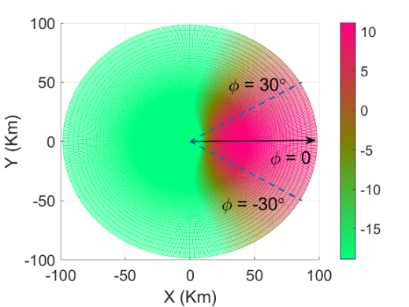

#### 7.1.1.5 Discontinuous reception

##### 7.1.1.5.0 DRX Common Definitions

FirstSlot is the First DL Slot in the subframe, which is 0 for both FDD
and TDD as per default configuration in 38.5081-1\[4\] TDD-UL-DL-Config
Table 4.6.3-192

LastDLSlot is the Last DL Slot in a frame; for FDD (except for HD-FDD)
numerology =0 it is slot 9, numerology=1 it is slot 19, numerology=2 it
is slot 39. For TDD as per default configuration in 38.5081-1\[4\]
TDD-UL-DL-Config Table 4.6.3-192, for numerology =0, it is slot 7,
numerology=1 it is slot 16, numerology=3 it is slot 77. For HD-FDD as
per default configuration in TS 38.508-1\[4\] Table 4.6.3-162, for
numerology=0, it is slot 8.

LastULSlot is the Last UL Slot in a frame; for FDD/TDD numerology =0 it
is slot 9, numerology=1 it is slot 18(Second Last as 2 Consecutive UL
Slots), numerology=3 it is slot 79; the PDCCH for UL grant is sent K2= 4
Slot earlier.

##### 7.1.1.5.1 DRX operation / Short cycle not configured / Parameters configured by RRC

##### (1) {#section .H6}

**with** { UE in RRC\_CONNECTED state }

**ensure that** {

**when** { Long DRX cycle is configured and \[(SFN \* 10) + subframe
number\] modulo (*drx-LongCycle*) = *drx-StartOffset* }

**then** { UE starts the OnDurationTimer and monitors the PDCCH for
OnDurationTimer PDCCH-Occasions }

}

##### (2) {#section-1 .H6}

**with** { UE in RRC\_CONNECTED state }

**ensure that** {

**when** { Long DRX cycle is configured and a new DL transmission is
indicated on the PDCCH during Active Time }

**then** { UE starts or restarts the Drx-InactivityTimer and monitors
the PDCCH for Drx-InactivityTimer PDCCH occasions starting from the next
PDCCH occasion of the PDCCH occasion where the DL new transmission was
indicated }

}

##### (3) {#section-2 .H6}

**with** { UE in RRC\_CONNECTED state }

**ensure that** {

**when** { Long DRX cycle is configured and if a HARQ RTT Timer expires
in this PDCCH Occasion and the data in the soft buffer of the
corresponding HARQ process was not successfully decoded }

**then** { UE starts the drx-RetransmissionTimer-DL for the
corresponding HARQ process and monitors the PDCCH for
drx-RetransmissionTimer consecutive PDCCH Occasion }

}

##### (4) {#section-3 .H6}

**with** { UE in RRC\_CONNECTED state }

**ensure that** {

**when** { Long DRX cycle is configured and an uplink grant for a
pending HARQ retransmission can occur in this PDCCH occasion }

**then** { UE monitors the PDCCH in this PDCCH occasion }

}

##### 7.1.1.5.1.2 Conformance requirements {#conformance-requirements .H6}

References: The conformance requirements covered in the present TC are
specified in: TS 38.321, clause 5.7. Unless otherwise stated these are
Rel-15 requirements.

\[TS 38.321, clause 5.7\]

The MAC entity may be configured by RRC with a DRX functionality that
controls the UE's PDCCH monitoring activity for the MAC entity\'s
C-RNTI, CS-RNTI, INT-RNTI, SFI-RNTI, SP-CSI-RNTI, TPC-PUCCH-RNTI,
TPC-PUSCH-RNTI, and TPC-SRS-RNTI. When using DRX operation, the MAC
entity shall also monitor PDCCH according to requirements found in other
subclauses of this specification. When in RRC\_CONNECTED, if DRX is
configured, the MAC entity may monitor the PDCCH discontinuously using
the DRX operation specified in this subclause; otherwise the MAC entity
shall monitor the PDCCH continuously.

RRC controls DRX operation by configuring the following timers:

\- *drx-onDurationTimer*: the duration at the beginning of a DRX Cycle;

\- *drx-SlotOffset*: the delay before starting the
*drx-onDurationTimer*;

\- *drx-InactivityTimer*: the duration after the PDCCH occasion in which
a PDCCH indicates an new UL or DL transmission for the MAC entity;

\- *drx-RetransmissionTimerDL* (per DL HARQ process): the maximum
duration until a DL retransmission is received;

\- *drx-RetransmissionTimerUL* (per UL HARQ process): the maximum
duration until a grant for UL retransmission is received;

\- *drx-LongCycle* StartOffset: the Long DRX cycle and drx-StartOffset
which defines the subframe where the Long and Short DRX Cycle starts;

\- *drx-ShortCycle* (optional): the Short DRX cycle;

\- *drx-ShortCycleTimer* (optional): the duration the UE shall follow
the Short DRX cycle;

\- *drx-HARQ-RTT-TimerDL* (per DL HARQ process): the minimum duration
before a DL assignment for HARQ retransmission is expected by the MAC
entity;

\- *drx-HARQ-RTT-TimerUL* (per UL HARQ process): the minimum duration
before a UL HARQ retransmission grant is expected by the MAC entity.

When a DRX cycle is configured, the Active Time includes the time while:

\- drx-onDurationTimer or drx-InactivityTimer or
drx-RetransmissionTimerDL or drx-RetransmissionTimerUL or
ra-ContentionResolutionTimer (as described in subclause 5.1.5) is
running; or

\- a Scheduling Request is sent on PUCCH and is pending (as described in
subclause 5.4.4); or

\- a PDCCH indicating a new transmission addressed to the C-RNTI of the
MAC entity has not been received after successful reception of a Random
Access Response for the random access preamble not selected by the MAC
entity among the contention-based Random Access Preamble (as described
in subclause 5.1.4).

When DRX is configured, the MAC entity shall:

1\> if a MAC PDU is received in a configured downlink assignment:

2\> start the *drx-HARQ-RTT-TimerDL* for the corresponding HARQ process
in the first symbol after the end of the corresponding transmission
carrying the DL HARQ feedback;

2\> stop the *drx-RetransmissionTimerDL* for the corresponding HARQ
process.

1\> if a MAC PDU is transmitted in a configured uplink grant:

2\> start the *drx-HARQ-RTT-TimerUL* for the corresponding HARQ process
in the first symbol after the end of the first repetition of the
corresponding PUSCH transmission;

2\> stop the *drx-RetransmissionTimerUL* for the corresponding HARQ
process.

1\> if a *drx-HARQ-RTT-TimerDL* expires:

2\> if the data of the corresponding HARQ process was not successfully
decoded:

3\> start the *drx-RetransmissionTimerDL* for the corresponding HARQ
process.

1\> if an *drx-HARQ-RTT-TimerUL* expires:

2\> start the *drx-RetransmissionTimerUL* for the corresponding HARQ
process.

1\> if a DRX Command MAC CE or a Long DRX Command MAC CE is received:

2\> stop *drx-onDurationTimer*;

2\> stop *drx-InactivityTimer*.

1\> if *drx-InactivityTimer* expires or a DRX Command MAC CE is
received:

2\> if the Short DRX cycle is configured:

3\> start or restart *drx-ShortCycleTimer in the first symbol after the
expiry of drx-HARQ-RTT-TimerDL.*;

3\> use the Short DRX Cycle.

2\> else:

3\> use the Long DRX cycle.

1\> if *drx-ShortCycleTimer* expires:

2\> use the Long DRX cycle.

1\> if a Long DRX Command MAC CE is received:

2\> stop *drx-ShortCycleTimer*;

2\> use the Long DRX cycle.

1\> if the Short DRX Cycle is used, and \[(SFN x 10) + subframe number\]
modulo (*drx-ShortCycle*) = (*drx-StartOffset*) modulo
(*drx-ShortCycle*); or

1\> if the Long DRX Cycle is used, and \[(SFN x 10) + subframe number\]
modulo (*drx-LongCycle*) = *drx-StartOffset*:

2\> if *drx-SlotOffset* is configured:

3\> start *drx-onDurationTimer* after *drx-SlotOffset from the beginning
of the subframe*.

2\> else:

3\> start *drx-onDurationTimer*.

1\> if the MAC entity is in Active Time:

2\> monitor the PDCCH;

2\> if the PDCCH indicates a DL transmission or if a DL assignment has
been configured:

3\> start the *drx-HARQ-RTT-TimerDL* for the corresponding HARQ process
immediately after the corresponding PUCCH transmission;

3\> stop the *drx-RetransmissionTimerDL* for the corresponding HARQ
process.

2\> if the PDCCH indicates a UL transmission or if a UL grant has been
configured:

3\> start the *drx-HARQ-RTT-TimerUL* for the corresponding HARQ process
immediately after the first repetition of the corresponding PUSCH
transmission;

3\> stop the *drx-RetransmissionTimerUL* for the corresponding HARQ
process.

2\> if the PDCCH indicates a new transmission (DL or UL):

3\> start or restart *drx-InactivityTimer*.

1\> else (i.e. not part of the Active Time):

2\> not report CQI/PMI/RI on PUCCH.

##### 7.1.1.5.1.3 Test description {#test-description .H6}

##### 7.1.1.5.1.3.1 Pre-test conditions {#pre-test-conditions .H6}

Same Pre-test conditions as in clause 7.1.1.0 except that set to return
no data in uplink.

##### 7.1.1.5.1.3.2 Test procedure sequence {#test-procedure-sequence .H6}

Table 7.1.1.5.1.3.2-1: Main behaviour

+-----------+-----------+-----------+-----------+---------+----+
| St        | Procedure | Message   | TP        | Verdict |    |
|           |           | Sequence  |           |         |    |
+===========+===========+===========+===========+=========+====+
|           |           | U - S     | Message   |         |    |
+-----------+-----------+-----------+-----------+---------+----+
| 1         | SS        | \<\--     | \-        | \-      | \- |
|           | transmits |           |           |         |    |
|           | RRCReconf |           |           |         |    |
|           | iguration |           |           |         |    |
|           | to        |           |           |         |    |
|           | configure |           |           |         |    |
|           | specific  |           |           |         |    |
|           | DRX       |           |           |         |    |
|           | pa        |           |           |         |    |
|           | rameters. |           |           |         |    |
|           | (Note 6)  |           |           |         |    |
+-----------+-----------+-----------+-----------+---------+----+
| 2         | The UE    | \--\>     | \-        | \-      | \- |
|           | transmits |           |           |         |    |
|           | RRCReconf |           |           |         |    |
|           | iguration |           |           |         |    |
|           | Complete. |           |           |         |    |
|           | (Note 7)  |           |           |         |    |
+-----------+-----------+-----------+-----------+---------+----+
| 3         | In the    | \<\--     | MAC PDU   | \-      | \- |
|           | first     |           |           |         |    |
|           | PDCCH     |           |           |         |    |
|           | occasion  |           |           |         |    |
|           | when the  |           |           |         |    |
|           | *Dr       |           |           |         |    |
|           | x-onDurat |           |           |         |    |
|           | ionTimer* |           |           |         |    |
|           | is        |           |           |         |    |
|           | running,  |           |           |         |    |
|           | the SS    |           |           |         |    |
|           | indicates |           |           |         |    |
|           | the       |           |           |         |    |
|           | tra       |           |           |         |    |
|           | nsmission |           |           |         |    |
|           | of a DL   |           |           |         |    |
|           | MAC PDU   |           |           |         |    |
|           | on the    |           |           |         |    |
|           | PDCCH.    |           |           |         |    |
+-----------+-----------+-----------+-----------+---------+----+
| 4         | Check:    | \--\>     | HARQ ACK  | 1       | P  |
|           | Does the  |           |           |         |    |
|           | UE        |           |           |         |    |
|           | transmit  |           |           |         |    |
|           | a HARQ    |           |           |         |    |
|           | ACK for   |           |           |         |    |
|           | the DL    |           |           |         |    |
|           | MAC PDU   |           |           |         |    |
|           | in Step   |           |           |         |    |
|           | 3?        |           |           |         |    |
+-----------+-----------+-----------+-----------+---------+----+
| 5         | At least  | \<\--     | MAC PDU   | \-      | \- |
|           | d         |           |           |         |    |
|           | rx-Inacti |           |           |         |    |
|           | vityTimer |           |           |         |    |
|           | PDCCH     |           |           |         |    |
|           | occasions |           |           |         |    |
|           | after the |           |           |         |    |
|           | tra       |           |           |         |    |
|           | nsmission |           |           |         |    |
|           | of the    |           |           |         |    |
|           | MAC PDU   |           |           |         |    |
|           | in Step 3 |           |           |         |    |
|           | has been  |           |           |         |    |
|           | indicated |           |           |         |    |
|           | (This     |           |           |         |    |
|           | means the |           |           |         |    |
|           | next DRX  |           |           |         |    |
|           | cycle or  |           |           |         |    |
|           | later     |           |           |         |    |
|           | after     |           |           |         |    |
|           | Step 2)   |           |           |         |    |
|           | in the    |           |           |         |    |
|           | last      |           |           |         |    |
|           | PDCCH     |           |           |         |    |
|           | occasion  |           |           |         |    |
|           | while the |           |           |         |    |
|           | *dr       |           |           |         |    |
|           | x-onDurat |           |           |         |    |
|           | ionTimer* |           |           |         |    |
|           | is still  |           |           |         |    |
|           | running,  |           |           |         |    |
|           | the SS    |           |           |         |    |
|           | indicates |           |           |         |    |
|           | the       |           |           |         |    |
|           | tra       |           |           |         |    |
|           | nsmission |           |           |         |    |
|           | a DL MAC  |           |           |         |    |
|           | PDU on    |           |           |         |    |
|           | the       |           |           |         |    |
|           | PDDCH.    |           |           |         |    |
|           | (Note 4). |           |           |         |    |
+-----------+-----------+-----------+-----------+---------+----+
| 6         | Check:    | \--\>     | HARQ ACK  | 1       | P  |
|           | Does the  |           |           |         |    |
|           | UE        |           |           |         |    |
|           | transmit  |           |           |         |    |
|           | a HARQ    |           |           |         |    |
|           | ACK for   |           |           |         |    |
|           | the DL    |           |           |         |    |
|           | MAC PDU   |           |           |         |    |
|           | in Step   |           |           |         |    |
|           | 5?        |           |           |         |    |
+-----------+-----------+-----------+-----------+---------+----+
| 7         | d         | \<\--     | MAC PDU   | \-      | \- |
|           | rx-Inacti |           |           |         |    |
|           | vityTimer |           |           |         |    |
|           | PDCCH-    |           |           |         |    |
|           | occasions |           |           |         |    |
|           | after the |           |           |         |    |
|           | tra       |           |           |         |    |
|           | nsmission |           |           |         |    |
|           | of the    |           |           |         |    |
|           | MAC PDU   |           |           |         |    |
|           | tr        |           |           |         |    |
|           | ansmitted |           |           |         |    |
|           | in step 5 |           |           |         |    |
|           | was       |           |           |         |    |
|           | indicated |           |           |         |    |
|           | on the    |           |           |         |    |
|           | PDCCH,    |           |           |         |    |
|           | the SS    |           |           |         |    |
|           | indicates |           |           |         |    |
|           | the       |           |           |         |    |
|           | tra       |           |           |         |    |
|           | nsmission |           |           |         |    |
|           | of a DL   |           |           |         |    |
|           | MAC PDU   |           |           |         |    |
|           | on the    |           |           |         |    |
|           | PDCCH.    |           |           |         |    |
|           | (Note 4)  |           |           |         |    |
+-----------+-----------+-----------+-----------+---------+----+
| 8         | Check:    | \--\>     | HARQ ACK  | 2       | P  |
|           | Does the  |           |           |         |    |
|           | UE        |           |           |         |    |
|           | transmit  |           |           |         |    |
|           | a HARQ    |           |           |         |    |
|           | ACK for   |           |           |         |    |
|           | the DL    |           |           |         |    |
|           | MAC PDU   |           |           |         |    |
|           | in Step   |           |           |         |    |
|           | 7?        |           |           |         |    |
+-----------+-----------+-----------+-----------+---------+----+
| 9         | At least  | \<\--     | Invalid   | \-      | \- |
|           | d         |           | MAC PDU   |         |    |
|           | rx-Inacti |           |           |         |    |
|           | vityTimer |           |           |         |    |
|           | PDCCH     |           |           |         |    |
|           | occasions |           |           |         |    |
|           | after the |           |           |         |    |
|           | tra       |           |           |         |    |
|           | nsmission |           |           |         |    |
|           | of the    |           |           |         |    |
|           | MAC PDU   |           |           |         |    |
|           | in Step 7 |           |           |         |    |
|           | has been  |           |           |         |    |
|           | indicated |           |           |         |    |
|           | (This     |           |           |         |    |
|           | means the |           |           |         |    |
|           | next DRX  |           |           |         |    |
|           | cycle or  |           |           |         |    |
|           | later     |           |           |         |    |
|           | after     |           |           |         |    |
|           | Step 5)   |           |           |         |    |
|           | and in    |           |           |         |    |
|           | the last  |           |           |         |    |
|           | PDCCH     |           |           |         |    |
|           | occasion  |           |           |         |    |
|           | before    |           |           |         |    |
|           | the       |           |           |         |    |
|           | *Dr       |           |           |         |    |
|           | x-onDurat |           |           |         |    |
|           | ionTimer* |           |           |         |    |
|           | expires,  |           |           |         |    |
|           | the SS    |           |           |         |    |
|           | indicates |           |           |         |    |
|           | the       |           |           |         |    |
|           | tra       |           |           |         |    |
|           | nsmission |           |           |         |    |
|           | of a DL   |           |           |         |    |
|           | MAC PDU   |           |           |         |    |
|           | on the    |           |           |         |    |
|           | PDDCH.    |           |           |         |    |
|           | The DL    |           |           |         |    |
|           | MAC PDU   |           |           |         |    |
|           | tr        |           |           |         |    |
|           | ansmitted |           |           |         |    |
|           | is        |           |           |         |    |
|           | invalid.  |           |           |         |    |
|           | (Note 1,  |           |           |         |    |
|           | Note 4)   |           |           |         |    |
+-----------+-----------+-----------+-----------+---------+----+
| 10        | Check:    | \--\>     | HARQ NACK | 1       | P  |
|           | Does the  |           |           |         |    |
|           | UE        |           |           |         |    |
|           | transmit  |           |           |         |    |
|           | a HARQ    |           |           |         |    |
|           | NACK for  |           |           |         |    |
|           | the DL    |           |           |         |    |
|           | MAC PDU   |           |           |         |    |
|           | in Step   |           |           |         |    |
|           | 9?        |           |           |         |    |
+-----------+-----------+-----------+-----------+---------+----+
| 11        | In the    | \<\--     | MAC PDU   | \-      | \- |
|           | first     |           |           |         |    |
|           | PDCCH     |           |           |         |    |
|           | occasion  |           |           |         |    |
|           | when the  |           |           |         |    |
|           | Drx-Ret   |           |           |         |    |
|           | ransmissi |           |           |         |    |
|           | onTimerDL |           |           |         |    |
|           | for the   |           |           |         |    |
|           | MAC PDU   |           |           |         |    |
|           | in Step 9 |           |           |         |    |
|           | is        |           |           |         |    |
|           | started   |           |           |         |    |
|           | (i.e.     |           |           |         |    |
|           | after     |           |           |         |    |
|           | expiry of |           |           |         |    |
|           | *dr       |           |           |         |    |
|           | x-HARQ-RT |           |           |         |    |
|           | T-TimerDL |           |           |         |    |
|           | after     |           |           |         |    |
|           | step 9)*, |           |           |         |    |
|           | the SS    |           |           |         |    |
|           | indicates |           |           |         |    |
|           | the       |           |           |         |    |
|           | tra       |           |           |         |    |
|           | nsmission |           |           |         |    |
|           | of a DL   |           |           |         |    |
|           | MAC PDU   |           |           |         |    |
|           | on the    |           |           |         |    |
|           | PDCCH.    |           |           |         |    |
+-----------+-----------+-----------+-----------+---------+----+
| 12        | Check:    | \--\>     | HARQ ACK  | 3       | P  |
|           | Does the  |           |           |         |    |
|           | UE        |           |           |         |    |
|           | transmit  |           |           |         |    |
|           | a HARQ    |           |           |         |    |
|           | ACK for   |           |           |         |    |
|           | the DL    |           |           |         |    |
|           | MAC PDU   |           |           |         |    |
|           | in Step   |           |           |         |    |
|           | 11?       |           |           |         |    |
+-----------+-----------+-----------+-----------+---------+----+
| 13        | At least  | \<\--     | Invalid   | \-      | \- |
|           | d         |           | MAC PDU   |         |    |
|           | rx-Inacti |           |           |         |    |
|           | vityTimer |           |           |         |    |
|           | PDCCH     |           |           |         |    |
|           | occasions |           |           |         |    |
|           | after the |           |           |         |    |
|           | tra       |           |           |         |    |
|           | nsmission |           |           |         |    |
|           | of the DL |           |           |         |    |
|           | MAC PDU   |           |           |         |    |
|           | in Step   |           |           |         |    |
|           | 11 has    |           |           |         |    |
|           | been      |           |           |         |    |
|           | indicated |           |           |         |    |
|           | (This     |           |           |         |    |
|           | means the |           |           |         |    |
|           | next DRX  |           |           |         |    |
|           | cycle or  |           |           |         |    |
|           | later     |           |           |         |    |
|           | after     |           |           |         |    |
|           | Step 11)  |           |           |         |    |
|           | and last  |           |           |         |    |
|           | PDCCH     |           |           |         |    |
|           | occasion  |           |           |         |    |
|           | before    |           |           |         |    |
|           | the       |           |           |         |    |
|           | *Dr       |           |           |         |    |
|           | x-onDurat |           |           |         |    |
|           | ionTimer* |           |           |         |    |
|           | expires,  |           |           |         |    |
|           | the SS    |           |           |         |    |
|           | indicates |           |           |         |    |
|           | the       |           |           |         |    |
|           | tra       |           |           |         |    |
|           | nsmission |           |           |         |    |
|           | of DL MAC |           |           |         |    |
|           | PDU on    |           |           |         |    |
|           | the       |           |           |         |    |
|           | PDCCH.    |           |           |         |    |
|           | The DL    |           |           |         |    |
|           | MAC PDU   |           |           |         |    |
|           | tr        |           |           |         |    |
|           | ansmitted |           |           |         |    |
|           | is        |           |           |         |    |
|           | invalid.  |           |           |         |    |
|           | (Note 1,  |           |           |         |    |
|           | Note 4)   |           |           |         |    |
+-----------+-----------+-----------+-----------+---------+----+
| 14        | Check:    | \--\>     | HARQ NACK | 1       | P  |
|           | Does the  |           |           |         |    |
|           | UE        |           |           |         |    |
|           | transmit  |           |           |         |    |
|           | a HARQ    |           |           |         |    |
|           | NACK for  |           |           |         |    |
|           | the DL    |           |           |         |    |
|           | MAC PDU   |           |           |         |    |
|           | in Step   |           |           |         |    |
|           | 13?       |           |           |         |    |
+-----------+-----------+-----------+-----------+---------+----+
| 15        | In the    | \<\--     | MAC PDU   | \-      | \- |
|           | last      |           |           |         |    |
|           | PDCCH     |           |           |         |    |
|           | occasion  |           |           |         |    |
|           | when the  |           |           |         |    |
|           | drx-Ret   |           |           |         |    |
|           | ransmissi |           |           |         |    |
|           | onTimerDL |           |           |         |    |
|           | for MAC   |           |           |         |    |
|           | PDU in    |           |           |         |    |
|           | Step 13   |           |           |         |    |
|           | is still  |           |           |         |    |
|           | running,  |           |           |         |    |
|           | the SS    |           |           |         |    |
|           | indicates |           |           |         |    |
|           | the       |           |           |         |    |
|           | tra       |           |           |         |    |
|           | nsmission |           |           |         |    |
|           | of a DL   |           |           |         |    |
|           | MAC PDU   |           |           |         |    |
|           | on the    |           |           |         |    |
|           | PDCCH.    |           |           |         |    |
+-----------+-----------+-----------+-----------+---------+----+
| 16        | Check:    | \--\>     | HARQ ACK  | 3       | P  |
|           | Does the  |           |           |         |    |
|           | UE        |           |           |         |    |
|           | transmit  |           |           |         |    |
|           | a HARQ    |           |           |         |    |
|           | ACK for   |           |           |         |    |
|           | the DL    |           |           |         |    |
|           | MAC PDU   |           |           |         |    |
|           | in Step   |           |           |         |    |
|           | 15?       |           |           |         |    |
+-----------+-----------+-----------+-----------+---------+----+
| 17        | The SS is | \<\--     | UL grant  | \-      | \- |
|           | c         |           | on PDCCH  |         |    |
|           | onfigured |           |           |         |    |
|           | for       |           |           |         |    |
|           | Uplink    |           |           |         |    |
|           | Grant     |           |           |         |    |
|           | A         |           |           |         |    |
|           | llocation |           |           |         |    |
|           | Type      |           |           |         |    |
|           | \[0\]. At |           |           |         |    |
|           | least     |           |           |         |    |
|           | d         |           |           |         |    |
|           | rx-Inacti |           |           |         |    |
|           | vityTimer |           |           |         |    |
|           | PDCCH     |           |           |         |    |
|           | subframes |           |           |         |    |
|           | after the |           |           |         |    |
|           | tra       |           |           |         |    |
|           | nsmission |           |           |         |    |
|           | of the DL |           |           |         |    |
|           | MAC PDU   |           |           |         |    |
|           | in Step   |           |           |         |    |
|           | 15 has    |           |           |         |    |
|           | been      |           |           |         |    |
|           | indicated |           |           |         |    |
|           | in the    |           |           |         |    |
|           | last      |           |           |         |    |
|           | PDCCH     |           |           |         |    |
|           | occasion  |           |           |         |    |
|           | when the  |           |           |         |    |
|           | onDurat   |           |           |         |    |
|           | iopnTimer |           |           |         |    |
|           | is still  |           |           |         |    |
|           | running   |           |           |         |    |
|           | (This     |           |           |         |    |
|           | means the |           |           |         |    |
|           | next DRX  |           |           |         |    |
|           | cycle or  |           |           |         |    |
|           | later     |           |           |         |    |
|           | after     |           |           |         |    |
|           | Step 9),  |           |           |         |    |
|           | the SS    |           |           |         |    |
|           | indicates |           |           |         |    |
|           | an UL     |           |           |         |    |
|           | grant to  |           |           |         |    |
|           | the UE on |           |           |         |    |
|           | the       |           |           |         |    |
|           | PDCCH.    |           |           |         |    |
|           | (Note 4)  |           |           |         |    |
+-----------+-----------+-----------+-----------+---------+----+
| 18        | Check:    | \--\>     | Buffer    | 1       | P  |
|           | Does the  |           | Status    |         |    |
|           | UE        |           | Report    |         |    |
|           | transmit  |           | MAC       |         |    |
|           | a Buffer  |           | control   |         |    |
|           | Status    |           | element   |         |    |
|           | Report on |           |           |         |    |
|           | the UL    |           |           |         |    |
|           | i         |           |           |         |    |
|           | ndicating |           |           |         |    |
|           | an empty  |           |           |         |    |
|           | buffer?   |           |           |         |    |
+-----------+-----------+-----------+-----------+---------+----+
| 19        | In the    | \<\--     | MAC PDU   | \-      | \- |
|           | last      |           |           |         |    |
|           | PDCCH     |           |           |         |    |
|           | occasion  |           |           |         |    |
|           | when the  |           |           |         |    |
|           | drx-Retr  |           |           |         |    |
|           | ansmissio |           |           |         |    |
|           | nTimer-UL |           |           |         |    |
|           | for MAC   |           |           |         |    |
|           | PDU from  |           |           |         |    |
|           | Step 17   |           |           |         |    |
|           | is still  |           |           |         |    |
|           | running,  |           |           |         |    |
|           | the SS    |           |           |         |    |
|           | indicates |           |           |         |    |
|           | the       |           |           |         |    |
|           | tra       |           |           |         |    |
|           | nsmission |           |           |         |    |
|           | of a DL   |           |           |         |    |
|           | MAC PDU   |           |           |         |    |
|           | on the    |           |           |         |    |
|           | PDCCH.    |           |           |         |    |
+-----------+-----------+-----------+-----------+---------+----+
| 20        | Check:    | \--\>     | HARQ ACK  | 4       | P  |
|           | Does the  |           |           |         |    |
|           | UE        |           |           |         |    |
|           | transmit  |           |           |         |    |
|           | a HARQ    |           |           |         |    |
|           | ACK for   |           |           |         |    |
|           | the DL    |           |           |         |    |
|           | MAC PDU   |           |           |         |    |
|           | in Step   |           |           |         |    |
|           | 19?       |           |           |         |    |
+-----------+-----------+-----------+-----------+---------+----+
| Note 1:   |           |           |           |         |    |
| Invalid   |           |           |           |         |    |
| MAC PDU   |           |           |           |         |    |
| is a MAC  |           |           |           |         |    |
| PDU that  |           |           |           |         |    |
| fails the |           |           |           |         |    |
| CRC       |           |           |           |         |    |
| check.    |           |           |           |         |    |
|           |           |           |           |         |    |
| Note 2:   |           |           |           |         |    |
| All the   |           |           |           |         |    |
| DL MAC    |           |           |           |         |    |
| PDU are   |           |           |           |         |    |
| tr        |           |           |           |         |    |
| ansmitted |           |           |           |         |    |
| with the  |           |           |           |         |    |
| NDI set   |           |           |           |         |    |
| on the    |           |           |           |         |    |
| PDCCH.    |           |           |           |         |    |
|           |           |           |           |         |    |
| Note 3:   |           |           |           |         |    |
| Timer     |           |           |           |         |    |
| t         |           |           |           |         |    |
| olerances |           |           |           |         |    |
| for the   |           |           |           |         |    |
| MAC DRX   |           |           |           |         |    |
| related   |           |           |           |         |    |
| timers    |           |           |           |         |    |
| measured  |           |           |           |         |    |
| in PDCCH  |           |           |           |         |    |
| occasions |           |           |           |         |    |
| is 0.     |           |           |           |         |    |
| These     |           |           |           |         |    |
| timers    |           |           |           |         |    |
| are:      |           |           |           |         |    |
| dr        |           |           |           |         |    |
| x-Inactiv |           |           |           |         |    |
| ityTimer, |           |           |           |         |    |
| drx-Retr  |           |           |           |         |    |
| ansmissio |           |           |           |         |    |
| nTimerDL, |           |           |           |         |    |
| drx-Retr  |           |           |           |         |    |
| ansmissio |           |           |           |         |    |
| nTimerUL, |           |           |           |         |    |
| dr        |           |           |           |         |    |
| x-HARQ-RT |           |           |           |         |    |
| T-TimerDL |           |           |           |         |    |
| and       |           |           |           |         |    |
| drx       |           |           |           |         |    |
| -HARQ-RTT |           |           |           |         |    |
| -TimerUL. |           |           |           |         |    |
|           |           |           |           |         |    |
| Note 4:   |           |           |           |         |    |
| The       |           |           |           |         |    |
| d         |           |           |           |         |    |
| rx-Inacti |           |           |           |         |    |
| vityTimer |           |           |           |         |    |
| is        |           |           |           |         |    |
| started   |           |           |           |         |    |
| in the    |           |           |           |         |    |
| next      |           |           |           |         |    |
| PDCCH     |           |           |           |         |    |
| occasion  |           |           |           |         |    |
| of the    |           |           |           |         |    |
| PDCCH     |           |           |           |         |    |
| occasion  |           |           |           |         |    |
| where DL  |           |           |           |         |    |
| new       |           |           |           |         |    |
| tra       |           |           |           |         |    |
| nsmission |           |           |           |         |    |
| is        |           |           |           |         |    |
| i         |           |           |           |         |    |
| ndicated. |           |           |           |         |    |
|           |           |           |           |         |    |
| Note 5:   |           |           |           |         |    |
| The timer |           |           |           |         |    |
| values    |           |           |           |         |    |
| expressed |           |           |           |         |    |
| in number |           |           |           |         |    |
| of slots. |           |           |           |         |    |
|           |           |           |           |         |    |
| Note 6:   |           |           |           |         |    |
| For EN-DC |           |           |           |         |    |
| the NR    |           |           |           |         |    |
| RRCReconf |           |           |           |         |    |
| iguration |           |           |           |         |    |
| message   |           |           |           |         |    |
| is        |           |           |           |         |    |
| contained |           |           |           |         |    |
| in        |           |           |           |         |    |
| R         |           |           |           |         |    |
| RCConnect |           |           |           |         |    |
| ionReconf |           |           |           |         |    |
| iguration |           |           |           |         |    |
| 36.508    |           |           |           |         |    |
| \[7\],    |           |           |           |         |    |
| Table     |           |           |           |         |    |
| 4.6.1-8   |           |           |           |         |    |
| using     |           |           |           |         |    |
| condition |           |           |           |         |    |
| EN-DC\_   |           |           |           |         |    |
| EmbedNR\_ |           |           |           |         |    |
| RRCRecon. |           |           |           |         |    |
|           |           |           |           |         |    |
| Note 7:   |           |           |           |         |    |
| For EN-DC |           |           |           |         |    |
| the NR    |           |           |           |         |    |
| *         |           |           |           |         |    |
| RRCReconf |           |           |           |         |    |
| iguration |           |           |           |         |    |
| Complete* |           |           |           |         |    |
| message   |           |           |           |         |    |
| is        |           |           |           |         |    |
| contained |           |           |           |         |    |
| in        |           |           |           |         |    |
| *RR       |           |           |           |         |    |
| CConnecti |           |           |           |         |    |
| onReconfi |           |           |           |         |    |
| gurationC |           |           |           |         |    |
| omplete.* |           |           |           |         |    |
+-----------+-----------+-----------+-----------+---------+----+

##### 7.1.1.5.1.3.3 Specific message contents {#specific-message-contents .H6}

Table 7.1.1.5.1.3.3-1: *RRCReconfiguration* (step 1, Table
7.1.1.5.1.3.2-1)

  ---------------------------------------------------- ------------------- --------- -----------
  Derivation Path: TS 38.508-1 \[4\], Table 4.6.1-13                                 
  Information Element                                  Value/remark        Comment   Condition
  RRCReconfiguration ::= SEQUENCE {                                                  
  criticalExtensions CHOICE {                                                        
  rrcReconfiguration SEQUENCE {                                                      
  radioBearerConfig                                    RadioBearerConfig             NR
  secondaryCellGroup                                   CellGroupConfig               EN-DC
  nonCriticalExtension SEQUENCE {                                                    NR
  masterCellGroup                                      CellGroupConfig               
  }                                                                                  
  }                                                                                  
  }                                                                                  
  }                                                                                  
  ---------------------------------------------------- ------------------- --------- -----------

Table 7.1.1.5.1.3.3-2: *CellGroupConfig* (Table 7.1.1.5.1.3.3-1)

  ---------------------------------------------------- -------------- ------------------------------------------------------- --------------------------------
  Derivation Path: TS 38.508-1 \[4\], Table 4.6.3-19                                                                          
  Information Element                                  Value/remark   Comment                                                 Condition
  CellGroupConfig ::= SEQUENCE {                                                                                              
  mac-CellGroupConfig SEQUENCE {                                                                                              
  drx-Config CHOICE {                                                                                                         
  setup SEQUENCE {                                                                                                            
  drx-onDurationTimer                                  ms20                                                                   
  drx-InactivityTimer                                  ms10                                                                   
  drx-HARQ-RTT-TimerDL                                 56             Number of slots=4 due to number of symbol per slot=14   =0,1,2,3,4 ( 2 with normal CP)
                                                       48             Number of slots=4 due to number of symbol per slot=12   = 2 with external CP
  drx-HARQ-RTT-TimerUL                                 56             Number of slots=4 due to number of symbol per slot=14   =0,1,2,3,4 ( 2 with normal CP)
                                                       48             Number of slots=4 due to number of symbol per slot=12   = 2 with external CP
  drx-RetransmissionTimerDL                            sl8                                                                    
  drx-RetransmissionTimerUL                            sl8                                                                    
  drx-LongCycleStartOffset CHOICE {                                                                                           
  ms640                                                7                                                                      
  }                                                                                                                           
  shortDRX                                             Not present                                                            
  drx-SlotOffset                                       ms0                                                                    
  }                                                                                                                           
  }                                                                                                                           
  }                                                                                                                           
  }                                                                                                                           
  ---------------------------------------------------- -------------- ------------------------------------------------------- --------------------------------

##### 7.1.1.5.2 DRX operation / Short cycle not configured / Long DRX command MAC control element reception

##### 7.1.1.5.2.1 Test Purpose (TP) {#test-purpose-tp .H6}

##### (1) {#section-4 .H6}

**with** { UE in CONNECTED mode }

**ensure that** {

**when** { long DRX cycle is configured and a DRX Command MAC control
element is received }

**then** { UE successfully decodes the MAC control PDU }

}

##### (2) {#section-5 .H6}

**with** { UE in CONNECTED mode }

**ensure that** {

**when** { long DRX cycle is configured **and** the HARQ RTT Timer is
running and a DRX Command MAC control element is received }

**then** { UE continues running the HARQ RTT timer }

}

##### (3) {#section-6 .H6}

**with** { UE in CONNECTED mode }

**ensure that** {

**when** { long DRX cycle is configured **and** the
drx-RetransmissionTimer is running and a DRX Command MAC control element
is received }

**then** { UE continues running the drx-RetransmissionTimer and monitors
the PDCCH }

}

##### 7.1.1.5.2.2 Conformance requirements {#conformance-requirements-1 .H6}

References: The conformance requirements covered in the present TC are
specified in: TS 38.321, clause 5.7. Unless otherwise stated these are
Rel-15 requirements.

\[TS 38.321, clause 5.7\]

The MAC entity may be configured by RRC with a DRX functionality that
controls the UE's PDCCH monitoring. Activity for the MAC entity\'s
C-RNTI, CS-RNTI, INT-RNTI, SFI-RNTI, SP-CSI-RNTI, TPC-PUCCH-RNTI,
TPC-PUSCH-RNTI, and TPC-SRS-RNTI. When using DRX operation, the MAC
entity shall also monitor PDCCH according to requirements found in other
subclauses of this specification. When in RRC\_CONNECTED, if DRX is
configured, the MAC entity may monitor the PDCCH discontinuously using
the DRX operation specified in this subclause; otherwise the MAC entity
shall monitor the PDCCH continuously.

RRC controls DRX operation by configuring the following timers:

\- *drx-onDurationTimer*: the duration at the beginning of a DRX Cycle;

\- *drx-SlotOffset*: the delay before starting the
*drx-onDurationTimer*;

\- *drx-InactivityTimer*: the duration after the PDCCH occasion in which
a PDCCH indicates a new UL or DL transmission for the MAC entity;

\- *drx-RetransmissionTimerDL* (per DL HARQ process): the maximum
duration until a DL retransmission is received;

\- *drx-RetransmissionTimerUL* (per UL HARQ process): the maximum
duration until a grant for UL retransmission is received;

\- *drx-LongCycle* StartOffset: the Long DRX cycle and drx-StartOffset
which defines the subframe where the Long and Short DRX Cycle starts;

\- *drx-ShortCycle* (optional): the Short DRX cycle;

\- *drx-ShortCycleTimer* (optional): the duration the UE shall follow
the Short DRX cycle;

\- *drx-HARQ-RTT-TimerDL* (per DL HARQ process): the minimum duration
before a DL assignment for HARQ retransmission is expected by the MAC
entity;

\- *drx-HARQ-RTT-TimerUL* (per UL HARQ process): the minimum duration
before a UL HARQ retransmission grant is expected by the MAC entity.

When a DRX cycle is configured, the Active Time includes the time while:

\- drx-onDurationTimer or drx-InactivityTimer or
drx-RetransmissionTimerDL or drx-RetransmissionTimerUL or
ra-ContentionResolutionTimer (as described in subclause 5.1.5) is
running; or

\- a Scheduling Request is sent on PUCCH and is pending (as described in
subclause 5.4.4); or

\- a PDCCH indicating a new transmission addressed to the C-RNTI of the
MAC entity has not been received after successful reception of a Random
Access Response for the random access preamble not selected by the MAC
entity among the contention-based Random Access Preamble (as described
in subclause 5.1.4).

When DRX is configured, the MAC entity shall:

1\> if a MAC PDU is received in a configured downlink assignment:

2\> start the *drx-HARQ-RTT-TimerDL* for the corresponding HARQ process
in the first symbol after the end of the corresponding transmission
carrying the DL HARQ feedback;

2\> stop the *drx-RetransmissionTimerDL* for the corresponding HARQ
process.

1\> if a MAC PDU is transmitted in a configured uplink grant:

2\> start the *drx-HARQ-RTT-TimerUL* for the corresponding HARQ process
in the first symbol after the end of the first repetition of the
corresponding PUSCH transmission;

2\> stop the *drx-RetransmissionTimerUL* for the corresponding HARQ
process.

1\> if a *drx-HARQ-RTT-TimerDL* expires:

2\> if the data of the corresponding HARQ process was not successfully
decoded:

3\> start the *drx-RetransmissionTimerDL* for the corresponding HARQ
process.

1\> if an *drx-HARQ-RTT-TimerUL* expires:

2\> start the *drx-RetransmissionTimerUL* for the corresponding HARQ
process.

1\> if a DRX Command MAC CE or a Long DRX Command MAC CE is received:

2\> stop *drx-onDurationTimer*;

2\> stop *drx-InactivityTimer*.

1\> if *drx-InactivityTimer* expires or a DRX Command MAC CE is
received:

2\> if the Short DRX cycle is configured:

3\> start or restart *drx-ShortCycleTimer in the first symbol after the
expiry of drx-HARQ-RTT-TimerDL.*;

3\> use the Short DRX Cycle.

2\> else:

3\> use the Long DRX cycle.

1\> if *drx-ShortCycleTimer* expires:

2\> use the Long DRX cycle.

1\> if a Long DRX Command MAC CE is received:

2\> stop *drx-ShortCycleTimer*;

2\> use the Long DRX cycle.

1\> if the Short DRX Cycle is used, and \[(SFN x 10) + subframe number\]
modulo (*drx-ShortCycle*) = (*drx-StartOffset*) modulo
(*drx-ShortCycle*); or

1\> if the Long DRX Cycle is used, and \[(SFN x 10) + subframe number\]
modulo (*drx-LongCycle*) = *drx-StartOffset*:

2\> if *drx-SlotOffset* is configured:

3\> start *drx-onDurationTimer* after *drx-SlotOffset from the beginning
of the subframe*.

2\> else:

3\> start *drx-onDurationTimer*.

1\> if the MAC entity is in Active Time:

2\> monitor the PDCCH;

2\> if the PDCCH indicates a DL transmission or if a DL assignment has
been configured:

3\> start the *drx-HARQ-RTT-TimerDL* for the corresponding HARQ process
immediately after the corresponding PUCCH transmission;

3\> stop the *drx-RetransmissionTimerDL* for the corresponding HARQ
process.

2\> if the PDCCH indicates a UL transmission or if a UL grant has been
configured:

3\> start the *drx-HARQ-RTT-TimerUL* for the corresponding HARQ process
immediately after the first repetition of the corresponding PUSCH
transmission;

3\> stop the *drx-RetransmissionTimerUL* for the corresponding HARQ
process.

2\> if the PDCCH indicates a new transmission (DL or UL):

3\> start or restart *drx-InactivityTimer*.

1\> else (i.e. not part of the Active Time):

2\> not report CQI/PMI/RI on PUCCH.

##### 7.1.1.5.2.3 Test description {#test-description-1 .H6}

##### 7.1.1.5.2.3.1 Pre-test conditions {#pre-test-conditions-1 .H6}

Same Pre-test conditions as in clause 7.1.1.0 except that set to return
no data in uplink.

##### 7.1.1.5.2.3.2 Test procedure sequence {#test-procedure-sequence-1 .H6}

For FDD, *NormalSLT*(current SFN,current sub-frame, current slot,y)=y;
For TDD, *NormalSLT*(current SFN, current slot,y) counts the minimum
number of normal slots needed to cover y number of
PDCCH-occasions(slots) until next PDCCH-occasion(slot) available,
starting from current slot on current SFN.

Table 7.1.1.5.2.3.2-1: Main behaviour

+-----------+-----------+-----------+-----------+---------+----+
| St        | Procedure | Message   | TP        | Verdict |    |
|           |           | Sequence  |           |         |    |
+===========+===========+===========+===========+=========+====+
|           |           | U - S     | Message   |         |    |
+-----------+-----------+-----------+-----------+---------+----+
| 1         | SS        | \<\--     | \-        | \-      | \- |
|           | transmits |           |           |         |    |
|           | RRCReconf |           |           |         |    |
|           | iguration |           |           |         |    |
|           | to        |           |           |         |    |
|           | configure |           |           |         |    |
|           | specific  |           |           |         |    |
|           | DRX       |           |           |         |    |
|           | pa        |           |           |         |    |
|           | rameters. |           |           |         |    |
|           | (Note 5)  |           |           |         |    |
+-----------+-----------+-----------+-----------+---------+----+
| 2         | The UE    | \--\>     | \-        | \-      | \- |
|           | transmits |           |           |         |    |
|           | RRCReconf |           |           |         |    |
|           | iguration |           |           |         |    |
|           | Complete. |           |           |         |    |
|           | (Note 6)  |           |           |         |    |
+-----------+-----------+-----------+-----------+---------+----+
| 3         | In a      | \<\--     | MAC PDU   | \-      | \- |
|           | PDCCH     |           |           |         |    |
|           | occasion  |           |           |         |    |
|           | which is  |           |           |         |    |
|           | X PDCCH   |           |           |         |    |
|           | sub       |           |           |         |    |
|           | frames    |           |           |         |    |
|           | before    |           |           |         |    |
|           | the PDCCH |           |           |         |    |
|           | occasion  |           |           |         |    |
|           | in which  |           |           |         |    |
|           | the       |           |           |         |    |
|           | onDura    |           |           |         |    |
|           | tionTimer |           |           |         |    |
|           | expires,  |           |           |         |    |
|           | with X \< |           |           |         |    |
|           | dr        |           |           |         |    |
|           | x-onDurat |           |           |         |    |
|           | ionTimer, |           |           |         |    |
|           | the SS    |           |           |         |    |
|           | indicates |           |           |         |    |
|           | the       |           |           |         |    |
|           | tra       |           |           |         |    |
|           | nsmission |           |           |         |    |
|           | of a DL   |           |           |         |    |
|           | MAC PDU   |           |           |         |    |
|           | on the    |           |           |         |    |
|           | PDCCH.    |           |           |         |    |
|           | The SS    |           |           |         |    |
|           | transmits |           |           |         |    |
|           | an MAC    |           |           |         |    |
|           | PDU.      |           |           |         |    |
+-----------+-----------+-----------+-----------+---------+----+
| 4         | Check:    | \--\>     | HARQ ACK  | 1       | P  |
|           | Does the  |           |           |         |    |
|           | UE        |           |           |         |    |
|           | transmit  |           |           |         |    |
|           | a HARQ    |           |           |         |    |
|           | ACK for   |           |           |         |    |
|           | the DL    |           |           |         |    |
|           | MAC PDU   |           |           |         |    |
|           | in Step   |           |           |         |    |
|           | 3?        |           |           |         |    |
+-----------+-----------+-----------+-----------+---------+----+
| 5         | In a      | \<\--     | MAC       | \-      | \- |
|           | PDCCH     |           | PDU(DRX   |         |    |
|           | occasion  |           | MAC       |         |    |
|           | before    |           | Control   |         |    |
|           | the       |           | element)  |         |    |
|           | *dr       |           |           |         |    |
|           | x-onDurat |           |           |         |    |
|           | ionTimer* |           |           |         |    |
|           | expires,  |           |           |         |    |
|           | the SS    |           |           |         |    |
|           | indicates |           |           |         |    |
|           | the       |           |           |         |    |
|           | tra       |           |           |         |    |
|           | nsmission |           |           |         |    |
|           | of a DL   |           |           |         |    |
|           | MAC PDU   |           |           |         |    |
|           | on the    |           |           |         |    |
|           | PDCCH.    |           |           |         |    |
|           | The SS    |           |           |         |    |
|           | transmits |           |           |         |    |
|           | a DL MAC  |           |           |         |    |
|           | PDU with  |           |           |         |    |
|           | DRX MAC   |           |           |         |    |
|           | Control   |           |           |         |    |
|           | element.  |           |           |         |    |
|           |           |           |           |         |    |
|           | UE        |           |           |         |    |
|           | suc       |           |           |         |    |
|           | cessfully |           |           |         |    |
|           | decodes   |           |           |         |    |
|           | the MAC   |           |           |         |    |
|           | PDU and   |           |           |         |    |
|           | starts    |           |           |         |    |
|           | the long  |           |           |         |    |
|           | DRX       |           |           |         |    |
|           | cycle.    |           |           |         |    |
+-----------+-----------+-----------+-----------+---------+----+
| 6         | Check:    | \--\>     | HARQ ACK  | 1       | P  |
|           | Does the  |           |           |         |    |
|           | UE        |           |           |         |    |
|           | transmit  |           |           |         |    |
|           | a HARQ    |           |           |         |    |
|           | ACK?      |           |           |         |    |
+-----------+-----------+-----------+-----------+---------+----+
| 6A        | In a      | \<\--     | MAC PDU   |         |    |
|           | PDCCH     |           |           |         |    |
|           | occasion  |           |           |         |    |
|           | before    |           |           |         |    |
|           | the Long  |           |           |         |    |
|           | DRX cycle |           |           |         |    |
|           | ends, the |           |           |         |    |
|           | SS        |           |           |         |    |
|           | indicates |           |           |         |    |
|           | the       |           |           |         |    |
|           | tra       |           |           |         |    |
|           | nsmission |           |           |         |    |
|           | of a DL   |           |           |         |    |
|           | MAC PDU   |           |           |         |    |
|           | on the    |           |           |         |    |
|           | PDCCH.    |           |           |         |    |
|           | The SS    |           |           |         |    |
|           | transmits |           |           |         |    |
|           | a DL MAC  |           |           |         |    |
|           | PDU       |           |           |         |    |
+-----------+-----------+-----------+-----------+---------+----+
| 6B        | Check:    | \--\>     | HARQ ACK  | 1       | F  |
|           | Does the  |           |           |         |    |
|           | UE        |           |           |         |    |
|           | transmit  |           |           |         |    |
|           | a HARQ    |           |           |         |    |
|           | ACK?      |           |           |         |    |
+-----------+-----------+-----------+-----------+---------+----+
| 7         | On the    | \<\--     | MAC PDU   | \-      | \- |
|           | next or   |           |           |         |    |
|           | later DRX |           |           |         |    |
|           | cycle     |           |           |         |    |
|           | than the  |           |           |         |    |
|           | one used  |           |           |         |    |
|           | for Step  |           |           |         |    |
|           | 3 and on  |           |           |         |    |
|           | a PDCCH   |           |           |         |    |
|           | occasion  |           |           |         |    |
|           | which is  |           |           |         |    |
|           | X PDCCH   |           |           |         |    |
|           | sub       |           |           |         |    |
|           | frames    |           |           |         |    |
|           | before    |           |           |         |    |
|           | the PDCCH |           |           |         |    |
|           | occasion  |           |           |         |    |
|           | in which  |           |           |         |    |
|           | the       |           |           |         |    |
|           | *onDurat  |           |           |         |    |
|           | ionTimer* |           |           |         |    |
|           | expires,  |           |           |         |    |
|           | with X \< |           |           |         |    |
|           | drx-o     |           |           |         |    |
|           | nDuration |           |           |         |    |
|           | Timer,the |           |           |         |    |
|           | SS        |           |           |         |    |
|           | indicates |           |           |         |    |
|           | the       |           |           |         |    |
|           | tra       |           |           |         |    |
|           | nsmission |           |           |         |    |
|           | of a DL   |           |           |         |    |
|           | MAC PDU.  |           |           |         |    |
|           | The SS    |           |           |         |    |
|           | transmits |           |           |         |    |
|           | an        |           |           |         |    |
|           | invalid   |           |           |         |    |
|           | MAC PDU.  |           |           |         |    |
|           | (Note 1)  |           |           |         |    |
+-----------+-----------+-----------+-----------+---------+----+
| 8         | Check:    | \--\>     | HARQ NACK | \-      | P  |
|           | Does the  |           |           |         |    |
|           | UE        |           |           |         |    |
|           | transmit  |           |           |         |    |
|           | a HARQ    |           |           |         |    |
|           | NACK?     |           |           |         |    |
+-----------+-----------+-----------+-----------+---------+----+
| 8A        | In a      | \<\--     | MAC       | \-      | \- |
|           | PDCCH     |           | PDU(DRX   |         |    |
|           | occasion  |           | MAC       |         |    |
|           | before    |           | Control   |         |    |
|           | the       |           | element)  |         |    |
|           | *Drx      |           |           |         |    |
|           | -HARQ-RTT |           |           |         |    |
|           | -TimerDL* |           |           |         |    |
|           | for the   |           |           |         |    |
|           | MAC PDU   |           |           |         |    |
|           | indicated |           |           |         |    |
|           | in Step 7 |           |           |         |    |
|           | expires,  |           |           |         |    |
|           | the SS    |           |           |         |    |
|           | indicates |           |           |         |    |
|           | the       |           |           |         |    |
|           | tra       |           |           |         |    |
|           | nsmission |           |           |         |    |
|           | of a DL   |           |           |         |    |
|           | MAC PDU   |           |           |         |    |
|           | on the    |           |           |         |    |
|           | PDCCH.    |           |           |         |    |
|           | The SS    |           |           |         |    |
|           | transmits |           |           |         |    |
|           | a DL MAC  |           |           |         |    |
|           | PDU with  |           |           |         |    |
|           | DRX MAC   |           |           |         |    |
|           | Control   |           |           |         |    |
|           | element.  |           |           |         |    |
+-----------+-----------+-----------+-----------+---------+----+
| 8B        | Check:    | \--\>     | HARQ ACK  | 2,3     | P  |
|           | Does the  |           |           |         |    |
|           | UE        |           |           |         |    |
|           | transmit  |           |           |         |    |
|           | a HARQ    |           |           |         |    |
|           | ACK?      |           |           |         |    |
+-----------+-----------+-----------+-----------+---------+----+
| 9         | In a      | \<\--     | MAC       | \-      | \- |
|           | PDCCH     |           | PDU(DRX   |         |    |
|           | occasion  |           | MAC       |         |    |
|           | when the  |           | Control   |         |    |
|           | *drx-Re   |           | element)  |         |    |
|           | transmiss |           |           |         |    |
|           | ionTimer* |           |           |         |    |
|           | for the   |           |           |         |    |
|           | MAC PDU   |           |           |         |    |
|           | indicated |           |           |         |    |
|           | in Step 7 |           |           |         |    |
|           | is still  |           |           |         |    |
|           | running,, |           |           |         |    |
|           | the SS    |           |           |         |    |
|           | indicates |           |           |         |    |
|           | the       |           |           |         |    |
|           | tra       |           |           |         |    |
|           | nsmission |           |           |         |    |
|           | of a DL   |           |           |         |    |
|           | MAC PDU.  |           |           |         |    |
|           | The SS    |           |           |         |    |
|           | transmits |           |           |         |    |
|           | a DL MAC  |           |           |         |    |
|           | PDU with  |           |           |         |    |
|           | DRX MAC   |           |           |         |    |
|           | Control   |           |           |         |    |
|           | element.  |           |           |         |    |
+-----------+-----------+-----------+-----------+---------+----+
| 10        | Check:    | \--\>     | HARQ ACK  | 2,3     | P  |
|           | Does the  |           |           |         |    |
|           | UE        |           |           |         |    |
|           | transmit  |           |           |         |    |
|           | a HARQ    |           |           |         |    |
|           | ACK?      |           |           |         |    |
+-----------+-----------+-----------+-----------+---------+----+
| 11        | In the    | \<\--     | MAC PDU   | \-      | \- |
|           | last sub  |           |           |         |    |
|           | frame     |           |           |         |    |
|           | when the  |           |           |         |    |
|           | Drx-R     |           |           |         |    |
|           | etransmis |           |           |         |    |
|           | sionTimer |           |           |         |    |
|           | for the   |           |           |         |    |
|           | DL MAC    |           |           |         |    |
|           | PDU       |           |           |         |    |
|           | indicated |           |           |         |    |
|           | on the    |           |           |         |    |
|           | PDCCH in  |           |           |         |    |
|           | Step 7 is |           |           |         |    |
|           | still     |           |           |         |    |
|           | running,  |           |           |         |    |
|           | the SS    |           |           |         |    |
|           | indicates |           |           |         |    |
|           | the       |           |           |         |    |
|           | tra       |           |           |         |    |
|           | nsmission |           |           |         |    |
|           | of a DL   |           |           |         |    |
|           | MAC PDU.  |           |           |         |    |
+-----------+-----------+-----------+-----------+---------+----+
| 12        | Check:    | \--\>     | HARQ ACK  | 2,3     | P  |
|           | Does the  |           |           |         |    |
|           | UE        |           |           |         |    |
|           | transmit  |           |           |         |    |
|           | a HARQ    |           |           |         |    |
|           | ACK?      |           |           |         |    |
+-----------+-----------+-----------+-----------+---------+----+
| Note 1:   |           |           |           |         |    |
| Invalid   |           |           |           |         |    |
| MAC PDU   |           |           |           |         |    |
| is a MAC  |           |           |           |         |    |
| PDU that  |           |           |           |         |    |
| fails the |           |           |           |         |    |
| CRC       |           |           |           |         |    |
| check.    |           |           |           |         |    |
|           |           |           |           |         |    |
| Note 2:   |           |           |           |         |    |
| All DL    |           |           |           |         |    |
| MAC PDUs  |           |           |           |         |    |
| are       |           |           |           |         |    |
| tr        |           |           |           |         |    |
| ansmitted |           |           |           |         |    |
| with the  |           |           |           |         |    |
| NDI set   |           |           |           |         |    |
| on the    |           |           |           |         |    |
| PDCCH.    |           |           |           |         |    |
|           |           |           |           |         |    |
| Note 3:   |           |           |           |         |    |
| Timer     |           |           |           |         |    |
| t         |           |           |           |         |    |
| olerances |           |           |           |         |    |
| for the   |           |           |           |         |    |
| MAC DRX   |           |           |           |         |    |
| related   |           |           |           |         |    |
| timers    |           |           |           |         |    |
| measured  |           |           |           |         |    |
| in PDCCH  |           |           |           |         |    |
| occasion  |           |           |           |         |    |
| s(slots). |           |           |           |         |    |
| These     |           |           |           |         |    |
| timers    |           |           |           |         |    |
| are:      |           |           |           |         |    |
| dr        |           |           |           |         |    |
| x-Inactiv |           |           |           |         |    |
| ityTimer, |           |           |           |         |    |
| drx-Re    |           |           |           |         |    |
| transmiss |           |           |           |         |    |
| ionTimer, |           |           |           |         |    |
| Drx       |           |           |           |         |    |
| -HARQ-RTT |           |           |           |         |    |
| -TimerDL. |           |           |           |         |    |
|           |           |           |           |         |    |
| Note 5:   |           |           |           |         |    |
| For EN-DC |           |           |           |         |    |
| the NR    |           |           |           |         |    |
| RRCReconf |           |           |           |         |    |
| iguration |           |           |           |         |    |
| message   |           |           |           |         |    |
| is        |           |           |           |         |    |
| contained |           |           |           |         |    |
| in        |           |           |           |         |    |
| R         |           |           |           |         |    |
| RCConnect |           |           |           |         |    |
| ionReconf |           |           |           |         |    |
| iguration |           |           |           |         |    |
| 36.508    |           |           |           |         |    |
| \[7\],    |           |           |           |         |    |
| Table     |           |           |           |         |    |
| 4.6.1-8   |           |           |           |         |    |
| using     |           |           |           |         |    |
| condition |           |           |           |         |    |
| EN-DC\_   |           |           |           |         |    |
| EmbedNR\_ |           |           |           |         |    |
| RRCRecon. |           |           |           |         |    |
|           |           |           |           |         |    |
| Note 6:   |           |           |           |         |    |
| For EN-DC |           |           |           |         |    |
| the NR    |           |           |           |         |    |
| *         |           |           |           |         |    |
| RRCReconf |           |           |           |         |    |
| iguration |           |           |           |         |    |
| Complete* |           |           |           |         |    |
| message   |           |           |           |         |    |
| is        |           |           |           |         |    |
| contained |           |           |           |         |    |
| in        |           |           |           |         |    |
| *R        |           |           |           |         |    |
| RCConnect |           |           |           |         |    |
| ionReconf |           |           |           |         |    |
| iguration |           |           |           |         |    |
| Complete* |           |           |           |         |    |
+-----------+-----------+-----------+-----------+---------+----+

##### 7.1.1.5.2.3.3 Specific message contents {#specific-message-contents-1 .H6}

Table 7.1.1.5.2.3.3-1: *RRCReconfiguration* (step 1, Table
7.1.1.5.2.3.2-1)

  ---------------------------------------------------- ------------------- --------- -----------
  Derivation Path: TS 38.508-1 \[4\], Table 4.6.1-13                                 
  Information Element                                  Value/remark        Comment   Condition
  RRCReconfiguration ::= SEQUENCE {                                                  
  criticalExtensions CHOICE {                                                        
  rrcReconfiguration SEQUENCE {                                                      
  radioBearerConfig                                    RadioBearerConfig             NR
  secondaryCellGroup                                   CellGroupConfig               EN-DC
  nonCriticalExtension SEQUENCE {                                                    NR
  masterCellGroup                                      CellGroupConfig               
  }                                                                                  
  }                                                                                  
  }                                                                                  
  }                                                                                  
  ---------------------------------------------------- ------------------- --------- -----------

Table 7.1.1.5.2.3.3-2: *CellGroupConfig* (Table 7.1.1.5.2.3.3-1)

  ---------------------------------------------------- -------------- ------------------------------------------------------- --------------------------------
  Derivation Path: TS 38.508-1 \[4\], Table 4.6.3-19                                                                          
  Information Element                                  Value/remark   Comment                                                 Condition
  CellGroupConfig ::= SEQUENCE {                                                                                              
  mac-CellGroupConfig SEQUENCE {                                                                                              
  drx-Config CHOICE {                                                                                                         
  setup SEQUENCE {                                                                                                            
  drx-onDurationTimer                                  ms40                                                                   
  drx-InactivityTimer                                  ms10                                                                   
  drx-HARQ-RTT-TimerDL                                 56             Number of slots=4 due to number of symbol per slot=14   =0,1,2,3,4 ( 2 with normal CP)
                                                       48             Number of slots=4 due to number of symbol per slot=12   = 2 with external CP
  drx-HARQ-RTT-TimerUL                                 56             Number of slots=4 due to number of symbol per slot=14   =0,1,2,3,4 ( 2 with normal CP)
                                                       48             Number of slots=4 due to number of symbol per slot=12   = 2 with external CP
  drx-RetransmissionTimerDL                            sl80                                                                   
  drx-RetransmissionTimerUL                            sl80                                                                   
  drx-LongCycleStartOffset CHOICE {                                                                                           
  ms640                                                7                                                                      
  }                                                                                                                           
  shortDRX                                             Not present                                                            
  drx-SlotOffset                                       ms0                                                                    
  }                                                                                                                           
  }                                                                                                                           
  }                                                                                                                           
  }                                                                                                                           
  ---------------------------------------------------- -------------- ------------------------------------------------------- --------------------------------

##### 7.1.1.5.3 DRX operation / Short cycle configured / Parameters configured by RRC

##### 7.1.1.5.3.1 Test Purpose (TP) {#test-purpose-tp-1 .H6}

##### (1) {#section-7 .H6}

**with** { UE in RRC\_CONNECTED state }

**ensure that** {

**when** { Short DRX cycle and *drx-SlotOffset* is configured and \[(SFN
\* 10) + subframe number\] modulo *drx-ShortCycle*) =
(*drx-StartOffset*) modulo (*drx-ShortCycle*) }

**then** { UE starts the OnDurationTimer after *drx-SlotOffset* and
monitors the PDCCH for OnDurationTimer PDCCH-subframes }

}

##### (2) {#section-8 .H6}

**with** { UE in RRC\_CONNECTED state }

**ensure that** {

**when** { drxShortCycleTimer is expired and \[(SFN \* 10) + subframe
number\] modulo (*drx-LongCycle*) = *drx-StartOffset* }

**then** { UE starts the OnDurationTimer after *drx-SlotOffset* and
monitors the PDCCH for OnDurationTimer PDCCH-subframes }

}

##### 7.1.1.5.3.2 Conformance requirements {#conformance-requirements-2 .H6}

References: The conformance requirements covered in the present test
case are specified in: TS 38.321, clause 5.7. Unless otherwise stated
these are Rel-15 requirements.

\[TS 38.321, clause 5.7\]

The MAC entity may be configured by RRC with a DRX functionality that
controls the UE\'s PDCCH monitoring activity for the MAC entity\'s
C-RNTI, CS-RNTI, INT-RNTI, SFI-RNTI, SP-CSI-RNTI, TPC-PUCCH-RNTI,
TPC-PUSCH-RNTI, and TPC-SRS-RNTI. When using DRX operation, the MAC
entity shall also monitor PDCCH according to requirements found in other
clauses of this specification. When in RRC\_CONNECTED, if DRX is
configured, for all the activated Serving Cells, the MAC entity may
monitor the PDCCH discontinuously using the DRX operation specified in
this clause; otherwise the MAC entity shall monitor the PDCCH as
specified in TS 38.213 \[6\].

RRC controls DRX operation by configuring the following parameters:

\- *drx-onDurationTimer*: the duration at the beginning of a DRX Cycle;

\- *drx-SlotOffset*: the delay before starting the
*drx-onDurationTimer*;

\- *drx-InactivityTimer*: the duration after the PDCCH occasion in which
a PDCCH indicates a new UL or DL transmission for the MAC entity;

\- *drx-RetransmissionTimerDL* (per DL HARQ process except for the
broadcast process): the maximum duration until a DL retransmission is
received;

\- *drx-RetransmissionTimerUL* (per UL HARQ process): the maximum
duration until a grant for UL retransmission is received;

\- *drx-LongCycleStartOffset*: the Long DRX cycle and *drx-StartOffset*
which defines the subframe where the Long and Short DRX Cycle starts;

\- *drx-ShortCycle* (optional): the Short DRX cycle;

\- *drx-ShortCycleTimer* (optional): the duration the UE shall follow
the Short DRX cycle;

\- *drx-HARQ-RTT-TimerDL* (per DL HARQ process except for the broadcast
process): the minimum duration before a DL assignment for HARQ
retransmission is expected by the MAC entity;

\- *drx-HARQ-RTT-TimerUL* (per UL HARQ process): the minimum duration
before a UL HARQ retransmission grant is expected by the MAC entity.

When DRX is configured, the Active Time includes the time while:

\- *drx-onDurationTimer* or *drx-InactivityTimer* or
*drx-RetransmissionTimerDL* or *drx-RetransmissionTimerUL* or
*ra-ContentionResolutionTimer* (as described in clause 5.1.5) is
running; or

\- a Scheduling Request is sent on PUCCH and is pending (as described in
clause 5.4.4); or

\- a PDCCH indicating a new transmission addressed to the C-RNTI of the
MAC entity has not been received after successful reception of a Random
Access Response for the Random Access Preamble not selected by the MAC
entity among the contention-based Random Access Preamble (as described
in clause 5.1.4).

When DRX is configured, the MAC entity shall:

\...

1\> if *drx-InactivityTimer* expires or a DRX Command MAC CE is
received:

2\> if the Short DRX cycle is configured:

3\> start or restart *drx-ShortCycleTimer* in the first symbol after the
expiry of *drx-InactivityTimer* or in the first symbol after the end of
DRX Command MAC CE reception;

3\> use the Short DRX Cycle.

2\> else:

3\> use the Long DRX cycle.

1\> if *drx-ShortCycleTimer* expires:

2\> use the Long DRX cycle.

1\> if a Long DRX Command MAC CE is received:

2\> stop *drx-ShortCycleTimer*;

2\> use the Long DRX cycle.

1\> if the Short DRX Cycle is used, and \[(SFN  10) + subframe number\]
modulo (*drx-ShortCycle*) = (*drx-StartOffset*) modulo
(*drx-ShortCycle*); or

1\> if the Long DRX Cycle is used, and \[(SFN  10) + subframe number\]
modulo (*drx-LongCycle*) = *drx-StartOffset*:

2\> start *drx-onDurationTimer* after *drx-SlotOffset* from the
beginning of the subframe.

##### 7.1.1.5.3.3 Test description {#test-description-2 .H6}

##### 7.1.1.5.3.3.1 Pre-test conditions {#pre-test-conditions-2 .H6}

Same Pre-test conditions as in clause 7.1.1.0 except that set to return
no data in uplink.

##### 7.1.1.5.3.3.2 Test procedure sequence {#test-procedure-sequence-2 .H6}

For FDD, *NormalSLT* (current SFN, current sub-frame, current slot, y) =
y; For TDD, *NormalSLT* (current SFN, current slot, y) counts the
minimum number of normal slots needed to cover y number of
PDCCH-occasions(slots) until next PDCCH-occasion(slot) available,
starting from current slot on current Subframe.

Table 7.1.1.5.3.3.2-1: Main behaviour

+-----------+-----------+-----------+----------+---------+----+
| St        | Procedure | Message   | TP       | Verdict |    |
|           |           | Sequence  |          |         |    |
+===========+===========+===========+==========+=========+====+
|           |           | U -- S    | Message  |         |    |
+-----------+-----------+-----------+----------+---------+----+
| 1         | SS        | \<\--     | \-       | \-      | \- |
|           | transmits |           |          |         |    |
|           | NR        |           |          |         |    |
|           | *R        |           |          |         |    |
|           | RCReconfi |           |          |         |    |
|           | guration* |           |          |         |    |
|           | message   |           |          |         |    |
|           | to        |           |          |         |    |
|           | configure |           |          |         |    |
|           | specific  |           |          |         |    |
|           | DRX       |           |          |         |    |
|           | p         |           |          |         |    |
|           | arameters |           |          |         |    |
|           | for       |           |          |         |    |
|           | SpCell    |           |          |         |    |
|           | (Note1).  |           |          |         |    |
+-----------+-----------+-----------+----------+---------+----+
| 2         | The UE    | \--\>     | \-       | \-      | \- |
|           | t         |           |          |         |    |
|           | ransmitNR |           |          |         |    |
|           | *         |           |          |         |    |
|           | RRCReconf |           |          |         |    |
|           | iguration |           |          |         |    |
|           | Complete* |           |          |         |    |
|           | messages. |           |          |         |    |
|           | (Note 2)  |           |          |         |    |
+-----------+-----------+-----------+----------+---------+----+
| 3         | In the    | \<\--     | MAC PDU  | \-      | \- |
|           | first     |           |          |         |    |
|           | PDCCH     |           |          |         |    |
|           | occasion, |           |          |         |    |
|           | after the |           |          |         |    |
|           | *drx-Sl   |           |          |         |    |
|           | otOffset* |           |          |         |    |
|           | when the  |           |          |         |    |
|           | *dr       |           |          |         |    |
|           | x-onDurat |           |          |         |    |
|           | ionTimer* |           |          |         |    |
|           | is        |           |          |         |    |
|           | running,  |           |          |         |    |
|           | the SS    |           |          |         |    |
|           | indicates |           |          |         |    |
|           | the       |           |          |         |    |
|           | tra       |           |          |         |    |
|           | nsmission |           |          |         |    |
|           | of a DL   |           |          |         |    |
|           | MAC PDU   |           |          |         |    |
|           | on the    |           |          |         |    |
|           | PDCCH.    |           |          |         |    |
|           | (Note     |           |          |         |    |
|           | 3)(Note   |           |          |         |    |
|           | 4)(Note   |           |          |         |    |
|           | 5)        |           |          |         |    |
+-----------+-----------+-----------+----------+---------+----+
| 4         | Check:    | \--\>     | HARQ ACK | \-      | \- |
|           | Does the  |           |          |         |    |
|           | UE        |           |          |         |    |
|           | transmit  |           |          |         |    |
|           | a HARQ    |           |          |         |    |
|           | ACK for   |           |          |         |    |
|           | the DL    |           |          |         |    |
|           | MAC PDU   |           |          |         |    |
|           | in Step   |           |          |         |    |
|           | 3?        |           |          |         |    |
+-----------+-----------+-----------+----------+---------+----+
| 5         | At least  | \<\--     | MAC PDU  | \-      | \- |
|           | *dr       |           |          |         |    |
|           | x-Inactiv |           |          |         |    |
|           | ityTimer* |           |          |         |    |
|           | after the |           |          |         |    |
|           | tra       |           |          |         |    |
|           | nsmission |           |          |         |    |
|           | of the    |           |          |         |    |
|           | MAC PDU   |           |          |         |    |
|           | in Step 3 |           |          |         |    |
|           | has been  |           |          |         |    |
|           | indicated |           |          |         |    |
|           | (This     |           |          |         |    |
|           | means the |           |          |         |    |
|           | next DRX  |           |          |         |    |
|           | cycle or  |           |          |         |    |
|           | later     |           |          |         |    |
|           | after     |           |          |         |    |
|           | Step 1)   |           |          |         |    |
|           | in the    |           |          |         |    |
|           | last      |           |          |         |    |
|           | PDCCH     |           |          |         |    |
|           | occasion  |           |          |         |    |
|           | while the |           |          |         |    |
|           | *dr       |           |          |         |    |
|           | x-onDurat |           |          |         |    |
|           | ionTimer* |           |          |         |    |
|           | is still  |           |          |         |    |
|           | running   |           |          |         |    |
|           | according |           |          |         |    |
|           | to \[(SFN |           |          |         |    |
|           | \* 10) +  |           |          |         |    |
|           | subframe  |           |          |         |    |
|           | number\]  |           |          |         |    |
|           | modulo    |           |          |         |    |
|           | *drx-Sho  |           |          |         |    |
|           | rtCycle*) |           |          |         |    |
|           | =         |           |          |         |    |
|           | (         |           |          |         |    |
|           | *drx-Star |           |          |         |    |
|           | tOffset*) |           |          |         |    |
|           | modulo    |           |          |         |    |
|           | (*        |           |          |         |    |
|           | drx-Short |           |          |         |    |
|           | Cycle*)), |           |          |         |    |
|           | the SS    |           |          |         |    |
|           | indicates |           |          |         |    |
|           | the       |           |          |         |    |
|           | tra       |           |          |         |    |
|           | nsmission |           |          |         |    |
|           | a DL MAC  |           |          |         |    |
|           | PDU on    |           |          |         |    |
|           | the       |           |          |         |    |
|           | PDDCH.    |           |          |         |    |
+-----------+-----------+-----------+----------+---------+----+
| 6         | Check:    | \--\>     | HARQ ACK | 1       | P  |
|           | Does the  |           |          |         |    |
|           | UE        |           |          |         |    |
|           | transmit  |           |          |         |    |
|           | a HARQ    |           |          |         |    |
|           | ACK for   |           |          |         |    |
|           | the DL    |           |          |         |    |
|           | MAC PDU   |           |          |         |    |
|           | in Step   |           |          |         |    |
|           | 5?        |           |          |         |    |
+-----------+-----------+-----------+----------+---------+----+
| 7         | SS waits  | \-        | \-       | \-      | \- |
|           | for       |           |          |         |    |
|           | *dr       |           |          |         |    |
|           | x-ShortCy |           |          |         |    |
|           | cleTimer* |           |          |         |    |
|           | to        |           |          |         |    |
|           | expire.   |           |          |         |    |
+-----------+-----------+-----------+----------+---------+----+
| 8         | In the    | \<\--     | MAC PDU  | \-      | \- |
|           | first     |           |          |         |    |
|           | PDCCH     |           |          |         |    |
|           | occasion  |           |          |         |    |
|           | after the |           |          |         |    |
|           | *drx-Sl   |           |          |         |    |
|           | otOffset* |           |          |         |    |
|           | when the  |           |          |         |    |
|           | *dr       |           |          |         |    |
|           | x-onDurat |           |          |         |    |
|           | ionTimer* |           |          |         |    |
|           | of        |           |          |         |    |
|           | *drx-L    |           |          |         |    |
|           | ongCycle* |           |          |         |    |
|           | is        |           |          |         |    |
|           | running,  |           |          |         |    |
|           | the SS    |           |          |         |    |
|           | indicates |           |          |         |    |
|           | the       |           |          |         |    |
|           | tra       |           |          |         |    |
|           | nsmission |           |          |         |    |
|           | of a DL   |           |          |         |    |
|           | MAC PDU   |           |          |         |    |
|           | on the    |           |          |         |    |
|           | PDCCH.    |           |          |         |    |
+-----------+-----------+-----------+----------+---------+----+
| 9         | Check:    | \--\>     | HARQ ACK | 2       | P  |
|           | Does the  |           |          |         |    |
|           | UE        |           |          |         |    |
|           | transmit  |           |          |         |    |
|           | a HARQ    |           |          |         |    |
|           | ACK for   |           |          |         |    |
|           | the DL    |           |          |         |    |
|           | MAC PDU   |           |          |         |    |
|           | in Step   |           |          |         |    |
|           | 8?        |           |          |         |    |
+-----------+-----------+-----------+----------+---------+----+
| Note 1:   |           |           |          |         |    |
| For EN-DC |           |           |          |         |    |
| the NR    |           |           |          |         |    |
| RRCReconf |           |           |          |         |    |
| iguration |           |           |          |         |    |
| message   |           |           |          |         |    |
| is        |           |           |          |         |    |
| contained |           |           |          |         |    |
| in        |           |           |          |         |    |
| R         |           |           |          |         |    |
| RCConnect |           |           |          |         |    |
| ionReconf |           |           |          |         |    |
| iguration |           |           |          |         |    |
| 36.508    |           |           |          |         |    |
| \[7\],    |           |           |          |         |    |
| Table     |           |           |          |         |    |
| 4.6.1-8   |           |           |          |         |    |
| using     |           |           |          |         |    |
| condition |           |           |          |         |    |
| EN-DC\_   |           |           |          |         |    |
| EmbedNR\_ |           |           |          |         |    |
| RRCRecon. |           |           |          |         |    |
|           |           |           |          |         |    |
| Note 2:   |           |           |          |         |    |
| For EN-DC |           |           |          |         |    |
| the NR    |           |           |          |         |    |
| RRCRecon  |           |           |          |         |    |
| figuratio |           |           |          |         |    |
| nComplete |           |           |          |         |    |
| message   |           |           |          |         |    |
| is        |           |           |          |         |    |
| contained |           |           |          |         |    |
| in        |           |           |          |         |    |
| R         |           |           |          |         |    |
| RCConnect |           |           |          |         |    |
| ionReconf |           |           |          |         |    |
| iguration |           |           |          |         |    |
| Complete. |           |           |          |         |    |
|           |           |           |          |         |    |
| Note 3:   |           |           |          |         |    |
| The       |           |           |          |         |    |
| d         |           |           |          |         |    |
| rx-Inacti |           |           |          |         |    |
| vityTimer |           |           |          |         |    |
| is        |           |           |          |         |    |
| started   |           |           |          |         |    |
| in the    |           |           |          |         |    |
| first     |           |           |          |         |    |
| symbol    |           |           |          |         |    |
| after the |           |           |          |         |    |
| end of    |           |           |          |         |    |
| the PDCCH |           |           |          |         |    |
| reception |           |           |          |         |    |
| where DL  |           |           |          |         |    |
| new       |           |           |          |         |    |
| tra       |           |           |          |         |    |
| nsmission |           |           |          |         |    |
| is        |           |           |          |         |    |
| i         |           |           |          |         |    |
| ndicated. |           |           |          |         |    |
|           |           |           |          |         |    |
| Note 4:   |           |           |          |         |    |
| When the  |           |           |          |         |    |
| *dr       |           |           |          |         |    |
| x-Inactiv |           |           |          |         |    |
| ityTimer* |           |           |          |         |    |
| expires,  |           |           |          |         |    |
| UE starts |           |           |          |         |    |
| *dr       |           |           |          |         |    |
| x-ShortCy |           |           |          |         |    |
| cleTimer* |           |           |          |         |    |
| in the    |           |           |          |         |    |
| first     |           |           |          |         |    |
| symbol    |           |           |          |         |    |
| after the |           |           |          |         |    |
| expiry of |           |           |          |         |    |
| *drx      |           |           |          |         |    |
| -Inactivi |           |           |          |         |    |
| tyTimer*. |           |           |          |         |    |
|           |           |           |          |         |    |
| Note 5:   |           |           |          |         |    |
| The SS    |           |           |          |         |    |
| assumes   |           |           |          |         |    |
| that the  |           |           |          |         |    |
| UE starts |           |           |          |         |    |
| in long   |           |           |          |         |    |
| DRX after |           |           |          |         |    |
| confi     |           |           |          |         |    |
| guration. |           |           |          |         |    |
+-----------+-----------+-----------+----------+---------+----+

##### 7.1.1.5.3.3.3 Specific message contents {#specific-message-contents-2 .H6}

Table 7.1.1.5.3.3.3-1: ***RRCReconfiguration*** (step 1, Table
7.1.1.5.3.3.2-1)

  ---------------------------------------------------- ------------------- --------- -----------
  Derivation Path: TS 38.508-1 \[4\], Table 4.6.1-13                                 
  Information Element                                  Value/remark        Comment   Condition
  RRCReconfiguration ::= SEQUENCE {                                                  
  criticalExtensions CHOICE {                                                        
  rrcReconfiguration SEQUENCE {                                                      
  radioBearerConfig                                    RadioBearerConfig             NR
  secondaryCellGroup                                   CellGroupConfig               EN-DC
  nonCriticalExtension SEQUENCE {                                                    NR
  masterCellGroup                                      CellGroupConfig               
  }                                                                                  
  }                                                                                  
  }                                                                                  
  }                                                                                  
  ---------------------------------------------------- ------------------- --------- -----------

Table 7.1.1.5.3.3.3-2: *CellGroupConfig* (Table 7.1.1.5.3.3.3-1)

  ---------------------------------------------------- -------------- --------- -----------
  Derivation Path: TS 38.508-1 \[4\], Table 4.6.3-19                            
  Information Element                                  Value/remark   Comment   Condition
  CellGroupConfig ::= SEQUENCE {                                                
  mac-CellGroupConfig SEQUENCE {                                                
  drx-Config CHOICE {                                                           
  setup SEQUENCE {                                                              
  drx-onDurationTimer                                  ms20                     
  drx-InactivityTimer                                  ms10                     
  drx-HARQ-RTT-TimerDL                                 56                       
  drx-HARQ-RTT-TimerUL                                 56                       
  drx-RetransmissionTimerDL                            sl80                     
  drx-RetransmissionTimerUL                            sl80                     
  drx-LongCycleStartOffset CHOICE {                                             
  ms640                                                7                        
  }                                                                             
  shortDRX SEQUENCE {                                                           
  drx-ShortCycle                                       ms80                     
  drx-ShortCycleTimer                                  7                        
  }                                                                             
  drx-SlotOffset                                       ms0                      
  }                                                                             
  }                                                                             
  }                                                                             
  }                                                                             
  ---------------------------------------------------- -------------- --------- -----------

##### 7.1.1.5.4 DRX operation / Short cycle configured / DRX command MAC control element reception

##### 7.1.1.5.4.1 Test Purpose (TP) {#test-purpose-tp-2 .H6}

##### (1) {#section-9 .H6}

**with** { UE in RRC\_CONNECTED state }

**ensure that** {

**when** { Short DRX cycle is configured and a DRX Command MAC control
element is received }

**then** { UE successfully decodes the MAC control PDU }

}

##### (2) {#section-10 .H6}

**with** { UE in RRC\_CONNECTED state }

**ensure that** {

**when** { Short DRX cycle is configured and the HARQ RTT Timer is
running and a DRX Command MAC control element is received }

**then** { UE continues running the HARQ RTT timer }

}

##### (3) {#section-11 .H6}

**with** { UE in RRC\_CONNECTED state }

**ensure that** {

**when** { Short DRX cycle is configured and the
drx-RetransmissionTimer-DL is running and a DRX Command MAC control
element is received }

**then** { UE continues running the drx-RetransmissionTimer-DL and
monitors the PDCCH }

}

##### 7.1.1.5.4.2 Conformance requirements {#conformance-requirements-3 .H6}

References: The conformance requirements covered in the present TC are
specified in: TS 38.321, clause 5.7. Unless otherwise stated these are
Rel-15 requirements.

\[TS 38.321, clause 5.7\]

The MAC entity may be configured by RRC with a DRX functionality that
controls the UE\'s PDCCH monitoring activity for the MAC entity\'s
C-RNTI, CS-RNTI, INT-RNTI, SFI-RNTI, SP-CSI-RNTI, TPC-PUCCH-RNTI,
TPC-PUSCH-RNTI, and TPC-SRS-RNTI. When using DRX operation, the MAC
entity shall also monitor PDCCH according to requirements found in other
subclauses of this specification. When in RRC\_CONNECTED, if DRX is
configured, for all the activated Serving Cells, the MAC entity may
monitor the PDCCH discontinuously using the DRX operation specified in
this subclause; otherwise the MAC entity shall monitor the PDCCH
continuously.

RRC controls DRX operation by configuring the following parameters:

\- *drx-onDurationTimer*: the duration at the beginning of a DRX Cycle;

\- *drx-SlotOffset*: the delay before starting the
*drx-onDurationTimer*;

\- *drx-InactivityTimer*: the duration after the PDCCH occasion in which
a PDCCH indicates a new UL or DL transmission for the MAC entity;

\- *drx-RetransmissionTimerDL* (per DL HARQ process except for the
broadcast process): the maximum duration until a DL retransmission is
received;

\- *drx-RetransmissionTimerUL* (per UL HARQ process): the maximum
duration until a grant for UL retransmission is received;

\- *drx-LongCycleStartOffset*: the Long DRX cycle and *drx-StartOffset*
which defines the subframe where the Long and Short DRX Cycle starts;

\- *drx-ShortCycle* (optional): the Short DRX cycle;

\- *drx-ShortCycleTimer* (optional): the duration the UE shall follow
the Short DRX cycle;

\- *drx-HARQ-RTT-TimerDL* (per DL HARQ process except for the broadcast
process): the minimum duration before a DL assignment for HARQ
retransmission is expected by the MAC entity;

\- *drx-HARQ-RTT-TimerUL* (per UL HARQ process): the minimum duration
before a UL HARQ retransmission grant is expected by the MAC entity.

When a DRX cycle is configured, the Active Time includes the time while:

\- *drx-onDurationTimer* or *drx-InactivityTimer* or
*drx-RetransmissionTimerDL* or *drx-RetransmissionTimerUL* or
*ra-ContentionResolutionTimer* (as described in subclause 5.1.5) is
running; or

\- a Scheduling Request is sent on PUCCH and is pending (as described in
subclause 5.4.4); or

\- a PDCCH indicating a new transmission addressed to the C-RNTI of the
MAC entity has not been received after successful reception of a Random
Access Response for the Random Access Preamble not selected by the MAC
entity among the contention-based Random Access Preamble (as described
in subclause 5.1.4).

When DRX is configured, the MAC entity shall:

1\> if a MAC PDU is received in a configured downlink assignment:

2\> start the *drx-HARQ-RTT-TimerDL* for the corresponding HARQ process
in the first symbol after the end of the corresponding transmission
carrying the DL HARQ feedback;

2\> stop the *drx-RetransmissionTimerDL* for the corresponding HARQ
process.

1\> if a MAC PDU is transmitted in a configured uplink grant:

2\> start the *drx-HARQ-RTT-TimerUL* for the corresponding HARQ process
in the first symbol after the end of the first repetition of the
corresponding PUSCH transmission;

2\> stop the *drx-RetransmissionTimerUL* for the corresponding HARQ
process.

1\> if a *drx-HARQ-RTT-TimerDL* expires:

2\> if the data of the corresponding HARQ process was not successfully
decoded:

3\> start the *drx-RetransmissionTimerDL* for the corresponding HARQ
process in the first symbol after the expiry of *drx-HARQ-RTT-TimerDL*.

1\> if a *drx-HARQ-RTT-TimerUL* expires:

2\> start the *drx-RetransmissionTimerUL* for the corresponding HARQ
process in the first symbol after the expiry of *drx-HARQ-RTT-TimerUL*.

1\> if a DRX Command MAC CE or a Long DRX Command MAC CE is received:

2\> stop *drx-onDurationTimer*;

2\> stop *drx-InactivityTimer*.

1\> if *drx-InactivityTimer* expires or a DRX Command MAC CE is
received:

2\> if the Short DRX cycle is configured:

3\> start or restart *drx-ShortCycleTimer* in the first symbol after the
expiry of *drx-InactivityTimer* or in the first symbol after the end of
DRX Command MAC CE reception;

3\> use the Short DRX Cycle.

2\> else:

3\> use the Long DRX cycle.

1\> if *drx-ShortCycleTimer* expires:

2\> use the Long DRX cycle.

1\> if a Long DRX Command MAC CE is received:

2\> stop *drx-ShortCycleTimer*;

2\> use the Long DRX cycle.

1\> if the Short DRX Cycle is used, and \[(SFN  10) + subframe number\]
modulo (*drx-ShortCycle*) = (*drx-StartOffset*) modulo
(*drx-ShortCycle*); or

1\> if the Long DRX Cycle is used, and \[(SFN  10) + subframe number\]
modulo (*drx-LongCycle*) = *drx-StartOffset*:

2\> start *drx-onDurationTimer* after *drx-SlotOffset* from the
beginning of the subframe.

1\> if the MAC entity is in Active Time:

2\> monitor the PDCCH;

2\> if the PDCCH indicates a DL transmission:

3\> start the *drx-HARQ-RTT-TimerDL* for the corresponding HARQ process
in the first symbol after the end of the corresponding transmission
carrying the DL HARQ feedback;

3\> stop the *drx-RetransmissionTimerDL* for the corresponding HARQ
process.

2\> if the PDCCH indicates a UL transmission:

3\> start the *drx-HARQ-RTT-TimerUL* for the corresponding HARQ process
in the first symbol after the end of the first repetition of the
corresponding PUSCH transmission;

3\> stop the *drx-RetransmissionTimerUL* for the corresponding HARQ
process.

2\> if the PDCCH indicates a new transmission (DL or UL):

3\> start or restart *drx-InactivityTimer* in the first symbol after the
end of the PDCCH reception.

1\> in current symbol n, if the MAC entity would not be in Active Time
considering grants/assignments/DRX Command MAC CE/Long DRX Command MAC
CE received and Scheduling Request sent 4 ms prior to symbol n when
evaluating all DRX Active Time conditions as specified in this
subclause:

2\> not transmit periodic SRS and semi-persistent SRS defined in TS
38.214 \[7\].

1\> if CSI masking (*csi-Mask*) is setup by upper layers:

2\> in current symbol n, if *onDurationTimer* would not be running
considering grants/assignments/DRX Command MAC CE/Long DRX Command MAC
CE received 4 ms prior to symbol n when evaluating all DRX Active Time
conditions as specified in this subclause:

3\> not report CSI on PUCCH.

1\> else:

2\> in current symbol n, if the MAC entity would not be in Active Time
considering grants/assignments/DRX Command MAC CE/Long DRX Command MAC
CE received and Scheduling Request sent 4 ms prior to symbol n when
evaluating all DRX Active Time conditions as specified in this
subclause:

3\> not report CSI on PUCCH and semi-persistent CSI on PUSCH.

Regardless of whether the MAC entity is monitoring PDCCH or not, the MAC
entity transmits HARQ feedback, aperiodic CSI on PUSCH, and aperiodic
SRS defined in TS 38.214 \[7\] when such is expected.

The MAC entity needs not to monitor the PDCCH if it is not a complete
PDCCH occasion (e.g. the Active Time starts or ends in the middle of a
PDCCH occasion).

##### 7.1.1.5.4.3 Test description {#test-description-3 .H6}

##### 7.1.1.5.4.3.1 Pre-test conditions {#pre-test-conditions-3 .H6}

Same Pre-test conditions as in clause 7.1.1.0 except that set to return
no data in uplink.

##### 7.1.1.5.4.3.2 Test procedure sequence {#test-procedure-sequence-3 .H6}

For FDD, *NormalSLT*(current SFN, current subframe, current slot, y)=y;
For TDD, *NormalSLT*(current SFN, current subframe, current slot, y)
counts the minimum number of normal slots needed to cover y number of
PDCCH-occasions (slots) until next PDCCH-occasion (slot) available,
starting from current slot on current SFN.

Table 7.1.1.5.4.3.2-1: Main behaviour

+-----------+-----------+-----------+-----------+---------+----+
| St        | Procedure | Message   | TP        | Verdict |    |
|           |           | Sequence  |           |         |    |
+===========+===========+===========+===========+=========+====+
|           |           | U - S     | Message   |         |    |
+-----------+-----------+-----------+-----------+---------+----+
| 1         | SS        | \<\--     | NR RRC:   | \-      | \- |
|           | transmits |           | *R        |         |    |
|           | NR        |           | RCReconfi |         |    |
|           | RRCReco   |           | guration* |         |    |
|           | nfigurati |           |           |         |    |
|           | onmessage |           |           |         |    |
|           | to        |           |           |         |    |
|           | configure |           |           |         |    |
|           | specific  |           |           |         |    |
|           | DRX       |           |           |         |    |
|           | p         |           |           |         |    |
|           | arameters |           |           |         |    |
|           | for NR    |           |           |         |    |
|           | Cell.     |           |           |         |    |
|           | (Note 1)  |           |           |         |    |
+-----------+-----------+-----------+-----------+---------+----+
| 2         | The UE    | \--\>     | NR RRC:   | \-      | \- |
|           | transmits |           | *         |         |    |
|           | NR        |           | RRCReconf |         |    |
|           | RRCRecon  |           | iguration |         |    |
|           | figuratio |           | Complete* |         |    |
|           | nComplete |           |           |         |    |
|           | message.  |           |           |         |    |
|           | (Note 2)  |           |           |         |    |
+-----------+-----------+-----------+-----------+---------+----+
| 3         | In a      | \<\--     | MAC PDU   | \-      | \- |
|           | PDCCH     |           |           |         |    |
|           | occasion  |           |           |         |    |
|           | which is  |           |           |         |    |
|           | X         |           |           |         |    |
|           | subframes |           |           |         |    |
|           | before    |           |           |         |    |
|           | the PDCCH |           |           |         |    |
|           | occasion  |           |           |         |    |
|           | in which  |           |           |         |    |
|           | the       |           |           |         |    |
|           | *dr       |           |           |         |    |
|           | x-onDurat |           |           |         |    |
|           | ionTimer* |           |           |         |    |
|           | expires,\ |           |           |         |    |
|           | with X \< |           |           |         |    |
|           | *drx-o    |           |           |         |    |
|           | nDuration |           |           |         |    |
|           | Timer*-1, |           |           |         |    |
|           | the SS    |           |           |         |    |
|           | indicates |           |           |         |    |
|           | the       |           |           |         |    |
|           | tra       |           |           |         |    |
|           | nsmission |           |           |         |    |
|           | of a DL   |           |           |         |    |
|           | MAC PDU   |           |           |         |    |
|           | on the    |           |           |         |    |
|           | PDCCH.    |           |           |         |    |
|           | (Note 7)  |           |           |         |    |
+-----------+-----------+-----------+-----------+---------+----+
| 4         | Check:    | \--\>     | HARQ ACK  | 1       | P  |
|           | Does the  |           |           |         |    |
|           | UE        |           |           |         |    |
|           | transmit  |           |           |         |    |
|           | a HARQ    |           |           |         |    |
|           | ACK for   |           |           |         |    |
|           | the DL    |           |           |         |    |
|           | MAC PDU   |           |           |         |    |
|           | in Step   |           |           |         |    |
|           | 3?        |           |           |         |    |
+-----------+-----------+-----------+-----------+---------+----+
| 5         | In a      | \<\--     | MAC PDU   | \-      | \- |
|           | PDCCH     |           | (DRX MAC  |         |    |
|           | occasion  |           | Control   |         |    |
|           | before    |           | element)  |         |    |
|           | the       |           |           |         |    |
|           | *dr       |           |           |         |    |
|           | x-onDurat |           |           |         |    |
|           | ionTimer* |           |           |         |    |
|           | expires,  |           |           |         |    |
|           | the SS    |           |           |         |    |
|           | indicates |           |           |         |    |
|           | the       |           |           |         |    |
|           | tra       |           |           |         |    |
|           | nsmission |           |           |         |    |
|           | of a DL   |           |           |         |    |
|           | MAC PDU   |           |           |         |    |
|           | on the    |           |           |         |    |
|           | PDCCH.    |           |           |         |    |
|           | The SS    |           |           |         |    |
|           | transmits |           |           |         |    |
|           | a DL MAC  |           |           |         |    |
|           | PDU with  |           |           |         |    |
|           | DRX MAC   |           |           |         |    |
|           | Control   |           |           |         |    |
|           | element.  |           |           |         |    |
|           | UE        |           |           |         |    |
|           | suc       |           |           |         |    |
|           | cessfully |           |           |         |    |
|           | decodes   |           |           |         |    |
|           | the MAC   |           |           |         |    |
|           | PDU.      |           |           |         |    |
+-----------+-----------+-----------+-----------+---------+----+
| 6         | Check:    | \--\>     | HARQ ACK  | 1       | P  |
|           | Does the  |           |           |         |    |
|           | UE        |           |           |         |    |
|           | transmit  |           |           |         |    |
|           | a HARQ    |           |           |         |    |
|           | ACK for   |           |           |         |    |
|           | the DL    |           |           |         |    |
|           | MAC PDU   |           |           |         |    |
|           | in Step   |           |           |         |    |
|           | 5?        |           |           |         |    |
+-----------+-----------+-----------+-----------+---------+----+
| 6A        | In a      | \<\--     | MAC PDU   |         |    |
|           | PDCCH     |           |           |         |    |
|           | occasion  |           |           |         |    |
|           | before    |           |           |         |    |
|           | the short |           |           |         |    |
|           | DRX cycle |           |           |         |    |
|           | ends, the |           |           |         |    |
|           | SS        |           |           |         |    |
|           | indicates |           |           |         |    |
|           | the       |           |           |         |    |
|           | tra       |           |           |         |    |
|           | nsmission |           |           |         |    |
|           | of a DL   |           |           |         |    |
|           | MAC PDU   |           |           |         |    |
|           | on the    |           |           |         |    |
|           | PDCCH.    |           |           |         |    |
|           | The SS    |           |           |         |    |
|           | transmits |           |           |         |    |
|           | a DL MAC  |           |           |         |    |
|           | PDU       |           |           |         |    |
+-----------+-----------+-----------+-----------+---------+----+
| 6B        | Check:    | \--\>     | HARQ ACK  | 1       | F  |
|           | Does the  |           |           |         |    |
|           | UE        |           |           |         |    |
|           | transmit  |           |           |         |    |
|           | a HARQ    |           |           |         |    |
|           | ACK in    |           |           |         |    |
|           | step 6B?  |           |           |         |    |
+-----------+-----------+-----------+-----------+---------+----+
| 7         | On the    | \<\--     | MAC PDU   | \-      | \- |
|           | next or   |           |           |         |    |
|           | later DRX |           |           |         |    |
|           | cycle     |           |           |         |    |
|           | than the  |           |           |         |    |
|           | one used  |           |           |         |    |
|           | for Step  |           |           |         |    |
|           | 3 and on  |           |           |         |    |
|           | a PDCCH   |           |           |         |    |
|           | occasion  |           |           |         |    |
|           | which is  |           |           |         |    |
|           | X PDCCH   |           |           |         |    |
|           | sub       |           |           |         |    |
|           | frames    |           |           |         |    |
|           | before    |           |           |         |    |
|           | the PDCCH |           |           |         |    |
|           | occasion  |           |           |         |    |
|           | in which  |           |           |         |    |
|           | the       |           |           |         |    |
|           | *onDurat  |           |           |         |    |
|           | ionTimer* |           |           |         |    |
|           | expires,  |           |           |         |    |
|           | with X \< |           |           |         |    |
|           | dr        |           |           |         |    |
|           | x-onDurat |           |           |         |    |
|           | ionTimer, |           |           |         |    |
|           | the SS    |           |           |         |    |
|           | indicates |           |           |         |    |
|           | the       |           |           |         |    |
|           | tra       |           |           |         |    |
|           | nsmission |           |           |         |    |
|           | of a DL   |           |           |         |    |
|           | MAC PDU.  |           |           |         |    |
|           | The SS    |           |           |         |    |
|           | transmits |           |           |         |    |
|           | an        |           |           |         |    |
|           | invalid   |           |           |         |    |
|           | MAC PDU.  |           |           |         |    |
|           | (Note 3)  |           |           |         |    |
+-----------+-----------+-----------+-----------+---------+----+
| 8         | Check:    | \--\>     | HARQ NACK | 2,3     | P  |
|           | Does the  |           |           |         |    |
|           | UE        |           |           |         |    |
|           | transmit  |           |           |         |    |
|           | a HARQ    |           |           |         |    |
|           | NACK for  |           |           |         |    |
|           | the DL    |           |           |         |    |
|           | MAC PDU   |           |           |         |    |
|           | in Step   |           |           |         |    |
|           | 7?        |           |           |         |    |
+-----------+-----------+-----------+-----------+---------+----+
| 8A        | In a      | \<\--     | MAC       |         |    |
|           | PDCCH     |           | PDU(DRX   |         |    |
|           | occasion  |           | MAC       |         |    |
|           | before    |           | Control   |         |    |
|           | the       |           | element)  |         |    |
|           | *Drx      |           |           |         |    |
|           | -HARQ-RTT |           |           |         |    |
|           | -TimerDL* |           |           |         |    |
|           | for the   |           |           |         |    |
|           | MAC PDU   |           |           |         |    |
|           | indicated |           |           |         |    |
|           | in Step 7 |           |           |         |    |
|           | expires,  |           |           |         |    |
|           | the SS    |           |           |         |    |
|           | indicates |           |           |         |    |
|           | the       |           |           |         |    |
|           | tra       |           |           |         |    |
|           | nsmission |           |           |         |    |
|           | of a DL   |           |           |         |    |
|           | MAC PDU   |           |           |         |    |
|           | on the    |           |           |         |    |
|           | PDCCH.    |           |           |         |    |
|           | The SS    |           |           |         |    |
|           | transmits |           |           |         |    |
|           | a DL MAC  |           |           |         |    |
|           | PDU with  |           |           |         |    |
|           | DRX MAC   |           |           |         |    |
|           | Control   |           |           |         |    |
|           | element.  |           |           |         |    |
+-----------+-----------+-----------+-----------+---------+----+
| 8B        | Check:    | \--\>     | HARQ ACK  | 2,3     | P  |
|           | Does the  |           |           |         |    |
|           | UE        |           |           |         |    |
|           | transmit  |           |           |         |    |
|           | a HARQ    |           |           |         |    |
|           | ACK?      |           |           |         |    |
+-----------+-----------+-----------+-----------+---------+----+
| 9         | In a      | \<\--     | MAC       | \-      | \- |
|           | PDCCH     |           | PDU(DRX   |         |    |
|           | occasion  |           | MAC       |         |    |
|           | which is  |           | Control   |         |    |
|           | Z slots   |           | element)  |         |    |
|           | before    |           |           |         |    |
|           | the slot  |           |           |         |    |
|           | in which  |           |           |         |    |
|           | the       |           |           |         |    |
|           | *drx-Retr |           |           |         |    |
|           | ansmissio |           |           |         |    |
|           | nTimerDL* |           |           |         |    |
|           | for the   |           |           |         |    |
|           | DL MAC    |           |           |         |    |
|           | PDU in    |           |           |         |    |
|           | Step 7    |           |           |         |    |
|           | expires,  |           |           |         |    |
|           | with 1    |           |           |         |    |
|           | \<Z\<     |           |           |         |    |
|           | *         |           |           |         |    |
|           | drx-Retra |           |           |         |    |
|           | nsmission |           |           |         |    |
|           | TimerDL*, |           |           |         |    |
|           | the SS    |           |           |         |    |
|           | indicates |           |           |         |    |
|           | the       |           |           |         |    |
|           | tra       |           |           |         |    |
|           | nsmission |           |           |         |    |
|           | of a DL   |           |           |         |    |
|           | MAC PDU.  |           |           |         |    |
|           | The SS    |           |           |         |    |
|           | transmits |           |           |         |    |
|           | a DL MAC  |           |           |         |    |
|           | PDU with  |           |           |         |    |
|           | DRX MAC   |           |           |         |    |
|           | Control   |           |           |         |    |
|           | element.  |           |           |         |    |
+-----------+-----------+-----------+-----------+---------+----+
| 10        | Check:    | \--\>     | HARQ ACK  | 2,3,1   | P  |
|           | Does the  |           |           |         |    |
|           | UE        |           |           |         |    |
|           | transmit  |           |           |         |    |
|           | a HARQ    |           |           |         |    |
|           | ACK for   |           |           |         |    |
|           | the DL    |           |           |         |    |
|           | MAC PDU   |           |           |         |    |
|           | in Step   |           |           |         |    |
|           | 9?        |           |           |         |    |
+-----------+-----------+-----------+-----------+---------+----+
| 11        | In the    | \<\--     | MAC PDU   | \-      | \- |
|           | last      |           |           |         |    |
|           | PDCCH     |           |           |         |    |
|           | occasion  |           |           |         |    |
|           | when the  |           |           |         |    |
|           | *drx-Retr |           |           |         |    |
|           | ansmissio |           |           |         |    |
|           | nTimerDL* |           |           |         |    |
|           | for the   |           |           |         |    |
|           | DL MAC    |           |           |         |    |
|           | PDU       |           |           |         |    |
|           | indicated |           |           |         |    |
|           | on the    |           |           |         |    |
|           | PDCCH in  |           |           |         |    |
|           | Step 7 is |           |           |         |    |
|           | still     |           |           |         |    |
|           | running,  |           |           |         |    |
|           | the SS    |           |           |         |    |
|           | indicates |           |           |         |    |
|           | the       |           |           |         |    |
|           | tra       |           |           |         |    |
|           | nsmission |           |           |         |    |
|           | of a DL   |           |           |         |    |
|           | MAC PDU.  |           |           |         |    |
+-----------+-----------+-----------+-----------+---------+----+
| 12        | Check:    | \--\>     | HARQ ACK  | 2,3     | P  |
|           | Does the  |           |           |         |    |
|           | UE        |           |           |         |    |
|           | transmit  |           |           |         |    |
|           | a HARQ    |           |           |         |    |
|           | ACK for   |           |           |         |    |
|           | the DL    |           |           |         |    |
|           | MAC PDU   |           |           |         |    |
|           | in Step   |           |           |         |    |
|           | 11?       |           |           |         |    |
+-----------+-----------+-----------+-----------+---------+----+
| Note 1:   |           |           |           |         |    |
| For EN-DC |           |           |           |         |    |
| the NR    |           |           |           |         |    |
| *R        |           |           |           |         |    |
| RCReconfi |           |           |           |         |    |
| guration* |           |           |           |         |    |
| message   |           |           |           |         |    |
| is        |           |           |           |         |    |
| contained |           |           |           |         |    |
| in        |           |           |           |         |    |
| *RRC      |           |           |           |         |    |
| Connectio |           |           |           |         |    |
| nReconfig |           |           |           |         |    |
| uration.* |           |           |           |         |    |
|           |           |           |           |         |    |
| Note 2:   |           |           |           |         |    |
| For EN-DC |           |           |           |         |    |
| the NR    |           |           |           |         |    |
| *         |           |           |           |         |    |
| RRCReconf |           |           |           |         |    |
| iguration |           |           |           |         |    |
| Complete* |           |           |           |         |    |
| message   |           |           |           |         |    |
| is        |           |           |           |         |    |
| contained |           |           |           |         |    |
| in        |           |           |           |         |    |
| *RR       |           |           |           |         |    |
| CConnecti |           |           |           |         |    |
| onReconfi |           |           |           |         |    |
| gurationC |           |           |           |         |    |
| omplete.* |           |           |           |         |    |
|           |           |           |           |         |    |
| Note 3:   |           |           |           |         |    |
| Invalid   |           |           |           |         |    |
| MAC PDU   |           |           |           |         |    |
| is a MAC  |           |           |           |         |    |
| PDU that  |           |           |           |         |    |
| fails the |           |           |           |         |    |
| CRC       |           |           |           |         |    |
| check.    |           |           |           |         |    |
|           |           |           |           |         |    |
| Note 4:   |           |           |           |         |    |
| All DL    |           |           |           |         |    |
| MAC PDUs  |           |           |           |         |    |
| are       |           |           |           |         |    |
| tr        |           |           |           |         |    |
| ansmitted |           |           |           |         |    |
| with the  |           |           |           |         |    |
| NDI set   |           |           |           |         |    |
| on the    |           |           |           |         |    |
| PDCCH.    |           |           |           |         |    |
|           |           |           |           |         |    |
| Note 5:   |           |           |           |         |    |
| Timer     |           |           |           |         |    |
| t         |           |           |           |         |    |
| olerances |           |           |           |         |    |
| for the   |           |           |           |         |    |
| MAC DRX   |           |           |           |         |    |
| related   |           |           |           |         |    |
| timers    |           |           |           |         |    |
| measured  |           |           |           |         |    |
| in PDCCH  |           |           |           |         |    |
| occasions |           |           |           |         |    |
| (slots).  |           |           |           |         |    |
| These     |           |           |           |         |    |
| timers    |           |           |           |         |    |
| are:      |           |           |           |         |    |
| *dr       |           |           |           |         |    |
| x-Inactiv |           |           |           |         |    |
| ityTimer, |           |           |           |         |    |
| drx-Re    |           |           |           |         |    |
| transmiss |           |           |           |         |    |
| ionTimer, |           |           |           |         |    |
| Drx-      |           |           |           |         |    |
| HARQ-RTT- |           |           |           |         |    |
| TimerDL*. |           |           |           |         |    |
|           |           |           |           |         |    |
| Note 6: K |           |           |           |         |    |
| is the    |           |           |           |         |    |
| time for  |           |           |           |         |    |
| given     |           |           |           |         |    |
| PDSCH to  |           |           |           |         |    |
| HARQ      |           |           |           |         |    |
| feedback  |           |           |           |         |    |
| of PUCCH  |           |           |           |         |    |
| and shall |           |           |           |         |    |
| be        |           |           |           |         |    |
| shorter   |           |           |           |         |    |
| than      |           |           |           |         |    |
| dr        |           |           |           |         |    |
| x-Inactiv |           |           |           |         |    |
| ityTimer. |           |           |           |         |    |
| In this   |           |           |           |         |    |
| TC, the   |           |           |           |         |    |
| DCI       |           |           |           |         |    |
| format    |           |           |           |         |    |
| should be |           |           |           |         |    |
| c         |           |           |           |         |    |
| onfigured |           |           |           |         |    |
| to not    |           |           |           |         |    |
| include   |           |           |           |         |    |
| the       |           |           |           |         |    |
| PDS       |           |           |           |         |    |
| CH-to-HAR |           |           |           |         |    |
| Q-timing- |           |           |           |         |    |
| indicator |           |           |           |         |    |
| field.    |           |           |           |         |    |
| When the  |           |           |           |         |    |
| UE        |           |           |           |         |    |
| schedules |           |           |           |         |    |
| a PDSCH   |           |           |           |         |    |
| reception |           |           |           |         |    |
| over a    |           |           |           |         |    |
| number of |           |           |           |         |    |
| symbols   |           |           |           |         |    |
| where the |           |           |           |         |    |
| last      |           |           |           |         |    |
| symbol is |           |           |           |         |    |
| within    |           |           |           |         |    |
| slot n-k, |           |           |           |         |    |
| the UE    |           |           |           |         |    |
| shall     |           |           |           |         |    |
| provide   |           |           |           |         |    |
| corr      |           |           |           |         |    |
| esponding |           |           |           |         |    |
| HARQ-ACK  |           |           |           |         |    |
| in        |           |           |           |         |    |
| formation |           |           |           |         |    |
| in a      |           |           |           |         |    |
| PUCCH     |           |           |           |         |    |
| tra       |           |           |           |         |    |
| nsmission |           |           |           |         |    |
| within    |           |           |           |         |    |
| slot      |           |           |           |         |    |
| n-k+4     |           |           |           |         |    |
| according |           |           |           |         |    |
| to TS     |           |           |           |         |    |
| 38.321    |           |           |           |         |    |
| clause    |           |           |           |         |    |
| 9.2.3.    |           |           |           |         |    |
| Thus, the |           |           |           |         |    |
| maximum   |           |           |           |         |    |
| value of  |           |           |           |         |    |
| K is 4    |           |           |           |         |    |
| slots in  |           |           |           |         |    |
| this test |           |           |           |         |    |
| case.     |           |           |           |         |    |
|           |           |           |           |         |    |
| Note 7:   |           |           |           |         |    |
| The SS    |           |           |           |         |    |
| assumes   |           |           |           |         |    |
| that the  |           |           |           |         |    |
| UE starts |           |           |           |         |    |
| in long   |           |           |           |         |    |
| DRX after |           |           |           |         |    |
| confi     |           |           |           |         |    |
| guration. |           |           |           |         |    |
+-----------+-----------+-----------+-----------+---------+----+

##### 7.1.1.5.4.3.3 Specific message contents {#specific-message-contents-3 .H6}

Table 7.1.1.5.4.3.3-1: ***RRCReconfiguration*** (Step 1, Table
7.1.1.5.4.3.2-1)

  ---------------------------------------------------- ----------------- ------------------------------------------- -----------
  Derivation Path: TS 38.508-1 \[4\], Table 4.6.1-13                                                                 
  Information Element                                  Value/remark      Comment                                     Condition
  RRCReconfiguration ::= SEQUENCE {                                                                                  
  criticalExtensions CHOICE {                                                                                        
  rrcReconfiguration SEQUENCE {                                                                                      
  radioBearerConfig                                    Not present                                                   
  secondaryCellGroup                                   CellGroupConfig   OCTET STRING (CONTAINING CellGroupConfig)   EN-DC
  nonCriticalExtension                                 Not present                                                   EN-DC
  nonCriticalExtension SEQUENCE{                                                                                     NR
  masterCellGroup                                      CellGroupConfig   OCTET STRING (CONTAINING CellGroupConfig)   
  dedicatedNAS-MessageList                             Not present                                                   
  }                                                                                                                  
  }                                                                                                                  
  }                                                                                                                  
  }                                                                                                                  
  ---------------------------------------------------- ----------------- ------------------------------------------- -----------

Table 7.1.1.5.4.3.3-2: *CellGroupConfig* (Table 7.1.1.5.4.3.3-1)

  ---------------------------------------------------- -------------- --------- -----------
  Derivation Path: TS 38.508-1 \[4\], Table 4.6.3-19                            
  Information Element                                  Value/remark   Comment   Condition
  CellGroupConfig ::= SEQUENCE {                                                
  mac-CellGroupConfig SEQUENCE {                                                
  drx-Config CHOICE {                                                           
  setup SEQUENCE {                                                              
  drx-onDurationTimer                                  ms40                     
  drx-InactivityTimer                                  Ms10                     
  drx-HARQ-RTT-TimerDL                                 56                       
  drx-HARQ-RTT-TimerUL                                 56                       
  drx-RetransmissionTimerDL                            Sl80                     
  drx-RetransmissionTimerUL                            Sl80                     
  drx-LongCycleStartOffset CHOICE {                                             
  ms640                                                7                        
  }                                                                             
  shortDRX SEQUENCE {                                                           
  drx-ShortCycle                                       ms80                     
  drx-ShortCycleTimer                                  7                        
  }                                                                             
  drx-SlotOffset                                       ms0                      
  }                                                                             
  }                                                                             
  }                                                                             
  }                                                                             
  ---------------------------------------------------- -------------- --------- -----------

##### 7.1.1.5.5 DRX operation / Short cycle configured / Long DRX command MAC control element reception

##### 7.1.1.5.5.1 Test Purpose (TP) {#test-purpose-tp-3 .H6}

##### (1) {#section-12 .H6}

**with** { UE in RRC\_CONNECTED state }

**ensure that** {

**when** { short DRX cycle is configured and a long DRX Command MAC
control element is received }

**then** { UE successfully decodes the MAC control PDU }

}

##### (2) {#section-13 .H6}

**with** { UE in RRC\_CONNECTED state }

**ensure that** {

**when** { Long DRX cycle and *drx-SlotOffset* is configured and \[(SFN
\* 10) + subframe number\] modulo *drx-LongCycle*} = *drxStartOffset* }

**then** { UE starts the OnDurationTimer after *drx-SlotOffset* and
monitors PDCCH for OnDurationTimer PDCCH-subframes }

}

##### 7.1.1.5.5.2 Conformance requirements {#conformance-requirements-4 .H6}

References: The conformance requirements covered in the present TC are
specified in: TS 38.321, clause 5.7. Unless otherwise stated these are
Rel-15 requirements.

\[TS 38.321, clause 5.7\]

The MAC entity may be configured by RRC with a DRX functionality that
controls the UE\'s PDCCH monitoring activity for the MAC entity\'s
C-RNTI, CS-RNTI, INT-RNTI, SFI-RNTI, SP-CSI-RNTI, TPC-PUCCH-RNTI,
TPC-PUSCH-RNTI, and TPC-SRS-RNTI. When using DRX operation, the MAC
entity shall also monitor PDCCH according to requirements found in other
clauses of this specification. When in RRC\_CONNECTED, if DRX is
configured, for all the activated Serving Cells, the MAC entity may
monitor the PDCCH discontinuously using the DRX operation specified in
this clause; otherwise the MAC entity shall monitor the PDCCH as
specified in TS 38.213 \[6\].

RRC controls DRX operation by configuring the following parameters:

\- *drx-onDurationTimer*: the duration at the beginning of a DRX Cycle;

\- *drx-SlotOffset*: the delay before starting the
*drx-onDurationTimer*;

\- *drx-InactivityTimer*: the duration after the PDCCH occasion in which
a PDCCH indicates a new UL or DL transmission for the MAC entity;

\- *drx-RetransmissionTimerDL* (per DL HARQ process except for the
broadcast process): the maximum duration until a DL retransmission is
received;

\- *drx-RetransmissionTimerUL* (per UL HARQ process): the maximum
duration until a grant for UL retransmission is received;

\- *drx-LongCycleStartOffset*: the Long DRX cycle and *drx-StartOffset*
which defines the subframe where the Long and Short DRX Cycle starts;

\- *drx-ShortCycle* (optional): the Short DRX cycle;

\- *drx-ShortCycleTimer* (optional): the duration the UE shall follow
the Short DRX cycle;

\- *drx-HARQ-RTT-TimerDL* (per DL HARQ process except for the broadcast
process): the minimum duration before a DL assignment for HARQ
retransmission is expected by the MAC entity;

\- *drx-HARQ-RTT-TimerUL* (per UL HARQ process): the minimum duration
before a UL HARQ retransmission grant is expected by the MAC entity.

When a DRX cycle is configured, the Active Time includes the time while:

\- *drx-onDurationTimer* or *drx-InactivityTimer* or
*drx-RetransmissionTimerDL* or *drx-RetransmissionTimerUL* or
*ra-ContentionResolutionTimer* (as described in clause 5.1.5) is
running; or

\- a Scheduling Request is sent on PUCCH and is pending (as described in
clause 5.4.4); or

\- a PDCCH indicating a new transmission addressed to the C-RNTI of the
MAC entity has not been received after successful reception of a Random
Access Response for the Random Access Preamble not selected by the MAC
entity among the contention-based Random Access Preamble (as described
in clause 5.1.4).

When DRX is configured, the MAC entity shall:

1\> if a MAC PDU is received in a configured downlink assignment:

2\> start the *drx-HARQ-RTT-TimerDL* for the corresponding HARQ process
in the first symbol after the end of the corresponding transmission
carrying the DL HARQ feedback;

2\> stop the *drx-RetransmissionTimerDL* for the corresponding HARQ
process.

1\> if a MAC PDU is transmitted in a configured uplink grant:

2\> start the *drx-HARQ-RTT-TimerUL* for the corresponding HARQ process
in the first symbol after the end of the first repetition of the
corresponding PUSCH transmission;

2\> stop the *drx-RetransmissionTimerUL* for the corresponding HARQ
process.

1\> if a *drx-HARQ-RTT-TimerDL* expires:

2\> if the data of the corresponding HARQ process was not successfully
decoded:

3\> start the *drx-RetransmissionTimerDL* for the corresponding HARQ
process in the first symbol after the expiry of *drx-HARQ-RTT-TimerDL*.

1\> if a *drx-HARQ-RTT-TimerUL* expires:

2\> start the *drx-RetransmissionTimerUL* for the corresponding HARQ
process in the first symbol after the expiry of *drx-HARQ-RTT-TimerUL*.

1\> if a DRX Command MAC CE or a Long DRX Command MAC CE is received:

2\> stop *drx-onDurationTimer*;

2\> stop *drx-InactivityTimer*.

1\> if *drx-InactivityTimer* expires or a DRX Command MAC CE is
received:

2\> if the Short DRX cycle is configured:

3\> start or restart *drx-ShortCycleTimer* in the first symbol after the
expiry of *drx-InactivityTimer* or in the first symbol after the end of
DRX Command MAC CE reception;

3\> use the Short DRX Cycle.

2\> else:

3\> use the Long DRX cycle.

1\> if *drx-ShortCycleTimer* expires:

2\> use the Long DRX cycle.

1\> if a Long DRX Command MAC CE is received:

2\> stop *drx-ShortCycleTimer*;

2\> use the Long DRX cycle.

1\> if the Short DRX Cycle is used, and \[(SFN  10) + subframe number\]
modulo (*drx-ShortCycle*) = (*drx-StartOffset*) modulo
(*drx-ShortCycle*); or

1\> if the Long DRX Cycle is used, and \[(SFN  10) + subframe number\]
modulo (*drx-LongCycle*) = *drx-StartOffset*:

2\> start *drx-onDurationTimer* after *drx-SlotOffset* from the
beginning of the subframe.

1\> if the MAC entity is in Active Time:

2\> monitor the PDCCH as specified in TS 38.213 \[6\];

2\> if the PDCCH indicates a DL transmission:

3\> start the *drx-HARQ-RTT-TimerDL* for the corresponding HARQ process
in the first symbol after the end of the corresponding transmission
carrying the DL HARQ feedback;

3\> stop the *drx-RetransmissionTimerDL* for the corresponding HARQ
process.

2\> if the PDCCH indicates a UL transmission:

3\> start the *drx-HARQ-RTT-TimerUL* for the corresponding HARQ process
in the first symbol after the end of the first repetition of the
corresponding PUSCH transmission;

3\> stop the *drx-RetransmissionTimerUL* for the corresponding HARQ
process.

2\> if the PDCCH indicates a new transmission (DL or UL):

3\> start or restart *drx-InactivityTimer* in the first symbol after the
end of the PDCCH reception.

1\> in current symbol n, if the MAC entity would not be in Active Time
considering grants/assignments/DRX Command MAC CE/Long DRX Command MAC
CE received and Scheduling Request sent until 4 ms prior to symbol n
when evaluating all DRX Active Time conditions as specified in this
clause:

2\> not transmit periodic SRS and semi-persistent SRS defined in TS
38.214 \[7\];

2\> not report CSI on PUCCH and semi-persistent CSI configured on PUSCH.

1\> if CSI masking (*csi-Mask*) is setup by upper layers:

2\> in current symbol n, if *drx-onDurationTimer* would not be running
considering grants/assignments/DRX Command MAC CE/Long DRX Command MAC
CE received until 4 ms prior to symbol n when evaluating all DRX Active
Time conditions as specified in this clause:

3\> not report CSI on PUCCH.

NOTE: If a UE multiplexes a CSI configured on PUCCH with other
overlapping UCI(s) according to the procedure specified in TS 38.213
\[6\] subclause 9.2.5 and this CSI multiplexed with other UCI(s) would
be reported on a PUCCH resource outside DRX Active Time, it is up to UE
implementation whether to report this CSI multiplexed with other UCI(s).

Regardless of whether the MAC entity is monitoring PDCCH or not, the MAC
entity transmits HARQ feedback, aperiodic CSI on PUSCH, and aperiodic
SRS defined in TS 38.214 \[7\] when such is expected.

The MAC entity needs not to monitor the PDCCH if it is not a complete
PDCCH occasion (e.g. the Active Time starts or ends in the middle of a
PDCCH occasion).

##### 7.1.1.5.5.3 Test Description {#test-description-4 .H6}

##### 7.1.1.5.5.3.1 Pre-test conditions {#pre-test-conditions-4 .H6}

Same Pre-test conditions as in clause 7.1.1.0 except that set to return
no data in uplink.

##### 7.1.1.5.5.3.2 Test procedure sequence {#test-procedure-sequence-4 .H6}

For FDD, *NormalSLT*=(current SFN, current sub-frame, current slot,
y)=y; For TDD, *NormalSLT*(current SFN, current slot, y) counts the
minimum number of normal slots needed to cover y number of
PDCCH-occasions (slots) until next PDCCH-occasion(slot) available,
starting from current slot on current SFN.

Table 7.1.1.5.5.3.2-1: Main behaviour

+-----------+-----------+-----------+-----------+---------+----+
| St        | Procedure | Message   | TP        | Verdict |    |
|           |           | Sequence  |           |         |    |
+===========+===========+===========+===========+=========+====+
|           |           | U - S     | Message   |         |    |
+-----------+-----------+-----------+-----------+---------+----+
| 1         | SS        | \<\--     | NR RRC:   | \-      | \- |
|           | transmits |           | *R        |         |    |
|           | NR        |           | RCReconfi |         |    |
|           | RRCReconf |           | guration* |         |    |
|           | iguration |           |           |         |    |
|           | message   |           |           |         |    |
|           | to        |           |           |         |    |
|           | configure |           |           |         |    |
|           | specific  |           |           |         |    |
|           | DRX       |           |           |         |    |
|           | p         |           |           |         |    |
|           | arameters |           |           |         |    |
|           | for NR    |           |           |         |    |
|           | Cell.     |           |           |         |    |
|           | (Note 1)  |           |           |         |    |
+-----------+-----------+-----------+-----------+---------+----+
| 2         | The UE    | \--\>     | NR RRC:   | \-      | \- |
|           | transmits |           | *         |         |    |
|           | NR        |           | RRCReconf |         |    |
|           | RRCRecon  |           | iguration |         |    |
|           | figuratio |           | Complete* |         |    |
|           | nComplete |           |           |         |    |
|           | message.  |           |           |         |    |
|           | (Note 2)  |           |           |         |    |
+-----------+-----------+-----------+-----------+---------+----+
| 3         | In a      | \<\--     | MAC PDU   | \-      | \- |
|           | PDCCH     |           |           |         |    |
|           | occasion  |           |           |         |    |
|           | when the  |           |           |         |    |
|           | *dr       |           |           |         |    |
|           | x-onDurat |           |           |         |    |
|           | ionTimer* |           |           |         |    |
|           | is        |           |           |         |    |
|           | running,  |           |           |         |    |
|           | the SS    |           |           |         |    |
|           | indicates |           |           |         |    |
|           | the       |           |           |         |    |
|           | tra       |           |           |         |    |
|           | nsmission |           |           |         |    |
|           | of a DL   |           |           |         |    |
|           | MAC PDU   |           |           |         |    |
|           | on the    |           |           |         |    |
|           | PDCCH.    |           |           |         |    |
|           | The SS    |           |           |         |    |
|           | transmits |           |           |         |    |
|           | an valid  |           |           |         |    |
|           | MAC PDU.  |           |           |         |    |
|           | (Note 3)  |           |           |         |    |
+-----------+-----------+-----------+-----------+---------+----+
| 4         | Check:    | \--\>     | HARQ ACK  | 1       | P  |
|           | Does the  |           |           |         |    |
|           | UE        |           |           |         |    |
|           | transmit  |           |           |         |    |
|           | a HARQ    |           |           |         |    |
|           | ACK for   |           |           |         |    |
|           | the DL    |           |           |         |    |
|           | MAC PDU   |           |           |         |    |
|           | in Step   |           |           |         |    |
|           | 3?        |           |           |         |    |
+-----------+-----------+-----------+-----------+---------+----+
| 4A        | Wait for  | \-        | \-        | \-      | \- |
|           | the       |           |           |         |    |
|           | expiry of |           |           |         |    |
|           | d         |           |           |         |    |
|           | rx-Inacti |           |           |         |    |
|           | vityTimer |           |           |         |    |
|           | to ensure |           |           |         |    |
|           | that UE   |           |           |         |    |
|           | starts    |           |           |         |    |
|           | the Short |           |           |         |    |
|           | DRX       |           |           |         |    |
|           | Cycle.    |           |           |         |    |
+-----------+-----------+-----------+-----------+---------+----+
| 5         | In a      | \<\--     | MAC PDU   | \-      | \- |
|           | PDCCH     |           | (Long DRX |         |    |
|           | occasion  |           | MAC       |         |    |
|           | before    |           | Control   |         |    |
|           | the       |           | element)  |         |    |
|           | *dr       |           |           |         |    |
|           | x-onDurat |           |           |         |    |
|           | ionTimer* |           |           |         |    |
|           | expires,  |           |           |         |    |
|           | the SS    |           |           |         |    |
|           | indicates |           |           |         |    |
|           | the       |           |           |         |    |
|           | tra       |           |           |         |    |
|           | nsmission |           |           |         |    |
|           | of a DL   |           |           |         |    |
|           | MAC PDU   |           |           |         |    |
|           | on the    |           |           |         |    |
|           | PDCCH.    |           |           |         |    |
|           | The SS    |           |           |         |    |
|           | transmits |           |           |         |    |
|           | a DL MAC  |           |           |         |    |
|           | PDU with  |           |           |         |    |
|           | Long DRX  |           |           |         |    |
|           | MAC       |           |           |         |    |
|           | Control   |           |           |         |    |
|           | element.  |           |           |         |    |
|           | UE        |           |           |         |    |
|           | suc       |           |           |         |    |
|           | cessfully |           |           |         |    |
|           | decodes   |           |           |         |    |
|           | the MAC   |           |           |         |    |
|           | PDU.      |           |           |         |    |
+-----------+-----------+-----------+-----------+---------+----+
| 6         | Check:    | \--\>     | HARQ ACK  | 1       | P  |
|           | Does the  |           |           |         |    |
|           | UE        |           |           |         |    |
|           | transmit  |           |           |         |    |
|           | a HARQ    |           |           |         |    |
|           | ACK for   |           |           |         |    |
|           | the DL    |           |           |         |    |
|           | MAC PDU   |           |           |         |    |
|           | in Step   |           |           |         |    |
|           | 5?        |           |           |         |    |
+-----------+-----------+-----------+-----------+---------+----+
| 7         | In the    | \<\--     | MAC PDU   | \-      | \- |
|           | first     |           |           |         |    |
|           | PDCCH     |           |           |         |    |
|           | occasion, |           |           |         |    |
|           | after the |           |           |         |    |
|           | drx-S     |           |           |         |    |
|           | lotOffset |           |           |         |    |
|           | when the  |           |           |         |    |
|           | d         |           |           |         |    |
|           | rx-onDura |           |           |         |    |
|           | tionTimer |           |           |         |    |
|           | is        |           |           |         |    |
|           | running   |           |           |         |    |
|           | according |           |           |         |    |
|           | to \[(SFN |           |           |         |    |
|           | \* 10) +  |           |           |         |    |
|           | subframe  |           |           |         |    |
|           | number\]  |           |           |         |    |
|           | modulo    |           |           |         |    |
|           | *drx-Lo   |           |           |         |    |
|           | ngCycle*) |           |           |         |    |
|           | =         |           |           |         |    |
|           | (         |           |           |         |    |
|           | *drx-Star |           |           |         |    |
|           | tOffset*) |           |           |         |    |
|           | modulo    |           |           |         |    |
|           | (         |           |           |         |    |
|           | *drx-Long |           |           |         |    |
|           | Cycle*)), |           |           |         |    |
|           | the SS    |           |           |         |    |
|           | indicates |           |           |         |    |
|           | the       |           |           |         |    |
|           | tra       |           |           |         |    |
|           | nsmission |           |           |         |    |
|           | of a DL   |           |           |         |    |
|           | MAC PDU   |           |           |         |    |
|           | on the    |           |           |         |    |
|           | PDCCH.    |           |           |         |    |
+-----------+-----------+-----------+-----------+---------+----+
| 8         | Check:    | \--\>     | HARQ ACK  | 2       | P  |
|           | Does the  |           |           |         |    |
|           | UE        |           |           |         |    |
|           | transmit  |           |           |         |    |
|           | a HARQ    |           |           |         |    |
|           | ACK for   |           |           |         |    |
|           | the DL    |           |           |         |    |
|           | MAC PDU   |           |           |         |    |
|           | in Step   |           |           |         |    |
|           | 7?        |           |           |         |    |
+-----------+-----------+-----------+-----------+---------+----+
| 9         | At least  | \<\--     | MAC PDU   | \-      | \- |
|           | d         |           |           |         |    |
|           | rx-Inacti |           |           |         |    |
|           | vityTimer |           |           |         |    |
|           | PDCCH     |           |           |         |    |
|           | occasions |           |           |         |    |
|           | after the |           |           |         |    |
|           | tra       |           |           |         |    |
|           | nsmission |           |           |         |    |
|           | of the    |           |           |         |    |
|           | MAC PDU   |           |           |         |    |
|           | in Step 7 |           |           |         |    |
|           | has been  |           |           |         |    |
|           | indicated |           |           |         |    |
|           | (This     |           |           |         |    |
|           | means the |           |           |         |    |
|           | next DRX  |           |           |         |    |
|           | cycle or  |           |           |         |    |
|           | later     |           |           |         |    |
|           | after     |           |           |         |    |
|           | Step 7)   |           |           |         |    |
|           | in the    |           |           |         |    |
|           | last      |           |           |         |    |
|           | PDCCH     |           |           |         |    |
|           | occasion  |           |           |         |    |
|           | while the |           |           |         |    |
|           | d         |           |           |         |    |
|           | rx-onDura |           |           |         |    |
|           | tionTimer |           |           |         |    |
|           | is still  |           |           |         |    |
|           | running,  |           |           |         |    |
|           | the SS    |           |           |         |    |
|           | indicates |           |           |         |    |
|           | the       |           |           |         |    |
|           | tra       |           |           |         |    |
|           | nsmission |           |           |         |    |
|           | a DL MAC  |           |           |         |    |
|           | PDU on    |           |           |         |    |
|           | the       |           |           |         |    |
|           | PDDCH.    |           |           |         |    |
|           | (Note 7)  |           |           |         |    |
+-----------+-----------+-----------+-----------+---------+----+
| 10        | Check:    | \--\>     | HARQ ACK  | 2       | P  |
|           | Does the  |           |           |         |    |
|           | UE        |           |           |         |    |
|           | transmit  |           |           |         |    |
|           | a HARQ    |           |           |         |    |
|           | ACK for   |           |           |         |    |
|           | the DL    |           |           |         |    |
|           | MAC PDU   |           |           |         |    |
|           | in Step   |           |           |         |    |
|           | 9?        |           |           |         |    |
+-----------+-----------+-----------+-----------+---------+----+
| Note 1:   |           |           |           |         |    |
| For EN-DC |           |           |           |         |    |
| the NR    |           |           |           |         |    |
| RRCReconf |           |           |           |         |    |
| iguration |           |           |           |         |    |
| message   |           |           |           |         |    |
| is        |           |           |           |         |    |
| contained |           |           |           |         |    |
| in        |           |           |           |         |    |
| R         |           |           |           |         |    |
| RCConnect |           |           |           |         |    |
| ionReconf |           |           |           |         |    |
| iguration |           |           |           |         |    |
| 36.508    |           |           |           |         |    |
| \[7\],    |           |           |           |         |    |
| Table     |           |           |           |         |    |
| 4.6.1-8   |           |           |           |         |    |
| using     |           |           |           |         |    |
| condition |           |           |           |         |    |
| EN-DC\_   |           |           |           |         |    |
| EmbedNR\_ |           |           |           |         |    |
| RRCRecon. |           |           |           |         |    |
|           |           |           |           |         |    |
| Note 2:   |           |           |           |         |    |
| For EN-DC |           |           |           |         |    |
| the NR    |           |           |           |         |    |
| RRCRecon  |           |           |           |         |    |
| figuratio |           |           |           |         |    |
| nComplete |           |           |           |         |    |
| message   |           |           |           |         |    |
| is        |           |           |           |         |    |
| contained |           |           |           |         |    |
| in        |           |           |           |         |    |
| R         |           |           |           |         |    |
| RCConnect |           |           |           |         |    |
| ionReconf |           |           |           |         |    |
| iguration |           |           |           |         |    |
| Complete. |           |           |           |         |    |
|           |           |           |           |         |    |
| Note 3:   |           |           |           |         |    |
| The SS    |           |           |           |         |    |
| assumes   |           |           |           |         |    |
| that the  |           |           |           |         |    |
| UE starts |           |           |           |         |    |
| in long   |           |           |           |         |    |
| DRX after |           |           |           |         |    |
| confi     |           |           |           |         |    |
| guration. |           |           |           |         |    |
|           |           |           |           |         |    |
| Note 4:   |           |           |           |         |    |
| All DL    |           |           |           |         |    |
| MAC PDUs  |           |           |           |         |    |
| are       |           |           |           |         |    |
| tr        |           |           |           |         |    |
| ansmitted |           |           |           |         |    |
| with the  |           |           |           |         |    |
| NDI set   |           |           |           |         |    |
| on the    |           |           |           |         |    |
| PDCCH.    |           |           |           |         |    |
|           |           |           |           |         |    |
| Note 5:   |           |           |           |         |    |
| Timer     |           |           |           |         |    |
| t         |           |           |           |         |    |
| olerances |           |           |           |         |    |
| for the   |           |           |           |         |    |
| MAC DRX   |           |           |           |         |    |
| related   |           |           |           |         |    |
| timers    |           |           |           |         |    |
| measured  |           |           |           |         |    |
| in PDCCH  |           |           |           |         |    |
| occasions |           |           |           |         |    |
| (slots).  |           |           |           |         |    |
| These     |           |           |           |         |    |
| timers    |           |           |           |         |    |
| are:      |           |           |           |         |    |
| *dr       |           |           |           |         |    |
| x-Inactiv |           |           |           |         |    |
| ityTimer, |           |           |           |         |    |
| drx-Re    |           |           |           |         |    |
| transmiss |           |           |           |         |    |
| ionTimer, |           |           |           |         |    |
| Drx-      |           |           |           |         |    |
| HARQ-RTT- |           |           |           |         |    |
| TimerDL*. |           |           |           |         |    |
|           |           |           |           |         |    |
| Note 6:   |           |           |           |         |    |
| Void      |           |           |           |         |    |
|           |           |           |           |         |    |
| Note 7:   |           |           |           |         |    |
| The       |           |           |           |         |    |
| d         |           |           |           |         |    |
| rx-Inacti |           |           |           |         |    |
| vityTimer |           |           |           |         |    |
| is        |           |           |           |         |    |
| started   |           |           |           |         |    |
| in the    |           |           |           |         |    |
| next      |           |           |           |         |    |
| PDCCH     |           |           |           |         |    |
| occasion  |           |           |           |         |    |
| of the    |           |           |           |         |    |
| PDCCH     |           |           |           |         |    |
| occasion  |           |           |           |         |    |
| where DL  |           |           |           |         |    |
| new       |           |           |           |         |    |
| tra       |           |           |           |         |    |
| nsmission |           |           |           |         |    |
| is        |           |           |           |         |    |
| i         |           |           |           |         |    |
| ndicated. |           |           |           |         |    |
+-----------+-----------+-----------+-----------+---------+----+

##### 7.1.1.5.5.3.3 Specific message contents {#specific-message-contents-4 .H6}

Table 7.1.1.5.5.3.3-1: ***RRCReconfiguration*** (Step 1, Table
7.1.1.5.5.3.2-1)

  ---------------------------------------------------- ------------------------------------------------- --------- -----------
  Derivation Path: TS 38.508-1 \[4\], Table 4.6.1-13                                                               
  Information Element                                  Value/remark                                      Comment   Condition
  RRCReconfiguration ::= SEQUENCE {                                                                                
  criticalExtensions CHOICE {                                                                                      
  rrcReconfiguration SEQUENCE {                                                                                    
  radioBearerConfig                                    RadioBearerConfig with conditions SRB2 and DRB1             NR
  secondaryCellGroup                                   CellGroupConfig                                             EN-DC
  nonCriticalExtension SEQUENCE {                                                                                  
  masterCellGroup                                      CellGroupConfig with condition SRB2\_DRB1                   NR
  }                                                                                                                
  }                                                                                                                
  }                                                                                                                
  }                                                                                                                
  ---------------------------------------------------- ------------------------------------------------- --------- -----------

Table 7.1.1.5.5.3.3-2: *CellGroupConfig* (Table 7.1.1.5.5.3.3-1)

  ---------------------------------------------------- -------------- --------- -----------
  Derivation Path: TS 38.508-1 \[4\], Table 4.6.3-19                            
  Information Element                                  Value/remark   Comment   Condition
  CellGroupConfig ::= SEQUENCE {                                                
  mac-CellGroupConfig SEQUENCE {                                                
  drx-Config CHOICE {                                                           
  setup SEQUENCE {                                                              
  drx-onDurationTimer                                  ms40                     
  drx-InactivityTimer                                  ms10                     
  drx-HARQ-RTT-TimerDL                                 56                       
  drx-HARQ-RTT-TimerUL                                 56                       
  drx-RetransmissionTimerDL                            sl80                     
  drx-RetransmissionTimerUL                            sl80                     
  drx-LongCycleStartOffset CHOICE {                                             
  ms640                                                7                        
  }                                                                             
  shortDRX SEQUENCE {                                                           
  drx-ShortCycle                                       ms80                     
  drx-ShortCycleTimer                                  7                        
  }                                                                             
  drx-SlotOffset                                       ms0                      
  }                                                                             
  }                                                                             
  }                                                                             
  }                                                                             
  ---------------------------------------------------- -------------- --------- -----------

##### 7.1.1.5.6 NR NTN / DRX operation / Short cycle not configured / HARQ RTT

##### 7.1.1.5.6.1 Test Purpose (TP) {#test-purpose-tp-4 .H6}

##### (1) {#section-14 .H6}

**with** { UE in RRC\_CONNECTED state with long DRX cycle configured and
the corresponding HARQ process is configured with HARQ feedback enabled
}

**ensure** **that** {

**when** { HARQ-RTT-TimerDL-NTN expires in the PDCCH Occasion and the
data in the soft buffer of the corresponding HARQ process was not
successfully decoded }

**then** { UE starts the drx-RetransmissionTimerDL for the corresponding
HARQ process in the first symbol after the expiry of
HARQ-RTT-TimerDL-NTN }

}

##### (2) {#section-15 .H6}

**with** { UE in RRC\_CONNECTED state with long DRX cycle configured and
the corresponding HARQ process is configured as HARQModeA }

**ensure that** {

**when** { HARQ-RTT-TimerUL-NTN expires in the PDCCH Occasion }

**then** { UE starts the drx-RetransmissionTimerUL for the corresponding
HARQ process in the first symbol after the expiry of
HARQ-RTT-TimerUL-NTN }

}

##### 7.1.1.5.6.2 Conformance requirements {#conformance-requirements-5 .H6}

References: The conformance requirements covered in the present TC are
specified in: TS 38.321, clause 5.7. Unless otherwise stated these are
Rel-17 requirements.

\[TS 38.321, clause 5.7\]

The MAC entity may be configured by RRC with a DRX functionality that
controls the UE\'s PDCCH monitoring activity for the MAC entity\'s
C-RNTI, CI-RNTI, CS-RNTI, INT-RNTI, SFI-RNTI, SP-CSI-RNTI,
TPC-PUCCH-RNTI, TPC-PUSCH-RNTI, TPC-SRS-RNTI, AI-RNTI, SL-RNTI,
SL-CS-RNTI and SL Semi-Persistent Scheduling V-RNTI. When using DRX
operation, the MAC entity shall also monitor PDCCH according to
requirements found in other clauses of this specification. When in
RRC\_CONNECTED, if DRX is configured, for all the activated Serving
Cells, the MAC entity may monitor the PDCCH discontinuously using the
DRX operation specified in this clause; otherwise the MAC entity shall
monitor the PDCCH as specified in TS 38.213 \[6\].

> NOTE 1: Void

RRC controls DRX operation by configuring the following parameters:

> \- *drx-onDurationTimer*: the duration at the beginning of a DRX
> cycle;
>
> \- *drx-SlotOffset*: the delay before starting the
> *drx-onDurationTimer*;
>
> \- *drx-InactivityTimer*: the duration after the PDCCH occasion in
> which a PDCCH indicates a new UL, DL or SL transmission for the MAC
> entity;
>
> \- *drx-RetransmissionTimerDL* (per DL HARQ process except for the
> broadcast process): the maximum duration until a DL retransmission is
> received;
>
> \- *drx-RetransmissionTimerUL* (per UL HARQ process): the maximum
> duration until a grant for UL retransmission is received;
>
> \- *drx-LongCycleStartOffset*: the Long DRX cycle and
> *drx-StartOffset* which defines the subframe where the Long and Short
> DRX cycle starts;
>
> \- *drx-ShortCycle* (optional): the Short DRX cycle;
>
> \- *drx-ShortCycleTimer* (optional): the duration the UE shall follow
> the Short DRX cycle;
>
> \- *drx-HARQ-RTT-TimerDL* (per DL HARQ process except for the
> broadcast process): the minimum duration before a DL assignment for
> HARQ retransmission is expected by the MAC entity;
>
> \- *drx-HARQ-RTT-TimerUL* (per UL HARQ process): the minimum duration
> before a UL HARQ retransmission grant is expected by the MAC entity;
>
> \- *drx-RetransmissionTimerSL* (per sidelink process): the maximum
> duration until a grant for SL retransmission is received;
>
> \- *drx-HARQ-RTT-TimerSL* (per sidelink process): the minimum duration
> before an SL retransmission grant is expected by the MAC entity;
>
> \- *drx-LastTransmissionUL* (optional): the configuration to start
> *drx-HARQ-RTT-TimerUL* after the last transmission within a bundle;
>
> \- *ps-Wakeup* (optional): the configuration to start associated
> *drx-onDurationTimer* in case DCP is monitored but not detected;
>
> \- *ps-TransmitOtherPeriodicCSI* (optional): the configuration to
> report periodic CSI that is not L1-RSRP on PUCCH during the time
> duration indicated by *drx-onDurationTimer* in case DCP is configured
> but associated *drx-onDurationTimer* is not started;
>
> \- *ps-TransmitPeriodicL1-RSRP* (optional): the configuration to
> transmit periodic CSI that is L1-RSRP on PUCCH during the time
> duration indicated by *drx-onDurationTimer* in case DCP is configured
> but associated *drx-onDurationTimer* is not started;
>
> \- *downlinkHARQ-FeedbackDisabled* (optional): the configuration to
> disable HARQ feedback per DL HARQ process;
>
> \- *uplinkHARQ-Mode* (optional): the configuration to set *HARQmodeA*
> or *HARQmodeB* per UL HARQ process.

Serving Cells of a MAC entity may be configured by RRC in two DRX groups
with separate DRX parameters. W*hen RRC does not configure a secondary
DRX group, there is only one DRX group* *and all Serving Cells belong to
that one DRX group. When two DRX groups are configured, e*ach Serving
Cell is uniquely assigned to either of the two groups. The DRX
parameters that are separately configured for each DRX group are:
*drx-onDurationTimer*, *drx-InactivityTimer. The DRX parameters that are
common to the DRX groups are: drx-SlotOffset*,
*drx-RetransmissionTimerDL*, *drx-RetransmissionTimerUL*,
*drx-LongCycleStartOffset*, *drx-ShortCycle* (optional),
*drx-ShortCycleTimer* (optional), *drx-HARQ-RTT-TimerDL*, and
*drx-HARQ-RTT-TimerUL*.

When DRX is configured, the Active Time for Serving Cells in a DRX group
includes the time while:

> \- *drx-onDurationTimer* or *drx-InactivityTimer* configured for the
> DRX group is running; or
>
> *- drx-RetransmissionTimerDL,* *drx-RetransmissionTimerUL or
> drx-RetransmissionTimerSL* is running on any Serving Cell in the DRX
> group; or
>
> \- *ra-ContentionResolutionTimer* (as described in clause 5.1.5) or
> *msgB-ResponseWindow* (as described in clause 5.1.4a) is running; or
>
> \- a Scheduling Request is sent on PUCCH and is pending (as described
> in clause 5.4.4 or 5.22.1.5). If this Serving Cell is part of a
> non-terrestrial network, the Active Time is started after the
> Scheduling Request transmission that is performed when the
> *SR\_COUNTER* is 0 for all the SR configurations with pending SR(s)
> plus the UE-gNB RTT; or
>
> \- a PDCCH indicating a new transmission addressed to the C-RNTI of
> the MAC entity has not been received after successful reception of a
> Random Access Response for the Random Access Preamble not selected by
> the MAC entity among the contention-based Random Access Preamble (as
> described in clauses 5.1.4 and 5.1.4a).

The following MAC timers are used for DRX operation in a non-terrestrial
network:

> \- *HARQ-RTT-TimerDL-NTN* (per DL HARQ process configured with HARQ
> feedback enabled): the minimum duration before a DL assignment for
> HARQ retransmission is expected by the MAC entity;
>
> \- *HARQ-RTT-TimerUL-NTN* (per UL HARQ process configured with
> *HARQModeA*): the minimum duration before a UL HARQ retransmission
> grant is expected by the MAC entity.

When DRX is configured, the MAC entity shall:

> 1\> if a MAC PDU is received in a configured downlink assignment for
> unicast:
>
> 2\> if this Serving Cell is configured with
> *downlinkHARQ-FeedbackDisabled*:
>
> 3\> if the corresponding HARQ process is configured with HARQ feedback
> enabled:
>
> 4\> set *HARQ-RTT-TimerDL-NTN for the corresponding HARQ process equal
> to drx-HARQ-RTT-TimerDL plus the latest available UE-gNB RTT value*;
>
> 4\> start the *HARQ-RTT-TimerDL-NTN* for the corresponding HARQ
> process in the first symbol after the end of the corresponding
> transmission carrying the DL HARQ feedback.
>
> 2\> else:
>
> 3\> start the *drx-HARQ-RTT-TimerDL* for the corresponding HARQ
> process in the first symbol after the end of the corresponding
> transmission carrying the DL HARQ feedback.
>
> NOTE 1a: Void.
>
> NOTE 1b: Void.
>
> 2\> stop the *drx-RetransmissionTimerDL* for the corresponding HARQ
> process;
>
> 2\> stop the *drx-RetransmissionTimerDL-PTM* for the corresponding
> HARQ process.
>
> 1\> if a MAC PDU is transmitted in a configured uplink grant and LBT
> failure indication is not received from lower layers:
>
> 2\> if this Serving Cell is configured with *uplinkHARQ-Mode*:
>
> 3\> if the corresponding HARQ process is configured as *HARQModeA*:
>
> 4\> set *HARQ-RTT-TimerUL-NTN for the corresponding HARQ process equal
> to drx-HARQ-RTT-TimerUL plus the latest available UE-gNB RTT value*;
>
> 4\> if *drx-LastTransmissionUL* is configured:
>
> 5\> start the *HARQ-RTT-TimerUL-NTN* for the corresponding HARQ
> process in the first symbol after the end of the last transmission
> (within a bundle) of the corresponding PUSCH transmission.
>
> 4\> else:
>
> 5\> start the *HARQ-RTT-TimerUL-NTN* for the corresponding HARQ
> process in the first symbol after the end of the first transmission
> (within a bundle) of the corresponding PUSCH transmission.
>
> 2\> else:
>
> 3\> if *drx-LastTransmissionUL* is configured:
>
> 4\> start the *drx-HARQ-RTT-TimerUL* for the corresponding HARQ
> process in the first symbol after the end of the last transmission
> (within a bundle) of the corresponding PUSCH transmission.
>
> 3\> else:
>
> 4\> start the *drx-HARQ-RTT-TimerUL* for the corresponding HARQ
> process in the first symbol after the end of the first transmission
> (within a bundle) of the corresponding PUSCH transmission.
>
> 2\> stop the *drx-RetransmissionTimerUL* for the corresponding HARQ
> process at the first transmission (within a bundle) of the
> corresponding PUSCH transmission.
>
> 1\> if a *drx-HARQ-RTT-TimerDL* expires:
>
> 2\> if the data of the corresponding HARQ process was not successfully
> decoded:
>
> 3\> start the *drx-RetransmissionTimerDL* for the corresponding HARQ
> process in the first symbol after the expiry of
> *drx-HARQ-RTT-TimerDL*.
>
> 1\> if a *HARQ-RTT-TimerDL-NTN* expires:
>
> 2\> if the data of the corresponding HARQ process was not successfully
> decoded:
>
> 3\> start the *drx-RetransmissionTimerDL* for the corresponding HARQ
> process in the first symbol after the expiry of
> *HARQ-RTT-TimerDL-NTN*.
>
> 1\> if a *drx-HARQ-RTT-TimerUL* expires:
>
> 2\> start the *drx-RetransmissionTimerUL* for the corresponding HARQ
> process in the first symbol after the expiry of
> *drx-HARQ-RTT-TimerUL*.
>
> 1\> if a *HARQ-RTT-TimerUL-NTN* expires:
>
> 2\> start the *drx-RetransmissionTimerUL* for the corresponding HARQ
> process in the first symbol after the expiry of
> *HARQ-RTT-TimerUL-NTN*.
>
> 1\> if a DRX Command MAC CE indicated by PDCCH addressed to C-RNTI or
> CS-RNTI, or by a configured downlink assignment for unicast
> transmission or a Long DRX Command MAC CE is received:
>
> 2\> stop *drx-onDurationTimer* *for each DRX group*;
>
> 2\> stop *drx-InactivityTimer for each DRX group*.
>
> 1\> if *drx-InactivityTimer* for a DRX group expires:
>
> 2\> if the Short DRX cycle is configured:
>
> 3\> start or restart *drx-ShortCycleTimer* for this DRX group in the
> first symbol after the expiry of *drx-InactivityTimer*;
>
> 3\> use the Short DRX cycle for this DRX group.
>
> 2\> else:
>
> 3\> use the Long DRX cycle for this DRX group.
>
> 1\> if the Long DRX cycle is used for a DRX group, and \[(SFN  10) +
> subframe number\] modulo (*drx-LongCycle*) = *drx-StartOffset*:
>
> 2\> if DCP monitoring is configured for the active DL BWP as specified
> in TS 38.213 \[6\], clause 10.3:
>
> 3\> if DCP indication associated with the current DRX cycle received
> from lower layer indicated to start *drx-onDurationTimer*, as
> specified in TS 38.213 \[6\]; or
>
> 3\> if all DCP occasion(s) in time domain, as specified in TS 38.213
> \[6\], associated with the current DRX cycle occurred in Active Time
> considering grants/assignments/DRX Command MAC CE/Long DRX Command MAC
> CE received and Scheduling Request sent until 4 ms prior to start of
> the last DCP occasion, or during a measurement gap, or when the MAC
> entity monitors for a PDCCH transmission on the search space indicated
> by *recoverySearchSpaceId* of the SpCell identified by the C-RNTI
> while the *ra-ResponseWindow* is running (as specified in clause
> 5.1.4); or
>
> 3\> if *ps-Wakeup* is configured with value *true* and DCP indication
> associated with the current DRX cycle has not been received from lower
> layers:
>
> 4\> start *drx-onDurationTimer* after *drx-SlotOffset* from the
> beginning of the subframe.
>
> 2\> else:
>
> 3\> start *drx-onDurationTimer* for this DRX group after
> *drx-SlotOffset* from the beginning of the subframe.
>
> NOTE 2: In case of unaligned SFN across carriers in a cell group, the
> SFN of the SpCell is used to calculate the DRX duration.
>
> 1\> if a DRX group is in Active Time:
>
> 2\> monitor the PDCCH on the Serving Cells in this DRX group as
> specified in TS 38.213 \[6\];
>
> 2\> if the PDCCH indicates a DL transmission; or
>
> 2\> if the PDCCH indicates a one-shot HARQ feedback as specified in
> clause 9.1.4 of TS 38.213 \[6\]; or
>
> 2\> if the PDCCH indicates a retransmission of HARQ feedback as
> specified in clause 9.1.5 of TS 38.213 \[6\]:
>
> 3\> if this Serving Cell is configured with
> *downlinkHARQ-FeedbackDisabled*:
>
> 4\> if the corresponding HARQ process is configured with HARQ feedback
> enabled:
>
> 5\> set *HARQ-RTT-TimerDL-NTN* for the corresponding HARQ process
> equal to *drx-HARQ-RTT-TimerDL* plus the latest available UE-gNB RTT
> value;
>
> 5\> start the *HARQ-RTT-TimerDL-NTN* for the corresponding HARQ
> process in the first symbol after the end of the corresponding
> transmission carrying the DL HARQ feedback.
>
> 3\> else:
>
> 4\> start or restart the *drx-HARQ-RTT-TimerDL* for the corresponding
> HARQ process(es) whose HARQ feedback is reported in the first symbol
> after the end of the corresponding transmission carrying the DL HARQ
> feedback.
>
> NOTE 3: When HARQ feedback is postponed by PDSCH-to-HARQ\_feedback
> timing indicating an inapplicable k1 value, as specified in TS 38.213
> \[6\], the corresponding transmission opportunity to send the DL HARQ
> feedback is indicated in a later PDCCH requesting the HARQ-ACK
> feedback.
>
> 3\> stop the *drx-RetransmissionTimerDL* for the corresponding HARQ
> process(es) whose HARQ feedback is reported;
>
> 3\> stop the *drx-RetransmissionTimerDL-PTM* for the corresponding
> HARQ process;
>
> 3\> if the PDSCH-to-HARQ\_feedback timing indicate an inapplicable k1
> value as specified in TS 38.213 \[6\]:
>
> 4\> start the *drx-RetransmissionTimerDL* in the first symbol after
> the (end of the last) PDSCH transmission (within a bundle) for the
> corresponding HARQ process.
>
> 2\> if the PDCCH indicates a UL transmission:
>
> 3\> if this Serving Cell is configured with *uplinkHARQ-Mode*:
>
> 4\> if the corresponding HARQ process is configured as *HARQModeA*:
>
> 5\> set *HARQ-RTT-TimerUL-NTN* for the corresponding HARQ process
> equal to *drx-HARQ-RTT-TimerUL* plus the latest available UE-gNB RTT
> value;
>
> 5\> if *drx-LastTransmissionUL* is configured:
>
> 6\> start the *HARQ-RTT-TimerUL-NTN* for the corresponding HARQ
> process in the first symbol after the end of the last transmission
> (within a bundle) of the corresponding PUSCH transmission.
>
> 5\> else:
>
> 6\> start the *HARQ-RTT-TimerUL-NTN* for the corresponding HARQ
> process in the first symbol after the end of the first transmission
> (within a bundle) of the corresponding PUSCH transmission.
>
> 3\> else:
>
> 4\> if *drx-LastTransmissionUL* is configured:
>
> 5\> start the *drx-HARQ-RTT-TimerUL* for the corresponding HARQ
> process in the first symbol after the end of the last transmission
> (within a bundle) of the corresponding PUSCH transmission.
>
> 4\> else:
>
> 5\> start the *drx-HARQ-RTT-TimerUL* for the corresponding HARQ
> process in the first symbol after the end of the first transmission
> (within a bundle) of the corresponding PUSCH transmission.
>
> 3\> stop the *drx-RetransmissionTimerUL* for the corresponding HARQ
> process.

##### 7.1.1.5.6.3 Test description {#test-description-5 .H6}

##### 7.1.1.5.6.3.1 Pre-test conditions {#pre-test-conditions-5 .H6}

Same Pre-test conditions as in clause 7.1.1.0.

##### System Simulator: {#system-simulator .H6}

\- NR Cell 1 as specified in TS 38.508-1 \[4\] Clause 4.4.2.

\- System information combination NR-28 as defined in TS 38.508-1 \[4\]
clause 4.4.3.1.2 is used.

##### UE: {#ue .H6}

\- The pre-configured UE location is defined in TS 38.508-1 \[4\] Clause
4.5C.

##### 7.1.1.5.6.3.2 Test procedure sequence {#test-procedure-sequence-5 .H6}

Table 7.1.1.5.6.3.2-1: Main behaviour

  St                                                               Procedure                                                                                                                                                                                                                                                             Message Sequence   TP                                     Verdict   
  ---------------------------------------------------------------- --------------------------------------------------------------------------------------------------------------------------------------------------------------------------------------------------------------------------------------------------------------------- ------------------ -------------------------------------- --------- ----
                                                                                                                                                                                                                                                                                                                                         U - S              Message                                          
  1                                                                SS transmits RRCReconfiguration to configure specific DRX parameters.                                                                                                                                                                                                 \<\--              NR RRC: RRCReconfiguration             \-        \-
  2                                                                The UE transmits RRCReconfigurationComplete.                                                                                                                                                                                                                          \--\>              *NR RRC: RRCReconfigurationComplete*   \-        \-
  3                                                                In the first PDCCH occasion when the *drx-onDurationTimer* is running, the SS indicates the transmission of a DL MAC PDU on the PDDCH. The DL MAC PDU transmitted is invalid. (Note 1)                                                                                \<\--              Invalid MAC PDU                        \-        \-
  4                                                                The UE transmits a HARQ NACK for the DL MAC PDU in Step 3.                                                                                                                                                                                                            \--\>              HARQ NACK                              \-        \-
  5                                                                In the first PDCCH occasion when the *drx-RetransmissionTimerDL* for the MAC PDU in Step 3 is started (i.e. after expiry of *HARQ-RTT-TimerDL-NTN after step 3),* the SS indicates retransmission of the DL MAC PDU on the PDCCH using same HARQ process as step 3.   \<\--              MAC PDU                                \-        \-
  6                                                                Check: Does the UE transmit a HARQ ACK for the DL MAC PDU in Step 5?                                                                                                                                                                                                  \--\>              HARQ ACK                               1         P
  7                                                                The SS ignores scheduling requests from UE.                                                                                                                                                                                                                           \-                 \-                                     \-        \-
  8                                                                In the next DRX cycle after Step 6, in the last PDCCH occasion when the drx-onDurationTimer is still running, the SS indicates an UL grant to the UE on the PDCCH.                                                                                                    \<\--              UL grant on PDCCH                      \-        \-
  9                                                                UE loops back data received in step 5.                                                                                                                                                                                                                                \--\>              MAC PDU                                \-        \-
  10                                                               In the first PDCCH occasion when the drx-RetransmissionTimerUL is running, the SS indicates an UL grant to the UE on the PDCCH using HARQ ID 0 same as in step 8.                                                                                                     \<\--              UL grant on PDCCH                      \-        \-
  11                                                               Check: Does the UE retransmit same data in UL as in step 9?                                                                                                                                                                                                           \--\>              MAC PDU                                2         P
  Note 1: Invalid MAC PDU is a MAC PDU that fails the CRC check.                                                                                                                                                                                                                                                                                                                                             

##### 7.1.1.5.6.3.3 Specific message contents {#specific-message-contents-5 .H6}

Table 7.1.1.5.6.3.3-1: *RRCReconfiguration* (step 1, Table
7.1.1.5.6.3.2-1)

  ------------------------------------------------- ------------------ ------------- ---------------
  Derivation Path: 38.508-1 \[4\], Table 4.6.1-13                                    
  **Information Element**                           **Value/remark**   **Comment**   **Condition**
  RRCReconfiguration ::= SEQUENCE {                                                  
  criticalExtensions CHOICE {                                                        
  nonCriticalExtension SEQUENCE {                                                    
  masterCellGroup                                   CellGroupConfig                  
  }                                                                                  
  }                                                                                  
  }                                                                                  
  ------------------------------------------------- ------------------ ------------- ---------------

Table 7.1.1.5.6.3.3-2: *CellGroupConfig* (Table 7.1.1.5.6.3.3-1)

  --------------------------------------------------------------------------- ------------------- ------------- ---------------
  Derivation Path: 38.508-1 \[4\], Table 4.6.3-19                                                               
  **Information Element**                                                     **Value/remark**    **Comment**   **Condition**
  cellGroupConfig ::= SEQUENCE {                                                                                
  rlc-BearerToAddModList SEQUENCE (SIZE(1..maxLC-ID)) OF RLC-BearerConfig {   1 entry                           
  RLC-Bearer-Config\[1\] SEQUENCE {                                                                             
  mac-LogicalChannelConfig SEQUENCE {                                                                           
  ul-SpecificParameters SEQUENCE {                                                                              
  allowedHARQ-mode-r17                                                        harqModeA                         
  }                                                                                                             
  }                                                                                                             
  }                                                                                                             
  }                                                                                                             
  mac-CellGroupConfig SEQUENCE {                                                                                
  drx-Config CHOICE {                                                                                           
  setup SEQUENCE {                                                                                              
  drx-onDurationTimer CHOICE {                                                                                  
  milliSeconds                                                                ms20                              
  }                                                                                                             
  drx-InactivityTimer                                                         ms10                              
  drx-HARQ-RTT-TimerDL                                                        56                                
  drx-HARQ-RTT-TimerUL                                                        56                                
  drx-RetransmissionTimerDL                                                   sl8                               
  drx-RetransmissionTimerUL                                                   sl8                               
  drx-LongCycleStartOffset CHOICE {                                                                             
  ms640                                                                       7                                 
  }                                                                                                             
  shortDRX                                                                    Not present                       
  drx-SlotOffset                                                              0                                 
  }                                                                                                             
  }                                                                                                             
  }                                                                                                             
  spCellConfig SEQUENCE {                                                                                       
  spCellConfigDedicated                                                       ServingCellConfig                 
  }                                                                                                             
  }                                                                                                             
  --------------------------------------------------------------------------- ------------------- ------------- ---------------

Table 7.1.1.5.6.3.3-3: *ServingCellConfig* (Table 7.1.1.5.6.3.3-2)

  -------------------------------------------------- ------------------------- --------- -----------
  Derivation Path: 38.508-1 \[4\], Table 4.6.3-167                                       
  Information Element                                Value/remark              Comment   Condition
  ServingCellConfig ::= SEQUENCE {                                                       
  uplinkConfig SEQUENCE {                                                                
  pusch-ServingCellConfig CHOICE {                                                       
  setup                                              PUSCH-ServingCellConfig             
  }                                                                                      
  }                                                                                      
  pdsch-ServingCellConfig CHOICE {                                                       
  setup                                              PDSCH-ServingCellConfig             
  }                                                                                      
  }                                                                                      
  -------------------------------------------------- ------------------------- --------- -----------

Table 7.1.1.5.**6**.3.3-4: *PUSCH-ServingCellConfig* (Table
7.1.1.5.**6**.3.3-3)

  -------------------------------------------------- -------------------------------------------- -------------------- -----------
  Derivation Path: 38.508-1 \[4\], Table 4.6.3-121                                                                     
  Information Element                                Value/remark                                 Comment              Condition
  PUSCH-ServingCellConfig ::= SEQUENCE {                                                                               
  uplinkHARQ-mode-r17 CHOICE {                                                                                         
  setup                                              '1000 0000 0000 0000 0000 0000 0000 0000'B   HARQ ID 0 set to 1   
  }                                                                                                                    
  }                                                                                                                    
  -------------------------------------------------- -------------------------------------------- -------------------- -----------

Table 7.1.1.5.6.3.3-5: *PDSCH-ServingCellConfig (*Table
7.1.1.5.6.3.3-3*)*

  ----------------------------------------------------- -------------------------------------------- -------------------- -----------
  Derivation Path: TS 38.508-1 \[4\], Table 4.6.3-102                                                                     
  Information Element                                   Value/remark                                 Comment              Condition
  PDSCH-ServingCellConfig ::= SEQUENCE {                                                                                  
  downlinkHARQ-FeedbackDisabled-r17 CHOICE {                                                                              
  setup                                                 '0111 1111 1111 1111 1111 1111 1111 1111'B   HARQ ID 0 set to 0   
  }                                                                                                                       
  }                                                                                                                       
  ----------------------------------------------------- -------------------------------------------- -------------------- -----------

##### 7.1.1.5.7 

##### 7.1.1.5.8 

##### 7.1.1.5.9 

##### 7.1.1.5.10 NR NTN / DRX operation / Short cycle not configured / Correct HARQ process handling / HARQ feedback disabled / HARQ modeB

##### 7.1.1.5.10.1 Test Purpose (TP) {#test-purpose-tp-5 .H6}

##### (1) {#section-19 .H6}

**with** { UE in RRC\_CONNECTED state with one of the HARQ processes
configured with HARQ feedback disabled }

**ensure** **that** {

**when** { UE successfully decodes data on two HARQ processes }

**then** { UE does not transmit HARQ feedback in the uplink for HARQ
process configured with feedback disabled while feedback is transmitted
for the other HARQ process }

}

##### (2) {#section-20 .H6}

**with** { UE in RRC\_CONNECTED state with one of the HARQ processes
configured as HARQModeB and receives data on two HARQ processes }

**ensure that** {

**when** { UE receives an UL Grant with NDI not toggled on two HARQ
processes }

**then** { UE does not retransmit the data in uplink for the HARQ
process configured with HARQModeB and re-transmits data for the other
HARQ process }

}

##### 7.1.1.5.10.2 Conformance requirements {#conformance-requirements-6 .H6}

References: The conformance requirements covered in the present TC are
specified in: TS 38.321, clause 5.7. Unless otherwise stated these are
Rel-17 requirements.

\[TS 38.321, clause 5.7\]

The MAC entity may be configured by RRC with a DRX functionality that
controls the UE\'s PDCCH monitoring activity for the MAC entity\'s
C-RNTI, CI-RNTI, CS-RNTI, INT-RNTI, SFI-RNTI, SP-CSI-RNTI,
TPC-PUCCH-RNTI, TPC-PUSCH-RNTI, TPC-SRS-RNTI, AI-RNTI, SL-RNTI,
SL-CS-RNTI and SL Semi-Persistent Scheduling V-RNTI. When using DRX
operation, the MAC entity shall also monitor PDCCH according to
requirements found in other clauses of this specification. When in
RRC\_CONNECTED, if DRX is configured, for all the activated Serving
Cells, the MAC entity may monitor the PDCCH discontinuously using the
DRX operation specified in this clause; otherwise the MAC entity shall
monitor the PDCCH as specified in TS 38.213 \[6\].

NOTE 1: Void

RRC controls DRX operation by configuring the following parameters:

\- *drx-onDurationTimer*: the duration at the beginning of a DRX cycle;

\- *drx-SlotOffset*: the delay before starting the
*drx-onDurationTimer*;

\- *drx-InactivityTimer*: the duration after the PDCCH occasion in which
a PDCCH indicates a new UL, DL or SL transmission for the MAC entity;

\- *drx-RetransmissionTimerDL* (per DL HARQ process except for the
broadcast process): the maximum duration until a DL retransmission is
received;

\- *drx-RetransmissionTimerUL* (per UL HARQ process): the maximum
duration until a grant for UL retransmission is received;

\- *drx-LongCycleStartOffset*: the Long DRX cycle and *drx-StartOffset*
which defines the subframe where the Long and Short DRX cycle starts;

\- *drx-ShortCycle* (optional): the Short DRX cycle;

\- *drx-ShortCycleTimer* (optional): the duration the UE shall follow
the Short DRX cycle;

\- *drx-HARQ-RTT-TimerDL* (per DL HARQ process except for the broadcast
process): the minimum duration before a DL assignment for HARQ
retransmission is expected by the MAC entity;

\- *drx-HARQ-RTT-TimerUL* (per UL HARQ process): the minimum duration
before a UL HARQ retransmission grant is expected by the MAC entity;

...

\- *downlinkHARQ-FeedbackDisabled* (optional): the configuration to
disable HARQ feedback per DL HARQ process;

\- *uplinkHARQ-Mode* (optional): the configuration to set *HARQmodeA* or
*HARQmodeB* per UL HARQ process.

Serving Cells of a MAC entity may be configured by RRC in two DRX groups
with separate DRX parameters. W*hen RRC does not configure a secondary
DRX group, there is only one DRX group* *and all Serving Cells belong to
that one DRX group. When two DRX groups are configured, e*ach Serving
Cell is uniquely assigned to either of the two groups. The DRX
parameters that are separately configured for each DRX group are:
*drx-onDurationTimer*, *drx-InactivityTimer. The DRX parameters that are
common to the DRX groups are: drx-SlotOffset*,
*drx-RetransmissionTimerDL*, *drx-RetransmissionTimerUL*,
*drx-LongCycleStartOffset*, *drx-ShortCycle* (optional),
*drx-ShortCycleTimer* (optional), *drx-HARQ-RTT-TimerDL*, and
*drx-HARQ-RTT-TimerUL*.

When DRX is configured, the Active Time for Serving Cells in a DRX group
includes the time while:

\- *drx-onDurationTimer* or *drx-InactivityTimer* configured for the DRX
group is running; or

*- drx-RetransmissionTimerDL,* *drx-RetransmissionTimerUL or
drx-RetransmissionTimerSL* is running on any Serving Cell in the DRX
group; or

\- *ra-ContentionResolutionTimer* (as described in clause 5.1.5) or
*msgB-ResponseWindow* (as described in clause 5.1.4a) is running; or

\- a Scheduling Request is sent on PUCCH and is pending (as described in
clause 5.4.4 or 5.22.1.5). If this Serving Cell is part of a
non-terrestrial network, the Active Time is started after the Scheduling
Request transmission that is performed when the *SR\_COUNTER* is 0 for
all the SR configurations with pending SR(s) plus the UE-gNB RTT; or

\- a PDCCH indicating a new transmission addressed to the C-RNTI of the
MAC entity has not been received after successful reception of a Random
Access Response for the Random Access Preamble not selected by the MAC
entity among the contention-based Random Access Preamble (as described
in clauses 5.1.4 and 5.1.4a).

The following MAC timers are used for DRX operation in a non-terrestrial
network:

\- *HARQ-RTT-TimerDL-NTN* (per DL HARQ process configured with HARQ
feedback enabled): the minimum duration before a DL assignment for HARQ
retransmission is expected by the MAC entity;

\- *HARQ-RTT-TimerUL-NTN* (per UL HARQ process configured with
*HARQModeA*): the minimum duration before a UL HARQ retransmission grant
is expected by the MAC entity.

...

When DRX is configured, the MAC entity shall:

1\> if a MAC PDU is received in a configured downlink assignment for
unicast:

2\> if this Serving Cell is configured with
*downlinkHARQ-FeedbackDisabled*:

3\> if the corresponding HARQ process is configured with HARQ feedback
enabled:

4\> set *HARQ-RTT-TimerDL-NTN for the corresponding HARQ process equal
to drx-HARQ-RTT-TimerDL plus the latest available UE-gNB RTT value*;

4\> start the *HARQ-RTT-TimerDL-NTN* for the corresponding HARQ process
in the first symbol after the end of the corresponding transmission
carrying the DL HARQ feedback.

2\> else:

3\> start the *drx-HARQ-RTT-TimerDL* for the corresponding HARQ process
in the first symbol after the end of the corresponding transmission
carrying the DL HARQ feedback.

NOTE 1a: Void.

NOTE 1b: Void.

2\> stop the *drx-RetransmissionTimerDL* for the corresponding HARQ
process;

2\> stop the *drx-RetransmissionTimerDL-PTM* for the corresponding HARQ
process.

1\> if a MAC PDU is transmitted in a configured uplink grant and LBT
failure indication is not received from lower layers:

2\> if this Serving Cell is configured with *uplinkHARQ-Mode*:

3\> if the corresponding HARQ process is configured as *HARQModeA*:

4\> set *HARQ-RTT-TimerUL-NTN for the corresponding HARQ process equal
to drx-HARQ-RTT-TimerUL plus the latest available UE-gNB RTT value*;

4\> if *drx-LastTransmissionUL* is configured:

5\> start the *HARQ-RTT-TimerUL-NTN* for the corresponding HARQ process
in the first symbol after the end of the last transmission (within a
bundle) of the corresponding PUSCH transmission.

4\> else:

5\> start the *HARQ-RTT-TimerUL-NTN* for the corresponding HARQ process
in the first symbol after the end of the first transmission (within a
bundle) of the corresponding PUSCH transmission.

2\> else:

3\> if *drx-LastTransmissionUL* is configured:

4\> start the *drx-HARQ-RTT-TimerUL* for the corresponding HARQ process
in the first symbol after the end of the last transmission (within a
bundle) of the corresponding PUSCH transmission.

3\> else:

4\> start the *drx-HARQ-RTT-TimerUL* for the corresponding HARQ process
in the first symbol after the end of the first transmission (within a
bundle) of the corresponding PUSCH transmission.

> 2\> stop the *drx-RetransmissionTimerUL* for the corresponding HARQ
> process at the first transmission (within a bundle) of the
> corresponding PUSCH transmission.

...

1\> if a *drx-HARQ-RTT-TimerDL* expires:

2\> if the data of the corresponding HARQ process was not successfully
decoded:

3\> start the *drx-RetransmissionTimerDL* for the corresponding HARQ
process in the first symbol after the expiry of *drx-HARQ-RTT-TimerDL*.

1\> if a *HARQ-RTT-TimerDL-NTN* expires:

2\> if the data of the corresponding HARQ process was not successfully
decoded:

3\> start the *drx-RetransmissionTimerDL* for the corresponding HARQ
process in the first symbol after the expiry of *HARQ-RTT-TimerDL-NTN*.

1\> if a *drx-HARQ-RTT-TimerUL* expires:

2\> start the *drx-RetransmissionTimerUL* for the corresponding HARQ
process in the first symbol after the expiry of *drx-HARQ-RTT-TimerUL*.

1\> if a *HARQ-RTT-TimerUL-NTN* expires:

2\> start the *drx-RetransmissionTimerUL* for the corresponding HARQ
process in the first symbol after the expiry of *HARQ-RTT-TimerUL-NTN*.

...

1\> if a DRX Command MAC CE indicated by PDCCH addressed to C-RNTI or
CS-RNTI, or by a configured downlink assignment for unicast transmission
or a Long DRX Command MAC CE is received:

2\> stop *drx-onDurationTimer for each DRX group*;

2\> stop *drx-InactivityTimer for each DRX group*.

1\> if *drx-InactivityTimer* for a DRX group expires:

2\> if the Short DRX cycle is configured:

3\> start or restart *drx-ShortCycleTimer* for this DRX group in the
first symbol after the expiry of *drx-InactivityTimer*;

3\> use the Short DRX cycle for this DRX group.

2\> else:

3\> use the Long DRX cycle for this DRX group.

1\> if a DRX Command MAC CE indicated by PDCCH addressed to C-RNTI or
CS-RNTI, or by a configured downlink assignment for unicast transmission
is received:

2\> if the Short DRX cycle is configured:

3\> start or restart *drx-ShortCycleTimer* for each DRX group in the
first symbol after the end of DRX Command MAC CE reception;

3\> use the Short DRX cycle for each DRX group.

2\> else:

3\> use the Long DRX cycle for each DRX group.

1\> if *drx-ShortCycleTimer* for a DRX group expires:

2\> use the Long DRX cycle for this DRX group.

1\> if a Long DRX Command MAC CE is received:

2\> stop *drx-ShortCycleTimer* for each DRX group;

2\> use the Long DRX cycle for each DRX group.

1\> if the Short DRX cycle is used for a DRX group, and \[(SFN  10) +
subframe number\] modulo (*drx-ShortCycle*) = (*drx-StartOffset*) modulo
(*drx-ShortCycle*):

2\> start *drx-onDurationTimer* for this DRX group after
*drx-SlotOffset* from the beginning of the subframe.

1\> if the Long DRX cycle is used for a DRX group, and \[(SFN  10) +
subframe number\] modulo (*drx-LongCycle*) = *drx-StartOffset*:

2\> if DCP monitoring is configured for the active DL BWP as specified
in TS 38.213 \[6\], clause 10.3:

3\> if DCP indication associated with the current DRX cycle received
from lower layer indicated to start *drx-onDurationTimer*, as specified
in TS 38.213 \[6\]; or

3\> if all DCP occasion(s) in time domain, as specified in TS 38.213
\[6\], associated with the current DRX cycle occurred in Active Time
considering grants/assignments/DRX Command MAC CE/Long DRX Command MAC
CE received and Scheduling Request sent until 4 ms prior to start of the
last DCP occasion, or during a measurement gap, or when the MAC entity
monitors for a PDCCH transmission on the search space indicated by
*recoverySearchSpaceId* of the SpCell identified by the C-RNTI while the
*ra-ResponseWindow* is running (as specified in clause 5.1.4); or

3\> if *ps-Wakeup* is configured with value *true* and DCP indication
associated with the current DRX cycle has not been received from lower
layers:

4\> start *drx-onDurationTimer* after *drx-SlotOffset* from the
beginning of the subframe.

2\> else:

3\> start *drx-onDurationTimer* for this DRX group after
*drx-SlotOffset* from the beginning of the subframe.

NOTE 2: In case of unaligned SFN across carriers in a cell group, the
SFN of the SpCell is used to calculate the DRX duration.

1\> if a DRX group is in Active Time:

2\> monitor the PDCCH on the Serving Cells in this DRX group as
specified in TS 38.213 \[6\];

2\> if the PDCCH indicates a DL transmission; or

2\> if the PDCCH indicates a one-shot HARQ feedback as specified in
clause 9.1.4 of TS 38.213 \[6\]; or

2\> if the PDCCH indicates a retransmission of HARQ feedback as
specified in clause 9.1.5 of TS 38.213 \[6\]:

3\> if this Serving Cell is configured with
*downlinkHARQ-FeedbackDisabled*:

4\> if the corresponding HARQ process is configured with HARQ feedback
enabled:

5\> set *HARQ-RTT-TimerDL-NTN* for the corresponding HARQ process equal
to *drx-HARQ-RTT-TimerDL* plus the latest available UE-gNB RTT value;

5\> start the *HARQ-RTT-TimerDL-NTN* for the corresponding HARQ process
in the first symbol after the end of the corresponding transmission
carrying the DL HARQ feedback.

3\> else:

4\> start or restart the *drx-HARQ-RTT-TimerDL* for the corresponding
HARQ process(es) whose HARQ feedback is reported in the first symbol
after the end of the corresponding transmission carrying the DL HARQ
feedback.

NOTE 3: When HARQ feedback is postponed by PDSCH-to-HARQ\_feedback
timing indicating an inapplicable k1 value, as specified in TS 38.213
\[6\], the corresponding transmission opportunity to send the DL HARQ
feedback is indicated in a later PDCCH requesting the HARQ-ACK feedback.

3\> stop the *drx-RetransmissionTimerDL* for the corresponding HARQ
process(es) whose HARQ feedback is reported;

3\> stop the *drx-RetransmissionTimerDL-PTM* for the corresponding HARQ
process;

3\> if the PDSCH-to-HARQ\_feedback timing indicate an inapplicable k1
value as specified in TS 38.213 \[6\]:

4\> start the *drx-RetransmissionTimerDL* in the first symbol after the
(end of the last) PDSCH transmission (within a bundle) for the
corresponding HARQ process.

2\> if the PDCCH indicates a UL transmission:

3\> if this Serving Cell is configured with *uplinkHARQ-Mode*:

4\> if the corresponding HARQ process is configured as *HARQModeA*:

5\> set *HARQ-RTT-TimerUL-NTN* for the corresponding HARQ process equal
to *drx-HARQ-RTT-TimerUL* plus the latest available UE-gNB RTT value;

5\> if *drx-LastTransmissionUL* is configured:

6\> start the *HARQ-RTT-TimerUL-NTN* for the corresponding HARQ process
in the first symbol after the end of the last transmission (within a
bundle) of the corresponding PUSCH transmission.

5\> else:

6\> start the *HARQ-RTT-TimerUL-NTN* for the corresponding HARQ process
in the first symbol after the end of the first transmission (within a
bundle) of the corresponding PUSCH transmission.

3\> else:

4\> if *drx-LastTransmissionUL* is configured:

5\> start the *drx-HARQ-RTT-TimerUL* for the corresponding HARQ process
in the first symbol after the end of the last transmission (within a
bundle) of the corresponding PUSCH transmission.

4\> else:

5\> start the *drx-HARQ-RTT-TimerUL* for the corresponding HARQ process
in the first symbol after the end of the first transmission (within a
bundle) of the corresponding PUSCH transmission.

3\> stop the *drx-RetransmissionTimerUL* for the corresponding HARQ
process.

...

Regardless of whether the MAC entity is monitoring PDCCH or not on the
Serving Cells in a DRX group, the MAC entity transmits HARQ feedback,
aperiodic CSI on PUSCH, and aperiodic SRS defined in TS 38.214 \[7\] on
the Serving Cells in the DRX group when such is expected.

The MAC entity needs not to monitor the PDCCH if it is not a complete
PDCCH occasion (e.g. the Active Time starts or ends in the middle of a
PDCCH occasion).

##### 7.1.1.5.10.3 Test description {#test-description-6 .H6}

##### 7.1.1.5.10.3.1 Pre-test conditions {#pre-test-conditions-6 .H6}

Same Pre-test conditions as in clause 7.1.1.0.

System Simulator:

\- NR Cell 1 as specified in TS 38.508-1 \[4\] Clause 4.4.2.

\- System information combination NR-28 as defined in TS 38.508-1 \[4\]
clause 4.4.3.1.2 is used.

UE:

\- The pre-configured UE location is defined in TS 38.508-1 \[4\] Clause
4.5C.

##### 7.1.1.5.10.3.2 Test procedure sequence {#test-procedure-sequence-6 .H6}

Table 7.1.1.5.10.3.2-1: Main behaviour

  St     Procedure                                                                                                                                                                                                                                     Message Sequence   TP                                     Verdict   
  ------ --------------------------------------------------------------------------------------------------------------------------------------------------------------------------------------------------------------------------------------------- ------------------ -------------------------------------- --------- ----
                                                                                                                                                                                                                                                       U - S              Message                                          
  1      SS transmits RRCReconfiguration to configure specific DRX parameters.                                                                                                                                                                         \<\--              NR RRC: *RRCReconfiguration*           \-        \-
  2      The UE transmits RRCReconfigurationComplete.                                                                                                                                                                                                  \--\>              *NR RRC: RRCReconfigurationComplete*   \-        \-
  3      During the whole test sequence, the SS does not allocate UL grants unless when explicitly stated so in the procedure.                                                                                                                         \-                 *-*                                    \-        \-
  4      In the first PDCCH occasion when the *drx-onDurationTimer* is running, the SS indicates transmission of a DL MAC PDU on the PDDCH on HARQ ID 0.                                                                                               \<\--              MAC PDU                                \-        \-
  5      Check: Does the UE transmit a HARQ ACK for the DL MAC PDU in Step 4?                                                                                                                                                                          \--\>              HARQ ACK                               1         P
  6      In the next PDCCH occasion when the d*rx-onDurationTimer* is running, the SS indicates the transmission of a DL MAC PDU on the PDDCH on HARQ ID 1.                                                                                            \<\--              MAC PDU                                \-        \-
  \-     EXCEPTION: Step 7a1 describe behaviour that depends on UE configuration; the \"lower case letter\" identifies a step sequence that takes place depending on UE support of disabled HARQ feedback for downlink transmission.                   \-                 \-                                     \-        \-
  7a1    IF pc\_harq\_FeedbackDisabled\_r17, Check: Does the UE transmit a HARQ ACK/NACK for the DL MAC PDU in Step 6?                                                                                                                                 \--\>              HARQ ACK/NACK                          1         F
  8      In the last PDCCH occasion of subsequent DRX cycle when the *drx-onDurationTimer* is still running, the SS indicates an UL grant on PDCCH on HARQ ID 0 allowing UE to return one MAC PDU.                                                     \<\--              UL grant on PDCCH                      \-        \-
  9      UE loops back data received in step 4.                                                                                                                                                                                                        \--\>              MAC PDU                                \-        \-
  10     In the last PDCCH occasion of subsequent DRX cycle when the *drx-onDurationTimer* is still running, the SS indicates an UL grant on PDCCH on HARQ ID 1 allowing UE to return one MAC PDU.                                                     \<\--              UL grant on PDCCH                      \-        \-
  11     UE loops back data received in step 6.                                                                                                                                                                                                        \--\>              MAC PDU                                \-        \-
  12     In the next DRX cycle after Step 11, in the first PDCCH occasion when the *drx-onDurationTimer* is still running, the SS indicates an UL grant to the UE on HARQ ID 0 with NDI not toggled allowing the UE to retransmit MAC PDU at step 9.   \<\--              UL grant on PDCCH                      \-        \-
  13     Check: Does the UE retransmit the MAC PDU in step 9?                                                                                                                                                                                          \--\>              MAC PDU                                2         P
  14     In the next DRX cycle after Step 13, in the first PDCCH occasion when the *drx-onDurationTimer* is still running, the SS indicates an UL grant on HARQ ID 1 with NDI not toggled allowing the UE to retransmit MAC PDU at step 11.            \<\--              UL grant on PDCCH                      \-        \-
  \-     EXCEPTION: Steps 15a1 describe behaviour that depends on UE configuration; the \"lower case letter\" identifies a step sequence that takes place depending on UE support of HARQ mode B.                                                      \-                 \-                                     \-        \-
  15a1   IF pc\_ uplink\_Harq\_ModeB\_r17, Check: Does the UE retransmit same data as in step 11?                                                                                                                                                      \--\>              MAC PDU                                2         F

##### 7.1.1.5.10.3.3 Specific message contents {#specific-message-contents-6 .H6}

Table 7.1.1.5.10.3.3-1: *RRCReconfiguration* (step 1, Table
7.1.1.5.10.3.2-1)

  ------------------------------------------------- ------------------ ------------- ---------------
  Derivation Path: 38.508-1 \[4\], Table 4.6.1-13                                    
  **Information Element**                           **Value/remark**   **Comment**   **Condition**
  RRCReconfiguration ::= SEQUENCE {                                                  
  criticalExtensions CHOICE {                                                        
  nonCriticalExtension SEQUENCE {                                                    
  masterCellGroup                                   CellGroupConfig                  
  }                                                                                  
  }                                                                                  
  }                                                                                  
  ------------------------------------------------- ------------------ ------------- ---------------

Table 7.1.1.5.10.3.3-2: *CellGroupConfig* (Table 7.1.1.5.10.3.3-1)

  --------------------------------------------------------------------------- ------------------- ------------- ---------------
  Derivation Path: 38.508-1 \[4\], Table 4.6.3-19                                                               
  **Information Element**                                                     **Value/remark**    **Comment**   **Condition**
  cellGroupConfig ::= SEQUENCE {                                                                                
  rlc-BearerToAddModList SEQUENCE (SIZE(1..maxLC-ID)) OF RLC-BearerConfig {   1 entry                           
  RLC-Bearer-Config\[1\] SEQUENCE {                                                                             
  mac-LogicalChannelConfig SEQUENCE {                                                                           
  ul-SpecificParameters SEQUENCE {                                                                              
  allowedHARQ-mode-r17                                                        harqModeB                         
  }                                                                                                             
  }                                                                                                             
  }                                                                                                             
  }                                                                                                             
  mac-CellGroupConfig SEQUENCE {                                                                                
  drx-Config CHOICE {                                                                                           
  setup SEQUENCE {                                                                                              
  drx-onDurationTimer CHOICE {                                                                                  
  milliSeconds                                                                ms20                              
  }                                                                                                             
  drx-InactivityTimer                                                         ms10                              
  drx-HARQ-RTT-TimerDL                                                        56                                
  drx-HARQ-RTT-TimerUL                                                        56                                
  drx-RetransmissionTimerDL                                                   sl8                               
  drx-RetransmissionTimerUL                                                   sl8                               
  drx-LongCycleStartOffset CHOICE {                                                                             
  ms640                                                                       7                                 
  }                                                                                                             
  shortDRX                                                                    Not present                       
  drx-SlotOffset                                                              0                                 
  }                                                                                                             
  }                                                                                                             
  }                                                                                                             
  spCellConfig SEQUENCE {                                                                                       
  spCellConfigDedicated                                                       ServingCellConfig                 
  }                                                                                                             
  }                                                                                                             
  --------------------------------------------------------------------------- ------------------- ------------- ---------------

Table 7.1.1.5.10.3.3-3: *ServingCellConfig* (Table 7.1.1.5.10.3.3-2)

  -------------------------------------------------- ------------------------- --------- -----------
  Derivation Path: 38.508-1 \[4\], Table 4.6.3-167                                       
  Information Element                                Value/remark              Comment   Condition
  ServingCellConfig ::= SEQUENCE {                                                       
  uplinkConfig SEQUENCE {                                                                
  pusch-ServingCellConfig CHOICE {                                                       
  setup                                              PUSCH-ServingCellConfig             
  }                                                                                      
  }                                                                                      
  pdsch-ServingCellConfig CHOICE {                                                       
  setup                                              PDSCH-ServingCellConfig             
  }                                                                                      
  }                                                                                      
  -------------------------------------------------- ------------------------- --------- -----------

Table 7.1.1.5.10.3.3-4: *PUSCH-ServingCellConfig* (Table
7.1.1.5.10.3.3-3)

  -------------------------------------------------- -------------------------------------------- ---------------------------------------------------------------- -------------------------------
  Derivation Path: 38.508-1 \[4\], Table 4.6.3-121                                                                                                                 
  Information Element                                Value/remark                                 Comment                                                          Condition
  PUSCH-ServingCellConfig ::= SEQUENCE {                                                                                                                           
  uplinkHARQ-mode-r17 CHOICE {                                                                                                                                     pc\_ uplink\_Harq\_ModeB\_r17
  setup                                              '1000 0000 0000 0000 0000 0000 0000 0000'B   All HARQ processes configured with HARQ modeB except HARQ ID 0   
  }                                                                                                                                                                
  }                                                                                                                                                                
  -------------------------------------------------- -------------------------------------------- ---------------------------------------------------------------- -------------------------------

Table 7.1.1.5.10.3.3-5: *PDSCH-ServingCellConfig (*Table
7.1.1.5.10.3.3-3*)*

  ----------------------------------------------------- -------------------------------------------- ---------------------------------------------------------------- ---------------------------------
  Derivation Path: TS 38.508-1 \[4\], Table 4.6.3-102                                                                                                                 
  Information Element                                   Value/remark                                 Comment                                                          Condition
  PDSCH-ServingCellConfig ::= SEQUENCE {                                                                                                                              
  downlinkHARQ-FeedbackDisabled-r17 CHOICE {                                                                                                                          pc\_harq\_FeedbackDisabled\_r17
  setup                                                 '0111 1111 1111 1111 1111 1111 1111 1111'B   HARQ feedback disabled for all HARQ processes except HARQ ID 0   
  }                                                                                                                                                                   
  }                                                                                                                                                                   
  ----------------------------------------------------- -------------------------------------------- ---------------------------------------------------------------- ---------------------------------

#### 7.1.1.6 Semi-Persistent Scheduling

##### 7.1.1.6.1 Correct handling of DL assignment / Semi-persistent case

##### 7.1.1.6.1.1 Test Purpose (TP) {#test-purpose-tp-6 .H6}

##### (1) {#section-21 .H6}

**with** { UE in RRC\_Connected state with DRB established and
sps-Configuration in DL is enabled }

**ensure that** {

**when** { UE receives a DL assignment addressed to its stored CS-RNTI
in slot y and with NDI set as 0 and PDCCH content indicates activation }

**then** { UE starts receiving DL MAC PDU in slots
y+n\*\[semiPersistSchedIntervalDL\] where 'n' is positive integer
starting at zero }

}

##### (2) {#section-22 .H6}

**with** { UE in RRC\_Connected state with DRB established and stored DL
SPS assignment to receive MAC PDU in slot
y+n\*\[semiPersistSchedIntervalDL\] }

**ensure that** {

**when** { UE receives a DL assignment addressed to its CS-RNTI in slot
p and with NDI set as 0, where p!= y+n\*\[semiPersistSchedIntervalDL\] }

**then** { UE starts receiving DL MAC PDU in slots
p+n\*\[semiPersistSchedIntervalDL\] and stops receiving DL MAC PDU at
slots y+n\*\[semiPersistSchedIntervalDL\]where 'n' is positive integer
starting at zero }

}

##### (3) {#section-23 .H6}

**with** { UE in RRC\_Connected state with DRB established and stored DL
SPS assignment to receive MAC PDU at slot
p+n\*\[semiPersistSchedIntervalDL\] }

**ensure that** {

**when** { UE receives a DL assignment \[for retransmission\] addressed
to its CS-RNTI in Slot z and with NDI set as 1, where z!=
p+n\*\[semiPersistSchedIntervalDL\] }

**then** { UE receives MAC PDU as per the retransmission grant for
CS-RNTI }

}

##### (4) {#section-24 .H6}

**with** { UE in RRC\_Connected state with DRB established and stored DL
SPS assignment to receive MAC PDU at slot
y+n\*\[semiPersistSchedIntervalDL\] }

**ensure that** {

**when** { UE receives a DL assignment addressed to its C-RNTI in Slot
p, such that p= y+n\*\[semiPersistSchedIntervalDL\] }

**then** { UE receives MAC PDU as per assignment addressed to its C-RNTI
}

}

##### (5) {#section-25 .H6}

**with** { UE in RRC\_Connected state with DRB established and stored DL
SPS grant to receive MAC PDU at slot z+n\*\[semiPersistSchedIntervalDL\]
}

**ensure that** {

**when** { UE receives a RRC Message including sps-Configuration with
sps-ConfigurationDL set as 'disable' and hence resulting in DL SPS grant
deactivation }

**then** { UE deletes the stored sps-Configuration DL parameters and
stops receiving DL MAC PDU's as per stored SPS assignment in slot
z+n\*\[semiPersistSchedIntervalDL\] }

}

##### (6) {#section-26 .H6}

**with** { UE in RRC\_Connected state with DRB established and
sps-Configuration in DL is enabled }

**ensure that** {

**when** { UE receives a DL assignment addressed to its stored CS-RNTI
in slot p and with NDI set as 0 and PDCCH content indicates deactivation
}

**then** {UE stops receiving DL MAC PDU's as per stored SPS assignment }

}

##### 7.1.1.6.1.2 Conformance requirements {#conformance-requirements-7 .H6}

References: The conformance requirements covered in the present TC are
specified in TS 38.321, clause 5.3.1, 5.8.1 TS 38.300, clause 10.2 and
TS 38.213 clause 102. Unless otherwise stated these are Rel-15
requirements.

\[TS 38.321, clause 5.3.1\]

Downlink assignments received on the PDCCH both indicate that there is a
transmission on a DL-SCH for a particular MAC entity and provide the
relevant HARQ information.

When the MAC entity has a C-RNTI, Temporary C-RNTI, or CS-RNTI, the MAC
entity shall for each PDCCH occasion during which it monitors PDCCH and
for each Serving Cell:

1\> if a downlink assignment for this PDCCH occasion and this Serving
Cell has been received on the PDCCH for the MAC entity\'s C-RNTI, or
Temporary CRNTI:

2\> if this is the first downlink assignment for this Temporary C-RNTI:

3\> consider the NDI to have been toggled.

2\> if the downlink assignment is for the MAC entity\'s C-RNTI, and if
the previous downlink assignment indicated to the HARQ entity of the
same HARQ process was either a downlink assignment received for the MAC
entity\'s CS-RNTI or a configured downlink assignment:

3\> consider the NDI to have been toggled regardless of the value of the
NDI.

2\> indicate the presence of a downlink assignment and deliver the
associated HARQ information to the HARQ entity.

> 1\> else if a downlink assignment for this PDCCH occasion has been
> received for this Serving Cell on the PDCCH for the MAC entity\'s
> CS-RNTI:

2\> if the NDI in the received HARQ information is 1:

3\> consider the NDI for the corresponding HARQ process not to have been
toggled;

3\> indicate the presence of a downlink assignment for this Serving Cell
and deliver the associated HARQ information to the HARQ entity.

2\> if the NDI in the received HARQ information is 0:

3\> if PDCCH contents indicate SPS deactivation:

4\> clear the configured downlink assignment for this Serving Cell (if
any);

4\> if the timeAlignmentTimer, associated with the TAG containing the
Serving Cell on which the HARQ feedback is to be transmitted,is running:

5\> indicate a positive acknowledgement for the SPS deactivation to the
physical layer.

3\> else if PDCCH content indicates SPS activation:

4\> store the downlink assignment for this Serving Cell and the
associated HARQ information as configured downlink assignment;

4\> initialise or re-initialise the configured downlink assignment for
this Serving Cell to start in the associated PDSCH duration and to recur
according to rules in subclause 5.8.1;

For each Serving Cell and each configured downlink assignment, if
configured and activated, the MAC entity shall:

1\> if the PDSCH duration of the configured downlink assignment does not
overlap with the PDSCH duration of a downlink assignment received on the
PDCCH for this Serving Cell:

2\> instruct the physical layer to receive, in this PDSCH duration,
transport block on the DL-SCH according to the configured downlink
assignment and to deliver it to the HARQ entity;

2\> set the HARQ Process ID to the HARQ Process ID associated with this
PDSCH duration;

2\> consider the NDI bit for the corresponding HARQ process to have been
toggled;

2\> indicate the presence of a configured downlink assignment and
deliver the stored HARQ information to the HARQ entity.

For configured downlink assignments, the HARQ Process ID associated with
the slot where the DL transmission starts is derived from the following
equation:

HARQ Process ID = \[floor (CURRENT\_slot  10 / (numberOfSlotsPerFrame
*periodicity* ))\] modulo nrofHARQ-Processes

where CURRENT\_slot = \[(SFN  *numberOfSlotsPerFrame*) + slot number in
the frame\] and *numberOfSlotsPerFrame* refers to the number of
consecutive slots per frame as specified in TS 38.211 \[8\].

When the MAC entity needs to read BCCH, the MAC entity may, based on the
scheduling information from RRC:

1\> if a downlink assignment for this PDCCH occasion has been received
on the PDCCH for the SI-RNTI;

2\> indicate a downlink assignment and redundancy version for the
dedicated broadcast HARQ process to the HARQ entity.

\[TS 38.321, clause 5.8.1\]

Semi-Persistent Scheduling (SPS) is configured by RRC per Serving Cell
and per BWP. Activation and deactivation of the DL SPS are independent
among the Serving Cells.

For the DL SPS, a DL assignment is provided by PDCCH, and stored or
cleared based on L1 signalling indicating SPS activation or
deactivation.

RRC configures the following parameters when SPS is configured:

\- *cs-RNTI*: CS-RNTI for activation, deactivation, and retransmission;

\- *nrofHARQ-Processes*: the number of configured HARQ processes for
SPS;

\- *periodicity*: periodicity of configured downlink assignment for SPS.

When SPS is released by upper layers, all the corresponding
configurations shall be released.

After a downlink assignment is configured for SPS, the MAC entity shall
consider sequentially that the N^th^ downlink assignment occurs in the
slot for which:

(*numberOfSlotsPerFrame*  SFN + slot number in the frame) =\
\[(*numberOfSlotsPerFrame*  SFN~start\ time~ + slot~start\ time~) + N 
*periodicity*  *numberOfSlotsPerFrame* / 10\] modulo (1024 
*numberOfSlotsPerFrame*)

where SFN~start\ time~ and slot~start\ time~ are the SFN and slot,
respectively, of the first transmission of PDSCH where the configured
downlink assignment was (re-)initialised.

\[TS 38.300, clause 10.2\]

In the downlink, the gNB can dynamically allocate resources to UEs via
the C-RNTI on PDCCH(s). A UE always monitors the PDCCH(s) in order to
find possible assignments when its downlink reception is enabled
(activity governed by DRX when configured). When CA is configured, the
same C-RNTI applies to all serving cells.

The gNB may pre-empt an ongoing PDSCH transmission to one UE with a
latency-critical transmission to another UE. The gNB can configure UEs
to monitor interrupted transmission indications using INT-RNTI on a
PDCCH. If a UE receives the interrupted transmission indication, the UE
may assume that no useful information to that UE was carried by the
resource elements included in the indication, even if some of those
resource elements were already scheduled to this UE.

In addition, with Semi-Persistent Scheduling (SPS), the gNB can allocate
downlink resources for the initial HARQ transmissions to UEs: RRC
defines the periodicity of the configured downlink assignments while
PDCCH addressed to CS-RNTI can either signal and activate the configured
downlink assignment, or deactivate it; i.e. a PDCCH addressed to CS-RNTI
indicates that the downlink assignment can be implicitly reused
according to the periodicity defined by RRC, until deactivated.

NOTE: when required, retransmissions are explicitly scheduled on
PDCCH(s).

The dynamically allocated downlink reception overrides the configured
downlink assignment in the same serving cell, if they overlap in time.
Otherwise a downlink reception according to the configured downlink
assignment is assumed, if activated.

When CA is configured, at most one configured downlink assignment can be
signalled per serving cell. When BA is configured, at most one
configured downlink assignment can be signalled per BWP. On each serving
cell, there can be only one configured downlink assignment active at a
time, and multiple configured downlink assignment can be simultaneously
active on different serving cells only. Activation and deactivation of
configured downlink assignments are independent among the serving cells.

\[TS 38.213, clause 10.2\]

A UE validates, for scheduling activation or scheduling release, a DL
SPS assignment PDCCH or configured UL grant Type 2 PDCCH if

\- the CRC of a corresponding DCI format is scrambled with a CS-RNTI
provided by *cs-RNTI*, and

\- the new data indicator field for the enabled transport block is set
to \'0\'.

Validation of the DCI format is achieved if all fields for the DCI
format are set according to Table 10.2-1 or Table 10.2-2.

If validation is achieved, the UE considers the information in the DCI
format as a valid activation or valid release of DL SPS or configured UL
grant Type 2. If validation is not achieved, the UE discards all the
information in the DCI format.

**Table 10.2-1: Special fields for DL SPS and UL grant Type 2 scheduling
activation PDCCH validation**

  --------------------- ---------------------- ------------------- ------------------------------------------------
                        DCI format 0\_0/0\_1   DCI format 1\_0     DCI format 1\_1
  HARQ process number   set to all \'0\'s      set to all \'0\'s   set to all \'0\'s
  Redundancy version    set to \'00\'          set to \'00\'       For the enabled transport block: set to \'00\'
  --------------------- ---------------------- ------------------- ------------------------------------------------

Table 10.2-2: Special fields for DL SPS and UL grant Type 2 scheduling
release PDCCH validation

  -------------------------------------- ------------------- -------------------
                                         DCI format 0\_0     DCI format 1\_0
  HARQ process number                    set to all \'0\'s   set to all \'0\'s
  Redundancy version                     set to \'00\'       set to \'00\'
  Modulation and coding scheme           set to all \'1\'s   set to all \'1\'s
  Frequency domain resource assignment   set to all \'1\'s   set to all \'1\'s
  -------------------------------------- ------------------- -------------------

A UE is expected to provide HARQ-ACK information in response to a SPS
PDSCH release after {} symbols from the last symbol of a PDCCH providing
the SPS PDSCH release. If *processingType2Enabled* of
*PDSCH-ServingCellConfig* is set to *enable* for the serving cell with
the PDCCH providing the SPS PDSCH release, for , for , and for ,
otherwise, for , for , for , and for , wherein corresponds to the
smallest SCS configuration between the SCS configuration of the PDCCH
providing the SPS PDSCH release and the SCS configuration of a PUCCH
carrying the HARQ-ACK information in response to a SPS PDSCH release.

##### 7.1.1.6.1.3 Test description {#test-description-7 .H6}

##### 7.1.1.6.1.3.1 Pre-test conditions {#pre-test-conditions-7 .H6}

Same Pre-test conditions as in clause 7.1.1.0 except that set to return
no data in uplink.

##### 7.1.1.6.1.3.2 Test procedure sequence {#test-procedure-sequence-7 .H6}

Table 7.1.1.6.1.3.2-1: Main behaviour

+-----------+-----------+-----------+-----------+---------+----+
| St        | Procedure | Message   | TP        | Verdict |    |
|           |           | Sequence  |           |         |    |
+===========+===========+===========+===========+=========+====+
|           |           | U - S     | Message   |         |    |
+-----------+-----------+-----------+-----------+---------+----+
| 0A        | SS        | \<\--     | (NR RRC:  | \-      | \- |
|           | transmits |           | R         |         |    |
|           | NR        |           | RCReconfi |         |    |
|           | *R        |           | guration) |         |    |
|           | RCReconfi |           |           |         |    |
|           | guration* |           |           |         |    |
|           | message   |           |           |         |    |
|           | to        |           |           |         |    |
|           | configure |           |           |         |    |
|           | DL SPS.   |           |           |         |    |
|           | (Note 4)  |           |           |         |    |
+-----------+-----------+-----------+-----------+---------+----+
| 0B        | The UE    | \--\>     | (NR RRC:  | \-      | \- |
|           | transmits |           | *R        |         |    |
|           | NR        |           | RCReconfi |         |    |
|           | *         |           | gurationC |         |    |
|           | RRCReconf |           | omplete*) |         |    |
|           | iguration |           |           |         |    |
|           | Complete* |           |           |         |    |
|           | message.  |           |           |         |    |
|           | (Note 5)  |           |           |         |    |
+-----------+-----------+-----------+-----------+---------+----+
| 1         | The SS    | \<\--     | (DL SPS   | \-      | \- |
|           | transmits |           | Grant)    |         |    |
|           | a DL      |           |           |         |    |
|           | a         |           |           |         |    |
|           | ssignment |           |           |         |    |
|           | using     |           |           |         |    |
|           | UE's      |           |           |         |    |
|           | CS-RNTI   |           |           |         |    |
|           | in Slot   |           |           |         |    |
|           | 'Y',      |           |           |         |    |
|           | NDI=0.    |           |           |         |    |
+-----------+-----------+-----------+-----------+---------+----+
| 2         | The SS    | \<\--     | MAC PDU   | \-      | \- |
|           | transmits |           |           |         |    |
|           | in Slot   |           |           |         |    |
|           | 'Y', a DL |           |           |         |    |
|           | MAC PDU   |           |           |         |    |
|           | c         |           |           |         |    |
|           | ontaining |           |           |         |    |
|           | a RLC PDU |           |           |         |    |
|           | (         |           |           |         |    |
|           | DL-SQN=0) |           |           |         |    |
|           | on UM     |           |           |         |    |
|           | DRB.      |           |           |         |    |
+-----------+-----------+-----------+-----------+---------+----+
| 3         | Check:    | \--\>     | HARQ ACK  | 1       | P  |
|           | Does the  |           |           |         |    |
|           | UE        |           |           |         |    |
|           | transmit  |           |           |         |    |
|           | a HARQ    |           |           |         |    |
|           | ACK?      |           |           |         |    |
+-----------+-----------+-----------+-----------+---------+----+
| 4         | The SS    | \<\--     | MAC PDU   | \-      | \- |
|           | transmits |           |           |         |    |
|           | in Slot   |           |           |         |    |
|           | 'Y+X', a  |           |           |         |    |
|           | DL MAC    |           |           |         |    |
|           | PDU       |           |           |         |    |
|           | c         |           |           |         |    |
|           | ontaining |           |           |         |    |
|           | a RLC PDU |           |           |         |    |
|           | (         |           |           |         |    |
|           | DL-SQN=1) |           |           |         |    |
|           | on DRB.   |           |           |         |    |
|           | (Note 1)  |           |           |         |    |
+-----------+-----------+-----------+-----------+---------+----+
| 5         | Check:    | \--\>     | HARQ ACK  | 1       | P  |
|           | Does the  |           |           |         |    |
|           | UE        |           |           |         |    |
|           | transmit  |           |           |         |    |
|           | a HARQ    |           |           |         |    |
|           | ACK?      |           |           |         |    |
+-----------+-----------+-----------+-----------+---------+----+
| 6         | The SS    | \<\--     | (DL SPS   | \-      | \- |
|           | transmits |           | Grant)    |         |    |
|           | a DL      |           |           |         |    |
|           | a         |           |           |         |    |
|           | ssignment |           |           |         |    |
|           | using     |           |           |         |    |
|           | UE's      |           |           |         |    |
|           | CS-RNTI   |           |           |         |    |
|           | in Slot   |           |           |         |    |
|           | 'P',      |           |           |         |    |
|           | NDI=0;    |           |           |         |    |
|           |           |           |           |         |    |
|           | (Where    |           |           |         |    |
|           | Y+X\      |           |           |         |    |
|           | <P\<Y+2X) |           |           |         |    |
+-----------+-----------+-----------+-----------+---------+----+
| 7         | The SS    | \<\--     | MAC PDU   | \-      | \- |
|           | transmits |           |           |         |    |
|           | in Slot   |           |           |         |    |
|           | 'P', a DL |           |           |         |    |
|           | MAC PDU   |           |           |         |    |
|           | c         |           |           |         |    |
|           | ontaining |           |           |         |    |
|           | a RLC PDU |           |           |         |    |
|           | (         |           |           |         |    |
|           | DL-SQN=2) |           |           |         |    |
|           | on UM     |           |           |         |    |
|           | DRB.      |           |           |         |    |
+-----------+-----------+-----------+-----------+---------+----+
| 8         | Check:    | \--\>     | HARQ ACK  | 2       | P  |
|           | Does the  |           |           |         |    |
|           | UE        |           |           |         |    |
|           | transmit  |           |           |         |    |
|           | a HARQ    |           |           |         |    |
|           | ACK?      |           |           |         |    |
+-----------+-----------+-----------+-----------+---------+----+
| 9         | The SS    | \<\--     | MAC PDU   | \-      | \- |
|           | transmits |           |           |         |    |
|           | in Slot   |           |           |         |    |
|           | 'Y+2X', a |           |           |         |    |
|           | DL MAC    |           |           |         |    |
|           | PDU       |           |           |         |    |
|           | c         |           |           |         |    |
|           | ontaining |           |           |         |    |
|           | a RLC PDU |           |           |         |    |
|           | (         |           |           |         |    |
|           | DL-SQN=3) |           |           |         |    |
|           | on UM     |           |           |         |    |
|           | DRB.      |           |           |         |    |
+-----------+-----------+-----------+-----------+---------+----+
| 10        | Check:    | \--\>     | HARQ      | 2       | F  |
|           | Does the  |           | ACK/NACK  |         |    |
|           | UE        |           |           |         |    |
|           | transmit  |           |           |         |    |
|           | a HARQ    |           |           |         |    |
|           | Feedback? |           |           |         |    |
+-----------+-----------+-----------+-----------+---------+----+
| \-        | E         | \-        | *-*       | \-      | \- |
|           | XCEPTION: |           |           |         |    |
|           | Steps     |           |           |         |    |
|           | 11a1-11b2 |           |           |         |    |
|           | describe  |           |           |         |    |
|           | behaviour |           |           |         |    |
|           | that      |           |           |         |    |
|           | depends   |           |           |         |    |
|           | on UE     |           |           |         |    |
|           | confi     |           |           |         |    |
|           | guration; |           |           |         |    |
|           | the       |           |           |         |    |
|           | \"lower   |           |           |         |    |
|           | case      |           |           |         |    |
|           | letter\"  |           |           |         |    |
|           | i         |           |           |         |    |
|           | dentifies |           |           |         |    |
|           | a step    |           |           |         |    |
|           | sequence  |           |           |         |    |
|           | that      |           |           |         |    |
|           | takes     |           |           |         |    |
|           | place     |           |           |         |    |
|           | depending |           |           |         |    |
|           | on UE     |           |           |         |    |
|           | support   |           |           |         |    |
|           | of K0     |           |           |         |    |
|           | greater   |           |           |         |    |
|           | than 0    |           |           |         |    |
|           | for PDSCH |           |           |         |    |
|           | mapping   |           |           |         |    |
|           | type A.   |           |           |         |    |
+-----------+-----------+-----------+-----------+---------+----+
| 11a1      | IF        | \<\--     | (DL       | \-      | \- |
|           | pc        |           | Grant)    |         |    |
|           | \_dl\_Sch |           |           |         |    |
|           | edulingOf |           |           |         |    |
|           | fset\_PDS |           |           |         |    |
|           | CH\_TypeA |           |           |         |    |
|           | THEN the  |           |           |         |    |
|           | SS        |           |           |         |    |
|           | transmits |           |           |         |    |
|           | a DL      |           |           |         |    |
|           | a         |           |           |         |    |
|           | ssignment |           |           |         |    |
|           | using     |           |           |         |    |
|           | UE's      |           |           |         |    |
|           | C-RNTI in |           |           |         |    |
|           | Slot      |           |           |         |    |
|           | 'P+X-4',  |           |           |         |    |
|           | NDI=0,    |           |           |         |    |
|           | where     |           |           |         |    |
|           | TDRA      |           |           |         |    |
|           | indicates |           |           |         |    |
|           | the 2nd   |           |           |         |    |
|           | entry in  |           |           |         |    |
|           | pds       |           |           |         |    |
|           | ch-TimeDo |           |           |         |    |
|           | mainAlloc |           |           |         |    |
|           | ationList |           |           |         |    |
|           | (K0=4),   |           |           |         |    |
|           | and K1=8. |           |           |         |    |
+-----------+-----------+-----------+-----------+---------+----+
| 11a2      | The SS    | \<\--     | MAC PDU   | \-      | \- |
|           | transmits |           |           |         |    |
|           | in Slot   |           |           |         |    |
|           | 'P+X', a  |           |           |         |    |
|           | DL MAC    |           |           |         |    |
|           | PDU       |           |           |         |    |
|           | c         |           |           |         |    |
|           | ontaining |           |           |         |    |
|           | a RLC PDU |           |           |         |    |
|           | (         |           |           |         |    |
|           | DL-SQN=3) |           |           |         |    |
|           | on UM     |           |           |         |    |
|           | DRB.      |           |           |         |    |
|           | (Note 2)  |           |           |         |    |
+-----------+-----------+-----------+-----------+---------+----+
| 11a3      | Check:    | \--\>     | HARQ ACK  | 4       | P  |
|           | Does the  |           |           |         |    |
|           | UE        |           |           |         |    |
|           | transmit  |           |           |         |    |
|           | a HARQ    |           |           |         |    |
|           | ACK?      |           |           |         |    |
+-----------+-----------+-----------+-----------+---------+----+
| 11b1      | IF NOT    | \<\--     | MAC PDU   | \-      | \- |
|           | pc        |           |           |         |    |
|           | \_dl\_Sch |           |           |         |    |
|           | edulingOf |           |           |         |    |
|           | fset\_PDS |           |           |         |    |
|           | CH\_TypeA |           |           |         |    |
|           | THEN the  |           |           |         |    |
|           | SS        |           |           |         |    |
|           | transmits |           |           |         |    |
|           | in Slot   |           |           |         |    |
|           | 'P+X', a  |           |           |         |    |
|           | DL MAC    |           |           |         |    |
|           | PDU       |           |           |         |    |
|           | c         |           |           |         |    |
|           | ontaining |           |           |         |    |
|           | a RLC PDU |           |           |         |    |
|           | (         |           |           |         |    |
|           | DL-SQN=3) |           |           |         |    |
|           | on UM     |           |           |         |    |
|           | DRB.      |           |           |         |    |
+-----------+-----------+-----------+-----------+---------+----+
| 11b2      | Check:    | \--\>     | HARQ ACK  | 1       | P  |
|           | Does the  |           |           |         |    |
|           | UE        |           |           |         |    |
|           | transmit  |           |           |         |    |
|           | a HARQ    |           |           |         |    |
|           | ACK?      |           |           |         |    |
+-----------+-----------+-----------+-----------+---------+----+
| 12-13     | Void      | \-        | \-        | \-      | \- |
+-----------+-----------+-----------+-----------+---------+----+
| 14        | The SS    | \<\--     | MAC PDU   | \-      | \- |
|           | transmits |           |           |         |    |
|           | in Slot   |           |           |         |    |
|           | 'P+2X', a |           |           |         |    |
|           | DL MAC    |           |           |         |    |
|           | PDU       |           |           |         |    |
|           | c         |           |           |         |    |
|           | ontaining |           |           |         |    |
|           | a RLC PDU |           |           |         |    |
|           | (         |           |           |         |    |
|           | DL-SQN=4) |           |           |         |    |
|           | on UM     |           |           |         |    |
|           | DRB.      |           |           |         |    |
+-----------+-----------+-----------+-----------+---------+----+
| 15        | Check:    | \--\>     | HARQ ACK  | 1       | P  |
|           | Does the  |           |           |         |    |
|           | UE        |           |           |         |    |
|           | transmit  |           |           |         |    |
|           | a HARQ    |           |           |         |    |
|           | ACK?      |           |           |         |    |
+-----------+-----------+-----------+-----------+---------+----+
| 16        | Void      | \-        | \-        | \-      | \- |
+-----------+-----------+-----------+-----------+---------+----+
| 17        | The SS    | \<\--     | MAC PDU   | \-      | \- |
|           | transmits |           |           |         |    |
|           | in Slot   |           |           |         |    |
|           | 'P+3X', a |           |           |         |    |
|           | DL MAC    |           |           |         |    |
|           | PDU       |           |           |         |    |
|           | c         |           |           |         |    |
|           | ontaining |           |           |         |    |
|           | 1 RLC     |           |           |         |    |
|           | PDU's     |           |           |         |    |
|           | (         |           |           |         |    |
|           | DL-SQN=5) |           |           |         |    |
|           | on UM     |           |           |         |    |
|           | DRB; CRC  |           |           |         |    |
|           | is        |           |           |         |    |
|           | c         |           |           |         |    |
|           | alculated |           |           |         |    |
|           | in such a |           |           |         |    |
|           | way will  |           |           |         |    |
|           | result in |           |           |         |    |
|           | CRC error |           |           |         |    |
|           | in UE.    |           |           |         |    |
+-----------+-----------+-----------+-----------+---------+----+
| 18        | Check:    | \--\>     | HARQ NACK | \-      | \- |
|           | Does the  |           |           |         |    |
|           | UE        |           |           |         |    |
|           | transmit  |           |           |         |    |
|           | a HARQ    |           |           |         |    |
|           | NACK?     |           |           |         |    |
+-----------+-----------+-----------+-----------+---------+----+
| \-        | E         | \-        | \-        | \-      | \- |
|           | XCEPTION: |           |           |         |    |
|           | Step 19   |           |           |         |    |
|           | and 20    |           |           |         |    |
|           | shall be  |           |           |         |    |
|           | repeated  |           |           |         |    |
|           | until     |           |           |         |    |
|           | HARQ      |           |           |         |    |
|           | retra     |           |           |         |    |
|           | nsmission |           |           |         |    |
|           | count = 3 |           |           |         |    |
|           | is        |           |           |         |    |
|           | reached   |           |           |         |    |
|           | for MAC   |           |           |         |    |
|           | PDU at    |           |           |         |    |
|           | step      |           |           |         |    |
|           | 17.(Note  |           |           |         |    |
|           | 3)        |           |           |         |    |
+-----------+-----------+-----------+-----------+---------+----+
| 19        | The SS    | \<\--     | (DL SPS   | \-      | \- |
|           | transmits |           | Grant)    |         |    |
|           | a DL      |           |           |         |    |
|           | a         |           |           |         |    |
|           | ssignment |           |           |         |    |
|           | using     |           |           |         |    |
|           | UE's      |           |           |         |    |
|           | CS-RNTI   |           |           |         |    |
|           | in Slot   |           |           |         |    |
|           | 'Z',      |           |           |         |    |
|           | NDI=1;    |           |           |         |    |
|           |           |           |           |         |    |
|           | Where     |           |           |         |    |
|           | (P+3X \<  |           |           |         |    |
|           | Z         |           |           |         |    |
|           | \<P+4X);  |           |           |         |    |
|           | The DL    |           |           |         |    |
|           | HARQ      |           |           |         |    |
|           | process   |           |           |         |    |
|           | is same   |           |           |         |    |
|           | as in     |           |           |         |    |
|           | step 18.  |           |           |         |    |
+-----------+-----------+-----------+-----------+---------+----+
| 20        | The SS    | \<\--     | MAC PDU   | \-      | \- |
|           | re-       |           |           |         |    |
|           | transmits |           |           |         |    |
|           | in Slot   |           |           |         |    |
|           | 'Z', a DL |           |           |         |    |
|           | MAC PDU   |           |           |         |    |
|           | c         |           |           |         |    |
|           | ontaining |           |           |         |    |
|           | a RLC PDU |           |           |         |    |
|           | (         |           |           |         |    |
|           | DL-SQN=5) |           |           |         |    |
|           | on UM     |           |           |         |    |
|           | DRB.      |           |           |         |    |
+-----------+-----------+-----------+-----------+---------+----+
| \-        | E         | \-        | \-        | \-      | \- |
|           | XCEPTION: |           |           |         |    |
|           | Up to 3   |           |           |         |    |
|           | HARQ NACK |           |           |         |    |
|           | from the  |           |           |         |    |
|           | UE should |           |           |         |    |
|           | be        |           |           |         |    |
|           | allowed   |           |           |         |    |
|           | at step   |           |           |         |    |
|           | 21(Note   |           |           |         |    |
|           | 3).       |           |           |         |    |
+-----------+-----------+-----------+-----------+---------+----+
| 21        | Check:    | \--\>     | HARQ ACK  | 3       | P  |
|           | Does the  |           |           |         |    |
|           | UE        |           |           |         |    |
|           | transmit  |           |           |         |    |
|           | a HARQ    |           |           |         |    |
|           | ACK?      |           |           |         |    |
+-----------+-----------+-----------+-----------+---------+----+
| 22        | The SS    | \<\--     | PDCCH     | \-      | \- |
|           | Transmits |           | \[for DL  |         |    |
|           | a PDCCH   |           | SPS       |         |    |
|           | \[for DL  |           | explicit  |         |    |
|           | SPS       |           | release\] |         |    |
|           | deact     |           |           |         |    |
|           | ivation\] |           |           |         |    |
|           | using     |           |           |         |    |
|           | UE's      |           |           |         |    |
|           | CS-RNTI   |           |           |         |    |
|           | in slot   |           |           |         |    |
|           | 'Q',      |           |           |         |    |
|           | NDI=0;    |           |           |         |    |
|           | Where     |           |           |         |    |
|           | (P+3X\< Q |           |           |         |    |
|           | \<P+4X).  |           |           |         |    |
+-----------+-----------+-----------+-----------+---------+----+
| 23        | Check:    | \--\>     | HARQ ACK  | 6       | P  |
|           | Does the  |           |           |         |    |
|           | UE        |           |           |         |    |
|           | transmit  |           |           |         |    |
|           | a HARQ    |           |           |         |    |
|           | ACK?      |           |           |         |    |
+-----------+-----------+-----------+-----------+---------+----+
| 24        | The SS    | \<\--     | MAC PDU   | \-      | \- |
|           | transmits |           |           |         |    |
|           | in Slot   |           |           |         |    |
|           | 'P+5X', a |           |           |         |    |
|           | DL MAC    |           |           |         |    |
|           | PDU       |           |           |         |    |
|           | c         |           |           |         |    |
|           | ontaining |           |           |         |    |
|           | 1 RLC     |           |           |         |    |
|           | PDU's     |           |           |         |    |
|           | (DL       |           |           |         |    |
|           | -SQN=6)on |           |           |         |    |
|           | UM DRB;   |           |           |         |    |
+-----------+-----------+-----------+-----------+---------+----+
| 25        | Check:    | \--\>     | HARQ      | 6       | F  |
|           | Does the  |           | ACK/NACK  |         |    |
|           | UE        |           |           |         |    |
|           | transmit  |           |           |         |    |
|           | a HARQ    |           |           |         |    |
|           | Feedback? |           |           |         |    |
+-----------+-----------+-----------+-----------+---------+----+
| 26        | The SS    | \<\--     | (DL SPS   | \-      | \- |
|           | Transmits |           | Grant)    |         |    |
|           | a DL      |           |           |         |    |
|           | a         |           |           |         |    |
|           | ssignment |           |           |         |    |
|           | using     |           |           |         |    |
|           | UE's      |           |           |         |    |
|           | CS-RNTI   |           |           |         |    |
|           | in SF-Num |           |           |         |    |
|           | 'P+6X',   |           |           |         |    |
|           | NDI=0     |           |           |         |    |
+-----------+-----------+-----------+-----------+---------+----+
| 27        | The SS    | \<\--     | MAC PDU   | \-      | \- |
|           | transmits |           |           |         |    |
|           | in SF-Num |           |           |         |    |
|           | 'P+6X', a |           |           |         |    |
|           | DL MAC    |           |           |         |    |
|           | PDU       |           |           |         |    |
|           | c         |           |           |         |    |
|           | ontaining |           |           |         |    |
|           | a RLC PDU |           |           |         |    |
|           | (DL       |           |           |         |    |
|           | -SQN=6)on |           |           |         |    |
|           | UM DRB    |           |           |         |    |
+-----------+-----------+-----------+-----------+---------+----+
| 28        | Check:    | \--\>     | HARQ ACK  | 1       | P  |
|           | Does the  |           |           |         |    |
|           | UE        |           |           |         |    |
|           | transmit  |           |           |         |    |
|           | a HARQ    |           |           |         |    |
|           | ACK?      |           |           |         |    |
+-----------+-----------+-----------+-----------+---------+----+
| 29        | SS        | \<\--     | RRCReconf | \-      | \- |
|           | transmits |           | iguration |         |    |
|           | *NR*      |           |           |         |    |
|           | RRCReconf |           |           |         |    |
|           | iguration |           |           |         |    |
|           | to        |           |           |         |    |
|           | disable   |           |           |         |    |
|           | SPS-Con   |           |           |         |    |
|           | figuratio |           |           |         |    |
|           | nDL.(Note |           |           |         |    |
|           | 4)        |           |           |         |    |
+-----------+-----------+-----------+-----------+---------+----+
| 30        | The UE    | \--\>     | RRCRecon  | \-      | \- |
|           | transmits |           | figuratio |         |    |
|           | NR        |           | nComplete |         |    |
|           | RRCReco   |           |           |         |    |
|           | nfigurati |           |           |         |    |
|           | onComplet |           |           |         |    |
|           | e.(Note5) |           |           |         |    |
+-----------+-----------+-----------+-----------+---------+----+
| 30A       | The SS    | \<\--     | (DL SPS   | \-      | \- |
|           | transmits |           | Grant)    |         |    |
|           | a DL      |           |           |         |    |
|           | a         |           |           |         |    |
|           | ssignment |           |           |         |    |
|           | using     |           |           |         |    |
|           | UE's      |           |           |         |    |
|           | CS-RNTI   |           |           |         |    |
|           | in Slot   |           |           |         |    |
|           | 'Y',      |           |           |         |    |
|           | NDI=0.    |           |           |         |    |
+-----------+-----------+-----------+-----------+---------+----+
| 31        | The SS    | \<\--     | MAC PDU   | \-      | \- |
|           | transmits |           |           |         |    |
|           | in Slot   |           |           |         |    |
|           | 'Y', a DL |           |           |         |    |
|           | MAC PDU   |           |           |         |    |
|           | c         |           |           |         |    |
|           | ontaining |           |           |         |    |
|           | 1 RLC     |           |           |         |    |
|           | PDU's     |           |           |         |    |
|           | (         |           |           |         |    |
|           | DL-SQN=7) |           |           |         |    |
|           | on UM     |           |           |         |    |
|           | DRB;      |           |           |         |    |
+-----------+-----------+-----------+-----------+---------+----+
| 32        | Check:    | \--\>     | HARQ      | 5       | F  |
|           | Does the  |           | ACK/NACK  |         |    |
|           | UE        |           |           |         |    |
|           | transmit  |           |           |         |    |
|           | a HARQ    |           |           |         |    |
|           | Feedback? |           |           |         |    |
+-----------+-----------+-----------+-----------+---------+----+
| Note 1: X |           |           |           |         |    |
| is equal  |           |           |           |         |    |
| to        |           |           |           |         |    |
| semiPers  |           |           |           |         |    |
| istSchedI |           |           |           |         |    |
| ntervalDL |           |           |           |         |    |
| in this   |           |           |           |         |    |
| document. |           |           |           |         |    |
|           |           |           |           |         |    |
| Note 2:   |           |           |           |         |    |
| The DL    |           |           |           |         |    |
| a         |           |           |           |         |    |
| ssignment |           |           |           |         |    |
| for       |           |           |           |         |    |
| C-RNTI    |           |           |           |         |    |
| and hence |           |           |           |         |    |
| the size  |           |           |           |         |    |
| of MAC    |           |           |           |         |    |
| PDU is    |           |           |           |         |    |
| different |           |           |           |         |    |
| in size   |           |           |           |         |    |
| than      |           |           |           |         |    |
| stored    |           |           |           |         |    |
| CS-RNTI   |           |           |           |         |    |
| DL        |           |           |           |         |    |
| a         |           |           |           |         |    |
| ssignment |           |           |           |         |    |
| in step   |           |           |           |         |    |
| 6. This   |           |           |           |         |    |
| assures   |           |           |           |         |    |
| UE is     |           |           |           |         |    |
| receiving |           |           |           |         |    |
| DSCH data |           |           |           |         |    |
| as per DL |           |           |           |         |    |
| a         |           |           |           |         |    |
| ssignment |           |           |           |         |    |
| for       |           |           |           |         |    |
| C-RNTI    |           |           |           |         |    |
| and not   |           |           |           |         |    |
| as per    |           |           |           |         |    |
| stored    |           |           |           |         |    |
| grant for |           |           |           |         |    |
| CS-RNTI.  |           |           |           |         |    |
|           |           |           |           |         |    |
| Note 3:   |           |           |           |         |    |
| The value |           |           |           |         |    |
| 4 for the |           |           |           |         |    |
| maximum   |           |           |           |         |    |
| number of |           |           |           |         |    |
| HARQ      |           |           |           |         |    |
| retran    |           |           |           |         |    |
| smissions |           |           |           |         |    |
| has been  |           |           |           |         |    |
| chosen    |           |           |           |         |    |
| based on  |           |           |           |         |    |
| an        |           |           |           |         |    |
| a         |           |           |           |         |    |
| ssumption |           |           |           |         |    |
| that,     |           |           |           |         |    |
| given the |           |           |           |         |    |
| radio     |           |           |           |         |    |
| c         |           |           |           |         |    |
| onditions |           |           |           |         |    |
| used in   |           |           |           |         |    |
| this test |           |           |           |         |    |
| case, a   |           |           |           |         |    |
| UE soft   |           |           |           |         |    |
| combiner  |           |           |           |         |    |
| imple     |           |           |           |         |    |
| mentation |           |           |           |         |    |
| should    |           |           |           |         |    |
| have      |           |           |           |         |    |
| s         |           |           |           |         |    |
| ufficient |           |           |           |         |    |
| retran    |           |           |           |         |    |
| smissions |           |           |           |         |    |
| to be     |           |           |           |         |    |
| able to   |           |           |           |         |    |
| suc       |           |           |           |         |    |
| cessfully |           |           |           |         |    |
| decode    |           |           |           |         |    |
| the data  |           |           |           |         |    |
| in its    |           |           |           |         |    |
| soft      |           |           |           |         |    |
| buffer.   |           |           |           |         |    |
|           |           |           |           |         |    |
| Note 4:   |           |           |           |         |    |
| For EN-DC |           |           |           |         |    |
| the NR    |           |           |           |         |    |
| RRCReconf |           |           |           |         |    |
| iguration |           |           |           |         |    |
| message   |           |           |           |         |    |
| is        |           |           |           |         |    |
| contained |           |           |           |         |    |
| in        |           |           |           |         |    |
| R         |           |           |           |         |    |
| RCConnect |           |           |           |         |    |
| ionReconf |           |           |           |         |    |
| iguration |           |           |           |         |    |
| 36.508    |           |           |           |         |    |
| \[7\],    |           |           |           |         |    |
| Table     |           |           |           |         |    |
| 4.6.1-8   |           |           |           |         |    |
| using     |           |           |           |         |    |
| condition |           |           |           |         |    |
| EN-DC\_   |           |           |           |         |    |
| EmbedNR\_ |           |           |           |         |    |
| RRCRecon. |           |           |           |         |    |
|           |           |           |           |         |    |
| Note 5:   |           |           |           |         |    |
| For EN-DC |           |           |           |         |    |
| the NR    |           |           |           |         |    |
| *         |           |           |           |         |    |
| RRCReconf |           |           |           |         |    |
| iguration |           |           |           |         |    |
| Complete* |           |           |           |         |    |
| message   |           |           |           |         |    |
| is        |           |           |           |         |    |
| contained |           |           |           |         |    |
| in        |           |           |           |         |    |
| *RR       |           |           |           |         |    |
| CConnecti |           |           |           |         |    |
| onReconfi |           |           |           |         |    |
| gurationC |           |           |           |         |    |
| omplete.* |           |           |           |         |    |
|           |           |           |           |         |    |
| *Note 6:  |           |           |           |         |    |
| As per TS |           |           |           |         |    |
| 38.50     |           |           |           |         |    |
| 8-1\[4\], |           |           |           |         |    |
| the       |           |           |           |         |    |
| default   |           |           |           |         |    |
| value     |           |           |           |         |    |
| for*      |           |           |           |         |    |
| PDSCH     |           |           |           |         |    |
| slot      |           |           |           |         |    |
| offset    |           |           |           |         |    |
| (K~0~) is |           |           |           |         |    |
| 0, hence  |           |           |           |         |    |
| the DL    |           |           |           |         |    |
| MAC PDU's |           |           |           |         |    |
| a         |           |           |           |         |    |
| ssociated |           |           |           |         |    |
| with DL   |           |           |           |         |    |
| SPS grant |           |           |           |         |    |
| in Slot X |           |           |           |         |    |
| are sent  |           |           |           |         |    |
| in same   |           |           |           |         |    |
| slot X.   |           |           |           |         |    |
+-----------+-----------+-----------+-----------+---------+----+

##### 7.1.1.6.1.3.3 Specific message contents {#specific-message-contents-7 .H6}

Table 7.1.1.6.1.3.3-1: *RRCReconfiguration* (Step 0A, Table
7.1.1.6.1.3.2-1)

  ---------------------------------------------------- ----------------- ------------------------------------------- -----------
  Derivation path: TS 38.508-1 \[4\], Table 4.6.1-13                                                                 
  Information Element                                  Value/remark      Comment                                     Condition
  RRCReconfiguration ::= SEQUENCE {                                                                                  
  criticalExtensions CHOICE {                                                                                        
  rrcReconfiguration SEQUENCE {                                                                                      
  secondaryCellGroup                                   CellGroupConfig   OCTET STRING (CONTAINING CellGroupConfig)   EN-DC
                                                       Not present                                                   NR
  nonCriticalExtension                                 Not present                                                   EN-DC
  nonCriticalExtension SEQUENCE{                                                                                     NR
  masterCellGroup                                      CellGroupConfig   OCTET STRING (CONTAINING CellGroupConfig)   
  }                                                                                                                  
  }                                                                                                                  
  }                                                                                                                  
  }                                                                                                                  
  ---------------------------------------------------- ----------------- ------------------------------------------- -----------

Table 7.1.1.6.1.3.3-2: *CellGroupConfig* (Table 7.1.1.6.1.3.3-1)

  ---------------------------------------------------- ------------------------- --------- --------------------------------------------------
  Derivation path: TS 38.508-1 \[4\], Table 4.6.3-19                                       
  Information Element                                  Value/remark              Comment   Condition
  CellGroupConfig ::= SEQUENCE {                                                           
  spCellConfig SEQUENCE {                                                                  
  servCellIndex                                        1                                   
                                                       Not present                         NR
  reconfigurationWithSync SEQUENCE {                                                       EN-DC AND pc\_dl\_SchedulingOffset\_PDSCH\_TypeA
  spCellConfigCommon                                   ServingCellConfigCommon             
  }                                                                                        
  spCellConfigDedicated SEQUENCE {                                                         
  initialDownlinkBWP SEQUENCE {                                                            
  sps-Config CHOICE {                                                                      
  setup SEQUENCE {                                                                         
  periodicity                                          ms80                                
  nrofHARQ-Processes                                   8                                   
  n1PUCCH-AN SEQUENCE {                                                                    
  pucch-ResourceId                                     6                                   
  }                                                                                        
  }                                                                                        
  }                                                                                        
  }                                                                                        
  }                                                                                        
  }                                                                                        
  physicalCellGroupConfig SEQUENCE {                                                       
  cs-RNTI CHOICE {                                                                         
  setup SEQUENCE {                                                                         
  RNTI-Value                                           'FFE0'H                             
  }                                                                                        
  }                                                                                        
  }                                                                                        
  }                                                                                        
  ---------------------------------------------------- ------------------------- --------- --------------------------------------------------

Table 7.1.1.6.1.3.3-2A: *ServingCellConfigCommon* (Table
7.1.1.6.1.3.3-2)

  ------------------------------------------------------ ---------------------- --------- -----------
  Derivation Path: TS 38.508-1 \[4\], Table 4.6.3-168:                                    
  Information Element                                    Value/remark           Comment   Condition
  ServingCellConfigCommon ::= SEQUENCE {                                                  
  downlinkConfigCommon                                   DownlinkConfigCommon             
  }                                                                                       
  ------------------------------------------------------ ---------------------- --------- -----------

Table 7.1.1.6.1.3.3-2B: *DownlinkConfigCommon* (Table 7.1.1.6.1.3.3-2A)

  ----------------------------------------------------- -------------------- ------------------------ ---------------
  Derivation Path: TS 38.508-1 \[4\], Table 4.6.3-52:                                                 
  **Information Element**                               **Value/remark**     **Comment**              **Condition**
  DownlinkConfigCommon ::= SEQUENCE {                                                                 
  initialDownlinkBWP                                    BWP-DownlinkCommon   Table 7.1.1.6.1.3.3-5C   
  }                                                                                                   
  ----------------------------------------------------- -------------------- ------------------------ ---------------

Table 7.1.1.6.1.3.3-3: *RRCReconfiguration* (step 29, Table
7.1.1.6.1.3.2-1)

  ---------------------------------------------------- ----------------- ------------------------------------------- -----------
  Derivation path: TS 38.508-1 \[4\], Table 4.6.1-13                                                                 
  Information Element                                  Value/remark      Comment                                     Condition
  RRCReconfiguration ::= SEQUENCE {                                                                                  
  criticalExtensions CHOICE {                                                                                        
  rrcReconfiguration SEQUENCE {                                                                                      
  secondaryCellGroup                                   CellGroupConfig   OCTET STRING (CONTAINING CellGroupConfig)   EN-DC
                                                       Not present                                                   NR
  nonCriticalExtension                                 Not present                                                   EN-DC
  nonCriticalExtension SEQUENCE {                                                                                    NR
  masterCellGroup                                      CellGroupConfig   OCTET STRING (CONTAINING CellGroupConfig)   
  }                                                                                                                  
  }                                                                                                                  
  }                                                                                                                  
  }                                                                                                                  
  ---------------------------------------------------- ----------------- ------------------------------------------- -----------

Table 7.1.1.6.1.3.3-4: *CellGroupConfig* (Table 7.1.1.6.1.3.3-3)

  ---------------------------------------------------- -------------- --------- -----------
  Derivation path: TS 38.508-1 \[4\], Table 4.6.3-19                            
  Information Element                                  Value/remark   Comment   Condition
  CellGroupConfig ::= SEQUENCE {                                                
  spCellConfig SEQUENCE {                                                       
  servCellIndex                                        1                        
                                                       Not present              NR
  spCellConfigDedicated SEQUENCE {                                              
  initialDownlinkBWP SEQUENCE {                                                 
  sps-Config CHOICE {                                                           
  release                                              Null                     
  }                                                                             
  }                                                                             
  }                                                                             
  }                                                                             
  }                                                                             
  ---------------------------------------------------- -------------- --------- -----------

Table 7.1.1.6.1.3.3-5: *SIB1* (Preamble)

  ---------------------------------------------------- ---------------------------- --------- ----------------------------------------
  Derivation Path: TS 38.508-1 \[4\], Table 4.6.1-28                                          
  Information Element                                  Value/remark                 Comment   Condition
  SIB1 ::= SEQUENCE {                                                                         
  servingCellConfigCommon                              ServingCellConfigCommonSIB             pc\_dl\_SchedulingOffset\_PDSCH\_TypeA
  }                                                                                           
  ---------------------------------------------------- ---------------------------- --------- ----------------------------------------

Table 7.1.1.6.1.3.3-5A: *ServingCellConfigCommonSIB* (Table
7.1.1.6.1.3.3-5)

  ----------------------------------------------------- ------------------------- --------- -----------
  Derivation Path: TS 38.508-1 \[4\], Table 4.6.3-169                                       
  Information Element                                   Value/remark              Comment   Condition
  ServingCellConfigCommonSIB ::= SEQUENCE {                                                 
  downlinkConfigCommon                                  DownlinkConfigCommonSIB             
  }                                                                                         
  ----------------------------------------------------- ------------------------- --------- -----------

Table 7.1.1.6.1.3.3-5B: *DownlinkConfigCommonSIB* (Table
7.1.1.6.1.3.3-5A)

  ---------------------------------------------------- -------------------- --------- -----------
  Derivation Path: TS 38.508-1 \[4\], Table 4.6.3-53                                  
  Information Element                                  Value/remark         Comment   Condition
  DownlinkConfigCommonSIB ::= SEQUENCE {                                              
  initialDownlinkBWP                                   BWP-DownlinkCommon             
  }                                                                                   
  ---------------------------------------------------- -------------------- --------- -----------

Table 7.1.1.6.1.3.3-5C: *BWP-DownlinkCommon* (Tables 7.1.1.6.1.3.3-2B
and 7.1.1.6.1.3.3-5B)

  ----------------------------------------------------------------------------------- -------------------- --------- -----------
  Derivation Path: TS 38.508-1 \[4\], Table 4.6.3-10 with condition InitialBWP\_SIB                                  
  Information Element                                                                 Value/remark         Comment   Condition
  BWP-DownlinkCommon ::= SEQUENCE {                                                                                  
  pdsch-ConfigCommon CHOICE {                                                                                        
  setup                                                                               PDSCH-ConfigCommon             
  }                                                                                                                  
  }                                                                                                                  
  ----------------------------------------------------------------------------------- -------------------- --------- -----------

Table 7.1.1.6.1.3.3-5D: *PDSCH-ConfigCommon* (Table 7.1.1.6.1.3.3-5C)

  ----------------------------------------------------- ---------------------------------------- --------- -----------
  Derivation Path: TS 38.508-1 \[4\], Table 4.6.3-101                                                      
  Information Element                                   Value/remark                             Comment   Condition
  PDSCH-ConfigCommon ::= SEQUENCE {                                                                        
  pdsch-TimeDomainAllocationList                        PDSCH-TimeDomainResourceAllocationList             
  }                                                                                                        
  ----------------------------------------------------- ---------------------------------------- --------- -----------

Table 7.1.1.6.1.3.3-5E: *PDSCH-TimeDomainResourceAllocationList* (Table
7.1.1.6.1.3.3-5D)

  ----------------------------------------------------------------------------------------------------------------------------- -------------- --------------------------------- -----------
  Derivation Path: TS 38.331 \[6\], clause 6.3.2                                                                                                                                 
  Information Element                                                                                                           Value/remark   Comment                           Condition
  PDSCH-TimeDomainResourceAllocationList ::= SEQUENCE(SIZE(1..maxNrofDL-Allocations)) OF PDSCH-TimeDomainResourceAllocation {   2 entries                                        
  PDSCH-TimeDomainResourceAllocation\[1\] SEQUENCE {                                                                                           entry 1                           
  k0                                                                                                                            0                                                
  mappingType                                                                                                                   typeA                                            
  startSymbolAndLength                                                                                                          53             Start symbol(S)=2, Length(L)=12   
  }                                                                                                                                                                              
  PDSCH-TimeDomainResourceAllocation\[2\] SEQUENCE {                                                                                           entry 2                           
  k0                                                                                                                            4                                                
  mappingType                                                                                                                   typeA                                            
  startSymbolAndLength                                                                                                          53             S=2, L=12                         
  }                                                                                                                                                                              
  }                                                                                                                                                                              
  ----------------------------------------------------------------------------------------------------------------------------- -------------- --------------------------------- -----------

##### 7.1.1.6.2 Correct handling of UL grant / configured grant Type 1

##### 7.1.1.6.2.1 Test Purpose (TP) {#test-purpose-tp-7 .H6}

##### (1) {#section-27 .H6}

**with** { UE in RRC\_Connected state with DRB established and
sps-Configuration in UL is enabled with Configured grant type 1 }

**ensure that** {

**when** { The symbol in which equation \[(SFN  numberOfSlotsPerFrame 
numberOfSymbolsPerSlot) + (slot number in the frame 
numberOfSymbolsPerSlot) + symbol number in the slot\] =

(timeDomainOffset  numberOfSymbolsPerSlot + S + N  periodicity) modulo
(1024  numberOfSlotsPerFrame  numberOfSymbolsPerSlot)is satisfied }

**then** { UE starts transmitting UL MAC PDU periodically in the symbol
associated with the new re-configured grant }

}

##### (2) {#section-28 .H6}

**with** { UE in RRC\_Connected state with DRB established and
configured UL grant type 1 }

**ensure that** {

**when** { UE receives a new UL grant type 1 in an RRC message }

**then** { UE starts transmitting UL MAC PDU periodically in the symbol
associated with the new re-configured grant }

}

##### (3) {#section-29 .H6}

**with** { UE in RRC\_Connected state with DRB established and
configured UL grant type 1 }

**ensure that** {

**when** { UE receives a RRC message including sps-Configuration with
rrcConfiguredUplinkGrant set as 'release' }

**then** { UE deletes the stored configured UL Grant type 1 parameters
and stops transmitting UL MAC PDU's as per configured UL grant type 1 }

}

##### (4) {#section-30 .H6}

**with** { UE in RRC\_Connected state with DRB established and
configured UL grant type 1 }

**ensure that** {

**when** { UE receives a UL grant addressed to its CS-RNTI with NDI set
as 1 for retransmission }

**then** { UE re-transmits MAC PDU as per the new grant }

}

##### (5) {#section-31 .H6}

**with** { UE in RRC\_Connected state with DRB established and
configured UL grant type 1 }

**ensure that** {

**when** { UE receives a UL grant addressed to its C-RNTI resulting in
UL transmission overlap in time domain as configured grante type 1 }

**then** { UE transmits MAC PDU as per grant addressed to its C-RNTI }

}

##### 7.1.1.6.2.2 Conformance requirements {#conformance-requirements-8 .H6}

References: The conformance requirements covered in the present TC are
specified in: 3GPP TS 38.321 clauses 5.4.1 and 5.8.2, 3GPP TS 38.300
clause 10.3. Unless otherwise stated these are Rel-15 requirements.

\[TS 38.321, clause 5.4.1\]

Uplink grant is either received dynamically on the PDCCH, in a Random
Access Response, or configured semi-persistently by RRC. The MAC entity
shall have an uplink grant to transmit on the UL-SCH. To perform the
requested transmissions, the MAC layer receives HARQ information from
lower layers.

If the MAC entity has a C-RNTI, a Temporary C-RNTI, or CS-RNTI, the MAC
entity shall for each PDCCH occasion and for each Serving Cell belonging
to a TAG that has a running *timeAlignmentTimer* and for each grant
received for this PDCCH occasion:

1\> if an uplink grant for this Serving Cell has been received on the
PDCCH for the MAC entity\'s C-RNTI or Temporary C-RNTI; or

1\> if an uplink grant has been received in a Random Access Response:

2\> if the uplink grant is for MAC entity\'s C-RNTI and if the previous
uplink grant delivered to the HARQ entity for the same HARQ process was
either an uplink grant received for the MAC entity\'s CS-RNTI or a
configured uplink grant:

3\> consider the NDI to have been toggled for the corresponding HARQ
process regardless of the value of the NDI.

2\> if the uplink grant is for MAC entity\'s C-RNTI, and the identified
HARQ process is configured for a configured uplink grant:

3\> start or restart the *configuredGrantTimer* for the corresponding
HARQ process, if configured.

2\> deliver the uplink grant and the associated HARQ information to the
HARQ entity.

1\> else if an uplink grant for this PDCCH occasion has been received
for this Serving Cell on the PDCCH for the MAC entity\'s CS-RNTI:

2\> if the NDI in the received HARQ information is 1:

3\> consider the NDI for the corresponding HARQ process not to have been
toggled;

3\> start or restart the *configuredGrantTimer* for the corresponding
HARQ process, if configured;

3\> deliver the uplink grant and the associated HARQ information to the
HARQ entity.

2\> else if the NDI in the received HARQ information is 0:

3\> if PDCCH contents indicate configured grant Type 2 deactivation:

4\> trigger configured uplink grant confirmation.

3\> else if PDCCH contents indicate configured grant Type 2 activation:

4\> trigger configured uplink grant confirmation;

4\> store the uplink grant for this Serving Cell and the associated HARQ
information as configured uplink grant;

4\> initialise or re-initialise the configured uplink grant for this
Serving Cell to start in the associated PUSCH duration and to recur
according to rules in subclause 5.8.2;

4\> stop the *configuredGrantTimer* for the corresponding HARQ process,
if running;

For each Serving Cell and each configured uplink grant, if configured
and activated, the MAC entity shall:

1\> if the PUSCH duration of the configured uplink grant does not
overlap with the PUSCH duration of an uplink grant received on the PDCCH
or in a Random Access Response for this Serving Cell:

2\> set the HARQ Process ID to the HARQ Process ID associated with this
PUSCH duration;

2\> if the *configuredGrantTimer* for the corresponding HARQ process is
not running:

3\> consider the NDI bit for the corresponding HARQ process to have been
toggled;

3\> deliver the configured uplink grant and the associated HARQ
information to the HARQ entity.

For configured uplink grants, the HARQ Process ID associated with the
first symbol of a UL transmission is derived from the following
equation:

HARQ Process ID = \[floor(CURRENT\_symbol/*periodicity*)\] modulo
*nrofHARQ-Processes*

where CURRENT\_symbol=(SFN  *numberOfSlotsPerFrame* 
*numberOfSymbolsPerSlot* + slot number in the frame 
*numberOfSymbolsPerSlot* + symbol number in the slot), and
*numberOfSlotsPerFrame* and *numberOfSymbolsPerSlot* refer to the number
of consecutive slots per frame and the number of consecutive symbols per
slot, respectively as specified in TS 38.211 \[8\].

NOTE 1: CURRENT\_symbol refers to the symbol index of the first
transmission occasion of a repetition bundle that takes place.

NOTE 2: A HARQ process is configured for a configured uplink grant if
the configured uplink grant is activated and the associated HARQ process
ID is less than *nrofHARQ-Processes*.

NOTE 3: If the MAC entity receives both a grant in a Random Access
Response and an overlapping grant for its C-RNTI or CS-RNTI, requiring
concurrent transmissions on the SpCell, the MAC entity may choose to
continue with either the grant for its RA-RNTI or the grant for its
C-RNTI or CS-RNTI.

\[TS 38.321, clause 5.8.2\]

There are two types of transmission without dynamic grant:

\- configured grant Type 1 where an uplink grant is provided by RRC, and
stored as configured uplink grant;

\- configured grant Type 2 where an uplink grant is provided by PDCCH,
and stored or cleared as configured uplink grant based on L1 signalling
indicating configured uplink grant activation or deactivation.

Type 1 and Type 2 are configured by RRC per Serving Cell and per BWP.
Multiple configurations can be active simultaneously only on different
Serving Cells. For Type 2, activation and deactivation are independent
among the Serving Cells. For the same Serving Cell, the MAC entity is
configured with either Type 1 or Type 2.

RRC configures the following parameters when the configured grant Type 1
is configured:

\- *cs-RNTI*: CS-RNTI for retransmission;

\- *periodicity*: periodicity of the configured grant Type 1;

\- *timeDomainOffset*: Offset of a resource with respect to SFN=0 in
time domain;

\- *timeDomainAllocation*: Allocation of configured uplink grant in time
domain which contains *startSymbolAndLength* (i.e. *SLIV* in TS 38.214
\[7\]);

\- *nrofHARQ-Processes*: the number of HARQ processes for configured
grant.

RRC configures the following parameters when the configured grant Type 2
is configured:

\- *cs-RNTI*: CS-RNTI for activation, deactivation, and retransmission;

\- *periodicity*: periodicity of the configured grant Type 2;

\- *nrofHARQ-Processes*: the number of HARQ processes for configured
grant.

Upon configuration of a configured grant Type 1 for a Serving Cell by
upper layers, the MAC entity shall:

1\> store the uplink grant provided by upper layers as a configured
uplink grant for the indicated Serving Cell;

1\> initialise or re-initialise the configured uplink grant to start in
the symbol according to *timeDomainOffset* and *S* (derived from *SLIV*
as specified in TS 38.214 \[7\]), and to reoccur with *periodicity*.

After an uplink grant is configured for a configured grant Type 1, the
MAC entity shall consider that the uplink grant recurs associated with
each symbol for which:

\[(SFN  *numberOfSlotsPerFrame*  *numberOfSymbolsPerSlot*) + (slot
number in the frame  *numberOfSymbolsPerSlot*) + symbol number in the
slot\] =\
(*timeDomainOffset*  *numberOfSymbolsPerSlot* + *S* + N 
*periodicity*) modulo (1024  *numberOfSlotsPerFrame* 
*numberOfSymbolsPerSlot*), for all N \>= 0.

After an uplink grant is configured for a configured grant Type 2, the
MAC entity shall consider that the uplink grant recurs associated with
each symbol for which:

\[(SFN  *numberOfSlotsPerFrame*  *numberOfSymbolsPerSlot*) + (slot
number in the frame  *numberOfSymbolsPerSlot*) + symbol number in the
slot\] =\
\[(SFN~start\ time~  *numberOfSlotsPerFrame*  *numberOfSymbolsPerSlot*
+ slot~start\ time~  *numberOfSymbolsPerSlot* + symbol~start\ time~) +
N  *periodicity*\] modulo (1024  *numberOfSlotsPerFrame* 
*numberOfSymbolsPerSlot*), for all N \>= 0.

where SFN~start\ time~, slot~start\ time~, and symbol~start\ time~ are
the SFN, slot, and symbol, respectively, of the first transmission
opportunity of PUSCH where the configured uplink grant was
(re-)initialised.

When a configured uplink grant is released by upper layers, all the
corresponding configurations shall be released and all corresponding
uplink grants shall be cleared.

The MAC entity shall:

1\> if the configured uplink grant confirmation has been triggered and
not cancelled; and

1\> if the MAC entity has UL resources allocated for new transmission:

2\> instruct the Multiplexing and Assembly procedure to generate an
Configured Grant Confirmation MAC CE as defined in subclause 6.1.3.7;

2\> cancel the triggered configured uplink grant confirmation.

For a configured grant Type 2, the MAC entity shall clear the configured
uplink grant immediately after first transmission of Configured Grant
Confirmation MAC CE triggered by the configured uplink grant
deactivation.

Retransmissions except for repetition of configured uplink grants use
uplink grants addressed to CS-RNTI.

\[TS 38.300, clause 10.3\]

In the uplink, the gNB can dynamically allocate resources to UEs via the
C-RNTI on PDCCH(s). A UE always monitors the PDCCH(s) in order to find
possible grants for uplink transmission when its downlink reception is
enabled (activity governed by DRX when configured). When CA is
configured, the same C-RNTI applies to all serving cells.

In addition, with Configured Grants, the gNB can allocate uplink
resources for the initial HARQ transmissions to UEs. Two types of
configured uplink grants are defined:

\- With Type 1, RRC directly provides the configured uplink grant
(including the periodicity).

\- With Type 2, RRC defines the periodicity of the configured uplink
grant while PDCCH addressed to CS-RNTI can either signal and activate
the configured uplink grant, or deactivate it; i.e. a PDCCH addressed to
CS-RNTI indicates that the uplink grant can be implicitly reused
according to the periodicity defined by RRC, until deactivated.

The dynamically allocated uplink transmission overrides the configured
uplink grant in the same serving cell, if they overlap in time.
Otherwise an uplink transmission according to the configured uplink
grant is assumed, if activated.

Retransmissions other than repetitions are explicitly allocated via
PDCCH(s).

When CA is configured, at most one configured uplink grant can be
signalled per serving cell. When BA is configured, at most one
configured uplink grant can be signalled per BWP. On each serving cell,
there can be only one configured uplink grant active at a time. A
configured uplink grant for one serving cell can either be of Type 1 or
Type 2. For Type 2, activation and deactivation of configured uplink
grants are independent among the serving cells. When SUL is configured,
a configured uplink grant can only be signalled for one of the 2 ULs of
the cell.

##### 7.1.1.6.2.3 Test description {#test-description-8 .H6}

##### 7.1.1.6.2.3.1 Pre-test conditions {#pre-test-conditions-8 .H6}

Same Pre-test conditions as in clause 7.1.1.0 and UM DRB should be
established on NR Cell 1 and UM DRB/SRB1 are configured according to
Table 7.1.1.6.2.3.1-1 if pc\_lcp\_Restriction = True.

Table 7.1.1.6.2.3.1-1: configuredGrantType1Allowed settings for
pc\_lcp\_Restriction = True

  RB       configuredGrantType1Allowed
  -------- -----------------------------
  SRB1     true
  UM DRB   true

##### 7.1.1.6.2.3.2 Test procedure sequence {#test-procedure-sequence-8 .H6}

Table 7.1.1.6.2.3.2-1: Main behaviour

+-----------+-----------+-----------+-----------+---------+----+
| St        | Procedure | Message   | TP        | Verdict |    |
|           |           | Sequence  |           |         |    |
+===========+===========+===========+===========+=========+====+
|           |           | U - S     | Message   |         |    |
+-----------+-----------+-----------+-----------+---------+----+
| 1         | SS        | \<\--     | (NR RRC:  | \-      | \- |
|           | transmits |           | *RR       |         |    |
|           | NR        |           | CReconfig |         |    |
|           | *R        |           | uration*) |         |    |
|           | RCReconfi |           |           |         |    |
|           | guration* |           |           |         |    |
|           | messageto |           |           |         |    |
|           | configure |           |           |         |    |
|           | UL        |           |           |         |    |
|           | c         |           |           |         |    |
|           | onfigured |           |           |         |    |
|           | grant     |           |           |         |    |
|           | type 1 in |           |           |         |    |
|           | SFN 900,  |           |           |         |    |
|           | *timeDoma |           |           |         |    |
|           | inOffset* |           |           |         |    |
|           | is set to |           |           |         |    |
|           | 9. (Note  |           |           |         |    |
|           | 1)        |           |           |         |    |
+-----------+-----------+-----------+-----------+---------+----+
| 2         | The UE    | \--\>     | (NR RRC:  | \-      | \- |
|           | transmits |           | *R        |         |    |
|           | NR        |           | RCReconfi |         |    |
|           | *         |           | gurationC |         |    |
|           | RRCReconf |           | omplete*) |         |    |
|           | iguration |           |           |         |    |
|           | Complete* |           |           |         |    |
|           | message.  |           |           |         |    |
|           | (Note 2)  |           |           |         |    |
+-----------+-----------+-----------+-----------+---------+----+
| 3         | SS        | \<\--     | MAC PDU   | \-      | \- |
|           | transmits |           | (two RLC  |         |    |
|           | a DL MAC  |           | SDUs)     |         |    |
|           | PDU       |           |           |         |    |
|           | c         |           |           |         |    |
|           | ontaining |           |           |         |    |
|           | 2 RLC     |           |           |         |    |
|           | SDUs of   |           |           |         |    |
|           | size 99   |           |           |         |    |
|           | bytes in  |           |           |         |    |
|           | SFN 1022  |           |           |         |    |
|           | on UM     |           |           |         |    |
|           | DRB.      |           |           |         |    |
|           | (Note 3)  |           |           |         |    |
+-----------+-----------+-----------+-----------+---------+----+
| 4         | Check:    | \--\>     | MAC PDU   | 1       | P  |
|           | Does the  |           | (one RLC  |         |    |
|           | UE        |           | SDU)      |         |    |
|           | transmit  |           |           |         |    |
|           | a MAC PDU |           |           |         |    |
|           | c         |           |           |         |    |
|           | ontaining |           |           |         |    |
|           | first RLC |           |           |         |    |
|           | SDU in    |           |           |         |    |
|           | Symbol    |           |           |         |    |
|           | 'x0',     |           |           |         |    |
|           | Slot y0', |           |           |         |    |
|           | SFN 'z0'  |           |           |         |    |
|           | after the |           |           |         |    |
|           | SFN in    |           |           |         |    |
|           | step 3    |           |           |         |    |
|           | wraps     |           |           |         |    |
|           | around?   |           |           |         |    |
|           |           |           |           |         |    |
|           | Where     |           |           |         |    |
|           |           |           |           |         |    |
|           | \[(z0    |           |           |         |    |
|           | *numb     |           |           |         |    |
|           | erOfSlots |           |           |         |    |
|           | PerFrame* |           |           |         |    |
|           |          |           |           |         |    |
|           | *number   |           |           |         |    |
|           | OfSymbols |           |           |         |    |
|           | PerSlot*) |           |           |         |    |
|           | + (y0    |           |           |         |    |
|           | *number   |           |           |         |    |
|           | OfSymbols |           |           |         |    |
|           | PerSlot*) |           |           |         |    |
|           | + x0\] =  |           |           |         |    |
|           | (9       |           |           |         |    |
|           | *numbe    |           |           |         |    |
|           | rOfSymbol |           |           |         |    |
|           | sPerSlo*t |           |           |         |    |
|           | + S + 0  |           |           |         |    |
|           | *peri     |           |           |         |    |
|           | odicity*) |           |           |         |    |
|           | modulo    |           |           |         |    |
|           | (1024    |           |           |         |    |
|           | *numb     |           |           |         |    |
|           | erOfSlots |           |           |         |    |
|           | PerFrame* |           |           |         |    |
|           |          |           |           |         |    |
|           | *numberO  |           |           |         |    |
|           | fSymbolsP |           |           |         |    |
|           | erSlot*). |           |           |         |    |
|           | (Note 4)  |           |           |         |    |
+-----------+-----------+-----------+-----------+---------+----+
| 5         | Check:    | \--\>     | MAC PDU   | 1       | P  |
|           | Does the  |           | (one RLC  |         |    |
|           | UE        |           | SDU)      |         |    |
|           | transmit  |           |           |         |    |
|           | a MAC PDU |           |           |         |    |
|           | c         |           |           |         |    |
|           | ontaining |           |           |         |    |
|           | second    |           |           |         |    |
|           | RLC SDU   |           |           |         |    |
|           | in Symbol |           |           |         |    |
|           | 'x1',     |           |           |         |    |
|           | Slot y1', |           |           |         |    |
|           | SFN 'z1'? |           |           |         |    |
|           |           |           |           |         |    |
|           | Where     |           |           |         |    |
|           |           |           |           |         |    |
|           | \[(z1    |           |           |         |    |
|           | *numb     |           |           |         |    |
|           | erOfSlots |           |           |         |    |
|           | PerFrame* |           |           |         |    |
|           |          |           |           |         |    |
|           | *number   |           |           |         |    |
|           | OfSymbols |           |           |         |    |
|           | PerSlot*) |           |           |         |    |
|           | + (y1    |           |           |         |    |
|           | *number   |           |           |         |    |
|           | OfSymbols |           |           |         |    |
|           | PerSlot*) |           |           |         |    |
|           | + x1\] =  |           |           |         |    |
|           | (9       |           |           |         |    |
|           | *numbe    |           |           |         |    |
|           | rOfSymbol |           |           |         |    |
|           | sPerSlo*t |           |           |         |    |
|           | + S + 1  |           |           |         |    |
|           | *peri     |           |           |         |    |
|           | odicity*) |           |           |         |    |
|           | modulo    |           |           |         |    |
|           | (1024    |           |           |         |    |
|           | *numb     |           |           |         |    |
|           | erOfSlots |           |           |         |    |
|           | PerFrame* |           |           |         |    |
|           |          |           |           |         |    |
|           | *numberO  |           |           |         |    |
|           | fSymbolsP |           |           |         |    |
|           | erSlot*). |           |           |         |    |
+-----------+-----------+-----------+-----------+---------+----+
| 6         | SS        | \<\--     | (NR RRC:  | \-      | \- |
|           | transmits |           | *RR       |         |    |
|           | NR        |           | CReconfig |         |    |
|           | *R        |           | uration)* |         |    |
|           | RCReconfi |           |           |         |    |
|           | guration* |           |           |         |    |
|           | message   |           |           |         |    |
|           | to        |           |           |         |    |
|           | configure |           |           |         |    |
|           | UL        |           |           |         |    |
|           | c         |           |           |         |    |
|           | onfigured |           |           |         |    |
|           | grant     |           |           |         |    |
|           | type 1,   |           |           |         |    |
|           | *timeDoma |           |           |         |    |
|           | inOffset* |           |           |         |    |
|           | is set to |           |           |         |    |
|           | 19. (Note |           |           |         |    |
|           | 1)        |           |           |         |    |
+-----------+-----------+-----------+-----------+---------+----+
| 7         | The UE    | \--\>     | *(*NR     | \-      | \- |
|           | transmits |           | RRC:      |         |    |
|           | NR        |           | *R        |         |    |
|           | *         |           | RCReconfi |         |    |
|           | RRCReconf |           | gurationC |         |    |
|           | iguration |           | omplete)* |         |    |
|           | Complete* |           |           |         |    |
|           | message.  |           |           |         |    |
|           | (Note 2)  |           |           |         |    |
+-----------+-----------+-----------+-----------+---------+----+
| 7A        | SS        | \<\--     | MAC PDU   | \-      | \- |
|           | transmits |           | (five RLC |         |    |
|           | a DL MAC  |           | SDUs)     |         |    |
|           | PDU       |           |           |         |    |
|           | c         |           |           |         |    |
|           | ontaining |           |           |         |    |
|           | 5 RLC     |           |           |         |    |
|           | SDUs of   |           |           |         |    |
|           | size 99   |           |           |         |    |
|           | bytes in  |           |           |         |    |
|           | SFN 1022  |           |           |         |    |
|           | on UM     |           |           |         |    |
|           | DRB.      |           |           |         |    |
|           | (Note 3)  |           |           |         |    |
+-----------+-----------+-----------+-----------+---------+----+
| 8         | Check:    | \--\>     | MAC PDU   | 2       | F  |
|           | Does the  |           | (one RLC  |         |    |
|           | UE        |           | SDU)      |         |    |
|           | transmit  |           |           |         |    |
|           | a MAC PDU |           |           |         |    |
|           | c         |           |           |         |    |
|           | ontaining |           |           |         |    |
|           | first RLC |           |           |         |    |
|           | SDU       |           |           |         |    |
|           | received  |           |           |         |    |
|           | in step   |           |           |         |    |
|           | 7A in     |           |           |         |    |
|           | Symbol    |           |           |         |    |
|           | 'x2',     |           |           |         |    |
|           | Slot y2', |           |           |         |    |
|           | SFN 'z2'? |           |           |         |    |
|           |           |           |           |         |    |
|           | Where     |           |           |         |    |
|           |           |           |           |         |    |
|           | \[(z2    |           |           |         |    |
|           | *numb     |           |           |         |    |
|           | erOfSlots |           |           |         |    |
|           | PerFrame* |           |           |         |    |
|           |          |           |           |         |    |
|           | *number   |           |           |         |    |
|           | OfSymbols |           |           |         |    |
|           | PerSlot*) |           |           |         |    |
|           | + (y2    |           |           |         |    |
|           | *number   |           |           |         |    |
|           | OfSymbols |           |           |         |    |
|           | PerSlot*) |           |           |         |    |
|           | + x2\] =  |           |           |         |    |
|           | (9       |           |           |         |    |
|           | *numbe    |           |           |         |    |
|           | rOfSymbol |           |           |         |    |
|           | sPerSlo*t |           |           |         |    |
|           | + S + 0  |           |           |         |    |
|           | *peri     |           |           |         |    |
|           | odicity*) |           |           |         |    |
|           | modulo    |           |           |         |    |
|           | (1024    |           |           |         |    |
|           | *numb     |           |           |         |    |
|           | erOfSlots |           |           |         |    |
|           | PerFrame* |           |           |         |    |
|           |          |           |           |         |    |
|           | *numberO  |           |           |         |    |
|           | fSymbolsP |           |           |         |    |
|           | erSlot*), |           |           |         |    |
+-----------+-----------+-----------+-----------+---------+----+
| 9         | Check:    | \--\>     | MAC PDU   | 2       | P  |
|           | Does the  |           | (one RLC  |         |    |
|           | UE        |           | SDU)      |         |    |
|           | transmit  |           |           |         |    |
|           | a MAC PDU |           |           |         |    |
|           | c         |           |           |         |    |
|           | ontaining |           |           |         |    |
|           | first RLC |           |           |         |    |
|           | SDU in    |           |           |         |    |
|           | Symbol    |           |           |         |    |
|           | 'x3',     |           |           |         |    |
|           | Slot y3', |           |           |         |    |
|           | SFN 'z3'  |           |           |         |    |
|           | after the |           |           |         |    |
|           | SFN in    |           |           |         |    |
|           | step 7A   |           |           |         |    |
|           | wraps     |           |           |         |    |
|           | around?   |           |           |         |    |
|           |           |           |           |         |    |
|           | Where     |           |           |         |    |
|           |           |           |           |         |    |
|           | \[(z3    |           |           |         |    |
|           | *numb     |           |           |         |    |
|           | erOfSlots |           |           |         |    |
|           | PerFrame* |           |           |         |    |
|           |          |           |           |         |    |
|           | *number   |           |           |         |    |
|           | OfSymbols |           |           |         |    |
|           | PerSlot*) |           |           |         |    |
|           | + (y3    |           |           |         |    |
|           | *number   |           |           |         |    |
|           | OfSymbols |           |           |         |    |
|           | PerSlot*) |           |           |         |    |
|           | + x3\] =  |           |           |         |    |
|           | (19      |           |           |         |    |
|           | *numbe    |           |           |         |    |
|           | rOfSymbol |           |           |         |    |
|           | sPerSlo*t |           |           |         |    |
|           | + S + 0  |           |           |         |    |
|           | *peri     |           |           |         |    |
|           | odicity*) |           |           |         |    |
|           | modulo    |           |           |         |    |
|           | (1024    |           |           |         |    |
|           | *numb     |           |           |         |    |
|           | erOfSlots |           |           |         |    |
|           | PerFrame* |           |           |         |    |
|           |          |           |           |         |    |
|           | *numberO  |           |           |         |    |
|           | fSymbolsP |           |           |         |    |
|           | erSlot*). |           |           |         |    |
+-----------+-----------+-----------+-----------+---------+----+
| 10        | Check:    | \--\>     | MAC PDU   | 2       | P  |
|           | Does the  |           | (one RLC  |         |    |
|           | UE        |           | SDU)      |         |    |
|           | transmit  |           |           |         |    |
|           | a MAC PDU |           |           |         |    |
|           | c         |           |           |         |    |
|           | ontaining |           |           |         |    |
|           | second    |           |           |         |    |
|           | RLC SDU   |           |           |         |    |
|           | in Symbol |           |           |         |    |
|           | 'x4',     |           |           |         |    |
|           | Slot y4', |           |           |         |    |
|           | SFN 'z4'? |           |           |         |    |
|           |           |           |           |         |    |
|           | Where     |           |           |         |    |
|           |           |           |           |         |    |
|           | \[(z4    |           |           |         |    |
|           | *numb     |           |           |         |    |
|           | erOfSlots |           |           |         |    |
|           | PerFrame* |           |           |         |    |
|           |          |           |           |         |    |
|           | *number   |           |           |         |    |
|           | OfSymbols |           |           |         |    |
|           | PerSlot*) |           |           |         |    |
|           | + (y4    |           |           |         |    |
|           | *number   |           |           |         |    |
|           | OfSymbols |           |           |         |    |
|           | PerSlot*) |           |           |         |    |
|           | + x4\] =  |           |           |         |    |
|           | (19      |           |           |         |    |
|           | *numbe    |           |           |         |    |
|           | rOfSymbol |           |           |         |    |
|           | sPerSlo*t |           |           |         |    |
|           | + S + 1  |           |           |         |    |
|           | *peri     |           |           |         |    |
|           | odicity*) |           |           |         |    |
|           | modulo    |           |           |         |    |
|           | (1024    |           |           |         |    |
|           | *numb     |           |           |         |    |
|           | erOfSlots |           |           |         |    |
|           | PerFrame* |           |           |         |    |
|           |          |           |           |         |    |
|           | *numberO  |           |           |         |    |
|           | fSymbolsP |           |           |         |    |
|           | erSlot*). |           |           |         |    |
+-----------+-----------+-----------+-----------+---------+----+
| 11        | SS        | \<\--     | (UL       | \-      | \- |
|           | transmits |           | Grant)    |         |    |
|           | a UL      |           |           |         |    |
|           | grant     |           |           |         |    |
|           | addressed |           |           |         |    |
|           | to UE's   |           |           |         |    |
|           | stored    |           |           |         |    |
|           | CS-RNTI   |           |           |         |    |
|           | with NDI  |           |           |         |    |
|           | set as 1  |           |           |         |    |
|           | in Slot   |           |           |         |    |
|           | 'p0'of    |           |           |         |    |
|           | PDCCH (p0 |           |           |         |    |
|           | = floor   |           |           |         |    |
|           | ((y4 +2)  |           |           |         |    |
|           | \*        |           |           |         |    |
|           | (P        |           |           |         |    |
|           | DCCH~SCS~ |           |           |         |    |
|           | /         |           |           |         |    |
|           | PUSCH     |           |           |         |    |
|           | ~SCS~))), |           |           |         |    |
|           | allowing  |           |           |         |    |
|           | the UE to |           |           |         |    |
|           | r         |           |           |         |    |
|           | etransmit |           |           |         |    |
|           | one loop  |           |           |         |    |
|           | back SDU. |           |           |         |    |
+-----------+-----------+-----------+-----------+---------+----+
| 12        | Check:    | \--\>     | MAC PDU   | 4       | P  |
|           | Does the  |           | (one RLC  |         |    |
|           | UE        |           | SDU)      |         |    |
|           | r         |           |           |         |    |
|           | etransmit |           |           |         |    |
|           | the MAC   |           |           |         |    |
|           | PDU       |           |           |         |    |
|           | c         |           |           |         |    |
|           | ontaining |           |           |         |    |
|           | the same  |           |           |         |    |
|           | second    |           |           |         |    |
|           | RLC SDU   |           |           |         |    |
|           | as in     |           |           |         |    |
|           | step 10   |           |           |         |    |
|           | in Symbol |           |           |         |    |
|           | 'S' of    |           |           |         |    |
|           | Slot 'q'  |           |           |         |    |
|           | of PUSCH? |           |           |         |    |
|           |           |           |           |         |    |
|           | i.e., in  |           |           |         |    |
|           | the PUSCH |           |           |         |    |
|           | slot q =  |           |           |         |    |
|           | floor (p0 |           |           |         |    |
|           | \*        |           |           |         |    |
|           | (P        |           |           |         |    |
|           | USCH~SCS~ |           |           |         |    |
|           | /         |           |           |         |    |
|           | PDC       |           |           |         |    |
|           | CH~SCS~)) |           |           |         |    |
|           | + K~2.~   |           |           |         |    |
|           | (Note 5)  |           |           |         |    |
+-----------+-----------+-----------+-----------+---------+----+
| 13        | Check:    | \--\>     | MAC PDU   | 1       | P  |
|           | Does the  |           | (one RLC  |         |    |
|           | UE        |           | SDU)      |         |    |
|           | transmit  |           |           |         |    |
|           | a MAC PDU |           |           |         |    |
|           | c         |           |           |         |    |
|           | ontaining |           |           |         |    |
|           | third RLC |           |           |         |    |
|           | SDU in    |           |           |         |    |
|           | Symbol    |           |           |         |    |
|           | 'x5',     |           |           |         |    |
|           | Slot y5', |           |           |         |    |
|           | SFN 'z5'? |           |           |         |    |
|           |           |           |           |         |    |
|           | Where     |           |           |         |    |
|           |           |           |           |         |    |
|           | \[(z5    |           |           |         |    |
|           | *numb     |           |           |         |    |
|           | erOfSlots |           |           |         |    |
|           | PerFrame* |           |           |         |    |
|           |          |           |           |         |    |
|           | *number   |           |           |         |    |
|           | OfSymbols |           |           |         |    |
|           | PerSlot*) |           |           |         |    |
|           | + (y5    |           |           |         |    |
|           | *number   |           |           |         |    |
|           | OfSymbols |           |           |         |    |
|           | PerSlot*) |           |           |         |    |
|           | + x5\] =  |           |           |         |    |
|           | (19      |           |           |         |    |
|           | *numbe    |           |           |         |    |
|           | rOfSymbol |           |           |         |    |
|           | sPerSlo*t |           |           |         |    |
|           | + S + 2  |           |           |         |    |
|           | *peri     |           |           |         |    |
|           | odicity*) |           |           |         |    |
|           | modulo    |           |           |         |    |
|           | (1024    |           |           |         |    |
|           | *numb     |           |           |         |    |
|           | erOfSlots |           |           |         |    |
|           | PerFrame* |           |           |         |    |
|           |          |           |           |         |    |
|           | *numberO  |           |           |         |    |
|           | fSymbolsP |           |           |         |    |
|           | erSlot*). |           |           |         |    |
+-----------+-----------+-----------+-----------+---------+----+
| 14        | SS        | \<\--     | (UL       | \-      | \- |
|           | transmits |           | Grant)    |         |    |
|           | a UL      |           |           |         |    |
|           | Grant     |           |           |         |    |
|           | using     |           |           |         |    |
|           | UE's      |           |           |         |    |
|           | C-RNTI in |           |           |         |    |
|           | in Slot   |           |           |         |    |
|           | 'p1' of   |           |           |         |    |
|           | PDCCH     |           |           |         |    |
|           | allowing  |           |           |         |    |
|           | UE to     |           |           |         |    |
|           | transmit  |           |           |         |    |
|           | a MAC PDU |           |           |         |    |
|           | c         |           |           |         |    |
|           | ontaining |           |           |         |    |
|           | one RLC   |           |           |         |    |
|           | SDU,      |           |           |         |    |
|           | where p1  |           |           |         |    |
|           | = floor   |           |           |         |    |
|           | ((z6     |           |           |         |    |
|           | *numb     |           |           |         |    |
|           | erOfSlots |           |           |         |    |
|           | PerFrame* |           |           |         |    |
|           | - K~2~)   |           |           |         |    |
|           | \*        |           |           |         |    |
|           | (P        |           |           |         |    |
|           | DCCH~SCS~ |           |           |         |    |
|           | /         |           |           |         |    |
|           | PUSCH~    |           |           |         |    |
|           | SCS~))~.~ |           |           |         |    |
|           | (Note 6)  |           |           |         |    |
|           |           |           |           |         |    |
|           | Where     |           |           |         |    |
|           |           |           |           |         |    |
|           | \[(z6    |           |           |         |    |
|           | *numb     |           |           |         |    |
|           | erOfSlots |           |           |         |    |
|           | PerFrame* |           |           |         |    |
|           |          |           |           |         |    |
|           | *number   |           |           |         |    |
|           | OfSymbols |           |           |         |    |
|           | PerSlot*) |           |           |         |    |
|           | + (y6    |           |           |         |    |
|           | *number   |           |           |         |    |
|           | OfSymbols |           |           |         |    |
|           | PerSlot*) |           |           |         |    |
|           | + x6\] =  |           |           |         |    |
|           | (19      |           |           |         |    |
|           | *numbe    |           |           |         |    |
|           | rOfSymbol |           |           |         |    |
|           | sPerSlo*t |           |           |         |    |
|           | + S + 3  |           |           |         |    |
|           | *peri     |           |           |         |    |
|           | odicity*) |           |           |         |    |
|           | modulo    |           |           |         |    |
|           | (1024    |           |           |         |    |
|           | *numb     |           |           |         |    |
|           | erOfSlots |           |           |         |    |
|           | PerFrame* |           |           |         |    |
|           |          |           |           |         |    |
|           | *numberO  |           |           |         |    |
|           | fSymbolsP |           |           |         |    |
|           | erSlot*). |           |           |         |    |
+-----------+-----------+-----------+-----------+---------+----+
| 15        | Check:    | \--\>     | MAC PDU   | 5       | P  |
|           | Does the  |           | (one RLC  |         |    |
|           | UE        |           | SDU)      |         |    |
|           | transmit  |           |           |         |    |
|           | a MAC PDU |           |           |         |    |
|           | c         |           |           |         |    |
|           | ontaining |           |           |         |    |
|           | fourth    |           |           |         |    |
|           | RLC SDU   |           |           |         |    |
|           | in Symbol |           |           |         |    |
|           | 'x6',     |           |           |         |    |
|           | Slot y6', |           |           |         |    |
|           | SFN 'z6'? |           |           |         |    |
+-----------+-----------+-----------+-----------+---------+----+
| 16        | Check:    | \--\>     | MAC PDU   | 1       | P  |
|           | Does the  |           | (one RLC  |         |    |
|           | UE        |           | SDU)      |         |    |
|           | transmit  |           |           |         |    |
|           | a MAC PDU |           |           |         |    |
|           | c         |           |           |         |    |
|           | ontaining |           |           |         |    |
|           | fifth RLC |           |           |         |    |
|           | SDU in    |           |           |         |    |
|           | Symbol    |           |           |         |    |
|           | 'x7',     |           |           |         |    |
|           | Slot y7', |           |           |         |    |
|           | SFN 'z7'? |           |           |         |    |
|           |           |           |           |         |    |
|           | Where     |           |           |         |    |
|           |           |           |           |         |    |
|           | \[(z7    |           |           |         |    |
|           | *numb     |           |           |         |    |
|           | erOfSlots |           |           |         |    |
|           | PerFrame* |           |           |         |    |
|           |          |           |           |         |    |
|           | *number   |           |           |         |    |
|           | OfSymbols |           |           |         |    |
|           | PerSlot*) |           |           |         |    |
|           | + (y7    |           |           |         |    |
|           | *number   |           |           |         |    |
|           | OfSymbols |           |           |         |    |
|           | PerSlot*) |           |           |         |    |
|           | + x7\] =  |           |           |         |    |
|           | (19      |           |           |         |    |
|           | *numbe    |           |           |         |    |
|           | rOfSymbol |           |           |         |    |
|           | sPerSlo*t |           |           |         |    |
|           | + S + 4  |           |           |         |    |
|           | *peri     |           |           |         |    |
|           | odicity*) |           |           |         |    |
|           | modulo    |           |           |         |    |
|           | (1024    |           |           |         |    |
|           | *numb     |           |           |         |    |
|           | erOfSlots |           |           |         |    |
|           | PerFrame* |           |           |         |    |
|           |          |           |           |         |    |
|           | *numberO  |           |           |         |    |
|           | fSymbolsP |           |           |         |    |
|           | erSlot*). |           |           |         |    |
+-----------+-----------+-----------+-----------+---------+----+
| 17        | After     | \<\--     | (NR RRC:  | \-      | \- |
|           | step 16,  |           | *R        |         |    |
|           | SS        |           | RCReconfi |         |    |
|           | transmits |           | guration* |         |    |
|           | NR        |           |           |         |    |
|           | *R        |           |           |         |    |
|           | RCReconfi |           |           |         |    |
|           | guration* |           |           |         |    |
|           | message   |           |           |         |    |
|           | to        |           |           |         |    |
|           | release   |           |           |         |    |
|           | UL        |           |           |         |    |
|           | c         |           |           |         |    |
|           | onfigured |           |           |         |    |
|           | grant     |           |           |         |    |
|           | type 1*.  |           |           |         |    |
|           | (Note 1)* |           |           |         |    |
+-----------+-----------+-----------+-----------+---------+----+
| 18        | The UE    | \--\>     | (NR RRC:  | \-      | \- |
|           | transmits |           | *         |         |    |
|           | NR        |           | RRCReconf |         |    |
|           | *         |           | iguration |         |    |
|           | RRCReconf |           | Complete* |         |    |
|           | iguration |           |           |         |    |
|           | Complete* |           |           |         |    |
|           | message*. |           |           |         |    |
|           | (Note 2)* |           |           |         |    |
+-----------+-----------+-----------+-----------+---------+----+
| 19        | SS        | \<\--     | MAC PDU   | \-      | \- |
|           | transmits |           | (one RLC  |         |    |
|           | a DL MAC  |           | SDU)      |         |    |
|           | PDU       |           |           |         |    |
|           | c         |           |           |         |    |
|           | ontaining |           |           |         |    |
|           | one RLC   |           |           |         |    |
|           | SDU of    |           |           |         |    |
|           | size 99   |           |           |         |    |
|           | bytes.    |           |           |         |    |
+-----------+-----------+-----------+-----------+---------+----+
| 20        | Check:    | \--\>     | MAC PDU   | 3       | F  |
|           | Does the  |           | (one RLC  |         |    |
|           | UE        |           | SDU)      |         |    |
|           | transmit  |           |           |         |    |
|           | a MAC PDU |           |           |         |    |
|           | c         |           |           |         |    |
|           | ontaining |           |           |         |    |
|           | one RLC   |           |           |         |    |
|           | SDU in    |           |           |         |    |
|           | Symbol    |           |           |         |    |
|           | 'x8',     |           |           |         |    |
|           | Slot y8', |           |           |         |    |
|           | SFN 'z8'? |           |           |         |    |
|           |           |           |           |         |    |
|           | Where     |           |           |         |    |
|           |           |           |           |         |    |
|           | \[(z8    |           |           |         |    |
|           | *numb     |           |           |         |    |
|           | erOfSlots |           |           |         |    |
|           | PerFrame* |           |           |         |    |
|           |          |           |           |         |    |
|           | *number   |           |           |         |    |
|           | OfSymbols |           |           |         |    |
|           | PerSlot*) |           |           |         |    |
|           | + (y8    |           |           |         |    |
|           | *number   |           |           |         |    |
|           | OfSymbols |           |           |         |    |
|           | PerSlot*) |           |           |         |    |
|           | + x8\] =  |           |           |         |    |
|           | (19      |           |           |         |    |
|           | *numbe    |           |           |         |    |
|           | rOfSymbol |           |           |         |    |
|           | sPerSlo*t |           |           |         |    |
|           | + S + N  |           |           |         |    |
|           | *peri     |           |           |         |    |
|           | odicity*) |           |           |         |    |
|           | modulo    |           |           |         |    |
|           | (1024    |           |           |         |    |
|           | *numb     |           |           |         |    |
|           | erOfSlots |           |           |         |    |
|           | PerFrame* |           |           |         |    |
|           |          |           |           |         |    |
|           | *numberO  |           |           |         |    |
|           | fSymbolsP |           |           |         |    |
|           | erSlot*). |           |           |         |    |
+-----------+-----------+-----------+-----------+---------+----+
| Note 1:   |           |           |           |         |    |
| For EN-DC |           |           |           |         |    |
| the NR    |           |           |           |         |    |
| *R        |           |           |           |         |    |
| RCReconfi |           |           |           |         |    |
| guration* |           |           |           |         |    |
| message   |           |           |           |         |    |
| is        |           |           |           |         |    |
| contained |           |           |           |         |    |
| in        |           |           |           |         |    |
| *RRC      |           |           |           |         |    |
| Connectio |           |           |           |         |    |
| nReconfig |           |           |           |         |    |
| uration.* |           |           |           |         |    |
|           |           |           |           |         |    |
| Note 2:   |           |           |           |         |    |
| For EN-DC |           |           |           |         |    |
| the NR    |           |           |           |         |    |
| *         |           |           |           |         |    |
| RRCReconf |           |           |           |         |    |
| iguration |           |           |           |         |    |
| Complete* |           |           |           |         |    |
| message   |           |           |           |         |    |
| is        |           |           |           |         |    |
| contained |           |           |           |         |    |
| in        |           |           |           |         |    |
| *RR       |           |           |           |         |    |
| CConnecti |           |           |           |         |    |
| onReconfi |           |           |           |         |    |
| gurationC |           |           |           |         |    |
| omplete.* |           |           |           |         |    |
|           |           |           |           |         |    |
| Note 3:   |           |           |           |         |    |
| According |           |           |           |         |    |
| to the    |           |           |           |         |    |
| setting   |           |           |           |         |    |
| p         |           |           |           |         |    |
| arameters |           |           |           |         |    |
| in Table  |           |           |           |         |    |
| 7.1.1.6   |           |           |           |         |    |
| .2.3.3-2, |           |           |           |         |    |
| TB size   |           |           |           |         |    |
| for       |           |           |           |         |    |
| c         |           |           |           |         |    |
| onfigured |           |           |           |         |    |
| grant     |           |           |           |         |    |
| type 1 is |           |           |           |         |    |
| 848 bits, |           |           |           |         |    |
| which is  |           |           |           |         |    |
| enough to |           |           |           |         |    |
| allow the |           |           |           |         |    |
| UE to     |           |           |           |         |    |
| transmit  |           |           |           |         |    |
| one PDU   |           |           |           |         |    |
| at a time |           |           |           |         |    |
| (99 bytes |           |           |           |         |    |
| RLC SDU + |           |           |           |         |    |
| 1 byte UM |           |           |           |         |    |
| RLC       |           |           |           |         |    |
| Header +  |           |           |           |         |    |
| 2 bytes   |           |           |           |         |    |
| MAC Sub   |           |           |           |         |    |
| PDU       |           |           |           |         |    |
| header +  |           |           |           |         |    |
| 2 bytes   |           |           |           |         |    |
| for short |           |           |           |         |    |
| BSR or    |           |           |           |         |    |
| padding). |           |           |           |         |    |
|           |           |           |           |         |    |
| Note 4: S |           |           |           |         |    |
| is the    |           |           |           |         |    |
| starting  |           |           |           |         |    |
| symbol    |           |           |           |         |    |
| relative  |           |           |           |         |    |
| to the    |           |           |           |         |    |
| slot of   |           |           |           |         |    |
| the first |           |           |           |         |    |
| PUSCH     |           |           |           |         |    |
| tra       |           |           |           |         |    |
| nsmission |           |           |           |         |    |
| for new   |           |           |           |         |    |
| c         |           |           |           |         |    |
| onfigured |           |           |           |         |    |
| grant     |           |           |           |         |    |
| type 1.   |           |           |           |         |    |
| The value |           |           |           |         |    |
| of S can  |           |           |           |         |    |
| be        |           |           |           |         |    |
| obtained  |           |           |           |         |    |
| from TS   |           |           |           |         |    |
| 38.508-1  |           |           |           |         |    |
| \[4\],    |           |           |           |         |    |
| Table     |           |           |           |         |    |
| 4         |           |           |           |         |    |
| .6.3-122. |           |           |           |         |    |
|           |           |           |           |         |    |
| Note 5: q |           |           |           |         |    |
| is the    |           |           |           |         |    |
| slot      |           |           |           |         |    |
| where the |           |           |           |         |    |
| UE shall  |           |           |           |         |    |
| transmit  |           |           |           |         |    |
| the PUSCH |           |           |           |         |    |
| and is    |           |           |           |         |    |
| d         |           |           |           |         |    |
| etermined |           |           |           |         |    |
| by as     |           |           |           |         |    |
| where is  |           |           |           |         |    |
| the slot  |           |           |           |         |    |
| with the  |           |           |           |         |    |
| s         |           |           |           |         |    |
| cheduling |           |           |           |         |    |
| DCI, is   |           |           |           |         |    |
| based on  |           |           |           |         |    |
| the       |           |           |           |         |    |
| n         |           |           |           |         |    |
| umerology |           |           |           |         |    |
| of PUSCH. |           |           |           |         |    |
| S is the  |           |           |           |         |    |
| starting  |           |           |           |         |    |
| symbol    |           |           |           |         |    |
| relatived |           |           |           |         |    |
| to the    |           |           |           |         |    |
| start of  |           |           |           |         |    |
| the slot  |           |           |           |         |    |
| q         |           |           |           |         |    |
| according |           |           |           |         |    |
| to TS     |           |           |           |         |    |
| 38.214    |           |           |           |         |    |
| clause    |           |           |           |         |    |
| 6.1.2.1.  |           |           |           |         |    |
|           |           |           |           |         |    |
| Note 6:   |           |           |           |         |    |
| The UL    |           |           |           |         |    |
| grant     |           |           |           |         |    |
| addressed |           |           |           |         |    |
| to C-RNTI |           |           |           |         |    |
| should    |           |           |           |         |    |
| result in |           |           |           |         |    |
| UL        |           |           |           |         |    |
| tra       |           |           |           |         |    |
| nsmission |           |           |           |         |    |
| overlap   |           |           |           |         |    |
| in time   |           |           |           |         |    |
| domain as |           |           |           |         |    |
| c         |           |           |           |         |    |
| onfigured |           |           |           |         |    |
| grant     |           |           |           |         |    |
| type 1.   |           |           |           |         |    |
+-----------+-----------+-----------+-----------+---------+----+

##### 7.1.1.6.2.3.3 Specific message contents {#specific-message-contents-8 .H6}

Table 7.1.1.6.2.3.3-1: *RRCReconfiguration* (step 1 and step 6, Table
7.1.1.6.2.3.2-1)

  Derivation path: TS 38.508-1 \[4\], Table 4.6.1-13                                                                 
  ---------------------------------------------------- ----------------- ------------------------------------------- -----------
  Information Element                                  Value/remark      Comment                                     Condition
  RRCReconfiguration ::= SEQUENCE {                                                                                  
  criticalExtensions CHOICE {                                                                                        
  rrcReconfiguration SEQUENCE {                                                                                      
  radioBearerConfig                                    Not present                                                   
  secondaryCellGroup                                   CellGroupConfig   OCTET STRING (CONTAINING CellGroupConfig)   EN-DC
                                                       Not Present                                                   NR
  nonCriticalExtension                                 Not present                                                   EN-DC
  nonCriticalExtension SEQUENCE{                                                                                     NR
  masterCellGroup                                      CellGroupConfig   OCTET STRING (CONTAINING CellGroupConfig)   
  dedicatedNAS-MessageList                             Not present                                                   
  }                                                                                                                  
  }                                                                                                                  
  }                                                                                                                  
  }                                                                                                                  

Table 7.1.1.6.2.3.3-2: *CellGroupConfig* (Table 7.1.1.6.2.3.3-1)

+----------------+----------------+----------------+----------------+
| Derivation     |                |                |                |
| path: TS       |                |                |                |
| 38.508-1       |                |                |                |
| \[4\], Table   |                |                |                |
| 4.6.3-19       |                |                |                |
+================+================+================+================+
| Information    | Value/remark   | Comment        | Condition      |
| Element        |                |                |                |
+----------------+----------------+----------------+----------------+
| C              |                |                |                |
| ellGroupConfig |                |                |                |
| ::= SEQUENCE { |                |                |                |
+----------------+----------------+----------------+----------------+
| rlc-Bear       | Not present    |                |                |
| erToAddModList |                |                |                |
+----------------+----------------+----------------+----------------+
| mac-C          | Not present    |                |                |
| ellGroupConfig |                |                |                |
+----------------+----------------+----------------+----------------+
| physicalC      |                |                |                |
| ellGroupConfig |                |                |                |
| SEQUENCE {     |                |                |                |
+----------------+----------------+----------------+----------------+
| cs-RNTI CHOICE |                |                |                |
| {              |                |                |                |
+----------------+----------------+----------------+----------------+
| setup SEQUENCE |                |                |                |
| {              |                |                |                |
+----------------+----------------+----------------+----------------+
| RNTI-Value     | 'FFE0'H        |                |                |
+----------------+----------------+----------------+----------------+
| }              |                |                |                |
+----------------+----------------+----------------+----------------+
| }              |                |                |                |
+----------------+----------------+----------------+----------------+
| }              |                |                |                |
+----------------+----------------+----------------+----------------+
| spCellConfig   |                |                |                |
| SEQUENCE {     |                |                |                |
+----------------+----------------+----------------+----------------+
| servCellIndex  | Not present    |                | NR             |
+----------------+----------------+----------------+----------------+
|                | 1              |                | EN-DC          |
+----------------+----------------+----------------+----------------+
| reconfigu      | Not present    |                |                |
| rationWithSync |                |                |                |
+----------------+----------------+----------------+----------------+
| spCellC        |                |                |                |
| onfigDedicated |                |                |                |
| SEQUENCE {     |                |                |                |
+----------------+----------------+----------------+----------------+
| uplinkConfig   |                |                |                |
| SEQUENCE {     |                |                |                |
+----------------+----------------+----------------+----------------+
| in             |                |                |                |
| itialUplinkBWP |                |                |                |
| SEQUENCE {     |                |                |                |
+----------------+----------------+----------------+----------------+
| pucch-Config   |                |                |                |
| CHOICE {       |                |                |                |
+----------------+----------------+----------------+----------------+
| setup SEQUENCE |                |                |                |
| {              |                |                |                |
+----------------+----------------+----------------+----------------+
| schedulin      | 1 entry        |                |                |
| gRequestResour |                |                |                |
| ceToAddModList |                |                |                |
| SEQUENCE (SIZE |                |                |                |
| (1..maxNrof    |                |                |                |
| SR-Resources)) |                |                |                |
| OF             |                |                |                |
| Sch            |                |                |                |
| edulingRequest |                |                |                |
| ResourceConfig |                |                |                |
| {              |                |                |                |
+----------------+----------------+----------------+----------------+
| Scheduli       |                | entry 1        |                |
| ngRequestResou |                |                |                |
| rceConfig\[1\] |                |                |                |
| SEQUENCE {     |                |                |                |
+----------------+----------------+----------------+----------------+
| schedulingReq  | 1              |                |                |
| uestResourceId |                |                |                |
+----------------+----------------+----------------+----------------+
| sched          | 0              |                |                |
| ulingRequestID |                |                |                |
+----------------+----------------+----------------+----------------+
| period         |                |                |                |
| icityAndOffset |                |                |                |
| CHOICE {       |                |                |                |
+----------------+----------------+----------------+----------------+
| sl20           | 9              |                |                |
+----------------+----------------+----------------+----------------+
| }              |                |                |                |
+----------------+----------------+----------------+----------------+
| }              |                |                |                |
+----------------+----------------+----------------+----------------+
| }              |                |                |                |
+----------------+----------------+----------------+----------------+
| }              |                |                |                |
+----------------+----------------+----------------+----------------+
| }              |                |                |                |
+----------------+----------------+----------------+----------------+
| configu        |                |                |                |
| redGrantConfig |                |                |                |
| CHOICE {       |                |                |                |
+----------------+----------------+----------------+----------------+
| setup SEQUENCE |                |                |                |
| {              |                |                |                |
+----------------+----------------+----------------+----------------+
| cg-DMRS        | DMR            | Reference TS   |                |
| -Configuration | S-UplinkConfig | 38.508-1\[4\], |                |
|                |                | Table 4.6.3-51 |                |
+----------------+----------------+----------------+----------------+
| uci-OnPUSCH    |                |                |                |
| CHOICE {       |                |                |                |
+----------------+----------------+----------------+----------------+
| setup SEQUENCE |                |                |                |
| {              |                |                |                |
+----------------+----------------+----------------+----------------+
| semiStatic     | BetaOffsets    |                |                |
| SEQUENCE {     |                |                |                |
+----------------+----------------+----------------+----------------+
| betaOf         | 9              |                |                |
| fsetACK-Index1 |                |                |                |
+----------------+----------------+----------------+----------------+
| betaOf         | 9              |                |                |
| fsetACK-Index2 |                |                |                |
+----------------+----------------+----------------+----------------+
| betaOf         | 9              |                |                |
| fsetACK-Index3 |                |                |                |
+----------------+----------------+----------------+----------------+
| betaOffsetCS   | 6              |                |                |
| I-Part1-Index1 |                |                |                |
+----------------+----------------+----------------+----------------+
| betaOffsetCS   | 6              |                |                |
| I-Part1-Index2 |                |                |                |
+----------------+----------------+----------------+----------------+
| betaOffsetCS   | 6              |                |                |
| I-Part2-Index1 |                |                |                |
+----------------+----------------+----------------+----------------+
| betaOffsetCS   | 6              |                |                |
| I-Part2-Index2 |                |                |                |
+----------------+----------------+----------------+----------------+
| }              |                |                |                |
+----------------+----------------+----------------+----------------+
| }              |                |                |                |
+----------------+----------------+----------------+----------------+
| }              |                |                |                |
+----------------+----------------+----------------+----------------+
| reso           | ResourceA      |                |                |
| urceAllocation | llocationType1 |                |                |
+----------------+----------------+----------------+----------------+
| powerCo        | n0             |                |                |
| ntrolLoopToUse |                |                |                |
+----------------+----------------+----------------+----------------+
| p0-PUSCH-Alpha | 1              |                |                |
+----------------+----------------+----------------+----------------+
| nrof           | 16             |                |                |
| HARQ-Processes |                |                |                |
+----------------+----------------+----------------+----------------+
| repK           | n1             |                |                |
+----------------+----------------+----------------+----------------+
| periodicity    | Sym40x14       |                | 15kHz          |
+----------------+----------------+----------------+----------------+
| periodicity    | Sym80x14       |                | 30kHz          |
+----------------+----------------+----------------+----------------+
| periodicity    | Sym160x14      |                | 60kHz          |
+----------------+----------------+----------------+----------------+
| periodicity    | Sym320x14      |                | 120kHz         |
+----------------+----------------+----------------+----------------+
| rrc-Configu    |                |                |                |
| redUplinkGrant |                |                |                |
| SEQUENCE {     |                |                |                |
+----------------+----------------+----------------+----------------+
| ti             | 9              |                | For Step 1     |
| meDomainOffset |                |                |                |
+----------------+----------------+----------------+----------------+
|                | 19             |                | For Step 6     |
+----------------+----------------+----------------+----------------+
| timeDo         | 0              | Reference TS   |                |
| mainAllocation |                | 38.508-1       |                |
|                |                | \[4\], Table   |                |
|                |                | 4.6.3-122      |                |
+----------------+----------------+----------------+----------------+
|                | BIT STRING     | BIT STRING     | FR1\_FDD,      |
| frequencyDo    | (SIZE(18)      | (SIZE(18),     | FR1\_TDD       |
| mainAllocation |                | Equal to       |                |
|                |                |                |                |
|                |                | NBWPsize \*    |                |
|                |                | (LRB-1) +      |                |
|                |                | RBstart),      |                |
|                |                | where          |                |
|                |                |                |                |
|                |                | LRB = 2 PRB,   |                |
|                |                |                |                |
|                |                | RBstart = 0,   |                |
|                |                |                |                |
|                |                | NBWPsize is    |                |
|                |                | the size       |                |
|                |                | \[PRBs\] of    |                |
|                |                | the active     |                |
|                |                | carrier        |                |
|                |                | bandwidth part |                |
|                |                | and ontained   |                |
|                |                | in TS.38.508-1 |                |
|                |                | \[4\] clause   |                |
|                |                | 4.3.1.1.       |                |
+----------------+----------------+----------------+----------------+
| frequencyDo    | BIT STRING     | BIT STRING     | FR2\_TDD       |
| mainAllocation | (SIZE(18)      | (SIZE(18),     |                |
|                |                | Equal to       |                |
|                |                |                |                |
|                |                | NBWPsize \*    |                |
|                |                | (LRB-1) +      |                |
|                |                | RBstart),      |                |
|                |                | where          |                |
|                |                |                |                |
|                |                | LRB=9 PRB,     |                |
|                |                |                |                |
|                |                | RBstart = 0and |                |
|                |                |                |                |
|                |                | NBWPsize is    |                |
|                |                | the size       |                |
|                |                | \[PRBs\] of    |                |
|                |                | the active     |                |
|                |                | carrier        |                |
|                |                | bandwidth part |                |
|                |                | and ontained   |                |
|                |                | in TS.38.508-1 |                |
|                |                | \[4\] clause   |                |
|                |                | 4.3.1.2.       |                |
+----------------+----------------+----------------+----------------+
| antennaPort    | 0              |                |                |
+----------------+----------------+----------------+----------------+
| precodingAnd   | 0              |                |                |
| NumberOfLayers |                |                |                |
+----------------+----------------+----------------+----------------+
| srs-Res        | Not present    |                |                |
| ourceIndicator |                |                |                |
+----------------+----------------+----------------+----------------+
| mcsAndTBS      | 18             |                | FR1\_FDD,      |
|                |                |                | FR1\_TDD       |
+----------------+----------------+----------------+----------------+
|                | 25             |                | FR2\_TDD       |
+----------------+----------------+----------------+----------------+
| pathloss       | 0              |                |                |
| ReferenceIndex |                |                |                |
+----------------+----------------+----------------+----------------+
| }              |                |                |                |
+----------------+----------------+----------------+----------------+
| }              |                |                |                |
+----------------+----------------+----------------+----------------+
| }              |                |                |                |
+----------------+----------------+----------------+----------------+
| pusch-Config   |                |                |                |
| CHOICE {       |                |                |                |
+----------------+----------------+----------------+----------------+
| setup SEQUENCE |                |                |                |
| {              |                |                |                |
+----------------+----------------+----------------+----------------+
| pu             |                |                |                |
| sch-TimeDomain |                |                |                |
| AllocationList |                |                |                |
| CHOICE {       |                |                |                |
+----------------+----------------+----------------+----------------+
| setup SEQUENCE | 1 entry        |                |                |
| {              |                |                |                |
+----------------+----------------+----------------+----------------+
| PUSCH-TimeD    |                | entry 1        |                |
| omainResourceA |                |                |                |
| llocation\[1\] |                |                |                |
| SEQUENCE {     |                |                |                |
+----------------+----------------+----------------+----------------+
| k2             | n4             |                | FR1            |
+----------------+----------------+----------------+----------------+
|                | n8             |                | FR2            |
+----------------+----------------+----------------+----------------+
| mappingType    | typeB          |                |                |
+----------------+----------------+----------------+----------------+
| startS         | 0011011        | Start          | FR1            |
| ymbolAndLength |                | symbol(S)=0,   |                |
|                |                | Length(L)=14   |                |
+----------------+----------------+----------------+----------------+
| startS         | 0001110        | S=0, L=2       | FR2            |
| ymbolAndLength |                |                |                |
+----------------+----------------+----------------+----------------+
| }              |                |                |                |
+----------------+----------------+----------------+----------------+
| }              |                |                |                |
+----------------+----------------+----------------+----------------+
| }              |                |                |                |
+----------------+----------------+----------------+----------------+
| }              |                |                |                |
+----------------+----------------+----------------+----------------+
| }              |                |                |                |
+----------------+----------------+----------------+----------------+
| }              |                |                |                |
+----------------+----------------+----------------+----------------+
| }              |                |                |                |
+----------------+----------------+----------------+----------------+
| }              |                |                |                |
+----------------+----------------+----------------+----------------+
| }              |                |                |                |
+----------------+----------------+----------------+----------------+
| }              |                |                |                |
+----------------+----------------+----------------+----------------+

Table 7.1.1.6.2.3.3-3: *RRCReconfiguration* (step 17, Table
7.1.1.6.2.3.2-1)

  Derivation path: TS 38.508-1 \[4\], Table 4.6.1-13                                                                 
  ---------------------------------------------------- ----------------- ------------------------------------------- -----------
  Information Element                                  Value/remark      Comment                                     Condition
  RRCReconfiguration ::= SEQUENCE {                                                                                  
  criticalExtensions CHOICE {                                                                                        
  rrcReconfiguration SEQUENCE {                                                                                      
  radioBearerConfig                                    Not present                                                   
  secondaryCellGroup                                   CellGroupConfig   OCTET STRING (CONTAINING CellGroupConfig)   EN-DC
                                                       Not present                                                   NR
  nonCriticalExtension                                 Not present                                                   EN-DC
  nonCriticalExtension SEQUENCE {                                                                                    NR
  masterCellGroup                                      CellGroupConfig   OCTET STRING (CONTAINING CellGroupConfig)   
  dedicatedNAS-MessageList                             Not present                                                   
  }                                                                                                                  
  }                                                                                                                  
  }                                                                                                                  
  }                                                                                                                  

Table 7.1.1.6.2.3.3-4: *CellGroupConfig* (Table 7.1.1.6.2.3.3-3)

  Derivation path: TS 38.508-1 \[4\], Table 4.6.3-19                            
  ---------------------------------------------------- -------------- --------- -----------
  Information Element                                  Value/remark   Comment   Condition
  CellGroupConfig ::= SEQUENCE {                                                
  spCellConfig SEQUENCE {                                                       
  spCellConfigDedicated SEQUENCE {                                              
  uplinkConfig SEQUENCE {                                                       
  initialUplinkBWP SEQUENCE {                                                   
  configuredGrantConfig CHOICE {                                                
  release                                              Null                     
  }                                                                             
  }                                                                             
  }                                                                             
  }                                                                             
  }                                                                             
  }                                                                             

##### 7.1.1.6.3 Correct handling of UL grant / configured grant Type 2

##### 7.1.1.6.3.1 Test Purpose (TP) {#test-purpose-tp-8 .H6}

##### (1) {#section-32 .H6}

**with** { UE in RRC\_Connected state with DRB established and
sps-Configuration in UL is enabled }

**ensure that** {

**when** { UE receives an UL configured grant type 2 addressed to its
stored CS-RNTI with NDI set as 0 and PDCCH content indicates SPS
activation }

**then** { UE starts transmitting UL MAC PDU periodically in the symbol
associated with the configured grant }

}

##### (2) {#section-33 .H6}

**with** { UE in RRC\_Connected state with DRB established and
configured UL grant type 2 }

**ensure that** {

**when** {UE receives a UL grant addressed to its CS-RNTI with NDI set
as 0 }

**then** { UE starts transmitting UL MAC PDU periodically in the symbol
associated with the new re-configured grant }

}

##### (3) {#section-34 .H6}

**with** { UE in RRC\_Connected state with DRB established and
configured UL grant type 2 }

**ensure that** {

**when** { UE receives a UL grant addressed to its CS-RNTI with NDI set
as 1 for retransmission }

**then** { UE re-transmits MAC PDU as per the new grant }

}

##### (4) {#section-35 .H6}

**with**{ UE in RRC\_Connected state with DRB established and configured
UL grant type 2 }

**ensure that** {

**when** { UE receives a UL grant addressed to its C-RNTI resulting in
UL transmission overlap in time domain as configured grante type 2 }

**then** { UE transmits MAC PDU as per grant addressed to its C-RNTI }

}

##### (5) {#section-36 .H6}

**with** { UE in RRC\_Connected state with DRB established and
configured UL grant type 2 }

**ensure that** {

**when** {UE receives a RRC message including sps-Configuration with
sps-ConfigurationUL set as 'disable' and hence resulting in UL SPS grant
deactivation }

**then** { UE deletes the stored sps-Configuration UL parameters and
stops transmitting UL MAC PDU's as per configured UL grant type 2 }

}

##### (6) {#section-37 .H6}

**with**{ UE in RRC\_Connected state with DRB established and configured
UL grant type 2 }

**ensure that** {

**when**{ If in the symbol in which UL Configured Grant type 2 is
available but the HARQ buffer is empty (no data for transmission) }

**then**{ UE ignores the UL configured grant type 2 and does not send
any MAC PDU }

}

##### (7) {#section-38 .H6}

**with** { UE in RRC\_Connected state with DRB established and
sps-Configuration in UL is enabled }

**ensure that** {

**when** { UE receives UL configured grant type 2 addressed to its
stored CS-RNTI in slot p and with NDI set as 0 and PDCCH content
indicates SPS deactivation }

**then** { **UEtransmits configured Grant Confirmation MAC CE confirming
the deactivation and** stops transmitting UL MAC PDU's as per configured
UL grant type 2}

}

##### 7.1.1.6.3.2 Conformance requirements {#conformance-requirements-9 .H6}

References: The conformance requirements covered in the present TC are
specified in: 3GPP TS 38.321 clauses 5.4.1 and 5.8.2, 3GPP TS 38.300
clauses 10.3 and TS 38.213 clause 102. Unless otherwise stated these are
Rel-15 requirements.

\[TS 38.321, clause 5.4.1\]

Uplink grant is either received dynamically on the PDCCH, in a Random
Access Response, or configured semi-persistently by RRC. The MAC entity
shall have an uplink grant to transmit on the UL-SCH. To perform the
requested transmissions, the MAC layer receives HARQ information from
lower layers.

If the MAC entity has a C-RNTI, a Temporary C-RNTI, or CS-RNTI, the MAC
entity shall for each PDCCH occasion and for each Serving Cell belonging
to a TAG that has a running *timeAlignmentTimer* and for each grant
received for this PDCCH occasion:

1\> if an uplink grant for this Serving Cell has been received on the
PDCCH for the MAC entity\'s C-RNTI or Temporary C-RNTI; or

1\> if an uplink grant has been received in a Random Access Response:

2\> if the uplink grant is for MAC entity\'s C-RNTI and if the previous
uplink grant delivered to the HARQ entity for the same HARQ process was
either an uplink grant received for the MAC entity\'s CS-RNTI or a
configured uplink grant:

3\> consider the NDI to have been toggled for the corresponding HARQ
process regardless of the value of the NDI.

2\> if the uplink grant is for MAC entity\'s C-RNTI, and the identified
HARQ process is configured for a configured uplink grant:

3\> start or restart the *configuredGrantTimer* for the correponding
HARQ process, if configured.

2\> deliver the uplink grant and the associated HARQ information to the
HARQ entity.

1\> else if an uplink grant for this PDCCH occasion has been received
for this Serving Cell on the PDCCH for the MAC entity\'s CS-RNTI:

2\> if the NDI in the received HARQ information is 1:

3\> consider the NDI for the corresponding HARQ process not to have been
toggled;

3\> start or restart the *configuredGrantTimer* for the corresponding
HARQ process, if configured;

3\> deliver the uplink grant and the associated HARQ information to the
HARQ entity.

2\> else if the NDI in the received HARQ information is 0:

3\> if PDCCH contents indicate configured grant Type 2 deactivation:

4\> trigger configured uplink grant confirmation.

3\> else if PDCCH contents indicate configured grant Type 2 activation:

4\> trigger configured uplink grant confirmation;

4\> store the uplink grant for this Serving Cell and the associated HARQ
information as configured uplink grant;

4\> initialise or re-initialise the configured uplink grant for this
Serving Cell to start in the associated PUSCH duration and to recur
according to rules in subclause 5.8.2;

4\> stop the *configuredGrantTimer* for the corresponding HARQ process,
if running;

For each Serving Cell and each configured uplink grant, if configured
and activated, the MAC entity shall:

1\> if the PUSCH duration of the configured uplink grant does not
overlap with the PUSCH duration of an uplink grant received on the PDCCH
or in a Random Access Response for this Serving Cell:

2\> set the HARQ Process ID to the HARQ Process ID associated with this
PUSCH duration;

2\> if the *configuredGrantTimer* for the corresponding HARQ process is
not running:

3\> consider the NDI bit for the corresponding HARQ process to have been
toggled;

3\> deliver the configured uplink grant and the associated HARQ
information to the HARQ entity.

For configured uplink grants, the HARQ Process ID associated with the
first symbol of a UL transmission is derived from the following
equation:

HARQ Process ID = \[floor(CURRENT\_symbol/*periodicity*)\] modulo
*nrofHARQ-Processes*

where CURRENT\_symbol=(SFN  *numberOfSlotsPerFrame* 
*numberOfSymbolsPerSlot* + slot number in the frame 
*numberOfSymbolsPerSlot* + symbol number in the slot), and
*numberOfSlotsPerFrame* and *numberOfSymbolsPerSlot* refer to the number
of consecutive slots per frame and the number of consecutive symbols per
slot, respectively as specified in TS 38.211 \[8\].

NOTE 1: CURRENT\_symbol refers to the symbol index of the first
transmission occasion of a repetition bundle that takes place.

NOTE 2: A HARQ process is configured for a configured uplink grant if
the configured uplink grant is activated and the associated HARQ process
ID is less than *nrofHARQ-Processes*.

NOTE 3: If the MAC entity receives both a grant in a Random Access
Response and an overlapping grant for its C-RNTI or CS-RNTI, requiring
concurrent transmissions on the SpCell, the MAC entity may choose to
continue with either the grant for its RA-RNTI or the grant for its
C-RNTI or CS-RNTI.

\[TS 38.321, clause 5.8.2\]

There are two types of transmission without dynamic grant:

\- configured grant Type 1 where an uplink grant is provided by RRC, and
stored as configured uplink grant;

\- configured grant Type 2 where an uplink grant is provided by PDCCH,
and stored or cleared as configured uplink grant based on L1 signalling
indicating configured uplink grant activation or deactivation.

Type 1 and Type 2 are configured by RRC per Serving Cell and per BWP.
Multiple configurations can be active simultaneously only on different
Serving Cells. For Type 2, activation and deactivation are independent
among the Serving Cells. For the same Serving Cell, the MAC entity is
configured with either Type 1 or Type 2.

RRC configures the following parameters when the configured grant Type 1
is configured:

\- *cs-RNTI*: CS-RNTI for retransmission;

\- *periodicity*: periodicity of the configured grant Type 1;

\- *timeDomainOffset*: Offset of a resource with respect to SFN=0 in
time domain;

\- *timeDomainAllocation*: Allocation of configured uplink grant in time
domain which contains *startSymbolAndLength* (i.e. *SLIV* in TS 38.214
\[7\]);

\- *nrofHARQ-Processes*: the number of HARQ processes for configured
grant.

RRC configures the following parameters when the configured grant Type 2
is configured:

\- *cs-RNTI*: CS-RNTI for activation, deactivation, and retransmission;

\- *periodicity*: periodicity of the configured grant Type 2;

\- *nrofHARQ-Processes*: the number of HARQ processes for configured
grant.

Upon configuration of a configured grant Type 1 for a Serving Cell by
upper layers, the MAC entity shall:

1\> store the uplink grant provided by upper layers as a configured
uplink grant for the indicated Serving Cell;

1\> initialise or re-initialise the configured uplink grant to start in
the symbol according to *timeDomainOffset* and *S* (derived from *SLIV*
as specified in TS 38.214 \[7\]), and to reoccur with *periodicity*.

After an uplink grant is configured for a configured grant Type 1, the
MAC entity shall consider that the uplink grant recurs associated with
each symbol for which:

\[(SFN  *numberOfSlotsPerFrame*  *numberOfSymbolsPerSlot*) + (slot
number in the frame  *numberOfSymbolsPerSlot*) + symbol number in the
slot\] =\
(*timeDomainOffset*  *numberOfSymbolsPerSlot* + *S* + N 
*periodicity*) modulo (1024  *numberOfSlotsPerFrame* 
*numberOfSymbolsPerSlot*), for all N \>= 0.

After an uplink grant is configured for a configured grant Type 2, the
MAC entity shall consider that the uplink grant recurs associated with
each symbol for which:

\[(SFN  *numberOfSlotsPerFrame*  *numberOfSymbolsPerSlot*) + (slot
number in the frame  *numberOfSymbolsPerSlot*) + symbol number in the
slot\] =\
\[(SFN~start\ time~  *numberOfSlotsPerFrame*  *numberOfSymbolsPerSlot*
+ slot~start\ time~  *numberOfSymbolsPerSlot* + symbol~start\ time~) +
N  *periodicity*\] modulo (1024  *numberOfSlotsPerFrame* 
*numberOfSymbolsPerSlot*), for all N \>= 0.

where SFN~start\ time~, slot~start\ time~, and symbol~start\ time~ are
the SFN, slot, and symbol, respectively, of the first transmission
opportunity of PUSCH where the configured uplink grant was
(re-)initialised.

When a configured uplink grant is released by upper layers, all the
corresponding configurations shall be released and all corresponding
uplink grants shall be cleared.

The MAC entity shall:

1\> if the configured uplink grant confirmation has been triggered and
not cancelled; and

1\> if the MAC entity has UL resources allocated for new transmission:

2\> instruct the Multiplexing and Assembly procedure to generate an
Configured Grant Confirmation MAC CE as defined in subclause 6.1.3.7;

2\> cancel the triggered configured uplink grant confirmation.

For a configured grant Type 2, the MAC entity shall clear the configured
uplink grant immediately after first transmission of Configured Grant
Confirmation MAC CE triggered by the configured uplink grant
deactivation.

Retransmissions except for repetition of configured uplink grants use
uplink grants addressed to CS-RNTI.

\[TS 38.300, clause 10.3\]

In the uplink, the gNB can dynamically allocate resources to UEs via the
C-RNTI on PDCCH(s). A UE always monitors the PDCCH(s) in order to find
possible grants for uplink transmission when its downlink reception is
enabled (activity governed by DRX when configured). When CA is
configured, the same C-RNTI applies to all serving cells.

In addition, with Configured Grants, the gNB can allocate uplink
resources for the initial HARQ transmissions to UEs. Two types of
configured uplink grants are defined:

\- With Type 1, RRC directly provides the configured uplink grant
(including the periodicity).

\- With Type 2, RRC defines the periodicity of the configured uplink
grant while PDCCH addressed to CS-RNTI can either signal and activate
the configured uplink grant, or deactivate it; i.e. a PDCCH addressed to
CS-RNTI indicates that the uplink grant can be implicitly reused
according to the periodicity defined by RRC, until deactivated.

The dynamically allocated uplink transmission overrides the configured
uplink grant in the same serving cell, if they overlap in time.
Otherwise an uplink transmission according to the configured uplink
grant is assumed, if activated.

Retransmissions other than repetitions are explicitly allocated via
PDCCH(s).

When CA is configured, at most one configured uplink grant can be
signalled per serving cell. When BA is configured, at most one
configured uplink grant can be signalled per BWP. On each serving cell,
there can be only one configured uplink grant active at a time. A
configured uplink grant for one serving cell can either be of Type 1 or
Type 2. For Type 2, activation and deactivation of configured uplink
grants are independent among the serving cells. When SUL is configured,
a configured uplink grant can only be signalled for one of the 2 ULs of
the cell.

\[TS 38.213, clause 10.2\]

A UE validates, for scheduling activation or scheduling release, a DL
SPS assignment PDCCH or configured UL grant Type 2 PDCCH if

\- the CRC of a corresponding DCI format is scrambled with a CS-RNTI
provided by *cs-RNTI*, and

\- the new data indicator field for the enabled transport block is set
to \'0\'.

Validation of the DCI format is achieved if all fields for the DCI
format are set according to Table 10.2-1 or Table 10.2-2.

If validation is achieved, the UE considers the information in the DCI
format as a valid activation or valid release of DL SPS or configured UL
grant Type 2. If validation is not achieved, the UE discards all the
information in the DCI format.

**Table 10.2-1: Special fields for DL SPS and UL grant Type 2 scheduling
activation PDCCH validation**

  --------------------- ---------------------- ------------------- ------------------------------------------------
                        DCI format 0\_0/0\_1   DCI format 1\_0     DCI format 1\_1
  HARQ process number   set to all \'0\'s      set to all \'0\'s   set to all \'0\'s
  Redundancy version    set to \'00\'          set to \'00\'       For the enabled transport block: set to \'00\'
  --------------------- ---------------------- ------------------- ------------------------------------------------

Table 10.2-2: Special fields for DL SPS and UL grant Type 2 scheduling
release PDCCH validation

  -------------------------------------- ------------------- -------------------
                                         DCI format 0\_0     DCI format 1\_0
  HARQ process number                    set to all \'0\'s   set to all \'0\'s
  Redundancy version                     set to \'00\'       set to \'00\'
  Modulation and coding scheme           set to all \'1\'s   set to all \'1\'s
  Frequency domain resource assignment   set to all \'1\'s   set to all \'1\'s
  -------------------------------------- ------------------- -------------------

A UE is expected to provide HARQ-ACK information in response to a SPS
PDSCH release after  symbols from the last
symbol of a PDCCH providing the SPS PDSCH release. If
*processingType2Enabled* of *PDSCH-ServingCellConfig* is set to *enable*
for the serving cell with the PDCCH providing the SPS PDSCH release, for
, for , and for , otherwise, for , for , for , and for , wherein
corresponds to the smallest SCS configuration between the SCS
configuration of the PDCCH providing the SPS PDSCH release and the SCS
configuration of a PUCCH carrying the HARQ-ACK information in response
to a SPS PDSCH release.

##### 7.1.1.6.3.3 Test description {#test-description-9 .H6}

##### 7.1.1.6.3.3.1 Pre-test conditions {#pre-test-conditions-9 .H6}

Same Pre-test conditions as in clause 7.1.1.0 and UM DRB should be
established on NR Cell 1.The loop back size is set to accommodate one
RLC SDU in UL of same size as one RLC SDU in DL and 1 byte MAC subheader
for Configured Grant Confirmation MAC CE.

##### 7.1.1.6.3.3.2 Test procedure sequence {#test-procedure-sequence-9 .H6}

Table 7.1.1.6.3.3.2-1: Main behaviour

+-----------+-----------+-----------+-----------+---------+----+
| St        | Procedure | Message   | TP        | Verdict |    |
|           |           | Sequence  |           |         |    |
+===========+===========+===========+===========+=========+====+
|           |           | U - S     | Message   |         |    |
+-----------+-----------+-----------+-----------+---------+----+
| 1         | SS        | \<\--     | (NR RRC:  | \-      | \- |
|           | transmits |           | *R        |         |    |
|           | NR        |           | RCReconfi |         |    |
|           | *R        |           | guration* |         |    |
|           | RCReconfi |           |           |         |    |
|           | guration* |           |           |         |    |
|           | message   |           |           |         |    |
|           | to        |           |           |         |    |
|           | configure |           |           |         |    |
|           | UL        |           |           |         |    |
|           | c         |           |           |         |    |
|           | onfigured |           |           |         |    |
|           | grant     |           |           |         |    |
|           | type 2.   |           |           |         |    |
|           | (Note 1)  |           |           |         |    |
+-----------+-----------+-----------+-----------+---------+----+
| 2         | The UE    | \--\>     | (NR RRC:  | \-      | \- |
|           | transmits |           | *         |         |    |
|           | NR        |           | RRCReconf |         |    |
|           | *         |           | iguration |         |    |
|           | RRCReconf |           | Complete* |         |    |
|           | iguration |           |           |         |    |
|           | Complete* |           |           |         |    |
|           | message.  |           |           |         |    |
|           | (Note 2)  |           |           |         |    |
+-----------+-----------+-----------+-----------+---------+----+
| 3         | SS        | \<\--     | MAC PDU   | \-      | \- |
|           | transmits |           |           |         |    |
|           | a DL MAC  |           |           |         |    |
|           | PDU       |           |           |         |    |
|           | c         |           |           |         |    |
|           | ontaining |           |           |         |    |
|           | 6 RLC     |           |           |         |    |
|           | SDUs on   |           |           |         |    |
|           | UM DRB.   |           |           |         |    |
+-----------+-----------+-----------+-----------+---------+----+
| 4         | The UE    | \--\>     | (SR)      | \-      | \- |
|           | transmits |           |           |         |    |
|           | a         |           |           |         |    |
|           | S         |           |           |         |    |
|           | cheduling |           |           |         |    |
|           | Request,  |           |           |         |    |
|           | i         |           |           |         |    |
|           | ndicating |           |           |         |    |
|           | that loop |           |           |         |    |
|           | back SDUs |           |           |         |    |
|           | are ready |           |           |         |    |
|           | for       |           |           |         |    |
|           | tra       |           |           |         |    |
|           | nsmission |           |           |         |    |
|           | in UL     |           |           |         |    |
|           | RLC.      |           |           |         |    |
+-----------+-----------+-----------+-----------+---------+----+
| 5         | SS        | \<\--     | (UL       | \-      | \- |
|           | transmits |           | c         |         |    |
|           | a UL      |           | onfigured |         |    |
|           | c         |           | Grant     |         |    |
|           | onfigured |           | type 2)   |         |    |
|           | grant     |           |           |         |    |
|           | type 2    |           |           |         |    |
|           | addressed |           |           |         |    |
|           | to UE's   |           |           |         |    |
|           | stored    |           |           |         |    |
|           | CS-RNTI   |           |           |         |    |
|           | in Slot   |           |           |         |    |
|           | 'n' of    |           |           |         |    |
|           | PDCCH,    |           |           |         |    |
|           | NDI=0,    |           |           |         |    |
|           | allowing  |           |           |         |    |
|           | the UE to |           |           |         |    |
|           | transmit  |           |           |         |    |
|           | one loop  |           |           |         |    |
|           | back SDU  |           |           |         |    |
|           | and 1     |           |           |         |    |
|           | byte MAC  |           |           |         |    |
|           | subheader |           |           |         |    |
|           | for       |           |           |         |    |
|           | C         |           |           |         |    |
|           | onfigured |           |           |         |    |
|           | Grant     |           |           |         |    |
|           | Con       |           |           |         |    |
|           | firmation |           |           |         |    |
|           | MAC CE.   |           |           |         |    |
+-----------+-----------+-----------+-----------+---------+----+
| 6         | Check:    | \--\>     | MAC PDU   | 1       | P  |
|           | Does the  |           |           |         |    |
|           | UE        |           |           |         |    |
|           | transmit  |           |           |         |    |
|           | a MAC PDU |           |           |         |    |
|           | c         |           |           |         |    |
|           | ontaining |           |           |         |    |
|           | one RLC   |           |           |         |    |
|           | SDU and a |           |           |         |    |
|           | C         |           |           |         |    |
|           | onfigured |           |           |         |    |
|           | Grant     |           |           |         |    |
|           | Con       |           |           |         |    |
|           | firmation |           |           |         |    |
|           | MAC CE in |           |           |         |    |
|           | Symbol    |           |           |         |    |
|           | 'S' of    |           |           |         |    |
|           | Slot 'y'  |           |           |         |    |
|           | of PUSCH  |           |           |         |    |
|           | as per    |           |           |         |    |
|           | grant in  |           |           |         |    |
|           | step 5?   |           |           |         |    |
|           |           |           |           |         |    |
|           | i.e., in  |           |           |         |    |
|           | the PUSCH |           |           |         |    |
|           | slot      |           |           |         |    |
|           | y=floor   |           |           |         |    |
|           | (n \*     |           |           |         |    |
|           | (P        |           |           |         |    |
|           | USCH~SCS~ |           |           |         |    |
|           | /         |           |           |         |    |
|           | PDC       |           |           |         |    |
|           | CH~SCS~)) |           |           |         |    |
|           | + K~2~.   |           |           |         |    |
|           | (Note 3)  |           |           |         |    |
+-----------+-----------+-----------+-----------+---------+----+
| 7         | Check:    | \--\>     | MAC PDU   | 1       | P  |
|           | Does the  |           |           |         |    |
|           | UE        |           |           |         |    |
|           | transmit  |           |           |         |    |
|           | a MAC PDU |           |           |         |    |
|           | c         |           |           |         |    |
|           | ontaining |           |           |         |    |
|           | one RLC   |           |           |         |    |
|           | SDU in    |           |           |         |    |
|           | Symbol    |           |           |         |    |
|           | 'S' of    |           |           |         |    |
|           | Slot 'y + |           |           |         |    |
|           | x' of     |           |           |         |    |
|           | PUSCH as  |           |           |         |    |
|           | per grant |           |           |         |    |
|           | in step   |           |           |         |    |
|           | 5? (Note  |           |           |         |    |
|           | 4)        |           |           |         |    |
+-----------+-----------+-----------+-----------+---------+----+
| 8         | SS        | \<\--     | (UL       | \-      | \- |
|           | transmits |           | c         |         |    |
|           | a UL      |           | onfigured |         |    |
|           | c         |           | Grant     |         |    |
|           | onfigured |           | type 2)   |         |    |
|           | grant     |           |           |         |    |
|           | type 2    |           |           |         |    |
|           | addressed |           |           |         |    |
|           | to UE's   |           |           |         |    |
|           | stored    |           |           |         |    |
|           | CS-RNTI   |           |           |         |    |
|           | in Slot   |           |           |         |    |
|           | 'p' of    |           |           |         |    |
|           | PDCCH (p  |           |           |         |    |
|           | = floor   |           |           |         |    |
|           | (p~0~ \*  |           |           |         |    |
|           | (P        |           |           |         |    |
|           | DCCH~SCS~ |           |           |         |    |
|           | /         |           |           |         |    |
|           | PUSCH     |           |           |         |    |
|           | ~SCS~))), |           |           |         |    |
|           | NDI = 0,  |           |           |         |    |
|           | allowing  |           |           |         |    |
|           | the UE to |           |           |         |    |
|           | transmit  |           |           |         |    |
|           | one loop  |           |           |         |    |
|           | back SDU  |           |           |         |    |
|           | and 1     |           |           |         |    |
|           | byte MAC  |           |           |         |    |
|           | subheader |           |           |         |    |
|           | for       |           |           |         |    |
|           | C         |           |           |         |    |
|           | onfigured |           |           |         |    |
|           | Grant     |           |           |         |    |
|           | Con       |           |           |         |    |
|           | firmation |           |           |         |    |
|           | MAC CE,   |           |           |         |    |
|           |           |           |           |         |    |
|           | Where     |           |           |         |    |
|           | p~0~ is   |           |           |         |    |
|           | the slot  |           |           |         |    |
|           | of PUSCH  |           |           |         |    |
|           | with y +  |           |           |         |    |
|           | x \< p~0~ |           |           |         |    |
|           | \< y + 2x |           |           |         |    |
|           | - K~2.~   |           |           |         |    |
+-----------+-----------+-----------+-----------+---------+----+
| 9         | Check:    | \--\>     | MAC PDU   | 2       | P  |
|           | Does the  |           |           |         |    |
|           | UE        |           |           |         |    |
|           | transmit  |           |           |         |    |
|           | a MAC PDU |           |           |         |    |
|           | c         |           |           |         |    |
|           | ontaining |           |           |         |    |
|           | one RLC   |           |           |         |    |
|           | SDU and 1 |           |           |         |    |
|           | byte MAC  |           |           |         |    |
|           | subheader |           |           |         |    |
|           | for       |           |           |         |    |
|           | C         |           |           |         |    |
|           | onfigured |           |           |         |    |
|           | Grant     |           |           |         |    |
|           | Con       |           |           |         |    |
|           | firmation |           |           |         |    |
|           | MAC CE in |           |           |         |    |
|           | Symbol    |           |           |         |    |
|           | 'S' of    |           |           |         |    |
|           | Slot 'z'  |           |           |         |    |
|           | of PUSCH  |           |           |         |    |
|           | as per    |           |           |         |    |
|           | grant in  |           |           |         |    |
|           | step 8?   |           |           |         |    |
|           |           |           |           |         |    |
|           | i.e., in  |           |           |         |    |
|           | the PUSCH |           |           |         |    |
|           | slot z =  |           |           |         |    |
|           | floor (p  |           |           |         |    |
|           | \*        |           |           |         |    |
|           | (PU       |           |           |         |    |
|           | SCH~SCS~/ |           |           |         |    |
|           | PDC       |           |           |         |    |
|           | CH~SCS~)) |           |           |         |    |
|           | + K~2~.   |           |           |         |    |
|           | (Note 3)  |           |           |         |    |
+-----------+-----------+-----------+-----------+---------+----+
| 10        | Check:    | \--\>     | MAC PDU   | 2       | F  |
|           | Does the  |           |           |         |    |
|           | UE        |           |           |         |    |
|           | transmit  |           |           |         |    |
|           | a MAC PDU |           |           |         |    |
|           | c         |           |           |         |    |
|           | ontaining |           |           |         |    |
|           | one RLC   |           |           |         |    |
|           | SDU in    |           |           |         |    |
|           | Symbol    |           |           |         |    |
|           | 'S' of    |           |           |         |    |
|           | Slot 'y + |           |           |         |    |
|           | 2x' as    |           |           |         |    |
|           | per grant |           |           |         |    |
|           | in step   |           |           |         |    |
|           | 5?        |           |           |         |    |
+-----------+-----------+-----------+-----------+---------+----+
| 11        | Check:    | \--\>     | MAC PDU   | 2       | P  |
|           | Does the  |           |           |         |    |
|           | UE        |           |           |         |    |
|           | transmit  |           |           |         |    |
|           | a MAC PDU |           |           |         |    |
|           | c         |           |           |         |    |
|           | ontaining |           |           |         |    |
|           | one RLC   |           |           |         |    |
|           | SDU in    |           |           |         |    |
|           | Symbol    |           |           |         |    |
|           | 'S' of    |           |           |         |    |
|           | Slot 'z + |           |           |         |    |
|           | x' of     |           |           |         |    |
|           | PUSCH as  |           |           |         |    |
|           | per grant |           |           |         |    |
|           | in step   |           |           |         |    |
|           | 8?        |           |           |         |    |
+-----------+-----------+-----------+-----------+---------+----+
| 12        | SS        | \<\--     | (UL       | \-      | \- |
|           | transmits |           | c         |         |    |
|           | a UL      |           | onfigured |         |    |
|           | c         |           | Grant     |         |    |
|           | onfigured |           | type 2)   |         |    |
|           | grant     |           |           |         |    |
|           | type 2    |           |           |         |    |
|           | addressed |           |           |         |    |
|           | to UE's   |           |           |         |    |
|           | stored    |           |           |         |    |
|           | CS-RNTI   |           |           |         |    |
|           | in Slot   |           |           |         |    |
|           | 'q' of    |           |           |         |    |
|           | PDCCH (q  |           |           |         |    |
|           | = floor   |           |           |         |    |
|           | (q~0~ \*  |           |           |         |    |
|           | (P        |           |           |         |    |
|           | DCCH~SCS~ |           |           |         |    |
|           | /         |           |           |         |    |
|           | PUSCH     |           |           |         |    |
|           | ~SCS~))), |           |           |         |    |
|           | NDI = 1;  |           |           |         |    |
|           | allowing  |           |           |         |    |
|           | the UE to |           |           |         |    |
|           | transmit  |           |           |         |    |
|           | one loop  |           |           |         |    |
|           | back SDU. |           |           |         |    |
|           | The UL    |           |           |         |    |
|           | HARQ      |           |           |         |    |
|           | process   |           |           |         |    |
|           | is the    |           |           |         |    |
|           | same as   |           |           |         |    |
|           | in step   |           |           |         |    |
|           | 11,       |           |           |         |    |
|           |           |           |           |         |    |
|           | Where     |           |           |         |    |
|           | q~0~ is   |           |           |         |    |
|           | the slot  |           |           |         |    |
|           | of PUSCH  |           |           |         |    |
|           | with z +  |           |           |         |    |
|           | x \< q~0~ |           |           |         |    |
|           | \< z + 2x |           |           |         |    |
|           | - K~2~.   |           |           |         |    |
+-----------+-----------+-----------+-----------+---------+----+
| 13        | Check:    | \--\>     | MAC PDU   | 3       | P  |
|           | Does the  |           |           |         |    |
|           | UE        |           |           |         |    |
|           | transmit  |           |           |         |    |
|           | a MAC PDU |           |           |         |    |
|           | c         |           |           |         |    |
|           | ontaining |           |           |         |    |
|           | the same  |           |           |         |    |
|           | RLC SDU   |           |           |         |    |
|           | as in     |           |           |         |    |
|           | step 11   |           |           |         |    |
|           | in Symbol |           |           |         |    |
|           | 'S' of    |           |           |         |    |
|           | Slot 'w'  |           |           |         |    |
|           | of PUSCH? |           |           |         |    |
|           |           |           |           |         |    |
|           | i.e., in  |           |           |         |    |
|           | the PUSCH |           |           |         |    |
|           | slot w =  |           |           |         |    |
|           | floor (q  |           |           |         |    |
|           | \*        |           |           |         |    |
|           | (P        |           |           |         |    |
|           | USCH~SCS~ |           |           |         |    |
|           | /         |           |           |         |    |
|           | PDC       |           |           |         |    |
|           | CH~SCS~)) |           |           |         |    |
|           | + K~2.~   |           |           |         |    |
|           | (Note 3)  |           |           |         |    |
+-----------+-----------+-----------+-----------+---------+----+
| 14        | Check:    | \--\>     | MAC PDU   | 1       | P  |
|           | Does the  |           |           |         |    |
|           | UE        |           |           |         |    |
|           | transmit  |           |           |         |    |
|           | a MAC PDU |           |           |         |    |
|           | c         |           |           |         |    |
|           | ontaining |           |           |         |    |
|           | one RLC   |           |           |         |    |
|           | SDU in    |           |           |         |    |
|           | Symbol    |           |           |         |    |
|           | 'S' of    |           |           |         |    |
|           | Slot 'z + |           |           |         |    |
|           | 2x' of    |           |           |         |    |
|           | PUSCH as  |           |           |         |    |
|           | per grant |           |           |         |    |
|           | in step   |           |           |         |    |
|           | 8?        |           |           |         |    |
+-----------+-----------+-----------+-----------+---------+----+
| 15        | SS        | \<\--     | (UL       | \-      | \- |
|           | transmits |           | Grant)    |         |    |
|           | a UL      |           |           |         |    |
|           | Grant     |           |           |         |    |
|           | using     |           |           |         |    |
|           | UE's      |           |           |         |    |
|           | C-RNTI in |           |           |         |    |
|           | in Slot   |           |           |         |    |
|           | 'r' of    |           |           |         |    |
|           | PDCCH     |           |           |         |    |
|           | allowing  |           |           |         |    |
|           | UE to     |           |           |         |    |
|           | transmit  |           |           |         |    |
|           | a MAC PDU |           |           |         |    |
|           | c         |           |           |         |    |
|           | ontaining |           |           |         |    |
|           | one RLC   |           |           |         |    |
|           | SDU,      |           |           |         |    |
|           | where r = |           |           |         |    |
|           | floor ((z |           |           |         |    |
|           | + 3x -    |           |           |         |    |
|           | K~2~) \*  |           |           |         |    |
|           | (P        |           |           |         |    |
|           | DCCH~SCS~ |           |           |         |    |
|           | /         |           |           |         |    |
|           | PUSCH~    |           |           |         |    |
|           | SCS~))~.~ |           |           |         |    |
+-----------+-----------+-----------+-----------+---------+----+
| 16        | Check:    | \--\>     | MAC PDU   | 4       | P  |
|           | Does the  |           |           |         |    |
|           | UE        |           |           |         |    |
|           | transmit  |           |           |         |    |
|           | a MAC PDU |           |           |         |    |
|           | c         |           |           |         |    |
|           | ontaining |           |           |         |    |
|           | one RLC   |           |           |         |    |
|           | SDU in    |           |           |         |    |
|           | Symbol    |           |           |         |    |
|           | 'S' of    |           |           |         |    |
|           | Slot 'z + |           |           |         |    |
|           | 3x' of    |           |           |         |    |
|           | PUSCH as  |           |           |         |    |
|           | per grant |           |           |         |    |
|           | in step   |           |           |         |    |
|           | 8?        |           |           |         |    |
+-----------+-----------+-----------+-----------+---------+----+
| 17        | Check:    | \--\>     | MAC PDU   | 6       | F  |
|           | Does the  |           |           |         |    |
|           | UE        |           |           |         |    |
|           | transmit  |           |           |         |    |
|           | a MAC PDU |           |           |         |    |
|           | in Slot   |           |           |         |    |
|           | 'z + 4x'  |           |           |         |    |
|           | as per    |           |           |         |    |
|           | grant in  |           |           |         |    |
|           | c         |           |           |         |    |
|           | ontaining |           |           |         |    |
|           | zero MAC  |           |           |         |    |
|           | SDU?      |           |           |         |    |
|           | (Note 5)  |           |           |         |    |
+-----------+-----------+-----------+-----------+---------+----+
| 18        | SS        | \<\--     | MAC PDU   | \-      | \- |
|           | transmits |           |           |         |    |
|           | a DL MAC  |           |           |         |    |
|           | PDU       |           |           |         |    |
|           | c         |           |           |         |    |
|           | ontaining |           |           |         |    |
|           | 3 RLC     |           |           |         |    |
|           | SDUs on   |           |           |         |    |
|           | UM DRB    |           |           |         |    |
|           | after     |           |           |         |    |
|           | step 17.  |           |           |         |    |
+-----------+-----------+-----------+-----------+---------+----+
| 19        | Check:    | \--\>     | MAC PDU   | 1       | P  |
|           | Does the  |           |           |         |    |
|           | UE        |           |           |         |    |
|           | transmit  |           |           |         |    |
|           | a MAC PDU |           |           |         |    |
|           | c         |           |           |         |    |
|           | ontaining |           |           |         |    |
|           | one RLC   |           |           |         |    |
|           | SDU in    |           |           |         |    |
|           | Symbol    |           |           |         |    |
|           | 'S' of    |           |           |         |    |
|           | Slot 'z + |           |           |         |    |
|           | 5x' of    |           |           |         |    |
|           | PUSCH as  |           |           |         |    |
|           | per grant |           |           |         |    |
|           | in step   |           |           |         |    |
|           | 8?        |           |           |         |    |
+-----------+-----------+-----------+-----------+---------+----+
| 20        | The SS    | \<\--     | PDCCH     | \-      | \- |
|           | transmits |           | \[for UL  |         |    |
|           | a PDCCH   |           | c         |         |    |
|           | \[for UL  |           | onfigured |         |    |
|           | c         |           | grant     |         |    |
|           | onfigured |           | type 2    |         |    |
|           | grant     |           | explicit  |         |    |
|           | type 2    |           | release\] |         |    |
|           | explicit  |           |           |         |    |
|           | release\] |           |           |         |    |
|           | using     |           |           |         |    |
|           | UE's      |           |           |         |    |
|           | CS-RNTI   |           |           |         |    |
|           | in Symbol |           |           |         |    |
|           | 'S' of    |           |           |         |    |
|           | slot 'p'  |           |           |         |    |
|           | with      |           |           |         |    |
|           | NDI=0.    |           |           |         |    |
|           | Where     |           |           |         |    |
|           | (z+5x\< p |           |           |         |    |
|           | \<z+6x).  |           |           |         |    |
+-----------+-----------+-----------+-----------+---------+----+
| 21        | Check:    | \--\>     | MAC PDU   | 7       | P  |
|           | Does the  |           |           |         |    |
|           | UE        |           |           |         |    |
|           | transmit  |           |           |         |    |
|           | a MAC PDU |           |           |         |    |
|           | c         |           |           |         |    |
|           | ontaining |           |           |         |    |
|           | a         |           |           |         |    |
|           | C         |           |           |         |    |
|           | onfigured |           |           |         |    |
|           | Grant     |           |           |         |    |
|           | Con       |           |           |         |    |
|           | firmation |           |           |         |    |
|           | MAC CE    |           |           |         |    |
|           | and one   |           |           |         |    |
|           | RLC SDU   |           |           |         |    |
|           | in 'S' of |           |           |         |    |
|           | Slot 'z + |           |           |         |    |
|           | 6x' of    |           |           |         |    |
|           | PUSCH as  |           |           |         |    |
|           | per grant |           |           |         |    |
|           | in step   |           |           |         |    |
|           | 8?        |           |           |         |    |
+-----------+-----------+-----------+-----------+---------+----+
| 21A       | Check:    | \--\>     | MAC PDU   | 7       | F  |
|           | Does the  |           |           |         |    |
|           | UE        |           |           |         |    |
|           | transmit  |           |           |         |    |
|           | a MAC PDU |           |           |         |    |
|           | c         |           |           |         |    |
|           | ontaining |           |           |         |    |
|           | one RLC   |           |           |         |    |
|           | SDU in    |           |           |         |    |
|           | 'S' of    |           |           |         |    |
|           | Slot 'z + |           |           |         |    |
|           | 7x' of    |           |           |         |    |
|           | PUSCH as  |           |           |         |    |
|           | per grant |           |           |         |    |
|           | in step   |           |           |         |    |
|           | 8?        |           |           |         |    |
+-----------+-----------+-----------+-----------+---------+----+
| 22        | SS        | \<\--     | (UL       | \-      | \- |
|           | transmits |           | c         |         |    |
|           | a UL      |           | onfigured |         |    |
|           | c         |           | grant     |         |    |
|           | onfigured |           | type 2)   |         |    |
|           | grant     |           |           |         |    |
|           | type 2    |           |           |         |    |
|           | addressed |           |           |         |    |
|           | to UE's   |           |           |         |    |
|           | stored    |           |           |         |    |
|           | CS-RNTI   |           |           |         |    |
|           | in Slot   |           |           |         |    |
|           | 'j' of    |           |           |         |    |
|           | PDCCH,    |           |           |         |    |
|           | NDI=0,    |           |           |         |    |
|           | allowing  |           |           |         |    |
|           | the UE to |           |           |         |    |
|           | transmit  |           |           |         |    |
|           | one loop  |           |           |         |    |
|           | back SDU  |           |           |         |    |
|           | and 1     |           |           |         |    |
|           | byte MAC  |           |           |         |    |
|           | subheader |           |           |         |    |
|           | for       |           |           |         |    |
|           | C         |           |           |         |    |
|           | onfigured |           |           |         |    |
|           | Grant     |           |           |         |    |
|           | Con       |           |           |         |    |
|           | firmation |           |           |         |    |
|           | MAC CE.   |           |           |         |    |
+-----------+-----------+-----------+-----------+---------+----+
| 23        | Check:    | \--\>     | MAC PDU   | 1       | P  |
|           | Does the  |           |           |         |    |
|           | UE        |           |           |         |    |
|           | transmit  |           |           |         |    |
|           | a MAC PDU |           |           |         |    |
|           | c         |           |           |         |    |
|           | ontaining |           |           |         |    |
|           | one RLC   |           |           |         |    |
|           | SDU and a |           |           |         |    |
|           | C         |           |           |         |    |
|           | onfigured |           |           |         |    |
|           | Grant     |           |           |         |    |
|           | Con       |           |           |         |    |
|           | firmation |           |           |         |    |
|           | MAC CE in |           |           |         |    |
|           | Symbol    |           |           |         |    |
|           | 'S' of    |           |           |         |    |
|           | Slot 'y'  |           |           |         |    |
|           | of PUSCH  |           |           |         |    |
|           | as per    |           |           |         |    |
|           | grant in  |           |           |         |    |
|           | step 22?  |           |           |         |    |
|           |           |           |           |         |    |
|           | i.e., in  |           |           |         |    |
|           | the PUSCH |           |           |         |    |
|           | slot      |           |           |         |    |
|           | y=floor   |           |           |         |    |
|           | (n \*     |           |           |         |    |
|           | (P        |           |           |         |    |
|           | USCH~SCS~ |           |           |         |    |
|           | /         |           |           |         |    |
|           | PDC       |           |           |         |    |
|           | CH~SCS~)) |           |           |         |    |
|           | + K~2~.   |           |           |         |    |
|           | (Note 3)  |           |           |         |    |
+-----------+-----------+-----------+-----------+---------+----+
| 24        | SS        | \<\--     | NR RRC:   | \-      | \- |
|           | transmits |           | *R        |         |    |
|           | *R        |           | RCReconfi |         |    |
|           | RCReconfi |           | guration* |         |    |
|           | guration* |           |           |         |    |
|           | to        |           |           |         |    |
|           | disable   |           |           |         |    |
|           | UL        |           |           |         |    |
|           | c         |           |           |         |    |
|           | onfigured |           |           |         |    |
|           | grant     |           |           |         |    |
|           | type 2*.  |           |           |         |    |
|           | (Note 1)* |           |           |         |    |
+-----------+-----------+-----------+-----------+---------+----+
| 25        | The UE    | \--\>     | NR RRC:   | \-      | \- |
|           | transmits |           | *         |         |    |
|           | *         |           | RRCReconf |         |    |
|           | RRCReconf |           | iguration |         |    |
|           | iguration |           | Complete* |         |    |
|           | Complete. |           |           |         |    |
|           | (Note 2)* |           |           |         |    |
+-----------+-----------+-----------+-----------+---------+----+
| 26        | SS        | \<\--     | MAC PDU   | \-      | \- |
|           | transmits |           |           |         |    |
|           | a DL MAC  |           |           |         |    |
|           | PDU       |           |           |         |    |
|           | c         |           |           |         |    |
|           | ontaining |           |           |         |    |
|           | 1 RLC     |           |           |         |    |
|           | SDU.      |           |           |         |    |
+-----------+-----------+-----------+-----------+---------+----+
| 27        | Check:    | \--\>     | MAC PDU   | 5       | F  |
|           | Does the  |           |           |         |    |
|           | UE        |           |           |         |    |
|           | transmit  |           |           |         |    |
|           | a MAC PDU |           |           |         |    |
|           | in PUSCH  |           |           |         |    |
|           | as per    |           |           |         |    |
|           | c         |           |           |         |    |
|           | onfigured |           |           |         |    |
|           | UL grant  |           |           |         |    |
|           | type 2 in |           |           |         |    |
|           | step 22.  |           |           |         |    |
+-----------+-----------+-----------+-----------+---------+----+
| Note 1:   |           |           |           |         |    |
| For EN-DC |           |           |           |         |    |
| the NR    |           |           |           |         |    |
| *R        |           |           |           |         |    |
| RCReconfi |           |           |           |         |    |
| guration* |           |           |           |         |    |
| message   |           |           |           |         |    |
| is        |           |           |           |         |    |
| contained |           |           |           |         |    |
| in        |           |           |           |         |    |
| *RRC      |           |           |           |         |    |
| Connectio |           |           |           |         |    |
| nReconfig |           |           |           |         |    |
| uration.* |           |           |           |         |    |
|           |           |           |           |         |    |
| Note 2:   |           |           |           |         |    |
| For EN-DC |           |           |           |         |    |
| the NR    |           |           |           |         |    |
| *         |           |           |           |         |    |
| RRCReconf |           |           |           |         |    |
| iguration |           |           |           |         |    |
| Complete* |           |           |           |         |    |
| message   |           |           |           |         |    |
| is        |           |           |           |         |    |
| contained |           |           |           |         |    |
| in        |           |           |           |         |    |
| *RR       |           |           |           |         |    |
| CConnecti |           |           |           |         |    |
| onReconfi |           |           |           |         |    |
| gurationC |           |           |           |         |    |
| omplete.* |           |           |           |         |    |
|           |           |           |           |         |    |
| Note 3: y |           |           |           |         |    |
| is the    |           |           |           |         |    |
| slot      |           |           |           |         |    |
| where the |           |           |           |         |    |
| UE shall  |           |           |           |         |    |
| transmit  |           |           |           |         |    |
| the PUSCH |           |           |           |         |    |
| and is    |           |           |           |         |    |
| d         |           |           |           |         |    |
| etermined |           |           |           |         |    |
| by as     |           |           |           |         |    |
| where n   |           |           |           |         |    |
| is the    |           |           |           |         |    |
| slot with |           |           |           |         |    |
| the       |           |           |           |         |    |
| s         |           |           |           |         |    |
| cheduling |           |           |           |         |    |
| DCI, is   |           |           |           |         |    |
| based on  |           |           |           |         |    |
| the       |           |           |           |         |    |
| n         |           |           |           |         |    |
| umerology |           |           |           |         |    |
| of PUSCH. |           |           |           |         |    |
| S is the  |           |           |           |         |    |
| starting  |           |           |           |         |    |
| symbol    |           |           |           |         |    |
| relatived |           |           |           |         |    |
| to the    |           |           |           |         |    |
| start of  |           |           |           |         |    |
| the slot  |           |           |           |         |    |
| y         |           |           |           |         |    |
| according |           |           |           |         |    |
| to TS     |           |           |           |         |    |
| 38.214    |           |           |           |         |    |
| clause    |           |           |           |         |    |
| 6.1.2.1.  |           |           |           |         |    |
|           |           |           |           |         |    |
| Note 4: x |           |           |           |         |    |
| is equal  |           |           |           |         |    |
| to        |           |           |           |         |    |
| *pe       |           |           |           |         |    |
| riodicity |           |           |           |         |    |
| /* 14 in  |           |           |           |         |    |
| this test |           |           |           |         |    |
| case.     |           |           |           |         |    |
|           |           |           |           |         |    |
| Note 5:   |           |           |           |         |    |
| If the    |           |           |           |         |    |
| MAC       |           |           |           |         |    |
| entity    |           |           |           |         |    |
| does not  |           |           |           |         |    |
| generate  |           |           |           |         |    |
| a MAC     |           |           |           |         |    |
| PDU, one  |           |           |           |         |    |
| of the    |           |           |           |         |    |
| c         |           |           |           |         |    |
| onditions |           |           |           |         |    |
| which     |           |           |           |         |    |
| shall be  |           |           |           |         |    |
| satisfied |           |           |           |         |    |
| is that   |           |           |           |         |    |
| there is  |           |           |           |         |    |
| no        |           |           |           |         |    |
| aperiodic |           |           |           |         |    |
| CSI       |           |           |           |         |    |
| requested |           |           |           |         |    |
| for this  |           |           |           |         |    |
| PUSCH     |           |           |           |         |    |
| tra       |           |           |           |         |    |
| nsmission |           |           |           |         |    |
| as        |           |           |           |         |    |
| specified |           |           |           |         |    |
| in TS     |           |           |           |         |    |
| 38.321    |           |           |           |         |    |
| clause    |           |           |           |         |    |
| 5         |           |           |           |         |    |
| .4.3.1.3. |           |           |           |         |    |
+-----------+-----------+-----------+-----------+---------+----+

##### 7.1.1.6.3.3.3 Specific message contents {#specific-message-contents-9 .H6}

Table 7.1.1.6.3.3.3-1: *RRCReconfiguration* (step 1, Table
7.1.1.6.3.3.2-1)

  ---------------------------------------------------- ----------------- ------------------------------------------- -----------
  Derivation path: TS 38.508-1 \[4\], Table 4.6.1-13                                                                 
  Information Element                                  Value/remark      Comment                                     Condition
  RRCReconfiguration ::= SEQUENCE {                                                                                  
  criticalExtensions CHOICE {                                                                                        
  rrcReconfiguration SEQUENCE {                                                                                      
  radioBearerConfig                                    Not present                                                   
  secondaryCellGroup                                   CellGroupConfig   OCTET STRING (CONTAINING CellGroupConfig)   EN-DC
                                                       Not present                                                   NR
  nonCriticalExtension                                 Not present                                                   EN-DC
  nonCriticalExtension SEQUENCE {                                                                                    NR
  masterCellGroup                                      CellGroupConfig   OCTET STRING (CONTAINING CellGroupConfig)   
  dedicatedNAS-MessageList                             Not present                                                   
  }                                                                                                                  
  }                                                                                                                  
  }                                                                                                                  
  }                                                                                                                  
  ---------------------------------------------------- ----------------- ------------------------------------------- -----------

Table 7.1.1.6.3.3.3-2: *CellGroupConfig* (Table 7.1.1.6.3.3.3-1)

  --------------------------------------------------------------------------------------------------------------------- ------------------------- --------------------------------------------- -----------
  Derivation path: TS 38.508-1 \[4\], Table 4.6.3-19                                                                                                                                            
  Information Element                                                                                                   Value/remark              Comment                                       Condition
  CellGroupConfig ::= SEQUENCE {                                                                                                                                                                
  rlc-BearerToAddModList                                                                                                Not present                                                             
  mac-CellGroupConfig                                                                                                   Not present                                                             
  physicalCellGroupConfig SEQUENCE {                                                                                                                                                            
  cs-RNTI CHOICE {                                                                                                                                                                              
  setup SEQUENCE {                                                                                                                                                                              
  RNTI-Value                                                                                                            'FFE0'H                                                                 
  }                                                                                                                                                                                             
  }                                                                                                                                                                                             
  }                                                                                                                                                                                             
  spCellConfig SEQUENCE {                                                                                                                                                                       
  spCellConfigDedicated SEQUENCE {                                                                                                                                                              
  uplinkConfig SEQUENCE {                                                                                                                                                                       
  initialUplinkBWP SEQUENCE {                                                                                                                                                                   
  pucch-Config CHOICE {                                                                                                                                                                         
  setup SEQUENCE {                                                                                                                                                                              
  schedulingRequestResourceToAddModList SEQUENCE (SIZE (1..maxNrofSR-Resources)) OF SchedulingRequestResourceConfig {   1 entry                                                                 
  SchedulingRequestResourceConfig\[1\] SEQUENCE {                                                                                                 entry 1                                       
  schedulingRequestResourceId                                                                                           1                                                                       
  schedulingRequestID                                                                                                   0                                                                       
  periodicityAndOffset CHOICE {                                                                                                                                                                 
  sl20                                                                                                                  9                                                                       
  }                                                                                                                                                                                             
  }                                                                                                                                                                                             
  }                                                                                                                                                                                             
  }                                                                                                                                                                                             
  }                                                                                                                                                                                             
  configuredGrantConfig CHOICE {                                                                                                                                                                
  setup SEQUENCE {                                                                                                                                                                              
  cg-DMRS-Configuration                                                                                                 DMRS-UplinkConfig         Reference TS 38.508-1 \[4\], Table 4.6.3-51   
  uci-OnPUSCH CHOICE {                                                                                                                                                                          
  setup SEQUENCE {                                                                                                                                                                              
  semiStatic SEQUENCE {                                                                                                 BetaOffsets                                                             
  betaOffsetACK-Index1                                                                                                  9                                                                       
  betaOffsetACK-Index2                                                                                                  9                                                                       
  betaOffsetACK-Index3                                                                                                  9                                                                       
  betaOffsetCSI-Part1-Index1                                                                                            6                                                                       
  betaOffsetCSI-Part1-Index2                                                                                            6                                                                       
  betaOffsetCSI-Part2-Index1                                                                                            6                                                                       
  betaOffsetCSI-Part2-Index2                                                                                            6                                                                       
  }                                                                                                                                                                                             
  }                                                                                                                                                                                             
  }                                                                                                                                                                                             
  resourceAllocation                                                                                                    ResourceAllocationType1                                                 
  powerControlLoopToUse                                                                                                 n0                                                                      
  p0-PUSCH-Alpha                                                                                                        0                                                                       
  nrofHARQ-Processes                                                                                                    16                                                                      
  repK                                                                                                                  n1                                                                      
  periodicity                                                                                                           Sym40x14                                                                15kHz
  periodicity                                                                                                           Sym80x14                                                                30kHz
  periodicity                                                                                                           Sym160x14                                                               60kHz
  periodicity                                                                                                           Sym320x14                                                               120kHz
  }                                                                                                                                                                                             
  }                                                                                                                                                                                             
  pusch-Config CHOICE {                                                                                                                                                                         
  setup SEQUENCE {                                                                                                                                                                              
  pusch-TimeDomainAllocationList CHOICE {                                                                                                                                                       
  setup SEQUENCE {                                                                                                      1 entry                                                                 
  PUSCH-TimeDomainResourceAllocation\[1\] SEQUENCE {                                                                                              entry 1                                       
  k2                                                                                                                    4                                                                       FR1
                                                                                                                        8                                                                       FR2
  mappingType                                                                                                           typeB                                                                   
  startSymbolAndLength                                                                                                  0011011                                                                 FR1
  startSymbolAndLength                                                                                                  0001110                                                                 FR2
  }                                                                                                                                                                                             
  }                                                                                                                                                                                             
  }                                                                                                                                                                                             
  }                                                                                                                                                                                             
  }                                                                                                                                                                                             
  }                                                                                                                                                                                             
  }                                                                                                                                                                                             
  }                                                                                                                                                                                             
  }                                                                                                                                                                                             
  }                                                                                                                                                                                             
  --------------------------------------------------------------------------------------------------------------------- ------------------------- --------------------------------------------- -----------

Table 7.1.1.6.3.3.3-3: *RRCReconfiguration* (step 24,Table
7.1.1.6.3.3.2-1)

  ---------------------------------------------------- ----------------- ------------------------------------------- -----------
  Derivation path: TS 38.508-1 \[4\], Table 4.6.1-13                                                                 
  Information Element                                  Value/remark      Comment                                     Condition
  RRCReconfiguration ::= SEQUENCE {                                                                                  
  criticalExtensions CHOICE {                                                                                        
  rrcReconfiguration SEQUENCE {                                                                                      
  radioBearerConfig                                    Not present                                                   
  secondaryCellGroup                                   CellGroupConfig   OCTET STRING (CONTAINING CellGroupConfig)   EN-DC
                                                       Not present                                                   NR
  nonCriticalExtension                                 Not present                                                   EN-DC
  nonCriticalExtension SEQUENCE {                                                                                    NR
  masterCellGroup                                      CellGroupConfig   OCTET STRING (CONTAINING CellGroupConfig)   
  dedicatedNAS-MessageList                             Not present                                                   
  }                                                                                                                  
  }                                                                                                                  
  }                                                                                                                  
  }                                                                                                                  
  ---------------------------------------------------- ----------------- ------------------------------------------- -----------

Table 7.1.1.6.3.3.3-4: *CellGroupConfig* (Table 7.1.1.6.3.3.3-3)

  ---------------------------------------------------- -------------- --------- -----------
  Derivation path: TS 38.508-1 \[4\], Table 4.6.3-19                            
  Information Element                                  Value/remark   Comment   Condition
  CellGroupConfig ::= SEQUENCE {                                                
  cellGroupId                                          1                        
  spCellConfig SEQUENCE {                                                       
  spCellConfigDedicated SEQUENCE {                                              
  uplinkConfig SEQUENCE {                                                       
  initialUplinkBWP SEQUENCE {                                                   
  configuredGrantConfig CHOICE {                                                
  release                                              Null                     
  }                                                                             
  }                                                                             
  }                                                                             
  }                                                                             
  }                                                                             
  }                                                                             
  ---------------------------------------------------- -------------- --------- -----------

##### 7.1.1.6.4 Correct handling of DL assignment / Multi Semi-persistent configuration

##### 7.1.1.6.4.1 Test Purpose (TP) {#test-purpose-tp-9 .H6}

##### (1) {#section-39 .H6}

**with** { UE in RRC\_Connected state with DRB established and
sps-Configuration in DL is enabled }

**ensure that** {

**when** { UE receives a DL assignment addressed to its stored CS-RNTI
in slot y and with NDI set as 0 with *sps-ConfigIndex*=0 }

**then** {UE starts receiving DL MAC PDU in slots
y+n\*\[semiPersistSchedIntervalDL\] where 'n' is positive integer
starting at zero }

}

##### (2) {#section-40 .H6}

**with** { UE in RRC\_Connected state with DRB established and stored DL
SPS assignment to receive MAC PDU in slot
y+n\*\[semiPersistSchedIntervalDL\] }

**ensure that** {

**when** { UE receives another DL assignment addressed to its CS-RNTI in
slot p and with NDI set as 0 associated with *sps-ConfigIndex*=1, where
p!= y+n\*\[semiPersistSchedIntervalDL\] }

**then** { UE starts receiving DL MAC PDU in slots
p+n\*\[semiPersistSchedIntervalDL\] and continue receiving DL MAC PDU at
slots y+n\*\[semiPersistSchedIntervalDL\] where 'n' is positive integer
starting at zero }

}

##### 7.1.1.6.4.2 Conformance requirements {#conformance-requirements-10 .H6}

References: The conformance requirements covered in the present TC are
specified in TS 38.321, clause 5.3.1, 5.8.1 TS 38.300, clause 10.2, and
TS 38.213, clause 10.2. Unless otherwise stated these are Rel-16
requirements.

\[TS 38.321, clause 5.3.1\]

Downlink assignments received on the PDCCH both indicate that there is a
transmission on a DL-SCH for a particular MAC entity and provide the
relevant HARQ information.

When the MAC entity has a C-RNTI, Temporary C-RNTI, or CS-RNTI, the MAC
entity shall for each PDCCH occasion during which it monitors PDCCH and
for each Serving Cell:

1\> if a downlink assignment for this PDCCH occasion and this Serving
Cell has been received on the PDCCH for the MAC entity\'s C-RNTI, or
Temporary CRNTI:

2\> if this is the first downlink assignment for this Temporary C-RNTI:

3\> consider the NDI to have been toggled.

2\> if the downlink assignment is for the MAC entity\'s C-RNTI, and if
the previous downlink assignment indicated to the HARQ entity of the
same HARQ process was either a downlink assignment received for the MAC
entity\'s CS-RNTI or a configured downlink assignment:

3\> consider the NDI to have been toggled regardless of the value of the
NDI.

2\> indicate the presence of a downlink assignment and deliver the
associated HARQ information to the HARQ entity.

1\> else if a downlink assignment for this PDCCH occasion has been
received for this Serving Cell on the PDCCH for the MAC entity\'s
CS-RNTI:

2\> if the NDI in the received HARQ information is 1:

3\> consider the NDI for the corresponding HARQ process not to have been
toggled;

3\> indicate the presence of a downlink assignment for this Serving Cell
and deliver the associated HARQ information to the HARQ entity.

2\> if the NDI in the received HARQ information is 0:

3\> if PDCCH contents indicate SPS deactivation:

4\> clear the configured downlink assignment for this Serving Cell (if
any);

4\> if the *timeAlignmentTimer*, associated with the TAG containing the
Serving Cell on which the HARQ feedback is to be transmitted, is
running:

5\> indicate a positive acknowledgement for the SPS deactivation to the
physical layer.

3\> else if PDCCH content indicates SPS activation:

4\> store the downlink assignment for this Serving Cell and the
associated HARQ information as configured downlink assignment;

4\> initialise or re-initialise the configured downlink assignment for
this Serving Cell to start in the associated PDSCH duration and to recur
according to rules in clause 5.8.1;

For each Serving Cell and each configured downlink assignment, if
configured and activated, the MAC entity shall:

1\> if the PDSCH duration of the configured downlink assignment does not
overlap with the PDSCH duration of a downlink assignment received on the
PDCCH for this Serving Cell:

2\> instruct the physical layer to receive, in this PDSCH duration,
transport block on the DL-SCH according to the configured downlink
assignment and to deliver it to the HARQ entity;

2\> set the HARQ Process ID to the HARQ Process ID associated with this
PDSCH duration;

2\> consider the NDI bit for the corresponding HARQ process to have been
toggled;

2\> indicate the presence of a configured downlink assignment and
deliver the stored HARQ information to the HARQ entity.

For configured downlink assignments without *harq-ProcID-Offset*, the
HARQ Process ID associated with the slot where the DL transmission
starts is derived from the following equation:

HARQ Process ID = \[floor (CURRENT\_slot  10 / (*numberOfSlotsPerFrame*
 *periodicity*))\] modulo *nrofHARQ-Processes*

where CURRENT\_slot = \[(SFN  *numberOfSlotsPerFrame*) + slot number in
the frame\] and *numberOfSlotsPerFrame* refers to the number of
consecutive slots per frame as specified in TS 38.211 \[8\].

NOTE 1: In case of unaligned SFN across carriers in a cell group, the
SFN of the concerned Serving Cell is used to calculate the HARQ Process
ID used for configured downlink assignments.

For configured downlink assignments with *harq-ProcID-Offset*, the HARQ
Process ID associated with the slot where the DL transmission starts is
derived from the following equation:

HARQ Process ID = \[floor (CURRENT\_slot  10 / (numberOfSlotsPerFrame 
periodicity*)*)\] modulo nrofHARQ-Processes + harq-ProcID-Offset

where CURRENT\_slot = \[(SFN  *numberOfSlotsPerFrame*) + slot number in
the frame\] and *numberOfSlotsPerFrame* refers to the number of
consecutive slots per frame as specified in TS 38.211 \[8\].

NOTE 2: CURRENT\_slot refers to the slot index of the first transmission
occasion of a bundle of configured downlink assignment.

When the MAC entity needs to read BCCH, the MAC entity may, based on the
scheduling information from RRC:

1\> if a downlink assignment for this PDCCH occasion has been received
on the PDCCH for the SI-RNTI;

2\> indicate a downlink assignment and redundancy version for the
dedicated broadcast HARQ process to the HARQ entity.

\[TS 38.321, clause 5.8.1\]

Semi-Persistent Scheduling (SPS) is configured by RRC per Serving Cell
and per BWP. Multiple assignments can be active simultaneously in the
same BWP. Activation and deactivation of the DL SPS are independent
among the Serving Cells.

For the DL SPS, a DL assignment is provided by PDCCH, and stored or
cleared based on L1 signalling indicating SPS activation or
deactivation.

RRC configures the following parameters when the SPS is configured:

\- *cs-RNTI*: CS-RNTI for activation, deactivation, and retransmission;

\- *nrofHARQ-Processes*: the number of configured HARQ processes for
SPS;

\- *harq-ProcID-Offset*: Offset of HARQ process for SPS;

\- *periodicity*: periodicity of configured downlink assignment for SPS.

When the SPS is released by upper layers, all the corresponding
configurations shall be released.

After a downlink assignment is configured for SPS, the MAC entity shall
consider sequentially that the N^th^ downlink assignment occurs in the
slot for which:

(*numberOfSlotsPerFrame*  SFN + slot number in the frame) =\
\[(*numberOfSlotsPerFrame*  SFN~start\ time~ + slot~start\ time~) + N 
*periodicity*  *numberOfSlotsPerFrame* / 10\] modulo (1024 
*numberOfSlotsPerFrame*)

where SFN~start\ time~ and slot~start\ time~ are the SFN and slot,
respectively, of the first transmission of PDSCH where the configured
downlink assignment was (re-)initialised.

NOTE: In case of unaligned SFN across carriers in a cell group, the SFN
of the concerned Serving Cell is used to calculate the occurrences of
configured downlink assignments.

\[TS 38.300, clause 10.2\]

In the downlink, the gNB can dynamically allocate resources to UEs via
the C-RNTI on PDCCH(s). A UE always monitors the PDCCH(s) in order to
find possible assignments when its downlink reception is enabled
(activity governed by DRX when configured). When CA is configured, the
same C-RNTI applies to all serving cells.

The gNB may pre-empt an ongoing PDSCH transmission to one UE with a
latency-critical transmission to another UE. The gNB can configure UEs
to monitor interrupted transmission indications using INT-RNTI on a
PDCCH. If a UE receives the interrupted transmission indication, the UE
may assume that no useful information to that UE was carried by the
resource elements included in the indication, even if some of those
resource elements were already scheduled to this UE.

In addition, with Semi-Persistent Scheduling (SPS), the gNB can allocate
downlink resources for the initial HARQ transmissions to UEs: RRC
defines the periodicity of the configured downlink assignments while
PDCCH addressed to CS-RNTI can either signal and activate the configured
downlink assignment, or deactivate it; i.e. a PDCCH addressed to CS-RNTI
indicates that the downlink assignment can be implicitly reused
according to the periodicity defined by RRC, until deactivated.

NOTE: When required, retransmissions are explicitly scheduled on
PDCCH(s).

The dynamically allocated downlink reception overrides the configured
downlink assignment in the same serving cell, if they overlap in time.
Otherwise a downlink reception according to the configured downlink
assignment is assumed, if activated.

The UE may be configured with up to 8 active configured downlink
assignments for a given BWP of a serving cell. When more than one is
configured:

\- The network decides which of these configured downlink assignments
are active at a time (including all of them); and

\- Each configured downlink assignment is activated separately using a
DCI command and deactivation of configured downlink assignments is done
using a DCI command, which can either deactivate a single configured
downlink assignment or multiple configured downlink assignments jointly.

\[TS 38.213, clause 10.2\]

A UE validates, for scheduling activation or scheduling release, a DL
SPS assignment PDCCH or a configured UL grant Type 2 PDCCH if

\- the CRC of a corresponding DCI format is scrambled with a CS-RNTI
provided by *cs-RNTI*, and

\- the new data indicator field in the DCI format for the enabled
transport block is set to \'0\', and

\- the DFI flag field, if present, in the DCI format is set to \'0\',
and

\- *if validation is for* scheduling activation and if the
PDSCH-to-HARQ\_feedback timing indicator field in the DCI format is
present, the PDSCH-to-HARQ\_feedback timing indicator field does not
provide an inapplicable value from *dl-DataToUL-ACK-r16*.

If a UE is provided a single configuration for UL grant Type 2 PUSCH or
for SPS PDSCH, validation of the DCI format is achieved if all fields
for the DCI format are set according to Table 10.2-1 or Table 10.2-2.

If a UE is provided more than one configurations for UL grant Type 2
PUSCH or for SPS PDSCH, a value of the HARQ process number field in a
DCI format indicates an activation for a corresponding UL grant Type 2
PUSCH or for a SPS PDSCH configuration with a same value as provided by
*ConfiguredGrantConfigIndex* or by *sps-ConfigIndex*, respectively.
Validation of the DCI format is achieved if the RV field for the DCI
format is set as in Table 10.2-3.

If a UE is provided more than one configuration for UL grant Type 2
PUSCH or for SPS PDSCH

\- if the UE is provided
*ConfiguredGrantConfigType2DeactivationStateList* or
*sps-ConfigDeactivationStateList*, a value of the HARQ process number
field in a DCI format indicates a corresponding entry for scheduling
release of one or more UL grant Type 2 PUSCH or SPS PDSCH configurations

\- if the UE is not provided
*ConfiguredGrantConfigType2DeactivationStateList* or
*sps-ConfigDeactivationStateList*, a value of the HARQ process number
field in a DCI format indicates a release for a corresponding UL grant
Type 2 PUSCH or for a SPS PDSCH configuration with a same value as
provided by *ConfiguredGrantConfigIndex* or by *sps-ConfigIndex*,
respectively.

Validation of the DCI format is achieved if all fields for the DCI
format are set according to Table 10.2-4.

If validation is achieved, the UE considers the information in the DCI
format as a valid activation or valid release of DL SPS or configured UL
grant Type 2. If validation is not achieved, the UE discards all the
information in the DCI format.

**Table 10.2-1: Special fields for single DL SPS or single UL grant Type
2 scheduling activation PDCCH validation** when a UE is provided a
single *SPS PDSCH* **or UL grant Type 2** *configuration* **in the
active DL/UL BWP of the scheduled cell**

  --------------------- --------------------------- ---------------------- ----------------------------------------------------
                        DCI format 0\_0/0\_1/0\_2   DCI format 1\_0/1\_2   DCI format 1\_1
  HARQ process number   set to all \'0\'s           set to all \'0\'s      set to all \'0\'s
  Redundancy version    set to all \'0\'s           set to all \'0\'s      For the enabled transport block: set to all \'0\'s
  --------------------- --------------------------- ---------------------- ----------------------------------------------------

Table 10.2-2: Special fields for single DL SPS or single UL grant Type 2
scheduling release PDCCH validation **when a UE is provided a single SPS
PDSCH or UL grant Type 2 configuration in the active DL/UL BWP of the
scheduled cell**

+----------------------+----------------------+----------------------+
|                      | DCI format           | DCI format           |
|                      | 0\_0/0\_1/0\_2       | 1\_0/1\_1/1\_2       |
+----------------------+----------------------+----------------------+
| HARQ process number  | set to all \'0\'s    | set to all \'0\'s    |
+----------------------+----------------------+----------------------+
| Redundancy version   | set to all \'0\'s    | set to all \'0\'s    |
+----------------------+----------------------+----------------------+
| Modulation and       | set to all \'1\'s    | set to all \'1\'s    |
| coding scheme        |                      |                      |
+----------------------+----------------------+----------------------+
| Frequency domain     | set to all \'0\'s    | set to all \'0\'s    |
| resource assignment  | for FDRA Type 2 with | for FDRA Type 0 or   |
|                      |  | set to all \'1\'s    |
|                      |                      | for FDRA Type 1      |
|                      | set to all \'1\'s,   |                      |
|                      | otherwise            |                      |
+----------------------+----------------------+----------------------+

**Table 10.2-3: Special fields for a single DL SPS or single UL grant
Type 2 scheduling activation PDCCH validation when a UE is provided
multiple DL SPS or UL grant Type 2 configurations in the active DL/UL
BWP of the scheduled cell**

  -------------------- --------------------------- ---------------------- ----------------------------------------------------
                       DCI format 0\_0/0\_1/0\_2   DCI format 1\_0/1\_2   DCI format 1\_1
  Redundancy version   set to all \'0\'s           set to all \'0\'s      For the enabled transport block: set to all \'0\'s
  -------------------- --------------------------- ---------------------- ----------------------------------------------------

Table 10.2-4: Special fields for a single or multiple DL SPS and UL
grant Type 2 scheduling release PDCCH validation **when a UE is provided
multiple DL SPS or UL grant Type 2 configurations in the active DL/UL
BWP of the scheduled cell**

+----------------------+----------------------+----------------------+
|                      | DCI format           | DCI format           |
|                      | 0\_0/0\_1/0\_2       | 1\_0/1\_1/1\_2       |
+----------------------+----------------------+----------------------+
| Redundancy version   | set to all \'0\'s    | set to all \'0\'s    |
+----------------------+----------------------+----------------------+
| Modulation and       | set to all \'1\'s    | set to all \'1\'s    |
| coding scheme        |                      |                      |
+----------------------+----------------------+----------------------+
| Frequency domain     | set to all \'0\'s    | set to all \'0\'s    |
| resource assignment  | for FDRA Type 2 with | for FDRA Type 0 or   |
|                      |  | set to all \'1\'s    |
|                      |                      | for FDRA Type 1      |
|                      | set to all \'1\'s,   |                      |
|                      | otherwise            |                      |
+----------------------+----------------------+----------------------+

A UE is expected to provide HARQ-ACK information in response to a SPS
PDSCH release after 
symbols from the last symbol of a PDCCH providing the SPS PDSCH release.
If *processingType2Enabled* of *PDSCH-ServingCellConfig* is set to
*enable* for the serving cell with the PDCCH providing the SPS PDSCH
release,  for
,
 for
, and
 for
, otherwise,
 for
,
 for
,
 for
, and
 for
, wherein
 corresponds to the
smallest SCS configuration between the SCS configuration of the PDCCH
providing the SPS PDSCH release and the SCS configuration of a PUCCH
carrying the HARQ-ACK information in response to a SPS PDSCH release.

##### 7.1.1.6.4.3 Test description {#test-description-10 .H6}

##### 7.1.1.6.4.3.1 Pre-test conditions {#pre-test-conditions-10 .H6}

Same Pre-test conditions as in clause 7.1.1.0 except that set to return
no data in uplink and that the UM DRB is configured according to Table
7.1.1.6.4.3.1-1.

Table 7.1.1.6.4.3.1-1: RLC parameters

+--------------------------------+---------------------------------+
| Uplink UM RLC sn-FieldLength   | IF (pc\_um\_WithShortSN ) size6 |
|                                |                                 |
|                                | ELSE size12                     |
+--------------------------------+---------------------------------+
| Downlink UM RLC sn-FieldLength | F (pc\_um\_WithShortSN ) size6  |
|                                |                                 |
|                                | ELSE size12                     |
+--------------------------------+---------------------------------+

##### 7.1.1.6.4.3.2 Test procedure sequence {#test-procedure-sequence-10 .H6}

Table 7.1.1.6.4.3.2-1: Main behaviour

+-----------+-----------+-----------+-----------+-----------+----+
| **St**    | **Pr      | **Message | **TP**    | **        |    |
|           | ocedure** | S         |           | Verdict** |    |
|           |           | equence** |           |           |    |
+===========+===========+===========+===========+===========+====+
|           |           | **U - S** | **        |           |    |
|           |           |           | Message** |           |    |
+-----------+-----------+-----------+-----------+-----------+----+
| 1         | SS        | \<\--     | RRCReconf | \-        | \- |
|           | transmits |           | iguration |           |    |
|           | *NR*      |           |           |           |    |
|           | RRCReconf |           |           |           |    |
|           | iguration |           |           |           |    |
|           | to config |           |           |           |    |
|           | SP        |           |           |           |    |
|           | S-Configu |           |           |           |    |
|           | rationDL. |           |           |           |    |
+-----------+-----------+-----------+-----------+-----------+----+
| 2         | The UE    | \--\>     | RRCRecon  | \-        | \- |
|           | transmits |           | figuratio |           |    |
|           | NR        |           | nComplete |           |    |
|           | RRCReconf |           |           |           |    |
|           | iguration |           |           |           |    |
|           | Complete. |           |           |           |    |
+-----------+-----------+-----------+-----------+-----------+----+
| 3         | The SS    | \<\--     | (DL SPS   | \-        | \- |
|           | transmits |           | Grant)    |           |    |
|           | a DL      |           |           |           |    |
|           | a         |           |           |           |    |
|           | ssignment |           |           |           |    |
|           | using     |           |           |           |    |
|           | UE's      |           |           |           |    |
|           | CS-RNTI   |           |           |           |    |
|           | a         |           |           |           |    |
|           | ssociated |           |           |           |    |
|           | with      |           |           |           |    |
|           | *         |           |           |           |    |
|           | sps-Confi |           |           |           |    |
|           | gIndex*=0 |           |           |           |    |
|           | in Slot   |           |           |           |    |
|           | 'Y',      |           |           |           |    |
|           | NDI=0.    |           |           |           |    |
+-----------+-----------+-----------+-----------+-----------+----+
| 4         | The SS    | \<\--     | MAC PDU   | \-        | \- |
|           | transmits |           |           |           |    |
|           | in Slot   |           |           |           |    |
|           | 'Y', a DL |           |           |           |    |
|           | MAC PDU   |           |           |           |    |
|           | c         |           |           |           |    |
|           | ontaining |           |           |           |    |
|           | a RLC PDU |           |           |           |    |
|           | on UM     |           |           |           |    |
|           | DRB.      |           |           |           |    |
+-----------+-----------+-----------+-----------+-----------+----+
| 5         | Check:    | \--\>     | HARQ ACK  | 1         | P  |
|           | Does the  |           |           |           |    |
|           | UE        |           |           |           |    |
|           | transmit  |           |           |           |    |
|           | a HARQ    |           |           |           |    |
|           | ACK?      |           |           |           |    |
+-----------+-----------+-----------+-----------+-----------+----+
| 6         | The SS    | \<\--     | MAC PDU   | \-        | \- |
|           | transmits |           |           |           |    |
|           | in Slot   |           |           |           |    |
|           | 'Y+X', a  |           |           |           |    |
|           | DL MAC    |           |           |           |    |
|           | PDU       |           |           |           |    |
|           | c         |           |           |           |    |
|           | ontaining |           |           |           |    |
|           | a RLC PDU |           |           |           |    |
|           | on DRB.   |           |           |           |    |
|           | (Note 1)  |           |           |           |    |
+-----------+-----------+-----------+-----------+-----------+----+
| 7         | Check:    | \--\>     | HARQ ACK  | 1         | P  |
|           | Does the  |           |           |           |    |
|           | UE        |           |           |           |    |
|           | transmit  |           |           |           |    |
|           | a HARQ    |           |           |           |    |
|           | ACK?      |           |           |           |    |
+-----------+-----------+-----------+-----------+-----------+----+
| 8         | Void      | \-        | \-        | \-        | \- |
+-----------+-----------+-----------+-----------+-----------+----+
| 9         | Void      | \-        | \-        | \-        | \- |
+-----------+-----------+-----------+-----------+-----------+----+
| 10        | The SS    | \<\--     | (DL SPS   | \-        | \- |
|           | transmits |           | Grant)    |           |    |
|           | a DL      |           |           |           |    |
|           | a         |           |           |           |    |
|           | ssignment |           |           |           |    |
|           | using     |           |           |           |    |
|           | UE's      |           |           |           |    |
|           | CS-RNTI   |           |           |           |    |
|           | a         |           |           |           |    |
|           | ssociated |           |           |           |    |
|           | with      |           |           |           |    |
|           | *         |           |           |           |    |
|           | sps-Confi |           |           |           |    |
|           | gIndex*=1 |           |           |           |    |
|           | in Slot   |           |           |           |    |
|           | 'P',      |           |           |           |    |
|           | NDI=0;    |           |           |           |    |
|           |           |           |           |           |    |
|           | (Where    |           |           |           |    |
|           | Y+X\      |           |           |           |    |
|           | <P\<Y+2X) |           |           |           |    |
+-----------+-----------+-----------+-----------+-----------+----+
| 11        | The SS    | \<\--     | MAC PDU   | \-        | \- |
|           | transmits |           |           |           |    |
|           | in Slot   |           |           |           |    |
|           | 'P', a DL |           |           |           |    |
|           | MAC PDU   |           |           |           |    |
|           | c         |           |           |           |    |
|           | ontaining |           |           |           |    |
|           | a RLC PDU |           |           |           |    |
|           | on UM     |           |           |           |    |
|           | DRB.      |           |           |           |    |
+-----------+-----------+-----------+-----------+-----------+----+
| 12        | Check:    | \--\>     | HARQ ACK  | 2         | P  |
|           | Does the  |           |           |           |    |
|           | UE        |           |           |           |    |
|           | transmit  |           |           |           |    |
|           | a HARQ    |           |           |           |    |
|           | ACK?      |           |           |           |    |
+-----------+-----------+-----------+-----------+-----------+----+
| 13        | The SS    | \<\--     | MAC PDU   | \-        | \- |
|           | transmits |           |           |           |    |
|           | in Slot   |           |           |           |    |
|           | 'Y+2X', a |           |           |           |    |
|           | DL MAC    |           |           |           |    |
|           | PDU       |           |           |           |    |
|           | c         |           |           |           |    |
|           | ontaining |           |           |           |    |
|           | a RLC PDU |           |           |           |    |
|           | on UM     |           |           |           |    |
|           | DRB.      |           |           |           |    |
+-----------+-----------+-----------+-----------+-----------+----+
| 14        | Check:    | \--\>     | HARQ ACK  | 2         | P  |
|           | Does the  |           |           |           |    |
|           | UE        |           |           |           |    |
|           | transmit  |           |           |           |    |
|           | a HARQ    |           |           |           |    |
|           | Feedback? |           |           |           |    |
+-----------+-----------+-----------+-----------+-----------+----+
| 15        | The SS    | \<\--     | MAC PDU   | \-        | \- |
|           | transmits |           |           |           |    |
|           | in Slot   |           |           |           |    |
|           | 'P+X', a  |           |           |           |    |
|           | DL MAC    |           |           |           |    |
|           | PDU       |           |           |           |    |
|           | c         |           |           |           |    |
|           | ontaining |           |           |           |    |
|           | a RLC PDU |           |           |           |    |
|           | (         |           |           |           |    |
|           | DL-SQN=1) |           |           |           |    |
|           | on UM     |           |           |           |    |
|           | DRB.      |           |           |           |    |
+-----------+-----------+-----------+-----------+-----------+----+
| 16        | Check:    | \--\>     | HARQ ACK  | 2         | P  |
|           | Does the  |           |           |           |    |
|           | UE        |           |           |           |    |
|           | transmit  |           |           |           |    |
|           | a HARQ    |           |           |           |    |
|           | Feedback? |           |           |           |    |
+-----------+-----------+-----------+-----------+-----------+----+
| 17        | SS        | \<\--     | RRCReconf | \-        | \- |
|           | transmits |           | iguration |           |    |
|           | *NR*      |           |           |           |    |
|           | RRCReconf |           |           |           |    |
|           | iguration |           |           |           |    |
|           | to        |           |           |           |    |
|           | disable   |           |           |           |    |
|           | SP        |           |           |           |    |
|           | S-Configu |           |           |           |    |
|           | rationDL. |           |           |           |    |
+-----------+-----------+-----------+-----------+-----------+----+
| 18        | The UE    | \--\>     | RRCRecon  | \-        | \- |
|           | transmits |           | figuratio |           |    |
|           | NR        |           | nComplete |           |    |
|           | RRCReconf |           |           |           |    |
|           | iguration |           |           |           |    |
|           | Complete. |           |           |           |    |
+-----------+-----------+-----------+-----------+-----------+----+
| Note 1: X |           |           |           |           |    |
| is equal  |           |           |           |           |    |
| to        |           |           |           |           |    |
| semiPers  |           |           |           |           |    |
| istSchedI |           |           |           |           |    |
| ntervalDL |           |           |           |           |    |
| in this   |           |           |           |           |    |
| document. |           |           |           |           |    |
|           |           |           |           |           |    |
| Note 2:   |           |           |           |           |    |
| Void.     |           |           |           |           |    |
|           |           |           |           |           |    |
| Note 3:   |           |           |           |           |    |
| Void.     |           |           |           |           |    |
|           |           |           |           |           |    |
| *Note 4:  |           |           |           |           |    |
| As per TS |           |           |           |           |    |
| 38.50     |           |           |           |           |    |
| 8-1\[4\], |           |           |           |           |    |
| the       |           |           |           |           |    |
| default   |           |           |           |           |    |
| value     |           |           |           |           |    |
| for*      |           |           |           |           |    |
| PDSCH     |           |           |           |           |    |
| slot      |           |           |           |           |    |
| offset    |           |           |           |           |    |
| (K~0~) is |           |           |           |           |    |
| 0, hence  |           |           |           |           |    |
| the DL    |           |           |           |           |    |
| MAC PDU's |           |           |           |           |    |
| a         |           |           |           |           |    |
| ssociated |           |           |           |           |    |
| with DL   |           |           |           |           |    |
| SPS grant |           |           |           |           |    |
| in Slot X |           |           |           |           |    |
| are sent  |           |           |           |           |    |
| in same   |           |           |           |           |    |
| slot X.   |           |           |           |           |    |
+-----------+-----------+-----------+-----------+-----------+----+

##### 7.1.1.6.4.3.3 Specific message contents {#specific-message-contents-10 .H6}

Table 7.1.1.6.4.3.3-1: *RRCReconfiguration* (step 1, Table
7.1.1.6.4.3.2-1)

  ---------------------------------------------------- ------------------ ------------------------------------------- ---------------
  Derivation path: TS 38.508-1 \[4\], Table 4.6.1-13                                                                  
  **Information Element**                              **Value/remark**   **Comment**                                 **Condition**
  RRCReconfiguration ::= SEQUENCE {                                                                                   
  criticalExtensions CHOICE {                                                                                         
  rrcReconfiguration SEQUENCE {                                                                                       
  secondaryCellGroup                                   Not present                                                    
  nonCriticalExtension SEQUENCE {                                                                                     
  masterCellGroup                                      CellGroupConfig    OCTET STRING (CONTAINING CellGroupConfig)   
  }                                                                                                                   
  }                                                                                                                   
  }                                                                                                                   
  }                                                                                                                   
  ---------------------------------------------------- ------------------ ------------------------------------------- ---------------

Table 7.1.1.6.4.3.3-2: *CellGroupConfig* (Table 7.1.1.6.4.3.3-1)

  --------------------------------------------------------------------------------------- ------------------------- ----------------------- -----------
  Derivation path: TS 38.508-1 \[4\], Table 4.6.3-19                                                                                        
  Information Element                                                                     Value/remark              Comment                 Condition
  CellGroupConfig ::= SEQUENCE {                                                                                                            
  physicalCellGroupConfig                                                                 PhysicalCellGroupConfig   Table 7.1.1.6.4.3.3-3   
  spCellConfig SEQUENCE {                                                                                                                   
  servCellIndex                                                                           Not present                                       
  spCellConfigDedicated SEQUENCE {                                                                                                          
  initialDownlinkBWP SEQUENCE {                                                                                                             
  sps-ConfigToAddModList-r16 SEQUENCE (SIZE (1..maxNrofSPS-Config-r16)) OF SPS-Config {   2 entries                                         
  SPS-Config\[1\] SEQUENCE {                                                                                        entry 1                 
  periodicity                                                                             ms160                                             
  nrofHARQ-Processes                                                                      8                                                 
  sps-ConfigIndex-r16                                                                     0                                                 
  harq-ProcID-Offset-r16                                                                  0                                                 
  sps-ConfigIndex-r16                                                                     0                                                 
  }                                                                                                                                         
  SPS-Config\[2\] SEQUENCE {                                                                                        entry 2                 
  periodicity                                                                             ms160                                             
  nrofHARQ-Processes                                                                      8                                                 
  sps-ConfigIndex-r16                                                                     1                                                 
  harq-ProcID-Offset-r16                                                                  8                                                 
  sps-ConfigIndex-r16                                                                     1                                                 
  }                                                                                                                                         
  }                                                                                                                                         
  }                                                                                                                                         
  }                                                                                                                                         
  }                                                                                                                                         
  }                                                                                                                                         
  --------------------------------------------------------------------------------------- ------------------------- ----------------------- -----------

Table 7.1.1.6.4.3.3-3: PhysicalCellGroupConfig (Table 7.1.1.6.4.3.3-2)

  ----------------------------------------------------- -------------- --------- -----------
  Derivation Path: TS 38.508-1 \[4\], Table 4.6.3-106                            
  Information Element                                   Value/remark   Comment   Condition
  PhysicalCellGroupConfig ::= SEQUENCE {                                         
  cs-RNTI                                               'FFE0'H                  
  }                                                                              
  ----------------------------------------------------- -------------- --------- -----------

Table 7.1.1.6.4.3.3-4: *RRCReconfiguration* (step 17, Table
7.1.1.6.4.3.2-1)

  ---------------------------------------------------- ----------------- ------------------------------------------- -----------
  Derivation path: TS 38.508-1 \[4\], Table 4.6.1-13                                                                 
  Information Element                                  Value/remark      Comment                                     Condition
  RRCReconfiguration ::= SEQUENCE {                                                                                  
  criticalExtensions CHOICE {                                                                                        
  rrcReconfiguration SEQUENCE {                                                                                      
  secondaryCellGroup                                   Not present                                                   
  nonCriticalExtension SEQUENCE {                                                                                    
  masterCellGroup                                      CellGroupConfig   OCTET STRING (CONTAINING CellGroupConfig)   
  }                                                                                                                  
  }                                                                                                                  
  }                                                                                                                  
  }                                                                                                                  
  ---------------------------------------------------- ----------------- ------------------------------------------- -----------

Table 7.1.1.6.4.3.3-5: *CellGroupConfig* (Table 7.1.1.6.4.3.3-4)

  ------------------------------------------------------------------------------------------------- -------------- --------------------------------------------------- -----------
  Derivation path: TS 38.508-1 \[4\], Table 4.6.3-19                                                                                                                   
  Information Element                                                                               Value/remark   Comment                                             Condition
  CellGroupConfig ::= SEQUENCE {                                                                                                                                       
  spCellConfig SEQUENCE {                                                                                                                                              
  servCellIndex                                                                                     Not present                                                        
  spCellConfigDedicated SEQUENCE {                                                                                                                                     
  initialDownlinkBWP SEQUENCE {                                                                                                                                        
  sps-ConfigToReleaseList-r16 SEQUENCE (SIZE (1..maxNrofSPS-Config-r16)) OF SPS-ConfigIndex-r16 {   2 entries      Release all the SPS entries configured previously   
  SPS-ConfigIndex-r16\[1\]                                                                          0                                                                  
  SPS-ConfigIndex-r16\[2\]                                                                          1                                                                  
  }                                                                                                                                                                    
  }                                                                                                                                                                    
  }                                                                                                                                                                    
  }                                                                                                                                                                    
  }                                                                                                                                                                    
  ------------------------------------------------------------------------------------------------- -------------- --------------------------------------------------- -----------

##### 7.1.1.6.5 Correct handling of UL grant / Multi configured uplink grants

##### 7.1.1.6.5.1 Test Purpose (TP) {#test-purpose-tp-10 .H6}

##### (1) {#section-41 .H6}

**with** { UE in RRC\_Connected state with DRB established and
sps-Configuration in UL is enabled with Configured grant type 1 }

**ensure that** {

**when** { The symbol in which equation \[(SFN  numberOfSlotsPerFrame 
numberOfSymbolsPerSlot) + (slot number in the frame 
numberOfSymbolsPerSlot) + symbol number in the slot\] =

(timeDomainOffset  numberOfSymbolsPerSlot + S + N  periodicity) modulo
(1024  numberOfSlotsPerFrame  numberOfSymbolsPerSlot) is satisfied }

**then** { UE starts transmitting UL MAC PDU periodically in the symbol
associated with the new re-configured grant }

}

##### (2) {#section-42 .H6}

**with** { UE in RRC\_Connected state with DRB established and
configured UL grant type 1 }

**ensure that** {

**when** { UE receives another UL grant type 1 in an RRC message with
timeDomainOffset 15 }

**then** { UE starts transmitting UL MAC PDU in symbol with
timeDomainOffset 15 and continue transmitting UL MAC PDU in symbol with
timeDomainOffset 5 }

}

##### 7.1.1.6.5.2 Conformance requirements {#conformance-requirements-11 .H6}

References: The conformance requirements covered in the present TC are
specified in TS 38.321, clause 5.4.1, 5.8.2 TS 38.300, clause 10.3.
Unless otherwise stated these are Rel-16 requirements.

\[TS 38.321, clause 5.4.1\]

Uplink grant is either received dynamically on the PDCCH, in a Random
Access Response, configured semi-persistently by RRC or determined to be
associated with the PUSCH resource of MSGA as specified in clause
5.1.2a. The MAC entity shall have an uplink grant to transmit on the
UL-SCH. To perform the requested transmissions, the MAC layer receives
HARQ information from lower layers. An uplink grant addressed to CS-RNTI
with NDI = 0 is considered as a configured uplink grant. An uplink grant
addressed to CS-RNTI with NDI = 1 is considered as a dynamic uplink
grant.

If the MAC entity has a C-RNTI, a Temporary C-RNTI, or CS-RNTI, the MAC
entity shall for each PDCCH occasion and for each Serving Cell belonging
to a TAG that has a running *timeAlignmentTimer* and for each grant
received for this PDCCH occasion:

1\> if an uplink grant for this Serving Cell has been received on the
PDCCH for the MAC entity\'s C-RNTI or Temporary C-RNTI; or

1\> if an uplink grant has been received in a Random Access Response:

2\> if the uplink grant is for MAC entity\'s C-RNTI and if the previous
uplink grant delivered to the HARQ entity for the same HARQ process was
either an uplink grant received for the MAC entity\'s CS-RNTI or a
configured uplink grant:

3\> consider the NDI to have been toggled for the corresponding HARQ
process regardless of the value of the NDI.

2\> if the uplink grant is for MAC entity\'s C-RNTI, and the identified
HARQ process is configured for a configured uplink grant:

3\> start or restart the *configuredGrantTimer* for the corresponding
HARQ process, if configured.

3\> stop the *cg-RetransmissionTimer* for the corresponding HARQ
process, if running.

2\> deliver the uplink grant and the associated HARQ information to the
HARQ entity.

1\> else if an uplink grant for this PDCCH occasion has been received
for this Serving Cell on the PDCCH for the MAC entity\'s CS-RNTI:

2\> if the NDI in the received HARQ information is 1:

3\> consider the NDI for the corresponding HARQ process not to have been
toggled;

3\> start or restart the *configuredGrantTimer* for the corresponding
HARQ process, if configured;

3\> stop the *cg-RetransmissionTimer* for the corresponding HARQ
process, if running;

3\> deliver the uplink grant and the associated HARQ information to the
HARQ entity.

2\> else if the NDI in the received HARQ information is 0:

3\> if PDCCH contents indicate configured grant Type 2 deactivation:

4\> trigger configured uplink grant confirmation.

3\> else if PDCCH contents indicate configured grant Type 2 activation:

4\> trigger configured uplink grant confirmation;

4\> store the uplink grant for this Serving Cell and the associated HARQ
information as configured uplink grant;

4\> initialise or re-initialise the configured uplink grant for this
Serving Cell to start in the associated PUSCH duration and to recur
according to rules in clause 5.8.2;

4\> stop the *configuredGrantTimer* for the corresponding HARQ process,
if running;

4\> stop the *cg-RetransmissionTimer* for the corresponding HARQ
process, if running.

For each Serving Cell and each configured uplink grant, if configured
and activated, the MAC entity shall:

1\> if the MAC entity is configured with *lch-basedPrioritization*, and
the PUSCH duration of the configured uplink grant does not overlap with
the PUSCH duration of an uplink grant received in a Random Access
Response or with the PUSCH duration of an uplink grant addressed to
Temporary C-RNTI or the PUSCH duration of a MSGA payload for this
Serving Cell; or

1\> if the MAC entity is not configured with *lch-basedPrioritization*,
and the PUSCH duration of the configured uplink grant does not overlap
with the PUSCH duration of an uplink grant received on the PDCCH or in a
Random Access Response or the PUSCH duration of a MSGA payload for this
Serving Cell:

2\> set the HARQ Process ID to the HARQ Process ID associated with this
PUSCH duration;

2\> if, for the corresponding HARQ process, the *configuredGrantTimer*
is not running and *cg-RetransmissionTimer* is not configured (i.e. new
transmission):

3\> consider the NDI bit for the corresponding HARQ process to have been
toggled;

3\> deliver the configured uplink grant and the associated HARQ
information to the HARQ entity.

2\> else if the *cg-RetransmissionTimer* for the corresponding HARQ
process is configured and not running, then for the corresponding HARQ
process:

3\> if the *configuredGrantTimer* is not running, and the HARQ process
is not pending (i.e. new transmission):

4\> consider the NDI bit to have been toggled;

4\> deliver the configured uplink grant and the associated HARQ
information to the HARQ entity.

3\> else if the previous uplink grant delivered to the HARQ entity for
the same HARQ process was a configured uplink grant (i.e. retransmission
on configured grant):

4\> deliver the configured uplink grant and the associated HARQ
information to the HARQ entity.

For configured uplink grants neither configured with
*harq-ProcID-Offset2* nor with *cg-RetransmissionTimer*, the HARQ
Process ID associated with the first symbol of a UL transmission is
derived from the following equation:

HARQ Process ID = \[floor(CURRENT\_symbol/*periodicity*)\] modulo
*nrofHARQ-Processes*

For configured uplink grants with *harq-ProcID-Offset2*, the HARQ
Process ID associated with the first symbol of a UL transmission is
derived from the following equation:

HARQ Process ID = \[floor(CURRENT\_symbol / *periodicity*)\] modulo
*nrofHARQ-Processes* + *harq-ProcID-Offset2*

where CURRENT\_symbol = (SFN  *numberOfSlotsPerFrame* 
*numberOfSymbolsPerSlot* + slot number in the frame 
*numberOfSymbolsPerSlot* + symbol number in the slot), and
*numberOfSlotsPerFrame* and *numberOfSymbolsPerSlot* refer to the number
of consecutive slots per frame and the number of consecutive symbols per
slot, respectively as specified in TS 38.211 \[8\].

\[TS 38.321, clause 5.8.2\]There are two types of transmission without
dynamic grant:

\- configured grant Type 1 where an uplink grant is provided by RRC, and
stored as configured uplink grant;

\- configured grant Type 2 where an uplink grant is provided by PDCCH,
and stored or cleared as configured uplink grant based on L1 signalling
indicating configured uplink grant activation or deactivation.

Type 1 and Type 2 are configured by RRC for a Serving Cell per BWP.
Multiple configurations can be active simultaneously in the same BWP.
For Type 2, activation and deactivation are independent among the
Serving Cells. For the same BWP, the MAC entity can be configured with
both Type 1 and Type 2.

RRC configures the following parameters when the configured grant Type 1
is configured:

\- *cs-RNTI*: CS-RNTI for retransmission;

\- *periodicity*: periodicity of the configured grant Type 1;

\- *timeDomainOffset*: Offset of a resource with respect to SFN =
*timeReferenceSFN* in time domain;

\- *timeDomainAllocation*: Allocation of configured uplink grant in time
domain which contains *startSymbolAndLength* (i.e. *SLIV* in TS 38.214
\[7\]) or *startSymbol* (i.e. *S* in TS 38.214 \[7\]);

\- *nrofHARQ-Processes*: the number of HARQ processes for configured
grant;

\- *harq-ProcID-Offset*: offset of HARQ process for configured grant for
operation with shared spectrum channel access;

\- *harq-ProcID-Offset2*: offset of HARQ process for configured grant;

\- *timeReferenceSFN*: SFN used for determination of the offset of a
resource in time domain. The UE uses the closest SFN with the indicated
number preceding the reception of the configured grant configuration.

RRC configures the following parameters when the configured grant Type 2
is configured:

\- *cs-RNTI*: CS-RNTI for activation, deactivation, and retransmission;

\- *periodicity*: periodicity of the configured grant Type 2;

\- *nrofHARQ-Processes*: the number of HARQ processes for configured
grant;

\- *harq-ProcID-Offset*: offset of HARQ process for configured grant for
operation with shared spectrum channel access;

\- *harq-ProcID-Offset2*: offset of HARQ process for configured grant.

RRC configures the following parameters when retransmissions on
configured uplink grant is configured:

\- *cg-RetransmissionTimer*: the duration after a configured grant
(re)transmission of a HARQ process when the UE shall not autonomously
retransmit that HARQ process.

Upon configuration of a configured grant Type 1 for a BWP of a Serving
Cell by upper layers, the MAC entity shall:

1\> store the uplink grant provided by upper layers as a configured
uplink grant for the indicated BWP of the Serving Cell;

1\> initialise or re-initialise the configured uplink grant to start in
the symbol according to *timeDomainOffset*, *timeReferenceSFN*, and *S*
(derived from *SLIV* or provided by *startSymbol* as specified in TS
38.214 \[7\]), and to reoccur with *periodicity*.

After an uplink grant is configured for a configured grant Type 1, the
MAC entity shall consider sequentially that the N^th^ (N \>= 0) uplink
grant occurs in the symbol for which:

\[(SFN  *numberOfSlotsPerFrame*  *numberOfSymbolsPerSlot*) + (slot
number in the frame  *numberOfSymbolsPerSlot*) + symbol number in the
slot\] =\
(*timeReferenceSFN*  *numberOfSlotsPerFrame*  *numberOfSymbolsPerSlot*
*+* *timeDomainOffset*  *numberOfSymbolsPerSlot* + *S* + N 
*periodicity*) modulo (1024  *numberOfSlotsPerFrame* 
*numberOfSymbolsPerSlot*).

After an uplink grant is configured for a configured grant Type 2, the
MAC entity shall consider sequentially that the N^th^ (N \>= 0) uplink
grant occurs in the symbol for which:

\[(SFN  *numberOfSlotsPerFrame*  *numberOfSymbolsPerSlot*) + (slot
number in the frame  *numberOfSymbolsPerSlot*) + symbol number in the
slot\] =\
\[(SFN~start\ time~  *numberOfSlotsPerFrame*  *numberOfSymbolsPerSlot*
+ slot~start\ time~  *numberOfSymbolsPerSlot* + symbol~start\ time~) +
N  *periodicity*\] modulo (1024  *numberOfSlotsPerFrame* 
*numberOfSymbolsPerSlot*).

where SFN~start\ time~, slot~start\ time~, and symbol~start\ time~ are
the SFN, slot, and symbol, respectively, of the first transmission
opportunity of PUSCH where the configured uplink grant was
(re-)initialised.

If *cg-nrofPUSCH-InSlot* or *cg-nrofSlots* is configured for a
configured grant Type 1 or Type 2, the MAC entity shall consider the
uplink grants occur in those additional PUSCH allocations as specified
in clause 6.1.2.3 of TS 38.214 \[7\].

NOTE: In case of unaligned SFN across carriers in a cell group, the SFN
of the concerned Serving Cell is used to calculate the occurrences of
configured uplink grants.

When the configured uplink grant is released by upper layers, all the
corresponding configurations shall be released and all corresponding
uplink grants shall be cleared.

The MAC entity shall:

1\> if at least one configured uplink grant confirmation has been
triggered and not cancelled; and

1\> if the MAC entity has UL resources allocated for new transmission:

2\> if, in this MAC entity, at least one configured uplink grant is
configured by *configuredGrantConfigToAddModList*:

3\> instruct the Multiplexing and Assembly procedure to generate a
Multiple Entry Configured Grant Confirmation MAC CE as defined in clause
6.1.3.31.

2\> else:

3\> instruct the Multiplexing and Assembly procedure to generate a
Configured Grant Confirmation MAC CE as defined in clause 6.1.3.7.

2\> cancel all triggered configured uplink grant confirmation(s).

For a configured grant Type 2, the MAC entity shall clear the configured
uplink grant(s) immediately after first transmission of Configured Grant
Confirmation MAC CE or Multiple Entry Configured Grant Confirmation MAC
CE which confirms the configured uplink grant deactivation.

Retransmissions use:

\- repetition of configured uplink grants; or

\- received uplink grants addressed to CS-RNTI; or

\- configured uplink grants with *cg-RetransmissionTimer* configured.

\[TS 38.300, clause 10.3\]

In the uplink, the gNB can dynamically allocate resources to UEs via the
C-RNTI on PDCCH(s). A UE always monitors the PDCCH(s) in order to find
possible grants for uplink transmission when its downlink reception is
enabled (activity governed by DRX when configured). When CA is
configured, the same C-RNTI applies to all serving cells.

The gNB may cancel a PUSCH transmission, or a repetition of a PUSCH
transmission, or an SRS transmission of a UE for another UE with a
latency-critical transmission. The gNB can configure UEs to monitor
cancelled transmission indications using CI-RNTI on a PDCCH. If a UE
receives the cancelled transmission indication, the UE shall cancel the
PUSCH transmission from the earliest symbol overlapped with the resource
or the SRS transmission overlapped with the resource indicated by
cancellation (see clause 11.2A of TS 38.213 \[38\]).

In addition, with Configured Grants, the gNB can allocate uplink
resources for the initial HARQ transmissions and HARQ retransmissions to
UEs. Two types of configured uplink grants are defined:

\- With Type 1, RRC directly provides the configured uplink grant
(including the periodicity).

\- With Type 2, RRC defines the periodicity of the configured uplink
grant while PDCCH addressed to CS-RNTI can either signal and activate
the configured uplink grant, or deactivate it; i.e. a PDCCH addressed to
CS-RNTI indicates that the uplink grant can be implicitly reused
according to the periodicity defined by RRC, until deactivated.

If the UE is not configured with enhanced intra-UE overlapping resources
prioritization, the dynamically allocated uplink transmission overrides
the configured uplink grant in the same serving cell, if they overlap in
time. Otherwise an uplink transmission according to the configured
uplink grant is assumed, if activated.

If the UE is configured with enhanced intra-UE overlapping resources
prioritization, in case a configured uplink grant transmission overlaps
in time with dynamically allocated uplink transmission or with another
configured uplink grant transmission in the same serving cell, the UE
prioritizes the transmission based on the comparison between the highest
priority of the logical channels that have data to be transmitted and
which are multiplexed or can be multiplexed in MAC PDUs associated with
the overlapping resources. Similarly, in case a configured uplink grant
transmissions or a dynamically allocated uplink transmission overlaps in
time with a scheduling request transmission, the UE prioritizes the
transmission based on the comparison between the priority of the logical
channel which triggered the scheduling request and the highest priority
of the logical channels that have data to be transmitted and which are
multiplexed or can be multiplexed in MAC PDU associated with the
overlapping resource. In case the MAC PDU associated with a
deprioritized transmission has already been generated, the UE keeps it
stored to allow the gNB to schedule a retransmission. The UE may also be
configured by the gNB to transmit the stored MAC PDU as a new
transmission using a subsequent resource of the same configured uplink
grant configuration when an explicit retransmission grant is not
provided by the gNB.

Retransmissions other than repetitions are explicitly allocated via
PDCCH(s) or via configuration of a retransmission timer.

The UE may be configured with up to 12 active configured uplink grants
for a given BWP of a serving cell. When more than one is configured, the
network decides which of these configured uplink grants are active at a
time (including all of them). Each configured uplink grant can either be
of Type 1 or Type 2. For Type 2, activation and deactivation of
configured uplink grants are independent among the serving cells. When
more than one Type 2 configured grant is configured, each configured
grant is activated separately using a DCI command and deactivation of
Type 2 configured grants is done using a DCI command, which can either
deactivate a single configured grant configuration or multiple
configured grant configurations jointly.

When SUL is configured, the network should ensure that an active
configured uplink grant on SUL does not overlap in time with another
active configured uplink grant on the other UL configuration.

For both dynamic grant and configured grant, for a transport block, two
or more repetitions can be in one slot, or across slot boundary in
consecutive available slots with each repetition in one slot. For both
dynamic grant and configured grant Type 2, the number of repetitions can
be also dynamically indicated in the L1 signalling. The dynamically
indicated number of repetitions shall override the RRC configured number
of repetitions, if both are present.

##### 7.1.1.6.5.3 Test description {#test-description-11 .H6}

##### 7.1.1.6.5.3.1 Pre-test conditions {#pre-test-conditions-11 .H6}

Same Pre-test conditions as in clause 7.1.1.0 and UM DRB should be
established on NR Cell 1.

##### 7.1.1.6.5.3.2 Test procedure sequence {#test-procedure-sequence-11 .H6}

Table 7.1.1.6.5.3.2-1: Main behaviour

+-----------+-----------+-----------+-----------+---------+----+
| St        | Procedure | Message   | TP        | Verdict |    |
|           |           | Sequence  |           |         |    |
+===========+===========+===========+===========+=========+====+
|           |           | U - S     | Message   |         |    |
+-----------+-----------+-----------+-----------+---------+----+
| 1         | SS        | \<\--     | NR RRC:   | \-      | \- |
|           | transmits |           | *R        |         |    |
|           | NR        |           | RCReconfi |         |    |
|           | *R        |           | guration* |         |    |
|           | RCReconfi |           |           |         |    |
|           | guration* |           |           |         |    |
|           | messageto |           |           |         |    |
|           | configure |           |           |         |    |
|           | 2 UL      |           |           |         |    |
|           | c         |           |           |         |    |
|           | onfigured |           |           |         |    |
|           | grant     |           |           |         |    |
|           | type 1\'s |           |           |         |    |
|           | .         |           |           |         |    |
+-----------+-----------+-----------+-----------+---------+----+
| 2         | The UE    | \--\>     | NR RRC:   | \-      | \- |
|           | transmits |           | *         |         |    |
|           | NR        |           | RRCReconf |         |    |
|           | *         |           | iguration |         |    |
|           | RRCReconf |           | Complete* |         |    |
|           | iguration |           |           |         |    |
|           | Complete* |           |           |         |    |
|           | message.  |           |           |         |    |
+-----------+-----------+-----------+-----------+---------+----+
| 3         | SS        | \<\--     | MAC PDU   | \-      | \- |
|           | transmits |           | (six RLC  |         |    |
|           | a DL MAC  |           | SDUs)     |         |    |
|           | PDU       |           |           |         |    |
|           | c         |           |           |         |    |
|           | ontaining |           |           |         |    |
|           | 6 RLC     |           |           |         |    |
|           | SDUs of   |           |           |         |    |
|           | size 96   |           |           |         |    |
|           | bytes on  |           |           |         |    |
|           | UM DRB.   |           |           |         |    |
|           | (Note 1)  |           |           |         |    |
+-----------+-----------+-----------+-----------+---------+----+
| 4         | Check:    | \--\>     | MAC PDU   | 1       | P  |
|           | Does the  |           | (one RLC  |         |    |
|           | UE        |           | SDU)      |         |    |
|           | transmit  |           |           |         |    |
|           | a MAC PDU |           |           |         |    |
|           | c         |           |           |         |    |
|           | ontaining |           |           |         |    |
|           | first RLC |           |           |         |    |
|           | SDU in    |           |           |         |    |
|           | Symbol    |           |           |         |    |
|           | 'x0',     |           |           |         |    |
|           | Slot y0', |           |           |         |    |
|           | SFN 'z0'  |           |           |         |    |
|           | after the |           |           |         |    |
|           | SFN in    |           |           |         |    |
|           | step 3    |           |           |         |    |
|           | wraps     |           |           |         |    |
|           | around?   |           |           |         |    |
|           |           |           |           |         |    |
|           | Where     |           |           |         |    |
|           |           |           |           |         |    |
|           | \[(z0    |           |           |         |    |
|           | *numb     |           |           |         |    |
|           | erOfSlots |           |           |         |    |
|           | PerFrame* |           |           |         |    |
|           |          |           |           |         |    |
|           | *number   |           |           |         |    |
|           | OfSymbols |           |           |         |    |
|           | PerSlot*) |           |           |         |    |
|           | + (y0    |           |           |         |    |
|           | *number   |           |           |         |    |
|           | OfSymbols |           |           |         |    |
|           | PerSlot*) |           |           |         |    |
|           | + x0\] =  |           |           |         |    |
|           | (9       |           |           |         |    |
|           | *numbe    |           |           |         |    |
|           | rOfSymbol |           |           |         |    |
|           | sPerSlo*t |           |           |         |    |
|           | + S + 0  |           |           |         |    |
|           | *peri     |           |           |         |    |
|           | odicity*) |           |           |         |    |
|           | modulo    |           |           |         |    |
|           | (1024    |           |           |         |    |
|           | *numb     |           |           |         |    |
|           | erOfSlots |           |           |         |    |
|           | PerFrame* |           |           |         |    |
|           |          |           |           |         |    |
|           | *numberO  |           |           |         |    |
|           | fSymbolsP |           |           |         |    |
|           | erSlot*). |           |           |         |    |
|           | (Note 2)  |           |           |         |    |
+-----------+-----------+-----------+-----------+---------+----+
| 5         | Check:    | \--\>     | MAC PDU   | 1       | P  |
|           | Does the  |           | (one RLC  |         |    |
|           | UE        |           | SDU)      |         |    |
|           | transmit  |           |           |         |    |
|           | a MAC PDU |           |           |         |    |
|           | c         |           |           |         |    |
|           | ontaining |           |           |         |    |
|           | second    |           |           |         |    |
|           | RLC SDU   |           |           |         |    |
|           | in Symbol |           |           |         |    |
|           | 'x1',     |           |           |         |    |
|           | Slot y1', |           |           |         |    |
|           | SFN 'z1'? |           |           |         |    |
|           |           |           |           |         |    |
|           | Where     |           |           |         |    |
|           |           |           |           |         |    |
|           | \[(z1    |           |           |         |    |
|           | *numb     |           |           |         |    |
|           | erOfSlots |           |           |         |    |
|           | PerFrame* |           |           |         |    |
|           |          |           |           |         |    |
|           | *number   |           |           |         |    |
|           | OfSymbols |           |           |         |    |
|           | PerSlot*) |           |           |         |    |
|           | + (y1    |           |           |         |    |
|           | *number   |           |           |         |    |
|           | OfSymbols |           |           |         |    |
|           | PerSlot*) |           |           |         |    |
|           | + x1\] =  |           |           |         |    |
|           | (5       |           |           |         |    |
|           | *numbe    |           |           |         |    |
|           | rOfSymbol |           |           |         |    |
|           | sPerSlo*t |           |           |         |    |
|           | + S + 1  |           |           |         |    |
|           | *peri     |           |           |         |    |
|           | odicity*) |           |           |         |    |
|           | modulo    |           |           |         |    |
|           | (1024    |           |           |         |    |
|           | *numb     |           |           |         |    |
|           | erOfSlots |           |           |         |    |
|           | PerFrame* |           |           |         |    |
|           |          |           |           |         |    |
|           | *numberO  |           |           |         |    |
|           | fSymbolsP |           |           |         |    |
|           | erSlot*). |           |           |         |    |
+-----------+-----------+-----------+-----------+---------+----+
| 6         | Check:    | \--\>     | MAC PDU   | 2       | P  |
|           | Does the  |           | (one RLC  |         |    |
|           | UE        |           | SDU)      |         |    |
|           | transmit  |           |           |         |    |
|           | a MAC PDU |           |           |         |    |
|           | c         |           |           |         |    |
|           | ontaining |           |           |         |    |
|           | third RLC |           |           |         |    |
|           | SDU in    |           |           |         |    |
|           | Symbol    |           |           |         |    |
|           | 'x0',     |           |           |         |    |
|           | Slot y0', |           |           |         |    |
|           | SFN 'z2'  |           |           |         |    |
|           | after the |           |           |         |    |
|           | SFN in    |           |           |         |    |
|           | step 6    |           |           |         |    |
|           | wraps     |           |           |         |    |
|           | around?   |           |           |         |    |
|           |           |           |           |         |    |
|           | Where     |           |           |         |    |
|           |           |           |           |         |    |
|           | \[(z2    |           |           |         |    |
|           | *numb     |           |           |         |    |
|           | erOfSlots |           |           |         |    |
|           | PerFrame* |           |           |         |    |
|           |          |           |           |         |    |
|           | *number   |           |           |         |    |
|           | OfSymbols |           |           |         |    |
|           | PerSlot*) |           |           |         |    |
|           | + (y0    |           |           |         |    |
|           | *number   |           |           |         |    |
|           | OfSymbols |           |           |         |    |
|           | PerSlot*) |           |           |         |    |
|           | + x0\] =  |           |           |         |    |
|           | (5       |           |           |         |    |
|           | *numbe    |           |           |         |    |
|           | rOfSymbol |           |           |         |    |
|           | sPerSlo*t |           |           |         |    |
|           | + S + 0  |           |           |         |    |
|           | *peri     |           |           |         |    |
|           | odicity*) |           |           |         |    |
|           | modulo    |           |           |         |    |
|           | (1024    |           |           |         |    |
|           | *numb     |           |           |         |    |
|           | erOfSlots |           |           |         |    |
|           | PerFrame* |           |           |         |    |
|           |          |           |           |         |    |
|           | *numberO  |           |           |         |    |
|           | fSymbolsP |           |           |         |    |
|           | erSlot*). |           |           |         |    |
+-----------+-----------+-----------+-----------+---------+----+
| 7         | Check:    | \--\>     | MAC PDU   | 2       | P  |
|           | Does the  |           | (one RLC  |         |    |
|           | UE        |           | SDU)      |         |    |
|           | transmit  |           |           |         |    |
|           | a MAC PDU |           |           |         |    |
|           | c         |           |           |         |    |
|           | ontaining |           |           |         |    |
|           | fourth    |           |           |         |    |
|           | RLC SDU   |           |           |         |    |
|           | in Symbol |           |           |         |    |
|           | 'x2',     |           |           |         |    |
|           | Slot y2', |           |           |         |    |
|           | SFN 'z2?  |           |           |         |    |
|           |           |           |           |         |    |
|           | Where     |           |           |         |    |
|           |           |           |           |         |    |
|           | \[(z2    |           |           |         |    |
|           | *numb     |           |           |         |    |
|           | erOfSlots |           |           |         |    |
|           | PerFrame* |           |           |         |    |
|           |          |           |           |         |    |
|           | *number   |           |           |         |    |
|           | OfSymbols |           |           |         |    |
|           | PerSlot*) |           |           |         |    |
|           | + (y2    |           |           |         |    |
|           | *number   |           |           |         |    |
|           | OfSymbols |           |           |         |    |
|           | PerSlot*) |           |           |         |    |
|           | + x2\] =  |           |           |         |    |
|           | (15      |           |           |         |    |
|           | *numbe    |           |           |         |    |
|           | rOfSymbol |           |           |         |    |
|           | sPerSlo*t |           |           |         |    |
|           | + S + 0  |           |           |         |    |
|           | *peri     |           |           |         |    |
|           | odicity*) |           |           |         |    |
|           | modulo    |           |           |         |    |
|           | (1024    |           |           |         |    |
|           | *numb     |           |           |         |    |
|           | erOfSlots |           |           |         |    |
|           | PerFrame* |           |           |         |    |
|           |          |           |           |         |    |
|           | *numberO  |           |           |         |    |
|           | fSymbolsP |           |           |         |    |
|           | erSlot*). |           |           |         |    |
+-----------+-----------+-----------+-----------+---------+----+
| 8         | Check:    | \--\>     | MAC PDU   | 2       | P  |
|           | Does the  |           | (one RLC  |         |    |
|           | UE        |           | SDU)      |         |    |
|           | transmit  |           |           |         |    |
|           | a MAC PDU |           |           |         |    |
|           | c         |           |           |         |    |
|           | ontaining |           |           |         |    |
|           | fifth RLC |           |           |         |    |
|           | SDU in    |           |           |         |    |
|           | Symbol    |           |           |         |    |
|           | 'x1',     |           |           |         |    |
|           | Slot y1', |           |           |         |    |
|           | SFN 'z3'  |           |           |         |    |
|           | after the |           |           |         |    |
|           | SFN in    |           |           |         |    |
|           | step 8    |           |           |         |    |
|           | wraps     |           |           |         |    |
|           | around?   |           |           |         |    |
|           |           |           |           |         |    |
|           | Where     |           |           |         |    |
|           |           |           |           |         |    |
|           | \[(z3    |           |           |         |    |
|           | *numb     |           |           |         |    |
|           | erOfSlots |           |           |         |    |
|           | PerFrame* |           |           |         |    |
|           |          |           |           |         |    |
|           | *number   |           |           |         |    |
|           | OfSymbols |           |           |         |    |
|           | PerSlot*) |           |           |         |    |
|           | + (y3    |           |           |         |    |
|           | *number   |           |           |         |    |
|           | OfSymbols |           |           |         |    |
|           | PerSlot*) |           |           |         |    |
|           | + x3\] =  |           |           |         |    |
|           | (5       |           |           |         |    |
|           | *numbe    |           |           |         |    |
|           | rOfSymbol |           |           |         |    |
|           | sPerSlo*t |           |           |         |    |
|           | + S + 1  |           |           |         |    |
|           | *peri     |           |           |         |    |
|           | odicity*) |           |           |         |    |
|           | modulo    |           |           |         |    |
|           | (1024    |           |           |         |    |
|           | *numb     |           |           |         |    |
|           | erOfSlots |           |           |         |    |
|           | PerFrame* |           |           |         |    |
|           |          |           |           |         |    |
|           | *numberO  |           |           |         |    |
|           | fSymbolsP |           |           |         |    |
|           | erSlot*). |           |           |         |    |
+-----------+-----------+-----------+-----------+---------+----+
| 9         | Check:    | \--\>     | MAC PDU   | 2       | P  |
|           | Does the  |           | (one RLC  |         |    |
|           | UE        |           | SDU)      |         |    |
|           | transmit  |           |           |         |    |
|           | a MAC PDU |           |           |         |    |
|           | c         |           |           |         |    |
|           | ontaining |           |           |         |    |
|           | sixth RLC |           |           |         |    |
|           | SDU in    |           |           |         |    |
|           | Symbol    |           |           |         |    |
|           | 'x3',     |           |           |         |    |
|           | Slot y3', |           |           |         |    |
|           | SFN 'z3'? |           |           |         |    |
|           |           |           |           |         |    |
|           | Where     |           |           |         |    |
|           |           |           |           |         |    |
|           | \[(z3    |           |           |         |    |
|           | *numb     |           |           |         |    |
|           | erOfSlots |           |           |         |    |
|           | PerFrame* |           |           |         |    |
|           |          |           |           |         |    |
|           | *number   |           |           |         |    |
|           | OfSymbols |           |           |         |    |
|           | PerSlot*) |           |           |         |    |
|           | + (y3    |           |           |         |    |
|           | *number   |           |           |         |    |
|           | OfSymbols |           |           |         |    |
|           | PerSlot*) |           |           |         |    |
|           | + x3\] =  |           |           |         |    |
|           | (15      |           |           |         |    |
|           | *numbe    |           |           |         |    |
|           | rOfSymbol |           |           |         |    |
|           | sPerSlo*t |           |           |         |    |
|           | + S + 1  |           |           |         |    |
|           | *peri     |           |           |         |    |
|           | odicity*) |           |           |         |    |
|           | modulo    |           |           |         |    |
|           | (1024    |           |           |         |    |
|           | *numb     |           |           |         |    |
|           | erOfSlots |           |           |         |    |
|           | PerFrame* |           |           |         |    |
|           |          |           |           |         |    |
|           | *numberO  |           |           |         |    |
|           | fSymbolsP |           |           |         |    |
|           | erSlot*). |           |           |         |    |
+-----------+-----------+-----------+-----------+---------+----+
| 10        | SS        | \<\--     | NR RRC:   | \-      | \- |
|           | transmits |           | *R        |         |    |
|           | NR        |           | RCReconfi |         |    |
|           | *R        |           | guration* |         |    |
|           | RCReconfi |           |           |         |    |
|           | guration* |           |           |         |    |
|           | message   |           |           |         |    |
|           | to        |           |           |         |    |
|           | release   |           |           |         |    |
|           | c         |           |           |         |    |
|           | onfigured |           |           |         |    |
|           | UL        |           |           |         |    |
|           | c         |           |           |         |    |
|           | onfigured |           |           |         |    |
|           | grant     |           |           |         |    |
|           | type 1.   |           |           |         |    |
+-----------+-----------+-----------+-----------+---------+----+
| 11        | The UE    | \--\>     | NR RRC:   | \-      | \- |
|           | transmits |           | *         |         |    |
|           | NR        |           | RRCReconf |         |    |
|           | *         |           | iguration |         |    |
|           | RRCReconf |           | Complete* |         |    |
|           | iguration |           |           |         |    |
|           | Complete* |           |           |         |    |
|           | message.  |           |           |         |    |
+-----------+-----------+-----------+-----------+---------+----+
| Note 1:   |           |           |           |         |    |
| According |           |           |           |         |    |
| to the    |           |           |           |         |    |
| setting   |           |           |           |         |    |
| p         |           |           |           |         |    |
| arameters |           |           |           |         |    |
| in Table  |           |           |           |         |    |
| 7.1.1.6   |           |           |           |         |    |
| .2.3.3-2, |           |           |           |         |    |
| TB size   |           |           |           |         |    |
| for       |           |           |           |         |    |
| c         |           |           |           |         |    |
| onfigured |           |           |           |         |    |
| grant     |           |           |           |         |    |
| type 1 is |           |           |           |         |    |
| 808 bits, |           |           |           |         |    |
| which is  |           |           |           |         |    |
| enough to |           |           |           |         |    |
| allow the |           |           |           |         |    |
| UE to     |           |           |           |         |    |
| transmit  |           |           |           |         |    |
| one PDU   |           |           |           |         |    |
| at a time |           |           |           |         |    |
| (96 bytes |           |           |           |         |    |
| RLC SDU + |           |           |           |         |    |
| 1 byte UM |           |           |           |         |    |
| RLC       |           |           |           |         |    |
| Header +  |           |           |           |         |    |
| 2 bytes   |           |           |           |         |    |
| MAC Sub   |           |           |           |         |    |
| PDU       |           |           |           |         |    |
| header +  |           |           |           |         |    |
| 2 bytes   |           |           |           |         |    |
| for short |           |           |           |         |    |
| BSR or    |           |           |           |         |    |
| padding). |           |           |           |         |    |
|           |           |           |           |         |    |
| Note 2: S |           |           |           |         |    |
| is the    |           |           |           |         |    |
| starting  |           |           |           |         |    |
| symbol    |           |           |           |         |    |
| relative  |           |           |           |         |    |
| to the    |           |           |           |         |    |
| slot of   |           |           |           |         |    |
| the first |           |           |           |         |    |
| PUSCH     |           |           |           |         |    |
| tra       |           |           |           |         |    |
| nsmission |           |           |           |         |    |
| for new   |           |           |           |         |    |
| c         |           |           |           |         |    |
| onfigured |           |           |           |         |    |
| grant     |           |           |           |         |    |
| type 1.   |           |           |           |         |    |
| The value |           |           |           |         |    |
| of S can  |           |           |           |         |    |
| be        |           |           |           |         |    |
| obtained  |           |           |           |         |    |
| from TS   |           |           |           |         |    |
| 38.508-1  |           |           |           |         |    |
| \[4\],    |           |           |           |         |    |
| Table     |           |           |           |         |    |
| 4         |           |           |           |         |    |
| .6.3-122. |           |           |           |         |    |
|           |           |           |           |         |    |
| Note 3: q |           |           |           |         |    |
| is the    |           |           |           |         |    |
| slot      |           |           |           |         |    |
| where the |           |           |           |         |    |
| UE shall  |           |           |           |         |    |
| transmit  |           |           |           |         |    |
| the PUSCH |           |           |           |         |    |
| and is    |           |           |           |         |    |
| d         |           |           |           |         |    |
| etermined |           |           |           |         |    |
| by as     |           |           |           |         |    |
| where is  |           |           |           |         |    |
| the slot  |           |           |           |         |    |
| with the  |           |           |           |         |    |
| s         |           |           |           |         |    |
| cheduling |           |           |           |         |    |
| DCI, is   |           |           |           |         |    |
| based on  |           |           |           |         |    |
| the       |           |           |           |         |    |
| n         |           |           |           |         |    |
| umerology |           |           |           |         |    |
| of PUSCH. |           |           |           |         |    |
| S is the  |           |           |           |         |    |
| starting  |           |           |           |         |    |
| symbol    |           |           |           |         |    |
| relative  |           |           |           |         |    |
| to the    |           |           |           |         |    |
| start of  |           |           |           |         |    |
| the slot  |           |           |           |         |    |
| q         |           |           |           |         |    |
| according |           |           |           |         |    |
| to TS     |           |           |           |         |    |
| 38.214    |           |           |           |         |    |
| clause    |           |           |           |         |    |
| 6.1.2.1.  |           |           |           |         |    |
|           |           |           |           |         |    |
| Note 4:   |           |           |           |         |    |
| Void.     |           |           |           |         |    |
+-----------+-----------+-----------+-----------+---------+----+

##### 7.1.1.6.5.3.3 Specific message contents {#specific-message-contents-11 .H6}

Table 7.1.1.6.5.3.3-1: *RRCReconfiguration* (step 1, Table
7.1.1.6.5.3.2-1)

  Derivation path: TS 38.508-1 \[4\], Table 4.6.1-13                                                                 
  ---------------------------------------------------- ----------------- ------------------------------------------- -----------
  Information Element                                  Value/remark      Comment                                     Condition
  RRCReconfiguration ::= SEQUENCE {                                                                                  
  criticalExtensions CHOICE {                                                                                        
  rrcReconfiguration SEQUENCE {                                                                                      
  radioBearerConfig                                    Not present                                                   
  secondaryCellGroup                                   Not Present                                                   
  nonCriticalExtension SEQUENCE {                                                                                    
  masterCellGroup                                      CellGroupConfig   OCTET STRING (CONTAINING CellGroupConfig)   
  dedicatedNAS-MessageList                             Not present                                                   
  }                                                                                                                  
  }                                                                                                                  
  }                                                                                                                  
  }                                                                                                                  

Table 7.1.1.6.5.3.3-2: *CellGroupConfig* (Table 7.1.1.6.5.3.3-1)

+----------------+----------------+----------------+----------------+
| Derivation     |                |                |                |
| path: TS       |                |                |                |
| 38.508-1       |                |                |                |
| \[4\], Table   |                |                |                |
| 4.6.3-19       |                |                |                |
+================+================+================+================+
| Information    | Value/remark   | Comment        | Condition      |
| Element        |                |                |                |
+----------------+----------------+----------------+----------------+
| C              |                |                |                |
| ellGroupConfig |                |                |                |
| ::= SEQUENCE { |                |                |                |
+----------------+----------------+----------------+----------------+
| rlc-Bear       | Not present    |                |                |
| erToAddModList |                |                |                |
+----------------+----------------+----------------+----------------+
| mac-C          | Not present    |                |                |
| ellGroupConfig |                |                |                |
+----------------+----------------+----------------+----------------+
| physicalC      |                |                |                |
| ellGroupConfig |                |                |                |
| SEQUENCE {     |                |                |                |
+----------------+----------------+----------------+----------------+
| cs-RNTI CHOICE |                |                |                |
| {              |                |                |                |
+----------------+----------------+----------------+----------------+
| setup SEQUENCE |                |                |                |
| {              |                |                |                |
+----------------+----------------+----------------+----------------+
| RNTI-Value     | 'FFE0'H        |                |                |
+----------------+----------------+----------------+----------------+
| }              |                |                |                |
+----------------+----------------+----------------+----------------+
| }              |                |                |                |
+----------------+----------------+----------------+----------------+
| }              |                |                |                |
+----------------+----------------+----------------+----------------+
| spCellConfig   |                |                |                |
| SEQUENCE {     |                |                |                |
+----------------+----------------+----------------+----------------+
| servCellIndex  | Not present    |                |                |
+----------------+----------------+----------------+----------------+
| reconfigu      | Not present    |                |                |
| rationWithSync |                |                |                |
+----------------+----------------+----------------+----------------+
| spCellC        |                |                |                |
| onfigDedicated |                |                |                |
| SEQUENCE {     |                |                |                |
+----------------+----------------+----------------+----------------+
| uplinkConfig   |                |                |                |
| SEQUENCE {     |                |                |                |
+----------------+----------------+----------------+----------------+
| in             |                |                |                |
| itialUplinkBWP |                |                |                |
| SEQUENCE {     |                |                |                |
+----------------+----------------+----------------+----------------+
| pucch-Config   |                |                |                |
| CHOICE {       |                |                |                |
+----------------+----------------+----------------+----------------+
| setup SEQUENCE |                |                |                |
| {              |                |                |                |
+----------------+----------------+----------------+----------------+
| schedulin      | 1 entry        |                |                |
| gRequestResour |                |                |                |
| ceToAddModList |                |                |                |
| SEQUENCE (SIZE |                |                |                |
| (1..maxNrof    |                |                |                |
| SR-Resources)) |                |                |                |
| OF             |                |                |                |
| Sch            |                |                |                |
| edulingRequest |                |                |                |
| ResourceConfig |                |                |                |
| {              |                |                |                |
+----------------+----------------+----------------+----------------+
| Scheduli       |                | entry 1        |                |
| ngRequestResou |                |                |                |
| rceConfig\[1\] |                |                |                |
| SEQUENCE {     |                |                |                |
+----------------+----------------+----------------+----------------+
| schedulingReq  | 1              |                |                |
| uestResourceId |                |                |                |
+----------------+----------------+----------------+----------------+
| sched          | 0              |                |                |
| ulingRequestID |                |                |                |
+----------------+----------------+----------------+----------------+
| period         |                |                |                |
| icityAndOffset |                |                |                |
| CHOICE {       |                |                |                |
+----------------+----------------+----------------+----------------+
| sl20           | 10             |                |                |
+----------------+----------------+----------------+----------------+
| }              |                |                |                |
+----------------+----------------+----------------+----------------+
| }              |                |                |                |
+----------------+----------------+----------------+----------------+
| }              |                |                |                |
+----------------+----------------+----------------+----------------+
| }              |                |                |                |
+----------------+----------------+----------------+----------------+
| }              |                |                |                |
+----------------+----------------+----------------+----------------+
| configure      | 2 entries      |                |                |
| dGrantConfigTo |                |                |                |
| AddModList-r16 |                |                |                |
| SEQUENCE (SIZE |                |                |                |
| (1..maxNro     |                |                |                |
| fConfiguredGra |                |                |                |
| ntConfig-r16)) |                |                |                |
| OF             |                |                |                |
| Configu        |                |                |                |
| redGrantConfig |                |                |                |
| {              |                |                |                |
+----------------+----------------+----------------+----------------+
| ConfiguredGr   |                | entry 1        |                |
| antConfig\[1\] |                |                |                |
| SEQUENCE {     |                |                |                |
+----------------+----------------+----------------+----------------+
| cg-DMRS        | DMR            | Reference TS   |                |
| -Configuration | S-UplinkConfig | 38.508-1\[4\], |                |
|                |                | Table 4.6.3-51 |                |
+----------------+----------------+----------------+----------------+
| uci-OnPUSCH    |                |                |                |
| CHOICE {       |                |                |                |
+----------------+----------------+----------------+----------------+
| setup SEQUENCE |                |                |                |
| {              |                |                |                |
+----------------+----------------+----------------+----------------+
| semiStatic     | BetaOffsets    |                |                |
| SEQUENCE {     |                |                |                |
+----------------+----------------+----------------+----------------+
| betaOf         | 9              |                |                |
| fsetACK-Index1 |                |                |                |
+----------------+----------------+----------------+----------------+
| betaOf         | 9              |                |                |
| fsetACK-Index2 |                |                |                |
+----------------+----------------+----------------+----------------+
| betaOf         | 9              |                |                |
| fsetACK-Index3 |                |                |                |
+----------------+----------------+----------------+----------------+
| betaOffsetCS   | 6              |                |                |
| I-Part1-Index1 |                |                |                |
+----------------+----------------+----------------+----------------+
| betaOffsetCS   | 6              |                |                |
| I-Part1-Index2 |                |                |                |
+----------------+----------------+----------------+----------------+
| betaOffsetCS   | 6              |                |                |
| I-Part2-Index1 |                |                |                |
+----------------+----------------+----------------+----------------+
| betaOffsetCS   | 6              |                |                |
| I-Part2-Index2 |                |                |                |
+----------------+----------------+----------------+----------------+
| }              |                |                |                |
+----------------+----------------+----------------+----------------+
| }              |                |                |                |
+----------------+----------------+----------------+----------------+
| }              |                |                |                |
+----------------+----------------+----------------+----------------+
| reso           | ResourceA      |                |                |
| urceAllocation | llocationType1 |                |                |
+----------------+----------------+----------------+----------------+
| powerCo        | n0             |                |                |
| ntrolLoopToUse |                |                |                |
+----------------+----------------+----------------+----------------+
| p0-PUSCH-Alpha | 1              |                |                |
+----------------+----------------+----------------+----------------+
| nrof           | 16             |                |                |
| HARQ-Processes |                |                |                |
+----------------+----------------+----------------+----------------+
| repK           | n1             |                |                |
+----------------+----------------+----------------+----------------+
| periodicity    | Sym160x14      |                | 15kHz          |
+----------------+----------------+----------------+----------------+
| periodicity    | Sym320x14      |                | 30kHz          |
+----------------+----------------+----------------+----------------+
| periodicity    | Sym640x14      |                | 60kHz          |
+----------------+----------------+----------------+----------------+
| periodicity    | Sym1280x14     |                | 120kHz         |
+----------------+----------------+----------------+----------------+
| rrc-Configu    |                |                |                |
| redUplinkGrant |                |                |                |
| SEQUENCE {     |                |                |                |
+----------------+----------------+----------------+----------------+
| ti             | 9              |                |                |
| meDomainOffset |                |                |                |
+----------------+----------------+----------------+----------------+
| timeDo         | 0              | Reference TS   |                |
| mainAllocation |                | 38.508-1       |                |
|                |                | \[4\], Table   |                |
|                |                | 4.6.3-122      |                |
+----------------+----------------+----------------+----------------+
| frequencyDo    | BIT STRING     | BIT STRING     | FR1\_FDD,      |
| mainAllocation | (SIZE(18)      | (SIZE(18),     | FR1\_TDD       |
|                |                | Equal to       |                |
|                |                |                |                |
|                |                | NBWPsize \*    |                |
|                |                | (LRB-1) +      |                |
|                |                | RBstart),      |                |
|                |                | where          |                |
|                |                |                |                |
|                |                | LRB = 2 PRB,   |                |
|                |                |                |                |
|                |                | RBstart = 0,   |                |
|                |                |                |                |
|                |                | NBWPsize is    |                |
|                |                | the size       |                |
|                |                | \[PRBs\] of    |                |
|                |                | the active     |                |
|                |                | carrier        |                |
|                |                | bandwidth part |                |
|                |                | and contained  |                |
|                |                | in TS.38.508-1 |                |
|                |                | \[4\] clause   |                |
|                |                | 4.3.1.1.       |                |
+----------------+----------------+----------------+----------------+
| frequencyDo    | BIT STRING     | BIT STRING     | FR2\_TDD       |
| mainAllocation | (SIZE(18)      | (SIZE(18),     |                |
|                |                | Equal to       |                |
|                |                |                |                |
|                |                | NBWPsize \*    |                |
|                |                | (LRB-1) +      |                |
|                |                | RBstart),      |                |
|                |                | where          |                |
|                |                |                |                |
|                |                | LRB=9 PRB,     |                |
|                |                |                |                |
|                |                | RBstart = 0and |                |
|                |                |                |                |
|                |                | NBWPsize is    |                |
|                |                | the size       |                |
|                |                | \[PRBs\] of    |                |
|                |                | the active     |                |
|                |                | carrier        |                |
|                |                | bandwidth part |                |
|                |                | and contained  |                |
|                |                | in TS.38.508-1 |                |
|                |                | \[4\] clause   |                |
|                |                | 4.3.1.2.       |                |
+----------------+----------------+----------------+----------------+
| antennaPort    | 0              |                |                |
+----------------+----------------+----------------+----------------+
| precodingAnd   | 0              |                |                |
| NumberOfLayers |                |                |                |
+----------------+----------------+----------------+----------------+
| srs-Res        | Not present    |                |                |
| ourceIndicator |                |                |                |
+----------------+----------------+----------------+----------------+
| mcsAndTBS      | 18             |                | FR1\_FDD,      |
|                |                |                | FR1\_TDD       |
+----------------+----------------+----------------+----------------+
|                | 25             |                | FR2\_TDD       |
+----------------+----------------+----------------+----------------+
| pathloss       | 0              |                |                |
| ReferenceIndex |                |                |                |
+----------------+----------------+----------------+----------------+
| }              |                |                |                |
+----------------+----------------+----------------+----------------+
| co             | 0              |                |                |
| nfiguredGrantC |                |                |                |
| onfigIndex-r16 |                |                |                |
+----------------+----------------+----------------+----------------+
| }              |                |                |                |
+----------------+----------------+----------------+----------------+
| ConfiguredGr   |                | entry 2        |                |
| antConfig\[2\] |                |                |                |
| SEQUENCE {     |                |                |                |
+----------------+----------------+----------------+----------------+
| cg-DMRS        | DMR            | Reference TS   |                |
| -Configuration | S-UplinkConfig | 38.508-1\[4\], |                |
|                |                | Table 4.6.3-51 |                |
+----------------+----------------+----------------+----------------+
| uci-OnPUSCH    |                |                |                |
| CHOICE {       |                |                |                |
+----------------+----------------+----------------+----------------+
| setup SEQUENCE |                |                |                |
| {              |                |                |                |
+----------------+----------------+----------------+----------------+
| semiStatic     | BetaOffsets    |                |                |
| SEQUENCE {     |                |                |                |
+----------------+----------------+----------------+----------------+
| betaOf         | 9              |                |                |
| fsetACK-Index1 |                |                |                |
+----------------+----------------+----------------+----------------+
| betaOf         | 9              |                |                |
| fsetACK-Index2 |                |                |                |
+----------------+----------------+----------------+----------------+
| betaOf         | 9              |                |                |
| fsetACK-Index3 |                |                |                |
+----------------+----------------+----------------+----------------+
| betaOffsetCS   | 6              |                |                |
| I-Part1-Index1 |                |                |                |
+----------------+----------------+----------------+----------------+
| betaOffsetCS   | 6              |                |                |
| I-Part1-Index2 |                |                |                |
+----------------+----------------+----------------+----------------+
| betaOffsetCS   | 6              |                |                |
| I-Part2-Index1 |                |                |                |
+----------------+----------------+----------------+----------------+
| betaOffsetCS   | 6              |                |                |
| I-Part2-Index2 |                |                |                |
+----------------+----------------+----------------+----------------+
| }              |                |                |                |
+----------------+----------------+----------------+----------------+
| }              |                |                |                |
+----------------+----------------+----------------+----------------+
| }              |                |                |                |
+----------------+----------------+----------------+----------------+
| reso           | ResourceA      |                |                |
| urceAllocation | llocationType1 |                |                |
+----------------+----------------+----------------+----------------+
| powerCo        | n0             |                |                |
| ntrolLoopToUse |                |                |                |
+----------------+----------------+----------------+----------------+
| p0-PUSCH-Alpha | 1              |                |                |
+----------------+----------------+----------------+----------------+
| nrof           | 16             |                |                |
| HARQ-Processes |                |                |                |
+----------------+----------------+----------------+----------------+
| repK           | n1             |                |                |
+----------------+----------------+----------------+----------------+
| periodicity    | Sym160x14      |                | 15kHz          |
+----------------+----------------+----------------+----------------+
| periodicity    | Sym320x14      |                | 30kHz          |
+----------------+----------------+----------------+----------------+
| periodicity    | Sym6400x14     |                | 60kHz          |
+----------------+----------------+----------------+----------------+
| periodicity    | Sym1280x14     |                | 120kHz         |
+----------------+----------------+----------------+----------------+
| rrc-Configu    |                |                |                |
| redUplinkGrant |                |                |                |
| SEQUENCE {     |                |                |                |
+----------------+----------------+----------------+----------------+
| ti             | 89             |                |                |
| meDomainOffset |                |                |                |
+----------------+----------------+----------------+----------------+
| timeDo         | 0              | Reference TS   |                |
| mainAllocation |                | 38.508-1       |                |
|                |                | \[4\], Table   |                |
|                |                | 4.6.3-122      |                |
+----------------+----------------+----------------+----------------+
| frequencyDo    | BIT STRING     | BIT STRING     | FR1\_FDD,      |
| mainAllocation | (SIZE(18)      | (SIZE(18),     | FR1\_TDD       |
|                |                | Equal to       |                |
|                |                |                |                |
|                |                | NBWPsize \*    |                |
|                |                | (LRB-1) +      |                |
|                |                | RBstart),      |                |
|                |                | where          |                |
|                |                |                |                |
|                |                | LRB = 2 PRB,   |                |
|                |                |                |                |
|                |                | RBstart = 0,   |                |
|                |                |                |                |
|                |                | NBWPsize is    |                |
|                |                | the size       |                |
|                |                | \[PRBs\] of    |                |
|                |                | the active     |                |
|                |                | carrier        |                |
|                |                | bandwidth part |                |
|                |                | and contained  |                |
|                |                | in TS.38.508-1 |                |
|                |                | \[4\] clause   |                |
|                |                | 4.3.1.1.       |                |
+----------------+----------------+----------------+----------------+
| frequencyDo    | BIT STRING     | BIT STRING     | FR2\_TDD       |
| mainAllocation | (SIZE(18)      | (SIZE(18),     |                |
|                |                | Equal to       |                |
|                |                |                |                |
|                |                | NBWPsize \*    |                |
|                |                | (LRB-1) +      |                |
|                |                | RBstart),      |                |
|                |                | where          |                |
|                |                |                |                |
|                |                | LRB=9 PRB,     |                |
|                |                |                |                |
|                |                | RBstart = 0and |                |
|                |                |                |                |
|                |                | NBWPsize is    |                |
|                |                | the size       |                |
|                |                | \[PRBs\] of    |                |
|                |                | the active     |                |
|                |                | carrier        |                |
|                |                | bandwidth part |                |
|                |                | and contained  |                |
|                |                | in TS.38.508-1 |                |
|                |                | \[4\] clause   |                |
|                |                | 4.3.1.2.       |                |
+----------------+----------------+----------------+----------------+
| antennaPort    | 0              |                |                |
+----------------+----------------+----------------+----------------+
| precodingAnd   | 0              |                |                |
| NumberOfLayers |                |                |                |
+----------------+----------------+----------------+----------------+
| srs-Res        | Not present    |                |                |
| ourceIndicator |                |                |                |
+----------------+----------------+----------------+----------------+
| mcsAndTBS      | 18             |                | FR1\_FDD,      |
|                |                |                | FR1\_TDD       |
+----------------+----------------+----------------+----------------+
|                | 25             |                | FR2\_TDD       |
+----------------+----------------+----------------+----------------+
| pathloss       | 0              |                |                |
| ReferenceIndex |                |                |                |
+----------------+----------------+----------------+----------------+
| }              |                |                |                |
+----------------+----------------+----------------+----------------+
| co             | 1              |                |                |
| nfiguredGrantC |                |                |                |
| onfigIndex-r16 |                |                |                |
+----------------+----------------+----------------+----------------+
| }              |                |                |                |
+----------------+----------------+----------------+----------------+
| }              |                |                |                |
+----------------+----------------+----------------+----------------+
| pusch-Config   |                |                |                |
| CHOICE {       |                |                |                |
+----------------+----------------+----------------+----------------+
| setup SEQUENCE |                |                |                |
| {              |                |                |                |
+----------------+----------------+----------------+----------------+
| pu             |                |                |                |
| sch-TimeDomain |                |                |                |
| AllocationList |                |                |                |
| CHOICE {       |                |                |                |
+----------------+----------------+----------------+----------------+
| setup SEQUENCE | 1 entry        |                |                |
| {              |                |                |                |
+----------------+----------------+----------------+----------------+
| PUSCH-TimeD    |                | entry 1        |                |
| omainResourceA |                |                |                |
| llocation\[1\] |                |                |                |
| SEQUENCE {     |                |                |                |
+----------------+----------------+----------------+----------------+
| k2             | n8             |                | FR1 and FR2    |
+----------------+----------------+----------------+----------------+
| mappingType    | typeB          |                |                |
+----------------+----------------+----------------+----------------+
| startS         | 0011011        | Start          | FR1            |
| ymbolAndLength |                | symbol(S)=0,   |                |
|                |                | Length(L)=14   |                |
+----------------+----------------+----------------+----------------+
| startS         | 0001110        | S=0, L=2       | FR2            |
| ymbolAndLength |                |                |                |
+----------------+----------------+----------------+----------------+
| }              |                |                |                |
+----------------+----------------+----------------+----------------+
| }              |                |                |                |
+----------------+----------------+----------------+----------------+
| }              |                |                |                |
+----------------+----------------+----------------+----------------+
| }              |                |                |                |
+----------------+----------------+----------------+----------------+
| }              |                |                |                |
+----------------+----------------+----------------+----------------+
| }              |                |                |                |
+----------------+----------------+----------------+----------------+
| }              |                |                |                |
+----------------+----------------+----------------+----------------+
| }              |                |                |                |
+----------------+----------------+----------------+----------------+
| }              |                |                |                |
+----------------+----------------+----------------+----------------+
| }              |                |                |                |
+----------------+----------------+----------------+----------------+

#### 7.1.1.7 Activation/Deactivation of SCells

##### 7.1.1.7.1 Activation/Deactivation of SCells / Activation/Deactivation MAC control element reception / sCellDeactivationTimer

###### 7.1.1.7.1.1 Activation/Deactivation of SCells / Activation/Deactivation MAC control element reception / sCellDeactivationTimer / Intra-band Contiguous CA

##### 7.1.1.7.1.1.1 Test Purpose (TP) {#test-purpose-tp-11 .H6}

##### (1) {#section-43 .H6}

**with** { UE in RRC\_CONNECTED state with SCell configured }

**ensure that** {

**when** { UE receives an SCell Activation/Deactivation MAC CE
activating the Scell }

**then** { UE starts monitoring PDCCH on activated SCell }

}

##### (2) {#section-44 .H6}

**with**( UE in RRC\_CONNECTED state with SCell activated )

**ensure that** {

**when**{ UE receives a DL assignment on SCell PDCCH }

**then** { UE restarts the sCellDeactivationTimer }

}

##### (3) {#section-45 .H6}

**with** ( UE in RRC\_CONNECTED state with SCell activated )

**ensure that** {

**when**{ UE sCellDeactivationTimer expires }

**then** { UE deactivates the SCell and stops monitoring PDCCH on SCell
}

}

##### (4) {#section-46 .H6}

**with** ( UE in RRC\_CONNECTED state with SCell activated )

**ensure that** {

**when**{ UE receives a SCell Activation/Deactivation MAC CE
deactivating the SCell }

**then** { UE deactivates the SCell and stops monitoring PDCCH on SCell
}

}

##### (5) {#section-47 .H6}

**with**( UE in RRC\_CONNECTED state with SCell activated and UL CA is
supported )

**ensure that** {

**when**{ UE receives a UL assignment on SCell and has data available
for transmission }

**then** { UE transmits the UL MAC PDU }

}

##### 7.1.1.7.1.1.2 Conformance requirements {#conformance-requirements-12 .H6}

References: The conformance requirements covered in the present TC are
specified in: TS 38.321, clauses 5.9 and TS 38.331 clause 5.3.5.5.2.
Unless otherwise stated these are Rel-15 requirements.

\[TS 38.321, clause 5.9\]

If the MAC entity is configured with one or more SCells, the network may
activate and deactivate the configured SCells. Upon configuration of an
SCell, the SCell is deactivated.

The configured SCell(s) is activated and deactivated by:

\- receiving the SCell Activation/Deactivation MAC CE described in
subclause 6.1.3.10;

\- configuring *sCellDeactivationTimer* timer per configured SCell
(except the SCell configured with PUCCH, if any): the associated SCell
is deactivated upon its expiry.

The MAC entity shall for each configured SCell:

1\> if an SCell Activation/Deactivation MAC CE is received activating
the SCell:

2\> activate the SCell according to the timing defined in TS 38.213
\[6\]; i.e. apply normal SCell operation including:

> 3\> SRS transmissions on the SCell;
>
> 3\> CSI reporting for the SCell;
>
> 3\> PDCCH monitoring on the SCell;
>
> 3\> PDCCH monitoring for the SCell;
>
> 3\> PUCCH transmissions on the SCell, if configured.

2\> start or restart the *sCellDeactivationTimer* associated with the
SCell in the slot when the SCell Activation/Deactivation MAC CE was
received;

2\> (re-)initialize any suspended configured uplink grants of configured
grant Type 1 associated with this SCell according to the stored
configuration, if any, and to start in the symbol according to rules in
subclause 5.8.2;

2\> trigger PHR according to subclause 5.4.6.

1\> else if an SCell Activation/Deactivation MAC CE is received
deactivating the SCell; or

1\> if the *sCellDeactivationTimer* associated with the activated SCell
expires:

2\> deactivate the SCell according to the timing defined in TS 38.213
\[6\];

2\> stop the *sCellDeactivationTimer* associated with the SCell;

2\> stop the *bwp-InactivityTimer* associated with the SCell;

2\> clear any configured downlink assignment and any configured uplink
grant Type 2 associated with the SCell respectively;

2\> suspend any configured uplink grant Type 1 associated with the
SCell;

2\> flush all HARQ buffers associated with the SCell.

1\> if PDCCH on the activated SCell indicates an uplink grant or
downlink assignment; or

1\> if PDCCH on the Serving Cell scheduling the activated SCell
indicates an uplink grant or a downlink assignment for the activated
SCell; or

1\> if a MAC PDU is transmitted in a configured uplink grant or received
in a configured downlink assignment:

2\> restart the *sCellDeactivationTimer* associated with the SCell.

1\> if the SCell is deactivated:

2\> not transmit SRS on the SCell;

2\> not report CSI for the SCell;

2\> not transmit on UL-SCH on the SCell;

2\> not transmit on RACH on the SCell;

2\> not monitor the PDCCH on the SCell;

2\> not monitor the PDCCH for the SCell;

2\> not transmit PUCCH on the SCell.

HARQ feedback for the MAC PDU containing SCell Activation/Deactivation
MAC CE shall not be impacted by PCell, PSCell and PUCCH SCell
interruptions due to SCell activation/deactivation in TS 38.133 \[11\].

When SCell is deactivated, the ongoing Random Access procedure on the
SCell, if any, is aborted.

\[TS 38.321, clause 6.1.3.10\]

The SCell Activation/Deactivation MAC CE of one octet is identified by a
MAC PDU subheader with LCID as specified in Table 6.2.1-1. It has a
fixed size and consists of a single octet containing seven C-fields and
one R-field. The SCell Activation/Deactivation MAC CE with one octet is
defined as follows (Figure 6.1.3.10-1).

The SCell Activation/Deactivation MAC CE of four octets is identified by
a MAC PDU subheader with LCID as specified in Table 6.2.1-1. It has a
fixed size and consists of four octets containing 31 C-fields and one
R-field. The SCell Activation/Deactivation MAC CE of four octets is
defined as follows (Figure 6.1.3.10-2).

For the case with no Serving Cell with a *ServCellIndex* as specified in
TS 38.331 \[8\] larger than 7, SCell Activation/Deactivation MAC CE of
one octet is applied, otherwise SCell Activation/Deactivation MAC CE of
four octets is applied.

\- C~i~: If there is an SCell configured for the MAC entity with
*SCellIndex* i as specified in TS 38.331 \[8\], this field indicates the
activation/deactivation status of the SCell with *SCellIndex* i, else
the MAC entity shall ignore the C~i~ field. The C~i~ field is set to
\"1\" to indicate that the SCell with *SCellIndex* i shall be activated.
The Ci field is set to \"0\" to indicate that the SCell with
*SCellIndex* i shall be deactivated;

\- R: Reserved bit, set to \"0\".

Figure 6.1.3.10-1: SCell Activation/Deactivation MAC CE of one octet

Figure 6.1.3.10-2: SCell Activation/Deactivation MAC CE of four octets

##### 7.1.1.7.1.1.3 Test description {#test-description-12 .H6}

##### 7.1.1.7.1.1.3.1 Pre-test conditions {#pre-test-conditions-12 .H6}

Same Pre-test conditions as in clause 7.1.1.0 except that DRB is
configured in RLC AM mode according to Table 7.1.1. 7.1.1.3.1-1 and in
additionNR Cell 3 is configured as NR Active SCell.

Table 7.1.1. 7.1.1.3.1-1: RLC parameters

  -------------------- ------
  *t-PollRetransmit*   ms80
  -------------------- ------

##### 7.1.1.7.1.1.3.2 Test procedure sequence {#test-procedure-sequence-12 .H6}

Table 7.1.1.7.1.1.3.2-1: Time instances of cell power level and
parameter changes

       **Parameter**      **Unit**   **NR Cell 1**   **NR Cell 3**
  ---- ------------------ ---------- --------------- ---------------
  T0   SS/PBCH SSS EPRE   dBm/SCS    -85             -85

Table 7.1.1.7.1.1.3.2-2: Main behaviour

+-----------+-----------+-----------+-----------+-----------+----+
| **St**    | **Pr      | **Message | **TP**    | **        |    |
|           | ocedure** | S         |           | Verdict** |    |
|           |           | equence** |           |           |    |
+===========+===========+===========+===========+===========+====+
|           |           | **U - S** | **        |           |    |
|           |           |           | Message** |           |    |
+-----------+-----------+-----------+-----------+-----------+----+
| 1         | SS        | \<\--     | (R        | \-        | \- |
|           | transmits |           | RCReconfi |           |    |
|           | an        |           | guration) |           |    |
|           | RRCReconf |           |           |           |    |
|           | iguration |           |           |           |    |
|           | message   |           |           |           |    |
|           | to        |           |           |           |    |
|           | *         |           |           |           |    |
|           | configure |           |           |           |    |
|           | NR        |           |           |           |    |
|           | SCell(NR  |           |           |           |    |
|           | Cell 3).  |           |           |           |    |
|           | Note 1*   |           |           |           |    |
+-----------+-----------+-----------+-----------+-----------+----+
| 2         | The UE    | \--\>     | *(R       | \-        | \- |
|           | transmits |           | RCReconfi |           |    |
|           | RRCRecon  |           | gurationC |           |    |
|           | figuratio |           | omplete)* |           |    |
|           | nComplete |           |           |           |    |
|           | message.  |           |           |           |    |
|           | *Note 2*  |           |           |           |    |
+-----------+-----------+-----------+-----------+-----------+----+
| 3         | The SS    | \<\--     | MAC PDU   | \-        | \- |
|           | transmits |           | (SCell    |           |    |
|           | A         |           | Activ     |           |    |
|           | ctivation |           | ation/Dea |           |    |
|           | MAC       |           | ctivation |           |    |
|           | control   |           | MAC CE of |           |    |
|           | element   |           | one octet |           |    |
|           | to        |           | (C~1~=1)) |           |    |
|           | activate  |           |           |           |    |
|           | NR SCell  |           |           |           |    |
|           | on NR     |           |           |           |    |
|           | SpCell.   |           |           |           |    |
+-----------+-----------+-----------+-----------+-----------+----+
| 4         | 200 ms    | \<\--     | MAC PDU   | \-        | \- |
|           | after     |           |           |           |    |
|           | step 3,   |           |           |           |    |
|           | the SS    |           |           |           |    |
|           | indicates |           |           |           |    |
|           | a new     |           |           |           |    |
|           | tra       |           |           |           |    |
|           | nsmission |           |           |           |    |
|           | on PDCCH  |           |           |           |    |
|           | of SCell  |           |           |           |    |
|           | and       |           |           |           |    |
|           | transmits |           |           |           |    |
|           | a MAC PDU |           |           |           |    |
|           | (c        |           |           |           |    |
|           | ontaining |           |           |           |    |
|           | an RLC    |           |           |           |    |
|           | PDU).     |           |           |           |    |
+-----------+-----------+-----------+-----------+-----------+----+
| 5         | Check:    | \--\>     | (SR)      | 1         | P  |
|           | Does the  |           |           |           |    |
|           | UE        |           |           |           |    |
|           | transmit  |           |           |           |    |
|           | a         |           |           |           |    |
|           | S         |           |           |           |    |
|           | cheduling |           |           |           |    |
|           | Request   |           |           |           |    |
|           | on PUCCH? |           |           |           |    |
+-----------+-----------+-----------+-----------+-----------+----+
| 6         | The SS    | \<\--     | (UL       | \-        | \- |
|           | sends an  |           | Grant)    |           |    |
|           | UL grant  |           |           |           |    |
|           | suitable  |           |           |           |    |
|           | for       |           |           |           |    |
|           | tra       |           |           |           |    |
|           | nsmitting |           |           |           |    |
|           | loop back |           |           |           |    |
|           | PDU on NR |           |           |           |    |
|           | SpCell.   |           |           |           |    |
+-----------+-----------+-----------+-----------+-----------+----+
| 7         | The UE    | \--\>     | MAC PDU   | \-        | \- |
|           | transmits |           |           |           |    |
|           | a MAC PDU |           |           |           |    |
|           | c         |           |           |           |    |
|           | ontaining |           |           |           |    |
|           | the loop  |           |           |           |    |
|           | back PDU  |           |           |           |    |
|           | corr      |           |           |           |    |
|           | esponding |           |           |           |    |
|           | to step   |           |           |           |    |
|           | 4.        |           |           |           |    |
+-----------+-----------+-----------+-----------+-----------+----+
| 8         | The SS    | \<\--     | MAC PDU   | \-        | \- |
|           | transmits |           |           |           |    |
|           | a MAC PDU |           |           |           |    |
|           | c         |           |           |           |    |
|           | ontaining |           |           |           |    |
|           | RLC       |           |           |           |    |
|           | status    |           |           |           |    |
|           | PDU       |           |           |           |    |
|           | ackn      |           |           |           |    |
|           | owledging |           |           |           |    |
|           | reception |           |           |           |    |
|           | of RLC    |           |           |           |    |
|           | PDU in    |           |           |           |    |
|           | step 7 on |           |           |           |    |
|           | NR        |           |           |           |    |
|           | SpCell.   |           |           |           |    |
+-----------+-----------+-----------+-----------+-----------+----+
| 9         | 400       | \<\--     | MAC PDU   | \-        | \- |
|           | ms(sCel   |           |           |           |    |
|           | lDeactiva |           |           |           |    |
|           | tionTimer |           |           |           |    |
|           | = 320 ms) |           |           |           |    |
|           | after     |           |           |           |    |
|           | step 4,   |           |           |           |    |
|           | the SS    |           |           |           |    |
|           | indicates |           |           |           |    |
|           | a new     |           |           |           |    |
|           | tra       |           |           |           |    |
|           | nsmission |           |           |           |    |
|           | on PDCCH  |           |           |           |    |
|           | of NR     |           |           |           |    |
|           | SCell and |           |           |           |    |
|           | transmits |           |           |           |    |
|           | a MAC PDU |           |           |           |    |
|           | (c        |           |           |           |    |
|           | ontaining |           |           |           |    |
|           | an RLC    |           |           |           |    |
|           | PDU).     |           |           |           |    |
+-----------+-----------+-----------+-----------+-----------+----+
| 10        | Check:    | \--\>     | (SR)      | 3         | F  |
|           | Does the  |           |           |           |    |
|           | UE        |           |           |           |    |
|           | transmit  |           |           |           |    |
|           | a         |           |           |           |    |
|           | S         |           |           |           |    |
|           | cheduling |           |           |           |    |
|           | Request   |           |           |           |    |
|           | on PUCCH  |           |           |           |    |
|           | in next 1 |           |           |           |    |
|           | second?   |           |           |           |    |
+-----------+-----------+-----------+-----------+-----------+----+
| 11        | The SS    | \<\--     | MAC PDU   | \-        | \- |
|           | transmits |           | ((SCell   |           |    |
|           | A         |           | Activ     |           |    |
|           | ctivation |           | ation/Dea |           |    |
|           | MAC       |           | ctivation |           |    |
|           | control   |           | MAC CE of |           |    |
|           | element   |           | one octet |           |    |
|           | to        |           | (C~1~=1)) |           |    |
|           | activate  |           |           |           |    |
|           | SCell on  |           |           |           |    |
|           | NR        |           |           |           |    |
|           | SpCell.   |           |           |           |    |
+-----------+-----------+-----------+-----------+-----------+----+
| 12        | 200 ms    | \<\--     | MAC PDU   | \-        | \- |
|           | after     |           |           |           |    |
|           | step 11   |           |           |           |    |
|           | The SS    |           |           |           |    |
|           | indicates |           |           |           |    |
|           | a new     |           |           |           |    |
|           | tra       |           |           |           |    |
|           | nsmission |           |           |           |    |
|           | on PDCCH  |           |           |           |    |
|           | of NR     |           |           |           |    |
|           | SCell and |           |           |           |    |
|           | transmits |           |           |           |    |
|           | a MAC PDU |           |           |           |    |
|           | (c        |           |           |           |    |
|           | ontaining |           |           |           |    |
|           | just      |           |           |           |    |
|           | padding   |           |           |           |    |
|           | or RLC    |           |           |           |    |
|           | status    |           |           |           |    |
|           | PDU, but  |           |           |           |    |
|           | no RLC    |           |           |           |    |
|           | data      |           |           |           |    |
|           | PDU).     |           |           |           |    |
+-----------+-----------+-----------+-----------+-----------+----+
| 13        | 400 ms    | \<\--     | MAC PDU   | \-        | \- |
|           | after     |           |           |           |    |
|           | step 11   |           |           |           |    |
|           | the SS    |           |           |           |    |
|           | indicates |           |           |           |    |
|           | a new     |           |           |           |    |
|           | tra       |           |           |           |    |
|           | nsmission |           |           |           |    |
|           | on PDCCH  |           |           |           |    |
|           | of NR     |           |           |           |    |
|           | SCell and |           |           |           |    |
|           | transmits |           |           |           |    |
|           | a MAC PDU |           |           |           |    |
|           | (c        |           |           |           |    |
|           | ontaining |           |           |           |    |
|           | an RLC    |           |           |           |    |
|           | PDU).     |           |           |           |    |
+-----------+-----------+-----------+-----------+-----------+----+
| 14        | Check:    | \--\>     | (SR)      | 1,2       | P  |
|           | Does the  |           |           |           |    |
|           | UE        |           |           |           |    |
|           | transmit  |           |           |           |    |
|           | a         |           |           |           |    |
|           | S         |           |           |           |    |
|           | cheduling |           |           |           |    |
|           | Request   |           |           |           |    |
|           | on PUCCH  |           |           |           |    |
|           | on NR     |           |           |           |    |
|           | SpCell?   |           |           |           |    |
+-----------+-----------+-----------+-----------+-----------+----+
| 15        | The SS    | \<\--     | (UL       | \-        | \- |
|           | sends an  |           | Grant)    |           |    |
|           | UL grant  |           |           |           |    |
|           | suitable  |           |           |           |    |
|           | for       |           |           |           |    |
|           | tra       |           |           |           |    |
|           | nsmitting |           |           |           |    |
|           | loop back |           |           |           |    |
|           | PDU IF    |           |           |           |    |
|           | (p        |           |           |           |    |
|           | c\_UL\_NR |           |           |           |    |
|           | \_CA\_2CC |           |           |           |    |
|           | for NR or |           |           |           |    |
|           | pc\_E     |           |           |           |    |
|           | N\_DC\_NR |           |           |           |    |
|           | \_UL\_2CC |           |           |           |    |
|           | for       |           |           |           |    |
|           | EN-DC) on |           |           |           |    |
|           | NR SCell  |           |           |           |    |
|           | ELSE the  |           |           |           |    |
|           | SS sends  |           |           |           |    |
|           | an UL     |           |           |           |    |
|           | grant     |           |           |           |    |
|           | suitable  |           |           |           |    |
|           | for       |           |           |           |    |
|           | tra       |           |           |           |    |
|           | nsmitting |           |           |           |    |
|           | loop back |           |           |           |    |
|           | PDU on NR |           |           |           |    |
|           | SpCell.   |           |           |           |    |
+-----------+-----------+-----------+-----------+-----------+----+
| 16        | The UE    | \--\>     | MAC PDU   | 5         | P  |
|           | transmits |           |           |           |    |
|           | a MAC PDU |           |           |           |    |
|           | c         |           |           |           |    |
|           | ontaining |           |           |           |    |
|           | the loop  |           |           |           |    |
|           | back PDU  |           |           |           |    |
|           | corr      |           |           |           |    |
|           | esponding |           |           |           |    |
|           | to step   |           |           |           |    |
|           | 13 IF     |           |           |           |    |
|           | (p        |           |           |           |    |
|           | c\_UL\_NR |           |           |           |    |
|           | \_CA\_2CC |           |           |           |    |
|           | for NR or |           |           |           |    |
|           | pc\_E     |           |           |           |    |
|           | N\_DC\_NR |           |           |           |    |
|           | \_UL\_2CC |           |           |           |    |
|           | for       |           |           |           |    |
|           | EN-DC) on |           |           |           |    |
|           | NR SCell  |           |           |           |    |
|           | ELSE on   |           |           |           |    |
|           | NR        |           |           |           |    |
|           | SpCell.   |           |           |           |    |
+-----------+-----------+-----------+-----------+-----------+----+
| 17        | The SS    | \<\--     | MAC PDU   | \-        | \- |
|           | transmits |           |           |           |    |
|           | a MAC PDU |           |           |           |    |
|           | c         |           |           |           |    |
|           | ontaining |           |           |           |    |
|           | RLC       |           |           |           |    |
|           | status    |           |           |           |    |
|           | PDU       |           |           |           |    |
|           | ackn      |           |           |           |    |
|           | owledging |           |           |           |    |
|           | reception |           |           |           |    |
|           | of RLC    |           |           |           |    |
|           | PDU in    |           |           |           |    |
|           | step 16   |           |           |           |    |
|           | IF        |           |           |           |    |
|           | (p        |           |           |           |    |
|           | c\_UL\_NR |           |           |           |    |
|           | \_CA\_2CC |           |           |           |    |
|           | for NR or |           |           |           |    |
|           | pc\_E     |           |           |           |    |
|           | N\_DC\_NR |           |           |           |    |
|           | \_UL\_2CC |           |           |           |    |
|           | for       |           |           |           |    |
|           | EN-DC) on |           |           |           |    |
|           | NR SCell  |           |           |           |    |
|           | ELSE on   |           |           |           |    |
|           | NR        |           |           |           |    |
|           | SpCell.   |           |           |           |    |
+-----------+-----------+-----------+-----------+-----------+----+
| 18        | The SS    | \<\--     | MAC PDU   | \-        | \- |
|           | transmits |           | (SCell    |           |    |
|           | Dea       |           | Activ     |           |    |
|           | ctivation |           | ation/Dea |           |    |
|           | MAC       |           | ctivation |           |    |
|           | control   |           | MAC CE of |           |    |
|           | element   |           | one octet |           |    |
|           | to        |           | (C~1~=0)) |           |    |
|           | de        |           |           |           |    |
|           | -activate |           |           |           |    |
|           | SCell on  |           |           |           |    |
|           | NR        |           |           |           |    |
|           | SpCell.   |           |           |           |    |
+-----------+-----------+-----------+-----------+-----------+----+
| 19        | The SS    | \<\--     | MAC PDU   | \-        | \- |
|           | indicates |           |           |           |    |
|           | a new     |           |           |           |    |
|           | tra       |           |           |           |    |
|           | nsmission |           |           |           |    |
|           | on PDCCH  |           |           |           |    |
|           | of NR     |           |           |           |    |
|           | SCell and |           |           |           |    |
|           | transmits |           |           |           |    |
|           | a MAC PDU |           |           |           |    |
|           | (c        |           |           |           |    |
|           | ontaining |           |           |           |    |
|           | an RLC    |           |           |           |    |
|           | PDU).     |           |           |           |    |
+-----------+-----------+-----------+-----------+-----------+----+
| 20        | Check:    | \--\>     | (SR)      | 4         | F  |
|           | Does the  |           |           |           |    |
|           | UE        |           |           |           |    |
|           | transmit  |           |           |           |    |
|           | a         |           |           |           |    |
|           | S         |           |           |           |    |
|           | cheduling |           |           |           |    |
|           | Request   |           |           |           |    |
|           | on PUCCH  |           |           |           |    |
|           | in the    |           |           |           |    |
|           | next 1    |           |           |           |    |
|           | second?   |           |           |           |    |
+-----------+-----------+-----------+-----------+-----------+----+
| Note 1:   |           |           |           |           |    |
| For EN-DC |           |           |           |           |    |
| the NR    |           |           |           |           |    |
| *R        |           |           |           |           |    |
| RCReconfi |           |           |           |           |    |
| guration* |           |           |           |           |    |
| message   |           |           |           |           |    |
| is        |           |           |           |           |    |
| contained |           |           |           |           |    |
| in        |           |           |           |           |    |
| *RRC      |           |           |           |           |    |
| Connectio |           |           |           |           |    |
| nReconfig |           |           |           |           |    |
| uration.* |           |           |           |           |    |
|           |           |           |           |           |    |
| Note 2:   |           |           |           |           |    |
| For EN-DC |           |           |           |           |    |
| the NR    |           |           |           |           |    |
| *         |           |           |           |           |    |
| RRCReconf |           |           |           |           |    |
| iguration |           |           |           |           |    |
| Complete* |           |           |           |           |    |
| message   |           |           |           |           |    |
| is        |           |           |           |           |    |
| contained |           |           |           |           |    |
| in        |           |           |           |           |    |
| *RR       |           |           |           |           |    |
| CConnecti |           |           |           |           |    |
| onReconfi |           |           |           |           |    |
| gurationC |           |           |           |           |    |
| omplete.* |           |           |           |           |    |
+-----------+-----------+-----------+-----------+-----------+----+

##### 7.1.1.7.1.1.3.3 Specific message contents {#specific-message-contents-12 .H6}

Table 7.1.1.7.1.1.3.3-1: *RRCReconfiguration* (step 1, Table
7.1.1.7.1.1.3.2-2)

  ---------------------------------------------------- ----------------- ------------------------------------------- -----------
  Derivation Path: TS 38.508-1 \[4\], Table 4.6.1-13                                                                 
  Information Element                                  Value/remark      Comment                                     Condition
  RRCReconfiguration ::= SEQUENCE {                                                                                  
  criticalExtensions CHOICE {                                                                                        
  rrcReconfiguration SEQUENCE {                                                                                      
  secondaryCellGroup                                   CellGroupConfig                                               EN-DC
  nonCriticalExtension SEQUENCE {                                                                                    NR
  masterCellGroup                                      CellGroupConfig   OCTET STRING (CONTAINING CellGroupConfig)   
  }                                                                                                                  
  }                                                                                                                  
  }                                                                                                                  
  }                                                                                                                  
  ---------------------------------------------------- ----------------- ------------------------------------------- -----------

Table 7.1.1.7.1.1.3.3-2: CellGroupConfig (Table 7.1.1.7.1.1.3.3-1)

  ------------------------------------------------------------------- ------------------------------------------------------- --------- -----------
  Derivation Path: TS 38.508-1 \[4\], Table 4.6.3-19                                                                                    
  Information Element                                                 Value/remark                                            Comment   Condition
  CellGroupConfig ::= SEQUENCE {                                                                                                        
  sCellToAddModList SEQUENCE (SIZE (1..maxMeasId)) OF SCellConfig {   1 entry                                                           
  SCellConfig\[1\] SEQUENCE {                                                                                                 entry 1   
  sCellIndex                                                          *SCellIndex as per* TS 38.508-1 \[4\] table 4.6.3-154             
  sCellConfigCommon                                                   ServingCellConfigCommon                                           
  sCellConfigDedicated                                                ServingCellConfig                                                 
  }                                                                                                                                     
  }                                                                                                                                     
  }                                                                                                                                     
  ------------------------------------------------------------------- ------------------------------------------------------- --------- -----------

Table 7.1.1.7.1.1.3.3-3: ServingCellConfigCommon (Table
7.1.1.7.1.1.3.3-2)

  ----------------------------------------------------- ------------------------------------------------------------- --------- -------------------------------------------------------------------------
  Derivation Path: TS 38.508-1 \[4\], Table 4.6.3-168                                                                           
  Information Element                                   Value/remark                                                  Comment   Condition
  ServingCellConfigCommon ::= SEQUENCE {                                                                                        
  physCellId                                            Physical Cell Identity of NR Cell 3                                     
  uplinkConfigCommon                                    Not present                                                             Not pc\_UL\_NR\_CA\_2CC for NR or Not pc\_EN\_DC\_NR\_UL\_2CC for EN-DC
                                                        UplinkConfigCommon as per TS38.508-1\[4\] table 4.6.3-201             pc\_UL\_NR\_CA\_2CC for NR5GC or Not pc\_EN\_DC\_NR\_UL\_2CC for EN-DC
  }                                                                                                                             
  ----------------------------------------------------- ------------------------------------------------------------- --------- -------------------------------------------------------------------------

Table 7.1.1.7.1.1.3.3-4: ServingCellConfig (Table 7.1.1.7.1.1.3.3-2)

  ----------------------------------------------------- --------------------- --------- -------------------------------------------------------------------------
  Derivation Path: TS 38.508-1 \[4\], Table 4.6.3-167                                   
  Information Element                                   Value/remark          Comment   Condition
  ServingCellConfig ::= SEQUENCE {                                                      
  uplinkConfig                                          Not present                     Not pc\_UL\_NR\_CA\_2CC for NR or Not pc\_EN\_DC\_NR\_UL\_2CC for EN-DC
  uplinkConfig SEQUENCE {                                                               pc\_UL\_NR\_CA\_2CC for NR or Not pc\_EN\_DC\_NR\_UL\_2CC for EN-DC
  initialUplinkBWP                                      BWP-UplinkDedicated             
  }                                                                                     
  sCellDeactivationTimer                                ms320                           
  }                                                                                     
  ----------------------------------------------------- --------------------- --------- -------------------------------------------------------------------------

Table 7.1.1.7.1.1.3.3-5: BWP-UplinkDedicated (Table 7.1.1.7.1.1.3.3-4)

  ---------------------------------------------------- -------------- --------- -----------
  Derivation Path: TS 38.508-1 \[4\], Table 4.6.3-15                            
  Information Element                                  Value/remark   Comment   Condition
  BWP-UplinkDedicated ::= SEQUENCE {                                            
  pucch-Config                                         Not present              
  }                                                                             
  ---------------------------------------------------- -------------- --------- -----------

Table 7.1.1.7.1.1.3.3-6: BWP-UplinkCommon (Table 7.1.1.7.1.1.3.3-3)

  ---------------------------------------------------- -------------- --------- -----------
  Derivation Path: TS 38.508-1 \[4\], Table 4.6.3-14                            
  Information Element                                  Value/remark   Comment   Condition
  BWP-UplinkCommon ::= SEQUENCE {                                               
  pucch-ConfigCommon                                   Not present              
  }                                                                             
  ---------------------------------------------------- -------------- --------- -----------

###### 7.1.1.7.1.2 Activation/Deactivation of SCells / Activation/Deactivation MAC control element reception / sCellDeactivationTimer / Inter-Band CA

The scope and description of the present TC is the same as test case
7.1.1.7.1.1 with the following differences:

\- CA configuration: Inter-band CA replaces Intra-band Contiguous CA

\- Cells configuration: NR Cell 10 replaces NR Cell 3

###### 7.1.1.7.1.3 Activation/Deactivation of SCells / Activation/Deactivation MAC control element reception / sCellDeactivationTimer / Intra-band non-Contiguous CA

The scope and description of the present TC is the same as test case
7.1.1.7.1.1 with the following differences:

\- CA configuration: Intra-band non-Contiguous CA replaces Intra-band
Contiguous CA

\- pc\_UL\_NR\_CA\_2CC or pc\_EN\_DC\_NR\_UL\_2CC in specific message
content is replaced by
pc\_UL\_intra\_non\_contiguous\_CA\_NR\_FR1\_Class\_(2A) for FR1 or
pc\_UL\_intra\_non\_contiguous\_CA\_NR\_FR2\_Class\_(2A) for FR2

#### 7.1.1.8 Bandwidth Part (BWP) operation

##### 7.1.1.8.1 Bandwidth Part (BWP) operation UL/DL

##### 7.1.1.8.1.1 Test Purpose (TP) {#test-purpose-tp-12 .H6}

##### (1) {#section-48 .H6}

**with** { UE in RRC\_CONNECTED state }

**ensure that** {

**when** { UE receives BandwidthPart-Config IE included in RRC Message
received on SpCell (i.e. PSCell in case of EN-DC or PCell in case of SA)
}

**then** { UE starts normal MAC operation in the FirstActive UL and DL
Bandwidth part }

}

##### (2) {#section-49 .H6}

**with** { UE in RRC\_CONNECTED state }

**ensure that** {

**when** { UE receives a DL DCI format 1\_1 assigning a BWP different
than the previously configured BWP }

**then** { UE starts normal MAC operation in the received new BWP }

}

##### (3) {#section-50 .H6}

**with** { UE in RRC\_CONNECTED }

**ensure that** {

**when** { UE receives a UL DCI format 0\_1 assigning a BWP different
than the previously configured BWP }

**then** { UE starts normal MAC operation in the received new BWP }

}

##### (4) {#section-51 .H6}

**with** { UE in RRC\_CONNECTED state }

**ensure that** {

**when** { UE determines that a RACH Procedure is triggered in SpCell
(i.e. PSCell in case of EN-DC or PCell in case of SA) and PRACH
occasions are not configured }

**then** { UE initiates the PRACH procedure in the initial BWP }

}

##### (5) {#section-52 .H6}

**with** { UE in RRC\_Connected State with defaultDownlinkBWP configured
}

**ensure that** {

**when** { UE bwp-InactivityTimer expires }

**then** { UE performs BWP switching to a BWP indicated by the
defaultDownlinkBWP }

}

##### (6) {#section-53 .H6}

**with** { UE in RRC\_Connected State with defaultDownlinkBWP configured
and Active BWP is different than defaultDownlinkBWP and
bwp-InactivityTimer is running }

**ensure that** {

**when** { UE receives UL assignment or DL grant addressed to its C-RNTI
}

**then** { UE restarts the bwp-InactivityTimer }

}

##### 7.1.1.8.1.2 Conformance requirements {#conformance-requirements-13 .H6}

References: The conformance requirements covered in the present TC are
specified in: TS 38.211 clause 4.4.5, TS 38.212 clause 7.3.1.1.2 and
7.3.1.2.2, TS 38.321 clause 5.15 and TS 38.331 clause 5.3.5.3. Unless
otherwise stated these are Rel-15 requirements.

\[TS 38.211, clause 4.4.5\]

A bandwidth part is a subset of contiguous common resource blocks
defined in subclause 4.4.4.3 for a given numerology in bandwidth part on
a given carrier. The starting position and the number of resource blocks
in a bandwidth part shall fulfil and , respectively. Configuration of a
bandwidth part is described in clause 12 of \[5, TS 38.213\].

A UE can be configured with up to four bandwidth parts in the downlink
with a single downlink bandwidth part being active at a given time. The
UE is not expected to receive PDSCH, PDCCH, or CSI-RS (except for RRM)
outside an active bandwidth part.

A UE can be configured with up to four bandwidth parts in the uplink
with a single uplink bandwidth part being active at a given time. If a
UE is configured with a supplementary uplink, the UE can in addition be
configured with up to four bandwidth parts in the supplementary uplink
with a single supplementary uplink bandwidth part being active at a
given time. The UE shall not transmit PUSCH or PUCCH outside an active
bandwidth part. For an active cell, the UE shall not transmit SRS
outside an active bandwidth part.

Unless otherwise noted, the description in this specification applies to
each of the bandwidth parts. When there is no risk of confusion, the
index  may be dropped
from ,
,
, and
.

\[TS 38.212, clause 7.3.1.1.2\]

DCI format 0\_1 is used for the scheduling of PUSCH in one cell.

The following information is transmitted by means of the DCI format 0\_1
with CRC scrambled by C-RNTI or CS-RNTI or SP-CSI-RNTI or MCS-C-RNTI:

\- Identifier for DCI formats -- 1 bit

\- The value of this bit field is always set to 0, indicating an UL DCI
format

\- Carrier indicator -- 0 or 3 bits, as defined in Subclause 10.1 of
\[5, TS 38.213\].

\- UL/SUL indicator -- 0 bit for UEs not configured with SUL in the cell
or UEs configured with SUL in the cell but only PUCCH carrier in the
cell is configured for PUSCH transmission; 1 bit for UEs configured with
SUL in the cell as defined in Table 7.3.1.1.1-1.

\- Bandwidth part indicator -- 0, 1 or 2 bits as determined by the
number of UL BWPs  configured by higher layers,
excluding the initial UL bandwidth part. The bitwidth for this field is
determined as bits, where

\-  if , in which case
the bandwidth part indicator is equivalent to the ascending order of the
higher layer parameter *BWP-Id*;

\- otherwise , in which case the bandwidth part
indicator is defined in Table 7.3.1.1.2-1;

If a UE does not support active BWP change via DCI, the UE ignores this
bit field.

\[TS 38.212, clause 7.3.1.2.2\]

DCI format 1\_1 is used for the scheduling of PDSCH in one cell.

The following information is transmitted by means of the DCI format 1\_1
with CRC scrambled by C-RNTI or CS-RNTI or MCS-C-RNTI:

\- Identifier for DCI formats -- 1 bits

\- The value of this bit field is always set to 1, indicating a DL DCI
format

\- Carrier indicator -- 0 or 3 bits as defined in Subclause 10.1 of \[5,
TS 38.213\].

\- Bandwidth part indicator -- 0, 1 or 2 bits as determined by the
number of DL BWPs  configured by higher layers,
excluding the initial DL bandwidth part. The bitwidth for this field is
determined as bits, where

\-  if , in which case
the bandwidth part indicator is equivalent to the higher layer parameter
*BWP-Id*;

\- otherwise , in which case the bandwidth part
indicator is defined in Table 7.3.1.1.2-1;

If a UE does not support active BWP change via DCI, the UE ignores this
bit field.

\[TS 38.321, clause 5.15\]

In addition to clause 12 of TS 38.213 \[6\], this subclause specifies
requirements on BWP operation.

A Serving Cell may be configured with one or multiple BWPs, and the
maximum number of BWP per Serving Cell is specified in TS 38.213 \[6\].

The BWP switching for a Serving Cell is used to activate an inactive BWP
and deactivate an active BWP at a time. The BWP switching is controlled
by the PDCCH indicating a downlink assignment or an uplink grant, by the
*bwp-InactivityTimer*, by RRC signalling, or by the MAC entity itself
upon initiation of Random Access procedure. Upon RRC (re-)configuration
of *firstActiveDownlinkBWP-Id* and/or *firstActiveUplinkBWP-Id* for
SpCell or activation of an SCell, the DL BWP and/or UL BWP indicated by
*firstActiveDownlinkBWP-Id* and/or *firstActiveUplinkBWP-Id*
respectively (as specified in TS 38.331 \[5\]) is active without
receiving PDCCH indicating a downlink assignment or an uplink grant. The
active BWP for a Serving Cell is indicated by either RRC or PDCCH (as
specified in TS 38.213 \[6\]). For unpaired spectrum, a DL BWP is paired
with a UL BWP, and BWP switching is common for both UL and DL.

For each activated Serving Cell configured with a BWP, the MAC entity
shall:

1\> if a BWP is activated:

2\> transmit on UL-SCH on the BWP;

2\> transmit on RACH on the BWP, if PRACH occasions are configured;

2\> monitor the PDCCH on the BWP;

2\> transmit PUCCH on the BWP, if configured;

2\> report CSI for the BWP;

2\> transmit SRS on the BWP, if configured;

2\> receive DL-SCH on the BWP;

2\> (re-)initialize any suspended configured uplink grants of configured
grant Type 1 on the active BWP according to the stored configuration, if
any, and to start in the symbol according to rules in subclause 5.8.2.

1\> if a BWP is deactivated:

2\> not transmit on UL-SCH on the BWP;

2\> not transmit on RACH on the BWP;

2\> not monitor the PDCCH on the BWP;

2\> not transmit PUCCH on the BWP;

2\> not report CSI for the BWP;

2\> not transmit SRS on the BWP;

2\> not receive DL-SCH on the BWP;

2\> clear any configured downlink assignment and configured uplink grant
of configured grant Type 2 on the BWP;

2\> suspend any configured uplink grant of configured grant Type 1 on
the inactive BWP.

Upon initiation of the Random Access procedure on a Serving Cell, after
the selection of carrier for performing Random Access procedure as
specified in subclause 5.1.1, the MAC entity shall for the selected
carrier of this Serving Cell:

1\> if PRACH occasions are not configured for the active UL BWP:

2\> switch the active UL BWP to BWP indicated by *initialUplinkBWP*;

2\> if the Serving Cell is a SpCell:

3\> switch the active DL BWP to BWP indicated by *initialDownlinkBWP*.

1\> else:

2\> if the Serving Cell is a SpCell:

3\> if the active DL BWP does not have the same *bwp-Id* as the active
UL BWP:

4\> switch the active DL BWP to the DL BWP with the same *bwp-Id* as the
active UL BWP.

1\> stop the *bwp-InactivityTimer* associated with the active DL BWP of
this Serving Cell, if running.

1\> if the Serving Cell is SCell:

2\> stop the *bwp-InactivityTimer* associated with the active DL BWP of
SpCell, if running.

1\> perform the Random Access procedure on the active DL BWP of SpCell
and active UL BWP of this Serving Cell.

If the MAC entity receives a PDCCH for BWP switching of a Serving Cell,
the MAC entity shall:

1\> if there is no ongoing Random Access procedure associated with this
Serving Cell; or

1\> if the ongoing Random Access procedure associated with this Serving
Cell is successfully completed upon reception of this PDCCH addressed to
C-RNTI (as specified in subclauses 5.1.4 and 5.1.5):

2\> perform BWP switching to a BWP indicated by the PDCCH.

If the MAC entity receives a PDCCH for BWP switching for a Serving Cell
while a Random Access procedure associated with that Serving Cell is
ongoing in the MAC entity, it is up to UE implementation whether to
switch BWP or ignore the PDCCH for BWP switching, except for the PDCCH
reception for BWP switching addressed to the C-RNTI for successful
Random Access procedure completion (as specified in subclauses 5.1.4 and
5.1.5) in which case the UE shall perform BWP switching to a BWP
indicated by the PDCCH. Upon reception of the PDCCH for BWP switching
other than successful contention resolution, if the MAC entity decides
to perform BWP switching, the MAC entity shall stop the ongoing Random
Access procedure and initiate a Random Access procedure after performing
the BWP switching; if the MAC decides to ignore the PDCCH for BWP
switching, the MAC entity shall continue with the ongoing Random Access
procedure on the Serving Cell.

Upon reception of RRC (re-)configuration for BWP switching for a Serving
Cell while a Random Access procedure associated with that Serving Cell
is ongoing in the MAC entity, the MAC entity shall stop the ongoing
Random Access procedure and initiate a Random Access procedure after
performing the BWP switching.

The MAC entity shall for each activated Serving Cell configured with
*bwp-InactivityTimer*:

1\> if the *defaultDownlinkBWP-Id* is configured, and the active DL BWP
is not the BWP indicated by the *defaultDownlinkBWP-Id*; or

1\> if the *defaultDownlinkBWP-Id* is not configured, and the active DL
BWP is not the *initialDownlinkBWP*:

2\> if a PDCCH addressed to C-RNTI or CS-RNTI indicating downlink
assignment or uplink grant is received on the active BWP; or

2\> if a PDCCH addressed to C-RNTI or CS-RNTI indicating downlink
assignment or uplink grant is received for the active BWP; or

2\> if a MAC PDU is transmitted in a configured uplink grant or received
in a configured downlink assignment:

3\> if there is no ongoing random access procedure associated with this
Serving Cell; or

3\> if the ongoing Random Access procedure associated with this Serving
Cell is successfully completed upon reception of this PDCCH addressed to
C-RNTI (as specified in subclauses 5.1.4 and 5.1.5):

4\> start or restart the *bwp-InactivityTimer* associated with the
active DL BWP.

2\> if the *bwp-InactivityTimer* associated with the active DL BWP
expires:

3\> if the *defaultDownlinkBWP-Id* is configured:

4\> perform BWP switching to a BWP indicated by the
*defaultDownlinkBWP-Id*.

3\> else:

4\> perform BWP switching to the *initialDownlinkBWP*.

NOTE: If a Random Access procedure is initiated on an SCell, both this
SCell and the SpCell are associated with this Random Access procedure.

1\> if a PDCCH for BWP switching is received, and the MAC entity
switches the active DL BWP:

2\> if the *defaultDownlinkBWP-Id* is configured, and the MAC entity
switches to the DL BWP which is not indicated by the
*defaultDownlinkBWP-Id*; or

2\> if the *defaultDownlinkBWP-Id* is not configured, and the MAC entity
switches to the DL BWP which is not the *initialDownlinkBWP*:

3\> start or restart the *bwp-InactivityTimer* associated with the
active DL BWP.

\[TS 38.331, clause 5.2.1\]

System Information (SI) is divided into the *MIB* and a number of SIBs
where:

\- \...

\- For a UE in RRC\_CONNECTED, the network can provide system
information through dedicated signalling using the ***RRCReconfiguration
message, e.g. if the UE has an active BWP with no common search space
configured to monitor system information or paging***.

\- For PSCell and SCells, the network provides the required SI by
dedicated signalling, i.e. within an ***RRCReconfiguration message***.
Nevertheless, the UE shall acquire MIB of the PSCell to get SFN timing
of the SCG (which may be different from MCG). Upon change of relevant SI
for SCell, RAN releases and adds the concerned SCell. For PSCell, SI can
only be changed with Reconfiguration with Sync.

NOTE: The physical layer imposes a limit to the maximum size a SIB can
take. The maximum *SIB1* or *SI message* size is 2976 bits.

\[TS 38.331, clause 5.3.5.3\]

The UE shall perform the following actions upon reception of the
*RRCReconfiguration*:

\...

1\> if the UE is configured with E-UTRA *nr-SecondaryCellGroupConfig*
(MCG is E-UTRA):

2\> if *RRCReconfiguration* was received via SRB1:

3\> submit the *RRCReconfigurationComplete* via the EUTRA MCG embedded
in E-UTRA RRC message *RRCConnectionReconfigurationComplete* as
specified in TS 36.331 \[10\];

3\> if reconfigurationWithSync was included in spCellConfig of an SCG:

4\> initiate the random access procedure on the SpCell, as specified in
TS 38.321 \[3\];

\...

NOTE: For EN-DC, in the case *RRCReconfiguration* is received via SRB1,
the random access is triggered by RRC layer itself as there is not
necessarily other UL transmission. In the case *RRCReconfiguration* is
received via SRB3, the random access is triggered by the MAC layer due
to arrival of *RRCReconfigurationComplete*.

##### 7.1.1.8.1.3 Test description {#test-description-13 .H6}

##### 7.1.1.8.1.3.1 Pre-test conditions {#pre-test-conditions-13 .H6}

Same Pre-test conditions as in clause 7.1.1.0.

##### 7.1.1.8.1.3.2 Test procedure sequence {#test-procedure-sequence-13 .H6}

Table 7.1.1.8.1.3.2-1: Main behaviour

+-----------+-----------+-----------+-----------+---------+----+
| St        | Procedure | Message   | TP        | Verdict |    |
|           |           | Sequence  |           |         |    |
+===========+===========+===========+===========+=========+====+
|           |           | U - S     | Message   |         |    |
+-----------+-----------+-----------+-----------+---------+----+
| 0         | The SS    | \<\--     | *R        | \-      | \- |
|           | transmits |           | RCReconfi |         |    |
|           | RRCReconf |           | guration* |         |    |
|           | iguration |           |           |         |    |
|           | to        |           |           |         |    |
|           | configure |           |           |         |    |
|           | the       |           |           |         |    |
|           | dedicated |           |           |         |    |
|           | BWPs      |           |           |         |    |
|           | incl. the |           |           |         |    |
|           | Fi        |           |           |         |    |
|           | rstActive |           |           |         |    |
|           | BWP.      |           |           |         |    |
|           | (Note 1)  |           |           |         |    |
|           | (Note 4). |           |           |         |    |
+-----------+-----------+-----------+-----------+---------+----+
| \-        | E         | \-        | \-        | \-      | \- |
|           | XCEPTION: |           |           |         |    |
|           | Steps     |           |           |         |    |
|           | 0Aa1 to   |           |           |         |    |
|           | 0Ab2      |           |           |         |    |
|           | describe  |           |           |         |    |
|           | behaviour |           |           |         |    |
|           | which     |           |           |         |    |
|           | depends   |           |           |         |    |
|           | on        |           |           |         |    |
|           | procedure |           |           |         |    |
|           | pa        |           |           |         |    |
|           | rameters; |           |           |         |    |
|           | the       |           |           |         |    |
|           | \"lower   |           |           |         |    |
|           | case      |           |           |         |    |
|           | letter\"  |           |           |         |    |
|           | i         |           |           |         |    |
|           | dentifies |           |           |         |    |
|           | a step    |           |           |         |    |
|           | sequence  |           |           |         |    |
|           | that take |           |           |         |    |
|           | place if  |           |           |         |    |
|           | a         |           |           |         |    |
|           | procedure |           |           |         |    |
|           | parameter |           |           |         |    |
|           | has a     |           |           |         |    |
|           | p         |           |           |         |    |
|           | articular |           |           |         |    |
|           | value.    |           |           |         |    |
+-----------+-----------+-----------+-----------+---------+----+
| 0Aa1      | IF        | \--\>     | *         | \-      | \- |
|           | *Conn     |           | RRCReconf |         |    |
|           | ectivity* |           | iguration |         |    |
|           | is        |           | Complete* |         |    |
|           | *EN-DC*   |           |           |         |    |
|           | or        |           |           |         |    |
|           | *         |           |           |         |    |
|           | NGEN-DC*, |           |           |         |    |
|           | the UE    |           |           |         |    |
|           | sends     |           |           |         |    |
|           | RRCRecon  |           |           |         |    |
|           | figuratio |           |           |         |    |
|           | nComplete |           |           |         |    |
|           | (Note 2). |           |           |         |    |
+-----------+-----------+-----------+-----------+---------+----+
| 0Ab1      | IF        | \<\--     | UL Grant  | \-      | \- |
|           | *Conn     |           |           |         |    |
|           | ectivity* |           |           |         |    |
|           | is *NR*,  |           |           |         |    |
|           | the SS    |           |           |         |    |
|           | allocates |           |           |         |    |
|           | (tr       |           |           |         |    |
|           | ansmitted |           |           |         |    |
|           | in        |           |           |         |    |
|           | First     |           |           |         |    |
|           | ActiveDow |           |           |         |    |
|           | nlinkBWP) |           |           |         |    |
|           | an UL     |           |           |         |    |
|           | Grant     |           |           |         |    |
|           | with DCI  |           |           |         |    |
|           | format    |           |           |         |    |
|           | 0\_1      |           |           |         |    |
|           | i         |           |           |         |    |
|           | ndicating |           |           |         |    |
|           | Fi        |           |           |         |    |
|           | rstActive |           |           |         |    |
|           | UplinkBWP |           |           |         |    |
|           | (BWP\#1). |           |           |         |    |
+-----------+-----------+-----------+-----------+---------+----+
| 0Ab2      | Check:    | \--\>     | *(R       | 1       | P  |
|           | Does the  |           | RCReconfi |         |    |
|           | UE send   |           | gurationC |         |    |
|           | RRCRecon  |           | omplete)* |         |    |
|           | figuratio |           |           |         |    |
|           | nComplete |           |           |         |    |
|           | in the    |           |           |         |    |
|           | Fi        |           |           |         |    |
|           | rstActive |           |           |         |    |
|           | BWP       |           |           |         |    |
|           | co        |           |           |         |    |
|           | nfigured? |           |           |         |    |
|           | Note 3    |           |           |         |    |
|           | (Note 5)  |           |           |         |    |
+-----------+-----------+-----------+-----------+---------+----+
| 1         | The SS    | \<\--     | MAC PDU   | \-      | \- |
|           | transmits |           |           |         |    |
|           | a valid   |           |           |         |    |
|           | MAC PDU   |           |           |         |    |
|           | c         |           |           |         |    |
|           | ontaining |           |           |         |    |
|           | RLC PDU   |           |           |         |    |
|           | in the    |           |           |         |    |
|           | c         |           |           |         |    |
|           | onfigured |           |           |         |    |
|           | Fi        |           |           |         |    |
|           | rstActive |           |           |         |    |
|           | Downlink  |           |           |         |    |
|           | BWP       |           |           |         |    |
|           | co        |           |           |         |    |
|           | nfigured. |           |           |         |    |
+-----------+-----------+-----------+-----------+---------+----+
| 2         | After     | \<\--     | UL Grant  | \-      | \- |
|           | 100ms     |           |           |         |    |
|           | from step |           |           |         |    |
|           | 1, the SS |           |           |         |    |
|           | allocates |           |           |         |    |
|           | (tr       |           |           |         |    |
|           | ansmitted |           |           |         |    |
|           | in        |           |           |         |    |
|           | First     |           |           |         |    |
|           | ActiveDow |           |           |         |    |
|           | nlinkBWP) |           |           |         |    |
|           | an UL     |           |           |         |    |
|           | Grant.    |           |           |         |    |
+-----------+-----------+-----------+-----------+---------+----+
| 3         | Check:    | \--\>     | MAC PDU   | 1       | P  |
|           | Does the  |           |           |         |    |
|           | UE        |           |           |         |    |
|           | transmit  |           |           |         |    |
|           | a MAC PDU |           |           |         |    |
|           | including |           |           |         |    |
|           | one RLC   |           |           |         |    |
|           | SDU in    |           |           |         |    |
|           | the       |           |           |         |    |
|           | Fi        |           |           |         |    |
|           | rstActive |           |           |         |    |
|           | BWP       |           |           |         |    |
|           | co        |           |           |         |    |
|           | nfigured? |           |           |         |    |
|           | (Note 5)  |           |           |         |    |
+-----------+-----------+-----------+-----------+---------+----+
| 3A        | SS        | \<\--     | MAC PDU   | \-      | \- |
|           | transmits |           | (RLC      |         |    |
|           | a MAC PDU |           | STATUS    |         |    |
|           | c         |           | PDU)      |         |    |
|           | ontaining |           |           |         |    |
|           | an RLC    |           |           |         |    |
|           | STATUS    |           |           |         |    |
|           | PDU       |           |           |         |    |
|           | ackn      |           |           |         |    |
|           | owledging |           |           |         |    |
|           | the       |           |           |         |    |
|           | reception |           |           |         |    |
|           | of the    |           |           |         |    |
|           | AMD PDU   |           |           |         |    |
|           | in step   |           |           |         |    |
|           | 3.        |           |           |         |    |
+-----------+-----------+-----------+-----------+---------+----+
| 4         | Void      | \-        | \-        | \-      | \- |
+-----------+-----------+-----------+-----------+---------+----+
|           | E         |           |           |         |    |
|           | XCEPTION: |           |           |         |    |
|           | Step 5    |           |           |         |    |
|           | describes |           |           |         |    |
|           | behaviour |           |           |         |    |
|           | that      |           |           |         |    |
|           | depends   |           |           |         |    |
|           | on the UE |           |           |         |    |
|           | ca        |           |           |         |    |
|           | pability. |           |           |         |    |
+-----------+-----------+-----------+-----------+---------+----+
| 5a        | IF        | \<\--     | MAC PDU   | \-      | \- |
|           | (pc\_     |           |           |         |    |
|           | bwp\_same |           |           |         |    |
|           | Numerolog |           |           |         |    |
|           | y\_upto4\ |           |           |         |    |
|           | _FR1\_TDD |           |           |         |    |
|           | and band  |           |           |         |    |
|           | under     |           |           |         |    |
|           | test is   |           |           |         |    |
|           | FR1 TDD)  |           |           |         |    |
|           | or        |           |           |         |    |
|           | (pc\_bwp\ |           |           |         |    |
|           | _sameNume |           |           |         |    |
|           | rology\_u |           |           |         |    |
|           | pto4\_FR2 |           |           |         |    |
|           | and band  |           |           |         |    |
|           | under     |           |           |         |    |
|           | test is   |           |           |         |    |
|           | FR2)      |           |           |         |    |
|           |           |           |           |         |    |
|           | THEN      |           |           |         |    |
|           |           |           |           |         |    |
|           | The SS    |           |           |         |    |
|           | indicates |           |           |         |    |
|           | on PDCCH  |           |           |         |    |
|           | (tr       |           |           |         |    |
|           | ansmitted |           |           |         |    |
|           | in        |           |           |         |    |
|           | Downlink  |           |           |         |    |
|           | BWP\#1)   |           |           |         |    |
|           | DL DCI    |           |           |         |    |
|           | format    |           |           |         |    |
|           | 1\_1 with |           |           |         |    |
|           | new BWP   |           |           |         |    |
|           | Id BWP\#2 |           |           |         |    |
|           | and       |           |           |         |    |
|           | transmits |           |           |         |    |
|           | a MAC PDU |           |           |         |    |
|           | c         |           |           |         |    |
|           | ontaining |           |           |         |    |
|           | RLC PDU   |           |           |         |    |
|           | on the    |           |           |         |    |
|           | newly     |           |           |         |    |
|           | c         |           |           |         |    |
|           | onfigured |           |           |         |    |
|           | BWP       |           |           |         |    |
|           | (BWP\#2). |           |           |         |    |
+-----------+-----------+-----------+-----------+---------+----+
| 5b        | IF        | \<\--     | MAC PDU   | \-      | \- |
|           | pc\_      |           |           |         |    |
|           | bwp\_same |           |           |         |    |
|           | Numerolog |           |           |         |    |
|           | y\_upto4\ |           |           |         |    |
|           | _FR1\_FDD |           |           |         |    |
|           | and band  |           |           |         |    |
|           | under     |           |           |         |    |
|           | test is   |           |           |         |    |
|           | FR1 FDD   |           |           |         |    |
|           |           |           |           |         |    |
|           | THEN      |           |           |         |    |
|           |           |           |           |         |    |
|           | The SS    |           |           |         |    |
|           | indicates |           |           |         |    |
|           | on PDCCH  |           |           |         |    |
|           | (tr       |           |           |         |    |
|           | ansmitted |           |           |         |    |
|           | in        |           |           |         |    |
|           | Downlink  |           |           |         |    |
|           | BWP\#1)   |           |           |         |    |
|           | DL DCI    |           |           |         |    |
|           | format    |           |           |         |    |
|           | 1\_1 with |           |           |         |    |
|           | new BWP   |           |           |         |    |
|           | Id BWP\#2 |           |           |         |    |
|           | and       |           |           |         |    |
|           | transmits |           |           |         |    |
|           | a MAC PDU |           |           |         |    |
|           | c         |           |           |         |    |
|           | ontaining |           |           |         |    |
|           | RLC PDU   |           |           |         |    |
|           | on the    |           |           |         |    |
|           | newly     |           |           |         |    |
|           | c         |           |           |         |    |
|           | onfigured |           |           |         |    |
|           | BWP       |           |           |         |    |
|           | (BWP\#2). |           |           |         |    |
+-----------+-----------+-----------+-----------+---------+----+
| 5c        | IF        | \<\--     | MAC PDU   | \-      | \- |
|           | (pc\_     |           |           |         |    |
|           | bwp\_same |           |           |         |    |
|           | Numerolog |           |           |         |    |
|           | y\_upto2\ |           |           |         |    |
|           | _FR1\_TDD |           |           |         |    |
|           | and band  |           |           |         |    |
|           | under     |           |           |         |    |
|           | test is   |           |           |         |    |
|           | FR1 TDD)  |           |           |         |    |
|           | or        |           |           |         |    |
|           | (pc\_bwp\ |           |           |         |    |
|           | _sameNume |           |           |         |    |
|           | rology\_u |           |           |         |    |
|           | pto2\_FR2 |           |           |         |    |
|           | and band  |           |           |         |    |
|           | under     |           |           |         |    |
|           | test is   |           |           |         |    |
|           | FR2)      |           |           |         |    |
|           |           |           |           |         |    |
|           | THEN      |           |           |         |    |
|           |           |           |           |         |    |
|           | The SS    |           |           |         |    |
|           | indicates |           |           |         |    |
|           | on PDCCH  |           |           |         |    |
|           | (tr       |           |           |         |    |
|           | ansmitted |           |           |         |    |
|           | in        |           |           |         |    |
|           | Downlink  |           |           |         |    |
|           | BWP\#1)   |           |           |         |    |
|           | DL DCI    |           |           |         |    |
|           | format    |           |           |         |    |
|           | 1\_1 with |           |           |         |    |
|           | new BWP   |           |           |         |    |
|           | Id BWP\#0 |           |           |         |    |
|           | and       |           |           |         |    |
|           | transmits |           |           |         |    |
|           | a MAC PDU |           |           |         |    |
|           | c         |           |           |         |    |
|           | ontaining |           |           |         |    |
|           | RLC PDU   |           |           |         |    |
|           | on the    |           |           |         |    |
|           | newly     |           |           |         |    |
|           | c         |           |           |         |    |
|           | onfigured |           |           |         |    |
|           | BWP       |           |           |         |    |
|           | (BWP\#0). |           |           |         |    |
+-----------+-----------+-----------+-----------+---------+----+
| 5d        | IF        | \<\--     | MAC PDU   | \-      | \- |
|           | pc\_      |           |           |         |    |
|           | bwp\_same |           |           |         |    |
|           | Numerolog |           |           |         |    |
|           | y\_upto2\ |           |           |         |    |
|           | _FR1\_FDD |           |           |         |    |
|           | and band  |           |           |         |    |
|           | under     |           |           |         |    |
|           | test is   |           |           |         |    |
|           | FR1 FDD   |           |           |         |    |
|           |           |           |           |         |    |
|           | THEN      |           |           |         |    |
|           |           |           |           |         |    |
|           | The SS    |           |           |         |    |
|           | indicates |           |           |         |    |
|           | on PDCCH  |           |           |         |    |
|           | (tr       |           |           |         |    |
|           | ansmitted |           |           |         |    |
|           | in        |           |           |         |    |
|           | Downlink  |           |           |         |    |
|           | BWP\#1)   |           |           |         |    |
|           | DL DCI    |           |           |         |    |
|           | format    |           |           |         |    |
|           | 1\_1 with |           |           |         |    |
|           | new BWP   |           |           |         |    |
|           | Id BWP\#0 |           |           |         |    |
|           | and       |           |           |         |    |
|           | transmits |           |           |         |    |
|           | a MAC PDU |           |           |         |    |
|           | c         |           |           |         |    |
|           | ontaining |           |           |         |    |
|           | RLC PDU   |           |           |         |    |
|           | on the    |           |           |         |    |
|           | newly     |           |           |         |    |
|           | c         |           |           |         |    |
|           | onfigured |           |           |         |    |
|           | BWP       |           |           |         |    |
|           | (BWP\#0). |           |           |         |    |
+-----------+-----------+-----------+-----------+---------+----+
|           | E         |           |           |         |    |
|           | XCEPTION: |           |           |         |    |
|           | Step 6    |           |           |         |    |
|           | describes |           |           |         |    |
|           | behaviour |           |           |         |    |
|           | that      |           |           |         |    |
|           | depends   |           |           |         |    |
|           | on the UE |           |           |         |    |
|           | ca        |           |           |         |    |
|           | pability. |           |           |         |    |
+-----------+-----------+-----------+-----------+---------+----+
| 6a        | IF        | \<\--     | UL Grant  | \-      | \- |
|           | (pc\_     |           |           |         |    |
|           | bwp\_same |           |           |         |    |
|           | Numerolog |           |           |         |    |
|           | y\_upto4\ |           |           |         |    |
|           | _FR1\_TDD |           |           |         |    |
|           | and band  |           |           |         |    |
|           | under     |           |           |         |    |
|           | test is   |           |           |         |    |
|           | FR1 TDD)  |           |           |         |    |
|           | or        |           |           |         |    |
|           | (pc\_bwp\ |           |           |         |    |
|           | _sameNume |           |           |         |    |
|           | rology\_u |           |           |         |    |
|           | pto4\_FR2 |           |           |         |    |
|           | and band  |           |           |         |    |
|           | under     |           |           |         |    |
|           | test is   |           |           |         |    |
|           | FR2)      |           |           |         |    |
|           |           |           |           |         |    |
|           | THEN      |           |           |         |    |
|           |           |           |           |         |    |
|           | After     |           |           |         |    |
|           | 100ms     |           |           |         |    |
|           | from step |           |           |         |    |
|           | 5, the SS |           |           |         |    |
|           | allocates |           |           |         |    |
|           | (tr       |           |           |         |    |
|           | ansmitted |           |           |         |    |
|           | in        |           |           |         |    |
|           | Downlink  |           |           |         |    |
|           | BWP\#2)   |           |           |         |    |
|           | an UL     |           |           |         |    |
|           | Grant     |           |           |         |    |
|           | (with DCI |           |           |         |    |
|           | i         |           |           |         |    |
|           | ndicating |           |           |         |    |
|           | BWP\#2),  |           |           |         |    |
|           | s         |           |           |         |    |
|           | ufficient |           |           |         |    |
|           | for       |           |           |         |    |
|           | loopback  |           |           |         |    |
|           | of the    |           |           |         |    |
|           | RLC SDU   |           |           |         |    |
|           | from step |           |           |         |    |
|           | 5 in a    |           |           |         |    |
|           | Slot.     |           |           |         |    |
|           | (Note 3)  |           |           |         |    |
+-----------+-----------+-----------+-----------+---------+----+
| 6b        | IF        | \<\--     | UL Grant  | \-      | \- |
|           | pc\_      |           |           |         |    |
|           | bwp\_same |           |           |         |    |
|           | Numerolog |           |           |         |    |
|           | y\_upto4\ |           |           |         |    |
|           | _FR1\_FDD |           |           |         |    |
|           | and band  |           |           |         |    |
|           | under     |           |           |         |    |
|           | test is   |           |           |         |    |
|           | FR1 FDD   |           |           |         |    |
|           |           |           |           |         |    |
|           | THEN      |           |           |         |    |
|           |           |           |           |         |    |
|           | After     |           |           |         |    |
|           | 100ms     |           |           |         |    |
|           | from step |           |           |         |    |
|           | 5, the SS |           |           |         |    |
|           | allocates |           |           |         |    |
|           | (tr       |           |           |         |    |
|           | ansmitted |           |           |         |    |
|           | in        |           |           |         |    |
|           | Downlink  |           |           |         |    |
|           | BWP\#2)   |           |           |         |    |
|           | an UL     |           |           |         |    |
|           | Grant     |           |           |         |    |
|           | (with DCI |           |           |         |    |
|           | i         |           |           |         |    |
|           | ndicating |           |           |         |    |
|           | BWP\#1),  |           |           |         |    |
|           | s         |           |           |         |    |
|           | ufficient |           |           |         |    |
|           | for       |           |           |         |    |
|           | loopback  |           |           |         |    |
|           | of the    |           |           |         |    |
|           | RLC SDU   |           |           |         |    |
|           | from step |           |           |         |    |
|           | 5 in a    |           |           |         |    |
|           | Slot.     |           |           |         |    |
|           | (Note 3)  |           |           |         |    |
+-----------+-----------+-----------+-----------+---------+----+
| 6c        | IF        | \<\--     | UL Grant  | \-      | \- |
|           | (pc\_     |           |           |         |    |
|           | bwp\_same |           |           |         |    |
|           | Numerolog |           |           |         |    |
|           | y\_upto2\ |           |           |         |    |
|           | _FR1\_TDD |           |           |         |    |
|           | and band  |           |           |         |    |
|           | under     |           |           |         |    |
|           | test is   |           |           |         |    |
|           | FR1 TDD)  |           |           |         |    |
|           | or        |           |           |         |    |
|           | (pc\_bwp\ |           |           |         |    |
|           | _sameNume |           |           |         |    |
|           | rology\_u |           |           |         |    |
|           | pto2\_FR2 |           |           |         |    |
|           | and band  |           |           |         |    |
|           | under     |           |           |         |    |
|           | test is   |           |           |         |    |
|           | FR2)      |           |           |         |    |
|           |           |           |           |         |    |
|           | THEN      |           |           |         |    |
|           |           |           |           |         |    |
|           | After     |           |           |         |    |
|           | 100ms     |           |           |         |    |
|           | from step |           |           |         |    |
|           | 5, the SS |           |           |         |    |
|           | allocates |           |           |         |    |
|           | (tr       |           |           |         |    |
|           | ansmitted |           |           |         |    |
|           | in        |           |           |         |    |
|           | Downlink  |           |           |         |    |
|           | BWP\#0)   |           |           |         |    |
|           | an UL     |           |           |         |    |
|           | Grant     |           |           |         |    |
|           | (with DCI |           |           |         |    |
|           | i         |           |           |         |    |
|           | ndicating |           |           |         |    |
|           | BWP\#0),  |           |           |         |    |
|           | s         |           |           |         |    |
|           | ufficient |           |           |         |    |
|           | for       |           |           |         |    |
|           | loopback  |           |           |         |    |
|           | of the    |           |           |         |    |
|           | RLC SDU   |           |           |         |    |
|           | from step |           |           |         |    |
|           | 5 in a    |           |           |         |    |
|           | Slot.     |           |           |         |    |
|           | (Note 3)  |           |           |         |    |
+-----------+-----------+-----------+-----------+---------+----+
| 6d        | IF        | \<\--     | UL Grant  | \-      | \- |
|           | pc\_      |           |           |         |    |
|           | bwp\_same |           |           |         |    |
|           | Numerolog |           |           |         |    |
|           | y\_upto2\ |           |           |         |    |
|           | _FR1\_FDD |           |           |         |    |
|           | and band  |           |           |         |    |
|           | under     |           |           |         |    |
|           | test is   |           |           |         |    |
|           | FR1 FDD   |           |           |         |    |
|           |           |           |           |         |    |
|           | THEN      |           |           |         |    |
|           |           |           |           |         |    |
|           | After     |           |           |         |    |
|           | 100ms     |           |           |         |    |
|           | from step |           |           |         |    |
|           | 5, the SS |           |           |         |    |
|           | allocates |           |           |         |    |
|           | (tr       |           |           |         |    |
|           | ansmitted |           |           |         |    |
|           | in        |           |           |         |    |
|           | Downlink  |           |           |         |    |
|           | BWP\#0)   |           |           |         |    |
|           | an UL     |           |           |         |    |
|           | Grant     |           |           |         |    |
|           | (with DCI |           |           |         |    |
|           | i         |           |           |         |    |
|           | ndicating |           |           |         |    |
|           | BWP\#1),  |           |           |         |    |
|           | s         |           |           |         |    |
|           | ufficient |           |           |         |    |
|           | for       |           |           |         |    |
|           | loopback  |           |           |         |    |
|           | of the    |           |           |         |    |
|           | RLC SDU   |           |           |         |    |
|           | from step |           |           |         |    |
|           | 5 in a    |           |           |         |    |
|           | Slot.     |           |           |         |    |
|           | (Note 3)  |           |           |         |    |
+-----------+-----------+-----------+-----------+---------+----+
|           | E         |           |           |         |    |
|           | XCEPTION: |           |           |         |    |
|           | Step 7    |           |           |         |    |
|           | describes |           |           |         |    |
|           | behaviour |           |           |         |    |
|           | that      |           |           |         |    |
|           | depends   |           |           |         |    |
|           | on the UE |           |           |         |    |
|           | ca        |           |           |         |    |
|           | pability. |           |           |         |    |
+-----------+-----------+-----------+-----------+---------+----+
| 7a        | IF        | \--\>     | MAC PDU   | 2       | P  |
|           | (pc\_     |           |           |         |    |
|           | bwp\_same |           |           |         |    |
|           | Numerolog |           |           |         |    |
|           | y\_upto4\ |           |           |         |    |
|           | _FR1\_TDD |           |           |         |    |
|           | and band  |           |           |         |    |
|           | under     |           |           |         |    |
|           | test is   |           |           |         |    |
|           | FR1 TDD)  |           |           |         |    |
|           | or        |           |           |         |    |
|           | (pc\_bwp\ |           |           |         |    |
|           | _sameNume |           |           |         |    |
|           | rology\_u |           |           |         |    |
|           | pto4\_FR2 |           |           |         |    |
|           | and band  |           |           |         |    |
|           | under     |           |           |         |    |
|           | test is   |           |           |         |    |
|           | FR2)      |           |           |         |    |
|           |           |           |           |         |    |
|           | THEN      |           |           |         |    |
|           |           |           |           |         |    |
|           | Check:    |           |           |         |    |
|           | Does the  |           |           |         |    |
|           | UE        |           |           |         |    |
|           | transmit  |           |           |         |    |
|           | a MAC PDU |           |           |         |    |
|           | including |           |           |         |    |
|           | one RLC   |           |           |         |    |
|           | SDU in    |           |           |         |    |
|           | the       |           |           |         |    |
|           | c         |           |           |         |    |
|           | onfigured |           |           |         |    |
|           | BWP (i.e. |           |           |         |    |
|           | Uplink    |           |           |         |    |
|           | BWP\#2)?  |           |           |         |    |
|           | (Note 5)  |           |           |         |    |
+-----------+-----------+-----------+-----------+---------+----+
| 7b        | IF        | \--\>     | MAC PDU   | 2       | P  |
|           | pc\_      |           |           |         |    |
|           | bwp\_same |           |           |         |    |
|           | Numerolog |           |           |         |    |
|           | y\_upto4\ |           |           |         |    |
|           | _FR1\_FDD |           |           |         |    |
|           | and band  |           |           |         |    |
|           | under     |           |           |         |    |
|           | test is   |           |           |         |    |
|           | FR1 FDD   |           |           |         |    |
|           |           |           |           |         |    |
|           | THEN      |           |           |         |    |
|           |           |           |           |         |    |
|           | Check:    |           |           |         |    |
|           | Does the  |           |           |         |    |
|           | UE        |           |           |         |    |
|           | transmit  |           |           |         |    |
|           | a MAC PDU |           |           |         |    |
|           | including |           |           |         |    |
|           | one RLC   |           |           |         |    |
|           | SDU in    |           |           |         |    |
|           | the       |           |           |         |    |
|           | c         |           |           |         |    |
|           | onfigured |           |           |         |    |
|           | BWP (i.e. |           |           |         |    |
|           | Uplink    |           |           |         |    |
|           | BWP\#1)?  |           |           |         |    |
|           | (Note 5)  |           |           |         |    |
+-----------+-----------+-----------+-----------+---------+----+
| 7c        | IF        | \--\>     | MAC PDU   | 2       | P  |
|           | (pc\_     |           |           |         |    |
|           | bwp\_same |           |           |         |    |
|           | Numerolog |           |           |         |    |
|           | y\_upto2\ |           |           |         |    |
|           | _FR1\_TDD |           |           |         |    |
|           | and band  |           |           |         |    |
|           | under     |           |           |         |    |
|           | test is   |           |           |         |    |
|           | FR1 TDD)  |           |           |         |    |
|           | or        |           |           |         |    |
|           | (pc\_bwp\ |           |           |         |    |
|           | _sameNume |           |           |         |    |
|           | rology\_u |           |           |         |    |
|           | pto2\_FR2 |           |           |         |    |
|           | and band  |           |           |         |    |
|           | under     |           |           |         |    |
|           | test is   |           |           |         |    |
|           | FR2)      |           |           |         |    |
|           |           |           |           |         |    |
|           | THEN      |           |           |         |    |
|           |           |           |           |         |    |
|           | Check:    |           |           |         |    |
|           | Does the  |           |           |         |    |
|           | UE        |           |           |         |    |
|           | transmit  |           |           |         |    |
|           | a MAC PDU |           |           |         |    |
|           | including |           |           |         |    |
|           | one RLC   |           |           |         |    |
|           | SDU in    |           |           |         |    |
|           | the       |           |           |         |    |
|           | c         |           |           |         |    |
|           | onfigured |           |           |         |    |
|           | BWP (i.e. |           |           |         |    |
|           | Uplink    |           |           |         |    |
|           | BWP\#0)?  |           |           |         |    |
|           | (Note 5)  |           |           |         |    |
+-----------+-----------+-----------+-----------+---------+----+
| 7d        | IF        | \--\>     | MAC PDU   | 2       | P  |
|           | pc\_      |           |           |         |    |
|           | bwp\_same |           |           |         |    |
|           | Numerolog |           |           |         |    |
|           | y\_upto2\ |           |           |         |    |
|           | _FR1\_FDD |           |           |         |    |
|           | and band  |           |           |         |    |
|           | under     |           |           |         |    |
|           | test is   |           |           |         |    |
|           | FR1 FDD   |           |           |         |    |
|           |           |           |           |         |    |
|           | THEN      |           |           |         |    |
|           |           |           |           |         |    |
|           | Check:    |           |           |         |    |
|           | Does the  |           |           |         |    |
|           | UE        |           |           |         |    |
|           | transmit  |           |           |         |    |
|           | a MAC PDU |           |           |         |    |
|           | including |           |           |         |    |
|           | one RLC   |           |           |         |    |
|           | SDU in    |           |           |         |    |
|           | the       |           |           |         |    |
|           | c         |           |           |         |    |
|           | onfigured |           |           |         |    |
|           | BWP (i.e. |           |           |         |    |
|           | Uplink    |           |           |         |    |
|           | BWP\#1)?  |           |           |         |    |
|           | (Note 5)  |           |           |         |    |
+-----------+-----------+-----------+-----------+---------+----+
| 7A        | SS        | \<\--     | MAC PDU   | \-      |    |
|           | transmits |           | (RLC      |         |    |
|           | a MAC PDU |           | STATUS    |         |    |
|           | c         |           | PDU)      |         |    |
|           | ontaining |           |           |         |    |
|           | an RLC    |           |           |         |    |
|           | STATUS    |           |           |         |    |
|           | PDU       |           |           |         |    |
|           | ackn      |           |           |         |    |
|           | owledging |           |           |         |    |
|           | the       |           |           |         |    |
|           | reception |           |           |         |    |
|           | of the    |           |           |         |    |
|           | AMD PDU   |           |           |         |    |
|           | in step   |           |           |         |    |
|           | 7.        |           |           |         |    |
+-----------+-----------+-----------+-----------+---------+----+
| 8         | Void      | \-        | \-        | \-      | \- |
+-----------+-----------+-----------+-----------+---------+----+
|           | E         |           |           |         |    |
|           | XCEPTION: |           |           |         |    |
|           | Step 9    |           |           |         |    |
|           | describes |           |           |         |    |
|           | behaviour |           |           |         |    |
|           | that      |           |           |         |    |
|           | depends   |           |           |         |    |
|           | on the UE |           |           |         |    |
|           | ca        |           |           |         |    |
|           | pability. |           |           |         |    |
+-----------+-----------+-----------+-----------+---------+----+
| 9a        | IF        | \<\--     | MAC PDU   | \-      | \- |
|           | (pc\_     |           |           |         |    |
|           | bwp\_same |           |           |         |    |
|           | Numerolog |           |           |         |    |
|           | y\_upto4\ |           |           |         |    |
|           | _FR1\_TDD |           |           |         |    |
|           | and band  |           |           |         |    |
|           | under     |           |           |         |    |
|           | test is   |           |           |         |    |
|           | FR1 TDD)  |           |           |         |    |
|           | or        |           |           |         |    |
|           | (pc\_bwp\ |           |           |         |    |
|           | _sameNume |           |           |         |    |
|           | rology\_u |           |           |         |    |
|           | pto4\_FR2 |           |           |         |    |
|           | and band  |           |           |         |    |
|           | under     |           |           |         |    |
|           | test is   |           |           |         |    |
|           | FR2)      |           |           |         |    |
|           |           |           |           |         |    |
|           | THEN      |           |           |         |    |
|           |           |           |           |         |    |
|           | The SS    |           |           |         |    |
|           | transmits |           |           |         |    |
|           | a valid   |           |           |         |    |
|           | MAC PDU   |           |           |         |    |
|           | c         |           |           |         |    |
|           | ontaining |           |           |         |    |
|           | RLC PDU   |           |           |         |    |
|           | in the    |           |           |         |    |
|           | c         |           |           |         |    |
|           | onfigured |           |           |         |    |
|           | BWP (i.e. |           |           |         |    |
|           | Downlink  |           |           |         |    |
|           | BWP\#2).  |           |           |         |    |
+-----------+-----------+-----------+-----------+---------+----+
| 9b        | IF        | \<\--     | MAC PDU   | \-      | \- |
|           | pc\_      |           |           |         |    |
|           | bwp\_same |           |           |         |    |
|           | Numerolog |           |           |         |    |
|           | y\_upto4\ |           |           |         |    |
|           | _FR1\_FDD |           |           |         |    |
|           | and band  |           |           |         |    |
|           | under     |           |           |         |    |
|           | test is   |           |           |         |    |
|           | FR1 FDD   |           |           |         |    |
|           |           |           |           |         |    |
|           | THEN      |           |           |         |    |
|           |           |           |           |         |    |
|           | The SS    |           |           |         |    |
|           | transmits |           |           |         |    |
|           | a valid   |           |           |         |    |
|           | MAC PDU   |           |           |         |    |
|           | c         |           |           |         |    |
|           | ontaining |           |           |         |    |
|           | RLC PDU   |           |           |         |    |
|           | in the    |           |           |         |    |
|           | c         |           |           |         |    |
|           | onfigured |           |           |         |    |
|           | BWP (i.e. |           |           |         |    |
|           | Downlink  |           |           |         |    |
|           | BWP\#2).  |           |           |         |    |
+-----------+-----------+-----------+-----------+---------+----+
| 9c        | IF        | \<\--     | MAC PDU   | \-      | \- |
|           | (pc\_     |           |           |         |    |
|           | bwp\_same |           |           |         |    |
|           | Numerolog |           |           |         |    |
|           | y\_upto2\ |           |           |         |    |
|           | _FR1\_TDD |           |           |         |    |
|           | and band  |           |           |         |    |
|           | under     |           |           |         |    |
|           | test is   |           |           |         |    |
|           | FR1 TDD)  |           |           |         |    |
|           | or        |           |           |         |    |
|           | (pc\_bwp\ |           |           |         |    |
|           | _sameNume |           |           |         |    |
|           | rology\_u |           |           |         |    |
|           | pto2\_FR2 |           |           |         |    |
|           | and band  |           |           |         |    |
|           | under     |           |           |         |    |
|           | test is   |           |           |         |    |
|           | FR2)      |           |           |         |    |
|           |           |           |           |         |    |
|           | THEN      |           |           |         |    |
|           |           |           |           |         |    |
|           | The SS    |           |           |         |    |
|           | transmits |           |           |         |    |
|           | a valid   |           |           |         |    |
|           | MAC PDU   |           |           |         |    |
|           | c         |           |           |         |    |
|           | ontaining |           |           |         |    |
|           | RLC PDU   |           |           |         |    |
|           | in the    |           |           |         |    |
|           | c         |           |           |         |    |
|           | onfigured |           |           |         |    |
|           | BWP (i.e. |           |           |         |    |
|           | Downlink  |           |           |         |    |
|           | BWP\#0).  |           |           |         |    |
+-----------+-----------+-----------+-----------+---------+----+
| 9d        | IF        | \<\--     | MAC PDU   | \-      | \- |
|           | pc\_      |           |           |         |    |
|           | bwp\_same |           |           |         |    |
|           | Numerolog |           |           |         |    |
|           | y\_upto2\ |           |           |         |    |
|           | _FR1\_FDD |           |           |         |    |
|           | and band  |           |           |         |    |
|           | under     |           |           |         |    |
|           | test is   |           |           |         |    |
|           | FR1 FDD   |           |           |         |    |
|           |           |           |           |         |    |
|           | THEN      |           |           |         |    |
|           |           |           |           |         |    |
|           | The SS    |           |           |         |    |
|           | transmits |           |           |         |    |
|           | a valid   |           |           |         |    |
|           | MAC PDU   |           |           |         |    |
|           | c         |           |           |         |    |
|           | ontaining |           |           |         |    |
|           | RLC PDU   |           |           |         |    |
|           | in the    |           |           |         |    |
|           | c         |           |           |         |    |
|           | onfigured |           |           |         |    |
|           | BWP (i.e. |           |           |         |    |
|           | Downlink  |           |           |         |    |
|           | BWP\#0).  |           |           |         |    |
+-----------+-----------+-----------+-----------+---------+----+
|           | E         |           |           |         |    |
|           | XCEPTION: |           |           |         |    |
|           | Step 10   |           |           |         |    |
|           | describe  |           |           |         |    |
|           | behaviour |           |           |         |    |
|           | that      |           |           |         |    |
|           | depends   |           |           |         |    |
|           | on the UE |           |           |         |    |
|           | ca        |           |           |         |    |
|           | pability. |           |           |         |    |
+-----------+-----------+-----------+-----------+---------+----+
| 10a       | IF        | \<\--     | UL Grant  | \-      | \- |
|           | pc\_      |           |           |         |    |
|           | bwp\_same |           |           |         |    |
|           | Numerolog |           |           |         |    |
|           | y\_upto4\ |           |           |         |    |
|           | _FR1\_TDD |           |           |         |    |
|           | and band  |           |           |         |    |
|           | under     |           |           |         |    |
|           | test is   |           |           |         |    |
|           | FR1 TDD)  |           |           |         |    |
|           | or        |           |           |         |    |
|           | (pc\_bwp\ |           |           |         |    |
|           | _sameNume |           |           |         |    |
|           | rology\_u |           |           |         |    |
|           | pto4\_FR2 |           |           |         |    |
|           | and band  |           |           |         |    |
|           | under     |           |           |         |    |
|           | test is   |           |           |         |    |
|           | FR2)      |           |           |         |    |
|           |           |           |           |         |    |
|           | THEN      |           |           |         |    |
|           |           |           |           |         |    |
|           | after     |           |           |         |    |
|           | 100ms     |           |           |         |    |
|           | from step |           |           |         |    |
|           | 9 the SS  |           |           |         |    |
|           | indicates |           |           |         |    |
|           | on PDCCH  |           |           |         |    |
|           | (tr       |           |           |         |    |
|           | ansmitted |           |           |         |    |
|           | in        |           |           |         |    |
|           | Downlink  |           |           |         |    |
|           | BWP\#2)   |           |           |         |    |
|           | an UL DCI |           |           |         |    |
|           | format    |           |           |         |    |
|           | 0\_1 with |           |           |         |    |
|           | new BWP   |           |           |         |    |
|           | Id BWP\#3 |           |           |         |    |
|           | and       |           |           |         |    |
|           | allocates |           |           |         |    |
|           | an UL     |           |           |         |    |
|           | Grant,    |           |           |         |    |
|           | s         |           |           |         |    |
|           | ufficient |           |           |         |    |
|           | for       |           |           |         |    |
|           | loopback  |           |           |         |    |
|           | of the    |           |           |         |    |
|           | RLC SDU   |           |           |         |    |
|           | from step |           |           |         |    |
|           | 9.        |           |           |         |    |
+-----------+-----------+-----------+-----------+---------+----+
| 10b       | IF        | \<\--     | UL Grant  | \-      | \- |
|           | pc\_      |           |           |         |    |
|           | bwp\_same |           |           |         |    |
|           | Numerolog |           |           |         |    |
|           | y\_upto4\ |           |           |         |    |
|           | _FR1\_FDD |           |           |         |    |
|           | and band  |           |           |         |    |
|           | under     |           |           |         |    |
|           | test is   |           |           |         |    |
|           | FR1 FDD   |           |           |         |    |
|           |           |           |           |         |    |
|           | THEN      |           |           |         |    |
|           |           |           |           |         |    |
|           | After     |           |           |         |    |
|           | 100ms     |           |           |         |    |
|           | from step |           |           |         |    |
|           | 9 the SS  |           |           |         |    |
|           | indicates |           |           |         |    |
|           | on PDCCH  |           |           |         |    |
|           | (tr       |           |           |         |    |
|           | ansmitted |           |           |         |    |
|           | in        |           |           |         |    |
|           | Downlink  |           |           |         |    |
|           | BWP\#2)   |           |           |         |    |
|           | an UL DCI |           |           |         |    |
|           | format    |           |           |         |    |
|           | 0\_1 with |           |           |         |    |
|           | new BWP   |           |           |         |    |
|           | Id BWP\#3 |           |           |         |    |
|           | and       |           |           |         |    |
|           | allocates |           |           |         |    |
|           | an UL     |           |           |         |    |
|           | Grant,    |           |           |         |    |
|           | s         |           |           |         |    |
|           | ufficient |           |           |         |    |
|           | for       |           |           |         |    |
|           | loopback  |           |           |         |    |
|           | of the    |           |           |         |    |
|           | RLC SDU   |           |           |         |    |
|           | from step |           |           |         |    |
|           | 9.        |           |           |         |    |
+-----------+-----------+-----------+-----------+---------+----+
| 10c       | IF        | \<\--     | UL Grant  | \-      | \- |
|           | (pc\_     |           |           |         |    |
|           | bwp\_same |           |           |         |    |
|           | Numerolog |           |           |         |    |
|           | y\_upto2\ |           |           |         |    |
|           | _FR1\_TDD |           |           |         |    |
|           | and band  |           |           |         |    |
|           | under     |           |           |         |    |
|           | test is   |           |           |         |    |
|           | FR1 TDD)  |           |           |         |    |
|           | or        |           |           |         |    |
|           | (pc\_bwp\ |           |           |         |    |
|           | _sameNume |           |           |         |    |
|           | rology\_u |           |           |         |    |
|           | pto2\_FR2 |           |           |         |    |
|           | and band  |           |           |         |    |
|           | under     |           |           |         |    |
|           | test is   |           |           |         |    |
|           | FR2)      |           |           |         |    |
|           |           |           |           |         |    |
|           | THEN      |           |           |         |    |
|           |           |           |           |         |    |
|           | After     |           |           |         |    |
|           | 100ms     |           |           |         |    |
|           | from step |           |           |         |    |
|           | 9 the SS  |           |           |         |    |
|           | indicates |           |           |         |    |
|           | on PDCCH  |           |           |         |    |
|           | (tr       |           |           |         |    |
|           | ansmitted |           |           |         |    |
|           | in        |           |           |         |    |
|           | Downlink  |           |           |         |    |
|           | BWP\#0 an |           |           |         |    |
|           | UL DCI    |           |           |         |    |
|           | format    |           |           |         |    |
|           | 0\_1 with |           |           |         |    |
|           | new BWP   |           |           |         |    |
|           | Id BWP\#1 |           |           |         |    |
|           | and       |           |           |         |    |
|           | allocates |           |           |         |    |
|           | an UL     |           |           |         |    |
|           | Grant,    |           |           |         |    |
|           | s         |           |           |         |    |
|           | ufficient |           |           |         |    |
|           | for       |           |           |         |    |
|           | loopback  |           |           |         |    |
|           | of the    |           |           |         |    |
|           | RLC SDU   |           |           |         |    |
|           | from step |           |           |         |    |
|           | 9.        |           |           |         |    |
+-----------+-----------+-----------+-----------+---------+----+
| 10d       | IF        | \<\--     | UL Grant  | \-      | \- |
|           | pc\_      |           |           |         |    |
|           | bwp\_same |           |           |         |    |
|           | Numerolog |           |           |         |    |
|           | y\_upto2\ |           |           |         |    |
|           | _FR1\_FDD |           |           |         |    |
|           | and band  |           |           |         |    |
|           | under     |           |           |         |    |
|           | test is   |           |           |         |    |
|           | FR1 FDD   |           |           |         |    |
|           |           |           |           |         |    |
|           | THEN      |           |           |         |    |
|           |           |           |           |         |    |
|           | After     |           |           |         |    |
|           | 100ms     |           |           |         |    |
|           | from step |           |           |         |    |
|           | 9 the SS  |           |           |         |    |
|           | indicates |           |           |         |    |
|           | on PDCCH  |           |           |         |    |
|           | (tr       |           |           |         |    |
|           | ansmitted |           |           |         |    |
|           | in        |           |           |         |    |
|           | Downlink  |           |           |         |    |
|           | BWP\#0 an |           |           |         |    |
|           | UL DCI    |           |           |         |    |
|           | format    |           |           |         |    |
|           | 0\_1 with |           |           |         |    |
|           | BWP\#0    |           |           |         |    |
|           | and       |           |           |         |    |
|           | allocates |           |           |         |    |
|           | an UL     |           |           |         |    |
|           | Grant,    |           |           |         |    |
|           | s         |           |           |         |    |
|           | ufficient |           |           |         |    |
|           | for       |           |           |         |    |
|           | loopback  |           |           |         |    |
|           | of the    |           |           |         |    |
|           | RLC SDU   |           |           |         |    |
|           | from step |           |           |         |    |
|           | 9.        |           |           |         |    |
+-----------+-----------+-----------+-----------+---------+----+
|           | E         |           |           |         |    |
|           | XCEPTION: |           |           |         |    |
|           | Step 11   |           |           |         |    |
|           | describes |           |           |         |    |
|           | behaviour |           |           |         |    |
|           | that      |           |           |         |    |
|           | depends   |           |           |         |    |
|           | on the UE |           |           |         |    |
|           | ca        |           |           |         |    |
|           | pability. |           |           |         |    |
+-----------+-----------+-----------+-----------+---------+----+
| 11a       | IF        | \--\>     | MAC PDU   | 3       | P  |
|           | (pc\_     |           |           |         |    |
|           | bwp\_same |           |           |         |    |
|           | Numerolog |           |           |         |    |
|           | y\_upto4\ |           |           |         |    |
|           | _FR1\_TDD |           |           |         |    |
|           | and band  |           |           |         |    |
|           | under     |           |           |         |    |
|           | test is   |           |           |         |    |
|           | FR1 TDD)  |           |           |         |    |
|           | or        |           |           |         |    |
|           | (pc\_bwp\ |           |           |         |    |
|           | _sameNume |           |           |         |    |
|           | rology\_u |           |           |         |    |
|           | pto4\_FR2 |           |           |         |    |
|           | and band  |           |           |         |    |
|           | under     |           |           |         |    |
|           | test is   |           |           |         |    |
|           | FR2)      |           |           |         |    |
|           |           |           |           |         |    |
|           | THEN      |           |           |         |    |
|           | Check:    |           |           |         |    |
|           | Does UE   |           |           |         |    |
|           | transmit  |           |           |         |    |
|           | a MAC PDU |           |           |         |    |
|           | including |           |           |         |    |
|           | one RLC   |           |           |         |    |
|           | SDU in    |           |           |         |    |
|           | the       |           |           |         |    |
|           | c         |           |           |         |    |
|           | onfigured |           |           |         |    |
|           | BWP (i.e. |           |           |         |    |
|           | Uplink    |           |           |         |    |
|           | BWP\#3)?  |           |           |         |    |
|           | (Note 5)  |           |           |         |    |
+-----------+-----------+-----------+-----------+---------+----+
| 11b       | IF        | \--\>     | MAC PDU   | 3       | P  |
|           | pc\_      |           |           |         |    |
|           | bwp\_same |           |           |         |    |
|           | Numerolog |           |           |         |    |
|           | y\_upto4\ |           |           |         |    |
|           | _FR1\_FDD |           |           |         |    |
|           | and band  |           |           |         |    |
|           | under     |           |           |         |    |
|           | test is   |           |           |         |    |
|           | FR1 FDD   |           |           |         |    |
|           |           |           |           |         |    |
|           | THEN      |           |           |         |    |
|           | Check:    |           |           |         |    |
|           | Does UE   |           |           |         |    |
|           | transmit  |           |           |         |    |
|           | a MAC PDU |           |           |         |    |
|           | including |           |           |         |    |
|           | one RLC   |           |           |         |    |
|           | SDU in    |           |           |         |    |
|           | the       |           |           |         |    |
|           | c         |           |           |         |    |
|           | onfigured |           |           |         |    |
|           | BWP (i.e. |           |           |         |    |
|           | Uplink    |           |           |         |    |
|           | BWP\#3)?  |           |           |         |    |
|           | (Note 5)  |           |           |         |    |
+-----------+-----------+-----------+-----------+---------+----+
| 11c       | IF        | \--\>     | MAC PDU   | 3       | P  |
|           | (pc\_     |           |           |         |    |
|           | bwp\_same |           |           |         |    |
|           | Numerolog |           |           |         |    |
|           | y\_upto2\ |           |           |         |    |
|           | _FR1\_TDD |           |           |         |    |
|           | and band  |           |           |         |    |
|           | under     |           |           |         |    |
|           | test is   |           |           |         |    |
|           | FR1 TDD)  |           |           |         |    |
|           | or        |           |           |         |    |
|           | (pc\_bwp\ |           |           |         |    |
|           | _sameNume |           |           |         |    |
|           | rology\_u |           |           |         |    |
|           | pto2\_FR2 |           |           |         |    |
|           | and band  |           |           |         |    |
|           | under     |           |           |         |    |
|           | test is   |           |           |         |    |
|           | FR2)      |           |           |         |    |
|           |           |           |           |         |    |
|           | THEN      |           |           |         |    |
|           | Check:    |           |           |         |    |
|           | Does UE   |           |           |         |    |
|           | transmit  |           |           |         |    |
|           | a MAC PDU |           |           |         |    |
|           | including |           |           |         |    |
|           | one RLC   |           |           |         |    |
|           | SDU in    |           |           |         |    |
|           | the       |           |           |         |    |
|           | c         |           |           |         |    |
|           | onfigured |           |           |         |    |
|           | BWP (i.e. |           |           |         |    |
|           | Uplink    |           |           |         |    |
|           | BWP\#1)?  |           |           |         |    |
|           | (Note 5)  |           |           |         |    |
+-----------+-----------+-----------+-----------+---------+----+
| 11d       | IF        | \--\>     | MAC PDU   | 3       | P  |
|           | pc\_      |           |           |         |    |
|           | bwp\_same |           |           |         |    |
|           | Numerolog |           |           |         |    |
|           | y\_upto2\ |           |           |         |    |
|           | _FR1\_FDD |           |           |         |    |
|           | and band  |           |           |         |    |
|           | under     |           |           |         |    |
|           | test is   |           |           |         |    |
|           | FR1 FDD   |           |           |         |    |
|           |           |           |           |         |    |
|           | THEN      |           |           |         |    |
|           | Check:    |           |           |         |    |
|           | Does UE   |           |           |         |    |
|           | transmit  |           |           |         |    |
|           | a MAC PDU |           |           |         |    |
|           | including |           |           |         |    |
|           | one RLC   |           |           |         |    |
|           | SDU in    |           |           |         |    |
|           | the       |           |           |         |    |
|           | c         |           |           |         |    |
|           | onfigured |           |           |         |    |
|           | BWP (i.e. |           |           |         |    |
|           | Uplink    |           |           |         |    |
|           | BWP\#0)?  |           |           |         |    |
|           | (Note 5)  |           |           |         |    |
+-----------+-----------+-----------+-----------+---------+----+
| 11AA      | SS        | \<\--     | MAC PDU   | \-      | \- |
|           | transmits |           | (RLC      |         |    |
|           | a MAC PDU |           | STATUS    |         |    |
|           | c         |           | PDU)      |         |    |
|           | ontaining |           |           |         |    |
|           | an RLC    |           |           |         |    |
|           | STATUS    |           |           |         |    |
|           | PDU       |           |           |         |    |
|           | ackn      |           |           |         |    |
|           | owledging |           |           |         |    |
|           | the       |           |           |         |    |
|           | reception |           |           |         |    |
|           | of the    |           |           |         |    |
|           | AMD PDUs  |           |           |         |    |
|           | in step   |           |           |         |    |
|           | 11.       |           |           |         |    |
+-----------+-----------+-----------+-----------+---------+----+
|           | E         |           |           |         |    |
|           | XCEPTION: |           |           |         |    |
|           | Step      |           |           |         |    |
|           | 11AAB     |           |           |         |    |
|           | describes |           |           |         |    |
|           | behaviour |           |           |         |    |
|           | that      |           |           |         |    |
|           | depends   |           |           |         |    |
|           | on the UE |           |           |         |    |
|           | ca        |           |           |         |    |
|           | pability. |           |           |         |    |
|           |           |           |           |         |    |
|           | Note: for |           |           |         |    |
|           | FDD and   |           |           |         |    |
|           | pc\_      |           |           |         |    |
|           | bwp\_same |           |           |         |    |
|           | Numerolog |           |           |         |    |
|           | y\_upto2\ |           |           |         |    |
|           | _FR1\_FDD |           |           |         |    |
|           | switch DL |           |           |         |    |
|           | and UL    |           |           |         |    |
|           | BWP from  |           |           |         |    |
|           | BWP\#0 to |           |           |         |    |
|           | (BWP\#1). |           |           |         |    |
+-----------+-----------+-----------+-----------+---------+----+
| 11AABa1   | IF        | \--\>     | MAC PDU   | \-      | \- |
|           | pc\_      |           |           |         |    |
|           | bwp\_same |           |           |         |    |
|           | Numerolog |           |           |         |    |
|           | y\_upto2\ |           |           |         |    |
|           | _FR1\_FDD |           |           |         |    |
|           | and band  |           |           |         |    |
|           | under     |           |           |         |    |
|           | test is   |           |           |         |    |
|           | FR1 FDD   |           |           |         |    |
|           |           |           |           |         |    |
|           | THEN      |           |           |         |    |
|           |           |           |           |         |    |
|           | The SS    |           |           |         |    |
|           | indicates |           |           |         |    |
|           | on PDCCH  |           |           |         |    |
|           | (tr       |           |           |         |    |
|           | ansmitted |           |           |         |    |
|           | in        |           |           |         |    |
|           | Downlink  |           |           |         |    |
|           | BWP\#0)   |           |           |         |    |
|           | DL DCI    |           |           |         |    |
|           | format    |           |           |         |    |
|           | 1\_1 with |           |           |         |    |
|           | new BWP   |           |           |         |    |
|           | Id BWP\#1 |           |           |         |    |
|           | and       |           |           |         |    |
|           | transmits |           |           |         |    |
|           | a MAC PDU |           |           |         |    |
|           | c         |           |           |         |    |
|           | ontaining |           |           |         |    |
|           | RLC PDU   |           |           |         |    |
|           | on the    |           |           |         |    |
|           | newly     |           |           |         |    |
|           | c         |           |           |         |    |
|           | onfigured |           |           |         |    |
|           | BWP       |           |           |         |    |
|           | (BWP\#1). |           |           |         |    |
+-----------+-----------+-----------+-----------+---------+----+
| 11AABa2   | After     | \<\--     | UL Grant  | \-      | \- |
|           | 100ms     |           |           |         |    |
|           | from step |           |           |         |    |
|           | 11AABa1   |           |           |         |    |
|           | the SS    |           |           |         |    |
|           | indicates |           |           |         |    |
|           | on PDCCH  |           |           |         |    |
|           | (tr       |           |           |         |    |
|           | ansmitted |           |           |         |    |
|           | in        |           |           |         |    |
|           | Downlink  |           |           |         |    |
|           | BWP\#1 an |           |           |         |    |
|           | UL DCI    |           |           |         |    |
|           | format    |           |           |         |    |
|           | 0\_1 with |           |           |         |    |
|           | new BWP   |           |           |         |    |
|           | Id BWP\#1 |           |           |         |    |
|           | and       |           |           |         |    |
|           | allocates |           |           |         |    |
|           | an UL     |           |           |         |    |
|           | Grant,    |           |           |         |    |
|           | s         |           |           |         |    |
|           | ufficient |           |           |         |    |
|           | for       |           |           |         |    |
|           | loopback  |           |           |         |    |
|           | of the    |           |           |         |    |
|           | RLC SDU   |           |           |         |    |
|           | from step |           |           |         |    |
|           | 11AABa1.  |           |           |         |    |
+-----------+-----------+-----------+-----------+---------+----+
| 11AABa3   | UE        | \--\>     | MAC PDU   | \-      | \- |
|           | transmits |           |           |         |    |
|           | a MAC PDU |           |           |         |    |
|           | including |           |           |         |    |
|           | one RLC   |           |           |         |    |
|           | SDU in    |           |           |         |    |
|           | the       |           |           |         |    |
|           | c         |           |           |         |    |
|           | onfigured |           |           |         |    |
|           | BWP (i.e. |           |           |         |    |
|           | Uplink    |           |           |         |    |
|           | (BWP\#1)  |           |           |         |    |
+-----------+-----------+-----------+-----------+---------+----+
| 11AABa4   | SS        | \<\--     | MAC PDU   | \-      | \- |
|           | transmits |           | (RLC      |         |    |
|           | a MAC PDU |           | STATUS    |         |    |
|           | c         |           | PDU)      |         |    |
|           | ontaining |           |           |         |    |
|           | an RLC    |           |           |         |    |
|           | STATUS    |           |           |         |    |
|           | PDU       |           |           |         |    |
|           | ackn      |           |           |         |    |
|           | owledging |           |           |         |    |
|           | the       |           |           |         |    |
|           | reception |           |           |         |    |
|           | of the    |           |           |         |    |
|           | AMD PDUs  |           |           |         |    |
|           | in step   |           |           |         |    |
|           | 11AABa3.  |           |           |         |    |
+-----------+-----------+-----------+-----------+---------+----+
|           | E         |           |           |         |    |
|           | XCEPTION: |           |           |         |    |
|           | Step 11A  |           |           |         |    |
|           | describes |           |           |         |    |
|           | behaviour |           |           |         |    |
|           | that      |           |           |         |    |
|           | depends   |           |           |         |    |
|           | on the UE |           |           |         |    |
|           | ca        |           |           |         |    |
|           | pability. |           |           |         |    |
+-----------+-----------+-----------+-----------+---------+----+
| 11Aa      | IF        | \<\--     | MAC PDU   | \-      | \- |
|           | (pc\_     |           |           |         |    |
|           | bwp\_same |           |           |         |    |
|           | Numerolog |           |           |         |    |
|           | y\_upto4\ |           |           |         |    |
|           | _FR1\_TDD |           |           |         |    |
|           | and band  |           |           |         |    |
|           | under     |           |           |         |    |
|           | test is   |           |           |         |    |
|           | FR1 TDD)  |           |           |         |    |
|           | or        |           |           |         |    |
|           | (pc\_bwp\ |           |           |         |    |
|           | _sameNume |           |           |         |    |
|           | rology\_u |           |           |         |    |
|           | pto4\_FR2 |           |           |         |    |
|           | and band  |           |           |         |    |
|           | under     |           |           |         |    |
|           | test is   |           |           |         |    |
|           | FR2)      |           |           |         |    |
|           |           |           |           |         |    |
|           | THEN the  |           |           |         |    |
|           | SS        |           |           |         |    |
|           | transmits |           |           |         |    |
|           | a valid   |           |           |         |    |
|           | MAC PDU   |           |           |         |    |
|           | c         |           |           |         |    |
|           | ontaining |           |           |         |    |
|           | RLC PDU   |           |           |         |    |
|           | in the    |           |           |         |    |
|           | c         |           |           |         |    |
|           | onfigured |           |           |         |    |
|           | BWP       |           |           |         |    |
|           | (BWP\#3)  |           |           |         |    |
+-----------+-----------+-----------+-----------+---------+----+
| 11Ab      | IF        | \<\--     | MAC PDU   | \-      | \- |
|           | pc\_b     |           |           |         |    |
|           | wp\_sameN |           |           |         |    |
|           | umerology |           |           |         |    |
|           | upto4\    |           |           |         |    |
|           | _FR1\_FDD |           |           |         |    |
|           | and band  |           |           |         |    |
|           | under     |           |           |         |    |
|           | test is   |           |           |         |    |
|           | FR1 FDD   |           |           |         |    |
|           |           |           |           |         |    |
|           | THEN The  |           |           |         |    |
|           | SS        |           |           |         |    |
|           | transmits |           |           |         |    |
|           | a valid   |           |           |         |    |
|           | MAC PDU   |           |           |         |    |
|           | c         |           |           |         |    |
|           | ontaining |           |           |         |    |
|           | RLC PDU   |           |           |         |    |
|           | in the    |           |           |         |    |
|           | c         |           |           |         |    |
|           | onfigured |           |           |         |    |
|           | BWP       |           |           |         |    |
|           | (BWP\#3). |           |           |         |    |
+-----------+-----------+-----------+-----------+---------+----+
| 11Ac      | IF        | \<\--     | MAC PDU   | \-      | \- |
|           | (pc\_     |           |           |         |    |
|           | bwp\_same |           |           |         |    |
|           | Numerolog |           |           |         |    |
|           | y\_upto2\ |           |           |         |    |
|           | _FR1\_TDD |           |           |         |    |
|           | and band  |           |           |         |    |
|           | under     |           |           |         |    |
|           | test is   |           |           |         |    |
|           | FR1 TDD)  |           |           |         |    |
|           | or        |           |           |         |    |
|           | (pc\_bwp\ |           |           |         |    |
|           | _sameNume |           |           |         |    |
|           | rology\_u |           |           |         |    |
|           | pto2\_FR2 |           |           |         |    |
|           | and band  |           |           |         |    |
|           | under     |           |           |         |    |
|           | test is   |           |           |         |    |
|           | FR2)      |           |           |         |    |
|           |           |           |           |         |    |
|           | THEN the  |           |           |         |    |
|           | SS        |           |           |         |    |
|           | transmits |           |           |         |    |
|           | a valid   |           |           |         |    |
|           | MAC PDU   |           |           |         |    |
|           | c         |           |           |         |    |
|           | ontaining |           |           |         |    |
|           | RLC PDU   |           |           |         |    |
|           | in the    |           |           |         |    |
|           | c         |           |           |         |    |
|           | onfigured |           |           |         |    |
|           | BWP       |           |           |         |    |
|           | (BWP\#1). |           |           |         |    |
+-----------+-----------+-----------+-----------+---------+----+
| 11Ad      | IF        | \<\--     | MAC PDU   | \-      | \- |
|           | pc\_      |           |           |         |    |
|           | bwp\_same |           |           |         |    |
|           | Numerolog |           |           |         |    |
|           | y\_upto2\ |           |           |         |    |
|           | _FR1\_FDD |           |           |         |    |
|           | and band  |           |           |         |    |
|           | under     |           |           |         |    |
|           | test is   |           |           |         |    |
|           | FR1 FDD   |           |           |         |    |
|           |           |           |           |         |    |
|           | THEN the  |           |           |         |    |
|           | SS        |           |           |         |    |
|           | transmits |           |           |         |    |
|           | a valid   |           |           |         |    |
|           | MAC PDU   |           |           |         |    |
|           | c         |           |           |         |    |
|           | ontaining |           |           |         |    |
|           | RLC PDU   |           |           |         |    |
|           | in the    |           |           |         |    |
|           | c         |           |           |         |    |
|           | onfigured |           |           |         |    |
|           | BWP       |           |           |         |    |
|           | (BWP\#1). |           |           |         |    |
+-----------+-----------+-----------+-----------+---------+----+
|           | E         |           |           |         |    |
|           | XCEPTION: |           |           |         |    |
|           | Step 12   |           |           |         |    |
|           | describes |           |           |         |    |
|           | behaviour |           |           |         |    |
|           | that      |           |           |         |    |
|           | depends   |           |           |         |    |
|           | on the UE |           |           |         |    |
|           | ca        |           |           |         |    |
|           | pability. |           |           |         |    |
+-----------+-----------+-----------+-----------+---------+----+
| 12a       | IF        | \<\--     | PDCCH     | \-      | \- |
|           | (pc\_     |           | Order\    |         |    |
|           | bwp\_same |           | (ra-Prea  |         |    |
|           | Numerolog |           | mbleIndex |         |    |
|           | y\_upto4\ |           | =         |         |    |
|           | _FR1\_TDD |           | \'0       |         |    |
|           | and band  |           | 00000\'B) |         |    |
|           | under     |           |           |         |    |
|           | test is   |           |           |         |    |
|           | FR1 TDD)  |           |           |         |    |
|           | or        |           |           |         |    |
|           | (pc\_bwp\ |           |           |         |    |
|           | _sameNume |           |           |         |    |
|           | rology\_u |           |           |         |    |
|           | pto4\_FR2 |           |           |         |    |
|           | and band  |           |           |         |    |
|           | under     |           |           |         |    |
|           | test is   |           |           |         |    |
|           | FR2)      |           |           |         |    |
|           |           |           |           |         |    |
|           | THEN      |           |           |         |    |
|           | after     |           |           |         |    |
|           | 100ms     |           |           |         |    |
|           | from step |           |           |         |    |
|           | 11A the   |           |           |         |    |
|           | SS        |           |           |         |    |
|           | indicates |           |           |         |    |
|           | PDCCH     |           |           |         |    |
|           | order on  |           |           |         |    |
|           | CSS for   |           |           |         |    |
|           | content   |           |           |         |    |
|           | ion-based |           |           |         |    |
|           | random    |           |           |         |    |
|           | access    |           |           |         |    |
|           | (tr       |           |           |         |    |
|           | ansmitted |           |           |         |    |
|           | in        |           |           |         |    |
|           | Downlink  |           |           |         |    |
|           | BWP       |           |           |         |    |
|           | (BWP\#3). |           |           |         |    |
+-----------+-----------+-----------+-----------+---------+----+
| 12b       | IF        | \<\--     | PDCCH     | \-      | \- |
|           | pc\_      |           | Order\    |         |    |
|           | bwp\_same |           | (ra-Prea  |         |    |
|           | Numerolog |           | mbleIndex |         |    |
|           | y\_upto4\ |           | =         |         |    |
|           | _FR1\_FDD |           | \'0       |         |    |
|           | and band  |           | 00000\'B) |         |    |
|           | under     |           |           |         |    |
|           | test is   |           |           |         |    |
|           | FR1 FDD   |           |           |         |    |
|           |           |           |           |         |    |
|           | THEN      |           |           |         |    |
|           | after     |           |           |         |    |
|           | 100ms     |           |           |         |    |
|           | from step |           |           |         |    |
|           | 11A the   |           |           |         |    |
|           | SS        |           |           |         |    |
|           | indicates |           |           |         |    |
|           | PDCCH     |           |           |         |    |
|           | order on  |           |           |         |    |
|           | CSS for   |           |           |         |    |
|           | content   |           |           |         |    |
|           | ion-based |           |           |         |    |
|           | random    |           |           |         |    |
|           | access    |           |           |         |    |
|           | (tr       |           |           |         |    |
|           | ansmitted |           |           |         |    |
|           | in        |           |           |         |    |
|           | Downlink  |           |           |         |    |
|           | BWP       |           |           |         |    |
|           | (BWP\#3). |           |           |         |    |
+-----------+-----------+-----------+-----------+---------+----+
| 12c       | IF        | \<\--     | PDCCH     | \-      | \- |
|           | (pc\_     |           | Order\    |         |    |
|           | bwp\_same |           | (ra-Prea  |         |    |
|           | Numerolog |           | mbleIndex |         |    |
|           | y\_upto2\ |           | =         |         |    |
|           | _FR1\_TDD |           | \'0       |         |    |
|           | and band  |           | 00000\'B) |         |    |
|           | under     |           |           |         |    |
|           | test is   |           |           |         |    |
|           | FR1 TDD)  |           |           |         |    |
|           | or        |           |           |         |    |
|           | (pc\_bwp\ |           |           |         |    |
|           | _sameNume |           |           |         |    |
|           | rology\_u |           |           |         |    |
|           | pto2\_FR2 |           |           |         |    |
|           | and band  |           |           |         |    |
|           | under     |           |           |         |    |
|           | test is   |           |           |         |    |
|           | FR2)      |           |           |         |    |
|           |           |           |           |         |    |
|           | THEN      |           |           |         |    |
|           | after     |           |           |         |    |
|           | 100ms     |           |           |         |    |
|           | from step |           |           |         |    |
|           | 11A the   |           |           |         |    |
|           | SS        |           |           |         |    |
|           | indicates |           |           |         |    |
|           | PDCCH     |           |           |         |    |
|           | order on  |           |           |         |    |
|           | CSS for   |           |           |         |    |
|           | content   |           |           |         |    |
|           | ion-based |           |           |         |    |
|           | random    |           |           |         |    |
|           | access    |           |           |         |    |
|           | (tr       |           |           |         |    |
|           | ansmitted |           |           |         |    |
|           | in        |           |           |         |    |
|           | Downlink  |           |           |         |    |
|           | BWP       |           |           |         |    |
|           | (BWP\#1). |           |           |         |    |
+-----------+-----------+-----------+-----------+---------+----+
| 12d       | IF        | \<\--     | PDCCH     | \-      | \- |
|           | pc\_      |           | Order\    |         |    |
|           | bwp\_same |           | (ra-Prea  |         |    |
|           | Numerolog |           | mbleIndex |         |    |
|           | y\_upto2\ |           | =         |         |    |
|           | _FR1\_FDD |           | \'0       |         |    |
|           | and band  |           | 00000\'B) |         |    |
|           | under     |           |           |         |    |
|           | test is   |           |           |         |    |
|           | FR1 FDD   |           |           |         |    |
|           |           |           |           |         |    |
|           | THEN      |           |           |         |    |
|           | after     |           |           |         |    |
|           | 100ms     |           |           |         |    |
|           | from step |           |           |         |    |
|           | 11A the   |           |           |         |    |
|           | SS        |           |           |         |    |
|           | indicates |           |           |         |    |
|           | PDCCH     |           |           |         |    |
|           | order on  |           |           |         |    |
|           | CSS for   |           |           |         |    |
|           | content   |           |           |         |    |
|           | ion-based |           |           |         |    |
|           | random    |           |           |         |    |
|           | access    |           |           |         |    |
|           | (tr       |           |           |         |    |
|           | ansmitted |           |           |         |    |
|           | in        |           |           |         |    |
|           | Downlink  |           |           |         |    |
|           | BWP       |           |           |         |    |
|           | (BWP\#1). |           |           |         |    |
+-----------+-----------+-----------+-----------+---------+----+
| 13        | Check:    | \--\>     | PRACH     | 4       | P  |
|           | Does the  |           | Preamble  |         |    |
|           | UE send   |           |           |         |    |
|           | PRACH     |           |           |         |    |
|           | Preamble  |           |           |         |    |
|           | in the    |           |           |         |    |
|           | initial   |           |           |         |    |
|           | BWP (UL   |           |           |         |    |
|           | BWP\#0)?  |           |           |         |    |
+-----------+-----------+-----------+-----------+---------+----+
| 13A       | The SS    | \<\--     | Random    | \-      | \- |
|           | transmits |           | Access    |         |    |
|           | (in       |           | Response  |         |    |
|           | Downlink  |           |           |         |    |
|           | BWP\#0) a |           |           |         |    |
|           | MAC PDU   |           |           |         |    |
|           | addressed |           |           |         |    |
|           | to UE     |           |           |         |    |
|           | RA-RNTI,  |           |           |         |    |
|           | c         |           |           |         |    |
|           | ontaining |           |           |         |    |
|           | RAR with  |           |           |         |    |
|           | matching  |           |           |         |    |
|           | RAPID in  |           |           |         |    |
|           | MAC sub   |           |           |         |    |
|           | header.   |           |           |         |    |
+-----------+-----------+-----------+-----------+---------+----+
| 13B       | The UE    | \--\>     | msg3      | \-      | \- |
|           | sends (in |           | (C-RNTI   |         |    |
|           | UL        |           | MAC       |         |    |
|           | BWP\#0) a |           | CONTROL   |         |    |
|           | msg3 in   |           | ELEMENT)  |         |    |
|           | the grant |           |           |         |    |
|           | a         |           |           |         |    |
|           | ssociated |           |           |         |    |
|           | to the    |           |           |         |    |
|           | received  |           |           |         |    |
|           | Random    |           |           |         |    |
|           | Access    |           |           |         |    |
|           | Response. |           |           |         |    |
+-----------+-----------+-----------+-----------+---------+----+
| 13C       | SS        | \<\--     | C         | \-      | \- |
|           | schedules |           | ontention |         |    |
|           | (in       |           | R         |         |    |
|           | Downlink  |           | esolution |         |    |
|           | BWP\#0)   |           |           |         |    |
|           | PDCCH     |           |           |         |    |
|           | tra       |           |           |         |    |
|           | nsmission |           |           |         |    |
|           | for UE    |           |           |         |    |
|           | C-RNTI    |           |           |         |    |
|           | and       |           |           |         |    |
|           | allocates |           |           |         |    |
|           | UL grant  |           |           |         |    |
|           | s         |           |           |         |    |
|           | ufficient |           |           |         |    |
|           | for the   |           |           |         |    |
|           | UE to     |           |           |         |    |
|           | loop back |           |           |         |    |
|           | the data  |           |           |         |    |
|           | received  |           |           |         |    |
|           | at step   |           |           |         |    |
|           | 11A.      |           |           |         |    |
+-----------+-----------+-----------+-----------+---------+----+
| 13D       | Check:    | \--\>     | MAC PDU   | 4       | P  |
|           | Does the  |           |           |         |    |
|           | UE        |           |           |         |    |
|           | transmit  |           |           |         |    |
|           | a MAC PDU |           |           |         |    |
|           | including |           |           |         |    |
|           | one RLC   |           |           |         |    |
|           | SDU in    |           |           |         |    |
|           | the       |           |           |         |    |
|           | initial   |           |           |         |    |
|           | BWP (i.e. |           |           |         |    |
|           | Uplink    |           |           |         |    |
|           | BWP\#0)?  |           |           |         |    |
|           | (Note 5)  |           |           |         |    |
+-----------+-----------+-----------+-----------+---------+----+
| 13E       | SS        | \<\--     | MAC PDU   | \-      |    |
|           | transmits |           | (RLC      |         |    |
|           | a MAC PDU |           | STATUS    |         |    |
|           | c         |           | PDU)      |         |    |
|           | ontaining |           |           |         |    |
|           | an RLC    |           |           |         |    |
|           | STATUS    |           |           |         |    |
|           | PDU       |           |           |         |    |
|           | ackn      |           |           |         |    |
|           | owledging |           |           |         |    |
|           | the       |           |           |         |    |
|           | reception |           |           |         |    |
|           | of the    |           |           |         |    |
|           | AMD PDU   |           |           |         |    |
|           | in step   |           |           |         |    |
|           | 13D.      |           |           |         |    |
+-----------+-----------+-----------+-----------+---------+----+
| 14-15     | Void      | \-        | *-*       | \-      | \- |
+-----------+-----------+-----------+-----------+---------+----+
| 16        | The SS    | \<\--     | MAC PDU   | \-      | \- |
|           | indicates |           |           |         |    |
|           | on PDCCH  |           |           |         |    |
|           | (tr       |           |           |         |    |
|           | ansmitted |           |           |         |    |
|           | in        |           |           |         |    |
|           | Downlink  |           |           |         |    |
|           | BWP\#0)   |           |           |         |    |
|           | DL DCI    |           |           |         |    |
|           | format    |           |           |         |    |
|           | 1\_1 with |           |           |         |    |
|           | BWP Id (= |           |           |         |    |
|           | BWP\#1)   |           |           |         |    |
|           | and       |           |           |         |    |
|           | transmits |           |           |         |    |
|           | a MAC PDU |           |           |         |    |
|           | c         |           |           |         |    |
|           | ontaining |           |           |         |    |
|           | RLC PDU   |           |           |         |    |
|           | on the    |           |           |         |    |
|           | c         |           |           |         |    |
|           | onfigured |           |           |         |    |
|           | BWP (i.e. |           |           |         |    |
|           | Downlink  |           |           |         |    |
|           | BWP\#1).  |           |           |         |    |
+-----------+-----------+-----------+-----------+---------+----+
| 17        | After 200 | \<\--     | MAC PDU   | \-      | \- |
|           | ms from   |           |           |         |    |
|           | step 16,  |           |           |         |    |
|           | the SS    |           |           |         |    |
|           | transmits |           |           |         |    |
|           | another   |           |           |         |    |
|           | valid MAC |           |           |         |    |
|           | PDU       |           |           |         |    |
|           | c         |           |           |         |    |
|           | ontaining |           |           |         |    |
|           | RLC PDU   |           |           |         |    |
|           | in the    |           |           |         |    |
|           | active    |           |           |         |    |
|           | BWP (i.e. |           |           |         |    |
|           | Downlink  |           |           |         |    |
|           | BWP\#1).  |           |           |         |    |
+-----------+-----------+-----------+-----------+---------+----+
|           | E         |           |           |         |    |
|           | XCEPTION: |           |           |         |    |
|           | Step 18   |           |           |         |    |
|           | describes |           |           |         |    |
|           | behaviour |           |           |         |    |
|           | that      |           |           |         |    |
|           | depends   |           |           |         |    |
|           | on the UE |           |           |         |    |
|           | ca        |           |           |         |    |
|           | pability. |           |           |         |    |
+-----------+-----------+-----------+-----------+---------+----+
| 18a       | IF        | \<\--     | UL Grant  | \-      | \- |
|           | (pc\_     |           |           |         |    |
|           | bwp\_same |           |           |         |    |
|           | Numerolog |           |           |         |    |
|           | y\_upto4\ |           |           |         |    |
|           | _FR1\_TDD |           |           |         |    |
|           | and band  |           |           |         |    |
|           | under     |           |           |         |    |
|           | test is   |           |           |         |    |
|           | FR1 TDD)  |           |           |         |    |
|           | or        |           |           |         |    |
|           | (pc\_bwp\ |           |           |         |    |
|           | _sameNume |           |           |         |    |
|           | rology\_u |           |           |         |    |
|           | pto4\_FR2 |           |           |         |    |
|           | and band  |           |           |         |    |
|           | under     |           |           |         |    |
|           | test is   |           |           |         |    |
|           | FR2)      |           |           |         |    |
|           |           |           |           |         |    |
|           | THEN      |           |           |         |    |
|           | after 200 |           |           |         |    |
|           | ms from   |           |           |         |    |
|           | step 16,  |           |           |         |    |
|           | the SS    |           |           |         |    |
|           | indicates |           |           |         |    |
|           | on PDCCH  |           |           |         |    |
|           | (tr       |           |           |         |    |
|           | ansmitted |           |           |         |    |
|           | in        |           |           |         |    |
|           | Downlink  |           |           |         |    |
|           | BWP\#1 an |           |           |         |    |
|           | UL DCI    |           |           |         |    |
|           | format    |           |           |         |    |
|           | 0\_1 with |           |           |         |    |
|           | BWP Id    |           |           |         |    |
|           | BWP\#0    |           |           |         |    |
|           | and       |           |           |         |    |
|           | allocates |           |           |         |    |
|           | an UL     |           |           |         |    |
|           | Grant,    |           |           |         |    |
|           | s         |           |           |         |    |
|           | ufficient |           |           |         |    |
|           | for       |           |           |         |    |
|           | loopback  |           |           |         |    |
|           | of the    |           |           |         |    |
|           | RLC SDUs  |           |           |         |    |
|           | from step |           |           |         |    |
|           | 16 and    |           |           |         |    |
|           | step 17.  |           |           |         |    |
+-----------+-----------+-----------+-----------+---------+----+
| 18b       | IF        | \<\--     | UL Grant  | \-      | \- |
|           | pc\_      |           |           |         |    |
|           | bwp\_same |           |           |         |    |
|           | Numerolog |           |           |         |    |
|           | y\_upto4\ |           |           |         |    |
|           | _FR1\_FDD |           |           |         |    |
|           | and band  |           |           |         |    |
|           | under     |           |           |         |    |
|           | test is   |           |           |         |    |
|           | FR1 FDD   |           |           |         |    |
|           |           |           |           |         |    |
|           | THEN      |           |           |         |    |
|           | after 200 |           |           |         |    |
|           | ms from   |           |           |         |    |
|           | step 16,  |           |           |         |    |
|           | the SS    |           |           |         |    |
|           | indicates |           |           |         |    |
|           | on PDCCH  |           |           |         |    |
|           | (tr       |           |           |         |    |
|           | ansmitted |           |           |         |    |
|           | in        |           |           |         |    |
|           | Downlink  |           |           |         |    |
|           | BWP\#1 an |           |           |         |    |
|           | UL DCI    |           |           |         |    |
|           | format    |           |           |         |    |
|           | 0\_1 with |           |           |         |    |
|           | BWP Id    |           |           |         |    |
|           | BWP\#0    |           |           |         |    |
|           | and       |           |           |         |    |
|           | allocates |           |           |         |    |
|           | an UL     |           |           |         |    |
|           | Grant,    |           |           |         |    |
|           | s         |           |           |         |    |
|           | ufficient |           |           |         |    |
|           | for       |           |           |         |    |
|           | loopback  |           |           |         |    |
|           | of the    |           |           |         |    |
|           | RLC SDUs  |           |           |         |    |
|           | from step |           |           |         |    |
|           | 16 and    |           |           |         |    |
|           | step 17.  |           |           |         |    |
+-----------+-----------+-----------+-----------+---------+----+
| 18c       | IF        | \<\--     | UL Grant  | \-      | \- |
|           | (pc\_     |           |           |         |    |
|           | bwp\_same |           |           |         |    |
|           | Numerolog |           |           |         |    |
|           | y\_upto2\ |           |           |         |    |
|           | _FR1\_TDD |           |           |         |    |
|           | and band  |           |           |         |    |
|           | under     |           |           |         |    |
|           | test is   |           |           |         |    |
|           | FR1 TDD)  |           |           |         |    |
|           | or        |           |           |         |    |
|           | (pc\_bwp\ |           |           |         |    |
|           | _sameNume |           |           |         |    |
|           | rology\_u |           |           |         |    |
|           | pto2\_FR2 |           |           |         |    |
|           | and band  |           |           |         |    |
|           | under     |           |           |         |    |
|           | test is   |           |           |         |    |
|           | FR2)      |           |           |         |    |
|           |           |           |           |         |    |
|           | THEN      |           |           |         |    |
|           | after 200 |           |           |         |    |
|           | ms from   |           |           |         |    |
|           | step 16,  |           |           |         |    |
|           | the SS    |           |           |         |    |
|           | indicates |           |           |         |    |
|           | on PDCCH  |           |           |         |    |
|           | (tr       |           |           |         |    |
|           | ansmitted |           |           |         |    |
|           | in        |           |           |         |    |
|           | Downlink  |           |           |         |    |
|           | BWP\#1 an |           |           |         |    |
|           | UL DCI    |           |           |         |    |
|           | format    |           |           |         |    |
|           | 0\_1 with |           |           |         |    |
|           | BWP Id    |           |           |         |    |
|           | BWP\#0    |           |           |         |    |
|           | and       |           |           |         |    |
|           | allocates |           |           |         |    |
|           | an UL     |           |           |         |    |
|           | Grant,    |           |           |         |    |
|           | s         |           |           |         |    |
|           | ufficient |           |           |         |    |
|           | for       |           |           |         |    |
|           | loopback  |           |           |         |    |
|           | of the    |           |           |         |    |
|           | RLC SDUs  |           |           |         |    |
|           | from step |           |           |         |    |
|           | 16 and    |           |           |         |    |
|           | step 17.  |           |           |         |    |
+-----------+-----------+-----------+-----------+---------+----+
| 18d       | IF        | \<\--     | UL Grant  | \-      | \- |
|           | pc\_      |           |           |         |    |
|           | bwp\_same |           |           |         |    |
|           | Numerolog |           |           |         |    |
|           | y\_upto2\ |           |           |         |    |
|           | _FR1\_FDD |           |           |         |    |
|           | and band  |           |           |         |    |
|           | under     |           |           |         |    |
|           | test is   |           |           |         |    |
|           | FR1 FDD   |           |           |         |    |
|           |           |           |           |         |    |
|           | THEN      |           |           |         |    |
|           | after 200 |           |           |         |    |
|           | ms from   |           |           |         |    |
|           | step 16,  |           |           |         |    |
|           | the SS    |           |           |         |    |
|           | indicates |           |           |         |    |
|           | on PDCCH  |           |           |         |    |
|           | (tr       |           |           |         |    |
|           | ansmitted |           |           |         |    |
|           | in        |           |           |         |    |
|           | Downlink  |           |           |         |    |
|           | BWP\#1 an |           |           |         |    |
|           | UL DCI    |           |           |         |    |
|           | format    |           |           |         |    |
|           | 0\_1 with |           |           |         |    |
|           | BWP Id    |           |           |         |    |
|           | BWP\#0    |           |           |         |    |
|           | and       |           |           |         |    |
|           | allocates |           |           |         |    |
|           | an UL     |           |           |         |    |
|           | Grant,    |           |           |         |    |
|           | s         |           |           |         |    |
|           | ufficient |           |           |         |    |
|           | for       |           |           |         |    |
|           | loopback  |           |           |         |    |
|           | of the    |           |           |         |    |
|           | RLC SDUs  |           |           |         |    |
|           | from step |           |           |         |    |
|           | 16 and    |           |           |         |    |
|           | step 17.  |           |           |         |    |
+-----------+-----------+-----------+-----------+---------+----+
|           | E         |           |           |         |    |
|           | XCEPTION: |           |           |         |    |
|           | Step 19   |           |           |         |    |
|           | describes |           |           |         |    |
|           | behaviour |           |           |         |    |
|           | that      |           |           |         |    |
|           | depends   |           |           |         |    |
|           | on the UE |           |           |         |    |
|           | ca        |           |           |         |    |
|           | pability. |           |           |         |    |
+-----------+-----------+-----------+-----------+---------+----+
| 19a       | IF        | \--\>     | MAC PDU   | 6       | P  |
|           | (pc\_     |           |           |         |    |
|           | bwp\_same |           |           |         |    |
|           | Numerolog |           |           |         |    |
|           | y\_upto4\ |           |           |         |    |
|           | _FR1\_TDD |           |           |         |    |
|           | and band  |           |           |         |    |
|           | under     |           |           |         |    |
|           | test is   |           |           |         |    |
|           | FR1 TDD)  |           |           |         |    |
|           | or        |           |           |         |    |
|           | (pc\_bwp\ |           |           |         |    |
|           | _sameNume |           |           |         |    |
|           | rology\_u |           |           |         |    |
|           | pto4\_FR2 |           |           |         |    |
|           | and band  |           |           |         |    |
|           | under     |           |           |         |    |
|           | test is   |           |           |         |    |
|           | FR2)      |           |           |         |    |
|           |           |           |           |         |    |
|           | THEN      |           |           |         |    |
|           | Check:    |           |           |         |    |
|           | Does the  |           |           |         |    |
|           | UE        |           |           |         |    |
|           | transmit  |           |           |         |    |
|           | a         |           |           |         |    |
|           |           |           |           |         |    |
|           | MAC PDU   |           |           |         |    |
|           | c         |           |           |         |    |
|           | ontaining |           |           |         |    |
|           | both RLC  |           |           |         |    |
|           |           |           |           |         |    |
|           | SDUs in   |           |           |         |    |
|           | the       |           |           |         |    |
|           | active    |           |           |         |    |
|           | BWP (i.e. |           |           |         |    |
|           | Uplink    |           |           |         |    |
|           |           |           |           |         |    |
|           | BWP\#1)?  |           |           |         |    |
|           | (Note 5)  |           |           |         |    |
+-----------+-----------+-----------+-----------+---------+----+
| 19b       | IF        | \--\>     | MAC PDU   | 6       | P  |
|           | pc\_      |           |           |         |    |
|           | bwp\_same |           |           |         |    |
|           | Numerolog |           |           |         |    |
|           | y\_upto4\ |           |           |         |    |
|           | _FR1\_FDD |           |           |         |    |
|           | and band  |           |           |         |    |
|           | under     |           |           |         |    |
|           | test is   |           |           |         |    |
|           | FR1 FDD   |           |           |         |    |
|           |           |           |           |         |    |
|           | THEN      |           |           |         |    |
|           | Check:    |           |           |         |    |
|           | Does the  |           |           |         |    |
|           | UE        |           |           |         |    |
|           | transmit  |           |           |         |    |
|           | a         |           |           |         |    |
|           |           |           |           |         |    |
|           | MAC PDU   |           |           |         |    |
|           | c         |           |           |         |    |
|           | ontaining |           |           |         |    |
|           | both RLC  |           |           |         |    |
|           |           |           |           |         |    |
|           | SDUs in   |           |           |         |    |
|           | the       |           |           |         |    |
|           | active    |           |           |         |    |
|           | BWP (i.e. |           |           |         |    |
|           | Uplink    |           |           |         |    |
|           |           |           |           |         |    |
|           | BWP\#0)?  |           |           |         |    |
|           | (Note 5)  |           |           |         |    |
+-----------+-----------+-----------+-----------+---------+----+
| 19c       | IF        | \--\>     | MAC PDU   | 6       | P  |
|           | (pc\_     |           |           |         |    |
|           | bwp\_same |           |           |         |    |
|           | Numerolog |           |           |         |    |
|           | y\_upto2\ |           |           |         |    |
|           | _FR1\_TDD |           |           |         |    |
|           | and band  |           |           |         |    |
|           | under     |           |           |         |    |
|           | test is   |           |           |         |    |
|           | FR1 TDD)  |           |           |         |    |
|           | or        |           |           |         |    |
|           | (pc\_bwp\ |           |           |         |    |
|           | _sameNume |           |           |         |    |
|           | rology\_u |           |           |         |    |
|           | pto2\_FR2 |           |           |         |    |
|           | and band  |           |           |         |    |
|           | under     |           |           |         |    |
|           | test is   |           |           |         |    |
|           | FR2)      |           |           |         |    |
|           |           |           |           |         |    |
|           | THEN      |           |           |         |    |
|           | Check:    |           |           |         |    |
|           | Does the  |           |           |         |    |
|           | UE        |           |           |         |    |
|           | transmit  |           |           |         |    |
|           | a         |           |           |         |    |
|           |           |           |           |         |    |
|           | MAC PDU   |           |           |         |    |
|           | c         |           |           |         |    |
|           | ontaining |           |           |         |    |
|           | both RLC  |           |           |         |    |
|           |           |           |           |         |    |
|           | SDUs in   |           |           |         |    |
|           | the       |           |           |         |    |
|           | active    |           |           |         |    |
|           | BWP (i.e. |           |           |         |    |
|           | Uplink    |           |           |         |    |
|           |           |           |           |         |    |
|           | BWP\#1)?  |           |           |         |    |
|           | (Note 5)  |           |           |         |    |
+-----------+-----------+-----------+-----------+---------+----+
| 19d       | IF        | \--\>     | MAC PDU   | 6       | P  |
|           | pc\_      |           |           |         |    |
|           | bwp\_same |           |           |         |    |
|           | Numerolog |           |           |         |    |
|           | y\_upto2\ |           |           |         |    |
|           | _FR1\_FDD |           |           |         |    |
|           | and band  |           |           |         |    |
|           | under     |           |           |         |    |
|           | test is   |           |           |         |    |
|           | FR1 FDD   |           |           |         |    |
|           |           |           |           |         |    |
|           | THEN      |           |           |         |    |
|           |           |           |           |         |    |
|           | Check:    |           |           |         |    |
|           | Does the  |           |           |         |    |
|           | UE        |           |           |         |    |
|           | transmit  |           |           |         |    |
|           | a         |           |           |         |    |
|           |           |           |           |         |    |
|           | MAC PDU   |           |           |         |    |
|           | c         |           |           |         |    |
|           | ontaining |           |           |         |    |
|           | both RLC  |           |           |         |    |
|           |           |           |           |         |    |
|           | SDUs in   |           |           |         |    |
|           | the       |           |           |         |    |
|           | active    |           |           |         |    |
|           | BWP (i.e. |           |           |         |    |
|           | Uplink    |           |           |         |    |
|           |           |           |           |         |    |
|           | BWP\#0)?  |           |           |         |    |
|           | (Note 5)  |           |           |         |    |
+-----------+-----------+-----------+-----------+---------+----+
| 19A       | SS        | \<\--     | MAC PDU   | \-      |    |
|           | transmits |           | (RLC      |         |    |
|           | a MAC PDU |           | STATUS    |         |    |
|           | c         |           | PDU)      |         |    |
|           | ontaining |           |           |         |    |
|           | an RLC    |           |           |         |    |
|           | STATUS    |           |           |         |    |
|           | PDU       |           |           |         |    |
|           | ackn      |           |           |         |    |
|           | owledging |           |           |         |    |
|           | the       |           |           |         |    |
|           | reception |           |           |         |    |
|           | of the    |           |           |         |    |
|           | AMD PDU   |           |           |         |    |
|           | in step   |           |           |         |    |
|           | 19.       |           |           |         |    |
+-----------+-----------+-----------+-----------+---------+----+
|           | E         |           |           |         |    |
|           | XCEPTION: |           |           |         |    |
|           | Step 20   |           |           |         |    |
|           | describes |           |           |         |    |
|           | behaviour |           |           |         |    |
|           | that      |           |           |         |    |
|           | depends   |           |           |         |    |
|           | on the UE |           |           |         |    |
|           | ca        |           |           |         |    |
|           | pability. |           |           |         |    |
+-----------+-----------+-----------+-----------+---------+----+
| 20a       | IF        | \<\--     | MAC PDU   | \-      | \- |
|           | (pc\_     |           |           |         |    |
|           | bwp\_same |           |           |         |    |
|           | Numerolog |           |           |         |    |
|           | y\_upto4\ |           |           |         |    |
|           | _FR1\_TDD |           |           |         |    |
|           | and band  |           |           |         |    |
|           | under     |           |           |         |    |
|           | test is   |           |           |         |    |
|           | FR1 TDD)  |           |           |         |    |
|           | or        |           |           |         |    |
|           | (pc\_bwp\ |           |           |         |    |
|           | _sameNume |           |           |         |    |
|           | rology\_u |           |           |         |    |
|           | pto4\_FR2 |           |           |         |    |
|           | and band  |           |           |         |    |
|           | under     |           |           |         |    |
|           | test is   |           |           |         |    |
|           | FR2)      |           |           |         |    |
|           |           |           |           |         |    |
|           | THEN the  |           |           |         |    |
|           | SS waits  |           |           |         |    |
|           | 1000 ms   |           |           |         |    |
|           | from step |           |           |         |    |
|           | 18 to     |           |           |         |    |
|           | ensure    |           |           |         |    |
|           | that the  |           |           |         |    |
|           | b         |           |           |         |    |
|           | wp-Inacti |           |           |         |    |
|           | vityTimer |           |           |         |    |
|           | expired   |           |           |         |    |
|           | and then  |           |           |         |    |
|           | transmits |           |           |         |    |
|           | a valid   |           |           |         |    |
|           | MAC PDU   |           |           |         |    |
|           | c         |           |           |         |    |
|           | ontaining |           |           |         |    |
|           | RLC PDU   |           |           |         |    |
|           | in the    |           |           |         |    |
|           | BWP with  |           |           |         |    |
|           | def       |           |           |         |    |
|           | aultDownl |           |           |         |    |
|           | inkBWP-Id |           |           |         |    |
|           | (Downlink |           |           |         |    |
|           | BWP\#2)   |           |           |         |    |
+-----------+-----------+-----------+-----------+---------+----+
| 20b       | IF        | \<\--     | MAC PDU   | \-      | \- |
|           | (pc\_     |           |           |         |    |
|           | bwp\_same |           |           |         |    |
|           | Numerolog |           |           |         |    |
|           | y\_upto4\ |           |           |         |    |
|           | _FR1\_FDD |           |           |         |    |
|           | and band  |           |           |         |    |
|           | under     |           |           |         |    |
|           | test is   |           |           |         |    |
|           | FR1 FDD)  |           |           |         |    |
|           | THEN the  |           |           |         |    |
|           | SS waits  |           |           |         |    |
|           | 1000 ms   |           |           |         |    |
|           | from step |           |           |         |    |
|           | 18 to     |           |           |         |    |
|           | ensure    |           |           |         |    |
|           | that the  |           |           |         |    |
|           | b         |           |           |         |    |
|           | wp-Inacti |           |           |         |    |
|           | vityTimer |           |           |         |    |
|           | expired   |           |           |         |    |
|           | and then  |           |           |         |    |
|           | transmits |           |           |         |    |
|           | a valid   |           |           |         |    |
|           | MAC PDU   |           |           |         |    |
|           | c         |           |           |         |    |
|           | ontaining |           |           |         |    |
|           | RLC PDU   |           |           |         |    |
|           | in the    |           |           |         |    |
|           | BWP with  |           |           |         |    |
|           | def       |           |           |         |    |
|           | aultDownl |           |           |         |    |
|           | inkBWP-Id |           |           |         |    |
|           | (Downlink |           |           |         |    |
|           | BWP\#2)   |           |           |         |    |
+-----------+-----------+-----------+-----------+---------+----+
| 20c       | IF        | \<\--     | MAC PDU   | \-      | \- |
|           | (pc\_     |           |           |         |    |
|           | bwp\_same |           |           |         |    |
|           | Numerolog |           |           |         |    |
|           | y\_upto2\ |           |           |         |    |
|           | _FR1\_TDD |           |           |         |    |
|           | and band  |           |           |         |    |
|           | under     |           |           |         |    |
|           | test is   |           |           |         |    |
|           | FR1 TDD)  |           |           |         |    |
|           | or        |           |           |         |    |
|           | (pc\_bwp\ |           |           |         |    |
|           | _sameNume |           |           |         |    |
|           | rology\_u |           |           |         |    |
|           | pto2\_FR2 |           |           |         |    |
|           | and band  |           |           |         |    |
|           | under     |           |           |         |    |
|           | test is   |           |           |         |    |
|           | FR2)      |           |           |         |    |
|           |           |           |           |         |    |
|           | THEN the  |           |           |         |    |
|           | SS waits  |           |           |         |    |
|           | 1000 ms   |           |           |         |    |
|           | from step |           |           |         |    |
|           | 18 to     |           |           |         |    |
|           | ensure    |           |           |         |    |
|           | that the  |           |           |         |    |
|           | b         |           |           |         |    |
|           | wp-Inacti |           |           |         |    |
|           | vityTimer |           |           |         |    |
|           | expired   |           |           |         |    |
|           | and then  |           |           |         |    |
|           | transmits |           |           |         |    |
|           | a valid   |           |           |         |    |
|           | MAC PDU   |           |           |         |    |
|           | c         |           |           |         |    |
|           | ontaining |           |           |         |    |
|           | RLC PDU   |           |           |         |    |
|           | in the    |           |           |         |    |
|           | BWP with  |           |           |         |    |
|           | def       |           |           |         |    |
|           | aultDownl |           |           |         |    |
|           | inkBWP-Id |           |           |         |    |
|           | (Downlink |           |           |         |    |
|           | BWP\#0)   |           |           |         |    |
+-----------+-----------+-----------+-----------+---------+----+
| 20d       | IF        | \<\--     | MAC PDU   | \-      | \- |
|           | pc\_      |           |           |         |    |
|           | bwp\_same |           |           |         |    |
|           | Numerolog |           |           |         |    |
|           | y\_upto2\ |           |           |         |    |
|           | _FR1\_FDD |           |           |         |    |
|           | and band  |           |           |         |    |
|           | under     |           |           |         |    |
|           | test is   |           |           |         |    |
|           | FR1 FDD   |           |           |         |    |
|           |           |           |           |         |    |
|           | THEN the  |           |           |         |    |
|           | SS waits  |           |           |         |    |
|           | 1000 ms   |           |           |         |    |
|           | from step |           |           |         |    |
|           | 18 to     |           |           |         |    |
|           | ensure    |           |           |         |    |
|           | that the  |           |           |         |    |
|           | b         |           |           |         |    |
|           | wp-Inacti |           |           |         |    |
|           | vityTimer |           |           |         |    |
|           | expired   |           |           |         |    |
|           | and then  |           |           |         |    |
|           | transmits |           |           |         |    |
|           | a valid   |           |           |         |    |
|           | MAC PDU   |           |           |         |    |
|           | c         |           |           |         |    |
|           | ontaining |           |           |         |    |
|           | RLC PDU   |           |           |         |    |
|           | in the    |           |           |         |    |
|           | BWP with  |           |           |         |    |
|           | def       |           |           |         |    |
|           | aultDownl |           |           |         |    |
|           | inkBWP-Id |           |           |         |    |
|           | (Downlink |           |           |         |    |
|           | BWP\#0)   |           |           |         |    |
+-----------+-----------+-----------+-----------+---------+----+
|           | E         |           |           |         |    |
|           | XCEPTION: |           |           |         |    |
|           | Step 21   |           |           |         |    |
|           | describes |           |           |         |    |
|           | behaviour |           |           |         |    |
|           | that      |           |           |         |    |
|           | depends   |           |           |         |    |
|           | on the UE |           |           |         |    |
|           | ca        |           |           |         |    |
|           | pability. |           |           |         |    |
+-----------+-----------+-----------+-----------+---------+----+
| 21a       | IF        | \<\--     | UL Grant  | \-      | \- |
|           | (pc\_     |           |           |         |    |
|           | bwp\_same |           |           |         |    |
|           | Numerolog |           |           |         |    |
|           | y\_upto4\ |           |           |         |    |
|           | _FR1\_TDD |           |           |         |    |
|           | and band  |           |           |         |    |
|           | under     |           |           |         |    |
|           | test is   |           |           |         |    |
|           | FR1 TDD)  |           |           |         |    |
|           | or        |           |           |         |    |
|           | (pc\_bwp\ |           |           |         |    |
|           | _sameNume |           |           |         |    |
|           | rology\_u |           |           |         |    |
|           | pto4\_FR2 |           |           |         |    |
|           | and band  |           |           |         |    |
|           | under     |           |           |         |    |
|           | test is   |           |           |         |    |
|           | FR2)      |           |           |         |    |
|           |           |           |           |         |    |
|           | THEN the  |           |           |         |    |
|           | SS        |           |           |         |    |
|           | allocates |           |           |         |    |
|           | (tr       |           |           |         |    |
|           | ansmitted |           |           |         |    |
|           | in the    |           |           |         |    |
|           | d         |           |           |         |    |
|           | efaultDow |           |           |         |    |
|           | nlinkBWP, |           |           |         |    |
|           | i.e.      |           |           |         |    |
|           | Downlink  |           |           |         |    |
|           | BWP\#1)   |           |           |         |    |
|           | an UL     |           |           |         |    |
|           | Grant     |           |           |         |    |
|           | (with DCI |           |           |         |    |
|           | i         |           |           |         |    |
|           | ndicating |           |           |         |    |
|           | BWP\#1)   |           |           |         |    |
+-----------+-----------+-----------+-----------+---------+----+
| 21b       | IF        | \<\--     | UL Grant  | \-      | \- |
|           | pc\_      |           |           |         |    |
|           | bwp\_same |           |           |         |    |
|           | Numerolog |           |           |         |    |
|           | y\_upto4\ |           |           |         |    |
|           | _FR1\_FDD |           |           |         |    |
|           | and band  |           |           |         |    |
|           | under     |           |           |         |    |
|           | test is   |           |           |         |    |
|           | FR1 FDD   |           |           |         |    |
|           |           |           |           |         |    |
|           | THEN the  |           |           |         |    |
|           | SS        |           |           |         |    |
|           | allocates |           |           |         |    |
|           | (tr       |           |           |         |    |
|           | ansmitted |           |           |         |    |
|           | in the    |           |           |         |    |
|           | d         |           |           |         |    |
|           | efaultDow |           |           |         |    |
|           | nlinkBWP, |           |           |         |    |
|           | i.e.      |           |           |         |    |
|           | Downlink  |           |           |         |    |
|           | BWP\# 1)  |           |           |         |    |
|           | an UL     |           |           |         |    |
|           | Grant     |           |           |         |    |
|           | (with DCI |           |           |         |    |
|           | i         |           |           |         |    |
|           | ndicating |           |           |         |    |
|           | BWP\#0)   |           |           |         |    |
+-----------+-----------+-----------+-----------+---------+----+
| 21c       | IF        | \<\--     | UL Grant  | \-      | \- |
|           | (pc\_     |           |           |         |    |
|           | bwp\_same |           |           |         |    |
|           | Numerolog |           |           |         |    |
|           | y\_upto2\ |           |           |         |    |
|           | _FR1\_TDD |           |           |         |    |
|           | and band  |           |           |         |    |
|           | under     |           |           |         |    |
|           | test is   |           |           |         |    |
|           | FR1 TDD)  |           |           |         |    |
|           | or        |           |           |         |    |
|           | (pc\_bwp\ |           |           |         |    |
|           | _sameNume |           |           |         |    |
|           | rology\_u |           |           |         |    |
|           | pto2\_FR2 |           |           |         |    |
|           | and band  |           |           |         |    |
|           | under     |           |           |         |    |
|           | test is   |           |           |         |    |
|           | FR2)      |           |           |         |    |
|           |           |           |           |         |    |
|           | THEN the  |           |           |         |    |
|           | SS        |           |           |         |    |
|           | allocates |           |           |         |    |
|           | (tr       |           |           |         |    |
|           | ansmitted |           |           |         |    |
|           | in the    |           |           |         |    |
|           | d         |           |           |         |    |
|           | efaultDow |           |           |         |    |
|           | nlinkBWP, |           |           |         |    |
|           | i.e.      |           |           |         |    |
|           | Downlink  |           |           |         |    |
|           | BWP\#1)   |           |           |         |    |
|           | an UL     |           |           |         |    |
|           | Grant     |           |           |         |    |
|           | (with DCI |           |           |         |    |
|           | i         |           |           |         |    |
|           | ndicating |           |           |         |    |
|           | BWP\#1)   |           |           |         |    |
+-----------+-----------+-----------+-----------+---------+----+
| 21d       | IF        | \<\--     | UL Grant  | \-      | \- |
|           | pc\_      |           |           |         |    |
|           | bwp\_same |           |           |         |    |
|           | Numerolog |           |           |         |    |
|           | y\_upto2\ |           |           |         |    |
|           | _FR1\_FDD |           |           |         |    |
|           | and band  |           |           |         |    |
|           | under     |           |           |         |    |
|           | test is   |           |           |         |    |
|           | FR1 FDD   |           |           |         |    |
|           |           |           |           |         |    |
|           | THEN the  |           |           |         |    |
|           | SS        |           |           |         |    |
|           | allocates |           |           |         |    |
|           | (tr       |           |           |         |    |
|           | ansmitted |           |           |         |    |
|           | in the    |           |           |         |    |
|           | d         |           |           |         |    |
|           | efaultDow |           |           |         |    |
|           | nlinkBWP, |           |           |         |    |
|           | i.e.      |           |           |         |    |
|           | Downlink  |           |           |         |    |
|           | BWP\#0)   |           |           |         |    |
|           | an UL     |           |           |         |    |
|           | Grant     |           |           |         |    |
|           | (with DCI |           |           |         |    |
|           | i         |           |           |         |    |
|           | ndicating |           |           |         |    |
|           | BWP\#0)   |           |           |         |    |
+-----------+-----------+-----------+-----------+---------+----+
|           | E         |           |           |         |    |
|           | XCEPTION: |           |           |         |    |
|           | Step 22   |           |           |         |    |
|           | describes |           |           |         |    |
|           | behaviour |           |           |         |    |
|           | that      |           |           |         |    |
|           | depends   |           |           |         |    |
|           | on the UE |           |           |         |    |
|           | ca        |           |           |         |    |
|           | pability. |           |           |         |    |
+-----------+-----------+-----------+-----------+---------+----+
| 22a       | IF        | \--\>     | MAC PDU   | 5       | P  |
|           | (pc\_     |           |           |         |    |
|           | bwp\_same |           |           |         |    |
|           | Numerolog |           |           |         |    |
|           | y\_upto4\ |           |           |         |    |
|           | _FR1\_TDD |           |           |         |    |
|           | and band  |           |           |         |    |
|           | under     |           |           |         |    |
|           | test is   |           |           |         |    |
|           | FR1 TDD)  |           |           |         |    |
|           | or        |           |           |         |    |
|           | (pc\_bwp\ |           |           |         |    |
|           | _sameNume |           |           |         |    |
|           | rology\_u |           |           |         |    |
|           | pto4\_FR2 |           |           |         |    |
|           | and band  |           |           |         |    |
|           | under     |           |           |         |    |
|           | test is   |           |           |         |    |
|           | FR2)      |           |           |         |    |
|           |           |           |           |         |    |
|           | THEN      |           |           |         |    |
|           | Check:    |           |           |         |    |
|           | Does the  |           |           |         |    |
|           | UE        |           |           |         |    |
|           | transmit  |           |           |         |    |
|           | a MAC PDU |           |           |         |    |
|           | in Uplink |           |           |         |    |
|           | BWP\#2    |           |           |         |    |
|           | (Note 5)  |           |           |         |    |
+-----------+-----------+-----------+-----------+---------+----+
| 22b       | IF        | \--\>     | MAC PDU   | 5       | P  |
|           | pc\_      |           |           |         |    |
|           | bwp\_same |           |           |         |    |
|           | Numerolog |           |           |         |    |
|           | y\_upto4\ |           |           |         |    |
|           | _FR1\_FDD |           |           |         |    |
|           | and band  |           |           |         |    |
|           | under     |           |           |         |    |
|           | test is   |           |           |         |    |
|           | FR1 FDD   |           |           |         |    |
|           |           |           |           |         |    |
|           | THEN      |           |           |         |    |
|           | Check:    |           |           |         |    |
|           | Does the  |           |           |         |    |
|           | UE        |           |           |         |    |
|           | transmit  |           |           |         |    |
|           | a MAC PDU |           |           |         |    |
|           | in Uplink |           |           |         |    |
|           | BWP \#2   |           |           |         |    |
|           | (Note 5)  |           |           |         |    |
+-----------+-----------+-----------+-----------+---------+----+
| 22c       | IF        | \--\>     | MAC PDU   | 5       | P  |
|           | (pc\_     |           |           |         |    |
|           | bwp\_same |           |           |         |    |
|           | Numerolog |           |           |         |    |
|           | y\_upto2\ |           |           |         |    |
|           | _FR1\_TDD |           |           |         |    |
|           | and band  |           |           |         |    |
|           | under     |           |           |         |    |
|           | test is   |           |           |         |    |
|           | FR1 TDD)  |           |           |         |    |
|           | or        |           |           |         |    |
|           | (pc\_bwp\ |           |           |         |    |
|           | _sameNume |           |           |         |    |
|           | rology\_u |           |           |         |    |
|           | pto2\_FR2 |           |           |         |    |
|           | and band  |           |           |         |    |
|           | under     |           |           |         |    |
|           | test is   |           |           |         |    |
|           | FR2)      |           |           |         |    |
|           |           |           |           |         |    |
|           | THEN      |           |           |         |    |
|           | Check:    |           |           |         |    |
|           | Does the  |           |           |         |    |
|           | UE        |           |           |         |    |
|           | transmit  |           |           |         |    |
|           | a MAC PDU |           |           |         |    |
|           | in Uplink |           |           |         |    |
|           | BWP\#0    |           |           |         |    |
|           | (Note 5)  |           |           |         |    |
+-----------+-----------+-----------+-----------+---------+----+
| 22d       | IF        | \--\>     | MAC PDU   | 5       | P  |
|           | pc\_      |           |           |         |    |
|           | bwp\_same |           |           |         |    |
|           | Numerolog |           |           |         |    |
|           | y\_upto2\ |           |           |         |    |
|           | _FR1\_FDD |           |           |         |    |
|           | and band  |           |           |         |    |
|           | under     |           |           |         |    |
|           | test is   |           |           |         |    |
|           | FR1 FDD   |           |           |         |    |
|           |           |           |           |         |    |
|           | THEN      |           |           |         |    |
|           | Check:    |           |           |         |    |
|           | Does the  |           |           |         |    |
|           | UE        |           |           |         |    |
|           | transmit  |           |           |         |    |
|           | a MAC PDU |           |           |         |    |
|           | in Uplink |           |           |         |    |
|           | BWP\#0    |           |           |         |    |
|           | (Note 5)  |           |           |         |    |
+-----------+-----------+-----------+-----------+---------+----+
| 22A       | SS        | \<\--     | MAC PDU   | \-      |    |
|           | transmits |           | (RLC      |         |    |
|           | a MAC PDU |           | STATUS    |         |    |
|           | c         |           | PDU)      |         |    |
|           | ontaining |           |           |         |    |
|           | an RLC    |           |           |         |    |
|           | STATUS    |           |           |         |    |
|           | PDU       |           |           |         |    |
|           | ackn      |           |           |         |    |
|           | owledging |           |           |         |    |
|           | the       |           |           |         |    |
|           | reception |           |           |         |    |
|           | of the    |           |           |         |    |
|           | AMD PDU   |           |           |         |    |
|           | in step   |           |           |         |    |
|           | 22.       |           |           |         |    |
+-----------+-----------+-----------+-----------+---------+----+
| Note 1:   |           |           |           |         |    |
| For EN-DC |           |           |           |         |    |
| the NR    |           |           |           |         |    |
| *R        |           |           |           |         |    |
| RCReconfi |           |           |           |         |    |
| guration* |           |           |           |         |    |
| message   |           |           |           |         |    |
| is        |           |           |           |         |    |
| contained |           |           |           |         |    |
| in        |           |           |           |         |    |
| *RRC      |           |           |           |         |    |
| Connectio |           |           |           |         |    |
| nReconfig |           |           |           |         |    |
| uration.* |           |           |           |         |    |
|           |           |           |           |         |    |
| Note 2:   |           |           |           |         |    |
| For EN-DC |           |           |           |         |    |
| the NR    |           |           |           |         |    |
| *         |           |           |           |         |    |
| RRCReconf |           |           |           |         |    |
| iguration |           |           |           |         |    |
| Complete* |           |           |           |         |    |
| message   |           |           |           |         |    |
| is        |           |           |           |         |    |
| contained |           |           |           |         |    |
| in        |           |           |           |         |    |
| *RR       |           |           |           |         |    |
| CConnecti |           |           |           |         |    |
| onReconfi |           |           |           |         |    |
| gurationC |           |           |           |         |    |
| omplete*. |           |           |           |         |    |
|           |           |           |           |         |    |
| Note 3:   |           |           |           |         |    |
| In paired |           |           |           |         |    |
| spectrum  |           |           |           |         |    |
| (= FDD),  |           |           |           |         |    |
| the       |           |           |           |         |    |
| switching |           |           |           |         |    |
| of        |           |           |           |         |    |
| Downlink  |           |           |           |         |    |
| BWP and   |           |           |           |         |    |
| Uplink    |           |           |           |         |    |
| BWP can   |           |           |           |         |    |
| happen    |           |           |           |         |    |
| indep     |           |           |           |         |    |
| endently. |           |           |           |         |    |
| Whereas   |           |           |           |         |    |
| in TDD,   |           |           |           |         |    |
| the       |           |           |           |         |    |
| switching |           |           |           |         |    |
| of BWP    |           |           |           |         |    |
| for       |           |           |           |         |    |
| Downlink  |           |           |           |         |    |
| and       |           |           |           |         |    |
| Uplink is |           |           |           |         |    |
| always at |           |           |           |         |    |
| the same  |           |           |           |         |    |
| time      |           |           |           |         |    |
| instance. |           |           |           |         |    |
|           |           |           |           |         |    |
| Note 4:   |           |           |           |         |    |
| After the |           |           |           |         |    |
| preamble  |           |           |           |         |    |
| the UE is |           |           |           |         |    |
| in        |           |           |           |         |    |
| RRC\_C    |           |           |           |         |    |
| ONNECTED, |           |           |           |         |    |
| therefore |           |           |           |         |    |
| SRBs and  |           |           |           |         |    |
| DRBs are  |           |           |           |         |    |
| already   |           |           |           |         |    |
| est       |           |           |           |         |    |
| ablished. |           |           |           |         |    |
| The       |           |           |           |         |    |
| RRCReconf |           |           |           |         |    |
| iguration |           |           |           |         |    |
| message   |           |           |           |         |    |
| in step 0 |           |           |           |         |    |
| shall not |           |           |           |         |    |
| contain   |           |           |           |         |    |
| any       |           |           |           |         |    |
| elements  |           |           |           |         |    |
| like e.g. |           |           |           |         |    |
| \"rlc-Be  |           |           |           |         |    |
| arerToAdd |           |           |           |         |    |
| ModList\" |           |           |           |         |    |
| whose     |           |           |           |         |    |
| value(s)  |           |           |           |         |    |
| remain    |           |           |           |         |    |
| unchanged |           |           |           |         |    |
| since the |           |           |           |         |    |
| preamble. |           |           |           |         |    |
| The sole  |           |           |           |         |    |
| purpose   |           |           |           |         |    |
| of the    |           |           |           |         |    |
| RRCReconf |           |           |           |         |    |
| iguration |           |           |           |         |    |
| message   |           |           |           |         |    |
| in step 0 |           |           |           |         |    |
| is to     |           |           |           |         |    |
| configure |           |           |           |         |    |
| BWPs and  |           |           |           |         |    |
| related   |           |           |           |         |    |
| fields    |           |           |           |         |    |
| for       |           |           |           |         |    |
| switching |           |           |           |         |    |
| of BWPs.  |           |           |           |         |    |
|           |           |           |           |         |    |
| Note 5:   |           |           |           |         |    |
| When the  |           |           |           |         |    |
| UE does   |           |           |           |         |    |
| not use   |           |           |           |         |    |
| the       |           |           |           |         |    |
| expected  |           |           |           |         |    |
| BWP for   |           |           |           |         |    |
| the UL    |           |           |           |         |    |
| tra       |           |           |           |         |    |
| nsmission |           |           |           |         |    |
| the SS    |           |           |           |         |    |
| shall not |           |           |           |         |    |
| receive   |           |           |           |         |    |
| the data  |           |           |           |         |    |
| what      |           |           |           |         |    |
| i         |           |           |           |         |    |
| mplicitly |           |           |           |         |    |
| fails the |           |           |           |         |    |
| test      |           |           |           |         |    |
| case.     |           |           |           |         |    |
+-----------+-----------+-----------+-----------+---------+----+

##### 7.1.1.8.1.3.3 Specific message contents {#specific-message-contents-13 .H6}

Table 7.1.1.8.1.3.3-0: Conditions for specific message contents

  ----------- ------------------
  Condition   Explanation
  BWP\#1      Bandwidth part 1
  BWP\#2      Bandwidth part 2
  BWP\#3      Bandwidth part 3
  ----------- ------------------

Table 7.1.1.8.1.3.3-0A: PDSCH-TimeDomainResourceAllocationList
(Preamble)

  ----------------------------------------------------------------------------------------------------------------------------- -------------- --------------------------------- ------------------------------------------------
  Derivation Path: TS 38.508-1 \[4\], Table 4.6.3-103                                                                                                                            
  Information Element                                                                                                           Value/remark   Comment                           Condition
  PDSCH-TimeDomainResourceAllocationList ::= SEQUENCE(SIZE(1..maxNrofDL-Allocations)) OF PDSCH-TimeDomainResourceAllocation {   2 entries                                        
  PDSCH-TimeDomainResourceAllocation\[1\] SEQUENCE {                                                                                           entry 1                           
  k0                                                                                                                            Not present                                      
  mappingType                                                                                                                   typeA                                            
  startSymbolAndLength                                                                                                          53             S=2, L=12                         
  }                                                                                                                                                                              
  PDSCH-TimeDomainResourceAllocation\[2\] SEQUENCE {                                                                                           entry 2                           
  k0                                                                                                                            1                                                pc\_bwp\_SwitchingDelay\_Type1 AND SCS\_15KHz
                                                                                                                                6                                                pc\_bwp\_SwitchingDelay\_Type2 AND SCS\_15KHz
                                                                                                                                2                                                pc\_bwp\_SwitchingDelay\_Type1 AND SCS\_30KHz
                                                                                                                                6                                                pc\_bwp\_SwitchingDelay\_Type2 AND SCS\_30KHz
                                                                                                                                3                                                pc\_bwp\_SwitchingDelay\_Type1 AND SCS\_60KHz
                                                                                                                                9                                                pc\_bwp\_SwitchingDelay\_Type2 AND SCS\_60KHz
                                                                                                                                6                                                pc\_bwp\_SwitchingDelay\_Type1 AND SCS\_120KHz
                                                                                                                                18                                               pc\_bwp\_SwitchingDelay\_Type2 AND SCS\_120KHz
  mappingType                                                                                                                   typeA                                            
  startSymbolAndLength                                                                                                          53             Start symbol(S)=2, Length(L)=12   
  }                                                                                                                                                                              
  }                                                                                                                                                                              
  ----------------------------------------------------------------------------------------------------------------------------- -------------- --------------------------------- ------------------------------------------------

Table 7.1.1.8.1.3.3-0B: SchedulingRequest-Config (Preamble)

  --------------------------------------------------------------------------------------------------------------- -------------- --------- -----------
  Derivation Path: TS 38.508-1 \[4\], Table 4.6.3-155                                                                                      
  Information Element                                                                                             Value/remark   Comment   Condition
  SchedulingRequestConfig ::= SEQUENCE {                                                                                                   
  schedulingRequestToAddModList SEQUENCE (SIZE(1..maxNrofSR-ConfigPerCellGroup)) OF SchedulingRequestToAddMod {   1 entry                  
  SchedulingRequestToAddMod\[1\] SEQUENCE {                                                                                      entry 1   
  sr-TransMax                                                                                                     n64                      
  }                                                                                                                                        
  }                                                                                                                                        
  }                                                                                                                                        
  --------------------------------------------------------------------------------------------------------------- -------------- --------- -----------

Table 7.1.1.8.1.3.3-1: RRCReconfiguration (step 0)

  ----------------------------------------------------------------------------------------------- ------------------ ------------- ---------------
  Derivation Path: TS 38.508-1 \[4\], Table 4.6.1-13 (see also Note 4 in Table 7.1.1.8.1.3.2-1)                                    
  **Information Element**                                                                         **Value/remark**   **Comment**   **Condition**
  RRCReconfiguration ::= SEQUENCE {                                                                                                
  criticalExtensions CHOICE {                                                                                                      
  rrcReconfiguration SEQUENCE {                                                                                                    
  secondaryCellGroup                                                                              CellGroupConfig                  EN-DC
  nonCriticalExtension SEQUENCE {                                                                                                  NR
  masterCellGroup                                                                                 CellGroupConfig                  
  }                                                                                                                                
  }                                                                                                                                
  }                                                                                                                                
  }                                                                                                                                
  ----------------------------------------------------------------------------------------------- ------------------ ------------- ---------------

Table 7.1.1.8.1.3.3-1A: CellGroupConfig (Table 7.1.1.8.1.3.3-1)

  ---------------------------------------------------- ------------------------------- ----------------------- ---------------
  Derivation Path: TS 38.508-1 \[4\], Table 4.6.3-19                                                           
  **Information Element**                              **Value/remark**                **Comment**             **Condition**
  CellGroupConfig ::= SEQUENCE {                                                                               
  mac-CellGroupConfig                                  Not present                                             
  physicalCellGroupConfig                              Not present                                             
  spCellConfig SEQUENCE {                                                                                      
  servCellIndex                                        Not present                                             
                                                       ServCellIndex                                           EN-DC
  reconfigurationWithSync                              Not present                                             
  rlf-TimersAndConstants                               Not present                                             
  spCellConfigDedicated                                ServingCellConfig*-*Dedicated   Table 7.1.1.8.1.3.3-2   
  }                                                                                                            
  reportUplinkTxDirectCurrent                          true                                                    
  }                                                                                                            
  ---------------------------------------------------- ------------------------------- ----------------------- ---------------

Table 7.1.1.8.1.3.3-2: *ServingCellConfig-Dedicated* (Table
7.1.1.8.1.3.3-1A)

  -------------------------------------------------------------------------- ------------------------------------------ ------------- -------------------------------------------------------------------------
  Derivation Path: TS 38.508-1 \[4\] Table 4.6.3-167                                                                                  
  **Information Element**                                                    **Value/remark**                           **Comment**   **Condition**
  ServingCellConfig ::= SEQUENCE {                                                                                                    
  tdd-UL-DL-ConfigurationDedicated                                           Not present                                              
                                                                                                                                      
  downlinkBWP-ToAddModList SEQUENCE (SIZE (1..maxNrofBWPs)) BWP-Downlink {   3 entries                                                
  BWP-Downlink\[1\]                                                          BWP-Downlink-BWP-N with condition BWP\#1   entry 1       
  BWP-Downlink\[2\]                                                          BWP-Downlink-BWP-N with condition BWP\#2   entry 2       pc\_bwp\_sameNumerology\_upto4\_FR1\_TDD and band under test is FR1 TDD
  BWP-Downlink\[3\]                                                          BWP-Downlink-BWP-N with condition BWP\#3   entry 3       pc\_bwp\_sameNumerology\_upto4\_FR1\_TDD and band under test is FR1 TDD
  }                                                                                                                                   
  firstActiveDownlinkBWP-Id                                                  1                                                        
  bwp-InactivityTimer                                                        ms750                                                    
  defaultDownlinkBWP-Id                                                      2                                                        pc\_bwp\_sameNumerology\_upto4\_FR1\_TDD and band under test is FR1 TDD
                                                                             0                                                        pc\_bwp\_sameNumerology\_upto2\_FR1\_TDD and band under test is FR1 TDD
  uplinkConfig SEQUENCE {                                                                                                             
  initialUplinkBWP                                                           BWP-UplinkDedicated                                      
  uplinkBWP-ToReleaseList                                                    Not present                                              
  uplinkBWP-ToAddModList SEQUENCE (SIZE (1..maxNrofBWPs)) OF BWP-Uplink {    3 entries                                                
  BWP-Uplink\[1\]                                                            BWP-Uplink-BWP-N with condition BWP\#1     entry 1       
  BWP-Uplink\[2\]                                                            BWP-Uplink-BWP-N with condition BWP\#2     entry 2       pc\_bwp\_sameNumerology\_upto4\_FR1\_TDD and band under test is FR1 TDD
  BWP-Uplink\[3\]                                                            BWP-Uplink-BWP-N with condition BWP\#3     entry 3       pc\_bwp\_sameNumerology\_upto4\_FR1\_TDD and band under test is FR1 TDD
  }                                                                                                                                   
  firstActiveUplinkBWP-Id                                                    1                                                        
  pusch-ServingCellConfig                                                    Not present                                              
  }                                                                                                                                   
  pdcch-ServingCellConfig                                                    Not present                                              
  pdsch-ServingCellConfig                                                    Not present                                              
  csi-MeasConfig                                                             Not present                                              
  }                                                                                                                                   
  -------------------------------------------------------------------------- ------------------------------------------ ------------- -------------------------------------------------------------------------

Table 7.1.1.8.1.3.3-2A: *BWP-Downlink-BWP-N* (Table 7.1.1.8.1.3.3-2 and
Table 7.1.1.8.1.3.3-4)

+----------------+----------------+----------------+----------------+
| Derivation     |                |                |                |
| Path: TS       |                |                |                |
| 38.508-1       |                |                |                |
| \[4\], Table   |                |                |                |
| 4.6.3-9        |                |                |                |
+----------------+----------------+----------------+----------------+
| Information    | Value/remark   | Comment        | Condition      |
| Element        |                |                |                |
+----------------+----------------+----------------+----------------+
| BWP-Downlink   |                |                |                |
| ::= SEQUENCE { |                |                |                |
+----------------+----------------+----------------+----------------+
| bwp-Id         | 1              |                | BWP\#1         |
+----------------+----------------+----------------+----------------+
|                | 2              |                | BWP\#2         |
+----------------+----------------+----------------+----------------+
|                | 3              |                | BWP\#3         |
+----------------+----------------+----------------+----------------+
| bwp-Common     |                |                |                |
| SEQUENCE {     |                |                |                |
+----------------+----------------+----------------+----------------+
| gen            |                |                |                |
| ericParameters |                |                |                |
| SEQUENCE {     |                |                |                |
+----------------+----------------+----------------+----------------+
| locati         | 6600           | Note 2         | BWP\#1,2,3 and |
| onAndBandwidth |                |                | 5MHz           |
+----------------+----------------+----------------+----------------+
|                | 6325           | Note 5         | BWP\#1,2,3 and |
|                |                |                | 10MHz and      |
|                |                |                | SCS30          |
+----------------+----------------+----------------+----------------+
|                | 7975           | Note 3         | BWP\#1         |
+----------------+----------------+----------------+----------------+
|                | 12925          | Note 3         | BWP\#2         |
+----------------+----------------+----------------+----------------+
|                | 13475          | Note 3         | BWP\#3         |
+----------------+----------------+----------------+----------------+
|                | 17875          | Note 4         | BWP\#1 and     |
|                |                |                | 100MHz         |
+----------------+----------------+----------------+----------------+
|                | 14575          | Note 4         | BWP\#2 and     |
|                |                |                | 100MHz         |
+----------------+----------------+----------------+----------------+
|                | 16225          | Note 4         | BWP\#3 and     |
|                |                |                | 100MHz         |
+----------------+----------------+----------------+----------------+
| }              |                |                |                |
+----------------+----------------+----------------+----------------+
| pdcc           | Not present    | no cell        |                |
| h-ConfigCommon |                | specific       |                |
|                |                | configuration  |                |
|                |                | for dedicated  |                |
|                |                | BWP            |                |
+----------------+----------------+----------------+----------------+
| pdsc           | Not present    | no cell        |                |
| h-ConfigCommon |                | specific       |                |
|                |                | configuration  |                |
|                |                | for dedicated  |                |
|                |                | BWP            |                |
+----------------+----------------+----------------+----------------+
| }              |                |                |                |
+----------------+----------------+----------------+----------------+
| bwp-Dedicated  |                |                |                |
| SEQUENCE {     |                |                |                |
+----------------+----------------+----------------+----------------+
| pdcch-Config   |                |                |                |
| CHOICE {       |                |                |                |
+----------------+----------------+----------------+----------------+
| setup          | PDCC           |                |                |
|                | H-Config-BWP-N |                |                |
|                | with condition |                |                |
|                | BWP\#N         |                |                |
+----------------+----------------+----------------+----------------+
| }              |                |                |                |
+----------------+----------------+----------------+----------------+
| pdsch-Config   |                |                |                |
| CHOICE {       |                |                |                |
+----------------+----------------+----------------+----------------+
| setup          | PDSC           |                |                |
|                | H-Config-BWP-N |                |                |
|                | with condition |                |                |
|                | BWP\#N         |                |                |
+----------------+----------------+----------------+----------------+
| }              |                |                |                |
+----------------+----------------+----------------+----------------+
| }              |                |                |                |
+----------------+----------------+----------------+----------------+
| }              |                |                |                |
+----------------+----------------+----------------+----------------+
| Note 1:Void    |                |                |                |
|                |                |                |                |
| Note 2:        |                |                |                |
| According to   |                |                |                |
| TS 38.214      |                |                |                |
| \[21\] clause  |                |                |                |
| 5.1.2.2.2 with |                |                |                |
| !              |                |                |                |
| =275, |                |                |                |
| L~RBs~=25 and  |                |                |                |
| RB~Start~=0    |                |                |                |
| for BWP\#1,2,3 |                |                |                |
|                |                |                |                |
| Note 3:        |                |                |                |
| According to   |                |                |                |
| TS 38.214      |                |                |                |
| \[21\] clause  |                |                |                |
| 5.1.2.2.2 with |                |                |                |
| !              |                |                |                |
| =275, |                |                |                |
| L              |                |                |                |
| ~RBs~=30,48,50 |                |                |                |
| and            |                |                |                |
| RB~Start~=0    |                |                |                |
| for BWP\#1,2,3 |                |                |                |
|                |                |                |                |
| Note 4:        |                |                |                |
| According to   |                |                |                |
| TS 38.214      |                |                |                |
| \[21\] clause  |                |                |                |
| 5.1.2.2.2 with |                |                |                |
| !              |                |                |                |
| =275, |                |                |                |
| L              |                |                |                |
| ~RBs~=66,54,60 |                |                |                |
| and            |                |                |                |
| RB~Start~=0    |                |                |                |
| for BWP\#1,2,3 |                |                |                |
|                |                |                |                |
| Note 5:        |                |                |                |
| According to   |                |                |                |
| TS 38.214      |                |                |                |
| \[21\] clause  |                |                |                |
| 5.1.2.2.2 with |                |                |                |
| =275, LRBs=24  |                |                |                |
| and RBStart=0  |                |                |                |
| for BWP\#1,2,3 |                |                |                |
+----------------+----------------+----------------+----------------+

Table 7.1.1.8.1.3.3-2B: *PDCCH-Config-BWP-N* (Table 7.1.1.8.1.3.3-2A)

  ------------------------------------------------------------------------------- ------------------------------------------------ --------- -----------
  Derivation Path: TS 38.508-1 \[4\], Table 4.6.3-95                                                                                         
  Information Element                                                             Value/remark                                     Comment   Condition
  PDCCH-Config::= SEQUENCE {                                                                                                                 
  controlResourceSetToAddModList SEQUENCE (SIZE (1..3)) OF ControlResourceSet {   1 entry                                                    
  ControlResourceSet\[1\]                                                         ControlResourceSet-BWP-N with condition BWP\#N   entry 1   
  }                                                                                                                                          
  searchSpacesToAddModList SEQUENCE (SIZE (1..10)) OF SearchSpace {               2 entries                                                  
  SearchSpace\[1\]                                                                SearchSpace-BWP-N with condition BWP\#N          entry 1   
  SearchSpace\[2\]                                                                SearchSpace-CSS-BWP-N with condition BWP\#N      entry 2   
  }                                                                                                                                          
  }                                                                                                                                          
  ------------------------------------------------------------------------------- ------------------------------------------------ --------- -----------

Table 7.1.1.8.1.3.3-2C: *PDSCH-Config-BWP-N* (Table 7.1.1.8.1.3.3-2A)

  ----------------------------------------------------- ---------------------------------------- --------- -----------
  Derivation Path: TS 38.508-1 \[4\], Table 4.6.3-100                                                      
  Information Element                                   Value/remark                             Comment   Condition
  PDSCH-Config ::= SEQUENCE {                                                                              
  pdsch-TimeDomainAllocationList CHOICE {                                                                  
  setup                                                 PDSCH-TimeDomainResourceAllocationList             
  }                                                                                                        
  }                                                                                                        
  ----------------------------------------------------- ---------------------------------------- --------- -----------

**Table 7.1.1.8.1.3.3-2CA: PDSCH-TimeDomainResourceAllocationList (Table
7.1.1.8.1.3.3-2C)**

  ---------------------------------------------------- -------------- --------------------------------- ------------------------------------------------
  Derivation Path: TS 38.331 \[6\], clause 6.3.2                                                        
  Information Element                                  Value/remark   Comment                           Condition
  PDSCH-TimeDomainAllocationList ::= SEQUENCE {        2 entries                                        
  PDSCH-TimeDomainResourceAllocation\[1\] SEQUENCE {                  entry 1                           
  k0                                                   Not present                                      
  mappingType                                          typeA                                            
  startSymbolAndLength                                 53             Start symbol(S)=2, Length(L)=12   
  }                                                                                                     
  PDSCH-TimeDomainResourceAllocation\[2\] SEQUENCE {                  entry 2                           
  k0                                                   1                                                pc\_bwp\_SwitchingDelay\_Type1 AND SCS\_15KHz
                                                       6                                                pc\_bwp\_SwitchingDelay\_Type2 AND SCS\_15KHz
                                                       2                                                pc\_bwp\_SwitchingDelay\_Type1 AND SCS\_30KHz
                                                       6                                                pc\_bwp\_SwitchingDelay\_Type2 AND SCS\_30KHz
                                                       3                                                pc\_bwp\_SwitchingDelay\_Type1 AND SCS\_60KHz
                                                       9                                                pc\_bwp\_SwitchingDelay\_Type2 AND SCS\_60KHz
                                                       6                                                pc\_bwp\_SwitchingDelay\_Type1 AND SCS\_120KHz
                                                       18                                               pc\_bwp\_SwitchingDelay\_Type2 AND SCS\_120KHz
  mappingType                                          typeA                                            
  startSymbolAndLength                                 53             Start symbol(S)=2, Length(L)=12   
  }                                                                                                     
  }                                                                                                     
  ---------------------------------------------------- -------------- --------------------------------- ------------------------------------------------

Table 7.1.1.8.1.3.3-2D: *ControlResourceSet-BWP-N* (Table
7.1.1.8.1.3.3-2B)

  ---------------------------------------------------- ---------------------------------------------------- -------------------------------------------------------- -----------
  Derivation Path: TS 38.508-1 \[4\], Table 4.6.3-28                                                                                                                 
  Information Element                                  Value/remark                                         Comment                                                  Condition
  ControlResourceSet ::= SEQUENCE {                                                                                                                                  
  controlResourceSetId                                 9                                                                                                             BWP\#1
                                                       10                                                                                                            BWP\#2
                                                       11                                                                                                            BWP\#3
  frequencyDomainResources                             10000000 00000000 00000000 00000000 00000000 00000   CORESET to use the least significant 6 RBs of each BWP   
  duration                                             2                                                    SearchSpace duration of 2 symbols                        
  }                                                                                                                                                                  
  ---------------------------------------------------- ---------------------------------------------------- -------------------------------------------------------- -----------

Table 7.1.1.8.1.3.3-2E: *SearchSpace-BWP-N* (Table 7.1.1.8.1.3.3-2B)

  ------------------------------------------------------------------------ -------------- --------- -----------
  Derivation Path: TS 38.508-1 \[4\], Table 4.6.3-162 with condition USS                            
  Information Element                                                      Value/remark   Comment   Condition
  SearchSpace ::= SEQUENCE {                                                                        
  searchSpaceId                                                            37                       BWP\#1
                                                                           38                       BWP\#2
                                                                           39                       BWP\#3
  controlResourceSetId                                                     9                        BWP\#1
                                                                           10                       BWP\#2
                                                                           11                       BWP\#3
  nrofCandidates SEQUENCE {                                                                         
  aggregationLevel1                                                        n0                       
  aggregationLevel2                                                        n1                       
  aggregationLevel4                                                        n0                       
  aggregationLevel8                                                        n0                       
  aggregationLevel16                                                       n0                       
  }                                                                                                 
  }                                                                                                 
  ------------------------------------------------------------------------ -------------- --------- -----------

Table 7.1.1.8.1.3.3-2F: *BWP-Uplink-BWP-N* (Table 7.1.1.8.1.3.3-2 and
Table 7.1.1.8.1.3.3-4)

+----------------+----------------+----------------+----------------+
| Derivation     |                |                |                |
| Path: TS       |                |                |                |
| 38.508-1       |                |                |                |
| \[4\], Table   |                |                |                |
| 4.6.3-13       |                |                |                |
+----------------+----------------+----------------+----------------+
| Information    | Value/remark   | Comment        | Condition      |
| Element        |                |                |                |
+----------------+----------------+----------------+----------------+
| BWP-Uplink ::= |                |                |                |
| SEQUENCE {     |                |                |                |
+----------------+----------------+----------------+----------------+
| bwp-Id         | 1              |                | BWP\#1         |
+----------------+----------------+----------------+----------------+
|                | 2              |                | BWP\#2         |
+----------------+----------------+----------------+----------------+
|                | 3              |                | BWP\#3         |
+----------------+----------------+----------------+----------------+
| bwp-Common     |                |                |                |
| SEQUENCE {     |                |                |                |
+----------------+----------------+----------------+----------------+
| gen            |                |                |                |
| ericParameters |                |                |                |
| SEQUENCE {     |                |                |                |
+----------------+----------------+----------------+----------------+
| locati         | 6600           | Note 2         | BWP\#1,2,3 and |
| onAndBandwidth |                |                | 5MHz           |
+----------------+----------------+----------------+----------------+
|                | 6325           | Note 5         | BWP\#1,2,3 and |
|                |                |                | 10MHz and      |
|                |                |                | SCS30          |
+----------------+----------------+----------------+----------------+
|                | 7975           | Note 3         | BWP\#1         |
+----------------+----------------+----------------+----------------+
|                | 12925          | Note 3         | BWP\#2         |
+----------------+----------------+----------------+----------------+
|                | 13475          | Note 3         | BWP\#3         |
+----------------+----------------+----------------+----------------+
|                | 17875          | Note 4         | BWP\#1 and     |
|                |                |                | 100MHz         |
+----------------+----------------+----------------+----------------+
|                | 14575          | Note 4         | BWP\#2 and     |
|                |                |                | 100MHz         |
+----------------+----------------+----------------+----------------+
|                | 16225          | Note 4         | BWP\#3 and     |
|                |                |                | 100MHz         |
+----------------+----------------+----------------+----------------+
| }              |                |                |                |
+----------------+----------------+----------------+----------------+
| rac            | Not present    | No cell        |                |
| h-ConfigCommon |                | specific       |                |
|                |                | configuration  |                |
|                |                | for dedicated  |                |
|                |                | BWP            |                |
+----------------+----------------+----------------+----------------+
| pusc           |                |                |                |
| h-ConfigCommon |                |                |                |
| CHOICE {       |                |                |                |
+----------------+----------------+----------------+----------------+
| setup          | PUSCH-Conf     |                |                |
|                | igCommon-BWP-N |                |                |
+----------------+----------------+----------------+----------------+
| }              |                |                |                |
+----------------+----------------+----------------+----------------+
| pucc           |                |                |                |
| h-ConfigCommon |                |                |                |
| CHOICE {       |                |                |                |
+----------------+----------------+----------------+----------------+
| setup          | *PUCCH-Confi   |                |                |
|                | gCommon-BWP-N* |                |                |
+----------------+----------------+----------------+----------------+
| }              |                |                |                |
+----------------+----------------+----------------+----------------+
| }              |                |                |                |
+----------------+----------------+----------------+----------------+
| bwp-Dedicated  |                |                |                |
| SEQUENCE {     |                |                |                |
+----------------+----------------+----------------+----------------+
| pucch-Config   |                |                |                |
| CHOICE {       |                |                |                |
+----------------+----------------+----------------+----------------+
| setup          | PUCC           |                |                |
|                | H-Config-BWP-N |                |                |
+----------------+----------------+----------------+----------------+
| }              |                |                |                |
+----------------+----------------+----------------+----------------+
| pusch-Config   |                |                |                |
| CHOICE {       |                |                |                |
+----------------+----------------+----------------+----------------+
| setup          | PUSC           |                |                |
|                | H-Config-BWP-N |                |                |
+----------------+----------------+----------------+----------------+
| }              |                |                |                |
+----------------+----------------+----------------+----------------+
| }              |                |                |                |
+----------------+----------------+----------------+----------------+
| }              |                |                |                |
+----------------+----------------+----------------+----------------+
| Note 1:Void    |                |                |                |
|                |                |                |                |
| Note 2:        |                |                |                |
| According to   |                |                |                |
| TS 38.214      |                |                |                |
| \[21\] clause  |                |                |                |
| 5.1.2.2.2 with |                |                |                |
| {w |                |                |                |
| idth="0.391666 |                |                |                |
| 66666666666in" |                |                |                |
| height="       |                |                |                |
| 0.304166666666 |                |                |                |
| 66664in"}=275, |                |                |                |
| L~RBs~=25 and  |                |                |                |
| RB~Start~=0    |                |                |                |
| for BWP\#1,2,3 |                |                |                |
|                |                |                |                |
| Note 3:        |                |                |                |
| According to   |                |                |                |
| TS 38.214      |                |                |                |
| \[21\] clause  |                |                |                |
| 5.1.2.2.2 with |                |                |                |
| {w |                |                |                |
| idth="0.391666 |                |                |                |
| 66666666666in" |                |                |                |
| height="       |                |                |                |
| 0.304166666666 |                |                |                |
| 66664in"}=275, |                |                |                |
| L              |                |                |                |
| ~RBs~=30,48,50 |                |                |                |
| and            |                |                |                |
| RB~Start~=0    |                |                |                |
| for BWP\#1,2,3 |                |                |                |
|                |                |                |                |
| Note 4:        |                |                |                |
| According to   |                |                |                |
| TS 38.214      |                |                |                |
| \[21\] clause  |                |                |                |
| 5.1.2.2.2 with |                |                |                |
| {w |                |                |                |
| idth="0.391666 |                |                |                |
| 66666666666in" |                |                |                |
| height="       |                |                |                |
| 0.304166666666 |                |                |                |
| 66664in"}=275, |                |                |                |
| L              |                |                |                |
| ~RBs~=66,54,60 |                |                |                |
| and            |                |                |                |
| RB~Start~=0    |                |                |                |
| for BWP\#1,2,3 |                |                |                |
|                |                |                |                |
| Note 5:        |                |                |                |
| According to   |                |                |                |
| TS 38.214      |                |                |                |
| \[21\] clause  |                |                |                |
| 5.1.2.2.2 with |                |                |                |
| { |                |                |                |
| width="0.39583 |                |                |                |
| 33333333333in" |                |                |                |
| height=        |                |                |                |
| "0.30208333333 |                |                |                |
| 33333in"}=275, |                |                |                |
| L~RBs~=24 and  |                |                |                |
| RB~Start~=0    |                |                |                |
| for BWP\#1,2,3 |                |                |                |
+----------------+----------------+----------------+----------------+

  ----------- ---------------------------------------------------------------
  Condition   Explanation
  5MHz        According to TS 38.508-1 \[4\] clause 6.2.3.1 with CBW=5Mhz
  100MHz      According to TS 38.508-1 \[4\] clause 6.2.3.1 with CBW=100Mhz
  ----------- ---------------------------------------------------------------

Table 7.1.1.8.1.3.3-2G: *PUCCH-Config-BWP-N* (Table 7.1.1.8.1.3.3-2F)

+-----------------+-----------------+-----------------+-----------+
| Derivation      |                 |                 |           |
| Path: TS        |                 |                 |           |
| 38.508-1 \[4\], |                 |                 |           |
| Table 4.6.3-112 |                 |                 |           |
+-----------------+-----------------+-----------------+-----------+
| Information     | Value/remark    | Comment         | Condition |
| Element         |                 |                 |           |
+-----------------+-----------------+-----------------+-----------+
| PUCCH-Config    |                 |                 |           |
| ::= SEQUENCE {  |                 |                 |           |
+-----------------+-----------------+-----------------+-----------+
| resource        | 1 entry         |                 |           |
| SetToAddModList |                 |                 |           |
| SEQUENCE (SIZE  |                 |                 |           |
| (1..4)) OF      |                 |                 |           |
| PU              |                 |                 |           |
| CCH-ResourceSet |                 |                 |           |
| {               |                 |                 |           |
+-----------------+-----------------+-----------------+-----------+
| PUCCH-R         |                 | entry 1         |           |
| esourceSet\[1\] |                 |                 |           |
| SEQUENCE {      |                 |                 |           |
+-----------------+-----------------+-----------------+-----------+
| pucc            | 0               |                 |           |
| h-ResourceSetId |                 |                 |           |
+-----------------+-----------------+-----------------+-----------+
| resourceList    | 1 entry         |                 |           |
| SEQUENCE (SIZE  |                 |                 |           |
| (1..32)) OF     |                 |                 |           |
| P               |                 |                 |           |
| UCCH-ResourceId |                 |                 |           |
| {               |                 |                 |           |
+-----------------+-----------------+-----------------+-----------+
| PUCCH-          | 0               | entry 1         |           |
| ResourceId\[1\] |                 |                 |           |
+-----------------+-----------------+-----------------+-----------+
| }               |                 |                 |           |
+-----------------+-----------------+-----------------+-----------+
| maxPayloadSize  | 256             |                 |           |
+-----------------+-----------------+-----------------+-----------+
| }               |                 |                 |           |
+-----------------+-----------------+-----------------+-----------+
| }               |                 |                 |           |
+-----------------+-----------------+-----------------+-----------+
| resou           | 1 entry         |                 |           |
| rceToAddModList |                 |                 |           |
| SEQUENCE (SIZE  |                 |                 |           |
| (1..128)) OF    |                 |                 |           |
| PUCCH-Resource  |                 |                 |           |
| {               |                 |                 |           |
+-----------------+-----------------+-----------------+-----------+
| PUCC            |                 | entry 1         |           |
| H-Resource\[1\] |                 |                 |           |
| SEQUENCE {      |                 |                 |           |
+-----------------+-----------------+-----------------+-----------+
| pu              | 0               |                 |           |
| cch-RessourceId |                 |                 |           |
+-----------------+-----------------+-----------------+-----------+
| startingPRB     | 0               |                 | BWP\#1    |
+-----------------+-----------------+-----------------+-----------+
|                 | 0               |                 | BWP\#2    |
+-----------------+-----------------+-----------------+-----------+
|                 | 0               |                 | BWP\#3    |
+-----------------+-----------------+-----------------+-----------+
| intraSlotF      | disabled        |                 |           |
| requencyHopping |                 |                 |           |
+-----------------+-----------------+-----------------+-----------+
| secondHopPRB    | Not Present     |                 |           |
+-----------------+-----------------+-----------------+-----------+
| format CHOICE { |                 |                 |           |
+-----------------+-----------------+-----------------+-----------+
| format0         |                 |                 |           |
| SEQUENCE {      |                 |                 |           |
+-----------------+-----------------+-----------------+-----------+
| ini             | 0               |                 |           |
| tialCyclicShift |                 |                 |           |
+-----------------+-----------------+-----------------+-----------+
| nrofSymbols     | 2               |                 |           |
+-----------------+-----------------+-----------------+-----------+
| star            | 10              |                 |           |
| tingSymbolIndex |                 |                 |           |
+-----------------+-----------------+-----------------+-----------+
| }               |                 |                 |           |
+-----------------+-----------------+-----------------+-----------+
| }               |                 |                 |           |
+-----------------+-----------------+-----------------+-----------+
| }               |                 |                 |           |
+-----------------+-----------------+-----------------+-----------+
| }               |                 |                 |           |
+-----------------+-----------------+-----------------+-----------+
| schedul         | 1 entry         |                 |           |
| ingRequestResou |                 |                 |           |
| rceToAddModList |                 |                 |           |
| SEQUENCE (SIZE  |                 |                 |           |
| (1..maxNro      |                 |                 |           |
| fSR-Resources)) |                 |                 |           |
| OF              |                 |                 |           |
| S               |                 |                 |           |
| chedulingReques |                 |                 |           |
| tResourceConfig |                 |                 |           |
| {               |                 |                 |           |
+-----------------+-----------------+-----------------+-----------+
| Schedu          | S               | entry 1         |           |
| lingRequestReso | chedulingReques |                 |           |
| urceConfig\[1\] | tResourceConfig | Table           |           |
|                 |                 | 7               |           |
|                 |                 | .1.1.8.1.3.3-2K |           |
+-----------------+-----------------+-----------------+-----------+
| }               |                 |                 |           |
+-----------------+-----------------+-----------------+-----------+
| }               |                 |                 |           |
+-----------------+-----------------+-----------------+-----------+

Table 7.1.1.8.1.3.3-2H: *PUSCH-Config-BWP-N* (Table 7.1.1.8.1.3.3-2F)

  ----------------------------------------------------- ---------------------------------------- --------- -----------
  Derivation Path: TS 38.508-1 \[4\], Table 4.6.3-118                                                      
  Information Element                                   Value/remark                             Comment   Condition
  PUSCH-Config ::= SEQUENCE {                                                                              
  pusch-TimeDomainAllocationList CHOICE {                                                                  
  setup                                                 PUSCH-TimeDomainResourceAllocationList             
  }                                                                                                        
  }                                                                                                        
  ----------------------------------------------------- ---------------------------------------- --------- -----------

Table 7.1.1.8.1.3.3-2I: PUSCH-TimeDomainResourceAllocationList (Table
7.1.1.8.1.3.3-2F and Table 7.1.1.8.1.3.3-2M)

  ------------------------------------------------------------------------------------------------------------------------------ -------------- --------- -----------------------------------------------------------------------------------------------------
  Derivation Path: TS 38.508-1 \[4\], Table 4.6.3-122                                                                                                     
  Information Element                                                                                                            Value/remark   Comment   Condition
  PUSCH-TimeDomainResourceAllocationList ::= SEQUENCE (SIZE(1..maxNrofUL-Allocations)) OF PUSCH-TimeDomainResourceAllocation {   2 entries                
  PUSCH-TimeDomainResourceAllocation\[1\] SEQUENCE {                                                                                            entry 1   
  k2                                                                                                                             4                        
                                                                                                                                 6                        (pc\_bwp\_SwitchingDelay\_Type2 AND SCS\_30KHz) OR (pc\_bwp\_SwitchingDelay\_Type1 AND SCS\_120KHz)
                                                                                                                                 18                       (pc\_bwp\_SwitchingDelay\_Type2 AND SCS\_120KHz)
  }                                                                                                                                                       
  PUSCH-TimeDomainResourceAllocation\[2\] SEQUENCE {                                                                                            entry 2   
  k2                                                                                                                             Not present              
                                                                                                                                 2                        FR1 AND SCS15
                                                                                                                                 6                        FR1 AND SCS30
                                                                                                                                 3                        FR2
  }                                                                                                                                                       
  }                                                                                                                                                       
  ------------------------------------------------------------------------------------------------------------------------------ -------------- --------- -----------------------------------------------------------------------------------------------------

Table 7.1.1.8.1.3.3-2J: Physical layer parameters for DCI format 1\_1
*(Steps 5-22A*, Table 7.1.1.8.1.3.2-1*)*

  --------------------------------------------------------- ------------------------ ----------------- -----------
  Derivation Path: TS 38.508-1 \[4\], Table 4.3.6.1.2.2-1                                              
  Parameter                                                 Value                    Value in binary   Condition
  PUCCH resource indicator                                  *PUCCH-ResourceId* = 0   "000"             
  --------------------------------------------------------- ------------------------ ----------------- -----------

Table 7.1.1.8.1.3.3-2K: *SchedulingRequestResourceConfig (*Table
7.1.1.8.1.3.3-2G*)*

  ----------------------------------------------------- -------------- --------- -----------
  Derivation Path: TS 38.508-1 \[4\], Table 4.6.3-157                            
  Information Element                                   Value/remark   Comment   Condition
  SchedulingRequestResourceConfig ::= SEQUENCE {                                 
  resource                                              0                        
  }                                                                              
  ----------------------------------------------------- -------------- --------- -----------

Table 7.1.1.8.1.3.3-2L: BWP-UplinkDedicated *(*Table 7.1.1.8.1.3.3-2*)*

  ---------------------------------------------------- -------------- ------------------------------------ -----------
  Derivation Path: TS 38.508-1 \[4\], Table 4.6.3-15                                                       
  Information Element                                  Value/remark   Comment                              Condition
  BWP-UplinkDedicated ::= SEQUENCE {                                  BWP-UplinkDedicated ::= SEQUENCE {   
  pusch-Config CHOICE {                                                                                    
  setup                                                PUSCH-Config                                        
  }                                                                                                        
  }                                                                                                        
  ---------------------------------------------------- -------------- ------------------------------------ -----------

Table 7.1.1.8.1.3.3-2M: PUSCH-Config *(*Table 7.1.1.8.1.3.3-2L*)*

  ----------------------------------------------------- ---------------------------------------- ------------------------ -----------
  Derivation Path: TS 38.508-1 \[4\], Table 4.6.3-118                                                                     
  Information Element                                   Value/remark                             Comment                  Condition
  PUSCH-Config:: = SEQUENCE {                                                                                             
  pusch-TimeDomainAllocationList CHOICE {                                                                                 
  setup                                                 PUSCH-TimeDomainResourceAllocationList   Table 7.1.1.8.1.3.3-2I   
  }                                                                                                                       
  ----------------------------------------------------- ---------------------------------------- ------------------------ -----------

Table 7.1.1.8.1.3.3-3: *PUCCH-ConfigCommon-BWP-N* (Table
7.1.1.8.1.3.3-2F)

  ----------------------------------------------------- -------------- --------- -----------
  Derivation Path: TS 38.508-1 \[4\], Table 4.6.3-113                            
  Information Element                                   Value/remark   Comment   Condition
  PUCCH-ConfigCommon ::= SEQUENCE {                                              
  pucch-ResourceCommon                                  Not Present              
  pucch-GroupHopping                                    enable                   
  hoppingId                                             Not present              
  p0-nominal                                            Not Present              
  }                                                                              
  ----------------------------------------------------- -------------- --------- -----------

**Table 7.1.1.8.1.3.3-4: *SearchSpace-CSS-BWP-N (Table
7.1.1.8.1.3.3-2B)***

  ----------------------------------------------------------------------- ------------------ ------------- ---------------
  Derivation Path: TS 38.508-1\[4\], Table 4.6.3-162 with condition CSS                                    
  **Information Element**                                                 **Value/remark**   **Comment**   **Condition**
  SearchSpace ::= SEQUENCE {                                                                               
  searchSpaceId                                                           30                               BWP\#1
                                                                          31                               BWP\#2
                                                                          32                               BWP\#3
  controlResourceSetId                                                    9                                BWP\#1
                                                                          10                               BWP\#2
                                                                          11                               BWP\#3
  nrofCandidates SEQUENCE {                                                                                
  aggregationLevel1                                                       n0                               
  aggregationLevel2                                                       n1                               
  aggregationLevel4                                                       n0                               
  aggregationLevel8                                                       n0                               
  aggregationLevel16                                                      n0                               
  }                                                                                                        
  }                                                                                                        
  ----------------------------------------------------------------------- ------------------ ------------- ---------------

**Table 7.1.1.8.1.3.3-5: *Void***

**Table 7.1.1.8.1.3.3-6: Void**

**Table 7.1.1.8.1.3.3-7: Void**

**Table 7.1.1.8.1.3.3-8: Void**

Table 7.1.1.8.1.3.3-9: *PUSCH-ConfigCommon-BWP-N* (Table
7.1.1.8.1.3.3-2F)

  ----------------------------------------------------- -------------- --------- -----------
  Derivation Path: TS 38.508-1 \[4\], Table 4.6.3-119                            
  Information Element                                   Value/remark   Comment   Condition
  PUSCH-ConfigCommon ::= SEQUENCE {                                              
  groupHoppingEnabledTransformPrecoding                 Not present              
  pusch-TimeDomainAllocationList                        Not present              
  msg3-DeltaPreamble                                    1                        
  p0-NominalWithGrant                                   -90                      
  }                                                                              
  ----------------------------------------------------- -------------- --------- -----------

Table 7.1.1.8.1.3.3-10: Void

##### 7.1.1.8.2 

##### 7.1.1.8.3 Separate BWP / IDLE / RedCap

##### 7.1.1.8.3.1 Test Purpose (TP) {#test-purpose-tp-13 .H6}

##### (1) {#section-55 .H6}

**with** { UE supporting RedCap and in NR RRC\_IDLE state }

**ensure that** {

**when** { initialDownlinkBWP-RedCap is configured }

**then** { the UE shall monitor the PDCCH on the BWP configured by
initialDownlinkBWP-RedCap }

}

##### (2) {#section-56 .H6}

**with** { UE supporting RedCap and in NR RRC\_IDLE state }

**ensure that** {

**when** { initialUplinkBWP-RedCap is configured and the UE needs to
perform the Random Access procedure }

**then** { the UE shall perform the Random Access procedure by using the
BWP configured by initialUplinkBWP-RedCap }

}

##### 7.1.1.8.3.2 Conformance requirements {#conformance-requirements-14 .H6}

References: The conformance requirements covered in the present test
case are specified in: TS 38.321, clause 5.15.1. Unless otherwise stated
these are Rel-17 requirements.

\[TS 38.321, clause 5.15.1\]

A RedCap UE may be configured with a RedCap-specific initial UL BWP in
*initialUplinkBWP-RedCap*, as specified in TS 38.331 \[5\].

Upon initiation of the Random Access procedure on a Serving Cell, after
the selection of carrier for performing Random Access procedure as
specified in clause 5.1.1, the MAC entity shall for the selected carrier
of this Serving Cell:

1\> if PRACH occasions are not configured for the active UL BWP:

2\> if the UE is a RedCap UE; and

2\> if *initialUplinkBWP-RedCap* is configured:

3\> switch the active UL BWP to BWP configured by
*initialUplinkBWP-RedCap*.

2\> else:

3\> switch the active UL BWP to BWP indicated by *initialUplinkBWP*.

2\> if the Serving Cell is an SpCell:

3\> if the UE is a RedCap UE; and

3\> if *initialDownlinkBWP-RedCap* is configured:

4\> switch the active DL BWP to BWP configured by
*initialDownlinkBWP-RedCap*.

3\> else:

4\> switch the active DL BWP to BWP indicated by *initialDownlinkBWP*.

1\> else:

2\> if the Serving Cell is an SpCell:

3\> if the active DL BWP does not have the same *bwp-Id* as the active
UL BWP:

4\> switch the active DL BWP to the DL BWP with the same *bwp-Id* as the
active UL BWP.

1\> stop the *bwp-InactivityTimer* associated with the active DL BWP of
this Serving Cell, if running.

1\> if the Serving Cell is SCell:

2\> stop the *bwp-InactivityTimer* associated with the active DL BWP of
SpCell, if running.

1\> perform the Random Access procedure on the active DL BWP of SpCell
and active UL BWP of this Serving Cell.

If the MAC entity receives a PDCCH for BWP switching of a Serving Cell,
the MAC entity shall:

1\> if there is no ongoing Random Access procedure associated with this
Serving Cell; or

1\> if the ongoing Random Access procedure associated with this Serving
Cell is successfully completed upon reception of this PDCCH addressed to
C-RNTI (as specified in clauses 5.1.4, 5.1.4a, and 5.1.5):

2\> cancel, if any, triggered consistent LBT failure for this Serving
Cell;

2\> perform BWP switching to a BWP indicated by the PDCCH.

...

Upon reception of RRC (re-)configuration for BWP switching for a Serving
Cell, cancel any triggered LBT failure in this Serving Cell.

The MAC entity shall for each activated Serving Cell configured with
*bwp-InactivityTimer*:

1\> if the *defaultDownlinkBWP-Id* is configured, and the active DL BWP
is not the BWP indicated by the *defaultDownlinkBWP-Id, and the active
DL BWP is not the BWP indicated by the dormantBWP-Id* if configured; or

1\> if the *defaultDownlinkBWP-Id* is not configured, and if the UE is
not a RedCap UE, and the active DL BWP is not the *initialDownlinkBWP,
and the active DL BWP is not the BWP indicated by the dormantBWP-Id* if
configured; or

1\> if the *defaultDownlinkBWP-Id* is not configured and if the UE is a
RedCap UE, and *initialDownlinkBWP-RedCap* is not configured, and the
active DL BWP is not the *initialDownlinkBWP*, and the active DL BWP is
not the BWP indicated by the *dormantBWP-Id* if configured; or

1\> if the *defaultDownlinkBWP-Id* is not configured and if the UE is a
RedCap UE, and *initialDownlinkBWP-RedCap* is configured, the active DL
BWP is not the *initialDownlinkBWP-RedCap*, and the active DL BWP is not
the BWP indicated by the *dormantBWP-Id* if configured:

2\> if a PDCCH addressed to C-RNTI or CS-RNTI indicating downlink
assignment or uplink grant is received on the active BWP; or

2\> if a PDCCH addressed to G-RNTI or G-CS-RNTI configured for multicast
indicating downlink assignment is received on the active BWP; or

2\> if a PDCCH addressed to C-RNTI or CS-RNTI indicating downlink
assignment or uplink grant is received for the active BWP; or

2\> if a MAC PDU is transmitted in a configured uplink grant and LBT
failure indication is not received from lower layers; or

2\> if a MAC PDU is received in a configured downlink assignment for
unicast or MBS multicast:

3\> if there is no ongoing Random Access procedure associated with this
Serving Cell; or

3\> if the ongoing Random Access procedure associated with this Serving
Cell is successfully completed upon reception of this PDCCH addressed to
C-RNTI (as specified in clauses 5.1.4, 5.1.4a and 5.1.5):

4\> start or restart the *bwp-InactivityTimer* associated with the
active DL BWP.

2\> if the *bwp-InactivityTimer* associated with the active DL BWP
expires:

3\> if the *defaultDownlinkBWP-Id* is configured:

4\> perform BWP switching to a BWP indicated by the
*defaultDownlinkBWP-Id*.

3\> else:

4\> if the UE is a RedCap UE; and

4\> if *initialDownlinkBWP-RedCap* is configured:

5\> perform BWP switching to the *initialDownlinkBWP-RedCap*.

4\> else:

5\> perform BWP switching to the *initialDownlinkBWP*.

NOTE: If a Random Access procedure is initiated on an SCell, both this
SCell and the SpCell are associated with this Random Access procedure.

1\> if a PDCCH for BWP switching is received, and the MAC entity
switches the active DL BWP:

2\> if the *defaultDownlinkBWP-Id* is configured, and the MAC entity
switches to the DL BWP which is not indicated by the
*defaultDownlinkBWP-Id and is not indicated by the dormantBWP-Id* if
configured; or

2\> if the *defaultDownlinkBWP-Id* is not configured, and the MAC entity
switches to the DL BWP which is not the *initialDownlinkBWP and is not
indicated by the dormantBWP-Id* if configured:

3\> start or restart the *bwp-InactivityTimer* associated with the
active DL BWP.

Upon initiation of the Random Access procedure, after selection of the
carrier for performing Random Access procedure as specified in clause
5.1.1, if the UE is a RedCap UE in RRC\_IDLE or RRC\_INACTIVE mode, the
MAC entity shall:

1\> if *initialUplinkBWP-RedCap* is configured:

2\> perform the Random Access procedure as specified in clause 5.1 by
using the BWP configured by *initialUplinkBWP-RedCap*.

1\> else:

2\> perform the Random Access procedure as specified in clause 5.1 by
using the BWP configured by *initialUplinkBWP*.

1\> *if initialDownlinkBWP-RedCap* is configured:

2\> monitor the PDCCH on the BWP configured by
*initialDownlinkBWP-RedCap*.

1\> else:

2\> monitor the PDCCH on the BWP configured by *initialDownlinkBWP*.

##### 7.1.1.8.3.3 Test description {#test-description-14 .H6}

##### 7.1.1.8.3.3.1 Pre-test conditions {#pre-test-conditions-14 .H6}

##### System Simulator: {#system-simulator-1 .H6}

> \- NR Cell 2.

##### UE: {#ue-1 .H6}

> \- None

##### Preamble: {#preamble .H6}

\- The UE is in NR RRC\_Idle mode (state 1N-A) on NR Cell 2 according to
38.508-1 \[4\] Table 4.4A.2-1.

##### 7.1.1.8.3.3.2 Test procedure sequence {#test-procedure-sequence-14 .H6}

Table 7.1.1.8.3.3.2-1: Main behaviour

+-----------+-----------+-----------+-----------+---------+-----+
| St        | Procedure | Message   | TP        | Verdict |     |
|           |           | Sequence  |           |         |     |
+===========+===========+===========+===========+=========+=====+
|           |           | U - S     | Message   |         |     |
+-----------+-----------+-----------+-----------+---------+-----+
| 1         | The SS    | \-        | *-*       | \-      | \-- |
|           | changes   |           |           |         |     |
|           | the SIB1  |           |           |         |     |
|           | of NR     |           |           |         |     |
|           | Cell 2 to |           |           |         |     |
|           | configure |           |           |         |     |
|           | *initialD |           |           |         |     |
|           | ownlinkBW |           |           |         |     |
|           | P-RedCap* |           |           |         |     |
|           | and       |           |           |         |     |
|           | *initial  |           |           |         |     |
|           | UplinkBWP |           |           |         |     |
|           | -RedCap*. |           |           |         |     |
+-----------+-----------+-----------+-----------+---------+-----+
| 2         | The SS    | \<\--     | PDCCH     | \-      | \-  |
|           | transmits |           | (DCI      |         |     |
|           | a Short   |           | 1\_0):    |         |     |
|           | message   |           | Short     |         |     |
|           | on PDCCH  |           | Message   |         |     |
|           | using     |           |           |         |     |
|           | P-RNTI    |           |           |         |     |
|           | i         |           |           |         |     |
|           | ndicating |           |           |         |     |
|           | a         |           |           |         |     |
|           | *system   |           |           |         |     |
|           | InfoModif |           |           |         |     |
|           | ication*. |           |           |         |     |
+-----------+-----------+-----------+-----------+---------+-----+
| 3         | Wait for  | \-        | \-        | \-      | \-  |
|           | 2.1\*     |           |           |         |     |
|           | mod       |           |           |         |     |
|           | ification |           |           |         |     |
|           | period    |           |           |         |     |
|           | second    |           |           |         |     |
|           | for the   |           |           |         |     |
|           | UE to     |           |           |         |     |
|           | receive   |           |           |         |     |
|           | new       |           |           |         |     |
|           | system    |           |           |         |     |
|           | inf       |           |           |         |     |
|           | ormation. |           |           |         |     |
|           |           |           |           |         |     |
|           | (Note 1)  |           |           |         |     |
+-----------+-----------+-----------+-----------+---------+-----+
| 4         | The SS    | \<\--     | NR RRC:   | \-      | \-  |
|           | transmits |           | *Paging*  |         |     |
|           | a         |           |           |         |     |
|           | *Paging*  |           |           |         |     |
|           | message   |           |           |         |     |
|           | within    |           |           |         |     |
|           | the BWP   |           |           |         |     |
|           | c         |           |           |         |     |
|           | onfigured |           |           |         |     |
|           | by        |           |           |         |     |
|           | *         |           |           |         |     |
|           | initialDo |           |           |         |     |
|           | wnlinkBWP |           |           |         |     |
|           | -RedCap*. |           |           |         |     |
+-----------+-----------+-----------+-----------+---------+-----+
| 5         | Ch        | \--\>     | NR RRC:   | 1       | P   |
|           | eck:Does |           | *RRCSetu  |         |     |
|           | the UE    |           | pRequest* |         |     |
|           | transmit  |           |           |         |     |
|           | an        |           |           |         |     |
|           | *RRCSetu  |           |           |         |     |
|           | pRequest* |           |           |         |     |
|           | message   |           |           |         |     |
|           | by        |           |           |         |     |
|           | setting   |           |           |         |     |
|           | LCID to   |           |           |         |     |
|           | 35?       |           |           |         |     |
+-----------+-----------+-----------+-----------+---------+-----+
| 6         | The SS    | \<\--     | NR RRC:   | \-      | \-  |
|           | transmits |           | *         |         |     |
|           | an        |           | RRCSetup* |         |     |
|           | *         |           |           |         |     |
|           | RRCSetup* |           |           |         |     |
|           | message.  |           |           |         |     |
+-----------+-----------+-----------+-----------+---------+-----+
| 7         | Check:    | \--\>     | HARQ ACK  | 2       | P   |
|           | Does the  |           |           |         |     |
|           | UE        |           |           |         |     |
|           | transmit  |           |           |         |     |
|           | HARQ ACK  |           |           |         |     |
|           | for step  |           |           |         |     |
|           | 6 on      |           |           |         |     |
|           | PUCCH     |           |           |         |     |
|           | c         |           |           |         |     |
|           | onfigured |           |           |         |     |
|           | by        |           |           |         |     |
|           | *initial  |           |           |         |     |
|           | UplinkBWP |           |           |         |     |
|           | -RedCap*? |           |           |         |     |
+-----------+-----------+-----------+-----------+---------+-----+
| 8-13a1    | Steps     | \-        | \-        | \-      | \-  |
|           | 4-9a1 of  |           |           |         |     |
|           | Generic   |           |           |         |     |
|           | procedure |           |           |         |     |
|           | as        |           |           |         |     |
|           | specified |           |           |         |     |
|           | in TS     |           |           |         |     |
|           | 38.508-1  |           |           |         |     |
|           | \[4\]     |           |           |         |     |
|           | Table     |           |           |         |     |
|           | 4.        |           |           |         |     |
|           | 9.4.2.2-1 |           |           |         |     |
|           | are       |           |           |         |     |
|           | p         |           |           |         |     |
|           | erformed. |           |           |         |     |
+-----------+-----------+-----------+-----------+---------+-----+
| Note 1:   |           |           |           |         |     |
| The       |           |           |           |         |     |
| mod       |           |           |           |         |     |
| ification |           |           |           |         |     |
| period,   |           |           |           |         |     |
| expressed |           |           |           |         |     |
| in number |           |           |           |         |     |
| of radio  |           |           |           |         |     |
| frames =  |           |           |           |         |     |
| modif     |           |           |           |         |     |
| icationPe |           |           |           |         |     |
| riodCoeff |           |           |           |         |     |
| \*        |           |           |           |         |     |
| d         |           |           |           |         |     |
| efaultPag |           |           |           |         |     |
| ingCycle. |           |           |           |         |     |
+-----------+-----------+-----------+-----------+---------+-----+

##### 7.1.1.8.3.3.3 Specific message contents {#specific-message-contents-14 .H6}

Table 7.1.1.8.3.3.3-1: *SIB1* (step 1, Table 7.1.1.8.3.3.2-1)

  ---------------------------------------------------- ---------------------------- ----------------------- -----------
  Derivation Path: TS 38.508-1 \[4\], Table 4.6.1-28                                                        
  Information Element                                  Value/remark                 Comment                 Condition
  SIB1 ::= SEQUENCE {                                                                                       
  servingCellConfigCommon                              ServingCellConfigCommonSIB   Table 7.1.1.8.3.3.3-2   
  }                                                                                                         
  ---------------------------------------------------- ---------------------------- ----------------------- -----------

Table 7.1.1.8.3.3.3-2: *ServingCellConfigCommonSIB* (Table
7.1.1.8.3.3.3-1)

  ----------------------------------------------------- ------------------------- ----------------------- -----------
  Derivation Path: TS 38.508-1 \[4\], Table 4.6.3-169                                                     
  Information Element                                   Value/remark              Comment                 Condition
  ServingCellConfigCommonSIB ::= SEQUENCE {                                                               
  downlinkConfigCommon                                  DownlinkConfigCommonSIB   Table 7.1.1.8.3.3.3-3   
  uplinkConfigCommon-v1700 ::= SEQUENCE {                                                                 
  initialUplinkBWP-RedCap-r17                           BWP-UplinkCommon          Table 7.1.1.8.3.3.3-8   
  }                                                                                                       
  }                                                                                                       
  ----------------------------------------------------- ------------------------- ----------------------- -----------

Table 7.1.1.8.3.3.3-3: *DownlinkConfigCommonSIB* (Table 7.1.1.8.3.3.3-2)

  ---------------------------------------------------- --------------------------- ----------------------- -----------
  Derivation Path: TS 38.508-1 \[4\], Table 4.6.3-53                                                       
  Information Element                                  Value/remark                Comment                 Condition
  DownlinkConfigCommonSIB ::= SEQUENCE {                                                                   
  pei-Config-r17                                       Not present                                         
  initialDownlinkBWP-RedCap-r17                        BWP-DownlinkCommon-RedCap   Table 7.1.1.8.3.3.3-4   
  }                                                                                                        
  ---------------------------------------------------- --------------------------- ----------------------- -----------

Table 7.1.1.8.3.3.3-4: *BWP-DownlinkCommon-RedCap* (Table
7.1.1.8.3.3.3-3)

  ----------------------------------------------------------------------------------- -------------------- ----------------------- -----------
  Derivation Path: TS 38.508-1 \[4\], Table 4.6.3-10 with condition InitialBWP\_SIB                                                
  Information Element                                                                 Value/remark         Comment                 Condition
  BWP-DownlinkCommon ::= SEQUENCE {                                                                                                
  pdcch-ConfigCommon CHOICE {                                                                                                      
  setup                                                                               PDCCH-ConfigCommon   Table 7.1.1.8.3.3.3-5   
  }                                                                                                                                
  }                                                                                                                                
  ----------------------------------------------------------------------------------- -------------------- ----------------------- -----------

Table 7.1.1.8.3.3.3-5: *PDCCH-ConfigCommon* (Table 7.1.1.8.3.3.3-4)

  --------------------------------------------------------------- ---------------------------------------------------------------------------------- -------------------------------- -----------
  Derivation Path: TS 38.508-1 \[4\], Table 4.6.3-96                                                                                                                                  
  Information Element                                             Value/remark                                                                       Comment                          Condition
  PDCCH-ConfigCommon ::= SEQUENCE {                                                                                                                                                   
  commonSearchSpaceList SEQUENCE (SIZE (1..4)) OF SearchSpace {   2 entries                                                                                                           
  SearchSpace\[1\]                                                SearchSpace with condition CSS as specified in TS38.508-1\[4\] Table 4.6.3-162   entry 1                          
  SearchSpace\[2\]                                                SearchSpace                                                                        entry 2, Table 7.1.1.8.3.3.3-6   
  }                                                                                                                                                                                   
  searchSpaceOtherSystemInformation                               Not present                                                                                                         
  pagingSearchSpace                                               4                                                                                                                   
  }                                                                                                                                                                                   
  --------------------------------------------------------------- ---------------------------------------------------------------------------------- -------------------------------- -----------

Table 7.1.1.8.3.3.3-6: *SearchSpace* (Table 7.1.1.8.3.3.3-5)

  ------------------------------------------------------------------------ -------------- --------- -----------
  Derivation Path: TS 38.508-1 \[4\], Table 4.6.3-162 with condition CSS                            
  Information Element                                                      Value/remark   Comment   Condition
  SearchSpace ::= SEQUENCE {                                                                        
  searchSpaceId                                                            4                        
  monitoringSlotPeriodicityAndOffset CHOICE {                                                       
  sl10                                                                     2                        
  }                                                                                                 
  }                                                                                                 
  ------------------------------------------------------------------------ -------------- --------- -----------

Table 7.1.1.8.3.3.3-7: Void

Table 7.1.1.8.3.3.3-8: *BWP-UplinkCommon* (Table 7.1.1.8.3.3.3-2)

  ---------------------------------------------------- -------------------- ----------------------- -----------
  Derivation Path: TS 38.508-1 \[4\], Table 4.6.3-14                                                
  Information Element                                  Value/remark         Comment                 Condition
  BWP-UplinkCommon ::= SEQUENCE {                                                                   
  pucch-ConfigCommon CHOICE {                                                                       
  setup                                                PUCCH-ConfigCommon   Table 7.1.1.8.3.3.3-9   
  }                                                                                                 
  }                                                                                                 
  ---------------------------------------------------- -------------------- ----------------------- -----------

Table 7.1.1.8.3.3.3-9: *PUCCH-ConfigCommon* (Table 7.1.1.8.3.3.3-8)

  ----------------------------------------------------- --------------- --------- -----------
  Derivation Path: TS 38.508-1 \[4\], Table 4.6.3-113                             
  Information Element                                   Value/remark    Comment   Condition
  PUCCH-ConfigCommon ::= SEQUENCE {                                               
  pucch-ResourceCommon                                  Not present               
  nrofPRBs                                              Not present               
  intra-SlotFH-r17                                      fromLowerEdge             
  pucch-ResourceCommon-RedCap-r17                       1                         
  additionalPRBOffset-r17                               n2                        
  }                                                                               
  ----------------------------------------------------- --------------- --------- -----------

##### 7.1.1.8.4 Separate BWP / RedCap-specific initial DL BWP without CORESET\#0 / NCD-SSB

##### 7.1.1.8.4.1 Test Purpose (TP) {#test-purpose-tp-14 .H6}

##### (1) {#section-57 .H6}

**with** { UE supporting RedCap and in NR RRC\_IDLE state }

**ensure that** {

**when** { *initialDownlinkBWP-RedCap* does not contain the entire
CORESET\#0 }

**then** { UE uses this BWP for receiving DL messages during initial
access and after initial access }

}

##### (2) {#section-58 .H6}

**with** { UE in NR RRC\_CONNECTED and the active BWP is RedCap-specific
initial downlink BWP and this BWP does not include CD-SSB and the entire
CORESET\#0 }

**ensure that** {

**when** { NCD-SSB is configured for a RedCap UE in *RRCSetup* }

**then** { UE replies *RRCSetupComplete* }

}

##### (3) {#section-59 .H6}

**with** { UE in NR RRC\_CONNECTED and the active BWP is RedCap-specific
initial downlink BWP and this BWP does not include CD-SSB and the entire
CORESET\#0 }

**ensure that** {

**when** { SS sends *RRCRelease* to trigger UE move to RRC\_IDLE }

**then** { UE shall monitor paging in the initial DL BWP that includes
CORESET\#0 }

}

##### 7.1.1.8.4.2 Conformance requirements {#conformance-requirements-15 .H6}

References: The conformance requirements covered in the present test
case are specified in: TS 38.300, clauses 16.13.5, and TS 38.331, clause
6.3.2. Unless otherwise stated these are Rel-17 requirements.

\[TS 38.321, clause 5.15.1\]

Upon initiation of the Random Access procedure, after selection of the
carrier for performing Random Access procedure as specified in clause
5.1.1, if the UE is a RedCap UE in RRC\_IDLE or RRC\_INACTIVE mode, the
MAC entity shall:

1\> if *initialUplinkBWP-RedCap* is configured for the selected carrier:

2\> perform the Random Access procedure as specified in clause 5.1 by
using the BWP configured by *initialUplinkBWP-RedCap*.

1\> else:

2\> perform the Random Access procedure as specified in clause 5.1 by
using the BWP configured by *initialUplinkBWP*.

1\> *if initialDownlinkBWP-RedCap* is configured:

> 2\> if the Random Access procedure was initiated for SI request (as
> specified in TS 38.331 \[5\]) and the Random Access Resources for SI
> request have been explicitly provided by RRC, and if the selected
> carrier is SUL carrier:
>
> 3\> monitor the PDCCH on the BWP configured by *initialDownlinkBWP*.
>
> 2\> else:

3\> monitor the PDCCH on the BWP configured by
*initialDownlinkBWP-RedCap*.

1\> else:

2\> monitor the PDCCH on the BWP configured by *initialDownlinkBWP*.

\[TS 38.300, clause 16.13.5\]

A RedCap UE may be configured with multiple NCD-SSBs provided that each
BWP is configured with at most one SSB. NCD-SSB may be configured for a
RedCap UE in RRC\_CONNECTED to perform RLM, BFD, and RRM measurements
when the active BWP does not contain CD-SSB.

\[TS 38.331, clause 6.3.2\]

+----------------------------------------------------------------------+
| *DownlinkConfigCommonSIB* field descriptions                         |
+======================================================================+
| ***initialDownlinkBWP-RedCap***                                      |
|                                                                      |
| If present, RedCap UEs use this DL BWP instead of                    |
| *initialDownlinkBWP*. If the *locationAndBandwidth* of this BWP      |
| contains the entire CORESET\#0, the UE applies the                   |
| *locationAndBandwidth* upon reception of this field (e.g. to         |
| determine the frequency position of signals described in relation to |
| this *locationAndBandwidth*) but it keeps CORESET\#0 until after     |
| reception of *RRCSetup*/*RRCResume/RRCReestablishment*. Otherwise,   |
| i.e., if the *locationAndBandwidth* of this BWP does not contain the |
| entire CORESET\#0, the UE uses this BWP for receiving DL messages    |
| during initial access (Msg2, MsgB, Msg4) and after initial access.   |
|                                                                      |
| If absent, RedCap UEs use *initialDownlinkBWP* provided that it does |
| not exceed the RedCap UE maximum bandwidth (see also clause          |
| 5.2.2.4.2).                                                          |
+----------------------------------------------------------------------+

+----------------------------------------------------------------------+
| *BWP-DownlinkDedicated* field descriptions                           |
+======================================================================+
| ***nonCellDefiningSSB***                                             |
|                                                                      |
| If configured, the RedCap UE operating in this BWP uses this SSB for |
| the purposes for which it would otherwise have used the              |
| cell-defining SSB of the serving cell (e.g. obtaining sync,          |
| measurements, RLM). Furthermore, other parts of the BWP              |
| configuration that refer to an SSB (e.g. the \"SSB\" configured in   |
| the *QCL-Info* IE; the \"ssb-Index\" configured in the               |
| *RadioLinkMonitoringRS*; *CFRA-SSB-Resource*;                        |
| *PRACH-ResourceDedicatedBFR*) refer implicitily to this NCD-SSB.     |
|                                                                      |
| The NCD-SSB has the same values for the properties (e.g.,            |
| *ssb-PositionsInBurst*, *PCI*, *ssb-periodicity*,                    |
| *ssb-PBCH-BlockPower*) of the corresponding CD-SSB apart from the    |
| values of the properties configured in the *NonCellDefiningSSB-r17*  |
| IE.                                                                  |
+----------------------------------------------------------------------+

+----------------------------------------------------------------------+
| *PDCCH-ConfigCommon* field descriptions                              |
+======================================================================+
| ***commonControlResourceSet***                                       |
|                                                                      |
| An additional common control resource set which may be configured    |
| and used for any common or UE-specific search space. If the network  |
| configures this field, it uses a *ControlResourceSetId* other than 0 |
| for this *ControlResourceSet*. The network configures the            |
| *commonControlResourceSet* in *SIB1* so that it is contained in the  |
| bandwidth of CORESET\#0. If the RedCap-specific initial downlink BWP |
| does not contain the entire CORESET\#0, the network configures the   |
| *commonControlResourceSet* in the RedCap-specific initial downlink   |
| BWP in *SIB1* for RedCap such that it does not have to be contained  |
| in the bandwidth of CORESET\#0.                                      |
+----------------------------------------------------------------------+
| ***pagingSearchSpace***                                              |
|                                                                      |
| ID of the search space for paging (see TS 38.213 \[13\], clause      |
| 10.1). If the field is absent, the UE does not receive paging in     |
| this BWP (see TS 38.213 \[13\], clause 10). This field is absent for |
| the RedCap-specific initial downlink BWP, if it does not include     |
| CD-SSB and the entire CORESET\#0. In that case, a RedCap UE in       |
| RRC\_IDLE or RRC\_INACTIVE while SDT procedure is not ongoing, shall |
| monitor paging in the initial DL BWP that includes CORESET\#0.       |
+----------------------------------------------------------------------+
| ***ra-SearchSpace***                                                 |
|                                                                      |
| ID of the Search space for random access procedure (see TS 38.213    |
| \[13\], clause 10.1). If the field is absent, the UE does not        |
| receive RAR in this BWP. This field is mandatory present in the DL   |
| BWP(s) if the conditions described in TS 38.321 \[3\], clause 5.15   |
| are met.                                                             |
+----------------------------------------------------------------------+
| ***searchSpaceOtherSystemInformation***                              |
|                                                                      |
| ID of the Search space for other system information, i.e., *SIB2*    |
| and beyond (see TS 38.213 \[13\], clause 10.1). If the field is      |
| absent, the UE does not receive other system information in this     |
| BWP. This field is absent for the RedCap-specific initial DL BWP, if |
| it does not include CD-SSB and the entire CORESET\#0. In that case,  |
| a RedCap UE in RRC\_IDLE or RRC\_INACTIVE shall monitor PDCCH to     |
| receive other system information using                               |
| *searchSpaceOtherSystemInformation* in the initial DL BWP that       |
| includes CD-SSB and the entire CORESET\#0.                           |
+----------------------------------------------------------------------+
| ***searchSpaceSIB1***                                                |
|                                                                      |
| ID of the search space for *SIB1* message. In the initial DL BWP of  |
| the UEs PCell, the network sets this field to 0. If the field is    |
| absent, the UE does not receive *SIB1* in this BWP. (see TS 38.213   |
| \[13\], clause 10). This field is absent for the RedCap-specific     |
| initial DL BWP, if it does not include CD-SSB and the entire         |
| CORESET\#0. In that case, a RedCap UE in RRC\_IDLE or RRC\_INACTIVE  |
| shall monitor PDCCH to receive SIB1 using *searchSpaceSIB1* in the   |
| initial DL BWP that includes CD-SSB and the entire CORESET\#0.       |
+----------------------------------------------------------------------+

##### 7.1.1.8.4.3 Test description {#test-description-15 .H6}

##### 7.1.1.8.4.3.1 Pre-test conditions {#pre-test-conditions-15 .H6}

##### System Simulator: {#system-simulator-2 .H6}

\- NR Cell 1 is configured to use Test frequency NRf1 as specified in TS
38.508-1 \[4\] Table 6.2.3.1-8 and Table 6.2.3.1-9 using the common
highest mandatory UL and DL channel bandwidth and using the default
subcarrier spacing specified in TS 38.508-1 \[4\] clause 6.2.3.1.

\- System information combination NR-1 as defined in TS 38.508-1 \[4\]
clause 4.4.3.1.2 is used in NR Cell 1 with SIB1 content as specified in
Table 7.1.1.8.4.3.3-1 and SS broadcasts CD-SSB and NCD-SSB. MIB for
NCD-SSB is specified in Table 7.1.1.8.4.3.3-0.

##### UE: {#ue-2 .H6}

> \- None

##### Preamble: {#preamble-1 .H6}

\- The UE is in state Switched OFF (state 0-A) as defined in TS 38.508-1
\[4\], subclause 4.4A on NR Cell 1.

##### 7.1.1.8.4.3.2 Test procedure sequence {#test-procedure-sequence-15 .H6}

Table 7.1.1.8.4.3.2-1: Void

Table 7.1.1.8.4.3.2-2: Void

Table 7.1.1.8.4.3.2-3: Void

Table 7.1.1.8.4.3.2-4: Void

Table 7.1.1.8.4.3.2-5: Main behaviour

+---------+------------+------------+------------+---------+----+
| St      | Procedure  | Message    | TP         | Verdict |    |
|         |            | Sequence   |            |         |    |
+=========+============+============+============+=========+====+
|         |            | U - S      | Message    |         |    |
+---------+------------+------------+------------+---------+----+
| 1       | Void.      | \-         | \-         | \-      | \- |
+---------+------------+------------+------------+---------+----+
| 2       | Power on   | \-         | \-         | \-      | \- |
|         | the UE.    |            |            |         |    |
+---------+------------+------------+------------+---------+----+
| 3       | The UE     | \--\>      | PRACH      | \-      | \- |
|         | transmits  |            | Preamble   |         |    |
|         | a preamble |            |            |         |    |
|         | on PRACH   |            |            |         |    |
|         | in         |            |            |         |    |
|         | *initi     |            |            |         |    |
|         | alUplinkBW |            |            |         |    |
|         | P-RedCap*? |            |            |         |    |
+---------+------------+------------+------------+---------+----+
| 4       | The SS     | \<\--      | Random     | \-      | \- |
|         | transmits  |            | Access     |         |    |
|         | Random     |            | Response   |         |    |
|         | Access     |            |            |         |    |
|         | Response   |            |            |         |    |
|         | in         |            |            |         |    |
|         | *initial   |            |            |         |    |
|         | DownlinkBW |            |            |         |    |
|         | P-RedCap*. |            |            |         |    |
+---------+------------+------------+------------+---------+----+
| 5       | Check:     | \--\>      | NR RRC:    | 1       | P  |
|         | Does the   |            | *RRCSet    |         |    |
|         | UE         |            | upRequest* |         |    |
|         | transmit a |            |            |         |    |
|         | MAC PDU    |            |            |         |    |
|         | containing |            |            |         |    |
|         | an         |            |            |         |    |
|         | *RRCSet    |            |            |         |    |
|         | upRequest* |            |            |         |    |
|         | message?   |            |            |         |    |
+---------+------------+------------+------------+---------+----+
| 6       | The SS     | \<\--      | NR RRC:    | \-      | \- |
|         | transmits  |            | *RRCSetup* |         |    |
|         | *RRCSetup* |            |            |         |    |
|         | including  |            |            |         |    |
|         | NCD-SSB.   |            |            |         |    |
+---------+------------+------------+------------+---------+----+
| 7       | Check:     | \--\>      | NR RRC:    | 2       | P  |
|         | Does the   |            | *RRCSetu   |         |    |
|         | UE         |            | pComplete* |         |    |
|         | transmit   |            |            |         |    |
|         | an         |            |            |         |    |
|         | *RRCSetu   |            |            |         |    |
|         | pComplete* |            |            |         |    |
|         | message?   |            |            |         |    |
+---------+------------+------------+------------+---------+----+
| 8-23a1  | Steps 5 to | \-         | \-         | \-      | \- |
|         | 20a1 of    |            |            |         |    |
|         | the        |            |            |         |    |
|         | re         |            |            |         |    |
|         | gistration |            |            |         |    |
|         | procedure  |            |            |         |    |
|         | described  |            |            |         |    |
|         | in TS      |            |            |         |    |
|         | 38.508-1   |            |            |         |    |
|         | \[4\]      |            |            |         |    |
|         | subclause  |            |            |         |    |
|         | 4.5.2.2-2  |            |            |         |    |
|         | are        |            |            |         |    |
|         | performed  |            |            |         |    |
|         | on NR Cell |            |            |         |    |
|         | 1.         |            |            |         |    |
|         |            |            |            |         |    |
|         | NOTE: The  |            |            |         |    |
|         | UE         |            |            |         |    |
|         | performs   |            |            |         |    |
|         | re         |            |            |         |    |
|         | gistration |            |            |         |    |
|         | and the    |            |            |         |    |
|         | RRC        |            |            |         |    |
|         | connection |            |            |         |    |
|         | is         |            |            |         |    |
|         | released.  |            |            |         |    |
+---------+------------+------------+------------+---------+----+
| 24      | The SS     | \<\--      | NR RRC:    | \-      | \- |
|         | transmits  |            | *Paging*   |         |    |
|         | a Paging   |            |            |         |    |
|         | message    |            |            |         |    |
|         | including  |            |            |         |    |
|         | a matched  |            |            |         |    |
|         | UE         |            |            |         |    |
|         | identity.  |            |            |         |    |
+---------+------------+------------+------------+---------+----+
| 25      | The UE     | \--\>      | PRACH      | \-      | \- |
|         | transmits  |            | Preamble   |         |    |
|         | a preamble |            |            |         |    |
|         | on PRACH   |            |            |         |    |
|         | in         |            |            |         |    |
|         | *initi     |            |            |         |    |
|         | alUplinkBW |            |            |         |    |
|         | P-RedCap*? |            |            |         |    |
+---------+------------+------------+------------+---------+----+
| 26      | The SS     | \<\--      | Random     | \-      | \- |
|         | transmits  |            | Access     |         |    |
|         | Random     |            | Response   |         |    |
|         | Access     |            |            |         |    |
|         | Response   |            |            |         |    |
|         | in         |            |            |         |    |
|         | *initial   |            |            |         |    |
|         | DownlinkBW |            |            |         |    |
|         | P-RedCap*. |            |            |         |    |
+---------+------------+------------+------------+---------+----+
| 27      | Check:     | \--\>      | NR RRC:    | 1,3     | P  |
|         | Does the   |            | *RRCSet    |         |    |
|         | UE         |            | upRequest* |         |    |
|         | transmit a |            |            |         |    |
|         | MAC PDU    |            |            |         |    |
|         | containing |            |            |         |    |
|         | an         |            |            |         |    |
|         | *RRCSet    |            |            |         |    |
|         | upRequest* |            |            |         |    |
|         | message?   |            |            |         |    |
+---------+------------+------------+------------+---------+----+
| 28      | The SS     | \<\--      | NR RRC:    | \-      | \- |
|         | transmits  |            | *RRCSetup* |         |    |
|         | *RRCSetup* |            |            |         |    |
|         | including  |            |            |         |    |
|         | NCD-SSB.   |            |            |         |    |
+---------+------------+------------+------------+---------+----+
| 29      | Check:     | \--\>      | NR RRC:    | 2       | P  |
|         | Does the   |            | *RRCSetu   |         |    |
|         | UE         |            | pComplete* |         |    |
|         | transmit   |            |            |         |    |
|         | an         |            |            |         |    |
|         | *RRCSetu   |            |            |         |    |
|         | pComplete* |            |            |         |    |
|         | message?   |            |            |         |    |
+---------+------------+------------+------------+---------+----+
| 30-34a1 | Steps      | \-         | \-         | \-      | \- |
|         | 5-9a1 of   |            |            |         |    |
|         | Generic    |            |            |         |    |
|         | procedure  |            |            |         |    |
|         | as         |            |            |         |    |
|         | specified  |            |            |         |    |
|         | in TS      |            |            |         |    |
|         | 38.508-1   |            |            |         |    |
|         | \[4\]      |            |            |         |    |
|         | Table      |            |            |         |    |
|         | 4          |            |            |         |    |
|         | .9.4.2.2-1 |            |            |         |    |
|         | are        |            |            |         |    |
|         | performed. |            |            |         |    |
+---------+------------+------------+------------+---------+----+

##### 7.1.1.8.4.3.3 Specific message contents {#specific-message-contents-15 .H6}

Table 7.1.1.8.4.3.3-0: MIB for NCD-SSB (preamble and all steps, Table
7.1.1.8.4.3.2-5)

  ---------------------------------------------------------------------------
  Derivation Path: TS 38.508-1 \[4\], Table 4.6.1-11 with condition NCD-SSB
  ---------------------------------------------------------------------------

Table 7.1.1.8.4.3.3-1: *SIB1* (preamble and all steps, Table
7.1.1.8.4.3.2-5)

  ---------------------------------------------------- ---------------------------- ----------------------- -----------
  Derivation Path: TS 38.508-1 \[4\], Table 4.6.1-28                                                        
  Information Element                                  Value/remark                 Comment                 Condition
  SIB1 ::= SEQUENCE {                                                                                       
  servingCellConfigCommon                              ServingCellConfigCommonSIB   Table 7.1.1.8.4.3.3-2   
  }                                                                                                         
  ---------------------------------------------------- ---------------------------- ----------------------- -----------

Table 7.1.1.8.4.3.3-2: *ServingCellConfigCommonSIB* (Table
7.1.1.8.4.3.3-1)

  ----------------------------------------------------- ------------------------- ----------------------- -----------
  Derivation Path: TS 38.508-1 \[4\], Table 4.6.3-169                                                     
  Information Element                                   Value/remark              Comment                 Condition
  ServingCellConfigCommonSIB ::= SEQUENCE {                                                               
  downlinkConfigCommon                                  DownlinkConfigCommonSIB   Table 7.1.1.8.4.3.3-3   
  uplinkConfigCommon-v1700 SEQUENCE {                                                                     
  initialUplinkBWP-RedCap-r17                           BWP-UplinkCommon-RedCap   Table 7.1.1.8.4.3.3-9   
  }                                                                                                       
  }                                                                                                       
  ----------------------------------------------------- ------------------------- ----------------------- -----------

Table 7.1.1.8.4.3.3-3: *DownlinkConfigCommonSIB* (Table 7.1.1.8.4.3.3-2)

  ---------------------------------------------------- --------------------------- ----------------------- -----------
  Derivation Path: TS 38.508-1 \[4\], Table 4.6.3-53                                                       
  Information Element                                  Value/remark                Comment                 Condition
  DownlinkConfigCommonSIB ::= SEQUENCE {                                                                   
  pei-Config-r17                                       Not present                                         
  initialDownlinkBWP-RedCap-r17                        BWP-DownlinkCommon-RedCap   Table 7.1.1.8.4.3.3-4   
  }                                                                                                        
  ---------------------------------------------------- --------------------------- ----------------------- -----------

Table 7.1.1.8.4.3.3-4: *BWP-DownlinkCommon-RedCap* (Table
7.1.1.8.4.3.3-3)

  ----------------------------------------------------------------------------------- --------------------------- ----------------------- -----------
  Derivation Path: TS 38.508-1 \[4\], Table 4.6.3-10 with condition InitialBWP\_SIB                                                       
  Information Element                                                                 Value/remark                Comment                 Condition
  BWP-DownlinkCommon ::= SEQUENCE {                                                                                                       
  genericParameters                                                                   BWP-RedCap                                          
  pdcch-ConfigCommon CHOICE {                                                                                                             
  setup                                                                               PDCCH-ConfigCommon-RedCap   Table 7.1.1.8.4.3.3-5   
  }                                                                                                                                       
  }                                                                                                                                       
  ----------------------------------------------------------------------------------- --------------------------- ----------------------- -----------

Table 7.1.1.8.4.3.3-5: *PDCCH-ConfigCommon-RedCap* (Table
7.1.1.8.4.3.3-4)

+-----------------+-----------------+-----------------+-----------+
| Derivation      |                 |                 |           |
| Path: TS        |                 |                 |           |
| 38.508-1 \[4\], |                 |                 |           |
| Table 4.6.3-96  |                 |                 |           |
+-----------------+-----------------+-----------------+-----------+
| Information     | Value/remark    | Comment         | Condition |
| Element         |                 |                 |           |
+-----------------+-----------------+-----------------+-----------+
| PDC             |                 |                 |           |
| CH-ConfigCommon |                 |                 |           |
| ::= SEQUENCE {  |                 |                 |           |
+-----------------+-----------------+-----------------+-----------+
| control         | Not present     |                 |           |
| ResourceSetZero |                 |                 |           |
+-----------------+-----------------+-----------------+-----------+
| commonCon       | Con             | Table           |           |
| trolResourceSet | trolResourceSet | 7.1.1.8.4.3.3-6 |           |
+-----------------+-----------------+-----------------+-----------+
| searchSpaceZero | Not present     |                 |           |
+-----------------+-----------------+-----------------+-----------+
| common          | 1 entry         |                 |           |
| SearchSpaceList |                 |                 |           |
| SEQUENCE (SIZE  |                 |                 |           |
| (1..4)) OF      |                 |                 |           |
| SearchSpace {   |                 |                 |           |
+-----------------+-----------------+-----------------+-----------+
| S               | SearchSpace     | entry 1         |           |
| earchSpace\[1\] |                 |                 |           |
|                 |                 | Table           |           |
|                 |                 | 7.1.1.8.4.3.3-7 |           |
+-----------------+-----------------+-----------------+-----------+
| }               |                 |                 |           |
+-----------------+-----------------+-----------------+-----------+
| searchSpaceSIB1 | Not present     |                 |           |
+-----------------+-----------------+-----------------+-----------+
| sea             | Not present     |                 |           |
| rchSpaceOtherSy |                 |                 |           |
| stemInformation |                 |                 |           |
+-----------------+-----------------+-----------------+-----------+
| pa              | Not present     |                 |           |
| gingSearchSpace |                 |                 |           |
+-----------------+-----------------+-----------------+-----------+
| ra-SearchSpace  | SearchSpaceId   |                 |           |
|                 | with condition  |                 |           |
|                 | CSS             |                 |           |
+-----------------+-----------------+-----------------+-----------+
| }               |                 |                 |           |
+-----------------+-----------------+-----------------+-----------+

Table 7.1.1.8.4.3.3-6: *ControlResourceSet* (Table 7.1.1.8.4.3.3-5)

  ---------------------------------------------------- -------------- --------- -----------
  Derivation Path: TS 38.508-1 \[4\], Table 4.6.3-28                            
  Information Element                                  Value/remark   Comment   Condition
  ControlResourceSet ::= SEQUENCE {                                             
  controlResourceSetId                                 2                        
  }                                                                             
  ---------------------------------------------------- -------------- --------- -----------

Table 7.1.1.8.4.3.3-7: *SearchSpace* (Table 7.1.1.8.4.3.3-5)

  ------------------------------------------------------------------------ -------------- --------- -----------
  Derivation Path: TS 38.508-1 \[4\], Table 4.6.3-162 with condition CSS                            
  Information Element                                                      Value/remark   Comment   Condition
  SearchSpace ::= SEQUENCE {                                                                        
  controlResourceSetId                                                     2                        
  }                                                                                                 
  ------------------------------------------------------------------------ -------------- --------- -----------

Table 7.1.1.8.4.3.3-8: *BWP-RedCap* (Table 7.1.1.8.4.3.3-4 and Table
7.1.1.8.4.3.3-9)

  --------------------------------------------------- --------------------------------------------------------------------------- --------- -----------
  Derivation Path: TS 38.508-1 \[4\], Table 4.6.3-8                                                                                         
  Information Element                                 Value/remark                                                                Comment   Condition
  BWP ::= SEQUENCE {                                                                                                                        
  locationAndBandwidth                                Set to value of locationAndBandwidth in TS 38.508-1 \[4\] Table 6.2.3.1-8             FR1
                                                      Set to value of locationAndBandwidth in TS 38.508-1 \[4\] Table 6.2.3.1-9             FR2
  }                                                                                                                                         
  --------------------------------------------------- --------------------------------------------------------------------------- --------- -----------

Table 7.1.1.8.4.3.3-9: *BWP-UplinkCommon-RedCap* (Table 7.1.1.8.4.3.3-2)

  ---------------------------------------------------- --------------------------- ------------------------ -----------
  Derivation Path: TS 38.508-1 \[4\], Table 4.6.3-14                                                        
  Information Element                                  Value/remark                Comment                  Condition
  BWP-UplinkCommon ::= SEQUENCE {                                                                           
  genericParameters                                    BWP-RedCap                  Table 7.1.1.8.4.3.3-8    
  pucch-ConfigCommon CHOICE {                                                                               
  setup                                                PUCCH-ConfigCommon-RedCap   Table 7.1.1.8.4.3.3-10   
  }                                                                                                         
  }                                                                                                         
  ---------------------------------------------------- --------------------------- ------------------------ -----------

Table 7.1.1.8.4.3.3-10: *PUCCH-ConfigCommon-RedCap* (Table
7.1.1.8.4.3.3-9)

  ----------------------------------------------------- -------------- --------- -----------
  Derivation Path: TS 38.508-1 \[4\], Table 4.6.3-113                            
  Information Element                                   Value/remark   Comment   Condition
  PUCCH-ConfigCommon ::= SEQUENCE {                                              
  pucch-ResourceCommon                                  Not present              
  pucch-ResourceCommonRedCap-r17                        0                        
  }                                                                              
  ----------------------------------------------------- -------------- --------- -----------

Table 7.1.1.8.4.3.3-11: *RRCSetup* (step 6, Table 7.1.1.8.4.3.2-5)

  ---------------------------------------------------- --------------------------- ------------------------ -----------
  Derivation Path: TS 38.508-1 \[4\], Table 4.6.1-21                                                        
  Information Element                                  Value/remark                Comment                  Condition
  RRCSetup ::= SEQUENCE {                                                                                   
  rrc-TransactionIdentifier                            RRC-TransactionIdentifier                            
  criticalExtensions CHOICE {                                                                               
  rrcSetup SEQUENCE {                                                                                       
  masterCellGroup                                      CellGroupConfig-RedCap      Table 7.1.1.8.4.3.3-12   
  }                                                                                                         
  }                                                                                                         
  }                                                                                                         
  ---------------------------------------------------- --------------------------- ------------------------ -----------

Table 7.1.1.8.4.3.3-12: *CellGroupConfig-RedCap* (Table
7.1.1.8.4.3.3-11)

  ---------------------------------------------------- -------------------------- ------------------------ -----------
  Derivation Path: TS 38.508-1 \[4\], Table 4.6.3-19                                                       
  Information Element                                  Value/remark               Comment                  Condition
  CellGroupConfig ::= SEQUENCE {                                                                           
  spCellConfig SEQUENCE {                                                                                  
  spCellConfigDedicated                                ServingCellConfig-RedCap   Table 7.1.1.8.4.3.3-13   
  }                                                                                                        
  }                                                                                                        
  ---------------------------------------------------- -------------------------- ------------------------ -----------

Table 7.1.1.8.4.3.3-13: *ServingCellConfig-RedCap* (Table
7.1.1.8.4.3.3-12)

  ----------------------------------------------------- ------------------------------ ------------------------ -----------
  Derivation Path: TS 38.508-1 \[4\], Table 4.6.3-167                                                           
  Information Element                                   Value/remark                   Comment                  Condition
  ServingCellConfig ::= SEQUENCE {                                                                              
  initialDownlinkBWP                                    BWP-DownlinkDedicated-RedCap   Table 7.1.1.8.4.3.3-14   
  uplinkConfig SEQUENCE {                                                                                       
  initialUplinkBWP                                      BWP-UplinkDedicated-RedCap     Table 7.1.1.8.4.3.3-15   
  }                                                                                                             
  }                                                                                                             
  ----------------------------------------------------- ------------------------------ ------------------------ -----------

Table 7.1.1.8.4.3.3-14: *BWP-DownlinkDedicated-RedCap* (Table
7.1.1.8.4.3.3-13)

  ---------------------------------------------------- ---------------------- ------------------------ -----------
  Derivation Path: TS 38.508-1 \[4\], Table 4.6.3-11                                                   
  Information Element                                  Value/remark           Comment                  Condition
  BWP-DownlinkDedicated ::= SEQUENCE {                                                                 
  pdcch-Config CHOICE {                                                                                
  setup                                                PDCCH-Config           Table 7.1.1.8.4.3.3-16   
  }                                                                                                    
  nonCellDefiningSSB-r17                               *NonCellDefiningSSB*   Table 7.1.1.8.4.3.3-18   
  }                                                                                                    
  ---------------------------------------------------- ---------------------- ------------------------ -----------

Table 7.1.1.8.4.3.3-15: *BWP-UplinkDedicated-RedCap* (Table
7.1.1.8.4.3.3-13)

  ---------------------------------------------------- -------------- ------------------------ -----------
  Derivation Path: TS 38.508-1 \[4\], Table 4.6.3-15                                           
  Information Element                                  Value/remark   Comment                  Condition
  BWP-UplinkDedicated ::= SEQUENCE {                                                           
  pucch-Config CHOICE {                                                                        
  setup                                                PUCCH-Config   Table 7.1.1.8.4.3.3-19   
  }                                                                                            
  }                                                                                            
  ---------------------------------------------------- -------------- ------------------------ -----------

Table 7.1.1.8.4.3.3-16: *PDCCH-Config* (Table 7.1.1.8.4.3.3-14)

+-------------------+--------------+-------------------+-----------+
| Derivation Path:  |              |                   |           |
| TS 38.508-1       |              |                   |           |
| \[4\], Table      |              |                   |           |
| 4.6.3-95          |              |                   |           |
+-------------------+--------------+-------------------+-----------+
| Information       | Value/remark | Comment           | Condition |
| Element           |              |                   |           |
+-------------------+--------------+-------------------+-----------+
| PDCCH-Config ::=  |              |                   |           |
| SEQUENCE {        |              |                   |           |
+-------------------+--------------+-------------------+-----------+
| controlResour     | Not present  |                   |           |
| ceSetToAddModList |              |                   |           |
+-------------------+--------------+-------------------+-----------+
| controlResourc    | Not present  |                   |           |
| eSetToReleaseList |              |                   |           |
+-------------------+--------------+-------------------+-----------+
| searchS           | 1 entry      |                   |           |
| pacesToAddModList |              |                   |           |
| SEQUENCE(SIZE     |              |                   |           |
| (1..10)) OF       |              |                   |           |
| SearchSpace {     |              |                   |           |
+-------------------+--------------+-------------------+-----------+
| SearchSpace\[1\]  | SearchSpace  | entry 1           |           |
|                   |              |                   |           |
|                   |              | Table             |           |
|                   |              | 7.1.1.8.4.3.3-17  |           |
+-------------------+--------------+-------------------+-----------+
| }                 |              |                   |           |
+-------------------+--------------+-------------------+-----------+
| }                 |              |                   |           |
+-------------------+--------------+-------------------+-----------+

Table 7.1.1.8.4.3.3-17: *SearchSpace (*Table 7.1.1.8.4.3.3-16*)*

  ------------------------------------------------------------------------ -------------- --------- -----------
  Derivation Path: TS 38.508-1 \[4\], Table 4.6.3-162 with condition USS                            
  Information Element                                                      Value/remark   Comment   Condition
  SearchSpace ::= SEQUENCE {                                                                        
  controlResourceSetId                                                     2                        
  }                                                                                                 
  ------------------------------------------------------------------------ -------------- --------- -----------

Table 7.1.1.8.4.3.3-18: *NonCellDefiningSSB* (Table 7.1.1.8.4.3.3-14)

  ------------------------------------------------------- ----------------------------------------------------------------------------------------- ------------------------------------------------------------------------------------------------------------------------------------------- -----------
  Derivation Path: TS 38.508-1 \[4\], Table 4.6.3-84AAA                                                                                                                                                                                                                                         
  Information Element                                     Value/remark                                                                              Comment                                                                                                                                     Condition
  NonCellDefiningSSB-r17 ::= SEQUENCE {                                                                                                                                                                                                                                                         
  absoluteFrequencySSB-r17                                Set to value of absoluteFrequencySSB for NCD-SSB in TS 38.508-1 \[4\] Table 6.2.3.1-8/9                                                                                                                                               
  ssb-Periodicity-r17                                     Not present                                                                               The periodicity of this NCD-SSB is same as SSB periodicity of the CD-SSB                                                                    
  ssb-TimeOffset-r17                                      Not present                                                                               The time offset between the first burst of CD-SSB transmitted in the serving cell and the first burst of this NCD-SSB transmitted is zero   
  }                                                                                                                                                                                                                                                                                             
  ------------------------------------------------------- ----------------------------------------------------------------------------------------- ------------------------------------------------------------------------------------------------------------------------------------------- -----------

Table 7.1.1.8.4.3.3-19: *PUCCH-Config* (Table 7.1.1.8.4.3.3-15)

+-------------------+--------------+-------------------+-----------+
| Derivation Path:  |              |                   |           |
| TS 38.508-1       |              |                   |           |
| \[4\], Table      |              |                   |           |
| 4.6.3-112         |              |                   |           |
+-------------------+--------------+-------------------+-----------+
| Information       | Value/remark | Comment           | Condition |
| Element           |              |                   |           |
+-------------------+--------------+-------------------+-----------+
| PUCCH-Config ::=  |              |                   |           |
| SEQUENCE {        |              |                   |           |
+-------------------+--------------+-------------------+-----------+
| res               | 16 entries   |                   |           |
| ourceToAddModList |              |                   |           |
| SEQUENCE (SIZE    |              |                   |           |
| (1..maxNrof       |              |                   |           |
| PUCCH-Resources)) |              |                   |           |
| OF PUCCH-Resource |              |                   |           |
| {                 |              |                   |           |
+-------------------+--------------+-------------------+-----------+
| PU                |              | entry 1- 16       |           |
| CCH-Resource\[n\] |              |                   |           |
| SEQUENCE {        |              | n=1,2,...16       |           |
+-------------------+--------------+-------------------+-----------+
| secondHopPRB      | PRB-Id       | Table             |           |
|                   |              | 7.1.1.8.4.3.3-20  |           |
+-------------------+--------------+-------------------+-----------+
| }                 |              |                   |           |
+-------------------+--------------+-------------------+-----------+
| }                 |              |                   |           |
+-------------------+--------------+-------------------+-----------+
| }                 |              |                   |           |
+-------------------+--------------+-------------------+-----------+

Table 7.1.1.8.4.3.3-20: *PRB-Id* (Table 7.1.1.8.4.3.3-19)

  ----------------------------------------------------- -------------------------------------------------------------------------------------------------------------------------------------------------------------------------------------------------------------------------------------------------------------- --------- -----------
  Derivation Path: TS 38.508-1 \[4\], Table 4.6.3-109                                                                                                                                                                                                                                                                            
  Information Element                                   Value/remark                                                                                                                                                                                                                                                   Comment   Condition
  PRB-Id                                                Set to value of the *L\_RBs* - *nrofPRBs* where *L\_RBs* is LRB of initialDownlinkBWP-RedCap found in TS 38.508-1 \[4\] Table 6.2.3.1-8 or TS 38.508-1 \[4\] Table 6.2.3.1-9 and *nrofPRBs* is defined for the corresponding *PUCCH-Resource* (1 otherwise).             
  ----------------------------------------------------- -------------------------------------------------------------------------------------------------------------------------------------------------------------------------------------------------------------------------------------------------------------- --------- -----------

#### 7.1.1.9 MAC Reconfiguration and Reset

##### 7.1.1.9.1 MAC Reset

##### 7.1.1.9.1.1 Test Purpose (TP) {#test-purpose-tp-15 .H6}

##### (1) {#section-60 .H6}

**Void**

##### (2) {#section-61 .H6}

**with** { UE in RRC\_CONNECTED state )

**ensure that** {

**when**{ UE MAC is reset, due to reconfiguration with sync on same cell
}

**then** { UE considers the next transmission for each DL HARQ process
as very first }

}

##### (3) {#section-62 .H6}

**Void**

##### (4) {#section-63 .H6}

**with** ( UE in RRC\_CONNECTED state )

**ensure that** {

**when**{ UE MAC is reset, due to reconfiguration with sync on same cell
}

**then** { UE flushes UL HARQ buffer }

}

##### (5) {#section-64 .H6}

**with** (UE in RRC\_CONNECTED state )

**ensure that** {

**when**{ UE MAC is reset, due to reconfiguration with sync on same cell
}

**then** { UE Considers the next transmission for each UL HARQ process
as very first }

}

##### 7.1.1.9.1.2 Conformance requirements {#conformance-requirements-16 .H6}

References: The conformance requirements covered in the present TC are
specified in: TS 38.321, clauses 5.12 and TS 38.331 clause 5.3.5.5.2.
Unless otherwise stated these are Rel-15 requirements.

\[TS 38.321, clause 5.12\]

If a reset of the MAC entity is requested by upper layers, the MAC
entity shall:

1\> initialize *Bj* for each logical channel to zero;

1\> stop (if running) all timers;

1\> consider all *timeAlignmentTimers* as expired and perform the
corresponding actions in subclause 5.2;

1\> set the NDIs for all uplink HARQ processes to the value 0;

1\> stop, if any, ongoing Random Access procedure;

1\> discard explicitly signalled *contention-free Random Access
Resources*, if any;

1\> flush Msg3 buffer;

1\> cancel, if any, triggered Scheduling Request procedure;

1\> cancel, if any, triggered Buffer Status Reporting procedure;

1\> cancel, if any, triggered Recommended bit rate query procedure;

1\> cancel, if any, triggered Configured uplink grant confirmation;

1\> cancel, if any, triggered Power Headroom Reporting procedure;

1\> flush the soft buffers for all DL HARQ processes;

1\> for each DL HARQ process, consider the next received transmission
for a TB as the very first transmission;

1\> release, if any, Temporary C-RNTI;

1\> reset *BFI\_COUNTER*.

\[TS 38.331, clause 5.3.5.5.2\]

The UE shall perform the following actions to execute a reconfiguration
with sync.

1\> if the AS security is not activated, perform the actions upon going
to RRC\_IDLE as specified in 5.3.11 with the release cause \'*other*\'
upon which the procedure ends;

1\> stop timer T310 for the corresponding SpCell, if running;

1\> start timer T304 for the corresponding SpCell with the timer value
set to *t304*, as included in the *reconfigurationWithSync*;

1\> if the *frequencyInfoDL* is included:

2\> consider the target SpCell to be one on the SSB frequency indicated
by the *frequencyInfoDL* with a physical cell identity indicated by the
*physCellId*;

1\> else:

2\> consider the target SpCell to be one on the SSB frequency of the
source SpCell with a physical cell identity indicated by the
*physCellId*;

1\> start synchronising to the DL of the target SpCell;

1\> apply the specified BCCH configuration defined in 9.1.1.1;

1\> acquire the *MIB,* which is scheduled as specified in TS 38.213
\[13\];

NOTE 1: The UE should perform the reconfiguration with sync as soon as
possible following the reception of the RRC message triggering the
reconfiguration with sync, which could be before confirming successful
reception (HARQ and ARQ) of this message.

NOTE 2: The UE may omit reading the MIB if the UE already has the
required timing information, or the timing information is not needed for
random access.

1\> reset the MAC entity of this cell group;

1\> consider the SCell(s) of this cell group, if configured, to be in
deactivated state;

1\> apply the value of the *newUE-Identity* as the C-RNTI for this cell
group;

1\> configure lower layers in accordance with the received
s*pCellConfigCommon*;

1\> configure lower layers in accordance with any additional fields, not
covered in the previous, if included in the received
*reconfigurationWithSync.*

##### 7.1.1.9.1.3 Test description {#test-description-16 .H6}

##### 7.1.1.9.1.3.1 Pre-test conditions {#pre-test-conditions-16 .H6}

Same Pre-test conditions as in clause 7.1.1.0.

Table 7.1.1.9.1.3.1-1: Void

##### 7.1.1.9.1.3.2 Test procedure sequence {#test-procedure-sequence-16 .H6}

Table 7.1.1.9.1.3.2-1: Main behaviour

+-----------+-----------+-----------+-----------+---------+----+
| St        | Procedure | Message   | TP        | Verdict |    |
|           |           | Sequence  |           |         |    |
+===========+===========+===========+===========+=========+====+
|           |           | U - S     | Message   |         |    |
+-----------+-----------+-----------+-----------+---------+----+
| 0         | The SS    | \-        | \-        | \-      | \- |
|           | stops the |           |           |         |    |
|           | default   |           |           |         |    |
|           | downlink  |           |           |         |    |
|           | retran    |           |           |         |    |
|           | smission. |           |           |         |    |
|           | (Note 4)  |           |           |         |    |
|           |           |           |           |         |    |
|           | SS        |           |           |         |    |
|           | ignores   |           |           |         |    |
|           | s         |           |           |         |    |
|           | cheduling |           |           |         |    |
|           | requests  |           |           |         |    |
|           | and does  |           |           |         |    |
|           | not       |           |           |         |    |
|           | allocate  |           |           |         |    |
|           | any       |           |           |         |    |
|           | uplink    |           |           |         |    |
|           | grant     |           |           |         |    |
|           | until     |           |           |         |    |
|           | after     |           |           |         |    |
|           | step 3    |           |           |         |    |
+-----------+-----------+-----------+-----------+---------+----+
| 1         | The SS    | \<\--     | MAC PDU   | \-      | \- |
|           | transmits |           | (1 RLC    |         |    |
|           | a MAC PDU |           | SDU of 40 |         |    |
|           | c         |           | bytes on  |         |    |
|           | ontaining |           | DRB)      |         |    |
|           | one RLC   |           |           |         |    |
|           | SDU with  |           |           |         |    |
|           | P field   |           |           |         |    |
|           | set 0 on  |           |           |         |    |
|           | DRB       |           |           |         |    |
+-----------+-----------+-----------+-----------+---------+----+
| 2         | Void      | \-        | \-        | \-      | \- |
+-----------+-----------+-----------+-----------+---------+----+
| 3         | The SS    | \<\--     | RRCReconf | \-      | \- |
|           | transmits |           | iguration |         |    |
|           | NR        |           |           |         |    |
|           | *R        |           |           |         |    |
|           | RCReconfi |           |           |         |    |
|           | guration* |           |           |         |    |
|           | message   |           |           |         |    |
|           | with      |           |           |         |    |
|           | recon     |           |           |         |    |
|           | figuratio |           |           |         |    |
|           | nWithSync |           |           |         |    |
|           | with the  |           |           |         |    |
|           | same      |           |           |         |    |
|           | SpCell.   |           |           |         |    |
|           | (Note 1)  |           |           |         |    |
+-----------+-----------+-----------+-----------+---------+----+
| 4         | The UE    | \--\>     | RRCRecon  | \-      | \- |
|           | transmits |           | figuratio |         |    |
|           | an NR     |           | nComplete |         |    |
|           | *         |           |           |         |    |
|           | RRCReconf |           |           |         |    |
|           | iguration |           |           |         |    |
|           | Complete* |           |           |         |    |
|           | message.  |           |           |         |    |
|           | (Note 2)  |           |           |         |    |
+-----------+-----------+-----------+-----------+---------+----+
| \-        | E         | \-        | \-        | \-      | \- |
|           | XCEPTION: |           |           |         |    |
|           | UE may    |           |           |         |    |
|           | loop back |           |           |         |    |
|           | the MAC   |           |           |         |    |
|           | PDU sent  |           |           |         |    |
|           | at step 1 |           |           |         |    |
|           | depending |           |           |         |    |
|           | upon UE   |           |           |         |    |
|           | implem    |           |           |         |    |
|           | entation, |           |           |         |    |
|           | SS waits  |           |           |         |    |
|           | for 1 sec |           |           |         |    |
|           | for UE to |           |           |         |    |
|           | loop back |           |           |         |    |
|           | this data |           |           |         |    |
+-----------+-----------+-----------+-----------+---------+----+
| 4Aa       | The UE    | \--\>     | MAC PDU   | \-      | \- |
|           | transmits |           |           |         |    |
|           | a MAC PDU |           |           |         |    |
|           | including |           |           |         |    |
|           | one RLC   |           |           |         |    |
|           | SDU       |           |           |         |    |
+-----------+-----------+-----------+-----------+---------+----+
| 4a-5      | Void      | \-        | \-        | \-      | \- |
+-----------+-----------+-----------+-----------+---------+----+
| 5A        | The SS    |           |           |         |    |
|           | ignores   |           |           |         |    |
|           | s         |           |           |         |    |
|           | cheduling |           |           |         |    |
|           | requests  |           |           |         |    |
|           | and does  |           |           |         |    |
|           | not       |           |           |         |    |
|           | allocate  |           |           |         |    |
|           | any       |           |           |         |    |
|           | uplink    |           |           |         |    |
|           | grant.    |           |           |         |    |
+-----------+-----------+-----------+-----------+---------+----+
| 6         | The SS    | \<\--     | MAC PDU   | \-      | \- |
|           | transmits |           | (1 RLC    |         |    |
|           | a MAC PDU |           | SDU of 40 |         |    |
|           | c         |           | bytes on  |         |    |
|           | ontaining |           | DRB)      |         |    |
|           | RLC SDU   |           |           |         |    |
|           | with P    |           |           |         |    |
|           | field set |           |           |         |    |
|           | 0 on DRB. |           |           |         |    |
|           | The HARQ  |           |           |         |    |
|           | Process   |           |           |         |    |
|           | and NDI   |           |           |         |    |
|           | on PDCCH  |           |           |         |    |
|           | is same   |           |           |         |    |
|           | as in     |           |           |         |    |
|           | step 1.   |           |           |         |    |
|           | The SS    |           |           |         |    |
|           | shall     |           |           |         |    |
|           | ensure    |           |           |         |    |
|           | that the  |           |           |         |    |
|           | HARQ      |           |           |         |    |
|           | process   |           |           |         |    |
|           | used at   |           |           |         |    |
|           | step 1    |           |           |         |    |
|           | will not  |           |           |         |    |
|           | be used   |           |           |         |    |
|           | in        |           |           |         |    |
|           | between   |           |           |         |    |
|           | steps 3   |           |           |         |    |
|           | and 5.    |           |           |         |    |
+-----------+-----------+-----------+-----------+---------+----+
| 7         | Check:    | \--\>     | (SR)      | 2       | P  |
|           | Does the  |           |           |         |    |
|           | UE        |           |           |         |    |
|           | transmit  |           |           |         |    |
|           | a         |           |           |         |    |
|           | s         |           |           |         |    |
|           | cheduling |           |           |         |    |
|           | request?  |           |           |         |    |
+-----------+-----------+-----------+-----------+---------+----+
| \-        | E         | \-        | \-        | \-      | \- |
|           | xception: |           |           |         |    |
|           | The SS    |           |           |         |    |
|           | ignores   |           |           |         |    |
|           | following |           |           |         |    |
|           | s         |           |           |         |    |
|           | cheduling |           |           |         |    |
|           | requests  |           |           |         |    |
|           | before    |           |           |         |    |
|           | step 9.   |           |           |         |    |
+-----------+-----------+-----------+-----------+---------+----+
| 8         | The SS    | \<\--     | Uplink    | \-      | \- |
|           | allocates |           | Grant     |         |    |
|           | 1 UL      |           |           |         |    |
|           | Grant     |           |           |         |    |
|           | with size |           |           |         |    |
|           | 384 bits  |           |           |         |    |
|           | and NDI   |           |           |         |    |
|           | indicates |           |           |         |    |
|           | new       |           |           |         |    |
|           | tran      |           |           |         |    |
|           | smission. |           |           |         |    |
|           | (Note 5)  |           |           |         |    |
+-----------+-----------+-----------+-----------+---------+----+
| 9         | The UE    | \--\>     | MAC PDU   | \-      | \- |
|           | transmits |           |           |         |    |
|           | a MAC PDU |           |           |         |    |
|           | including |           |           |         |    |
|           | one RLC   |           |           |         |    |
|           | SDU with  |           |           |         |    |
|           | P field   |           |           |         |    |
|           | set 1.    |           |           |         |    |
+-----------+-----------+-----------+-----------+---------+----+
| 9A        | The SS    | \<\--     | STATUS    | \-      | \- |
|           | transmits |           | PDU       |         |    |
|           | a STATUS  |           |           |         |    |
|           | PDU on a  |           |           |         |    |
|           | different |           |           |         |    |
|           | HARQ      |           |           |         |    |
|           | process   |           |           |         |    |
|           | than used |           |           |         |    |
|           | in step   |           |           |         |    |
|           | 6.        |           |           |         |    |
+-----------+-----------+-----------+-----------+---------+----+
| 10-16     | Void      | \-        | \-        | \-      | \- |
+-----------+-----------+-----------+-----------+---------+----+
| 16A       | The SS    | \-        | \-        | \-      | \- |
|           | ignores   |           |           |         |    |
|           | s         |           |           |         |    |
|           | cheduling |           |           |         |    |
|           | requests  |           |           |         |    |
|           | and does  |           |           |         |    |
|           | not       |           |           |         |    |
|           | allocate  |           |           |         |    |
|           | any       |           |           |         |    |
|           | uplink    |           |           |         |    |
|           | grant.    |           |           |         |    |
+-----------+-----------+-----------+-----------+---------+----+
| 17        | The SS    | \<\--     | MAC PDU   | \-      | \- |
|           | transmits |           | (1 RLC    |         |    |
|           | a MAC PDU |           | SDU of 40 |         |    |
|           | c         |           | bytes on  |         |    |
|           | ontaining |           | DRB)      |         |    |
|           | RLC SDU   |           |           |         |    |
|           | with P    |           |           |         |    |
|           | field set |           |           |         |    |
|           | 0 on DRB. |           |           |         |    |
+-----------+-----------+-----------+-----------+---------+----+
| 18        | The UE    | \--\>     | (SR)      | \-      | \- |
|           | transmits |           |           |         |    |
|           | a         |           |           |         |    |
|           | s         |           |           |         |    |
|           | cheduling |           |           |         |    |
|           | request   |           |           |         |    |
+-----------+-----------+-----------+-----------+---------+----+
|           | E         | \-        | \-        | \-      | \- |
|           | xception: |           |           |         |    |
|           | The SS    |           |           |         |    |
|           | ignores   |           |           |         |    |
|           | following |           |           |         |    |
|           | s         |           |           |         |    |
|           | cheduling |           |           |         |    |
|           | requests  |           |           |         |    |
|           | before    |           |           |         |    |
|           | step 20.  |           |           |         |    |
+-----------+-----------+-----------+-----------+---------+----+
| 19        | The SS    | \<\--     | Uplink    | \-      | \- |
|           | allocates |           | Grant     |         |    |
|           | an UL     |           |           |         |    |
|           | Grant     |           |           |         |    |
|           | with size |           |           |         |    |
|           | 384 bits  |           |           |         |    |
|           | for one   |           |           |         |    |
|           | HARQ      |           |           |         |    |
|           | process   |           |           |         |    |
|           | X, and    |           |           |         |    |
|           | NDI       |           |           |         |    |
|           | indicates |           |           |         |    |
|           | new       |           |           |         |    |
|           | tran      |           |           |         |    |
|           | smission. |           |           |         |    |
|           | (Note 5)  |           |           |         |    |
+-----------+-----------+-----------+-----------+---------+----+
| 20        | The UE    | \--\>     | MAC PDU   | \-      | \- |
|           | transmits |           |           |         |    |
|           | a MAC PDU |           |           |         |    |
|           | including |           |           |         |    |
|           | one RLC   |           |           |         |    |
|           | SDU with  |           |           |         |    |
|           | P field   |           |           |         |    |
|           | set 1.    |           |           |         |    |
+-----------+-----------+-----------+-----------+---------+----+
| 20A       | The SS    | \<\--     | STATUS    | \-      | \- |
|           | transmits |           | PDU       |         |    |
|           | a STATUS  |           |           |         |    |
|           | PDU on a  |           |           |         |    |
|           | different |           |           |         |    |
|           | HARQ      |           |           |         |    |
|           | process   |           |           |         |    |
|           | than used |           |           |         |    |
|           | in step   |           |           |         |    |
|           | 17.       |           |           |         |    |
+-----------+-----------+-----------+-----------+---------+----+
| 21        | Void      |           |           |         |    |
+-----------+-----------+-----------+-----------+---------+----+
| 22        | The SS    | \<\--     | RRCReconf | \-      | \- |
|           | transmits |           | iguration |         |    |
|           | NR        |           |           |         |    |
|           | *R        |           |           |         |    |
|           | RCReconfi |           |           |         |    |
|           | guration* |           |           |         |    |
|           | message   |           |           |         |    |
|           | with      |           |           |         |    |
|           | recon     |           |           |         |    |
|           | figuratio |           |           |         |    |
|           | nWithSync |           |           |         |    |
|           | with the  |           |           |         |    |
|           | same      |           |           |         |    |
|           | SpCell.   |           |           |         |    |
|           | Note 1    |           |           |         |    |
+-----------+-----------+-----------+-----------+---------+----+
| 23        | The UE    |           | RRCRecon  | \-      | \- |
|           | transmits |           | figuratio |         |    |
|           | an NR     |           | nComplete |         |    |
|           | *         |           |           |         |    |
|           | RRCReconf |           |           |         |    |
|           | iguration |           |           |         |    |
|           | Complete* |           |           |         |    |
|           | message.  |           |           |         |    |
|           | Note 2    |           |           |         |    |
+-----------+-----------+-----------+-----------+---------+----+
| 24        | Void      |           |           |         |    |
+-----------+-----------+-----------+-----------+---------+----+
| 24A       | The SS    | \-        | \-        | \-      | \- |
|           | ignores   |           |           |         |    |
|           | s         |           |           |         |    |
|           | cheduling |           |           |         |    |
|           | requests  |           |           |         |    |
|           | and does  |           |           |         |    |
|           | not       |           |           |         |    |
|           | allocate  |           |           |         |    |
|           | any       |           |           |         |    |
|           | uplink    |           |           |         |    |
|           | grant.    |           |           |         |    |
+-----------+-----------+-----------+-----------+---------+----+
| 25        | The SS    | \<\--     | MAC PDU   | \-      | \- |
|           | transmits |           | (1 RLC    |         |    |
|           | a MAC PDU |           | SDU of 40 |         |    |
|           | c         |           | bytes on  |         |    |
|           | ontaining |           | DRB)      |         |    |
|           | RLC SDU   |           |           |         |    |
|           | with P    |           |           |         |    |
|           | field set |           |           |         |    |
|           | 0 on DRB. |           |           |         |    |
|           | The HARQ  |           |           |         |    |
|           | Process   |           |           |         |    |
|           | and NDI   |           |           |         |    |
|           | on PDCCH  |           |           |         |    |
|           | is same   |           |           |         |    |
|           | as in     |           |           |         |    |
|           | step 17.  |           |           |         |    |
|           | The SS    |           |           |         |    |
|           | shall     |           |           |         |    |
|           | ensure    |           |           |         |    |
|           | that the  |           |           |         |    |
|           | HARQ      |           |           |         |    |
|           | process   |           |           |         |    |
|           | used at   |           |           |         |    |
|           | step 17   |           |           |         |    |
|           | will not  |           |           |         |    |
|           | be used   |           |           |         |    |
|           | in        |           |           |         |    |
|           | between   |           |           |         |    |
|           | steps 22  |           |           |         |    |
|           | and 23.   |           |           |         |    |
+-----------+-----------+-----------+-----------+---------+----+
| 26        | The UE    | \--\>     | (SR)      | \-      | \- |
|           | transmits |           |           |         |    |
|           | a         |           |           |         |    |
|           | s         |           |           |         |    |
|           | cheduling |           |           |         |    |
|           | request   |           |           |         |    |
+-----------+-----------+-----------+-----------+---------+----+
|           | E         | \-        | \-        | \-      | \- |
|           | xception: |           |           |         |    |
|           | The SS    |           |           |         |    |
|           | ignores   |           |           |         |    |
|           | following |           |           |         |    |
|           | s         |           |           |         |    |
|           | cheduling |           |           |         |    |
|           | requests  |           |           |         |    |
|           | before    |           |           |         |    |
|           | step 28.  |           |           |         |    |
+-----------+-----------+-----------+-----------+---------+----+
| 27        | The SS    | \<\--     | Uplink    | \-      | \- |
|           | allocates |           | Grant     |         |    |
|           | an UL     |           |           |         |    |
|           | Grant     |           |           |         |    |
|           | with size |           |           |         |    |
|           | 384 bits  |           |           |         |    |
|           | corr      |           |           |         |    |
|           | esponding |           |           |         |    |
|           | to HARQ   |           |           |         |    |
|           | process   |           |           |         |    |
|           | X, with   |           |           |         |    |
|           | NDI not   |           |           |         |    |
|           | toggled   |           |           |         |    |
|           | compared  |           |           |         |    |
|           | to step   |           |           |         |    |
|           | 19, and   |           |           |         |    |
|           | NDI       |           |           |         |    |
|           | indicates |           |           |         |    |
|           | new       |           |           |         |    |
|           | tran      |           |           |         |    |
|           | smission. |           |           |         |    |
|           | (Note 5)  |           |           |         |    |
+-----------+-----------+-----------+-----------+---------+----+
| 28        | Check:    | \--\>     | MAC PDU   | 4,5     | P  |
|           | Does UE   |           |           |         |    |
|           | transmit  |           |           |         |    |
|           | a MAC PDU |           |           |         |    |
|           | including |           |           |         |    |
|           | one RLC   |           |           |         |    |
|           | SDU of 40 |           |           |         |    |
|           | bytes on  |           |           |         |    |
|           | DRB and P |           |           |         |    |
|           | field is  |           |           |         |    |
|           | set 1?    |           |           |         |    |
+-----------+-----------+-----------+-----------+---------+----+
| 29        | The SS    | \<\--     | STATUS    | \-      | \- |
|           | transmits |           | PDU       |         |    |
|           | a STATUS  |           |           |         |    |
|           | PDU on a  |           |           |         |    |
|           | different |           |           |         |    |
|           | HARQ      |           |           |         |    |
|           | process   |           |           |         |    |
|           | than used |           |           |         |    |
|           | in step   |           |           |         |    |
|           | 25        |           |           |         |    |
+-----------+-----------+-----------+-----------+---------+----+
| Note 1:   |           |           |           |         |    |
| for EN-DC |           |           |           |         |    |
| the NR    |           |           |           |         |    |
| *R        |           |           |           |         |    |
| RCReconfi |           |           |           |         |    |
| guration* |           |           |           |         |    |
| message   |           |           |           |         |    |
| is        |           |           |           |         |    |
| contained |           |           |           |         |    |
| in        |           |           |           |         |    |
| *RRC      |           |           |           |         |    |
| Connectio |           |           |           |         |    |
| nReconfig |           |           |           |         |    |
| uration.* |           |           |           |         |    |
|           |           |           |           |         |    |
| Note 2:   |           |           |           |         |    |
| for EN-DC |           |           |           |         |    |
| the NR    |           |           |           |         |    |
| *         |           |           |           |         |    |
| RRCReconf |           |           |           |         |    |
| iguration |           |           |           |         |    |
| Complete* |           |           |           |         |    |
| message   |           |           |           |         |    |
| is        |           |           |           |         |    |
| contained |           |           |           |         |    |
| in        |           |           |           |         |    |
| R         |           |           |           |         |    |
| RCConnect |           |           |           |         |    |
| ionReconf |           |           |           |         |    |
| iguration |           |           |           |         |    |
| Complete. |           |           |           |         |    |
|           |           |           |           |         |    |
| Note 3:   |           |           |           |         |    |
| RLC       |           |           |           |         |    |
| re-esta   |           |           |           |         |    |
| blishment |           |           |           |         |    |
| on DRB is |           |           |           |         |    |
| used to   |           |           |           |         |    |
| make sure |           |           |           |         |    |
| UE        |           |           |           |         |    |
| discard   |           |           |           |         |    |
| RLC PDU.  |           |           |           |         |    |
|           |           |           |           |         |    |
| Note 4:   |           |           |           |         |    |
| The SS    |           |           |           |         |    |
| stops the |           |           |           |         |    |
| default   |           |           |           |         |    |
| downlink  |           |           |           |         |    |
| retra     |           |           |           |         |    |
| nsmission |           |           |           |         |    |
| to avoid  |           |           |           |         |    |
| HARQ ACK  |           |           |           |         |    |
| for the   |           |           |           |         |    |
| retra     |           |           |           |         |    |
| nsmission |           |           |           |         |    |
| of DRB    |           |           |           |         |    |
| data at   |           |           |           |         |    |
| step 1.   |           |           |           |         |    |
|           |           |           |           |         |    |
| Note 5:   |           |           |           |         |    |
| For       |           |           |           |         |    |
| pc\_      |           |           |           |         |    |
| supportOf |           |           |           |         |    |
| RedCap\_r |           |           |           |         |    |
| 17=false, |           |           |           |         |    |
| the UL    |           |           |           |         |    |
| grant of  |           |           |           |         |    |
| 384 bits  |           |           |           |         |    |
| (L~RBs~ & |           |           |           |         |    |
| I~MCS~ as |           |           |           |         |    |
| per       |           |           |           |         |    |
| 38.5      |           |           |           |         |    |
| 23-3\[3\] |           |           |           |         |    |
| annex B)  |           |           |           |         |    |
| is chosen |           |           |           |         |    |
| to allow  |           |           |           |         |    |
| the UE to |           |           |           |         |    |
| transmit  |           |           |           |         |    |
| one PDU   |           |           |           |         |    |
| at a time |           |           |           |         |    |
| (40 bytes |           |           |           |         |    |
| RLC SDU + |           |           |           |         |    |
| 3 bytes   |           |           |           |         |    |
| RLC       |           |           |           |         |    |
| Header +  |           |           |           |         |    |
| 2 bytes   |           |           |           |         |    |
| MAC Sub   |           |           |           |         |    |
| PDU       |           |           |           |         |    |
| header +  |           |           |           |         |    |
| 2 bytes   |           |           |           |         |    |
| for short |           |           |           |         |    |
| BSR or    |           |           |           |         |    |
| padding). |           |           |           |         |    |
| For       |           |           |           |         |    |
| pc\       |           |           |           |         |    |
| _supportO |           |           |           |         |    |
| fRedCap\_ |           |           |           |         |    |
| r17=true, |           |           |           |         |    |
| the UL    |           |           |           |         |    |
| grant of  |           |           |           |         |    |
| 384 bits  |           |           |           |         |    |
| is chosen |           |           |           |         |    |
| to allow  |           |           |           |         |    |
| the UE to |           |           |           |         |    |
| transmit  |           |           |           |         |    |
| one PDU   |           |           |           |         |    |
| at a time |           |           |           |         |    |
| (40 bytes |           |           |           |         |    |
| RLC SDU + |           |           |           |         |    |
| 2 bytes   |           |           |           |         |    |
| RLC       |           |           |           |         |    |
| Header +  |           |           |           |         |    |
| 2 bytes   |           |           |           |         |    |
| MAC Sub   |           |           |           |         |    |
| PDU       |           |           |           |         |    |
| header +  |           |           |           |         |    |
| 3 bytes   |           |           |           |         |    |
| for short |           |           |           |         |    |
| BSR and   |           |           |           |         |    |
| padding   |           |           |           |         |    |
| or only   |           |           |           |         |    |
| padding). |           |           |           |         |    |
+-----------+-----------+-----------+-----------+---------+----+

##### 7.1.1.9.1.3.3 Specific message contents {#specific-message-contents-16 .H6}

Table 7.1.1.9.1.3.3-0: SchedulingRequest-Config (Preamble)

  Derivation Path: 38.508-1 \[4\], Table 4.6.3-155                            
  -------------------------------------------------- -------------- --------- -----------
  Information Element                                Value/remark   Comment   Condition
  sr-TransMax                                        n64                      

Table 7.1.1.9.1.3.3-1: *RRCReconfiguration* for NR (steps 3 and 22 of
Table 7.1.1.9.1.3.2-1)

  ------------------------------------------------- ------------------- ------------------------------------- -----------
  Derivation Path: 38.508-1 \[4\], Table 4.6.1-13                                                             
  Information Element                               Value/remark        Comment                               Condition
  RRCReconfiguration ::= SEQUENCE {                                                                           
  criticalExtensions CHOICE {                                                                                 
  rrcReconfiguration ::= SEQUENCE {                                                                           
  radioBearerConfig                                 RadioBearerConfig   According to Table 7.1.1.9.1.3.3-1A   
  nonCriticalExtension SEQUENCE {                                                                             
  masterCellGroup                                   CellGroupConfig     According to Table 7.1.1.9.1.3.3-1B   
  }                                                                                                           
  }                                                                                                           
  }                                                                                                           
  }                                                                                                           
  ------------------------------------------------- ------------------- ------------------------------------- -----------

Table 7.1.1.9.1.3.3-1A: RadioBearerConfig

  Derivation Path: 38.508-1 \[4\], Table 4.6.3-132                                                                                                     
  ---------------------------------------------------------------- -------------- -------------------------------------------------------------------- -----------
  Information Element                                              Value/remark   Comment                                                              Condition
  RadioBearerConfig ::= SEQUENCE {                                                                                                                     
  drb-ToAddModList SEQUENCE (SIZE (1..maxDRB)) OF DRB-ToAddMod {   n entries      n is equal to the total number of DRBs established during preamble   
  DRB-ToAddMod\[k=1..n\] SEQUENCE {                                               entry (1..n)                                                         
  cnAssociation CHOICE {                                                                                                                               
  sdap-Config                                                      SDAP-Config    According to TS 38.508-1, Table 4.6.3-161                            
  }                                                                                                                                                    
  drb-Identity                                                     k              k=1..n                                                               
  reestablishPDCP                                                  true                                                                                
  recoverPDCP                                                      Not present                                                                         
  pdcp-Config                                                      PDCP-Config    According to Table 7.1.1.9.1.3.3-1C                                  
  }                                                                                                                                                    
  }                                                                                                                                                    
  }                                                                                                                                                    

Table 7.1.1.9.1.3.3-1B: CellGroupConfig

  Derivation Path: 38.508-1 \[4\], Table 4.6.1-13 with condition PCell\_change                                                                                                                                          
  ------------------------------------------------------------------------------ ----------------------------------------------------------------- -------------------------------------------------------------------- -----------
  Information Element                                                            Value/remark                                                      Comment                                                              Condition
  CellGroupConfig ::= SEQUENCE {                                                                                                                                                                                        
  rlc-BearerToAddModList SEQUENCE (SIZE(1..maxLCH)) OF RLC-BearerConfig {        2+n entries                                                       n is equal to the total number of DRBs established during preamble   
  RLC-BearerConfig\[1\]                                                          RLC-BearerConfig with conditions SRB1 and Re-establish\_RLC       entry 1                                                              
  RLC-BearerConfig\[2\]                                                          RLC-BearerConfig with conditions SRB2 and Re-establish\_RLC       entry 2                                                              
  RLC-BearerConfig\[k+2, k=1..n\]                                                RLC-BearerConfig with conditions AM, DRBk and Re-establish\_RLC   entry \[k+2, k=1..n\]                                                
  }                                                                                                                                                                                                                     

Table 7.1.1.9.1.3.3-1C: PDCP-Config

  Derivation Path: 38.508-1 \[4\], Table 4.6.3-99                            
  ------------------------------------------------- -------------- --------- -----------
  Information Element                               Value/remark   Comment   Condition
  PDCP-Config ::= SEQUENCE {                                                 
  drb SEQUENCE {                                                             
  statusReportRequired                              Not present              
  }                                                                          
  }                                                                          

Table 7.1.1.9.1.3.3-2: *RRCConnectionReconfiguration* for EN-DC (step 3
and 22 of Table 7.1.1.9.1.3.2-1)

  ------------------------------------------------ -------------------------------------------------------------------------------------------------------------------------------------------------------------- --------- -----------
  Derivation Path: 36.508 Table 4.6.1-8                                                                                                                                                                                     
  Information Element                              Value/remark                                                                                                                                                   Comment   Condition
  RRCConnectionReconfiguration ::= SEQUENCE {                                                                                                                                                                               
  criticalExtensions CHOICE {                                                                                                                                                                                               
  c1 CHOICE{                                                                                                                                                                                                                
  rrcConnectionReconfiguration-r8 ::= SEQUENCE {                                                                                                                                                                            
  nonCriticalExtension ::= SEQUENCE {                                                                                                                                                                                       
  nonCriticalExtension ::= SEQUENCE {                                                                                                                                                                                       
  nonCriticalExtension ::= SEQUENCE {                                                                                                                                                                                       
  nr-Config-r15 CHOICE {                                                                                                                                                                                                    
  nr-SecondaryCellGroupConfig-r15                  OCTET STRING including the RRCReconfiguration message and the IE secondaryCellGroup according to TS 38.508-1 \[67\], table 4.6.1-13 with condition EN-DC\_HO             
  }                                                                                                                                                                                                                         
  }                                                                                                                                                                                                                         
  nr-RadioBearerConfig1-r15                        OCTET STRING including RadioBearerConfig according to TS 38.508-1 \[67\], table 4.6.3-132 with conditions EN-DC\_DRB                                                     
  }                                                                                                                                                                                                                         
  }                                                                                                                                                                                                                         
  }                                                                                                                                                                                                                         
  }                                                                                                                                                                                                                         
  }                                                                                                                                                                                                                         
  }                                                                                                                                                                                                                         
  ------------------------------------------------ -------------------------------------------------------------------------------------------------------------------------------------------------------------- --------- -----------

#### 7.1.1.10 Other Procedures

##### 7.1.1.10.1 DataInactivityTimer expiry

##### 7.1.1.10.1.1 Test Purpose (TP) {#test-purpose-tp-16 .H6}

##### (1) {#section-65 .H6}

**with** { UE in NR RRC\_CONNECTED state and *dataInactivityTimer*
configured and running }

**ensure that** {

**when** { UE receives or transmits MAC SDU from DRB }

**then** { UE restarts the *dataInactivityTimer* }

}

##### (2) {#section-66 .H6}

**with** { UE in NR RRC\_CONNECTED state and *dataInactivityTimer*
configured and running }

**ensure that** {

**when** { UE detecting data inactivity on expiry of DataInactivityTimer
}

**then** { UE enters RRC\_IDLE state }

}

##### 7.1.1.10.1.2 Conformance requirements {#conformance-requirements-17 .H6}

References: The conformance requirements covered in the present TC are
specified in: 3GPP TS 38.321 clause 5.19 and TS 38.331 clause 5.3.8.5.

\[TS 38.321, clause 5.19\]

The UE may be configured by RRC with a Data inactivity monitoring
functionality, when in RRC\_CONNECTED. RRC controls Data inactivity
operation by configuring the timer *dataInactivityTimer*.

When *dataInactivityTimer* is configured, the UE shall:

1\> if any MAC entity receives a MAC SDU for DTCH logical channel, DCCH
logical channel, or CCCH logical channel; or

1\> if any MAC entity transmits a MAC SDU for DTCH logical channel, or
DCCH logical channel:

2\> start or restart *dataInactivityTimer*.

1\> if the *dataInactivityTimer* expires:

2\> indicate the expiry of the *dataInactivityTimer* to upper layers.

\[TS 38.331 clause 5.3.8.5\]

Upon receiving the expiry of *DataInactivityTimer* from lower layers
while in RRC\_CONNECTED, the UE shall:

1\> perform the actions upon going to RRC\_IDLE as specified in 5.3.11,
with release cause \'RRC connection failure\'.

##### 7.1.1.10.1.3 Test description {#test-description-17 .H6}

##### 7.1.1.10.1.3.1 Pre-test conditions {#pre-test-conditions-17 .H6}

##### System Simulator: {#system-simulator-3 .H6}

\- NR Cell 1.

##### UE: {#ue-3 .H6}

\- None.

##### Preamble: {#preamble-2 .H6}

\- The UE is in state 3N-A and Test Mode Activated according to 38.508-1
\[4\] Table 4.4A.2-1 with UE test loop mode B is established IP PDU
delay set to 6 seconds.

##### 7.1.1.10.1.3.2 Test procedure sequence {#test-procedure-sequence-17 .H6}

Table 7.1.1.10.1.3.2-1: Main behaviour

  St     Procedure                                                                                                                            Message Sequence   TP                                                      Verdict   
  ------ ------------------------------------------------------------------------------------------------------------------------------------ ------------------ ------------------------------------------------------- --------- ----
                                                                                                                                              U - S              Message                                                           
  1      The SS waits (dataInactivityTimer/2 + 1) seconds                                                                                     \-                 \-                                                      \-        \-
  2      SS transmits a downlink assignment including the C-RNTI assigned to the UE                                                           \<\--              (PDCCH (C-RNTI))                                        \-        \-
  3      SS transmits in the indicated downlink assignment a RLC PDU in a MAC PDU.                                                            \<\--              MAC PDU                                                 \-        \-
  4      Void                                                                                                                                 \-                 \-                                                      \-        \-
  5      Void                                                                                                                                 \-                 \-                                                      \-        \-
  6      Check: Does the UE transmit a MAC PDU containing Loop backed PDU on expiry of IP PDU delay?                                          \--\>              MAC PDU (containing 1 MAC sub PDU containing RLC SDU)   1         P
  7-11   Repeat steps 1-5                                                                                                                     \-                 \-                                                      \-        \-
  12     Check: Does the UE transmit a MAC PDU containing Loop backed PDU?                                                                    \--\>              MAC PDU (containing 1 MAC sub PDU containing RLC SDU)   1         P
  13     SS waits dataInactivityTimer seconds for the UE to enter RRC\_IDLE.                                                                  \-                                                                         \-        \-
  14     Check:Does the test result of generic test procedurein TS 38.508-1 \[4\] Table 4.9.5.2.2-1 indicate thatthe UE is in RRC\_IDLE?   \-                 *-*                                                     2         \-

##### 7.1.1.10.1.3.3 Specific Message Contents {#specific-message-contents-17 .H6}

Table 7.1.1.10.1.3.3-1: *MAC-CellGroupConfig* (preamble)

  Derivation path: 38.508-1\[4\], table 4.6.3-68                            
  ------------------------------------------------ -------------- --------- -----------
  Information Element                              Value/Remark   Comment   Condition
  MAC-CellGroupConfig ::= SEQUENCE {                                        
  dataInactivityTimer                              s10                      
  }                                                                         

Table 7.1.1.10.1.3.3-2: CLOSE UE TEST LOOP (Preamble)

  Derivation path: 36.508-1 \[7\] table 4.7A-3 condition UE test loop mode B                                
  ---------------------------------------------------------------------------- ---------------- ----------- -----------
  Information Element                                                          Value/Remark     Comment     Condition
  UE test loop mode B LB setup                                                                              
  IP PDU delay                                                                 \'0000 0110\'B   6 seconds   

##### 7.1.1.10.2 Recommended Bit Rate

##### 7.1.1.10.2.1 Test Purpose (TP) {#test-purpose-tp-17 .H6}

##### (1) {#section-67 .H6}

**with** { UE in RRC Connected state and MMTEL call established}

**ensure that** {

**when** { IF upper Layers requested to query the gNB for the
recommended bit rate for a logical channel and for a direction and
bitRateQueryProhibitTimer is not running }

**then** { UE transmits a Recommended Bit Rate Query MAC Control
Element}

}

##### (2) {#section-68 .H6}

**with**(UE in RRC Connected state and MMTEL call established)

**ensure that** {

**when**{ IF upper Layers requested to query the gNB for the recommended
bit rate for a logical channel and for a direction and
bitRateQueryProhibitTimer is running}

**then** { UE does not transmits a Recommended Bit Rate Query MAC
Control Element}

}

##### (3) {#section-69 .H6}

**with** ( UE in RRC Connected state and MMTEL call established)

**ensure that** {

**when**{ UE receives MAC PDU from the gNB for the recommended bit rate
for a logical channel and for a direction }

**then** { UE sends an HARQ ACK }

}

##### 7.1.1.10.2.2 Conformance requirements {#conformance-requirements-18 .H6}

References: The conformance requirements covered in the present TC are
specified in: TS 38.321, clauses 5.18.10 and 6.1.20. Unless otherwise
stated these are Rel-15 requirements.

\[TS 38.321, clause 5.18.10\]

The recommended bit rate procedure is used to provide the MAC entity
with information about the bit rate which the gNB recommends. The bit
rate is the recommended bit rate of the physical layer. Averaging window
of default value 2000 ms will apply as specified in TS 26.114 \[13\].

The gNB may transmit the Recommended bit rate MAC CE to the MAC entity
to indicate the recommended bit rate for the UE for a specific logical
channel and a specific direction (either uplink or downlink). Upon
reception of a Recommended bit rate MAC CE the MAC entity shall:

\- indicate to upper layers the recommended bit rate for the indicated
logical channel and direction.

The MAC entity may request the gNB to indicate the recommended bit rate
for a specific logical channel and a specific direction. If the MAC
entity is requested by upper layers to query the gNB for the recommended
bit rate for a logical channel and for a direction (i.e. for uplink or
downlink), the MAC entity shall:

1\> if a Recommended bit rate query for this logical channel and this
direction has not been triggered:

2\> trigger a Recommended bit rate query for this logical channel,
direction, and desired bit rate.

If the MAC entity has UL resources allocated for new transmission the
MAC entity shall:

1\> for each Recommended bit rate query that the Recommended Bit Rate
procedure determines has been triggered and not cancelled:

2\> if *bitRateQueryProhibitTimer* for the logical channel and the
direction of this Recommended bit rate query is configured, and it is
not running; and

2\> if the MAC entity has UL resources allocated for new transmission
and the allocated UL resources can accommodate a Recommended bit rate
MAC CE plus its subheader as a result of LCP as defined in clause
5.4.3.1:

3\> instruct the Multiplexing and Assembly procedure to generate the
Recommended bit rate MAC CE for the logical channel and the direction of
this Recommended bit rate query;

3\> start the *bitRateQueryProhibitTimer* for the logical channel and
the direction of this Recommended bit rate query;

3\> cancel this Recommended bit rate query.

\[TS 38.321, clause 6.1.20\]

The Recommended bit rate MAC CE is identified by a MAC subheader with
LCID as specified in Tables 6.2.1-1 and 6.2.1-2 for bit rate
recommendation message from the gNB to the UE and bit rate
recommendation query message from the UE to the gNB, respectively. It
has a fixed size and consists of two octets defined as follows (Figure
6.1.3.20-1):

\- LCID: This field indicates the identity of the logical channel for
which the recommended bit rate or the recommended bit rate query is
applicable. The length of the field is 6 bits;

\- Uplink/Downlink (UL/DL): This field indicates whether the recommended
bit rate or the recommended bit rate query applies to uplink or
downlink. The length of the field is 1 bit. The UL/DL field set to 0
indicates downlink. The UL/DL field set to 1 indicates uplink;

\- Bit Rate: This field indicates an index to Table 6.1.3.20-1. The
length of the field is 6 bits. For bit rate recommendation the value
indicates the recommended bit rate. For bit rate recommendation query
the value indicates the desired bit rate;

\- R: reserved bit, set to 0.

Figure 6.1.3.20-1: Recommended bit rate MAC CE

Table 6.1.3.20-1: Values (kbit/s) for Bit Rate field

  Index                                                                                                                            NR Recommended Bit Rate value \[kbit/s\]   Index   NR Recommended Bit Rate value \[kbit/s\]
  -------------------------------------------------------------------------------------------------------------------------------- ------------------------------------------ ------- ------------------------------------------
  0                                                                                                                                Note 1                                     32      700
  1                                                                                                                                0                                          33      800
  2                                                                                                                                9                                          34      900
  3                                                                                                                                11                                         35      1000
  4                                                                                                                                13                                         36      1100
  5                                                                                                                                17                                         37      1200
  6                                                                                                                                21                                         38      1300
  7                                                                                                                                25                                         39      1400
  8                                                                                                                                29                                         40      1500
  9                                                                                                                                32                                         41      1750
  10                                                                                                                               36                                         42      2000
  11                                                                                                                               40                                         43      2250
  12                                                                                                                               48                                         44      2500
  13                                                                                                                               56                                         45      2750
  14                                                                                                                               72                                         46      3000
  15                                                                                                                               88                                         47      3500
  16                                                                                                                               104                                        48      4000
  17                                                                                                                               120                                        49      4500
  18                                                                                                                               140                                        50      5000
  19                                                                                                                               160                                        51      5500
  20                                                                                                                               180                                        52      6000
  21                                                                                                                               200                                        53      6500
  22                                                                                                                               220                                        54      7000
  23                                                                                                                               240                                        55      7500
  24                                                                                                                               260                                        56      8000
  25                                                                                                                               280                                        57      Reserved
  26                                                                                                                               300                                        58      Reserved
  27                                                                                                                               350                                        59      Reserved
  28                                                                                                                               400                                        60      Reserved
  29                                                                                                                               450                                        61      Reserved
  30                                                                                                                               500                                        62      Reserved
  31                                                                                                                               600                                        63      Reserved
  Note 1: For bit rate recommendation message this index is used for indicating that no new recommendation on bit rate is given.                                                      

##### 7.1.1.10.2.3 Test description {#test-description-18 .H6}

##### 7.1.1.10.2.3.1 Pre-test conditions {#pre-test-conditions-18 .H6}

##### System Simulator: {#system-simulator-4 .H6}

\- NR Cell 1

\- System information combination NR-1 as defined in TS 38.508-1 \[4\]
clause 4.4.3.1.3 is used in NR cell.

##### UE: {#ue-4 .H6}

\- None.

##### Preamble: {#preamble-3 .H6}

\- The UE is in 5GS state 1N-A according to TS 38.508-1 \[4\], clause
4.4A.2 Table 4.4A.2-1.

##### 7.1.1.10.2.3.2 Test procedure sequence {#test-procedure-sequence-18 .H6}

Table 7.1.1.10.2.3.2-2: Main behaviour

  **St**                                                                                             **Procedure**                                                                                                                                                                     **Message Sequence**   **TP**        **Verdict**   
  -------------------------------------------------------------------------------------------------- --------------------------------------------------------------------------------------------------------------------------------------------------------------------------------- ---------------------- ------------- ------------- ----
                                                                                                                                                                                                                                                                                       **U - S**              **Message**                 
  1                                                                                                  The procedure in table 4.9.15.2.2-1 in TS 38.508-1 \[4\] is performed. The bitRateQueryProhibitTimer for the Logical channel of MMTEL QoS Flow is configured as s3 (3 seconds).   \-                     \-            \-            \-
  2                                                                                                  Trigger the UE to perform Recommended Bit Rate query for direction Downlink via AT (+CGBRRREQ) or MMI command.                                                                    \-                     \-            \-            \-
  3                                                                                                  Check: Does the UE transmit a MAC PDU containing Recommended bit rate MAC CE with Uplink/Downlink (UL/DL) set as 0?                                                               -\>                    MAC PDU       1             P
  4                                                                                                  Trigger the UE to perform Recommended Bit Rate query for direction Uplink via AT (+CGBRRREQ) or MMI command.                                                                      \-                     \-            \-            \-
  5                                                                                                  Check: Does the UE transmit a MAC PDU containing Recommended bit rate MAC CE with Uplink/Downlink (UL/DL) set as 1?                                                               -\>                    MAC PDU       1             P
  6                                                                                                  SS transmits a MAC PDU containing Recommended bit rate MAC CE with Uplink/Downlink (UL/DL) set as 0 and Bit Rate same as value received in step 5.                                \<-                    MAC PDU       \-            \-
  7                                                                                                  Trigger the UE to perform Recommended Bit Rate query for direction Up Link via AT (+CGBRRREQ) or MMI command.                                                                     \-                     \-            \-            \-
  8                                                                                                  Check: Does the UE transmit a MAC PDU containing Recommended bit rate MAC CE ?                                                                                                    -\>                    MAC PDU       2             P
  9                                                                                                  While bitRateQueryProhibitTimer is running (3 seconds) in UE, trigger the UE to perform Recommended Bit Rate query for direction Up Link via AT (+CGBRRREQ) or MMI command.       \-                     \-            \-            \-
  10                                                                                                 Check: While bitRateQueryProhibitTimer is running, does the UE transmit a MAC PDU containing Recommended bit rate MAC CE ?                                                        -\>                    MAC PDU       2             F
  11                                                                                                 Check: After bitRateQueryProhibitTimer expires, does the UE transmit a MAC PDU containing Recommended bit rate MAC CE with Uplink/Downlink (UL/DL) set as 1?                      -\>                    MAC PDU       2             P
  12                                                                                                 SS transmits a MAC PDU containing Recommended bit rate MAC CE with Uplink/Downlink (UL/DL) set as 1 and Bit Rate same as value received in step 11.                               \<-                    MAC PDU       \-            \-
  13                                                                                                 Check: Does the UE transmit a HARQ ACK for the DL MAC PDU in Step 12?                                                                                                             \--\>                  HARQ ACK      3             P
  Note: The bitRateQueryProhibitTimer is configured only for UL direction as per asn.1 definition.                                                                                                                                                                                                                                        

##### 7.1.1.10.2.3.3 Specific message contents {#specific-message-contents-18 .H6}

None

##### 7.1.1.10.3 NR CA / LBT failure on Scell / MAC CE indication

##### 7.1.1.10.3.1 Test Purpose (TP) {#test-purpose-tp-18 .H6}

##### (1) {#section-70 .H6}

**with** { UE in RRC\_Connected state with SCell configured in uplink
and Shared Spectrum }

**ensure that** {

**when** { *UE detects consistent uplink LBT failures on the SCell* }

**then** { UE transmits a MAC PDU containing LBT failure MAC Control
Element on PCell }

}

##### 7.1.1.10.3.2 Conformance requirements {#conformance-requirements-19 .H6}

References: The conformance requirements covered in the present TC are
specified in: TS 38.321, clauses 5.21.1, 5.21.2 and 6.1.3.30. Unless
otherwise stated these are Rel-16 requirements.

\[TS 38.321, clause 5.21.1\]

The lower layer may perform an LBT procedure, see TS37.213 \[18\],
according to which a transmission is not performed by lower layers if
the channel is identified as being occupied. When lower layer performs
an LBT procedure before a transmission and the transmission is not
performed, an LBT failure indication is sent to the MAC entity from
lower layers. Unless otherwise specified, when LBT procedure is
performed for a transmission, actions as specified in this specification
are performed regardless of if an LBT failure indication is received
from lower layers. When LBT is not performed by the lower layers, LBT
failure indication is not received from lower layers.

\[TS 38.321, clause 5.21.2\]

The MAC entity may be configured by RRC with a consistent LBT failure
recovery procedure. Consistent LBT failure is detected per UL BWP by
counting LBT failure indications, for all UL transmissions, from the
lower layers to the MAC entity.

RRC configures the following parameters in the
*lbt-FailureRecoveryConfig*:

\- *lbt-FailureInstanceMaxCount* for the consistent LBT failure
detection;

\- *lbt-FailureDetectionTimer* for the consistent LBT failure detection;

The following UE variable is used for the consistent LBT failure
detection procedure:

\- *LBT\_COUNTER (per Serving Cell)*: counter for LBT failure indication
which is initially set to 0.

For each activated Serving Cell configured with
*lbt-FailureRecoveryConfig*, the MAC entity shall:

1\> if LBT failure indication has been received from lower layers:

2\> start or restart the *lbt-FailureDetectionTimer*;

2\> increment *LBT\_COUNTER* by 1;

2\> if *LBT\_COUNTER* \>= *lbt-FailureInstanceMaxCount*:

3\> trigger consistent LBT failure for the active UL BWP in this Serving
Cell;

...

The MAC entity shall:

...

1\> else if consistent LBT failure has been triggered, and not
cancelled, in at least one SCell:

2\> if UL-SCH resources are available for a new transmission in a
Serving Cell for which consistent LBT failure has not been triggered and
these UL-SCH resources can accommodate the LBT failure MAC CE plus its
subheader as a result of logical channel prioritization:

3\> instruct the Multiplexing and Assembly procedure to generate the LBT
failure MAC CE.

2\> else:

3\> trigger a Scheduling Request for LBT failure MAC CE.

1\> if a MAC PDU is transmitted and LBT failure indication is not
received from lower layers and this PDU includes the LBT failure MAC CE:

2\> cancel all the triggered consistent LBT failure(s) in SCell(s) for
which consistent LBT failure was indicated in the transmitted LBT
failure MAC CE.

\[TS 38.321, clause 6.1.3.30\]

The LBT failure MAC CE of one octet is identified by a MAC subheader
with LCID as specified in Table 6.2.1-2. It has a fixed size and
consists of a single octet containing 8 C-fields as follows (Figure
6.1.3.30-1).

The LBT failure MAC CE of four octets is identified by a MAC subheader
with LCID as specified in Table 6.2.1-2. It has a fixed size and
consists of four octets containing 32 C-fields as follows (Figure
6.1.3.30-2).

A single octet format is used when the highest *ServCellIndex* of this
MAC entity\'s Serving Cell for which LBT failure is detected is less
than 8, otherwise four octets format is used.

\- C~i~: If there is a Serving Cell configured for the MAC entity with
*ServCellIndex* i as specified in TS 38.331 \[5\] and if consistent LBT
failure have been triggered and not cancelled in this Serving Cell, the
field is set to 1, otherwise the field is set to 0.

Figure 6.1.3.30-1: LBT failure MAC CE of one octet

Figure 6.1.3.30-2: LBT failure MAC CE of four octets

##### 7.1.1.10.3.3 Test description {#test-description-19 .H6}

##### 7.1.1.10.3.3.1 Pre-test conditions {#pre-test-conditions-19 .H6}

##### System Simulator: {#system-simulator-5 .H6}

\- NR Cell 1 is the PCell.

\- NR Cell 10 is the SCell and configured to operate in Shared Spectrum.

\- System information combination NR-4 as defined in TS 38.508-1 \[4\]
clause 4.4.3.1.3 is used in NR cells.

##### UE: {#ue-5 .H6}

\- None.

##### Preamble: {#preamble-4 .H6}

\- The UE is in 5GS state 3N-A according to TS 38.508-1 \[4\], clause
4.4A.2 Table 4.4A.2-3 and using the message condition UE TEST LOOP MODE
A active.

##### 7.1.1.10.3.3.2 Test procedure sequence {#test-procedure-sequence-19 .H6}

Table 7.1.1.10.3.3.2-1 illustrates the downlink power levels and other
changing parameters to be applied for the cells at various time instants
of the test execution. Row marked \"T0\" denotes the initial conditions
after preamble.

Table 7.1.1.10.3.3.2-1: Cell configuration power level changes over time
for conducted test environment

+----+-----------+---------+-----------+------------+
|    | Parameter | Unit    | NR Cell 1 | NR Cell 10 |
+====+===========+=========+===========+============+
| T0 | SS/PBCH   | dBm/SCS | -88       | -88        |
|    |           |         |           |            |
|    | SSS EPRE  |         |           |            |
+----+-----------+---------+-----------+------------+
| T1 | SS/PBCH   | dBm/SCS | -88       | -75        |
|    |           |         |           |            |
|    | SSS EPRE  |         |           |            |
+----+-----------+---------+-----------+------------+
|    | Noc       | dBm/SCS | \-        | -82        |
+----+-----------+---------+-----------+------------+

Table 7.1.1.10.3.3.2-2: Void

Table 7.1.1.10.3.3.2-3: Main behaviour

  St   Procedure                                                                                                                        Message Sequence   TP                                                                     Verdict   
  ---- -------------------------------------------------------------------------------------------------------------------------------- ------------------ ---------------------------------------------------------------------- --------- ----
                                                                                                                                        U - S              Message                                                                          
  1    SS transmits an RRCReconfiguration message to *configure NR SCell (NR Cell 10).*                                                 \<\--              NR RRC: *RRCReconfiguration*                                           \-        \-
  2    The UE transmits RRCReconfigurationComplete message.                                                                             \--\>              NR RRC: *RRCReconfigurationComplete*                                   \-        \-
  3    The SS transmits Activation MAC control element to activate NR SCell.                                                            \<\--              MAC PDU (SCell Activation/Deactivation MAC CE of one octet (C~1~=1))   \-        \-
  4    The SS does not allocate UL grants on NR PCell.                                                                                  \-                 \-                                                                     \-        \-
  5    200 ms after step 3, the SS indicates a new transmission on PDCCH of NR SCell and transmits a MAC PDU (containing an RLC PDU).   \<\--              MAC PDU                                                                \-        \-
  5A   The SS adjusts the SS/PBCH EPRE and Noc levels according to row \"T1\" in table 7.1.1.10.3.3.2-1.                                \-                 \-                                                                     \-        \-
  6    The SS sends a periodic UL grant suitable for transmitting loop back PDU on NR SCell.                                            \<\--              (UL Grant)                                                             \-        \-
  7    UE detects consistent LBT failures on NR SCell while attempting to loop back the data received at step 5.                        \-                 \-                                                                     \-        \-
  8    The SS resumes normal UL grant allocation on NR PCell.                                                                           \-                 \-                                                                     \-        \-
  9    Check: Does the UE transmit a MAC PDU containing LBT failure MAC CE on NR PCell?                                                 \--\>              MAC PDU (LBT failure MAC CE of one octet (C~1~=1))                     1         P

##### 7.1.1.10.3.3.3 Specific message contents {#specific-message-contents-19 .H6}

Table 7.1.1.10.3.3.3-1: *RRCReconfiguration* (step 1, Table
7.1.1.10.3.3.2-3)

  ----------------------------------------------------- ----------------- ------------------------------------------- -----------
  Derivation Path: TS 38.508-1 \[4\], Table 4.6.1-13.                                                                 
  Information Element                                   Value/remark      Comment                                     Condition
  RRCReconfiguration ::= SEQUENCE {                                                                                   
  criticalExtensions CHOICE {                                                                                         
  rrcReconfiguration ::= SEQUENCE {                                                                                   
  nonCriticalExtension SEQUENCE {                                                                                     
  masterCellGroup                                       CellGroupConfig   OCTET STRING (CONTAINING CellGroupConfig)   
  }                                                                                                                   
  }                                                                                                                   
  }                                                                                                                   
  }                                                                                                                   
  ----------------------------------------------------- ----------------- ------------------------------------------- -----------

Table 7.1.1.10.3.3.3-2: CellGroupConfig (Table 7.1.1.10.3.3.3-1)

  ------------------------------------------------------------------- ------------------------------------------------------- --------- -----------
  Derivation Path: TS 38.508-1 \[4\], Table 4.6.3-19.                                                                                   
  Information Element                                                 Value/remark                                            Comment   Condition
  CellGroupConfig ::= SEQUENCE {                                                                                                        
  sCellToAddModList SEQUENCE (SIZE (1..maxMeasId)) OF SCellConfig {   1 entry                                                           
  SCellConfig\[1\] SEQUENCE {                                                                                                 entry 1   
  sCellIndex                                                          *SCellIndex as per* TS 38.508-1 \[4\] table 4.6.3-154             
  sCellConfigCommon                                                   ServingCellConfigCommon                                           
  sCellConfigDedicated                                                ServingCellConfig                                                 
  }                                                                                                                                     
  }                                                                                                                                     
  ------------------------------------------------------------------- ------------------------------------------------------- --------- -----------

Table 7.1.1.10.3.3.3-3: ServingCellConfigCommon (Table 7.1.1.10.3.3.3-2)

  --------------------------------------------------------------------------------------------------- ------------------------------------------------------------- --------- -----------
  Derivation Path: TS 38.508-1 \[4\], Table 4.6.3-168 with conditions SCell\_add and SharedSpectrum                                                                           
  Information Element                                                                                 Value/remark                                                  Comment   Condition
  ServingCellConfigCommon ::= SEQUENCE {                                                                                                                                      
  physCellId                                                                                          Physical Cell Identity of NR Cell 10                                    
  uplinkConfigCommon                                                                                  UplinkConfigCommon as per TS38.508-1\[4\] table 4.6.3-201             
  }                                                                                                                                                                           
  --------------------------------------------------------------------------------------------------- ------------------------------------------------------------- --------- -----------

Table 7.1.1.10.3.3.3-4: ServingCellConfig (Table 7.1.1.10.3.3.3-2)

  ------------------------------------------------------------------------------- --------------------------------------------------- --------- -----------
  Derivation Path: TS 38.508-1 \[4\], Table 4.6.3-167 with condition SCell\_add                                                                 
  Information Element                                                             Value/remark                                        Comment   Condition
  ServingCellConfig ::= SEQUENCE {                                                                                                              
  uplinkConfig SEQUENCE {                                                                                                                       
  initialUplinkBWP                                                                BWP-UplinkDedicated with condition SharedSpectrum             
  }                                                                                                                                             
  }                                                                                                                                             
  ------------------------------------------------------------------------------- --------------------------------------------------- --------- -----------

##### 7.1.1.10.4 NR NTN / UE specific TA report / UE specific Koffset

##### 7.1.1.10.4.1 Test Purpose (TP) {#test-purpose-tp-19 .H6}

##### (1) {#section-71 .H6}

**with** { UE in NR RRC\_IDLE state on a cell which provides access by
NR NTN and ta-Report-r17 is configured with value enabled in SIB19 }

**ensure that** {

**when** { UE initiates the Random Access procedure }

**then** { UE performs the Timing Advance reporting procedure }

}

##### (2) {#section-72 .H6}

**with** { UE in NR RRC\_IDLE state on a cell which provides access by
NR NTN and ta-Report-r17 is not configured in SIB19 }

**ensure that** {

**when** { offsetThresholdTA-r17 is received in rrcSetup message }

**then** { UE performs the Timing Advance reporting procedure }

}

##### (3) {#section-73 .H6}

with { UE in NR RRC\_CONNECTED state and and cellSpecificKoffset-r17 is
broadcasted in SIB19 }

ensure that {

when { Differential Koffset MAC CE is received }

then { UE applies received Differential Koffset and performs
transmission on PUSCH }

}

##### 7.1.1.10.4.2 Conformance requirements {#conformance-requirements-20 .H6}

References: The conformance requirements covered in the present TC are
specified in: TS 38.321, clauses 5.4.8, 5.18.24, 6.1.3.56, 6.1.3.57 and
TS 38.331, clauses 5.3.3.3, 6.3.2. Unless otherwise stated these are
Rel-17 requirements.

\[TS 38.321, clause 5.4.8\]

The Timing Advance reporting procedure is used in a non-terrestrial
network to provide the gNB with an estimate of the UE\'s Timing Advance
value (i.e., *T*~TA~ as defined in the UE\'s TA formula, see TS 38.211
\[8\] clause 4.3.1).

RRC controls Timing Advance reporting by configuring the following
parameters:

*- offsetThresholdTA*;

*- timingAdvanceSR*.

A Timing Advance report (TAR) shall be triggered if any of the following
events occur:

\- upon indication from upper layers to trigger a Timing Advance report;

\- upon configuration of *offsetThresholdTA* by upper layers, if the UE
has not previously reported Timing Advance value to current Serving
Cell;

\- if the variation between the current estimate of the Timing Advance
value and the last reported Timing Advance value is equal to or larger
than *offsetThresholdTA*, if configured.

The MAC entity shall:

1\> if the Timing Advance reporting procedure determines that at least
one TAR has been triggered and not cancelled:

2\> if UL-SCH resources are available for a new transmission and the
UL-SCH resources can accommodate the Timing Advance Report MAC CE plus
its subheader as a result of logical channel prioritization:

3\> instruct the Multiplexing and Assembly procedure to generate the
Timing Advance Report MAC CE as defined in clause 6.1.3.56.

2\> else

3\> if *timingAdvanceSR* is configured with value *enabled*:

4\> trigger a Scheduling Request.

NOTE: UL-SCH resources are considered available if the MAC entity has
been configured with, receives, or determines an uplink grant. If the
MAC entity has determined at a given point in time that UL-SCH resources
are available, this need not imply that UL-SCH resources are available
for use at that point in time.

A MAC PDU shall contain at most one Timing Advance Report MAC CE, even
when multiple events have triggered a Timing Advance report. The Timing
Advance Report MAC CE shall be generated based on the latest available
estimate of the UE\'s Timing Advance value prior to the MAC PDU
assembly.

All triggered Timing Advance reports shall be cancelled when a MAC PDU
is transmitted and this PDU includes a Timing Advance Report MAC CE.

\[TS 38.321, clause 5.18.24\]

The network may provide and update the Differential Koffset of a Serving
Cell in a non-terrestrial network by sending the Differential Koffset
MAC CE described in clause 6.1.3.57.

The MAC entity shall:

1\> if the MAC entity receives a Differential Koffset MAC CE on a
Serving Cell:

2\> indicate to lower layers the information regarding the Differential
Koffset MAC CE.

\[TS 38.321, clause 6.1.3.56\]

The Timing Advance Report MAC CE is identified by MAC subheader with
LCID as specified in Table 6.2.1-2. It has a fixed size and consists of
two octets defined as follows (Figure 6.1.3.56-1):

\- R: Reserved bit, set to 0;

\- Timing Advance: In FR1, the Timing Advance field indicates the least
integer number of slots, using subcarrier spacing of 15 kHz, greater
than or equal to the Timing Advance value (see TS 38.211 \[8\], clause
4.3.1). The length of the field is 14 bits.

Figure 6.1.3.56-1: Timing Advance Report MAC CE

\[TS 38.321, clause 6.1.3.57\]

The Differential Koffset MAC CE is identified by a MAC subheader with
eLCID as specified in Table 6.2.1-1b. It has a fixed size and consists
of a single octet defined as follows (Figure 6.1.3.57-1):

\- R: Reserved bit, set to 0;

\- Differential Koffset: This field indicates the differential Koffset
in the number of slots (see clause 4.2 in TS 38.213 \[6\]), using
subcarrier spacing of 15 kHz. The length of the field is 6 bits.

Figure 6.1.3.57-1: Differential Koffset MAC CE

\[TS 38.331, clause 5.3.3.3\]

The UE shall set the contents of *RRCSetupRequest* message as follows:

...

1\> if *ta-Report* is configured with value *enabled* and the UE
supports TA reporting:

2\> indicate TA report initiation to lower layers;

The UE shall submit the *RRCSetupRequest* message to lower layers for
transmission.

\[TS 38.331, clause 6.3.2\]

***offsetThresholdTA***

***Offset for TA reporting as specified in TS 38.321 \[3\]. Network only
configures this parameter for MCG.***

***timingAdvanceSR***

Used to configure whether a Timing Advance report may trigger a
Scheduling Request as specified in TS 38.321 \[3\].

...

***ta-Report***

When this field is included in SIB19, it indicates reporting of timing
advanced is enabled during Random Access due to RRC connection
establishment or RRC connection resume, and during RRC connection
reestablishment. When this field is included in
***ServingCellConfigCommon*** within dedicated signalling, it indicates
TA reporting is enabled during Random Access due to reconfiguration with
sync (see TS 38.321 \[3\], clause 5.4.8).

##### 7.1.1.10.4.3 Test description {#test-description-20 .H6}

##### 7.1.1.10.4.3.1 Pre-test conditions {#pre-test-conditions-20 .H6}

##### System Simulator: {#system-simulator-6 .H6}

\- NR Cell 1 as specified in TS 38.508-1 \[4\] Table 4.4.2.1.

\- System information combination NR-28 as defined in TS 38.508-1 \[4\]
clause 4.4.3.1.2 is used.

##### UE: {#ue-6 .H6}

\- The UE is in Automatic PLMN selection mode.

\- The pre-configured UE location is defined in TS 38.508-1 \[4\] Clause
4.5C.

##### Preamble {#preamble-5 .H6}

\- The UE is in state Switched OFF (state 0N-B) as defined in TS
38.508-1 \[4\], subclause 4.4A on NR Cell 1.

##### 7.1.1.10.4.3.2 Test procedure sequence {#test-procedure-sequence-20 .H6}

Table 7.1.1.10.4.3.2-1: Main behaviour

+-------+-------------+-------------+-------------+---------+----+
| St    | Procedure   | Message     | TP          | Verdict |    |
|       |             | Sequence    |             |         |    |
+=======+=============+=============+=============+=========+====+
|       |             | U - S       | Message     |         |    |
+-------+-------------+-------------+-------------+---------+----+
| 1     | Power on    | \-          | \-          | \-      | \- |
|       | the UE.     |             |             |         |    |
+-------+-------------+-------------+-------------+---------+----+
| 2     | The UE      | \--\>       | PRACH       | \-      | \- |
|       | transmits   |             | Preamble    |         |    |
|       | preamble on |             |             |         |    |
|       | PRACH.      |             |             |         |    |
+-------+-------------+-------------+-------------+---------+----+
| 3     | The SS      | \<\--       | Random      | \-      | \- |
|       | transmits   |             | Access      |         |    |
|       | Random      |             | Response    |         |    |
|       | Access      |             |             |         |    |
|       | Response    |             |             |         |    |
|       | with RAPID  |             |             |         |    |
|       | co          |             |             |         |    |
|       | rresponding |             |             |         |    |
|       | to the      |             |             |         |    |
|       | transmitted |             |             |         |    |
|       | preamble in |             |             |         |    |
|       | step 2.     |             |             |         |    |
+-------+-------------+-------------+-------------+---------+----+
| 4     | Check: Does | \--\>       | MAC PDU     | 1       | P  |
|       | the UE      |             | (Timing     |         |    |
|       | transmit an |             | Advance     |         |    |
|       | *RRCSe      |             | Report MAC  |         |    |
|       | tupRequest* |             | CE,         |         |    |
|       | message     |             | *RRCSet     |         |    |
|       | with Timing |             | upRequest*) |         |    |
|       | Advance     |             |             |         |    |
|       | Report MAC  |             |             |         |    |
|       | CE          |             |             |         |    |
|       | included?   |             |             |         |    |
+-------+-------------+-------------+-------------+---------+----+
| 5-22  | Steps 3 to  | \-          | \-          | \-      | \- |
|       | 20a1 of the |             |             |         |    |
|       | r           |             |             |         |    |
|       | egistration |             |             |         |    |
|       | procedure   |             |             |         |    |
|       | described   |             |             |         |    |
|       | in TS       |             |             |         |    |
|       | 38.508-1    |             |             |         |    |
|       | \[4\]       |             |             |         |    |
|       | subclause   |             |             |         |    |
|       | 4.5.2.2-2   |             |             |         |    |
|       | are         |             |             |         |    |
|       | performed.  |             |             |         |    |
+-------+-------------+-------------+-------------+---------+----+
| 23    | The UE is   | \-          | \-          | \-      | \- |
|       | switched    |             |             |         |    |
|       | off by      |             |             |         |    |
|       | executing   |             |             |         |    |
|       | generic     |             |             |         |    |
|       | procedure   |             |             |         |    |
|       | in Table    |             |             |         |    |
|       | 4.9.6.1-1   |             |             |         |    |
|       | in TS       |             |             |         |    |
|       | 38.508-1    |             |             |         |    |
|       | \[4\].      |             |             |         |    |
+-------+-------------+-------------+-------------+---------+----+
| 24    | SS          | \<\--       | RRC:        | \-      | \- |
|       | broadcasts  |             | *SIB19*     |         |    |
|       | *SIB19      |             |             |         |    |
|       | with*       |             |             |         |    |
|       | ta          |             |             |         |    |
|       | -Report-r17 |             |             |         |    |
|       | not         |             |             |         |    |
|       | present*.*  |             |             |         |    |
+-------+-------------+-------------+-------------+---------+----+
| 25    | Power on    | \-          | \-          | \-      | \- |
|       | the UE.     |             |             |         |    |
+-------+-------------+-------------+-------------+---------+----+
| 26    | The UE      | \--\>       | PRACH       | \-      | \- |
|       | transmits   |             | Preamble    |         |    |
|       | preamble on |             |             |         |    |
|       | PRACH.      |             |             |         |    |
+-------+-------------+-------------+-------------+---------+----+
| 27    | The SS      | \<\--       | Random      | \-      | \- |
|       | transmits   |             | Access      |         |    |
|       | Random      |             | Response    |         |    |
|       | Access      |             |             |         |    |
|       | Response    |             |             |         |    |
|       | with RAPID  |             |             |         |    |
|       | co          |             |             |         |    |
|       | rresponding |             |             |         |    |
|       | to the      |             |             |         |    |
|       | transmitted |             |             |         |    |
|       | preamble in |             |             |         |    |
|       | step 26.    |             |             |         |    |
+-------+-------------+-------------+-------------+---------+----+
| 28    | The UE      | \--\>       | MAC PDU     | \-      | \- |
|       | transmits   |             | (*RRCSet    |         |    |
|       | an          |             | upRequest)* |         |    |
|       | *RRCSe      |             |             |         |    |
|       | tupRequest* |             |             |         |    |
|       | message     |             |             |         |    |
|       | with no     |             |             |         |    |
|       | Timing      |             |             |         |    |
|       | Advance     |             |             |         |    |
|       | Report MAC  |             |             |         |    |
|       | CE          |             |             |         |    |
|       | included.   |             |             |         |    |
+-------+-------------+-------------+-------------+---------+----+
| 29    | The SS      | \<\--       | *MAC        | \-      | \- |
|       | transmits   |             | PDU         |         |    |
|       | an          |             | (RRCSetup)* |         |    |
|       | *RRCSetup*  |             |             |         |    |
|       | message     |             |             |         |    |
|       | configuring |             |             |         |    |
|       | *offsetTh   |             |             |         |    |
|       | resholdTA.* |             |             |         |    |
+-------+-------------+-------------+-------------+---------+----+
| 30    | Check: Does | \--\>       | *MAC PDU    | 2       | P  |
|       | the UE      |             | (*Timing    |         |    |
|       | transmit an |             | Advance     |         |    |
|       | *RRCSet     |             | Report MAC  |         |    |
|       | upComplete* |             | CE,         |         |    |
|       | message     |             | *RRCSetu    |         |    |
|       | with Timing |             | pComplete)* |         |    |
|       | Advance     |             |             |         |    |
|       | Report MAC  |             |             |         |    |
|       | CE          |             |             |         |    |
|       | included?   |             |             |         |    |
+-------+-------------+-------------+-------------+---------+----+
| 31-45 | Steps 5 to  | \-          | *-*         | \-      | \- |
|       | 19a1 of the |             |             |         |    |
|       | r           |             |             |         |    |
|       | egistration |             |             |         |    |
|       | procedure   |             |             |         |    |
|       | described   |             |             |         |    |
|       | in TS       |             |             |         |    |
|       | 38.508-1    |             |             |         |    |
|       | \[4\]       |             |             |         |    |
|       | subclause   |             |             |         |    |
|       | 4.5.2.2-2   |             |             |         |    |
|       | are         |             |             |         |    |
|       | performed.  |             |             |         |    |
+-------+-------------+-------------+-------------+---------+----+
| 46    | The SS      | \<\--       | *MAC PDU    | \-      | \- |
|       | transmits a |             | (D          |         |    |
|       | MAC PDU     |             | ifferential |         |    |
|       | containing  |             | Koffset     |         |    |
|       | a           |             | CE)*        |         |    |
|       | D           |             |             |         |    |
|       | ifferential |             |             |         |    |
|       | Koffset MAC |             |             |         |    |
|       | CE with     |             |             |         |    |
|       | d           |             |             |         |    |
|       | ifferential |             |             |         |    |
|       | Koffset set |             |             |         |    |
|       | to 20 ms.   |             |             |         |    |
+-------+-------------+-------------+-------------+---------+----+
| 47    | The SS      | \<\--       | *UECapabil  | \-      | \- |
|       | transmits a |             | ityEnquiry* |         |    |
|       | UECapabi    |             |             |         |    |
|       | lityEnquiry |             |             |         |    |
|       | message     |             |             |         |    |
+-------+-------------+-------------+-------------+---------+----+
| 48    | Check: Does | \--\>       | *UE         | 3       | P  |
|       | the UE      |             | CapabilityI |         |    |
|       | transmit a  |             | nformation* |         |    |
|       | U           |             |             |         |    |
|       | ECapability |             |             |         |    |
|       | Information |             |             |         |    |
|       | message     |             |             |         |    |
|       | after       |             |             |         |    |
|       | applying    |             |             |         |    |
|       | d           |             |             |         |    |
|       | ifferential |             |             |         |    |
|       | Koffset of  |             |             |         |    |
|       | 20ms        |             |             |         |    |
|       | received at |             |             |         |    |
|       | step 46?    |             |             |         |    |
|       |             |             |             |         |    |
|       | Note:       |             |             |         |    |
|       | Successful  |             |             |         |    |
|       | reception   |             |             |         |    |
|       | of this     |             |             |         |    |
|       | message at  |             |             |         |    |
|       | SS confirms |             |             |         |    |
|       | that        |             |             |         |    |
|       | d           |             |             |         |    |
|       | ifferential |             |             |         |    |
|       | Koffset is  |             |             |         |    |
|       | applied at  |             |             |         |    |
|       | UE.         |             |             |         |    |
+-------+-------------+-------------+-------------+---------+----+

##### 7.1.1.10.4.3.3 Specific message contents {#specific-message-contents-20 .H6}

Table 7.1.1.10.4.3.3-1: *SIB19* (Preamble and all steps)

  Derivation Path: TS 38.508-1 \[4\], Table 4.6.2-18C                                                             
  ----------------------------------------------------- -------------------------------- ------------------------ -----------
  Information Element                                   Value/remark                     Comment                  Condition
  SIB19-r17 ::= SEQUENCE {                                                                                        
  ntn-Config-r17                                        NTN-Config with condition GSO    Table 7.1.1.10.4.3.3-2   GSO
                                                        NTN-Config with condition NGSO   Table 7.1.1.10.4.3.3-2   NGSO
  }                                                                                                               

Table 7.1.1.10.4.3.3-2: NTN-Config (Table 7.1.1.10.4.3.3-1)

  Derivation Path: TS 38.508-1 \[4\], Table 4.6.3-84C                            
  ----------------------------------------------------- -------------- --------- -----------
  Information Element                                   Value/remark   Comment   Condition
  NTN-Config-r17 ::= SEQUENCE {                                                  
  ta-Report-r17                                         enabled                  Preamble
                                                        Not present              Step 24
  }                                                                              

Table 7.1.1.10.4.3.3-3: *RRCSetup* (Step 29, Table 7.1.1.10.4.3.2-1)

  Derivation Path: TS 38.508-1 \[4\], Table 4.6.1-21                                                                  
  ---------------------------------------------------- ------------------------------------- ------------------------ -----------
  Information Element                                  Value/remark                          Comment                  Condition
  RRCSetup ::= SEQUENCE {                                                                                             
  criticalExtensions CHOICE {                                                                                         
  rrcSetup SEQUENCE {                                                                                                 
  masterCellGroup                                      CellGroupConfig with condition SRB1   Table 7.1.1.10.4.3.3-4   
  }                                                                                                                   
  }                                                                                                                   
  }                                                                                                                   

Table 7.1.1.10.4.3.3-4: CellGroupConfig (Table 7.1.1.10.4.3.3-3)

  ---------------------------------------------------- --------------------- --------- -----------
  Derivation Path: TS 38.508-1 \[4\], Table 4.6.3-19                                   
  Information Element                                  Value/remark          Comment   Condition
  CellGroupConfig ::= SEQUENCE {                                                       
  mac-CellGroupConfig                                  MAC-CellGroupConfig             
  }                                                                                    
  ---------------------------------------------------- --------------------- --------- -----------

Table 7.1.1.10.4.3.3-5: *MAC-CellGroupConfig* (Table 7.1.1.10.4.3.3-4)

  Derivation Path: TS 38.508-1 \[4\], Table 4.6.3-68                            
  ---------------------------------------------------- -------------- --------- -----------
  Information Element                                  Value/remark   Comment   Condition
  MAC-CellGroupConfig ::= SEQUENCE {                                            
  TAR-Config-r17 ::= SEQUENCE {                                                 
  offsetThresholdTA-r17                                ms15                     
  timingAdvanceSR-r17                                  enabled                  
  }                                                                             

#### 7.1.1.11 NR Dual Connectivity

##### 7.1.1.11.1 DC power headroom reporting / PSCell activation and DL pathloss change reporting

##### 7.1.1.11.1.1 Test Purpose (TP) {#test-purpose-tp-20 .H6}

##### (1) {#section-74 .H6}

**with** { UE in RRC\_CONNECTED state on Pcell and PSCell is added }

**ensure that** {

**when** { phr is configured }

**then** { UE transmits a Power Headroom Report for the PCell and PSCell
}

}

##### (2) {#section-75 .H6}

**with** { UE in RRC\_CONNECTED state with PSCell and with Power
headroom reporting for phr-Tx-PowerFactorChange }

**ensure that** {

**when** { the DL Pathloss has changed more than
phr-Tx-PowerFactorChange dB and phr-ProhibitTimer is running }

**then** { UE does not transmit a MAC PDU containing Power Headroom MAC
Control Element }

}

##### (3) {#section-76 .H6}

**with** { UE in RRC\_CONNECTED state with PSCell and with Power
headroom reporting for phr-Tx-PowerFactorChange }

**ensure that** {

**when** { the phr-ProhibitTimer expires and power headroom report is
triggered due to DL Pathloss change }

**then** { UE transmits a MAC PDU containing Power Headroom MAC Control
Element for the Pcell and PSCell }

}

##### 7.1.1.11.1.2 Conformance requirements {#conformance-requirements-21 .H6}

References: The conformance requirements covered in the present TC are
specified in: 3GPP TS 38.321 clause 5.4.6. Unless otherwise stated these
are Rel-15 requirements.

\[TS 38.321, clause 5.4.6\]

A Power Headroom Report (PHR) shall be triggered if any of the following
events occur:

\- *phr-ProhibitTimer* expires or has expired and the path loss has
changed more than *phr-Tx-PowerFactorChange* dB for at least one
activated Serving Cell of any MAC entity which is used as a pathloss
reference since the last transmission of a PHR in this MAC entity when
the MAC entity has UL resources for new transmission;

NOTE 1: The path loss variation for one cell assessed above is between
the pathloss measured at present time on the current pathloss reference
and the pathloss measured at the transmission time of the last
transmission of PHR on the pathloss reference in use at that time,
irrespective of whether the pathloss reference has changed in between.

\- *phr-PeriodicTimer* expires;

\- upon configuration or reconfiguration of the power headroom reporting
functionality by upper layers, which is not used to disable the
function;

\- activation of an SCell of any MAC entity with configured uplink;

\- addition of the PSCell (i.e. PSCell is newly added or changed);

\- *phr-ProhibitTimer* expires or has expired, when the MAC entity has
UL resources for new transmission, and the following is true for any of
the activated Serving Cells of any MAC entity with configured uplink:

\- there are UL resources allocated for transmission or there is a PUCCH
transmission on this cell, and the required power backoff due to power
management (as allowed by P-MPR~c~ as specified in TS 38.101-1 \[14\],
TS 38.101-2 \[15\], and TS 38.101-3 \[16\]) for this cell has changed
more than *phr-Tx-PowerFactorChange* dB since the last transmission of a
PHR when the MAC entity had UL resources allocated for transmission or
PUCCH transmission on this cell.

NOTE 2: The MAC entity should avoid triggering a PHR when the required
power backoff due to power management decreases only temporarily (e.g.
for up to a few tens of milliseconds) and it should avoid reflecting
such temporary decrease in the values of P~CMAX,f,c~/PH when a PHR is
triggered by other triggering conditions.

If the MAC entity has UL resources allocated for a new transmission the
MAC entity shall:

1\> if it is the first UL resource allocated for a new transmission
since the last MAC reset:

2\> start *phr-PeriodicTimer*;

1\> if the Power Headroom reporting procedure determines that at least
one PHR has been triggered and not cancelled; and

1\> if the allocated UL resources can accommodate the MAC CE for PHR
which the MAC entity is configured to transmit, plus its subheader, as a
result of LCP as defined in clause 5.4.3.1:

2\> if *multiplePHR* with value *true* is configured:

3\> for each activated Serving Cell with configured uplink associated
with any MAC entity:

4\> obtain the value of the Type 1 or Type 3 power headroom for the
corresponding uplink carrier as specified in clause 7.7 of TS 38.213
\[6\] for NR Serving Cell and clause 5.1.1.2 of TS 36.213 \[17\] for
E-UTRA Serving Cell;

4\> if this MAC entity has UL resources allocated for transmission on
this Serving Cell; or

4\> if the other MAC entity, if configured, has UL resources allocated
for transmission on this Serving Cell and *phr-ModeOtherCG* is set to
*real* by upper layers:

5\> obtain the value for the corresponding P~CMAX,f,c~ field from the
physical layer.

3\> if *phr-Type2OtherCell* with value *true* is configured:

4\> if the other MAC entity is E-UTRA MAC entity:

5\> obtain the value of the Type 2 power headroom for the SpCell of the
other MAC entity (i.e. E-UTRA MAC entity);

5\> if *phr-ModeOtherCG* is set to *real* by upper layers:

6\> obtain the value for the corresponding P~CMAX,f,c~ field for the
SpCell of the other MAC entity (i.e. E-UTRA MAC entity) from the
physical layer.

3\> instruct the Multiplexing and Assembly procedure to generate and
transmit the Multiple Entry PHR MAC CE as defined in clause 6.1.3.9
based on the values reported by the physical layer.

2\> else (i.e. Single Entry PHR format is used):

3\> obtain the value of the Type 1 power headroom from the physical
layer for the corresponding uplink carrier of the PCell;

3\> obtain the value for the corresponding P~CMAX,f,c~ field from the
physical layer;

3\> instruct the Multiplexing and Assembly procedure to generate and
transmit the Single Entry PHR MAC CE as defined in clause 6.1.3.8 based
on the values reported by the physical layer.

2\> start or restart *phr-PeriodicTimer*;

2\> start or restart *phr-ProhibitTimer*;

2\> cancel all triggered PHR(s).

##### 7.1.1.11.1.3 Test description {#test-description-21 .H6}

##### 7.1.1.11.1.3.1 Pre-test conditions {#pre-test-conditions-21 .H6}

##### System Simulator: {#system-simulator-7 .H6}

\- NR Cell 1 is the PCell and NR Cell 10 is the PSCell.

\- System information combination NR-4 as defined in TS 38.508-1 \[4\]
clause 4.4.3.1.3 is used in all cells.

##### UE: {#ue-7 .H6}

\- None.

##### Preamble: {#preamble-6 .H6}

\- The UE is in state NR RRC\_CONNECTED using generic procedure
parameter Connectivity (*NR-DC*), Test Mode (*On*) associated with UE
test loop mode A configured on NR Cell 1 according to TS 38.508-1 \[4\],
clause 4.5.4.

7.1.1.11.1.3.2 Test procedure sequence

Table 7.1.1.11.1.3.2-0: Cell configuration power level changes over time
for Conducted test environment

+--------+-----------+---------+-----------+------------+---------+
|        | Parameter | Unit    | NR Cell 1 | NR Cell 10 | Remarks |
+========+===========+=========+===========+============+=========+
| **T0** | SS/PBCH   | dBm/SCS | -82       | -82        |         |
|        |           |         |           |            |         |
|        | SSS EPRE  |         |           |            |         |
+--------+-----------+---------+-----------+------------+---------+
| **T1** | SS/PBCH   | dBm/SCS | -89       | -82        |         |
|        |           |         |           |            |         |
|        | SSS EPRE  |         |           |            |         |
+--------+-----------+---------+-----------+------------+---------+
| **T2** | SS/PBCH   | dBm/SCS | -82       | -82        |         |
|        |           |         |           |            |         |
|        | SSS EPRE  |         |           |            |         |
+--------+-----------+---------+-----------+------------+---------+
| **T3** | SS/PBCH   | dBm/SCS | -82       | -89        |         |
|        |           |         |           |            |         |
|        | SSS EPRE  |         |           |            |         |
+--------+-----------+---------+-----------+------------+---------+
| **T4** | SS/PBCH   | dBm/SCS | -82       | -82        |         |
|        |           |         |           |            |         |
|        | SSS EPRE  |         |           |            |         |
+--------+-----------+---------+-----------+------------+---------+

Table 7.1.1.11.1.3.2-0A: Cell configuration power level changes over
time for OTA test environment

+--------+-----------+---------+-----------+------------+---------+
|        | Parameter | Unit    | NR Cell 1 | NR Cell 10 | Remarks |
+========+===========+=========+===========+============+=========+
| **T0** | SS/PBCH   | dBm/SCS | -82       | -82        |         |
|        |           |         |           |            |         |
|        | SSS EPRE  |         |           |            |         |
+--------+-----------+---------+-----------+------------+---------+
| **T1** | SS/PBCH   | dBm/SCS | n/a       | n/a        |         |
|        |           |         |           |            |         |
|        | SSS EPRE  |         |           |            |         |
+--------+-----------+---------+-----------+------------+---------+
| **T2** | SS/PBCH   | dBm/SCS | n/a       | n/a        |         |
|        |           |         |           |            |         |
|        | SSS EPRE  |         |           |            |         |
+--------+-----------+---------+-----------+------------+---------+
| **T3** | SS/PBCH   | dBm/SCS | -82       | -91        |         |
|        |           |         |           |            |         |
|        | SSS EPRE  |         |           |            |         |
+--------+-----------+---------+-----------+------------+---------+
| **T4** | SS/PBCH   | dBm/SCS | -82       | -82        |         |
|        |           |         |           |            |         |
|        | SSS EPRE  |         |           |            |         |
+--------+-----------+---------+-----------+------------+---------+

Table 7.1.1.11.1.3.2-1: Main behaviour

+-----------+-----------+-----------+-----------+---------+----+
| St        | Procedure | Message   | TP        | Verdict |    |
|           |           | Sequence  |           |         |    |
+===========+===========+===========+===========+=========+====+
|           |           | U - S     | Message   |         |    |
+-----------+-----------+-----------+-----------+---------+----+
| 1         | The SS    | \<\--     | \-        | \-      | \- |
|           | transmits |           |           |         |    |
|           | UL grant  |           |           |         |    |
|           | on PCell  |           |           |         |    |
|           | and       |           |           |         |    |
|           | PSCell to |           |           |         |    |
|           | the UE at |           |           |         |    |
|           | every     |           |           |         |    |
|           | 10ms in   |           |           |         |    |
|           | PDCCH     |           |           |         |    |
|           | occasion. |           |           |         |    |
+-----------+-----------+-----------+-----------+---------+----+
| 2         | SS        | \<\--     | *(RR      | \-      | \- |
|           | transmits |           | CReconfig |         |    |
|           | NR        |           | uration)* |         |    |
|           | *R        |           |           |         |    |
|           | RCReconfi |           |           |         |    |
|           | guration* |           |           |         |    |
|           | message   |           |           |         |    |
|           | to        |           |           |         |    |
|           | configure |           |           |         |    |
|           | to        |           |           |         |    |
|           | specific  |           |           |         |    |
|           | Power     |           |           |         |    |
|           | Headroom  |           |           |         |    |
|           | p         |           |           |         |    |
|           | arameters |           |           |         |    |
|           | for NR    |           |           |         |    |
|           | Cell.     |           |           |         |    |
+-----------+-----------+-----------+-----------+---------+----+
| 3         | Check:    | \--\>     | MAC PDU   | 1       | P  |
|           | Does the  |           |           |         |    |
|           | UE        |           |           |         |    |
|           | transmit  |           |           |         |    |
|           | a MAC PDU |           |           |         |    |
|           | c         |           |           |         |    |
|           | ontaining |           |           |         |    |
|           | Multi     |           |           |         |    |
|           | ple-Entry |           |           |         |    |
|           | PHR MAC   |           |           |         |    |
|           | CE on     |           |           |         |    |
|           | PCell?    |           |           |         |    |
|           |           |           |           |         |    |
|           | (Note 1)  |           |           |         |    |
+-----------+-----------+-----------+-----------+---------+----+
| 3A        | Check:    | \--\>     | MAC PDU   | 1       | P  |
|           | Does the  |           |           |         |    |
|           | UE        |           |           |         |    |
|           | transmit  |           |           |         |    |
|           | a MAC PDU |           |           |         |    |
|           | c         |           |           |         |    |
|           | ontaining |           |           |         |    |
|           | Multi     |           |           |         |    |
|           | ple-Entry |           |           |         |    |
|           | PHR MAC   |           |           |         |    |
|           | CE on     |           |           |         |    |
|           | PSCell?   |           |           |         |    |
|           |           |           |           |         |    |
|           | (Note 1)  |           |           |         |    |
+-----------+-----------+-----------+-----------+---------+----+
| 4         | The UE    | \--\>     | *(R       | \-      | \- |
|           | transmits |           | RCReconfi |         |    |
|           | an NR     |           | gurationC |         |    |
|           | *         |           | omplete)* |         |    |
|           | RRCReconf |           |           |         |    |
|           | iguration |           |           |         |    |
|           | Complete* |           |           |         |    |
|           | message   |           |           |         |    |
|           | including |           |           |         |    |
|           | *nr-SCG-R |           |           |         |    |
|           | esponse.* |           |           |         |    |
|           | (Note 1)  |           |           |         |    |
+-----------+-----------+-----------+-----------+---------+----+
| 5         | Void      | \-        | \-        | \-      | \- |
+-----------+-----------+-----------+-----------+---------+----+
| \-        | E         | \-        | \-        | \-      | \- |
|           | XCEPTION: |           |           |         |    |
|           | Steps 6   |           |           |         |    |
|           | to 12     |           |           |         |    |
|           | shall be  |           |           |         |    |
|           | executed  |           |           |         |    |
|           | depending |           |           |         |    |
|           | on PSCell |           |           |         |    |
|           | Confi     |           |           |         |    |
|           | guration. |           |           |         |    |
|           |           |           |           |         |    |
|           | (Note 3)  |           |           |         |    |
+-----------+-----------+-----------+-----------+---------+----+
| 6         | IF PSCell | \-        | \-        | \-      | \- |
|           | is        |           |           |         |    |
|           | c         |           |           |         |    |
|           | onfigured |           |           |         |    |
|           | as FR1    |           |           |         |    |
|           | THEN      |           |           |         |    |
|           | Reduce SS |           |           |         |    |
|           | power     |           |           |         |    |
|           | level for |           |           |         |    |
|           | NR PCell  |           |           |         |    |
|           | so as to  |           |           |         |    |
|           | cause a   |           |           |         |    |
|           | DL\       |           |           |         |    |
|           | _Pathloss |           |           |         |    |
|           | change at |           |           |         |    |
|           | UE by     |           |           |         |    |
|           | 5dB, row  |           |           |         |    |
|           | T1 of     |           |           |         |    |
|           | Table     |           |           |         |    |
|           | 7.1.1.11  |           |           |         |    |
|           | .1.3.2-0. |           |           |         |    |
+-----------+-----------+-----------+-----------+---------+----+
| 7         | Check:    | \--\>     | MAC PDU   | 2       | F  |
|           | For 80%   |           |           |         |    |
|           | of        |           |           |         |    |
|           | *         |           |           |         |    |
|           | prohibitP |           |           |         |    |
|           | HR-Timer* |           |           |         |    |
|           | since     |           |           |         |    |
|           | step 3,   |           |           |         |    |
|           | does the  |           |           |         |    |
|           | UE        |           |           |         |    |
|           | transmit  |           |           |         |    |
|           | a MAC PDU |           |           |         |    |
|           | c         |           |           |         |    |
|           | ontaining |           |           |         |    |
|           | Multi     |           |           |         |    |
|           | ple-Entry |           |           |         |    |
|           | PHR MAC   |           |           |         |    |
|           | CE on     |           |           |         |    |
|           | PCell?    |           |           |         |    |
+-----------+-----------+-----------+-----------+---------+----+
| 8         | Check:    | \--\>     | MAC PDU   | 3       | P  |
|           | After     |           |           |         |    |
|           | *         |           |           |         |    |
|           | prohibitP |           |           |         |    |
|           | HR-Timer* |           |           |         |    |
|           | after     |           |           |         |    |
|           | step 3,   |           |           |         |    |
|           | does the  |           |           |         |    |
|           | UE        |           |           |         |    |
|           | transmit  |           |           |         |    |
|           | a MAC PDU |           |           |         |    |
|           | c         |           |           |         |    |
|           | ontaining |           |           |         |    |
|           | Multi     |           |           |         |    |
|           | ple-Entry |           |           |         |    |
|           | PHR MAC   |           |           |         |    |
|           | CE on     |           |           |         |    |
|           | PCell?    |           |           |         |    |
+-----------+-----------+-----------+-----------+---------+----+
| 9         | Increase  | \-        | \-        | \-      | \- |
|           | SS power  |           |           |         |    |
|           | level for |           |           |         |    |
|           | NR PCell  |           |           |         |    |
|           | so as to  |           |           |         |    |
|           | cause a   |           |           |         |    |
|           | DL\       |           |           |         |    |
|           | _Pathloss |           |           |         |    |
|           | change at |           |           |         |    |
|           | UE by     |           |           |         |    |
|           | 5dB, row  |           |           |         |    |
|           | T2 of     |           |           |         |    |
|           | Table     |           |           |         |    |
|           | 7.1.1.11  |           |           |         |    |
|           | .1.3.2-0. |           |           |         |    |
+-----------+-----------+-----------+-----------+---------+----+
| 10        | Check:    | \--\>     | MAC PDU   | 2       | F  |
|           | For 80%   |           |           |         |    |
|           | of        |           |           |         |    |
|           | *         |           |           |         |    |
|           | prohibitP |           |           |         |    |
|           | HR-Timer* |           |           |         |    |
|           | since     |           |           |         |    |
|           | step 8,   |           |           |         |    |
|           | does the  |           |           |         |    |
|           | UE        |           |           |         |    |
|           | transmit  |           |           |         |    |
|           | a MAC PDU |           |           |         |    |
|           | c         |           |           |         |    |
|           | ontaining |           |           |         |    |
|           | Power     |           |           |         |    |
|           | Headroom  |           |           |         |    |
|           | MAC       |           |           |         |    |
|           | Control   |           |           |         |    |
|           | Element   |           |           |         |    |
|           | on PCell? |           |           |         |    |
+-----------+-----------+-----------+-----------+---------+----+
| 11        | Check:    | \--\>     | MAC PDU   | 3       | P  |
|           | After     |           |           |         |    |
|           | *         |           |           |         |    |
|           | prohibitP |           |           |         |    |
|           | HR-Timer* |           |           |         |    |
|           | after     |           |           |         |    |
|           | step 8,   |           |           |         |    |
|           | does the  |           |           |         |    |
|           | UE        |           |           |         |    |
|           | transmit  |           |           |         |    |
|           | a MAC PDU |           |           |         |    |
|           | c         |           |           |         |    |
|           | ontaining |           |           |         |    |
|           | Power     |           |           |         |    |
|           | Headroom  |           |           |         |    |
|           | MAC       |           |           |         |    |
|           | Control   |           |           |         |    |
|           | Element   |           |           |         |    |
|           | on PCell? |           |           |         |    |
+-----------+-----------+-----------+-----------+---------+----+
| 12        | Void      | \-        | \-        | \-      | \- |
+-----------+-----------+-----------+-----------+---------+----+
| 13        | Reduce SS | \-        | \-        | \-      | \- |
|           | power     |           |           |         |    |
|           | level for |           |           |         |    |
|           | NR PSCell |           |           |         |    |
|           | so as to  |           |           |         |    |
|           | cause a   |           |           |         |    |
|           | DL\       |           |           |         |    |
|           | _Pathloss |           |           |         |    |
|           | change at |           |           |         |    |
|           | UE by     |           |           |         |    |
|           | 5dB, row  |           |           |         |    |
|           | T3 of     |           |           |         |    |
|           | Table     |           |           |         |    |
|           | 7.        |           |           |         |    |
|           | 1.1.11.1. |           |           |         |    |
|           | 3.2-0/0A. |           |           |         |    |
+-----------+-----------+-----------+-----------+---------+----+
| 14        | IF PSCell | \--\>     | MAC PDU   | 2       | F  |
|           | is        |           |           |         |    |
|           | c         |           |           |         |    |
|           | onfigured |           |           |         |    |
|           | as FR2    |           |           |         |    |
|           | THEN      |           |           |         |    |
|           | Check:    |           |           |         |    |
|           | For 80%   |           |           |         |    |
|           | of        |           |           |         |    |
|           | *         |           |           |         |    |
|           | prohibitP |           |           |         |    |
|           | HR-Timer* |           |           |         |    |
|           | since     |           |           |         |    |
|           | step 3A,  |           |           |         |    |
|           | does the  |           |           |         |    |
|           | UE        |           |           |         |    |
|           | transmit  |           |           |         |    |
|           | a MAC PDU |           |           |         |    |
|           | c         |           |           |         |    |
|           | ontaining |           |           |         |    |
|           | Multi     |           |           |         |    |
|           | ple-Entry |           |           |         |    |
|           | PHR MAC   |           |           |         |    |
|           | CE?       |           |           |         |    |
+-----------+-----------+-----------+-----------+---------+----+
| 15        | Check:    | \--\>     | MAC PDU   | 3       | P  |
|           | Does the  |           |           |         |    |
|           | UE        |           |           |         |    |
|           | transmit  |           |           |         |    |
|           | a MAC PDU |           |           |         |    |
|           | c         |           |           |         |    |
|           | ontaining |           |           |         |    |
|           | Multi     |           |           |         |    |
|           | ple-Entry |           |           |         |    |
|           | PHR MAC   |           |           |         |    |
|           | CE on     |           |           |         |    |
|           | PSCell?   |           |           |         |    |
+-----------+-----------+-----------+-----------+---------+----+
| 16        | Increase  | \-        | \-        | \-      | \- |
|           | SS power  |           |           |         |    |
|           | level for |           |           |         |    |
|           | NR PSCell |           |           |         |    |
|           | so as to  |           |           |         |    |
|           | cause a   |           |           |         |    |
|           | DL\       |           |           |         |    |
|           | _Pathloss |           |           |         |    |
|           | change at |           |           |         |    |
|           | UE by     |           |           |         |    |
|           | 5dB, row  |           |           |         |    |
|           | T4 of     |           |           |         |    |
|           | Table     |           |           |         |    |
|           | 7.        |           |           |         |    |
|           | 1.1.11.1. |           |           |         |    |
|           | 3.2-0/0A. |           |           |         |    |
+-----------+-----------+-----------+-----------+---------+----+
| 17        | Check:    | \--\>     | MAC PDU   | 2       | F  |
|           | For 80%   |           |           |         |    |
|           | of        |           |           |         |    |
|           | *         |           |           |         |    |
|           | prohibitP |           |           |         |    |
|           | HR-Timer* |           |           |         |    |
|           | since     |           |           |         |    |
|           | step 15,  |           |           |         |    |
|           | does the  |           |           |         |    |
|           | UE        |           |           |         |    |
|           | transmit  |           |           |         |    |
|           | a MAC PDU |           |           |         |    |
|           | c         |           |           |         |    |
|           | ontaining |           |           |         |    |
|           | Power     |           |           |         |    |
|           | Headroom  |           |           |         |    |
|           | MAC       |           |           |         |    |
|           | Control   |           |           |         |    |
|           | Element   |           |           |         |    |
|           | on        |           |           |         |    |
|           | PSCell?   |           |           |         |    |
+-----------+-----------+-----------+-----------+---------+----+
| 18        | Check:    | \--\>     | MAC PDU   | 3       | P  |
|           | After     |           |           |         |    |
|           | *         |           |           |         |    |
|           | prohibitP |           |           |         |    |
|           | HR-Timer* |           |           |         |    |
|           | after     |           |           |         |    |
|           | step 15,  |           |           |         |    |
|           | does the  |           |           |         |    |
|           | UE        |           |           |         |    |
|           | transmit  |           |           |         |    |
|           | a MAC PDU |           |           |         |    |
|           | c         |           |           |         |    |
|           | ontaining |           |           |         |    |
|           | Power     |           |           |         |    |
|           | Headroom  |           |           |         |    |
|           | MAC       |           |           |         |    |
|           | Control   |           |           |         |    |
|           | Element   |           |           |         |    |
|           | on        |           |           |         |    |
|           | PSCell?   |           |           |         |    |
+-----------+-----------+-----------+-----------+---------+----+
| 19        | The SS    | \<\--     | *(RR      | \-      | \- |
|           | transmits |           | CReconfig |         |    |
|           | an NR     |           | uration)* |         |    |
|           | *R        |           |           |         |    |
|           | RCReconfi |           |           |         |    |
|           | guration* |           |           |         |    |
|           | message   |           |           |         |    |
|           | to        |           |           |         |    |
|           | disable   |           |           |         |    |
|           | Power     |           |           |         |    |
|           | Headroom  |           |           |         |    |
|           | r         |           |           |         |    |
|           | eporting. |           |           |         |    |
+-----------+-----------+-----------+-----------+---------+----+
| 20        | The UE    | \--\>     | *(R       | \-      | \- |
|           | transmits |           | RCReconfi |         |    |
|           | an NR     |           | gurationC |         |    |
|           | *         |           | omplete)* |         |    |
|           | RRCReconf |           |           |         |    |
|           | iguration |           |           |         |    |
|           | Complete* |           |           |         |    |
|           | message   |           |           |         |    |
|           | to        |           |           |         |    |
|           | confirm   |           |           |         |    |
|           | the       |           |           |         |    |
|           | disabling |           |           |         |    |
|           | of Power  |           |           |         |    |
|           | Headroom  |           |           |         |    |
|           | pa        |           |           |         |    |
|           | rameters. |           |           |         |    |
+-----------+-----------+-----------+-----------+---------+----+
| Note 1:   |           |           |           |         |    |
| Steps 3   |           |           |           |         |    |
| and 4 can |           |           |           |         |    |
| happen in |           |           |           |         |    |
| any       |           |           |           |         |    |
| order.    |           |           |           |         |    |
|           |           |           |           |         |    |
| Note 2:   |           |           |           |         |    |
| Void.     |           |           |           |         |    |
|           |           |           |           |         |    |
| Note 3:   |           |           |           |         |    |
| Steps 6   |           |           |           |         |    |
| to 12 are |           |           |           |         |    |
| excluded  |           |           |           |         |    |
| when      |           |           |           |         |    |
| executed  |           |           |           |         |    |
| with      |           |           |           |         |    |
| FR1+FR2   |           |           |           |         |    |
| band      |           |           |           |         |    |
| co        |           |           |           |         |    |
| mbination |           |           |           |         |    |
| due to    |           |           |           |         |    |
| l         |           |           |           |         |    |
| imitation |           |           |           |         |    |
| in FR1    |           |           |           |         |    |
| OTA       |           |           |           |         |    |
| req       |           |           |           |         |    |
| uirements |           |           |           |         |    |
| specified |           |           |           |         |    |
| in        |           |           |           |         |    |
| 38.508-1  |           |           |           |         |    |
| \[4\]     |           |           |           |         |    |
| clause    |           |           |           |         |    |
| 6         |           |           |           |         |    |
| .2.2.2.3. |           |           |           |         |    |
| phr-Tx    |           |           |           |         |    |
| -PowerFac |           |           |           |         |    |
| torChange |           |           |           |         |    |
| for PCell |           |           |           |         |    |
| is not    |           |           |           |         |    |
| tested    |           |           |           |         |    |
| due to    |           |           |           |         |    |
| this      |           |           |           |         |    |
| l         |           |           |           |         |    |
| imitation |           |           |           |         |    |
+-----------+-----------+-----------+-----------+---------+----+

##### 7.1.1.11.1.3.3 Specific Message Contents {#specific-message-contents-21 .H6}

Table 7.1.1.11.1.3.3-1: RRCReconfiguration (step 2, Table
7.1.1.11.1.3.2-1)

  Derivation Path: TS 38.508-1 \[4\], Table 4.6.1-13                                                                               
  ---------------------------------------------------- ---------------------------- ---------------------------------------------- -----------
  Information Element                                  Value/remark                 Comment                                        Condition
  RRCReconfiguration ::= SEQUENCE {                                                                                                
  criticalExtensions CHOICE {                                                                                                      
  rrcReconfiguration SEQUENCE {                                                                                                    
  radioBearerConfig                                    Not present                                                                 
  nonCriticalExtension SEQUENCE {                                                                                                  
  masterCellGroup                                      CellGroupConfig-phr          Table 7.1.1.11.1.3.3-2                         
  nonCriticalExtension SEQUENCE {                                                                                                  
  nonCriticalExtension SEQUENCE {                                                                                                  
  mrdc-SecondaryCellGroupConfig CHOICE {                                                                                           
  setup SEQUENCE {                                                                                                                 
  mrdc-ReleaseAndAdd                                   Not present                                                                 
  mrdc-SecondaryCellGroup CHOICE {                                                                                                 
  nr-SCG                                               RRCReconfiguration-SCG-phr   OCTET STRING (CONTAINING RRCReconfiguration)   
  }                                                                                                                                
  }                                                                                                                                
  }                                                                                                                                
  }                                                                                                                                
  }                                                                                                                                
  }                                                                                                                                
  }                                                                                                                                
  }                                                                                                                                
  }                                                                                                                                

Table 7.1.1.11.1.3.3-1A: RRCReconfiguration-SCG-phr (Table
7.1.1.11.1.3.3-1)

  Derivation Path: TS 38. 508-1 \[4\], Table 4.6.1-13                                                  
  ----------------------------------------------------- --------------------- ------------------------ -----------
  Information Element                                   Value/remark          Comment                  Condition
  RRCReconfiguration ::= SEQUENCE {                                                                    
  criticalExtensions CHOICE {                                                                          
  rrcReconfiguration SEQUENCE {                                                                        
  radioBearerConfig                                     Not present                                    
  secondaryCellGroup                                    CellGroupConfig-phr   Table 7.1.1.11.1.3.3-2   
  }                                                                                                    
  }                                                                                                    
  }                                                                                                    

Table 7.1.1.11.1.3.3-2: CellGroupConfig-phr (Tables 7.1.1.11.1.3.3-1 and
7.1.1.11.1.3. 3-1 A)

  ---------------------------------------------------- -------------- --------- -----------
  Derivation Path: TS 38.508-1 \[4\], Table 4.6.3-19                            
  Information Element                                  Value/remark   Comment   Condition
  CellGroupConfig ::= SEQUENCE {                                                
  mac-CellGroupConfig SEQUENCE {                                                
  phr-Config CHOICE {                                                           
  setup SEQUENCE {                                                              
  phr-PeriodicTimer                                    infinity                 
  phr-ProhibitTimer                                    sf500                    
  phr-Tx-PowerFactorChange                             dB3                      
  multiplePHR                                          true                     
  dummy                                                false                    
  phr-Type2OtherCell                                   false                    
  phr-ModeOtherCG                                      real                     
  }                                                                             
  }                                                                             
  }                                                                             
  }                                                                             
  ---------------------------------------------------- -------------- --------- -----------

#### 7.1.1.12 UE power saving

##### 7.1.1.12.1 Void

##### 7.1.1.12.2 Void

##### 7.1.1.12.3 DRX adaptation / UE wakeup indication

##### 7.1.1.12.3.1 Test Purpose (TP) {#test-purpose-tp-21 .H6}

##### (1) {#section-77 .H6}

**with** { UE in RRC\_CONNECTED state and long DRX is configured and
\[(SFN \* 10) + subframe number\] modulo (*drx-LongCycle*) =
*drx-StartOffset* and DCP is configured }

**ensure that** {

**when** { a DCP indication with the value of wake-up indication 1
associated with the current DRX cycle has been received }

**then** { UE starts the drx-onDurationTimer after drx-SlotOffset from
the beginning of the subframe and monitors the PDCCH }

}

##### (2) {#section-78 .H6}

**with** { UE in RRC\_CONNECTED state and long DRX is configured and
\[(SFN \* 10) + subframe number\] modulo (*drx-LongCycle*) =
*drx-StartOffset* and DCP is configured and ps-wakeup is configured with
value true }

**ensure that** {

**when** { DCP indication associated with this cycle has not been
received }

**then** { UE starts the drx-onDurationTimer after drx-SlotOffset from
the beginning of the subframe and monitors the PDCCH for OnDurationTimer
PDCCH-Occasions }

}

##### (3) {#section-79 .H6}

**with** { UE in RRC\_CONNECTED state long DRX is configured and \[(SFN
\* 10) + subframe number\] modulo (*drx-LongCycle*) = *drx-StartOffset*
and DCP is configured }

**ensure that** {

**when** { all DCP occasions in time domain occurred in DRX active time
}

**then** { UE does not monitor PDCCH for the detection of DCI format
2\_6 and start the drx-onDurationTimer after drx-SlotOffset from the
beginning of the subframe and monitors the PDCCH }

}

##### (4) {#section-80 .H6}

**with** { UE in RRC\_CONNECTED state long DRX is configured and DCP is
configured }

**ensure that** {

**when** { all DCP occasions in time domain occurred during measurement
gap }

**then** { UE does not monitor PDCCH for the detection of DCI format
2\_6 and start the drx-onDurationTimer after drx-SlotOffset from the
beginning of the subframe and monitors the PDCCH }

}

##### (5) {#section-81 .H6}

**with** { UE in RRC\_CONNECTED state and long DRX is configured and
\[(SFN \* 10) + subframe number\] modulo (*drx-LongCycle*) =
*drx-StartOffset* and DCP is configured }

**ensure that** {

**when** { a DCP indication with the value of wake-up indication 0
associated with the current DRX cycle has been received }

**then** { UE does not start the drx-onDurationTimer after
drx-SlotOffset from the beginning of the subframe and skips monitoring
the PDCCH }

}

##### 7.1.1.12.3.2 Conformance requirements {#conformance-requirements-22 .H6}

References: The conformance requirements covered in the present TC are
specified in: TS 38.321, clause 5.7, TS 38.213, clause 10.3 and
7.3.1.3.7. Unless otherwise stated these are Rel-16 requirements.

\[TS 38.321, clause 5.7\]

The MAC entity may be configured by RRC with a DRX functionality that
controls the UE\'s PDCCH monitoring activity for the MAC entity\'s
C-RNTI, CI-RNTI, CS-RNTI, INT-RNTI, SFI-RNTI, SP-CSI-RNTI,
TPC-PUCCH-RNTI, TPC-PUSCH-RNTI, TPC-SRS-RNTI, and AI-RNTI. When using
DRX operation, the MAC entity shall also monitor PDCCH according to
requirements found in other clauses of this specification. When in
RRC\_CONNECTED, if DRX is configured, for all the activated Serving
Cells, the MAC entity may monitor the PDCCH discontinuously using the
DRX operation specified in this clause; otherwise the MAC entity shall
monitor the PDCCH as specified in TS 38.213 \[6\].

NOTE 1: If Sidelink resource allocation mode 1 is configured by RRC, a
DRX functionality is not configured.

RRC controls DRX operation by configuring the following parameters:

\- *drx-onDurationTimer*: the duration at the beginning of a DRX Cycle;

\- *drx-SlotOffset*: the delay before starting the
*drx-onDurationTimer*;

\- *drx-InactivityTimer*: the duration after the PDCCH occasion in which
a PDCCH indicates a new UL or DL transmission for the MAC entity;

\- *drx-RetransmissionTimerDL* (per DL HARQ process except for the
broadcast process): the maximum duration until a DL retransmission is
received;

\- *drx-RetransmissionTimerUL* (per UL HARQ process): the maximum
duration until a grant for UL retransmission is received;

\- *drx-LongCycleStartOffset*: the Long DRX cycle and *drx-StartOffset*
which defines the subframe where the Long and Short DRX Cycle starts;

\- *drx-ShortCycle* (optional): the Short DRX cycle;

\- *drx-ShortCycleTimer* (optional): the duration the UE shall follow
the Short DRX cycle;

\- *drx-HARQ-RTT-TimerDL* (per DL HARQ process except for the broadcast
process): the minimum duration before a DL assignment for HARQ
retransmission is expected by the MAC entity;

\- *drx-HARQ-RTT-TimerUL* (per UL HARQ process): the minimum duration
before a UL HARQ retransmission grant is expected by the MAC entity;

\- *ps-Wakeup* (optional): the configuration to start associated
*drx-onDurationTimer* in case DCP is monitored but not detected;

\- *ps-TransmitOtherPeriodicCSI* (optional): the configuration to report
periodic CSI that is not L1-RSRP on PUCCH during the time duration
indicated by *drx-onDurationTimer* in case DCP is configured but
associated *drx-onDurationTimer* is not started;

\- *ps-TransmitPeriodicL1-RSRP* (optional): the configuration to
transmit periodic CSI that is L1-RSRP on PUCCH during the time duration
indicated by *drx-onDurationTimer* in case DCP is configured but
associated *drx-onDurationTimer* is not started.

Serving Cells may be configured by RRC in two groups. W*hen RRC does not
configure a secondary DRX group, there is only one DRX group. When two
DRX groups are configured e*ach group of Serving Cells, which is called
a DRX group, is configured by RRC with its own set of parameters:
*drx-onDurationTimer*, *drx-InactivityTimer. When two DRX groups are
configured, the two groups share the following parameter values:
drx-SlotOffset*, *drx-RetransmissionTimerDL*,
*drx-RetransmissionTimerUL*, *drx-LongCycleStartOffset*,
*drx-ShortCycle* (optional), *drx-ShortCycleTimer* (optional),
*drx-HARQ-RTT-TimerDL*, and *drx-HARQ-RTT-TimerUL*.

When a DRX cycle is configured, the Active Time for Serving Cells in a
DRX group includes the time while:

\- *drx-onDurationTimer* or *drx-InactivityTimer* configured for the DRX
group is running; or

*- drx-RetransmissionTimerDL* or *drx-RetransmissionTimerUL* is running
on any Serving Cell in the DRX group; or

\- *ra-ContentionResolutionTimer* (as described in clause 5.1.5) or
*msgB-ResponseWindow* (as described in clause 5.1.4a) is running; or

\- a Scheduling Request is sent on PUCCH and is pending (as described in
clause 5.4.4); or

\- a PDCCH indicating a new transmission addressed to the C-RNTI of the
MAC entity has not been received after successful reception of a Random
Access Response for the Random Access Preamble not selected by the MAC
entity among the contention-based Random Access Preamble (as described
in clauses 5.1.4 and 5.1.4a).

When DRX is configured, the MAC entity shall:

1\> if the Long DRX Cycle is used, and \[(SFN  10) + subframe number\]
modulo (*drx-LongCycle*) = *drx-StartOffset*:

2\> if DCP monitoring is configured for the active DL BWP as specified
in TS 38.213 \[6\], clause 10.3:

3\> if DCP indication associated with the current DRX Cycle received
from lower layer indicated to start *drx-onDurationTimer*, as specified
in TS 38.213 \[6\]; or

3\> if all DCP occasion(s) in time domain, as specified in TS 38.213
\[6\], associated with the current DRX Cycle occurred in Active Time
considering grants/assignments/DRX Command MAC CE/Long DRX Command MAC
CE received and Scheduling Request sent until 4 ms prior to start of the
last DCP occasion, or within BWP switching interruption length, or
during a measurement gap; or

3\> if *ps-Wakeup* is configured with value *true* and DCP indication
associated with the current DRX Cycle has not been received from lower
layers:

4\> start *drx-onDurationTimer* after *drx-SlotOffset* from the
beginning of the subframe.

2\> else:

3\> start *drx-onDurationTimer* after *drx-SlotOffset* from the
beginning of the subframe.

NOTE 2: In case of unaligned SFN across carriers in a cell group, the
SFN of the SpCell is used to calculate the DRX duration.

1\> if the DRX group is in Active Time:

2\> monitor the PDCCH on the Serving Cells in this DRX group as
specified in TS 38.213 \[6\];

2\> if the PDCCH indicates a DL transmission:

3\> start the *drx-HARQ-RTT-TimerDL* for the corresponding HARQ process
in the first symbol after the end of the corresponding transmission
carrying the DL HARQ feedback;

NOTE 3: When HARQ feedback is postponed by PDSCH-to-HARQ\_feedback
timing indicating a non-numerical k1 value, as specified in TS38.213
\[6\], the corresponding transmission opportunity to send the DL HARQ
feedback is indicated in a later PDCCH requesting the HARQ-ACK feedback.

3\> stop the *drx-RetransmissionTimerDL* for the corresponding HARQ
process.

3\> if the PDSCH-to-HARQ\_feedback timing indicate a non-numerical k1
value as specified in TS 38.213 \[6\]:

4\> start the *drx-RetransmissionTimerDL* in the first symbol after the
PDSCH transmission for the corresponding HARQ process.

2\> if the PDCCH indicates a UL transmission:

3\> start the *drx-HARQ-RTT-TimerUL* for the corresponding HARQ process
in the first symbol after the end of the first repetition of the
corresponding PUSCH transmission;

3\> stop the *drx-RetransmissionTimerUL* for the corresponding HARQ
process.

2\> if the PDCCH indicates a new transmission (DL or UL) on a Serving
Cell in this DRX group:

3\> start or restart *drx-InactivityTimer* for this DRX group in the
first symbol after the end of the PDCCH reception.

1\> if DCP monitoring is configured for the active DL BWP as specified
in TS 38.213 \[6\], clause 10.3; and

1\> if the current symbol n occurs within *drx-onDurationTimer*
duration; and

1\> if *drx-onDurationTimer* associated with the current DRX cycle is
not started as specified in this clause:

2\> if the MAC entity would not be in Active Time considering
grants/assignments/DRX Command MAC CE/Long DRX Command MAC CE received
and Scheduling Request sent until 4 ms prior to symbol n when evaluating
all DRX Active Time conditions as specified in this clause:

3\> not transmit periodic SRS and semi-persistent SRS defined in TS
38.214 \[7\];

3\> not report semi-persistent CSI configured on PUSCH;

3\> if *ps-TransmitPeriodicL1-RSRP* is not configured with value *true*:

4\> not report periodic CSI that is L1-RSRP on PUCCH.

3\> if *ps-TransmitOtherPeriodicCSI* is not configured with value
*true*:

4\> not report periodic CSI that is not L1-RSRP on PUCCH.

1\> else:

2\> in current symbol n, if the DRX group would not be in Active Time
considering grants/assignments scheduled on Serving Cell(s) in this DRX
Group and DRX Command MAC CE/Long DRX Command MAC CE received and
Scheduling Request sent until 4 ms prior to symbol n when evaluating all
DRX Active Time conditions as specified in this clause:

3\> not transmit periodic SRS and semi-persistent SRS defined in TS
38.214 \[7\] in this DRX group;

3\> not report CSI on PUCCH and semi-persistent CSI configured on PUSCH
in this DRX group.

...

Regardless of whether the MAC entity is monitoring PDCCH or not on the
Serving Cells in this DRX group, the MAC entity transmits HARQ feedback,
aperiodic CSI on PUSCH, and aperiodic SRS defined in TS 38.214 \[7\] on
the Serving Cells in this DRX group when such is expected.

The MAC entity needs not to monitor the PDCCH if it is not a complete
PDCCH occasion (e.g. the Active Time starts or ends in the middle of a
PDCCH occasion).

\[TS 38.213, clause 10.3\]

A UE configured with DRX mode operation \[11, TS 38.321\] can be
provided the following for detection of a DCI format 2\_6 in a PDCCH
reception on the PCell or on the SpCell \[12, TS 38.331\]

\- a PS-RNTI for DCI format 2\_6 by *ps-RNTI*

\- a number of search space sets, by *dci-Format2-6,* to monitor PDCCH
for detection of DCI format 2\_6 on the active DL BWP of the PCell or of
the SpCell according to a common search space as described in clause
10.1

\- a payload size for DCI format 2\_6 by *sizeDCI-2-6*

\- a location in DCI format 2\_6 of a Wake-up indication bit by
*ps-PositionDCI-2-6*

\- a \'0\' value for the Wake-up indication bit, when reported to higher
layers, indicates to not start the *drx-onDurationTimer* for the next
long DRX cycle \[11, TS 38.321\]

\- a \'1\' value for the Wake-up indication bit, when reported to higher
layers, indicates to start the *drx-onDurationTimer* for the next long
DRX cycle \[11, TS 38.321\]

\- a bitmap, when the UE is provided a number of groups of configured
SCells by *dormancyGroupOutsideActiveTime*, where

\- the bitmap location is immediately after the Wake-up indication bit
location

\- the bitmap size is equal to the number of groups of configured SCells
where each bit of the bitmap corresponds to a group of configured SCells
from the number of groups of configured SCells

\- a \'0\' value for a bit of the bitmap indicates an active DL BWP,
provided by *dormantBWP-Id*, for the UE \[11, TS38.321\] for each
activated SCell in the corresponding group of configured SCells

\- a \'1\' value for a bit of the bitmap indicates

\- an active DL BWP, provided by *firstOutsideActiveTimeBWP-Id,* for the
UE for each activated SCell in the corresponding group of configured
SCells, if a current active DL BWP is the dormant DL BWP

\- a current active DL BWP*,* for the UE for each activated SCell in the
corresponding group of configured SCells, if the current active DL BWP
is not the dormant DL BWP

\- the UE sets the active DL BWP to the indicated active DL BWP

\- an offset by *ps-Offset* indicating a time, where the UE starts
monitoring PDCCH for detection of DCI format 2\_6 according to the
number of search space sets, prior to a slot where the
*drx-onDurationTimer* would start on the PCell or on the SpCell \[11, TS
38.321\]

\- for each search space set, the PDCCH monitoring occasions are the
ones in the first  slots
indicated by *duration*, or
 slot if *duration* is
not provided, starting from the first slot of the first
 slots and ending prior
to the start of *drx-onDurationTimer*.

On PDCCH monitoring occasions associated with a same long DRX Cycle, a
UE does not expect to detect more than one DCI format 2\_6 with
different values of the Wake-up indication bit for the UE or with
different values of the bitmap for the UE.

The UE does not monitor PDCCH for detecting DCI format 2\_6 during
Active Time \[11, TS 38.321\].

If a UE reports for an active DL BWP a *MinTimeGap* value that is X
slots prior to the beginning of a slot where the UE would start the
*drx-onDurationTimer*, the UE is not required to monitor PDCCH for
detection of DCI format 2\_6 during the X slots, where X corresponds to
the *MinTimeGap* value of the SCS of the active DL BWP in Table 10.3-1.

Table 10.3-1: Minimum time gap value X

  SCS (kHz)   Minimum Time Gap X (slots)   
  ----------- ---------------------------- ---------
              Value 1                      Value 2
  15          1                            3
  30          1                            6
  60          1                            12
  120         2                            24
  480         8                            96
  960         16                           192

If a UE is provided search space sets to monitor PDCCH for detection of
DCI format 2\_6 in the active DL BWP of the PCell or of the SpCell and
the UE detects DCI format 2\_6, the physical layer of a UE reports the
value of the Wake-up indication bit for the UE to higher layers \[11, TS
38.321\] for the next long DRX cycle.

If a UE is provided search space sets to monitor PDCCH for detection of
DCI format 2\_6 in the active DL BWP of the PCell or of the SpCell and
the UE does not detect DCI format 2\_6, the physical layer of the UE
does not report a value of the Wake-up indication bit to higher layers
for the next long DRX cycle.

If a UE is provided search space sets to monitor PDCCH for detection of
DCI format 2\_6 in the active DL BWP of the PCell or of the SpCell and
the UE

\- is not required to monitor PDCCH for detection of DCI format 2\_6, as
described in clauses 10, 11.1, 12, and in clause 5.7 of \[11, TS
38.321\] for all corresponding PDCCH monitoring occasions outside Active
Time prior to a next long DRX cycle, or

\- does not have any PDCCH monitoring occasions for detection of DCI
format 2\_6 outside Active Time of a next long DRX cycle

the physical layer of the UE reports a value of 1 for the Wake-up
indication bit to higher layers for the next long DRX cycle.

\[TS 38.212, clause 7.3.1.3.7\]

DCI format 2\_6 is used for notifying the power saving information
**outside DRX Active Time for one or more UEs**.

The following information is transmitted by means of the DCI format 2\_6
with CRC scrambled by PS-RNTI:

\- block number 1, block number 2,..., block number *N*

where the starting position of a block is determined by the parameter
*PSPositionDCI2-6* provided by higher layers for the UE configured with
the block.

If the UE is configured with higher layer parameter *PS-RNTI* and
*dci-Format2-6*, one block is configured for the UE by higher layers,
with the following fields defined for the block:

\- Wake-up indication - 1 bit

\- SCell dormancy indication -- 0 bit if higher layer parameter
*Scell-groups-for-dormancy-outside-active-time* is not configured;
otherwise 1, 2, 3, 4 or 5 bits bitmap determined according to higher
layer parameter *Scell-groups-for-dormancy-outside-active-time,* where
each bit corresponds to one of the SCell group(s) configured by higher
layers parameter *Scell-groups-for-dormancy-outside-active-time,* with
MSB to LSB of the bitmap corresponding to the first to last configured
SCell group.

The size of DCI format 2\_6 is indicated by the higher layer parameter
*SizeDCI\_2-6*, according to Clause 10.3 of \[5, TS 38.213\].

##### 7.1.1.12.3.3 Test description {#test-description-22 .H6}

##### 7.1.1.12.3.3.1 Pre-test conditions {#pre-test-conditions-22 .H6}

Same Pre-test conditions as in clause 7.1.1.0 except that set to return
no data in uplink.

##### 7.1.1.12.3.3.2 Test procedure sequence {#test-procedure-sequence-21 .H6}

Table 7.1.1.12.3.3.2-1: Main behaviour

+-----------+-----------+-----------+-----------+---------+----+
| St        | Procedure | Message   | TP        | Verdict |    |
|           |           | Sequence  |           |         |    |
+-----------+-----------+-----------+-----------+---------+----+
|           |           | U - S     | Message   |         |    |
+-----------+-----------+-----------+-----------+---------+----+
| 1         | SS        | \<\--     | *R        | \-      | \- |
|           | transmits |           | RCReconfi |         |    |
|           | RRCReconf |           | guration* |         |    |
|           | iguration |           |           |         |    |
|           | to        |           |           |         |    |
|           | configure |           |           |         |    |
|           | specific  |           |           |         |    |
|           | DCP       |           |           |         |    |
|           | pa        |           |           |         |    |
|           | rameters. |           |           |         |    |
|           | (Note 1)  |           |           |         |    |
+-----------+-----------+-----------+-----------+---------+----+
| 2         | The UE    | \--\>     | *         | \-      | \- |
|           | transmits |           | RRCReconf |         |    |
|           | RRCReconf |           | iguration |         |    |
|           | iguration |           | Complete* |         |    |
|           | Complete. |           |           |         |    |
|           | (Note 2)  |           |           |         |    |
+-----------+-----------+-----------+-----------+---------+----+
| 3         | Wait      | \-        | \-        | \-      | \- |
|           | 1280ms to |           |           |         |    |
|           | ensure UE |           |           |         |    |
|           | is out    |           |           |         |    |
|           | DRX       |           |           |         |    |
|           | active    |           |           |         |    |
|           | time.     |           |           |         |    |
+-----------+-----------+-----------+-----------+---------+----+
| 3A        | The SS    | \<\--     | (PDCCH    | \-      | \- |
|           | transmits |           | (DCI      |         |    |
|           | DCI 2-6   |           | 2-6))     |         |    |
|           | on the    |           |           |         |    |
|           | PDCCH     |           |           |         |    |
|           | within    |           |           |         |    |
|           | the       |           |           |         |    |
|           | PS-offset |           |           |         |    |
|           | time      |           |           |         |    |
|           | before    |           |           |         |    |
|           | the start |           |           |         |    |
|           | of next   |           |           |         |    |
|           | long DRX  |           |           |         |    |
|           | d         |           |           |         |    |
|           | rx-onDura |           |           |         |    |
|           | tionTimer |           |           |         |    |
|           | and the   |           |           |         |    |
|           | DCI 2-6   |           |           |         |    |
|           | indicates |           |           |         |    |
|           | not to    |           |           |         |    |
|           | start the |           |           |         |    |
|           | next      |           |           |         |    |
|           | Dr        |           |           |         |    |
|           | x-onDurat |           |           |         |    |
|           | ionTimer. |           |           |         |    |
+-----------+-----------+-----------+-----------+---------+----+
| 3B        | In a      | \<\--     | MAC PDU   | \-      | \- |
|           | PDCCH     |           |           |         |    |
|           | occasion  |           |           |         |    |
|           | the SS    |           |           |         |    |
|           | indicates |           |           |         |    |
|           | the       |           |           |         |    |
|           | tra       |           |           |         |    |
|           | nsmission |           |           |         |    |
|           | of a DL   |           |           |         |    |
|           | MAC PDU   |           |           |         |    |
|           | on the    |           |           |         |    |
|           | PDCCH.    |           |           |         |    |
+-----------+-----------+-----------+-----------+---------+----+
| 3C        | Check:    | \--\>     | HARQ ACK  | 5       | F  |
|           | Does the  |           |           |         |    |
|           | UE        |           |           |         |    |
|           | transmit  |           |           |         |    |
|           | a HARQ    |           |           |         |    |
|           | ACK for   |           |           |         |    |
|           | the DL    |           |           |         |    |
|           | MAC PDU   |           |           |         |    |
|           | in Step   |           |           |         |    |
|           | 3B?       |           |           |         |    |
+-----------+-----------+-----------+-----------+---------+----+
| 4         | The SS    | \<\--     | (PDCCH    | \-      | \- |
|           | transmits |           | (DCI      |         |    |
|           | DCI 2-6   |           | 2-6))     |         |    |
|           | on the    |           |           |         |    |
|           | PDCCH     |           |           |         |    |
|           | within    |           |           |         |    |
|           | the       |           |           |         |    |
|           | PS-offset |           |           |         |    |
|           | time      |           |           |         |    |
|           | before    |           |           |         |    |
|           | the start |           |           |         |    |
|           | of next   |           |           |         |    |
|           | long DRX  |           |           |         |    |
|           | d         |           |           |         |    |
|           | rx-onDura |           |           |         |    |
|           | tionTimer |           |           |         |    |
|           | and the   |           |           |         |    |
|           | DCI 2-6   |           |           |         |    |
|           | indicates |           |           |         |    |
|           | to start  |           |           |         |    |
|           | the next  |           |           |         |    |
|           | Dr        |           |           |         |    |
|           | x-onDurat |           |           |         |    |
|           | ionTimer. |           |           |         |    |
+-----------+-----------+-----------+-----------+---------+----+
| 5         | In the    | \<\--     | MAC PDU   | \-      | \- |
|           | first     |           |           |         |    |
|           | PDCCH     |           |           |         |    |
|           | occasion  |           |           |         |    |
|           | when the  |           |           |         |    |
|           | D         |           |           |         |    |
|           | rx-onDura |           |           |         |    |
|           | tionTimer |           |           |         |    |
|           | is        |           |           |         |    |
|           | running,  |           |           |         |    |
|           | the SS    |           |           |         |    |
|           | indicates |           |           |         |    |
|           | the       |           |           |         |    |
|           | tra       |           |           |         |    |
|           | nsmission |           |           |         |    |
|           | of a DL   |           |           |         |    |
|           | MAC PDU   |           |           |         |    |
|           | on the    |           |           |         |    |
|           | PDCCH.    |           |           |         |    |
+-----------+-----------+-----------+-----------+---------+----+
| 6         | Check:    | \--\>     | HARQ ACK  | 1       | P  |
|           | Does the  |           |           |         |    |
|           | UE        |           |           |         |    |
|           | transmit  |           |           |         |    |
|           | a HARQ    |           |           |         |    |
|           | ACK for   |           |           |         |    |
|           | the DL    |           |           |         |    |
|           | MAC PDU   |           |           |         |    |
|           | in Step   |           |           |         |    |
|           | 5?        |           |           |         |    |
+-----------+-----------+-----------+-----------+---------+----+
| 7         | The SS    | \<\--     | *R        | \-      | \- |
|           | transmits |           | RCReconfi |         |    |
|           | RRCReconf |           | guration* |         |    |
|           | iguration |           |           |         |    |
|           | to        |           |           |         |    |
|           | configure |           |           |         |    |
|           | ps-wakeup |           |           |         |    |
|           | with      |           |           |         |    |
|           | value     |           |           |         |    |
|           | true.     |           |           |         |    |
|           | (Note 1)  |           |           |         |    |
+-----------+-----------+-----------+-----------+---------+----+
| 8         | The UE    | \--\>     | *         | \-      | \- |
|           | transmits |           | RRCReconf |         |    |
|           | RRCReconf |           | iguration |         |    |
|           | iguration |           | Complete* |         |    |
|           | Complete. |           |           |         |    |
|           | (Note 2)  |           |           |         |    |
+-----------+-----------+-----------+-----------+---------+----+
| 9         | Wait      | \-        | \-        | \-      | \- |
|           | 1280ms to |           |           |         |    |
|           | ensure UE |           |           |         |    |
|           | is out    |           |           |         |    |
|           | DRX       |           |           |         |    |
|           | active    |           |           |         |    |
|           | time.     |           |           |         |    |
+-----------+-----------+-----------+-----------+---------+----+
| 10        | In the    | \<\--     | MAC PDU   | \-      | \- |
|           | first     |           |           |         |    |
|           | PDCCH     |           |           |         |    |
|           | occasion  |           |           |         |    |
|           | when the  |           |           |         |    |
|           | *Dr       |           |           |         |    |
|           | x-onDurat |           |           |         |    |
|           | ionTimer* |           |           |         |    |
|           | is        |           |           |         |    |
|           | running,  |           |           |         |    |
|           | the SS    |           |           |         |    |
|           | indicates |           |           |         |    |
|           | the       |           |           |         |    |
|           | tra       |           |           |         |    |
|           | nsmission |           |           |         |    |
|           | of a DL   |           |           |         |    |
|           | MAC PDU   |           |           |         |    |
|           | on the    |           |           |         |    |
|           | PDCCH.    |           |           |         |    |
+-----------+-----------+-----------+-----------+---------+----+
| 11        | Check:    | \--\>     | HARQ ACK  | 2       | P  |
|           | Does the  |           |           |         |    |
|           | UE        |           |           |         |    |
|           | transmit  |           |           |         |    |
|           | a HARQ    |           |           |         |    |
|           | ACK for   |           |           |         |    |
|           | the DL    |           |           |         |    |
|           | MAC PDU   |           |           |         |    |
|           | in Step   |           |           |         |    |
|           | 10?       |           |           |         |    |
+-----------+-----------+-----------+-----------+---------+----+
| 12        | SS        | \<\--     | *R        | \-      | \- |
|           | transmits |           | RCReconfi |         |    |
|           | RRCReconf |           | guration* |         |    |
|           | iguration |           |           |         |    |
|           | to        |           |           |         |    |
|           | configure |           |           |         |    |
|           | specific  |           |           |         |    |
|           | DCP       |           |           |         |    |
|           | pa        |           |           |         |    |
|           | rameters. |           |           |         |    |
|           | (Note 1)  |           |           |         |    |
+-----------+-----------+-----------+-----------+---------+----+
| 13        | The UE    | \--\>     | *         | \-      | \- |
|           | transmits |           | RRCReconf |         |    |
|           | RRCReconf |           | iguration |         |    |
|           | iguration |           | Complete* |         |    |
|           | Complete. |           |           |         |    |
|           | (Note 2)  |           |           |         |    |
+-----------+-----------+-----------+-----------+---------+----+
| 14        | Wait      | \-        | \-        | \-      | \- |
|           | 400ms to  |           |           |         |    |
|           | ensure UE |           |           |         |    |
|           | is out    |           |           |         |    |
|           | DRX       |           |           |         |    |
|           | active    |           |           |         |    |
|           | time.     |           |           |         |    |
+-----------+-----------+-----------+-----------+---------+----+
| 15        | The SS    | \<\--     | (PDCCH    | \-      | \- |
|           | transmits |           | (DCI      |         |    |
|           | DCI 2-6   |           | 2-6))     |         |    |
|           | on the    |           |           |         |    |
|           | PDCCH     |           |           |         |    |
|           | within    |           |           |         |    |
|           | the       |           |           |         |    |
|           | PS-offset |           |           |         |    |
|           | time      |           |           |         |    |
|           | before    |           |           |         |    |
|           | the start |           |           |         |    |
|           | of next   |           |           |         |    |
|           | long DRX  |           |           |         |    |
|           | d         |           |           |         |    |
|           | rx-onDura |           |           |         |    |
|           | tionTimer |           |           |         |    |
|           | and the   |           |           |         |    |
|           | DCI 2-6   |           |           |         |    |
|           | indicates |           |           |         |    |
|           | to start  |           |           |         |    |
|           | the next  |           |           |         |    |
|           | Dr        |           |           |         |    |
|           | x-onDurat |           |           |         |    |
|           | ionTimer. |           |           |         |    |
+-----------+-----------+-----------+-----------+---------+----+
| 16        | In the    | \<\--     | Invalid   | \-      | \- |
|           | last      |           | MAC PDU   |         |    |
|           | PDCCH     |           |           |         |    |
|           | occasion  |           |           |         |    |
|           | when the  |           |           |         |    |
|           | *Dr       |           |           |         |    |
|           | x-onDurat |           |           |         |    |
|           | ionTimer* |           |           |         |    |
|           | is        |           |           |         |    |
|           | running,  |           |           |         |    |
|           | the SS    |           |           |         |    |
|           | indicates |           |           |         |    |
|           | the       |           |           |         |    |
|           | tra       |           |           |         |    |
|           | nsmission |           |           |         |    |
|           | of an     |           |           |         |    |
|           | invalid   |           |           |         |    |
|           | DL MAC    |           |           |         |    |
|           | PDU on    |           |           |         |    |
|           | the       |           |           |         |    |
|           | PDCCH.    |           |           |         |    |
+-----------+-----------+-----------+-----------+---------+----+
| 17        | The UE    | \--\>     | HARQ NACK | \-      | \- |
|           | transmits |           |           |         |    |
|           | a HARQ    |           |           |         |    |
|           | NACK for  |           |           |         |    |
|           | the DL    |           |           |         |    |
|           | MAC PDU   |           |           |         |    |
|           | in Step   |           |           |         |    |
|           | 16.       |           |           |         |    |
+-----------+-----------+-----------+-----------+---------+----+
| 17A       | The SS    | \<\--     | (PDCCH    | \-      | \- |
|           | transmits |           | (DCI      |         |    |
|           | DCI 2-6   |           | 2-6))     |         |    |
|           | on the    |           |           |         |    |
|           | PDCCH     |           |           |         |    |
|           | within    |           |           |         |    |
|           | the       |           |           |         |    |
|           | PS-offset |           |           |         |    |
|           | time      |           |           |         |    |
|           | before    |           |           |         |    |
|           | the start |           |           |         |    |
|           | of next   |           |           |         |    |
|           | long DRX  |           |           |         |    |
|           | d         |           |           |         |    |
|           | rx-onDura |           |           |         |    |
|           | tionTimer |           |           |         |    |
|           | and the   |           |           |         |    |
|           | DCI 2-6   |           |           |         |    |
|           | indicates |           |           |         |    |
|           | not to    |           |           |         |    |
|           | start the |           |           |         |    |
|           | next      |           |           |         |    |
|           | Dr        |           |           |         |    |
|           | x-onDurat |           |           |         |    |
|           | ionTimer. |           |           |         |    |
+-----------+-----------+-----------+-----------+---------+----+
| 18        | In the    | \<\--     | MAC PDU   | \-      | \- |
|           | PDCCH     |           |           |         |    |
|           | occasion  |           |           |         |    |
|           | when the  |           |           |         |    |
|           | next      |           |           |         |    |
|           | *Dr       |           |           |         |    |
|           | x-onDurat |           |           |         |    |
|           | ionTimer* |           |           |         |    |
|           | is        |           |           |         |    |
|           | running,  |           |           |         |    |
|           | the SS    |           |           |         |    |
|           | indicates |           |           |         |    |
|           | the       |           |           |         |    |
|           | tra       |           |           |         |    |
|           | nsmission |           |           |         |    |
|           | of a DL   |           |           |         |    |
|           | MAC PDU   |           |           |         |    |
|           | on the    |           |           |         |    |
|           | PDCCH.    |           |           |         |    |
+-----------+-----------+-----------+-----------+---------+----+
| 19        | Check:    | \--\>     | HARQ ACK  | 3       | P  |
|           | Does the  |           |           |         |    |
|           | UE        |           |           |         |    |
|           | transmit  |           |           |         |    |
|           | a HARQ    |           |           |         |    |
|           | ACK for   |           |           |         |    |
|           | the DL    |           |           |         |    |
|           | MAC PDU   |           |           |         |    |
|           | in Step   |           |           |         |    |
|           | 18?       |           |           |         |    |
+-----------+-----------+-----------+-----------+---------+----+
| 19A       | The SS    | \<\--     | (PDCCH    | \-      | \- |
|           | transmits |           | (DCI      |         |    |
|           | DCI 2-6   |           | 2-6))     |         |    |
|           | on the    |           |           |         |    |
|           | PDCCH     |           |           |         |    |
|           | within    |           |           |         |    |
|           | the       |           |           |         |    |
|           | PS-offset |           |           |         |    |
|           | time      |           |           |         |    |
|           | before    |           |           |         |    |
|           | the start |           |           |         |    |
|           | of next   |           |           |         |    |
|           | long DRX  |           |           |         |    |
|           | d         |           |           |         |    |
|           | rx-onDura |           |           |         |    |
|           | tionTimer |           |           |         |    |
|           | and the   |           |           |         |    |
|           | DCI 2-6   |           |           |         |    |
|           | indicates |           |           |         |    |
|           | to start  |           |           |         |    |
|           | the next  |           |           |         |    |
|           | Dr        |           |           |         |    |
|           | x-onDurat |           |           |         |    |
|           | ionTimer. |           |           |         |    |
+-----------+-----------+-----------+-----------+---------+----+
| 20        | The SS    | \<\--     | *R        | \-      | \- |
|           | transmits |           | RCReconfi |         |    |
|           | RRCReconf |           | guration* |         |    |
|           | iguration |           |           |         |    |
|           | to        |           |           |         |    |
|           | configure |           |           |         |    |
|           | specific  |           |           |         |    |
|           | measonfig |           |           |         |    |
|           | pa        |           |           |         |    |
|           | rameters. |           |           |         |    |
|           | (Note 1)  |           |           |         |    |
+-----------+-----------+-----------+-----------+---------+----+
| 21        | The UE    | \--\>     | *         | \-      | \- |
|           | transmits |           | RRCReconf |         |    |
|           | RRCReconf |           | iguration |         |    |
|           | iguration |           | Complete* |         |    |
|           | Complete. |           |           |         |    |
|           | (Note 2)  |           |           |         |    |
+-----------+-----------+-----------+-----------+---------+----+
| 22        | Wait 10ms | \-        | \-        | \-      | \- |
|           | to ensure |           |           |         |    |
|           | UE is out |           |           |         |    |
|           | DRX       |           |           |         |    |
|           | active    |           |           |         |    |
|           | time.     |           |           |         |    |
+-----------+-----------+-----------+-----------+---------+----+
| 22A       | The SS    | \<\--     | (PDCCH    | \-      | \- |
|           | transmits |           | (DCI      |         |    |
|           | DCI 2-6   |           | 2-6))     |         |    |
|           | on the    |           |           |         |    |
|           | PDCCH     |           |           |         |    |
|           | within    |           |           |         |    |
|           | the       |           |           |         |    |
|           | PS-offset |           |           |         |    |
|           | time      |           |           |         |    |
|           | before    |           |           |         |    |
|           | the start |           |           |         |    |
|           | of next   |           |           |         |    |
|           | long DRX  |           |           |         |    |
|           | d         |           |           |         |    |
|           | rx-onDura |           |           |         |    |
|           | tionTimer |           |           |         |    |
|           | and the   |           |           |         |    |
|           | DCI 2-6   |           |           |         |    |
|           | indicates |           |           |         |    |
|           | not to    |           |           |         |    |
|           | start the |           |           |         |    |
|           | next      |           |           |         |    |
|           | Dr        |           |           |         |    |
|           | x-onDurat |           |           |         |    |
|           | ionTimer. |           |           |         |    |
+-----------+-----------+-----------+-----------+---------+----+
| 23        | In the    | \<\--     | MAC PDU   | \-      | \- |
|           | first     |           |           |         |    |
|           | PDCCH     |           |           |         |    |
|           | occasion  |           |           |         |    |
|           | when the  |           |           |         |    |
|           | *Dr       |           |           |         |    |
|           | x-onDurat |           |           |         |    |
|           | ionTimer* |           |           |         |    |
|           | is        |           |           |         |    |
|           | running,  |           |           |         |    |
|           | the SS    |           |           |         |    |
|           | indicates |           |           |         |    |
|           | the       |           |           |         |    |
|           | tra       |           |           |         |    |
|           | nsmission |           |           |         |    |
|           | of a DL   |           |           |         |    |
|           | MAC PDU   |           |           |         |    |
|           | on the    |           |           |         |    |
|           | PDCCH.    |           |           |         |    |
+-----------+-----------+-----------+-----------+---------+----+
| 24        | Check:    | \--\>     | HARQ ACK  | 4       | P  |
|           | Does the  |           |           |         |    |
|           | UE        |           |           |         |    |
|           | transmit  |           |           |         |    |
|           | a HARQ    |           |           |         |    |
|           | ACK for   |           |           |         |    |
|           | the DL    |           |           |         |    |
|           | MAC PDU   |           |           |         |    |
|           | in Step   |           |           |         |    |
|           | 23?       |           |           |         |    |
+-----------+-----------+-----------+-----------+---------+----+
| Note 1:   |           |           |           |         |    |
| For EN-DC |           |           |           |         |    |
| the NR    |           |           |           |         |    |
| RRCReconf |           |           |           |         |    |
| iguration |           |           |           |         |    |
| message   |           |           |           |         |    |
| is        |           |           |           |         |    |
| contained |           |           |           |         |    |
| in        |           |           |           |         |    |
| R         |           |           |           |         |    |
| RCConnect |           |           |           |         |    |
| ionReconf |           |           |           |         |    |
| iguration |           |           |           |         |    |
| 36.508    |           |           |           |         |    |
| \[7\],    |           |           |           |         |    |
| Table     |           |           |           |         |    |
| 4.6.1-8   |           |           |           |         |    |
| using     |           |           |           |         |    |
| condition |           |           |           |         |    |
| EN-DC\_Em |           |           |           |         |    |
| bedNR\_RR |           |           |           |         |    |
| CRecon.In |           |           |           |         |    |
| addition  |           |           |           |         |    |
| to this,  |           |           |           |         |    |
| for Step  |           |           |           |         |    |
| 20, the   |           |           |           |         |    |
| specific  |           |           |           |         |    |
| message   |           |           |           |         |    |
| contents  |           |           |           |         |    |
| in Table  |           |           |           |         |    |
| 7.1.1.1   |           |           |           |         |    |
| 2.3.3.3-9 |           |           |           |         |    |
| for RRC   |           |           |           |         |    |
| C         |           |           |           |         |    |
| onnection |           |           |           |         |    |
| Reconf    |           |           |           |         |    |
| iguration |           |           |           |         |    |
| is used   |           |           |           |         |    |
|           |           |           |           |         |    |
| Note 2:   |           |           |           |         |    |
| For EN-DC |           |           |           |         |    |
| the NR    |           |           |           |         |    |
| RRCRecon  |           |           |           |         |    |
| figuratio |           |           |           |         |    |
| nComplete |           |           |           |         |    |
| message   |           |           |           |         |    |
| is        |           |           |           |         |    |
| contained |           |           |           |         |    |
| in        |           |           |           |         |    |
| R         |           |           |           |         |    |
| RCConnect |           |           |           |         |    |
| ionReconf |           |           |           |         |    |
| iguration |           |           |           |         |    |
| Complete. |           |           |           |         |    |
+-----------+-----------+-----------+-----------+---------+----+

##### 7.1.1.12.3.3.3 Specific message contents {#specific-message-contents-22 .H6}

Table 7.1.1.12.3.3.3-1: RRCReconfiguration (steps 1, 7 and 12, Table
7.1.1.12.3.3.2-1)

  ---------------------------------------------------- ------------------ ------------- ---------------
  Derivation Path: TS 38.508-1 \[4\], Table 4.6.1-13                                    
  **Information Element**                              **Value/remark**   **Comment**   **Condition**
  RRCReconfiguration ::= SEQUENCE {                                                     
  criticalExtensions CHOICE {                                                           
  rrcReconfiguration ::= SEQUENCE {                                                     
  secondaryCellGroup                                   CellGroupConfig                  EN-DC
  nonCriticalExtension                                 Not present                      EN-DC
  nonCriticalExtension SEQUENCE {                                                       NR
  masterCellGroup                                      CellGroupConfig                  
  }                                                                                     
  }                                                                                     
  }                                                                                     
  }                                                                                     
  ---------------------------------------------------- ------------------ ------------- ---------------

Table 7.1.1.12.3.3.3-2: CellGroupConfig (Table 7.1.1.12.3.3.3-1)

  ---------------------------------------------------- ------------------- ------------- ---------------
  Derivation Path: TS 38.508-1 \[4\], Table 4.6.3-19                                     
  **Information Element**                              **Value/remark**    **Comment**   **Condition**
  CellGroupConfig ::= SEQUENCE {                                                         
  spCellConfig SEQUENCE {                                                                
  spCellConfigDedicated                                ServingCellConfig                 
  }                                                                                      
  }                                                                                      
  ---------------------------------------------------- ------------------- ------------- ---------------

Table 7.1.1.12.3.3.3-3: ServingCellConfig (Table 7.1.1.13.3.3.3-2)

  ---------------------------------------------------- ------------------ ------------- ----------------------------------
  Derivation Path: TS 38.508-1 \[4\] Table 4.6.3-167                                    
  **Information Element**                              **Value/remark**   **Comment**   **Condition**
  ServingCellConfig ::= SEQUENCE {                                                      
  initialDownlinkBWP ::= SEQUENCE {                                                     
  pdcch-Config CHOICE {                                                                 Step 1, Step 7, Step 12, Step 20
  setup                                                PDCCH-Config                     
  }                                                                                     
  }                                                                                     
  }                                                                                     
  ---------------------------------------------------- ------------------ ------------- ----------------------------------

Table 7.1.1.12.3.3.3-4: PDCCH-Config (Table 7.1.1.12.3.3.3-3)

  ----------------------------------------------------------------------------
  Derivation Path: TS 38.508-1 \[4\],Table 4.6.3-95 with condition DCI\_2\_6
  ----------------------------------------------------------------------------

Table 7.1.1.12.3.3.3-5: CellGroupConfig (Table 7.1.1.13.3.3.3-1:
RRCReconfiguration step 7)

  ---------------------------------------------------- ------------------ ------------- ---------------
  Derivation Path: TS 38.508-1 \[4\], Table 4.6.3-19                                    
  **Information Element**                              **Value/remark**   **Comment**   **Condition**
  CellGroupConfig ::= SEQUENCE {                                                        
  physicalCellGroupConfig::= SEQUENCE {                                                 
  dcp-Config-r16 CHOICE {                                                               
  setup SEQUENCE {                                                                      
  ps-WakeUp-r16                                        true                             
  }                                                                                     
  }                                                                                     
  }                                                                                     
  }                                                                                     
  ---------------------------------------------------- ------------------ ------------- ---------------

Table 7.1.1.12.3.3.3-6: CellGroupConfig (Table 7.1.1.13.3.3.3-1:
RRCReconfiguration step 12)

  ---------------------------------------------------- ------------------ ------------- ---------------
  Derivation Path: TS 38.508-1 \[4\], Table 4.6.3-19                                    
  **Information Element**                              **Value/remark**   **Comment**   **Condition**
  CellGroupConfig ::= SEQUENCE {                                                        
  mac-CellGroupConfig ::= SEQUENCE {                                                    
  drx-Config CHOICE {                                                                   
  setup SEQUENCE {                                                                      
  drx-onDurationTimer CHOICE {                         ms10                             
  milliSeconds                                         ms10                             
  }                                                                                     
  drx-InactivityTimer                                  ms6                              
  drx-HARQ-RTT-TimerDL                                 56                               
  drx-HARQ-RTT-TimerUL                                 56                               
  drx-RetransmissionTimerDL                            sl320                            
  drx-RetransmissionTimerUL                            sl320                            
  drx-LongCycleStartOffset CHOICE {                                                     
  ms20                                                 0                                
  }                                                                                     
  shortDRX                                             Not present                      
  drx-SlotOffset                                       ms0                              
  }                                                                                     
  }                                                                                     
  }                                                                                     
  physicalCellGroupConfig::= SEQUENCE {                                                 
  dcp-Config-r16 CHOICE {                                                               
  setup SEQUENCE {                                                                      
  ps-Offset-r16                                        40                               
  }                                                                                     
  }                                                                                     
  }                                                                                     
  }                                                                                     
  ---------------------------------------------------- ------------------ ------------- ---------------

Table 7.1.1.12.3.3.3-7: RRCReconfiguration (step 20, Table
7.1.1.12.3.3.2-1)

  ------------------------------------------------------------------------------------------ ------------------------------------ ------------------ ---------------
  Derivation Path: TS 38.508-1 \[4\], Table 4.6.1-13                                                                                                 
  **Information Element**                                                                    **Value/remark**                     **Comment**        **Condition**
  RRCReconfiguration ::= SEQUENCE {                                                                                                                  
  criticalExtensions CHOICE {                                                                                                                        
  rrcReconfiguration ::= SEQUENCE {                                                                                                                  
  secondaryCellGroup                                                                         CellGroupConfig                                         EN-DC
  measConfig ::= SEQUENCE {                                                                                                                          
  measObjectToAddModList SEQUENCE (SIZE (1..maxNrofMeasId)) OF MeasObjectToAddMod {          2 entries                                               
  MeasObjectToAddMod\[1\] SEQUENCE {                                                                                              entry 1            
  measObjectId                                                                               1                                                       
  measObject CHOICE {                                                                                                                                
  measObjectNR SEQUENCE {                                                                                                                            
  ssbFrequency                                                                               ARFCN-ValueNR for SSB of NR Cell 1                      
  absThreshSS-BlocksConsolidation                                                            Not present                                             
  nrofSS-BlocksToAverage                                                                     Not present                                             
  }                                                                                                                                                  
  }                                                                                                                                                  
  }                                                                                                                                                  
  MeasObjectToAddMod\[2\] SEQUENCE {                                                                                                                 
  measObjectId                                                                               2                                                       
  measObject CHOICE {                                                                                                                                
  measObjectNR SEQUENCE {                                                                                                                            
  ssbFrequency                                                                               ARFCN-ValueNR for SSB of NR Cell 3                      
  absThreshSS-BlocksConsolidation                                                            Not present                                             
  nrofSS-BlocksToAverage                                                                     Not present                                             
  }                                                                                                                                                  
  }                                                                                                                                                  
  }                                                                                                                                                  
  }                                                                                                                                                  
  reportConfigToAddModList SEQUENCE(SIZE (1..maxReportConfigId)) OF ReportConfigToAddMod {   1 entry                                                 
  ReportConfigToAddMod\[1\] SEQUENCE {                                                                                            entry 1            
  reportConfigId                                                                             1                                                       
  reportConfig CHOICE {                                                                                                                              
  reportConfigNR SEQUENCE {                                                                                                                          
  reportType CHOICE {                                                                                                                                
  eventTriggered SEQUENCE {                                                                                                                          
  eventId CHOICE {                                                                                                                                   
  eventA3 SEQUENCE {                                                                                                                                 
  a3-Offset CHOICE {                                                                                                                                 
  rsrp                                                                                       2                                    1 dB (2\*0.5 dB)   
  }                                                                                                                                                  
  }                                                                                                                                                  
  }                                                                                                                                                  
  reportAmount                                                                               infinity                                                
  reportQuantityCell SEQUENCE {                                                                                                                      
  rsrp                                                                                       true                                                    
  rsrq                                                                                       false                                                   
  sinr                                                                                       false                                                   
  }                                                                                                                                                  
  }                                                                                                                                                  
  }                                                                                                                                                  
  }                                                                                                                                                  
  }                                                                                                                                                  
  }                                                                                                                                                  
  }                                                                                                                                                  
  measIdToAddModList SEQUENCE (SIZE (1..maxNrofMeasId)) OF MeasIdToAddMod {                  1 entry                                                 
  MeasIdToAddMod\[1\] SEQUENCE {                                                                                                  entry 1            
  measId                                                                                     1                                                       
  measObjectId                                                                               2                                                       
  reportConfigId                                                                             1                                                       
  }                                                                                                                                                  
  }                                                                                                                                                  
  measGapConfig ::= SEQUENCE {                                                                                                                       
  gapUE CHOICE {                                                                                                                                     
  setup SEQUENCE {                                                                                                                                   
  gapOffset                                                                                  34                                                      
  mgl                                                                                        ms6                                                     
  mgrp                                                                                       ms40                                                    
  mgta                                                                                       ms0                                                     
  }                                                                                                                                                  
  }                                                                                                                                                  
  }                                                                                                                                                  
  }                                                                                                                                                  
  }                                                                                                                                                  
  }                                                                                                                                                  
  nonCriticalExtension SEQUENCE {                                                                                                                    NR
  masterCellGroup                                                                            CellGroupConfig                                         
  }                                                                                                                                                  
  }                                                                                                                                                  
  ------------------------------------------------------------------------------------------ ------------------------------------ ------------------ ---------------

Table 7.1.1.12.3.3.3-8: CellGroupConfig (Table 7.1.1.12.3.3.3-7)

  ---------------------------------------------------- ------------------ ------------- ---------------
  Derivation Path: TS 38.508-1 \[4\], Table 4.6.3-19                                    
  **Information Element**                              **Value/remark**   **Comment**   **Condition**
  CellGroupConfig ::= SEQUENCE {                                                        
  mac-CellGroupConfig ::= SEQUENCE {                                                    
  drx-Config CHOICE {                                                                   
  setup SEQUENCE {                                                                      
  drx-onDurationTimer CHOICE {                                                          
  milliSeconds                                         ms10                             
  }                                                                                     
  drx-InactivityTimer                                  ms5                              
  drx-LongCycleStartOffset CHOICE {                                                     
  ms40                                                 39                               
  }                                                                                     
  shortDRX                                             Not present                      
  drx-SlotOffset                                       ms0                              
  }                                                                                     
  }                                                                                     
  }                                                                                     
  physicalCellGroupConfig::= SEQUENCE {                                                 
  dcp-Config-r16 CHOICE {                                                               
  setup SEQUENCE {                                                                      
  ps-Offset-r16                                        32                               
  ps-PositionDCI-2-6-r16                               5                                
  }                                                                                     
  }                                                                                     
  }                                                                                     
  }                                                                                     
  ---------------------------------------------------- ------------------ ------------- ---------------

Table 7.1.1.12.3.3.3-9: *RRCConnectionReconfiguration* (Step 20)

  Derivation path: 36.508 table 4.6.1-8                                       
  --------------------------------------------- -------------- -------------- -----------
  Information Element                           Value/Remark   Comment        Condition
  RRCConnectionReconfiguration ::= SEQUENCE {                                 
  criticalExtensions CHOICE {                                                 
  c1 CHOICE{                                                                  
  rrcConnectionReconfiguration-r8 SEQUENCE {                                  
  measConfig SEQUENCE {                                                       
  measGapConfig CHOICE {                                                      
  setup SEQUENCE {                                                            
  gapOffset CHOICE {                                                          
  gp0                                           34             MGRP = 40 ms   
  }                                                                           
  }                                                                           
  }                                                                           
  }                                                                           
  }                                                                           
  }                                                                           
  }                                                                           
  }                                                                           

##### 7.1.1.12.4 DRX adaptation / SCell dormancy indication

###### 7.1.1.12.4.1 DRX adaptation / SCell dormancy indication / Intra-band Contiguous CA

##### 7.1.1.12.4.1.1 Test Purpose (TP) {#test-purpose-tp-22 .H6}

##### (1) {#section-82 .H6}

**with** { UE in RRC\_CONNECTED state with SCell configured and long DRX
is configured and DCP is configured }

**ensure that** {

**when** { UE is outside DRX active time and receives the PDCCH
indicating entering dormant BWP for SCell }

**then** { UE activates the BWP indicated by dormantBWP-Id and stops
monitoring the PDCCH }

}

##### (2) {#section-83 .H6}

**with** { UE in RRC\_CONNECTED state with SCell configured and long DRX
is configured and DCP is configured }

**ensure that** {

**when** { UE is outside DRX active time and the active DL BWP is
dormant BWP and receives the PDCCH indicating leaving dormant BWP from
SCell }

**then** { UE activates the BWP indicated by
firstOutsideActiveTimeBWP-Id and starts normal MAC operation on the new
BWP }

}

##### 7.1.1.12.4.1.2 Conformance requirements {#conformance-requirements-23 .H6}

References: The conformance requirements covered in the present TC are
specified in: TS 38.212, clause 7.3.1.3.7, TS 38.213, clause 10.3, TS
38.321, clause 5.15.1 and 5.9. Unless otherwise stated these are Rel-16
requirements.

\[TS 38.212, clause 7.3.1.3.7\]

DCI format 2\_6 is used for notifying the power saving information
**outside DRX Active Time for one or more UEs**.

The following information is transmitted by means of the DCI format 2\_6
with CRC scrambled by PS-RNTI:

\- block number 1, block number 2,..., block number *N*

where the starting position of a block is determined by the parameter
*ps-PositionDCI-2-6* provided by higher layers for the UE configured
with the block.

If the UE is configured with higher layer parameter *ps-RNTI* and
*dci-Format2-6*, one block is configured for the UE by higher layers,
with the following fields defined for the block:

\- Wake-up indication - 1 bit

\- SCell dormancy indication -- 0 bit if higher layer parameter
*dormancyGroupOutsideActiveTime* is not configured; otherwise 1, 2, 3, 4
or 5 bits bitmap determined according to higher layer parameter
*dormancyGroupOutsideActiveTime,* where each bit corresponds to one of
the SCell group(s) configured by higher layers parameter
*dormancyGroupOutsideActiveTime,* with MSB to LSB of the bitmap
corresponding to the first to last configured SCell group.

The size of DCI format 2\_6 is indicated by the higher layer parameter
*sizeDCI-2-6*, according to Clause 10.3 of \[5, TS 38.213\].

\[TS 38.213, clause 10.3\]

A UE configured with DRX mode operation \[11, TS 38.321\] can be
provided the following for detection of a DCI format 2\_6 in a PDCCH
reception on the PCell or on the SpCell \[12, TS 38.331\]

\- a PS-RNTI for DCI format 2\_6 by *ps-RNTI*

\- a number of search space sets, by *dci-Format2-6,* to monitor PDCCH
for detection of DCI format 2\_6 on the active DL BWP of the PCell or of
the SpCell according to a common search space as described in Clause
10.1

\- a payload size for DCI format 2\_6 by *sizeDCI\_2-6*

\- a location in DCI format 2\_6 of a Wake-up indication bit by
*psPositionDCI-2-6*

\- a \'0\' value for the Wake-up indication bit, when reported to higher
layers, indicates to not start the *drx-onDurationTimer* for the next
long DRX cycle \[11, TS 38.321\]

\- a \'1\' value for the Wake-up indication bit, when reported to higher
layers, indicates to start the *drx-onDurationTimer* for the next long
DRX cycle \[11, TS 38.321\]

\- a bitmap, when the UE is provided a number of groups of configured
SCells by *dormancyGroupOutsideActiveTime*, where

\- the bitmap location is immediately after the Wake-up indication bit
location

\- the bitmap size is equal to the number of groups of configured SCells
where each bit of the bitmap corresponds to a group of configured SCells
from the number of groups of configured SCells

\- a \'0\' value for a bit of the bitmap indicates an active DL BWP,
provided by *dormantBWP-Id*, for the UE \[11, TS38.321\] for each
activated SCell in the corresponding group of configured SCells

\- a \'1\' value for a bit of the bitmap indicates

\- an active DL BWP, provided by *firstOutsideActiveTimeBWP-Id,* for the
UE for each activated SCell in the corresponding group of configured
SCells, if a current active DL BWP is the dormant DL BWP

\- a current active DL BWP*,* for the UE for each activated SCell in the
corresponding group of configured SCells, if the current active DL BWP
is not the dormant DL BWP

\- an offset by *ps-Offset* indicating a time, where the UE starts
monitoring PDCCH for detection of DCI format 2\_6 according to the
number of search space sets, prior to a slot where the
*drx-onDuarationTimer* would start on the PCell or on the SpCell \[11,
TS 38.321\]

\- for each search space set, the PDCCH monitoring occasions are the
ones in the first  slots
indicated by *duration*, or
 slot if *duration* is
not provided, starting from the first slot of the first
 slots and ending prior
to the start of *drx-onDurationTimer*.

On PDCCH monitoring occasions associated with a same long DRX Cycle, a
UE does not expect to detect more than one DCI format 2\_6 with
different values of the Wake-up indication bit for the UE or with
different values of the bitmap for the UE.

The UE does not monitor PDCCH for detecting DCI format 2\_6 during
Active Time \[11, TS 38.321\].

If a UE reports for an active DL BWP a requirement of X slots prior to
the beginning of a slot where the UE would start the
*drx-onDurationTimer*, the UE is not required to monitor PDCCH for
detection of DCI format 2\_6 during the X slots, where X corresponds to
the requirement of the SCS of the active DL BWP in Table 10.3-1.

Table 10.3-1: Minimum time gap value X

  SCS (kHz)   Minimum Time Gap X (slots)   
  ----------- ---------------------------- ---------
              Value 1                      Value 2
  15          1                            3
  30          1                            6
  60          1                            12
  120         2                            24

If a UE is provided search space sets to monitor PDCCH for detection of
DCI format 2\_6 in the active DL BWP of the PCell or of the SpCell and
the UE detects DCI format 2\_6, the physical layer of a UE reports the
value of the Wake-up indication bit for the UE to higher layers \[11, TS
38.321\] for the next long DRX cycle.

If a UE is provided search space sets to monitor PDCCH for detection of
DCI format 2\_6 in the active DL BWP of the PCell or of the SpCell and
the UE does not detect DCI format 2\_6, the physical layer of the UE
does not report a value of the Wake-up indication bit to higher layers
for the next long DRX cycle.

If a UE is provided search space sets to monitor PDCCH for detection of
DCI format 2\_6 in the active DL BWP of the PCell or of the SpCell and
the UE

\- is not required to monitor PDCCH for detection of DCI format 2\_6, as
described in Clauses 10, 11.1, 12, and in Clause 5.7 of \[11, TS
38.321\] for all corresponding PDCCH monitoring occasions outside Active
Time prior to a next long DRX cycle, or

\- does not have any PDCCH monitoring occasions for detection of DCI
format 2\_6 outside Active Time of a next long DRX cycle

the physical layer of the UE reports a value of 1 for the Wake-up
indication bit to higher layers for the next long DRX cycle.

...

If an active DL BWP provided by *dormantBWP-Id* for a UE on an activated
SCell is not a default DL BWP for the UE on the activated SCell, as
described in Clause 12, the BWP inactivity timer is not used for
transitioning from the active DL BWP provided by *dormantBWP-Id* to the
default DL BWP on the activated SCell.

\[TS 38.321, clause 5.15.1\]

In addition to clause 12 of TS 38.213 \[6\], this clause specifies
requirements on BWP operation.

A Serving Cell may be configured with one or multiple BWPs, and the
maximum number of BWP per Serving Cell is specified in TS 38.213 \[6\].

The BWP switching for a Serving Cell is used to activate an inactive BWP
and deactivate an active BWP at a time. The BWP switching is controlled
by the PDCCH indicating a downlink assignment or an uplink grant, by the
*bwp-InactivityTimer*, by RRC signalling, or by the MAC entity itself
upon initiation of Random Access procedure or upon detection of
consistent LBT failure on SpCell. Upon RRC (re-)configuration of
*firstActiveDownlinkBWP-Id* and/or *firstActiveUplinkBWP-Id* for SpCell
or activation of an SCell, the DL BWP and/or UL BWP indicated by
*firstActiveDownlinkBWP-Id* and/or *firstActiveUplinkBWP-Id*
respectively (as specified in TS 38.331 \[5\]) is active without
receiving PDCCH indicating a downlink assignment or an uplink grant. The
active BWP for a Serving Cell is indicated by either RRC or PDCCH (as
specified in TS 38.213 \[6\]). For unpaired spectrum, a DL BWP is paired
with a UL BWP, and BWP switching is common for both UL and DL.

For each SCell a dormant BWP may be configured with *dormantBWP-Id* *by*
RRC signalling as described in TS 38.331 \[5\]*.* Entering or leaving
dormant BWP for SCells is done by BWP switching per SCell or per
dormancy SCell group based on instruction from PDCCH (as specified in TS
38.213 \[6\]). The dormancy SCell group configurations are configured by
RRC signalling as described in TS 38.331 \[5\]. Upon reception of the
PDCCH indicating leaving dormant BWP, the DL BWP indicated by
*firstOutsideActiveTimeBWP-Id* or by *firstWithinActiveTimeBWP-Id* (as
specified in TS 38.331 \[5\] and TS 38.213 \[6\]) is activated. Upon
reception of the PDCCH indicating entering dormant BWP, the DL BWP
indicated by *dormantBWP-Id* (as specified in TS 38.331 \[5\]) is
activated. The dormant BWP configuration for SpCell or PUCCH SCell is
not supported.

For each activated Serving Cell configured with a BWP, the MAC entity
shall:

1\> if a BWP is activated and the active DL BWP for the Serving Cell is
not the dormant BWP:

2\> transmit on UL-SCH on the BWP;

2\> transmit on RACH on the BWP, if PRACH occasions are configured;

2\> monitor the PDCCH on the BWP;

2\> transmit PUCCH on the BWP, if configured;

2\> report CSI for the BWP;

2\> transmit SRS on the BWP, if configured;

2\> receive DL-SCH on the BWP;

2\> (re-)initialize any suspended configured uplink grants of configured
grant Type 1 on the active BWP according to the stored configuration, if
any, and to start in the symbol according to rules in clause 5.8.2;

2\> if *lbt-FailureRecoveryConfig* is configured:

3\> stop the *lbt-FailureDetectionTimer*, if running;

3\> set *LBT\_COUNTER* to 0;

3\> monitor LBT failure indications from lower layers as specified in
clause 5.21.2.

1\> if a BWP is activated and the active DL BWP for the Serving Cell is
dormant BWP:

2\> stop the *bwp-InactivityTimer* of this Serving Cell, if running.

2\> not monitor the PDCCH on the BWP;

2\> not monitor the PDCCH for the BWP;

2\> not receive DL-SCH on the BWP;

2\> not report CSI on the BWP, report CSI except aperiodic CSI for the
BWP;

2\> not transmit SRS on the BWP;

2\> not transmit on UL-SCH on the BWP;

2\> not transmit on RACH on the BWP;

2\> not transmit PUCCH on the BWP.

2\> clear any configured downlink assignment and any configured uplink
grant Type 2 associated with the SCell respectively;

2\> suspend any configured uplink grant Type 1 associated with the
SCell;

2\> if configured, perform beam failure detection and beam failure
recovery for the SCell if beam failure is detected.

1\> if a BWP is deactivated:

2\> not transmit on UL-SCH on the BWP;

2\> not transmit on RACH on the BWP;

2\> not monitor the PDCCH on the BWP;

2\> not transmit PUCCH on the BWP;

2\> not report CSI for the BWP;

2\> not transmit SRS on the BWP;

2\> not receive DL-SCH on the BWP;

2\> clear any configured downlink assignment and configured uplink grant
of configured grant Type 2 on the BWP;

2\> suspend any configured uplink grant of configured grant Type 1 on
the inactive BWP.

Upon initiation of the Random Access procedure on a Serving Cell, after
the selection of carrier for performing Random Access procedure as
specified in clause 5.1.1, the MAC entity shall for the selected carrier
of this Serving Cell:

1\> if PRACH occasions are not configured for the active UL BWP:

2\> switch the active UL BWP to BWP indicated by *initialUplinkBWP*;

2\> if the Serving Cell is an SpCell:

3\> switch the active DL BWP to BWP indicated by *initialDownlinkBWP*.

1\> else:

2\> if the Serving Cell is an SpCell:

3\> if the active DL BWP does not have the same *bwp-Id* as the active
UL BWP:

4\> switch the active DL BWP to the DL BWP with the same *bwp-Id* as the
active UL BWP.

1\> stop the *bwp-InactivityTimer* associated with the active DL BWP of
this Serving Cell, if running.

1\> if the Serving Cell is SCell:

2\> stop the *bwp-InactivityTimer* associated with the active DL BWP of
SpCell, if running.

1\> perform the Random Access procedure on the active DL BWP of SpCell
and active UL BWP of this Serving Cell.

If the MAC entity receives a PDCCH for BWP switching of a Serving Cell,
the MAC entity shall:

1\> if there is no ongoing Random Access procedure associated with this
Serving Cell; or

1\> if the ongoing Random Access procedure associated with this Serving
Cell is successfully completed upon reception of this PDCCH addressed to
C-RNTI (as specified in clauses 5.1.4, 5.1.4a, and 5.1.5):

2\> cancel, if any, triggered consistent LBT failure for this Serving
Cell;

2\> perform BWP switching to a BWP indicated by the PDCCH.

If the MAC entity receives a PDCCH for BWP switching for a Serving
Cell(s) or a dormancy SCell group(s) while a Random Access procedure
associated with that Serving Cell is ongoing in the MAC entity, it is up
to UE implementation whether to switch BWP or ignore the PDCCH for BWP
switching, except for the PDCCH reception for BWP switching addressed to
the C-RNTI for successful Random Access procedure completion (as
specified in clauses 5.1.4, 5.1.4a, and 5.1.5) in which case the UE
shall perform BWP switching to a BWP indicated by the PDCCH. Upon
reception of the PDCCH for BWP switching other than successful
contention resolution, if the MAC entity decides to perform BWP
switching, the MAC entity shall stop the ongoing Random Access procedure
and initiate a Random Access procedure after performing the BWP
switching; if the MAC decides to ignore the PDCCH for BWP switching, the
MAC entity shall continue with the ongoing Random Access procedure on
the Serving Cell.

...

1\> if a PDCCH for BWP switching is received, and the MAC entity
switches the active DL BWP:

2\> if the *defaultDownlinkBWP-Id* is configured, and the MAC entity
switches to the DL BWP which is not indicated by the
*defaultDownlinkBWP-Id and is not indicated by the dormantBWP-Id* if
configured; or

2\> if the *defaultDownlinkBWP-Id* is not configured, and the MAC entity
switches to the DL BWP which is not the *initialDownlinkBWP and is not
indicated by the dormantBWP-Id* if configured:

3\> start or restart the *bwp-InactivityTimer* associated with the
active DL BWP.

\[TS 38.321, clause 5.9\]

If the MAC entity is configured with one or more SCells, the network may
activate and deactivate the configured SCells. Upon configuration of an
SCell, the SCell is deactivated unless the parameter *sCellState* is set
to *activated* for the SCell by upper layers.

The configured SCell(s) is activated and deactivated by:

\- receiving the SCell Activation/Deactivation MAC CE described in
clause 6.1.3.10;

\- configuring *sCellDeactivationTimer* timer per configured SCell
(except the SCell configured with PUCCH, if any): the associated SCell
is deactivated upon its expiry;

\- configuring *sCellState* per configured SCell: if configured, the
associated SCell is activated upon SCell configuration.

The MAC entity shall for each configured SCell:

1\> if an SCell is configured with *sCellState* set to *activated* upon
SCell configuration, or an SCell Activation/Deactivation MAC CE is
received activating the SCell:

2\> if the SCell was deactivated prior to receiving this SCell
Activation/Deactivation MAC CE; or

2\> if the SCell is configured with *sCellState* set to *activated* upon
SCell configuration:

3\> if *firstActiveDownlinkBWP-Id* is not set to dormant BWP:

4\> activate the SCell according to the timing defined in TS 38.213
\[6\]; i.e. apply normal SCell operation including:

5\> SRS transmissions on the SCell;

5\> CSI reporting for the SCell;

5\> PDCCH monitoring on the SCell;

5\> PDCCH monitoring for the SCell;

5\> PUCCH transmissions on the SCell, if configured.

3\> else (i.e. *firstActiveDownlinkBWP-Id* is set to dormant BWP):

4\> stop the *bwp-InactivityTimer* of this Serving Cell, if running.

3\> activate the DL BWP and UL BWP indicated by
*firstActiveDownlinkBWP-Id* and *firstActiveUplinkBWP-Id* respectively.

2\> start or restart the *sCellDeactivationTimer* associated with the
SCell according to the timing defined in TS 38.213 \[6\];

2\> if the active DL BWP is not the dormant BWP:

3\> (re-)initialize any suspended configured uplink grants of configured
grant Type 1 associated with this SCell according to the stored
configuration, if any, and to start in the symbol according to rules in
clause 5.8.2.2;

3\> trigger PHR according to clause 5.4.6.

1\> else if an SCell Activation/Deactivation MAC CE is received
deactivating the SCell; or

1\> if the *sCellDeactivationTimer* associated with the activated SCell
expires:

2\> deactivate the SCell according to the timing defined in TS 38.213
\[6\];

2\> stop the *sCellDeactivationTimer* associated with the SCell;

2\> stop the *bwp-InactivityTimer* associated with the SCell;

2\> deactivate any active BWP associated with the SCell;

2\> clear any configured downlink assignment and any configured uplink
grant Type 2 associated with the SCell respectively;

2\> clear any PUSCH resource for semi-persistent CSI reporting
associated with the SCell;

2\> suspend any configured uplink grant Type 1 associated with the
SCell;

2\> flush all HARQ buffers associated with the SCell;

2\> cancel, if any, triggered consistent LBT failure for the SCell.

1\> if PDCCH on the activated SCell indicates an uplink grant or
downlink assignment; or

1\> if PDCCH on the Serving Cell scheduling the activated SCell
indicates an uplink grant or a downlink assignment for the activated
SCell; or

1\> if a MAC PDU is transmitted in a configured uplink grant and LBT
failure indication is not received from lower layers; or

1\> if a MAC PDU is received in a configured downlink assignment:

2\> restart the *sCellDeactivationTimer* associated with the SCell.

1\> if the SCell is deactivated:

2\> not transmit SRS on the SCell;

2\> not report CSI for the SCell;

2\> not transmit on UL-SCH on the SCell;

2\> not transmit on RACH on the SCell;

2\> not monitor the PDCCH on the SCell;

2\> not monitor the PDCCH for the SCell;

2\> not transmit PUCCH on the SCell.

HARQ feedback for the MAC PDU containing SCell Activation/Deactivation
MAC CE shall not be impacted by PCell, PSCell and PUCCH SCell
interruptions due to SCell activation/deactivation in TS 38.133 \[11\].

When SCell is deactivated, the ongoing Random Access procedure on the
SCell, if any, is aborted.

##### 7.1.1.12.4.1.3 Test description {#test-description-23 .H6}

##### 7.1.1.12.4.1.3.1 Pre-test conditions {#pre-test-conditions-23 .H6}

Same Pre-test conditions as in clause 7.1.1.0 except that Test loop
function(*Off*) System information combination NR-4 and in addition NR
Cell 3 is configured as NR Active SCell.

##### 7.1.1.12.4.1.3.2 Test procedure sequence {#test-procedure-sequence-22 .H6}

Table 7.1.1.12.4.1.3.2-1: Cell configuration power level changes over
time for FR1

+--------+----------+---------+----------+----------+----------+
|        | P        | Unit    | NR Cell  | NR Cell  | Remarks  |
|        | arameter |         | 1        | 3        |          |
+========+==========+=========+==========+==========+==========+
| **T0** | SS/PBCH  | dBm/SCS | -88      | off      | NR cell  |
|        |          |         |          |          | 1 is     |
|        | SSS EPRE |         |          |          | a        |
|        |          |         |          |          | vailable |
|        |          |         |          |          | and NR   |
|        |          |         |          |          | cell 3   |
|        |          |         |          |          | is not   |
|        |          |         |          |          | a        |
|        |          |         |          |          | vailable |
+--------+----------+---------+----------+----------+----------+
| **T1** | SS/PBCH  | dBm/SCS | -88      | -88      | NR cell  |
|        |          |         |          |          | 1 and NR |
|        | SSS EPRE |         |          |          | cell 3   |
|        |          |         |          |          | are      |
|        |          |         |          |          | a        |
|        |          |         |          |          | vailable |
+--------+----------+---------+----------+----------+----------+

Table 7.1.1.12.4.1.3.2-2: Cell configuration power level changes over
time for FR2

+--------+----------+---------+----------+----------+----------+
|        | P        | Unit    | NR Cell  | NR Cell  | Remarks  |
|        | arameter |         | 1        | 3        |          |
+========+==========+=========+==========+==========+==========+
| **T0** | SS/PBCH  | dBm/SCS | -82      | off      | NR cell  |
|        |          |         |          |          | 1 is     |
|        | SSS EPRE |         |          |          | a        |
|        |          |         |          |          | vailable |
|        |          |         |          |          | and NR   |
|        |          |         |          |          | cell 3   |
|        |          |         |          |          | is not   |
|        |          |         |          |          | a        |
|        |          |         |          |          | vailable |
+--------+----------+---------+----------+----------+----------+
| **T1** | SS/PBCH  | dBm/SCS | -82      | -82      | NR cell  |
|        |          |         |          |          | 1 and NR |
|        | SSS EPRE |         |          |          | cell 3   |
|        |          |         |          |          | are      |
|        |          |         |          |          | a        |
|        |          |         |          |          | vailable |
+--------+----------+---------+----------+----------+----------+

Table 7.1.1.12.4.1.3.2-3: Main behaviour

+-----------+-----------+-----------+-----------+---------+-----+
| St        | Procedure | Message   | TP        | Verdict |     |
|           |           | Sequence  |           |         |     |
+-----------+-----------+-----------+-----------+---------+-----+
|           |           | U - S     | Message   |         |     |
+-----------+-----------+-----------+-----------+---------+-----+
| 0         | Set the   |           | \-        | \-      | \-  |
|           | power     |           |           |         |     |
|           | levels    |           |           |         |     |
|           | according |           |           |         |     |
|           | to "T1"   |           |           |         |     |
|           | as per    |           |           |         |     |
|           | Table     |           |           |         |     |
|           | 7.1       |           |           |         |     |
|           | .1.12.4.1 |           |           |         |     |
|           | .3.2-1/2. |           |           |         |     |
+-----------+-----------+-----------+-----------+---------+-----+
| 1         | SS        | \<\--     | \-        | \-      | \-  |
|           | transmits |           |           |         |     |
|           | an        |           |           |         |     |
|           | *R        |           |           |         |     |
|           | RCReconfi |           |           |         |     |
|           | guration* |           |           |         |     |
|           | message.  |           |           |         |     |
|           | (Note 1)  |           |           |         |     |
+-----------+-----------+-----------+-----------+---------+-----+
| 2         | The UE    | \--\>     | \-        | \-      | \-  |
|           | transmits |           |           |         |     |
|           | *         |           |           |         |     |
|           | RRCReconf |           |           |         |     |
|           | iguration |           |           |         |     |
|           | Complete* |           |           |         |     |
|           | message.  |           |           |         |     |
|           | (Note 2)  |           |           |         |     |
+-----------+-----------+-----------+-----------+---------+-----+
| 3         | The SS    | \<\--     | MAC PDU   | \-      | \-  |
|           | transmits |           | (SCell    |         |     |
|           | a SCell   |           | Activ     |         |     |
|           | A         |           | ation/Dea |         |     |
|           | ctivation |           | ctivation |         |     |
|           | MAC-CE to |           | MAC CE of |         |     |
|           | activate  |           | one octet |         |     |
|           | SCell (NR |           | (C~1~=1)) |         |     |
|           | Cell 3).  |           |           |         |     |
+-----------+-----------+-----------+-----------+---------+-----+
| 4         | The SS    | \<\--     | (PDCCH    | \-      | \-  |
|           | transmits |           | (DCI      |         |     |
|           | DCI 2-6   |           | 2-6))     |         |     |
|           | within    |           |           |         |     |
|           | ps-Offset |           |           |         |     |
|           | time      |           |           |         |     |
|           | before    |           |           |         |     |
|           | the start |           |           |         |     |
|           | of next   |           |           |         |     |
|           | long DRX  |           |           |         |     |
|           | d         |           |           |         |     |
|           | rx-onDura |           |           |         |     |
|           | tionTimer |           |           |         |     |
|           | on NR     |           |           |         |     |
|           | Cell 1.   |           |           |         |     |
|           | (Note 3)  |           |           |         |     |
+-----------+-----------+-----------+-----------+---------+-----+
| 5         | The SS    | \<\--     | MAC PDU   | \-      | \-- |
|           | indicates |           |           |         |     |
|           | a new     |           |           |         |     |
|           | tra       |           |           |         |     |
|           | nsmission |           |           |         |     |
|           | on PDCCH  |           |           |         |     |
|           | of SCell  |           |           |         |     |
|           | and       |           |           |         |     |
|           | transmits |           |           |         |     |
|           | a MAC PDU |           |           |         |     |
|           | on the    |           |           |         |     |
|           | initial   |           |           |         |     |
|           | BWP       |           |           |         |     |
|           | (BWP\#0)  |           |           |         |     |
|           | when the  |           |           |         |     |
|           | D         |           |           |         |     |
|           | rx-onDura |           |           |         |     |
|           | tionTimer |           |           |         |     |
|           | is        |           |           |         |     |
|           | running.  |           |           |         |     |
+-----------+-----------+-----------+-----------+---------+-----+
| 6         | Check:    | \--\>     | \-        | 1       | F   |
|           | Does the  |           |           |         |     |
|           | UE        |           |           |         |     |
|           | transmit  |           |           |         |     |
|           | a HARQ    |           |           |         |     |
|           | ACK on    |           |           |         |     |
|           | the PCell |           |           |         |     |
|           | for the   |           |           |         |     |
|           | DL MAC    |           |           |         |     |
|           | PDU in    |           |           |         |     |
|           | Step 5    |           |           |         |     |
|           | within 5  |           |           |         |     |
|           | seconds?  |           |           |         |     |
+-----------+-----------+-----------+-----------+---------+-----+
| 7         | The SS    | \<\--     | (PDCCH    | \-      | \-  |
|           | transmits |           | (DCI      |         |     |
|           | DCI 2-6   |           | 2-6))     |         |     |
|           | within    |           |           |         |     |
|           | the       |           |           |         |     |
|           | ps-offset |           |           |         |     |
|           | time      |           |           |         |     |
|           | before    |           |           |         |     |
|           | the start |           |           |         |     |
|           | of next   |           |           |         |     |
|           | long DRX  |           |           |         |     |
|           | d         |           |           |         |     |
|           | rx-onDura |           |           |         |     |
|           | tionTimer |           |           |         |     |
|           | on NR     |           |           |         |     |
|           | Cell 1.   |           |           |         |     |
|           | (Note 4)  |           |           |         |     |
+-----------+-----------+-----------+-----------+---------+-----+
| 8         | The SS    | \<\--     | MAC PDU   | \-      | \-  |
|           | indicates |           |           |         |     |
|           | a new     |           |           |         |     |
|           | tra       |           |           |         |     |
|           | nsmission |           |           |         |     |
|           | on PDCCH  |           |           |         |     |
|           | of SCell  |           |           |         |     |
|           | and       |           |           |         |     |
|           | transmits |           |           |         |     |
|           | a MAC PDU |           |           |         |     |
|           | on the    |           |           |         |     |
|           | active    |           |           |         |     |
|           | BWP       |           |           |         |     |
|           | (BWP\#0)  |           |           |         |     |
|           | when the  |           |           |         |     |
|           | D         |           |           |         |     |
|           | rx-onDura |           |           |         |     |
|           | tionTimer |           |           |         |     |
|           | is        |           |           |         |     |
|           | running.  |           |           |         |     |
+-----------+-----------+-----------+-----------+---------+-----+
| 9         | Check:    | \--\>     | HARQ ACK  | 2       | P   |
|           | Does the  |           |           |         |     |
|           | UE        |           |           |         |     |
|           | transmit  |           |           |         |     |
|           | a HARQ    |           |           |         |     |
|           | ACK on    |           |           |         |     |
|           | the PCell |           |           |         |     |
|           | NR Cell 1 |           |           |         |     |
|           | for the   |           |           |         |     |
|           | DL MAC    |           |           |         |     |
|           | PDU in    |           |           |         |     |
|           | Step 8?   |           |           |         |     |
+-----------+-----------+-----------+-----------+---------+-----+
| Note 1:   |           |           |           |         |     |
| For EN-DC |           |           |           |         |     |
| the NR    |           |           |           |         |     |
| *R        |           |           |           |         |     |
| RCReconfi |           |           |           |         |     |
| guration* |           |           |           |         |     |
| message   |           |           |           |         |     |
| is        |           |           |           |         |     |
| contained |           |           |           |         |     |
| in        |           |           |           |         |     |
| *RR       |           |           |           |         |     |
| CConnecti |           |           |           |         |     |
| onReconfi |           |           |           |         |     |
| guration* |           |           |           |         |     |
| TS 36.508 |           |           |           |         |     |
| \[7\],    |           |           |           |         |     |
| Table     |           |           |           |         |     |
| 4.6.1-8   |           |           |           |         |     |
| using     |           |           |           |         |     |
| condition |           |           |           |         |     |
| EN-DC\_   |           |           |           |         |     |
| EmbedNR\_ |           |           |           |         |     |
| RRCRecon. |           |           |           |         |     |
|           |           |           |           |         |     |
| Note 2:   |           |           |           |         |     |
| For EN-DC |           |           |           |         |     |
| the NR    |           |           |           |         |     |
| RRCRecon  |           |           |           |         |     |
| figuratio |           |           |           |         |     |
| nComplete |           |           |           |         |     |
| message   |           |           |           |         |     |
| is        |           |           |           |         |     |
| contained |           |           |           |         |     |
| in        |           |           |           |         |     |
| R         |           |           |           |         |     |
| RCConnect |           |           |           |         |     |
| ionReconf |           |           |           |         |     |
| iguration |           |           |           |         |     |
| Complete. |           |           |           |         |     |
|           |           |           |           |         |     |
| Note 3:   |           |           |           |         |     |
| The       |           |           |           |         |     |
| Wake-up   |           |           |           |         |     |
| i         |           |           |           |         |     |
| ndication |           |           |           |         |     |
| is value  |           |           |           |         |     |
| 1 and the |           |           |           |         |     |
| SCell     |           |           |           |         |     |
| dormancy  |           |           |           |         |     |
| i         |           |           |           |         |     |
| ndication |           |           |           |         |     |
| is value  |           |           |           |         |     |
| 0 in the  |           |           |           |         |     |
| DCI 2-6.  |           |           |           |         |     |
|           |           |           |           |         |     |
| Note 4:   |           |           |           |         |     |
| The       |           |           |           |         |     |
| Wake-up   |           |           |           |         |     |
| i         |           |           |           |         |     |
| ndication |           |           |           |         |     |
| is value  |           |           |           |         |     |
| 1 and the |           |           |           |         |     |
| SCell     |           |           |           |         |     |
| dormancy  |           |           |           |         |     |
| i         |           |           |           |         |     |
| ndication |           |           |           |         |     |
| is value  |           |           |           |         |     |
| 1 in the  |           |           |           |         |     |
| DCI 2-6.  |           |           |           |         |     |
+-----------+-----------+-----------+-----------+---------+-----+

##### 7.1.1.12.4.1.3.3 Specific message contents {#specific-message-contents-23 .H6}

Table 7.1.1.12.4.1.3.3-1: RRCReconfiguration (step 1, Table
7.1.1.12.4.1.3.2-3)

  ---------------------------------------------------- ------------------ ------------- ---------------
  Derivation Path: TS 38.508-1 \[6\], Table 4.6.1-13                                    
  **Information Element**                              **Value/remark**   **Comment**   **Condition**
  RRCReconfiguration ::= SEQUENCE {                                                     
  criticalExtensions CHOICE {                                                           
  rrcReconfiguration SEQUENCE {                                                         
  secondaryCellGroup                                   CellGroupConfig                  EN-DC
                                                       Not present                      NR
  nonCriticalExtension                                 Not present                      EN-DC
  nonCriticalExtension SEQUENCE {                                                       NR
  masterCellGroup                                      CellGroupConfig                  
  }                                                                                     
  }                                                                                     
  }                                                                                     
  }                                                                                     
  ---------------------------------------------------- ------------------ ------------- ---------------

Table 7.1.1.12.4.1.3.3-2: CellGroupConfig (Table 7.1.1.12.4.1.3.3-1)

  ------------------------------------------------------------------------------ ------------------------------------------------------- --------------------------- -----------
  Derivation Path: TS 38.508-1 \[4\], Table 4.6.3-19 with condition SCell\_add                                                                                       
  Information Element                                                            Value/remark                                            Comment                     Condition
  CellGroupConfig ::= SEQUENCE {                                                                                                                                     
  cellGroupId                                                                    CellGroupId                                             TS 38.508-1 default value   
  mac-CellGroupConfig SEQUENCE {                                                                                                                                     
  drx-Config CHOICE {                                                                                                                                                
  setup                                                                          DRX-Config                                              TS 38.508-1 default value   
  }                                                                                                                                                                  
  }                                                                                                                                                                  
  physicalCellGroupConfig SEQUENCE {                                                                                                                                 
  dcp-Config-r16 CHOICE {                                                                                                                                            
  setup                                                                          DCP-Config-r16                                          TS 38.508-1 default value   
  }                                                                                                                                                                  
  }                                                                                                                                                                  
  spCellConfig SEQUENCE {                                                                                                                                            
  spCellConfigDedicated SEQUENCE {                                                                                                                                   
  initialDownlinkBWP SEQUENCE {                                                                                                                                      
  pdcch-Config CHOICE {                                                                                                                                              
  setup                                                                          PDCCH-Config                                                                        
  }                                                                                                                                                                  
  }                                                                                                                                                                  
  }                                                                                                                                                                  
  }                                                                                                                                                                  
  sCellToAddModList SEQUENCE (SIZE (1..maxMeasId)) OF SCellConfig {              1 entry                                                                             
  SCellConfig\[1\] SEQUENCE {                                                                                                            entry 1                     
  sCellIndex                                                                     *SCellIndex as per* TS 38.508-1 \[4\] table 4.6.3-154                               
  sCellConfigCommon                                                              ServingCellConfigCommon                                                             
  sCellConfigDedicated                                                           ServingCellConfig                                                                   
  }                                                                                                                                                                  
  }                                                                                                                                                                  
  }                                                                                                                                                                  
  ------------------------------------------------------------------------------ ------------------------------------------------------- --------------------------- -----------

Table 7.1.1.12.4.1.3.3-3: PDCCH-Config (Table 7.1.1.12.4.1.3.3-2)

  ----------------------------------------------------------------------------
  Derivation Path: TS 38.508-1 \[4\],Table 4.6.3-95 with condition DCI\_2\_6
  ----------------------------------------------------------------------------

Table 7.1.1.12.4.1.3.3-4: ServingCellConfigCommon (Table
7.1.1.12.4.1.3.3-2)

  -------------------------------------------------------------------------------------------- ------------------------------------- --------- -----------
  Derivation Path: TS 38.508-1 \[4\], Table 4.6.3-168 with conditions No\_UL and SCell\_add.                                                   
  Information Element                                                                          Value/remark                          Comment   Condition
  ServingCellConfigCommon ::= SEQUENCE {                                                                                                       
  physCellId                                                                                   Physical Cell Identity of NR Cell 3             
  }                                                                                                                                            
  -------------------------------------------------------------------------------------------- ------------------------------------- --------- -----------

Table 7.1.1.12.4.1.3.3-5: ServingCellConfig (Table 7.1.1.12.4.1.3.3-2)

  Derivation Path: TS 38.508-1 \[4\], Table 4.6.3-167 with conditions No\_UL and SCell\_add                            
  ------------------------------------------------------------------------------------------- -------------- --------- -----------
  Information Element                                                                         Value/remark   Comment   Condition
  ServingCellConfig ::= SEQUENCE {                                                                                     
  downlinkBWP-ToAddModList SEQUENCE (SIZE (1..maxNrofBWPs)) BWP-Downlink {                                             
  BWP-Downlink                                                                                BWP-Downlink             
  }                                                                                                                    
  firstActiveDownlinkBWP-Id                                                                   0                        
  dormantBWP-Config-r16 CHOICE {                                                                                       
  setup SEQUENCE {                                                                                                     
  dormantBWP-Id-r16                                                                           1                        
  outsideActiveTimeConfig-r16 CHOICE {                                                                                 
  setup SEQUENCE {                                                                                                     
  firstOutsideActiveTimeBWP-Id-r16                                                            0                        
  dormancyGroupOutsideActiveTime-r16                                                          0                        
  }                                                                                                                    
  }                                                                                                                    
  }                                                                                                                    
  }                                                                                                                    
  }                                                                                                                    

Table 7.1.1.12.4.1.3.3-6: *BWP-Downlink* (Table 7.1.1.12.4.1.3.3-5)

  ------------------------------------------------------------------------------ -------------------- --------------------------- -----------
  Derivation Path: TS 38.508-1 \[4\], Table 4.6.3-9                                                                               
  Information Element                                                            Value/remark         Comment                     Condition
  BWP-Downlink ::= SEQUENCE {                                                                                                     
  bwp-Common SEQUENCE {                                                                                                           
  pdcch-ConfigCommon                                                             Not present                                      
  }                                                                                                                               
  bwp-Dedicated SEQUENCE {                                                                                                        
  pdcch-Config CHOICE {                                                                                                           
  setup SEQUENCE {                                                                                                                
  controlResourceSetToAddModList SEQUENCE(SIZE (1..3)) OF ControlResourceSet {   1 entry                                          
  ControlResourceSet\[1\]                                                        ControlResourceSet   TS 38.508-1 default value   
  }                                                                                                                               
  controlResourceSetToReleaseList                                                Not present                                      
  }                                                                                                                               
  }                                                                                                                               
  }                                                                                                                               
  }                                                                                                                               
  ------------------------------------------------------------------------------ -------------------- --------------------------- -----------

###### 7.1.1.12.4.2 DRX adaptation / SCell dormancy indication / Intra-band non Contiguous CA

The scope and description of the present TC is the same as test case
7.1.1.12.4.1 with the following differences:

\- CA configuration: Intra-band non-Contiguous CA replaces Intra-band
Contiguous CA

###### 7.1.1.12.4.3 DRX adaptation / SCell dormancy indication / Inter-band CA

The scope and description of the present TC is the same as test case
7.1.1.12.4.1 with the following differences:

\- CA configuration: Inter-band CA replaces Intra-band Contiguous CA

\- Cells configuration: NR Cell 10 replaces NR Cell 3

#### 7.1.1.13 Small Data Transmission (SDT)

##### 7.1.1.13.1 RA Based SDT / 2-step RACH / Successful

##### 7.1.1.13.1.1 Test Purpose (TP) {#test-purpose-tp-23 .H6}

##### (1) {#section-84 .H6}

**with** { UE in NR RRC\_INACTIVE state and SDT-CG-Config-r17 is not
configured and Random Access resources for 2-step RA-SDT are configured
}

**ensure that** {

**when** { UE has small data to transmit and the data volume of the
pending UL data across all RBs configured for SDT is less than or equal
to sdt-DataVolumeThreshold and RSRP is above the configured
sdt-RSRP-Threshold }

**then** { UE shall initiate 2-step RA based SDT procedure }

}

##### (2) {#section-85 .H6}

**with** { UE in NR RRC\_INACTIVE state and SDT-CG-Config-r17 is not
configured and Random Access resources for 2-step RA-SDT are configured
}

**ensure that** {

**when** { UE has small data to transmit and the data volume of the
pending UL data across all RBs configured for SDT is greater than
sdt-DataVolumeThreshold and RSRP is above the configured
sdt-RSRP-Threshold }

**then** { UE shall not initiate RA based SDT procedure and starts
normal RRC Resume procedure }

}

##### (3) {#section-86 .H6}

with { UE in NR RRC\_INACTIVE state and SDT-CG-Config-r17 is not
configured and Random Access resources for RA-SDT are configured }

ensure that {

when { UE initiates RA based SDT procedure }

then { UE is successfully able to send and receive subsequent SDT data }

}

##### (4) {#section-87 .H6}

**with** { UE in NR RRC\_INACTIVE state and SDT-CG-Config-r17 is not
configured and Random Access resources for 2-step RA-SDT are configured
}

**ensure that** {

**when** { UE has small data to transmit and the data volume of the
pending UL data across all RBs configured for SDT is less than or equal
sdt-DataVolumeThreshold and RSRP is below the configured
sdt-RSRP-Threshold }

**then** { UE shall not initiate RA based SDT procedure and starts
normal RRC Resume procedure }

}

##### 7.1.1.13.1.2 Conformance requirements {#conformance-requirements-24 .H6}

References: The conformance requirements covered in the present TC are
specified in: 3GPP TS 38.321, clause 5.1.1b, 5.1.1c and 5.27. Unless
otherwise stated these are Rel-17 requirements.

\[TS 38.321, clause 5.1.1b\]

The MAC entity shall:

1\> if the BWP selected for Random Access procedure is configured with
both set(s) of Random Access resources with MSG3 repetition indication
and set(s) of Random Access resources without MSG3 repetition indication
and the RSRP of the downlink pathloss reference is less than
*rsrp-ThresholdMsg3*; or

1\> if the BWP selected for Random Access procedure is only configured
with the set(s) of Random Access resources with MSG3 repetition
indication:

2\> assume MSG3 repetition is applicable for the current Random Access
procedure.

1\> else:

2\> assume MSG3 repetition is not applicable for the current Random
Access procedure.

NOTE 1: Void.

1\> if contention-free Random Access Resources have not been provided
for this Random Access procedure and one or more of the features
including RedCap and/or a specific NSAG(s) and/or SDT and/or MSG3
repetition is applicable for this Random Access procedure:

NOTE 2: The applicability of SDT is determined by MAC entity according
to clause 5.27. The applicability of specific NSAG(s) is determined by
upper layers when the Random Access procedure is initiated. The
applicability of RedCap is also determined by upper layers when Random
Access procedure is initiated and it is applicable to the Random Access
procedures initiated by PDCCH orders and any Random Access procedure
initiated by the MAC entity.

2\> if none of the sets of Random Access resources are available for any
feature applicable to the current Random Access procedure (as specified
in clause 5.1.1c):

3\> select the set(s) of Random Access resources that are not associated
with any feature indication (as specified in clause 5.1.1c) for this
Random Access procedure.

2\> else if there is one set of Random Access resources available which
can be used for indicating all features triggering this Random Access
procedure:

3\> select this set of Random Access resources for this Random Access
procedure.

2\> else (i.e. there are one or more sets of Random Access resources
available that are configured with indication(s) for a subset of all
features triggering this Random Access procedure):

> 3\> select a set of Random Access resources from the available set(s)
> of Random Access resources based on the priority order indicated by
> upper layers as specified in clause 5.1.1d for this Random Access
> Procedure.

1\> else if contention-free Random Access Resources have been provided
for this Random Access procedure and RedCap is applicable for the
current Random Access procedure and there is one set of Random Access
resources available that is only configured with RedCap indication:

2\> select this set of Random Access resources for this Random Access
procedure.

1\> else:

2\> select the set of Random Access resources that are not associated
with any feature indication (as specified in clause 5.1.1c) for the
current Random Access procedure.

\[TS 38.321, clause 5.1.1c\]

The MAC entity shall for each set of configured Random Access resources
for 4-step RA type and for each set of configured Random Access
resources for 2-step RA type:

1\> if redCap is set to true for a set of Random Access resources:

2\> consider the set of Random Access resources as not available for a
Random Access procedure for which RedCap is not applicable.

1\> if smallData is set to true for a set of Random Access resources:

2\> consider the set of Random Access resources as not available for the
Random Access procedure which is not triggered for RA-SDT.

1\> if NSAG-List is configured for a set of Random Access resources:

2\> consider the set of Random Access resources as not available for the
Random Access procedure unless it is triggered for any one of the
NSAG-ID(s) in the NSAG-List.

1\> if msg3-Repetitions is set to true for a set of Random Access
resources:

2\> consider the set of Random Access resources as not available for the
Random Access procedure if Msg3 repetition is not applicable.

1\> if a set of Random Access resources is not configured with
FeatureCombination:

2\> consider the set of Random Access resources to not associated with
any feature.

\[TS 38.321, clause 5.27\]

The MAC entity may be configured by RRC with SDT and the SDT procedure
may be initiated by RRC layer. The SDT procedure can be performed either
by Random Access procedure with 2-step RA type or 4-step RA type (i.e.,
RA-SDT) or by configured grant Type 1 (i.e., CG-SDT)....

If RA-SDT is selected above and after the Random Access procedure is
successfully completed (see clause 5.1.6), the UE monitors PDCCH
addressed to C-RNTI received in random access response until the RA-SDT
procedure is terminated. If CG-SDT is selected above and after the
initial transmission for CG-SDT is performed, the UE monitors PDCCH
addressed to C-RNTI as stored in UE Inactive AS context as specified in
TS 38.331 \[5\] and CS-RNTI until the CG-SDT procedure is terminated.

##### 7.1.1.13.1.3 Test description {#test-description-24 .H6}

##### 7.1.1.13.1.3.1 Pre-test conditions {#pre-test-conditions-24 .H6}

##### System Simulator: {#system-simulator-8 .H6}

\- NR Cell 1.

##### UE: {#ue-8 .H6}

\- None.

##### Preamble: {#preamble-7 .H6}

\- The UE is in state 3N-A and Test Mode Activated according to TS
38.508-1 \[4\] Table 4.4A.2-3 with UE test loop mode B is established
with IP PDU delay set to 6 seconds. IF pc\_logicalChannelSR\_DelayTimer
the DRB is configured according to Table 7.1.1.13.1.3.1-1 for SDT
operation.

Table 7.1.1.13.1.3.1-1: Logical Channel Configuration Settings

  Parameter                            SDT DRB
  ------------------------------------ ---------
  logicalChannelSR-DelayTimerApplied   True
  logicalChannelSR-DelayTimer          sf512

##### 7.1.1.13.1.3.2 Test procedure sequence {#test-procedure-sequence-23 .H6}

Table 7.1.1.13.1.3.2-1: Main behaviour

+------+-------------+-------------+-------------+---------+----+
| St   | Procedure   | Message     | TP          | Verdict |    |
|      |             | Sequence    |             |         |    |
+======+=============+=============+=============+=========+====+
|      |             | U - S       | Message     |         |    |
+------+-------------+-------------+-------------+---------+----+
| 1    | SS          | \<\--       | (PDCCH      | \-      | \- |
|      | transmits a |             | (C-RNTI))   |         |    |
|      | downlink    |             |             |         |    |
|      | assignment  |             |             |         |    |
|      | including   |             |             |         |    |
|      | the C-RNTI  |             |             |         |    |
|      | assigned to |             |             |         |    |
|      | the UE      |             |             |         |    |
+------+-------------+-------------+-------------+---------+----+
| 2    | SS          | \<\--       | MAC PDU     | \-      | \- |
|      | transmits   |             |             |         |    |
|      | in the      |             |             |         |    |
|      | indicated   |             |             |         |    |
|      | downlink    |             |             |         |    |
|      | assignment  |             |             |         |    |
|      | a RLC PDU   |             |             |         |    |
|      | in a MAC    |             |             |         |    |
|      | PDU on the  |             |             |         |    |
|      | DRB         |             |             |         |    |
|      | configured  |             |             |         |    |
|      | with SDT    |             |             |         |    |
|      | (SDT Data   |             |             |         |    |
|      | \>          |             |             |         |    |
|      | sdt         |             |             |         |    |
|      | -DataVolume |             |             |         |    |
|      | Threshold). |             |             |         |    |
+------+-------------+-------------+-------------+---------+----+
| 3    | The SS      | \<\--       | NR RRC:     | \-      | \- |
|      | transmits   |             | *           |         |    |
|      | an          |             | RRCRelease* |         |    |
|      | *           |             |             |         |    |
|      | RRCRelease* |             |             |         |    |
|      | message     |             |             |         |    |
|      | including   |             |             |         |    |
|      | sdt         |             |             |         |    |
|      | -Config-r17 |             |             |         |    |
|      | in          |             |             |         |    |
|      | s*usp       |             |             |         |    |
|      | endConfig*. |             |             |         |    |
+------+-------------+-------------+-------------+---------+----+
| 4    | Check: Does | \--\>       | MAC PDU     | 2       | P  |
|      | UE transmit |             | (including  |         |    |
|      | MSGA using  |             |             |         |    |
|      | preamble on |             | NR RRC:     |         |    |
|      | PRACH after |             | *RRCRes     |         |    |
|      | IP PDU      |             | umeRequest* |         |    |
|      | Delay       |             |             |         |    |
|      | expires?    |             | )           |         |    |
+------+-------------+-------------+-------------+---------+----+
| 5    | The SS      | \<\--       | MAC PDU     | \-      | \- |
|      | transmits a |             | (           |         |    |
|      | MSGB        |             | successRAR) |         |    |
|      | including a |             |             |         |    |
|      | successRAR  |             |             |         |    |
|      | MAC subPDU  |             |             |         |    |
|      | containing  |             |             |         |    |
|      | matching    |             |             |         |    |
|      | Contention  |             |             |         |    |
|      | Resolution  |             |             |         |    |
|      | Identity,   |             |             |         |    |
|      | C-RNTI and  |             |             |         |    |
|      | Timing      |             |             |         |    |
|      | Advance     |             |             |         |    |
|      | Command.    |             |             |         |    |
+------+-------------+-------------+-------------+---------+----+
| 6    | The SS      | \<\--       | NR RRC:     | \-      | \- |
|      | transmits   |             | *RRCResume* |         |    |
|      | an          |             |             |         |    |
|      | *RRCResume* |             |             |         |    |
|      | message.    |             |             |         |    |
+------+-------------+-------------+-------------+---------+----+
| \-   | EXCEPTION:  | \-          | \-          | \-      | \- |
|      | Steps 7 and |             |             |         |    |
|      | 8 can       |             |             |         |    |
|      | happen in   |             |             |         |    |
|      | any order   |             |             |         |    |
+------+-------------+-------------+-------------+---------+----+
| 7    | The UE      | \--\>       | NR RRC:     | \-      | \- |
|      | transmits   |             | *RRCResu    |         |    |
|      | an          |             | meComplete* |         |    |
|      | *RRCResu    |             |             |         |    |
|      | meComplete* |             |             |         |    |
|      | message.    |             |             |         |    |
+------+-------------+-------------+-------------+---------+----+
| 8    | Check: Does | \--\>       | MAC PDU     | 2       | P  |
|      | the UE      |             | (containing |         |    |
|      | transmit a  |             | 1 MAC sub   |         |    |
|      | MAC PDU     |             | PDU         |         |    |
|      | containing  |             | containing  |         |    |
|      | Loop backed |             | RLC SDU)    |         |    |
|      | PDU?        |             |             |         |    |
+------+-------------+-------------+-------------+---------+----+
| 9    | The SS      | \<\--       | TC: OPEN UE | \-      | \- |
|      | transmits   |             | TEST LOOP   |         |    |
|      | an OPEN UE  |             |             |         |    |
|      | TEST LOOP   |             |             |         |    |
|      | message.    |             |             |         |    |
+------+-------------+-------------+-------------+---------+----+
| 10   | The UE      | \--\>       | TC: OPEN UE | \-      | \- |
|      | transmits   |             | TEST LOOP   |         |    |
|      | an OPEN UE  |             | COMPLETE    |         |    |
|      | TEST LOOP   |             |             |         |    |
|      | COMPLETE    |             |             |         |    |
|      | message.    |             |             |         |    |
+------+-------------+-------------+-------------+---------+----+
| 11   | SS          | \<\--       | TC: CLOSE   | \-      | \- |
|      | transmits a |             | UE TEST     |         |    |
|      | CLOSE UE    |             | LOOP        |         |    |
|      | TEST LOOP   |             |             |         |    |
|      | message.    |             |             |         |    |
+------+-------------+-------------+-------------+---------+----+
| 12   | The UE      | \--\>       | TC: CLOSE   | \-      | \- |
|      | transmits a |             | UE TEST     |         |    |
|      | CLOSE UE    |             | LOOP        |         |    |
|      | TEST LOOP   |             | COMPLETE    |         |    |
|      | COMPLETE    |             |             |         |    |
|      | message.    |             |             |         |    |
+------+-------------+-------------+-------------+---------+----+
| 13   | SS          | \<\--       | (PDCCH      | \-      | \- |
|      | transmits a |             | (C-RNTI))   |         |    |
|      | downlink    |             |             |         |    |
|      | assignment  |             |             |         |    |
|      | including   |             |             |         |    |
|      | the C-RNTI  |             |             |         |    |
|      | assigned to |             |             |         |    |
|      | the UE      |             |             |         |    |
+------+-------------+-------------+-------------+---------+----+
| 14   | SS          | \<\--       | MAC PDU     | \-      | \- |
|      | transmits   |             |             |         |    |
|      | in the      |             |             |         |    |
|      | indicated   |             |             |         |    |
|      | downlink    |             |             |         |    |
|      | assignment  |             |             |         |    |
|      | a RLC PDU   |             |             |         |    |
|      | in a MAC    |             |             |         |    |
|      | PDU on the  |             |             |         |    |
|      | DRB         |             |             |         |    |
|      | configured  |             |             |         |    |
|      | with SDT    |             |             |         |    |
|      | (SDT Data   |             |             |         |    |
|      | \<          |             |             |         |    |
|      | sdt         |             |             |         |    |
|      | -DataVolume |             |             |         |    |
|      | Threshold). |             |             |         |    |
+------+-------------+-------------+-------------+---------+----+
| 15   | The SS      | \<\--       | NR RRC:     | \-      | \- |
|      | transmits   |             | *           |         |    |
|      | an          |             | RRCRelease* |         |    |
|      | *           |             |             |         |    |
|      | RRCRelease* |             |             |         |    |
|      | message     |             |             |         |    |
|      | including   |             |             |         |    |
|      | sdt         |             |             |         |    |
|      | -Config-r17 |             |             |         |    |
|      | in          |             |             |         |    |
|      | s*usp       |             |             |         |    |
|      | endConfig*. |             |             |         |    |
+------+-------------+-------------+-------------+---------+----+
| 16   | Check: Does | \--\>       | MAC PDU     | 1       | P  |
|      | UE transmit |             | (including  |         |    |
|      | MSGA using  |             |             |         |    |
|      | preamble on |             | NR RRC:     |         |    |
|      | PRACH and   |             | *RRCResu    |         |    |
|      | associated  |             | meRequest,* |         |    |
|      | PUSCH       |             |             |         |    |
|      | resource    |             | *RLC PDU on |         |    |
|      | containing  |             | DRB with    |         |    |
|      | RLC PDU on  |             | SDT         |         |    |
|      | DRB with    |             | c           |         |    |
|      | SDT         |             | onfigured*) |         |    |
|      | configured  |             |             |         |    |
|      | after IP    |             |             |         |    |
|      | PDU Delay   |             |             |         |    |
|      | expires?    |             |             |         |    |
+------+-------------+-------------+-------------+---------+----+
| 17   | The SS      | \<\--       | MAC PDU     | \-      | \- |
|      | transmits a |             | (           |         |    |
|      | MSGB        |             | successRAR) |         |    |
|      | including a |             |             |         |    |
|      | successRAR  |             |             |         |    |
|      | MAC subPDU  |             |             |         |    |
|      | containing  |             |             |         |    |
|      | matching    |             |             |         |    |
|      | Contention  |             |             |         |    |
|      | Resolution  |             |             |         |    |
|      | Identity,   |             |             |         |    |
|      | C-RNTI and  |             |             |         |    |
|      | Timing      |             |             |         |    |
|      | Advance     |             |             |         |    |
|      | Command.    |             |             |         |    |
+------+-------------+-------------+-------------+---------+----+
| \-   | EXCEPTION:  | \-          | \-          | \-      | \- |
|      | Steps 17a1  |             |             |         |    |
|      | to 17a3     |             |             |         |    |
|      | describe    |             |             |         |    |
|      | behaviour   |             |             |         |    |
|      | that        |             |             |         |    |
|      | depends on  |             |             |         |    |
|      | the UE      |             |             |         |    |
|      | capability. |             |             |         |    |
+------+-------------+-------------+-------------+---------+----+
| 17a1 | IF          | \<\--       | MAC PDU     |         |    |
|      | pc\_logica  |             |             |         |    |
|      | lChannelSR\ |             |             |         |    |
|      | _DelayTimer |             |             |         |    |
|      | THEN SS     |             |             |         |    |
|      | transmits   |             |             |         |    |
|      | in the      |             |             |         |    |
|      | indicated   |             |             |         |    |
|      | downlink    |             |             |         |    |
|      | assignment  |             |             |         |    |
|      | a RLC PDU   |             |             |         |    |
|      | in a MAC    |             |             |         |    |
|      | PDU on the  |             |             |         |    |
|      | DRB         |             |             |         |    |
|      | configured  |             |             |         |    |
|      | with SDT    |             |             |         |    |
|      | (SDT Data   |             |             |         |    |
|      | \<=         |             |             |         |    |
|      | sdt         |             |             |         |    |
|      | -DataVolume |             |             |         |    |
|      | Threshold). |             |             |         |    |
+------+-------------+-------------+-------------+---------+----+
| 17a2 | SS          | \<\--       | (UL Grant   | \-      | \- |
|      | transmits   |             | (C-RNTI))   |         |    |
|      | an UL       |             |             |         |    |
|      | Grant,      |             |             |         |    |
|      | allowing    |             |             |         |    |
|      | the UE to   |             |             |         |    |
|      | return the  |             |             |         |    |
|      | RLC SDU as  |             |             |         |    |
|      | received in |             |             |         |    |
|      | step 17a1,  |             |             |         |    |
|      | on PDCCH    |             |             |         |    |
|      | with the    |             |             |         |    |
|      | C-RNTI      |             |             |         |    |
|      | assigned to |             |             |         |    |
|      | the UE.     |             |             |         |    |
+------+-------------+-------------+-------------+---------+----+
| 17a3 | Check: Does | \--\>       | MAC PDU     | 3       | P  |
|      | the UE      |             |             |         |    |
|      | transmit a  |             |             |         |    |
|      | MAC PDU     |             |             |         |    |
|      | including   |             |             |         |    |
|      | one RLC     |             |             |         |    |
|      | SDU?        |             |             |         |    |
+------+-------------+-------------+-------------+---------+----+
| 17A  | The SS      | \<\--       | NR RRC:     | \-      | \- |
|      | transmits   |             | *RRCResume* |         |    |
|      | an          |             |             |         |    |
|      | *RRCResume* |             |             |         |    |
|      | message to  |             |             |         |    |
|      | bring UE to |             |             |         |    |
|      | RRC         |             |             |         |    |
|      | \_CONNECTED |             |             |         |    |
|      | State.      |             |             |         |    |
+------+-------------+-------------+-------------+---------+----+
| 17B  | The UE      | \--\>       | NR RRC:     | \-      | \- |
|      | transmits   |             | *RRCResu    |         |    |
|      | an          |             | meComplete* |         |    |
|      | *RRCResu    |             |             |         |    |
|      | meComplete* |             |             |         |    |
|      | message.    |             |             |         |    |
+------+-------------+-------------+-------------+---------+----+
| 18   | The SS      | \-          | \-          | \-      | \- |
|      | changes the |             |             |         |    |
|      | parameter   |             |             |         |    |
|      | 's          |             |             |         |    |
|      | dt-RSRP-Thr |             |             |         |    |
|      | eshold-r17' |             |             |         |    |
|      | in SIB1 of  |             |             |         |    |
|      | NR Cell 1   |             |             |         |    |
|      | to 76 and   |             |             |         |    |
|      | starts      |             |             |         |    |
|      | b           |             |             |         |    |
|      | roadcasting |             |             |         |    |
|      | updated     |             |             |         |    |
|      | SIB1.       |             |             |         |    |
|      |             |             |             |         |    |
|      | Note: This  |             |             |         |    |
|      | value       |             |             |         |    |
|      | should      |             |             |         |    |
|      | result in   |             |             |         |    |
|      | meeting     |             |             |         |    |
|      | condition   |             |             |         |    |
|      | 'RSRP is    |             |             |         |    |
|      | below the   |             |             |         |    |
|      | configured  |             |             |         |    |
|      | sdt-RSRP    |             |             |         |    |
|      | -Threshold' |             |             |         |    |
+------+-------------+-------------+-------------+---------+----+
| 19   | The SS      | \<\--       | TC: OPEN UE | \-      | \- |
|      | transmits   |             | TEST LOOP   |         |    |
|      | an OPEN UE  |             |             |         |    |
|      | TEST LOOP   |             |             |         |    |
|      | message.    |             |             |         |    |
+------+-------------+-------------+-------------+---------+----+
| 20   | The UE      | \--\>       | TC: OPEN UE | \-      | \- |
|      | transmits   |             | TEST LOOP   |         |    |
|      | an OPEN UE  |             | COMPLETE    |         |    |
|      | TEST LOOP   |             |             |         |    |
|      | COMPLETE    |             |             |         |    |
|      | message.    |             |             |         |    |
+------+-------------+-------------+-------------+---------+----+
| 21   | SS          | \<\--       | TC: CLOSE   | \-      | \- |
|      | transmits a |             | UE TEST     |         |    |
|      | CLOSE UE    |             | LOOP        |         |    |
|      | TEST LOOP   |             |             |         |    |
|      | message.    |             |             |         |    |
+------+-------------+-------------+-------------+---------+----+
| 22   | The UE      | \--\>       | TC: CLOSE   | \-      | \- |
|      | transmits a |             | UE TEST     |         |    |
|      | CLOSE UE    |             | LOOP        |         |    |
|      | TEST LOOP   |             | COMPLETE    |         |    |
|      | COMPLETE    |             |             |         |    |
|      | message.    |             |             |         |    |
+------+-------------+-------------+-------------+---------+----+
| 23   | SS          | \<\--       | (PDCCH      | \-      | \- |
|      | transmits a |             | (C-RNTI))   |         |    |
|      | downlink    |             |             |         |    |
|      | assignment  |             |             |         |    |
|      | including   |             |             |         |    |
|      | the C-RNTI  |             |             |         |    |
|      | assigned to |             |             |         |    |
|      | the UE      |             |             |         |    |
+------+-------------+-------------+-------------+---------+----+
| 24   | SS          | \<\--       | MAC PDU     | \-      | \- |
|      | transmits   |             |             |         |    |
|      | in the      |             |             |         |    |
|      | indicated   |             |             |         |    |
|      | downlink    |             |             |         |    |
|      | assignment  |             |             |         |    |
|      | a RLC PDU   |             |             |         |    |
|      | in a MAC    |             |             |         |    |
|      | PDU on the  |             |             |         |    |
|      | DRB         |             |             |         |    |
|      | configured  |             |             |         |    |
|      | with SDT    |             |             |         |    |
|      | (SDT Data   |             |             |         |    |
|      | \<          |             |             |         |    |
|      | sdt         |             |             |         |    |
|      | -DataVolume |             |             |         |    |
|      | Threshold). |             |             |         |    |
+------+-------------+-------------+-------------+---------+----+
| 25   | The SS      | \<\--       | NR RRC:     | \-      | \- |
|      | transmits   |             | RRCRelease  |         |    |
|      | an          |             |             |         |    |
|      | RRCRelease  |             |             |         |    |
|      | message     |             |             |         |    |
|      | including   |             |             |         |    |
|      | sdt         |             |             |         |    |
|      | -Config-r17 |             |             |         |    |
|      | in          |             |             |         |    |
|      | sus         |             |             |         |    |
|      | pendConfig. |             |             |         |    |
+------+-------------+-------------+-------------+---------+----+
| 26   | Check: Does | \--\>       | MAC PDU     | 4       | P  |
|      | UE transmit |             | (including  |         |    |
|      | MSGA using  |             |             |         |    |
|      | preamble on |             | NR RRC:     |         |    |
|      | PRACH after |             | RRCRes      |         |    |
|      | IP PDU      |             | umeRequest) |         |    |
|      | Delay       |             |             |         |    |
|      | expires?    |             |             |         |    |
+------+-------------+-------------+-------------+---------+----+
| 27   | The SS      | \<\--       | MAC PDU     | \-      | \- |
|      | transmits a |             | (           |         |    |
|      | MSGB        |             | successRAR) |         |    |
|      | including a |             |             |         |    |
|      | successRAR  |             |             |         |    |
|      | MAC subPDU  |             |             |         |    |
|      | containing  |             |             |         |    |
|      | matching    |             |             |         |    |
|      | Contention  |             |             |         |    |
|      | Resolution  |             |             |         |    |
|      | Identity,   |             |             |         |    |
|      | C-RNTI and  |             |             |         |    |
|      | Timing      |             |             |         |    |
|      | Advance     |             |             |         |    |
|      | Command.    |             |             |         |    |
+------+-------------+-------------+-------------+---------+----+
| 28   | The SS      | \<\--       | NR RRC:     | \-      | \- |
|      | transmits   |             | RRCResume   |         |    |
|      | an          |             |             |         |    |
|      | RRCResume   |             |             |         |    |
|      | message.    |             |             |         |    |
+------+-------------+-------------+-------------+---------+----+
| \-   | Exception:  | \-          | \-          | \-      | \- |
|      | Steps 29    |             |             |         |    |
|      | and 30 can  |             |             |         |    |
|      | happen in   |             |             |         |    |
|      | any order   |             |             |         |    |
+------+-------------+-------------+-------------+---------+----+
| 29   | The UE      | \--\>       | NR RRC:     | \-      | \- |
|      | transmits   |             | RRCRes      |         |    |
|      | an          |             | umeComplete |         |    |
|      | RRCRes      |             |             |         |    |
|      | umeComplete |             |             |         |    |
|      | message.    |             |             |         |    |
+------+-------------+-------------+-------------+---------+----+
| 30   | Check: Does | \--\>       | MAC PDU     | 4       | P  |
|      | the UE      |             | (containing |         |    |
|      | transmit a  |             | 1 MAC sub   |         |    |
|      | MAC PDU     |             | PDU         |         |    |
|      | containing  |             | containing  |         |    |
|      | Loop backed |             | RLC SDU)    |         |    |
|      | PDU?        |             |             |         |    |
+------+-------------+-------------+-------------+---------+----+
| 31   | The SS      | \<\--       | NR RRC:     | \-      | \- |
|      | transmits   |             | RRCRelease  |         |    |
|      | an          |             |             |         |    |
|      | RRCRelease  |             |             |         |    |
|      | message.    |             |             |         |    |
+------+-------------+-------------+-------------+---------+----+

##### 7.1.1.13.1.3.3 Specific message contents {#specific-message-contents-24 .H6}

Table 7.1.1.13.1.3.3-1: CLOSE UE TEST LOOP (Steps 11, 21 and preamble
Table 7.1.1.13.1.3.2-1 )

  Derivation Path: TS 36.508-1 \[7\] table 4.7A-3 condition UE test loop mode B                                
  ------------------------------------------------------------------------------- ---------------- ----------- -----------
  Information Element                                                             Value/Remark     Comment     Condition
  UE test loop mode B LB setup                                                                                 
  IP PDU delay                                                                    \'0000 0110\'B   6 seconds   

Table 7.1.1.13.1.3.3-2: SIB1 (preamble and step 18, Table
7.1.1.13.1.3.2-1)

  ---------------------------------------------------------------------- ------------------------- ------------------------ -----------
  Derivation path: TS 38.508-1 \[4\] Table 4.6.1-28 with Condition SDT                                                      
  Information Element                                                    Value/Remark              Comment                  Condition
  SIB1 ::= SEQUENCE {                                                                                                       
  servingCellConfigCommon                                                ServingCellConfigCommon   Table 7.1.1.13.1.3.3-3   
  nonCriticalExtension SEQUENCE {                                                                                           
  nonCriticalExtension SEQUENCE {                                                                                           
  nonCriticalExtension SEQUENCE {                                                                                           
  sdt-ConfigCommon-r17 SEQUENCE {                                                                                           
  sdt-RSRP-Threshold-r17                                                 66 (-90dBm)                                        Preamble
                                                                         76 (-80dBm)                                        Step 18
  sdt-LogicalChannelSR-DelayTimer-r17                                    sf512                                              
  sdt-DataVolumeThreshold-r17                                            byte32                                             
  }                                                                                                                         
  }                                                                                                                         
  }                                                                                                                         
  }                                                                                                                         
  }                                                                                                                         
  ---------------------------------------------------------------------- ------------------------- ------------------------ -----------

Table 7.1.1.13.1.3.3-3: *ServingCellConfigCommon* (7.1.1.13.1.3.3-2)

  ----------------------------------------------------- ------------------ ------------------------ -----------
  Derivation Path: TS 38.508-1 \[4\], Table 4.6.3-168                                               
  Information Element                                   Value/remark       Comment                  Condition
  ServingCellConfigCommon ::= SEQUENCE {                                                            
  uplinkConfigCommon SEQUENCE {                                                                     
  initialUplinkBWP                                      BWP-UplinkCommon   Table 7.1.1.13.1.3.3-4   
  }                                                                                                 
  }                                                                                                 
  ----------------------------------------------------- ------------------ ------------------------ -----------

Table 7.1.1.13.1.3.3-4: BWP-UplinkCommon (Table 7.1.1.13.1.3.3-3)

  ---------------------------------------------------- ----------------------- ----------------------------------- ---------------
  Derivation Path: TS 38.508-1 \[4\], Table 4.6.3-14                                                               
  **Information Element**                              **Value/remark**        **Comment**                         **Condition**
  BWP-UplinkCommon ::= SEQUENCE {                                                                                  
  msgA-ConfigCommon-r16 CHOICE {                                                                                   
  setup                                                MsgA-ConfigCommon       TS 38.508-1 \[4\] Table 4.6.3-81A   
  }                                                                                                                
  AdditionalRACH-ConfigList-r17 SEQUENCE {                                                                         
  AdditionalRACH-Config-r17 SEQUENCE {                                                                             
  rach-ConfigCommon-r17                                Not present                                                 
  msgA-ConfigCommon-r17                                MsgA-ConfigCommon-r16   Table 7.1.1.13.1.3.3-5              
  )                                                                                                                
  }                                                                                                                
  }                                                                                                                
  ---------------------------------------------------- ----------------------- ----------------------------------- ---------------

Table 7.1.1.13.1.3.3-5: *MsgA-ConfigCommon-r16* (Table 7.1.1.13.1.3.3-4)

  ----------------------------------------------------- -------------------------------- ------------------------ -----------
  Derivation Path: TS 38.508-1 \[4\], Table 4.6.3-81A                                                             
  Information Element                                   Value/remark                     Comment                  Condition
  MsgA-ConfigCommon-r16 :: = SEQUENCE {                                                                           
  rach-ConfigCommonTwoStepRA-r16                        RACH-ConfigCommonTwoStepRA-r16   Table 7.1.1.13.1.3.3-6   
  }                                                                                                               
  ----------------------------------------------------- -------------------------------- ------------------------ -----------

Table 7.1.1.13.1.3.3-6: *RACH-ConfigCommonTwoStepRA-r16* (Table
7.1.1.13.1.3.3-5)

  ------------------------------------------------------ ----------------------------- ------------------------ -----------
  Derivation Path: TS 38.508-1 \[4\], Table 4.6.3-128A                                                          
  Information Element                                    Value/remark                  Comment                  Condition
  RACH-ConfigCommonTwoStepRA-r16 ::= SEQUENCE {                                                                 
  featureCombinationPreamblesList-r17 SEQUENCE {                                                                
  FeatureCombinationPreambles-r17                        FeatureCombinationPreambles   Table 7.1.1.13.1.3.3-7   
  }                                                                                                             
  }                                                                                                             
  ------------------------------------------------------ ----------------------------- ------------------------ -----------

Table 7.1.1.13.1.3.3-7: FeatureCombinationPreambles (Table
7.1.1.13.1.3.3-6)

  Derivation Path: TS 38.508-1 \[4\], Table 4.6.3-56E                                                           
  ----------------------------------------------------- ------------------- ----------------------------------- -----------
  Information Element                                   Value/remark        Comment                             Condition
  FeatureCombinationPreambles-r17 ::= SEQUENCE {                                                                
  featureCombination-r17 ::= SEQUENCE {                                                                         
  smallData-r17                                         true                                                    
  }                                                                                                             
  startPreambleForThisPartition-r17                     8                   Randomly selected                   
  numberOfPreamblesPerSSB-ForThisPartition-r17          12                                                      
  ssb-SharedRO-MaskIndex-r17                            Not present                                             
  groupBconfigured-r17                                  Not present                                             
  separateMsgA-PUSCH-Config-r17                         MsgA-PUSCH-Config   Table 7.1.1.13.1.3.3-8              
  msgA-RSRP-Threshold-r17                               57                  -100 dBm                            
  rsrp-ThresholdSSB-r17                                 RSRP-Range          TS 38.508-1 \[4\] table 4.6.3-152   
  deltaPreamble-r17                                     Not present                                             
  }                                                                                                             

Table 7.1.1.13.1.3.3-8: *MsgA-PUSCH-Config* (Table 7.1.1.13.1.3.3-6)

  ----------------------------------------------------- -------------- --------- -----------
  Derivation Path: TS 38.508-1 \[4\], Table 4.6.3-81B                            
  Information Element                                   Value/remark   Comment   Condition
  MsgA-PUSCH-Config-r16 ::= SEQUENCE {                                           
  msgA-PUSCH-ResourceGroupA-r16 SEQUENCE {                                       
  msgA-MCS-r16                                          1                        
  nrofPRBs-PerMsgA-PO-r16                               15                       
  }                                                                              
  ----------------------------------------------------- -------------- --------- -----------

Table 7.1.1.13.1.3.3-9: RRCRelease (Steps 3, 15 and 25 Table
7.1.1.13.2.3.2-1)

+--------------------+--------------------+--------------------+---+
| Derivation Path:   |                    |                    |   |
| TS 38.508-1 \[4\]  |                    |                    |   |
| table 4.6.1-16     |                    |                    |   |
| with condition     |                    |                    |   |
| NR\_RRC\_INACTIVE  |                    |                    |   |
| and SDT            |                    |                    |   |
+====================+====================+====================+===+
| RRCRelease ::=     |                    |                    |   |
| SEQUENCE {         |                    |                    |   |
+--------------------+--------------------+--------------------+---+
| criticalExtensions |                    |                    |   |
| CHOICE {           |                    |                    |   |
+--------------------+--------------------+--------------------+---+
| rrcRelease         |                    |                    |   |
| SEQUENCE {         |                    |                    |   |
+--------------------+--------------------+--------------------+---+
| suspendConfig      |                    |                    |   |
| SEQUENCE {         |                    |                    |   |
+--------------------+--------------------+--------------------+---+
| sdt-DRB-List-r17   | 1 entry            |                    |   |
| SEQUENCE (SIZE     |                    |                    |   |
| (0..maxDRB)) OF    |                    |                    |   |
| DRB-Identity {     |                    |                    |   |
+--------------------+--------------------+--------------------+---+
| DRB-Identity\[1\]  | DRB-Identity using | Entry 1            |   |
|                    | condition DRBj     |                    |   |
|                    |                    | j is the ID of the |   |
|                    |                    | DRB established    |   |
|                    |                    | during the         |   |
|                    |                    | preamble which is  |   |
|                    |                    | allocated          |   |
|                    |                    | according to       |   |
|                    |                    | internal TTCN      |   |
|                    |                    | mapping            |   |
+--------------------+--------------------+--------------------+---+
| }                  |                    |                    |   |
+--------------------+--------------------+--------------------+---+
| sdt-S              | Not present        |                    |   |
| RB2-Indication-r17 |                    |                    |   |
+--------------------+--------------------+--------------------+---+
| sdt-MAC            | Not present        |                    |   |
| -PHY-CG-Config-r17 |                    |                    |   |
+--------------------+--------------------+--------------------+---+
| }                  |                    |                    |   |
+--------------------+--------------------+--------------------+---+
| }                  |                    |                    |   |
+--------------------+--------------------+--------------------+---+
| }                  |                    |                    |   |
+--------------------+--------------------+--------------------+---+
| }                  |                    |                    |   |
+--------------------+--------------------+--------------------+---+

##### 7.1.1.13.2 RA Based SDT / 4-step RACH / Successful

##### 7.1.1.13.2.1 Test Purpose (TP) {#test-purpose-tp-24 .H6}

##### (1) {#section-88 .H6}

**with** { UE in NR RRC\_INACTIVE state and SDT-CG-Config-r17 is not
configured and Random Access resources for RA-SDT are configured }

**ensure that** {

**when** { UE has small data to transmit and the data volume of the
pending UL data across all RBs configured for SDT is less than or equal
to sdt-DataVolumeThreshold and RSRP is above the configured
sdt-RSRP-Threshold }

**then** { UE shall initiate 4-step RA based SDT procedure }

}

##### (2) {#section-89 .H6}

**with** { UE in NR RRC\_INACTIVE state and SDT-CG-Config-r17 is not
configured and Random Access resources for RA-SDT are configured }

**ensure that** {

**when** { UE has small data to transmit and the data volume of the
pending UL data across all RBs configured for SDT is greater than
sdt-DataVolumeThreshold and RSRP is above the configured
sdt-RSRP-Threshold }

**then** { UE shall not initiate RA based SDT procedure and starts
normal RRC Resume procedure }

}

##### (3) {#section-90 .H6}

**with** { UE in NR RRC\_INACTIVE state and SDT-CG-Config-r17 is
configured and Random Access resources for RA-SDT are configured }

**ensure** **that** {

**when** { UE initiates RA based SDT procedure }

**then** { UE is successfully able to send and receive subsequent SDT
data }

}

##### (4) {#section-91 .H6}

**with** { UE in NR RRC\_INACTIVE state and SDT-CG-Config-r17 is not
configured and Random Access resources for RA-SDT are configured }\
**ensure** **that** {\
 **when** { UE has small data to transmit and the data volume of the
pending UL data across all RBs configured for SDT is less than or equal
to sdt-DataVolumeThreshold and RSRP is below the configured
sdt-RSRP-Threshold }\
 **then** { UE shall not initiate RA based SDT procedure and starts
normal RRC Resume procedure }\
}

##### 7.1.1.13.2.2 Conformance requirements {#conformance-requirements-25 .H6}

References: The conformance requirements covered in the present TC are
specified in: 3GPP TS 38.321, clause 5.1.1b, 5.1.1c, 5.4.4 and 5.27.
Unless otherwise stated these are Rel-17 requirements.

\[TS 38.321, clause 5.1.1b\]

The MAC entity shall:

1\> if the BWP selected for Random Access procedure is configured with
both set(s) of Random Access resources with MSG3 repetition indication
and set(s) of Random Access resources without MSG3 repetition indication
and the RSRP of the downlink pathloss reference is less than
*rsrp-ThresholdMsg3*; or

1\> if the BWP selected for Random Access procedure is only configured
with the set(s) of Random Access resources with MSG3 repetition
indication:

2\> assume MSG3 repetition is applicable for the current Random Access
procedure.

1\> else:

2\> assume MSG3 repetition is not applicable for the current Random
Access procedure.

NOTE 1: Void.

1\> if contention-free Random Access Resources have not been provided
for this Random Access procedure and one or more of the features
including RedCap and/or a specific NSAG(s) and/or SDT and/or MSG3
repetition is applicable for this Random Access procedure:

NOTE 2: The applicability of SDT is determined by MAC entity according
to clause 5.27. The applicability of specific NSAG(s) is determined by
upper layers when the Random Access procedure is initiated. The
applicability of RedCap is also determined by upper layers when Random
Access procedure is initiated and it is applicable to the Random Access
procedures initiated by PDCCH orders and any Random Access procedure
initiated by the MAC entity.

2\> if none of the sets of Random Access resources are available for any
feature applicable to the current Random Access procedure (as specified
in clause 5.1.1c):

3\> select the set(s) of Random Access resources that are not associated
with any feature indication (as specified in clause 5.1.1c) for this
Random Access procedure.

2\> else if there is one set of Random Access resources available which
can be used for indicating all features triggering this Random Access
procedure:

3\> select this set of Random Access resources for this Random Access
procedure.

2\> else (i.e. there are one or more sets of Random Access resources
available that are configured with indication(s) for a subset of all
features triggering this Random Access procedure):

> 3\> select a set of Random Access resources from the available set(s)
> of Random Access resources based on the priority order indicated by
> upper layers as specified in clause 5.1.1d for this Random Access
> Procedure.

1\> else if contention-free Random Access Resources have been provided
for this Random Access procedure and RedCap is applicable for the
current Random Access procedure and there is one set of Random Access
resources available that is only configured with RedCap indication:

2\> select this set of Random Access resources for this Random Access
procedure.

1\> else:

2\> select the set of Random Access resources that are not associated
with any feature indication (as specified in clause 5.1.1c) for the
current Random Access procedure.

\[TS 38.321, clause 5.1.1c\]

The MAC entity shall for each set of configured Random Access resources
for 4-step RA type and for each set of configured Random Access
resources for 2-step RA type:

1\> if *redCap* is set to *true* for a set of Random Access resources:

2\> consider the set of Random Access resources as not available for a
Random Access procedure for which RedCap is not applicable.

1\> if *smallData* is set to *true* for a set of Random Access
resources:

2\> consider the set of Random Access resources as not available for the
Random Access procedure which is not triggered for RA-SDT.

1\> if *NSAG-List* is configured for a set of Random Access resources:

2\> consider the set of Random Access resources as not available for the
Random Access procedure unless it is triggered for any one of the
*NSAG-ID*(s) in the *NSAG-List*.

1\> if *msg3-Repetitions* is set to *true* for a set of Random Access
resources:

2\> consider the set of Random Access resources as not available for the
Random Access procedure if Msg3 repetition is not applicable.

1\> if a set of Random Access resources is not configured with
*FeatureCombination*:

2\> consider the set of Random Access resources to not associated with
any feature.

\[TS 38.321, clause 5.27\]

The MAC entity may be configured by RRC with SDT and the SDT procedure
may be initiated by RRC layer. The SDT procedure can be performed either
by Random Access procedure with 2-step RA type or 4-step RA type (i.e.,
RA-SDT) or by configured grant Type 1 (i.e., CG-SDT).

...

If RA-SDT is selected above and after the Random Access procedure is
successfully completed (see clause 5.1.6), the UE monitors PDCCH
addressed to C-RNTI received in random access response until the RA-SDT
procedure is terminated. If CG-SDT is selected above and after the
initial transmission for CG-SDT is performed, the UE monitors PDCCH
addressed to C-RNTI as stored in UE Inactive AS context as specified in
TS 38.331 \[5\] and CS-RNTI until the CG-SDT procedure is terminated.

##### 7.1.1.13.2.3 Test description {#test-description-25 .H6}

##### 7.1.1.13.2.3.1 Pre-test conditions {#pre-test-conditions-25 .H6}

##### System Simulator: {#system-simulator-9 .H6}

\- NR Cell 1.

##### UE: {#ue-9 .H6}

\- None.

##### Preamble: {#preamble-8 .H6}

\- The UE is in state 3N-A and Test Mode Activated according to TS
38.508-1 \[4\] Table 4.4A.2-3 with UE test loop mode B is established IP
PDU delay set to 6 seconds. IF pc\_logicalChannelSR\_DelayTimer the DRB
is configured for SDT operation according to Table 7.1.1.13.2.3.1-1.

Table 7.1.1.13.2.3.1-1: Logical Channel Configuration Settings

  Parameter                            SDT DRB
  ------------------------------------ ---------
  logicalChannelSR-DelayTimerApplied   True
  logicalChannelSR-DelayTimer          sf512

##### 7.1.1.13.2.3.2 Test procedure sequence {#test-procedure-sequence-24 .H6}

Table 7.1.1.13.2.3.2-1: Main behaviour

+------+-------------+-------------+-------------+---------+----+
| St   | Procedure   | Message     | TP          | Verdict |    |
|      |             | Sequence    |             |         |    |
+======+=============+=============+=============+=========+====+
|      |             | U - S       | Message     |         |    |
+------+-------------+-------------+-------------+---------+----+
| 1    | SS          | \<\--       | (PDCCH      | \-      | \- |
|      | transmits a |             | (C-RNTI))   |         |    |
|      | downlink    |             |             |         |    |
|      | assignment  |             |             |         |    |
|      | including   |             |             |         |    |
|      | the C-RNTI  |             |             |         |    |
|      | assigned to |             |             |         |    |
|      | the UE      |             |             |         |    |
+------+-------------+-------------+-------------+---------+----+
| 2    | SS          | \<\--       | MAC PDU     | \-      | \- |
|      | transmits   |             |             |         |    |
|      | in the      |             |             |         |    |
|      | indicated   |             |             |         |    |
|      | downlink    |             |             |         |    |
|      | assignment  |             |             |         |    |
|      | a RLC PDU   |             |             |         |    |
|      | in a MAC    |             |             |         |    |
|      | PDU on the  |             |             |         |    |
|      | DRB         |             |             |         |    |
|      | configured  |             |             |         |    |
|      | with SDT    |             |             |         |    |
|      | (SDT Data   |             |             |         |    |
|      | \>          |             |             |         |    |
|      | sdt         |             |             |         |    |
|      | -DataVolume |             |             |         |    |
|      | Threshold). |             |             |         |    |
+------+-------------+-------------+-------------+---------+----+
| 3    | The SS      | \<\--       | NR RRC:     | \-      | \- |
|      | transmits   |             | *           |         |    |
|      | an          |             | RRCRelease* |         |    |
|      | *           |             |             |         |    |
|      | RRCRelease* |             |             |         |    |
|      | message     |             |             |         |    |
|      | including   |             |             |         |    |
|      | sdt         |             |             |         |    |
|      | -Config-r17 |             |             |         |    |
|      | in          |             |             |         |    |
|      | s*usp       |             |             |         |    |
|      | endConfig*. |             |             |         |    |
+------+-------------+-------------+-------------+---------+----+
| 4    | Check: Does | \--\>       | PRACH       | 2       | P  |
|      | the UE      |             | Preamble    |         |    |
|      | transmit a  |             |             |         |    |
|      | preamble on |             |             |         |    |
|      | PRACH using |             |             |         |    |
|      | a preamble  |             |             |         |    |
|      | outside of  |             |             |         |    |
|      | the         |             |             |         |    |
|      | SmallData   |             |             |         |    |
|      | Featur      |             |             |         |    |
|      | eCombinatio |             |             |         |    |
|      | nPreambles? |             |             |         |    |
+------+-------------+-------------+-------------+---------+----+
| 5    | The SS      | \<\--       | Random      | \-      | \- |
|      | transmits   |             | Access      |         |    |
|      | Random      |             | Response    |         |    |
|      | Access      |             |             |         |    |
|      | Response    |             |             |         |    |
|      | with RAPID  |             |             |         |    |
|      | co          |             |             |         |    |
|      | rresponding |             |             |         |    |
|      | to the      |             |             |         |    |
|      | transmitted |             |             |         |    |
|      | Preamble in |             |             |         |    |
|      | step 5,     |             |             |         |    |
|      | including   |             |             |         |    |
|      | TC-RNTI and |             |             |         |    |
|      | not         |             |             |         |    |
|      | including   |             |             |         |    |
|      | Backoff     |             |             |         |    |
|      | Indicator   |             |             |         |    |
|      | subheader.  |             |             |         |    |
+------+-------------+-------------+-------------+---------+----+
| 6    | Check: Does | \--\>       | MAC PDU (   | 2       | P  |
|      | the UE      |             |             |         |    |
|      | transmit a  |             | NR RRC:     |         |    |
|      | MAC PDU     |             | *RRCResu    |         |    |
|      | containing  |             | meRequest*) |         |    |
|      | an          |             |             |         |    |
|      | *RRCRe      |             |             |         |    |
|      | sumeRequest |             |             |         |    |
|      | message*?   |             |             |         |    |
+------+-------------+-------------+-------------+---------+----+
| 7    | The SS      | \<\--       | MAC PDU     | \-      | \- |
|      | schedules   |             |             |         |    |
|      | PDCCH       |             | (UE         |         |    |
|      | t           |             | Contention  |         |    |
|      | ransmission |             | Resolution  |         |    |
|      | addressed   |             | Identity    |         |    |
|      | to TC-RNTI  |             | MAC CE)     |         |    |
|      | to transmit |             |             |         |    |
|      | a valid MAC |             |             |         |    |
|      | PDU         |             |             |         |    |
|      | containing  |             |             |         |    |
|      | 'UE         |             |             |         |    |
|      | Contention  |             |             |         |    |
|      | Resolution  |             |             |         |    |
|      | Identity'   |             |             |         |    |
|      | MAC control |             |             |         |    |
|      | element     |             |             |         |    |
|      | with        |             |             |         |    |
|      | matched     |             |             |         |    |
|      | 'Contention |             |             |         |    |
|      | Resolution  |             |             |         |    |
|      | Identity'.  |             |             |         |    |
+------+-------------+-------------+-------------+---------+----+
| 8    | The SS      | \<\--       | NR RRC:     | \-      | \- |
|      | transmits a |             | *RRCResume* |         |    |
|      | *RRCResume* |             |             |         |    |
|      | message.    |             |             |         |    |
+------+-------------+-------------+-------------+---------+----+
| \-   | EXCEPTION:  | \-          | \-          | \-      | \- |
|      | Steps 9 and |             |             |         |    |
|      | 10 can      |             |             |         |    |
|      | happen in   |             |             |         |    |
|      | any order   |             |             |         |    |
+------+-------------+-------------+-------------+---------+----+
| 9    | The UE      | \--\>       | NR RRC:     | \-      | \- |
|      | transmits a |             | *RRCResu    |         |    |
|      | *RRCResu    |             | meComplete* |         |    |
|      | meComplete* |             |             |         |    |
|      | message.    |             |             |         |    |
+------+-------------+-------------+-------------+---------+----+
| 10   | Check: Does | \--\>       | MAC PDU     | 2       | P  |
|      | the UE      |             | (containing |         |    |
|      | transmit a  |             | 1 MAC sub   |         |    |
|      | MAC PDU     |             | PDU         |         |    |
|      | containing  |             | containing  |         |    |
|      | Loop backed |             | RLC SDU)    |         |    |
|      | PDU?        |             |             |         |    |
+------+-------------+-------------+-------------+---------+----+
| 11   | The SS      | \<\--       | TC: OPEN UE | \-      | \- |
|      | transmits   |             | TEST LOOP   |         |    |
|      | an OPEN UE  |             |             |         |    |
|      | TEST LOOP   |             |             |         |    |
|      | message.    |             |             |         |    |
+------+-------------+-------------+-------------+---------+----+
| 12   | The UE      | \--\>       | TC: OPEN UE | \-      | \- |
|      | transmits   |             | TEST LOOP   |         |    |
|      | an OPEN UE  |             | COMPLETE    |         |    |
|      | TEST LOOP   |             |             |         |    |
|      | COMPLETE    |             |             |         |    |
|      | message.    |             |             |         |    |
+------+-------------+-------------+-------------+---------+----+
| 13   | SS          | \<\--       | TC: CLOSE   | \-      | \- |
|      | transmits a |             | UE TEST     |         |    |
|      | CLOSE UE    |             | LOOP        |         |    |
|      | TEST LOOP   |             |             |         |    |
|      | message.    |             |             |         |    |
+------+-------------+-------------+-------------+---------+----+
| 14   | The UE      | \--\>       | TC: CLOSE   | \-      | \- |
|      | transmits a |             | UE TEST     |         |    |
|      | CLOSE UE    |             | LOOP        |         |    |
|      | TEST LOOP   |             | COMPLETE    |         |    |
|      | COMPLETE    |             |             |         |    |
|      | message.    |             |             |         |    |
+------+-------------+-------------+-------------+---------+----+
| 15   | SS          | \<\--       | (PDCCH      | \-      | \- |
|      | transmits a |             | (C-RNTI))   |         |    |
|      | downlink    |             |             |         |    |
|      | assignment  |             |             |         |    |
|      | including   |             |             |         |    |
|      | the C-RNTI  |             |             |         |    |
|      | assigned to |             |             |         |    |
|      | the UE      |             |             |         |    |
+------+-------------+-------------+-------------+---------+----+
| 16   | SS          | \<\--       | MAC PDU     | \-      | \- |
|      | transmits   |             |             |         |    |
|      | in the      |             |             |         |    |
|      | indicated   |             |             |         |    |
|      | downlink    |             |             |         |    |
|      | assignment  |             |             |         |    |
|      | a RLC PDU   |             |             |         |    |
|      | in a MAC    |             |             |         |    |
|      | PDU on the  |             |             |         |    |
|      | DRB         |             |             |         |    |
|      | configured  |             |             |         |    |
|      | with SDT    |             |             |         |    |
|      | (SDT Data   |             |             |         |    |
|      | \<          |             |             |         |    |
|      | sdt         |             |             |         |    |
|      | -DataVolume |             |             |         |    |
|      | Threshold). |             |             |         |    |
+------+-------------+-------------+-------------+---------+----+
| 17   | The SS      | \<\--       | NR RRC:     | \-      | \- |
|      | transmits a |             | *           |         |    |
|      | *           |             | RRCRelease* |         |    |
|      | RRCRelease* |             |             |         |    |
|      | message     |             |             |         |    |
|      | including   |             |             |         |    |
|      | sdt         |             |             |         |    |
|      | -Config-r17 |             |             |         |    |
|      | in          |             |             |         |    |
|      | s*usp       |             |             |         |    |
|      | endConfig*. |             |             |         |    |
+------+-------------+-------------+-------------+---------+----+
| 18   | Check: Does | \--\>       | PRACH       | 1       | P  |
|      | the UE      |             | Preamble    |         |    |
|      | transmit a  |             |             |         |    |
|      | preamble on |             |             |         |    |
|      | PRACH using |             |             |         |    |
|      | a preamble  |             |             |         |    |
|      | in the      |             |             |         |    |
|      | SmallData   |             |             |         |    |
|      | Featur      |             |             |         |    |
|      | eCombinatio |             |             |         |    |
|      | nPreambles? |             |             |         |    |
+------+-------------+-------------+-------------+---------+----+
| 19   | The SS      | \<\--       | Random      | \-      | \- |
|      | transmits   |             | Access      |         |    |
|      | Random      |             | Response    |         |    |
|      | Access      |             |             |         |    |
|      | Response    |             |             |         |    |
|      | with RAPID  |             |             |         |    |
|      | co          |             |             |         |    |
|      | rresponding |             |             |         |    |
|      | to the      |             |             |         |    |
|      | transmitted |             |             |         |    |
|      | Preamble in |             |             |         |    |
|      | step 19,    |             |             |         |    |
|      | including   |             |             |         |    |
|      | TC-RNTI and |             |             |         |    |
|      | not         |             |             |         |    |
|      | including   |             |             |         |    |
|      | Backoff     |             |             |         |    |
|      | Indicator   |             |             |         |    |
|      | subheader.  |             |             |         |    |
+------+-------------+-------------+-------------+---------+----+
| 20   | Check: Does | \--\>       | MAC PDU (   | 1       | P  |
|      | the UE      |             |             |         |    |
|      | transmit a  |             | NR RRC:     |         |    |
|      | MAC PDU     |             | *RRCRes     |         |    |
|      | containing  |             | umeRequest, |         |    |
|      | an          |             | RLC PDU on  |         |    |
|      | *RRCRes     |             | DRB with    |         |    |
|      | umeRequest* |             | SDT         |         |    |
|      | message and |             | c           |         |    |
|      | RLC PDU on  |             | onfigured*) |         |    |
|      | DRB with    |             |             |         |    |
|      | SDT         |             |             |         |    |
|      | configured? |             |             |         |    |
+------+-------------+-------------+-------------+---------+----+
| 21   | The SS      | \<\--       | MAC PDU     | \-      | \- |
|      | schedules   |             |             |         |    |
|      | PDCCH       |             | (UE         |         |    |
|      | t           |             | Contention  |         |    |
|      | ransmission |             | Resolution  |         |    |
|      | addressed   |             | Identity    |         |    |
|      | to TC-RNTI  |             | MAC CE)     |         |    |
|      | to transmit |             |             |         |    |
|      | a valid MAC |             |             |         |    |
|      | PDU         |             |             |         |    |
|      | containing  |             |             |         |    |
|      | 'UE         |             |             |         |    |
|      | Contention  |             |             |         |    |
|      | Resolution  |             |             |         |    |
|      | Identity'   |             |             |         |    |
|      | MAC control |             |             |         |    |
|      | element     |             |             |         |    |
|      | with        |             |             |         |    |
|      | matched     |             |             |         |    |
|      | Contention  |             |             |         |    |
|      | Resolution  |             |             |         |    |
|      | Identity'.  |             |             |         |    |
+------+-------------+-------------+-------------+---------+----+
| \-   | EXCEPTION:  | \-          | *-*         | \-      | \- |
|      | Steps       |             |             |         |    |
|      | 22a1-22a3   |             |             |         |    |
|      | describe    |             |             |         |    |
|      | behaviour   |             |             |         |    |
|      | that        |             |             |         |    |
|      | depends on  |             |             |         |    |
|      | UE          |             |             |         |    |
|      | con         |             |             |         |    |
|      | figuration; |             |             |         |    |
|      | the \"lower |             |             |         |    |
|      | case        |             |             |         |    |
|      | letter\"    |             |             |         |    |
|      | identifies  |             |             |         |    |
|      | a step      |             |             |         |    |
|      | sequence    |             |             |         |    |
|      | that takes  |             |             |         |    |
|      | place if    |             |             |         |    |
|      | pc\_logica  |             |             |         |    |
|      | lChannelSR\ |             |             |         |    |
|      | _DelayTimer |             |             |         |    |
|      | is          |             |             |         |    |
|      | configured  |             |             |         |    |
+------+-------------+-------------+-------------+---------+----+
| 22a1 | IF          | \<\--       | MAC PDU     |         |    |
|      | pc\_logica  |             |             |         |    |
|      | lChannelSR\ |             |             |         |    |
|      | _DelayTimer |             |             |         |    |
|      | THEN SS     |             |             |         |    |
|      | transmits   |             |             |         |    |
|      | in the      |             |             |         |    |
|      | indicated   |             |             |         |    |
|      | downlink    |             |             |         |    |
|      | assignment  |             |             |         |    |
|      | a RLC PDU   |             |             |         |    |
|      | in a MAC    |             |             |         |    |
|      | PDU on the  |             |             |         |    |
|      | DRB         |             |             |         |    |
|      | configured  |             |             |         |    |
|      | with SDT    |             |             |         |    |
|      | (SDT Data   |             |             |         |    |
|      | \<=         |             |             |         |    |
|      | sdt         |             |             |         |    |
|      | -DataVolume |             |             |         |    |
|      | Threshold). |             |             |         |    |
+------+-------------+-------------+-------------+---------+----+
| 22a2 | SS          | \<\--       | (UL Grant   | \-      | \- |
|      | transmits   |             | (C-RNTI))   |         |    |
|      | an UL       |             |             |         |    |
|      | Grant,      |             |             |         |    |
|      | allowing    |             |             |         |    |
|      | the UE to   |             |             |         |    |
|      | return the  |             |             |         |    |
|      | RLC SDU as  |             |             |         |    |
|      | received in |             |             |         |    |
|      | step 22a1,  |             |             |         |    |
|      | on PDCCH    |             |             |         |    |
|      | with the    |             |             |         |    |
|      | C-RNTI      |             |             |         |    |
|      | assigned to |             |             |         |    |
|      | the UE.     |             |             |         |    |
+------+-------------+-------------+-------------+---------+----+
| 22a3 | Check: Does | \--\>       | MAC PDU     | 3       | P  |
|      | the UE      |             |             |         |    |
|      | transmit a  |             |             |         |    |
|      | MAC PDU     |             |             |         |    |
|      | including   |             |             |         |    |
|      | one RLC     |             |             |         |    |
|      | SDU?        |             |             |         |    |
+------+-------------+-------------+-------------+---------+----+
| 23   | The SS      | \<\--       | NR RRC:     | \-      | \- |
|      | transmits   |             | RRCResume   |         |    |
|      | an          |             |             |         |    |
|      | RRCResume   |             |             |         |    |
|      | message to  |             |             |         |    |
|      | bring UE to |             |             |         |    |
|      | RRC         |             |             |         |    |
|      | \_CONNECTED |             |             |         |    |
|      | State.      |             |             |         |    |
+------+-------------+-------------+-------------+---------+----+
| 24   | The UE      | \--\>       | NR RRC:     | \-      | \- |
|      | transmits   |             | RRCRes      |         |    |
|      | an          |             | umeComplete |         |    |
|      | RRCRes      |             |             |         |    |
|      | umeComplete |             |             |         |    |
|      | message.    |             |             |         |    |
+------+-------------+-------------+-------------+---------+----+
| 25   | The SS      | \-          | \-          | \-      | \- |
|      | changes the |             |             |         |    |
|      | parameter   |             |             |         |    |
|      | 's          |             |             |         |    |
|      | dt-RSRP-Thr |             |             |         |    |
|      | eshold-r17' |             |             |         |    |
|      | in SIB1 of  |             |             |         |    |
|      | NR Cell 1   |             |             |         |    |
|      | to 76 and   |             |             |         |    |
|      | starts      |             |             |         |    |
|      | b           |             |             |         |    |
|      | roadcasting |             |             |         |    |
|      | updated     |             |             |         |    |
|      | SIB1.       |             |             |         |    |
|      |             |             |             |         |    |
|      | Note: This  |             |             |         |    |
|      | value       |             |             |         |    |
|      | should      |             |             |         |    |
|      | result in   |             |             |         |    |
|      | meeting     |             |             |         |    |
|      | condition   |             |             |         |    |
|      | 'RSRP is    |             |             |         |    |
|      | below the   |             |             |         |    |
|      | configured  |             |             |         |    |
|      | sdt-RSRP    |             |             |         |    |
|      | -Threshold' |             |             |         |    |
+------+-------------+-------------+-------------+---------+----+
| 26   | The SS      | \<\--       | TC: OPEN UE | \-      | \- |
|      | transmits   |             | TEST LOOP   |         |    |
|      | an OPEN UE  |             |             |         |    |
|      | TEST LOOP   |             |             |         |    |
|      | message.    |             |             |         |    |
+------+-------------+-------------+-------------+---------+----+
| 27   | The UE      | \--\>       | TC: OPEN UE | \-      | \- |
|      | transmits   |             | TEST LOOP   |         |    |
|      | an OPEN UE  |             | COMPLETE    |         |    |
|      | TEST LOOP   |             |             |         |    |
|      | COMPLETE    |             |             |         |    |
|      | message.    |             |             |         |    |
+------+-------------+-------------+-------------+---------+----+
| 28   | SS          | \<\--       | TC: CLOSE   | \-      | \- |
|      | transmits a |             | UE TEST     |         |    |
|      | CLOSE UE    |             | LOOP        |         |    |
|      | TEST LOOP   |             |             |         |    |
|      | message.    |             |             |         |    |
+------+-------------+-------------+-------------+---------+----+
| 29   | The UE      | \--\>       | TC: CLOSE   | \-      | \- |
|      | transmits a |             | UE TEST     |         |    |
|      | CLOSE UE    |             | LOOP        |         |    |
|      | TEST LOOP   |             | COMPLETE    |         |    |
|      | COMPLETE    |             |             |         |    |
|      | message.    |             |             |         |    |
+------+-------------+-------------+-------------+---------+----+
| 30   | SS          | \<\--       | (PDCCH      | \-      | \- |
|      | transmits a |             | (C-RNTI))   |         |    |
|      | downlink    |             |             |         |    |
|      | assignment  |             |             |         |    |
|      | including   |             |             |         |    |
|      | the C-RNTI  |             |             |         |    |
|      | assigned to |             |             |         |    |
|      | the UE      |             |             |         |    |
+------+-------------+-------------+-------------+---------+----+
| 31   | SS          | \<\--       | MAC PDU     | \-      | \- |
|      | transmits   |             |             |         |    |
|      | in the      |             |             |         |    |
|      | indicated   |             |             |         |    |
|      | downlink    |             |             |         |    |
|      | assignment  |             |             |         |    |
|      | a RLC PDU   |             |             |         |    |
|      | in a MAC    |             |             |         |    |
|      | PDU on the  |             |             |         |    |
|      | DRB         |             |             |         |    |
|      | configured  |             |             |         |    |
|      | with SDT    |             |             |         |    |
|      | (SDT Data   |             |             |         |    |
|      | \<          |             |             |         |    |
|      | sdt         |             |             |         |    |
|      | -DataVolume |             |             |         |    |
|      | Threshold). |             |             |         |    |
+------+-------------+-------------+-------------+---------+----+
| 32   | The SS      | \<\--       | NR RRC:     | \-      | \- |
|      | transmits a |             | RRCRelease  |         |    |
|      | RRCRelease  |             |             |         |    |
|      | message     |             |             |         |    |
|      | including   |             |             |         |    |
|      | sdt         |             |             |         |    |
|      | -Config-r17 |             |             |         |    |
|      | in          |             |             |         |    |
|      | sus         |             |             |         |    |
|      | pendConfig. |             |             |         |    |
+------+-------------+-------------+-------------+---------+----+
| 33   | The UE      | \--\>       | PRACH       | \-      | \- |
|      | transmits a |             | Preamble    |         |    |
|      | preamble on |             |             |         |    |
|      | PRACH       |             |             |         |    |
+------+-------------+-------------+-------------+---------+----+
| 34   | The SS      | \<\--       | Random      | \-      | \- |
|      | transmits   |             | Access      |         |    |
|      | Random      |             | Response    |         |    |
|      | Access      |             |             |         |    |
|      | Response    |             |             |         |    |
|      | with RAPID  |             |             |         |    |
|      | co          |             |             |         |    |
|      | rresponding |             |             |         |    |
|      | to the      |             |             |         |    |
|      | transmitted |             |             |         |    |
|      | Preamble in |             |             |         |    |
|      | step 5,     |             |             |         |    |
|      | including   |             |             |         |    |
|      | TC-RNTI and |             |             |         |    |
|      | not         |             |             |         |    |
|      | including   |             |             |         |    |
|      | Backoff     |             |             |         |    |
|      | Indicator   |             |             |         |    |
|      | subheader.  |             |             |         |    |
+------+-------------+-------------+-------------+---------+----+
| 35   | Check: Does | \--\>       | MAC PDU (   | 4       | P  |
|      | the UE      |             |             |         |    |
|      | transmit a  |             | NR RRC:     |         |    |
|      | MAC PDU     |             | RRCRes      |         |    |
|      | containing  |             | umeRequest) |         |    |
|      | an          |             |             |         |    |
|      | RRCRe       |             |             |         |    |
|      | sumeRequest |             |             |         |    |
|      | message?    |             |             |         |    |
+------+-------------+-------------+-------------+---------+----+
| 36   | The SS      | \<\--       | MAC PDU     | \-      | \- |
|      | schedules   |             |             |         |    |
|      | PDCCH       |             | (UE         |         |    |
|      | t           |             | Contention  |         |    |
|      | ransmission |             | Resolution  |         |    |
|      | addressed   |             | Identity    |         |    |
|      | to TC-RNTI  |             | MAC CE)     |         |    |
|      | to transmit |             |             |         |    |
|      | a valid MAC |             |             |         |    |
|      | PDU         |             |             |         |    |
|      | containing  |             |             |         |    |
|      | 'UE         |             |             |         |    |
|      | Contention  |             |             |         |    |
|      | Resolution  |             |             |         |    |
|      | Identity'   |             |             |         |    |
|      | MAC control |             |             |         |    |
|      | element     |             |             |         |    |
|      | with        |             |             |         |    |
|      | matched     |             |             |         |    |
|      | 'Contention |             |             |         |    |
|      | Resolution  |             |             |         |    |
|      | Identity'.  |             |             |         |    |
+------+-------------+-------------+-------------+---------+----+
| 37   | The SS      | \<\--       | NR RRC:     | \-      | \- |
|      | transmits a |             | RRCResume   |         |    |
|      | RRCResume   |             |             |         |    |
|      | message.    |             |             |         |    |
+------+-------------+-------------+-------------+---------+----+
| \-   | EXCEPTION:  | \-          | \-          | \-      | \- |
|      | Steps 38    |             |             |         |    |
|      | and 39 can  |             |             |         |    |
|      | happen in   |             |             |         |    |
|      | any order   |             |             |         |    |
+------+-------------+-------------+-------------+---------+----+
| 38   | The UE      | \--\>       | NR RRC:     | \-      | \- |
|      | transmits a |             | RRCRes      |         |    |
|      | RRCRes      |             | umeComplete |         |    |
|      | umeComplete |             |             |         |    |
|      | message.    |             |             |         |    |
+------+-------------+-------------+-------------+---------+----+
| 39   | Check: Does | \--\>       | MAC PDU     | 2       | P  |
|      | the UE      |             | (containing |         |    |
|      | transmit a  |             | 1 MAC sub   |         |    |
|      | MAC PDU     |             | PDU         |         |    |
|      | containing  |             | containing  |         |    |
|      | Loop backed |             | RLC SDU)    |         |    |
|      | PDU?        |             |             |         |    |
+------+-------------+-------------+-------------+---------+----+
| 40   | The SS      | \<\--       | NR RRC:     | \-      | \- |
|      | transmits a |             | RRCRelease  |         |    |
|      | RRCRelease  |             |             |         |    |
|      | message     |             |             |         |    |
+------+-------------+-------------+-------------+---------+----+

##### 7.1.1.13.2.3.3 Specific message contents {#specific-message-contents-25 .H6}

Table 7.1.1.13.2.3.3-1: CLOSE UE TEST LOOP (Steps 13, 28 and preamble
Table 7.1.1.13.2.3.2-1)

  Derivation Path: TS 36.508 \[7\] table 4.7A-3 condition UE test loop mode B                                
  ----------------------------------------------------------------------------- ---------------- ----------- -----------
  Information Element                                                           Value/Remark     Comment     Condition
  UE test loop mode B LB setup                                                                               
  IP PDU delay                                                                  \'0000 0110\'B   6 seconds   

Table 7.1.1.13.2.3.3-2: SIB1 (preamble and step 25, Table
7.1.1.13.2.3.2-1)

  ---------------------------------------------------------------------- ------------------------- ------------------------ -----------
  Derivation path: TS 38.508-1 \[4\] Table 4.6.1-28 with condition SDT                                                      
  Information Element                                                    Value/Remark              Comment                  Condition
  SIB1 ::= SEQUENCE {                                                                                                       
  servingCellConfigCommon                                                ServingCellConfigCommon   Table 7.1.1.13.2.3.3-3   
  nonCriticalExtension SEQUENCE {                                                                                           
  nonCriticalExtension SEQUENCE {                                                                                           
  nonCriticalExtension SEQUENCE {                                                                                           
  sdt-ConfigCommon-r17 SEQUENCE {                                                                                           
  sdt-RSRP-Threshold-r17                                                 66 (-90dBm)                                        Preamble
                                                                         76 (-80dBm)                                        Step 23
  sdt-LogicalChannelSR-DelayTimer-r17                                    sf512                                              
  sdt-DataVolumeThreshold-r17                                            byte32                                             
  }                                                                                                                         
  }                                                                                                                         
  }                                                                                                                         
  }                                                                                                                         
  }                                                                                                                         
  ---------------------------------------------------------------------- ------------------------- ------------------------ -----------

Table 7.1.1.13.2.3.3-3: *ServingCellConfigCommon* (7.1.1.13.2.3.3-2)

  ----------------------------------------------------- ---------------------- ------------------------ -----------
  Derivation Path: TS 38.508-1 \[4\], Table 4.6.3-168                                                   
  Information Element                                   Value/remark           Comment                  Condition
  ServingCellConfigCommon ::= SEQUENCE {                                                                
  downlinkConfigCommon                                  DownlinkConfigCommon   Table 7.1.1.13.2.3.3-7   
  uplinkConfigCommon SEQUENCE {                                                                         
  initialUplinkBWP                                      BWP-UplinkCommon       Table 7.1.1.13.2.3.3-4   
  }                                                                                                     
  }                                                                                                     
  ----------------------------------------------------- ---------------------- ------------------------ -----------

Table 7.1.1.13.2.3.3-4: BWP-UplinkCommon (Table 7.1.1.13.2.3.3-3)

  -------------------------------------------------------------------------------------------------------- ------------------- ------------------------ ---------------
  Derivation Path: TS 38.508-1 \[4\], Table 4.6.3-14                                                                                                    
  **Information Element**                                                                                  **Value/remark**    **Comment**              **Condition**
  BWP-UplinkCommon ::= SEQUENCE {                                                                                                                       
  AdditionalRACH-ConfigList-r17 SEQUENCE (SIZE(1..maxAdditionalRACH-r17)) OF AdditionalRACH-Config-r17 {   1 entry                                      
  AdditionalRACH-Config-r17\[1\] SEQUENCE {                                                                                    Entry 1                  
  rach-ConfigCommon-r17                                                                                    RACH-ConfigCommon   Table 7.1.1.13.2.3.3-5   
  msgA-ConfigCommon-r17                                                                                    Not present                                  
  )                                                                                                                                                     
  }                                                                                                                                                     
  }                                                                                                                                                     
  -------------------------------------------------------------------------------------------------------- ------------------- ------------------------ ---------------

Table 7.1.1.13.2.3.3-5: RACH-ConfigCommon *(*Table 7.1.1.13.2.3.3-4)

  Derivation Path: TS 38.508-1 \[4\], Table 4.6.3-128                                                          
  ----------------------------------------------------- ----------------------------- ------------------------ -----------
  Information Element                                   Value/remark                  Comment                  Condition
  RACH-ConfigCommon::= SEQUENCE {                                                                              
  featureCombinationPreamblesList-r17 SEQUENCE {                                                               
  FeatureCombinationPreambles-r17                       FeatureCombinationPreambles   Table 7.1.1.13.2.3.3-6   
  }                                                                                                            
  }                                                                                                            

Table 7.1.1.13.2.3.3-6: FeatureCombinationPreambles (Table
7.1.1.13.2.3.3-5)

  Derivation Path: TS 38.508-1 \[4\], Table 4.6.3-56E                                      
  ----------------------------------------------------- -------------- ------------------- -----------
  Information Element                                   Value/remark   Comment             Condition
  FeatureCombinationPreambles-r17 ::= SEQUENCE {                                           
  featureCombination-r17 ::= SEQUENCE {                                                    
  smallData-r17                                         true                               
  }                                                                                        
  startPreambleForThisPartition-r17                     8              Randomly selected   
  numberOfPreamblesPerSSB-ForThisPartition-r17          12                                 
  ssb-SharedRO-MaskIndex-r17                            Not present                        
  groupBconfigured-r17                                  Not present                        
  separateMsgA-PUSCH-Config-r17                         Not present                        
  msgA-RSRP-Threshold-r17                               Not present                        
  rsrp-ThresholdSSB-r17                                 Not present                        
  deltaPreamble-r17                                     Not present                        
  }                                                                                        

Table 7.1.1.13.2.3.3-7: *DownlinkConfigCommon*

  --------------------------------------------------- -------------------- ------------------------ ---------------
  Derivation Path: TS 38.508-1 \[4\] table 4.6.3-52                                                 
  **Information Element**                             **Value/remark**     **Comment**              **Condition**
  DownlinkConfigCommon ::= SEQUENCE {                                                               
  initialDownlinkBWP                                  BWP-DownlinkCommon   Table 7.1.1.13.2.3.3-8   
  }                                                                                                 
  --------------------------------------------------- -------------------- ------------------------ ---------------

Table 7.1.1.13.2.3.3-8: *BWP-DownlinkCommon*

  --------------------------------------------------- --------------------------------------- --------- -----------
  Derivation Path: TS 38.508-1 \[4\] table 4.6.3-10                                                     
  Information Element                                 Value/remark                            Comment   Condition
  BWP-DownlinkCommon ::= SEQUENCE {                                                                     
  pdcch-ConfigCommon CHOICE {                                                                           
  setup                                               PDCCH-ConfigCommon with condition SDT             
  }                                                                                                     
  }                                                                                                     
  --------------------------------------------------- --------------------------------------- --------- -----------

Table 7.1.1.13.2.3.3-9: RRCRelease (Steps 3, 17 and 32 Table
7.1.1.13.2.3.2-1 )

+--------------------+--------------------+--------------------+---+
| Derivation Path:   |                    |                    |   |
| TS 38.508-1 \[4\]  |                    |                    |   |
| table 4.6.1-16     |                    |                    |   |
| with condition     |                    |                    |   |
| NR\_RRC\_INACTIVE  |                    |                    |   |
| and SDT            |                    |                    |   |
+====================+====================+====================+===+
| RRCRelease ::=     |                    |                    |   |
| SEQUENCE {         |                    |                    |   |
+--------------------+--------------------+--------------------+---+
| criticalExtensions |                    |                    |   |
| CHOICE {           |                    |                    |   |
+--------------------+--------------------+--------------------+---+
| rrcRelease         |                    |                    |   |
| SEQUENCE {         |                    |                    |   |
+--------------------+--------------------+--------------------+---+
| suspendConfig      |                    |                    |   |
| SEQUENCE {         |                    |                    |   |
+--------------------+--------------------+--------------------+---+
| sdt-DRB-List-r17   | 1 entry            |                    |   |
| SEQUENCE (SIZE     |                    |                    |   |
| (0..maxDRB)) OF    |                    |                    |   |
| DRB-Identity {     |                    |                    |   |
+--------------------+--------------------+--------------------+---+
| DRB-Identity\[1\]  | DRB-Identity using | Entry 1            |   |
|                    | condition DRBj     |                    |   |
|                    |                    | j is the ID of the |   |
|                    |                    | DRB established    |   |
|                    |                    | during the         |   |
|                    |                    | preamble which is  |   |
|                    |                    | allocated          |   |
|                    |                    | according to       |   |
|                    |                    | internal TTCN      |   |
|                    |                    | mapping            |   |
+--------------------+--------------------+--------------------+---+
| }                  |                    |                    |   |
+--------------------+--------------------+--------------------+---+
| sdt-S              | Not present        |                    |   |
| RB2-Indication-r17 |                    |                    |   |
+--------------------+--------------------+--------------------+---+
| sdt-MAC            | Not present        |                    |   |
| -PHY-CG-Config-r17 |                    |                    |   |
+--------------------+--------------------+--------------------+---+
| }                  |                    |                    |   |
+--------------------+--------------------+--------------------+---+
| }                  |                    |                    |   |
+--------------------+--------------------+--------------------+---+
| }                  |                    |                    |   |
+--------------------+--------------------+--------------------+---+
| }                  |                    |                    |   |
+--------------------+--------------------+--------------------+---+

##### 7.1.1.13.3 RA Based SDT / 2-step RACH / not complete / RA\_TYPE to 4-stepRA

##### 7.1.1.13.3.1 Test Purpose (TP) {#test-purpose-tp-25 .H6}

##### (1) {#section-92 .H6}

**with** { UE in NR RRC\_INACTIVE state and SDT-CG-Config-r17 is not
configured, UE has small data to transmit and initiated 2-step RA based
SDT procedure and transmitted MSGA }

**ensure that** {

**when** { UE receives the MSGB containing a fallbackRAR MAC subPDU }

**then** { UE shall fallback to 4-step RA based SDT procedure and
initiate msg3 transmission }

}

##### 7.1.1.13.3.2 Conformance requirements {#conformance-requirements-26 .H6}

References: The conformance requirements covered in the present TC are
specified in: 3GPP TS 38.321, clause 5.1.1b, 5.1.1c. Unless otherwise
stated these are Rel-17 requirements.

\[TS 38.321, clause 5.1.1b\]

The MAC entity shall:

1\> if the BWP selected for Random Access procedure is configured with
both set(s) of Random Access resources with MSG3 repetition indication
and set(s) of Random Access resources without MSG3 repetition indication
and the RSRP of the downlink pathloss reference is less than
*rsrp-ThresholdMsg3*; or

1\> if the BWP selected for Random Access procedure is only configured
with the set(s) of Random Access resources with MSG3 repetition
indication:

2\> assume MSG3 repetition is applicable for the current Random Access
procedure.

1\> else:

2\> assume MSG3 repetition is not applicable for the current Random
Access procedure.

NOTE 1: Void.

1\> if contention-free Random Access Resources have not been provided
for this Random Access procedure and one or more of the features
including RedCap and/or a specific NSAG(s) and/or SDT and/or MSG3
repetition is applicable for this Random Access procedure:

NOTE 2: The applicability of SDT is determined by MAC entity according
to clause 5.27. The applicability of specific NSAG(s) is determined by
upper layers when the Random Access procedure is initiated. The
applicability of RedCap is also determined by upper layers when Random
Access procedure is initiated and it is applicable to the Random Access
procedures initiated by PDCCH orders and any Random Access procedure
initiated by the MAC entity.

2\> if none of the sets of Random Access resources are available for any
feature applicable to the current Random Access procedure (as specified
in clause 5.1.1c):

3\> select the set(s) of Random Access resources that are not associated
with any feature indication (as specified in clause 5.1.1c) for this
Random Access procedure.

2\> else if there is one set of Random Access resources available which
can be used for indicating all features triggering this Random Access
procedure:

3\> select this set of Random Access resources for this Random Access
procedure.

2\> else (i.e. there are one or more sets of Random Access resources
available that are configured with indication(s) for a subset of all
features triggering this Random Access procedure):

> 3\> select a set of Random Access resources from the available set(s)
> of Random Access resources based on the priority order indicated by
> upper layers as specified in clause 5.1.1d for this Random Access
> Procedure.

1\> else if contention-free Random Access Resources have been provided
for this Random Access procedure and RedCap is applicable for the
current Random Access procedure and there is one set of Random Access
resources available that is only configured with RedCap indication:

2\> select this set of Random Access resources for this Random Access
procedure.

1\> else:

2\> select the set of Random Access resources that are not associated
with any feature indication (as specified in clause 5.1.1c) for the
current Random Access procedure.

\[TS 38.321, clause 5.1.1c\]

The MAC entity shall for each set of configured Random Access resources
for 4-step RA type and for each set of configured Random Access
resources for 2-step RA type:

1\> if *redCap* is set to *true* for a set of Random Access resources:

2\> consider the set of Random Access resources as not available for a
Random Access procedure for which RedCap is not applicable.

1\> if *smallData* is set to *true* for a set of Random Access
resources:

2\> consider the set of Random Access resources as not available for the
Random Access procedure which is not triggered for RA-SDT.

1\> if *NSAG-List* is configured for a set of Random Access resources:

2\> consider the set of Random Access resources as not available for the
Random Access procedure unless it is triggered for any one of the
*NSAG-ID*(s) in the *NSAG-List*.

1\> if *msg3-Repetitions* is set to *true* for a set of Random Access
resources:

2\> consider the set of Random Access resources as not available for the
Random Access procedure if Msg3 repetition is not applicable.

1\> if a set of Random Access resources is not configured with
*FeatureCombination*:

2\> consider the set of Random Access resources to not associated with
any feature.

\[TS 38.321, clause 5.1.4a\]

1\> start the *msgB-ResponseWindow* at the PDCCH occasion as specified
in TS 38.213 \[6\], clause 8.2A;

1\> monitor the PDCCH of the SpCell for a Random Access Response
identified by MSGB-RNTI while the *msgB-ResponseWindow* is running;

1\> if C-RNTI MAC CE was included in the MSGA:

2\> monitor the PDCCH of the SpCell for Random Access Response
identified by the C-RNTI while the *msgB-ResponseWindow* is running.

1\> if notification of a reception of a PDCCH transmission of the SpCell
is received from lower layers:

2\> if the C-RNTI MAC CE was included in MSGA:

...

2\> if a valid (as specified in TS 38.213 \[6\]) downlink assignment has
been received on the PDCCH for the MSGB-RNTI and the received TB is
successfully decoded:

3\> if the MSGB contains a MAC subPDU with Backoff Indicator:

4\> set the *PREAMBLE\_BACKOFF* to value of the BI field of the MAC
subPDU using Table 7.2-1, multiplied with *SCALING\_FACTOR\_BI*.

3\> else:

4\> set the *PREAMBLE\_BACKOFF* to 0 ms.

3\> if the MSGB contains a fallbackRAR MAC subPDU; and

3\> if the Random Access Preamble identifier in the MAC subPDU matches
the transmitted *PREAMBLE\_INDEX* (see clause 5.1.3a):

4\> consider this Random Access Response reception successful;

4\> apply the following actions for the SpCell:

5\> process the received Timing Advance Command (see clause 5.2);

5\> indicate the *msgA-PreambleReceivedTargetPower* and the amount of
power ramping applied to the latest Random Access Preamble transmission
to lower layers (i.e. (*PREAMBLE\_POWER\_RAMPING\_COUNTER* -- 1) 
*PREAMBLE\_POWER\_RAMPING\_STEP*);

5\> if the Random Access Preamble was not selected by the MAC entity
among the contention-based Random Access Preamble(s):

6\> consider the Random Access procedure successfully completed;

6\> process the received UL grant value and indicate it to the lower
layers.

5\> else:

6\> set the *TEMPORARY\_C-RNTI* to the value received in the Random
Access Response;

6\> if the Msg3 buffer is empty:

> 7\> obtain the MAC PDU to transmit from the MSGA buffer and store it
> in the Msg3 buffer;

6\> process the received UL grant value and indicate it to the lower
layers and proceed with Msg3 transmission.

##### 7.1.1.13.3.3 Test description {#test-description-26 .H6}

##### 7.1.1.13.3.3.1 Pre-test conditions {#pre-test-conditions-26 .H6}

##### System Simulator: {#system-simulator-10 .H6}

\- NR Cell 1.

##### UE: {#ue-10 .H6}

\- None.

##### Preamble: {#preamble-9 .H6}

\- The UE is in state 3N-A and Test Mode Activated according to TS
38.508-1 \[4\] Table 4.4A.2-3 with UE test loop mode B is established IP
PDU delay set to 6 seconds, the DRB is configured for SDT operation.

##### 7.1.1.13.3.3.2 Test procedure sequence {#test-procedure-sequence-25 .H6}

Table 7.1.1.13.3.3.2-1: Main behaviour

+----+--------------+--------------+--------------+---------+----+
| St | Procedure    | Message      | TP           | Verdict |    |
|    |              | Sequence     |              |         |    |
+====+==============+==============+==============+=========+====+
|    |              | U - S        | Message      |         |    |
+----+--------------+--------------+--------------+---------+----+
| 1  | SS transmits | \<\--        | (PDCCH       | \-      | \- |
|    | a downlink   |              | (C-RNTI))    |         |    |
|    | assignment   |              |              |         |    |
|    | including    |              |              |         |    |
|    | the C-RNTI   |              |              |         |    |
|    | assigned to  |              |              |         |    |
|    | the UE.      |              |              |         |    |
+----+--------------+--------------+--------------+---------+----+
| 2  | SS transmits | \<\--        | MAC PDU      | \-      | \- |
|    | in the       |              |              |         |    |
|    | indicated    |              |              |         |    |
|    | downlink     |              |              |         |    |
|    | assignment a |              |              |         |    |
|    | RLC PDU in a |              |              |         |    |
|    | MAC PDU on   |              |              |         |    |
|    | the DRB      |              |              |         |    |
|    | configured   |              |              |         |    |
|    | with SDT     |              |              |         |    |
|    | (SDT Data \< |              |              |         |    |
|    | s            |              |              |         |    |
|    | dt-DataVolum |              |              |         |    |
|    | eThreshold). |              |              |         |    |
+----+--------------+--------------+--------------+---------+----+
| 3  | The SS       | \<\--        | NR RRC:      | \-      | \- |
|    | transmits an |              | *RRCRelease* |         |    |
|    | *RRCRelease* |              |              |         |    |
|    | message      |              |              |         |    |
|    | including    |              |              |         |    |
|    | sd           |              |              |         |    |
|    | t-Config-r17 |              |              |         |    |
|    | in           |              |              |         |    |
|    | s*us         |              |              |         |    |
|    | pendConfig*. |              |              |         |    |
+----+--------------+--------------+--------------+---------+----+
| 4  | The UE       | \--\>        | MAC PDU      | \-      | \- |
|    | transmits    |              | (including   |         |    |
|    | MSGA using   |              |              |         |    |
|    | preamble on  |              | NR RRC:      |         |    |
|    | PRACH after  |              | *RRCRes      |         |    |
|    | IP PDU Delay |              | umeRequest,* |         |    |
|    | expires.     |              |              |         |    |
|    |              |              | *RLC PDU on  |         |    |
|    |              |              | DRB with SDT |         |    |
|    |              |              | configured)* |         |    |
+----+--------------+--------------+--------------+---------+----+
| 5  | The SS       | \<\--        | MAC PDU      | \-      | \- |
|    | schedules    |              |              |         |    |
|    | PDCCH        |              | (fallbackRAR |         |    |
|    | transmission |              | MAC subPDU)  |         |    |
|    | addressed to |              |              |         |    |
|    | MSGB-RNTI to |              |              |         |    |
|    | transmit a   |              |              |         |    |
|    | valid MSGB   |              |              |         |    |
|    | DL MAC PDU   |              |              |         |    |
|    | containing a |              |              |         |    |
|    | fallbackRAR  |              |              |         |    |
|    | MAC subPDU.  |              |              |         |    |
+----+--------------+--------------+--------------+---------+----+
| 6  | Check: Does  | \--\>        | MAC PDU (    | 1       | P  |
|    | the UE       |              |              |         |    |
|    | transmit a   |              | NR RRC:      |         |    |
|    | MAC PDU      |              | *RRCRes      |         |    |
|    | containing   |              | umeRequest,* |         |    |
|    | an           |              |              |         |    |
|    | *RRCRe       |              | *RLC PDU on  |         |    |
|    | sumeRequest* |              | DRB with SDT |         |    |
|    | message and  |              | configured*) |         |    |
|    | RLC PDU on   |              |              |         |    |
|    | DRB with SDT |              |              |         |    |
|    | configured?  |              |              |         |    |
+----+--------------+--------------+--------------+---------+----+
| 7  | The SS       | \<\--        | MAC PDU      | \-      | \- |
|    | schedules    |              |              |         |    |
|    | PDCCH        |              | (UE          |         |    |
|    | transmission |              | Contention   |         |    |
|    | addressed to |              | Resolution   |         |    |
|    | TC-RNTI to   |              | Identity MAC |         |    |
|    | transmit a   |              | CE)          |         |    |
|    | valid MAC    |              |              |         |    |
|    | PDU          |              |              |         |    |
|    | containing   |              |              |         |    |
|    | 'UE          |              |              |         |    |
|    | Contention   |              |              |         |    |
|    | Resolution   |              |              |         |    |
|    | Identity'    |              |              |         |    |
|    | MAC control  |              |              |         |    |
|    | element with |              |              |         |    |
|    | matched      |              |              |         |    |
|    | 'Contention  |              |              |         |    |
|    | Resolution   |              |              |         |    |
|    | Identity'.   |              |              |         |    |
+----+--------------+--------------+--------------+---------+----+
| 8  | The SS       | \<\--        | NR RRC:      | \-      | \- |
|    | transmits a  |              | *RRCResume*  |         |    |
|    | *RRCResume*  |              |              |         |    |
|    | message.     |              |              |         |    |
+----+--------------+--------------+--------------+---------+----+
| 9  | The UE       | \--\>        | NR RRC:      | \-      | \- |
|    | transmits a  |              | *RRCRes      |         |    |
|    | *RRCRes      |              | umeComplete* |         |    |
|    | umeComplete* |              |              |         |    |
|    | message.     |              |              |         |    |
+----+--------------+--------------+--------------+---------+----+
| 10 | The SS       | \<\--        | NR RRC:      | \-      | \- |
|    | transmits a  |              | *RRCRelease* |         |    |
|    | *RRCRelease* |              |              |         |    |
|    | message.     |              |              |         |    |
+----+--------------+--------------+--------------+---------+----+

##### 7.1.1.13.3.3.3 Specific message contents {#specific-message-contents-26 .H6}

Table 7.1.1.13.3.3.3-0: *MAC-CellGroupConfig* (preamble)

  ------------------------------------------------------------ -------------- --------- -----------
  Derivation Path: TS 38.508-1 \[4\], Table 4.6.3-68                                    
  Information Element                                          Value/remark   Comment   Condition
  MAC-CellGroupConfig ::= SEQUENCE {                                                    
  tag-Config SEQUENCE {                                                                 
  tag-ToAddModList SEQUENCE (SIZE (1..maxNrofTAGs)) OF TAG {   1 entry                  
  TAG\[1\] SEQUENCE {                                                         entry 1   
  timeAlignmentTimer                                           ms750                    
  }                                                                                     
  }                                                                                     
  }                                                                                     
  }                                                                                     
  ------------------------------------------------------------ -------------- --------- -----------

Table 7.1.1.13.3.3.3-1: CLOSE UE TEST LOOP (Preamble Table
7.1.1.13.3.3.2-1)

  Derivation Path: TS 36.508-1 \[7\] table 4.7A-3 condition UE test loop mode B                                
  ------------------------------------------------------------------------------- ---------------- ----------- -----------
  Information Element                                                             Value/Remark     Comment     Condition
  UE test loop mode B LB setup                                                                                 
  IP PDU delay                                                                    \'0000 0110\'B   6 seconds   preamble

Table 7.1.1.13.3.3.3-2: *FeatureCombinationPreambles (Table
7.1.1.13.3.3.3-6A)*

  Derivation Path: TS 38.508-1 \[4\], Table 4.6.3-56E                                                             
  ----------------------------------------------------- --------------------- ----------------------------------- -----------
  Information Element                                   Value/remark          Comment                             Condition
  FeatureCombinationPreambles-r17 ::= SEQUENCE {                                                                  
   featureCombination-r17 ::= SEQUENCE {                                                                         
   smallData-r17                                      true                                                      
   }                                                                                                            
   startPreambleForThisPartition-r17                   8                     Randomly selected                   
   numberOfPreamblesPerSSB-ForThisPartition-r17        12                                                        
   ssb-SharedRO-MaskIndex-r17                          Not present                                               
   groupBconfigured-r17                                Not present                                               
   separateMsgA-PUSCH-Config-r17                       *MsgA-PUSCH-Config*   TS 38.508-1 \[4\] table 4.6.3-81B   
   msgA-RSRP-Threshold-r17                             57                    -100 dBm                            
   rsrp-ThresholdSSB-r17                               RSRP-Range            TS 38.508-1 \[4\] table 4.6.3-152   
   deltaPreamble-r17                                   Not present                                               
  }                                                                                                               

Table 7.1.1.13.3.3.3-3: SIB 1 (preamble Table 7.1.1.13.3.3.2-1)

  Derivation path: TS 38.508-1 \[4\] Table 4.6.1-28 with Condition SDT                                                      
  ---------------------------------------------------------------------- ------------------------- ------------------------ -----------
  Information Element                                                    Value/Remark              Comment                  Condition
  SIB1 ::= SEQUENCE {                                                                                                       
  servingCellConfigCommon                                                ServingCellConfigCommon   Table 7.1.1.13.3.3.3-4   
  nonCriticalExtension SEQUENCE {                                                                                           
  nonCriticalExtension SEQUENCE {                                                                                           
  nonCriticalExtension SEQUENCE {                                                                                           
  sdt-ConfigCommon-r17 SEQUENCE {                                                                                           
  sdt-DataVolumeThreshold-r17                                            byte32                                             
  }                                                                                                                         
  }                                                                                                                         
  }                                                                                                                         
  }                                                                                                                         
  }                                                                                                                         

Table 7.1.1.13.3.3.3-4: *ServingCellConfigCommon* (Table
7.1.1.13.3.3.3-3)

  Derivation Path: TS 38.508-1 \[4\], Table 4.6.3-168                                               
  ----------------------------------------------------- ------------------ ------------------------ -----------
  Information Element                                   Value/remark       Comment                  Condition
  ServingCellConfigCommon ::= SEQUENCE {                                                            
  uplinkConfigCommon SEQUENCE {                                                                     
  initialUplinkBWP                                      BWP-UplinkCommon   Table 7.1.1.13.3.3.3-5   
  }                                                                                                 
  }                                                                                                 

Table 7.1.1.13.3.3.3-5: BWP-UplinkCommon (Table 7.1.1.13.3.3.3-4)

  Derivation Path: TS 38.508-1 \[4\], Table 4.6.3-14                                                    
  ---------------------------------------------------- ----------------------- ------------------------ ---------------
  **Information Element**                              **Value/remark**        **Comment**              **Condition**
  BWP-UplinkCommon ::= SEQUENCE {                                                                       
  AdditionalRACH-ConfigList-r17 SEQUENCE {                                                              
  AdditionalRACH-Config-r17 SEQUENCE {                                                                  
  rach-ConfigCommon -r17                               Not present                                      
  msgA-ConfigCommon-r17                                MsgA-ConfigCommon-r16   Table 7.1.1.13.3.3.3-6   
  )                                                                                                     
  }                                                                                                     
  }                                                                                                     

Table 7.1.1.13.3.3.3-6: MsgA-ConfigCommon-r16*(*Table 7.1.1.13.3.3.3-5)

  ----------------------------------------------------- -------------------------------- ------------------------- -----------
  Derivation Path: TS 38.508-1 \[4\], Table 4.6.3-81A                                                              
  Information Element                                   Value/remark                     Comment                   Condition
  MsgA-ConfigCommon-r16 :: = SEQUENCE {                                                                            
  rach-ConfigCommonTwoStepRA-r16                        RACH-ConfigCommonTwoStepRA-r16   Table 7.1.1.13.3.3.3-6A   
  }                                                                                                                
  ----------------------------------------------------- -------------------------------- ------------------------- -----------

Table 7.1.1.13.3.3.3-6A: *RACH-ConfigCommonTwoStepRA-r16* (Table
7.1.1.13.3.3.3-6)

  ------------------------------------------------------ ----------------------------- ------------------------ -----------
  Derivation Path: TS 38.508-1 \[4\], Table 4.6.3-128A                                                          
  Information Element                                    Value/remark                  Comment                  Condition
  RACH-ConfigCommonTwoStepRA-r16 ::= SEQUENCE {                                                                 
  featureCombinationPreamblesList-r17 SEQUENCE {                                                                
  FeatureCombinationPreambles-r17                        FeatureCombinationPreambles   Table 7.1.1.13.3.3.3-2   
  }                                                                                                             
  }                                                                                                             
  ------------------------------------------------------ ----------------------------- ------------------------ -----------

Table 7.1.1.13.3.3.3-7: RRCRelease (Step 3 Table 7.1.1.13.3.3.2-1)

+--------------------+--------------------+--------------------+---+
| Derivation Path:   |                    |                    |   |
| TS 38.508-1 \[4\]  |                    |                    |   |
| table 4.6.1-16     |                    |                    |   |
| with condition     |                    |                    |   |
| NR\_RRC\_INACTIVE  |                    |                    |   |
| and SDT            |                    |                    |   |
+====================+====================+====================+===+
| RRCRelease ::=     |                    |                    |   |
| SEQUENCE {         |                    |                    |   |
+--------------------+--------------------+--------------------+---+
| criticalExtensions |                    |                    |   |
| CHOICE {           |                    |                    |   |
+--------------------+--------------------+--------------------+---+
| rrcRelease         |                    |                    |   |
| SEQUENCE {         |                    |                    |   |
+--------------------+--------------------+--------------------+---+
| suspendConfig      |                    |                    |   |
| SEQUENCE {         |                    |                    |   |
+--------------------+--------------------+--------------------+---+
| sdt-DRB-List-r17   | 1 entry            |                    |   |
| SEQUENCE (SIZE     |                    |                    |   |
| (0..maxDRB)) OF    |                    |                    |   |
| DRB-Identity {     |                    |                    |   |
+--------------------+--------------------+--------------------+---+
| DRB-Identity\[1\]  | DRB-Identity using | Entry 1            |   |
|                    | condition DRBj     |                    |   |
|                    |                    | j is the ID of the |   |
|                    |                    | DRB established    |   |
|                    |                    | during the         |   |
|                    |                    | preamble which is  |   |
|                    |                    | allocated          |   |
|                    |                    | according to       |   |
|                    |                    | internal TTCN      |   |
|                    |                    | mapping            |   |
+--------------------+--------------------+--------------------+---+
| }                  |                    |                    |   |
+--------------------+--------------------+--------------------+---+
| sdt-S              | Not present        |                    |   |
| RB2-Indication-r17 |                    |                    |   |
+--------------------+--------------------+--------------------+---+
| sdt-MAC            | Not present        |                    |   |
| -PHY-CG-Config-r17 |                    |                    |   |
+--------------------+--------------------+--------------------+---+
| }                  |                    |                    |   |
+--------------------+--------------------+--------------------+---+
| }                  |                    |                    |   |
+--------------------+--------------------+--------------------+---+
| }                  |                    |                    |   |
+--------------------+--------------------+--------------------+---+
| }                  |                    |                    |   |
+--------------------+--------------------+--------------------+---+

##### 7.1.1.13.4 RA Based SDT / 4-step RA based SDT / Time Alignment Timer expiry

##### 7.1.1.13.4.1 Test Purpose (TP) {#test-purpose-tp-26 .H6}

##### (1) {#section-93 .H6}

**with** { UE in NR RRC\_CONNECTED state with *TimeAlignmentTimer
expired* and SDT-CG-Config-r17 is not configured }

**ensure that** {

**when** { UE has small data to transmit and the data volume of the
pending UL data across all RBs configured for SDT is less than or equal
to sdt-DataVolumeThreshold and RSRP is above the configured
sdt-RSRP-Threshold }

**then** { UE shall initiate 4-step RA based SDT procedure }

}

##### 7.1.1.13.4.2 Conformance requirements {#conformance-requirements-27 .H6}

References: The conformance requirements covered in the present TC are
specified in: 3GPP TS 38.321, clause 5.1.1b, 5.1.1c. Unless otherwise
stated these are Rel-17 requirements.

\[TS 38.321, clause 5.1.1b\]

The MAC entity shall:

1\> if the BWP selected for Random Access procedure is configured with
both set(s) of Random Access resources with MSG3 repetition indication
and set(s) of Random Access resources without MSG3 repetition indication
and the RSRP of the downlink pathloss reference is less than
*rsrp-ThresholdMsg3*; or

1\> if the BWP selected for Random Access procedure is only configured
with the set(s) of Random Access resources with MSG3 repetition
indication:

2\> assume MSG3 repetition is applicable for the current Random Access
procedure.

1\> else:

2\> assume MSG3 repetition is not applicable for the current Random
Access procedure.

NOTE 1: Void.

1\> if contention-free Random Access Resources have not been provided
for this Random Access procedure and one or more of the features
including RedCap and/or a specific NSAG(s) and/or SDT and/or MSG3
repetition is applicable for this Random Access procedure:

NOTE 2: The applicability of SDT is determined by MAC entity according
to clause 5.27. The applicability of specific NSAG(s) is determined by
upper layers when the Random Access procedure is initiated. The
applicability of RedCap is also determined by upper layers when Random
Access procedure is initiated and it is applicable to the Random Access
procedures initiated by PDCCH orders and any Random Access procedure
initiated by the MAC entity.

2\> if none of the sets of Random Access resources are available for any
feature applicable to the current Random Access procedure (as specified
in clause 5.1.1c):

3\> select the set(s) of Random Access resources that are not associated
with any feature indication (as specified in clause 5.1.1c) for this
Random Access procedure.

2\> else if there is one set of Random Access resources available which
can be used for indicating all features triggering this Random Access
procedure:

3\> select this set of Random Access resources for this Random Access
procedure.

2\> else (i.e. there are one or more sets of Random Access resources
available that are configured with indication(s) for a subset of all
features triggering this Random Access procedure):

> 3\> select a set of Random Access resources from the available set(s)
> of Random Access resources based on the priority order indicated by
> upper layers as specified in clause 5.1.1d for this Random Access
> Procedure.

1\> else if contention-free Random Access Resources have been provided
for this Random Access procedure and RedCap is applicable for the
current Random Access procedure and there is one set of Random Access
resources available that is only configured with RedCap indication:

2\> select this set of Random Access resources for this Random Access
procedure.

1\> else:

2\> select the set of Random Access resources that are not associated
with any feature indication (as specified in clause 5.1.1c) for the
current Random Access procedure.

\[TS 38.321, clause 5.1.1c\]

The MAC entity shall for each set of configured Random Access resources
for 4-step RA type and for each set of configured Random Access
resources for 2-step RA type:

1\> if *redCap* is set to *true* for a set of Random Access resources:

2\> consider the set of Random Access resources as not available for a
Random Access procedure for which RedCap is not applicable.

1\> if *smallData* is set to *true* for a set of Random Access
resources:

2\> consider the set of Random Access resources as not available for the
Random Access procedure which is not triggered for RA-SDT.

1\> if *NSAG-List* is configured for a set of Random Access resources:

2\> consider the set of Random Access resources as not available for the
Random Access procedure unless it is triggered for any one of the
*NSAG-ID*(s) in the *NSAG-List*.

1\> if *msg3-Repetitions* is set to *true* for a set of Random Access
resources:

2\> consider the set of Random Access resources as not available for the
Random Access procedure if Msg3 repetition is not applicable.

1\> if a set of Random Access resources is not configured with
*FeatureCombination*:

2\> consider the set of Random Access resources to not associated with
any feature.

\[TS 38.321, clause 5.2\]

The MAC entity shall:

1\> when a Timing Advance Command MAC CE is received, and if an N~TA~
(as defined in TS 38.211 \[8\]) has been maintained with the indicated
TAG:

2\> apply the Timing Advance Command for the indicated TAG;

2\> if *inactivePosSRS-TimeAlignmentTimer* is configured and there is
ongoing Positioning SRS Transmission in RRC\_INACTIVE as in clause 5.26:

3\> start or restart the *inactivePosSRS-TimeAlignmentTimer* associated
with the indicated TAG.

2\> if CG-SDT procedure triggered as in clause 5.27 is ongoing:

3\> start or restart the *cg-SDT-TimeAlignmentTimer* associated with the
indicated TAG.

2\> else:

3\> start or restart the *timeAlignmentTimer* associated with the
indicated TAG.

...

1\> when a *timeAlignmentTimer* expires:

2\> if the *timeAlignmentTimer* is associated with the PTAG:

3\> flush all HARQ buffers for all Serving Cells;

3\> notify RRC to release PUCCH for all Serving Cells, if configured;

3\> notify RRC to release SRS for all Serving Cells, if configured;

3\> clear any configured downlink assignments and configured uplink
grants;

3\> clear any PUSCH resource for semi-persistent CSI reporting;

3\> consider all running *timeAlignmentTimer*s as expired;

3\> maintain N~TA~ (defined in TS 38.211 \[8\]) of all TAGs.

##### 7.1.1.13.4.3 Test description {#test-description-27 .H6}

##### 7.1.1.13.4.3.1 Pre-test conditions {#pre-test-conditions-27 .H6}

##### System Simulator: {#system-simulator-11 .H6}

\- NR Cell 1.

##### UE: {#ue-11 .H6}

\- None.

##### Preamble: {#preamble-10 .H6}

\- The UE is in state 3N-A and Test Mode Activated according to TS
38.508-1 \[4\] Table 4.4A.2-3 with UE test loop mode B is established IP
PDU delay set to 6 seconds, the DRB is configured for SDT operation.

##### 7.1.1.13.4.3.2 Test procedure sequence {#test-procedure-sequence-26 .H6}

Table 7.1.1.13.4.3.2-1: Main behaviour

+----+--------------+--------------+--------------+---------+----+
| St | Procedure    | Message      | TP           | Verdict |    |
|    |              | Sequence     |              |         |    |
+====+==============+==============+==============+=========+====+
|    |              | U - S        | Message      |         |    |
+----+--------------+--------------+--------------+---------+----+
| 1  | SS transmits | \<\--        | (PDCCH       | \-      | \- |
|    | a downlink   |              | (C-RNTI))    |         |    |
|    | assignment   |              |              |         |    |
|    | including    |              |              |         |    |
|    | the C-RNTI   |              |              |         |    |
|    | assigned to  |              |              |         |    |
|    | the UE       |              |              |         |    |
+----+--------------+--------------+--------------+---------+----+
| 2  | SS transmits | \<\--        | MAC PDU      | \-      | \- |
|    | in the       |              |              |         |    |
|    | indicated    |              |              |         |    |
|    | downlink     |              |              |         |    |
|    | assignment a |              |              |         |    |
|    | RLC PDU in a |              |              |         |    |
|    | MAC PDU on   |              |              |         |    |
|    | the DRB      |              |              |         |    |
|    | configured   |              |              |         |    |
|    | with SDT     |              |              |         |    |
|    | (SDT Data \< |              |              |         |    |
|    | s            |              |              |         |    |
|    | dt-DataVolum |              |              |         |    |
|    | eThreshold). |              |              |         |    |
+----+--------------+--------------+--------------+---------+----+
| 3  | The SS       | \<\--        | NR RRC:      | \-      | \- |
|    | transmits an |              | *RRCRelease* |         |    |
|    | *RRCRelease* |              |              |         |    |
|    | message      |              |              |         |    |
|    | including    |              |              |         |    |
|    | sd           |              |              |         |    |
|    | t-Config-r17 |              |              |         |    |
|    | in           |              |              |         |    |
|    | s*us         |              |              |         |    |
|    | pendConfig*. |              |              |         |    |
+----+--------------+--------------+--------------+---------+----+
| 4  | The UE       | \--\>        | PRACH        | \-      | \- |
|    | transmits a  |              | Preamble     |         |    |
|    | preamble on  |              |              |         |    |
|    | PRACH.       |              |              |         |    |
+----+--------------+--------------+--------------+---------+----+
| 5  | The SS       | \<\--        | Random       | \-      | \- |
|    | transmits    |              | Access       |         |    |
|    | Random       |              | Response     |         |    |
|    | Access       |              |              |         |    |
|    | Response     |              |              |         |    |
|    | with RAPID   |              |              |         |    |
|    | c            |              |              |         |    |
|    | orresponding |              |              |         |    |
|    | to the       |              |              |         |    |
|    | transmitted  |              |              |         |    |
|    | Preamble in  |              |              |         |    |
|    | step 4,      |              |              |         |    |
|    | including    |              |              |         |    |
|    | TC-RNTI and  |              |              |         |    |
|    | not          |              |              |         |    |
|    | including    |              |              |         |    |
|    | Backoff      |              |              |         |    |
|    | Indicator    |              |              |         |    |
|    | subheader.   |              |              |         |    |
|    |              |              |              |         |    |
|    | *TimeAl      |              |              |         |    |
|    | ignmentTimer |              |              |         |    |
|    | is started   |              |              |         |    |
|    | in UE.*      |              |              |         |    |
+----+--------------+--------------+--------------+---------+----+
| 6  | The UE       | \--\>        | MAC PDU (    | \-      | \- |
|    | transmits a  |              |              |         |    |
|    | MAC PDU      |              | NR RRC:      |         |    |
|    | containing   |              | *RRCRe       |         |    |
|    | an           |              | sumeRequest, |         |    |
|    | *RRCRe       |              | RLC PDU on   |         |    |
|    | sumeRequest* |              | DRB with SDT |         |    |
|    | message and  |              | configured*) |         |    |
|    | RLC PDU on   |              |              |         |    |
|    | DRB with SDT |              |              |         |    |
|    | configured.  |              |              |         |    |
+----+--------------+--------------+--------------+---------+----+
| 7  | The SS       | \<\--        | MAC PDU      | \-      | \- |
|    | schedules    |              |              |         |    |
|    | PDCCH        |              | (UE          |         |    |
|    | transmission |              | Contention   |         |    |
|    | addressed to |              | Resolution   |         |    |
|    | TC-RNTI to   |              | Identity MAC |         |    |
|    | transmit a   |              | CE)          |         |    |
|    | valid MAC    |              |              |         |    |
|    | PDU          |              |              |         |    |
|    | containing   |              |              |         |    |
|    | 'UE          |              |              |         |    |
|    | Contention   |              |              |         |    |
|    | Resolution   |              |              |         |    |
|    | Identity'    |              |              |         |    |
|    | MAC control  |              |              |         |    |
|    | element with |              |              |         |    |
|    | matched      |              |              |         |    |
|    | 'Contention  |              |              |         |    |
|    | Resolution   |              |              |         |    |
|    | Identity'.   |              |              |         |    |
+----+--------------+--------------+--------------+---------+----+
| 8  | The SS       | \<\--        | NR RRC:      | \-      | \- |
|    | transmits a  |              | *RRCResume*  |         |    |
|    | *RRCResume*  |              |              |         |    |
|    | message.     |              |              |         |    |
+----+--------------+--------------+--------------+---------+----+
| 9  | The UE       | \--\>        | NR RRC:      | \-      | \- |
|    | transmits a  |              | *RRCRes      |         |    |
|    | *RRCRes      |              | umeComplete* |         |    |
|    | umeComplete* |              |              |         |    |
|    | message.     |              |              |         |    |
+----+--------------+--------------+--------------+---------+----+
| 10 | The SS       | \<\--        | TC: OPEN UE  | \-      | \- |
|    | transmits an |              | TEST LOOP    |         |    |
|    | OPEN UE TEST |              |              |         |    |
|    | LOOP         |              |              |         |    |
|    | message.     |              |              |         |    |
+----+--------------+--------------+--------------+---------+----+
| 11 | The UE       | \--\>        | TC: OPEN UE  | \-      | \- |
|    | transmits an |              | TEST LOOP    |         |    |
|    | OPEN UE TEST |              | COMPLETE     |         |    |
|    | LOOP         |              |              |         |    |
|    | COMPLETE     |              |              |         |    |
|    | message.     |              |              |         |    |
+----+--------------+--------------+--------------+---------+----+
| 12 | SS transmits | \<\--        | TC: CLOSE UE | \-      | \- |
|    | a CLOSE UE   |              | TEST LOOP    |         |    |
|    | TEST LOOP    |              |              |         |    |
|    | message.     |              |              |         |    |
+----+--------------+--------------+--------------+---------+----+
| 13 | The UE       | \--\>        | TC: CLOSE UE | \-      | \- |
|    | transmits a  |              | TEST LOOP    |         |    |
|    | CLOSE UE     |              | COMPLETE     |         |    |
|    | TEST LOOP    |              |              |         |    |
|    | COMPLETE     |              |              |         |    |
|    | message.     |              |              |         |    |
+----+--------------+--------------+--------------+---------+----+
| 14 | SS transmits | \<\--        | MAC PDU      | \-      | \- |
|    | Timing       |              | (Timing      |         |    |
|    | Advance SS   |              | Advance      |         |    |
|    | does not     |              |              |         |    |
|    | send any     |              | Command MAC  |         |    |
|    | subsequent   |              | Control      |         |    |
|    | timing       |              | Element)     |         |    |
|    | alignments.  |              |              |         |    |
|    | *TimeAl      |              |              |         |    |
|    | ignmentTimer |              |              |         |    |
|    | is           |              |              |         |    |
|    | re-started   |              |              |         |    |
|    | in UE*.      |              |              |         |    |
+----+--------------+--------------+--------------+---------+----+
| 15 | The SS       | \<\--        | MAC PDU      | \-      | \- |
|    | transmits a  |              |              |         |    |
|    | RLC PDU in a |              |              |         |    |
|    | MAC PDU on   |              |              |         |    |
|    | the DRB      |              |              |         |    |
|    | configured   |              |              |         |    |
|    | with SDT     |              |              |         |    |
|    | (SDT Data \< |              |              |         |    |
|    | s            |              |              |         |    |
|    | dt-DataVolum |              |              |         |    |
|    | eThreshold). |              |              |         |    |
+----+--------------+--------------+--------------+---------+----+
| 16 | Check: Does  | \--\>        | PRACH        | 1       | P  |
|    | the UE       |              | Preamble     |         |    |
|    | transmit a   |              |              |         |    |
|    | preamble on  |              |              |         |    |
|    | PRACH?       |              |              |         |    |
+----+--------------+--------------+--------------+---------+----+
| 17 | The SS       | \<\--        | Random       | \-      | \- |
|    | transmits    |              | Access       |         |    |
|    | Random       |              | Response     |         |    |
|    | Access       |              |              |         |    |
|    | Response     |              |              |         |    |
|    | with RAPID   |              |              |         |    |
|    | c            |              |              |         |    |
|    | orresponding |              |              |         |    |
|    | to the       |              |              |         |    |
|    | transmitted  |              |              |         |    |
|    | Preamble in  |              |              |         |    |
|    | step 16,     |              |              |         |    |
|    | including    |              |              |         |    |
|    | TC-RNTI and  |              |              |         |    |
|    | not          |              |              |         |    |
|    | including    |              |              |         |    |
|    | Backoff      |              |              |         |    |
|    | Indicator    |              |              |         |    |
|    | subheader.   |              |              |         |    |
+----+--------------+--------------+--------------+---------+----+
| 18 | Check: Does  | \--\>        | MAC PDU (    | 1       | P  |
|    | the UE       |              |              |         |    |
|    | transmit a   |              | *RLC PDU on  |         |    |
|    | MAC PDU      |              | DRB with SDT |         |    |
|    | containing   |              | configured*) |         |    |
|    | *RLC PDU on  |              |              |         |    |
|    | DRB with SDT |              |              |         |    |
|    | configured*? |              |              |         |    |
+----+--------------+--------------+--------------+---------+----+
| 19 | The SS       | \<\--        | MAC PDU      | \-      | \- |
|    | schedules    |              |              |         |    |
|    | PDCCH        |              | (UE          |         |    |
|    | transmission |              | Contention   |         |    |
|    | addressed to |              | Resolution   |         |    |
|    | TC-RNTI to   |              | Identity MAC |         |    |
|    | transmit a   |              | CE)          |         |    |
|    | valid MAC    |              |              |         |    |
|    | PDU          |              |              |         |    |
|    | containing   |              |              |         |    |
|    | 'UE          |              |              |         |    |
|    | Contention   |              |              |         |    |
|    | Resolution   |              |              |         |    |
|    | Identity'    |              |              |         |    |
|    | MAC control  |              |              |         |    |
|    | element with |              |              |         |    |
|    | matched      |              |              |         |    |
|    | 'Contention  |              |              |         |    |
|    | Resolution   |              |              |         |    |
|    | Identity'.   |              |              |         |    |
+----+--------------+--------------+--------------+---------+----+
| 20 | The SS       | \<\--        | NR RRC:      | \-      | \- |
|    | transmits a  |              | *RRCRelease* |         |    |
|    | *RRCRelease* |              |              |         |    |
|    | message      |              |              |         |    |
+----+--------------+--------------+--------------+---------+----+

##### 7.1.1.13.4.3.3 Specific message contents {#specific-message-contents-27 .H6}

Table 7.1.1.13.4.3.3-0: *MAC-CellGroupConfig* (preamble)

  ------------------------------------------------------------ -------------- --------- -----------
  Derivation Path: TS 38.508-1 \[4\], Table 4.6.3-68                                    
  Information Element                                          Value/remark   Comment   Condition
  MAC-CellGroupConfig ::= SEQUENCE {                                                    
  tag-Config SEQUENCE {                                                                 
  tag-ToAddModList SEQUENCE (SIZE (1..maxNrofTAGs)) OF TAG {   1 entry                  
  TAG\[1\] SEQUENCE {                                                         entry 1   
  timeAlignmentTimer                                           ms750                    
  }                                                                                     
  }                                                                                     
  }                                                                                     
  }                                                                                     
  ------------------------------------------------------------ -------------- --------- -----------

Table 7.1.1.13.4.3.3-1: CLOSE UE TEST LOOP (Step 12, Preamble Table
7.1.1.13.4.3.2-1)

  Derivation Path: TS 36.508-1 \[7\] table 4.7A-3 condition UE test loop mode B                                                        
  ------------------------------------------------------------------------------- ---------------- ----------------------------------- -----------
  Information Element                                                             Value/Remark     Comment                             Condition
  UE test loop mode B LB setup                                                                                                         
  IP PDU delay                                                                    \'0000 0110\'B   6 seconds                           preamble
  IP PDU delay                                                                    \'0000 0010\'B   2 seconds \> *TimeAlignmentTimer*   Step 12

Table 7.1.1.13.4.3.3-2: *FeatureCombinationPreambles (Table
7.1.1.13.4.3.3-6)*

  Derivation Path: TS 38.508-1 \[4\], Table 4.6.3-56E                                      
  ----------------------------------------------------- -------------- ------------------- -----------
  Information Element                                   Value/remark   Comment             Condition
  FeatureCombinationPreambles-r17 ::= SEQUENCE {                                           
  featureCombination-r17 SEQUENCE {                                                        
  smallData-r17                                         true                               
  }                                                                                        
  startPreambleForThisPartition-r17                     8              Randomly selected   
  numberOfPreamblesPerSSB-ForThisPartition-r17          12                                 
  ssb-SharedRO-MaskIndex-r17                            Not present                        
  groupBconfigured-r17                                  Not present                        
  separateMsgA-PUSCH-Config-r17                         Not present                        
  msgA-RSRP-Threshold-r17                               Not present                        
  rsrp-ThresholdSSB-r17                                 Not present                        
  deltaPreamble-r17                                     Not present                        
  }                                                                                        

Table 7.1.1.13.4.3.3-3: SIB 1 (preamble Table 7.1.1.13.4.3.2-1)

  Derivation path: TS 38.508-1 \[4\] Table 4.6.1-28 with condition SDT                                                      
  ---------------------------------------------------------------------- ------------------------- ------------------------ -----------
  Information Element                                                    Value/Remark              Comment                  Condition
  SIB1 ::= SEQUENCE {                                                                                                       
  servingCellConfigCommon                                                ServingCellConfigCommon   Table 7.1.1.13.4.3.3-4   
  nonCriticalExtension SEQUENCE {                                                                                           
  nonCriticalExtension SEQUENCE {                                                                                           
  nonCriticalExtension SEQUENCE {                                                                                           
  sdt-ConfigCommon-r17 SEQUENCE {                                                                                           
  sdt-DataVolumeThreshold-r17                                            byte32                                             
  }                                                                                                                         
  }                                                                                                                         
  }                                                                                                                         
  }                                                                                                                         
  }                                                                                                                         

Table 7.1.1.13.4.3.3-4: *ServingCellConfigCommon* (Table
7.1.1.13.4.3.3-3)

  Derivation Path: TS 38.508-1 \[4\], Table 4.6.3-168                                               
  ----------------------------------------------------- ------------------ ------------------------ -----------
  Information Element                                   Value/remark       Comment                  Condition
  ServingCellConfigCommon ::= SEQUENCE {                                                            
  uplinkConfigCommon SEQUENCE {                                                                     
  initialUplinkBWP                                      BWP-UplinkCommon   Table 7.1.1.13.4.3.3-5   
  }                                                                                                 
  }                                                                                                 

Table 7.1.1.13.4.3.3-5: BWP-UplinkCommon (Table 7.1.1.13.4.3.3-4)

  Derivation Path: TS 38.508-1 \[4\], Table 4.6.3-14                                                
  ---------------------------------------------------- ------------------- ------------------------ ---------------
  **Information Element**                              **Value/remark**    **Comment**              **Condition**
  BWP-UplinkCommon ::= SEQUENCE {                                                                   
  AdditionalRACH-ConfigList-r17 SEQUENCE {                                                          
  AdditionalRACH-Config-r17 SEQUENCE {                                                              
  rach-ConfigCommon-r17                                RACH-ConfigCommon   Table 7.1.1.13.4.3.3-6   
  )                                                                                                 
  }                                                                                                 
  }                                                                                                 

Table 7.1.1.13.4.3.3-6: RACH-ConfigCommon *(*Table 7.1.1.13.4.3.3-5)

  Derivation Path: TS 38.508-1 \[4\], Table 4.6.3-128                                                                 
  ----------------------------------------------------- ----------------------------- ------------------------------- -----------
  Information Element                                   Value/remark                  Comment                         Condition
  RACH-ConfigCommon::= SEQUENCE {                                                                                     
  featureCombinationPreamblesList-r17 SEQUENCE {        1 entry                                                       
  FeatureCombinationPreambles-r17\[1\]                  FeatureCombinationPreambles   entry 1Table 7.1.1.13.4.3.3-2   
  }                                                                                                                   
  }                                                                                                                   

Table 7.1.1.13.4.3.3-7: RRCRelease (Step 3 Table 7.1.1.13.4.3.2-1)

+--------------------+--------------------+--------------------+---+
| Derivation Path:   |                    |                    |   |
| TS 38.508-1 \[4\]  |                    |                    |   |
| table 4.6.1-16     |                    |                    |   |
| with condition     |                    |                    |   |
| NR\_RRC\_INACTIVE  |                    |                    |   |
| and SDT            |                    |                    |   |
+====================+====================+====================+===+
| RRCRelease ::=     |                    |                    |   |
| SEQUENCE {         |                    |                    |   |
+--------------------+--------------------+--------------------+---+
| criticalExtensions |                    |                    |   |
| CHOICE {           |                    |                    |   |
+--------------------+--------------------+--------------------+---+
| rrcRelease         |                    |                    |   |
| SEQUENCE {         |                    |                    |   |
+--------------------+--------------------+--------------------+---+
| suspendConfig      |                    |                    |   |
| SEQUENCE {         |                    |                    |   |
+--------------------+--------------------+--------------------+---+
| sdt-DRB-List-r17   | 1 entry            |                    |   |
| SEQUENCE (SIZE     |                    |                    |   |
| (0..maxDRB)) OF    |                    |                    |   |
| DRB-Identity {     |                    |                    |   |
+--------------------+--------------------+--------------------+---+
| DRB-Identity\[1\]  | DRB-Identity using | Entry 1            |   |
|                    | condition DRBj     |                    |   |
|                    |                    | j is the ID of the |   |
|                    |                    | DRB established    |   |
|                    |                    | during the         |   |
|                    |                    | preamble which is  |   |
|                    |                    | allocated          |   |
|                    |                    | according to       |   |
|                    |                    | internal TTCN      |   |
|                    |                    | mapping            |   |
+--------------------+--------------------+--------------------+---+
| }                  |                    |                    |   |
+--------------------+--------------------+--------------------+---+
| sdt-S              | Not present        |                    |   |
| RB2-Indication-r17 |                    |                    |   |
+--------------------+--------------------+--------------------+---+
| sdt-MAC            | Not present        |                    |   |
| -PHY-CG-Config-r17 |                    |                    |   |
+--------------------+--------------------+--------------------+---+
| }                  |                    |                    |   |
+--------------------+--------------------+--------------------+---+
| }                  |                    |                    |   |
+--------------------+--------------------+--------------------+---+
| }                  |                    |                    |   |
+--------------------+--------------------+--------------------+---+
| }                  |                    |                    |   |
+--------------------+--------------------+--------------------+---+

##### 7.1.1.13.5 RA Based SDT / CG Based SDT/ cg-SDT-TimeAlignmentTimer

##### 7.1.1.13.5.1 Test Purpose (TP) {#test-purpose-tp-27 .H6}

##### (1) {#section-94 .H6}

**with** { UE in NR RRC\_INACTIVE state and SDT-CG-Config-r17 is
configured and Random Access resources for RA-SDT is configured }

**ensure that** {

**when** { UE has small data to transmit and the data volume of the
pending UL data across all RBs configured for SDT is less than or equal
to sdt-DataVolumeThreshold and RSRP is above the configured
sdt-RSRP-Threshold and at least one SSB configured for CG-SDT with
SS-RSRP above cg-SDT-RSRP-ThresholdSSB and cg-SDT-TimeAlignmentTimer is
running}

**then** { UE shall initiate CG based SDT procedure }

}

##### (2) {#section-95 .H6}

**with** { UE in NR RRC\_INACTIVE state and SDT-CG-Config-r17 is
configured and Random Access resources for RA-SDT is configured }

**ensure that** {

**when** { UE has small data to transmit and the data volume of the
pending UL data across all RBs configured for SDT is less than or equal
to sdt-DataVolumeThreshold and RSRP is above the configured
sdt-RSRP-Threshold and at least one SSB configured for CG-SDT with
SS-RSRP above cg-SDT-RSRP-ThresholdSSB and cg-SDT-TimeAlignmentTimer
expires }

**then** { UE shall initiate RA based SDT procedure }

}

##### (3) {#section-96 .H6}

**with** { UE in NR RRC\_INACTIVE state and CG-SDT is ongoing}

**ensure that** {

**when** { cg-SDT-TimeAlignmentTimer expires before receiving network
response for the UL CG-SDT transmission with CCCH message }

**then** { UE considers ongoing CG-SDT procedure as terminated and
performs the actions upon going to RRC\_IDLE with release cause \'RRC
Resume failure\' }

}

##### (4) {#section-97 .H6}

**with** { UE in NR RRC\_INACTIVE state and CG-SDT is ongoing}

**ensure that** {

**when** { cg-SDT-TimeAlignmentTimer expires after receiving network
response for the UL CG-SDT transmission with CCCH message }

**then** { UE does not consider ongoing CG-SDT procedure as terminated
and UE shall perform uplink transmission using legacy Random Access }

}

##### (5) {#section-98 .H6}

**with** { UE in NR RRC\_INACTIVE state and SDT-CG-Config-r17 is
configured and Random Access resources for RA-SDT is configured }

**ensure that** {

**when** { UE initiates RA based SDT procedure }

**then** { UE is successfully able to send and receive subsequent SDT
data }

}

##### 7.1.1.13.5.2 Conformance requirements {#conformance-requirements-28 .H6}

References: The conformance requirements covered in the present TC are
specified in: TS 38.321, clauses 5.2, 5.27.1 and 5.27.2; TS 38.331,
clauses 5.3.13.5. Unless otherwise stated these are Rel-17 requirements.

\[TS 38.321 clause 5.2\]

RRC configures the following parameters for the maintenance of UL time
alignment:

...

\- *cg-SDT-TimeAlignmentTimer* which controls how long the MAC entity
considers the uplink transmission for CG-SDT to be uplink time aligned.

The MAC entity shall:

...

1\> when the *cg-SDT-TimeAlignmentTimer* expires:

2\> clear any configured uplink grants;

2\> if a PDCCH addressed to the MAC entity\'s C-RNTI after initial
transmission for the CG-SDT with CCCH message has not been received:

3\> consider ongoing CG-SDT procedure as terminated;

3\> indicate the expiry of *cg-SDT-TimeAlignmentTimer* to the upper
layer.

2\> flush all HARQ buffers;

2\> maintain N~TA~ (defined in TS 38.211 \[8\]) of this TAG.

...

The MAC entity shall not perform any uplink transmission on a Serving
Cell except the Random Access Preamble and MSGA transmission when the
*timeAlignmentTimer* associated with the TAG to which this Serving Cell
belongs is not running, CG-SDT procedure is not ongoing or SRS
transmission in RRC\_INACTIVE as in clause 5.26 is not on-going.
Furthermore, when the *timeAlignmentTimer* associated with the PTAG is
not running, CG-SDT procedure is not ongoing and SRS transmission in
RRC\_INACTIVE as in clause 5.26 is not ongoing, the MAC entity shall not
perform any uplink transmission on any Serving Cell except the Random
Access Preamble and MSGA transmission on the SpCell. The MAC entity
shall not perform any uplink transmission except the Random Access
Preamble and MSGA transmission when the *cg-SDT-TimeAlignmentTimer* is
not running during the ongoing CG-SDT procedure as triggered in clause
5.27. The MAC entity shall not perform any uplink transmission except
the Random Access Preamble and MSGA transmission when
*inactivePosSRS-TimeAlignmentTimer* is not running during the procedure
for SRS transmission in RRC\_INACTIVE as in clause 5.26.

\[TS 38.321 clause 5.27.1\]

The MAC entity shall, if initiated by the upper layers for SDT
procedure:

1\> if the data volume of the pending UL data across all RBs configured
for SDT is less than or equal to *sdt-DataVolumeThreshold*; and

NOTE: For SDT procedure, the MAC entity also considers the suspended RBs
configured with SDT for data volume calculation. It is up to the UE\'s
implementation how the UE calculates the data volume for the suspended
RBs. Size of the CCCH message is not considered for data volume
calculation

1\> if the RSRP of the downlink pathloss reference is higher than
*sdt-RSRP-Threshold*; or

1\> if *sdt-RSRP-Threshold* is not configured:

2\> if the Serving Cell is configured with supplementary uplink as
specified in TS 38.331 \[5\]; and

2\> if the RSRP of the downlink pathloss reference is less than
*rsrp-ThresholdSSB-SUL*:

3\> select the SUL carrier.

2\> else:

3\> select the NUL carrier.

2\> if CG-SDT is configured on the selected UL carrier, and TA for
CG-SDT is valid according to clause 5.27.2 in the first available CG
occasion for initial CG-SDT transmission with CCCH message according to
clause 5.8.2; and

2\> if, for each RB having data available for transmission,
*configuredGrantType1Allowed, if configured,* is configured with value
*true* for the corresponding logical channel; and

2\> if at least one SSB configured for CG-SDT with SS-RSRP above
*cg-SDT-RSRP-ThresholdSSB* is available:

3\> indicate to the upper layers that the conditions for initiating SDT
procedure are fulfilled;

3\> perform CG-SDT procedure on the selected UL carrier according to
clause 5.8.2.

2\> else if a set of Random Access resources for performing RA-SDT are
selected according to clause 5.1.1b on the selected UL carrier:

3\> if *cg-SDT-TimeAlignmentTimer* is running, consider
*cg-SDT-TimeAlignmentTimer* as expired and perform the corresponding
actions in clause 5.2;

3\> indicate to the upper layers that the conditions for initiating SDT
procedure are fulfilled.

\[TS 38.321 clause 5.27.2\]

The MAC entity shall consider the TA of the initial CG-SDT transmission
with CCCH message to be valid when the following conditions are
fulfilled:

> 1\> The RSRP values for the stored downlink pathloss reference and the
> current downlink pathloss reference are valid according to TS 38.133
> \[11\]; and
>
> 1\> Compared to the stored downlink pathloss reference RSRP value, the
> current RSRP value of the downlink pathloss reference calculated as
> specified in TS 38.133 \[11\] has not increased/decreased by more than
> *cg-SDT-RSRP-ChangeThreshold*, if configured; and
>
> 1\> *cg-SDT-TimeAlignmentTimer* is running.

\[TS 38.331 clause 5.3.13.5\]

The UE shall:

...

1\> else if indication from the MCG RLC that the maximum number of
retransmissions has been reached is received while SDT procedure is
ongoing; or

1\> if random access problem indication is received from MCG MAC while
SDT procedure is ongoing; or

1\> if the lower layers indicate that *cg*-*SDT*-*TimeAlignmentTimer* or
the *configuredGrantTimer* expired before receiving network response for
the UL CG-SDT transmission with CCCH message while SDT procedure is
ongoing; or

1\> if T319a expires:

2\> consider SDT procedure is not ongoing;

2\> perform the actions upon going to RRC\_IDLE as specified in 5.3.11
with release cause \'RRC Resume failure\'.

##### 7.1.1.13.5.3 Test description {#test-description-28 .H6}

##### 7.1.1.13.5.3.1 Pre-test conditions {#pre-test-conditions-28 .H6}

##### System Simulator: {#system-simulator-12 .H6}

\- NR Cell 1

\- System information combination NR-1 as defined in TS 38.508-1 \[4\]
clause 4.4.3.1.3 is used in NR cell.

##### UE: {#ue-12 .H6}

None.

##### Preamble: {#preamble-11 .H6}

\- The UE is in 5GS state 3N-A according to TS 38.508-1 \[4\], clause
4.4A.2 Table 4.4A.2-3 and Test Loop Function (On) with UE test loop mode
B is established, if pc\_logicalChannelSR\_DelayTimer=True the DRB is
configured according to Table 7.1.1.13.5.3.1-1 for SDT operation.

Table 7.1.1.13.5.3.1-1: Logical Channel Configuration Settings

  Parameter                            SDT DRB
  ------------------------------------ ---------
  logicalChannelSR-DelayTimerApplied   True
  logicalChannelSR-DelayTimer          sf512

##### 7.1.1.13.5.3.2 Test procedure sequence {#test-procedure-sequence-27 .H6}

Table 7.1.1.13.5.3.2-1: Main behaviour

+-----------+-----------+-----------+-----------+---------+----+
| St        | Procedure | Message   | TP        | Verdict |    |
|           |           | Sequence  |           |         |    |
+===========+===========+===========+===========+=========+====+
|           |           | U - S     | Message   |         |    |
+-----------+-----------+-----------+-----------+---------+----+
| 1         | The SS    | \<\--     | (PDCCH    | \-      | \- |
|           | transmits |           | (C-RNTI)) |         |    |
|           | a         |           |           |         |    |
|           | downlink  |           |           |         |    |
|           | a         |           |           |         |    |
|           | ssignment |           |           |         |    |
|           | including |           |           |         |    |
|           | the       |           |           |         |    |
|           | C-RNTI    |           |           |         |    |
|           | assigned  |           |           |         |    |
|           | to the UE |           |           |         |    |
+-----------+-----------+-----------+-----------+---------+----+
| 2         | SS        | \<\--     | MAC PDU   | \-      | \- |
|           | transmits |           |           |         |    |
|           | in the    |           |           |         |    |
|           | indicated |           |           |         |    |
|           | downlink  |           |           |         |    |
|           | a         |           |           |         |    |
|           | ssignment |           |           |         |    |
|           | a RLC PDU |           |           |         |    |
|           | in a MAC  |           |           |         |    |
|           | PDU on    |           |           |         |    |
|           | the DRB   |           |           |         |    |
|           | c         |           |           |         |    |
|           | onfigured |           |           |         |    |
|           | with SDT. |           |           |         |    |
|           | (Note 1)  |           |           |         |    |
+-----------+-----------+-----------+-----------+---------+----+
| 3         | The SS    | \<\--     | NR RRC:   | \-      | \- |
|           | transmits |           | *RR       |         |    |
|           | an        |           | CRelease* |         |    |
|           | *RR       |           |           |         |    |
|           | CRelease* |           |           |         |    |
|           | message   |           |           |         |    |
|           | including |           |           |         |    |
|           | *         |           |           |         |    |
|           | SDT-CG-Co |           |           |         |    |
|           | nfig-r17* |           |           |         |    |
|           | in        |           |           |         |    |
|           | s*uspen   |           |           |         |    |
|           | dConfig*. |           |           |         |    |
|           | The       |           |           |         |    |
|           | *cg-SDT-T |           |           |         |    |
|           | imeAlignm |           |           |         |    |
|           | entTimer* |           |           |         |    |
|           | is        |           |           |         |    |
|           | c         |           |           |         |    |
|           | onfigured |           |           |         |    |
|           | to        |           |           |         |    |
|           | 5120ms.   |           |           |         |    |
+-----------+-----------+-----------+-----------+---------+----+
| 4         | The SS is | \-        | \-        | \-      | \- |
|           | c         |           |           |         |    |
|           | onfigured |           |           |         |    |
|           | on NR     |           |           |         |    |
|           | Cell 1    |           |           |         |    |
|           | not to    |           |           |         |    |
|           | send RLC  |           |           |         |    |
|           | acknow    |           |           |         |    |
|           | ledgement |           |           |         |    |
|           | (RLC ACK) |           |           |         |    |
|           | to the    |           |           |         |    |
|           | next      |           |           |         |    |
|           | received  |           |           |         |    |
|           | RLC SDU   |           |           |         |    |
|           | to the UE |           |           |         |    |
|           | (Note 2)  |           |           |         |    |
+-----------+-----------+-----------+-----------+---------+----+
| 5         | Check:    | \--\>     | MAC PDU ( | 1       | P  |
|           | The UE    |           |           |         |    |
|           | transmits |           | NR RRC:   |         |    |
|           | a MAC PDU |           | *         |         |    |
|           | c         |           | RRCResume |         |    |
|           | ontaining |           | Request,* |         |    |
|           | an        |           |           |         |    |
|           | *RRCResu  |           | RLC PDU   |         |    |
|           | meRequest |           | on DRB    |         |    |
|           | message   |           | with SDT  |         |    |
|           | and* RLC  |           | co        |         |    |
|           | PDU on    |           | nfigured) |         |    |
|           | DRB with  |           |           |         |    |
|           | SDT       |           |           |         |    |
|           | c         |           |           |         |    |
|           | onfigured |           |           |         |    |
|           | in a CG   |           |           |         |    |
|           | PUSCH     |           |           |         |    |
|           | occasion? |           |           |         |    |
+-----------+-----------+-----------+-----------+---------+----+
| 6         | The SS    | \<\--     | NR RRC:   | \-      | \- |
|           | waits 6s  |           | *Paging*  |         |    |
|           | from step |           |           |         |    |
|           | 3 to      |           |           |         |    |
|           | ensure    |           |           |         |    |
|           | that      |           |           |         |    |
|           | *cg-SDT-T |           |           |         |    |
|           | imeAlignm |           |           |         |    |
|           | entTimer* |           |           |         |    |
|           | expired   |           |           |         |    |
|           | and then  |           |           |         |    |
|           | transmits |           |           |         |    |
|           | Paging    |           |           |         |    |
|           | message   |           |           |         |    |
|           | including |           |           |         |    |
|           | *ng-5G    |           |           |         |    |
|           | -S-TMSI.* |           |           |         |    |
|           | (Note 3)  |           |           |         |    |
+-----------+-----------+-----------+-----------+---------+----+
| 7         | Check:    | \--\>     | NR RRC:   | 3       | P  |
|           | Does the  |           | *RRCSetu  |         |    |
|           | UE        |           | pRequest* |         |    |
|           | transmit  |           |           |         |    |
|           | an        |           |           |         |    |
|           | *RRCSetu  |           |           |         |    |
|           | pRequest* |           |           |         |    |
|           | message?  |           |           |         |    |
+-----------+-----------+-----------+-----------+---------+----+
| 8-13      | Steps 3   | \-        | *-*       | \-      | \- |
|           | to 8 of   |           |           |         |    |
|           | the NR    |           |           |         |    |
|           | RRC\_     |           |           |         |    |
|           | CONNECTED |           |           |         |    |
|           | procedure |           |           |         |    |
|           | in TS     |           |           |         |    |
|           | 38.508-1  |           |           |         |    |
|           | \[4\]     |           |           |         |    |
|           | Table     |           |           |         |    |
|           | 4.5.4.2-3 |           |           |         |    |
|           | are       |           |           |         |    |
|           | executed  |           |           |         |    |
|           | to        |           |           |         |    |
|           | suc       |           |           |         |    |
|           | cessfully |           |           |         |    |
|           | complete  |           |           |         |    |
|           | the       |           |           |         |    |
|           | service   |           |           |         |    |
|           | request   |           |           |         |    |
|           | p         |           |           |         |    |
|           | rocedure. |           |           |         |    |
+-----------+-----------+-----------+-----------+---------+----+
| 14        | The SS    | \<\--     | NR RRC:   | \-      | \- |
|           | transmits |           | *DLIn     |         |    |
|           | an OPEN   |           | formation |         |    |
|           | UE TEST   |           | Transfer* |         |    |
|           | LOOP      |           |           |         |    |
|           | message.  |           | TC: OPEN  |         |    |
|           |           |           | UE TEST   |         |    |
|           |           |           | LOOP      |         |    |
+-----------+-----------+-----------+-----------+---------+----+
| 15        | The UE    | \--\>     | NR RRC:   | \-      | \- |
|           | transmits |           | *ULIn     |         |    |
|           | an OPEN   |           | formation |         |    |
|           | UE TEST   |           | Transfer* |         |    |
|           | LOOP      |           |           |         |    |
|           | COMPLETE  |           | TC: OPEN  |         |    |
|           | message.  |           | UE TEST   |         |    |
|           |           |           | LOOP      |         |    |
|           |           |           | COMPLETE  |         |    |
+-----------+-----------+-----------+-----------+---------+----+
| 16        | The SS    | \<\--     | NR RRC:   | \-      | \- |
|           | transmits |           | *DLIn     |         |    |
|           | a CLOSE   |           | formation |         |    |
|           | UE TEST   |           | Transfer* |         |    |
|           | LOOP      |           |           |         |    |
|           | message.  |           | TC: CLOSE |         |    |
|           |           |           | UE TEST   |         |    |
|           |           |           | LOOP      |         |    |
+-----------+-----------+-----------+-----------+---------+----+
| 17        | The UE    | \--\>     | NR RRC:   | \-      | \- |
|           | transmits |           | *ULIn     |         |    |
|           | a CLOSE   |           | formation |         |    |
|           | UE TEST   |           | Transfer* |         |    |
|           | LOOP      |           |           |         |    |
|           | COMPLETE  |           | TC: CLOSE |         |    |
|           | message.  |           | UE TEST   |         |    |
|           |           |           | LOOP      |         |    |
|           |           |           | COMPLETE  |         |    |
+-----------+-----------+-----------+-----------+---------+----+
| 18        | The SS    | \<\--     | (PDCCH    | \-      | \- |
|           | transmits |           | (C-RNTI)) |         |    |
|           | a         |           |           |         |    |
|           | downlink  |           |           |         |    |
|           | a         |           |           |         |    |
|           | ssignment |           |           |         |    |
|           | including |           |           |         |    |
|           | the       |           |           |         |    |
|           | C-RNTI    |           |           |         |    |
|           | assigned  |           |           |         |    |
|           | to the UE |           |           |         |    |
+-----------+-----------+-----------+-----------+---------+----+
| 19        | SS        | \<\--     | MAC PDU   | \-      | \- |
|           | transmits |           |           |         |    |
|           | in the    |           |           |         |    |
|           | indicated |           |           |         |    |
|           | downlink  |           |           |         |    |
|           | a         |           |           |         |    |
|           | ssignment |           |           |         |    |
|           | a RLC PDU |           |           |         |    |
|           | in a MAC  |           |           |         |    |
|           | PDU on    |           |           |         |    |
|           | the DRB   |           |           |         |    |
|           | c         |           |           |         |    |
|           | onfigured |           |           |         |    |
|           | with SDT. |           |           |         |    |
|           | (Note 1)  |           |           |         |    |
+-----------+-----------+-----------+-----------+---------+----+
| 20        | The SS    | \<\--     | NR RRC:   | \-      | \- |
|           | transmits |           | *RR       |         |    |
|           | an        |           | CRelease* |         |    |
|           | *RR       |           |           |         |    |
|           | CRelease* |           |           |         |    |
|           | message   |           |           |         |    |
|           | including |           |           |         |    |
|           | *         |           |           |         |    |
|           | SDT-CG-Co |           |           |         |    |
|           | nfig-r17* |           |           |         |    |
|           | in        |           |           |         |    |
|           | s*uspen   |           |           |         |    |
|           | dConfig*. |           |           |         |    |
|           | The       |           |           |         |    |
|           | *cg-SDT-T |           |           |         |    |
|           | imeAlignm |           |           |         |    |
|           | entTimer* |           |           |         |    |
|           | is        |           |           |         |    |
|           | c         |           |           |         |    |
|           | onfigured |           |           |         |    |
|           | to        |           |           |         |    |
|           | 5120ms.   |           |           |         |    |
+-----------+-----------+-----------+-----------+---------+----+
| 21        | The SS is | \-        | \-        | \-      | \- |
|           | c         |           |           |         |    |
|           | onfigured |           |           |         |    |
|           | on NR     |           |           |         |    |
|           | Cell 1    |           |           |         |    |
|           | not to    |           |           |         |    |
|           | send RLC  |           |           |         |    |
|           | acknow    |           |           |         |    |
|           | ledgement |           |           |         |    |
|           | (RLC ACK) |           |           |         |    |
|           | to the    |           |           |         |    |
|           | next      |           |           |         |    |
|           | received  |           |           |         |    |
|           | RLC SDU   |           |           |         |    |
|           | to the    |           |           |         |    |
|           | UE. (Note |           |           |         |    |
|           | 2)        |           |           |         |    |
+-----------+-----------+-----------+-----------+---------+----+
| 22        | Check:    | \--\>     | MAC PDU ( | 1       | P  |
|           | The UE    |           |           |         |    |
|           | transmits |           | NR RRC:   |         |    |
|           | a MAC PDU |           | *         |         |    |
|           | c         |           | RRCResume |         |    |
|           | ontaining |           | Request,* |         |    |
|           | an        |           |           |         |    |
|           | *RRCResu  |           | RLC PDU   |         |    |
|           | meRequest |           | on DRB    |         |    |
|           | message   |           | with SDT  |         |    |
|           | and* RLC  |           | co        |         |    |
|           | PDU on    |           | nfigured) |         |    |
|           | DRB with  |           |           |         |    |
|           | SDT       |           |           |         |    |
|           | c         |           |           |         |    |
|           | onfigured |           |           |         |    |
|           | in a CG   |           |           |         |    |
|           | PUSCH     |           |           |         |    |
|           | occasion? |           |           |         |    |
+-----------+-----------+-----------+-----------+---------+----+
| 23        | The SS    | \<\--     | NR RRC:   | \-      | \- |
|           | waits 6s  |           | *Paging*  |         |    |
|           | from step |           |           |         |    |
|           | 20 to     |           |           |         |    |
|           | ensure    |           |           |         |    |
|           | that      |           |           |         |    |
|           | *cg-SDT-T |           |           |         |    |
|           | imeAlignm |           |           |         |    |
|           | entTimer* |           |           |         |    |
|           | expired   |           |           |         |    |
|           | and then  |           |           |         |    |
|           | transmits |           |           |         |    |
|           | Paging    |           |           |         |    |
|           | message   |           |           |         |    |
|           | including |           |           |         |    |
|           | matched   |           |           |         |    |
|           | *ful      |           |           |         |    |
|           | lI-RNTI.* |           |           |         |    |
|           | (Note 3)  |           |           |         |    |
+-----------+-----------+-----------+-----------+---------+----+
| 24        | Check:    | \--\>     | NR RRC:   | 3       | F  |
|           | Does the  |           | *RRCResum |         |    |
|           | UE        |           | eRequest* |         |    |
|           | transmit  |           |           |         |    |
|           | an        |           |           |         |    |
|           | *RRCResu  |           |           |         |    |
|           | mRequest* |           |           |         |    |
|           | message   |           |           |         |    |
|           | within    |           |           |         |    |
|           | 10s?      |           |           |         |    |
+-----------+-----------+-----------+-----------+---------+----+
| 25-32     | The test  | \-        | \-        | \-      | \- |
|           | steps 1   |           |           |         |    |
|           | to 8 of   |           |           |         |    |
|           | generic   |           |           |         |    |
|           | test      |           |           |         |    |
|           | procedure |           |           |         |    |
|           | in TS     |           |           |         |    |
|           | 38.508-1  |           |           |         |    |
|           | \[4\]     |           |           |         |    |
|           | Table     |           |           |         |    |
|           | 4.5.4.2-3 |           |           |         |    |
|           | are       |           |           |         |    |
|           | performed |           |           |         |    |
|           | on NR     |           |           |         |    |
|           | Cell 1.   |           |           |         |    |
+-----------+-----------+-----------+-----------+---------+----+
| 33        | The SS    | \<\--     | NR RRC:   | \-      | \- |
|           | transmits |           | *DLIn     |         |    |
|           | an OPEN   |           | formation |         |    |
|           | UE TEST   |           | Transfer* |         |    |
|           | LOOP      |           |           |         |    |
|           | message.  |           | TC: OPEN  |         |    |
|           |           |           | UE TEST   |         |    |
|           |           |           | LOOP      |         |    |
+-----------+-----------+-----------+-----------+---------+----+
| 34        | The UE    | \--\>     | NR RRC:   | \-      | \- |
|           | transmits |           | *ULIn     |         |    |
|           | an OPEN   |           | formation |         |    |
|           | UE TEST   |           | Transfer* |         |    |
|           | LOOP      |           |           |         |    |
|           | COMPLETE  |           | TC: OPEN  |         |    |
|           | message.  |           | UE TEST   |         |    |
|           |           |           | LOOP      |         |    |
|           |           |           | COMPLETE  |         |    |
+-----------+-----------+-----------+-----------+---------+----+
| 35        | The SS    | \<\--     | NR RRC:   | \-      | \- |
|           | transmits |           | *DLIn     |         |    |
|           | a CLOSE   |           | formation |         |    |
|           | UE TEST   |           | Transfer* |         |    |
|           | LOOP      |           |           |         |    |
|           | message.  |           | TC: CLOSE |         |    |
|           |           |           | UE TEST   |         |    |
|           |           |           | LOOP      |         |    |
+-----------+-----------+-----------+-----------+---------+----+
| 36        | The UE    | \--\>     | NR RRC:   | \-      | \- |
|           | transmits |           | *ULIn     |         |    |
|           | a CLOSE   |           | formation |         |    |
|           | UE TEST   |           | Transfer* |         |    |
|           | LOOP      |           |           |         |    |
|           | COMPLETE  |           | TC: CLOSE |         |    |
|           | message.  |           | UE TEST   |         |    |
|           |           |           | LOOP      |         |    |
|           |           |           | COMPLETE  |         |    |
+-----------+-----------+-----------+-----------+---------+----+
| 37        | The SS    | \<\--     | (PDCCH    | \-      | \- |
|           | transmits |           | (C-RNTI)) |         |    |
|           | a         |           |           |         |    |
|           | downlink  |           |           |         |    |
|           | a         |           |           |         |    |
|           | ssignment |           |           |         |    |
|           | including |           |           |         |    |
|           | the       |           |           |         |    |
|           | C-RNTI    |           |           |         |    |
|           | assigned  |           |           |         |    |
|           | to the UE |           |           |         |    |
+-----------+-----------+-----------+-----------+---------+----+
| 38        | SS        | \<\--     | MAC PDU   | \-      | \- |
|           | transmits |           |           |         |    |
|           | in the    |           |           |         |    |
|           | indicated |           |           |         |    |
|           | downlink  |           |           |         |    |
|           | a         |           |           |         |    |
|           | ssignment |           |           |         |    |
|           | a RLC PDU |           |           |         |    |
|           | in a MAC  |           |           |         |    |
|           | PDU on    |           |           |         |    |
|           | the DRB   |           |           |         |    |
|           | c         |           |           |         |    |
|           | onfigured |           |           |         |    |
|           | with SDT. |           |           |         |    |
|           | (Note 1)  |           |           |         |    |
+-----------+-----------+-----------+-----------+---------+----+
| 39        | The SS    | \<\--     | NR RRC:   | \-      | \- |
|           | transmits |           | *RR       |         |    |
|           | an        |           | CRelease* |         |    |
|           | *RR       |           |           |         |    |
|           | CRelease* |           |           |         |    |
|           | message   |           |           |         |    |
|           | including |           |           |         |    |
|           | *         |           |           |         |    |
|           | SDT-CG-Co |           |           |         |    |
|           | nfig-r17* |           |           |         |    |
|           | in        |           |           |         |    |
|           | s*uspen   |           |           |         |    |
|           | dConfig*. |           |           |         |    |
|           | The       |           |           |         |    |
|           | *cg-SDT-T |           |           |         |    |
|           | imeAlignm |           |           |         |    |
|           | entTimer* |           |           |         |    |
|           | is        |           |           |         |    |
|           | c         |           |           |         |    |
|           | onfigured |           |           |         |    |
|           | to        |           |           |         |    |
|           | 5120ms.   |           |           |         |    |
+-----------+-----------+-----------+-----------+---------+----+
| 40        | Check:    | \--\>     | MAC PDU ( | 1       | P  |
|           | The UE    |           |           |         |    |
|           | transmits |           | NR RRC:   |         |    |
|           | a MAC PDU |           | *         |         |    |
|           | c         |           | RRCResume |         |    |
|           | ontaining |           | Request,* |         |    |
|           | an        |           |           |         |    |
|           | *RRCResu  |           | RLC PDU   |         |    |
|           | meRequest |           | on DRB)   |         |    |
|           | message   |           |           |         |    |
|           | and* RLC  |           |           |         |    |
|           | PDU on    |           |           |         |    |
|           | DRB in a  |           |           |         |    |
|           | CG PUSCH  |           |           |         |    |
|           | occasion? |           |           |         |    |
+-----------+-----------+-----------+-----------+---------+----+
| 41        | The SS    | \<\--     | MAC PDU   | \-      | \- |
|           | waits 6s  |           |           |         |    |
|           | from step |           |           |         |    |
|           | 39 to     |           |           |         |    |
|           | ensure    |           |           |         |    |
|           | that      |           |           |         |    |
|           | *cg-SDT-T |           |           |         |    |
|           | imeAlignm |           |           |         |    |
|           | entTimer* |           |           |         |    |
|           | expired   |           |           |         |    |
|           | and then  |           |           |         |    |
|           | transmits |           |           |         |    |
|           | a RLC PDU |           |           |         |    |
|           | in a MAC  |           |           |         |    |
|           | PDU on    |           |           |         |    |
|           | the DRB   |           |           |         |    |
|           | c         |           |           |         |    |
|           | onfigured |           |           |         |    |
|           | with      |           |           |         |    |
|           | SDT*.*    |           |           |         |    |
+-----------+-----------+-----------+-----------+---------+----+
| 42        | Check:    | \--\>     | PRACH     | 4       | P  |
|           | Does the  |           | Preamble  |         |    |
|           | UE        |           |           |         |    |
|           | transmit  |           |           |         |    |
|           | a         |           |           |         |    |
|           | preamble  |           |           |         |    |
|           | on PRACH  |           |           |         |    |
|           | with      |           |           |         |    |
|           | *ra-Pream |           |           |         |    |
|           | bleIndex* |           |           |         |    |
|           | range     |           |           |         |    |
|           | from 0 to |           |           |         |    |
|           | 7 for FR1 |           |           |         |    |
|           | and from  |           |           |         |    |
|           | 0 to 3    |           |           |         |    |
|           | for FR2?  |           |           |         |    |
+-----------+-----------+-----------+-----------+---------+----+
| 43        | The SS    | \<\--     | Random    | \-      | \- |
|           | transmits |           | Access    |         |    |
|           | Random    |           | Response  |         |    |
|           | Access    |           |           |         |    |
|           | Response  |           |           |         |    |
|           | with      |           |           |         |    |
|           | RAPID     |           |           |         |    |
|           | corr      |           |           |         |    |
|           | esponding |           |           |         |    |
|           | to the    |           |           |         |    |
|           | tr        |           |           |         |    |
|           | ansmitted |           |           |         |    |
|           | Preamble  |           |           |         |    |
|           | in step   |           |           |         |    |
|           | 42,       |           |           |         |    |
|           | including |           |           |         |    |
|           | TC-RNTI   |           |           |         |    |
|           | and not   |           |           |         |    |
|           | including |           |           |         |    |
|           | Back off  |           |           |         |    |
|           | Indicator |           |           |         |    |
|           | s         |           |           |         |    |
|           | ubheader. |           |           |         |    |
+-----------+-----------+-----------+-----------+---------+----+
| 44        | Ch        | \--\>     | MAC PDU ( | 4       | P  |
|           | eck:Does |           |           |         |    |
|           | the UE    |           | NR RRC:   |         |    |
|           | transmit  |           | *         |         |    |
|           | an        |           | RRCResume |         |    |
|           | *RRCResum |           | Request*) |         |    |
|           | eRequest* |           |           |         |    |
|           | message?  |           |           |         |    |
+-----------+-----------+-----------+-----------+---------+----+
| 45        | The SS    | \<\--     | MAC PDU   | \-      | \- |
|           | schedules |           |           |         |    |
|           | PDCCH     |           | (UE       |         |    |
|           | tra       |           | C         |         |    |
|           | nsmission |           | ontention |         |    |
|           | addressed |           | R         |         |    |
|           | to        |           | esolution |         |    |
|           | TC-RNTI   |           | Identity  |         |    |
|           | to        |           | MAC CE    |         |    |
|           | transmit  |           | and NR    |         |    |
|           | a valid   |           | RRC:      |         |    |
|           | MAC PDU   |           | R         |         |    |
|           | c         |           | RCResume) |         |    |
|           | ontaining |           |           |         |    |
|           | 'UE       |           |           |         |    |
|           | C         |           |           |         |    |
|           | ontention |           |           |         |    |
|           | R         |           |           |         |    |
|           | esolution |           |           |         |    |
|           | Identity' |           |           |         |    |
|           | MAC       |           |           |         |    |
|           | control   |           |           |         |    |
|           | element   |           |           |         |    |
|           | with      |           |           |         |    |
|           | matched   |           |           |         |    |
|           | 'C        |           |           |         |    |
|           | ontention |           |           |         |    |
|           | R         |           |           |         |    |
|           | esolution |           |           |         |    |
|           | I         |           |           |         |    |
|           | dentity'. |           |           |         |    |
+-----------+-----------+-----------+-----------+---------+----+
| 46        | Void      |           |           |         |    |
+-----------+-----------+-----------+-----------+---------+----+
| \-        | E         | \-        | \-        | \-      | \- |
|           | xception: |           |           |         |    |
|           | Step 47   |           |           |         |    |
|           | and 48    |           |           |         |    |
|           | can       |           |           |         |    |
|           | happen in |           |           |         |    |
|           | any order |           |           |         |    |
+-----------+-----------+-----------+-----------+---------+----+
| 47        | The UE    | \--\>     | NR RRC:   | \-      | \- |
|           | transmits |           | *         |         |    |
|           | an        |           | RRCResume |         |    |
|           | *         |           | Complete* |         |    |
|           | RRCResume |           |           |         |    |
|           | Complete* |           |           |         |    |
|           | message.  |           |           |         |    |
+-----------+-----------+-----------+-----------+---------+----+
| 48        | Check:    | \--\>     | MAC PDU   | 4       | P  |
|           | Does the  |           | (c        |         |    |
|           | UE        |           | ontaining |         |    |
|           | transmits |           | 1 MAC sub |         |    |
|           | a MAC PDU |           | PDU       |         |    |
|           | c         |           | c         |         |    |
|           | ontaining |           | ontaining |         |    |
|           | Loop      |           | RLC SDU)  |         |    |
|           | backed    |           |           |         |    |
|           | PDU?      |           |           |         |    |
+-----------+-----------+-----------+-----------+---------+----+
| \-        | E         | \-        | *-*       | \-      | \- |
|           | XCEPTION: |           |           |         |    |
|           | Steps     |           |           |         |    |
|           | 4         |           |           |         |    |
|           | 9a1-49a11 |           |           |         |    |
|           | describe  |           |           |         |    |
|           | behaviour |           |           |         |    |
|           | that      |           |           |         |    |
|           | depends   |           |           |         |    |
|           | on UE     |           |           |         |    |
|           | confi     |           |           |         |    |
|           | guration; |           |           |         |    |
|           | the       |           |           |         |    |
|           | \"lower   |           |           |         |    |
|           | case      |           |           |         |    |
|           | letter\"  |           |           |         |    |
|           | i         |           |           |         |    |
|           | dentifies |           |           |         |    |
|           | a step    |           |           |         |    |
|           | sequence  |           |           |         |    |
|           | that      |           |           |         |    |
|           | takes     |           |           |         |    |
|           | place if  |           |           |         |    |
|           | pc\_ra\   |           |           |         |    |
|           | _SDT\_r17 |           |           |         |    |
|           | is true   |           |           |         |    |
|           | (UE       |           |           |         |    |
|           | s         |           |           |         |    |
|           | upporting |           |           |         |    |
|           | RA-SDT)   |           |           |         |    |
+-----------+-----------+-----------+-----------+---------+----+
| 49a1      | IF        | \<\--     | NR RRC:   | \-      | \- |
|           | pc\_ra\   |           | *DLIn     |         |    |
|           | _SDT\_r17 |           | formation |         |    |
|           | THEN the  |           | Transfer* |         |    |
|           | SS        |           |           |         |    |
|           | transmits |           | TC: OPEN  |         |    |
|           | an OPEN   |           | UE TEST   |         |    |
|           | UE TEST   |           | LOOP      |         |    |
|           | LOOP      |           |           |         |    |
|           | message.  |           |           |         |    |
+-----------+-----------+-----------+-----------+---------+----+
| 49a2      | The UE    | \--\>     | NR RRC:   | \-      | \- |
|           | transmits |           | *ULIn     |         |    |
|           | an OPEN   |           | formation |         |    |
|           | UE TEST   |           | Transfer* |         |    |
|           | LOOP      |           |           |         |    |
|           | COMPLETE  |           | TC: OPEN  |         |    |
|           | message.  |           | UE TEST   |         |    |
|           |           |           | LOOP      |         |    |
|           |           |           | COMPLETE  |         |    |
+-----------+-----------+-----------+-----------+---------+----+
| 49a3      | The SS    | \<\--     | NR RRC:   | \-      | \- |
|           | transmits |           | *DLIn     |         |    |
|           | a CLOSE   |           | formation |         |    |
|           | UE TEST   |           | Transfer* |         |    |
|           | LOOP      |           |           |         |    |
|           | message.  |           | TC: CLOSE |         |    |
|           |           |           | UE TEST   |         |    |
|           |           |           | LOOP      |         |    |
+-----------+-----------+-----------+-----------+---------+----+
| 49a4      | The UE    | \--\>     | NR RRC:   | \-      | \- |
|           | transmits |           | *ULIn     |         |    |
|           | a CLOSE   |           | formation |         |    |
|           | UE TEST   |           | Transfer* |         |    |
|           | LOOP      |           |           |         |    |
|           | COMPLETE  |           | TC: CLOSE |         |    |
|           | message.  |           | UE TEST   |         |    |
|           |           |           | LOOP      |         |    |
|           |           |           | COMPLETE  |         |    |
+-----------+-----------+-----------+-----------+---------+----+
| 49a5      | The SS    | \<\--     | (PDCCH    | \-      | \- |
|           | transmits |           | (C-RNTI)) |         |    |
|           | a         |           |           |         |    |
|           | downlink  |           |           |         |    |
|           | a         |           |           |         |    |
|           | ssignment |           |           |         |    |
|           | including |           |           |         |    |
|           | the       |           |           |         |    |
|           | C-RNTI    |           |           |         |    |
|           | assigned  |           |           |         |    |
|           | to the UE |           |           |         |    |
+-----------+-----------+-----------+-----------+---------+----+
| 49a6      | The SS    | \<\--     | MAC PDU   | \-      | \- |
|           | transmits |           |           |         |    |
|           | in the    |           |           |         |    |
|           | indicated |           |           |         |    |
|           | downlink  |           |           |         |    |
|           | a         |           |           |         |    |
|           | ssignment |           |           |         |    |
|           | a RLC PDU |           |           |         |    |
|           | in a MAC  |           |           |         |    |
|           | PDU on    |           |           |         |    |
|           | the DRB   |           |           |         |    |
|           | c         |           |           |         |    |
|           | onfigured |           |           |         |    |
|           | with SDT( |           |           |         |    |
|           | SDT Data  |           |           |         |    |
|           | \<        |           |           |         |    |
|           | sdt       |           |           |         |    |
|           | -DataVolu |           |           |         |    |
|           | meThresho |           |           |         |    |
|           | ld).(Note |           |           |         |    |
|           | 1)        |           |           |         |    |
+-----------+-----------+-----------+-----------+---------+----+
| 49a7      | The SS    | \<\--     | NR RRC:   | \-      | \- |
|           | transmits |           | *RR       |         |    |
|           | an        |           | CRelease* |         |    |
|           | *RR       |           |           |         |    |
|           | CRelease* |           |           |         |    |
|           | message   |           |           |         |    |
|           | including |           |           |         |    |
|           | *         |           |           |         |    |
|           | SDT-CG-Co |           |           |         |    |
|           | nfig-r17* |           |           |         |    |
|           | in        |           |           |         |    |
|           | s*uspen   |           |           |         |    |
|           | dConfig*. |           |           |         |    |
|           | The       |           |           |         |    |
|           | *cg-SDT-T |           |           |         |    |
|           | imeAlignm |           |           |         |    |
|           | entTimer* |           |           |         |    |
|           | is        |           |           |         |    |
|           | c         |           |           |         |    |
|           | onfigured |           |           |         |    |
|           | to        |           |           |         |    |
|           | 5120ms.   |           |           |         |    |
+-----------+-----------+-----------+-----------+---------+----+
| 49a8      | Check:    | \--\>     | PRACH     | 2       | P  |
|           | Does the  |           | Preamble  |         |    |
|           | UE        |           |           |         |    |
|           | transmit  |           |           |         |    |
|           | a         |           |           |         |    |
|           | preamble  |           |           |         |    |
|           | on PRACH  |           |           |         |    |
|           | with      |           |           |         |    |
|           | *ra-Pream |           |           |         |    |
|           | bleIndex* |           |           |         |    |
|           | range     |           |           |         |    |
|           | from 8 to |           |           |         |    |
|           | 15?       |           |           |         |    |
+-----------+-----------+-----------+-----------+---------+----+
| 49a9      | The SS    | \<\--     | Random    | \-      | \- |
|           | transmits |           | Access    |         |    |
|           | Random    |           | Response  |         |    |
|           | Access    |           |           |         |    |
|           | Response  |           |           |         |    |
|           | with      |           |           |         |    |
|           | RAPID     |           |           |         |    |
|           | corr      |           |           |         |    |
|           | esponding |           |           |         |    |
|           | to the    |           |           |         |    |
|           | tr        |           |           |         |    |
|           | ansmitted |           |           |         |    |
|           | Preamble  |           |           |         |    |
|           | in step   |           |           |         |    |
|           | 49a8,     |           |           |         |    |
|           | including |           |           |         |    |
|           | TC-RNTI   |           |           |         |    |
|           | and not   |           |           |         |    |
|           | including |           |           |         |    |
|           | Back off  |           |           |         |    |
|           | Indicator |           |           |         |    |
|           | s         |           |           |         |    |
|           | ubheader. |           |           |         |    |
+-----------+-----------+-----------+-----------+---------+----+
| 49a10     | Check:    | \--\>     | MAC PDU ( | 2       | P  |
|           | The UE    |           |           |         |    |
|           | transmits |           | NR RRC:   |         |    |
|           | a MAC PDU |           | *         |         |    |
|           | c         |           | RRCResume |         |    |
|           | ontaining |           | Request,* |         |    |
|           | an        |           | RLC PDU   |         |    |
|           | *RRCResu  |           | on DRB    |         |    |
|           | meRequest |           | with SDT  |         |    |
|           | message   |           | co        |         |    |
|           | and* RLC  |           | nfigured) |         |    |
|           | PDU on    |           |           |         |    |
|           | DRB with  |           |           |         |    |
|           | SDT       |           |           |         |    |
|           | co        |           |           |         |    |
|           | nfigured? |           |           |         |    |
+-----------+-----------+-----------+-----------+---------+----+
| 49a11     | The SS    | \<\--     | MAC PDU   | \-      | \- |
|           | schedules |           |           |         |    |
|           | PDCCH     |           | (UE       |         |    |
|           | tra       |           | C         |         |    |
|           | nsmission |           | ontention |         |    |
|           | addressed |           | R         |         |    |
|           | to        |           | esolution |         |    |
|           | TC-RNTI   |           | Identity  |         |    |
|           | to        |           | MAC CE)   |         |    |
|           | transmit  |           |           |         |    |
|           | a valid   |           |           |         |    |
|           | MAC PDU   |           |           |         |    |
|           | c         |           |           |         |    |
|           | ontaining |           |           |         |    |
|           | 'UE       |           |           |         |    |
|           | C         |           |           |         |    |
|           | ontention |           |           |         |    |
|           | R         |           |           |         |    |
|           | esolution |           |           |         |    |
|           | Identity' |           |           |         |    |
|           | MAC       |           |           |         |    |
|           | control   |           |           |         |    |
|           | element   |           |           |         |    |
|           | with      |           |           |         |    |
|           | matched   |           |           |         |    |
|           | 'C        |           |           |         |    |
|           | ontention |           |           |         |    |
|           | R         |           |           |         |    |
|           | esolution |           |           |         |    |
|           | I         |           |           |         |    |
|           | dentity'. |           |           |         |    |
+-----------+-----------+-----------+-----------+---------+----+
| \-        | E         | \-        | *-*       | \-      | \- |
|           | XCEPTION: |           |           |         |    |
|           | Steps     |           |           |         |    |
|           | 49a12a    |           |           |         |    |
|           | 1-49a12a3 |           |           |         |    |
|           | describe  |           |           |         |    |
|           | behaviour |           |           |         |    |
|           | that      |           |           |         |    |
|           | depends   |           |           |         |    |
|           | on UE     |           |           |         |    |
|           | confi     |           |           |         |    |
|           | guration; |           |           |         |    |
|           | the       |           |           |         |    |
|           | \"lower   |           |           |         |    |
|           | case      |           |           |         |    |
|           | letter\"  |           |           |         |    |
|           | i         |           |           |         |    |
|           | dentifies |           |           |         |    |
|           | a step    |           |           |         |    |
|           | sequence  |           |           |         |    |
|           | that      |           |           |         |    |
|           | takes     |           |           |         |    |
|           | place if  |           |           |         |    |
|           | pc\_l     |           |           |         |    |
|           | ogicalCha |           |           |         |    |
|           | nnelSR\_D |           |           |         |    |
|           | elayTimer |           |           |         |    |
|           | is true   |           |           |         |    |
+-----------+-----------+-----------+-----------+---------+----+
| 49a12a1   | IF        | \<\--     | MAC PDU   | \-      | \- |
|           | pc\_l     |           |           |         |    |
|           | ogicalCha |           |           |         |    |
|           | nnelSR\_D |           |           |         |    |
|           | elayTimer |           |           |         |    |
|           | THEN SS   |           |           |         |    |
|           | transmits |           |           |         |    |
|           | in the    |           |           |         |    |
|           | indicated |           |           |         |    |
|           | downlink  |           |           |         |    |
|           | a         |           |           |         |    |
|           | ssignment |           |           |         |    |
|           | a RLC PDU |           |           |         |    |
|           | in a MAC  |           |           |         |    |
|           | PDU on    |           |           |         |    |
|           | the DRB   |           |           |         |    |
|           | c         |           |           |         |    |
|           | onfigured |           |           |         |    |
|           | with SDT  |           |           |         |    |
|           | (SDT Data |           |           |         |    |
|           | \<=       |           |           |         |    |
|           | sdt-Da    |           |           |         |    |
|           | taVolumeT |           |           |         |    |
|           | hreshold) |           |           |         |    |
|           | (Note 1)  |           |           |         |    |
+-----------+-----------+-----------+-----------+---------+----+
| 49a12a2   | SS        | \<\--     | (UL Grant | \-      | \- |
|           | transmits |           | (C-RNTI)) |         |    |
|           | an UL     |           |           |         |    |
|           | Grant,    |           |           |         |    |
|           | allowing  |           |           |         |    |
|           | the UE to |           |           |         |    |
|           | return    |           |           |         |    |
|           | the RLC   |           |           |         |    |
|           | SDU as    |           |           |         |    |
|           | received  |           |           |         |    |
|           | in step   |           |           |         |    |
|           | 49a12a1,  |           |           |         |    |
|           | on PDCCH  |           |           |         |    |
|           | with the  |           |           |         |    |
|           | C-RNTI    |           |           |         |    |
|           | assigned  |           |           |         |    |
|           | to the    |           |           |         |    |
|           | UE.       |           |           |         |    |
+-----------+-----------+-----------+-----------+---------+----+
| 49a12a3   | Check:    | \--\>     | MAC PDU   | 5       | P  |
|           | Does the  |           |           |         |    |
|           | UE        |           |           |         |    |
|           | transmit  |           |           |         |    |
|           | a MAC PDU |           |           |         |    |
|           | including |           |           |         |    |
|           | one RLC   |           |           |         |    |
|           | SDU?      |           |           |         |    |
+-----------+-----------+-----------+-----------+---------+----+
| 50        | The SS    | \<\--     | NR RRC:   | \-      | \- |
|           | transmits |           | *RR       |         |    |
|           | a         |           | CRelease* |         |    |
|           | *RR       |           |           |         |    |
|           | CRelease* |           |           |         |    |
|           | message   |           |           |         |    |
+-----------+-----------+-----------+-----------+---------+----+
| Note 1:   |           |           |           |         |    |
| RLC PDU   |           |           |           |         |    |
| is 97     |           |           |           |         |    |
| bytes     |           |           |           |         |    |
| (RLC SDU  |           |           |           |         |    |
| is 94     |           |           |           |         |    |
| bytes for |           |           |           |         |    |
| 3 bytes   |           |           |           |         |    |
| RLC       |           |           |           |         |    |
| header    |           |           |           |         |    |
| and 95    |           |           |           |         |    |
| bytes for |           |           |           |         |    |
| 2 bytes   |           |           |           |         |    |
| RLC       |           |           |           |         |    |
| header)   |           |           |           |         |    |
| and       |           |           |           |         |    |
| sdt-D     |           |           |           |         |    |
| ataVolume |           |           |           |         |    |
| Threshold |           |           |           |         |    |
| is 100    |           |           |           |         |    |
| bytes.    |           |           |           |         |    |
| Therefore |           |           |           |         |    |
| the size  |           |           |           |         |    |
| of RLC    |           |           |           |         |    |
| SDU is    |           |           |           |         |    |
| less than |           |           |           |         |    |
| the       |           |           |           |         |    |
| sdt-Da    |           |           |           |         |    |
| taVolumeT |           |           |           |         |    |
| hreshold. |           |           |           |         |    |
|           |           |           |           |         |    |
| Note 2:   |           |           |           |         |    |
| This step |           |           |           |         |    |
| is used   |           |           |           |         |    |
| to ensure |           |           |           |         |    |
| UE could  |           |           |           |         |    |
| not       |           |           |           |         |    |
| receive   |           |           |           |         |    |
| PDCCH     |           |           |           |         |    |
| addressed |           |           |           |         |    |
| to the    |           |           |           |         |    |
| MAC       |           |           |           |         |    |
| entity\'s |           |           |           |         |    |
| C-RNTI    |           |           |           |         |    |
| after     |           |           |           |         |    |
| initial   |           |           |           |         |    |
| tra       |           |           |           |         |    |
| nsmission |           |           |           |         |    |
| for the   |           |           |           |         |    |
| CG-SDT    |           |           |           |         |    |
| with CCCH |           |           |           |         |    |
| message.  |           |           |           |         |    |
|           |           |           |           |         |    |
| Note 3:   |           |           |           |         |    |
| After     |           |           |           |         |    |
| cg-SDT-   |           |           |           |         |    |
| TimeAlign |           |           |           |         |    |
| mentTimer |           |           |           |         |    |
| expired,  |           |           |           |         |    |
| UE        |           |           |           |         |    |
| considers |           |           |           |         |    |
| ongoing   |           |           |           |         |    |
| CG-SDT    |           |           |           |         |    |
| procedure |           |           |           |         |    |
| as        |           |           |           |         |    |
| t         |           |           |           |         |    |
| erminated |           |           |           |         |    |
| and       |           |           |           |         |    |
| performs  |           |           |           |         |    |
| the       |           |           |           |         |    |
| actions   |           |           |           |         |    |
| upon      |           |           |           |         |    |
| going to  |           |           |           |         |    |
| R         |           |           |           |         |    |
| RC\_IDLE. |           |           |           |         |    |
| Therefore |           |           |           |         |    |
| UE could  |           |           |           |         |    |
| receive   |           |           |           |         |    |
| CN Paging |           |           |           |         |    |
| using     |           |           |           |         |    |
| 5G-S-TMSI |           |           |           |         |    |
| and could |           |           |           |         |    |
| not       |           |           |           |         |    |
| receive   |           |           |           |         |    |
| RAN       |           |           |           |         |    |
| Paging    |           |           |           |         |    |
| using     |           |           |           |         |    |
| fu        |           |           |           |         |    |
| llI-RNTI. |           |           |           |         |    |
+-----------+-----------+-----------+-----------+---------+----+

##### 7.1.1.13.5.3.3 Specific message contents {#specific-message-contents-28 .H6}

Table 7.1.1.13.5.3.3-1: CLOSE UE TEST LOOP (Preamble and steps 16,35 and
49a3, Table 7.1.1.13.5.3.2-1)

  Derivation path: 36.508-1 \[7\] table 4.7A-3 condition UE test loop mode B                                
  ---------------------------------------------------------------------------- ---------------- ----------- --------------------------
  Information Element                                                          Value/Remark     Comment     Condition
  UE test loop mode B LB setup                                                                              
  IP PDU delay                                                                 \'0000 0100\'B   4 seconds   Preamble, Step16, Step35
                                                                               \'0000 1000\'B   8 seconds   Step49a3

Table 7.1.1.13.5.3.3-2: *SIB1* (Preamble and all steps, Table
7.1.1.13.5.3.2-1)

  Derivation Path: TS 38.508-1 \[4\] table 4.6.1-28 with condition SDT                                                                   
  ---------------------------------------------------------------------- ---------------------------- ---------------------------------- -----------
  Information Element                                                    Value/Remark                 Comment                            Condition
  SIB1 ::= SEQUENCE {                                                                                                                    
  servingCellConfigCommon                                                ServingCellConfigCommonSIB   Table 7.1.1.13.5.3.3-3             
  nonCriticalExtension SEQUENCE {                                                                                                        
  nonCriticalExtension SEQUENCE {                                                                                                        
  nonCriticalExtension SEQUENCE {                                                                                                        
  sdt-ConfigCommon-r17 SEQUENCE {                                                                                                        
  sdt-RSRP-Threshold-r17                                                 60                           (IE value -- 156) dBm = - 96 dBm   
  sdt-LogicalChannelSR-DelayTimer-r17                                    sf512                                                           
  sdt-DataVolumeThreshold-r17                                            byte100                                                         
  t319a-r17                                                              ms4000                                                          
  }                                                                                                                                      
  }                                                                                                                                      
  }                                                                                                                                      
  }                                                                                                                                      
  }                                                                                                                                      

Table 7.1.1.13.5.3.3-3: *ServingCellConfigCommonSIB* (Table
7.1.1.13.5.3.3-2)

  ----------------------------------------------------- ----------------------- ------------------------ -----------
  Derivation Path: TS 38.508-1 \[4\], Table 4.6.3-169                                                    
  Information Element                                   Value/remark            Comment                  Condition
  ServingCellConfigCommonSIB ::= SEQUENCE {                                                              
  uplinkConfigCommon                                    UplinkConfigCommonSIB   Table 7.1.1.13.5.3.3-4   
  }                                                                                                      
  ----------------------------------------------------- ----------------------- ------------------------ -----------

Table 7.1.1.13.5.3.3-4: *UplinkConfigCommonSIB* (Table 7.1.1.13.5.3.3-3)

  ----------------------------------------------------- ------------------ ------------------------ -----------
  Derivation Path: TS 38.508-1 \[4\], Table 4.6.3-202                                               
  Information Element                                   Value/remark       Comment                  Condition
  UplinkConfigCommonSIB ::= SEQUENCE {                                                              
  initialUplinkBWP                                      BWP-UplinkCommon   Table 7.1.1.13.5.3.3-5   
  }                                                                                                 
  ----------------------------------------------------- ------------------ ------------------------ -----------

Table 7.1.1.13.5.3.3-5: *BWP-UplinkCommon* (Table 7.1.1.13.5.3.3-4)

  ---------------------------------------------------- ------------------- ------------------------ -----------
  Derivation Path: TS 38.508-1 \[4\], Table 4.6.3-14                                                
  Information Element                                  Value/remark        Comment                  Condition
  BWP-UplinkCommon ::= SEQUENCE {                                                                   
  rach-ConfigCommon CHOICE {                                                                        
  setup                                                RACH-ConfigCommon   Table 7.1.1.13.5.3.3-6   
  }                                                                                                 
  }                                                                                                 
  ---------------------------------------------------- ------------------- ------------------------ -----------

Table 7.1.1.13.5.3.3-6: *RACH-ConfigCommon* (Table 7.1.1.13.5.3.3-5)

  ----------------------------------------------------------------------------------------------------------------------------------------- -------------- --------- -----------
  Derivation Path: TS 38.508-1 \[4\], Table 4.6.3-128                                                                                                                
  Information Element                                                                                                                       Value/remark   Comment   Condition
  RACH-ConfigCommon ::= SEQUENCE {                                                                                                                                   
  featureCombinationPreamblesList-r17 SEQUENCE (SIZE(1..maxFeatureCombPreamblesPerRACHResource-r17)) OF FeatureCombinationPreambles-r17 {   1 entry                  
  FeatureCombinationPreambles-r17\[1\] SEQUENCE {                                                                                                          entry 1   
  featureCombination-r17 SEQUENCE {                                                                                                                                  
  smallData-r17                                                                                                                             True                     
  }                                                                                                                                                                  
  startPreambleForThisPartition-r17                                                                                                         8                        
  numberOfPreamblesPerSSB-ForThisPartition-r17                                                                                              8                        
  }                                                                                                                                                                  
  }                                                                                                                                                                  
  }                                                                                                                                                                  
  ----------------------------------------------------------------------------------------------------------------------------------------- -------------- --------- -----------

Table 7.1.1.13.5.3.3-7: *RRCRelease* (steps 3, 20, 39 and 49a7, Table
7.1.1.13.5.3.2-1)

+-----------------+-----------------+-----------------+-----------+
| Derivation      |                 |                 |           |
| Path: TS        |                 |                 |           |
| 38.508-1 \[4\], |                 |                 |           |
| Table 4.6.1-16  |                 |                 |           |
| with condition  |                 |                 |           |
| NR              |                 |                 |           |
| \_RRC\_INACTIVE |                 |                 |           |
| and SDT         |                 |                 |           |
+=================+=================+=================+===========+
| Information     | Value/Remark    | Comment         | Condition |
| Element         |                 |                 |           |
+-----------------+-----------------+-----------------+-----------+
| RRCRelease ::=  |                 |                 |           |
| SEQUENCE {      |                 |                 |           |
+-----------------+-----------------+-----------------+-----------+
| rrc-Transa      | RRC-Transa      |                 |           |
| ctionIdentifier | ctionIdentifier |                 |           |
+-----------------+-----------------+-----------------+-----------+
| cri             |                 |                 |           |
| ticalExtensions |                 |                 |           |
| CHOICE {        |                 |                 |           |
+-----------------+-----------------+-----------------+-----------+
| rrcRelease      |                 |                 |           |
| SEQUENCE {      |                 |                 |           |
+-----------------+-----------------+-----------------+-----------+
| suspendConfig   |                 |                 |           |
| SEQUENCE {      |                 |                 |           |
+-----------------+-----------------+-----------------+-----------+
| sdt-Config-r17  |                 |                 |           |
| CHOICE {        |                 |                 |           |
+-----------------+-----------------+-----------------+-----------+
| setup SEQUENCE  |                 |                 |           |
| {               |                 |                 |           |
+-----------------+-----------------+-----------------+-----------+
| s               | 1 entry         |                 |           |
| dt-DRB-List-r17 |                 |                 |           |
| SEQUENCE (SIZE  |                 |                 |           |
| (0..maxDRB)) OF |                 |                 |           |
| DRB-Identity {  |                 |                 |           |
+-----------------+-----------------+-----------------+-----------+
| DR              | DRB-Identity    | Entry 1         |           |
| B-Identity\[1\] | using condition |                 |           |
|                 | DRBj            | j is the ID of  |           |
|                 |                 | the DRB         |           |
|                 |                 | established     |           |
|                 |                 | during the      |           |
|                 |                 | preamble which  |           |
|                 |                 | is allocated    |           |
|                 |                 | according to    |           |
|                 |                 | internal TTCN   |           |
|                 |                 | mapping         |           |
+-----------------+-----------------+-----------------+-----------+
| }               |                 |                 |           |
+-----------------+-----------------+-----------------+-----------+
| sdt-MAC-PH      |                 |                 |           |
| Y-CG-Config-r17 |                 |                 |           |
| CHOICE {        |                 |                 |           |
+-----------------+-----------------+-----------------+-----------+
| setup SEQUENCE  |                 |                 |           |
| {               |                 |                 |           |
+-----------------+-----------------+-----------------+-----------+
| c               |                 |                 |           |
| g-SDT-ConfigIni |                 |                 |           |
| tialBWP-NUL-r17 |                 |                 |           |
| CHOICE {        |                 |                 |           |
+-----------------+-----------------+-----------------+-----------+
| setup SEQUENCE  |                 |                 |           |
| {               |                 |                 |           |
+-----------------+-----------------+-----------------+-----------+
| p               |                 |                 |           |
| usch-Config-r17 |                 |                 |           |
| CHOICE {        |                 |                 |           |
+-----------------+-----------------+-----------------+-----------+
| setup           | PUSCH-Config    | TS              |           |
|                 |                 | 38.508-1\[4\]   |           |
|                 |                 | Table           |           |
|                 |                 | 4.6.3-118:      |           |
|                 |                 | *PUSCH-Config*  |           |
+-----------------+-----------------+-----------------+-----------+
| }               |                 |                 |           |
+-----------------+-----------------+-----------------+-----------+
| configu         |                 |                 |           |
| redGrantConfigT |                 |                 |           |
| oAddModList-r17 |                 |                 |           |
| SEQUENCE (SIZE  |                 |                 |           |
| (1..maxN        |                 |                 |           |
| rofConfiguredGr |                 |                 |           |
| antConfig-r16)) |                 |                 |           |
| OF              |                 |                 |           |
| Config          |                 |                 |           |
| uredGrantConfig |                 |                 |           |
| {               |                 |                 |           |
+-----------------+-----------------+-----------------+-----------+
| ConfiguredG     | Config          | Table           |           |
| rantConfig\[1\] | uredGrantConfig | 7               |           |
|                 |                 | .1.1.13.5.3.3-8 |           |
+-----------------+-----------------+-----------------+-----------+
| }               |                 |                 |           |
+-----------------+-----------------+-----------------+-----------+
| }               |                 |                 |           |
+-----------------+-----------------+-----------------+-----------+
| }               |                 |                 |           |
+-----------------+-----------------+-----------------+-----------+
| c               | Not present     |                 |           |
| g-SDT-ConfigIni |                 |                 |           |
| tialBWP-SUL-r17 |                 |                 |           |
+-----------------+-----------------+-----------------+-----------+
| cg-SDT-ConfigIn |                 |                 |           |
| itialBWP-DL-r17 |                 |                 |           |
| CHOICE {        |                 |                 |           |
+-----------------+-----------------+-----------------+-----------+
| setup SEQUENCE  |                 |                 |           |
| {               |                 |                 |           |
+-----------------+-----------------+-----------------+-----------+
| p               | Not present     |                 |           |
| dcch-Config-r17 |                 |                 |           |
+-----------------+-----------------+-----------------+-----------+
| p               |                 |                 |           |
| dsch-Config-r17 |                 |                 |           |
| CHOICE {        |                 |                 |           |
+-----------------+-----------------+-----------------+-----------+
| setup           | PDSCH-Config    | TS              |           |
|                 |                 | 38.508-1\[4\]   |           |
|                 |                 | Table           |           |
|                 |                 | 4.6.3-100:      |           |
|                 |                 | PDSCH-Config    |           |
+-----------------+-----------------+-----------------+-----------+
| }               |                 |                 |           |
+-----------------+-----------------+-----------------+-----------+
| }               |                 |                 |           |
+-----------------+-----------------+-----------------+-----------+
| }               |                 |                 |           |
+-----------------+-----------------+-----------------+-----------+
| cg-SDT-TimeAli  | ms5120          | TimeAlignm      |           |
| gnmentTimer-r17 |                 | entTimer(5.12s) |           |
+-----------------+-----------------+-----------------+-----------+
| cg-SDT-RSRP-T   | 60              | (IE value --    |           |
| hresholdSSB-r17 |                 | 156) dBm = - 96 |           |
|                 |                 | dBm             |           |
+-----------------+-----------------+-----------------+-----------+
|                 | Not present     | UE does not     |           |
| cg-SDT-TA-Valid |                 | perform RSRP    |           |
| ationConfig-r17 |                 | based TA        |           |
|                 |                 | validation      |           |
+-----------------+-----------------+-----------------+-----------+
| }               |                 |                 |           |
+-----------------+-----------------+-----------------+-----------+
| cg-             | Not present     |                 |           |
| SDT-CS-RNTI-r17 |                 |                 |           |
+-----------------+-----------------+-----------------+-----------+
| }               |                 |                 |           |
+-----------------+-----------------+-----------------+-----------+
| }               |                 |                 |           |
+-----------------+-----------------+-----------------+-----------+
| }               |                 |                 |           |
+-----------------+-----------------+-----------------+-----------+
| }               |                 |                 |           |
+-----------------+-----------------+-----------------+-----------+
| }               |                 |                 |           |
+-----------------+-----------------+-----------------+-----------+
| }               |                 |                 |           |
+-----------------+-----------------+-----------------+-----------+
| }               |                 |                 |           |
+-----------------+-----------------+-----------------+-----------+
| }               |                 |                 |           |
+-----------------+-----------------+-----------------+-----------+

Table 7.1.1.13.5.3.3-8: *ConfiguredGrantConfig* (Table 7.1.1.13.5.3.3-7)

+----------------+----------------+----------------+----------------+
| Derivation     |                |                |                |
| Path: TS       |                |                |                |
| 38.508-1 \[4\] |                |                |                |
| Table          |                |                |                |
| 4.6.3-26,      |                |                |                |
| condition      |                |                |                |
| CG\            |                |                |                |
| _Config\_Type1 |                |                |                |
+================+================+================+================+
| Information    | Value/Remark   | Comment        | Condition      |
| Element        |                |                |                |
+----------------+----------------+----------------+----------------+
| Configu        |                |                |                |
| redGrantConfig |                |                |                |
| ::= SEQUENCE { |                |                |                |
+----------------+----------------+----------------+----------------+
| rrc-Configu    |                |                |                |
| redUplinkGrant |                |                |                |
| SEQUENCE{      |                |                |                |
+----------------+----------------+----------------+----------------+
| frequencyDo    | BIT STRING     | Equals to      | SCS15 AND      |
| mainAllocation | (SIZE(18)      |                | CBW5, SCS30    |
|                |                | NBWPsize \*    | AND CBW10      |
|                |                | (NBWPsize --   |                |
|                |                | LRB + 1) +     |                |
|                |                | (NBWPsize -1 - |                |
|                |                | RBstart),      |                |
|                |                | where          |                |
|                |                |                |                |
|                |                | LRB = 24 PRB,  |                |
|                |                |                |                |
|                |                | RBstart = 0,   |                |
|                |                |                |                |
|                |                | NBWPsize is    |                |
|                |                | the size       |                |
|                |                | \[PRBs\] of    |                |
|                |                | the carrier    |                |
|                |                | bandwidth and  |                |
|                |                | contained in   |                |
|                |                | TS.38.508-1    |                |
|                |                | \[4\] clause   |                |
|                |                | 6.2.3.1        |                |
+----------------+----------------+----------------+----------------+
|                | BIT STRING     | Equal to       |                |
|                | (SIZE(18)      |                |                |
|                |                | NBWPsize \*    |                |
|                |                | (LRB-1) +      |                |
|                |                | RBstart),      |                |
|                |                | where          |                |
|                |                |                |                |
|                |                | LRB = 24 PRB,  |                |
|                |                |                |                |
|                |                | RBstart = 0,   |                |
|                |                |                |                |
|                |                | NBWPsize is    |                |
|                |                | the size       |                |
|                |                | \[PRBs\] of    |                |
|                |                | the carrier    |                |
|                |                | bandwidth and  |                |
|                |                | contained in   |                |
|                |                | TS.38.508-1    |                |
|                |                | \[4\] clause   |                |
|                |                | 6.2.3.1        |                |
+----------------+----------------+----------------+----------------+
| dmrs-Seq       | 0              |                |                |
| Initialization |                |                |                |
+----------------+----------------+----------------+----------------+
| mcsAndTBS      | 0              |                |                |
+----------------+----------------+----------------+----------------+
| }              |                |                |                |
+----------------+----------------+----------------+----------------+
| }              |                |                |                |
+----------------+----------------+----------------+----------------+
| Note :         |                |                |                |
| Configured UL  |                |                |                |
| grant for      |                |                |                |
| CG-SDT is 888  |                |                |                |
| bits (L~RBs~ & |                |                |                |
| I~MCS~ as per  |                |                |                |
| 38.523-3\[3\]  |                |                |                |
| annex B) is    |                |                |                |
| chosen to      |                |                |                |
| enable UE to   |                |                |                |
| transmit       |                |                |                |
| RR             |                |                |                |
| CResumeRequest |                |                |                |
| and Loop       |                |                |                |
| backed RLC PDU |                |                |                |
| in a MAC PDU ( |                |                |                |
| 97 bytes for   |                |                |                |
| Loop backed    |                |                |                |
| RLC PDU + 2    |                |                |                |
| bytes for MAC  |                |                |                |
| Sub Header + 6 |                |                |                |
| bytes for      |                |                |                |
| RR             |                |                |                |
| CResumeRequest |                |                |                |
| message + 2    |                |                |                |
| bytes for MAC  |                |                |                |
| Sub Header + 4 |                |                |                |
| bytes for BSR  |                |                |                |
| and Padding )  |                |                |                |
+----------------+----------------+----------------+----------------+

Table 7.1.1.13.5.3.3-9: *RRCResumeRequest* (steps 5, 22, 40 and 49a10,
Table 7.1.1.13.5.3.2-1)

  ---------------------------------------------------- -------------- --------- -----------
  Derivation Path: TS 38.508-1 \[4\], Table 4.6.1-19                            
  Information Element                                  Value/remark   Comment   Condition
  RRCResumeRequest ::= SEQUENCE {                                               
  rrcResumeRequest SEQUENCE {                                                   
  resumeCause                                          mo-data                  
  }                                                                             
  }                                                                             
  ---------------------------------------------------- -------------- --------- -----------

### 7.1.2 RLC

#### 7.1.2.1 Default Pre-Test Conditions for all RLC test cases

The following pre-test conditions shall be applied in all RLC test cases
until the test case explicitly over writes these conditions.

##### 7.1.2.1.1 Default Pre-Test Conditions for AM RLC test cases

##### System Simulator: {#system-simulator-13 .H6}

\- The SS configures the test environment in accordance to the execution
conditions in Table 7.1.2.1.1-1.

##### UE: {#ue-13 .H6}

\- None

##### Preamble: {#preamble-12 .H6}

\- The SS performs the generic procedure in \[4\] to get UE in state
RRC\_CONNECTED in accordance to the execution conditions in Table
7.1.2.1.1-2 and the message condition UE TEST LOOP MODE A to return one
UL PDCP SDU per DL PDCP SDU.

Table 7.1.2.1.1-1: Test environment

+----------------------+----------------------+----------------------+
| Execution Condition  | Cell configuration   | System Information   |
|                      |                      | Combination          |
+======================+======================+======================+
| IF pc\_NG\_RAN\_NR   | NR Cell 1            | NR: System           |
|                      |                      | information          |
|                      |                      | Combination NR-1     |
+----------------------+----------------------+----------------------+
| ELSE IF pc\_EN\_DC   | E-UTRA Cell 1 is     | EUTRA: System        |
|                      | PCell,               | information          |
|                      |                      | Combination 1        |
|                      | NR Cell 1 is PSCell  |                      |
|                      |                      | NR: N/A              |
+----------------------+----------------------+----------------------+
| ELSE IF pc\_NGEN\_DC | NG-RAN E-UTRA Cell 1 | EUTRA: System        |
|                      | is PCell,            | information          |
|                      |                      | Combination 1        |
|                      | NR Cell 1 is PSCell  |                      |
|                      |                      | NR: N/A              |
+----------------------+----------------------+----------------------+

Table 7.1.2.1.1-2: Preamble parameters

+----------------+----------------+----------------+----------------+
| Execution      | Multi-PDN /    | Generic        | Primary DRB    |
| Condition      | Multi-PDU      | Procedure      | used for Data  |
|                | Sessions       | Parameters     | testing        |
|                | Condition      |                |                |
+================+================+================+================+
| IF             | FALSE          | Conne          | Default DRB of |
| p              |                | ctivity(*NR*), | the first PDU  |
| c\_NG\_RAN\_NR |                |                | session on NR  |
|                |                | Test loop      | Cell           |
|                |                | function(*On*) |                |
|                |                |                |                |
|                |                | One DRB        |                |
+----------------+----------------+----------------+----------------+
|                | TRUE           | Conne          |                |
|                |                | ctivity(*NR*), |                |
|                |                |                |                |
|                |                | Test loop      |                |
|                |                | function(*On*) |                |
|                |                |                |                |
|                |                | *N* DRBs (*N*  |                |
|                |                |  2)           |                |
+----------------+----------------+----------------+----------------+
| ELSE IF        | FALSE          | Connecti       | SN Terminated  |
| pc\_EN\_DC     |                | vity(*EN-DC*), | SCG bearer     |
|                |                |                | unless         |
|                |                | DC bearer(One  | explicitly     |
|                |                | MN Terminated  | specified in   |
|                |                | MCG bearer and | test case      |
|                |                | One *SN        |                |
|                |                | terminated SCG |                |
|                |                | bearer*),      |                |
|                |                |                |                |
|                |                | Test loop      |                |
|                |                | function(*On*) |                |
+----------------+----------------+----------------+----------------+
|                | TRUE           | Connecti       |                |
|                |                | vity(*EN-DC*), |                |
|                |                |                |                |
|                |                | DC bearer(Two  |                |
|                |                | MN Terminated  |                |
|                |                | MCG bearer and |                |
|                |                | One *SN        |                |
|                |                | terminated SCG |                |
|                |                | bearer*),      |                |
|                |                |                |                |
|                |                | Test loop      |                |
|                |                | function(*On*) |                |
+----------------+----------------+----------------+----------------+
| ELSE IF        | FALSE          | Connectivi     | SN Terminated  |
| pc\_NGEN\_DC   |                | ty(*NGEN-DC*), | SCG bearer     |
|                |                |                | unless         |
|                |                | DC bearer(One  | explicitly     |
|                |                | MN Terminated  | specified in   |
|                |                | MCG bearer and | test case      |
|                |                | One *SN        |                |
|                |                | terminated SCG |                |
|                |                | bearer*),      |                |
|                |                |                |                |
|                |                | Test loop      |                |
|                |                | function(*On*) |                |
+----------------+----------------+----------------+----------------+
|                | TRUE           | Connecti       |                |
|                |                | vity(*EN-DC*), |                |
|                |                |                |                |
|                |                | DC bearer(Two  |                |
|                |                | MN Terminated  |                |
|                |                | MCG bearer and |                |
|                |                | One *SN        |                |
|                |                | terminated SCG |                |
|                |                | bearer*),      |                |
|                |                |                |                |
|                |                | Test loop      |                |
|                |                | function(*On*) |                |
+----------------+----------------+----------------+----------------+

Table 7.1.2.1.1-3: Message conditions

  Execution Condition    Message condition exceptions
  ---------------------- --------------------------------------------------------------------------------------------------------------
  IF pc\_NG\_RAN\_NR     Message with condition AM is used for step 7 in 4.5.4.2 according to \[4\]
  ELSE IF pc\_EN\_DC     Message condition MCG\_and\_SCG with condition SCG-DRB(1,0) is used for step 7 in 4.5.4.2 according to \[4\]
  ELSE IF pc\_NGEN\_DC   Message condition MCG\_and\_SCG with condition SCG-DRB(1,0) is used for step 7 in 4.5.4.2 according to \[4\]

##### 7.1.2.1.2 Default Pre-Test Conditions for UM RLC test cases

Same Pre-test conditions as in clause 7.1.2.1.1 with the exceptions in
Table 7.1.2.1.2-1.

Table 7.1.2.1.2-1: Message conditions

  Execution Condition    Message condition exceptions
  ---------------------- --------------------------------------------------------------------------------------------------------------
  IF pc\_NG\_RAN\_NR     Message with condition UM is used for step 7 in 4.5.4.2 according to \[4\]
  ELSE IF pc\_EN\_DC     Message condition MCG\_and\_SCG with condition SCG-DRB(0,1) is used for step 7 in 4.5.4.2 according to \[4\]
  ELSE IF pc\_NGEN\_DC   Message condition MCG\_and\_SCG with condition SCG-DRB(0,1) is used for step 7 in 4.5.4.2 according to \[4\]

#### 7.1.2.2 RLC Unacknowledged mode

##### 7.1.2.2.1 UM RLC / Segmentation and reassembly / 6-bit SN / Segmentation Info (SI) field

##### 7.1.2.2.1.1 Test Purpose (TP) {#test-purpose-tp-28 .H6}

##### (1) {#section-99 .H6}

**with** { UE in RRC\_CONNECTED state configured for 6 bit SN in RLC UM
}

**ensure that** {

**when** { UE receives UMD PDU containing a SI field set to 00 }

**then** { UE correctly decodes the received UMD PDU }

}

##### (2) {#section-100 .H6}

**with** { UE in RRC\_CONNECTED state configured for 6 bit SN in RLC UM
}

**ensure that** {

**when** { UE receives a 6 bit SN configured UMD PDU containing a SI
field set to 01 }

**then** { UE correctly decodes the received UMD PDU }

}

##### (3) {#section-101 .H6}

**with** { UE in RRC\_CONNECTED state configured for 6 bit SN in RLC UM
}

**ensure that** {

**when** { UE receives a 6 bit SN configured UMD PDU containing a SI
field set to 11 and SO field }

**then** { UE correctly decodes the received UMD PDU }

}

##### (4) {#section-102 .H6}

**with** { UE in RRC\_CONNECTED state configured for 6 bit SN in RLC UM
}

**ensure that** {

**when** { UE receives a 6 bit SN configured UMD PDU containing a SI
field set to 10 and SO field }

**then** { UE correctly decodes the received UMD PDU }

}

##### (5) {#section-103 .H6}

**with** { UE in RRC\_CONNECTED state configured for 6 bit SN in RLC UM
}

**ensure that** {

**when** { UE has UL SDU to send and UL grant available is sufficient to
send whole SDU in one PDU }

**then** { UE transmits RLC SDU containing a SI field set to 00 }

}

##### (6) {#section-104 .H6}

**with** { UE in RRC\_CONNECTED state configured for 6 bit SN in RLC UM
}

**ensure that** {

**when** { UE has UL SDU to send and UL grant available is not
sufficient to send whole SDU in one PDU }

**then** { UE transmits first RLC SDU segment containing a SI field set
to 01 and including 6 bit SN }

}

##### (7) {#section-105 .H6}

**with** { UE in RRC\_CONNECTED state configured for 6 bit SN in RLC UM
}

**ensure that** {

**when** { UE has UL SDU to send and UL grant available is not
sufficient to send whole SDU in one PDU }

**then** { UE transmits middle RLC SDU segment containing a SI field set
to 11, including SO field and including 6 bit SN }

}

##### (8) {#section-106 .H6}

**with** { UE in RRC\_CONNECTED state configured for 6 bit SN in RLC UM
}

**ensure that** {

**when** { UE has UL SDU to send and UL grant available is not
sufficient to send whole SDU in one PDU }

**then** { UE transmits last RLC SDU segment containing a SI field set
to 10, including SO field and including 6 bit SN }

}

##### 7.1.2.2.1.2 Conformance requirements {#conformance-requirements-29 .H6}

References: The conformance requirements covered in the present TC are
specified in: TS 38.322, clauses 5.2.2.2.1, 5.2.2.2.2, 6.2.3.4 and
6.2.2.3. Unless otherwise stated these are Rel-15 requirements.

\[TS 38.322, clause 5.2.2.2.1\]

**The receiving UM RLC entity shall maintain a reassembly window
according to state variable** RX\_Next\_Highest **as follows:**

\- a SN falls within the reassembly window if (RX\_Next\_Highest --
UM\_Window\_Size) \<= SN \<RX\_Next\_Highest;

\- a SN falls outside of the reassembly window otherwise.

**When receiving an UMD PDU from lower layer, the receiving UM RLC
entity shall:**

\- either deliver the UMD PDU after removing the RLC header, discard the
received UMD PDU, or place it in the reception buffer (see sub clause
5.2.2.2.2);

\- if the received UMD PDU was placed in the reception buffer:

\- update state variables, reassemble and deliver RLC SDUs to upper
layer and start/stop *t-Reassembly* as needed (see sub clause
5.2.2.2.3).

**When *t-Reassembly* expires, the receiving UM RLC entity shall:**

\- update state variables, discard RLC SDU segments and start
*t-Reassembly* as needed (see sub clause 5.2.2.2.4).

\[TS 38.322, clause 5.2.2.2.2\]

**When an UMD PDU is received from lower layer, the receiving UM RLC
entity shall:**

\- if the UMD PDU header does not contain an SN:

\- remove the RLC header and deliver the RLC SDU to upper layer.

\- else if (RX\_Next\_Highest -- UM\_Window\_Size) \<= SN \<
RX\_Next\_Reassembly:

\- discard the received UMD PDU.

\- else:

\- place the received UMD PDU in the reception buffer.

\[TS 38.322, clause 6.2.2.3\]

UMD PDU consists of a Data field and an UMD PDU header. The UMD PDU
header is byte aligned

When an UMD PDU contains a complete RLC SDU, the UMD PDU header only
contains the SI and R fields.

An UM RLC entity is configured by RRC to use either a 6 bit SN or a 12
bit SN. An UMD PDU header contains the SN field only when the
corresponding RLC SDU is segmented. An UMD PDU carrying the first
segment of an RLC SDU does not carry the SO field in its header. The
length of the SO field is 16 bits.

Figure 6.2.2.3-1: UMD PDU containing a complete RLC SDU

Figure 6.2.2.3-2: UMD PDU with 6 bit SN (No SO)

Figure 6.2.2.3-3: UMD PDU with 12 bit SN (No SO)

Figure 6.2.2.3-4: UMD PDU with 6 bit SN and with SO

Figure 6.2.2.3-5: UMD PDU with 12 bit SN and with SO

\[TS 38.322, clause 6.2.3.4\]

Length: 2 bits.

The SI field indicates whether a RLC PDU contains a complete RLC SDU or
the first, middle, last segment of a RLC SDU.

Table 6.2.2.6-1: SI field interpretation

  Value   Description
  ------- ---------------------------------------------------------------------
  00      Data field contains all bytes of a RLC SDU
  01      Data field contains the first segment of a RLC SDU
  10      Data field contains the last segment of a RLC SDU
  11      Data field contains neither the first nor last segment of a RLC SDU

##### 7.1.2.2.1.3 Test description {#test-description-29 .H6}

##### 7.1.2.2.1.3.1 Pre-test conditions {#pre-test-conditions-29 .H6}

Same Pre-test conditions as in clause 7.1.2.1.2 with the exception for
the UM DRB is configured according to Table 7.1.2.2.1.3.1-1.

Table 7.1.2.2.1.3.1-1: RLC parameters

  -------------------------------- -------
  Uplink UM RLC sn-FieldLength     size6
  Downlink UM RLC sn-FieldLength   size6
  -------------------------------- -------

##### 7.1.2.2.1.3.2 Test procedure sequence {#test-procedure-sequence-28 .H6}

Table 7.1.2.2.1.3.2-1: Main behaviour

+-----------+-----------+-----------+-----------+---------+----+
| St        | Procedure | Message   | TP        | Verdict |    |
|           |           | Sequence  |           |         |    |
+===========+===========+===========+===========+=========+====+
|           |           | U - S     | Message   |         |    |
+-----------+-----------+-----------+-----------+---------+----+
| 0         | The SS    | \-        | \-        | \-      | \- |
|           | stops     |           |           |         |    |
|           | a         |           |           |         |    |
|           | llocating |           |           |         |    |
|           | any UL    |           |           |         |    |
|           | grant.    |           |           |         |    |
+-----------+-----------+-----------+-----------+---------+----+
| 1         | The SS    | \<\--     | UMD       | \-      | \- |
|           | transmits |           | PDU\#1    |         |    |
|           | UMD       |           |           |         |    |
|           | PDU\#1    |           |           |         |    |
|           | c         |           |           |         |    |
|           | ontaining |           |           |         |    |
|           | a         |           |           |         |    |
|           | complete  |           |           |         |    |
|           | RLC       |           |           |         |    |
|           | SDU\#1    |           |           |         |    |
|           | (SI field |           |           |         |    |
|           | = 00).    |           |           |         |    |
+-----------+-----------+-----------+-----------+---------+----+
| 2         | SS        | \<\--     | UL Grant  | \-      | \- |
|           | allocates |           |           |         |    |
|           | an UL     |           |           |         |    |
|           | grant     |           |           |         |    |
|           | s         |           |           |         |    |
|           | ufficient |           |           |         |    |
|           | to loop   |           |           |         |    |
|           | back RLC  |           |           |         |    |
|           | SDU\#1 in |           |           |         |    |
|           | one       |           |           |         |    |
|           | RLC/MAC   |           |           |         |    |
|           | PDU       |           |           |         |    |
+-----------+-----------+-----------+-----------+---------+----+
| 3         | Check:    | \--\>     | (RLC      | 1,5     | P  |
|           | Does the  |           | SDU\#1)   |         |    |
|           | UE        |           |           |         |    |
|           | transmit  |           |           |         |    |
|           | RLC       |           |           |         |    |
|           | SDU\#1?   |           |           |         |    |
+-----------+-----------+-----------+-----------+---------+----+
| 4         | The SS    | \<\--     | UMD       | \-      | \- |
|           | transmits |           | PDU\#2    |         |    |
|           | UMD       |           |           |         |    |
|           | PDU\#2    |           |           |         |    |
|           | c         |           |           |         |    |
|           | ontaining |           |           |         |    |
|           | the first |           |           |         |    |
|           | segment   |           |           |         |    |
|           | of RLC    |           |           |         |    |
|           | SDU\#2    |           |           |         |    |
|           | (SI field |           |           |         |    |
|           | = 01).    |           |           |         |    |
|           | Note 3    |           |           |         |    |
+-----------+-----------+-----------+-----------+---------+----+
| 5         | The SS    | \<\--     | UMD       | \-      | \- |
|           | transmits |           | PDU\#3    |         |    |
|           | UMD       |           |           |         |    |
|           | PDU\#3    |           |           |         |    |
|           | c         |           |           |         |    |
|           | ontaining |           |           |         |    |
|           | the       |           |           |         |    |
|           | second    |           |           |         |    |
|           | segment   |           |           |         |    |
|           | of RLC    |           |           |         |    |
|           | SDU\#2    |           |           |         |    |
|           | (SI field |           |           |         |    |
|           | = 11) and |           |           |         |    |
|           | including |           |           |         |    |
|           | SO field. |           |           |         |    |
|           | Note 3    |           |           |         |    |
+-----------+-----------+-----------+-----------+---------+----+
| 6         | The SS    | \<\--     | UMD       | \-      | \- |
|           | transmits |           | PDU\#4    |         |    |
|           | UMD       |           |           |         |    |
|           | PDU\#4    |           |           |         |    |
|           | c         |           |           |         |    |
|           | ontaining |           |           |         |    |
|           | the last  |           |           |         |    |
|           | segment   |           |           |         |    |
|           | of RLC    |           |           |         |    |
|           | SDU\#2    |           |           |         |    |
|           | (SI field |           |           |         |    |
|           | = 10) and |           |           |         |    |
|           | including |           |           |         |    |
|           | SO field. |           |           |         |    |
|           | Note 3    |           |           |         |    |
+-----------+-----------+-----------+-----------+---------+----+
| 7         | SS        | \<\--     | UL Grants | \-      | \- |
|           | allocates |           |           |         |    |
|           | 3 UL      |           |           |         |    |
|           | grants at |           |           |         |    |
|           | an        |           |           |         |    |
|           | interval  |           |           |         |    |
|           | of 20 ms  |           |           |         |    |
|           | so as to  |           |           |         |    |
|           | loop back |           |           |         |    |
|           | RLC       |           |           |         |    |
|           | SDU\#2 in |           |           |         |    |
|           | 3 RLC/MAC |           |           |         |    |
|           | PDUs.     |           |           |         |    |
|           | Note 1 &  |           |           |         |    |
|           | 2         |           |           |         |    |
+-----------+-----------+-----------+-----------+---------+----+
| 8         | Check:    | \--\>     | (RLC      | 2,3,4,6 | P  |
|           | Does the  |           | SDU\#2,   |         |    |
|           | UE        |           | first     |         |    |
|           | transmit  |           | segment)  |         |    |
|           | UMD       |           |           |         |    |
|           | PDU\#2    |           |           |         |    |
|           | c         |           |           |         |    |
|           | ontaining |           |           |         |    |
|           | the first |           |           |         |    |
|           | segment   |           |           |         |    |
|           | of RLC    |           |           |         |    |
|           | SDU\#2    |           |           |         |    |
|           | (SI field |           |           |         |    |
|           | = 01)?    |           |           |         |    |
+-----------+-----------+-----------+-----------+---------+----+
| 9         | Check:    | \--\>     | (RLC      | 2,3,4,7 | P  |
|           | Does the  |           | SDU\#2,   |         |    |
|           | UE        |           | second    |         |    |
|           | transmit  |           | segment)  |         |    |
|           | UMD       |           |           |         |    |
|           | PDU\#3    |           |           |         |    |
|           | c         |           |           |         |    |
|           | ontaining |           |           |         |    |
|           | the       |           |           |         |    |
|           | second    |           |           |         |    |
|           | segment   |           |           |         |    |
|           | of RLC    |           |           |         |    |
|           | SDU\#2    |           |           |         |    |
|           | (SI field |           |           |         |    |
|           | = 11) and |           |           |         |    |
|           | including |           |           |         |    |
|           | SO field? |           |           |         |    |
+-----------+-----------+-----------+-----------+---------+----+
| 10        | Check:    | \--\>     | (RLC      | 2,3,4,8 | P  |
|           | Does the  |           | SDU\#2,   |         |    |
|           | UE        |           | last      |         |    |
|           | transmit  |           | segment)  |         |    |
|           | UMD       |           |           |         |    |
|           | PDU\#4    |           |           |         |    |
|           | c         |           |           |         |    |
|           | ontaining |           |           |         |    |
|           | the last  |           |           |         |    |
|           | segment   |           |           |         |    |
|           | of RLC    |           |           |         |    |
|           | SDU\#2    |           |           |         |    |
|           | (SI field |           |           |         |    |
|           | = 10) and |           |           |         |    |
|           | including |           |           |         |    |
|           | SO field? |           |           |         |    |
+-----------+-----------+-----------+-----------+---------+----+
| Note 1:   |           |           |           |         |    |
| The UL    |           |           |           |         |    |
| grants    |           |           |           |         |    |
| for step  |           |           |           |         |    |
| 8,9,10    |           |           |           |         |    |
| are       |           |           |           |         |    |
| suf       |           |           |           |         |    |
| ficiently |           |           |           |         |    |
| small     |           |           |           |         |    |
| (240      |           |           |           |         |    |
| bits,     |           |           |           |         |    |
| L~RBs~ &  |           |           |           |         |    |
| I~MCS~ as |           |           |           |         |    |
| per       |           |           |           |         |    |
| 38.5      |           |           |           |         |    |
| 23-3\[3\] |           |           |           |         |    |
| annex B)  |           |           |           |         |    |
| that UE   |           |           |           |         |    |
| transmits |           |           |           |         |    |
| RLC       |           |           |           |         |    |
| SDU\#2 in |           |           |           |         |    |
| 3 UL RLC  |           |           |           |         |    |
| PDUs by   |           |           |           |         |    |
| se        |           |           |           |         |    |
| gmenting. |           |           |           |         |    |
|           |           |           |           |         |    |
| Note 2:   |           |           |           |         |    |
| The RLC   |           |           |           |         |    |
| PDU       |           |           |           |         |    |
| c         |           |           |           |         |    |
| ontaining |           |           |           |         |    |
| a segment |           |           |           |         |    |
| shall be  |           |           |           |         |    |
| of size   |           |           |           |         |    |
| 208 bits  |           |           |           |         |    |
| resp. 224 |           |           |           |         |    |
| bits and  |           |           |           |         |    |
| a MAC sub |           |           |           |         |    |
| PDU       |           |           |           |         |    |
| header of |           |           |           |         |    |
| 16 bits   |           |           |           |         |    |
| and a     |           |           |           |         |    |
| 16-bit    |           |           |           |         |    |
| MAC BSR   |           |           |           |         |    |
| CE        |           |           |           |         |    |
| included  |           |           |           |         |    |
| in step 8 |           |           |           |         |    |
| resulting |           |           |           |         |    |
| in a MAC  |           |           |           |         |    |
| PDU of    |           |           |           |         |    |
| size 240  |           |           |           |         |    |
| bits.     |           |           |           |         |    |
|           |           |           |           |         |    |
| Note 3:   |           |           |           |         |    |
| The data  |           |           |           |         |    |
| part in   |           |           |           |         |    |
| step 4    |           |           |           |         |    |
| first     |           |           |           |         |    |
| segment   |           |           |           |         |    |
| not       |           |           |           |         |    |
| including |           |           |           |         |    |
| SO is 200 |           |           |           |         |    |
| bits (25  |           |           |           |         |    |
| bytes).   |           |           |           |         |    |
| Step 5,   |           |           |           |         |    |
| second    |           |           |           |         |    |
| segment   |           |           |           |         |    |
| SO=25 and |           |           |           |         |    |
| data is   |           |           |           |         |    |
| 200 bits  |           |           |           |         |    |
| (25       |           |           |           |         |    |
| bytes).   |           |           |           |         |    |
| Step 6,   |           |           |           |         |    |
| third     |           |           |           |         |    |
| segment   |           |           |           |         |    |
| SO        |           |           |           |         |    |
| =25+25=50 |           |           |           |         |    |
| and data  |           |           |           |         |    |
| is 200    |           |           |           |         |    |
| bits (25  |           |           |           |         |    |
| bytes).   |           |           |           |         |    |
+-----------+-----------+-----------+-----------+---------+----+

##### 7.1.2.2.1.3.3 Specific message contents {#specific-message-contents-29 .H6}

None.

##### 7.1.2.2.2 UM RLC / Segmentation and reassembly / 12-bit SN / Segmentation Info (SI) field

##### 7.1.2.2.2.1 Test Purpose (TP) {#test-purpose-tp-29 .H6}

##### (1) {#section-107 .H6}

**with** { UE in RRC\_CONNECTED state configured for 12 bit SN in RLC UM
}

**ensure that** {

**when** { UE receives UMD PDU containing a SI field set to 00 }

**then** { UE correctly decodes the received UMD PDU }

}

##### (2) {#section-108 .H6}

**with** { UE in RRC\_CONNECTED state configured for 12 bit SN in RLC UM
}

**ensure that** {

**when** { UE receives a 12 bit SN configured UMD PDU containing a SI
field set to 01 }

**then** { UE correctly decodes the received UMD PDU }

}

##### (3) {#section-109 .H6}

**with** { UE in RRC\_CONNECTED state configured for 12 bit SN in RLC UM
}

**ensure that** {

**when** { UE receives a 12 bit SN configured UMD PDU containing a SI
field set to 11 and SO field }

**then** { UE correctly decodes the received UMD PDU }

}

##### (4) {#section-110 .H6}

**with** { UE in RRC\_CONNECTED state configured for 12 bit SN in RLC UM
}

**ensure that** {

**when** { UE receives a 12 bit SN configured UMD PDU containing a SI
field set to 10 and SO field }

**then** { UE correctly decodes the received UMD PDU }

}

##### (5) {#section-111 .H6}

**with** { UE in RRC\_CONNECTED state configured for 12 bit SN in RLC UM
}

**ensure that** {

**when** { UE has UL SDU to send and UL grant available is sufficient to
send whole SDU in one PDU }

**then** { UE transmits RLC SDU containing a SI field set to 00 }

}

##### (6) {#section-112 .H6}

**with** { UE in RRC\_CONNECTED state configured for 12 bit SN in RLC UM
}

**ensure that** {

**when** { UE has UL SDU to send and UL grant available is not
sufficient to send whole SDU in one PDU }

**then** { UE transmits first RLC SDU segment containing a SI field set
to 01 and including 12 bit SN}

}

##### (7) {#section-113 .H6}

**with** { UE in RRC\_CONNECTED state configured for 12 bit SN in RLC UM
}

**ensure that** {

**when** { UE has UL SDU to send and UL grant available is not
sufficient to send whole SDU in one PDU }

**then** { UE transmits middle RLC SDU segment containing a SI field set
to 11, including SO field and including 12 bit SN }

}

##### (8) {#section-114 .H6}

**with** { UE in RRC\_CONNECTED state configured for 12 bit SN in RLC UM
}

**ensure that** {

**when** { UE has UL SDU to send and UL grant available is not
sufficient to send whole SDU in one PDU }

**then** { UE transmits last RLC SDU segment containing a SI field set
to 10, including SO field and including 12 bit SN }

}

##### 7.1.2.2.2.2 Conformance requirements {#conformance-requirements-30 .H6}

Same conformance requirements as clause 7.1.2.2.1.2

##### 7.1.2.2.2.3 Test description {#test-description-30 .H6}

##### 7.1.2.2.2.3.1 Pre-test conditions {#pre-test-conditions-30 .H6}

Same Pre-test conditions as in clause 7.1.2.1.2 with the exception for
the UM DRB is configured according to Table 7.1.2.2.2.3.1-1.

Table 7.1.2.2.2.3.1-1: RLC parameters

  -------------------------------- --------
  Uplink UM RLC sn-FieldLength     size12
  Downlink UM RLC sn-FieldLength   size12
  -------------------------------- --------

##### 7.1.2.2.2.3.2 Test procedure sequence {#test-procedure-sequence-29 .H6}

Same test procedure sequence as 7.1.2.2.1.3.2 except that RLC UM SN is
12 bit and the data part in step 4 first segment not including SO is 192
bits (24 Bytes). Step 5, second segment SO=24 and data is 192 bits (24
bytes). Step 6, third segment SO=24+24=48 and data is 192 bits (24
bytes).

##### 7.1.2.2.2.3.3 Specific message contents {#specific-message-contents-30 .H6}

None.

##### 7.1.2.2.3 UM RLC / 6-bit SN / Correct use of sequence numbering

##### 7.1.2.2.3.1 Test Purpose (TP) {#test-purpose-tp-30 .H6}

##### (1) {#section-115 .H6}

**with** { UE in RRC\_CONNECTED state with UM RLC 6 bit SN }

**ensure that** {

**when** { UE transmits the first PDU which is segmented }

**then** { UE includes the SN field equal to 0 in each RLC segment }

}

##### (2) {#section-116 .H6}

**with** { UE in RRC\_CONNECTED state with UM RLC 6 bit SN }

**ensure that** {

**when** { UE transmit subsequent segmented PDUs }

**then** { UE includes the SN field incremented by 1 for each segmented
PDU of one RLC SDU }

}

##### (3) {#section-117 .H6}

**with** { UE in RRC\_CONNECTED state with UM RLC 6 bit SN }

**ensure that** {

**when** { UE transmit segments belonging to more than 64 SDUs }

**then** { UE wraps the SN after transmitting the segments of 64 SDUs }

}

##### (4) {#section-118 .H6}

**with** { UE in RRC\_CONNECTED state with UM RLC 6 bit SN }

**ensure that** {

**when** { segments of more than 64 SDUs are sent to UE }

**then** { UE accepts PDUs with SNs that wrap around every 64 segmented
SDUs }

}

##### 7.1.2.2.3.2 Conformance requirements {#conformance-requirements-31 .H6}

References: The conformance requirements covered in the present TC are
specified in: 3GPP TS 38.322, clause 5.2.2.1.1, 5.2.2.2, 6.2.2.3,
6.2.3.3 and 7.1. Unless otherwise stated these are Rel-15 requirements.

\[TS 38.322, clause 5.2.2.1.1\]

**When submitting a UMD PDU to lower layer, the transmitting UM RLC
entity shall:**

\- if the UMD PDU contains a segment of an RLC SDU, set the SN of the
UMD PDU to TX\_Next;

\- if the UMD PDU contains a segment that maps to the last byte of an
RLC SDU, then increment TX\_Next by one.

\[TS 38.322, clause 5.2.2.2\]

**The receiving UM RLC entity shall maintain a reassembly window
according to state variable** RX\_Next\_Highest **as follows:**

\- a SN falls within the reassembly window if (RX\_Next\_Highest --
UM\_Window\_Size) \<= SN \<RX\_Next\_Highest;

\- a SN falls outside of the reassembly window otherwise.

**When receiving an UMD PDU from lower layer, the receiving UM RLC
entity shall:**

\- either deliver the UMD PDU after removing the RLC header, discard the
received UMD PDU, or place it in the reception buffer (see sub clause
5.2.2.2.2);

\- if the received UMD PDU was placed in the reception buffer:

\- update state variables, reassemble and deliver RLC SDUs to upper
layer and start/stop *t-Reassembly* as needed (see sub clause
5.2.2.2.3).

...

**When an UMD PDU is received from lower layer, the receiving UM RLC
entity shall:**

\- if the UMD PDU header does not contain an SN:

\- remove the RLC header and deliver the RLC SDU to upper layer.

\- else if (RX\_Next\_Highest -- UM\_Window\_Size) \<= SN \<
RX\_Next\_Reassembly:

\- discard the received UMD PDU.

\- else:

\- place the received UMD PDU in the reception buffer.

...

**When an UMD PDU with SN = x is placed in the reception buffer, the
receiving UM RLC entity shall:**

\- if all byte segments with SN = x are received:

\- reassemble the RLC SDU from all byte segments with SN = x, remove RLC
headers and deliver the reassembled RLC SDU to upper layer;

\- if x = RX\_Next\_Reassembly:

\- update RX\_Next\_Reassembly to the SN of the first SN \> current
RX\_Next\_Reassembly that has not been reassembled and delivered to
upper layer.

\- else if x falls outside of the reassembly window:

\- update RX\_Next\_Highest to x + 1;

\- discard any UMD PDUs with SN that falls outside of the reassembly
window;

\- if RX\_Next\_Reassembly falls outside of the reassembly window:

\- set RX\_Next\_Reassembly to the SN of the first SN \>=
(RX\_Next\_Highest -- UM\_Window\_Size) that has not been reassembled
and delivered to upper layer.

\[TS 38.322, clause 6.2.2.3\]

An UM RLC entity is configured by RRC to use either a 6 bit SN or a 12
bit SN. An UMD PDU header contains the SN field only when the
corresponding RLC SDU is segmented.

\[TS 38.322, clause 6.2.3.3\]

The SN field indicates the sequence number of the corresponding RLC SDU.
.... For RLC UM, the sequence number is incremented by one for every
segmented RLC SDU..

\[TS 38.322, clause 7.1\]

All state variables and all counters are non-negative integers.

...

All state variables related to UM data transfer can take values from 0
to 63 for 6 bit SN or from 0 to 4095 for 12 bit SN. All arithmetic
operations contained in the present document on state variables related
to UM data transfer are affected by the UM modulus (i.e. final value =
\[value from arithmetic operation\] modulo 64 for 6 bit SN and 4096 for
12 bit SN).

...

Each transmitting UM RLC entity shall maintain the following state
variables:

a\) TX\_Next

This state variable holds the value of the SN to be assigned for the
next newly generated UMD PDU with segment. It is initially set to 0, and
is updated after the UM RLC entity submits a UMD PDU including the last
segment of an RLC SDU to lower layers.

Each receiving UM RLC entity shall maintain the following state
variables and constant:

b\) RX\_Next\_Reassembly -- UM receive state variable

This state variable holds the value of the earliest SN that is still
considered for reassembly. It is initially set to 0.

c\) RX\_Timer\_Trigger -- UM *t-Reassembly* state variable

This state variable holds the value of the SN following the SN which
triggered *t-Reassembly*.

d\) RX\_Next\_Highest-- UM receive state variable

This state variable holds the value of the SN following the SN of the
UMD PDU with the highest SN among received UMD PDUs. It serves as the
higher edge of the reassembly window. It is initially set to 0.

##### 7.1.2.2.3.3 Test description {#test-description-31 .H6}

##### 7.1.2.2.3.3.1 Pre-test conditions {#pre-test-conditions-31 .H6}

Same Pre-test conditions as in clause 7.1.2.1.2 with the exception for
the UM DRB is configured according to Table 7.1.2.2.3.3.1-1.

Table 7.1.2.2.3.3.1-1: RLC parameters

  -------------------------------- -------
  Uplink UM RLC sn-FieldLength     size6
  Downlink UM RLC sn-FieldLength   size6
  -------------------------------- -------

##### 7.1.2.2.3.3.2 Test procedure sequence {#test-procedure-sequence-30 .H6}

Table 7.1.2.2.3.3.2-1: Main behaviour

+-----------+-----------+-----------+-----------+---------+----+
| St        | Procedure | Message   | TP        | Verdict |    |
|           |           | Sequence  |           |         |    |
+===========+===========+===========+===========+=========+====+
|           |           | U - S     | Message   |         |    |
+-----------+-----------+-----------+-----------+---------+----+
| 0         | The SS    | \-        | \-        | \-      | \- |
|           | stops     |           |           |         |    |
|           | a         |           |           |         |    |
|           | llocating |           |           |         |    |
|           | any UL    |           |           |         |    |
|           | grant.    |           |           |         |    |
+-----------+-----------+-----------+-----------+---------+----+
| 1         | The SS    | \<\--     | UMD       | \-      | \- |
|           | transmits |           | PDU\#1    |         |    |
|           | UMD       |           |           |         |    |
|           | PDU\#1    |           |           |         |    |
|           | with 6    |           |           |         |    |
|           | bit SN =  |           |           |         |    |
|           | 0         |           |           |         |    |
|           | c         |           |           |         |    |
|           | ontaining |           |           |         |    |
|           | the first |           |           |         |    |
|           | segment   |           |           |         |    |
|           | of RLC    |           |           |         |    |
|           | SDU\#1    |           |           |         |    |
|           | (SI field |           |           |         |    |
|           | = 01).    |           |           |         |    |
+-----------+-----------+-----------+-----------+---------+----+
| 2         | The SS    | \<\--     | UMD       | \-      | \- |
|           | transmits |           | PDU\#2    |         |    |
|           | UMD       |           |           |         |    |
|           | PDU\#2    |           |           |         |    |
|           | with 6    |           |           |         |    |
|           | bit SN=0  |           |           |         |    |
|           | c         |           |           |         |    |
|           | ontaining |           |           |         |    |
|           | the last  |           |           |         |    |
|           | segment   |           |           |         |    |
|           | of RLC    |           |           |         |    |
|           | SDU\#1    |           |           |         |    |
|           | (SI field |           |           |         |    |
|           | = 10) and |           |           |         |    |
|           | including |           |           |         |    |
|           | SO field. |           |           |         |    |
+-----------+-----------+-----------+-----------+---------+----+
| 3         | SS        | \<\--     | UL Grants | \-      | \- |
|           | allocates |           |           |         |    |
|           | 2 UL      |           |           |         |    |
|           | grants at |           |           |         |    |
|           | an        |           |           |         |    |
|           | interval  |           |           |         |    |
|           | of 20 ms  |           |           |         |    |
|           | so as to  |           |           |         |    |
|           | loop back |           |           |         |    |
|           | RLC       |           |           |         |    |
|           | SDU\#1 in |           |           |         |    |
|           | 2 RLC/MAC |           |           |         |    |
|           | PDUs.     |           |           |         |    |
|           | (Note 1)  |           |           |         |    |
+-----------+-----------+-----------+-----------+---------+----+
| 4         | Check:    | \--\>     | (RLC      | 1       | P  |
|           | Does the  |           | SDU\#1,   |         |    |
|           | UE        |           | first     |         |    |
|           | transmit  |           | segment)  |         |    |
|           | UMD       |           |           |         |    |
|           | PDU\#1    |           |           |         |    |
|           | with 6    |           |           |         |    |
|           | bit SN =  |           |           |         |    |
|           | 0         |           |           |         |    |
|           | c         |           |           |         |    |
|           | ontaining |           |           |         |    |
|           | the first |           |           |         |    |
|           | segment   |           |           |         |    |
|           | of RLC    |           |           |         |    |
|           | SDU\#1    |           |           |         |    |
|           | (SI field |           |           |         |    |
|           | = 01)?    |           |           |         |    |
+-----------+-----------+-----------+-----------+---------+----+
| 5         | Check:    | \--\>     | (RLC      | 1       | P  |
|           | Does the  |           | SDU\#1,   |         |    |
|           | UE        |           | last      |         |    |
|           | transmit  |           | segment)  |         |    |
|           | UMD       |           |           |         |    |
|           | PDU\#2    |           |           |         |    |
|           | with 6    |           |           |         |    |
|           | bit SN =  |           |           |         |    |
|           | 0         |           |           |         |    |
|           | c         |           |           |         |    |
|           | ontaining |           |           |         |    |
|           | the last  |           |           |         |    |
|           | segment   |           |           |         |    |
|           | of RLC    |           |           |         |    |
|           | SDU\#1    |           |           |         |    |
|           | (SI field |           |           |         |    |
|           | = 10)?    |           |           |         |    |
+-----------+-----------+-----------+-----------+---------+----+
| \-        | E         | \-        | \-        | \-      | \- |
|           | XCEPTION: |           |           |         |    |
|           | Steps 6   |           |           |         |    |
|           | to 10 are |           |           |         |    |
|           | executed  |           |           |         |    |
|           | 63 times, |           |           |         |    |
|           | the       |           |           |         |    |
|           | initial   |           |           |         |    |
|           | value of  |           |           |         |    |
|           | k = 1, it |           |           |         |    |
|           | is        |           |           |         |    |
|           | in        |           |           |         |    |
|           | cremented |           |           |         |    |
|           | by one    |           |           |         |    |
|           | for each  |           |           |         |    |
|           | i         |           |           |         |    |
|           | teration. |           |           |         |    |
+-----------+-----------+-----------+-----------+---------+----+
| 6         | The SS    | \<\--     | UMD       | \-      | \- |
|           | transmits |           | PDU\      |         |    |
|           | UMD       |           | #(2\*k+1) |         |    |
|           | PDU\      |           |           |         |    |
|           | #(2\*k+1) |           |           |         |    |
|           | with 6    |           |           |         |    |
|           | bit SN =  |           |           |         |    |
|           | k         |           |           |         |    |
|           | c         |           |           |         |    |
|           | ontaining |           |           |         |    |
|           | the first |           |           |         |    |
|           | segment   |           |           |         |    |
|           | of RLC    |           |           |         |    |
|           | S         |           |           |         |    |
|           | DU\#(k+1) |           |           |         |    |
|           | (SI field |           |           |         |    |
|           | = 01).    |           |           |         |    |
+-----------+-----------+-----------+-----------+---------+----+
| 7         | The SS    | \<\--     | UMD       | \-      | \- |
|           | transmits |           | PDU\#(    |         |    |
|           | UMD       |           | 2\*(k+1)) |         |    |
|           | PDU\#(    |           |           |         |    |
|           | 2\*(k+1)) |           |           |         |    |
|           | with 6    |           |           |         |    |
|           | bit SN=k  |           |           |         |    |
|           | c         |           |           |         |    |
|           | ontaining |           |           |         |    |
|           | the last  |           |           |         |    |
|           | segment   |           |           |         |    |
|           | of RLC    |           |           |         |    |
|           | S         |           |           |         |    |
|           | DU\#(k+1) |           |           |         |    |
|           | (SI field |           |           |         |    |
|           | = 10)     |           |           |         |    |
+-----------+-----------+-----------+-----------+---------+----+
| 8         | SS        | \<\--     | UL Grants | \-      | \- |
|           | allocates |           |           |         |    |
|           | 2 UL      |           |           |         |    |
|           | grants at |           |           |         |    |
|           | an        |           |           |         |    |
|           | interval  |           |           |         |    |
|           | of 20 ms  |           |           |         |    |
|           | so as to  |           |           |         |    |
|           | loop back |           |           |         |    |
|           | RLC       |           |           |         |    |
|           | S         |           |           |         |    |
|           | DU\#(k+1) |           |           |         |    |
|           | in 2      |           |           |         |    |
|           | RLC/MAC   |           |           |         |    |
|           | PDUs.     |           |           |         |    |
|           | (Note 1)  |           |           |         |    |
+-----------+-----------+-----------+-----------+---------+----+
| 9         | Check:    | \--\>     | (RLC      | 2       | P  |
|           | Does the  |           | SD        |         |    |
|           | UE        |           | U\#(k+1), |         |    |
|           | transmit  |           | first     |         |    |
|           | UMD       |           | segment)  |         |    |
|           | PDU\      |           |           |         |    |
|           | #(2\*k+1) |           |           |         |    |
|           | with 6    |           |           |         |    |
|           | bit SN =  |           |           |         |    |
|           | k         |           |           |         |    |
|           | c         |           |           |         |    |
|           | ontaining |           |           |         |    |
|           | the first |           |           |         |    |
|           | segment   |           |           |         |    |
|           | of RLC    |           |           |         |    |
|           | S         |           |           |         |    |
|           | DU\#(k+1) |           |           |         |    |
|           | (SI field |           |           |         |    |
|           | = 01)?    |           |           |         |    |
|           | (Note 2)  |           |           |         |    |
+-----------+-----------+-----------+-----------+---------+----+
| 10        | Check:    | \--\>     | (RLC      | 2       | P  |
|           | Does the  |           | SD        |         |    |
|           | UE        |           | U\#(k+1), |         |    |
|           | transmit  |           | last      |         |    |
|           | UMD       |           | segment)  |         |    |
|           | PDU\#(    |           |           |         |    |
|           | 2\*(k+1)) |           |           |         |    |
|           | with 6    |           |           |         |    |
|           | bit SN =  |           |           |         |    |
|           | k         |           |           |         |    |
|           | c         |           |           |         |    |
|           | ontaining |           |           |         |    |
|           | the last  |           |           |         |    |
|           | segment   |           |           |         |    |
|           | of RLC    |           |           |         |    |
|           | S         |           |           |         |    |
|           | DU\#(k+1) |           |           |         |    |
|           | (SI field |           |           |         |    |
|           | = 10) and |           |           |         |    |
|           | including |           |           |         |    |
|           | SO field? |           |           |         |    |
|           | (Note 2)  |           |           |         |    |
+-----------+-----------+-----------+-----------+---------+----+
| 11        | The SS    | \<\--     | UMD       | \-      | \- |
|           | transmits |           | PDU\#129  |         |    |
|           | UMD       |           |           |         |    |
|           | PDU\#129  |           |           |         |    |
|           | with 6    |           |           |         |    |
|           | bit SN =  |           |           |         |    |
|           | 0         |           |           |         |    |
|           | c         |           |           |         |    |
|           | ontaining |           |           |         |    |
|           | the first |           |           |         |    |
|           | segment   |           |           |         |    |
|           | of RLC    |           |           |         |    |
|           | SDU\#65   |           |           |         |    |
|           | (SI field |           |           |         |    |
|           | = 01).    |           |           |         |    |
+-----------+-----------+-----------+-----------+---------+----+
| 12        | The SS    | \<\--     | UMD       | \-      | \- |
|           | transmits |           | PDU\#130  |         |    |
|           | UMD       |           |           |         |    |
|           | PDU\#130  |           |           |         |    |
|           | with 6    |           |           |         |    |
|           | bit SN= 0 |           |           |         |    |
|           | c         |           |           |         |    |
|           | ontaining |           |           |         |    |
|           | the last  |           |           |         |    |
|           | segment   |           |           |         |    |
|           | of RLC    |           |           |         |    |
|           | SDU\#65   |           |           |         |    |
|           | (SI field |           |           |         |    |
|           | = 10) and |           |           |         |    |
|           | including |           |           |         |    |
|           | SO field  |           |           |         |    |
+-----------+-----------+-----------+-----------+---------+----+
| 13        | SS        | \<\--     | UL Grants | \-      | \- |
|           | allocates |           |           |         |    |
|           | 2 UL      |           |           |         |    |
|           | grants at |           |           |         |    |
|           | an        |           |           |         |    |
|           | interval  |           |           |         |    |
|           | of 20 ms  |           |           |         |    |
|           | so as to  |           |           |         |    |
|           | loop back |           |           |         |    |
|           | RLC       |           |           |         |    |
|           | SDU\#65   |           |           |         |    |
|           | in 2      |           |           |         |    |
|           | RLC/MAC   |           |           |         |    |
|           | PDUs.     |           |           |         |    |
|           | (Note 1)  |           |           |         |    |
+-----------+-----------+-----------+-----------+---------+----+
| 14        | Check:    | \--\>     | (RLC      | 3.4     | P  |
|           | Does the  |           | SDU\#65,  |         |    |
|           | UE        |           | first     |         |    |
|           | transmit  |           | segment)  |         |    |
|           | UMD       |           |           |         |    |
|           | PDU\#129  |           |           |         |    |
|           | with 6    |           |           |         |    |
|           | bit SN =  |           |           |         |    |
|           | 0         |           |           |         |    |
|           | c         |           |           |         |    |
|           | ontaining |           |           |         |    |
|           | the first |           |           |         |    |
|           | segment   |           |           |         |    |
|           | of RLC    |           |           |         |    |
|           | SDU\#65   |           |           |         |    |
|           | (SI field |           |           |         |    |
|           | = 01)?    |           |           |         |    |
+-----------+-----------+-----------+-----------+---------+----+
| 15        | Check:    | \--\>     | (RLC      | 3,4     | P  |
|           | Does the  |           | SDU\#65,  |         |    |
|           | UE        |           | last      |         |    |
|           | transmit  |           | segment)  |         |    |
|           | UMD       |           |           |         |    |
|           | PDU\#130  |           |           |         |    |
|           | with 6    |           |           |         |    |
|           | bit SN =  |           |           |         |    |
|           | 0         |           |           |         |    |
|           | c         |           |           |         |    |
|           | ontaining |           |           |         |    |
|           | the last  |           |           |         |    |
|           | segment   |           |           |         |    |
|           | of RLC    |           |           |         |    |
|           | SDU\#65   |           |           |         |    |
|           | (SI field |           |           |         |    |
|           | = 10) and |           |           |         |    |
|           | including |           |           |         |    |
|           | SO field? |           |           |         |    |
+-----------+-----------+-----------+-----------+---------+----+
| Note 1:   |           |           |           |         |    |
| The RLC   |           |           |           |         |    |
| SDU size  |           |           |           |         |    |
| shall be  |           |           |           |         |    |
| 12 octets |           |           |           |         |    |
| which are |           |           |           |         |    |
| segmented |           |           |           |         |    |
| into 6    |           |           |           |         |    |
| and 6     |           |           |           |         |    |
| octets.   |           |           |           |         |    |
| With 2    |           |           |           |         |    |
| octets of |           |           |           |         |    |
| MAC       |           |           |           |         |    |
| header, 2 |           |           |           |         |    |
| octets of |           |           |           |         |    |
| Short BSR |           |           |           |         |    |
| and 1     |           |           |           |         |    |
| octet of  |           |           |           |         |    |
| RLC       |           |           |           |         |    |
| header    |           |           |           |         |    |
| (without  |           |           |           |         |    |
| SO) the   |           |           |           |         |    |
| first     |           |           |           |         |    |
| segment   |           |           |           |         |    |
| consists  |           |           |           |         |    |
| of 88     |           |           |           |         |    |
| bits and  |           |           |           |         |    |
| a TBS of  |           |           |           |         |    |
| this size |           |           |           |         |    |
| shall be  |           |           |           |         |    |
| a         |           |           |           |         |    |
| llocated. |           |           |           |         |    |
| With 2    |           |           |           |         |    |
| octets of |           |           |           |         |    |
| MAC       |           |           |           |         |    |
| header    |           |           |           |         |    |
| and 3     |           |           |           |         |    |
| octets of |           |           |           |         |    |
| RLC       |           |           |           |         |    |
| header    |           |           |           |         |    |
| (with SO) |           |           |           |         |    |
| the       |           |           |           |         |    |
| second    |           |           |           |         |    |
| segment   |           |           |           |         |    |
| consists  |           |           |           |         |    |
| of 88     |           |           |           |         |    |
| bits and  |           |           |           |         |    |
| a TBS of  |           |           |           |         |    |
| this size |           |           |           |         |    |
| shall be  |           |           |           |         |    |
| a         |           |           |           |         |    |
| llocated. |           |           |           |         |    |
| (L~RBs~ & |           |           |           |         |    |
| I~MCS~ as |           |           |           |         |    |
| per       |           |           |           |         |    |
| 38.5      |           |           |           |         |    |
| 23-3\[3\] |           |           |           |         |    |
| annex B)  |           |           |           |         |    |
|           |           |           |           |         |    |
| Note 2:   |           |           |           |         |    |
| The       |           |           |           |         |    |
| verdict   |           |           |           |         |    |
| shall be  |           |           |           |         |    |
| provided  |           |           |           |         |    |
| each time |           |           |           |         |    |
| (SN+1)    |           |           |           |         |    |
| mod 16 =  |           |           |           |         |    |
| 0.        |           |           |           |         |    |
+-----------+-----------+-----------+-----------+---------+----+

##### 7.1.2.2.3.3.3 Specific message contents {#specific-message-contents-31 .H6}

None.

##### 7.1.2.2.4 UM RLC / 12-bit SN / Correct use of sequence numbering

##### 7.1.2.2.4.1 Test Purpose (TP) {#test-purpose-tp-31 .H6}

##### (1) {#section-119 .H6}

**with** { UE in RRC\_CONNECTED state with UM RLC 12 bit SN }

**ensure that** {

**when** { UE transmits the first PDU which is segmented }

**then** { UE includes the SN field equal to 0 in each RLC segment }

}

##### (2) {#section-120 .H6}

**with** { UE in RRC\_CONNECTED state with UM RLC 12 bit SN }

**ensure that** {

**when** { UE transmit subsequent segmented PDUs }

**then** { UE includes the SN field incremented by 1 for each segmented
PDU of one RLC SDU}

}

##### (3) {#section-121 .H6}

**with** { UE in RRC\_CONNECTED state with UM RLC 12 bit SN }

**ensure that** {

**when** { UE transmit segments belonging to more than 4096 SDUs }

**then** { UE wraps the SN after transmitting the segments of 4096 SDUs
}

}

##### (4) {#section-122 .H6}

**with** { UE in RRC\_CONNECTED state with UM RLC 12 bit SN }

**ensure that** {

**when** { segments of more than 4096 SDUs are sent to UE }

**then** { UE accepts PDUs with SNs that wrap around every 4096
segmented SDUs }

}

##### 7.1.2.2.4.2 Conformance requirements {#conformance-requirements-32 .H6}

References: The conformance requirements covered in the present TC are
specified in: 3GPP TS 38.322, clause 5.2.2.1.1, 5.2.2.2, 6.2.2.3,
6.2.3.3 and 7.1. Unless otherwise stated these are Rel-15 requirements.

\[TS 38.322, clause 5.2.2.1.1\]

**When submitting a UMD PDU to lower layer, the transmitting UM RLC
entity shall:**

\- if the UMD PDU contains a segment of an RLC SDU, set the SN of the
UMD PDU to TX\_Next;

\- if the UMD PDU contains a segment that maps to the last byte of an
RLC SDU, then increment TX\_Next by one.

\[TS 38.322, clause 5.2.2.2\]

**The receiving UM RLC entity shall maintain a reassembly window
according to state variable** RX\_Next\_Highest **as follows:**

\- a SN falls within the reassembly window if (RX\_Next\_Highest --
UM\_Window\_Size) \<= SN \<RX\_Next\_Highest;

\- a SN falls outside of the reassembly window otherwise.

**When receiving an UMD PDU from lower layer, the receiving UM RLC
entity shall:**

\- either deliver the UMD PDU after removing the RLC header, discard the
received UMD PDU, or place it in the reception buffer (see sub clause
5.2.2.2.2);

\- if the received UMD PDU was placed in the reception buffer:

\- update state variables, reassemble and deliver RLC SDUs to upper
layer and start/stop *t-Reassembly* as needed (see sub clause
5.2.2.2.3).

...

**When an UMD PDU is received from lower layer, the receiving UM RLC
entity shall:**

\- if the UMD PDU header does not contain an SN:

\- remove the RLC header and deliver the RLC SDU to upper layer.

\- else if (RX\_Next\_Highest -- UM\_Window\_Size) \<= SN \<
RX\_Next\_Reassembly:

\- discard the received UMD PDU.

\- else:

\- place the received UMD PDU in the reception buffer.

...

**When an UMD PDU with SN = x is placed in the reception buffer, the
receiving UM RLC entity shall:**

\- if all byte segments with SN = x are received:

\- reassemble the RLC SDU from all byte segments with SN = x, remove RLC
headers and deliver the reassembled RLC SDU to upper layer;

\- if x = RX\_Next\_Reassembly:

\- update RX\_Next\_Reassembly to the SN of the first SN \> current
RX\_Next\_Reassembly that has not been reassembled and delivered to
upper layer.

\- else if x falls outside of the reassembly window:

\- update RX\_Next\_Highest to x + 1;

\- discard any UMD PDUs with SN that falls outside of the reassembly
window;

\- if RX\_Next\_Reassembly falls outside of the reassembly window:

\- set RX\_Next\_Reassembly to the SN of the first SN \>=
(RX\_Next\_Highest -- UM\_Window\_Size) that has not been reassembled
and delivered to upper layer.

\[TS 38.322, clause 6.2.2.3\]

An UM RLC entity is configured by RRC to use either a 6 bit SN or a 12
bit SN. An UMD PDU header contains the SN field only when the
corresponding RLC SDU is segmented.

\[TS 38.322, clause 6.2.3.3\]

The SN field indicates the sequence number of the corresponding RLC SDU.
... For RLC UM, the sequence number is incremented by one for every
segmented RLC SDU.

\[TS 38.322, clause 7.1\]

All state variables and all counters are non-negative integers.

...

All state variables related to UM data transfer can take values from 0
to 63 for 6 bit SN or from 0 to 4095 for 12 bit SN. All arithmetic
operations contained in the present document on state variables related
to UM data transfer are affected by the UM modulus (i.e. final value =
\[value from arithmetic operation\] modulo 64 for 6 bit SN and 4096 for
12 bit SN).

...

Each transmitting UM RLC entity shall maintain the following state
variables:

a\) TX\_Next

This state variable holds the value of the SN to be assigned for the
next newly generated UMD PDU with segment. It is initially set to 0, and
is updated after the UM RLC entity submits a UMD PDU including the last
segment of an RLC SDU to lower layers.

Each receiving UM RLC entity shall maintain the following state
variables and constant:

b\) RX\_Next\_Reassembly -- UM receive state variable

This state variable holds the value of the earliest SN that is still
considered for reassembly. It is initially set to 0.

c\) RX\_Timer\_Trigger -- UM *t-Reassembly* state variable

This state variable holds the value of the SN following the SN which
triggered *t-Reassembly*.

d\) RX\_Next\_Highest-- UM receive state variable

This state variable holds the value of the SN following the SN of the
UMD PDU with the highest SN among received UMD PDUs. It serves as the
higher edge of the reassembly window. It is initially set to 0.

##### 7.1.2.2.4.3 Test description {#test-description-32 .H6}

##### 7.1.2.2.4.3.1 Pre-test conditions {#pre-test-conditions-32 .H6}

Same Pre-test conditions as in clause 7.1.2.1.2 with the exception for
the UM DRB is configured according to Table 7.1.2.2.4.3.1-1.

Table 7.1.2.2.4.3.1-1: RLC parameters

  ----------------------------- --------
  Uplink RLC sn-FieldLength     size12
  Downlink RLC sn-FieldLength   size12
  ----------------------------- --------

##### 7.1.2.2.4.3.2 Test procedure sequence {#test-procedure-sequence-31 .H6}

Table 7.1.2.2.4.3.2-1: Main behaviour

+-----------+-----------+-----------+-----------+---------+----+
| St        | Procedure | Message   | TP        | Verdict |    |
|           |           | Sequence  |           |         |    |
+===========+===========+===========+===========+=========+====+
|           |           | U - S     | Message   |         |    |
+-----------+-----------+-----------+-----------+---------+----+
| 1         | The SS    | \<\--     | UMD       | \-      | \- |
|           | transmits |           | PDU\#1    |         |    |
|           | UMD       |           |           |         |    |
|           | PDU\#1    |           |           |         |    |
|           | with 12   |           |           |         |    |
|           | bit SN =  |           |           |         |    |
|           | 0         |           |           |         |    |
|           | c         |           |           |         |    |
|           | ontaining |           |           |         |    |
|           | the first |           |           |         |    |
|           | segment   |           |           |         |    |
|           | of RLC    |           |           |         |    |
|           | SDU\#1    |           |           |         |    |
|           | (SI field |           |           |         |    |
|           | = 01).    |           |           |         |    |
+-----------+-----------+-----------+-----------+---------+----+
| 2         | The SS    | \<\--     | UMD       | \-      | \- |
|           | transmits |           | PDU\#2    |         |    |
|           | UMD       |           |           |         |    |
|           | PDU\#2    |           |           |         |    |
|           | with 12   |           |           |         |    |
|           | bit SN=0  |           |           |         |    |
|           | c         |           |           |         |    |
|           | ontaining |           |           |         |    |
|           | the last  |           |           |         |    |
|           | segment   |           |           |         |    |
|           | of RLC    |           |           |         |    |
|           | SDU\#1    |           |           |         |    |
|           | (SI field |           |           |         |    |
|           | = 10) and |           |           |         |    |
|           | including |           |           |         |    |
|           | SO field  |           |           |         |    |
+-----------+-----------+-----------+-----------+---------+----+
| 3         | SS        | \<\--     | UL Grants | \-      | \- |
|           | allocates |           |           |         |    |
|           | 2 UL      |           |           |         |    |
|           | grants at |           |           |         |    |
|           | an        |           |           |         |    |
|           | interval  |           |           |         |    |
|           | of 20 ms  |           |           |         |    |
|           | so as to  |           |           |         |    |
|           | loop back |           |           |         |    |
|           | RLC       |           |           |         |    |
|           | SDU\#1 in |           |           |         |    |
|           | 2 RLC/MAC |           |           |         |    |
|           | PDUs.     |           |           |         |    |
|           | (Note 1)  |           |           |         |    |
+-----------+-----------+-----------+-----------+---------+----+
| 4         | Check:    | \--\>     | (RLC      | 1       | P  |
|           | Does the  |           | SDU\#1,   |         |    |
|           | UE        |           | first     |         |    |
|           | transmit  |           | segment)  |         |    |
|           | UMD       |           |           |         |    |
|           | PDU\#1    |           |           |         |    |
|           | with 12   |           |           |         |    |
|           | bit SN =  |           |           |         |    |
|           | 0         |           |           |         |    |
|           | c         |           |           |         |    |
|           | ontaining |           |           |         |    |
|           | the first |           |           |         |    |
|           | segment   |           |           |         |    |
|           | of RLC    |           |           |         |    |
|           | SDU\#1    |           |           |         |    |
|           | (SI field |           |           |         |    |
|           | = 01)?    |           |           |         |    |
+-----------+-----------+-----------+-----------+---------+----+
| 5         | Check:    | \--\>     | (RLC      | 1       | P  |
|           | Does the  |           | SDU\#1,   |         |    |
|           | UE        |           | last      |         |    |
|           | transmit  |           | segment)  |         |    |
|           | UMD       |           |           |         |    |
|           | PDU\#2    |           |           |         |    |
|           | with 12   |           |           |         |    |
|           | bit SN =  |           |           |         |    |
|           | 0         |           |           |         |    |
|           | c         |           |           |         |    |
|           | ontaining |           |           |         |    |
|           | the last  |           |           |         |    |
|           | segment   |           |           |         |    |
|           | of RLC    |           |           |         |    |
|           | SDU\#1    |           |           |         |    |
|           | (SI field |           |           |         |    |
|           | = 10)?    |           |           |         |    |
+-----------+-----------+-----------+-----------+---------+----+
| \-        | E         | \-        | \-        | \-      | \- |
|           | XCEPTION: |           |           |         |    |
|           | Steps 6   |           |           |         |    |
|           | to 10 are |           |           |         |    |
|           | executed  |           |           |         |    |
|           | 4095      |           |           |         |    |
|           | times,    |           |           |         |    |
|           | the       |           |           |         |    |
|           | initial   |           |           |         |    |
|           | value of  |           |           |         |    |
|           | k = 1, it |           |           |         |    |
|           | is        |           |           |         |    |
|           | in        |           |           |         |    |
|           | cremented |           |           |         |    |
|           | by one    |           |           |         |    |
|           | for each  |           |           |         |    |
|           | i         |           |           |         |    |
|           | teration. |           |           |         |    |
+-----------+-----------+-----------+-----------+---------+----+
| 6         | The SS    | \<\--     | UMD       | \-      | \- |
|           | transmits |           | PDU\      |         |    |
|           | UMD       |           | #(2\*k+1) |         |    |
|           | PDU\      |           |           |         |    |
|           | #(2\*k+1) |           |           |         |    |
|           | with 12   |           |           |         |    |
|           | bit SN =  |           |           |         |    |
|           | k         |           |           |         |    |
|           | c         |           |           |         |    |
|           | ontaining |           |           |         |    |
|           | the first |           |           |         |    |
|           | segment   |           |           |         |    |
|           | of RLC    |           |           |         |    |
|           | S         |           |           |         |    |
|           | DU\#(k+1) |           |           |         |    |
|           | (SI field |           |           |         |    |
|           | = 01).    |           |           |         |    |
+-----------+-----------+-----------+-----------+---------+----+
| 7         | The SS    | \<\--     | UMD       | \-      | \- |
|           | transmits |           | PDU\#(    |         |    |
|           | UMD       |           | 2\*(k+1)) |         |    |
|           | PDU\#(    |           |           |         |    |
|           | 2\*(k+1)) |           |           |         |    |
|           | with 12   |           |           |         |    |
|           | bit SN=k  |           |           |         |    |
|           | c         |           |           |         |    |
|           | ontaining |           |           |         |    |
|           | the last  |           |           |         |    |
|           | segment   |           |           |         |    |
|           | of RLC    |           |           |         |    |
|           | S         |           |           |         |    |
|           | DU\#(k+1) |           |           |         |    |
|           | (SI field |           |           |         |    |
|           | = 10)     |           |           |         |    |
+-----------+-----------+-----------+-----------+---------+----+
| 8         | SS        | \<\--     | UL Grants | \-      | \- |
|           | allocates |           |           |         |    |
|           | 2 UL      |           |           |         |    |
|           | grants at |           |           |         |    |
|           | an        |           |           |         |    |
|           | interval  |           |           |         |    |
|           | of 20 ms  |           |           |         |    |
|           | so as to  |           |           |         |    |
|           | loop back |           |           |         |    |
|           | RLC       |           |           |         |    |
|           | S         |           |           |         |    |
|           | DU\#(k+1) |           |           |         |    |
|           | in 2      |           |           |         |    |
|           | RLC/MAC   |           |           |         |    |
|           | PDUs.     |           |           |         |    |
|           | (Note 1)  |           |           |         |    |
+-----------+-----------+-----------+-----------+---------+----+
| 9         | Check:    | \--\>     | (RLC      | 2       | P  |
|           | Does the  |           | SD        |         |    |
|           | UE        |           | U\#(k+1), |         |    |
|           | transmit  |           | first     |         |    |
|           | UMD       |           | segment)  |         |    |
|           | PDU\      |           |           |         |    |
|           | #(2\*k+1) |           |           |         |    |
|           | with 12   |           |           |         |    |
|           | bit SN =  |           |           |         |    |
|           | k         |           |           |         |    |
|           | c         |           |           |         |    |
|           | ontaining |           |           |         |    |
|           | the first |           |           |         |    |
|           | segment   |           |           |         |    |
|           | of RLC    |           |           |         |    |
|           | S         |           |           |         |    |
|           | DU\#(k+1) |           |           |         |    |
|           | (SI field |           |           |         |    |
|           | = 01)?    |           |           |         |    |
|           | (Note 2)  |           |           |         |    |
+-----------+-----------+-----------+-----------+---------+----+
| 10        | Check:    | \--\>     | (RLC      | 2       | P  |
|           | Does the  |           | SD        |         |    |
|           | UE        |           | U\#(k+1), |         |    |
|           | transmit  |           | last      |         |    |
|           | UMD       |           | segment)  |         |    |
|           | PDU\#(    |           |           |         |    |
|           | 2\*(k+1)) |           |           |         |    |
|           | with 12   |           |           |         |    |
|           | bit SN =  |           |           |         |    |
|           | k         |           |           |         |    |
|           | c         |           |           |         |    |
|           | ontaining |           |           |         |    |
|           | the last  |           |           |         |    |
|           | segment   |           |           |         |    |
|           | of RLC    |           |           |         |    |
|           | S         |           |           |         |    |
|           | DU\#(k+1) |           |           |         |    |
|           | (SI field |           |           |         |    |
|           | = 10) and |           |           |         |    |
|           | including |           |           |         |    |
|           | SO field? |           |           |         |    |
|           | (Note 2)  |           |           |         |    |
+-----------+-----------+-----------+-----------+---------+----+
| 11        | The SS    | \<\--     | UMD       | \-      | \- |
|           | transmits |           | PDU\#8193 |         |    |
|           | UMD       |           |           |         |    |
|           | PDU\#8193 |           |           |         |    |
|           | with 12   |           |           |         |    |
|           | bit SN =  |           |           |         |    |
|           | 0         |           |           |         |    |
|           | c         |           |           |         |    |
|           | ontaining |           |           |         |    |
|           | the first |           |           |         |    |
|           | segment   |           |           |         |    |
|           | of RLC    |           |           |         |    |
|           | SDU\#4097 |           |           |         |    |
|           | (SI field |           |           |         |    |
|           | = 01).    |           |           |         |    |
+-----------+-----------+-----------+-----------+---------+----+
| 12        | The SS    | \<\--     | UMD       | \-      | \- |
|           | transmits |           | PDU\#8194 |         |    |
|           | UMD       |           |           |         |    |
|           | PDU\#8194 |           |           |         |    |
|           | with 12   |           |           |         |    |
|           | bit SN= 0 |           |           |         |    |
|           | c         |           |           |         |    |
|           | ontaining |           |           |         |    |
|           | the last  |           |           |         |    |
|           | segment   |           |           |         |    |
|           | of RLC    |           |           |         |    |
|           | SDU\#4097 |           |           |         |    |
|           | (SI field |           |           |         |    |
|           | = 10) and |           |           |         |    |
|           | including |           |           |         |    |
|           | SO field  |           |           |         |    |
+-----------+-----------+-----------+-----------+---------+----+
| 13        | SS        | \<\--     | UL Grants | \-      | \- |
|           | allocates |           |           |         |    |
|           | 2 UL      |           |           |         |    |
|           | grants at |           |           |         |    |
|           | an        |           |           |         |    |
|           | interval  |           |           |         |    |
|           | of 20 ms  |           |           |         |    |
|           | so as to  |           |           |         |    |
|           | loop back |           |           |         |    |
|           | RLC       |           |           |         |    |
|           | SDU\#4097 |           |           |         |    |
|           | in 2      |           |           |         |    |
|           | RLC/MAC   |           |           |         |    |
|           | PDUs.     |           |           |         |    |
|           | (Note 1)  |           |           |         |    |
+-----------+-----------+-----------+-----------+---------+----+
| 14        | Check:    | \--\>     | (RLC      | 3.4     | P  |
|           | Does the  |           | S         |         |    |
|           | UE        |           | DU\#4097, |         |    |
|           | transmit  |           | first     |         |    |
|           | UMD       |           | segment)  |         |    |
|           | PDU\#8193 |           |           |         |    |
|           | with 12   |           |           |         |    |
|           | bit SN =  |           |           |         |    |
|           | 0         |           |           |         |    |
|           | c         |           |           |         |    |
|           | ontaining |           |           |         |    |
|           | the first |           |           |         |    |
|           | segment   |           |           |         |    |
|           | of RLC    |           |           |         |    |
|           | SDU\#4097 |           |           |         |    |
|           | (SI field |           |           |         |    |
|           | = 01)?    |           |           |         |    |
+-----------+-----------+-----------+-----------+---------+----+
| 15        | Check:    | \--\>     | (RLC      | 3,4     | P  |
|           | Does the  |           | S         |         |    |
|           | UE        |           | DU\#4097, |         |    |
|           | transmit  |           | last      |         |    |
|           | UMD       |           | segment)  |         |    |
|           | PDU\#8194 |           |           |         |    |
|           | with 12   |           |           |         |    |
|           | bit SN =  |           |           |         |    |
|           | 0         |           |           |         |    |
|           | c         |           |           |         |    |
|           | ontaining |           |           |         |    |
|           | the last  |           |           |         |    |
|           | segment   |           |           |         |    |
|           | of RLC    |           |           |         |    |
|           | SDU\#4097 |           |           |         |    |
|           | (SI field |           |           |         |    |
|           | = 10) and |           |           |         |    |
|           | including |           |           |         |    |
|           | SO field? |           |           |         |    |
+-----------+-----------+-----------+-----------+---------+----+
| Note 1:   |           |           |           |         |    |
| The RLC   |           |           |           |         |    |
| SDU size  |           |           |           |         |    |
| shall be  |           |           |           |         |    |
| 10 octets |           |           |           |         |    |
| which are |           |           |           |         |    |
| segmented |           |           |           |         |    |
| into 5    |           |           |           |         |    |
| and 5     |           |           |           |         |    |
| octets.   |           |           |           |         |    |
| With 2    |           |           |           |         |    |
| octets of |           |           |           |         |    |
| MAC       |           |           |           |         |    |
| header, 2 |           |           |           |         |    |
| octets of |           |           |           |         |    |
| Short BSR |           |           |           |         |    |
| and 2     |           |           |           |         |    |
| octets of |           |           |           |         |    |
| RLC       |           |           |           |         |    |
| header    |           |           |           |         |    |
| (without  |           |           |           |         |    |
| SO) the   |           |           |           |         |    |
| first     |           |           |           |         |    |
| segment   |           |           |           |         |    |
| consists  |           |           |           |         |    |
| of 88     |           |           |           |         |    |
| bits and  |           |           |           |         |    |
| a TBS of  |           |           |           |         |    |
| this size |           |           |           |         |    |
| shall be  |           |           |           |         |    |
| a         |           |           |           |         |    |
| llocated. |           |           |           |         |    |
| With 2    |           |           |           |         |    |
| octets of |           |           |           |         |    |
| MAC       |           |           |           |         |    |
| header    |           |           |           |         |    |
| and 4     |           |           |           |         |    |
| octets of |           |           |           |         |    |
| RLC       |           |           |           |         |    |
| header    |           |           |           |         |    |
| (with SO) |           |           |           |         |    |
| the       |           |           |           |         |    |
| second    |           |           |           |         |    |
| segment   |           |           |           |         |    |
| consists  |           |           |           |         |    |
| of 88     |           |           |           |         |    |
| bits and  |           |           |           |         |    |
| a TBS of  |           |           |           |         |    |
| this size |           |           |           |         |    |
| shall be  |           |           |           |         |    |
| a         |           |           |           |         |    |
| llocated. |           |           |           |         |    |
| (L~RBs~ & |           |           |           |         |    |
| I~MCS~ as |           |           |           |         |    |
| per       |           |           |           |         |    |
| 38.5      |           |           |           |         |    |
| 23-3\[3\] |           |           |           |         |    |
| annex B)  |           |           |           |         |    |
|           |           |           |           |         |    |
| Note 2:   |           |           |           |         |    |
| The       |           |           |           |         |    |
| verdict   |           |           |           |         |    |
| shall be  |           |           |           |         |    |
| provided  |           |           |           |         |    |
| each time |           |           |           |         |    |
| (SN+1)    |           |           |           |         |    |
| mod 256 = |           |           |           |         |    |
| 0.        |           |           |           |         |    |
+-----------+-----------+-----------+-----------+---------+----+

##### 7.1.2.2.4.3.3 Specific message contents {#specific-message-contents-32 .H6}

None.

##### 7.1.2.2.5 UM RLC / Receive Window operation and t-Reassembly expiry

##### 7.1.2.2.5.1 Test Purpose (TP) {#test-purpose-tp-32 .H6}

##### (1) {#section-123 .H6}

**with** { UE in RRC\_CONNECTED state and using UM RLC }

**ensure that** {

**when** { UE receives a RLC PDU including SN and \'(RX\_Next\_Highest
-- UM\_Window\_Size) \<= SN \< RX\_Next\_Highest }

**then** { UE discards any UMD PDUs with SN that falls outside of the
reassembly window }

}

##### (2) {#section-124 .H6}

**with** { UE in RRC\_CONNECTED state and using UM RLC }

**ensure that** {

**when** { UE receives a RLC PDU including SN and \'(RX\_Next\_Highest
-- UM\_Window\_Size) \> SN or SN \>= RX\_Next\_Reassembly\' }

**then** { UE stores the PDU in receive buffer }

}

##### (3) {#section-125 .H6}

**with** { UE in RRC\_CONNECTED state and using UM RLC }

**ensure that** {

**when** { UE places a RLC PDU including SN into the reception buffer
and all byte segments with that SN are received }

**then** { UE delivers the reassembled SDU to upper layers }

}

##### (4) {#section-126 .H6}

**with** { UE in RRC\_CONNECTED state and using UM RLC }

**ensure that** {

**when** { t-Reassembly expires }

**then** { UE updates RX\_Next\_Reassembly and discards all segments
with SN \< updated RX\_Next\_Reassembly }

}

##### 7.1.2.2.5.2 Conformance requirements {#conformance-requirements-33 .H6}

References: The conformance requirements covered in the present TC are
specified in: TS 38.322, clauses 5.2.2.2.1, 5.2.2.2.2, 5.2.2.2.3,
5.2.2.2.4 and 7.1. Unless otherwise stated these are Rel-15
requirements.

\[TS 38.322, clause 5.2.2.2.1\]

**The receiving UM RLC entity shall maintain a reassembly window
according to state variable** RX\_Next\_Highest **as follows:**

\- a SN falls within the reassembly window if (RX\_Next\_Highest --
UM\_Window\_Size) \<= SN \<RX\_Next\_Highest;

\- a SN falls outside of the reassembly window otherwise.

**When receiving an UMD PDU from lower layer, the receiving UM RLC
entity shall:**

\- either deliver the UMD PDU to upper layer after removing the RLC
header, discard the received UMD PDU, or place it in the reception
buffer (see sub clause 5.2.2.2.2);

\- if the received UMD PDU was placed in the reception buffer:

\- update state variables, reassemble and deliver RLC SDUs to upper
layer and start/stop *t-Reassembly* as needed (see sub clause
5.2.2.2.3).

**When *t-Reassembly* expires, the receiving UM RLC entity shall:**

\- update state variables, discard RLC SDU segments and start
*t-Reassembly* as needed (see sub clause 5.2.2.2.4).

\[TS 38.322, clause 5.2.2.2.2\]

**When an UMD PDU is received from lower layer, the receiving UM RLC
entity shall:**

\- if the UMD PDU header does not contain an SN:

\- remove the RLC header and deliver the RLC SDU to upper layer.

\- else if (RX\_Next\_Highest -- UM\_Window\_Size) \<= SN \<
RX\_Next\_Reassembly:

\- discard the received UMD PDU.

\- else:

\- place the received UMD PDU in the reception buffer.

\[TS 38.322, clause 5.2.2.2.3\]

**When an UMD PDU with SN = x is placed in the reception buffer, the
receiving UM RLC entity shall:**

\- if all byte segments with SN = x are received:

\- reassemble the RLC SDU from all byte segments with SN = x, remove RLC
headers and deliver the reassembled RLC SDU to upper layer;

\- if x = RX\_Next\_Reassembly:

\- update RX\_Next\_Reassembly to the SN of the first SN \> current
RX\_Next\_Reassembly that has not been reassembled and delivered to
upper layer.

\- else if x falls outside of the reassembly window:

\- update RX\_Next\_Highest to x + 1;

\- discard any UMD PDUs with SN that falls outside of the reassembly
window;

\- if RX\_Next\_Reassembly falls outside of the reassembly window:

\- set RX\_Next\_Reassembly to the SN of the first SN \>=
(RX\_Next\_Highest -- UM\_Window\_Size) that has not been reassembled
and delivered to upper layer.

\- if *t-Reassembly* is running:

\- if RX\_Timer\_Trigger \<= RX\_Next\_Reassembly; or

\- if RX\_Timer\_Trigger falls outside of the reassembly window and
RX\_Timer\_Trigger is not equal to RX\_Next\_Highest; or

\- if RX\_Next\_Highest = RX\_Next\_Reassembly + 1 and there is no
missing byte segment of the RLC SDU associated with SN =
RX\_Next\_Reassembly before the last byte of all received segments of
this RLC SDU:

\- stop and reset *t-Reassembly*.

\- if *t-Reassembly* is not running (includes the case when
*t-Reassembly* is stopped due to actions above):

\- if RX\_Next\_Highest \> RX\_Next\_Reassembly + 1; or

\- if RX\_Next\_Highest = RX\_Next\_Reassembly + 1 and there is at least
one missing byte segment of the RLC SDU associated with SN =
RX\_Next\_Reassembly before the last byte of all received segments of
this RLC SDU:

\- start t-Reassembly;

\- set RX\_Timer\_Trigger to RX\_Next\_Highest.

\[TS 38.322, clause 5.2.2.2.4\]

**When *t-Reassembly* expires, the receiving UM RLC entity shall:**

\- update RX\_Next\_Reassembly to the SN of the first SN \>=
RX\_Timer\_Trigger that has not been reassembled;

\- discard all segments with SN \< updated RX\_Next\_Reassembly;

\- if RX\_Next\_Highest \> RX\_Next\_Reassembly + 1; or

\- if RX\_Next\_Highest = RX\_Next\_Reassembly + 1 and there is at least
one missing byte segment of the RLC SDU associated with SN =
RX\_Next\_Reassembly before the last byte of all received segments of
this RLC SDU:

\- start t-Reassembly;

\- set RX\_Timer\_Trigger to RX\_Next\_Highest.

\[TS 38.322, clause 5.2.2.2.4\]

This sub clause describes the state variables used in AM and UM entities
in order to specify the RLC protocol. The state variables defined in
this subclause are normative.

All state variables and all counters are non-negative integers.

\...

All state variables related to UM data transfer can take values from 0
to 63 for 6 bit SN or from 0 to 4095 for 12 bit SN. All arithmetic
operations contained in the present document on state variables related
to UM data transfer are affected by the UM modulus (i.e. final value =
\[value from arithmetic operation\] modulo 64 for 6 bit SN and 4096 for
12 bit SN).

When performing arithmetic comparisons of state variables or SN values,
a modulus base shall be used.

\...

RX\_Next\_Highest-- UM\_Window\_Size shall be assumed as the modulus
base at the receiving side of an UM RLC entity. This modulus base is
subtracted from all the values involved, and then an absolute comparison
is performed (e.g. (RX\_Next\_Highest-- UM\_Window\_Size) \<= SN \<
RX\_Next\_Highest is evaluated as \[(RX\_Next\_Highest--
UM\_Window\_Size) -- (RX\_Next\_Highest-- UM\_Window\_Size)\] modulo
2^\[*sn-FieldLength*\]^ \<= \[SN -- (RX\_Next\_Highest--
UM\_Window\_Size)\] modulo 2^\[*sn-FieldLength*\]^ \<
\[RX\_Next\_Highest-- (RX\_Next\_Highest-- UM\_Window\_Size)\] modulo
2^\[*sn-FieldLength*\]^), where *sn-FieldLength* is 6 or 12 for 6 bit SN
and 12 bit SN, respectively.

\...

Each transmitting UM RLC entity shall maintain the following state
variables:

a\) TX\_Next

This state variable holds the value of the SN to be assigned for the
next newly generated UMD PDU with segment. It is initially set to 0, and
is updated after the UM RLC entity submits a UMD PDU including the last
segment of an RLC SDU to lower layers.

Each receiving UM RLC entity shall maintain the following state
variables and constant:

b\) RX\_Next\_Reassembly -- UM receive state variable

This state variable holds the value of the earliest SN that is still
considered for reassembly. It is initially set to 0.

c\) RX\_Timer\_Trigger -- UM *t-Reassembly* state variable

This state variable holds the value of the SN following the SN which
triggered *t-Reassembly*.

d\) RX\_Next\_Highest-- UM receive state variable

This state variable holds the value of the SN following the SN of the
UMD PDU with the highest SN among received UMD PDUs. It serves as the
higher edge of the reassembly window. It is initially set to 0.

##### 7.1.2.2.5.3 Test description {#test-description-33 .H6}

##### 7.1.2.2.5.3.1 Pre-test conditions {#pre-test-conditions-33 .H6}

Same Pre-test conditions as in clause 7.1.2.1.2 with the exception that
the UM DRB is configured according to Table 7.1.2.2.5.3.1-1.

Table 7.1.2.2.5.3.1-1: RLC parameters

+--------------------------------+---------------------------------+
| t-Reassembly                   | ms200                           |
+--------------------------------+---------------------------------+
| Uplink UM RLC sn-FieldLength   | IF (pc\_um\_WithShortSN ) size6 |
|                                |                                 |
|                                | ELSE size12                     |
+--------------------------------+---------------------------------+
| Downlink UM RLC sn-FieldLength | F (pc\_um\_WithShortSN ) size6  |
|                                |                                 |
|                                | ELSE size12                     |
+--------------------------------+---------------------------------+

Table 7.1.2.2.5.3.1-2: PDCP Settings

  Parameter      Value
  -------------- -------
  t-Reordering   ms30

##### 7.1.2.2.5.3.2 Test procedure sequence {#test-procedure-sequence-32 .H6}

Table 7.1.2.2.5.3.2-1: Main behaviour

+-----------+-----------+-----------+-----------+---------+----+
| St        | Procedure | Message   | TP        | Verdict |    |
|           |           | Sequence  |           |         |    |
+===========+===========+===========+===========+=========+====+
|           |           | U - S     | Message   |         |    |
+-----------+-----------+-----------+-----------+---------+----+
| 0         | The SS    | \-        | \-        | \-      | \- |
|           | ignores   |           |           |         |    |
|           | s         |           |           |         |    |
|           | cheduling |           |           |         |    |
|           | requests  |           |           |         |    |
|           | and does  |           |           |         |    |
|           | not       |           |           |         |    |
|           | allocate  |           |           |         |    |
|           | any       |           |           |         |    |
|           | uplink    |           |           |         |    |
|           | grant.    |           |           |         |    |
+-----------+-----------+-----------+-----------+---------+----+
| 1         | The SS    | \<\--     | UMD       | \-      | \- |
|           | transmits |           | PDU\#1    |         |    |
|           | UMD       |           |           |         |    |
|           | PDU\#1    |           |           |         |    |
|           | c         |           |           |         |    |
|           | ontaining |           |           |         |    |
|           | first     |           |           |         |    |
|           | segment   |           |           |         |    |
|           | of RLC    |           |           |         |    |
|           | SDU\#1,   |           |           |         |    |
|           | SN=0.     |           |           |         |    |
+-----------+-----------+-----------+-----------+---------+----+
| 2         | 20 ms     | \<\--     | UMD       | \-      | \- |
|           | after     |           | PDU\#3    |         |    |
|           | step 1    |           |           |         |    |
|           | the SS    |           |           |         |    |
|           | transmits |           |           |         |    |
|           | UMD       |           |           |         |    |
|           | PDU\#3    |           |           |         |    |
|           | c         |           |           |         |    |
|           | ontaining |           |           |         |    |
|           | first     |           |           |         |    |
|           | segment   |           |           |         |    |
|           | of RLC    |           |           |         |    |
|           | SDU\#2,   |           |           |         |    |
|           | SN=1.     |           |           |         |    |
+-----------+-----------+-----------+-----------+---------+----+
| 3         | 40 ms     | \<\--     | UMD       | \-      | \- |
|           | after     |           | PDU\#4    |         |    |
|           | step 1    |           |           |         |    |
|           | the SS    |           |           |         |    |
|           | transmits |           |           |         |    |
|           | UMD       |           |           |         |    |
|           | PDU\#4    |           |           |         |    |
|           | c         |           |           |         |    |
|           | ontaining |           |           |         |    |
|           | last      |           |           |         |    |
|           | segment   |           |           |         |    |
|           | of RLC    |           |           |         |    |
|           | SDU\#2,   |           |           |         |    |
|           | SN=1.     |           |           |         |    |
+-----------+-----------+-----------+-----------+---------+----+
| 3A        | 60 ms     | \<\--     | UMD       | \-      | \- |
|           | after     |           | PDU\#9    |         |    |
|           | step 1    |           |           |         |    |
|           | the SS    |           |           |         |    |
|           | transmits |           |           |         |    |
|           | UMD       |           |           |         |    |
|           | PDU\#9    |           |           |         |    |
|           | c         |           |           |         |    |
|           | ontaining |           |           |         |    |
|           | first     |           |           |         |    |
|           | segment   |           |           |         |    |
|           | of RLC    |           |           |         |    |
|           | SDU\#5,   |           |           |         |    |
|           | SN=w      |           |           |         |    |
+-----------+-----------+-----------+-----------+---------+----+
| 3B        | 80 ms     | \<\--     | UMD       | \-      | \- |
|           | after     |           | PDU\#10   |         |    |
|           | step 1    |           |           |         |    |
|           | the SS    |           |           |         |    |
|           | transmits |           |           |         |    |
|           | UMD       |           |           |         |    |
|           | PDU\#10   |           |           |         |    |
|           | c         |           |           |         |    |
|           | ontaining |           |           |         |    |
|           | last      |           |           |         |    |
|           | segment   |           |           |         |    |
|           | of RLC    |           |           |         |    |
|           | SDU\#5,   |           |           |         |    |
|           | SN=w      |           |           |         |    |
+-----------+-----------+-----------+-----------+---------+----+
| 3C        | 100 ms    | \-        | \-        | \-      | \- |
|           | after     |           |           |         |    |
|           | step 1    |           |           |         |    |
|           | the SS    |           |           |         |    |
|           | assigns 2 |           |           |         |    |
|           | UL grants |           |           |         |    |
|           | (UL grant |           |           |         |    |
|           | a         |           |           |         |    |
|           | llocation |           |           |         |    |
|           | type 2)   |           |           |         |    |
|           | with a    |           |           |         |    |
|           | time      |           |           |         |    |
|           | spacing   |           |           |         |    |
|           | of 20 ms  |           |           |         |    |
|           | so as to  |           |           |         |    |
|           | loop back |           |           |         |    |
|           | RLC       |           |           |         |    |
|           | SDU\#2.   |           |           |         |    |
+-----------+-----------+-----------+-----------+---------+----+
| 4         | Check:    | \--\>     | (RLC      | 2,3     | P  |
|           | Does the  |           | SDU\#2)   |         |    |
|           | UE        |           |           |         |    |
|           | transmit  |           |           |         |    |
|           | RLC       |           |           |         |    |
|           | SDU\#2?   |           |           |         |    |
|           | (Note 3)  |           |           |         |    |
+-----------+-----------+-----------+-----------+---------+----+
| 4A        | Check:    | \--\>     | (RLC      | 2,3     | P  |
|           | Does the  |           | SDU\#5)   |         |    |
|           | UE        |           |           |         |    |
|           | transmit  |           |           |         |    |
|           | RLC       |           |           |         |    |
|           | SDU\#5?   |           |           |         |    |
|           | (Note 4)  |           |           |         |    |
+-----------+-----------+-----------+-----------+---------+----+
| 5         | 160 ms    | \<\--     | UMD       | \-      | \- |
|           | after     |           | PDU\#2    |         |    |
|           | step 1    |           |           |         |    |
|           | the SS    |           |           |         |    |
|           | transmits |           |           |         |    |
|           | UMD       |           |           |         |    |
|           | PDU\#2    |           |           |         |    |
|           | last      |           |           |         |    |
|           | segment   |           |           |         |    |
|           | of RLC    |           |           |         |    |
|           | SDU\#1,   |           |           |         |    |
|           | SN=0.     |           |           |         |    |
+-----------+-----------+-----------+-----------+---------+----+
| 5A        | The SS    | \-        | \-        | \-      | \- |
|           | starts    |           |           |         |    |
|           | the UL    |           |           |         |    |
|           | default   |           |           |         |    |
|           | grant     |           |           |         |    |
|           | trans     |           |           |         |    |
|           | missions. |           |           |         |    |
+-----------+-----------+-----------+-----------+---------+----+
| 6         | Check:    | \--\>     | (RLC      | 1       | F  |
|           | For 1 sec |           | SDU\#1)   |         |    |
|           | after     |           |           |         |    |
|           | step 5,   |           |           |         |    |
|           | does the  |           |           |         |    |
|           | UE        |           |           |         |    |
|           | transmit  |           |           |         |    |
|           | RLC       |           |           |         |    |
|           | SDU\#1,   |           |           |         |    |
|           | SN=0?     |           |           |         |    |
|           | (Note 6)  |           |           |         |    |
+-----------+-----------+-----------+-----------+---------+----+
| 6A        |           | \-        | \-        | \-      | \- |
+-----------+-----------+-----------+-----------+---------+----+
| 7         | The SS    | \<\--     | UMD       | \-      | \- |
|           | transmits |           | PDU\#5    |         |    |
|           | UMD       |           |           |         |    |
|           | PDU\#5    |           |           |         |    |
|           | c         |           |           |         |    |
|           | ontaining |           |           |         |    |
|           | first     |           |           |         |    |
|           | segment   |           |           |         |    |
|           | of RLC    |           |           |         |    |
|           | SDU\#3,   |           |           |         |    |
|           | SN=5.     |           |           |         |    |
+-----------+-----------+-----------+-----------+---------+----+
| 8         | Wait for  | \-        | \-        | \-      | \- |
|           | 200 ms to |           |           |         |    |
|           | ensure    |           |           |         |    |
|           | that *t-* |           |           |         |    |
|           | R         |           |           |         |    |
|           | eassembly |           |           |         |    |
|           | for the   |           |           |         |    |
|           | UMD       |           |           |         |    |
|           | PDU\#5    |           |           |         |    |
|           | expires.  |           |           |         |    |
+-----------+-----------+-----------+-----------+---------+----+
| 9         | The SS    | \<\--     | UMD       | \-      | \- |
|           | transmits |           | PDU\#6    |         |    |
|           | UMD       |           |           |         |    |
|           | PDU\#6    |           |           |         |    |
|           | c         |           |           |         |    |
|           | ontaining |           |           |         |    |
|           | last      |           |           |         |    |
|           | segment   |           |           |         |    |
|           | of RLC    |           |           |         |    |
|           | SDU\#3,   |           |           |         |    |
|           | SN=5      |           |           |         |    |
|           | (Note 7). |           |           |         |    |
+-----------+-----------+-----------+-----------+---------+----+
| 10        | Check:    | \--\>     | (RLC      | 4       | F  |
|           | For 1 sec |           | SDU\#3)   |         |    |
|           | after     |           |           |         |    |
|           | step 9,   |           |           |         |    |
|           | does the  |           |           |         |    |
|           | UE        |           |           |         |    |
|           | transmit  |           |           |         |    |
|           | RLC       |           |           |         |    |
|           | SDU\#3?   |           |           |         |    |
|           | (Note 7)  |           |           |         |    |
+-----------+-----------+-----------+-----------+---------+----+
| 11        | The SS    | \<\--     | UMD       | \-      | \- |
|           | transmits |           | PDU\#7    |         |    |
|           | UMD       |           |           |         |    |
|           | PDU\#7    |           |           |         |    |
|           | c         |           |           |         |    |
|           | ontaining |           |           |         |    |
|           | first     |           |           |         |    |
|           | segment   |           |           |         |    |
|           | of RLC    |           |           |         |    |
|           | SDU\#6,   |           |           |         |    |
|           | SN=8.     |           |           |         |    |
+-----------+-----------+-----------+-----------+---------+----+
| 12        | The SS    | \<\--     | UMD       | \-      | \- |
|           | transmits |           | PDU\#8    |         |    |
|           | UMD       |           |           |         |    |
|           | PDU\#8    |           |           |         |    |
|           | c         |           |           |         |    |
|           | ontaining |           |           |         |    |
|           | last      |           |           |         |    |
|           | segment   |           |           |         |    |
|           | of RLC    |           |           |         |    |
|           | SDU\#6,   |           |           |         |    |
|           | SN=8.     |           |           |         |    |
+-----------+-----------+-----------+-----------+---------+----+
| 13        | Check:    | \--\>     | (RLC      | 2,3     | P  |
|           | Does the  |           | SDU\#6)   |         |    |
|           | UE        |           |           |         |    |
|           | transmit  |           |           |         |    |
|           | RLC       |           |           |         |    |
|           | SDU\#6?   |           |           |         |    |
|           | (Note 5)  |           |           |         |    |
+-----------+-----------+-----------+-----------+---------+----+
| Note 1:   |           |           |           |         |    |
| The RLC   |           |           |           |         |    |
| SDU size  |           |           |           |         |    |
| shall be  |           |           |           |         |    |
| 12 octets |           |           |           |         |    |
| which are |           |           |           |         |    |
| segmented |           |           |           |         |    |
| into 7    |           |           |           |         |    |
| and 5     |           |           |           |         |    |
| octets.   |           |           |           |         |    |
|           |           |           |           |         |    |
| Note 2:   |           |           |           |         |    |
| UL grant  |           |           |           |         |    |
| of 144    |           |           |           |         |    |
| bi        |           |           |           |         |    |
| ts(L~RBs~ |           |           |           |         |    |
| & I~MCS~  |           |           |           |         |    |
| as per    |           |           |           |         |    |
| 38.5      |           |           |           |         |    |
| 23-3\[3\] |           |           |           |         |    |
| annex B)  |           |           |           |         |    |
| is chosen |           |           |           |         |    |
| to allow  |           |           |           |         |    |
| the UE to |           |           |           |         |    |
| transmit  |           |           |           |         |    |
| one PDU   |           |           |           |         |    |
| at a      |           |           |           |         |    |
| time( 12  |           |           |           |         |    |
| bytes RLC |           |           |           |         |    |
| SDU + 1   |           |           |           |         |    |
| or 2      |           |           |           |         |    |
| bytes RLC |           |           |           |         |    |
| Header +  |           |           |           |         |    |
| 2 bytes   |           |           |           |         |    |
| MAC Sub   |           |           |           |         |    |
| PDU       |           |           |           |         |    |
| header +  |           |           |           |         |    |
| 2 or 3    |           |           |           |         |    |
| bytes for |           |           |           |         |    |
| short BSR |           |           |           |         |    |
| and/or    |           |           |           |         |    |
| padding). |           |           |           |         |    |
|           |           |           |           |         |    |
| Note 3:   |           |           |           |         |    |
| The UE    |           |           |           |         |    |
| transmits |           |           |           |         |    |
| the       |           |           |           |         |    |
| looped    |           |           |           |         |    |
| back PDCP |           |           |           |         |    |
| data of   |           |           |           |         |    |
| RLC       |           |           |           |         |    |
| SDU\#2 in |           |           |           |         |    |
| a PDCP    |           |           |           |         |    |
| PDU with  |           |           |           |         |    |
| PDCP      |           |           |           |         |    |
| SN=0.     |           |           |           |         |    |
|           |           |           |           |         |    |
| Note 4:   |           |           |           |         |    |
| The UE    |           |           |           |         |    |
| transmits |           |           |           |         |    |
| the       |           |           |           |         |    |
| looped    |           |           |           |         |    |
| back PDCP |           |           |           |         |    |
| data of   |           |           |           |         |    |
| RLC       |           |           |           |         |    |
| SDU\#5 in |           |           |           |         |    |
| a PDCP    |           |           |           |         |    |
| PDU with  |           |           |           |         |    |
| PDCP      |           |           |           |         |    |
| SN=1.     |           |           |           |         |    |
|           |           |           |           |         |    |
| Note 5:   |           |           |           |         |    |
| The UE    |           |           |           |         |    |
| transmits |           |           |           |         |    |
| the       |           |           |           |         |    |
| looped    |           |           |           |         |    |
| back PDCP |           |           |           |         |    |
| data of   |           |           |           |         |    |
| RLC       |           |           |           |         |    |
| SDU\#6 in |           |           |           |         |    |
| a PDCP    |           |           |           |         |    |
| PDU with  |           |           |           |         |    |
| PDCP      |           |           |           |         |    |
| SN=2.     |           |           |           |         |    |
|           |           |           |           |         |    |
| Note 6:   |           |           |           |         |    |
| The UE    |           |           |           |         |    |
| transmits |           |           |           |         |    |
| the       |           |           |           |         |    |
| looped    |           |           |           |         |    |
| back PDCP |           |           |           |         |    |
| data of   |           |           |           |         |    |
| RLC       |           |           |           |         |    |
| SDU\#1 in |           |           |           |         |    |
| a PDCP    |           |           |           |         |    |
| PDU with  |           |           |           |         |    |
| PDCP      |           |           |           |         |    |
| SN=2.     |           |           |           |         |    |
|           |           |           |           |         |    |
| Note 7:   |           |           |           |         |    |
| The UE    |           |           |           |         |    |
| transmits |           |           |           |         |    |
| the       |           |           |           |         |    |
| looped    |           |           |           |         |    |
| back PDCP |           |           |           |         |    |
| data of   |           |           |           |         |    |
| RLC       |           |           |           |         |    |
| SDU\#3 in |           |           |           |         |    |
| a PDCP    |           |           |           |         |    |
| PDU with  |           |           |           |         |    |
| PDCP      |           |           |           |         |    |
| SN=2.     |           |           |           |         |    |
+-----------+-----------+-----------+-----------+---------+----+

##### 7.1.2.2.5.3.3 Specific message contents {#specific-message-contents-33 .H6}

None

##### 7.1.2.2.5a NR NTN / UM RLC / t-Reassembly expiry / t-ReassemblyExt-r17 configured

##### 7.1.2.2.5a.1 Test Purpose (TP) {#a.1-test-purpose-tp .H6}

##### (1) {#section-127 .H6}

**with** { UE in RRC\_CONNECTED state on a cell which provides access by
NR NTN and using UM RLC }

**ensure that** {

**when** { t-ReassemblyExt-r17 is configured }

**then** { UE ignores value signalled in t-Reassembly and updates
RX\_Next\_Reassembly and discards all segments with SN \< updated
RX\_Next\_Reassembly after the expiry of t-ReassemblyExt-r17 }

}

##### 7.1.2.2.5a.2 Conformance requirements {#a.2-conformance-requirements .H6}

References: The conformance requirements covered in the present TC are
specified in: TS 38.322, clauses 5.2.2.2.1, 5.2.2.2.3, 5.2.2.2.4, 7.1
and TS 38.331, clause 6.3.2. Unless otherwise stated these are Rel-17
requirements.

\[TS 38.322, clause 5.2.2.2.1\]

**The receiving UM RLC entity shall maintain a reassembly window
according to state variable** RX\_Next\_Highest **as follows:**

\- a SN falls within the reassembly window if (RX\_Next\_Highest --
UM\_Window\_Size) \<= SN \<RX\_Next\_Highest;

\- a SN falls outside of the reassembly window otherwise.

**When receiving an UMD PDU from lower layer, the receiving UM RLC
entity shall:**

\- either deliver the UMD PDU to upper layer after removing the RLC
header, discard the received UMD PDU, or place it in the reception
buffer (see clause 5.2.2.2.2);

\- if the received UMD PDU was placed in the reception buffer:

> \- update state variables, reassemble and deliver RLC SDUs to upper
> layer and start/stop *t-Reassembly* as needed (see clause 5.2.2.2.3).

**When *t-Reassembly* expires, the receiving UM RLC entity shall:**

\- update state variables, discard RLC SDU segments and start
*t-Reassembly* as needed (see clause 5.2.2.2.4).

\[TS 38.322, clause 5.2.2.2.3\]

**When an UMD PDU with SN = x is placed in the reception buffer, the
receiving UM RLC entity shall:**

\- if all byte segments with SN = x are received:

\- reassemble the RLC SDU from all byte segments with SN = x, remove RLC
headers and deliver the reassembled RLC SDU to upper layer;

\- if x = RX\_Next\_Reassembly:

\- update RX\_Next\_Reassembly to the SN of the first SN \> current
RX\_Next\_Reassembly that has not been reassembled and delivered to
upper layer.

\- else if x falls outside of the reassembly window:

\- update RX\_Next\_Highest to x + 1;

\- discard any UMD PDUs with SN that falls outside of the reassembly
window;

\- if RX\_Next\_Reassembly falls outside of the reassembly window:

\- set RX\_Next\_Reassembly to the SN of the first SN \>=
(RX\_Next\_Highest -- UM\_Window\_Size) that has not been reassembled
and delivered to upper layer.

\- if *t-Reassembly* is running:

\- if RX\_Timer\_Trigger \<= RX\_Next\_Reassembly; or

\- if RX\_Timer\_Trigger falls outside of the reassembly window and
RX\_Timer\_Trigger is not equal to RX\_Next\_Highest; or

\- if RX\_Next\_Highest = RX\_Next\_Reassembly + 1 and there is no
missing byte segment of the RLC SDU associated with SN =
RX\_Next\_Reassembly before the last byte of all received segments of
this RLC SDU:

\- stop and reset *t-Reassembly*.

\- if *t-Reassembly* is not running (includes the case when
*t-Reassembly* is stopped due to actions above):

\- if RX\_Next\_Highest \> RX\_Next\_Reassembly + 1; or

\- if RX\_Next\_Highest = RX\_Next\_Reassembly + 1 and there is at least
one missing byte segment of the RLC SDU associated with SN =
RX\_Next\_Reassembly before the last byte of all received segments of
this RLC SDU:

\- start *t-Reassembly*;

\- set RX\_Timer\_Trigger to RX\_Next\_Highest.

\[TS 38.322, clause 5.2.2.2.4\]

**When *t-Reassembly* expires, the receiving UM RLC entity shall:**

\- update RX\_Next\_Reassembly to the SN of the first SN \>=
RX\_Timer\_Trigger that has not been reassembled;

\- discard all segments with SN \< updated RX\_Next\_Reassembly;

\- if RX\_Next\_Highest \> RX\_Next\_Reassembly + 1; or

\- if RX\_Next\_Highest = RX\_Next\_Reassembly + 1 and there is at least
one missing byte segment of the RLC SDU associated with SN =
RX\_Next\_Reassembly before the last byte of all received segments of
this RLC SDU:

\- start t-Reassembly;

\- set RX\_Timer\_Trigger to RX\_Next\_Highest.

\[TS 38.322, clause 7.1\]

This clause describes the state variables used in AM and UM entities in
order to specify the RLC protocol. The state variables defined in this
clause are normative.

All state variables and all counters are non-negative integers.

...

All state variables related to UM data transfer can take values from 0
to 63 for 6 bit SN or from 0 to 4095 for 12 bit SN. All arithmetic
operations contained in the present document on state variables related
to UM data transfer are affected by the UM modulus (i.e. final value =
\[value from arithmetic operation\] modulo 64 for 6 bit SN and 4096 for
12 bit SN).

When performing arithmetic comparisons of state variables or SN values,
a modulus base shall be used.

...

RX\_Next\_Highest-- UM\_Window\_Size shall be assumed as the modulus
base at the receiving UM RLC entity. This modulus base is subtracted
from all the values involved, and then an absolute comparison is
performed (e.g. (RX\_Next\_Highest-- UM\_Window\_Size) \<= SN \<
RX\_Next\_Highest is evaluated as \[(RX\_Next\_Highest--
UM\_Window\_Size) -- (RX\_Next\_Highest-- UM\_Window\_Size)\] modulo
2^\[*sn-FieldLength*\]^ \<= \[SN -- (RX\_Next\_Highest--
UM\_Window\_Size)\] modulo 2^\[*sn-FieldLength*\]^ \<
\[RX\_Next\_Highest-- (RX\_Next\_Highest-- UM\_Window\_Size)\] modulo
2^\[*sn-FieldLength*\]^), where *sn-FieldLength* is 6 or 12 for 6 bit SN
and 12 bit SN, respectively.

...

Each transmitting UM RLC entity shall maintain the following state
variables:

a\) TX\_Next -- UM send state variable

This state variable holds the value of the SN to be assigned for the
next newly generated UMD PDU with segment. It is initially set to 0, and
is updated after the UM RLC entity submits a UMD PDU including the last
segment of an RLC SDU to lower layers.

Each receiving UM RLC entity shall maintain the following state
variables:

a\) RX\_Next\_Reassembly -- UM receive state variable

This state variable holds the value of the earliest SN that is still
considered for reassembly. It is initially set to 0. For groupcast and
broadcast of NR sidelink communication or for SL-SRB4 of NR sidelink
discovery, it is initially set to the SN of the first received UMD PDU
containing an SN. For the receiving UM RLC entity configured for MCCH or
MTCH, it is up to UE implementation to set the initial value of
RX\_Next\_Reassembly to a value before RX\_Next\_Highest.

b\) RX\_Timer\_Trigger -- UM *t-Reassembly* state variable

This state variable holds the value of the SN following the SN which
triggered *t-Reassembly*.

c\) RX\_Next\_Highest-- UM receive state variable

This state variable holds the value of the SN following the SN of the
UMD PDU with the highest SN among received UMD PDUs. It serves as the
higher edge of the reassembly window. It is initially set to 0. For
groupcast and broadcast of NR sidelink communication or for SL-SRB4 of
NR sidelink discovery, it is initially set to the SN of the first
received UMD PDU containing an SN. For the receiving UM RLC entity
configured for MCCH or MTCH, it is initially set to the SN of the first
received UMD PDU containing an SN.

\[TS 38.331, clause 6.3.2\]

***t-Reassembly, t-ReassemblyExt***

Timer for reassembly in TS 38.322 \[4\], in milliseconds. Value *ms0*
means 0 ms, value *ms5* means 5 ms and so on. If *t-ReassemblyExt-r17*
is configured, the UE shall ignore *t-Reassembly* (without suffix).

##### 7.1.2.2.5a.3 Test description {#a.3-test-description .H6}

##### 7.1.2.2.5a.3.1 Pre-test conditions {#a.3.1-pre-test-conditions .H6}

Same Pre-test conditions as in clause 7.1.2.1.2 with the exception that
the UM DRB is configured according to Table 7.1.2.2.5a.3.1-1.

Table 7.1.2.2.5a.3.1-1: RLC parameters

+--------------------------------+--------------------------------+
| t-Reassembly                   | ms200                          |
+--------------------------------+--------------------------------+
| t-ReassemblyExt-r17            | ms1100                         |
+--------------------------------+--------------------------------+
| Uplink UM RLC sn-FieldLength   | IF (pc\_um\_WithShortSN) size6 |
|                                |                                |
|                                | ELSE size12                    |
+--------------------------------+--------------------------------+
| Downlink UM RLC sn-FieldLength | IF (pc\_um\_WithShortSN) size6 |
|                                |                                |
|                                | ELSE size12                    |
+--------------------------------+--------------------------------+

##### System Simulator: {#system-simulator-14 .H6}

\- NR Cell 1 as specified in TS 38.508-1 \[4\] Table 4.4.2.1.

\- System information combination NR-28 as defined in TS 38.508-1 \[4\]
clause 4.4.3.1.2 is used.

##### UE: {#ue-14 .H6}

\- The pre-configured UE location is defined in TS 38.508-1 \[4\] Clause
4.5C.

##### 7.1.2.2.5a.3.2 Test procedure sequence {#a.3.2-test-procedure-sequence .H6}

Table 7.1.2.2.5a.3.2-1: Main behaviour

+-----------+-----------+-----------+-----------+---------+----+
| St        | Procedure | Message   | TP        | Verdict |    |
|           |           | Sequence  |           |         |    |
+===========+===========+===========+===========+=========+====+
|           |           | U - S     | Message   |         |    |
+-----------+-----------+-----------+-----------+---------+----+
| 1         | The SS    | \<\--     | UMD       | \-      | \- |
|           | transmits |           | PDU\#1    |         |    |
|           | UMD       |           |           |         |    |
|           | PDU\#1    |           |           |         |    |
|           | c         |           |           |         |    |
|           | ontaining |           |           |         |    |
|           | first     |           |           |         |    |
|           | segment   |           |           |         |    |
|           | of RLC    |           |           |         |    |
|           | SDU\#1,   |           |           |         |    |
|           | SN=0.     |           |           |         |    |
+-----------+-----------+-----------+-----------+---------+----+
| 2         | Wait for  | \-        | \-        | \-      | \- |
|           | t-R       |           |           |         |    |
|           | eassembly |           |           |         |    |
|           | to ensure |           |           |         |    |
|           | that      |           |           |         |    |
|           | *t-Re     |           |           |         |    |
|           | assembly* |           |           |         |    |
|           | for the   |           |           |         |    |
|           | UMD       |           |           |         |    |
|           | PDU\#1    |           |           |         |    |
|           | expires.  |           |           |         |    |
+-----------+-----------+-----------+-----------+---------+----+
| 3         | The SS    | \<\--     | UMD       | \-      | \- |
|           | transmits |           | PDU\#2    |         |    |
|           | UMD       |           |           |         |    |
|           | PDU\#2    |           |           |         |    |
|           | c         |           |           |         |    |
|           | ontaining |           |           |         |    |
|           | last      |           |           |         |    |
|           | segment   |           |           |         |    |
|           | of RLC    |           |           |         |    |
|           | SDU\#1,   |           |           |         |    |
|           | SN=0.     |           |           |         |    |
+-----------+-----------+-----------+-----------+---------+----+
| 4         | Check:    | \--\>     | (RLC      | 1       | P  |
|           | For 1 sec |           | SDU\#1)   |         |    |
|           | after     |           |           |         |    |
|           | step 3,   |           |           |         |    |
|           | does the  |           |           |         |    |
|           | UE        |           |           |         |    |
|           | transmit  |           |           |         |    |
|           | RLC       |           |           |         |    |
|           | SDU\#1?   |           |           |         |    |
|           | (Note 2)  |           |           |         |    |
+-----------+-----------+-----------+-----------+---------+----+
| 5         | The SS    | \<\--     | UMD       | \-      | \- |
|           | transmits |           | PDU\#3    |         |    |
|           | UMD       |           |           |         |    |
|           | PDU\#3    |           |           |         |    |
|           | c         |           |           |         |    |
|           | ontaining |           |           |         |    |
|           | first     |           |           |         |    |
|           | segment   |           |           |         |    |
|           | of RLC    |           |           |         |    |
|           | SDU\#2,   |           |           |         |    |
|           | SN=1.     |           |           |         |    |
+-----------+-----------+-----------+-----------+---------+----+
| 6         | Wait for  | \-        | \-        | \-      | \- |
|           | t         |           |           |         |    |
|           | -Reassemb |           |           |         |    |
|           | lyExt-r17 |           |           |         |    |
|           | to ensure |           |           |         |    |
|           | that      |           |           |         |    |
|           | *t-       |           |           |         |    |
|           | Reassembl |           |           |         |    |
|           | yExt-r17* |           |           |         |    |
|           | for the   |           |           |         |    |
|           | UMD       |           |           |         |    |
|           | PDU\#3    |           |           |         |    |
|           | expires.  |           |           |         |    |
+-----------+-----------+-----------+-----------+---------+----+
| 7         | The SS    | \<\--     | UMD       | \-      | \- |
|           | transmits |           | PDU\#4    |         |    |
|           | UMD       |           |           |         |    |
|           | PDU\#4    |           |           |         |    |
|           | c         |           |           |         |    |
|           | ontaining |           |           |         |    |
|           | last      |           |           |         |    |
|           | segment   |           |           |         |    |
|           | of RLC    |           |           |         |    |
|           | SDU\#2,   |           |           |         |    |
|           | SN=1.     |           |           |         |    |
+-----------+-----------+-----------+-----------+---------+----+
| 8         | Check:    | \--\>     | (RLC      | 1       | F  |
|           | For 1 sec |           | SDU\#2)   |         |    |
|           | after     |           |           |         |    |
|           | step 7,   |           |           |         |    |
|           | does the  |           |           |         |    |
|           | UE        |           |           |         |    |
|           | transmit  |           |           |         |    |
|           | RLC       |           |           |         |    |
|           | SDU\#2?   |           |           |         |    |
|           | (Note 2)  |           |           |         |    |
+-----------+-----------+-----------+-----------+---------+----+
| Note 1:   |           |           |           |         |    |
| The RLC   |           |           |           |         |    |
| SDU size  |           |           |           |         |    |
| shall be  |           |           |           |         |    |
| 12 octets |           |           |           |         |    |
| which are |           |           |           |         |    |
| segmented |           |           |           |         |    |
| into 7    |           |           |           |         |    |
| and 5     |           |           |           |         |    |
| octets.   |           |           |           |         |    |
|           |           |           |           |         |    |
| Note 2:   |           |           |           |         |    |
| The wait  |           |           |           |         |    |
| time of 1 |           |           |           |         |    |
| sec is    |           |           |           |         |    |
| chosen to |           |           |           |         |    |
| be        |           |           |           |         |    |
| greater   |           |           |           |         |    |
| than the  |           |           |           |         |    |
| pr        |           |           |           |         |    |
| opagation |           |           |           |         |    |
| delay.    |           |           |           |         |    |
+-----------+-----------+-----------+-----------+---------+----+

##### 7.1.2.2.5a.3.3 Specific message contents {#a.3.3-specific-message-contents .H6}

Table 7.1.2.2.5a.3.3-1: *RLC-Config* (Preamble and all steps)

  Derivation Path: 38.508-1 \[4\], Table 4.6.3-149                            
  -------------------------------------------------- -------------- --------- -----------
  Information Element                                Value/remark   Comment   Condition
  RLC-Config ::= SEQUENCE {                                                   
  um-Bi-Directional SEQUENCE {                                                
  dl-UM-RLC SEQUENCE {                                                        
  t-Reassembly                                       ms200                    
  }                                                                           
  }                                                                           
  }                                                                           

Table 7.1.2.2.5a.3.3-2: *RLC-BearerConfig* (Preamble and all steps)

  Derivation Path: 38.508-1 \[4\], Table 4.6.3-148                            
  -------------------------------------------------- -------------- --------- -----------
  Information Element                                Value/remark   Comment   Condition
  RLC-Config-v1700 ::= SEQUENCE {                                             
  DL-UM-RLC-v1700 SEQUENCE {                                                  
  t-ReassemblyExt-r17                                ms1100                   
  }                                                                           
  }                                                                           

##### 7.1.2.2.6 UM RLC / RLC re-establishment procedure

##### 7.1.2.2.6.1 Test Purpose (TP) {#test-purpose-tp-33 .H6}

##### (1) {#section-128 .H6}

**with** { UE in RRC\_CONNECTED state and using UM RLC }

**ensure that** {

**when** { RLC re-establishment is performed upon request by RRC }

**then** { The UE discards all UMD PDUs where no RLC SDUs can be
reassembled }

}

##### (2) {#section-129 .H6}

**with** { UE in RRC\_CONNECTED state and using UM RLC }

**ensure that** {

**when** { RLC re-establishment is performed upon request by RRC }

**then** { The UE resets variables TX\_Next, RX\_Next\_Reassembly, and
RX\_Next\_Highest to their initial value of 0 }

}

##### 7.1.2.2.6.2 Conformance requirements {#conformance-requirements-34 .H6}

References: The conformance requirements covered in the present TC are
specified in: TS 38.322, clauses 5.1.2 and 7.1, TS 38.331 clause
5.3.5.5.4. Unless otherwise stated these are Rel-15 requirements.

\[TS 38.322, clause 5.1.2\]

**When** upper layers request an RLC entity re-establishment, the UE
shall**:**

\- discard all RLC SDUs, RLC SDU segments, and RLC PDUs, if any;

\- stop and reset all timers;

\- reset all state variables to their initial values.

\[TS 38.322, clause 7.1\]

d\) RX\_Next\_Highest -- Highest received state variable

This state variable holds the value of the SN following the SN of the
RLC SDU with the highest SN among received RLC SDUs. It is initially set
to 0.

Each transmitting UM RLC entity shall maintain the following state
variables:

a\) TX\_Next

This state variable holds the value of the SN to be assigned for the
next newly generated UMD PDU with segment. It is initially set to 0, and
is updated after the UM RLC entity submits a UMD PDU including the last
segment of an RLC SDU to lower layers.

Each receiving UM RLC entity shall maintain the following state
variables and constant:

b\) RX\_Next\_Reassembly -- UM receive state variable

This state variable holds the value of the earliest SN that is still
considered for reassembly. It is initially set to 0.

c\) RX\_Timer\_Trigger -- UM *t-Reassembly* state variable

This state variable holds the value of the SN following the SN which
triggered *t-Reassembly*.

d\) RX\_Next\_Highest-- UM receive state variable

This state variable holds the value of the SN following the SN of the
UMD PDU with the highest SN among received UMD PDUs. It serves as the
higher edge of the reassembly window. It is initially set to 0.

\[TS 38.331, clause 5.3.5.5.4\]

For each *RLC-Bearer-Config* received in the *rlc-BearerToAddModList* IE
the UE shall:

1\> if the UE's current configuration contains a RLC bearer with the
received *logicalChannelIdentity*:

2\> if *reestablishRLC* is received:

3\> re-establish the RLC entity as specified in TS 38.322 \[4\];

2\> reconfigure the RLC entity or entities in accordance with the
received *rlc-Config*;

2\> reconfigure the logical channel in accordance with the received
*mac-LogicalChannelConfig*;

NOTE: The network does not re-associate an already configured logical
channel with another radio bearer. Hence *servedRadioBearer* is not
present in this case.

##### 7.1.2.2.6.3 Test description {#test-description-34 .H6}

##### 7.1.2.2.6.3.1 Pre-test conditions {#pre-test-conditions-34 .H6}

Same Pre-test conditions as in clause 7.1.2.1.2 with the exception that
the UM DRB is configured according to Table 7.1.2.2.6.3.1-1.

Table 7.1.2.2.6.3.1-1: RLC parameters

+--------------------------------+---------------------------------+
| t-Reassembly                   | ms200                           |
+--------------------------------+---------------------------------+
| Uplink UM RLC sn-FieldLength   | IF (pc\_um\_WithShortSN ) size6 |
|                                |                                 |
|                                | ELSE size12                     |
+--------------------------------+---------------------------------+
| Downlink UM RLC sn-FieldLength | IF (pc\_um\_WithShortSN ) size6 |
|                                |                                 |
|                                | ELSE size12                     |
+--------------------------------+---------------------------------+

##### 7.1.2.2.6.3.2 Test procedure sequence {#test-procedure-sequence-33 .H6}

Table 7.1.2.2.6.3.2-1: Main behaviour

+-----------+-----------+-----------+-----------+---------+----+
| St        | Procedure | Message   | TP        | Verdict |    |
|           |           | Sequence  |           |         |    |
+===========+===========+===========+===========+=========+====+
|           |           | U - S     | Message   |         |    |
+-----------+-----------+-----------+-----------+---------+----+
| 1         | The SS    | \<\--     | UMD       | \-      | \- |
|           | transmits |           | PDU\#1    |         |    |
|           | UMD       |           |           |         |    |
|           | PDU\#1.   |           |           |         |    |
|           | Header of |           |           |         |    |
|           | UMD       |           |           |         |    |
|           | PDU\#1    |           |           |         |    |
|           | does not  |           |           |         |    |
|           | contain   |           |           |         |    |
|           | an SN.    |           |           |         |    |
|           | This PDU  |           |           |         |    |
|           | carries   |           |           |         |    |
|           | RLC       |           |           |         |    |
|           | SDU\#1.   |           |           |         |    |
+-----------+-----------+-----------+-----------+---------+----+
| 2         | The UE    | \--\>     | (RLC      | \-      | \- |
|           | transmits |           | SDU\#1)   |         |    |
|           | RLC       |           |           |         |    |
|           | SDU\#1.   |           |           |         |    |
+-----------+-----------+-----------+-----------+---------+----+
| 3         | The SS    | \<\--     | UMD       | \-      | \- |
|           | transmits |           | PDU\#2    |         |    |
|           | UMD       |           |           |         |    |
|           | PDU\#2.   |           |           |         |    |
|           | Header of |           |           |         |    |
|           | UMD       |           |           |         |    |
|           | PDU\#2    |           |           |         |    |
|           | contains  |           |           |         |    |
|           | SN=0.     |           |           |         |    |
|           | This PDU  |           |           |         |    |
|           | carries   |           |           |         |    |
|           | the first |           |           |         |    |
|           | segment   |           |           |         |    |
|           | of        |           |           |         |    |
|           | SDU\#2.   |           |           |         |    |
+-----------+-----------+-----------+-----------+---------+----+
| 4         | The SS    | \<\--     | *R        | \-      | \- |
|           | tra       |           | RCReconfi |         |    |
|           | nsmitsNR |           | guration* |         |    |
|           | *R        |           |           |         |    |
|           | RCR*econf |           |           |         |    |
|           | iguration |           |           |         |    |
|           | message   |           |           |         |    |
|           | to        |           |           |         |    |
|           | trigger   |           |           |         |    |
|           | RLC       |           |           |         |    |
|           | re-esta   |           |           |         |    |
|           | blishment |           |           |         |    |
|           | on DRB    |           |           |         |    |
|           | using     |           |           |         |    |
|           | Reconfig  |           |           |         |    |
|           | with sync |           |           |         |    |
|           | p         |           |           |         |    |
|           | rocedure. |           |           |         |    |
|           |           |           |           |         |    |
|           | (Note     |           |           |         |    |
|           | 3)(Note   |           |           |         |    |
|           | 5)        |           |           |         |    |
+-----------+-----------+-----------+-----------+---------+----+
| 4A        | The UE    | \--\>     | *         | \-      | \- |
|           | transmits |           | RRCReconf |         |    |
|           | a NR      |           | iguration |         |    |
|           | *         |           | Complete* |         |    |
|           | RRCReconf |           |           |         |    |
|           | iguration |           |           |         |    |
|           | complete* |           |           |         |    |
|           | message.  |           |           |         |    |
|           |           |           |           |         |    |
|           | (Note 4)  |           |           |         |    |
+-----------+-----------+-----------+-----------+---------+----+
| 5         | 100 ms    | \<\--     | UMD       | \-      | \- |
|           | after     |           | PDU\#3    |         |    |
|           | step 4A   |           |           |         |    |
|           | the SS    |           |           |         |    |
|           | transmits |           |           |         |    |
|           | UMD       |           |           |         |    |
|           | PDU\#3.   |           |           |         |    |
|           | Header of |           |           |         |    |
|           | UMD       |           |           |         |    |
|           | PDU\#3    |           |           |         |    |
|           | contains  |           |           |         |    |
|           | SN=0.     |           |           |         |    |
|           | This PDU  |           |           |         |    |
|           | carries   |           |           |         |    |
|           | the last  |           |           |         |    |
|           | segment   |           |           |         |    |
|           | of RLC    |           |           |         |    |
|           | SDU\#2.   |           |           |         |    |
|           | The UE    |           |           |         |    |
|           | starts    |           |           |         |    |
|           | t-Re      |           |           |         |    |
|           | assembly. |           |           |         |    |
+-----------+-----------+-----------+-----------+---------+----+
| 6         | Check:    | \--\>     | (RLC      | 1       | F  |
|           | For 250   |           | SDU\#2)   |         |    |
|           | ms after  |           |           |         |    |
|           | step 5    |           |           |         |    |
|           | does the  |           |           |         |    |
|           | UE        |           |           |         |    |
|           | transmit  |           |           |         |    |
|           | RLC       |           |           |         |    |
|           | SDU\#2?   |           |           |         |    |
+-----------+-----------+-----------+-----------+---------+----+
| 6A        | The SS    |           |           |         |    |
|           | stops     |           |           |         |    |
|           | a         |           |           |         |    |
|           | llocating |           |           |         |    |
|           | any UL    |           |           |         |    |
|           | grant.    |           |           |         |    |
+-----------+-----------+-----------+-----------+---------+----+
| 7         | 300 ms    | \<\--     | UMD       | \-      | \- |
|           | (1.5 \*   |           | PDU\#4    |         |    |
|           | t-        |           |           |         |    |
|           | Re        |           |           |         |    |
|           | assembly) |           |           |         |    |
|           | after     |           |           |         |    |
|           | step 5    |           |           |         |    |
|           | the SS    |           |           |         |    |
|           | transmits |           |           |         |    |
|           | UMD       |           |           |         |    |
|           | PDU\#4.   |           |           |         |    |
|           | This PDU  |           |           |         |    |
|           | carries   |           |           |         |    |
|           | the first |           |           |         |    |
|           | segment   |           |           |         |    |
|           | of RLC    |           |           |         |    |
|           | SDU       |           |           |         |    |
|           | \#3.SN=1. |           |           |         |    |
+-----------+-----------+-----------+-----------+---------+----+
| 8         | 20 ms     | \<\--     | UMD       | \-      | \- |
|           | after     |           | PDU\#5    |         |    |
|           | step 7    |           |           |         |    |
|           | the SS    |           |           |         |    |
|           | transmits |           |           |         |    |
|           | UMD       |           |           |         |    |
|           | PDU\#5.   |           |           |         |    |
|           | This PDU  |           |           |         |    |
|           | carries   |           |           |         |    |
|           | the       |           |           |         |    |
|           | second    |           |           |         |    |
|           | and last  |           |           |         |    |
|           | segment   |           |           |         |    |
|           | of RLC    |           |           |         |    |
|           | SDU       |           |           |         |    |
|           | \#3.SN=1. |           |           |         |    |
+-----------+-----------+-----------+-----------+---------+----+
| 8A        | 20 ms     | \-        | \-        | \-      | \- |
|           | after     |           |           |         |    |
|           | step 8    |           |           |         |    |
|           | the SS    |           |           |         |    |
|           | allocates |           |           |         |    |
|           | 2 UL      |           |           |         |    |
|           | grants at |           |           |         |    |
|           | an        |           |           |         |    |
|           | interval  |           |           |         |    |
|           | of 20 ms  |           |           |         |    |
|           | so as to  |           |           |         |    |
|           | loop back |           |           |         |    |
|           | RLC       |           |           |         |    |
|           | SDU\#3 in |           |           |         |    |
|           | 2 RLC/MAC |           |           |         |    |
|           | PDUs.     |           |           |         |    |
|           | Note 1 &  |           |           |         |    |
|           | 2         |           |           |         |    |
+-----------+-----------+-----------+-----------+---------+----+
| 9         | Check:    | \--\>     | (RLC      | 2       | P  |
|           | Does the  |           | SDU\#3    |         |    |
|           | UE        |           | first     |         |    |
|           | transmit  |           | segment)  |         |    |
|           | first     |           |           |         |    |
|           | segment   |           |           |         |    |
|           | of RLC    |           |           |         |    |
|           | SDU\#3?   |           |           |         |    |
|           | Header of |           |           |         |    |
|           | UMD PDU   |           |           |         |    |
|           | contains  |           |           |         |    |
|           | SN=0.     |           |           |         |    |
+-----------+-----------+-----------+-----------+---------+----+
| 10        | Check:    | \--\>     | (RLC      | 2       | P  |
|           | Does the  |           | SDU\#3    |         |    |
|           | UE        |           | last      |         |    |
|           | transmit  |           | segment)  |         |    |
|           | second    |           |           |         |    |
|           | and last  |           |           |         |    |
|           | segment   |           |           |         |    |
|           | of RLC    |           |           |         |    |
|           | SDU\#3?   |           |           |         |    |
|           | Header of |           |           |         |    |
|           | UMD PDU   |           |           |         |    |
|           | contains  |           |           |         |    |
|           | SN=0.     |           |           |         |    |
+-----------+-----------+-----------+-----------+---------+----+
| 10A       | The SS    |           |           |         |    |
|           | starts    |           |           |         |    |
|           | the UL    |           |           |         |    |
|           | default   |           |           |         |    |
|           | grant     |           |           |         |    |
|           | tran      |           |           |         |    |
|           | smissions |           |           |         |    |
+-----------+-----------+-----------+-----------+---------+----+
| 11        | The SS    | \<\--     | *R        | \-      | \- |
|           | tra       |           | RCReconfi |         |    |
|           | nsmitsNR |           | guration* |         |    |
|           | *R        |           |           |         |    |
|           | RCR*econf |           |           |         |    |
|           | iguration |           |           |         |    |
|           | message   |           |           |         |    |
|           | to        |           |           |         |    |
|           | trigger   |           |           |         |    |
|           | RLC       |           |           |         |    |
|           | re-esta   |           |           |         |    |
|           | blishment |           |           |         |    |
|           | on DRB    |           |           |         |    |
|           | using     |           |           |         |    |
|           | Reconfig  |           |           |         |    |
|           | with sync |           |           |         |    |
|           | p         |           |           |         |    |
|           | rocedure. |           |           |         |    |
|           |           |           |           |         |    |
|           | (Note 3)  |           |           |         |    |
+-----------+-----------+-----------+-----------+---------+----+
| 11A       | The UE    | \--\>     | *         | \-      | \- |
|           | transmits |           | RRCReconf |         |    |
|           | a NR      |           | iguration |         |    |
|           | *         |           | Complete* |         |    |
|           | RRCReconf |           |           |         |    |
|           | iguration |           |           |         |    |
|           | complete* |           |           |         |    |
|           | message.  |           |           |         |    |
|           |           |           |           |         |    |
|           | (Note 4)  |           |           |         |    |
+-----------+-----------+-----------+-----------+---------+----+
| 11B       | The SS    |           |           |         |    |
|           | stops     |           |           |         |    |
|           | a         |           |           |         |    |
|           | llocating |           |           |         |    |
|           | any UL    |           |           |         |    |
|           | grant.    |           |           |         |    |
+-----------+-----------+-----------+-----------+---------+----+
| 12        | After 100 | \<\--     | UMD       | \-      | \- |
|           | ms the SS |           | PDU\#6    |         |    |
|           | transmits |           |           |         |    |
|           | UMD       |           |           |         |    |
|           | PDU\#6.   |           |           |         |    |
|           | Header of |           |           |         |    |
|           | UMD       |           |           |         |    |
|           | PDU\#6    |           |           |         |    |
|           | contains  |           |           |         |    |
|           | SN=0.     |           |           |         |    |
|           | This PDU  |           |           |         |    |
|           | carries   |           |           |         |    |
|           | the first |           |           |         |    |
|           | segment   |           |           |         |    |
|           | of        |           |           |         |    |
|           | SDU\#4.   |           |           |         |    |
+-----------+-----------+-----------+-----------+---------+----+
| 13        | 20 ms     | \<\--     | UMD       | \-      | \- |
|           | after     |           | PDU\#7    |         |    |
|           | step 12   |           |           |         |    |
|           | the SS    |           |           |         |    |
|           | transmits |           |           |         |    |
|           | UMD       |           |           |         |    |
|           | PDU\#7.   |           |           |         |    |
|           | Header of |           |           |         |    |
|           | UMD       |           |           |         |    |
|           | PDU\#6    |           |           |         |    |
|           | contains  |           |           |         |    |
|           | SN=0.     |           |           |         |    |
|           | This PDU  |           |           |         |    |
|           | carries   |           |           |         |    |
|           | the       |           |           |         |    |
|           | second    |           |           |         |    |
|           | segment   |           |           |         |    |
|           | of        |           |           |         |    |
|           | SDU\#4.   |           |           |         |    |
+-----------+-----------+-----------+-----------+---------+----+
| 13A       | 20 ms     | \-        | \-        | \-      | \- |
|           | after     |           |           |         |    |
|           | step 13   |           |           |         |    |
|           | the SS    |           |           |         |    |
|           | allocates |           |           |         |    |
|           | 2 UL      |           |           |         |    |
|           | grants at |           |           |         |    |
|           | an        |           |           |         |    |
|           | interval  |           |           |         |    |
|           | of 20 ms  |           |           |         |    |
|           | so as to  |           |           |         |    |
|           | loop back |           |           |         |    |
|           | RLC       |           |           |         |    |
|           | SDU\#4 in |           |           |         |    |
|           | 2 RLC/MAC |           |           |         |    |
|           | PDUs.     |           |           |         |    |
|           | Note 1 &  |           |           |         |    |
|           | 2         |           |           |         |    |
+-----------+-----------+-----------+-----------+---------+----+
| 14        | Check:    | \--\>     | (RLC      | 2       | P  |
|           | Does the  |           | SDU\#4    |         |    |
|           | UE        |           | first     |         |    |
|           | transmit  |           | segment)  |         |    |
|           | first     |           |           |         |    |
|           | segment   |           |           |         |    |
|           | of RLC    |           |           |         |    |
|           | SDU\#4?   |           |           |         |    |
|           | Header of |           |           |         |    |
|           | UMD PDU   |           |           |         |    |
|           | contains  |           |           |         |    |
|           | SN=0.     |           |           |         |    |
+-----------+-----------+-----------+-----------+---------+----+
| 15        | Check:    | \--\>     | (RLC      | 2       | P  |
|           | Does the  |           | SDU\#4    |         |    |
|           | UE        |           | last      |         |    |
|           | transmit  |           | segment)  |         |    |
|           | second    |           |           |         |    |
|           | and last  |           |           |         |    |
|           | segment   |           |           |         |    |
|           | of RLC    |           |           |         |    |
|           | SDU\#4?   |           |           |         |    |
|           | Header of |           |           |         |    |
|           | UMD PDU   |           |           |         |    |
|           | contains  |           |           |         |    |
|           | SN=0.     |           |           |         |    |
+-----------+-----------+-----------+-----------+---------+----+
| Note 1:   |           |           |           |         |    |
| For SN    |           |           |           |         |    |
| size =    |           |           |           |         |    |
| size6 the |           |           |           |         |    |
| RLC SDU   |           |           |           |         |    |
| size      |           |           |           |         |    |
| shall be  |           |           |           |         |    |
| 12 octets |           |           |           |         |    |
| which are |           |           |           |         |    |
| segmented |           |           |           |         |    |
| into 6    |           |           |           |         |    |
| and 6     |           |           |           |         |    |
| octets.   |           |           |           |         |    |
| With 2    |           |           |           |         |    |
| octets of |           |           |           |         |    |
| MAC BSR   |           |           |           |         |    |
| and 2     |           |           |           |         |    |
| octets of |           |           |           |         |    |
| MAC       |           |           |           |         |    |
| header    |           |           |           |         |    |
| and 1     |           |           |           |         |    |
| octet of  |           |           |           |         |    |
| RLC       |           |           |           |         |    |
| header    |           |           |           |         |    |
| (without  |           |           |           |         |    |
| SO) the   |           |           |           |         |    |
| first     |           |           |           |         |    |
| segment   |           |           |           |         |    |
| consists  |           |           |           |         |    |
| of 88     |           |           |           |         |    |
| bits and  |           |           |           |         |    |
| a TBS of  |           |           |           |         |    |
| this size |           |           |           |         |    |
| shall be  |           |           |           |         |    |
| a         |           |           |           |         |    |
| llocated. |           |           |           |         |    |
| With 2    |           |           |           |         |    |
| octets of |           |           |           |         |    |
| MAC       |           |           |           |         |    |
| header    |           |           |           |         |    |
| and 3     |           |           |           |         |    |
| octets of |           |           |           |         |    |
| RLC       |           |           |           |         |    |
| header    |           |           |           |         |    |
| (with SO) |           |           |           |         |    |
| the       |           |           |           |         |    |
| second    |           |           |           |         |    |
| segment   |           |           |           |         |    |
| consists  |           |           |           |         |    |
| of 88     |           |           |           |         |    |
| bits and  |           |           |           |         |    |
| a TBS of  |           |           |           |         |    |
| this size |           |           |           |         |    |
| shall be  |           |           |           |         |    |
| a         |           |           |           |         |    |
| llocated. |           |           |           |         |    |
| (L~RBs~ & |           |           |           |         |    |
| I~MCS~ as |           |           |           |         |    |
| per       |           |           |           |         |    |
| 38.5      |           |           |           |         |    |
| 23-3\[3\] |           |           |           |         |    |
| annex B)  |           |           |           |         |    |
|           |           |           |           |         |    |
| Note 2:   |           |           |           |         |    |
| For SN    |           |           |           |         |    |
| size =    |           |           |           |         |    |
| size12    |           |           |           |         |    |
| the RLC   |           |           |           |         |    |
| SDU size  |           |           |           |         |    |
| shall be  |           |           |           |         |    |
| 10 octets |           |           |           |         |    |
| which are |           |           |           |         |    |
| segmented |           |           |           |         |    |
| into 5    |           |           |           |         |    |
| and 5     |           |           |           |         |    |
| octets.   |           |           |           |         |    |
| With 2    |           |           |           |         |    |
| octets of |           |           |           |         |    |
| MAC BSR   |           |           |           |         |    |
| and 2     |           |           |           |         |    |
| octets of |           |           |           |         |    |
| MAC       |           |           |           |         |    |
| header    |           |           |           |         |    |
| and 2     |           |           |           |         |    |
| octets of |           |           |           |         |    |
| RLC       |           |           |           |         |    |
| header    |           |           |           |         |    |
| (without  |           |           |           |         |    |
| SO) the   |           |           |           |         |    |
| first     |           |           |           |         |    |
| segment   |           |           |           |         |    |
| consists  |           |           |           |         |    |
| of 88     |           |           |           |         |    |
| bits and  |           |           |           |         |    |
| a TBS of  |           |           |           |         |    |
| this size |           |           |           |         |    |
| shall be  |           |           |           |         |    |
| a         |           |           |           |         |    |
| llocated. |           |           |           |         |    |
| With 2    |           |           |           |         |    |
| octets of |           |           |           |         |    |
| MAC       |           |           |           |         |    |
| header    |           |           |           |         |    |
| and 4     |           |           |           |         |    |
| octets of |           |           |           |         |    |
| RLC       |           |           |           |         |    |
| header    |           |           |           |         |    |
| (with SO) |           |           |           |         |    |
| the       |           |           |           |         |    |
| second    |           |           |           |         |    |
| segment   |           |           |           |         |    |
| consists  |           |           |           |         |    |
| of 88     |           |           |           |         |    |
| bits and  |           |           |           |         |    |
| a TBS of  |           |           |           |         |    |
| this size |           |           |           |         |    |
| shall be  |           |           |           |         |    |
| a         |           |           |           |         |    |
| llocated. |           |           |           |         |    |
| (L~RBs~ & |           |           |           |         |    |
| I~MCS~ as |           |           |           |         |    |
| per       |           |           |           |         |    |
| 38.5      |           |           |           |         |    |
| 23-3\[3\] |           |           |           |         |    |
| annex B)  |           |           |           |         |    |
|           |           |           |           |         |    |
| Note 3:   |           |           |           |         |    |
| For       |           |           |           |         |    |
| EN-DC,    |           |           |           |         |    |
| the NR    |           |           |           |         |    |
| RRCReconf |           |           |           |         |    |
| iguration |           |           |           |         |    |
| message   |           |           |           |         |    |
| is        |           |           |           |         |    |
| contained |           |           |           |         |    |
| in        |           |           |           |         |    |
| R         |           |           |           |         |    |
| RCConnect |           |           |           |         |    |
| ionReconf |           |           |           |         |    |
| iguration |           |           |           |         |    |
| as        |           |           |           |         |    |
| defined   |           |           |           |         |    |
| in Table  |           |           |           |         |    |
| 7.1.2.    |           |           |           |         |    |
| 2.6.3.3-2 |           |           |           |         |    |
|           |           |           |           |         |    |
| Note 4:   |           |           |           |         |    |
| For       |           |           |           |         |    |
| EN-DC,    |           |           |           |         |    |
| the NR    |           |           |           |         |    |
| RRCRecon  |           |           |           |         |    |
| figuratio |           |           |           |         |    |
| nComplete |           |           |           |         |    |
| message   |           |           |           |         |    |
| is        |           |           |           |         |    |
| contained |           |           |           |         |    |
| in        |           |           |           |         |    |
| R         |           |           |           |         |    |
| RCConnect |           |           |           |         |    |
| ionReconf |           |           |           |         |    |
| iguration |           |           |           |         |    |
| Complete. |           |           |           |         |    |
+-----------+-----------+-----------+-----------+---------+----+

##### 7.1.2.2.6.3.3 Specific message contents {#specific-message-contents-34 .H6}

Table 7.1.2.2.6.3.3-1: *RRCReconfiguration* for NR (steps 4, 11, Table
7.1.2.2.6.3.2-1)

  ------------------------------------------------- ------------------- ------------------------------------- -----------
  Derivation Path: 38.508-1 \[4\], Table 4.6.1-13                                                             
  Information Element                               Value/remark        Comment                               Condition
  RRCReconfiguration ::= SEQUENCE {                                                                           
  criticalExtensions CHOICE {                                                                                 
  rrcReconfiguration ::= SEQUENCE {                                                                           
  radioBearerConfig                                 RadioBearerConfig   According to Table 7.1.2.2.6.3.3-1A   
  }                                                                                                           
  nonCriticalExtension::= SEQUENCE {                                                                          
  masterCellGroup                                   CellGroupConfig     According to Table 7.1.2.2.6.3.3-1B   
  }                                                                                                           
  }                                                                                                           
  }                                                                                                           
  ------------------------------------------------- ------------------- ------------------------------------- -----------

Table 7.1.2.2.6.3.3-1A: RadioBearerConfig

  Derivation Path: 38.508-1 \[4\], Table 4.6.3-132                                                                                                     
  ---------------------------------------------------------------- -------------- -------------------------------------------------------------------- -----------
  Information Element                                              Value/remark   Comment                                                              Condition
  RadioBearerConfig ::= SEQUENCE {                                                                                                                     
  drb-ToAddModList SEQUENCE (SIZE (1..maxDRB)) OF DRB-ToAddMod {   n entries      n is equal to the total number of DRBs established during preamble   
  DRB-ToAddMod\[k=1..n\] SEQUENCE {                                               entry (1..n)                                                         
  cnAssociation CHOICE {                                                                                                                               
  sdap-Config                                                      SDAP-Config    According to TS 38.508-1, Table 4.6.3-161                            
  }                                                                                                                                                    
  drb-Identity                                                     k              k=1..n                                                               
  reestablishPDCP                                                  Not present                                                                         
  recoverPDCP                                                      Not present                                                                         
  pdcp-Config                                                      PDCP-Config    According to TS 38.508-1, Table 4.6.3-99                             
  }                                                                                                                                                    
  / }                                                                                                                                                  
  }                                                                                                                                                    

Table 7.1.2.2.6.3.3-1B: CellGroupConfig

  Derivation Path: 38.508-1 \[4\], Table 4.6.1-13 with condition PCell\_change                                                                                                                                          
  ------------------------------------------------------------------------------ ----------------------------------------------------------------- -------------------------------------------------------------------- -----------
  Information Element                                                            Value/remark                                                      Comment                                                              Condition
  CellGroupConfig ::= SEQUENCE {                                                                                                                                                                                        
  rlc-BearerToAddModList SEQUENCE (SIZE(1..maxLCH)) OF RLC-BearerConfig {        2+n entries                                                       n is equal to the total number of DRBs established during preamble   
  RLC-BearerConfig\[1\]                                                          RLC-BearerConfig with conditions SRB1 and Re-establish\_RLC       entry 1                                                              
  RLC-BearerConfig\[2\]                                                          RLC-BearerConfig with conditions SRB2 and Re-establish\_RLC       entry 2                                                              
  RLC-BearerConfig\[3\]                                                          RLC-BearerConfig with conditions UM, DRB1 and Re-establish\_RLC   entry 3                                                              
  RLC-BearerConfig\[k+2, k=2..n\]                                                RLC-BearerConfig with conditions AM, DRBk and Re-establish\_RLC   entry \[k+2, k=2..n\]                                                n\>1
  }                                                                                                                                                                                                                     

Table 7.1.2.2.6.3.3-2: *RRCConnectionReconfiguration for EN-DC* (steps
4, 11 Table 7.1.2.2.6.3.2-1)

+----------------------+----------------------+---------+-----------+
| Derivation Path:     |                      |         |           |
| 36.508 Table 4.6.1-8 |                      |         |           |
+----------------------+----------------------+---------+-----------+
| Information Element  | Value/remark         | Comment | Condition |
+----------------------+----------------------+---------+-----------+
| RRCConne             |                      |         |           |
| ctionReconfiguration |                      |         |           |
| ::= SEQUENCE {       |                      |         |           |
+----------------------+----------------------+---------+-----------+
| criticalExtensions   |                      |         |           |
| CHOICE {             |                      |         |           |
+----------------------+----------------------+---------+-----------+
| c1 CHOICE{           |                      |         |           |
+----------------------+----------------------+---------+-----------+
| rrcConnecti          |                      |         |           |
| onReconfiguration-r8 |                      |         |           |
| ::= SEQUENCE         |                      |         |           |
|                      |                      |         |           |
| {                    |                      |         |           |
+----------------------+----------------------+---------+-----------+
| nonCriticalExtension |                      |         |           |
| ::= SEQUENCE {       |                      |         |           |
+----------------------+----------------------+---------+-----------+
| nonCriticalExtension |                      |         |           |
| ::= SEQUENCE {       |                      |         |           |
+----------------------+----------------------+---------+-----------+
| nonCriticalExtension |                      |         |           |
| ::= SEQUENCE {       |                      |         |           |
+----------------------+----------------------+---------+-----------+
| nr-Config-r15 CHOICE |                      |         |           |
| {                    |                      |         |           |
+----------------------+----------------------+---------+-----------+
| nr-Secondar          | OCTET STRING         |         |           |
| yCellGroupConfig-r15 | including the        |         |           |
|                      | RRCReconfiguration   |         |           |
|                      | message and the IE   |         |           |
|                      | secondaryCellGroup   |         |           |
|                      | according to TS      |         |           |
|                      | 38.508-1 \[67\],     |         |           |
|                      | table 4.6.1-13 with  |         |           |
|                      | condition EN-DC\_HO  |         |           |
+----------------------+----------------------+---------+-----------+
| }                    |                      |         |           |
+----------------------+----------------------+---------+-----------+
| }                    |                      |         |           |
+----------------------+----------------------+---------+-----------+
| nr-Ra                | OCTET STRING         |         |           |
| dioBearerConfig1-r15 | including            |         |           |
|                      | RadioBearerConfig    |         |           |
|                      | according to TS      |         |           |
|                      | 38.508-1 \[67\],     |         |           |
|                      | table 4.6.3-132 with |         |           |
|                      | conditions           |         |           |
|                      | EN-DC\_DRB           |         |           |
+----------------------+----------------------+---------+-----------+
| }                    |                      |         |           |
+----------------------+----------------------+---------+-----------+
| }                    |                      |         |           |
+----------------------+----------------------+---------+-----------+
| }                    |                      |         |           |
+----------------------+----------------------+---------+-----------+
| }                    |                      |         |           |
+----------------------+----------------------+---------+-----------+
| }                    |                      |         |           |
+----------------------+----------------------+---------+-----------+
| }                    |                      |         |           |
+----------------------+----------------------+---------+-----------+

#### 7.1.2.3 RLC Acknowledged Mode

##### 7.1.2.3.1 AM RLC / 12-bit SN / Segmentation and reassembly / Segmentation Info (SI) field

##### 7.1.2.3.1.1 Test Purpose (TP) {#test-purpose-tp-34 .H6}

##### (1) {#section-130 .H6}

**with** { UE in RRC\_CONNECTED state }

**ensure that** {

**when** { UE receives a 12 bit SN configured AMD PDU containing a SI
field set to 00 }

**then** { UE correctly decodes the received AMD PDU }

}

##### (2) {#section-131 .H6}

**with** { UE in RRC\_CONNECTED state }

**ensure that** {

**when** { UE receives a 12 bit SN configured AMD PDU containing a SI
field set to 01 }

**then** { UE correctly decodes the received AMD PDU }

}

##### (3) {#section-132 .H6}

**with** { UE in RRC\_CONNECTED state }

**ensure that** {

**when** { UE receives a 12 bit SN configured AMD PDU containing a SI
field set to 11 and SO field }

**then** { UE correctly decodes the received AMD PDU }

}

##### (4) {#section-133 .H6}

**with** { UE in RRC\_CONNECTED state }

**ensure that** {

**when** { UE receives a 12 bit SN configured AMD PDU containing a SI
field set to 10 and SO field }

**then** { UE correctly decodes the received AMD PDU }

}

##### (5) {#section-134 .H6}

**with** { UE in RRC\_CONNECTED state }

**ensure that** {

**when** { UE has UL RLC SDU to send and the UL Grant is sufficient to
send complete PDU }

**then** { UE transmits AMD PDU containing a complete AMD SDU and SI
field set to 00 }

}

##### (6) {#section-135 .H6}

**with** { UE in RRC\_CONNECTED state }

**ensure that** {

**when** { UE has UL RLC SDU to send and the UL Grant is sufficient to
send first segment only }

**then** { UE transmits AMD PDU containing first segment of AMD SDU and
SI field set to 01 }

}

##### (7) {#section-136 .H6}

**with** { UE in RRC\_CONNECTED state }

**ensure that** {

**when** { UE has UL RLC SDU to send and the UL Grant is sufficient to
send middle segment only }

**then** { UE transmits AMD PDU containing middle segment of AMD SDU and
SI field set to 11, including SO field }

}

##### (8) {#section-137 .H6}

**with** { UE in RRC\_CONNECTED state }

**ensure that** {

**when** { UE has UL RLC SDU to send and the UL Grant is sufficient to
send last segment only }

**then** { UE transmits AMD PDU containing last segment of AMD SDU and
SI field set to 10, including SO field }

}

##### 7.1.2.3.1.2 Conformance requirements {#conformance-requirements-35 .H6}

References: The conformance requirements covered in the present TC are
specified in: TS 38.322, clauses 6.2.2.4 and 6.2.3.4. Unless otherwise
stated these are Rel-15 requirements.

\[TS 38.322, clause 6.2.2.4\]

AMD PDU consists of a Data field and an AMD PDU header. The AMD PDU
header is byte aligned.

An AM RLC entity is configured by RRC to use either a 12 bit SN or a 18
bit SN. The length of the AMD PDU header is two and three bytes
respectively.

An AMD PDU header contains a D/C, a P, a SI, and a SN. An AMD PDU header
contains the SO field only when the Data field consists of an RLC SDU
segment which is not the first segment, in which case a 16 bit SO is
present.

Figure 6.2.2.4-1: AMD PDU with 12 bit SN (No SO)

Figure 6.2.2.4-2: AMD PDU with 18 bit SN (No SO)

Figure 6.2.2.4-3: AMD PDU with 12 bit SN with SO

Figure 6.2.2.4-4: AMD PDU with 18 bit SN with SO

\[TS 38.322, clause 6.2.3.4\]

Length: 2 bits.

The SI field indicates whether an RLC PDU contains a complete RLC SDU or
the first, middle, last segment of an RLC SDU.

Table 6.2.3.4-1: SI field interpretation

  Value   Description
  ------- ----------------------------------------------------------------------
  00      Data field contains all bytes of an RLC SDU
  01      Data field contains the first segment of an RLC SDU
  10      Data field contains the last segment of an RLC SDU
  11      Data field contains neither the first nor last segment of an RLC SDU

##### 7.1.2.3.1.3 Test description {#test-description-35 .H6}

##### 7.1.2.3.1.3.1 Pre-test conditions {#pre-test-conditions-35 .H6}

Same Pre-test conditions as in clause 7.1.2.1.1 with the exception that
the AM DRB is configured according to Table 7.1.2.3.1.3.1-1.

Table 7.1.2.3.1.3.1-1: RLC parameters

  ---------------------------- --------
  Uplink SN-FieldLength-AM     size12
  Downlink SN-FieldLength-AM   size12
  ---------------------------- --------

##### 7.1.2.3.1.3.2 Test procedure sequence {#test-procedure-sequence-34 .H6}

Table 7.1.2.3.1.3.2-1: Main behaviour

+-----------+-----------+-----------+-----------+---------+----+
| St        | Procedure | Message   | TP        | Verdict |    |
|           |           | Sequence  |           |         |    |
+===========+===========+===========+===========+=========+====+
|           |           | U - S     | Message   |         |    |
+-----------+-----------+-----------+-----------+---------+----+
| 0         | The SS    | \-        | \-        | \-      | \- |
|           | stops     |           |           |         |    |
|           | a         |           |           |         |    |
|           | llocating |           |           |         |    |
|           | any UL    |           |           |         |    |
|           | grant.    |           |           |         |    |
+-----------+-----------+-----------+-----------+---------+----+
| 1         | The SS    | \<\--     | AMD       | \-      | \- |
|           | transmits |           | PDU\#1    |         |    |
|           | AMD       |           |           |         |    |
|           | PDU\#1    |           |           |         |    |
|           | c         |           |           |         |    |
|           | ontaining |           |           |         |    |
|           | a         |           |           |         |    |
|           | complete  |           |           |         |    |
|           | RLC       |           |           |         |    |
|           | SDU\#1    |           |           |         |    |
|           | (SI field |           |           |         |    |
|           | = 00).    |           |           |         |    |
+-----------+-----------+-----------+-----------+---------+----+
| 1A        | 60 ms     | \<\--     | UL Grant  | \-      | \- |
|           | after     |           |           |         |    |
|           | Step1, SS |           |           |         |    |
|           | allocates |           |           |         |    |
|           | an UL     |           |           |         |    |
|           | grant     |           |           |         |    |
|           | s         |           |           |         |    |
|           | ufficient |           |           |         |    |
|           | to loop   |           |           |         |    |
|           | back RLC  |           |           |         |    |
|           | SDU\#1 in |           |           |         |    |
|           | one       |           |           |         |    |
|           | RLC/MAC   |           |           |         |    |
|           | PDU       |           |           |         |    |
+-----------+-----------+-----------+-----------+---------+----+
| 2         | Check:    | \--\>     | (RLC      | 1,5     | P  |
|           | Does the  |           | SDU\#1)   |         |    |
|           | UE        |           |           |         |    |
|           | transmit  |           |           |         |    |
|           | AMD       |           |           |         |    |
|           | PDU\#1    |           |           |         |    |
|           | c         |           |           |         |    |
|           | ontaining |           |           |         |    |
|           | a         |           |           |         |    |
|           | complete  |           |           |         |    |
|           | RLC       |           |           |         |    |
|           | SDU\#1    |           |           |         |    |
|           | (SI field |           |           |         |    |
|           | = 00)?    |           |           |         |    |
+-----------+-----------+-----------+-----------+---------+----+
| 3         | The SS    | \<\--     | STATUS    | \-      | \- |
|           | transmits |           | PDU (ACK  |         |    |
|           | a STATUS  |           | SN=1)     |         |    |
|           | PDU.      |           |           |         |    |
+-----------+-----------+-----------+-----------+---------+----+
| 4         | The SS    | \<\--     | AMD       | \-      | \- |
|           | transmits |           | PDU\#2    |         |    |
|           | AMD       |           |           |         |    |
|           | PDU\#2    |           |           |         |    |
|           | c         |           |           |         |    |
|           | ontaining |           |           |         |    |
|           | the first |           |           |         |    |
|           | segment   |           |           |         |    |
|           | of RLC    |           |           |         |    |
|           | SDU\#2    |           |           |         |    |
|           | (SI field |           |           |         |    |
|           | = 01).    |           |           |         |    |
|           | Note 3    |           |           |         |    |
+-----------+-----------+-----------+-----------+---------+----+
| 5         | The SS    | \<\--     | AMD       | \-      | \- |
|           | transmits |           | PDU\#3    |         |    |
|           | AMD       |           |           |         |    |
|           | PDU\#3    |           |           |         |    |
|           | c         |           |           |         |    |
|           | ontaining |           |           |         |    |
|           | the       |           |           |         |    |
|           | second    |           |           |         |    |
|           | segment   |           |           |         |    |
|           | of RLC    |           |           |         |    |
|           | SDU\#2    |           |           |         |    |
|           | (SI field |           |           |         |    |
|           | = 11) and |           |           |         |    |
|           | including |           |           |         |    |
|           | SO field. |           |           |         |    |
|           | Note 3    |           |           |         |    |
+-----------+-----------+-----------+-----------+---------+----+
| 6         | The SS    | \<\--     | AMD       | \-      | \- |
|           | transmits |           | PDU\#4    |         |    |
|           | AMD       |           |           |         |    |
|           | PDU\#4    |           |           |         |    |
|           | c         |           |           |         |    |
|           | ontaining |           |           |         |    |
|           | the last  |           |           |         |    |
|           | segment   |           |           |         |    |
|           | of RLC    |           |           |         |    |
|           | SDU\#2    |           |           |         |    |
|           | (SI field |           |           |         |    |
|           | = 10) and |           |           |         |    |
|           | including |           |           |         |    |
|           | SO field. |           |           |         |    |
|           | Note 3    |           |           |         |    |
+-----------+-----------+-----------+-----------+---------+----+
| 6A        | SS        | \<\--     | UL Grants | \-      | \- |
|           | allocates |           |           |         |    |
|           | 3 UL      |           |           |         |    |
|           | grants at |           |           |         |    |
|           | an        |           |           |         |    |
|           | interval  |           |           |         |    |
|           | of 20 ms  |           |           |         |    |
|           | so as to  |           |           |         |    |
|           | loop back |           |           |         |    |
|           | RLC       |           |           |         |    |
|           | SDU\#2 in |           |           |         |    |
|           | 3 RLC/MAC |           |           |         |    |
|           | PDUs.     |           |           |         |    |
|           | (Note 1   |           |           |         |    |
|           | and Note  |           |           |         |    |
|           | 2)        |           |           |         |    |
+-----------+-----------+-----------+-----------+---------+----+
| 7         | Check:    | \--\>     | (RLC      | 2,3,4,6 | P  |
|           | Does the  |           | SDU\#2)   |         |    |
|           | UE        |           |           |         |    |
|           | transmit  |           |           |         |    |
|           | AMD       |           |           |         |    |
|           | PDU\#2    |           |           |         |    |
|           | c         |           |           |         |    |
|           | ontaining |           |           |         |    |
|           | the first |           |           |         |    |
|           | segment   |           |           |         |    |
|           | of RLC    |           |           |         |    |
|           | SDU\#2    |           |           |         |    |
|           | (SI field |           |           |         |    |
|           | = 01)?    |           |           |         |    |
+-----------+-----------+-----------+-----------+---------+----+
| 8         | Check:    | \--\>     | (RLC      | 2,3,4,7 | P  |
|           | Does the  |           | SDU\#2)   |         |    |
|           | UE        |           |           |         |    |
|           | transmit  |           |           |         |    |
|           | AMD       |           |           |         |    |
|           | PDU\#3    |           |           |         |    |
|           | c         |           |           |         |    |
|           | ontaining |           |           |         |    |
|           | the       |           |           |         |    |
|           | middle    |           |           |         |    |
|           | segment   |           |           |         |    |
|           | of RLC    |           |           |         |    |
|           | SDU\#2    |           |           |         |    |
|           | (SI field |           |           |         |    |
|           | = 11) and |           |           |         |    |
|           | including |           |           |         |    |
|           | SO field? |           |           |         |    |
+-----------+-----------+-----------+-----------+---------+----+
| 9         | Check:    | \--\>     | (RLC      | 2,3,4,8 | P  |
|           | Does the  |           | SDU\#2)   |         |    |
|           | UE        |           |           |         |    |
|           | transmit  |           |           |         |    |
|           | AMD       |           |           |         |    |
|           | PDU\#4    |           |           |         |    |
|           | c         |           |           |         |    |
|           | ontaining |           |           |         |    |
|           | the last  |           |           |         |    |
|           | segment   |           |           |         |    |
|           | of RLC    |           |           |         |    |
|           | SDU\#2    |           |           |         |    |
|           | (SI field |           |           |         |    |
|           | = 10) and |           |           |         |    |
|           | including |           |           |         |    |
|           | SO field? |           |           |         |    |
+-----------+-----------+-----------+-----------+---------+----+
| 10        | The SS    | \<\--     | STATUS    | \-      | \- |
|           | transmits |           | PDU (ACK  |         |    |
|           | a STATUS  |           | SN=2)     |         |    |
|           | PDU.      |           |           |         |    |
+-----------+-----------+-----------+-----------+---------+----+
| Note 1:   |           |           |           |         |    |
| The UL    |           |           |           |         |    |
| grants    |           |           |           |         |    |
| for step  |           |           |           |         |    |
| 7,8,9 are |           |           |           |         |    |
| suf       |           |           |           |         |    |
| ficiently |           |           |           |         |    |
| small     |           |           |           |         |    |
| (240      |           |           |           |         |    |
| bits,     |           |           |           |         |    |
| L~RBs~ &  |           |           |           |         |    |
| I~MCS~ as |           |           |           |         |    |
| per       |           |           |           |         |    |
| 38.5      |           |           |           |         |    |
| 23-3\[3\] |           |           |           |         |    |
| annex B)  |           |           |           |         |    |
| that UE   |           |           |           |         |    |
| transmits |           |           |           |         |    |
| RLC       |           |           |           |         |    |
| SDU\#2 in |           |           |           |         |    |
| 3 UL RLC  |           |           |           |         |    |
| PDUs by   |           |           |           |         |    |
| se        |           |           |           |         |    |
| gmenting. |           |           |           |         |    |
|           |           |           |           |         |    |
| Note 2:   |           |           |           |         |    |
| The RLC   |           |           |           |         |    |
| PDU       |           |           |           |         |    |
| c         |           |           |           |         |    |
| ontaining |           |           |           |         |    |
| a segment |           |           |           |         |    |
| shall be  |           |           |           |         |    |
| of size   |           |           |           |         |    |
| 208 bits  |           |           |           |         |    |
| resp. 224 |           |           |           |         |    |
| bits and  |           |           |           |         |    |
| a MAC sub |           |           |           |         |    |
| PDU       |           |           |           |         |    |
| header of |           |           |           |         |    |
| 16 bits   |           |           |           |         |    |
| and a     |           |           |           |         |    |
| 16-bit    |           |           |           |         |    |
| MAC BSR   |           |           |           |         |    |
| CE        |           |           |           |         |    |
| included  |           |           |           |         |    |
| in step 8 |           |           |           |         |    |
| resulting |           |           |           |         |    |
| in a MAC  |           |           |           |         |    |
| PDU of    |           |           |           |         |    |
| size 240  |           |           |           |         |    |
| bits.     |           |           |           |         |    |
|           |           |           |           |         |    |
| Note 3:   |           |           |           |         |    |
| The data  |           |           |           |         |    |
| part in   |           |           |           |         |    |
| step 4    |           |           |           |         |    |
| first     |           |           |           |         |    |
| segment   |           |           |           |         |    |
| not       |           |           |           |         |    |
| including |           |           |           |         |    |
| SO is 192 |           |           |           |         |    |
| bits (24  |           |           |           |         |    |
| bytes).   |           |           |           |         |    |
| Step 5,   |           |           |           |         |    |
| second    |           |           |           |         |    |
| segment   |           |           |           |         |    |
| SO=24 and |           |           |           |         |    |
| data is   |           |           |           |         |    |
| 192 bits  |           |           |           |         |    |
| (24       |           |           |           |         |    |
| bytes).   |           |           |           |         |    |
| Step 6,   |           |           |           |         |    |
| third     |           |           |           |         |    |
| segment   |           |           |           |         |    |
| SO        |           |           |           |         |    |
| =24+24=48 |           |           |           |         |    |
| and data  |           |           |           |         |    |
| is 192    |           |           |           |         |    |
| bits (24  |           |           |           |         |    |
| bytes).   |           |           |           |         |    |
+-----------+-----------+-----------+-----------+---------+----+

##### 7.1.2.3.1.3.3 Specific message contents {#specific-message-contents-35 .H6}

None

##### 7.1.2.3.2 AM RLC / 18-bit SN / Segmentation and reassembly / Segmentation Info (SI) field

##### 7.1.2.3.2.1 Test Purpose (TP) {#test-purpose-tp-35 .H6}

##### (1) {#section-138 .H6}

**with** { UE in RRC\_CONNECTED state }

**ensure that** {

**when** { UE receives a 18 bit SN configured AMD PDU containing a SI
field set to 00 }

**then** { UE correctly decodes the received AMD PDU or AMD PDU segment
}

}

##### (2) {#section-139 .H6}

**with** { UE in RRC\_CONNECTED state }

**ensure that** {

**when** { UE receives a 18 bit SN configured AMD PDU containing a SI
field set to 01 }

**then** { UE correctly decodes the received AMD PDU or AMD PDU segment
}

}

##### (3) {#section-140 .H6}

**with** { UE in RRC\_CONNECTED state }

**ensure that** {

**when** { UE receives a 18 bit SN configured AMD PDU containing a SI
field set to 11 and SO field }

**then** { UE correctly decodes the received AMD PDU or AMD PDU segment
}

}

##### (4) {#section-141 .H6}

**with** { UE in RRC\_CONNECTED state }

**ensure that** {

**when** { UE receives a 18 bit SN configured AMD PDU containing a SI
field set to 10 and SO field }

**then** { UE correctly decodes the received AMD PDU or AMD PDU segment
}

}

##### (5) {#section-142 .H6}

**with** { UE in RRC\_CONNECTED state }

**ensure that** {

**when** { UE has UL RLC SDU to send and the UL Grant is sufficient to
send complete PDU }

**then** { UE transmits AMD PDU containing a complete AMD SDU and SI
field set to 00 }

}

##### (6) {#section-143 .H6}

**with** { UE in RRC\_CONNECTED state }

**ensure that** {

**when** { UE has UL RLC SDU to send and the UL Grant is sufficient to
send first segment only }

**then** { UE transmits AMD PDU containing first segment of AMD SDU and
SI field set to 01 }

}

##### (7) {#section-144 .H6}

**with** { UE in RRC\_CONNECTED state }

**ensure that** {

**when** { UE has UL RLC SDU to send and the UL Grant is sufficient to
send middle segment only }

**then** { UE transmits AMD PDU containing middle segment of AMD SDU and
SI field set to 11, including SO field }

}

##### (8) {#section-145 .H6}

**with** { UE in RRC\_CONNECTED state }

**ensure that** {

**when** { UE has UL RLC SDU to send and the UL Grant is sufficient to
send last segment only }

**then** { UE transmits AMD PDU containing last segment of AMD SDU and
SI field set to 10, including SO field }

}

##### 7.1.2.3.2.2 Conformance requirements {#conformance-requirements-36 .H6}

Same conformance requirements as in clause 7.1.2.3.1.2

##### 7.1.2.3.2.3 Test description {#test-description-36 .H6}

##### 7.1.2.3.2.3.1 Pre-test conditions {#pre-test-conditions-36 .H6}

Same Pre-test conditions as in clause 7.1.2.1.1 with the exception that
the AM DRB is configured according to Table 7.1.2.3.2.3.1-1.

Table 7.1.2.3.2.3.1-1: RLC parameters

  ---------------------------- --------
  Uplink SN-FieldLength-AM     size18
  Downlink SN-FieldLength-AM   size18
  ---------------------------- --------

##### 7.1.2.3.2.3.2 Test procedure sequence {#test-procedure-sequence-35 .H6}

Same test procedure as in clause 7.1.2.3.1.3.2 except that SN is 18 bit
and the data part in step 4 first segment not including SO is 184 bits
(23 Bytes). Step 5, second segment SO=23 and data is 184 bits (23
bytes). Step 6, third segment SO=23+23=46 and data is 184 bits (23
bytes).

##### 7.1.2.3.2.3.3 Specific message contents {#specific-message-contents-36 .H6}

None

##### 7.1.2.3.3 AM RLC / 12-bit SN / Correct use of sequence numbering

##### 7.1.2.3.3.1 Test Purpose (TP) {#test-purpose-tp-36 .H6}

##### (1) {#section-146 .H6}

**with** { UE in RRC\_CONNECTED state with AM RLC 12 bit SN }**ensure
that** {

**when** { UE transmits the PDU corresponding to first SDU } **then** {
UE includes the SN field equal to 0 in PDU } }

##### (2) {#section-147 .H6}

**with** { UE in RRC\_CONNECTED state with AM RLC 12 bit SN }**ensure
that** {

**when**{ UE transmits subsequent SDUs } **then** { UE includes the SN
field incremented by 1 per SDU of each PDU transmitted } }

##### (3) {#section-148 .H6}

**with** { UE in RRC\_CONNECTED state with AM RLC 12 bit SN }**ensure
that** {

**with** { UE transmits more than 4096 SDUs} **then** { UE wraps the SN
after transmitting the 4096 SDUs}

}

##### (4) {#section-149 .H6}

**with** { UE in RRC\_CONNECTED state with AM RLC 12 bit SN**ensure
that** {

**with** { more than 4096 SDUs are sent to UE } t**hen** { UE accepts
PDUs with SNs that wrap around every 4096 SDUs }

}

##### 7.1.2.3.3.2 Conformance requirements {#conformance-requirements-37 .H6}

References: The conformance requirements covered in the present TC are
specified in: TS 38.322, clauses 5.2.3.1.1, 5.2.3.2.1, 5.2.3.2.2,
6.2.2.4 and 7.1. Unless otherwise stated these are Rel-15 requirements.

\[TS 38.322, clause 5.2.3.2.1\]

**The receiving side of an AM RLC entity shall maintain a receiving
window according to the state variable RX\_Next as follows:**

\- a SN falls within the receiving window if RX\_Next \<= SN \< RX\_Next
+ AM\_Window\_Size;

\- a SN falls outside of the receiving window otherwise.

**When receiving an AMD PDU from lower layer, the receiving side of an
AM RLC entity shall:**

\- either discard the received AMD PDU or place it in the reception
buffer (see sub clause 5.2.3.2.2);

\- if the received AMD PDU was placed in the reception buffer:

\- update state variables, reassemble and deliver RLC SDUs to upper
layer and start/stop *t-Reassembly* as needed (see sub clause
5.2.3.2.3).

**When *t-Reassembly* expires, the receiving side of an AM RLC entity
shall:**

\- update state variables and start *t-Reassembly* as needed (see sub
clause 5.2.3.2.4).

\[TS 38.322, clause 5.2.3.2.2\]

**When an AMD PDU is received from lower layer, where the AMD PDU
contains byte segment numbers y to z of an RLC SDU with SN = x, the
receiving side of an AM RLC entity shall:**

\- if x falls outside of the receiving window; or

\- if byte segment numbers y to z of the RLC SDU with SN = x have been
received before:

\- discard the received AMD PDU.

\- else:

\- place the received AMD PDU in the reception buffer;

\- if some byte segments of the RLC SDU contained in the AMD PDU have
been received before:

\- discard the duplicate byte segments.

\[TS 38.322, clause 6.2.2.4\]

AMD PDU consists of a Data field and an AMD PDU header. The AMD PDU
header is byte aligned.

An AM RLC entity is configured by RRC to use either a 12 bit SN or a 18
bit SN. The length of the AMD PDU header is two and three bytes
respectively.

An AMD PDU header contains a D/C, a P, a SI, and a SN. An AMD PDU header
contains the SO field only when the Data field consists of an RLC SDU
segment which is not the first segment, in which case a 16 bit SO is
present.

Figure 6.2.2.4-1: AMD PDU with 12 bit SN (No SO)

Figure 6.2.2.4-2: AMD PDU with 18 bit SN (No SO)

Figure 6.2.2.4-3: AMD PDU with 12 bit SN with SO

Figure 6.2.2.4-4: AMD PDU with 18 bit SN with SO

\[TS 38.322, clause 7.1\]

c\) RETX\_COUNT -- Counter

This counter counts the number of retransmissions of an RLC SDU or RLC
SDU segment (see subclause 5.3.2). There is one RETX\_COUNT counter
maintained per RLC SDU.

The receiving side of each AM RLC entity shall maintain the following
state variables:

a\) RX\_Next -- Receive state variable

This state variable holds the value of the SN following the last
in-sequence completely received RLC SDU, and it serves as the lower edge
of the receiving window. It is initially set to 0, and is updated
whenever the AM RLC entity receives an RLC SDU with SN = RX\_Next.

b\) RX\_Next\_Status\_Trigger -- *t-Reassembly* state variable

This state variable holds the value of the SN following the SN of the
RLC SDU which triggered *t-Reassembly*.

c\) RX\_Highest\_Status -- Maximum STATUS transmit state variable

This state variable holds the highest possible value of the SN which can
be indicated by \"ACK\_SN\" when a STATUS PDU needs to be constructed.
It is initially set to 0.

d\) RX\_Next\_Highest -- Highest received state variable

This state variable holds the value of the SN following the SN of the
RLC SDU with the highest SN among received RLC SDUs. It is initially set
to 0.

Each transmitting UM RLC entity shall maintain the following state
variables:

a\) TX\_Next

This state variable holds the value of the SN to be assigned for the
next newly generated UMD PDU with segment. It is initially set to 0, and
is updated after the UM RLC entity submits a UMD PDU including the last
segment of an RLC SDU to lower layers.

Each receiving UM RLC entity shall maintain the following state
variables and constant:

b\) RX\_Next\_Reassembly -- UM receive state variable

This state variable holds the value of the earliest SN that is still
considered for reassembly. It is initially set to 0.

c\) RX\_Timer\_Trigger -- UM *t-Reassembly* state variable

This state variable holds the value of the SN following the SN which
triggered *t-Reassembly*.

d\) RX\_Next\_Highest-- UM receive state variable

This state variable holds the value of the SN following the SN of the
UMD PDU with the highest SN among received UMD PDUs. It serves as the
higher edge of the reassembly window. It is initially set to 0.

##### 7.1.2.3.3.3 Test description {#test-description-37 .H6}

##### 7.1.2.3.3.3.1 Pre-test conditions {#pre-test-conditions-37 .H6}

Same Pre-test conditions as in clause 7.1.2.1.1 with the exception that
the AM DRB is configured according to Table 7.1.2.3.3.3.1-1.

Table 7.1.2.3.3.3.1-1: RLC parameters

  ---------------------------- --------
  Uplink SN-FieldLength-AM     size12
  Downlink SN-FieldLength-AM   size12
  pollPDU                      p2048
  pollByte                     kB25
  ---------------------------- --------

##### 7.1.2.3.3.3.2 Test procedure sequence {#test-procedure-sequence-36 .H6}

Table 7.1.2.3.3.3.2-1: Main behaviour

+-----------+-----------+-----------+-----------+---------+----+
| St        | Procedure | Message   | TP        | Verdict |    |
|           |           | Sequence  |           |         |    |
+===========+===========+===========+===========+=========+====+
|           |           | U - S     | Message   |         |    |
+-----------+-----------+-----------+-----------+---------+----+
| \-        | E         | \-        | \-        | \-      | \- |
|           | XCEPTION: |           |           |         |    |
|           | Steps 1   |           |           |         |    |
|           | -- 3a1    |           |           |         |    |
|           | shall be  |           |           |         |    |
|           | repeated  |           |           |         |    |
|           | from j=0  |           |           |         |    |
|           | to j=     |           |           |         |    |
|           | FLOO      |           |           |         |    |
|           | R(Maximum |           |           |         |    |
|           | \_RLC\_SN |           |           |         |    |
|           | /iteratio |           |           |         |    |
|           | n\_size). |           |           |         |    |
|           | (Note 1,  |           |           |         |    |
|           | 4, 6)     |           |           |         |    |
+-----------+-----------+-----------+-----------+---------+----+
| 1         | SS        | \<\--     | RLC PDUs  | \-      | \- |
|           | transmits |           |           |         |    |
|           | in one    |           |           |         |    |
|           | slot,     |           |           |         |    |
|           | several   |           |           |         |    |
|           | RLC PDUs  |           |           |         |    |
|           | in a RLC  |           |           |         |    |
|           | PDU List, |           |           |         |    |
|           | the       |           |           |         |    |
|           | number of |           |           |         |    |
|           | RLC PDUs  |           |           |         |    |
|           | sent is   |           |           |         |    |
|           | defined   |           |           |         |    |
|           | by the    |           |           |         |    |
|           | iterati   |           |           |         |    |
|           | on\_size. |           |           |         |    |
|           | (Note 4,  |           |           |         |    |
|           | 5).       |           |           |         |    |
|           |           |           |           |         |    |
|           | Each RLC  |           |           |         |    |
|           | PDU       |           |           |         |    |
|           | contains  |           |           |         |    |
|           | one RLC   |           |           |         |    |
|           | SDU.      |           |           |         |    |
+-----------+-----------+-----------+-----------+---------+----+
| \-        | E         | \-        | \-        | \-      | \- |
|           | XCEPTION: |           |           |         |    |
|           | In Step   |           |           |         |    |
|           | 2, SS may |           |           |         |    |
|           | receive a |           |           |         |    |
|           | RLC PDU   |           |           |         |    |
|           | or        |           |           |         |    |
|           | several   |           |           |         |    |
|           | RLC PDUs, |           |           |         |    |
|           | then step |           |           |         |    |
|           | 2 may be  |           |           |         |    |
|           | repeated  |           |           |         |    |
|           | multiple  |           |           |         |    |
|           | times     |           |           |         |    |
|           | until all |           |           |         |    |
|           | RLC PDUs  |           |           |         |    |
|           | with      |           |           |         |    |
|           | SN=       |           |           |         |    |
|           | j\*iterat |           |           |         |    |
|           | ion\_size |           |           |         |    |
|           | to        |           |           |         |    |
|           | SN=(      |           |           |         |    |
|           | ((j+1)\*i |           |           |         |    |
|           | teration\ |           |           |         |    |
|           | _size)-1) |           |           |         |    |
|           | for each  |           |           |         |    |
|           | iteration |           |           |         |    |
|           | are       |           |           |         |    |
|           | received. |           |           |         |    |
+-----------+-----------+-----------+-----------+---------+----+
| 2         | Check:    | \--\>     | RLC PDUs  | 1,2     | P  |
|           | Does UE   |           |           |         |    |
|           | transmit  |           |           |         |    |
|           | RLC PDUs  |           |           |         |    |
|           | with SN=0 |           |           |         |    |
|           | for the   |           |           |         |    |
|           | first     |           |           |         |    |
|           | iteration |           |           |         |    |
|           | and all   |           |           |         |    |
|           | RLC PDUs  |           |           |         |    |
|           | for each  |           |           |         |    |
|           | i         |           |           |         |    |
|           | teration? |           |           |         |    |
|           |           |           |           |         |    |
|           | (Note 2)  |           |           |         |    |
|           | (Note 7)  |           |           |         |    |
+-----------+-----------+-----------+-----------+---------+----+
| \-        | E         | \-        | \-        | \-      | \- |
|           | XCEPTION: |           |           |         |    |
|           | Step 3a1  |           |           |         |    |
|           | describes |           |           |         |    |
|           | behaviour |           |           |         |    |
|           | that      |           |           |         |    |
|           | depends   |           |           |         |    |
|           | on the    |           |           |         |    |
|           | contents  |           |           |         |    |
|           | of the    |           |           |         |    |
|           | AMD PDU   |           |           |         |    |
|           | tr        |           |           |         |    |
|           | ansmitted |           |           |         |    |
|           | at Step   |           |           |         |    |
|           | 2.        |           |           |         |    |
+-----------+-----------+-----------+-----------+---------+----+
| 3a1       | IF the UE | \<\--     | STATUS    | \-      | \- |
|           | has set   |           | PDU       |         |    |
|           | the poll  |           |           |         |    |
|           | bit in    |           |           |         |    |
|           | the AMD   |           |           |         |    |
|           | PDU       |           |           |         |    |
|           | tr        |           |           |         |    |
|           | ansmitted |           |           |         |    |
|           | at Step 2 |           |           |         |    |
|           | THEN the  |           |           |         |    |
|           | SS        |           |           |         |    |
|           | transmits |           |           |         |    |
|           | a Status  |           |           |         |    |
|           | Report.   |           |           |         |    |
+-----------+-----------+-----------+-----------+---------+----+
| 4         | SS        | \<\--     | RLC PDU   | \-      | \- |
|           | transmits |           |           |         |    |
|           | a RLC PDU |           |           |         |    |
|           | c         |           |           |         |    |
|           | ontaining |           |           |         |    |
|           | one RLC   |           |           |         |    |
|           | SDU.      |           |           |         |    |
+-----------+-----------+-----------+-----------+---------+----+
| 5         | Check:    | \--\>     | RLC PDU   | 3,4     | P  |
|           | Does UE   |           |           |         |    |
|           | transmit  |           |           |         |    |
|           | a RLC PDU |           |           |         |    |
|           | with      |           |           |         |    |
|           | SN=0?     |           |           |         |    |
+-----------+-----------+-----------+-----------+---------+----+
| 6         | The SS    | \<\--     | STATUS    | \-      | \- |
|           | transmits |           | PDU       |         |    |
|           | a STATUS  |           |           |         |    |
|           | PDU with  |           |           |         |    |
|           | ACK\_SN = |           |           |         |    |
|           | 1.        |           |           |         |    |
+-----------+-----------+-----------+-----------+---------+----+
| Note 1:   |           |           |           |         |    |
| Maximum   |           |           |           |         |    |
| \_RLC\_SN |           |           |           |         |    |
| =         |           |           |           |         |    |
| 2^\[      |           |           |           |         |    |
| *RLC-SN-S |           |           |           |         |    |
| izeUL*\]^ |           |           |           |         |    |
| -1.       |           |           |           |         |    |
|           |           |           |           |         |    |
| Note 2:   |           |           |           |         |    |
| The       |           |           |           |         |    |
| verdict   |           |           |           |         |    |
| shall be  |           |           |           |         |    |
| provided  |           |           |           |         |    |
| each time |           |           |           |         |    |
| \[(SN+1)  |           |           |           |         |    |
| mod 256 = |           |           |           |         |    |
| 0\] for   |           |           |           |         |    |
| 12 bit SN |           |           |           |         |    |
| and       |           |           |           |         |    |
| \[(SN+1)  |           |           |           |         |    |
| mod 4096  |           |           |           |         |    |
| = 0\] for |           |           |           |         |    |
| 18 bit SN |           |           |           |         |    |
| resp      |           |           |           |         |    |
| ectively. |           |           |           |         |    |
|           |           |           |           |         |    |
| Note 3:   |           |           |           |         |    |
| Void      |           |           |           |         |    |
|           |           |           |           |         |    |
| Note 4:   |           |           |           |         |    |
| Iteration |           |           |           |         |    |
| will be   |           |           |           |         |    |
| in        |           |           |           |         |    |
| cremented |           |           |           |         |    |
| by        |           |           |           |         |    |
| iterat    |           |           |           |         |    |
| ion\_size |           |           |           |         |    |
| of 1 for  |           |           |           |         |    |
| 12 bit SN |           |           |           |         |    |
| and       |           |           |           |         |    |
| iterat    |           |           |           |         |    |
| ion\_size |           |           |           |         |    |
| of 2^5^   |           |           |           |         |    |
| for 18    |           |           |           |         |    |
| bit SN.   |           |           |           |         |    |
| Small RLC |           |           |           |         |    |
| SDU size  |           |           |           |         |    |
| will be   |           |           |           |         |    |
| used.     |           |           |           |         |    |
|           |           |           |           |         |    |
| Note 5:   |           |           |           |         |    |
| SS shall  |           |           |           |         |    |
| transmit  |           |           |           |         |    |
| a RLC PDU |           |           |           |         |    |
| list with |           |           |           |         |    |
| size      |           |           |           |         |    |
| equal to  |           |           |           |         |    |
| iterat    |           |           |           |         |    |
| ion\_size |           |           |           |         |    |
| and       |           |           |           |         |    |
| inc       |           |           |           |         |    |
| rementing |           |           |           |         |    |
| SN by 1   |           |           |           |         |    |
| till SN = |           |           |           |         |    |
| ((j + 1)  |           |           |           |         |    |
| \*        |           |           |           |         |    |
| i         |           |           |           |         |    |
| teration\ |           |           |           |         |    |
| _size)-1. |           |           |           |         |    |
|           |           |           |           |         |    |
| Note 6:   |           |           |           |         |    |
| The RLC   |           |           |           |         |    |
| SDU size  |           |           |           |         |    |
| shall be  |           |           |           |         |    |
| 4 octets  |           |           |           |         |    |
| for       |           |           |           |         |    |
| pc\       |           |           |           |         |    |
| _supportO |           |           |           |         |    |
| fRedCap\_ |           |           |           |         |    |
| r17=false |           |           |           |         |    |
| (3 octets |           |           |           |         |    |
| of PDCP   |           |           |           |         |    |
| header +  |           |           |           |         |    |
| 1 octet   |           |           |           |         |    |
| PDCP SDU) |           |           |           |         |    |
| or 4      |           |           |           |         |    |
| octets    |           |           |           |         |    |
| for       |           |           |           |         |    |
| pc        |           |           |           |         |    |
| \_support |           |           |           |         |    |
| OfRedCap\ |           |           |           |         |    |
| _r17=true |           |           |           |         |    |
| (2 octets |           |           |           |         |    |
| of PDCP   |           |           |           |         |    |
| header +  |           |           |           |         |    |
| 2 octets  |           |           |           |         |    |
| PDCP      |           |           |           |         |    |
| SDU).     |           |           |           |         |    |
|           |           |           |           |         |    |
| Note 7:   |           |           |           |         |    |
| All RLC   |           |           |           |         |    |
| PDUs may  |           |           |           |         |    |
| be        |           |           |           |         |    |
| received  |           |           |           |         |    |
| by the SS |           |           |           |         |    |
| in the    |           |           |           |         |    |
| same slot |           |           |           |         |    |
| or in     |           |           |           |         |    |
| multiple  |           |           |           |         |    |
| slots     |           |           |           |         |    |
| (max one  |           |           |           |         |    |
| MAC PDU   |           |           |           |         |    |
| in a      |           |           |           |         |    |
| slot).    |           |           |           |         |    |
+-----------+-----------+-----------+-----------+---------+----+

##### 7.1.2.3.3.3.3 Specific message contents {#specific-message-contents-37 .H6}

None.

##### 7.1.2.3.4 AM RLC / 18-bit SN / Correct use of sequence numbering

##### 7.1.2.3.4.1 Test Purpose (TP) {#test-purpose-tp-37 .H6}

##### (1) {#section-150 .H6}

**with** { UE in RRC\_CONNECTED state with AM RLC 18 bit SN }**ensure
that** {

**when** { UE transmits the PDU corresponding to first SDU } **then** {
UE includes the SN field equal to 0 in PDU } }

##### (2) {#section-151 .H6}

**with** { UE in RRC\_CONNECTED state with AM RLC 18 bit SN }**ensure
that** {

**when**{ UE transmits subsequent SDUs } **then** { UE includes the SN
field incremented by 1 per SDU of each PDU transmitted } }

##### (3) {#section-152 .H6}

**with** { UE in RRC\_CONNECTED state with AM RLC 18 bit SN }**ensure
that** {

**with** { UE transmits more than 262144 SDUs } **then** { UE wraps the
SN after transmitting the 262144 SDUs }

}

##### (4) {#section-153 .H6}

**with** { UE in RRC\_CONNECTED state with AM RLC 18 bit SN**ensure
that** {

**with** { more than 262144 SDUs are sent to UE } t**hen** { UE accepts
PDUs with SNs that wrap around every 262144 SDUs }

}

##### 7.1.2.3.4.2 Conformance requirements {#conformance-requirements-38 .H6}

Same as conformance requirements in clause 7.1.2.3.3.2

##### 7.1.2.3.4.3 Test description {#test-description-38 .H6}

##### 7.1.2.3.4.3.1 Pre-test conditions {#pre-test-conditions-38 .H6}

Same Pre-test conditions as in clause 7.1.2.1.1 with the exception that
the AM DRB is configured according to Table 7.1.2.3.4.3.1-1.

Table 7.1.2.3.4.3.1-1: RLC parameters

  ---------------------------- --------
  Uplink SN-FieldLength-AM     size18
  Downlink SN-FieldLength-AM   size18
  pollPDU                      p2048
  pollByte                     kB25
  ---------------------------- --------

##### 7.1.2.3.4.3.2 Test procedure sequence {#test-procedure-sequence-37 .H6}

Same as test procedure in clause 7.1.2.3.3.3.2

##### 7.1.2.3.4.3.3 Specific message contents {#specific-message-contents-38 .H6}

None.

##### 7.1.2.3.5 AM RLC / 12-bit SN / Control of transmit window / Control of receive window

##### 7.1.2.3.5.1 Test Purpose (TP) {#test-purpose-tp-38 .H6}

##### (1) {#section-154 .H6}

**with** { UE in RRC\_CONNECTED state with AM RLC 12 bit SN and pending
uplink data for transmission }

**ensure that** {

**when** { AMD PDUs in transmission buffer fall outside TX\_Next\_Ack
\<= SN \< TX\_Next\_Ack + AM\_Window\_Size }

**then** { UE does not transmit these AMD PDUs }

}

##### (2) {#section-155 .H6}

**with** { UE in RRC\_CONNECTED state with AM RLC 12 bit SN and pending
uplink data for transmission }

**ensure that** {

**when** { receiving a STATUS PDU where ACK\_SN acknowledges at least
one AMD PDU not yet acknowledged }

**then** { UE transmits AMD PDUs within updated window range }

}

##### (3) {#section-156 .H6}

**with** { UE in RRC\_CONNECTED state with AM RLC 12 bit SN }

**ensure that** {

**when** { the UE receives AMD PDUs with SN outside the upper boundary
of the receive window }

**then** { the UE discards these AMD PDUs }

}

##### (4) {#section-157 .H6}

**with** { UE in RRC\_CONNECTED state with AM RLC 12 bit SN }

**ensure that** {

**when** { the receive window has been moved }

**then** { UE continues accepting AMD PDUs within updated window range }

}

##### 7.1.2.3.5.2 Conformance requirements {#conformance-requirements-39 .H6}

References: The conformance requirements covered in the present TC are
specified in: TS 38.322, clauses 5.2.3.2.1, 5.2.3.2.2, 5.2.3.2.3 and
7.2. Unless otherwise stated these are Rel-15 requirements.

\[TS 38.322, clause 5.2.3.2.2\]

**When an AMD PDU is received from lower layer, where the AMD PDU
contains byte segment numbers y to z of an RLC SDU with SN = x, the
receiving side of an AM RLC entity shall:**

\- if x falls outside of the receiving window; or

\- if byte segment numbers y to z of the RLC SDU with SN = x have been
received before:

\- discard the received AMD PDU.

\- else:

\- place the received AMD PDU in the reception buffer;

\- if some byte segments of the RLC SDU contained in the AMD PDU have
been received before:

\- discard the duplicate byte segments.

\[TS 38.322, clause 5.2.3.2.3\]

**When an AMD PDU with SN = x is placed in the reception buffer, the
receiving side of an AM RLC entity shall:**

\- if x \>= RX\_Next\_Highest

\- update RX\_Next\_Highest to x+ 1.

\- if all bytes of the RLC SDU with SN = x are received:

\- reassemble the RLC SDU from AMD PDU(s) with SN = x, remove RLC
headers when doing so and deliver the reassembled RLC SDU to upper
layer;

\- if x = RX\_Highest\_Status,

\- update RX\_Highest\_Status to the SN of the first RLC SDU with SN \>
current RX\_Highest\_Status for which not all bytes have been received.

\- if x = RX\_Next:

\- update RX\_Next to the SN of the first RLC SDU with SN \> current
RX\_Next for which not all bytes have been received.

\- if *t-Reassembly* is running:

\- if RX\_Next\_Status\_Trigger = RX\_Next; or

\- if RX\_Next\_Status\_Trigger = RX\_Next + 1 and there is no missing
byte segment of the SDU associated with SN = RX\_Next before the last
byte of all received segments of this SDU; or

\- if RX\_Next\_Status\_Trigger falls outside of the receiving window
and RX\_Next\_Status\_Trigger is not equal to RX\_Next +
AM\_Window\_Size:

\- stop and reset *t-Reassembly*.

\- if *t-Reassembly* is not running (includes the case *t-Reassembly* is
stopped due to actions above):

\- if RX\_Next\_Highest\> RX\_Next +1; or

\- if RX\_Next\_Highest = RX\_Next + 1 and there is at least one missing
byte segment of the SDU associated with SN = RX\_Next before the last
byte of all received segments of this SDU:

\- start t-Reassembly;

\- set RX\_Next\_Status\_Trigger to RX\_Next\_Highest.

\[TS 38.322, clause 7.2\]

a\) AM\_Window\_Size

This constant is used by both the transmitting side and the receiving
side of each AM RLC entity. AM\_Window\_Size = 2048 when a 12 bit SN is
used, AM\_Window\_Size = 131072 when an 18 bit SN is used.

##### 7.1.2.3.5.3 Test description {#test-description-39 .H6}

##### 7.1.2.3.5.3.1 Pre-test conditions {#pre-test-conditions-39 .H6}

Same Pre-test conditions as in clause 7.1.2.1.1 with the exception that
the AM DRB is configured according to Table 7.1.2.3.5.3.1-1.

Table 7.1.2.3.5.3.1-1: RLC parameters

  --------------------------- ----------
  t-PollRetransmit            ms300
  pollPDU                     infinity
  pollByte                    infinity
  sn-FieldLength(UL-AM-RLC)   size12
  sn-FieldLength(DL-AM-RLC)   size12
  --------------------------- ----------

##### 7.1.2.3.5.3.2 Test procedure sequence {#test-procedure-sequence-38 .H6}

Table 7.1.2.3.5.3.2-1: Main behaviour

+-----------+-----------+-----------+-----------+---------+----+
| St        | Procedure | Message   | TP        | Verdict |    |
|           |           | Sequence  |           |         |    |
+===========+===========+===========+===========+=========+====+
|           |           | U - S     | Message   |         |    |
+-----------+-----------+-----------+-----------+---------+----+
| 0         | The SS    | \-        | \-        | \-      | \- |
|           | does not  |           |           |         |    |
|           | allocate  |           |           |         |    |
|           | any       |           |           |         |    |
|           | uplink    |           |           |         |    |
|           | grant.    |           |           |         |    |
+-----------+-----------+-----------+-----------+---------+----+
| \-        | E         | \-        | \-        | \-      | \- |
|           | XCEPTION: |           |           |         |    |
|           | The SS is |           |           |         |    |
|           | c         |           |           |         |    |
|           | onfigured |           |           |         |    |
|           | for step  |           |           |         |    |
|           | 1 500 ms  |           |           |         |    |
|           | in        |           |           |         |    |
|           | advance.  |           |           |         |    |
|           | The       |           |           |         |    |
|           | tran      |           |           |         |    |
|           | smissions |           |           |         |    |
|           | are       |           |           |         |    |
|           | performed |           |           |         |    |
|           | every     |           |           |         |    |
|           | second    |           |           |         |    |
|           | radio     |           |           |         |    |
|           | frame.    |           |           |         |    |
|           | Step 2 is |           |           |         |    |
|           | started   |           |           |         |    |
|           | 100 ms    |           |           |         |    |
|           | after the |           |           |         |    |
|           | first DL  |           |           |         |    |
|           | AMD PDU   |           |           |         |    |
|           | has been  |           |           |         |    |
|           | tr        |           |           |         |    |
|           | ansmitted |           |           |         |    |
|           | in step   |           |           |         |    |
|           | 1.        |           |           |         |    |
+-----------+-----------+-----------+-----------+---------+----+
| \-        | E         | \-        | \-        | \-      | \- |
|           | XCEPTION: |           |           |         |    |
|           | Step 1 a1 |           |           |         |    |
|           | shall be  |           |           |         |    |
|           | repeated  |           |           |         |    |
|           | from j=0  |           |           |         |    |
|           | to j=     |           |           |         |    |
|           | FLOOR(    |           |           |         |    |
|           | (Maximum\ |           |           |         |    |
|           | _RLC\_SN/ |           |           |         |    |
|           | iteration |           |           |         |    |
|           | size) -1, |           |           |         |    |
|           | and the   |           |           |         |    |
|           | last      |           |           |         |    |
|           | r         |           |           |         |    |
|           | epetition |           |           |         |    |
|           | shall     |           |           |         |    |
|           | execute   |           |           |         |    |
|           | Step 1b1. |           |           |         |    |
|           | (Note 1)  |           |           |         |    |
|           | (Note 3)  |           |           |         |    |
|           | (Note 4)  |           |           |         |    |
|           | (Note 6)  |           |           |         |    |
+-----------+-----------+-----------+-----------+---------+----+
| 1a1       | The SS    | \<\--     | RLC Data  | \-      | \- |
|           | transmits |           | PDU (SN = |         |    |
|           | several   |           | j\*it     |         |    |
|           | RLC PDUs  |           | eration\_ |         |    |
|           | in a RLC  |           | size,     |         |    |
|           | PDU List, |           | SN=(      |         |    |
|           | the       |           | ((j+1)\*i |         |    |
|           | number of |           | teration\ |         |    |
|           | RLC PDUs  |           | _size)-1) |         |    |
|           | sent is   |           |           |         |    |
|           | defined   |           |           |         |    |
|           | by the    |           |           |         |    |
|           | iterati   |           |           |         |    |
|           | on\_size. |           |           |         |    |
|           |           |           |           |         |    |
|           | Each RLC  |           |           |         |    |
|           | Data PDU  |           |           |         |    |
|           | contains  |           |           |         |    |
|           | one RLC   |           |           |         |    |
|           | SDU.      |           |           |         |    |
|           |           |           |           |         |    |
|           | (Note 8)  |           |           |         |    |
|           | (Note 9)  |           |           |         |    |
|           | (Note 5)  |           |           |         |    |
+-----------+-----------+-----------+-----------+---------+----+
| 1b1       | The SS    | \<\--     | RLC Data  | \-      | \- |
|           | transmits |           | PDU (SN = |         |    |
|           | several   |           | j\*it     |         |    |
|           | RLC PDUs  |           | eration\_ |         |    |
|           | in a RLC  |           | size,     |         |    |
|           | PDU List, |           | SN        |         |    |
|           | the       |           | =(((j+1)\ |         |    |
|           | number of |           | *iteratio |         |    |
|           | RLC PDUs  |           | n\_size)) |         |    |
|           | sent is   |           |           |         |    |
|           | defined   |           |           |         |    |
|           | by the    |           |           |         |    |
|           | iteration |           |           |         |    |
|           | \_size+1. |           |           |         |    |
|           |           |           |           |         |    |
|           | Each RLC  |           |           |         |    |
|           | Data PDU  |           |           |         |    |
|           | contains  |           |           |         |    |
|           | one RLC   |           |           |         |    |
|           | SDU.      |           |           |         |    |
|           |           |           |           |         |    |
|           | The SS    |           |           |         |    |
|           | transmits |           |           |         |    |
|           | AMD       |           |           |         |    |
|           | PD        |           |           |         |    |
|           | U(SN=W+1) |           |           |         |    |
|           | as last   |           |           |         |    |
|           | packet    |           |           |         |    |
|           | (Note 8)  |           |           |         |    |
|           | (Note 9)  |           |           |         |    |
|           | (Note 5)  |           |           |         |    |
+-----------+-----------+-----------+-----------+---------+----+
| 1A        | Void      | \-        | \-        | \-      | \- |
+-----------+-----------+-----------+-----------+---------+----+
| 2         | In the    | \<\--     | (UL       | \-      | \- |
|           | following |           | grants)   |         |    |
|           | steps the |           |           |         |    |
|           | SS        |           |           |         |    |
|           | transmits |           |           |         |    |
|           | 1 UL      |           |           |         |    |
|           | grant in  |           |           |         |    |
|           | every     |           |           |         |    |
|           | second    |           |           |         |    |
|           | radio     |           |           |         |    |
|           | frame to  |           |           |         |    |
|           | enable    |           |           |         |    |
|           | the UE to |           |           |         |    |
|           | return    |           |           |         |    |
|           | each      |           |           |         |    |
|           | received  |           |           |         |    |
|           | AMD PDU   |           |           |         |    |
|           | in one    |           |           |         |    |
|           | looped    |           |           |         |    |
|           | back AMD  |           |           |         |    |
|           | PDU.      |           |           |         |    |
|           | (Note 2)  |           |           |         |    |
+-----------+-----------+-----------+-----------+---------+----+
| \-        | E         | \-        | \-        | \-      | \- |
|           | XCEPTION: |           |           |         |    |
|           | Step 2A   |           |           |         |    |
|           | shall be  |           |           |         |    |
|           | repeated  |           |           |         |    |
|           | from j=0  |           |           |         |    |
|           | to        |           |           |         |    |
|           | j=FLOOR(  |           |           |         |    |
|           | (Maximum\ |           |           |         |    |
|           | _RLC\_SN/ |           |           |         |    |
|           | iteration |           |           |         |    |
|           | size).    |           |           |         |    |
|           | (Note 1)  |           |           |         |    |
|           | (Note 3)  |           |           |         |    |
|           | (Note 4)  |           |           |         |    |
|           | (Note 6)  |           |           |         |    |
+-----------+-----------+-----------+-----------+---------+----+
| \-        | E         | \-        | \-        | \-      | \- |
|           | XCEPTION: |           |           |         |    |
|           | In Step   |           |           |         |    |
|           | 2A, SS    |           |           |         |    |
|           | shall     |           |           |         |    |
|           | receive a |           |           |         |    |
|           | RLC PDU   |           |           |         |    |
|           | and step  |           |           |         |    |
|           | 2A is     |           |           |         |    |
|           | repeated  |           |           |         |    |
|           | from      |           |           |         |    |
|           | SN=       |           |           |         |    |
|           | j\*iterat |           |           |         |    |
|           | ion\_size |           |           |         |    |
|           | to        |           |           |         |    |
|           | SN=((     |           |           |         |    |
|           | (j+1)\*it |           |           |         |    |
|           | eration\_ |           |           |         |    |
|           | size)-1). |           |           |         |    |
|           | (Note 1)  |           |           |         |    |
|           | (Note 3)  |           |           |         |    |
|           | (Note 4)  |           |           |         |    |
|           | (Note 6)  |           |           |         |    |
|           | (Note 8)  |           |           |         |    |
|           | (Note 9)  |           |           |         |    |
+-----------+-----------+-----------+-----------+---------+----+
| 2A        | Check:    | \--\>     | RLC Data  | 1       | P  |
|           | Does UE   |           | PDU (SN = |         |    |
|           | transmit  |           | j\*it     |         |    |
|           | a RLC     |           | eration\_ |         |    |
|           | Data PDU  |           | size,     |         |    |
|           | with the  |           | SN=(      |         |    |
|           | Poll bit  |           | ((j+1)\*i |         |    |
|           | not set   |           | teration\ |         |    |
|           | and with  |           | _size)-1) |         |    |
|           | SN=0 for  |           |           |         |    |
|           | the first |           |           |         |    |
|           | RLC Data  |           |           |         |    |
|           | PDU and   |           |           |         |    |
|           | then      |           |           |         |    |
|           | in        |           |           |         |    |
|           | cremented |           |           |         |    |
|           | by 1 at   |           |           |         |    |
|           | each RLC  |           |           |         |    |
|           | Data PDU? |           |           |         |    |
|           | (Note     |           |           |         |    |
|           | 7)(Note   |           |           |         |    |
|           | 10)       |           |           |         |    |
+-----------+-----------+-----------+-----------+---------+----+
| 3         | Check:    | \--\>     | AMD       | 1       | P  |
|           | Does the  |           | PDU       |         |    |
|           | UE        |           | (SN=W-1), |         |    |
|           | transmit  |           | Poll      |         |    |
|           | the (W)st |           |           |         |    |
|           | AMD PDU   |           |           |         |    |
|           | with the  |           |           |         |    |
|           | Poll bit  |           |           |         |    |
|           | set and   |           |           |         |    |
|           | with the  |           |           |         |    |
|           | contents  |           |           |         |    |
|           | of the    |           |           |         |    |
|           | SDU?      |           |           |         |    |
+-----------+-----------+-----------+-----------+---------+----+
| 4         | The SS    | \-        | \-        | \-      | \- |
|           | starts    |           |           |         |    |
|           | the UL    |           |           |         |    |
|           | default   |           |           |         |    |
|           | grant     |           |           |         |    |
|           | tran      |           |           |         |    |
|           | smission. |           |           |         |    |
+-----------+-----------+-----------+-----------+---------+----+
| 5         | Check:    | \--\>     | AMD PDU   | 1       | F  |
|           | Does the  |           |           |         |    |
|           | UE        |           |           |         |    |
|           | transmit  |           |           |         |    |
|           | an AMD    |           |           |         |    |
|           | PDU       |           |           |         |    |
|           | within    |           |           |         |    |
|           | *t-       |           |           |         |    |
|           | PollRetra |           |           |         |    |
|           | nsmit*/2? |           |           |         |    |
+-----------+-----------+-----------+-----------+---------+----+
| 6         | The SS    | \<\--     | STATUS    | \-      | \- |
|           | transmits |           | PDU       |         |    |
|           | a STATUS  |           |           |         |    |
|           | PDU to    |           |           |         |    |
|           | ac        |           |           |         |    |
|           | knowledge |           |           |         |    |
|           | the W     |           |           |         |    |
|           | uplink    |           |           |         |    |
|           | AMD PDUs  |           |           |         |    |
|           | with SN=0 |           |           |         |    |
|           | to        |           |           |         |    |
|           | SN=W-1.   |           |           |         |    |
|           | ACK\_SN = |           |           |         |    |
|           | W.        |           |           |         |    |
+-----------+-----------+-----------+-----------+---------+----+
| 7         | Check:    | \--\>     | AMD       | 2       | P  |
|           | Does the  |           | P         |         |    |
|           | UE        |           | DU(SN=W), |         |    |
|           | transmit  |           | Poll      |         |    |
|           | an AMD    |           |           |         |    |
|           | PDU with  |           |           |         |    |
|           | the Poll  |           |           |         |    |
|           | bit set   |           |           |         |    |
|           | and with  |           |           |         |    |
|           | the       |           |           |         |    |
|           | contents  |           |           |         |    |
|           | of the    |           |           |         |    |
|           | SDU?      |           |           |         |    |
+-----------+-----------+-----------+-----------+---------+----+
| 8         | The SS    | \<\--     | STATUS    | \-      | \- |
|           | transmits |           | PDU       |         |    |
|           | a STATUS  |           |           |         |    |
|           | PDU with  |           |           |         |    |
|           | ACK\_SN = |           |           |         |    |
|           | W+1.      |           |           |         |    |
+-----------+-----------+-----------+-----------+---------+----+
| 9         | The SS    | \<\--     | AMD PDU   | \-      | \- |
|           | transmits |           |           |         |    |
|           | the       |           |           |         |    |
|           | (W+2)nd   |           |           |         |    |
|           | AMD PDU   |           |           |         |    |
|           | c         |           |           |         |    |
|           | ontaining |           |           |         |    |
|           | a SDU to  |           |           |         |    |
|           | the UE    |           |           |         |    |
|           | with the  |           |           |         |    |
|           | Sequence  |           |           |         |    |
|           | Number    |           |           |         |    |
|           | field set |           |           |         |    |
|           | to ((2W+1 |           |           |         |    |
|           | mod       |           |           |         |    |
|           | AM\       |           |           |         |    |
|           | _Modulus) |           |           |         |    |
|           | = 1) and  |           |           |         |    |
|           | the       |           |           |         |    |
|           | Polling   |           |           |         |    |
|           | bit set.  |           |           |         |    |
|           | (Note 3)  |           |           |         |    |
|           | (Note 5)  |           |           |         |    |
+-----------+-----------+-----------+-----------+---------+----+
| 10        | Check:    | \--\>     | STATUS    | 3       | P  |
|           | Does the  |           | PDU       |         |    |
|           | UE        |           |           |         |    |
|           | transmit  |           |           |         |    |
|           | a STATUS  |           |           |         |    |
|           | PDU       |           |           |         |    |
|           | ackn      |           |           |         |    |
|           | owledging |           |           |         |    |
|           | W+1 SDUs? |           |           |         |    |
|           | (ACK\_SN  |           |           |         |    |
|           | = W+1).   |           |           |         |    |
|           | (Note 1)  |           |           |         |    |
+-----------+-----------+-----------+-----------+---------+----+
| 11        | The SS    | \<\--     | AMD PDU   | \-      | \- |
|           | transmits |           |           |         |    |
|           | the       |           |           |         |    |
|           | (W+2)nd   |           |           |         |    |
|           | AMD PDU   |           |           |         |    |
|           | to the UE |           |           |         |    |
|           | with the  |           |           |         |    |
|           | Sequence  |           |           |         |    |
|           | Number    |           |           |         |    |
|           | field set |           |           |         |    |
|           | to W+1    |           |           |         |    |
|           | and the   |           |           |         |    |
|           | Polling   |           |           |         |    |
|           | bit set.  |           |           |         |    |
|           | (Note 5)  |           |           |         |    |
+-----------+-----------+-----------+-----------+---------+----+
| \-        | E         | \-        | \-        | \-      | \- |
|           | XCEPTION: |           |           |         |    |
|           | Steps 12  |           |           |         |    |
|           | and 13    |           |           |         |    |
|           | can       |           |           |         |    |
|           | happen in |           |           |         |    |
|           | any order |           |           |         |    |
+-----------+-----------+-----------+-----------+---------+----+
| 12        | Check:    | \--\>     | STATUS    | 4       | P  |
|           | Does the  |           | PDU       |         |    |
|           | UE        |           |           |         |    |
|           | transmit  |           |           |         |    |
|           | a STATUS  |           |           |         |    |
|           | PDU       |           |           |         |    |
|           | ackn      |           |           |         |    |
|           | owledging |           |           |         |    |
|           | W+1 PDUs? |           |           |         |    |
|           | (ACK\_SN  |           |           |         |    |
|           | field =   |           |           |         |    |
|           | W+2).     |           |           |         |    |
|           | (Note 11) |           |           |         |    |
+-----------+-----------+-----------+-----------+---------+----+
| 13        | Check:    | \--\>     | AMD PDU   | 4       | P  |
|           | Does the  |           |           |         |    |
|           | UE        |           |           |         |    |
|           | transmit  |           |           |         |    |
|           | an AMD    |           |           |         |    |
|           | PDU with  |           |           |         |    |
|           | the same  |           |           |         |    |
|           | data as   |           |           |         |    |
|           | received  |           |           |         |    |
|           | in the    |           |           |         |    |
|           | corr      |           |           |         |    |
|           | esponding |           |           |         |    |
|           | DL AMD    |           |           |         |    |
|           | PDU in    |           |           |         |    |
|           | step 11?  |           |           |         |    |
|           | (Note 11) |           |           |         |    |
+-----------+-----------+-----------+-----------+---------+----+
| 14        | The SS    | \<\--     | STATUS    | \-      | \- |
|           | transmits |           | PDU       |         |    |
|           | a STATUS  |           |           |         |    |
|           | PDU with  |           |           |         |    |
|           | ACK\_SN = |           |           |         |    |
|           | W+2.      |           |           |         |    |
+-----------+-----------+-----------+-----------+---------+----+
| Note 1:   |           |           |           |         |    |
| PDUs are  |           |           |           |         |    |
| numbered  |           |           |           |         |    |
| 1,2, ..., |           |           |           |         |    |
| W+2.      |           |           |           |         |    |
|           |           |           |           |         |    |
| Note 2:   |           |           |           |         |    |
| 20 ms gap |           |           |           |         |    |
| between   |           |           |           |         |    |
| tran      |           |           |           |         |    |
| smissions |           |           |           |         |    |
| both in   |           |           |           |         |    |
| DL and UL |           |           |           |         |    |
| res       |           |           |           |         |    |
| pectively |           |           |           |         |    |
| allows    |           |           |           |         |    |
| TTCN to   |           |           |           |         |    |
| tolerate  |           |           |           |         |    |
| one HARQ  |           |           |           |         |    |
| retra     |           |           |           |         |    |
| nsmission |           |           |           |         |    |
| (FDD/TDD) |           |           |           |         |    |
| per       |           |           |           |         |    |
| transport |           |           |           |         |    |
| block.    |           |           |           |         |    |
|           |           |           |           |         |    |
| Note 3:   |           |           |           |         |    |
| AM        |           |           |           |         |    |
| \_Modulus |           |           |           |         |    |
| is 4096   |           |           |           |         |    |
| resp      |           |           |           |         |    |
| 262144    |           |           |           |         |    |
| for SN    |           |           |           |         |    |
| size is   |           |           |           |         |    |
| size12 or |           |           |           |         |    |
| size18.   |           |           |           |         |    |
|           |           |           |           |         |    |
| Note 4:   |           |           |           |         |    |
| The RLC   |           |           |           |         |    |
| SDU size  |           |           |           |         |    |
| shall be  |           |           |           |         |    |
| 4         |           |           |           |         |    |
| octets(3  |           |           |           |         |    |
| octets of |           |           |           |         |    |
| PDCP      |           |           |           |         |    |
| header +  |           |           |           |         |    |
| 1 octet   |           |           |           |         |    |
| PDCP SDU) |           |           |           |         |    |
| for       |           |           |           |         |    |
| pc\       |           |           |           |         |    |
| _supportO |           |           |           |         |    |
| fRedCap\_ |           |           |           |         |    |
| r17=false |           |           |           |         |    |
| or 4      |           |           |           |         |    |
| octets(2  |           |           |           |         |    |
| octets of |           |           |           |         |    |
| PDCP      |           |           |           |         |    |
| header +  |           |           |           |         |    |
| 2 octets  |           |           |           |         |    |
| PDCP SDU) |           |           |           |         |    |
| for       |           |           |           |         |    |
| pc\_      |           |           |           |         |    |
| supportOf |           |           |           |         |    |
| RedCap\_r |           |           |           |         |    |
| 17=true.\ |           |           |           |         |    |
| If SN     |           |           |           |         |    |
| size is   |           |           |           |         |    |
| size18 is |           |           |           |         |    |
| used the  |           |           |           |         |    |
| RLC SDU   |           |           |           |         |    |
| size      |           |           |           |         |    |
| shall be  |           |           |           |         |    |
| 7 octets. |           |           |           |         |    |
| With 2    |           |           |           |         |    |
| octets of |           |           |           |         |    |
| BSR or    |           |           |           |         |    |
| padding,  |           |           |           |         |    |
| 2 octets  |           |           |           |         |    |
| of MAC    |           |           |           |         |    |
| header    |           |           |           |         |    |
| and 3     |           |           |           |         |    |
| octets of |           |           |           |         |    |
| RLC       |           |           |           |         |    |
| header    |           |           |           |         |    |
| (without  |           |           |           |         |    |
| SO) the   |           |           |           |         |    |
| RLC PDU   |           |           |           |         |    |
| consists  |           |           |           |         |    |
| of 56     |           |           |           |         |    |
| bits and  |           |           |           |         |    |
| a TBS of  |           |           |           |         |    |
| 112 bits  |           |           |           |         |    |
| shall be  |           |           |           |         |    |
| a         |           |           |           |         |    |
| llocated. |           |           |           |         |    |
|           |           |           |           |         |    |
| Note 5:   |           |           |           |         |    |
| PDCP      |           |           |           |         |    |
| SN=W+1.   |           |           |           |         |    |
|           |           |           |           |         |    |
| Note 6:   |           |           |           |         |    |
| Maximum   |           |           |           |         |    |
| \_RLC\_SN |           |           |           |         |    |
| = W-1.    |           |           |           |         |    |
|           |           |           |           |         |    |
| Note 7:   |           |           |           |         |    |
| The       |           |           |           |         |    |
| verdict   |           |           |           |         |    |
| shall be  |           |           |           |         |    |
| provided  |           |           |           |         |    |
| each time |           |           |           |         |    |
| (SN+1)    |           |           |           |         |    |
| mod 256 = |           |           |           |         |    |
| 0 resp.   |           |           |           |         |    |
| (SN+1)    |           |           |           |         |    |
| mod 4096  |           |           |           |         |    |
| = 0, if   |           |           |           |         |    |
| SN size   |           |           |           |         |    |
| is size12 |           |           |           |         |    |
| or        |           |           |           |         |    |
| size18.   |           |           |           |         |    |
|           |           |           |           |         |    |
| Note 8:   |           |           |           |         |    |
| Iteration |           |           |           |         |    |
| will be   |           |           |           |         |    |
| 2^11^ in  |           |           |           |         |    |
| case of   |           |           |           |         |    |
| l         |           |           |           |         |    |
| en12bits. |           |           |           |         |    |
| Small RLC |           |           |           |         |    |
| SDU size  |           |           |           |         |    |
| will be   |           |           |           |         |    |
| used and  |           |           |           |         |    |
| no        |           |           |           |         |    |
| r         |           |           |           |         |    |
| epetition |           |           |           |         |    |
| will be   |           |           |           |         |    |
| needed.   |           |           |           |         |    |
|           |           |           |           |         |    |
| Note 9:   |           |           |           |         |    |
| Iteration |           |           |           |         |    |
| will be   |           |           |           |         |    |
| in        |           |           |           |         |    |
| cremented |           |           |           |         |    |
| by        |           |           |           |         |    |
| iterat    |           |           |           |         |    |
| ion\_size |           |           |           |         |    |
| of 2^11^  |           |           |           |         |    |
| for SN    |           |           |           |         |    |
| l         |           |           |           |         |    |
| en18bits. |           |           |           |         |    |
| Small RLC |           |           |           |         |    |
| SDU size  |           |           |           |         |    |
| will be   |           |           |           |         |    |
| used and  |           |           |           |         |    |
| it shall  |           |           |           |         |    |
| be        |           |           |           |         |    |
| repeated  |           |           |           |         |    |
| FLOO      |           |           |           |         |    |
| R(Maximum |           |           |           |         |    |
| \_RLC\_SN |           |           |           |         |    |
| /iteratio |           |           |           |         |    |
| n\_size). |           |           |           |         |    |
|           |           |           |           |         |    |
| Note 10:  |           |           |           |         |    |
| -2 for    |           |           |           |         |    |
| the last  |           |           |           |         |    |
| i         |           |           |           |         |    |
| teration, |           |           |           |         |    |
| as the    |           |           |           |         |    |
| last      |           |           |           |         |    |
| reception |           |           |           |         |    |
| will be   |           |           |           |         |    |
| handled   |           |           |           |         |    |
| by step   |           |           |           |         |    |
| 3.        |           |           |           |         |    |
|           |           |           |           |         |    |
| Note 11:  |           |           |           |         |    |
| STATUS    |           |           |           |         |    |
| PDU at    |           |           |           |         |    |
| step 12   |           |           |           |         |    |
| and AMD   |           |           |           |         |    |
| PDU at    |           |           |           |         |    |
| step 13   |           |           |           |         |    |
| may be    |           |           |           |         |    |
| received  |           |           |           |         |    |
| by SS in  |           |           |           |         |    |
| the same  |           |           |           |         |    |
| slot or   |           |           |           |         |    |
| in        |           |           |           |         |    |
| multiple  |           |           |           |         |    |
| slots.    |           |           |           |         |    |
+-----------+-----------+-----------+-----------+---------+----+

##### 7.1.2.3.5.3.3 Specific message contents {#specific-message-contents-39 .H6}

None

##### 7.1.2.3.5a AM RLC / 18-bit SN / Control of transmit window / Control of receive window

##### 7.1.2.3.5a.1 Test Purpose (TP) {#a.1-test-purpose-tp-1 .H6}

##### (1) {#section-158 .H6}

**with** { UE in RRC\_CONNECTED state with AM RLC 18 bit SN and pending
uplink data for transmission }

**ensure that** {

**when** { AMD PDUs in transmission buffer fall outside TX\_Next\_Ack
\<= SN \< TX\_Next\_Ack + AM\_Window\_Size }

**then** { UE does not transmit these AMD PDUs }

}

##### (2) {#section-159 .H6}

**with** { UE in RRC\_CONNECTED state with AM RLC 18 bit SN and pending
uplink data for transmission }

**ensure that** {

**when** { receiving a STATUS PDU where ACK\_SN acknowledges at least
one AMD PDU not yet acknowledged }

**then** { UE transmits AMD PDUs within updated window range }

}

##### (3) {#section-160 .H6}

**with** { UE in RRC\_CONNECTED state with AM RLC 18 bit SN }

**ensure that** {

**when** { the UE receives AMD PDUs with SN outside the upper boundary
of the receive window }

**then** { the UE discards these AMD PDUs }

}

##### (4) {#section-161 .H6}

**with** { UE in RRC\_CONNECTED state with AM RLC 18 bit SN }

**ensure that** {

**when** { the receive window has been moved }

**then** { UE continues accepting AMD PDUs within updated window range }

}

##### 7.1.2.3.5a.2 Conformance requirements {#a.2-conformance-requirements-1 .H6}

Same as conformance requirements in clause 7.1.2.3.5.2.

##### 7.1.2.3.5a.3 Test description {#a.3-test-description-1 .H6}

##### 7.1.2.3.5a.3.1 Pre-test conditions {#a.3.1-pre-test-conditions-1 .H6}

Same Pre-test conditions as in clause 7.1.2.1.1 with the exception that
the AM DRB is configured according to Table 7.1.2.3.5a.3.1-1.

Table 7.1.2.3.5a.3.1-1: RLC parameters

  --------------------------- ----------
  t-PollRetransmit            ms300
  pollPDU                     infinity
  pollByte                    infinity
  sn-FieldLength(UL-AM-RLC)   size18
  sn-FieldLength(DL-AM-RLC)   size18
  --------------------------- ----------

##### 7.1.2.3.5a.3.2 Test procedure sequence {#a.3.2-test-procedure-sequence-1 .H6}

Same as test procedure in clause 7.1.2.3.5.3.2

##### 7.1.2.3.5a.3.3 Specific message contents {#a.3.3-specific-message-contents-1 .H6}

None.

##### 7.1.2.3.6 AM RLC / Polling for status

##### 7.1.2.3.6.1 Test Purpose (TP) {#test-purpose-tp-39 .H6}

##### (1) {#section-162 .H6}

**with** { UE in RRC\_CONNECTED state and using AM RLC }

**ensure that** {

**when** { last data in the UL buffer is being transmitted }

**then** { UE transmits a Poll }

}

##### (2) {#section-163 .H6}

**with** { UE in RRC\_CONNECTED state and using AM RLC }

**ensure that** {

**when** { the t-PollRetransmit timer expires }

**then** { UE transmits a Poll }

}

##### (3) {#section-164 .H6}

**with** { UE in RRC\_CONNECTED state and using AM RLC }

**ensure that** {

**when** { PDU\_WITHOUT\_POLL \>= pollPDU }

**then** { UE transmits a Poll }

}

##### (4) {#section-165 .H6}

**with** { UE in RRC\_CONNECTED state and using AM RLC }

**ensure that** {

**when** { BYTE\_WITHOUT\_POLL \>= pollByte }

**then** { UE transmits a Poll }

}

##### 7.1.2.3.6.2 Conformance requirements {#conformance-requirements-40 .H6}

References: The conformance requirements covered in the present TC are
specified in: TS 38.322, clauses 5.3.3.2, 7.3 and 7.4. Unless otherwise
stated these are Rel-15 requirements.

\[TS 38.322, clause 5.3.3.2\]

Upon notification of a transmission opportunity by lower layer, for each
AMD PDU submitted for transmission such that the AMD PDU contains either
a not previously transmitted RLC SDU or an RLC SDU segment containing
not previously transmitted byte segment, the transmitting side of an AM
RLC entity shall:

\- increment PDU\_WITHOUT\_POLL by one;

\- increment BYTE\_WITHOUT\_POLL by every new byte of Data field element
that it maps to the Data field of the AMD PDU;

\- if PDU\_WITHOUT\_POLL \>= pollPDU; or

\- if BYTE\_WITHOUT\_POLL \>= pollByte:

\- include a poll in the AMD PDU as described below.

**Upon notification of a transmission opportunity by lower layer, for
each AMD PDU submitted for transmission, the transmitting side of an AM
RLC entity shall:**

\- if both the transmission buffer and the retransmission buffer becomes
empty (excluding transmitted RLC SDUs or RLC SDU segments awaiting
acknowledgements) after the transmission of the AMD PDU; or

\- if no new RLC SDU can be transmitted after the transmission of the
AMD PDU (e.g. due to window stalling);

\- include a poll in the AMD PDU as described below.

NOTE: Empty RLC buffer (excluding transmitted RLC SDUs or RLC SDU
segments awaiting acknowledgements) should not lead to unnecessary
polling when data awaits in the upper layer. Details are left up to UE
implementation.

**To include a poll in an AMD PDU, the transmitting side of an AM RLC
entity shall:**

\- set the P field of the AMD PDU to \"1\";

\- set PDU\_WITHOUT\_POLL to 0;

\- set BYTE\_WITHOUT\_POLL to 0.

**After submitting an AMD PDU including a poll to lower layer and after
incrementing of** TX\_Next **if necessary, the transmitting side of an
AM RLC entity shall:**

\- set POLL\_SN to TX\_Next -- 1;

\- if *t-PollRetransmit* is not running:

\- start t-PollRetransmit.

\- else:

\- restart t-PollRetransmit.

\[TS 38.322, clause 5.3.3.4\]

**Upon expiry of *t-PollRetransmit*, the transmitting side of an AM RLC
entity shall:**

\- if both the transmission buffer and the retransmission buffer are
empty (excluding transmitted RLC SDU or RLC SDU segment awaiting
acknowledgements); or

\- if no new RLC SDU or RLC SDU segment can be transmitted (e.g. due to
window stalling):

\- consider the RLC SDU with SN = TX\_Next -- 1 for retransmission; or

\- consider any RLC SDU which has not been positively acknowledged for
retransmission.

\- include a poll in an AMD PDU as described in section 5.3.3.2.

\[TS 38.322, clause 7.3\]

a\) t-PollRetransmit

This timer is used by the transmitting side of an AM RLC entity in order
to retransmit a poll (see sub clause 5.3.3).

\[TS 38.322, clause 7.4\]

b\) pollPDU

This parameter is used by the transmitting side of each AM RLC entity to
trigger a poll for every pollPDU PDUs (see subclause 5.3.3).

c\) pollByte

This parameter is used by the transmitting side of each AM RLC entity to
trigger a poll for every pollByte bytes (see subclause 5.3.3).

##### 7.1.2.3.6.3 Test description {#test-description-40 .H6}

##### 7.1.2.3.6.3.1 Pre-test conditions {#pre-test-conditions-40 .H6}

Same Pre-test conditions as in clause 7.1.2.1.1 with the exception that
the AM DRB is configured according to Table 7.1.2.3.6.3.1-1.

Table 7.1.2.3.6.3.1-1: RLC parameters

  ------------------ -------
  t-PollRetransmit   ms400
  pollPDU            p256
  pollByte           kB25
  ------------------ -------

##### 7.1.2.3.6.3.2 Test procedure sequence {#test-procedure-sequence-39 .H6}

Table 7.1.2.3.6.3.2-1: Main behaviour

+-----------+-----------+-----------+-----------+---------+----+
| St        | Procedure | Message   | TP        | Verdict |    |
|           |           | Sequence  |           |         |    |
+===========+===========+===========+===========+=========+====+
|           |           | U - S     | Message   |         |    |
+-----------+-----------+-----------+-----------+---------+----+
| 1         | During    | \-        | \-        | \-      | \- |
|           | the whole |           |           |         |    |
|           | test      |           |           |         |    |
|           | sequence, |           |           |         |    |
|           | the SS    |           |           |         |    |
|           | should    |           |           |         |    |
|           | not       |           |           |         |    |
|           | allocate  |           |           |         |    |
|           | UL grants |           |           |         |    |
|           | unless    |           |           |         |    |
|           | when      |           |           |         |    |
|           | e         |           |           |         |    |
|           | xplicitly |           |           |         |    |
|           | stated so |           |           |         |    |
|           | in the    |           |           |         |    |
|           | p         |           |           |         |    |
|           | rocedure. |           |           |         |    |
+-----------+-----------+-----------+-----------+---------+----+
| 2         | The SS    | \<\--     | AMD PDU   | \-      | \- |
|           | transmits |           | (SN=0)    |         |    |
|           | 4 AMD     |           |           |         |    |
|           | PDUs such |           | AMD PDU   |         |    |
|           | that 1    |           | (SN=1)    |         |    |
|           | AMD PDU   |           |           |         |    |
|           | is sent   |           | AMD PDU   |         |    |
|           | every two |           | (SN=2)    |         |    |
|           | radio     |           |           |         |    |
|           | frame,    |           | AMD PDU   |         |    |
|           | each      |           | (SN=3)    |         |    |
|           | c         |           |           |         |    |
|           | ontaining |           |           |         |    |
|           | an RLC    |           |           |         |    |
|           | SDU.      |           |           |         |    |
|           | (Note 2)  |           |           |         |    |
+-----------+-----------+-----------+-----------+---------+----+
| \-        | E         | \-        | \-        | \-      | \- |
|           | XCEPTION: |           |           |         |    |
|           | In        |           |           |         |    |
|           | parallel  |           |           |         |    |
|           | to the    |           |           |         |    |
|           | events    |           |           |         |    |
|           | described |           |           |         |    |
|           | in step   |           |           |         |    |
|           | 3, the    |           |           |         |    |
|           | step      |           |           |         |    |
|           | specified |           |           |         |    |
|           | in Table  |           |           |         |    |
|           | 7.1.2.    |           |           |         |    |
|           | 3.6.3.2-2 |           |           |         |    |
|           | should    |           |           |         |    |
|           | take      |           |           |         |    |
|           | place.    |           |           |         |    |
+-----------+-----------+-----------+-----------+---------+----+
| 3         | The SS    | \-        | \-        | \-      | \- |
|           | waits for |           |           |         |    |
|           | 100 ms    |           |           |         |    |
|           | after the |           |           |         |    |
|           | first DL  |           |           |         |    |
|           | AMD PDU   |           |           |         |    |
|           | has been  |           |           |         |    |
|           | tr        |           |           |         |    |
|           | ansmitted |           |           |         |    |
|           | in step   |           |           |         |    |
|           | 2, then   |           |           |         |    |
|           | starts    |           |           |         |    |
|           | assigning |           |           |         |    |
|           | UL grants |           |           |         |    |
|           | in every  |           |           |         |    |
|           | second    |           |           |         |    |
|           | radio     |           |           |         |    |
|           | frame of  |           |           |         |    |
|           | size 1032 |           |           |         |    |
|           | bits.     |           |           |         |    |
|           | (Note 1)  |           |           |         |    |
|           | (Note 2)  |           |           |         |    |
+-----------+-----------+-----------+-----------+---------+----+
| 4         | Check 1:  | \--\>     | AMD PDU   | 2       | P  |
|           | Does the  |           |           |         |    |
|           | UE        |           |           |         |    |
|           | transmit  |           |           |         |    |
|           | an AMD    |           |           |         |    |
|           | PDU with  |           |           |         |    |
|           | a SN in   |           |           |         |    |
|           | range 0   |           |           |         |    |
|           | to 3 and  |           |           |         |    |
|           | P=1?      |           |           |         |    |
|           |           |           |           |         |    |
|           | Record    |           |           |         |    |
|           | time      |           |           |         |    |
|           | T~B~.     |           |           |         |    |
|           |           |           |           |         |    |
|           | Check 2:  |           |           |         |    |
|           | Is (T~B~  |           |           |         |    |
|           | -- T~A~)  |           |           |         |    |
|           | =         |           |           |         |    |
|           | *         |           |           |         |    |
|           | t-PollRet |           |           |         |    |
|           | ransmit*? |           |           |         |    |
+-----------+-----------+-----------+-----------+---------+----+
| 5         | The SS    | \-        | \-        | \-      | \- |
|           | starts    |           |           |         |    |
|           | the UL    |           |           |         |    |
|           | default   |           |           |         |    |
|           | grant     |           |           |         |    |
|           | tra       |           |           |         |    |
|           | nsmission |           |           |         |    |
|           | on        |           |           |         |    |
|           | reception |           |           |         |    |
|           | of SR.    |           |           |         |    |
+-----------+-----------+-----------+-----------+---------+----+
| 6         | The SS    | \<\--     | STATUS    | \-      | \- |
|           | transmits |           | PDU       |         |    |
|           | an RLC    |           |           |         |    |
|           | Status    |           |           |         |    |
|           | Report    |           |           |         |    |
|           | ACKing    |           |           |         |    |
|           | reception |           |           |         |    |
|           | of PDU's  |           |           |         |    |
|           | 0-3.      |           |           |         |    |
+-----------+-----------+-----------+-----------+---------+----+
| 7         | Check:    | \--\>     | AMD PDU   | 2       | F  |
|           | Does the  |           |           |         |    |
|           | UE        |           |           |         |    |
|           | r         |           |           |         |    |
|           | etransmit |           |           |         |    |
|           | an AMD    |           |           |         |    |
|           | PDU       |           |           |         |    |
|           | within 1  |           |           |         |    |
|           | sec?      |           |           |         |    |
+-----------+-----------+-----------+-----------+---------+----+
| 8         | The SS    | \<\--     | RRCReconf | \-      | \- |
|           | transmits |           | iguration |         |    |
|           | NR        |           |           |         |    |
|           | RRCReconf |           |           |         |    |
|           | iguration |           |           |         |    |
|           | message   |           |           |         |    |
|           | changing  |           |           |         |    |
|           | *pollPDU* |           |           |         |    |
|           | to p4.    |           |           |         |    |
|           |           |           |           |         |    |
|           | (Note 3)  |           |           |         |    |
+-----------+-----------+-----------+-----------+---------+----+
| 8A        | The UE    | \--\>     | RRCRecon  | \-      | \- |
|           | transmits |           | figuratio |         |    |
|           | a NR      |           | nComplete |         |    |
|           | *         |           |           |         |    |
|           | RRCReconf |           |           |         |    |
|           | iguration |           |           |         |    |
|           | complete* |           |           |         |    |
|           | message.  |           |           |         |    |
|           |           |           |           |         |    |
|           | (Note 4)  |           |           |         |    |
+-----------+-----------+-----------+-----------+---------+----+
| 9         | The SS    | \-        | \-        | \-      | \- |
|           | stops     |           |           |         |    |
|           | a         |           |           |         |    |
|           | llocating |           |           |         |    |
|           | any UL    |           |           |         |    |
|           | grant.    |           |           |         |    |
+-----------+-----------+-----------+-----------+---------+----+
| 10        | The SS    | \<\--     | AMD PDU   | \-      | \- |
|           | transmits |           | (SN=4)    |         |    |
|           | 8 AMD     |           |           |         |    |
|           | PDUs such |           | AMD PDU   |         |    |
|           | that 1    |           | (SN=5)    |         |    |
|           | AMD PDU   |           |           |         |    |
|           | is sent   |           | \...      |         |    |
|           | every     |           |           |         |    |
|           | second    |           | AMD PDU   |         |    |
|           | radio     |           | (SN=11)   |         |    |
|           | frame,    |           |           |         |    |
|           | each      |           |           |         |    |
|           | c         |           |           |         |    |
|           | ontaining |           |           |         |    |
|           | an RLC    |           |           |         |    |
|           | SDU.      |           |           |         |    |
|           | (Note 2)  |           |           |         |    |
+-----------+-----------+-----------+-----------+---------+----+
| \-        | E         | \-        | \-        | \-      | \- |
|           | XCEPTION: |           |           |         |    |
|           | In        |           |           |         |    |
|           | parallel  |           |           |         |    |
|           | to the    |           |           |         |    |
|           | events    |           |           |         |    |
|           | described |           |           |         |    |
|           | in step   |           |           |         |    |
|           | 11, the   |           |           |         |    |
|           | step      |           |           |         |    |
|           | specified |           |           |         |    |
|           | in Table  |           |           |         |    |
|           | 7.1.2.    |           |           |         |    |
|           | 3.6.3.2-3 |           |           |         |    |
|           | should    |           |           |         |    |
|           | take      |           |           |         |    |
|           | place.    |           |           |         |    |
+-----------+-----------+-----------+-----------+---------+----+
| 11        | The SS    | \-        | \-        | \-      | \- |
|           | waits for |           |           |         |    |
|           | 100 ms    |           |           |         |    |
|           | after the |           |           |         |    |
|           | first DL  |           |           |         |    |
|           | AMD PDU   |           |           |         |    |
|           | has been  |           |           |         |    |
|           | tr        |           |           |         |    |
|           | ansmitted |           |           |         |    |
|           | in step   |           |           |         |    |
|           | 10, then  |           |           |         |    |
|           | starts    |           |           |         |    |
|           | assigning |           |           |         |    |
|           | UL grants |           |           |         |    |
|           | (UL grant |           |           |         |    |
|           | a         |           |           |         |    |
|           | llocation |           |           |         |    |
|           | type 2)   |           |           |         |    |
|           | in every  |           |           |         |    |
|           | second    |           |           |         |    |
|           | radio     |           |           |         |    |
|           | frame of  |           |           |         |    |
|           | size 1032 |           |           |         |    |
|           | bits.     |           |           |         |    |
|           | (Note 1)  |           |           |         |    |
|           | (Note 2)  |           |           |         |    |
+-----------+-----------+-----------+-----------+---------+----+
| 12        | The SS    | \<\--     | STATUS    | \-      | \- |
|           | transmits |           | PDU       |         |    |
|           | a Status  |           |           |         |    |
|           | Report    |           |           |         |    |
|           | with      |           |           |         |    |
|           | AC        |           |           |         |    |
|           | K\_SN=12, |           |           |         |    |
|           | NA        |           |           |         |    |
|           | CK\_SN=4, |           |           |         |    |
|           | NA        |           |           |         |    |
|           | CK\_SN=5, |           |           |         |    |
|           | N         |           |           |         |    |
|           | ACK\_SN=6 |           |           |         |    |
|           | (co       |           |           |         |    |
|           | nstructed |           |           |         |    |
|           | by        |           |           |         |    |
|           | NACK\_SN  |           |           |         |    |
|           | Range),   |           |           |         |    |
|           | N         |           |           |         |    |
|           | ACK\_SN=8 |           |           |         |    |
|           | and       |           |           |         |    |
|           | N         |           |           |         |    |
|           | ACK\_SN=9 |           |           |         |    |
|           | (co       |           |           |         |    |
|           | nstructed |           |           |         |    |
|           | by        |           |           |         |    |
|           | NACK\_SN  |           |           |         |    |
|           | Range).   |           |           |         |    |
+-----------+-----------+-----------+-----------+---------+----+
| 12A       | Void.     | \-        | \-        | \-      | \- |
+-----------+-----------+-----------+-----------+---------+----+
| 13        | Check:    | \--\>     | AMD PDU   | 2       | P  |
|           | Does the  |           | (SN=4,    |         |    |
|           | UE        |           | P=0)      |         |    |
|           | transmit  |           |           |         |    |
|           | AMD PDUs  |           | AMD PDU   |         |    |
|           | with the  |           | (SN=5,    |         |    |
|           | following |           | P=0)      |         |    |
|           | SN and P  |           |           |         |    |
|           | values?   |           | AMD PDU   |         |    |
|           |           |           | (SN=6,    |         |    |
|           | AMD PDU,  |           | P=0)      |         |    |
|           | SN=4, P=0 |           |           |         |    |
|           |           |           | AMD PDU   |         |    |
|           | AMD PDU,  |           | (SN=8,    |         |    |
|           | SN=5, P=0 |           | P=0)      |         |    |
|           |           |           |           |         |    |
|           | AMD PDU,  |           | AMD PDU   |         |    |
|           | SN=6, P=0 |           | (SN=9,    |         |    |
|           |           |           | P=1)      |         |    |
|           | AMD PDU,  |           |           |         |    |
|           | SN=8, P=0 |           |           |         |    |
|           |           |           |           |         |    |
|           | AMD PDU,  |           |           |         |    |
|           | SN=9, P=1 |           |           |         |    |
+-----------+-----------+-----------+-----------+---------+----+
| 14        | The SS    | \-        | \-        | \-      | \- |
|           | starts    |           |           |         |    |
|           | the UL    |           |           |         |    |
|           | default   |           |           |         |    |
|           | grant     |           |           |         |    |
|           | tra       |           |           |         |    |
|           | nsmission |           |           |         |    |
|           | on        |           |           |         |    |
|           | reception |           |           |         |    |
|           | of SR.    |           |           |         |    |
+-----------+-----------+-----------+-----------+---------+----+
| 15        | The SS    | \<\--     | STATUS    | \-      | \- |
|           | transmits |           | PDU       |         |    |
|           | a Status  |           |           |         |    |
|           | Report    |           |           |         |    |
|           | with      |           |           |         |    |
|           | A         |           |           |         |    |
|           | CK\_SN=12 |           |           |         |    |
|           | and no    |           |           |         |    |
|           | NACK\_SN. |           |           |         |    |
+-----------+-----------+-----------+-----------+---------+----+
| 16        | The SS    | \<\--     | RRCReconf | \-      | \- |
|           | transmits |           | iguration |         |    |
|           | NR        |           |           |         |    |
|           | RRCReconf |           |           |         |    |
|           | iguration |           |           |         |    |
|           | message   |           |           |         |    |
|           | changing  |           |           |         |    |
|           | *pollPDU* |           |           |         |    |
|           | to p256.  |           |           |         |    |
|           |           |           |           |         |    |
|           | (Note 3)  |           |           |         |    |
+-----------+-----------+-----------+-----------+---------+----+
| 16A       | The UE    | \--\>     | RRCRecon  | \-      | \- |
|           | transmits |           | figuratio |         |    |
|           | a NR      |           | nComplete |         |    |
|           | *         |           |           |         |    |
|           | RRCReconf |           |           |         |    |
|           | iguration |           |           |         |    |
|           | complete* |           |           |         |    |
|           | message.  |           |           |         |    |
|           |           |           |           |         |    |
|           | (Note 4)  |           |           |         |    |
+-----------+-----------+-----------+-----------+---------+----+
| 17        | The SS    | \-        | \-        | \-      | \- |
|           | does not  |           |           |         |    |
|           | allocate  |           |           |         |    |
|           | any UL    |           |           |         |    |
|           | grant.    |           |           |         |    |
+-----------+-----------+-----------+-----------+---------+----+
| 18        | After 500 | \<\--     | AMD PDU   | \-      | \- |
|           | ms the SS |           | (SN=12)   |         |    |
|           | transmits |           |           |         |    |
|           | 412 AMD   |           | AMD PDU   |         |    |
|           | PDUs such |           | (SN=13)   |         |    |
|           | that 1    |           |           |         |    |
|           | AMD PDU   |           | \...      |         |    |
|           | is sent   |           |           |         |    |
|           | every     |           | AMD PDU   |         |    |
|           | second    |           | (SN=423)  |         |    |
|           | radio     |           |           |         |    |
|           | frame,    |           |           |         |    |
|           | each      |           |           |         |    |
|           | c         |           |           |         |    |
|           | ontaining |           |           |         |    |
|           | an RLC    |           |           |         |    |
|           | SDU.      |           |           |         |    |
|           | (Note 2)  |           |           |         |    |
+-----------+-----------+-----------+-----------+---------+----+
| \-        | E         | \-        | \-        | \-      | \- |
|           | XCEPTION: |           |           |         |    |
|           | In        |           |           |         |    |
|           | parallel  |           |           |         |    |
|           | to the    |           |           |         |    |
|           | events    |           |           |         |    |
|           | described |           |           |         |    |
|           | in step   |           |           |         |    |
|           | 19, the   |           |           |         |    |
|           | steps     |           |           |         |    |
|           | specified |           |           |         |    |
|           | in Table  |           |           |         |    |
|           | 7.1.2.    |           |           |         |    |
|           | 3.6.3.2-4 |           |           |         |    |
|           | should    |           |           |         |    |
|           | take      |           |           |         |    |
|           | place.    |           |           |         |    |
+-----------+-----------+-----------+-----------+---------+----+
| 19        | The SS    | \-        | \-        | \-      | \- |
|           | waits for |           |           |         |    |
|           | 100 ms    |           |           |         |    |
|           | after the |           |           |         |    |
|           | first DL  |           |           |         |    |
|           | AMD PDU   |           |           |         |    |
|           | has been  |           |           |         |    |
|           | tr        |           |           |         |    |
|           | ansmitted |           |           |         |    |
|           | in step   |           |           |         |    |
|           | 10, then  |           |           |         |    |
|           | starts    |           |           |         |    |
|           | assigning |           |           |         |    |
|           | UL grants |           |           |         |    |
|           | (UL grant |           |           |         |    |
|           | a         |           |           |         |    |
|           | llocation |           |           |         |    |
|           | type 2)   |           |           |         |    |
|           | in every  |           |           |         |    |
|           | second    |           |           |         |    |
|           | radio     |           |           |         |    |
|           | frame of  |           |           |         |    |
|           | size 1032 |           |           |         |    |
|           | bits.     |           |           |         |    |
|           | (Note 1)  |           |           |         |    |
|           | (Note 2)  |           |           |         |    |
+-----------+-----------+-----------+-----------+---------+----+
| 20        | The SS    | \-        | \-        | \-      | \- |
|           | starts    |           |           |         |    |
|           | the UL    |           |           |         |    |
|           | default   |           |           |         |    |
|           | grant     |           |           |         |    |
|           | tra       |           |           |         |    |
|           | nsmission |           |           |         |    |
+-----------+-----------+-----------+-----------+---------+----+
| Note 1:   |           |           |           |         |    |
| UL grant  |           |           |           |         |    |
| of 1032   |           |           |           |         |    |
| bits      |           |           |           |         |    |
| (L~RBs~ & |           |           |           |         |    |
| I~MCS~ as |           |           |           |         |    |
| per       |           |           |           |         |    |
| 38.5      |           |           |           |         |    |
| 23-3\[3\] |           |           |           |         |    |
| annex B)  |           |           |           |         |    |
| is chosen |           |           |           |         |    |
| to allow  |           |           |           |         |    |
| the UE to |           |           |           |         |    |
| loop back |           |           |           |         |    |
| one SDU   |           |           |           |         |    |
| of size   |           |           |           |         |    |
| 976 bits  |           |           |           |         |    |
| and one   |           |           |           |         |    |
| short BSR |           |           |           |         |    |
| (16 bits) |           |           |           |         |    |
| into each |           |           |           |         |    |
| MAC PDU   |           |           |           |         |    |
| sent in   |           |           |           |         |    |
| the       |           |           |           |         |    |
| uplink    |           |           |           |         |    |
| (1032     |           |           |           |         |    |
| bits - 24 |           |           |           |         |    |
| bit AMD   |           |           |           |         |    |
| PDU       |           |           |           |         |    |
| header -  |           |           |           |         |    |
| 16 bit    |           |           |           |         |    |
| MAC BSR   |           |           |           |         |    |
| CE- 16    |           |           |           |         |    |
| bit MAC   |           |           |           |         |    |
| PDU       |           |           |           |         |    |
| s         |           |           |           |         |    |
| ubheader) |           |           |           |         |    |
| for       |           |           |           |         |    |
| pc\_      |           |           |           |         |    |
| supportOf |           |           |           |         |    |
| RedCap\_r |           |           |           |         |    |
| 17=false, |           |           |           |         |    |
| or one    |           |           |           |         |    |
| SDU of    |           |           |           |         |    |
| size 976  |           |           |           |         |    |
| bits and  |           |           |           |         |    |
| one short |           |           |           |         |    |
| BSR (16   |           |           |           |         |    |
| bits)     |           |           |           |         |    |
| and/or    |           |           |           |         |    |
| padding   |           |           |           |         |    |
| into each |           |           |           |         |    |
| MAC PDU   |           |           |           |         |    |
| sent in   |           |           |           |         |    |
| the       |           |           |           |         |    |
| uplink    |           |           |           |         |    |
| (1032     |           |           |           |         |    |
| bits - 16 |           |           |           |         |    |
| bit AMD   |           |           |           |         |    |
| PDU       |           |           |           |         |    |
| header -  |           |           |           |         |    |
| 16 bit    |           |           |           |         |    |
| MAC PDU   |           |           |           |         |    |
| subheader |           |           |           |         |    |
| - 24 bit  |           |           |           |         |    |
| (MAC BSR  |           |           |           |         |    |
| CE and/or |           |           |           |         |    |
| Padding)) |           |           |           |         |    |
| for       |           |           |           |         |    |
| pc\       |           |           |           |         |    |
| _supportO |           |           |           |         |    |
| fRedCap\_ |           |           |           |         |    |
| r17=true. |           |           |           |         |    |
| The UE    |           |           |           |         |    |
| will      |           |           |           |         |    |
| include   |           |           |           |         |    |
| an SDU    |           |           |           |         |    |
| and one   |           |           |           |         |    |
| short BSR |           |           |           |         |    |
| in the    |           |           |           |         |    |
| looped    |           |           |           |         |    |
| back MAC  |           |           |           |         |    |
| PDU.      |           |           |           |         |    |
|           |           |           |           |         |    |
| Note 2:   |           |           |           |         |    |
| 20ms gap  |           |           |           |         |    |
| between   |           |           |           |         |    |
| tran      |           |           |           |         |    |
| smissions |           |           |           |         |    |
| both in   |           |           |           |         |    |
| DL and UL |           |           |           |         |    |
| res       |           |           |           |         |    |
| pectively |           |           |           |         |    |
| allows    |           |           |           |         |    |
| TTCN to   |           |           |           |         |    |
| tolerate  |           |           |           |         |    |
| one HARQ  |           |           |           |         |    |
| retra     |           |           |           |         |    |
| nsmission |           |           |           |         |    |
| (FDD/TDD) |           |           |           |         |    |
| per       |           |           |           |         |    |
| transport |           |           |           |         |    |
| block, if |           |           |           |         |    |
| such      |           |           |           |         |    |
| happen    |           |           |           |         |    |
| (TS       |           |           |           |         |    |
| 38.523-3  |           |           |           |         |    |
| \[3\]).   |           |           |           |         |    |
|           |           |           |           |         |    |
| Note 3:   |           |           |           |         |    |
| For EN-DC |           |           |           |         |    |
| the NR    |           |           |           |         |    |
| RRCReconf |           |           |           |         |    |
| iguration |           |           |           |         |    |
| message   |           |           |           |         |    |
| is        |           |           |           |         |    |
| contained |           |           |           |         |    |
| in        |           |           |           |         |    |
| R         |           |           |           |         |    |
| RCConnect |           |           |           |         |    |
| ionReconf |           |           |           |         |    |
| iguration |           |           |           |         |    |
| 36.508    |           |           |           |         |    |
| \[7\]     |           |           |           |         |    |
| Table     |           |           |           |         |    |
| 4.6.1-8   |           |           |           |         |    |
| using     |           |           |           |         |    |
| condition |           |           |           |         |    |
| EN-DC\_   |           |           |           |         |    |
| EmbedNR\_ |           |           |           |         |    |
| RRCRecon. |           |           |           |         |    |
|           |           |           |           |         |    |
| Note 4:   |           |           |           |         |    |
| For EN-DC |           |           |           |         |    |
| the NR    |           |           |           |         |    |
| RRCRecon  |           |           |           |         |    |
| figuratio |           |           |           |         |    |
| nComplete |           |           |           |         |    |
| message   |           |           |           |         |    |
| is        |           |           |           |         |    |
| contained |           |           |           |         |    |
| in        |           |           |           |         |    |
| R         |           |           |           |         |    |
| RCConnect |           |           |           |         |    |
| ionReconf |           |           |           |         |    |
| iguration |           |           |           |         |    |
| Complete. |           |           |           |         |    |
+-----------+-----------+-----------+-----------+---------+----+

Table 7.1.2.3.6.3.2-2: Parallel behaviour

  St   Procedure                                                                                                                                                            Message Sequence   TP         Verdict   
  ---- -------------------------------------------------------------------------------------------------------------------------------------------------------------------- ------------------ ---------- --------- ---
                                                                                                                                                                            U - S              Message              
  1    Check: Does the UE transmit 4 AMD PDUs, with only the last one having the poll bit set? Record time T~A~ when the PDU with the poll bit set is received at the SS.   \--\>              AMD PDUs   1         P

Table 7.1.2.3.6.3.2-3: Parallel behaviour

  St   Procedure                                                                                             Message Sequence   TP         Verdict   
  ---- ----------------------------------------------------------------------------------------------------- ------------------ ---------- --------- ---
                                                                                                             U - S              Message              
  1    Check: Does the UE transmit 8 AMD PDUs, with the poll bit set only in the 4^th^ and the 8^th^ PDUs?   \--\>              AMD PDUs   3         P

Table 7.1.2.3.6.3.2-4: Parallel behaviour

  St                                                                                                         Procedure                                                                                                  Message Sequence   TP           Verdict   
  ---------------------------------------------------------------------------------------------------------- ---------------------------------------------------------------------------------------------------------- ------------------ ------------ --------- ----
                                                                                                                                                                                                                        U - S              Message                
  1                                                                                                          Check: Does the UE transmit 205 AMD PDUs, with the poll bit set only in the last (205^th^) one? (Note 1)   \--\>              AMD PDUs     4         P
  2                                                                                                          The SS transmits an RLC Status Report.                                                                     \<\--              STATUS PDU   \-        \-
  3                                                                                                          Check: Does the UE transmit 205 AMD PDUs, with the poll bit set only in the last (410^th^) one? (Note 1)   \--\>              AMD PDUs     4         P
  4                                                                                                          The SS transmits an RLC Status Report.                                                                     \<\--              STATUS PDU   \-        \-
  5                                                                                                          Check: Does the UE transmit 2 AMD PDUs, with the poll bit set only in the last (412^th^ ) one?             \--\>              AMD PDUs     1         P
  6                                                                                                          The SS transmits an RLC Status Report.                                                                     \<\--              STATUS PDU   \-        \-
  Note 1: (976 bits x 205PDUs) / 8 = 25010 \> 25 KB, with 1 kB = 1000 bytes (TS 38.331 \[12\], clause 3.2)                                                                                                                                                        

##### 7.1.2.3.6.3.3 Specific message contents {#specific-message-contents-40 .H6}

Table 7.1.2.3.6.3.3-1: *RRCReconfiguration* (steps 8 and 16, Table
7.1.2.3.6.3.2-1)

  ------------------------------------------------- ----------------- --------- -----------
  Derivation Path: 38.508-1 \[4\], Table 4.6.1-13                               
  Information Element                               Value/remark      Comment   Condition
  RRCReconfiguration ::= SEQUENCE {                                             
  criticalExtensions CHOICE {                                                   
  rrcReconfiguration ::= SEQUENCE {                                             
  secondaryCellGroup                                CellGroupConfig             EN-DC
  nonCriticalExtension SEQUENCE {                                               NR
  masterCellGroup                                   CellGroupConfig             
  }                                                                             
  }                                                                             
  }                                                                             
  }                                                                             
  ------------------------------------------------- ----------------- --------- -----------

Table 7.1.2.3.6.3.3-2: *CellGroupConfig* (Table 7.1.2.3.6.3.3-1)

  ------------------------------------------------------------------------- ------------------ --------- -----------
  Derivation Path: 38.508-1 \[4\], Table 4.6.3-19                                                        
  Information Element                                                       Value/remark       Comment   Condition
  CellGroupConfig ::= SEQUENCE {                                                                         
  rlc-BearerToAddModList SEQUENCE (SIZE(1..maxLCH)) OF RLC-BearerConfig {   1 entry                      
  RLC-BearerConfig\[1\]                                                     RLC-BearerConfig   entry 1   
  }                                                                                                      
  mac-CellGroupConfig                                                       Not present                  
  physicalCellGroupConfig                                                   Not present                  
  spCellConfig                                                              Not present                  
  }                                                                                                      
  ------------------------------------------------------------------------- ------------------ --------- -----------

Table 7.1.2.3.6.3.3-3: *RLC-BearerConfig* (Table 7.1.2.3.6.3.3-2)

  -------------------------------------------------------------------- ----------------------------------- --------- -----------
  Derivation Path: 38.508-1 \[4\], Table 4.6.3-148 with condition AM                                                 
  Information Element                                                  Value/remark                        Comment   Condition
  RLC-BearerConfig ::= SEQUENCE {                                                                                    
  logicalChannelIdentity                                               Set to LCID of the DRB under test             
  rlc-Config                                                           *RLC-Config*                                  
  }                                                                                                                  
  -------------------------------------------------------------------- ----------------------------------- --------- -----------

Table 7.1.2.3.6.3.3-4: *RLC-Config* (Table 7.1.2.3.6.3.3-3)

  -------------------------------------------------------------------- -------------- --------- -----------
  Derivation Path: 38.508-1 \[4\], Table 4.6.3-149 with condition AM                            
  Information Element                                                  Value/remark   Comment   Condition
  RLC-Config ::= CHOICE {                                                                       
  am SEQUENCE {                                                                                 
  ul-AM-RLC SEQUENCE {                                                                          
  sn-FieldLength                                                       Not present              
  t-PollRetransmit                                                     ms400                    
  pollPDU                                                              p4                       step 8
                                                                       p256                     step 16
  pollByte                                                             kB25                     
  }                                                                                             
  dl-AM-RLC SEQUENCE {                                                                          
  sn-FieldLength                                                       Not present              
  }                                                                                             
  -------------------------------------------------------------------- -------------- --------- -----------

##### 7.1.2.3.7 AM RLC / Receiver status triggers

##### 7.1.2.3.7.1 Test Purpose (TP) {#test-purpose-tp-40 .H6}

##### (1) {#section-166 .H6}

**with** { UE in RRC\_CONNECTED state and using AM RLC }

**ensure that** {

**when** { Reception failure of an RLC data PDU is detected and
t-Reassembly expires }

**then** { UE initiates Status Reporting }

}

##### (2) {#section-167 .H6}

**with** { UE in RRC\_CONNECTED state and using AM RLC }

**ensure that** {

**when** { Status Reporting is triggered and t-StatusProhibit is running
}

**then** { UE wait until t-StatusProhibit has expired to send Status
Report}

}

##### (3) {#section-168 .H6}

**with** { UE in RRC\_CONNECTED state and using AM RLC }

**ensure that** {

**when** { Polling from peer AM RLC entity is detected and the sequence
number 'x' of the PDU that carries the Poll satisfies x \<
RX\_Highest\_Status or x \>= RX\_Next + AM\_Window\_Size }

**then** { UE initiates Status Reporting }

}

##### (4) {#section-169 .H6}

**with** { UE in RRC\_CONNECTED state and using AM RLC }

**ensure that** {

**when** { Polling from peer AM RLC entity is detected and the sequence
number 'x' of the PDU that carries the Poll does not satisfies x \<
RX\_Highest\_Status or x \>= RX\_Next + AM\_Window\_Size }

**then** { UE waits until 'x \< RX\_Highest\_Status or x \>= RX\_Next +
AM\_Window\_Size' before initiating Status Reporting}

}

##### (5) {#section-170 .H6}

**with** { UE in RRC\_CONNECTED state and using AM RLC }

**ensure that** {

**when** { the UE needs to send a Status Report and the UL grant is not
large enough to accommodate the whole report }

**then** { UE includes as many NACK\_SNs in the Status Report as allowed
by the UL grant }

}

##### (6) {#section-171 .H6}

**with** { UE in RRC\_CONNECTED state and using AM RLC }

**ensure that** {

**when** { the UE needs to send a Status Report and continuous sequence
of RLC SDUs that have not been received yet }

**then** { UE includes NACK\_SN with NACK range }

}

##### 7.1.2.3.7.2 Conformance requirements {#conformance-requirements-41 .H6}

References: The conformance requirements covered in the present TC are
specified in: TS 38.322, clause 5.3.4. Unless otherwise stated these are
Rel-15 requirements.

\[TS 38.322, clause 5.3.4\]

**An AM RLC entity sends STATUS PDUs to its peer AM RLC entity in order
to provide positive and/or negative acknowledgements of RLC SDUs (or
portions of them).**

**Triggers to initiate STATUS reporting include:**

\- Polling from its peer AM RLC entity:

\- When an AMD PDU with SN = x and the P field set to \"1\" is received
from lower layer, the receiving side of an AM RLC entity shall:

\- if the AMD PDU is to be discarded as specified in subclause
5.2.3.2.2; or

\- if x \< RX\_Highest\_Status or x \>= RX\_Next + AM\_Window\_Size:

\- trigger a STATUS report.

\- else:

\- delay triggering the STATUS report until x \< RX\_Highest\_Status or
x \>= RX\_Next + AM\_Window\_Size.

NOTE 1: This ensures that the RLC Status report is transmitted after
HARQ reordering.

\- Detection of reception failure of an AMD PDU

\- The receiving side of an AM RLC entity shall trigger a STATUS report
when *t-Reassembly* expires.

NOTE 2: The expiry of *t-Reassembly* triggers both RX\_Highest\_Status
to be updated and a STATUS report to be triggered, but the STATUS report
shall be triggered after RX\_Highest\_Status is updated.

**When STATUS reporting has been triggered, the receiving side of an AM
RLC entity shall:**

\- if *t-StatusProhibit* is not running:

\- at the first transmission opportunity indicated by lower layer,
construct a STATUS PDU and submit it to lower layer.

\- else:

\- at the first transmission opportunity indicated by lower layer after
*t-StatusProhibit* expires, construct a single STATUS PDU even if status
reporting was triggered several times while *t-StatusProhibit* was
running and submit it to lower layer.

**When a STATUS PDU has been submitted to lower layer, the receiving
side of an AM RLC entity shall:**

\- start t-StatusProhibit.

**When constructing a STATUS PDU, the AM RLC entity shall:**

> \- for the RLC SDUs with SN such that RX\_Next \<= SN \<
> RX\_Highest\_Status that has not been completely received yet, in
> increasing SN order of RLC SDUs and increasing byte segment order
> within RLC SDUs, starting with SN = RX\_Next up to the point where the
> resulting STATUS PDU still fits to the total size of RLC PDU(s)
> indicated by lower layer:

\- for an RLC SDU for which no byte segments have been received yet:

\- include in the STATUS PDU a NACK\_SN which is set to the SN of the
RLC SDU.

\- for a continuous sequence of byte segments of a partly received RLC
SDU that have not been received yet:

\- include in the STATUS PDU a set of NACK\_SN, SOstart and SOend.

\- for a continuous sequence of RLC SDUs that have not been received
yet:

\- include in the STATUS PDU a set of NACK\_SN and NACK range;

\- include in the STATUS PDU, if required, a pair of SOstart and SOend.

\- set the ACK\_SN to the SN of the next not received RLC SDU which is
not indicated as missing in the resulting STATUS PDU.

##### 7.1.2.3.7.3 Test description {#test-description-41 .H6}

##### 7.1.2.3.7.3.1 Pre-test conditions {#pre-test-conditions-41 .H6}

Same Pre-test conditions as in clause 7.1.2.1.1 with the exception that
the AM DRB is configured according to Table 7.1.2.3.7.3.1-1.

Table 7.1.2.3.7.3.1-1: RLC parameters

  -------------------- -------
  *t-Reassembly*       ms150
  *t-StatusProhibit*   ms300
  *t-PollRetransmit*   ms500
  -------------------- -------

##### 7.1.2.3.7.3.2 Test procedure sequence {#test-procedure-sequence-40 .H6}

Table 7.1.2.3.7.3.2-1: Main behaviour

+-----------+-----------+-----------+-----------+---------+----+
| St        | Procedure | Message   | TP        | Verdict |    |
|           |           | Sequence  |           |         |    |
+===========+===========+===========+===========+=========+====+
|           |           | U - S     | Message   |         |    |
+-----------+-----------+-----------+-----------+---------+----+
| \-        | The SS    | \-        | \-        | \-      | \- |
|           | ignores   |           |           |         |    |
|           | s         |           |           |         |    |
|           | cheduling |           |           |         |    |
|           | requests  |           |           |         |    |
|           | and does  |           |           |         |    |
|           | not       |           |           |         |    |
|           | allocate  |           |           |         |    |
|           | any       |           |           |         |    |
|           | uplink    |           |           |         |    |
|           | grant.    |           |           |         |    |
+-----------+-----------+-----------+-----------+---------+----+
| 1         | The SS    | \<\--     | AMD PDU   | \-      | \- |
|           | transmits |           | (SN=0,    |         |    |
|           | 4 AMD     |           | P=0)      |         |    |
|           | PDUs with |           |           |         |    |
|           | SN=0, 1,  |           | AMD PDU   |         |    |
|           | 2, and 4. |           | (SN=1,    |         |    |
|           | The SS    |           | P=0)      |         |    |
|           | sets the  |           |           |         |    |
|           | P field   |           | AMD PDU   |         |    |
|           | of all    |           | (SN=2,    |         |    |
|           | the AMD   |           | P=0)      |         |    |
|           | PDUs to   |           |           |         |    |
|           | 0. A time |           | AMD PDU   |         |    |
|           | spacing   |           | (SN=4,    |         |    |
|           | of 20 ms  |           | P=0)      |         |    |
|           | is        |           |           |         |    |
|           | applied.  |           |           |         |    |
|           |           |           |           |         |    |
|           | Record    |           |           |         |    |
|           | time T~A~ |           |           |         |    |
|           | when the  |           |           |         |    |
|           | AMD PDU   |           |           |         |    |
|           | with SN=4 |           |           |         |    |
|           | is sent.  |           |           |         |    |
|           | (Note 6)  |           |           |         |    |
+-----------+-----------+-----------+-----------+---------+----+
| 2         | The SS    | \<\--     | (UL       | \-      | \- |
|           | waits for |           | grants,   |         |    |
|           | 70 ms     |           | 848 bits) |         |    |
|           | after the |           |           |         |    |
|           | tra       |           |           |         |    |
|           | nsmission |           |           |         |    |
|           | of the    |           |           |         |    |
|           | first AMD |           |           |         |    |
|           | PDU to    |           |           |         |    |
|           | ensure UE |           |           |         |    |
|           | RLC has   |           |           |         |    |
|           | all the   |           |           |         |    |
|           | required  |           |           |         |    |
|           | SDUs      |           |           |         |    |
|           | available |           |           |         |    |
|           | and then  |           |           |         |    |
|           | assigns 3 |           |           |         |    |
|           | UL grants |           |           |         |    |
|           | (UL grant |           |           |         |    |
|           | a         |           |           |         |    |
|           | llocation |           |           |         |    |
|           | type 2)   |           |           |         |    |
|           | with a    |           |           |         |    |
|           | time      |           |           |         |    |
|           | spacing   |           |           |         |    |
|           | of 20 ms  |           |           |         |    |
|           | of size   |           |           |         |    |
|           | 848 bits  |           |           |         |    |
|           | (UL Grant |           |           |         |    |
|           | A         |           |           |         |    |
|           | llocation |           |           |         |    |
|           | type 2).  |           |           |         |    |
|           | (Note 1)  |           |           |         |    |
+-----------+-----------+-----------+-----------+---------+----+
| 3         | The UE    | \--\>     | (RLC      | \-      | \- |
|           | transmits |           | SDU\#1)   |         |    |
|           | RLC       |           |           |         |    |
|           | SDU\#1.   |           |           |         |    |
+-----------+-----------+-----------+-----------+---------+----+
| 4         | The UE    | \--\>     | (RLC      | \-      | \- |
|           | transmits |           | SDU\#2)   |         |    |
|           | RLC       |           |           |         |    |
|           | SDU\#2.   |           |           |         |    |
+-----------+-----------+-----------+-----------+---------+----+
| 5         | The UE    | \--\>     | (RLC      | \-      | \- |
|           | transmits |           | SDU\#3)   |         |    |
|           | RLC       |           |           |         |    |
|           | SDU\#3.   |           |           |         |    |
+-----------+-----------+-----------+-----------+---------+----+
| 6         | 60 ms     | \<\--     | STATUS    | \-      | \- |
|           | after     |           | PDU       |         |    |
|           | step 5,   |           |           |         |    |
|           | the SS    |           |           |         |    |
|           | transmits |           |           |         |    |
|           | a STATUS  |           |           |         |    |
|           | PDU       |           |           |         |    |
+-----------+-----------+-----------+-----------+---------+----+
| 7         | 80 ms     | \-        | \-        | \-      | \- |
|           | after     |           |           |         |    |
|           | step 5,   |           |           |         |    |
|           | the SS    |           |           |         |    |
|           | starts    |           |           |         |    |
|           | the UL    |           |           |         |    |
|           | default   |           |           |         |    |
|           | grant     |           |           |         |    |
|           | tran      |           |           |         |    |
|           | smission. |           |           |         |    |
+-----------+-----------+-----------+-----------+---------+----+
| 8         | Check 1:  | \--\>     | STATUS    | 1       | P  |
|           | Does the  |           | PDU       |         |    |
|           | UE        |           |           |         |    |
|           | transmit  |           |           |         |    |
|           | a Status  |           |           |         |    |
|           | Report    |           |           |         |    |
|           | with      |           |           |         |    |
|           | N         |           |           |         |    |
|           | ACK\_SN=3 |           |           |         |    |
|           | and       |           |           |         |    |
|           | A         |           |           |         |    |
|           | CK\_SN=5? |           |           |         |    |
|           |           |           |           |         |    |
|           | Record    |           |           |         |    |
|           | time T~B~ |           |           |         |    |
|           | (Note 5)  |           |           |         |    |
|           |           |           |           |         |    |
|           | Check 2:  |           |           |         |    |
|           | (T~B~ --  |           |           |         |    |
|           | T~A~) =   |           |           |         |    |
|           | *t-Rea    |           |           |         |    |
|           | ssembly*? |           |           |         |    |
+-----------+-----------+-----------+-----------+---------+----+
| 9         | 100 ms    | \<\--     | AMD PDU   | \-      | \- |
|           | after the |           | (SN=5,    |         |    |
|           | Status    |           | P=0)      |         |    |
|           | Report is |           |           |         |    |
|           | received  |           | AMD PDU   |         |    |
|           | at Step   |           | (SN=6,    |         |    |
|           | 8, the SS |           | P=0)      |         |    |
|           | transmits |           |           |         |    |
|           | 4 AMD     |           | AMD PDU   |         |    |
|           | PDUs with |           | (SN=8,    |         |    |
|           | SN=5, 6,  |           | P=0)      |         |    |
|           | 8 and 9.  |           |           |         |    |
|           | The SS    |           | AMD PDU   |         |    |
|           | sets the  |           | (SN=9,    |         |    |
|           | P field   |           | P=0)      |         |    |
|           | of all    |           |           |         |    |
|           | the AMD   |           |           |         |    |
|           | PDUs to   |           |           |         |    |
|           | 0. A time |           |           |         |    |
|           | spacing   |           |           |         |    |
|           | of 20 ms  |           |           |         |    |
|           | is        |           |           |         |    |
|           | applied.  |           |           |         |    |
|           | (Note 6)  |           |           |         |    |
+-----------+-----------+-----------+-----------+---------+----+
| 10        | Check 1:  | \--\>     | STATUS    | 2       | P  |
|           | Does the  |           | PDU       |         |    |
|           | UE        |           |           |         |    |
|           | transmit  |           |           |         |    |
|           | a Status  |           |           |         |    |
|           | Report    |           |           |         |    |
|           | with      |           |           |         |    |
|           | N         |           |           |         |    |
|           | ACK\_SN=3 |           |           |         |    |
|           | and       |           |           |         |    |
|           | A         |           |           |         |    |
|           | CK\_SN=7? |           |           |         |    |
|           |           |           |           |         |    |
|           | Record    |           |           |         |    |
|           | time T~C~ |           |           |         |    |
|           |           |           |           |         |    |
|           | Check 2:  |           |           |         |    |
|           | (T~C~ --  |           |           |         |    |
|           | T~B~) =   |           |           |         |    |
|           | *         |           |           |         |    |
|           | t-StatusP |           |           |         |    |
|           | rohibit*? |           |           |         |    |
+-----------+-----------+-----------+-----------+---------+----+
| 11        | The SS    | \-        | \-        | \-      | \- |
|           | ignores   |           |           |         |    |
|           | s         |           |           |         |    |
|           | cheduling |           |           |         |    |
|           | requests  |           |           |         |    |
|           | unless    |           |           |         |    |
|           | otherwise |           |           |         |    |
|           | specified |           |           |         |    |
|           | and does  |           |           |         |    |
|           | not       |           |           |         |    |
|           | allocate  |           |           |         |    |
|           | any       |           |           |         |    |
|           | uplink    |           |           |         |    |
|           | grant.    |           |           |         |    |
+-----------+-----------+-----------+-----------+---------+----+
| 12        | 200 ms    | \<\--     | AMD PDU   | \-      | \- |
|           | after     |           | (SN=3,    |         |    |
|           | step 10,  |           | P=0)      |         |    |
|           | the SS    |           |           |         |    |
|           | transmits |           | AMD PDU   |         |    |
|           | 2 AMD     |           | (SN=7,    |         |    |
|           | PDUs with |           | P=1)      |         |    |
|           | SN=3,     |           |           |         |    |
|           | SN=7. The |           |           |         |    |
|           | SS sets   |           |           |         |    |
|           | the P     |           |           |         |    |
|           | field of  |           |           |         |    |
|           | all the   |           |           |         |    |
|           | AMD PDUs  |           |           |         |    |
|           | to 0      |           |           |         |    |
|           | except    |           |           |         |    |
|           | for that  |           |           |         |    |
|           | of the    |           |           |         |    |
|           | AMD PDU   |           |           |         |    |
|           | with      |           |           |         |    |
|           | SN=7. A   |           |           |         |    |
|           | time      |           |           |         |    |
|           | spacing   |           |           |         |    |
|           | of 20 ms  |           |           |         |    |
|           | is        |           |           |         |    |
|           | applied.  |           |           |         |    |
+-----------+-----------+-----------+-----------+---------+----+
| 13        | The SS    | \<\--     | (UL       | \-      | \- |
|           | waits for |           | grant, 88 |         |    |
|           | 100 ms    |           | bits)     |         |    |
|           | after the |           |           |         |    |
|           | tra       |           |           |         |    |
|           | nsmission |           |           |         |    |
|           | of the    |           |           |         |    |
|           | last AMD  |           |           |         |    |
|           | PDU to    |           |           |         |    |
|           | ensure UE |           |           |         |    |
|           | RLC has   |           |           |         |    |
|           | all the   |           |           |         |    |
|           | required  |           |           |         |    |
|           | SDUs      |           |           |         |    |
|           | available |           |           |         |    |
|           | and then  |           |           |         |    |
|           | assigns 1 |           |           |         |    |
|           | UL grant  |           |           |         |    |
|           | (UL grant |           |           |         |    |
|           | a         |           |           |         |    |
|           | llocation |           |           |         |    |
|           | type 3)   |           |           |         |    |
|           | of size   |           |           |         |    |
|           | 88 bits.  |           |           |         |    |
|           | (Note 2)  |           |           |         |    |
+-----------+-----------+-----------+-----------+---------+----+
| 14        | Check:    | \--\>     | STATUS    | 3       | P  |
|           | Does the  |           | PDU       |         |    |
|           | UE        |           |           |         |    |
|           | transmit  |           |           |         |    |
|           | a Status  |           |           |         |    |
|           | Report    |           |           |         |    |
|           | with no   |           |           |         |    |
|           | NACK\_SN  |           |           |         |    |
|           | and       |           |           |         |    |
|           | ACK\_SN = |           |           |         |    |
|           | 10?       |           |           |         |    |
+-----------+-----------+-----------+-----------+---------+----+
| 15        | In the    | \<\--     | (UL       | \-      | \- |
|           | second    |           | grant,    |         |    |
|           | frame     |           | 848 bits) |         |    |
|           | following |           |           |         |    |
|           | the one   |           |           |         |    |
|           | scheduled |           |           |         |    |
|           | in step   |           |           |         |    |
|           | 13 the SS |           |           |         |    |
|           | assigns 7 |           |           |         |    |
|           | UL grants |           |           |         |    |
|           | (UL grant |           |           |         |    |
|           | a         |           |           |         |    |
|           | llocation |           |           |         |    |
|           | type 2)   |           |           |         |    |
|           | with a    |           |           |         |    |
|           | time      |           |           |         |    |
|           | spacing   |           |           |         |    |
|           | of 20 ms  |           |           |         |    |
|           | of size   |           |           |         |    |
|           | 848 bits. |           |           |         |    |
|           | (Note 1)  |           |           |         |    |
+-----------+-----------+-----------+-----------+---------+----+
| 16        | The UE    | \--\>     | (RLC      | \-      | \- |
|           | transmits |           | SDU\#4)   |         |    |
|           | RLC       |           |           |         |    |
|           | SDU\#4.   |           |           |         |    |
+-----------+-----------+-----------+-----------+---------+----+
| 17        | The UE    | \--\>     | (RLC      | \-      | \- |
|           | transmits |           | SDU\#5)   |         |    |
|           | RLC       |           |           |         |    |
|           | SDU\#5.   |           |           |         |    |
+-----------+-----------+-----------+-----------+---------+----+
| 18        | The UE    | \--\>     | (RLC      | \-      | \- |
|           | transmits |           | SDU\#6)   |         |    |
|           | RLC       |           |           |         |    |
|           | SDU\#6.   |           |           |         |    |
+-----------+-----------+-----------+-----------+---------+----+
| 19        | The UE    | \--\>     | (RLC      | \-      | \- |
|           | transmits |           | SDU\#7)   |         |    |
|           | RLC       |           |           |         |    |
|           | SDU\#7.   |           |           |         |    |
+-----------+-----------+-----------+-----------+---------+----+
| 20        | The UE    | \--\>     | (RLC      | \-      | \- |
|           | transmits |           | SDU\#8)   |         |    |
|           | RLC       |           |           |         |    |
|           | SDU\#8.   |           |           |         |    |
+-----------+-----------+-----------+-----------+---------+----+
| 21        | The UE    | \--\>     | (RLC      | \-      | \- |
|           | transmits |           | SDU\#9)   |         |    |
|           | RLC       |           |           |         |    |
|           | SDU\#9.   |           |           |         |    |
+-----------+-----------+-----------+-----------+---------+----+
| 22        | The UE    | \--\>     | (RLC      | \-      | \- |
|           | transmits |           | SDU\#10)  |         |    |
|           | RLC       |           |           |         |    |
|           | SDU\#10.  |           |           |         |    |
+-----------+-----------+-----------+-----------+---------+----+
| 23        | The SS    | \<\--     | STATUS    | \-      | \- |
|           | transmits |           | PDU       |         |    |
|           | a STATUS  |           |           |         |    |
|           | PDU       |           |           |         |    |
+-----------+-----------+-----------+-----------+---------+----+
| 24        | After 300 | \<\--     | AMD PDU   | \-      | \- |
|           | ms the SS |           | (SN=11,   |         |    |
|           | transmits |           | P=0)      |         |    |
|           | an AMD    |           |           |         |    |
|           | PDU with  |           | AMD PDU   |         |    |
|           | SN=11 and |           | (SN=12,   |         |    |
|           | P=0, and  |           | P=1)      |         |    |
|           | an AMD    |           |           |         |    |
|           | PDU with  |           |           |         |    |
|           | SN=12 and |           |           |         |    |
|           | P=1.A     |           |           |         |    |
|           | time      |           |           |         |    |
|           | spacing   |           |           |         |    |
|           | of 20 ms  |           |           |         |    |
|           | is        |           |           |         |    |
|           | applied.  |           |           |         |    |
|           | (Note 6)  |           |           |         |    |
+-----------+-----------+-----------+-----------+---------+----+
| 25        | Check:    | \--\>     | (SR)      | 4       | F  |
|           | Does the  |           |           |         |    |
|           | UE        |           |           |         |    |
|           | transmit  |           |           |         |    |
|           | a         |           |           |         |    |
|           | s         |           |           |         |    |
|           | cheduling |           |           |         |    |
|           | request   |           |           |         |    |
|           | within    |           |           |         |    |
|           | *t-Rea    |           |           |         |    |
|           | ssembly*/ |           |           |         |    |
|           | 2 ms      |           |           |         |    |
|           | after the |           |           |         |    |
|           | tra       |           |           |         |    |
|           | nsmission |           |           |         |    |
|           | of the    |           |           |         |    |
|           | first AMD |           |           |         |    |
|           | PDU of    |           |           |         |    |
|           | Step 24?  |           |           |         |    |
+-----------+-----------+-----------+-----------+---------+----+
| 26        | At        | \<\--     | AMD PDU   | \-      | \- |
|           | *t-Rea    |           | (SN=10,   |         |    |
|           | ssembly*/ |           | P=0)      |         |    |
|           | 2 ms      |           |           |         |    |
|           | after the |           |           |         |    |
|           | tra       |           |           |         |    |
|           | nsmission |           |           |         |    |
|           | of the    |           |           |         |    |
|           | second    |           |           |         |    |
|           | AMD PDU   |           |           |         |    |
|           | of Step   |           |           |         |    |
|           | 24, the   |           |           |         |    |
|           | SS        |           |           |         |    |
|           | transmits |           |           |         |    |
|           | an AMD    |           |           |         |    |
|           | PDU with  |           |           |         |    |
|           | SN=10 and |           |           |         |    |
|           | P=0.      |           |           |         |    |
|           | (Note 6)  |           |           |         |    |
+-----------+-----------+-----------+-----------+---------+----+
| 27        | The SS    | \<\--     | (UL       | \-      | \- |
|           | waits for |           | grant, 88 |         |    |
|           | 60 ms to  |           | bits)     |         |    |
|           | ensure UE |           |           |         |    |
|           | RLC has   |           |           |         |    |
|           | all the   |           |           |         |    |
|           | required  |           |           |         |    |
|           | SDUs      |           |           |         |    |
|           | available |           |           |         |    |
|           | and then  |           |           |         |    |
|           | assigns 1 |           |           |         |    |
|           | UL grant  |           |           |         |    |
|           | (UL grant |           |           |         |    |
|           | a         |           |           |         |    |
|           | llocation |           |           |         |    |
|           | type 3)   |           |           |         |    |
|           | of size   |           |           |         |    |
|           | 88 bits.  |           |           |         |    |
|           | (Note 2)  |           |           |         |    |
+-----------+-----------+-----------+-----------+---------+----+
| 28        | Check:    | \--\>     | STATUS    | 4       | P  |
|           | Does the  |           | PDU       |         |    |
|           | UE        |           |           |         |    |
|           | transmit  |           |           |         |    |
|           | a Status  |           |           |         |    |
|           | Report    |           |           |         |    |
|           | with no   |           |           |         |    |
|           | NACK\_SN  |           |           |         |    |
|           | and       |           |           |         |    |
|           | AC        |           |           |         |    |
|           | K\_SN=13? |           |           |         |    |
+-----------+-----------+-----------+-----------+---------+----+
| 29        | The SS    | \<\--     | (UL       | \-      | \- |
|           | assigns 3 |           | grant,    |         |    |
|           | UL grants |           | 848 bits) |         |    |
|           | (UL grant |           |           |         |    |
|           | a         |           |           |         |    |
|           | llocation |           |           |         |    |
|           | type 2)   |           |           |         |    |
|           | with a    |           |           |         |    |
|           | time      |           |           |         |    |
|           | spacing   |           |           |         |    |
|           | of 20 ms  |           |           |         |    |
|           | of size   |           |           |         |    |
|           | 848 bits. |           |           |         |    |
|           | (Note 1)  |           |           |         |    |
+-----------+-----------+-----------+-----------+---------+----+
| 30        | The UE    | \--\>     | (RLC      | \-      | \- |
|           | transmits |           | SDU\#11)  |         |    |
|           | RLC       |           |           |         |    |
|           | SDU\#11.  |           |           |         |    |
+-----------+-----------+-----------+-----------+---------+----+
| 31        | The UE    | \--\>     | (RLC      | \-      | \- |
|           | transmits |           | SDU\#12)  |         |    |
|           | RLC       |           |           |         |    |
|           | SDU\#12.  |           |           |         |    |
+-----------+-----------+-----------+-----------+---------+----+
| 32        | The UE    | \--\>     | (RLC      | \-      | \- |
|           | transmits |           | SDU\#13)  |         |    |
|           | RLC       |           |           |         |    |
|           | SDU\#13.  |           |           |         |    |
+-----------+-----------+-----------+-----------+---------+----+
| 33        | The SS    | \<\--     | STATUS    | \-      | \- |
|           | transmits |           | PDU       |         |    |
|           | a STATUS  |           |           |         |    |
|           | PDU.      |           |           |         |    |
+-----------+-----------+-----------+-----------+---------+----+
| 34        | After 300 | \<\--     | AMD PDU   | \-      | \- |
|           | ms the SS |           | (SN=17,   |         |    |
|           | transmits |           | P=0)      |         |    |
|           | an AMD    |           |           |         |    |
|           | PDU with  |           | AMD PDU   |         |    |
|           | SN=17 and |           | (SN=19,   |         |    |
|           | P=0, and  |           | P=1)      |         |    |
|           | an AMD    |           |           |         |    |
|           | PDU with  |           |           |         |    |
|           | SN=19 and |           |           |         |    |
|           | P=1. A    |           |           |         |    |
|           | time      |           |           |         |    |
|           | spacing   |           |           |         |    |
|           | of 20 ms  |           |           |         |    |
|           | is        |           |           |         |    |
|           | applied.  |           |           |         |    |
|           | (Note 6)  |           |           |         |    |
+-----------+-----------+-----------+-----------+---------+----+
| 35        | The SS    | \-        | \-        | \-      | \- |
|           | waits for |           |           |         |    |
|           | *t-Re     |           |           |         |    |
|           | assembly* |           |           |         |    |
|           | ms to     |           |           |         |    |
|           | ensure    |           |           |         |    |
|           | expiry.   |           |           |         |    |
+-----------+-----------+-----------+-----------+---------+----+
| 36        | 60 ms     | \<\--     | (UL       | \-      | \- |
|           | after     |           | Grant, 88 |         |    |
|           | step 35   |           | bits)     |         |    |
|           | the SS    |           |           |         |    |
|           | assigns   |           |           |         |    |
|           | an UL     |           |           |         |    |
|           | grant (UL |           |           |         |    |
|           | grant     |           |           |         |    |
|           | a         |           |           |         |    |
|           | llocation |           |           |         |    |
|           | type 3)   |           |           |         |    |
|           | of size   |           |           |         |    |
|           | 88 bits.  |           |           |         |    |
|           | (Note 3)  |           |           |         |    |
+-----------+-----------+-----------+-----------+---------+----+
| 37        | Check:    | \--\>     | STATUS    | 5,6     | P  |
|           | Does the  |           | PDU       |         |    |
|           | UE        |           |           |         |    |
|           | transmit  |           |           |         |    |
|           | a Status  |           |           |         |    |
|           | Report    |           |           |         |    |
|           | with      |           |           |         |    |
|           | A         |           |           |         |    |
|           | CK\_SN=18 |           |           |         |    |
|           | and       |           |           |         |    |
|           | NACK\_SN: |           |           |         |    |
|           | 13        |           |           |         |    |
|           | including |           |           |         |    |
|           | NACK      |           |           |         |    |
|           | Range 4   |           |           |         |    |
|           | (SN 13,   |           |           |         |    |
|           | 14, 15,   |           |           |         |    |
|           | 16)?      |           |           |         |    |
+-----------+-----------+-----------+-----------+---------+----+
| 38        | After 300 | \<\--     | AMD PDU   | \-      | \- |
|           | ms the SS |           | (SN=16,   |         |    |
|           | transmits |           | P=1)      |         |    |
|           | an AMD    |           |           |         |    |
|           | PDU with  |           |           |         |    |
|           | SN=16 and |           |           |         |    |
|           | P=1.      |           |           |         |    |
|           | (Note 6)  |           |           |         |    |
+-----------+-----------+-----------+-----------+---------+----+
| 39        | 30 ms     | \<\--     | (UL       | \-      | \- |
|           | after     |           | Grant,    |         |    |
|           | step 38   |           | size 112) |         |    |
|           | the SS    |           |           |         |    |
|           | assigns   |           |           |         |    |
|           | an UL     |           |           |         |    |
|           | grant (UL |           |           |         |    |
|           | grant     |           |           |         |    |
|           | a         |           |           |         |    |
|           | llocation |           |           |         |    |
|           | type 3)   |           |           |         |    |
|           | of size   |           |           |         |    |
|           | 112 bits. |           |           |         |    |
|           | (Note 4)  |           |           |         |    |
+-----------+-----------+-----------+-----------+---------+----+
| 40        | Check:    | \--\>     | STATUS    | 5,6     | P  |
|           | Does the  |           | PDU       |         |    |
|           | UE        |           |           |         |    |
|           | transmit  |           |           |         |    |
|           | a Status  |           |           |         |    |
|           | Report    |           |           |         |    |
|           | with      |           |           |         |    |
|           | A         |           |           |         |    |
|           | CK\_SN=20 |           |           |         |    |
|           | and       |           |           |         |    |
|           | NACK\_SN: |           |           |         |    |
|           | 13        |           |           |         |    |
|           | including |           |           |         |    |
|           | NACK      |           |           |         |    |
|           | Range 3   |           |           |         |    |
|           | (SN 13,   |           |           |         |    |
|           | 14, 15)   |           |           |         |    |
|           | and       |           |           |         |    |
|           | NA        |           |           |         |    |
|           | CK\_SN=18 |           |           |         |    |
|           | without   |           |           |         |    |
|           | NACK      |           |           |         |    |
|           | Range?    |           |           |         |    |
+-----------+-----------+-----------+-----------+---------+----+
| 41        | 60 ms     | \<\--     | AMD PDU   | \-      | \- |
|           | after     |           | (SN=13,   |         |    |
|           | step 38   |           | P=0)      |         |    |
|           | the SS    |           |           |         |    |
|           | transmits |           | AMD PDU   |         |    |
|           | 4 AMD     |           | (SN=14,   |         |    |
|           | PDUs with |           | P=0)      |         |    |
|           | SN=13,    |           |           |         |    |
|           | 14, 15    |           | AMD PDU   |         |    |
|           | and 18. A |           | (SN=15,   |         |    |
|           | time      |           | P=0)      |         |    |
|           | spacing   |           |           |         |    |
|           | of 20 ms  |           | AMD PDU   |         |    |
|           | is        |           | (SN=18,   |         |    |
|           | applied.  |           | P=0)      |         |    |
|           | (Note 6)  |           |           |         |    |
+-----------+-----------+-----------+-----------+---------+----+
| 42        | 130 ms    | \<\--     | (UL       | \-      | \- |
|           | after the |           | grant,    |         |    |
|           | tra       |           | 848 bits) |         |    |
|           | nsmission |           |           |         |    |
|           | of the    |           |           |         |    |
|           | first AMD |           |           |         |    |
|           | PDU the   |           |           |         |    |
|           | SS        |           |           |         |    |
|           | assigns 7 |           |           |         |    |
|           | UL grant  |           |           |         |    |
|           | (UL grant |           |           |         |    |
|           | a         |           |           |         |    |
|           | llocation |           |           |         |    |
|           | type 3    |           |           |         |    |
|           | with a    |           |           |         |    |
|           | time      |           |           |         |    |
|           | spacing   |           |           |         |    |
|           | of 20 ms  |           |           |         |    |
|           | of size   |           |           |         |    |
|           | 848 bits. |           |           |         |    |
|           | (Note 1)  |           |           |         |    |
+-----------+-----------+-----------+-----------+---------+----+
| 43        | The UE    | \--\>     | (RLC      | \-      | \- |
|           | loopbacks |           | SDU\#14)  |         |    |
|           | the       |           |           |         |    |
|           | complete  |           |           |         |    |
|           | RLC SDU.  |           |           |         |    |
+-----------+-----------+-----------+-----------+---------+----+
| 44        | The UE    | \--\>     | (RLC      | \-      | \- |
|           | loopbacks |           | SDU\#15)  |         |    |
|           | the       |           |           |         |    |
|           | complete  |           |           |         |    |
|           | RLC SDU.  |           |           |         |    |
+-----------+-----------+-----------+-----------+---------+----+
| 45        | The UE    | \--\>     | (RLC      | \-      | \- |
|           | loopbacks |           | SDU\#16)  |         |    |
|           | the       |           |           |         |    |
|           | complete  |           |           |         |    |
|           | RLC SDU.  |           |           |         |    |
+-----------+-----------+-----------+-----------+---------+----+
| 46        | The UE    | \--\>     | (RLC      | \-      | \- |
|           | loopbacks |           | SDU\#17)  |         |    |
|           | the       |           |           |         |    |
|           | complete  |           |           |         |    |
|           | RLC SDU.  |           |           |         |    |
+-----------+-----------+-----------+-----------+---------+----+
| 47        | The UE    | \--\>     | (RLC      | \-      | \- |
|           | loopbacks |           | SDU\#18)  |         |    |
|           | the       |           |           |         |    |
|           | complete  |           |           |         |    |
|           | RLC SDU.  |           |           |         |    |
+-----------+-----------+-----------+-----------+---------+----+
| 48        | The UE    | \--\>     | (RLC      | \-      | \- |
|           | loopbacks |           | SDU\#19)  |         |    |
|           | the       |           |           |         |    |
|           | complete  |           |           |         |    |
|           | RLC SDU.  |           |           |         |    |
+-----------+-----------+-----------+-----------+---------+----+
| 49        | The UE    | \--\>     | (RLC      | \-      | \- |
|           | loopbacks |           | SDU\#20)  |         |    |
|           | the       |           |           |         |    |
|           | complete  |           |           |         |    |
|           | RLC SDU.  |           |           |         |    |
+-----------+-----------+-----------+-----------+---------+----+
| 50        | The SS    | \<\--     | STATUS    | \-      | \- |
|           | transmits |           | PDU       |         |    |
|           | a STATUS  |           |           |         |    |
|           | PDU.      |           |           |         |    |
+-----------+-----------+-----------+-----------+---------+----+
| Note 1:   |           |           |           |         |    |
| UL grant  |           |           |           |         |    |
| of 848    |           |           |           |         |    |
| bits      |           |           |           |         |    |
| (L~RBs~ & |           |           |           |         |    |
| I~MCS~ as |           |           |           |         |    |
| per       |           |           |           |         |    |
| 38.5      |           |           |           |         |    |
| 23-3\[3\] |           |           |           |         |    |
| annex B)  |           |           |           |         |    |
| is chosen |           |           |           |         |    |
| to allow  |           |           |           |         |    |
| the UE to |           |           |           |         |    |
| transmit  |           |           |           |         |    |
| one PDU   |           |           |           |         |    |
| at a time |           |           |           |         |    |
| ( 99      |           |           |           |         |    |
| bytes RLC |           |           |           |         |    |
| SDU + 3   |           |           |           |         |    |
| bytes RLC |           |           |           |         |    |
| Header +  |           |           |           |         |    |
| 2 bytes   |           |           |           |         |    |
| MAC Sub   |           |           |           |         |    |
| PDU       |           |           |           |         |    |
| header +  |           |           |           |         |    |
| 2 bytes   |           |           |           |         |    |
| for short |           |           |           |         |    |
| BSR or    |           |           |           |         |    |
| padding)  |           |           |           |         |    |
| for       |           |           |           |         |    |
| pc\_      |           |           |           |         |    |
| supportOf |           |           |           |         |    |
| RedCap\_r |           |           |           |         |    |
| 17=false, |           |           |           |         |    |
| or ( 100  |           |           |           |         |    |
| bytes RLC |           |           |           |         |    |
| SDU + 2   |           |           |           |         |    |
| bytes RLC |           |           |           |         |    |
| Header +  |           |           |           |         |    |
| 2 bytes   |           |           |           |         |    |
| MAC Sub   |           |           |           |         |    |
| PDU       |           |           |           |         |    |
| header +  |           |           |           |         |    |
| 2 bytes   |           |           |           |         |    |
| for short |           |           |           |         |    |
| BSR or    |           |           |           |         |    |
| padding)  |           |           |           |         |    |
| for       |           |           |           |         |    |
| pc\       |           |           |           |         |    |
| _supportO |           |           |           |         |    |
| fRedCap\_ |           |           |           |         |    |
| r17=true. |           |           |           |         |    |
|           |           |           |           |         |    |
| Note 2:   |           |           |           |         |    |
| UL grant  |           |           |           |         |    |
| of 88     |           |           |           |         |    |
| bits      |           |           |           |         |    |
| (L~RBs~ & |           |           |           |         |    |
| I~MCS~ as |           |           |           |         |    |
| per       |           |           |           |         |    |
| 38.5      |           |           |           |         |    |
| 23-3\[3\] |           |           |           |         |    |
| annex B)  |           |           |           |         |    |
| is chosen |           |           |           |         |    |
| to allow  |           |           |           |         |    |
| the UE to |           |           |           |         |    |
| transmit  |           |           |           |         |    |
| a Status  |           |           |           |         |    |
| Report    |           |           |           |         |    |
| with      |           |           |           |         |    |
| ACK\_SN(3 |           |           |           |         |    |
| byte) + 2 |           |           |           |         |    |
| byte MAC  |           |           |           |         |    |
| PDU       |           |           |           |         |    |
| subheader |           |           |           |         |    |
| and (2    |           |           |           |         |    |
| byte      |           |           |           |         |    |
| short     |           |           |           |         |    |
| BSR). 4   |           |           |           |         |    |
| Bytes     |           |           |           |         |    |
| a         |           |           |           |         |    |
| dditional |           |           |           |         |    |
| space     |           |           |           |         |    |
| provided  |           |           |           |         |    |
| to        |           |           |           |         |    |
| confirm   |           |           |           |         |    |
| UE does   |           |           |           |         |    |
| not       |           |           |           |         |    |
| include   |           |           |           |         |    |
| NACK\_SN  |           |           |           |         |    |
| and       |           |           |           |         |    |
| c         |           |           |           |         |    |
| onformant |           |           |           |         |    |
| UE        |           |           |           |         |    |
| instead   |           |           |           |         |    |
| will      |           |           |           |         |    |
| include   |           |           |           |         |    |
| MAC       |           |           |           |         |    |
| Padding.  |           |           |           |         |    |
|           |           |           |           |         |    |
| Note 3:   |           |           |           |         |    |
| UL grant  |           |           |           |         |    |
| of 88     |           |           |           |         |    |
| bits      |           |           |           |         |    |
| (L~RBs~ & |           |           |           |         |    |
| I~MCS~ as |           |           |           |         |    |
| per       |           |           |           |         |    |
| 38.5      |           |           |           |         |    |
| 23-3\[3\] |           |           |           |         |    |
| annex B)  |           |           |           |         |    |
| is chosen |           |           |           |         |    |
| to allow  |           |           |           |         |    |
| the UE to |           |           |           |         |    |
| transmit  |           |           |           |         |    |
| (a Status |           |           |           |         |    |
| Report    |           |           |           |         |    |
| with      |           |           |           |         |    |
| ACK\_SN   |           |           |           |         |    |
| (3        |           |           |           |         |    |
| Bytes)and |           |           |           |         |    |
| 1         |           |           |           |         |    |
| NACK\_SNs |           |           |           |         |    |
| with NACK |           |           |           |         |    |
| Range(4   |           |           |           |         |    |
| Bytes) +  |           |           |           |         |    |
| MAC PDU   |           |           |           |         |    |
| subheader |           |           |           |         |    |
| (2 Bytes) |           |           |           |         |    |
| + Short   |           |           |           |         |    |
| BSR (2    |           |           |           |         |    |
| Byte))    |           |           |           |         |    |
| for       |           |           |           |         |    |
| pc\_      |           |           |           |         |    |
| supportOf |           |           |           |         |    |
| RedCap\_r |           |           |           |         |    |
| 17=false, |           |           |           |         |    |
| or (a     |           |           |           |         |    |
| Status    |           |           |           |         |    |
| Report    |           |           |           |         |    |
| with      |           |           |           |         |    |
| ACK\_SN   |           |           |           |         |    |
| (3 Bytes) |           |           |           |         |    |
| and 1     |           |           |           |         |    |
| NACK\_SNs |           |           |           |         |    |
| with NACK |           |           |           |         |    |
| Range (3  |           |           |           |         |    |
| Bytes) +  |           |           |           |         |    |
| MAC PDU   |           |           |           |         |    |
| subheader |           |           |           |         |    |
| (2 Bytes) |           |           |           |         |    |
| + Short   |           |           |           |         |    |
| BSR (2    |           |           |           |         |    |
| Bytes) +  |           |           |           |         |    |
| Padding   |           |           |           |         |    |
| (1        |           |           |           |         |    |
| Bytes))   |           |           |           |         |    |
| for       |           |           |           |         |    |
| pc\       |           |           |           |         |    |
| _supportO |           |           |           |         |    |
| fRedCap\_ |           |           |           |         |    |
| r17=true. |           |           |           |         |    |
|           |           |           |           |         |    |
| Note 4:   |           |           |           |         |    |
| UL grant  |           |           |           |         |    |
| of 112    |           |           |           |         |    |
| bits      |           |           |           |         |    |
| (L~RBs~ & |           |           |           |         |    |
| I~MCS~ as |           |           |           |         |    |
| per       |           |           |           |         |    |
| 38.5      |           |           |           |         |    |
| 23-3\[3\] |           |           |           |         |    |
| annex B)  |           |           |           |         |    |
| is chosen |           |           |           |         |    |
| to allow  |           |           |           |         |    |
| the UE to |           |           |           |         |    |
| transmit  |           |           |           |         |    |
| (a Status |           |           |           |         |    |
| Report    |           |           |           |         |    |
| with      |           |           |           |         |    |
| ACK\_SN   |           |           |           |         |    |
| (3        |           |           |           |         |    |
| Bytes)and |           |           |           |         |    |
| 1         |           |           |           |         |    |
| NACK\_SNs |           |           |           |         |    |
| with NACK |           |           |           |         |    |
| Range(4   |           |           |           |         |    |
| Bytes)    |           |           |           |         |    |
| +NACK SN  |           |           |           |         |    |
| (3 Bytes) |           |           |           |         |    |
| + MAC PDU |           |           |           |         |    |
| subheader |           |           |           |         |    |
| (2 Bytes) |           |           |           |         |    |
| + Short   |           |           |           |         |    |
| BSR (2    |           |           |           |         |    |
| Byte))    |           |           |           |         |    |
| for       |           |           |           |         |    |
| pc\_su    |           |           |           |         |    |
| pportOfRe |           |           |           |         |    |
| dCap\_r17 |           |           |           |         |    |
| =false,or |           |           |           |         |    |
| (a Status |           |           |           |         |    |
| Report    |           |           |           |         |    |
| with      |           |           |           |         |    |
| ACK\_SN   |           |           |           |         |    |
| (3 Bytes) |           |           |           |         |    |
| and 1     |           |           |           |         |    |
| NACK\_SNs |           |           |           |         |    |
| with NACK |           |           |           |         |    |
| Range (3  |           |           |           |         |    |
| Bytes)    |           |           |           |         |    |
| +NACK SN  |           |           |           |         |    |
| (2 Bytes) |           |           |           |         |    |
| + MAC PDU |           |           |           |         |    |
| subheader |           |           |           |         |    |
| (2 Bytes) |           |           |           |         |    |
| + Short   |           |           |           |         |    |
| BSR (2    |           |           |           |         |    |
| Bytes) +  |           |           |           |         |    |
| Padding   |           |           |           |         |    |
| (2        |           |           |           |         |    |
| Bytes))   |           |           |           |         |    |
| for       |           |           |           |         |    |
| pc\       |           |           |           |         |    |
| _supportO |           |           |           |         |    |
| fRedCap\_ |           |           |           |         |    |
| r17=true. |           |           |           |         |    |
|           |           |           |           |         |    |
| Note 5:   |           |           |           |         |    |
| Time T~B~ |           |           |           |         |    |
| should be |           |           |           |         |    |
| recorded  |           |           |           |         |    |
| by        |           |           |           |         |    |
| factoring |           |           |           |         |    |
| in the    |           |           |           |         |    |
| SR-Pe     |           |           |           |         |    |
| riodicity |           |           |           |         |    |
| as        |           |           |           |         |    |
| c         |           |           |           |         |    |
| onfigured |           |           |           |         |    |
| in the    |           |           |           |         |    |
| *Sche     |           |           |           |         |    |
| dulingReq |           |           |           |         |    |
| uestResou |           |           |           |         |    |
| rceConfig |           |           |           |         |    |
| *-\>*peri |           |           |           |         |    |
| odicityAn |           |           |           |         |    |
| dOffset*. |           |           |           |         |    |
|           |           |           |           |         |    |
| Note 6:   |           |           |           |         |    |
| Every DL  |           |           |           |         |    |
| AMD PDU   |           |           |           |         |    |
| contains  |           |           |           |         |    |
| 1 RLC SDU |           |           |           |         |    |
| size of   |           |           |           |         |    |
| 99 bytes  |           |           |           |         |    |
| for       |           |           |           |         |    |
| pc\_      |           |           |           |         |    |
| supportOf |           |           |           |         |    |
| RedCap\_r |           |           |           |         |    |
| 17=false, |           |           |           |         |    |
| or 100    |           |           |           |         |    |
| bytes for |           |           |           |         |    |
| pc\       |           |           |           |         |    |
| _supportO |           |           |           |         |    |
| fRedCap\_ |           |           |           |         |    |
| r17=true. |           |           |           |         |    |
+-----------+-----------+-----------+-----------+---------+----+

##### 7.1.2.3.7.3.3 Specific message contents {#specific-message-contents-41 .H6}

None

##### 7.1.2.3.8 AM RLC / Reconfiguration of RLC parameters by upper layers

##### 7.1.2.3.8.1 Test Purpose (TP) {#test-purpose-tp-41 .H6}

##### (1) {#section-172 .H6}

**with** { UE in RRC\_CONNECTED state and using AM RLC }

**ensure that** {

**when** { t-PollRetransmit value is changed during reconfiguration of
RLC parameters by upper layers}

**then** { UE starts using new t-PollRetransmit value }

}

##### (2) {#section-173 .H6}

**with** { UE in RRC\_CONNECTED state and using AM RLC }

**ensure that** {

**when** { t-Reassembly value is changed during reconfiguration of RLC
parameters by upper layers }

**then** { UE starts using new t-Reassembly value }

}

##### (3) {#section-174 .H6}

**with** { UE in RRC\_CONNECTED state and using AM RLC }

**ensure that** {

**when** { t-StatusProhibit value is changed during reconfiguration of
RLC parameters by upper layers }

**then** { UE starts using new t-StatusProhibit value }

}

##### 7.1.2.3.8.2 Conformance requirements {#conformance-requirements-42 .H6}

References: The conformance requirements covered in the present TC are
specified in: TS 38.322, clauses 5.3.3.1, 5.3.3.2, 5.3.3.3, 5.3.4 and
7.3. TS 38.331 clause 5.3.5.5.4. Unless otherwise stated these are
Rel-15 requirements.

\[TS 38.322, clause 5.3.3.1\]

**An AM RLC entity can poll its peer AM RLC entity in order to trigger
STATUS reporting at the peer AM RLC entity.**

\[TS 38.322, clause 5.3.3.2\]

Upon notification of a transmission opportunity by lower layer, for each
AMD PDU submitted for transmission such that the AMD PDU contains either
a not previously transmitted RLC SDU or an RLC SDU segment containing
not previously transmitted byte segment, the transmitting side of an AM
RLC entity shall:

\- increment PDU\_WITHOUT\_POLL by one;

\- increment BYTE\_WITHOUT\_POLL by every new byte of Data field element
that it maps to the Data field of the AMD PDU;

\- if PDU\_WITHOUT\_POLL \>= pollPDU; or

\- if BYTE\_WITHOUT\_POLL \>= pollByte:

\- include a poll in the AMD PDU as described below.

**Upon notification of a transmission opportunity by lower layer, for
each AMD PDU submitted for transmission, the transmitting side of an AM
RLC entity shall:**

\- if both the transmission buffer and the retransmission buffer becomes
empty (excluding transmitted RLC SDUs or RLC SDU segments awaiting
acknowledgements) after the transmission of the AMD PDU; or

\- if no new RLC SDU can be transmitted after the transmission of the
AMD PDU (e.g. due to window stalling);

\- include a poll in the AMD PDU as described below.

NOTE: Empty RLC buffer (excluding transmitted RLC SDUs or RLC SDU
segments awaiting acknowledgements) should not lead to unnecessary
polling when data awaits in the upper layer. Details are left up to UE
implementation.

**To include a poll in an AMD PDU, the transmitting side of an AM RLC
entity shall:**

\- set the P field of the AMD PDU to \"1\";

\- set PDU\_WITHOUT\_POLL to 0;

\- set BYTE\_WITHOUT\_POLL to 0.

**After submitting an AMD PDU including a poll to lower layer and after
incrementing of** TX\_Next **if necessary, the transmitting side of an
AM RLC entity shall:**

\- set POLL\_SN to TX\_Next -- 1;

\- if *t-PollRetransmit* is not running:

\- start t-PollRetransmit.

\- else:

\- restart t-PollRetransmit.

\[TS 38.322, clause 5.3.3.3\]

**Upon reception of a STATUS report from the receiving RLC AM entity the
transmitting side of an AM RLC entity shall:**

\- if the STATUS report comprises a positive or negative acknowledgement
for the RLC SDU with sequence number equal to POLL\_SN:

\- if *t-PollRetransmit* is running:

\- stop and reset *t-PollRetransmit*.

\[TS 38.322, clause 5.3.4\]

**Upon expiry of *t-PollRetransmit*, the transmitting side of an AM RLC
entity shall:**

\- if both the transmission buffer and the retransmission buffer are
empty (excluding transmitted RLC SDU or RLC SDU segment awaiting
acknowledgements); or

\- if no new RLC SDU or RLC SDU segment can be transmitted (e.g. due to
window stalling):

\- consider the RLC SDU with SN = TX\_Next -- 1 for retransmission; or

\- consider any RLC SDU which has not been positively acknowledged for
retransmission.

\- include a poll in an AMD PDU as described in section 5.3.3.2.

\[TS 38.322, clause 7.3\]

The following timers are configured by 3GPP TS 38.331 \[5\]:

a\) t-PollRetransmit

This timer is used by the transmitting side of an AM RLC entity in order
to retransmit a poll (see sub clause 5.3.3).

b\) **t-Reassembly**

This timer is used by the receiving side of an AM RLC entity and
receiving UM RLC entity in order to detect loss of RLC PDUs at lower
layer (see sub clauses 5.2.2.2 and 5.2.3.2). If **t-Reassembly** is
running, **t-Reassembly** shall not be started additionally, i.e. only
one **t-Reassembly** per RLC entity is running at a given time.

c\) t-StatusProhibit

This timer is used by the receiving side of an AM RLC entity in order to
prohibit transmission of a STATUS PDU (see sub clause 5.3.4).

\[TS 38.331, clause 5.3.5.5.4\]

For each RLC-Bearer-Config received in the rlc-BearerToAddModList IE the
UE shall:

1\> if the UE's current configuration contains a RLC bearer with the
received *logicalChannelIdentity*:

2\> if *reestablishRLC* is received:

3\> re-establish the RLC entity as specified in TS 38.322 \[4\];

2\> reconfigure the RLC entity or entities in accordance with the
received *rlc-Config*;

2\> reconfigure the logical channel in accordance with the received
*mac-LogicalChannelConfig*;

NOTE: The network does not re-associate an already configured logical
channel with another radio bearer. Hence *servedRadioBearer* is not
present in this case.

##### 7.1.2.3.8.3 Test description {#test-description-42 .H6}

##### 7.1.2.3.8.3.1 Pre-test conditions {#pre-test-conditions-42 .H6}

Same Pre-test conditions as in clause 7.1.2.1.1 with the exception that
the AM DRB is configured according to Table 7.1.2.3.8.3.1-1.

Table 7.1.2.3.8.3.1-1: RLC parameters

  Parameter            Value
  -------------------- ----------
  *t-Reassembly*       ms150
  *t-StatusProhibit*   ms300
  *t-PollRetransmit*   ms400
  *pollPDU*            infinity
  *pollByte*           infinity

##### 7.1.2.3.8.3.2 Test procedure sequence {#test-procedure-sequence-41 .H6}

Table 7.1.2.3.8.3.2-1: Main behaviour

+-----------+-----------+-----------+-----------+---------+----+
| St        | Procedure | Message   | TP        | Verdict |    |
|           |           | Sequence  |           |         |    |
+===========+===========+===========+===========+=========+====+
|           |           | U - S     | Messag    |         |    |
|           |           |           | e/PDU/SDU |         |    |
+-----------+-----------+-----------+-----------+---------+----+
| 1-29      | Same      | \-        | \-        | 1,2,3   | \- |
|           | expected  |           |           |         |    |
|           | sequence  |           |           |         |    |
|           | as in     |           |           |         |    |
|           | Table     |           |           |         |    |
|           | 7.1.2.    |           |           |         |    |
|           | 3.8.3.2-2 |           |           |         |    |
|           | with      |           |           |         |    |
|           | (X=0,     |           |           |         |    |
|           | t-R       |           |           |         |    |
|           | eassembly |           |           |         |    |
|           | = ms150,  |           |           |         |    |
|           | *t-Statu  |           |           |         |    |
|           | sProhibit |           |           |         |    |
|           | = ms300,  |           |           |         |    |
|           | t-Poll    |           |           |         |    |
|           | Retransmi |           |           |         |    |
|           | t=ms400*) |           |           |         |    |
|           | Note 1.   |           |           |         |    |
+-----------+-----------+-----------+-----------+---------+----+
| 30        | The SS    | \<\--     | RRCReconf | \-      | \- |
|           | transmits |           | iguration |         |    |
|           | NR        |           |           |         |    |
|           | R         |           |           |         |    |
|           | RCReconfi |           |           |         |    |
|           | guratioin |           |           |         |    |
|           | message   |           |           |         |    |
|           | to        |           |           |         |    |
|           | re        |           |           |         |    |
|           | configure |           |           |         |    |
|           | RLC in    |           |           |         |    |
|           | the UE    |           |           |         |    |
|           | and set:  |           |           |         |    |
|           |           |           |           |         |    |
|           | \-        |           |           |         |    |
|           | *t-Re     |           |           |         |    |
|           | assembly* |           |           |         |    |
|           | to ms200, |           |           |         |    |
|           |           |           |           |         |    |
|           | \-        |           |           |         |    |
|           | *t-Status |           |           |         |    |
|           | Prohibit* |           |           |         |    |
|           | to ms400, |           |           |         |    |
|           |           |           |           |         |    |
|           | \-        |           |           |         |    |
|           | *t-PollRe |           |           |         |    |
|           | transmit* |           |           |         |    |
|           | to ms500. |           |           |         |    |
|           |           |           |           |         |    |
|           | (Note 1)  |           |           |         |    |
+-----------+-----------+-----------+-----------+---------+----+
| 30A       | The UE    | \--\>     | RRCRecon  | \-      | \- |
|           | transmits |           | figuratio |         |    |
|           | a NR      |           | nComplete |         |    |
|           | *         |           |           |         |    |
|           | RRCReconf |           |           |         |    |
|           | iguration |           |           |         |    |
|           | complete* |           |           |         |    |
|           | message.  |           |           |         |    |
|           |           |           |           |         |    |
|           | (Note 2)  |           |           |         |    |
+-----------+-----------+-----------+-----------+---------+----+
| 31-59     | Same      | \-        | \-        | 1,2,3   | \- |
|           | expected  |           |           |         |    |
|           | sequence  |           |           |         |    |
|           | as in     |           |           |         |    |
|           | Table     |           |           |         |    |
|           | 7.1.2.    |           |           |         |    |
|           | 3.8.3.2-2 |           |           |         |    |
|           | with      |           |           |         |    |
|           | (X=11,    |           |           |         |    |
|           | t-R       |           |           |         |    |
|           | eassembly |           |           |         |    |
|           | = ms200,  |           |           |         |    |
|           | *t-Statu  |           |           |         |    |
|           | sProhibit |           |           |         |    |
|           | = ms400,  |           |           |         |    |
|           | t-PollR   |           |           |         |    |
|           | etransmit |           |           |         |    |
|           | =ms500)*. |           |           |         |    |
+-----------+-----------+-----------+-----------+---------+----+
| Note 1:   |           |           |           |         |    |
| For EN-DC |           |           |           |         |    |
| the NR    |           |           |           |         |    |
| RRCReconf |           |           |           |         |    |
| iguration |           |           |           |         |    |
| message   |           |           |           |         |    |
| is        |           |           |           |         |    |
| contained |           |           |           |         |    |
| in        |           |           |           |         |    |
| R         |           |           |           |         |    |
| RCConnect |           |           |           |         |    |
| ionReconf |           |           |           |         |    |
| iguration |           |           |           |         |    |
| 36.508    |           |           |           |         |    |
| \[7\],    |           |           |           |         |    |
| Table     |           |           |           |         |    |
| 4.6.1-8   |           |           |           |         |    |
| using     |           |           |           |         |    |
| condition |           |           |           |         |    |
| EN-DC\_   |           |           |           |         |    |
| EmbedNR\_ |           |           |           |         |    |
| RRCRecon. |           |           |           |         |    |
|           |           |           |           |         |    |
| Note 2:   |           |           |           |         |    |
| For EN-DC |           |           |           |         |    |
| the NR    |           |           |           |         |    |
| RRCRecon  |           |           |           |         |    |
| figuratio |           |           |           |         |    |
| nComplete |           |           |           |         |    |
| message   |           |           |           |         |    |
| is        |           |           |           |         |    |
| contained |           |           |           |         |    |
| in        |           |           |           |         |    |
| R         |           |           |           |         |    |
| RCConnect |           |           |           |         |    |
| ionReconf |           |           |           |         |    |
| iguration |           |           |           |         |    |
| Complete. |           |           |           |         |    |
+-----------+-----------+-----------+-----------+---------+----+

Table 7.1.2.3.8.3.2-2: Behaviour Sequence (X, t-Reassembly,
*t-StatusProhibit,t-PollRetransmit*)

+-----------+-----------+-----------+-----------+---------+----+
| St        | Procedure | Message   | TP        | Verdict |    |
|           |           | Sequence  |           |         |    |
+===========+===========+===========+===========+=========+====+
|           |           | U - S     | Messag    |         |    |
|           |           |           | e/PDU/SDU |         |    |
+-----------+-----------+-----------+-----------+---------+----+
| 1         | The SS    | \-        | \-        | \-      | \- |
|           | ignores   |           |           |         |    |
|           | s         |           |           |         |    |
|           | cheduling |           |           |         |    |
|           | requests  |           |           |         |    |
|           | and does  |           |           |         |    |
|           | not       |           |           |         |    |
|           | allocate  |           |           |         |    |
|           | any       |           |           |         |    |
|           | uplink    |           |           |         |    |
|           | grant.    |           |           |         |    |
+-----------+-----------+-----------+-----------+---------+----+
| 2         | The SS    | \<\--     | AMD       | \-      | \- |
|           | transmits |           | PDU\#1    |         |    |
|           | 4 AMD     |           | (SN=X,    |         |    |
|           | PDUs with |           | P=0)      |         |    |
|           | P=0 and   |           |           |         |    |
|           | SN=X,     |           | AMD       |         |    |
|           | X+1, X+2  |           | PDU\#2    |         |    |
|           | and X+4.  |           | (SN=X+1,  |         |    |
|           |           |           | P=0)      |         |    |
|           | The SS    |           |           |         |    |
|           | record    |           | AMD       |         |    |
|           | time T~A~ |           | PDU\#3    |         |    |
|           | when AMD  |           | (SN=X+2,  |         |    |
|           | PDU\#5    |           | P=0)      |         |    |
|           | (with     |           |           |         |    |
|           | SN=X+4)   |           | AMD       |         |    |
|           | is sent.  |           | PDU\#5    |         |    |
|           | A time    |           | (SN=X+4,  |         |    |
|           | spacing   |           | P=0)      |         |    |
|           | of 20 ms  |           |           |         |    |
|           | is        |           |           |         |    |
|           | applied.  |           |           |         |    |
+-----------+-----------+-----------+-----------+---------+----+
| 3         | The SS    | \<\--     | (UL       | \-      | \- |
|           | waits for |           | grants,   |         |    |
|           | 70 ms     |           | 848 bits) |         |    |
|           | after the |           |           |         |    |
|           | tra       |           |           |         |    |
|           | nsmission |           |           |         |    |
|           | of the    |           |           |         |    |
|           | first AMD |           |           |         |    |
|           | PDU to    |           |           |         |    |
|           | ensure UE |           |           |         |    |
|           | RLC has   |           |           |         |    |
|           | all the   |           |           |         |    |
|           | required  |           |           |         |    |
|           | SDUs      |           |           |         |    |
|           | available |           |           |         |    |
|           | and then  |           |           |         |    |
|           | assigns 3 |           |           |         |    |
|           | UL grants |           |           |         |    |
|           | of size   |           |           |         |    |
|           | 848 bits  |           |           |         |    |
|           | with a    |           |           |         |    |
|           | time      |           |           |         |    |
|           | spacing   |           |           |         |    |
|           | of 20 ms. |           |           |         |    |
|           | (Note 1)  |           |           |         |    |
+-----------+-----------+-----------+-----------+---------+----+
| 4         | The UE    | \--\>     | (RLC      | \-      | \- |
|           | transmits |           | SDU\#1+X) |         |    |
|           | RLC       |           |           |         |    |
|           | SDU\#1+X. |           |           |         |    |
+-----------+-----------+-----------+-----------+---------+----+
| 5         | The UE    | \--\>     | (RLC      | \-      | \- |
|           | transmits |           | SDU\#2+X) |         |    |
|           | RLC       |           |           |         |    |
|           | SDU\#2+X. |           |           |         |    |
+-----------+-----------+-----------+-----------+---------+----+
| 6         | The UE    | \--\>     | (RLC      | \-      | \- |
|           | transmits |           | SDU\#3+X) |         |    |
|           | RLC       |           |           |         |    |
|           | SDU\#3+X. |           |           |         |    |
+-----------+-----------+-----------+-----------+---------+----+
| 7         | 60 ms     | \<\--     | STATUS    | \-      | \- |
|           | after     |           | PDU       |         |    |
|           | step 3    |           |           |         |    |
|           | the SS    |           |           |         |    |
|           | transmits |           |           |         |    |
|           | a STATUS  |           |           |         |    |
|           | PDU.      |           |           |         |    |
+-----------+-----------+-----------+-----------+---------+----+
| 8         | The SS    | \-        | \-        | \-      | \- |
|           | starts    |           |           |         |    |
|           | the UL    |           |           |         |    |
|           | default   |           |           |         |    |
|           | grant     |           |           |         |    |
|           | tran      |           |           |         |    |
|           | smission. |           |           |         |    |
+-----------+-----------+-----------+-----------+---------+----+
| 9         | Check 1:  | \--\>     | STATUS    | 2       | P  |
|           | Does the  |           | PDU       |         |    |
|           | UE        |           |           |         |    |
|           | transmit  |           |           |         |    |
|           | a STATUS  |           |           |         |    |
|           | PDU with  |           |           |         |    |
|           | NAC       |           |           |         |    |
|           | K\_SN=X+3 |           |           |         |    |
|           | and       |           |           |         |    |
|           | ACK       |           |           |         |    |
|           | \_SN=X+5? |           |           |         |    |
|           | Record    |           |           |         |    |
|           | time T~B~ |           |           |         |    |
|           | (Note 5). |           |           |         |    |
|           |           |           |           |         |    |
|           | Check 2:  |           |           |         |    |
|           | Is (T~B~  |           |           |         |    |
|           | -- T~A~ ) |           |           |         |    |
|           | =         |           |           |         |    |
|           | *t-Rea    |           |           |         |    |
|           | ssembly*? |           |           |         |    |
+-----------+-----------+-----------+-----------+---------+----+
| 10        | 100 ms    | \<\--     | AMD       | \-      | \- |
|           | after the |           | PDU\#6    |         |    |
|           | Status    |           | (SN=X+5,  |         |    |
|           | Report    |           | P=0)      |         |    |
|           | received  |           |           |         |    |
|           | at Step   |           | AMD       |         |    |
|           | 9, the SS |           | PDU\#7    |         |    |
|           | sends 4   |           | (SN=X+6,  |         |    |
|           | AMD PDUs  |           | P=0)      |         |    |
|           | with P=0  |           |           |         |    |
|           | and       |           | AMD       |         |    |
|           | SN=X+5,   |           | PDU\#9    |         |    |
|           | X+6, X+8  |           | (SN=X+8,  |         |    |
|           | and X+9.  |           | P=0)      |         |    |
|           | A time    |           |           |         |    |
|           | spacing   |           | AMD       |         |    |
|           | of 20 ms  |           | PDU\#10   |         |    |
|           | is        |           | (SN=X+9,  |         |    |
|           | applied.  |           | P=0)      |         |    |
+-----------+-----------+-----------+-----------+---------+----+
| 11        | Check 1:  | \--\>     | STATUS    | 3       | P  |
|           | Does the  |           | PDU       |         |    |
|           | UE        |           |           |         |    |
|           | transmit  |           |           |         |    |
|           | a Status  |           |           |         |    |
|           | Report    |           |           |         |    |
|           | with      |           |           |         |    |
|           | NAC       |           |           |         |    |
|           | K\_SN=X+3 |           |           |         |    |
|           | and       |           |           |         |    |
|           | ACK       |           |           |         |    |
|           | \_SN=X+7? |           |           |         |    |
|           |           |           |           |         |    |
|           | Record    |           |           |         |    |
|           | time T~C~ |           |           |         |    |
|           |           |           |           |         |    |
|           | Check 2:  |           |           |         |    |
|           | (T~C~ --  |           |           |         |    |
|           | T~B~) =   |           |           |         |    |
|           | *         |           |           |         |    |
|           | t-StatusP |           |           |         |    |
|           | rohibit?* |           |           |         |    |
+-----------+-----------+-----------+-----------+---------+----+
| 12        | The SS    | \-        | \-        | \-      | \- |
|           | ignores   |           |           |         |    |
|           | s         |           |           |         |    |
|           | cheduling |           |           |         |    |
|           | requests  |           |           |         |    |
|           | and does  |           |           |         |    |
|           | not       |           |           |         |    |
|           | allocate  |           |           |         |    |
|           | any       |           |           |         |    |
|           | uplink    |           |           |         |    |
|           | grant.    |           |           |         |    |
+-----------+-----------+-----------+-----------+---------+----+
| 13        | After 250 | \<\--     | AMD       | \-      | \- |
|           | ms the SS |           | PDU\#4    |         |    |
|           | transmits |           | (SN=X+3,  |         |    |
|           | 3 AMD     |           | P=0)      |         |    |
|           | PDUs with |           |           |         |    |
|           | SN=X+3,   |           | AMD       |         |    |
|           | X+7 and   |           | PDU\#8    |         |    |
|           | X+9. The  |           | (SN=X+7,  |         |    |
|           | SS sets   |           | P=0)      |         |    |
|           | the P     |           |           |         |    |
|           | field of  |           | AMD       |         |    |
|           | all the   |           | PDU\#10   |         |    |
|           | AMD PDUs  |           | (SN=X+9,  |         |    |
|           | to 0      |           | P=1)      |         |    |
|           | except    |           |           |         |    |
|           | for that  |           |           |         |    |
|           | of the    |           |           |         |    |
|           | AMD PDU   |           |           |         |    |
|           | with      |           |           |         |    |
|           | SN=X+9. A |           |           |         |    |
|           | time      |           |           |         |    |
|           | spacing   |           |           |         |    |
|           | of 20 ms  |           |           |         |    |
|           | is        |           |           |         |    |
|           | applied.  |           |           |         |    |
+-----------+-----------+-----------+-----------+---------+----+
| 14        | The SS    | \<\--     | (UL       | \-      | \- |
|           | waits for |           | grant, 88 |         |    |
|           | 150 ms    |           | bits)     |         |    |
|           | after AMD |           |           |         |    |
|           | PDU\#4    |           |           |         |    |
|           | tra       |           |           |         |    |
|           | nsmission |           |           |         |    |
|           | to ensure |           |           |         |    |
|           | UE RLC    |           |           |         |    |
|           | has all   |           |           |         |    |
|           | the       |           |           |         |    |
|           | required  |           |           |         |    |
|           | SDUs      |           |           |         |    |
|           | available |           |           |         |    |
|           | and then  |           |           |         |    |
|           | assigns 1 |           |           |         |    |
|           | UL grant  |           |           |         |    |
|           | of size   |           |           |         |    |
|           | 88 bits   |           |           |         |    |
|           | (UL Grant |           |           |         |    |
|           | A         |           |           |         |    |
|           | llocation |           |           |         |    |
|           | type 3).  |           |           |         |    |
|           | (Note     |           |           |         |    |
|           | 2)(Note   |           |           |         |    |
|           | 4)        |           |           |         |    |
+-----------+-----------+-----------+-----------+---------+----+
| 15        | The UE    | \--\>     | STATUS    | \-      | \- |
|           | transmits |           | PDU       |         |    |
|           | a Status  |           |           |         |    |
|           | Report    |           |           |         |    |
|           | with no   |           |           |         |    |
|           | NACK\_SN  |           |           |         |    |
|           | and       |           |           |         |    |
|           | ACK\      |           |           |         |    |
|           | _SN=X+10. |           |           |         |    |
+-----------+-----------+-----------+-----------+---------+----+
| 16        | In the    | \<\--     | (UL       | \-      | \- |
|           | subframe  |           | grants,   |         |    |
|           | following |           | 848 bits) |         |    |
|           | the one   |           |           |         |    |
|           | scheduled |           |           |         |    |
|           | in step   |           |           |         |    |
|           | 14 the SS |           |           |         |    |
|           | assigns 7 |           |           |         |    |
|           | UL grants |           |           |         |    |
|           | of size   |           |           |         |    |
|           | 848 bits  |           |           |         |    |
|           | (UL Grant |           |           |         |    |
|           | A         |           |           |         |    |
|           | llocation |           |           |         |    |
|           | type 2)   |           |           |         |    |
|           | with a    |           |           |         |    |
|           | time      |           |           |         |    |
|           | spacing   |           |           |         |    |
|           | of 20 ms. |           |           |         |    |
|           | (Note 1)  |           |           |         |    |
+-----------+-----------+-----------+-----------+---------+----+
| 17        | The UE    | \--\>     | (RLC      | \-      | \- |
|           | transmits |           | SDU\#4+X) |         |    |
|           | RLC       |           |           |         |    |
|           | SDU\#4+X. |           |           |         |    |
+-----------+-----------+-----------+-----------+---------+----+
| 18        | The UE    | \--\>     | (RLC      | \-      | \- |
|           | transmits |           | SDU\#5+X) |         |    |
|           | RLC       |           |           |         |    |
|           | SDU\#5+X. |           |           |         |    |
+-----------+-----------+-----------+-----------+---------+----+
| 19        | The UE    | \--\>     | (RLC      | \-      | \- |
|           | transmits |           | SDU\#6+X) |         |    |
|           | RLC       |           |           |         |    |
|           | SDU\#6+X. |           |           |         |    |
+-----------+-----------+-----------+-----------+---------+----+
| 20        | The UE    | \--\>     | (RLC      | \-      | \- |
|           | transmits |           | SDU\#7+X) |         |    |
|           | RLC       |           |           |         |    |
|           | SDU\#7+X. |           |           |         |    |
+-----------+-----------+-----------+-----------+---------+----+
| 21        | The UE    | \--\>     | (RLC      | \-      | \- |
|           | transmits |           | SDU\#8+X) |         |    |
|           | RLC       |           |           |         |    |
|           | SDU\#8+X. |           |           |         |    |
+-----------+-----------+-----------+-----------+---------+----+
| 22        | The UE    | \--\>     | (RLC      | \-      | \- |
|           | transmits |           | SDU\#9+X) |         |    |
|           | RLC       |           |           |         |    |
|           | SDU\#9+X. |           |           |         |    |
+-----------+-----------+-----------+-----------+---------+----+
| 23        | The UE    | \--\>     | (RLC      | \-      | \- |
|           | transmits |           | S         |         |    |
|           | RLC       |           | DU\#10+X) |         |    |
|           | S         |           |           |         |    |
|           | DU\#10+X. |           |           |         |    |
+-----------+-----------+-----------+-----------+---------+----+
| 24        | The SS    | \<\--     | STATUS    | \-      | \- |
|           | transmits |           | PDU       |         |    |
|           | a STATUS  |           |           |         |    |
|           | PDU.      |           |           |         |    |
+-----------+-----------+-----------+-----------+---------+----+
| 25        | The SS    | \<\--     | AMD       | \-      | \- |
|           | transmits |           | PDU\#11   |         |    |
|           | an AMD    |           | (SN=X+10, |         |    |
|           | PDU to    |           | P=0)      |         |    |
|           | the UE.   |           |           |         |    |
+-----------+-----------+-----------+-----------+---------+----+
| 26        | The SS    | \-        | \-        | \-      | \- |
|           | starts    |           |           |         |    |
|           | the UL    |           |           |         |    |
|           | default   |           |           |         |    |
|           | grant     |           |           |         |    |
|           | tran      |           |           |         |    |
|           | smission. |           |           |         |    |
+-----------+-----------+-----------+-----------+---------+----+
| 27        | The UE    | \--\>     | AMD       | \-      | \- |
|           | transmits |           | PDU\#11   |         |    |
|           | an AMD    |           | (SN=X+10, |         |    |
|           | PDU with  |           | P=1)      |         |    |
|           | the same  |           |           |         |    |
|           | data as   |           |           |         |    |
|           | received  |           |           |         |    |
|           | in the    |           |           |         |    |
|           | corr      |           |           |         |    |
|           | esponding |           |           |         |    |
|           | DL AMD    |           |           |         |    |
|           | PDU.      |           |           |         |    |
|           | Record    |           |           |         |    |
|           | time      |           |           |         |    |
|           | T~D~.     |           |           |         |    |
+-----------+-----------+-----------+-----------+---------+----+
| 28        | Check 1:  | \--\>     | AMD       | 1       | P  |
|           | Does the  |           | PDU\#11   |         |    |
|           | UE set    |           | (SN=X+10, |         |    |
|           | the poll  |           | P=1)      |         |    |
|           | bit as    |           |           |         |    |
|           | both the  |           |           |         |    |
|           | tra       |           |           |         |    |
|           | nsmission |           |           |         |    |
|           | and       |           |           |         |    |
|           | retra     |           |           |         |    |
|           | nsmission |           |           |         |    |
|           | buffers   |           |           |         |    |
|           | become    |           |           |         |    |
|           | empty?    |           |           |         |    |
|           | Record    |           |           |         |    |
|           | time      |           |           |         |    |
|           | T~E~.\    |           |           |         |    |
|           | Check 2:  |           |           |         |    |
|           | Is (T~E~  |           |           |         |    |
|           | -- T~D~ ) |           |           |         |    |
|           | =         |           |           |         |    |
|           | *         |           |           |         |    |
|           | t-PollRet |           |           |         |    |
|           | ransmit*? |           |           |         |    |
+-----------+-----------+-----------+-----------+---------+----+
| 29        | The SS    | \<\--     | STATUS    | \-      | \- |
|           | transmits |           | PDU       |         |    |
|           | a STATUS  |           |           |         |    |
|           | PDU       |           |           |         |    |
+-----------+-----------+-----------+-----------+---------+----+
| Note 1:   |           |           |           |         |    |
| UL grant  |           |           |           |         |    |
| of 848    |           |           |           |         |    |
| bits      |           |           |           |         |    |
| (L~RBs~ & |           |           |           |         |    |
| I~MCS~ as |           |           |           |         |    |
| per       |           |           |           |         |    |
| 38.5      |           |           |           |         |    |
| 23-3\[3\] |           |           |           |         |    |
| annex B)  |           |           |           |         |    |
| is chosen |           |           |           |         |    |
| to allow  |           |           |           |         |    |
| the UE to |           |           |           |         |    |
| transmit  |           |           |           |         |    |
| one PDU   |           |           |           |         |    |
| ((99      |           |           |           |         |    |
| bytes RLC |           |           |           |         |    |
| SDU + 3   |           |           |           |         |    |
| bytes RLC |           |           |           |         |    |
| Header +  |           |           |           |         |    |
| 2 bytes   |           |           |           |         |    |
| MAC Sub   |           |           |           |         |    |
| PDU       |           |           |           |         |    |
| header +  |           |           |           |         |    |
| 2 bytes   |           |           |           |         |    |
| for short |           |           |           |         |    |
| BSR or    |           |           |           |         |    |
| padding)  |           |           |           |         |    |
| for       |           |           |           |         |    |
| pc\_su    |           |           |           |         |    |
| pportOfRe |           |           |           |         |    |
| dCap\_r17 |           |           |           |         |    |
| or (100   |           |           |           |         |    |
| bytes RLC |           |           |           |         |    |
| SDU + 2   |           |           |           |         |    |
| bytes RLC |           |           |           |         |    |
| Header +  |           |           |           |         |    |
| 2 bytes   |           |           |           |         |    |
| MAC Sub   |           |           |           |         |    |
| PDU       |           |           |           |         |    |
| header +  |           |           |           |         |    |
| 2 bytes   |           |           |           |         |    |
| for short |           |           |           |         |    |
| BSR or    |           |           |           |         |    |
| padding)  |           |           |           |         |    |
| for       |           |           |           |         |    |
| pc\       |           |           |           |         |    |
| _supportO |           |           |           |         |    |
| fRedCap\_ |           |           |           |         |    |
| r17=true) |           |           |           |         |    |
| at a      |           |           |           |         |    |
| time.     |           |           |           |         |    |
|           |           |           |           |         |    |
| Note 2:   |           |           |           |         |    |
| UL grant  |           |           |           |         |    |
| of 88     |           |           |           |         |    |
| bits      |           |           |           |         |    |
| (L~RBs~ & |           |           |           |         |    |
| I~MCS~ as |           |           |           |         |    |
| per       |           |           |           |         |    |
| 38.5      |           |           |           |         |    |
| 23-3\[3\] |           |           |           |         |    |
| annex B)  |           |           |           |         |    |
| is chosen |           |           |           |         |    |
| to allow  |           |           |           |         |    |
| the UE to |           |           |           |         |    |
| transmit  |           |           |           |         |    |
| a Status  |           |           |           |         |    |
| Report    |           |           |           |         |    |
| with      |           |           |           |         |    |
| ACK\_SN(3 |           |           |           |         |    |
| byte) + 2 |           |           |           |         |    |
| byte MAC  |           |           |           |         |    |
| PDU       |           |           |           |         |    |
| subheader |           |           |           |         |    |
| and (2    |           |           |           |         |    |
| byte      |           |           |           |         |    |
| short     |           |           |           |         |    |
| BSR). 4   |           |           |           |         |    |
| Bytes     |           |           |           |         |    |
| a         |           |           |           |         |    |
| dditional |           |           |           |         |    |
| space     |           |           |           |         |    |
| provided  |           |           |           |         |    |
| to        |           |           |           |         |    |
| confirm   |           |           |           |         |    |
| UE does   |           |           |           |         |    |
| not       |           |           |           |         |    |
| include   |           |           |           |         |    |
| NACK\_SN  |           |           |           |         |    |
| and       |           |           |           |         |    |
| c         |           |           |           |         |    |
| onformant |           |           |           |         |    |
| UE        |           |           |           |         |    |
| instead   |           |           |           |         |    |
| will      |           |           |           |         |    |
| include   |           |           |           |         |    |
| MAC       |           |           |           |         |    |
| Padding.  |           |           |           |         |    |
|           |           |           |           |         |    |
| Note 3:   |           |           |           |         |    |
| Every DL  |           |           |           |         |    |
| AMD PDU   |           |           |           |         |    |
| contains  |           |           |           |         |    |
| 1 RLC SDU |           |           |           |         |    |
| size of   |           |           |           |         |    |
| 99 bytes  |           |           |           |         |    |
| for       |           |           |           |         |    |
| pc\       |           |           |           |         |    |
| _supportO |           |           |           |         |    |
| fRedCap\_ |           |           |           |         |    |
| r17=false |           |           |           |         |    |
| or 100    |           |           |           |         |    |
| bytes for |           |           |           |         |    |
| pc\       |           |           |           |         |    |
| _supportO |           |           |           |         |    |
| fRedCap\_ |           |           |           |         |    |
| r17=true. |           |           |           |         |    |
|           |           |           |           |         |    |
| Note 4:   |           |           |           |         |    |
| Timing    |           |           |           |         |    |
| d         |           |           |           |         |    |
| ifference |           |           |           |         |    |
| between   |           |           |           |         |    |
| step 11   |           |           |           |         |    |
| to step   |           |           |           |         |    |
| 15 is     |           |           |           |         |    |
| equal to  |           |           |           |         |    |
| t-statu   |           |           |           |         |    |
| sProhibit |           |           |           |         |    |
| timer. UE |           |           |           |         |    |
| starts SR |           |           |           |         |    |
| from step |           |           |           |         |    |
| 13 with   |           |           |           |         |    |
| AM        |           |           |           |         |    |
| D-PDU\#4. |           |           |           |         |    |
| 150 ms is |           |           |           |         |    |
| chosen so |           |           |           |         |    |
| that UE   |           |           |           |         |    |
| does not  |           |           |           |         |    |
| reach     |           |           |           |         |    |
| sr-tran   |           |           |           |         |    |
| sMax(n16) |           |           |           |         |    |
| otherwise |           |           |           |         |    |
| UE        |           |           |           |         |    |
| RACHes.   |           |           |           |         |    |
|           |           |           |           |         |    |
| Note 5:   |           |           |           |         |    |
| Time T~B~ |           |           |           |         |    |
| should be |           |           |           |         |    |
| recorded  |           |           |           |         |    |
| by        |           |           |           |         |    |
| factoring |           |           |           |         |    |
| in the    |           |           |           |         |    |
| SR-Pe     |           |           |           |         |    |
| riodicity |           |           |           |         |    |
| as        |           |           |           |         |    |
| c         |           |           |           |         |    |
| onfigured |           |           |           |         |    |
| in the    |           |           |           |         |    |
| *Sche     |           |           |           |         |    |
| dulingReq |           |           |           |         |    |
| uestResou |           |           |           |         |    |
| rceConfig |           |           |           |         |    |
| *-\>*peri |           |           |           |         |    |
| odicityAn |           |           |           |         |    |
| dOffset.* |           |           |           |         |    |
+-----------+-----------+-----------+-----------+---------+----+

##### 7.1.2.3.8.3.3 Specific message contents {#specific-message-contents-42 .H6}

Table 7.1.2.3.8.3.3-1: *RRCReconfiguration* (step 30, Table
7.1.2.3.8.3.2-1)

  Derivation Path: 38.508-1 \[4\], Table 4.6.1-13                               
  ------------------------------------------------- ----------------- --------- -----------
  Information Element                               Value/remark      Comment   Condition
  RRCReconfiguration ::= SEQUENCE {                                             
  criticalExtensions CHOICE {                                                   
  rrcReconfiguration ::= SEQUENCE {                                             
  secondaryCellGroup                                CellGroupConfig             EN-DC
  nonCriticalExtension SEQUENCE {                                               NR
  masterCellGroup                                   CellGroupConfig             
  }                                                                             
  }                                                                             
  }                                                                             
  }                                                                             

Table 7.1.2.3.8.3.3-2: *CellGroupConfig* (Table 7.1.2.3.8.3.3-1)

  Derivation Path: 38.508-1 \[4\], Table 4.6.3-19                                                        
  ------------------------------------------------------------------------- ------------------ --------- -----------
  Information Element                                                       Value/remark       Comment   Condition
  CellGroupConfig ::= SEQUENCE {                                                                         
  rlc-BearerToAddModList SEQUENCE (SIZE(1..maxLCH)) OF RLC-BearerConfig {   1 entry                      
  RLC-BearerConfig\[1\]                                                     RLC-BearerConfig   entry 1   
  }                                                                                                      
  mac-CellGroupConfig                                                       Not present                  
  physicalCellGroupConfig                                                   Not present                  
  spCellConfig                                                              Not present                  
  }                                                                                                      

Table 7.1.2.2.8.3.3-3: RLC-BearerConfig (Table 7.1.2.3.8.3.3-2)

  Derivation Path: 38.508-1 \[4\], Table 4.6.3-148 with condition AM                                                 
  -------------------------------------------------------------------- ----------------------------------- --------- -----------
  Information Element                                                  Value/remark                        Comment   Condition
  RLC-BearerConfig ::= SEQUENCE {                                                                                    
  logicalChannelIdentity                                               Set to LCID of the DRB under test             
  rlc-Config                                                           *RLC-Config*                                  
  }                                                                                                                  

Table 7.1.2.2.8.3.3-4: *RLC-Config* (Table 7.1.2.3.8.3.3-3)

  Derivation Path: 38.508-1 \[4\], Table 4.6.3-149 with condition AM                            
  -------------------------------------------------------------------- -------------- --------- -----------
  Information Element                                                  Value/remark   Comment   Condition
  RLC-Config ::= CHOICE {                                                                       
  am SEQUENCE {                                                                                 
  ul-AM-RLC SEQUENCE {                                                                          
  sn-FieldLength                                                       Not present              
  t-PollRetransmit                                                     ms500                    
  }                                                                                             
  dl-AM-RLC SEQUENCE {                                                                          
  sn-FieldLength                                                       Not present              
  t-Reassembly                                                         ms200                    
  t-StatusProhibit                                                     ms400                    
  }                                                                                             
  }                                                                                             
  }                                                                                             

##### 7.1.2.3.9 AM RLC / Reassembling of AMD PDUs

##### 7.1.2.3.9.1 Test Purpose (TP) {#test-purpose-tp-42 .H6}

##### (1) {#section-175 .H6}

**with** { UE in RRC\_CONNECTED state }

**ensure that** {

**when** { UE receives AMD PDUsand all bytes of the RLC SDU(s) with SN
= x are received }

**then** { UE reassembles the RLC SDU(s) from AMD PDU(s) with SN = x }

}

##### (2) {#section-176 .H6}

**with** { UE in RRC\_CONNECTED state }

**ensure that** {

**when** { t-Reassembly expires }

**then** { update RX\_Highest\_Status to the SN of the first RLC SDU
with SN \>= RX\_Next\_Status\_Trigger for which not all bytes have been
received }

}

##### (3) {#section-177 .H6}

**with** { UE in RRC\_CONNECTED state }

**ensure that** {\
**when** { UE receives AM PDU segments }

**then** { UE delivers reassembled RLC SDU to upper layer }

}

##### (4) {#section-178 .H6}

**with** { UE in RRC\_CONNECTED state }

**ensure that** {

**when** { UE receives duplicate RLC AM PDU segments }

**then** { UE discards duplicate RLC AMD PDU segments }

}

##### (5) {#section-179 .H6}

**with** { UE in RRC\_CONNECTED state }

**ensure that** {

**when** { UE receives RLC AMD PDU segments with segments lost }

**then** { UE transmits STATUS PDU to request retransmission of missing
segments }

}

##### (6) {#section-180 .H6}

**with** { UE in RRC\_CONNECTED state }

**ensure that** {

**when** { UE receives overlapping RLC AMD PDU segments }

**then** { UE discards duplicate RLC AMD PDU byte segments }

}

##### (7) {#section-181 .H6}

**with** { UE in RRC\_CONNECTED state }

**ensure that** {

**when** { UE receives an AMD PDU with a SN gap }

**then** { UE sends STATUS PDU to request retransmissions of PDUs in the
SN gap}

}

##### 7.1.2.3.9.2 Conformance requirements {#conformance-requirements-43 .H6}

References: The conformance requirements covered in the present TC are
specified in: 3GPP TS 38.322 clauses 4.2.1.3.3, 5.2.3.2.1, 5.2.3.2.2,
5.2.3.2.3, 5.2.3.2.4 and 5.3.4. Unless otherwise stated these are Rel-15
requirements.

\[TS 38.322, clause 4.2.1.3.3\]

When the receiving side of an AM RLC entity receives AMD PDUs, it shall:

\- detect whether or not the AMD PDUs have been received in duplication,
and discard duplicated AMD PDUs;

\- detect the loss of AMD PDUs at lower layers and request
retransmissions to its peer AM RLC entity;

\- reassemble RLC SDUs from the received AMD PDUs and deliver the RLC
SDUs to upper layer as soon as they are available.

\[TS 38.322, clause 5.2.3.2.1\]

The receiving side of an AM RLC entity shall maintain a receiving window
according to the state variable RX\_Next as follows:

\- a SN falls within the receiving window if RX\_Next \<= SN \< RX\_Next
+ AM\_Window\_Size;

\- a SN falls outside of the receiving window otherwise.

When receiving an AMD PDU from lower layer, the receiving side of an AM
RLC entity shall:

\- either discard the received AMD PDU or place it in the reception
buffer (see sub clause 5.2.3.2.2);

\- if the received AMD PDU was placed in the reception buffer:

\- update state variables, reassemble and deliver RLC SDUs to upper
layer and start/stop t-Reassembly as needed (see sub clause 5.2.3.2.3).

When t-Reassembly expires, the receiving side of an AM RLC entity shall:

\- update state variables and start t-Reassembly as needed (see sub
clause 5.2.3.2.4).

\[TS 38.322, clause 5.2.3.2.2\]

When an AMD PDU is received from lower layer, where the AMD PDU contains
byte segment numbers y to z of an RLC SDU with SN = x, the receiving
side of an AM RLC entity shall:

\- if x falls outside of the receiving window; or

\- if byte segment numbers y to z of the RLC SDU with SN = x have been
received before:

\- discard the received AMD PDU.

\- else:

\- place the received AMD PDU in the reception buffer;

\- if some byte segments of the RLC SDU contained in the AMD PDU have
been received before:

\- discard the duplicate byte segments.

\[TS 38.322, clause 5.2.3.2.3\]

When an AMD PDU with SN = x is placed in the reception buffer, the
receiving side of an AM RLC entity shall:

\- if x \>= RX\_Next\_Highest

\- update RX\_Next\_Highest to x+ 1.

\- if all bytes of the RLC SDU with SN = x are received:

\- reassemble the RLC SDU from AMD PDU(s) with SN = x, remove RLC
headers when doing so and deliver the reassembled RLC SDU to upper
layer;

\- if x = RX\_Highest\_Status,

\- update RX\_Highest\_Status to the SN of the first RLC SDU with SN \>
current RX\_Highest\_Status for which not all bytes have been received.

\- if x = RX\_Next:

\- update RX\_Next to the SN of the first RLC SDU with SN \> current
RX\_Next for which not all bytes have been received.

\- if t-Reassembly is running:

\- if RX\_Next\_Status\_Trigger = RX\_Next; or

\- if RX\_Next\_Status\_Trigger = RX\_Next + 1 and there is no missing
byte segment of the SDU associated with SN = RX\_Next before the last
byte of all received segments of this SDU; or

\- if RX\_Next\_Status\_Trigger falls outside of the receiving window
and RX\_Next\_Status\_Trigger is not equal to RX\_Next +
AM\_Window\_Size:

\- stop and reset t-Reassembly.

\- if t-Reassembly is not running (includes the case t-Reassembly is
stopped due to actions above):

\- if RX\_Next\_Highest\> RX\_Next +1; or

\- if RX\_Next\_Highest = RX\_Next + 1 and there is at least one missing
byte segment of the SDU associated with SN = RX\_Next before the last
byte of all received segments of this SDU:

\- start t-Reassembly;

\- set RX\_Next\_Status\_Trigger to RX\_Next\_Highest.

\[TS 38.322, clause 5.2.3.2.4\]

When t-Reassembly expires, the receiving side of an AM RLC entity shall:

\- update RX\_Highest\_Status to the SN of the first RLC SDU with SN \>=
RX\_Next\_Status\_Trigger for which not all bytes have been received;

\- if RX\_Next\_Highest\> RX\_Highest\_Status +1: or

\- if RX\_Next\_Highest = RX\_Highest\_Status + 1 and there is at least
one missing byte segment of the SDU associated with SN =
RX\_Highest\_Status before the last byte of all received segments of
this SDU:

\- start t-Reassembly;

\- set RX\_Next\_Status\_Trigger to RX\_Next\_Highest.

\[TS 38.322, clause 5.3.4\]

An AM RLC entity sends STATUS PDUs to its peer AM RLC entity in order to
provide positive and/or negative acknowledgements of RLC SDUs (or
portions of them).

Triggers to initiate STATUS reporting include:

\- Polling from its peer AM RLC entity:

\- When an AMD PDU with SN = x and the P field set to \"1\" is received
from lower layer, the receiving side of an AM RLC entity shall:

\- if the AMD PDU is to be discarded as specified in subclause
5.2.3.2.2; or

\- if x \< RX\_Highest\_Status or x \>= RX\_Next + AM\_Window\_Size:

\- trigger a STATUS report.

\- else:

\- delay triggering the STATUS report until x \< RX\_Highest\_Status or
x \>= RX\_Next + AM\_Window\_Size.

NOTE 1: This ensures that the RLC Status report is transmitted after
HARQ reordering.

\- Detection of reception failure of an AMD PDU

\- The receiving side of an AM RLC entity shall trigger a STATUS report
when t-Reassembly expires.

NOTE 2: The expiry of t-Reassembly triggers both RX\_Highest\_Status to
be updated and a STATUS report to be triggered, but the STATUS report
shall be triggered after RX\_Highest\_Status is updated.

**When STATUS reporting has been triggered, the receiving side of an AM
RLC entity shall:**

\- if *t-StatusProhibit* is not running:

\- at the first transmission opportunity indicated by lower layer,
construct a STATUS PDU and submit it to lower layer.

\- else:

\- at the first transmission opportunity indicated by lower layer after
*t-StatusProhibit* expires, construct a single STATUS PDU even if status
reporting was triggered several times while *t-StatusProhibit* was
running and submit it to lower layer.

**When a STATUS PDU has been submitted to lower layer, the receiving
side of an AM RLC entity shall:**

\- start *t-StatusProhibit*.

**When constructing a STATUS PDU, the AM RLC entity shall:**

\- for the RLC SDUs with SN such that RX\_Next \<= SN \<
RX\_Highest\_Status that has not been completely received yet, in
increasing SN order of RLC SDUs and increasing byte segment order within
RLC SDUs, starting with SN = RX\_Next up to the point where the
resulting STATUS PDU still fits to the total size of RLC PDU(s)
indicated by lower layer:

\- for an RLC SDU for which no byte segments have been received yet:

\- include in the STATUS PDU a NACK\_SN which is set to the SN of the
RLC SDU.

\- for a continuous sequence of byte segments of a partly received RLC
SDU that have not been received yet:

\- include in the STATUS PDU a set of NACK\_SN, SOstart and SOend.

\- for a continuous sequence of RLC SDUs that have not been received
yet:

\- include in the STATUS PDU a set of NACK\_SN and NACK range;

\- include in the STATUS PDU, if required, a pair of SOstart and SOend.

\- set the ACK\_SN to the SN of the next not received RLC SDU which is
not indicated as missing in the resulting STATUS PDU.

**When STATUS reporting has been triggered, the receiving side of an AM
RLC entity shall:**

\- if *t-StatusProhibit* is not running:

\- at the first transmission opportunity indicated by lower layer,
construct a STATUS PDU and submit it to lower layer.

\- else:

\- at the first transmission opportunity indicated by lower layer after
*t-StatusProhibit* expires, construct a single STATUS PDU even if status
reporting was triggered several times while *t-StatusProhibit* was
running and submit it to lower layer.

**When a STATUS PDU has been submitted to lower layer, the receiving
side of an AM RLC entity shall:**

\- start *t-StatusProhibit*.

**When constructing a STATUS PDU, the AM RLC entity shall:**

\- for the RLC SDUs with SN such that RX\_Next \<= SN \<
RX\_Highest\_Status that has not been completely received yet, in
increasing SN order of RLC SDUs and increasing byte segment order within
RLC SDUs, starting with SN = RX\_Next up to the point where the
resulting STATUS PDU still fits to the total size of RLC PDU(s)
indicated by lower layer:

\- for an RLC SDU for which no byte segments have been received yet:

\- include in the STATUS PDU a NACK\_SN which is set to the SN of the
RLC SDU.

\- for a continuous sequence of byte segments of a partly received RLC
SDU that have not been received yet:

\- include in the STATUS PDU a set of NACK\_SN, SOstart and SOend.

\- for a continuous sequence of RLC SDUs that have not been received
yet:

\- include in the STATUS PDU a set of NACK\_SN and NACK range;

\- include in the STATUS PDU, if required, a pair of SOstart and SOend.

\- set the ACK\_SN to the SN of the next not received RLC SDU which is
not indicated as missing in the resulting STATUS PDU.

##### 7.1.2.3.9.3 Test description {#test-description-43 .H6}

##### 7.1.2.3.9.3.1 Pre-test conditions {#pre-test-conditions-43 .H6}

Same Pre-test conditions as in clause 7.1.2.1.1 with the exception that
the AM DRB is configured according to Table 7.1.2.3.9.3.1-1.

Table 7.1.2.3.9.3.1-1: RLC parameters

  -------------------- -------
  Parameter            Value
  *t-Reassembly*       ms150
  *t-StatusProhibit*   ms300
  *t-PollRetransmit*   ms500
  -------------------- -------

##### 7.1.2.3.9.3.2 Test procedure sequence {#test-procedure-sequence-42 .H6}

Table 7.1.2.3.9.3.2-1: Main behaviour

+------------+------------+-------+------------+-------+---------+
| St         | Procedure  |       | Message    | TP    | Verdict |
|            |            |       | Sequence   |       |         |
+============+============+=======+============+=======+=========+
|            |            | U - S | Messa      |       |         |
|            |            |       | ge/PDU/SDU |       |         |
+------------+------------+-------+------------+-------+---------+
| 0          | The SS     | \-    | \-         | \-    | \-      |
|            | stops the  |       |            |       |         |
|            | UL grant   |       |            |       |         |
|            | tra        |       |            |       |         |
|            | nsmission. |       |            |       |         |
+------------+------------+-------+------------+-------+---------+
| 1          | The SS     | \<\-- | AMD PDU\#1 | \-    | \-      |
|            | transmits  |       | (SN=3)     |       |         |
|            | AMD PDU\#1 |       |            |       |         |
|            | containing |       |            |       |         |
|            | a complete |       |            |       |         |
|            | RLC SDU\#4 |       |            |       |         |
|            | (89 bytes  |       |            |       |         |
|            | and SI     |       |            |       |         |
|            | field=00). |       |            |       |         |
|            | (Note 4)   |       |            |       |         |
+------------+------------+-------+------------+-------+---------+
|            |            |       |            |       |         |
+------------+------------+-------+------------+-------+---------+
| 2          | The SS     | \<\-- | AMD PDU\#2 | \-    | \-      |
|            | transmits  |       | (SN=0)\    |       |         |
|            | AMD PDU\#2 |       | segment 2  |       |         |
|            | containing |       |            |       |         |
|            | the last   |       |            |       |         |
|            | segment    |       |            |       |         |
|            | (44 bytes) |       |            |       |         |
|            | of RLC     |       |            |       |         |
|            | SDU\#1 (SI |       |            |       |         |
|            | field=10,  |       |            |       |         |
|            | SO=45).    |       |            |       |         |
+------------+------------+-------+------------+-------+---------+
|            |            |       |            |       |         |
+------------+------------+-------+------------+-------+---------+
| 3          | The SS     | \<\-- | AMD PDU\#3 | \-    | \-      |
|            | transmits  |       | (SN=1)\    |       |         |
|            | AMD PDU\#3 |       | segment 2  |       |         |
|            | containing |       |            |       |         |
|            | the last   |       |            |       |         |
|            | segment    |       |            |       |         |
|            | (44 bytes) |       |            |       |         |
|            | of RLC     |       |            |       |         |
|            | SDU\#2 (SI |       |            |       |         |
|            | field=10,  |       |            |       |         |
|            | SO=45).    |       |            |       |         |
+------------+------------+-------+------------+-------+---------+
|            |            |       |            |       |         |
+------------+------------+-------+------------+-------+---------+
| 4          | The SS     | \<\-- | AMD PDU\#4 | \-    | \-      |
|            | transmits  |       | (SN=1)\    |       |         |
|            | AMD PDU\#4 |       | segment 1  |       |         |
|            | containing |       |            |       |         |
|            | the first  |       |            |       |         |
|            | segment    |       |            |       |         |
|            | (45 bytes) |       |            |       |         |
|            | of RLC     |       |            |       |         |
|            | SDU\#2 (SI |       |            |       |         |
|            | field=01). |       |            |       |         |
+------------+------------+-------+------------+-------+---------+
|            |            |       |            |       |         |
+------------+------------+-------+------------+-------+---------+
| 5          | The SS     | \<\-- | AMD PDU\#5 | \-    | \-      |
|            | transmits  |       | (SN=0)\    |       |         |
|            | AMD PDU\#5 |       | segment 1  |       |         |
|            | containing |       |            |       |         |
|            | the first  |       |            |       |         |
|            | segment    |       |            |       |         |
|            | (45 bytes) |       |            |       |         |
|            | of RLC     |       |            |       |         |
|            | SDU\#1 (SI |       |            |       |         |
|            | field      |       |            |       |         |
|            | =01).      |       |            |       |         |
+------------+------------+-------+------------+-------+---------+
|            |            |       |            |       |         |
+------------+------------+-------+------------+-------+---------+
| 6          | The SS     | \<\-- | UL Grants  | \-    | \-      |
|            | waits for  |       |            |       |         |
|            | 20 ms then |       |            |       |         |
|            | SS         |       |            |       |         |
|            | transmits  |       |            |       |         |
|            | 2 uplink   |       |            |       |         |
|            | grants     |       |            |       |         |
|            | with a     |       |            |       |         |
|            | time       |       |            |       |         |
|            | spacing of |       |            |       |         |
|            | 20 ms.     |       |            |       |         |
|            | (Note 1)   |       |            |       |         |
+------------+------------+-------+------------+-------+---------+
| 7          | Check:     | \--\> | AMD PDU    | 1,3   | P       |
|            | Does the   |       | (RLC       |       |         |
|            | UE         |       | SDU\#1)    |       |         |
|            | transmit   |       |            |       |         |
|            | an AMD PDU |       |            |       |         |
|            | containing |       |            |       |         |
|            | RLC SDU\#1 |       |            |       |         |
|            | in its     |       |            |       |         |
|            | data       |       |            |       |         |
|            | field?     |       |            |       |         |
+------------+------------+-------+------------+-------+---------+
| 8          | Check:     | \--\> | AMD PDU    | 1,3   | P       |
|            | Does the   |       | (RLC       |       |         |
|            | UE         |       | SDU\#2)    |       |         |
|            | transmit   |       |            |       |         |
|            | an AMD PDU |       |            |       |         |
|            | containing |       |            |       |         |
|            | RLC SDU\#2 |       |            |       |         |
|            | in its     |       |            |       |         |
|            | data       |       |            |       |         |
|            | field?     |       |            |       |         |
+------------+------------+-------+------------+-------+---------+
| 9          | Void       |       |            |       |         |
+------------+------------+-------+------------+-------+---------+
| 9A         | 110 ms     | \<\-- | UL Grant   | \-    | \-      |
|            | after step |       |            |       |         |
|            | 5 the SS   |       |            |       |         |
|            | starts the |       |            |       |         |
|            | UL default |       |            |       |         |
|            | grant      |       |            |       |         |
|            | tra        |       |            |       |         |
|            | nsmission. |       |            |       |         |
+------------+------------+-------+------------+-------+---------+
| 10         | Wait for   | \--\> | STATUS PDU | 2,7   | P       |
|            | t-         |       | (          |       |         |
|            | reassembly |       | ACK\_SN=4, |       |         |
|            | of UE side |       | N          |       |         |
|            | to expire. |       | ACK\_SN=2) |       |         |
|            |            |       |            |       |         |
|            | Check:     |       |            |       |         |
|            | Does the   |       |            |       |         |
|            | UE         |       |            |       |         |
|            | transmit   |       |            |       |         |
|            | an RLC     |       |            |       |         |
|            | STATUS PDU |       |            |       |         |
|            | with       |       |            |       |         |
|            | NACK\_SN=2 |       |            |       |         |
|            | and        |       |            |       |         |
|            | ACK\_SN=4  |       |            |       |         |
|            | to         |       |            |       |         |
|            | correctly  |       |            |       |         |
|            | to inform  |       |            |       |         |
|            | SS of      |       |            |       |         |
|            | missing    |       |            |       |         |
|            | RLC        |       |            |       |         |
|            | SDU\#3?    |       |            |       |         |
+------------+------------+-------+------------+-------+---------+
| 10A        | The SS     | \-    | \-         | \-    | \-      |
|            | stops the  |       |            |       |         |
|            | UL grant   |       |            |       |         |
|            | tra        |       |            |       |         |
|            | nsmission. |       |            |       |         |
+------------+------------+-------+------------+-------+---------+
| 11         | 120 ms     | \<\-- | AMD PDU\#6 | \-    | \-      |
|            | after step |       | (SN=2)     |       |         |
|            | 10 the SS  |       |            |       |         |
|            | transmits  |       | segment 1  |       |         |
|            | AMD PDU\#6 |       |            |       |         |
|            | containing |       |            |       |         |
|            | the first  |       |            |       |         |
|            | 45 bytes   |       |            |       |         |
|            | of SDU\#3  |       |            |       |         |
|            | in its     |       |            |       |         |
|            | data       |       |            |       |         |
|            | field.     |       |            |       |         |
|            | SO=0 and   |       |            |       |         |
|            | LSF=0. No  |       |            |       |         |
|            | header     |       |            |       |         |
|            | extension  |       |            |       |         |
|            | part is    |       |            |       |         |
|            | prov       |       |            |       |         |
|            | ided.(Note |       |            |       |         |
|            | 5)         |       |            |       |         |
+------------+------------+-------+------------+-------+---------+
| 11A        | 20 ms      | \<\-- | AMD PDU\#6 | \-    | \-      |
|            | after step |       | (SN=2)     |       |         |
|            | 11 the SS  |       |            |       |         |
|            | transmits  |       | segment 1  |       |         |
|            | AMD PDU\#6 |       |            |       |         |
|            | containing |       |            |       |         |
|            | the first  |       |            |       |         |
|            | 45 bytes   |       |            |       |         |
|            | of SDU\#3  |       |            |       |         |
|            | in its     |       |            |       |         |
|            | data       |       |            |       |         |
|            | field.     |       |            |       |         |
|            | SO=0 and   |       |            |       |         |
|            | LSF=0. No  |       |            |       |         |
|            | header     |       |            |       |         |
|            | extension  |       |            |       |         |
|            | part is    |       |            |       |         |
|            | provided.  |       |            |       |         |
+------------+------------+-------+------------+-------+---------+
| 12         | 40 ms      | \<\-- | AMD        | \-    | \-      |
|            | after step |       | PDU\#12    |       |         |
|            | 11 the SS  |       | (SN=2,     |       |         |
|            | transmits  |       | P=1)       |       |         |
|            | AMD        |       |            |       |         |
|            | PDU\#12    |       | segment 2  |       |         |
|            | containing |       |            |       |         |
|            | the last   |       |            |       |         |
|            | 44 bytes   |       |            |       |         |
|            | of SDU\#3  |       |            |       |         |
|            | in its     |       |            |       |         |
|            | data       |       |            |       |         |
|            | field,     |       |            |       |         |
|            | with the   |       |            |       |         |
|            | P-bit set. |       |            |       |         |
|            | SO=45 and  |       |            |       |         |
|            | LSF=1. No  |       |            |       |         |
|            | header     |       |            |       |         |
|            | extension  |       |            |       |         |
|            | part is    |       |            |       |         |
|            | provided.  |       |            |       |         |
+------------+------------+-------+------------+-------+---------+
| 13         | After the  | \<\-- | UL Grant   | \-    | \-      |
|            | expiry of  |       |            |       |         |
|            | t-Stat     |       |            |       |         |
|            | usProhibit |       |            |       |         |
|            | timer      |       |            |       |         |
|            | started at |       |            |       |         |
|            | step 10,   |       |            |       |         |
|            | the SS     |       |            |       |         |
|            | assigns 1  |       |            |       |         |
|            | UL grant   |       |            |       |         |
|            | (UL grant  |       |            |       |         |
|            | allocation |       |            |       |         |
|            | type 3) of |       |            |       |         |
|            | size 88    |       |            |       |         |
|            | bits.      |       |            |       |         |
|            | (Note 2)   |       |            |       |         |
+------------+------------+-------+------------+-------+---------+
| 14         | Check:     | \--\> | STATUS PDU | 1,3,4 | P       |
|            | Does the   |       |            |       |         |
|            | UE         |       |            |       |         |
|            | transmit a |       |            |       |         |
|            | STATUS PDU |       |            |       |         |
|            | with       |       |            |       |         |
|            | ACK\_SN=4, |       |            |       |         |
|            | thus       |       |            |       |         |
|            | ack        |       |            |       |         |
|            | nowledging |       |            |       |         |
|            | the        |       |            |       |         |
|            | reception  |       |            |       |         |
|            | of PDUs    |       |            |       |         |
|            | with SN=0  |       |            |       |         |
|            | to SN=3,   |       |            |       |         |
|            | and no     |       |            |       |         |
|            | NACK\_SN   |       |            |       |         |
|            | provided?  |       |            |       |         |
+------------+------------+-------+------------+-------+---------+
| 14A        | The SS     | \<\-- | UL Grant   | \-    | \-      |
|            | waits for  |       |            |       |         |
|            | 40 ms to   |       |            |       |         |
|            | ensure UE  |       |            |       |         |
|            | has all    |       |            |       |         |
|            | the        |       |            |       |         |
|            | required   |       |            |       |         |
|            | SDUs       |       |            |       |         |
|            | available  |       |            |       |         |
|            | and then   |       |            |       |         |
|            | assigns 2  |       |            |       |         |
|            | UL grants  |       |            |       |         |
|            | of 768     |       |            |       |         |
|            | bits (Note |       |            |       |         |
|            | 1).        |       |            |       |         |
+------------+------------+-------+------------+-------+---------+
| 15         | Check:     | \--\> | (RLC       | 1,3,4 | P       |
|            | Does the   |       | SDU\#3)    |       |         |
|            | UE         |       |            |       |         |
|            | transmit   |       |            |       |         |
|            | RLC        |       |            |       |         |
|            | SDU\#3?    |       |            |       |         |
+------------+------------+-------+------------+-------+---------+
| 15A        | Check:     | \--\> | (RLC       | 1,3,4 | P       |
|            | Does the   |       | SDU\#4)    |       |         |
|            | UE         |       |            |       |         |
|            | transmit   |       |            |       |         |
|            | RLC SDU\#4 |       |            |       |         |
|            | with the   |       |            |       |         |
|            | P-bit set? |       |            |       |         |
+------------+------------+-------+------------+-------+---------+
| 16         | The SS     | \<\-- | STATUS PDU | \-    | \-      |
|            | transmits  |       | (ACK SN=4) |       |         |
|            | a STATUS   |       |            |       |         |
|            | PDU.       |       |            |       |         |
+------------+------------+-------+------------+-------+---------+
| 17         | The SS     | \<\-- | AMD PDU\#7 | \-    | \-      |
|            | transmits  |       | (SN=4)\    |       |         |
|            | AMD PDU\#7 |       | segment 2  |       |         |
|            | containing |       |            |       |         |
|            | the last   |       |            |       |         |
|            | segment    |       |            |       |         |
|            | (44 bytes) |       |            |       |         |
|            | of RLC     |       |            |       |         |
|            | SDU\#5 (SI |       |            |       |         |
|            | field=10,  |       |            |       |         |
|            | SO=45).    |       |            |       |         |
+------------+------------+-------+------------+-------+---------+
| 17A        | The SS     | \<\-- | UL Grant   | \-    | \-      |
|            | starts the |       |            |       |         |
|            | UL default |       |            |       |         |
|            | grant      |       |            |       |         |
|            | tra        |       |            |       |         |
|            | nsmission. |       |            |       |         |
+------------+------------+-------+------------+-------+---------+
| 18         | Wait for   | \--\> | STATUS PDU | 2,5   | P       |
|            | t-         |       | (          |       |         |
|            | reassembly |       | ACK\_SN=5, |       |         |
|            | of UE side |       | NACK\_SN=4 |       |         |
|            | to expire. |       | with       |       |         |
|            |            |       | SOStart=0  |       |         |
|            | Check:     |       | /SOEnd=44) |       |         |
|            | Does the   |       |            |       |         |
|            | UE         |       |            |       |         |
|            | transmit   |       |            |       |         |
|            | an RLC     |       |            |       |         |
|            | STATUS PDU |       |            |       |         |
|            | with       |       |            |       |         |
|            | ACK\_SN=5, |       |            |       |         |
|            | NACK\_SN=4 |       |            |       |         |
|            | with       |       |            |       |         |
|            | SOStart=0  |       |            |       |         |
|            | and        |       |            |       |         |
|            | SOEnd=44?  |       |            |       |         |
+------------+------------+-------+------------+-------+---------+
| 18A        | The SS     | \-    | \-         | \-    | \-      |
|            | stops the  |       |            |       |         |
|            | UL grant   |       |            |       |         |
|            | tra        |       |            |       |         |
|            | nsmission. |       |            |       |         |
+------------+------------+-------+------------+-------+---------+
| 19         | 160 ms     | \<\-- | AMD PDU\#8 | \-    | \-      |
|            | after step |       | (SN=4,     |       |         |
|            | 18 The SS  |       | P=1)\      |       |         |
|            | transmits  |       | segment 1  |       |         |
|            | AMD PDU\#8 |       |            |       |         |
|            | containing |       |            |       |         |
|            | the first  |       |            |       |         |
|            | segment    |       |            |       |         |
|            | (45 bytes) |       |            |       |         |
|            | of RLC     |       |            |       |         |
|            | SDU\#5 (SI |       |            |       |         |
|            | field=01). |       |            |       |         |
|            | (Note 6)   |       |            |       |         |
+------------+------------+-------+------------+-------+---------+
| 20         | Void       |       |            |       |         |
+------------+------------+-------+------------+-------+---------+
| 21         | Void       |       |            |       |         |
+------------+------------+-------+------------+-------+---------+
| 21A        | After the  | \<\-- | UL Grant   | \-    | \-      |
|            | expiry of  |       |            |       |         |
|            | t-Stat     |       |            |       |         |
|            | usProhibit |       |            |       |         |
|            | timer      |       |            |       |         |
|            | started at |       |            |       |         |
|            | step 18,   |       |            |       |         |
|            | the SS     |       |            |       |         |
|            | assigns 1  |       |            |       |         |
|            | UL grant   |       |            |       |         |
|            | (UL grant  |       |            |       |         |
|            | allocation |       |            |       |         |
|            | type 3) of |       |            |       |         |
|            | size 88    |       |            |       |         |
|            | bits.      |       |            |       |         |
|            | (Note 2)   |       |            |       |         |
+------------+------------+-------+------------+-------+---------+
| 22         | Check:     | \--\> | STATUS PDU | 1,3,5 | P       |
|            | Does the   |       | (          |       |         |
|            | UE         |       | ACK\_SN=5) |       |         |
|            | transmit   |       |            |       |         |
|            | an RLC     |       |            |       |         |
|            | STATUS PDU |       |            |       |         |
|            | with       |       |            |       |         |
|            | ACK\_SN=5? |       |            |       |         |
+------------+------------+-------+------------+-------+---------+
| 22A        | The SS     | \<\-- | UL Grant   | \-    | \-      |
|            | waits for  |       |            |       |         |
|            | 100 ms     |       |            |       |         |
|            | then SS    |       |            |       |         |
|            | transmits  |       |            |       |         |
|            | one uplink |       |            |       |         |
|            | grant.     |       |            |       |         |
|            | (Note 1)   |       |            |       |         |
+------------+------------+-------+------------+-------+---------+
| 22B        | Check:     | \--\> | AMD PDU    | 1,3,5 | P       |
|            | Does the   |       | (RLC       |       |         |
|            | UE         |       | SDU\#5)    |       |         |
|            | transmit   |       |            |       |         |
|            | an AMD PDU |       |            |       |         |
|            | containing |       |            |       |         |
|            | RLC SDU\#5 |       |            |       |         |
|            | in its     |       |            |       |         |
|            | data field |       |            |       |         |
|            | with the   |       |            |       |         |
|            | P-bit set? |       |            |       |         |
+------------+------------+-------+------------+-------+---------+
| 22C        | The SS     | \<\-- | STATUS PDU |       |         |
|            | transmits  |       | (ACK SN=5) |       |         |
|            | a STATUS   |       |            |       |         |
|            | PDU        |       |            |       |         |
+------------+------------+-------+------------+-------+---------+
| 23         | The SS     | \<\-- | AMD PDU\#9 | \-    | \-      |
|            | transmits  |       | (SN=5)\    |       |         |
|            | AMD PDU\#9 |       | segment 3  |       |         |
|            | containing |       |            |       |         |
|            | the last   |       |            |       |         |
|            | 29 bytes   |       |            |       |         |
|            | of RLC     |       |            |       |         |
|            | SDU\#6 (SI |       |            |       |         |
|            | field=10,  |       |            |       |         |
|            | SO=60).    |       |            |       |         |
+------------+------------+-------+------------+-------+---------+
| 23A        | The SS     | \<\-- | UL Grant   | \-    | \-      |
|            | starts the |       |            |       |         |
|            | UL default |       |            |       |         |
|            | grant      |       |            |       |         |
|            | tra        |       |            |       |         |
|            | nsmission. |       |            |       |         |
+------------+------------+-------+------------+-------+---------+
| 24         | Wait for   | \--\> | STATUS PDU | 2,5   | P       |
|            | t-         |       |            |       |         |
|            | reassembly |       | (          |       |         |
|            | of UE side |       | ACK\_SN=6, |       |         |
|            | to expire. |       | NACK\_SN=5 |       |         |
|            |            |       | with       |       |         |
|            | Check:     |       | SOStart=0  |       |         |
|            | Does the   |       | /          |       |         |
|            | UE         |       | SOEnd=59)  |       |         |
|            | transmit   |       |            |       |         |
|            | an RLC     |       |            |       |         |
|            | STATUS PDU |       |            |       |         |
|            | with       |       |            |       |         |
|            | ACK\_SN=6, |       |            |       |         |
|            | NACK\_SN=5 |       |            |       |         |
|            | with       |       |            |       |         |
|            | SOStart=0  |       |            |       |         |
|            | and        |       |            |       |         |
|            | SOEnd=59?  |       |            |       |         |
+------------+------------+-------+------------+-------+---------+
| 25         | The SS     | \<\-- | AMD        | \-    | \-      |
|            | transmits  |       | PDU\#10    |       |         |
|            | AMD        |       | (SN=5)     |       |         |
|            | PDU\#10    |       |            |       |         |
|            | containing |       | segment 2  |       |         |
|            | the last   |       |            |       |         |
|            | 49 byte of |       |            |       |         |
|            | RLC SDU\#6 |       |            |       |         |
|            | (SI        |       |            |       |         |
|            | field=10,  |       |            |       |         |
|            | SO=40).    |       |            |       |         |
+------------+------------+-------+------------+-------+---------+
| 25A        | Void.      |       |            |       |         |
+------------+------------+-------+------------+-------+---------+
| 26         | Wait for   | \--\> | STATUS PDU | 2,6   | P       |
|            | t-         |       | (          |       |         |
|            | reassembly |       | ACK\_SN=6, |       |         |
|            | of UE side |       | NACK\_SN=5 |       |         |
|            | to expire. |       | with       |       |         |
|            |            |       | SOStart=0  |       |         |
|            | Check:     |       | /          |       |         |
|            | Does the   |       | SOEnd=39)  |       |         |
|            | UE         |       |            |       |         |
|            | transmit   |       |            |       |         |
|            | an RLC     |       |            |       |         |
|            | STATUS PDU |       |            |       |         |
|            | with       |       |            |       |         |
|            | ACK\_SN=6, |       |            |       |         |
|            | NACK\_SN=5 |       |            |       |         |
|            | with       |       |            |       |         |
|            | SOStart=0  |       |            |       |         |
|            | and        |       |            |       |         |
|            | SOEnd=39?  |       |            |       |         |
+------------+------------+-------+------------+-------+---------+
| 26A        | The SS     | \-    | \-         | \-    | \-      |
|            | stops the  |       |            |       |         |
|            | UL grant   |       |            |       |         |
|            | tra        |       |            |       |         |
|            | nsmission. |       |            |       |         |
+------------+------------+-------+------------+-------+---------+
| 27         | 160 ms     | \<\-- | AMD        | \-    | \-      |
|            | after step |       | PDU\#11    |       |         |
|            | 26 The SS  |       | (SN=5,     |       |         |
|            | transmits  |       | P=1)       |       |         |
|            | AMD        |       |            |       |         |
|            | PDU\#11    |       | segment 1  |       |         |
|            | containing |       |            |       |         |
|            | the first  |       |            |       |         |
|            | 40 bytes   |       |            |       |         |
|            | of RLC     |       |            |       |         |
|            | SDU\#6 (SI |       |            |       |         |
|            | field      |       |            |       |         |
|            | =01).      |       |            |       |         |
+------------+------------+-------+------------+-------+---------+
| 28         | Void       |       |            |       |         |
+------------+------------+-------+------------+-------+---------+
| 29         | Void       |       |            |       |         |
+------------+------------+-------+------------+-------+---------+
| 29A        | After the  | \<\-- | UL Grant   | \-    | \-      |
|            | expiry of  |       |            |       |         |
|            | t-Stat     |       |            |       |         |
|            | usProhibit |       |            |       |         |
|            | timer      |       |            |       |         |
|            | started at |       |            |       |         |
|            | step 26,   |       |            |       |         |
|            | the SS     |       |            |       |         |
|            | assigns 1  |       |            |       |         |
|            | UL grant   |       |            |       |         |
|            | (UL grant  |       |            |       |         |
|            | allocation |       |            |       |         |
|            | type 3) of |       |            |       |         |
|            | size 88    |       |            |       |         |
|            | bits.      |       |            |       |         |
|            | (Note 2,   |       |            |       |         |
|            | Note 7)    |       |            |       |         |
+------------+------------+-------+------------+-------+---------+
| 30         | Check:     | \--\> | STATUS PDU | 1,3,6 | P       |
|            | Does the   |       | (          |       |         |
|            | UE         |       | ACK\_SN=6) |       |         |
|            | transmit   |       |            |       |         |
|            | an RLC     |       |            |       |         |
|            | STATUS PDU |       |            |       |         |
|            | with       |       |            |       |         |
|            | ACK\_SN=6, |       |            |       |         |
|            | thus       |       |            |       |         |
|            | ack        |       |            |       |         |
|            | nowledging |       |            |       |         |
|            | the        |       |            |       |         |
|            | reception  |       |            |       |         |
|            | of RLC     |       |            |       |         |
|            | SDUs with  |       |            |       |         |
|            | SN=0 to    |       |            |       |         |
|            | SN=5, and  |       |            |       |         |
|            | no         |       |            |       |         |
|            | NACK\_SN   |       |            |       |         |
|            | provided?  |       |            |       |         |
+------------+------------+-------+------------+-------+---------+
| 30A        | The SS     | \<\-- | UL Grant   | \-    | \-      |
|            | transmits  |       |            |       |         |
|            | one uplink |       |            |       |         |
|            | grant.     |       |            |       |         |
|            | (Note 1)   |       |            |       |         |
+------------+------------+-------+------------+-------+---------+
| 30B        | Check:     | \--\> | AMD PDU    | 1,3,6 | P       |
|            | Does the   |       | (RLC       |       |         |
|            | UE         |       | SDU\#6)    |       |         |
|            | transmit   |       |            |       |         |
|            | an AMD PDU |       |            |       |         |
|            | containing |       |            |       |         |
|            | RLC SDU\#6 |       |            |       |         |
|            | in its     |       |            |       |         |
|            | data field |       |            |       |         |
|            | with the   |       |            |       |         |
|            | P-bit set? |       |            |       |         |
+------------+------------+-------+------------+-------+---------+
| 31         | The SS     | \<\-- | STATUS PDU | \-    | \-      |
|            | transmits  |       | (ACK SN=6) |       |         |
|            | a STATUS   |       |            |       |         |
|            | PDU.       |       |            |       |         |
+------------+------------+-------+------------+-------+---------+
| Note 1: UL |            |       |            |       |         |
| grant of   |            |       |            |       |         |
| 768        |            |       |            |       |         |
| b          |            |       |            |       |         |
| its(L~RBs~ |            |       |            |       |         |
| & I~MCS~   |            |       |            |       |         |
| as per     |            |       |            |       |         |
| 38.        |            |       |            |       |         |
| 523-3\[3\] |            |       |            |       |         |
| annex B)   |            |       |            |       |         |
| is chosen  |            |       |            |       |         |
| to allow   |            |       |            |       |         |
| the UE to  |            |       |            |       |         |
| transmit   |            |       |            |       |         |
| one PDU at |            |       |            |       |         |
| a time( 89 |            |       |            |       |         |
| bytes RLC  |            |       |            |       |         |
| SDU + 3    |            |       |            |       |         |
| bytes RLC  |            |       |            |       |         |
| Header + 2 |            |       |            |       |         |
| bytes MAC  |            |       |            |       |         |
| Sub PDU    |            |       |            |       |         |
| header + 2 |            |       |            |       |         |
| bytes for  |            |       |            |       |         |
| short BSR  |            |       |            |       |         |
| or         |            |       |            |       |         |
| padding)   |            |       |            |       |         |
| for        |            |       |            |       |         |
| p          |            |       |            |       |         |
| c\_support |            |       |            |       |         |
| OfRedCap\_ |            |       |            |       |         |
| r17=false, |            |       |            |       |         |
| or one PDU |            |       |            |       |         |
| (89 bytes  |            |       |            |       |         |
| RLC SDU +  |            |       |            |       |         |
| 2 bytes    |            |       |            |       |         |
| RLC Header |            |       |            |       |         |
| + 2 bytes  |            |       |            |       |         |
| MAC Sub    |            |       |            |       |         |
| PDU header |            |       |            |       |         |
| + 3 bytes  |            |       |            |       |         |
| for short  |            |       |            |       |         |
| BSR and    |            |       |            |       |         |
| padding or |            |       |            |       |         |
| only       |            |       |            |       |         |
| padding)   |            |       |            |       |         |
| for        |            |       |            |       |         |
| pc\_suppor |            |       |            |       |         |
| tOfRedCap\ |            |       |            |       |         |
| _r17=true. |            |       |            |       |         |
|            |            |       |            |       |         |
| Note 2: UL |            |       |            |       |         |
| grant of   |            |       |            |       |         |
| 88 bits    |            |       |            |       |         |
| (L~RBs~ &  |            |       |            |       |         |
| I~MCS~ as  |            |       |            |       |         |
| per        |            |       |            |       |         |
| 38.523-3   |            |       |            |       |         |
| \[3\]      |            |       |            |       |         |
| annex B)   |            |       |            |       |         |
| is chosen  |            |       |            |       |         |
| to allow   |            |       |            |       |         |
| the UE to  |            |       |            |       |         |
| transmit a |            |       |            |       |         |
| Status     |            |       |            |       |         |
| Report     |            |       |            |       |         |
| with       |            |       |            |       |         |
| ACK\_SN(3  |            |       |            |       |         |
| byte) + 2  |            |       |            |       |         |
| Bytes MAC  |            |       |            |       |         |
| PDU        |            |       |            |       |         |
| subheader  |            |       |            |       |         |
| and (2     |            |       |            |       |         |
| Bytes      |            |       |            |       |         |
| short      |            |       |            |       |         |
| BSR). 4    |            |       |            |       |         |
| Bytes      |            |       |            |       |         |
| additional |            |       |            |       |         |
| space      |            |       |            |       |         |
| provided   |            |       |            |       |         |
| to confirm |            |       |            |       |         |
| UE does    |            |       |            |       |         |
| include    |            |       |            |       |         |
| resp. does |            |       |            |       |         |
| not        |            |       |            |       |         |
| include    |            |       |            |       |         |
| NACK\_SN   |            |       |            |       |         |
| and        |            |       |            |       |         |
| conformant |            |       |            |       |         |
| UE instead |            |       |            |       |         |
| will       |            |       |            |       |         |
| include    |            |       |            |       |         |
| MAC        |            |       |            |       |         |
| Padding.   |            |       |            |       |         |
|            |            |       |            |       |         |
| Note 3:    |            |       |            |       |         |
| Void       |            |       |            |       |         |
|            |            |       |            |       |         |
| Note 4:    |            |       |            |       |         |
| The PDUs   |            |       |            |       |         |
| in steps   |            |       |            |       |         |
| 1-5 are    |            |       |            |       |         |
| scheduled  |            |       |            |       |         |
| with a 20  |            |       |            |       |         |
| ms time    |            |       |            |       |         |
| spacing.   |            |       |            |       |         |
| The UL     |            |       |            |       |         |
| grant      |            |       |            |       |         |
| provision  |            |       |            |       |         |
| in step 6  |            |       |            |       |         |
| is         |            |       |            |       |         |
| scheduled  |            |       |            |       |         |
| 20 ms      |            |       |            |       |         |
| later That |            |       |            |       |         |
| way this   |            |       |            |       |         |
| step       |            |       |            |       |         |
| sequence   |            |       |            |       |         |
| takes less |            |       |            |       |         |
| than       |            |       |            |       |         |
| t-R        |            |       |            |       |         |
| eassembly. |            |       |            |       |         |
|            |            |       |            |       |         |
| Note 5:    |            |       |            |       |         |
| Timing     |            |       |            |       |         |
| difference |            |       |            |       |         |
| between    |            |       |            |       |         |
| step 10 to |            |       |            |       |         |
| step 14 is |            |       |            |       |         |
| equal to   |            |       |            |       |         |
| t-stat     |            |       |            |       |         |
| usProhibit |            |       |            |       |         |
| timer. UE  |            |       |            |       |         |
| starts SR  |            |       |            |       |         |
| from step  |            |       |            |       |         |
| 12. 120 ms |            |       |            |       |         |
| is chosen  |            |       |            |       |         |
| so that UE |            |       |            |       |         |
| does not   |            |       |            |       |         |
| reach      |            |       |            |       |         |
| sr-tra     |            |       |            |       |         |
| nsMax(n16) |            |       |            |       |         |
| otherwise  |            |       |            |       |         |
| UE RACHes. |            |       |            |       |         |
|            |            |       |            |       |         |
| Note 6:    |            |       |            |       |         |
| Timing     |            |       |            |       |         |
| difference |            |       |            |       |         |
| between    |            |       |            |       |         |
| step 18 to |            |       |            |       |         |
| step 22 is |            |       |            |       |         |
| equal to   |            |       |            |       |         |
| t-stat     |            |       |            |       |         |
| usProhibit |            |       |            |       |         |
| timer. UE  |            |       |            |       |         |
| starts SR  |            |       |            |       |         |
| from step  |            |       |            |       |         |
| 19. 160 ms |            |       |            |       |         |
| is chosen  |            |       |            |       |         |
| so that UE |            |       |            |       |         |
| does not   |            |       |            |       |         |
| reach      |            |       |            |       |         |
| sr-tra     |            |       |            |       |         |
| nsMax(n16) |            |       |            |       |         |
| otherwise  |            |       |            |       |         |
| UE RACHes. |            |       |            |       |         |
|            |            |       |            |       |         |
| Note 7:    |            |       |            |       |         |
| Timing     |            |       |            |       |         |
| difference |            |       |            |       |         |
| between    |            |       |            |       |         |
| step 26 to |            |       |            |       |         |
| step 30 is |            |       |            |       |         |
| equal to   |            |       |            |       |         |
| t-stat     |            |       |            |       |         |
| usProhibit |            |       |            |       |         |
| timer. UE  |            |       |            |       |         |
| starts SR  |            |       |            |       |         |
| from step  |            |       |            |       |         |
| 27. 160 ms |            |       |            |       |         |
| is chosen  |            |       |            |       |         |
| so that UE |            |       |            |       |         |
| does not   |            |       |            |       |         |
| reach      |            |       |            |       |         |
| sr-tra     |            |       |            |       |         |
| nsMax(n16) |            |       |            |       |         |
| otherwise  |            |       |            |       |         |
| UE RACHes. |            |       |            |       |         |
+------------+------------+-------+------------+-------+---------+

##### 7.1.2.3.9.3.3 Specific message contents {#specific-message-contents-43 .H6}

None.

##### 7.1.2.3.9a NR NTN / AM RLC / t-Reassembly expiry / t-ReassemblyExt-r17 configured

##### 7.1.2.3.9a.1 Test Purpose (TP) {#a.1-test-purpose-tp-2 .H6}

##### (1) {#section-182 .H6}

**with** { UE in RRC\_CONNECTED state on a cell which provides access by
NR NTN and using AM RLC }

**ensure that** {

**when** { t-ReassemblyExt-r17 is configured }

**then** { UE ignores value signalled in t-Reassembly and updates
RX\_Highest\_Status to the SN of the first RLC SDU with SN \>=
RX\_Next\_Status\_Trigger for which not all bytes have been received
considering the value signalled in t-ReassemblyExt-r17 }

}

##### 7.1.2.3.9a.2 Conformance requirements {#a.2-conformance-requirements-2 .H6}

References: The conformance requirements covered in the present TC are
specified in: TS 38.322, clauses 4.2.1.3.3, 5.2.3.2.1, 5.2.3.2.3,
5.2.3.2.4, 5.3.4, 7.1 and TS 38.331, clause 6.3.2. Unless otherwise
stated these are Rel-17 requirements.

\[TS 38.322, clause 4.2.1.3.3\]

When the receiving side of an AM RLC entity receives AMD PDUs, it shall:

\- detect whether or not the AMD PDUs have been received in duplication,
and discard duplicated AMD PDUs;

\- detect the loss of AMD PDUs at lower layers and request
retransmissions to its peer AM RLC entity;

\- reassemble RLC SDUs from the received AMD PDUs and deliver the RLC
SDUs to upper layer as soon as they are available.

\[TS 38.322, clause 5.2.3.2.1\]

**The receiving side of an AM RLC entity shall maintain a receiving
window according to the state variable RX\_Next as follows:**

\- a SN falls within the receiving window if RX\_Next \<= SN \< RX\_Next
+ AM\_Window\_Size;

\- a SN falls outside of the receiving window otherwise.

**When receiving an AMD PDU from lower layer, the receiving side of an
AM RLC entity shall:**

\- either discard the received AMD PDU or place it in the reception
buffer (see clause 5.2.3.2.2);

\- if the received AMD PDU was placed in the reception buffer:

\- update state variables, reassemble and deliver RLC SDUs to upper
layer and start/stop *t-Reassembly* as needed (see clause 5.2.3.2.3).

**When *t-Reassembly* expires, the receiving side of an AM RLC entity
shall:**

\- update state variables and start *t-Reassembly* as needed (see clause
5.2.3.2.4).

\[TS 38.322, clause 5.2.3.2.3\]

**When an AMD PDU with SN = x is placed in the reception buffer, the
receiving side of an AM RLC entity shall:**

\- if x \>= RX\_Next\_Highest:

\- update RX\_Next\_Highest to x+ 1.

\- if all bytes of the RLC SDU with SN = x are received:

\- reassemble the RLC SDU from AMD PDU(s) with SN = x, remove RLC
headers when doing so and deliver the reassembled RLC SDU to upper
layer;

\- if x = RX\_Highest\_Status:

\- update RX\_Highest\_Status to the SN of the first RLC SDU with SN \>
current RX\_Highest\_Status for which not all bytes have been received.

\- if x = RX\_Next:

\- update RX\_Next to the SN of the first RLC SDU with SN \> current
RX\_Next for which not all bytes have been received.

\- if *t-Reassembly* is running:

\- if RX\_Next\_Status\_Trigger = RX\_Next; or

\- if RX\_Next\_Status\_Trigger = RX\_Next + 1 and there is no missing
byte segment of the SDU associated with SN = RX\_Next before the last
byte of all received segments of this SDU; or

\- if RX\_Next\_Status\_Trigger falls outside of the receiving window
and RX\_Next\_Status\_Trigger is not equal to RX\_Next +
AM\_Window\_Size:

\- stop and reset *t-Reassembly*.

\- if *t-Reassembly* is not running (includes the case *t-Reassembly* is
stopped due to actions above):

\- if RX\_Next\_Highest\> RX\_Next +1; or

\- if RX\_Next\_Highest = RX\_Next + 1 and there is at least one missing
byte segment of the SDU associated with SN = RX\_Next before the last
byte of all received segments of this SDU:

\- start *t-Reassembly*;

\- set RX\_Next\_Status\_Trigger to RX\_Next\_Highest.

\[TS 38.322, clause 5.2.3.2.4\]

**When *t-Reassembly* expires, the receiving side of an AM RLC entity
shall:**

\- update RX\_Highest\_Status to the SN of the first RLC SDU with SN \>=
RX\_Next\_Status\_Trigger for which not all bytes have been received;

\- if RX\_Next\_Highest\> RX\_Highest\_Status +1: or

\- if RX\_Next\_Highest = RX\_Highest\_Status + 1 and there is at least
one missing byte segment of the SDU associated with SN =
RX\_Highest\_Status before the last byte of all received segments of
this SDU:

\- start *t-Reassembly*;

\- set RX\_Next\_Status\_Trigger to RX\_Next\_Highest.

\[TS 38.322, clause 5.3.4\]

**An AM RLC entity sends STATUS PDUs to its peer AM RLC entity in order
to provide positive and/or negative acknowledgements of RLC SDUs (or
portions of them).**

**Triggers to initiate STATUS reporting include:**

\- Polling from its peer AM RLC entity:

\- When an AMD PDU with SN = x and the P field set to \"1\" is received
from lower layer, the receiving side of an AM RLC entity shall:

\- if the AMD PDU is to be discarded as specified in clause 5.2.3.2.2;
or

\- if x \< RX\_Highest\_Status or x \>= RX\_Next + AM\_Window\_Size:

\- trigger a STATUS report.

\- else:

\- delay triggering the STATUS report until x \< RX\_Highest\_Status or
x \>= RX\_Next + AM\_Window\_Size.

NOTE 1: This ensures that the RLC Status report is transmitted after
HARQ reordering.

\- Detection of reception failure of an AMD PDU

\- The receiving side of an AM RLC entity shall trigger a STATUS report
when *t-Reassembly* expires.

NOTE 2: The expiry of *t-Reassembly* triggers both RX\_Highest\_Status
to be updated and a STATUS report to be triggered, but the STATUS report
shall be triggered after RX\_Highest\_Status is updated.

**When STATUS reporting has been triggered, the receiving side of an AM
RLC entity shall:**

\- if *t-StatusProhibit* is not running:

\- at the first transmission opportunity indicated by lower layer,
construct a STATUS PDU and submit it to lower layer.

\- else:

\- at the first transmission opportunity indicated by lower layer after
*t-StatusProhibit* expires, construct a single STATUS PDU even if status
reporting was triggered several times while *t-StatusProhibit* was
running and submit it to lower layer.

**When a STATUS PDU has been submitted to lower layer, the receiving
side of an AM RLC entity shall:**

\- start *t-StatusProhibit*.

**When constructing a STATUS PDU, the AM RLC entity shall:**

\- for the RLC SDUs with SN such that RX\_Next \<= SN \<
RX\_Highest\_Status that has not been completely received yet, in
increasing SN order of RLC SDUs and increasing byte segment order within
RLC SDUs, starting with SN = RX\_Next up to the point where the
resulting STATUS PDU still fits to the total size of RLC PDU(s)
indicated by lower layer:

\- for an RLC SDU for which no byte segments have been received yet:

\- include in the STATUS PDU a NACK\_SN which is set to the SN of the
RLC SDU.

\- for a continuous sequence of byte segments of a partly received RLC
SDU that have not been received yet:

\- include in the STATUS PDU a set of NACK\_SN, SOstart and SOend.

\- for a continuous sequence of RLC SDUs that have not been received
yet:

\- include in the STATUS PDU a set of NACK\_SN and NACK range;

\- include in the STATUS PDU, if required, a pair of SOstart and SOend.

\- set the ACK\_SN to the SN of the next not received RLC SDU which is
not indicated as missing in the resulting STATUS PDU.

\[TS 38.322, clause 7.1\]

This clause describes the state variables used in AM and UM entities in
order to specify the RLC protocol. The state variables defined in this
clause are normative.

All state variables and all counters are non-negative integers.

All state variables related to AM data transfer can take values from 0
to 4095 for 12 bit SN or from 0 to 262143 for 18 bit SN. All arithmetic
operations contained in the present document on state variables related
to AM data transfer are affected by the AM modulus (i.e. final value =
\[value from arithmetic operation\] modulo 4096 for 12 bit SN and 262144
for 18 bit SN).

...

When performing arithmetic comparisons of state variables or SN values,
a modulus base shall be used.

TX\_Next\_Ack and RX\_Next shall be assumed as the modulus base at the
transmitting side and receiving side of an AM RLC entity, respectively.
This modulus base is subtracted from all the values involved, and then
an absolute comparison is performed (e.g. RX\_Next \<= SN \< RX\_Next +
AM\_Window\_Size is evaluated as \[RX\_Next -- RX\_Next\] modulo
2^\[*sn-FieldLength*\]^ \<= \[SN -- RX\_Next\] modulo
2^\[*sn-FieldLength*\]^ \< \[RX\_Next + AM\_Window\_Size -- RX\_Next\]
modulo 2^\[*sn-FieldLength*\]^), where *sn-FieldLength* is 12 or 18 for
12 bit SN and 18 bit SN, respectively.

...

The transmitting side of each AM RLC entity shall maintain the following
state variables:

a\) TX\_Next\_Ack -- Acknowledgement state variable

This state variable holds the value of the SN of the next RLC SDU for
which a positive acknowledgment is to be received in-sequence, and it
serves as the lower edge of the transmitting window. It is initially set
to 0, and is updated whenever the AM RLC entity receives a positive
acknowledgment for an RLC SDU with SN = TX\_Next\_Ack.

b\) TX\_Next -- Send state variable

This state variable holds the value of the SN to be assigned for the
next newly generated AMD PDU. It is initially set to 0, and is updated
whenever the AM RLC entity constructs an AMD PDU with SN = TX\_Next and
contains an RLC SDU or the last segment of a RLC SDU.

c\) POLL\_SN -- Poll send state variable

This state variable holds the value of the highest SN of the AMD PDU
among the AMD PDUs submitted to lower layer when POLL\_SN is set
according to clause 5.3.3.2. It is initially set to 0.

The transmitting side of each AM RLC entity shall maintain the following
counters:

a\) PDU\_WITHOUT\_POLL -- Counter

This counter is initially set to 0. It counts the number of AMD PDUs
sent since the most recent poll bit was transmitted.

b\) BYTE\_WITHOUT\_POLL -- Counter

This counter is initially set to 0. It counts the number of data bytes
sent since the most recent poll bit was transmitted.

c\) RETX\_COUNT -- Counter

This counter counts the number of retransmissions of an RLC SDU or RLC
SDU segment (see clause 5.3.2). There is one RETX\_COUNT counter
maintained per RLC SDU.

The receiving side of each AM RLC entity shall maintain the following
state variables:

a\) RX\_Next -- Receive state variable

This state variable holds the value of the SN following the last
in-sequence completely received RLC SDU, and it serves as the lower edge
of the receiving window. It is initially set to 0, and is updated
whenever the AM RLC entity receives an RLC SDU with SN = RX\_Next.

b\) RX\_Next\_Status\_Trigger -- *t-Reassembly* state variable

This state variable holds the value of the SN following the SN of the
RLC SDU which triggered *t-Reassembly*.

c\) RX\_Highest\_Status -- Maximum STATUS transmit state variable

This state variable holds the highest possible value of the SN which can
be indicated by \"ACK\_SN\" when a STATUS PDU needs to be constructed.
It is initially set to 0.

d\) RX\_Next\_Highest -- Highest received state variable

This state variable holds the value of the SN following the SN of the
RLC SDU with the highest SN among received RLC SDUs. It is initially set
to 0.

\[TS 38.331, clause 6.3.2\]

***t-Reassembly, t-ReassemblyExt***

Timer for reassembly in TS 38.322 \[4\], in milliseconds. Value *ms0*
means 0 ms, value *ms5* means 5 ms and so on. If *t-ReassemblyExt-r17*
is configured, the UE shall ignore *t-Reassembly* (without suffix).

##### 7.1.2.3.9a.3 Test description {#a.3-test-description-2 .H6}

##### 7.1.2.3.9a.3.1 Pre-test conditions {#a.3.1-pre-test-conditions-2 .H6}

Same Pre-test conditions as in clause 7.1.2.1.1 with the exception that
set to return no data in uplink and the AM DRB is configured according
to Table 7.1.2.3.9a.3.1-1.

Table 7.1.2.3.9a.3.1-1: RLC parameters

  --------------------- --------
  t-Reassembly          ms200
  t-ReassemblyExt-r17   ms2200
  --------------------- --------

##### System Simulator: {#system-simulator-15 .H6}

\- NR Cell 1 as specified in TS 38.508-1 \[4\] Table 4.4.2.1.

\- System information combination NR-28 as defined in TS 38.508-1 \[4\]
clause 4.4.3.1.2 is used.

##### UE: {#ue-15 .H6}

\- The pre-configured UE location is defined in TS 38.508-1 \[4\] Clause
4.5C.

##### 7.1.2.3.9a.3.2 Test procedure sequence {#a.3.2-test-procedure-sequence-2 .H6}

Table 7.1.2.3.9a.3.2-1: Main behaviour

+-----------+-----------+-----------+-----------+---------+----+
| St        | Procedure | Message   | TP        | Verdict |    |
|           |           | Sequence  |           |         |    |
+===========+===========+===========+===========+=========+====+
|           |           | U - S     | Message   |         |    |
+-----------+-----------+-----------+-----------+---------+----+
| 1         | The SS    | \<\--     | AMD       | \-      | \- |
|           | transmits |           | PDU\#1    |         |    |
|           | AMD       |           | (SN=0)\   |         |    |
|           | PDU\#1    |           | segment 2 |         |    |
|           | c         |           |           |         |    |
|           | ontaining |           |           |         |    |
|           | the last  |           |           |         |    |
|           | segment   |           |           |         |    |
|           | (5 bytes) |           |           |         |    |
|           | of RLC    |           |           |         |    |
|           | SDU\#1    |           |           |         |    |
|           | (SI       |           |           |         |    |
|           | field=10, |           |           |         |    |
|           | SO=7).    |           |           |         |    |
+-----------+-----------+-----------+-----------+---------+----+
| 2         | Check:    | \--\>     | STATUS    | 1       | F  |
|           | For 1 sec |           | PDU       |         |    |
|           | after     |           | (A        |         |    |
|           | step 1,   |           | CK\_SN=1, |         |    |
|           | does the  |           | N         |         |    |
|           | UE        |           | ACK\_SN=0 |         |    |
|           | transmit  |           | with      |         |    |
|           | an RLC    |           | SOStart=0 |         |    |
|           | STATUS    |           | /SOEnd=6) |         |    |
|           | PDU with  |           |           |         |    |
|           | A         |           |           |         |    |
|           | CK\_SN=1, |           |           |         |    |
|           | N         |           |           |         |    |
|           | ACK\_SN=0 |           |           |         |    |
|           | with      |           |           |         |    |
|           | SOStart=0 |           |           |         |    |
|           | and       |           |           |         |    |
|           | SOEnd=6?  |           |           |         |    |
|           | (Note 2)  |           |           |         |    |
+-----------+-----------+-----------+-----------+---------+----+
| 3         | Wait for  | \-        | \-        | \-      | \- |
|           | 2200 ms   |           |           |         |    |
|           | from step |           |           |         |    |
|           | 1 to      |           |           |         |    |
|           | ensure    |           |           |         |    |
|           | that      |           |           |         |    |
|           | *t-       |           |           |         |    |
|           | Reassembl |           |           |         |    |
|           | yExt-r17* |           |           |         |    |
|           | for the   |           |           |         |    |
|           | AMD       |           |           |         |    |
|           | PDU\#1    |           |           |         |    |
|           | expires   |           |           |         |    |
|           | at UE     |           |           |         |    |
|           | side.     |           |           |         |    |
+-----------+-----------+-----------+-----------+---------+----+
| 4         | Check:    | \--\>     | STATUS    | 1       | P  |
|           | For 1 sec |           | PDU       |         |    |
|           | after     |           | (A        |         |    |
|           | step 3,   |           | CK\_SN=2, |         |    |
|           | does the  |           | N         |         |    |
|           | UE        |           | ACK\_SN=0 |         |    |
|           | transmit  |           | with      |         |    |
|           | an RLC    |           | SOStart=0 |         |    |
|           | STATUS    |           | /SOEnd=6) |         |    |
|           | PDU with  |           |           |         |    |
|           | A         |           |           |         |    |
|           | CK\_SN=1, |           |           |         |    |
|           | N         |           |           |         |    |
|           | ACK\_SN=0 |           |           |         |    |
|           | with      |           |           |         |    |
|           | SOStart=0 |           |           |         |    |
|           | and       |           |           |         |    |
|           | SOEnd=6?  |           |           |         |    |
|           | (Note 2)  |           |           |         |    |
+-----------+-----------+-----------+-----------+---------+----+
| Note 1:   |           |           |           |         |    |
| The RLC   |           |           |           |         |    |
| SDU size  |           |           |           |         |    |
| shall be  |           |           |           |         |    |
| 12 octets |           |           |           |         |    |
| which are |           |           |           |         |    |
| segmented |           |           |           |         |    |
| into 7    |           |           |           |         |    |
| and 5     |           |           |           |         |    |
| octets.   |           |           |           |         |    |
|           |           |           |           |         |    |
| Note 2:   |           |           |           |         |    |
| The wait  |           |           |           |         |    |
| time of 1 |           |           |           |         |    |
| sec is    |           |           |           |         |    |
| chosen to |           |           |           |         |    |
| be        |           |           |           |         |    |
| greater   |           |           |           |         |    |
| than the  |           |           |           |         |    |
| pr        |           |           |           |         |    |
| opagation |           |           |           |         |    |
| delay and |           |           |           |         |    |
| tra       |           |           |           |         |    |
| nsmission |           |           |           |         |    |
| of STATUS |           |           |           |         |    |
| PDU       |           |           |           |         |    |
| indicates |           |           |           |         |    |
| that UE   |           |           |           |         |    |
| is not    |           |           |           |         |    |
| ignoring  |           |           |           |         |    |
| t-Re      |           |           |           |         |    |
| assembly. |           |           |           |         |    |
+-----------+-----------+-----------+-----------+---------+----+

##### 7.1.2.3.9a.3.3 Specific message contents {#a.3.3-specific-message-contents-2 .H6}

Table 7.1.2.3.9a.3.3-1: *RLC-Config* (Preamble and all steps)

  Derivation Path: 38.508-1 \[4\], Table 4.6.3-149                            
  -------------------------------------------------- -------------- --------- -----------
  Information Element                                Value/remark   Comment   Condition
  RLC-Config ::= CHOICE {                                                     
  am SEQUENCE {                                                               
  dl-AM-RLC SEQUENCE {                                                        
  t-Reassembly                                       ms200                    
  }                                                                           
  }                                                                           
  }                                                                           

Table 7.1.2.3.9a.3.3-2: *RLC-BearerConfig* (Preamble and all steps)

  Derivation Path: 38.508-1 \[4\], Table 4.6.3-148                            
  -------------------------------------------------- -------------- --------- -----------
  Information Element                                Value/remark   Comment   Condition
  RLC-Config-v1700 ::= SEQUENCE {                                             
  dl-AM-RLC-v1700 SEQUENCE {                                                  
  t-ReassemblyExt-r17                                ms2200                   
  }                                                                           
  }                                                                           

##### 7.1.2.3.10 AM RLC / Re-transmission of RLC PDU with and without re-segmentation

##### 7.1.2.3.10.1 Test Purpose (TP) {#test-purpose-tp-43 .H6}

##### (1) {#section-183 .H6}

**with** { UE in RRC\_CONNECTED state }

**ensure that** {

**when** { UE receives a STATUS PDU including a NACK\_SN for missing AMD
PDUs and missing AMD PDUs can be transmitted as indicated by lower layer
at the particular transmission opportunity }

**then** { UE successfully retransmits missing AMD PDUs without
re-segmentation }

}

##### (2) {#section-184 .H6}

**with** { UE in RRC\_CONNECTED state }

**ensure that** {

**when** { NACK received for missing AMD PDUs and RETX\_COUNT \<
maxRetxThreshold }

**then** { UE retransmits AMD PDUs }

}

##### (3) {#section-185 .H6}

**with** { UE in RRC\_CONNECTED state }

**ensure that** {

**when** { AMD PDU to be retransmitted does not fit in new allocated TBS
}

**then** { UE segments AMD PDU }

}

##### (4) {#section-186 .H6}

**with** { UE in RRC\_CONNECTED state }

**ensure that** {

**when** { AMD PDU segment to be retransmitted does not fit in new
allocated TBS }

**then** { UE re-segments AMD PDU segment to fit TBS }

}

##### 7.1.2.3.10.2 Conformance requirements {#conformance-requirements-44 .H6}

References: The conformance requirements covered in the present test
case are specified in: TS 38.322, clauses 5.3.2, 6.2.2.5, 6.2.3.3,
6.2.3.4, 6.2.3.5, 6.2.3.7, 6.2.3.10, 6.2.3.12, 6.2.3.14 and 6.2.3.15.
Unless otherwise stated these are Rel-15 requirements.

\[TS 38.322, clause 5.3.2\]

**The transmitting side of an AM RLC entity can receive a negative
acknowledgement (notification of reception failure by its peer AM RLC
entity) for an RLC SDU or an RLC SDU segment by the following:**

\- STATUS PDU from its peer AM RLC entity.

**When receiving a negative acknowledgement for an RLC SDU or an RLC SDU
segment by a STATUS PDU from its peer AM RLC entity, the transmitting
side of the AM RLC entity shall:**

\- if the SN of the corresponding RLC SDU falls within the range
TX\_Next\_Ack \<= SN \< = the highest SN of the AMD PDU among the AMD
PDUs submitted to lower layer:

\- consider the RLC SDU or the RLC SDU segment for which a negative
acknowledgement was received for retransmission.

**When an RLC SDU or an RLC SDU segment is considered for
retransmission, the transmitting side of the AM RLC entity shall:**

\- if the RLC SDU or RLC SDU segment is considered for retransmission
for the first time:

\- set the RETX\_COUNT associated with the RLC SDU to zero.

\- else, if it (the RLC SDU or the RLC SDU segment that is considered
for retransmission) is not pending for retransmission already and the
RETX\_COUNT associated with the RLC SDU has not been incremented due to
another negative acknowledgment in the same STATUS PDU:

\- increment the RETX\_COUNT.

\- if RETX\_COUNT = *maxRetxThreshold*:

\- indicate to upper layers that max retransmission has been reached.

**When retransmitting an RLC SDU** **or an RLC SDU segment, the
transmitting side of an AM RLC entity shall:**

\- if needed, segment the RLC SDU or the RLC SDU segment;

\- form a new AMD PDU which will fit within the total size of AMD PDU(s)
indicated by lower layer at the particular transmission opportunity;

\- submit the new AMD PDU to lower layer.

**When forming a new AMD PDU, the transmitting side of an AM RLC entity
shall:**

\- only map the original RLC SDU or RLC SDU segment to the Data field of
the new AMD PDU;

\- modify the header of the new AMD PDU in accordance with the
description in sub clause 6.2.2.4;

\- set the P field according to sub clause 5.3.3.

\[TS 38.322, clause 6.2.2.4\]

AMD PDU consists of a Data field and an AMD PDU header. The AMD PDU
header is byte aligned.

An AM RLC entity is configured by RRC to use either a 12 bit SN or a 18
bit SN. The length of the AMD PDU header is two and three bytes
respectively.

An AMD PDU header contains a D/C, a P, a SI, and a SN. An AMD PDU header
contains the SO field only when the Data field consists of an RLC SDU
segment which is not the first segment, in which case a 16 bit SO is
present.

Figure 6.2.2.4-1: AMD PDU with 12 bit SN (No SO)

Figure 6.2.2.4-2: AMD PDU with 18 bit SN (No SO)

Figure 6.2.2.4-3: AMD PDU with 12 bit SN with SO

Figure 6.2.2.4-4: AMD PDU with 18 bit SN with SO

\[TS 38.322, clause 6.2.2.5\]

STATUS PDU consists of a STATUS PDU payload and an RLC control PDU
header.

RLC control PDU header consists of a D/C and a CPT field.

The STATUS PDU payload starts from the first bit following the RLC
control PDU header, and it consists of one ACK\_SN and one E1, zero or
more sets of a NACK\_SN, an E1, an E2 and an E3, and possibly a pair of
a SOstart and a SOend or a NACK range field for each NACK\_SN.

Figure 6.2.2.5-1: STATUS PDU with 12 bit SN

Figure 6.2.2.5-2: STATUS PDU with 18 bit SN

\[TS 38.322, clause 6.2.3.3\]

Length: 12 bits or 18 bits (configurable) for AMD PDU. 6 bits or 12 bits
(configurable) for UMD PDU.

The SN field indicates the sequence number of the corresponding RLC SDU.
For RLC AM, the sequence number is incremented by one for every RLC SDU.
For RLC UM, the sequence number is incremented by one for every
segmented RLC SDU.

\[TS 38.322, clause 6.2.3.4\]

Length: 2 bits.

The SI field indicates whether an RLC PDU contains a complete RLC SDU or
the first, middle, last segment of an RLC SDU.

Table 6.2.3.4-1: SI field interpretation

  Value   Description
  ------- ----------------------------------------------------------------------
  00      Data field contains all bytes of an RLC SDU
  01      Data field contains the first segment of an RLC SDU
  10      Data field contains the last segment of an RLC SDU
  11      Data field contains neither the first nor last segment of an RLC SDU

\[TS 38.322, clause 6.2.3.5\]

Length: 16 bits

The SO field indicates the position of the RLC SDU segment in bytes
within the original RLC SDU. Specifically, the SO field indicates the
position within the original RLC SDU to which the first byte of the RLC
SDU segment in the Data field corresponds. The first byte of the
original RLC SDU is referred by the SO field value \"0000000000000000\",
i.e., numbering starts at zero.

\[TS 38.322, clause 6.2.3.7\]

Length: 1 bit.

The P field indicates whether or not the transmitting side of an AM RLC
entity requests a STATUS report from its peer AM RLC entity. The
interpretation of the P field is provided in Table 6.2.3.7-1.

Table 6.2.3.7-1: P field interpretation

  Value   Description
  ------- -----------------------------
  0       Status report not requested
  1       Status report is requested

\[TS 38.322, clause 6.2.3.10\]

Length: 12 bits or 18 bits (configurable).

The ACK\_SN field indicates the SN of the next not received RLC SDU
which is not reported as missing in the STATUS PDU. When the
transmitting side of an AM RLC entity receives a STATUS PDU, it
interprets that all RLC SDUs up to but not including the RLC SDU with SN
= ACK\_SN have been received by its peer AM RLC entity, excluding those
RLC SDUs indicated in the STATUS PDU with NACK\_SN, portions of RLC SDUs
indicated in the STATUS PDU with NACK\_SN, SOstart and SOend, RLC SDUs
indicated in the STATUS PDU with NACK\_SN and NACK\_range, and portions
of RLC SDUs indicated in the STATUS PDU with NACK\_SN, NACK range,
SOstart and SOend.

\[TS 38.322, clause 6.2.3.12\]

Length: 12 bits or 18 bits (configurable).

The NACK\_SN field indicates the SN of the RLC SDU (or RLC SDU segment)
that has been detected as lost at the receiving side of the AM RLC
entity.

\[TS 38.322, clause 6.2.3.14\]

Length: 16 bits.

The SOstart field (together with the SOend field) indicates the portion
of the RLC SDU with SN = NACK\_SN (the NACK\_SN for which the SOstart is
related to) that has been detected as lost at the receiving side of the
AM RLC entity. Specifically, the SOstart field indicates the position of
the first byte of the portion of the RLC SDU in bytes within the
original RLC SDU. The first byte of the original RLC SDU is referred by
the SOstart field value \"0000000000000000\", i.e., numbering starts at
zero.

\[TS 38.322, clause 6.2.3.15\]

Length: 16 bits.

When E3 is 0, the SOend field (together with the SOstart field)
indicates the portion of the RLC SDU with SN = NACK\_SN (the NACK\_SN
for which the SOend is related to) that has been detected as lost at the
receiving side of the AM RLC entity. Specifically, the SOend field
indicates the position of the last byte of the portion of the RLC SDU in
bytes within the original RLC SDU. The first byte of the original RLC
SDU is referred by the SOend field value \"0000000000000000\", i.e.,
numbering starts at zero. The special SOend value \"1111111111111111\"
is used to indicate that the missing portion of the RLC SDU includes all
bytes to the last byte of the RLC SDU.

When E3 is 1, the SOend field indicates the portion of the RLC SDU with
SN = NACK\_SN + NACK range - 1 that has been detected as lost at the
receiving side of the AM RLC entity. Specifically, the SOend field
indicates the position of the last byte of the portion of the RLC SDU in
bytes within the original RLC SDU. The first byte of the original RLC
SDU is referred by the SOend field value \"0000000000000000\", i.e.,
numbering starts at zero. The special SOend value \"1111111111111111\"
is used to indicate that the missing portion of the RLC SDU includes all
bytes to the last byte of the RLC SDU.

##### 7.1.2.3.10.3 Test description {#test-description-44 .H6}

##### 7.1.2.3.10.3.1 Pre-test conditions {#pre-test-conditions-44 .H6}

Same Pre-test conditions as in clause 7.1.2.1.1 with the exception for
the AM DRB is configured according to Tables 7.1.2.3.10.3.1-1.

Table 7.1.2.3.10.3.1-1: RLC settings

  Parameter            Value
  -------------------- -------
  *t-PollRetransmit*   ms150

##### 7.1.2.3.10.3.2 Test procedure sequence {#test-procedure-sequence-43 .H6}

Table 7.1.2.3.10.3.2-1: Main behaviour

+-----------+-----------+-----------+-----------+---------+----+
| St        | Procedure | Message   | TP        | Verdict |    |
|           |           | Sequence  |           |         |    |
+===========+===========+===========+===========+=========+====+
|           |           | U - S     | Message   |         |    |
+-----------+-----------+-----------+-----------+---------+----+
| 1         | The SS    | \<\--     | AMD       | \-      | \- |
|           | transmits |           | PDU\#1    |         |    |
|           | one AMD   |           |           |         |    |
|           | PDU       |           |           |         |    |
|           | c         |           |           |         |    |
|           | ontaining |           |           |         |    |
|           | SDU\#1    |           |           |         |    |
|           | (91       |           |           |         |    |
|           | bytes) in |           |           |         |    |
|           | its data  |           |           |         |    |
|           | field.    |           |           |         |    |
+-----------+-----------+-----------+-----------+---------+----+
| 2         | The UE    | \--\>     | AMD       | \-      | \- |
|           | transmits |           | PDU\#1    |         |    |
|           | one AMD   |           | (SN=0)    |         |    |
|           | PDU       |           |           |         |    |
|           | c         |           |           |         |    |
|           | ontaining |           |           |         |    |
|           | SDU\#1 in |           |           |         |    |
|           | its data  |           |           |         |    |
|           | field.    |           |           |         |    |
+-----------+-----------+-----------+-----------+---------+----+
| 3         | The SS    | \<\--     | AMD       | \-      | \- |
|           | transmits |           | PDU\#2    |         |    |
|           | one AMD   |           |           |         |    |
|           | PDU       |           |           |         |    |
|           | c         |           |           |         |    |
|           | ontaining |           |           |         |    |
|           | SDU\#2    |           |           |         |    |
|           | (91       |           |           |         |    |
|           | bytes) in |           |           |         |    |
|           | its data  |           |           |         |    |
|           | field.    |           |           |         |    |
+-----------+-----------+-----------+-----------+---------+----+
| 4         | The UE    | \--\>     | AMD       | \-      | \- |
|           | transmits |           | PDU\#2    |         |    |
|           | one AMD   |           | (SN=1)    |         |    |
|           | PDU       |           |           |         |    |
|           | c         |           |           |         |    |
|           | ontaining |           |           |         |    |
|           | SDU\#2 in |           |           |         |    |
|           | its data  |           |           |         |    |
|           | field.    |           |           |         |    |
+-----------+-----------+-----------+-----------+---------+----+
| 5         | The SS    | \<\--     | STATUS    | \-      | \- |
|           | transmits |           | PDU       |         |    |
|           | a RLC     |           |           |         |    |
|           | STATUS    |           |           |         |    |
|           | PDU.      |           |           |         |    |
|           | A         |           |           |         |    |
|           | CK\_SN=2, |           |           |         |    |
|           | NA        |           |           |         |    |
|           | CK\_SN=0. |           |           |         |    |
+-----------+-----------+-----------+-----------+---------+----+
| 6         | Check:    | \--\>     | AMD       | 1       | P  |
|           | Does the  |           | PDU\#1    |         |    |
|           | UE        |           | (SN=0)    |         |    |
|           | transmit  |           |           |         |    |
|           | the AMD   |           |           |         |    |
|           | PDU not   |           |           |         |    |
|           | yet       |           |           |         |    |
|           | ackn      |           |           |         |    |
|           | owledged? |           |           |         |    |
+-----------+-----------+-----------+-----------+---------+----+
| 7         | The SS    | \<\--     | STATUS    | \-      | \- |
|           | transmits |           | PDU       |         |    |
|           | a RLC     |           |           |         |    |
|           | STATUS    |           |           |         |    |
|           | PDU.      |           |           |         |    |
|           | A         |           |           |         |    |
|           | CK\_SN=2. |           |           |         |    |
+-----------+-----------+-----------+-----------+---------+----+
| 8         | The SS    | \<\--     | AMD       | \-      | \- |
|           | transmits |           | PDU\#3    |         |    |
|           | one AMD   |           |           |         |    |
|           | PDU       |           |           |         |    |
|           | c         |           |           |         |    |
|           | ontaining |           |           |         |    |
|           | SDU\#3    |           |           |         |    |
|           | (91       |           |           |         |    |
|           | bytes) in |           |           |         |    |
|           | its data  |           |           |         |    |
|           | field.    |           |           |         |    |
+-----------+-----------+-----------+-----------+---------+----+
| 9         | The UE    | \--\>     | AMD       | \-      | \- |
|           | transmits |           | PDU\#3    |         |    |
|           | an AMD    |           | (SN=2)    |         |    |
|           | PDU       |           |           |         |    |
|           | c         |           |           |         |    |
|           | ontaining |           |           |         |    |
|           | SDU\#3 in |           |           |         |    |
|           | its data  |           |           |         |    |
|           | field.    |           |           |         |    |
+-----------+-----------+-----------+-----------+---------+----+
| \-        | E         | \-        | \-        | \-      | \- |
|           | XCEPTION: |           |           |         |    |
|           | Steps 10  |           |           |         |    |
|           | to 11     |           |           |         |    |
|           | shall be  |           |           |         |    |
|           | repeated  |           |           |         |    |
|           | until     |           |           |         |    |
|           | RET       |           |           |         |    |
|           | X\_COUNT= |           |           |         |    |
|           | m         |           |           |         |    |
|           | axRetxThr |           |           |         |    |
|           | eshold-1. |           |           |         |    |
+-----------+-----------+-----------+-----------+---------+----+
| 10        | The SS    | \<\--     | STATUS    | \-      | \- |
|           | transmits |           | PDU       |         |    |
|           | a RLC     |           |           |         |    |
|           | STATUS    |           |           |         |    |
|           | PDU.      |           |           |         |    |
|           | ACK\_SN=3 |           |           |         |    |
|           | and       |           |           |         |    |
|           | NA        |           |           |         |    |
|           | CK\_SN=2. |           |           |         |    |
+-----------+-----------+-----------+-----------+---------+----+
| 11        | Check:    | \--\>     | AMD       | 2       | P  |
|           | Does the  |           | PDU\#3    |         |    |
|           | UE        |           | (SN=2)    |         |    |
|           | r         |           |           |         |    |
|           | etransmit |           |           |         |    |
|           | the AMD   |           |           |         |    |
|           | PDU not   |           |           |         |    |
|           | yet       |           |           |         |    |
|           | ackn      |           |           |         |    |
|           | owledged? |           |           |         |    |
+-----------+-----------+-----------+-----------+---------+----+
| 12        | The SS    | \<\--     | STATUS    | \-      | \- |
|           | transmits |           | PDU       |         |    |
|           | a RLC     |           |           |         |    |
|           | STATUS    |           |           |         |    |
|           | PDU.      |           |           |         |    |
|           | A         |           |           |         |    |
|           | CK\_SN=3. |           |           |         |    |
+-----------+-----------+-----------+-----------+---------+----+
| 13        | The SS    | \-        | \-        | \-      | \- |
|           | stops the |           |           |         |    |
|           | UL grant  |           |           |         |    |
|           | tran      |           |           |         |    |
|           | smission. |           |           |         |    |
+-----------+-----------+-----------+-----------+---------+----+
| 14        | The SS    | \<\--     | AMD       | \-      | \- |
|           | transmits |           | PDU\#4    |         |    |
|           | one AMD   |           | (SN=3)    |         |    |
|           | PDU       |           |           |         |    |
|           | c         |           |           |         |    |
|           | ontaining |           |           |         |    |
|           | SDU\#4    |           |           |         |    |
|           | (91       |           |           |         |    |
|           | bytes) in |           |           |         |    |
|           | its data  |           |           |         |    |
|           | field.    |           |           |         |    |
+-----------+-----------+-----------+-----------+---------+----+
| 15        | The SS    | \<\--     | (UL       | \-      | \- |
|           | waits for |           | grant,    |         |    |
|           | 60 ms and |           | 808 bits) |         |    |
|           | allocates |           |           |         |    |
|           | one UL    |           |           |         |    |
|           | grant of  |           |           |         |    |
|           | size 808  |           |           |         |    |
|           | bits.     |           |           |         |    |
|           |           |           |           |         |    |
|           | (Note 1)  |           |           |         |    |
+-----------+-----------+-----------+-----------+---------+----+
| 16        | The UE    | \--\>     | AMD       | \-      | \- |
|           | transmits |           | PDU\#4    |         |    |
|           | an AMD    |           | (SN=3)    |         |    |
|           | PDU with  |           |           |         |    |
|           | the same  |           |           |         |    |
|           | data      |           |           |         |    |
|           | contents  |           |           |         |    |
|           | as        |           |           |         |    |
|           | received  |           |           |         |    |
|           | in the    |           |           |         |    |
|           | corr      |           |           |         |    |
|           | esponding |           |           |         |    |
|           | part of   |           |           |         |    |
|           | SDU\#4?   |           |           |         |    |
+-----------+-----------+-----------+-----------+---------+----+
| 17        | The SS    | \<\--     | STATUS    | \-      | \- |
|           | transmits |           | PDU       |         |    |
|           | a STATUS  |           |           |         |    |
|           | PDU. This |           |           |         |    |
|           | PDU nacks |           |           |         |    |
|           | the AMD   |           |           |         |    |
|           | PDU with  |           |           |         |    |
|           | SN=3.     |           |           |         |    |
|           | ACK\_SN=4 |           |           |         |    |
|           | and       |           |           |         |    |
|           | NA        |           |           |         |    |
|           | CK\_SN=3. |           |           |         |    |
+-----------+-----------+-----------+-----------+---------+----+
| 18        | The SS    | \<\--     | (UL       | \-      | \- |
|           | waits for |           | grant,    |         |    |
|           | 100 ms    |           | 408 bits) |         |    |
|           | and then  |           |           |         |    |
|           | allocates |           |           |         |    |
|           | 1 UL      |           |           |         |    |
|           | grant of  |           |           |         |    |
|           | size 408  |           |           |         |    |
|           | bits      |           |           |         |    |
|           | (Note 2)  |           |           |         |    |
+-----------+-----------+-----------+-----------+---------+----+
| 18A       | The SS    | \<\--     | (UL       | \-      | \- |
|           | waits for |           | grant,    |         |    |
|           | 20 ms and |           | 456 bits) |         |    |
|           | then      |           |           |         |    |
|           | allocates |           |           |         |    |
|           | 1 UL      |           |           |         |    |
|           | grant of  |           |           |         |    |
|           | size 456  |           |           |         |    |
|           | bits      |           |           |         |    |
|           | (Note 5)  |           |           |         |    |
+-----------+-----------+-----------+-----------+---------+----+
| 19        | Check:    | \--\>     | SDU\#4    | 3       | P  |
|           | Does the  |           | segment 1 |         |    |
|           | UE        |           | (SN=3)    |         |    |
|           | transmit  |           |           |         |    |
|           | an SDU    |           |           |         |    |
|           | segment   |           |           |         |    |
|           | with      |           |           |         |    |
|           | SI=01 and |           |           |         |    |
|           | S         |           |           |         |    |
|           | OEnd=43+X |           |           |         |    |
|           | (Note 7)  |           |           |         |    |
|           | and the   |           |           |         |    |
|           | same data |           |           |         |    |
|           | contents  |           |           |         |    |
|           | at the    |           |           |         |    |
|           | received  |           |           |         |    |
|           | positions |           |           |         |    |
|           | as in the |           |           |         |    |
|           | original  |           |           |         |    |
|           | SDU\#4?   |           |           |         |    |
+-----------+-----------+-----------+-----------+---------+----+
| 20        | Check:    | \--\>     | SDU\#4    | 3       | P  |
|           | Does the  |           | segment 2 |         |    |
|           | UE        |           | (SN=3)    |         |    |
|           | transmit  |           |           |         |    |
|           | an SDU    |           |           |         |    |
|           | segment   |           |           |         |    |
|           | with      |           |           |         |    |
|           | SI=10 and |           |           |         |    |
|           | SOS       |           |           |         |    |
|           | tart=44+X |           |           |         |    |
|           | (Note 7)  |           |           |         |    |
|           | and the   |           |           |         |    |
|           | same data |           |           |         |    |
|           | contents  |           |           |         |    |
|           | at the    |           |           |         |    |
|           | received  |           |           |         |    |
|           | positions |           |           |         |    |
|           | as in the |           |           |         |    |
|           | original  |           |           |         |    |
|           | SDU\#4?   |           |           |         |    |
+-----------+-----------+-----------+-----------+---------+----+
| 21        | After 100 | \<\--     | STATUS    | \-      | \- |
|           | ms SS     |           | PDU       |         |    |
|           | transmits |           |           |         |    |
|           | a STATUS  |           |           |         |    |
|           | PDU. This |           |           |         |    |
|           | PDU nacks |           |           |         |    |
|           | the SDU   |           |           |         |    |
|           | with      |           |           |         |    |
|           | SN=3.     |           |           |         |    |
|           | NA        |           |           |         |    |
|           | CK\_SN=3, |           |           |         |    |
|           | S         |           |           |         |    |
|           | OStart=0, |           |           |         |    |
|           | S         |           |           |         |    |
|           | OEnd=43+X |           |           |         |    |
|           | (Note 7)  |           |           |         |    |
|           | and       |           |           |         |    |
|           | A         |           |           |         |    |
|           | CK\_SN=4. |           |           |         |    |
+-----------+-----------+-----------+-----------+---------+----+
| 22        | The SS    | \<\--     | (UL       | \-      | \- |
|           | waits for |           | grant,    |         |    |
|           | 100 ms    |           | 240 bits) |         |    |
|           | and then  |           |           |         |    |
|           | allocates |           |           |         |    |
|           | 2 UL      |           |           |         |    |
|           | grants    |           |           |         |    |
|           | (UL grant |           |           |         |    |
|           | a         |           |           |         |    |
|           | llocation |           |           |         |    |
|           | type 2)   |           |           |         |    |
|           | at an     |           |           |         |    |
|           | interval  |           |           |         |    |
|           | of 20 ms  |           |           |         |    |
|           | of size   |           |           |         |    |
|           | 240 bits  |           |           |         |    |
|           | (Note 3,  |           |           |         |    |
|           | Note 6)   |           |           |         |    |
+-----------+-----------+-----------+-----------+---------+----+
| 22A       | Void      |           |           | \-      | \- |
+-----------+-----------+-----------+-----------+---------+----+
| 23        | Check:    | \--\>     | SDU\#4    | 4       | P  |
|           | Does the  |           | segment   |         |    |
|           | UE        |           | 1, first  |         |    |
|           | transmit  |           | part      |         |    |
|           | an AMD    |           | (SN=3)    |         |    |
|           | PDU       |           |           |         |    |
|           | segment   |           |           |         |    |
|           | with      |           |           |         |    |
|           | SI=01 and |           |           |         |    |
|           | S         |           |           |         |    |
|           | OEnd=22+X |           |           |         |    |
|           | (Note 7)  |           |           |         |    |
|           | and the   |           |           |         |    |
|           | same data |           |           |         |    |
|           | contents  |           |           |         |    |
|           | at the    |           |           |         |    |
|           | received  |           |           |         |    |
|           | positions |           |           |         |    |
|           | as in the |           |           |         |    |
|           | original  |           |           |         |    |
|           | SDU\#4?   |           |           |         |    |
+-----------+-----------+-----------+-----------+---------+----+
| 24        | Check:    | \--\>     | SDU\#4    | 4       | P  |
|           | Does the  |           | segment   |         |    |
|           | UE        |           | 1, second |         |    |
|           | transmit  |           | part      |         |    |
|           | an AMD    |           | (SN=3)    |         |    |
|           | PDU       |           |           |         |    |
|           | segment   |           |           |         |    |
|           | with      |           |           |         |    |
|           | SI=11,    |           |           |         |    |
|           | SOS       |           |           |         |    |
|           | tart=23+X |           |           |         |    |
|           | (Note 7)  |           |           |         |    |
|           | and the   |           |           |         |    |
|           | same data |           |           |         |    |
|           | contents  |           |           |         |    |
|           | at the    |           |           |         |    |
|           | received  |           |           |         |    |
|           | positions |           |           |         |    |
|           | as in the |           |           |         |    |
|           | original  |           |           |         |    |
|           | SDU\#4?   |           |           |         |    |
+-----------+-----------+-----------+-----------+---------+----+
| 25        | The SS    | \<\--     | STATUS    | \-      | \- |
|           | transmits |           | PDU       |         |    |
|           | a STATUS  |           |           |         |    |
|           | PDU. This |           |           |         |    |
|           | PDU acks  |           |           |         |    |
|           | the AMD   |           |           |         |    |
|           | PDUs with |           |           |         |    |
|           | SN=3.     |           |           |         |    |
|           | A         |           |           |         |    |
|           | CK\_SN=4. |           |           |         |    |
+-----------+-----------+-----------+-----------+---------+----+
| Note 1:   |           |           |           |         |    |
| UL grant  |           |           |           |         |    |
| of 808    |           |           |           |         |    |
| bits=101  |           |           |           |         |    |
| bytes     |           |           |           |         |    |
| (L~RBs~ & |           |           |           |         |    |
| I~MCS~ as |           |           |           |         |    |
| per       |           |           |           |         |    |
| 38.5      |           |           |           |         |    |
| 23-3\[3\] |           |           |           |         |    |
| annex B)  |           |           |           |         |    |
| is chosen |           |           |           |         |    |
| to allow  |           |           |           |         |    |
| the UE to |           |           |           |         |    |
| transmit  |           |           |           |         |    |
| one PDU   |           |           |           |         |    |
| (91 bytes |           |           |           |         |    |
| RLC SDU   |           |           |           |         |    |
| and 3     |           |           |           |         |    |
| bytes RLC |           |           |           |         |    |
| Header    |           |           |           |         |    |
| and 2     |           |           |           |         |    |
| bytes MAC |           |           |           |         |    |
| Sub PDU   |           |           |           |         |    |
| header    |           |           |           |         |    |
| and 2     |           |           |           |         |    |
| bytes     |           |           |           |         |    |
| short BSR |           |           |           |         |    |
| + 3 bytes |           |           |           |         |    |
| padding   |           |           |           |         |    |
| or 5      |           |           |           |         |    |
| bytes     |           |           |           |         |    |
| padding)  |           |           |           |         |    |
| for       |           |           |           |         |    |
| pc\_      |           |           |           |         |    |
| supportOf |           |           |           |         |    |
| RedCap\_r |           |           |           |         |    |
| 17=false, |           |           |           |         |    |
| or one    |           |           |           |         |    |
| PDU (91   |           |           |           |         |    |
| bytes RLC |           |           |           |         |    |
| SDU and 2 |           |           |           |         |    |
| bytes RLC |           |           |           |         |    |
| Header    |           |           |           |         |    |
| and 2     |           |           |           |         |    |
| bytes MAC |           |           |           |         |    |
| Sub PDU   |           |           |           |         |    |
| header    |           |           |           |         |    |
| and 2     |           |           |           |         |    |
| bytes     |           |           |           |         |    |
| short BSR |           |           |           |         |    |
| + 4 bytes |           |           |           |         |    |
| padding   |           |           |           |         |    |
| or 6      |           |           |           |         |    |
| bytes     |           |           |           |         |    |
| padding)  |           |           |           |         |    |
| for       |           |           |           |         |    |
| pc        |           |           |           |         |    |
| \_support |           |           |           |         |    |
| OfRedCap\ |           |           |           |         |    |
| _r17=true |           |           |           |         |    |
| at a      |           |           |           |         |    |
| time.     |           |           |           |         |    |
|           |           |           |           |         |    |
| Note 2:   |           |           |           |         |    |
| UL grant  |           |           |           |         |    |
| of 408    |           |           |           |         |    |
| bits      |           |           |           |         |    |
| (L~RBs~ & |           |           |           |         |    |
| I~MCS~ as |           |           |           |         |    |
| per       |           |           |           |         |    |
| 38.5      |           |           |           |         |    |
| 23-3\[3\] |           |           |           |         |    |
| annex B)  |           |           |           |         |    |
| is chosen |           |           |           |         |    |
| such that |           |           |           |         |    |
| UE will   |           |           |           |         |    |
| segment   |           |           |           |         |    |
| into 2    |           |           |           |         |    |
| AMD PDUs. |           |           |           |         |    |
| MAC PDU   |           |           |           |         |    |
| of 408    |           |           |           |         |    |
| bits=51   |           |           |           |         |    |
| bytes fit |           |           |           |         |    |
| an AMD    |           |           |           |         |    |
| PDU       |           |           |           |         |    |
| payload   |           |           |           |         |    |
| of 44     |           |           |           |         |    |
| bytes + 3 |           |           |           |         |    |
| bytes for |           |           |           |         |    |
| the       |           |           |           |         |    |
| segment 1 |           |           |           |         |    |
| of the    |           |           |           |         |    |
| AMD PDU   |           |           |           |         |    |
| header +  |           |           |           |         |    |
| 2 bytes   |           |           |           |         |    |
| for MAC   |           |           |           |         |    |
| header +  |           |           |           |         |    |
| 2 bytes   |           |           |           |         |    |
| of MAC    |           |           |           |         |    |
| BSR CE    |           |           |           |         |    |
| for       |           |           |           |         |    |
| pc\_su    |           |           |           |         |    |
| pportOfRe |           |           |           |         |    |
| dCap\_r17 |           |           |           |         |    |
| =false,   |           |           |           |         |    |
| or an AMD |           |           |           |         |    |
| PDU       |           |           |           |         |    |
| payload   |           |           |           |         |    |
| of 45     |           |           |           |         |    |
| bytes + 2 |           |           |           |         |    |
| bytes for |           |           |           |         |    |
| the       |           |           |           |         |    |
| segment 1 |           |           |           |         |    |
| of the    |           |           |           |         |    |
| AMD PDU   |           |           |           |         |    |
| header +  |           |           |           |         |    |
| 2 bytes   |           |           |           |         |    |
| for MAC   |           |           |           |         |    |
| header +  |           |           |           |         |    |
| 2 bytes   |           |           |           |         |    |
| of MAC    |           |           |           |         |    |
| BSR CE    |           |           |           |         |    |
| for       |           |           |           |         |    |
| pc\       |           |           |           |         |    |
| _supportO |           |           |           |         |    |
| fRedCap\_ |           |           |           |         |    |
| r17=true. |           |           |           |         |    |
|           |           |           |           |         |    |
| Note 3:   |           |           |           |         |    |
| UL grant  |           |           |           |         |    |
| of 240    |           |           |           |         |    |
| bits      |           |           |           |         |    |
| (L~RBs~ & |           |           |           |         |    |
| I~MCS~ as |           |           |           |         |    |
| per       |           |           |           |         |    |
| 38.5      |           |           |           |         |    |
| 23-3\[3\] |           |           |           |         |    |
| annex B)  |           |           |           |         |    |
| is chosen |           |           |           |         |    |
| such that |           |           |           |         |    |
| UE will   |           |           |           |         |    |
| segment   |           |           |           |         |    |
| into 2    |           |           |           |         |    |
| AMD PDUs. |           |           |           |         |    |
| MAC PDU   |           |           |           |         |    |
| of 240    |           |           |           |         |    |
| bits=30   |           |           |           |         |    |
| bytes fit |           |           |           |         |    |
| an AMD    |           |           |           |         |    |
| PDU       |           |           |           |         |    |
| payload   |           |           |           |         |    |
| of = 23   |           |           |           |         |    |
| bytes + 3 |           |           |           |         |    |
| bytes for |           |           |           |         |    |
| the       |           |           |           |         |    |
| segment 1 |           |           |           |         |    |
| first     |           |           |           |         |    |
| part of   |           |           |           |         |    |
| the AMD   |           |           |           |         |    |
| PDU       |           |           |           |         |    |
| header +  |           |           |           |         |    |
| 2 bytes   |           |           |           |         |    |
| for MAC   |           |           |           |         |    |
| header +  |           |           |           |         |    |
| 2 bytes   |           |           |           |         |    |
| for MAC   |           |           |           |         |    |
| BSR CE    |           |           |           |         |    |
| for       |           |           |           |         |    |
| pc\_      |           |           |           |         |    |
| supportOf |           |           |           |         |    |
| RedCap\_r |           |           |           |         |    |
| 17=false, |           |           |           |         |    |
| or an AMD |           |           |           |         |    |
| PDU       |           |           |           |         |    |
| payload   |           |           |           |         |    |
| of = 24   |           |           |           |         |    |
| bytes + 2 |           |           |           |         |    |
| bytes for |           |           |           |         |    |
| the       |           |           |           |         |    |
| segment 1 |           |           |           |         |    |
| first     |           |           |           |         |    |
| part of   |           |           |           |         |    |
| the AMD   |           |           |           |         |    |
| PDU       |           |           |           |         |    |
| header +  |           |           |           |         |    |
| 2 bytes   |           |           |           |         |    |
| for MAC   |           |           |           |         |    |
| header +  |           |           |           |         |    |
| 2 bytes   |           |           |           |         |    |
| for MAC   |           |           |           |         |    |
| BSR CE    |           |           |           |         |    |
| for       |           |           |           |         |    |
| pc\       |           |           |           |         |    |
| _supportO |           |           |           |         |    |
| fRedCap\_ |           |           |           |         |    |
| r17=true. |           |           |           |         |    |
|           |           |           |           |         |    |
| Note 4:   |           |           |           |         |    |
| Void.     |           |           |           |         |    |
|           |           |           |           |         |    |
| Note 5:   |           |           |           |         |    |
| UL grant  |           |           |           |         |    |
| of 456    |           |           |           |         |    |
| bits      |           |           |           |         |    |
| (L~RBs~ & |           |           |           |         |    |
| I~MCS~ as |           |           |           |         |    |
| per       |           |           |           |         |    |
| 38.5      |           |           |           |         |    |
| 23-3\[3\] |           |           |           |         |    |
| annex B)  |           |           |           |         |    |
| is chosen |           |           |           |         |    |
| such that |           |           |           |         |    |
| UE will   |           |           |           |         |    |
| segment   |           |           |           |         |    |
| into 2    |           |           |           |         |    |
| AMD PDUs. |           |           |           |         |    |
| MAC PDU   |           |           |           |         |    |
| of 456    |           |           |           |         |    |
| bits=57   |           |           |           |         |    |
| bytes fit |           |           |           |         |    |
| an AMD    |           |           |           |         |    |
| PDU       |           |           |           |         |    |
| payload   |           |           |           |         |    |
| of 47     |           |           |           |         |    |
| bytes + 5 |           |           |           |         |    |
| bytes for |           |           |           |         |    |
| the       |           |           |           |         |    |
| segment 2 |           |           |           |         |    |
| of the    |           |           |           |         |    |
| AMD PDU   |           |           |           |         |    |
| header +  |           |           |           |         |    |
| 2 bytes   |           |           |           |         |    |
| for MAC   |           |           |           |         |    |
| header +2 |           |           |           |         |    |
| bytes for |           |           |           |         |    |
| possible  |           |           |           |         |    |
| short BSR |           |           |           |         |    |
| and 1     |           |           |           |         |    |
| byte      |           |           |           |         |    |
| padding   |           |           |           |         |    |
| or only 3 |           |           |           |         |    |
| bytes     |           |           |           |         |    |
| padding   |           |           |           |         |    |
| for       |           |           |           |         |    |
| pc\_      |           |           |           |         |    |
| supportOf |           |           |           |         |    |
| RedCap\_r |           |           |           |         |    |
| 17=false, |           |           |           |         |    |
| or an AMD |           |           |           |         |    |
| PDU       |           |           |           |         |    |
| payload   |           |           |           |         |    |
| of 46     |           |           |           |         |    |
| bytes + 4 |           |           |           |         |    |
| bytes for |           |           |           |         |    |
| the       |           |           |           |         |    |
| segment 2 |           |           |           |         |    |
| of the    |           |           |           |         |    |
| AMD PDU   |           |           |           |         |    |
| header +  |           |           |           |         |    |
| 2 bytes   |           |           |           |         |    |
| for MAC   |           |           |           |         |    |
| header +2 |           |           |           |         |    |
| bytes for |           |           |           |         |    |
| possible  |           |           |           |         |    |
| short BSR |           |           |           |         |    |
| and 3     |           |           |           |         |    |
| byte      |           |           |           |         |    |
| padding   |           |           |           |         |    |
| or only 5 |           |           |           |         |    |
| bytes     |           |           |           |         |    |
| padding   |           |           |           |         |    |
| for       |           |           |           |         |    |
| pc\       |           |           |           |         |    |
| _supportO |           |           |           |         |    |
| fRedCap\_ |           |           |           |         |    |
| r17=true. |           |           |           |         |    |
|           |           |           |           |         |    |
| Note 6:   |           |           |           |         |    |
| UL grant  |           |           |           |         |    |
| of 240    |           |           |           |         |    |
| bits      |           |           |           |         |    |
| (L~RBs~ & |           |           |           |         |    |
| I~MCS~ as |           |           |           |         |    |
| per       |           |           |           |         |    |
| 38.5      |           |           |           |         |    |
| 23-3\[3\] |           |           |           |         |    |
| annex B)  |           |           |           |         |    |
| is chosen |           |           |           |         |    |
| such that |           |           |           |         |    |
| UE will   |           |           |           |         |    |
| segment   |           |           |           |         |    |
| into 2    |           |           |           |         |    |
| AMD PDUs. |           |           |           |         |    |
| MAC PDU   |           |           |           |         |    |
| of 240    |           |           |           |         |    |
| bits=30   |           |           |           |         |    |
| bytes fit |           |           |           |         |    |
| an AMD    |           |           |           |         |    |
| PDU       |           |           |           |         |    |
| payload   |           |           |           |         |    |
| of 21     |           |           |           |         |    |
| bytes + 5 |           |           |           |         |    |
| bytes for |           |           |           |         |    |
| the       |           |           |           |         |    |
| segment 1 |           |           |           |         |    |
| second    |           |           |           |         |    |
| part of   |           |           |           |         |    |
| the AMD   |           |           |           |         |    |
| PDU       |           |           |           |         |    |
| header +  |           |           |           |         |    |
| 2 bytes   |           |           |           |         |    |
| for MAC   |           |           |           |         |    |
| header +2 |           |           |           |         |    |
| bytes for |           |           |           |         |    |
| possible  |           |           |           |         |    |
| short BSR |           |           |           |         |    |
| or        |           |           |           |         |    |
| padding   |           |           |           |         |    |
| for       |           |           |           |         |    |
| pc\_      |           |           |           |         |    |
| supportOf |           |           |           |         |    |
| RedCap\_r |           |           |           |         |    |
| 17=false, |           |           |           |         |    |
| or an AMD |           |           |           |         |    |
| PDU       |           |           |           |         |    |
| payload   |           |           |           |         |    |
| of 21     |           |           |           |         |    |
| bytes + 4 |           |           |           |         |    |
| bytes for |           |           |           |         |    |
| the       |           |           |           |         |    |
| segment 1 |           |           |           |         |    |
| second    |           |           |           |         |    |
| part of   |           |           |           |         |    |
| the AMD   |           |           |           |         |    |
| PDU       |           |           |           |         |    |
| header +  |           |           |           |         |    |
| 2 bytes   |           |           |           |         |    |
| for MAC   |           |           |           |         |    |
| header +2 |           |           |           |         |    |
| bytes for |           |           |           |         |    |
| possible  |           |           |           |         |    |
| short BSR |           |           |           |         |    |
| and 1     |           |           |           |         |    |
| bytes     |           |           |           |         |    |
| padding   |           |           |           |         |    |
| or only 3 |           |           |           |         |    |
| bytes     |           |           |           |         |    |
| padding   |           |           |           |         |    |
| for       |           |           |           |         |    |
| pc\       |           |           |           |         |    |
| _supportO |           |           |           |         |    |
| fRedCap\_ |           |           |           |         |    |
| r17=true. |           |           |           |         |    |
|           |           |           |           |         |    |
| Note 7:   |           |           |           |         |    |
| X=0 for   |           |           |           |         |    |
| pc\       |           |           |           |         |    |
| _supportO |           |           |           |         |    |
| fRedCap\_ |           |           |           |         |    |
| r17=false |           |           |           |         |    |
| and X=1   |           |           |           |         |    |
| for       |           |           |           |         |    |
| pc\       |           |           |           |         |    |
| _supportO |           |           |           |         |    |
| fRedCap\_ |           |           |           |         |    |
| r17=true. |           |           |           |         |    |
+-----------+-----------+-----------+-----------+---------+----+

##### 7.1.2.3.10.3.3 Specific message contents {#specific-message-contents-44 .H6}

None.

##### 7.1.2.3.11 AM RLC / RLC re-establishment procedure

##### 7.1.2.3.11.1 Test Purpose (TP) {#test-purpose-tp-44 .H6}

##### (1) {#section-187 .H6}

**with** { UE in RRC\_CONNECTED state }

**ensure that** {

**when** { RLC re-establishment is performed upon request by RRC }

**then** { The UE discards all RLC SDUs, RLC SDU segments, and RLC PDUs,
if any }

}

##### (2) {#section-188 .H6}

**with** { UE in RRC\_CONNECTED state }

**ensure that** {

**when** { RLC re-establishment is performed upon request by RRC }

**then** { The UE resets all state variables to their initial values }

}

##### 7.1.2.3.11.2 Conformance requirements {#conformance-requirements-45 .H6}

##### References: {#references .H6}

The conformance requirements covered in the present test case are
specified in: TS 38.322, clauses 5.1.2, 7.1 and TS 38.331 clause 5.3.11.
Unless otherwise stated these are Rel-15 requirements.

\[TS 38.322, clause 5.1.2\]

**When** upper layers request an RLC entity re-establishment, the UE
shall**:**

\- discard all RLC SDUs, RLC SDU segments, and RLC PDUs, if any;

\- stop and reset all timers;

\- reset all state variables to their initial values.

\[TS 38.322, clause 7.1\]

This sub clause describes the state variables used in AM and UM entities
in order to specify the RLC protocol. The state variables defined in
this subclause are normative.

All state variables and all counters are non-negative integers.

All state variables related to AM data transfer can take values from 0
to 4095 for 12 bit SN or from 0 to 262143 for 18 bit SN. All arithmetic
operations contained in the present document on state variables related
to AM data transfer are affected by the AM modulus (i.e. final value =
\[value from arithmetic operation\] modulo 4096 for 12 bit SN and 262144
for 18 bit SN).

All state variables related to UM data transfer can take values from 0
to 63 for 6 bit SN or from 0 to 4095 for 12 bit SN. All arithmetic
operations contained in the present document on state variables related
to UM data transfer are affected by the UM modulus (i.e. final value =
\[value from arithmetic operation\] modulo 64 for 6 bit SN and 4096 for
12 bit SN).

When performing arithmetic comparisons of state variables or SN values,
a modulus base shall be used.

TX\_Next\_Ack and RX\_Next shall be assumed as the modulus base at the
transmitting side and receiving side of an AM RLC entity, respectively.
This modulus base is subtracted from all the values involved, and then
an absolute comparison is performed (e.g. RX\_Next \<= SN \< RX\_Next +
AM\_Window\_Size is evaluated as \[RX\_Next -- RX\_Next\] modulo
2^\[*sn-FieldLength*\]^ \<= \[SN -- RX\_Next\] modulo
2^\[*sn-FieldLength*\]^ \< \[RX\_Next + AM\_Window\_Size -- RX\_Next\]
modulo 2^\[*sn-FieldLength*\]^), where *sn-FieldLength* is 12 or 18 for
12 bit SN and 18 bit SN, respectively.

RX\_Next\_Highest-- UM\_Window\_Size shall be assumed as the modulus
base at the receiving side of an UM RLC entity. This modulus base is
subtracted from all the values involved, and then an absolute comparison
is performed (e.g. (RX\_Next\_Highest-- UM\_Window\_Size) \<= SN \<
RX\_Next\_Highest is evaluated as \[(RX\_Next\_Highest--
UM\_Window\_Size) -- (RX\_Next\_Highest-- UM\_Window\_Size)\] modulo
2^\[*sn-FieldLength*\]^ \<= \[SN -- (RX\_Next\_Highest--
UM\_Window\_Size)\] modulo 2^\[*sn-FieldLength*\]^ \<
\[RX\_Next\_Highest-- (RX\_Next\_Highest-- UM\_Window\_Size)\] modulo
2^\[*sn-FieldLength*\]^), where *sn-FieldLength* is 6 or 12 for 6 bit SN
and 12 bit SN, respectively.

The transmitting side of each AM RLC entity shall maintain the following
state variables:

a\) TX\_Next\_Ack -- Acknowledgement state variable

This state variable holds the value of the SN of the next RLC SDU for
which a positive acknowledgment is to be received in-sequence, and it
serves as the lower edge of the transmitting window. It is initially set
to 0, and is updated whenever the AM RLC entity receives a positive
acknowledgment for an RLC SDU with SN = TX\_Next\_Ack.

b\) TX\_Next -- Send state variable

This state variable holds the value of the SN to be assigned for the
next newly generated AMD PDU. It is initially set to 0, and is updated
whenever the AM RLC entity constructs an AMD PDU with SN = TX\_Next and
contains an RLC SDU or the last segment of a RLC SDU.

c\) POLL\_SN -- Poll send state variable

This state variable holds the value of the highest SN of the AMD PDU
among the AMD PDUs submitted to lower layer when POLL\_SN is set
according to sub clause 5.3.3.2. It is initially set to 0.

The transmitting side of each AM RLC entity shall maintain the following
counters:

a\) PDU\_WITHOUT\_POLL -- Counter

This counter is initially set to 0. It counts the number of AMD PDUs
sent since the most recent poll bit was transmitted.

b\) BYTE\_WITHOUT\_POLL -- Counter

This counter is initially set to 0. It counts the number of data bytes
sent since the most recent poll bit was transmitted.

c\) RETX\_COUNT -- Counter

This counter counts the number of retransmissions of an RLC SDU or RLC
SDU segment (see subclause 5.3.2). There is one RETX\_COUNT counter
maintained per RLC SDU.

The receiving side of each AM RLC entity shall maintain the following
state variables:

a\) RX\_Next -- Receive state variable

This state variable holds the value of the SN following the last
in-sequence completely received RLC SDU, and it serves as the lower edge
of the receiving window. It is initially set to 0, and is updated
whenever the AM RLC entity receives an RLC SDU with SN = RX\_Next.

b\) RX\_Next\_Status\_Trigger -- *t-Reassembly* state variable

This state variable holds the value of the SN following the SN of the
RLC SDU which triggered *t-Reassembly*.

c\) RX\_Highest\_Status -- Maximum STATUS transmit state variable

This state variable holds the highest possible value of the SN which can
be indicated by \"ACK\_SN\" when a STATUS PDU needs to be constructed.
It is initially set to 0.

d\) RX\_Next\_Highest -- Highest received state variable

This state variable holds the value of the SN following the SN of the
RLC SDU with the highest SN among received RLC SDUs. It is initially set
to 0.

Each transmitting UM RLC entity shall maintain the following state
variables:

a\) TX\_Next

This state variable holds the value of the SN to be assigned for the
next newly generated UMD PDU with segment. It is initially set to 0, and
is updated after the UM RLC entity submits a UMD PDU including the last
segment of an RLC SDU to lower layers.

Each receiving UM RLC entity shall maintain the following state
variables and constant:

b\) RX\_Next\_Reassembly -- UM receive state variable

This state variable holds the value of the earliest SN that is still
considered for reassembly. It is initially set to 0.

c\) RX\_Timer\_Trigger -- UM *t-Reassembly* state variable

This state variable holds the value of the SN following the SN which
triggered *t-Reassembly*.

d\) RX\_Next\_Highest-- UM receive state variable

This state variable holds the value of the SN following the SN of the
UMD PDU with the highest SN among received UMD PDUs. It serves as the
higher edge of the reassembly window. It is initially set to 0.

\[TS 38.331, clause 5.3.11\]

UE shall:

1\> reset MAC;

1\> if T302 is running:

2\> stop timer T302;

2\> perform the actions as specified in 5.3.14.4;

1\> stop all timers that are running except T320 and T325;

1\> discard the UE Inactive AS context;

1\> set the variable *pendingRnaUpdate* to *false*, if that is set to
*true*;

1\> discard the K~gNB~, the K~RRCenc~ key, the K~RRCint~, the K~UPint~
key and the K~UPenc~ key, if any;

1\> release all radio resources, including release of the RLC entity,
the MAC configuration and the associated PDCP entity and SDAP for all
established RBs;

1\> indicate the release of the RRC connection to upper layers together
with the release cause;

1\> enter RRC\_IDLE and perform cell selection as specified in TS 38.304
\[20\], except if going to RRC\_IDLE was triggered by selecting an
inter-RAT cell while T311 was running;

1\> if going to RRC\_IDLE was triggered by reception of the *RRCRelease*
message including a *waitTime*:

2\> start timer T302 with the value set to the *waitTime*;

2\> inform the upper layer that access barring is applicable for all
access categories except categories \'0\' and \'2\'.

##### 7.1.2.3.11.3 Test description {#test-description-45 .H6}

##### 7.1.2.3.11.3.1 Pre-test conditions {#pre-test-conditions-45 .H6}

Same Pre-test conditions as in clause 7.1.2.1.1 with the exception for
the AM DRB is configured according to Table 7.1.2.3.11.3.1-1.

Table 7.1.2.3.11.3.1-1: RLC parameters

  Parameter            Value
  -------------------- --------
  *t-Reassembly*       ms200
  *t-PollRetransmit*   ms4000

> Table 7.1.2.3.11.3.1-2: PDCP parameters

  Parameter                Value
  ------------------------ -------------
  *t-Reordering*           ms160
  *statusReportRequired*   Not present

##### 7.1.2.3.11.3.2 Test procedure sequence {#test-procedure-sequence-44 .H6}

Table 7.1.2.3.11.3.2-1: Main behaviour

+-----------+-----------+-----------+-----------+---------+----+
| St        | Procedure | Message   | TP        | Verdict |    |
|           |           | Sequence  |           |         |    |
+===========+===========+===========+===========+=========+====+
|           |           | U - S     | Message   |         |    |
+-----------+-----------+-----------+-----------+---------+----+
| \-        | The SS    | \-        | \-        | \-      | \- |
|           | ignores   |           |           |         |    |
|           | s         |           |           |         |    |
|           | cheduling |           |           |         |    |
|           | requests  |           |           |         |    |
|           | and does  |           |           |         |    |
|           | not       |           |           |         |    |
|           | allocate  |           |           |         |    |
|           | any       |           |           |         |    |
|           | uplink    |           |           |         |    |
|           | grant.    |           |           |         |    |
+-----------+-----------+-----------+-----------+---------+----+
| 1         | The SS    | \<\--     | AMD       | \-      | \- |
|           | creates 2 |           | PDU\#1    |         |    |
|           | RLC SDUs  |           |           |         |    |
|           | of size   |           | AMD       |         |    |
|           | 40 bytes  |           | PDU\#2    |         |    |
|           | segmented |           |           |         |    |
|           | into two  |           | AMD       |         |    |
|           | AMD PDUs  |           | PDU\#4    |         |    |
|           | each. AMD |           |           |         |    |
|           | PDU\#1    |           |           |         |    |
|           | and AMD   |           |           |         |    |
|           | PDU\#2    |           |           |         |    |
|           | belong to |           |           |         |    |
|           | RLC       |           |           |         |    |
|           | SDU\#1,   |           |           |         |    |
|           | AMD       |           |           |         |    |
|           | PDU\#3    |           |           |         |    |
|           | and \#4   |           |           |         |    |
|           | belong to |           |           |         |    |
|           | RLC       |           |           |         |    |
|           | SDU\#2.   |           |           |         |    |
|           | SS        |           |           |         |    |
|           | transmits |           |           |         |    |
|           | AMD       |           |           |         |    |
|           | PDU\#1    |           |           |         |    |
|           | (SN=0),   |           |           |         |    |
|           | AMD       |           |           |         |    |
|           | PDU\#2    |           |           |         |    |
|           | (SN=0)    |           |           |         |    |
|           | and AMD   |           |           |         |    |
|           | PDU\#4    |           |           |         |    |
|           | (SN=1).   |           |           |         |    |
+-----------+-----------+-----------+-----------+---------+----+
| 2         | 60 ms     | \<\--     | (UL       | \-      | \- |
|           | after     |           | grant)    |         |    |
|           | sending   |           |           |         |    |
|           | PDU\#1 in |           |           |         |    |
|           | step 1    |           |           |         |    |
|           | the SS    |           |           |         |    |
|           | allocates |           |           |         |    |
|           | 1 UL      |           |           |         |    |
|           | grant of  |           |           |         |    |
|           | default   |           |           |         |    |
|           | size.     |           |           |         |    |
+-----------+-----------+-----------+-----------+---------+----+
| 3         | The UE    | \--\>     | (RLC      | \-      | \- |
|           | returns   |           | SDU\#1)   |         |    |
|           | RLC       |           |           |         |    |
|           | SDU\#1.   |           |           |         |    |
+-----------+-----------+-----------+-----------+---------+----+
| 4         | The SS    | \-        | \-        | \-      | \- |
|           | does not  |           |           |         |    |
|           | ac        |           |           |         |    |
|           | knowledge |           |           |         |    |
|           | the       |           |           |         |    |
|           | reception |           |           |         |    |
|           | of RLC    |           |           |         |    |
|           | SDU\#1.   |           |           |         |    |
+-----------+-----------+-----------+-----------+---------+----+
| 5         | The SS    | \<\--     | *R        | \-      | \- |
|           | tra       |           | RCReconfi |         |    |
|           | nsmitsNR |           | guration* |         |    |
|           | RR        |           |           |         |    |
|           | C*R*econf |           |           |         |    |
|           | iguration |           |           |         |    |
|           | message   |           |           |         |    |
|           | to        |           |           |         |    |
|           | trigger   |           |           |         |    |
|           | RLC       |           |           |         |    |
|           | re-esta   |           |           |         |    |
|           | blishment |           |           |         |    |
|           | on DRB    |           |           |         |    |
|           | using     |           |           |         |    |
|           | Reconfig  |           |           |         |    |
|           | with sync |           |           |         |    |
|           | p         |           |           |         |    |
|           | rocedure. |           |           |         |    |
|           |           |           |           |         |    |
|           | (Note 1)  |           |           |         |    |
|           | (Note 4)  |           |           |         |    |
|           | (Note 6)  |           |           |         |    |
|           | (Note 7)  |           |           |         |    |
+-----------+-----------+-----------+-----------+---------+----+
| 6         | The SS    | *-*       | \-        | \-      | \- |
|           | starts    |           |           |         |    |
|           | the UL    |           |           |         |    |
|           | default   |           |           |         |    |
|           | grant     |           |           |         |    |
|           | tran      |           |           |         |    |
|           | smissions |           |           |         |    |
|           | and for   |           |           |         |    |
|           | NR sets   |           |           |         |    |
|           | UL grant  |           |           |         |    |
|           | in Random |           |           |         |    |
|           | Access    |           |           |         |    |
|           | Msg4 to   |           |           |         |    |
|           | allow the |           |           |         |    |
|           | UE to     |           |           |         |    |
|           | send      |           |           |         |    |
|           | step7 and |           |           |         |    |
|           | step 8    |           |           |         |    |
|           | together. |           |           |         |    |
|           | (Note 10) |           |           |         |    |
+-----------+-----------+-----------+-----------+---------+----+
| \-        | E         | \-        | *-*       | \-      | \- |
|           | XCEPTION: |           |           |         |    |
|           | Steps 7   |           |           |         |    |
|           | and 8 can |           |           |         |    |
|           | occur in  |           |           |         |    |
|           | any       |           |           |         |    |
|           | order.    |           |           |         |    |
|           | (Note 8)  |           |           |         |    |
+-----------+-----------+-----------+-----------+---------+----+
| 7         | The UE    | \--\>     | *         | \-      | \- |
|           | transmits |           | RRCReconf |         |    |
|           | a NR      |           | iguration |         |    |
|           | RRCRecon  |           | Complete* |         |    |
|           | figuratio |           |           |         |    |
|           | nComplete |           |           |         |    |
|           | message.  |           |           |         |    |
|           | (Note 5)  |           |           |         |    |
+-----------+-----------+-----------+-----------+---------+----+
| 8         | The UE    | \--\>     | (RLC      | \-      | \- |
|           | re        |           | SDU\#1)   |         |    |
|           | transmits |           |           |         |    |
|           | RLC SDU   |           |           |         |    |
|           | \#1       |           |           |         |    |
|           | (SN=0).   |           |           |         |    |
|           |           |           |           |         |    |
|           | (Note 2)  |           |           |         |    |
+-----------+-----------+-----------+-----------+---------+----+
| 9         | SS        | \<\--     | STATUS    | \-      | \- |
|           | transmits |           | PDU       |         |    |
|           | a STATUS  |           |           |         |    |
|           | PDU       |           |           |         |    |
|           | (ACK\_SN  |           |           |         |    |
|           | = 1).     |           |           |         |    |
+-----------+-----------+-----------+-----------+---------+----+
| 10        | SS        | \<\--     | AMD       | \-      | \- |
|           | transmits |           | PDU\#3    |         |    |
|           | AMD       |           |           |         |    |
|           | PDU\#3    |           |           |         |    |
|           | with SN=0 |           |           |         |    |
|           | and the P |           |           |         |    |
|           | field set |           |           |         |    |
|           | to \"1\"  |           |           |         |    |
+-----------+-----------+-----------+-----------+---------+----+
| 11        | Void      |           |           |         |    |
+-----------+-----------+-----------+-----------+---------+----+
| 12        | Check:    | \--\>     | (RLC      | 1       | F  |
|           | For 1     |           | SDU\#2)   |         |    |
|           | second,   |           |           |         |    |
|           | does the  |           |           |         |    |
|           | UE return |           |           |         |    |
|           | RLC       |           |           |         |    |
|           | SDU\#2    |           |           |         |    |
|           |           |           |           |         |    |
|           | (Note 3)  |           |           |         |    |
+-----------+-----------+-----------+-----------+---------+----+
| 13        | SS        | \<\--     | AMD       | \-      | \- |
|           | transmits |           | PDU\#4    |         |    |
|           | AMD       |           |           |         |    |
|           | PDU\#4    |           |           |         |    |
|           | with SN=0 |           |           |         |    |
+-----------+-----------+-----------+-----------+---------+----+
| 13A       | UE        | \--\>     | STATUS    | \-      | \- |
|           | transmits |           | PDU       |         |    |
|           | a STATUS  |           |           |         |    |
|           | PDU       |           |           |         |    |
|           | (A        |           |           |         |    |
|           | CK\_SN=1) |           |           |         |    |
|           |           |           |           |         |    |
|           | (Note 9)  |           |           |         |    |
+-----------+-----------+-----------+-----------+---------+----+
| 14        | Check:    | \--\>     | (RLC      | 2       | P  |
|           | Does the  |           | SDU\#2)   |         |    |
|           | UE return |           |           |         |    |
|           | RLC       |           |           |         |    |
|           | SDU\#2    |           |           |         |    |
|           | with      |           |           |         |    |
|           | SN=1?     |           |           |         |    |
|           |           |           |           |         |    |
|           | (Note 9)  |           |           |         |    |
+-----------+-----------+-----------+-----------+---------+----+
| 15        | SS        | \<\--     | STATUS    | \-      | \- |
|           | transmits |           | PDU       |         |    |
|           | a STATUS  |           |           |         |    |
|           | PDU       |           |           |         |    |
|           | (ACK\_SN  |           |           |         |    |
|           | = 2)      |           |           |         |    |
+-----------+-----------+-----------+-----------+---------+----+
| Note 1:   |           |           |           |         |    |
| Upon a    |           |           |           |         |    |
| RLC       |           |           |           |         |    |
| re-esta   |           |           |           |         |    |
| blishment |           |           |           |         |    |
| a         |           |           |           |         |    |
| c         |           |           |           |         |    |
| onformant |           |           |           |         |    |
| UE        |           |           |           |         |    |
| discards  |           |           |           |         |    |
| any       |           |           |           |         |    |
| remaining |           |           |           |         |    |
| AMD PDUs  |           |           |           |         |    |
| in the    |           |           |           |         |    |
| receiver  |           |           |           |         |    |
| and       |           |           |           |         |    |
| tr        |           |           |           |         |    |
| ansmitter |           |           |           |         |    |
| side,     |           |           |           |         |    |
| stops and |           |           |           |         |    |
| resets    |           |           |           |         |    |
| all       |           |           |           |         |    |
| timers    |           |           |           |         |    |
| and       |           |           |           |         |    |
| resets    |           |           |           |         |    |
| all state |           |           |           |         |    |
| variables |           |           |           |         |    |
| to their  |           |           |           |         |    |
| initial   |           |           |           |         |    |
| values.   |           |           |           |         |    |
|           |           |           |           |         |    |
| Note 2:   |           |           |           |         |    |
| The UE    |           |           |           |         |    |
| will      |           |           |           |         |    |
| r         |           |           |           |         |    |
| etransmit |           |           |           |         |    |
| the PDCP  |           |           |           |         |    |
| SDU       |           |           |           |         |    |
| a         |           |           |           |         |    |
| ssociated |           |           |           |         |    |
| with RLC  |           |           |           |         |    |
| SDU\#1 in |           |           |           |         |    |
| a         |           |           |           |         |    |
| ccordance |           |           |           |         |    |
| to TS     |           |           |           |         |    |
| 38.323    |           |           |           |         |    |
| clause    |           |           |           |         |    |
| 5.5       |           |           |           |         |    |
|           |           |           |           |         |    |
| Note 3:   |           |           |           |         |    |
| AMD       |           |           |           |         |    |
| PDU\#4 is |           |           |           |         |    |
| discarded |           |           |           |         |    |
| by a      |           |           |           |         |    |
| c         |           |           |           |         |    |
| onformant |           |           |           |         |    |
| UE in     |           |           |           |         |    |
| step 5.   |           |           |           |         |    |
|           |           |           |           |         |    |
| Note 4:   |           |           |           |         |    |
| For EN-DC |           |           |           |         |    |
| the NR    |           |           |           |         |    |
| RRCReconf |           |           |           |         |    |
| iguration |           |           |           |         |    |
| message   |           |           |           |         |    |
| is        |           |           |           |         |    |
| contained |           |           |           |         |    |
| in        |           |           |           |         |    |
| R         |           |           |           |         |    |
| RCConnect |           |           |           |         |    |
| ionReconf |           |           |           |         |    |
| iguration |           |           |           |         |    |
| 36.508    |           |           |           |         |    |
| \[7\],    |           |           |           |         |    |
| Table     |           |           |           |         |    |
| 4.6.1-8   |           |           |           |         |    |
| using     |           |           |           |         |    |
| condition |           |           |           |         |    |
| EN-DC\_   |           |           |           |         |    |
| EmbedNR\_ |           |           |           |         |    |
| RRCRecon, |           |           |           |         |    |
| EN-DC\_P  |           |           |           |         |    |
| SCell\_HO |           |           |           |         |    |
| and       |           |           |           |         |    |
| RBCo      |           |           |           |         |    |
| nfig\_NoK |           |           |           |         |    |
| eyChange. |           |           |           |         |    |
|           |           |           |           |         |    |
| Note 5:   |           |           |           |         |    |
| For EN-DC |           |           |           |         |    |
| the NR    |           |           |           |         |    |
| RRCRecon  |           |           |           |         |    |
| figuratio |           |           |           |         |    |
| nComplete |           |           |           |         |    |
| message   |           |           |           |         |    |
| is        |           |           |           |         |    |
| contained |           |           |           |         |    |
| in        |           |           |           |         |    |
| R         |           |           |           |         |    |
| RCConnect |           |           |           |         |    |
| ionReconf |           |           |           |         |    |
| iguration |           |           |           |         |    |
| Complete. |           |           |           |         |    |
|           |           |           |           |         |    |
| Note 6:   |           |           |           |         |    |
| For NR,   |           |           |           |         |    |
| the       |           |           |           |         |    |
| RRCReconf |           |           |           |         |    |
| iguration |           |           |           |         |    |
| message   |           |           |           |         |    |
| is as per |           |           |           |         |    |
| RRC       |           |           |           |         |    |
| Reconfigu |           |           |           |         |    |
| ration-HO |           |           |           |         |    |
| with      |           |           |           |         |    |
| condition |           |           |           |         |    |
| RBC       |           |           |           |         |    |
| onfig\_No |           |           |           |         |    |
| KeyChange |           |           |           |         |    |
| according |           |           |           |         |    |
| to        |           |           |           |         |    |
| 38.508-1  |           |           |           |         |    |
| \[4\],    |           |           |           |         |    |
| Table     |           |           |           |         |    |
| 4.8.1-1A. |           |           |           |         |    |
|           |           |           |           |         |    |
| Note 7:   |           |           |           |         |    |
| The       |           |           |           |         |    |
| expiry of |           |           |           |         |    |
| t-R       |           |           |           |         |    |
| eassembly |           |           |           |         |    |
| timer     |           |           |           |         |    |
| started   |           |           |           |         |    |
| in step 1 |           |           |           |         |    |
| will      |           |           |           |         |    |
| trigger   |           |           |           |         |    |
| STATUS    |           |           |           |         |    |
| PDU from  |           |           |           |         |    |
| the UE.   |           |           |           |         |    |
| This      |           |           |           |         |    |
| starts    |           |           |           |         |    |
| SR. The   |           |           |           |         |    |
| RRC       |           |           |           |         |    |
| reconf    |           |           |           |         |    |
| iguration |           |           |           |         |    |
| is        |           |           |           |         |    |
| scheduled |           |           |           |         |    |
| 300 ms in |           |           |           |         |    |
| advance.  |           |           |           |         |    |
| sr        |           |           |           |         |    |
| -transMax |           |           |           |         |    |
| is        |           |           |           |         |    |
| therefore |           |           |           |         |    |
| set to    |           |           |           |         |    |
| n32 so    |           |           |           |         |    |
| that the  |           |           |           |         |    |
| UE does   |           |           |           |         |    |
| not reach |           |           |           |         |    |
| sr        |           |           |           |         |    |
| -transMax |           |           |           |         |    |
| and then  |           |           |           |         |    |
| RACHes    |           |           |           |         |    |
| before    |           |           |           |         |    |
| recon     |           |           |           |         |    |
| figuring. |           |           |           |         |    |
|           |           |           |           |         |    |
| Note 8:   |           |           |           |         |    |
| Per       |           |           |           |         |    |
| 38.508-1  |           |           |           |         |    |
| Table     |           |           |           |         |    |
| 4.6.3-66: |           |           |           |         |    |
| *Logi     |           |           |           |         |    |
| calChanne |           |           |           |         |    |
| lConfig*, |           |           |           |         |    |
| both SRB1 |           |           |           |         |    |
| and DRB   |           |           |           |         |    |
| have the  |           |           |           |         |    |
| same      |           |           |           |         |    |
| logical   |           |           |           |         |    |
| channel   |           |           |           |         |    |
| priority  |           |           |           |         |    |
| with      |           |           |           |         |    |
| prioritis |           |           |           |         |    |
| edBitRate |           |           |           |         |    |
| as        |           |           |           |         |    |
| infinity. |           |           |           |         |    |
|           |           |           |           |         |    |
| Note 9    |           |           |           |         |    |
| RLC PDUs  |           |           |           |         |    |
| at steps  |           |           |           |         |    |
| 13A and   |           |           |           |         |    |
| 14 may be |           |           |           |         |    |
| received  |           |           |           |         |    |
| by the SS |           |           |           |         |    |
| in the    |           |           |           |         |    |
| same slot |           |           |           |         |    |
| or in     |           |           |           |         |    |
| multiple  |           |           |           |         |    |
| slots     |           |           |           |         |    |
| (max one  |           |           |           |         |    |
| MAC PDU   |           |           |           |         |    |
| in a      |           |           |           |         |    |
| slot).    |           |           |           |         |    |
|           |           |           |           |         |    |
| Note 10:  |           |           |           |         |    |
| For NR,   |           |           |           |         |    |
| UL grant  |           |           |           |         |    |
| in Random |           |           |           |         |    |
| Access    |           |           |           |         |    |
| Msg4 of   |           |           |           |         |    |
| 480 bits  |           |           |           |         |    |
| (LRBs &   |           |           |           |         |    |
| IMCS as   |           |           |           |         |    |
| per       |           |           |           |         |    |
| 38.5      |           |           |           |         |    |
| 23-3\[3\] |           |           |           |         |    |
| annex B)  |           |           |           |         |    |
| is chosen |           |           |           |         |    |
| such that |           |           |           |         |    |
| UE is     |           |           |           |         |    |
| allowed   |           |           |           |         |    |
| to send   |           |           |           |         |    |
| 12 bytes  |           |           |           |         |    |
| for       |           |           |           |         |    |
| RRCRecon  |           |           |           |         |    |
| figuratio |           |           |           |         |    |
| nComplete |           |           |           |         |    |
| + 44 or   |           |           |           |         |    |
| 45 bytes  |           |           |           |         |    |
| for RLC   |           |           |           |         |    |
| SDU \#1 + |           |           |           |         |    |
| 3 or 4    |           |           |           |         |    |
| bytes for |           |           |           |         |    |
| MAC BSR   |           |           |           |         |    |
| or        |           |           |           |         |    |
| padding.  |           |           |           |         |    |
| The MAC   |           |           |           |         |    |
| subPDU    |           |           |           |         |    |
| size for  |           |           |           |         |    |
| RRCRecon  |           |           |           |         |    |
| figuratio |           |           |           |         |    |
| nComplete |           |           |           |         |    |
| is 12     |           |           |           |         |    |
| bytes     |           |           |           |         |    |
| with 2    |           |           |           |         |    |
| bytes MAC |           |           |           |         |    |
| Header+ 2 |           |           |           |         |    |
| bytes RLC |           |           |           |         |    |
| Header+6  |           |           |           |         |    |
| bytes     |           |           |           |         |    |
| PDCP      |           |           |           |         |    |
| Header    |           |           |           |         |    |
| with      |           |           |           |         |    |
| MAC       |           |           |           |         |    |
| -I+2bytes |           |           |           |         |    |
| RRC       |           |           |           |         |    |
| message.  |           |           |           |         |    |
| The MAC   |           |           |           |         |    |
| subPDU    |           |           |           |         |    |
| size for  |           |           |           |         |    |
| RLC SDU   |           |           |           |         |    |
| \#1 is 44 |           |           |           |         |    |
| bytes     |           |           |           |         |    |
| with 2    |           |           |           |         |    |
| bytes MAC |           |           |           |         |    |
| Header +  |           |           |           |         |    |
| 2 bytes   |           |           |           |         |    |
| RLC       |           |           |           |         |    |
| Header+40 |           |           |           |         |    |
| bytesRLC  |           |           |           |         |    |
| SDU for   |           |           |           |         |    |
| pc\       |           |           |           |         |    |
| _supportO |           |           |           |         |    |
| fRedCap\_ |           |           |           |         |    |
| r17=true, |           |           |           |         |    |
| or 45     |           |           |           |         |    |
| bytes     |           |           |           |         |    |
| with 2    |           |           |           |         |    |
| bytes MAC |           |           |           |         |    |
| Header +  |           |           |           |         |    |
| 3 bytes   |           |           |           |         |    |
| RLC       |           |           |           |         |    |
| Header+40 |           |           |           |         |    |
| bytesRLC  |           |           |           |         |    |
| SDU.      |           |           |           |         |    |
+-----------+-----------+-----------+-----------+---------+----+

##### 7.1.2.3.11.3.3 Specific message contents {#specific-message-contents-45 .H6}

Table 7.1.2.3.11.3.3-0: SchedulingRequest-Config (Preamble)

  Derivation Path: 38.508-1 \[4\], Table 4.6.3-155                                            
  -------------------------------------------------- -------------- ------------------------- -----------
  Information Element                                Value/remark   Comment                   Condition
  sr-TransMax                                        n32            7.1.2.3.11.3.2-1 Note 7   

Table 7.1.2.3.11.3.3-1: *RRCReconfiguration-HO* (step 5, Table
7.1.2.3.11.3.3-1)

  Derivation Path: 38.508-1 \[4\], Table 4.8.1-1A with condition RBConfig\_NoKeyChange                                                              
  -------------------------------------------------------------------------------------- ------------------- -------------------------------------- -----------
  Information Element                                                                    Value/remark        Comment                                Condition
  RRCReconfiguration ::= SEQUENCE {                                                                                                                 
  criticalExtensions CHOICE {                                                                                                                       
  rrcReconfiguration ::= SEQUENCE {                                                                                                                 
  radioBearerConfig                                                                      RadioBearerConfig   According to Table 7.1.2.3.11.3.3-1A   
  nonCriticalExtension SEQUENCE {                                                                                                                   
  masterCellGroup                                                                        CellGroupConfig     According to Table 7.1.2.3.11.3.3-1B   
  }                                                                                                                                                 
  }                                                                                                                                                 
  }                                                                                                                                                 
  }                                                                                                                                                 

Table 7.1.2.3.11.3.3-2: Void

Table 7.1.2.3.11.3.3-1A: RadioBearerConfig

  Derivation Path: 38.508-1 \[4\], Table 4.6.3-132                                                                                                     
  ---------------------------------------------------------------- -------------- -------------------------------------------------------------------- -----------
  Information Element                                              Value/remark   Comment                                                              Condition
  RadioBearerConfig ::= SEQUENCE {                                                                                                                     
  drb-ToAddModList SEQUENCE (SIZE (1..maxDRB)) OF DRB-ToAddMod {   n entries      n is equal to the total number of DRBs established during preamble   
  DRB-ToAddMod\[k=1..n\] SEQUENCE {                                               entry (1..n)                                                         
  cnAssociation CHOICE {                                                                                                                               
  sdap-Config                                                      SDAP-Config    According to TS 38.508-1, Table 4.6.3-161                            
  }                                                                                                                                                    
  drb-Identity                                                     k              k=1..n                                                               
  reestablishPDCP                                                  Not present                                                                         
  recoverPDCP                                                      true                                                                                
  pdcp-Config                                                      PDCP-Config    According to TS 38.508-1, Table 4.6.3-99                             
  }                                                                                                                                                    
  }                                                                                                                                                    
  }                                                                                                                                                    

Table 7.1.2.3.11.3.3-1B: CellGroupConfig

  Derivation Path: 38.508-1 \[4\], Table 4.6.1-13 with condition PCell\_change                                                                                                                                          
  ------------------------------------------------------------------------------ ----------------------------------------------------------------- -------------------------------------------------------------------- -----------
  Information Element                                                            Value/remark                                                      Comment                                                              Condition
  CellGroupConfig ::= SEQUENCE {                                                                                                                                                                                        
  rlc-BearerToAddModList SEQUENCE (SIZE(1..maxLCH)) OF RLC-BearerConfig {        2+n entries                                                       n is equal to the total number of DRBs established during preamble   
  RLC-BearerConfig\[1\]                                                          RLC-BearerConfig with conditions SRB1 and Re-establish\_RLC       entry 1                                                              
  RLC-BearerConfig\[2\]                                                          RLC-BearerConfig with conditions SRB2 and Re-establish\_RLC       entry 2                                                              
  RLC-BearerConfig\[k+2, k=1..n\]                                                RLC-BearerConfig with conditions AM, DRBk and Re-establish\_RLC   entry \[k+2, k=1..n\]                                                
  }                                                                                                                                                                                                                     

### 7.1.3 PDCP

#### 7.1.3.0 Default Pre-Test Conditions for all PDCP test cases

The following pre-test conditions shall be applied in all PDCP test
cases until the test case explicitly over writes these conditions

##### System Simulator: {#system-simulator-16 .H6}

\- The SS configures the test environment in accordance to the execution
conditions in Table 7.1.3.0-1.

##### UE: {#ue-16 .H6}

\- None

##### Preamble: {#preamble-13 .H6}

\- The SS performs the generic procedure in \[4\] to get UE in state
RRC\_CONNECTED in accordance to the execution conditions in Table
7.1.3.0-2 and using the message condition UE TEST LOOP MODE A to return
one UL PDCP SDU per DL PDCP SDU.

Table 7.1.3.0-1: Test environment

+----------------------+----------------------+----------------------+
| Execution Condition  | Cell configuration   | System Information   |
|                      |                      | Combination          |
+======================+======================+======================+
| IF pc\_NG\_RAN\_NR   | NR Cell 1 is PCell   | NR System            |
| and                  |                      | information          |
| C                    | NR Cell 10 is PSCell | Combination NR-1     |
| onnectivity(*NR-DC*) |                      |                      |
+----------------------+----------------------+----------------------+
| IF pc\_NG\_RAN\_NR   | NR Cell 1            | NR System            |
|                      |                      | information          |
|                      |                      | Combination NR-1     |
+----------------------+----------------------+----------------------+
| ELSE IF pc\_EN\_DC   | E-UTRA Cell 1 is     | EUTRA: System        |
|                      | PCell,               | information          |
|                      |                      | Combination 1        |
|                      | NR Cell 1 is PSCell  |                      |
|                      |                      | NR: N/A              |
+----------------------+----------------------+----------------------+
| ELSE IF pc\_NGEN\_DC | NG-RAN E-UTRA Cell 1 | EUTRA: System        |
|                      | is PCell,            | information          |
|                      |                      | Combination 1        |
|                      | NR Cell 1 is PSCell  |                      |
|                      |                      | NR: N/A              |
+----------------------+----------------------+----------------------+
| ELSE IF pc\_NE\_DC   | NR Cell 1 is PCell,  | NR: System           |
|                      |                      | information          |
|                      | E-UTRA Cell 1 is     | Combination NR-1     |
|                      | PSCell               |                      |
|                      |                      | EUTRA: N/A           |
+----------------------+----------------------+----------------------+

Table 7.1.3.0-2: Preamble parameters

+----------------+----------------+----------------+----------------+
| Execution      | Multi-PDN /    | Generic        | Primary DRB    |
| Condition      | Multi-PDU      | Procedure      | used for Data  |
|                | Sessions       | Parameters     | testing        |
|                | Condition      |                |                |
+================+================+================+================+
| IF             | FALSE          | Conne          | Default DRB of |
| p              |                | ctivity(*NR*), | the first PDU  |
| c\_NG\_RAN\_NR |                |                | session on NR  |
|                |                | Test loop      | Cell           |
|                |                | function(*On*) |                |
|                |                |                |                |
|                |                | One DRB        |                |
+----------------+----------------+----------------+----------------+
|                |                | Connecti       | SN terminated  |
|                |                | vity(*NR-DC*), | SCG DRB        |
|                |                |                |                |
|                |                | DC bearer(One  |                |
|                |                | MN Terminated  |                |
|                |                | MCG bearer and |                |
|                |                | One SN         |                |
|                |                | Terminated SCG |                |
|                |                | bearer),       |                |
|                |                |                |                |
|                |                | Test loop      |                |
|                |                | function(*On*) |                |
+----------------+----------------+----------------+----------------+
|                | TRUE           | Conne          | Default DRB of |
|                |                | ctivity(*NR*), | the first PDU  |
|                |                |                | session on NR  |
|                |                | Test loop      | Cell           |
|                |                | function(*On*) |                |
|                |                |                |                |
|                |                | *N* DRBs (*N*  |                |
|                |                |  2)           |                |
+----------------+----------------+----------------+----------------+
|                |                | Connecti       | SN terminated  |
|                |                | vity(*NR-DC*), | SCG DRB        |
|                |                |                |                |
|                |                | DC bearer(N MN |                |
|                |                | Terminated MCG |                |
|                |                | bearers and    |                |
|                |                | One SN         |                |
|                |                | Terminated SCG |                |
|                |                | bearer),       |                |
|                |                |                |                |
|                |                | N DRBs (*N*   |                |
|                |                | 2)             |                |
|                |                |                |                |
|                |                | Test loop      |                |
|                |                | function(*On*) |                |
+----------------+----------------+----------------+----------------+
| ELSE IF        | FALSE          | Connecti       | SN Terminated  |
| pc\_EN\_DC     |                | vity(*EN-DC*), | SCG bearer     |
|                |                |                | unless         |
|                |                | DC bearer(One  | explicitly     |
|                |                | MN Terminated  | specified in   |
|                |                | MCG bearer and | test case      |
|                |                | One *SN        |                |
|                |                | terminated SCG |                |
|                |                | bearer*),      |                |
|                |                |                |                |
|                |                | Test loop      |                |
|                |                | function(*On*) |                |
+----------------+----------------+----------------+----------------+
|                | TRUE           | Connecti       |                |
|                |                | vity(*EN-DC*), |                |
|                |                |                |                |
|                |                | DC bearer(Two  |                |
|                |                | MN Terminated  |                |
|                |                | MCG bearer and |                |
|                |                | One *SN        |                |
|                |                | terminated SCG |                |
|                |                | bearer*),      |                |
|                |                |                |                |
|                |                | Test loop      |                |
|                |                | function(*On*) |                |
+----------------+----------------+----------------+----------------+
| ELSE IF        | FALSE          | Connectivi     | SN Terminated  |
| pc\_NGEN\_DC   |                | ty(*NGEN-DC*), | SCG bearer     |
|                |                |                | unless         |
|                |                | DC bearer(One  | explicitly     |
|                |                | MN Terminated  | specified in   |
|                |                | MCG bearer and | test case      |
|                |                | One *SN        |                |
|                |                | terminated SCG |                |
|                |                | bearer*),      |                |
|                |                |                |                |
|                |                | Test loop      |                |
|                |                | function(*On*) |                |
+----------------+----------------+----------------+----------------+
|                | TRUE           | Connectivi     |                |
|                |                | ty(NG*EN-DC*), |                |
|                |                |                |                |
|                |                | DC bearer(Two  |                |
|                |                | MN Terminated  |                |
|                |                | MCG bearer and |                |
|                |                | One *SN        |                |
|                |                | terminated SCG |                |
|                |                | bearer*),      |                |
|                |                |                |                |
|                |                | Test loop      |                |
|                |                | function(*On*) |                |
+----------------+----------------+----------------+----------------+
| ELSE IF        | FALSE          | Connecti       | SN Terminated  |
| pc\_NE\_DC     |                | vity(*NE-DC*), | SCG bearer     |
|                |                |                | unless         |
|                |                | DC bearer(One  | explicitly     |
|                |                | MN Terminated  | specified in   |
|                |                | MCG bearer and | test case      |
|                |                | One *SN        |                |
|                |                | terminated SCG |                |
|                |                | bearer*),      |                |
|                |                |                |                |
|                |                | Test loop      |                |
|                |                | function(*On*) |                |
+----------------+----------------+----------------+----------------+
|                | TRUE           | Connecti       |                |
|                |                | vity(N*E-DC*), |                |
|                |                |                |                |
|                |                | DC bearer(*N*  |                |
|                |                |  2 MN         |                |
|                |                | Terminated MCG |                |
|                |                | bearer and One |                |
|                |                | *SN terminated |                |
|                |                | SCG bearer*),  |                |
|                |                |                |                |
|                |                | Test loop      |                |
|                |                | function(*On*) |                |
+----------------+----------------+----------------+----------------+

Table 7.1.3.0-3: Message conditions

  **Execution Condition**   **Message condition exceptions**
  ------------------------- ----------------------------------------------------------------------------------------------------
  IF pc\_NG\_RAN\_NR        Message with condition AM is used for step 7 in 4.5.4.2 according to \[4\]
  ELSE IF pc\_EN\_DC        Message condition MCG\_and\_SCG with condition AM is used for step 7 in 4.5.4.2 according to \[4\]
  ELSE IF pc\_NGEN\_DC      Message condition MCG\_and\_SCG with condition AM is used for step 7 in 4.5.4.2 according to \[4\]
  ELSE IF pc\_NE\_DC        Message condition MCG\_and\_SCG with condition AM is used for step 7 in 4.5.4.6 according to \[4\]

#### 7.1.3.1 Maintenance of PDCP sequence numbers for radio bearers

##### 7.1.3.1.1 Maintenance of PDCP sequence numbers / User plane / 12 bit SN

##### 7.1.3.1.1.1 Test Purpose (TP) {#test-purpose-tp-45 .H6}

##### (1) {#section-189 .H6}

**with** { UE in RRC\_CONNECTED state with PDCP configured for 12 bit
SN}

**ensure that** {

**when** { UE transmits a PDCP Data SDU on a DRB }

**then** { UE increments SN with 1 for each transmitted PDU for SN=0 to
Maximum\_PDCP\_SN (2^\[*pdcp-SN-SizeUL*\]^ -1) }

}

##### (2) {#section-190 .H6}

**with** { UE in RRC\_CONNECTED state with PDCP configured for 12 bit SN
}

**ensure that** {

**when** { UE transmits a PDCP Data SDU on a DRB and, after
incrementation, TX\_NEXT is larger than the
Maximum\_PDCP\_SN(2^\[*pdcp-SN-SizeUL*\]^ -1) }

**then** { UE sets SN to 0 in the next transmitted PDCP SDU}

}

##### 7.1.3.1.1.2 Conformance requirements {#conformance-requirements-46 .H6}

References: The conformance requirements covered in the present TC are
specified in: TS 38.323, clauses 5.2.1, 5.2.2.1 and 6.2.2.2. Unless
otherwise stated these are Rel-15 requirements.

\[TS 38.323, clause 5.2.1\]

At reception of a PDCP SDU from upper layers, the transmitting PDCP
entity shall:

\- start the *discardTimer* associated with this PDCP SDU (if
configured).

For a PDCP SDU received from upper layers, the transmitting PDCP entity
shall:

\- associate the COUNT value corresponding to TX\_NEXT to this PDCP SDU;

> NOTE 1: Associating more than half of the PDCP SN space of contiguous
> PDCP SDUs with PDCP SNs, when e.g., the PDCP SDUs are discarded or
> transmitted without acknowledgement, may cause HFN desynchronization
> problem. How to prevent HFN desynchronization problem is left up to UE
> implementation.

\- perform header compression of the PDCP SDU as specified in the
subclause 5.7.4;

\- perform integrity protection, and ciphering using the TX\_NEXT as
specified in the subclause 5.9 and 5.8, respectively;

\- set the PDCP SN of the PDCP Data PDU to TX\_NEXT modulo
2^\[*pdcp-SN-Size*\]^;

\- increment TX\_NEXT by one;

\- submit the resulting PDCP Data PDU to lower layer as specified below.

When submitting a PDCP Data PDU to lower layer, the transmitting PDCP
entity shall:

\- if the transmitting PDCP entity is associated with one RLC entity:

\- submit the PDCP Data PDU to the associated RLC entity.

\- else, if the transmitting PDCP entity is associated with two RLC
entities:

\- if *pdcpDuplication* is configured and activated:

\- duplicate the PDCP Data PDU and submit the PDCP Data PDU to both
associated RLC entities.

\- else, if *pdcpDuplication* is configured but not activated:

\- submit the PDCP Data PDU to the primary RLC entity.

\- else:

\- if the total amount of PDCP data volume and RLC data volume pending
for initial transmission (as specified in TS 36.322 \[5\]) in the two
associated RLC entities is less than *ul-DataSplitThreshold*:

\- submit the PDCP Data PDU to the primary RLC entity.

\- else:

\- submit the PDCP Data PDU to either the primary RLC entity or the
secondary RLC entity.

> NOTE 2: If the transmitting PDCP entity is associated with two RLC
> entities, the UE should minimize the amount of PDCP PDUs submitted to
> lower layers before receiving request from lower layers and minimize
> the PDCP SN gap between PDCP PDUs submitted to two associated RLC
> entities to minimize PDCP reordering delay in the receiving PDCP
> entity.

\[TS 38.323, clause 5.2.2.1\]

In this section, following definitions are used:

\- HFN(State Variable): the HFN part (i.e. the number of most
significant bits equal to HFN length) of the State Variable;

\- SN(State Variable): the SN part (i.e. the number of least significant
bits equal to PDCP SN length) of the State Variable;

\- RCVD\_SN: the PDCP SN of the received PDCP Data PDU, included in the
PDU header;

\- RCVD\_HFN: the HFN of the received PDCP Data PDU, calculated by the
receiving PDCP entity;

\- RCVD\_COUNT: the COUNT of the received PDCP Data PDU = \[RCVD\_HFN,
RCVD\_SN\]

At reception of a PDCP Data PDU from lower layers, the receiving PDCP
entity shall determine the COUNT value of the received PDCP Data PDU,
i.e. RCVD\_COUNT, as follows:

\- if RCVD\_SN \< SN(RX\_DELIV) -- Window\_Size:

\- RCVD\_HFN = HFN(RX\_DELIV) + 1.

\- else if RCVD\_SN \>= SN(RX\_DELIV) + Window\_Size:

\- RCVD\_HFN = HFN(RX\_DELIV) -- 1.

\- else:

\- RCVD\_HFN = HFN(RX\_DELIV);

\- RCVD\_COUNT = \[RCVD\_HFN, RCVD\_SN\].

After determining the COUNT value of the received PDCP Data PDU =
RCVD\_COUNT, the receiving PDCP entity shall:

\- if RCVD\_COUNT \< RX\_DELIV; or

\- if the PDCP Data PDU with COUNT = RCVD\_COUNT has been received
before:

\- perform deciphering and integrity verification of the PDCP Data PDU
using COUNT = RCVD\_COUNT;

\- if integrity verification fails:

\- indicate the integrity verification failure to upper layer;

\- discard the PDCP Data PDU.

\- else:

\- perform deciphering and integrity verification of the PDCP Data PDU
using COUNT = RCVD\_COUNT;

\- if integrity verification fails:

\- indicate the integrity verification failure to upper layer;

\- discard the PDCP Data PDU.

If the received PDCP Data PDU with COUNT value = RCVD\_COUNT is not
discarded above, the receiving PDCP entity shall:

\- store the resulting PDCP SDU in the reception buffer;

\- if RCVD\_COUNT \>= RX\_NEXT:

\- update RX\_NEXT to RCVD\_COUNT + 1.

\- if *outOfOrderDelivery* is configured:

\- deliver the resulting PDCP SDU to upper layers.

\- if RCVD\_COUNT = RX\_DELIV:

> \- deliver to upper layers in ascending order of the associated COUNT
> value after performing header decompression, if not decompressed
> before;

\- all stored PDCP SDU(s) with consecutively associated COUNT value(s)
starting from COUNT = RX\_DELIV;

\- update RX\_DELIV to the COUNT value of the first PDCP SDU which has
not been delivered to upper layers, with COUNT value \> RX\_DELIV;

\- if *t-Reordering* is running, and if RX\_DELIV \>= RX\_REORD:

\- stop and reset *t-Reordering*.

\- if *t-Reordering* is not running (includes the case when
*t-Reordering* is stopped due to actions above), and RX\_DELIV \<
RX\_NEXT:

\- update RX\_REORD to RX\_NEXT;

\- start t-Reordering.

\[TS 38.322, clause 6.2.2.2\]

Figure 6.2.2.2-1 shows the format of the PDCP Data PDU with 12 bits PDCP
SN. This format is applicable for UM DRBs and AM DRBs.

Figure 6.2.2.2-1: PDCP Data PDU format with 12 bits PDCP SN

##### 7.1.3.1.1.3 Test description {#test-description-46 .H6}

##### 7.1.3.1.1.3.1 Pre-test conditions {#pre-test-conditions-46 .H6}

Same Pre-test conditions as in clause 7.1.3.0 exception of PDCP
parameters according to Table 7.1.3.1.1.3.1-1.

Table 7.1.3.1.1.3.1-1: PDCP parameters

  ---------------------------- -----------
  PDCP-Config pdcp-SN-SizeUL   len12bits
  PDCP-Config pdcp-SN-SizeDL   len12bits
  ---------------------------- -----------

##### 7.1.3.1.1.3.2 Test procedure sequence {#test-procedure-sequence-45 .H6}

Table 7.1.3.1.1.3.2-1: Main behaviour

+-----------+-----------+-----------+-----------+---------+----+
| St        | Procedure | Message   | TP        | Verdict |    |
|           |           | Sequence  |           |         |    |
+===========+===========+===========+===========+=========+====+
|           |           | U - S     | Message   |         |    |
+-----------+-----------+-----------+-----------+---------+----+
| \-        | E         | \-        | \-        | \-      | \- |
|           | XCEPTION: |           |           |         |    |
|           | Steps 1   |           |           |         |    |
|           | -- 2      |           |           |         |    |
|           | shall be  |           |           |         |    |
|           | repeated  |           |           |         |    |
|           | from j =  |           |           |         |    |
|           | 0 to j =  |           |           |         |    |
|           | FLOOR     |           |           |         |    |
|           | (Maximum\ |           |           |         |    |
|           | _PDCP\_SN |           |           |         |    |
|           | /iteratio |           |           |         |    |
|           | n\_size). |           |           |         |    |
|           | (Note 1,  |           |           |         |    |
|           | 4)        |           |           |         |    |
+-----------+-----------+-----------+-----------+---------+----+
| 1         | SS        | \<\--     | PDCP PDUs | \-      | \- |
|           | transmits |           |           |         |    |
|           | in one    |           |           |         |    |
|           | slot,     |           |           |         |    |
|           | several   |           |           |         |    |
|           | PDCP PDUs |           |           |         |    |
|           | in a PDCP |           |           |         |    |
|           | PDU list  |           |           |         |    |
|           | without   |           |           |         |    |
|           | header    |           |           |         |    |
|           | com       |           |           |         |    |
|           | pression, |           |           |         |    |
|           | the       |           |           |         |    |
|           | number of |           |           |         |    |
|           | PDCP PDUs |           |           |         |    |
|           | sent in   |           |           |         |    |
|           | each PDCP |           |           |         |    |
|           | PDU list  |           |           |         |    |
|           | is        |           |           |         |    |
|           | defined   |           |           |         |    |
|           | by the    |           |           |         |    |
|           | iterati   |           |           |         |    |
|           | on\_size. |           |           |         |    |
|           | (Note 4,  |           |           |         |    |
|           | 5).       |           |           |         |    |
+-----------+-----------+-----------+-----------+---------+----+
| \-        | E         | \-        | \-        | \-      | \- |
|           | XCEPTION: |           |           |         |    |
|           | In Step   |           |           |         |    |
|           | 2, SS may |           |           |         |    |
|           | receive a |           |           |         |    |
|           | PDCP PDU  |           |           |         |    |
|           | or        |           |           |         |    |
|           | several   |           |           |         |    |
|           | PDCP      |           |           |         |    |
|           | PDUs,     |           |           |         |    |
|           | then step |           |           |         |    |
|           | 2 may be  |           |           |         |    |
|           | repeated  |           |           |         |    |
|           | multiple  |           |           |         |    |
|           | times     |           |           |         |    |
|           | until all |           |           |         |    |
|           | PDCP PDUs |           |           |         |    |
|           | with      |           |           |         |    |
|           | SN=       |           |           |         |    |
|           | j\*iterat |           |           |         |    |
|           | ion\_size |           |           |         |    |
|           | to        |           |           |         |    |
|           | SN=       |           |           |         |    |
|           | (((j+1)\* |           |           |         |    |
|           | i         |           |           |         |    |
|           | teration\ |           |           |         |    |
|           | _size)-1) |           |           |         |    |
|           | for each  |           |           |         |    |
|           | iteration |           |           |         |    |
|           | are       |           |           |         |    |
|           | received. |           |           |         |    |
+-----------+-----------+-----------+-----------+---------+----+
| 2         | Check:    | \--\>     | PDCP PDUs | 1       | P  |
|           | Does UE   |           |           |         |    |
|           | transmit  |           |           |         |    |
|           | PDCP PDUs |           |           |         |    |
|           | with SN=0 |           |           |         |    |
|           | for the   |           |           |         |    |
|           | first     |           |           |         |    |
|           | iteration |           |           |         |    |
|           | and all   |           |           |         |    |
|           | PDCP PDUs |           |           |         |    |
|           | for each  |           |           |         |    |
|           | i         |           |           |         |    |
|           | teration? |           |           |         |    |
|           |           |           |           |         |    |
|           | (Note 2)  |           |           |         |    |
|           | (Note 6)  |           |           |         |    |
+-----------+-----------+-----------+-----------+---------+----+
| 3         | SS        | \<\--     | PDCP PDU  | \-      | \- |
|           | transmits |           |           |         |    |
|           | a PDCP    |           |           |         |    |
|           | PDU       |           |           |         |    |
|           | c         |           |           |         |    |
|           | ontaining |           |           |         |    |
|           | one PDCP  |           |           |         |    |
|           | SDU       |           |           |         |    |
|           | without   |           |           |         |    |
|           | header    |           |           |         |    |
|           | com       |           |           |         |    |
|           | pression. |           |           |         |    |
+-----------+-----------+-----------+-----------+---------+----+
| 4         | Check:    | \--\>     | PDCP PDU  | 2       | P  |
|           | Does UE   |           |           |         |    |
|           | transmit  |           |           |         |    |
|           | a PDCP    |           |           |         |    |
|           | PDU with  |           |           |         |    |
|           | SN=0?     |           |           |         |    |
+-----------+-----------+-----------+-----------+---------+----+
| 5         | SS        | \<\--     | PDCP PDU  | \-      | \- |
|           | transmits |           |           |         |    |
|           | a PDCP    |           |           |         |    |
|           | PDU       |           |           |         |    |
|           | c         |           |           |         |    |
|           | ontaining |           |           |         |    |
|           | one PDCP  |           |           |         |    |
|           | SDU       |           |           |         |    |
|           | without   |           |           |         |    |
|           | header    |           |           |         |    |
|           | com       |           |           |         |    |
|           | pression. |           |           |         |    |
+-----------+-----------+-----------+-----------+---------+----+
| 6         | Check:    | \--\>     | PDCP PDU  | 1       | P  |
|           | Does UE   |           |           |         |    |
|           | transmit  |           |           |         |    |
|           | a PDCP    |           |           |         |    |
|           | PDU with  |           |           |         |    |
|           | SN=1?     |           |           |         |    |
+-----------+-----------+-----------+-----------+---------+----+
| Note 1:   |           |           |           |         |    |
| Maximum\  |           |           |           |         |    |
| _PDCP\_SN |           |           |           |         |    |
| =         |           |           |           |         |    |
| 2^\[*     |           |           |           |         |    |
| pdcp-SN-S |           |           |           |         |    |
| izeUL*\]^ |           |           |           |         |    |
| -1.       |           |           |           |         |    |
|           |           |           |           |         |    |
| Note 2:   |           |           |           |         |    |
| The       |           |           |           |         |    |
| verdict   |           |           |           |         |    |
| shall be  |           |           |           |         |    |
| provided  |           |           |           |         |    |
| each time |           |           |           |         |    |
| \[(SN+1)  |           |           |           |         |    |
| mod 256 = |           |           |           |         |    |
| 0\] for   |           |           |           |         |    |
| 12 bit SN |           |           |           |         |    |
| and       |           |           |           |         |    |
| \[(SN+1)  |           |           |           |         |    |
| mod 4096  |           |           |           |         |    |
| = 0\] for |           |           |           |         |    |
| 18 bit SN |           |           |           |         |    |
| resp      |           |           |           |         |    |
| ectively. |           |           |           |         |    |
|           |           |           |           |         |    |
| Note 3:   |           |           |           |         |    |
| Void      |           |           |           |         |    |
|           |           |           |           |         |    |
| Note 4:   |           |           |           |         |    |
| Iteration |           |           |           |         |    |
| will be   |           |           |           |         |    |
| in        |           |           |           |         |    |
| cremented |           |           |           |         |    |
| by        |           |           |           |         |    |
| iterat    |           |           |           |         |    |
| ion\_size |           |           |           |         |    |
| of 1 for  |           |           |           |         |    |
| 12 bit SN |           |           |           |         |    |
| and       |           |           |           |         |    |
| iterat    |           |           |           |         |    |
| ion\_size |           |           |           |         |    |
| of        |           |           |           |         |    |
| 2^5^.for  |           |           |           |         |    |
| 18 bits   |           |           |           |         |    |
| SN. Small |           |           |           |         |    |
| PDCP SDU  |           |           |           |         |    |
| size will |           |           |           |         |    |
| be used.  |           |           |           |         |    |
|           |           |           |           |         |    |
| Note 5:   |           |           |           |         |    |
| SS shall  |           |           |           |         |    |
| transmit  |           |           |           |         |    |
| a PDCP    |           |           |           |         |    |
| PDU list  |           |           |           |         |    |
| with size |           |           |           |         |    |
| equal to  |           |           |           |         |    |
| iterat    |           |           |           |         |    |
| ion\_size |           |           |           |         |    |
| and       |           |           |           |         |    |
| inc       |           |           |           |         |    |
| rementing |           |           |           |         |    |
| SN by 1   |           |           |           |         |    |
| till SN = |           |           |           |         |    |
| ((j+1)\*i |           |           |           |         |    |
| teration\ |           |           |           |         |    |
| _size)-1. |           |           |           |         |    |
|           |           |           |           |         |    |
| Note 6    |           |           |           |         |    |
| All PDCP  |           |           |           |         |    |
| PDUs may  |           |           |           |         |    |
| be        |           |           |           |         |    |
| received  |           |           |           |         |    |
| by the SS |           |           |           |         |    |
| in the    |           |           |           |         |    |
| same slot |           |           |           |         |    |
| or in     |           |           |           |         |    |
| multiple  |           |           |           |         |    |
| slots     |           |           |           |         |    |
| (max one  |           |           |           |         |    |
| MAC PDU   |           |           |           |         |    |
| in a      |           |           |           |         |    |
| slot)     |           |           |           |         |    |
+-----------+-----------+-----------+-----------+---------+----+

##### 7.1.3.1.1.3.3 Specific message contents {#specific-message-contents-46 .H6}

None.

##### 7.1.3.1.2 Maintenance of PDCP sequence numbers / User plane / 18 bit SN

##### 7.1.3.1.2.1 Test Purpose (TP) {#test-purpose-tp-46 .H6}

##### (1) {#section-191 .H6}

**with** { UE in RRC\_CONNECTED state with PDCP configured for 18 bit
SN}

**ensure that** {

**when** { UE transmits a PDCP Data SDU on a DRB }

**then** { UE increments SN with 1 for each transmitted PDU for SN=0 to
Maximum\_PDCP\_SN (2^\[*pdcp-SN-SizeUL*\]^ -1) }

}

##### (2) {#section-192 .H6}

**with** { UE in RRC\_CONNECTED state with PDCP configured for 18 bit SN
}

**ensure that** {

**when** { UE transmits a PDCP Data SDU on a DRB and, after
incrementation, TX\_Next is larger than the Maximum\_PDCP\_SN
(2^\[*pdcp-SN-SizeUL*\]^ -1) }

**then** { UE sets SN to 0 in the next transmitted PDCP SDU}

}

##### 7.1.3.1.2.2 Conformance requirements {#conformance-requirements-47 .H6}

Same as conformance requirements in clause 7.1.3.1.1.2

##### 7.1.3.1.2.3 Test description {#test-description-47 .H6}

##### 7.1.3.1.2.3.1 Pre-test conditions {#pre-test-conditions-47 .H6}

Same Pre-test conditions as in clause 7.1.3.0 exception of PDCP
parameters according to Table 7.1.3.1.2.3.1-1.

Table 7.1.3.1.2.3.1-1: PDCP parameters

  ---------------------------- -----------
  PDCP-Config pdcp-SN-SizeUL   len18bits
  PDCP-Config pdcp-SN-SizeDL   len18bits
  ---------------------------- -----------

##### 7.1.3.1.2.3.2 Test procedure sequence {#test-procedure-sequence-46 .H6}

Same as test procedure in clause 7.1.3.1.1.3.2

##### 7.1.3.1.2.3.3 Specific message contents {#specific-message-contents-47 .H6}

None.

#### 7.1.3.2 PDCP integrity protection

##### 7.1.3.2.1 Integrity protection / Correct functionality of integrity algorithm SNOW3G / SRB / DRB

##### (1) {#section-193 .H6}

**with** { UE in RRC\_CONNECTED state and SRB is configured with
NR-PDCP}

**ensure that** {

**when** { Functionality of integrity algorithms with SNOW3G is taken
into use on SRB }

**then** { UE performs correct integrity protection function in NR-PDCP
entities associated with SRB }

}

##### (2) {#section-194 .H6}

**with** { UE in RRC\_CONNECTED state and NOT EN-DC }

**ensure that** {

**when** { Functionality of integrity algorithms with SNOW3G is taken
into use on DRB }

**then** { UE performs correct integrity protection function in PDCP
entities associated with DRB }

}

##### (3) {#section-195 .H6}

**with** { UE in RRC\_CONNECTED state and SRB3 is configured }

**ensure that** {

**when** { message on SRB 3 is received and fails the integrity
protection check }

**then** { UE transmits *SCGFailureInformationNR* message with failure
type \'srb3-IntegrityFailure\' }

}

NOTE: TP2 (integrity on DRB) is not applicable to EN-DC as per 38.331
clause 6.3.2, the IE *PDCP-Config.drb.*integrityProtection is' Cond
ConnectedTo5GC'.

##### 7.1.3.2.1.2 Conformance requirements {#conformance-requirements-48 .H6}

References: The conformance requirements covered in the present TC are
specified in: TS 38.323, clauses 5.9, 5.2.2.1, TS 33.501 clauses 5.6.2,
D.3.1 and TS 38.331 clauses5.7.3.1, 5.7.3.2, 5.7.3.3. Unless otherwise
stated these are Rel-15 requirements.

\[TS 38.323, clause 5.9\]

The integrity protection function includes both integrity protection and
integrity verification and is performed in PDCP, if configured. The data
unit that is integrity protected is the PDU header and the data part of
the PDU before ciphering. The integrity protection is always applied to
PDCP Data PDUs of SRBs. The integrity protection is applied to PDCP Data
PDUs of DRBs for which integrity protection is configured. The integrity
protection is not applicable to PDCP Control PDUs.

The integrity protection algorithm and key to be used by the PDCP entity
are configured by upper layers TS 38.331 \[3\] and the integrity
protection method shall be applied as specified in TS33.501 \[6\].

The integrity protection function is activated by upper layers TS 38.331
\[3\]. When security is activated, the integrity protection function
shall be applied to all PDUs including and subsequent to the PDU
indicated by upper layers TS 38.331 \[3\] for the downlink and the
uplink, respectively.

NOTE: As the RRC message which activates the integrity protection
function is itself integrity protected with the configuration included
in this RRC message, this message needs first be decoded by RRC before
the integrity protection verification could be performed for the PDU in
which the message was received.

For downlink and uplink integrity protection and verification, the
parameters that are required by PDCP for integrity protection are
defined in TS33.501 \[6\] and are input to the integrity protection
algorithm. The required inputs to the integrity protection function
include the COUNT value, and DIRECTION (direction of the transmission:
set as specified in TS33.501 \[6\]). The parameters required by PDCP
which are provided by upper layers TS 38.331 \[3\] are listed below:

\- BEARER (defined as the radio bearer identifier in TS33.501 \[6\]. It
will use the value RB identity --1 as in TS 38.331 \[3\]);

\- KEY (the integrity protection keys for **the control plane and for
the user plane are** K~RRCint~ and K~UPint~, respectively).

At transmission, the UE computes the value of the MAC-I field and at
reception it verifies the integrity of the PDCP Data PDU by calculating
the X-MAC based on the input parameters as specified above. If the
calculated X-MAC corresponds to the received MAC-I, integrity protection
is verified successfully.

\[TS 38.323, clause 5.2.2.1\]

At reception of a PDCP Data PDU from lower layers, the receiving PDCP
entity shall determine the COUNT value of the received PDCP Data PDU,
i.e. RCVD\_COUNT, as follows:

\- if RCVD\_SN \< SN(RX\_DELIV) -- Window\_Size:

\- RCVD\_HFN = HFN(RX\_DELIV) + 1.

\- else if RCVD\_SN \>= SN(RX\_DELIV) + Window\_Size:

\- RCVD\_HFN = HFN(RX\_DELIV) -- 1.

\- else:

\- RCVD\_HFN = HFN(RX\_DELIV);

\- RCVD\_COUNT = \[RCVD\_HFN, RCVD\_SN\].

After determining the COUNT value of the received PDCP Data PDU =
RCVD\_COUNT, the receiving PDCP entity shall:

\- perform deciphering and integrity verification of the PDCP Data PDU
using COUNT = RCVD\_COUNT;

\- if integrity verification fails:

\- indicate the integrity verification failure to upper layer;

\- discard the PDCP Data PDU;

\- if RCVD\_COUNT \< RX\_DELIV; or

\- if the PDCP Data PDU with COUNT = RCVD\_COUNT has been received
before:

\- discard the PDCP Data PDU;

\[TS 33.501, clause 5.6.2\]

All Identifiers and names specified in the present subclause are for 5G.

Each Integrity Algorithm used for 5G will be assigned a 4-bit
identifier. The following values for integrity algorithms are defined:

\"0000~2~\" NIA0 Null Integrity Protection algorithm;

\"0001~2~\" 128-NIA1 128-bit SNOW 3G based algorithm;

\"0010~2~\" 128-NIA2 128-bit AES based algorithm; and

\"0011~2~\" 128-NIA3 128-bit ZUC based algorithm.

128-NIA1 is based on SNOW 3G (see TS35.215 \[14\]).

128-NIA2 is based on 128-bit AES \[15\] in CMAC mode \[17\].

128-NIA3 is based on 128-bit ZUC (see TS35.221 \[18\]).

Full details of the algorithms are specified in Annex D.

\[TS 33.501, clause D.3.1.1\]

The input parameters to the integrity algorithm are a 128-bit integrity
key named KEY, a 32-bit COUNT, a 5-bit bearer identity called BEARER,
the 1-bit direction of the transmission i.e. DIRECTION, and the message
itself i.e. MESSAGE. The DIRECTION bit shall be 0 for uplink and 1 for
downlink. The bit length of the MESSAGE is LENGTH.

Figure D.3.1.1-1 illustrates the use of the integrity algorithm NIA to
authenticate the integrity of messages.

Figure D.3.1.1-1: Derivation of MAC-I/NAS-MAC (or XMAC-I/XNAS-MAC)

Based on these input parameters the sender computes a 32-bit message
authentication code (MAC-I/NAS-MAC) using the integrity algorithm NIA.
The message authentication code is then appended to the message when
sent. For integrity protection algorithms, the receiver computes the
expected message authentication code (XMAC-I/XNAS-MAC) on the message
received in the same way as the sender computed its message
authentication code on the message sent and verifies the data integrity
of the message by comparing it to the received message authentication
code, i.e. MAC-I/NAS-MAC.

\[TS 38.331, clause 5.7.3.1\]

Figure 5.7.3.1-1: SCG failure information

The purpose of this procedure is to inform EUTRAN or NR MN about an SCG
failure the UE has experienced i.e. SCG radio link failure, e failure of
SCG reconfiguration with sync, SCG configuration failure for RRC message
on SRB3, SCG integrity check failure and exceeding the maximum uplink
transmission timing difference.

\[TS 38.331, clause 5.7.3.2\]

A UE initiates the procedure to report SCG failures when SCG
transmission is not suspended and when one of the following conditions
is met:

1\> upon detecting radio link failure for the SCG, in accordance with
subclause 5.3.10.3;

1\> upon reconfiguration with sync failure of the SCG, in accordance
with subclause 5.3.5.9.3;

1\> upon SCG configuration failure, in accordance with subclause
5.3.5.9.2;

1\> upon integrity check failure indication from SCG lower layers, in
accordance with subclause 5.3.5.9.1.

Upon initiating the procedure, the UE shall:

1\> suspend SCG transmission for all SRBs and DRBs;

1\> reset SCG-MAC;

1\> stop T304, if running;

1\> if the UE is operating in EN-DC:

2\> initiate transmission of the *SCGFailureInformationNR* message as
specified in TS 36.331 \[10, 5.6.13a\].

\[TS 38.331, clause 5.7.3.3\]

The UE shall set the SCG failure type as follows:

\...

1\> else, if the UE initiates transmission of the
*SCGFailureInformationNR* message due to SRB3 IP check failure:

2\> set the failureType as srb3-IntegrityFailure;

##### 7.1.3.2.1.3 Test description {#test-description-48 .H6}

##### 7.1.3.2.1.3.1 Pre-test conditions {#pre-test-conditions-48 .H6}

\- Same Pre-test conditions as in clause 7.1.3.0 with the exception that
integrity protection algorithm 'nia1 (SNOW3G)' is configured.

\- For EN\_DC, same Pre-test conditions as in clause 7.1.3.0 with the
exception that integrity protection algorithms 'nia1 (SNOW3G)' and 'eia1
(SNOW3G)' are configured and without message condition UE TEST LOOP MODE
A.

\- For EN\_DC or NGEN\_DC, RRCConnectionReconfiguration message
including MobilityControlInfo IE is transmitted on E-UTRA Cell 1 to
reconfigure SRB1 and SRB2 from E-UTRA PDCP to NR PDCP.

##### 7.1.3.2.1.3.2 Test procedure sequence {#test-procedure-sequence-47 .H6}

Table 7.1.3.2.1.3.2-1: Main behaviour

+----------+----------+----------+----------+---------+---------+
| St       | P        | Message  | TP       | Verdict |         |
|          | rocedure | Sequence |          |         |         |
+==========+==========+==========+==========+=========+=========+
|          |          | U - S    | Message  |         |         |
+----------+----------+----------+----------+---------+---------+
| \-       | EX       | \-       | \-       | \-      | \-      |
|          | CEPTION: |          |          |         |         |
|          | Steps    |          |          |         |         |
|          | 1a1 to   |          |          |         |         |
|          | 1b2      |          |          |         |         |
|          | describe |          |          |         |         |
|          | b        |          |          |         |         |
|          | ehaviour |          |          |         |         |
|          | that     |          |          |         |         |
|          | depends  |          |          |         |         |
|          | on UE    |          |          |         |         |
|          | config   |          |          |         |         |
|          | uration; |          |          |         |         |
|          | the      |          |          |         |         |
|          | \"lower  |          |          |         |         |
|          | case     |          |          |         |         |
|          | letter\" |          |          |         |         |
|          | id       |          |          |         |         |
|          | entifies |          |          |         |         |
|          | a step   |          |          |         |         |
|          | sequence |          |          |         |         |
|          | that     |          |          |         |         |
|          | takes    |          |          |         |         |
|          | place    |          |          |         |         |
|          | d        |          |          |         |         |
|          | epending |          |          |         |         |
|          | on a     |          |          |         |         |
|          | pa       |          |          |         |         |
|          | rticular |          |          |         |         |
|          | config   |          |          |         |         |
|          | uration. |          |          |         |         |
+----------+----------+----------+----------+---------+---------+
| 1a1      | IF       | \<\--    | *RRC:    | \-      | \-      |
|          | *Conne   |          | UECa     |         |         |
|          | ctivity* |          | pability |         |         |
|          | is       |          | Enquiry* |         |         |
|          | *EN-DC*  |          |          |         |         |
|          | or       |          |          |         |         |
|          | *N       |          |          |         |         |
|          | GEN-DC*, |          |          |         |         |
|          | the SS   |          |          |         |         |
|          | sends    |          |          |         |         |
|          | EUTRA    |          |          |         |         |
|          | RRC      |          |          |         |         |
|          | *UECa    |          |          |         |         |
|          | pability |          |          |         |         |
|          | Enquiry* |          |          |         |         |
|          | message  |          |          |         |         |
|          | i        |          |          |         |         |
|          | ncluding |          |          |         |         |
|          | *R       |          |          |         |         |
|          | AT-Type* |          |          |         |         |
|          | *e       |          |          |         |         |
|          | utra-nr* |          |          |         |         |
|          | to the   |          |          |         |         |
|          | UE       |          |          |         |         |
|          | i        |          |          |         |         |
|          | ntegrity |          |          |         |         |
|          | pr       |          |          |         |         |
|          | otected. |          |          |         |         |
+----------+----------+----------+----------+---------+---------+
| 1a2      | Check:   | \--\>    | *RRC:    | 1       | P       |
|          | Does the |          | UECapabi |         |         |
|          | UE send  |          | lityInfo |         |         |
|          | a EUTRA  |          | rmation* |         |         |
|          | RRC      |          |          |         |         |
|          | *        |          |          |         |         |
|          | UECapabi |          |          |         |         |
|          | lityInfo |          |          |         |         |
|          | rmation* |          |          |         |         |
|          | message  |          |          |         |         |
|          | i        |          |          |         |         |
|          | ntegrity |          |          |         |         |
|          | pr       |          |          |         |         |
|          | otected? |          |          |         |         |
+----------+----------+----------+----------+---------+---------+
| 1b1      | ELSE the | \<\--    | *NR RRC: | \-      | \-      |
|          | SS sends |          | UECa     |         |         |
|          | NR RRC   |          | pability |         |         |
|          | *UECa    |          | Enquiry* |         |         |
|          | pability |          |          |         |         |
|          | Enquiry* |          |          |         |         |
|          | message  |          |          |         |         |
|          | to the   |          |          |         |         |
|          | UE.      |          |          |         |         |
+----------+----------+----------+----------+---------+---------+
| 1b2      | Check:   | \--\>    | *NR RRC: | 1       | P       |
|          | Does the |          | UECapabi |         |         |
|          | UE send  |          | lityInfo |         |         |
|          | a NR RRC |          | rmation* |         |         |
|          | *        |          |          |         |         |
|          | UECapabi |          |          |         |         |
|          | lityInfo |          |          |         |         |
|          | rmation* |          |          |         |         |
|          | message? |          |          |         |         |
+----------+----------+----------+----------+---------+---------+
| \-       | EX       | \-       | *-*      | \-      | \-      |
|          | CEPTION: |          |          |         |         |
|          | Steps    |          |          |         |         |
|          | 2a1-2a4  |          |          |         |         |
|          | describe |          |          |         |         |
|          | b        |          |          |         |         |
|          | ehaviour |          |          |         |         |
|          | that     |          |          |         |         |
|          | depends  |          |          |         |         |
|          | on UE    |          |          |         |         |
|          | config   |          |          |         |         |
|          | uration; |          |          |         |         |
|          | the      |          |          |         |         |
|          | \"lower  |          |          |         |         |
|          | case     |          |          |         |         |
|          | letter\" |          |          |         |         |
|          | id       |          |          |         |         |
|          | entifies |          |          |         |         |
|          | a step   |          |          |         |         |
|          | sequence |          |          |         |         |
|          | that     |          |          |         |         |
|          | takes    |          |          |         |         |
|          | place if |          |          |         |         |
|          | SRB3 is  |          |          |         |         |
|          | co       |          |          |         |         |
|          | nfigured |          |          |         |         |
+----------+----------+----------+----------+---------+---------+
| 2a1      | IF       | \<\--    | *RRC     | \-      | \-      |
|          | *Conne   |          | Reconfig |         |         |
|          | ctivity* |          | uration* |         |         |
|          | is       |          |          |         |         |
|          | *EN-DC*  |          |          |         |         |
|          | or       |          |          |         |         |
|          | *N       |          |          |         |         |
|          | GEN-DC*, |          |          |         |         |
|          | IF       |          |          |         |         |
|          | pc\_srb3 |          |          |         |         |
|          | then the |          |          |         |         |
|          | SS       |          |          |         |         |
|          | t        |          |          |         |         |
|          | ransmits |          |          |         |         |
|          | an       |          |          |         |         |
|          | *RRC     |          |          |         |         |
|          | Reconfig |          |          |         |         |
|          | uration* |          |          |         |         |
|          | message  |          |          |         |         |
|          | to       |          |          |         |         |
|          | rec      |          |          |         |         |
|          | onfigure |          |          |         |         |
|          | NR MAC,  |          |          |         |         |
|          | sent on  |          |          |         |         |
|          | SRB3     |          |          |         |         |
|          | i        |          |          |         |         |
|          | ntegrity |          |          |         |         |
|          | pr       |          |          |         |         |
|          | otected. |          |          |         |         |
|          |          |          |          |         |         |
|          | Note 1   |          |          |         |         |
+----------+----------+----------+----------+---------+---------+
| 2a2      | Check:   | \--\>    | *RRC     | 1       | P       |
|          | Does the |          | Reconfig |         |         |
|          | UE       |          | urationC |         |         |
|          | transmit |          | omplete* |         |         |
|          | an       |          |          |         |         |
|          | *RRC     |          |          |         |         |
|          | Reconfig |          |          |         |         |
|          | urationC |          |          |         |         |
|          | omplete* |          |          |         |         |
|          | message  |          |          |         |         |
|          | on SRB3  |          |          |         |         |
|          | i        |          |          |         |         |
|          | ntegrity |          |          |         |         |
|          | pr       |          |          |         |         |
|          | otected? |          |          |         |         |
+----------+----------+----------+----------+---------+---------+
| 2a3      | The SS   | \<\--    | *RRC     | \-      | \-      |
|          | sends    |          | Reconfig |         |         |
|          | *RRC     |          | uration* |         |         |
|          | Reconfig |          |          |         |         |
|          | uration* |          |          |         |         |
|          | message  |          |          |         |         |
|          | to the   |          |          |         |         |
|          | UE       |          |          |         |         |
|          | i        |          |          |         |         |
|          | ntegrity |          |          |         |         |
|          | p        |          |          |         |         |
|          | rotected |          |          |         |         |
|          | on SRB3. |          |          |         |         |
|          | The      |          |          |         |         |
|          | MAC-I is |          |          |         |         |
|          | c        |          |          |         |         |
|          | orrupted |          |          |         |         |
|          | so as to |          |          |         |         |
|          | result   |          |          |         |         |
|          | in       |          |          |         |         |
|          | i        |          |          |         |         |
|          | ntegrity |          |          |         |         |
|          | failure  |          |          |         |         |
|          | at UE.   |          |          |         |         |
+----------+----------+----------+----------+---------+---------+
| 2a4      | Check:   | \--\>    | *        | 3       | P       |
|          | Does the |          | SCGFailu |         |         |
|          | UE send  |          | reInform |         |         |
|          | *        |          | ationNR* |         |         |
|          | SCGFailu |          |          |         |         |
|          | reInform |          |          |         |         |
|          | ationNR* |          |          |         |         |
|          | with     |          |          |         |         |
|          | fai      |          |          |         |         |
|          | lureType |          |          |         |         |
|          | 'srb3-I  |          |          |         |         |
|          | ntegrity |          |          |         |         |
|          | Failure' |          |          |         |         |
|          | on SRB1? |          |          |         |         |
+----------+----------+----------+----------+---------+---------+
| \-       | EX       | \-       | *-*      | \-      | \-      |
|          | CEPTION: |          |          |         |         |
|          | Steps    |          |          |         |         |
|          | 3a1-3a2  |          |          |         |         |
|          | describe |          |          |         |         |
|          | b        |          |          |         |         |
|          | ehaviour |          |          |         |         |
|          | that     |          |          |         |         |
|          | depends  |          |          |         |         |
|          | on       |          |          |         |         |
|          | whether  |          |          |         |         |
|          | 5GC is   |          |          |         |         |
|          | being    |          |          |         |         |
|          | e        |          |          |         |         |
|          | mulated; |          |          |         |         |
|          | the      |          |          |         |         |
|          | \"lower  |          |          |         |         |
|          | case     |          |          |         |         |
|          | letter\" |          |          |         |         |
|          | id       |          |          |         |         |
|          | entifies |          |          |         |         |
|          | a step   |          |          |         |         |
|          | sequence |          |          |         |         |
|          | that     |          |          |         |         |
|          | takes    |          |          |         |         |
|          | place if |          |          |         |         |
|          | 5GC is   |          |          |         |         |
|          | being    |          |          |         |         |
|          | e        |          |          |         |         |
|          | mulated. |          |          |         |         |
+----------+----------+----------+----------+---------+---------+
| 3a1      | SS       | \<\--    | PDCP PDU | ***-*** | ***-*** |
|          | t        |          |          |         |         |
|          | ransmits |          |          |         |         |
|          | PDCP PDU |          |          |         |         |
|          | on DRB   |          |          |         |         |
|          | i        |          |          |         |         |
|          | ntegrity |          |          |         |         |
|          | pr       |          |          |         |         |
|          | otected. |          |          |         |         |
+----------+----------+----------+----------+---------+---------+
| 3a2      | Check:   | \--\>    | PDCP PDU | 2       | P       |
|          | Does the |          |          |         |         |
|          | UE       |          |          |         |         |
|          | transmit |          |          |         |         |
|          | looped   |          |          |         |         |
|          | back     |          |          |         |         |
|          | PDCP PDU |          |          |         |         |
|          | i        |          |          |         |         |
|          | ntegrity |          |          |         |         |
|          | p        |          |          |         |         |
|          | rotected |          |          |         |         |
|          | on DRB?  |          |          |         |         |
+----------+----------+----------+----------+---------+---------+
| Note 1:  |          |          |          |         |         |
| For      |          |          |          |         |         |
| EN-DC    |          |          |          |         |         |
| the NR   |          |          |          |         |         |
| RR       |          |          |          |         |         |
| CReconfi |          |          |          |         |         |
| guration |          |          |          |         |         |
| is       |          |          |          |         |         |
| c        |          |          |          |         |         |
| ontained |          |          |          |         |         |
| in       |          |          |          |         |         |
| *RRCCo   |          |          |          |         |         |
| nnection |          |          |          |         |         |
| Reconfig |          |          |          |         |         |
| uration* |          |          |          |         |         |
| Table    |          |          |          |         |         |
| 7.1.3.2  |          |          |          |         |         |
| .1.3.3-1 |          |          |          |         |         |
+----------+----------+----------+----------+---------+---------+

##### 7.1.3.2.1.3.3 Specific message contents {#specific-message-contents-48 .H6}

Table 7.1.3.2.1.3.3-1: *RRCConnectionReconfiguration (Preamble for EN-DC
or NGEN-DC)*

  ------------------------------------------------ ----------------------------------------------------------------------------------------------------------------------------------------------------- ------------------------------- -----------
  Derivation Path: 36.508 \[7\] Table 4.6.1-8                                                                                                                                                                                            
  Information Element                              Value/remark                                                                                                                                          Comment                         Condition
  RRCConnectionReconfiguration ::= SEQUENCE {                                                                                                                                                                                            
  criticalExtensions CHOICE {                                                                                                                                                                                                            
  c1 CHOICE{                                                                                                                                                                                                                             
  rrcConnectionReconfiguration-r8 ::= SEQUENCE {                                                                                                                                                                                         
  mobilityControlInfo                              MobilityControlInfo-HO-SameCell                                                                                                                       As per Table 7.1.3.2.1.3.3-1A   
  nonCriticalExtension ::= SEQUENCE {                                                                                                                                                                                                    
  nonCriticalExtension ::= SEQUENCE {                                                                                                                                                                                                    
  nonCriticalExtension ::= SEQUENCE {                                                                                                                                                                                                    
  nonCriticalExtension ::= SEQUENCE {                                                                                                                                                                                                    
  nonCriticalExtension ::= SEQUENCE {                                                                                                                                                                                                    
  nonCriticalExtension ::= SEQUENCE {                                                                                                                                                                                                    
  nonCriticalExtension ::= SEQUENCE {                                                                                                                                                                                                    
  nonCriticalExtension ::= SEQUENCE {                                                                                                                                                                                                    
  nr-Config-r15 CHOICE {                                                                                                                                                                                                                 
  setup SEQUENCE {                                                                                                                                                                                                                       
  nr-SecondaryCellGroupConfig-r15                  OCTET STRING including the RRCReconfiguration message according to TS 38.508-1 \[4\], table 4.6.1-13 with condition EN-DC\_HO                                                         
  }                                                                                                                                                                                                                                      
  }                                                                                                                                                                                                                                      
  sk-Counter-r15                                   Increment the value by 1 from the previous value                                                                                                                                      
  nr-RadioBearerConfig1-r15                        OCTET STRING including RadioBearerConfig according to TS 38.508-1 \[4\], Table 4.6.3-132 with conditions EN-DC\_DRB and Re-establish\_PDCP                                            
  nr-RadioBearerConfig1-r15                        OCTET STRING including RadioBearerConfig according to TS 38.508-1 \[4\], Table 4.6.3-132 with conditions EN-DC\_DRB and Re-establish\_PDCP and SRB3                                   SRB3
  nr-RadioBearerConfig2-r15                        OCTET STRING including RadioBearerConfig according to TS 38.508-1 \[4\], table 4.6.3-132 with condition SRB\_NR\_PDCP                                                                 
  }                                                                                                                                                                                                                                      
  }                                                                                                                                                                                                                                      
  }                                                                                                                                                                                                                                      
  }                                                                                                                                                                                                                                      
  }                                                                                                                                                                                                                                      
  }                                                                                                                                                                                                                                      
  }                                                                                                                                                                                                                                      
  }                                                                                                                                                                                                                                      
  }                                                                                                                                                                                                                                      
  }                                                                                                                                                                                                                                      
  }                                                                                                                                                                                                                                      
  }                                                                                                                                                                                                                                      
  ------------------------------------------------ ----------------------------------------------------------------------------------------------------------------------------------------------------- ------------------------------- -----------

  ----------- -----------------------
  Condition   Explanation
  SRB3        Establishment of SRB3
  ----------- -----------------------

Table 7.1.3.2.1.3.3-1A: *MobilityControlInfo-HO-SameCell* (Table
7.1.3.2.1.3.3-1)

  Derivation Path: 36.508 \[7\], Table 4.6.5-1                                                     
  ---------------------------------------------- --------------------------------------- --------- -----------
  Information Element                            Value/remark                            Comment   Condition
  MobilityControlInfo-HO ::= SEQUENCE {                                                            
  targetPhysCellId                               PhysicalCellIdentity of E-UTRA Cell 1             
  carrierFreq                                    Not present                                       
  }                                                                                                

Table 7.1.3.2.1.3.3-2: MAC-CellGroupConfig (step 2a1, Table
7.1.3.2.1.3.2-1)

  ---------------------------------------------------- -------------- ------------------------ -----------
  Derivation Path: TS 38.508-1 \[4\], Table 4.6.3-68                                           
  Information Element                                  Value/remark   Comment                  Condition
  MAC-CellGroupConfig ::= SEQUENCE {                                                           
  bsr-Config SEQUENCE {                                                                        
  periodicBSR-Timer                                    sf10           Different from default   
  }                                                                                            
  }                                                                                            
  ---------------------------------------------------- -------------- ------------------------ -----------

Table 7.1.3.2.1.3.3-3: *SCGFailureInformationNR* message (step 2a4,
Table 7.1.3.2.1.3.2-1)

  ------------------------------------------------- ----------------------- --------- -----------
  Derivation Path: 36.508 \[7\], Table 4.6.1-18AA                                     
  Information Element                               Value/remark            Comment   Condition
  SCGFailureInformationNR-r15::= SEQUENCE {                                           
  criticalExtensions CHOICE {                                                         
  c1 CHOICE {                                                                         
  scgFailureInformationNR-r15 SEQUENCE {                                              
  failureReportSCG-NR-r15 SEQUENCE {                                                  
  failureType-r15                                   srb3-IntegrityFailure             
  measResultFreqListNR-r15                          Not checked                       
  measResultSCG-r15                                 Not checked                       
  }                                                                                   
  nonCriticalExtension SEQUENCE {}                                                    
  }                                                                                   
  }                                                                                   
  }                                                                                   
  }                                                                                   
  ------------------------------------------------- ----------------------- --------- -----------

Table 7.1.3.2.1.3.3-4: *RRCReconfiguration (Preamble for NR/5GC)*

  ---------------------------------------------------------------------- ---------------------------------- --------- -----------
  Derivation Path: TS 38.508-1 \[4\], Table 4.6.1-13 with condition NR                                                
  Information Element                                                    Value/remark                       Comment   Condition
  RRCReconfiguration ::= SEQUENCE {                                                                                   
  criticalExtensions CHOICE {                                                                                         
  rrcReconfiguration ::= SEQUENCE {                                                                                   
  radioBearerConfig                                                      RadioBearerConfig-IntegrityOnDRB             
  }                                                                                                                   
  }                                                                                                                   
  }                                                                                                                   
  ---------------------------------------------------------------------- ---------------------------------- --------- -----------

Table 7.1.3.2.1.3.3-5: *RadioBearerConfig-IntegrityOnDRB (Preamble for
NR/5GC)*

  ----------------------------------------------------------------------------------- ----------------------------------- ------------------------------------ -----------
  Derivation Path: TS 38.508-1 \[4\], Table 4.6.3-132 with conditions SRB2 and DRB1                                                                            
  Information Element                                                                 Value/remark                        Comment                              Condition
  RadioBearerConfig ::= SEQUENCE {                                                                                                                             
  drb-ToAddModList SEQUENCE (SIZE (1..maxDRB)) OF DRB-ToAddMod {                      1 entry                             Primary DRB as per Table 7.1.3.0-2   DRB1
  DRB-ToAddMod\[1\] SEQUENCE {                                                                                            entry 1                              
  cnAssociation CHOICE {                                                                                                                                       
  sdap-Config                                                                         SDAP-Config                                                              
  }                                                                                                                                                            
  drb-Identity                                                                        DRB-Identity using condition DRB1                                        
  reestablishPDCP                                                                     Not present                                                              
  recoverPDCP                                                                         Not present                                                              
  pdcp-Config                                                                         PDCP-Config-IntegrityOnDRB                                               
  }                                                                                                                                                            
  }                                                                                                                                                            
  }                                                                                                                                                            
  ----------------------------------------------------------------------------------- ----------------------------------- ------------------------------------ -----------

Table 7.1.3.2.1.3.3-6: *PDCP-Config-IntegrityOnDRB (Preamble for
NR/5GC)*

  ---------------------------------------------------- -------------- --------- -----------
  Derivation Path: TS 38.508-1 \[4\], Table 4.6.3-99                            
  Information Element                                  Value/remark   Comment   Condition
  PDCP-Config ::= SEQUENCE {                                                    
  drb SEQUENCE {                                                                
  discardTimer                                         infinity                 
  pdcp-SN-Size-UL                                      len18bits                
  pdcp-SN-Size-DL                                      len18bits                
  headerCompression CHOICE {                                                    
  notUsed                                              NULL                     
  }                                                                             
  integrityProtection                                  enabled                  
  statusReportRequired                                 true                     
  outOfOrderDelivery                                   Not present              
  }                                                                             
  moreThanOneRLC                                       Not present              
  t-Reordering                                         Not present              
  }                                                                             
  ---------------------------------------------------- -------------- --------- -----------

##### 7.1.3.2.2 Integrity protection / Correct functionality of integrity algorithm AES / SRB / DRB

##### 7.1.3.2.2.1 Test Purpose (TP) {#test-purpose-tp-47 .H6}

##### (1) {#section-196 .H6}

**with** { UE in RRC\_CONNECTED state and SRB is configured with NR-PDCP
}

**ensure that** {

**when** { Functionality of integrity algorithms with AES is taken into
use on SRB }

**then** { UE performs correct integrity protection function in NR-PDCP
entity associated with SRB }

}

##### (2) {#section-197 .H6}

**with** { UE in RRC\_CONNECTED state and NOT EN-DC }

**ensure that** {

**when** { Functionality of integrity algorithms with AES is taken into
use on DRB }

**then** { UE performs correct integrity protection function in PDCP
entities associated with DRB }

}

##### (3) {#section-198 .H6}

**with** { UE in RRC\_CONNECTED state and SRB3 is configured }

**ensure that** {

**when** { message on SRB 3 is received and fails the integrity
protection check }

**then** { UE transmits *SCGFailureInformationNR* message with failure
type as srb3-IntegrityFailure }

}

NOTE: TP2 (integrity on DRB) is not applicable to EN-DC as per TS 38.331
\[12\] clause 6.3.2, the IE *PDCP-Config.drb.*integrityProtection is
\'Cond ConnectedTo5GC\'.

##### 7.1.3.2.2.2 Conformance requirements {#conformance-requirements-49 .H6}

Same conformance requirements as in clause 7.1.3.2.1.2

##### 7.1.3.2.2.3 Test description {#test-description-49 .H6}

##### 7.1.3.2.2.3.1 Pre-test conditions {#pre-test-conditions-49 .H6}

Same Pre-test conditions as in clause 7.1.3.2.1.3.1 except that
integrity protection algorithm 'nia2 (AES)' and 'eia2 (AES)' is
configured.

##### 7.1.3.2.2.3.2 Test procedure sequence {#test-procedure-sequence-48 .H6}

Same test procedure sequence as in clause 7.1.3.2.1.3.2.

##### 7.1.3.2.2.3.3 Specific message contents {#specific-message-contents-49 .H6}

Same specific message contents as in clause 7.1.3.2.1.3.3 except for
integrity protection algorithm 'nia2 (AES)' and 'eia2 (AES)'.

##### 7.1.3.2.3 Integrity protection / Correct functionality of integrity algorithm ZUC / SRB / DRB

##### (1) {#section-199 .H6}

**with** { UE in RRC\_CONNECTED state and SRB is configured with NR-PDCP
}

**ensure that** {

**when** { Functionality of integrity algorithms with ZUC is taken into
use on SRB }

**then** { UE performs correct integrity protection function in NR-PDCP
entities associated with SRB }

}

##### (2) {#section-200 .H6}

**with** { UE in RRC\_CONNECTED state and NOT EN-DC }

**ensure that** {

**when** { Functionality of integrity algorithms with ZUC is taken into
use on DRB }

**then** { UE performs correct integrity protection function in PDCP
entities associated with DRB }

}

##### (3) {#section-201 .H6}

**with** { UE in RRC\_CONNECTED state and SRB3 is configured }

**ensure that** {

**when** { message on SRB 3 is received and fails the integrity
protection check }

**then** { UE transmits *SCGFailureInformationNR* message with failure
type as srb3-IntegrityFailure }

}

NOTE: TP2 (integrity on DRB) is not applicable to EN-DC as per TS 38.331
\[12\] clause 6.3.2, the IE *PDCP-Config.drb.*integrityProtection is
\'Cond ConnectedTo5GC.

##### 7.1.3.2.3.2 Conformance requirements {#conformance-requirements-50 .H6}

Same conformance requirements as in clause 7.1.3.2.1.2.

##### 7.1.3.2.3.3 Test description {#test-description-50 .H6}

##### 7.1.3.2.3.3.1 Pre-test conditions {#pre-test-conditions-50 .H6}

Same Pre-test conditions as in clause 7.1.3.2.1.3.1 except that
integrity protection algorithm 'nia3 (ZUC)' and 'eia3 (ZUC)' is
configured.

##### 7.1.3.2.3.3.2 Test procedure sequence {#test-procedure-sequence-49 .H6}

Same test procedure sequence as in clause 7.1.3.2.1.3.2.

##### 7.1.3.2.3.3.3 Specific message contents {#specific-message-contents-50 .H6}

Same specific message contents as in clause 7.1.3.2.1.3.3 except
integrity protection algorithm 'nia3 (ZUC)' and 'eia3 (ZUC)'.

##### 7.1.3.2.4 

##### 7.1.3.2.5 

##### 7.1.3.2.6 Integrity protection / Correct functionality of UP integrity protection / multiple DRBs

##### (1) {#section-204 .H6}

**with** { UE in RRC\_CONNECTED state }

**ensure that** {

**when** { Functionality of integrity algorithms is taken into use on
the MCG DRB }

**then** { UE performs correct integrity protection function in PDCP
entities associated with MCG DRB }

}

##### (2) {#section-205 .H6}

**with** { UE in RRC\_CONNECTED state }

**ensure that** {

**when** { Functionality of integrity algorithms is taken into use on
the SCG DRB }

**then** { UE performs correct integrity protection function in PDCP
entities associated with SCG DRB }

}

##### 7.1.3.2.6.2 Conformance requirements {#conformance-requirements-51 .H6}

References: The conformance requirements covered in the present TC are
specified in: TS 33.401, clauses 7.3.3 and 7.3.4, TS 36.300, clause 14.1
and TS 36.331, clause.5.3.1.2. Unless otherwise stated these are Rel-17
requirements.

\[TS 33.401, clause 7.3.3\]

NOTE a: Only EN-DC capable UEs and EN-DC capable eNBs support UP
integrity protection. Therefore, the eNB can only activate UP integrity
protection with a UE that is EN-DC capable and supports user plane
integrity protection with EPS.

If the UE indicates that it supports user plane integrity protection
with EPS in EIA7 in the EPS security capability, the MME shall provide
UP integrity protection policy for each E-RAB to the eNB during the
Attach/Dedicated bearer activation/Dedicated bearer modification
procedure as specified in TS 23.401 \[2\]. The MME receives UP integrity
protection policy from SMF+PGW-C via SGW.

NOTE 1: The SMF+PGW-C can be locally configured with UP integrity
protection and confidentiality policy. However, the SMF+PGW-C only sends
UP integrity protection policy to the upgraded SGW. The SMF+PGW-C, SGW
and MME can use GTP-C signalling compatibility concepts to jugde whether
to send UP integrity protection policy to the peer.

The UP integrity protection policy shall indicate whether UP integrity
protection shall be activated or not for all DRBs belonging to that
E-RAB.

The eNB shall be locally configured with UP integrity protection policy.
If the eNB receives UP integrity protection policy from the MME, the eNB
shall use the received UP integrity protection policy, otherwise, the
eNB shall use the locally configured UP integrity protection policy if
EIA7 in the EPS security capability indicates that the UE supports user
plane integrity protection with EPC.

The locally configured UP integrity protection policy on eNB should be
set as \"preferred\".

The eNB shall activate UP integrity protection per each DRB, according
to the UP integrity protection policy, using RRC signalling as defined
in clause 7.3.4. If the UP integrity protection policy indicates
\"Required\", the eNB shall activate UP integrity protection. If the eNB
cannot activate UP integrity protection, and when the UP integrity
protection policy is \"Required\", the eNB shall reject establishment of
UP resources for the E-RAB and indicate reject-cause to the MME. If the
UP integrity protection policy is \" Not needed \", the eNB shall not
activate UP integrity protection.

...

\[TS 33.401, clause 7.3.4\]

AS UP integrity protection activation shall be done as part of the DRB
addition procedure using RRC Connection Reconfiguration procedure as
described in this clause, see Figure 7.3.4 -1.

As defined in Clause 7.3.3, the MME may send the UP integrity protection
policy to the eNB. If the MME does not send the UP integrity protection
policy, the eNB may use locally configured UP integrity protection
policy.

Figure 7.3.4-1: User plane (UP) integrity protection activation
mechanism

1a. This RRC Connection Reconfiguration procedure which is used to add
DRBs shall be performed only after RRC security and UP ciphering have
been activated as part of the AS security mode command procedure defined
in Clause 7.2.4.5 and the UE indicates that it supports use of user
plane integrity protection with EPC.

1b. The eNB shall send the RRC Connection Reconfiguration message to the
UE for UP security activation containing indication for the activation
of UP integrity protection for each DRB according to the security
policy.

The eNB shall select the NR integrity algorithm and indicate it in the
RRC Connection Reconfiguration procedure to the UE. The selected NR
integrity algorithm corresponds to the EPS integrity algorithm which the
eNB selected and indicated to the UE in the AS Security Mode Command
procedure.

1c. If UP integrity protection is activated for DRBs as indicated in the
RRC Connection Reconfiguration message, and if the eNB does not have
K~UPint~, the eNB shall generate K~UPint~ and UP integrity protection
for such DRBs shall start at the eNB.

2a. UE shall verify the RRC Connection Reconfiguration message. If
successful, if UP integrity protection is activated for DRBs as
indicated in the RRC Connection Reconfiguration message, and if the UE
does not have K~UPint~, the UE shall generate K~UPint~ and UP integrity
protection for such DRBs shall start at the UE.

> 2b. If the UE successfully verifies integrity of the RRC Connection
> Reconfiguration message, the UE shall send the RRC Connection
> Reconfiguration Complete message to the eNB.

When the UE receives the RRC Connection Reconfiguration message then the
UE shall use the EPS algorithm which corresponds to the NR algorithm
indicated in the RRC Connection Reconfiguration message for UP integrity
protection.

If UP integrity protection is not activated for DRBs, the eNB and the UE
shall not integrity protect the traffic of such DRB and shall not put
MAC-I into PDCP packet.

\[TS 36.300, clause 14.1\]

The following principles apply to E-UTRAN security:

...

\- Separate AS and NAS level security mode command procedures are used.
AS level security mode command procedure configures AS security (RRC and
user plane) and NAS level security mode command procedure configures NAS
security. Both integrity protection and ciphering for RRC are activated
within the same AS SMC procedure. User plane ciphering is activated at
the same time as RRC ciphering. An EN-DC capable UE supporting user
plane integrity protection (see TS 24.301 \[20\]) when connected to
E-UTRA/EPC (as specified in TS 33.401 \[22\]) shall support integrity
protection for all DRBs (MN and SN terminated) at any data rate, up to
and including the highest data rate supported by the UE for both UL and
DL. When supported, user plane integrity protection with NR PDCP can be
activated (on a per radio bearer basis) upon DRB addition.

...

\[TS 36.331, clause.5.3.1.2\]

...

The AS applies different security keys: one for the integrity protection
of RRC signalling (KRRCint), one for the ciphering of RRC signalling
(KRRCenc) and one for the ciphering of user data (KUPenc). For the UE
capable of user plane integrity protection when it is connected to
E-UTRA/EPC (TS 33.401 \[32\]), the AS applies a security key for
integrity protection of user data (KUPint) for the DRBs that are
configured to apply integrity protection of user data. All AS keys are
derived from the KeNB key. The KeNB is based on the KASME key for
E-UTRA/EPC, or KAMF for E-UTRA/5GC, which is handled by upper layers.

...

##### 7.1.3.2.6.3 Test description {#test-description-51 .H6}

##### 7.1.3.2.6.3.1 Pre-test conditions {#pre-test-conditions-51 .H6}

\- Same Pre-test conditions as in clause 7.1.3.0 with *Connectivity* set
to *EN-DC* without message condition UE TEST LOOP MODE A, then
RRCConnectionReconfiguration message including MobilityControlInfo IE is
transmitted on E-UTRA Cell 1 to reconfigure SRB1, SRB2 and MCG DRB from
E-UTRA PDCP to NR PDCP and Test Loop Function (On) with UE test loop
mode A (message condition UE TEST LOOP MODE A to return one UL PDCP SDU
per DL PDCP SDU) according to TS 38.508-1 \[4\]

##### 7.1.3.2.6.3.2 Test procedure sequence {#test-procedure-sequence-50 .H6}

Table 7.1.3.2.6.3.2-1: Main behaviour

  St   Procedure                                                                          Message Sequence   TP         Verdict   
  ---- ---------------------------------------------------------------------------------- ------------------ ---------- --------- ----
                                                                                          U - S              Message              
  1    SS transmits PDCP PDU on MCG DRB integrity protected.                              \<\--              PDCP PDU   \-        \-
  2    Check: Does the UE transmit looped back PDCP PDU integrity protected on MCG DRB?   \--\>              PDCP PDU   1         P
  3    SS transmits PDCP PDU on SCG DRB integrity protected.                              \<\--              PDCP PDU   \-        \-
  4    Check: Does the UE transmit looped back PDCP PDU integrity protected on SCG DRB?   \--\>              PDCP PDU   2         P

##### 7.1.3.2.6.3.3 Specific message contents {#specific-message-contents-51 .H6}

Table 7.1.3.2.6.3.3-1: ATTACH REQUEST *(Preamble)*

  ------------------------------------------------- ------------------- -------------------- -----------
  Derivation Path: TS 36.508 \[7\] Table 4.7.2-4                                             
  Information Element                               Value/remark        Comment              Condition
  UE network capability                                                                      
  All octets with the exception of octet 4, bit 1   Any allowed value                        
  EPS-UPIP supported (octet 4, bit 1)               1                   EPS-UPIP supported   
  ------------------------------------------------- ------------------- -------------------- -----------

Table 7.1.3.2.6.3.3-2: *SecurityModeCommand* message (*Preamble*)

  ------------------------------------------------- ----------------------------------------------------------------------------- ------------------------------- -----------
  Derivation Path: TS 36.508 \[7\] Table 4.6.1-19                                                                                                                 
  Information Element                               Value/remark                                                                  Comment                         Condition
  SecurityModeCommand ::= SEQUENCE {                                                                                                                              
  rrc-TransactionIdentifier                         RRC-TransactionIdentifier-DL                                                                                  
  criticalExtensions CHOICE {                                                                                                                                     
  c1 CHOICE {                                                                                                                                                     
  securityModeCommand-r8 SEQUENCE {                                                                                                                               
  securityConfigSMC SEQUENCE {                                                                                                                                    
  securityAlgorithmConfig SEQUENCE {                                                                                                                              
  cipheringAlgorithm                                Set according to PIXIT parameter for default ciphering algorithm                                              
  integrityProtAlgorithm                            Set according to PIXIT parameter for default integrity protection algorithm   null algorithm is not allowed   
  }                                                                                                                                                               
  }                                                                                                                                                               
  }                                                                                                                                                               
  }                                                                                                                                                               
  }                                                                                                                                                               
  }                                                                                                                                                               
  ------------------------------------------------- ----------------------------------------------------------------------------- ------------------------------- -----------

Table 7.1.3.2.6.3.3-3: *RRCConnectionReconfiguration (Preamble)*

  ----------------------------------------------- -------------------------------------------------------------------------------------------------------------------------------- ------------------------------ -----------
  Derivation Path: TS 36.508\[7\] Table 4.6.1-8                                                                                                                                                                   
  Information Element                             Value/remark                                                                                                                     Comment                        Condition
  RRCConnectionReconfiguration ::= SEQUENCE {                                                                                                                                                                     
  criticalExtensions CHOICE {                                                                                                                                                                                     
  c1 CHOICE{                                                                                                                                                                                                      
  rrcConnectionReconfiguration-r8 SEQUENCE {                                                                                                                                                                      
  mobilityControlInfo                             MobilityControlInfo-HO-SameCell                                                                                                  As per Table 7.1.3.2.6.3.3-4   
  radioResourceConfigDedicated                    RadioResourceConfigDedicated-DRB-Rel-Add                                                                                         As per Table 7.1.3.2.6.3.3-5   
  nonCriticalExtension SEQUENCE {                                                                                                                                                                                 
  nonCriticalExtension SEQUENCE {                                                                                                                                                                                 
  nonCriticalExtension SEQUENCE {                                                                                                                                                                                 
  nonCriticalExtension SEQUENCE {                                                                                                                                                                                 
  nonCriticalExtension SEQUENCE {                                                                                                                                                                                 
  nonCriticalExtension SEQUENCE {                                                                                                                                                                                 
  nonCriticalExtension SEQUENCE {                                                                                                                                                                                 
  nonCriticalExtension SEQUENCE {                                                                                                                                                                                 
  nr-Config-r15 CHOICE {                                                                                                                                                                                          
  setup SEQUENCE {                                                                                                                                                                                                
  nr-SecondaryCellGroupConfig-r15                 OCTET STRING including the RRCReconfiguration message according to TS 38.508-1 \[4\], table 4.6.1-13 with condition EN-DC\_HO.                                  
  }                                                                                                                                                                                                               
  }                                                                                                                                                                                                               
  sk-Counter-r15                                  Increment the value by 1 from the previous value                                                                                                                
  nr-RadioBearerConfig1-r15                       RadioBearerConfig-MCG-SCG-DRB-NR-PDCP                                                                                            Table 7.1.3.2.6.3.3-6          
  nr-RadioBearerConfig2-r15                       Not present                                                                                                                                                     
  }                                                                                                                                                                                                               
  }                                                                                                                                                                                                               
  }                                                                                                                                                                                                               
  }                                                                                                                                                                                                               
  }                                                                                                                                                                                                               
  }                                                                                                                                                                                                               
  }                                                                                                                                                                                                               
  }                                                                                                                                                                                                               
  }                                                                                                                                                                                                               
  }                                                                                                                                                                                                               
  }                                                                                                                                                                                                               
  }                                                                                                                                                                                                               
  ----------------------------------------------- -------------------------------------------------------------------------------------------------------------------------------- ------------------------------ -----------

Table 7.1.3.2.6.3.3-4: *MobilityControlInfo-HO-SameCell*
(Table7.1.3.2.6.3.3-3)

  Derivation Path: TS 36.508 \[7\], Table 4.6.5-1                                                     
  ------------------------------------------------- --------------------------------------- --------- -----------
  Information Element                               Value/remark                            Comment   Condition
  MobilityControlInfo-HO ::= SEQUENCE {                                                               
  targetPhysCellId                                  PhysicalCellIdentity of E-UTRA Cell 1             
  carrierFreq                                       Not present                                       
  }                                                                                                   

Table 7.1.3.2.6.3.3-5: *RadioResourceConfigDedicated-DRB-Rel-Add* (Table
7.1.3.2.6.3.3-3)

+-----------------+-----------------+-----------------+-----------+
| Derivation      |                 |                 |           |
| Path: TS 36.508 |                 |                 |           |
| \[7\], Table    |                 |                 |           |
| 4.6.3-19AAAAAD  |                 |                 |           |
+-----------------+-----------------+-----------------+-----------+
| Information     | Value/remark    | Comment         | Condition |
| Element         |                 |                 |           |
+-----------------+-----------------+-----------------+-----------+
| RadioRe         |                 |                 |           |
| sourceConfigDed |                 |                 |           |
| icated-SRB2-DRB |                 |                 |           |
| ::= SEQUENCE {  |                 |                 |           |
+-----------------+-----------------+-----------------+-----------+
| s               | Not present     |                 |           |
| rb-ToAddModList |                 |                 |           |
+-----------------+-----------------+-----------------+-----------+
| d               | 1 entry         |                 |           |
| rb-ToAddModList |                 |                 |           |
| SEQUENCE (SIZE  |                 |                 |           |
| (1..maxDRB)) OF |                 |                 |           |
| DRB-ToAddMod {  |                 |                 |           |
+-----------------+-----------------+-----------------+-----------+
| DR              | DRB-T           | entry 1         |           |
| B-ToAddMod\[1\] | oAddMod-DEFAULT |                 |           |
|                 | (8) using       | See TS 36.508   |           |
|                 | condition AM    | subclause 4.8.2 |           |
|                 | except          |                 |           |
|                 | pdcp-Config not |                 |           |
|                 | included        |                 |           |
+-----------------+-----------------+-----------------+-----------+
| }               |                 |                 |           |
+-----------------+-----------------+-----------------+-----------+
| dr              | 1 entry         |                 |           |
| b-ToReleaseList |                 |                 |           |
| SEQUENCE (SIZE  |                 |                 |           |
| (1..maxDRB)) OF |                 |                 |           |
| DRB-Identity {  |                 |                 |           |
+-----------------+-----------------+-----------------+-----------+
| DR              | 8               | entry 1         |           |
| B-Identity\[1\] |                 |                 |           |
|                 |                 | Same as the DRB |           |
|                 |                 | Identity        |           |
|                 |                 | associated with |           |
|                 |                 | the default EPS |           |
|                 |                 | bearer          |           |
+-----------------+-----------------+-----------------+-----------+
| }               |                 |                 |           |
+-----------------+-----------------+-----------------+-----------+
| physical        | P               |                 |           |
| ConfigDedicated | hysicalConfigDe |                 |           |
|                 | dicated-DEFAULT |                 |           |
|                 | with condition  |                 |           |
|                 | RBC-HO          |                 |           |
+-----------------+-----------------+-----------------+-----------+
| }               |                 |                 |           |
+-----------------+-----------------+-----------------+-----------+

Table 7.1.3.2.6.3.3-6: *RadioBearerConfig*-*MCG-SCG-DRB-NR-PDCP* (Table
7.1.3.2.6.3.3-3)

  Derivation Path: TS 38.508-1 \[4\], Table 4.6.3-132, condition MCG\_NR\_PDCP, SRB\_NR\_PDCP AND Re-establish\_PDCP                                                                                              
  -------------------------------------------------------------------------------------------------------------------- ------------------------------------------------------------------ ----------------------- -----------
  Information Element                                                                                                  Value/remark                                                       Comment                 Condition
  RadioBearerConfig ::= SEQUENCE {                                                                                                                                                                                
  drb-ToAddModList SEQUENCE (SIZE (1..maxDRB)) OF DRB-ToAddMod {                                                       2 entries                                                                                  
  DRB-ToAddMod\[1\] SEQUENCE {                                                                                                                                                            entry 1                 
  cnAssociation CHOICE {                                                                                                                                                                                          
  eps-BearerIdentity                                                                                                   Same as the default EPS bearer Identity                            MCG DRB                 
  }                                                                                                                                                                                                               
  drb-Identity                                                                                                         Same as the DRB identity associated with the default EPS bearer                            
  reestablishPDCP                                                                                                      Not present                                                                                
  recoverPDCP                                                                                                          Not present                                                                                
  pdcp-Config                                                                                                          PDCP-Config                                                        Table 7.1.3.2.6.3.3-7   
  }                                                                                                                                                                                                               
  DRB-ToAddMod\[2\] SEQUENCE {                                                                                                                                                            entry 2                 
  cnAssociation CHOICE {                                                                                                                                                                                          
  eps-BearerIdentity                                                                                                   6                                                                                          
  }                                                                                                                                                                                                               
  drb-Identity                                                                                                         DRB-Identity using condition DRB2                                                          
  reestablishPDCP                                                                                                      true                                                                                       
  recoverPDCP                                                                                                          Not present                                                                                
  pdcp-Config                                                                                                          PDCP-Config                                                        Table 7.1.3.2.6.3.3-7   
  }                                                                                                                                                                                                               
  }                                                                                                                                                                                                               
  securityConfig SEQUENCE {                                                                                                                                                                                       
  securityAlgorithmConfig SEQUENCE {                                                                                                                                                                              
  cipheringAlgorithm                                                                                                   Same as the ciphering algorithm configured Table 7.1.3.2.6.3.3-2                           
  integrityProtAlgorithm                                                                                               Same as the integrity algorithm configured Table 7.1.3.2.6.3.3-2                           
  }                                                                                                                                                                                                               
  keyToUse                                                                                                             secondary                                                                                  
  }                                                                                                                                                                                                               
  }                                                                                                                                                                                                               

Table 7.1.3.2.6.3.3-7: *PDCP-Config* (Table 7.1.3.2.6.3.3-5)

  Derivation Path: TS 38.508-1 \[4\], Table 4.6.3-99                            
  ---------------------------------------------------- -------------- --------- -----------
  Information Element                                  Value/remark   Comment   Condition
  PDCP-Config ::= SEQUENCE {                                                    
  drb SEQUENCE {                                                                
  integrityProtection                                  enabled                  
  }                                                                             
  }                                                                             

#### 7.1.3.3 PDCP Ciphering and deciphering

##### 7.1.3.3.1 Ciphering and deciphering / Correct functionality of encryption algorithm SNOW3G / SRB / DRB

##### 7.1.3.3.1.1 Test Purpose (TP) {#test-purpose-tp-48 .H6}

##### (1) {#section-206 .H6}

##### (1) {#section-207 .H6}

**with** { UE in RRC\_CONNECTED state and SRB is configured with NR-PDCP
}

**ensure that** {

**when** { Functionality of encryption algorithms with SNOW3G is taken
into use on SRB }

**then** { UE performs correct ciphering/deciphering function in NR-PDCP
entity associated with SRB }

}

##### (2) {#section-208 .H6}

**with** { UE in RRC\_CONNECTED state }

**ensure that** {

**when** { Functionality of encryption algorithms with SNOW3G is taken
into use on DRB }

**then** {UE performs correct ciphering/deciphering function in NR-PDCP
entity associated with DRB }

}

##### 7.1.3.3.1.2 Conformance requirements {#conformance-requirements-52 .H6}

References: The conformance requirements covered in the present TC are
specified in: TS 38.323 clause 5.8, TS 33.501 clauses 5.6.1, D.2.1.1 and
TS 36.331 clause 6.3.2. Unless otherwise stated these are Rel-15
requirements.

\[TS 38.323, clause 5.8\]

The ciphering function includes both ciphering and deciphering and is
performed in PDCP, if configured. The data unit that is ciphered is the
data part of the PDCP Data PDU (see subclause 6.3.3) except the SDAP
header if included in the PDCP SDU, and the MAC-I (see subclause 6.3.4).
The ciphering is not applicable to PDCP Control PDUs.

The ciphering algorithm and key to be used by the PDCP entity are
configured by upper layers TS 38.331 \[3\] and the ciphering method
shall be applied as specified in TS33.501 \[6\].

The ciphering function is activated by upper layers TS 38.331 \[3\].
When security is activated, the ciphering function shall be applied to
all PDCP Data PDUs indicated by upper layers TS 38.331 \[3\] for the
downlink and the uplink, respectively.

For downlink and uplink ciphering and deciphering, the parameters that
are required by PDCP for ciphering are defined in TS33.501 \[6\] and
are input to the ciphering algorithm. The required inputs to the
ciphering function include the COUNT value, and DIRECTION (direction of
the transmission: set as specified in TS33.501 \[6\]).The parameters
required by PDCP which are provided by upper layers TS 38.331 \[3\] are
listed below:

\- BEARER (defined as the radio bearer identifier in TS33.501 \[6\]. It
will use the value RB identity --1 as in TS 38.331 \[3\]);

\- KEY (the ciphering keys for **the control plane and for the user
plane are** K~RRCenc~ and K~UPenc~, respectively).

\[TS 33.501, clause 5.6.1\]

All Identifiers and names specified in this subclause are for5G.

Each Encryption Algorithm used for 5G will be assigned a 4-bit
identifier. The following values for ciphering algorithms are defined:

\"0000~2~\" NEA0 Null ciphering algorithm;

\"0001~2~\" 128-NEA1 128-bit SNOW 3G based algorithm;

\"0010~2~\" 128-NEA2 128-bit AES based algorithm; and

\"0011~2~\" 128-NEA3 128-bit ZUC based algorithm.

128-NEA1 is based on SNOW 3G (see TS35.215 \[14\]).

128-NEA2 is based on 128-bit AES \[15\] in CTR mode \[16\].

128-NEA3 is based on 128-bit ZUC (sseTS35.221 \[18\]).

Full details of the algorithms are specified in Annex D.

\[TS 33.501, clause D.2.1.1\]

The input parameters to the ciphering algorithm are a 128-bit cipher key
named KEY, a 32-bit COUNT, a 5-bit bearer identity BEARER, the 1-bit
direction of the transmission i.e. DIRECTION, and the length of the
keystream required i.e. LENGTH. The DIRECTION bit shall be 0 for uplink
and 1 for downlink.

Figure D.2.1.1-1 illustrates the use of the ciphering algorithm NEA to
encrypt plaintext by applying a keystream using a bit per bit binary
addition of the plaintext and the keystream. The plaintext may be
recovered by generating the same keystream using the same input
parameters and applying a bit per bit binary addition with the
ciphertext.

Figure D.2.1.1-1: Ciphering of data

Based on the input parameters the algorithm generates the output
keystream block KEYSTREAM which is used to encrypt the input plaintext
block PLAINTEXT to produce the output ciphertext block CIPHERTEXT.

The input parameter LENGTH shall affect only the length of the KEYSTREAM
BLOCK, not the actual bits in it.

\[TS 36.331, clause 6.3.3\]

The IE *SecurityAlgorithmConfig* is used to configure AS integrity
protection algorithm (SRBs) and AS ciphering algorithm (SRBs and DRBs).

*...*

+----------------------------------------------------------------------+
| SecurityAlgorithmConfig *field descriptions*                         |
+======================================================================+
| **cipheringAlgorithm**                                               |
|                                                                      |
| Indicates the ciphering algorithm to be used for SRBs and DRBs*, as  |
| specified in TS 33.501 \[11\]*. The algorithms nea0-nea3 are         |
| identical to the LTE algorithms eea0-3. For EN-DC, the algorithms    |
| configured for bearers using KeNB shall be the same as for all       |
| bearers using KeNB.                                                  |
+----------------------------------------------------------------------+
| **integrityProtAlgorithm**                                           |
|                                                                      |
| For EN-DC, this IE indicates the integrity protection algorithm to   |
| be used for SRBs, as specified in TS 33.501 \[11\]. The algorithms   |
| nia0-nia3 is identical to the LTE algorithms eia0-3. For EN-DC, the  |
| algorithms configured for SRBs using KeNB shall be the same as for   |
| all SRBs using KeNB.                                                 |
+----------------------------------------------------------------------+

##### 7.1.3.3.1.3 Test description {#test-description-52 .H6}

##### 7.1.3.3.1.3.1 Pre-test conditions {#pre-test-conditions-52 .H6}

\- Same Pre-test conditions as in clause 7.1.3.0 with the exception that
ciphering algorithm 'nea1 (SNOW3G)' is configured.

\- For EN\_DC or NGEN\_DC, same Pre-test conditions as in clause 7.1.3.0
with the exception that ciphering algorithms 'eea1 (SNOW3G)' and 'nea1
(SNOW3G)' are configured and without message condition UE TEST LOOP MODE
A, then RRCConnectionReconfiguration message including
MobilityControlInfo IE is transmitted on E-UTRA Cell 1 to reconfigure
SRB1, SRB2 and MCG DRB from E-UTRA PDCP to NR PDCP and Test Loop
Function (On) with UE test loop mode A (message condition UE TEST LOOP
MODE A to return one UL PDCP SDU per DL PDCP SDU) according to TS
38.508-1 \[4\].

##### 7.1.3.3.1.3.2 Test procedure sequence {#test-procedure-sequence-51 .H6}

Table 7.1.3.3.1.3.2-1: Main behaviour

+-----+--------------+--------------+--------------+---------+----+
| St  | Procedure    | Message      | TP           | Verdict |    |
|     |              | Sequence     |              |         |    |
+=====+==============+==============+==============+=========+====+
|     |              | U -- S       | Message      |         |    |
+-----+--------------+--------------+--------------+---------+----+
| \-  | Exception    | \-           | \-           | \-      | \- |
|     | steps 1a1 to |              |              |         |    |
|     | 1b2 depends  |              |              |         |    |
|     | on UE        |              |              |         |    |
|     | co           |              |              |         |    |
|     | nfiguration. |              |              |         |    |
+-----+--------------+--------------+--------------+---------+----+
| 1a1 | IF           | \<\--        | *RRC:        | \-      | \- |
|     | *C           |              | UECapabi     |         |    |
|     | onnectivity* |              | lityEnquiry* |         |    |
|     | is *EN-DC*   |              |              |         |    |
|     | or           |              |              |         |    |
|     | *NGEN-DC*,   |              |              |         |    |
|     |              |              |              |         |    |
|     | the SS sends |              |              |         |    |
|     | EUTRA RRC    |              |              |         |    |
|     | *UECapabi    |              |              |         |    |
|     | lityEnquiry* |              |              |         |    |
|     | including    |              |              |         |    |
|     | *RAT-Type*   |              |              |         |    |
|     | *eutra*      |              |              |         |    |
|     | message to   |              |              |         |    |
|     | the UE.      |              |              |         |    |
+-----+--------------+--------------+--------------+---------+----+
| 1a2 | Check: Does  | \--\>        | *RRC:        | 1       | P  |
|     | the UE send  |              | UECapability |         |    |
|     | a EUTRA RRC  |              | Information* |         |    |
|     | *            |              |              |         |    |
|     | UECapability |              |              |         |    |
|     | Information* |              |              |         |    |
|     | message?     |              |              |         |    |
+-----+--------------+--------------+--------------+---------+----+
| 1b1 | ELSE the SS  | \<\--        | *NR RRC:     | \-      | \- |
|     | sends NR RRC |              | UECapabi     |         |    |
|     | *UECapabi    |              | lityEnquiry* |         |    |
|     | lityEnquiry* |              |              |         |    |
|     | message to   |              |              |         |    |
|     | the UE.      |              |              |         |    |
+-----+--------------+--------------+--------------+---------+----+
| 1b2 | Check: Does  | \--\>        | *NR RRC:     | 1       | P  |
|     | the UE send  |              | UECapability |         |    |
|     | a NR RRC     |              | Information* |         |    |
|     | *            |              |              |         |    |
|     | UECapability |              |              |         |    |
|     | Information* |              |              |         |    |
|     | message?     |              |              |         |    |
+-----+--------------+--------------+--------------+---------+----+
| \-  | EXCEPTION:   | \-           | *-*          | \-      | \- |
|     | steps        |              |              |         |    |
|     | 2a1-2a2      |              |              |         |    |
|     | depends on   |              |              |         |    |
|     | UE           |              |              |         |    |
|     | co           |              |              |         |    |
|     | nfiguration, |              |              |         |    |
|     | executed if  |              |              |         |    |
|     | SCG DRB is   |              |              |         |    |
|     | configured   |              |              |         |    |
+-----+--------------+--------------+--------------+---------+----+
| 2a1 | IF           | \<\--        | PDCP PDU     | \-      | \- |
|     | *C           |              |              |         |    |
|     | onnectivity* |              |              |         |    |
|     | is *EN-DC*   |              |              |         |    |
|     | or           |              |              |         |    |
|     | *NGEN-DC*,   |              |              |         |    |
|     | SS transmits |              |              |         |    |
|     | PDCP PDU on  |              |              |         |    |
|     | SCG DRB      |              |              |         |    |
|     | ciphered.    |              |              |         |    |
+-----+--------------+--------------+--------------+---------+----+
| 2a2 | Check: Does  | \--\>        | PDCP PDU     | 2       | P  |
|     | the UE       |              |              |         |    |
|     | transmit     |              |              |         |    |
|     | looped back  |              |              |         |    |
|     | PDCP PDU     |              |              |         |    |
|     | ciphered on  |              |              |         |    |
|     | SCG DRB?     |              |              |         |    |
+-----+--------------+--------------+--------------+---------+----+
| 3   | SS transmits | \<\--        | PDCP PDU     | \-      | \- |
|     | PDCP PDU on  |              |              |         |    |
|     | MCG DRB      |              |              |         |    |
|     | ciphered.    |              |              |         |    |
+-----+--------------+--------------+--------------+---------+----+
| 4   | Check: Does  | \--\>        | PDCP PDU     | 2       | P  |
|     | the UE       |              |              |         |    |
|     | transmit     |              |              |         |    |
|     | looped back  |              |              |         |    |
|     | PDCP PDU     |              |              |         |    |
|     | ciphered on  |              |              |         |    |
|     | MCG DRB?     |              |              |         |    |
+-----+--------------+--------------+--------------+---------+----+

##### 7.1.3.3.1.3.3 Specific message contents {#specific-message-contents-52 .H6}

Table 7.1.3.3.1.3.3-1: *RRCConnectionReconfiguration (Preamble for EN-DC
or NGEN-DC)*

  --------------------------------------------- ------------------------------------------------------------------------------------------------------------------------------------------- ------------------------------ -----------
  Derivation Path: 36.508\[47\] Table 4.6.1-8                                                                                                                                                                              
  Information Element                           Value/remark                                                                                                                                Comment                        Condition
  RRCConnectionReconfiguration ::= SEQUENCE {                                                                                                                                                                              
  criticalExtensions CHOICE {                                                                                                                                                                                              
  c1 CHOICE{                                                                                                                                                                                                               
  rrcConnectionReconfiguration-r8 SEQUENCE {                                                                                                                                                                               
  mobilityControlInfo                           MobilityControlInfo-HO-SameCell                                                                                                             As per Table 7.1.3.3.1.3.3-2   
  radioResourceConfigDedicated                  RadioResourceConfigDedicated-DRB-Rel-Add                                                                                                    As per Table 7.1.3.3.1.3.3-3   
  nonCriticalExtension SEQUENCE {                                                                                                                                                                                          
  nonCriticalExtension SEQUENCE {                                                                                                                                                                                          
  nonCriticalExtension SEQUENCE {                                                                                                                                                                                          
  nonCriticalExtension SEQUENCE {                                                                                                                                                                                          
  nonCriticalExtension SEQUENCE {                                                                                                                                                                                          
  nonCriticalExtension SEQUENCE {                                                                                                                                                                                          
  nonCriticalExtension SEQUENCE {                                                                                                                                                                                          
  nonCriticalExtension SEQUENCE {                                                                                                                                                                                          
  nr-Config-r15 CHOICE {                                                                                                                                                                                                   
  setup SEQUENCE {                                                                                                                                                                                                         
  nr-SecondaryCellGroupConfig-r15               OCTET STRING including the RRCReconfiguration message according to TS 38.508-1 \[4\], table 4.6.1-13 with condition EN-DC\_HO.                                             
  }                                                                                                                                                                                                                        
  }                                                                                                                                                                                                                        
  sk-Counter-r15                                Increment the value by 1 from the previous value                                                                                                                           
  nr-RadioBearerConfig1-r15                     OCTET STRING including RadioBearerConfig according to TS 38.508-1 \[4\], table 4.6.3-132 with condition EN-DC\_DRB and Re-establish\_PDCP                                  
  nr-RadioBearerConfig2-r15                     OCTET STRING including RadioBearerConfig according to TS 38.508-1 \[4\], table 4.6.3-132 with conditions SRB\_NR\_PDCP and MCG\_NR\_PDCP                                   
  }                                                                                                                                                                                                                        
  }                                                                                                                                                                                                                        
  }                                                                                                                                                                                                                        
  }                                                                                                                                                                                                                        
  }                                                                                                                                                                                                                        
  }                                                                                                                                                                                                                        
  }                                                                                                                                                                                                                        
  }                                                                                                                                                                                                                        
  }                                                                                                                                                                                                                        
  }                                                                                                                                                                                                                        
  }                                                                                                                                                                                                                        
  }                                                                                                                                                                                                                        
  --------------------------------------------- ------------------------------------------------------------------------------------------------------------------------------------------- ------------------------------ -----------

Table 7.1.3.3.1.3.3-2: *MobilityControlInfo-HO-SameCell* (Table
7.1.3.3.1.3.3-1)

  ---------------------------------------------- --------------------------------------- --------- -----------
  Derivation Path: 36.508 \[7\], Table 4.6.5-1                                                     
  Information Element                            Value/remark                            Comment   Condition
  MobilityControlInfo-HO ::= SEQUENCE {                                                            
  targetPhysCellId                               PhysicalCellIdentity of E-UTRA Cell 1             
  carrierFreq                                    Not present                                       
  }                                                                                                
  ---------------------------------------------- --------------------------------------- --------- -----------

Table 7.1.3.3.1.3.3-3: *RadioResourceConfigDedicated-DRB-Rel-Add* (Table
7.1.3.3.1.3.3-1)

+-----------------+-----------------+-----------------+-----------+
| Derivation      |                 |                 |           |
| Path: 36.508    |                 |                 |           |
| \[7\], Table    |                 |                 |           |
| 4.6.3-19AAAAAD  |                 |                 |           |
+-----------------+-----------------+-----------------+-----------+
| Information     | Value/remark    | Comment         | Condition |
| Element         |                 |                 |           |
+-----------------+-----------------+-----------------+-----------+
| RadioRe         |                 |                 |           |
| sourceConfigDed |                 |                 |           |
| icated-SRB2-DRB |                 |                 |           |
| ::= SEQUENCE {  |                 |                 |           |
+-----------------+-----------------+-----------------+-----------+
| s               | Not present     |                 |           |
| rb-ToAddModList |                 |                 |           |
+-----------------+-----------------+-----------------+-----------+
| d               | 1 entry         |                 |           |
| rb-ToAddModList |                 |                 |           |
| SEQUENCE (SIZE  |                 |                 |           |
| (1..maxDRB)) OF |                 |                 |           |
| DRB-ToAddMod {  |                 |                 |           |
+-----------------+-----------------+-----------------+-----------+
| dr              | DRB-T           | entry 1         |           |
| b-ToAddMod\[1\] | oAddMod-DEFAULT |                 |           |
|                 | (8) using       | See TS 36.508   |           |
|                 | condition AM    | subclause 4.8.2 |           |
|                 | except          |                 |           |
|                 | pdcp-Config not |                 |           |
|                 | included        |                 |           |
+-----------------+-----------------+-----------------+-----------+
| }               |                 |                 |           |
+-----------------+-----------------+-----------------+-----------+
| dr              | 1 entry         |                 |           |
| b-ToReleaseList |                 |                 |           |
| SEQUENCE (SIZE  |                 |                 |           |
| (1..maxDRB)) OF |                 |                 |           |
| DRB-Identity {  |                 |                 |           |
+-----------------+-----------------+-----------------+-----------+
| DR              | 8               | entry 1         |           |
| B-Identity\[1\] |                 |                 |           |
|                 |                 | Same as the DRB |           |
|                 |                 | Identity        |           |
|                 |                 | associated with |           |
|                 |                 | the default EPS |           |
|                 |                 | bearer          |           |
+-----------------+-----------------+-----------------+-----------+
| }               |                 |                 |           |
+-----------------+-----------------+-----------------+-----------+
| }               |                 |                 |           |
+-----------------+-----------------+-----------------+-----------+

##### 7.1.3.3.2 Ciphering and deciphering / Correct functionality of encryption algorithm AES / SRB / DRB

##### 7.1.3.3.2.1 Test Purpose (TP) {#test-purpose-tp-49 .H6}

##### (1) {#section-209 .H6}

**with** { UE in RRC\_CONNECTED state and SRB is configured with NR-PDCP
}

**ensure that** {

**when** { Functionality of encryption algorithms with AES is taken into
use on SRB }

**then** { UE performs correct ciphering/deciphering function in NR-PDCP
entity associated with SRB }

}

##### (2) {#section-210 .H6}

**with** { UE in RRC\_CONNECTED state }

**ensure that** {

**when** { Functionality of encryption algorithms with AES is taken into
use on DRB }

**then** {UE performs correct ciphering/deciphering function in NR-PDCP
entity associated with DRB }

}

##### 7.1.3.3.2.2 Conformance requirements {#conformance-requirements-53 .H6}

Same conformance requirement as in clause 7.1.3.3.1.2.

##### 7.1.3.3.2.3 Test description {#test-description-53 .H6}

##### 7.1.3.3.2.3.1 Pre-test conditions {#pre-test-conditions-53 .H6}

Same Pre-test conditions as in clause 7.1.3.3.1.3.1 with the exception
that ciphering algorithm 'nea2 (AES)' and 'eea2 (AES)' is configured.

##### 7.1.3.3.2.3.2 Test procedure sequence {#test-procedure-sequence-52 .H6}

Same Test procedure sequence as in clause 7.1.3.3.1.3.2

##### 7.1.3.3.2.3.3 Specific message contents {#specific-message-contents-53 .H6}

None

##### 7.1.3.3.3 Ciphering and deciphering / Correct functionality of encryption algorithm ZUC / SRB / DRB

##### 7.1.3.3.3.1 Test Purpose (TP) {#test-purpose-tp-50 .H6}

##### (1) {#section-211 .H6}

**with** { UE in RRC\_CONNECTED state and SRB is configured with
NR-PDCP}

**ensure that** {

**when** { Functionality of encryption algorithms with ZUC is taken into
use on SRB }

**then** { UE performs correct ciphering/deciphering function in NR-PDCP
entity associated with SRB }

}

##### (2) {#section-212 .H6}

**with** { UE in RRC\_CONNECTED state and DRB is configured with
NR-PDCP}

**ensure that** {

**when** { Functionality of encryption algorithms with ZUC is taken into
use on DRB }

**then** { UE performs correct ciphering/deciphering function in NR-PDCP
entity associated with DRB }

}

##### 7.1.3.3.3.2 Conformance requirements {#conformance-requirements-54 .H6}

Same conformance requirement as in clause 7.1.3.3.1.2.

##### 7.1.3.3.3.3 Test description {#test-description-54 .H6}

##### 7.1.3.3.3.3.1 Pre-test conditions {#pre-test-conditions-54 .H6}

Same Pre-test conditions as in clause 7.1.3.3.1.3.1 with the exception
that ciphering algorithm 'nea3 (ZUC)' and 'eea3 (ZUC)' is configured.

##### 7.1.3.3.3.3.2 Test procedure sequence {#test-procedure-sequence-53 .H6}

Same Test procedure sequence as in clause 7.1.3.3.1.3.2.

##### 7.1.3.3.3.3.3 Specific message contents {#specific-message-contents-54 .H6}

None

#### 7.1.3.4 PDCP Handover

##### 7.1.3.4.1 PDCP handover / Lossless handover / PDCP sequence number maintenance / PDCP status report to convey the information on missing or acknowledged PDCP SDUs at handover / In-order delivery and duplicate elimination in the downlink

##### 7.1.3.4.1.1 Test Purpose (TP) {#test-purpose-tp-51 .H6}

##### (1) {#section-213 .H6}

**with** { UE in RRC\_CONNECTED state with default RB using RLC-AM }

**ensure that** {

**when** { UE is requested to make a lossless handover by SS }

**then** { UE creates a PDCP status report to SS }

}

##### (2) {#section-214 .H6}

**with** { UE in RRC\_CONNECTED state with default RB using RLC-AM }

**ensure that** {

**when** { UE is requested to make a lossless handover by SS }

**then** { UE retransmits the unacknowledged data }

}

##### (3) {#section-215 .H6}

**with** { UE in RRC\_CONNECTED state with default RB using RLC-AM }

**ensure that** {

**when** { UE is requested to make a lossless handover by SS }

**then** { UE achieves in-order delivery and discards a PDCP PDU already
received in the downlink }

}

##### 7.1.3.4.1.2 Conformance requirements {#conformance-requirements-55 .H6}

References: The conformance requirements covered in the present test
case are specified in: TS 38.323, clauses 5.1.2, 5.2.2.1, 5.3, 5.4.1,
5.4.2 and 7.1. Unless otherwise stated these are Rel-15 requirements.

\[TS 38.323, clause 5.1.2\]

When upper layers request a PDCP entity re-establishment, the UE shall
additionally perform once the procedures described in this section.
After performing the procedures in this section, the UE shall follow the
procedures in subclause 5.2.

When upper layers request a PDCP entity re-establishment, the
transmitting PDCP entity shall:

\- for UM DRBs and AM DRBs, reset the header compression protocol for
uplink and start with an IR state in U-mode (as defined in RFC 3095
\[8\] and RFC 4815 \[9\]) if *drb-ContinueROHC* is not configured in TS
38.331 \[3\];

\- for UM DRBs and SRBs, set TX\_NEXT to the initial value;

\- for SRBs, discard all stored PDCP SDUs and PDCP PDUs;

\- apply the ciphering algorithm and key provided by upper layers during
the PDCP entity re-establishment procedure;

\- apply the integrity protection algorithm and key provided by upper
layers during the PDCP entity re-establishment procedure;

\- for UM DRBs, for each PDCP SDU already associated with a PDCP SN but
for which a corresponding PDU has not previously been submitted to lower
layers:

\- consider the PDCP SDUs as received from upper layer;

\- perform transmission of the PDCP SDUs in ascending order of the COUNT
value associated to the PDCP SDU prior to the PDCP re-establishment
without restarting the *discardTimer*, as specified in subclause 5.2.1;

\- for AM DRBs, from the first PDCP SDU for which the successful
delivery of the corresponding PDCP Data PDU has not been confirmed by
lower layers, perform retransmission or transmission of all the PDCP
SDUs already associated with PDCP SNs in ascending order of the COUNT
values associated to the PDCP SDU prior to the PDCP entity
re-establishment as specified below:

\- perform header compression of the PDCP SDU as specified in the
subclause 5.7.4;

\- perform integrity protection and ciphering of the PDCP SDU using the
COUNT value associated with this PDCP SDU as specified in the subclause
5.9 and 5.8;

\- submit the resulting PDCP Data PDU to lower layer, as specified in
subclause 5.2.1.

When upper layers request a PDCP entity re-establishment, the receiving
PDCP entity shall:

\- process the PDCP Data PDUs that are received from lower layers due to
the re-establishment of the lower layers, as specified in the subclause
5.2.2.1;

\- for SRBs, discard all stored PDCP SDUs and PDCP PDUs;

\- for SRBs and UM DRBs, if *t-Reordering* is running:

\- stop and reset *t-Reordering*;

\- for UM DRBs, deliver all stored PDCP SDUs to the upper layers in
ascending order of associated COUNT values after performing header
decompression;

\- for AM DRBs, perform header decompression for all stored PDCP SDUs if
*drb-ContinueROHC* is not configured in TS 38.331 \[3\];

\- for UM DRBs and AM DRBs, reset the header compression protocol for
downlink and start with NC state in U-mode (as defined in RFC 3095 \[8\]
and RFC 4815 \[9\]) if *drb-ContinueROHC* is not configured in TS 38.331
\[3\];

\- for UM DRBs and SRBs, set RX\_NEXT and RX\_DELIV to the initial
value;

\- apply the ciphering algorithm and key provided by upper layers during
the PDCP entity re-establishment procedure;

\- apply the integrity protection algorithm and key provided by upper
layers during the PDCP entity re-establishment procedure.

\[TS 38.323, clause 5.2.2.1\]

In this section, following definitions are used:

\- HFN(State Variable): the HFN part (i.e. the number of most
significant bits equal to HFN length) of the State Variable;

\- SN(State Variable): the SN part (i.e. the number of least significant
bits equal to PDCP SN length) of the State Variable;

\- RCVD\_SN: the PDCP SN of the received PDCP Data PDU, included in the
PDU header;

\- RCVD\_HFN: the HFN of the received PDCP Data PDU, calculated by the
receiving PDCP entity;

\- RCVD\_COUNT: the COUNT of the received PDCP Data PDU = \[RCVD\_HFN,
RCVD\_SN\].

At reception of a PDCP Data PDU from lower layers, the receiving PDCP
entity shall determine the COUNT value of the received PDCP Data PDU,
i.e. RCVD\_COUNT, as follows:

*- if RCVD\_SN \< SN(RX\_DELIV)* -- Window\_Size*:*

*- RCVD\_HFN = HFN(RX\_DELIV) + 1.*

*- else if RCVD\_SN \>= SN(RX\_DELIV) +* Window\_Size*:*

*- RCVD\_HFN = HFN(RX\_DELIV) -- 1.*

\- else:

\- RCVD\_HFN = HFN(RX\_DELIV);

\- RCVD\_COUNT = \[RCVD\_HFN, RCVD\_SN\].

After determining the COUNT value of the received PDCP Data PDU =
RCVD\_COUNT, the receiving PDCP entity shall:

\- perform deciphering and integrity verification of the PDCP Data PDU
using COUNT = RCVD\_COUNT;

\- if integrity verification fails:

\- indicate the integrity verification failure to upper layer;

\- discard the PDCP Data PDU;

\- if RCVD\_COUNT \< RX\_DELIV; or

\- if the PDCP Data PDU with COUNT = RCVD\_COUNT has been received
before:

\- discard the PDCP Data PDU;

If the received PDCP Data PDU with COUNT value = RCVD\_COUNT is not
discarded above, the receiving PDCP entity shall:

\- store the resulting PDCP SDU in the reception buffer;

\- if RCVD\_COUNT \>= RX\_NEXT:

\- update RX\_NEXT to RCVD\_COUNT + 1.

\- if *outOfOrderDelivery* is configured:

\- deliver the resulting PDCP SDU to upper layers.

\- if RCVD\_COUNT = RX\_DELIV:

\- deliver to upper layers in ascending order of the associated COUNT
value after performing header decompression, if not decompressed before;

\- all stored PDCP SDU(s) with consecutively associated COUNT value(s)
starting from COUNT = RX\_DELIV;

\- update RX\_DELIV to the COUNT value of the first PDCP SDU which has
not been delivered to upper layers, with COUNT value \> RX\_DELIV;

\- if *t-Reordering* is running, and if RX\_DELIV \>= RX\_REORD:

\- stop and reset *t-Reordering*.

\- if *t-Reordering* is not running (includes the case when
*t-Reordering* is stopped due to actions above), and RX\_DELIV \<
RX\_NEXT:

\- update RX\_REORD to RX\_NEXT;

\- start *t-Reordering*.

\[TS 38.323, clause 5.3\]

When the *discardTimer* expires for a PDCP SDU, or the successful
delivery of a PDCP SDU is confirmed by PDCP status report, the
transmitting PDCP entity shall discard the PDCP SDU along with the
corresponding PDCP Data PDU. If the corresponding PDCP Data PDU has
already been submitted to lower layers, the discard is indicated to
lower layers.

For SRBs, when upper layers request a PDCP SDU discard, the PDCP entity
shall discard all stored PDCP SDUs and PDCP PDUs.

NOTE: Discarding a PDCP SDU already associated with a PDCP SN causes a
SN gap in the transmitted PDCP Data PDUs, which increases PDCP
reordering delay in the receiving PDCP entity. It is up to UE
implementation how to minimize SN gap after SDU discard.

\[TS 38.323, clause 5.4.1\]

For AM DRBs configured by upper layers to send a PDCP status report in
the uplink (*statusReportRequired* in TS 38.331 \[3\]), the receiving
PDCP entity shall trigger a PDCP status report when:

\- upper layer requests a PDCP entity re-establishment;

\- upper layer requests a PDCP data recovery.

If a PDCP status report is triggered, the receiving PDCP entity shall:

\- compile a PDCP status report as indicated below by:

\- setting the FMC field to RX\_DELIV;

\- if RX\_DELIV \< RX\_NEXT:

\- allocating a Bitmap field of length in bits equal to the number of
COUNTs from and not including the first missing PDCP SDU up to and
including the last out-of-sequence PDCP SDUs, rounded up to the next
multiple of 8, or up to and including a PDCP SDU for which the resulting
PDCP Control PDU size is equal to 9000 bytes, whichever comes first;

\- setting in the bitmap field as \'0\' for all PDCP SDUs that have not
been received, and optionally PDCP SDUs for which decompression have
failed;

\- setting in the bitmap field as \'1\' for all PDCP SDUs that have been
received;

\- submit the PDCP status report to lower layers as the first PDCP PDU
for transmission via the transmitting PDCP entity as specified in
subclause 5.2.1..

\[TS 38.323, clause 5.4.2\]

For AM DRBs, when a PDCP status report is received in the downlink, the
transmitting PDCP entity shall:

\- consider for each PDCP SDU, if any, with the bit in the bitmap set to
\'1\', or with the associated COUNT value less than the value of FMC
field as successfully delivered, and discard the PDCP SDU as specified
in the subclause 5.3.

\[TS 38.323, clause 7.1\]

This sub clause describes the state variables used in PDCP entities in
order to specify the PDCP protocol. The state variables defined in this
subclause are normative.

All state variables are non-negative integers, and take values from 0 to
\[2^32^ -- 1\].

PDCP Data PDUs are numbered integer sequence numbers (SN) cycling
through the field: 0 to \[2^\[*pdcp-SN-Size*\]^ -- 1\].

The transmitting PDCP entity shall maintain the following state
variables:

a\) TX\_NEXT

This state variable indicates the COUNT value of the next PDCP SDU to be
transmitted. The initial value is 0.

The receiving PDCP entity shall maintain the following state variables:

a\) RX\_NEXT

This state variable indicates the COUNT value of the next PDCP SDU
expected to be received. The initial value is 0.

b\) RX\_DELIV

This state variable indicates the COUNT value of the first PDCP SDU not
delivered to the upper layers, but still waited for. The initial value
is 0.

c\) RX\_REORD

This state variable indicates the COUNT value following the COUNT value
associated with the PDCP Data PDU which triggered *t-Reordering*.

##### 7.1.3.4.1.3 Test description {#test-description-55 .H6}

##### 7.1.3.4.1.3.1 Pre-test conditions {#pre-test-conditions-55 .H6}

Same Pre-test conditions as in clause 7.1.3.0 except the following:

\- 2 NR cells (NR Cell 1 and NR Cell 2) are configured with DRBs in RLC
AM mode.

\- The cell power levels are configured as per the Table
7.1.3.4.1.3.1-1/2.

\- DRB of NR Cell 1 is configured according to Table 7.1.3.4.1.3.1-3.

Table 7.1.3.4.1.3.1-1: Time instances of cell power level in FR1

+----+---------+---------+---------+---------+---------+---------+
|    | **Para  | *       | **EUTRA | **NR    | **NR    | **R     |
|    | meter** | *Unit** | Cell    | Cell    | Cell    | emark** |
|    |         |         | 1**     | 1**     | 2**     |         |
+====+=========+=========+=========+=========+=========+=========+
| T0 | Cell-s  | dBm/SCS | -85     | \-      | \-      |         |
|    | pecific |         |         |         |         |         |
|    | RS EPRE |         |         |         |         |         |
+----+---------+---------+---------+---------+---------+---------+
|    | SS/PBCH | dBm/SCS | \-      | -88     | Off     |         |
|    |         |         |         |         |         |         |
|    | SSS     |         |         |         |         |         |
|    | EPRE    |         |         |         |         |         |
+----+---------+---------+---------+---------+---------+---------+
| T1 | Cell-s  | dBm/SCS | -85     | \-      | \-      |         |
|    | pecific |         |         |         |         |         |
|    | RS EPRE |         |         |         |         |         |
+----+---------+---------+---------+---------+---------+---------+
|    | SS/PBCH | dBm/SCS | \-      | -88     | -82     |         |
|    |         |         |         |         |         |         |
|    | SSS     |         |         |         |         |         |
|    | EPRE    |         |         |         |         |         |
+----+---------+---------+---------+---------+---------+---------+
| T2 | Cell-s  | dBm/SCS | -85     | \-      | \-      |         |
|    | pecific |         |         |         |         |         |
|    | RS EPRE |         |         |         |         |         |
+----+---------+---------+---------+---------+---------+---------+
|    | SS/PBCH | dBm/SCS | \-      | -82     | -88     |         |
|    |         |         |         |         |         |         |
|    | SSS     |         |         |         |         |         |
|    | EPRE    |         |         |         |         |         |
+----+---------+---------+---------+---------+---------+---------+

Table 7.1.3.4.1.3.1-2: Time instances of cell power level in FR2

+----+---------+---------+---------+---------+---------+---------+
|    | **Para  | *       | **EUTRA | **NR    | **NR    | **R     |
|    | meter** | *Unit** | Cell    | Cell    | Cell    | emark** |
|    |         |         | 1**     | 1**     | 2**     |         |
+====+=========+=========+=========+=========+=========+=========+
| T0 | Cell-s  | dBm/SCS | -96     | \-      | \-      |         |
|    | pecific |         |         |         |         |         |
|    | RS EPRE |         |         |         |         |         |
+----+---------+---------+---------+---------+---------+---------+
|    | SS/PBCH | dBm/SCS | \-      | -91     | Off     |         |
|    |         |         |         |         |         |         |
|    | SSS     |         |         |         |         |         |
|    | EPRE    |         |         |         |         |         |
+----+---------+---------+---------+---------+---------+---------+
| T1 | Cell-s  | dBm/SCS | -96     | \-      | \-      |         |
|    | pecific |         |         |         |         |         |
|    | RS EPRE |         |         |         |         |         |
+----+---------+---------+---------+---------+---------+---------+
|    | SS/PBCH | dBm/SCS | \-      | -91     | -82     |         |
|    |         |         |         |         |         |         |
|    | SSS     |         |         |         |         |         |
|    | EPRE    |         |         |         |         |         |
+----+---------+---------+---------+---------+---------+---------+
| T2 | Cell-s  | dBm/SCS | -96     | \-      | \-      |         |
|    | pecific |         |         |         |         |         |
|    | RS EPRE |         |         |         |         |         |
+----+---------+---------+---------+---------+---------+---------+
|    | SS/PBCH | dBm/SCS | \-      | -82     | -91     |         |
|    |         |         |         |         |         |         |
|    | SSS     |         |         |         |         |         |
|    | EPRE    |         |         |         |         |         |
+----+---------+---------+---------+---------+---------+---------+

Table 7.1.3.4.1.3.1-3: RLC parameters

  -------------------- -------
  *t-PollRetransmit*   ms150
  -------------------- -------

Table 7.1.3.4.1.3.1-4: MAC-CellGroupConfig

  Derivation Path: TS 38.508-1 \[4\], Table 4.6.3-68                            
  ---------------------------------------------------- -------------- --------- -----------
  Information Element                                  Value/remark   Comment   Condition
  MAC-CellGroupConfig ::= SEQUENCE {                                            
  bsr-Config SEQUENCE {                                                         
  retxBSR-Timer                                        sf80                     
  }                                                                             
  }                                                                             

##### 7.1.3.4.1.3.2 Test procedure sequence {#test-procedure-sequence-54 .H6}

Table 7.1.3.4.1.3.2-1: Main behaviour

+-----------+-----------+-----------+-----------+---------+----+
| St        | Procedure | Message   | TP        | Verdict |    |
|           |           | Sequence  |           |         |    |
+===========+===========+===========+===========+=========+====+
|           |           | U - S     | Message   |         |    |
+-----------+-----------+-----------+-----------+---------+----+
| 1         | The SS    | \-        | \-        | \-      | \- |
|           | creates 5 |           |           |         |    |
|           | PDCP Data |           |           |         |    |
|           | PDUs and  |           |           |         |    |
|           | the       |           |           |         |    |
|           | TX\_NEXT  |           |           |         |    |
|           | is set to |           |           |         |    |
|           | \"0\".    |           |           |         |    |
+-----------+-----------+-----------+-----------+---------+----+
| \-        | E         | \-        | \-        | \-      | \- |
|           | XCEPTION: |           |           |         |    |
|           | Step 2    |           |           |         |    |
|           | and 3     |           |           |         |    |
|           | shall be  |           |           |         |    |
|           | repeated  |           |           |         |    |
|           | for k=0   |           |           |         |    |
|           | to        |           |           |         |    |
|           | 1(incr    |           |           |         |    |
|           | ement=1). |           |           |         |    |
+-----------+-----------+-----------+-----------+---------+----+
| 2         | The SS    | \<\--     | PDCP PDU  | \-      | \- |
|           | sends the |           | DATA \#k  |         |    |
|           | PDCP Data |           |           |         |    |
|           | PDU\#k    |           |           |         |    |
|           | via       |           |           |         |    |
|           | RLC-AM RB |           |           |         |    |
|           | with the  |           |           |         |    |
|           | following |           |           |         |    |
|           | content   |           |           |         |    |
|           | to the    |           |           |         |    |
|           | UE:       |           |           |         |    |
|           |           |           |           |         |    |
|           | D/C field |           |           |         |    |
|           | = 1 (PDCP |           |           |         |    |
|           | Data PDU) |           |           |         |    |
|           | and PDCP  |           |           |         |    |
|           | SN = k on |           |           |         |    |
|           | NR Cell   |           |           |         |    |
|           | 1.        |           |           |         |    |
|           |           |           |           |         |    |
|           | After     |           |           |         |    |
|           | having    |           |           |         |    |
|           | sent a    |           |           |         |    |
|           | PDU, the  |           |           |         |    |
|           | SS set    |           |           |         |    |
|           | TX\_NEXT  |           |           |         |    |
|           | = k+1.    |           |           |         |    |
+-----------+-----------+-----------+-----------+---------+----+
| 3         | The UE    | \--\>     | PDCP PDU  | \-      | \- |
|           | sends the |           | DATA \#k  |         |    |
|           | PDCP Data |           |           |         |    |
|           | PDU\#k    |           |           |         |    |
|           | via       |           |           |         |    |
|           | RLC-AM RB |           |           |         |    |
|           | with the  |           |           |         |    |
|           | following |           |           |         |    |
|           | content   |           |           |         |    |
|           | to the    |           |           |         |    |
|           | UE:       |           |           |         |    |
|           |           |           |           |         |    |
|           | D/C field |           |           |         |    |
|           | = 1 (PDCP |           |           |         |    |
|           | Data PDU) |           |           |         |    |
|           | and PDCP  |           |           |         |    |
|           | SN = k on |           |           |         |    |
|           | NR Cell   |           |           |         |    |
|           | 1.        |           |           |         |    |
|           |           |           |           |         |    |
|           | Data is   |           |           |         |    |
|           | p         |           |           |         |    |
|           | reviously |           |           |         |    |
|           | received  |           |           |         |    |
|           | data from |           |           |         |    |
|           | PDU \#k.  |           |           |         |    |
|           | (Note 1)  |           |           |         |    |
+-----------+-----------+-----------+-----------+---------+----+
| 3A        | The SS    | \-        | \-        | \-      | \- |
|           | changes   |           |           |         |    |
|           | NR Cell 2 |           |           |         |    |
|           | p         |           |           |         |    |
|           | arameters |           |           |         |    |
|           | according |           |           |         |    |
|           | to the    |           |           |         |    |
|           | row       |           |           |         |    |
|           | \"T1\" in |           |           |         |    |
|           | table     |           |           |         |    |
|           | 7.        |           |           |         |    |
|           | 1.3.4.1.3 |           |           |         |    |
|           | .1-1(FR1) |           |           |         |    |
|           | /         |           |           |         |    |
|           | 7.1       |           |           |         |    |
|           | .3.4.1.3. |           |           |         |    |
|           | 1-2(FR2). |           |           |         |    |
+-----------+-----------+-----------+-----------+---------+----+
| \-        | E         | \-        | \-        | \-      | \- |
|           | XCEPTION: |           |           |         |    |
|           | Step 4 to |           |           |         |    |
|           | 6 shall   |           |           |         |    |
|           | be        |           |           |         |    |
|           | repeated  |           |           |         |    |
|           | for m=2   |           |           |         |    |
|           | to 4      |           |           |         |    |
|           | (incr     |           |           |         |    |
|           | ement=1). |           |           |         |    |
+-----------+-----------+-----------+-----------+---------+----+
| 4         | The SS is | \-        | \-        | \-      | \- |
|           | c         |           |           |         |    |
|           | onfigured |           |           |         |    |
|           | on NR     |           |           |         |    |
|           | Cell 1    |           |           |         |    |
|           | not to    |           |           |         |    |
|           | send RLC  |           |           |         |    |
|           | acknow    |           |           |         |    |
|           | ledgement |           |           |         |    |
|           | (RLC ACK) |           |           |         |    |
|           | to the    |           |           |         |    |
|           | next      |           |           |         |    |
|           | received  |           |           |         |    |
|           | RLC SDU   |           |           |         |    |
|           | to the    |           |           |         |    |
|           | UE.       |           |           |         |    |
+-----------+-----------+-----------+-----------+---------+----+
| 5         | The SS    | \<\--     | PDCP PDU  | \-      | \- |
|           | sends the |           | DATA \#m  |         |    |
|           | PDCP Data |           |           |         |    |
|           | PDU \#m   |           |           |         |    |
|           | via       |           |           |         |    |
|           | RLC-AM RB |           |           |         |    |
|           | with the  |           |           |         |    |
|           | following |           |           |         |    |
|           | content   |           |           |         |    |
|           | to the    |           |           |         |    |
|           | UE:       |           |           |         |    |
|           |           |           |           |         |    |
|           | D/C field |           |           |         |    |
|           | = 1 (PDCP |           |           |         |    |
|           | Data PDU) |           |           |         |    |
|           | and PDCP  |           |           |         |    |
|           | SN =m.    |           |           |         |    |
|           |           |           |           |         |    |
|           | After     |           |           |         |    |
|           | having    |           |           |         |    |
|           | sent a    |           |           |         |    |
|           | PDU, the  |           |           |         |    |
|           | SS set    |           |           |         |    |
|           | TX\_NEXT  |           |           |         |    |
|           | = m+1.    |           |           |         |    |
|           | (Note 6)  |           |           |         |    |
+-----------+-----------+-----------+-----------+---------+----+
| 6         | The UE    | \--\>     | PDCP PDU  | \-      | \- |
|           | sends the |           | DATA \#m  |         |    |
|           | PDCP Data |           |           |         |    |
|           | PDU\#m    |           |           |         |    |
|           | via       |           |           |         |    |
|           | RLC-AM RB |           |           |         |    |
|           | with the  |           |           |         |    |
|           | following |           |           |         |    |
|           | content   |           |           |         |    |
|           | to the    |           |           |         |    |
|           | UE:       |           |           |         |    |
|           |           |           |           |         |    |
|           | D/C field |           |           |         |    |
|           | = 1 (PDCP |           |           |         |    |
|           | Data PDU) |           |           |         |    |
|           | and PDCP  |           |           |         |    |
|           | SN = m.   |           |           |         |    |
|           |           |           |           |         |    |
|           | Data is   |           |           |         |    |
|           | p         |           |           |         |    |
|           | reviously |           |           |         |    |
|           | received  |           |           |         |    |
|           | data from |           |           |         |    |
|           | PDU \#m.  |           |           |         |    |
|           | (Note 2)  |           |           |         |    |
+-----------+-----------+-----------+-----------+---------+----+
| 6A        | Configure | \-        | \-        | \-      | \- |
|           | SS not to |           |           |         |    |
|           | allocate  |           |           |         |    |
|           | UL grant  |           |           |         |    |
|           | to the UE |           |           |         |    |
|           | in NR     |           |           |         |    |
|           | Cell 1    |           |           |         |    |
+-----------+-----------+-----------+-----------+---------+----+
| 7         | Void      | \-        | \-        | \-      | \- |
+-----------+-----------+-----------+-----------+---------+----+
| 8         | The SS    | \<\--     | *R        | \-      | \- |
|           | transmits |           | RCReconfi |         |    |
|           | NR        |           | guration* |         |    |
|           | RRCReconf |           |           |         |    |
|           | iguration |           |           |         |    |
|           | message   |           |           |         |    |
|           | to        |           |           |         |    |
|           | perform   |           |           |         |    |
|           | SpCell    |           |           |         |    |
|           | change    |           |           |         |    |
|           | from NR   |           |           |         |    |
|           | Cell 1 to |           |           |         |    |
|           | NR Cell 2 |           |           |         |    |
|           |           |           |           |         |    |
|           | (Note 3)  |           |           |         |    |
+-----------+-----------+-----------+-----------+---------+----+
| 9         | The SS    | \-        | *-*       | \-      | \- |
|           | assigns   |           |           |         |    |
|           | UL grant  |           |           |         |    |
|           | during    |           |           |         |    |
|           | the       |           |           |         |    |
|           | Random    |           |           |         |    |
|           | Access    |           |           |         |    |
|           | procedure |           |           |         |    |
|           | on NR     |           |           |         |    |
|           | Cell 2 to |           |           |         |    |
|           | allow the |           |           |         |    |
|           | UE to     |           |           |         |    |
|           | send PDCP |           |           |         |    |
|           | status    |           |           |         |    |
|           | rep       |           |           |         |    |
|           | ort.(Note |           |           |         |    |
|           | 5)        |           |           |         |    |
+-----------+-----------+-----------+-----------+---------+----+
| \-        | E         | \-        | \-        | \-      | \- |
|           | XCEPTION: |           |           |         |    |
|           | Steps 10  |           |           |         |    |
|           | and 11    |           |           |         |    |
|           | can occur |           |           |         |    |
|           | in any    |           |           |         |    |
|           | order.    |           |           |         |    |
|           | (Note 7)  |           |           |         |    |
+-----------+-----------+-----------+-----------+---------+----+
| 10        | The UE    | \--\>     | *         | \-      | \- |
|           | transmits |           | RRCReconf |         |    |
|           | a NR      |           | iguration |         |    |
|           | *         |           | Complete* |         |    |
|           | RRCReconf |           |           |         |    |
|           | iguration |           |           |         |    |
|           | Complete* |           |           |         |    |
|           | message.  |           |           |         |    |
|           |           |           |           |         |    |
|           | (Note 4)  |           |           |         |    |
+-----------+-----------+-----------+-----------+---------+----+
| 11        | Check:    | \--\>     | PDCP      | 1       | P  |
|           | Does the  |           | STATUS    |         |    |
|           | UE send   |           | REPORT    |         |    |
|           | PDCP      |           |           |         |    |
|           | Control   |           |           |         |    |
|           | PDUs via  |           |           |         |    |
|           | RLC-AM RB |           |           |         |    |
|           | with the  |           |           |         |    |
|           | following |           |           |         |    |
|           | content   |           |           |         |    |
|           | to the    |           |           |         |    |
|           | SS:       |           |           |         |    |
|           |           |           |           |         |    |
|           | D/C field |           |           |         |    |
|           | = 0 (PDCP |           |           |         |    |
|           | control   |           |           |         |    |
|           | PDU) and  |           |           |         |    |
|           | PDU Type  |           |           |         |    |
|           | =000, FMC |           |           |         |    |
|           | field = 5 |           |           |         |    |
|           | on NR     |           |           |         |    |
|           | Cell 2?   |           |           |         |    |
+-----------+-----------+-----------+-----------+---------+----+
| 12        | The SS    | \<\--     | PDCP      | \-      | \- |
|           | generates |           | STATUS    |         |    |
|           | a PDCP    |           | REPORT    |         |    |
|           | status    |           |           |         |    |
|           | report    |           |           |         |    |
|           | message   |           |           |         |    |
|           | and sends |           |           |         |    |
|           | it to UE: |           |           |         |    |
|           | D/C field |           |           |         |    |
|           | = 0 (PDCP |           |           |         |    |
|           | control   |           |           |         |    |
|           | PDU) and  |           |           |         |    |
|           | PDU Type  |           |           |         |    |
|           | =000, FMC |           |           |         |    |
|           | field = 2 |           |           |         |    |
|           | on NR     |           |           |         |    |
|           | Cell 2.   |           |           |         |    |
+-----------+-----------+-----------+-----------+---------+----+
| 13        | Configure | \-        | \-        | \-      | \- |
|           | the SS to |           |           |         |    |
|           | allocate  |           |           |         |    |
|           | Default   |           |           |         |    |
|           | UL grants |           |           |         |    |
|           | to the UE |           |           |         |    |
|           | in NR     |           |           |         |    |
|           | Cell 2.   |           |           |         |    |
+-----------+-----------+-----------+-----------+---------+----+
| 14        | Void      | \-        | \-        | \-      | \- |
+-----------+-----------+-----------+-----------+---------+----+
| \-        | E         | \-        | \-        | \-      | \- |
|           | XCEPTION: |           |           |         |    |
|           | Step 15   |           |           |         |    |
|           | shall be  |           |           |         |    |
|           | repeated  |           |           |         |    |
|           | for m=2   |           |           |         |    |
|           | to 4      |           |           |         |    |
|           | (incr     |           |           |         |    |
|           | ement=1). |           |           |         |    |
+-----------+-----------+-----------+-----------+---------+----+
| 15        | Check:    | \--\>     | PDCP PDU  | 2       | P  |
|           | Does the  |           | DATA \#m  |         |    |
|           | UE send   |           |           |         |    |
|           | the PDCP  |           |           |         |    |
|           | Data PDU  |           |           |         |    |
|           | \#m via   |           |           |         |    |
|           | RLC-AM RB |           |           |         |    |
|           | with the  |           |           |         |    |
|           | following |           |           |         |    |
|           | content   |           |           |         |    |
|           | to the    |           |           |         |    |
|           | SS:       |           |           |         |    |
|           |           |           |           |         |    |
|           | D/C field |           |           |         |    |
|           | = 1 (PDCP |           |           |         |    |
|           | Data PDU) |           |           |         |    |
|           | and PDCP  |           |           |         |    |
|           | SN = m on |           |           |         |    |
|           | NR Cell   |           |           |         |    |
|           | 2?        |           |           |         |    |
|           |           |           |           |         |    |
|           | Note:     |           |           |         |    |
|           | Data is   |           |           |         |    |
|           | p         |           |           |         |    |
|           | reviously |           |           |         |    |
|           | received  |           |           |         |    |
|           | data from |           |           |         |    |
|           | PDU \#m.  |           |           |         |    |
|           |           |           |           |         |    |
|           | (Note 8)  |           |           |         |    |
+-----------+-----------+-----------+-----------+---------+----+
| 16        | The SS    | \<\--     | PDCP DATA | \-      | \- |
|           | sends the |           | PDU\#5    |         |    |
|           | PDCP Data |           |           |         |    |
|           | PDU\#5    |           |           |         |    |
|           | via       |           |           |         |    |
|           | RLC-AM RB |           |           |         |    |
|           | with the  |           |           |         |    |
|           | following |           |           |         |    |
|           | content   |           |           |         |    |
|           | to the    |           |           |         |    |
|           | UE:       |           |           |         |    |
|           |           |           |           |         |    |
|           | PDCP Data |           |           |         |    |
|           | PDU \#5 ( |           |           |         |    |
|           |           |           |           |         |    |
|           | D/C field |           |           |         |    |
|           | = 1 (PDCP |           |           |         |    |
|           | Data PDU) |           |           |         |    |
|           | and PDCP  |           |           |         |    |
|           | SN=5) on  |           |           |         |    |
|           | NR Cell   |           |           |         |    |
|           | 2.        |           |           |         |    |
+-----------+-----------+-----------+-----------+---------+----+
| 17        | The UE    | \--\>     | PDCP DATA | \-      | \- |
|           | transmits |           | PDU \#5   |         |    |
|           | a PDCP    |           |           |         |    |
|           | Data PDU  |           |           |         |    |
|           | via       |           |           |         |    |
|           | RLC-AM RB |           |           |         |    |
|           | with the  |           |           |         |    |
|           | following |           |           |         |    |
|           | content   |           |           |         |    |
|           | back to   |           |           |         |    |
|           | the SS:   |           |           |         |    |
|           |           |           |           |         |    |
|           | D/C field |           |           |         |    |
|           | = 1 (PDCP |           |           |         |    |
|           | Data PDU) |           |           |         |    |
|           | and PDCP  |           |           |         |    |
|           | SN=5 on   |           |           |         |    |
|           | NR Cell   |           |           |         |    |
|           | 2.        |           |           |         |    |
|           |           |           |           |         |    |
|           | Note:     |           |           |         |    |
|           | Data is   |           |           |         |    |
|           | p         |           |           |         |    |
|           | reviously |           |           |         |    |
|           | received  |           |           |         |    |
|           | packet in |           |           |         |    |
|           | PDCP Data |           |           |         |    |
|           | PDU\#5.   |           |           |         |    |
|           |           |           |           |         |    |
|           | (Note 1)  |           |           |         |    |
+-----------+-----------+-----------+-----------+---------+----+
| 18        | TX\_NEXT  | \-        | \-        | \-      | \- |
|           | is set to |           |           |         |    |
|           | \"6\".    |           |           |         |    |
|           |           |           |           |         |    |
|           | The SS    |           |           |         |    |
|           | creates a |           |           |         |    |
|           | PDCP Data |           |           |         |    |
|           | PDU\#6    |           |           |         |    |
|           | (not      |           |           |         |    |
|           | tran      |           |           |         |    |
|           | smitted). |           |           |         |    |
+-----------+-----------+-----------+-----------+---------+----+
| 19        | The       | \-        | \-        | \-      | \- |
|           | TX\_NEXT  |           |           |         |    |
|           | is set to |           |           |         |    |
|           | \"7\".    |           |           |         |    |
|           | The SS    |           |           |         |    |
|           | creates a |           |           |         |    |
|           | PDCP Data |           |           |         |    |
|           | PDU \#7.  |           |           |         |    |
+-----------+-----------+-----------+-----------+---------+----+
| 20        | The SS    | \<\--     | PDCP DATA | \-      | \- |
|           | sends     |           | PDU \#7   |         |    |
|           | PDCP Data |           |           |         |    |
|           | PDU\#7    |           |           |         |    |
|           | via       |           |           |         |    |
|           | RLC-AM RB |           |           |         |    |
|           | with the  |           |           |         |    |
|           | following |           |           |         |    |
|           | content   |           |           |         |    |
|           | to the    |           |           |         |    |
|           | UE:       |           |           |         |    |
|           |           |           |           |         |    |
|           | PDCP Data |           |           |         |    |
|           | PDU\#7;   |           |           |         |    |
|           |           |           |           |         |    |
|           | D/C field |           |           |         |    |
|           | = 1 (PDCP |           |           |         |    |
|           | Data PDU) |           |           |         |    |
|           | and PDCP  |           |           |         |    |
|           | SN=7 on   |           |           |         |    |
|           | NR Cell   |           |           |         |    |
|           | 2.        |           |           |         |    |
+-----------+-----------+-----------+-----------+---------+----+
| 21        | Check:    | \--\>     | PDCP DATA | 3       | F  |
|           | Does the  |           | PDU\#7    |         |    |
|           | UE        |           |           |         |    |
|           | transmit  |           |           |         |    |
|           | a PDCP    |           |           |         |    |
|           | DATA      |           |           |         |    |
|           | PDU\#7 on |           |           |         |    |
|           | NR Cell   |           |           |         |    |
|           | 2?        |           |           |         |    |
+-----------+-----------+-----------+-----------+---------+----+
| 21A       | Configure | \-        | \-        | \-      | \- |
|           | SS not to |           |           |         |    |
|           | allocate  |           |           |         |    |
|           | UL grant  |           |           |         |    |
|           | to the UE |           |           |         |    |
|           | in NR     |           |           |         |    |
|           | Cell 1.   |           |           |         |    |
+-----------+-----------+-----------+-----------+---------+----+
| 22        | The SS    | \-        | \-        | \-      | \- |
|           | changes   |           |           |         |    |
|           | NR Cell 1 |           |           |         |    |
|           | and NR    |           |           |         |    |
|           | Cell 2    |           |           |         |    |
|           | p         |           |           |         |    |
|           | arameters |           |           |         |    |
|           | according |           |           |         |    |
|           | to row    |           |           |         |    |
|           | \"T2\" in |           |           |         |    |
|           | Table     |           |           |         |    |
|           | 7.        |           |           |         |    |
|           | 1.3.4.1.3 |           |           |         |    |
|           | .1-1(FR1) |           |           |         |    |
|           | /         |           |           |         |    |
|           | 7.1       |           |           |         |    |
|           | .3.4.1.3. |           |           |         |    |
|           | 1-2(FR2). |           |           |         |    |
+-----------+-----------+-----------+-----------+---------+----+
| 23        | The SS    | \<\--     | *R        | \-      | \- |
|           | requests  |           | RCReconfi |         |    |
|           | transmits |           | guration* |         |    |
|           | NR        |           |           |         |    |
|           | RRCReconf |           |           |         |    |
|           | iguration |           |           |         |    |
|           | message   |           |           |         |    |
|           | to        |           |           |         |    |
|           | perform   |           |           |         |    |
|           | SpCell    |           |           |         |    |
|           | change    |           |           |         |    |
|           | from NR   |           |           |         |    |
|           | Cell 2 to |           |           |         |    |
|           | NR Cell 1 |           |           |         |    |
|           | with key  |           |           |         |    |
|           | change.   |           |           |         |    |
|           |           |           |           |         |    |
|           | (Note 3)  |           |           |         |    |
+-----------+-----------+-----------+-----------+---------+----+
| 24        | SS        | \-        | *-*       | \-      | \- |
|           | assigns   |           |           |         |    |
|           | UL grant  |           |           |         |    |
|           | during    |           |           |         |    |
|           | the       |           |           |         |    |
|           | Random    |           |           |         |    |
|           | Access    |           |           |         |    |
|           | procedure |           |           |         |    |
|           | on NR     |           |           |         |    |
|           | Cell 1 to |           |           |         |    |
|           | allow the |           |           |         |    |
|           | UE to     |           |           |         |    |
|           | send PDCP |           |           |         |    |
|           | status    |           |           |         |    |
|           | rep       |           |           |         |    |
|           | ort.(Note |           |           |         |    |
|           | 5)        |           |           |         |    |
+-----------+-----------+-----------+-----------+---------+----+
| \-        | E         | \-        | \-        | \-      | \- |
|           | XCEPTION: |           |           |         |    |
|           | Steps 25  |           |           |         |    |
|           | and 26    |           |           |         |    |
|           | can occur |           |           |         |    |
|           | in any    |           |           |         |    |
|           | order.    |           |           |         |    |
|           | (Note 7)  |           |           |         |    |
+-----------+-----------+-----------+-----------+---------+----+
| 25        | The UE    | \--\>     | *         | \-      | \- |
|           | transmits |           | RRCReconf |         |    |
|           | a NR      |           | iguration |         |    |
|           | *         |           | Complete* |         |    |
|           | RRCReconf |           |           |         |    |
|           | iguration |           |           |         |    |
|           | Complete* |           |           |         |    |
|           | message.  |           |           |         |    |
|           |           |           |           |         |    |
|           | (Note 4)  |           |           |         |    |
+-----------+-----------+-----------+-----------+---------+----+
| 26        | The UE    | \--\>     | PDCP      | \-      | \- |
|           | sends     |           | STATUS    |         |    |
|           | PDCP      |           | REPORT    |         |    |
|           | Control   |           |           |         |    |
|           | PDUs via  |           |           |         |    |
|           | RLC-AM RB |           |           |         |    |
|           | with the  |           |           |         |    |
|           | following |           |           |         |    |
|           | content   |           |           |         |    |
|           | to the    |           |           |         |    |
|           | SS: D/C   |           |           |         |    |
|           | field = 0 |           |           |         |    |
|           | (PDCP     |           |           |         |    |
|           | control   |           |           |         |    |
|           | PDU) and  |           |           |         |    |
|           | PDU Type  |           |           |         |    |
|           | =000, FMC |           |           |         |    |
|           | field =   |           |           |         |    |
|           | 6, Bitmap |           |           |         |    |
|           | = 0x80 on |           |           |         |    |
|           | NR Cell   |           |           |         |    |
|           | 1.        |           |           |         |    |
+-----------+-----------+-----------+-----------+---------+----+
| 27        | The SS    | \<\--     | PDCP      | \-      | \- |
|           | generates |           | STATUS    |         |    |
|           | a PDCP    |           | REPORT    |         |    |
|           | status    |           |           |         |    |
|           | report    |           |           |         |    |
|           | message   |           |           |         |    |
|           | and sends |           |           |         |    |
|           | it to UE: |           |           |         |    |
|           | D/C field |           |           |         |    |
|           | = 0 (PDCP |           |           |         |    |
|           | control   |           |           |         |    |
|           | PDU) and  |           |           |         |    |
|           | PDU Type  |           |           |         |    |
|           | =000, FMC |           |           |         |    |
|           | field = 6 |           |           |         |    |
|           | on NR     |           |           |         |    |
|           | Cell 1.   |           |           |         |    |
+-----------+-----------+-----------+-----------+---------+----+
| 28        | Configure | \-        | \-        | \-      | \- |
|           | the SS to |           |           |         |    |
|           | allocate  |           |           |         |    |
|           | Default   |           |           |         |    |
|           | UL grants |           |           |         |    |
|           | to the UE |           |           |         |    |
|           | in NR     |           |           |         |    |
|           | Cell 1.   |           |           |         |    |
+-----------+-----------+-----------+-----------+---------+----+
| 28A       | The SS    | \<\--     | PDCP DATA | \-      | \- |
|           | sends the |           | PDU\#5    |         |    |
|           | PDCP Data |           |           |         |    |
|           | PDU\#5    |           |           |         |    |
|           | via       |           |           |         |    |
|           | RLC-AM RB |           |           |         |    |
|           | with the  |           |           |         |    |
|           | following |           |           |         |    |
|           | content   |           |           |         |    |
|           | to the    |           |           |         |    |
|           | UE:       |           |           |         |    |
|           |           |           |           |         |    |
|           | PDCP Data |           |           |         |    |
|           | PDU \#5 ( |           |           |         |    |
|           |           |           |           |         |    |
|           | D/C field |           |           |         |    |
|           | = 1 (PDCP |           |           |         |    |
|           | Data PDU) |           |           |         |    |
|           | and PDCP  |           |           |         |    |
|           | SN=5) on  |           |           |         |    |
|           | NR Cell   |           |           |         |    |
|           | 1.        |           |           |         |    |
+-----------+-----------+-----------+-----------+---------+----+
| 28B       | Check:    | \--\>     | PDCP DATA | 3       | F  |
|           | Does the  |           | PDU \#5   |         |    |
|           | UE        |           |           |         |    |
|           | transmit  |           |           |         |    |
|           | a PDCP    |           |           |         |    |
|           | Data PDU  |           |           |         |    |
|           | via       |           |           |         |    |
|           | RLC-AM RB |           |           |         |    |
|           | with the  |           |           |         |    |
|           | following |           |           |         |    |
|           | content   |           |           |         |    |
|           | back to   |           |           |         |    |
|           | the SS:   |           |           |         |    |
|           |           |           |           |         |    |
|           | D/C field |           |           |         |    |
|           | = 1 (PDCP |           |           |         |    |
|           | Data PDU) |           |           |         |    |
|           | and PDCP  |           |           |         |    |
|           | SN=5 on   |           |           |         |    |
|           | NR Cell 1 |           |           |         |    |
|           | within    |           |           |         |    |
|           | the next  |           |           |         |    |
|           | 5         |           |           |         |    |
|           | seconds?  |           |           |         |    |
+-----------+-----------+-----------+-----------+---------+----+
| 29        | The SS    | \<\--     | PDCP DATA | \-      | \- |
|           | sends the |           | PDU \#6   |         |    |
|           | PDCP Data |           |           |         |    |
|           | PDU\#6    |           |           |         |    |
|           | via       |           |           |         |    |
|           | RLC-AM RB |           |           |         |    |
|           | with the  |           |           |         |    |
|           | following |           |           |         |    |
|           | content   |           |           |         |    |
|           | to the    |           |           |         |    |
|           | UE:       |           |           |         |    |
|           |           |           |           |         |    |
|           | PDCP Data |           |           |         |    |
|           | PDU\#6 (  |           |           |         |    |
|           |           |           |           |         |    |
|           | D/C field |           |           |         |    |
|           | = 1 (PDCP |           |           |         |    |
|           | Data PDU) |           |           |         |    |
|           | and PDCP  |           |           |         |    |
|           | SN=6) on  |           |           |         |    |
|           | NR Cell   |           |           |         |    |
|           | 1.        |           |           |         |    |
+-----------+-----------+-----------+-----------+---------+----+
| 30        | Check:    | \--\>     | PDCP DATA | 3       | P  |
|           | Does the  |           | PDU \#6   |         |    |
|           | UE        |           |           |         |    |
|           | transmit  |           |           |         |    |
|           | a PDCP    |           |           |         |    |
|           | Data PDU  |           |           |         |    |
|           | via       |           |           |         |    |
|           | RLC-AM RB |           |           |         |    |
|           | with the  |           |           |         |    |
|           | following |           |           |         |    |
|           | content   |           |           |         |    |
|           | back to   |           |           |         |    |
|           | the SS?   |           |           |         |    |
|           |           |           |           |         |    |
|           | D/C field |           |           |         |    |
|           | = 1 (PDCP |           |           |         |    |
|           | Data PDU) |           |           |         |    |
|           | and PDCP  |           |           |         |    |
|           | SN=6 on   |           |           |         |    |
|           | NR Cell   |           |           |         |    |
|           | 1.        |           |           |         |    |
|           |           |           |           |         |    |
|           | Note:     |           |           |         |    |
|           | Data is   |           |           |         |    |
|           | p         |           |           |         |    |
|           | reviously |           |           |         |    |
|           | received  |           |           |         |    |
|           | packet in |           |           |         |    |
|           | PDCP Data |           |           |         |    |
|           | PDU\#6    |           |           |         |    |
|           |           |           |           |         |    |
|           | (Note 9)  |           |           |         |    |
+-----------+-----------+-----------+-----------+---------+----+
| 31        | Check:    | \--\>     | PDCP DATA | 3       | P  |
|           | Does the  |           | PDU \#7   |         |    |
|           | UE        |           |           |         |    |
|           | transmit  |           |           |         |    |
|           | PDCP Data |           |           |         |    |
|           | PDU via   |           |           |         |    |
|           | RLC-AM RB |           |           |         |    |
|           | with the  |           |           |         |    |
|           | following |           |           |         |    |
|           | content   |           |           |         |    |
|           | back to   |           |           |         |    |
|           | the SS?   |           |           |         |    |
|           |           |           |           |         |    |
|           | D/C field |           |           |         |    |
|           | = 1 (PDCP |           |           |         |    |
|           | Data PDU) |           |           |         |    |
|           | and PDCP  |           |           |         |    |
|           | SN=7 on   |           |           |         |    |
|           | NR Cell   |           |           |         |    |
|           | 1.        |           |           |         |    |
|           |           |           |           |         |    |
|           | Note:     |           |           |         |    |
|           | Data is   |           |           |         |    |
|           | p         |           |           |         |    |
|           | reviously |           |           |         |    |
|           | received  |           |           |         |    |
|           | packet in |           |           |         |    |
|           | PDCP Data |           |           |         |    |
|           | PDU\#7    |           |           |         |    |
|           |           |           |           |         |    |
|           | (Note 9)  |           |           |         |    |
+-----------+-----------+-----------+-----------+---------+----+
| Note 1:   |           |           |           |         |    |
| The SS    |           |           |           |         |    |
| ack       |           |           |           |         |    |
| nowledges |           |           |           |         |    |
| the       |           |           |           |         |    |
| received  |           |           |           |         |    |
| data.     |           |           |           |         |    |
|           |           |           |           |         |    |
| Note 2:   |           |           |           |         |    |
| SS        |           |           |           |         |    |
| doesn't   |           |           |           |         |    |
| send the  |           |           |           |         |    |
| RLC ACK   |           |           |           |         |    |
| for this  |           |           |           |         |    |
| data.     |           |           |           |         |    |
|           |           |           |           |         |    |
| Note 3:   |           |           |           |         |    |
| For EN-DC |           |           |           |         |    |
| the NR    |           |           |           |         |    |
| RRCReconf |           |           |           |         |    |
| iguration |           |           |           |         |    |
| *(Table*  |           |           |           |         |    |
| 7.1.3.    |           |           |           |         |    |
| 4.1.3.3-1 |           |           |           |         |    |
| with      |           |           |           |         |    |
| *cond     |           |           |           |         |    |
| EN-DC)*   |           |           |           |         |    |
| and       |           |           |           |         |    |
| *         |           |           |           |         |    |
| RadioBear |           |           |           |         |    |
| erConfig* |           |           |           |         |    |
| message   |           |           |           |         |    |
| (Table    |           |           |           |         |    |
| 7.1.3.4   |           |           |           |         |    |
| .1.3.3-2) |           |           |           |         |    |
| are       |           |           |           |         |    |
| contained |           |           |           |         |    |
| in        |           |           |           |         |    |
| R         |           |           |           |         |    |
| RCConnect |           |           |           |         |    |
| ionReconf |           |           |           |         |    |
| iguration |           |           |           |         |    |
| 36.508    |           |           |           |         |    |
| \[7\],    |           |           |           |         |    |
| Table     |           |           |           |         |    |
| 4.6.1-8   |           |           |           |         |    |
| using     |           |           |           |         |    |
| c         |           |           |           |         |    |
| onditions |           |           |           |         |    |
| EN-DC\_   |           |           |           |         |    |
| EmbedNR\_ |           |           |           |         |    |
| RRCRecon, |           |           |           |         |    |
| EN-DC\_P  |           |           |           |         |    |
| SCell\_HO |           |           |           |         |    |
| and       |           |           |           |         |    |
| RB        |           |           |           |         |    |
| Config\_K |           |           |           |         |    |
| eyChange. |           |           |           |         |    |
| IE        |           |           |           |         |    |
| sk-Co     |           |           |           |         |    |
| unter-r15 |           |           |           |         |    |
| is        |           |           |           |         |    |
| included  |           |           |           |         |    |
| with a    |           |           |           |         |    |
| value     |           |           |           |         |    |
| in        |           |           |           |         |    |
| cremented |           |           |           |         |    |
| by 1 than |           |           |           |         |    |
| previous  |           |           |           |         |    |
| value.    |           |           |           |         |    |
|           |           |           |           |         |    |
| Note 4:   |           |           |           |         |    |
| For EN-DC |           |           |           |         |    |
| the NR    |           |           |           |         |    |
| RRCRecon  |           |           |           |         |    |
| figuratio |           |           |           |         |    |
| nComplete |           |           |           |         |    |
| message   |           |           |           |         |    |
| is        |           |           |           |         |    |
| contained |           |           |           |         |    |
| in        |           |           |           |         |    |
| R         |           |           |           |         |    |
| RCConnect |           |           |           |         |    |
| ionReconf |           |           |           |         |    |
| iguration |           |           |           |         |    |
| Complete. |           |           |           |         |    |
|           |           |           |           |         |    |
| Note 5:   |           |           |           |         |    |
| For       |           |           |           |         |    |
| pc\_      |           |           |           |         |    |
| supportOf |           |           |           |         |    |
| RedCap\_r |           |           |           |         |    |
| 17=false, |           |           |           |         |    |
| the PDCP  |           |           |           |         |    |
| STATUS    |           |           |           |         |    |
| REPORT    |           |           |           |         |    |
| PDU size  |           |           |           |         |    |
| shall be  |           |           |           |         |    |
| 6 octets  |           |           |           |         |    |
| with 3    |           |           |           |         |    |
| octets of |           |           |           |         |    |
| RLC       |           |           |           |         |    |
| header, 2 |           |           |           |         |    |
| octets of |           |           |           |         |    |
| MAC       |           |           |           |         |    |
| header    |           |           |           |         |    |
| and 3     |           |           |           |         |    |
| octets of |           |           |           |         |    |
| MAC BSR   |           |           |           |         |    |
| or        |           |           |           |         |    |
| padding,  |           |           |           |         |    |
| so TBS of |           |           |           |         |    |
| 112 bits  |           |           |           |         |    |
| shall be  |           |           |           |         |    |
| a         |           |           |           |         |    |
| llocated. |           |           |           |         |    |
| For       |           |           |           |         |    |
| pc\       |           |           |           |         |    |
| _supportO |           |           |           |         |    |
| fRedCap\_ |           |           |           |         |    |
| r17=true, |           |           |           |         |    |
| the PDCP  |           |           |           |         |    |
| STATUS    |           |           |           |         |    |
| REPORT    |           |           |           |         |    |
| PDU size  |           |           |           |         |    |
| shall be  |           |           |           |         |    |
| 6 octets  |           |           |           |         |    |
| with 2    |           |           |           |         |    |
| octets of |           |           |           |         |    |
| RLC       |           |           |           |         |    |
| header, 2 |           |           |           |         |    |
| octets of |           |           |           |         |    |
| MAC       |           |           |           |         |    |
| header    |           |           |           |         |    |
| and 4     |           |           |           |         |    |
| octets of |           |           |           |         |    |
| MAC BSR   |           |           |           |         |    |
| or        |           |           |           |         |    |
| padding,  |           |           |           |         |    |
| so TBS of |           |           |           |         |    |
| 112 bits  |           |           |           |         |    |
| shall be  |           |           |           |         |    |
| a         |           |           |           |         |    |
| llocated. |           |           |           |         |    |
|           |           |           |           |         |    |
| Note 6:   |           |           |           |         |    |
| PDCP PDU  |           |           |           |         |    |
| with m =  |           |           |           |         |    |
| 2 is sent |           |           |           |         |    |
| at t = 0  |           |           |           |         |    |
| and the   |           |           |           |         |    |
| s         |           |           |           |         |    |
| ubsequent |           |           |           |         |    |
| PDCP PDUs |           |           |           |         |    |
| are sent  |           |           |           |         |    |
| at t =    |           |           |           |         |    |
| (m        |           |           |           |         |    |
| -2)\*100. |           |           |           |         |    |
|           |           |           |           |         |    |
| Note 7:   |           |           |           |         |    |
| Per TS    |           |           |           |         |    |
| 38.508-1  |           |           |           |         |    |
| \[4\]     |           |           |           |         |    |
| Table     |           |           |           |         |    |
| 4.6.3-66: |           |           |           |         |    |
| *Logi     |           |           |           |         |    |
| calChanne |           |           |           |         |    |
| lConfig*, |           |           |           |         |    |
| both SRB1 |           |           |           |         |    |
| and DRB   |           |           |           |         |    |
| have the  |           |           |           |         |    |
| same      |           |           |           |         |    |
| logical   |           |           |           |         |    |
| channel   |           |           |           |         |    |
| priority  |           |           |           |         |    |
| with      |           |           |           |         |    |
| prioritis |           |           |           |         |    |
| edBitRate |           |           |           |         |    |
| as        |           |           |           |         |    |
| infinity. |           |           |           |         |    |
|           |           |           |           |         |    |
| Note 8    |           |           |           |         |    |
| PDCP PDUs |           |           |           |         |    |
| at step   |           |           |           |         |    |
| 15 (m=2   |           |           |           |         |    |
| to 4) may |           |           |           |         |    |
| be        |           |           |           |         |    |
| received  |           |           |           |         |    |
| by the SS |           |           |           |         |    |
| in the    |           |           |           |         |    |
| same slot |           |           |           |         |    |
| or in     |           |           |           |         |    |
| multiple  |           |           |           |         |    |
| slots     |           |           |           |         |    |
| (max one  |           |           |           |         |    |
| MAC PDU   |           |           |           |         |    |
| in a      |           |           |           |         |    |
| slot).    |           |           |           |         |    |
|           |           |           |           |         |    |
| Note 9    |           |           |           |         |    |
| PDCP PDUs |           |           |           |         |    |
| at steps  |           |           |           |         |    |
| 30 and 31 |           |           |           |         |    |
| may be    |           |           |           |         |    |
| received  |           |           |           |         |    |
| by the SS |           |           |           |         |    |
| in the    |           |           |           |         |    |
| same slot |           |           |           |         |    |
| or in     |           |           |           |         |    |
| multiple  |           |           |           |         |    |
| slots     |           |           |           |         |    |
| (max one  |           |           |           |         |    |
| MAC PDU   |           |           |           |         |    |
| in a      |           |           |           |         |    |
| slot).    |           |           |           |         |    |
+-----------+-----------+-----------+-----------+---------+----+

##### 7.1.3.4.1.3.3 Specific message contents {#specific-message-contents-55 .H6}

Table 7.1.3.4.1.3.3-0: SchedulingRequest-Config (Preamble)

  Derivation Path: TS 38.508-1 \[4\], Table: 4.6.3-155                                                                                     
  --------------------------------------------------------------------------------------------------------------- -------------- --------- -----------
  Information Element                                                                                             Value/remark   Comment   Condition
  SchedulingRequestConfig ::= SEQUENCE {                                                                                                   
  schedulingRequestToAddModList SEQUENCE (SIZE(1..maxNrofSR-ConfigPerCellGroup)) OF SchedulingRequestToAddMod {   1 entry                  
  SchedulingRequestToAddMod\[1\] SEQUENCE {                                                                                      entry 1   
  sr-TransMax                                                                                                     n64                      
  }                                                                                                                                        
  }                                                                                                                                        
  }                                                                                                                                        

Table 7.1.3.4.1.3.3-1: *RRCReconfiguration* (steps 8 and 23)

  ----------------------------------------------------- ------------------- --------------------------- -----------
  Derivation Path: TS 38.508-1 \[4\], Table: 4.6.1-13                                                   
  Information Element                                   Value/remark        Comment                     Condition
  RRCReconfiguration ::= SEQUENCE {                                                                     
  criticalExtensions CHOICE {                                                                           
  rrcReconfiguration SEQUENCE {                                                                         
  radioBearerConfig                                     RadioBearerConfig                               NR
  secondaryCellGroup                                    CellGroupConfig                                 EN-DC
  nonCriticalExtension SEQUENCE {                                                                       NR
  masterCellGroup                                       CellGroupConfig                                 
  masterKeyUpdate SEQUENCE {                                                                            
  keySetChangeIndicator                                 false               Horizontal key derivation   
  nextHopChainingCount                                  0                                               
  nas-Container                                         Not present                                     
  }                                                                                                     
  }                                                                                                     
  }                                                                                                     
  }                                                                                                     
  }                                                                                                     
  ----------------------------------------------------- ------------------- --------------------------- -----------

Table 7.1.3.4.1.3.3-2: *RadioBearerConfig* (Table 7.1.3.4.1.3.3-1)

  ---------------------------------------------------------------- -------------------------------------- ------------ -----------
  Derivation Path: TS 38.508-1 \[4\], Table: 4.6.3-132                                                                 
  Information Element                                              Value/remark                           Comment      Condition
  RadioBearerConfig ::= SEQUENCE {                                                                                     
  drb-ToAddModList SEQUENCE (SIZE (1..maxDRB)) OF DRB-ToAddMod {   1 entry                                             
  DRB-ToAddMod\[1\] SEQUENCE {                                                                            entry 1      
  drb-Identity                                                     2                                      SCG DRB Id   EN-DC
                                                                   Default DRB of the first PDU session                NR
  reestablishPDCP                                                  True                                                
  recoverPDCP                                                      Not present                                         
  pdcp-Config                                                      PDCP-Config                                         
  }                                                                                                                    
  }                                                                                                                    
  }                                                                                                                    
  ---------------------------------------------------------------- -------------------------------------- ------------ -----------

Table 7.1.3.4.1.3.3-3: *PDCP-Config* (Table 7.1.3.4.1.3.3-2)

  ----------------------------------------------------- -------------- --------- -----------
  Derivation Path: TS 38.508-1 \[4\], Table: 4.6.3-99                            
  Information Element                                   Value/remark   Comment   Condition
  PDCP-Config ::= SEQUENCE {                                                     
  drb SEQUENCE {                                                                 
  statusReportRequired                                  True                     
  }                                                                              
  }                                                                              
  ----------------------------------------------------- -------------- --------- -----------

Table 7.1.3.4.1.3.3-4: *CellGroupConfig* for EN-DC (Table
7.1.3.4.1.3.3-1)

  ----------------------------------------------------------------------------------- ------------------------- --------- -----------
  Derivation Path: TS 38.508-1 \[4\], Table: 4.6.3-19 with condition PSCell\_change                                       
  Information Element                                                                 Value/remark              Comment   Condition
  CellGroupConfig ::= SEQUENCE {                                                                                          
  spCellConfig SEQUENCE {                                                                                                 
  reconfigurationWithSync SEQUENCE {                                                                                      
  spCellConfigCommon                                                                  ServingCellConfigCommon             
  }                                                                                                                       
  }                                                                                                                       
  }                                                                                                                       
  ----------------------------------------------------------------------------------- ------------------------- --------- -----------

Table 7.1.3.4.1.3.3-4A: *CellGroupConfig* for NR/5GC (Table
7.1.3.4.1.3.3-1)

  ----------------------------------------------------------------------------------
  Derivation Path: TS 38.508-1 \[4\], Table: 4.6.3-19 with condition PCell\_change
  ----------------------------------------------------------------------------------

Table 7.1.3.4.1.3.3-5: Void

Table 7.1.3.4.1.3.3-6: Void

##### 7.1.3.4.2 PDCP handover / Non-lossless handover / PDCP sequence number maintenance

##### 7.1.3.4.2.1 Test Purpose (TP) {#test-purpose-tp-52 .H6}

##### (1) {#section-216 .H6}

**with** { UE in RRC\_CONNECTED state with default RB using RLC-UM }

**ensure that** {

**when** { UE is requested to make a non-lossless handover by SS }

**then** { UE transmits next PDCP Data PDU with SN value 0 }

}

##### (2) {#section-217 .H6}

**with** { UE in RRC\_CONNECTED state with default RB using RLC-UM }

**ensure that** {

**when** { UE is requested to make a non-lossless handover by SS }

**then** { UE is able to receive next PDCP Data PDU with SN value 0 }

}

##### 7.1.3.4.2.2 Conformance requirements {#conformance-requirements-56 .H6}

References: The conformance requirements covered in the present TC are
specified in: TS 38.323, clause 5.1.2. Unless otherwise stated these are
Rel-15 requirements.

\[TS 38.323, clause 5.1.2\]

When upper layers request a PDCP entity re-establishment, the UE shall
additionally perform once the procedures described in this section.
After performing the procedures in this section, the UE shall follow the
procedures in subclause 5.2.

When upper layers request a PDCP entity re-establishment, the
transmitting PDCP entity shall:

\- for UM DRBs and AM DRBs, reset the header compression protocol for
uplink and start with an IR state in U-mode (as defined in RFC 3095
\[8\] and RFC 4815 \[9\]) if *drb-ContinueROHC* is not configured in TS
38.331 \[3\];

\- for UM DRBs and SRBs, set TX\_NEXT to the initial value;

\- for SRBs, discard all stored PDCP SDUs and PDCP PDUs;

\- apply the ciphering algorithm and key provided by upper layers during
the PDCP entity re-establishment procedure;

\- apply the integrity protection algorithm and key provided by upper
layers during the PDCP entity re-establishment procedure;

\- for UM DRBs, for each PDCP SDU already associated with a PDCP SN but
for which a corresponding PDU has not previously been submitted to lower
layers:

\- consider the PDCP SDUs as received from upper layer;

\- perform transmission of the PDCP SDUs in ascending order of the COUNT
value associated to the PDCP SDU prior to the PDCP re-establishment
without restarting the *discardTimer*.

\- for AM DRBs, from the first PDCP SDU for which the successful
delivery of the corresponding PDCP Data PDU has not been confirmed by
lower layers, perform retransmission or transmission of all the PDCP
SDUs already associated with PDCP SNs in ascending order of the COUNT
values associated to the PDCP SDU prior to the PDCP entity
re-establishment as specified below:

\- perform header compression of the PDCP SDU as specified in the
subclause 5.7.4;

\- perform integrity protection and ciphering of the PDCP SDU using the
COUNT value associated with this PDCP SDU as specified in the subclause
5.9 and 5.8;

\- submit the resulting PDCP Data PDU to lower layer.

When upper layers request a PDCP entity re-establishment, the receiving
PDCP entity shall:

\- process the PDCP Data PDUs that are received from lower layers due to
the re-establishment of the lower layers, as specified in the subclause
5.2.2.1;

\- for SRBs, discard all stored PDCP SDUs and PDCP PDUs;

\- for UM DRBs, if *t-Reordering* is running:

\- stop and reset *t-Reordering*;

\- deliver all stored PDCP SDUs to the upper layers in ascending order
of associated COUNT values after performing header decompression.

\- for AM DRBs, perform header decompression for all stored PDCP SDUs if
*drb-ContinueROHC* is not configured in TS 38.331 \[3\];

\- for UM DRBs and AM DRBs, reset the header compression protocol for
downlink and start with NC state in U-mode (as defined in RFC 3095 \[8\]
and RFC 4815 \[9\]) if *drb-ContinueROHC* is not configured in TS 38.331
\[3\];

\- for UM DRBs and SRBs, set RX\_NEXT and RX\_DELIV to the initial
value;

\- apply the ciphering algorithm and key provided by upper layers during
the PDCP entity re-establishment procedure;

\- apply the integrity protection algorithm and key provided by upper
layers during the PDCP entity re-establishment procedure.

##### 7.1.3.4.2.3 Test description {#test-description-56 .H6}

##### 7.1.3.4.2.3.1 Pre-test conditions {#pre-test-conditions-56 .H6}

Same Pre-test conditions as in clause 7.1.3.0 except that the DRB under
test is configured in RLC UM mode. For EN-DC, ciphering algorithm is
configured as null on E-UTRA.

##### 7.1.3.4.2.3.2 Test procedure sequence {#test-procedure-sequence-55 .H6}

Table 7.1.3.4.2.3.2-1: Main behaviour

+-----------+-----------+-----------+-----------+---------+----+
| St        | Procedure | Message   | TP        | Verdict |    |
|           |           | Sequence  |           |         |    |
+===========+===========+===========+===========+=========+====+
|           |           | U - S     | Message   |         |    |
+-----------+-----------+-----------+-----------+---------+----+
| 1         | The SS    | \-        | \-        | \-      | \- |
|           | creates 3 |           |           |         |    |
|           | PDCP Data |           |           |         |    |
|           | PDUs and  |           |           |         |    |
|           | the       |           |           |         |    |
|           | TX\_NEXT  |           |           |         |    |
|           | is set to |           |           |         |    |
|           | \"0\".    |           |           |         |    |
+-----------+-----------+-----------+-----------+---------+----+
| \-        | E         | \-        | \-        | \-      | \- |
|           | XCEPTION: |           |           |         |    |
|           | Step 2    |           |           |         |    |
|           | and 3     |           |           |         |    |
|           | shall be  |           |           |         |    |
|           | repeated  |           |           |         |    |
|           | for k=0   |           |           |         |    |
|           | to 1      |           |           |         |    |
|           | (incr     |           |           |         |    |
|           | ement=1). |           |           |         |    |
+-----------+-----------+-----------+-----------+---------+----+
| 2         | The SS    | \<\--     | PDCP PDU  | \-      | \- |
|           | sends the |           | DATA \#k  |         |    |
|           | PDCP Data |           |           |         |    |
|           | PDU \#k   |           |           |         |    |
|           | via       |           |           |         |    |
|           | RLC-UM RB |           |           |         |    |
|           | with the  |           |           |         |    |
|           | following |           |           |         |    |
|           | content   |           |           |         |    |
|           | to the    |           |           |         |    |
|           | UE:       |           |           |         |    |
|           |           |           |           |         |    |
|           | D/C field |           |           |         |    |
|           | = 1 (PDCP |           |           |         |    |
|           | Data PDU) |           |           |         |    |
|           | and PDCP  |           |           |         |    |
|           | SN = k.   |           |           |         |    |
|           |           |           |           |         |    |
|           | After     |           |           |         |    |
|           | having    |           |           |         |    |
|           | sent a    |           |           |         |    |
|           | PDU, the  |           |           |         |    |
|           | SS set    |           |           |         |    |
|           | TX\_NEXT= |           |           |         |    |
|           | k+1.      |           |           |         |    |
+-----------+-----------+-----------+-----------+---------+----+
| 3         | The UE    | \--\>     | PDCP PDU  | \-      | \- |
|           | sends the |           | DATA \#k  |         |    |
|           | PDCP Data |           |           |         |    |
|           | PDU \#k   |           |           |         |    |
|           | via       |           |           |         |    |
|           | RLC-UM RB |           |           |         |    |
|           | with the  |           |           |         |    |
|           | following |           |           |         |    |
|           | content   |           |           |         |    |
|           | to the    |           |           |         |    |
|           | SS:       |           |           |         |    |
|           |           |           |           |         |    |
|           | D/C field |           |           |         |    |
|           | = 1 (PDCP |           |           |         |    |
|           | Data PDU) |           |           |         |    |
|           | and PDCP  |           |           |         |    |
|           | SN = k.   |           |           |         |    |
+-----------+-----------+-----------+-----------+---------+----+
| 4         | The SS    | \<\--     | *R        | \-      | \- |
|           | transmits |           | RCReconfi |         |    |
|           | NR        |           | guration* |         |    |
|           | *R        |           |           |         |    |
|           | RCReconfi |           |           |         |    |
|           | guration* |           |           |         |    |
|           | message   |           |           |         |    |
|           | to        |           |           |         |    |
|           | trigger   |           |           |         |    |
|           | non       |           |           |         |    |
|           | -lossless |           |           |         |    |
|           | handover  |           |           |         |    |
|           | to the    |           |           |         |    |
|           | same      |           |           |         |    |
|           | SpCell.   |           |           |         |    |
|           | (Note 1,  |           |           |         |    |
|           | Note 3    |           |           |         |    |
|           | and       |           |           |         |    |
|           | Note4)    |           |           |         |    |
+-----------+-----------+-----------+-----------+---------+----+
| 5         | The UE    | \--\>     | *         | \-      | \- |
|           | transmits |           | RRCReconf |         |    |
|           | a NR      |           | iguration |         |    |
|           | *         |           | Complete* |         |    |
|           | RRCReconf |           |           |         |    |
|           | iguration |           |           |         |    |
|           | Complete* |           |           |         |    |
|           | message.  |           |           |         |    |
|           | (Note 2)  |           |           |         |    |
+-----------+-----------+-----------+-----------+---------+----+
| 6         | The SS    | \<\--     | PDCP PDU  | \-      | \- |
|           | sends the |           | DATA \#2  |         |    |
|           | PDCP Data |           |           |         |    |
|           | PDU \#2   |           |           |         |    |
|           | via       |           |           |         |    |
|           | RLC-UM RB |           |           |         |    |
|           | with the  |           |           |         |    |
|           | following |           |           |         |    |
|           | content   |           |           |         |    |
|           | to the    |           |           |         |    |
|           | UE:       |           |           |         |    |
|           |           |           |           |         |    |
|           | D/C field |           |           |         |    |
|           | = 1 (PDCP |           |           |         |    |
|           | Data PDU) |           |           |         |    |
|           | and PDCP  |           |           |         |    |
|           | SN = 0.   |           |           |         |    |
|           |           |           |           |         |    |
|           | After     |           |           |         |    |
|           | having    |           |           |         |    |
|           | sent a    |           |           |         |    |
|           | PDU, the  |           |           |         |    |
|           | SS set    |           |           |         |    |
|           | TX\_NEXT= |           |           |         |    |
|           | 1.        |           |           |         |    |
+-----------+-----------+-----------+-----------+---------+----+
| 7         | Check:    | \--\>     | PDCP PDU  | 1, 2    | P  |
|           | Does the  |           | DATA \#2  |         |    |
|           | UE send   |           |           |         |    |
|           | the PDCP  |           |           |         |    |
|           | Data PDU  |           |           |         |    |
|           | \#2 via   |           |           |         |    |
|           | RLC-UM RB |           |           |         |    |
|           | with the  |           |           |         |    |
|           | following |           |           |         |    |
|           | content   |           |           |         |    |
|           | back to   |           |           |         |    |
|           | the SS:   |           |           |         |    |
|           |           |           |           |         |    |
|           | D/C field |           |           |         |    |
|           | = 1 (PDCP |           |           |         |    |
|           | Data PDU) |           |           |         |    |
|           | and PDCP  |           |           |         |    |
|           | SN = 0?   |           |           |         |    |
+-----------+-----------+-----------+-----------+---------+----+
| Note 1:   |           |           |           |         |    |
| For EN-DC |           |           |           |         |    |
| the NR    |           |           |           |         |    |
| RRCReconf |           |           |           |         |    |
| iguration |           |           |           |         |    |
| message   |           |           |           |         |    |
| with SCG  |           |           |           |         |    |
| Key       |           |           |           |         |    |
| change    |           |           |           |         |    |
| (         |           |           |           |         |    |
| secondary |           |           |           |         |    |
| to        |           |           |           |         |    |
| master)is |           |           |           |         |    |
| contained |           |           |           |         |    |
| in        |           |           |           |         |    |
| R         |           |           |           |         |    |
| RCConnect |           |           |           |         |    |
| ionReconf |           |           |           |         |    |
| iguration |           |           |           |         |    |
| TS 36.508 |           |           |           |         |    |
| \[7\],    |           |           |           |         |    |
| Table     |           |           |           |         |    |
| 4.6.1-8   |           |           |           |         |    |
| using     |           |           |           |         |    |
| condition |           |           |           |         |    |
| EN-DC\_P  |           |           |           |         |    |
| SCell\_HO |           |           |           |         |    |
| and       |           |           |           |         |    |
| RB        |           |           |           |         |    |
| Config\_K |           |           |           |         |    |
| eyChange. |           |           |           |         |    |
|           |           |           |           |         |    |
| Note 2:   |           |           |           |         |    |
| For EN-DC |           |           |           |         |    |
| the NR    |           |           |           |         |    |
| RRCRecon  |           |           |           |         |    |
| figuratio |           |           |           |         |    |
| nComplete |           |           |           |         |    |
| message   |           |           |           |         |    |
| is        |           |           |           |         |    |
| contained |           |           |           |         |    |
| in        |           |           |           |         |    |
| R         |           |           |           |         |    |
| RCConnect |           |           |           |         |    |
| ionReconf |           |           |           |         |    |
| iguration |           |           |           |         |    |
| Complete. |           |           |           |         |    |
|           |           |           |           |         |    |
| Note 3:   |           |           |           |         |    |
| The       |           |           |           |         |    |
| RRCReconf |           |           |           |         |    |
| iguration |           |           |           |         |    |
| message   |           |           |           |         |    |
| triggers  |           |           |           |         |    |
| UE to     |           |           |           |         |    |
| perform   |           |           |           |         |    |
| the       |           |           |           |         |    |
| Random    |           |           |           |         |    |
| Access    |           |           |           |         |    |
| p         |           |           |           |         |    |
| rocedure, |           |           |           |         |    |
| MAC       |           |           |           |         |    |
| reset,    |           |           |           |         |    |
| RLC and   |           |           |           |         |    |
| PDCP      |           |           |           |         |    |
| re-estab  |           |           |           |         |    |
| lishment. |           |           |           |         |    |
|           |           |           |           |         |    |
| Note 4:   |           |           |           |         |    |
| For NR,   |           |           |           |         |    |
| the       |           |           |           |         |    |
| RRCReconf |           |           |           |         |    |
| iguration |           |           |           |         |    |
| message   |           |           |           |         |    |
| with      |           |           |           |         |    |
| master    |           |           |           |         |    |
| key       |           |           |           |         |    |
| change is |           |           |           |         |    |
| as per    |           |           |           |         |    |
| RRC       |           |           |           |         |    |
| Reconfigu |           |           |           |         |    |
| ration-HO |           |           |           |         |    |
| with      |           |           |           |         |    |
| condition |           |           |           |         |    |
| R         |           |           |           |         |    |
| BConfig\_ |           |           |           |         |    |
| KeyChange |           |           |           |         |    |
| according |           |           |           |         |    |
| to TS     |           |           |           |         |    |
| 38.508-1  |           |           |           |         |    |
| \[4\],    |           |           |           |         |    |
| Table     |           |           |           |         |    |
| 4.8.1-1A. |           |           |           |         |    |
+-----------+-----------+-----------+-----------+---------+----+

##### 7.1.3.4.2.3.3 Specific message contents {#specific-message-contents-56 .H6}

Table 7.1.3.4.2.3.3-1: *RRCReconfiguration* for EN-DC (step 4, Table
7.1.3.4.2.3.2-1)

  ------------------------------------------------------------------------------
  Derivation Path: TS 38.508-1 \[4\], Table 4.6.1-13 with condition EN-DC\_HO.
  ------------------------------------------------------------------------------

Table 7.1.3.4.2.3.3-1A: *RRCReconfiguration* for NR/5GC (step 4, Table
7.1.3.4.2.3.2-1)

  --------------------------------------------------------------------------------------- ----------------- ------------------------------------------- -----------
  Derivation Path: TS 38.508-1 \[4\], Table 4.8.1-1A with condition RBConfig\_KeyChange                                                                 
  Information Element                                                                     Value/remark      Comment                                     Condition
  RRCReconfiguration::= SEQUENCE {                                                                                                                      
  criticalExtensions CHOICE {                                                                                                                           
  rrcReconfiguration SEQUENCE {                                                                                                                         
  nonCriticalExtension SEQUENCE {                                                                                                                       
  masterCellGroup                                                                         CellGroupConfig   OCTET STRING (CONTAINING CellGroupConfig)   
  masterKeyUpdate SEQUENCE {                                                                                                                            
  keySetChangeIndicator                                                                   false             Horizontal key derivation                   
  nextHopChainingCount                                                                    0                                                             
  nas-Container                                                                           not present                                                   
  }                                                                                                                                                     
  }                                                                                                                                                     
  }                                                                                                                                                     
  }                                                                                                                                                     
  }                                                                                                                                                     
  --------------------------------------------------------------------------------------- ----------------- ------------------------------------------- -----------

Table 7.1.3.4.2.3.3-2: *RadioBearerConfig* for EN-DC (step 4, Table
7.1.3.4.2.3.2-1)

  ------------------------------------------------------------------------------------------------------ ------------------------- ------------- ---------------
  Derivation Path: TS 38.508-1 \[4\], Table 4.6.3-132 with condition EN-DC\_DRB AND Re-establish\_PDCP                                           
  **Information Element**                                                                                **Value/remark**          **Comment**   **Condition**
  RadioBearerConfig ::= SEQUENCE {                                                                                                               
  securityConfig SEQUENCE {                                                                                                                      
  securityAlgorithmConfig                                                                                SecurityAlgorithmConfig                 
  keyToUse                                                                                               master                                  
  }                                                                                                                                              
  }                                                                                                                                              
  ------------------------------------------------------------------------------------------------------ ------------------------- ------------- ---------------

Table 7.1.3.4.2.3.3-3: SecurityAlgorithmConfig for EN-DC (Table
7.1.3.4.2.3.3-2)

  ----------------------------------------------------- -------------- --------- -----------
  Derivation Path: TS 38.508-1 \[4\], Table 4.6.3-165                            
  Information Element                                   Value/remark   Comment   Condition
  SecurityAlgorithmConfig ::= SEQUENCE {                                         
  cipheringAlgorithm                                    nea0                     
  }                                                                              
  ----------------------------------------------------- -------------- --------- -----------

Table 7.1.3.4.2.3.3-4: *CellGroupConfig* for EN-DC (step 4, Table
7.1.3.4.2.3.2-1)

  ---------------------------------------------------------------------------------- -------------------------------------------------------------------- ------------- ---------------
  Derivation Path: TS 38.508-1 \[4\], Table 4.6.3-19 with condition PSCell\_change                                                                                      
  **Information Element**                                                            **Value/remark**                                                     **Comment**   **Condition**
  CellGroupConfig ::= SEQUENCE {                                                                                                                                        
  rlc-BearerToAddModList SEQUENCE (SIZE(1..maxLCH)) OF RLC-BearerConfig {            1 entry                                                                            EN-DC
  RLC-Bearer-Config\[1\]                                                             RLC-BearerConfig with conditions UM and DRB2 and Re-establish\_RLC   entry 1       
  }                                                                                                                                                                     
  }                                                                                                                                                                     
  ---------------------------------------------------------------------------------- -------------------------------------------------------------------- ------------- ---------------

Table 7.1.3.4.2.3.3-5: *CellGroupConfig* for NR/5GC (step 4, Table
7.1.3.4.2.3.2-1)

  ---------------------------------------------------------------------------------
  Derivation Path: TS 38.508-1 \[4\], Table 4.6.3-19 with condition PCell\_change
  ---------------------------------------------------------------------------------

##### 7.1.3.4.3 PDCP handover / DAPS handover / Status reporting / Intra-frequency

##### 7.1.3.4.3.1 Test Purpose (TP) {#test-purpose-tp-53 .H6}

##### (1) {#section-218 .H6}

**with** { UE in NR RRC\_CONNECTED state and supporting Intra-frequency
DAPS handover }

**ensure that** {

**when** { UE receives an RRCReconfiguration message including a
reconfigurationWithSync for Intra-frequency DAPS handover } **then** {
PDCP entity associated with a DAPS bearer shall keep DL/UL
reception/transmission with the source gNB }

}

##### (2) {#section-219 .H6}

**with** { UE in NR RRC\_CONNECTED state and supporting Intra-frequency
DAPS handover and receiving an RRCReconfiguration message including a
reconfigurationWithSync for Intra-frequency DAPS handover }

**ensure that** {

**when** { UE has performed random access procedure to the target cell
successfully } **then** { UE shall perform uplink data switching }

}

##### (3) {#section-220 .H6}

**with** { UE in NR RRC\_CONNECTED state and supporting Intra-frequency
DAPS handover and receiving an RRCReconfiguration message including a
reconfigurationWithSync for Intra-frequency DAPS handover }

**ensure that** {

**when** { upper layer requests a uplink data switching } **then** { UE
shall send a PDCP status report for the DAPS bearer }

}

##### (4) {#section-221 .H6}

**with** { UE in NR RRC\_CONNECTED state and supporting Intra-frequency
DAPS handover and receiving an RRCReconfiguration message including a
reconfigurationWithSync for Intra-frequency DAPS handover }

**ensure that** {

**when** { upper layer requests a PDCP entity reconfiguration and the
associated RLC entity is released for a radio bearer } **then** { UE
shall send a PDCP status report for the DAPS bearer }

}

##### 7.1.3.4.3.2 Conformance requirements {#conformance-requirements-57 .H6}

References: The conformance requirements covered in the present TC are
specified in: TS 38.331 clause 5.3.5.5.2 and TS 38323 clause 4.2.2,
5.4.1, 5.8, 5.9 and 5.13. Unless otherwise stated these are Rel-16
requirements.

\[TS 38.331, clause 5.3.5.5.2\]

The UE shall perform the following actions to execute a reconfiguration
with sync.

1\> if the AS security is not activated, perform the actions upon going
to RRC\_IDLE as specified in 5.3.11 with the release cause \'*other*\'
upon which the procedure ends;

...

1\> If any DAPS bearer is configured:

2\> create a MAC entity for the target cell group with the same
configuration as the MAC entity for the source cell group;

2\> for each DAPS bearer:

3\> establish an RLC entity or entities for the target cell group, with
the same configurations as for the source cell group;

3\> establish the logical channel for the target cell group, with the
same configurations as for the source cell group;

NOTE 2b: In order to understand if a DAPS bearer is configured, the UE
needs to check the presence of the field *daps-Config* within the
*RadioBearerConfig* IE received in *radioBearerConfig* or
*radioBearerConfig2*.

2\> for each SRB:

3\> establish an RLC entity for the target cell group, with the same
configurations as for the source cell group;

3\> establish the logical channel for the target cell group, with the
same configurations as for the source cell group;

3\> suspend SRBs for the source cell group;

NOTE 3: Void

2\> apply the value of the *newUE-Identity* as the C-RNTI in the target
cell group;

2\> configure lower layers for the target SpCell in accordance with the
received s*pCellConfigCommon*;

2\> configure lower layers for the target SpCell in accordance with any
additional fields, not covered in the previous, if included in the
received reconfigurationWithSync.

\[TS 38.323, clause 4.2.2\]

The PDCP entities are located in the PDCP sublayer. Several PDCP
entities may be defined for a UE. Each PDCP entity is carrying the data
of one radio bearer. A PDCP entity is associated either to the control
plane or the user plane depending on which radio bearer it is carrying
data for.

Figure 4.2.2.1 represents the functional view of the PDCP entity for the
PDCP sublayer; it should not restrict implementation. The figure is
based on the radio interface protocol architecture defined in TS 38.300
\[2\].

For split bearers and DAPS bearers, routing is performed in the
transmitting PDCP entity.

A PDCP entity associated with DRB can be configured by upper layers TS
38.331 \[3\] to use header compression. In this version of the
specification, the robust header compression protocol (ROHC) and the
Ethernet header compression protocol (EHC) are supported. Each header
compression protocol is independently configured for a DRB.

Figure 4.2.2-1: PDCP layer, functional view

Figure 4.2.2-2 represents the functional view of the PDCP entity
associated with the DAPS bearer for the PDCP sublayer; it should not
restrict implementation. The figure is based on the radio interface
protocol architecture defined in TS 38.300 \[2\].

For DAPS bearers, the PDCP entity is configured with two sets of
security functions and keys and two sets of header compression
protocols.

Figure 4.2.2-2: PDCP layer associated with DAPS bearer, functional view

\[TS 38.323, clause 5.4.1\]

For AM DRBs configured by upper layers to send a PDCP status report in
the uplink (*statusReportRequired* in TS 38.331 \[3\]), the receiving
PDCP entity shall trigger a PDCP status report when:

\- upper layer requests a PDCP entity re-establishment;

\- upper layer requests a PDCP data recovery;

\- upper layer requests a uplink data switching;

\- upper layer reconfigures the PDCP entity to release DAPS and
*daps-SourceRelease* is configured in TS 38.331 \[3\].

For UM DRBs configured by upper layers to send a PDCP status report in
the uplink (*statusReportRequired* in TS 38.331 \[3\]), the receiving
PDCP entity shall trigger a PDCP status report when:

\- upper layer requests a uplink data switching.

\[TS 38.323, clause 5.8\]

The ciphering function includes both ciphering and deciphering and is
performed in PDCP, if configured. The data unit that is ciphered is the
MAC-I (see clause 6.3.4) and the data part of the PDCP Data PDU (see
clause 6.3.3) except the SDAP header and the SDAP Control PDU if
included in the PDCP SDU. The ciphering is not applicable to PDCP
Control PDUs.

For downlink and uplink, the ciphering algorithm and key to be used by
the PDCP entity are configured by upper layers TS 38.331 \[3\] and the
ciphering method shall be applied as specified in TS 33.501 \[6\].

The ciphering function is activated/suspended/resumed by upper layers TS
38.331 \[3\]. When security is activated and not suspended, the
ciphering function shall be applied to all PDCP Data PDUs indicated by
upper layers TS 38.331 \[3\] for the downlink and the uplink,
respectively.

For DAPS bearers, the PDCP entity shall perform the ciphering or
deciphering for the PDCP SDU using the ciphering algorithm and key
either configured for the source cell or configured for the target cell,
based on to/from which cell the PDCP SDU is transmitted/received.

For downlink and uplink ciphering and deciphering, the parameters that
are required by PDCP for ciphering are defined in TS 33.501 \[6\] and
are input to the ciphering algorithm. The required inputs to the
ciphering function include the COUNT value, and DIRECTION (direction of
the transmission: set as specified in TS 33.501 \[6\]). The parameters
required by PDCP which are provided by upper layers TS 38.331 \[3\] are
listed below:

\- BEARER (defined as the radio bearer identifier in TS 33.501 \[6\]. It
will use the value RB identity --1 as in TS 38.331 \[3\]);

\- KEY (the ciphering keys for **the control plane and for the user
plane are** K~RRCenc~ and K~UPenc~, respectively).

\[TS 38.323, clause 5.9\]

The integrity protection function includes both integrity protection and
integrity verification and is performed in PDCP, if configured. The data
unit that is integrity protected is the PDU header and the data part of
the PDU before ciphering. The integrity protection is always applied to
PDCP Data PDUs of SRBs. The integrity protection is applied to sidelink
SRB1, SRB2 and SRB3. The integrity protection is applied to PDCP Data
PDUs of DRBs (including sidelink DRBs for unicast) for which integrity
protection is configured. The integrity protection is not applicable to
PDCP Control PDUs.

For downlink and uplink, the integrity protection algorithm and key to
be used by the PDCP entity are configured by upper layers TS 38.331
\[3\] and the integrity protection method shall be applied as specified
in TS 33.501 \[6\].

The integrity protection function is activated/suspended/resumed by
upper layers TS 38.331 \[3\]. When security is activated and not
suspended, the integrity protection function shall be applied to all
PDUs including and subsequent to the PDU indicated by upper layers TS
38.331 \[3\] for the downlink and the uplink, respectively.

NOTE 1: As the RRC message which activates the integrity protection
function is itself integrity protected with the configuration included
in this RRC message, this message needs first be decoded by RRC before
the integrity protection verification could be performed for the PDU in
which the message was received.

NOTE 2: As the PC5-S message which activates the integrity protection
function is itself integrity protected with the configuration included
in this PC5-S message, this message needs first be decoded by upper
layer before the integrity protection verification could be performed
for the PDU in which the message was received.

For DAPS bearers, the PDCP entity shall perform the integrity protection
or verification for the PDCP SDU using the integrity protection
algorithm and key either configured for the source cell or configured
for the target cell, based on to/from which cell the PDCP SDU is
transmitted/received.

For downlink and uplink integrity protection and verification, the
parameters that are required by PDCP for integrity protection are
defined in TS 33.501 \[6\] and are input to the integrity protection
algorithm. The required inputs to the integrity protection function
include the COUNT value, and DIRECTION (direction of the transmission:
set as specified in TS 33.501 \[6\]). The parameters required by PDCP
which are provided by upper layers TS 38.331 \[3\] are listed below:

\- BEARER (defined as the radio bearer identifier in TS 33.501 \[6\]. It
will use the value RB identity --1 as in TS 38.331 \[3\]);

\- KEY (the integrity protection keys for **the control plane and for
the user plane are** K~RRCint~ and K~UPint~, respectively).

\[TS 38.323, clause 5.13\]

For DAPS bearers, when upper layers request uplink data switching, the
transmitting PDCP entity shall:

\- for AM DRBs, from the first PDCP SDU for which the successful
delivery of the corresponding PDCP Data PDU has not been confirmed by
the RLC entity associated with the source cell, perform retransmission
or transmission of all the PDCP SDUs already associated with PDCP SNs in
ascending order of the COUNT values associated to the PDCP SDU prior to
uplink data switching to the RLC entity associated with the target cell
as specified below:

\- perform header compression of the PDCP SDU using ROHC as specified in
the clause 5.7.4;

\- perform integrity protection and ciphering of the PDCP SDU using the
COUNT value associated with this PDCP SDU as specified in the clause 5.9
and 5.8;

\- submit the resulting PDCP Data PDU to lower layer, as specified in
clause 5.2.1.

\- for UM DRBs, for all PDCP SDUs which have been processed by PDCP but
which have not yet been submitted to lower layers, perform transmission
of the PDCP SDUs in ascending order of the COUNT values to the RLC
entity associated with the target cell as specified below:

\- perform header compression of the PDCP SDU using ROHC as specified in
the clause 5.7.4;

\- perform integrity protection and ciphering of the PDCP SDU using the
COUNT value associated with this PDCP SDU as specified in the clause 5.9
and 5.8;

\- submit the resulting PDCP Data PDU to lower layer, as specified in
clause 5.2.1.

##### 7.1.3.4.3.3 Test description {#test-description-57 .H6}

##### 7.1.3.4.3.3.1 Pre-test conditions {#pre-test-conditions-57 .H6}

##### System Simulator: {#system-simulator-17 .H6}

Same Pre-test conditions as in clause 7.1.3.0 except the following:

\- NR Cell 1 is the Serving cell and the power level is configured to
\'\'Serving Cell" defined in TS 38.508-1 \[4\] Table 6.2.2.1-3.

\- NR Cell 2 is the Suitable neighbour intra-frequency cell and the
power level is configured to \'\' Suitable neighbour intra-frequency
cell" defined in TS 38.508-1 \[4\] Table 6.2.2.1-3.

\- System information combination NR-2 as defined in TS 38.508-1 \[4\]
clause 4.4.3.1.3 is used for both NR Cells.

\- Test Loop Function (On) with UE test loop mode A (message condition
UE TEST LOOP MODE A to return one UL PDCP SDU per DL PDCP SDU) activated
according to TS 38.508-1 \[4\], table 4.5.4.2-3.

##### UE: {#ue-17 .H6}

\- None.

##### Preamble: {#preamble-14 .H6}

\- The UE is in 3N-A state configured with DRB\#1 in RLC AM mode
according to TS 38.508-1 \[4\], Table 4.4A.2-3.

##### 7.1.3.4.3.3.2 Test procedure sequence {#test-procedure-sequence-56 .H6}

Table 7.1.3.4.3.3.2-1: Main behaviour

  St                                                                                                Procedure                                                                                                                                                                                                Message Sequence   TP                                     Verdict   
  ------------------------------------------------------------------------------------------------- -------------------------------------------------------------------------------------------------------------------------------------------------------------------------------------------------------- ------------------ -------------------------------------- --------- ----
                                                                                                                                                                                                                                                                                                             U - S              Message                                          
  1                                                                                                 The SS transmits an *RRCReconfiguration* message containing *reconfigurationWithSync* to order UE to perform DAPS handover to NR Cell 2. DRB\#n of the first PDU session is configured as DAPS bearer.   \<\--              NR RRC: *RRCReconfiguration*           \-        \-
  \-                                                                                                EXCEPTION: In parallel with step 2-3, parallel behaviour defined in table 7.1.3.4.3.3.2-2 is executed repeatedly.                                                                                        \-                 \-                                     \-        \-
  2                                                                                                 The SS sends one IP Packet to the UE via DRB\#n of the first PDU session in NR Cell 1 and                                                                                                                \<\--              PDCP PDU DATA \#0                      \-        \-
  2A                                                                                                The SS stops sending RLC acknowledgements.                                                                                                                                                               \-                 \-                                     \-        \-
  3                                                                                                 Check: Does the UE loop back the IP packet received at step 2 in NR Cell 1?                                                                                                                              \--\>              PDCP PDU DATA \#0                      1         P
  4                                                                                                 The SS transmits Random Access Response to respond to the latest preamble in NR Cell 2.                                                                                                                  \<-                Random Access Response                 \-        \-
  \-                                                                                                EXCEPTION: Steps 5-7 can occur in any order.                                                                                                                                                             \-                 \-                                     \-        \-
  5                                                                                                 The UE transmits an *RRCReconfigurationComplete* message in NR Cell 2.                                                                                                                                   \--\>              NR RRC: *RRCReconfigurationComplete*   \-        \-
  6                                                                                                 Check: Does the UE retransmit the IP packet received at step 2 in NR Cell 2?                                                                                                                             \--\>              PDCP PDU DATA \#0                      2         P
  7                                                                                                 Check: Does the UE send PDCP status report in NR Cell 2? (Note 1)                                                                                                                                        \--\>              PDCP STATUS REPORT                     3         P
  8                                                                                                 The SS transmits an *RRCReconfiguration* message with condition DAPS\_HO\_ReleaseSource in NR Cell 2.                                                                                                    \<\--              NR RRC: *RRCReconfiguration*           \-        \-
  \-                                                                                                EXCEPTION: Steps 9-10 can occur in any order.                                                                                                                                                            \-                 \-                                     \-        \-
  9                                                                                                 The UE transmits an RRCReconfigurationComplete message in NR Cell 2.                                                                                                                                     \--\>              NR RRC: *RRCReconfigurationComplete*   \-        \-
  10                                                                                                Check: Does the UE send PDCP status report in NR Cell 2? (Note 1)                                                                                                                                        \--\>              PDCP STATUS REPORT                     4         P
  Note 1: D/C field = 0 (PDCP control PDU) and PDU Type =000 (PDCP status report), FMC field = 1.                                                                                                                                                                                                                                                                                

Table 7.1.3.4.3.3.2-2: Parallel behaviour

  St   Procedure                                 Message Sequence   TP                 Verdict   
  ---- ----------------------------------------- ------------------ ------------------ --------- ----
                                                 U - S              Message                      
  1    The UE transmits preamble to NR Cell 2.   -\>                (PRACH Preamble)   \-        \-

##### 7.1.3.4.3.3.3 Specific message contents {#specific-message-contents-57 .H6}

Table 7.1.3.4.3.3.3-1: *RRCReconfiguration* (step 1, Table
7.1.3.4.3.3.2-1)

  ----------------------------------------------------------------------------------------- ------------------------------------------------------- ------------------------------------------- -----------
  Derivation Path: TS 38.508-1 \[4\], Table 4.8.1-1A with Condition RBConfig\_NoKeyChange                                                                                                       
  Information Element                                                                       Value/remark                                            Comment                                     Condition
  RRCReconfiguration ::= SEQUENCE {                                                                                                                                                             
  criticalExtensions CHOICE {                                                                                                                                                                   
  rrcReconfiguration SEQUENCE {                                                                                                                                                                 
  radioBearerConfig                                                                         RadioBearerConfig with conditions DRBn and DAPS\_PDCP                                               
  nonCriticalExtension SEQUENCE{                                                                                                                                                                
  masterCellGroup                                                                           CellGroupConfig                                         OCTET STRING (CONTAINING CellGroupConfig)   
  }                                                                                                                                                                                             
  }                                                                                                                                                                                             
  }                                                                                                                                                                                             
  }                                                                                                                                                                                             
  ----------------------------------------------------------------------------------------- ------------------------------------------------------- ------------------------------------------- -----------

Table 7.1.3.4.3.3.3-2: *CellGroupConfig* (Table 7.1.3.4.3.3.3-1)

  ------------------------------------------------------------------------- ------------------------------------------- ------------------------------------------------ -----------
  Derivation Path: TS 38.508-1 \[4\], Table 4.6.3-19                                                                                                                     
  Information Element                                                       Value/remark                                Comment                                          Condition
  CellGroupConfig ::= SEQUENCE {                                                                                                                                         
  rlc-BearerToAddModList SEQUENCE (SIZE(1..maxLCH)) OF RLC-BearerConfig {   1 entry                                                                                      
  RLC-BearerConfig\[1\]                                                     RLC-BearerConfig with conditions AM, DRBn   entry1                                           
  }                                                                                                                                                                      
  spCellConfig SEQUENCE {                                                                                                                                                
  reconfigurationWithSync SEQUENCE {                                                                                                                                     
  spCellConfigCommon SEQUENCE {                                                                                                                                          
  physCellId                                                                Physical Cell Identity of NR Cell 2                                                          
  uplinkConfigCommon                                                        UplinkConfigCommon                          Table 7.1.3.4.3.3.3-5                            
  }                                                                                                                                                                      
  rach-ConfigDedicated CHOICE {                                                                                                                                          
  uplink                                                                    RACH-ConfigDedicated                        OCTET STRING (CONTAINING RACH-ConfigDedicated)   
  }                                                                                                                                                                      
  }                                                                                                                                                                      
  }                                                                                                                                                                      
  }                                                                                                                                                                      
  ------------------------------------------------------------------------- ------------------------------------------- ------------------------------------------------ -----------

Table 7.1.3.4.3.3.3-3: *RACH-ConfigDedicated* (Table 7.1.3.4.3.3.3-2)

  ----------------------------------------------------- -------------------- ---------------------------------------------- -----------
  Derivation Path: TS 38.508-1 \[4\], Table 4.6.3-129                                                                       
  Information Element                                   Value/remark         Comment                                        Condition
  RACH-ConfigDedicated ::= SEQUENCE {                                                                                       
  cfra SEQUENCE {                                                                                                           
  occasions SEQUENCE {                                                                                                      
  rach-ConfigGeneric                                    RACH-ConfigGeneric   OCTET STRING (CONTAINING RACH-ConfigGeneric)   
  }                                                                                                                         
  }                                                                                                                         
  }                                                                                                                         
  ----------------------------------------------------- -------------------- ---------------------------------------------- -----------

Table 7.1.3.4.3.3.3-4: *RACH-ConfigGeneric* (Table 7.1.3.4.3.3.3-3)

  ----------------------------------------------------- -------------- --------- -----------
  Derivation Path: TS 38.508-1 \[4\], Table 4.6.3-130                            
  Information Element                                   Value/remark   Comment   Condition
  RACH-ConfigGeneric ::= SEQUENCE {                                              
  preambleTransMax                                      n200                     
  }                                                                              
  ----------------------------------------------------- -------------- --------- -----------

Table 7.1.3.4.3.3.3-5: UplinkConfigCommon (Table 7.1.3.4.3.3.3-2)

  Derivation Path: TS 38.508-1 \[4\], Table 4.6.3-201                                              
  ----------------------------------------------------- ------------------ ----------------------- -----------
  Information Element                                   Value/remark       Comment                 Condition
  UplinkConfigCommon ::= SEQUENCE {                                                                
  initialUplinkBWP                                      BWP-UplinkCommon   Table 7.1.3.4.3.3.3-6   
  }                                                                                                

Table 7.1.3.4.3.3.3-6: BWP-UplinkCommon (Table 7.1.3.4.3.3.3-5)

  Derivation Path: TS 38.508-1 \[4\], Table 4.6.3-14                                               
  ---------------------------------------------------- ------------------- ----------------------- -----------
  Information Element                                  Value/remark        Comment                 Condition
  BWP-UplinkCommon ::= SEQUENCE {                                                                  
  rach-ConfigCommon CHOICE {                                                                       
  setup                                                RACH-ConfigCommon   Table 7.1.3.4.3.3.3-7   
  }                                                                                                
  }                                                                                                

Table 7.1.3.4.3.3.3-7: *RACH-ConfigCommon (*Table 7.1.3.4.3.3.3-6)

  Derivation Path: TS 38.508-1 \[4\], Table 4.6.3-128                                                
  ----------------------------------------------------- -------------------- ----------------------- -----------
  Information Element                                   Value/remark         Comment                 Condition
  RACH-ConfigCommon::= SEQUENCE {                                                                    
  rach-ConfigGeneric                                    RACH-ConfigGeneric   Table 7.1.3.4.3.3.3-8   
  }                                                                                                  

Table 7.1.3.4.3.3.3-8: *RACH-ConfigGeneric (*Table 7.1.3.4.3.3.3-7)

  Derivation Path: TS 38.508-1 \[4\], Table 4.6.3-130                            
  ----------------------------------------------------- -------------- --------- -----------
  Information Element                                   Value/remark   Comment   Condition
  RACH-ConfigGeneric ::= SEQUENCE {                                              
  preambleTransMax                                      200                      
  }                                                                              

Table 7.1.3.4.3.3.3-9: *RRCReconfiguration* (step 8, Table
7.1.3.4.3.3.2-1)

  -------------------------------------------------------------------------------------------
  Derivation Path: TS 38.508-1 \[4\], Table 4.8.1-1A with Condition DAPS\_HO\_ReleaseSource
  -------------------------------------------------------------------------------------------

##### 7.1.3.4.4 PDCP handover / DAPS handover / Status reporting / Inter-frequency

##### 7.1.3.4.4.1 PDCP handover / DAPS handover / Status reporting / Inter-frequency / Intra-band non-contiguous

##### 7.1.3.4.4.1.1 Test Purpose (TP) {#test-purpose-tp-54 .H6}

##### (1) {#section-222 .H6}

**with** { UE in NR RRC\_CONNECTED state and supporting Inter-frequency
DAPS handover }

**ensure that** {

**when** { UE receives an RRCReconfiguration message including a
reconfigurationWithSync for Inter-frequency DAPS handover }

**then** { PDCP entity associated with a DAPS bearer shall keep DL/UL
reception/transmission with the source gNB }

}

##### (2) {#section-223 .H6}

**with** { UE in NR RRC\_CONNECTED state and supporting Inter-frequency
DAPS handover and receiving an RRCReconfiguration message including a
reconfigurationWithSync for Inter-frequency DAPS handover }

**ensure that** {

**when** { UE has performed random access procedure to the target cell
successfully }

**then** { UE shall perform uplink data switching }

}

##### (3) {#section-224 .H6}

**with** { UE in NR RRC\_CONNECTED state and supporting Inter-frequency
DAPS handover and receiving an RRCReconfiguration message including a
reconfigurationWithSync for Inter-frequency DAPS handover }

**ensure that** {

**when** { upper layer requests a uplink data switching }

**then** { UE shall send a PDCP status report for the DAPS bearer }

}

##### (4) {#section-225 .H6}

**with** { UE in NR RRC\_CONNECTED state and supporting Inter-frequency
DAPS handover and receiving an RRCReconfiguration message including a
reconfigurationWithSync for Inter-frequency DAPS handover }

**ensure that** {

**when** { upper layer requests a PDCP entity reconfiguration and the
associated RLC entity is released for a radio bearer }

**then** { UE shall send a PDCP status report for the DAPS bearer }

}

##### 7.1.3.4.4.1.2 Conformance requirements {#conformance-requirements-58 .H6}

Same as test case 7.1.3.4.3.2.

##### 7.1.3.4.4.1.3 Test description {#test-description-58 .H6}

##### 7.1.3.4.4.1.3.1 Pre-test conditions {#pre-test-conditions-58 .H6}

Same as test case 7.1.3.4.3 with the following differences:

\- Cells configuration: NR Cell 3 replaces NR Cell 2.

\- System information combination: NR-4 replaces NR-2.

##### 7.1.3.4.4.1.3.2 Test procedure sequence {#test-procedure-sequence-57 .H6}

Same as test case 7.1.3.4.3 with the following differences:

\- Cells configuration: NR Cell 3 replaces NR Cell 2.

##### 7.1.3.4.4.1.3.3 Specific message contents {#specific-message-contents-58 .H6}

Same as test case 7.1.3.4.3 with the following differences:

\- Cells configuration: NR Cell 3 replaces NR Cell 2.

###### 7.1.3.4.4.2 PDCP handover / DAPS handover / Status reporting / Inter-frequency / Intra-band non-contiguous

##### 7.1.3.4.4.2.1 Test Purpose (TP) {#test-purpose-tp-55 .H6}

Same as test case 7.1.3.4.4.1.1

##### 7.1.3.4.4.2.2 Conformance requirements {#conformance-requirements-59 .H6}

Same as test case 7.1.3.4.3.2.

##### 7.1.3.4.4.2.3 Test description {#test-description-59 .H6}

##### 7.1.3.4.4.2.3.1 Pre-test conditions {#pre-test-conditions-59 .H6}

Same as test case 7.1.3.4.3 with the following differences:

\- Cells configuration: NR Cell 3 replaces NR Cell 2.

\- System information combination: NR-4 replaces NR-2.

\- Test frequency of NR Cell 1 and NR Cell 3 is configured according to
TS 38.508-1\[4\] Table 6.2.3.4-1.

##### 7.1.3.4.4.2.3.2 Test procedure sequence {#test-procedure-sequence-58 .H6}

Same as test case 7.1.3.4.3 with the following differences:

\- Cells configuration: NR Cell 3 replaces NR Cell 2.

##### 7.1.3.4.4.2.3.3 Specific message contents {#specific-message-contents-59 .H6}

Same as test case 7.1.3.4.3 with the following differences:

\- Cells configuration: NR Cell 3 replaces NR Cell 2.

#### 7.1.3.5 PDCP other

##### 7.1.3.5.1 PDCP Discard

##### 7.1.3.5.1.1 Test Purpose (TP) {#test-purpose-tp-56 .H6}

##### (1) {#section-226 .H6}

**with** { UE in RRC\_CONNECTED state }

**ensure that** {

**when** { the Discard Timer for a PDCP SDU expires }

**then** { UE discards the corresponding PDCP SDU }

}

##### 7.1.3.5.1.2 Conformance requirements {#conformance-requirements-60 .H6}

References: The conformance requirements covered in the present TC are
specified in: TS 38.323, clause 5.3. Unless otherwise stated these are
Rel-15 requirements.

\[TS 38.323, clause 5.3\]

When the *discardTimer* expires for a PDCP SDU, or the successful
delivery of a PDCP SDU is confirmed by PDCP status report, the
transmitting PDCP entity shall discard the PDCP SDU along with the
corresponding PDCP Data PDU. If the corresponding PDCP Data PDU has
already been submitted to lower layers, the discard is indicated to
lower layers.

For SRBs, when upper layers request a PDCP SDU discard, the PDCP entity
shall discard all stored PDCP SDUs and PDCP PDUs.

NOTE: Discarding a PDCP SDU already associated with a PDCP SN causes a
SN gap in the transmitted PDCP Data PDUs, which increases PDCP
reordering delay in the receiving PDCP entity. It is up to UE
implementation how to minimize SN gap after SDU discard.

\[TS 38.323, clause 7.1\]

This sub clause describes the state variables used in PDCP entities in
order to specify the PDCP protocol. The state variables defined in this
subclause are normative.

All state variables are non-negative integers, and take values from 0 to
\[2^32^ -- 1\].

PDCP Data PDUs are numbered integer sequence numbers (SN) cycling
through the field: 0 to \[2^\[*pdcp-SN-Size*\]^ -- 1\].

The transmitting PDCP entity shall maintain the following state
variables:

a\) TX\_NEXT

This state variable indicates the COUNT value of the next PDCP SDU to be
transmitted. The initial value is 0.

The receiving PDCP entity shall maintain the following state variables:

a\) RX\_NEXT

This state variable indicates the COUNT value of the next PDCP SDU
expected to be received. The initial value is 0.

b\) RX\_DELIV

This state variable indicates the COUNT value of the first PDCP SDU not
delivered to the upper layers, but still waited for. The initial value
is 0.

c\) RX\_REORD

This state variable indicates the COUNT value following the COUNT value
associated with the PDCP Data PDU which triggered *t-Reordering*.

\[TS 38.323, clause 6.3.5\]

Length: 32 bits

The COUNT value is composed of a HFN and the PDCP SN. The size of the
HFN part in bits is equal to 32 minus the length of the PDCP SN.

Figure 6.3.5-1: Format of COUNT

NOTE: COUNT does not wrap around.

##### 7.1.3.5.1.3 Test description {#test-description-60 .H6}

##### 7.1.3.5.1.3.1 Pre-test conditions {#pre-test-conditions-60 .H6}

Same Pre-test conditions as in clause 7.1.3.0 with exceptions listed in
Table 7.1.3.5.1.3.1-1 applicable for the configured UM DRB and Table
7.1.3.5.1.3.3-1 for SR configuration except that PDCP is configured for
18 bit SN.

Table 7.1.3.5.1.3.1-1: PDCP Settings

  Parameter        Value
  ---------------- --------
  Discard\_Timer   500 ms

##### 7.1.3.5.1.3.2 Test procedure sequence {#test-procedure-sequence-59 .H6}

Table 7.1.3.5.1.3.2-1: Main behaviour

+-----------+-----------+-----------+-----------+---------+----+
| St        | Procedure | Message   | TP        | Verdict |    |
|           |           | Sequence  |           |         |    |
+===========+===========+===========+===========+=========+====+
|           |           | U - S     | Message   |         |    |
+-----------+-----------+-----------+-----------+---------+----+
| \-        | E         | \-        | \-        | \-      | \- |
|           | XCEPTION: |           |           |         |    |
|           | The SS    |           |           |         |    |
|           | does not  |           |           |         |    |
|           | allocate  |           |           |         |    |
|           | UL grants |           |           |         |    |
|           | unless    |           |           |         |    |
|           | when      |           |           |         |    |
|           | e         |           |           |         |    |
|           | xplicitly |           |           |         |    |
|           | stated so |           |           |         |    |
|           | in the    |           |           |         |    |
|           | p         |           |           |         |    |
|           | rocedure. |           |           |         |    |
+-----------+-----------+-----------+-----------+---------+----+
| 1         | The SS    |           | \-        | \-      | \- |
|           | creates 5 |           |           |         |    |
|           | PDCP Data |           |           |         |    |
|           | PDUs and  |           |           |         |    |
|           | the PDCP  |           |           |         |    |
|           | SN =      |           |           |         |    |
|           | \"0\"     |           |           |         |    |
|           | within    |           |           |         |    |
|           | TX\_NEXT. |           |           |         |    |
+-----------+-----------+-----------+-----------+---------+----+
| 2         | Void      |           |           |         |    |
+-----------+-----------+-----------+-----------+---------+----+
| \-        | E         | \-        | \-        | \-      | \- |
|           | XCEPTION: |           |           |         |    |
|           | Step 3    |           |           |         |    |
|           | shall be  |           |           |         |    |
|           | repeated  |           |           |         |    |
|           | for k=0   |           |           |         |    |
|           | to 2      |           |           |         |    |
|           | (inc      |           |           |         |    |
|           | rement=1) |           |           |         |    |
|           | with the  |           |           |         |    |
|           | below     |           |           |         |    |
|           | specified |           |           |         |    |
|           | PDU size  |           |           |         |    |
|           | sent to   |           |           |         |    |
|           | the UE:   |           |           |         |    |
|           |           |           |           |         |    |
|           | Data      |           |           |         |    |
|           | PDU\#1 =  |           |           |         |    |
|           | 46 bytes  |           |           |         |    |
|           | for k=0   |           |           |         |    |
|           |           |           |           |         |    |
|           | Data      |           |           |         |    |
|           | PDU\#2 =  |           |           |         |    |
|           | 62 bytes  |           |           |         |    |
|           | for k=1   |           |           |         |    |
|           |           |           |           |         |    |
|           | Data      |           |           |         |    |
|           | PDU\#3 =  |           |           |         |    |
|           | 78 bytes  |           |           |         |    |
|           | for k=2   |           |           |         |    |
+-----------+-----------+-----------+-----------+---------+----+
| 3         | The SS    | \<\--     | PDCP DATA | \-      | \- |
|           | sends a   |           | PDU       |         |    |
|           | PDCP Data |           | (SN=k)    |         |    |
|           | PDU via   |           |           |         |    |
|           | RLC-UM RB |           |           |         |    |
|           | with the  |           |           |         |    |
|           | following |           |           |         |    |
|           | content   |           |           |         |    |
|           | to the    |           |           |         |    |
|           | UE:       |           |           |         |    |
|           |           |           |           |         |    |
|           | D/C field |           |           |         |    |
|           | = 1 (PDCP |           |           |         |    |
|           | Data PDU) |           |           |         |    |
|           | and PDCP  |           |           |         |    |
|           | SN = k    |           |           |         |    |
|           |           |           |           |         |    |
|           | After     |           |           |         |    |
|           | having    |           |           |         |    |
|           | sent a    |           |           |         |    |
|           | PDU, the  |           |           |         |    |
|           | SS sets   |           |           |         |    |
|           | PDCP SN   |           |           |         |    |
|           | is set to |           |           |         |    |
|           | k+1       |           |           |         |    |
|           | within    |           |           |         |    |
|           | TX\_NEXT. |           |           |         |    |
+-----------+-----------+-----------+-----------+---------+----+
| 4         | Wait for  | \-        | \-        | \-      | \- |
|           | Disca     |           |           |         |    |
|           | rd\_Timer |           |           |         |    |
|           | to        |           |           |         |    |
|           | expire.   |           |           |         |    |
|           |           |           |           |         |    |
|           | Note:     |           |           |         |    |
|           | According |           |           |         |    |
|           | to        |           |           |         |    |
|           | TS        |           |           |         |    |
|           | 38.508-1, |           |           |         |    |
|           | timer     |           |           |         |    |
|           | tolerance |           |           |         |    |
|           | should be |           |           |         |    |
|           | 10% of    |           |           |         |    |
|           | Discar    |           |           |         |    |
|           | d\_Timer. |           |           |         |    |
+-----------+-----------+-----------+-----------+---------+----+
| \-        | E         | \-        | \-        | \-      | \- |
|           | XCEPTION: |           |           |         |    |
|           | Step 5    |           |           |         |    |
|           | shall be  |           |           |         |    |
|           | repeated  |           |           |         |    |
|           | for k=3   |           |           |         |    |
|           | to 4      |           |           |         |    |
|           | (inc      |           |           |         |    |
|           | rement=1) |           |           |         |    |
|           | with the  |           |           |         |    |
|           | below     |           |           |         |    |
|           | specified |           |           |         |    |
|           | PDU size  |           |           |         |    |
|           | sent to   |           |           |         |    |
|           | the UE:   |           |           |         |    |
|           |           |           |           |         |    |
|           | Data      |           |           |         |    |
|           | PDU\#4 =  |           |           |         |    |
|           | 94 bytes  |           |           |         |    |
|           | for k=3   |           |           |         |    |
|           |           |           |           |         |    |
|           | Data      |           |           |         |    |
|           | PDU\#5 =  |           |           |         |    |
|           | 110 bytes |           |           |         |    |
|           | for k=4   |           |           |         |    |
+-----------+-----------+-----------+-----------+---------+----+
| 5         | The SS    | \<\--     | PDCP DATA | \-      | \- |
|           | sends a   |           | PDU       |         |    |
|           | PDCP Data |           | (SN=k)    |         |    |
|           | PDU via   |           |           |         |    |
|           | RLC-UM RB |           |           |         |    |
|           | with the  |           |           |         |    |
|           | following |           |           |         |    |
|           | content   |           |           |         |    |
|           | to the    |           |           |         |    |
|           | UE:       |           |           |         |    |
|           |           |           |           |         |    |
|           | D/C field |           |           |         |    |
|           | = 1 (PDCP |           |           |         |    |
|           | Data PDU) |           |           |         |    |
|           | and PDCP  |           |           |         |    |
|           | SN = k    |           |           |         |    |
|           |           |           |           |         |    |
|           | After     |           |           |         |    |
|           | having    |           |           |         |    |
|           | sent a    |           |           |         |    |
|           | PDU, the  |           |           |         |    |
|           | SS sets   |           |           |         |    |
|           | PDCP SN   |           |           |         |    |
|           | is set to |           |           |         |    |
|           | k+1       |           |           |         |    |
|           | within    |           |           |         |    |
|           | TX\_NEXT. |           |           |         |    |
+-----------+-----------+-----------+-----------+---------+----+
| 6         | The SS    | \-        | \-        | \-      | \- |
|           | resumes   |           |           |         |    |
|           | normal UL |           |           |         |    |
|           | grant     |           |           |         |    |
|           | al        |           |           |         |    |
|           | location. |           |           |         |    |
+-----------+-----------+-----------+-----------+---------+----+
| 7         | Check:    | \--\>     | PDCP Data | 1       | P  |
|           | Does UE   |           | PDU \# 4  |         |    |
|           | transmit  |           |           |         |    |
|           | a PDCP    |           |           |         |    |
|           | Data PDU  |           |           |         |    |
|           | \# 4 of   |           |           |         |    |
|           | size 94   |           |           |         |    |
|           | bytes?    |           |           |         |    |
|           | (Note1)   |           |           |         |    |
|           | (Note 2)  |           |           |         |    |
+-----------+-----------+-----------+-----------+---------+----+
| 8         | Check:    | \--\>     | PDCP Data | 1       | P  |
|           | Does UE   |           | PDU \# 5  |         |    |
|           | transmit  |           |           |         |    |
|           | a PDCP    |           |           |         |    |
|           | Data PDU  |           |           |         |    |
|           | \# 5 of   |           |           |         |    |
|           | size 110  |           |           |         |    |
|           | bytes?    |           |           |         |    |
|           | (Note1)   |           |           |         |    |
|           | (Note 2)  |           |           |         |    |
+-----------+-----------+-----------+-----------+---------+----+
| Note 1    |           |           |           |         |    |
| PDCP Data |           |           |           |         |    |
| PDU       |           |           |           |         |    |
| contents  |           |           |           |         |    |
| are       |           |           |           |         |    |
| checked   |           |           |           |         |    |
| to verify |           |           |           |         |    |
| that the  |           |           |           |         |    |
| UL PDU is |           |           |           |         |    |
| same as   |           |           |           |         |    |
| the DL    |           |           |           |         |    |
| PDU.      |           |           |           |         |    |
| According |           |           |           |         |    |
| to the    |           |           |           |         |    |
| Note in   |           |           |           |         |    |
| TS 38.323 |           |           |           |         |    |
| \[19\]    |           |           |           |         |    |
| clause    |           |           |           |         |    |
| 5.3 in    |           |           |           |         |    |
| case of   |           |           |           |         |    |
| PDCP SDUs |           |           |           |         |    |
| being     |           |           |           |         |    |
| discarded |           |           |           |         |    |
| it is up  |           |           |           |         |    |
| to the UE |           |           |           |         |    |
| imple     |           |           |           |         |    |
| mentation |           |           |           |         |    |
| which SN  |           |           |           |         |    |
| to be     |           |           |           |         |    |
| used and  |           |           |           |         |    |
| therefore |           |           |           |         |    |
| the SN    |           |           |           |         |    |
| cannot be |           |           |           |         |    |
| checked.  |           |           |           |         |    |
|           |           |           |           |         |    |
| Note 2    |           |           |           |         |    |
| PDCP PDUs |           |           |           |         |    |
| at steps  |           |           |           |         |    |
| 7 and 8   |           |           |           |         |    |
| may be    |           |           |           |         |    |
| received  |           |           |           |         |    |
| by the SS |           |           |           |         |    |
| in the    |           |           |           |         |    |
| same slot |           |           |           |         |    |
| or in     |           |           |           |         |    |
| multiple  |           |           |           |         |    |
| slots     |           |           |           |         |    |
| (max one  |           |           |           |         |    |
| MAC PDU   |           |           |           |         |    |
| in a      |           |           |           |         |    |
| slot).    |           |           |           |         |    |
+-----------+-----------+-----------+-----------+---------+----+

##### 7.1.3.5.1.3.3 Specific message contents {#specific-message-contents-60 .H6}

Table 7.1.3.5.1.3.3-1: SchedulingRequest-Config (Preamble)

  Derivation Path: 38.508-1 \[4\], Table 4.6.3-155                            
  -------------------------------------------------- -------------- --------- -----------
  Information Element                                Value/remark   Comment   Condition
  sr-TransMax                                        n64                      

##### 7.1.3.5.1a NR NTN / PDCP Discard / discardTimerExt2 configured

##### 7.1.3.5.1a.1 Test Purpose (TP) {#a.1-test-purpose-tp-3 .H6}

##### (1) {#section-227 .H6}

**with** { UE in RRC\_CONNECTED state on a cell which provides access by
NR NTN }

**ensure that** {

**when** { *discardTimerExt2* is configured }

**then** { UE discards the PDCP SDU considering value signalled in
discardTimerExt2 and ignores *discardTimer* }

}

##### 7.1.3.5.1a.2 Conformance requirements {#a.2-conformance-requirements-3 .H6}

References: The conformance requirements covered in the present TC are
specified in: TS 38.323, clause 5.3, 7.1, 6.3.5, 7.3 and TS 38.331,
clause 6.3.2. Unless otherwise stated these are Rel-17 requirements.

\[TS 38.323, clause 5.3\]

When the *discardTimer* expires for a PDCP SDU, or the successful
delivery of a PDCP SDU is confirmed by PDCP status report, the
transmitting PDCP entity shall discard the PDCP SDU along with the
corresponding PDCP Data PDU. If the corresponding PDCP Data PDU has
already been submitted to lower layers, the discard is indicated to
lower layers.

For SRBs, when upper layers request a PDCP SDU discard, the PDCP entity
shall discard all stored PDCP SDUs and PDCP PDUs.

NOTE: Discarding a PDCP SDU already associated with a PDCP SN causes a
SN gap in the transmitted PDCP Data PDUs, which increases PDCP
reordering delay in the receiving PDCP entity. It is up to UE
implementation how to minimize SN gap after SDU discard.

\[TS 38.323, clause 7.1\]

This clause describes the state variables used in PDCP entities in order
to specify the PDCP protocol. The state variables defined in this clause
are normative.

All state variables are non-negative integers, and take values from 0 to
\[2^32^ -- 1\].

PDCP Data PDUs are numbered integer sequence numbers (SN) cycling
through the field: 0 to \[2^\[*pdcp-SN-SizeUL*\]^ -- 1\] or 0 to
\[2^\[*pdcp-SN-SizeDL*\]^ -- 1\] or 0 to \[2^\[*sl-PDCP-SN-Size*\]^ --
1\].

The transmitting PDCP entity shall maintain the following state
variables:

a\) TX\_NEXT

This state variable indicates the COUNT value of the next PDCP SDU to be
transmitted. The initial value is 0, except for SRBs configured with
state variables continuation. For target SRB configured with state
variables continuation, the initial value is the value stored in PDCP
entity for the corresponding source SRB. For source SRB configured with
state variables continuation, the initial value is the value stored in
PDCP entity for the corresponding target SRB.

The receiving PDCP entity shall maintain the following state variables:

a\) RX\_NEXT

This state variable indicates the COUNT value of the next PDCP SDU
expected to be received. The initial value is 0, except for sidelink
broadcast and groupcast, for SRBs configured with state variables
continuation, and for broadcast MRBs. For NR sidelink communication for
broadcast and groupcast or sidelink SRB4 for NR sidelink discovery, the
initial value of the SN part of RX\_NEXT is (x +1) modulo
(2^\[*sl-PDCP-SN-Size*\]^), where x is the SN of the first received PDCP
Data PDU. For broadcast MRBs, the initial value of the SN part of
RX\_NEXT is (x +1) modulo (2^\[*PDCP-SN-SizeDL*\]^), where x is the SN
of the first received PDCP Data PDU. For target SRB configured with
state variables continuation, the initial value is the value stored in
PDCP entity for the corresponding source SRB. For source SRB configured
with state variables continuation, the initial value is the value stored
in PDCP entity for the corresponding target SRB.

NOTE 1: For NR sidelink communication for broadcast and groupcast or
sidelink SRB4 for NR sidelink discovery, it is up to UE implementation
to select the HFN part for RX\_NEXT such that initial value of RX\_DELIV
should be a positive value.

NOTE 2: For broadcast MRBs, the initial value of the HFN part of
RX\_NEXT is set by UE implementation.

b\) RX\_DELIV

This state variable indicates the COUNT value of the first PDCP SDU not
delivered to the upper layers, but still waited for. The initial value
is 0, except for sidelink broadcast and groupcast, for SRBs configured
with state variables continuation, and for MRBs. For NR sidelink
communication for broadcast and groupcast or sidelink SRB4 for NR
sidelink discovery, the initial value of the SN part of RX\_DELIV is (x
-- 0.5  2^\[*sl-PDCP-SN-Size*--1\]^) modulo (2^\[*sl-PDCP-SN-Size*\]^),
where x is the SN of the first received PDCP Data PDU. For broadcast
MRBs, the initial value of the SN part of RX\_DELIV is set to (x -- 0.5
 2^\[*PDCP-SN-SizeDL*--1\]^) modulo (2^\[*PDCP-SN-SizeDL*\]^), where x
is the SN of the first received PDCP Data PDU. For multicast MRBs, the
initial value of RX\_DELIV is set, if provided, by *initialRX-DELIV* in
TS 38.331 \[3\]. For target SRB configured with state variables
continuation, the initial value is the value stored in PDCP entity for
the corresponding source SRB. For source SRB configured with state
variables continuation, the initial value is the value stored in PDCP
entity for the corresponding target SRB.

NOTE 3: For broadcast MRBs, the initial value of the HFN part of
RX\_DELIV is set by UE implementation.

c\) RX\_REORD

This state variable indicates the COUNT value following the COUNT value
associated with the PDCP Data PDU which triggered *t-Reordering*. For
target SRB configured with state variables continuation, the initial
value is the value stored in PDCP entity for the corresponding source
SRB. For source SRB configured with state variables continuation, the
initial value is the value stored in PDCP entity for the corresponding
target SRB.

\[TS 38.323, clause 6.3.5\]

Length: 32 bits

The COUNT value is composed of a HFN and the PDCP SN. The size of the
HFN part in bits is equal to 32 minus the length of the PDCP SN.

Figure 6.3.5-1: Format of COUNT

NOTE: COUNT does not wrap around.

\[TS 38.323, clause 7.3\]

The transmitting PDCP entity shall maintain the following timers:

a\) *discardTimer*

This timer is configured only for DRBs. The duration of the timer is
configured by upper layers TS 38.331 \[3\]. In the transmitter, a new
timer is started upon reception of an SDU from upper layer.

\[TS 38.331, clause 6.3.2\]

***discardTimerExt2***

Value in ms of *discardTimerExt* specified in TS 38.323 \[5\]. Value
*ms2000* corresponds to 2000 ms. If this field is present, the field
*discardTimer* and *discardTimerExt* are ignored and *discardTimerExt2*
is used instead.

##### 7.1.3.5.1a.3 Test description {#a.3-test-description-3 .H6}

##### 7.1.3.5.1a.3.1 Pre-test conditions {#a.3.1-pre-test-conditions-3 .H6}

Same Pre-test conditions as in clause 7.1.3.0 with exceptions listed in
Table 7.1.3.5.1a.3.1-1 applicable for the configured UM DRB and Table
7.1.3.5.1a.3.3-1 for SR configuration.

Table 7.1.3.5.1a.3.1-1: PDCP Settings

  Parameter              Value
  ---------------------- --------
  discardTimer           500 ms
  discardTimerExt2-r17   2000ms

##### System Simulator: {#system-simulator-18 .H6}

\- NR Cell 1 as specified in TS 38.508-1 \[4\] Table 4.4.2.1.

\- System information combination NR-28 as defined in TS 38.508-1 \[4\]
clause 4.4.3.1.2 is used.

##### UE: {#ue-18 .H6}

\- The pre-configured UE location is defined in TS 38.508-1 \[4\] Clause
4.5C.

##### 7.1.3.5.1a.3.2 Test procedure sequence {#a.3.2-test-procedure-sequence-3 .H6}

Table 7.1.3.5.1a.3.2-1: Main behaviour

+-----------+-----------+-----------+-----------+---------+----+
| St        | Procedure | Message   | TP        | Verdict |    |
|           |           | Sequence  |           |         |    |
+===========+===========+===========+===========+=========+====+
|           |           | U - S     | Message   |         |    |
+-----------+-----------+-----------+-----------+---------+----+
| \-        | E         | \-        | \-        | \-      | \- |
|           | XCEPTION: |           |           |         |    |
|           | The SS    |           |           |         |    |
|           | does not  |           |           |         |    |
|           | allocate  |           |           |         |    |
|           | UL grants |           |           |         |    |
|           | unless    |           |           |         |    |
|           | when      |           |           |         |    |
|           | e         |           |           |         |    |
|           | xplicitly |           |           |         |    |
|           | stated so |           |           |         |    |
|           | in the    |           |           |         |    |
|           | p         |           |           |         |    |
|           | rocedure. |           |           |         |    |
+-----------+-----------+-----------+-----------+---------+----+
| 1         | The SS    | \<\--     | PDCP DATA | \-      | \- |
|           | sends a   |           | PDU       |         |    |
|           | PDCP Data |           | (SN=0)    |         |    |
|           | PDU via   |           |           |         |    |
|           | RLC-UM    |           |           |         |    |
|           | RB. Data  |           |           |         |    |
|           | PDU = 46  |           |           |         |    |
|           | bytes.    |           |           |         |    |
+-----------+-----------+-----------+-----------+---------+----+
| 2         | Wait for  | \-        | \-        | \-      | \- |
|           | dis       |           |           |         |    |
|           | cardTimer |           |           |         |    |
|           | to        |           |           |         |    |
|           | expire.   |           |           |         |    |
|           |           |           |           |         |    |
|           | Note:     |           |           |         |    |
|           | According |           |           |         |    |
|           | to TS     |           |           |         |    |
|           | 38.508-1  |           |           |         |    |
|           | \[4\],    |           |           |         |    |
|           | timer     |           |           |         |    |
|           | tolerance |           |           |         |    |
|           | should be |           |           |         |    |
|           | 10% of    |           |           |         |    |
|           | disc      |           |           |         |    |
|           | ardTimer. |           |           |         |    |
+-----------+-----------+-----------+-----------+---------+----+
| 3         | The SS    | \-        | \-        | \-      | \- |
|           | resumes   |           |           |         |    |
|           | normal UL |           |           |         |    |
|           | grant     |           |           |         |    |
|           | al        |           |           |         |    |
|           | location. |           |           |         |    |
+-----------+-----------+-----------+-----------+---------+----+
| 4         | Check:    | \--\>     | PDCP Data | 1       | P  |
|           | Does UE   |           | PDU       |         |    |
|           | transmit  |           |           |         |    |
|           | a PDCP    |           |           |         |    |
|           | Data PDU  |           |           |         |    |
|           | of size   |           |           |         |    |
|           | 46 bytes? |           |           |         |    |
|           | (Note1)   |           |           |         |    |
+-----------+-----------+-----------+-----------+---------+----+
| 5         | Configure | \-        | \-        | \-      | \- |
|           | SS not to |           |           |         |    |
|           | allocate  |           |           |         |    |
|           | UL grant  |           |           |         |    |
|           | to the    |           |           |         |    |
|           | UE.       |           |           |         |    |
+-----------+-----------+-----------+-----------+---------+----+
| 6         | The SS    | \<\--     | PDCP DATA | \-      | \- |
|           | sends a   |           | PDU       |         |    |
|           | PDCP Data |           | (SN=1)    |         |    |
|           | PDU via   |           |           |         |    |
|           | RLC-UM    |           |           |         |    |
|           | RB. Data  |           |           |         |    |
|           | PDU = 62  |           |           |         |    |
|           | bytes.    |           |           |         |    |
+-----------+-----------+-----------+-----------+---------+----+
| 7         | Wait for  | \-        | \-        | \-      | \- |
|           | di        |           |           |         |    |
|           | scardTime |           |           |         |    |
|           | rExt2-r17 |           |           |         |    |
|           | to        |           |           |         |    |
|           | expire.   |           |           |         |    |
|           |           |           |           |         |    |
|           | Note:     |           |           |         |    |
|           | According |           |           |         |    |
|           | to TS     |           |           |         |    |
|           | 38.508-1  |           |           |         |    |
|           | \[4\],    |           |           |         |    |
|           | timer     |           |           |         |    |
|           | tolerance |           |           |         |    |
|           | should be |           |           |         |    |
|           | 10% of    |           |           |         |    |
|           | dis       |           |           |         |    |
|           | cardTimer |           |           |         |    |
|           | Ext2-r17. |           |           |         |    |
+-----------+-----------+-----------+-----------+---------+----+
| 8         | The SS    | \<\--     | PDCP DATA | \-      | \- |
|           | sends a   |           | PDU       |         |    |
|           | PDCP Data |           | (SN=2)    |         |    |
|           | PDU via   |           |           |         |    |
|           | RLC-UM    |           |           |         |    |
|           | RB. Data  |           |           |         |    |
|           | PDU = 94  |           |           |         |    |
|           | bytes.    |           |           |         |    |
+-----------+-----------+-----------+-----------+---------+----+
| 9         | The SS    | \-        | \-        | \-      | \- |
|           | resumes   |           |           |         |    |
|           | normal UL |           |           |         |    |
|           | grant     |           |           |         |    |
|           | al        |           |           |         |    |
|           | location. |           |           |         |    |
+-----------+-----------+-----------+-----------+---------+----+
| 10        | Check:    | \--\>     | PDCP Data | 1       | P  |
|           | Does UE   |           | PDU       |         |    |
|           | transmit  |           |           |         |    |
|           | a PDCP    |           |           |         |    |
|           | Data PDU  |           |           |         |    |
|           | of size   |           |           |         |    |
|           | 94 bytes? |           |           |         |    |
|           | (Note1)   |           |           |         |    |
+-----------+-----------+-----------+-----------+---------+----+
| Note 1    |           |           |           |         |    |
| PDCP Data |           |           |           |         |    |
| PDU       |           |           |           |         |    |
| contents  |           |           |           |         |    |
| are       |           |           |           |         |    |
| checked   |           |           |           |         |    |
| to verify |           |           |           |         |    |
| that the  |           |           |           |         |    |
| UL PDU is |           |           |           |         |    |
| same as   |           |           |           |         |    |
| the DL    |           |           |           |         |    |
| PDU.      |           |           |           |         |    |
| According |           |           |           |         |    |
| to the    |           |           |           |         |    |
| Note in   |           |           |           |         |    |
| TS 38.323 |           |           |           |         |    |
| \[19\]    |           |           |           |         |    |
| clause    |           |           |           |         |    |
| 5.3 in    |           |           |           |         |    |
| case of   |           |           |           |         |    |
| PDCP SDUs |           |           |           |         |    |
| being     |           |           |           |         |    |
| discarded |           |           |           |         |    |
| it is up  |           |           |           |         |    |
| to the UE |           |           |           |         |    |
| imple     |           |           |           |         |    |
| mentation |           |           |           |         |    |
| which SN  |           |           |           |         |    |
| to be     |           |           |           |         |    |
| used and  |           |           |           |         |    |
| therefore |           |           |           |         |    |
| the SN    |           |           |           |         |    |
| cannot be |           |           |           |         |    |
| checked.  |           |           |           |         |    |
+-----------+-----------+-----------+-----------+---------+----+

##### 7.1.3.5.1a.3.3 Specific message contents {#a.3.3-specific-message-contents-3 .H6}

Table 7.1.3.5.1a.3.3-1: SchedulingRequest-Config (Preamble)

  Derivation Path: 38.508-1 \[4\], Table 4.6.3-155                            
  -------------------------------------------------- -------------- --------- -----------
  Information Element                                Value/remark   Comment   Condition
  sr-ProhibitTimer                                   ms64                     
  sr-TransMax                                        n64                      

##### 7.1.3.5.2 PDCP Uplink Routing / Split DRB

##### 7.1.3.5.2.1 Test Purpose {#test-purpose .H6}

##### (1) {#section-228 .H6}

**with** { UE in RRC\_CONNECTED state with SCG activated with a Split
DRB established and total amount of PDCP data volume is less than
*ul-DataSplitThreshold* and not yet transmitted RLC data volume in the
two associated RLC entities }

**ensure that** {

**when** { UE has PDCP SDUs available for transmission }

**then** { the UE transmits the PDCP SDUs on the Primary RLC entity }

}

##### (2) {#section-229 .H6}

**with** { UE in RRC\_CONNECTED state with SCG activated with a Split
DRB established and total amount of PDCP data volume is not less than
*ul-DataSplitThreshold* and not yet transmitted RLC data volume in the
two associated RLC entities }

**ensure that** {

**when** { UE has PDCP SDUs available for transmission }

**then** { the UE transmits the PDCP SDUs on the primary or secondary
RLC entity }

}

##### 7.1.3.5.2.2 Conformance requirements {#conformance-requirements-61 .H6}

References: The conformance requirements covered in the present TC are
specified in: TS 38.323, clause 5.2.1. Unless otherwise stated these are
Rel-15 requirements.

\[TS 38.323, clause 5.2.1\]

At reception of a PDCP SDU from upper layers, the transmitting PDCP
entity shall:

\- start the *discardTimer* associated with this PDCP SDU (if
configured).

For a PDCP SDU received from upper layers, the transmitting PDCP entity
shall:

\- associate the COUNT value corresponding to TX\_NEXT to this PDCP SDU;

NOTE 1: Associating more than half of the PDCP SN space of contiguous
PDCP SDUs with PDCP SNs, when e.g., the PDCP SDUs are discarded or
transmitted without acknowledgement, may cause HFN desynchronization
problem. How to prevent HFN desynchronization problem is left up to UE
implementation.

\- perform header compression of the PDCP SDU as specified in the
subclause 5.7.4;

\- perform integrity protection, and ciphering using the TX\_NEXT as
specified in the subclause 5.9 and 5.8, respectively;

\- set the PDCP SN of the PDCP Data PDU to TX\_NEXT modulo
2^\[*pdcp-SN-Size*\]^;

\- increment TX\_NEXT by one;

\- submit the resulting PDCP Data PDU to lower layer as specified below.

When submitting a PDCP Data PDU to lower layer, the transmitting PDCP
entity shall:

\- if the transmitting PDCP entity is associated with one RLC entity:

\- submit the PDCP Data PDU to the associated RLC entity.

\- else, if the transmitting PDCP entity is associated with two RLC
entities:

\- if the PDCP duplication is activated:

\- if the PDCP PDU is a PDCP Data PDU:

\- duplicate the PDCP Data PDU and submit the PDCP Data PDU to both
associated RLC entities.

\- else:

\- if the two associated RLC entities belong to the different Cell
Groups; and

\- if the total amount of PDCP data volume and RLC data volume pending
for initial transmission (as specified in TS 36.322 \[5\]) in the two
associated RLC entities is equal to or larger than
*ul-DataSplitThreshold*:

\- submit the PDCP Data PDU to either the primary RLC entity or the
secondary RLC entity;.

\- else:

\- submit the PDCP Data PDU to the primary RLC entity.

NOTE 2: If the transmitting PDCP entity is associated with two RLC
entities, the UE should minimize the amount of PDCP PDUs submitted to
lower layers before receiving request from lower layers and minimize the
PDCP SN gap between PDCP PDUs submitted to two associated RLC entities
to minimize PDCP reordering delay in the receiving PDCP entity.

##### 7.1.3.5.2.3 Test description {#test-description-61 .H6}

##### 7.1.3.5.2.3.1 Pre-test conditions {#pre-test-conditions-61 .H6}

Same Pre-test conditions as in clause 7.1.3.0 with exceptions listed in
Table 7.1.3.5.2.3.1-1 and Generic procedure parameter DC bearer(*MCG and
split*).

For NR/5GC, NR Cell 1 is the PCell and NR Cell 10 is the PSCell and same
Pre-test conditions as in clause 7.1.3.0 using generic procedure
parameter Connectivity (NR-DC) with DC bearer(*MCG and split)*.

Table 7.1.3.5.2.3.1-1: PDCP Settings

  Parameter               Value
  ----------------------- --------
  Discard\_Timer          500 ms
  ul-DataSplitThreshold   b100

##### 7.1.3.5.2.3.2 Test procedure sequence {#test-procedure-sequence-60 .H6}

Table 7.1.3.5.2.3.2-1: Main behaviour

+-----------+-----------+-----------+-----------+---------+----+
| St        | Procedure | Message   | TP        | Verdict |    |
|           |           | Sequence  |           |         |    |
+===========+===========+===========+===========+=========+====+
|           |           | U - S     | Message   |         |    |
+-----------+-----------+-----------+-----------+---------+----+
| 0A        | SS        | \<\--     | *R        | \-      | \- |
|           | transmits |           | RCReconfi |         |    |
|           | NR        |           | guration* |         |    |
|           | *R        |           |           |         |    |
|           | RCReconfi |           |           |         |    |
|           | guration* |           |           |         |    |
|           | message   |           |           |         |    |
|           | to        |           |           |         |    |
|           | configure |           |           |         |    |
|           | the       |           |           |         |    |
|           | primary   |           |           |         |    |
|           | path on   |           |           |         |    |
|           | the MCG   |           |           |         |    |
|           | Cell.     |           |           |         |    |
+-----------+-----------+-----------+-----------+---------+----+
| 0B        | UE        | \--\>     | *         | \-      | \- |
|           | transmits |           | RRCReconf |         |    |
|           | *         |           | iguration |         |    |
|           | RRCReconf |           | Complete* |         |    |
|           | iguration |           |           |         |    |
|           | Complete* |           |           |         |    |
|           | (Note 2). |           |           |         |    |
+-----------+-----------+-----------+-----------+---------+----+
| 1         | The SS    | \<\--     | PDCP DATA | \-      | \- |
|           | sends a   |           | PDU       |         |    |
|           | PDCP Data |           |           |         |    |
|           | PDU on    |           |           |         |    |
|           | the split |           |           |         |    |
|           | DRB on AM |           |           |         |    |
|           | RLC       |           |           |         |    |
|           | entity    |           |           |         |    |
|           | c         |           |           |         |    |
|           | onfigured |           |           |         |    |
|           | for SCG   |           |           |         |    |
|           | on        |           |           |         |    |
|           | PSCell.   |           |           |         |    |
|           |           |           |           |         |    |
|           | Data PDU  |           |           |         |    |
|           | = 64      |           |           |         |    |
|           | bytes.    |           |           |         |    |
+-----------+-----------+-----------+-----------+---------+----+
| \-        | E         | \-        | \-        | \-      | \- |
|           | XCEPTION: |           |           |         |    |
|           | In        |           |           |         |    |
|           | parallel  |           |           |         |    |
|           | with step |           |           |         |    |
|           | 2, UE may |           |           |         |    |
|           | execute   |           |           |         |    |
|           | parallel  |           |           |         |    |
|           | behaviour |           |           |         |    |
|           | defined   |           |           |         |    |
|           | in table  |           |           |         |    |
|           | 7.1.3.5   |           |           |         |    |
|           | .2.3.2-2. |           |           |         |    |
+-----------+-----------+-----------+-----------+---------+----+
| 2         | Check:    | \--\>     | PDCP DATA | 1       | P  |
|           | Does UE   |           | PDU       |         |    |
|           | transmit  |           |           |         |    |
|           | a PDCP    |           |           |         |    |
|           | Data PDU  |           |           |         |    |
|           | on the AM |           |           |         |    |
|           | RLC       |           |           |         |    |
|           | primary   |           |           |         |    |
|           | entity?   |           |           |         |    |
+-----------+-----------+-----------+-----------+---------+----+
| 2A        | SS        | \<\--     | *R        | \-      | \- |
|           | transmits |           | RCReconfi |         |    |
|           | NR        |           | guration* |         |    |
|           | *R        |           |           |         |    |
|           | RCReconfi |           |           |         |    |
|           | guration* |           |           |         |    |
|           | message   |           |           |         |    |
|           | to        |           |           |         |    |
|           | configure |           |           |         |    |
|           | the       |           |           |         |    |
|           | primary   |           |           |         |    |
|           | path on   |           |           |         |    |
|           | the SCG   |           |           |         |    |
|           | Cell.     |           |           |         |    |
+-----------+-----------+-----------+-----------+---------+----+
| 2B        | UE        | \--\>     | *         | \-      | \- |
|           | transmits |           | RRCReconf |         |    |
|           | *         |           | iguration |         |    |
|           | RRCReconf |           | Complete* |         |    |
|           | iguration |           |           |         |    |
|           | Complete* |           |           |         |    |
|           | (Note 2). |           |           |         |    |
+-----------+-----------+-----------+-----------+---------+----+
| 2C        | The SS    | \<\--     | PDCP DATA | \-      | \- |
|           | sends a   |           | PDU       |         |    |
|           | PDCP Data |           |           |         |    |
|           | PDU on    |           |           |         |    |
|           | the split |           |           |         |    |
|           | DRB on AM |           |           |         |    |
|           | RLC       |           |           |         |    |
|           | entity    |           |           |         |    |
|           | c         |           |           |         |    |
|           | onfigured |           |           |         |    |
|           | for SCG   |           |           |         |    |
|           | on        |           |           |         |    |
|           | PSCell.   |           |           |         |    |
|           |           |           |           |         |    |
|           | Data PDU  |           |           |         |    |
|           | = 64      |           |           |         |    |
|           | bytes.    |           |           |         |    |
+-----------+-----------+-----------+-----------+---------+----+
| \-        | E         | \-        | \-        | \-      | \- |
|           | XCEPTION: |           |           |         |    |
|           | In        |           |           |         |    |
|           | parallel  |           |           |         |    |
|           | with step |           |           |         |    |
|           | 2D, UE    |           |           |         |    |
|           | may       |           |           |         |    |
|           | execute   |           |           |         |    |
|           | parallel  |           |           |         |    |
|           | behaviour |           |           |         |    |
|           | defined   |           |           |         |    |
|           | in table  |           |           |         |    |
|           | 7.1.3.5   |           |           |         |    |
|           | .2.3.2-2. |           |           |         |    |
+-----------+-----------+-----------+-----------+---------+----+
| 2D        | Check:    | \--\>     | PDCP DATA | 1       | P  |
|           | Does UE   |           | PDU       |         |    |
|           | transmit  |           |           |         |    |
|           | a PDCP    |           |           |         |    |
|           | Data PDU  |           |           |         |    |
|           | on the    |           |           |         |    |
|           | primary   |           |           |         |    |
|           | AM RLC    |           |           |         |    |
|           | entity?   |           |           |         |    |
+-----------+-----------+-----------+-----------+---------+----+
| 3         | The SS    | \<\--     | PDCP DATA | \-      | \- |
|           | sends a   |           | PDU       |         |    |
|           | PDCP Data |           |           |         |    |
|           | PDU on    |           |           |         |    |
|           | the split |           |           |         |    |
|           | DRB on AM |           |           |         |    |
|           | RLC       |           |           |         |    |
|           | entity    |           |           |         |    |
|           | c         |           |           |         |    |
|           | onfigured |           |           |         |    |
|           | for SCG   |           |           |         |    |
|           | on        |           |           |         |    |
|           | PSCell.   |           |           |         |    |
|           |           |           |           |         |    |
|           | Data PDU  |           |           |         |    |
|           | = 164     |           |           |         |    |
|           | bytes.    |           |           |         |    |
+-----------+-----------+-----------+-----------+---------+----+
| \-        | E         | \-        | \-        | \-      | \- |
|           | XCEPTION: |           |           |         |    |
|           | Steps 4a1 |           |           |         |    |
|           | to 4b2    |           |           |         |    |
|           | describe  |           |           |         |    |
|           | optional  |           |           |         |    |
|           | behaviour |           |           |         |    |
|           | that      |           |           |         |    |
|           | depends   |           |           |         |    |
|           | on the UE |           |           |         |    |
|           | uplink    |           |           |         |    |
|           | path      |           |           |         |    |
+-----------+-----------+-----------+-----------+---------+----+
| 4a1       | Check:    | \--\>     | PDCP DATA | 2       | P  |
|           | Does UE   |           | PDU       |         |    |
|           | transmit  |           |           |         |    |
|           | a PDCP    |           |           |         |    |
|           | Data PDU  |           |           |         |    |
|           | on the AM |           |           |         |    |
|           | RLC       |           |           |         |    |
|           | primary   |           |           |         |    |
|           | entity?   |           |           |         |    |
+-----------+-----------+-----------+-----------+---------+----+
| 4a2       | Check:    | \--\>     | PDCP DATA | 2       | F  |
|           | Does UE   |           | PDU       |         |    |
|           | transmit  |           |           |         |    |
|           | a PDCP    |           |           |         |    |
|           | Data PDU  |           |           |         |    |
|           | on the AM |           |           |         |    |
|           | RLC       |           |           |         |    |
|           | secondary |           |           |         |    |
|           | entity    |           |           |         |    |
+-----------+-----------+-----------+-----------+---------+----+
| 4b1       | Check:    | \--\>     | PDCP DATA | 2       | P  |
|           | Does UE   |           | PDU       |         |    |
|           | transmit  |           |           |         |    |
|           | a PDCP    |           |           |         |    |
|           | Data PDU  |           |           |         |    |
|           | on the AM |           |           |         |    |
|           | RLC       |           |           |         |    |
|           | secondary |           |           |         |    |
|           | entity?   |           |           |         |    |
+-----------+-----------+-----------+-----------+---------+----+
| 4b2       | Check:    | \--\>     | PDCP DATA | 2       | F  |
|           | Does UE   |           | PDU       |         |    |
|           | transmit  |           |           |         |    |
|           | a PDCP    |           |           |         |    |
|           | Data PDU  |           |           |         |    |
|           | on the AM |           |           |         |    |
|           | RLC       |           |           |         |    |
|           | primary   |           |           |         |    |
|           | entity?   |           |           |         |    |
+-----------+-----------+-----------+-----------+---------+----+
| 5         | SS        | \<\--     | *R        | \-      | \- |
|           | transmits |           | RCReconfi |         |    |
|           | NR        |           | guration* |         |    |
|           | *R        |           |           |         |    |
|           | RCReconfi |           |           |         |    |
|           | guration* |           |           |         |    |
|           | message   |           |           |         |    |
|           | to        |           |           |         |    |
|           | configure |           |           |         |    |
|           | new split |           |           |         |    |
|           | DRB       |           |           |         |    |
|           | pa        |           |           |         |    |
|           | rameters, |           |           |         |    |
|           | where the |           |           |         |    |
|           | ul-       |           |           |         |    |
|           | DataSplit |           |           |         |    |
|           | Threshold |           |           |         |    |
|           | is equal  |           |           |         |    |
|           | to 0      |           |           |         |    |
|           | bytes     |           |           |         |    |
|           | (Note 1). |           |           |         |    |
+-----------+-----------+-----------+-----------+---------+----+
| 6         | UE        | \--\>     | *         | \-      | \- |
|           | transmits |           | RRCReconf |         |    |
|           | *         |           | iguration |         |    |
|           | RRCReconf |           | Complete* |         |    |
|           | iguration |           |           |         |    |
|           | Complete* |           |           |         |    |
|           | (Note 2). |           |           |         |    |
+-----------+-----------+-----------+-----------+---------+----+
| 7         | The SS    | \<\--     | PDCP Data | \-      | \- |
|           | sends a   |           | PDU       |         |    |
|           | PDCP Data |           |           |         |    |
|           | PDU on    |           |           |         |    |
|           | the split |           |           |         |    |
|           | DRB on AM |           |           |         |    |
|           | RLC       |           |           |         |    |
|           | entity    |           |           |         |    |
|           | c         |           |           |         |    |
|           | onfigured |           |           |         |    |
|           | for SCG   |           |           |         |    |
|           | on        |           |           |         |    |
|           | PSCell.   |           |           |         |    |
|           |           |           |           |         |    |
|           | Data PDU  |           |           |         |    |
|           | = 64      |           |           |         |    |
|           | bytes     |           |           |         |    |
+-----------+-----------+-----------+-----------+---------+----+
| \-        | E         | \-        | \-        | \-      | \- |
|           | XCEPTION: |           |           |         |    |
|           | Steps 8a1 |           |           |         |    |
|           | to 8b2    |           |           |         |    |
|           | describe  |           |           |         |    |
|           | optional  |           |           |         |    |
|           | behaviour |           |           |         |    |
|           | that      |           |           |         |    |
|           | depends   |           |           |         |    |
|           | on the UE |           |           |         |    |
|           | uplink    |           |           |         |    |
|           | path      |           |           |         |    |
+-----------+-----------+-----------+-----------+---------+----+
| 8a1       | Check:    | \--\>     | PDCP DATA | 2       | P  |
|           | Does UE   |           | PDU       |         |    |
|           | transmit  |           |           |         |    |
|           | a PDCP    |           |           |         |    |
|           | Data PDU  |           |           |         |    |
|           | on the AM |           |           |         |    |
|           | RLC       |           |           |         |    |
|           | primary   |           |           |         |    |
|           | entity?   |           |           |         |    |
+-----------+-----------+-----------+-----------+---------+----+
| 8a2       | Check:    | \--\>     | PDCP DATA | 2       | F  |
|           | Does UE   |           | PDU       |         |    |
|           | transmit  |           |           |         |    |
|           | a PDCP    |           |           |         |    |
|           | Data PDU  |           |           |         |    |
|           | on the AM |           |           |         |    |
|           | RLC       |           |           |         |    |
|           | secondary |           |           |         |    |
|           | entity?   |           |           |         |    |
+-----------+-----------+-----------+-----------+---------+----+
| 8b1       | Check:    | \--\>     | PDCP DATA | 2       | P  |
|           | Does UE   |           | PDU       |         |    |
|           | transmit  |           |           |         |    |
|           | a PDCP    |           |           |         |    |
|           | Data PDU  |           |           |         |    |
|           | on the AM |           |           |         |    |
|           | RLC       |           |           |         |    |
|           | s         |           |           |         |    |
|           | econdary? |           |           |         |    |
+-----------+-----------+-----------+-----------+---------+----+
| 8b2       | Check:    | \--\>     | PDCP DATA | 2       | F  |
|           | Does UE   |           | PDU       |         |    |
|           | transmit  |           |           |         |    |
|           | a PDCP    |           |           |         |    |
|           | Data PDU  |           |           |         |    |
|           | on the AM |           |           |         |    |
|           | RLC       |           |           |         |    |
|           | primary?  |           |           |         |    |
+-----------+-----------+-----------+-----------+---------+----+
| Note 1:   |           |           |           |         |    |
| For EN-DC |           |           |           |         |    |
| the NR    |           |           |           |         |    |
| *R        |           |           |           |         |    |
| RCReconfi |           |           |           |         |    |
| guration* |           |           |           |         |    |
| message   |           |           |           |         |    |
| is        |           |           |           |         |    |
| contained |           |           |           |         |    |
| in        |           |           |           |         |    |
| *RRC      |           |           |           |         |    |
| Connectio |           |           |           |         |    |
| nReconfig |           |           |           |         |    |
| uration.* |           |           |           |         |    |
|           |           |           |           |         |    |
| Note 2:   |           |           |           |         |    |
| For EN-DC |           |           |           |         |    |
| the NR    |           |           |           |         |    |
| *         |           |           |           |         |    |
| RRCReconf |           |           |           |         |    |
| iguration |           |           |           |         |    |
| Complete* |           |           |           |         |    |
| message   |           |           |           |         |    |
| is        |           |           |           |         |    |
| contained |           |           |           |         |    |
| in        |           |           |           |         |    |
| *RR       |           |           |           |         |    |
| CConnecti |           |           |           |         |    |
| onReconfi |           |           |           |         |    |
| gurationC |           |           |           |         |    |
| omplete*. |           |           |           |         |    |
+-----------+-----------+-----------+-----------+---------+----+

Table 7.1.3.5.2.3.2-2: Parallel behaviour

+----+--------------+--------------+--------------+---------+---+
| St | Procedure    | Message      | TP           | Verdict |   |
|    |              | Sequence     |              |         |   |
+====+==============+==============+==============+=========+===+
|    |              | U - S        | Message      |         |   |
+----+--------------+--------------+--------------+---------+---+
| 1  | Check: Does  | \--\>        | PDCP DATA    | 1       | F |
|    | UE transmit  |              | PDU          |         |   |
|    | a PDCP Data  |              |              |         |   |
|    | PDU on the   |              |              |         |   |
|    | AM RLC       |              |              |         |   |
|    | secondary    |              |              |         |   |
|    | entity in    |              |              |         |   |
|    | next 2       |              |              |         |   |
|    | seconds?     |              |              |         |   |
|    |              |              |              |         |   |
|    | NOTE: 2      |              |              |         |   |
|    | seconds is   |              |              |         |   |
|    | sufficient   |              |              |         |   |
|    | time to      |              |              |         |   |
|    | discard PDCP |              |              |         |   |
|    | PDU.         |              |              |         |   |
+----+--------------+--------------+--------------+---------+---+

##### 7.1.3.5.2.3.3 Specific message contents {#specific-message-contents-61 .H6}

Table 7.1.3.5.2.3.3-0A: *RRCConnectionReconfiguration* (step 0A, step
2A, step 5, Table 7.1.3.5.3.3.2-1)

  ------------------------------------------------ ------------------------------------------ --------- -----------
  Derivation Path: 36.508 \[7\], Table 4.6.1-8                                                          
  Information Element                              Value/remark                               Comment   Condition
  RRCConnectionReconfiguration ::= SEQUENCE {                                                           
  criticalExtensions CHOICE {                                                                           
  c1 CHOICE{                                                                                            
  rrcConnectionReconfiguration-r8 ::= SEQUENCE {                                                        
  nonCriticalExtension SEQUENCE {                                                                       
  nonCriticalExtension SEQUENCE {                                                                       
  nonCriticalExtension SEQUENCE {                                                                       
  nonCriticalExtension SEQUENCE {                                                                       
  nonCriticalExtension SEQUENCE {                                                                       
  nonCriticalExtension SEQUENCE {                                                                       
  nonCriticalExtension SEQUENCE {                                                                       
  nonCriticalExtension SEQUENCE {                                                                       
  nr-RadioBearerConfig1-r15                        OCTET STRING including RadioBearerConfig             
  }                                                                                                     
  }                                                                                                     
  }                                                                                                     
  }                                                                                                     
  }                                                                                                     
  }                                                                                                     
  }                                                                                                     
  }                                                                                                     
  }                                                                                                     
  }                                                                                                     
  }                                                                                                     
  }                                                                                                     
  ------------------------------------------------ ------------------------------------------ --------- -----------

Table 7.1.3.5.2.3.3-0B: ***RRCReconfiguration*** (step 0A, step 2C, step
5, Table 7.1.3.5.2.3.2-1)

  ------------------------------------------------- ------------------------------------------ --------- -----------
  Derivation Path: 38.508-1 \[4\], Table 4.6.1-13                                                        
  Information Element                               Value/remark                               Comment   Condition
  RRCReconfiguration ::= SEQUENCE {                                                                      
  criticalExtensions CHOICE {                                                                            
  rrcReconfiguration SEQUENCE {                                                                          
  nonCriticalExtension SEQUENCE {                                                                        
  nonCriticalExtension SEQUENCE {                                                                        
  nonCriticalExtension SEQUENCE {                                                                        
  radioBearerConfig2                                OCTET STRING including RadioBearerConfig             
  }                                                                                                      
  }                                                                                                      
  }                                                                                                      
  }                                                                                                      
  }                                                                                                      
  }                                                                                                      
  ------------------------------------------------- ------------------------------------------ --------- -----------

Table 7.1.3.5.2.3.3-1: ***RadioBearerConfig*** (Table 7.1.3.5.2.3.3-0A
and Table 7.1.3.5.2.3.3-0B)

  ---------------------------------------------------------------- ------------------------ --------- -----------
  Derivation Path: 38.508-1 \[4\], Table 4.6.3-132                                                    
  Information Element                                              Value/remark             Comment   Condition
  RadioBearerConfig ::= SEQUENCE {                                                                    
  drb-ToAddModList SEQUENCE (SIZE (1..maxDRB)) OF DRB-ToAddMod {   1 entry                            
  DRB-ToAddMod\[1\] SEQUENCE {                                                              entry 1   
  pdcp-Config SEQUENCE {                                                                              
  moreThanOneRLC SEQUENCE {                                                                           
  primaryPath SEQUENCE {                                                                              
  cellGroup                                                        0                                  Step 0A
                                                                   1                                  Step 2A
  logicalChannel                                                   LogicalChannelIdentity             
  }                                                                                                   
  ul-DataSplitThreshold                                            b0                                 Step 5
  }                                                                                                   
  }                                                                                                   
  }                                                                                                   
  }                                                                                                   
  }                                                                                                   
  ---------------------------------------------------------------- ------------------------ --------- -----------

##### 7.1.3.5.3 PDCP Data Recovery

##### 7.1.3.5.3.1 Test Purpose (TP) {#test-purpose-tp-57 .H6}

##### (1) {#section-230 .H6}

**with** { UE in RRC\_CONNECTED state with a DRB established using
RLC-AM }

**ensure that** {

**when** { network requests reconfiguration and recovery of the DRB
(without handover) }

**then** { UE reconfigures the DRB and performs retransmission of all
the PDCP PDUs previously submitted to re-established AM RLC entity in
ascending order of the associated COUNT values from the first PDCP PDU
for which the successful delivery has not been confirmed by lower layers
}

}

##### 7.1.3.5.3.2 Conformance requirements {#conformance-requirements-62 .H6}

References: The conformance requirements covered in the present TC are
specified in: TS 38.323, clauses 5.2.1, 5.4.1 and 5.5; TS 38.331, clause
5.3.5.4.3. Unless otherwise stated these are Rel-15 requirements.

\[TS 38.323, clause 5.2.1\]

At reception of a PDCP SDU from upper layers, the transmitting PDCP
entity shall:

\- start the *discardTimer* associated with this PDCP SDU (if
configured).

For a PDCP SDU received from upper layers, the transmitting PDCP entity
shall:

\- associate the COUNT value corresponding to TX\_NEXT to this PDCP SDU;

NOTE 1: Associating more than half of the PDCP SN space of contiguous
PDCP SDUs with PDCP SNs, when e.g., the PDCP SDUs are discarded or
transmitted without acknowledgement, may cause HFN desynchronization
problem. How to prevent HFN desynchronization problem is left up to UE
implementation.

\- perform header compression of the PDCP SDU as specified in the
subclause 5.7.4;

\- perform integrity protection, and ciphering using the TX\_NEXT as
specified in the subclause 5.9 and 5.8, respectively;

\- set the PDCP SN of the PDCP Data PDU to TX\_NEXT modulo
2^\[*pdcp-SN-Size*\]^;

\- increment TX\_NEXT by one;

\- submit the resulting PDCP Data PDU to lower layer as specified below.

When submitting a PDCP PDU to lower layer, the transmitting PDCP entity
shall:

\- if the transmitting PDCP entity is associated with one RLC entity:

\- submit the PDCP PDU to the associated RLC entity;

\- else, if the transmitting PDCP entity is associated with two RLC
entities:

\- if *pdcp-Duplication* is configured and activated:

\- duplicate the PDCP Data PDU and submit the PDCP Data PDU to both
associated RLC entities;

\- else, if *pdcp-Duplication* is configured but not activated:

\- submit the PDCP Data PDU to the primary RLC entity;

\- else:

\- if the total amount of PDCP data volume and RLC data volume pending
for initial transmission (as specified in TS 38.322 \[5\]) in the two
associated RLC entities is less than *ul-DataSplitThreshold*:

\- submit the PDCP PDU to the primary RLC entity;

\- else:

\- submit the PDCP PDU to either the primary RLC entity or the secondary
RLC entity.

NOTE 2: If the transmitting PDCP entity is associated with two RLC
entities, the UE should minimize the amount of PDCP PDUs submitted to
lower layers before receiving request from lower layers and minimize the
PDCP SN gap between PDCP PDUs submitted to two associated RLC entities
to minimize PDCP reordering delay in the receiving PDCP entity.

\[TS 38.323, clause 5.4.1\]

For AM DRBs configured by upper layers to send a PDCP status report in
the uplink (*statusReportRequired* in TS 38.331 \[3\]), the receiving
PDCP entity shall trigger a PDCP status report when:

\- upper layer requests a PDCP entity re-establishment;

\- upper layer requests a PDCP data recovery.

If a PDCP status report is triggered, the receiving PDCP entity shall:

\- compile a PDCP status report as indicated below by:

\- setting the FMC field to RX\_DELIV;

\- if RX\_DELIV \< RX\_NEXT:

\- allocating a Bitmap field of length in bits equal to the number of
COUNTs from and not including the first missing PDCP SDU up to and
including the last out-of-sequence PDCP SDUs, rounded up to the next
multiple of 8, or up to and including a PDCP SDU for which the resulting
PDCP Control PDU size is equal to 9000 bytes, whichever comes first;

\- setting in the bitmap field as \'0\' for all PDCP SDUs that have not
been received, and optionally PDCP SDUs for which decompression have
failed;

\- setting in the bitmap field as \'1\' for all PDCP SDUs that have been
received;

\- submit the PDCP status report to lower layers as the first PDCP PDU
for transmission.

\[TS 38.323, clause 5.4.2\]

For AM DRBs, when a PDCP status report is received in the downlink, the
transmitting PDCP entity shall:

\- consider for each PDCP SDU, if any, with the bit in the bitmap set to
\'1\', or with the associated COUNT value less than the value of FMC
field as successfully delivered, and discard the PDCP SDU as specified
in the subclause 5.3.

\[TS 38.323, clause 5.5\]

For AM DRBs, when upper layers request a PDCP data recovery for a radio
bearer, the transmitting PDCP entity shall:

\- perform retransmission of all the PDCP Data PDUs previously submitted
to re-established or released AM RLC entity in ascending order of the
associated COUNT values for which the successful delivery has not been
confirmed by lower layers.

After performing the above procedures, the transmitting PDCP entity
shall follow the procedures in subclause 5.2.1.

##### 7.1.3.5.3.3 Test description {#test-description-62 .H6}

##### 7.1.3.5.3.3.1 Pre-test conditions {#pre-test-conditions-62 .H6}

Same Pre-test conditions as in clause 7.1.3.0 except that DRB is
configured in RLC AM mode according to Table 7.1.3.5.3.3.1-1.

For NR 5GC, NRCell 1 is the PCell and NR Cell 10 is the PSCell and same
Pre-test conditions as in clause 7.1.3.0 using generic procedure
parameter Connectivity (*NR-DC*).

Table 7.1.3.5.3.3.1-1: RLC parameters

  -------------------- -------
  *t-PollRetransmit*   ms150
  -------------------- -------

##### 7.1.3.5.3.3.2 Test procedure sequence {#test-procedure-sequence-61 .H6}

Table 7.1.3.5.3.3.2-1: Main behaviour

+-----------+-----------+-----------+-----------+---------+----+
| St        | Procedure | Message   | TP        | Verdict |    |
|           |           | Sequence  |           |         |    |
+-----------+-----------+-----------+-----------+---------+----+
|           |           | U - S     | Message   |         |    |
+-----------+-----------+-----------+-----------+---------+----+
| 1         | Void      | \-        | \-        | \-      | \- |
+-----------+-----------+-----------+-----------+---------+----+
| 2         | The SS    | \-        | \-        | \-      | \- |
|           | creates 3 |           |           |         |    |
|           | PDCP Data |           |           |         |    |
|           | PDUs and  |           |           |         |    |
|           | the       |           |           |         |    |
|           | Next\_PDC |           |           |         |    |
|           | P\_TX\_SN |           |           |         |    |
|           | is set to |           |           |         |    |
|           | \"0\".    |           |           |         |    |
+-----------+-----------+-----------+-----------+---------+----+
| \-        | E         | \-        | \-        | \-      | \- |
|           | XCEPTION: |           |           |         |    |
|           | Steps 2A  |           |           |         |    |
|           | and 4     |           |           |         |    |
|           | shall be  |           |           |         |    |
|           | repeated  |           |           |         |    |
|           | for k=0   |           |           |         |    |
|           | to 2      |           |           |         |    |
|           | (incr     |           |           |         |    |
|           | ement=1). |           |           |         |    |
+-----------+-----------+-----------+-----------+---------+----+
| 2A        | The SS is | \-        | \-        | \-      | \- |
|           | c         |           |           |         |    |
|           | onfigured |           |           |         |    |
|           | on PSCell |           |           |         |    |
|           | to not    |           |           |         |    |
|           | send RLC  |           |           |         |    |
|           | acknow    |           |           |         |    |
|           | ledgement |           |           |         |    |
|           | (RLC ACK) |           |           |         |    |
|           | to the    |           |           |         |    |
|           | UE.       |           |           |         |    |
+-----------+-----------+-----------+-----------+---------+----+
| 3         | The SS    | \<\--     | PDCP PDU  | \-      | \- |
|           | sends the |           | DATA \#k  |         |    |
|           | PDCP Data |           |           |         |    |
|           | PDU \#k   |           |           |         |    |
|           | on SCG    |           |           |         |    |
|           | DRB on    |           |           |         |    |
|           | (PSCell): |           |           |         |    |
|           |           |           |           |         |    |
|           | D/C field |           |           |         |    |
|           | = 1 (PDCP |           |           |         |    |
|           | Data PDU) |           |           |         |    |
|           | and PDCP  |           |           |         |    |
|           | SN = k.   |           |           |         |    |
|           |           |           |           |         |    |
|           | After     |           |           |         |    |
|           | having    |           |           |         |    |
|           | sent a    |           |           |         |    |
|           | PDU, the  |           |           |         |    |
|           | SS sets   |           |           |         |    |
|           | N         |           |           |         |    |
|           | ext\_PDCP |           |           |         |    |
|           | \_TX\_SN= |           |           |         |    |
|           | k+1.      |           |           |         |    |
+-----------+-----------+-----------+-----------+---------+----+
| 4         | The UE    | \--\>     | PDCP PDU  | \-      | \- |
|           | sends the |           | DATA \#k  |         |    |
|           | PDCP Data |           |           |         |    |
|           | PDU \#k   |           |           |         |    |
|           | on the AM |           |           |         |    |
|           | RLC       |           |           |         |    |
|           | entity    |           |           |         |    |
|           | c         |           |           |         |    |
|           | onfigured |           |           |         |    |
|           | for       |           |           |         |    |
|           | PSCell:   |           |           |         |    |
|           |           |           |           |         |    |
|           | D/C field |           |           |         |    |
|           | = 1 (PDCP |           |           |         |    |
|           | Data PDU) |           |           |         |    |
|           | and PDCP  |           |           |         |    |
|           | SN = k.   |           |           |         |    |
|           |           |           |           |         |    |
|           | Data is   |           |           |         |    |
|           | p         |           |           |         |    |
|           | reviously |           |           |         |    |
|           | received  |           |           |         |    |
|           | data from |           |           |         |    |
|           | PDU \#k.  |           |           |         |    |
+-----------+-----------+-----------+-----------+---------+----+
| 4A        | The SS    | \-        | \-        | \-      | \- |
|           | does not  |           |           |         |    |
|           | allocate  |           |           |         |    |
|           | any UL    |           |           |         |    |
|           | grant.    |           |           |         |    |
+-----------+-----------+-----------+-----------+---------+----+
| 5         | The SS    | \<\--     | *R        | \-      | \- |
|           | transmits |           | RCReconfi |         |    |
|           | a NR      |           | guration* |         |    |
|           | *RR       |           |           |         |    |
|           | CReconfig |           |           |         |    |
|           | uration*. |           |           |         |    |
|           | (Note 1). |           |           |         |    |
+-----------+-----------+-----------+-----------+---------+----+
| 6         | The SS    | \-        | *-*       | \-      | \- |
|           | assigns 1 |           |           |         |    |
|           | UL grant  |           |           |         |    |
|           | of        |           |           |         |    |
|           | s         |           |           |         |    |
|           | ufficient |           |           |         |    |
|           | size.     |           |           |         |    |
|           | (Note 4)  |           |           |         |    |
+-----------+-----------+-----------+-----------+---------+----+
| \-        | E         | \-        | \-        | \-      | \- |
|           | XCEPTION: |           |           |         |    |
|           | Steps 7   |           |           |         |    |
|           | and 8 can |           |           |         |    |
|           | occur in  |           |           |         |    |
|           | any       |           |           |         |    |
|           | order.    |           |           |         |    |
|           | (Note 3)  |           |           |         |    |
+-----------+-----------+-----------+-----------+---------+----+
| 7         | The UE    | \--\>     | RRCRecon  | \-      | \- |
|           | transmits |           | figuratio |         |    |
|           | a NR      |           | nComplete |         |    |
|           | RRCReconf |           |           |         |    |
|           | iguration |           |           |         |    |
|           | Complete. |           |           |         |    |
|           |           |           |           |         |    |
|           | (Note 2)  |           |           |         |    |
+-----------+-----------+-----------+-----------+---------+----+
| 8         | The UE    | \--\>     | PDCP      | \-      | \- |
|           | sends     |           | STATUS    |         |    |
|           | PDCP      |           | REPORT    |         |    |
|           | Control   |           |           |         |    |
|           | PDUs via  |           |           |         |    |
|           | RLC-AM RB |           |           |         |    |
|           | entity    |           |           |         |    |
|           | c         |           |           |         |    |
|           | onfigured |           |           |         |    |
|           | for       |           |           |         |    |
|           | PSCell    |           |           |         |    |
|           | Con       |           |           |         |    |
|           | nectivity |           |           |         |    |
|           | (EN-DC)   |           |           |         |    |
|           | and PCell |           |           |         |    |
|           | for       |           |           |         |    |
|           | Con       |           |           |         |    |
|           | nectivity |           |           |         |    |
|           | (N        |           |           |         |    |
|           | R-DC)with |           |           |         |    |
|           | the       |           |           |         |    |
|           | following |           |           |         |    |
|           | content   |           |           |         |    |
|           | to the    |           |           |         |    |
|           | SS:       |           |           |         |    |
|           |           |           |           |         |    |
|           | D/C field |           |           |         |    |
|           | = 0 (PDCP |           |           |         |    |
|           | control   |           |           |         |    |
|           | PDU) and  |           |           |         |    |
|           | PDU Type  |           |           |         |    |
|           | =000, FMC |           |           |         |    |
|           | field =   |           |           |         |    |
|           | 3.        |           |           |         |    |
+-----------+-----------+-----------+-----------+---------+----+
| 8A        | After 100 | \-        | \-        | \-      | \- |
|           | ms the SS |           |           |         |    |
|           | allocates |           |           |         |    |
|           | 3 UL      |           |           |         |    |
|           | grants    |           |           |         |    |
|           | every     |           |           |         |    |
|           | 20ms of   |           |           |         |    |
|           | s         |           |           |         |    |
|           | ufficient |           |           |         |    |
|           | size to   |           |           |         |    |
|           | enable    |           |           |         |    |
|           | the UE to |           |           |         |    |
|           | return    |           |           |         |    |
|           | each      |           |           |         |    |
|           | received  |           |           |         |    |
|           | PDCP PDU  |           |           |         |    |
|           | in one    |           |           |         |    |
|           | looped    |           |           |         |    |
|           | back PDCP |           |           |         |    |
|           | PDU on    |           |           |         |    |
|           | PSCell    |           |           |         |    |
|           | for       |           |           |         |    |
|           | Con       |           |           |         |    |
|           | nectivity |           |           |         |    |
|           | (EN-DC)   |           |           |         |    |
|           | and PCell |           |           |         |    |
|           | for       |           |           |         |    |
|           | Con       |           |           |         |    |
|           | nectivity |           |           |         |    |
|           | (NR-DC).  |           |           |         |    |
+-----------+-----------+-----------+-----------+---------+----+
| \-        | E         | \-        | \-        | \-      | \- |
|           | XCEPTION: |           |           |         |    |
|           | Step 9    |           |           |         |    |
|           | shall be  |           |           |         |    |
|           | repeated  |           |           |         |    |
|           | for k=0   |           |           |         |    |
|           | to 2      |           |           |         |    |
|           | (incr     |           |           |         |    |
|           | ement=1). |           |           |         |    |
+-----------+-----------+-----------+-----------+---------+----+
| 9         | Check:    | \--\>     | PDCP DATA | 1       | P  |
|           | Does the  |           | PDU \#k   |         |    |
|           | UE send   |           |           |         |    |
|           | the PDCP  |           |           |         |    |
|           | Data PDU  |           |           |         |    |
|           | \#k via   |           |           |         |    |
|           | the AM    |           |           |         |    |
|           | RLC       |           |           |         |    |
|           | entity    |           |           |         |    |
|           | c         |           |           |         |    |
|           | onfigured |           |           |         |    |
|           | for       |           |           |         |    |
|           | PSCell    |           |           |         |    |
|           | for       |           |           |         |    |
|           | Con       |           |           |         |    |
|           | nectivity |           |           |         |    |
|           | EN-DC and |           |           |         |    |
|           | PCell for |           |           |         |    |
|           | Con       |           |           |         |    |
|           | nectivity |           |           |         |    |
|           | (NR-DC).  |           |           |         |    |
|           |           |           |           |         |    |
|           | D/C field |           |           |         |    |
|           | = 1 (PDCP |           |           |         |    |
|           | Data PDU) |           |           |         |    |
|           | and PDCP  |           |           |         |    |
|           | SN = k.   |           |           |         |    |
|           |           |           |           |         |    |
|           | Data is   |           |           |         |    |
|           | p         |           |           |         |    |
|           | reviously |           |           |         |    |
|           | received  |           |           |         |    |
|           | data from |           |           |         |    |
|           | PDU \#k ? |           |           |         |    |
+-----------+-----------+-----------+-----------+---------+----+
| Note 1:   |           |           |           |         |    |
| For EN-DC |           |           |           |         |    |
| the NR    |           |           |           |         |    |
| *R        |           |           |           |         |    |
| RCReconfi |           |           |           |         |    |
| guration* |           |           |           |         |    |
| message   |           |           |           |         |    |
| is        |           |           |           |         |    |
| contained |           |           |           |         |    |
| in        |           |           |           |         |    |
| *RRC      |           |           |           |         |    |
| Connectio |           |           |           |         |    |
| nReconfig |           |           |           |         |    |
| uration.* |           |           |           |         |    |
|           |           |           |           |         |    |
| Note 2:   |           |           |           |         |    |
| For EN-DC |           |           |           |         |    |
| the NR    |           |           |           |         |    |
| RRCRecon  |           |           |           |         |    |
| figuratio |           |           |           |         |    |
| nComplete |           |           |           |         |    |
| message   |           |           |           |         |    |
| is        |           |           |           |         |    |
| contained |           |           |           |         |    |
| in        |           |           |           |         |    |
| R         |           |           |           |         |    |
| RCConnect |           |           |           |         |    |
| ionReconf |           |           |           |         |    |
| iguration |           |           |           |         |    |
| Complete. |           |           |           |         |    |
|           |           |           |           |         |    |
| Note 3:   |           |           |           |         |    |
| Per       |           |           |           |         |    |
| 38.508-1  |           |           |           |         |    |
| Table     |           |           |           |         |    |
| 4.6.3-66: |           |           |           |         |    |
| Log       |           |           |           |         |    |
| icalChann |           |           |           |         |    |
| elConfig, |           |           |           |         |    |
| both SRB1 |           |           |           |         |    |
| and DRB   |           |           |           |         |    |
| have the  |           |           |           |         |    |
| same      |           |           |           |         |    |
| logical   |           |           |           |         |    |
| channel   |           |           |           |         |    |
| priority  |           |           |           |         |    |
| with      |           |           |           |         |    |
| prioritis |           |           |           |         |    |
| edBitRate |           |           |           |         |    |
| as        |           |           |           |         |    |
| infinity. |           |           |           |         |    |
|           |           |           |           |         |    |
| Note 4:   |           |           |           |         |    |
| For       |           |           |           |         |    |
| EN-DC,    |           |           |           |         |    |
| 104-bits  |           |           |           |         |    |
| of grant  |           |           |           |         |    |
| size is   |           |           |           |         |    |
| provided  |           |           |           |         |    |
| to        |           |           |           |         |    |
| include   |           |           |           |         |    |
| 10 bytes  |           |           |           |         |    |
| of PDCP   |           |           |           |         |    |
| Status    |           |           |           |         |    |
| report    |           |           |           |         |    |
| MAC PDU+  |           |           |           |         |    |
| 3 bytes   |           |           |           |         |    |
| of Short  |           |           |           |         |    |
| BSR       |           |           |           |         |    |
| and/or    |           |           |           |         |    |
| Padding.  |           |           |           |         |    |
| For       |           |           |           |         |    |
| NR-DC,    |           |           |           |         |    |
| 272-bits  |           |           |           |         |    |
| of grant  |           |           |           |         |    |
| size to   |           |           |           |         |    |
| include 5 |           |           |           |         |    |
| bytes of  |           |           |           |         |    |
| RLC       |           |           |           |         |    |
| STATUS    |           |           |           |         |    |
| MAC PDU,  |           |           |           |         |    |
| 10 bytes  |           |           |           |         |    |
| of PDCP   |           |           |           |         |    |
| Status    |           |           |           |         |    |
| report    |           |           |           |         |    |
| MAC PDU,  |           |           |           |         |    |
| 14 bytes  |           |           |           |         |    |
| of        |           |           |           |         |    |
| RRCRecon  |           |           |           |         |    |
| figuratio |           |           |           |         |    |
| nComplete |           |           |           |         |    |
| MAC PDU,  |           |           |           |         |    |
| 2 bytes   |           |           |           |         |    |
| of Short  |           |           |           |         |    |
| BSR and 3 |           |           |           |         |    |
| bytes of  |           |           |           |         |    |
| Padding.  |           |           |           |         |    |
+-----------+-----------+-----------+-----------+---------+----+

##### 7.1.3.5.3.3.3 Specific message contents {#specific-message-contents-62 .H6}

Table 7.1.3.5.3.3.3-1: *RRCConnectionReconfiguration* (step 5, Table
7.1.3.5.3.3.2-1)

  ------------------------------------------------------------------------------ -------------------------------------------------------------------------------------------- --------- -----------
  Derivation Path: TS 36.508 \[7\], Table 4.6.1-8 with condition MCG\_and\_SCG                                                                                                          
  Information Element                                                            Value/remark                                                                                 Comment   Condition
  RRCConnectionReconfiguration ::= SEQUENCE {                                                                                                                                           
  criticalExtensions CHOICE {                                                                                                                                                           
  c1 CHOICE{                                                                                                                                                                            
  rrcConnectionReconfiguration-r8 ::= SEQUENCE {                                                                                                                                        
  nonCriticalExtension SEQUENCE {                                                                                                                                                       
  nonCriticalExtension SEQUENCE {                                                                                                                                                       
  nonCriticalExtension SEQUENCE {                                                                                                                                                       
  nonCriticalExtension SEQUENCE {                                                                                                                                                       
  nonCriticalExtension SEQUENCE {                                                                                                                                                       
  nonCriticalExtension SEQUENCE {                                                                                                                                                       
  nonCriticalExtension SEQUENCE {                                                                                                                                                       
  nonCriticalExtension SEQUENCE {                                                                                                                                                       
  nr-Config-r15 CHOICE {                                                                                                                                                                
  setup SEQUENCE {                                                                                                                                                                      
  nr-SecondaryCellGroupConfig-r15                                                OCTET STRING including the *RRCReconfiguration-PDCP* message and the IE secondaryCellGroup             
  }                                                                                                                                                                                     
  }                                                                                                                                                                                     
  nr-RadioBearerConfig1-r15                                                      OCTET STRING including RadioBearerConfig-PDCP-ENDC                                                     
  }                                                                                                                                                                                     
  }                                                                                                                                                                                     
  }                                                                                                                                                                                     
  }                                                                                                                                                                                     
  }                                                                                                                                                                                     
  }                                                                                                                                                                                     
  }                                                                                                                                                                                     
  }                                                                                                                                                                                     
  }                                                                                                                                                                                     
  }                                                                                                                                                                                     
  }                                                                                                                                                                                     
  }                                                                                                                                                                                     
  ------------------------------------------------------------------------------ -------------------------------------------------------------------------------------------- --------- -----------

Table 7.1.3.5.3.3.3-2: *RRCReconfiguration-PDCP* (Table 7.1.3.5.3.3.3-1)

  ---------------------------------------------------- ------------------------------------------------------------------------- ---------------------------------------------- -----------
  Derivation Path: TS 38.508-1 \[4\], Table 4.6.1-13                                                                                                                            
  Information Element                                  Value/remark                                                              Comment                                        Condition
  RRCReconfiguration ::= SEQUENCE {                                                                                                                                             
  criticalExtensions CHOICE {                                                                                                                                                   
  rrcReconfiguration SEQUENCE {                                                                                                                                                 
  radioBearerConfig                                    Not present                                                                                                              NR-DC
  secondaryCellGroup                                   CellGroupConfig-PDCP-ENDC                                                                                                EN-DC
                                                       Not present                                                                                                              NR-DC
  nonCriticalExtension SEQUENCE {                                                                                                                                               NR-DC
  masterCellGroup                                      CellGroupConfig with condition DRBn as per 38.508-1\[4\] Table 4.6.3-19   SCG DRBn added in master cell group            
  nonCriticalExtension SEQUENCE {                                                                                                                                               
  nonCriticalExtension SEQUENCE {                                                                                                                                               
  mrdc-SecondaryCellGroupConfig CHOICE {                                                                                                                                        
  setup SEQUENCE {                                                                                                                                                              
  mrdc-SecondaryCellGroup CHOICE {                                                                                                                                              
  nr-SCG                                               RRCReconfiguration-SCGRLCreEst                                            OCTET STRING (CONTAINING RRCReconfiguration)   
  }                                                                                                                                                                             
  }                                                                                                                                                                             
  }                                                                                                                                                                             
  radioBearerConfig2                                   RadioBearerConfig-PDCPsplit                                                                                              
  }                                                                                                                                                                             
  }                                                                                                                                                                             
  }                                                                                                                                                                             
  }                                                                                                                                                                             
  }                                                                                                                                                                             
  }                                                                                                                                                                             
  ---------------------------------------------------- ------------------------------------------------------------------------- ---------------------------------------------- -----------

[Table 7.1.3.5.3.3.3-2A: RRCReconfiguration-SCGRLCreEst (Table
7.1.3.5.3.3.3-2)]{.underline}

  ---------------------------------------------------------------------------------------------------------- --------------------------------------- --------------------------------------------------------- -------------------------
  [Derivation Path:]{.underline} TS [38.508-1 \[4\], Table 4.6.1-13 with condition NR-DC\_SCG]{.underline}                                                                                                     
  [Information Element]{.underline}                                                                          [Value/remark]{.underline}              [Comment]{.underline}                                     [Condition]{.underline}
  [RRCReconfiguration ::= SEQUENCE {]{.underline}                                                                                                                                                              
  [criticalExtensions CHOICE {]{.underline}                                                                                                                                                                    
  [rrcReconfiguration SEQUENCE {]{.underline}                                                                                                                                                                  
  [secondaryCellGroup]{.underline}                                                                           [CellGroupConfig-SCG-RLC]{.underline}   [OCTET STRING (CONTAINING CellGroupConfig)]{.underline}   
  [}]{.underline}                                                                                                                                                                                              
  [}]{.underline}                                                                                                                                                                                              
  [}]{.underline}                                                                                                                                                                                              
  ---------------------------------------------------------------------------------------------------------- --------------------------------------- --------------------------------------------------------- -------------------------

Table 7.1.3.5.3.3.3-2B: *CellGroupConfig-PDCP-ENDC* (Table
7.1.3.5.3.3.3-2)

  ------------------------------------------------------------------------- -------------------------------------------------------------------- --------- -----------
  Derivation Path: TS 38.508-1 \[4\], Table 4.6.3-19                                                                                                       
  Information Element                                                       Value/remark                                                         Comment   Condition
  CellGroupConfig ::= SEQUENCE {                                                                                                                           
  rlc-BearerToAddModList SEQUENCE (SIZE(1..maxLCH)) OF RLC-BearerConfig {   1 entry                                                                        
  RLC-BearerConfig\[1\]                                                     RLC-BearerConfig with conditions AM and DRB2 and Re-establish\_RLC   entry 1   
  }                                                                                                                                                        
  }                                                                                                                                                        
  ------------------------------------------------------------------------- -------------------------------------------------------------------- --------- -----------

Table 7.1.3.5.3.3.3-2C: *CellGroupConfig-SCG-RLC* (Table
7.1.3.5.3.3.3-2A)

  ------------------------------------------------------------------------------ -------------------------------------------------------------------- --------- -----------
  Derivation Path: TS 38.508-1 \[4\], Table 4.6.3-19 with condition NR-DC\_SCG                                                                                  
  Information Element                                                            Value/remark                                                         Comment   Condition
  CellGroupConfig ::= SEQUENCE {                                                                                                                                
  rlc-BearerToAddModList SEQUENCE (SIZE(1..maxLCH)) OF RLC-BearerConfig {        1 entry                                                                        
  RLC-BearerConfig\[1\]                                                          RLC-BearerConfig with conditions AM and DRBn and Re-establish\_RLC             
  }                                                                                                                                                             
  mac-CellGroupConfig                                                            Not present                                                                    
  physicalCellGroupConfig                                                        Not present                                                                    
  spCellConfig                                                                   Not present                                                                    
  }                                                                                                                                                             
  ------------------------------------------------------------------------------ -------------------------------------------------------------------- --------- -----------

Table 7.1.3.5.3.3.3-3: *RadioBearerConfig-PDCP-ENDC* (Table
7.1.3.5.3.3.3-2)

  ---------------------------------------------------------------- ------------------- --------- -----------
  Derivation Path: TS 38.508-1 \[4\], Table 4.6.3-132                                            
  Information Element                                              Value/remark        Comment   Condition
  RadioBearerConfig ::= SEQUENCE {                                                               
  srb3-ToRelease                                                   Not present                   
  drb-ToAddModList                                                 Not present                   
  drb-ToAddModList SEQUENCE (SIZE (1..maxDRB)) OF DRB-ToAddMod {   1 entry                       
  DRB-ToAddMod\[1\] SEQUENCE {                                                         entry 1   
  cnAssociation CHOICE {                                                                         
  eps-BearerIdentity                                               6                             
  sdap-Config                                                      Not present                   
  }                                                                                              
  drb-Identity                                                     2                             
                                                                                                 
  reestablishPDCP                                                  Not present                   
  recoverPDCP                                                      true                          
  pdcp-Config                                                      PDCP-Config-Split             
                                                                                                 
  }                                                                                              
  }                                                                                              
  drb-ToReleaseList                                                Not present                   
  }                                                                                              
  ---------------------------------------------------------------- ------------------- --------- -----------

Table 7.1.3.5.3.3.3-3A: RadioBearerConfig-PDCPsplit (Table
7.1.3.5.3.3.3-2)

  ---------------------------------------------------------------- ---------------------------------- ---------- -----------
  Derivation Path: TS 38.508-1 \[4\], Table 4.6.3-132                                                            
  Information Element                                              Value/remark                       Comment    Condition
  RadioBearerConfig ::= SEQUENCE {                                                                               
  drb-ToAddModList SEQUENCE (SIZE (1..maxDRB)) OF DRB-ToAddMod {   1 entry                                       
  DRB-ToAddMod\[1\] SEQUENCE {                                                                                   
  cnAssociation                                                    Not present                                   
  drb-Identity                                                     DRB-Identity with condition DRBn   SCG DRBn   
  reestablishPDCP                                                  Not present                                   
  recoverPDCP                                                      true                                          
  pdcp-Config                                                      PDCP-Config-Split                             
  }                                                                                                              
  }                                                                                                              
  }                                                                                                              
  ---------------------------------------------------------------- ---------------------------------- ---------- -----------

Table 7.1.3.5.3.3.3-4: PDCP-Config-Split (Table 7.1.3.5.3.3.3-3)

  Derivation Path: TS 38.508-1 \[4\], Table 4.6.3-99 with condition Split                             
  ------------------------------------------------------------------------- -------------- ---------- -----------
  Information Element                                                       Value/remark   Comment    Condition
  PDCP-Config ::= SEQUENCE {                                                                          
  moreThanOneRLC SEQUENCE {                                                                           
  primaryPathSEQUENCE {                                                                              
  cellGroup                                                                 1                         EN-DC
                                                                            0              MCG Path   NR-DC
  }                                                                                                   
  ul-DataSplitThreshold                                                     infinity                  
  }                                                                                                   
  }                                                                                                   

##### 7.1.3.5.4 PDCP reordering / Maximum re-ordering delay below t-Reordering / t-Reordering timer operations

##### 7.1.3.5.4.1 Test Purpose (TP) {#test-purpose-tp-58 .H6}

##### (1) {#section-231 .H6}

**with** { UE in RRC\_CONNECTED state using RLC-AM }

**ensure that** {

**when** { a PDCP PDU is received from the lower layers and the COUNT
value of the received PDCP Data PDU is out of the re-ordering window }

**then** { UE discards the PDCP PDU }

}

\(2\)

**with** { UE in RRC\_CONNECTED state using RLC-AM }

**ensure that** {

**when** { a PDCP PDU is received from the lower layers **and** the
COUNT value of the received PDCP Data PDU is within the re-ordering
window }

**then** { UE stores the resulting PDCP SDU }

}

##### (3) {#section-232 .H6}

**with** { UE in RRC\_CONNECTED state using RLC-AM, **and** the
RX\_DELIV is not equal to the COUNT value of the RX\_NEXT (there is
missing PDCP PDUs) }

**ensure that** {

**when** { a PDCP PDU is received from the lower layers **and** the
RCVD\_COUNT = RX\_DELIV }

**then** { UE delivers the resulting PDCP SDU and all stored PDCP SDUs
with consecutive COUNT value to upper layer, in ascending order }

}

##### (4) {#section-233 .H6}

**with** { UE in RRC\_CONNECTED state using RLC-AM **and** the
associated PDCP *t-Reordering* timer is running }

**ensure that** {

**when** { RX\_DELIV \>= RX\_REORD }

**then** { UE stops and resets *t-Reordering* timer }

}

##### (5) {#section-234 .H6}

**with** { UE in RRC\_CONNECTED state using RLC-AM **and** the
associated PDCP *t-Reordering* timer is running }

**ensure that** {

**when** { the *t-Reordering* timer expires }

**then** { UE delivers all stored PDCP SDUs to upper layer }

}

##### (6) {#section-235 .H6}

**with** { UE in RRC\_CONNECTED state using RLC-AM **and** the
associated PDCP *t-Reordering* timer is running }

**ensure that** {

**when** { the *t-Reordering* is reconfigured by upper layers }

**then** { UE stops and resets *t-Reordering* timer }

}

##### 7.1.3.5.4.2 Conformance requirements {#conformance-requirements-63 .H6}

References: The conformance requirements covered in the present test
case are specified in: TS 38.323, clause 5.2.2.1, 5.2.2.2 and 5.2.2.3.
Unless otherwise stated these are Rel-15 requirements.

\[TS 38.323, clause 5.2.2.1\]

In this section, following definitions are used:

\- HFN(State Variable): the HFN part (i.e. the number of most
significant bits equal to HFN length) of the State Variable;

\- SN(State Variable): the SN part (i.e. the number of least significant
bits equal to PDCP SN length) of the State Variable;

\- RCVD\_SN: the PDCP SN of the received PDCP Data PDU, included in the
PDU header;

\- RCVD\_HFN: the HFN of the received PDCP Data PDU, calculated by the
receiving PDCP entity;

\- RCVD\_COUNT: the COUNT of the received PDCP Data PDU = \[RCVD\_HFN,
RCVD\_SN\].

At reception of a PDCP Data PDU from lower layers, the receiving PDCP
entity shall determine the COUNT value of the received PDCP Data PDU,
i.e. RCVD\_COUNT, as follows:

*- if RCVD\_SN \< SN(RX\_DELIV)* -- Window\_Size*:*

*- RCVD\_HFN = HFN(RX\_DELIV) + 1.*

*- else if RCVD\_SN \>= SN(RX\_DELIV) +* Window\_Size*:*

*- RCVD\_HFN = HFN(RX\_DELIV) -- 1.*

\- else:

\- RCVD\_HFN = HFN(RX\_DELIV);

\- RCVD\_COUNT = \[RCVD\_HFN, RCVD\_SN\].

After determining the COUNT value of the received PDCP Data PDU =
RCVD\_COUNT, the receiving PDCP entity shall:

\- perform deciphering and integrity verification of the PDCP Data PDU
using COUNT = RCVD\_COUNT;

\- if integrity verification fails:

\- indicate the integrity verification failure to upper layer;

\- discard the PDCP Data PDU;

\- if RCVD\_COUNT \< RX\_DELIV; or

\- if the PDCP Data PDU with COUNT = RCVD\_COUNT has been received
before:

\- discard the PDCP Data PDU;

If the received PDCP Data PDU with COUNT value = RCVD\_COUNT is not
discarded above, the receiving PDCP entity shall:

\- store the resulting PDCP SDU in the reception buffer;

\- if RCVD\_COUNT \>= RX\_NEXT:

\- update RX\_NEXT to RCVD\_COUNT + 1.

\- if *outOfOrderDelivery* is configured:

\- deliver the resulting PDCP SDU to upper layers.

\- if RCVD\_COUNT = RX\_DELIV:

\- deliver to upper layers in ascending order of the associated COUNT
value after performing header decompression, if not decompressed before;

\- all stored PDCP SDU(s) with consecutively associated COUNT value(s)
starting from COUNT = RX\_DELIV;

\- update RX\_DELIV to the COUNT value of the first PDCP SDU which has
not been delivered to upper layers, with COUNT value \> RX\_DELIV;

\- if *t-Reordering* is running, and if RX\_DELIV \>= RX\_REORD:

\- stop and reset *t-Reordering*.

\- if *t-Reordering* is not running (includes the case when
*t-Reordering* is stopped due to actions above), and RX\_DELIV \<
RX\_NEXT:

\- update RX\_REORD to RX\_NEXT;

\- start *t-Reordering*.

\[TS 38.323, clause 5.2.2.2\]

When *t-Reordering* expires, the receiving PDCP entity shall:

\- deliver to upper layers in ascending order of the associated COUNT
value after performing header decompression, if not decompressed before:

\- all stored PDCP SDU(s) with associated COUNT value(s) \< RX\_REORD;

\- all stored PDCP SDU(s) with consecutively associated COUNT value(s)
starting from RX\_REORD;

\- update RX\_DELIV to the COUNT value of the first PDCP SDU which has
not been delivered to upper layers, with COUNT value \>= RX\_REORD;

\- if RX\_DELIV \< RX\_NEXT:

\- update RX\_REORD to RX\_NEXT;

\- start *t-Reordering*.

\[TS 38.323, clause 5.2.2.3\]

When the value of the *t-Reordering* is reconfigured by upper layers
while the *t-Reordering* is running, the receiving PDCP entity shall:

\- update RX\_REORD to RX\_NEXT;

\- stop and restart *t-Reordering*.

##### 7.1.3.5.4.3 Test description {#test-description-63 .H6}

##### 7.1.3.5.4.3.1 Pre-test conditions {#pre-test-conditions-63 .H6}

Same Pre-test conditions as in clause 7.1.3.0 exception of PDCP
parameters according to Table 7.1.3.5.4.3.1-1.

Table 7.1.3.5.4.3.1-1: PDCP parameters

  -------------- -------
  t-Reordering   ms300
  -------------- -------

##### 7.1.3.5.4.3.2 Test procedure sequence {#test-procedure-sequence-62 .H6}

Table 7.1.3.5.4.3.2-1: Main behaviour

+-----------+-----------+-----------+-----------+---------+----+
| St        | Procedure | Message   | TP        | Verdict |    |
|           |           | Sequence  |           |         |    |
+-----------+-----------+-----------+-----------+---------+----+
|           |           | U - S     | Message   |         |    |
+-----------+-----------+-----------+-----------+---------+----+
| 1         | The SS    | \<\--     | (PDCP SDU | \-      | \- |
|           | sends the |           | \#X)      |         |    |
|           | PDCP SDU  |           |           |         |    |
|           | \#X       |           |           |         |    |
|           |           |           |           |         |    |
|           | D/C field |           |           |         |    |
|           | = 1 (PDCP |           |           |         |    |
|           | Data PDU) |           |           |         |    |
|           | and PDCP  |           |           |         |    |
|           | SN = X    |           |           |         |    |
|           | (Note 1)  |           |           |         |    |
|           | (Note 6)  |           |           |         |    |
+-----------+-----------+-----------+-----------+---------+----+
| 2         | Check:    | \--\>     | (PDCP     | 1       | F  |
|           | Does the  |           | SDU)      |         |    |
|           | UE        |           |           |         |    |
|           | transmit  |           |           |         |    |
|           | a PDCP    |           |           |         |    |
|           | SDU via   |           |           |         |    |
|           | the AM    |           |           |         |    |
|           | RLC       |           |           |         |    |
|           | entity in |           |           |         |    |
|           | the next  |           |           |         |    |
|           | 1s?       |           |           |         |    |
+-----------+-----------+-----------+-----------+---------+----+
| 3         | The SS    | \<\--     | (PDCP SDU | \-      | \- |
|           | sends the |           | \#1)      |         |    |
|           | PDCP SDU  |           |           |         |    |
|           | \#1       |           |           |         |    |
|           |           |           |           |         |    |
|           | D/C field |           |           |         |    |
|           | = 1 (PDCP |           |           |         |    |
|           | Data PDU) |           |           |         |    |
|           | and PDCP  |           |           |         |    |
|           | SN = 1.   |           |           |         |    |
|           |           |           |           |         |    |
|           | The UE    |           |           |         |    |
|           | starts    |           |           |         |    |
|           | *t-Reo    |           |           |         |    |
|           | rdering*. |           |           |         |    |
+-----------+-----------+-----------+-----------+---------+----+
| 4         | The SS    | \<\--     | (PDCP SDU | \-      | \- |
|           | sends the |           | \#2)      |         |    |
|           | PDCP SDU  |           |           |         |    |
|           | \#2       |           |           |         |    |
|           |           |           |           |         |    |
|           | D/C field |           |           |         |    |
|           | = 1 (PDCP |           |           |         |    |
|           | Data PDU) |           |           |         |    |
|           | and PDCP  |           |           |         |    |
|           | SN =2.    |           |           |         |    |
+-----------+-----------+-----------+-----------+---------+----+
| 5         | Wait for  | \-        | \-        | \-      | \- |
|           | 100ms (\< |           |           |         |    |
|           | c         |           |           |         |    |
|           | onfigured |           |           |         |    |
|           | *t-Reor   |           |           |         |    |
|           | dering*). |           |           |         |    |
+-----------+-----------+-----------+-----------+---------+----+
| 6         | The SS    | \<\--     | (PDCP SDU | \-      | \- |
|           | sends the |           | \#0)      |         |    |
|           | PDCP SDU  |           |           |         |    |
|           | \#0       |           |           |         |    |
|           |           |           |           |         |    |
|           | D/C field |           |           |         |    |
|           | = 1 (PDCP |           |           |         |    |
|           | Data PDU) |           |           |         |    |
|           | and PDCP  |           |           |         |    |
|           | SN = 0.   |           |           |         |    |
+-----------+-----------+-----------+-----------+---------+----+
| 7         | Check:    | \--\>     | (PDCP SDU | 2, 3    | P  |
|           | Does the  |           | \#0)      |         |    |
|           | UE        |           |           |         |    |
|           | transmit  |           |           |         |    |
|           | the PDCP  |           |           |         |    |
|           | SDU \#0   |           |           |         |    |
|           | via the   |           |           |         |    |
|           | AM RLC    |           |           |         |    |
|           | entity    |           |           |         |    |
|           |           |           |           |         |    |
|           | D/C field |           |           |         |    |
|           | = 1 (PDCP |           |           |         |    |
|           | Data PDU) |           |           |         |    |
|           | and PDCP  |           |           |         |    |
|           | SN = 0?   |           |           |         |    |
|           |           |           |           |         |    |
|           | (Note 4)  |           |           |         |    |
+-----------+-----------+-----------+-----------+---------+----+
| 8         | Check:    | \--\>     | (PDCP SDU | 2, 3    | P  |
|           | Does the  |           | \#1)      |         |    |
|           | UE        |           |           |         |    |
|           | transmit  |           |           |         |    |
|           | the PDCP  |           |           |         |    |
|           | SDU \#1   |           |           |         |    |
|           | via the   |           |           |         |    |
|           | AM RLC    |           |           |         |    |
|           | entity    |           |           |         |    |
|           |           |           |           |         |    |
|           | D/C field |           |           |         |    |
|           | = 1 (PDCP |           |           |         |    |
|           | Data PDU) |           |           |         |    |
|           | and PDCP  |           |           |         |    |
|           | SN = 1?   |           |           |         |    |
|           |           |           |           |         |    |
|           | (Note 4)  |           |           |         |    |
+-----------+-----------+-----------+-----------+---------+----+
| 9         | Check:    | \--\>     | (PDCP SDU | 2, 3    | P  |
|           | Does the  |           | \#2)      |         |    |
|           | UE        |           |           |         |    |
|           | transmit  |           |           |         |    |
|           | the PDCP  |           |           |         |    |
|           | SDU \#2   |           |           |         |    |
|           | via the   |           |           |         |    |
|           | AM RLC    |           |           |         |    |
|           | entity    |           |           |         |    |
|           |           |           |           |         |    |
|           | D/C field |           |           |         |    |
|           | = 1 (PDCP |           |           |         |    |
|           | Data PDU) |           |           |         |    |
|           | and PDCP  |           |           |         |    |
|           | SN = 2?   |           |           |         |    |
|           |           |           |           |         |    |
|           | (Note 4)  |           |           |         |    |
+-----------+-----------+-----------+-----------+---------+----+
| 10        | The SS    | \<\--     | (PDCP SDU | \-      | \- |
|           | sends the |           | \#4)      |         |    |
|           | PDCP SDU  |           |           |         |    |
|           | \#4       |           |           |         |    |
|           |           |           |           |         |    |
|           | D/C field |           |           |         |    |
|           | = 1 (PDCP |           |           |         |    |
|           | Data PDU) |           |           |         |    |
|           | and PDCP  |           |           |         |    |
|           | SN = 4.   |           |           |         |    |
|           |           |           |           |         |    |
|           | The UE    |           |           |         |    |
|           | starts    |           |           |         |    |
|           | *t-Reo    |           |           |         |    |
|           | rdering*. |           |           |         |    |
+-----------+-----------+-----------+-----------+---------+----+
| 11        | Wait for  | \-        | \-        | \-      | \- |
|           | 100ms (\< |           |           |         |    |
|           | c         |           |           |         |    |
|           | onfigured |           |           |         |    |
|           | *t-Reo    |           |           |         |    |
|           | rdering*) |           |           |         |    |
+-----------+-----------+-----------+-----------+---------+----+
| 12        | The SS    | \<\--     | (PDCP SDU | \-      | \- |
|           | sends the |           | \#7)      |         |    |
|           | PDCP SDU  |           |           |         |    |
|           | \#7       |           |           |         |    |
|           |           |           |           |         |    |
|           | D/C field |           |           |         |    |
|           | = 1 (PDCP |           |           |         |    |
|           | Data PDU) |           |           |         |    |
|           | and PDCP  |           |           |         |    |
|           | SN = 7.   |           |           |         |    |
+-----------+-----------+-----------+-----------+---------+----+
| 13        | The SS    | \<\--     | (PDCP SDU | \-      | \- |
|           | sends the |           | \#3)      |         |    |
|           | PDCP SDU  |           |           |         |    |
|           | \#3       |           |           |         |    |
|           |           |           |           |         |    |
|           | D/C field |           |           |         |    |
|           | = 1 (PDCP |           |           |         |    |
|           | Data PDU) |           |           |         |    |
|           | and PDCP  |           |           |         |    |
|           | SN = 3.   |           |           |         |    |
|           |           |           |           |         |    |
|           | The UE    |           |           |         |    |
|           | restarts  |           |           |         |    |
|           | *t-Re     |           |           |         |    |
|           | ordering* |           |           |         |    |
|           | timer.    |           |           |         |    |
|           |           |           |           |         |    |
|           | Note T~1~ |           |           |         |    |
+-----------+-----------+-----------+-----------+---------+----+
| 14        | Check:    | \--\>     | (PDCP SDU | 3       | P  |
|           | Does the  |           | \#3)      |         |    |
|           | UE        |           |           |         |    |
|           | transmit  |           |           |         |    |
|           | the PDCP  |           |           |         |    |
|           | SDU \#3   |           |           |         |    |
|           | via the   |           |           |         |    |
|           | AM RLC    |           |           |         |    |
|           | entity?   |           |           |         |    |
|           |           |           |           |         |    |
|           | (Note 5)  |           |           |         |    |
+-----------+-----------+-----------+-----------+---------+----+
| 15        | Check:    | \--\>     | (PDCP SDU | 3       | P  |
|           | Does the  |           | \#4)      |         |    |
|           | UE        |           |           |         |    |
|           | transmit  |           |           |         |    |
|           | the PDCP  |           |           |         |    |
|           | SDU \#4   |           |           |         |    |
|           | via the   |           |           |         |    |
|           | AM RLC    |           |           |         |    |
|           | entity?   |           |           |         |    |
|           |           |           |           |         |    |
|           | (Note 5)  |           |           |         |    |
+-----------+-----------+-----------+-----------+---------+----+
| 16        | Check 1:  | \--\>     | (PDCP SDU | 4,5     | P  |
|           | Does the  |           | \#7)      |         |    |
|           | UE        |           |           |         |    |
|           | transmit  |           |           |         |    |
|           | the PDCP  |           |           |         |    |
|           | SDU \#7   |           |           |         |    |
|           | with PDCP |           |           |         |    |
|           | SN=5 via  |           |           |         |    |
|           | the AM    |           |           |         |    |
|           | RLC       |           |           |         |    |
|           | entity    |           |           |         |    |
|           | after     |           |           |         |    |
|           | *t-Re     |           |           |         |    |
|           | ordering* |           |           |         |    |
|           | expiry?   |           |           |         |    |
|           |           |           |           |         |    |
|           | Note T~2~ |           |           |         |    |
|           |           |           |           |         |    |
|           | Check 2:  |           |           |         |    |
|           | Is (T~2~  |           |           |         |    |
|           | -- T~1~)  |           |           |         |    |
|           | \>        |           |           |         |    |
|           | *t-Reo    |           |           |         |    |
|           | rdering*? |           |           |         |    |
+-----------+-----------+-----------+-----------+---------+----+
| 17        | The SS    | \<\--     | (PDCP SDU | \-      | \- |
|           | sends the |           | \#9)      |         |    |
|           | PDCP SDU  |           |           |         |    |
|           | \#9       |           |           |         |    |
|           |           |           |           |         |    |
|           | D/C field |           |           |         |    |
|           | = 1 (PDCP |           |           |         |    |
|           | Data PDU) |           |           |         |    |
|           | and PDCP  |           |           |         |    |
|           | SN = 9.   |           |           |         |    |
|           |           |           |           |         |    |
|           | The UE    |           |           |         |    |
|           | starts    |           |           |         |    |
|           | *t-Reo    |           |           |         |    |
|           | rdering*. |           |           |         |    |
+-----------+-----------+-----------+-----------+---------+----+
| 18        | Wait for  | \-        | \-        | \-      | \- |
|           | 100ms (\< |           |           |         |    |
|           | c         |           |           |         |    |
|           | onfigured |           |           |         |    |
|           | *t-Reo    |           |           |         |    |
|           | rdering*) |           |           |         |    |
+-----------+-----------+-----------+-----------+---------+----+
| 19        | The SS    | \<\--     | *(RR      | \-      | \- |
|           | rec       |           | CReconfig |         |    |
|           | onfigures |           | uration)* |         |    |
|           | the       |           |           |         |    |
|           | *t-Re     |           |           |         |    |
|           | ordering* |           |           |         |    |
|           | by        |           |           |         |    |
|           | sending a |           |           |         |    |
|           | NR        |           |           |         |    |
|           | *R        |           |           |         |    |
|           | RCReconfi |           |           |         |    |
|           | guration* |           |           |         |    |
|           | message.  |           |           |         |    |
|           |           |           |           |         |    |
|           | The UE    |           |           |         |    |
|           | restarts  |           |           |         |    |
|           | *t-Re     |           |           |         |    |
|           | ordering* |           |           |         |    |
|           | timer.    |           |           |         |    |
|           | (Note 2)  |           |           |         |    |
|           |           |           |           |         |    |
|           | Note T~3~ |           |           |         |    |
+-----------+-----------+-----------+-----------+---------+----+
| 20        | The UE    | \--\>     | *(R       | \-      | \- |
|           | transmits |           | RCReconfi |         |    |
|           | a NR      |           | gurationC |         |    |
|           | *         |           | omplete)* |         |    |
|           | RRCReconf |           |           |         |    |
|           | iguration |           |           |         |    |
|           | Complete* |           |           |         |    |
|           | message.  |           |           |         |    |
|           |           |           |           |         |    |
|           | (Note 3)  |           |           |         |    |
+-----------+-----------+-----------+-----------+---------+----+
| 21        | Check 1:  | \--\>     | (PDCP SDU | 6       | P  |
|           | Does the  |           | \#9)      |         |    |
|           | UE        |           |           |         |    |
|           | transmit  |           |           |         |    |
|           | the PDCP  |           |           |         |    |
|           | SDU \#9   |           |           |         |    |
|           | with PDCP |           |           |         |    |
|           | SN=6 via  |           |           |         |    |
|           | the AM    |           |           |         |    |
|           | RLC       |           |           |         |    |
|           | entity    |           |           |         |    |
|           | after     |           |           |         |    |
|           | *t-Re     |           |           |         |    |
|           | ordering* |           |           |         |    |
|           | expiry?   |           |           |         |    |
|           |           |           |           |         |    |
|           | Note T~4~ |           |           |         |    |
|           |           |           |           |         |    |
|           | Check 2:  |           |           |         |    |
|           | Is (T~4~  |           |           |         |    |
|           | -- T~3~)  |           |           |         |    |
|           | \>        |           |           |         |    |
|           | *t-Reo    |           |           |         |    |
|           | rdering*? |           |           |         |    |
+-----------+-----------+-----------+-----------+---------+----+
| Note 1:   |           |           |           |         |    |
| The       |           |           |           |         |    |
| R         |           |           |           |         |    |
| eordering |           |           |           |         |    |
| Window    |           |           |           |         |    |
| size is   |           |           |           |         |    |
| 131072    |           |           |           |         |    |
| when 18   |           |           |           |         |    |
| bit SN    |           |           |           |         |    |
| length is |           |           |           |         |    |
| used.     |           |           |           |         |    |
|           |           |           |           |         |    |
| Note 2:   |           |           |           |         |    |
| For EN-DC |           |           |           |         |    |
| the NR    |           |           |           |         |    |
| RRCReconf |           |           |           |         |    |
| iguration |           |           |           |         |    |
| message   |           |           |           |         |    |
| is        |           |           |           |         |    |
| contained |           |           |           |         |    |
| in        |           |           |           |         |    |
| R         |           |           |           |         |    |
| RCConnect |           |           |           |         |    |
| ionReconf |           |           |           |         |    |
| iguration |           |           |           |         |    |
| 36.508    |           |           |           |         |    |
| \[7\],    |           |           |           |         |    |
| Table     |           |           |           |         |    |
| 4.6.1-8   |           |           |           |         |    |
| using     |           |           |           |         |    |
| condition |           |           |           |         |    |
| EN-DC     |           |           |           |         |    |
| \_Embed\_ |           |           |           |         |    |
| RBConfig. |           |           |           |         |    |
|           |           |           |           |         |    |
| Note 3:   |           |           |           |         |    |
| For EN-DC |           |           |           |         |    |
| the NR    |           |           |           |         |    |
| RRCRecon  |           |           |           |         |    |
| figuratio |           |           |           |         |    |
| nComplete |           |           |           |         |    |
| message   |           |           |           |         |    |
| is        |           |           |           |         |    |
| contained |           |           |           |         |    |
| in        |           |           |           |         |    |
| R         |           |           |           |         |    |
| RCConnect |           |           |           |         |    |
| ionReconf |           |           |           |         |    |
| iguration |           |           |           |         |    |
| Complete. |           |           |           |         |    |
|           |           |           |           |         |    |
| Note 4:   |           |           |           |         |    |
| PDCP SDUs |           |           |           |         |    |
| at steps  |           |           |           |         |    |
| 7, 8 and  |           |           |           |         |    |
| 9 may be  |           |           |           |         |    |
| received  |           |           |           |         |    |
| by the SS |           |           |           |         |    |
| in the    |           |           |           |         |    |
| same slot |           |           |           |         |    |
| or in     |           |           |           |         |    |
| multiple  |           |           |           |         |    |
| slots     |           |           |           |         |    |
| (max one  |           |           |           |         |    |
| MAC PDU   |           |           |           |         |    |
| in a      |           |           |           |         |    |
| slot)     |           |           |           |         |    |
|           |           |           |           |         |    |
| Note 5:   |           |           |           |         |    |
| PDCP SDUs |           |           |           |         |    |
| at steps  |           |           |           |         |    |
| 14 and 15 |           |           |           |         |    |
| may be    |           |           |           |         |    |
| received  |           |           |           |         |    |
| by the SS |           |           |           |         |    |
| in the    |           |           |           |         |    |
| same slot |           |           |           |         |    |
| or in     |           |           |           |         |    |
| multiple  |           |           |           |         |    |
| slots     |           |           |           |         |    |
| (max one  |           |           |           |         |    |
| MAC PDU   |           |           |           |         |    |
| in a      |           |           |           |         |    |
| slot).    |           |           |           |         |    |
|           |           |           |           |         |    |
| Note 6:   |           |           |           |         |    |
| X=131072  |           |           |           |         |    |
| for       |           |           |           |         |    |
| pc\       |           |           |           |         |    |
| _supportO |           |           |           |         |    |
| fRedCap\_ |           |           |           |         |    |
| r17=false |           |           |           |         |    |
| and       |           |           |           |         |    |
| X=2048    |           |           |           |         |    |
| for       |           |           |           |         |    |
| pc\       |           |           |           |         |    |
| _supportO |           |           |           |         |    |
| fRedCap\_ |           |           |           |         |    |
| r17=true. |           |           |           |         |    |
+-----------+-----------+-----------+-----------+---------+----+

##### 7.1.3.5.4.3.3 Specific message contents {#specific-message-contents-63 .H6}

Table 7.1.3.5.4.3.3-1: *RRCReconfiguration* (step 19, Table
7.1.3.5.4.3.2-1)

  Derivation Path: TS 38.508-1 \[4\], Table: 4.6.1-13                                 
  ----------------------------------------------------- ------------------- --------- -----------
  Information Element                                   Value/remark        Comment   Condition
  RRCReconfiguration ::= SEQUENCE {                                                   
  criticalExtensions CHOICE {                                                         
  rrcReconfiguration ::= SEQUENCE {                                                   
  radioBearerConfig                                     RadioBearerConfig             Not EN-DC
  secondaryCellGroup                                    CellGroupConfig               EN-DC
  nonCriticalExtension SEQUENCE {                                                     Not EN-DC
  masterCellGroup                                       CellGroupConfig               
  }                                                                                   
  }                                                                                   
  }                                                                                   
  }                                                                                   

Table 7.1.3.5.4.3.3-2: *RadioBearerConfig* (Table 7.1.3.5.4.3.3-1)

  Derivation path: TS 38.508-1 \[4\], Table 4.6.3-132                                     
  -------------------------------------------------------------- -------------- --------- -----------
  Information Element                                            Value/Remark   Comment   Condition
  RadioBearerConfig ::= SEQUENCE {                                                        
  drb-ToAddModList ::= SEQUENCE (SIZE 1..2)) OF DRB-ToAddMod {   1 entry                  
  DRB-ToAddMod\[1\] SEQUENCE {                                                  entry 1   
  pdcp-Config SEQUENCE {                                                                  
  drb SEQUENCE {                                                                          
  outOfOrderDelivery                                             Not present              
  }                                                                                       
  t-Reordering                                                   ms750                    
  }                                                                                       
  }                                                                                       
  }                                                                                       
  }                                                                                       

##### 7.1.3.5.5 PDCP Duplication

##### 7.1.3.5.5.1 Test Purpose (TP) {#test-purpose-tp-59 .H6}

##### (1) {#section-236 .H6}

**with** { UE in RRC\_CONNECTED state and pdcpDuplication is configured
and activated}

**ensure that** {

**when** { UE has PDCP SDUs available for transmission}

**then** { the UE transmits the PDCP SDUs on both the associated RLC
entities }

}

##### (2) {#section-237 .H6}

**with** { UE in RRC\_CONNECTED state and pdcpDuplication is configured
and not activated }

**ensure that** {

**when** { UE receives MAC Control Element to Activate PDCP Duplication
on a DRB configured with PDCP duplication }

**then** { the UE activates PDCP Duplication on the PDCP associated with
the DRB }

}

##### (3) {#section-238 .H6}

**with** { UE in RRC\_CONNECTED state and pdcpDuplication is configured
}

**ensure that** {

**when** { UE has PDCP SDUs available for transmission }

**then** { the UE transmits the PDCP SDUs on the primary RLC entity}

}

##### (4) {#section-239 .H6}

**with** { UE in RRC\_CONNECTED state and pdcpDuplication is configured
and activated}

**ensure that** {

**when** { the UE had transmited the PDCP SDUs on both the associated
RLC entities and successful delivery of a PDCP Data PDU is confirmed by
one of the two associated AM RLC entities}

**then** { the other AM RLC entity discards the duplicated PDCP Data
PDU}

}

##### 7.1.3.5.5.2 Conformance requirements {#conformance-requirements-64 .H6}

References: The conformance requirements covered in the present TC are
specified in: TS 38.321:5.10, 6.1.3.10 and TS 38.323:5.2.1, 5.11.1,
5.11.2 and TS 38.331: 5.3.5.6.4. Unless otherwise stated these are
Rel-15 requirements.

\[TS 38.323, clause 5.2.1\]

When submitting a PDCP PDU to lower layer, the transmitting PDCP entity
shall:

\- if the transmitting PDCP entity is associated with one RLC entity:

\- submit the PDCP PDU to the associated RLC entity;

\- else, if the transmitting PDCP entity is associated with two RLC
entities:

\- if the PDCP duplication is activated:

\- if the PDCP PDU is a PDCP Data PDU:

\- duplicate the PDCP Data PDU and submit the PDCP Data PDU to both
associated RLC entities;

\- else:

\- submit the PDCP Control PDU to the primary RLC entity;

\- else:

\- if the two associated RLC entities belong to the different Cell
Groups; and

\- if the total amount of PDCP data volume and RLC data volume pending
for initial transmission (as specified in TS 38.322 \[5\]) in the two
associated RLC entities is equal to or larger than
*ul-DataSplitThreshold*:

\- submit the PDCP PDU to either the primary RLC entity or the secondary
RLC entity;

\- else:

\- submit the PDCP PDU to the primary RLC entity.

\[TS 38.331, clause 5.3.5.6.4\]

The UE shall:

1\> for each *drb-Identity* value included in the *drb-ToReleaseList*
that is part of the current UE configuration; or

1\> for each *drb-Identity* value that is to be released as the result
of full configuration according to 5.3.5.11:

2\> release the PDCP entity and the *drb-Identity*;

2\> if SDAP entity associated with this DRB is configured:

3\> indicate the release of the DRB to SDAP entity associated with this
DRB (TS 37.324 \[24\], clause 5.3.3);

2\> if the UE is operating in EN-DC:

3\> if a new bearer is not added either with NR or E-UTRA with same
*eps-BearerIdentity*:

4\> indicate the release of the DRB and the *eps-BearerIdentity* of the
released DRB to upper layers.

NOTE 1: The UE does not consider the message as erroneous if the
*drb-ToReleaseList* includes any *drb-Identity* value that is not part
of the current UE configuration.

NOTE 2: Whether or not the RLC and MAC entities associated with this
PDCP entity are reset or released is determined by the
*CellGroupConfig*.

\[TS 38.323, clause 5.11.1\]

For the PDCP entity configured with *pdcp-Duplication*, the transmitting
PDCP entity shall:

\- for SRBs:

\- activate the PDCP duplication;

\- for DRBs:

\- if the activation of PDCP duplication is indicated:

\- activate the PDCP duplication;

\- if the deactivation of PDCP duplication is indicated:

\- deactivate the PDCP duplication.

\[TS 38.323, clause 5.11.2\]

For the PDCP entity configured with *pdcp-Duplication*, the transmitting
PDCP entity shall:

\- if the successful delivery of a PDCP Data PDU is confirmed by one of
the two associated AM RLC entities:

\- indicate to the other AM RLC entity to discard the duplicated PDCP
Data PDU;

\- if the deactivation of PDCP duplication is indicated:

\- indicate to the secondary RLC entity to discard all duplicated PDCP
Data PDUs.

\[TS 38.321, clause 5.10\]

If one or more DRBs are configured with PDCP duplication, the network
may activate and deactivate the PDCP duplication for the configured
DRB(s).

The PDCP duplication for the configured DRB(s) is activated and
deactivated by:

\- receiving the Duplication Activation/Deactivation MAC CE described in
subclause 6.1.3.11;

\- indication by RRC.

The MAC entity shall for each DRB configured with PDCP duplication:

1\> if a Duplication Activation/Deactivation MAC CE is received
activating the PDCP duplication of the DRB:

2\> indicate the activation of PDCP duplication of the DRB to upper
layers.

1\> if a Duplication Activation/Deactivation MAC CE is received
deactivating the PDCP duplication of the DRB:

2\> indicate the deactivation of PDCP duplication of the DRB to upper
layers.

##### 7.1.3.5.5.3 Test description {#test-description-64 .H6}

##### 7.1.3.5.5.3.1 Pre-test conditions {#pre-test-conditions-64 .H6}

##### System Simulator: {#system-simulator-19 .H6}

\- For NR 5GC NR Cell 1 and NR Cell 10

##### UE: {#ue-19 .H6}

\- None

##### Preamble: {#preamble-15 .H6}

\- Same Pre-test conditions as in clause 7.1.3.0 and Generic procedure
parameter DC bearer (MCG and split).

\- For NR 5GC, Same Pre-test conditions as in clause 7.1.3.0 using
generic procedure parameter Connectivity (*NR-DC*), Bearers(MCG(s) and
Split),

##### 7.1.3.5.5.3.2 Test procedure sequence {#test-procedure-sequence-63 .H6}

Table 7.1.3.5.5.3.2-1: Main behaviour

+-----------+-----------+-----------+-----------+---------+----+
| St        | Procedure | Message   | TP        | Verdict |    |
|           |           | Sequence  |           |         |    |
+===========+===========+===========+===========+=========+====+
|           |           | U - S     | Message   |         |    |
+-----------+-----------+-----------+-----------+---------+----+
| 1         | Void      | \-        | \-        | \-      | \- |
+-----------+-----------+-----------+-----------+---------+----+
| 2         | SS        | \<\--     | MAC PDU   | \-      | \- |
|           | transmits |           | (Du       |         |    |
|           | a         |           | plication |         |    |
|           | Du        |           | A         |         |    |
|           | plication |           | ctivation |         |    |
|           | A         |           | MAC       |         |    |
|           | ctivation |           | Control   |         |    |
|           | MAC CE to |           | Element)  |         |    |
|           | activate  |           |           |         |    |
|           | PDCP      |           |           |         |    |
|           | Du        |           |           |         |    |
|           | plication |           |           |         |    |
|           | for split |           |           |         |    |
|           | DRB.      |           |           |         |    |
+-----------+-----------+-----------+-----------+---------+----+
| 2A        | The SS is | \-        | \-        | \-      | \- |
|           | c         |           |           |         |    |
|           | onfigured |           |           |         |    |
|           | not to    |           |           |         |    |
|           | send RLC  |           |           |         |    |
|           | ACK for   |           |           |         |    |
|           | the next  |           |           |         |    |
|           | PDU on    |           |           |         |    |
|           | split     |           |           |         |    |
|           | DRB.      |           |           |         |    |
|           | (Note 6)  |           |           |         |    |
+-----------+-----------+-----------+-----------+---------+----+
| 3         | The SS    | \<\--     | PDCP DATA | \-      | \- |
|           | sends a   |           | PDU       |         |    |
|           | PDCP Data |           |           |         |    |
|           | PDU on    |           |           |         |    |
|           | the split |           |           |         |    |
|           | DRB on    |           |           |         |    |
|           | the AM    |           |           |         |    |
|           | RLC       |           |           |         |    |
|           | primary   |           |           |         |    |
|           | entity.   |           |           |         |    |
+-----------+-----------+-----------+-----------+---------+----+
| \-        | E         | \-        | \-        | \-      | \- |
|           | XCEPTION: |           |           |         |    |
|           | Steps     |           |           |         |    |
|           | 4-4A      |           |           |         |    |
|           | below     |           |           |         |    |
|           | occur in  |           |           |         |    |
|           | any       |           |           |         |    |
|           | sequence  |           |           |         |    |
+-----------+-----------+-----------+-----------+---------+----+
| 4         | Check:    | \--\>     | PDCP DATA | 3       | P  |
|           | Does UE   |           | PDU       |         |    |
|           | transmit  |           |           |         |    |
|           | a PDCP    |           |           |         |    |
|           | Data PDU  |           |           |         |    |
|           | on the AM |           |           |         |    |
|           | RLC       |           |           |         |    |
|           | primary   |           |           |         |    |
|           | entity?   |           |           |         |    |
+-----------+-----------+-----------+-----------+---------+----+
| 4A        | Check:    | \--\>     | PDCP DATA | 2       | P  |
|           | Does UE   |           | PDU       |         |    |
|           | transmit  |           |           |         |    |
|           | a PDCP    |           |           |         |    |
|           | Data PDU  |           |           |         |    |
|           | on the AM |           |           |         |    |
|           | RLC       |           |           |         |    |
|           | secondary |           |           |         |    |
|           | entity?   |           |           |         |    |
+-----------+-----------+-----------+-----------+---------+----+
| 4B-4C     | Void      | \-        | \-        | \-      | \- |
+-----------+-----------+-----------+-----------+---------+----+
| 5         | SS        | \<\--     | MAC PDU   | \-      | \- |
|           | transmits |           | (Du       |         |    |
|           | a         |           | plication |         |    |
|           | Du        |           | Dea       |         |    |
|           | plication |           | ctivation |         |    |
|           | Dea       |           | MAC       |         |    |
|           | ctivation |           | Control   |         |    |
|           | MAC CE to |           | Element)  |         |    |
|           | d         |           |           |         |    |
|           | eactivate |           |           |         |    |
|           | PDCP      |           |           |         |    |
|           | Du        |           |           |         |    |
|           | plication |           |           |         |    |
|           | for split |           |           |         |    |
|           | DRB.      |           |           |         |    |
+-----------+-----------+-----------+-----------+---------+----+
| 6         | The SS    | \<\--     | PDCP DATA | \-      | \- |
|           | sends a   |           | PDU       |         |    |
|           | PDCP Data |           |           |         |    |
|           | PDU on    |           |           |         |    |
|           | the split |           |           |         |    |
|           | DRB on    |           |           |         |    |
|           | the AM    |           |           |         |    |
|           | RLC       |           |           |         |    |
|           | primary   |           |           |         |    |
|           | entity.   |           |           |         |    |
+-----------+-----------+-----------+-----------+---------+----+
| 7         | Check:    | \--\>     | PDCP DATA | 3       | P  |
|           | Does UE   |           | PDU       |         |    |
|           | transmit  |           |           |         |    |
|           | a PDCP    |           |           |         |    |
|           | Data PDU  |           |           |         |    |
|           | on the AM |           |           |         |    |
|           | RLC       |           |           |         |    |
|           | entity    |           |           |         |    |
|           | c         |           |           |         |    |
|           | onfigured |           |           |         |    |
|           | on the AM |           |           |         |    |
|           | RLC       |           |           |         |    |
|           | primary   |           |           |         |    |
|           | entity?   |           |           |         |    |
+-----------+-----------+-----------+-----------+---------+----+
| 8         | The SS    | \<\--     | *R        | \-      | \- |
|           | transmits |           | RCReconfi |         |    |
|           | an NR     |           | guration* |         |    |
|           | *R        |           |           |         |    |
|           | RCReconfi |           |           |         |    |
|           | guration* |           |           |         |    |
|           | message   |           |           |         |    |
|           | to        |           |           |         |    |
|           | activate  |           |           |         |    |
|           | p         |           |           |         |    |
|           | arameters |           |           |         |    |
|           | for       |           |           |         |    |
|           | Pd        |           |           |         |    |
|           | cpDuplica |           |           |         |    |
|           | tion(Note |           |           |         |    |
|           | 2)        |           |           |         |    |
+-----------+-----------+-----------+-----------+---------+----+
| 8A        | UE        | \--\>     | *         | \-      | \- |
|           | responses |           | RRCReconf |         |    |
|           | NR        |           | iguration |         |    |
|           | *         |           | Complete* |         |    |
|           | RRCReconf |           |           |         |    |
|           | iguration |           |           |         |    |
|           | Complete* |           |           |         |    |
|           | mess      |           |           |         |    |
|           | age.(Note |           |           |         |    |
|           | 3)        |           |           |         |    |
+-----------+-----------+-----------+-----------+---------+----+
| 8AA       | The SS is | \-        | \-        | \-      | \- |
|           | c         |           |           |         |    |
|           | onfigured |           |           |         |    |
|           | not to    |           |           |         |    |
|           | send RLC  |           |           |         |    |
|           | ACK for   |           |           |         |    |
|           | the next  |           |           |         |    |
|           | PDU on    |           |           |         |    |
|           | split     |           |           |         |    |
|           | DRB.      |           |           |         |    |
|           | (Note 6)  |           |           |         |    |
+-----------+-----------+-----------+-----------+---------+----+
| 8B        | The SS    | \<\--     | PDCP DATA | \-      | \- |
|           | sends a   |           | PDU       |         |    |
|           | PDCP Data |           |           |         |    |
|           | PDU on    |           |           |         |    |
|           | the split |           |           |         |    |
|           | DRB on    |           |           |         |    |
|           | the AM    |           |           |         |    |
|           | RLC       |           |           |         |    |
|           | primary   |           |           |         |    |
|           | entity.   |           |           |         |    |
+-----------+-----------+-----------+-----------+---------+----+
| \-        | E         | \-        | \-        | \-      | \- |
|           | XCEPTION: |           |           |         |    |
|           | Steps     |           |           |         |    |
|           | 8C-8D     |           |           |         |    |
|           | below     |           |           |         |    |
|           | occur in  |           |           |         |    |
|           | any       |           |           |         |    |
|           | sequence  |           |           |         |    |
+-----------+-----------+-----------+-----------+---------+----+
| 8C        | Check:    | \--\>     | PDCP DATA | 1       | P  |
|           | Does UE   |           | PDU       |         |    |
|           | transmit  |           |           |         |    |
|           | a PDCP    |           |           |         |    |
|           | Data PDU  |           |           |         |    |
|           | on the AM |           |           |         |    |
|           | RLC       |           |           |         |    |
|           | primary   |           |           |         |    |
|           | entity?   |           |           |         |    |
+-----------+-----------+-----------+-----------+---------+----+
| 8D        | Check:    | \--\>     | PDCP DATA | 1       | P  |
|           | Does UE   |           | PDU       |         |    |
|           | transmit  |           |           |         |    |
|           | a PDCP    |           |           |         |    |
|           | Data PDU  |           |           |         |    |
|           | on the AM |           |           |         |    |
|           | RLC       |           |           |         |    |
|           | secondary |           |           |         |    |
|           | entity?   |           |           |         |    |
+-----------+-----------+-----------+-----------+---------+----+
| 8E-8F     | Void      | \-        | \-        | \-      | \- |
+-----------+-----------+-----------+-----------+---------+----+
| 9         | The SS    | \-        | \-        | \-      | \- |
|           | stops     |           |           |         |    |
|           | a         |           |           |         |    |
|           | llocating |           |           |         |    |
|           | any UL    |           |           |         |    |
|           | grant for |           |           |         |    |
|           | the AM    |           |           |         |    |
|           | RLC       |           |           |         |    |
|           | secondary |           |           |         |    |
|           | en        |           |           |         |    |
|           | tity(Note |           |           |         |    |
|           | 1)        |           |           |         |    |
+-----------+-----------+-----------+-----------+---------+----+
| 10        | The SS    | \<\--     | PDCP DATA | \-      | \- |
|           | sends a   |           | PDU       |         |    |
|           | PDCP Data |           |           |         |    |
|           | PDU on    |           |           |         |    |
|           | the split |           |           |         |    |
|           | DRB on    |           |           |         |    |
|           | the AM    |           |           |         |    |
|           | RLC       |           |           |         |    |
|           | primary   |           |           |         |    |
|           | entity.   |           |           |         |    |
+-----------+-----------+-----------+-----------+---------+----+
| 11        | UE        | \--\>     | PDCP DATA | \-      | \- |
|           | transmits |           | PDU       |         |    |
|           | a PDCP    |           |           |         |    |
|           | Data PDU  |           |           |         |    |
|           | on the AM |           |           |         |    |
|           | RLC       |           |           |         |    |
|           | primary   |           |           |         |    |
|           | entity    |           |           |         |    |
+-----------+-----------+-----------+-----------+---------+----+
| 12        | The SS    | \-        | \-        | \-      | \- |
|           | resumes   |           |           |         |    |
|           | normal UL |           |           |         |    |
|           | grant     |           |           |         |    |
|           | a         |           |           |         |    |
|           | llocation |           |           |         |    |
|           | for the   |           |           |         |    |
|           | AM RLC    |           |           |         |    |
|           | secondary |           |           |         |    |
|           | entity.   |           |           |         |    |
+-----------+-----------+-----------+-----------+---------+----+
| 13        | Check:    | \--\>     | PDCP DATA | 4       | F  |
|           | Does UE   |           | PDU       |         |    |
|           | transmit  |           |           |         |    |
|           | a PDCP    |           |           |         |    |
|           | Data PDU  |           |           |         |    |
|           | on the AM |           |           |         |    |
|           | RLC       |           |           |         |    |
|           | primary   |           |           |         |    |
|           | or        |           |           |         |    |
|           | secondary |           |           |         |    |
|           | entity in |           |           |         |    |
|           | next five |           |           |         |    |
|           | seconds?  |           |           |         |    |
+-----------+-----------+-----------+-----------+---------+----+
| Note 1:   |           |           |           |         |    |
| Discard   |           |           |           |         |    |
| of RLC    |           |           |           |         |    |
| SDU is    |           |           |           |         |    |
| not       |           |           |           |         |    |
| possible  |           |           |           |         |    |
| if        |           |           |           |         |    |
| submitted |           |           |           |         |    |
| to lower  |           |           |           |         |    |
| layers.   |           |           |           |         |    |
| T         |           |           |           |         |    |
| herefore, |           |           |           |         |    |
| Grant is  |           |           |           |         |    |
| not       |           |           |           |         |    |
| provided  |           |           |           |         |    |
| so that   |           |           |           |         |    |
| RLC SDU   |           |           |           |         |    |
| is not    |           |           |           |         |    |
| submitted |           |           |           |         |    |
| to lower  |           |           |           |         |    |
| layers.   |           |           |           |         |    |
|           |           |           |           |         |    |
| Note 2:   |           |           |           |         |    |
| For EN-DC |           |           |           |         |    |
| the NR    |           |           |           |         |    |
| RRCReconf |           |           |           |         |    |
| iguration |           |           |           |         |    |
| is        |           |           |           |         |    |
| contained |           |           |           |         |    |
| in        |           |           |           |         |    |
| *RR       |           |           |           |         |    |
| CConnecti |           |           |           |         |    |
| onReconfi |           |           |           |         |    |
| guration* |           |           |           |         |    |
| Table     |           |           |           |         |    |
| 7.1.3.5   |           |           |           |         |    |
| .5.3.3-4. |           |           |           |         |    |
|           |           |           |           |         |    |
| Note 3:   |           |           |           |         |    |
| For EN-DC |           |           |           |         |    |
| the NR    |           |           |           |         |    |
| RRCRecon  |           |           |           |         |    |
| figuratio |           |           |           |         |    |
| nComplete |           |           |           |         |    |
| message   |           |           |           |         |    |
| is        |           |           |           |         |    |
| contained |           |           |           |         |    |
| in        |           |           |           |         |    |
| R         |           |           |           |         |    |
| RCConnect |           |           |           |         |    |
| ionReconf |           |           |           |         |    |
| iguration |           |           |           |         |    |
| Complete. |           |           |           |         |    |
|           |           |           |           |         |    |
| Note 4:   |           |           |           |         |    |
| Void      |           |           |           |         |    |
|           |           |           |           |         |    |
| Note 5:   |           |           |           |         |    |
| Void      |           |           |           |         |    |
|           |           |           |           |         |    |
| Note 6:   |           |           |           |         |    |
| SS is     |           |           |           |         |    |
| c         |           |           |           |         |    |
| onfigured |           |           |           |         |    |
| not to    |           |           |           |         |    |
| send RLC  |           |           |           |         |    |
| ACK for   |           |           |           |         |    |
| the next  |           |           |           |         |    |
| PDU on    |           |           |           |         |    |
| split DRB |           |           |           |         |    |
| to ensure |           |           |           |         |    |
| that UE   |           |           |           |         |    |
| side      |           |           |           |         |    |
| primary   |           |           |           |         |    |
| or        |           |           |           |         |    |
| secondary |           |           |           |         |    |
| entities  |           |           |           |         |    |
| do not    |           |           |           |         |    |
| discard   |           |           |           |         |    |
| the PDU   |           |           |           |         |    |
| before    |           |           |           |         |    |
| PDSCH     |           |           |           |         |    |
| tra       |           |           |           |         |    |
| nsmission |           |           |           |         |    |
| upon      |           |           |           |         |    |
| receipt   |           |           |           |         |    |
| of RLC    |           |           |           |         |    |
| ACK on    |           |           |           |         |    |
| one of    |           |           |           |         |    |
| the       |           |           |           |         |    |
| entities. |           |           |           |         |    |
| This may  |           |           |           |         |    |
| cause UE  |           |           |           |         |    |
| side      |           |           |           |         |    |
| entities  |           |           |           |         |    |
| to        |           |           |           |         |    |
| r         |           |           |           |         |    |
| etransmit |           |           |           |         |    |
| the PDU   |           |           |           |         |    |
| but it    |           |           |           |         |    |
| shall be  |           |           |           |         |    |
| ignored   |           |           |           |         |    |
| by SS     |           |           |           |         |    |
| side RLC  |           |           |           |         |    |
| entity as |           |           |           |         |    |
| it has    |           |           |           |         |    |
| already   |           |           |           |         |    |
| been      |           |           |           |         |    |
| received  |           |           |           |         |    |
| though    |           |           |           |         |    |
| not       |           |           |           |         |    |
| ack       |           |           |           |         |    |
| nowledged |           |           |           |         |    |
| due to SS |           |           |           |         |    |
| side RLC  |           |           |           |         |    |
| being     |           |           |           |         |    |
| c         |           |           |           |         |    |
| onfigured |           |           |           |         |    |
| in test   |           |           |           |         |    |
| mode.     |           |           |           |         |    |
+-----------+-----------+-----------+-----------+---------+----+

##### 7.1.3.5.5.3.3 Specific message contents {#specific-message-contents-64 .H6}

Table 7.1.3.5.5.3.3-0A: *RRCConnectionReconfiguration* (step 8, Table
7.1.3.5.5.3.2-1)

  ------------------------------------------------ ------------------------------------------------- --------- -----------
  Derivation Path: 36.508 \[7\], Table 4.6.1-8                                                                 
  Information Element                              Value/remark                                      Comment   Condition
  RRCConnectionReconfiguration ::= SEQUENCE {                                                                  
  criticalExtensions CHOICE {                                                                                  
  c1 CHOICE{                                                                                                   
  rrcConnectionReconfiguration-r8 ::= SEQUENCE {                                                               
  nonCriticalExtension SEQUENCE {                                                                              
  nonCriticalExtension SEQUENCE {                                                                              
  nonCriticalExtension SEQUENCE {                                                                              
  nonCriticalExtension SEQUENCE {                                                                              
  nonCriticalExtension SEQUENCE {                                                                              
  nonCriticalExtension SEQUENCE {                                                                              
  nonCriticalExtension SEQUENCE {                                                                              
  nonCriticalExtension SEQUENCE {                                                                              
  nr-RadioBearerConfig1-r15                        OCTET STRING including *RadioBearerConfig-PDCP*             
  }                                                                                                            
  }                                                                                                            
  }                                                                                                            
  }                                                                                                            
  }                                                                                                            
  }                                                                                                            
  }                                                                                                            
  }                                                                                                            
  }                                                                                                            
  }                                                                                                            
  }                                                                                                            
  }                                                                                                            
  ------------------------------------------------ ------------------------------------------------- --------- -----------

Table 7.1.3.5.5.3.3-0B: ***RRCReconfiguration*** (step 8, Table
7.1.3.5.5.3.2-1)

  ------------------------------------------------- ------------------------------------------------- --------- -----------
  Derivation Path: 38.508-1 \[4\], Table 4.6.1-13                                                               
  Information Element                               Value/remark                                      Comment   Condition
  RRCReconfiguration ::= SEQUENCE {                                                                             
  criticalExtensions CHOICE {                                                                                   
  rrcReconfiguration SEQUENCE {                                                                                 
  nonCriticalExtension SEQUENCE {                                                                               
  nonCriticalExtension SEQUENCE {                                                                               
  nonCriticalExtension SEQUENCE {                                                                               
  radioBearerConfig2                                OCTET STRING including *RadioBearerConfig-PDCP*             
  }                                                                                                             
  }                                                                                                             
  }                                                                                                             
  }                                                                                                             
  }                                                                                                             
  }                                                                                                             
  ------------------------------------------------- ------------------------------------------------- --------- -----------

Table 7.1.3.5.5.3.3-1: *RadioBearerConfig-PDCP* (Table 7.1.3.5.5.3.3-0A
and Table 7.1.3.5.5.3.3-0B , Step 8)

  ---------------------------------------------------------------- ------------------- --------- -----------
  Derivation Path: TS 38.508-1 \[7\], Table 4.6.3-132                                            
  Information Element                                              Value/remark        Comment   Condition
  RadioBearerConfig ::= SEQUENCE {                                                               
  srb3-ToRelease                                                   Not present                   
  drb-ToAddModList                                                 Not present                   
  drb-ToAddModList SEQUENCE (SIZE (1..maxDRB)) OF DRB-ToAddMod {   1 entry                       
  DRB-ToAddMod\[1\] SEQUENCE {                                                         entry 1   
  drb-Identity                                                     2                             EN-DC
                                                                   SCG DRBn                      NR
  pdcp-Config                                                      PDCP-Config-Split             
  }                                                                                              
  }                                                                                              
  drb-ToReleaseList                                                Not present                   
  }                                                                                              
  ---------------------------------------------------------------- ------------------- --------- -----------

Table 7.1.3.5.5.3.3-2: PDCP-Config-Split (Table 7.1.3.5.5.3.3-1)

  ----------------------------------------------------------------- -------------- --------- -----------
  Derivation Path: 38.508-1 \[4\], Table 4.6.3-99 condition Split                            
  Information Element                                               Value/remark   Comment   Condition
  PDCP-Config ::= SEQUENCE {                                                                 
  moreThanOneRLC SEQUENCE {                                                                  
  primaryPathSEQUENCE {                                                                     
  cellGroup                                                         1                        EN-DC
                                                                    0                        NR
  }                                                                                          
  ul-DataSplitThreshold                                             infinity                 
  pdcp-Duplication                                                  true                     
  }                                                                                          
  }                                                                                          
                                                                                             
  ----------------------------------------------------------------- -------------- --------- -----------

##### 7.1.3.5.6 PDCP Duplication / 3 RLC entities

###### 7.1.3.5.6.1 PDCP Duplication / 3 RLC entities / Intra-band Contiguous CA

##### 7.1.3.5.6.1.1 Test Purpose (TP) {#test-purpose-tp-60 .H6}

##### (1) {#section-240 .H6}

**with** { UE in RRC\_CONNECTED state and PDCP CA duplication is
configured and activated }

**ensure that** {

**when** { UE has a PDCP SDU available for transmission }

**then** { the UE transmits the PDCP SDU on all the associated RLC
entities }

}

##### (2) {#section-241 .H6}

**Void**

##### (3) {#section-242 .H6}

**with** { UE in RRC\_CONNECTED state and PDCP CA duplication is
configured }

**ensure that** {

**when** { UE has a PDCP SDU available for transmission }

**then** { the UE transmits the PDCP SDU on the primary RLC entity }

}

##### (4) {#section-243 .H6}

**with** { UE in RRC\_CONNECTED state and PDCP CA duplication is
configured and activated }

**ensure that** {

**when** { the UE had transmitted the PDCP SDU on all the associated RLC
entities and successful delivery of a PDCP Data PDU is confirmed by one
of the associated AM RLC entities }

**then** { the other AM RLC entities discard the duplicated PDCP Data
PDU }

}

##### (5) {#section-244 .H6}

**with** { UE in RRC\_CONNECTED state and PDCP CA duplication is
configured and activated }

**ensure that** {

**when** { UE receives MAC Control Element to deactivate PDCP
Duplication on one of the associated RLC entity configured with PDCP
duplication }

**then** { the UE deactivates the PDCP duplication for the indicated
associated RLC entity }

##### 7.1.3.5.6.1.2 Conformance requirements {#conformance-requirements-65 .H6}

References: The conformance requirements covered in the present TC are
specified in: TS 38.321:5.10, 6.1.3.11, 6.1.3.32, TS 38.323:5.2.1,
5.11.1, 5.11.2 and TS 38.331: 5.3.5.6.4. Unless otherwise stated these
are Rel-16 requirements.

\[TS 38.323, clause 5.2.1\]

When submitting a PDCP PDU to lower layer, the transmitting PDCP entity
shall:

\- if the transmitting PDCP entity is associated with one RLC entity:

\- submit the PDCP PDU to the associated RLC entity;

\- else, if the transmitting PDCP entity is associated with at least two
RLC entities:

\- if the PDCP duplication is activated for the RB:

\- if the PDCP PDU is a PDCP Data PDU:

\- duplicate the PDCP Data PDU and submit the PDCP Data PDU to the
associated RLC entities activated for PDCP duplication;

\- else:

\- submit the PDCP Control PDU to the primary RLC entity;

\- else (i.e. the PDCP duplication is deactivated for the RB):

\- if the split secondary RLC entity is configured; and

\- if the total amount of PDCP data volume and RLC data volume pending
for initial transmission (as specified in TS 38.322 \[5\]) in the
primary RLC entity and the split secondary RLC entity is equal to or
larger than *ul-DataSplitThreshold*:

\- submit the PDCP PDU to either the primary RLC entity or the split
secondary RLC entity;

\- else, if the transmitting PDCP entity is associated with the DAPS
bearer:

\- if the uplink data switching has not been requested:

\- submit the PDCP PDU to the RLC entity associated with the source
cell;

\- else:

\- if the PDCP PDU is a PDCP Data PDU:

\- submit the PDCP Data PDU to the RLC entity associated with the target
cell;

\- else:

\- if the PDCP Control PDU is associated with source cell:

\- submit the PDCP Control PDU to the RLC entity associated with the
source cell;

\- else:

\- submit the PDCP Control PDU to the RLC entity associated with the
target cell;

\- else:

\- submit the PDCP PDU to the primary RLC entity.

\[TS 38.323, clause 5.11.1\]

For the PDCP entity configured with *pdcp-Duplication*, the transmitting
PDCP entity shall:

\- for SRBs:

\- activate the PDCP duplication;

\- for DRBs:

\- if the activation of PDCP duplication is indicated for the DRB:

\- activate the PDCP duplication for the DRB;

\- if the activation of PDCP duplication is indicated for at least one
associated RLC entities:

\- activate the PDCP duplication for the indicated associated RLC
entities;

\- activate the PDCP duplication for the DRB;

\- if the deactivation of PDCP duplication is indicated for the DRB:

\- deactivate the PDCP duplication for the DRB;

\- if the deactivation of PDCP duplication is indicated for at least one
associated RLC entities:

\- deactivate the PDCP duplication for the indicated associated RLC
entities;

\- if all associated RLC entities other than the primary RLC entity are
deactivated for PDCP duplication:

> \- deactivate the PDCP duplication for the DRB.

\[TS 38.323, clause 5.11.2\]

For the PDCP entity configured with *pdcp-Duplication*, the transmitting
PDCP entity shall:

\- if the successful delivery of a PDCP Data PDU is confirmed by one of
the associated AM RLC entities:

\- indicate to the other AM RLC entities to discard the duplicated PDCP
Data PDU;

\- if the deactivation of PDCP duplication is indicated for the DRB:

\- indicate to the RLC entities other than the primary RLC entity to
discard all duplicated PDCP Data PDUs;

\- if the deactivation of PDCP duplication is indicated for at least one
associated RLC entities:

\- indicate to the RLC entities deactivated for PDCP duplication to
discard all duplicated PDCP Data PDUs.

\[TS 38.321, clause 5.10\]

If one or more DRBs are configured with PDCP duplication, the network
may activate and deactivate the PDCP duplication for all or a subset of
associated RLC entities for the configured DRB(s).

The PDCP duplication for the configured DRB(s) is activated and
deactivated by:

\- receiving the Duplication Activation/Deactivation MAC CE described in
clause 6.1.3.11;

\- receiving the Duplication RLC Activation/Deactivation MAC CE
described in clause 6.1.3.32;

\- indication by RRC.

The PDCP duplication for all or a subset of associated RLC entities for
the configured DRB(s) is activated and deactivated by:

\- receiving the Duplication RLC Activation/Deactivation MAC CE
described in clause 6.1.3.32;

\- indication by RRC.

The MAC entity shall for each DRB configured with PDCP duplication:

1\> if a Duplication Activation/Deactivation MAC CE is received
activating the PDCP duplication of the DRB:

2\> indicate the activation of PDCP duplication of the DRB to upper
layers.

1\> if a Duplication Activation/Deactivation MAC CE is received
deactivating the PDCP duplication of the DRB:

> 2\> indicate the deactivation of PDCP duplication of the DRB to upper
> layers.

1\> if a Duplication RLC Activation/Deactivation MAC CE is received
activating PDCP duplication for associated RLC entities of a DRB
configured with PDCP duplication:

2\> indicate the activation of PDCP duplication for the indicated
secondary RLC entity(ies) of the DRB to upper layers.

1\> if a Duplication RLC Activation/Deactivation MAC CE is received
deactivating PDCP duplication for associated RLC entities of a DRB
configured with PDCP duplication:

2\> indicate the deactivation of PDCP duplication for the indicated
secondary RLC entity(ies) of the DRB to upper layers.

\[TS 38.331, clause 5.3.5.6.4\]

The UE shall:

1\> for each *drb-Identity* value included in the *drb-ToReleaseList*
that is part of the current UE configuration; or

1\> for each *drb-Identity* value that is to be released as the result
of full configuration according to 5.3.5.11:

2\> release the PDCP entity and the *drb-Identity*;

2\> if SDAP entity associated with this DRB is configured:

3\> indicate the release of the DRB to SDAP entity associated with this
DRB (TS 37.324 \[24\], clause 5.3.3);

2\> if the UE is operating in EN-DC:

3\> if a new bearer is not added either with NR or E-UTRA with same
*eps-BearerIdentity*:

4\> indicate the release of the DRB and the *eps-BearerIdentity* of the
released DRB to upper layers.

NOTE 1: The UE does not consider the message as erroneous if the
*drb-ToReleaseList* includes any *drb-Identity* value that is not part
of the current UE configuration.

NOTE 2: Whether or not the RLC and MAC entities associated with this
PDCP entity are reset or released is determined by the
*CellGroupConfig*.

##### 7.1.3.5.6.1.3 Test description {#test-description-65 .H6}

##### 7.1.3.5.6.1.3.1 Pre-test conditions {#pre-test-conditions-65 .H6}

##### System Simulator: {#system-simulator-20 .H6}

\- NR Cell 1 is the PCell, NR Cell 3 and NR Cell 6 are the SCells.

##### UE: {#ue-20 .H6}

\- None

##### Preamble: {#preamble-16 .H6}

\- Same Pre-test conditions as in clause 7.1.3.0.

##### 7.1.3.5.6.1.3.2 Test procedure sequence {#test-procedure-sequence-64 .H6}

Table 7.1.3.5.6.1.3.2-1: Main behaviour

+-----------+-----------+-----------+-----------+---------+----+
| St        | Procedure | Message   | TP        | Verdict |    |
|           |           | Sequence  |           |         |    |
+===========+===========+===========+===========+=========+====+
|           |           | U - S     | Message   |         |    |
+-----------+-----------+-----------+-----------+---------+----+
| 1         | The SS    | \<\--     | *R        | \-      | \- |
|           | transmits |           | RCReconfi |         |    |
|           | an NR     |           | guration* |         |    |
|           | *R        |           |           |         |    |
|           | RCReconfi |           |           |         |    |
|           | guration* |           |           |         |    |
|           | message   |           |           |         |    |
|           | to add 2  |           |           |         |    |
|           | SCells    |           |           |         |    |
|           | and to    |           |           |         |    |
|           | configure |           |           |         |    |
|           | p         |           |           |         |    |
|           | arameters |           |           |         |    |
|           | for PDCP  |           |           |         |    |
|           | CA        |           |           |         |    |
|           | du        |           |           |         |    |
|           | plication |           |           |         |    |
+-----------+-----------+-----------+-----------+---------+----+
| 1A        | UE        | \--\>     | *         | \-      | \- |
|           | transmits |           | RRCReconf |         |    |
|           | NR        |           | iguration |         |    |
|           | *         |           | Complete* |         |    |
|           | RRCReconf |           |           |         |    |
|           | iguration |           |           |         |    |
|           | Complete* |           |           |         |    |
|           | message.  |           |           |         |    |
+-----------+-----------+-----------+-----------+---------+----+
| 1B        | The SS    | \<\--     | MAC PDU   | \-      | \- |
|           | transmits |           | (SCell    |         |    |
|           | a SCell   |           | Activ     |         |    |
|           | A         |           | ation/Dea |         |    |
|           | ctivation |           | ctivation |         |    |
|           | MAC-CE on |           | MAC CE of |         |    |
|           | PCell (NR |           | one octet |         |    |
|           | Cell 1)   |           | (C~1~=1)) |         |    |
|           | to        |           |           |         |    |
|           | activate  |           |           |         |    |
|           | NR SCells |           |           |         |    |
|           | (NR Cell  |           |           |         |    |
|           | 3 and NR  |           |           |         |    |
|           | Cell 6).  |           |           |         |    |
+-----------+-----------+-----------+-----------+---------+----+
| 2         | The SS    | \<\--     | PDCP DATA | \-      | \- |
|           | sends a   |           | PDU       |         |    |
|           | PDCP Data |           |           |         |    |
|           | PDU on    |           |           |         |    |
|           | the DRB   |           |           |         |    |
|           | on the AM |           |           |         |    |
|           | RLC       |           |           |         |    |
|           | primary   |           |           |         |    |
|           | entity.   |           |           |         |    |
+-----------+-----------+-----------+-----------+---------+----+
| 3         | Check:    | \--\>     | PDCP DATA | 3       | P  |
|           | Does UE   |           | PDU       |         |    |
|           | transmit  |           |           |         |    |
|           | a PDCP    |           |           |         |    |
|           | Data PDU  |           |           |         |    |
|           | on the AM |           |           |         |    |
|           | RLC       |           |           |         |    |
|           | primary   |           |           |         |    |
|           | entity?   |           |           |         |    |
+-----------+-----------+-----------+-----------+---------+----+
| 3A        | SS        | \<\--     | MAC PDU   | \-      | \- |
|           | transmits |           | (Du       |         |    |
|           | a MAC CE  |           | plication |         |    |
|           | to        |           | RLC       |         |    |
|           | activate  |           | A         |         |    |
|           | PDCP      |           | ctivation |         |    |
|           | Du        |           | MAC       |         |    |
|           | plication |           | Control   |         |    |
|           | for all   |           | Element)  |         |    |
|           | AM RLC    |           |           |         |    |
|           | entities  |           |           |         |    |
|           | a         |           |           |         |    |
|           | ssociated |           |           |         |    |
|           | to the    |           |           |         |    |
|           | DRB.      |           |           |         |    |
+-----------+-----------+-----------+-----------+---------+----+
| 3B        | The SS is | \-        | \-        | \-      | \- |
|           | c         |           |           |         |    |
|           | onfigured |           |           |         |    |
|           | not to    |           |           |         |    |
|           | send RLC  |           |           |         |    |
|           | ACK on    |           |           |         |    |
|           | all 3 RLC |           |           |         |    |
|           | entities. |           |           |         |    |
|           | (Note 2)  |           |           |         |    |
+-----------+-----------+-----------+-----------+---------+----+
| 3C        | The SS    | \<\--     | PDCP DATA | \-      | \- |
|           | sends a   |           | PDU       |         |    |
|           | PDCP Data |           |           |         |    |
|           | PDU on    |           |           |         |    |
|           | the DRB   |           |           |         |    |
|           | on the AM |           |           |         |    |
|           | RLC       |           |           |         |    |
|           | primary   |           |           |         |    |
|           | entity.   |           |           |         |    |
+-----------+-----------+-----------+-----------+---------+----+
|           | E         | \-        | \-        | \-      | \- |
|           | XCEPTION: |           |           |         |    |
|           | Steps 3D, |           |           |         |    |
|           | 4 & 4A    |           |           |         |    |
|           | below can |           |           |         |    |
|           | occur in  |           |           |         |    |
|           | any       |           |           |         |    |
|           | order.    |           |           |         |    |
+-----------+-----------+-----------+-----------+---------+----+
| 3D        | Check:    | \--\>     | PDCP DATA | 1       | P  |
|           | Does UE   |           | PDU       |         |    |
|           | transmit  |           |           |         |    |
|           | a PDCP    |           |           |         |    |
|           | Data PDU  |           |           |         |    |
|           | on the AM |           |           |         |    |
|           | RLC       |           |           |         |    |
|           | primary   |           |           |         |    |
|           | entity?   |           |           |         |    |
+-----------+-----------+-----------+-----------+---------+----+
| 4         | Check:    | \--\>     | PDCP DATA | 1       | P  |
|           | Does UE   |           | PDU       |         |    |
|           | transmit  |           |           |         |    |
|           | a PDCP    |           |           |         |    |
|           | Data PDU  |           |           |         |    |
|           | on the    |           |           |         |    |
|           | a         |           |           |         |    |
|           | ssociated |           |           |         |    |
|           | AM RLC    |           |           |         |    |
|           | entity on |           |           |         |    |
|           | the SCell |           |           |         |    |
|           | (NR Cell  |           |           |         |    |
|           | 3)?       |           |           |         |    |
+-----------+-----------+-----------+-----------+---------+----+
| 4A        | Check:    | \--\>     | PDCP DATA | 1       | P  |
|           | Does UE   |           | PDU       |         |    |
|           | transmit  |           |           |         |    |
|           | a PDCP    |           |           |         |    |
|           | Data PDU  |           |           |         |    |
|           | on the    |           |           |         |    |
|           | a         |           |           |         |    |
|           | ssociated |           |           |         |    |
|           | AM RLC    |           |           |         |    |
|           | entity on |           |           |         |    |
|           | the SCell |           |           |         |    |
|           | (NR Cell  |           |           |         |    |
|           | 6)?       |           |           |         |    |
+-----------+-----------+-----------+-----------+---------+----+
| 5         | The SS    | \<\--     | MAC PDU   | \-      | \- |
|           | transmits |           | (Du       |         |    |
|           | a MAC CE  |           | plication |         |    |
|           | to        |           | RLC       |         |    |
|           | d         |           | Dea       |         |    |
|           | eactivate |           | ctivation |         |    |
|           | PDCP      |           | MAC       |         |    |
|           | Du        |           | Control   |         |    |
|           | plication |           | Element)  |         |    |
|           | for the   |           |           |         |    |
|           | AM RLC    |           |           |         |    |
|           | entity    |           |           |         |    |
|           | a         |           |           |         |    |
|           | ssociated |           |           |         |    |
|           | with the  |           |           |         |    |
|           | DRB on    |           |           |         |    |
|           | SCell (NR |           |           |         |    |
|           | Cell 6).  |           |           |         |    |
+-----------+-----------+-----------+-----------+---------+----+
| 5A        | The SS is | \-        | \-        | \-      | \- |
|           | c         |           |           |         |    |
|           | onfigured |           |           |         |    |
|           | not to    |           |           |         |    |
|           | send RLC  |           |           |         |    |
|           | ACK on    |           |           |         |    |
|           | all 3 RLC |           |           |         |    |
|           | entities. |           |           |         |    |
+-----------+-----------+-----------+-----------+---------+----+
| 6         | The SS    | \<\--     | PDCP DATA | \-      | \- |
|           | sends a   |           | PDU       |         |    |
|           | PDCP Data |           |           |         |    |
|           | PDU on    |           |           |         |    |
|           | the DRB   |           |           |         |    |
|           | on the AM |           |           |         |    |
|           | RLC       |           |           |         |    |
|           | primary   |           |           |         |    |
|           | entity.   |           |           |         |    |
+-----------+-----------+-----------+-----------+---------+----+
| \-        | E         | \-        | \-        | \-      | \- |
|           | XCEPTION: |           |           |         |    |
|           | Steps     |           |           |         |    |
|           | 6A-6B     |           |           |         |    |
|           | below can |           |           |         |    |
|           | occur in  |           |           |         |    |
|           | any       |           |           |         |    |
|           | order.    |           |           |         |    |
+-----------+-----------+-----------+-----------+---------+----+
| 6A        | The UE    | \--\>     | PDCP DATA | \-      | \- |
|           | transmits |           | PDU       |         |    |
|           | a PDCP    |           |           |         |    |
|           | Data PDU  |           |           |         |    |
|           | on the    |           |           |         |    |
|           | activated |           |           |         |    |
|           | primary   |           |           |         |    |
|           | AM RLC    |           |           |         |    |
|           | entity.   |           |           |         |    |
+-----------+-----------+-----------+-----------+---------+----+
| 6B        | The UE    | \--\>     | PDCP DATA | \-      | \- |
|           | transmits |           | PDU       |         |    |
|           | a PDCP    |           |           |         |    |
|           | Data PDU  |           |           |         |    |
|           | on the    |           |           |         |    |
|           | activated |           |           |         |    |
|           | secondary |           |           |         |    |
|           | AM RLC    |           |           |         |    |
|           | entity.   |           |           |         |    |
+-----------+-----------+-----------+-----------+---------+----+
| 7         | Check:    | \--\>     | PDCP DATA | 5       | F  |
|           | Does UE   |           | PDU       |         |    |
|           | transmit  |           |           |         |    |
|           | a PDCP    |           |           |         |    |
|           | Data PDU  |           |           |         |    |
|           | on the    |           |           |         |    |
|           | de        |           |           |         |    |
|           | activated |           |           |         |    |
|           | AM RLC    |           |           |         |    |
|           | entity by |           |           |         |    |
|           | step 5?   |           |           |         |    |
+-----------+-----------+-----------+-----------+---------+----+
| 8-14      | Void      | \-        | \-        | \-      | \- |
+-----------+-----------+-----------+-----------+---------+----+
| 15        | The SS    | \-        | \-        | \-      | \- |
|           | stops     |           |           |         |    |
|           | a         |           |           |         |    |
|           | llocating |           |           |         |    |
|           | any UL    |           |           |         |    |
|           | grant on  |           |           |         |    |
|           | the       |           |           |         |    |
|           | SCe       |           |           |         |    |
|           | lls.(Note |           |           |         |    |
|           | 1)        |           |           |         |    |
+-----------+-----------+-----------+-----------+---------+----+
| 16        | The SS    | \<\--     | PDCP DATA | \-      | \- |
|           | sends a   |           | PDU       |         |    |
|           | PDCP Data |           |           |         |    |
|           | PDU on    |           |           |         |    |
|           | the DRB   |           |           |         |    |
|           | on the AM |           |           |         |    |
|           | RLC       |           |           |         |    |
|           | primary   |           |           |         |    |
|           | entity.   |           |           |         |    |
+-----------+-----------+-----------+-----------+---------+----+
| 17        | UE        | \--\>     | PDCP DATA | \-      | \- |
|           | transmits |           | PDU       |         |    |
|           | a PDCP    |           |           |         |    |
|           | Data PDU  |           |           |         |    |
|           | on the AM |           |           |         |    |
|           | RLC       |           |           |         |    |
|           | primary   |           |           |         |    |
|           | entity    |           |           |         |    |
+-----------+-----------+-----------+-----------+---------+----+
| 18        | The SS    | \-        | \-        | \-      | \- |
|           | resumes   |           |           |         |    |
|           | normal UL |           |           |         |    |
|           | grant     |           |           |         |    |
|           | a         |           |           |         |    |
|           | llocation |           |           |         |    |
|           | on the    |           |           |         |    |
|           | SCells.   |           |           |         |    |
+-----------+-----------+-----------+-----------+---------+----+
| \-        | E         | \-        | \-        | \-      | \- |
|           | XCEPTION: |           |           |         |    |
|           | Steps     |           |           |         |    |
|           | 19-21     |           |           |         |    |
|           | below can |           |           |         |    |
|           | occur in  |           |           |         |    |
|           | any order |           |           |         |    |
|           | in the    |           |           |         |    |
|           | next five |           |           |         |    |
|           | seconds.  |           |           |         |    |
+-----------+-----------+-----------+-----------+---------+----+
| 19        | Check:    | \--\>     | PDCP DATA | 4       | F  |
|           | Does UE   |           | PDU       |         |    |
|           | transmit  |           |           |         |    |
|           | a PDCP    |           |           |         |    |
|           | Data PDU  |           |           |         |    |
|           | on the AM |           |           |         |    |
|           | RLC       |           |           |         |    |
|           | primary?  |           |           |         |    |
+-----------+-----------+-----------+-----------+---------+----+
| 20        | Check:    | \--\>     | PDCP DATA | 4       | F  |
|           | Does UE   |           | PDU       |         |    |
|           | transmit  |           |           |         |    |
|           | a PDCP    |           |           |         |    |
|           | Data PDU  |           |           |         |    |
|           | on the    |           |           |         |    |
|           | a         |           |           |         |    |
|           | ssociated |           |           |         |    |
|           | AM RLC    |           |           |         |    |
|           | entity on |           |           |         |    |
|           | the SCell |           |           |         |    |
|           | (NR Cell  |           |           |         |    |
|           | 3)?       |           |           |         |    |
+-----------+-----------+-----------+-----------+---------+----+
| 21        | Check:    | \--\>     | PDCP DATA | 4       | F  |
|           | Does UE   |           | PDU       |         |    |
|           | transmit  |           |           |         |    |
|           | a PDCP    |           |           |         |    |
|           | Data PDU  |           |           |         |    |
|           | on the    |           |           |         |    |
|           | a         |           |           |         |    |
|           | ssociated |           |           |         |    |
|           | AM RLC    |           |           |         |    |
|           | entity on |           |           |         |    |
|           | the SCell |           |           |         |    |
|           | (NR Cell  |           |           |         |    |
|           | 6)?       |           |           |         |    |
+-----------+-----------+-----------+-----------+---------+----+
| Note 1:   |           |           |           |         |    |
| Discard   |           |           |           |         |    |
| of RLC    |           |           |           |         |    |
| SDU is    |           |           |           |         |    |
| not       |           |           |           |         |    |
| possible  |           |           |           |         |    |
| if        |           |           |           |         |    |
| submitted |           |           |           |         |    |
| to lower  |           |           |           |         |    |
| layers.   |           |           |           |         |    |
| T         |           |           |           |         |    |
| herefore, |           |           |           |         |    |
| Grant is  |           |           |           |         |    |
| not       |           |           |           |         |    |
| provided  |           |           |           |         |    |
| so that   |           |           |           |         |    |
| RLC SDU   |           |           |           |         |    |
| is not    |           |           |           |         |    |
| submitted |           |           |           |         |    |
| to lower  |           |           |           |         |    |
| layers.   |           |           |           |         |    |
|           |           |           |           |         |    |
| Note 2:   |           |           |           |         |    |
| SS is     |           |           |           |         |    |
| c         |           |           |           |         |    |
| onfigured |           |           |           |         |    |
| not to    |           |           |           |         |    |
| send RLC  |           |           |           |         |    |
| ACK for   |           |           |           |         |    |
| the next  |           |           |           |         |    |
| PDU on    |           |           |           |         |    |
| all RLC   |           |           |           |         |    |
| entities  |           |           |           |         |    |
| to ensure |           |           |           |         |    |
| that UE   |           |           |           |         |    |
| side      |           |           |           |         |    |
| primary   |           |           |           |         |    |
| or        |           |           |           |         |    |
| secondary |           |           |           |         |    |
| entities  |           |           |           |         |    |
| do not    |           |           |           |         |    |
| discard   |           |           |           |         |    |
| the PDU   |           |           |           |         |    |
| before    |           |           |           |         |    |
| PDSCH     |           |           |           |         |    |
| tra       |           |           |           |         |    |
| nsmission |           |           |           |         |    |
| upon      |           |           |           |         |    |
| receipt   |           |           |           |         |    |
| of RLC    |           |           |           |         |    |
| ACK on    |           |           |           |         |    |
| one of    |           |           |           |         |    |
| the       |           |           |           |         |    |
| entities. |           |           |           |         |    |
| This may  |           |           |           |         |    |
| cause UE  |           |           |           |         |    |
| side      |           |           |           |         |    |
| entities  |           |           |           |         |    |
| to        |           |           |           |         |    |
| r         |           |           |           |         |    |
| etransmit |           |           |           |         |    |
| the PDU   |           |           |           |         |    |
| but it    |           |           |           |         |    |
| shall be  |           |           |           |         |    |
| ignored   |           |           |           |         |    |
| by SS     |           |           |           |         |    |
| side RLC  |           |           |           |         |    |
| entity as |           |           |           |         |    |
| it has    |           |           |           |         |    |
| already   |           |           |           |         |    |
| been      |           |           |           |         |    |
| received  |           |           |           |         |    |
| though    |           |           |           |         |    |
| not       |           |           |           |         |    |
| ack       |           |           |           |         |    |
| nowledged |           |           |           |         |    |
| due to SS |           |           |           |         |    |
| side RLC  |           |           |           |         |    |
| being     |           |           |           |         |    |
| c         |           |           |           |         |    |
| onfigured |           |           |           |         |    |
| in test   |           |           |           |         |    |
| mode.     |           |           |           |         |    |
+-----------+-----------+-----------+-----------+---------+----+

##### 7.1.3.5.6.1.3.3 Specific message contents {#specific-message-contents-65 .H6}

Table 7.1.3.5.6.1.3.3-1: *Void*

Table 7.1.3.5.6.1.3.3-1A: *RRCReconfiguration (Step 1,* Table
7.1.3.5.6.1.3.2-1*)*

  ------------------------------------------------------------------------------ ------------------------ --------- -----------
  Derivation Path: TS 38.508-1 \[4\], Table 4.6.1-13 with condition SCell\_add                                      
  Information Element                                                            Value/remark             Comment   Condition
  RRCReconfiguration ::= SEQUENCE {                                                                                 
  criticalExtensions CHOICE {                                                                                       
  rrcReconfiguration SEQUENCE {                                                                                     
  radioBearerConfig                                                              RadioBearerConfig-DRB              
  nonCriticalExtension SEQUENCE {                                                                                   
  masterCellGroup                                                                CellGroupConfig-SCells             
  }                                                                                                                 
  }                                                                                                                 
  }                                                                                                                 
  }                                                                                                                 
  ------------------------------------------------------------------------------ ------------------------ --------- -----------

Table 7.1.3.5.6.1.3.3-1B: *RadioBearerConfig-DRB (*Table
7.1.3.5.6.1.3.3-1A*)*

  ---------------------------------------------------------------- -------------- --------- -----------
  Derivation Path: TS 38.508-1 \[4\], Table 4.6.3-132                                       
  Information Element                                              Value/remark   Comment   Condition
  RadioBearerConfig ::= SEQUENCE {                                                          
  srb3-ToRelease                                                   Not present              
  drb-ToAddModList SEQUENCE (SIZE (1..maxDRB)) OF DRB-ToAddMod {   1 entry                  
  DRB-ToAddMod\[1\] SEQUENCE {                                                    entry 1   
  drb-Identity                                                     DRBi                     
  pdcp-Config                                                      PDCP-Config              
  }                                                                                         
  }                                                                                         
  }                                                                                         
  ---------------------------------------------------------------- -------------- --------- -----------

Table 7.1.3.5.6.1.3.3-1C: CellGroupConfig-SCells (Table
7.1.3.5.6.1.3.3-1A)

+-----------------+-----------------+-----------------+-----------+
| Derivation      |                 |                 |           |
| Path: TS        |                 |                 |           |
| 38.508-1 \[4\], |                 |                 |           |
| Table 4.6.3-19  |                 |                 |           |
| with condition  |                 |                 |           |
| SCell\_add      |                 |                 |           |
+-----------------+-----------------+-----------------+-----------+
| Information     | Value/remark    | Comment         | Condition |
| Element         |                 |                 |           |
+-----------------+-----------------+-----------------+-----------+
| CellGroupConfig |                 |                 |           |
| ::= SEQUENCE {  |                 |                 |           |
+-----------------+-----------------+-----------------+-----------+
| rlc-Bea         | 3 entries       |                 |           |
| rerToAddModList |                 |                 |           |
| SEQUENCE        |                 |                 |           |
| (SIZE(1..max    |                 |                 |           |
| LC-ID)) OF      |                 |                 |           |
| R               |                 |                 |           |
| LC-BearerConfig |                 |                 |           |
| {               |                 |                 |           |
+-----------------+-----------------+-----------------+-----------+
| RLC-Be          | RLC             | entry 1         |           |
| arerConfig\[1\] | -BearerConfig-1 |                 |           |
|                 |                 | Table           |           |
|                 |                 | 7.              |           |
|                 |                 | 1.3.5.6.1.3.3-3 |           |
|                 |                 |                 |           |
|                 |                 | RLC entity 1    |           |
|                 |                 | (primary)       |           |
+-----------------+-----------------+-----------------+-----------+
| RLC-Be          | RLC             | entry 2         |           |
| arerConfig\[2\] | -BearerConfig-2 |                 |           |
|                 |                 | Table           |           |
|                 |                 | 7.              |           |
|                 |                 | 1.3.5.6.1.3.3-4 |           |
|                 |                 |                 |           |
|                 |                 | RLC entity 2    |           |
|                 |                 | (secondary)     |           |
+-----------------+-----------------+-----------------+-----------+
| RLC-Be          | RLC             | entry 3         |           |
| arerConfig\[3\] | -BearerConfig-3 |                 |           |
|                 |                 | Table           |           |
|                 |                 | 7.              |           |
|                 |                 | 1.3.5.6.1.3.3-5 |           |
|                 |                 |                 |           |
|                 |                 | RLC entity 3    |           |
|                 |                 | (secondary)     |           |
+-----------------+-----------------+-----------------+-----------+
| }               |                 |                 |           |
+-----------------+-----------------+-----------------+-----------+
| mac-            | Not present     |                 |           |
| CellGroupConfig |                 |                 |           |
+-----------------+-----------------+-----------------+-----------+
| physical        | Not present     |                 |           |
| CellGroupConfig |                 |                 |           |
+-----------------+-----------------+-----------------+-----------+
| spCellConfig    | Not present     |                 |           |
+-----------------+-----------------+-----------------+-----------+
| sC              | 2 entries       |                 |           |
| ellToAddModList |                 |                 |           |
| SEQUENCE (SIZE  |                 |                 |           |
| (1..            |                 |                 |           |
| maxNrofSCells)) |                 |                 |           |
| OF SCellConfig  |                 |                 |           |
| {               |                 |                 |           |
+-----------------+-----------------+-----------------+-----------+
| S               |                 | entry 1         |           |
| CellConfig\[1\] |                 |                 |           |
| SEQUENCE {      |                 |                 |           |
+-----------------+-----------------+-----------------+-----------+
| sCellIndex      | SCellIndex for  |                 |           |
|                 | NR Cell 3       |                 |           |
+-----------------+-----------------+-----------------+-----------+
| sC              | ServingC        |                 |           |
| ellConfigCommon | ellConfigCommon |                 |           |
|                 | as per TS       |                 |           |
|                 | 38.508-1 \[4\]  |                 |           |
|                 | Table 4.6.3-168 |                 |           |
+-----------------+-----------------+-----------------+-----------+
| sCell           | Se              |                 |           |
| ConfigDedicated | rvingCellConfig |                 |           |
|                 | as per TS       |                 |           |
|                 | 38.508-1 \[4\]  |                 |           |
|                 | Table 4.6.3-167 |                 |           |
+-----------------+-----------------+-----------------+-----------+
| }               |                 |                 |           |
+-----------------+-----------------+-----------------+-----------+
| S               |                 | entry 2         |           |
| CellConfig\[2\] |                 |                 |           |
| SEQUENCE {      |                 |                 |           |
+-----------------+-----------------+-----------------+-----------+
| sCellIndex      | SCellIndex for  |                 |           |
|                 | NR Cell 6       |                 |           |
+-----------------+-----------------+-----------------+-----------+
| sC              | ServingC        |                 |           |
| ellConfigCommon | ellConfigCommon |                 |           |
|                 | as per TS       |                 |           |
|                 | 38.508-1 \[4\]  |                 |           |
|                 | Table 4.6.3-168 |                 |           |
+-----------------+-----------------+-----------------+-----------+
| sCell           | Se              |                 |           |
| ConfigDedicated | rvingCellConfig |                 |           |
|                 | as per TS       |                 |           |
|                 | 38.508-1 \[4\]  |                 |           |
|                 | Table 4.6.3-167 |                 |           |
+-----------------+-----------------+-----------------+-----------+
| }               |                 |                 |           |
+-----------------+-----------------+-----------------+-----------+
| }               |                 |                 |           |
+-----------------+-----------------+-----------------+-----------+
| }               |                 |                 |           |
+-----------------+-----------------+-----------------+-----------+

Table 7.1.3.5.6.1.3.3-2: PDCP-Config (Table 7.1.3.5.6.1.3.3-1B)

  ---------------------------------------------------- -------------- --------- -----------
  Derivation Path: TS 38.508-1 \[4\], Table 4.6.3-99                            
  Information Element                                  Value/remark   Comment   Condition
  PDCP-Config ::= SEQUENCE {                                                    
  t-Reordering                                         Not present              
  moreThanTwoRLC-DRB-r16 SEQUENCE {                                             
  duplicationState-r16 SEQUENCE (SIZE (3))             3 bits                   
  duplicationState-r16\[1\]                            true                     
  duplicationState-r16\[2\]                            true                     
  duplicationState-r16\[3\]                            false                    
  }                                                                             
  }                                                                             
  ---------------------------------------------------- -------------- --------- -----------

Table 7.1.3.5.6.1.3.3-3: *RLC-BearerConfig-1* (Table 7.1.3.5.6.1.3.3-1C)

  ----------------------------------------------------------------------------------- --------------------------------------------- ------------------------------------------ -----------
  Derivation Path: TS 38.508-1 \[4\], Table 4.6.3-148 with Condition AM                                                                                                        
  Information Element                                                                 Value/remark                                  Comment                                    Condition
  RLC-BearerConfig ::= SEQUENCE {                                                                                                                                              
  logicalChannelIdentity                                                              LogicalChannelIdentity with condition DRB j   ID of primary logical channel              
  servedRadioBearer CHOICE {                                                                                                                                                   
  drb-Identity                                                                        DRB-Identity with condition DRB j             DRB                                        
  }                                                                                                                                                                            
  rlc-Config CHOICE {                                                                                                                                                          
  am SEQUENCE {                                                                                                                                                                
  ul-AM-RLC SEQUENCE {                                                                                                                                                         
  maxRetxThreshold                                                                    t32                                           To ensure RLC failure happens before RLF   
  }                                                                                                                                                                            
  }                                                                                                                                                                            
  }                                                                                                                                                                            
  mac-LogicalChannelConfig SEQUENCE {                                                                                                                                          
  ul-SpecificParameters SEQUENCE {                                                                                                                                             
  allowedServingCells SEQUENCE (SIZE (1..maxNrofServingCells-1)) OF ServCellIndex {   1 entry                                                                                  
  ServCellIndex\[1\]                                                                  ServCellIndex of NR Cell 1                    entry 1                                    
  }                                                                                                                                                                            
  }                                                                                                                                                                            
  }                                                                                                                                                                            
  }                                                                                                                                                                            
  ----------------------------------------------------------------------------------- --------------------------------------------- ------------------------------------------ -----------

Table 7.1.3.5.6.1.3.3-4: *RLC-BearerConfig-2* (Table 7.1.3.5.6.1.3.3-1C)

  ----------------------------------------------------------------------------------- ----------------------------------------------- ------------------------------------------------------------------------------------------------------------------------- -----------
  Derivation Path: TS 38.508-1 \[4\], Table 4.6.3-148 with Condition AM                                                                                                                                                                                         
  Information Element                                                                 Value/remark                                    Comment                                                                                                                   Condition
  RLC-BearerConfig ::= SEQUENCE {                                                                                                                                                                                                                               
  logicalChannelIdentity                                                              LogicalChannelIdentity with condition DRB j+1   To ensure ID of secondary logical channel ID is different with existing logical channel and the primary logical channel   
  servedRadioBearer CHOICE {                                                                                                                                                                                                                                    
  drb-Identity                                                                        DRB-Identity with condition DRB j               DRB                                                                                                                       
  }                                                                                                                                                                                                                                                             
  rlc-Config CHOICE {                                                                                                                                                                                                                                           
  am SEQUENCE {                                                                                                                                                                                                                                                 
  ul-AM-RLC SEQUENCE {                                                                                                                                                                                                                                          
  maxRetxThreshold                                                                    t1                                              To ensure RLC failure happens before RLF                                                                                  
  }                                                                                                                                                                                                                                                             
  }                                                                                                                                                                                                                                                             
  }                                                                                                                                                                                                                                                             
  mac-LogicalChannelConfig SEQUENCE {                                                                                                                                                                                                                           
  ul-SpecificParameters SEQUENCE {                                                                                                                                                                                                                              
  allowedServingCells SEQUENCE (SIZE (1..maxNrofServingCells-1)) OF ServCellIndex {   1 entry                                                                                                                                                                   
  ServCellIndex\[1\]                                                                  ServCellIndex of NR Cell 3                      entry 1                                                                                                                   
  }                                                                                                                                                                                                                                                             
  }                                                                                                                                                                                                                                                             
  }                                                                                                                                                                                                                                                             
  }                                                                                                                                                                                                                                                             
  ----------------------------------------------------------------------------------- ----------------------------------------------- ------------------------------------------------------------------------------------------------------------------------- -----------

Table 7.1.3.5.6.1.3.3-5: *RLC-BearerConfig-3* (Table 7.1.3.5.6.1.3.3-1C)

  ----------------------------------------------------------------------------------- ----------------------------------------------- ------------------------------------------------------------------------------------------------------------------------- -----------
  Derivation Path: TS 38.508-1 \[4\], Table 4.6.3-148 with Condition AM                                                                                                                                                                                         
  Information Element                                                                 Value/remark                                    Comment                                                                                                                   Condition
  RLC-BearerConfig ::= SEQUENCE {                                                                                                                                                                                                                               
  logicalChannelIdentity                                                              LogicalChannelIdentity with condition DRB j+2   To ensure ID of secondary logical channel ID is different with existing logical channel and the primary logical channel   
  servedRadioBearer CHOICE {                                                                                                                                                                                                                                    
  drb-Identity                                                                        DRB-Identity with condition DRB j               DRB                                                                                                                       
  }                                                                                                                                                                                                                                                             
  rlc-Config CHOICE {                                                                                                                                                                                                                                           
  am SEQUENCE {                                                                                                                                                                                                                                                 
  ul-AM-RLC SEQUENCE {                                                                                                                                                                                                                                          
  maxRetxThreshold                                                                    t1                                              To ensure RLC failure happens before RLF                                                                                  
  }                                                                                                                                                                                                                                                             
  }                                                                                                                                                                                                                                                             
  }                                                                                                                                                                                                                                                             
  mac-LogicalChannelConfig SEQUENCE {                                                                                                                                                                                                                           
  ul-SpecificParameters SEQUENCE {                                                                                                                                                                                                                              
  allowedServingCells SEQUENCE (SIZE (1..maxNrofServingCells-1)) OF ServCellIndex {   1 entry                                                                                                                                                                   
  ServCellIndex\[1\]                                                                  ServCellIndex of NR Cell 6                      entry 1                                                                                                                   
  }                                                                                                                                                                                                                                                             
  }                                                                                                                                                                                                                                                             
  }                                                                                                                                                                                                                                                             
  }                                                                                                                                                                                                                                                             
  ----------------------------------------------------------------------------------- ----------------------------------------------- ------------------------------------------------------------------------------------------------------------------------- -----------

###### 7.1.3.5.6.2 PDCP Duplication / 3 RLC entities / Intra-band non-Contiguous CA

The scope and description of the present TC is the same as test case
7.1.3.5.6.1 with the following differences:

\- CA configuration: Intra-band non-Contiguous CA replaces Intra-band
Contiguous CA.

##### 7.1.3.5.7 Ethernet header compression and decompression / Correct functionality of ethernet header compression and decompression

##### 7.1.3.5.7.1 Test Purpose (TP) {#test-purpose-tp-61 .H6}

##### (1) {#section-245 .H6}

**with** { UE in RRC\_CONNECTED state }

**ensure that** {

**when** { SS sends PDCP Data PDU containing EHC compressed ethernet
packet with Context ID A and with full ethernet header A to UE }

**then** { UE sends PDCP Control PDU to SS containing EHC feedback
packet with Context ID A }

}

##### (2) {#section-246 .H6}

**with** { UE in RRC\_CONNECTED state }

**ensure that** {

**when** { SS sends PDCP Data PDU containing EHC compressed ethernet
packet with Context ID A and with full ethernet header A to UE }

**then** { UE sends PDCP Data PDU to SS containing EHC compressed
ethernet packet with Context ID B and with full ethernet header A
generated from the looped back ethernet packet }

}

##### (3) {#section-247 .H6}

**with** { UE in RRC\_CONNECTED state }

**ensure that** {

**when** { SS sends PDCP Data PDU containing EHC compressed ethernet
packet with Context ID A and without ethernet header to UE }

**then** { UE sends PDCP Data PDU to SS containing EHC compressed
ethernet packet with Context ID B and with full ethernet header A
generated from the looped back ethernet packet with decompressed
ethernet header }

}

##### (4) {#section-248 .H6}

**with** { UE in RRC\_CONNECTED state }

**ensure that** {

**when** { SS has sent PDCP Control PDU to UE containing EHC feedback
packet with Context ID B and SS sends PDCP Data PDU to UE containing EHC
compressed ethernet packet with Context ID A without ethernet header to
UE }

**then** { UE sends PDCP Data PDU to SS containing EHC compressed
ethernet packet with Context ID B and without ethernet header generated
from the looped back ethernet packet with decompressed ethernet header }

}

##### 7.1.3.5.7.2 Conformance requirements {#conformance-requirements-66 .H6}

References: The conformance requirements covered in the present TC are
specified in: TS 38.323, clause 5.12. These are Rel-16 requirements.

\[TS 38.323, clause 5.12.2\]

PDCP entities associated with DRBs can be configured by upper layers TS
38.331 \[3\] to use EHC. Each PDCP entity carrying user plane data may
be configured to use EHC. Every PDCP entity uses at most one EHC
compressor instance and at most one EHC decompressor instance.

\[TS 38.323, clause 5.12.3\]

The usage and definition of the parameters shall be as specified below.

\- MAX\_CID\_EHC\_UL: This is the maximum CID value that can be used for
uplink. One CID value shall always be reserved for uncompressed flows.
The parameter MAX\_CID\_EHC\_UL is configured by upper layers
(*maxCID-EHC-UL* in TS 38.331 \[3\]);

\[TS 38.323, clause 5.12.4\]

If EHC is configured, the EHC protocol generates two types of output
packets:

\- EHC compressed packets (i.e. EHC full header packets and EHC
compressed header packets), each associated with one PDCP SDU;

\- standalone packets not associated with a PDCP SDU, i.e. EHC feedback.

An EHC compressed packet is associated with the same PDCP SN and COUNT
value as the related PDCP SDU. The header compression is not applicable
to the SDAP header and the SDAP Control PDU if included in the PDCP SDU.

EHC feedback are not associated with a PDCP SDU. They are not associated
with a PDCP SN and are not ciphered.

\[TS 38.323, clause 5.12.5\]

If EHC is configured by upper layers for PDCP entities associated with
user plane data, the PDCP Data PDUs are decompressed by the EHC protocol
after performing deciphering as explained in clause 5.8. The header
decompression is not applicable to the SDAP header and the SDAP Control
PDU if included in the PDCP Data PDU.

\[TS 38.323, clause 5.12.6.1\]

When an EHC feedback is generated by the EHC protocol, the transmitting
PDCP entity shall:

\- submit to lower layers the corresponding PDCP Control PDU as
specified in clause 6.2.3.3 i.e. without associating a PDCP SN, nor
performing ciphering.

\[TS 38.323, clause 5.12.6.2\]

At reception of a PDCP Control PDU for EHC feedback from lower layers,
the receiving PDCP entity shall:

\- deliver the corresponding EHC feedback to the EHC protocol without
performing deciphering.

##### 7.1.3.5.7.3 Test description {#test-description-66 .H6}

##### 7.1.3.5.7.3.1 Pre-test conditions {#pre-test-conditions-66 .H6}

Pre-test conditions as in clause 7.1.3.0 with condition pc\_NG\_RAN\_NR,
PDN/PDU session type Ethernet used in 4.5A.2 and message with condition
UM used for step 7 in 4.5.4.2 according to \[4\] for primary DRB.

##### 7.1.3.5.7.3.2 Test procedure sequence {#test-procedure-sequence-65 .H6}

Table 7.1.3.5.7.3.2-1: Main behaviour

+-----------+-----------+-----------+-----------+---------+----+
| St        | Procedure | Message   | TP        | Verdict |    |
|           |           | Sequence  |           |         |    |
+===========+===========+===========+===========+=========+====+
|           |           | U - S     | Message   |         |    |
+-----------+-----------+-----------+-----------+---------+----+
| 1         | SS        | \<\--     | *R        | \-      | \- |
|           | transmits |           | RCReconfi |         |    |
|           | an        |           | guration* |         |    |
|           | *R        |           |           |         |    |
|           | RCReconfi |           |           |         |    |
|           | guration* |           |           |         |    |
|           | message   |           |           |         |    |
|           | to        |           |           |         |    |
|           | configure |           |           |         |    |
|           | DRB to    |           |           |         |    |
|           | use       |           |           |         |    |
|           | ethernet  |           |           |         |    |
|           | header    |           |           |         |    |
|           | com       |           |           |         |    |
|           | pression. |           |           |         |    |
+-----------+-----------+-----------+-----------+---------+----+
| 2         | UE        | \--\>     | *         | \-      | \- |
|           | transmits |           | RRCReconf |         |    |
|           | *         |           | iguration |         |    |
|           | RRCReconf |           | Complete* |         |    |
|           | iguration |           |           |         |    |
|           | Complete* |           |           |         |    |
|           | message   |           |           |         |    |
|           | to        |           |           |         |    |
|           | confirm   |           |           |         |    |
|           | that      |           |           |         |    |
|           | reconf    |           |           |         |    |
|           | iguration |           |           |         |    |
|           | with      |           |           |         |    |
|           | ethernet  |           |           |         |    |
|           | header    |           |           |         |    |
|           | co        |           |           |         |    |
|           | mpression |           |           |         |    |
|           | conf      |           |           |         |    |
|           | iguration |           |           |         |    |
|           | is        |           |           |         |    |
|           | c         |           |           |         |    |
|           | ompleted. |           |           |         |    |
+-----------+-----------+-----------+-----------+---------+----+
| 3         | SS        | \<\--     | PDCP Data | \-      | \- |
|           | transmits |           | PDU \#0   |         |    |
|           | PDCP Data |           |           |         |    |
|           | PDU       |           |           |         |    |
|           | c         |           |           |         |    |
|           | ontaining |           |           |         |    |
|           | EHC       |           |           |         |    |
|           | c         |           |           |         |    |
|           | ompressed |           |           |         |    |
|           | ethernet  |           |           |         |    |
|           | packet    |           |           |         |    |
|           | with      |           |           |         |    |
|           | Context   |           |           |         |    |
|           | ID A and  |           |           |         |    |
|           | with full |           |           |         |    |
|           | ethernet  |           |           |         |    |
|           | header    |           |           |         |    |
|           | in        |           |           |         |    |
|           | formation |           |           |         |    |
|           | A.        |           |           |         |    |
+-----------+-----------+-----------+-----------+---------+----+
| 4         | Check:    | \--\>     | PDCP      | 1       | P  |
|           | Does UE   |           | Control   |         |    |
|           | transmit  |           | PDU \#0   |         |    |
|           | PDCP      |           |           |         |    |
|           | Control   |           |           |         |    |
|           | PDU       |           |           |         |    |
|           | c         |           |           |         |    |
|           | ontaining |           |           |         |    |
|           | u         |           |           |         |    |
|           | nciphered |           |           |         |    |
|           | EHC       |           |           |         |    |
|           | feedback  |           |           |         |    |
|           | packet    |           |           |         |    |
|           | with      |           |           |         |    |
|           | Context   |           |           |         |    |
|           | ID A?     |           |           |         |    |
+-----------+-----------+-----------+-----------+---------+----+
| 5         | Check:    | \--\>     | PDCP Data | 2       | P  |
|           | Does UE   |           | PDU \#0   |         |    |
|           | transmit  |           |           |         |    |
|           | PDCP Data |           |           |         |    |
|           | PDU       |           |           |         |    |
|           | c         |           |           |         |    |
|           | ontaining |           |           |         |    |
|           | EHC       |           |           |         |    |
|           | c         |           |           |         |    |
|           | ompressed |           |           |         |    |
|           | ethernet  |           |           |         |    |
|           | packet    |           |           |         |    |
|           | with      |           |           |         |    |
|           | Context   |           |           |         |    |
|           | ID B and  |           |           |         |    |
|           | with full |           |           |         |    |
|           | ethernet  |           |           |         |    |
|           | header    |           |           |         |    |
|           | in        |           |           |         |    |
|           | formation |           |           |         |    |
|           | A?        |           |           |         |    |
+-----------+-----------+-----------+-----------+---------+----+
| 6         | SS        | \<\--     | PDCP      | \-      | \- |
|           | transmits |           | Control   |         |    |
|           | PDCP Data |           | PDU \#0   |         |    |
|           | PDU       |           |           |         |    |
|           | c         |           |           |         |    |
|           | ontaining |           |           |         |    |
|           | EHC       |           |           |         |    |
|           | c         |           |           |         |    |
|           | ompressed |           |           |         |    |
|           | ethernet  |           |           |         |    |
|           | packet    |           |           |         |    |
|           | with      |           |           |         |    |
|           | Context   |           |           |         |    |
|           | ID A and  |           |           |         |    |
|           | without   |           |           |         |    |
|           | ethernet  |           |           |         |    |
|           | header    |           |           |         |    |
|           | inf       |           |           |         |    |
|           | ormation. |           |           |         |    |
+-----------+-----------+-----------+-----------+---------+----+
| 7         | Check:    | \--\>     | PDCP Data | 3       | P  |
|           | Does UE   |           | PDU \#1   |         |    |
|           | transmit  |           |           |         |    |
|           | PDCP Data |           |           |         |    |
|           | PDU       |           |           |         |    |
|           | c         |           |           |         |    |
|           | ontaining |           |           |         |    |
|           | EHC       |           |           |         |    |
|           | c         |           |           |         |    |
|           | ompressed |           |           |         |    |
|           | ethernet  |           |           |         |    |
|           | packet    |           |           |         |    |
|           | with      |           |           |         |    |
|           | Context   |           |           |         |    |
|           | ID B and  |           |           |         |    |
|           | with full |           |           |         |    |
|           | ethernet  |           |           |         |    |
|           | header    |           |           |         |    |
|           | in        |           |           |         |    |
|           | formation |           |           |         |    |
|           | A?        |           |           |         |    |
+-----------+-----------+-----------+-----------+---------+----+
| 8         | SS        | \<\--     | PDCP      | \-      | \- |
|           | transmits |           | Control   |         |    |
|           | PDCP      |           | PDU \#1   |         |    |
|           | Control   |           |           |         |    |
|           | PDU       |           |           |         |    |
|           | c         |           |           |         |    |
|           | ontaining |           |           |         |    |
|           | u         |           |           |         |    |
|           | nciphered |           |           |         |    |
|           | EHC       |           |           |         |    |
|           | feedback  |           |           |         |    |
|           | packet    |           |           |         |    |
|           | with      |           |           |         |    |
|           | Context   |           |           |         |    |
|           | ID B.     |           |           |         |    |
+-----------+-----------+-----------+-----------+---------+----+
| 9         | SS        | \<\--     | PDCP Data | \-      | \- |
|           | transmits |           | PDU \#2   |         |    |
|           | PDCP Data |           |           |         |    |
|           | PDU       |           |           |         |    |
|           | c         |           |           |         |    |
|           | ontaining |           |           |         |    |
|           | EHC       |           |           |         |    |
|           | c         |           |           |         |    |
|           | ompressed |           |           |         |    |
|           | ethernet  |           |           |         |    |
|           | packet    |           |           |         |    |
|           | with      |           |           |         |    |
|           | Context   |           |           |         |    |
|           | ID A and  |           |           |         |    |
|           | without   |           |           |         |    |
|           | ethernet  |           |           |         |    |
|           | header    |           |           |         |    |
|           | inf       |           |           |         |    |
|           | ormation. |           |           |         |    |
+-----------+-----------+-----------+-----------+---------+----+
| 10        | Check:    | \--\>     | PDCP Data | 4       | P  |
|           | Does UE   |           | PDU \#2   |         |    |
|           | transmit  |           |           |         |    |
|           | PDCP Data |           |           |         |    |
|           | PDU       |           |           |         |    |
|           | c         |           |           |         |    |
|           | ontaining |           |           |         |    |
|           | EHC       |           |           |         |    |
|           | c         |           |           |         |    |
|           | ompressed |           |           |         |    |
|           | ethernet  |           |           |         |    |
|           | packet    |           |           |         |    |
|           | with      |           |           |         |    |
|           | Context   |           |           |         |    |
|           | ID B and  |           |           |         |    |
|           | without   |           |           |         |    |
|           | ethernet  |           |           |         |    |
|           | header    |           |           |         |    |
|           | inf       |           |           |         |    |
|           | ormation? |           |           |         |    |
+-----------+-----------+-----------+-----------+---------+----+
| Note 1:   |           |           |           |         |    |
| PDCP PDUs |           |           |           |         |    |
| will be   |           |           |           |         |    |
| checked   |           |           |           |         |    |
| before    |           |           |           |         |    |
| and after |           |           |           |         |    |
| dec       |           |           |           |         |    |
| ompressor |           |           |           |         |    |
| on the NW |           |           |           |         |    |
| side for  |           |           |           |         |    |
| test      |           |           |           |         |    |
| steps 5,  |           |           |           |         |    |
| 7 and 10. |           |           |           |         |    |
|           |           |           |           |         |    |
| Note 2:   |           |           |           |         |    |
| The value |           |           |           |         |    |
| of        |           |           |           |         |    |
| Context   |           |           |           |         |    |
| ID A and  |           |           |           |         |    |
| Context   |           |           |           |         |    |
| ID B can  |           |           |           |         |    |
| be any    |           |           |           |         |    |
| value.    |           |           |           |         |    |
| However,  |           |           |           |         |    |
| value of  |           |           |           |         |    |
| Context   |           |           |           |         |    |
| ID A and  |           |           |           |         |    |
| Context   |           |           |           |         |    |
| ID B      |           |           |           |         |    |
| shall     |           |           |           |         |    |
| stay the  |           |           |           |         |    |
| same in   |           |           |           |         |    |
| all       |           |           |           |         |    |
| steps.    |           |           |           |         |    |
+-----------+-----------+-----------+-----------+---------+----+

##### 7.1.3.5.7.3.3 Specific message contents {#specific-message-contents-66 .H6}

Table 7.1.3.5.7.3.3-1: *RRCReconfiguration (step 1, Table
7.1.3.5.7.3.2-1)*

  ----------------------------------------------------------------------------------- ----------------------- --------- -----------
  Derivation Path: TS 38.508 \[4\], clause 4.6.1, table 4.6.1-13 RRCReconfiguration                                     
  Information Element                                                                 Value/remark            Comment   Condition
  RRCReconfiguration ::= SEQUENCE {                                                                                     
  criticalExtensions CHOICE {                                                                                           
  rrcReconfiguration SEQUENCE {                                                                                         
  radioBearerConfig                                                                   RadioBearerConfig-EHC             
  }                                                                                                                     
  }                                                                                                                     
  }                                                                                                                     
  ----------------------------------------------------------------------------------- ----------------------- --------- -----------

Table 7.1.3.5.7.3.3-2: *RadioBearerConfig-EHC (Table 7.1.3.5.7.3.3-1)*

  ---------------------------------------------------------------- ----------------------------------------------------- --------- -----------
  Derivation Path: TS 38.331 \[12\], clause 6.3.2                                                                                  
  Information Element                                              Value/remark                                          Comment   Condition
  RadioBearerConfig ::= SEQUENCE {                                                                                                 
  drb-ToAddModList SEQUENCE (SIZE (1..maxDRB)) OF DRB-ToAddMod {   1 entry                                                         
  DRB-ToAddMod\[1\] SEQUENCE {                                                                                           entry 1   
  drb-Identity                                                     DRB-Identity for DRB created in pre-test conditions             
  pdcp-Config                                                      PDCP-Config-EHC                                                 
  }                                                                                                                                
  }                                                                                                                                
  }                                                                                                                                
  ---------------------------------------------------------------- ----------------------------------------------------- --------- -----------

Table 7.1.3.5.7.3.3-3: *PDCP-Config-EHC*

  ------------------------------------------------ -------------- --------- -----------
  Derivation Path: TS38.331 \[12\], clause 6.3.2                            
  Information Element                              Value/remark   Comment   Condition
  PDCP-Config ::= SEQUENCE {                                                
  ethernetHeaderCompression-r16 SEQUENCE {                                  
  ehc-Common-r16 SEQUENCE {                                                 
  ehc-CID-Length-r16                               bits15                   
  }                                                                         
  ehc-Downlink-r16 SEQUENCE {                                               
  drb-ContinueEHC-DL-r16                           true                     
  }                                                                         
  ehc-Uplink-r16 SEQUENCE {                                                 
  maxCID-EHC-UL-r16                                32767                    
  drb-ContinueEHC-UL-r16                           true                     
  }                                                                         
  }                                                                         
  }                                                                         
  ------------------------------------------------ -------------- --------- -----------

#### 7.1.3.6 PDCP UDC

##### 7.1.3.6.1 PDCP UDC / No dictionary

##### 7.1.3.6.1.1 Test Purpose (TP) {#test-purpose-tp-62 .H6}

##### (1) {#section-249 .H6}

**with** { UE in RRC\_CONNECTED state with PDCP UDC configured }

**ensure that** {

**when** { pre-defined dictionary is not configured }

**then** { UE set the compression buffer to all zeros }

}

##### (2) {#section-250 .H6}

**with** { UE in RRC\_CONNECTED state with PDCP UDC configured }

**ensure that** {

**when** { UE transmits a PDCP Data SDU on a DRB with UDC configuration
}

**then** { UE sets FU to 1 and compresses the data for each transmitted
PDU and calculates the checksum correctly}

}

##### 7.1.3.6.1.2 Conformance requirements {#conformance-requirements-67 .H6}

References: The conformance requirements covered in the present TC are
specified in: TS 38.323, clauses 5.14.2, annex B.1, B.2.1 and B.2.2.
Unless otherwise stated these are Rel-17 requirements.

\[TS 38.323, clause 5.14.2\]

The PDCP entities associated with DRBs can be configured by upper
layers, see TS 38.331 \[3\], to use UDC. If UDC is configured, the UE
shall apply UDC compression function (details see Annex B) to process
the received PDCP SDU from upper layers corresponding to the configured
DRB. The size of compression buffer is configured by upper layers via
*bufferSize*. If pre-defined dictionary is configured by upper layers,
the UE shall first set the compression buffer to all zeros and then
prefill the configured pre-defined dictionary in the compression buffer
upon configuration of UDC. If pre-defined dictionary is not configured
by upper layers, UE shall set the compression buffer to all zeros.

\[TS 38.323, annex B.1\]

A UDC packet consists of a UDC header and a UDC data block. A UDC data
block contains either DEFLATE compressed blocks generated by UDC
protocol or original PDCP SDU for SDU not compressed by UDC protocol;
the type is specified in FU field (details see Annex B.2.2.1) in UDC
header. The FR field (details see Annex B.2.2.2) and the Checksum field
(details see Annex B.2.2.3) in UDC header are used only if FU field is
set to 1.

If reset procedure is triggered, after performing the reset, the FR
field in UDC header of the first compressed PDU shall be set to 1.

NOTE: UE is allowed not to compress the PDCP SDUs if the UL data rate
before compression is higher than what the UE is capable of.

\[TS 38.323, annex B.2.1\]

Figure B.2.1-1 shows the format of UDC Header and UDC Data Block.

Figure B.2.1-1: UDC header and UDC data block format

\[TS 38.323, annex B.2.2.1\]

Length: 1 bit

Indication of whether this packet is compressed by UDC protocol or not.
Value \'1\' means the packet is compressed by UDC protocol.

Table B.2.2.1-1: FU field

  ----- ---------------------------------------------
  Bit   Description
  0     Packet is not compressed using UDC protocol
  1     Packet is compressed using UDC protocol
  ----- ---------------------------------------------

\[TS 38.323, annex B.2.2.2\]

Length: 1 bit

Indication of whether UDC compression buffer is reset or not. Value
\'1\' means this is the first compressed packet after UDC buffer reset.

Table B.2.2.2-1: FR field

  ----- ------------------------------------
  Bit   Description
  0     Compression buffer is not reset.
  1     Compression buffer has been reset.
  ----- ------------------------------------

\[TS 38.323, annex B.2.2.3\]

Length: 4 bits

This field contains the validation bits for the compression buffer
content: The checksum is calculated by the content of current
compression buffer before the current packet is put into buffer.

The checksum is derived from the values of the first 4 bytes and the
last 4 bytes in the whole compression buffer. The calculation is
described as follows:

\- Each byte is divided into two 4-bit numbers.

\- The 16 4-bit numbers are added together to obtain a sum;

\- The checksum is one\'s complement of the right-most 4 bits (i.e. 4
LSB) of the sum.

An example of checksum calculation is shown in Annex B.2.3.

##### 7.1.3.6.1.3 Test description {#test-description-67 .H6}

##### 7.1.3.6.1.3.1 Pre-test conditions {#pre-test-conditions-67 .H6}

Same Pre-test conditions as in clause 7.1.3.0 with UDC configuration.

##### 7.1.3.6.1.3.2 Test procedure sequence {#test-procedure-sequence-66 .H6}

Table 7.1.3.6.1.3.2-1: Main behaviour

+-----------+-----------+-----------+----------+---------+----+
| St        | Procedure | Message   | TP       | Verdict |    |
|           |           | Sequence  |          |         |    |
+===========+===========+===========+==========+=========+====+
|           |           | U - S     | Message  |         |    |
+-----------+-----------+-----------+----------+---------+----+
| 1         | The SS    | \-        | \-       | \-      | \- |
|           | creates 5 |           |          |         |    |
|           | PDCP Data |           |          |         |    |
|           | PDUs and  |           |          |         |    |
|           | the       |           |          |         |    |
|           | Next\_PDC |           |          |         |    |
|           | P\_TX\_SN |           |          |         |    |
|           | is set to |           |          |         |    |
|           | \"0\".    |           |          |         |    |
+-----------+-----------+-----------+----------+---------+----+
| 2         | The SS    | \<\--     | PDCP PDU | \-      | \- |
|           | sends the |           |          |         |    |
|           | PDCP Data |           |          |         |    |
|           | PDU\#0    |           |          |         |    |
|           | via       |           |          |         |    |
|           | RLC-AM RB |           |          |         |    |
|           | with the  |           |          |         |    |
|           | following |           |          |         |    |
|           | content   |           |          |         |    |
|           | to the    |           |          |         |    |
|           | UE:       |           |          |         |    |
|           |           |           |          |         |    |
|           | D/C field |           |          |         |    |
|           | = 1 (PDCP |           |          |         |    |
|           | Data PDU) |           |          |         |    |
|           | and PDCP  |           |          |         |    |
|           | SN = 0.   |           |          |         |    |
+-----------+-----------+-----------+----------+---------+----+
| 3         | Check:    | \--\>     | PDCP PDU | 1, 2    | P  |
|           | Does UE   |           |          |         |    |
|           | send the  |           |          |         |    |
|           | PDCP Data |           |          |         |    |
|           | PDU\#0    |           |          |         |    |
|           | via       |           |          |         |    |
|           | RLC-AM RB |           |          |         |    |
|           | with the  |           |          |         |    |
|           | following |           |          |         |    |
|           | content:  |           |          |         |    |
|           |           |           |          |         |    |
|           | D/C field |           |          |         |    |
|           | = 1 (PDCP |           |          |         |    |
|           | Data PDU) |           |          |         |    |
|           | , PDCP SN |           |          |         |    |
|           | = 0, FU = |           |          |         |    |
|           | 1, FR =   |           |          |         |    |
|           | 0,        |           |          |         |    |
|           | Checksum  |           |          |         |    |
|           | = 1111?   |           |          |         |    |
|           |           |           |          |         |    |
|           | Data is   |           |          |         |    |
|           | p         |           |          |         |    |
|           | reviously |           |          |         |    |
|           | received  |           |          |         |    |
|           | data from |           |          |         |    |
|           | PDU \#0   |           |          |         |    |
|           | after     |           |          |         |    |
|           | decom     |           |          |         |    |
|           | pression. |           |          |         |    |
|           | (Note 1)  |           |          |         |    |
+-----------+-----------+-----------+----------+---------+----+
| 4         | The SS    | \<\--     | PDCP PDU | \-      | \- |
|           | sends the |           |          |         |    |
|           | PDCP Data |           |          |         |    |
|           | PDU\#1    |           |          |         |    |
|           | via       |           |          |         |    |
|           | RLC-AM RB |           |          |         |    |
|           | with the  |           |          |         |    |
|           | following |           |          |         |    |
|           | content   |           |          |         |    |
|           | to the    |           |          |         |    |
|           | UE:       |           |          |         |    |
|           |           |           |          |         |    |
|           | D/C field |           |          |         |    |
|           | = 1 (PDCP |           |          |         |    |
|           | Data PDU) |           |          |         |    |
|           | and PDCP  |           |          |         |    |
|           | SN = 1.   |           |          |         |    |
+-----------+-----------+-----------+----------+---------+----+
| 5         | Check:    | \--\>     | PDCP PDU | 2       | P  |
|           | Does UE   |           |          |         |    |
|           | send the  |           |          |         |    |
|           | PDCP Data |           |          |         |    |
|           | PDU\#1    |           |          |         |    |
|           | via       |           |          |         |    |
|           | RLC-AM RB |           |          |         |    |
|           | with the  |           |          |         |    |
|           | following |           |          |         |    |
|           | content:  |           |          |         |    |
|           |           |           |          |         |    |
|           | D/C field |           |          |         |    |
|           | = 1 (PDCP |           |          |         |    |
|           | Data PDU) |           |          |         |    |
|           | , PDCP SN |           |          |         |    |
|           | = 1, FU = |           |          |         |    |
|           | 1, FR =   |           |          |         |    |
|           | 0, the    |           |          |         |    |
|           | value of  |           |          |         |    |
|           | Checksum  |           |          |         |    |
|           | is        |           |          |         |    |
|           | checked   |           |          |         |    |
|           | (Note 2)? |           |          |         |    |
|           |           |           |          |         |    |
|           | Data is   |           |          |         |    |
|           | p         |           |          |         |    |
|           | reviously |           |          |         |    |
|           | received  |           |          |         |    |
|           | data from |           |          |         |    |
|           | PDU \#1   |           |          |         |    |
|           | after     |           |          |         |    |
|           | decom     |           |          |         |    |
|           | pression. |           |          |         |    |
|           | (Note 1)  |           |          |         |    |
+-----------+-----------+-----------+----------+---------+----+
| 6         | The SS    | \<\--     | PDCP PDU | \-      | \- |
|           | sends the |           |          |         |    |
|           | PDCP Data |           |          |         |    |
|           | PDU\#2    |           |          |         |    |
|           | via       |           |          |         |    |
|           | RLC-AM RB |           |          |         |    |
|           | with the  |           |          |         |    |
|           | following |           |          |         |    |
|           | content   |           |          |         |    |
|           | to the    |           |          |         |    |
|           | UE:       |           |          |         |    |
|           |           |           |          |         |    |
|           | D/C field |           |          |         |    |
|           | = 1 (PDCP |           |          |         |    |
|           | Data PDU) |           |          |         |    |
|           | and PDCP  |           |          |         |    |
|           | SN = 2.   |           |          |         |    |
+-----------+-----------+-----------+----------+---------+----+
| 7         | Check:    | \--\>     | PDCP PDU | 2       | P  |
|           | Does UE   |           |          |         |    |
|           | send the  |           |          |         |    |
|           | PDCP Data |           |          |         |    |
|           | PDU\#2    |           |          |         |    |
|           | via       |           |          |         |    |
|           | RLC-AM RB |           |          |         |    |
|           | with the  |           |          |         |    |
|           | following |           |          |         |    |
|           | content:  |           |          |         |    |
|           |           |           |          |         |    |
|           | D/C field |           |          |         |    |
|           | = 1 (PDCP |           |          |         |    |
|           | Data PDU) |           |          |         |    |
|           | , PDCP SN |           |          |         |    |
|           | = 2, FU = |           |          |         |    |
|           | 1, FR =   |           |          |         |    |
|           | 0, the    |           |          |         |    |
|           | value of  |           |          |         |    |
|           | Checksum  |           |          |         |    |
|           | is        |           |          |         |    |
|           | checked   |           |          |         |    |
|           | (Note 2)? |           |          |         |    |
|           |           |           |          |         |    |
|           | Data is   |           |          |         |    |
|           | p         |           |          |         |    |
|           | reviously |           |          |         |    |
|           | received  |           |          |         |    |
|           | data from |           |          |         |    |
|           | PDU \#2   |           |          |         |    |
|           | after     |           |          |         |    |
|           | decom     |           |          |         |    |
|           | pression. |           |          |         |    |
|           | (Note 1)  |           |          |         |    |
+-----------+-----------+-----------+----------+---------+----+
| 8         | The SS    | \<\--     | PDCP PDU | \-      | \- |
|           | sends the |           |          |         |    |
|           | PDCP Data |           |          |         |    |
|           | PDU\#3    |           |          |         |    |
|           | via       |           |          |         |    |
|           | RLC-AM RB |           |          |         |    |
|           | with the  |           |          |         |    |
|           | following |           |          |         |    |
|           | content   |           |          |         |    |
|           | to the    |           |          |         |    |
|           | UE:       |           |          |         |    |
|           |           |           |          |         |    |
|           | D/C field |           |          |         |    |
|           | = 1 (PDCP |           |          |         |    |
|           | Data PDU) |           |          |         |    |
|           | and PDCP  |           |          |         |    |
|           | SN = 3.   |           |          |         |    |
+-----------+-----------+-----------+----------+---------+----+
| 9         | Check:    | \--\>     | PDCP PDU | 2       | P  |
|           | Does UE   |           |          |         |    |
|           | send the  |           |          |         |    |
|           | PDCP Data |           |          |         |    |
|           | PDU\#3    |           |          |         |    |
|           | via       |           |          |         |    |
|           | RLC-AM RB |           |          |         |    |
|           | with the  |           |          |         |    |
|           | following |           |          |         |    |
|           | content:  |           |          |         |    |
|           |           |           |          |         |    |
|           | D/C field |           |          |         |    |
|           | = 1 (PDCP |           |          |         |    |
|           | Data PDU) |           |          |         |    |
|           | , PDCP SN |           |          |         |    |
|           | = 3, FU = |           |          |         |    |
|           | 1, FR =   |           |          |         |    |
|           | 0, the    |           |          |         |    |
|           | value of  |           |          |         |    |
|           | Checksum  |           |          |         |    |
|           | is        |           |          |         |    |
|           | checked   |           |          |         |    |
|           | (Note 2). |           |          |         |    |
|           |           |           |          |         |    |
|           | Data is   |           |          |         |    |
|           | p         |           |          |         |    |
|           | reviously |           |          |         |    |
|           | received  |           |          |         |    |
|           | data from |           |          |         |    |
|           | PDU \#3   |           |          |         |    |
|           | after     |           |          |         |    |
|           | decom     |           |          |         |    |
|           | pression. |           |          |         |    |
|           | (Note 1)  |           |          |         |    |
+-----------+-----------+-----------+----------+---------+----+
| 10        | The SS    | \<\--     | PDCP PDU | \-      | \- |
|           | sends the |           |          |         |    |
|           | PDCP Data |           |          |         |    |
|           | PDU\#4    |           |          |         |    |
|           | via       |           |          |         |    |
|           | RLC-AM RB |           |          |         |    |
|           | with the  |           |          |         |    |
|           | following |           |          |         |    |
|           | content   |           |          |         |    |
|           | to the    |           |          |         |    |
|           | UE:       |           |          |         |    |
|           |           |           |          |         |    |
|           | D/C field |           |          |         |    |
|           | = 1 (PDCP |           |          |         |    |
|           | Data PDU) |           |          |         |    |
|           | and PDCP  |           |          |         |    |
|           | SN = 4.   |           |          |         |    |
+-----------+-----------+-----------+----------+---------+----+
| 11        | Check:    | \--\>     | PDCP PDU | 2       | P  |
|           | Does UE   |           |          |         |    |
|           | send the  |           |          |         |    |
|           | PDCP Data |           |          |         |    |
|           | PDU\#4    |           |          |         |    |
|           | via       |           |          |         |    |
|           | RLC-AM RB |           |          |         |    |
|           | with the  |           |          |         |    |
|           | following |           |          |         |    |
|           | content:  |           |          |         |    |
|           |           |           |          |         |    |
|           | D/C field |           |          |         |    |
|           | = 1 (PDCP |           |          |         |    |
|           | Data PDU) |           |          |         |    |
|           | , PDCP SN |           |          |         |    |
|           | = 4, FU = |           |          |         |    |
|           | 1, FR =   |           |          |         |    |
|           | 0, the    |           |          |         |    |
|           | value of  |           |          |         |    |
|           | Checksum  |           |          |         |    |
|           | is        |           |          |         |    |
|           | checked   |           |          |         |    |
|           | (Note 2)? |           |          |         |    |
|           |           |           |          |         |    |
|           | Data is   |           |          |         |    |
|           | p         |           |          |         |    |
|           | reviously |           |          |         |    |
|           | received  |           |          |         |    |
|           | data from |           |          |         |    |
|           | PDU \#4   |           |          |         |    |
|           | after     |           |          |         |    |
|           | decom     |           |          |         |    |
|           | pression. |           |          |         |    |
|           | (Note 1)  |           |          |         |    |
+-----------+-----------+-----------+----------+---------+----+
| Note 1:   |           |           |          |         |    |
| The SS    |           |           |          |         |    |
| ack       |           |           |          |         |    |
| nowledges |           |           |          |         |    |
| the       |           |           |          |         |    |
| received  |           |           |          |         |    |
| data.     |           |           |          |         |    |
|           |           |           |          |         |    |
| Note 2:   |           |           |          |         |    |
| The SS    |           |           |          |         |    |
| compares  |           |           |          |         |    |
| the       |           |           |          |         |    |
| received  |           |           |          |         |    |
| value of  |           |           |          |         |    |
| Checksum  |           |           |          |         |    |
| and       |           |           |          |         |    |
| c         |           |           |          |         |    |
| alculated |           |           |          |         |    |
| value of  |           |           |          |         |    |
| Checksum  |           |           |          |         |    |
| based on  |           |           |          |         |    |
| the       |           |           |          |         |    |
| co        |           |           |          |         |    |
| mpression |           |           |          |         |    |
| buffer.   |           |           |          |         |    |
+-----------+-----------+-----------+----------+---------+----+

##### 7.1.3.6.1.3.3 Specific message contents {#specific-message-contents-67 .H6}

None.

##### 7.1.3.6.2 PDCP UDC / Pre-defined dictionary

##### 7.1.3.6.2.1 Test Purpose (TP) {#test-purpose-tp-63 .H6}

##### (1) {#section-251 .H6}

**with** { UE in RRC\_CONNECTED state with PDCP UDC configured }

**ensure that** {

**when** { pre-defined dictionary is configured }

**then** { UE prefill the configured pre-defined dictionary in the
compression buffer }

}

##### (2) {#section-252 .H6}

**with** { UE in RRC\_CONNECTED state with PDCP UDC configured }

**ensure that** {

**when** { UE transmits a PDCP Data SDU on a DRB with UDC configuration
}

**then** { UE sets FU to 1 and compresses the data for each transmitted
PDU and calculates the checksum correctly}

}

##### 7.1.3.6.2.2 Conformance requirements {#conformance-requirements-68 .H6}

Same as conformance requirements in clause 7.1.3.6.1.2

##### 7.1.3.6.2.3 Test description {#test-description-68 .H6}

##### 7.1.3.6.2.3.1 Pre-test conditions {#pre-test-conditions-68 .H6}

Same Pre-test conditions as in clause 7.1.3.0 with UDC configuration
exception of PDCP parameters according to Table 7.1.3.6.2.3.1-1.

Table 7.1.3.6.2.3.1-1: PDCP parameters

  --------------------------------------------------------------------- ---------
  PDCP-Config uplinkDataCompression-r17 setup newSetup dictionary-r17   sip-SDP
  --------------------------------------------------------------------- ---------

##### 7.1.3.6.2.3.2 Test procedure sequence {#test-procedure-sequence-67 .H6}

Table 7.1.3.6.2.3.2-1: Main behaviour

+-----------+-----------+-----------+----------+---------+----+
| St        | Procedure | Message   | TP       | Verdict |    |
|           |           | Sequence  |          |         |    |
+===========+===========+===========+==========+=========+====+
|           |           | U - S     | Message  |         |    |
+-----------+-----------+-----------+----------+---------+----+
| 1         | The SS    | \-        | \-       | \-      | \- |
|           | creates 5 |           |          |         |    |
|           | PDCP Data |           |          |         |    |
|           | PDUs and  |           |          |         |    |
|           | the       |           |          |         |    |
|           | Next\_PDC |           |          |         |    |
|           | P\_TX\_SN |           |          |         |    |
|           | is set to |           |          |         |    |
|           | \"0\".    |           |          |         |    |
+-----------+-----------+-----------+----------+---------+----+
| 2         | The SS    | \<\--     | PDCP PDU | \-      | \- |
|           | sends the |           |          |         |    |
|           | PDCP Data |           |          |         |    |
|           | PDU\#0    |           |          |         |    |
|           | via       |           |          |         |    |
|           | RLC-AM RB |           |          |         |    |
|           | with the  |           |          |         |    |
|           | following |           |          |         |    |
|           | content   |           |          |         |    |
|           | to the    |           |          |         |    |
|           | UE:       |           |          |         |    |
|           |           |           |          |         |    |
|           | D/C field |           |          |         |    |
|           | = 1 (PDCP |           |          |         |    |
|           | Data PDU) |           |          |         |    |
|           | and PDCP  |           |          |         |    |
|           | SN = 0.   |           |          |         |    |
+-----------+-----------+-----------+----------+---------+----+
| 3         | Check:    | \--\>     | PDCP PDU | 1, 2    | P  |
|           | Does UE   |           |          |         |    |
|           | send the  |           |          |         |    |
|           | PDCP Data |           |          |         |    |
|           | PDU\#0    |           |          |         |    |
|           | via       |           |          |         |    |
|           | RLC-AM RB |           |          |         |    |
|           | with the  |           |          |         |    |
|           | following |           |          |         |    |
|           | content:  |           |          |         |    |
|           |           |           |          |         |    |
|           | D/C field |           |          |         |    |
|           | = 1 (PDCP |           |          |         |    |
|           | Data PDU) |           |          |         |    |
|           | , PDCP SN |           |          |         |    |
|           | = 0, FU = |           |          |         |    |
|           | 1, FR =   |           |          |         |    |
|           | 0, the    |           |          |         |    |
|           | value of  |           |          |         |    |
|           | Checksum  |           |          |         |    |
|           | is        |           |          |         |    |
|           | c         |           |          |         |    |
|           | alculated |           |          |         |    |
|           | on        |           |          |         |    |
|           | pr        |           |          |         |    |
|           | e-defined |           |          |         |    |
|           | di        |           |          |         |    |
|           | ctionary? |           |          |         |    |
|           |           |           |          |         |    |
|           | Data is   |           |          |         |    |
|           | p         |           |          |         |    |
|           | reviously |           |          |         |    |
|           | received  |           |          |         |    |
|           | data from |           |          |         |    |
|           | PDU \#0   |           |          |         |    |
|           | after     |           |          |         |    |
|           | decom     |           |          |         |    |
|           | pression. |           |          |         |    |
|           | (Note 1)  |           |          |         |    |
+-----------+-----------+-----------+----------+---------+----+
| 4         | The SS    | \<\--     | PDCP PDU | \-      | \- |
|           | sends the |           |          |         |    |
|           | PDCP Data |           |          |         |    |
|           | PDU\#1    |           |          |         |    |
|           | via       |           |          |         |    |
|           | RLC-AM RB |           |          |         |    |
|           | with the  |           |          |         |    |
|           | following |           |          |         |    |
|           | content   |           |          |         |    |
|           | to the    |           |          |         |    |
|           | UE:       |           |          |         |    |
|           |           |           |          |         |    |
|           | D/C field |           |          |         |    |
|           | = 1 (PDCP |           |          |         |    |
|           | Data PDU) |           |          |         |    |
|           | and PDCP  |           |          |         |    |
|           | SN = 1.   |           |          |         |    |
+-----------+-----------+-----------+----------+---------+----+
| 5         | Check:    | \--\>     | PDCP PDU | 2       | P  |
|           | Does UE   |           |          |         |    |
|           | send the  |           |          |         |    |
|           | PDCP Data |           |          |         |    |
|           | PDU\#1    |           |          |         |    |
|           | via       |           |          |         |    |
|           | RLC-AM RB |           |          |         |    |
|           | with the  |           |          |         |    |
|           | following |           |          |         |    |
|           | content:  |           |          |         |    |
|           |           |           |          |         |    |
|           | D/C field |           |          |         |    |
|           | = 1 (PDCP |           |          |         |    |
|           | Data PDU) |           |          |         |    |
|           | , PDCP SN |           |          |         |    |
|           | = 1, FU = |           |          |         |    |
|           | 1, FR =   |           |          |         |    |
|           | 0, the    |           |          |         |    |
|           | value of  |           |          |         |    |
|           | Checksum  |           |          |         |    |
|           | is        |           |          |         |    |
|           | checked   |           |          |         |    |
|           | (Note 2)? |           |          |         |    |
|           |           |           |          |         |    |
|           | Data is   |           |          |         |    |
|           | p         |           |          |         |    |
|           | reviously |           |          |         |    |
|           | received  |           |          |         |    |
|           | data from |           |          |         |    |
|           | PDU \#1   |           |          |         |    |
|           | after     |           |          |         |    |
|           | decom     |           |          |         |    |
|           | pression. |           |          |         |    |
|           | (Note 1)  |           |          |         |    |
+-----------+-----------+-----------+----------+---------+----+
| 6         | The SS    | \<\--     | PDCP PDU | \-      | \- |
|           | sends the |           |          |         |    |
|           | PDCP Data |           |          |         |    |
|           | PDU\#2    |           |          |         |    |
|           | via       |           |          |         |    |
|           | RLC-AM RB |           |          |         |    |
|           | with the  |           |          |         |    |
|           | following |           |          |         |    |
|           | content   |           |          |         |    |
|           | to the    |           |          |         |    |
|           | UE:       |           |          |         |    |
|           |           |           |          |         |    |
|           | D/C field |           |          |         |    |
|           | = 1 (PDCP |           |          |         |    |
|           | Data PDU) |           |          |         |    |
|           | and PDCP  |           |          |         |    |
|           | SN = 2.   |           |          |         |    |
+-----------+-----------+-----------+----------+---------+----+
| 7         | Check:    | \--\>     | PDCP PDU | 2       | P  |
|           | Does UE   |           |          |         |    |
|           | send the  |           |          |         |    |
|           | PDCP Data |           |          |         |    |
|           | PDU\#2    |           |          |         |    |
|           | via       |           |          |         |    |
|           | RLC-AM RB |           |          |         |    |
|           | with the  |           |          |         |    |
|           | following |           |          |         |    |
|           | content:  |           |          |         |    |
|           |           |           |          |         |    |
|           | D/C field |           |          |         |    |
|           | = 1 (PDCP |           |          |         |    |
|           | Data PDU) |           |          |         |    |
|           | , PDCP SN |           |          |         |    |
|           | = 2, FU = |           |          |         |    |
|           | 1, FR =   |           |          |         |    |
|           | 0, the    |           |          |         |    |
|           | value of  |           |          |         |    |
|           | Checksum  |           |          |         |    |
|           | is        |           |          |         |    |
|           | checked   |           |          |         |    |
|           | (Note 2)? |           |          |         |    |
|           |           |           |          |         |    |
|           | Data is   |           |          |         |    |
|           | p         |           |          |         |    |
|           | reviously |           |          |         |    |
|           | received  |           |          |         |    |
|           | data from |           |          |         |    |
|           | PDU \#2   |           |          |         |    |
|           | after     |           |          |         |    |
|           | decom     |           |          |         |    |
|           | pression. |           |          |         |    |
|           | (Note 1)  |           |          |         |    |
+-----------+-----------+-----------+----------+---------+----+
| 8         | The SS    | \<\--     | PDCP PDU | \-      | \- |
|           | sends the |           |          |         |    |
|           | PDCP Data |           |          |         |    |
|           | PDU\#3    |           |          |         |    |
|           | via       |           |          |         |    |
|           | RLC-AM RB |           |          |         |    |
|           | with the  |           |          |         |    |
|           | following |           |          |         |    |
|           | content   |           |          |         |    |
|           | to the    |           |          |         |    |
|           | UE:       |           |          |         |    |
|           |           |           |          |         |    |
|           | D/C field |           |          |         |    |
|           | = 1 (PDCP |           |          |         |    |
|           | Data PDU) |           |          |         |    |
|           | and PDCP  |           |          |         |    |
|           | SN = 3.   |           |          |         |    |
+-----------+-----------+-----------+----------+---------+----+
| 9         | Check:    | \--\>     | PDCP PDU | 2       | P  |
|           | Does UE   |           |          |         |    |
|           | send the  |           |          |         |    |
|           | PDCP Data |           |          |         |    |
|           | PDU\#3    |           |          |         |    |
|           | via       |           |          |         |    |
|           | RLC-AM RB |           |          |         |    |
|           | with the  |           |          |         |    |
|           | following |           |          |         |    |
|           | content:  |           |          |         |    |
|           |           |           |          |         |    |
|           | D/C field |           |          |         |    |
|           | = 1 (PDCP |           |          |         |    |
|           | Data PDU) |           |          |         |    |
|           | , PDCP SN |           |          |         |    |
|           | = 3, FU = |           |          |         |    |
|           | 1, FR =   |           |          |         |    |
|           | 0, the    |           |          |         |    |
|           | value of  |           |          |         |    |
|           | Checksum  |           |          |         |    |
|           | is        |           |          |         |    |
|           | checked   |           |          |         |    |
|           | (Note 2)? |           |          |         |    |
|           |           |           |          |         |    |
|           | Data is   |           |          |         |    |
|           | p         |           |          |         |    |
|           | reviously |           |          |         |    |
|           | received  |           |          |         |    |
|           | data from |           |          |         |    |
|           | PDU \#3   |           |          |         |    |
|           | after     |           |          |         |    |
|           | decom     |           |          |         |    |
|           | pression. |           |          |         |    |
|           | (Note 1)  |           |          |         |    |
+-----------+-----------+-----------+----------+---------+----+
| 10        | The SS    | \<\--     | PDCP PDU | \-      | \- |
|           | sends the |           |          |         |    |
|           | PDCP Data |           |          |         |    |
|           | PDU\#4    |           |          |         |    |
|           | via       |           |          |         |    |
|           | RLC-AM RB |           |          |         |    |
|           | with the  |           |          |         |    |
|           | following |           |          |         |    |
|           | content   |           |          |         |    |
|           | to the    |           |          |         |    |
|           | UE:       |           |          |         |    |
|           |           |           |          |         |    |
|           | D/C field |           |          |         |    |
|           | = 1 (PDCP |           |          |         |    |
|           | Data PDU) |           |          |         |    |
|           | and PDCP  |           |          |         |    |
|           | SN = 4.   |           |          |         |    |
+-----------+-----------+-----------+----------+---------+----+
| 11        | Check:    | \--\>     | PDCP PDU | 2       | P  |
|           | Does UE   |           |          |         |    |
|           | send the  |           |          |         |    |
|           | PDCP Data |           |          |         |    |
|           | PDU\#4    |           |          |         |    |
|           | via       |           |          |         |    |
|           | RLC-AM RB |           |          |         |    |
|           | with the  |           |          |         |    |
|           | following |           |          |         |    |
|           | content:  |           |          |         |    |
|           |           |           |          |         |    |
|           | D/C field |           |          |         |    |
|           | = 1 (PDCP |           |          |         |    |
|           | Data PDU) |           |          |         |    |
|           | , PDCP SN |           |          |         |    |
|           | = 4, FU = |           |          |         |    |
|           | 1, FR =   |           |          |         |    |
|           | 0, the    |           |          |         |    |
|           | value of  |           |          |         |    |
|           | Checksum  |           |          |         |    |
|           | is        |           |          |         |    |
|           | checked   |           |          |         |    |
|           | (Note 2)? |           |          |         |    |
|           |           |           |          |         |    |
|           | Data is   |           |          |         |    |
|           | p         |           |          |         |    |
|           | reviously |           |          |         |    |
|           | received  |           |          |         |    |
|           | data from |           |          |         |    |
|           | PDU \#4   |           |          |         |    |
|           | after     |           |          |         |    |
|           | decom     |           |          |         |    |
|           | pression. |           |          |         |    |
|           | (Note 1)  |           |          |         |    |
+-----------+-----------+-----------+----------+---------+----+
| Note 1:   |           |           |          |         |    |
| The SS    |           |           |          |         |    |
| ack       |           |           |          |         |    |
| nowledges |           |           |          |         |    |
| the       |           |           |          |         |    |
| received  |           |           |          |         |    |
| data.     |           |           |          |         |    |
|           |           |           |          |         |    |
| Note 2:   |           |           |          |         |    |
| The SS    |           |           |          |         |    |
| compares  |           |           |          |         |    |
| the       |           |           |          |         |    |
| received  |           |           |          |         |    |
| value of  |           |           |          |         |    |
| Checksum  |           |           |          |         |    |
| and       |           |           |          |         |    |
| c         |           |           |          |         |    |
| alculated |           |           |          |         |    |
| value of  |           |           |          |         |    |
| Checksum  |           |           |          |         |    |
| based on  |           |           |          |         |    |
| the       |           |           |          |         |    |
| co        |           |           |          |         |    |
| mpression |           |           |          |         |    |
| buffer.   |           |           |          |         |    |
+-----------+-----------+-----------+----------+---------+----+

##### 7.1.3.6.2.3.3 Specific message contents {#specific-message-contents-68 .H6}

None.

##### 7.1.3.6.3 PDCP UDC / checksum error / Reset

##### 7.1.3.6.3.1 Test Purpose (TP) {#test-purpose-tp-64 .H6}

##### (1) {#section-253 .H6}

**with** { UE in RRC\_CONNECTED state with PDCP UDC configured }

**ensure that** {

**when** { UE receiving the checksum error notification }

**then** { UE resets the UDC buffer and sets the FR field in UDC header
of the first compressed PDU to 1 }

}

##### (2) {#section-254 .H6}

**with** { UE in RRC\_CONNECTED state with PDCP UDC configured }

**ensure that** {

**when** { UE transmits a PDCP Data SDU on a DRB with UDC configuration
}

**then** { UE sets FU to 1, and compresses the data for each transmitted
PDU and calculates the checksum correctly }

}

##### 7.1.3.6.3.2 Conformance requirements {#conformance-requirements-69 .H6}

Same as conformance requirements in clause 7.1.3.6.1.2

##### 7.1.3.6.3.3 Test description {#test-description-69 .H6}

##### 7.1.3.6.3.3.1 Pre-test conditions {#pre-test-conditions-69 .H6}

Same Pre-test conditions as in clause 7.1.3.0 with UDC configuration.

##### 7.1.3.6.3.3.2 Test procedure sequence {#test-procedure-sequence-68 .H6}

Table 7.1.3.6.3.3.2-1: Main behaviour

+-----------+-----------+-----------+-----------+---------+----+
| St        | Procedure | Message   | TP        | Verdict |    |
|           |           | Sequence  |           |         |    |
+===========+===========+===========+===========+=========+====+
|           |           | U - S     | Message   |         |    |
+-----------+-----------+-----------+-----------+---------+----+
| 1         | The SS    | \-        | \-        | \-      | \- |
|           | creates 3 |           |           |         |    |
|           | PDCP Data |           |           |         |    |
|           | PDUs and  |           |           |         |    |
|           | the       |           |           |         |    |
|           | Next\_PDC |           |           |         |    |
|           | P\_TX\_SN |           |           |         |    |
|           | is set to |           |           |         |    |
|           | \"0\".    |           |           |         |    |
+-----------+-----------+-----------+-----------+---------+----+
| 2         | The SS    | \<\--     | PDCP PDU  | \-      | \- |
|           | sends the |           |           |         |    |
|           | PDCP Data |           |           |         |    |
|           | PDU\#0    |           |           |         |    |
|           | via       |           |           |         |    |
|           | RLC-AM RB |           |           |         |    |
|           | with the  |           |           |         |    |
|           | following |           |           |         |    |
|           | content   |           |           |         |    |
|           | to the    |           |           |         |    |
|           | UE:       |           |           |         |    |
|           |           |           |           |         |    |
|           | D/C field |           |           |         |    |
|           | = 1 (PDCP |           |           |         |    |
|           | Data PDU) |           |           |         |    |
|           | and PDCP  |           |           |         |    |
|           | SN = 0.   |           |           |         |    |
+-----------+-----------+-----------+-----------+---------+----+
| 3         | Check:    | \--\>     | PDCP PDU  | 2       | P  |
|           | Does UE   |           |           |         |    |
|           | send the  |           |           |         |    |
|           | PDCP Data |           |           |         |    |
|           | PDU\#0    |           |           |         |    |
|           | via       |           |           |         |    |
|           | RLC-AM RB |           |           |         |    |
|           | with the  |           |           |         |    |
|           | following |           |           |         |    |
|           | content:  |           |           |         |    |
|           |           |           |           |         |    |
|           | D/C field |           |           |         |    |
|           | = 1 (PDCP |           |           |         |    |
|           | Data PDU) |           |           |         |    |
|           | , PDCP SN |           |           |         |    |
|           | = 0, FU = |           |           |         |    |
|           | 1, FR =   |           |           |         |    |
|           | 0,        |           |           |         |    |
|           | Checksum  |           |           |         |    |
|           | = 1111?   |           |           |         |    |
|           |           |           |           |         |    |
|           | Data is   |           |           |         |    |
|           | p         |           |           |         |    |
|           | reviously |           |           |         |    |
|           | received  |           |           |         |    |
|           | data from |           |           |         |    |
|           | PDU \#0   |           |           |         |    |
|           | after     |           |           |         |    |
|           | decom     |           |           |         |    |
|           | pression. |           |           |         |    |
|           | (Note 1)  |           |           |         |    |
+-----------+-----------+-----------+-----------+---------+----+
| 4         | The SS    | \<\--     | PDCP PDU  | \-      | \- |
|           | sends the |           |           |         |    |
|           | PDCP Data |           |           |         |    |
|           | PDU\#1    |           |           |         |    |
|           | via       |           |           |         |    |
|           | RLC-AM RB |           |           |         |    |
|           | with the  |           |           |         |    |
|           | following |           |           |         |    |
|           | content   |           |           |         |    |
|           | to the    |           |           |         |    |
|           | UE:       |           |           |         |    |
|           |           |           |           |         |    |
|           | D/C field |           |           |         |    |
|           | = 1 (PDCP |           |           |         |    |
|           | Data PDU) |           |           |         |    |
|           | and PDCP  |           |           |         |    |
|           | SN = 1.   |           |           |         |    |
+-----------+-----------+-----------+-----------+---------+----+
| 5         | Check:    | \--\>     | PDCP PDU  | 2       | P  |
|           | Does UE   |           |           |         |    |
|           | send the  |           |           |         |    |
|           | PDCP Data |           |           |         |    |
|           | PDU\#1    |           |           |         |    |
|           | via       |           |           |         |    |
|           | RLC-AM RB |           |           |         |    |
|           | with the  |           |           |         |    |
|           | following |           |           |         |    |
|           | content:  |           |           |         |    |
|           |           |           |           |         |    |
|           | D/C field |           |           |         |    |
|           | = 1 (PDCP |           |           |         |    |
|           | Data PDU) |           |           |         |    |
|           | , PDCP SN |           |           |         |    |
|           | = 1, FU = |           |           |         |    |
|           | 1, FR =   |           |           |         |    |
|           | 0, the    |           |           |         |    |
|           | value of  |           |           |         |    |
|           | Checksum  |           |           |         |    |
|           | is        |           |           |         |    |
|           | checked   |           |           |         |    |
|           | (Note 2)? |           |           |         |    |
|           |           |           |           |         |    |
|           | Data is   |           |           |         |    |
|           | p         |           |           |         |    |
|           | reviously |           |           |         |    |
|           | received  |           |           |         |    |
|           | data from |           |           |         |    |
|           | PDU \#1   |           |           |         |    |
|           | after     |           |           |         |    |
|           | decom     |           |           |         |    |
|           | pression. |           |           |         |    |
|           | (Note 1)  |           |           |         |    |
+-----------+-----------+-----------+-----------+---------+----+
| 6         | The SS    | \<\--     | UDC       | \-      | \- |
|           | sends the |           | feedback  |         |    |
|           | PDCP      |           | packet    |         |    |
|           | Control   |           |           |         |    |
|           | PDU for   |           |           |         |    |
|           | UDC       |           |           |         |    |
|           | feedback  |           |           |         |    |
|           | packet    |           |           |         |    |
|           | with the  |           |           |         |    |
|           | following |           |           |         |    |
|           | content   |           |           |         |    |
|           | to the    |           |           |         |    |
|           | UE:       |           |           |         |    |
|           |           |           |           |         |    |
|           | D/C field |           |           |         |    |
|           | = 0       |           |           |         |    |
|           | (Control  |           |           |         |    |
|           | PDU)      |           |           |         |    |
|           |           |           |           |         |    |
|           | PDU type  |           |           |         |    |
|           | = 100     |           |           |         |    |
|           | (UDC      |           |           |         |    |
|           | feedback  |           |           |         |    |
|           | packet)   |           |           |         |    |
|           |           |           |           |         |    |
|           | FE = 1    |           |           |         |    |
|           | (Checksum |           |           |         |    |
|           | Error     |           |           |         |    |
|           | Noti      |           |           |         |    |
|           | fication) |           |           |         |    |
+-----------+-----------+-----------+-----------+---------+----+
| 7         | The SS    | \<\--     | PDCP PDU  | \-      | \- |
|           | sends the |           |           |         |    |
|           | PDCP Data |           |           |         |    |
|           | PDU\#2    |           |           |         |    |
|           | via       |           |           |         |    |
|           | RLC-AM RB |           |           |         |    |
|           | with the  |           |           |         |    |
|           | following |           |           |         |    |
|           | content   |           |           |         |    |
|           | to the    |           |           |         |    |
|           | UE:       |           |           |         |    |
|           |           |           |           |         |    |
|           | D/C field |           |           |         |    |
|           | = 1 (PDCP |           |           |         |    |
|           | Data PDU) |           |           |         |    |
|           | and PDCP  |           |           |         |    |
|           | SN = 2.   |           |           |         |    |
+-----------+-----------+-----------+-----------+---------+----+
| 8         | Check:    | \--\>     | PDCP PDU  | 1       | P  |
|           | Does the  |           |           |         |    |
|           | UE send   |           |           |         |    |
|           | the PDCP  |           |           |         |    |
|           | Data      |           |           |         |    |
|           | PDU\#2    |           |           |         |    |
|           | via       |           |           |         |    |
|           | RLC-AM RB |           |           |         |    |
|           | with the  |           |           |         |    |
|           | following |           |           |         |    |
|           | content   |           |           |         |    |
|           | to the    |           |           |         |    |
|           | UE:       |           |           |         |    |
|           |           |           |           |         |    |
|           | D/C field |           |           |         |    |
|           | = 1 (PDCP |           |           |         |    |
|           | Data PDU) |           |           |         |    |
|           | , PDCP SN |           |           |         |    |
|           | = 2, FU = |           |           |         |    |
|           | 1, FR =   |           |           |         |    |
|           | 1,        |           |           |         |    |
|           | Checksum  |           |           |         |    |
|           | = 1111?   |           |           |         |    |
|           |           |           |           |         |    |
|           | Data is   |           |           |         |    |
|           | p         |           |           |         |    |
|           | reviously |           |           |         |    |
|           | received  |           |           |         |    |
|           | data from |           |           |         |    |
|           | PDU \#2   |           |           |         |    |
|           | after     |           |           |         |    |
|           | decom     |           |           |         |    |
|           | pression. |           |           |         |    |
|           | (Note 1)  |           |           |         |    |
+-----------+-----------+-----------+-----------+---------+----+
| Note 1:   |           |           |           |         |    |
| The SS    |           |           |           |         |    |
| ack       |           |           |           |         |    |
| nowledges |           |           |           |         |    |
| the       |           |           |           |         |    |
| received  |           |           |           |         |    |
| data.     |           |           |           |         |    |
|           |           |           |           |         |    |
| Note 2:   |           |           |           |         |    |
| The SS    |           |           |           |         |    |
| compares  |           |           |           |         |    |
| the       |           |           |           |         |    |
| received  |           |           |           |         |    |
| value of  |           |           |           |         |    |
| Checksum  |           |           |           |         |    |
| and       |           |           |           |         |    |
| c         |           |           |           |         |    |
| alculated |           |           |           |         |    |
| value of  |           |           |           |         |    |
| Checksum  |           |           |           |         |    |
| based on  |           |           |           |         |    |
| the       |           |           |           |         |    |
| co        |           |           |           |         |    |
| mpression |           |           |           |         |    |
| buffer.   |           |           |           |         |    |
+-----------+-----------+-----------+-----------+---------+----+

##### 7.1.3.6.3.3.3 Specific message contents {#specific-message-contents-69 .H6}

None.

##### 7.1.3.6.4 PDCP UDC/ Handover/ Intra-frequency

##### 7.1.3.6.4.1 Test Purpose (TP) {#test-purpose-tp-65 .H6}

##### (1) {#section-255 .H6}

**with** { UE in RRC\_CONNECTED state with PDCP UDC configured }

**ensure that** {

**when** { UE receives an RRCReconfiguration message including a
reconfigurationWithSync for Intra-frequency handover and drb-ContinueUDC
is not configured }

**then** { UE maintains its previous UDC configuration for the DRB and
resets the UDC buffer and sets the FR field in UDC header of the first
compressed PDU to 1 }

}

##### (2) {#section-256 .H6}

**with** { UE in RRC\_CONNECTED state with PDCP UDC configured }

**ensure that** {

**when** { UE receives an RRCReconfiguration message including a
reconfigurationWithSync for Intra-frequency handover and drb-ContinueUDC
is configured }

**then** { UE maintains its previous UDC configuration for the DRB and
continues to use the previous UDC buffer }

}

##### 7.1.3.6.4.2 Conformance requirements {#conformance-requirements-70 .H6}

References: The conformance requirements covered in the present TC are
specified in: TS 38.323, clauses 5.1.2, TS 38.331, clauses 5.3.5.6.5.
Unless otherwise stated these are Rel-17 requirements.

\[TS 38.323, clause 5.1.2\]

When upper layers request a PDCP entity re-establishment, the UE shall
additionally perform once the procedures described in this clause for Uu
or PC5 interface. After performing the procedures in this clause, the UE
shall follow the procedures in clause 5.2.

When upper layers request a PDCP entity re-establishment, the
transmitting PDCP entity shall:

\- for UM DRBs and AM DRBs, reset the ROHC protocol for uplink and start
with an IR state in U-mode (as defined in RFC 3095 \[8\] and RFC 4815
\[9\]) if *drb-ContinueROHC* is not configured in TS 38.331 \[3\];

\- for UM DRBs and AM DRBs, reset the EHC protocol for uplink if
*drb-ContinueEHC-UL* is not configured in TS 38.331 \[3\];

\- for AM DRBs, reset the UDC compression buffer to all zeros and
prefill the dictionary if *drb-ContinueUDC* is not configured in TS
38.331 \[3\];

\- for SRBs and UM DRBs, set TX\_NEXT to the initial value;

\- for SRBs, discard all stored PDCP SDUs and PDCP PDUs;

\- apply the ciphering algorithm and key provided by upper layers during
the PDCP entity re-establishment procedure;

\- apply the integrity protection algorithm and key provided by upper
layers during the PDCP entity re-establishment procedure;

\- for UM DRBs, for each PDCP SDU already associated with a PDCP SN but
for which a corresponding PDU has not previously been submitted to lower
layers, and;

\- for AM DRBs for Uu interface whose PDCP entities were suspended, from
the first PDCP SDU for which the successful delivery of the
corresponding PDCP Data PDU has not been confirmed by lower layers, for
each PDCP SDU already associated with a PDCP SN:

\- consider the PDCP SDUs as received from upper layer;

\- perform transmission of the PDCP SDUs in ascending order of the COUNT
value associated to the PDCP SDU prior to the PDCP re-establishment
without restarting the *discardTimer*, as specified in clause 5.2.1;

\- for AM DRBs whose PDCP entities were not suspended, from the first
PDCP SDU for which the successful delivery of the corresponding PDCP
Data PDU has not been confirmed by lower layers, perform retransmission
or transmission of all the PDCP SDUs already associated with PDCP SNs in
ascending order of the COUNT values associated to the PDCP SDU prior to
the PDCP entity re-establishment as specified below:

\- perform header compression of the PDCP SDU using ROHC as specified in
the clause 5.7.4 and/or using EHC as specified in the clause 5.12.4;

\- If *drb-ContinueUDC* is configured and if the PDCP SDU has been
compressed before:

\- submit the PDCP SDU previously compressed to integrity protection and
ciphering function;

\- else:

\- perform uplink data compression of the PDCP SDU as specified in
clause 5.14.4, and submit the PDCP SDU to integrity protection and
ciphering function;

\- perform integrity protection and ciphering of the PDCP SDU using the
COUNT value associated with this PDCP SDU as specified in the clause 5.9
and 5.8;

\- submit the resulting PDCP Data PDU to lower layer, as specified in
clause 5.2.1.

\[TS 38.331, clause 5.3.5.6.5\]

1\> for each *drb-Identity* value included in the *drb-ToAddModList*
that is part of the current UE configuration and not configured as DAPS
bearer:

2\> if the *reestablishPDCP* is set:

3\> if target RAT of handover is E-UTRA/5GC; or

3\> if the UE is connected to E-UTRA/5GC:

4\> if the UE is capable of E-UTRA/5GC but not capable of NGEN-DC:

5\> if the PDCP entity of this DRB is not configured with
*cipheringDisabled:*

6\> configure the PDCP entity with the ciphering algorithm and K~UPenc~
key configured/derived as specified in TS 36.331 \[10\], clause 5.4.2.3,
i.e. the ciphering configuration shall be applied to all subsequent PDCP
PDUs received and sent by the UE;

4\> else (i.e., a UE capable of NGEN-DC):

5\> if the PDCP entity of this DRB is not configured with
*cipheringDisabled*:

6\> configure the PDCP entity with the ciphering algorithm and K~UPenc~
key associated with the master key (K~eNB~) or the secondary key
(S-K~gNB~), as indicated in *keyToUse*, i.e. the ciphering configuration
shall be applied to all subsequent PDCP PDUs received and sent by the
UE;

3\> else (i.e., UE connected to NR or UE connected to E-UTRA/EPC (in
EN-DC or capable of EN-DC)):

4\> if the PDCP entity of this DRB is not configured with
*cipheringDisabled:*

5\> configure the PDCP entity with the ciphering algorithm and K~UPenc~
key associated with the master key (K~eNB~/ K~gNB~) or the secondary key
(S-K~gNB~/S-K~eNB~), as indicated in *keyToUse*, i.e. the ciphering
configuration shall be applied to all subsequent PDCP PDUs received and
sent by the UE;

4\> if the PDCP entity of this DRB is configured with
*integrityProtection*:

5\> configure the PDCP entity with the integrity protection algorithms
according to *securityConfig* and apply the K~UPint~ key associated with
the master key (K~eNB~/K~gNB~) or the secondary key (S-K~gNB~) as
indicated in *keyToUse*;

3\> if *drb-ContinueROHC* is included in *pdcp-Config*:

4\> indicate to lower layer that *drb-ContinueROHC* is configured;

3\> if *drb-ContinueEHC-DL* is included in *pdcp-Config*:

4\> indicate to lower layer that *drb-ContinueEHC-DL* is configured;

3\> if *drb-ContinueEHC-UL* is included in *pdcp-Config*:

4\> indicate to lower layer that *drb-ContinueEHC-UL* is configured;

3\> if *drb-ContinueUDC* is included in *pdcp-Config*:

4\> indicate to lower layer that *drb-ContinueUDC* is configured;

3\> re-establish the PDCP entity of this DRB as specified in TS 38.323
\[5\], clause 5.1.2;

##### 7.1.3.6.4.3 Test description {#test-description-70 .H6}

##### 7.1.3.6.4.3.1 Pre-test conditions {#pre-test-conditions-70 .H6}

Same Pre-test conditions as in clause 7.1.3.0 with UDC configuration
except the following:

\- 2 NR cells (NR Cell 1 and NR Cell 2) are configured with DRBs in RLC
AM mode.

\- The cell power levels are configured as per the Table
7.1.3.6.4.3.1-1.

Table 7.1.3.6.4.3.1-1: Time instances of cell power level in FR1

+----+---------------+----------+---------------+---------------+------------+
|    | **Parameter** | **Unit** | **NR Cell 1** | **NR Cell 2** | **Remark** |
+====+===============+==========+===============+===============+============+
| T0 | SS/PBCH       | dBm/SCS  | -88           | Off           |            |
|    |               |          |               |               |            |
|    | SSS EPRE      |          |               |               |            |
+----+---------------+----------+---------------+---------------+------------+
| T1 | SS/PBCH       | dBm/SCS  | -88           | -82           |            |
|    |               |          |               |               |            |
|    | SSS EPRE      |          |               |               |            |
+----+---------------+----------+---------------+---------------+------------+
| T2 | SS/PBCH       | dBm/SCS  | -82           | -88           |            |
|    |               |          |               |               |            |
|    | SSS EPRE      |          |               |               |            |
+----+---------------+----------+---------------+---------------+------------+

Table 7.1.3.6.4.3.1-2: Time instances of cell power level in FR2

+----+---------------+----------+---------------+---------------+------------+
|    | **Parameter** | **Unit** | **NR Cell 1** | **NR Cell 2** | **Remark** |
+====+===============+==========+===============+===============+============+
| T0 | SS/PBCH       | dBm/SCS  | -91           | Off           |            |
|    |               |          |               |               |            |
|    | SSS EPRE      |          |               |               |            |
+----+---------------+----------+---------------+---------------+------------+
| T1 | SS/PBCH       | dBm/SCS  | -91           | -82           |            |
|    |               |          |               |               |            |
|    | SSS EPRE      |          |               |               |            |
+----+---------------+----------+---------------+---------------+------------+
| T2 | SS/PBCH       | dBm/SCS  | -82           | 91            |            |
|    |               |          |               |               |            |
|    | SSS EPRE      |          |               |               |            |
+----+---------------+----------+---------------+---------------+------------+

##### 7.1.3.6.4.3.2 Test procedure sequence {#test-procedure-sequence-69 .H6}

Table 7.1.3.6.4.3.2-1: Main behaviour

+-----------+-----------+-----------+-----------+---------+----+
| St        | Procedure | Message   | TP        | Verdict |    |
|           |           | Sequence  |           |         |    |
+===========+===========+===========+===========+=========+====+
|           |           | U - S     | Message   |         |    |
+-----------+-----------+-----------+-----------+---------+----+
| 1         | The SS    | \-        | \-        | \-      | \- |
|           | creates 5 |           |           |         |    |
|           | PDCP Data |           |           |         |    |
|           | PDUs and  |           |           |         |    |
|           | the       |           |           |         |    |
|           | Next\_PDC |           |           |         |    |
|           | P\_TX\_SN |           |           |         |    |
|           | is set to |           |           |         |    |
|           | \"0\".    |           |           |         |    |
+-----------+-----------+-----------+-----------+---------+----+
| 2         | The SS    | \<\--     | PDCP PDU  | \-      | \- |
|           | sends the |           |           |         |    |
|           | PDCP Data |           |           |         |    |
|           | PDU\#0    |           |           |         |    |
|           | via       |           |           |         |    |
|           | RLC-AM RB |           |           |         |    |
|           | with the  |           |           |         |    |
|           | following |           |           |         |    |
|           | content   |           |           |         |    |
|           | to the    |           |           |         |    |
|           | UE:       |           |           |         |    |
|           |           |           |           |         |    |
|           | D/C field |           |           |         |    |
|           | = 1 (PDCP |           |           |         |    |
|           | Data PDU) |           |           |         |    |
|           | and PDCP  |           |           |         |    |
|           | SN = 0.   |           |           |         |    |
+-----------+-----------+-----------+-----------+---------+----+
| 3         | UE sends  | \--\>     | PDCP PDU  | \-      | \- |
|           | the PDCP  |           |           |         |    |
|           | Data      |           |           |         |    |
|           | PDU\#0    |           |           |         |    |
|           | via       |           |           |         |    |
|           | RLC-AM RB |           |           |         |    |
|           | on NR     |           |           |         |    |
|           | Cell 1    |           |           |         |    |
|           | with the  |           |           |         |    |
|           | following |           |           |         |    |
|           | content:  |           |           |         |    |
|           |           |           |           |         |    |
|           | D/C field |           |           |         |    |
|           | = 1 (PDCP |           |           |         |    |
|           | Data PDU) |           |           |         |    |
|           | , PDCP SN |           |           |         |    |
|           | = 0, FU = |           |           |         |    |
|           | 1, FR =   |           |           |         |    |
|           | 0,        |           |           |         |    |
|           | Checksum  |           |           |         |    |
|           | = 1111.   |           |           |         |    |
|           |           |           |           |         |    |
|           | Data is   |           |           |         |    |
|           | p         |           |           |         |    |
|           | reviously |           |           |         |    |
|           | received  |           |           |         |    |
|           | data from |           |           |         |    |
|           | PDU \#0   |           |           |         |    |
|           | after     |           |           |         |    |
|           | decom     |           |           |         |    |
|           | pression. |           |           |         |    |
|           | (Note 1)  |           |           |         |    |
+-----------+-----------+-----------+-----------+---------+----+
| 4         | The SS    | \<\--     | PDCP PDU  | \-      | \- |
|           | sends the |           |           |         |    |
|           | PDCP Data |           |           |         |    |
|           | PDU\#1    |           |           |         |    |
|           | via       |           |           |         |    |
|           | RLC-AM RB |           |           |         |    |
|           | with the  |           |           |         |    |
|           | following |           |           |         |    |
|           | content   |           |           |         |    |
|           | to the    |           |           |         |    |
|           | UE:       |           |           |         |    |
|           |           |           |           |         |    |
|           | D/C field |           |           |         |    |
|           | = 1 (PDCP |           |           |         |    |
|           | Data PDU) |           |           |         |    |
|           | and PDCP  |           |           |         |    |
|           | SN = 1.   |           |           |         |    |
+-----------+-----------+-----------+-----------+---------+----+
| 5         | UE sends  | \--\>     | PDCP PDU  | \-      | \- |
|           | the PDCP  |           |           |         |    |
|           | Data      |           |           |         |    |
|           | PDU\#1    |           |           |         |    |
|           | via       |           |           |         |    |
|           | RLC-AM RB |           |           |         |    |
|           | on NR     |           |           |         |    |
|           | Cell 1    |           |           |         |    |
|           | with the  |           |           |         |    |
|           | following |           |           |         |    |
|           | content:  |           |           |         |    |
|           |           |           |           |         |    |
|           | D/C field |           |           |         |    |
|           | = 1 (PDCP |           |           |         |    |
|           | Data PDU) |           |           |         |    |
|           | , PDCP SN |           |           |         |    |
|           | = 1, FU = |           |           |         |    |
|           | 1, FR =   |           |           |         |    |
|           | 0, the    |           |           |         |    |
|           | value of  |           |           |         |    |
|           | Checksum  |           |           |         |    |
|           | is        |           |           |         |    |
|           | checked   |           |           |         |    |
|           | (Note 2). |           |           |         |    |
|           |           |           |           |         |    |
|           | Data is   |           |           |         |    |
|           | p         |           |           |         |    |
|           | reviously |           |           |         |    |
|           | received  |           |           |         |    |
|           | data from |           |           |         |    |
|           | PDU \#1   |           |           |         |    |
|           | after     |           |           |         |    |
|           | decom     |           |           |         |    |
|           | pression. |           |           |         |    |
|           | (Note 1)  |           |           |         |    |
+-----------+-----------+-----------+-----------+---------+----+
| 6         | The SS    |           |           |         |    |
|           | changes   |           |           |         |    |
|           | NR Cell 2 |           |           |         |    |
|           | p         |           |           |         |    |
|           | arameters |           |           |         |    |
|           | according |           |           |         |    |
|           | to the    |           |           |         |    |
|           | row       |           |           |         |    |
|           | \"T1\" in |           |           |         |    |
|           | table     |           |           |         |    |
|           | 7.        |           |           |         |    |
|           | 1.3.6.4.3 |           |           |         |    |
|           | .1-1(FR1) |           |           |         |    |
|           | /         |           |           |         |    |
|           | 7.1       |           |           |         |    |
|           | .3.6.4.3. |           |           |         |    |
|           | 1-2(FR2). |           |           |         |    |
+-----------+-----------+-----------+-----------+---------+----+
| 7         | The SS    | \<\--     | *R        | \-      | \- |
|           | transmits |           | RCReconfi |         |    |
|           | NR        |           | guration* |         |    |
|           | RRCReconf |           |           |         |    |
|           | iguration |           |           |         |    |
|           | message   |           |           |         |    |
|           | to        |           |           |         |    |
|           | perform   |           |           |         |    |
|           | SpCell    |           |           |         |    |
|           | change    |           |           |         |    |
|           | from NR   |           |           |         |    |
|           | Cell1 to  |           |           |         |    |
|           | NR Cell 2 |           |           |         |    |
+-----------+-----------+-----------+-----------+---------+----+
| 8         | UE        | \--\>     | *         | \-      | \- |
|           | transmits |           | RRCReconf |         |    |
|           | an        |           | iguration |         |    |
|           | RRCRecon  |           | Complete* |         |    |
|           | figuratio |           |           |         |    |
|           | nComplete |           |           |         |    |
|           | message   |           |           |         |    |
|           | on NR     |           |           |         |    |
|           | Cell 2.   |           |           |         |    |
+-----------+-----------+-----------+-----------+---------+----+
| 9         | The SS    | \<\--     | PDCP PDU  | \-      | \- |
|           | sends the |           |           |         |    |
|           | PDCP Data |           |           |         |    |
|           | PDU\#2    |           |           |         |    |
|           | via       |           |           |         |    |
|           | RLC-AM RB |           |           |         |    |
|           | with the  |           |           |         |    |
|           | following |           |           |         |    |
|           | content   |           |           |         |    |
|           | to the    |           |           |         |    |
|           | UE:       |           |           |         |    |
|           |           |           |           |         |    |
|           | D/C field |           |           |         |    |
|           | = 1 (PDCP |           |           |         |    |
|           | Data PDU) |           |           |         |    |
|           | and PDCP  |           |           |         |    |
|           | SN = 2.   |           |           |         |    |
+-----------+-----------+-----------+-----------+---------+----+
| 10        | CHECK:    | \--\>     | PDCP PDU  | 1       | P  |
|           | Does UE   |           |           |         |    |
|           | send the  |           |           |         |    |
|           | PDCP Data |           |           |         |    |
|           | PDU\#2    |           |           |         |    |
|           | via       |           |           |         |    |
|           | RLC-AM RB |           |           |         |    |
|           | on NR     |           |           |         |    |
|           | Cell 2    |           |           |         |    |
|           | with the  |           |           |         |    |
|           | following |           |           |         |    |
|           | content:  |           |           |         |    |
|           |           |           |           |         |    |
|           | D/C field |           |           |         |    |
|           | = 1 (PDCP |           |           |         |    |
|           | Data PDU) |           |           |         |    |
|           | , PDCP SN |           |           |         |    |
|           | = 2, FU = |           |           |         |    |
|           | 1, FR =   |           |           |         |    |
|           | 1,        |           |           |         |    |
|           | Checksum  |           |           |         |    |
|           | = 1111?   |           |           |         |    |
|           |           |           |           |         |    |
|           | Data is   |           |           |         |    |
|           | p         |           |           |         |    |
|           | reviously |           |           |         |    |
|           | received  |           |           |         |    |
|           | data from |           |           |         |    |
|           | PDU \#2   |           |           |         |    |
|           | after     |           |           |         |    |
|           | decom     |           |           |         |    |
|           | pression. |           |           |         |    |
|           | (Note 1)  |           |           |         |    |
+-----------+-----------+-----------+-----------+---------+----+
| 11        | The SS    | \<\--     | PDCP PDU  | \-      | \- |
|           | sends the |           |           |         |    |
|           | PDCP Data |           |           |         |    |
|           | PDU\#3    |           |           |         |    |
|           | via       |           |           |         |    |
|           | RLC-AM RB |           |           |         |    |
|           | with the  |           |           |         |    |
|           | following |           |           |         |    |
|           | content   |           |           |         |    |
|           | to the    |           |           |         |    |
|           | UE:       |           |           |         |    |
|           |           |           |           |         |    |
|           | D/C field |           |           |         |    |
|           | = 1 (PDCP |           |           |         |    |
|           | Data PDU) |           |           |         |    |
|           | and PDCP  |           |           |         |    |
|           | SN = 3.   |           |           |         |    |
+-----------+-----------+-----------+-----------+---------+----+
| 12        | UE sends  |           | PDCP PDU  | \-      | \- |
|           | the PDCP  |           |           |         |    |
|           | Data      |           |           |         |    |
|           | PDU\#3    |           |           |         |    |
|           | via       |           |           |         |    |
|           | RLC-AM RB |           |           |         |    |
|           | on NR     |           |           |         |    |
|           | Cell 2    |           |           |         |    |
|           | with the  |           |           |         |    |
|           | following |           |           |         |    |
|           | content:  |           |           |         |    |
|           |           |           |           |         |    |
|           | D/C field |           |           |         |    |
|           | = 1 (PDCP |           |           |         |    |
|           | Data PDU) |           |           |         |    |
|           | , PDCP SN |           |           |         |    |
|           | = 3, FU = |           |           |         |    |
|           | 1, FR =   |           |           |         |    |
|           | 0, the    |           |           |         |    |
|           | value of  |           |           |         |    |
|           | Checksum  |           |           |         |    |
|           | is        |           |           |         |    |
|           | checked   |           |           |         |    |
|           | (Note 2). |           |           |         |    |
|           |           |           |           |         |    |
|           | Data is   |           |           |         |    |
|           | p         |           |           |         |    |
|           | reviously |           |           |         |    |
|           | received  |           |           |         |    |
|           | data from |           |           |         |    |
|           | PDU \#3   |           |           |         |    |
|           | after     |           |           |         |    |
|           | decom     |           |           |         |    |
|           | pression. |           |           |         |    |
|           | (Note 1)  |           |           |         |    |
+-----------+-----------+-----------+-----------+---------+----+
| 13        | SS        |           |           |         |    |
|           | adjusts   |           |           |         |    |
|           | the       |           |           |         |    |
|           | cell      |           |           |         |    |
|           | -specific |           |           |         |    |
|           | reference |           |           |         |    |
|           | signal    |           |           |         |    |
|           | level     |           |           |         |    |
|           | according |           |           |         |    |
|           | to row    |           |           |         |    |
|           | \"T2\".   |           |           |         |    |
+-----------+-----------+-----------+-----------+---------+----+
| 14        | The SS    | \<\--     | *R        | \-      | \- |
|           | transmits |           | RCReconfi |         |    |
|           | NR        |           | guration* |         |    |
|           | RRCReconf |           |           |         |    |
|           | iguration |           |           |         |    |
|           | message   |           |           |         |    |
|           | to        |           |           |         |    |
|           | perform   |           |           |         |    |
|           | SpCell    |           |           |         |    |
|           | change    |           |           |         |    |
|           | from NR   |           |           |         |    |
|           | Cell 2 to |           |           |         |    |
|           | NR Cell 1 |           |           |         |    |
+-----------+-----------+-----------+-----------+---------+----+
| 15        | UE        | \--\>     | *         | \-      | \- |
|           | transmits |           | RRCReconf |         |    |
|           | an        |           | iguration |         |    |
|           | RRCRecon  |           | Complete* |         |    |
|           | figuratio |           |           |         |    |
|           | nComplete |           |           |         |    |
|           | message   |           |           |         |    |
|           | on NR     |           |           |         |    |
|           | Cell 1.   |           |           |         |    |
+-----------+-----------+-----------+-----------+---------+----+
| 16        | The SS    | \<\--     | PDCP PDU  | \-      | \- |
|           | sends the |           |           |         |    |
|           | PDCP Data |           |           |         |    |
|           | PDU\#4    |           |           |         |    |
|           | via       |           |           |         |    |
|           | RLC-AM RB |           |           |         |    |
|           | with the  |           |           |         |    |
|           | following |           |           |         |    |
|           | content   |           |           |         |    |
|           | to the    |           |           |         |    |
|           | UE:       |           |           |         |    |
|           |           |           |           |         |    |
|           | D/C field |           |           |         |    |
|           | = 1 (PDCP |           |           |         |    |
|           | Data PDU) |           |           |         |    |
|           | and PDCP  |           |           |         |    |
|           | SN = 4.   |           |           |         |    |
+-----------+-----------+-----------+-----------+---------+----+
| 17        | CHECK:    | \--\>     | PDCP PDU  | 2       | P  |
|           | Does UE   |           |           |         |    |
|           | send the  |           |           |         |    |
|           | PDCP Data |           |           |         |    |
|           | PDU\#4    |           |           |         |    |
|           | via       |           |           |         |    |
|           | RLC-AM RB |           |           |         |    |
|           | on NR     |           |           |         |    |
|           | Cell 1    |           |           |         |    |
|           | with the  |           |           |         |    |
|           | following |           |           |         |    |
|           | content:  |           |           |         |    |
|           |           |           |           |         |    |
|           | D/C field |           |           |         |    |
|           | = 1 (PDCP |           |           |         |    |
|           | Data PDU) |           |           |         |    |
|           | , PDCP SN |           |           |         |    |
|           | = 4, FU = |           |           |         |    |
|           | 1, FR =   |           |           |         |    |
|           | 0, the    |           |           |         |    |
|           | value of  |           |           |         |    |
|           | Checksum  |           |           |         |    |
|           | is        |           |           |         |    |
|           | checked   |           |           |         |    |
|           | (Note 2)? |           |           |         |    |
|           |           |           |           |         |    |
|           | Data is   |           |           |         |    |
|           | p         |           |           |         |    |
|           | reviously |           |           |         |    |
|           | received  |           |           |         |    |
|           | data from |           |           |         |    |
|           | PDU \#4   |           |           |         |    |
|           | after     |           |           |         |    |
|           | decom     |           |           |         |    |
|           | pression. |           |           |         |    |
|           | (Note 1)  |           |           |         |    |
+-----------+-----------+-----------+-----------+---------+----+
| Note 1:   |           |           |           |         |    |
| The SS    |           |           |           |         |    |
| ack       |           |           |           |         |    |
| nowledges |           |           |           |         |    |
| the       |           |           |           |         |    |
| received  |           |           |           |         |    |
| data.     |           |           |           |         |    |
|           |           |           |           |         |    |
| Note 2:   |           |           |           |         |    |
| The SS    |           |           |           |         |    |
| compares  |           |           |           |         |    |
| the       |           |           |           |         |    |
| received  |           |           |           |         |    |
| value of  |           |           |           |         |    |
| Checksum  |           |           |           |         |    |
| and       |           |           |           |         |    |
| c         |           |           |           |         |    |
| alculated |           |           |           |         |    |
| value of  |           |           |           |         |    |
| Checksum  |           |           |           |         |    |
| based on  |           |           |           |         |    |
| the       |           |           |           |         |    |
| co        |           |           |           |         |    |
| mpression |           |           |           |         |    |
| buffer.   |           |           |           |         |    |
+-----------+-----------+-----------+-----------+---------+----+

##### 7.1.3.6.4.3.3 Specific message contents {#specific-message-contents-70 .H6}

Table 7.1.3.6.4.3.3-1: *RRCReconfiguration* (step 7, Table
7.1.3.6.4.3.2-1)

  Derivation Path: 38.508-1 \[4\], Table: 4.6.1-13                                                         
  -------------------------------------------------- ------------------------------------------- --------- -----------
  Information Element                                Value/remark                                Comment   Condition
  RRCReconfiguration ::= SEQUENCE {                                                                        
  criticalExtensions CHOICE {                                                                              
  rrcReconfiguration ::= SEQUENCE {                                                                        
  radioBearerConfig                                  RadioBearerConfig                                     
  nonCriticalExtension SEQUENCE {                                                                          
  masterCellGroup                                    OCTET STRING (CONTAINING CellGroupConfig)             
  }                                                                                                        
  }                                                                                                        
  }                                                                                                        
  }                                                                                                        

Table 7.1.3.6.4.3.3-2: *RadioBearerConfig* (Table 7.1.3.6.4.3.3-1)

  Derivation Path: 38.508-1 \[4\], Table: 4.6.3-132                                                                 
  ---------------------------------------------------------------- -------------------------------------- --------- -----------
  Information Element                                              Value/remark                           Comment   Condition
  RadioBearerConfig ::= SEQUENCE {                                                                                  
  drb-ToAddModList SEQUENCE (SIZE (1..maxDRB)) OF DRB-ToAddMod {   1 entry                                          
  DRB-ToAddMod\[1\] SEQUENCE {                                                                            entry 1   
  drb-Identity                                                     Default DRB of the first PDU session             
  }                                                                                                                 
  }                                                                                                                 
  }                                                                                                                 

Table 7.1.3.6.4.3.3-3: Void

Table 7.1.3.6.4.3.3-4: *CellGroupConfig* (Table 7.1.3.6.4.3.3-1)

  Derivation Path: TS 38.508-1 \[4\], Table 4.6.3-19 with condition PCell\_change and CFRA                                                       
  ------------------------------------------------------------------------------------------ ----------------------------------------- --------- -----------
  Information Element                                                                        Value/remark                              Comment   Condition
  CellGroupConfig ::= SEQUENCE {                                                                                                                 
  spCellConfig SEQUENCE {                                                                                                                        
  reconfigurationWithSync SEQUENCE {                                                                                                             
  spCellConfigCommon SEQUENCE {                                                              Same as default ServingCellConfigCommon             
  physCellId                                                                                 Physical cell Id of NR Cell 2                       
  }                                                                                                                                              
  rach-ConfigDedicated CHOICE {                                                                                                                  
  Uplink                                                                                     RACH-ConfigDedicated                                
  }                                                                                                                                              
  }                                                                                                                                              
  }                                                                                                                                              
  }                                                                                                                                              

Table 7.1.3.6.4.3.3-5: *RRCReconfiguration* (step 14, Table
7.1.3.6.4.3.2-1)

  Derivation Path: 38.508-1 \[4\], Table: 4.6.1-13                                                         
  -------------------------------------------------- ------------------------------------------- --------- -----------
  Information Element                                Value/remark                                Comment   Condition
  RRCReconfiguration ::= SEQUENCE {                                                                        
  criticalExtensions CHOICE {                                                                              
  rrcReconfiguration ::= SEQUENCE {                                                                        
  radioBearerConfig                                  RadioBearerConfig                                     
  nonCriticalExtension SEQUENCE {                                                                          
  masterCellGroup                                    OCTET STRING (CONTAINING CellGroupConfig)             
  }                                                                                                        
  }                                                                                                        
  }                                                                                                        
  }                                                                                                        

Table 7.1.3.6.4.3.3-6: *RadioBearerConfig* (Table 7.1.3.6.4.3.3-5)

  Derivation Path: 38.508-1 \[4\], Table: 4.6.3-132                                                                 
  ---------------------------------------------------------------- -------------------------------------- --------- -----------
  Information Element                                              Value/remark                           Comment   Condition
  RadioBearerConfig ::= SEQUENCE {                                                                                  
  drb-ToAddModList SEQUENCE (SIZE (1..maxDRB)) OF DRB-ToAddMod {   1 entry                                          
  DRB-ToAddMod\[1\] SEQUENCE {                                                                            entry 1   
  drb-Identity                                                     Default DRB of the first PDU session             
  pdcp-Config                                                      PDCP-Config                                      
  }                                                                                                                 
  }                                                                                                                 
  }                                                                                                                 

Table 7.1.3.6.4.3.3-7: *PDCP-Config* (Table 7.1.3.6.4.3.3-6)

  Derivation Path: 38.508-1 \[4\], Table: 4.6.3-99                            
  -------------------------------------------------- -------------- --------- -----------
  Information Element                                Value/remark   Comment   Condition
  PDCP-Config ::= SEQUENCE {                                                  
  uplinkDataCompression-r17 CHOICE {                                          
  setup CHOICE {                                                              
  drb-ContinueUDC                                    NULL                     
  }                                                                           
  }                                                                           
  }                                                                           

Table 7.1.3.6.4.3.3-8: *CellGroupConfig* (Table 7.1.3.6.4.3.3-5)

  Derivation Path: TS 38.508-1 \[4\], Table 4.6.3-19 with condition PCell\_change                                                       
  --------------------------------------------------------------------------------- ----------------------------------------- --------- -----------
  Information Element                                                               Value/remark                              Comment   Condition
  CellGroupConfig ::= SEQUENCE {                                                                                                        
  spCellConfig SEQUENCE {                                                                                                               
  reconfigurationWithSync SEQUENCE {                                                                                                    
  spCellConfigCommon SEQUENCE {                                                     Same as default ServingCellConfigCommon             
  physCellId                                                                        Physical cell Id of NR Cell 1                       
  }                                                                                                                                     
  rach-ConfigDedicated                                                              Not Present                                         
  }                                                                                                                                     
  }                                                                                                                                     
  }                                                                                                                                     

##### 7.1.3.6.5 PDCP UDC/ Handover/ Inter-frequency

##### 7.1.3.6.5.1 Test Purpose (TP) {#test-purpose-tp-66 .H6}

##### (1) {#section-257 .H6}

**with** { UE in RRC\_CONNECTED state with PDCP UDC configured }

**ensure that** {

**when** { UE receives an RRCReconfiguration message including a
reconfigurationWithSync for Inter-frequency handover and drb-ContinueUDC
is not configured }

**then** { UE maintains its previous UDC configuration for the DRB and
resets the UDC buffer and sets the FR field in UDC header of the first
compressed PDU to 1 }

}

##### (2) {#section-258 .H6}

**with** { UE in RRC\_CONNECTED state with PDCP UDC configured }

**ensure that** {

**when** { UE receives an RRCReconfiguration message including a
reconfigurationWithSync for Inter-frequency handover and drb-ContinueUDC
is configured }

**then** { UE maintains its previous UDC configuration for the DRB and
continues to use the previous UDC buffer }

}

##### 7.1.3.6.5.2 Conformance requirements {#conformance-requirements-71 .H6}

Same as conformance requirements in clause 7.1.3.6.4.2

##### 7.1.3.6.5.3 Test description {#test-description-71 .H6}

##### 7.1.3.6.5.3.1 Pre-test conditions {#pre-test-conditions-71 .H6}

Same as test case 7.1.3.6.4 with the following differences:

\- Cells configuration: NR Cell 3 replaces NR Cell 2.

##### 7.1.3.6.5.3.2 Test procedure sequence {#test-procedure-sequence-70 .H6}

Same as test case 7.1.3.6.4 with the following differences:

\- Cells configuration: NR Cell 3 replaces NR Cell 2.

##### 7.1.3.6.5.3.3 Specific message contents {#specific-message-contents-71 .H6}

Same as test case 7.1.3.6.4 with the following differences:

\- Cells configuration: NR Cell 3 replaces NR Cell 2.

##### 7.1.3.6.6 PDCP UDC/ RRC resume

##### 7.1.3.6.6.1 Test Purpose (TP) {#test-purpose-tp-67 .H6}

##### (1) {#section-259 .H6}

**with** { UE in RRC\_INACTIVE state with PDCP UDC configured }

**ensure that** {

**when** { UE receives an RRCResume message and drb-ContinueUDC is not
configured }

**then** { UE maintains its previous UDC configuration for the DRB and
resets the UDC buffer and sets the FR field in UDC header of the first
compressed PDU to 1 }

}

##### (2) {#section-260 .H6}

**with** { UE in RRC\_INACTIVE state with PDCP UDC configured }

**ensure that** {

**when** { UE receives an RRCResume message and drb-ContinueUDC is
configured }

**then** { UE maintains its previous UDC configuration for the DRB and
continues to use the previous UDC buffer }

}

##### 7.1.3.6.6.2 Conformance requirements {#conformance-requirements-72 .H6}

References: The conformance requirements covered in the present TC are
specified in: TS 38.323, clauses 5.1.2, TS 38.331, clauses 5.3.5.6.5,
5.3.8.3, 5.3.13.3. Unless otherwise stated these are Rel-17
requirements.

\[TS 38.323, clause 5.1.2\]

When upper layers request a PDCP entity re-establishment, the UE shall
additionally perform once the procedures described in this clause for Uu
or PC5 interface. After performing the procedures in this clause, the UE
shall follow the procedures in clause 5.2.

When upper layers request a PDCP entity re-establishment, the
transmitting PDCP entity shall:

\- for UM DRBs and AM DRBs, reset the ROHC protocol for uplink and start
with an IR state in U-mode (as defined in RFC 3095 \[8\] and RFC 4815
\[9\]) if *drb-ContinueROHC* is not configured in TS 38.331 \[3\];

\- for UM DRBs and AM DRBs, reset the EHC protocol for uplink if
*drb-ContinueEHC-UL* is not configured in TS 38.331 \[3\];

\- for AM DRBs, reset the UDC compression buffer to all zeros and
prefill the dictionary if *drb-ContinueUDC* is not configured in TS
38.331 \[3\];

\- for SRBs and UM DRBs, set TX\_NEXT to the initial value;

\- for SRBs, discard all stored PDCP SDUs and PDCP PDUs;

\- apply the ciphering algorithm and key provided by upper layers during
the PDCP entity re-establishment procedure;

\- apply the integrity protection algorithm and key provided by upper
layers during the PDCP entity re-establishment procedure;

\- for UM DRBs, for each PDCP SDU already associated with a PDCP SN but
for which a corresponding PDU has not previously been submitted to lower
layers, and;

\- for AM DRBs for Uu interface whose PDCP entities were suspended, from
the first PDCP SDU for which the successful delivery of the
corresponding PDCP Data PDU has not been confirmed by lower layers, for
each PDCP SDU already associated with a PDCP SN:

\- consider the PDCP SDUs as received from upper layer;

\- perform transmission of the PDCP SDUs in ascending order of the COUNT
value associated to the PDCP SDU prior to the PDCP re-establishment
without restarting the *discardTimer*, as specified in clause 5.2.1;

\- for AM DRBs whose PDCP entities were not suspended, from the first
PDCP SDU for which the successful delivery of the corresponding PDCP
Data PDU has not been confirmed by lower layers, perform retransmission
or transmission of all the PDCP SDUs already associated with PDCP SNs in
ascending order of the COUNT values associated to the PDCP SDU prior to
the PDCP entity re-establishment as specified below:

\- perform header compression of the PDCP SDU using ROHC as specified in
the clause 5.7.4 and/or using EHC as specified in the clause 5.12.4;

\- If *drb-ContinueUDC* is configured and if the PDCP SDU has been
compressed before:

\- submit the PDCP SDU previously compressed to integrity protection and
ciphering function;

\- else:

\- perform uplink data compression of the PDCP SDU as specified in
clause 5.14.4, and submit the PDCP SDU to integrity protection and
ciphering function;

\- perform integrity protection and ciphering of the PDCP SDU using the
COUNT value associated with this PDCP SDU as specified in the clause 5.9
and 5.8;

\- submit the resulting PDCP Data PDU to lower layer, as specified in
clause 5.2.1.

\[TS 38.331, clause 5.3.5.6.5\]

1\> for each *drb-Identity* value included in the *drb-ToAddModList*
that is part of the current UE configuration and not configured as DAPS
bearer:

2\> if the *reestablishPDCP* is set:

3\> if target RAT of handover is E-UTRA/5GC; or

3\> if the UE is connected to E-UTRA/5GC:

4\> if the UE is capable of E-UTRA/5GC but not capable of NGEN-DC:

5\> if the PDCP entity of this DRB is not configured with
*cipheringDisabled:*

6\> configure the PDCP entity with the ciphering algorithm and K~UPenc~
key configured/derived as specified in TS 36.331 \[10\], clause 5.4.2.3,
i.e. the ciphering configuration shall be applied to all subsequent PDCP
PDUs received and sent by the UE;

4\> else (i.e., a UE capable of NGEN-DC):

5\> if the PDCP entity of this DRB is not configured with
*cipheringDisabled*:

6\> configure the PDCP entity with the ciphering algorithm and K~UPenc~
key associated with the master key (K~eNB~) or the secondary key
(S-K~gNB~), as indicated in *keyToUse*, i.e. the ciphering configuration
shall be applied to all subsequent PDCP PDUs received and sent by the
UE;

3\> else (i.e., UE connected to NR or UE connected to E-UTRA/EPC (in
EN-DC or capable of EN-DC)):

4\> if the PDCP entity of this DRB is not configured with
*cipheringDisabled:*

5\> configure the PDCP entity with the ciphering algorithm and K~UPenc~
key associated with the master key (K~eNB~/ K~gNB~) or the secondary key
(S-K~gNB~/S-K~eNB~), as indicated in *keyToUse*, i.e. the ciphering
configuration shall be applied to all subsequent PDCP PDUs received and
sent by the UE;

4\> if the PDCP entity of this DRB is configured with
*integrityProtection*:

5\> configure the PDCP entity with the integrity protection algorithms
according to *securityConfig* and apply the K~UPint~ key associated with
the master key (K~eNB~/K~gNB~) or the secondary key (S-K~gNB~) as
indicated in *keyToUse*;

3\> if *drb-ContinueROHC* is included in *pdcp-Config*:

4\> indicate to lower layer that *drb-ContinueROHC* is configured;

3\> if *drb-ContinueEHC-DL* is included in *pdcp-Config*:

4\> indicate to lower layer that *drb-ContinueEHC-DL* is configured;

3\> if *drb-ContinueEHC-UL* is included in *pdcp-Config*:

4\> indicate to lower layer that *drb-ContinueEHC-UL* is configured;

3\> if *drb-ContinueUDC* is included in *pdcp-Config*:

4\> indicate to lower layer that *drb-ContinueUDC* is configured;

3\> re-establish the PDCP entity of this DRB as specified in TS 38.323
\[5\], clause 5.1.2;

\[TS 38.331, clause 5.3.8.3\]

1\> if the *RRCRelease* includes *suspendConfig*:

2\> reset MAC and release the default MAC Cell Group configuration, if
any;

2\> apply the received *suspendConfig except the received
nextHopChainingCount*;

2\> if the *sdt-Config* is configured:

3\> for each of the DRB in the *sdt-DRB-List*:

4\> consider the DRB to be configured for SDT;

3\> if *sdt-SRB2-Indication* is configured:

4\> consider the SRB2 to be configured for SDT;

3\> for each RLC bearer that is not suspended:

4\> re-establish the RLC entity as specified in TS 38.322 \[4\];

3\> for SRB2 (if it is resumed) and for SRB1:

4\> trigger the PDCP entity to perform SDU discard as specified in TS
38.323 \[5\];

3\> if *sdt-MAC-PHY-CG-Config* is configured:

4\> configure the PCell with the configured grant resources for SDT and
instruct the MAC entity to start the *cg-SDT-TimeAlignmentTimer*;

2\> if *srs-PosRRC-Inactive* is configured:

3\> *apply* the configuration and instruct MAC to start the
*inactivePosSRS-TimeAlignmentTimer*;

NOTE 1b: The Network should provide full configuration to UE for SRS for
Positioning in RRC\_INACTIVE.

2\> remove all the entries within the MCG and the SCG
*VarConditionalReconfig*, if any;

2\> for each *measId* of the MCG *measConfig* and for each *measId* of
the SCG *measConfig*, if configured, if the associated *reportConfig*
has a *reportType* set to *condTriggerConfig*:

3\> for the associated *reportConfigId*:

4\> remove the entry with the matching *reportConfigId* from the
*reportConfigList* within the *VarMeasConfig*;

3\> if the associated *measObjectId* is only associated to a
*reportConfig* with *reportType* set to *condTriggerConfig*:

4\> remove the entry with the matching *measObjectId* from the
*measObjectList* within the *VarMeasConfig*;

3\> remove the entry with the matching *measId* from the *measIdList*
within the *VarMeasConfig*;

2\> re-establish RLC entities for SRB1;

2\> if the *RRCRelease* message with *suspendConfig* was received in
response to an *RRCResumeRequest* or an *RRCResumeRequest1*:

3\> stop the timer T319 if running;

3\> in the stored UE Inactive AS context:

4\> replace the K~gNB~ and K~RRCint~ keys with the current K~gNB~ and
K~RRCint~ keys;

4\> replace the *nextHopChainingCount* with the value of
*nextHopChainingCount* received in the *RRCRelease message;*

4\> replace the *cellIdentity* with the *cellIdentity* of the cell the
UE has received the *RRCRelease* message;

4\> if the *suspendConfig* contains the *sl-UEIdentityRemote* (i.e. the
UE is a L2 U2N Remote UE):

5\> replace the C-RNTI with the value of the *sl-UEIdentityRemote*;

5\> replace the physical cell identity with the value of the
*sl-PhysCellId* in *sl-ServingCellInfo* contained in the discovery
message received from the connected L2 U2N Relay UE;

4\> else:

5\> replace the C-RNTI with the C-RNTI used in the cell (see TS 38.321
\[3\]) the UE has received the *RRCRelease* message;

5\> replace the physical cell identity with the physical cell identity
of the cell the UE has received the *RRCRelease* message;

3\> replace the *nextHopChainingCount* with the value associated with
the current K~gNB~;

3\> stop the timer T319a if running and consider SDT procedure is not
ongoing;

2\> else:

3\> store in the UE Inactive AS Context the *nextHopChainingCount*
received in the *RRCRelease message,* the current K~gNB~ and K~RRCint~
keys, the ROHC state, the EHC context(s), the UDC state, the stored QoS
flow to DRB mapping rules, the application layer measurement
configuration, the C-RNTI used in the source PCell, the *cellIdentity*
and the physical cell identity of the source PCell, the
*spCellConfigCommon* within *ReconfigurationWithSync* of the NR PSCell
(if configured) and all other parameters configured except for:

\- parameters within *ReconfigurationWithSync* of the PCell;

\- parameters within *ReconfigurationWithSync* of the NR PSCell, if
configured;

\- parameters within *MobilityControlInfoSCG* of the E-UTRA PSCell, if
configured;

\- *servingCellConfigCommonSIB*;

\- *sl-L2RelayUE-Config*, if configured*;*

\- *sl-L2RemoteUE-Config*, if configured;

\[TS 38.331, clause 5.3.13.3\]

The UE shall set the contents of *RRCResumeRequest* or
*RRCResumeRequest1* message as follows:

1\> if field *useFullResumeID* is signalled in *SIB1*:

2\> select *RRCResumeRequest1* as the message to use;

2\> set the *resumeIdentity* to the stored *fullI-RNTI* value;

1\> else:

2\> select *RRCResumeRequest* as the message to use;

2\> set the *resumeIdentity* to the stored *shortI-RNTI* value;

1\> restore the RRC configuration, RoHC state, the EHC context(s), the
UDC state, the stored QoS flow to DRB mapping rules and the K~gNB~ and
K~RRCint~ keys from the stored UE Inactive AS context except for the
following:

\- masterCellGroup*;*

*- mrdc-SecondaryCellGroup*, if stored; and

*-* pdcp-Config;

##### 7.1.3.6.6.3 Test description {#test-description-72 .H6}

##### 7.1.3.6.6.3.1 Pre-test conditions {#pre-test-conditions-72 .H6}

Same Pre-test conditions as in clause 7.1.3.0 with UDC configuration.

##### 7.1.3.6.6.3.2 Test procedure sequence {#test-procedure-sequence-71 .H6}

Table 7.1.3.6.6.3.2-1: Main behaviour

+-----------+-----------+-----------+-----------+---------+----+
| St        | Procedure | Message   | TP        | Verdict |    |
|           |           | Sequence  |           |         |    |
+===========+===========+===========+===========+=========+====+
|           |           | U - S     | Message   |         |    |
+-----------+-----------+-----------+-----------+---------+----+
| 1         | The SS    | \-        | \-        | \-      | \- |
|           | creates 5 |           |           |         |    |
|           | PDCP Data |           |           |         |    |
|           | PDUs and  |           |           |         |    |
|           | the       |           |           |         |    |
|           | Next\_PDC |           |           |         |    |
|           | P\_TX\_SN |           |           |         |    |
|           | is set to |           |           |         |    |
|           | \"0\".    |           |           |         |    |
+-----------+-----------+-----------+-----------+---------+----+
| 2         | The SS    | \<\--     | PDCP PDU  | \-      | \- |
|           | sends the |           |           |         |    |
|           | PDCP Data |           |           |         |    |
|           | PDU\#0    |           |           |         |    |
|           | via       |           |           |         |    |
|           | RLC-AM RB |           |           |         |    |
|           | with the  |           |           |         |    |
|           | following |           |           |         |    |
|           | content   |           |           |         |    |
|           | to the    |           |           |         |    |
|           | UE:       |           |           |         |    |
|           |           |           |           |         |    |
|           | D/C field |           |           |         |    |
|           | = 1 (PDCP |           |           |         |    |
|           | Data PDU) |           |           |         |    |
|           | and PDCP  |           |           |         |    |
|           | SN = 0.   |           |           |         |    |
+-----------+-----------+-----------+-----------+---------+----+
| 3         | UE sends  | \--\>     | PDCP PDU  | \-      | \- |
|           | the PDCP  |           |           |         |    |
|           | Data      |           |           |         |    |
|           | PDU\#0    |           |           |         |    |
|           | via       |           |           |         |    |
|           | RLC-AM RB |           |           |         |    |
|           | on NR     |           |           |         |    |
|           | Cell 1    |           |           |         |    |
|           | with the  |           |           |         |    |
|           | following |           |           |         |    |
|           | content:  |           |           |         |    |
|           |           |           |           |         |    |
|           | D/C field |           |           |         |    |
|           | = 1 (PDCP |           |           |         |    |
|           | Data PDU) |           |           |         |    |
|           | , PDCP SN |           |           |         |    |
|           | = 0, FU = |           |           |         |    |
|           | 1, FR =   |           |           |         |    |
|           | 0,        |           |           |         |    |
|           | Checksum  |           |           |         |    |
|           | = 1111.   |           |           |         |    |
|           |           |           |           |         |    |
|           | Data is   |           |           |         |    |
|           | p         |           |           |         |    |
|           | reviously |           |           |         |    |
|           | received  |           |           |         |    |
|           | data from |           |           |         |    |
|           | PDU \#0   |           |           |         |    |
|           | after     |           |           |         |    |
|           | decom     |           |           |         |    |
|           | pression. |           |           |         |    |
|           | (Note 1)  |           |           |         |    |
+-----------+-----------+-----------+-----------+---------+----+
| 4         | The SS    | \<\--     | PDCP PDU  | \-      | \- |
|           | sends the |           |           |         |    |
|           | PDCP Data |           |           |         |    |
|           | PDU\#1    |           |           |         |    |
|           | via       |           |           |         |    |
|           | RLC-AM RB |           |           |         |    |
|           | with the  |           |           |         |    |
|           | following |           |           |         |    |
|           | content   |           |           |         |    |
|           | to the    |           |           |         |    |
|           | UE:       |           |           |         |    |
|           |           |           |           |         |    |
|           | D/C field |           |           |         |    |
|           | = 1 (PDCP |           |           |         |    |
|           | Data PDU) |           |           |         |    |
|           | and PDCP  |           |           |         |    |
|           | SN = 1.   |           |           |         |    |
+-----------+-----------+-----------+-----------+---------+----+
| 5         | UE sends  | \--\>     | PDCP PDU  | \-      | \- |
|           | the PDCP  |           |           |         |    |
|           | Data      |           |           |         |    |
|           | PDU\#1    |           |           |         |    |
|           | via       |           |           |         |    |
|           | RLC-AM RB |           |           |         |    |
|           | on NR     |           |           |         |    |
|           | Cell 1    |           |           |         |    |
|           | with the  |           |           |         |    |
|           | following |           |           |         |    |
|           | content:  |           |           |         |    |
|           |           |           |           |         |    |
|           | D/C field |           |           |         |    |
|           | = 1 (PDCP |           |           |         |    |
|           | Data PDU) |           |           |         |    |
|           | , PDCP SN |           |           |         |    |
|           | = 1, FU = |           |           |         |    |
|           | 1, FR =   |           |           |         |    |
|           | 0, the    |           |           |         |    |
|           | value of  |           |           |         |    |
|           | Checksum  |           |           |         |    |
|           | is        |           |           |         |    |
|           | checked   |           |           |         |    |
|           | (Note 2). |           |           |         |    |
|           |           |           |           |         |    |
|           | Data is   |           |           |         |    |
|           | p         |           |           |         |    |
|           | reviously |           |           |         |    |
|           | received  |           |           |         |    |
|           | data from |           |           |         |    |
|           | PDU \#1   |           |           |         |    |
|           | after     |           |           |         |    |
|           | decom     |           |           |         |    |
|           | pression. |           |           |         |    |
|           | (Note 1)  |           |           |         |    |
+-----------+-----------+-----------+-----------+---------+----+
| 6         | The SS    | \<\--     | NR RRC:   | \-      | \- |
|           | transmits |           | *RR       |         |    |
|           | an        |           | CRelease* |         |    |
|           | *RR       |           |           |         |    |
|           | CRelease* |           |           |         |    |
|           | message   |           |           |         |    |
|           | with      |           |           |         |    |
|           | *suspe    |           |           |         |    |
|           | ndConfig* |           |           |         |    |
+-----------+-----------+-----------+-----------+---------+----+
| 7         | The SS    | \<\--     | NR RRC:   | \-      | \- |
|           | transmits |           | *Paging*  |         |    |
|           | a         |           |           |         |    |
|           | *Paging*  |           |           |         |    |
|           | message   |           |           |         |    |
|           | including |           |           |         |    |
|           | a matched |           |           |         |    |
|           | i         |           |           |         |    |
|           | dentities |           |           |         |    |
|           | (correct  |           |           |         |    |
|           | ful       |           |           |         |    |
|           | lI-RNTI). |           |           |         |    |
+-----------+-----------+-----------+-----------+---------+----+
| 8         | The UE    | \--\>     | NR RRC:   | \-      | \- |
|           | transmits |           | *RRCResum |         |    |
|           | an        |           | eRequest* |         |    |
|           | *RRCResum |           |           |         |    |
|           | eRequest* |           |           |         |    |
|           | message   |           |           |         |    |
|           | to resume |           |           |         |    |
|           | RRC       |           |           |         |    |
|           | C         |           |           |         |    |
|           | onnection |           |           |         |    |
|           | by        |           |           |         |    |
|           | setting   |           |           |         |    |
|           | resum     |           |           |         |    |
|           | eIdentity |           |           |         |    |
|           | to the    |           |           |         |    |
|           | stored    |           |           |         |    |
|           | sh        |           |           |         |    |
|           | ortI-RNTI |           |           |         |    |
|           | value.    |           |           |         |    |
+-----------+-----------+-----------+-----------+---------+----+
| 9         | The SS    | \<\--     | NR RRC:   | \-      | \- |
|           | transmits |           | *R        |         |    |
|           | an        |           | RCResume* |         |    |
|           | *R        |           |           |         |    |
|           | RCResume* |           |           |         |    |
|           | message   |           |           |         |    |
|           | without   |           |           |         |    |
|           | upli      |           |           |         |    |
|           | nkDataCom |           |           |         |    |
|           | pression. |           |           |         |    |
+-----------+-----------+-----------+-----------+---------+----+
| 10        | The UE    | \--\>     | NR RRC:   | \-      | \- |
|           | transmits |           | *         |         |    |
|           | an        |           | RRCResume |         |    |
|           | *         |           | Complete* |         |    |
|           | RRCResume |           |           |         |    |
|           | Complete* |           |           |         |    |
|           | message.  |           |           |         |    |
+-----------+-----------+-----------+-----------+---------+----+
| 11        | The SS    | \<\--     | PDCP PDU  | \-      | \- |
|           | sends the |           |           |         |    |
|           | PDCP Data |           |           |         |    |
|           | PDU\#2    |           |           |         |    |
|           | via       |           |           |         |    |
|           | RLC-AM RB |           |           |         |    |
|           | with the  |           |           |         |    |
|           | following |           |           |         |    |
|           | content   |           |           |         |    |
|           | to the    |           |           |         |    |
|           | UE:       |           |           |         |    |
|           |           |           |           |         |    |
|           | D/C field |           |           |         |    |
|           | = 1 (PDCP |           |           |         |    |
|           | Data PDU) |           |           |         |    |
|           | and PDCP  |           |           |         |    |
|           | SN = 2.   |           |           |         |    |
+-----------+-----------+-----------+-----------+---------+----+
| 12        | CHECK:    | \--\>     | PDCP PDU  | 1       | P  |
|           | Does UE   |           |           |         |    |
|           | send the  |           |           |         |    |
|           | PDCP Data |           |           |         |    |
|           | PDU\#2    |           |           |         |    |
|           | via       |           |           |         |    |
|           | RLC-AM RB |           |           |         |    |
|           | with the  |           |           |         |    |
|           | following |           |           |         |    |
|           | content:  |           |           |         |    |
|           |           |           |           |         |    |
|           | D/C field |           |           |         |    |
|           | = 1 (PDCP |           |           |         |    |
|           | Data PDU) |           |           |         |    |
|           | , PDCP SN |           |           |         |    |
|           | = 2, FU = |           |           |         |    |
|           | 1, FR =   |           |           |         |    |
|           | 1,        |           |           |         |    |
|           | Checksum  |           |           |         |    |
|           | = 1111?   |           |           |         |    |
|           |           |           |           |         |    |
|           | Data is   |           |           |         |    |
|           | p         |           |           |         |    |
|           | reviously |           |           |         |    |
|           | received  |           |           |         |    |
|           | data from |           |           |         |    |
|           | PDU \#2   |           |           |         |    |
|           | after     |           |           |         |    |
|           | decom     |           |           |         |    |
|           | pression. |           |           |         |    |
|           | (Note 1)  |           |           |         |    |
+-----------+-----------+-----------+-----------+---------+----+
| 13        | The SS    | \<\--     | PDCP PDU  | \-      | \- |
|           | sends the |           |           |         |    |
|           | PDCP Data |           |           |         |    |
|           | PDU\#3    |           |           |         |    |
|           | via       |           |           |         |    |
|           | RLC-AM RB |           |           |         |    |
|           | with the  |           |           |         |    |
|           | following |           |           |         |    |
|           | content   |           |           |         |    |
|           | to the    |           |           |         |    |
|           | UE:       |           |           |         |    |
|           |           |           |           |         |    |
|           | D/C field |           |           |         |    |
|           | = 1 (PDCP |           |           |         |    |
|           | Data PDU) |           |           |         |    |
|           | and PDCP  |           |           |         |    |
|           | SN = 3.   |           |           |         |    |
+-----------+-----------+-----------+-----------+---------+----+
| 14        | UE sends  | \--\>     | PDCP PDU  | \-      | \- |
|           | the PDCP  |           |           |         |    |
|           | Data      |           |           |         |    |
|           | PDU\#3    |           |           |         |    |
|           | via       |           |           |         |    |
|           | RLC-AM RB |           |           |         |    |
|           | with the  |           |           |         |    |
|           | following |           |           |         |    |
|           | content:  |           |           |         |    |
|           |           |           |           |         |    |
|           | D/C field |           |           |         |    |
|           | = 1 (PDCP |           |           |         |    |
|           | Data PDU) |           |           |         |    |
|           | , PDCP SN |           |           |         |    |
|           | = 3, FU = |           |           |         |    |
|           | 1, FR =   |           |           |         |    |
|           | 0, the    |           |           |         |    |
|           | value of  |           |           |         |    |
|           | Checksum  |           |           |         |    |
|           | is        |           |           |         |    |
|           | checked   |           |           |         |    |
|           | (Note 2). |           |           |         |    |
|           |           |           |           |         |    |
|           | Data is   |           |           |         |    |
|           | p         |           |           |         |    |
|           | reviously |           |           |         |    |
|           | received  |           |           |         |    |
|           | data from |           |           |         |    |
|           | PDU \#3   |           |           |         |    |
|           | after     |           |           |         |    |
|           | decom     |           |           |         |    |
|           | pression. |           |           |         |    |
|           | (Note 1)  |           |           |         |    |
+-----------+-----------+-----------+-----------+---------+----+
| 15        | The SS    | \<\--     | NR RRC:   | \-      | \- |
|           | transmits |           | *RR       |         |    |
|           | an        |           | CRelease* |         |    |
|           | *RR       |           |           |         |    |
|           | CRelease* |           |           |         |    |
|           | message   |           |           |         |    |
|           | with      |           |           |         |    |
|           | *suspe    |           |           |         |    |
|           | ndConfig* |           |           |         |    |
+-----------+-----------+-----------+-----------+---------+----+
| 16        | The SS    | \<\--     | NR RRC:   | \-      | \- |
|           | transmits |           | *Paging*  |         |    |
|           | a         |           |           |         |    |
|           | *Paging*  |           |           |         |    |
|           | message   |           |           |         |    |
|           | including |           |           |         |    |
|           | a matched |           |           |         |    |
|           | i         |           |           |         |    |
|           | dentities |           |           |         |    |
|           | (correct  |           |           |         |    |
|           | ful       |           |           |         |    |
|           | lI-RNTI). |           |           |         |    |
+-----------+-----------+-----------+-----------+---------+----+
| 17        | The UE    | \--\>     | NR RRC:   | \-      | \- |
|           | transmits |           | *RRCResum |         |    |
|           | an        |           | eRequest* |         |    |
|           | *RRCResum |           |           |         |    |
|           | eRequest* |           |           |         |    |
|           | message   |           |           |         |    |
|           | to resume |           |           |         |    |
|           | RRC       |           |           |         |    |
|           | C         |           |           |         |    |
|           | onnection |           |           |         |    |
|           | by        |           |           |         |    |
|           | setting   |           |           |         |    |
|           | resum     |           |           |         |    |
|           | eIdentity |           |           |         |    |
|           | to the    |           |           |         |    |
|           | stored    |           |           |         |    |
|           | sh        |           |           |         |    |
|           | ortI-RNTI |           |           |         |    |
|           | value.    |           |           |         |    |
+-----------+-----------+-----------+-----------+---------+----+
| 18        | The SS    | \<\--     | NR RRC:   | \-      | \- |
|           | transmits |           | *R        |         |    |
|           | an        |           | RCResume* |         |    |
|           | *R        |           |           |         |    |
|           | RCResume* |           |           |         |    |
|           | message   |           |           |         |    |
|           | with      |           |           |         |    |
|           | drb-Con   |           |           |         |    |
|           | tinueUDC. |           |           |         |    |
+-----------+-----------+-----------+-----------+---------+----+
| 19        | The UE    | \--\>     | NR RRC:   | \-      | \- |
|           | transmits |           | *         |         |    |
|           | an        |           | RRCResume |         |    |
|           | *         |           | Complete* |         |    |
|           | RRCResume |           |           |         |    |
|           | Complete* |           |           |         |    |
|           | message.  |           |           |         |    |
+-----------+-----------+-----------+-----------+---------+----+
| 20        | The SS    | \<\--     | PDCP PDU  | \-      | \- |
|           | sends the |           |           |         |    |
|           | PDCP Data |           |           |         |    |
|           | PDU\#4    |           |           |         |    |
|           | via       |           |           |         |    |
|           | RLC-AM RB |           |           |         |    |
|           | with the  |           |           |         |    |
|           | following |           |           |         |    |
|           | content   |           |           |         |    |
|           | to the    |           |           |         |    |
|           | UE:       |           |           |         |    |
|           |           |           |           |         |    |
|           | D/C field |           |           |         |    |
|           | = 1 (PDCP |           |           |         |    |
|           | Data PDU) |           |           |         |    |
|           | and PDCP  |           |           |         |    |
|           | SN = 4.   |           |           |         |    |
+-----------+-----------+-----------+-----------+---------+----+
| 21        | CHECK:    | \--\>     | PDCP PDU  | 2       | P  |
|           | Does UE   |           |           |         |    |
|           | send the  |           |           |         |    |
|           | PDCP Data |           |           |         |    |
|           | PDU\#4    |           |           |         |    |
|           | via       |           |           |         |    |
|           | RLC-AM RB |           |           |         |    |
|           | with the  |           |           |         |    |
|           | following |           |           |         |    |
|           | content:  |           |           |         |    |
|           |           |           |           |         |    |
|           | D/C field |           |           |         |    |
|           | = 1 (PDCP |           |           |         |    |
|           | Data PDU) |           |           |         |    |
|           | , PDCP SN |           |           |         |    |
|           | = 4, FU = |           |           |         |    |
|           | 1, FR =   |           |           |         |    |
|           | 0, the    |           |           |         |    |
|           | value of  |           |           |         |    |
|           | Checksum  |           |           |         |    |
|           | is        |           |           |         |    |
|           | checked   |           |           |         |    |
|           | (Note 2)? |           |           |         |    |
|           |           |           |           |         |    |
|           | Data is   |           |           |         |    |
|           | p         |           |           |         |    |
|           | reviously |           |           |         |    |
|           | received  |           |           |         |    |
|           | data from |           |           |         |    |
|           | PDU \#4   |           |           |         |    |
|           | after     |           |           |         |    |
|           | decom     |           |           |         |    |
|           | pression. |           |           |         |    |
|           | (Note 1)  |           |           |         |    |
+-----------+-----------+-----------+-----------+---------+----+
| Note 1:   |           |           |           |         |    |
| The SS    |           |           |           |         |    |
| ack       |           |           |           |         |    |
| nowledges |           |           |           |         |    |
| the       |           |           |           |         |    |
| received  |           |           |           |         |    |
| data.     |           |           |           |         |    |
|           |           |           |           |         |    |
| Note 2:   |           |           |           |         |    |
| The SS    |           |           |           |         |    |
| compares  |           |           |           |         |    |
| the       |           |           |           |         |    |
| received  |           |           |           |         |    |
| value of  |           |           |           |         |    |
| Checksum  |           |           |           |         |    |
| and       |           |           |           |         |    |
| c         |           |           |           |         |    |
| alculated |           |           |           |         |    |
| value of  |           |           |           |         |    |
| Checksum  |           |           |           |         |    |
| based on  |           |           |           |         |    |
| the       |           |           |           |         |    |
| co        |           |           |           |         |    |
| mpression |           |           |           |         |    |
| buffer.   |           |           |           |         |    |
+-----------+-----------+-----------+-----------+---------+----+

##### 7.1.3.6.6.3.3 Specific message contents {#specific-message-contents-72 .H6}

Table 7.1.3.6.6.3.3-1: Paging (steps 7 and 16, Table 7.1.3.6.6.3.2-1)

  ----------------------------------------------------------------------------------
  Derivation Path: TS 38.508-1 \[4\], Table 4.6.1-9 with condition NR\_RRC\_RESUME
  ----------------------------------------------------------------------------------

Table 7.1.3.6.6.3.3-2: *RRCResume* (step 9, Table 7.1.3.6.6.3.2-1)

  Derivation Path: TS 38.508-1 \[4\] Table 4.6.1-17                                                                                       
  --------------------------------------------------- ------------------------------------------- --------------------------------------- -----------
  Information Element                                 Value/remark                                Comment                                 Condition
  RRCResume ::= SEQUENCE {                                                                                                                
  rrc-TransactionIdentifier                           RRC-TransactionIdentifier                                                           
  criticalExtensions CHOICE {                                                                                                             
  rrcResume SEQUENCE {                                                                                                                    
  radioBearerConfig                                   RadioBearerConfig                                                                   
  masterCellGroup                                     OCTET STRING (CONTAINING CellGroupConfig)   CellGroupConfig with condition RESUME   
  }                                                                                                                                       
  }                                                                                                                                       
  }                                                                                                                                       

Table 7.1.3.6.6.3.3-3: *RadioBearerConfig* (Table 7.1.3.6.6.3.3-2)

  Derivation Path: 38.508-1 \[4\], Table: 4.6.3-132                                                                 
  ---------------------------------------------------------------- -------------------------------------- --------- -----------
  Information Element                                              Value/remark                           Comment   Condition
  RadioBearerConfig ::= SEQUENCE {                                                                                  
  drb-ToAddModList SEQUENCE (SIZE (1..maxDRB)) OF DRB-ToAddMod {   1 entry                                          
  DRB-ToAddMod\[1\] SEQUENCE {                                                                            entry 1   
  drb-Identity                                                     Default DRB of the first PDU session             
  }                                                                                                                 
  }                                                                                                                 
  }                                                                                                                 

Table 7.1.3.6.6.3.3-4: Void

Table 7.1.3.6.6.3.3-5: *RRCResume* (step 18, Table 7.1.3.6.6.3.2-1)

  Derivation Path: TS 38.508-1 \[4\] Table 4.6.1-17                                                                                       
  --------------------------------------------------- ------------------------------------------- --------------------------------------- -----------
  Information Element                                 Value/remark                                Comment                                 Condition
  RRCResume ::= SEQUENCE {                                                                                                                
  rrc-TransactionIdentifier                           RRC-TransactionIdentifier                                                           
  criticalExtensions CHOICE {                                                                                                             
  rrcResume SEQUENCE {                                                                                                                    
  radioBearerConfig                                   RadioBearerConfig                                                                   
  masterCellGroup                                     OCTET STRING (CONTAINING CellGroupConfig)   CellGroupConfig with condition RESUME   
  }                                                                                                                                       
  }                                                                                                                                       
  }                                                                                                                                       

Table 7.1.3.6.6.3.3-6: *RadioBearerConfig* (Table 7.1.3.6.6.3.3-5)

  Derivation Path: 38.508-1 \[4\], Table: 4.6.3-132                                                                 
  ---------------------------------------------------------------- -------------------------------------- --------- -----------
  Information Element                                              Value/remark                           Comment   Condition
  RadioBearerConfig ::= SEQUENCE {                                                                                  
  drb-ToAddModList SEQUENCE (SIZE (1..maxDRB)) OF DRB-ToAddMod {   1 entry                                          
  DRB-ToAddMod\[1\] SEQUENCE {                                                                            entry 1   
  drb-Identity                                                     Default DRB of the first PDU session             
  pdcp-Config                                                      PDCP-Config                                      
  }                                                                                                                 
  }                                                                                                                 
  }                                                                                                                 

Table 7.1.3.6.6.3.3-7: *PDCP-Config* (Table 7.1.3.6.6.3.3-6)

  Derivation Path: 38.508-1 \[4\], Table: 4.6.3-99                            
  -------------------------------------------------- -------------- --------- -----------
  Information Element                                Value/remark   Comment   Condition
  PDCP-Config ::= SEQUENCE {                                                  
  uplinkDataCompression-r17 CHOICE {                                          
  setup CHOICE {                                                              
  drb-ContinueUDC                                    NULL                     
  }                                                                           
  }                                                                           
  }                                                                           

Table 7.1.3.6.6.3.3-8: *CellGroupConfig* (Table 7.1.3.6.6.3.3-2, Table
7.1.3.6.6.3.3-5)

  Derivation Path: TS 38.508-1 \[4\], Table 4.6.3-19 with condition PCell\_change                                                       
  --------------------------------------------------------------------------------- ----------------------------------------- --------- -----------
  Information Element                                                               Value/remark                              Comment   Condition
  CellGroupConfig ::= SEQUENCE {                                                                                                        
  spCellConfig SEQUENCE {                                                                                                               
  reconfigurationWithSync SEQUENCE {                                                                                                    
  spCellConfigCommon SEQUENCE {                                                     Same as default ServingCellConfigCommon             
  physCellId                                                                        Physical cell Id of NR Cell 1                       
  }                                                                                                                                     
  rach-ConfigDedicated                                                              Not Present                                         
  }                                                                                                                                     
  }                                                                                                                                     
  }                                                                                                                                     

##### 7.1.3.6.7 PDCP UDC/ RRC reestablishment

##### 7.1.3.6.7.1 Test Purpose (TP) {#test-purpose-tp-68 .H6}

##### (1) {#section-261 .H6}

**with** { UE in NR RRC\_CONNECTED state with PDCP UDC configured and
upon detecting radio link failure UE sends RRCReestablishmentRequest
message }

**ensure that** {

**when** { UE receives the first RRCReconfiguration message after
successful completion of the RRC re-establishment procedure and
drb-ContinueUDC is not configured }

**then** { UE maintains its previous UDC configuration for the DRB and
resets the UDC buffer and sets the FR field in UDC header of the first
compressed PDU to 1 }

}

##### (2) {#section-262 .H6}

**with** { UE in NR RRC\_CONNECTED state with PDCP UDC configured }

**ensure that** {

**when** { UE receives the first RRCReconfiguration message after
successful completion of the RRC re-establishment procedure and
drb-ContinueUDC is configured }

**then** { UE maintains its previous UDC configuration for the DRB and
continues to use the previous UDC buffer }

}

##### 7.1.3.6.7.2 Conformance requirements {#conformance-requirements-73 .H6}

References: The conformance requirements covered in the present TC are
specified in: TS 38.323, clauses 5.1.2, TS 38.331, clauses 5.3.5.6.5,
5.3.7.2, 5.3.5.3. Unless otherwise stated these are Rel-17 requirements.

\[TS 38.323, clause 5.1.2\]

When upper layers request a PDCP entity re-establishment, the UE shall
additionally perform once the procedures described in this clause for Uu
or PC5 interface. After performing the procedures in this clause, the UE
shall follow the procedures in clause 5.2.

When upper layers request a PDCP entity re-establishment, the
transmitting PDCP entity shall:

\- for UM DRBs and AM DRBs, reset the ROHC protocol for uplink and start
with an IR state in U-mode (as defined in RFC 3095 \[8\] and RFC 4815
\[9\]) if *drb-ContinueROHC* is not configured in TS 38.331 \[3\];

\- for UM DRBs and AM DRBs, reset the EHC protocol for uplink if
*drb-ContinueEHC-UL* is not configured in TS 38.331 \[3\];

\- for AM DRBs, reset the UDC compression buffer to all zeros and
prefill the dictionary if *drb-ContinueUDC* is not configured in TS
38.331 \[3\];

\- for SRBs and UM DRBs, set TX\_NEXT to the initial value;

\- for SRBs, discard all stored PDCP SDUs and PDCP PDUs;

\- apply the ciphering algorithm and key provided by upper layers during
the PDCP entity re-establishment procedure;

\- apply the integrity protection algorithm and key provided by upper
layers during the PDCP entity re-establishment procedure;

\- for UM DRBs, for each PDCP SDU already associated with a PDCP SN but
for which a corresponding PDU has not previously been submitted to lower
layers, and;

\- for AM DRBs for Uu interface whose PDCP entities were suspended, from
the first PDCP SDU for which the successful delivery of the
corresponding PDCP Data PDU has not been confirmed by lower layers, for
each PDCP SDU already associated with a PDCP SN:

\- consider the PDCP SDUs as received from upper layer;

\- perform transmission of the PDCP SDUs in ascending order of the COUNT
value associated to the PDCP SDU prior to the PDCP re-establishment
without restarting the *discardTimer*, as specified in clause 5.2.1;

\- for AM DRBs whose PDCP entities were not suspended, from the first
PDCP SDU for which the successful delivery of the corresponding PDCP
Data PDU has not been confirmed by lower layers, perform retransmission
or transmission of all the PDCP SDUs already associated with PDCP SNs in
ascending order of the COUNT values associated to the PDCP SDU prior to
the PDCP entity re-establishment as specified below:

\- perform header compression of the PDCP SDU using ROHC as specified in
the clause 5.7.4 and/or using EHC as specified in the clause 5.12.4;

\- If *drb-ContinueUDC* is configured and if the PDCP SDU has been
compressed before:

\- submit the PDCP SDU previously compressed to integrity protection and
ciphering function;

\- else:

\- perform uplink data compression of the PDCP SDU as specified in
clause 5.14.4, and submit the PDCP SDU to integrity protection and
ciphering function;

\- perform integrity protection and ciphering of the PDCP SDU using the
COUNT value associated with this PDCP SDU as specified in the clause 5.9
and 5.8;

\- submit the resulting PDCP Data PDU to lower layer, as specified in
clause 5.2.1.

\[TS 38.331, clause 5.3.5.6.5\]

...

1\> for each *drb-Identity* value included in the *drb-ToAddModList*
that is part of the current UE configuration and not configured as DAPS
bearer:

2\> if the *reestablishPDCP* is set:

3\> if target RAT of handover is E-UTRA/5GC; or

3\> if the UE is connected to E-UTRA/5GC:

4\> if the UE is capable of E-UTRA/5GC but not capable of NGEN-DC:

5\> if the PDCP entity of this DRB is not configured with
*cipheringDisabled:*

6\> configure the PDCP entity with the ciphering algorithm and K~UPenc~
key configured/derived as specified in TS 36.331 \[10\], clause 5.4.2.3,
i.e. the ciphering configuration shall be applied to all subsequent PDCP
PDUs received and sent by the UE;

4\> else (i.e., a UE capable of NGEN-DC):

5\> if the PDCP entity of this DRB is not configured with
*cipheringDisabled*:

6\> configure the PDCP entity with the ciphering algorithm and K~UPenc~
key associated with the master key (K~eNB~) or the secondary key
(S-K~gNB~), as indicated in *keyToUse*, i.e. the ciphering configuration
shall be applied to all subsequent PDCP PDUs received and sent by the
UE;

3\> else (i.e., UE connected to NR or UE connected to E-UTRA/EPC (in
EN-DC or capable of EN-DC)):

4\> if the PDCP entity of this DRB is not configured with
*cipheringDisabled:*

5\> configure the PDCP entity with the ciphering algorithm and K~UPenc~
key associated with the master key (K~eNB~/ K~gNB~) or the secondary key
(S-K~gNB~/S-K~eNB~), as indicated in *keyToUse*, i.e. the ciphering
configuration shall be applied to all subsequent PDCP PDUs received and
sent by the UE;

4\> if the PDCP entity of this DRB is configured with
*integrityProtection*:

5\> configure the PDCP entity with the integrity protection algorithms
according to *securityConfig* and apply the K~UPint~ key associated with
the master key (K~eNB~/K~gNB~) or the secondary key (S-K~gNB~) as
indicated in *keyToUse*;

3\> if *drb-ContinueROHC* is included in *pdcp-Config*:

4\> indicate to lower layer that *drb-ContinueROHC* is configured;

3\> if *drb-ContinueEHC-DL* is included in *pdcp-Config*:

4\> indicate to lower layer that *drb-ContinueEHC-DL* is configured;

3\> if *drb-ContinueEHC-UL* is included in *pdcp-Config*:

4\> indicate to lower layer that *drb-ContinueEHC-UL* is configured;

3\> if *drb-ContinueUDC* is included in *pdcp-Config*:

4\> indicate to lower layer that *drb-ContinueUDC* is configured;

3\> re-establish the PDCP entity of this DRB as specified in TS 38.323
\[5\], clause 5.1.2;

\[TS 38.331, clause 5.3.7.2\]

Upon initiation of the procedure, the UE shall:

1\> stop timer T310, if running;

1\> stop timer T312, if running;

1\> stop timer T304, if running;

1\> start timer T311;

1\> stop timer T316, if running;

1\> if UE is not configured with *attemptCondReconfig*:

2\> reset MAC;

2\> release *spCellConfig*, if configured;

2\> suspend all RBs, and BH RLC channels for IAB-MT, and Uu Relay RLC
channels for L2 U2N Relay UE, except SRB0 and broadcast MRBs;

\[TS 38.331, clause 5.3.5.3\]

...

1\> else *(RRCReconfiguration* was received via SRB1*)*:

2\> if the UE is in NR-DC and;

2\> if the *RRCReconfiguration* does not include the
*mrdc-SecondaryCellGroupConfig*:

3\> if the *RRCReconfiguration* includes the *scg-State*:

4\> perform SCG deactivation as specified in 5.3.5.13b;

3\> else:

4\> perform SCG activation without SN message as specified in
5.3.5.13b1;

2\> if the *reconfigurationWithSync* was included in *spCellConfig* of
an MCG:

3\> if *ta-Report* is configured with value *enabled* and the UE
supports TA reporting:

4\> indicate TA report initiation to lower layers;

2\> submit the *RRCReconfigurationComplete* message via SRB1 to lower
layers for transmission using the new configuration;

2\> if this is the first *RRCReconfiguration* message after successful
completion of the RRC re-establishment procedure:

3\> resume SRB2, SRB4, DRBs, multicast MRB, and BH RLC channels for
IAB-MT, that are suspended;

##### 7.1.3.6.7.3 Test description {#test-description-73 .H6}

##### 7.1.3.6.7.3.1 Pre-test conditions {#pre-test-conditions-73 .H6}

Same Pre-test conditions as in clause 7.1.3.0 with UDC configuration
except the following:

\- 2 NR cells (NR Cell 1 and NR Cell 2) are configured with DRBs in RLC
AM mode.

\- The cell power levels are configured as per the Table 7.1.3.6.7.3.1-1
(FR1) or Table 7.1.3.6.7.3.1-2 (FR2).

Table 7.1.3.6.7.3.1-1: Time instances of cell power level in FR1

+----+---------------+----------+---------------+---------------+------------+
|    | **Parameter** | **Unit** | **NR Cell 1** | **NR Cell 2** | **Remark** |
+====+===============+==========+===============+===============+============+
| T0 | SS/PBCH       | dBm/SCS  | -88           | Off           |            |
|    |               |          |               |               |            |
|    | SSS EPRE      |          |               |               |            |
+----+---------------+----------+---------------+---------------+------------+
| T1 | SS/PBCH       | dBm/SCS  | Off           | -88           |            |
|    |               |          |               |               |            |
|    | SSS EPRE      |          |               |               |            |
+----+---------------+----------+---------------+---------------+------------+
| T2 | SS/PBCH       | dBm/SCS  | -88           | Off           |            |
|    |               |          |               |               |            |
|    | SSS EPRE      |          |               |               |            |
+----+---------------+----------+---------------+---------------+------------+

Table 7.1.3.6.7.3.1-2: Time instances of cell power level in FR2

+----+---------------+----------+---------------+---------------+------------+
|    | **Parameter** | **Unit** | **NR Cell 1** | **NR Cell 2** | **Remark** |
+====+===============+==========+===============+===============+============+
| T0 | SS/PBCH       | dBm/SCS  | -82           | Off           |            |
|    |               |          |               |               |            |
|    | SSS EPRE      |          |               |               |            |
+----+---------------+----------+---------------+---------------+------------+
| T1 | SS/PBCH       | dBm/SCS  | Off           | -82           |            |
|    |               |          |               |               |            |
|    | SSS EPRE      |          |               |               |            |
+----+---------------+----------+---------------+---------------+------------+
| T2 | SS/PBCH       | dBm/SCS  | -82           | Off           |            |
|    |               |          |               |               |            |
|    | SSS EPRE      |          |               |               |            |
+----+---------------+----------+---------------+---------------+------------+

##### 7.1.3.6.7.3.2 Test procedure sequence {#test-procedure-sequence-72 .H6}

Table 7.1.3.6.7.3.2-1: Main behaviour

+-----------+-----------+-----------+-----------+---------+----+
| St        | Procedure | Message   | TP        | Verdict |    |
|           |           | Sequence  |           |         |    |
+===========+===========+===========+===========+=========+====+
|           |           | U - S     | Message   |         |    |
+-----------+-----------+-----------+-----------+---------+----+
| 1         | The SS    | \-        | \-        | \-      | \- |
|           | creates 5 |           |           |         |    |
|           | PDCP Data |           |           |         |    |
|           | PDUs and  |           |           |         |    |
|           | the       |           |           |         |    |
|           | Next\_PDC |           |           |         |    |
|           | P\_TX\_SN |           |           |         |    |
|           | is set to |           |           |         |    |
|           | \"0\".    |           |           |         |    |
+-----------+-----------+-----------+-----------+---------+----+
| 2         | The SS    | \<\--     | PDCP PDU  | \-      | \- |
|           | sends the |           |           |         |    |
|           | PDCP Data |           |           |         |    |
|           | PDU\#0    |           |           |         |    |
|           | via       |           |           |         |    |
|           | RLC-AM RB |           |           |         |    |
|           | with the  |           |           |         |    |
|           | following |           |           |         |    |
|           | content   |           |           |         |    |
|           | to the    |           |           |         |    |
|           | UE:       |           |           |         |    |
|           |           |           |           |         |    |
|           | D/C field |           |           |         |    |
|           | = 1 (PDCP |           |           |         |    |
|           | Data PDU) |           |           |         |    |
|           | and PDCP  |           |           |         |    |
|           | SN = 0.   |           |           |         |    |
+-----------+-----------+-----------+-----------+---------+----+
| 3         | UE sends  | \--\>     | PDCP PDU  | \-      | \- |
|           | the PDCP  |           |           |         |    |
|           | Data      |           |           |         |    |
|           | PDU\#0    |           |           |         |    |
|           | via       |           |           |         |    |
|           | RLC-AM RB |           |           |         |    |
|           | on NR     |           |           |         |    |
|           | Cell 1    |           |           |         |    |
|           | with the  |           |           |         |    |
|           | following |           |           |         |    |
|           | content:  |           |           |         |    |
|           |           |           |           |         |    |
|           | D/C field |           |           |         |    |
|           | = 1 (PDCP |           |           |         |    |
|           | Data PDU) |           |           |         |    |
|           | , PDCP SN |           |           |         |    |
|           | = 0, FU = |           |           |         |    |
|           | 1, FR =   |           |           |         |    |
|           | 0,        |           |           |         |    |
|           | Checksum  |           |           |         |    |
|           | = 1111.   |           |           |         |    |
|           |           |           |           |         |    |
|           | Data is   |           |           |         |    |
|           | p         |           |           |         |    |
|           | reviously |           |           |         |    |
|           | received  |           |           |         |    |
|           | data from |           |           |         |    |
|           | PDU \#0   |           |           |         |    |
|           | after     |           |           |         |    |
|           | decom     |           |           |         |    |
|           | pression. |           |           |         |    |
|           | (Note 1)  |           |           |         |    |
+-----------+-----------+-----------+-----------+---------+----+
| 4         | The SS    | \<\--     | PDCP PDU  | \-      | \- |
|           | sends the |           |           |         |    |
|           | PDCP Data |           |           |         |    |
|           | PDU\#1    |           |           |         |    |
|           | via       |           |           |         |    |
|           | RLC-AM RB |           |           |         |    |
|           | with the  |           |           |         |    |
|           | following |           |           |         |    |
|           | content   |           |           |         |    |
|           | to the    |           |           |         |    |
|           | UE:       |           |           |         |    |
|           |           |           |           |         |    |
|           | D/C field |           |           |         |    |
|           | = 1 (PDCP |           |           |         |    |
|           | Data PDU) |           |           |         |    |
|           | and PDCP  |           |           |         |    |
|           | SN = 1.   |           |           |         |    |
+-----------+-----------+-----------+-----------+---------+----+
| 5         | UE sends  | \--\>     | PDCP PDU  | \-      | \- |
|           | the PDCP  |           |           |         |    |
|           | Data      |           |           |         |    |
|           | PDU\#1    |           |           |         |    |
|           | via       |           |           |         |    |
|           | RLC-AM RB |           |           |         |    |
|           | on NR     |           |           |         |    |
|           | Cell 1    |           |           |         |    |
|           | with the  |           |           |         |    |
|           | following |           |           |         |    |
|           | content:  |           |           |         |    |
|           |           |           |           |         |    |
|           | D/C field |           |           |         |    |
|           | = 1 (PDCP |           |           |         |    |
|           | Data PDU) |           |           |         |    |
|           | , PDCP SN |           |           |         |    |
|           | = 1, FU = |           |           |         |    |
|           | 1, FR =   |           |           |         |    |
|           | 0, the    |           |           |         |    |
|           | value of  |           |           |         |    |
|           | Checksum  |           |           |         |    |
|           | is        |           |           |         |    |
|           | checked   |           |           |         |    |
|           | (Note 2). |           |           |         |    |
|           |           |           |           |         |    |
|           | Data is   |           |           |         |    |
|           | p         |           |           |         |    |
|           | reviously |           |           |         |    |
|           | received  |           |           |         |    |
|           | data from |           |           |         |    |
|           | PDU \#1   |           |           |         |    |
|           | after     |           |           |         |    |
|           | decom     |           |           |         |    |
|           | pression. |           |           |         |    |
|           | (Note 1)  |           |           |         |    |
+-----------+-----------+-----------+-----------+---------+----+
| 6         | The SS    | \-        | \-        | \-      | \- |
|           | changes   |           |           |         |    |
|           | NR Cell   |           |           |         |    |
|           | 1and NR   |           |           |         |    |
|           | Cell 2    |           |           |         |    |
|           | p         |           |           |         |    |
|           | arameters |           |           |         |    |
|           | according |           |           |         |    |
|           | to the    |           |           |         |    |
|           | row       |           |           |         |    |
|           | \"T1\" in |           |           |         |    |
|           | table     |           |           |         |    |
|           | 7.1.3.6.  |           |           |         |    |
|           | 7.3.1-1/2 |           |           |         |    |
|           | in order  |           |           |         |    |
|           | that the  |           |           |         |    |
|           | radio     |           |           |         |    |
|           | link      |           |           |         |    |
|           | quality   |           |           |         |    |
|           | of NR     |           |           |         |    |
|           | Cell 1 is |           |           |         |    |
|           | degraded, |           |           |         |    |
|           | and NR    |           |           |         |    |
|           | Cell 2 is |           |           |         |    |
|           | suitable  |           |           |         |    |
|           | for       |           |           |         |    |
|           | camping.  |           |           |         |    |
+-----------+-----------+-----------+-----------+---------+----+
| 7         | UE sends  | \--\>     | *NR RRC:  | \-      | \- |
|           | *RRCReest |           | RRCReest  |         |    |
|           | ablishmen |           | ablishmen |         |    |
|           | tRequest* |           | tRequest* |         |    |
|           | message   |           |           |         |    |
|           | on NR     |           |           |         |    |
|           | Cell 2.   |           |           |         |    |
+-----------+-----------+-----------+-----------+---------+----+
| 8         | The SS    | \<\--     | *NR RRC:  | \-      | \- |
|           | transmits |           | R         |         |    |
|           | *R        |           | RCReestab |         |    |
|           | RCReestab |           | lishment* |         |    |
|           | lishment* |           |           |         |    |
|           | message.  |           |           |         |    |
+-----------+-----------+-----------+-----------+---------+----+
| 9         | The UE    | \--\>     | *NR RRC:* | \-      | \- |
|           | transmits |           |           |         |    |
|           | *         |           | *         |         |    |
|           | RRCReesta |           | RRCReesta |         |    |
|           | blishment |           | blishment |         |    |
|           | Complete* |           | Complete* |         |    |
|           | message.  |           |           |         |    |
+-----------+-----------+-----------+-----------+---------+----+
| 10        | The SS    | \<\--     | *NR RRC:  | \-      | \- |
|           | transmits |           | R         |         |    |
|           | an        |           | RCReconfi |         |    |
|           | *R        |           | guration* |         |    |
|           | RCReconfi |           |           |         |    |
|           | guration* |           |           |         |    |
|           | message   |           |           |         |    |
|           | to resume |           |           |         |    |
|           | existing  |           |           |         |    |
|           | radio     |           |           |         |    |
|           | bearer.   |           |           |         |    |
+-----------+-----------+-----------+-----------+---------+----+
| 11        | UE        | \--\>     | *NR RRC:  | \-      | \- |
|           | transmits |           | R         |         |    |
|           | an        |           | RCReconfi |         |    |
|           | *         |           | gurationt |         |    |
|           | RRCReconf |           | Complete* |         |    |
|           | iguration |           |           |         |    |
|           | Complete* |           |           |         |    |
|           | message.  |           |           |         |    |
+-----------+-----------+-----------+-----------+---------+----+
| 12        | The SS    | \<\--     | PDCP PDU  | \-      | \- |
|           | sends the |           |           |         |    |
|           | PDCP Data |           |           |         |    |
|           | PDU\#2    |           |           |         |    |
|           | via       |           |           |         |    |
|           | RLC-AM RB |           |           |         |    |
|           | with the  |           |           |         |    |
|           | following |           |           |         |    |
|           | content   |           |           |         |    |
|           | to the    |           |           |         |    |
|           | UE:       |           |           |         |    |
|           |           |           |           |         |    |
|           | D/C field |           |           |         |    |
|           | = 1 (PDCP |           |           |         |    |
|           | Data PDU) |           |           |         |    |
|           | and PDCP  |           |           |         |    |
|           | SN = 2.   |           |           |         |    |
+-----------+-----------+-----------+-----------+---------+----+
| 13        | CHECK:    | \--\>     | PDCP PDU  | 1       | P  |
|           | Does UE   |           |           |         |    |
|           | send the  |           |           |         |    |
|           | PDCP Data |           |           |         |    |
|           | PDU\#2    |           |           |         |    |
|           | via       |           |           |         |    |
|           | RLC-AM RB |           |           |         |    |
|           | on NR     |           |           |         |    |
|           | Cell 2    |           |           |         |    |
|           | with the  |           |           |         |    |
|           | following |           |           |         |    |
|           | content:  |           |           |         |    |
|           |           |           |           |         |    |
|           | D/C field |           |           |         |    |
|           | = 1 (PDCP |           |           |         |    |
|           | Data PDU) |           |           |         |    |
|           | , PDCP SN |           |           |         |    |
|           | = 2, FU = |           |           |         |    |
|           | 1, FR =   |           |           |         |    |
|           | 1,        |           |           |         |    |
|           | Checksum  |           |           |         |    |
|           | = 1111?   |           |           |         |    |
|           |           |           |           |         |    |
|           | Data is   |           |           |         |    |
|           | p         |           |           |         |    |
|           | reviously |           |           |         |    |
|           | received  |           |           |         |    |
|           | data from |           |           |         |    |
|           | PDU \#2   |           |           |         |    |
|           | after     |           |           |         |    |
|           | decom     |           |           |         |    |
|           | pression. |           |           |         |    |
|           | (Note 1)  |           |           |         |    |
+-----------+-----------+-----------+-----------+---------+----+
| 14        | The SS    | \<\--     | PDCP PDU  | \-      | \- |
|           | sends the |           |           |         |    |
|           | PDCP Data |           |           |         |    |
|           | PDU\#3    |           |           |         |    |
|           | via       |           |           |         |    |
|           | RLC-AM RB |           |           |         |    |
|           | with the  |           |           |         |    |
|           | following |           |           |         |    |
|           | content   |           |           |         |    |
|           | to the    |           |           |         |    |
|           | UE:       |           |           |         |    |
|           |           |           |           |         |    |
|           | D/C field |           |           |         |    |
|           | = 1 (PDCP |           |           |         |    |
|           | Data PDU) |           |           |         |    |
|           | and PDCP  |           |           |         |    |
|           | SN = 3.   |           |           |         |    |
+-----------+-----------+-----------+-----------+---------+----+
| 15        | CHECK:    | \--\>     | PDCP PDU  | \-      | \- |
|           | Does UE   |           |           |         |    |
|           | send the  |           |           |         |    |
|           | PDCP Data |           |           |         |    |
|           | PDU\#4    |           |           |         |    |
|           | via       |           |           |         |    |
|           | RLC-AM RB |           |           |         |    |
|           | on NR     |           |           |         |    |
|           | Cell 2    |           |           |         |    |
|           | with the  |           |           |         |    |
|           | following |           |           |         |    |
|           | content:  |           |           |         |    |
|           |           |           |           |         |    |
|           | D/C field |           |           |         |    |
|           | = 1 (PDCP |           |           |         |    |
|           | Data PDU) |           |           |         |    |
|           | , PDCP SN |           |           |         |    |
|           | = 2, FU = |           |           |         |    |
|           | 1, FR =   |           |           |         |    |
|           | 0, the    |           |           |         |    |
|           | value of  |           |           |         |    |
|           | Checksum  |           |           |         |    |
|           | is        |           |           |         |    |
|           | checked   |           |           |         |    |
|           | (Note 2)? |           |           |         |    |
|           |           |           |           |         |    |
|           | Data is   |           |           |         |    |
|           | p         |           |           |         |    |
|           | reviously |           |           |         |    |
|           | received  |           |           |         |    |
|           | data from |           |           |         |    |
|           | PDU \#3   |           |           |         |    |
|           | after     |           |           |         |    |
|           | decom     |           |           |         |    |
|           | pression. |           |           |         |    |
|           | (Note 1)  |           |           |         |    |
+-----------+-----------+-----------+-----------+---------+----+
| 16        | The SS    | \-        | \-        | \-      | \- |
|           | changes   |           |           |         |    |
|           | NR Cell 1 |           |           |         |    |
|           | and NR    |           |           |         |    |
|           | Cell 2    |           |           |         |    |
|           | p         |           |           |         |    |
|           | arameters |           |           |         |    |
|           | according |           |           |         |    |
|           | to the    |           |           |         |    |
|           | row       |           |           |         |    |
|           | \"T2\" in |           |           |         |    |
|           | table     |           |           |         |    |
|           | 7.1.3.6.  |           |           |         |    |
|           | 7.3.1-1/2 |           |           |         |    |
|           | in order  |           |           |         |    |
|           | that the  |           |           |         |    |
|           | radio     |           |           |         |    |
|           | link      |           |           |         |    |
|           | quality   |           |           |         |    |
|           | of NR     |           |           |         |    |
|           | Cell 2 is |           |           |         |    |
|           | degraded, |           |           |         |    |
|           | and NR    |           |           |         |    |
|           | Cell 1 is |           |           |         |    |
|           | suitable  |           |           |         |    |
|           | for       |           |           |         |    |
|           | camping.  |           |           |         |    |
+-----------+-----------+-----------+-----------+---------+----+
| 17        | UE sends  | \--\>     | *NR RRC:  | \-      | \- |
|           | *RRCReest |           | RRCReest  |         |    |
|           | ablishmen |           | ablishmen |         |    |
|           | tRequest* |           | tRequest* |         |    |
|           | message   |           |           |         |    |
|           | on NR     |           |           |         |    |
|           | Cell 1.   |           |           |         |    |
+-----------+-----------+-----------+-----------+---------+----+
| 18        | The SS    | \<\--     | *NR RRC:  | \-      | \- |
|           | transmits |           | R         |         |    |
|           | *R        |           | RCReestab |         |    |
|           | RCReestab |           | lishment* |         |    |
|           | lishment* |           |           |         |    |
|           | message.  |           |           |         |    |
+-----------+-----------+-----------+-----------+---------+----+
| 19        | The UE    | \--\>     | *NR RRC:* | \-      | \- |
|           | transmits |           |           |         |    |
|           | *         |           | *         |         |    |
|           | RRCReesta |           | RRCReesta |         |    |
|           | blishment |           | blishment |         |    |
|           | Complete* |           | Complete* |         |    |
|           | message.  |           |           |         |    |
+-----------+-----------+-----------+-----------+---------+----+
| 20        | The SS    | \<\--     | *NR RRC:  | \-      | \- |
|           | transmits |           | R         |         |    |
|           | an        |           | RCReconfi |         |    |
|           | *R        |           | guration* |         |    |
|           | RCReconfi |           |           |         |    |
|           | guration* |           |           |         |    |
|           | message   |           |           |         |    |
|           | to resume |           |           |         |    |
|           | existing  |           |           |         |    |
|           | radio     |           |           |         |    |
|           | bearer.   |           |           |         |    |
+-----------+-----------+-----------+-----------+---------+----+
| 21        | UE        | \--\>     | *NR RRC:  | \-      | \- |
|           | transmits |           | R         |         |    |
|           | an        |           | RCReconfi |         |    |
|           | *         |           | gurationt |         |    |
|           | RRCReconf |           | Complete* |         |    |
|           | iguration |           |           |         |    |
|           | Complete* |           |           |         |    |
|           | message.  |           |           |         |    |
+-----------+-----------+-----------+-----------+---------+----+
| 22        | The SS    | \<\--     | PDCP PDU  | \-      | \- |
|           | sends the |           |           |         |    |
|           | PDCP Data |           |           |         |    |
|           | PDU\#4    |           |           |         |    |
|           | via       |           |           |         |    |
|           | RLC-AM RB |           |           |         |    |
|           | with the  |           |           |         |    |
|           | following |           |           |         |    |
|           | content   |           |           |         |    |
|           | to the    |           |           |         |    |
|           | UE:       |           |           |         |    |
|           |           |           |           |         |    |
|           | D/C field |           |           |         |    |
|           | = 1 (PDCP |           |           |         |    |
|           | Data PDU) |           |           |         |    |
|           | and PDCP  |           |           |         |    |
|           | SN = 4.   |           |           |         |    |
+-----------+-----------+-----------+-----------+---------+----+
| 23        | CHECK:    | \--\>     | PDCP PDU  | 2       | P  |
|           | Does UE   |           |           |         |    |
|           | send the  |           |           |         |    |
|           | PDCP Data |           |           |         |    |
|           | PDU\#4    |           |           |         |    |
|           | via       |           |           |         |    |
|           | RLC-AM RB |           |           |         |    |
|           | on NR     |           |           |         |    |
|           | Cell 1    |           |           |         |    |
|           | with the  |           |           |         |    |
|           | following |           |           |         |    |
|           | content:  |           |           |         |    |
|           |           |           |           |         |    |
|           | D/C field |           |           |         |    |
|           | = 1 (PDCP |           |           |         |    |
|           | Data PDU) |           |           |         |    |
|           | , PDCP SN |           |           |         |    |
|           | = 2, FU = |           |           |         |    |
|           | 1, FR =   |           |           |         |    |
|           | 0, the    |           |           |         |    |
|           | value of  |           |           |         |    |
|           | Checksum  |           |           |         |    |
|           | is        |           |           |         |    |
|           | checked   |           |           |         |    |
|           | (Note 2)? |           |           |         |    |
|           |           |           |           |         |    |
|           | Data is   |           |           |         |    |
|           | p         |           |           |         |    |
|           | reviously |           |           |         |    |
|           | received  |           |           |         |    |
|           | data from |           |           |         |    |
|           | PDU \#4   |           |           |         |    |
|           | after     |           |           |         |    |
|           | decom     |           |           |         |    |
|           | pression. |           |           |         |    |
|           | (Note 1)  |           |           |         |    |
+-----------+-----------+-----------+-----------+---------+----+
| Note 1:   |           |           |           |         |    |
| The SS    |           |           |           |         |    |
| ack       |           |           |           |         |    |
| nowledges |           |           |           |         |    |
| the       |           |           |           |         |    |
| received  |           |           |           |         |    |
| data.     |           |           |           |         |    |
|           |           |           |           |         |    |
| Note 2:   |           |           |           |         |    |
| The SS    |           |           |           |         |    |
| compares  |           |           |           |         |    |
| the       |           |           |           |         |    |
| received  |           |           |           |         |    |
| value of  |           |           |           |         |    |
| Checksum  |           |           |           |         |    |
| and       |           |           |           |         |    |
| c         |           |           |           |         |    |
| alculated |           |           |           |         |    |
| value of  |           |           |           |         |    |
| Checksum  |           |           |           |         |    |
| based on  |           |           |           |         |    |
| the       |           |           |           |         |    |
| co        |           |           |           |         |    |
| mpression |           |           |           |         |    |
| buffer.   |           |           |           |         |    |
+-----------+-----------+-----------+-----------+---------+----+

##### 7.1.3.6.7.3.3 Specific message contents {#specific-message-contents-73 .H6}

Table 7.1.3.6.7.3.3-1: *RRCReestablishmentRequest* (step 7, Table
7.1.3.6.7.3.2-1)

  Derivation Path: TS 38.508-1 \[4\] table 4.6.1-12                                                                                                    
  --------------------------------------------------- -------------------------------------------------------------------------------------- --------- -----------
  Information Element                                 Value/remark                                                                           Comment   Condition
  RRCReestablishmentRequest ::= SEQUENCE {                                                                                                             
  ue-Identity SEQUENCE {                                                                                                                               
  c-RNTI                                              the value of the C-RNTI of the UE                                                                
  physCellId                                          PhysicalCellIdentity of NR Cell 2                                                                
  shortMAC-I                                          The same value as the 16 least significant bits of the XMAC-I value calculated by SS             
  }                                                                                                                                                    
  reestablishmentCause                                otherFailure                                                                                     
  }                                                                                                                                                    

Table 7.1.3.6.7.3.3-2: RRCReconfiguration (step 10, Table
7.1.3.6.7.3.2-1)

  ------------------------------------------------------------------------
  Derivation Path: TS 38.508-1\[4\], table 4.6.1-13 with condition REEST
  ------------------------------------------------------------------------

Table 7.1.3.6.7.3.3-3: *RRCReconfiguration* (step 20, Table
7.1.3.6.7.3.2-1)

  ---------------------------------------------------------------------- ------------------------------------------- --------- -----------
  Derivation Path: 38.508-1 \[4\], table 4.6.1-13 with condition REEST                                                         
  Information Element                                                    Value/remark                                Comment   Condition
  RRCReconfiguration ::= SEQUENCE {                                                                                            
  criticalExtensions CHOICE {                                                                                                  
  rrcReconfiguration ::= SEQUENCE {                                                                                            
  radioBearerConfig                                                      RadioBearerConfig                                     
  nonCriticalExtension SEQUENCE {                                                                                              
  masterCellGroup                                                        OCTET STRING (CONTAINING CellGroupConfig)             
  }                                                                                                                            
  }                                                                                                                            
  }                                                                                                                            
  }                                                                                                                            
  ---------------------------------------------------------------------- ------------------------------------------- --------- -----------

Table 7.1.3.6.7.3.3-4: *RadioBearerConfig* (Table 7.1.3.6.7.3.3-3)

  ---------------------------------------------------------------- -------------------------------------- --------- -----------
  Derivation Path: 38.508-1 \[4\], Table: 4.6.3-132                                                                 
  Information Element                                              Value/remark                           Comment   Condition
  RadioBearerConfig ::= SEQUENCE {                                                                                  
  drb-ToAddModList SEQUENCE (SIZE (1..maxDRB)) OF DRB-ToAddMod {   1 entry                                          
  DRB-ToAddMod\[1\] SEQUENCE {                                                                            entry 1   
  drb-Identity                                                     Default DRB of the first PDU session             
  pdcp-Config                                                      PDCP-Config                                      
  }                                                                                                                 
  }                                                                                                                 
  }                                                                                                                 
  ---------------------------------------------------------------- -------------------------------------- --------- -----------

Table 7.1.3.6.7.3.3-5: *PDCP-Config* (Table 7.1.3.6.7.3.3-4)

  -------------------------------------------------- -------------- --------- -----------
  Derivation Path: 38.508-1 \[4\], Table: 4.6.3-99                            
  Information Element                                Value/remark   Comment   Condition
  PDCP-Config ::= SEQUENCE {                                                  
  uplinkDataCompression-r17 CHOICE {                                          
  setup CHOICE {                                                              
  drb-ContinueUDC                                    NULL                     
  }                                                                           
  }                                                                           
  }                                                                           
  -------------------------------------------------- -------------- --------- -----------

Table 7.1.3.6.7.3.3-6: *CellGroupConfig* (Table 7.1.3.6.7.3.3-3)

  Derivation Path: TS 38.508-1 \[4\], Table 4.6.3-19 with condition PCell\_change                                                       
  --------------------------------------------------------------------------------- ----------------------------------------- --------- -----------
  Information Element                                                               Value/remark                              Comment   Condition
  CellGroupConfig ::= SEQUENCE {                                                                                                        
  spCellConfig SEQUENCE {                                                                                                               
  reconfigurationWithSync SEQUENCE {                                                                                                    
  spCellConfigCommon SEQUENCE {                                                     Same as default ServingCellConfigCommon             
  physCellId                                                                        Physical cell Id of NR Cell 1                       
  }                                                                                                                                     
  rach-ConfigDedicated                                                              Not Present                                         
  }                                                                                                                                     
  }                                                                                                                                     
  }                                                                                                                                     

##### 7.1.3.6.8 PDCP UDC/ PSCell addition / SCG DRB with UDC configuration/ NR-DC

##### 7.1.3.6.8.1 Test Purpose (TP) {#test-purpose-tp-69 .H6}

##### (1) {#section-263 .H6}

**with** { UE in NR RRC\_CONNECTED state }

**ensure that** {

**when** { UE receives an RRCReconfiguration message to add an NR SCG
DRB with UDC }

**then** { UE configures the PSCell with SCG DRB and transmits the PDCP
SDUs on that DRB with UDC }

}

##### 7.1.3.6.8.2 Conformance requirements {#conformance-requirements-74 .H6}

References: The conformance requirements covered in the present TC are
specified in: TS 38.323, clauses 5.14.2, TS 38.331, clauses 5.3.5.3,
5.3.5.5.1, 5.3.5.5.7, 5.3.5.6.4 and 5.3.5.6.5. Unless otherwise stated
these are Rel-17 requirements.

\[TS 38.323, clause 5.14.2\]

The PDCP entities associated with DRBs can be configured by upper
layers, see TS 38.331 \[3\], to use UDC. If UDC is configured, the UE
shall apply UDC compression function (details see Annex B) to process
the received PDCP SDU from upper layers corresponding to the configured
DRB. The size of compression buffer is configured by upper layers via
*bufferSize*. If pre-defined dictionary is configured by upper layers,
the UE shall first set the compression buffer to all zeros and then
prefill the configured pre-defined dictionary in the compression buffer
upon configuration of UDC. If pre-defined dictionary is not configured
by upper layers, UE shall set the compression buffer to all zeros.

\[TS 38.331, clause 5.3.5.3\]

The UE shall perform the following actions upon reception of the
*RRCReconfiguration*:

> ...

1\> if the *RRCReconfiguration* includes the *secondaryCellGroup*:

2\> perform the cell group configuration for the SCG according to
5.3.5.5;

1\> if the *RRCReconfiguration* includes the
*mrdc-SecondaryCellGroupConfig:*

2\> if the *mrdc-SecondaryCellGroupConfig* is set to *setup*:

3\> if the *mrdc-SecondaryCellGroupConfig* includes
*mrdc-ReleaseAndAdd*:

4\> perform MR-DC release as specified in clause 5.3.5.10;

3\> if the received *mrdc-SecondaryCellGroup* is set to *nr-SCG*:

4\> perform the RRC reconfiguration according to 5.3.5.3 for the
*RRCReconfiguration* message included in *nr-SCG*;

3\> if the received *mrdc-SecondaryCellGroup* is set to *eutra-SCG*:

4\> perform the RRC connection reconfiguration as specified in TS 36.331
\[10\], clause 5.3.5.3 for the *RRCConnectionReconfiguration* message
included in *eutra-SCG*;

\[TS 38.331, clause 5.3.5.5.1\]

...

1\> if the *CellGroupConfig* contains the *spCellConfig*:

2\> configure the SpCell as specified in 5.3.5.5.7;

\[TS 38.331, clause 5.3.5.5.7\]

The UE shall:

> ...

2\> if the *SpCellConfig* contains *spCellConfigDedicated*:

3\> configure the SpCell in accordance with the *spCellConfigDedicated*;

3\> consider the bandwidth part indicated in *firstActiveUplinkBWP-Id,*
if included in the *spCellConfigDedicated,* to be the active uplink
bandwidth part;

3\> if the *firstActiveDownlinkBWP-Id* is included in the
*spCellConfigDedicated*:

4\> if the *SpCellConfig* is included in an *RRCReconfiguration* message
contained in an NR or E-UTRA RRC message indicating that the SCG is
deactivated:

5\> consider the bandwidth part indicated in *firstActiveDownlinkBWP-Id*
to be the bandwidth part for Radio Link Monitoring, Beam Failure
Detection and measurements;

4\> else:

5\> consider the bandwidth part indicated in *firstActiveDownlinkBWP-Id*
to be the active downlink bandwidth part;

3\> if any of the reference signal(s) that are used for radio link
monitoring are reconfigured by the received *spCellConfigDedicated*:

4\> stop timer T310 for the corresponding SpCell, if running;

4\> stop timer T312 for the corresponding SpCell, if running;

4\> reset the counters N310 and N311.

\[TS 38.331, clause 5.3.5.6.5\]

The UE shall:

1\> for each *drb-Identity* value included in the *drb-ToAddModList*
that is not part of the current UE configuration (DRB establishment
including the case when full configuration option is used):

2\> establish a PDCP entity and configure it in accordance with the
received *pdcp-Config*;

##### 7.1.3.6.8.3 Test description {#test-description-74 .H6}

##### 7.1.3.6.8.3.1 Pre-test conditions {#pre-test-conditions-74 .H6}

Same Pre-test conditions as in clause 7.1.3.0.

\- NR Cell 1 is the PCell and NR Cell 10 is the PSCell.

\- System information combination NR-4 as defined in TS 38.508-1 \[4\]
clause 4.4.3.1.2 is used in NR cells.

Preamble:

\- The UE is in state RRC\_CONNECTED using generic procedure parameter
Connectivity (*NR-DC*) and NR-DC bearers (*MCG(s) and SCG*) in TS
38.508-1 \[4\] clause 4.5.4.

##### 7.1.3.6.8.3.2 Test procedure sequence {#test-procedure-sequence-73 .H6}

Table 7.1.3.6.8.3.2-1: Main behaviour

+-----------+-----------+-----------+----------+---------+----+
| St        | Procedure | Message   | TP       | Verdict |    |
|           |           | Sequence  |          |         |    |
+===========+===========+===========+==========+=========+====+
|           |           | U - S     | Message  |         |    |
+-----------+-----------+-----------+----------+---------+----+
| 1         | Void      | \-        |          | \-      | \- |
+-----------+-----------+-----------+----------+---------+----+
| 2         | Void      | \-        |          | \-      | \- |
+-----------+-----------+-----------+----------+---------+----+
| 3         | The SS    | \<\--     | PDCP PDU | \-      | \- |
|           | sends a   |           |          |         |    |
|           | PDCP Data |           |          |         |    |
|           | PDU\#0 on |           |          |         |    |
|           | the DRB   |           |          |         |    |
|           | on AM RLC |           |          |         |    |
|           | entity    |           |          |         |    |
|           | c         |           |          |         |    |
|           | onfigured |           |          |         |    |
|           | for SCG   |           |          |         |    |
|           | on        |           |          |         |    |
|           | PSCell.   |           |          |         |    |
+-----------+-----------+-----------+----------+---------+----+
| 4         | CHECK:    | \--\>     | PDCP PDU | 1       | P  |
|           | Does UE   |           |          |         |    |
|           | sends the |           |          |         |    |
|           | PDCP Data |           |          |         |    |
|           | PDU\#0    |           |          |         |    |
|           | via       |           |          |         |    |
|           | RLC-AM RB |           |          |         |    |
|           | on NR     |           |          |         |    |
|           | Cell 10   |           |          |         |    |
|           | with the  |           |          |         |    |
|           | following |           |          |         |    |
|           | content:  |           |          |         |    |
|           |           |           |          |         |    |
|           | D/C field |           |          |         |    |
|           | = 1 (PDCP |           |          |         |    |
|           | Data PDU) |           |          |         |    |
|           | , PDCP SN |           |          |         |    |
|           | = 0, FU = |           |          |         |    |
|           | 1, FR =   |           |          |         |    |
|           | 0,        |           |          |         |    |
|           | Checksum  |           |          |         |    |
|           | = 1111?   |           |          |         |    |
|           |           |           |          |         |    |
|           | Data is   |           |          |         |    |
|           | p         |           |          |         |    |
|           | reviously |           |          |         |    |
|           | received  |           |          |         |    |
|           | data from |           |          |         |    |
|           | PDU \#0   |           |          |         |    |
|           | after     |           |          |         |    |
|           | decom     |           |          |         |    |
|           | pression. |           |          |         |    |
|           | (Note 1)  |           |          |         |    |
+-----------+-----------+-----------+----------+---------+----+
| Note 1:   |           |           |          |         |    |
| The SS    |           |           |          |         |    |
| ack       |           |           |          |         |    |
| nowledges |           |           |          |         |    |
| the       |           |           |          |         |    |
| received  |           |           |          |         |    |
| data.     |           |           |          |         |    |
+-----------+-----------+-----------+----------+---------+----+

##### 7.1.3.6.8.3.3 Specific message contents {#specific-message-contents-74 .H6}

Table 7.1.3.6.8.3.3-1: *RRCReconfiguration* (Preamble)

  Derivation Path: 38.508-1 \[4\], Table: 4.6.1-13 with condition NR-DC                                                                
  ----------------------------------------------------------------------- -------------------------------------------------- --------- -----------
  Information Element                                                     Value/remark                                       Comment   Condition
  RRCReconfiguration ::= SEQUENCE {                                                                                                    
  criticalExtensions CHOICE {                                                                                                          
  rrcReconfiguration SEQUENCE {                                                                                                        
  nonCriticalExtension SEQUENCE {                                                                                                      
  nonCriticalExtension SEQUENCE {                                                                                                      
  radioBearerConfig2                                                      OCTET STRING (CONTAINING RadioBearerConfig\_SCG)             
  }                                                                                                                                    
  }                                                                                                                                    
  }                                                                                                                                    
  }                                                                                                                                    
  }                                                                                                                                    

Table 7.1.3.6.8.3.3-2: *RadioBearerConfig\_SCG* (Table 7.1.3.6.8.3.3-1)

  Derivation Path: 38.508-1 \[4\], Table: 4.6.3-132 with condition SCG\_DRB and DRB2                                                 
  ------------------------------------------------------------------------------------ ----------------------------------- --------- -----------
  Information Element                                                                  Value/remark                        Comment   Condition
  RadioBearerConfig ::= SEQUENCE {                                                                                                   
  drb-ToAddModList SEQUENCE (SIZE (1..maxDRB)) OF DRB-ToAddMod {                       1 entry                                       
  DRB-ToAddMod\[1\] SEQUENCE {                                                                                             entry 1   
  drb-Identity                                                                         DRB-Identity using condition DRB2             
  pdcp-Config                                                                          PDCP-Config                                   
  }                                                                                                                                  
  }                                                                                                                                  
  }                                                                                                                                  

Table 7.1.3.6.8.3.3-3: *PDCP-Config* (Table 7.1.3.6.8.3.3-2)

  ---------------------------------------------------------------------
  Derivation Path: 38.508-1 \[4\], Table: 4.6.3-99 with condition UDC
  ---------------------------------------------------------------------

##### 7.1.3.6.9 PDCP UDC/ PSCell addition / SCG DRB with UDC configuration/ NE-DC

##### 7.1.3.6.9.1 Test Purpose (TP) {#test-purpose-tp-70 .H6}

##### (1) {#section-264 .H6}

**with** { UE in NR RRC\_CONNECTED state }

**ensure that** {

**when** { UE receives an RRCReconfiguration message to add an E-UTRA
SCG DRB with UDC }

**then** { UE configures the PSCell with SCG DRB and transmits the PDCP
SDUs on that DRB with UDC }

}

##### 7.1.3.6.9.2 Conformance requirements {#conformance-requirements-75 .H6}

References: The conformance requirements covered in the present TC are
specified in: TS 38.323, clauses 5.14.2, TS 38.331, clauses 5.3.5.3,
5.3.5.5.1, 5.3.5.5.7, 5.3.5.6.4, 5.3.5.6.5, TS 36.331, clauses 5.3.5.3,
5.3.10.3e, 5.3.10.10. Unless otherwise stated these are Rel-17
requirements.

\[TS 38.323, clause 5.14.2\]

The PDCP entities associated with DRBs can be configured by upper
layers, see TS 38.331 \[3\], to use UDC. If UDC is configured, the UE
shall apply UDC compression function (details see Annex B) to process
the received PDCP SDU from upper layers corresponding to the configured
DRB. The size of compression buffer is configured by upper layers via
*bufferSize*. If pre-defined dictionary is configured by upper layers,
the UE shall first set the compression buffer to all zeros and then
prefill the configured pre-defined dictionary in the compression buffer
upon configuration of UDC. If pre-defined dictionary is not configured
by upper layers, UE shall set the compression buffer to all zeros.

\[TS 38.331, clause 5.3.5.3\]

The UE shall perform the following actions upon reception of the
*RRCReconfiguration*:

> ...

1\> if the *RRCReconfiguration* includes the *secondaryCellGroup*:

2\> perform the cell group configuration for the SCG according to
5.3.5.5;

1\> if the *RRCReconfiguration* includes the
*mrdc-SecondaryCellGroupConfig:*

2\> if the *mrdc-SecondaryCellGroupConfig* is set to *setup*:

3\> if the *mrdc-SecondaryCellGroupConfig* includes
*mrdc-ReleaseAndAdd*:

4\> perform MR-DC release as specified in clause 5.3.5.10;

3\> if the received *mrdc-SecondaryCellGroup* is set to *nr-SCG*:

4\> perform the RRC reconfiguration according to 5.3.5.3 for the
*RRCReconfiguration* message included in *nr-SCG*;

3\> if the received *mrdc-SecondaryCellGroup* is set to *eutra-SCG*:

4\> perform the RRC connection reconfiguration as specified in TS 36.331
\[10\], clause 5.3.5.3 for the *RRCConnectionReconfiguration* message
included in *eutra-SCG*;

\[TS 38.331, clause 5.3.5.5.1\]

...

1\> if the *CellGroupConfig* contains the *spCellConfig*:

2\> configure the SpCell as specified in 5.3.5.5.7;

\[TS 38.331, clause 5.3.5.5.7\]

The UE shall:

> ...

2\> if the *SpCellConfig* contains *spCellConfigDedicated*:

3\> configure the SpCell in accordance with the *spCellConfigDedicated*;

3\> consider the bandwidth part indicated in *firstActiveUplinkBWP-Id,*
if included in the *spCellConfigDedicated,* to be the active uplink
bandwidth part;

3\> if the *firstActiveDownlinkBWP-Id* is included in the
*spCellConfigDedicated*:

4\> if the *SpCellConfig* is included in an *RRCReconfiguration* message
contained in an NR or E-UTRA RRC message indicating that the SCG is
deactivated:

5\> consider the bandwidth part indicated in *firstActiveDownlinkBWP-Id*
to be the bandwidth part for Radio Link Monitoring, Beam Failure
Detection and measurements;

4\> else:

5\> consider the bandwidth part indicated in *firstActiveDownlinkBWP-Id*
to be the active downlink bandwidth part;

3\> if any of the reference signal(s) that are used for radio link
monitoring are reconfigured by the received *spCellConfigDedicated*:

4\> stop timer T310 for the corresponding SpCell, if running;

4\> stop timer T312 for the corresponding SpCell, if running;

4\> reset the counters N310 and N311.

\[TS 38.331, clause 5.3.5.6.5\]

The UE shall:

1\> for each *drb-Identity* value included in the *drb-ToAddModList*
that is not part of the current UE configuration (DRB establishment
including the case when full configuration option is used):

2\> establish a PDCP entity and configure it in accordance with the
received *pdcp-Config*;

\[TS 36.331, clause 5.3.5.3\]

If the *RRCConnectionReconfiguration* message does not include the
*mobilityControlInfo* and the UE is able to comply with the
configuration included in this message, the UE shall:

> ...

1\> if the received *RRCConnectionReconfiguration* includes the
*scg-Configuration*; or

1\> if the current UE configuration includes one or more split DRBs
configured with *pdcp-Config* and the received
*RRCConnectionReconfiguration* includes *radioResourceConfigDedicated*
including *drb-ToAddModList*:

2\> perform SCG reconfiguration as specified in 5.3.10.10;

\[TS 36.331, clause 5.3.10.3e\]

The UE shall:

1\> for each *sCellGroupIndex* value included in the
*sCellGroupToAddModList* that is part of the current UE configuration
(SCell group modification):

2\> for each *sCellIndex* value included in the *sCellToReleaseList*
that is part of the SCell group indicated by *sCellGroupIndex* (SCell
deletion from SCell group):

3\> consider the *sCellConfigCommon* of the SCell group to be not
applicable for the SCell*;*

3\> consider the SCell not to be part of the SCell group indicated by
*sCellGroupIndex*

2\> for each *sCellIndex* value included in the *sCellToAddModList* that
is not part of the SCell group indicated by *sCellGroupIndex* (SCell
addition to SCell group):

3\> consider the SCell to be part of the SCell group indicated by
*sCellGroupIndex;*

3\> apply the SCell configuration for parameters not already configured
as part of the current SCell configuration in accordance with the
*sCellConfigCommon* for the SCell group;

2\> if *sCellConfigCommon* is included (modify the SCell group
configuration):

3\> for each SCell that is part of the current SCell group indicated by
*sCellGroupIndex*:

4\> apply the SCell configuration for parameters not already configured
as part of the current SCell configuration in accordance with the
*sCellConfigCommon* for the SCell group;

1\> for each *sCellGroupIndex* value included in the
*sCellGroupToAddModList* that is not part of the current UE
configuration (SCell group addition):

2\> for each *sCellIndex* value included in the *sCellToAddModList*
(SCell addition to the group):

3\> consider the SCell to be part of the SCell group indicated by
*sCellGroupIndex*

3\> apply the SCell configuration for parameters not already configured
as part of the current SCell configuration in accordance with the
*sCellConfigCommon* for the SCell group;

\[TS 36.331, clause 5.3.10.10\]

The UE shall:

...

1\> else:

2\> if *scg-ConfigPartMCG* is received and includes the *scg-Counter*:

3\> update the S-K~eNB~ key based on the K~eNB~ key and using the
received *scg-Counter* value, as specified in TS 33.401 \[32\];

3\> derive the K~UPenc~ key associated with the *cipheringAlgorithmSCG*
included in *mobilityControlInfoSCG* within the received
*scg-ConfigPartSCG*, as specified in TS 33.401 \[32\];

3\> configure lower layers to apply the ciphering algorithm and the
K~UPenc~ key;

2\> if *scg-ConfigPartSCG* is received and includes the
*radioResourceConfigDedicatedSCG*:

3\> reconfigure the dedicated radio resource configuration for the SCG
as specified in 5.3.10.11;

2\> if the current UE configuration includes one or more split or SCG
DRBs and the received *RRCConnectionReconfiguration* message includes
*radioResourceConfigDedicated* including *drb-ToAddModList*:

3\> reconfigure the SCG or split DRB by *drb-ToAddModList* as specified
in 5.3.10.12;

2\> if *scg-ConfigPartSCG* is received and includes *measConfigSN*:

3\> for *measConfigSN* perform the actions as specified in 5.5.2 for
*measConfig* unless explicitly stated otherwise;

2\> if *scg-ConfigPartSCG* is received and includes the
*sCellToReleaseListSCG*:

3\> perform SCell release for the SCG as specified in 5.3.10.3a;

2\> if *scg-ConfigPartSCG* is received and includes the
*pSCellToAddMod*:

3\> perform PSCell addition or modification as specified in 5.3.10.3c;

NOTE 0: This procedure is also used to release the PSCell e.g. PSCell
change, SI change for the PSCell.

2\> if *scg-ConfigPartSCG* is received and includes the
*sCellToAddModListSCG*:

3\> perform SCell addition or modification as specified in 5.3.10.3b;

2\> configure lower layers in accordance with mobilityControlInfoSCG, if
received;

2\> if *rach-SkipSCG* is configured:

3\> configure lower layers to apply the *rach-SkipSCG* for the target
SCG, as specified in TS 36.213 \[23\] and TS 36.321 \[6\];

2\> if *scg-ConfigPartSCG* is received and includes the
*mobilityControlInfoSCG* (i.e. SCG change):

3\> resume all SCG DRBs and resume SCG transmission for split DRBs, if
suspended;

3\> stop timer T313, if running;

3\> start timer T307 with the timer value set to *t307,* as included in
the *mobilityControlInfoSCG*, if *makeBeforeBreakSCG* is not configured;

3\> start synchronising to the DL of the target PSCell;

3\> initiate the random access procedure on the PSCell, as specified in
TS 36.321 \[6\], if *rach-SkipSCG* is not configured:

NOTE 1: The UE is not required to determine the SFN of the target PSCell
by acquiring system information from that cell before performing RACH
access in the target PSCell.

3\> the procedure ends, except that the following actions are performed
when MAC successfully completes the random access procedure on the
PSCell or when MAC indicates the successful reception of a PDCCH
transmission addressed to C-RNTI and if *rach-skipSCG* is configured:

4\> stop timer T307;

4\> release *rach-SkipSCG*;

4\> apply the parts of the CQI reporting configuration, the scheduling
request configuration and the sounding RS configuration that do not
require the UE to know the SFN of the target PSCell, if any;

4\> apply the parts of the measurement and the radio resource
configuration that require the UE to know the SFN of the target PSCell
(e.g. periodic CQI reporting, scheduling request configuration, sounding
RS configuration), if any, upon acquiring the SFN of the target PSCell;

NOTE 2: Whenever the UE shall setup or reconfigure a configuration in
accordance with a field that is received it applies the new
configuration, except for the cases addressed by the above statements.

##### 7.1.3.6.9.3 Test description {#test-description-75 .H6}

##### 7.1.3.6.9.3.1 Pre-test conditions {#pre-test-conditions-75 .H6}

Same Pre-test conditions as in clause 7.1.3.0.

\- NR Cell 1 is the PCell and EUTRA Cell 1 is the PSCell.

\- System information combination NR-1 as defined in TS 38.508-1 \[4\]
clause 4.4.3.1.3 is used in NR cell 1.

Preamble:

\- The UE is in state RRC\_CONNECTED using generic procedure parameter
Connectivity (NE-DC) with DC bearer(MCG and SCG) in TS 38.508-1 \[4\]
clause 4.5.4.

##### 7.1.3.6.9.3.2 Test procedure sequence {#test-procedure-sequence-74 .H6}

Table 7.1.3.6.9.3.2-1: Main behaviour

+-----------+-----------+-----------+----------+---------+----+
| St        | Procedure | Message   | TP       | Verdict |    |
|           |           | Sequence  |          |         |    |
+===========+===========+===========+==========+=========+====+
|           |           | U - S     | Message  |         |    |
+-----------+-----------+-----------+----------+---------+----+
| 1         | Void      | \-        |          | \-      | \- |
+-----------+-----------+-----------+----------+---------+----+
| 2         | Void      | \-        |          | \-      | \- |
+-----------+-----------+-----------+----------+---------+----+
| 3         | The SS    | \<\--     | PDCP PDU | \-      | \- |
|           | sends a   |           |          |         |    |
|           | PDCP Data |           |          |         |    |
|           | PDU\#0 on |           |          |         |    |
|           | the DRB   |           |          |         |    |
|           | on AM RLC |           |          |         |    |
|           | entity    |           |          |         |    |
|           | c         |           |          |         |    |
|           | onfigured |           |          |         |    |
|           | for SCG   |           |          |         |    |
|           | on        |           |          |         |    |
|           | PSCell.   |           |          |         |    |
+-----------+-----------+-----------+----------+---------+----+
| 4         | CHECK:    | \--\>     | PDCP PDU | 1       | P  |
|           | Does UE   |           |          |         |    |
|           | sends the |           |          |         |    |
|           | PDCP Data |           |          |         |    |
|           | PDU\#0    |           |          |         |    |
|           | via       |           |          |         |    |
|           | RLC-AM RB |           |          |         |    |
|           | on NR     |           |          |         |    |
|           | Cell 10   |           |          |         |    |
|           | with the  |           |          |         |    |
|           | following |           |          |         |    |
|           | content:  |           |          |         |    |
|           |           |           |          |         |    |
|           | D/C field |           |          |         |    |
|           | = 1 (PDCP |           |          |         |    |
|           | Data PDU) |           |          |         |    |
|           | , PDCP SN |           |          |         |    |
|           | = 0, FU = |           |          |         |    |
|           | 1, FR =   |           |          |         |    |
|           | 0,        |           |          |         |    |
|           | Checksum  |           |          |         |    |
|           | = 1111?   |           |          |         |    |
|           |           |           |          |         |    |
|           | Data is   |           |          |         |    |
|           | p         |           |          |         |    |
|           | reviously |           |          |         |    |
|           | received  |           |          |         |    |
|           | data from |           |          |         |    |
|           | PDU \#0   |           |          |         |    |
|           | after     |           |          |         |    |
|           | decom     |           |          |         |    |
|           | pression. |           |          |         |    |
|           | (Note 1)  |           |          |         |    |
+-----------+-----------+-----------+----------+---------+----+
| Note 1:   |           |           |          |         |    |
| The SS    |           |           |          |         |    |
| ack       |           |           |          |         |    |
| nowledges |           |           |          |         |    |
| the       |           |           |          |         |    |
| received  |           |           |          |         |    |
| data.     |           |           |          |         |    |
+-----------+-----------+-----------+----------+---------+----+

##### 7.1.3.6.9.3.3 Specific message contents {#specific-message-contents-75 .H6}

Table 7.1.3.6.9.3.3-1: *RRCReconfiguration* (Preamble)

  -----------------------------------------------------------------------
  Derivation Path: 38.508-1 \[4\], Table: 4.6.1-13 with condition NE-DC
  -----------------------------------------------------------------------

Table 7.1.3.6.9.3.3-2: *RRCConnectionReconfiguration* (Table
7.1.3.6.9.3.3-1)

  Derivation Path: 36.508 \[7\], Table 4.6.1-8                                                                                               
  ---------------------------------------------- -------------------------------------------------- ---------------------------------------- -----------
  Information Element                            Value/remark                                       Comment                                  Condition
  RRCConnectionReconfiguration ::= SEQUENCE {                                                                                                
  criticalExtensions CHOICE {                                                                                                                
  c1 CHOICE{                                                                                                                                 
  rrcConnectionReconfiguration-r8 SEQUENCE {                                                                                                 
  nonCriticalExtension SEQUENCE {                                                                                                            
  nonCriticalExtension SEQUENCE {                                                                                                            
  nonCriticalExtension SEQUENCE {                                                                                                            
  nonCriticalExtension SEQUENCE {                                                                                                            
  nonCriticalExtension SEQUENCE {                                                                   RRCConnectionReconfiguration-v1250-IEs   
  nonCriticalExtension SEQUENCE {                                                                   RRCConnectionReconfiguration-v1310-IEs   
  nonCriticalExtension SEQUENCE {                                                                   RRCConnectionReconfiguration-v1430-IEs   
  nonCriticalExtension SEQUENCE {                                                                   RRCConnectionReconfiguration-v1510-IEs   
  nr-RadioBearerConfig1-r15                      OCTET STRING (CONTAINING RadioBearerConfig\_SCG)                                            
  }                                                                                                                                          
  }                                                                                                                                          
  }                                                                                                                                          

Table 7.1.3.6.9.3.3-3: *RadioBearerConfig\_SCG* (Table 7.1.3.6.9.3.3-2)

  Derivation Path: 38.508-1 \[4\], Table: 4.6.3-132 with condition SCG\_DRB                                         
  --------------------------------------------------------------------------- --------------------------- --------- -----------
  Information Element                                                         Value/remark                Comment   Condition
  RadioBearerConfig ::= SEQUENCE {                                                                                  
  drb-ToAddModList SEQUENCE (SIZE (1..maxDRB)) OF DRB-ToAddMod {              1 entry                               
  DRB-ToAddMod\[1\] SEQUENCE {                                                                            entry 1   
  drb-Identity                                                                DRB ID used for NE-DC SCG             
  pdcp-Config                                                                 PDCP-Config                           
  }                                                                                                                 
  }                                                                                                                 
  }                                                                                                                 

Table 7.1.3.6.9.3.3-4: *PDCP-Config* (Table 7.1.3.6.9.3.3-3)

  ---------------------------------------------------------------------
  Derivation Path: 38.508-1 \[4\], Table: 4.6.3-99 with condition UDC
  ---------------------------------------------------------------------

### 7.1.4 SDAP

#### 7.1.4.1 SDAP Data Transfer and PDU Header Handling UL/DL

##### 7.1.4.1.1 Test Purpose (TP) {#test-purpose-tp-71 .H6}

##### (1) {#section-265 .H6}

**with** { UE in RRC\_CONNECTED state with multiple DRB\'s established,
each mapping more than one QoS flow }

**ensure** **that** {

**when** { UE receives an SDAP PDU with SDAP header }

**then** { UE SDAP entity retrieves the SDAP SDU from the SDAP PDU and
delivers it to upper layer }

}

##### (2) {#section-266 .H6}

**with** { UE in RRC\_CONNECTED state with multiple DRB\'s established
configured with UL SDAP header, each mapping more than one QoS flow
configured by RRC }

**ensure** **that** {

**when** { UE has to transmit a SDAP PDU with header to be included }

**then** {UE builds an SDAP PDU from the SDAP SDU including the header,
and maps it to the DRB as per stored DRB mapping rule for the QoS flow }

}

##### (3) {#section-267 .H6}

**with** { UE in RRC\_CONNECTED state with multiple DRB\'s and QoS flows
established }

**ensure that** {

**when** { UE receives a SDAP PDU with SDAP header and RDI fields set to
1 }

**then** { UE stores the QoS flow to DRB mapping of the DL SDAP PDU as
the QoS flow to DRB mapping rule for the UL and uses it for further UL
SDAP PDU transmissions }

}

##### (4) {#section-268 .H6}

**with** { UE in RRC\_CONNECTED state with multiple DRB\'s and QoS flows
established }

**ensure that** {

**when** { UE receives a SDAP PDU with SDAP header and RDI field set to
1 and the stored QoS flow to DRB mapping rule for the QoS flow is
different from the QoS flow to DRB mapping of the DL SDAP data PDU }

**then** { UE stores the QoS flow to DRB mapping of the DL SDAP PDU as
the QoS flow to DRB mapping rule for the UL, to be used for further UL
SDAP PDU transmissions and transmits an end-marker control PDU for the
QoS flow on the old DRB }

}

##### (5) {#section-269 .H6}

**with** { UE in RRC\_CONNECTED state with multiple DRB\'s and QoS flows
established with QoS flow to DRB mapping }

**ensure that** {

**when** { UE receives a message which configures a new QoS flow to DRB
mapping, different from the existing mapping }

**then** { UE stores the QoS flow to DRB mapping to be used for further
UL SDAP PDU transmissions and transmits an end-marker control PDU for
the QoS flow on the old DRB }

}

##### 7.1.4.1.2 Conformance requirements {#conformance-requirements-76 .H6}

References: The conformance requirements covered in the present test
case are specified in: TS 37.324, clauses 5.2.1, 5.2.2, 5.3.1, 5.3.2,
6.2.2.1, 6.2.2.2, 6.2.2.3, 6.2.3 and 6.3.4, TS 24.501 clause 6.2.5.1.3.
Unless otherwise stated these are Rel-15 requirements.

\[TS 37.324 clause 5.2.1\]

At the reception of an SDAP SDU from upper layer for a QoS flow, the
transmitting SDAP entity shall:

\- if there is no stored QoS flow to DRB mapping rule for the QoS flow
as specified in the subclause 5.3:

\- map the SDAP SDU to the default DRB;

\- else:

\- map the SDAP SDU to the DRB according to the stored QoS flow to DRB
mapping rule;

\- if the DRB to which the SDAP SDU is mapped is configured by RRC (3GPP
TS 38.331 \[3\]) with the presence of SDAP header,

\- construct the UL SDAP data PDU as specified in the subclause 6.2.2.3;

\- else:

\- construct the UL SDAP data PDU as specified in the subclause 6.2.2.1;

\- submit the constructed UL SDAP data PDU to the lower layers.

NOTE 1: UE behaviour is not defined if there is neither a default DRB
nor a stored QoS flow to DRB mapping rule for the QoS flow.

NOTE 2: Default DRB is always configured with UL SDAP header (3GPP TS
38.331 \[3\]).

\[TS 37.324 clause 5.2.2\]

At the reception of an SDAP data PDU from lower layers for a QoS flow,
the receiving SDAP entity shall:

\- if the DRB from which this SDAP data PDU is received is configured by
RRC (3GPP TS 38.331 \[3\]) with the presence of SDAP header:

\- perform reflective QoS flow to DRB mapping as specified in the
subclause 5.3.2;

\- perform RQI handling as specified in the subclause 5.4;

\- retrieve the SDAP SDU from the DL SDAP data PDU as specified in the
subclause 6.2.2.2.

\- else:

\- retrieve the SDAP SDU from the DL SDAP data PDU as specified in the
subclause 6.2.2.1;

\- deliver the retrieved SDAP SDU to the upper layer.

\[TS 37.324 clause 5.3.1\]

When RRC (3GPP TS 38.331 \[3\]) configures an UL QoS flow to DRB mapping
rule for a QoS flow, the SDAP entity shall:

\- if the SDAP entity has already been established and there is no
stored QoS flow to DRB mapping rule for the QoS flow and a default DRB
is configured:

\- construct an end-marker control PDU, as specified in the subclause
6.2.3, for the QoS flow;

\- map the end-marker control PDU to the default DRB;

\- submit the end-marker control PDU to the lower layers.

> \- if the stored UL QoS flow to DRB mapping rule is different from the
> configured QoS flow to DRB mapping rule for the QoS flow and the DRB
> according to the stored QoS flow to DRB mapping rule is configured by
> RRC (3GPP TS 38.331 \[3\]) with the presence of UL SDAP header:

\- construct an end-marker control PDU, as specified in the subclause
6.2.3, for the QoS flow;

\- map the end-marker control PDU to the DRB according to the stored QoS
flow to DRB mapping rule;

\- submit the end-marker control PDU to the lower layers.

\- store the configured UL QoS flow to DRB mapping rule for the QoS
flow.

When RRC (3GPP TS 38.331 \[3\]) releases an UL QoS flow to DRB mapping
rule for a QoS flow, the SDAP entity shall:

\- remove the UL QoS flow to DRB mapping rule for the QoS flow.

\[TS 37.324 clause 5.3.2\]

For each received DL SDAP dataPDU with RDI set to 1, the SDAP entity
shall:

\- process the QFI field in the SDAP header and determine the QoS flow;

\- if there is no stored QoS flow to DRB mapping rule for the QoS flow
and a default DRB is configured:

\- construct an end-marker control PDU, as specified in the subclause
6.2.3, for the QoS flow;

\- map the end-marker control PDU to the default DRB;

\- submit the end-marker control PDU to the lower layers;

\- if the stored QoS flow to DRB mapping rule for the QoS flow is
different from the QoS flow to DRB mapping of the DL SDAP data PDU and
the DRB according to the stored QoS flow to DRB mapping rule is
configured by RRC (3GPP TS 38.331 \[3\]) with the presence of UL SDAP
header:

\- construct an end-marker control PDU, as specified in the subclause
6.2.3, for the QoS flow;

\- map the end-marker control PDU to the DRB according to the stored QoS
flow to DRB mapping rule;

\- submit the end-marker control PDU to the lower layers;

\- store the QoS flow to DRB mapping of the DL SDAP data PDU as the QoS
flow to DRB mapping rule for the UL.

\[TS 37.324 clause 6.2.2.1\]

An SDAP PDU consists only of a data field and does not consist of any
SDAP header, as described in Figure 6.2.2.1-1.

Figure 6.2.2.1-1: SDAP Data PDU format without SDAP header

\[TS 37.324 clause 6.2.2.2\]

Figure 6.2.2.2 -- 1 shows the format of SDAP Data PDU of DL with SDAP
header being configured.

Figure 6.2.2.2-1: DL SDAP Data PDU format with SDAP header

\[TS 37.324 clause 6.2.2.3\]

Figure 6.2.2.3 -- 1 shows the format of SDAP Data PDU of UL with SDAP
header being configured.

Figure 6.2.2.3-1: UL SDAP Data PDU format with SDAP header

\[TS 37.324 clause 6.2.3\]

Figure 6.2.3 -- 1 shows the format of End-Marker Control PDU.

Figure 6.2.2.3-1: UL SDAP Data PDU format with SDAP header

\[TS 37.324 clause 6.3.4\]

Length: 6 bits

The QFI field indicates the ID of the QoS flow (3GPP TS 23.501 \[4\]) to
which the SDAP PDU belongs.

\[TS 24.501 clause 6.2.5.1.3\]

For PDU session of IPv4, IPv6, IPv4v6 or Ethernet PDU session type, upon
receiving an UL user data packet from the upper layers for transmission
via a PDU session, the UE shall attempt to associate the UL user data
packet with:

a\) the QFI of a signalled QoS rule associated with the PDU session
which has a set of packet filters containing a packet filter for UL
direction matching the UL user data packet or containing a packet filter
for both UL and DL directions matching the UL user data packet; or

b\) the QFI of a derived QoS rule associated with the PDU session which
has the packet filter for UL direction matching the UL user data packet;

by evaluating the QoS rules in increasing order of their precedence
values until the UL user data packet is associated with a QFI or all QoS
rules are evaluated.

For PDU session of unstructured PDU session type, upon receiving an UL
user data packet from the upper layers for transmission via a PDU
session, the UE shall associate the UL user data packet with the QFI of
the default QoS rule associated with the PDU session.

If the UL user data packet is associated with a QFI, the UE shall pass
the QFI along the UL user data packet to the lower layers for
transmission.

NOTE: Marking of the UL user data packet with the QFI is performed by
the lower layers.

If all QoS rules are evaluated and the UL user data packet is not
associated with a QFI, the UE shall discard the UL user data packet.

##### 7.1.4.1.3 Test description {#test-description-76 .H6}

##### 7.1.4.1.3.1 Pre-test conditions {#pre-test-conditions-76 .H6}

##### System Simulator: {#system-simulator-21 .H6}

\- NR Cell 1

##### UE: {#ue-21 .H6}

\- None.

##### Preamble: {#preamble-17 .H6}

\- The UE is in 5GS state 3N-A with one PDU session active according to
TS 38.508-1 \[4\], clause 4.4A.3, Table 4.4A.3-1 and using the message
condition UE TEST LOOP MODE B active with IP PDU delay = 1 second, to
return one SDAP SDU per DL SDAP SDU. 2 DRBs are configured where DRB j
is defined as default DRB. The NAS QoS rules for the QoS flows with
QFI=1, QFI=2, QFI=5 and QFI=6 are configured. QoS flows with QFI=5 and
QFI=6 are mapped to DRB j, QoS flows with QFI=1 and QFI=2 are mapped to
DRB k.

##### 7.1.4.1.3.2 Test procedure sequence {#test-procedure-sequence-75 .H6}

Table 7.1.4.1.3.2-1: Main behaviour

+----+--------------+--------------+--------------+---------+----+
| St | Procedure    | Message      | TP           | Verdict |    |
|    |              | Sequence     |              |         |    |
+====+==============+==============+==============+=========+====+
|    |              | U - S        | Message      |         |    |
+----+--------------+--------------+--------------+---------+----+
| 1  | The SS sends | \<\--        | SDAP DL Data | \-      | \- |
|    | the SDAP     |              | PDU          |         |    |
|    | Data PDU     |              |              |         |    |
|    | with SDAP    |              |              |         |    |
|    | header on    |              |              |         |    |
|    | DRB k and    |              |              |         |    |
|    | the          |              |              |         |    |
|    | following    |              |              |         |    |
|    | content to   |              |              |         |    |
|    | the UE:      |              |              |         |    |
|    | RDI=0.       |              |              |         |    |
|    | RQI=0,       |              |              |         |    |
|    | QFI=2.       |              |              |         |    |
+----+--------------+--------------+--------------+---------+----+
| 2  | Check: Does  | \--\>        | SDAP UL Data | 1,2     | P  |
|    | the UE       |              | PDU          |         |    |
|    | re-transmit  |              |              |         |    |
|    | SDAP Data    |              |              |         |    |
|    | PDU on DRB k |              |              |         |    |
|    | with SDAP    |              |              |         |    |
|    | header as    |              |              |         |    |
|    | per the      |              |              |         |    |
|    | stored DRB   |              |              |         |    |
|    | mapping flow |              |              |         |    |
|    | with QFI=2?  |              |              |         |    |
+----+--------------+--------------+--------------+---------+----+
| 2A | The SS       | \<\--        | OPEN UE TEST | \-      | \- |
|    | transmits an |              | LOOP         |         |    |
|    | OPEN UE TEST |              |              |         |    |
|    | LOOP         |              |              |         |    |
|    | message.     |              |              |         |    |
+----+--------------+--------------+--------------+---------+----+
| 2B | The UE       | \--\>        | OPEN UE TEST | \-      | \- |
|    | transmits an |              | LOOP         |         |    |
|    | OPEN UE TEST |              | COMPLETE     |         |    |
|    | LOOP         |              |              |         |    |
|    | COMPLETE     |              |              |         |    |
|    | message.     |              |              |         |    |
+----+--------------+--------------+--------------+---------+----+
| 2C | The SS       | \<\--        | CLOSE UE     | \-      | \- |
|    | transmits a  |              | TEST LOOP    |         |    |
|    | CLOSE UE     |              |              |         |    |
|    | TEST LOOP    |              |              |         |    |
|    | Message with |              |              |         |    |
|    | IP PDU delay |              |              |         |    |
|    | = 1 second.  |              |              |         |    |
+----+--------------+--------------+--------------+---------+----+
| 2D | The UE       | \--\>        | CLOSE UE     | \-      | \- |
|    | transmits a  |              | TEST LOOP    |         |    |
|    | CLOSE UE     |              | COMPLETE     |         |    |
|    | TEST LOOP    |              |              |         |    |
|    | COMPLETE     |              |              |         |    |
|    | message.     |              |              |         |    |
+----+--------------+--------------+--------------+---------+----+
| 3  | The SS sends | \<\--        | SDAP DL Data | \-      | \- |
|    | the SDAP     |              | PDU          |         |    |
|    | Data PDU     |              |              |         |    |
|    | with SDAP    |              |              |         |    |
|    | header on    |              |              |         |    |
|    | DRB k and    |              |              |         |    |
|    | the          |              |              |         |    |
|    | following    |              |              |         |    |
|    | content to   |              |              |         |    |
|    | the UE:      |              |              |         |    |
|    | RDI=1,       |              |              |         |    |
|    | RQI=0,       |              |              |         |    |
|    | QFI=5.       |              |              |         |    |
+----+--------------+--------------+--------------+---------+----+
| \- | EXCEPTION:   | \-           | \-           | \-      | \- |
|    | In parallel  |              |              |         |    |
|    | to the event |              |              |         |    |
|    | described in |              |              |         |    |
|    | step 4 the   |              |              |         |    |
|    | events       |              |              |         |    |
|    | specified in |              |              |         |    |
|    | Table        |              |              |         |    |
|    | 7            |              |              |         |    |
|    | .1.4.1.3.2-2 |              |              |         |    |
|    | shall take   |              |              |         |    |
|    | place.       |              |              |         |    |
+----+--------------+--------------+--------------+---------+----+
| 4  | Check: Does  | \--\>        | SDAP UL Data | 3       | P  |
|    | the UE       |              | PDU          |         |    |
|    | re-transmit  |              |              |         |    |
|    | SDAP Data    |              |              |         |    |
|    | PDU on DRB k |              |              |         |    |
|    | with SDAP    |              |              |         |    |
|    | header as    |              |              |         |    |
|    | per the      |              |              |         |    |
|    | stored DRB   |              |              |         |    |
|    | mapping Flow |              |              |         |    |
|    | with QFI=5?  |              |              |         |    |
+----+--------------+--------------+--------------+---------+----+
| 4A | The SS       | \<\--        | OPEN UE TEST | \-      | \- |
|    | transmits an |              | LOOP         |         |    |
|    | OPEN UE TEST |              |              |         |    |
|    | LOOP         |              |              |         |    |
|    | message.     |              |              |         |    |
+----+--------------+--------------+--------------+---------+----+
| 4B | The UE       | \--\>        | OPEN UE TEST | \-      | \- |
|    | transmits an |              | LOOP         |         |    |
|    | OPEN UE TEST |              | COMPLETE     |         |    |
|    | LOOP         |              |              |         |    |
|    | COMPLETE     |              |              |         |    |
|    | message.     |              |              |         |    |
+----+--------------+--------------+--------------+---------+----+
| 4C | The SS       | \<\--        | CLOSE UE     | \-      | \- |
|    | transmits a  |              | TEST LOOP    |         |    |
|    | CLOSE UE     |              |              |         |    |
|    | TEST LOOP    |              |              |         |    |
|    | Message with |              |              |         |    |
|    | IP PDU delay |              |              |         |    |
|    | = 1 second.  |              |              |         |    |
+----+--------------+--------------+--------------+---------+----+
| 4D | The UE       | \--\>        | CLOSE UE     | \-      | \- |
|    | transmits a  |              | TEST LOOP    |         |    |
|    | CLOSE UE     |              | COMPLETE     |         |    |
|    | TEST LOOP    |              |              |         |    |
|    | COMPLETE     |              |              |         |    |
|    | message.     |              |              |         |    |
+----+--------------+--------------+--------------+---------+----+
| 5  | The SS       | \<\--        | *RRCReco     | \-      | \- |
|    | transmits an |              | nfiguration* |         |    |
|    | RRCRec       |              |              |         |    |
|    | onfiguration |              | *(*PDU       |         |    |
|    | message      |              | SESSION      |         |    |
|    | including a  |              | MODIFICATION |         |    |
|    | PDU SESSION  |              | COMMAND)     |         |    |
|    | MODIFICATION |              |              |         |    |
|    | COMMAND      |              |              |         |    |
+----+--------------+--------------+--------------+---------+----+
| \- | EXCEPTION:   | \-           | \-           | \-      | \- |
|    | In parallel  |              |              |         |    |
|    | to the event |              |              |         |    |
|    | described in |              |              |         |    |
|    | step 6 the   |              |              |         |    |
|    | events       |              |              |         |    |
|    | specified in |              |              |         |    |
|    | Tables       |              |              |         |    |
|    | 7            |              |              |         |    |
|    | .1.4.1.3.2-3 |              |              |         |    |
|    | and          |              |              |         |    |
|    | 7            |              |              |         |    |
|    | .1.4.1.3.2-4 |              |              |         |    |
|    | shall take   |              |              |         |    |
|    | place.       |              |              |         |    |
+----+--------------+--------------+--------------+---------+----+
| 6  | The UE       | \--\>        | *RRC         | \-      | \- |
|    | transmits an |              | Reconfigurat |         |    |
|    | RR           |              | ionComplete* |         |    |
|    | CReconfigura |              |              |         |    |
|    | tionComplete |              |              |         |    |
|    | message.     |              |              |         |    |
+----+--------------+--------------+--------------+---------+----+
| 7  | The SS sends | \<\--        | SDAP DL Data | \-      | \- |
|    | the SDAP     |              | PDU          |         |    |
|    | Data PDU     |              |              |         |    |
|    | with SDAP    |              |              |         |    |
|    | header on    |              |              |         |    |
|    | DRB k and    |              |              |         |    |
|    | the          |              |              |         |    |
|    | following    |              |              |         |    |
|    | content to   |              |              |         |    |
|    | the UE:      |              |              |         |    |
|    | RDI=0.       |              |              |         |    |
|    | RQI=0,       |              |              |         |    |
|    | QFI=4.       |              |              |         |    |
+----+--------------+--------------+--------------+---------+----+
| 8  | Check: Does  | \--\>        | SDAP UL Data | 5       | P  |
|    | the UE       |              | PDU          |         |    |
|    | re-transmit  |              |              |         |    |
|    | SDAP Data    |              |              |         |    |
|    | PDU on DRB k |              |              |         |    |
|    | with SDAP    |              |              |         |    |
|    | header as    |              |              |         |    |
|    | per the      |              |              |         |    |
|    | stored DRB   |              |              |         |    |
|    | mapping Flow |              |              |         |    |
|    | with QFI=4?  |              |              |         |    |
+----+--------------+--------------+--------------+---------+----+

Table 7.1.4.1.3.2-2: Parallel behaviour

  St   Procedure                                                                Message Sequence   TP                    Verdict   
  ---- ------------------------------------------------------------------------ ------------------ --------------------- --------- ---
                                                                                U - S              Message                         
  1    Check: Does the UE transmit End-Marker Control PDU on DRB j for QFI=5?   \--\>              SDAP UL Control PDU   4         P

Table 7.1.4.1.3.2-3: Parallel behaviour

  St   Procedure                                                                Message Sequence   TP                    Verdict   
  ---- ------------------------------------------------------------------------ ------------------ --------------------- --------- ---
                                                                                U - S              Message                         
  1    Check: Does the UE transmit End-Marker Control PDU on DRB j for QFI=4?   \--\>              SDAP UL Control PDU   5         P

Table 7.1.4.1.3.2-4: Parallel behaviour

+----+--------------+--------------+--------------+---------+----+
| St | Procedure    | Message      | TP           | Verdict |    |
|    |              | Sequence     |              |         |    |
+====+==============+==============+==============+=========+====+
|    |              | U - S        | Message      |         |    |
+----+--------------+--------------+--------------+---------+----+
| 1  | The UE       | \--\>        | *ULInformat  | \-      | \- |
|    | Transmits    |              | ionTransfer* |         |    |
|    | PDU SESSION  |              |              |         |    |
|    | MODIFICATION |              | (PDU SESSION |         |    |
|    | COMPLETE     |              | MODIFICATION |         |    |
|    |              |              | COMPLETE)    |         |    |
+----+--------------+--------------+--------------+---------+----+

##### 7.1.4.1.3.3 Specific message contents {#specific-message-contents-76 .H6}

Table 7.1.4.1.3.3-1: RadioBearerConfig-DRB (Preamble)

  ---------------------------------------------------------------------- --------------------------------------------------------------------- --------------------------------------------------- ---------------
  Derivation Path: TS 38.508-1 \[4\], table 4.6.3-132 and condition NR                                                                                                                             
  **Information Element**                                                **Value/remark**                                                      **Comment**                                         **Condition**
  RadioBearerConfig ::= SEQUENCE {                                                                                                                                                                 
  drb-ToAddModList SEQUENCE (SIZE (1..maxDRB)) OF DRB-ToAddMod {         2 entries                                                                                                                 
  DRB-ToAddMod\[1\] SEQUENCE {                                                                                                                 entry 1                                             
  cnAssociation CHOICE {                                                                                                                                                                           
  sdap-Config SEQUENCE {                                                                                                                                                                           
  pdu-Session                                                            The same as the PDU session ID in PDU SESSION ESTABLISHMENT REQUEST                                                       
  sdap-HeaderDL                                                          present                                                                                                                   
  sdap-HeaderUL                                                          present                                                                                                                   
  defaultDRB                                                             false                                                                                                                     
  mappedQoS-FlowsToAdd SEQUENCE {                                                                                                                                                                  
  QFI                                                                    1                                                                                                                         
  QFI                                                                    2                                                                                                                         
  }                                                                                                                                                                                                
  }                                                                                                                                                                                                
  }                                                                                                                                                                                                
  drb-Identity                                                           k                                                                     k is allocated according to internal TTCN mapping   
  }                                                                                                                                                                                                
  DRB-ToAddMod\[2\] SEQUENCE {                                                                                                                 entry 2                                             
  cnAssociation CHOICE {                                                                                                                                                                           
  sdap-Config SEQUENCE {                                                                                                                                                                           
  pdu-Session                                                            The same as the PDU session ID in PDU SESSION ESTABLISHMENT REQUEST                                                       
  sdap-HeaderDL                                                          present                                                                                                                   
  sdap-HeaderUL                                                          present                                                                                                                   
  defaultDRB                                                             true                                                                                                                      
  mappedQoS-FlowsToAdd SEQUENCE {                                                                                                                                                                  
  QFI                                                                    5                                                                                                                         
  QFI                                                                    6                                                                                                                         
  }                                                                                                                                                                                                
  }                                                                                                                                                                                                
  }                                                                                                                                                                                                
  }                                                                                                                                                                                                
  drb-Identity                                                           j                                                                     j is allocated according to internal TTCN mapping   
  }                                                                                                                                                                                                
  }                                                                                                                                                                                                
  }                                                                                                                                                                                                
  ---------------------------------------------------------------------- --------------------------------------------------------------------- --------------------------------------------------- ---------------

Table 7.1.4.1.3.3-2: RadioBearerConfig-DRB (step 5, Table 7.1.4.1.3.2-1)

  ---------------------------------------------------------------------- --------------------------------------------------------------------- ------------------------------------------------------------------------------------------------ -----------
  Derivation Path: TS 38.508-1 \[4\], table 4.6.3-132 and condition NR                                                                                                                                                                          
  Information Element                                                    Value/remark                                                          Comment                                                                                          Condition
  RadioBearerConfig ::= SEQUENCE {                                       \-                                                                    \-                                                                                               
  drb-ToAddModList SEQUENCE (SIZE (1..maxDRB)) OF DRB-ToAddMod {         1 entry                                                               BID is the total number of established DRBs in the UE, before applying the contents of this IE   
  DRB-ToAddMod\[1\] SEQUENCE {                                                                                                                 entry 1                                                                                          
  cnAssociation CHOICE {                                                                                                                                                                                                                        
  sdap-Config SEQUENCE {                                                                                                                                                                                                                        
  pdu-Session                                                            The same as the PDU session ID in PDU SESSION ESTABLISHMENT REQUEST                                                                                                    
  sdap-HeaderDL                                                          present                                                                                                                                                                
  sdap-HeaderUL                                                          present                                                                                                                                                                
  defaultDRB                                                             false                                                                                                                                                                  
  mappedQoS-FlowsToAdd SEQUENCE {                                                                                                                                                                                                               
  QFI                                                                    4                                                                                                                                                                      
  }                                                                                                                                                                                                                                             
  }                                                                                                                                                                                                                                             
  drb-Identity                                                           k                                                                     k is allocated according to internal TTCN mapping                                                
  }                                                                                                                                                                                                                                             
  }                                                                                                                                                                                                                                             
  }                                                                                                                                                                                                                                             
  }                                                                                                                                                                                                                                             
  ---------------------------------------------------------------------- --------------------------------------------------------------------- ------------------------------------------------------------------------------------------------ -----------

Table 7.1.4.1.3.3-3: PDU SESSION MODIFICATION COMMAND (step 5, Table
7.1.4.1.3.2-1)

  --------------------------------------------------- ---------------------------------------------------------------------------- ------------- ---------------
  Derivation Path: TS 38.508-1 \[4\], table 4.7.2-9                                                                                              
  **Information Element**                             **Value/remark**                                                             **Comment**   **Condition**
  PDU session ID                                      The same as the PDU session ID in PDU SESSION ESTABLISHMENT REQUEST                        
  Authorized QoS rules                                1 entry                                                                                    
  QoS rule \[1\]                                      Reference QoS rule \#4a as defined in TS 38.508-1 \[4\], Table 4.8.2.1-4a.   QFI=4         
  Authorized QoS flow descriptions                    1 entry                                                                                    
  QoS flow \[1\]                                      Reference QoS flow \#2a as defined in TS 38.508-1 \[4\], Table 4.8.2.3-2a.   QFI=4         
  --------------------------------------------------- ---------------------------------------------------------------------------- ------------- ---------------

Table 7.1.4.1.3.3-4: PDU SESSION ESTABLISHMENT ACCEPT (Preamble)

  Derivation Path: TS 38.508-1 \[4\], table 4.7.2-2                                                                                       
  --------------------------------------------------- ------------------------------------------------------------------------- --------- -----------
  Information Element                                 Value/remark                                                              Comment   Condition
  PDU session ID                                      The same as the PDU session ID in PDU SESSION ESTABLISHMENT REQUEST                 
  Authorized QoS rules                                4 entries                                                                           
  QoS rule \[1\]                                      Reference QoS rule \#1 as defined in TS 38.508-1 \[4\], Table 4.8.2.1-1   QFI=1     
  QoS rule \[2\]                                      Reference QoS rule \#4 as defined in Table 7.1.4.1.3.3-7                  QFI=2     
  QoS rule \[3\]                                      Reference QoS rule \#5 as defined in TS 38.508-1 \[4\], Table 4.8.2.1-5   QFI=5     
  QoS rule \[4\]                                      Reference QoS rule \#6 as defined in TS 38.508-1 \[4\], Table 4.8.2.1-6   QFI=6     
  Mapped EPS Bearer contexts                          Not Present                                                                         
  Authorized QoS flow descriptions                    4 entries                                                                           
  QoS flow \[1\]                                      Reference QoS flow \#1 as defined in Table 7.1.4.1.3.3-5                  QFI=1     
  QoS flow \[2\]                                      Reference QoS flow \#2 as defined in Table 7.1.4.1.3.3-6                  QFI=2     
  QoS flow \[3\]                                      Reference QoS flow \#3 as defined in TS 38.508-1 \[4\], Table 4.8.2.3-3   QFI=5     
  QoS flow \[4\]                                      Reference QoS flow \#4 as defined in TS 38.508-1 \[4\], Table 4.8.2.3-4   QFI=6     

Table 7.1.4.1.3.3-5: Reference QoS flow \#1 (Preamble)

  Derivation Path: TS 38.508-1 \[4\], table 4.8.2.3-1                                                    
  ----------------------------------------------------- -------------- --------------------------------- -----------
  Information Element                                   Value/remark   Comment                           Condition
  QoS flow descriptions                                                                                  
  QoS flow description                                  1 entry                                          
  QFI                                                   '00 0001'B     QFI 1                             
  Operation code                                        '001'B         Create new QoS flow description   
  E bit                                                 '1'B           Parameters list is included       
  Number of parameters                                  '00 0001'B     1 parameter                       
  5QI                                                   '0000 1001'B   5QI 9                             

Table 7.1.4.1.3.3-6: Reference QoS flow \#2 (Preamble)

  Derivation Path: TS 38.508-1 \[4\], table 4.8.2.3-2                                                    
  ----------------------------------------------------- -------------- --------------------------------- -----------
  Information Element                                   Value/remark   Comment                           Condition
  QoS flow descriptions                                                                                  
  QoS flow description                                  1 entry                                          
  QFI                                                   '00 0010'B     QFI 2                             
  Operation code                                        '001'B         Create new QoS flow description   
  E bit                                                 '1'B           Parameters list is included       
  Number of parameters                                  '00 0001'B     1 parameter                       
  5QI                                                   '0000 0101'B   5QI 5                             

Table 7.1.4.1.3.3-7: Reference QoS rule \#4

  Derivation Path: TS 38.508-1\[4\], table 4.8.2.1-4                            
  ---------------------------------------------------- -------------- --------- -----------
  Information Element                                  Value/remark   Comment   Condition
  QoS rules                                                                     
  QoS rule                                                                      
  DQR bit                                              '0'B                     

#### 7.1.4.2 SDAP Data Transfer handling without Header UL/DL

##### 7.1.4.2.1 Test Purpose (TP) {#test-purpose-tp-72 .H6}

##### (1) {#section-270 .H6}

**with** { UE in RRC\_CONNECTED state with multiple DRB\'s established.
SDAP configured without header and no stored QoS flow mapping }

**ensure** **that** {

**when** { UE receives a SDAP SDU from upper layers }

**then** { UE SDAP entity transmits the SDAP PDU with header on default
DRB }

}

##### (2) {#section-271 .H6}

**with** { UE in RRC\_CONNECTED state with multiple DRB\'s established.
SDAP configured without header and no stored QoS flow mapping }

**ensure** **that** {

**when** { UE SDAP recieves from RRC new Qos Flow mapping }

**then** { UE SDAP entity transmits an end-marker control PDU for the
QoS flow on default DRB }

}

##### (3) {#section-272 .H6}

**with** { UE in RRC\_CONNECTED state with multiple DRB\'s established.
SDAP configured without header and stored QoS flow mapping configured by
RRC }

**ensure** **that** {

**when** { UE receives a SDAP SDU from upper layers }

**then** { UE SDAP entity transmits the SDAP PDU without header on non
default DRB as per configured QoS flow mapping }

}

##### 7.1.4.2.2 Conformance requirements {#conformance-requirements-77 .H6}

References: The conformance requirements covered in the present test
case are specified in: TS 37.324, clauses 5.2.1, 5.2.2, 5.3.1, 6.2.2.1
and 6.2.3, TS 24.501 clause 6.2.5.1.3. Unless otherwise stated these are
Rel-15 requirements.

\[TS 37.324 clause 5.2.1\]

At the reception of an SDAP SDU from upper layer for a QoS flow, the
transmitting SDAP entity shall:

\- if there is no stored QoS flow to DRB mapping rule for the QoS flow
as specified in the subclause 5.3:

\- map the SDAP SDU to the default DRB;

\- else:

\- map the SDAP SDU to the DRB according to the stored QoS flow to DRB
mapping rule;

\- if the DRB to which the SDAP SDU is mapped is configured by RRC (3GPP
TS 38.331 \[3\]) with the presence of SDAP header,

\- construct the UL SDAP data PDU as specified in the subclause 6.2.2.3;

\- else:

\- construct the UL SDAP data PDU as specified in the subclause 6.2.2.1;

\- submit the constructed UL SDAP data PDU to the lower layers.

NOTE 1: UE behaviour is not defined if there is neither a default DRB
nor a stored QoS flow to DRB mapping rule for the QoS flow.

NOTE 2: Default DRB is always configured with UL SDAP header (3GPP TS
38.331 \[3\]).

\[TS 37.324 clause 5.2.2\]

At the reception of an SDAP data PDU from lower layers for a QoS flow,
the receiving SDAP entity shall:

\- if the DRB from which this SDAP data PDU is received is configured by
RRC (3GPP TS 38.331 \[3\]) with the presence of SDAP header:

\- perform reflective QoS flow to DRB mapping as specified in the
subclause 5.3.2;

\- perform RQI handling as specified in the subclause 5.4;

\- retrieve the SDAP SDU from the DL SDAP data PDU as specified in the
subclause 6.2.2.2.

\- else:

\- retrieve the SDAP SDU from the DL SDAP data PDU as specified in the
subclause 6.2.2.1;

\- deliver the retrieved SDAP SDU to the upper layer.

\[TS 37.324 clause 5.3.1\]

When RRC (3GPP TS 38.331 \[3\]) configures an UL QoS flow to DRB mapping
rule for a QoS flow, the SDAP entity shall:

\- if the SDAP entity has already been established and there is no
stored QoS flow to DRB mapping rule for the QoS flow and a default DRB
is configured:

\- construct an end-marker control PDU, as specified in the subclause
6.2.3, for the QoS flow;

\- map the end-marker control PDU to the default DRB;

\- submit the end-marker control PDU to the lower layers.

> \- if the stored UL QoS flow to DRB mapping rule is different from the
> configured QoS flow to DRB mapping rule for the QoS flow and the DRB
> according to the stored QoS flow to DRB mapping rule is configured by
> RRC (3GPP TS 38.331 \[3\]) with the presence of UL SDAP header:

\- construct an end-marker control PDU, as specified in the subclause
6.2.3, for the QoS flow;

\- map the end-marker control PDU to the DRB according to the stored QoS
flow to DRB mapping rule;

\- submit the end-marker control PDU to the lower layers.

\- store the configured UL QoS flow to DRB mapping rule for the QoS
flow.

When RRC (3GPP TS 38.331 \[3\]) releases an UL QoS flow to DRB mapping
rule for a QoS flow, the SDAP entity shall:

\- remove the UL QoS flow to DRB mapping rule for the QoS flow.

\[TS 37.324 clause 6.2.2.1\]

An SDAP PDU consists only of a data field and does not consist of any
SDAP header, as described in Figure 6.2.2.1-1.

Figure 6.2.2.1-1: SDAP Data PDU format without SDAP header

\[TS 37.324 clause 6.2.3\]

Figure 6.2.3 -- 1 shows the format of End-Marker Control PDU.

Figure 6.2.3-1: End-Marker Control PDU

\[TS 24.501 clause 6.2.5.1.3\]

For PDU session of IPv4, IPv6, IPv4v6 or Ethernet PDU session type, upon
receiving an UL user data packet from the upper layers for transmission
via a PDU session, the UE shall attempt to associate the UL user data
packet with:

a\) the QFI of a signalled QoS rule associated with the PDU session
which has a set of packet filters containing a packet filter for UL
direction matching the UL user data packet or containing a packet filter
for both UL and DL directions matching the UL user data packet; or

b\) the QFI of a derived QoS rule associated with the PDU session which
has the packet filter for UL direction matching the UL user data packet;

by evaluating the QoS rules in increasing order of their precedence
values until the UL user data packet is associated with a QFI or all QoS
rules are evaluated.

For PDU session of unstructured PDU session type, upon receiving an UL
user data packet from the upper layers for transmission via a PDU
session, the UE shall associate the UL user data packet with the QFI of
the default QoS rule associated with the PDU session.

If the UL user data packet is associated with a QFI, the UE shall pass
the QFI along the UL user data packet to the lower layers for
transmission.

NOTE: Marking of the UL user data packet with the QFI is performed by
the lower layers.

If all QoS rules are evaluated and the UL user data packet is not
associated with a QFI, the UE shall discard the UL user data packet.

##### 7.1.4.2.3 Test description {#test-description-77 .H6}

##### 7.1.4.2.3.1 Pre-test conditions {#pre-test-conditions-77 .H6}

##### System Simulator: {#system-simulator-22 .H6}

\- NR Cell 1

##### UE: {#ue-22 .H6}

\- None.

##### Preamble: {#preamble-18 .H6}

\- The UE is in 5GS state 3N-A with one PDU session active according to
TS 38.508-1 \[4\], clause 4.4A.3, Table 4.4A.3-1 and using the message
condition UE TEST LOOP MODE B active to return one UL SDAP SDU per DL
SDAP SDU. 2 DRBs are configured where DRBj is defined as default DRB.
The NAS QoS rules for QoS flows QFI = 5 and QFI = 2 are configured. The
\'mappedQoS-Flows\' is empty for both DRB\'s for SDAP layer.

##### 7.1.4.2.3.2 Test procedure sequence {#test-procedure-sequence-76 .H6}

Table 7.1.4.2.3.2-1: Main behaviour

  **St**   **Procedure**                                                                                                           **Message Sequence**   **TP**                           **Verdict**   
  -------- ----------------------------------------------------------------------------------------------------------------------- ---------------------- -------------------------------- ------------- ----
                                                                                                                                   **U - S**              **Message**                                    
  1        The SS sends the SDAP Data PDU without SDAP header on DRB k for QFI =2.                                                 \<\--                  SDAP DL Data PDU                 \-            \-
  2        Check: Does the UE transmit SDAP Data PDU on DRB j, which is default DRB, with SDAP header including QFI=2?             \--\>                  SDAP UL Data PDU                 1             P
  3        The SS sends the SDAP Data PDU without SDAP header on DRB j for QFI 5.                                                  \<\--                  SDAP DL Data PDU                 \-            \-
  4        Check: Does the UE transmit SDAP Data PDU on DRB j, which is default DRB, with SDAP header including QFI=5?             \--\>                  SDAP UL Data PDU                 1             P
  5        The SS transmits an NR RRCReconfiguration message to configure QoS Flow rules                                           \<\--                  *(RRCReconfiguration)*           \-            \-
  \-       EXCEPTION: In parallel to the event described in step 6 the events specified in Table 7.1.4.2.3.2-2 shall take place.   \-                     *-*                              \-            \-
  6        The UE transmit an NR *RRCReconfigurationComplete* message.                                                             \--\>                  *(RRCReconfigurationComplete)*   \-            \-
  7        The SS sends the SDAP Data PDU without SDAP header on DRB k for QFI =2.                                                 \<\--                  SDAP DL Data PDU                 \-            \-
  8        Check: Does the UE transmit SDAP Data PDU on DRB k?                                                                     \--\>                  SDAP UL Data PDU                 3             P
  9        The SS sends the SDAP Data PDU without SDAP header on DRB j for QFI 5.                                                  \<\--                  SDAP DL Data PDU                 \-            \-
  10       Check: Does the UE transmit SDAP Data PDU on DRB j, with SDAP header including QFI=5?                                   \--\>                  SDAP UL Data PDU                 3             P

Table 7.1.4.2.3.2-2: Parallel behaviour

  **St**   **Procedure**                                                           **Message Sequence**   **TP**                **Verdict**   
  -------- ----------------------------------------------------------------------- ---------------------- --------------------- ------------- ---
                                                                                   **U - S**              **Message**                         
  1        Check: Does the UE transmit End-Marker Control PDU on DRBj for QFI=2?   \--\>                  SDAP UL Control PDU   2             P

Table 7.1.4.2.3.2-3: Void

##### 7.1.4.2.3.3 Specific message contents {#specific-message-contents-77 .H6}

Table 7.1.4.2.3.3-1: RadioBearerConfig-DRB (Preamble)

  ---------------------------------------------------------------------- --------------------------------------------------------------------- --------------------------------------------------- -----------
  Derivation Path: TS 38.508-1 \[4\], table 4.6.3-132 and condition NR                                                                                                                             
  Information Element                                                    Value/remark                                                          Comment                                             Condition
  RadioBearerConfig ::= SEQUENCE {                                                                                                                                                                 
  drb-ToAddModList SEQUENCE (SIZE (1..maxDRB)) OF SEQUENCE {             2 entries                                                                                                                 
  DRB-ToAddMod\[1\] SEQUENCE {                                                                                                                 entry 1                                             
  cnAssociation CHOICE {                                                                                                                                                                           
  sdap-Config SEQUENCE {                                                                                                                                                                           
  pdu-Session                                                            The same as the PDU session ID in PDU SESSION ESTABLISHMENT REQUEST                                                       
  sdap-HeaderDL                                                          absent                                                                                                                    
  sdap-HeaderUL                                                          absent                                                                                                                    
  defaultDRB                                                             false                                                                                                                     
  }                                                                                                                                                                                                
  }                                                                                                                                                                                                
  drb-Identity                                                           k                                                                     k is allocated according to internal TTCN mapping   
  }                                                                                                                                                                                                
  DRB-ToAddMod\[2\] SEQUENCE {                                                                                                                 entry 2                                             
  cnAssociation CHOICE {                                                                                                                                                                           
  sdap-Config SEQUENCE {                                                                                                                                                                           
  pdu-Session                                                            The same as the PDU session ID in PDU SESSION ESTABLISHMENT REQUEST                                                       
  sdap-HeaderDL                                                          absent                                                                                                                    
  sdap-HeaderUL                                                          present                                                                                                                   
  defaultDRB                                                             true                                                                                                                      
  }                                                                                                                                                                                                
  }                                                                                                                                                                                                
  drb-Identity                                                           j                                                                     j is allocated according to internal TTCN mapping   
  }                                                                                                                                                                                                
  }                                                                                                                                                                                                
  }                                                                                                                                                                                                
  ---------------------------------------------------------------------- --------------------------------------------------------------------- --------------------------------------------------- -----------

Table 7.1.4.2.3.3-2: RadioBearerConfig-DRB (step 5, Table 7.1.4.2.3.2-1)

  ---------------------------------------------------------------------- --------------------------------------------------------------------- --------------------------------------------------- -----------
  Derivation Path: TS 38.508-1 \[4\], table 4.6.3-132 and condition NR                                                                                                                             
  Information Element                                                    Value/remark                                                          Comment                                             Condition
  RadioBearerConfig ::= SEQUENCE {                                                                                                                                                                 
  drb-ToAddModList SEQUENCE (SIZE (1..maxDRB)) OF SEQUENCE {             2 entries                                                                                                                 
  DRB-ToAddMod\[1\] SEQUENCE {                                                                                                                 entry 1                                             
  cnAssociation CHOICE {                                                                                                                                                                           
  sdap-Config SEQUENCE {                                                                                                                                                                           
  pdu-Session                                                            The same as the PDU session ID in PDU SESSION ESTABLISHMENT REQUEST                                                       
  sdap-HeaderDL                                                          absent                                                                                                                    
  sdap-HeaderUL                                                          absent                                                                                                                    
  defaultDRB                                                             false                                                                                                                     
  mappedQoS-FlowsToAdd SEQUENCE {                                                                                                                                                                  
  QFI                                                                    2                                                                                                                         
  }                                                                                                                                                                                                
  }                                                                                                                                                                                                
  }                                                                                                                                                                                                
  drb-Identity                                                           k                                                                     k is allocated according to internal TTCN mapping   
  }                                                                                                                                                                                                
  DRB-ToAddMod\[2\] SEQUENCE {                                                                                                                 entry 2                                             
  cnAssociation CHOICE {                                                                                                                                                                           
  sdap-Config SEQUENCE {                                                                                                                                                                           
  pdu-Session                                                            The same as the PDU session ID in PDU SESSION ESTABLISHMENT REQUEST                                                       
  sdap-HeaderDL                                                          absent                                                                                                                    
  sdap-HeaderUL                                                          present                                                                                                                   
  defaultDRB                                                             true                                                                                                                      
  mappedQoS-FlowsToAdd                                                   Not present                                                           The \'mappedQoS-Flows\' is empty for the DRB.       
  }                                                                                                                                                                                                
  }                                                                                                                                                                                                
  drb-Identity                                                           j                                                                     j is allocated according to internal TTCN mapping   
  }                                                                                                                                                                                                
  }                                                                                                                                                                                                
  }                                                                                                                                                                                                
  ---------------------------------------------------------------------- --------------------------------------------------------------------- --------------------------------------------------- -----------

Table 7.1.4.2.3.3-3: PDU SESSION ESTABLISHMENT ACCEPT (Preamble)

  Derivation Path: TS 38.508-1 \[4\], table 4.7.2-2                                                                                              
  --------------------------------------------------- -------------------------------------------------------------------------------- --------- -----------
  Information Element                                 Value/remark                                                                     Comment   Condition
  PDU session ID                                      The same as the PDU session ID in PDU SESSION ESTABLISHMENT REQUEST                        
  Authorized QoS rules                                3 entries                                                                                  
  QoS rule \[1\]                                      Reference QoS rule \#1 as defined in Table 4.8.2.1-1                             QFI=1     
  QoS rule \[2\]                                      Reference QoS rule \#4 as defined in Table 4.8.2.1-4 except DQR bit set to '0'   QFI=2     
  QoS rule \[3\]                                      Reference QoS rule \#5 as defined in Table 4.8.2.1-5                             QFI=5     
  Mapped EPS bearer contexts                          Not Present                                                                                
  Authorized QoS flow descriptions                    3 entries                                                                                  
  QoS flow \[1\]                                      Reference QoS flow \#1 as defined in Table 7.1.4.2.3.3-4                         QFI=1     
  QoS flow \[2\]                                      Reference QoS flow \#2 as defined in Table 7.1.4.2.3.3-5                         QFI=2     
  QoS flow \[3\]                                      Reference QoS flow \#3 as defined in Table 4.8.2.3-3                             QFI=5     

Table 7.1.4.2.3.3-4: Reference QoS flow \#1 (Preamble)

  Derivation Path: TS 38.508-1 \[4\], table 4.8.2.3-1                                                    
  ----------------------------------------------------- -------------- --------------------------------- -----------
  Information Element                                   Value/remark   Comment                           Condition
  QoS flow descriptions                                                                                  
  QoS flow description                                  1 entry                                          
  QFI                                                   '00 0001'B     QFI 1                             
  Operation code                                        '001'B         Create new QoS flow description   
  E bit                                                 '1'B           Parameters list is included       
  Number of parameters                                  '00 0001'B     1 parameter                       
  5QI                                                   '0000 1001'B   5QI 9                             

Table 7.1.4.2.3.3-5: Reference QoS flow \#2 (Preamble)

  Derivation Path: TS 38.508-1 \[4\], table 4.8.2.3-2                                                    
  ----------------------------------------------------- -------------- --------------------------------- -----------
  Information Element                                   Value/remark   Comment                           Condition
  QoS flow descriptions                                                                                  
  QoS flow description                                  1 entry                                          
  QFI                                                   '00 0010'B     QFI 2                             
  Operation code                                        '001'B         Create new QoS flow description   
  E bit                                                 '1'B           Parameters list is included       
  Number of parameters                                  '00 0001'B     1 parameter                       
  5QI                                                   '0000 0101'B   5QI 5                             
