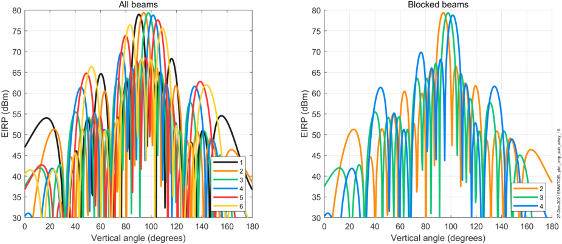
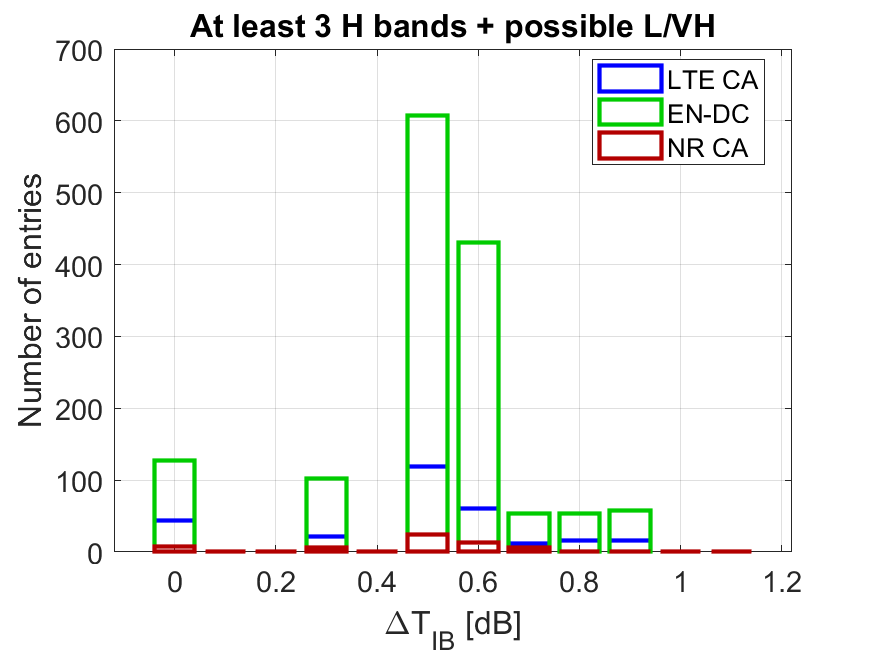
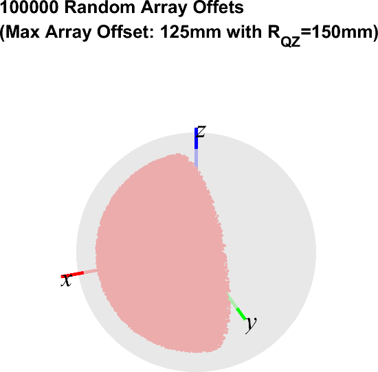

+----------------------------------+----------------------------------+
| 3GPP TS 38.551 V17.3.0 (2024-09) |                                  |
+==================================+==================================+
| Technical Specification          |                                  |
+----------------------------------+----------------------------------+
| 3rd Generation Partnership       |                                  |
| Project;                         |                                  |
|                                  |                                  |
| Technical Specification Group    |                                  |
| Radio Access Network;            |                                  |
|                                  |                                  |
| **NR;**                          |                                  |
|                                  |                                  |
| **User Equipment (UE) Multiple   |                                  |
| Input Multiple Output (MIMO)     |                                  |
| Over-the-Air (OTA)               |                                  |
| performance;**                   |                                  |
|                                  |                                  |
| Conformance testing              |                                  |
|                                  |                                  |
| (Release 17)                     |                                  |
+----------------------------------+----------------------------------+
|                                  |                                  |
+----------------------------------+----------------------------------+
| {width="1.7777777777777777in" |
| eg){width="1.3333333333333333in" | height="1.0465277777777777in"}   |
| height="0.9166666666666666in"}   |                                  |
+----------------------------------+----------------------------------+
|                                  |                                  |
+----------------------------------+----------------------------------+
| The present document has been    |                                  |
| developed within the 3rd         |                                  |
| Generation Partnership Project   |                                  |
| (3GPP ^TM^) and may be further   |                                  |
| elaborated for the purposes of   |                                  |
| 3GPP.\                           |                                  |
| The present document has not     |                                  |
| been subject to any approval     |                                  |
| process by the 3GPP              |                                  |
| Organizational Partners and      |                                  |
| shall not be implemented.\       |                                  |
| This Specification is provided   |                                  |
| for future development work      |                                  |
| within 3GPP only. The            |                                  |
| Organizational Partners accept   |                                  |
| no liability for any use of this |                                  |
| Specification.\                  |                                  |
| Specifications and Reports for   |                                  |
| implementation of the 3GPP ^TM^  |                                  |
| system should be obtained via    |                                  |
| the 3GPP Organizational          |                                  |
| Partners\' Publications Offices. |                                  |
+----------------------------------+----------------------------------+

+----------------------------------------------------------------------+
|                                                                      |
+======================================================================+
| > ***3GPP***                                                         |
| >                                                                    |
| > Postal address                                                     |
| >                                                                    |
| > 3GPP support office address                                        |
| >                                                                    |
| > 650 Route des Lucioles - Sophia Antipolis                          |
| >                                                                    |
| > Valbonne - FRANCE                                                  |
| >                                                                    |
| > Tel.: +33 4 92 94 42 00 Fax: +33 4 93 65 47 16                     |
| >                                                                    |
| > Internet                                                           |
| >                                                                    |
| > http://www.3gpp.org                                                |
+----------------------------------------------------------------------+
| ***Copyright Notification***                                         |
|                                                                      |
| No part may be reproduced except as authorized by written            |
| permission.\                                                         |
| The copyright and the foregoing restriction extend to reproduction   |
| in all media.                                                        |
|                                                                      |
| © 2024, 3GPP Organizational Partners (ARIB, ATIS, CCSA, ETSI, TSDSI, |
| TTA, TTC).                                                           |
|                                                                      |
| All rights reserved.                                                 |
|                                                                      |
| UMTS™ is a Trade Mark of ETSI registered for the benefit of its      |
| members                                                              |
|                                                                      |
| 3GPP™ is a Trade Mark of ETSI registered for the benefit of its      |
| Members and of the 3GPP Organizational Partners\                     |
| LTE™ is a Trade Mark of ETSI registered for the benefit of its       |
| Members and of the 3GPP Organizational Partners                      |
|                                                                      |
| GSM® and the GSM logo are registered and owned by the GSM            |
| Association                                                          |
+----------------------------------------------------------------------+

 Contents {#contents .TT}
========

Foreword 5

1 Scope 7

2 References 7

3 Definitions of terms, symbols, and abbreviations 7

3.1 Terms 7

3.2 Symbols 8

3.3 Abbreviations 8

4 General 9

4.1 Relationship between minimum requirements and test requirements 9

4.2 Applicability of minimum requirements 9

4.3 Applicability rules for testing of SA and NSA UEs 9

5 Frequency Bands 10

5.1 General 10

5.2 Operating bands 10

6 FR1 MIMO OTA Performance 10

6.1 General 10

6.1.1 Definition of MIMO throughput 10

6.1.2 Total Radiated Multi-Antenna Sensitivity (TRMS) 11

6.2 VOID 13

Annex A (normative): FR1 Test methodology 14

A.1 General 14

A.2 Multi-Probe Anechoic Chamber (MPAC) 14

A.2.1 System setup 14

A.2.2 Calibration procedure 16

A.2.3 Void 16

A.2.4 Minimum Range Length 16

A.3 EUT positioning 17

A.4 Reference coordinate system 19

Annex B (informative): Estimation of measurement uncertainty 21

B.1 MU budget of FR1 MPAC system 21

B.2 Measurement error contribution descriptions for MPAC 22

B.2.1 Mismatch for measurement process 22

B.2.2 Measurement distance uncertainty 22

B.2.3 Quality of quiet zone 22

B.2.4 Base Station simulator 22

B.2.5 Channel Emulator 22

B.2.6 Amplifier uncertainties 22

B.2.7 Random uncertainty 23

B.2.8 Throughput measurement: output level step resolution 23

B.2.9 Signal flatness 23

B.2.10 Mismatch for calibration process 24

B.2.11 Reference antenna positioning misalignment 24

B.2.12 Total Uncertainty of the Network Analyzer 24

B.2.13 Uncertainty of an absolute gain of the calibration antenna 24

B.2.14 Offset of the Phase Center of the Reference Antenna 24

Annex C (normative): FR1 Channel models and Validation procedure 25

C.1 FR1 Channel models 25

C.2 FR1 Base Station beam configuration 26

C.3 FR1 Channel model validation 27

C.3.1 General 27

C.3.2 Power Delay Profile (PDP) 28

C.3.3 Doppler/Temporal correlation 30

C.3.4 Spatial correlation 34

C.3.5 Cross-polarization 41

C.3.6 Power validation 44

C.4 Validation Pass/fail limit 45

C.4.1 General 45

C.4.2 Pass/Fail Criteria of PDP 45

C.4.3 Pass/Fail Criteria of Doppler/Temporal correlation 45

C.4.4 Pass/Fail Criteria of Spatial correlation 47

C.4.5 Pass/Fail Criteria of Cross-polarization 50

C.4.6 Pass/Fail Criteria of Power validation 51

Annex D (normative): gNB configurations 51

D.1 FR1 gNB configurations 51

Annex E (normative): Environmental requirements 56

E.1 Scope 56

E.2 Ambient temperature 56

E.3 Operating voltage 56

Annex F (normative): Maximum uncertainty of test system and test
tolerance 57

F.1 Maximum uncertainty of test system 57

F.2 Test tolerances 57

Annex G (informative): Change history 58

 Foreword
========

This Technical Specification has been produced by the 3rd Generation
Partnership Project (3GPP).

The contents of the present document are subject to continuing work
within the TSG and may change following formal TSG approval. Should the
TSG modify the contents of the present document, it will be re-released
by the TSG with an identifying change of release date and an increase in
version number as follows:

Version x.y.z

where:

x the first digit:

1 presented to TSG for information;

2 presented to TSG for approval;

3 or greater indicates TSG approved document under change control.

y the second digit is incremented for all changes of substance, i.e.
technical enhancements, corrections, updates, etc.

z the third digit is incremented when editorial only changes have been
incorporated in the document.

In the present document, modal verbs have the following meanings:

**shall** indicates a mandatory requirement to do something

**shall not** indicates an interdiction (prohibition) to do something

The constructions \"shall\" and \"shall not\" are confined to the
context of normative provisions, and do not appear in Technical Reports.

The constructions \"must\" and \"must not\" are not used as substitutes
for \"shall\" and \"shall not\". Their use is avoided insofar as
possible, and they are not used in a normative context except in a
direct citation from an external, referenced, non-3GPP document, or so
as to maintain continuity of style when extending or modifying the
provisions of such a referenced document.

**should** indicates a recommendation to do something

**should not** indicates a recommendation not to do something

**may** indicates permission to do something

**need not** indicates permission not to do something

The construction \"may not\" is ambiguous and is not used in normative
elements. The unambiguous constructions \"might not\" or \"shall not\"
are used instead, depending upon the meaning intended.

**can** indicates that something is possible

**cannot** indicates that something is impossible

The constructions \"can\" and \"cannot\" are not substitutes for \"may\"
and \"need not\".

**will** indicates that something is certain or expected to happen as a
result of action taken by an agency the behaviour of which is outside
the scope of the present document

**will not** indicates that something is certain or expected not to
happen as a result of action taken by an agency the behaviour of which
is outside the scope of the present document

**might** indicates a likelihood that something will happen as a result
of action taken by some agency the behaviour of which is outside the
scope of the present document

**might not** indicates a likelihood that something will not happen as a
result of action taken by some agency the behaviour of which is outside
the scope of the present document

In addition:

**is** (or any other verb in the indicative mood) indicates a statement
of fact

**is not** (or any other negative verb in the indicative mood) indicates
a statement of fact

The constructions \"is\" and \"is not\" do not indicate requirements.

 1 Scope
=======

The present document specifies details of conformance testing of UE
Multiple Input Multiple Output (MIMO) Over-the-Air (OTA) requirements
and test methodologies for FR1 (NR SA and NSA). The correspondent
testing methodologies are also presented in the Annex A of the present
document.

2 References
============

The following documents contain provisions which, through reference in
this text, constitute provisions of the present document.

\- References are either specific (identified by date of publication,
edition number, version number, etc.) or non‑specific.

\- For a specific reference, subsequent revisions do not apply.

\- For a non-specific reference, the latest version applies. In the case
of a reference to a 3GPP document (including a GSM document), a
non-specific reference implicitly refers to the latest version of that
document *in the same Release as the present document*.

\[1\] 3GPP TR 21.905: \"Vocabulary for 3GPP Specifications\".

\[2\] 3GPP TS 38.101-1: \"NR; User Equipment (UE) radio transmission and
reception; Part 1: Range 1 Standalone\".

\[3\] 3GPP TS 38.101-3: \"NR; User Equipment (UE) radio transmission and
reception; Part 3: Range 1 and Range 2 Interworking operation with other
radios\".

\[4\] 3GPP TS 38.508-1: \"5GS; User Equipment (UE) conformance
specification; Part 1: Common test environment\".

\[5\] 3GPP TR 38.901: \"Study on channel model for frequencies from 0.5
to 100 GHz\".

\[6\] 3GPP TS 38.101-4: \"NR; User Equipment (UE) radio transmission and
reception; Part 4: Performance requirements\".

\[7\] 3GPP TS 38.151: \"**NR; User Equipment (UE) Multiple Input
Multiple Output (MIMO) Over-the-Air (OTA) performance requirements**\".

\[8\] 3GPP TS 38.561: \"UE TRP (Total Radiated Power) and TRS (Total
Radiated Sensitivity) requirements and test methodologies for FR1 (NR SA
and EN-DC); User Equipment (UE) conformance specification\".

\[9\] IEEE Std 149: \"IEEE Standard Test Procedures for Antennas\",
IEEE.

3 Definitions of terms, symbols, and abbreviations
==================================================

3.1 Terms
---------

For the purposes of the present document, the terms given in 3GPP
TR 21.905 \[1\] and the following apply. A term defined in the present
document takes precedence over the definition of the same term, if any,
in 3GPP TR 21.905 \[1\].

**Free Space (FS):** UE used in a free space configuration

**Handheld UE:** UE intended to be used in hand held scenario

**primary mechanical mode:** mode that is most often used for a specific
user scenario.

**PAS Similarity Percentage (PSP):** similarity of the PAS produced by
the OTA system and the reference PAS. PSP is defined as (1-TVD) \* 100
%. PSP=100 % denotes full similarity and PSP = 0 % denotes full
dissimilarity.

3.2 Symbols
-----------

For the purposes of the present document, the following symbols apply:

*P~RS-EPRE-MAX\ ~*Maximum downlink RS-EPRE

3.3 Abbreviations
-----------------

For the purposes of the present document, the abbreviations given in
3GPP TR 21.905 \[1\] and the following apply. An abbreviation defined in
the present document takes precedence over the definition of the same
abbreviation, if any, in 3GPP TR 21.905 \[1\].

ACK Acknowledgment

AOA Azimuth angle Of Arrival

AOD Azimuth angle Of Departure

ASA Azimuth Spread of Arrival angles

ASD Azimuth Spread of Departure angles

BS Base Station

CASA Cluster ASA

CASD Cluster ASD

CDL Clustered Delay Line

CIR Channel Impulse Response

CSI Channel state information

CSI-RS CSI reference signal

CW Continuous Wave

CZSA Cluster ZSA

CZSD Cluster ZSD

DML Data Mode Landscape

DMP Data Mode Portrait

DMRS Demodulation reference signal

DMSU Data Mode Screen Up

DUT Device Under Test

EUT Equipment Under Test

EVM Error Vector Magnitude

FR1 Frequency Range 1

FRC Fixed Reference Measurement Channel

FS Free Space

gNB Next Generation Node B

HARQ Hybrid automatic repeat request

MIMO Multiple Input Multiple Output

MPAC Multi-Probe Anechoic Chamber

MU Measurement Uncertainty

NACK Not Acknowledged

NR New Radio

NSA Non-Standalone a mode of operation where operation of another radio
is assisted with another radio

OCNG OFDMA Channel Noise Generator

OTA Over The Air

PAS Power Angular Spectrum

PDP Power Delay Profile

PDSCH Physical downlink shared channel

PRB Physical resource block

PSP PAS Similarity Percentage

RE Resource Element

RS-EPRE Reference Signal-Energy Per Resource Element

SCS Subcarrier spacing

SNR Signal to Noise Ratio

SS System Simulator

SSS Secondary Synchronization Signal

TBS Transport Block Size

TCI Transmission Configuration Indicator

TRMS Total Radiated Multi-antenna Sensitivity

UE User Equipment

UMa Urban Macro

UMi Urban Micro

VNA Vector Network Analyser

XPR Cross-Polarization Ratio

ZOA Zenith angle Of Arrival

ZOD Zenith angle Of Departure

ZSA Zenith angle Spread of Arrival

ZSD Zenith angle Spread of Departure

4 General
=========

Editor\'s Note: Intended to capture additional general information to be
used within this test specification, such as follows:

4.3 Specification suffix information

4.4 Test point analysis

4.5 Applicability and test coverage rules

4.6 Pass fail decisions rule of test case based on Test Tolerance
definitions.

4.1 Relationship between minimum requirements and test requirements
-------------------------------------------------------------------

The Minimum Requirements given in 3GPP TS 38.151 \[7\] make no allowance
for Measurement Uncertainty (MU). The present document defines the MU
and Test Tolerances in Annex B for FR1 MIMO OTA. The test tolerances are
used to relax the Minimum Requirements in 3GPP TS 38.151 \[7\] to create
the Test Requirements.

4.2 Applicability of minimum requirements
-----------------------------------------

The MIMO OTA minimum requirements apply only to the primary mechanical
mode of UE which is declared by the manufacturer if the UE can support
multiple mechanical modes.

The minimum requirements apply only to the UE under normal environmental
conditions specified in Annex E.

4.3 Applicability rules for testing of SA and NSA UEs
-----------------------------------------------------

The applicability and test coverage rules for Non-Standalone (NSA) only
capable UEs shall include the following:

\- For FR1 NSA (EN-DC) only capable UEs, testing is not required.

The applicability and test coverage rules for Standalone (SA) and NSA
(EN-DC) capable UEs shall include the following:

\- For FR1 UEs, for each NR band in a device, test the UE in Standalone
Mode as per the TRMS test procedures in this specification. This shall
also fulfil coverage for all EN-DC minimum performance requirements for
that NR band and need not be retested in EN-DC mode.

5 Frequency Bands
=================

5.1 General
-----------

NR MIMO OTA Requirements are defined separately for different Frequency
Ranges (FR). The frequency ranges in which NR can operate according to
this version of the specification are identified as described in Table
5.1-1.

Table 5.1-1: Definition of frequency ranges

  Frequency range designation   Corresponding frequency range
  ----------------------------- -------------------------------
  FR1                           410 MHz - 7125 MHz
  FR2                           24250 MHz - 52600 MHz

The present specification covers FR1 operating bands.

5.2 Operating bands
-------------------

NR is designed to operate in FR1 operating bands defined in 3GPP TS
38.101-1 \[3\]. NSA band combinations are defined in 3GPP TS 38.101-3
\[3\].

6 FR1 MIMO OTA Performance
==========================

6.1 General
-----------

### 6.1.1 Definition of MIMO throughput

The MIMO throughput is defined here as the time-averaged number of
correctly received transport blocks in a communication system running an
application, where a Transport Block is defined in the reference
measurement channel. From OTA perspective, this is also called MIMO OTA
throughput. It will be used as the baseline figure of merit for FR1 and
FR2 MIMO OTA testing.

The MIMO OTA throughput is measured at the top of physical layer of NR
system under the use of FRC, the SS transmit fixed-size payload bits to
the DUT. The DUT signals back either ACK or NACK to the SS. The SS then
records the following:

\- number of ACKs;

\- number of NACKs; and

\- number of DTX slots.

Hence the MIMO (OTA) throughput can be calculated as:

{width="3.5416666666666665in"
height="0.3819444444444444in"}

Where Transmitted TBS is the Transport Block Size transmitted by the SS,
which is fixed for an FRC during the measurement period. Measurement
Time is the total composed of successful slots (ACK), unsuccessful slots
(NACK) and DTX-symbols.

The time-averaging is to be taken over a time period sufficiently long
to average out the variations due to the fading channel. Therefore, this
is also called the average MIMO OTA throughput. The throughput should be
measured at a time when eventual start-up transients in the system have
evanesced.

### 6.1.2 Total Radiated Multi-Antenna Sensitivity (TRMS)

Editor's note: The test case is incomplete. TT is pending further
analysis.

##### 6.1.2.1 Test Purpose {#test-purpose .H6}

The purpose of this test is to ensure that the UE meets the TRMS minimum
performance requirements.

##### 6.1.2.2 Test Applicability {#test-applicability .H6}

This test case applies to all types of NR UE release 17 and forward. See
clause 4.2 for additional applicability.

##### 6.1.2.3 Minimum Conformance Requirements {#minimum-conformance-requirements .H6}

Editor\'s Note: TRMS values for n28/n79 are pending in RAN4 spec
TS38.151.

The average TRMS of free space data mode portrait (FS DMP), free space
data mode landscape (FS DML), and free space data mode screen up (FS
DMSU), is defined as the FR1 MIMO OTA requirement. The averaging shall
be done in linear scale for the TRMS results at these DUT positions,
according to the formula:

where

Such that *MODE* is one of {*FS\_DMP, FS\_DML, FS\_DMSU*}, and
{*P~MODE,70,0~, ..., P~MODE,70,11~*} are the measured sensitivity values
at each azimuth position at the 70% throughput outage.

The reported TRMS value shall be corrected by
$- 0.5 \cdot output\ \text{level}\ \text{step}\ \text{resolution}$ of
the final power step search and the correction shall be noted in the
test report.

If 1 azimuth position does not result in a defined measured sensitivity
at 70 % throughput, S~MODE,70~ is calculated using the 11 measured
sensitivities and the maximum downlink RS-EPRE P~RS-EPRE-MAX~
(substitution approach) for the one missing result. P~RS-EPRE-MAX~ is
the maximum downlink RS-EPRE supported by the test system, and is
defined as -80 dBm/15 kHz (or equivalent -77 dBm/30 kHz) for FR1 MIMO
OTA.

The TRMS shall be measured at the mid channel as specified in 3GPP TS
38.508-1 \[4\], subclause 4.3.1.The average TRMS shall be lower than the
average TRMS requirements specified in Table 6.1.2.3-1.

The additional criterion in azimuthal orientations shall be met:

\- The EUT has to meet 70 % throughput in 11 of total 12 azimuthal
orientations. If the EUT fails to meet this criterion even under maximum
downlink power condition (i.e. P~RS-EPRE-MAX~), the EUT shall fail the
FR1 MIMO OTA test.

\- The EUT has to meet 90 % throughput in 10 of total 12 azimuthal
orientations. If the EUT fails to meet this criterion even under maximum
downlink power condition (i.e. P~RS-EPRE-MAX~), the EUT shall fail the
FR1 MIMO OTA test.

FR1 TRMS minimum performance requirements for NR handheld UEs operating
in SA mode in free space and the primary mechanical mode for 70% DL
throughput with the corresponding measurement configurations
(i.e. channel model and gNB configuration) specified in clause C.1 and
clause E.1 are defined in Table 6.1.2.3-1.

Table 6.1.2.3-1: FR1 TRMS minimum performance requirements for NR
handheld UEs operating on SA mode in free space and the primary
mechanical mode

  NR bands   Bandwidth (MHz)   MIMO layer   Channel model   Reference channel   TRMS~average,70~
  ---------- ----------------- ------------ --------------- ------------------- -------------------
  n28        10                2x2          FR1 UMi CDL-C   R.PDSCH.1-3.1 FDD   \[...\] dBm/15kHz
  n41        40                4x4          FR1 UMa CDL-C   R.PDSCH.2-2.4 TDD   -93.3 dBm/30kHz
  n78        40                4x4          FR1 UMa CDL-C   R.PDSCH.2-2.4 TDD   -94.8 dBm/30kHz
  n79        40                4x4          FR1 UMa CDL-C   R.PDSCH.2-2.4 TDD   \[...\] dBm/30kHz

##### 6.1.2.4 Test Description {#test-description .H6}

##### 6.1.2.4.1 Initial Conditions {#initial-conditions .H6}

Initial conditions are a set of test configurations the UE needs to be
tested in and the steps for the SS to take with the UE to reach the
correct measurement state.

A radio communications tester or a corresponding device is used as a gNB
simulator to setup calls to the DUT according to Clause D.1.

Channel model shall be set according to Clause C.1 and the emulated BS
beam configuration shall be set according to Clause C.2.

Chamber environment constraints shall be the same as described in Clause
A.2.1. The coordinate system shall match that of Clause A.3.

Environmental conditions from Annex E shall apply.

The positioning of the device under test within the test volume shall be
set as defined in Clause A.3.

The calibration procedure is specified in Clause A.2.2.

Initial conditions are a set of test configurations the UE shall be
tested in and the steps for the SS to take with the UE to reach the
correct measurement state for each test case.

1\) Ensure environmental requirements of Annex E are met.

2\) Configure the test system according to Annexes C and D for the
applicable test case.

3\) Verify the implementation of the channel model as specified in
clause C.3.

4\) Position the UE in the chamber according to clause A.3.

5\) Power on the UE.

6\) Set up the connection.

NOTE: For step 3, the verification of the channel model implementation
is usually performed once for each channel model as part of the
laboratory accreditation process and will remain valid as long as the
setup and instruments remain unchanged. Otherwise, the channel model
validation may need to be performed prior to starting each throughput
test.

##### 6.1.2.4.2 Test Procedure {#test-procedure .H6}

For throughput testing, the following steps shall be followed in order
to evaluate NR MIMO OTA performance of the DUT:

1\) Measure MIMO OTA throughput from one measurement point, the maximum
downlink power P~RS-EPRE-MAX~ is defined in clause 6.1.2. MIMO OTA
throughput is the minimum downlink signal power resulting in a
pre-defined throughput value, i.e. 70 % and 90 % of the maximum
theoretical throughput. The downlink signal power step size shall be no
more than 0.5 dB when RF power level is near the NR MIMO sensitivity
level.

2\) Rotate the UE around vertical axis of the test system by 30 degrees
and repeat from step 1 until one complete rotation has been measured
i.e. 12 different UE azimuth rotations.

3\) Repeat the test from step 1 for each specified device orientation. A
list of orientations is given in clause A.3.

4\) The postprocessing method to calculate the average MIMO Throughput
is defined in clause 6.

NOTE: For step 1 of throughput testing, the measurement is not needed to
start from maximum downlink power each time. To save testing time, the
starting downlink power can be set as a proper value (lower than maximum
downlink power supported by test system) as long as all the throughput
curve curves at 12 different UE azimuth rotations can reach at least 90%
of the maximum theoretical throughput.

##### 6.1.2.4 Test Requirements {#test-requirements .H6}

Editor\'s Note: TRMS values for n28/n79 are pending in RAN4 spec
TS38.151.

The test requirements are shown in Table 6.1.2.4-1.

Table 6.1.2.4-1: FR1 TRMS test requirements for NR handheld UEs
operating on SA mode in free space and the primary mechanical mode

  NR bands   Bandwidth (MHz)   MIMO layer   Channel model   Reference channel   TRMS~average,70~
  ---------- ----------------- ------------ --------------- ------------------- ----------------------
  n28        10                2x2          FR1 UMi CDL-C   R.PDSCH.1-3.1 FDD   \[...\] dBm/15kHz
  n41        40                4x4          FR1 UMa CDL-C   R.PDSCH.2-2.4 TDD   -93.3 dBm/30kHz + TT
  n78        40                4x4          FR1 UMa CDL-C   R.PDSCH.2-2.4 TDD   -94.8 dBm/30kHz +TT
  n79        40                4x4          FR1 UMa CDL-C   R.PDSCH.2-2.4 TDD   \[...\] dBm/30kHz

6.2 VOID
--------

######## Annex A (normative): FR1 Test methodology

A.1 General
===========

FR1 MIMO OTA requirement testing is based on UE-noise limited
environmental condition, i.e. UE throughput characterized as a function
of signal power incident to the DUT antennas.

The minimum test zone size for FR1 MIMO OTA test methods is 20cm.
\"Black-box\" testing approach is adopted for NR MIMO OTA testing, the
geometric centre of the EUT shall be placed in the centre of the test
zone, the EUT shall be completely contained within the minimum test zone
size.

FR1 MIMO OTA requirement testing should be performed under primary
mechanical mode. The primary mechanical mode for devices having multiple
mechanical modes shall be declared by the manufacturers. Single primary
mechanical mode for each device should be declared for MIMO OTA
conformance testing.

A.2 Multi-Probe Anechoic Chamber (MPAC)
=======================================

A.2.1 System setup
------------------

MPAC test method is the reference methodology for FR NR MIMO OTA
testing. By arranging an array of antennas around the Equipment Under
Test (EUT), a spatial distribution of angles of arrival in MPAC system
may be simulated to expose the EUT to a near field environment that
appears to have originated from a complex multipath far field
environment.

As illustrated schematically in Figure A.2.1-1, signals propagate from
the base station/communication tester to the EUT through a simulated
multipath environment known as a spatial channel model, where
appropriate channel impairments such as Doppler and fading are applied
to each path prior to injecting all of the directional signals into the
chamber simultaneously through the antenna array. The resulting field
distribution in the test zone is then integrated by the EUT antenna(s)
and processed by the receiver(s) just as it would do so in any
non-simulated multipath environment. MPAC system with 16 uniformly
spaced dual-polarized probes is permitted for NR FR1 MIMO OTA testing.

{width="6.008333333333334in"
height="2.075in"}

Figure A.2.1-1: MPAC system layout for NR FR1 MIMO OTA testing

For the selected environmental conditions modelled by the FR1 CDL
channel models, the minimum setup configuration can be described as in
Table A.2.1-1:

Table A.2.1-1: Example of a minimum setup for MPAC

                                        MPAC
  ------------------------------------- -------------------
  Minimum number of antenna positions   16
  Antenna spacing                       22.5
  Applicable channel model              FR1 UMi/UMa CDL-C

The setup of OTA chamber antennas with sixteen antenna positions is
depicted in Figure A.2.1-2. The DUT is at the centre, and the antennas
are aligned on a circle around the DUT with uniform spacing (e.g. 22.5°
with 32 elements arranged in 16 positions, where each position contains
a vertically and horizontally polarized antenna pair). Denoting
directions of *K* OTA antennas with *φ~k~*, *k* = 1... *K*, and antenna
spacing of 22.5°. Each antenna is connected to a single fading emulator
output port. In the figure, for example, antenna *A*~1V~ denotes the
first OTA antenna position and Vertically (V) polarized element, *A*~8H~
denotes the eight OTA antenna position and horizontally (H) polarized
element, etc.

{width="6.69375in"
height="2.2729166666666667in"}

Figure A.2.1-2: OTA chamber antenna setup with sixteen uniformly spaced
dual polarized chamber antennas

The OTA/channel model coordinate systems and probe placement are further
clarified in Figure A.2.1-3. The *x*-axis of the coordinate system is
aligned with the centre of probe \#1 and the *x*, *y*, and *z* axes of
the OTA coordinate system are aligned with the *x~CM~*, *y~CM~*, and
*z~CM~* axes of the channel model coordinate system.

{width="6.69375in"
height="2.2006944444444443in"}

Figure A.2.1-3: Illustration of aligned OTA and channel model coordinate
systems

A.2.2 Calibration procedure
---------------------------

The system needs to be calibrated by using a reference calibration
antenna with known gain values in order to ensure that the downlink
signal power is correct. In Non-Standalone (NSA) mode, the LTE link
antenna provides a stable LTE signal without precise path loss or
polarization control.

Unlike traditional TRP/TRS testing where the path loss corrections can
all be applied as a post processing step to the measured data, the path
loss for each probe in the MPAC system has to be balanced at test time
in order to generate the desired channel model environment within the
test zone of the chamber. The imbalance of each path during testing
would result in an alteration of the angular dependence of the channel
model (i.e. varied characteristics of generated channel model) within
the test zone of the chamber:

1\) Place a vertical reference dipole in the centre of the test zone,
connected to a VNA port, with the other VNA port connected to the input
of the channel emulator unit.

2\) Configure the channel emulator for bypass mode.

3\) Measure the response of each path from each vertical polarization
probe to the reference antenna in the centre of test zone.

4\) Adjust the power on all vertical polarization branches of the
channel emulator so that the powers received at the centre are equal.

5\) Repeat the steps 1 to 4 with the magnetic loop or horizontally
polarized reference dipole instead and adjust the horizontal
polarization branches of the channel emulator.

6\) The worst-case path loss becomes the reference path loss of the
entire system; this loss is used to compute the power in the centre of
the test zone relative to the output power of the Base Station
simulator. Besides, based on the reference path loss, the relative
offset of each path loss shall be corrected.

NOTE: Calibration based on other antennas, e.g. horn antennas is not
precluded.

This procedure shall be repeated on a regular basis, i.e., at least one
per year, and any time the conducted and/or radiated signal paths have
been affected, e.g., change in propagation conditions, replacement of
cables, change in measurement antennas/probes, etc. It is recommended to
perform this procedure rather frequently, e.g., monthly, to assess
system stability.

A.2.3 Void
----------

A.2.4 Minimum Range Length
--------------------------

The minimum range length of FR1 MPAC system is defined as the distance
from the centre of the test zone to the aperture of the measurement
probes/antennas, as illustrated in Figure A.2.4-1.

{width="2.4833333333333334in"
height="2.4833333333333334in"}

Figure A.2.4-1: Illustration of range length definition of FR1 MPAC

The minimum range length for NR FR1 MPAC OTA systems with 20cm test zone
size is 1.2 m. While for MPAC systems, the far-field requirements do not
have to apply, it was shown that the spatial correlation can be impacted
significantly for distances below 1.2 m.

A.3 EUT positioning
===================

This Clause defines the measurement coordinate system for the NR MIMO
OTA.

1.  For FR1 MIMO OTA, the DUT shall be tested under Free Space Data Mode
    Portrait (FS DMP), Free Space Data Mode Landscape (FS DML), and Free
    Space Data Mode Screen Up (FS DMSU), the DUT azimuthal rotation
    shall be performed over 360 degrees per orientation in 30 degree
    steps (12 total positions). The three different test and environment
    conditions for handsets are summarized in Table A.3-1.

    The geometric centre of the DUT shall be aligned with the centre of
    the test zone/coordinate system and the DUT shall be fully contained
    within the test zone, i.e., a sphere with 20 cm diameter.

    Table A.3-1: Summary of testing environment conditions for devices
    supporting DL MIMO data reception

  ------------------------------------------------------------------------------------------------------------------------------------------------------------------------------------------------------------------------------------------------
  DUT type                                                                                                    Testing condition     DUT orientation angles   Diagram
  ----------------------------------------------------------------------------------------------------------- --------------------- ------------------------ -------------------------------------------------------------------------------------
  Handset                                                                                                     FS DMP                Ψ=0°\                    {width="4.0in" height="2.909555993000875in"}
                                                                                                                                    Θ=−45°\                  
                                                                                                                                    Φ=0°                     

  Handset                                                                                                     FS DML -- Left Tilt   Ψ=90°\                   {width="3.999889545056868in" height="2.9029363517060367in"}
                                                                                                                                    Θ=−45°\                  
                                                                                                                                    Φ=0°                     

  Handset                                                                                                     FS DMSU               Ψ=0°\                    {width="3.999889545056868in" height="2.897985564304462in"}
                                                                                                                                    Θ=−90°\                  
                                                                                                                                    Φ=0°                     

  NOTE: Rotation angles defined in Figure A.4-2 with the reference coordinate system defined in Clause A.4.                                                  
  ------------------------------------------------------------------------------------------------------------------------------------------------------------------------------------------------------------------------------------------------

4.  

A.4 Reference coordinate system
===============================

This clause defines the measurement coordinate system for the NR UE. The
reference coordinate system as defined in IEEE Std 149 \[9\] is provided
in Figure A.4-1 below while Figure A.4-2 shows an example DUT in the
default alignment, i.e., the DUT and the reference coordinate systems
are aligned with α = 0^o^ and β = 0^o^ and γ = 0^o^ where α, β, and γ
describe the relative angles between the two coordinate systems.

{width="5.360416666666667in"
height="5.093055555555556in"}

Figure A.4-1: Reference coordinate system

{width="5.0in" height="3.688660323709536in"}

Figure A.4-2: DUT default alignment of example smartphone UE to
coordinate system

The following aspects are necessary:

\- A basic understanding of the top and bottom of the device is needed
in order to define unambiguous DUT positioning requirements for the
test, e.g., in the drawings used in this annex, the three buttons are on
the bottom of the device (front) and the camera is on the top of the
device (back).

\- An understanding of the origin and alignment the coordinate system
inside the test system i.e. the directions in which the *x*, *y*, *z*
-axes points inside the test chamber is needed in order to define
unambiguous DUT orientation, DUT beam, signal, interference, and
measurement angles

######## Annex B (informative): Estimation of measurement uncertainty

B.1 MU budget of FR1 MPAC system
================================

This clause defines the measurement uncertainty (MU) for FR1 MPAC
system, as shown in Table B.1-1.

Table B.1-1: Preliminary measurement uncertainty budget for FR1 MPAC
system

+---------+---------+---------+---------+---------+---------+---------+
| UID     | Desc    | Example | Example | Distr   | Std     | Std     |
|         | ription | value   | value   | ibution | Unce    | Unce    |
|         | of      | (410    | (3 GHz  | of the  | rtainty | rtainty |
|         | unce    | MHz \<f | \< f ≤  | prob    | (410    | (3 GHz  |
|         | rtainty | ≤ 3     | 7.      | ability | MHz \<  | \< f ≤  |
|         | contr   | GHz)    | 125GHz) |         | f ≤ 3   | 7.      |
|         | ibution | \[dB\]  | \[dB\]  |         | GHz)    | 125GHz) |
|         |         |         |         |         | \[dB\]  | \[dB\]  |
+=========+=========+=========+=========+=========+=========+=========+
| Stage   |         |         |         |         |         |         |
| 2: DUT  |         |         |         |         |         |         |
| meas    |         |         |         |         |         |         |
| urement |         |         |         |         |         |         |
+---------+---------+---------+---------+---------+---------+---------+
| 1       | M       | 0       | 0       | U       | 0       | 0       |
|         | ismatch |         |         | -Shaped |         |         |
|         | for     |         |         |         |         |         |
|         | meas    |         |         |         |         |         |
|         | urement |         |         |         |         |         |
|         | process |         |         |         |         |         |
+---------+---------+---------+---------+---------+---------+---------+
| 2       | Measure | 0       | 0       | Normal  | 0       | 0       |
|         | d       |         |         |         |         |         |
|         | istance |         |         |         |         |         |
|         | unce    |         |         |         |         |         |
|         | rtainty |         |         |         |         |         |
+---------+---------+---------+---------+---------+---------+---------+
| 3       | Quality | 0.5     | 0.5     | Actual  | 0.5     | 0.5     |
|         | of      |         |         |         |         |         |
|         | quiet   |         |         |         |         |         |
|         | zone    |         |         |         |         |         |
+---------+---------+---------+---------+---------+---------+---------+
| 4       | Base    | 1.3     | 1.3     | Normal  | 0.65    | 0.65    |
|         | Station |         |         |         |         |         |
|         | si      |         |         |         |         |         |
|         | mulator |         |         |         |         |         |
+---------+---------+---------+---------+---------+---------+---------+
| 5       | Channel | 1.5     | 1.5     | Actual  | 0.84    | 0.84    |
|         | E       |         |         |         |         |         |
|         | mulator | 0.5     | 0.5     | (Normal |         |         |
|         |         |         |         | -       |         |         |
|         | \-      | 0.4     | 0.4     | power;  |         |         |
|         | a       |         |         |         |         |         |
|         | bsolute |         |         | r       |         |         |
|         | output  |         |         | ect-sta |         |         |
|         | power   |         |         | bility) |         |         |
|         |         |         |         |         |         |         |
|         | \-      |         |         |         |         |         |
|         | output  |         |         |         |         |         |
|         | signal  |         |         |         |         |         |
|         | st      |         |         |         |         |         |
|         | ability |         |         |         |         |         |
|         |         |         |         |         |         |         |
|         | \-      |         |         |         |         |         |
|         | output  |         |         |         |         |         |
|         | st      |         |         |         |         |         |
|         | ability |         |         |         |         |         |
|         | with    |         |         |         |         |         |
|         | temp    |         |         |         |         |         |
|         | erature |         |         |         |         |         |
+---------+---------+---------+---------+---------+---------+---------+
| 6       | Am      | 0.7     | 0.7     | Rect    | 0.40    | 0.40    |
|         | plifier |         |         | angular |         |         |
|         | uncert  |         |         |         |         |         |
|         | ainties |         |         |         |         |         |
+---------+---------+---------+---------+---------+---------+---------+
| 7       | Random  | 0.4     | 0.4     | Normal  | 0.20    | 0.20    |
|         | unce    |         |         |         |         |         |
|         | rtainty |         |         |         |         |         |
+---------+---------+---------+---------+---------+---------+---------+
| 8       | Thr     | 0       | 0       | Rect    | 0       | 0       |
|         | oughput |         |         | angular |         |         |
|         | measu   |         |         |         |         |         |
|         | rement: |         |         |         |         |         |
|         | output  |         |         |         |         |         |
|         | level   |         |         |         |         |         |
|         | step    |         |         |         |         |         |
|         | res     |         |         |         |         |         |
|         | olution |         |         |         |         |         |
+---------+---------+---------+---------+---------+---------+---------+
| 9       | Signal  | 0       | 0       | Normal  | 0       | 0       |
|         | f       |         |         |         |         |         |
|         | latness |         |         |         |         |         |
+---------+---------+---------+---------+---------+---------+---------+
| Stage   |         |         |         |         |         |         |
| 1:      |         |         |         |         |         |         |
| Cali    |         |         |         |         |         |         |
| bration |         |         |         |         |         |         |
| meas    |         |         |         |         |         |         |
| urement |         |         |         |         |         |         |
+---------+---------+---------+---------+---------+---------+---------+
| 10      | M       | 0.2     | 0.2     | U       | 0.14    | 0.14    |
|         | ismatch |         |         | -Shaped |         |         |
|         | for     |         |         |         |         |         |
|         | cali    |         |         |         |         |         |
|         | bration |         |         |         |         |         |
|         | process |         |         |         |         |         |
|         |         |         |         |         |         |         |
|         | \-      |         |         |         |         |         |
|         | l       |         |         |         |         |         |
|         | oopback |         |         |         |         |         |
|         | cable   |         |         |         |         |         |
|         | path    |         |         |         |         |         |
|         |         |         |         |         |         |         |
|         | \-      |         |         |         |         |         |
|         | system  |         |         |         |         |         |
|         | input   |         |         |         |         |         |
|         | path    |         |         |         |         |         |
|         |         |         |         |         |         |         |
|         | \-      |         |         |         |         |         |
|         | re      |         |         |         |         |         |
|         | ference |         |         |         |         |         |
|         | antenna |         |         |         |         |         |
+---------+---------+---------+---------+---------+---------+---------+
| 11      | Re      | 0       | 0       | Normal  | 0       | 0       |
|         | ference |         |         |         |         |         |
|         | antenna |         |         |         |         |         |
|         | posi    |         |         |         |         |         |
|         | tioning |         |         |         |         |         |
|         | misal   |         |         |         |         |         |
|         | ignment |         |         |         |         |         |
+---------+---------+---------+---------+---------+---------+---------+
| 12      | Quality | 0.5     | 0.5     | Rect    | 0.29    | 0.20    |
|         | of      |         |         | angular |         |         |
|         | quiet   |         |         |         |         |         |
|         | zone    |         |         |         |         |         |
+---------+---------+---------+---------+---------+---------+---------+
| 13      | Total   | 0.2     | 0.5     | Normal  | 0.10    | 0.25    |
|         | unce    |         |         |         |         |         |
|         | rtainty |         |         |         |         |         |
|         | of the  |         |         |         |         |         |
|         | Network |         |         |         |         |         |
|         | A       |         |         |         |         |         |
|         | nalyzer |         |         |         |         |         |
+---------+---------+---------+---------+---------+---------+---------+
| 14      | Unce    | 0.58    | 0.58    | Normal  | 0.29    | 0.29    |
|         | rtainty |         |         |         |         |         |
|         | of an   |         |         |         |         |         |
|         | a       |         |         |         |         |         |
|         | bsolute |         |         |         |         |         |
|         | gain of |         |         |         |         |         |
|         | the     |         |         |         |         |         |
|         | cali    |         |         |         |         |         |
|         | bration |         |         |         |         |         |
|         | antenna |         |         |         |         |         |
+---------+---------+---------+---------+---------+---------+---------+
| 15      | Offset  | 0       | 0       | Normal  | 0       | 0       |
|         | of the  |         |         |         |         |         |
|         | Phase   |         |         |         |         |         |
|         | Center  |         |         |         |         |         |
|         | of the  |         |         |         |         |         |
|         | Re      |         |         |         |         |         |
|         | ference |         |         |         |         |         |
|         | Antenna |         |         |         |         |         |
+---------+---------+---------+---------+---------+---------+---------+
| **Total | *       | *       |         |         |         |         |
| E       | *2.61** | *2.65** |         |         |         |         |
| xpanded |         |         |         |         |         |         |
| Uncer   |         |         |         |         |         |         |
| tainty, |         |         |         |         |         |         |
| U, with |         |         |         |         |         |         |
| 95 %    |         |         |         |         |         |         |
| Con     |         |         |         |         |         |         |
| fidence |         |         |         |         |         |         |
| Int     |         |         |         |         |         |         |
| erval** |         |         |         |         |         |         |
+---------+---------+---------+---------+---------+---------+---------+

The detailed descriptions of each measurement uncertainty contributor
are defined in in clause B.2.

B.2 Measurement error contribution descriptions for MPAC
========================================================

B.2.1 Mismatch for measurement process
--------------------------------------

This term comes from the mismatch between the system input cables
connecting to the base station simulator output port. For more
information, see clause A.4.2.1 of 3GPP TS 38.561 \[8\].

B.2.2 Measurement distance uncertainty
--------------------------------------

The cause of this uncertainty contributor is due to the reduction of
distance between the measurement antenna and the DUT. Given that 1.2 m
is defined as the minimum range length for FR1 MPAC system and the
device is not offset from the axis(es) of rotation, this term could be
set as 0 dB.

B.2.3 Quality of quiet zone
---------------------------

The quality of the quiet zone procedure characterizes the quiet zone
performance of the anechoic chamber, specifically the effect of
reflections within the anechoic chamber including any positioners and
support structures. For FR1 quality of quiet zone measurements,
reference antennas of sleeve dipole or magnetic loop are used. For more
information, see clauses A.3.7 and A.4.2.8 of 3GPP TS 38.561 \[8\] with
the exception that only the phi-axis ripple test is performed for MIMO
OTA.

The ripple test shall be repeated when the RF/propagation conditions
inside the chamber have changed, e.g., the chamber has been disassembled
and reassembled, portions of the absorber been replaced, measurement
antennas/probes been replaced, positioning system been replaced, etc.

B.2.4 Base Station simulator
----------------------------

gNB emulator is used to drive a signal to the channel emulator and then
to the device under test. Generally there occurs uncertainty
contribution from absolute level accuracy, non-linearity and frequency
characteristic of the gNB emulator.

For practical reasons, in a case that a VNA is used as a calibration
equipment, gNB emulator is connected to the system after the calibration
measurement is performed by the VNA. Hence, the uncertainty on the
absolute level of gNB emulator (transmitter device) cannot be assumed as
systematic. This uncertainty will be determined from the manufacturer\'s
datasheet and the distribution used shall match that provided in the
datasheet which are commonly quoting MUs/accuracies with a \"95 %
confidence level\" and/or a \"coverage factor of 2\". In the absence of
a declared distribution in the datasheet, the rectangular distribution
should be used. Furthermore, the uncertainty of the non-linearity is
included in the absolute level uncertainty.

B.2.5 Channel Emulator
----------------------

The channel emulator is also working as a signal source in the NR MIMO
OTA system, therefore there occurs uncertainty contribution from
absolute level accuracy, non-linearity, frequency characteristic and
stability of the channel emulator. These uncertainty contributions shall
be taken from the manufacturer\'s data sheet.

B.2.6 Amplifier uncertainties
-----------------------------

Any components in the setup can potentially introduce measurement
uncertainty. It is then needed to determine the uncertainty contributors
associated with the use of such components. For the case of external
amplifiers, the following uncertainties should be considered but the
applicability is contingent to the measurement implementation and
calibration procedure:

\- Stability:

\- An uncertainty contribution comes from the output level stability of
the amplifier. Even if the amplifier is part of the system for both
measurement and calibration, the uncertainty due to the stability shall
be considered. This uncertainty can be either measured or determined by
the manufacturers\' data sheet for the operating conditions in which the
system will be required to operate.

\- Linearity:

\- An uncertainty contribution comes from the linearity of the amplifier
since in most cases calibration and measurements are performed at two
different input/output power levels. This uncertainty can be either
measured or determined by the manufacturers\' data sheet.

\- Noise Figure:

\- When the signal goes into an amplifier, noise is added so that the
SNR at the output is reduced with regard to the SNR of the signal at the
input. This added noise introduces error on the signal which affects the
Error Rate of the receiver thus the EVM (Error Vector Magnitude). An
uncertainty can be calculated through the following formula:

{width="2.0in" height="0.44166666666666665in"}

\- Where SNR is the signal to noise ratio in dB at the signal level used
during the sensitivity measurement.

\- Mismatch:

\- If the external amplifier is used for both stages, measurement and
calibration the uncertainty contribution associated with it can be
considered systematic and constant -\> 0dB. If it is not the case, the
mismatch uncertainty at its input and output shall be either measured or
determined by the method described in 3GPP TR 38.901 \[5\].

\- Gain:

\- If the external amplifier is used for both stages, measurement and
calibration the uncertainty contribution associated with it can be
considered systematic and constant -\> 0 dB. If it is not the case, this
uncertainty shall be considered.

B.2.7 Random uncertainty
------------------------

This contribution is used to account for all the unknown,
unquantifiable, etc. uncertainties associated with the measurements.

Random uncertainty MU contributions are normally distributed. The random
uncertainty term, by definition, cannot be measured, or even isolated
completely. A fixed value of 0.4 dB is suggested for TRMS measurements
to include a digital error rate uncertainty and is aligned with the
random uncertainty for TRS for NR FR1 (3GPP TS 38.561 \[8\]).

B.2.8 Throughput measurement: output level step resolution
----------------------------------------------------------

When output power of the communication tester is swept to reach the
throughput target that defines the sensitivity threshold, the final
power step resolution represents an asymmetric uncertainty contribution
that can be corrected since this uncertainty is device and test system
independent. The lab shall correct the TRMS results by
‑0,5 $\text{output\ level\ step\ resolution}$ of the final power step
search and note the correction in the test report. If the alternate DL
signal power search procedure with linearization, detailed in clause
A.2.3 is applied to assess the DL signal power at each grid point, no
correction of TRMS shall be applied and no additional MU shall be
considered.

B.2.9 Signal flatness
---------------------

For wireless technologies with wide channel bandwidths, the test system
might not have a flat frequency response across the entire channel.
While the range calibration corrects for any variation of frequency
response as a function of the centre frequency of the channel, the
broadband delivered to the test zone will be a function of the entire
channel bandwidth as opposed to just the centre frequency. For more
information, see clause A.4.2.14 of 3GPP TS 38.561 \[8\].

B.2.10 Mismatch for calibration process
---------------------------------------

During calibration stage, there will be impendence mismatch between the
various RF cables and components used within the system. Standing waves
are created by the reflections between any two components and
uncertainty in the signal level will be generated. In general, three
mismatch for calibration process should be considered:

\- Loopback cable path: This item comes from the mismatch between the
reference cable and the loopback cable during the loopback cable
measurement step.

\- System input path: This item comes from the mismatch between the
loopback cable and the system input cable (generally the output cable
after BS simulator). The reflectivity of the source output port is
measured at the end of the loopback cable connecting to the system input
cable.

\- Reference antenna: This item comes from the mismatch between the VNA
input port and the reference antenna. The reflectivity of the VNA input
port is measured at the end of the reference cable connecting to the
reference antenna.

For more information, see clause A.4.2.1 of 3GPP TS 38.561 \[8\].

B.2.11 Reference antenna positioning misalignment
-------------------------------------------------

This contribution originates from reference antenna alignment and
pointing error. In this measurement if the maximum gain directions of
the reference antenna and the receiving antenna are aligned to each
other, this contribution can be considered negligible and therefore set
to zero.

B.2.12 Total Uncertainty of the Network Analyzer
------------------------------------------------

This contribution originates from all uncertainties involved
transmission magnitude measurement (including drift and frequency
flatness) with a network analyser. will be determined from the
manufacturer\'s datasheet which is now commonly quoting MUs/accuracies
with a \"95 % confidence level\" and/or a \"coverage factor of 2\"and
the distribution used shall match that provided in the datasheet. In the
absence of a declared distribution in the datasheet, the rectangular
distribution should be used.

B.2.13 Uncertainty of an absolute gain of the calibration antenna
-----------------------------------------------------------------

The calibration antenna only appears in calibration phase (Stage 1).
Therefore, the gain uncertainty has to be taken into account.

This uncertainty shall come from a calibration report (which is now
commonly quoting MUs/accuracies with a \"95 % confidence level\" and/or
a \"coverage factor of 2\") with traceability to a National Metrology
Institute with measurement uncertainty budgets generated following the
guidelines outlined in internationally accepted standards. In the
absence of a declared distribution in the present document, the
rectangular distribution should be used.

B.2.14 Offset of the Phase Center of the Reference Antenna
----------------------------------------------------------

During range reference measurement, if a directional antenna is used,
the uncertainty in the accuracy of positioning its phase center on the
axis of rotation will directly generate an uncertainty in this part of
the measurement. In practical measurement, sleeve dipoles and loops are
used for FR1 calibration, then the uncertainty of this element should be
0 dB, since the phase center offset is negligible.

######## Annex C (normative): FR1 Channel models and Validation procedure

C.1 FR1 Channel models
======================

The following channel models are required for FR1 MIMO OTA measurement.

The generic models are Table C.1-1 FR1 UMi CDL-C and Table C.1-2 FR1 UMa
CDL-C, which do not include base station antenna filtering. UMi CDL-C
and UMa CDL-C are selected to define 2x2 and 4x4 MIMO OTA requirements,
respectively.

Therefore, in addition, the BS beam filtering effect defined in clause
C.2 also apply when emulating the channel models.

Table C.1-1: Channel model parameters for UMi CDL-C at 3.5 GHz

  ------------------------ ----------------------- ----------------- --------------- --------------- --------------- --------------
  Cluster \#               Absolute Delay \[ns\]   Power in \[dB\]   AOD in \[°\]    AOA in \[°\]    ZOD in \[°\]    ZOA in \[°\]
  1                        0                       -4.4215           -36.1891        -122.2815       98.9242         90
  2                        20.99                   -1.25             -21.5937        125.831         99.1915         90
  3                        22.19                   -3.4684           -21.5937        125.831         99.1915         90
  4                        23.29                   -5.2294           -21.5937        125.831         99.1915         90
  5                        21.76                   -2.5215           -32.5709        -143.6126       99.5732         90
  6                        63.66                   0                 -7.4275         166.4003        99.306          90
  7                        64.48                   -2.2185           -7.4275         166.4003        99.306          90
  8                        65.6                    -3.9794           -7.4275         166.4003        99.306          90
  9                        65.84                   -7.4215           37.2175         73.8315         100.4513        90
  10                       79.35                   -7.1215           -47.1664        82.7664         98.5616         90
  11                       82.13                   -10.7215          41.5716         -79.6999        100.6231        90
  12                       93.36                   -11.1215          -67.1585        66.9895         98.218          90
  13                       122.85                  -5.1215           -41.5244        84.0543         100.165         90
  14                       130.83                  -6.8215           -47.0437        -96.2818        100.2604        90
  15                       217.04                  -8.7215           -55.7519        94.8406         98.1225         90
  16                       271.05                  -13.2215          55.3698         53.9494         100.2604        90
  17                       425.89                  -13.9215          53.2234         16.0364         98.4852         90
  18                       460.03                  -13.9215          46.8456         32.2963         98.1416         90
  19                       549.02                  -15.8215          -70.1021        18.2098         97.9698         90
  20                       560.77                  -17.1215          48.9306         37.0455         100.7376        90
  21                       630.65                  -16.0215          49.6052         33.7452         98.1225         90
  22                       663.74                  -15.7215          57.7615         29.801          98.1034         90
  23                       704.27                  -21.6215          65.6725         11.6092         100.4513        90
  24                       865.23                  -22.8215          -83.5324        56.2837         100.9476        90
  Per-Cluster Parameters                                                                                             
  Parameter                CASD in \[°\]           CASA in \[°\]     CZSD in \[°\]   CZSA in \[°\]   XPR in \[dB\]   
  Value                    1.2265                  12.0742           0.5726          0               7               
  ------------------------ ----------------------- ----------------- --------------- --------------- --------------- --------------

Table C.1-2: Channel model parameters for UMa CDL-C at 3.5 GHz

  ------------------------ ----------------------- ----------------- --------------- --------------- --------------- --------------
  Cluster \#               Absolute Delay \[ns\]   Power in \[dB\]   AOD in \[°\]    AOA in \[°\]    ZOD in \[°\]    ZOA in \[°\]
  1                        0                       -4.4215           -37.4195        -96.4031        96.7645         90
  2                        76.6135                 -1.25             -21.7362        118.7405        98.4506         90
  3                        80.9935                 -3.4684           -21.7362        118.7405        98.4506         90
  4                        85.0085                 -5.2294           -21.7362        118.7405        98.4506         90
  5                        79.424                  -2.5215           -33.5316        -124.0196       100.8594        90
  6                        232.359                 0                 -6.5142         171.2639        99.1732         90
  7                        235.352                 -2.2185           -6.5142         171.2639        99.1732         90
  8                        239.44                  -3.9794           -6.5142         171.2639        99.1732         90
  9                        240.316                 -7.4215           41.4581         51.4188         106.3995        90
  10                       289.6275                -7.1215           -49.2149        62.9864         94.4761         90
  11                       299.7745                -10.7215          46.1367         -41.2744        107.4834        90
  12                       340.764                 -11.1215          -70.697         42.5606         92.3083         90
  13                       448.4025                -5.1215           -43.1524        64.6538         104.5929        90
  14                       477.5295                -6.8215           -49.0831        -62.7423        105.1951        90
  15                       792.196                 -8.7215           -58.4403        78.6184         91.7061         90
  16                       989.3325                -13.2215          60.9633         25.6781         105.1951        90
  17                       1554.4985               -13.9215          58.6569         -23.4063        93.9944         90
  18                       1679.1095               -13.9215          51.8037         -2.3553         91.8265         90
  19                       2003.923                -15.8215          -73.86          -20.5926        90.7426         90
  20                       2046.8105               -17.1215          54.0442         3.7933          108.2061        90
  21                       2301.8725               -16.0215          54.7691         -0.4794         91.7061         90
  22                       2422.651                -15.7215          63.5332         -5.5859         91.5856         90
  23                       2570.5855               -21.6215          72.0338         -29.1381        106.3995        90
  24                       3158.0895               -22.8215          -88.2912        28.7003         109.5309        90
  Per-Cluster Parameters                                                                                             
  Parameter                CASD in \[°\]           CASA in \[°\]     CZSD in \[°\]   CZSA in \[°\]   XPR in \[dB\]   
  Value                    1.3179                  15.632            3.6131          0               7               
  ------------------------ ----------------------- ----------------- --------------- --------------- --------------- --------------

C.2 FR1 Base Station beam configuration
=======================================

The emulated BS beam configuration to be used for all emulation of
channel models defined in Annex C.1 is specified in this clause.

The Base Station beam configuration includes basic antenna parameters
and beamforming characteristic. The basic BS antenna parameters is
defined in Table C.2-1.

Table C.2-1: BS Antenna Parameters

  Parameter description                         Symbol   Parameter value   
  --------------------------------------------- -------- ----------------- ---------------
                                                         FR1 ≤ 2.5GHz      FR1 \> 2.5GHz
  Antenna panels in vertical dimension          *M~g~*   1                 1
  Antenna panels in horizontal dimension        *N~g~*   1                 1
  Elements per panel in vertical dimension      *M~e~*   4                 8
  Elements per panel in horizontal dimension    *N~e~*   8                 8
  Number of polarizations per panel             *P*      2                 2
  Element spacing in horizontal dimension (λ)   *d~H~*   0.5               0.5
  Element spacing in vertical dimension (λ)     *d~V~*   0.5               0.5

Antenna element radiation patterns, including orientation of the element
main polarization components as well as orientation of the antenna array
are as in the example pattern in Table 7.3-1 of 3GPP TR 38.901 \[5\].
The antenna element has ±45° polarization components and the radiation
pattern parameters are θ~3dB~ = 65°, φ~3dB~ = 65°, A~max~ = 30dB, SLAv =
30dB, *G~E,max~* =8 dBi.

The beamforming characteristic of the FR1 BS pattern is defined as
follow:

\- A code book of 60 fixed beams is constructed to a grid of five
elevation angles from -20° to +20° with 10° steps and 12 azimuth angles
from -80° to +80° with \~15° steps.

\- For 4x4 MIMO OTA, two strongest transmitting beams are selected from
the pre-defined beam grid based on their proximity to the strong
clusters of each FR1 channel model. These beams should have different
azimuth directions and can provide the highest receive power for UE.

\- For 2x2 MIMO OTA, 1 strongest transmitting beam is selected from the
pre-defined beam grid which provides the highest received power for UE
based on the FR1 channel model.

\- Beam directions for channels model given in clause C.1 are:

\- For UMa CDL-C, the beam directions are:

\- Strongest beam: AoD: -7.27°, ZoD: 100°

\- 2^nd^ strongest beam: AoD: -21.82°, ZoD: 100°

\- For UMi CDL-C, the strongest beam direction is: AoD: -7.27°, ZoD:
100°.

C.3 FR1 Channel model validation
================================

C.3.1 General
-------------

This clause describes the MIMO OTA validation measurements, in order to
ensure that the channel models are correctly implemented and hence
capable of generating the propagation environment, as described by the
model, within the test zone.

The following measurements shall be done for FR1 channel model
validation:

\- Power Delay Profile (PDP).

\- Doppler/Temporal correlation.

\- Spatial correlation.

\- Cross-polarization.

\- Power validation.

Frequencies to be used to test for channel model validation.

Table C.3.1-1: Frequencies for PDP, Doppler, Spatial correlation and\
Cross-polarization validation

  --------------------------------- ------- ----------------------
  NR FR1 Bands                      Range   Test frequency (MHz)
  n71                               Low     617 MHz
  n12, n17, n29, n14, n28                   722 MHz
  n5, n8, n18, n20                          836.5 MHz
  n50, n51, n74                     Mid     1575.42 MHz
  n3, n2, n25, n39                          1880 MHz
  n1, n34, n65                              2132.5 MHz
  n7, n30, n41, n40, n38, \[n90\]           2450 MHz
  n77,n78                           High    3600 MHz
  n79                                       \[4700 MHz\]
  --------------------------------- ------- ----------------------

Table C.3.1-2: Frequencies for Power validation

  --------------------------------- ------- ------------------------------------------------
  NR FR1 Bands                      Range   Test frequency (centre frequency of each band)
  n71                               Low     n71
  n12, n17, n29, n14, n28                   n28
  n5, n8, n18, n20                          n8
  n50, n51, n74                     Mid     n51
  n3, n2, n25, n39                          n3
  n1, n34, n65                              n1
  n7, n30, n41, n40, n38, \[n90\]           n41
  n77, n78                          High    n78
  n79                                       n79
  --------------------------------- ------- ------------------------------------------------

C.3.2 Power Delay Profile (PDP)
-------------------------------

This measurement checks that the resulting power delay profile (PDP) is
in-line with the PDP defined for the channel model. For PDP validation
measurement, only Vertical validation is required.

The PDP measurement is performed with a Vector Network Analyser (VNA).
An example setup for PDP measurement is shown in Figure C.3.2-1. VNA
transmits frequency sweep signals thorough the NR MIMO OTA test system.
A reference antenna (i.e. dipole antenna), within the centre of the test
zone, receives the signal and VNA analyses the frequency response of the
system. A number of traces (frequency responses) are measured and
recorded by VNA and analysed by a post processing SW, e.g. Matlab.
Special care has to be taken into account to keep the fading conditions
unchanged, i.e. frozen, during the short period of time of a single
trace measurement. The fading may proceed only in between traces.

{width="5.089583333333334in"
height="1.4881944444444444in"}

Figure C.3.2-1: Setup for PDP measurements

Step the emulation and store traces from VNA, i.e. run the emulation to
CIR number 1, pause, measure VNA trace, run the emulation to CIR number
10, pause, measure VNA trace. Continue until 1000 VNA traces are
measured.

VNA settings for PDP measurements are presented in Table C.3.2-1.

Table C.3.2-1: VNA settings for PDP measurements

+------------------+------+---------------------------+
| Item             | Unit | Value                     |
+==================+======+===========================+
| Centre frequency | MHz  | Downlink centre frequency |
|                  |      |                           |
|                  |      | in Table C.3.1-1          |
+------------------+------+---------------------------+
| Span             | MHz  | 200                       |
+------------------+------+---------------------------+
| Number of traces |      | 1000                      |
+------------------+------+---------------------------+
| Number of points |      | 1101                      |
+------------------+------+---------------------------+
| Averaging        |      | 1                         |
+------------------+------+---------------------------+

Channel model specification for PDP measurements is presented in Table
C.3.2-2.

Table C.3.2-2: Channel model specification for PDP measurements

+-----------------------+-------------------+-----------------------+
| Item                  | Unit              | Value                 |
+=======================+===================+=======================+
| Centre frequency      | MHz               | Downlink centre       |
|                       |                   | frequency             |
|                       |                   |                       |
|                       |                   | in Table C.3.1-1      |
+-----------------------+-------------------+-----------------------+
| Distance between      | wavelength (note) | \> 2                  |
| traces in channel     |                   |                       |
| model                 |                   |                       |
+-----------------------+-------------------+-----------------------+
| Channel model         |                   | As specified in       |
|                       |                   | clause C.1            |
+-----------------------+-------------------+-----------------------+
| NOTE: Time \[s\] =    |                   |                       |
| distance \[λ\] / MS   |                   |                       |
| speed \[λ/s\].        |                   |                       |
|                       |                   |                       |
| MS speed \[λ/s\] = MS |                   |                       |
| speed \[m/s\] / Speed |                   |                       |
| of light \[m/s\] \*   |                   |                       |
| Centre frequency      |                   |                       |
| \[Hz\].               |                   |                       |
+-----------------------+-------------------+-----------------------+

**Method of measurement result analysis:**

Measured VNA traces (frequency responses H(t,f)) are saved into a hard
drive. The data is read into, e.g. Matlab.\
The analysis is performed by taking the Fourier transform of each FR.
The resulting impulse responses h(t,τ) are averaged in power over time:

Finally the resulting PDP is shifted in delay, such that the first tap
is on delay zero.

**Beam-Specific Block Diagram**

It is assumed that the beams are mapped to the inputs of the channel
emulator as follows:

\- Beam 1: Input 1 and Input 2.

\- Beam 2: Input 3 and Input 4 (CDL-C UMa only).

{width="5.086805555555555in"
height="1.2201388888888889in"}

Figure C.3.2-2: Setup for Beam-Specific PDP measurements (Beam 1)

{width="5.073611111111111in"
height="1.2in"}

Figure C.3.2-3: Setup for Beam-Specific PDP measurements (Beam 2 CDL-C
UMa only)

The detailed PDP reference value for CDL-C UMa and CDL-C UMi validation
are defined in the following tables:

Table C.3.2-3: PDP Targets for CDL-C UMa beam 1 at ≤ 2.5 GHz

  Combined Clusters index   Delay(ns)   Power(dB)
  ------------------------- ----------- -----------
  1                         0           -34.3
  2-5                       80          -19.5
  6-8                       235         0
  9-10                      290         -33.0
  11                        450         -35.8
  12                        480         -34.0

Table C.3.2-4: PDP Targets for CDL-C UMa beam 2 at ≤ 2.5 GHz

  Combined Clusters index   Delay(ns)   Power(dB)
  ------------------------- ----------- -----------
  1                         0           -27.9
  2-5                       80          0
  6-8                       235         -18.4
  9-10                      290         -27.8
  11                        450         -27.9
  12                        480         -28.0

Table C.3.2-5: PDP Targets for CDL-C UMa beam 1 at \> 2.5 GHz

  Combined Clusters index   Delay(ns)   Power(dB)
  ------------------------- ----------- -----------
  1                         0           -34.2
  2-5                       80          -19.3
  6-8                       235         0
  9                         290         -34.7
  10                        450         -35.8
  11                        480         -34.7

Table C.3.2-6: PDP Targets for CDL-C UMa beam 2 at \> 2.5 GHz

  Combined Clusters index   delay(ns)   power(dB)
  ------------------------- ----------- -----------
  1                         0           -27.8
  2-5                       80          0
  6-8                       235         -18.3
  9-10                      290         -28.9
  11                        450         -28.1
  12                        480         -28.8

Table C.3.2-7: PDP Targets for CDL-C UMi at ≤ 2.5 GHz and \> 2.5 GHz

  Combined Clusters index   Delay(ns)   Power(dB)
  ------------------------- ----------- -----------
  1                         0           -30.7
  2-5                       20          -19.2
  6-10                      65          0
  11-12                     130         -31.4

C.3.3 Doppler/Temporal correlation
----------------------------------

This measurement checks the Doppler/temporal correlation. For
Doppler/Temporal correlation validation measurement, only Vertical
validation is required.

The Doppler spectrum is measured with a spectrum analyser as shown in
Figure C.3.3-1. In this case a signal generator transmits CW signal
through the NR MIMO OTA test system. The signal is received by a test
antenna within the test area. Finally, the signal is analysed by a
spectrum analyser and the measured spectrum is compared to the target
spectrum. This setup can be used to measure Doppler Spectrum of the
Channel models defined in clause C.1.

**Method of measurement:**

{width="4.71875in"
height="1.7372386264216972in"}

Figure C.3.3-1: Setup for Doppler measurements

Sine wave (CW, carrier wave) signal is transmitted from the signal
generator. The signal is connected from the signal generator to fading
emulator via cables. The fading emulator output signals are connected to
power amplifier boxes via cables. The amplified signals are then
transferred via cables to the probe antennas. The probe antennas radiate
the signals over the air to the test antenna. The Doppler spectrum is
measured by the spectrum analyser and the trace is saved.

Signal generator settings for Doppler/Temporal correlation measurements
are presented in Table C.3.3-1.

Table C.3.3-1: Signal generator settings for Doppler/Temporal
correlation measurements

  Item               Unit   Value
  ------------------ ------ --------------------------------------------
  Centre frequency   MHz    Downlink centre frequency in Table C.3.1-1
  Modulation                OFF

Spectrum analyser settings for Doppler/Temporal correlation measurements
are presented in Table C.3.3-2.

Table C.3.3-2: Spectrum analyser settings for Doppler/Temporal
correlation measurements

  Item               Unit   Value
  ------------------ ------ --------------------------------------------
  Centre frequency   MHz    Downlink centre frequency in Table C.3.1-1
  Minimum Span       Hz     4 kHz
  RBW                Hz     1
  VBW                Hz     1
  Number of points          16001
  Averaging                 100

Channel model specification for Doppler/Temporal correlation
measurements is presented in Table C.3.3-3.

Table C.3.3-3: Channel model specification for Doppler/Temporal
correlation measurements

  Item               Unit   Value
  ------------------ ------ --------------------------------------------
  Centre frequency   MHz    Downlink centre frequency in Table C.3.1-1
  Channel model             As specified in clause C.1
  Mobile speed       km/h   100

Method of measurement result analysis: Measurement data file (Doppler
power spectrum) is saved into hard drive. The data is read into, e.g.
Matlab. The analysis is performed by taking the Fourier transformation
of the Doppler spectrum. The resulting temporal correlation function
Rt(∆*t*) is normalized such that max(abs(*R~t~*(∆*t*)))=1. Then the
function values left from the maximum i.e. the negative lags are cut
out. Further on the function values after five periods are cut out.

**Time Domain Alternate Method**

Time domain techniques can also be used to validate the temporal
correlation. The temporal correlation validation measurement setup is
illustrated in Figure C.3.3-2. In this case a Signal generator transmits
a CW signal through the MIMO test system. The signal is received by a
test antenna within the test area. Finally, the signal is collected by a
signal analyser and the measured signal is stored as IQ data format for
postprocessing.

{width="4.715277777777778in"
height="1.7361111111111112in"}

Figure C.3.3-2: Setup for Doppler measurements based on time domain
technique

The time domain doppler spectrum is measured by the signal analyser and
the trace in IQ format is saved. Follow the same procedure to post
process the data and calculate the temporal correlation curve. Data
recording is synchronized with the channel emulator trigger.

The settings for the signal analyser are in Table C.3.3-4.

> Table C.3.3-4: Signal Analyser Settings

+------------------+------+------------------------------------------+
| Item             | Unit | Value                                    |
+==================+======+==========================================+
| Centre frequency | MHz  | Downlink centre frequency in Table       |
|                  |      | C.3.1-1                                  |
+------------------+------+------------------------------------------+
| Sampling         | Hz   | At least 15 times bigger than the max    |
|                  |      | Doppler spread (*f~d~=v/λ)*              |
+------------------+------+------------------------------------------+
| Observation time | s    | At least 16 s.                           |
|                  |      |                                          |
|                  |      | Channel Model length should be the same  |
|                  |      | or greater than the observation time     |
+------------------+------+------------------------------------------+

##### Beam-Specific Block Diagram {#beam-specific-block-diagram .H6}

It is assumed that the beams are mapped to the inputs of the channel
emulator as follows:

\- Beam 1: Input 1 and Input 2.

\- Beam 2: Input 3 and Input 4 (CDL-C UMa only).

{width="4.350649606299212in"
height="1.253885608048994in"}

Figure C.3.3-3: Setup for Beam-Specific Doppler measurements (Beam 1)

{width="4.344155730533683in"
height="1.2516557305336833in"}

Figure C.3.3-4: Setup for Beam-Specific Doppler measurements (Beam 2
CDL-C UMa only)

The detailed Temporal correlation reference value for CDL-C UMa and
CDL-C UMi channel model validation is defined is Table C.3.3-5.

Table C.3.3-5: Autocorrelation Targets

+---------+---------+---------+---------+---------+---------+---------+
| Lambda  | CDL-C   | CDL-C   | CDL-C   | CDL-C   | CDL-C   | CDL-C   |
| Sep     | UMa     | UMa     | UMa     | UMa     | UMi     | UMi     |
| aration | beam 1  | beam 2  | beam 1  | beam 2  | beam 1  | beam 1  |
|         | at      | at ≤    | at \>   | at \>   | at      | at \>   |
|         |         | 2.5 GHz | 2.5 GHz | 2.5 GHz |         | 2.5 GHz |
|         | ≤ 2.5   |         |         |         | ≤ 2.5   |         |
|         | GHz     |         |         |         | GHz     |         |
+=========+=========+=========+=========+=========+=========+=========+
| 0.0     | 1.000   | 1.000   | 1.000   | 1.000   | 1.000   | 1.000   |
+---------+---------+---------+---------+---------+---------+---------+
| 0.1     | 0.986   | 0.974   | 0.985   | 0.973   | 0.995   | 0.995   |
+---------+---------+---------+---------+---------+---------+---------+
| 0.2     | 0.945   | 0.907   | 0.942   | 0.904   | 0.982   | 0.982   |
+---------+---------+---------+---------+---------+---------+---------+
| 0.3     | 0.882   | 0.832   | 0.874   | 0.825   | 0.962   | 0.961   |
+---------+---------+---------+---------+---------+---------+---------+
| 0.4     | 0.801   | 0.776   | 0.787   | 0.765   | 0.936   | 0.935   |
+---------+---------+---------+---------+---------+---------+---------+
| 0.5     | 0.709   | 0.738   | 0.689   | 0.723   | 0.906   | 0.905   |
+---------+---------+---------+---------+---------+---------+---------+
| 0.6     | 0.613   | 0.695   | 0.586   | 0.675   | 0.872   | 0.871   |
+---------+---------+---------+---------+---------+---------+---------+
| 0.7     | 0.518   | 0.623   | 0.486   | 0.599   | 0.834   | 0.834   |
+---------+---------+---------+---------+---------+---------+---------+
| 0.8     | 0.430   | 0.525   | 0.394   | 0.496   | 0.793   | 0.793   |
+---------+---------+---------+---------+---------+---------+---------+
| 0.9     | 0.353   | 0.426   | 0.315   | 0.391   | 0.750   | 0.749   |
+---------+---------+---------+---------+---------+---------+---------+
| 1.0     | 0.289   | 0.360   | 0.252   | 0.319   | 0.705   | 0.704   |
+---------+---------+---------+---------+---------+---------+---------+
| 1.1     | 0.240   | 0.335   | 0.206   | 0.290   | 0.659   | 0.658   |
+---------+---------+---------+---------+---------+---------+---------+
| 1.2     | 0.204   | 0.320   | 0.174   | 0.273   | 0.614   | 0.612   |
+---------+---------+---------+---------+---------+---------+---------+
| 1.3     | 0.181   | 0.287   | 0.154   | 0.239   | 0.569   | 0.568   |
+---------+---------+---------+---------+---------+---------+---------+
| 1.4     | 0.167   | 0.233   | 0.143   | 0.185   | 0.527   | 0.525   |
+---------+---------+---------+---------+---------+---------+---------+
| 1.5     | 0.159   | 0.176   | 0.137   | 0.129   | 0.487   | 0.485   |
+---------+---------+---------+---------+---------+---------+---------+
| 1.6     | 0.155   | 0.141   | 0.135   | 0.096   | 0.450   | 0.448   |
+---------+---------+---------+---------+---------+---------+---------+
| 1.7     | 0.153   | 0.135   | 0.134   | 0.092   | 0.417   | 0.415   |
+---------+---------+---------+---------+---------+---------+---------+
| 1.8     | 0.150   | 0.137   | 0.134   | 0.095   | 0.387   | 0.385   |
+---------+---------+---------+---------+---------+---------+---------+
| 1.9     | 0.144   | 0.132   | 0.130   | 0.093   | 0.361   | 0.358   |
+---------+---------+---------+---------+---------+---------+---------+
| 2.0     | 0.135   | 0.117   | 0.122   | 0.089   | 0.337   | 0.335   |
+---------+---------+---------+---------+---------+---------+---------+
| 2.1     | 0.121   | 0.097   | 0.109   | 0.086   | 0.316   | 0.313   |
+---------+---------+---------+---------+---------+---------+---------+
| 2.2     | 0.105   | 0.076   | 0.090   | 0.076   | 0.296   | 0.293   |
+---------+---------+---------+---------+---------+---------+---------+
| 2.3     | 0.085   | 0.062   | 0.069   | 0.064   | 0.277   | 0.274   |
+---------+---------+---------+---------+---------+---------+---------+
| 2.4     | 0.065   | 0.071   | 0.047   | 0.067   | 0.258   | 0.255   |
+---------+---------+---------+---------+---------+---------+---------+
| 2.5     | 0.048   | 0.090   | 0.031   | 0.088   | 0.239   | 0.236   |
+---------+---------+---------+---------+---------+---------+---------+
| 2.6     | 0.039   | 0.099   | 0.033   | 0.103   | 0.219   | 0.216   |
+---------+---------+---------+---------+---------+---------+---------+
| 2.7     | 0.038   | 0.088   | 0.046   | 0.099   | 0.198   | 0.195   |
+---------+---------+---------+---------+---------+---------+---------+
| 2.8     | 0.042   | 0.058   | 0.057   | 0.073   | 0.178   | 0.175   |
+---------+---------+---------+---------+---------+---------+---------+
| 2.9     | 0.043   | 0.037   | 0.062   | 0.038   | 0.158   | 0.154   |
+---------+---------+---------+---------+---------+---------+---------+
| 3.0     | 0.041   | 0.067   | 0.060   | 0.045   | 0.138   | 0.135   |
+---------+---------+---------+---------+---------+---------+---------+
| 3.1     | 0.037   | 0.103   | 0.050   | 0.080   | 0.120   | 0.116   |
+---------+---------+---------+---------+---------+---------+---------+
| 3.2     | 0.036   | 0.120   | 0.036   | 0.100   | 0.103   | 0.100   |
+---------+---------+---------+---------+---------+---------+---------+
| 3.3     | 0.044   | 0.115   | 0.019   | 0.099   | 0.089   | 0.085   |
+---------+---------+---------+---------+---------+---------+---------+
| 3.4     | 0.056   | 0.097   | 0.010   | 0.081   | 0.076   | 0.073   |
+---------+---------+---------+---------+---------+---------+---------+
| 3.5     | 0.068   | 0.082   | 0.019   | 0.061   | 0.066   | 0.063   |
+---------+---------+---------+---------+---------+---------+---------+
| 3.6     | 0.075   | 0.083   | 0.029   | 0.053   | 0.057   | 0.055   |
+---------+---------+---------+---------+---------+---------+---------+
| 3.7     | 0.076   | 0.090   | 0.034   | 0.060   | 0.051   | 0.049   |
+---------+---------+---------+---------+---------+---------+---------+
| 3.8     | 0.068   | 0.089   | 0.036   | 0.073   | 0.046   | 0.044   |
+---------+---------+---------+---------+---------+---------+---------+
| 3.9     | 0.051   | 0.079   | 0.044   | 0.091   | 0.042   | 0.041   |
+---------+---------+---------+---------+---------+---------+---------+
| 4.0     | 0.027   | 0.068   | 0.062   | 0.111   | 0.039   | 0.038   |
+---------+---------+---------+---------+---------+---------+---------+
| 4.1     | 0.007   | 0.063   | 0.090   | 0.127   | 0.037   | 0.035   |
+---------+---------+---------+---------+---------+---------+---------+
| 4.2     | 0.036   | 0.062   | 0.123   | 0.133   | 0.036   | 0.034   |
+---------+---------+---------+---------+---------+---------+---------+
| 4.3     | 0.067   | 0.057   | 0.155   | 0.129   | 0.038   | 0.036   |
+---------+---------+---------+---------+---------+---------+---------+
| 4.4     | 0.093   | 0.052   | 0.182   | 0.126   | 0.043   | 0.040   |
+---------+---------+---------+---------+---------+---------+---------+
| 4.5     | 0.111   | 0.055   | 0.200   | 0.131   | 0.051   | 0.048   |
+---------+---------+---------+---------+---------+---------+---------+
| 4.6     | 0.119   | 0.063   | 0.207   | 0.139   | 0.061   | 0.058   |
+---------+---------+---------+---------+---------+---------+---------+
| 4.7     | 0.116   | 0.066   | 0.200   | 0.138   | 0.073   | 0.070   |
+---------+---------+---------+---------+---------+---------+---------+
| 4.8     | 0.101   | 0.058   | 0.180   | 0.117   | 0.085   | 0.082   |
+---------+---------+---------+---------+---------+---------+---------+
| 4.9     | 0.078   | 0.047   | 0.149   | 0.079   | 0.096   | 0.093   |
+---------+---------+---------+---------+---------+---------+---------+
| 5.0     | 0.051   | 0.048   | 0.110   | 0.034   | 0.107   | 0.104   |
+---------+---------+---------+---------+---------+---------+---------+

C.3.4 Spatial correlation
-------------------------

This measurement checks whether the measured correlation curve follows
the theoretical curve. For spatial correlation validation measurement,
only Vertical validation measurement is required. Spatial correlation
validation is only adopted for FR1 MIMO OTA.

The spatial correlation validation measurement setup is illustrated in
Figure C.3.4-1. The network analyser transmits signals through the
fading emulator and probes. The 16 probes radiate the signals within the
anechoic chamber and a receiving test antenna is placed within the test
zone. The test antenna is attached to a positioner that can move the
antenna to pre-defined spatial locations on a fixed radius from the
centre of the quiet zone. The received signal is measured with the
network analyser.

The measurement and analysis procedure are as follows:

> Set the target channel model to fading emulator:

1\) For each position of the test antenna in the test zone, step & pause
the emulator to different time instances. Measure the frequency
responses  for all
stepped channel snapshots
, where the interval
between frequency and time samples is
 and
, respectively. The
number of channel snapshots $N$ and frequency samples $M$ should be
sufficiently high so that the matrix can be estimated reliably.

2\) Move the measurement antenna with a positioner to another location
$k$ and repeat step 2 to record frequency responses
 of all stepped channel
snapshots.

3\) Repeat step 3 to record frequency responses at all
 spatial sample points.

4\) Stack measured time and frequency samples to a vector and calculate
correlation between the first spatial sample point (i.e. $k = 1$) and
other spatial points .

5\) .

6\) Take the theoretical reference spatial correlation of the
corresponding spatial sample points. Plot both the measured and
theoretical curves.

7\) Calculate the weighted RMS correlation error between the measured
and the reference.

{width="3.5097222222222224in"
height="2.2916666666666665in"}

Figure C.3.4-1: Configuration for spatial correlation validation

##### Beam-Specific Block Diagram {#beam-specific-block-diagram-1 .H6}

It is assumed that the beams are mapped to the inputs of the channel
emulator as follows:

\- Beam 1: Input 1 and Input 2.

\- Beam 2: Input 3 and Input 4 (CDL-C UMa only).

{width="4.577922134733158in"
height="1.0852187226596675in"}

Figure C.3.4-2: Configuration for spatial correlation validation (CDL-C
UMi)

{width="4.519480533683289in"
height="1.0713648293963254in"}

Figure C.3.4-3: Configuration for spatial correlation validation (CDL-C
UMa)

##### Time and frequency samples {#time-and-frequency-samples .H6}

The number of temporal snapshots *N* and frequency samples *M* is shown
in Table C.3.4-1. The channel model specification is presented in Table
C.3.4-2.

Table C.3.4-1: VNA settings for spatial correlation

+----------------------+----------------------+----------------------+
| Item                 | Unit                 | Value                |
+======================+======================+======================+
| Center frequency     | MHz                  | Downlink centre      |
|                      |                      | frequency            |
|                      |                      |                      |
|                      |                      | in Table C.3.1-1     |
+----------------------+----------------------+----------------------+
| Span                 | MHz                  | 0 (see note 2)       |
+----------------------+----------------------+----------------------+
| RF output level      | dBm                  | -15                  |
+----------------------+----------------------+----------------------+
| Number of traces     |                      | 1000                 |
+----------------------+----------------------+----------------------+
| Distance between     | Wavelength (see note | \> 2                 |
| traces in channel    | 1)                   |                      |
| model                |                      |                      |
+----------------------+----------------------+----------------------+
| Number of points     |                      | 1 (or the smallest   |
|                      |                      | possible)            |
|                      |                      |                      |
|                      |                      | (see note 2)         |
+----------------------+----------------------+----------------------+
| Averaging            |                      | 1                    |
+----------------------+----------------------+----------------------+
| NOTE1: Time in       |                      |                      |
| seconds = distance   |                      |                      |
| \[λ\] / MS speed     |                      |                      |
| \[λ/s\].             |                      |                      |
|                      |                      |                      |
| MS speed \[λ/s\] =   |                      |                      |
| MS speed \[m /s\] /  |                      |                      |
| Speed of light       |                      |                      |
| \[m/s\] \* Center    |                      |                      |
| frequency \[Hz\].    |                      |                      |
|                      |                      |                      |
| NOTE 2: Span and     |                      |                      |
| number of points may |                      |                      |
| be increased to      |                      |                      |
| estimate reliably.   |                      |                      |
+----------------------+----------------------+----------------------+

Table C.3.4-2: Channel model specification

+-----------------------+------------+----------------------------+
| Item                  | Unit       | Value                      |
+=======================+============+============================+
| Center frequency      | MHz        | Downlink centre frequency  |
|                       |            |                            |
|                       |            | in Table C.3.1-1           |
+-----------------------+------------+----------------------------+
| Channel model samples | Wavelength | \> 2000                    |
+-----------------------+------------+----------------------------+
| Channel model         |            | As specified in clause C.1 |
+-----------------------+------------+----------------------------+
| Mobile speed          | km/h       | 30                         |
+-----------------------+------------+----------------------------+

##### Spatial samples {#spatial-samples .H6}

The spatial samples for the correlation validation measurement are on
the circumference of the quiet zone, as illustrated in Figure C.3.4-4.
The test zone is a circle with 20 cm diameter in the horizontal plane.
The reference point (denoted by a red marker) is in AoA 270°. The mean
AoAs of the CDL-C UMi and CDL-C UMa models are slightly different, but
the underlying geometry for the CDL model indicates that the mean AoA
(or assumed LoS direction) of the model is 180°. The reference point
orientation of the validation measurement is proposed to be with 90°
offset to the channel model reference AoA to enable accurate sampling of
the main lobe of the spatial correlation curve. The reference point
orientation has to be defined in the channel model coordinate system,
see Figure A.2.1-3, instead of the chamber/probe coordinate system to
enable optimization of OTA model implementation to achieve better
alignment with the cluster AoAs and probe directions. In order to have
spatial samples that yield reasonable measurement times and adequately
capture the main lobe of the correlation curve, a non-uniform sampling
is used where the first quadrant i.e. 270°-180°, is sampled with dense
sampling compared to the rest of the circle. The spacing of the spatial
samples is summarized in Table C.3.4-3 for test frequencies less than
1800 MHz and equal to or greater than 1800 MHz.

Table C.3.4-3: Spacing of Spatial Samples

  Test Frequencies \[MHz\]          First quadrant of test zone circumference (270^o^-180^o^)   Remaining quadrants
  --------------------------------- ----------------------------------------------------------- ---------------------
  **617, 722, 836.5 1575.42**       λ/15                                                        λ/4
  1800, 2132.50, 2450, 3600, 4700   λ/10                                                        λ/2

{width="2.2083333333333335in"
height="2.2816393263342083in"}

Figure C.3.4-4: Test zone interpretation with Angle of Arrival reference
orientation

{width="6.694444444444445in"
height="2.6458333333333335in"}

Figure C.3.4-5: Spatial sampling for spatial correlation validation
measurement for\
test frequencies less than and equal to or greater than 1800 MHz:\
617 MHz spatial sampling (left) and 4700 MHz spatial sampling (right)

##### Reference Spatial Correlation Curves {#reference-spatial-correlation-curves .H6}

The spatial correlation validation reference curves are tabulated in
Tables C.3.4-4 and C.3.4-5 for CDL-C UMi and CDL-C UMa, respectively,
for a vertically polarized MPAC OTA setup with 16 uniformly spaced
probes.

Table C.3.4-4: Spatial correlation reference curves for CDL-C UMi model
for\
a vertically polarized MPAC OTA setup with 16 uniformly spaced probes at
FR1 test frequencies

  **Azim \[°\]**   **\|ρ\| beam 1**   **Azim \[°\]**   **\|ρ\| beam 1**   **Azim \[°\]**   **\|ρ\| beam 1**   **Azim \[°\]**   **\|ρ\| beam 1**   **Azim \[°\]**   **\|ρ\| beam 1**
  ---------------- ------------------ ---------------- ------------------ ---------------- ------------------ ---------------- ------------------ ---------------- ------------------
  **617 MHz**      **722 MHz**        **836.5 MHz**    **1575.42 MHz**    **1800 MHz**                                                                             
  270.0            1.00               270.0            1.00               270.0            1.00               270.0            1.00               270.0            1.00
  251.4            1.00               254.1            1.00               256.3            1.00               262.7            1.00               260.9            1.00
  232.9            1.00               238.3            1.00               242.6            1.00               255.5            1.00               251.7            1.00
  214.3            0.99               222.4            1.00               228.9            1.00               248.2            1.00               242.6            0.99
  195.8            0.99               206.6            0.99               215.2            0.99               240.9            0.99               233.5            0.99
  110.4            0.87               190.7            0.98               201.6            0.98               233.7            0.99               224.3            0.98
  40.8             0.87               120.5            0.84               187.9            0.96               226.4            0.99               215.2            0.97
  331.2            0.98               61.1             0.80               128.7            0.82               219.1            0.98               206.0            0.95
                                      1.6              0.91               77.3             0.73               211.9            0.97               196.9            0.92
                                      302.1            0.99               26.0             0.81               204.6            0.96               187.8            0.87
                                                                          334.7            0.95               197.3            0.94               134.3            0.39
                                                                          283.3            1.00               190.0            0.91               88.6             0.15
                                                                                                              182.8            0.87               43.0             0.24
                                                                                                              152.7            0.66               357.3            0.62
                                                                                                              125.5            0.44               311.6            0.94
                                                                                                              98.2             0.30                                
                                                                                                              71.0             0.28                                
                                                                                                              43.7             0.37                                
                                                                                                              16.5             0.54                                
                                                                                                              349.2            0.75                                
                                                                                                              321.9            0.91                                
                                                                                                              294.7            0.99                                

  Azim \[°\]   \|ρ\| beam 1   Azim \[°\]   \|ρ\| beam 1   Azim \[°\]   \|ρ\| beam 1   Azim \[°\]   \|ρ\| beam 1
  ------------ -------------- ------------ -------------- ------------ -------------- ------------ --------------
  2132.5 MHz   2450 MHz       3600 MHz     4700 MHz                                                
  270.0        1.00           270.0        1.00           270.0        1.00           270.0        1.00
  261.9        1.00           263.0        1.00           265.2        1.00           266.3        1.00
  253.9        1.00           256.0        1.00           260.5        1.00           262.7        1.00
  245.8        0.99           249.0        0.99           255.7        0.99           259.0        0.99
  237.8        0.99           242.0        0.99           250.9        0.99           255.4        0.99
  229.7        0.98           234.9        0.99           246.1        0.99           251.7        0.99
  221.7        0.97           227.9        0.98           241.4        0.98           248.1        0.98
  213.6        0.96           220.9        0.97           236.6        0.98           244.4        0.98
  205.6        0.93           213.9        0.95           231.8        0.97           240.8        0.98
  197.5        0.89           206.9        0.92           227.1        0.97           237.1        0.97
  189.5        0.84           199.9        0.88           222.3        0.95           233.5        0.97
  181.4        0.77           192.9        0.83           217.5        0.93           229.8        0.96
  139.7        0.27           185.9        0.76           212.7        0.90           226.1        0.95
  99.5         0.14           144.9        0.19           208.0        0.86           222.5        0.93
  59.2         0.14           109.9        0.26           203.2        0.81           218.8        0.91
  18.9         0.26           74.8         0.37           198.4        0.75           215.2        0.87
  338.6        0.71           39.8         0.19           193.7        0.68           211.5        0.83
  298.4        0.97           4.7          0.29           188.9        0.59           207.9        0.78
                              329.7        0.74           184.1        0.49           204.2        0.72
                              294.6        0.97           156.1        0.23           200.6        0.64
                                                          132.3        0.62           196.9        0.56
                                                          108.4        0.85           193.3        0.47
                                                          84.6         0.93           189.6        0.37
                                                          60.7         0.92           185.9        0.27
                                                          36.9         0.79           182.3        0.18
                                                          13.0         0.42           161.7        0.51
                                                          349.1        0.15           143.5        0.83
                                                          325.3        0.60           125.2        0.95
                                                          301.4        0.90           106.9        0.89
                                                          277.6        1.00           88.6         0.80
                                                                                      70.4         0.78
                                                                                      52.1         0.88
                                                                                      33.8         0.98
                                                                                      15.5         0.91
                                                                                      357.3        0.53
                                                                                      339.0        0.09
                                                                                      320.7        0.50
                                                                                      302.4        0.82
                                                                                      284.2        0.97

Table C.3.4-5: Spatial correlation reference curves for CDL-C UMa model
for a vertically polarized MPAC OTA setup with 16 uniformly spaced
probes at FR1 test frequencies

  Azim \[°\]   \|ρ\| comb   Azim \[°\]   \|ρ\| comb    Azim \[°\]   \|ρ\| comb   Azim \[°\]   \|ρ\| comb   Azim \[°\]   \|ρ\| comb
  ------------ ------------ ------------ ------------- ------------ ------------ ------------ ------------ ------------ ------------
  617 MHz      722 MHz      836.5 MHz    1575.42 MHz   1800 MHz                                                         
  270.0        1.00         270.0        1.00          270.0        1.00         270.0        1.00         270.0        1.00
  251.4        0.99         254.1        0.99          256.3        0.99         262.7        0.99         260.9        0.99
  232.9        0.99         238.3        0.98          242.6        0.98         255.5        0.98         251.7        0.96
  214.3        0.98         222.4        0.97          228.9        0.97         248.2        0.96         242.6        0.93
  195.8        0.96         206.6        0.96          215.2        0.96         240.9        0.94         233.5        0.90
  110.4        0.61         190.7        0.94          201.6        0.95         233.7        0.92         224.3        0.89
  40.8         0.47         120.5        0.58          187.9        0.92         226.4        0.91         215.2        0.88
  331.2        0.85         61.1         0.30          128.7        0.56         219.1        0.90         206.0        0.87
                            1.6          0.56          77.3         0.19         211.9        0.89         196.9        0.84
                            302.1        0.95          26.0         0.27         204.6        0.88         187.8        0.79
                                                       334.7        0.70         197.3        0.87         134.3        0.16
                                                       283.3        0.99         190.0        0.84         88.6         0.30
                                                                                 182.8        0.79         43.0         0.22
                                                                                 152.7        0.42         357.3        0.36
                                                                                 125.5        0.13         311.6        0.57
                                                                                 98.2         0.30                      
                                                                                 71.0         0.31                      
                                                                                 43.7         0.29                      
                                                                                 16.5         0.33                      
                                                                                 349.2        0.29                      
                                                                                 321.9        0.48                      
                                                                                 294.7        0.88                      

  Azim \[°\]   \|ρ\| comb   Azim \[°\]   \|ρ\| comb   Azim \[°\]   \|ρ\| comb   Azim \[°\]   \|ρ\| comb
  ------------ ------------ ------------ ------------ ------------ ------------ ------------ ------------
  2132.5 MHz   2450 MHz     3600 MHz     4700 MHz                                            
  270.0        1.00         270.0        1.00         270.0        1.00         270.0        1.00
  261.9        0.99         263.0        0.99         265.2        0.98         266.3        0.98
  253.9        0.95         256.0        0.95         260.5        0.95         262.7        0.94
  245.8        0.92         249.0        0.91         255.7        0.90         259.0        0.89
  237.8        0.89         242.0        0.87         250.9        0.84         255.4        0.83
  229.7        0.86         234.9        0.85         246.1        0.80         251.7        0.78
  221.7        0.85         227.9        0.83         241.4        0.77         248.1        0.73
  213.6        0.85         220.9        0.82         236.6        0.75         244.4        0.70
  205.6        0.83         213.9        0.82         231.8        0.73         240.8        0.68
  197.5        0.80         206.9        0.80         227.1        0.72         237.1        0.66
  189.5        0.75         199.9        0.77         222.3        0.71         233.5        0.65
  181.4        0.67         192.9        0.73         217.5        0.70         229.8        0.64
  139.7        0.22         185.9        0.66         212.7        0.69         226.1        0.63
  99.5         0.24         144.9        0.26         208.0        0.67         222.5        0.62
  59.2         0.03         109.9        0.23         203.2        0.64         218.8        0.61
  18.9         0.16         74.8         0.19         198.4        0.61         215.2        0.60
  338.6        0.37         39.8         0.13         193.7        0.56         211.5        0.59
  298.4        0.73         4.7          0.15         188.9        0.49         207.9        0.57
                            329.7        0.38         184.1        0.41         204.2        0.55
                            294.6        0.74         156.1        0.42         200.6        0.52
                                                      132.3        0.19         196.9        0.48
                                                      108.4        0.64         193.3        0.42
                                                      84.6         0.47         189.6        0.35
                                                      60.7         0.44         185.9        0.26
                                                      36.9         0.28         182.3        0.18
                                                      13.0         0.16         161.7        0.59
                                                      349.1        0.16         143.5        0.26
                                                      325.3        0.41         125.2        0.79
                                                      301.4        0.40         106.9        0.43
                                                      277.6        0.95         88.6         0.68
                                                                                70.4         0.63
                                                                                52.1         0.75
                                                                                33.8         0.87
                                                                                15.5         0.67
                                                                                357.3        0.09
                                                                                339.0        0.25
                                                                                320.7        0.32
                                                                                302.4        0.42
                                                                                284.2        0.73

##### Time Domain Alternative Method: {#time-domain-alternative-method .H6}

Time domain techniques can also be used to validate the spatial
correlation. The spatial correlation validation measurement setup is
illustrated in Figure C.3.4-3. In this case a Signal generator transmits
a CW signal through the MIMO test system. The signal is received by a
test antenna within the test area. Finally, the signal is collected by a
signal analyser and the measured signal is stored for postprocessing.

{width="3.4472222222222224in"
height="2.2736111111111112in"}

Figure C.3.4-6: Configuration for spatial correlation validation based
on time domain techniques

For each spatial point, the channel emulator should issue a trigger
signal each time fading is started. For each point collect a time domain
trace with the signal analyser, when done, stop fading. Data recording
is synchronized with the channel emulator trigger.

Follow the same procedure to postprocess the data and calculate the
spatial correlation by setting *m* to 1. The settings for the Signal
Generator and Signal Analyser are in Tables C.3.4-6 and C.3.4-7
respectively.

> Table C.3.4-6: Signal Generator Settings

  Item               Unit   Value
  ------------------ ------ ----------------------------------------------------
  Centre frequency   MHz    Downlink centre frequency in Table C.3.1-1
  Output power       dBm    Function of the CE. Sufficiently above Noise Floor

> Table C.3.4-7: Signal Analyser Settings

  Item               Unit   Value
  ------------------ ------ ---------------------------------------------------------------------------------------------
  Centre frequency   MHz    Downlink centre frequency in Table C.3.1-1
  Sampling           Hz     At least 15 times bigger than the max Doppler spread (*f~d~=v/λ)*
  Observation time   s      At least 16 s. Channel Model length should be the same or greater than the observation time

**Beam-Simultaneous Block Diagram**

It is assumed that the beams are mapped to the inputs of the channel
emulator as follows:

\- Beam 1: Input 1 and Input 2.

\- Beam 2: Input 3 and Input 4 (CDL-C UMa only).

{width="4.66400043744532in"
height="1.3384733158355206in"}

Figure C.3.4-7: Configuration for spatial correlation validation based
on\
time domain techniques (CDL-C UMi)

{width="4.672000218722659in"
height="1.3425535870516185in"}

Figure C.3.4-8: Configuration for spatial correlation validation based
on\
time domain techniques (CDL-C UMa)

C.3.5 Cross-polarization
------------------------

This measurement checks how well the measured vertically or horizontally
polarized power levels follow expected values. The test setup for
cross-polarization is the same as PDP validation in Figure C.3.2-1.

**Method of measurement:** Step the emulation and store traces from VNA.

VNA settings for cross-polarization measurements are presented in Table
C.3.5-1.

Table C.3.5-1: VNA settings for cross-polarization

  Item               Unit   Value
  ------------------ ------ --------------------------------------------
  Centre frequency   MHz    Downlink Centre Frequency in Table C.3.1-1
  Span               MHz    40
  Number of traces          1000
  Number of points          802
  Averaging                 1

Channel model specification for cross-polarization measurements is
presented in Table C.3.5-2.

Table C.3.5-2: Channel model specification for cross-polarization

+----------------------+----------------------+----------------------+
| Item                 | Unit                 | Value                |
+======================+======================+======================+
| Centre frequency     | MHz                  | Downlink centre      |
|                      |                      | frequency in Table   |
|                      |                      | C.3.1-1              |
+----------------------+----------------------+----------------------+
| Distance between     | wavelength (see note | \> 2                 |
| traces in channel    | 1)                   |                      |
| model                |                      |                      |
+----------------------+----------------------+----------------------+
| Channel model        |                      | As specified in      |
|                      |                      | clause C.1           |
+----------------------+----------------------+----------------------+
| Mobile speed (see    | km/h                 | 30                   |
| note 2)              |                      |                      |
+----------------------+----------------------+----------------------+
| NOTE 1: Time \[s\] = |                      |                      |
| distance \[λ\] / MS  |                      |                      |
| speed \[λ/s\].\      |                      |                      |
| MS speed \[λ/s\] =   |                      |                      |
| MS speed \[m /s\] /  |                      |                      |
| Speed of light       |                      |                      |
| \[m/s\] \* Centre    |                      |                      |
| frequency \[Hz\].    |                      |                      |
|                      |                      |                      |
| NOTE 2: The mobile   |                      |                      |
| speed is valid for   |                      |                      |
| the Time Domain      |                      |                      |
| Alternative method   |                      |                      |
| only.                |                      |                      |
+----------------------+----------------------+----------------------+

**Measurement Procedure:**

Step the emulation and store traces from VNA. i.e. run the emulation to
CIR number 1, pause, measure VNA trace, run the emulation to CIR number
10, pause, measure VNA trace. Continue until 1000 VNA traces are
measured:

a\. Use a vertically polarized sleeve dipole to measure the V component.

b\. Use a horizontally polarized (vertically oriented) magnetic loop
dipole, or a horizontally polarized sleeve dipole measured in four
orthogonal horizontal positions and summed to measure the H component.

**Method of measurement result analysis:**

Measured VNA traces (frequency responses $H_{V}(t,f)$ and
$H_{H}\left( t,f \right)$ are saved into a hard drive. The data is read
into, e.g. Matlab. The frequency responses are averaged in power over
time and frequency and the V/H ratio calculated as follows:

$P_{V} = \sum_{t}^{}{\sum_{f}^{}\left| H_{V}(t,f) \right|^{2}}\text{\ \ }$

$P_{H} = \sum_{t}^{}{\sum_{f}^{}\left| H_{H}\left( t,f \right) \right|^{2}}\text{\ \ \ }$

$P_{V/H}\lbrack dB\rbrack = 10\log_{10}\left( \frac{P_{V}}{P_{H}} \right)$

**Beam-Specific Block Diagram**

It is assumed that the beams are mapped to the inputs of the channel
emulator as follows:

\- Beam 1: Input 1 and Input 2

\- Beam 2: Input 3 and Input 4 (CDL-C UMa only)

{width="5.52in"
height="1.1919991251093613in"}

Figure C.3.5-1: Setup for Beam-Specific V/H measurements (Beam 1)

{width="5.59200021872266in"
height="0.936000656167979in"}

Figure C.3.5-2: Setup for Beam-Specific V/H measurements (Beam 2 CDL-C
UMa only)

##### Time Domain Alternative Method: {#time-domain-alternative-method-1 .H6}

The power in the Vertical and Horizontal polarizations can also be
measured in time domain. The measurement setup for Beam-Specific are
presented in Figures C.3.5-3, and C.3.5-4.

{width="5.288000874890638in"
height="1.096000656167979in"}

Figure C.3.5-3: Setup for Beam-Specific V/H measurements (Beam 1)

{width="5.2in"
height="1.143999343832021in"}

Figure C.3.5-4: Setup for Beam-Specific V/H measurements (Beam 2 CDL-C
UMa only)

The instruments settings are the same as those in Tables C.3.4-6 and
C.3.4-7. The measurement analysis is the same as that of the frequency
domain method setting the summation over *f* to a single point.

The reference V/H-ratios for CDL-C UMa and CDL-C UMi channel model
validation are defined in Tables C.3.5-3 and C.3.5-4, respectively.

Table C.3.5-3: Reference V/H-ratios for CDL-C UMa

  UMa C, fc ≤ 2.5 GHz    Beam 1   Input 1+2: V/H = 0 dB
  ---------------------- -------- -----------------------
                         Beam 2   Input 3+4: V/H = 0 dB
  UMa C, fc \> 2.5 GHz   Beam 1   Input 1+2: V/H = 0 dB
                         Beam 2   Input 3+4: V/H = 0 dB

Table C.3.5-4: Reference V/H-ratios for CDL-C UMi

  UMi C, fc ≤ 2.5 GHz    Beam 1   Inputs 1+2: V/H = 0 dB
  ---------------------- -------- ------------------------
  UMi C, fc \> 2.5 GHz   Beam 1   Inputs 1+2: V/H = 0 dB

C.3.6 Power validation
----------------------

This measurement checks the total power in the centre of the test zone.
The power validation is measured with a spectrum analyser as shown in
Figure C.3.6-1.

{width="5.333333333333333in"
height="1.9638888888888888in"}

Figure C.3.6-1: Setup for power validation measurements

Table C.3.6-1: Spectrum analyser settings for power validation
measurements

+-------------------------+------+--------------------------------------------+
| Item                    | Unit | Value                                      |
+=========================+======+============================================+
| Centre frequency        | MHz  | Downlink centre frequency in Table C.3.1-2 |
+-------------------------+------+--------------------------------------------+
| Integrated Channel Span | Hz   | 40MHz                                      |
+-------------------------+------+--------------------------------------------+
| RBW                     | Hz   | 30 kHz                                     |
+-------------------------+------+--------------------------------------------+
| VBW                     | Hz   | > ≥10MHz                                   |
+-------------------------+------+--------------------------------------------+
| Number of points        |      | ≥400                                       |
+-------------------------+------+--------------------------------------------+
| Averaging               |      | ≥100                                       |
+-------------------------+------+--------------------------------------------+
| Detector                |      | RMS                                        |
+-------------------------+------+--------------------------------------------+

**Measurement Procedure:**

1\) Place a vertical reference dipole in the centre of the test zone
connected to a spectrum analyser (or power meter) via a cable.

2\) Record the cable and reference dipole gains.

3\) Load the target channel model into the channel emulator and play the
model.

4\) Start the NR FR1 signalling in the base station emulator with the
required parameter identical to the measurements conditions.

5\) Average the power received by the spectrum analyser for a sufficient
amount of time to account for the fading channel - one full channel
simulation might be unnecessary.

6\) Repeat steps 1 to 4 with a magnetic loop for the horizontal
polarization, or a horizontally polarized sleeve dipole measured in at
least four orthogonal horizontal positions and average the summed
orientations to get the H component.

7\) Calculate the total power received at the test area as the sum of
the power in the two polarizations.

NOTE: In step 6, if horizontally polarized sleeve dipole is used, the
reference gain correction should be the average of the theta gain
pattern cut of the dipole. Besides, more horizontal positions for
averaging will improve the measurement accuracy but increase the total
measurement time.

The power validation result is considered as systematic offset, which
needs to be corrected on the UE final sensitivity value to further
reduce measurement uncertainty.

The detailed power validation setup for CDL-C UMi and CDL-C UMa channel
models are illustrated in Figure C.3.6‑2 and Figure C.3.6-3.

{width="5.263999343832021in"
height="1.52in"}

Figure C.3.6-2: Setup for power validation measurements for CDL-C UMi

{width="5.342645450568679in"
height="1.3279997812773403in"}

Figure C.3.6-3: Setup for power validation measurements for CDL-C Uma

C.4 Validation Pass/fail limit
==============================

C.4.1 General
-------------

This clause defines the pass/fail limit of FR1 MPAC system for FR1
channel model validation.

C.4.2 Pass/Fail Criteria of PDP
-------------------------------

This clause defines the pass/fail criteria of PDP, this pass/fail limits
apply for all FR1 frequency bands, for both combined and individual
beams.

The detailed pass/fail limits for each cluster of CDL-C UMa and CDL-C
UMi are defined in Table C.4.2-1.

Table C.4.2-1: PDP pass/fail limits for CDL-C UMa and CDL-C UMi channel
model validation

                              **Power Tolerance**   **Delay Tolerance**
  --------------------------- --------------------- ---------------------
  Paths from 0 dB to 10 dB    ±1 dB                 ±6 ns
  Paths from 10 dB to 20 dB   ±2.5 dB               ±6 ns
  Paths from 20 dB to 30 dB   ±5 dB                 ±6 ns
  Paths from 30 dB to 40 dB   ±10 dB                ±6 ns

C.4.3 Pass/Fail Criteria of Doppler/Temporal correlation
--------------------------------------------------------

This clause defines the pass/fail criteria of doppler/temporal
correlation, this pass/fail limits apply for all channel models in all
FR1 frequency bands, for both combined and individual beams.

The pass/fail limits for theoretical temporal correlation defined in
clause C.3.3 above 0.3 are formed as bands of ±0.1 of correlation capped
at 1 at the high end. Additionally, when the theoretical temporal
correlation drops below 0.3, the limits are formed at bands of ±0.3 of
correlation capped at 0 at the low end.

Table C.4.3-1: pass/fail limits for temporal correlation

  CDL-C UMa beam 1 at ≤ 2.5 GHz   CDL-C UMa beam 2 at ≤ 2.5 GHz   CDL-C UMa beam 1 at \> 2.5 GHz   CDL-C UMa beam 2 at \> 2.5 GHz   CDL-C UMi beam 1 at ≤ 2.5 GHz   CDL-C UMi beam 1 at \> 2.5 GHz                                           
  ------------------------------- ------------------------------- -------------------------------- -------------------------------- ------------------------------- -------------------------------- ------- ------- ------- ------- ------- -------
  Lower                           Upper                           Lower                            Upper                            Lower                           Upper                            Lower   Upper   Lower   Upper   Lower   Upper
  0.9                             1                               0.9                              1                                0.9                             1                                0.9     1       0.9     1       0.9     1
  0.886                           1                               0.874                            1                                0.885                           1                                0.873   1       0.895   1       0.895   1
  0.845                           1                               0.807                            1                                0.842                           1                                0.804   1       0.882   1       0.882   1
  0.782                           0.982                           0.732                            0.932                            0.774                           0.974                            0.725   0.925   0.862   1       0.861   1
  0.701                           0.901                           0.676                            0.876                            0.687                           0.887                            0.665   0.865   0.836   1       0.835   1
  0.609                           0.809                           0.638                            0.838                            0.589                           0.789                            0.623   0.823   0.806   1       0.805   1
  0.513                           0.713                           0.595                            0.795                            0.486                           0.686                            0.575   0.775   0.772   0.972   0.771   0.971
  0.418                           0.618                           0.523                            0.723                            0.386                           0.586                            0.499   0.699   0.734   0.934   0.734   0.934
  0.33                            0.53                            0.425                            0.625                            0.294                           0.494                            0.396   0.596   0.693   0.893   0.693   0.893
  0.253                           0.453                           0.326                            0.526                            0.215                           0.415                            0.291   0.491   0.65    0.85    0.649   0.849
  0.189                           0.389                           0.26                             0.46                             0.152                           0.352                            0.219   0.419   0.605   0.805   0.604   0.804
  0.14                            0.34                            0.235                            0.435                            0.106                           0.306                            0.19    0.39    0.559   0.759   0.558   0.758
  0.104                           0.304                           0.22                             0.42                             0                               0.3                              0.173   0.373   0.514   0.714   0.512   0.712
  0                               0.3                             0.187                            0.387                            0                               0.3                              0.139   0.339   0.469   0.669   0.468   0.668
  0                               0.3                             0.133                            0.333                            0                               0.3                              0       0.3     0.427   0.627   0.425   0.625
  0                               0.3                             0                                0.3                              0                               0.3                              0       0.3     0.387   0.587   0.385   0.585
  0                               0.3                             0                                0.3                              0                               0.3                              0       0.3     0.35    0.55    0.348   0.548
  0                               0.3                             0                                0.3                              0                               0.3                              0       0.3     0.317   0.517   0.315   0.515
  0                               0.3                             0                                0.3                              0                               0.3                              0       0.3     0.287   0.487   0.285   0.485
  0                               0.3                             0                                0.3                              0                               0.3                              0       0.3     0.261   0.461   0.258   0.458
  0                               0.3                             0                                0.3                              0                               0.3                              0       0.3     0.237   0.437   0.235   0.435
  0                               0.3                             0                                0.3                              0                               0.3                              0       0.3     0.216   0.416   0.213   0.413
  0                               0.3                             0                                0.3                              0                               0.3                              0       0.3     0.196   0.396   0.193   0.393
  0                               0.3                             0                                0.3                              0                               0.3                              0       0.3     0.177   0.377   0.174   0.374
  0                               0.3                             0                                0.3                              0                               0.3                              0       0.3     0.158   0.358   0.155   0.355
  0                               0.3                             0                                0.3                              0                               0.3                              0       0.3     0.139   0.339   0.136   0.336
  0                               0.3                             0                                0.3                              0                               0.3                              0       0.3     0.119   0.319   0.116   0.316
  0                               0.3                             0                                0.3                              0                               0.3                              0       0.3     0       0.3     0       0.3
  0                               0.3                             0                                0.3                              0                               0.3                              0       0.3     0       0.3     0       0.3
  0                               0.3                             0                                0.3                              0                               0.3                              0       0.3     0       0.3     0       0.3
  0                               0.3                             0                                0.3                              0                               0.3                              0       0.3     0       0.3     0       0.3
  0                               0.3                             0                                0.3                              0                               0.3                              0       0.3     0       0.3     0       0.3
  0                               0.3                             0                                0.3                              0                               0.3                              0       0.3     0       0.3     0       0.3
  0                               0.3                             0                                0.3                              0                               0.3                              0       0.3     0       0.3     0       0.3
  0                               0.3                             0                                0.3                              0                               0.3                              0       0.3     0       0.3     0       0.3
  0                               0.3                             0                                0.3                              0                               0.3                              0       0.3     0       0.3     0       0.3
  0                               0.3                             0                                0.3                              0                               0.3                              0       0.3     0       0.3     0       0.3
  0                               0.3                             0                                0.3                              0                               0.3                              0       0.3     0       0.3     0       0.3
  0                               0.3                             0                                0.3                              0                               0.3                              0       0.3     0       0.3     0       0.3
  0                               0.3                             0                                0.3                              0                               0.3                              0       0.3     0       0.3     0       0.3
  0                               0.3                             0                                0.3                              0                               0.3                              0       0.3     0       0.3     0       0.3
  0                               0.3                             0                                0.3                              0                               0.3                              0       0.3     0       0.3     0       0.3
  0                               0.3                             0                                0.3                              0                               0.3                              0       0.3     0       0.3     0       0.3
  0                               0.3                             0                                0.3                              0                               0.3                              0       0.3     0       0.3     0       0.3
  0                               0.3                             0                                0.3                              0                               0.3                              0       0.3     0       0.3     0       0.3
  0                               0.3                             0                                0.3                              0                               0.3                              0       0.3     0       0.3     0       0.3
  0                               0.3                             0                                0.3                              0                               0.3                              0       0.3     0       0.3     0       0.3
  0                               0.3                             0                                0.3                              0                               0.3                              0       0.3     0       0.3     0       0.3
  0                               0.3                             0                                0.3                              0                               0.3                              0       0.3     0       0.3     0       0.3
  0                               0.3                             0                                0.3                              0                               0.3                              0       0.3     0       0.3     0       0.3
  0                               0.3                             0                                0.3                              0                               0.3                              0       0.3     0       0.3     0       0.3

Based on the value defined in Table C.4.3-1, Figure C.4.3-1 shows the
pass/fail and reference curve of temporal correlation.

{width="3.173611111111111in"
height="2.3680555555555554in"}
{width="3.201388888888889in"
height="2.4027777777777777in"}
{width="3.201388888888889in"
height="2.3958333333333335in"}
{width="3.1597222222222223in"
height="2.3680555555555554in"}
{width="3.2222222222222223in"
height="2.4305555555555554in"}
{width="3.1666666666666665in" height="2.375in"}

Figure C.4.3-1: Pass/fail limits and targets of Temporal correlation for
CDL-C UMa and CDL-C UMi channel model: red curve (reference), blue
(upper limit) and green (lower limit)

C.4.4 Pass/Fail Criteria of Spatial correlation
-----------------------------------------------

This clause defines the pass/fail criteria of spatial correlation, this
general pass/fail limits principle apply for all channel models in all
FR1 frequency bands, for both combined and individual beams.

The pass/fail limits for spatial correlation are formed as bands of ±10%
of correlation capped at 100 % for the upper limit for target
correlation defined in clause C.3.4 of 35 % (for CDL-C UMa \@3600MHz,
this value is 65 %) and above. For target correlations below 35 % (for
CDL-C UMa \@3600MHz, this value is 65 %), the band is widened to ±20 %
capped at 0 %.

For the detailed pass/fail limit, the values are defined in the Table
C.4.4-1 and Table C.4.4-2, for CDL-C UMi and CDL-C UMa channel model,
respectively.

Table C.4.4-1: Spatial correlation pass/fail limits for CDL-C UMi
channel model

  Lower     Upper     Lower       Upper         Lower      Upper   Lower   Upper   Lower   Upper
  --------- --------- ----------- ------------- ---------- ------- ------- ------- ------- -------
  617 MHz   722 MHz   836.5 MHz   1575.42 MHz   1880 MHz                                   
  0.90      1.00      0.90        1.00          0.90       1.00    0.90    1.00    0.90    1.00
  0.90      1.00      0.90        1.00          0.90       1.00    0.90    1.00    0.90    1.00
  0.90      1.00      0.90        1.00          0.90       1.00    0.90    1.00    0.90    1.00
  0.90      1.00      0.90        1.00          0.90       1.00    0.90    1.00    0.89    1.00
  0.89      1.00      0.89        1.00          0.89       1.00    0.89    1.00    0.89    1.00
  0.88      1.00      0.88        1.00          0.88       1.00    0.89    1.00    0.88    1.00
  0.74      0.94      0.74        0.94          0.86       1.00    0.89    1.00    0.87    1.00
  0.70      0.90      0.70        0.90          0.72       0.92    0.88    1.00    0.85    1.00
                      0.81        1.00          0.63       0.83    0.87    1.00    0.82    1.00
                      0.89        1.00          0.71       0.91    0.86    1.00    0.77    0.97
                                                0.85       1.00    0.84    1.00    0.29    0.49
                                                0.90       1.00    0.81    1.00    0.00    0.35
                                                                   0.77    0.97    0.04    0.44
                                                                   0.56    0.76    0.52    0.72
                                                                   0.34    0.54    0.84    1.00
                                                                   0.10    0.50            
                                                                   0.08    0.48            
                                                                   0.27    0.47            
                                                                   0.44    0.64            
                                                                   0.65    0.85            
                                                                   0.81    1.00            
                                                                   0.89    1.00            

  Lower        Upper      Lower      Upper      Lower   Upper   Lower   Upper
  ------------ ---------- ---------- ---------- ------- ------- ------- -------
  2132.5 MHz   2450 MHz   3600 MHz   4700 MHz                           
  0.90         1.00       0.90       1.00       0.90    1.00    0.90    1.00
  0.90         1.00       0.90       1.00       0.90    1.00    0.90    1.00
  0.90         1.00       0.90       1.00       0.90    1.00    0.90    1.00
  0.89         1.00       0.89       1.00       0.89    1.00    0.89    1.00
  0.89         1.00       0.89       1.00       0.89    1.00    0.89    1.00
  0.88         1.00       0.89       1.00       0.89    1.00    0.89    1.00
  0.87         1.00       0.88       1.00       0.88    1.00    0.88    1.00
  0.86         1.00       0.87       1.00       0.88    1.00    0.88    1.00
  0.83         1.00       0.85       1.00       0.87    1.00    0.88    1.00
  0.79         0.99       0.82       1.00       0.87    1.00    0.87    1.00
  0.74         0.94       0.78       0.98       0.85    1.00    0.87    1.00
  0.67         0.87       0.73       0.93       0.83    1.00    0.86    1.00
  0.07         0.47       0.66       0.86       0.80    1.00    0.85    1.00
  0            0.34       0.00       0.39       0.76    0.96    0.83    1.00
  0            0.34       0.06       0.46       0.71    0.91    0.81    1.00
  0.06         0.46       0.27       0.47       0.65    0.85    0.77    0.97
  0.61         0.81       0.00       0.39       0.58    0.78    0.73    0.93
  0.87         1.00       0.09       0.49       0.49    0.69    0.68    0.88
                          0.64       0.84       0.39    0.59    0.62    0.82
                          0.87       1.00       0.03    0.43    0.54    0.74
                                                0.52    0.72    0.46    0.66
                                                0.75    0.95    0.37    0.57
                                                0.83    1.00    0.27    0.47
                                                0.82    1.00    0.07    0.47
                                                0.69    0.89    0.00    0.38
                                                0.32    0.52    0.41    0.61
                                                0.00    0.35    0.73    0.93
                                                0.50    0.70    0.85    1.00
                                                0.80    1.00    0.79    0.99
                                                0.90    1.00    0.70    0.90
                                                                0.68    0.88
                                                                0.78    0.98
                                                                0.88    1.00
                                                                0.81    1.00
                                                                0.43    0.63
                                                                0.00    0.29
                                                                0.40    0.60
                                                                0.72    0.92
                                                                0.87    1.00

Table C.4.4-2: Spatial correlation pass/fail limits for CDL-C UMa
channel model

  Lower     Upper     Lower       Upper         Lower      Upper   Lower   Upper   Lower   Upper
  --------- --------- ----------- ------------- ---------- ------- ------- ------- ------- -------
  617 MHz   722 MHz   836.5 MHz   1575.42 MHz   1800 MHz                                   
  0.90      1.00      0.90        1.00          0.90       1.00    0.90    1.00    0.90    1.00
  0.89      1.00      0.89        1.00          0.89       1.00    0.89    1.00    0.89    1.00
  0.89      1.00      0.88        1.00          0.88       1.00    0.88    1.00    0.86    1.00
  0.88      1.00      0.87        1.00          0.87       1.00    0.86    1.00    0.83    1.00
  0.86      1.00      0.86        1.00          0.86       1.00    0.84    1.00    0.80    1.00
  0.51      0.71      0.84        1.00          0.85       1.00    0.82    1.00    0.79    0.99
  0.37      0.57      0.48        0.68          0.82       1.00    0.81    1.00    0.78    0.98
  0.75      0.95      0.20        0.40          0.46       0.66    0.80    1.00    0.77    0.97
                      0.46        0.66          0.09       0.29    0.79    0.99    0.74    0.94
                      0.85        1.00          0.17       0.37    0.78    0.98    0.69    0.89
                                                0.60       0.80    0.77    0.97    0.00    0.36
                                                0.89       1.00    0.74    0.94    0.10    0.50
                                                                   0.69    0.89    0.02    0.42
                                                                   0.32    0.52    0.26    0.46
                                                                   0.00    0.33    0.47    0.67
                                                                   0.10    0.50            
                                                                   0.11    0.51            
                                                                   0.09    0.49            
                                                                   0.13    0.53            
                                                                   0.09    0.49            
                                                                   0.38    0.58            
                                                                   0.78    0.98            

  Lower        Upper      Lower      Upper      Lower   Upper   Lower   Upper
  ------------ ---------- ---------- ---------- ------- ------- ------- -------
  2132.5 MHz   2450 MHz   3600 MHz   4700 MHz                           
  0.90         1.00       0.90       1.00       0.90    1.00    0.90    1.00
  0.89         1.00       0.89       1.00       0.88    1.00    0.88    1.00
  0.86         1.00       0.85       1.00       0.85    1.00    0.84    1.00
  0.83         1.00       0.81       1.00       0.80    1.00    0.79    0.99
  0.80         1.00       0.77       0.97       0.74    0.94    0.73    0.93
  0.79         0.99       0.75       0.95       0.70    0.90    0.68    0.88
  0.78         0.98       0.73       0.93       0.67    0.87    0.63    0.83
  0.77         0.97       0.72       0.92       0.65    0.85    0.60    0.80
  0.74         0.94       0.72       0.92       0.63    0.83    0.58    0.78
  0.69         0.89       0.70       0.90       0.62    0.82    0.56    0.76
  0.00         0.36       0.67       0.87       0.61    0.81    0.55    0.75
  0.10         0.50       0.63       0.83       0.60    0.80    0.54    0.74
  0.02         0.42       0.56       0.76       0.59    0.79    0.53    0.73
  0.26         0.46       0.06       0.46       0.57    0.77    0.52    0.72
  0.47         0.67       0.03       0.43       0.44    0.84    0.51    0.71
  0.90         1.00       0.00       0.39       0.41    0.81    0.50    0.70
  0.89         1.00       0.00       0.33       0.36    0.76    0.49    0.69
  0.86         1.00       0.00       0.35       0.29    0.69    0.47    0.67
                          0.28       0.48       0.21    0.61    0.45    0.65
                          0.64       0.84       0.22    0.62    0.42    0.62
                                                0.00    0.49    0.38    0.58
                                                0.44    0.84    0.32    0.52
                                                0.27    0.67    0.15    0.55
                                                0.24    0.64    0.06    0.46
                                                0.08    0.58    0.00    0.38
                                                0.00    0.46    0.49    0.69
                                                0.00    0.46    0.06    0.46
                                                0.21    0.61    0.69    0.89
                                                0.20    0.60    0.33    0.53
                                                0.85    1.00    0.58    0.78
                                                                0.53    0.73
                                                                0.65    0.85
                                                                0.77    0.97
                                                                0.57    0.77
                                                                0.00    0.29
                                                                0.05    0.45
                                                                0.12    0.52
                                                                0.32    0.52
                                                                0.63    0.83

C.4.5 Pass/Fail Criteria of Cross-polarization
----------------------------------------------

This clause defines the pass/fail criteria of cross-polarization, this
pass/fail limits apply for all channel models in all FR1 frequency
bands, for both combined and individual beams.

The cross-polarization ratio pass/fail limit is specified as ±1dB.

C.4.6 Pass/Fail Criteria of Power validation
--------------------------------------------

This clause defines the pass/fail criteria of power validation, this
pass/fail limits apply for all channel models in all FR1 frequency
bands.

The power validation pass/fail limit is specified as ±1.5 dB.

######## Annex D (normative): gNB configurations

D.1 FR1 gNB configurations
==========================

The gNodeB emulator parameters shall be set according to Table D.1-1 for
FR1 common parameters, Table D.1-2 for FR1 FDD 2x2 test parameters,
Table D.1-3 for FR1 TDD 2x2 test parameters, Table D.1-4 for FR1 FDD 4x4
test parameters, and Table D.1-5 for FR1 TDD 4x4 test parameters.

Table D.1-1: FR1 Common test parameters

+-------------+-------------+-------------+-------------+-------------+
| **          | **Unit**    | **Value**   |             |             |
| Parameter** |             |             |             |             |
+=============+=============+=============+=============+=============+
| PDSCH       |             | T           |             |             |
| t           |             | ransmission |             |             |
| ransmission |             | scheme 1    |             |             |
| scheme      |             |             |             |             |
+-------------+-------------+-------------+-------------+-------------+
| Carrier     | Offset      | RBs         | 0           |             |
| co          | between     |             |             |             |
| nfiguration | Point A and |             |             |             |
|             | the lowest  |             |             |             |
|             | usable      |             |             |             |
|             | subcarrier  |             |             |             |
|             | on this     |             |             |             |
|             | carrier     |             |             |             |
|             | (Note 2)    |             |             |             |
+-------------+-------------+-------------+-------------+-------------+
|             | Subcarrier  | kHz         | 15 or 30    |             |
|             | spacing     |             |             |             |
+-------------+-------------+-------------+-------------+-------------+
| DL BWP      | Cyclic      |             | Normal      |             |
| co          | prefix      |             |             |             |
| nfiguration |             |             |             |             |
| \#1         |             |             |             |             |
+-------------+-------------+-------------+-------------+-------------+
|             | RB offset   | RBs         | 0           |             |
+-------------+-------------+-------------+-------------+-------------+
|             | Number of   | PRBs        | Maximum     |             |
|             | contiguous  |             | t           |             |
|             | PRB         |             | ransmission |             |
|             |             |             | bandwidth   |             |
|             |             |             | co          |             |
|             |             |             | nfiguration |             |
|             |             |             | as          |             |
|             |             |             | specified   |             |
|             |             |             | in          |             |
|             |             |             | c           |             |
|             |             |             | lause 5.3.2 |             |
|             |             |             | of 3GPP TS  |             |
|             |             |             | 38.101-1    |             |
|             |             |             | \[2\] for   |             |
|             |             |             | tested      |             |
|             |             |             | channel     |             |
|             |             |             | bandwidth   |             |
|             |             |             | and         |             |
|             |             |             | subcarrier  |             |
|             |             |             | spacing     |             |
+-------------+-------------+-------------+-------------+-------------+
| Common      | Physical    |             | 0           |             |
| serving     | Cell ID     |             |             |             |
| cell        |             |             |             |             |
| parameters  |             |             |             |             |
+-------------+-------------+-------------+-------------+-------------+
|             | SSB         |             | First SSB   |             |
|             | position in |             | in Slot \#0 |             |
|             | burst       |             |             |             |
+-------------+-------------+-------------+-------------+-------------+
|             | SSB         | ms          | 20          |             |
|             | periodicity |             |             |             |
+-------------+-------------+-------------+-------------+-------------+
|             | First DMRS  |             | 2           |             |
|             | position    |             |             |             |
|             | for Type A  |             |             |             |
|             | PDSCH       |             |             |             |
|             | mapping     |             |             |             |
+-------------+-------------+-------------+-------------+-------------+
| PDCCH       | Slots for   |             | Each slot   |             |
| co          | PDCCH       |             |             |             |
| nfiguration | monitoring  |             |             |             |
+-------------+-------------+-------------+-------------+-------------+
|             | Symbols     | Symbols     | 0, 1        |             |
|             | with PDCCH  |             |             |             |
+-------------+-------------+-------------+-------------+-------------+
|             | Number of   |             | Table 5.2-2 |             |
|             | PRBs in     |             | of 3GPP TS  |             |
|             | CORESET     |             | 38.101-4    |             |
|             |             |             | \[6\] for   |             |
|             |             |             | tested      |             |
|             |             |             | channel     |             |
|             |             |             | bandwidth   |             |
|             |             |             | and         |             |
|             |             |             | subcarrier  |             |
|             |             |             | spacing     |             |
+-------------+-------------+-------------+-------------+-------------+
|             | Number of   |             | 1/AL8       |             |
|             | PDCCH       |             |             |             |
|             | candidates  |             |             |             |
|             | and         |             |             |             |
|             | aggregation |             |             |             |
|             | levels      |             |             |             |
+-------------+-------------+-------------+-------------+-------------+
|             | CCE-to-REG  |             | Non-        |             |
|             | mapping     |             | interleaved |             |
|             | type        |             |             |             |
+-------------+-------------+-------------+-------------+-------------+
|             | DCI format  |             | 1\_1        |             |
+-------------+-------------+-------------+-------------+-------------+
|             | TCI state   |             | TCI state   |             |
|             |             |             | \#1         |             |
+-------------+-------------+-------------+-------------+-------------+
| Cross       |             | Not         |             |             |
| carrier     |             | configured  |             |             |
| scheduling  |             |             |             |             |
+-------------+-------------+-------------+-------------+-------------+
| CSI-RS for  | First       |             | k~0~=0 for  |             |
| tracking    | subcarrier  |             | CSI-RS      |             |
|             | index in    |             | resource    |             |
|             | the PRB     |             | 1,2,3,4     |             |
|             | used for    |             |             |             |
|             | CSI-RS      |             |             |             |
+-------------+-------------+-------------+-------------+-------------+
|             | First OFDM  |             | l~0~ = 6    |             |
|             | symbol in   |             | for CSI-RS  |             |
|             | the PRB     |             | resource 1  |             |
|             | used for    |             | and 3       |             |
|             | CSI-RS      |             |             |             |
|             |             |             | l~0~ = 10   |             |
|             |             |             | for CSI-RS  |             |
|             |             |             | resource 2  |             |
|             |             |             | and 4       |             |
+-------------+-------------+-------------+-------------+-------------+
|             | Number of   |             | 1 for       |             |
|             | CSI-RS      |             | CSI-RS      |             |
|             | ports (X)   |             | resource    |             |
|             |             |             | 1,2,3,4     |             |
+-------------+-------------+-------------+-------------+-------------+
|             | CDM Type    |             | \'No CDM\'  |             |
|             |             |             | for CSI-RS  |             |
|             |             |             | resource    |             |
|             |             |             | 1,2,3,4     |             |
+-------------+-------------+-------------+-------------+-------------+
|             | Density (ρ) |             | 3 for       |             |
|             |             |             | CSI-RS      |             |
|             |             |             | resource    |             |
|             |             |             | 1,2,3,4     |             |
+-------------+-------------+-------------+-------------+-------------+
|             | CSI-RS      | Slots       | 15 kHz SCS: |             |
|             | periodicity |             | 20 for      |             |
|             |             |             | CSI-RS      |             |
|             |             |             | resource    |             |
|             |             |             | 1,2,3,4     |             |
|             |             |             |             |             |
|             |             |             | 30 kHz SCS: |             |
|             |             |             | 40 for      |             |
|             |             |             | CSI-RS      |             |
|             |             |             | resource    |             |
|             |             |             | 1,2,3,4     |             |
+-------------+-------------+-------------+-------------+-------------+
|             | CSI-RS      | Slots       | 15 kHz SCS: |             |
|             | offset      |             |             |             |
|             |             |             | 10 for      |             |
|             |             |             | CSI-RS      |             |
|             |             |             | resource 1  |             |
|             |             |             | and 2       |             |
|             |             |             |             |             |
|             |             |             | 11 for      |             |
|             |             |             | CSI-RS      |             |
|             |             |             | resource 3  |             |
|             |             |             | and 4       |             |
|             |             |             |             |             |
|             |             |             | 30 kHz SCS: |             |
|             |             |             |             |             |
|             |             |             | 20 for      |             |
|             |             |             | CSI-RS      |             |
|             |             |             | resource 1  |             |
|             |             |             | and 2       |             |
|             |             |             |             |             |
|             |             |             | 21 for      |             |
|             |             |             | CSI-RS      |             |
|             |             |             | resource 3  |             |
|             |             |             | and 4       |             |
+-------------+-------------+-------------+-------------+-------------+
|             | Frequency   |             | Start PRB 0 |             |
|             | Occupation  |             |             |             |
|             |             |             | Number of   |             |
|             |             |             | PRB = BWP   |             |
|             |             |             | size        |             |
+-------------+-------------+-------------+-------------+-------------+
|             | QCL info    |             | TCI state   |             |
|             |             |             | \#0         |             |
+-------------+-------------+-------------+-------------+-------------+
| NZP CSI-RS  | First       |             | k~0~ = 0    |             |
| for CSI     | subcarrier  |             |             |             |
| acquisition | index in    |             |             |             |
|             | the PRB     |             |             |             |
|             | used for    |             |             |             |
|             | CSI-RS      |             |             |             |
+-------------+-------------+-------------+-------------+-------------+
|             | First OFDM  |             | l~0~ = 12   |             |
|             | symbol in   |             |             |             |
|             | the PRB     |             |             |             |
|             | used for    |             |             |             |
|             | CSI-RS      |             |             |             |
+-------------+-------------+-------------+-------------+-------------+
|             | Number of   |             | Same as     |             |
|             | CSI-RS      |             | number of   |             |
|             | ports (X)   |             | transmit    |             |
|             |             |             | antenna     |             |
+-------------+-------------+-------------+-------------+-------------+
|             | CDM Type    |             | \'FD-CDM2\' |             |
+-------------+-------------+-------------+-------------+-------------+
|             | Density (ρ) |             | 1           |             |
+-------------+-------------+-------------+-------------+-------------+
|             | CSI-RS      | Slots       | 15 kHz SCS: |             |
|             | periodicity |             | 20          |             |
|             |             |             |             |             |
|             |             |             | 30 kHz SCS: |             |
|             |             |             | 40          |             |
+-------------+-------------+-------------+-------------+-------------+
|             | CSI-RS      | Slots       | 0           |             |
|             | offset      |             |             |             |
+-------------+-------------+-------------+-------------+-------------+
|             | Frequency   |             | Start PRB 0 |             |
|             | Occupation  |             |             |             |
|             |             |             | Number of   |             |
|             |             |             | PRB = BWP   |             |
|             |             |             | size        |             |
+-------------+-------------+-------------+-------------+-------------+
|             | QCL info    |             | TCI state   |             |
|             |             |             | \#1         |             |
+-------------+-------------+-------------+-------------+-------------+
| ZP CSI-RS   | First       |             | k~0~ = 4    |             |
| for CSI     | subcarrier  |             |             |             |
| acquisition | index in    |             |             |             |
|             | the PRB     |             |             |             |
|             | used for    |             |             |             |
|             | CSI-RS      |             |             |             |
+-------------+-------------+-------------+-------------+-------------+
|             | First OFDM  |             | l~0~ = 12   |             |
|             | symbol in   |             |             |             |
|             | the PRB     |             |             |             |
|             | used for    |             |             |             |
|             | CSI-RS      |             |             |             |
+-------------+-------------+-------------+-------------+-------------+
|             | Number of   |             | 4           |             |
|             | CSI-RS      |             |             |             |
|             | ports (X)   |             |             |             |
+-------------+-------------+-------------+-------------+-------------+
|             | CDM Type    |             | \'FD-CDM2\' |             |
+-------------+-------------+-------------+-------------+-------------+
|             | Density (ρ) |             | 1           |             |
+-------------+-------------+-------------+-------------+-------------+
|             | CSI-RS      | Slots       | 15 kHz SCS: |             |
|             | periodicity |             | 20          |             |
|             |             |             |             |             |
|             |             |             | 30 kHz SCS: |             |
|             |             |             | 40          |             |
+-------------+-------------+-------------+-------------+-------------+
|             | CSI-RS      | Slots       | 0           |             |
|             | offset      |             |             |             |
+-------------+-------------+-------------+-------------+-------------+
|             | Frequency   |             | Start PRB 0 |             |
|             | Occupation  |             |             |             |
|             |             |             | Number of   |             |
|             |             |             | PRB = BWP   |             |
|             |             |             | size        |             |
+-------------+-------------+-------------+-------------+-------------+
| PDSCH DMRS  | Antenna     |             | {1000,      |             |
| co          | ports       |             | 1001} for   |             |
| nfiguration | indexes     |             | Rank 2      |             |
|             |             |             | tests       |             |
|             |             |             |             |             |
|             |             |             | {1000-1003} |             |
|             |             |             | for Rank 4  |             |
|             |             |             | tests       |             |
+-------------+-------------+-------------+-------------+-------------+
|             | Number of   |             | 1 for Rank  |             |
|             | PDSCH DMRS  |             | 2 tests     |             |
|             | CDM         |             |             |             |
|             | group(s)    |             | 2 for Rank  |             |
|             | without     |             | 4 tests     |             |
|             | data        |             |             |             |
+-------------+-------------+-------------+-------------+-------------+
| TCI state   | Type 1 QCL  | SSB index   |             | SSB \#0     |
| \#0         | information |             |             |             |
+-------------+-------------+-------------+-------------+-------------+
|             |             | QCL Type    |             | Type C      |
+-------------+-------------+-------------+-------------+-------------+
|             | Type 2 QCL  | SSB index   |             | N/A         |
|             | information |             |             |             |
+-------------+-------------+-------------+-------------+-------------+
|             |             | QCL Type    |             | N/A         |
+-------------+-------------+-------------+-------------+-------------+
| TCI state   | Type 1 QCL  | CSI-RS      |             | CSI-RS      |
| \#1         | information | resource    |             | resource 1  |
|             |             |             |             | from        |
|             |             |             |             | \'CSI-RS    |
|             |             |             |             | for         |
|             |             |             |             | tracking\'  |
|             |             |             |             | co          |
|             |             |             |             | nfiguration |
+-------------+-------------+-------------+-------------+-------------+
|             |             | QCL Type    |             | Type A      |
+-------------+-------------+-------------+-------------+-------------+
|             | Type 2 QCL  | CSI-RS      |             | N/A         |
|             | information | resource    |             |             |
+-------------+-------------+-------------+-------------+-------------+
|             |             | QCL Type    |             | N/A         |
+-------------+-------------+-------------+-------------+-------------+
| PT-RS       |             | PT-RS is    |             |             |
| co          |             | not         |             |             |
| nfiguration |             | configured  |             |             |
+-------------+-------------+-------------+-------------+-------------+
| Maximum     |             | 1           |             |             |
| number of   |             |             |             |             |
| code block  |             |             |             |             |
| groups for  |             |             |             |             |
| ACK/NACK    |             |             |             |             |
| feedback    |             |             |             |             |
+-------------+-------------+-------------+-------------+-------------+
| Maximum     |             | 1           |             |             |
| number of   |             |             |             |             |
| HARQ        |             |             |             |             |
| t           |             |             |             |             |
| ransmission |             |             |             |             |
+-------------+-------------+-------------+-------------+-------------+
| HARQ        |             | Multiplexed |             |             |
| ACK/NACK    |             |             |             |             |
| bundling    |             |             |             |             |
+-------------+-------------+-------------+-------------+-------------+
| Redundancy  |             | N.A         |             |             |
| version     |             |             |             |             |
| coding      |             |             |             |             |
| sequence    |             |             |             |             |
+-------------+-------------+-------------+-------------+-------------+
| Precoding   |             | SP Type I,  |             |             |
| co          |             | Random per  |             |             |
| nfiguration |             | slot with   |             |             |
|             |             | PRB         |             |             |
|             |             | bundling    |             |             |
|             |             | granularity |             |             |
+-------------+-------------+-------------+-------------+-------------+
| Symbols for |             | OCNG clause |             |             |
| all unused  |             | A.5 of 3GPP |             |             |
| REs         |             | TS 38.101‑4 |             |             |
|             |             | \[9\]       |             |             |
+-------------+-------------+-------------+-------------+-------------+
| Minimum     |             | 20000 for   |             |             |
| Number of   |             | 15kHz SCS   |             |             |
| Slots per   |             |             |             |             |
| Stream      |             | 40000 for   |             |             |
|             |             | 30kHz SCS   |             |             |
|             |             |             |             |             |
|             |             | (Note 3)    |             |             |
+-------------+-------------+-------------+-------------+-------------+
| Transmit    | dBm         | 13          |             |             |
| Power       |             |             |             |             |
| Control     |             |             |             |             |
+-------------+-------------+-------------+-------------+-------------+
| DL power    | dBm / SCS   | Set at      |             |             |
| level       |             | gNodeB      |             |             |
|             |             | simulator   |             |             |
| (RS EPRE of |             |             |             |             |
| SSS)        |             | with        |             |             |
|             |             | correction  |             |             |
|             |             | from        |             |             |
|             |             | calibration |             |             |
+-------------+-------------+-------------+-------------+-------------+
| EPRE ratio  | dB          | 0           |             |             |
| of PDSCH to |             |             |             |             |
| SSS         |             |             |             |             |
+-------------+-------------+-------------+-------------+-------------+
| NOTE 1: UE  |             |             |             |             |
| assumes     |             |             |             |             |
| that the    |             |             |             |             |
| TCI state   |             |             |             |             |
| for the     |             |             |             |             |
| PDSCH is    |             |             |             |             |
| identical   |             |             |             |             |
| to the TCI  |             |             |             |             |
| state       |             |             |             |             |
| applied for |             |             |             |             |
| the PDCCH   |             |             |             |             |
| tr          |             |             |             |             |
| ansmission. |             |             |             |             |
|             |             |             |             |             |
| NOTE 2:     |             |             |             |             |
| Point A     |             |             |             |             |
| coincides   |             |             |             |             |
| with        |             |             |             |             |
| minimum     |             |             |             |             |
| guard band  |             |             |             |             |
| as          |             |             |             |             |
| specified   |             |             |             |             |
| in Table    |             |             |             |             |
| 5.3.3-1     |             |             |             |             |
| from 3GPP   |             |             |             |             |
| TS 38.101-1 |             |             |             |             |
| \[2\] for   |             |             |             |             |
| tested      |             |             |             |             |
| channel     |             |             |             |             |
| bandwidth   |             |             |             |             |
| and         |             |             |             |             |
| subcarrier  |             |             |             |             |
| spacing.    |             |             |             |             |
|             |             |             |             |             |
| NOTE 3: For |             |             |             |             |
| FR1 MIMO    |             |             |             |             |
| OTA test    |             |             |             |             |
| lab         |             |             |             |             |
| alignments  |             |             |             |             |
| and FR1     |             |             |             |             |
| MIMO OTA UE |             |             |             |             |
| performance |             |             |             |             |
| re          |             |             |             |             |
| quirements, |             |             |             |             |
| the         |             |             |             |             |
| following   |             |             |             |             |
| values can  |             |             |             |             |
| be used:\   |             |             |             |             |
| For FR1     |             |             |             |             |
| bands       |             |             |             |             |
| \>1GHz: 20k |             |             |             |             |
| for 30kHz   |             |             |             |             |
| SCS, 10k    |             |             |             |             |
| for 15kHz   |             |             |             |             |
| SCS;\       |             |             |             |             |
| For FR1     |             |             |             |             |
| bands       |             |             |             |             |
| \<1GHz:     |             |             |             |             |
| \[20k\] for |             |             |             |             |
| 15kHz SCS;  |             |             |             |             |
+-------------+-------------+-------------+-------------+-------------+

Table D.1-2: Test parameters for FR1 FDD 2x2

  Parameter                                                                                Unit                                                      Value                      
  ---------------------------------------------------------------------------------------- --------------------------------------------------------- -------------------------- -------------------
  Duplex mode                                                                                                                                        FDD                        
  Reference channel                                                                                                                                  R.PDSCH.1-3.1 FDD (Note)   
  Bandwidth                                                                                MHz                                                       10                         
  SCS                                                                                      kHz                                                       15                         
  Modulation DL                                                                                                                                      64QAM                      
  Modulation UL                                                                                                                                      QPSK                       
  Active DL BWP index                                                                                                                                1                          
  PDSCH configuration                                                                      Mapping type                                                                         Type A
                                                                                           k0                                                                                   0
                                                                                           Starting symbol (S)                                                                  2
                                                                                           Length (L)                                                                           12
                                                                                           PDSCH aggregation factor                                                             1
                                                                                           PRB bundling type                                                                    Static
                                                                                           PRB bundling size                                                                    2
                                                                                           Resource allocation type                                                             Type 0
                                                                                           RBG size                                                                             Config2
                                                                                           VRB-to-PRB mapping type                                                              Non-interleaved
                                                                                           VRB-to-PRB mapping interleave bundle size                                            N/A
  PDSCH DMRS configuration                                                                 DMRS Type                                                                            Type 1
                                                                                           Number of additional DMRS                                                            1
                                                                                           Maximum number of OFDM symbols for DL front loaded DMRS                              1
  CSI-RS for tracking                                                                      CSI-RS periodicity                                        Slots                      20
                                                                                           CSI-RS offset                                             Slots                      Table 5.2-1 \[3\]
  Number of HARQ Processes                                                                                                                           4                          
  The number of slots between PDSCH and corresponding HARQ-ACK information                                                                           2                          
  NOTE: \"R.PDSCH.1-3.1 FDD\" is defined in Table A.3.2.1.1-3 of 3GPP TS 38.101-4 \[6\].                                                                                        

Table D.1-3: Test parameters for FR1 TDD 2x2

+----------------+----------------+----------------+----------------+
| **Parameter**  | **Unit**       | **Value**      |                |
+================+================+================+================+
| Duplex mode    |                | TDD            |                |
+----------------+----------------+----------------+----------------+
| Reference      |                | R.PDSCH.2-3.1  |                |
| channel        |                | TDD (Note 1)   |                |
+----------------+----------------+----------------+----------------+
| Bandwidth      | MHz            | 40             |                |
+----------------+----------------+----------------+----------------+
| SCS            | kHz            | 30             |                |
+----------------+----------------+----------------+----------------+
| Modulation DL  |                | 64QAM          |                |
+----------------+----------------+----------------+----------------+
| Modulation UL  |                | QPSK           |                |
+----------------+----------------+----------------+----------------+
| Active DL BWP  |                | 1              |                |
| index          |                |                |                |
+----------------+----------------+----------------+----------------+
| PDSCH          | Mapping type   |                | Type A         |
| configuration  |                |                |                |
+----------------+----------------+----------------+----------------+
|                | k0             |                | 0              |
+----------------+----------------+----------------+----------------+
|                | Starting       |                | 2              |
|                | symbol (S)     |                |                |
+----------------+----------------+----------------+----------------+
|                | Length (L)     |                | Specific to    |
|                |                |                | each Reference |
|                |                |                | channel        |
+----------------+----------------+----------------+----------------+
|                | PDSCH          |                | 1              |
|                | aggregation    |                |                |
|                | factor         |                |                |
+----------------+----------------+----------------+----------------+
|                | PRB bundling   |                | Static         |
|                | type           |                |                |
+----------------+----------------+----------------+----------------+
|                | PRB bundling   |                | 2              |
|                | size           |                |                |
+----------------+----------------+----------------+----------------+
|                | Resource       |                | Type 0         |
|                | allocation     |                |                |
|                | type           |                |                |
+----------------+----------------+----------------+----------------+
|                | RBG size       |                | Config2        |
+----------------+----------------+----------------+----------------+
|                | VRB-to-PRB     |                | N              |
|                | mapping type   |                | on-interleaved |
+----------------+----------------+----------------+----------------+
|                | VRB-to-PRB     |                | N/A            |
|                | mapping        |                |                |
|                | interleave     |                |                |
|                | bundle size    |                |                |
+----------------+----------------+----------------+----------------+
| PDSCH DMRS     | DMRS Type      |                | Type 1         |
| configuration  |                |                |                |
+----------------+----------------+----------------+----------------+
|                | Number of      |                | 1              |
|                | additional     |                |                |
|                | DMRS           |                |                |
+----------------+----------------+----------------+----------------+
|                | Maximum number |                | 1              |
|                | of OFDM        |                |                |
|                | symbols for DL |                |                |
|                | front loaded   |                |                |
|                | DMRS           |                |                |
+----------------+----------------+----------------+----------------+
| CSI-RS for     | First OFDM     |                | Table 5.2-1    |
| tracking       | symbol in the  |                | \[3\]          |
|                | PRB used for   |                |                |
|                | CSI-RS         |                |                |
+----------------+----------------+----------------+----------------+
|                | CSI-RS         | Slots          | 40             |
|                | periodicity    |                |                |
+----------------+----------------+----------------+----------------+
|                | CSI-RS offset  | Slots          | Table 5.2-1    |
|                |                |                | \[3\]          |
+----------------+----------------+----------------+----------------+
| Number of HARQ |                | 8              |                |
| Processes      |                |                |                |
+----------------+----------------+----------------+----------------+
| TDD UL-DL      |                | FR1.30-1 (Note |                |
| pattern        |                | 2)             |                |
+----------------+----------------+----------------+----------------+
| NOTE 1:        |                |                |                |
| \              |                |                |                |
| "R.PDSCH.2-3.1 |                |                |                |
| TDD\" is       |                |                |                |
| defined in     |                |                |                |
| Table          |                |                |                |
| A.3.2.2.2-3 of |                |                |                |
| 3GPP TS        |                |                |                |
| 38.101-4       |                |                |                |
| \[6\].         |                |                |                |
|                |                |                |                |
| NOTE 2:        |                |                |                |
| \"FR1.30-1\"   |                |                |                |
| is defined in  |                |                |                |
| Annex A.1.2 of |                |                |                |
| 3GPP TS        |                |                |                |
| 38.101-4       |                |                |                |
| \[6\].         |                |                |                |
+----------------+----------------+----------------+----------------+

Table D.1-4: Test parameters for FR1 FDD 4x4

  Parameter                                                                                Unit                                                      Value                      
  ---------------------------------------------------------------------------------------- --------------------------------------------------------- -------------------------- -------------------
  Duplex mode                                                                                                                                        FDD                        
  Reference channel                                                                                                                                  R.PDSCH.1-2.4 FDD (Note)   
  Bandwidth                                                                                MHz                                                       10                         
  SCS                                                                                      kHz                                                       15                         
  Modulation DL                                                                                                                                      16QAM                      
  Modulation UL                                                                                                                                      QPSK                       
  Active DL BWP index                                                                                                                                1                          
  PDSCH configuration                                                                      Mapping type                                                                         Type A
                                                                                           k0                                                                                   0
                                                                                           Starting symbol (S)                                                                  2
                                                                                           Length (L)                                                                           12
                                                                                           PDSCH aggregation factor                                                             1
                                                                                           PRB bundling type                                                                    Static
                                                                                           PRB bundling size                                                                    2
                                                                                           Resource allocation type                                                             Type 0
                                                                                           RBG size                                                                             Config2
                                                                                           VRB-to-PRB mapping type                                                              Non-interleaved
                                                                                           VRB-to-PRB mapping interleave bundle size                                            N/A
  PDSCH DMRS configuration                                                                 DMRS Type                                                                            Type 1
                                                                                           Number of additional DMRS                                                            1
                                                                                           Maximum number of OFDM symbols for DL front loaded DMRS                              1
  CSI-RS for tracking                                                                      CSI-RS periodicity                                        Slots                      20
                                                                                           CSI-RS offset                                             Slots                      Table 5.2-1 \[3\]
  Number of HARQ Processes                                                                                                                           4                          
  The number of slots between PDSCH and corresponding HARQ-ACK information                                                                           2                          
  NOTE: \"R.PDSCH.1-2.4 FDD\" is defined in Table A.3.2.1.1-2 of 3GPP TS 38.101-4 \[6\].                                                                                        

Table D.1-5: Test parameters for FR1 TDD 4x4

+----------------+----------------+----------------+----------------+
| Parameter      | Unit           | Value          |                |
+================+================+================+================+
| Duplex mode    |                | TDD            |                |
+----------------+----------------+----------------+----------------+
| Reference      |                | R.PDSCH.2-2.4  |                |
| channel        |                | TDD (Note 1)   |                |
+----------------+----------------+----------------+----------------+
| Bandwidth      | MHz            | 40             |                |
+----------------+----------------+----------------+----------------+
| SCS            | kHz            | 30             |                |
+----------------+----------------+----------------+----------------+
| Modulation DL  |                | 16QAM          |                |
+----------------+----------------+----------------+----------------+
| Modulation UL  |                | QPSK           |                |
+----------------+----------------+----------------+----------------+
| Active DL BWP  |                | 1              |                |
| index          |                |                |                |
+----------------+----------------+----------------+----------------+
| PDSCH          | Mapping type   |                | Type A         |
| configuration  |                |                |                |
+----------------+----------------+----------------+----------------+
|                | k0             |                | 0              |
+----------------+----------------+----------------+----------------+
|                | Starting       |                | 2              |
|                | symbol (S)     |                |                |
+----------------+----------------+----------------+----------------+
|                | Length (L)     |                | Specific to    |
|                |                |                | each Reference |
|                |                |                | channel        |
+----------------+----------------+----------------+----------------+
|                | PDSCH          |                | 1              |
|                | aggregation    |                |                |
|                | factor         |                |                |
+----------------+----------------+----------------+----------------+
|                | PRB bundling   |                | Static         |
|                | type           |                |                |
+----------------+----------------+----------------+----------------+
|                | PRB bundling   |                | 2              |
|                | size           |                |                |
+----------------+----------------+----------------+----------------+
|                | Resource       |                | Type 0         |
|                | allocation     |                |                |
|                | type           |                |                |
+----------------+----------------+----------------+----------------+
|                | RBG size       |                | Config2        |
+----------------+----------------+----------------+----------------+
|                | VRB-to-PRB     |                | N              |
|                | mapping type   |                | on-interleaved |
+----------------+----------------+----------------+----------------+
|                | VRB-to-PRB     |                | N/A            |
|                | mapping        |                |                |
|                | interleave     |                |                |
|                | bundle size    |                |                |
+----------------+----------------+----------------+----------------+
| PDSCH DMRS     | DMRS Type      |                | Type 1         |
| configuration  |                |                |                |
+----------------+----------------+----------------+----------------+
|                | Number of      |                | 1              |
|                | additional     |                |                |
|                | DMRS           |                |                |
+----------------+----------------+----------------+----------------+
|                | Maximum number |                | 1              |
|                | of OFDM        |                |                |
|                | symbols for DL |                |                |
|                | front loaded   |                |                |
|                | DMRS           |                |                |
+----------------+----------------+----------------+----------------+
| CSI-RS for     | First OFDM     |                | Table 5.2-1    |
| tracking       | symbol in the  |                | \[3\]          |
|                | PRB used for   |                |                |
|                | CSI-RS         |                |                |
+----------------+----------------+----------------+----------------+
|                | CSI-RS         | Slots          | 40\.           |
|                | periodicity    |                |                |
+----------------+----------------+----------------+----------------+
|                | CSI-RS offset  | Slots          | Table 5.2-1    |
|                |                |                | \[3\]          |
+----------------+----------------+----------------+----------------+
| Number of HARQ |                | 8              |                |
| Processes      |                |                |                |
+----------------+----------------+----------------+----------------+
| TDD UL-DL      |                | FR1.30-1 (Note |                |
| pattern        |                | 2)             |                |
+----------------+----------------+----------------+----------------+
| NOTE 1:        |                |                |                |
| \              |                |                |                |
| "R.PDSCH.2-2.4 |                |                |                |
| TDD\" is       |                |                |                |
| defined in     |                |                |                |
| Table          |                |                |                |
| A.3.2.2.2-2 of |                |                |                |
| 3GPP TS        |                |                |                |
| 38.101-4       |                |                |                |
| \[6\].         |                |                |                |
|                |                |                |                |
| NOTE 2:        |                |                |                |
| \"FR1.30-1\"   |                |                |                |
| is defined in  |                |                |                |
| clause A.1.2   |                |                |                |
| of 3GPP TS     |                |                |                |
| 38.101-4       |                |                |                |
| \[6\].         |                |                |                |
+----------------+----------------+----------------+----------------+

######## Annex E (normative): Environmental requirements

E.1 Scope
=========

The requirements in this clause apply to all types of UE(s) in FR1.

E.2 Ambient temperature
=======================

All the MIMO OTA requirements are applicable in room temperature e.g.
25°C.

E.3 Operating voltage
=====================

For FR1 MIMO OTA, all test cases shall be performed in the normal
voltage condition with the DUT operated in stand-alone battery powered
mode. No extreme voltage testing is required. It is recommended to start
testing with a fully charged battery and conclude and/or pause testing
before the battery has completely lost its charge.

######## Annex F (normative): Maximum uncertainty of test system and test tolerance

F.1 Maximum uncertainty of test system
======================================

5.  The maximum acceptable uncertainty of the Test System is specified
    in Table F.1-1 for each test, where appropriate. The Test System
    shall enable each test to be measured with an uncertainty not
    exceeding the specified values. All ranges and uncertainties are
    absolute values and are valid for a confidence level of 95 %.

    In Annex B, the estimation of measurement uncertainty is defined.

    Table F.1-1: Maximum Test System uncertainties for MIMO OTA tests

+----------------------+----------------------+----------------------+
| 12. Clause           | 13. Maximum Test     | 14. Derivation of    |
|                      |     System           |     Test System      |
|                      |     Uncertainty      |     Uncertainty      |
+======================+======================+======================+
| 8.  6.1.2 Total      | 9.  ±2.61 dB for     | 11. Refer to Annex B |
|     Radiated         |     ≤3GHz            |                      |
|     Multi-Antenna    |                      |                      |
|     Sensitivity      |     ±2.65 dB         |                      |
|     (TRMS)           |     for \>3GHz       |                      |
+----------------------+----------------------+----------------------+

F.2 Test tolerances
===================

15. Test tolerances in Table F.2-1 are used to relax the Minimum
    Requirements in the present document and to derive the Test
    Requirements.

    Table F.2-1: Test Tolerances for OTA tests

+------------------------------------------------+--------------------+
| 18. Clause                                     | 19. Test Tolerance |
+================================================+====================+
| 17. 6.1.2 Total Radiated Multi-Antenna         | 1dB for ≤3GHz      |
|     Sensitivity (TRMS)                         |                    |
|                                                | 1dB for \>3GHz     |
+------------------------------------------------+--------------------+

######## Annex G (informative): Change history

+--------+--------+--------+------+-----+-----+--------+--------+
| **     |        |        |      |     |     |        |        |
| Change |        |        |      |     |     |        |        |
| his    |        |        |      |     |     |        |        |
| tory** |        |        |      |     |     |        |        |
+--------+--------+--------+------+-----+-----+--------+--------+
| Date   | M      | TDoc   | CR   | Rev | Cat | Sub    | New    |
|        | eeting |        |      |     |     | ject/C | v      |
|        |        |        |      |     |     | omment | ersion |
+--------+--------+--------+------+-----+-----+--------+--------+
| 2      | RA     | R5-    | \-   | \-  | \-  | I      | 0.0.1  |
| 022-11 | N5\#97 | 227308 |      |     |     | nitial |        |
|        |        |        |      |     |     | Sk     |        |
|        |        |        |      |     |     | eleton |        |
+--------+--------+--------+------+-----+-----+--------+--------+
| 2      | RA     | R5-    | \-   | \-  | \-  | Im     | 0.1.0  |
| 023-03 | N5\#98 | 230842 |      |     |     | plemen |        |
|        |        |        |      |     |     | tation |        |
|        |        | R5-    |      |     |     | of     |        |
|        |        | 230843 |      |     |     | pCRs   |        |
|        |        |        |      |     |     | into   |        |
|        |        | R5-    |      |     |     | TS     |        |
|        |        | 230844 |      |     |     | 38.551 |        |
|        |        |        |      |     |     | V0.1.0 |        |
|        |        | R5-    |      |     |     |        |        |
|        |        | 231803 |      |     |     |        |        |
|        |        |        |      |     |     |        |        |
|        |        | R5-    |      |     |     |        |        |
|        |        | 230847 |      |     |     |        |        |
|        |        |        |      |     |     |        |        |
|        |        | R5-    |      |     |     |        |        |
|        |        | 230848 |      |     |     |        |        |
|        |        |        |      |     |     |        |        |
|        |        | R5-    |      |     |     |        |        |
|        |        | 231804 |      |     |     |        |        |
+--------+--------+--------+------+-----+-----+--------+--------+
| 2      | RA     | R5-    | \-   | \-  | \-  | Im     | 0.2.0  |
| 023-05 | N5\#99 | 232699 |      |     |     | plemen |        |
|        |        |        |      |     |     | tation |        |
|        |        | R5-    |      |     |     | of     |        |
|        |        | 232701 |      |     |     | pCRs   |        |
|        |        |        |      |     |     | into   |        |
|        |        | R5-    |      |     |     | TS     |        |
|        |        | 232702 |      |     |     | 38.551 |        |
|        |        |        |      |     |     | V0.2.0 |        |
|        |        | R5-    |      |     |     |        |        |
|        |        | 232703 |      |     |     |        |        |
|        |        |        |      |     |     |        |        |
|        |        | R5-    |      |     |     |        |        |
|        |        | 232704 |      |     |     |        |        |
+--------+--------+--------+------+-----+-----+--------+--------+
| 2      | RAN    | R5-    | \-   | \-  | \-  | Im     | 0.3.0  |
| 023-08 | 5\#100 | 234597 |      |     |     | plemen |        |
|        |        |        |      |     |     | tation |        |
|        |        | R5-    |      |     |     | of     |        |
|        |        | 234598 |      |     |     | pCRs   |        |
|        |        |        |      |     |     | into   |        |
|        |        | R5-    |      |     |     | TS     |        |
|        |        | 234599 |      |     |     | 38.551 |        |
|        |        |        |      |     |     | V0.3.0 |        |
|        |        | R5-    |      |     |     |        |        |
|        |        | 234600 |      |     |     |        |        |
|        |        |        |      |     |     |        |        |
|        |        | R5-    |      |     |     |        |        |
|        |        | 234601 |      |     |     |        |        |
|        |        |        |      |     |     |        |        |
|        |        | R5-    |      |     |     |        |        |
|        |        | 234602 |      |     |     |        |        |
|        |        |        |      |     |     |        |        |
|        |        | R5-    |      |     |     |        |        |
|        |        | 234603 |      |     |     |        |        |
|        |        |        |      |     |     |        |        |
|        |        | R5-    |      |     |     |        |        |
|        |        | 234604 |      |     |     |        |        |
+--------+--------+--------+------+-----+-----+--------+--------+
| 2      | RAN    | R5-    | \-   | \-  | \-  | Im     | 0.4.0  |
| 023-11 | 5\#101 | 237844 |      |     |     | plemen |        |
|        |        |        |      |     |     | tation |        |
|        |        | R5-    |      |     |     | of     |        |
|        |        | 237846 |      |     |     | pCRs   |        |
|        |        |        |      |     |     | into   |        |
|        |        | R5-    |      |     |     | TS     |        |
|        |        | 236788 |      |     |     | 38.551 |        |
|        |        |        |      |     |     | V0.4.0 |        |
|        |        | R5-    |      |     |     |        |        |
|        |        | 237845 |      |     |     |        |        |
+--------+--------+--------+------+-----+-----+--------+--------+
| 2      | RA     | RP-    | \-   | \-  | \-  | pre    | 1.0.0  |
| 023-12 | N\#102 | 233639 |      |     |     | sented |        |
|        |        |        |      |     |     | at     |        |
|        |        |        |      |     |     | RA     |        |
|        |        |        |      |     |     | N\#102 |        |
|        |        |        |      |     |     | for    |        |
|        |        |        |      |     |     | 1-step |        |
|        |        |        |      |     |     | ap     |        |
|        |        |        |      |     |     | proval |        |
+--------+--------+--------+------+-----+-----+--------+--------+
| 2      | RA     | \-     | \-   | \-  | \-  | put    | 17.0.0 |
| 023-12 | N\#102 |        |      |     |     | under  |        |
|        |        |        |      |     |     | re     |        |
|        |        |        |      |     |     | vision |        |
|        |        |        |      |     |     | c      |        |
|        |        |        |      |     |     | ontrol |        |
|        |        |        |      |     |     | as     |        |
|        |        |        |      |     |     | v      |        |
|        |        |        |      |     |     | 17.0.0 |        |
|        |        |        |      |     |     | with   |        |
|        |        |        |      |     |     | small  |        |
|        |        |        |      |     |     | edi    |        |
|        |        |        |      |     |     | torial |        |
|        |        |        |      |     |     | c      |        |
|        |        |        |      |     |     | hanges |        |
+--------+--------+--------+------+-----+-----+--------+--------+
| 2      | RAN    | R5-    | 0002 | \-  | F   | Corr   | 17.1.0 |
| 024-03 | 5\#102 | 240598 |      |     |     | ection |        |
|        |        |        |      |     |     | and    |        |
|        |        |        |      |     |     | ali    |        |
|        |        |        |      |     |     | gnment |        |
|        |        |        |      |     |     | of     |        |
|        |        |        |      |     |     | Annex  |        |
|        |        |        |      |     |     | B      |        |
|        |        |        |      |     |     | title  |        |
+--------+--------+--------+------+-----+-----+--------+--------+
| 2      | RAN    | R5-    | 0003 | \-  | F   | F      | 17.1.0 |
| 024-03 | 5\#102 | 240599 |      |     |     | urther |        |
|        |        |        |      |     |     | cl     |        |
|        |        |        |      |     |     | arific |        |
|        |        |        |      |     |     | ations |        |
|        |        |        |      |     |     | in     |        |
|        |        |        |      |     |     | Annex  |        |
|        |        |        |      |     |     | A such |        |
|        |        |        |      |     |     | as     |        |
|        |        |        |      |     |     | MPAC   |        |
|        |        |        |      |     |     | descr  |        |
|        |        |        |      |     |     | iption |        |
|        |        |        |      |     |     | and    |        |
|        |        |        |      |     |     | coor   |        |
|        |        |        |      |     |     | dinate |        |
|        |        |        |      |     |     | system |        |
+--------+--------+--------+------+-----+-----+--------+--------+
| 2      | RAN    | R5-    | 0009 | \-  | F   | Add    | 17.1.0 |
| 024-03 | 5\#102 | 241416 |      |     |     | m      |        |
|        |        |        |      |     |     | issing |        |
|        |        |        |      |     |     | a      |        |
|        |        |        |      |     |     | bbrevi |        |
|        |        |        |      |     |     | ations |        |
+--------+--------+--------+------+-----+-----+--------+--------+
| 2      | RAN    | R5-    | 0001 | 1   | F   | Int    | 17.1.0 |
| 024-03 | 5\#102 | 241934 |      |     |     | roduce |        |
|        |        |        |      |     |     | Annex  |        |
|        |        |        |      |     |     | for    |        |
|        |        |        |      |     |     | m      |        |
|        |        |        |      |     |     | aximum |        |
|        |        |        |      |     |     | uncer  |        |
|        |        |        |      |     |     | tainty |        |
|        |        |        |      |     |     | of     |        |
|        |        |        |      |     |     | test   |        |
|        |        |        |      |     |     | system |        |
|        |        |        |      |     |     | and    |        |
|        |        |        |      |     |     | test   |        |
|        |        |        |      |     |     | tol    |        |
|        |        |        |      |     |     | erance |        |
+--------+--------+--------+------+-----+-----+--------+--------+
| 2      | RAN    | R5-    | 0004 | 1   | F   | Align  | 17.1.0 |
| 024-03 | 5\#102 | 241935 |      |     |     | Test   |        |
|        |        |        |      |     |     | Case   |        |
|        |        |        |      |     |     | Str    |        |
|        |        |        |      |     |     | ucture |        |
|        |        |        |      |     |     | to     |        |
|        |        |        |      |     |     | t      |        |
|        |        |        |      |     |     | ypical |        |
|        |        |        |      |     |     | RAN5   |        |
|        |        |        |      |     |     | spec   |        |
+--------+--------+--------+------+-----+-----+--------+--------+
| 2      | RAN    | R5-    | 0005 | 1   | F   | Edi    | 17.1.0 |
| 024-03 | 5\#102 | 241936 |      |     |     | torial |        |
|        |        |        |      |     |     | update |        |
|        |        |        |      |     |     | on     |        |
|        |        |        |      |     |     | Annex  |        |
|        |        |        |      |     |     | C      |        |
+--------+--------+--------+------+-----+-----+--------+--------+
| 2      | RAN    | R5-    | 0006 | 1   | F   | Edi    | 17.1.0 |
| 024-03 | 5\#102 | 241937 |      |     |     | torial |        |
|        |        |        |      |     |     | update |        |
|        |        |        |      |     |     | on     |        |
|        |        |        |      |     |     | Annex  |        |
|        |        |        |      |     |     | E      |        |
+--------+--------+--------+------+-----+-----+--------+--------+
| 2      | RAN    | R5-    | 0007 | 1   | F   | Edi    | 17.1.0 |
| 024-03 | 5\#102 | 241938 |      |     |     | torial |        |
|        |        |        |      |     |     | update |        |
|        |        |        |      |     |     | on     |        |
|        |        |        |      |     |     | clause |        |
|        |        |        |      |     |     | 3      |        |
+--------+--------+--------+------+-----+-----+--------+--------+
| 2      | RAN    | R5-    | 0008 | 1   | F   | Edi    | 17.1.0 |
| 024-03 | 5\#102 | 241939 |      |     |     | torial |        |
|        |        |        |      |     |     | update |        |
|        |        |        |      |     |     | on     |        |
|        |        |        |      |     |     | clause |        |
|        |        |        |      |     |     | 4      |        |
+--------+--------+--------+------+-----+-----+--------+--------+
| 2      | RAN    | R5-    | 0011 | \-  | F   | CR to  | 17.2.0 |
| 024-06 | 5\#103 | 243227 |      |     |     | TS     |        |
|        |        |        |      |     |     | 38.551 |        |
|        |        |        |      |     |     | on     |        |
|        |        |        |      |     |     | Annex  |        |
|        |        |        |      |     |     | C,     |        |
|        |        |        |      |     |     | edi    |        |
|        |        |        |      |     |     | torial |        |
+--------+--------+--------+------+-----+-----+--------+--------+
| 2      | RAN    | R5-    | 0012 | \-  | F   | CR to  | 17.2.0 |
| 024-06 | 5\#103 | 243230 |      |     |     | TS     |        |
|        |        |        |      |     |     | 38.551 |        |
|        |        |        |      |     |     | on     |        |
|        |        |        |      |     |     | Annex  |        |
|        |        |        |      |     |     | G,     |        |
|        |        |        |      |     |     | edi    |        |
|        |        |        |      |     |     | torial |        |
+--------+--------+--------+------+-----+-----+--------+--------+
| 2      | RAN    | R5-    | 0013 | \-  | F   | CR to  | 17.2.0 |
| 024-06 | 5\#103 | 243232 |      |     |     | TS     |        |
|        |        |        |      |     |     | 38.551 |        |
|        |        |        |      |     |     | on EUT |        |
|        |        |        |      |     |     | posit  |        |
|        |        |        |      |     |     | ioning |        |
+--------+--------+--------+------+-----+-----+--------+--------+
| 2      | RAN    | R5-    | 0014 | \-  | F   | CR to  | 17.2.0 |
| 024-06 | 5\#103 | 243233 |      |     |     | TS     |        |
|        |        |        |      |     |     | 38.551 |        |
|        |        |        |      |     |     | on     |        |
|        |        |        |      |     |     | s      |        |
|        |        |        |      |     |     | ection |        |
|        |        |        |      |     |     | 6.1.2  |        |
+--------+--------+--------+------+-----+-----+--------+--------+
| 2      | RAN    | R5-    | 0015 | \-  | F   | C      | 17.2.0 |
| 024-06 | 5\#103 | 243312 |      |     |     | larifi |        |
|        |        |        |      |     |     | cation |        |
|        |        |        |      |     |     | of     |        |
|        |        |        |      |     |     | Calib  |        |
|        |        |        |      |     |     | ration |        |
|        |        |        |      |     |     | and    |        |
|        |        |        |      |     |     | Ripple |        |
|        |        |        |      |     |     | Test   |        |
|        |        |        |      |     |     | Proc   |        |
|        |        |        |      |     |     | edures |        |
+--------+--------+--------+------+-----+-----+--------+--------+
| 2      | RAN    | R5-    | 0016 | \-  | F   | C      | 17.2.0 |
| 024-06 | 5\#103 | 243313 |      |     |     | larifi |        |
|        |        |        |      |     |     | cation |        |
|        |        |        |      |     |     | of     |        |
|        |        |        |      |     |     | C      |        |
|        |        |        |      |     |     | hannel |        |
|        |        |        |      |     |     | Model  |        |
|        |        |        |      |     |     | Coor   |        |
|        |        |        |      |     |     | dinate |        |
|        |        |        |      |     |     | System |        |
|        |        |        |      |     |     | and    |        |
|        |        |        |      |     |     | Probe  |        |
|        |        |        |      |     |     | Pla    |        |
|        |        |        |      |     |     | cement |        |
+--------+--------+--------+------+-----+-----+--------+--------+
| 2      | RAN    | R5-    | 0010 | 1   | F   | CR to  | 17.2.0 |
| 024-06 | 5\#103 | 243800 |      |     |     | TS     |        |
|        |        |        |      |     |     | 38.551 |        |
|        |        |        |      |     |     | on     |        |
|        |        |        |      |     |     | Annex  |        |
|        |        |        |      |     |     | A.2.3  |        |
+--------+--------+--------+------+-----+-----+--------+--------+
| 2      | RA     | R5-    | 0018 | \-  | F   | C      | 17.3.0 |
| 024-09 | N\#105 | 244445 |      |     |     | larifi |        |
|        |        |        |      |     |     | cation |        |
|        |        |        |      |     |     | of     |        |
|        |        |        |      |     |     | v      |        |
|        |        |        |      |     |     | oltage |        |
|        |        |        |      |     |     | e      |        |
|        |        |        |      |     |     | nviron |        |
|        |        |        |      |     |     | mental |        |
|        |        |        |      |     |     | requi  |        |
|        |        |        |      |     |     | rement |        |
+--------+--------+--------+------+-----+-----+--------+--------+
