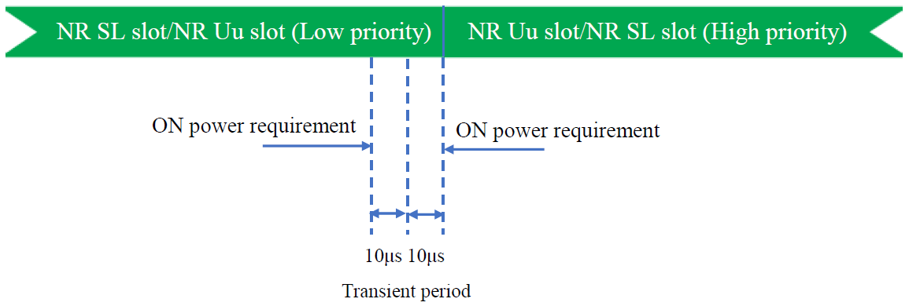
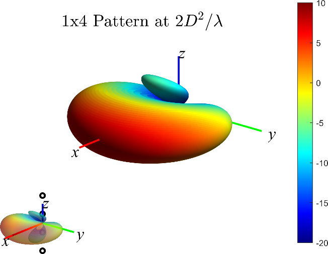

3GPP TR 38.785 V17.0.0 (2022-06)

Technical Report

3rd Generation Partnership Project;

Technical Specification Group Radio Access Network;

User Equipment (UE) radio transmission and reception for enhanced NR
sidelink;

(Release 17)

{width="1.31875in"
height="0.9201388888888888in"}
{width="1.7791666666666666in"
height="1.0368055555555555in"}

The present document has been developed within the 3rd Generation
Partnership Project (3GPP ^TM^) and may be further elaborated for the
purposes of 3GPP.\
The present document has not been subject to any approval process by the
3GPP Organizational Partners and shall not be implemented.\
This Report is provided for future development work within 3GPP only.
The Organizational Partners accept no liability for any use of this
Specification.\
Specifications and Reports for implementation of the 3GPP ^TM^ system
should be obtained via the 3GPP Organizational Partners\' Publications
Offices.

> Keywords
>
> \<NR V2X (vehicle-to-everything), Sidelink, Public safety, Proximity
> based Services\>
>
> ***3GPP***
>
> Postal address
>
> 3GPP support office address
>
> 650 Route des Lucioles - Sophia Antipolis
>
> Valbonne - FRANCE
>
> Tel.: +33 4 92 94 42 00 Fax: +33 4 93 65 47 16
>
> Internet
>
> http://www.3gpp.org

***Copyright Notification***

No part may be reproduced except as authorized by written permission.\
The copyright and the foregoing restriction extend to reproduction in
all media.

© 2022, 3GPP Organizational Partners (ARIB, ATIS, CCSA, ETSI, TSDSI,
TTA, TTC).

All rights reserved.

UMTS™ is a Trade Mark of ETSI registered for the benefit of its members

3GPP™ is a Trade Mark of ETSI registered for the benefit of its Members
and of the 3GPP Organizational Partners\
LTE™ is a Trade Mark of ETSI registered for the benefit of its Members
and of the 3GPP Organizational Partners

GSM® and the GSM logo are registered and owned by the GSM Association

 Contents {#contents .TT}
========

Foreword 6

1 Scope 7

2 References 7

3 Definitions, symbols and abbreviations 7

3.1 Definitions 7

3.2 Symbols 8

3.3 Abbreviations 10

4 Background 11

4.1 Justification 11

4.2 Objective 12

4.3 NR sidelink enhancement operating scenarios 13

4.3.1 General description 13

4.3.2 Operation Aspects 13

4.3.3 Synchronization reference source 14

5 Leftover RF requirements 17

5.1 Power class 2 sidelink UE 17

5.1.1 Coexistence evaluation for PC2 SL UE in licensed band 17

5.1.1.1 Coexistence evaluation scenarios 17

5.1.1.2 Coexistence simulations assumptions 17

5.1.1.2.1 Layout model 17

5.1.1.2.2 Simulation parameters 17

5.1.1.2.3 ACLR and ACS 19

5.1.1.2.4 Power control 19

5.1.1.3 Coexistence results 20

5.1.1.3.1 Scenario A 20

5.1.1.3.2 Scenario B 20

5.1.2 PC2 NR V2X UE RF requirements for single carrier 22

5.1.2.1 Maximum output power for NR V2X UE 22

5.1.2.2 UE maximum output power reduction 23

**5.1.2.2.1** **MPR for Power class 2 V2X UE** 24

5.1.2.3 UE maximum output power with additional requirements 25

**5.1.2.3.1** **A-MPR for NS\_33** 26

5.2 Intra-band V2X operation in a licensed band 27

5.2.1 Intra-band V2X operation scenarios and basic assumptions 27

5.2.2 Coexistence evaluation 28

5.2.2.1 Coexistence evaluation scenarios 28

5.2.2.2 Conclusion of Coexistence evaluations 28

5.2.3 Intra-band V2X operation with TDM operation 29

5.2.3.1 Operating bands for intra-band V2X operation with TDM operation
29

5.2.3.2 Tx requirements for intra-band V2X operation with TDM operation
29

5.2.3.2.1 Additional Tx requirements for TDM operation 29

5.2.3.3 Other Tx/Rx requirements for intra-band V2X operation with TDM
operation 32

5.2.4 Intra-band contiguous V2X con-current operation with FDM operation
32

5.2.4.1 Configuration for intra-band contiguous V2X con-current
operation with FDM operation 32

5.2.4.2 Tx requirements for intra-band contiguous V2X con-current
operation with FDM operation 32

5.2.4.2.1 Maximum output power 32

5.2.4.2.2 UE maximum output power reduction 32

5.2.4.2.3 Configured transmitted power for intra-band con-current V2X
operation 36

5.2.4.2.4 Minimum output power for intra-band con-current V2X operation
38

5.2.4.2.5 Transmit OFF power for intra-band con-current V2X operation 38

5.2.4.2.6 ON/OFF time mask for intra-band con-current V2X operation 38

5.2.4.2.7 Power control for intra-band con-current V2X operation 38

5.2.4.2.7.1 Absolute power tolerance 38

5.2.4.2.7.2 Relative power tolerance 38

5.2.4.2.7.3 Aggregate power control tolerance 38

5.2.4.2.8 Transmit signal quality for intra-band con-current V2X
operation 39

5.2.4.2.8.1 Frequecny error 39

5.2.4.2.8.2 EVM 39

5.2.4.2.8.3 In-band emission 39

5.2.4.2.8.4 Carrier leakage 39

5.2.4.2.8.5 EVM equalizer spectrum flatness 39

5.2.4.2.9 Spectrum emission mask for intra-band con-current V2X
operation 39

5.2.4.2.9.1 SEM for intra-band contiguous class C 39

5.2.4.2.10 ACLR requirements for intra-band con-current V2X operation 39

5.2.4.2.11 Spurious emission for intra-band con-current V2X operation 39

5.2.4.2.12 Spurious emission band UE co-existence for intra-band
con-current V2X operation 39

5.2.4.2.13 Transmit intermodulation for intra-band con-current V2X
operation 40

5.2.4.3 Rx requirements for intra-band contiguous V2X con-current
operation with FDM operation 40

5.2.4.3.1 Reference sensitivity power level 40

5.2.4.3.2 Maximum input level 40

5.2.4.3.3 Adjacent channel selectivity 41

5.2.4.3.4 Blocking characteristics 41

5.2.4.3.4.1 In-band blocking requirements 41

5.2.4.3.4.2 Out-of-band blocking requirements 41

5.2.4.3.4.3 Narrow band blocking requirements 41

5.2.4.3.5 Spurious response 41

5.2.4.3.6 Wide band intermodulation 41

5.2.5 Intra-band non-contiguous V2X con-current operation with FDM
operation 42

5.2.5.1 Configuration for intra-band non-contiguous V2X con-current
operation with FDM operation 42

5.3 TxD requirements for NR V2X 42

5.3.1 UE maximum output power reduction for V2X 42

5.3.1.1 MPR for V2X UE 42

5.3.2 Configured transmitted power for V2X 42

5.3.3 Transmit OFF power for V2X 43

5.3.4 Transmit ON/OFF time mask for V2X 43

5.3.5 Power control for V2X 43

5.3.6 Frequency error for V2X 43

5.3.7 Transmit modulation quality for V2X 43

5.3.7.1 General 43

5.3.7.2 Error Vector Magnitude for V2X 43

5.3.7.3 EVM equalizer spectrum flatness for V2X 43

5.3.8 Occupied bandwidth for V2X 44

5.3.9 Out of band emission for V2X 44

5.3.10 Spurious emissions for V2X 44

5.3.11 Transmit intermodulation for V2X 44

6 Sidelink enhancement for advanced V2X service, public safety and other
commercial use cases 45

6.1 Coexistence evaluation 45

6.1.1 Coexistence evaluation scenarios 45

6.1.1.1 Protection of B13/n13 UE by n14 PS operation with PC1/PC3 45

6.1.1.2 Protection of legacy n14 Uu system in coverage NW scenarios 45

6.1.2 Conclusion of Coexistence evaluations 46

6.2 Co-channel co-existence issue 46

7 Operating bands and channel arrangement for SL enhancement 48

7.1 Operating bands 48

7.1.1 Operating bands 48

7.2 Channel bandwidth 48

7.2.1 Channel bandwidth 48

7.3 Channel arrangement enhancement 48

7.3.1 Channel raster 48

7.3.1.1 NR-ARFCN and channel raster 48

7.3.1.2 Channel raster to resource element mapping 48

7.3.1.3 Channel raster entries for each operating band 49

7.3.2 Synchronization raster 49

8 Transmitter/Receiver characteristics for SL enhancement 50

8.1 SL enhancement UE Tx requirements 50

8.1.1 UE maximum output power 50

8.1.2 UE maximum output power reduction 50

8.1.3 UE additional maximum output power reduction 51

8.1.4 Configured transmitted power 52

8.1.5 Minimum output power 52

8.1.6 Transmit OFF power 52

8.1.7 Transmit ON/OFF time mask 52

8.1.8 Power control 52

8.1.9 Frequency error 52

8.1.10 Transmit modulation quality 52

8.1.11 Occupied bandwidth 53

8.1.12 Out of band emission 53

8.1.12.1 SEM 53

8.1.12.2 A-SEM 53

8.1.12.3 ACLR 53

8.1.13 Spurious Emission 53

8.1.13.1 General spurious emissions 53

8.1.13.2 Spurious emissions for UE co-existence 53

8.1.13.3 Additional spurious emissions requirements 54

8.1.14 Transmit intermodulation 54

8.1.15 Time Alignment Error 54

8.2 SL enhancement UE Rx requirements 54

8.2.1 Reference sensitivity power level 54

8.2.2 Maximum input level 55

8.2.3 Adjacent Channel Selectivity (ACS) 55

8.2.4 Blocking characteristics 56

8.2.4.1 In-band blocking 56

8.2.4.2 Out-of-band blocking 57

8.2.5 Spurious response 57

8.2.6 Intermodulation characteristics 58

9 Conclusion and recommendations 59

Annex A: Change history 60

 Foreword
========

This Technical Report has been produced by the 3^rd^ Generation
Partnership Project (3GPP).

The contents of the present document are subject to continuing work
within the TSG and may change following formal TSG approval. Should the
TSG modify the contents of the present document, it will be re-released
by the TSG with an identifying change of release date and an increase in
version number as follows:

Version x.y.z

where:

x the first digit:

1 presented to TSG for information;

2 presented to TSG for approval;

3 or greater indicates TSG approved document under change control.

y the second digit is incremented for all changes of substance, i.e.
technical enhancements, corrections, updates, etc.

z the third digit is incremented when editorial only changes have been
incorporated in the document.

 

1 Scope
=======

The present document is a technical report for NR sidelink enhancement
services in Rel-17. The purpose is to specify radio solutions that are
necessary for NR to support sidelink enhancement services based on the
study outcome captured in TR 38.840 and TR 37.885. Based on merged
motivations from interested companies, the following justification and
objectives of this work item decided in session 4.1 and session 4.2.

2 References
============

The following documents contain provisions which, through reference in
this text, constitute provisions of the present document.

\- References are either specific (identified by date of publication,
edition number, version number, etc.) or non‑specific.

\- For a specific reference, subsequent revisions do not apply.

\- For a non-specific reference, the latest version applies. In the case
of a reference to a 3GPP document (including a GSM document), a
non-specific reference implicitly refers to the latest version of that
document *in the same Release as the present document*.

\[1\] 3GPP TR 21.905: \"Vocabulary for 3GPP Specifications\".

\[2\] 3GPP TR 30.007: \"Guideline on WI/SI for new Operating Bands\".

\[3\] 3GPP TS 38.101-1: \"NR; User Equipment (UE) radio transmission and
reception; Part 1: Range 1 Standalone\".

\[4\] 3GPP TS 38.101-2: \"NR; User Equipment (UE) radio transmission and
reception; Part 2: Range 2 Standalone\".

\[5\] 3GPP TS 38.101-3: \"NR; User Equipment (UE) radio transmission and
reception; Part 3: Range 1 and Range 2 Interworking operation with other
radios\".

\[6\] RP-202846: "WID revision: NR sidelink enhancement".

3 Definitions, symbols and abbreviations
========================================

3.1 Definitions
---------------

For the purposes of the present document, the terms and definitions
given in 3GPP TR 21.905 \[1\] and the following apply. A term defined in
the present document takes precedence over the definition of the same
term, if any, in 3GPP TR 21.905 \[1\].

**Con-current operation**: The simultaneous transmission and reception
of sidelink and Uu interfaces, irrespective of TDM mode and FDM mode,
while operation is agnostic of the service used on each interface.

**Contiguous carriers**: A set of two or more carriers configured in a
spectrum block where there are no RF requirements based on co-existence
for un-coordinated operation within the spectrum block.

**Contiguous resource allocation**: A resource allocation of consecutive
resource blocks within one carrier or across contiguously aggregated
carriers. The gap between contiguously aggregated carriers due to the
nominal channel spacing is allowed.

**Contiguous spectrum**: Spectrum consisting of a contiguous block of
spectrum with no sub-block gaps.

**Intra-band V2X operation**: Operation of LTE V2X carrier and NR V2X
carrier in the same operating band.

**Intra-band V2X con-current operation:** Operation of NR SL carrier and
NR Uu carrier in the same licensed band.

**Intra-band contiguous V2X operation:** Operation of contiguous LTE V2X
carrier and NR V2X carrier in the same operating band.

**Intra-band contiguous V2X con-current operation:** Operation of
contiguous NR V2X carrier and NR Uu carrier in the same licensed band.

**Inter-band con-current operation:** Operation of NR Uu carrier and NR
V2X carrier in different operating bands**.**

**Intra-band V2X con-current operating UE**: UE that supports the
intra-band V2X con-current operation.

**NR V2X UE/ V2X UE**: UE that supports NR V2X/V2X features.

**NR V2X carrier**: Carrier for NR V2X service.

**PC5**: The interface for sidelink transmission.

**PC2 V2X UE**: V2X UE that supports 26 dBm power class.

**Sub-block**: This is one contiguous allocated block of spectrum for
transmission and reception by the same UE. There may be multiple
instances of sub-blocks within an RF bandwidth.

**Sub-block bandwidth**: The bandwidth of one sub-block.

**Sub-block gap**: A frequency gap between two consecutive sub-blocks
within an RF bandwidth, where the RF requirements in the gap are based
on co-existence for un-coordinated operation.

**UE transmission bandwidth configuration**: Set of resource blocks
located within the UE channel bandwidth which may be used for
transmitting or receiving by the UE.

**Vehicular UE:** A UE embedded in a vehicle, permanently connected to
an embedded antenna system that radiates externally for NR operating
bands.

NOTE: Vehicular UE does not refer to other UE form factors placed inside
the vehicle.

3.2 Symbols
-----------

For the purposes of the present document, the following symbols apply:

ΔF~Global~ Granularity of the global frequency raster

ΔF~Raster~ Band dependent channel raster granularity

Δf~OOB~ Δ Frequency of Out Of Band emission

ΔP~PowerClass~ Adjustment to maximum output power for a given power
class

∆~RB~ The starting frequency offset between the allocated RB and the
measured non-allocated RB

ΔR~IB,c~ Allowed reference sensitivity relaxation due to support for
inter-band CA operation, for serving cell *c*

Δ~Shift~ Channel raster offset

∆T~C~ Allowed operating band edge transmission power relaxation

∆T~C,*c*~ Allowed operating band edge transmission power relaxation for
serving cell *c*

∆SNR**~SL-Uu~** Difference in the target SNR value between NR Uu and SL
Uu

∆IL**~UL-DL~** Difference in insertion loss on the UL received path for
SL reception compare to the DL received path for NR Uu, and includes the
difference of UL filter compared to the DL filter of Band duplexer and
two switches on the UL path.

∆L~CRB~ Difference RB size between NR Uu RMC and NR SL RMC

BW~Channel~ Channel bandwidth

BW~Channel,block~ Sub-block bandwidth, expressed in MHz.
BW~Channel,block~= F~edge,block,high~- F~edge,block,low~

BW~Channel,max~ Maximum channel bandwidth supported among all bands in a
release

BW~Channel\_SL&UL~ The total channel bandwidth for SL and UL

BW~GB~ max( BW~GB,Channel(*k*)~ )

BW~GB,Channel(k)~ Minimum guard band of carrier *k*

BW~gap~ BW~gap~ is the bandwidth of the gap between N~RB1~ and N~RB2~
possible allocations of SL CC1 and UL CC2 respectively.

BW~DL~ Channel bandwidth for DL

BW~UL~ Channel bandwidth for UL

BW~interferer~ Bandwidth of the interferer

Ceil(x) Rounding upwards; ceil(x) is the smallest integer such that
ceil(x) ≥ x

Floor(x) Rounding downwards; floor(x) is the greatest integer such that
floor(x) ≤ x

F~C~ *RF reference frequency* on the channel raster

**F~C,block,\ high~** Fc of the highest transmitted/received carrier in
a *sub-block*

**F~C,block,\ low~** Fc of the lowest transmitted/received carrier in a
*sub-block*

F~C,low~ The Fc of the lowest carrier, expressed in MHz

F~C,high~ The Fc of the highest carrier, expressed in MHz

F~DL\_low~ The lowest frequency of the downlink *operating band*

F~DL\_high~ The highest frequency of the downlink *operating band*

F~UL\_low~ The lowest frequency of the uplink *operating band*

F~UL\_high~ The highest frequency of the uplink *operating band*

F~edge,block,low~ The lower *sub-block* edge, where F~edge,block,low~ =
F~C,block,low~ - F~offset,\ low.~

F~edge,block,high~ The upper *sub-block* edge, where F~edge,block,high~
= F~C,block,high~ + F~offset,\ high.~

F~edge\ ,\ low~ The *lower edge* of *aggregated channel bandwidth*,
expressed in MHz. F~edge,low~ = F~C,low~ - F~offset,low.~

F~edge,\ high~ The *higher edge* of *aggregated channel bandwidth*,
expressed in MHz. F~edge,high~ = F~C,high~ + F~offset,high.~

F~Interferer~ (offset) Frequency offset of the interferer (between the
center frequency of the interferer and the carrier frequency of the
carrier measured)

F~Interferer~ Frequency of the interferer

F~Ioffset~ Frequency offset of the interferer (between the center
frequency of the interferer and the closest edge of the carrier
measured)

F~offset~ Frequency offset from F~C\_high~ to the *higher edge* or
F~C\_low~ to the *lower edge.*

F~offset,high~ Frequency offset from F~C,high~ to the upper *UE RF
Bandwidth edge*, or from **F~C,block,\ high\ ~**to the upper sub-block
edge

F~offset,low~ Frequency offset from F~C,low~ to the lower *UE RF
Bandwidth edge*, or from **F~C,block,\ low\ ~**to the lower sub-block
edge

F~OOB~ The boundary between the NR out of band emission and spurious
emission domains

F~REF~ RF reference frequency

F~REF-Offs~ Offset used for calculating F~REF~

F~REF,Shift~ RF reference frequency for Supplementary Uplink (SUL) bands
and for the uplink for all FDD bands

F~uw~ (offset) The frequency separation of the center frequency of the
carrier closest to the interferer and the center frequency of the
interferer

G~post\ connector~ The supported post antenna connector gain

L~CRB~ Transmission bandwidth which represents the length of a
contiguous resource block allocation expressed in units of resources
blocks

A-MPR~Base~ The default A-MPR value when no G~post\ connector~ is
declared

A-MPRStep The weighting value of G~post\ connector~ when
G~post\ connector~ is declared

Max() The largest of given numbers

Min() The smallest of given numbers

Physical resource block number

NR~ACLR~ NR ACLR

NR\_SL~REFSENS~ The REFSENS value defined for NR SL

NR\_Uu~REFSENS~ The REFSENS value defined for NR Uu

N~RB~ Transmission bandwidth configuration, expressed in units of
resource blocks

N~RB\_alloc~ The allocated RBs

N~RB\_agg~ The number of the aggregated RBs within the fully allocated
aggregated channel bandwidth
$N_{RB_{\_ agg}} = \sum_{1}^{j}{N_{RB_{j}}*2^{\mu_{j}}}$ for carrier 1
to j, where *μ* is defined in TS 38.211

N~RB,c~ The transmission bandwidth configuration of component carrier c,
expressed in units of resource blocks
$N_{RB,cj} = N_{RB_{j}}*2^{\mu_{j}}$ for carrier j, where *μ* is defined
in TS 38.211

N~RB,largest\ BW~ The largest transmission bandwidth configuration of
the component carriers in the bandwidth combination, expressed in units
of resource blocks

N~RB,low~ The transmission bandwidth configurations according to Table
5.3.2-1 for the lowest assigned component carrier in clause 5.3A.1

N~RB,high~ The transmission bandwidth configurations according to Table
5.3.2-1 for the highest assigned component carrier in clause 5.3A.1

N~REF~ NR Absolute Radio Frequency Channel Number (NR-ARFCN)

N~REF-Offs~ Offset used for calculating N~REF~

NF~V2X~ Noise figure for V2X

P~CMAX~ The configured maximum UE output power

P~CMAX~, *~c~* The configured maximum UE output power for serving cell
*c*

P~CMAX~, *~f~*, *~c~* The configured maximum UE output power for carrier
*f* of serving cell *c* in each slot

P~EMAX~ Maximum allowed UE output power signalled by higher layers

P~EMAX,\ *c*~ Maximum allowed UE output power signalled by higher layers
for serving cell *c*

P~Interferer~ Modulated mean power of the interferer

P~largest\ BW~ Power of the largest transmission bandwidth configuration
of the component carriers in the bandwidth combination

P~PowerClass~ P~PowerClass~ is the nominal UE power (i.e., no tolerance)

P-MPR*~c~* Power Management Maximum Power Reduction for serving cell *c*

P~RB~ The transmitted power per allocated RB, measured in dBm

P~UMAX~ The measured configured maximum UE output power

Puw Power of an unwanted DL signal

Pw Power of a wanted DL signal

P~REFSENS\_V2X~ The REFSENS power for V2X

RB~start~ Indicates the lowest RB index of transmitted resource blocks

RB~Start,Low~ RB~Start,Low~ = max(1, floor(L~CRB~/2))

RB~Start,High~ RB~Start,High~ = N~RB~ -- RB~Start,Low~ -- L~CRB~

RX\_BW The bandwidth for receiving

REFSENS~V2X~ REFSENS value defined for V2X

SNR~V2X~ Signal-to-Noise Ratio for V2X

T(P~CMAX~, *~f~*, *~c~*) Tolerance for applicable values of P~CMAX~,
*~f~*, *~c~* for configured maximum UE output power for carrier *f* of
serving cell *c*

SS~REF~ SS block reference frequency position

3.3 Abbreviations
-----------------

For the purposes of the present document, the abbreviations given in
3GPP TR 21.905 \[1\] and the following apply. An abbreviation defined in
the present document takes precedence over the definition of the same
abbreviation, if any, in 3GPP TR 21.905 \[1\].

ACLR Adjacent Channel Leakage Ratio

ACS Adjacent Channel Selectivity

AGC Automatic Gain Control

A-MPR Additional Maximum Power Reduction

BLER BLock Error Rate

BS Base Station

CBW Channel Bandwidth

CDF Cumulative Distribution Function

CP-OFDM Cyclic Prefix-OFDM

DMRS Demodulation Reference Signal

DSRC Dedicated Short-Range Communications

EIRP Equivalent Isotropically Radiated Power

EVM Error Vector Magnitude

FDD Frequency Division Duplex

FDM Frequency Division Multiplexing

FR1 Frequency Range 1

FR2 Frequency Range 2

HD Half Duplex

ITS Intelligent Transportation System

IM Implementation Margin

LDPC Low Density Parity Check

LTE Long Term Evolution

LOS Line-Of-Sight

MPR Maximum Power Reduction

MBW Measurement BandWidth

NF Noise Figure

NLOS Non-Line-Of-Sight

NR New Radio

OLPC Open Loop Power Control

PC Power Control

PIR Packet Inter-Reception

PRB Physical Resource Block

PRR Package Reception Ratio

ProSe Proximity-based Services

PSCCH Physical Sidelink Control CHannel

PSSCH Physical Sidelink Shared CHannel

REFSENS Reference Sensitivity

RF Radio Frequency

SCS Sub-Carrier Spacing

SINR Signal to Interference plus Noise Ratio

SL Sidelink

SNR Signal-to-Noise Ratio

TDD Time Division Duplex

TDM Time Division Multiplexing

UE User Equipment

UL Uplink

V2V Vehicle to Vehicle

V2X Vehicle to Everything

VRU Vulnerable Road User

4 Background
============

4.1 Justification
-----------------

3GPP has been developing standards for sidelink as a tool for UE to UE
direct communication required in various use cases since LTE. The first
standard for NR sidelink enhancement is to be completed in Rel-16 by the
work item "5G V2X with NR sidelink" where solutions including NR
sidelink are being specified mainly for vehicle-to-everything (V2X)
while they can also be used for public safety when the service
requirement can be met.

Meanwhile, the necessity of NR sidelink enhancement has been identified.
For V2X and public safety, the service requirements and operation
scenarios are not fully supported in Rel-16 due to the time limitation,
and SA works are ongoing on some enhancement in Rel-17 such as
architecture enhancements for 3GPP support of advanced V2X services --
Phase 2 (FS\_eV2XARC\_Ph2) and System enhancement for Proximity based
Services in 5GS (FS\_5G\_ProSe). In addition, other commercial use cases
related to NR sidelink are being considered in SA WGs via several
work/study items such as Network Controlled Interactive Service (NCIS),
Gap Analysis for Railways (MONASTERYEND), Enhanced Relays for Energy
eFficiency and Extensive Coverage (REFEC), Audio-Visual Service
Production (AVPROD). In order to provide a wider coverage of NR sidelink
for these use cases and be able to provide the radio solutions in
accordance with the progress in SA WGs, it is necessary to specify
enhancements to NR sidelink in TSG RAN.

The following significant interest has been observed based on the
several motivations for SL enhancements.

**- Power saving** enables UEs with battery constraint to perform
sidelink operations in a power efficient manner. Rel-16 NR sidelink is
designed based on the assumption of "always-on" when UE operates
sidelink, e.g., only focusing on UEs installed in vehicles with
sufficient battery capacity. Solutions for power saving in Rel-17 are
required for vulnerable road users (VRUs) in V2X use cases and for UEs
in public safety and commercial use cases where power consumption in the
UEs needs to be minimized.

**- Enhanced reliability and reduced latency** allow the support of
URLLC-type sidelink use cases in wider operation scenarios. The system
level reliability and latency performance of sidelink is affected by the
communication conditions such as the wireless channel status and the
offered load, and Rel-16 NR sidelink is expected to have limitation in
achieving high reliability and low latency in some conditions, e.g.,
when the channel is relatively busy. Solutions that can enhance
reliability and reduce latency are required in order to keep providing
the use cases requiring low latency and high reliability under such
communication conditions.

While several work areas have been identified in the discussion, some
important principles were also discussed regarding the 3GPP evolution
for NR sidelink. In dealing with different use cases in the evolution of
NR sidelink, WGs should strive to achieve maximum commonality between
commercial, V2X, and Critical Communication usage of sidelink in order
to avoid duplicated solutions and maximize the economy of scale. In
addition, enhancements introduced in Rel-17 should be based on the
functionalities specified in Rel-16, instead of designing the
fundamental NR sidelink functionality again in Rel-17.

4.2 Objective
-------------

The objective of this work item is to specify radio solutions that are
necessary for NR sidelink enhancement to support advanced V2X services,
public safety services and other commercial use cases related to NR
sidelink. In the following objectives, RAN4 should focus on the
objective 4 and 6 in the approved WID \[1\] as below

-   Sidelink evaluation methodology update: Define evaluation assumption
    and performance metric for power saving by reusing TR 36.843 and/or
    TR 38.840 (to be completed by RAN\#89) \[RAN1\]

Note: TR 37.885 is reused for the other evaluation assumption and
performance metric. Vehicle dropping model B and antenna option 2 shall
be a more realistic baseline for highway and urban grid scenarios.

\- Resource allocation enhancement:

\- Specify resource allocation to reduce power consumption of the UEs
\[RAN1, RAN2\]

\- Baseline is to introduce the principle of Rel-14 LTE sidelink random
resource selection and partial sensing to Rel-16 NR sidelink resource
allocation mode 2.

Note: Taking Rel-14 as the baseline does not preclude introducing a new
solution to reduce power consumption for the cases where the baseline
cannot work properly.

-   This work should consider the impact of sidelink DRX, if any.

\- Study the feasibility and benefit of solution(s) on the
enhancement(s) in mode 2 for enhanced reliability and reduced latency in
consideration of both PRR and PIR defined in TR37.885 (by RAN\#91), and
specify the identified solution(s) if deemed feasible and beneficial
\[RAN1, RAN2\]

\- Inter-UE coordination with the following.

\- A set of resources is determined at UE-A. This set is sent to UE-B in
mode 2, and UE-B takes this into account in the resource selection for
its own transmission.

Note: The solution should be able to operate in-coverage, partial
coverage, and out-of-coverage and to address consecutive packet loss in
all coverage scenarios.

Note: RAN2 work will start after RAN\#89.

\- Sidelink DRX for broadcast, groupcast, and unicast \[RAN2\]

\- Define on- and off-durations in sidelink and specify the
corresponding UE procedure

\- Specify mechanism aiming to align sidelink DRX wake-up time among the
UEs communicating with each other

\- Specify mechanism aiming to align sidelink DRX wake-up time with Uu
DRX wake-up time in an in-coverage UE

\- Support of new sidelink frequency bands for single-carrier operations
\[RAN4\]

\- Support of new sidelink frequency bands should ensure coexistence
between sidelink and Uu interface in the same and adjacent channels in
licensed spectrum.

\- The exact frequency bands are to be determined based on company input
during the WI, considering both licensed and ITS-dedicated spectrum in
both FR1 and FR2.

\- Define mechanism to ensure sidelink operation can be confined to a
predetermined geographic area(s) for a given frequency range within
non-ITS bands \[RAN2\].

\- This applies areas where there is no network coverage.

\- UE Tx and Rx RF requirement for the new features introduced in this
WI \[RAN4\]

\- UE RRM core requirement for the new features introduced in this WI
\[RAN4\]

Enhancements introduced in Rel-17 should be based on the functionalities
specified in Rel-16, and Rel-17 sidelink should be able to coexist with
Rel-16 sidelink in the same resource pool. This does not preclude the
possibility of operating Rel-17 sidelink in a dedicated resource pool.

The solutions should cover both the operating scenario where the
carrier(s) is/are dedicated to ITS and the operating scenario where the
carrier(s) is/are licensed spectrum and also used for NR Uu/LTE Uu
operation.

The solutions should support the network control of NR sidelink as in
Rel-16, i.e., NR Uu controls NR sidelink using Layer 1 and Layer 2
signalling and LTE Uu controls NR sidelink using Layer 2 signalling.

In ITS carriers, it is assumed that any co-channel coexistence
requirements and mechanisms of NR sidelink with non-3GPP technologies
will not be defined by 3GPP.

Also, RAN4 agreed to specify additional V2X RF requirements as following

\- Left over issue in Rel-16:

\- Supporting PC2 NR SL UE RF requirements (PC2 single at n47, PC2
SL-MIMO at n47, PC2 inter-band con-current operation)

\- Partial used SL operation in a carrier including n79 and other
interesting bands

\- Cover the Frequency separation issues and timing alignment issue

4.3 NR sidelink enhancement operating scenarios
-----------------------------------------------

### 4.3.1 General description

The NR Sidelink enhancement operating scenarios will be described to
support advanced V2X services, public safety services and other
commercial use cases based on agreed WID. RAN4 needs to enhance RF core
requirements based on operating scenarios in Rel-16 NR V2X service and
the Proximity service (ProSe) in TR 36.877.

Specifically, RAN4 did not complete some open issues in Rel-16 NR V2X,
which include:

\- TxD for NR V2X

\- PC2 HPUE for NR V2X

\- Intra-band V2X operation for TDD band, e.g. band n79

\- Intra-band con-current V2X operation for TDD band, e.g. band n79

The left over items will be further studied and specified into the
related RF requirements in this TR.

From RAN4 RF perspective, it is necessary to study coexistence before
introducing the new frequency NR band to support NR sidelink enhancement
operating at a frequency adjacent to NR Uu service for advanced V2X
services, public safety services and other commercial use cases in
licensed spectrum.

In RAN4 \#98-e meeting, RAN4 agreed not to introduce a new band for NR
sidelink in FR2 since no operator proposed a FR2 NR operating band for
NR sidelink.

Hence, RAN4 need to study and specify the RF core requirements for NR
sidelink enhancement only in FR1 in Rel-17.

### 4.3.2 Operation Aspects

Operating scenarios for NR sidelink enhancement WI are as follows:

-   (Aspect 1) SL services and Operating band perspectives

\- Case 1: Public Safety Service

\- Case 1A: Dedicated public safety licensed band such as NR Band n14

\- Public safety UE operated in both in-coverage and out-of-coverage.

\- Case 1B: Dedicated public safety licensed band in other licensed
bands (depends on inputs from operators)

\- Public safety UE operated in both in-coverage and out-of-coverage.

\- Case 2: NR V2X service

\- Case 2A: V2X UE in ITS spectrum (e.g. 5.9GHz (n47))

\- RAN4 already evaluated in ITS spectrum in Rel-16 NR V2X WI

\- Case 2B: V2X UE in FR1 licensed bands (e.g. 4.5GHz(TDD), 2GHz(FDD))

\- TDD coexistence evaluated in Rel-16 NR V2X WI

\- FDD coexistence need to evaluated to protect legacy system (depends
on inputs on operating band from operators)

\- Case 3: Other commercial use cases (depends on inputs from operators
and other WGs)

\- Basic operation can be performed in existing NR SL operating bands.

\- If specific operating band is requested, need to add a new operating
band in suffix E in TS38.101-1.

-   (Aspect 2) gNB deployment including network control possibility

\- Case 1: Public safety Service

\- Case 1A: gNB is not deployed since only public safety UE operated in
out-of-coverage in licensed band such as n14

\- Case 1B: gNB is deployed to support both legacy NR UE and public
safety UE

\- Public safety UE needs to protect the legacy NR system

\- Case 2: NR V2X service

\- Case 2A: No gNB deployment scenarios based on semi-statically
network-configured/pre-configured radio parameters

\- Support UE autonomous resource allocation, at least mode 2.

\- Case 2B: gNB deployment scenarios

\- Providing more UE specific or/and more dynamic resource allocation
including Mode 1.

\- Case 3: Other commercial use cases

\- Basic NR sidelink operation can support both in-coverage and
out-of-coverage scenarios.

\- If identified, RAN4 need to add new operating scenarios

RAN4 shall consider exact deployment scenarios and operating band
planning for public safety service, NR V2X service and other commercial
SL operation.

### 4.3.3 Synchronization reference source

It was agreed in RAN4 to follow the existing RAN1 design on sync
reference source. The agreements by RAN1 are listed below:

-   Whether GNSS-based synchronization or gNB/eNB-based synchronization
    is used is (pre)-configured.

\- The following table is a working assumption

+----------------------------------+----------------------------------+
| GNSS-based synchronization       | gNB/eNB-based synchronization    |
+==================================+==================================+
| P0: GNSS                         | P0: gNB/eNB                      |
|                                  |                                  |
| P1: The following UE has the     | P1': UE directly synchronized to |
| same priority:                   | gNB/eNB                          |
|                                  |                                  |
| UE directly synchronized to GNSS | P2': UE indirectly synchronized  |
|                                  | to gNB/eNB                       |
| P2: The following UE has the     |                                  |
| same priority:                   | P3': GNSS                        |
|                                  |                                  |
| UE indirectly synchronized to    | P4': UE directly synchronized to |
| GNSS                             | GNSS                             |
|                                  |                                  |
| P3: The remaining UEs have the   | P5': UE indirectly synchronized  |
| lowest priority.                 | to GNSS                          |
|                                  |                                  |
|                                  | P6': The remaining UEs have the  |
|                                  | lowest priority.                 |
+----------------------------------+----------------------------------+

-   For confirmation of the working assumption of synchronization
    priority rules, eNB/gNB should be included into the priority order
    of GNSS-based synchronization.

+----------------------------------+----------------------------------+
| GNSS-based synchronization       | gNB/eNB-based synchronization    |
+==================================+==================================+
| P0: GNSS                         | P0': gNB/eNB                     |
|                                  |                                  |
| P1: UE directly synchronized to  | P1': UE directly synchronized to |
| GNSS                             | gNB/eNB                          |
|                                  |                                  |
| P2: UE indirectly synchronized   | P2': UE indirectly synchronized  |
| to GNSS                          | to gNB/eNB                       |
|                                  |                                  |
| P3: gNB/eNB                      | P3': GNSS                        |
|                                  |                                  |
| P4: UE directly synchronized to  | P4': UE directly synchronized to |
| gNB/eNB                          | GNSS                             |
|                                  |                                  |
| P5: UE indirectly synchronized   | P5': UE indirectly synchronized  |
| to gNB/eNB                       | to GNSS                          |
|                                  |                                  |
| P6: the remaining UEs have the   | P6': the remaining UEs have the  |
| lowest priority.                 | lowest priority.                 |
+----------------------------------+----------------------------------+

Based on RAN2 specification in TS 38.331：

+----------------------------------------------------------------------+
| 5.8.12 DFN derivation from GNSS                                      |
|                                                                      |
| When the UE selects GNSS as the synchronization reference source,    |
| the DFN, the subframe number within a frame and slot number within a |
| frame used for NR sidelink communication are derived from the        |
| current UTC time, by the following formulae:                         |
|                                                                      |
| *DFN*= Floor (0.1\*(*Tcurrent* --*Tref--OffsetDFN*)) mod 1024        |
|                                                                      |
| *SubframeNumber*= Floor (*Tcurrent* --*Tref--OffsetDFN*) mod 10      |
|                                                                      |
| *SlotNumber*= Floor ((*Tcurrent* --Tref--*OffsetDFN*)\*2^μ^) mod     |
| (10\*2^μ^)                                                           |
|                                                                      |
| Where:                                                               |
|                                                                      |
| ***Tcurrent*** is the current UTC time that obtained from GNSS. This |
| value is expressed in milliseconds;                                  |
|                                                                      |
| ***Tref*** is the reference UTC time 00:00:00 on Gregorian calendar  |
| date 1 January, 1900 (midnight between Thursday, December 31, 1899   |
| and Friday, January 1, 1900). This value is expressed in             |
| milliseconds;                                                        |
|                                                                      |
| ***OffsetDFN*** is the value *sl-OffsetDFN* if configured, otherwise |
| it is zero. This value is expressed in milliseconds.                 |
+----------------------------------------------------------------------+

And according to RAN1 agreements, there are two standalone lists for
synchronization priority as GNSS-based synchronization or gNB/eNB-based
synchronization. When a UE is (pre)-configured with GNSS-based
synchronization, the UE would prefer GNSS as synchronization resource.
When a UE is (pre)-configured with gNB/eNB -based synchronization, the
UE would prefer network as synchronization resource. Also based on RAN1
agreement, it is up to (pre)-configuration whether GNSS-based
synchronization or gNB/eNB-based synchronization is used.

When SL and Uu operate in the same licensed band, it is up to network
configuration to determine GNSS-based synchronization or gNB/eNB-based
synchronization is used. On the one hand, it is natural that a UE can be
configured by network with the network based synchronization for
intra-band con-current V2X operating bands. On the other hand, when GNSS
is known by network, it is still reasonable that a UE is
(pre)-configured with GNSS-based synchronization for intra-band
con-current V2X operating bands, because there is an '*OffsetDFN*'
defined in TS 38.331 which is indicated by network to make sure that
there is a common understanding for SL and Uu about which slot is used
for SL transmission. Then it is up to network implementation to
determine the synchronization list configuration for a SL UE, no more
specification impact is needed.

5 Leftover RF requirements
==========================

5.1 Power class 2 sidelink UE
-----------------------------

### 5.1.1 Coexistence evaluation for PC2 SL UE in licensed band

In this section, the adjacent channel system coexistence evaluation for
PC2 NR V2X operation was studied for NR V2X services. The operating
scenarios include the case where the carrier is deployed for NR V2X
service in licensed spectrum. For the licensed carrier, the coexistence
evaluation include LTE or NR Uu on the adjacent carrier of NR V2X.

#### 5.1.1.1 Coexistence evaluation scenarios

The adjacent channel coexistence evaluation scenarios for PC2 NR V2X
service are shown in Table 5.1.1.1-1

Table 5.1.1.1-1: The adjacent channel coexistence scenarios for PC2 NR
V2X service

+----------------------+----------------------+----------------------+
| NR V2X operating     | Deployment scenarios |                      |
| frequency            |                      |                      |
|                      | (                    |                      |
|                      | Aggressor-to-Victim) |                      |
+======================+======================+======================+
| FR1                  | Scenario A: V2X      | Case1: PC2 NR V2X    |
|                      | service at licensed  | UE-to- PC2 NR V2X UE |
|                      | band where only NR   |                      |
|                      | SL is supported.     | Case2: PC2 NR V2X    |
|                      | (TDD: 2.6GHz)        | UE-to- PC3 NR V2X UE |
|                      |                      |                      |
|                      | (2nd priority)       |                      |
+----------------------+----------------------+----------------------+
|                      | Scenario B: V2X      | Case3: : PC2 NR V2X  |
|                      | service at licensed  | UE-to-NR Uu BS       |
|                      | bands where NR SL    |                      |
|                      | and NR Uu are        | Case4: NR Uu UE-to-  |
|                      | supported. (TDD:     | PC2 NR V2X UE        |
|                      | 2.6GHz)              |                      |
|                      |                      |                      |
|                      | (1^st^ priority)     |                      |
+----------------------+----------------------+----------------------+

Basic simulation parameters are below

\- Deployment scenarios: Urban Manhattan grid model

\- Simulation Block Size :

\- Urban : Manhattan grid model: 3\*433m, 3\*250m

-   RAN1 dependent parameter

\- For licensed band, NR SL operation in Uplink band in FDD, UL
opportunity in TDD is considered.

\- For SINR calculation in partial overlapping between aggressor and
victim, worst case SINR should be considered.

The details of the deployment scenarios are presented in the following
clauses.

#### 5.1.1.2 Coexistence simulations assumptions 

##### 5.1.1.2.1 Layout model

RAN4 reuse the Manhattan Grid model based on the network layout model
for licensed band as shown in section 5.2.1 and section 5.2.2 in
TR38.886.

##### 5.1.1.2.2 Simulation parameters

In Table 5.1.1.2.2-1 and Table 5.1.1.2.2-2, RAN4 provide detail
simulation parameters for PC2 coexistence evaluation in licensed band.

Table 5.1.1.2.2-1: Simulation parameters in licensed band for scenarios
A

+----------------------+----------------------+----------------------+
| Parameter            | Value                |                      |
+======================+======================+======================+
|                      | NR V2X UE            | NR V2X UE (Victim)   |
|                      | (Aggressor)          |                      |
+----------------------+----------------------+----------------------+
| Tx power             | 26dBm                | 23dBm or 26dBm       |
+----------------------+----------------------+----------------------+
| Channel Bandwidth    | 20MHz                | 20MHz                |
+----------------------+----------------------+----------------------+
| Packet size          | 1\) 14 PRB (190 byte | 1\) 14 PRB (190 byte |
|                      | packet) for 15kHz    | packet) for 15kHz    |
|                      | SCS                  | SCS                  |
|                      |                      |                      |
|                      | 2\) Other options    | 2)Other options are  |
|                      | are not precluded    | not precluded        |
+----------------------+----------------------+----------------------+
| Traffic model        | 1 transmission every |                      |
|                      | 100ms                |                      |
|                      |                      |                      |
|                      | -100ms message       |                      |
|                      | generation period    |                      |
|                      |                      |                      |
|                      | \- Time instance of  |                      |
|                      | message generation   |                      |
|                      | is randomized among  |                      |
|                      | vehicles             |                      |
+----------------------+----------------------+----------------------+
| Noise figure         | 9dB                  | 9dB                  |
+----------------------+----------------------+----------------------+
| Antenna pattern      | Omni-directional     |                      |
|                      | with gain of 0 dBi   |                      |
+----------------------+----------------------+----------------------+
| Sidelink Power       | The worst case of no |                      |
| control              | power control is     |                      |
|                      | used                 |                      |
+----------------------+----------------------+----------------------+
| SINR-to-BLER mapping | As per link level    | As per link level    |
|                      | performance model in | performance model in |
|                      | TR 38.xxx            | TR 38.xxx            |
|                      |                      |                      |
|                      | Table A-x for 2.6GHz | Table A-x for 2.6GHz |
+----------------------+----------------------+----------------------+

Table 5.1.1.2.2-2: Simulation parameters in licensed band for scenarios
B

+----------------+----------------+----------------+----------------+
| Parameter      | Value          |                |                |
+================+================+================+================+
|                | NR UE          | NR BS          | NR V2X UE      |
+----------------+----------------+----------------+----------------+
| Max Tx power   | 23dBm or 26dBm | NA             | 26dBm          |
+----------------+----------------+----------------+----------------+
| Channel        | 20MHz          | 20MHz          | 20MHz          |
| Bandwidth      |                |                |                |
+----------------+----------------+----------------+----------------+
| Packet size    | 1\) \[32\] PRB |                | 1\) 14 PRB     |
|                | for 15kHz SCS  |                | (190 byte      |
|                |                |                | packet) for    |
|                | 2\) Other      |                | 15kHz SCS      |
|                | options are    |                |                |
|                | not precluded  |                | 2\) Other      |
|                |                |                | options are    |
|                |                |                | not precluded  |
+----------------+----------------+----------------+----------------+
| Traffic model  | Full buffer    | Full buffer    | Reference      |
|                |                |                | table          |
|                |                |                | 5.2.1.2-1      |
+----------------+----------------+----------------+----------------+
| Noise figure   | N/A            | 5dB            | 9dB            |
+----------------+----------------+----------------+----------------+
| Antenna        | Om             | Antenna        | Om             |
| pattern        | ni-directional | pattern for    | ni-directional |
|                | with gain of   | FR1 Macro BS   | with gain of   |
|                | 0 dBi          | from TR 38.828 | 0 dBi          |
+----------------+----------------+----------------+----------------+
| SINR-to-BLER   | NA             | NA             | As per link    |
| mapping for NR |                |                | level          |
| V2X            |                |                | performance    |
|                |                |                | model in TR    |
|                |                |                | 38.xxx         |
|                |                |                |                |
|                |                |                | Table A-x for  |
|                |                |                | 2.6GHz         |
+----------------+----------------+----------------+----------------+
| SINR-to-rate   | NA             | As per link    | NA             |
| mapping for NR |                | level          |                |
|                |                | performance    |                |
|                |                | model in TR    |                |
|                |                | 36.942 (Table  |                |
|                |                | A.2). α,       |                |
|                |                | attenuation =  |                |
|                |                | 0.4,           |                |
|                |                | SNIR~MIN~, dB  |                |
|                |                | = -10,         |                |
|                |                | SNIR~MAX~, dB  |                |
|                |                | = 22           |                |
|                |                | (subclause     |                |
|                |                | 5.2.3.6 from   |                |
|                |                | TR 38.828).    |                |
+----------------+----------------+----------------+----------------+

##### 5.1.1.2.3 ACLR and ACS

RAN4 only consider 1step ACLR/ACS model to derive the PC2 coxistence
evaluation in licensed band

Table 5.1.1.2.3-1: ACLR and ACS in licensed band for scenarios A

+-----------+---------------------------+----------------------------+
| Parameter | Value                     |                            |
+===========+===========================+============================+
|           | PC2 NR V2X UE (Aggressor) | NR V2X UE (Victim PC3/PC2) |
+-----------+---------------------------+----------------------------+
| ACLR      | 31+XdB                    | 30 + X dB                  |
|           |                           |                            |
|           |                           | 31 + X dB                  |
+-----------+---------------------------+----------------------------+
| ACS       | 27+XdB                    | 27+ X dB                   |
+-----------+---------------------------+----------------------------+

Table 5.1.1.2.3-2: ACLR and ACS in licensed band for scenarios B

  Parameter   Value                     
  ----------- ----------------- ------- -----------------
              NR UE (PC3/PC2)   NR BS   NR V2X UE (PC2)
  ACLR        30 dB/31 dB       NA      31 + X dB
  ACS         NA                46 dB   27 + X dB

##### 5.1.1.2.4 Power control

For V2X operating scenarios A, RAN4 make consensus to reuse the OLPC in
TR36.786 or no power control is considered.

For V2X operating scenarios B, the power control mechanism which was
specified in clause 5.2.3.4 in TR38.886 for FR1 TDD band can be reused.

#### 5.1.1.3 Coexistence results

##### 5.1.1.3.1 Scenario A

In this clause, the simulation results in scenario A are provided. The
simulation results for case1 are listed below based on 31dB ACLR and
27dB ACS.

{width="3.3541666666666665in"
height="2.6354166666666665in"}{width="3.2291666666666665in"
height="2.625in"}

Figure 5.1.1.3.1-1 simulation results for scenario A case1

And the PRR loss can be found in the below table.

Table 5.1.1.3.1-1 PRR loss for scenario A case1

+----------+--------------------------+-------------------------+
| PRR loss | PC2 NR V2X to NR V2X     | PC2 NR V2X to NR V2X    |
|          |                          |                         |
|          | At 150m range for 60km/h | At 50m range for 15km/h |
+==========+==========================+=========================+
| 1100Byte | 3.9%                     | 0.3%                    |
+----------+--------------------------+-------------------------+

Based on NR V2X co-existence simulation results for case1, the following
observations are made:

-   For both PRR loss at 50m range for 15km/h and at 150m range for
    60km/h, NR V2X UE makes acceptable interference to NR V2X UE victim.

-   All the PRR loss is less than 5%.

##### 5.1.1.3.2 Scenario B

In this clause, the simulation results in scenario B are provided. The
simulation results for case3 and case4 are listed below based on 31dB
ACLR and 27dB ACS for V2X UE.

{width="3.375in"
height="2.65625in"}{width="3.2916666666666665in"
height="2.6354166666666665in"}

Figure 5.1.1.3.2-1 SINR and Throughput without power control for case3

{width="3.3125in"
height="2.6354166666666665in"}{width="3.3333333333333335in"
height="2.625in"}

Figure 5.1.1.3.2-2 SINR and Throughput with power control for case3

{width="4.645833333333333in"
height="2.9270833333333335in"}

Figure 5.1.1.3.2-3 Coexistence results for case4 without power control

{width="4.4375in"
height="2.6041666666666665in"}

Figure 5.1.1.3.2-4 Coexistence results for case4 with power control

And the throughput loss and PRR loss can be found in the below table.

Table 5.1.1.3.2-1 Throughput loss for PC2 case3

  Throughput loss   5% tile                 
  ----------------- ----------------------- -------------------------
                    without power control   with power control
                    26%                     little performance loss

Table 5.1.1.3.2-2 PRR loss for PC2 case4

  PRR loss (1100Byte)   At 150m range for 60km/h   
  --------------------- -------------------------- --------------------
                        without power control      with power control
                        1.4%                       8.6%

Based on PC2 NR V2X co-existence simulation results for case3 and case4,
the following observations are made:

-   With power control PRR loss at 150m range for 60km/h exceeds 5%, so
    the performance loss can be observed for NR V2X UE. But it is
    observed that there is very little performance loss for NR BS in
    this scenario.

-   Without power control the throughput loss at 5%-tile for 60km/h
    exceeds 5%, so the performance loss can't be accepted for NR BS. But
    it is observed that there is only 1.4% PRR loss for NR V2X UE in
    this scenario.

### 5.1.2 PC2 NR V2X UE RF requirements for single carrier

#### 5.1.2.1 Maximum output power for NR V2X UE

The following V2X UE Power Classes define the maximum output power for
any transmission bandwidth within the channel bandwidth. The period of
measurement shall be at least one sub frame (1ms).

Table 8.1-1: V2X UE Power Class

+-------+-------+-------+-------+-------+-------+-------+-------+-------+
| NR    | Class | Tole  | Class | Tole  | Class | Tole  | Class | Tole  |
| band  | 1     | rance | 2     | rance | 3     | rance | 4     | rance |
|       | (dBm) | (dB)  | (dBm) | (dB)  | (dBm) | (dB)  | (dBm) | (dB)  |
+=======+=======+=======+=======+=======+=======+=======+=======+=======+
| ...   |       |       |       |       |       |       |       |       |
+-------+-------+-------+-------+-------+-------+-------+-------+-------+
| n47   |       |       | 26    | ±2    | 23    | ±2    |       |       |
+-------+-------+-------+-------+-------+-------+-------+-------+-------+
| NOTE  |       |       |       |       |       |       |       |       |
| 1: NR |       |       |       |       |       |       |       |       |
| Band  |       |       |       |       |       |       |       |       |
| n47   |       |       |       |       |       |       |       |       |
| is    |       |       |       |       |       |       |       |       |
| used  |       |       |       |       |       |       |       |       |
| for   |       |       |       |       |       |       |       |       |
| NR    |       |       |       |       |       |       |       |       |
| V2X   |       |       |       |       |       |       |       |       |
| Ser   |       |       |       |       |       |       |       |       |
| vice. |       |       |       |       |       |       |       |       |
|       |       |       |       |       |       |       |       |       |
| NOTE  |       |       |       |       |       |       |       |       |
| 2:    |       |       |       |       |       |       |       |       |
| P~P   |       |       |       |       |       |       |       |       |
| owerC |       |       |       |       |       |       |       |       |
| lass~ |       |       |       |       |       |       |       |       |
| is    |       |       |       |       |       |       |       |       |
| the   |       |       |       |       |       |       |       |       |
| ma    |       |       |       |       |       |       |       |       |
| ximum |       |       |       |       |       |       |       |       |
| UE    |       |       |       |       |       |       |       |       |
| power |       |       |       |       |       |       |       |       |
| spec  |       |       |       |       |       |       |       |       |
| ified |       |       |       |       |       |       |       |       |
| wi    |       |       |       |       |       |       |       |       |
| thout |       |       |       |       |       |       |       |       |
| t     |       |       |       |       |       |       |       |       |
| aking |       |       |       |       |       |       |       |       |
| into  |       |       |       |       |       |       |       |       |
| ac    |       |       |       |       |       |       |       |       |
| count |       |       |       |       |       |       |       |       |
| the   |       |       |       |       |       |       |       |       |
| tole  |       |       |       |       |       |       |       |       |
| rance |       |       |       |       |       |       |       |       |
+-------+-------+-------+-------+-------+-------+-------+-------+-------+

#### 5.1.2.2 UE maximum output power reduction

The following assumption can serve as a starting point for MPR
simulation assumptions as shown in Table 5.1.2.2-1 and Table 5.1.2.2-2.

Table 5.1.2.2-1: MPR simulation assumption for PC2 NR V2X

+----------------------+----------------------------------------------+
| Parameter            | Assumption                                   |
+======================+==============================================+
| Center frequency     | **5.9GHz**                                   |
+----------------------+----------------------------------------------+
| Bandwidth            | **10/20/30/40MHz**                           |
+----------------------+----------------------------------------------+
| Maximum output power | 26 dBm                                       |
+----------------------+----------------------------------------------+
| Numerology           | 15 kHz/30kHz/60kHz                           |
+----------------------+----------------------------------------------+
| Modulation           | QPSK/16QAM/64QAM/256QAM                      |
+----------------------+----------------------------------------------+
| Waveform             | CP-OFDM                                      |
+----------------------+----------------------------------------------+
| Carrier leakage      | 25dBc                                        |
+----------------------+----------------------------------------------+
| IQ image             | 25dBc                                        |
+----------------------+----------------------------------------------+
| CIM3                 | 45dBc or 60dBc                               |
+----------------------+----------------------------------------------+
| PA calibration       | PA calibrated to deliver \[31dBc\] ACLR for  |
|                      | a fully allocated RBs in 20MHz QPSK DFT-     |
|                      | S-OFDM waveform at 1 dB MPR.                 |
|                      |                                              |
|                      | This is based to share PA between LTE V2X    |
|                      | and NR V2X at 5.9GHz as worst case.          |
+----------------------+----------------------------------------------+

For PC2 NR V2X, simultaneous transmission of PSCCH and PSSCH in the same
sub-frame is supported. The following constraints in Table 5.1.2.2-2 can
be assumed based on current RAN1's agreement.

Table 5.1.2.2-2: PC2 V2X UE's MPR simulation assumptions

  Items                                        Assumption
  -------------------------------------------- -----------------------------------------------------------------------------------------------------------------------------------------------------------------
  Allowed sub-channel sizes                    Support {10, 12, 15, 20, 25, 50, 75, 100} PRBs for possible sub-channel size.
  Allowed L~CRB~ allocation                    10,12,15,20,24,25,30,36,40,45,48,50,60,70,72,75,80,84,90,96,100,105,108,110,120,130,132,135,140,144,150,156,160,165,168,170,175,180,190,192,195,200,204,210,216
  Regarding PSCCH / PSSCH multiplexing         {width="2.2534722222222223in" height="0.8069444444444445in"}
  PSCCH size                                   10RB\*3 Symbols
  PSD offset of X dB between PSCCH and PSSCH   0dB

For simultaneous transmission of PSFCH transmission for PC2 V2X UE, RAN4
assumed as follow

Table 5.1.2.2-3: PC2 V2X UE's MPR simulation assumptions for PSFCH
transmission

+----------------------+----------------------------------------------+
| Items                | Assumption                                   |
+======================+==============================================+
| Modulation for PSSCH | QPSK                                         |
+----------------------+----------------------------------------------+
| PSFCH                | ZC sequence                                  |
+----------------------+----------------------------------------------+
| Structure of Slot    | Baseline is follow RAN1 agreements           |
+----------------------+----------------------------------------------+
| RB allocation        | \- 1 RB per user                             |
|                      |                                              |
|                      | \- All users have the same power per RB      |
|                      |                                              |
|                      | \- Total power of all users equals 26dBm for |
|                      | PC2                                          |
|                      |                                              |
|                      | \- Both Non-contiguous PSFCH RB allocation   |
|                      | and contiguous PSFCH allocation are allowed  |
|                      |                                              |
|                      | MPR will be derived by non-contiguous PSFCH  |
|                      | RB allocation (N\>1)                         |
|                      |                                              |
|                      | \- At least, the worst cases with possible   |
|                      | RBstart and Ngap need to be checked. ( Ngap  |
|                      | = RBend -- RBstart )                         |
|                      |                                              |
|                      | For example: The worst case N gap is (106-1  |
|                      | =105\*15kHz\*12=) 18.9MHz for 20MHz, 15kHz   |
|                      | SCS                                          |
|                      |                                              |
|                      | \- IMD problem by dual PSFCH in SEM/SE       |
|                      | region shall be considered to derive MPR     |
|                      | level according to all supporting CBW and    |
|                      | SCS.                                         |
|                      |                                              |
|                      | \- N (Number of users) is up to 5 and RBs    |
|                      | except for RBstart and RBend can be inserted |
|                      | between RBstart and RBend randomly.          |
|                      |                                              |
|                      | \- Assumption of N in RAN4 is only for MPR   |
|                      | simulation purpose, the final number is up   |
|                      | to RAN1 decision.                            |
+----------------------+----------------------------------------------+

For S-SSB transmission for PC2 V2X UE, RAN4 assumed as follow

Table 5.1.2.2-4: PC2 V2X UE's MPR simulation assumptions for S-SSB
transmission

+----------------------+----------------------------------------------+
| Items                | Assumption                                   |
+======================+==============================================+
| Modulation for PSBCH | QPSK                                         |
+----------------------+----------------------------------------------+
| S-PSS                | M-sequence                                   |
+----------------------+----------------------------------------------+
| S-SSS                | Golden-sequence                              |
+----------------------+----------------------------------------------+
| S-SSB structure      | {width="2.8586067366579178in" |
|                      | height="0.32558180227471567in"}              |
+----------------------+----------------------------------------------+
| RB allocation        | RBstart: All the possible cases              |
|                      |                                              |
|                      | L~CRB~: 11 RB                                |
+----------------------+----------------------------------------------+

##### **5.1.2.2.1 MPR for Power class 2 V2X UE**

For contiguous allocation of PSCCH and PSSCH simultaneous transmission,
the allowed MPR for the maximum output power for NR V2X physical
channels PSCCH and PSSCH shall be specified as inner/outer RB
allocations in Table 5.1.2.2.1-1 for power class 2.

Table 5.1.2.2.1-1: Maximum Power Reduction (MPR) for power class 2 V2X
(Contiguous PSCCH and PSSCH transmission)

  Modulation   Channel bandwidth/MPR (dB)                          
  ------------ ---------------------------- ---------------------- -------
               Outer RB allocations         Inner RB allocations   
  CP-OFDM      QPSK                         ≤ 5.5                  ≤ 2.5
               16QAM                                               
               64 QAM                       ≤ 6.0                  ≤ 4.5
               256 QAM                      ≤ 7.0                  

Where the following parameters are defined to specify valid RB
allocation ranges for Outer and Inner RB allocations:

N~RB~ is the maximum number of RBs for a given Channel bandwidth and
sub-carrier spacing defined in Table 5.3.2-1 in TS38.101-1.

RB~Start,Low~ = max(1, floor(L~CRB~/2))

where max() indicates the largest value of all arguments and floor(x) is
the greatest integer less than or equal to x.

RB~Start,High~ = N~RB~ -- RB~Start,Low~ -- L~CRB~

The RB allocation is an Inner RB allocation if the following conditions
are met

RB~Start,Low~ ≤ RB~Start~ ≤ RB~Start,High~, and

L~CRB~ ≤ ceil(N~RB~/2)

where ceil(x) is the smallest integer greater than or equal to x.

The RB allocation is an Outer RB allocation for all other allocations
which are not an Inner RB allocation.

#### 5.1.2.3 UE maximum output power with additional requirements

To comply the EN 302 571 standard emission mask, RAN4 need to derive
A-MPR requirements considering with the additional A-SEM and A-SE
requirements in EN 302 571 standard as shown in Table 5.1.2.3-1 and
Table 5.1.2.3-2.

NR V2X UE shall satisfy the additional SEM and additional SE
requirements when NS\_33 is configured from pre-configured radio
parameters or the cell and the indication from upper layers has
indicated was informed.

Table 5.1.2.3-1: Additional SEM requirements for 10MHz channel bandwidth

+----------------------+----------------------+----------------------+
| Spectrum emission    |                      |                      |
| limit (dBm EIRP)/    |                      |                      |
| Channel bandwidth    |                      |                      |
+----------------------+----------------------+----------------------+
| Δf~OOB~              | 10 MHz               | Measurement          |
|                      |                      | bandwidth            |
| (MHz)                |                      |                      |
+----------------------+----------------------+----------------------+
| ± 0-0.5              | \[$- 13 -            | 100 kHz              |
|                      | 12\left( \frac{\left |                      |
|                      | | \mathrm{\Delta}\te |                      |
|                      | xt{fOOB} \right|}{\t |                      |
|                      | ext{MHz}} \right)$\] |                      |
+----------------------+----------------------+----------------------+
| ± 0.5-5              | \[$- 1               | 100 kHz              |
|                      | 9 - \frac{16}{9}\lef |                      |
|                      | t( \frac{\left| \mat |                      |
|                      | hrm{\Delta}\text{fOO |                      |
|                      | B} \right|}{\text{MH |                      |
|                      | z}} - 0.5 \right)$\] |                      |
+----------------------+----------------------+----------------------+
| ± 5-10               | \[$- 27 - 2\lef      | 100 kHz              |
|                      | t( \frac{\left| \mat |                      |
|                      | hrm{\Delta}\text{fOO |                      |
|                      | B} \right|}{\text{MH |                      |
|                      | z}} - 5.0 \right)$\] |                      |
+----------------------+----------------------+----------------------+

NOTE 1: As a general rule, the resolution bandwidth of the measuring
equipment should be equal to the measurement bandwidth. However, to
improve measurement accuracy, sensitivity and efficiency, the resolution
bandwidth may be smaller than the measurement bandwidth. When the
resolution bandwidth is smaller than the measurement bandwidth, the
result should be integrated over the measurement bandwidth in order to
obtain the equivalent noise bandwidth of the measurement bandwidth.

NOTE 2: Additional SEM for V2X overrides any other requirements in
frequency range 5855-5950MHz.

NOTE 3: The EIRP requirement is converted to conducted requirement
depend on the supported post antenna connector gain G~post\ connector~
declared by the UE following the principle described in annex G in
TS38.101-1.

Table 5.1.2.3-2: Additional SE requirements

+-------+-------+-------+-------+-------+-------+---+-------+
| NR    | Spu   |       |       |       |       |   |       |
| Band  | rious |       |       |       |       |   |       |
|       | emi   |       |       |       |       |   |       |
|       | ssion |       |       |       |       |   |       |
|       | for   |       |       |       |       |   |       |
|       | UE    |       |       |       |       |   |       |
|       | c     |       |       |       |       |   |       |
|       | oexis |       |       |       |       |   |       |
|       | tence |       |       |       |       |   |       |
+-------+-------+-------+-------+-------+-------+---+-------+
|       | Prot  | Freq  | Ma    | MBW   | NOTE  |   |       |
|       | ected | uency | ximum | (MHz) |       |   |       |
|       | Band  | r     | Level |       |       |   |       |
|       |       | anges | (dBm) |       |       |   |       |
|       |       | (MHz) |       |       |       |   |       |
+-------+-------+-------+-------+-------+-------+---+-------+
| n47   | E     | FDL   | \-    | FDL\  | -50   | 1 |       |
|       | -UTRA | \_low |       | _high |       |   |       |
|       | Band  |       |       |       |       |   |       |
|       | 1, 3, |       |       |       |       |   |       |
|       | 5, 7, |       |       |       |       |   |       |
|       | 8,    |       |       |       |       |   |       |
|       | 22,   |       |       |       |       |   |       |
|       | 26,   |       |       |       |       |   |       |
|       | 28,   |       |       |       |       |   |       |
|       | 34,   |       |       |       |       |   |       |
|       | 39,   |       |       |       |       |   |       |
|       | 40,   |       |       |       |       |   |       |
|       | 41,   |       |       |       |       |   |       |
|       | 42,   |       |       |       |       |   |       |
|       | 44,   |       |       |       |       |   |       |
|       | 45,   |       |       |       |       |   |       |
|       | 65,   |       |       |       |       |   |       |
|       | 68,   |       |       |       |       |   |       |
|       | 72,   |       |       |       |       |   |       |
|       | 73    |       |       |       |       |   |       |
|       |       |       |       |       |       |   |       |
|       | NR    |       |       |       |       |   |       |
|       | band  |       |       |       |       |   |       |
|       | n77,  |       |       |       |       |   |       |
|       | n78 , |       |       |       |       |   |       |
|       | n79   |       |       |       |       |   |       |
+-------+-------+-------+-------+-------+-------+---+-------+
|       | Freq  | 5925  | \-    | 5950  | -30   | 1 | 38,   |
|       | uency |       |       |       | EIRP  |   | 40,   |
|       | range |       |       |       |       |   | 43    |
+-------+-------+-------+-------+-------+-------+---+-------+
|       | Freq  | 5815  | \-    | 5855  | -30   | 1 | 38,   |
|       | uency |       |       |       | EIRP  |   | 43    |
|       | range |       |       |       |       |   |       |
+-------+-------+-------+-------+-------+-------+---+-------+
| NOTE  |       |       |       |       |       |   |       |
| 1:    |       |       |       |       |       |   |       |
| Appli |       |       |       |       |       |   |       |
| cable |       |       |       |       |       |   |       |
| when  |       |       |       |       |       |   |       |
| N     |       |       |       |       |       |   |       |
| S\_33 |       |       |       |       |       |   |       |
| or    |       |       |       |       |       |   |       |
| N     |       |       |       |       |       |   |       |
| S\_34 |       |       |       |       |       |   |       |
| is    |       |       |       |       |       |   |       |
| confi |       |       |       |       |       |   |       |
| gured |       |       |       |       |       |   |       |
| by    |       |       |       |       |       |   |       |
| the   |       |       |       |       |       |   |       |
| pre-  |       |       |       |       |       |   |       |
| confi |       |       |       |       |       |   |       |
| gured |       |       |       |       |       |   |       |
| radio |       |       |       |       |       |   |       |
| p     |       |       |       |       |       |   |       |
| arame |       |       |       |       |       |   |       |
| ters. |       |       |       |       |       |   |       |
|       |       |       |       |       |       |   |       |
| NOTE  |       |       |       |       |       |   |       |
| 2: In |       |       |       |       |       |   |       |
| the   |       |       |       |       |       |   |       |
| freq  |       |       |       |       |       |   |       |
| uency |       |       |       |       |       |   |       |
| range |       |       |       |       |       |   |       |
| x-595 |       |       |       |       |       |   |       |
| 0MHz, |       |       |       |       |       |   |       |
| SE    |       |       |       |       |       |   |       |
| r     |       |       |       |       |       |   |       |
| equir |       |       |       |       |       |   |       |
| ement |       |       |       |       |       |   |       |
| of    |       |       |       |       |       |   |       |
| -30dB |       |       |       |       |       |   |       |
| m/MHz |       |       |       |       |       |   |       |
| s     |       |       |       |       |       |   |       |
| hould |       |       |       |       |       |   |       |
| be    |       |       |       |       |       |   |       |
| app   |       |       |       |       |       |   |       |
| lied; |       |       |       |       |       |   |       |
| where |       |       |       |       |       |   |       |
| x =   |       |       |       |       |       |   |       |
| max   |       |       |       |       |       |   |       |
| (     |       |       |       |       |       |   |       |
| 5925, |       |       |       |       |       |   |       |
| fc +  |       |       |       |       |       |   |       |
| 15),  |       |       |       |       |       |   |       |
| where |       |       |       |       |       |   |       |
| fc is |       |       |       |       |       |   |       |
| the   |       |       |       |       |       |   |       |
| ch    |       |       |       |       |       |   |       |
| annel |       |       |       |       |       |   |       |
| c     |       |       |       |       |       |   |       |
| entre |       |       |       |       |       |   |       |
| frequ |       |       |       |       |       |   |       |
| ency. |       |       |       |       |       |   |       |
|       |       |       |       |       |       |   |       |
| NOTE  |       |       |       |       |       |   |       |
| 3:    |       |       |       |       |       |   |       |
| The   |       |       |       |       |       |   |       |
| EIRP  |       |       |       |       |       |   |       |
| r     |       |       |       |       |       |   |       |
| equir |       |       |       |       |       |   |       |
| ement |       |       |       |       |       |   |       |
| is    |       |       |       |       |       |   |       |
| conv  |       |       |       |       |       |   |       |
| erted |       |       |       |       |       |   |       |
| to    |       |       |       |       |       |   |       |
| cond  |       |       |       |       |       |   |       |
| ucted |       |       |       |       |       |   |       |
| r     |       |       |       |       |       |   |       |
| equir |       |       |       |       |       |   |       |
| ement |       |       |       |       |       |   |       |
| d     |       |       |       |       |       |   |       |
| epend |       |       |       |       |       |   |       |
| on    |       |       |       |       |       |   |       |
| the   |       |       |       |       |       |   |       |
| supp  |       |       |       |       |       |   |       |
| orted |       |       |       |       |       |   |       |
| post  |       |       |       |       |       |   |       |
| an    |       |       |       |       |       |   |       |
| tenna |       |       |       |       |       |   |       |
| conn  |       |       |       |       |       |   |       |
| ector |       |       |       |       |       |   |       |
| gain  |       |       |       |       |       |   |       |
| Gpost |       |       |       |       |       |   |       |
| conn  |       |       |       |       |       |   |       |
| ector |       |       |       |       |       |   |       |
| dec   |       |       |       |       |       |   |       |
| lared |       |       |       |       |       |   |       |
| by    |       |       |       |       |       |   |       |
| the   |       |       |       |       |       |   |       |
| UE    |       |       |       |       |       |   |       |
| foll  |       |       |       |       |       |   |       |
| owing |       |       |       |       |       |   |       |
| the   |       |       |       |       |       |   |       |
| prin  |       |       |       |       |       |   |       |
| ciple |       |       |       |       |       |   |       |
| desc  |       |       |       |       |       |   |       |
| ribed |       |       |       |       |       |   |       |
| in    |       |       |       |       |       |   |       |
| annex |       |       |       |       |       |   |       |
| I.    |       |       |       |       |       |   |       |
+-------+-------+-------+-------+-------+-------+---+-------+

##### **5.1.2.3.1 A-MPR for NS\_33**

When NS\_33 is indicated by the network or pre-configured radio
parameters for NR V2X UE, the additional maximum output power reduction
specified as

A-MPR = CEIL {M~A~, 0.5}

Where M~A~ is defined as follows

M~A~ = A-MPR~Base~ + G~post\ connector~\* A-MPRStep

CEIL{M~A,~ 0.5} means rounding upwards to closest 0.5dB.

A-MPR~Base~ which is specified for PSCCH and PSSCH
transmission\\S-SSB\\PSFCH below is allowed when network signalling
value is provided*.* A-MPR~Base~ is the default A-MPR value when no
G~post\ connector~ is declared. The supported post antenna connector
gain G~post\ connector~ is declared by the UE following the principle
described in 38.101-1.

For the contiguous PSSCH and PSCCH transmission when NS\_33 is indicated
by the network or pre-configured radio parameters for NR V2X UE, the NR
UE allow the follow A-MPR requirements.

Table 5.1.2.3.1-1: A-MPR for PSCCH/PSSCH by NS\_33 (at Fc=5860MHz)

  Carrier frequency \[MHz\]   Resource Block (L~CRB~)   Start Resource Block   A-MPR(dB)            
  --------------------------- ------------------------- ---------------------- ------------ ------- --------
                                                                               QPSK/16QAM   64QAM   256QAM
  5860                        ≥ 10 and ≤ 15             0 and 1                ≤ 24                 
                                                        2 and 3                ≤ 22                 
                                                        4                      ≤ 20                 
                              ≥ 10 and ≤ 25             ≥ 5 and ≤ 7            ≤ 17.5               
                              ≥ 10 and ≤ 30             10                     ≤ 16                 
                              ≥ 10                      8 and 9                ≤ 16                 
                                                        ≥ 11 and ≤ 14          ≤ 14.5               
                                                        ≥ 15 and ≤ 19          ≤ 13                 
                                                        ≥ 20 and ≤ 24          ≤ 11.5               
                                                        ≥ 25 and ≤ 29          ≤ 10                 
                                                        ≥ 30                   ≤ 8.5                
                              ≥ 20 and ≤ 24             1                      ≤ 22                 
                              ≥ 20 and ≤ 30             0                      ≤ 22                 
                                                        2 and 3                ≤ 20                 
                                                        4                      ≤ 17.5               
                              ≥ 25 and ≤ 40             1                      ≤ 20                 
                              ≥ 30                      ≥ 5 and ≤ 7            ≤ 16                 
                              ≥ 36                      0                      ≤ 20                 
                                                        ≥ 2 and ≤ 4            ≤ 17.5               
                                                        10                     ≤ 14.5               
                              ≥ 45                      1                      ≤ 17.5               

Table 5.1.2.3.1-2: A-MPR for PSSCH/PSCCH by NS\_33 at other carrier
frequency

  Carrier frequency \[MHz\]   RB allocations   A-MPR (dB)                   
  --------------------------- ---------------- ------------ ------- ------- --------
                                               QPSK         16QAM   64QAM   256QAM
  5870,5910,5920              Outer            ≤ 8.5        ≤ 8.5           
                              Inner            ≤ 6.0                        
  5880,5890,5900              Outer            ≤ 6.0        ≤ 6.5           
                              Inner            ≤ 3.5        ≤ 4.5           

Inner and outer RB allocations are defined in section 5.1.2.2.1.

5.2 Intra-band V2X operation in a licensed band
-----------------------------------------------

### 5.2.1 Intra-band V2X operation scenarios and basic assumptions

For intra-band V2X operation, both TDM and FDM between Uu and SL are
considered. The prioritization of operating scenarios including TDM and
FDM and respective basic RF architecture for operating scenarios are
defined as follows:

-   1st priority: TDM with same carrier or different carrier (Single RF
    chain for Tx as baseline)

\- RAN4 allow TDM operation between spectrally partially used PC5 SL and
Uu UL/DL operation in a licensed TDD band regardless of adjacent/
non-adjacent carrier

\- 2nd priority: FDM with adjacent carrier (Separate RF chain for Tx as
baseline)

\- 3rd priority: FDM with non-adjacent carrier (Separate RF chain for Tx
as baseline)

Other UE RF architecture is not precluded from implementation
perspective.

In Rel-17, RAN4 focus on TDD band for intra-band V2X operation and
deprioritize FDD band. FDD band can be studied once operators have a
request.

For intra-band contiguous and non-contiguous V2X con-current operation
with FDM operation, simultaneous UL transmission and SL reception in TDD
band are not allowed.

Release independence to earlier releases is optional for both inter-band
and intra-band con-current V2X operation.

In Rel-17, SL transmission timing remains aligned with DL timing as
defined in Rel-16. When it comes to intra-band Uu and V2X operation in a
licensed band, it is more likely to have self-interference between Uu
and SL, especially for the same carrier. Uu timing and SL timing are
illustrated in figure 5.2.1-1.

{width="3.201111111111111in"
height="2.0902777777777777in"}

Figure 5.2.1-1: Uu timing and SL timing

The timing for sidelink radio frame shall start
$(N_{TA,SL} + N_{TA,offset}) \bullet T_{c}$ seconds before the start of
DL as timing reference radio frame. Refer to TS 38.211 sub-clause 8.5,
for intra-band concurrent operation, the $N_{TA,offset}$ is given by
clause 4.3.1 of \[TS 38.211\] while The quantity $N_{TA,SL}$ equals to
0. Hence the following timing advance for sidelink and uplink can be
found as:

-The denoted sidelink timing advance T~TA,SL~ =
$N_{TA,offset} \bullet T_{c}$

-The denoted uplink timing advance T~TA=~
$(N_{TA,SL} + N_{TA,offset}) \bullet T_{c}$

The overlapping of SL and UL is the timing difference as ΔT = T~TA,SL~ -
T~TA~= $N_{TA,SL} \bullet T_{c}$

The detailed self-interference problem is illustrated in figure 5.2.1-2.
The overlapping part of UL slot and SL Rx slot (blue shadow part)
implies UL transmission has interference to SL reception due to timing
misalignment between SL and UL. On the other hand, SL transmission has
no interference to DL reception since SL timing is currently aligned
with DL timing.

Figure 5.2.1-2: UL Tx interfering to SL Rx

The last symbol of each SL slot is punctured as guard period. However,
UL transmission still has interference to SL reception when the timing
advance is larger than the length of one symbol, particularly for the UE
with a large cell size.

### 5.2.2 Coexistence evaluation

#### 5.2.2.1 Coexistence evaluation scenarios

In the coexistence evalutions for intra-band con-current V2X operation,
RAN4 allowed the TDM operation between NR Uu and NR SL and also allowed
the FDM operation with synchronous operation between NR Uu and NR SL in
a licensed band. Therefore, the adjacent coexistence evaluation is not
necessary to allow the intra-band con-current V2X operation in a
licensed band since the intra-band con-current operations are quite
similar to the intra-band NR CA operation in a licensed band.

#### 5.2.2.2 Conclusion of Coexistence evaluations

Based on the intra-band V2X operation scenarios and basic assumptions in
section 5.2.1, RAN4 do not need to study the adjacent coexistence
evaluation analysis in a licensed band. Because RAN4 agreed the
operation scenarios priority in section 5.2.1. And also, the
simultaneous UL transmission and SL reception in TDD band are not
allowed in 2^nd^ priority and 3^rd^ priority.

Hence, the coexistence evaluation is not necessary to allow the
intra-band con-current V2X operation in a licensed band since the
intra-band con-current operations are quite similar to the intra-band NR
CA operation in a licensed band. Therefore, the intra-band con-current
V2X UE can be coexisted with legacy NR system.

### 5.2.3 Intra-band V2X operation with TDM operation

#### 5.2.3.1 Operating bands for intra-band V2X operation with TDM operation

NR Uu operation is designed to operate with NR sidelink in TDM mode on
the operating band combinations listed in Table 5.2.3.1-1.

Table 5.2.3.1-1: Intra-band V2X operating bands with TDM operation

  NR Uu-NR V2X Band Combination                                               NR Uu or NR V2X Band   Interface
  --------------------------------------------------------------------------- ---------------------- -----------
  V2X\_n79\_n79^1^                                                            n79                    Uu
                                                                              n79                    PC5
  NOTE 1: Only single switched sidelink or NR uplink/downlink is supported.                          

For the intra-band V2X service for TDM operation in same carrier or
different carriers, the NR Uu operation meet the NR UE RF requirements
and NR V2X UE meet the existing TS38.101-1 RF requirements in suffix E,
respectively.

#### 5.2.3.2 Tx requirements for intra-band V2X operation with TDM operation

##### 5.2.3.2.1 Additional Tx requirements for TDM operation

To decide the switching position for TDM operation in same/different
carrier, RAN4 will follow the priority rules outlined in TS38.321 and
TS38.213.

In RAN4 \#101 meeting, RAN4 decided to apply the different TA between NR
Uu and NR SL. The expected NR Uu's TA is 6.6us + 13us =19.6us when RAN4
assumed cell range with 1km. But the TA~SL~ is only considered the
N~TA\_offset~ with 13us as shown in Figure 5.2.3.2.1-1.

NOTE: The different TA between NR SL and NR Uu could be interfered each
other carrier. Some cases, the interference problem are elimited by last
symbol puncturing and other means. Specially, the interference problem
will be raised for the larger cell range such as over 5km cell range.

{width="5.6in" height="2.8in"}

Figure 5.2.3.2.1-1 Analysis of the interference problems for the time
alignment between NR Uu and NR SL for intra-band con-current operation

The detail UL slot and SL slot are described as follow in Figure
5.2.3.2.1-2.

{width="6.3in" height="1.1in"}

Figure 5.2.3.2.1-2. NR SL and NR UL allocated slots with different TA in
same/differnt carrier

In scenario 1, RAN4 can consider two cases (case 1 and Case 2) according
to the priority rules between NR Uu and NR SL as shown in Figure
5.2.3.2.1-3 in same carrier.

{width="6.3in" height="2.1in"}

Figure 5.2.3.2.1-3. 4 operating cases based on priority between NR SL
and NR UL with different TA in same carrier

In Figure 5.2.3.2.1-3, the yellow colour region is the agreed switching
time position for TDM operation between NR UL slot n and NR SL slot n+1.
In here, there are N~TA~ time (6.6us) between UL slot and NR next slot
as shown in Case 1 and Case 2. There was no TA problem for TDM operation
in same carrier and the high priority carrier (green colour) shall be
protected without any TA interference problem as shown in Case 1 and
Case 2.

In scenario 2, RAN4 also consider two cases (Case 3 and Case 4)
according to the priority rules between NR Uu and NR SL as shown in
Figure 5.2.3.2.1-3 in same carrier.

In case 3, the high priority is in NR Uu for switching time from SL slot
n+i to UL slot n+i+1, then the UL slot shall be protected from the SL
transmission. But N~TA~ time (6.6us) of NR UL slot was overlapped with
previous SL slot n+i and the UL signal will be lost since the overlapped
region was considered as switching time for TDM operation.

In case 4, the high priority is in NR SL for switching time from SL slot
n+i to UL slot n+i+1 as shown in Figure 5.2.3.2.1-3, then the SL slot
shall be protected from the UL transmission. But, there was not exist
the SL signal in the overlapped N~TA~ time (6.6us) which was belong to
the punctured last symbol of NR SL. Therefore, the high priority NR SL
shall be protected by TA interference problem and keep the agreed ON/OFF
time mask in Figure 5.2.3.2.1-4.

For the TDM operation in same carrier, the following transmit ON/OFF
time mask are applied.

{width="5.229166666666667in"
height="1.7654746281714786in"}

Figure 5.2.3.2.1-4: ON/OFF Time mask for TDM operation in same carrier
and same bandwidth from NR SL to NR Uu in licensed band

For the TDM operation in different carrier, the following transmit
ON/OFF time mask is applied.

The switching time shall be located on the RAT of low priority when NR
Uu and NR SL have different priorities based on priority information
specified in TS 38.321 and TS38.213. It is up to UE implementation when
NR Uu and NR SL have the same priority based on priority information
specified in TS 38.213.

{width="6.695138888888889in"
height="1.7694444444444444in"}

Figure 5.2.3.2.1-5: Time mask for switching between SL and Uu for
different carrier case

In the real field, there is a timing advance difference, i.e.
$N_{\text{TA}} \bullet T_{c}$ between NR Uu slot and NR SL slot due to
different timing advance of NR Uu and NR SL which has been specified in
sub-clause 5.2.1. The On/Off time mask can be shifted due to the time
advance difference in the same carrier and different carrier and it is
shown in following figure 5.2.3.2.1-6 and figure 5.2.3.2.1-7.

{width="6.333333333333333in"
height="1.242361111111111in"}

Figure 5.2.3.2.1-6: Time mask shift due to time difference for NR SL
switching to NR Uu

{width="6.729166666666667in"
height="1.207227690288714in"}

Figure 5.2.3.2.1-7: Time mask shift due to time difference for NR Uu
switching to NR SL

For intra-band V2X operating UE in Band n79 with TDM mode, the
configured transmitted power each RAT specified in clause 6.2.4 in
TS38.101-1 and in clause 6.2E.4 in TS38.101-1 which will apply for NR
uplink carrier and NR V2X carrier, respectively.

#### 5.2.3.3 Other Tx/Rx requirements for intra-band V2X operation with TDM operation

For intra-band V2X operating UE in Band n79 with TDM mode, the each
Tx/Rx requirements specified in TS38.101-1 which will be applied for NR
uplink carrier and NR SL carrier respectively.

### 5.2.4 Intra-band contiguous V2X con-current operation with FDM operation

#### 5.2.4.1 Configuration for intra-band contiguous V2X con-current operation with FDM operation

Bandwidth combination sets and V2X transmission/reception configurations
for intra-band contiguous V2X UE are specified in Table 5.2.4.1-1.

Table 5.2.4.1-1: NR Uu-NR V2X configurations and bandwidth combination
sets for intra-band contiguous V2X UE

  ---------------------------------------------------------------------------------------------------------------------------------------------------------------------------------
  V2X configuration   V2X transmisison band   Channel bandwidths for Uu carrier (MHz)   Channel bandwidths for SL carrier (MHz)   Maximum aggregated\   Bandwidth combination set
                                                                                                                                  bandwidth (MHz)       
  ------------------- ----------------------- ----------------------------------------- ----------------------------------------- --------------------- ---------------------------
  V2X\_n79B           NR band n79             40, 50, 60, 80                            10,20,30,40                               100                   0

  ---------------------------------------------------------------------------------------------------------------------------------------------------------------------------------

#### 5.2.4.2 Tx requirements for intra-band contiguous V2X con-current operation with FDM operation

##### 5.2.4.2.1 Maximum output power

The following NR intra-band V2X con-current operating UE's Power Classes
define the maximum output power for any transmission bandwidth within
the channel bandwidth. The period of measurement shall be at least one
sub frame (1ms).

Table 5.2.4.2.1-1: intra-band V2X contiguous con-current V2X UE Power
Class

+-------+-------+-------+-------+-------+-------+-------+-------+-------+
| NR    | Class | Tole  | Class | Tole  | Class | Tole  | Class | Tole  |
| band  | 1     | rance | 2     | rance | 3     | rance | 4     | rance |
|       | (dBm) | (dB)  | (dBm) | (dB)  | (dBm) | (dB)  | (dBm) | (dB)  |
+=======+=======+=======+=======+=======+=======+=======+=======+=======+
| ...   |       |       |       |       |       |       |       |       |
+-------+-------+-------+-------+-------+-------+-------+-------+-------+
| V2X\  |       |       | 26    | +2/-3 | 23    | +2/-3 |       |       |
| _n79B |       |       |       |       |       |       |       |       |
+-------+-------+-------+-------+-------+-------+-------+-------+-------+
|       |       |       |       |       |       |       |       |       |
+-------+-------+-------+-------+-------+-------+-------+-------+-------+
| NOTE  |       |       |       |       |       |       |       |       |
| 1:    |       |       |       |       |       |       |       |       |
| The   |       |       |       |       |       |       |       |       |
| intra |       |       |       |       |       |       |       |       |
| -band |       |       |       |       |       |       |       |       |
| conti |       |       |       |       |       |       |       |       |
| guous |       |       |       |       |       |       |       |       |
| c     |       |       |       |       |       |       |       |       |
| on-cu |       |       |       |       |       |       |       |       |
| rrent |       |       |       |       |       |       |       |       |
| NR    |       |       |       |       |       |       |       |       |
| V2X   |       |       |       |       |       |       |       |       |
| oper  |       |       |       |       |       |       |       |       |
| ating |       |       |       |       |       |       |       |       |
| band  |       |       |       |       |       |       |       |       |
| is    |       |       |       |       |       |       |       |       |
| used  |       |       |       |       |       |       |       |       |
| for   |       |       |       |       |       |       |       |       |
| NR    |       |       |       |       |       |       |       |       |
| V2X   |       |       |       |       |       |       |       |       |
| and   |       |       |       |       |       |       |       |       |
| NR Uu |       |       |       |       |       |       |       |       |
| Ser   |       |       |       |       |       |       |       |       |
| vice. |       |       |       |       |       |       |       |       |
| Band  |       |       |       |       |       |       |       |       |
| width |       |       |       |       |       |       |       |       |
| class |       |       |       |       |       |       |       |       |
| B is  |       |       |       |       |       |       |       |       |
| that  |       |       |       |       |       |       |       |       |
| the   |       |       |       |       |       |       |       |       |
| aggre |       |       |       |       |       |       |       |       |
| gated |       |       |       |       |       |       |       |       |
| ch    |       |       |       |       |       |       |       |       |
| annel |       |       |       |       |       |       |       |       |
| band  |       |       |       |       |       |       |       |       |
| width |       |       |       |       |       |       |       |       |
| 20    |       |       |       |       |       |       |       |       |
| MHz ≤ |       |       |       |       |       |       |       |       |
| BW~   |       |       |       |       |       |       |       |       |
| Chann |       |       |       |       |       |       |       |       |
| el\_S |       |       |       |       |       |       |       |       |
| L&UL~ |       |       |       |       |       |       |       |       |
| ≤ 100 |       |       |       |       |       |       |       |       |
| MHz.  |       |       |       |       |       |       |       |       |
|       |       |       |       |       |       |       |       |       |
| NOTE  |       |       |       |       |       |       |       |       |
| 2:    |       |       |       |       |       |       |       |       |
| P~P   |       |       |       |       |       |       |       |       |
| owerC |       |       |       |       |       |       |       |       |
| lass~ |       |       |       |       |       |       |       |       |
| is    |       |       |       |       |       |       |       |       |
| the   |       |       |       |       |       |       |       |       |
| ma    |       |       |       |       |       |       |       |       |
| ximum |       |       |       |       |       |       |       |       |
| UE    |       |       |       |       |       |       |       |       |
| power |       |       |       |       |       |       |       |       |
| spec  |       |       |       |       |       |       |       |       |
| ified |       |       |       |       |       |       |       |       |
| wi    |       |       |       |       |       |       |       |       |
| thout |       |       |       |       |       |       |       |       |
| t     |       |       |       |       |       |       |       |       |
| aking |       |       |       |       |       |       |       |       |
| into  |       |       |       |       |       |       |       |       |
| ac    |       |       |       |       |       |       |       |       |
| count |       |       |       |       |       |       |       |       |
| the   |       |       |       |       |       |       |       |       |
| tole  |       |       |       |       |       |       |       |       |
| rance |       |       |       |       |       |       |       |       |
+-------+-------+-------+-------+-------+-------+-------+-------+-------+

##### 5.2.4.2.2 UE maximum output power reduction

The following assumption can serve as a starting point for MPR
simulation assumptions as shown in Table 5.2.4.2.2-1 and Table
5.2.4.2.2-2.

Table 5.2.4.2.2-1: MPR simulation assumption for NR V2X intra-band
contiguous con-current operation

+----------------------+----------------------------------------------+
| Parameter            | Assumption                                   |
+======================+==============================================+
| Center frequency     | **4.5GHz (n79)**                             |
+----------------------+----------------------------------------------+
| Bandwidth            | **10/20/30/40MHz for NR SL**                 |
|                      |                                              |
|                      | **10/20/40/60/80MHz for NR Uu**              |
+----------------------+----------------------------------------------+
| Maximum output power | **23dBm: Back off 3dB with 23dBm 2 PAs or**  |
|                      |                                              |
|                      | 26 dBm**: 23dBm 2 PAs**                      |
+----------------------+----------------------------------------------+
| Numerology           | 15 kHz/30kHz/60kHz                           |
+----------------------+----------------------------------------------+
| Modulation           | QPSK/16QAM/64QAM/256QAM                      |
|                      |                                              |
|                      | Individual modulation order will be          |
|                      | considered between NR SL and NR Uu           |
+----------------------+----------------------------------------------+
| Waveform             | CP-OFDM for NR SL                            |
|                      |                                              |
|                      | **CP-OFDM or DFT-S-OFDM for NR Uu**          |
+----------------------+----------------------------------------------+
| Carrier leakage      | 25dBc                                        |
+----------------------+----------------------------------------------+
| IQ image             | 25dBc                                        |
+----------------------+----------------------------------------------+
| CIM3                 | 45dBc or 60dBc                               |
+----------------------+----------------------------------------------+
| PA calibration       | PA calibrated to deliver 30dBc ACLR for a    |
|                      | fully allocated RBs in 20MHz QPSK DFT-       |
|                      | S-OFDM waveform at 1 dB MPR.                 |
+----------------------+----------------------------------------------+

For NR V2X intra-band contiguous con-current operation, simultaneous
transmission of PUSCH/PUCCH and NR V2X's PSCCH and PSSCH in the same
sub-frame is supported. The following constraints in Table 5.2.4.2.2-2
can be assumed based on current RAN1's agreement.

Table 5.2.4.2.2-2: NR V2X intra-band contiguous con-current operation
UE' MPR simulation assumptions

+----------------------------------+----------------------------------+
| Items                            | Assumption                       |
+==================================+==================================+
| Allowed sub-channel sizes for NR | Support {10, 12, 15, 20, 25, 50, |
| SL                               | 75, 100} PRBs for possible       |
|                                  | sub-channel size.                |
+----------------------------------+----------------------------------+
| Allowed L~CRB~ allocation for NR | 10,12,15,20,24,25,30,36,40,45,48 |
| SL                               | ,50,60,70,72,75,80,84,90,96,100, |
|                                  | 105,108,110,120,130,132,135,140, |
|                                  | 144,150,156,160,165,168,170,175, |
|                                  | 180,190,192,195,200,204,210,216. |
|                                  |                                  |
|                                  | **No restriction of L~CRB~ for   |
|                                  | NR Uu**                          |
|                                  |                                  |
|                                  | 10 for NR SL(minimum value)      |
|                                  |                                  |
|                                  | 1 for NR Uu (minimum value),     |
|                                  |                                  |
|                                  | The values are selected for      |
|                                  | worst case in aspect of MPR.     |
+----------------------------------+----------------------------------+
| Regarding PSCCH / PSSCH          | {width="2.2534722222222223in" |
|                                  | height="0.8069444444444445in"}   |
+----------------------------------+----------------------------------+
| PSCCH size for NR SL             | 10RB\*3 Symbols                  |
+----------------------------------+----------------------------------+
| PSD offset of X dB between PSCCH | 0dB                              |
| and PSSCH for NR SL              |                                  |
+----------------------------------+----------------------------------+
| NOTE 1: If there is not indicate |                                  |
| the detail parameters, then      |                                  |
| follow TR38.886 for NR SL        |                                  |
| operation. Also follow           |                                  |
| TS38.211/TS38.212/TS38.101-1 for |                                  |
| NR Uu operation.                 |                                  |
+----------------------------------+----------------------------------+

For simultaneous transmission of PSFCH transmission for V2X UE and
PUSCH/PUCCH for NR Uu, RAN4 need further discussion how to apply the MPR
requirements.

For simultaneous transmission of S-SSB transmission for V2X UE and
PUSCH/PUCCH for NR Uu, RAN4 need further discussion how to apply the MPR
requirements.

For NR intra-band V2X con-current operation with adjacent channel, the
allowed Maximum Power Reduction (MPR) for the maximum output power in
Table 5.2.4.2.1-1 with contiguous RB allocation is specified in Table
5.2.4.2.2-3 for UE power class 3 with bandwidth class B.

Table 5.2.4.2.2-3: Contiguous RB allocation for Power Class 3

  Higher Modulation order between sidelink and uplink   MPR for bandwidth class B(dB)               
  ----------------------------------------------------- ------------------------------- ----------- -----------
                                                        Inner                           Outer       
  CP-OFDM                                               QPSK                            ≤ \[2.5\]   ≤ \[4.5\]
                                                        16QAM                           ≤ \[2.5\]   ≤ \[4.5\]
                                                        64QAM                           ≤ \[4.5\]   ≤ \[5.0\]
                                                        256QAM                          ≤ \[6.0\]   ≤ \[6.0\]

For bandwidth class B with contiguous RB allocation, the following
parameters are defined to specify valid RB allocation ranges for Inner
and Outer RB allocations:

An RB allocation is contiguous if L~CRB1~ = 0 or L~CRB2~ = 0 or (L~CRB1~
≠ 0 and L~CRB2~  ≠ 0 and RB~Start1~ + L~CRB1~ = N~RB1~ and RB~Start2~ =
0), where RB~Start1~, L~CRB1~, and N~RB1~ are for SL CC1, RB~Start2~,
L~CRB2~, and N~RB2~ are for UL CC2. SL CC1 is the component carrier with
lower frequency.

In contiguous NR V2X intra-band con-current operation, a contiguous
allocation is an inner allocation if

RB~Start,Low~ ≤ RB~Start\_SL&UL~ ≤ RB~Start,High~, and N~RB\_alloc~ ≤
ceil(N~RB,agg~ /2),

where

RB~Start,Low~ = max(1, floor(N~RB\_alloc~ /2))

RB~Start,High~ = N~RB,agg~ -- RB~Start,Low~ -- N~RB,alloc~,

with

N~RB\_alloc~= L~CRB1~ ∙ 2^µ1^ + L~CRB2~ ∙ 2^µ2^

N~RB\_alloc~= (N~RB1~ - RB~Start1~)∙ 2^µ1^ + (RB~Start2~ + L~CRB2~ ) ∙
2^µ2^,

N~RB,agg~=N~RB1~∙2^µ1^+ N~RB2~∙2^µ2^.

If L~CRB1~ =0, RB~Start\_SL&UL~ = N~RB1~∙2^µ1^+ RB~Start2~∙2^µ2^,

if L~CRB1~ \> 0, RB~Start\_SL&UL~ = RB~Start1~∙2^µ1^,

where µ1 and µ2 is 0, 1 and 2 for SCS of 15kHz, 30kHz and 60kHz
respectively.

A contiguous allocation that is not an Inner contiguous allocation is an
Outer contiguous allocation.

For NR intra-band V2X con-current operation with adjacent channel, the
allowed Maximum Power Reduction (MPR) for the maximum output power in
Table 5.2.4.2.1-1 with non-contiguous RB allocation is specified in
Table 5.2.4.2.2-4 for UE power class 3 with bandwidth class B.

Table 5.2.4.2.2-4: Non-contiguous RB allocation for Power Class 3

  Higher Modulation order between sidelink and uplink   MPR for bandwidth class B(dB)                           
  ----------------------------------------------------- ------------------------------- ----------- ----------- -----------
                                                        Inner                           Outer^1^    Outer^2^    
  CP-OFDM                                               QPSK                            ≤ \[2.5\]   ≤ \[4.0\]   ≤ \[4.5\]
                                                        16QAM                           ≤ \[2.5\]   ≤ \[4.0\]   ≤ \[4.5\]
                                                        64QAM                           ≤ \[4.5\]   ≤ \[4.5\]   ≤ \[5.0\]
                                                        256QAM                          ≤ \[6.0\]   ≤ \[6.0\]   ≤ \[6.0\]

For bandwidth classes B with non-contiguous RB allocation, the following
parameters are defined to specify valid RB allocation ranges for Inner,
Outer1 and Outer2 RB allocations:

Non-Contiguous RB allocation is defined as RB~Start1~ + L~CRB1~ \<
N~RB1~, or RB~Start2~ \> 0, when both SL CC and UL CC are activated and
allocated with RB(s), where RB~Start1~, L~CRB1~, and N~RB1~ are for SL
CC1, RB~Start2~, L~CRB2~, and N~RB2~ are for UL CC2. SL CC1 is the
component carrier with lower frequency.

In contiguous NR V2X intra-band con-current operation, a non-contiguous
RB allocation is a non-contiguous Inner RB allocation if the following
conditions are met:

RB~Start,Low~ ≤ RB~Start\_CA~ ≤ RB~Start,High~ and N~RB\_alloc~ ≤
ceil((BW~Channel\_SL&UL~ / 3 -- BW~gap~ ) / 0.18MHz),

where

N~RB\_alloc~ = (N~RB1~ - RB~Start1~)∙ 2^µ1^ + (RB~Start2~ + L~CRB2~ ) ∙
2^µ2^~,~ RB~Start\_SL&UL~ = RB~Start1~∙2^μ1^

RB~Start,Low~ = max(1, floor(N~RB\_alloc~ + (BW~gap~ --
BW~GB,low~)/0.18MHz))

RB~Start,High~ = floor((BW~Channel\_SL&UL~ -- 2 ∙ BW~gap~ --
BW~GB,low~)/0.18MHz -- 2 ∙ N~RB\_alloc~)

BW~GB,low~ =F~offset,low~ -- (N~RB1~∙12+1)∙SCS~1~/2

BW~gap~ is the bandwidth of the gap between N~RB1~ and N~RB2~ possible
allocations of SL CC1 and UL CC2 respectively.

In contiguous NR V2X intra-band con-current operation, a non-contiguous
RB allocation is a non-contiguous outer 1 RB allocation if the following
conditions are met:

RB~Start,Low~ ≤ RB~Start\_SL&UL~ ≤ RB~Start,High~ and N~RB\_alloc~ ≤
ceil((3 BW~Channel\_SL&UL~ / 5 -- BW~gap~) / 0.18MHz)

where

RB~Start,Low~ = max(1, 2 ∙ N~RB\_alloc~ -- floor( (BW~Channel\_SL&UL~ --
2 ∙ BW~gap~ + BW~GB,low~)/0.18MHz)),

RB~Start,High~ = floor((2 ∙ BW~Channel\_SL&UL~ -- 3 ∙ BW~gap~ --
BW~GB,low~) / 0.18MHz -- 3 ∙ N~RB\_alloc~)

N~RB\_alloc~ , RB~Start\_SL&UL~ , BW~gap~ and BW~GB,low~ are as defined
for the Inner region.

In contiguous NR V2X intra-band con-current operation, a non-contiguous
allocation is an Outer 2 allocation if it is neither a non-contiguous
Inner allocation nor an Outer 1 allocation.

For NR intra-band V2X con-current operation with adjacent channel, the
allowed Maximum Power Reduction (MPR) for the maximum output power in
Table 5.2.4.2.1-1 with contiguous RB allocation is specified in Table
5.2.4.2.2-5 for UE power class 2 with bandwidth class B.

Table 5.2.4.2.2-5: Contiguous RB allocation for Power Class 2

  Higher Modulation order between sidelink and uplink   MPR for bandwidth class B(dB)               
  ----------------------------------------------------- ------------------------------- ----------- -----------
                                                        Inner                           Outer       
  CP-OFDM                                               QPSK                            ≤ \[3.0\]   ≤ \[5.5\]
                                                        16QAM                           ≤ \[4.0\]   ≤ \[5.5\]
                                                        64QAM                           ≤ \[5.5\]   ≤ \[6.0\]
                                                        256QAM                          ≤ \[7.5\]   ≤ \[7.5\]

For NR intra-band V2X con-current operation with adjacent channel, the
allowed Maximum Power Reduction (MPR) for the maximum output power in
Table 5.2.4.2.1-1 with non-contiguous RB allocation is specified in
Table 5.2.4.2.2-6 for UE power class 2 with bandwidth class B.

Table 5.2.4.2.2-6: Non-contiguous RB allocation for Power Class 2

  Higher Modulation order between sidelink and uplink   MPR for bandwidth class B(dB)                           
  ----------------------------------------------------- ------------------------------- ----------- ----------- -----------
                                                        inner                           Outer^1^    Outer^2^    
  CP-OFDM                                               QPSK                            ≤ \[3.0\]   ≤ \[5.5\]   ≤ \[6.0\]
                                                        16QAM                           ≤ \[4.5\]   ≤ \[5.5\]   ≤ \[6.5\]
                                                        64QAM                           ≤ \[5.5\]   ≤ \[6.5\]   ≤ \[7.0\]
                                                        256QAM                          ≤ \[8.0\]   ≤ \[8.0\]   ≤ \[8.0\]

##### 5.2.4.2.3 Configured transmitted power for intra-band con-current V2X operation

For intra-band con-current operation, the configured maximum output
power P~CMAX,*c*~ on serving cell *c* for SL and Uu shall be set as
specified in clause 6.2E.4.1 and in clause 6.2.4, but with MPR*~c~* =
MPR and A-MPR*~c~* = A-MPR with MPR and A-MPR as determined by subclause
6.2E.2 and 6.2E.3, respectively. There is one power management term for
the UE, denoted P-MPR, and P-MPR *~c~* = P-MPR.

The total configured maximum output power P~CMAX~ shall be set within
the following bounds:

P~CMAX\_L~ ≤ P~CMAX~ ≤ P~CMAX\_H~

For intra-band con-current operation when same slot pattern is used in
all aggregated serving cells,

P~CMAX\_L~ = MIN{10 log~10~ ∑ p~EMAX,c~ - ∆T~C~
,P~PowerClass,con-current~ -- MAX(MAX(MPR, A-MPR) + ΔT~IB,c~ + ∆T~C~,
P-MPR) }

P~CMAX\_H~ = MIN{10 log~10~ ∑ p~EMAX,c~, P~PowerClass,con-current~}

where

\- p~EMAX,c~ is the linear value of P~EMAX,*c*~ which is given by IE
*P-Max* for Uu serving cell *c* in \[7\] or by IE *sl-maxTxPower* for SL
defined in \[7\] ;

\- P~PowerClass,\ con-current~ is the maximum UE power specified in
Table \[6.2E.1.2-2\] without taking into account the tolerance;

\- MPR and A-MPR are specified in clause 6.2E.2 and 6.2E.3,
respectively;

\- ∆*T~IB,c~ is* specified in clause \[6.2E.4.3\];

\- P-MPR is the power management term for the UE;

\- ∆T~C~ is the highest value ∆T~C,c~ among all serving cells *c*;

For intra-band con-current operation, when at least one different
numerology/slot pattern is used in aggregated cells, the UE is allowed
to set its configured maximum output power P~CMAX,c(i),i~ for serving
cell c(i) of slot numerology type *i*, and its total configured maximum
output power P~CMAX~.

The configured maximum output power P~CMAX,c(i),i~ (p) in slot p of
serving cell c(i) on slot numerology type *i* shall be set within the
following bounds:

P~CMAX\_L,f,c(i),i~ (p) ≤ P~CMAX,f,c(i),\ i~ (p) ≤ P~CMAX\_H,f,c(i),i~
(p)

where P~CMAX\_L,f,c~ ~(i),i~ (p) and P~CMAX\_H,f,c(i),i~ (p) are the
limits for a serving cell c(i) of slot numerology type i as specified in
clause 6.2E.4.1 or in clause 6.2.4.

The total UE configured maximum output power P~CMAX~ (p,q) in a slot p
of slot numerology or symbol pattern *i*, and a slot q of slot
numerology or symbol pattern *j* that overlap in time shall be set
within the following bounds unless stated otherwise:

P~CMAX\_L~(p,q) ≤ P~CMAX~ (p,q) ≤ P~CMAX\_H~ (p,q)

When slots p and q have different transmissions lengths and belong to
different cells on same band:

P~CMAX\_L~ (p,q) = MIN {10 log~10~ \[p~CMAX\_L,f,c(i),Uu,i~ (p) +
p~CMAX\_L,f,c(i),V2X,j~ (q)\], P~PowerClass,con-current~ }

P~CMAX\_H~ (p,q) = MIN {10 log~10~ \[p~CMAX\_\ H,f,c(i),Uu,i~ (p) +
p~CMAX\_\ H,f,c(i),V2X,j~ (q)\], P~PowerClass,con-current~ }

where p~CMAX\_L,f,c~ ~(i),i~ and p~CMAX\_\ H,f,c(i),i~ are the
respective limits P~CMAX\_L,f,c~ ~(i),i~ and P~CMAX\_H,f,c(i),i~
expressed in linear scale.

T~REF~ and T~eval~ are specified in Table 6.2E.4.1-1 when same and
different slot patterns are used in con-current operation carriers. For
each T~REF~, the P~CMAX\_L~ is evaluated per T~eval~ and given by the
minimum value taken over the transmission(s) within the T~eval~; the
minimum P~CMAX\_L~ over the one or more T~eval~ is then applied for the
entire T~REF~.

Table 6.2E.4.1-1: P~CMAX~ evaluation window for different slot and
channel durations

  --------------------------------------------------------- ------------------------- ----------------------------------------------
  T**~REF~**                                                T**~eval~**               T**~eval~** with frequency hopping
  T~REF~ of largest slot duration over both UL and SL CCs   Physical channel length   Min(T~no\_hopping~, Physical Channel Length)
  --------------------------------------------------------- ------------------------- ----------------------------------------------

The measured maximum output power P~UMAX~ over all serving cells with
same slot pattern shall be within the following range:

P~CMAX\_L~ -- MAX{T~L~, T~LOW~(P~CMAX\_L~) } ≤ P~UMAX~ ≤ P~CMAX\_H~ +
T~HIGH~(P~CMAX\_H~)

P~UMAX~ = 10 log~10~ ∑ p~UMAX,c~

where p~UMAX,c~ denotes the measured maximum output power for serving
cell *c* expressed in linear scale. The tolerances T~LOW~(P~CMAX~) and
T~HIGH~(P~CMAX~) for applicable values of P~CMAX~ are specified in Table
6.2E.4.1-2. The tolerance T~L~ is the absolute value of the lower
tolerance for applicable NR V2X con-current operation configuration as
specified in Table \[6.2A.1.3-1-2 for con-current operation
configuration\].

The measured maximum output power P~UMAX~ over all serving cells, when
at least one slot has a different transmission numerology or slot
pattern, shall be within the following range:

P\'~CMAX\_L~-- MAX{T~L~, T~LOW~ (P\'~CMAX\_L~)} ≤ P\'~UMAX~ ≤
P\'~CMAX\_H~ + T~HIGH~ (P\'~CMAX\_H~)

P\'~UMAX~ = 10 log~10~ ∑ p\'~UMAX,c~

where p\'~UMAX,c~ denotes the average measured maximum output power for
serving cell *c* expressed in linear scale over T~REF~. The tolerances
T~LOW~(P\'~CMAX~) and T~HIGH~(P\'~CMAX~) for applicable values of
P\'~CMAX~ are specified in Table 6.2E.4.1-2 for intra-band carrier
aggregation. The tolerance T~L~ is the absolute value of the lower
tolerance for applicable NR V2X con-current operation configuration as
specified in Table \[6.2E.1.2-1 for con-current operation
configuration\].

where:

P\'~CMAX\_L~ = MIN{ MIN {10log~10~∑( p~CMAX\_L,f,c(i),i~),
P~PowerClass,con-current~} over all overlapping slots in T~REF~}

P\'~CMAX\_H~ = MAX{ MIN{10 log~10~ ∑ p~EMAX,c~ ,
P~PowerClass,con-current~} over all overlapping slots in T~REF~}

Table 6.2E.4.1-2: P~CMAX~ tolerance for SL intra-band con-current
operation

  -------------------- ------------------ -------------------
  P~CMAX~\             Tolerance\         Tolerance\
  (dBm)                T~LOW~(P~CMAX~)\   T~HIGH~(P~CMAX~)\
                       (dB)               (dB)

  26 ≤ P~CMAX~ \< 23   3                  2

  21 ≤ P~CMAX~ ≤ 23    2.0                

  20 ≤ P~CMAX~ \< 21   2.5                

  19 ≤ P~CMAX~ \< 20   3.5                

  18 ≤ P~CMAX~ \< 19   4.0                

  13 ≤ P~CMAX~ \< 18   5.0                

  8 ≤ P~CMAX~ \< 13    6.0                

  -40 ≤ P~CMAX~ \< 8   7.0                
  -------------------- ------------------ -------------------

A UE supporting sildelink operation can be configured by higher layers
with one or more sidelink resource pools. A sidelink resource pool can
be associated with either sidelink resource allocation mode 1 or
sidelink resource allocation mode 2.

For sidelink resource allocation in either mode 1 or mode 2, if UE is in
RRC\_CONNECTED state, and the preparation procedure time for
transmission of sidelink physical channel is available before of PUSCH
preparation procedure time, for transmission of Uu and SL not overlap in
time, the configured output power P~CMAX,*c*~ specified in clause
6.2E.4.1 and in clause 6.2.4 apply for Uu and SL transmission
respectively, otherwise, the configured maximum output power P~CMAX~
specified in this clause shall apply.

For sidelink resource allocation mode 2, if UE is in RRC\_IDLE state,
sidelink transmission is based on pre-configured sidelink resource pool,
the UE configured output power is determined by sidelink only, where the
configured output power specified in clause 6.2E.4.1 apply.

For sidelink resource allocation mode 2, if UE is in RRC\_INACTIVE
state, and Uu does not support SDT, the configured output power
specified in clause 6.2E.4.1 apply, otherwise, the configured maximum
output power P~CMAX~ in this clause shall apply.

##### 5.2.4.2.4 Minimum output power for intra-band con-current V2X operation

For intra-band con-current V2X operation UE, the minimum output power is
defined per RAT and the requirement for NR uplink is specified in clause
6.3.1 in TS38.101-1 and the requirement for NR sidelink is specified in
clause 6.3E.1 in TS38.101-1, respectively.

##### 5.2.4.2.5 Transmit OFF power for intra-band con-current V2X operation

For intra-band con-current V2X operation UE, the transmit OFF power is
defined per RAT when the transmitter is OFF on all component carriers.
The requirement for NR uplink is specified in clause 6.3.2 in TS38.101-1
and the requirement for NR sidelink is specified in clause 6.3E.2 in
TS38.101-1, respectively.

##### 5.2.4.2.6 ON/OFF time mask for intra-band con-current V2X operation

For intra-band con-current V2X operation UE, the general ON/OFF time
mask is defined per RAT during the ON power period and the transient
periods. The ON/OFF time mask specified in clause 6.3.3.1 in TS38.101-1
is applicable for NR uplink and the ON/OFF time mask in 6.3E.3.1 in
TS38.101-1 is applicable for NR sidelink. The OFF period as specified in
clause 6.3.3.1 in TS38.101-1 shall only be applicable for each component
carrier when all the component carriers are OFF.

##### 5.2.4.2.7 Power control for intra-band con-current V2X operation

###### 5.2.4.2.7.1 Absolute power tolerance

The absolute power tolerance is the ability of the UE transmitter to set
its initial output power to a specific value for the first sub-frame at
the start of a contiguous transmission or non-contiguous transmission
with a transmission gap on each active component carriers larger than
20ms. The requirement can be tested by time aligning any transmission
gaps on the component carriers.

##### Minimum requirements {#minimum-requirements .H6}

For intra-band con-current V2X operation, the absolute power control
tolerance per RAT. The requirements in 6.3.4.2 in TS38.101-1 is
applcable for NR uplink and the requirements in 6.3E.4.2 in TS38.101-1
is applicable for NR sidelink.

###### 5.2.4.2.7.2 Relative power tolerance

##### Minimum requirements {#minimum-requirements-1 .H6}

For intra-band con-current V2X operation, the requirements specified in
clause 6.3.4.1.2 in TS38.101-1 shall apply for the uplink in licensed
band. There was no relative power tolerance for NR sidelink.

###### 5.2.4.2.7.3 Aggregate power control tolerance

For intra-band V2X operation, the requirements specified in clause
6.3.4.1.3 in TS38.101-1 shall apply for the uplink in licensed band.
There was no aggregated power tolerance for NR sidelink.

##### 5.2.4.2.8 Transmit signal quality for intra-band con-current V2X operation

###### 5.2.4.2.8.1 Frequecny error

For intra-band V2X operation, the UE modulated carrier frequencies per
band shall be accurate to within ±0.1 PPM observed over a period of one
timeslot compared to the carrier frequency of primary component carrier
received in the corresponding band.

###### 5.2.4.2.8.2 EVM

For the intra-band V2X operation, the Error Vector Magnitude requirement
should be defined for RAT. Requirements only apply with PRB allocation
in one of the component carriers. The requirements in 6.4A.2.1.1 in
TS38.101-1 is applicable for both NR uplink and NR sidelink.

###### 5.2.4.2.8.3 In-band emission

For intra-band V2X operation, the requirements in Table 6.4A.2.1.2-1 and
6.4A.2.1.2-2 in TS38.101-1 apply within the aggregated transmission
bandwidth configuration with both component carrier (s) active and one
single contiguous PRB allocation of bandwidth at the edge of the
aggregated transmission bandwidth configuration.

###### 5.2.4.2.8.4 Carrier leakage

For intra-band V2X operation, the requirements in Table 6.4A.2.1.3-1 in
TS38.101-1 applied with applicable frequencies dependent on parameter
*txDirectCurrentLocation* in *UplinkTxDirectCurrent* IE indicated in
active uplink carrier(s).

###### 5.2.4.2.8.5 EVM equalizer spectrum flatness

For intra-band V2X operation, the EVM equalizer spectrum flatness is
applied for RAT. The requirement in 6.4.2.4 in TS38.101-1 is applicable
for NR uplink and requirement in 6.4E.2.5 in TS38.101-1 is applicable
for NR sidelink.

##### 5.2.4.2.9 Spectrum emission mask for intra-band con-current V2X operation

###### 5.2.4.2.9.1 SEM for intra-band contiguous class C

For intra-band V2X operation, the spectrum emission mask of the UE
applies to frequencies (Δf~OOB~) starting from the ± edge of the
aggregated channel bandwidth. The power of any UE emission shall not
exceed the levels specified in Table 6.5A.2.2.1-1 in TS38.101-1.

##### 5.2.4.2.10 ACLR requirements for intra-band con-current V2X operation

For intra-band V2X operation, the Adjacent Channel Leakage power Ratio
is the ratio of the filtered mean power centred on the aggregated
channel bandwidth to the filtered mean power centred on an adjacent
aggregated channel bandwidth at nominal channel spacing. The assigned
aggregated channel bandwidth power and adjacent aggregated channel
bandwidth power are measured with rectangular filters with measurement
bandwidths specified in Table 6.5A.2.4.1.1-1 in TS38.101-1. If the
measured adjacent channel power is greater than --50dBm then the
NR~ACLR~ shall be higher than the value specified in
Table 6.5A.2.4.1.1-1 in TS38.101-1.

##### 5.2.4.2.11 Spurious emission for intra-band con-current V2X operation

For intra-band V2X operation, the spurious emission limits apply for the
frequency ranges that are more than F~OOB~ (MHz) in Table 6.5A.3.1-1 in
TS38.101-1 from the edge of the aggregated channel bandwidth. For
frequencies Δf~OOB~ greater than F~OOB~ as specified in Table 6.5A.3.1-1
in TS38.101-1 the spurious emission requirements in Table 6.5.3.1-2 in
TS38.101-1 are applicable.

##### 5.2.4.2.12 Spurious emission band UE co-existence for intra-band con-current V2X operation

For intra-band V2X operation, the spurious emission band UE co-existence
requirements in Table 6.5A.3.2.1-1 in TS38.101-1 are applicable.

##### 5.2.4.2.13 Transmit intermodulation for intra-band con-current V2X operation

For intra-band V2Xoperation, the requirement of transmitting
intermodulation is specified in Table 6.5A.4.2.1-1 in TS38.101-1.

#### 5.2.4.3 Rx requirements for intra-band contiguous V2X con-current operation with FDM operation

##### 5.2.4.3.1 Reference sensitivity power level

For the intra-band V2X operation, the reference sensitivity power level
is applied per RAT. The requirements in Table 5.2.4.3.1-1 is applicable
for both NR downlink and NR sidelink.NR V2X sidelink throughput for the
carrier shall be ≥ 95% of the maximum throughput of the reference
measurement channels as specified in Annexes A.7.2 in TS38.101-1. Also
the NR downlink throughput shall be ≥ 95% of the maximum throughput of
the reference measurement channels as specified in Annexes A.3 in
TS38.101-1.

Table 5.2.4.3.1-1: Reference sensitivity for intra-band con-current V2X
operating Band

<table>
<thead>
<tr class="header">
<th>Intra-band con-current V2X Band</th>
<th>NR Operating band / SCS / Channel bandwidth / Duplex-mode</th>
<th></th>
<th></th>
<th></th>
<th></th>
<th></th>
<th></th>
<th></th>
<th></th>
<th></th>
<th></th>
<th></th>
</tr>
</thead>
<tbody>
<tr class="odd">
<td>NR V2X Band (PC5)</td>
<td>NR Band (Uu)</td>
<td>NR Band</td>
<td>
SCS

kHz
</td>
<td>
10MHz

(dBm)
</td>
<td>
20MHz

(dBm)
</td>
<td>
30MHz

(dBm)
</td>
<td>
40MHz

(dBm)
</td>
<td>
50MHz

(dBm)
</td>
<td>
60MHz

(dBm)
</td>
<td>
80MHz

(dBm)
</td>
<td>
100MHz

(dBm)
</td>
<td>Duplex Mode</td>
</tr>
<tr class="even">
<td>n79</td>
<td>n79</td>
<td>n79</td>
<td>15</td>
<td>N/A</td>
<td>N/A</td>
<td>N/A</td>
<td>-89.6</td>
<td>-88.6</td>
<td>N/A</td>
<td>N/A</td>
<td>N/A</td>
<td>TDD (Uu)</td>
</tr>
<tr class="odd">
<td></td>
<td></td>
<td></td>
<td>30</td>
<td>N/A</td>
<td>N/A</td>
<td>N/A</td>
<td>-89.7</td>
<td>-88.7</td>
<td>-87.9</td>
<td>-86.6</td>
<td>-85.6</td>
<td></td>
</tr>
<tr class="even">
<td></td>
<td></td>
<td></td>
<td>60</td>
<td>N/A</td>
<td>N/A</td>
<td>N/A</td>
<td>-89.9</td>
<td>-88.8</td>
<td>-88.0</td>
<td>-86.7</td>
<td>-85.7</td>
<td></td>
</tr>
<tr class="odd">
<td></td>
<td></td>
<td>n79</td>
<td>15</td>
<td>-95.5</td>
<td>-92.2</td>
<td>-90.4</td>
<td>-89.1</td>
<td>N/A</td>
<td>N/A</td>
<td>N/A</td>
<td>N/A</td>
<td>HD (PC5)</td>
</tr>
<tr class="even">
<td></td>
<td></td>
<td></td>
<td>30</td>
<td>-95.1</td>
<td>-92.4</td>
<td>-90.7</td>
<td>-89.2</td>
<td>N/A</td>
<td>N/A</td>
<td>N/A</td>
<td>N/A</td>
<td></td>
</tr>
<tr class="odd">
<td></td>
<td></td>
<td></td>
<td>60</td>
<td>-95.9</td>
<td>-92.1</td>
<td>-90.9</td>
<td>-89.4</td>
<td>N/A</td>
<td>N/A</td>
<td>N/A</td>
<td>N/A</td>
<td></td>
</tr>
<tr class="even">
<td>Note 1: These REFSENS values do not consider the impact of the near/far effect</td>
<td></td>
<td></td>
<td></td>
<td></td>
<td></td>
<td></td>
<td></td>
<td></td>
<td></td>
<td></td>
<td></td>
<td></td>
</tr>
</tbody>
</table>

Table 5.2.4.3.1-2: UL configuration for REFSENS for intra-band
con-current V2X operating Band (PC5)

<table>
<tbody>
<tr class="odd">
<td>Intra-band con-current V2X Band</td>
<td>NR operating Band / SCS/ Channel bandwidth / NRB / Duplex mode</td>
<td></td>
<td></td>
<td></td>
<td></td>
<td></td>
<td></td>
<td></td>
<td></td>
<td></td>
<td></td>
<td></td>
</tr>
<tr class="even">
<td>NR V2X Band (PC5)</td>
<td>NR band (Uu)</td>
<td>UL band (Uu)</td>
<td>SCS (kHz)</td>
<td>10 MHz 
(dBm)</td>
<td>20 MHz 
(dBm)</td>
<td>30 MHz 
(dBm)</td>
<td>40 MHz 
(dBm)</td>
<td>
50MHz

(dBm)
</td>
<td>
60MHz

(dBm)
</td>
<td>
80MHz

(dBm)
</td>
<td>
100MHz

(dBm)
</td>
<td>Duplex Mode</td>
</tr>
<tr class="odd">
<td>n79</td>
<td>n79</td>
<td>n79</td>
<td>15</td>
<td>N/A</td>
<td>N/A</td>
<td>N/A</td>
<td>216</td>
<td>270</td>
<td>N/A</td>
<td>N/A</td>
<td>N/A</td>
<td>TDD (Uu)</td>
</tr>
<tr class="even">
<td></td>
<td></td>
<td></td>
<td>30</td>
<td>N/A</td>
<td>N/A</td>
<td>N/A</td>
<td>100</td>
<td>128</td>
<td>162</td>
<td>216</td>
<td>270</td>
<td></td>
</tr>
<tr class="odd">
<td></td>
<td></td>
<td></td>
<td>60</td>
<td>N/A</td>
<td>N/A</td>
<td>N/A</td>
<td>50</td>
<td>64</td>
<td>75</td>
<td>100</td>
<td>135</td>
<td></td>
</tr>
</tbody>
</table>

Table 5.2.4.3.1-3: SL Tx configuration for REFSENS for intra-band
con-current V2X operating Band (Uu)

<table>
<tbody>
<tr class="odd">
<td>Intra-band con-current V2X Band</td>
<td>NR operating Band / SCS/ Channel bandwidth / NRB / Duplex mode</td>
<td></td>
<td></td>
<td></td>
<td></td>
<td></td>
<td></td>
<td></td>
<td></td>
<td></td>
<td></td>
<td></td>
</tr>
<tr class="even">
<td>NR V2X Band (PC5)</td>
<td>NR band (Uu)</td>
<td>V2X band (PC5)</td>
<td>SCS (kHz)</td>
<td>10 MHz 
(dBm)</td>
<td>20 MHz 
(dBm)</td>
<td>30 MHz 
(dBm)</td>
<td>40 MHz 
(dBm)</td>
<td>
50MHz

(dBm)
</td>
<td>
60MHz

(dBm)
</td>
<td>
80MHz

(dBm)
</td>
<td>
100MHz

(dBm)
</td>
<td>Duplex Mode</td>
</tr>
<tr class="odd">
<td>n79</td>
<td>n79</td>
<td>n79</td>
<td>15</td>
<td>50</td>
<td>105</td>
<td>160</td>
<td>216</td>
<td>N/A</td>
<td>N/A</td>
<td>N/A</td>
<td>N/A</td>
<td>HD (PC5)</td>
</tr>
<tr class="even">
<td></td>
<td></td>
<td></td>
<td>30</td>
<td>24</td>
<td>50</td>
<td>75</td>
<td>105</td>
<td>N/A</td>
<td>N/A</td>
<td>N/A</td>
<td>N/A</td>
<td></td>
</tr>
<tr class="odd">
<td></td>
<td></td>
<td></td>
<td>60</td>
<td>10</td>
<td>24</td>
<td>36</td>
<td>50</td>
<td>N/A</td>
<td>N/A</td>
<td>N/A</td>
<td>N/A</td>
<td></td>
</tr>
</tbody>
</table>

##### 5.2.4.3.2 Maximum input level 

For intra-band V2X operation, the maximum input level in Table 7.4A.1-1
in TS38.101-1 is applied which is defined as the maximum mean power
received at the UE antenna port, over the Transmission bandwidth
configuration of each CC.

For the reference measurement channels of NR downlink is specified in
Annexes A.3.3 in TS38.101-1. And the reference measurement channels of
NR SL reception is specified in Annexes A.7.x in TS38.101-1

##### 5.2.4.3.3 Adjacent channel selectivity

For intra-band V2X operation, SL carrier is configured with nominal
channel spacing to the NR downlink carrier. The minimum requirement
specified in Table 7.5A.1-1 and 7.5A.1-1a in TS38.101-1 is applicable to
intra-band V2X operation.

For the reference measurement channels of NR downlink is specified in
Annexes A.3.3 in TS38.101-1. And the reference measurement channels of
NR SL reception is specified in Annexes A.7.x in TS38.101-1

##### 5.2.4.3.4 Blocking characteristics

###### 5.2.4.3.4.1 In-band blocking requirements

For intra-band V2X operation, SL carrier is configured with nominal
channel spacing to the NR downlink carrier. The minimum requirement
specified in Table 7.6A.2.1-1 and 7.6A.2.1-1a in TS38.101-1 is
applicable to intra-band V2X operation.

For the reference measurement channels of NR downlink is specified in
Annexes A.3.3 in TS38.101-1. And the reference measurement channels of
NR SL reception is specified in Annexes A.7.x in TS38.101-1

###### 5.2.4.3.4.2 Out-of-band blocking requirements

For intra-band V2X operation, SL carrier is configured with nominal
channel spacing to the NR downlink carrier. The minimum requirement
specified in Table 7.6A.3-1 in TS38.101-1 is applicable to intra-band
V2X operation.

For the reference measurement channels of NR downlink is specified in
Annexes A.3.3 in TS38.101-1. And the reference measurement channels of
NR SL reception is specified in Annexes A.7.x in TS38.101-1

###### 5.2.4.3.4.3 Narrow band blocking requirements

For intra-band V2X operation, SL carrier is configured with nominal
channel spacing to the NR downlink carrier. The minimum requirement
specified in Table 7.6A.4.1-1 in TS38.101-1 is applicable to intra-band
V2X operation in NR band n1,n41,n66, n71, n48 abd n40. Other band are
not applicable for narrow band blocking requirements.

For the reference measurement channels of NR downlink is specified in
Annexes A.3.3 in TS38.101-1. And the reference measurement channels of
NR SL reception is specified in Annexes A.7.x in TS38.101-1

##### 5.2.4.3.5 Spurious response

For intra-band V2X operation, SL carrier is configured with nominal
channel spacing to the NR downlink carrier. The minimum requirement
specified in Table 7.7A-1 and Table 7.7A-2 in TS38.101-1 are applicable
to intra-band V2X operation.

For the reference measurement channels of NR downlink is specified in
Annexes A.3.3 in TS38.101-1. And the reference measurement channels of
NR SL reception is specified in Annexes A.7.x in TS38.101-1

##### 5.2.4.3.6 Wide band intermodulation

For intra-band V2X operation, SL carrier is configured with nominal
channel spacing to the NR downlink carrier. The minimum requirement
specified in Table 7.8A.2.1-1 and Table 7.8A-2.1-2 in TS38.101-1 are
applicable to intra-band V2X operation.

For the reference measurement channels of NR downlink is specified in
Annexes A.3.3 in TS38.101-1. And the reference measurement channels of
NR SL reception is specified in Annexes A.7.x in TS38.101-1

### 5.2.5 Intra-band non-contiguous V2X con-current operation with FDM operation

#### 5.2.5.1 Configuration for intra-band non-contiguous V2X con-current operation with FDM operation

Bandwidth combination sets and V2X transmission/reception configurations
for intra-band non-contiguous V2X are specified in Table 5.2.5.1-1.

Table 5.2.5.1-1: NR Uu-NR V2X configurations and bandwidth combination
sets for intra-band non-contiguous V2X UE

  ---------------------------------------------------------------------------------------------------------------------------------------------------------------------------------
  V2X configuration   V2X transmisison band   Channel bandwidths for Uu carrier (MHz)   Channel bandwidths for SL carrier (MHz)   Maximum aggregated\   Bandwidth combination set
                                                                                                                                  bandwidth (MHz)       
  ------------------- ----------------------- ----------------------------------------- ----------------------------------------- --------------------- ---------------------------
  V2X\_n79(2A)        NR band n79             40, 50, 60, 80, 100                       10,20,30,40                               140                   0

  ---------------------------------------------------------------------------------------------------------------------------------------------------------------------------------

5.3 TxD requirements for NR V2X 
-------------------------------

### 5.3.1 UE maximum output power reduction for V2X

For NR V2X UE supporting Tx diversity, the maximum output power
requirements is defined as the sum of the maximum output power from each
UE antenna connector. The period of measurement shall be at least one
sub frame (1 ms).

#### 5.3.1.1 MPR for V2X UE

For NR V2X UE with two transmit antenna connectors, the allowed Maximum
Power Reduction (MPR) values specified in clause 6.2E.2.2 of TS 38.101-1
for PC3 and values in Table 5.1.2.2.1-1 for PC2 shall apply to the
maximum output power For UE supporting Tx diversity, the maximum output
power is defined as the sum of the maximum output power from each UE
antenna connector.

### 5.3.2 Configured transmitted power for V2X

For NR V2X UE supporting Tx diversity, the transmitted power is
configured per each UE.

If the UE transmits on two antenna connectors at the same time, the
tolerance is specified in Table 5.3.2-1.

Table 5.3.2-1: P~CMAX,*c*~ tolerance schemes for MIMO/TxD

  --------------------------------------------------------------------------------------
  P~CMAX,*c*\               Tolerance\                    Tolerance\
  ~(dBm)                    T~LOW~(P~CMAX\_L,*c*~) (dB)   T~HIGH~(P~CMAX\_H,*c*~) (dB)
  ------------------------- ----------------------------- ------------------------------
  P~CMAX,*c*~ = 26          3.0                           2.0

  23 ≤ P~CMAX,*c*~ \< 26    3.0                           2.0

  22 ≤ P~CMAX,*c*~ \< 23    5.0                           2.0

  21 ≤ P~CMAX,*c*~ \< 22    5.0                           3.0

  20 ≤ P~CMAX,*c*~ \< 21    6.0                           4.0

  16 ≤ P~CMAX,*c*~ \< 20    5.0                           

  11 ≤ P~CMAX,*c*~ \< 16    6.0                           

  -40 ≤ P~CMAX,*c*~ \< 11   7.0                           
  --------------------------------------------------------------------------------------

### 5.3.3 Transmit OFF power for V2X

For NR V2X UE supporting Tx diversity, the transmit OFF power at each
transmit antenna connector shall not exceed the values specified in
Table 5.3.3-1 for single carrier. Transmit off power is defined as the
mean power in at least one sub-frame 1 ms.

Table 5.3.3-1: Transmit OFF power

+-------------------+--------------------+-----------------------+
| Channel bandwidth | Transmit OFF power | Measurement bandwidth |
|                   |                    |                       |
| (MHz)             | (dBm)              | (MHz)                 |
+===================+====================+=======================+
| 10                | -50                | 9.375                 |
+-------------------+--------------------+-----------------------+
| 20                | -50                | 19.095                |
+-------------------+--------------------+-----------------------+
| 30                | -50                | 28.815                |
+-------------------+--------------------+-----------------------+
| 40                | -50                | 38.895                |
+-------------------+--------------------+-----------------------+

### 5.3.4 Transmit ON/OFF time mask for V2X

For UE supporting Tx diversity, the ON/OFF time mask requirements apply
at each transmit antenna connector.

### 5.3.5 Power control for V2X

For NR V2X UE supporting Tx diversity, the power control tolerance for
single carrier shall apply to the sum of output power at each transmit
antenna connector.

### 5.3.6 Frequency error for V2X

For NR V2X UE supporting Tx diversity, the UE modulated carrier
frequency at each transmit antenna connector shall be accurate to within
±0.1 PPM observed over a period of 1 ms in case of using GNSS
synchronization source.

### 5.3.7 Transmit modulation quality for V2X

#### 5.3.7.1 General

For NR V2X UE supporting Tx diversity, the transmit modulation quality
requirements for single carrier shall apply to each transmit antenna
connector.

#### 5.3.7.2 Error Vector Magnitude for V2X

For UE supporting Tx diversity, the Error Vector Magnitude requirements
specified in Table 6.4.2.1-1 of TS 38.101-1 apply at each transmit
antenna connector. The total EVM requirement is derived based on the
measurement at each antenna connector. EVM is measured at each antenna
connector to get EVM~1~ and EVM~2~, and the total EVM is calculated by
values of EVM~1~ and EVM~2~ with weighting factor of linear power at
each antenna connector.

$$\text{EVM} = \frac{P_{1}*\text{EVM}_{1} + P_{2}*\text{EVM}_{2}}{P_{1} + P_{2}}$$

where P~1~ and P~2~ denote the linear power measured at each antenna
connector respectively.

#### 5.3.7.3 EVM equalizer spectrum flatness for V2X

For UE supporting Tx diversity, the composite EVM equalizer equalizer
*EC(f)* is defined as

$$\text{EC}(f) = \frac{P_{1}{\  \bullet |\text{EC}}_{1}\left( f \right)| + {P_{2}\  \bullet |\text{EC}}_{2}(f)|}{P_{1} + P_{2}}$$

*where*

*EC~n~(f)* represents equalizer coefficient for each antenna connector,
，f is the allocated subcarriers within the transmission bandwidth
((\|*F*\|=12\*);

*P~1~* and *P~2~* denote the linear power measured at each antenna
connector respectively.

### 5.3.8 Occupied bandwidth for V2X

For UE supporting Tx diversity, the requirements for occupied bandwidth
apply to the transmitted spectrum as measured as the sum of the power
from all UE transmit antenna connectors. The occupied bandwidth is
defined as the bandwidth containing 99 % of the total integrated mean
power of the transmitted spectrum on the assigned channel at each
transmit antenna connector.

### 5.3.9 Out of band emission for V2X

For UE supporting Tx diversity, the requirements for Out of band
emissions resulting from the modulation process and non-linearity in the
transmitters apply to the sum of the emissions from all UE transmit
antenna connectors.

If UE indicates IE \[*txDiversity-r16*\], Adjacent Channel Leakage power
Ratio (ACLR) is defined as the ratio of sum of the filtered mean power
at each antenna connector centred on the assigned channel frequency to
sum of the filtered mean power at each antenna connector centred on an
adjacent channel frequency.

### 5.3.10 Spurious emissions for V2X

For NR V2X UE with two transmit antenna connectors, the requirements
specified for single carrier shall apply to the sum of the emissions
from all UE transmit antenna connectors.

### 5.3.11 Transmit intermodulation for V2X

For NR V2X UE with two transmit antenna connectors, the transmit
intermodulation requirements are specified each transmit antenna
connector and the wanted signal is defined as the sum of output power
from all UE transmit antenna connectors.

6 Sidelink enhancement for advanced V2X service, public safety and other commercial use cases
=============================================================================================

6.1 Coexistence evaluation
--------------------------

In LTE proximity service with SL operation in Rel-12, RAN4 already
considered the PC1 and PC3 operation in a licensed band. And RAN4
already analysed the coexistence evaluation results based on the
following three scenarios.

{width="6.84375in" height="1.9375in"}

Figure 6.1-1: D2D co-existence / network scenarios in TR36.877

And RAN4 already analysed the detail different points between LTE SL and
NR SL operation in a licensed band.

-   Number of RB size and RB allocation

-   OLPC power control mechanism

-   SINR T-put curve

Based on the different points, RAN4 made consensus in WF (R4-2114978)
without any additional coexistence evaluations.

### 6.1.1 Coexistence evaluation scenarios

In the RAN4 \#100-e meeting, RAN4 agreed with option 1 in WF
(R4-2114978) to protect B13/n13 and NR legacy Uu system in n14 from n14
PS operation as follow

#### 6.1.1.1 Protection of B13/n13 UE by n14 PS operation with PC1/PC3

\- Agreements: RAN4 does not see the need for the additional coexistence
evaluation to protect B13/n13 UE based on evaluation of the difference
of coexisting simulation difference between NR SL UE and LTE SL UE

\- Always enable the OLPC in NR SL UE in-coverage: Network always
configures the in-coverage NR SL with association to a network cell (e.g
(a) and (b) in Figure 1 in Annex) and avoid the configuration where no
network cell is associated NR SL UE (e.g the configuration of the (c)
and (d) in Figure 1 of the annex)

\- NR SL SINR to throughput table is similar with LTE V2X SNIR to
throughput table.

#### 6.1.1.2 Protection of legacy n14 Uu system in coverage NW scenarios

\- Agreements: RAN4 does not see the need for the additional coexistence
evaluation for based on evaluation of the difference of coexisting
simulation difference between NR SL UE and LTE SL UE

\- NR SL SINR to throughput table is similar with LTE V2X SNIR to
throughput table

\- RB allocations difference between NR SL and LTE V2X is not key factor
for Coexisting simulation result. LTE 2 RB is worst case from
interference point of view compared with the at least 10RB allocation
for NR SL.

### 6.1.2 Conclusion of Coexistence evaluations

Based on the RAN4 agreements, the PC1/PC3 PS UE will be coexisted with
legacy NR system in both in-coverage NW and out-of-coverage NW
scenarios.

6.2 Co-channel co-existence issue
---------------------------------

NR V2X UE could operate in either mode 1 or mode 2 in coverage and mode
2 in out of coverage. The same carrier can be configured both NR V2X UE
and NR Uu depending on the network coverage and also depending on the
operation mode.

For licensed band, the NR V2X operation can share the same carrier with
NR Uu operation:

-   Scenario\#1: V2X operation in the In-Coverage (IC) area with Pcmax
    confined by P\_EMAX associated with a serving cell and moving from
    in-coverage area to Out-Of-Coverage (OOC) area with Pcmax confined
    with IE maxTxPower without associated with a serving cell

For above scenario, NR V2X UE will evaluate the IC /OOC criteria when it
moves out from the IC to OOC. According to TS 38.304, NR V2X UE will
consider it in OOC when there is no cell meeting S-criteria. Current
S-criteria definition in TS 38.304 does not consider the NR V2X power
class and the In-Coverage area of a NR V2X UE will be the same for UL
coverage of a NR Uu UE.

If the power class for NR Uu UE and power class of NR V2X UE operating
in OOC area are the same, the UL coverage of both NR V2X UE (when NR V2X
UE operating in IC) and NR Uu UE are the same and the UL coverage of NR
V2X UE is totally overlapping with its IC area. In such case, when NR
V2X UE is moving out from IC area and operating in OOC area, the
transmitted signal level received at network should be low enough so
there is no (or ignorable) interference from NR V2X UE to NR Uu UE.

If the power class of NR V2X UE is higher than NR Uu UE, the UL coverage
of NR V2X UE is partially overlapping with its IC area and in such case,
NR V2X UE could operate in OOC area within its UL coverage range. This
is illustrated as A2 for PC2 UE in Figure 6.3-1. The UL coverage zone in
A2 overlaps with OOC area for PC2 UE. Therefore, the PC2 V2X UE may
generate co-channel interference to network when V2X UE operating at
out-of-coverage in such a case.

RAN4 agree that such co-channel coexisting issue cannot be guaranteed by
RAN4 requirements.

Figure 6.3-1: Co-channel interference scenario \#1 (PC2 V2X UE
interference to network)

Furthermore, a more generic issue has been identified as shown below in
figure 6.3-2:

{width="3.5821259842519684in"
height="1.5466961942257218in"}

Figure 6.3-2 General co-existence issue

The co-existence simulation study has been done in Rel-16 V2X discussion
and corresponding simulation result and conclusion have been captured in
the TR 38.886. Specifically, for case 5 as NR V2X UE to NR Uu BS and
case 6 as NR Uu UE to NR V2X UE. According to the simulation result, for
case 5, if no power control introduced, the NR BS throughput loss is not
acceptable and for case 6, no reasonable PRR loss was observed in NR V2X
UE. From this perspective, the power control is introduced and the
co-channel co-existence of NR Uu BS and NR V2X UE is guaranteed.

For the problem of the co-channel co-existence issue, the abstracted
issue is shown in figure 6.3-2 as more general case. For out-of-coverage
UE2 and UE3, the SL transmission between this two UEs will have
influence on the UE1 to UE4 SL transmission as well as the UE1 to BS NR
transmission. This issue is caused by partial coverage scenario. For the
NR SL transmission of UE2 to UE3 as aggressor and UE1 to UE4 SL
transmission as victim, the UE1 and UE4 share the same BS configured
resource pool \#1 while for UE2 and UE3 share another resource pool \#2
which is pre-configured as these two UEs are out of coverage. If there
is no SL transmission between UE1/UE4 and UE2/UE3, then the two resource
pool \#1 and \#2 has no information about any time-frequency resource is
used or reserved for each other. In this case, same time-frequency
resource might be used for both resource pools and interference will
occur. Besides, as the resource pool\#1 is configured by the base
station, then the UL transmission from UE1 to BS will be acknowledged by
the BS and hence configure the resource pool\#1 without the
time-frequency resource which is conflict to the UL transmission.
However, as the resource pool\#2 has no information about the cell as
well as the resource pool\#1, there exist the interference scenario that
the out of coverage SL transmission has conflict time-frequency resource
with the UE1 to BS UL transmission and reception.

Based on the analysis above, we see the general interference issue which
might need more discussion and multiple mechanism can be developed to
avoid such interference. From UE implementation perspective, there is
also many ways to avoid the interference and whether this method can or
need to be standardized still need multiple group to study this issue.

7 Operating bands and channel arrangement for SL enhancement
============================================================

7.1 Operating bands
-------------------

### 7.1.1 Operating bands

NR SL enhancement is designed to operate in the operating bands in FR1
defined in Table 7.1.1-1.

Table 7.1.1-1 Operating bands in FR1 for NR SL enhancement

+--------+--------+--------+--------+--------+----+--------+----+-----+
| V2X    | Si     | Si     | Duplex | Int    |    |        |    |     |
| Ope    | delink | delink | Mode   | erface |    |        |    |     |
| rating | (SL)   | (SL)   |        |        |    |        |    |     |
| Band   | Transm | Rec    |        |        |    |        |    |     |
|        | ission | eption |        |        |    |        |    |     |
|        | ope    | ope    |        |        |    |        |    |     |
|        | rating | rating |        |        |    |        |    |     |
|        | band   | band   |        |        |    |        |    |     |
+--------+--------+--------+--------+--------+----+--------+----+-----+
|        | F~UL   | F~DL   |        |        |    |        |    |     |
|        | \_low~ | \_low~ |        |        |    |        |    |     |
|        | --     | --     |        |        |    |        |    |     |
|        | F~UL\  | F~DL\  |        |        |    |        |    |     |
|        | _high~ | _high~ |        |        |    |        |    |     |
+--------+--------+--------+--------+--------+----+--------+----+-----+
| n14^1^ | 788    | \-     | 798    | 788    | \- | 798    | HD | PC5 |
|        | MHz    |        | MHz    | MHz    |    | MHz    |    |     |
+--------+--------+--------+--------+--------+----+--------+----+-----+
| n79^2^ | 4400   | \-     | 5000   | 4400   | \- | 5000   | HD | PC5 |
|        | MHz    |        | MHz    | MHz    |    | MHz    |    |     |
+--------+--------+--------+--------+--------+----+--------+----+-----+
| Note   |        |        |        |        |    |        |    |     |
| 1:     |        |        |        |        |    |        |    |     |
| When   |        |        |        |        |    |        |    |     |
| this   |        |        |        |        |    |        |    |     |
| band   |        |        |        |        |    |        |    |     |
| is     |        |        |        |        |    |        |    |     |
| used   |        |        |        |        |    |        |    |     |
| for    |        |        |        |        |    |        |    |     |
| public |        |        |        |        |    |        |    |     |
| safety |        |        |        |        |    |        |    |     |
| se     |        |        |        |        |    |        |    |     |
| rvice, |        |        |        |        |    |        |    |     |
| the NR |        |        |        |        |    |        |    |     |
| band   |        |        |        |        |    |        |    |     |
| is     |        |        |        |        |    |        |    |     |
| op     |        |        |        |        |    |        |    |     |
| erated |        |        |        |        |    |        |    |     |
| with   |        |        |        |        |    |        |    |     |
| both   |        |        |        |        |    |        |    |     |
| in-co  |        |        |        |        |    |        |    |     |
| verage |        |        |        |        |    |        |    |     |
| sce    |        |        |        |        |    |        |    |     |
| narios |        |        |        |        |    |        |    |     |
| and    |        |        |        |        |    |        |    |     |
| out    |        |        |        |        |    |        |    |     |
| -of-co |        |        |        |        |    |        |    |     |
| verage |        |        |        |        |    |        |    |     |
| scen   |        |        |        |        |    |        |    |     |
| arios. |        |        |        |        |    |        |    |     |
|        |        |        |        |        |    |        |    |     |
| Note   |        |        |        |        |    |        |    |     |
| 2: NR  |        |        |        |        |    |        |    |     |
| V2X    |        |        |        |        |    |        |    |     |
| s      |        |        |        |        |    |        |    |     |
| ervice |        |        |        |        |    |        |    |     |
| is     |        |        |        |        |    |        |    |     |
| par    |        |        |        |        |    |        |    |     |
| tially |        |        |        |        |    |        |    |     |
| op     |        |        |        |        |    |        |    |     |
| erated |        |        |        |        |    |        |    |     |
| in     |        |        |        |        |    |        |    |     |
| this   |        |        |        |        |    |        |    |     |
| band   |        |        |        |        |    |        |    |     |
| with   |        |        |        |        |    |        |    |     |
| NR Uu. |        |        |        |        |    |        |    |     |
+--------+--------+--------+--------+--------+----+--------+----+-----+

7.2 Channel bandwidth
---------------------

### 7.2.1 Channel bandwidth

The operating bands and channel bandwidth for NR SL enhancement in FR1
are shown in Table 7.2.1-1. The same (symmetrical) channel bandwidth is
specified for both the TX and RX path. The maximum channel bandwidth for
SL operation for NR SL enhancement in licensed band is 40MHz.

Table 7.2.1-1 Channel Bandwidth for NR SL enhancement

  V2X band / SCS/ V2X channel bandwidth                                                                                             
  --------------------------------------- --------- ------- -------- -------- -------- -------- -------- -------- -------- -------- ---------
  V2X Operating Band                      SCS kHz   5 MHz   10 MHz   20 MHz   30 MHz   40 MHz   50 MHz   60 MHz   80 MHz   90 MHz   100 MHz
  n14                                     15        Yes     Yes                                                                     
                                          30                Yes                                                                     
                                          60                                                                                        
  n79                                     15                Yes      Yes      Yes      Yes                                          
                                          30                Yes      Yes      Yes      Yes                                          
                                          60                Yes      Yes      Yes      Yes                                          

7.3 Channel arrangement enhancement
-----------------------------------

### 7.3.1 Channel raster

#### 7.3.1.1 NR-ARFCN and channel raster 

The NR-ARFCN and channel raster defined in subclause 5.4.2.1 in
TS38.101-1 are applied to each licensed operating band for NR SL
enhancement.

#### 7.3.1.2 Channel raster to resource element mapping

Channel raster to resource element mapping defined in subclause 5.4.2.2
in TS38.101-1 are applied to each licensed operating band for NR SL
enhancement.

#### 7.3.1.3 Channel raster entries for each operating band

The channel raster entries defined in subclause 5.4.2.3 in TS38.101-1
are applied to each licensed operating band for NR SL enhancement.

### 7.3.2 Synchronization raster 

There is no synchronization raster definition for each licensed
operating band for NR SL enhancement.

8 Transmitter/Receiver characteristics for SL enhancement
=========================================================

8.1 SL enhancement UE Tx requirements
-------------------------------------

### 8.1.1 UE maximum output power

When NR Public Safety (PS) UE is configured for NR PS sidelink
transmissions non-concurrent with NR uplink transmissions for NR V2X
operating bands specified in Table 7.1.1-1, the allowed NR PS UE maximum
output power shall meet the existing NR Uu maximum output power which
was specified in Table 6.2.1-1 in TS38.101-1.

Table 8.1.1-1: Power Class

+-------+-------+-------+-------+-------+-------+-------+-------+-------+
| NR    | Class | Tole  | Class | Tole  | Class | Tole  | Class | Tole  |
|       | 1     | rance | 1.5   | rance | 2     | rance | 3     | rance |
| band  | (dBm) | (dB)  | (dBm) | (dB)  | (dBm) | (dB)  | (dBm) | (dB)  |
+=======+=======+=======+=======+=======+=======+=======+=======+=======+
| n14   | 31^1^ | +2/-3 |       |       |       |       | 23    | ±2    |
+-------+-------+-------+-------+-------+-------+-------+-------+-------+
| NOTE  |       |       |       |       |       |       |       |       |
| 1:    |       |       |       |       |       |       |       |       |
| Gener |       |       |       |       |       |       |       |       |
| ally, |       |       |       |       |       |       |       |       |
| PC1   |       |       |       |       |       |       |       |       |
| UE    |       |       |       |       |       |       |       |       |
| for   |       |       |       |       |       |       |       |       |
| Band  |       |       |       |       |       |       |       |       |
| n14   |       |       |       |       |       |       |       |       |
| is    |       |       |       |       |       |       |       |       |
| not   |       |       |       |       |       |       |       |       |
| tar   |       |       |       |       |       |       |       |       |
| geted |       |       |       |       |       |       |       |       |
| for   |       |       |       |       |       |       |       |       |
| smart |       |       |       |       |       |       |       |       |
| phone |       |       |       |       |       |       |       |       |
| form  |       |       |       |       |       |       |       |       |
| fa    |       |       |       |       |       |       |       |       |
| ctor. |       |       |       |       |       |       |       |       |
| The   |       |       |       |       |       |       |       |       |
| UE    |       |       |       |       |       |       |       |       |
| power |       |       |       |       |       |       |       |       |
| class |       |       |       |       |       |       |       |       |
| 1     |       |       |       |       |       |       |       |       |
| re    |       |       |       |       |       |       |       |       |
| quire |       |       |       |       |       |       |       |       |
| ments |       |       |       |       |       |       |       |       |
| for   |       |       |       |       |       |       |       |       |
| Band  |       |       |       |       |       |       |       |       |
| n14   |       |       |       |       |       |       |       |       |
| are   |       |       |       |       |       |       |       |       |
| appli |       |       |       |       |       |       |       |       |
| cable |       |       |       |       |       |       |       |       |
| for   |       |       |       |       |       |       |       |       |
| p     |       |       |       |       |       |       |       |       |
| ublic |       |       |       |       |       |       |       |       |
| s     |       |       |       |       |       |       |       |       |
| afety |       |       |       |       |       |       |       |       |
| sce   |       |       |       |       |       |       |       |       |
| nario |       |       |       |       |       |       |       |       |
| only. |       |       |       |       |       |       |       |       |
+-------+-------+-------+-------+-------+-------+-------+-------+-------+

For NR PS UE supporting SL MIMO, the maximum output power requirements
in Table 8.1.1-2 shall be met with the SL MIMO configurations specified
in Table 6.2D.1-2 in TS38.101-1. The maximum output power is defined as
the sum of the maximum output power from each UE antenna connector. The
period of measurement shall be at least one sub frame (1 ms).

Table 8.1.1-2: UE Power Class for SL-MIMO

  NR band   Class 1 (dBm)   Tolerance (dB)   Class 2 (dBm)   Tolerance (dB)   Class 3 (dBm)   Tolerance (dB)   Class 4 (dBm)   Tolerance (dB)
  --------- --------------- ---------------- --------------- ---------------- --------------- ---------------- --------------- ----------------
  n14       31              +2/-3                                             23              +2/-3                            

If the UE transmits on one antenna connector at a time, the requirements
in Table 8.1.1-1 shall apply to the active antenna connector.

### 8.1.2 UE maximum output power reduction

When NR Public Safety (PS) UE is configured for NR PS sidelink
transmissions non-concurrent with NR uplink transmissions for NR V2X
operating bands specified in Table 7.1.1-1, the allowed NR PS UE maximum
output power reduction for both PC1 and PC3 PS UE shall meet the
existing NR V2X MPR requirements for contiguous allocation of PSCCH and
PSSCH simultaneous transmission which were specified in clause 6.2E.2 in
TS38.101-1.

Table 8.1.2-1 Maximum power reduction (MPR) for contiguous allocation of
PSCCH and PSSCH simultaneous transmission for both power class 3 and
power class 1

  Modulation   Channel bandwidth/MPR (dB)                          
  ------------ ---------------------------- ---------------------- -------
               Outer RB allocations         Inner RB allocations   
  CP-OFDM      QPSK                         ≤ 4.5                  ≤ 2.5
               16QAM                        ≤ 4.5                  ≤ 2.5
               64 QAM                       ≤ 4.5                  
               256 QAM                      ≤ 7.0                  

For PSFCH with single RB transmission for both PC3 and PC1 NR PS UE, the
existing PC3 NR V2X MPR requirements will be applied as follow

MPR\_~PSFCH~ = 3.5 dB

For contiguous and non-contiguous allocation for simultaneous PSFCH
transmission for both PC3 and PC1 NR PS UE, the existing PC3 NR V2X MPR
requirements will be applied as follow

MPR\_~PSFCH~ = CEIL {M~A\_PSFCH~, 0.5}

Where M~A\_PSFCH~ is defined as follows

M~A\_PSFCH~ = 7.5 ; 0.00\< N~Gap~/N~RB~ ≤ 0.55

= 12.0 ; 0.55\< N~Gap~/N~RB~ ≤1.0

Where,

NGap is the gap RB amount between RBstart and RBend for contiguous and
non-contiguous allocation simultaneous PSFCH transmission. (NGap = RBend
- RBstart)

CEIL{M~A,~ 0.5} means rounding upwards to closest 0.5dB.

For S-SSB transmission for both PC3 and PC1 NR PS UE, the existing PC3
NR V2X MPR requirements will be applied as follow.

Table 8.1.2-2 Maximum power reduction (MPR) for S-SSB transmission for
both power class 3 and power class 1

  Channel   MPR~S-SSB~ (dB)        
  --------- ---------------------- ----------------------
            Outer RB allocations   Inner RB allocations
  S-SSB     ≤ 6.0                  ≤ 2.5

### 8.1.3 UE additional maximum output power reduction

When NR Public Safety (PS) UE is configured for NR PS sidelink
transmissions non-concurrent with NR uplink transmissions for NR V2X
operating bands specified in Table 7.1.1-1, the allowed NR PS UE
additional MPR shall meet the existing NR Uu MPR requirements which were
specified in clause 6.2.3 in TS38.101-1.

The required additional SEM levels are shown in Table 8.1.3-1

Table 8.1.3-1: Additional requirements for n14

  -----------------------------------------------------------------------------------------------------
  Δf~OOB\      Channel bandwidth (MHz) / Spectrum emission limit (dBm)   Measurement\         
  ~(MHz)                                                                 bandwidth            
  ------------ --------------------------------------------------------- -------------- ----- ---------
               5                                                         10             15    

  ± 0 -- 0.1   -15                                                       -18            -20   30 kHz

  ± 0.1 -- 1   -13                                                       -13            -13   100 kHz

  ± 1 -- 6     -13                                                       -13            -13   1 MHz

  ± 6 -- 10    -25                                                                            

  ± 10 -- 15                                                             -25                  

  ± 15 -- 20                                                                            -25   
  -----------------------------------------------------------------------------------------------------

Table 8.1.3-2: Additional maximum power reduction (A-MPR)

  -------------------------- ----------------------- ------------- ---------------------------------------------------- ----------------------------- ------------
  Network signalling label   Requirements (clause)   NR Band       Channel bandwidth (MHz)                              Resources blocks (*N*~RB~)    A-MPR (dB)
  NS\_01                                             Table 5.2-1   5, 10, 15, 20, 25, 30, 40, 50, 60, 70, 80, 90, 100   Table 5.3.2-1 in TS38.101-1   N/A
  NS\_06                     Table 8.1.3-1           n12, n85      5, 10, 15                                            Table 5.3.2-1 in TS38.101-1   N/A
                                                     n14           5,10                                                                               
  -------------------------- ----------------------- ------------- ---------------------------------------------------- ----------------------------- ------------

Table 8.1.3-3: Mapping of network signalling label

  NR band   Value of additionalSpectrumEmission                                                    
  --------- ------------------------------------- -------- ------- ------- ------- ------- ------- -------
            **0**                                 **1**    **2**   **3**   **4**   **5**   **6**   **7**
  n14       NS\_01                                NS\_06                                           

### 8.1.4 Configured transmitted power

When NR Public Safety (PS) UE is configured for NR PS sidelink
transmissions non-concurrent with NR uplink transmissions for NR V2X
operating bands specified in Table 7.1.1-1, the configured Tx power of
NR PS UE shall meet the existing NR V2X requirements which were
specified in clause 6.2E.4 in TS38.101-1.

### 8.1.5 Minimum output power

When NR Public Safety (PS) UE is configured for NR PS sidelink
transmissions non-concurrent with NR uplink transmissions for NR V2X
operating bands specified in Table 7.1.1-1, the minimum output power of
NR PS UE shall meet the existing NR V2X requirements which were
specified in clause 6.3E.1 in TS38.101-1.

Table 8.1.5.1: Minimum output power

+-------------------+----------------------+-----------------------+
| Channel bandwidth | Minimum output power | Measurement bandwidth |
|                   |                      |                       |
| (MHz)             | (dBm)                | (MHz)                 |
+===================+======================+=======================+
| 5                 | -30                  | 4.515                 |
+-------------------+----------------------+-----------------------+
| 10                | -30                  | 9.375                 |
+-------------------+----------------------+-----------------------+

### 8.1.6 Transmit OFF power

When NR Public Safety (PS) UE is configured for NR PS sidelink
transmissions non-concurrent with NR uplink transmissions for NR V2X
operating bands specified in Table 7.1.1-1, the transmit OFF power of NR
PS UE shall meet the existing NR Uu requirements which were specified in
clause 6.3.2 in TS38.101-1.

Table 8.1.6-1: Transmit OFF power

+-------------------+--------------------+-----------------------+
| Channel bandwidth | Transmit OFF power | Measurement bandwidth |
|                   |                    |                       |
| (MHz)             | (dBm)              | (MHz)                 |
+===================+====================+=======================+
| 5                 | -50                | 4.515                 |
+-------------------+--------------------+-----------------------+
| 10                | -50                | 9.375                 |
+-------------------+--------------------+-----------------------+

### 8.1.7 Transmit ON/OFF time mask

When NR Public Safety (PS) UE is configured for NR PS sidelink
transmissions non-concurrent with NR uplink transmissions for NR V2X
operating bands specified in Table 7.1.1-1, the transmit ON/OFF time
mask for NR PS UE shall meet the existing NR V2X requirements which were
specified in clause 6.3E.3 in TS38.101-1.

### 8.1.8 Power control

When NR Public Safety (PS) UE is configured for NR PS sidelink
transmissions non-concurrent with NR uplink transmissions for NR V2X
operating bands specified in Table 7.1.1-1, the power control for NR PS
UE shall meet the existing NR V2X requirements which were specified in
clause 6.3E.4 in TS38.101-1.

### 8.1.9 Frequency error

When NR Public Safety (PS) UE is configured for NR PS sidelink
transmissions non-concurrent with NR uplink transmissions for NR V2X
operating bands specified in Table 7.1.1-1, the frequency error by 3
reference sources (gNB, NR SL UE and GNSS) for NR PS UE shall meet the
existing NR V2X requirements which were specified in clause 6.4E.1 in
TS38.101-1.

### 8.1.10 Transmit modulation quality

When NR Public Safety (PS) UE is configured for NR PS sidelink
transmissions non-concurrent with NR uplink transmissions for NR V2X
operating bands specified in Table 7.1.1-1, the transmit modulation
quality (EVM, carrier leakage, in-band emission and EVM equalizer
spectrum flatness) for NR PS UE shall meet the existing NR Uu
requirements which were specified in clause 6.4.2 in TS38.101-1.

### 8.1.11 Occupied bandwidth

When NR Public Safety (PS) UE is configured for NR PS sidelink
transmissions non-concurrent with NR uplink transmissions for NR V2X
operating bands specified in Table 7.1.1-1, the occupied bandwidth for
NR PS UE shall meet the existing NR Uu requirements which were specified
in clause 6.5.1 in TS38.101-1.

### 8.1.12 Out of band emission

When NR Public Safety (PS) UE is configured for NR PS sidelink
transmissions non-concurrent with NR uplink transmissions for NR V2X
operating bands specified in Table 7.1.1-1, the out-of band emission
requirements for NR PS UE shall meet the existing NR Uu requirements
which were specified in clause 6.5.2 in TS38.101-1.

#### 8.1.12.1 SEM

The general SEM requirements for NR Uu in clause 6.5.2.2 in TS38.101-1
shall be applied for NR PS UE.

#### 8.1.12.2 A-SEM

The additional spectrum emission requirements for NR Uu in clause
6.5.2.3.4 in TS38.101-1 according to the PS UE operating bands specified
in Table 7.1.1-1 shall be applied.

When \"NS\_06\" is indicated by serving cell or pre-configured radio
parameters, the power of any PS UE emission shall not exceed the levels
specified in Table 8.1.3.1.

#### 8.1.12.3 ACLR

The NR ACLR requirements for NR Uu in clause 6.5.2.4 in TS38.101-1 shall
be applied for NR PS UE.

Table 8.1.12.3-1: NR ACLR measurement bandwidth

  Channel bandwidth               (MHz)   5,10,15,20,25,30,35,40,45,50       60,70,80,90,100
  ------------------------------- ------- ---------------------------------- -----------------
  REF\_SCS                        (kHz)   15                                 30
  NR ACLR measurement bandwidth   (MHz)   MBW=REF\_SCS\*(12\*N~RB~+1)/1000   

Table 8.1.12.3-2: NR ACLR requirement

                                                                      Power class 1^1^   Power class 1.5   Power class 2   Power class 3
  ------------------------------------------------------------------- ------------------ ----------------- --------------- ---------------
  NR ACLR                                                             37 dB^1^           31 dB             31 dB           30 dB
  NOTE 1: Applicable for power class 1 PS UE operating in Band n14.                                                        

### 8.1.13 Spurious Emission

#### 8.1.13.1 General spurious emissions

When NR Public Safety (PS) UE is configured for NR PS sidelink
transmissions non-concurrent with NR uplink transmissions for NR V2X
operating bands specified in Table 7.1.1-1, the general spurious
emission requirements for NR PS UE shall meet the existing NR Uu
requirements which were specified in clause 6.5.3.1 in TS38.101-1.

#### 8.1.13.2 Spurious emissions for UE co-existence

When NR Public Safety (PS) UE is configured for NR PS sidelink
transmissions non-concurrent with NR uplink transmissions for NR V2X
operating bands specified in Table 7.1.1-1, the spurious emission for
UE-coexistence requirements for NR PS UE shall meet the existing NR Uu
requirements which were specified in clause 6.5.3.2 in TS38.101-1.

Table 8.1.13.2-1: UE-coexistence requirements

+-------+-------+-------+-------+-------+------+-------+-------+
| NR    | Spu   |       |       |       |      |       |       |
| Band  | rious |       |       |       |      |       |       |
|       | emi   |       |       |       |      |       |       |
|       | ssion |       |       |       |      |       |       |
|       | for   |       |       |       |      |       |       |
|       | UE    |       |       |       |      |       |       |
|       | co    |       |       |       |      |       |       |
|       | -exis |       |       |       |      |       |       |
|       | tence |       |       |       |      |       |       |
+=======+=======+=======+=======+=======+======+=======+=======+
|       | Prot  | Freq  | Ma    | MBW   | NOTE |       |       |
|       | ected | uency | ximum | (MHz) |      |       |       |
|       | band  | range | Level |       |      |       |       |
|       |       | (MHz) | (dBm) |       |      |       |       |
+-------+-------+-------+-------+-------+------+-------+-------+
| n14   | E     | FD~L\ | \-    | F     | -50  | 1     |       |
|       | -UTRA | _low~ |       | D~L\_ |      |       |       |
|       | Band  |       |       | high~ |      |       |       |
|       | 2, 4, |       |       |       |      |       |       |
|       | 5,    |       |       |       |      |       |       |
|       | 12,   |       |       |       |      |       |       |
|       | 13,   |       |       |       |      |       |       |
|       | 14,   |       |       |       |      |       |       |
|       | 17,   |       |       |       |      |       |       |
|       | 23,   |       |       |       |      |       |       |
|       | 24,   |       |       |       |      |       |       |
|       | 25,   |       |       |       |      |       |       |
|       | 26,   |       |       |       |      |       |       |
|       | 27,   |       |       |       |      |       |       |
|       | 29,   |       |       |       |      |       |       |
|       | 30,   |       |       |       |      |       |       |
|       | 41,   |       |       |       |      |       |       |
|       | 48,   |       |       |       |      |       |       |
|       | 53,   |       |       |       |      |       |       |
|       | 66,   |       |       |       |      |       |       |
|       | 70,   |       |       |       |      |       |       |
|       | 71,   |       |       |       |      |       |       |
|       | 85    |       |       |       |      |       |       |
+-------+-------+-------+-------+-------+------+-------+-------+
|       | NR    | F~DL\ | \-    | F     | -50  | 1     | 2     |
|       | Band  | _low~ |       | ~DL\_ |      |       |       |
|       | n77   |       |       | high~ |      |       |       |
+-------+-------+-------+-------+-------+------+-------+-------+
|       | Freq  | 769   | \-    | 775   | -35  | 0.    | 12,   |
|       | uency |       |       |       |      | 00625 | 15    |
|       | range |       |       |       |      |       |       |
+-------+-------+-------+-------+-------+------+-------+-------+
|       | Freq  | 799   | \-    | 805   | -35  | 0.    | 12,   |
|       | uency |       |       |       |      | 00625 | 15    |
|       | range |       |       |       |      |       |       |
+-------+-------+-------+-------+-------+------+-------+-------+
| NOTE  |       |       |       |       |      |       |       |
| 2: As |       |       |       |       |      |       |       |
| e     |       |       |       |       |      |       |       |
| xcept |       |       |       |       |      |       |       |
| ions, |       |       |       |       |      |       |       |
| me    |       |       |       |       |      |       |       |
| asure |       |       |       |       |      |       |       |
| ments |       |       |       |       |      |       |       |
| with  |       |       |       |       |      |       |       |
| a     |       |       |       |       |      |       |       |
| level |       |       |       |       |      |       |       |
| up to |       |       |       |       |      |       |       |
| the   |       |       |       |       |      |       |       |
| appli |       |       |       |       |      |       |       |
| cable |       |       |       |       |      |       |       |
| re    |       |       |       |       |      |       |       |
| quire |       |       |       |       |      |       |       |
| ments |       |       |       |       |      |       |       |
| de    |       |       |       |       |      |       |       |
| fined |       |       |       |       |      |       |       |
| in    |       |       |       |       |      |       |       |
| Table |       |       |       |       |      |       |       |
| 6.5.  |       |       |       |       |      |       |       |
| 3.1-2 |       |       |       |       |      |       |       |
| are   |       |       |       |       |      |       |       |
| perm  |       |       |       |       |      |       |       |
| itted |       |       |       |       |      |       |       |
| for   |       |       |       |       |      |       |       |
| each  |       |       |       |       |      |       |       |
| ass   |       |       |       |       |      |       |       |
| igned |       |       |       |       |      |       |       |
| NR    |       |       |       |       |      |       |       |
| ca    |       |       |       |       |      |       |       |
| rrier |       |       |       |       |      |       |       |
| used  |       |       |       |       |      |       |       |
| in    |       |       |       |       |      |       |       |
| the   |       |       |       |       |      |       |       |
| m     |       |       |       |       |      |       |       |
| easur |       |       |       |       |      |       |       |
| ement |       |       |       |       |      |       |       |
| due   |       |       |       |       |      |       |       |
| to    |       |       |       |       |      |       |       |
| 2nd,  |       |       |       |       |      |       |       |
| 3rd,  |       |       |       |       |      |       |       |
| 4th   |       |       |       |       |      |       |       |
| or    |       |       |       |       |      |       |       |
| 5th   |       |       |       |       |      |       |       |
| har   |       |       |       |       |      |       |       |
| monic |       |       |       |       |      |       |       |
| spu   |       |       |       |       |      |       |       |
| rious |       |       |       |       |      |       |       |
| emiss |       |       |       |       |      |       |       |
| ions. |       |       |       |       |      |       |       |
| Due   |       |       |       |       |      |       |       |
| to    |       |       |       |       |      |       |       |
| spre  |       |       |       |       |      |       |       |
| ading |       |       |       |       |      |       |       |
| of    |       |       |       |       |      |       |       |
| the   |       |       |       |       |      |       |       |
| har   |       |       |       |       |      |       |       |
| monic |       |       |       |       |      |       |       |
| emi   |       |       |       |       |      |       |       |
| ssion |       |       |       |       |      |       |       |
| the   |       |       |       |       |      |       |       |
| exce  |       |       |       |       |      |       |       |
| ption |       |       |       |       |      |       |       |
| is    |       |       |       |       |      |       |       |
| also  |       |       |       |       |      |       |       |
| al    |       |       |       |       |      |       |       |
| lowed |       |       |       |       |      |       |       |
| for   |       |       |       |       |      |       |       |
| the   |       |       |       |       |      |       |       |
| first |       |       |       |       |      |       |       |
| 1 MHz |       |       |       |       |      |       |       |
| freq  |       |       |       |       |      |       |       |
| uency |       |       |       |       |      |       |       |
| range |       |       |       |       |      |       |       |
| i     |       |       |       |       |      |       |       |
| mmedi |       |       |       |       |      |       |       |
| ately |       |       |       |       |      |       |       |
| ou    |       |       |       |       |      |       |       |
| tside |       |       |       |       |      |       |       |
| the   |       |       |       |       |      |       |       |
| har   |       |       |       |       |      |       |       |
| monic |       |       |       |       |      |       |       |
| emi   |       |       |       |       |      |       |       |
| ssion |       |       |       |       |      |       |       |
| on    |       |       |       |       |      |       |       |
| both  |       |       |       |       |      |       |       |
| sides |       |       |       |       |      |       |       |
| of    |       |       |       |       |      |       |       |
| the   |       |       |       |       |      |       |       |
| har   |       |       |       |       |      |       |       |
| monic |       |       |       |       |      |       |       |
| emis  |       |       |       |       |      |       |       |
| sion. |       |       |       |       |      |       |       |
| This  |       |       |       |       |      |       |       |
| re    |       |       |       |       |      |       |       |
| sults |       |       |       |       |      |       |       |
| in an |       |       |       |       |      |       |       |
| ov    |       |       |       |       |      |       |       |
| erall |       |       |       |       |      |       |       |
| exce  |       |       |       |       |      |       |       |
| ption |       |       |       |       |      |       |       |
| int   |       |       |       |       |      |       |       |
| erval |       |       |       |       |      |       |       |
| ce    |       |       |       |       |      |       |       |
| ntred |       |       |       |       |      |       |       |
| at    |       |       |       |       |      |       |       |
| the   |       |       |       |       |      |       |       |
| har   |       |       |       |       |      |       |       |
| monic |       |       |       |       |      |       |       |
| emi   |       |       |       |       |      |       |       |
| ssion |       |       |       |       |      |       |       |
| of (2 |       |       |       |       |      |       |       |
| MHz + |       |       |       |       |      |       |       |
| N x   |       |       |       |       |      |       |       |
| L     |       |       |       |       |      |       |       |
| ~CRB~ |       |       |       |       |      |       |       |
| x     |       |       |       |       |      |       |       |
| RB~   |       |       |       |       |      |       |       |
| size~ |       |       |       |       |      |       |       |
| kHz), |       |       |       |       |      |       |       |
| where |       |       |       |       |      |       |       |
| N is  |       |       |       |       |      |       |       |
| 2, 3, |       |       |       |       |      |       |       |
| 4, 5  |       |       |       |       |      |       |       |
| for   |       |       |       |       |      |       |       |
| the   |       |       |       |       |      |       |       |
| 2nd,  |       |       |       |       |      |       |       |
| 3rd,  |       |       |       |       |      |       |       |
| 4th   |       |       |       |       |      |       |       |
| or    |       |       |       |       |      |       |       |
| 5th   |       |       |       |       |      |       |       |
| har   |       |       |       |       |      |       |       |
| monic |       |       |       |       |      |       |       |
| res   |       |       |       |       |      |       |       |
| pecti |       |       |       |       |      |       |       |
| vely. |       |       |       |       |      |       |       |
| The   |       |       |       |       |      |       |       |
| exce  |       |       |       |       |      |       |       |
| ption |       |       |       |       |      |       |       |
| is    |       |       |       |       |      |       |       |
| al    |       |       |       |       |      |       |       |
| lowed |       |       |       |       |      |       |       |
| if    |       |       |       |       |      |       |       |
| the   |       |       |       |       |      |       |       |
| m     |       |       |       |       |      |       |       |
| easur |       |       |       |       |      |       |       |
| ement |       |       |       |       |      |       |       |
| band  |       |       |       |       |      |       |       |
| width |       |       |       |       |      |       |       |
| (MBW) |       |       |       |       |      |       |       |
| to    |       |       |       |       |      |       |       |
| tally |       |       |       |       |      |       |       |
| or    |       |       |       |       |      |       |       |
| part  |       |       |       |       |      |       |       |
| ially |       |       |       |       |      |       |       |
| ove   |       |       |       |       |      |       |       |
| rlaps |       |       |       |       |      |       |       |
| the   |       |       |       |       |      |       |       |
| ov    |       |       |       |       |      |       |       |
| erall |       |       |       |       |      |       |       |
| exce  |       |       |       |       |      |       |       |
| ption |       |       |       |       |      |       |       |
| inte  |       |       |       |       |      |       |       |
| rval. |       |       |       |       |      |       |       |
|       |       |       |       |       |      |       |       |
| NOTE  |       |       |       |       |      |       |       |
| 12:   |       |       |       |       |      |       |       |
| The   |       |       |       |       |      |       |       |
| emis  |       |       |       |       |      |       |       |
| sions |       |       |       |       |      |       |       |
| m     |       |       |       |       |      |       |       |
| easur |       |       |       |       |      |       |       |
| ement |       |       |       |       |      |       |       |
| shall |       |       |       |       |      |       |       |
| be    |       |       |       |       |      |       |       |
| su    |       |       |       |       |      |       |       |
| ffici |       |       |       |       |      |       |       |
| ently |       |       |       |       |      |       |       |
| power |       |       |       |       |      |       |       |
| ave   |       |       |       |       |      |       |       |
| raged |       |       |       |       |      |       |       |
| to    |       |       |       |       |      |       |       |
| e     |       |       |       |       |      |       |       |
| nsure |       |       |       |       |      |       |       |
| a     |       |       |       |       |      |       |       |
| sta   |       |       |       |       |      |       |       |
| ndard |       |       |       |       |      |       |       |
| devi  |       |       |       |       |      |       |       |
| ation |       |       |       |       |      |       |       |
| \<    |       |       |       |       |      |       |       |
| 0     |       |       |       |       |      |       |       |
| .5 dB |       |       |       |       |      |       |       |
|       |       |       |       |       |      |       |       |
| NOTE  |       |       |       |       |      |       |       |
| 15:   |       |       |       |       |      |       |       |
| These |       |       |       |       |      |       |       |
| re    |       |       |       |       |      |       |       |
| quire |       |       |       |       |      |       |       |
| ments |       |       |       |       |      |       |       |
| also  |       |       |       |       |      |       |       |
| apply |       |       |       |       |      |       |       |
| for   |       |       |       |       |      |       |       |
| the   |       |       |       |       |      |       |       |
| freq  |       |       |       |       |      |       |       |
| uency |       |       |       |       |      |       |       |
| r     |       |       |       |       |      |       |       |
| anges |       |       |       |       |      |       |       |
| that  |       |       |       |       |      |       |       |
| are   |       |       |       |       |      |       |       |
| less  |       |       |       |       |      |       |       |
| than  |       |       |       |       |      |       |       |
| F     |       |       |       |       |      |       |       |
| ~OOB~ |       |       |       |       |      |       |       |
| (MHz) |       |       |       |       |      |       |       |
| in    |       |       |       |       |      |       |       |
| Table |       |       |       |       |      |       |       |
| 6.5.  |       |       |       |       |      |       |       |
| 3.1-1 |       |       |       |       |      |       |       |
| from  |       |       |       |       |      |       |       |
| the   |       |       |       |       |      |       |       |
| edge  |       |       |       |       |      |       |       |
| of    |       |       |       |       |      |       |       |
| the   |       |       |       |       |      |       |       |
| ch    |       |       |       |       |      |       |       |
| annel |       |       |       |       |      |       |       |
| bandw |       |       |       |       |      |       |       |
| idth. |       |       |       |       |      |       |       |
+-------+-------+-------+-------+-------+------+-------+-------+

#### 8.1.13.3 Additional spurious emissions requirements

When NR Public Safety (PS) UE is configured for NR PS sidelink
transmissions non-concurrent with NR uplink transmissions for NR V2X
operating bands specified in Table 7.1.1-1, the additional spurious
emission requirements for NR PS UE shall meet the existing NR Uu
requirements which were specified in clause 6.5.3.3 in TS38.101-1.

### 8.1.14 Transmit intermodulation

When NR Public Safety (PS) UE is configured for NR PS sidelink
transmissions non-concurrent with NR uplink transmissions for NR V2X
operating bands specified in Table 7.1.1-1, the transmit intermodulation
requirements for NR PS UE shall meet the existing NR Uu requirements
which were specified in clause 6.5.4 in TS38.101-1.

### 8.1.15 Time Alignment Error

When NR Public Safety (PS) UE is configured for NR PS sidelink
transmissions non-concurrent with NR uplink transmissions for NR V2X
operating bands specified in Table 7.1.1-1, the time alginement error
requirement for NR PS UE shall meet the existing NR V2X requirements
which were specified in clause 6.6E in TS38.101-1.

8.2 SL enhancement UE Rx requirements
-------------------------------------

### 8.2.1 Reference sensitivity power level

The reference sensitivity power level REFSENS is the minimum mean power
applied to the UE antenna connector at which the throughput shall meet
or exceed 95% of the maximum throughput of the reference measurement
channels.

The SL enhancement UE REFSENS is defined by the following equation:

REFSENS~V2X~=*kTB* + SNR~V2X~ +10log~10~(L~CRB~\*SCS\*12/RX\_BW) +(
NF~V2X~+ IM) -- Diversity gain

Where

*- kTB:* Thermal noise level is \[-174dBm(kT) + 10\*log~10~(RX BW)\]dBm.

*-* NF: Noise figure. 13 dB is used for LAA and can be reused for NR V2X
requirements. Assumed NF is 9dB \< 3GHz, NF is 10dB\>= 3GHz (e.g B42,
n77, n78, n79...) at licensed bands at FR1.

*-* IM: 2.5 dB is assumed. When the number of RB size is equal to or
less than 24RBs, 0.5dB additional relaxation is allowed.

\- Target SNR: -0.5 dB

\- Diversity gain: 3dB

For the REFSENS requirements of SL operation in the NR refarming bands,
the reference sensitivity power level of SL enhancement UE is determined
as following equation:

NR\_SL~REFSENS~ = NR\_Uu~REFSENS~ + ∆SNR**~SL-Uu~** + ∆IL**~UL-DL~** +
10log10(∆L~CRB~/NRB)

Where,

\- NR\_SL~REFSENS~: Reference sensitivity for NR SL with the RMC which
reuse the Uu RMC

\- NR\_Uu~REFSENS~: Reference sensitivity for NR Uu with Uu RMC

\- ∆SNR**~SL-Uu~**: Difference in the target SNR value between NR Uu and
SL Uu

\- ∆IL**~UL-DL~:** Difference in insertion loss on the UL received path
for SL reception compare to the DL received path for NR Uu, and includes
the difference of UL filter compared to the DL filter of Band duplexer
and two switches on the UL path.

\- 10log10(∆L~CRB~/NRB): Difference RB size between NR Uu RMC and NR SL
RMC

The REFSENS requirements for NR SL enhancement are specified in Table
8.2.1-1.

Table 8.2.1-1: Reference sensitivity for NR SL enhancement (PC5)

+-------+-----+-------+-------+-------+-------+-------+-------+
| NR    |     |       |       |       |       |       |       |
| Oper  |     |       |       |       |       |       |       |
| ating |     |       |       |       |       |       |       |
| band  |     |       |       |       |       |       |       |
| / SCS |     |       |       |       |       |       |       |
| /     |     |       |       |       |       |       |       |
| Ch    |     |       |       |       |       |       |       |
| annel |     |       |       |       |       |       |       |
| band  |     |       |       |       |       |       |       |
| width |     |       |       |       |       |       |       |
| /     |     |       |       |       |       |       |       |
| D     |     |       |       |       |       |       |       |
| uplex |     |       |       |       |       |       |       |
| -mode |     |       |       |       |       |       |       |
+=======+=====+=======+=======+=======+=======+=======+=======+
| V2X   | SCS | 5MHz  | 10MHz | 20MHz | 30MHz | 40MHz | D     |
| Band  |     |       |       |       |       |       | uplex |
|       | kHz | (dBm) | (dBm) | (dBm) | (dBm) | (dBm) | Mode  |
+-------+-----+-------+-------+-------+-------+-------+-------+
| n14   | 15  | -95.9 | -92.7 |       |       |       | HD    |
+-------+-----+-------+-------+-------+-------+-------+-------+
|       | 30  |       | -93.0 |       |       |       |       |
+-------+-----+-------+-------+-------+-------+-------+-------+
|       | 60  |       |       |       |       |       |       |
+-------+-----+-------+-------+-------+-------+-------+-------+

Table 8.2.1-2: Sidelink TX configuration for reference sensitivity for
NR SL enhancement (PC5)

  ------------------------------------------------------------------ ----------- -------- --------- --------- --------- --------- -------------
  NR operating Band / SCS/ Channel bandwidth / N~RB~ / Duplex mode                                                                

  V2X Band                                                           SCS (kHz)   5 MHz\   10 MHz\   20 MHz\   30 MHz\   40 MHz\   Duplex Mode
                                                                                 (dBm)    (dBm)     (dBm)     (dBm)     (dBm)     

  n14                                                                15          20       20                                      HD

                                                                     30                   10                                      

                                                                     60                                                           
  ------------------------------------------------------------------ ----------- -------- --------- --------- --------- --------- -------------

### 8.2.2 Maximum input level

Maximum input level is defined as the maximum mean power received at the
UE antenna port, at which the specified relative throughput shall meet
or exceed the minimum requirements for the specified reference
measurement channel. The maximum input levels for NR SL enhancement are
specified in Table 8.2.2-1.

Table 8.2.2-1: Maximum input level for NR SL enhancement

+------------+-------+------------+--------+--------+--------+--------+
| Rx         | Units | Channel    |        |        |        |        |
| Parameter  |       | bandwidth  |        |        |        |        |
+============+=======+============+========+========+========+========+
|            |       | 5 MHz      | 10 MHz | 20 MHz | 30 MHz | 40 MHz |
+------------+-------+------------+--------+--------+--------+--------+
| Power in   | dBm   | -25^1^     | -25^1^ |        |        |        |
| Tr         |       |            |        |        |        |        |
| ansmission |       |            |        |        |        |        |
| Bandwidth  |       |            |        |        |        |        |
| Con        |       |            |        |        |        |        |
| figuration |       |            |        |        |        |        |
+------------+-------+------------+--------+--------+--------+--------+
|            |       | -27^2^     | -27^2^ |        |        |        |
+------------+-------+------------+--------+--------+--------+--------+
| NOTE 1:    |       |            |        |        |        |        |
| Reference  |       |            |        |        |        |        |
| m          |       |            |        |        |        |        |
| easurement |       |            |        |        |        |        |
| channel is |       |            |        |        |        |        |
| A.7.3 for  |       |            |        |        |        |        |
| 64QAM.     |       |            |        |        |        |        |
|            |       |            |        |        |        |        |
| NOTE 2:    |       |            |        |        |        |        |
| Reference  |       |            |        |        |        |        |
| m          |       |            |        |        |        |        |
| easurement |       |            |        |        |        |        |
| channel is |       |            |        |        |        |        |
| A.7.4 for  |       |            |        |        |        |        |
| 256QAM.    |       |            |        |        |        |        |
+------------+-------+------------+--------+--------+--------+--------+

### 8.2.3 Adjacent Channel Selectivity (ACS)

Adjacent Channel Selectivity (ACS) is a measure of a receiver\'s ability
to receive an NR signal at its assigned channel frequency in the
presence of an adjacent channel signal at a given frequency offset from
the centre frequency of the assigned channel.

Table 8.2.3-1: Adjacent channel selectivity for NR SL enhancement

                  Channel bandwidth                                      
  --------------- ------------------- ------- -------- -------- -------- --------
  RX parameters   Units               5 MHz   10 MHz   20 MHz   30 MHz   40 MHz
  ACS             dB                  33.0    33.0                       

Table 8.2.3-2: Test parameters for Adjacent channel selectivity for NR
SL enhancement, Case 1

+----------+-------+----------+----------+--------+--------+--------+
| Rx       | Units | Channel  |          |        |        |        |
| P        |       | b        |          |        |        |        |
| arameter |       | andwidth |          |        |        |        |
+==========+=======+==========+==========+========+========+========+
|          |       | 5 MHz    | 10 MHz   | 20 MHz | 30 MHz | 40 MHz |
+----------+-------+----------+----------+--------+--------+--------+
| Power in | dBm   | P~REFSE  |          |        |        |        |
| Tran     |       | NS\_V2X~ |          |        |        |        |
| smission |       | + 14 dB  |          |        |        |        |
| B        |       |          |          |        |        |        |
| andwidth |       |          |          |        |        |        |
| Confi    |       |          |          |        |        |        |
| guration |       |          |          |        |        |        |
+----------+-------+----------+----------+--------+--------+--------+
| *        | dBm   | REFSENS  | REFSENS  |        |        |        |
| *P~Inter |       | +45.5dB  | +45.5dB  |        |        |        |
| ferer~** |       |          |          |        |        |        |
+----------+-------+----------+----------+--------+--------+--------+
| **       | MHz   | 5        | 5        |        |        |        |
| BW~Inter |       |          |          |        |        |        |
| ferer~** |       |          |          |        |        |        |
+----------+-------+----------+----------+--------+--------+--------+
| **F~Int  | MHz   | 5.0\     | 7.5\     |        |        |        |
| erferer~ |       | /\       | /\       |        |        |        |
| (o       |       | -5.0     | -7.5     |        |        |        |
| ffset)** |       |          |          |        |        |        |
+----------+-------+----------+----------+--------+--------+--------+
| NOTE 1:  |       |          |          |        |        |        |
| The      |       |          |          |        |        |        |
| in       |       |          |          |        |        |        |
| terferer |       |          |          |        |        |        |
| is QPSK  |       |          |          |        |        |        |
| m        |       |          |          |        |        |        |
| odulated |       |          |          |        |        |        |
| PSSCH    |       |          |          |        |        |        |
| co       |       |          |          |        |        |        |
| ntaining |       |          |          |        |        |        |
| data and |       |          |          |        |        |        |
| r        |       |          |          |        |        |        |
| eference |       |          |          |        |        |        |
| symbols. |       |          |          |        |        |        |
| Normal   |       |          |          |        |        |        |
| cyclic   |       |          |          |        |        |        |
| prefix   |       |          |          |        |        |        |
| is used. |       |          |          |        |        |        |
|          |       |          |          |        |        |        |
| NOTE 2:  |       |          |          |        |        |        |
| The      |       |          |          |        |        |        |
| absolute |       |          |          |        |        |        |
| value of |       |          |          |        |        |        |
| the      |       |          |          |        |        |        |
| in       |       |          |          |        |        |        |
| terferer |       |          |          |        |        |        |
| offset   |       |          |          |        |        |        |
| F~int    |       |          |          |        |        |        |
| erferer~ |       |          |          |        |        |        |
| (offset) |       |          |          |        |        |        |
| shall be |       |          |          |        |        |        |
| further  |       |          |          |        |        |        |
| adjusted |       |          |          |        |        |        |
| to MHz   |       |          |          |        |        |        |
| with SCS |       |          |          |        |        |        |
| the      |       |          |          |        |        |        |
| sub      |       |          |          |        |        |        |
| -carrier |       |          |          |        |        |        |
| spacing  |       |          |          |        |        |        |
| of the   |       |          |          |        |        |        |
| wanted   |       |          |          |        |        |        |
| signal   |       |          |          |        |        |        |
| in MHz.  |       |          |          |        |        |        |
| The      |       |          |          |        |        |        |
| in       |       |          |          |        |        |        |
| terferer |       |          |          |        |        |        |
| is an NR |       |          |          |        |        |        |
| signal   |       |          |          |        |        |        |
| with 15  |       |          |          |        |        |        |
| kHz SCS. |       |          |          |        |        |        |
+----------+-------+----------+----------+--------+--------+--------+

Table 8.2.3-3: Test parameters for Adjacent channel selectivity for NR
SL enhancement, Case 2

+------------+-------+------------+--------+--------+--------+--------+
| Rx         | Units | Channel    |        |        |        |        |
| Parameter  |       | bandwidth  |        |        |        |        |
+============+=======+============+========+========+========+========+
|            |       | 5 MHz      | 10 MHz | 20 MHz | 30 MHz | 40 MHz |
+------------+-------+------------+--------+--------+--------+--------+
| Power in   | dBm   | -56.5      | -56.5  |        |        |        |
| Tr         |       |            |        |        |        |        |
| ansmission |       |            |        |        |        |        |
| Bandwidth  |       |            |        |        |        |        |
| Con        |       |            |        |        |        |        |
| figuration |       |            |        |        |        |        |
+------------+-------+------------+--------+--------+--------+--------+
| P~I        | dBm   | -25        |        |        |        |        |
| nterferer~ |       |            |        |        |        |        |
+------------+-------+------------+--------+--------+--------+--------+
| BW~I       | MHz   | 5          | 5      |        |        |        |
| nterferer~ |       |            |        |        |        |        |
+------------+-------+------------+--------+--------+--------+--------+
| F~I        | MHz   | 5.0        | 7.5    |        |        |        |
| nterferer~ |       |            |        |        |        |        |
| (offset)   |       | /          | /      |        |        |        |
|            |       |            |        |        |        |        |
|            |       | -5.0       | -7.5   |        |        |        |
+------------+-------+------------+--------+--------+--------+--------+
| NOTE 1:    |       |            |        |        |        |        |
| The        |       |            |        |        |        |        |
| interferer |       |            |        |        |        |        |
| is QPSK    |       |            |        |        |        |        |
| modulated  |       |            |        |        |        |        |
| PSSCH      |       |            |        |        |        |        |
| containing |       |            |        |        |        |        |
| data and   |       |            |        |        |        |        |
| reference  |       |            |        |        |        |        |
| symbols.   |       |            |        |        |        |        |
| Normal     |       |            |        |        |        |        |
| cyclic     |       |            |        |        |        |        |
| prefix is  |       |            |        |        |        |        |
| used.      |       |            |        |        |        |        |
|            |       |            |        |        |        |        |
| NOTE 2:    |       |            |        |        |        |        |
| The        |       |            |        |        |        |        |
| absolute   |       |            |        |        |        |        |
| value of   |       |            |        |        |        |        |
| the        |       |            |        |        |        |        |
| interferer |       |            |        |        |        |        |
| offset     |       |            |        |        |        |        |
| F~i        |       |            |        |        |        |        |
| nterferer~ |       |            |        |        |        |        |
| (offset)   |       |            |        |        |        |        |
| shall be   |       |            |        |        |        |        |
| further    |       |            |        |        |        |        |
| adjusted   |       |            |        |        |        |        |
| to MHz     |       |            |        |        |        |        |
| with SCS   |       |            |        |        |        |        |
| the        |       |            |        |        |        |        |
| s          |       |            |        |        |        |        |
| ub-carrier |       |            |        |        |        |        |
| spacing of |       |            |        |        |        |        |
| the wanted |       |            |        |        |        |        |
| signal in  |       |            |        |        |        |        |
| MHz. The   |       |            |        |        |        |        |
| interferer |       |            |        |        |        |        |
| is an NR   |       |            |        |        |        |        |
| signal     |       |            |        |        |        |        |
| with 15    |       |            |        |        |        |        |
| kHz SCS.   |       |            |        |        |        |        |
+------------+-------+------------+--------+--------+--------+--------+

### 8.2.4 Blocking characteristics

#### 8.2.4.1 In-band blocking

For NR SL enhancement, RAN4 reuse the in-band blocking requirements for
NR Uu as shown in Table 8.2.4.1-1 and Table 8.2.4.1-2.

Table 8.2.4.1-1: In band blocking parameters for NR SL enhancement

  RX parameter                                                                                                          Units   Channel bandwidth                                                                     
  --------------------------------------------------------------------------------------------------------------------- ------- ---------------------------------------------------------- -------- -------- -------- --------
                                                                                                                                5 MHz                                                      10 MHz   20 MHz   30 MHz   40 MHz
  Power in transmission bandwidth configuration                                                                         dBm     P~REFSENS\_V2X~ + channel bandwidth specific value below                              
                                                                                                                        dB      6                                                          6                          
  BW~interferer~                                                                                                        MHz     5                                                                                     
  F~Ioffset,\ case\ 1~                                                                                                  MHz     7.5                                                                                   
  F~Ioffset,\ case\ 2~                                                                                                  MHz     12.5                                                                                  
  NOTE 1: The interferer is QPSK modulated PSSCH containing data and reference symbols. Normal cyclic prefix is used.                                                                                                 

Table 8.2.4.1-2: In-band blocking for NR SL enhancement

+--------------+--------------+------+--------------+--------------+
| NR           | Parameter    | Unit | Case 1       | Case 2       |
|              |              |      |              |              |
| band         |              |      |              |              |
+==============+==============+======+==============+==============+
| n14          | P            | dBm  | -56          | -44          |
|              | ~Interferer~ |      |              |              |
+--------------+--------------+------+--------------+--------------+
|              | F            | MHz  | -BW/2 --     | ≤-BW/2 --    |
|              | ~Interferer~ |      | F~Ioff       | F~Ioff       |
|              | (offset)     |      | set,case\ 1~ | set,case\ 2~ |
|              |              |      |              |              |
|              |              |      | &            | &            |
|              |              |      |              |              |
|              |              |      | BW/2 +       | ≥BW/2 +      |
|              |              |      | F~Ioff       | F~Ioff       |
|              |              |      | set,case\ 1~ | set,case\ 2~ |
+--------------+--------------+------+--------------+--------------+
|              | F            | MHz  | NOTE 2       | F~DL\_low~   |
|              | ~Interferer~ |      |              | -- 15        |
|              |              |      |              |              |
|              |              |      |              | to           |
|              |              |      |              |              |
|              |              |      |              | F~DL\_high~  |
|              |              |      |              | + 15         |
+--------------+--------------+------+--------------+--------------+
| NOTE 1: For  |              |      |              |              |
| certain      |              |      |              |              |
| bands, the   |              |      |              |              |
| unwanted     |              |      |              |              |
| modulated    |              |      |              |              |
| interfering  |              |      |              |              |
| signal may   |              |      |              |              |
| not fall     |              |      |              |              |
| inside the   |              |      |              |              |
| UE receive   |              |      |              |              |
| band, but    |              |      |              |              |
| within the   |              |      |              |              |
| first 15 MHz |              |      |              |              |
| below or     |              |      |              |              |
| above the UE |              |      |              |              |
| receive      |              |      |              |              |
| band.        |              |      |              |              |
|              |              |      |              |              |
| NOTE 2: For  |              |      |              |              |
| each carrier |              |      |              |              |
| frequency    |              |      |              |              |
| the          |              |      |              |              |
| requirement  |              |      |              |              |
| is valid for |              |      |              |              |
| two          |              |      |              |              |
| frequencies: |              |      |              |              |
|              |              |      |              |              |
| > a\. the    |              |      |              |              |
| > carrier    |              |      |              |              |
| > frequency  |              |      |              |              |
| > -BW/2 -    |              |      |              |              |
| > F~Ioffse   |              |      |              |              |
| t,\ case\ 1~ |              |      |              |              |
| > and        |              |      |              |              |
| >            |              |      |              |              |
| > b\. the    |              |      |              |              |
| > carrier    |              |      |              |              |
| > frequency  |              |      |              |              |
| > +BW/2 +    |              |      |              |              |
| > F~Ioffse   |              |      |              |              |
| t,\ case\ 1~ |              |      |              |              |
|              |              |      |              |              |
| NOTE 3:      |              |      |              |              |
| F            |              |      |              |              |
| ~Interferer~ |              |      |              |              |
| range values |              |      |              |              |
| for unwanted |              |      |              |              |
| modulated    |              |      |              |              |
| interfering  |              |      |              |              |
| signal are   |              |      |              |              |
| interferer   |              |      |              |              |
| center       |              |      |              |              |
| frequencies  |              |      |              |              |
|              |              |      |              |              |
| NOTE 4: The  |              |      |              |              |
| absolute     |              |      |              |              |
| value of the |              |      |              |              |
| interferer   |              |      |              |              |
| offset       |              |      |              |              |
| F            |              |      |              |              |
| ~interferer~ |              |      |              |              |
| (offset)     |              |      |              |              |
| shall be     |              |      |              |              |
| further      |              |      |              |              |
| adjusted to  |              |      |              |              |
| MHz with SCS |              |      |              |              |
| the          |              |      |              |              |
| sub-carrier  |              |      |              |              |
| spacing of   |              |      |              |              |
| the wanted   |              |      |              |              |
| signal in    |              |      |              |              |
| MHz. The     |              |      |              |              |
| interferer   |              |      |              |              |
| is an NR     |              |      |              |              |
| signal with  |              |      |              |              |
| 15 kHz SCS.  |              |      |              |              |
+--------------+--------------+------+--------------+--------------+

#### 8.2.4.2 Out-of-band blocking

Out-of-band band blocking in existing specification for licensed bands
is defined for an unwanted CW interfering signal falling more than 30
MHz below or above the UE receive band. For the first 15 MHz below or
above the UE receive band the appropriate in-band blocking or adjacent
channel selectivity shall be applied.

For NR SL enhancement, RAN4 reuse the out-of-band blocking requirements
for NR Uu as shown in Table 8.2.4.2-1 and Table 8.2.4.2-2.

Table 8.2.4.2-1: Out-of-band blocking parameters for NR SL enhancement

  RX parameter                                    Units   Channel bandwidth                                                                     
  ----------------------------------------------- ------- ---------------------------------------------------------- -------- -------- -------- --------
                                                          5 MHz                                                      10 MHz   20 MHz   30 MHz   40 MHz
  Power in transmission bandwidth configuration   dBm     P~REFSENS\_V2X~ + channel bandwidth specific value below                              
                                                  dB      6                                                          6                          
  NOTE: Reference measurement channel is A.7.2.                                                                                                 

Table 8.2.4.2-2: Out of band blocking for NR SL enhancement

+----------+----------+-------+----------+----------+----------+
| NR band  | P        | Units | Range 1  | Range 2  | Range 3  |
|          | arameter |       |          |          |          |
+==========+==========+=======+==========+==========+==========+
| n14      | P~int    | dBm   | -44      | -30      | -15      |
|          | erferer~ |       |          |          |          |
+----------+----------+-------+----------+----------+----------+
|          | F~int    | MHz   | -60 \< f | -85 \< f | 1 ≤ f ≤  |
|          | erferer~ |       | --       | --       | F~       |
|          | (CW)     |       | F~       | F~       | DL\_low~ |
|          |          |       | DL\_low~ | DL\_low~ | -- 85    |
|          |          |       | \< -15   | ≤ -60    |          |
|          |          |       |          |          | or       |
|          |          |       | or       | or       |          |
|          |          |       |          |          | F~D      |
|          |          |       | 15 \< f  | 60 ≤ f   | L\_high~ |
|          |          |       | --       | --       | + 85 ≤ f |
|          |          |       | F~D      | F~D      |          |
|          |          |       | L\_high~ | L\_high~ | ≤ 12750  |
|          |          |       | \< 60    | \< 85    |          |
+----------+----------+-------+----------+----------+----------+
| NOTE 1:  |          |       |          |          |          |
| The      |          |       |          |          |          |
| power    |          |       |          |          |          |
| level of |          |       |          |          |          |
| the      |          |       |          |          |          |
| in       |          |       |          |          |          |
| terferer |          |       |          |          |          |
| (P~Inte  |          |       |          |          |          |
| rferer~) |          |       |          |          |          |
| for      |          |       |          |          |          |
| Range 3  |          |       |          |          |          |
| shall be |          |       |          |          |          |
| modified |          |       |          |          |          |
| to -20   |          |       |          |          |          |
| dBm for  |          |       |          |          |          |
| F~Int    |          |       |          |          |          |
| erferer~ |          |       |          |          |          |
| \> 4400  |          |       |          |          |          |
| MHz.     |          |       |          |          |          |
+----------+----------+-------+----------+----------+----------+

### 8.2.5 Spurious response

Spurious response is a measure of the receiver\'s ability to receive a
wanted signal on its assigned channel frequency without exceeding a
given degradation due to the presence of an unwanted CW interfering
signal at any other frequency at which a response is obtained.

For NR SL enhancement, RAN4 reuse the spurious response for NR Uu as
shown in Table 8.2.5-1 and Table 8.2.5-2.

Table 8.2.5-1: Spurious response parameters for NR SL enhancement

  RX parameter                                     Units   Channel bandwidth                                                                     
  ------------------------------------------------ ------- ---------------------------------------------------------- -------- -------- -------- --------
                                                           5 MHz                                                      10 MHz   20 MHz   30 MHz   40 MHz
  Power in transmission bandwidth configuration    dBm     P~REFSENS\_V2X~ + channel bandwidth specific value below                              
                                                   dB      6                                                          6                          
  NOTE 1: Reference measurement channel is A.7.2                                                                                                 

Table 8.2.5-2: Spurious response for NR SL enhancement

  -------------------- ------ -------------------------------
  Parameter            Unit   Level
  P~Interferer~ (CW)   dBm    -44
  F~Interferer~        MHz    Spurious response frequencies
  -------------------- ------ -------------------------------

### 8.2.6 Intermodulation characteristics

Intermodulation response rejection is a measure of the capability of the
receiver to receive a wanted signal on its assigned channel frequency in
the presence of two or more interfering signals which have a specific
frequency relationship to the wanted signal. The wide band
intermodulation requirement is defined using modulated NR carrier and CW
signal as interferer.

For NR SL enhancement, RAN4 reuse the intermodulation characteristics
for NR Uu as shown in Table 8.2.6-1.

Table 8.2.6-1: Wide band intermodulation for NR SL enhancement

+-------+-------+-------+-------+-------+-------+-------+-------+
| NR    | Rx    | Units | Ch    |       |       |       |       |
| band  | para  |       | annel |       |       |       |       |
|       | meter |       | band  |       |       |       |       |
|       |       |       | width |       |       |       |       |
+=======+=======+=======+=======+=======+=======+=======+=======+
|       |       |       | 5 MHz | 10    | 20    | 30    | 40    |
|       |       |       |       | MHz   | MHz   | MHz   | MHz   |
+-------+-------+-------+-------+-------+-------+-------+-------+
| n14   | Power | dBm   | P~REF |       |       |       |       |
|       | in    |       | SENS\ |       |       |       |       |
|       | Tr    |       | _V2X~ |       |       |       |       |
|       | ansmi |       | +     |       |       |       |       |
|       | ssion |       | ch    |       |       |       |       |
|       | Band  |       | annel |       |       |       |       |
|       | width |       | band  |       |       |       |       |
|       | Con   |       | width |       |       |       |       |
|       | figur |       | spe   |       |       |       |       |
|       | ation |       | cific |       |       |       |       |
|       |       |       | value |       |       |       |       |
|       |       |       | below |       |       |       |       |
+-------+-------+-------+-------+-------+-------+-------+-------+
|       |       |       | 6     | 6     |       |       |       |
+-------+-------+-------+-------+-------+-------+-------+-------+
|       | P     | dBm   | -46   |       |       |       |       |
|       | ~Inte |       |       |       |       |       |       |
|       | rfere |       |       |       |       |       |       |
|       | r\ 1~ |       |       |       |       |       |       |
|       | (CW)  |       |       |       |       |       |       |
+-------+-------+-------+-------+-------+-------+-------+-------+
|       | P     | dBm   | -46   |       |       |       |       |
|       | ~Inte |       |       |       |       |       |       |
|       | rfere |       |       |       |       |       |       |
|       | r\ 2~ |       |       |       |       |       |       |
|       | (     |       |       |       |       |       |       |
|       | Modul |       |       |       |       |       |       |
|       | ated) |       |       |       |       |       |       |
+-------+-------+-------+-------+-------+-------+-------+-------+
|       | BW    | MHz   | 5MHz  |       |       |       |       |
|       | ~Inte |       |       |       |       |       |       |
|       | rfere |       |       |       |       |       |       |
|       | r\ 2~ |       |       |       |       |       |       |
+-------+-------+-------+-------+-------+-------+-------+-------+
|       | F     | MHz   | -BW/2 |       |       |       |       |
|       | ~Inte |       | --    |       |       |       |       |
|       | rfere |       | 7.5   |       |       |       |       |
|       | r\ 1~ |       |       |       |       |       |       |
|       | (Of   |       | /     |       |       |       |       |
|       | fset) |       |       |       |       |       |       |
|       |       |       | +BW/2 |       |       |       |       |
|       |       |       | + 7.5 |       |       |       |       |
+-------+-------+-------+-------+-------+-------+-------+-------+
|       | F     | MHz   | 2 \*  |       |       |       |       |
|       | ~Inte |       | F     |       |       |       |       |
|       | rfere |       | ~Inte |       |       |       |       |
|       | r\ 2~ |       | rfere |       |       |       |       |
|       | (Of   |       | r\ 1~ |       |       |       |       |
|       | fset) |       |       |       |       |       |       |
+-------+-------+-------+-------+-------+-------+-------+-------+
| NOTE  |       |       |       |       |       |       |       |
| 1:    |       |       |       |       |       |       |       |
| Refe  |       |       |       |       |       |       |       |
| rence |       |       |       |       |       |       |       |
| m     |       |       |       |       |       |       |       |
| easur |       |       |       |       |       |       |       |
| ement |       |       |       |       |       |       |       |
| ch    |       |       |       |       |       |       |       |
| annel |       |       |       |       |       |       |       |
| is    |       |       |       |       |       |       |       |
| A     |       |       |       |       |       |       |       |
| .7.2. |       |       |       |       |       |       |       |
|       |       |       |       |       |       |       |       |
| NOTE  |       |       |       |       |       |       |       |
| 2:    |       |       |       |       |       |       |       |
| The   |       |       |       |       |       |       |       |
| inter |       |       |       |       |       |       |       |
| ferer |       |       |       |       |       |       |       |
| is    |       |       |       |       |       |       |       |
| QPSK  |       |       |       |       |       |       |       |
| modu  |       |       |       |       |       |       |       |
| lated |       |       |       |       |       |       |       |
| PSSCH |       |       |       |       |       |       |       |
| conta |       |       |       |       |       |       |       |
| ining |       |       |       |       |       |       |       |
| data  |       |       |       |       |       |       |       |
| and   |       |       |       |       |       |       |       |
| refe  |       |       |       |       |       |       |       |
| rence |       |       |       |       |       |       |       |
| sym   |       |       |       |       |       |       |       |
| bols. |       |       |       |       |       |       |       |
| N     |       |       |       |       |       |       |       |
| ormal |       |       |       |       |       |       |       |
| c     |       |       |       |       |       |       |       |
| yclic |       |       |       |       |       |       |       |
| p     |       |       |       |       |       |       |       |
| refix |       |       |       |       |       |       |       |
| is    |       |       |       |       |       |       |       |
| used. |       |       |       |       |       |       |       |
+-------+-------+-------+-------+-------+-------+-------+-------+

 9 Conclusion and recommendations 
================================

According to the coexistence simulation results and analysis, RAN4 made
consensus for the NR SL enhancement UE will be coexisted with legacy NR
system for PC2 V2X UE, intr-abnd con-current V2X UE and NR PS UE with
sidelink operation.

For the leftover issues, RAN4 studied the coexistence evaluation in
section 5.1.1 and specified the PC2 V2X UE RF requirements in section
5.1.2 and 5.1.3.

To support intra-band con-current V2X UE operation, RAN4 studied
coexistence evaluation in section 5.2.2 and specified RF requirements in
section 5.2.3 and 5.2.4.

The SL enhancement for advanced V2X service and public safety and other
commercial use case, RAN4 evaluated the coexistence analysis in section
6.1 and specified the NR V2X UE RF requirements to support the following
scenarios.

\- Specify operating NR V2X bands and system parameters (Section 7)

\- Specify RF core requirements (Section 8)

\- Specify Tx requirements including A-MPR requirements for PC1/PC3 PS
UE

\- Specify Rx requirements

Above RF core requirements for NR SL enhancement, RAN4 will specify NR
SL enhancement UE RF core requirements in TS38.101-1 for NR PC2 V2X
operation, intra-band con-current V2X UE and PS UE using sidelink in
FR1.

[ ]{.underline}Annex A: Change history
======================================

+-------+-------+-------+-------+-------+-------+-------+-------+
| **C   |       |       |       |       |       |       |       |
| hange |       |       |       |       |       |       |       |
| hist  |       |       |       |       |       |       |       |
| ory** |       |       |       |       |       |       |       |
+-------+-------+-------+-------+-------+-------+-------+-------+
| **D   | *     | **T   | *     | **    | **    | **Su  | **New |
| ate** | *Meet | Doc** | *CR** | Rev** | Cat** | bject | vers  |
|       | ing** |       |       |       |       | /Comm | ion** |
|       |       |       |       |       |       | ent** |       |
+-------+-------+-------+-------+-------+-------+-------+-------+
| 20    | RAN4  | R4-21 |       |       |       | TR3   | 0.0.1 |
| 21-01 | \#98e | 00282 |       |       |       | 8.xxx |       |
|       |       |       |       |       |       | v0    |       |
|       |       |       |       |       |       | .0.1: |       |
|       |       |       |       |       |       | TR    |       |
|       |       |       |       |       |       | ske   |       |
|       |       |       |       |       |       | leton |       |
|       |       |       |       |       |       | for   |       |
|       |       |       |       |       |       | SL    |       |
|       |       |       |       |       |       | e     |       |
|       |       |       |       |       |       | nhanc |       |
|       |       |       |       |       |       | ement |       |
+-------+-------+-------+-------+-------+-------+-------+-------+
| 20    | RAN4  | R4-21 |       |       |       | TR3   | 0.1.0 |
| 21-04 | \#98  | 04969 |       |       |       | 8.785 |       |
|       | bis-e |       |       |       |       | v0    |       |
|       |       |       |       |       |       | .1.0: |       |
|       |       |       |       |       |       | TR    |       |
|       |       |       |       |       |       | U     |       |
|       |       |       |       |       |       | pdate |       |
|       |       |       |       |       |       | for   |       |
|       |       |       |       |       |       | SL    |       |
|       |       |       |       |       |       | e     |       |
|       |       |       |       |       |       | nhanc |       |
|       |       |       |       |       |       | ement |       |
|       |       |       |       |       |       | in    |       |
|       |       |       |       |       |       | R     |       |
|       |       |       |       |       |       | el-17 |       |
+-------+-------+-------+-------+-------+-------+-------+-------+
| 20    | RAN4  | R4-21 |       |       |       | TR3   | 0.2.0 |
| 21-05 | \     | 08115 |       |       |       | 8.785 |       |
|       | #99-e |       |       |       |       | v0    |       |
|       |       |       |       |       |       | .2.0: |       |
|       |       |       |       |       |       | TR    |       |
|       |       |       |       |       |       | U     |       |
|       |       |       |       |       |       | pdate |       |
|       |       |       |       |       |       | for   |       |
|       |       |       |       |       |       | SL    |       |
|       |       |       |       |       |       | e     |       |
|       |       |       |       |       |       | nhanc |       |
|       |       |       |       |       |       | ement |       |
|       |       |       |       |       |       | in    |       |
|       |       |       |       |       |       | R     |       |
|       |       |       |       |       |       | el-17 |       |
+-------+-------+-------+-------+-------+-------+-------+-------+
| 20    | RAN4  | R4-21 |       |       |       | TR3   | 0.3.0 |
| 21-08 | \#    | 12767 |       |       |       | 8.785 |       |
|       | 100-e |       |       |       |       | v0    |       |
|       |       |       |       |       |       | .3.0: |       |
|       |       |       |       |       |       | TR    |       |
|       |       |       |       |       |       | U     |       |
|       |       |       |       |       |       | pdate |       |
|       |       |       |       |       |       | for   |       |
|       |       |       |       |       |       | SL    |       |
|       |       |       |       |       |       | e     |       |
|       |       |       |       |       |       | nhanc |       |
|       |       |       |       |       |       | ement |       |
|       |       |       |       |       |       | in    |       |
|       |       |       |       |       |       | R     |       |
|       |       |       |       |       |       | el-17 |       |
+-------+-------+-------+-------+-------+-------+-------+-------+
| 20    | RAN4  | R4-21 |       |       |       | TR3   | 0.4.0 |
| 21-11 | \#    | 18081 |       |       |       | 8.785 |       |
|       | 101-e |       |       |       |       | v0    |       |
|       |       |       |       |       |       | .4.0: |       |
|       |       |       |       |       |       | TR    |       |
|       |       |       |       |       |       | U     |       |
|       |       |       |       |       |       | pdate |       |
|       |       |       |       |       |       | for   |       |
|       |       |       |       |       |       | SL    |       |
|       |       |       |       |       |       | e     |       |
|       |       |       |       |       |       | nhanc |       |
|       |       |       |       |       |       | ement |       |
|       |       |       |       |       |       | in    |       |
|       |       |       |       |       |       | R     |       |
|       |       |       |       |       |       | el-17 |       |
+-------+-------+-------+-------+-------+-------+-------+-------+
| 20    | RAN4  | R4-22 |       |       |       | TR3   | 0.5.0 |
| 22-01 | \     | 00833 |       |       |       | 8.785 |       |
|       | #101- |       |       |       |       | v0    |       |
|       | bis-e |       |       |       |       | .5.0: |       |
|       |       |       |       |       |       | TR    |       |
|       |       |       |       |       |       | U     |       |
|       |       |       |       |       |       | pdate |       |
|       |       |       |       |       |       | for   |       |
|       |       |       |       |       |       | SL    |       |
|       |       |       |       |       |       | e     |       |
|       |       |       |       |       |       | nhanc |       |
|       |       |       |       |       |       | ement |       |
|       |       |       |       |       |       | in    |       |
|       |       |       |       |       |       | R     |       |
|       |       |       |       |       |       | el-17 |       |
+-------+-------+-------+-------+-------+-------+-------+-------+
| 20    | RAN4  | R4-22 |       |       |       | TR3   | 1.0.0 |
| 22-03 | \#    | 04152 |       |       |       | 8.785 |       |
|       | 102-e |       |       |       |       | v1    |       |
|       |       |       |       |       |       | .0.0: |       |
|       |       |       |       |       |       | TR    |       |
|       |       |       |       |       |       | U     |       |
|       |       |       |       |       |       | pdate |       |
|       |       |       |       |       |       | for   |       |
|       |       |       |       |       |       | SL    |       |
|       |       |       |       |       |       | e     |       |
|       |       |       |       |       |       | nhanc |       |
|       |       |       |       |       |       | ement |       |
|       |       |       |       |       |       | in    |       |
|       |       |       |       |       |       | R     |       |
|       |       |       |       |       |       | el-17 |       |
+-------+-------+-------+-------+-------+-------+-------+-------+
| 20    | RAN4  | R4-22 |       |       |       | TR3   | 1.1.0 |
| 22-05 | \#    | 07963 |       |       |       | 8.785 |       |
|       | 103-e |       |       |       |       | v1    |       |
|       |       |       |       |       |       | .1.0: |       |
|       |       |       |       |       |       | TR    |       |
|       |       |       |       |       |       | U     |       |
|       |       |       |       |       |       | pdate |       |
|       |       |       |       |       |       | for   |       |
|       |       |       |       |       |       | SL    |       |
|       |       |       |       |       |       | e     |       |
|       |       |       |       |       |       | nhanc |       |
|       |       |       |       |       |       | ement |       |
|       |       |       |       |       |       | in    |       |
|       |       |       |       |       |       | R     |       |
|       |       |       |       |       |       | el-17 |       |
+-------+-------+-------+-------+-------+-------+-------+-------+
| 20    | RAN4  | R4-22 |       |       |       | TR3   | 1.2.0 |
| 22-05 | \#    | 07966 |       |       |       | 8.785 |       |
|       | 103-e |       |       |       |       | v1    |       |
|       |       |       |       |       |       | .2.0: |       |
|       |       |       |       |       |       | TR    |       |
|       |       |       |       |       |       | U     |       |
|       |       |       |       |       |       | pdate |       |
|       |       |       |       |       |       | for   |       |
|       |       |       |       |       |       | SL    |       |
|       |       |       |       |       |       | e     |       |
|       |       |       |       |       |       | nhanc |       |
|       |       |       |       |       |       | ement |       |
|       |       |       |       |       |       | in    |       |
|       |       |       |       |       |       | R     |       |
|       |       |       |       |       |       | el-17 |       |
+-------+-------+-------+-------+-------+-------+-------+-------+
| 20    | RAN   | RP-2  |       |       |       | TR3   | 1.3.0 |
| 22-06 | \#96  | 21185 |       |       |       | 8.785 |       |
|       |       |       |       |       |       | v1    |       |
|       |       |       |       |       |       | .3.0: |       |
|       |       |       |       |       |       | TR    |       |
|       |       |       |       |       |       | for   |       |
|       |       |       |       |       |       | SL    |       |
|       |       |       |       |       |       | e     |       |
|       |       |       |       |       |       | nhanc |       |
|       |       |       |       |       |       | ement |       |
|       |       |       |       |       |       | in    |       |
|       |       |       |       |       |       | R     |       |
|       |       |       |       |       |       | el-17 |       |
|       |       |       |       |       |       |       |       |
|       |       |       |       |       |       | \-    |       |
|       |       |       |       |       |       | Pres  |       |
|       |       |       |       |       |       | ented |       |
|       |       |       |       |       |       | for   |       |
|       |       |       |       |       |       | 1     |       |
|       |       |       |       |       |       | -step |       |
|       |       |       |       |       |       | app   |       |
|       |       |       |       |       |       | roval |       |
|       |       |       |       |       |       | at    |       |
|       |       |       |       |       |       | RAN   |       |
|       |       |       |       |       |       | pl    |       |
|       |       |       |       |       |       | enary |       |
+-------+-------+-------+-------+-------+-------+-------+-------+

  **Change history**                                                                                                                   
  -------------------- ------------- ---------- -------- --------- --------- --------------------------------------------------------- -----------------
  **Date**             **Meeting**   **TDoc**   **CR**   **Rev**   **Cat**   **Subject/Comment**                                       **New version**
  2022-06              RAN\#96                                               Approved by plenary -- Rel-17 spec under change control   17.0.0
