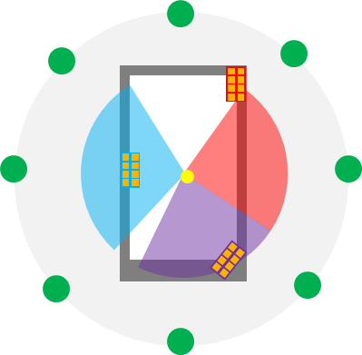

+----------------------------------+----------------------------------+
| 3GPP TR 38.808 V17.0.0 (2021-03) |                                  |
+==================================+==================================+
| Technical Report                 |                                  |
+----------------------------------+----------------------------------+
| 3rd Generation Partnership       |                                  |
| Project;                         |                                  |
|                                  |                                  |
| Technical Specification Group    |                                  |
| Radio Access Network;            |                                  |
|                                  |                                  |
| Study on supporting NR from 52.6 |                                  |
| GHz to 71 GHz                    |                                  |
|                                  |                                  |
| (Release 17)                     |                                  |
+----------------------------------+----------------------------------+
|                                  |                                  |
+----------------------------------+----------------------------------+
| {width="1.3229166666666667in" | ng){width="1.7708333333333333in" |
| height="0.9270833333333334in"}   | height="1.03125in"}              |
+----------------------------------+----------------------------------+
|                                  |                                  |
+----------------------------------+----------------------------------+
| The present document has been    |                                  |
| developed within the 3rd         |                                  |
| Generation Partnership Project   |                                  |
| (3GPP ^TM^) and may be further   |                                  |
| elaborated for the purposes of   |                                  |
| 3GPP.\                           |                                  |
| The present document has not     |                                  |
| been subject to any approval     |                                  |
| process by the 3GPP              |                                  |
| Organizational Partners and      |                                  |
| shall not be implemented.\       |                                  |
| This Specification is provided   |                                  |
| for future development work      |                                  |
| within 3GPP only. The            |                                  |
| Organizational Partners accept   |                                  |
| no liability for any use of this |                                  |
| Specification.\                  |                                  |
| Specifications and Reports for   |                                  |
| implementation of the 3GPP ^TM^  |                                  |
| system should be obtained via    |                                  |
| the 3GPP Organizational          |                                  |
| Partners\' Publications Offices. |                                  |
+----------------------------------+----------------------------------+

+----------------------------------------------------------------------+
|                                                                      |
+======================================================================+
| > ***3GPP***                                                         |
| >                                                                    |
| > Postal address                                                     |
| >                                                                    |
| > 3GPP support office address                                        |
| >                                                                    |
| > 650 Route des Lucioles - Sophia Antipolis                          |
| >                                                                    |
| > Valbonne - FRANCE                                                  |
| >                                                                    |
| > Tel.: +33 4 92 94 42 00 Fax: +33 4 93 65 47 16                     |
| >                                                                    |
| > Internet                                                           |
| >                                                                    |
| > http://www.3gpp.org                                                |
+----------------------------------------------------------------------+
| ***Copyright Notification***                                         |
|                                                                      |
| No part may be reproduced except as authorized by written            |
| permission.\                                                         |
| The copyright and the foregoing restriction extend to reproduction   |
| in all media.                                                        |
|                                                                      |
| © 2021, 3GPP Organizational Partners (ARIB, ATIS, CCSA, ETSI, TSDSI, |
| TTA, TTC).                                                           |
|                                                                      |
| All rights reserved.                                                 |
|                                                                      |
| UMTS™ is a Trade Mark of ETSI registered for the benefit of its      |
| members                                                              |
|                                                                      |
| 3GPP™ is a Trade Mark of ETSI registered for the benefit of its      |
| Members and of the 3GPP Organizational Partners\                     |
| LTE™ is a Trade Mark of ETSI registered for the benefit of its       |
| Members and of the 3GPP Organizational Partners                      |
|                                                                      |
| GSM® and the GSM logo are registered and owned by the GSM            |
| Association                                                          |
+----------------------------------------------------------------------+

 Contents {#contents .TT}
========

Foreword 6

1 Scope 8

2 References 8

3 Definitions of terms, symbols and abbreviations 12

3.1 Terms 12

3.2 Symbols 12

3.3 Abbreviations 13

4 Study of required changes to NR 14

4.1 RAN1 Aspects 14

4.1.1 General description of study in RAN1 14

4.1.2 Candidate numerology and bandwidth 14

4.1.2.1 Subcarrier spacing and CP length 14

4.1.2.2 Bandwidth and channelization 16

4.1.3 Investigation of physical layer impact from candidate numerology
and bandwidths 17

4.1.3.1 General physical layer impacts 17

4.1.3.2 Physical layer impacts to synchronization and random access 18

4.1.3.3 Physical layer impacts to PDSCH and PUSCH 19

4.1.3.4 Physical layer impacts to PDCCH 20

4.1.3.5 Physical layer impacts to PUCCH 20

4.1.3.6 Physical layer impacts to reference signals 20

4.1.3.7 Physical layer impacts to beam management and CSI 21

4.2 RAN4 aspects 22

4.2.1 General description of study in RAN4 22

4.2.2 Timing considerations 22

4.2.2.1 General aspects 22

4.2.2.2 Transient period 22

4.2.2.3 Cell synchronization 22

4.2.2.4 BS Analog beam switching 23

4.2.2.5 BS Time alignment error (TAE) 23

4.2.2.6 UE timing error 23

4.2.3 Phase noise characteristics 25

4.2.3.1 Phase noise model set 1 25

4.2.3.2 Phase noise model set 2 28

4.2.3.3 Additional information 29

4.2.4 Power amplifiers trends 31

4.2.5 BS aspects 33

4.2.5.1 BS antenna arrays 33

4.2.5.2 Noise figure 34

4.2.5.3 Output power and ACLR dependencies 35

4.2.5.4 BS architecture 36

4.2.6 UE aspects 36

4.2.6.1 UE power amplifiers 36

4.2.7 Numerologies and Channel Bandwidths 38

5 Study of channel access mechanism for 60 GHz 38

5.1 Identification of regulatory aspects for consideration 38

5.2 Channel access and interference mitigation techniques 38

5.2.1 Interference mitigation techniques 38

5.2.2 Listen before talk (LBT) design 39

5.2.3 Receiver assisted channel access and interference management 40

6 Summary of evaluation study 41

6.1 Summary of link level evaluations 41

6.1.1 Observations on PDSCH/PUSCH 41

6.1.2 Observations on PSS/SSS and PBCH 46

6.1.3 Observations on PRACH 47

6.2 Summary of system level evaluations 47

6.2.1 Description of channel access schemes modelled in evaluations 47

6.2.2 Detailed observations for indoor scenario A 49

6.2.3 Detailed observations for indoor scenario B 52

6.2.4 Detailed observations for indoor scenario C 52

6.2.5 Detailed observations for outdoor scenario B 53

6.2.6 Summary of observations 53

6.3 Summary of delay spread evaluations 54

7 Conclusions 54

Annex A: Evaluations methodology 56

A.1 Link level evaluation assumptions 56

A.2 System level evaluation assumptions 59

A.3 LBT procedure for system level evaluation 64

Annex B: Evaluations results 66

B.1 Link level evaluation results 66

B.1.1 Evaluation results for PDSCH/PUSCH 66

B.1.1.1 Source 1 \[65\] 66

B.1.1.2 Source 2 \[72\] 69

B.1.1.3 Source 3 \[30\] 72

B.1.1.4 Source 4 \[60\] 75

B.1.1.5 Source 5 \[64\] 78

B.1.1.6 Source 6 \[68\] 79

B.1.1.7 Source 7 \[62\] 80

B.1.1.8 Source 8 \[59\] 83

B.1.1.9 Source 9 \[25\] 84

B.1.1.10 Source 10 \[67\] 84

B.1.1.11 Source 11 \[27\] 85

B.1.1.12 Source 12 \[5\] 86

B.1.1.13 Source 13 \[29\] 87

B.1.1.14 Source 14 \[16\] 89

B.1.1.15 Source 15 \[71\] 91

B.1.1.16 Source 16 \[61\] 91

B.1.1.17 Source 17 \[19\] 92

B.1.2 Evaluation results for PSS/SSS 93

B.1.2.1 Source 1 \[65\] 93

B.1.2.2 Source 3 \[30\] 95

B.1.2.3 Source 4 \[60\] 97

B.1.2.4 Source 6 \[68\] 97

B.1.2.5 Source 9 \[25\] 98

B.1.2.6 Source 13 \[29\] 98

B.1.2.7 Source 14 \[16\] 98

B.1.3 Evaluation results for PRACH 100

B.1.3.1 Source 1 \[65\] 100

B.1.3.2 Source 2 \[72\] 102

B.1.3.3 Source 3 \[30\] 102

B.1.3.4 Source 4 \[60\] 103

B.1.3.5 Source 5 \[64\] 103

B.1.3.6 Source 6 \[68\] 104

B.1.3.7 Source 7 \[62\] 104

B.1.3.8 Source 13 \[29\] 105

B.1.3.9 Source 14 \[16\] 105

B.2 System level evaluation results 107

B.2.1 RSRP distribution 107

B.2.1.1 Source 1 \[65\] 107

B.2.1.2 Source 2 \[72\] 108

B.2.1.3 Source 3 \[56\] 110

B.2.1.4 Source 4 \[37\] 110

B.2.1.5 Source 5 \[64\] 111

B.2.1.6 Source 6 \[68\] 111

B.2.1.7 Source 10 \[67\] 112

B.2.1.8 Source 14 \[43\] 112

B.2.2 Indoor scenario A 117

B.2.2.1 Source 1 \[65\] 117

B.2.2.2 Source 2 \[72\] 122

B.2.2.3 Source 3 \[56\] 126

B.2.2.4 Source 4 \[37\] 134

B.2.2.5 Source 5 \[64\] 136

B.2.2.6 Source 7 \[62\] 140

B.2.2.7 Source 10 \[67\] 141

B.2.2.8 Source 14 \[43\] 142

B.2.3 Indoor scenario B 145

B.2.3.1 Source 1 \[65\] 145

B.2.4 Indoor scenario C 151

B.2.4.1 Source 1 \[65\] 151

B.2.4.2 Source 2 \[72\] 155

B.2.4.3 Source 5 \[64\] 156

B.2.4.4 Source 6 \[68\] 156

B.2.4.5 Source 13 \[29\] 157

B.2.4.6 Source 15 \[71\] 157

B.2.5 Outdoor scenario B 158

B.2.5.1 Source 1 \[65\] 158

B.2.5.2 Source 2 \[72\] 159

Annex C: Change history 161

Foreword
========

This Technical Report has been produced by the 3rd Generation
Partnership Project (3GPP).

The contents of the present document are subject to continuing work
within the TSG and may change following formal TSG approval. Should the
TSG modify the contents of the present document, it will be re-released
by the TSG with an identifying change of release date and an increase in
version number as follows:

Version x.y.z

where:

x the first digit:

1 presented to TSG for information;

2 presented to TSG for approval;

3 or greater indicates TSG approved document under change control.

y the second digit is incremented for all changes of substance, i.e.
technical enhancements, corrections, updates, etc.

z the third digit is incremented when editorial only changes have been
incorporated in the document.

In the present document, modal verbs have the following meanings:

**shall** indicates a mandatory requirement to do something

**shall not** indicates an interdiction (prohibition) to do something

The constructions \"shall\" and \"shall not\" are confined to the
context of normative provisions, and do not appear in Technical Reports.

The constructions \"must\" and \"must not\" are not used as substitutes
for \"shall\" and \"shall not\". Their use is avoided insofar as
possible, and they are not used in a normative context except in a
direct citation from an external, referenced, non-3GPP document, or so
as to maintain continuity of style when extending or modifying the
provisions of such a referenced document.

**should** indicates a recommendation to do something

**should not** indicates a recommendation not to do something

**may** indicates permission to do something

**need not** indicates permission not to do something

The construction \"may not\" is ambiguous and is not used in normative
elements. The unambiguous constructions \"might not\" or \"shall not\"
are used instead, depending upon the meaning intended.

**can** indicates that something is possible

**cannot** indicates that something is impossible

The constructions \"can\" and \"cannot\" are not substitutes for \"may\"
and \"need not\".

**will** indicates that something is certain or expected to happen as a
result of action taken by an agency the behaviour of which is outside
the scope of the present document

**will not** indicates that something is certain or expected not to
happen as a result of action taken by an agency the behaviour of which
is outside the scope of the present document

**might** indicates a likelihood that something will happen as a result
of action taken by some agency the behaviour of which is outside the
scope of the present document

**might not** indicates a likelihood that something will not happen as a
result of action taken by some agency the behaviour of which is outside
the scope of the present document

In addition:

**is** (or any other verb in the indicative mood) indicates a statement
of fact

**is not** (or any other negative verb in the indicative mood) indicates
a statement of fact

The constructions \"is\" and \"is not\" do not indicate requirements.

 1 Scope
=======

In order to support wide range of services, 5G NR system aims to be
flexible enough to meet the connectivity requirements of a range of
existing and future (yet unknown) services to be deployable in an
efficient manner. NR considers supporting potential use of frequency
range up to 100 GHz \[1\].

NR specifications that have been developed in Rel-15 and Rel-16 define
operation for frequencies up to 52.6 GHz, where all physical layer
channels, signals, procedures, and protocols are designed to be
optimized for uses under 52.6 GHz.

However, frequencies above 52.6 GHz are faced with more difficult
challenges, such as higher phase noise, larger propagation loss due to
high atmospheric absorption, lower power amplifier efficiency, and
strong power spectral density regulatory requirements in unlicensed
bands, compared to lower frequency bands. Additionally, the frequency
ranges above 52.6 GHz potentially contain larger spectrum allocations
and larger bandwidths that are not available for bands lower than 52.6
GHz.

As an initial effort to enable and optimize 3GPP NR system for operation
in above 52.6 GHz, 3GPP RAN has studied requirements for NR beyond
52.6GHz up to 114.25GHz including global spectrum availability and
regulatory requirements (including channelization and licensing
regimes), potential use cases and deployment scenarios, and NR system
design requirements and considerations on top of regulatory requirements
\[2\]. The potential use cases identified in the study include high data
rate eMBB, mobile data offloading, short range high-data rate D2D
communications, broadband distribution networks, integrated access
backhaul (IAB), factory automation, industrial IoT (IIoT), wireless
display transfer, augmented reality (AR)/virtual reality (VR) wearables,
intelligent transport systems (ITS) and V2X, data center inter-rack
connectivity, smart grid automation, private networks, and support of
high positioning accuracy. The use cases span over several deployment
scenarios identified in the study. The deployment scenarios include, but
not limited to, indoor hotspot, dense urban, urban micro, urban macro,
rural, factor hall, and indoor D2D scenarios. The study also identified
several system design requirements around waveform, MIMO operation,
device power consumption, channelization, bandwidth, range,
availability, connectivity, spectrum regime considerations, and others.

Among the frequencies of interest, frequencies between 52.6 GHz and 71
GHz are especially interesting relatively in the short term because of
their proximity to sub-52.6 GHz for which the current NR system is
optimized and the imminent commercial opportunities for high data rate
communications, e.g., unlicensed spectrum but also licensed spectrum
between 57 GHz and 71 GHz. Therefore, it would be beneficial to make a
study focused on feasibility of using existing waveforms and required
changes for frequencies between 52.6 GHz and 71 GHz, so as to take
advantage of imminent commercial opportunities for the specific
frequency regime by minimizing the specification burden and maximizing
the leverage of FR2 based implementations.

2 References
============

The following documents contain provisions which, through reference in
this text, constitute provisions of the present document.

\- References are either specific (identified by date of publication,
edition number, version number, etc.) or non‑specific.

\- For a specific reference, subsequent revisions do not apply.

\- For a non-specific reference, the latest version applies. In the case
of a reference to a 3GPP document (including a GSM document), a
non-specific reference implicitly refers to the latest version of that
document in the same Release as the present document.

\[1\] 3GPP TR 38.913: \"Study on Scenarios and Requirements for Next
Generation Access Technologies\"

\[2\] 3GPP TR 38.807: \"Study on requirements for NR beyond 52.6 GHz\".

\[3\] 3GPP TR 21.905: \"Vocabulary for 3GPP Specifications\".

\[4\] ETSI EN 302 567 v2.1.20: \"Multiple-Gigabit/s radio equipment
operating in the 60 GHz band; Harmonised Standard covering the essential
requirements of article 3.2 of Directive 2014/53/EU\".

\[5\] R1-2007549 \"Further discussion on B52 numerology\" FUTUREWEI.

\[6\] R1-2007558 \"Discussion on physical layer impacts for NR beyond
52.6 GHz\" Lenovo, Motorola Mobility.

\[7\] R1-2007604 \"PHY design in 52.6-71 GHz using NR waveform\" Huawei,
HiSilicon.

\[8\] R1-2007642 \"Physical layer design for NR 52.6-71GHz\" Beijing
Xiaomi Software Tech.

\[9\] R1-2007652 \"Discussion on required changes to NR using existing
DL/UL NR waveform\" vivo.

\[10\] R1-2007785 \"Consideration on required changes to NR using
existing NR waveform\" Fujitsu.

\[11\] R1-2007790 \"Consideration on supporting above 52.6GHz in NR\"
InterDigital, Inc.

\[12\] R1-2007847 \"System Analysis of NR opration in 52.6 to 71 GHz\"
CATT.

\[13\] R1-2007883 \"Required changes to NR using existing DL/UL NR
waveform\" TCL Communication Ltd.

\[14\] R1-2007926 \"Required changes to NR using existing DL/UL NR
waveform\" Nokia, Nokia Shanghai Bell.

\[15\] R1-2007929 \"On phase noise compensation for NR from 52.6GHz to
71GHz\" Mitsubishi Electric RCE.

\[16\] R1-2009379 \"Discussion on Required Changes to NR in 52.6 -- 71
GHz\" Intel Corporation.

\[17\] R1-2007965 \"On the required changes to NR for above 52.6GHz\"
ZTE, Sanechips.

\[18\] R1-2007982 \"On NR operations in 52.6 to 71 GHz\" Ericsson.

\[19\] R1-2009653 \"Consideration on required physical layer changes to
support NR above 52.6 GH\" LG Electronics.

\[20\] R1-2008076 \"Discussion on required changes to NR using existing
DL/UL NR waveform in 52.6GHz \~ 71GHz\" CMCC.

\[21\] R1-2008082 \"Study on the numerology to support 52.6 GHz to
71GHz\" NEC.

\[22\] R1-2008872 \"Design aspects for extending NR to up to 71 GHz\"
Samsung.

\[23\] R1-2008250 \"Discusson on required changes to NR using DL/UL NR
waveform\" OPPO.

\[24\] R1-2008353 \"Considerations on required changes to NR from 52.6
GHz to 71 GHz\" Sony.

\[25\] R1-2008457 \"A Discussion on Physical Layer Design for NR above
52.6GHz\" Apple.

\[26\] R1-2008493 \"Discussions on required changes on supporting NR
from 52.6GHz to 71 GHz\" CAICT.

\[27\] R1-2008501 \"On required changes to NR using existing DL/UL NR
waveform for operation in 60GHz band\" MediaTek Inc.

\[28\] R1-2008516 \"On NR operation between 52.6 GHz and 71 GHz\"
Convida Wireless.

\[29\] R1-2009062 \"Evaluation Methodology and Required Changes on NR
from 52.6 to 71 GHz\" NTT DOCOMO, INC.

\[30\] R1-2008615 \"NR using existing DL-UL NR waveform to support
operation between 52p6 GHz and 71 GHz\" Qualcomm Incorporated.

\[31\] R1-2008726 \"Discussion on physical layer aspects for NR beyond
52.6GHz\" WILUS Inc.

\[32\] R1-2008769 \"Waveform considerations for NR above 52.6 GHz\"
Charter Communications.

\[33\] R1-2007550 \"On channel access modes in 60GHz\" FUTUREWEI.

\[34\] R1-2007559 \"Discussion on channel access for NR beyond 52.6
GHz\" Lenovo, Motorola Mobility.

\[35\] R1-2008976 \"Channel access mechanism for 60 GHz unlicensed
operation\" Huawei, HiSilicon.

\[36\] R1-2007643 \"Channel access mechanism for NR on 52.6-71 GHz\"
Beijing Xiaomi Software Tech.

\[37\] R1-2007653 \"Discussion on channel access mechanism\" vivo.

\[38\] R1-2007791 \"On Channel access mechanisms\" InterDigital, Inc.

\[39\] R1-2007848 \"Channel Access Mechanism in support of NR operation
in 52.6 to 71 GHz\" CATT.

\[40\] R1-2007884 \"Channel access mechanism\" TCL Communication Ltd.

\[41\] R1-2007918 \"Channel access mechanisms for NR from 52.6-71GHz\"
AT&T.

\[42\] R1-2009312 \"Design of NR channel access mechanisms for 60 GHz
unlicensed band\" Nokia, Nokia Shanghai Bell.

\[43\] R1-2009380 \"Channel Access Procedure for NR in 52.6 - 71 GHz\"
Intel Corporation.

\[44\] R1-2007966 \"On the channel access mechanism for above 52.6GHz\"
ZTE, Sanechips.

\[45\] R1-2007983 \"Channel Access Mechanism\" Ericsson.

\[46\] R1-2008046 \"Considerations on channel access mechanism to
support NR above 52.6 GHz\" LG Electronics.

\[47\] R1-2008091 \"Discussion on channel access mechanism for above
52.6GHz\" Spreadtrum Communications.

\[48\] R1-2008157 \"Channel access mechanism for 60 GHz unlicensed
spectrum\" Samsung.

\[49\] R1-2008251 \"Discussion on channel access\" OPPO.

\[50\] R1-2008354 \"Channel access mechanism for 60 GHz unlicensed
spectrum\" Sony.

\[51\] R1-2008458 \"Views on Channel Access Mechanisms for Unlicensed
Access above 52.6 GHz\" Apple.

\[52\] R1-2008494 \"Discussions on channel access mechanism on
supporting NR from 52.6GHz to 71 GHz\" CAICT.

\[53\] R1-2008517 \"On Channel Access Mechanism and Interference
Handling for Supporting NR from 52.6 GHz to 71 GHz\" Convida Wireless.

\[54\] R1-2008548 \"Channel Access Mechanism for NR in 60 GHz unlicensed
spectrum\" NTT DOCOMO, INC.

\[55\] R1-2008563 \"Discussion on channel access mechanism\" ITRI.

\[56\] R1-2009362 \"Channel access mechanism for NR in 52p6 to 71GHz
band\" Qualcomm Incorporated.

\[57\] R1-2008717 \"Discussion on channel access mechanism for 52.6 to
71GHz unlicensed ban\" Potevio

\[58\] R1-2008770 \"Further aspects of channel access mechanisms\"
Charter Communications.

\[59\] R1-2007560 \"Additional evaluations for NR beyond 52.6GHz\"
Lenovo, Motorola Mobility.

\[60\] R1-2007654 \"Evaluation on different numerologies for NR using
existing DL/UL NR waveform\" vivo.

\[61\] R1-2007792 \"Evaluation results for above 52.6 GHz\"
InterDigital, Inc.

\[62\] R1-2007928 \"Simulation Results for NR from 52.6 GHz to 71 GHz\"
Nokia, Nokia Shanghai Bell.

\[63\] R1-2007943 \"Considerations on performance evaluation for NR in
52.6-71GHz\" Intel Corporation.

\[64\] R1-2009450 \"Simulation results for NR above 52.6GHz\" ZTE,
Sanechips.

\[65\] R1-2007984 \"Evaluation results for NR in 52.6 - 71 GHz\"
Ericsson.

\[66\] R1-2008047 \"Considerations on phase noise compensation to
support NR above 52.6 GHz\" LG Electronics.

\[67\] R1-2008873 \"Evaluation results for extending NR to up to 71
GHz\" Samsung.

\[68\] R1-2009615 \"Discussion on other aspects\" OPPO.

\[69\] R1-2008459 \"Evaluation results for Physical Layer Design for NR
above 52.6GHz\" Apple.

\[70\] R1-2008549 \"Potential Enhancements for NR on 52.6 to 71 GHz\"
NTT DOCOMO, INC.

\[71\] R1-2009157 \"Performance evaluations for NR above 52.6 GHz\"
Charter Communications.

\[72\] R1-2009610 \"Link level and System level evaluation for NR system
operating in 52.6GHz to 71GHz\" Huawei, HiSilicon.

\[73\] 3GPP TR 38.803: \"Study on new radio access technology; Radio
Frequency (RF) and co-existence aspects\".

\[74\] Hua Wang, Fei Wang, Sensen Li, Tzu-Yuan Huang, Amr S. Ahmed, Naga
Sasikanth Mannem, Jeongseok Lee, Edgar Garay, David Munzer, Christopher
Snyder, Sanghoon Lee, Huy Thong Nguyen, and Michael Edward Duffy Smith,
\"Power Amplifiers Performance Survey 2000-Present,\" \[Online\].
Available: https://gems.ece.gatech.edu/PA\_survey.html

\[75\] ETSI TR 101 854: \"Fixed Radio Systems; Point-to-point equipment;
Derivation of receiver interference parameters useful for planning fixed
service point-to-point systems operating different equipment classes
and/or capacities\"

\[76\] D. B. Leeson, \"A simple model of feedback oscillator noise
spectrum\", Proceeding of the IEEE, vol. 54, no. 2, pp. 329-330, 1966.

\[77\] Hussein, S. Vasadi, J. Paramesh, \"A 50--66-GHz Phase-Domain
Digital Frequency Synthesizer with Low Phase Noise and Low Fractional
Spurs\", IEEE Journal of Solid-State Circuits, vol. 52, no. 12, pp.
3329-3347, Dec. 2017.

\[78\] Z. Zong, P. Chen, R. Staszewski, \"A Low-Noise Fractional-N
Digital Frequency Synthesizer with Implicit Frequency Tripling for
mm-Wave Applications\", IEEE Journal of Solid-State Circuits, vol. 54,
no. 3, pp. 755-767.

\[79\] Y. Chao, H. C. Luong, Z. Hong \"Analysis and Design of a 14.1-mW
50/100-GHz Transformer-Based PLL With Embedded Phase Shifter in 65-nm
CMOS\", IEEE Transactions on Microwave Theory and Techniques, vol. 63,
no. 4, pp.1193-1201, Apr. 2015.

\[80\] Z. Huang et. al. \"A 70.5-to-85.5GHz 65nm Phase-Locked Loop with
Passive Scaling of Loop Filter\", IEEE International Solid-State
Circuits Conference 2015, pp. 448-449.

\[81\] Z. Huang, H. C. Luong, \"An 82--107.6-GHz Integer-N ADPLL
Employing a DCO With Split Transformer and Dual-Path Switched-Capacitor
Ladder and a Clock-Skew-Sampling Delta--Sigma TDC\", IEEE Journal of
Solid-State Circuits, Vol. 54, No. 2, pp. 358-367, Feb. 2019.

\[82\] X. Liu, H. C. Luong, \"A Fully Integrated 0.27-THz
Injection-Locked Frequency Synthesizer with Frequency-Tracking Loop in
65-nm CMOS\", IEEE Journal of Solid-State Circuits, 2019

\[83\] V. Szortyka et. al. \"A 42 mW 200 fs-Jitter 60 GHz Sub-Sampling
PLL in 40 nm CMOS\", IEEE Journal of solid-State Circuits, Vol. 50, No.
9, pp.2025-2036, Sept. 2015.

\[84\] X. Yi et. al. \"A 93.4--104.8-GHz 57-mW Fractional-N Cascaded PLL
With True In-Phase Injection-Coupled QVCO in 65-nm CMOS Technology\",
IEEE Transactions on Microwave Theory and Techniques, Vol. 67, No. 6,
pp. 2370-2381, June 2019.

\[85\] S. Iguchi et. al. \"Variation-Tolerant Quick-Start-Up CMOS
Crystal Oscillator with Chirp Injection and Negative Resistance
Booster\", IEEE Journal of Solid-State Circuits, vol. 51, no. 2, pp.
496-508, Feb. 2016.

\[86\] Y. Rajavi et. al. \"A 48-MHz Differential Crystal Oscillator With
168-fs Jitter in 28-nm CMOS\", IEEE Journal of Solid-State Circuits,
vol. 52, no. 10, pp. 2735-2745, Oct. 2017.

\[87\] S. Igushi, T. Sakurai, M. Takamiya, \"A Low-Power CMOS Crystal
Oscillator Using a Stacked-Amplifier Architecture\", IEEE Journal of
Solid-State Circuits, vol. 52, no. 11, pp. 3006-3017, Nov. 2017.

\[88\] LMX2594, 15 GHz Wideband RF Synthesizer, Texas Instruments.
http://www.ti.com/product/LMX2594

\[89\] ADF41513 26.5 GHz, Integer N/Fractional-N, PLL Synthesizer,
Analog Devices, https://www.analog.com/en/products/adf41513.html

\[90\] Staffan Ek et al., A 28-nm FD-SOI 115-fs Jitter PLL-Based LO
System for 24-30-GHz Sliding-IF 5G Transceivers, IEEE Journal of
Solid-State Circuits ( Volume: 53 , Issue: 7 , July 2018 )

\[91\] Kambiz Hadipour, Andrea Ghilioni1, Andrea Mazzanti1, Matteo
Bassi1, Francesco Svelto, \"A 40GHz to 67GHz Bandwidth 23dB Gain 5.8dB
Maximum NF mm-Wave LNA in 28nm CMOS\", 2015 IEEE Radio Frequency
Integrated Circuits Symposium

\[92\] Domenico Pepe, Domenico Zito, \"32 dB Gain 28 nm Bulk CMOS W-Band
LNA\", IEEE Microwave and Wireless Components Letters, Vol. 25, No. 1,
January 2015

\[93\] Domenico Pepe1, Domenico Zito, \"72 GHz CMOS LNA with
Transformer-based Input Integrated Matching\", IEEE 2015

\[94\] Hossein Noori, Miles Sanner, Naveen Yanduru, \"A 0.8 dB NF, 4.6
dBm IIP3, 1.8 - 2.2 GHz, Low-Power LNA in 130 nm RF SOI CMOS
Technology\", IEEE 2015

\[95\] Joost Melai, Peter Magnée, Ivo Pouwel, Pieter Weijs, Ihor
Brunets, Rob van Dalen, Anurag Vohra, Luuk Tiemeijer, Ralf Pijper, Hans
Tuinhout, Nicole Wils, Nicolae Cazana, \"QUBiC generation 9, a new
BiCMOS process optimized for mmWave applications\", IEEE 2015

\[96\] Cristina Andrei, Olof Bengtsson, Ralf Doerner, Serguei A.
Chevtchenko, Wolfgang Heinrich, Matthias Rudolph, \"Dynamic behaviour of
a Low-Noise Amplifier GaN MMIC under input power overdrive\",
Proceedings of the 45th European Microwave Conference

\[97\] 3GPP TR 38.817-02: \"General aspects for Base Station (BS) Radio
Frequency (RF) for NR\"

\[98\] 3GPP TS 38.133: \"NR; Radio Resource Control (RRC) protocol
specification\"

\[99\] 3GPP TS 38.104: \"NR; Base Station (BS) radio transmission and
reception\"

\[100\] R1-2008805, \"Discussion on required changes to NR in 52.6 -- 71
GHz\", Intel Corporation

\[101\] 3GPP TR 38.817-02: \"General aspects for Base Station (BS) Radio
Frequency (RF) for NR\"

3 Definitions of terms, symbols and abbreviations
=================================================

3.1 Terms
---------

For the purposes of the present document, the terms given in
TR 21.905 \[3\] and the following apply. A term defined in the present
document takes precedence over the definition of the same term, if any,
in TR 21.905 \[3\].

3.2 Symbols
-----------

For the purposes of the present document, the following symbols apply:

B transmission bandwidth

G antenna gain

3.3 Abbreviations
-----------------

For the purposes of the present document, the abbreviations given in
TR 21.905 \[3\] and the following apply. An abbreviation defined in the
present document takes precedence over the definition of the same
abbreviation, if any, in TR 21.905 \[3\].

ATPC Automatic Transmit Power Control

BD Blind Decode

BFR Beam Failure Report

BLER Block Error Ratio

BO Buffer Occupancy

BS Base Station

BW Bandwidth

BWP Bandwidth Part

CAPC Channel Access Priority Class

CC Component Carrier

CCE Control Channel Element

CORESET Control Resource Set

CP Cyclic Prefix

CPE Common Phase Error

CPU Channel State Information Processing Unit

CSI Channel State Information

CW Contention Window

DFS Dynamic Frequency Selection

DMRS Demodulation Reference Signal

DS Delay Spread

ECP Extended Cyclic Prefix

ED Energy Detection

EDT Energy Detection Threshold

EIRP Equivalent Isotropic Radiated Power

FD Frequency Domain

FDD Frequency Duplex Division

IAB Integrated Access Backhaul

ICI Inter-Carrier Interference

ISD Inter-Site Distance

ISM Industrial, Scientific and Medical

ITU International Telecommunication Union

LBT Listen Before Talk

MCL Maximum Coupling Loss

MCOT Maximum Channel Occupancy Time

MCS Modulation and Coding Scheme

MIL Maximum Isotropic Loss

NCP Normal Cyclic Prefix

NR New Radio

OCB Occupied Channel Bandwidth

OCC Orthogonal Cover Code

OOBE Out-Of-Band Emission

PDCCH Physical Downlink Control Channel

PDSCH Physical Downlink Shared Channel

PN Phase Noise

PRACH Physical Random Access Channel

PSD Power Spectral Density

PTP Point to point

PTRS Phase Tracking Reference Signal

PUCCH Physical Uplink Control Channel

PUSCH Physical Uplink Shared Channel

RAT Radio Access Technology

RF Radio Frequency

RMSI Remaining Minimum System Information

SSB Synchronization Signal Block

SCS Subcarrier Spacing

SI Study Item

SID Study Item Description

SINR Signal to Interference and Noise Ratio

TA Timing Advance

TAE Timing Alignment Error

TB Transport Block

TDD Time Duplex Division

TRP Transmission Reception Point

TTI Transmission Time Interval

UE User Equipment

V2X Vehicle to Everything

WAN Wide Area Network

4 Study of required changes to NR
=================================

4.1 RAN1 Aspects
----------------

### 4.1.1 General description of study in RAN1

For supporting NR operation in both licensed and unlicensed bands in the
frequency range from 52.6 GHz to 71 GHz, FR2 numerologies and additional
numerologies beyond that are supported currently in NR are studied. The
existing framework for numerology scaling is considered i.e. 2^μ^ ×15
subcarrier spacing to select the candidates. For SSB transmissions, it
is investigated whether or not µ \> 4 (larger than 240 kHz) is needed
and the corresponding impacts, if any, on aspects including at least SSB
pattern, multiplexing of other signal/channels, and transmission window,
if supported. For data and control channel transmissions, it is
investigated if µ \> 3 (larger than 120 kHz) is needed and the
corresponding impacts, if any, on aspects including at least processing
timelines, PDCCH monitoring capability (BD/CCE), scheduling
enhancements, beam-management, and reference signal design. For
investigating the need for higher numerologies, some of the key aspects
that are studied are the impacts due to phase noise, delay spread, TAE,
analog beam switching delay, and impact to coverage, spectral
efficiency, peak data rates, and relative delay in intra-cell/inter-cell
multi-TRP operations.

For the study item, it is recommended to consider the study of at least
the following aspects, including the justification for the features and
their potential benefits, if applicable:

\- system overhead impact from TDD switching time for larger subcarrier
spacing,

\- coverage enhancement mechanisms for control channels and SSB, if
larger SCS is supported,

\- any potential modifications to HARQ processes including number of
processes, if supported,

\- impact from MAC buffering for larger subcarrier spacing, if any,

\- NR channelization/sub-channelization and any potential impact from
RAN1 perspective,

\- additional RF impairments that impact evaluations,

\- impact on BWP switching procedure due to new higher SCS, if
supported,

\- support of rank 2 transmission for DFT-s-OFDM in the uplink.

Other aspects and impacts due to introduction of higher SCS are not
precluded.

### 4.1.2 Candidate numerology and bandwidth

#### 4.1.2.1 Subcarrier spacing and CP length

It was observed that amount of specification effort increases with the
number of new numerologies enabled and supported for 52.6 GHz to 71 GHz
frequency.

In order to minimize specification effort while maximizing supported use
cases and deployment scenarios applicable for 52.6 GHz to 71 GHz
frequency, it is recommended to support 120 kHz subcarrier spacing with
normal CP length, and at least one more subcarrier spacing. It is
recommended to consider supporting at most up to three subcarrier
spacings, including 120 kHz subcarrier spacing. It is not recommended to
consider support of only 240 kHz SCS for PDCCH/PDSCH/PUCCH/PUSCH in
addition to 120 kHz. Applicability of the supported subcarrier spacing
to particular signals and channels should be further discussed in the
corresponding WI phase.

It is recommended that numerologies 240 kHz, 480 kHz, and 960 kHz are
considered as candidates for additional numerologies in addition to 120
kHz, and numerologies outside this range are not supported for any
signals or channels. It is also recommended that for subcarrier spacing
240 kHz or below, normal CP length is utilized for candidate subcarrier
spacings.

Selection of the additional subcarrier spacing (on top of 120 kHz)
should consider versatility of being able to support various
applications and deployment scenarios with all the subcarrier spacings
that would be supported by specification, accounting for what is already
supported in Rel-15 and Rel-16 specifications.

Some companies have noted that the ability for a deployed system to
operate with a single numerology for all channels and signals is
beneficial, and some companies have further noted benefit remains even
if SSB numerology is different. Some companies have noted mixed
numerology operation is functional and is supported in Rel-15 and Rel-16
specifications (e.g. 240 kHz SSB subcarrier spacing with 120 kHz
subcarrier spacing for PDCCH/PDSCH/PUSCH/PUCCH/PRACH in an initial BWP
and activation of a dedicated BWP with SCS different than the initial
BWP) and consideration of single numerology operation is not needed.

Overall implementation complexity for supporting a specific subcarrier
spacing may need to consider the following, but not limited to:

\- processing complexity for equalization including inter-carrier
interference mitigation (if required to support higher modulation
orders) and compensation, and FFT complexity per unit time for a given
bandwidth,

\- complexity associated with supporting multiple component carriers to
reach a specific throughput,

\- complexity associated with supporting given reduced (in absolute
time) requirements on UE processing times (e.g. N1, N2, N3, Z1, Z2, Z3,
etc) and UE PDCCH processing budget as a function of subcarrier spacing,
if scheduling and monitoring unit is maintained to be one slot,

\- supported features indicated by UE capability signalling or
implemented by the gNB,

\- complexity associated with supporting required timing error tolerance
which may need to consider initial timing error, timing advance setting,
TA granularity, MIMO TAE (TAE value will be defined by RAN4), multi-TRP
timing alignment as a function of SCS, whether mixture or a single
subcarrier spacing for signals is configured, and deployment scenarios,

\- complexity associated with supporting higher sampling rates and with
channel bandwidth larger than 2 GHz.

It is observed that for a single carrier with the same number of
transmitted symbols, in general, smaller subcarrier spacing may
potentially provide larger coverage due to use of smaller bandwidth and
gears towards (but not limited to) coverage driven scenarios.

It is observed that for a single carrier, in general, larger subcarrier
spacing may potentially provide higher peak data rates due to use of
larger bandwidth and gears towards (but not limited to) peak data-rate
driven scenarios.

It is observed that in Rel-15 NR, absolute time for UE processing
requirements generally decrease as subcarrier spacing increases. Some
companies noted that introducing smaller UE processing time than Rel-15
and Rel-16, for larger subcarrier spacing, may lead to a more complex UE
implementation. Some companies noted that per slot level monitoring for
transmission and reception may not likely be the only mode of operation
for higher subcarrier spacing, while some companies noted that per slot
level monitoring for transmission and reception may be used as a mode of
operation in scenarios that require lower latency.

It is observed that, in general, larger subcarrier spacing may have
benefit of short symbol/slot length to support lower latency
requirements compared to what was supported for Rel-15 and Rel-16 NR,
assuming slot-level monitoring subject to scheduling configurations and
potentially UE processing capabilities.

It is observed that, in general, channel access with shorter symbol
duration may access channel earlier when LBT is passed, assuming
slot-level monitoring and potentially subject to UE processing
capabilities.

It is observed that, in general, larger subcarrier spacing has higher
resilience towards phase noise. Also, in general, the performance impact
from phase noise may depend on various properties of the transmission,
such as modulation order and coding rate, reception processing (e.g. CPE
compensation), and phase noise profile of the UE and gNB.

It is observed that, in general, maximum delay spread supported by a SCS
is proportional to its CP length and larger subcarrier spacing reduces
the budget for timing errors and beam switching, if beam switching delay
within CP cannot be avoided by gNB (e.g. by allocating a time gap), due
to shorter CP. CP needs to consider at least delay spread, timing errors
(including Te), and timing alignment errors applicable for a deployment
scenario. Minimum requirements on timing errors for new SCS values in \>
52.6 GHz should be further studied in RAN4 when specifications are
developed.

Extended CP decreases the spectrum efficiency up to 14% compared to
normal CP of the same subcarrier spacing.

#### 4.1.2.2 Bandwidth and channelization

For the study item, it has been recommended to study single carrier and
multi carrier operations for achieving wide bandwidth utilization, while
at least considering aspects such as control signaling overhead,
transceiver complexity, spectral efficiency, etc.

In order to bound implementation complexity, it is recommended to limit
the maximum FFT size required to operate system in 52.6 GHz to 71 GHz
frequency to 4096 and to limit the maximum number of RBs per carrier to
275 RBs. The candidate supported maximum carrier bandwidth(s) for a cell
should be between 400 MHz and 2160 MHz.

Some companies have noted support of channelization that are aligned
with IEEE 802.11ad and 802.11ay channelization is beneficial for
coexistence. While some companies have noted alignment of channelization
for coexistence is not necessary. Alignment of channelization between a
NR channel and IEEE 802.11ad and 802.11ay channel in this context refers
to a NR channel that is contained within one of the channels defined for
IEEE 802.11ad and 802.11ay and NR channel bandwidth does not cross over
channel boundaries of IEEE 802.11ad and 802.11ay.

One company has evaluated misaligned NR wideband channels with 1.6 GHz
and 2 GHz without LBT and have not identified coexistence issues between
NR and NR.

Some companies proposed that 2 GHz channel bandwidth should be supported
and have the raster points for 2 GHz channel bandwidth to be aligned
with IEEE 802.11ad and 802.11ay channelization.

Some companies proposed that 1.6 GHz should be the maximum channel
bandwidth and channels do not necessarily need to be aligned with IEEE
802.11ad and 802.11ay channelizations.

Some companies observed that support of channel bandwidth such as 200 or
400 MHz may enable efficient usage of available spectrum by 3GPP
technology. Some companies observed that only supporting channelization
that are aligned with IEEE 802.11ad and 802.11ay channelization result
in smaller number of supported channels for some regions of the world.

Some companies have observed that channelization based on granularity of
minimum supported channel BW would be beneficial and could provide
efficient usage of available spectrum. Other companies have observed
that support of channel BW such as 1.6 GHz or 2.4GHz would enable
efficient usage of 5 GHz allocation in China and 5 GHz IMT allocation in
Europe. Some companies have observed that smaller bandwidth (e.g. 1.6
GHz) allows for more channels (e.g., with 1.6 GHz, 3 channels instead of
two) in these regions, easing frequency planning between operators at
the cost of reduction in available channel bandwidth per carrier.

Some companies proposed to support more than one channel bandwidths for
a given SCS.

Some companies observed that the relationship between channel bandwidth
and initial access aspects should be taken into account for the
supported channel bandwidth(s), especially for minimum channel
bandwidth. Some companies observed that a wider minimum channel
bandwidth supported for a band may help to limit the number of
synchronization raster entries in the band, if the same design principle
for Rel-15 licensed bands applies. It should be noted that minimum
channel bandwidth and synchronization raster entries will be defined by
RAN4.

Available bandwidth within a given carrier for RMSI transmission for SSB
and CORESET multiplexing pattern 2 and 3 is smaller than available
bandwidth for multiplexing pattern 1. Some companies observed that the
channel bandwidth supported for a band should be wide enough to enable
multiplexing e.g. between SSB, CORESET0, and RMSI transmissions in
multiplexing pattern 2 and 3. Some companies observed that depending on
the supported carrier bandwidth and configured values of O and M,
multiplexing pattern 1 can make available more time/frequency resources
for RMSI PDSCH in a slot than pattern 2 and 3. Some companies observed
that patterns 2 and 3 are more efficient than pattern 1 as they may
potentially minimize the broadcast overhead in time.

It is recommended that both single and multi-carrier operation are
supported to support higher data rates. Larger SCS may achieve larger
aggregated bandwidth with multi-carrier operation given a maximum number
of CCs.

### 4.1.3 Investigation of physical layer impact from candidate numerology and bandwidths

#### 4.1.3.1 General physical layer impacts

It is recommended to strive for maximum commonality for the system
design for licensed and unlicensed operation for NR from 52.6GHz to
71GHz, and maximize re-use of the existing NR design.

Some companies noted that standardization effort to support 240 kHz, 480
kHz, and 960 kHz numerologies are comparable. Some companies noted that
standardization effort for 240 kHz numerology could be relatively
smaller compared to 480 kHz or 960 kHz numerologies.

The following, which is not an exhaustive list, are some potential
physical layer impacts that are common to all numerologies:

\- supporting unlicensed operation,

\- if mixed numerology is supported, supporting mixed numerology
operation,

\- SSB and CORESET\#0 offsets needed for supported channelization.

The following, which is not an exhaustive list, are some potential
physical layer impact areas for each numerology:

\- For 120 kHz subcarrier spacing:

\- Potential consideration of PTRS enhancement for CP-OFDM and
DFT-s-OFDM, if needed.

\- For 240 kHz subcarrier spacing:

\- Potential consideration of PTRS enhancement for CP-OFDM and
DFT-s-OFDM, if needed,

\- If common SSB/CORESET\#0 numerology (240/240) is supported, SSB
patterns, and CORESET\#0 configuration,

\- RO configuration,

\- Timelines for scheduling, processing and HARQ,

\- Potential enhancement to DM-RS, if needed,

\- PDCCH monitoring.

\- For 480 kHz subcarrier spacing:

\- If 480 kHz SSB is supported, SSB patterns, and CORESET\#0
configuration,

\- Timelines for scheduling, processing and HARQ,

\- RO configuration,

\- Potential enhancement to DM-RS, if needed,

\- PDCCH monitoring,

\- Potential consideration of PTRS enhancement for CP-OFDM and
DFT-s-OFDM, if needed.

\- For 960 kHz subcarrier spacing:

\- Potential consideration of ECP, if needed, depending on deployment
scenarios,

\- If 960 kHz SSB is supported, SSB patterns, and CORESET\#0
configuration,

\- Timelines for scheduling, processing and HARQ,

\- RO configuration,

\- Potential enhancement to DM-RS, if needed,

\- PDCCH monitoring,

\- Potential updates to smallest time unit, Tc, used in specifications
depending on supported maximum carrier BW.

It was identified that support of the new subcarrier spacing, if agreed,
will at least require investigation on the need for enhancements and
standardization, of the following processing timelines:

\- processing capability for PUSCH scheduled by RAR UL grant,

\- dynamic SFI and SPS/CG cancellation timing,

\- timeline for HARQ-ACK information in response to a SPS PDSCH
release/dormancy,

\- minimum time gap for wake-up and Scell dormancy indication (DCI
format 2\_6),

\- BWP switch delay,

\- multi-beam operation timing (timeDurationForQCL, beamSwitchTiming,
beam switch gap, beamReportTiming, etc.),

\- timeline for multiplexing multiple UCI types,

\- minimum of P\_switch for search space set group switching,

\- appropriate configuration(s) of k0 (PDSCH), k1 (HARQ), k2 (PUSCH),

\- PDSCH processing time (N1), PUSCH preparation time (N2), HARQ-ACK
multiplexing timeline (N3),

\- CSI processing time, Z1, Z2, and Z3, and CSI processing units,

\- any potential enhancements to CPU occupation calculation,

\- related UE capability(ies) for processing timelines,

\- minimum guard period between two SRS resources of an SRS resource set
for antenna switching.

#### 4.1.3.2 Physical layer impacts to synchronization and random access

For the study item, it is recommended to study on whether or not
different SSB patterns should be supported for licensed and unlicensed
bands is needed. For each licensed and unlicensed band, if issues are
identified for reuse of existing SSB, consider at least beam switching
gap between SSB(s) and between SSB and other signal(s)/channel(s), SSB
pattern in time domain, and whether or not it is needed to define a
transmission window (such as DRS window), and if needed, number of SSB
transmission opportunities within a transmission window. For each
licensed and unlicensed band, if issues are identified for reuse of all
or some of the existing SSB and CORESET\#0 multiplexing pattern,
consider at least the following aspects for SSB, CORESET\#0, and other
signal/channel design:

\- Supported multiplexing pattern type(s) (Pattern 1, 2, and/or 3) for
SSB and CORESET\#0 multiplexing,

\- Multiplexing of other signal/channels (e.g. RMSI, paging, CSI-RS)
with SSB,

\- Configuration of Type0-PDCCH search space set.

For the study item, it is recommended to at least consider the following
aspects for determination of supported SSB subcarrier spacing:

\- detection performance of SSB (including PSS, SSS, PBCH DMRS, and
PBCH) and SSB coverage requirement,

\- impact on initial cell search complexity due to frequency errors
(e.g. carrier frequency offset, Doppler shift, etc),

\- timing detection accuracy and its relation to uplink transmission
accuracy,

\- signaling design for supporting different subcarrier spacing for SSB
and CORESET\#0 (if supported),

\- multi-TRP delay considerations,

\- consideration of SSB-based RRM/RLM and beam management if the SSB SCS
is significantly different from that of the active BWP (e.g., switching
gap, scheduling constraint, etc.).

For the study item, it is recommended to consider the at least following
aspects for PRACH design of NR operating in 52.6 GHz to 71 GHz:

\- PRACH coverage requirements,

\- applicable PRACH Sequence length(s) and subcarrier spacing(s) for
PRACH, including any impact on PRACH coverage and capacity from the
applicable sequence length(s),

\- RACH RO configurations with new SCS (if new SCS is supported),

\- LBT gap between RACH occasions (RO).

Some companies noted SSB SCS selection should consider SCS of
data/control channels and enablement of single subcarrier spacing
operation.

Some companies noted support and use of (120 kHz,120kHz) or
(240kHz,120kHz) for the pair of SSB SCS and CORESET\#0 SCS in initial
BWP, and activation of dedicated BWP with an SCS for data/control
different than the initial BWP may enable re-use of existing NR
specification and minimize standardization effort.

It was identified to further investigate considerations of SSB patterns,
if needed, considering:

\- unlicensed band operation if LBT is required for SSB, e.g. SSB
cycling transmission within a DRS transmission window,

\- beam switching time between SSB,

\- coverage of SSB,

\- multiplexing of SSB with CORESET and UL transmissions.

In order to benefit from higher transmit power, when maximum PSD
regulatory requirements exist, RAN1 recommends support of longer PRACH
sequence lengths, L=571 and L=1151, defined in Rel-16 NR specification,
to be used for NR operating in 52.6 GHz to 71 GHz.

It is recommended to not support interlace design for PRACH for NR
operating in 52.6 GHz to 71 GHz. It is recommended to further
investigate whether or not to support configurations that enable
non-consecutive RACH occasions in time domain to aid LBT processes if
LBT is required.

Some companies noted that PRACH SCS selection should consider SCS of
data/control channels and enablement of single subcarrier spacing
operation. Some companies noted that 120 kHz SCS for PRACH (even if
data/control channel may have different SCS) may be sufficient to
support NR operating in 52.6 GHz to 71 GHz from coverage perspective.

It was identified that potential enhancements for PRACH should consider
system coverage for PRACH with subcarrier spacing larger than 120 kHz,
if supported.

#### 4.1.3.3 Physical layer impacts to PDSCH and PUSCH

For the study item, it is recommended to study of frequency domain
scheduling enhancements/optimization for PDSCH/PUSCH, if needed, e.g.
potential impact to UL scheduling if frequency domain resource
allocation with different granularity than FR1/2 (e.g. sub-PRB, or more
than one PRB) is supported, and study of time domain scheduling
enhancements for PDSCH/PUSCH, if needed, e.g. increasing the minimum
time-domain scheduling unit to be larger than one symbol, supporting
multi-PDSCH scheduled by one DCI, supporting one TB mapped to multiple
slots (i.e., TTI bundling).

Some companies have noted that interlace transmissions for PUSCH do not
provide benefit over non-interlaced uplink allocations currently
supported by NR for NR operating in 52.6 GHz to 71 GHz, while some
companies have noted support of sub-PRB or PRB interlace transmissions
for PUSCH may improve transmit power and possibly meets OCB requirements
(some companies note OCB requirements can be met without introducing
interlacing) when necessary.

It was identified that new subcarrier spacing, if agreed, may require
further investigation of multi-PDSCH/PUSCH scheduling and
standardization, if needed. The following aspects should be at least
investigated for multi-PDSCH/PUSCH scheduling:

\- whether to support a single TB and/or multiple TBs scheduled over
multiple slots,

\- applicable DCI format(s) (including potential new formats, if needed)
for multi-PDSCH and multi-PUSCH scheduling,

\- enhancement on multiple beam indication and association with multiple
PDSCH/PUSCH scheduling,

\- DM-RS enhancements such as DM-RS bundling, or changes to the
time-domain pattern,

\- HARQ enhancements for multi-PDSCH,

\- applicability of Rel-16 multi-PUSCH scheduling.

#### 4.1.3.4 Physical layer impacts to PDCCH

For the study item, it is recommended to study the following aspects for
new SCS for PDCCH that are not supported in Rel-15/16 NR, if agreed:

\- investigate on the maximum number of BDs/CCEs for PDCCH monitoring
per time unit, e.g. slot as Rel-15, or new scheduling/monitoring unit,

\- any potential limitation to PDCCH monitoring configurations (e.g.
search spaces, DCI formats, overbooking/dropping, etc) to help with UE
processing, if needed, e.g. increased minimum PDCCH monitoring unit,

\- potential enhancements for CORESET, if needed,

\- related UE capability(ies) for PDCCH processing.

It was identified that the potential enhancements to PDCCH monitoring
including potential limitation to UE PDCCH configuration, multiple
PDSCH/PUSCH scheduling with a single DCI (using existing DCI formats or
new DCI format(s)), spatial relation management for GC-PDCCH, capability
related to PDCCH monitoring, and PDCCH coverage should be further
investigated for higher subcarrier spacings, including the need for such
enhancements.

It was observed that PDCCH processing capabilities per multiple slots
for larger SCS (e.g. 480 or 960 kHz) can maintain scheduling framework
same as for smaller SCS (e.g. 120 kHz) when the UE is configured to
monitor the PDCCH every multiple slot.

#### 4.1.3.5 Physical layer impacts to PUCCH

It is recommended to further investigate potential enhancements to PUCCH
to enable higher transmission power when regulatory limits apply.
Majority of the sources have identified PUCCH format 0, 1, and 4 as
potential candidates for enhancement. Two sources have identified all
PUCCH formats as potential candidates for enhancement. Further potential
enhancements to spatial relation management for configured and/or
semi-persistent UL signals/channels may be considered.

#### 4.1.3.6 Physical layer impacts to reference signals

For the study item, it is recommended to consider at least the following
aspects of PT-RS design for a given SCS:

\- phase noise compensation performance of existing PT-RS design,

\- study of need of any modification/changes to existing PT-RS design,
including:

\- potential modification to the PT-RS pattern or configuration to aid
performance improvement for CP-OFDM and DFT-s-OFDM waveforms (if
needed),

\- potential methods to aid ICI compensation at the receiver (if
needed).

For the study item, it is recommended to consider at least the following
aspects of DM-RS design for a given SCS:

\- Channel estimation performance of existing DM-RS design with existing
and new SCSs (if any),

\- Study whether there is a need of any modification/changes to existing
DM-RS design, including potential modification or introduction of new
DM-RS pattern, and configuration or indication to aid performance
improvement for CP-OFDM and DFT-S OFDM waveforms (if needed).

It is recommended to further investigate the need for DL and UL PT-RS
enhancement for the subcarrier spacings to be supported in
specifications. PT-RS enhancements, if needed, can consider the
following:

\- support of high MCS values,

\- applicability of ICI compensation techniques,

\- PT-RS sequence,

\- time and frequency resources for PT-RS with OFDM and DFT-s-OFDM
waveforms.

It is recommended to further investigate the need for DL and UL DM-RS
enhancements for the subcarrier spacings to be supported in
specifications. DM-RS enhancements, if needed, can consider the
following:

\- coherence bandwidth and its impact to orthogonal codes used for
DM-RS,

\- frequency domain density and overhead,

\- maximum number of DM-RS ports.

Some companies noted LBT failure may prevent transmission of periodic
reference signals, such as P-TRS, and negatively impact performance.
Some companies noted deferral of periodic reference signals may be rare
and may not significantly impact system performance. Some companies
noted aperiodic reference signals could be used to negate the potential
impact from LBT failure.

#### 4.1.3.7 Physical layer impacts to beam management and CSI

For the study item, it is recommended to study potential enhancements or
alternatives to the scheduling request mechanism to reduce scheduling
latency due to beam sweeping, if needed.

For the study item, it is recommended to consider at least the following
aspects in system operations with beams:

\- study of BFR mechanism enhancements, if supported,

\- e.g., the use of aperiodic CSI-RS for BFR, increased number of RSs
for monitoring/candidates and efficient utilization of the increased
number of RSs, enhanced reliability to cope with narrower beamwidth,

\- study of UE capabilities on beam switch timing in beam management
procedure,

\- study of enhancements for beam management and corresponding RS(s) in
DL and UL are needed further considering at least the following aspects,
if supported:

\- beam switching time, beam alignment delay (including initial access),
LBT failure, and potential coverage loss (if large SCS is supported),

\- study of beam switching gap handling for signals/channels (e.g.
CSI-RS, PDSCH, SRS, PUSCH) for higher subcarriers spacing, if supported.

It is recommended to further investigate potential enhancements, if
needed, to beam management at least considering one or more of
potentially narrower beamwidths, CP duration, multiple beam indications
for multi-PUSCH/PDSCH scheduling, triggering of reference signals for
beam management, enhancements to beam management for random access
procedure, intra- and/or inter-cell mobility, and adaptation to LBT
failures. Minimum requirement on beam switching delay in \> 52.6 GHz
spectrum should be further studied by RAN4 when specification is further
developed.

It is recommended to investigate whether or not enhancements to CSI
processing unit (CPU) availability check is needed when the UE is
required to process CSI reports corresponding to multiple numerologies
across active BWPs in different component carriers.

4.2 RAN4 aspects
----------------

### 4.2.1 General description of study in RAN4

RAN4 and RAN1 had one common objective for the study on supporting NR
from 52.6 GHz to 71 GHz, which is reproduced here from study item
description.

\- Study of required changes to NR using existing DL/UL NR waveform to
support operation between 52.6 GHz and 71 GHz

\- Study of applicable numerology including subcarrier spacing, channel
BW (including maximum BW), and their impact to FR2 physical layer design
to support system functionality considering practical RF impairments
\[RAN1, RAN4\].

Aligned with this objective, RAN4 has studied practical RF impairments
and captured relevant technology status in this TR. On top of aspects
impacting FR2 physical layer design, aspects impacting RAN4 requirements
have also been considered and documented.

### 4.2.2 Timing considerations

#### 4.2.2.1 General aspects

During the study item timing aspects were evaluated with the goal of
providing observations and guidance on which technical topics need to be
considered in the work item phase when timing related requirements are
agreed. The evaluated topics were cell phase synchronization, base
station timing alignment error, analog beam switching delay, UE timing
advance operation and transient periods.

#### 4.2.2.2 Transient period

It was concluded during the SI, that improvements for transient period
should be evaluated and the final agreement for transient period
requirements shall be made during the work item.

For transient period, the existing FR2 transient periods, i.e., 5 uS for
UE and 3 uS for BS, might not applicable with higher subcarrier
spacings, i.e., 480 and 960 kHz. As an example, 5 uS transient period is
corresponding to 240 % of an OFDM symbol duration with 480 kHz SCS.
Considering a pair of ON-to-OFF and OFF-to-ON, this 5 uS transient
period means that the first 4 OFDM symbols and 80 % of the fifth OFDM
symbol are affected and cannot be used for data transmission. This
causes significant system throughput degradation with higher SCS. In
order to improve system performance, shorter transient period needs to
be investigated in 52.6 -- 71 GHz. Specification of transient periods
during WI has to consider not only the general ON/OFF mask at start and
end slot, during TDD DL/UL boundaries, used in guard period (GP) timing,
but also other use cases related to UE UL, like SRS time mask and
PUSCH-PUCCH and SRS time mask.

Table 4.2.2.2-1 Performance implication of transient for different
subcarrier spacings

  **Subcarrier spacing (kHz)**       **120**   **480**   **960**
  ---------------------------------- --------- --------- ---------
  Slot duration (uS)                 125.00    31.25     15.63
  OFDM symbol duration (uS)          8.33      2.08      1.04
  CP duration (uS)                   0.60      0.15      0.07
  OFDM symbol + CP (uS)              8.93      2.23      1.12
  Tp portion in OFDM symbol - 5 uS   60.0%     240.0%    480.0%
  Tp portion in OFDM symbol - 3 uS   36.0%     144.0%    288.0%
  Tp portion in OFDM symbol - 1 uS   12.0%     48.0%     96.0%

#### 4.2.2.3 Cell synchronization

Guard-period is also related to cell phase synchronization and transient
period as for overlapping cells, cell synchronization error needs to be
taken into account as it contributes to the possibility of BS-to-BS and
UE-to-UE interference if guard period for DL-UL pattern is not
configured appropriately. Due to smaller cell sizes in the frequency
range (and therefore shorter propagation delays), the probability of
such interference is reduced. Higher SCS provides more opportunities to
achieve optimal configuration for with minimal overhead when compared to
lower SCS due to the reduced symbol duration. It should be noted that
extremely low latencies are not required in all use cases, e.g. if the
optimization target is achieving high throughput. High throughput made
possible by extremely wide available bandwidths appears as an attractive
and feasible design target possibly to be prioritized over improved
latency. As the network has control over the guard period, a motivation
to re-visit cell-phase synchronization was not found during the SI.

#### 4.2.2.4 BS Analog beam switching

In FR2 beam switching is assumed to take place during CP. When the SCS
increases the CP duration decreases accordingly. There are two separate
scenarios for the beam switching. Firstly, in initial access specific
consideration is required since the SSB structure cannot be changed
based on the gNB scheduler decision. The bottom line is that the phase
shifters can change state in few ns when using the technology already
available today, however the complete radio system will require more
time than this, to change state. In Rel-15 it was captured in TR
38.817-02 \[101\] that GaAs switched phase shifters react in
approximately 10ns. In other cases, based on the need, gNB can reserve a
separate guard time (one or more full symbols) for beam switching.
Often, the beam switching can happen during the guard time reserved for
the link direction switching. It can be noted that the
granularity to adjust the switching gap increases with the increasing
SCS. Based on that, a high SCS has opportunities for smaller guard
period (GP) overhead compared to a low SCS. 

TR 38.817-02 also has captured simulation results that to prevent
degradation to system performance, switching time must be less than 80%
of the CP length. For 960 kHz SCS this results in approximately 59 ns
time window. Given that 10 ns is given for the phase shifter to react,
there is still sufficient time available that all the delays of the
phase shifter control interface can be accommodated and no explicit
switching gap is needed between successive SSB blocks.

Based on the discussion, both 480 kHz and 960 kHz SCS are feasible from
beam switching point of view.

#### 4.2.2.5 BS Time alignment error (TAE)

Another aspect of phase synchronization is MIMO operation and related
TAE requirements. The MIMO TAE requirement should be specified with the
consideration of the implementation/deployment scenarios.  

Current BS OTA TAE requirements in clause 9.6.3 of TS 38.104 specify 65
ns for MIMO transmission \[99\]. It has been discussed in \[100\] that
the current requirement has been in place since UMTS and is the same as
quarter of the UMTS chip rate time, i.e. 65 ns matches to 1/(4x3.84)
Mcps rate. Improvement in performance has taken place in the past 20
years, and therefore it would be reasonable to consider improvements to
TAE requirements.

#### 4.2.2.6 UE timing error

The existing PHY-layer specifications for UE timing advance are defined
to be scalable with SCS, i.e. the update granularity becomes more
accurate when SCS increases. Overall, for 52.6-71 GHz it is necessary to
consider UE timing advance requirements, including UE initial access
timing error limit, BS controlled timing advance, UE autonomous timing
adjustment requirements, and the aggregated adjustment rate during work
item, taking into account the SCS selection.

In order to analyze feasibility of new SCS and not to propose specific
timing requirements, example simulations were performed. The analysis of
the UL timing error sources can be performed by considering the
combination of the timing uncertainty due to the timing advance
resolution TA\_step = $16 \bullet 64 \bullet T_{c}/2^{\mu}$, the
transmit timing accuracy Te given by Table 7.1.2-1 of 38.133 \[98\], and
the TA command accuracy TTA e defined in Table 7.3.2.2-1 of 38.133
\[98\]. The requirements for Te and TTA e are not yet specified, but
they can be extrapolated considering the existing values in 38.133. One
example of such extrapolations is represented in Table 4.2.2.6-1 and
Table 4.2.2.6-2 and were used as simulation input, for the evaluation
shown here. However, the UE timing requirements proposed in the
following table would be revisited in the WI phase.

Table 4.2.2.6-1 Extrapolated timing error limit values based on Table
7.1.2-1 of 38.133 \[98\] used as the simulation input

  **SCS of uplink signals (kHz)**                              **Te**
  ------------------------------------------------------------ ---------------
  480 ^Note\ 2^                                                0.9\*64\*T~c~
  960 ^Note\ 2^                                                0.5\*64\*T~c~
  Note 1: T~c~ is the basic timing unit defined in TS 38.211   

Table 4.2.2.6-2 Extrapolated UE Timing advance adjustment accuracy based
on Table 7.3.2.2-1 of 38.133 \[98\] used as the simulation input

  **UL Sub Carrier Spacing(kHz)**             **480**   **960**
  ------------------------------------------- --------- ---------
  **UE Timing Advance adjustment accuracy**   ±8 T~c~   ±4 T~c~

Considering the extrapolated accuracy limits of Table 4.2.2.6-1 and
4.2.2.6-2, it is possible to evaluate the composed UL timing error.
Table 4.2.2.6-3 presents the results for this evaluation, considering 2
test scenarios. In the first test scenario the timing advance accuracy
T~TA\ e~ was considered. In that case, the combined UL timing error is
determined in the simulations considering that a UE has a random initial
timing which is corrected by the timing advance command. Once the TA
command is applied by the UE, the UE transmits in UL with an error that
is modelled as uniformly distributed in the range ±T~TA\ e~. The
resulting error is analysed in Table 4.2.2.6-3 using the 5^th^ and
95^th^ percentiles, which indicates the range where the UL transmit
errors would be contained. These results indicate that by using the
extrapolated requirements of Table 4.2.2.6-2, the UL error due to TA
accuracy requirement would be mostly contained within ±5.8% of the CP
length for 480 kHz and 960 kHz, which is in within the same error ranges
observed for the existing SCSs from 15 kHz to 120 kHz.

Table 4.2.2.4-4.2.2.6-3 Summary of the results of TA command error limit
and Timing error limit

+----------+----------+----------+----------+----------+----------+
| **SSB    | **UL     | **TA     | **Timing |          |          |
| SCS**    | SCS**    | command  | Error**  |          |          |
|          |          | error**  |          |          |          |
|          |          |          | **pe     |          |          |
|          |          | **pe     | rcentage |          |          |
|          |          | rcentage | of CP    |          |          |
|          |          | of CP    | length** |          |          |
|          |          | length** |          |          |          |
+==========+==========+==========+==========+==========+==========+
|          |          | **5th    | **95th   | **5th    | **95th   |
|          |          | perc     | perc     | perc     | perc     |
|          |          | entile** | entile** | entile** | entile** |
+----------+----------+----------+----------+----------+----------+
| 15       | 15       | -5.82    | 5.86     | -9.59    | 9.59     |
+----------+----------+----------+----------+----------+----------+
| 15       | 30       | -7.59    | 7.58     | -13.9    | 13.91    |
+----------+----------+----------+----------+----------+----------+
| 15       | 60       | -7.62    | 7.59     | -25.46   | 25.49    |
+----------+----------+----------+----------+----------+----------+
| 30       | 15       | -5.83    | 5.89     | -7.56    | 7.59     |
+----------+----------+----------+----------+----------+----------+
| 30       | 30       | -7.63    | 7.61     | -11.68   | 11.75    |
+----------+----------+----------+----------+----------+----------+
| 30       | 60       | -7.62    | 7.57     | -18.41   | 18.38    |
+----------+----------+----------+----------+----------+----------+
| 120      | 60       | -7.58    | 7.59     | -10.58   | 10.62    |
+----------+----------+----------+----------+----------+----------+
| 120      | 120      | -5.86    | 5.86     | -18.4    | 18.37    |
+----------+----------+----------+----------+----------+----------+
| 240      | 60       | -7.59    | 7.64     | -9.62    | 9.57     |
+----------+----------+----------+----------+----------+----------+
| 240      | 120      | -5.83    | 5.85     | -16.07   | 16.18    |
+----------+----------+----------+----------+----------+----------+
| \-       | 480      | -5.83    | 5.87     | -18.89   | 18.91    |
| ^        |          |          |          |          |          |
| Note\ 1^ |          |          |          |          |          |
+----------+----------+----------+----------+----------+----------+
| \-       | 960      | -5.85    | 5.84     | -20.7    | 20.72    |
| ^        |          |          |          |          |          |
| Note\ 1^ |          |          |          |          |          |
+----------+----------+----------+----------+----------+----------+
| Note 1:  |          |          |          |          |          |
| The      |          |          |          |          |          |
| error    |          |          |          |          |          |
| limits   |          |          |          |          |          |
| for 480  |          |          |          |          |          |
| and 960  |          |          |          |          |          |
| kHz SCS  |          |          |          |          |          |
| are      |          |          |          |          |          |
| co       |          |          |          |          |          |
| nsidered |          |          |          |          |          |
| to be    |          |          |          |          |          |
| the same |          |          |          |          |          |
| indep    |          |          |          |          |          |
| endently |          |          |          |          |          |
| of the   |          |          |          |          |          |
| SSB SCS. |          |          |          |          |          |
+----------+----------+----------+----------+----------+----------+

The second scenario is considering the UE initial transmission timing
error, which applies for the first transmission in a DRX cycle, or for a
PRACH or msgA transmission. Just like in the analysis done for the TA
errors, the simulations consider a UE with random initial timing, which
is corrected using a TA command. On top of this initial error given by
TA command resolution, the UE is considered to transmit with an
additional error given by a uniformly distributed random error in the
range ±Te. Table 4.2.2.6-3 presents the error ranges for the resulting
error for a several sub-carrier spacings. It can be noted from Table
4.2.2.6-3 that the resulting UL error is contained on the range ±20% of
the CP length for 480 kHz and 960 kHz SCS. This error range is in line
with what is obtained with other SCS values, like for 60 kHz, which has
an error in the range ±25% for a 15 kHz SCS SSB.

### 4.2.3 Phase noise characteristics

The actual LO-architecture of an antenna array can vary ranging from a
single LO driving the whole antenna array up to small sub-arrays each
having their own LO. When multiple LOs are considered, the phase noise
output of those can have a varying degree of correlation. The
LO-structure is an implementation specific aspect and does not need to
be considered in the standard.

In the SI additional technical background to consider have been
identified. Based on technical input following phase noise input sets
have been identified for analysis in RAN1 and RAN4:

1\) Set based on BS and UE PN model presented in clause 4.2.3.1.

2\) Set based on BS PN model based on TR 38.803 Ex-2 and UE PN model
presented in clause 4.2.3.2.

3\) Set based on TR 38.803 Ex-2 PN model for both UE and BS

In addition, more information has been collected in clause 4.2.3.3.

None of the models have been agreed as the RAN4 phase noise model. It
was identified that the UE PN is higher compared to BS regardless of the
model.

RAN4 was not able to agree on a single representative phase noise model
during the study item but concluded that both commercially available
components and scientific publications should be taken into account when
the representative phase noise performance is considered during the work
item phase.

#### 4.2.3.1 Phase noise model set 1 

To be able to derive an up-to-date phase noise model for 70 GHz many
references published in leading IEEE conferences, journals and other
conference papers from 2015 to 2020 have been investigated \[76 to 90\].
Figure 4.2.3.1-1 depicts all the published state-of-the-art phase noise
characteristics scaled to 70 GHz where references covered a large
variety of frequencies. The scaling is performed by adding a term
20\*log(70GHz/*f*~0~) dB to the phase published phase noise data, where
*f*~0~ is the frequency of operation where the phase noise was measured.

{width="6.626865704286964in"
height="3.7119499125109363in"}

Figure 4.2.3.1-1: Phase noise characteristics for all references

{width="6.649254155730533in"
height="3.9145374015748033in"}

Figure 4.2.3.1-2: Phase noise characteristics for all references
excluding the low performing outlier used for derivation of phase noise
model set 1

Furthermore, as references cover a large variety of PLL output
frequencies, Figure 4.2.3.1-3 represents heat coloring with respect to
PLL output frequencies.

{width="6.417911198600175in"
height="3.7808081802274716in"}

Figure 4.2.3.1-3: Heat coloring with respect to PLL output frequencies

Note that the intention is not only to present the input data to derive
a relevant phase noise model but also to later demonstrate relevant
published high performing state-of-the-art PLL characteristics in
comparison with existing models as well as a new up-to-date model.

Using the input data described above and eq. 4.2.3.1-1 a parametrized
phase noise model (set 1) is defined. In figure 4.2.3.14 the design
margin for BS was set to 0 dB and design margin for UE was set to 5 dB.

$S\left( f_{o} \right) = \text{PSD}0\frac{\prod_{n = 1}^{N}\left( 1 + {(\frac{f_{o}}{f_{z,n}})}^{\alpha_{z,n}} \right)}{\prod_{m = 1}^{M}\left( 1 + {(\frac{f_{o}}{f_{p,m}})}^{\alpha_{p,m}} \right)}$
(Eq. 4.2.3.1-1)

{width="6.425834426946632in"
height="4.7790704286964125in"}

Figure 4.2.3.1-4: PLL phase noise model for 70 GHz with 5 dB design
margin for UE and 0 dB design margin for BS

The parameters are listed in Table 4.2.3.1-1.

Table 4.2.3.1-1: Parameters of phase noise model equation with design
margin

  **Parameter**   **Value/expression**                                                    **Parameter**   **Value**
  --------------- ----------------------------------------------------------------------- --------------- -----------
  PSD0            $$\left( \frac{f_{c}}{3.55e9} \right)^{2} \bullet 10^{\text{DM}/10}$$                   
  *f*~z,1~        1.6e3                                                                   *α*~z,1~        2
  *f*~z,2~        200e3                                                                   *α*~z,2~        1
  *f*~z,3~        $$\frac{f_{c}}{44.8}$$                                                  *α*~z,3~        2
  *f*~p,1~        1                                                                       *α*~p,1~        3
  *f*~p,2~        1e6                                                                     *α*~p,2~        2

Here, *f*~c~ represent the PLL output frequency (Hz) and and DM is
design margin (dB). For BS, DM=0 while for UE, DM=5 dB.

The new proposed phase noise model matches the published low power
consumption state-of-the-art PLL performance very well where both the
new parameterized model as well as an average characteristics of input
data is presented in figure 4.2.3.1-5.

{width="6.611941163604549in"
height="3.8951115485564305in"}

Figure 4.2.3.1-5: Proposed phase noise model for 70GHz with relating to
input data

#### 4.2.3.2 Phase noise model set 2 

Theoretically, PN model is an additive curve which dominates by
different part of PLL, Ex-2 in TR 38.803 provides the fabrication model
with clearly domination factor. When frequency offset \< LoopBW, the PN
is dominated by ref noise and Loop components. When frequency offset \>
LoopBW, the PN model is dominated by VCO, and the PN model curve is
further adjusted by divider noise, etc. However, we can find that the PN
model is not purely a curve of 2 sections but a complicated and additive
issue.

From measurements/simulation on 70GHz UE PLL, PN model can be easily
generated by multi-pole/zero model with slight parameter revision. For
lower frequency offset(1000Hz), phase noise is about -61dBc, while for
large offset phase noise is constant at -140dBc. The LoopBW is lower
than model Ex1 of TR 38.803, and larger than model Ex2 of TR 38.803. The
comparison can be seen as in figure 4.2.3.2-1.

{width="6.418604549431321in"
height="4.016597769028872in"}

Figure 4.2.3.2-1: PN models in TR 38.803 and new model

The phase noise profile in figure 4.2.3.2-1 can be parameterised using
multiple zero-pole equation (Eq. 4.2.3.2-1) and parameters are listed in
Table 4.2.3.2-1.

$S\left( f_{o} \right) = \text{PSD}0\frac{\prod_{n = 1}^{N}{1 + {(\frac{f_{o}}{f_{z,n}})}^{\alpha_{z,n}}}}{\prod_{m = 1}^{M}{1 + {(\frac{f_{o}}{f_{p,m}})}^{\alpha_{p,m}}}}$
(Eq. 4.2.3.2-1)

Table 4.2.3.2-1. Parameters of multiple zero/pole model for 70GHz

  **PSD0**                                    **8894 (39.49dB)**                           
  ------------------------------------------- -------------------- ------------ ---------- ------------
  **n,m**                                     **f~z,n~**           **α~z,n~**   **fp,m**   **α~p,m~**
  1                                           3e3                  2.37         0.7        3.2
  2                                           120e3                2.8          330e3      3.2
  3                                           900e6                2.4          17e6       1
  Note: Valid from 1000Hz frequency offset.                                                

### 4.2.3.3 Additional information

Additionally, some data published in scientific forums and commercial
component data sheets have been provided in \[88\]\[89\]\[90\].When
looking at the data sources it should be taken into account that here
the data includes components from different cost and performance
categories. For components in \[88\] and \[89\] are high-cost and high
performance. Various categories are included to improve the
understanding on how the performance can vary based on design choices.
Regarding UE performance, \[90\] would be the most appropriate
comparison point as it has also low current consumption.

Comparison of the phase noise characteristics is provided in Figure
4.2.3.3-1. In the figure all models are scaled to operate at 70 GHz
centre frequency by using the well-known 20 dB per decade phase noise
increase when frequency is shifted.

{width="6.688195538057743in"
height="4.391666666666667in"}

Figure 4.2.3.3-1: Comparison of various proposed phase noise models and
some example components

It can be also observed that the \"knee frequency\", i.e. the loop
filter bandwidth is lower in TR 38.803 models than seen in commercial
components. It appears that the 20 dB / dec slope begins at or slightly
below 1 MHz offset frequency in most cases. It also appears that the
noise floor is rather high in models presented in TR 38.803.

Overall, it is obvious that in reality the phase noise performance will
vary between implementations. Therefore, when representative performance
is evaluated, the results based on which the model is derived cannot be
too tightly filtered, for example selecting only sources showing worst
performance. As seen in Figure 4.2.3.3-1, commercial components tend to
exhibit better performance than scientifically published low-power
implementations.

When the models more suited for BS operation are taken and a curve is
fitted to them, the result is as shown by a bold black curve in Figure
4.2.3.3-2. This PN model does not exhibit excessively high low frequency
noise, has the loop filter cut-off frequency just below 1 MHz and a
reasonable noise floor at very high frequency offsets. The pole-zero
model used here is described next.

$S\left( f_{o} \right) = \text{PSD}0\frac{\prod_{n = 1}^{N}\left( 1 + {(\frac{f_{o}}{f_{z,n}})}^{\alpha_{z,n}} \right)}{\prod_{m = 1}^{M}\left( 1 + {(\frac{f_{o}}{f_{p,m}})}^{\alpha_{p,m}} \right)}$
(Eq. 4.2.3.3-1)

Where *S* is the single sideband phase noise power spectral density, fo
the offset frequency, *f*~z,1~ .. *f*~z,N~ the zeros, *f*~p,1~ ..
*f*~p,M~ the poles, *α*~z,1~ .. *α*~z,N~ the order of the zeros, and
*α*~p,1~ .. *α*~p,M~ the orders of the poles. To fit eq. 4.2.3.3-1 to
the curves in figure 4.2.3.3-2 the following parameters were used:

Table 4.2.3.3-1. Parameters of phase noise model equation

  **Parameter**   **Value/expression**   **Parameter**   **Value**
  --------------- ---------------------- --------------- -----------
  PSD0            0.2                                    
  *f*~z,1~        1e3                    *α*~z,1~        1.4
  *f*~z,2~        200e3                  *α*~z,2~        1
  *f*~z,3~        300e6                  *α*~z,3~        2.2
  *f*~p,1~        1                      *α*~p,1~        2.2
  *f*~p,2~        650e3                  *α*~p,2~        2.5

{width="6.604478346456693in"
height="4.471101268591426in"}

Figure 4.2.3.3-2: A bold black curve showing a curve fitted to BS data.

### 4.2.4 Power amplifiers trends

The PA technology trends are based on PA performance survey in \[74\].
The referred PA survey captures a large power amplifier database
consisting of more than 3400 data points with over 1200 data points for
CMOS, SiGe PAs and over 1700 power amplifier data points has been
collected for GaN, GaAs, InP. This database covers published results,
both from the open literature, as well as commercial amplifiers from
various vendors.

Based on the information in \[74\], the PA database information was
summarized for all the considered RF technologies in figure 4.2.4-1 and
4.2.4-2, where the 52.6 -- 71 GHz frequency range was highlighted. It
can be observed that based on the available information, there is no
data for the LDMOS technology for the 52.6 -- 71 GHz range.

In order to derive more accurate PA trends data, figure 4.2.4-1 was
plotted with PA operating frequencies much wider than just 52.6 -- 71
GHz range. More detailed technology-specific plots (e.g. PAE vs. Psat,
or Psat vs. frequency) can be found in the Excel spreadsheet capturing
all the PA survey data in \[74\].

{width="5.86in" height="3.27in"}

Figure 4.2.4-1: Saturated output power versus frequency (red box depicts
52.6 -- 71 GHz range)

{width="5.6in" height="3.19in"}

Figure 4.2.4-2: Saturated output power versus frequency -- focus on 52.6
-- 71 GHz range

Based on the analysis of the achievable Psat trends over the 52.6 -- 71
GHz range, the saturated output power maximum trend values for 52.6 GHz
and 71 GHz from \[74\] were extracted in table 4.2.4-1.

Table 4.2.4-1: Maximum trend values of the saturated output power

  **RF technology**   **Estimated maximum trend value of the saturated output power \@52.6 GHz (dBm)**   **Estimated maximum trend value of the saturated output power \@71 GHz (dBm)**
  ------------------- ---------------------------------------------------------------------------------- --------------------------------------------------------------------------------
  CMOS                23                                                                                 22
  SiGe                26                                                                                 25
  GaN                 39                                                                                 37
  GaAs                35                                                                                 34
  InP                 30                                                                                 29

The same dataset used for peak power trends was used to study the
efficiency of available semiconductor technologies. In Figure 4.2.4-3, a
scatter diagram of peak Power Added Efficiency (PAE) as function of
operating frequency for power amplifiers made using Silicon and
semiconductor transistors (GaAs and GaN). As expected, the efficiency is
mainly dependent on the operating frequency and not the transistor
technology. The wide spread of data is mainly due to different power
levels and different amplifier architectures.

{width="3.07in"
height="2.41in"}{width="3.1in"
height="2.43in"}

Figure 4.2.4-3: Peak power added efficiency versus frequency for power
amplifiers using Silicon transistors (left) and GaN and GaAs transistors
(right)

The trend analysis indicates that from a technological perspective the
power amplifier efficiency in the frequency range 52 to 71 GHz is worse
compared to FR2. The need for AAS type of products for this frequency
range, as well as high level of integration in limited space, requires
care for thermal design and considerations.

As shown, with the support from both empirical data and theoretically
established limits we know that that both power efficiency and RF
saturated output power capability decrease with increasing frequency.
The choice of process technology used in fabricating the PAs may offset
the capabilities at a given frequency but the trends versus frequency of
operation remains.

### 4.2.5 BS aspects

#### 4.2.5.1 BS antenna arrays

More detailed antenna array modelling may be further considered in work
item if needed.

BS antenna array configurations were evaluated with respect to target
output power. It is assumed that each antenna array element has its own
power amplifier. The loss associated with the transmission between the
power amplifier and element is included in the element loss factor. The
EIRP can be calculated as shown in Table 4.2.5.1-1. The example in table
4.2.5.1-1 are provided for 8x16, 16x16, 32x32 element arrays, and the
same principle can be used to evaluate the array sizes required to reach
40 dBm and 60 dBm EIRP, which were set for targets for system
evaluations according to annex A.2 The result is that reaching 40 dBm
EIRP per polarization requires at least an 4x8 element array whereas 60
dBm EIRP per polarization requires at least 16x16 element array.

It should be noted that the estimates are very conservative, given that
the power amplifier study \[74\] as captured in clause 4.2.4 outlines
the saturated power for CMOS technology between 22 and 23 dBm for 52.6
-- 71 GHz frequency range. Therefore, plenty of design margin for
possible front-end losses have been included.

Table 4.2.5.1-1: Example antenna arrays

                                                                                                                                                          **Unit**   **Antenna Array Examples**           
  ------------------------------------------------------------------------------------------------------------------------------------------------------- ---------- ---------------------------- ------- -------
  **Carrier frequency**                                                                                                                                              70.0                         70      70
  **Array size (MxN)**                                                                                                                                               8x16                         16x16   32x32
  **System Gain & Coverage Analysis**                                                                                                                                                                     
  Total Conducted Power                                                                                                                                   dBm        28.0                         31      37
  Tx Arrayed Antenna Gain                                                                                                                                 dBi        24.8                         27.8    33.8
  **EIRP per polarization (Note)**                                                                                                                        dBm        52.8                         58.8    70.8
  Number of antenna polarizations                                                                                                                                    2                            2       2
  Number of streams / polarizations                                                                                                                                  1                            1       1
  **Transmitter Array Information (per polarization)**                                                                                                                                                    
  number of columns                                                                                                                                                  16                           16      32
  number of rows                                                                                                                                                     8                            16      32
  Number of antenna elements                                                                                                                                         128                          256     1024
  Element spacing                                                                                                                                         lambda     0.5                          0.5     0.5
  Array size, X dimension                                                                                                                                 mm         34.3                         34.3    68.5
  Array size, Y dimension                                                                                                                                 mm         17.1                         34.3    68.5
  Element directivity                                                                                                                                     dBi        6.0                          6       6
  Array factor                                                                                                                                            dB         21.0                         24      30
  Antenna directive gain                                                                                                                                  dBi        27.0                         30      36
  Element loss factor                                                                                                                                     \%         60 %                         60%     60%
  Element loss factor                                                                                                                                     dB         -2.2                         -2.2    -2.2
  **Tx Array Antenna Gain**                                                                                                                               dB         24.8                         27.8    33.8
  **Transmitter Power Amplifier Info (per polarization)**                                                                                                                                                 
  PA OP1dB                                                                                                                                                dBm        16                           16      16
  Backoff, i.e. modulated signal PAPR                                                                                                                     dB         9.0                          9       9
  Average conducted power per PA                                                                                                                          dBm        7                            7       7
  Power into each sub-array or antenna element                                                                                                            dBm        7                            7       7
  Number of Tx sub-array PAs or antenna elements                                                                                                                     128                          256     1024
  Multi element or sub-array power gain                                                                                                                   dB         21                           24      30
  **Total Conducted Power per polarization**                                                                                                              dBm        28.0                         31      37
  Note: The EIRP calculation is a simplified example and may not include all aspects of real implementations, as not identified during the study phase.                                                   

Total radiated power (TRP) is calculated in dBm as:
$\mathbf{\text{TRP}} = \mathbf{P} + \mathbf{3} - \mathbf{L}_{\mathbf{E}}$,
where P is the total conducted power per polarization in dBm, LE is the
element loss factor in dB and 3 is a factor accounting for two
polarizations.

The BS antenna array examples in Table 4.2.5.1-1 are not restricted to
the BS antenna array configurations and antenna array patterns in annex
A.2 (i.e. System level simulations assumptions), which were defined for
the purpose of performance evaluations in RAN1 and are not intended to
restrict implementation freedom. The EIRP evaluations are based on an
assumption that the full array is used to form a single beam. It could
be possible to use the 32x32 array as four 16x16 sub-arrays, each
forming a separate beam and then EIRP of each beam would be equivalent
to the 16x16 array example. The examples are not intended to form a
baseline for possible co-existence evaluations.

The array sizes are similar to FR2 array in 24.25 -- 52.6 GHz frequency
range, and therefore also the beamwidths are similar. Therefore, no need
was found to start further studies on antenna array modelling and or
other antenna evaluations. If there is a need, BS antenna models from TR
38.803 \[73\] can be re-used.

#### 4.2.5.2 Noise figure

Considering recent state-of-the-art LNA-only noise figure publications
in \[91 to 96\], figure 4.2.5.2-1 presents the LNA-only noise figure for
different semi-conductor technologies over frequency based on published
data.

{width="3.6083333333333334in"
height="3.079861111111111in"}

Figure 4.2.5.2-1: LNA-only NF trend over frequency

It can be seen that when LNA-only noise figures are compared to the
typical noise figures in Table 4.2.5.2-1, there is a significant
difference. This difference implies significant pre- and post-LNA losses
from routing and other sources.

Referring to ETSI technical report TR 101 854 \[75\] on fixed radio
point-to-point systems, one can find information on typical NF and
associated industrial margins (IM~F~) values across wide range of
frequencies. The IM~F~ considers various performance variations of
system elements over e.g. temperature extremes, voltage variations, or
aging by capturing production spread of RF circuits.

For the 52.6 -- 71 GHz range, the above NF values are in range of 10 --
13 dB.

Table 4.2.5.2-1: Typical Noise Figures (NF) and associated Industrial
Margins (IM~F~)

+--------------------+-----------------------+-----------------------+
| **Frequency band** | **Typical Noise       | **Industrial margin   |
|                    | Figure (NF)**         | (IM~F~)**             |
| **(GHz)**          |                       |                       |
|                    | **(dB)**              | **(dB)**              |
+====================+=======================+=======================+
| 48 - 50            | \~9                   | +3                    |
+--------------------+-----------------------+-----------------------+
| 52 - 55            | \~10                  | +3                    |
+--------------------+-----------------------+-----------------------+
| 71 - 76            | \~13                  | +4                    |
+--------------------+-----------------------+-----------------------+
| 81 - 86            | \~13                  | +4                    |
+--------------------+-----------------------+-----------------------+

NOTE: The above ETSI originated Industrial Margins (IM~F~) shall not be
confused with the Implementation Margins (IM) used in process of RAN4
conformance requirements derivation.

Referring to the system level evaluation assumptions in annex A, the BS
NF was assumed as 7 dB, while UE NF was assumed as 10 dB (13 dB
optionally).

Link level and system level simulation assumptions in annex A are
assuming UE mobility (i.e. 3km/h), while the above referred ETRI TR
treats about the fixed point-to-point applications. Still one can
observe good alignment of NF values among the ETSI TR and those in this
52.6-71 GHz performance evaluation. This can be interpreted that the RF
technology to be used for both static and mobile applications in 52.6-71
GHz frequency range will have similar and comparable capabilities,
making the ETSI TR 101 854 \[75\] a valid reference for this technical
report.

#### 4.2.5.3 Output power and ACLR dependencies

To initially investigate the dependencies between output power,
linearity and PAE, the empirical measurements of a 28 nm FD-SOI CMOS PA
from a research project was used to model the behavior at 70 GHz proxy
frequency where the non-linear characteristics is kept with the output
power scaled as -20 dB/decade while PAE scaled as \~-5dB /decade.
CP-OFDM waveform at 400 MHz carrier bandwidth was used.

For 70 GHz proxy frequency, the example of relationship between ACLR and
output power is presented in Figure 4.2.5.3-1. It should be noted that
the output power is related to PA output (including package losses) and
does not consider losses such as routing, switch losses etc. implying
that the achievable power before the radiating elements could be lower.

As shown in Figure 4.2.5.3-1, the achievable output power decreases with
increased ACLR. Figure 4.2.5.3-1 depicts the example of relation between
ACLR and PAE. The examples in these figures should be considered as
illustrative of the general trends, while the absolute numbers should
not be derived from those examples, given that they are based on a
single measurement of one component.

{width="3.1597222222222223in"
height="2.3680555555555554in"}{width="3.2319444444444443in"
height="2.4159722222222224in"}

Figure 4.2.5.3-1: One example of ACLR versus output power (left) and PAE
versus ACLR (right)

#### 4.2.5.4 BS architecture 

Referring to the NR BS operating in FR2 (i.e. 24250 -- 52600 MHz), the
BS type 2-O was defined based on the AAS architecture, only. The non-AAS
architecture was out-ruled for FR2 due to practical reasons of its
implementation at high frequencies, related complexity of connectorized
antenna arrays, etc. For more background information on the BS
architecture for the NR operation in FR2, refer to TR 38.817-02 \[101\].

Considering NR operation in 52.6 -- 71 GHz range, it is assumed that the
BS type 2-O architecture (i.e. the AAS BS architecture) will be
considered as the baseline.

Referring to deployment scenarios considered for 52.6 -- 71 GHz range,
one can notice that there may be need to consider BS products
specifically targeting indoor scenarios (e.g. for potential BS products
optimized for low cost indoor deployments). For such scenarios potential
re-consideration of the BS architecture assumptions is left for WI
phase.

### 4.2.6 UE aspects

#### 4.2.6.1 UE power amplifiers

While Figure 4.2.4-1 shows saturated output power depending on carrier
frequency, it is useful to compare the PA efficiency and saturated power
between FR2 and the 52.6 to 71 GHz frequency range to provide different
angle. Figure 4.2.6.1-1 shows data between 20 and 50 GHz, and Figure
4.2.6.1-2 shows above 50 GHz.

{width="6.7in" height="3.61in"}

Figure 4.2.6.1-1 20 to 50 GHz PAs

{width="6.7in" height="3.61in"}

Figure 4.2.6.1-2 \>50 GHz PAs

Comparing the figures, we can see that both power efficiency and
saturated power tend to decrease for PAs in frequency above 52.6 GHz
compared to FR2 which is aligned with the observation in clause 4.2.4.

### 4.2.7 Numerologies and Channel Bandwidths

During the study item phase analysis on RF impairments and co-existence
were discussed and studied in consideration of numerology and channel
bandwidth selection.

The following are minimum and maximum channel bandwidths for different
numerologies as described in Table 4.2.7-1. The values in Table 4.2.7-1
are considered for both licensed and unlicensed conditions.

Table 4.2.7-1: Minimum and maximum channel bandwidths for supported
numerologies

  **Subcarrier spacing \[kHz\]**                                                                                                           **Minimum bandwidths \[MHz\]**   **Maximum bandwidths \[MHz\]**
  ---------------------------------------------------------------------------------------------------------------------------------------- -------------------------------- --------------------------------
  120                                                                                                                                      50, 400 (Note)                   400
  480                                                                                                                                      200                              1600
  960                                                                                                                                      400, 2160 (Note)                 1600, 2000, 2160, 3200 (Note)
  Note: for the cases where multiple values are listed as candidates, there is no direct linking among min and max values in this table.                                    

Other channel bandwidths between minimum channel bandwidth and maximum
channel bandwidth are not precluded from the NR operation in 52.6 -- 71
GHz frequency range, and should be further investigated during WI phase,
when RAN1 design conclusions will be also considered. The maximum
channel bandwidth should account for the regulatory rules with agreed
band plan and may be revised accordingly

Carrier aggregation is considered to be used for NR operation in 52.6 --
71 GHz range. Decision on CA configuration is discussed during WI phase.

5 Study of channel access mechanism for 60 GHz
==============================================

5.1 Identification of regulatory aspects for consideration
----------------------------------------------------------

The OCB requirement of draft version v2.1.20 of EN 302 567 \[4\] implies
that

\- device supports one or multiple declared nominal channel bandwidths,

\- for each declared nominal channel bandwidth, RAN1 design should
support at least one physical layer signal/channel transmission that
occupies at least 70% of the nominal channel bandwidth.

Mapping of nominal channel bandwidth to bandwidth definitions in NR
should be further studied when specifications are developed.

The understanding of the CCA check procedure in draft v2.1.20 of EN 302
567 is as follows:

\- when performing CCA before initiating transmission, during count
down, when an observation slot fails ED, the counter freezes, and will
continue count down 8us after the interference is detected to be gone.

5.2 Channel access and interference mitigation techniques
---------------------------------------------------------

### 5.2.1 Interference mitigation techniques

It is recommended to support both channel access with LBT mechanism(s)
and a channel access mechanism without LBT for gNB and UE to initiate a
channel occupancy. Further investigation of the following issues may be
needed:

\- LBT mechanisms such as omni-directional LBT, directional LBT, and
receiver assisted LBT type of schemes when channel access with LBT is
used,

\- whether operation restrictions for channel access without LBT are
needed, e.g. compliance with regulations, and/or in presence of ATPC,
DFS, long term sensing, or other interference mitigation mechanisms, and

\- the mechanism and condition(s) to switch between channel access with
LBT and channel access without LBT (if local regulation allows).

For operation where LBT is not required, the following can be further
discussed when specifications are developed:

\- whether to introduce additional conditions/mechanisms for no-LBT to
be used, or whether to leave it for gNB implementation,

\- when no-LBT mode is used, whether to introduce additional
restrictions, such as DFS needs to be applied, ATPC needs to be applied,
long term sensing needs to be applied, certain duty cycle limitation,
certain transmit power limitation, MCOT limits, etc, or leave the
restriction for gNB implementation,

\- when no-LBT mode is used, whether to introduce mechanism for the
system to fallback to LBT mode, or whether to leave it for gNB
implementation.

### 5.2.2 Listen before talk (LBT) design

Use the CCA check procedure in EN 302 567 as the baseline for channel
access for 60GHz band when LBT is applied. The following can be
discussed further during normative work:

\- whether CAPC and contention window adjustment mechanisms are
introduced,

\- whether contention window range needs to be adjusted.

It can be further discussed when specifications are developed if and how
the ED threshold provided by the ETSI BRAN 302 567 should be modified to
account for aspects such as transmit power, LBT bandwidth, beamforming
gain, coexistence etc. It should be noted that there is no consensus
that all of the aspects above need to be considered.

For NR at least when operating with LBT, maximum channel occupancy time
(MCOT) duration is 5 msec, including all gaps inside the COT.
Discussions related to further reductions in MCOT due to potential
definition of CAPC will be handled separately

On the LBT bandwidth (bandwidth over which a single contiguous LBT is
performed) relative to channel bandwidth (as defined in RAN4), the
following alternatives have been discussed. Further down-selection of
one or more of these alternatives (if needed) should be further
discussed when specifications are developed.

\- Alt 1: LBT bandwidth equals channel bandwidth,

\- Alt 2: LBT bandwidth equals the minimum of channel bandwidth and the
transmission bandwidth (number of RBs for a given transmission),

\- Alt 3: LBT bandwidth can be wider than channel bandwidth,

\- Alt 4: LBT bandwidth can be narrower than the channel bandwidth, with
multiple LBT subband within a channel,

\- Alt 5: LBT bandwidth equals with minimum supported channel bandwidth
or multiples of the minimum supported channel bandwidth.

When LBT mode is used, it can be further discussed when specifications
are developed if a responding device should use a Cat 2 LBT to share the
COT, and if yes, how to define the Cat 2 LBT and if a maximum gap is to
be introduced between the initiating device and responding device
transmissions.

Support contention-exempt short control signalling transmission in 60GHz
band for regions where LBT is required and short control signaling
without LBT is allowed. It should be noted that if regulations do not
allow short control signaling exemption in a region when operating with
LBT, operation with LBT for these short control signals should be
supported. Restrictions to the transmission, such as, on duty cycle
(airtime measured over a relatively long period of time), content, TX
power, etc. can be discussed when specifications are developed.

It can be further discussed when specifications are developed if 3GPP
specifications should define the relationship between the LBT beam and
the transmission beam or leave it as implementation. If such
relationship is defined, it can also be further discussed when
specifications are developed if ED threshold should be adjusted by the
choice of LBT beam and transmission beam.

When LBT mode is used, spatial domain multiplexing of different beams is
supported. The LBT requirement (if any) for spatial domain multiplexing
of multiple beams can be further discussed when specifications are
developed. At least the following can be considered while other LBT
considerations are not excluded:

\- leave the LBT behaviour for implementation,

\- one LBT beam covers all transmission beams,

\- multiple LBT beams cover multiple transmission beams.

When LBT mode is used, time domain multiplexing of DL/UL transmissions
in different beams in the same COT is supported. The LBT requirement (if
any) for time domain multiplexing of DL/UL transmissions in multiple
beams can be further discussed when specifications are developed. At
least the following can be considered while other LBT considerations are
not excluded:

\- no additional LBT requirement defined and leave the LBT behaviour for
implementation,

\- perform directional or omni-directional LBT at the beginning of COT
with sensing beam(s) that covers all TDM beams and with no LBT before
each beam switching in the middle of COT,

\- perform directional or omni-directional LBT at the beginning of COT
with sensing beam(s) that covers all TDM beams or the first transmission
beam, and additional directional LBT with sensing beam that covers the
next transmission beam for each beam switching in the middle of COT.

### 5.2.3 Receiver assisted channel access and interference management

The following receiver assisted channel access and interference
management schemes have been considered and can be further investigated
when specifications are developed.

\- Class A) Receiver provides assistance information (signalling) to
transmitter only. The following aspects of Class A can be further
discussed when specifications are developed.

\- Applicability in the following potential channel access modes:

\- LBT is performed prior to transmission,

\- No LBT is performed prior to transmission.

\- Details of assistance information (e.g., type, timing, content, how
the assistance information is obtained etc.).

\- Whether the assistance information can be obtained by LBT performed
at the receiver prior to transmission.

\- Whether the assistance information can be obtained by existing layer
1 and layer 3 measurements with enhancements if needed.

\- If any specification changes are needed to support Class A.

Also, the following receiver assisted channel access schemes have been
considered, and considering the system performance and complexity
tradeoff, these schemes will not be further investigated in Rel-17

\- Class B) Receiver provides assistance information (signalling) to
other NR nodes, including non-serving nodes.

\- In this case, cross RAT coexistence is based on ED.

\- Class B1) Intra-operator only.

\- Class B2) Also including inter-operator signalling.

\- In this case, cross operator coexistence is based on ED.

\- Class C) Receiver provides assistance information (signalling) to
other NR nodes and nodes from other RAT.

6 Summary of evaluation study
=============================

6.1 Summary of link level evaluations
-------------------------------------

### 6.1.1 Observations on PDSCH/PUSCH

Key findings from the results of PDSCH/PUSCH evaluations in Annex B.1.1
are summarized below.

For CP-OFDM, with evaluation assumptions and parameters as in Table
A.1-1, the following are observed when CPE-only compensation based on
the existing Rel-15 NR PTRS structure is used for normal CP when delay
spread is not large. The performance is measured in terms of SINR in dB
achieving BLER target of 10% or 1%.

\- For low MCS (QPSK) and medium MCS (16QAM), there is minor performance
difference between different SCS values up to 960 kHz.

\- For high MCS (64QAM), the performance improves in general as the
increase of SCS.

\- For high MCS (64QAM), 15 sources, \[65\], \[72\], \[30\], \[60\],
\[64\], \[68\], \[14\], \[6\], \[59\], \[25\], \[22\], \[29\], \[16\],
\[71\], \[11\], and \[19\], compared performance of 120 and 240 kHz SCS
in 400 MHz bandwidth.

\- For 10% BLER target, there is a performance gap between 120kHz and
240kHz SCS, where 240 kHz SCS performs better.

\- One source \[65\] reported better performance of 240 kHz SCS in
CDL-D. It also reported both SCS cannot meet 10% BLER target for the
other evaluated channel model.

\- 4 sources, \[72\], \[68\], \[14\], and \[71\], reported both SCS
cannot meet 10% BLER target.

\- 4 sources, \[60\], \[64\], \[25\], and \[11\], reported 120 kHz SCS
cannot meet 10% BLER target, while 240 kHz SCS can.

\- One source, \[6\] and additional results in \[59\], reported better
performance of 240 kHz SCS at TDL-A 5 and 10ns. It also reported that
both SCS cannot meet 10% BLER target for other evaluated cases.

\- One source \[16\] reported better performance of 240 kHz SCS in
CDL-D. It also reported that both SCS cannot meet 10% BLER target for
other evaluated cases.

\- 3 sources, \[30\], \[22\], and \[19\], reported better performance of
240 kHz SCS.

\- One source \[29\], reported comparable performance for both SCS in
CDL-D. It also reported better performance of 120 kHz SCS for the other
evaluated channel models.

\- For high MCS (64QAM), 14 sources, \[65\], \[30\], \[60\], \[64\],
\[68\], \[14\], \[6\], \[59\], \[25\], \[22\], \[29\], \[16\], \[71\],
\[11\], and \[19\], compared performance of 240 and 480 kHz SCS in 400
MHz bandwidth.

\- For 10% BLER target, there is a performance gap between 240kHz and
480kHz SCS where 480 kHz SCS performs better.

\- One source \[65\] reported better performance for 480 kHz SCS in
CDL-D. It also reported 240 kHz SCS cannot meet 10% BLER target for the
other evaluated channel model.

\- 3 sources, \[68\], \[14\], and \[71\], reported 240 kHz SCS cannot
meet 10% BLER target, while 480 kHz SCS can.

\- One source \[6\] and additional results in \[59\], reported better
performance of 480 kHz SCS at TDL-A 5 and 10ns. It also reported 240 kHz
SCS cannot meet 10% BLER target for other evaluated cases.

\- One source \[16\] reported better performance of 480 kHz SCS in
CDL-D. It also reported 240 kHz SCS cannot meet 10% BLER target for
other evaluated cases.

\- 7 sources, \[30\], \[60\], \[64\], \[25\], \[22\], \[11\], and
\[19\], reported better performance of 480 kHz SCS.

\- One source \[29\], reported comparable performance for both SCS in
CDL-D. It also reported better performance of 240 kHz SCS for the other
evaluated channel models.

\- For high MCS (64QAM), 15 sources, \[65\], \[72\], \[30\], \[60\],
\[64\], \[68\], \[14\], \[6\], \[59\], \[25\], \[22\], \[29\], \[16\],
\[71\], \[11\], and \[19\], compared performance of 480 and 960 kHz SCS
in 400 MHz bandwidth.

\- For 10% BLER target, there is a performance gap between 480kHz and
960kHz SCS where 960 kHz SCS performs better.

\- 7 sources, \[65\], \[64\], \[68\], \[14\], \[6\], \[59\], \[71\], and
\[11\], reported a greater than 1 dB gain of 960 kHz SCS.

\- 3 sources, \[30\], \[60\], and \[22\], reported a smaller than 1 dB
performance gain of 960 kHz SCS.

\- One source \[72\] reported better performance of 480 kHz SCS for
CDL-B 50ns and better performance of 960 kHz SCS for other evaluated
cases. In all comparison, the difference is greater than 1 dB.

\- Two sources, \[25\], and \[16\], reported a better performance of 480
kHz SCS than 960 kHz SCS at 20ns DS in TDL-A where 960 kHz SCS cannot
meet 10% BLER target and comparable performance for both SCS in all
other evaluated cases.

\- One source \[29\] reported comparable performance for both SCS in
CDL-D. It also reported better performance of 480 kHz SCS in TDL-A 5ns
and better performance of 960 kHz SCS in CDL-B 20ns.

\- One source \[19\] reported a smaller than 1 dB performance gain of
960 kHz SCS at 5 ns and 10 ns in TDL-A and a smaller than 1 dB
performance gain of 480 kHz SCS at 20 ns in TDL-A.

\- For 1% BLER target, the performance for 960kHz SCS is better than
480kHz SCS.

\- Among sources reported SINR values when both SCS can meet 1% BLER
target, the absolute value of the performance gap between 480 kHz and
960 kHz SCS is larger than that for 10% BLER target.

\- For high MCS (64QAM), 4 sources, \[65\], \[60\], \[14\], and \[22\],
compared performance of 480 and 960 kHz SCS in 1600 or 2000 MHz
bandwidth. 4 out of 4 sources reported performance gain around 4 \~ 5 dB
of 960 kHz SCS for 10% BLER target. All 4 sources also reported that 480
kHz SCS cannot meet 1% BLER target.

For CP-OFDM, with evaluation assumptions and parameters as in Table
A.1-1 (including optional delay spread value), the following are
observed when CPE-only compensation based on the existing Rel-15 NR PTRS
structure is used with respect to CP type and large delay spread.

\- When delay spread is not large (\< 40 ns in TDL-A), there is minor
performance difference between normal and extended CP for SCS values up
to 960 kHz when compared on the basis of equal MCS (code rate). If
comparing on the basis of equal TBS (equal throughput), the performance
of ECP is degraded due to higher overhead of ECP.

\- Among 11 sources, \[65\], \[72\], \[30\], \[60\], \[64\], \[68\],
\[6\], \[59\], \[5\], \[29\], \[16\], and \[11\], evaluated with large
delay spread (i.e. 40 ns in TDL-A and/or 50ns in CDL) based on the
existing Rel-15 NR PTRS structure for normal CP, 10 sources observed
that for low MCS (QPSK) and medium MCS (16QAM), there is minor
performance difference between different SCS values up to 960kHz for 10%
BLER target.

\- The other source \[5\] evaluated SCS 960 kHz with CPE compensation at
MCS16 with normal CP in TDL-A channel with 40ns DS. It reported that the
BLER for SCS 960 kHz, MCS16, and Normal CP is not acceptable (cannot
meet 10% BLER target) for 40ns DS.

\- 10 sources, \[65\], \[72\], \[30\], \[60\], \[64\], \[68\], \[6\],
\[59\], \[29\], \[16\], and \[11\], evaluated large delay spread (i.e.
40 ns in TDL-A and/or 50ns in CDL) with CPE compensation based on the
existing Rel-15 NR PTRS structure with normal CP. Among 10 sources, 5
sources, \[18\], \[72\], \[9\], \[60\], \[6\], \[59\], and \[29\], also
evaluated extended CP at least for 960 kHz SCS with CPE compensation
based on the existing Rel-15 NR PTRS structure.

\- 9 out 10 sources observed that for high MCS (64QAM) with normal CP,
larger SCS (480 and 960 kHz) performs better than smaller SCS (120 and
240 kHz) when only CPE compensation based on the existing Rel-15 NR PTRS
structure is used. The other source \[29\] reported better performance
of smaller SCS.

\- 5 out 5 sources observed the performance of 960 kHz SCS with extended
CP is significantly improved compared to with normal CP for large delay
spread case when compared on the basis of equal MCS (code rate).

\- 4 sources, \[18\], \[72\], \[9\], \[6\], and \[59\], compared
throughput of normal CP and extended CP at least for 960 kHz SCS with
CPE compensation based on the existing Rel-15 NR PTRS structure. They
all reported worse throughput of extended CP.

8 sources, \[65\], \[72\], \[30\], \[60\], \[64\], \[68\], \[14\], and
\[25\], evaluated DFT-S-OFDM PUSCH BLER performance with different SCS.

\- Compared to CP-OFDM when CPE-only compensation is enabled, DFT-s-OFDM
is more robust under phase noise.

\- For low and medium MCSs (QPSK and 16QAM), there\'s minor performance
difference among evaluated SCSs up to 960 kHz.

\- With normal CP, for high MCS (64QAM), the performance improves as the
increase of SCS, 120 kHz SCS shows up to \~2.0dB loss compared to other
larger SCS.

\- One source \[65\] reported a performance gap of 1.4 \~ 1.8 dB between
120 and 960 kHz SCS.

\- One source \[72\] reported a performance gap of 1.3 \~ 2.5 dB between
120 and 960 kHz SCS.

\- One source \[30\] reported a performance gap of 1.2 \~ 1.7 dB between
120 and 960 kHz SCS.

\- One source \[60\] reported a performance gap of \~ 1.4 dB between 120
and 960 kHz SCS.

\- One source \[64\] reported a performance gap of 1.4 \~ 1.8 dB between
120 and 960 kHz SCS

\- One source \[14\] did not report numerical SINR results in table but
provided figures showing approximately similar performance difference,
\~ 2 dB, between 120 and 960 kHz SCS.

\- One source \[25\] reported a performance gap of more than 7 dB
performance gap between 120 kHz SCS and other SCS (240, 480 and 960 kHz)
at TDL-A 5 ns DS. It also reported 120 kHz SCS cannot meet the BLER
target of 10% at TDL-A 10ns DS and 960 kHz SCS cannot meet the BLER
target of 10% at TDL-A 20ns DS.

\- Another source \[68\] reported 120 and 240 kHz SCS cannot meet the
BLER target of 10% for all evaluated DS values.

\- For high MCS (64QAM) at large delay spread (TDL-A 40ns or CDL-B 50ns
DS), there\'s error floor for 960 kHz SCS at least for BLER target 1%.

\- One source \[30\] reported an error floor for 960 kHz SCS for BLER
target 1%.

\- One source \[60\] reported an error floor for 960 kHz SCS for BLER
target 10%.

\- One source \[68\] reported no error floor of 960 kHz SCS for the BLER
target of 10% and 1% for CDL-B 50ns but an error floor for 960 kHz SCS
at TDL-A 20ns for BLER target 1%.

For CP-OFDM, the following are observed with respect to phase noise
compensation and PTRS.

\- Compared to no phase noise compensation, CPE compensation shows
little gain at low and medium MCSs for all the evaluated SCS values;
while significant gain is observed for high MCS (64QAM) for all the
evaluated SCS values.

\- Two sources, \[61\], and \[15\], reported that increased PTRS density
in frequency domain based on Rel-15 configuration does not provide
significant performance benefits.

\- For a given SCS, the complexity of ICI compensation increases as the
number of ICI filter tap increases

\- For MCS 22 evaluation of the same SCS, performance gain of ICI
compensation with additional complexity of multi-tap filtering compared
to CPE-only compensation is observed when there is sufficient number of
PTRS in the frequency domain for 120, 240 and 480 kHz SCS.

\- One source \[65\] showed performance gain of ICI compensation
compared to CPE-only compensation for all evaluated SCS

\- One source \[72\] evaluated ICI compensation and compared with
CPE-only compensation. It reported performance gain for all evaluated
SCS.

\- One source \[30\] compared the performance of CPE and ICI
compensation for 120 kHz SCS reported performance gain of ICI
compensation.

\- One source \[68\] compared the performance of CPE and ICI
compensation for all SCS. It reported performance gain of ICI
compensation for 240 kHz and 480 kHz SCS. It reported performance gain
of ICI compensation in CDL-B but a performance loss in TDL-A for 960 kHz
SCS. It also reported that 120 kHz SCS still cannot meet 10% BLER target
with ICI compensation.

\- One source \[14\] reported performance gain of ICI compensation for
120, 240 and 480 kHz SCS. It also reported performance gain of ICI
compensation for 960 kHz SCS at 2GHz bandwidth and a performance loss of
ICI compensation for 960 kHz SCS at 400MHz bandwidth.

\- One source \[69\] evaluated ICI compensation for different SCS with a
new PTRS pattern. It reported improvement of ICI compensation compared
to CPE-only compensation.

\- One source \[22\] evaluated 120 kHz and 240 kHz SCS performance with
ICI compensation based on some new PTRS pattern and reported performance
improvement.

\- One source \[5\] compared ICI performance among SCS. It reported
performance gain of multi-tap ICI filter over CPE compensation for 120,
240 and 480 kHz SCS.

\- One source \[16\] evaluated performance of de-ICI method for MCS 22
with small RB allocations for 240, 480 and 960 kHz SCS. It is observed
that the de-ICI method do not work when there isn\'t sufficient number
of PTRS tones in the frequency domain.

\- One source \[19\] compared the performance of CPE and ICI
compensation for all SCS. It reported performance gain of ICI
compensation for 120 kHz and 240 kHz SCS.

\- For MCS 22 with normal CP when delay spread is not large, it is
observed that ICI compensation of multi-tap filtering is required for
120, 240 and/or 480 kHz SCS to achieve comparable performance (\< 1 dB
difference) to that of 960 kHz SCS with CPE-only compensation for 10%
BLER target

\- 2 sources, \[65\], and \[14\], reported comparable performance of 480
kHz SCS with ICI compensation and 960 kHz SCS with CPE compensation in
1600 MHz bandwidth

\- 3 sources, \[68\], \[14\], and \[19\], reported comparable
performance of 480 kHz SCS with ICI compensation and 960 kHz SCS with
CPE compensation in 400 MHz bandwidth

\- One source \[72\] reported comparable performance of 240 kHz SCS with
ICI compensation and 960 kHz SCS with CPE compensation in 400 MHz
bandwidth

\- One source \[30\] evaluated and compared 120 kHz SCS with ICI
compensation to larger SCS with CPE compensation. It reported that at
MCSs 22 and 24, 120 kHz SCS with ICI compensation performs almost equal
to 960 kHz SCS with CPE-only compensation in 400 MHz bandwidth.

\- One source \[5\] reported comparable performance of 480 kHz SCS with
ICI compensation and 960 kHz SCS with CPE compensation in TDL-A 5 and
10ns as well as in CDL-D 30ns in 400 MHz bandwidth.

\- At very high MCS (e.g., MCS 26 or MCS 28), 4 sources, \[16\], \[30\],
\[72\], and \[19\], compared ICI and CPE compensation using the Rel-15
PTRS.

\- One source \[16\] evaluated the phase noise compensation performance
with MCS 28 when delay spread is not large. It is observed that de-ICI
technique with 3-taps filter for smaller subcarrier spacing (240 kHz)
fails even though there are sufficient number of PTRS tones available
for ICI covariance construction.

\- One source \[30\], compared the performance of CPE and ICI
compensation and reported for MCS 26, 120kHz SCS with ICI compensation
suffers from residual ICI and is outperformed by 960kHz SCS with
CPE-only compensation when delay spread is not large.

\- One source \[72\] showed that for MCS 28, de-ICI technique with large
number of taps (11, 9 and 7 taps for 120, 240 and 480 kHz SCS
respectively) outperforms 960 kHz with CPE compensation only when delay
spread is not large. For normal CP, it also reported that 960 kHz with
3-tap ICI compensation has comparable performance to other SCS with
larger number of taps (11, 9 and 7 taps for 120, 240 and 480 kHz SCS
respectively) for MCS 28 when delay spread is not large. It also
reported that with large delay spread (50ns in CDL), ECP and ICI
compensation with at least 3 taps filter are needed for 960 kHz SCS to
reach 1% BLER target for MCS 26.

\- One source \[19\] evaluated 3-tap ICI and CPE compensation for MCS 26
at 10ns in TDL-A for all SCS with normal CP. It reported 960 kHz SCS
with CPE-only compensation outperforms both 240 kHz and 480 kHz SCS with
ICI compensation. It also reported that 120 kHz SCS with ICI
compensation cannot meet 10% BLER target.

\- For high MCS (64QAM) with normal CP when delay spread is large (TDL-A
with 40 ns and/or CDL-B with 50ns), 4 sources compared performance of
smaller SCS (120, 240 and/or 480 kHz) with ICI compensation to that of
960 kHz SCS with CPE compensation and reported worse performance of 960
kHz SCS with CPE compensation for 10% BLER target.

\- One source \[65\] reported a performance gain of 5 dB in TDL-A 40ns
and 0.3 dB in CDL-B 50ns for 480 kHz SCS with ICI compensation compared
to 960 kHz SCS with CPE compensation in 1600 MHz bandwidth.

\- One source \[72\] reported a performance gain of 2.6 dB (for 240 kHz
SCS) and 1.6 dB (for 120 kHz SCS) in CDL-B 50ns with ICI compensation
compared to 960 kHz SCS with CPE compensation.

\- One source \[68\] reported a performance gain of 1 dB in CDL-B 50ns
for 480 kHz SCS with ICI compensation compared to 960 kHz SCS with CPE
compensation. It also reported the performance of 120 kHz with ICI
compensation cannot meet the 10% BLER target.

\- One source \[5\] reported the performance of 960 kHz SCS with CPE
compensation cannot meet the 10% BLER target. It also reported that the
performance of 480 kHz SCS with ICI compensation cannot meet the 10%
BLER target in TDL-A 40ns. With ICI compensation, it also reported
comparable performance of 120, 240 and 480 kHz SCS in CDL-B 50ns and
comparable performance of 120 and 240 kHz SCS in TDL-A 40ns.

\- Multiple sources evaluated and compared ICI compensation schemes
using the existing Rel-15 NR distributed PTRS structure and/or new PTRS
patterns. The results from different sources are not aligned on whether
new PTRS patterns perform better than existing Rel-15 PTRS structure
when ICI compensation is used.

\- One source \[15\] evaluated with 120 and 240 kHz SCS and reported
that the PN compensation with block-based PTRS and cyclic sequence
significantly outperforms in spectral efficiency both CPE compensation
and de-ICI Wiener filtering with distributed PTRS, even when the density
of the scattered pattern is increased above the Rel.15 defined density.

\- One source \[18\] reported that 3-tap direct de-ICI compensation with
Rel-15 PTRS outperforms ICI filter approximation approach with clustered
PTRS. 3-tap direct de-ICI compensation with a clustered PTRS structure
does not offer any performance advantage over the existing Rel-15 NR
distributed PTRS structure.

\- One source \[27\] reported that with a 3-tap BLS ICI equalizer, a
clustered PTRS structure does not offer any performance advantage over
the existing Rel-15 NR distributed PTRS structure.

\- One source \[66\] reported that the performance of clustered PTRS
allocation is worse than that of Rel-15 PTRS based ICI compensation
scheme and further showed that the performance of subcarrier nulling
allocation is similar or superior (up to 2 dB gain especially in the
scenarios with low PTRS overhead, K=4) to that of Rel-15 PTRS based ICI
compensation scheme.

\- Two sources, \[22\], and \[69\], evaluated the performance with some
new PTRS patterns (e.g. chunk based PTRS pattern to allow adjacent PTRS
symbols in frequency) and reported that the performance with ICI
compensation based on new PTRS patterns is better than the Rel-15
pattern with CPE compensation only.

\- One source \[30\] reported that for the same ICI compensation
algorithm, the legacy PTRS pattern outperforms the block PTRS pattern.
It showed that for ICI compensation (direct de-ICI filtering) with the
legacy PTRS pattern, the performance improves with the increasing number
of de-ICI filter taps (3 to 5 taps). It also observed that with a fixed
transport block size, the performance improves as the PTRS overhead
decreases (the performance loss due to increased effective code rate is
more pronounced at higher MCSs) and with a fixed effective code rate,
the performance slightly improves as the PTRS overhead increases.

\- One source \[72\] compared BLER performance and spectrum efficiency
of 120 kHz subcarrier spacing with Rel-15 PTRS and block PTRS in CDL-B/D
20ns delay spread for MCS 22. It reported a slight BLER performance gain
(\~ 0.5 dB) and spectrum efficiency gain (2% - 6%) of block PTRS for 10%
BLER target when a sequence which has constant module in both time
domain and frequency domain is used with block PTRS.

\- For high MCS (64QAM) with normal CP, 2 sources, \[65\], and \[14\],
compared performance of 480 and 960 kHz SCS in 1600 MHz bandwidth when
ICI compensation is used based on Rel-15 PTRS.

\- When delay spread is not large, both sources reported a smaller than
1 dB performance gain of 960 kHz SCS for both 10% and 1% BLER target in
TDL-A. One source, \[65\], reported that for CDL-B, there is up to 1.1
dB gain at 1% BLER target for 960 kHz SCS.

\- When delay spread is large (TDL-A with 40 ns DS), one source, \[65\],
reported 480 kHz SCS performed 3.6 dB better than 960 kHz SCS at 10%
BLER target and 960 kHz SCS cannot meet the 1% BLER target.

For CP-OFDM, the following are observed regarding the impact of DMRS to
BLER performance.

\- One source \[61\] reported performance improvement with increased
number of DMRS symbols or increased DMRS density especially for higher
modulation order for 960 kHz SCS in TDL-A (5 ns and 10 ns delay spread).

\- One source \[18\] reported for 480 kHz SCS and below with large delay
spread (TDL-A with 40 ns delay spread), the room for performance
improvement with a change to the Rel-15 DMRS design is very limited.

\- One source \[16\] reported a performance drop when frequency domain
OCC is enabled especially for higher order modulation such as 64 QAM
(MCS 22) for 960 kHz SCS in TDL-A (10ns and 20 ns delay spread) and 480
kHz SCS (20 ns delay spread). The performance gap increases when channel
delay spread increases.

\- One source \[30\] reported performance improvement with a new DMRS
pattern featured by high frequency density (i.e., every RE) and 2-FD-OCC
across adjacent REs for 960 kHz SCS in TDL-A (20 ns and 40 ns delay
spread).

\- One source \[14\] reported that with Rel-15 DMRS type-1, different
delay spread values (10ns and 20ns) have a negligible impact to the
demodulation performance of PDSCH for a high SCS (such as 960 kHz).

\- One source \[68\] reported that with high SCS (960 kHz) in TDL-A 20ns
delay spread, the frequency domain selectivity will introduce
non-orthogonality among subcarriers when FD-OCC is applied, which
further leads to some performance degradation for MCS 16.

For CP-OFDM, two sources, \[65\], and \[72\], evaluated PDSCH BLER
performance with optional PN models in addition to PN model in Table
A.1-1. Note that such optional PN models are not confirmed and/or
recommended by RAN4 at the time of RAN1\#103-e.

\- When CPE-only compensation is used with an optional PN model at the
UE or at BS and UE, it is observed by both sources that there is
significantly less dependence of BLER performance on SCS compared to the
PN model in Table A.1-1. For all test cases, no error floor is observed
for smaller SCS with TDL-A or CDL-B/CDL-D for 1% BLER target. There is
around 1 to 2 dB performance difference between consecutive SCSs for 1%
BLER target.

\- However, multiple sources expressed concerns on the validity of such
optional PN models given no confirmation and/or recommendation from
RAN4. In consequence, there\'s a concern on whether and how the
observations based on such optional PN models can be used given no RAN4
input on these optional PN models.

### 6.1.2 Observations on PSS/SSS and PBCH

Key findings from the results of PSS/SSS and PBCH evaluations in Annex
B.1.2 are summarized below.

7 sources, \[65\], \[30\], \[60\], \[68\], \[25\], \[29\], and \[16\],
reported evaluation results of PSS/SSS detection performance in terms of
SINR in dB achieving cell ID detection probability of 90% by one-shot
detection from PSS/SSS. 4 sources, \[65\], \[30\], \[60\], and \[25\],
reported PBCH performance in terms of SINR in dB achieving PBCH BLER
target of 10%. 2 sources, \[9\], and \[65\], compared link budget of SSB
for difference SCS.

\- For PSS and SSS detection performance, all evaluated candidate SCSs
(120, 240, 480 and 960 kHz) show comparable performances with the
channel models and delay spread values parameters provided in Table
A.1-1. The following were observed from the evaluations:

\- The performance degrades as the increase of SCS

\- 6 out of 7 sources reported minor performance difference (\< or \~ 1
dB) between adjacent SCS for all evaluated candidate SCSs (120, 240, 480
and 960 kHz). The other source \[25\] reported more than 3 dB
performance gap of 960 kHz SCS compared to other 120, 240 and 480 kHz
SCS. It also reported that the gap of 960 kHz increases as the delay
spread increases.

\- For PBCH BLER performance, all evaluated candidate SCSs (120, 240,
480 and 960 kHz) show comparable performances with the channel models
and delay spread parameters provided in Table A.1-1.

\- The performance degrades as the increase of SCS.

\- All 4 sources reported minor performance difference (\< or \~ 1 dB)
between adjacent SCS for all evaluated candidate SCSs (120, 240, 480 and
960 kHz).

\- The performance gap between 120 and 960 kHz is up to \~ 1.8 dB.

\- In terms of SSB link budget, smaller SCS have better coverage than
larger SCS.

\- The MCL and MIL difference between 120 kHz SCS and 480 kHz SCS is
about 5 dB. The MCL and MIL difference between 120 kHz SCS and 960 kHz
SCS is about 8 dB.

### 6.1.3 Observations on PRACH

Key findings from the results of PRACH evaluations in Annex B.1.3 are
summarized below.

9 sources, \[65\], \[72\], \[30\], \[60\], \[64\], \[68\], \[29\],
\[16\], and \[62\], reported evaluation results of PRACH preamble
detection performance in terms of SINR in dB achieving PRACH preamble
misdetection probability of 1% with evaluation assumptions and
parameters as in Table A.1-1. Two sources, \[65\], and \[23\], compared
link budget of PRACH for different SCS. The following are observed:

\- For PRACH preamble detection performances for the same PRACH format,
all evaluated candidate SCSs (120, 240, 480 and 960 kHz) show comparable
performances.

\- 8 out of 9 sources reported minor performance difference (\< or \~ 1
dB) between adjacent SCS for all evaluated candidate SCSs (120, 240, 480
and 960 kHz). The other source \[68\] reported minor performances
difference among all SCS for TDL-A with 5 and 10ns delay spread. It
reported infinite SINR for 960 kHz SCS and comparable SINR for 120, 240
and 480 kHz SCS in TDL-A with 20ns delay spread using the metrics of
preamble miss detection probability of 1% and the estimated timing error
is within \[-T~cp~/2, T~cp~/2\].

\- For PRACH link budget of the same PRACH format and the same sequence
length, maximum isotropic loss (MIL) and maximum coupling loss (MCL)
degrade as the subcarrier spacing is increased, negatively impacting
coverage.

\- Two sources, \[65\], and \[23\], reported that with UE power
limitation of 25 dBm EIRP, the MCL/MIL difference between 120 kHz SCS
and 480 kHz SCS is about 4 to 5 dB; the MCL/MIL difference between 120
kHz SCS and 960 kHz SCS is about 8 dB.

\- One source \[65\] reported that without UE power limitation of 25 dBm
EIRP (but still under regulatory limits), the MCL difference between 120
kHz SCS and 480 kHz SCS is less than 2.5 dB; the MCL difference between
120 kHz SCS and 960 kHz SCS is less than 1 dB.

\- One source \[65\] reported that without UE power limitation of 25 dBm
EIRPs (but still under regulatory limits), compared to short PRACH
sequence length, longer PRACH sequence length improve MCL/MIL
significantly for 120 kHz SCS due to wider bandwidth for a given SCS.

6.2 Summary of system level evaluations
---------------------------------------

### 6.2.1 Description of channel access schemes modelled in evaluations

The following flavors of channel access schemes have been modeled.

\- No-LBT: No LBT with Dynamic TDD. NR operation with no restrictions on
channel access mechanism.

\- TxED-omni: Tx side ED Based LBT with omnidirectional sensing, also
referred to as \'Tx Omni LBT\'. Baseline LBT with sensing at the
transmitter is expected to closely follow the ETSI EN 302 567 \[4\]
based medium access procedure.

\- TxED-Dir: Tx side ED Based LBT with directional sensing, also refered
to as \'Tx Directional LBT\'.

\- Multiple flavors of Rx Assistance have been modelled. The following
are list of Rx Assisted LBT flavors:

\- RxA-1: Receiver assisted LBT from source \[65\]. The LBT procedure is
evaluated at the receiver instead of transmitter. The LBT result is
assumed to be available instantly at the transmitter without accounting
any overhead for exchanging this information between the transmitter and
the receiver.

\- RxA-2: From source \[72\]. Receiver performs directional LBT but
transmitter performs Omni LBT. Further details for RxA-2 are as follows.
When UE is the receiver, UE receives an RTS from the gNB. Then, UE sends
a \"message B\" to the gNB with CCA measurements results (dBm value of
the measured interference) upon a successful LBT procedure. The latency
from the reception of RTS to the transmission of \"message B\" is
calculated equal to 4 slots for 120 kHz SCS and 22 slots for 960 kHz
SCS. This includes the required time at the UE side for CCA. Then, gNB
transmits PDSCH to the UE. The PDSCH processing time is calculated as 3
slots for 120 kHz and 13 slots for 960 kHz. A CAT4 LBT is performed at
the gNB side before RTS transmission. When gNB is the receiver, first
gNB performs energy measurement at the directions of the UEs that have
UL data. Then, gNB selects the UE with the lowest interference level.
After, gNB sends PDCCH to schedule PUSCH transmission of that UE.
Finally, PUSCH is transmitted after a successful CAT2 LBT. In our
simulations, we have considered the preparation time from PDCCH
reception to PUSCH transmission equal to 4 slots for 120 kHz SCS and 22
slots for 960 kHz SCS. A processing time for PUSCH at gNB is not
modelled. The transmissions are restricted to Rank 1 for DL as well as
UL throughout.

\- RxA-3: From source \[72\]. Only Receiver performs directional LBT
procedure. The procedure is similar to RxA-2 except that gNB does not
perform any LBT before RTS transmission.

\- RxA-4: From source \[37\]. RTS and CTS type mechanism is deployed
after winning contention before transmission. The RTS/CTS type exchange
is between serving gNB and the served UEs. The transmitter sends a
request, and the receiver feedbacks a confirmation if the request could
be successfully decoded. Unlike RTS/CTS mechanism in IEEE 802.11ad, both
the request and confirmation do not silence any other node. The
processing delay for the RTS/CTS is assumed to be zero. There is no LBT
before CTS.

\- RxA-5: From source \[56\]. Rx Assistance takes the form of protecting
ongoing transmissions by silencing based on sensing at the transmitters
and protecting intended transmission by silencing based on sensing at
the receiver. The receiver also assists by sending silencing signals.
Omni and directional sensing are applied at all nodes. In the simulated
procedure, the ECCA is performed at the gNB followed by an exchange of
request/response transmissions.

\- Other LBT flavors:

\- Dyn-RxA: Dynamic LBT from source \[65\]: a node operates without LBT
unless the receiver experiences a failure in reception due to a drop in
SINR, which reflects a presence of interferer. Only then, the node
switches to LBT. Besides, when the LBT is switched on RxA-1 is used.

### 6.2.2 Detailed observations for indoor scenario A

Table 6.2.2-1 System level simulations setups for indoor scenario A

+---------+---------+---------+---------+---------+---------+---------+
| **S     | **SCS,  | **DL:UL | **File  | **LBT   | **ED    | **Re    |
| ource** | Band    | traffic | size    | fla     | Thr     | marks** |
|         | width** | ratio** | (MB)**  | vours** | esholds |         |
|         |         |         |         |         | (dBm),  |         |
|         |         |         |         |         | CW      |         |
|         |         |         |         |         | (min    |         |
|         |         |         |         |         | ,max)** |         |
+=========+=========+=========+=========+=========+=========+=========+
| \[65\]  | 960 kHz | 1:1     | 27      | No-LBT, | {-47,   | Also:   |
|         | / 2 GHz |         |         | TxE     | -68}    | No-LBT  |
|         |         |         |         | D-Omni, | for     | and     |
|         |         |         |         | Tx      | TxE     | Tx      |
|         |         |         |         | ED-Dir, | D-Omni, | ED-Omni |
|         |         |         |         | RxA-1,  |         | Coex    |
|         |         |         |         | D       | {-47}   | istence |
|         |         |         |         | yn-RxA, | for     | Simu    |
|         |         |         |         | Mixed   | T       | lations |
|         |         |         |         | Coex    | xED-Dir |         |
|         |         |         |         | istence |         |         |
|         |         |         |         |         | {-32    |         |
|         |         |         |         |         | for     |         |
|         |         |         |         |         | gNB/-41 |         |
|         |         |         |         |         | for UE} |         |
|         |         |         |         |         | for     |         |
|         |         |         |         |         | Tx      |         |
|         |         |         |         |         | ED-Dir, |         |
|         |         |         |         |         |         |         |
|         |         |         |         |         | (0,3)   |         |
+---------+---------+---------+---------+---------+---------+---------+
| \[72\]  | {960    | 1:1     | 27(In   | No-LBT, | {-47    | In      |
|         | kHz / 2 |         | H-Open) | TxE     | for     | H-Open, |
|         | GHz}    |         |         | D-Omni, | gNB/-32 | InH     |
|         | (In     |         | 8(InH   | Tx      | for     | Mixed,  |
|         | H-Open) |         | mixed)  | ED-Dir, | UE}/(1  | Rank1   |
|         |         |         |         | RxA-2,  | 27,127) | Transm  |
|         | {120    |         |         | RxA-3   |         | issions |
|         | kHz /   |         |         |         |         |         |
|         | 400     |         |         |         |         |         |
|         | MHz}    |         |         |         |         |         |
|         | (InH    |         |         |         |         |         |
|         | mixed)  |         |         |         |         |         |
+---------+---------+---------+---------+---------+---------+---------+
| \[56\]  | 960 kHz | 1:1     | 2,8     | TxE     | {-47,   | Two     |
|         | / 2 GHz |         |         | D-Omni, | -6      | Antenna |
|         |         |         |         | Tx      | 7,-72}, | Config. |
|         |         |         |         | ED-Dir, | (0,3)   | at gNB  |
|         |         |         |         | RxA-    |         |         |
|         |         |         |         | 5-Omni, |         |         |
|         |         |         |         | Rx      |         |         |
|         |         |         |         | A-5-Dir |         |         |
+---------+---------+---------+---------+---------+---------+---------+
| \[37\]  | 960 kHz | 1:1     | 27      | No-LBT, | {-47},  |         |
|         | / 2 GHz |         |         | TxE     | (0,3),  |         |
|         |         |         |         | D-Omni, |         |         |
|         |         |         |         | Tx      |         |         |
|         |         |         |         | ED-Dir, |         |         |
|         |         |         |         | RxA-    |         |         |
|         |         |         |         | 4-Omni, |         |         |
|         |         |         |         | Rx      |         |         |
|         |         |         |         | A-4-Dir |         |         |
+---------+---------+---------+---------+---------+---------+---------+
| \[64\]  | 960 kHz | 1:1     | 8       | TxE     | { -62,  | Also:   |
|         | / 2 GHz |         |         | D-Omni, | -68},   | T       |
|         |         | 1:0     | 27      | Tx      | (0,10)  | xED-Dir |
|         | 120 kHz |         |         | ED-Dir, |         | and     |
|         | / 400   | 1:0     | 27      |         |         | Tx      |
|         | MHz     |         |         |         |         | ED-Omni |
|         |         |         |         |         |         | Coex    |
|         |         |         |         |         |         | istence |
|         |         |         |         |         |         | Simu    |
|         |         |         |         |         |         | lations |
+---------+---------+---------+---------+---------+---------+---------+
| \[62\]  | 960 kHz | 1:1     |         | No-LBT, | {-47},  |         |
|         | / 2 GHz |         |         | TxE     | (0,3)   |         |
|         |         | 1:0     |         | D-Omni, |         |         |
|         |         |         |         | Tx      |         |         |
|         |         |         |         | ED-Dir, |         |         |
+---------+---------+---------+---------+---------+---------+---------+
| \[67\]  | 960 kHz | 1:1     | 27      | No-LBT, | {-47},  |         |
|         | / 2 GHz |         |         | TxE     | (0,3)   |         |
|         |         |         |         | D-Omni, |         |         |
|         |         |         |         | Tx      |         |         |
|         |         |         |         | ED-Dir, |         |         |
+---------+---------+---------+---------+---------+---------+---------+
| \[43\]  | 960 kHz | 1:1     | 2       | No-LBT, | {-48,   | Two     |
|         | / 2 GHz |         |         | TxE     | -55,    | Antenna |
|         |         |         |         | D-Omni, | -65},   | Config. |
|         |         |         |         | Tx      | (0,15)  | at UE   |
|         |         |         |         | ED-Dir, |         |         |
+---------+---------+---------+---------+---------+---------+---------+

The following discussion refers to 5th percentile users as \'tail\'
users and 95th percentile users as \'upper-tail\' users. Remarks
mentioning \'all users\' are applicable to tail, median and upper tail
users at once.

For comparison of No-LBT (NLBT) and Tx side ED based omnidirectional
sensing (TxED-Omni) for Indoor scenario A, 6 companies have compared
No-LBT with Tx Side ED based Omni sensing TxED-Omni LBT and provide the
following observations:

\- Source \[37\], show tail and median benefits of using TxED-Omni LBT
on DL, at high loading. In other cases, including all loads for UL and
other loads for DL, TxED-Omni LBT scheme shows losses. All results are
at ED threshold -47 dBm.

\- Source \[43\] shows gains for 5%ile DL throughput at high loads with
TxED-Omni LBT. In other cases, including all loads for UL and other
loads for DL, TxED-Omni LBT scheme shows losses. All results are at ED
threshold -47 dBm.

\- Source \[65\], \[35\], \[42\], \[56\] and \[67\] show loss for
TxED-Omni LBT with an EDT of -47 dBm or -48 dBm for all cases.

For comparison of No-LBT with directional LBT (TxED-Dir) for Indoor
Scenario A, 6 sources, \[37\], \[72\], \[62\], \[67\], \[43\], and
\[65\], provided results and the following are observations from the
evaluations:

\- Results from source \[37\] show gain for directional LBT (TxED-Dir
with EDT -47 dBm) over No-LBT for DL, high load, for tail, median and
upper tail users, and for UL, high load for tail users. For all other
cases in this comparison, TxED-Dir underperforms No-LBT.

\- Results from source \[62\], provided evaluations for 100% DL
presented low, medium and high load results. For all loads, their
results show significant loss for both directional and omni-directional
LBT for median and high-end users. Only the tail users may have some
benefit from directional LBT (as compared to No-LBT), while omni-LBT
provides loss also in this case (EDT -48 dBm).

\- Results from source \[65\] show No-LBT outperforms directional LBT
with EDT -47 dBm and directional LBT with ED -32 dBm for gNB, ED -41 dBm
for UE.

\- Results from \[67\] show gain in medium and high loads for
directional LBT over No-LBT at EDT -47 dBm for all users for DL as well
as for UL. At low loads TxED-Dir underperforms No-LBT.

\- Results from source \[43\] shows gains for DL throughput at high
loads with TxED-Dir LBT for all antenna configurations when BSs are
ceiling mounted, and gains for 5%ile DL throughput at high loads when
the BS are not ceiling mounted. In other cases, including all loads for
UL, TxED-Dir LBT scheme shows losses. All results are at ED threshold of
-48 dBm.

\- Results from source \[72\] largely shows loss for directional LBT
over No-LBT for all loading levels and users, except DL, tail users at
high loading where the results are comparable. Results were based on
TxED-Dir with CW-Max of 127 with EDT of -47 dBm.

For comparison of Omni LBT (TxED-Omni) with directional LBT (TxED-Dir)
for Indoor Scenario A, 8 sources, \[37\], \[64\], \[62\], \[67\],
\[43\], \[56\], \[65\], and \[72\], provided results and the following
are observations from the evaluations:

\- For Omni LBT (TxED-Omni) with directional LBT (TxED-Dir) have been
done with using the same ED Threshold. Additionally, source \[65\]
evaluated directional LBT with adjusted thresholds ED -32 dBm for gNB,
and ED -41 dBm for UE. Multiple companies have evaluated adjustments to
ED Threshold with directional sensing either implicitly or explicitly.

\- Results from source \[37\] show that omni-directional is better than
directional LBT in tail and median performance, and marginal difference
in other cases. Both omni-directional and directional LBT use the same
ED threshold of -47 dBm.

\- Results from source \[67\] shows gain at all loading levels for
directional LBT over omni-LBT (-47 dBm) for all users, for DL and UL
traffic.

\- Results from source \[43\] shows that for UL TxED-Dir LBT provides
better performance relative to TxED-Omni for low ED thresholds (i.e.,
-55 and -65 dBm) but losses for high thresholds (i.e., -48 dBm). As for
DL, TxED-Dir LBT provides consistently better performances than
TxED-Omni. The gain of directionality increases with more directional UE
beams.

\- Results from source \[56\] show largely a comparable performance for
omni and directional sensing using equal threshold, with small benefit
of directionality under gNBs with narrower beams.

\- Results from source \[65\] show that directional LBT with adjusted
thresholds (ED -32 dBm for gNB, ED -41 dBm for UE) and directional LBT
with ED -47 dBm, and omni-directional LBT with ED -47 dBm have
comparable performance.

\- For 100% DL traffic, results from source \[62\] show that directional
LBT TxED-Dir outperforms TxED-Omni at low as well as medium loads -- for
median, tail as well as upper tail users. The results use EDT -48 dBm.

\- For 100% DL traffic, results from source \[64\] shows gains in
directional LBT for tail users and median users at ED thresholds -68 dBm
and -62 dBm. The gains are also present in DL+UL Traffic at ED threshold
-68 dBm and -62 dBm.

\- For coexistence, results from source \[64\] shows that an operator
using directional LBT benefits in the presence of an operator using Omni
LBT, relative to a deployment where both operators use Omni-LBT. The
results used ED threshold of -68 dBm.

\- Results from source \[72\] show that directional LBT (TxED-Dir) does
not outperform Omni LBT (TxED-Omni).

For comparison of No-LBT with receiver assisted LBT for Indoor Scenario
A, 3 sources, \[65\], \[72\], and \[37\], provided results and the
following are observations from the evaluations:

\- Description of the different versions of receiver assistance modelled
are provided in clause 6.2.1.

\- Results from source \[65\] uses omni-sensing at receiver. The results
do not show benefit for receiver assistance over No-LBT.

\- Results from source \[37\] use an EDT -47 dBm and in the results,
RxA-4-Omni gains in both DL and UL relative to No-LBT for tail users at
high loads. RxA-4-Omni gains in DL but loses in UL relative to No-LBT
for medium and high loads at all other user percentiles and mean.

\- Results from source \[72\], the receiver-only LBT (RxA-3) shows tail
UPT and mean UPT gain compared to No-LBT in low, medium, and high
traffic loads with InH Open Office channel model and InH mixed channel
model in both UL and DL.

\- In comparison with No-LBT, results from source \[72\] shows
Receiver-assisted LBT (RxA-2) tail UPT gain in DL with high traffic load
for InH open office channel model and loss in other cases. Also, the
results show Receiver-assisted LBT Tail UPT gain in DL with low,
moderate and high traffic load for InH mixed channel model and loss in
other cases.

For comparison of receiver assisted LBT versions with Omni LBT
(Tx-ED-omni), and directional LBT (TxED-dir) for Indoor Scenario A, 4
sources, \[72\], \[56\], \[37\], and \[65\], provided results and the
following are observations from the evaluations:

\- Results from \[65\] show similar performance of receiver assisted LBT
(RxA-1) and omni- directional LBT (TxED-Omni). Nonetheless, the RxA-1
implementation does not model the overhead of information exchange
between the transmitter and receiver. Hence, it is expected that the
actual performance of RxA-1 is worse than the simulated one.

\- Results from \[72\] show both flavors of receiver assistance,
Rx-Assisted LBT (RxA-2), and Receiver Only LBT (RxA-3), and they
outperform Tx-ED-Omi and Tx-ED-Dir at all loading levels and users
percentiles with larger benefits to tail users.

\- Results from \[56\] show gains with receiver assisted LBT for DL and
UL in the median as well as tail, primarily at higher loading levels.

\- The results show receiver assisted LBT RxA-5 Omni with EDT -67 dBm
and RxA-5 Dir with -67 dBm. Results with -67 dBm outperforms TxED-Omni
and TxED-Dir as loading level increases.

\- The results show comparable performance of RxA-5 Omni and RxA-5 Dir
for the baseline gNB antenna configuration.

\- As directionality increases at the gNB with more antenna elements,
(i.e. when gNB configuration (Mg,Ng,M,N,P) = (1,1,4,8,2) is replaced
with (Mg,Ng,M,N,P) = (1,1,8,16,2)), the relative benefits of
Rx-Assistance are shown to be larger.

\- As silencing threshold is decreased from -67 to -72 dBm, the relative
gains of Rx-Assistance increase. At 2 GHz bandwidth, a silencing
threshold of -72 dBm is close to noise floor and may not be achieved as
ED but may require a sequence detection mechanism.

\- Results from \[37\] show gains with receiver assisted LBT RxA-4-Omni
relative to TxED-Omni primarily for uplink, at medium and high loads for
all users. For DL, the performance is comparable between RxA-4 Omni and
TxED-Omni, except at high load tail, where RxA-4-Omni underperforms.

For Indoor scenario A, following observations were made:

\- Results from \[72\] shows receiver-only LBT (RxA-3) tail UPT and mean
UPT gain compared to receiver-assisted LBT (RxA-2) in low, medium, and
high traffic loads with InH Open Office channel model and InH mixed
channel model.

\- Results from source \[65\] in coexistence scenario with Operator A
performing No-LBT and Operator B performing TxED-Omni LBT at -47 dBm EDT
show that the operator B performance does not degrade (i.e. no losses
observed) as compared to the case when Operator B coexists with another
operator using LBT.

\- Results from source \[65\] for Dyn-RxA shows that the performance of
the network can be improved when the decision to perform LBT is done
dynamically per node, as compared to semi-statically operating all nodes
with LBT.

### 6.2.3 Detailed observations for indoor scenario B

Table 6.2.3-1 System level simulations setups for indoor scenario B

+---------+---------+---------+---------+---------+---------+---------+
| **S     | **SCS,  | **DL:UL | **File  | **LBT   | **ED    | **Re    |
| ource** | Band    | traffic | size    | fla     | Thr     | marks** |
|         | width** | ratio** | (MB)**  | vours** | esholds |         |
|         |         |         |         |         | (dBm),  |         |
|         |         |         |         |         | CW      |         |
|         |         |         |         |         | (min    |         |
|         |         |         |         |         | ,max)** |         |
+=========+=========+=========+=========+=========+=========+=========+
| \[65\]  | 960K/2G | 1:1     | 27      | No-LBT, | {-47,   | No-LBT  |
|         |         |         |         | TxE     | -68}    | and     |
|         |         |         |         | D-Omni, | for     | Tx      |
|         |         |         |         | Tx      | TxE     | ED-Omni |
|         |         |         |         | ED-Dir, | D-Omni, | Coex    |
|         |         |         |         | RxA-1,  |         | istence |
|         |         |         |         | D       | {-47}   | Simu    |
|         |         |         |         | yn-RxA, | for     | lations |
|         |         |         |         | Mixed   | T       |         |
|         |         |         |         | Coex    | xED-Dir |         |
|         |         |         |         | istence |         |         |
|         |         |         |         |         | {-32    |         |
|         |         |         |         |         | for     |         |
|         |         |         |         |         | gNB/-41 |         |
|         |         |         |         |         | for UE} |         |
|         |         |         |         |         | for     |         |
|         |         |         |         |         | Tx      |         |
|         |         |         |         |         | ED-Dir, |         |
|         |         |         |         |         |         |         |
|         |         |         |         |         | (0,3)   |         |
+---------+---------+---------+---------+---------+---------+---------+

One source submitted results for Indoor Scenario B in \[65\], which is a
smaller indoor scenario with 2 operators and 1 gNB each. Their
observations for this case are in line with their observations for
Indoor Scenario A.

### 6.2.4 Detailed observations for indoor scenario C

Table 6.2.4-1 System level simulations setups for indoor scenario C

+---------+---------+---------+---------+---------+---------+---------+
| **S     | **SCS,  | **DL:UL | **File  | **LBT   | **ED    | **Re    |
| ource** | Band    | traffic | size    | fla     | Thr     | marks** |
|         | width** | ratio** | (MB)**  | vours** | esholds |         |
|         |         |         |         |         | (dBm),  |         |
|         |         |         |         |         | CW      |         |
|         |         |         |         |         | (min    |         |
|         |         |         |         |         | ,max)** |         |
+=========+=========+=========+=========+=========+=========+=========+
| \[65\]  | 960 kHz | 1:1     | 27      | No-LBT, | {-47,   | Also:   |
|         | / 2 GHz |         |         | TxE     | -68}    | No-LBT  |
|         |         |         |         | D-Omni, | for     | and     |
|         |         |         |         | Tx      | TxE     | Tx      |
|         |         |         |         | ED-Dir, | D-Omni, | ED-Omni |
|         |         |         |         | RxA-1,  |         | Coex    |
|         |         |         |         | D       | {-47}   | istence |
|         |         |         |         | yn-RxA, | for     | Simu    |
|         |         |         |         | , Mixed | T       | lations |
|         |         |         |         | Coex    | xED-Dir |         |
|         |         |         |         | istence |         |         |
|         |         |         |         |         | {-      |         |
|         |         |         |         |         | 32/-41} |         |
|         |         |         |         |         | for     |         |
|         |         |         |         |         | Tx      |         |
|         |         |         |         |         | ED-Dir, |         |
|         |         |         |         |         |         |         |
|         |         |         |         |         | (0,3)   |         |
+---------+---------+---------+---------+---------+---------+---------+
| \[72\]  | 960 kHz | 1:1     | 27      | No-LBT, | {-47    | Rank 1, |
|         | / 2 GHz |         |         | TxE     | for     | I       |
|         |         |         |         | D-Omni, | gNB/-32 | nH-Open |
|         |         |         |         | Tx      | for     |         |
|         |         |         |         | ED-Dir, | UE},    |         |
|         |         |         |         | RxA-2,  | (1      |         |
|         |         |         |         |         | 27,127) |         |
+---------+---------+---------+---------+---------+---------+---------+
| \[64\]  | 960 kHz | 1:0     | 27      | TxE     | {-68}   |         |
|         | / 2 GHz |         |         | D-Omni, | (0,10)  |         |
|         |         |         |         | Tx      |         |         |
|         |         |         |         | ED-Dir, |         |         |
+---------+---------+---------+---------+---------+---------+---------+
| \[49\]  | 120 kHz | 1:0     | 27      | No-LBT, | \-      |         |
|         | / 400   |         |         |         |         |         |
|         | MHz     |         |         |         |         |         |
+---------+---------+---------+---------+---------+---------+---------+
| \[54\]  | 960 kHz | 1:1     |         | No-LBT, | \-      |         |
|         | / 2 GHz |         |         |         |         |         |
|         |         |         |         |         |         |         |
|         | 960 kHz |         |         |         |         |         |
|         | / 400   |         |         |         |         |         |
|         | MHz     |         |         |         |         |         |
+---------+---------+---------+---------+---------+---------+---------+
| \[71\]  | 480 kHz | 1:1,    | 0.5     | No-LBT, | {-47}   |         |
|         | / 400   |         |         | Tx      |         |         |
|         | MHz     | 5:2,    |         | ED-Omni |         |         |
|         |         |         |         |         |         |         |
|         |         | 2:1     |         |         |         |         |
+---------+---------+---------+---------+---------+---------+---------+

The following discussion refers to 5^th^ percentile users as \'tail\'
users and 95^th^ percentile users as \'upper-tail\' users. Remarks
mentioning \'all users\' are applicable to tail, median and upper tail
users at once.

For comparison of No-LBT with omnidirectional LBT (TxED-Omni) for Indoor
Scenario C, source \[65\], and source \[72\] show loss for TxED-Omni
LBT, source \[71\] shows roughly comparable performance.

\- Results from \[65\] show worse performance for TxED-Omni LBT relative
to No-LBT for both threshold -47 dBm and -68 dBm. The loss is higher for
EDT -68 dBm.

\- Results from \[71\] with low load and DL:UL ratio of 50:50 show loss
for TxED-Omni LBT over No-LBT. Their medium load DL:UL ratio 5:2 results
show gains in DL tail user and UL median user, loss in UL tail user and
comparable performance for other cases. Their high load results for
DL:UL ratio \~2:1, show small tail gain and median loss for DL and
comparable performance for UL.

\- Results from \[72\] show loss for TxED-Omni LBT over No-LBT at -47
dBm EDT for gNB and -32 dBm EDT for UE.

For comparison of omnidirectional LBT (TxED-Omni) with directional LBT
(TxED-Dir) for Indoor Scenario C, following observations were made:

\- Results from source \[72\] and \[65\] with equal ED threshold,
Directional sensing (TxED-Dir) and Omni sensing (Tx-ED-Omni) show
comparable results.

\- Results from source \[64\] show gains for directional LBT in median
users as well as tail users at -68 dBm ED threshold for 100% DL traffic

For comparison of Rx-Assistance LBT schemes with others for Indoor
scenario C, the following observations were made:

\- Results from \[65\] results show similar performance of Rx Assistance
(RxA-1 -Omni) and TxED-Omni LBT but loss relative to no-LBT at both
modelled ED thresholds. There is no benefit of using RxA-1 scheme over
TxED-Dir LBT scheme for ED Threshold -47 dBm.

\- Another form of Rx-Assistance, referred as, Dyn-RxA is shown by
source \[65\] to provide similar performance as No-LBT for ED Threshold
-47 dBm.

\- Results from \[72\] show consistent loss for receiver assistance
scheme RxA-2 compared to No-LBT. RxA-2 is shown to outperform TxED-Omni
and TxED-Dir for this scenario.

### 6.2.5 Detailed observations for outdoor scenario B

Table 6.2.5-1 System level simulations setups for outdoor scenario B

+---------+---------+---------+---------+---------+---------+---------+
| **S     | **SCS,  | **DL:UL | **File  | **LBT   | **ED    | **Re    |
| ource** | Band    | traffic | size    | fla     | Thr     | marks** |
|         | width** | ratio** | (MB)**  | vours** | esholds |         |
|         |         |         |         |         | (dBm),  |         |
|         |         |         |         |         | CW      |         |
|         |         |         |         |         | (min    |         |
|         |         |         |         |         | ,max)** |         |
+=========+=========+=========+=========+=========+=========+=========+
| \[65\]  | 960 kHz | 1:1     | 27      | No-LBT, | {-47,   |         |
|         | / 2 GHz |         |         | TxE     | -68}    |         |
|         |         |         |         | D-Omni, | for     |         |
|         |         |         |         |         | TxE     |         |
|         |         |         |         |         | D-Omni, |         |
|         |         |         |         |         |         |         |
|         |         |         |         |         | (0,3)   |         |
+---------+---------+---------+---------+---------+---------+---------+
| \[72\]  | 960 kHz | 1:1     | 27      | No-LBT, | {-47    | 1 Site, |
|         | / 2 GHz |         |         | TxE     | for     |         |
|         |         |         |         | D-Omni, | gNB/-32 | 7 Sites |
|         |         |         |         | Tx      | for     |         |
|         |         |         |         | ED-Dir, | UE}/(1  |         |
|         |         |         |         | RxA-2,  | 27,127) |         |
+---------+---------+---------+---------+---------+---------+---------+

The following discussion refers to 5th percentile users as \'tail\'
users and 95th percentile users as \'upper-tail\' users. Remarks
mentioning \'all users\' are applicable to tail, median and upper tail
users at once.

For outdoor scenario B, following observations were made:

\- Results from source \[65\] show loss of TxED-Omni LBT schemes
compared to No-LBT, for two ED thresholds -47 and -68 dBm. TxED-Omni LBT
with ED Threshold of -68 dBm and -47 dBm has similar performance.

\- Results from source \[72\] shows loss for LBT schemes with respect to
no-LBT for 1-site and 7 -site scenarios. Directional and omni LBT are
comparable at -47dBm EDT for gNB and -32dBm EDT for UE.

\- Results from source \[72\] show loss of TxED Omni LBT scheme compared
to No-LBT for EDT -47 dBm. TxED Omni and TxED-Dir are shown to have
comparable performance. Receiver assisted LBT (RxA-2) is seen to improve
tail performance and to a small extent median user performance at high
loading levels compared to TxED-Omni, and in all other cases seen to
have comparable performance. RxA-2 simulated underperforms No-LBT in all
cases. These trends hold for 7-site as well as 1-site simulations.

### 6.2.6 Summary of observations

The baseline flavor of LBT modeled in all SLS evaluations submitted was
a Transmitter Side Energy Detection (TxED) based scheme conforming
closely to ETSI BRAN 302 567 v.2.1.20 with omni-directional sensing
performed. Another common scheme for submitted results was No-LBT
(unconstrained medium access). LBT and No-LBT schemes were simulated for
2 operator scenarios (Indoor Scenario A, B and Outdoor Scenario B), as
well as for a single operator scenario, namely Indoor Scenario C.

The additional scenarios simulated, with a selection of parameter
combinations, were Transmitter Side Energy Detection with directional
sensing, 5 flavors of receiver assistance and multiple ED thresholds.
Main traffic profile was 50:50 DL:UL traffic with FTP3, modeled with
different file sizes.

Comparative results of No-LBT with TxED-Omni for a threshold of -47 dBm
or -48 dBm were provided by 6 sources. Corresponding detailed
observations can be found in Clause 6.2.2.

Comparisons of Omnidirectional sensing (TxED-Omni), with directional LBT
(TxED-Dir) could be undertaken for results from 8 sources. The
corresponding detailed observations can be found in Clause 6.2.2.

Receiver assistance was modeled in studies from 4 sources with multiple
flavors of receiver assistance (as described in Clause 5.2.3). Detailed
observations can be found in Clause 6.2.2.

One source conducted coexistence studies between operators using No-LBT
and forms of LBT with ED threshold -47 dBm, where its observations can
be found in Clause 6.2.2.

Two sources provided results for an outdoor scenario with 2 operators,
namely Outdoor Scenario B where their detailed observations can be found
in Clause 6.2.5.

Detailed observation corresponding to Indoor Scenario C, done by 6
companies, can be found in Clause 6.2.4.

One source submitted results for Indoor Scenario B where its
observations can be found in Clause 6.2.3.

6.3 Summary of delay spread evaluations
---------------------------------------

The following are observations on the delay spread distribution:

\- One source \[60\] observed that for the delay spread distributions
for the typical indoor scenarios evaluated, the delay spread of almost
80% of the users are less than 30 nsec.

\- One source \[18\] observed that Factory Scenario A (InF-DH) results
in post-beamforming delay spreads that are a significant fraction of the
CP duration for 960 kHz SCS.

\- One source \[63\] observed that 85% of the UE experience r.m.s delay
spread small than CP length of 1.92 MHz subcarrier spacing (i.e. 36.6ns)
in indoor, outdoor, and factory scenarios.

\- One source \[30\] observed that for small range indoor hotspot
deployment, the channel delay spread is not an issue with normal CP. For
outdoor scenarios with larger ISD and at moderate to high SNR (this may
be produced by higher EIRP or smaller BW), normal CP demonstrates SINR
degradation compared to extended CP. However, for such large coverage,
high EIRP, and small BW use cases, we can choose to use a small SCS,
e.g., 120kHz, with NCP.

\- One source \[38\] observed that while each scenario experiences
different amounts of r.m.s. delay spread, regardless of scenarios, most
of UEs experience smaller r.m.s. delay spreads than normal CP of 960
kHz.

7 Conclusions
=============

Study of required changes to NR using existing DL/UL NR waveform to
support operation between 52.6 GHz and 71 GHz was conducted. The study
included study of applicable numerology including subcarrier spacing,
channel BW (including maximum BW), and their impact to FR2 physical
layer design to support system functionality considering practical RF
impairments, and identification of potential critical problems to
physical signal/channels, if any. Study of channel access mechanism,
considering potential interference to/from other nodes, assuming
beam-based operation, in order to comply with the regulatory
requirements applicable to unlicensed spectrum for frequencies between
52.6 GHz and 71 GHz was also conducted.

As an outcome of the study, it is recommended to support 120 kHz
subcarrier spacing with normal CP length, and at least one additional
subcarrier spacings among 240 kHz, 480 kHz, and 960 kHz subcarrier
spacing candidates. It is recommended to consider supporting at most up
to three subcarrier spacings including 120 kHz. It is not recommended to
consider support of only 240 kHz SCS for PDCCH/PDSCH/PUCCH/PUSCH in
addition to 120 kHz. Subcarrier spacing outside 120 kHz to 960 kHz are
not supported for any signals and channels. The applicability of the
supported subcarrier spacing to particular signals and channels should
be further discussed when specifications are developed. It is
additionally recommended to limit the maximum FFT size required to 4096
and to limit the maximum of RBs per carrier to 275 RBs. The candidate
supported maximum carrier bandwidth(s) for a cell should be between 400
MHz and 2160 MHz. Further investigation of the details of required
changes to NR may be needed.

Another outcome of the study is related to the timing requirements. When
considering RRM timing requirements for UEs, it is important that the TA
advance requirements and initial timing requirements are revised to
consider the shorter symbol timing of subcarrier spacings like 480 kHz
and 960 kHz. Further investigation on the exact values for the RRM
timing requirements may be needed.

When considering BS TAE requirements, the existing RAN4 requirements are
based on analysis that was made for UMTS and do not reflect current
state of the art implementation. Therefore, further investigation on how
to decrease the TAE error limits may be needed.

As an outcome of the channel access study, it is recommended to support
both channel access with LBT mechanism(s) and a channel access mechanism
without LBT for gNB and UE to initiate a channel occupancy. Further
investigation of the details of the channel access mechanism may be
needed.

######### Annex A: Evaluations methodology

A.1 Link level evaluation assumptions
=====================================

This clause describes the link level simulation assumptions used for
evaluations. The link level simulation assumption is given in Tables
A.1-1. The primary objective of the evaluation is to evaluate
performance of PDSCH/PUSCH including study of phase noise impairment
impact for various numerology (i.e. subcarrier spacing, CP length) and
possibly for various carrier frequencies. The evaluation KPI(s) include
BLER. The secondary objective of the evaluation is to evaluate
performance of SSB/PRACH including study of phase noise impairment
impact for various numerology (i.e. subcarrier spacing, CP length) and
possibly for various carrier frequencies. Evaluation KPI(s) include
miss-detection, and false alarm.

Table A.1-1: Link level evaluation assumptions and parameters

+----------------------------------+----------------------------------+
| Assumptions                      | Value                            |
+==================================+==================================+
| Carrier Frequency \[GHz\]        | 60 GHz                           |
|                                  |                                  |
|                                  | Optional: 70 GHz                 |
+----------------------------------+----------------------------------+
| Subcarrier Spacing \[kHz\]       | PDSCH/PUSCH:                     |
|                                  |                                  |
|                                  | \- {120, 240, 480, 960} kHz      |
|                                  |                                  |
|                                  | -optional: 1920 kHz              |
|                                  |                                  |
|                                  | Optional:                        |
|                                  |                                  |
|                                  | \- if evaluated companies are    |
|                                  | asked to provide information on  |
|                                  | other channels/signals and       |
|                                  | subcarrier spacing               |
+----------------------------------+----------------------------------+
| Bandwidth \[MHz\]                | PDSCH/PUSCH:                     |
|                                  |                                  |
|                                  | \- {400, 2000} MHz               |
|                                  |                                  |
|                                  | Optional:                        |
|                                  |                                  |
|                                  | \- Companies are asked to        |
|                                  | provide information if other     |
|                                  | bandwidths are evaluated         |
|                                  |                                  |
|                                  | Note: Evaluation of listed       |
|                                  | channel bandwidth does not mean  |
|                                  | RAN1 has agreed to support such  |
|                                  | channel bandwidth and are only   |
|                                  | for evaluation purposes to       |
|                                  | obtain useful insights.          |
+----------------------------------+----------------------------------+
| Number of RB                     | For 400 MHz:                     |
|                                  |                                  |
|                                  | \- 256 (120 kHz),                |
|                                  |                                  |
|                                  | \- 128 (240 kHz),                |
|                                  |                                  |
|                                  | \- 64 (480 kHz),                 |
|                                  |                                  |
|                                  | \- 32 (960 kHz),                 |
|                                  |                                  |
|                                  | \- N/A (1920 kHz)                |
|                                  |                                  |
|                                  | For 2000 MHz:                    |
|                                  |                                  |
|                                  | \- N/A (120 kHz),                |
|                                  |                                  |
|                                  | \- N/A (240 kHz),                |
|                                  |                                  |
|                                  | \- 320 (480 kHz) (optional),     |
|                                  |                                  |
|                                  | \- 160 (960 kHz),                |
|                                  |                                  |
|                                  | \- 80 (1920 kHz),                |
|                                  |                                  |
|                                  | For other channel bandwidths:    |
|                                  |                                  |
|                                  | \- Companies are asked to        |
|                                  | provide information. Companies   |
|                                  | are encouraged to utilize        |
|                                  | linearly scaled PRB sizes for a  |
|                                  | given bandwidth based on above.  |
|                                  |                                  |
|                                  | Note: Other bandwidth and        |
|                                  | sub-carrier spacing combinations |
|                                  | can be optionally used.          |
+----------------------------------+----------------------------------+
| Waveform                         | For PDSCH:                       |
|                                  |                                  |
|                                  | CP-OFDM                          |
|                                  |                                  |
|                                  | For PUSCH:                       |
|                                  |                                  |
|                                  | CP-OFDM and DFT-s-OFDM           |
+----------------------------------+----------------------------------+
| CP Type                          | Normal CP                        |
|                                  |                                  |
|                                  | Extended CP                      |
|                                  |                                  |
|                                  | Note: ECP is not expected to be  |
|                                  | applicable in all SCS and        |
|                                  | channel conditions, and          |
|                                  | companies providing results for  |
|                                  | ECP are encouraged to provide    |
|                                  | evaluation results with          |
|                                  | motivation/justification of      |
|                                  | simulated ECP cases              |
+----------------------------------+----------------------------------+
| Channel Model                    | TDL model as defined in of       |
|                                  | TR38.901 Clause 7.7.2:           |
|                                  |                                  |
|                                  | \- TDL-A (5ns, 10ns, 20ns DS)    |
|                                  |                                  |
|                                  | \- optional DS for               |
|                                  | consideration: 40ns, 60ns DS     |
|                                  |                                  |
|                                  | CDL model as defined in of       |
|                                  | TR38.901 Clause 7.7.1:           |
|                                  |                                  |
|                                  | \- CDL-B (20ns, 50ns DS)         |
|                                  |                                  |
|                                  | \- CDL-D (20ns, 30ns DS) with    |
|                                  | K-factor = 10 dB                 |
|                                  |                                  |
|                                  | \- optional DS for               |
|                                  | consideration: 100ns DS          |
|                                  |                                  |
|                                  | Optional modification CDL-B/D    |
|                                  | model                            |
|                                  |                                  |
|                                  | \(a\) Indoor Office NLOS: CDL-B  |
|                                  | (20 ns DS), and Indoor Office    |
|                                  | LOS: CDL-D (20 ns DS)            |
|                                  |                                  |
|                                  | \- Use mean angular spread       |
|                                  | values from Table 7.5.6-Part2    |
|                                  | (for ASD, ASA, and ZSA) and      |
|                                  | Table 7.5-10 (for ZSD)           |
|                                  |                                  |
|                                  | \- Use mean angles of CDL-B/D    |
|                                  | for desired mean angles as       |
|                                  | baseline (no angle translation)  |
|                                  |                                  |
|                                  | \- Note that the angular spread  |
|                                  | values in the table are quoted   |
|                                  | in log units                     |
|                                  |                                  |
|                                  | \- Mean K-factor for CDL-D from  |
|                                  | Table 7.5.6-Part2 (9 dB)         |
|                                  |                                  |
|                                  | \(b\) UMi -- Street Canyon NLOS: |
|                                  | CDL-B (50 ns DS), and UMi --     |
|                                  | Street Canyon LOS: CDL-D (30 ns) |
|                                  |                                  |
|                                  | \- Use mean angular spread       |
|                                  | values from Table 7.5.6-Part1    |
|                                  | (for ASD, ASA, and ZSA) and      |
|                                  | Table 7.5-8 (for ZSD).           |
|                                  |                                  |
|                                  | \- Use mean angles of CDL-B/D    |
|                                  | for desired mean angles as       |
|                                  | baseline (no angle translation)  |
|                                  |                                  |
|                                  | \- Note that the angular spread  |
|                                  | values in the table are quoted   |
|                                  | in log units                     |
|                                  |                                  |
|                                  | \- Use mean K-factor for CDL-D   |
|                                  | from Table 7.5.6-Part1 (7 dB)    |
|                                  |                                  |
|                                  | Note: Mean angular spread values |
|                                  | are used as desired AS value to  |
|                                  | scale the ray angles as          |
|                                  | described in TR38.901 clause     |
|                                  | 7.7.5.1. As baseline, the ray    |
|                                  | angles are not translated,       |
|                                  | meaning (TR38.901 clause         |
|                                  | 7.7.5.1). If companies perform   |
|                                  | translation of the ray angles    |
|                                  | they are encouraged to report    |
|                                  | the details. The mean K-factor   |
|                                  | is used to scale the tap powers  |
|                                  | as described in TR38.901 clause  |
|                                  | 7.7.6.                           |
|                                  |                                  |
|                                  | Note 2: for TDL/CDL model, the   |
|                                  | delay spread (DS) value          |
|                                  | mentioned is the delay spread    |
|                                  | scaling value (i.e.              |
|                                  | corresponding to normalized      |
|                                  | delay of 1.0).                   |
|                                  |                                  |
|                                  | Note 3: Other models (either TDL |
|                                  | or CDL) with DS values not       |
|                                  | listed are optional.             |
|                                  |                                  |
|                                  | Note 4: Companies are encouraged |
|                                  | to provide evaluation results    |
|                                  | with motivation/justification of |
|                                  | simulated DS values.             |
+----------------------------------+----------------------------------+
| Antenna Configuration            | For TDL model:                   |
| (Mg,Ng,M,N,P)                    |                                  |
|                                  | \- 2x2                           |
|                                  |                                  |
|                                  | \- 1x2 (optional)                |
|                                  |                                  |
|                                  | For CDL model:                   |
|                                  |                                  |
|                                  | Configuration 1:                 |
|                                  |                                  |
|                                  | \- (Mg,Ng,M,N,P) = (1,1,8,16,2)  |
|                                  | BS with (0.5 dv, 0.5 dH)         |
|                                  |                                  |
|                                  | \- (Mg,Ng,M,N,P) = (1,1,4,4,2)   |
|                                  | UE with (0.5 dv, 0.5 dH)         |
|                                  |                                  |
|                                  | Configuration 2:                 |
|                                  |                                  |
|                                  | \- (Mg,Ng,M,N,P) = (1,1,4,8,2)   |
|                                  | BS with (0.5 dv, 0.5 dH)         |
|                                  |                                  |
|                                  | \- (Mg,Ng,M,N,P) = (1,1,2,2,2)   |
|                                  | UE with (0.5 dv, 0.5 dH)         |
+----------------------------------+----------------------------------+
| Mobility                         | 3 km/hr                          |
+----------------------------------+----------------------------------+
| PA Model                         | Optional:                        |
|                                  |                                  |
|                                  | \- Companies to provide          |
|                                  | modelling (in lieu of pre-loaded |
|                                  | Tx EVM)                          |
+----------------------------------+----------------------------------+
| gNB TRP PN Model                 | TR38.803 example 2 BS PN profile |
|                                  |                                  |
|                                  | Optional:                        |
|                                  |                                  |
|                                  | \- If other PN profile is used,  |
|                                  | companies to provide information |
|                                  | on the modelling used            |
|                                  |                                  |
|                                  | Note: companies to provide       |
|                                  | information about the LO         |
|                                  | distribution model assumed in    |
|                                  | the simulations.                 |
+----------------------------------+----------------------------------+
| UE PN Model                      | TR38.803 example 2 UE PN profile |
|                                  |                                  |
|                                  | Optional:                        |
|                                  |                                  |
|                                  | \- If other PN profile is used,  |
|                                  | companies to provide information |
|                                  | on the modelling used            |
|                                  |                                  |
|                                  | Note: companies to provide       |
|                                  | information about the LO         |
|                                  | distribution model assumed in    |
|                                  | the simulations.                 |
+----------------------------------+----------------------------------+
| Pre-loaded Tx EVM                | Optional:                        |
|                                  |                                  |
|                                  | \- 3% at Tx (In lieu of PA       |
|                                  | model),                          |
|                                  |                                  |
|                                  | \- If other values are used      |
|                                  | companies are asked to provide   |
|                                  | information on the values        |
|                                  | selected for simulation.         |
+----------------------------------+----------------------------------+
| Additive Rx EVM                  | Optional:                        |
|                                  |                                  |
|                                  | \- 5% at Rx,                     |
|                                  |                                  |
|                                  | \- If other values are used      |
|                                  | companies are asked to provide   |
|                                  | information on the values        |
|                                  | selected for simulation.         |
+----------------------------------+----------------------------------+
| I-Q Imbalance                    | Optional:                        |
|                                  |                                  |
|                                  | \- (-26dBc),                     |
|                                  |                                  |
|                                  | \- (-31dBc),                     |
|                                  |                                  |
|                                  | \- If other values are used      |
|                                  | companies are asked to provide   |
|                                  | information on the values        |
|                                  | selected for simulation.         |
+----------------------------------+----------------------------------+
| Frequency Offset                 | Optional:                        |
|                                  |                                  |
|                                  | \- 0.1 ppm (for PDSCH/PUSCH)     |
|                                  |                                  |
|                                  | \- 5, 10, 20 ppm (for initial    |
|                                  | access)                          |
+----------------------------------+----------------------------------+
| Channel Estimation               | Realistic channel estimation     |
+----------------------------------+----------------------------------+
| Transmission Rank                | Rank 1                           |
|                                  |                                  |
|                                  | Note: companies are asked to     |
|                                  | provide information the          |
|                                  | precoding scheme (including      |
|                                  | granularity) used in the         |
|                                  | evaluations.                     |
+----------------------------------+----------------------------------+
| PDSCH SLIV                       | (S=2, L=12)                      |
|                                  |                                  |
|                                  | Optional:(S=0, L=14)             |
|                                  |                                  |
|                                  | Note: Starting symbol, S,        |
|                                  | (indexed from 0) and length, L.  |
+----------------------------------+----------------------------------+
| DMRS Configuration               | 1 DMRS symbol (front loaded), or |
|                                  | 2 DMRS symbols at (2,11) symbol  |
|                                  | index                            |
|                                  |                                  |
|                                  | Note: no data multiplexing is    |
|                                  | assumed in DMRS symbols          |
+----------------------------------+----------------------------------+
| PTRS Configuration               | For CP-OFDM:                     |
|                                  |                                  |
|                                  | (K = 4, L = 1) or (K = 2, L = 1) |
|                                  |                                  |
|                                  | Note: PTRS per K number of PRBs, |
|                                  | and PTRS every L number of OFDM  |
|                                  | symbols                          |
|                                  |                                  |
|                                  | For DFT-s-OFDM:                  |
|                                  |                                  |
|                                  | (Ng = 2, Ns = 2, L = 1)          |
|                                  |                                  |
|                                  | (Ng = 2, Ns = 4, L = 1)          |
|                                  |                                  |
|                                  | (Ng = 4, Ns = 2, L = 1)          |
|                                  |                                  |
|                                  | (Ng = 4, Ns = 4, L = 1)          |
|                                  |                                  |
|                                  | (Ng = 8, Ns = 4, L = 1)          |
|                                  |                                  |
|                                  | Note: Ng number of PT-RS groups, |
|                                  | Ns number of samples per PT-RS   |
|                                  | group, and PTRS every L number   |
|                                  | of DFT-s-OFDM symbols            |
|                                  |                                  |
|                                  | Note 2: companies are asked to   |
|                                  | provide the PT-RS configuration  |
|                                  | used for DFT-s-OFDM simulation   |
|                                  | among the listed above, where    |
|                                  | the selection of the PT-RS is    |
|                                  | chosen such that it provides     |
|                                  | similar overhead as the chosen   |
|                                  | PT-RS configuration for PUSCH    |
|                                  | CP-OFDM (if simulated).          |
+----------------------------------+----------------------------------+
| CSI-RS / TRS                     | CSI-RS/TRS is assumed to be off  |
|                                  | (for RS overhead)                |
+----------------------------------+----------------------------------+
| MCS/TBS                          | From MCS Table 1 (TS38.214):     |
|                                  |                                  |
|                                  | \- MCS 7 (QPSK),                 |
|                                  |                                  |
|                                  | \- MCS 16 (16QAM),               |
|                                  |                                  |
|                                  | \- MCS 22 (64QAM),               |
|                                  |                                  |
|                                  | From MCS Table 2 (TS38.214):     |
|                                  |                                  |
|                                  | \- MCS 27 (256QAM) (optional)    |
|                                  |                                  |
|                                  | Assume N~oh~^PRB^ = 0 for MCS    |
|                                  | calculations.                    |
|                                  |                                  |
|                                  | Note: If normal CP and extended  |
|                                  | CP are to be compared, companies |
|                                  | are asked to provide information |
|                                  | on the MCS values used that      |
|                                  | provide similar payload sizes    |
|                                  | for the comparison. Companies to |
|                                  | provide actual code rate used in |
|                                  | the evaluations.                 |
+----------------------------------+----------------------------------+

A.2 System level evaluation assumptions
=======================================

This clause describes the system level simulation assumptions used for
evaluations. The system level simulation assumption is given in Tables
A.2-1. The primary objective is evaluation of single operator and
multi-operator deployments including study of interference impact and
coexistence between nodes. The evaluation KPI(s) include user
throughput, latency, average buffer occupancy, ratio of mean served
throughput and offered cell throughput, and resource utilization. The
secondary objective is to obtain delay spread profiles (and inter-symbol
interference statistics) for deployment scenarios of interest. Note that
performance impact from delay spread should be conducted in link level
simulations, the system level simulations would be used to supplement
the findings.

Table A.2-1: System level evaluation assumptions and parameters

+----------------------------------+----------------------------------+
| Assumptions                      | Value                            |
+==================================+==================================+
| Carrier Frequency \[GHz\]        | 60 GHz                           |
|                                  |                                  |
|                                  | Optional: 70 GHz                 |
+----------------------------------+----------------------------------+
| Subcarrier Spacing \[kHz\]       | For 2000MHz BW:                  |
|                                  |                                  |
|                                  | \- 960 kHz                       |
|                                  |                                  |
|                                  | \- optional: 120, 240, 480 kHz   |
|                                  |                                  |
|                                  | For 400MHz BW:                   |
|                                  |                                  |
|                                  | \- 120 kHz                       |
|                                  |                                  |
|                                  | \- optional: 240, 480, 960 kHz   |
|                                  |                                  |
|                                  | Note: Other than value above,    |
|                                  | companies are encouraged to      |
|                                  | evaluating using subcarrier      |
|                                  | spacing values determined to be  |
|                                  | feasible from LLS study. Values  |
|                                  | for the subcarrier spacing may   |
|                                  | be revisited after further       |
|                                  | investigation from LLS study.    |
+----------------------------------+----------------------------------+
| Bandwidth \[MHz\]                | 2000 MHz                         |
|                                  |                                  |
|                                  | 400 MHz                          |
|                                  |                                  |
|                                  | Note: Channel bandwidth          |
|                                  | evaluated may be revisited after |
|                                  | further investigation.           |
+----------------------------------+----------------------------------+
| Number of RB                     | For 2000 MHz:                    |
|                                  |                                  |
|                                  | \- N/A (120 kHz),                |
|                                  |                                  |
|                                  | \- N/A (240 kHz),                |
|                                  |                                  |
|                                  | \- 320 (480 kHz) (optional),     |
|                                  |                                  |
|                                  | \- 160 (960 kHz),                |
|                                  |                                  |
|                                  | \- 80 (1920 kHz),                |
|                                  |                                  |
|                                  | For 400 MHz:                     |
|                                  |                                  |
|                                  | \- 256 (120 kHz),                |
|                                  |                                  |
|                                  | \- 128 (240 kHz),                |
|                                  |                                  |
|                                  | \- 64 (480 kHz),                 |
|                                  |                                  |
|                                  | \- 32 (960 kHz),                 |
|                                  |                                  |
|                                  | \- N/A (1920 kHz)                |
|                                  |                                  |
|                                  | For other channel bandwidths:    |
|                                  |                                  |
|                                  | \- Companies are asked to        |
|                                  | provide information. Companies   |
|                                  | are encouraged to utilize        |
|                                  | linearly scaled PRB sizes for a  |
|                                  | given bandwidth based on above.  |
+----------------------------------+----------------------------------+
| Deployment Scenario              | \- Scenario indoor-A (for two    |
|                                  | operator case)                   |
|                                  |                                  |
|                                  | \- Scenario indoor-C (for single |
|                                  | operator case)                   |
|                                  |                                  |
|                                  | **Secondary scenarios:**         |
|                                  |                                  |
|                                  | \- Scenario outdoor-B            |
|                                  |                                  |
|                                  | Optional:                        |
|                                  |                                  |
|                                  | \- other scenarios listed below  |
|                                  |                                  |
|                                  | **Indoor Office:**               |
|                                  |                                  |
|                                  | **Scenario Indoor-A)** InH open  |
|                                  | office model:                    |
|                                  |                                  |
|                                  | Office box 120m x 50 m, 12 BS    |
|                                  | per operator, 2 operator, BS     |
|                                  | height at 3m (ceiling), UE       |
|                                  | height 1m, x-axis ISD = 20m and  |
|                                  | y-axis ISD = 25m, where ISD is   |
|                                  | define by the distance between   |
|                                  | two adjacent 10m x 10m virtual   |
|                                  | box, BS randomly deployed within |
|                                  | 10m x 10m virtual box, minimum   |
|                                  | distance between BS of different |
|                                  | operators is 2m.                 |
|                                  |                                  |
|                                  | Optional: single operator        |
|                                  | deployment in Scenario Indoor-A  |
|                                  |                                  |
|                                  | {width="3.1in" |
|                                  | height="1.4in"}                  |
|                                  |                                  |
|                                  | **Scenario Indoor-B)** small InH |
|                                  | open office model:               |
|                                  |                                  |
|                                  | Office box 20m x 20 m, 1 BS per  |
|                                  | operator, 2 operator, BS height  |
|                                  | at 3m (ceiling), UE height 1m,   |
|                                  | BS randomly deployed within 10m  |
|                                  | x 10m virtual box, minimum       |
|                                  | distance between BS of different |
|                                  | operators is 2m.                 |
|                                  |                                  |
|                                  | {width="1.5520833333333333in" |
|                                  | height="1.5833333333333333in"}   |
|                                  |                                  |
|                                  | **Scenario Indoor-C)** InH open  |
|                                  | office model:                    |
|                                  |                                  |
|                                  | Office box 120m x 50 m, 12 BS    |
|                                  | per operator, 1 operator, BS     |
|                                  | height at 3m (ceiling), UE       |
|                                  | height 1m, BS fixed position,    |
|                                  | ISD = 20m                        |
|                                  |                                  |
|                                  | {width="3.4270833333333335in" |
|                                  | height="1.625in"}                |
|                                  |                                  |
|                                  | **Scenario Indoor-D)** InH open  |
|                                  | office model:                    |
|                                  |                                  |
|                                  | Office box 120m x 50 m, 6 BS per |
|                                  | operator, 2 operator, BS height  |
|                                  | at 3m (ceiling), UE height 1m,   |
|                                  | BS fixed position, ISD = 20m     |
|                                  |                                  |
|                                  | FFS: if the office box scenario  |
|                                  | can be reduced down to 50m x 50m |
|                                  |                                  |
|                                  | **Scenario Indoor-E)** InH open  |
|                                  | office model:                    |
|                                  |                                  |
|                                  | Office box 120m x 80 m, 3 BS per |
|                                  | operator, 2 operator, BS height  |
|                                  | at 3m (ceiling), UE height 1m,   |
|                                  | BS fixed position, a=20m, b=40m, |
|                                  | c=20m, and d=40m                 |
|                                  |                                  |
|                                  | {width="3.2395833333333335in" |
|                                  | height="1.5520833333333333in"}   |
|                                  |                                  |
|                                  | **Dense Urban:**                 |
|                                  |                                  |
|                                  | **Scenario Outdoor-A)** Dense    |
|                                  | Urban with 1 layer               |
|                                  |                                  |
|                                  | Hexagonal grid, single layer, 3  |
|                                  | sectors per site, 7 sites        |
|                                  | locations, BS height 10m, UE     |
|                                  | height 1.5m, ISD = 150m          |
|                                  |                                  |
|                                  | FFS: whether ISD needs to be     |
|                                  | smaller                          |
|                                  |                                  |
|                                  | optional: Reducing deployment    |
|                                  | size from 7 sites to 1 site with |
|                                  | wrap around                      |
|                                  |                                  |
|                                  | {width="3.09375in" |
|                                  | height="1.6041666666666667in"}   |
|                                  |                                  |
|                                  | **Scenario Outdoor-B)** Dense    |
|                                  | Urban with 2 layers              |
|                                  |                                  |
|                                  | Macro layer (sub 7GHz -- not     |
|                                  | necessarily need to be simulated |
|                                  | for the 60GHz evaluation):       |
|                                  |                                  |
|                                  | Hexagonal grid, single layer, 3  |
|                                  | sectors per site, 7 sites        |
|                                  | locations                        |
|                                  |                                  |
|                                  | BS height 25m, UE height 1.5m,   |
|                                  | ISD = 100m, fixed BS position    |
|                                  |                                  |
|                                  | Micro layer (above 52.6 GHz):    |
|                                  |                                  |
|                                  | BS height 10m, UE height 1.5m, 2 |
|                                  | operator, 2 BS per hexgrid per   |
|                                  | operator, random position within |
|                                  | macro hexagonal grid per         |
|                                  | operator, minimum distance       |
|                                  | between TRP and UE: 10m, minimum |
|                                  | distance between micro gNBs\' of |
|                                  | the same operator: 10m           |
|                                  |                                  |
|                                  | optional: Reducing deployment    |
|                                  | size from 7 sites to 1 site with |
|                                  | wrap around.                     |
|                                  |                                  |
|                                  | {width="3.09375in" |
|                                  | height="1.5833333333333333in"}   |
|                                  |                                  |
|                                  | **Scenario Outdoor-C)** Dense    |
|                                  | Urban with 1 layer               |
|                                  |                                  |
|                                  | Hexagonal grid, single layer, 3  |
|                                  | sectors per site, 3 sites        |
|                                  | locations, BS height 10m, UE     |
|                                  | height 1.5m, ISD = 150m          |
|                                  |                                  |
|                                  | {width="0.75in" |
|                                  | height="0.6979166666666666in"}   |
|                                  |                                  |
|                                  | **Indoor Factory Hall:**         |
|                                  |                                  |
|                                  | **Scenario Factory-A)** Indoor   |
|                                  | factory with Dense cluster & low |
|                                  | BS (InF-DL)                      |
|                                  |                                  |
|                                  | Grid, 300m x 150m x 10m factor   |
|                                  | hall                             |
|                                  |                                  |
|                                  | ISD 50m, BS height 1.5m, UE      |
|                                  | height 1.5m, Typical clutter     |
|                                  | size 2m, Clutter height 6m,      |
|                                  | Clutter density 60%              |
|                                  |                                  |
|                                  | **Scenario Factory-B)** Indoor   |
|                                  | factory with sparse clutter &    |
|                                  | High BS (InF-SH)                 |
|                                  |                                  |
|                                  | Grid, 300m x 150m x 10m factor   |
|                                  | hall                             |
|                                  |                                  |
|                                  | ISD 50m, BS height 8m, UE height |
|                                  | 1.5m, Typical clutter size 10m,  |
|                                  | Clutter height 2m, Clutter       |
|                                  | density 20%                      |
+----------------------------------+----------------------------------+
| UE distribution                  | Average of 5 or 10 UE per BS     |
|                                  |                                  |
|                                  | UE are either 100% indoor or     |
|                                  | 100% outdoor depending on        |
|                                  | deployment scenario.             |
+----------------------------------+----------------------------------+
| Channel Model                    | **InH open office:**             |
|                                  |                                  |
|                                  | \- gNB-to-gNB and gNB-to-UE      |
|                                  | links: InH -- office channel &   |
|                                  | PL model from TR38.901, indoor   |
|                                  | -- open office LOS probability   |
|                                  | from TR38.901 (optional: indoor  |
|                                  | -- mixed office LOS probability  |
|                                  | from TR38.901)                   |
|                                  |                                  |
|                                  | \- UE-to-UE links: InH -- office |
|                                  | channel & PL model from          |
|                                  | TR38.901, indoor -- mixed office |
|                                  | LOS probability from TR38.901    |
|                                  |                                  |
|                                  | **Dense Urban:**                 |
|                                  |                                  |
|                                  | \- gNB-to-gNB and gNB-to-UE      |
|                                  | links: UMi street canyon channel |
|                                  | & PL model from TR38.901         |
|                                  |                                  |
|                                  | \- UE-to-UE links: \[outdoor to  |
|                                  | outdoor D2D channel & PL model   |
|                                  | from TR36.843 Clause A.2.1.2\],  |
|                                  | \[(optional: UMi street canyon   |
|                                  | channel & PL model from          |
|                                  | TR38.901)\]                      |
|                                  |                                  |
|                                  | **Indoor factory:**              |
|                                  |                                  |
|                                  | \- gNB-to-gNB and gNB-to-UE      |
|                                  | links: InF channel & PL model    |
|                                  | from TR38.901                    |
|                                  |                                  |
|                                  | \- UE-to-UE links: \[InF channel |
|                                  | & PL model from TR38.901\]       |
|                                  |                                  |
|                                  | Note: 3D distance between an gNB |
|                                  | and a UE is applied. 3D distance |
|                                  | is also used for LOS probability |
|                                  | and break point distance.        |
|                                  |                                  |
|                                  | Note: channel models in          |
|                                  | brackets, \[ \], are working     |
|                                  | assumption and may be revisited. |
|                                  |                                  |
|                                  | Note: For D2D channel model used |
|                                  | for UE-to-UE links companies     |
|                                  | should report how they scaled    |
|                                  | the model to 60 GHz.             |
+----------------------------------+----------------------------------+
| Mobility                         | 3 km/hr                          |
+----------------------------------+----------------------------------+
| BS Antenna Configuration         | For outdoor macro/sectorized     |
| (Mg,Ng,M,N,P)                    | scenarios:                       |
|                                  |                                  |
|                                  | (Mg,Ng,M,N,P) = (1,1,8,16,2)     |
|                                  |                                  |
|                                  | with (0.5 dv, 0.5 dH)            |
|                                  |                                  |
|                                  | For outdoor micro-layer          |
|                                  | scenarios:                       |
|                                  |                                  |
|                                  | (Mg,Ng,M,N,P) = (1,3,8,16,2)     |
|                                  |                                  |
|                                  | with (0.5 dv, 0.5 dH)            |
|                                  |                                  |
|                                  | Note: 3 Panel single sector gNB  |
|                                  | with {0,+120,-120} degree        |
|                                  | boresight orientations. The gNB  |
|                                  | will only utilize 1 panel at     |
|                                  | given moment.                    |
|                                  |                                  |
|                                  | For indoor scenarios:            |
|                                  |                                  |
|                                  | (Mg,Ng,M,N,P) = (1,1,4,8,2) with |
|                                  | (0.5 dv, 0.5 dH)                 |
|                                  |                                  |
|                                  | optional: (Mg,Ng,M,N,P) =        |
|                                  | (1,1,8,16,2) per pol with (0.5   |
|                                  | dv, 0.5 dH)                      |
+----------------------------------+----------------------------------+
| BS Antenna Pattern               | For outdoor scenarios:           |
|                                  |                                  |
|                                  | \- Antenna power pattern given   |
|                                  | in Table 7.3-1 of TR38.901       |
|                                  |                                  |
|                                  | (with exception of antenna       |
|                                  | element gain)                    |
|                                  |                                  |
|                                  | For indoor scenarios:            |
|                                  |                                  |
|                                  | \- Antenna power pattern given   |
|                                  | in Table A.2.1-7 of TR38.802 for |
|                                  | ceiling mount                    |
|                                  |                                  |
|                                  | (with exception of antenna       |
|                                  | element gain)                    |
|                                  |                                  |
|                                  | For factory scenarios:           |
|                                  |                                  |
|                                  | Companies to provide information |
|                                  | on the antenna orientation and   |
|                                  | pattern used.                    |
+----------------------------------+----------------------------------+
| BS Antenna element gain          | 5 dBi                            |
+----------------------------------+----------------------------------+
| UE Antenna Configuration         | Configuration 1:                 |
| (Mg,Ng,M,N,P)                    |                                  |
|                                  | (Mg,Ng,M,N,P) = (1,2,2,2,2)      |
|                                  |                                  |
|                                  | with (0.5 dv, 0.5 dH)            |
|                                  |                                  |
|                                  | Configuration 2 (optional):      |
|                                  |                                  |
|                                  | (Mg,Ng,M,N,P) = (1,2,4,4,2)      |
|                                  |                                  |
|                                  | with (0.5 dv, 0.5 dH)            |
|                                  |                                  |
|                                  | Note: In both configurations,    |
|                                  | the 2 panels are back-to-back    |
|                                  | with panel selection done the at |
|                                  | receiver. The UE will only       |
|                                  | utilize 1 panel at a given       |
|                                  | moment.                          |
+----------------------------------+----------------------------------+
| UE Antenna Pattern               | Antenna power pattern given in   |
|                                  | Table A.2.1-8 of TR38.802        |
|                                  |                                  |
|                                  | For indoor factory scenarios:    |
|                                  |                                  |
|                                  | Boresight orientation should be  |
|                                  | fixed in all simulation drops    |
|                                  |                                  |
|                                  | For other scenarios:             |
|                                  |                                  |
|                                  | Boresight orientation should be  |
|                                  | randomized between \[0°, 360°)   |
|                                  | in the horizontal plane in each  |
|                                  | simulation drop                  |
|                                  |                                  |
|                                  | Note: Companies to provide       |
|                                  | information about boresight      |
|                                  | orientation (e.g. random         |
|                                  | orientation, vertical to ground, |
|                                  | parallel to ground, etc)         |
+----------------------------------+----------------------------------+
| UE Antenna element gain          | 5 dBi                            |
+----------------------------------+----------------------------------+
| BS Power Limitation              | 40 dBm EIRP                      |
|                                  |                                  |
|                                  | Optional: 60 dBm EIRP            |
|                                  |                                  |
|                                  | Maximum TxP adjusted to meet     |
|                                  | EIRP limits                      |
+----------------------------------+----------------------------------+
| UE Power Limitation              | 25 dBm EIRP with 21 dBm max TxP  |
|                                  |                                  |
|                                  | Optional: 40dBm EIRP with 21 dBm |
|                                  | max TxP                          |
+----------------------------------+----------------------------------+
| BS NF                            | 7 dB                             |
+----------------------------------+----------------------------------+
| UE NF                            | 10 dB                            |
|                                  |                                  |
|                                  | Optional: 13dB                   |
+----------------------------------+----------------------------------+
| Transmission Rank                | Rank adaptative transmission     |
|                                  | between Rank 1 and 2             |
+----------------------------------+----------------------------------+
| PDCCH Overhead                   | 2 symbol per slot                |
+----------------------------------+----------------------------------+
| DMRS Overhead                    | 1 symbol per slot                |
+----------------------------------+----------------------------------+
| CSI-RS Overhead                  | Companies to provide information |
+----------------------------------+----------------------------------+
| SRS Overhead                     | Companies to provide information |
+----------------------------------+----------------------------------+
| Other Overhead                   | Companies to provide information |
+----------------------------------+----------------------------------+
| Data Processing Latency          | UE processing timeline in        |
|                                  | microseconds are assumed to be   |
|                                  | same as 120 kHz SCS PDSCH/PUSCH  |
|                                  | processing latency               |
|                                  |                                  |
|                                  | Optional:                        |
|                                  |                                  |
|                                  | UE processing timeline in        |
|                                  | microseconds are assumed to be   |
|                                  | half of 120 kHz SCS PDSCH/PUSCH  |
|                                  | processing latency               |
+----------------------------------+----------------------------------+
| TDD DL/UL Ratio                  | Companies to provide information |
|                                  | (if applicable)                  |
+----------------------------------+----------------------------------+
| CSI feedback                     | Ideal feedback                   |
+----------------------------------+----------------------------------+
| Additive Rx EVM                  | Note: additive Rx EVM values may |
|                                  | be revisited after LLS study     |
+----------------------------------+----------------------------------+
| Traffic Model                    | FTP Model 3 (27Mbyte file)       |
|                                  |                                  |
|                                  | Optional:                        |
|                                  |                                  |
|                                  | \- Full buffer,                  |
|                                  |                                  |
|                                  | \- FTP Model 1 (27, 8 Mbyte      |
|                                  | file),                           |
|                                  |                                  |
|                                  | \- FTP Model 3 (0.5, 2, 8, 16    |
|                                  | Mbyte file)                      |
+----------------------------------+----------------------------------+
| UE Receiver                      | MMSE-IRC                         |
+----------------------------------+----------------------------------+
| Cell selection criteria          | Random select from strongest     |
|                                  | RSRP with 1 dB HO Margin         |
|                                  |                                  |
|                                  | Note: UE with RSRP below a -71   |
|                                  | dBm + 10 log~10~( bandwidth/2GHz |
|                                  | ) are not considered in          |
|                                  | simulation and not counted       |
|                                  | toward UE distribution count     |
+----------------------------------+----------------------------------+
| DL/UL Traffic Ratio              | 50% DL, 50% UL                   |
|                                  |                                  |
|                                  | Optional:                        |
|                                  |                                  |
|                                  | 100% DL, 0% UL,                  |
|                                  |                                  |
|                                  | 80% DL, 20% UL                   |
|                                  |                                  |
|                                  | 0% DL, 100% UL                   |
+----------------------------------+----------------------------------+
| Channel access modelling         | Companies to report details of   |
|                                  | LBT procedure and parameters     |
|                                  | (e.g. ED, CWmax, COT, etc.) if   |
|                                  | LBT procedure is used in the     |
|                                  | evaluations.                     |
+----------------------------------+----------------------------------+
| Synchronization Assumption       | Companies are asked to provide   |
|                                  | information on the               |
|                                  | synchronization assumption made  |
|                                  | between operators for 2 operator |
|                                  | deployment scenarios.            |
+----------------------------------+----------------------------------+

A.3 LBT procedure for system level evaluation 
=============================================

This clause describes the LBT procedure assumed for system level
simulation evaluations. Figure A.3-1 shows an illustration of the LBT
procedure assumed for system level simulation evaluations. LBT
procedures in draft v2.1.20 of EN 302 567 as the baseline system
evaluation with LBT \[4\]. Enhancements to ED threshold, contention
window sizes etc. can be considered as part of the evaluations. When the
node is performing CCA before initiating transmission, during count
down, when an observation slot fails energy detect (ED), the counter
freezes, and will continue count down 8 μs after the interference is
detected to be gone. Any enhancements to ED threshold, contention window
sizes, Z~min~ and Z~max~, can be considered as part of the evaluations.
The smallest value of Z~max~ for contention window size is 3, and Z~min~
is equal to 0.

{width="4.84375in" height="5.385416666666667in"}

Figure A.3-1: Illustration of LBT procedure assumed for system level
simulation evaluations

######### Annex B: Evaluations results

B.1 Link level evaluation results
=================================

B.1.1 Evaluation results for PDSCH/PUSCH
----------------------------------------

### B.1.1.1 Source 1 \[65\]

Table B.1.1.1-1: SNR in dB achieving PDSCH BLER of 10% or 1% with CPE
compensation for PN model set 1

+-------+-------+-------+-------+-------+-------+-------+-------+-------+
| Tdoc  | MCS   | Ch    | 12    | 24    | 48    | 480   | 96    | 96    |
| /     |       | annel | 0KHz\ | 0KHz\ | 0KHz\ | kH    | 0KHz\ | 0KHz\ |
|       |       |       | /4    | /4    | /4    | z/1.6 | / 1.6 | /2GHz |
| S     |       |       | 00MHz | 00MHz | 00MHz | GHz   | GHz   |       |
| ource |       |       |       |       |       |       |       |       |
+=======+=======+=======+=======+=======+=======+=======+=======+=======+
| R1-20 | 7     | T     | 3.    | 2.    | 2.    | 2.    | 2.    | 2.    |
| 07984 |       | DL-A, | 1/5.5 | 9/5.3 | 8/5.1 | 2/3.7 | 2/3.9 | 1/3.8 |
| /     |       | 5ns   |       |       |       |       |       |       |
| S     |       |       |       |       |       |       |       |       |
| ource |       |       |       |       |       |       |       |       |
| 1     |       |       |       |       |       |       |       |       |
+-------+-------+-------+-------+-------+-------+-------+-------+-------+
|       |       | T     | 2.    | 2.    | 2.    | 2.    | 2.    | 2.    |
|       |       | DL-A, | 6/4.6 | 4/4.5 | 5/4.3 | 1/3.4 | 2/3.7 | 2/3.6 |
|       |       | 10ns  |       |       |       |       |       |       |
+-------+-------+-------+-------+-------+-------+-------+-------+-------+
|       |       | T     | 2.    | 2.    | 2.    | 2.    | 2.    | 2.    |
|       |       | DL-A, | 3/4.0 | 3/3.9 | 5/4.2 | 2/3.6 | 4/3.8 | 4/3.7 |
|       |       | 20ns  |       |       |       |       |       |       |
+-------+-------+-------+-------+-------+-------+-------+-------+-------+
|       |       | T     | 2.    | 2.    | 2.    | 2.    | 2.    | 2.    |
|       |       | DL-A, | 2/3.7 | 4/3.9 | 7/4.3 | 5/3.8 | 8/4.2 | 8/4.2 |
|       |       | 40 ns |       |       |       |       |       |       |
+-------+-------+-------+-------+-------+-------+-------+-------+-------+
|       |       | C     | 2.6/5 | 2.    | 2.    | 1.    | 1.    | 1.    |
|       |       | DL-B, |       | 3/4.6 | 3/4.6 | 7/3.2 | 7/3.2 | 7/3.2 |
|       |       | 20ns  |       |       |       |       |       |       |
+-------+-------+-------+-------+-------+-------+-------+-------+-------+
|       |       | C     | 1.    | 1.    | 1.    | 1.    | 1.8/3 | 1.8/3 |
|       |       | DL-B, | 8/3.4 | 8/3.2 | 9/3.4 | 7/2.9 |       |       |
|       |       | 50ns  |       |       |       |       |       |       |
+-------+-------+-------+-------+-------+-------+-------+-------+-------+
|       |       | C     | 0.    | 0.    | 0.    | 0.    | 0.    | 0.    |
|       |       | DL-D, | 3/1.5 | 2/1.4 | 1/1.2 | 2/1.3 | 2/1.4 | 2/1.4 |
|       |       | 20ns  |       |       |       |       |       |       |
+-------+-------+-------+-------+-------+-------+-------+-------+-------+
|       |       | C     | 0.    | 0.    | 0/1.2 | 0.    | 0.    | 0.    |
|       |       | DL-D, | 3/1.5 | 2/1.4 |       | 2/1.4 | 2/1.4 | 2/1.4 |
|       |       | 30ns  |       |       |       |       |       |       |
+-------+-------+-------+-------+-------+-------+-------+-------+-------+
|       | 16    | T     | 11.8  | 11.3/ | 11.0  | 10.5  | 10.0  | 10.0  |
|       |       | DL-A, | /14.3 | 13.88 | /13.4 | /12.4 | /11.9 | /11.8 |
|       |       | 5ns   |       |       |       |       |       |       |
+-------+-------+-------+-------+-------+-------+-------+-------+-------+
|       |       | T     | 11.3  | 10.8  | 10.6  | 10.3  | 9.8   | 9.9   |
|       |       | DL-A, | /13.5 | /13.0 | /12.6 | /11.9 | /11.4 | /11.3 |
|       |       | 10ns  |       |       |       |       |       |       |
+-------+-------+-------+-------+-------+-------+-------+-------+-------+
|       |       | T     | 11.0  | 10.5  | 10.3  | 10.2  | 9.9   | 9.9   |
|       |       | DL-A, | /12.9 | /12.3 | /12.0 | /11.6 | /11.2 | /11.3 |
|       |       | 20ns  |       |       |       |       |       |       |
+-------+-------+-------+-------+-------+-------+-------+-------+-------+
|       |       | T     | 10.8  | 10.4  | 10.4  | 10.5  | 10.8  | 11.0  |
|       |       | DL-A, | /12.5 | /11.9 | /11.9 | /11.7 | /12.4 | /12.7 |
|       |       | 40 ns |       |       |       |       |       |       |
+-------+-------+-------+-------+-------+-------+-------+-------+-------+
|       |       | C     | 11.2  | 10    | 10.5  | 10.0  | 9.4   | 9.4   |
|       |       | DL-B, | /13.8 | .7/13 | /13.0 | /11.7 | /10.9 | /10.9 |
|       |       | 20ns  |       |       |       |       |       |       |
+-------+-------+-------+-------+-------+-------+-------+-------+-------+
|       |       | C     | 10.5  | 10.0  | 9.9   | 9.8   | 9.4   | 9.5   |
|       |       | DL-B, | /12.3 | /11.7 | /11.5 | /11.2 | /10.5 | /10.7 |
|       |       | 50ns  |       |       |       |       |       |       |
+-------+-------+-------+-------+-------+-------+-------+-------+-------+
|       |       | C     | 8.    | 8.    | 8.    | 8.    | 7.    | 7.    |
|       |       | DL-D, | 7/9.9 | 2/9.4 | 0/9.2 | 3/9.6 | 8/9.0 | 9/9.1 |
|       |       | 20ns  |       |       |       |       |       |       |
+-------+-------+-------+-------+-------+-------+-------+-------+-------+
|       |       | C     | 8.    | 8.    | 8.    | 8.    | 7.    | 7.    |
|       |       | DL-D, | 7/9.6 | 2/9.4 | 0/9.2 | 3/9.6 | 8/8.9 | 9/9.1 |
|       |       | 30ns  |       |       |       |       |       |       |
+-------+-------+-------+-------+-------+-------+-------+-------+-------+
|       | 22    | T     | -/-   | -/-   | 17.2  | 2     | 16.1  | 16.3  |
|       |       | DL-A, | ^\*   | ^\*   | /19.7 | 1.1/- | /18.2 | /18.6 |
|       |       | 5ns   | Note^ | Note^ |       | ^\*   |       |       |
|       |       |       |       |       |       | Note^ |       |       |
+-------+-------+-------+-------+-------+-------+-------+-------+-------+
|       |       | T     | -/-   | -/-   | 16.8  | 2     | 15.9  | 16.1  |
|       |       | DL-A, | ^\*   | ^\*   | /20.0 | 1.3/- | /17.8 | /18.3 |
|       |       | 10ns  | Note^ | Note^ |       | ^\*   |       |       |
|       |       |       |       |       |       | Note^ |       |       |
+-------+-------+-------+-------+-------+-------+-------+-------+-------+
|       |       | T     | -/-   | -/-   | 16.6  | 2     | 16.1  | 16.3  |
|       |       | DL-A, | ^\*   | ^\*   | /19.6 | 1.4/- | /18.0 | /18.6 |
|       |       | 20ns  | Note^ | Note^ |       | ^\*   |       |       |
|       |       |       |       |       |       | Note^ |       |       |
+-------+-------+-------+-------+-------+-------+-------+-------+-------+
|       |       | T     | -/-   | -/-   | 16.7  | 22/-  | 2     | 2     |
|       |       | DL-A, | ^\*   | ^\*   | /20.1 | ^\*   | 0.7/- | 1.6/- |
|       |       | 40 ns | Note^ | Note^ |       | Note^ | ^\*   | ^\*   |
|       |       |       |       |       |       |       | Note^ | Note^ |
+-------+-------+-------+-------+-------+-------+-------+-------+-------+
|       |       | C     | -/-   | -/-   | 16.7  | 2     | 15.4  | 15.8  |
|       |       | DL-B, | ^\*   | ^\*   | /20.4 | 1.4/- | /17.5 | /18.1 |
|       |       | 20ns  | Note^ | Note^ |       | ^\*   |       |       |
|       |       |       |       |       |       | Note^ |       |       |
+-------+-------+-------+-------+-------+-------+-------+-------+-------+
|       |       | C     | -/-   | -/-   | 16.2  | 2     | 15.5  | 15.9  |
|       |       | DL-B, | ^\*   | ^\*   | /19.5 | 1.5/- | /17.4 | /18.3 |
|       |       | 50ns  | Note^ | Note^ |       | ^\*   |       |       |
|       |       |       |       |       |       | Note^ |       |       |
+-------+-------+-------+-------+-------+-------+-------+-------+-------+
|       |       | C     | 2     | 1     | 14.0  | 1     | 13.6  | 13.9  |
|       |       | DL-D, | 1.8/- | 7.4/- | /15.8 | 7.0/- | /15.0 | /15.5 |
|       |       | 20ns  | ^\*   | ^\*   |       | ^\*   |       |       |
|       |       |       | Note^ | Note^ |       | Note^ |       |       |
+-------+-------+-------+-------+-------+-------+-------+-------+-------+
|       |       | C     | 2     | 1     | 13.9  | 1     | 13.5  | 13.9  |
|       |       | DL-D, | 1.8/- | 7.4/- | /15.8 | 6.9/- | /14.9 | /15.5 |
|       |       | 30ns  | ^\*   | ^\*   |       | ^\*   |       |       |
|       |       |       | Note^ | Note^ |       | Note^ |       |       |
+-------+-------+-------+-------+-------+-------+-------+-------+-------+
|       | Addit |       |       |       |       |       |       |       |
|       | ional |       |       |       |       |       |       |       |
|       | rep   |       |       |       |       |       |       |       |
|       | ort/n |       |       |       |       |       |       |       |
|       | otes: |       |       |       |       |       |       |       |
|       |       |       |       |       |       |       |       |       |
|       | PN    |       |       |       |       |       |       |       |
|       | model |       |       |       |       |       |       |       |
|       | set   |       |       |       |       |       |       |       |
|       | 1:    |       |       |       |       |       |       |       |
|       | BS:   |       |       |       |       |       |       |       |
|       | Ex2   |       |       |       |       |       |       |       |
|       | BS    |       |       |       |       |       |       |       |
|       | and   |       |       |       |       |       |       |       |
|       | UE:   |       |       |       |       |       |       |       |
|       | Ex2   |       |       |       |       |       |       |       |
|       | UE    |       |       |       |       |       |       |       |
|       | (c.f. |       |       |       |       |       |       |       |
|       | C     |       |       |       |       |       |       |       |
|       | lause |       |       |       |       |       |       |       |
|       | 3.3.1 |       |       |       |       |       |       |       |
|       | of    |       |       |       |       |       |       |       |
|       | R     |       |       |       |       |       |       |       |
|       | 1-200 |       |       |       |       |       |       |       |
|       | 7982) |       |       |       |       |       |       |       |
|       |       |       |       |       |       |       |       |       |
|       | CPE   |       |       |       |       |       |       |       |
|       | co    |       |       |       |       |       |       |       |
|       | mpens |       |       |       |       |       |       |       |
|       | ation |       |       |       |       |       |       |       |
|       |       |       |       |       |       |       |       |       |
|       | N     |       |       |       |       |       |       |       |
|       | ormal |       |       |       |       |       |       |       |
|       | CP    |       |       |       |       |       |       |       |
|       |       |       |       |       |       |       |       |       |
|       | an    |       |       |       |       |       |       |       |
|       | tenna |       |       |       |       |       |       |       |
|       | con   |       |       |       |       |       |       |       |
|       | figur |       |       |       |       |       |       |       |
|       | ation |       |       |       |       |       |       |       |
|       | for   |       |       |       |       |       |       |       |
|       | CDL   |       |       |       |       |       |       |       |
|       | model |       |       |       |       |       |       |       |
|       |       |       |       |       |       |       |       |       |
|       | Con   |       |       |       |       |       |       |       |
|       | figur |       |       |       |       |       |       |       |
|       | ation |       |       |       |       |       |       |       |
|       | 2:    |       |       |       |       |       |       |       |
|       |       |       |       |       |       |       |       |       |
|       | \-    |       |       |       |       |       |       |       |
|       | (Mg   |       |       |       |       |       |       |       |
|       | ,Ng,M |       |       |       |       |       |       |       |
|       | ,N,P) |       |       |       |       |       |       |       |
|       | =     |       |       |       |       |       |       |       |
|       | (     |       |       |       |       |       |       |       |
|       | 1,1,4 |       |       |       |       |       |       |       |
|       | ,8,2) |       |       |       |       |       |       |       |
|       | BS    |       |       |       |       |       |       |       |
|       | with  |       |       |       |       |       |       |       |
|       | (0.5  |       |       |       |       |       |       |       |
|       | dv,   |       |       |       |       |       |       |       |
|       | 0.5   |       |       |       |       |       |       |       |
|       | dH)   |       |       |       |       |       |       |       |
|       |       |       |       |       |       |       |       |       |
|       | \-    |       |       |       |       |       |       |       |
|       | (Mg   |       |       |       |       |       |       |       |
|       | ,Ng,M |       |       |       |       |       |       |       |
|       | ,N,P) |       |       |       |       |       |       |       |
|       | =     |       |       |       |       |       |       |       |
|       | (     |       |       |       |       |       |       |       |
|       | 1,1,2 |       |       |       |       |       |       |       |
|       | ,2,2) |       |       |       |       |       |       |       |
|       | UE    |       |       |       |       |       |       |       |
|       | with  |       |       |       |       |       |       |       |
|       | (0.5  |       |       |       |       |       |       |       |
|       | dv,   |       |       |       |       |       |       |       |
|       | 0.5   |       |       |       |       |       |       |       |
|       | dH)   |       |       |       |       |       |       |       |
|       |       |       |       |       |       |       |       |       |
|       | PTRS: |       |       |       |       |       |       |       |
|       | K=2,  |       |       |       |       |       |       |       |
|       | L=1   |       |       |       |       |       |       |       |
|       |       |       |       |       |       |       |       |       |
|       | DMRS  |       |       |       |       |       |       |       |
|       | conf  |       |       |       |       |       |       |       |
|       | igura |       |       |       |       |       |       |       |
|       | tion: |       |       |       |       |       |       |       |
|       | 2     |       |       |       |       |       |       |       |
|       | DMRS  |       |       |       |       |       |       |       |
|       | sy    |       |       |       |       |       |       |       |
|       | mbols |       |       |       |       |       |       |       |
|       | at    |       |       |       |       |       |       |       |
|       | (     |       |       |       |       |       |       |       |
|       | 2,11) |       |       |       |       |       |       |       |
|       |       |       |       |       |       |       |       |       |
|       | No    |       |       |       |       |       |       |       |
|       | TRS,  |       |       |       |       |       |       |       |
|       | No    |       |       |       |       |       |       |       |
|       | C     |       |       |       |       |       |       |       |
|       | SI-RS |       |       |       |       |       |       |       |
|       |       |       |       |       |       |       |       |       |
|       | The   |       |       |       |       |       |       |       |
|       | effe  |       |       |       |       |       |       |       |
|       | ctive |       |       |       |       |       |       |       |
|       | CR    |       |       |       |       |       |       |       |
|       | for   |       |       |       |       |       |       |       |
|       | M     |       |       |       |       |       |       |       |
|       | CS22, |       |       |       |       |       |       |       |
|       | M     |       |       |       |       |       |       |       |
|       | CS16, |       |       |       |       |       |       |       |
|       | and   |       |       |       |       |       |       |       |
|       | MCS 7 |       |       |       |       |       |       |       |
|       | are   |       |       |       |       |       |       |       |
|       | 0     |       |       |       |       |       |       |       |
|       | .685, |       |       |       |       |       |       |       |
|       | 0     |       |       |       |       |       |       |       |
|       | .678, |       |       |       |       |       |       |       |
|       | and   |       |       |       |       |       |       |       |
|       | 0     |       |       |       |       |       |       |       |
|       | .539, |       |       |       |       |       |       |       |
|       | res   |       |       |       |       |       |       |       |
|       | pecti |       |       |       |       |       |       |       |
|       | vely. |       |       |       |       |       |       |       |
|       |       |       |       |       |       |       |       |       |
|       | \*    |       |       |       |       |       |       |       |
|       | Note: |       |       |       |       |       |       |       |
|       | mi    |       |       |       |       |       |       |       |
|       | ssing |       |       |       |       |       |       |       |
|       | v     |       |       |       |       |       |       |       |
|       | alues |       |       |       |       |       |       |       |
|       | ind   |       |       |       |       |       |       |       |
|       | icate |       |       |       |       |       |       |       |
|       | that  |       |       |       |       |       |       |       |
|       | req   |       |       |       |       |       |       |       |
|       | uired |       |       |       |       |       |       |       |
|       | SNR   |       |       |       |       |       |       |       |
|       | for   |       |       |       |       |       |       |       |
|       | 1     |       |       |       |       |       |       |       |
|       | 0%/1% |       |       |       |       |       |       |       |
|       | BLER  |       |       |       |       |       |       |       |
|       | is    |       |       |       |       |       |       |       |
|       | e     |       |       |       |       |       |       |       |
|       | ither |       |       |       |       |       |       |       |
|       | \>22  |       |       |       |       |       |       |       |
|       | dB or |       |       |       |       |       |       |       |
|       | Inf   |       |       |       |       |       |       |       |
|       | (due  |       |       |       |       |       |       |       |
|       | to    |       |       |       |       |       |       |       |
|       | error |       |       |       |       |       |       |       |
|       | f     |       |       |       |       |       |       |       |
|       | loor) |       |       |       |       |       |       |       |
+-------+-------+-------+-------+-------+-------+-------+-------+-------+

Table B.1.1.1-2: SNR in dB achieving PDSCH BLER of 10% or 1% with ICI
compensation for PN model set 1

+-------+-------+-------+-------+-------+-------+-------+-------+-------+
| Tdoc  | MCS   | Ch    | 12    | 24    | 48    | 480   | 96    | 96    |
| /     |       | annel | 0KHz\ | 0KHz\ | 0KHz\ | kH    | 0KHz\ | 0KHz\ |
|       |       |       | /4    | /4    | /4    | z/1.6 | / 1.6 | /2GHz |
| S     |       |       | 00MHz | 00MHz | 00MHz | GHz   | GHz   |       |
| ource |       |       |       |       |       |       |       |       |
+=======+=======+=======+=======+=======+=======+=======+=======+=======+
| R1-20 | 7     | T     | 3.    | 3.    | 3.    | 2.    | 2.4/4 | 2.4/4 |
| 07984 |       | DL-A, | 2/5.6 | 2/5.6 | 3/3.9 | 3/4.3 |       |       |
| /     |       | 5ns   |       |       |       |       |       |       |
| S     |       |       |       |       |       |       |       |       |
| ource |       |       |       |       |       |       |       |       |
| 1     |       |       |       |       |       |       |       |       |
+-------+-------+-------+-------+-------+-------+-------+-------+-------+
|       |       | T     | 2.    | 2.    | 2.    | 2.    | 2.    | 2.    |
|       |       | DL-A, | 7/4.7 | 7/4.9 | 9/3.6 | 2/4.0 | 4/3.8 | 4/3.8 |
|       |       | 10ns  |       |       |       |       |       |       |
+-------+-------+-------+-------+-------+-------+-------+-------+-------+
|       |       | T     | 2.    | 2.    | 3.    | 2.    | 2.    | 2.    |
|       |       | DL-A, | 4/4.0 | 5/4.1 | 0/4.7 | 3/3.6 | 7/4.1 | 6/4.0 |
|       |       | 20ns  |       |       |       |       |       |       |
+-------+-------+-------+-------+-------+-------+-------+-------+-------+
|       |       | T     | 2.    | 2.    | 3.    | 2.    | 3.    | 3.    |
|       |       | DL-A, | 3/3.8 | 6/4.1 | 2/4.8 | 6/3.9 | 0/4.5 | 0/4.5 |
|       |       | 40 ns |       |       |       |       |       |       |
+-------+-------+-------+-------+-------+-------+-------+-------+-------+
|       |       | C     | 2.    | 2.    | 2.    | 1.    | 2.    | 2.    |
|       |       | DL-B, | 6/5.1 | 5/4.8 | 8/5.1 | 8/3.3 | 0/3.5 | 0/3.5 |
|       |       | 20ns  |       |       |       |       |       |       |
+-------+-------+-------+-------+-------+-------+-------+-------+-------+
|       |       | C     | 1.    | 2.    | 2.    | 1.    | 2.    | 2.    |
|       |       | DL-B, | 9/3.5 | 0/3.4 | 4/3.9 | 8/3.0 | 1/3.3 | 1/3.3 |
|       |       | 50ns  |       |       |       |       |       |       |
+-------+-------+-------+-------+-------+-------+-------+-------+-------+
|       |       | C     | 0.    | 0.    | 0.    | 0.    | 0.    | 0.    |
|       |       | DL-D, | 4/1.5 | 4/1.6 | 6/1.7 | 3/1.5 | 5/1.7 | 5/1.7 |
|       |       | 20ns  |       |       |       |       |       |       |
+-------+-------+-------+-------+-------+-------+-------+-------+-------+
|       |       | C     | 0.    | 0.    | 0.    | 0.    | 0.    | 0.    |
|       |       | DL-D, | 3/1.5 | 4/1.6 | 5/1.7 | 3/1.5 | 5/1.7 | 5/1.7 |
|       |       | 30ns  |       |       |       |       |       |       |
+-------+-------+-------+-------+-------+-------+-------+-------+-------+
|       | 16    | T     | 11.3  | 11.0  | 11.2  | 10.0  | 10.1  | 10.0  |
|       |       | DL-A, | /13.7 | /13.4 | /13.6 | /11.7 | /13.4 | /13.4 |
|       |       | 5ns   |       |       |       |       |       |       |
+-------+-------+-------+-------+-------+-------+-------+-------+-------+
|       |       | T     | 10.8  | 10.5  | 10.7  | 9.8   | 9.9   | 9.9   |
|       |       | DL-A, | /12.9 | /12.6 | /12.7 | /11.3 | /11.4 | /11.3 |
|       |       | 10ns  |       |       |       |       |       |       |
+-------+-------+-------+-------+-------+-------+-------+-------+-------+
|       |       | T     | 10.4  | 10.2  | 10.4  | 9.7   | 10.0  | 10.0  |
|       |       | DL-A, | /12.2 | /11.9 | /12.1 | /11.0 | /11.3 | /11.3 |
|       |       | 20ns  |       |       |       |       |       |       |
+-------+-------+-------+-------+-------+-------+-------+-------+-------+
|       |       | T     | 10.2  | 10.0  | 10.6  | 10.0  | 10.9  | 11.0  |
|       |       | DL-A, | /11.8 | /11.5 | /11.9 | /11.1 | /12.4 | /12.5 |
|       |       | 40 ns |       |       |       |       |       |       |
+-------+-------+-------+-------+-------+-------+-------+-------+-------+
|       |       | C     | 10.6  | 10.3  | 10.6  | 9.5   | 9     | 9     |
|       |       | DL-B, | /14.0 | /12.7 | /13.1 | /11.0 | .4/11 | .5/11 |
|       |       | 20ns  |       |       |       |       |       |       |
+-------+-------+-------+-------+-------+-------+-------+-------+-------+
|       |       | C     | 9.9   | 9.7   | 10.0  | 9.3   | 9.5   | 9.5   |
|       |       | DL-B, | /11.6 | /11.2 | /11.6 | /10.5 | /10.6 | /10.7 |
|       |       | 50ns  |       |       |       |       |       |       |
+-------+-------+-------+-------+-------+-------+-------+-------+-------+
|       |       | C     | 8.    | 8.    | 8.    | 7.    | 7.    | 8.    |
|       |       | DL-D, | 2/9.4 | 0/9.1 | 2/9.3 | 9/9.1 | 9/9.1 | 0/9.2 |
|       |       | 20ns  |       |       |       |       |       |       |
+-------+-------+-------+-------+-------+-------+-------+-------+-------+
|       |       | C     | 8.    | 8.    | 8.    | 7.    | 7.9/9 | 8.    |
|       |       | DL-D, | 2/9.4 | 0/9.1 | 1/9.3 | 9/9.1 |       | 0/9.1 |
|       |       | 30ns  |       |       |       |       |       |       |
+-------+-------+-------+-------+-------+-------+-------+-------+-------+
|       | 22    | T     | 1     | 17.0  | 16.3  | 16.1  | 15.6  | 15.5  |
|       |       | DL-A, | 8.5/- | /19.6 | /18.7 | /18.0 | /17.4 | /17.3 |
|       |       | 5ns   |       |       |       |       |       |       |
+-------+-------+-------+-------+-------+-------+-------+-------+-------+
|       |       | T     | 18.2  | 16.5  | 15.8  | 15.8  | 15.4  | 15.3  |
|       |       | DL-A, | /21.3 | .18.7 | /17.8 | /17.5 | /16.9 | /16.8 |
|       |       | 10ns  |       |       |       |       |       |       |
+-------+-------+-------+-------+-------+-------+-------+-------+-------+
|       |       | T     | 17.8  | 16.2  | 15.5  | 15    | 15.5  | 15.5  |
|       |       | DL-A, | /20.6 | /18.1 | /17.2 | .6/17 | /16.9 | /16.9 |
|       |       | 20ns  |       |       |       |       |       |       |
+-------+-------+-------+-------+-------+-------+-------+-------+-------+
|       |       | T     | 17.5  | 16.0  | 15.7  | 15.7  | 1     | 1     |
|       |       | DL-A, | /20.6 | /17.6 | /17.2 | /17.1 | 9.3/- | 9.4/- |
|       |       | 40 ns |       |       |       |       | \     | \     |
|       |       |       |       |       |       |       | *Note | *Note |
+-------+-------+-------+-------+-------+-------+-------+-------+-------+
|       |       | C     | 1     | 16.5  | 15.7  | 15.7  | 14.8  | 14.9  |
|       |       | DL-B, | 8.2/- | /19.1 | /18.2 | /17.6 | /16.5 | /16.5 |
|       |       | 20ns  |       |       |       |       |       |       |
+-------+-------+-------+-------+-------+-------+-------+-------+-------+
|       |       | C     | 17.5  | 15.8  | 15.0  | 15.2  | 14.8  | 14.9  |
|       |       | DL-B, | /20.8 | /17.6 | /16.7 | /16.6 | /16.1 | /16.4 |
|       |       | 50ns  |       |       |       |       |       |       |
+-------+-------+-------+-------+-------+-------+-------+-------+-------+
|       |       | C     | 14.7  | 13.7  | 13.2  | 13.5  | 13.1  | 13.3  |
|       |       | DL-D, | /16.4 | /15.0 | /14.5 | /14.9 | /14.3 | /14.5 |
|       |       | 20ns  |       |       |       |       |       |       |
+-------+-------+-------+-------+-------+-------+-------+-------+-------+
|       |       | C     | 14.7  | 13.7  | 13.2  | 13.5  | 13.0  | 13.3  |
|       |       | DL-D, | /16.4 | /15.0 | /14.5 | /14.9 | /14.3 | /14.5 |
|       |       | 30ns  |       |       |       |       |       |       |
+-------+-------+-------+-------+-------+-------+-------+-------+-------+
|       | Addit |       |       |       |       |       |       |       |
|       | ional |       |       |       |       |       |       |       |
|       | rep   |       |       |       |       |       |       |       |
|       | ort/n |       |       |       |       |       |       |       |
|       | otes: |       |       |       |       |       |       |       |
|       |       |       |       |       |       |       |       |       |
|       | PN    |       |       |       |       |       |       |       |
|       | model |       |       |       |       |       |       |       |
|       | set   |       |       |       |       |       |       |       |
|       | 1:    |       |       |       |       |       |       |       |
|       | BS:   |       |       |       |       |       |       |       |
|       | Ex2   |       |       |       |       |       |       |       |
|       | BS    |       |       |       |       |       |       |       |
|       | and   |       |       |       |       |       |       |       |
|       | UE:   |       |       |       |       |       |       |       |
|       | Ex2   |       |       |       |       |       |       |       |
|       | UE    |       |       |       |       |       |       |       |
|       | (c.f. |       |       |       |       |       |       |       |
|       | C     |       |       |       |       |       |       |       |
|       | lause |       |       |       |       |       |       |       |
|       | 3.3.1 |       |       |       |       |       |       |       |
|       | of    |       |       |       |       |       |       |       |
|       | R     |       |       |       |       |       |       |       |
|       | 1-200 |       |       |       |       |       |       |       |
|       | 7982) |       |       |       |       |       |       |       |
|       |       |       |       |       |       |       |       |       |
|       | ICI   |       |       |       |       |       |       |       |
|       | co    |       |       |       |       |       |       |       |
|       | mpens |       |       |       |       |       |       |       |
|       | ation |       |       |       |       |       |       |       |
|       | (c.f. |       |       |       |       |       |       |       |
|       | C     |       |       |       |       |       |       |       |
|       | lause |       |       |       |       |       |       |       |
|       | 3.3.2 |       |       |       |       |       |       |       |
|       | of    |       |       |       |       |       |       |       |
|       | R     |       |       |       |       |       |       |       |
|       | 1-200 |       |       |       |       |       |       |       |
|       | 7982) |       |       |       |       |       |       |       |
|       |       |       |       |       |       |       |       |       |
|       | N     |       |       |       |       |       |       |       |
|       | ormal |       |       |       |       |       |       |       |
|       | CP    |       |       |       |       |       |       |       |
|       |       |       |       |       |       |       |       |       |
|       | an    |       |       |       |       |       |       |       |
|       | tenna |       |       |       |       |       |       |       |
|       | con   |       |       |       |       |       |       |       |
|       | figur |       |       |       |       |       |       |       |
|       | ation |       |       |       |       |       |       |       |
|       | for   |       |       |       |       |       |       |       |
|       | CDL   |       |       |       |       |       |       |       |
|       | model |       |       |       |       |       |       |       |
|       |       |       |       |       |       |       |       |       |
|       | Con   |       |       |       |       |       |       |       |
|       | figur |       |       |       |       |       |       |       |
|       | ation |       |       |       |       |       |       |       |
|       | 2:    |       |       |       |       |       |       |       |
|       |       |       |       |       |       |       |       |       |
|       | \-    |       |       |       |       |       |       |       |
|       | (Mg   |       |       |       |       |       |       |       |
|       | ,Ng,M |       |       |       |       |       |       |       |
|       | ,N,P) |       |       |       |       |       |       |       |
|       | =     |       |       |       |       |       |       |       |
|       | (     |       |       |       |       |       |       |       |
|       | 1,1,4 |       |       |       |       |       |       |       |
|       | ,8,2) |       |       |       |       |       |       |       |
|       | BS    |       |       |       |       |       |       |       |
|       | with  |       |       |       |       |       |       |       |
|       | (0.5  |       |       |       |       |       |       |       |
|       | dv,   |       |       |       |       |       |       |       |
|       | 0.5   |       |       |       |       |       |       |       |
|       | dH)   |       |       |       |       |       |       |       |
|       |       |       |       |       |       |       |       |       |
|       | \-    |       |       |       |       |       |       |       |
|       | (Mg   |       |       |       |       |       |       |       |
|       | ,Ng,M |       |       |       |       |       |       |       |
|       | ,N,P) |       |       |       |       |       |       |       |
|       | =     |       |       |       |       |       |       |       |
|       | (     |       |       |       |       |       |       |       |
|       | 1,1,2 |       |       |       |       |       |       |       |
|       | ,2,2) |       |       |       |       |       |       |       |
|       | UE    |       |       |       |       |       |       |       |
|       | with  |       |       |       |       |       |       |       |
|       | (0.5  |       |       |       |       |       |       |       |
|       | dv,   |       |       |       |       |       |       |       |
|       | 0.5   |       |       |       |       |       |       |       |
|       | dH)   |       |       |       |       |       |       |       |
|       |       |       |       |       |       |       |       |       |
|       | PTRS: |       |       |       |       |       |       |       |
|       | K=2,  |       |       |       |       |       |       |       |
|       | L=1   |       |       |       |       |       |       |       |
|       |       |       |       |       |       |       |       |       |
|       | DMRS  |       |       |       |       |       |       |       |
|       | conf  |       |       |       |       |       |       |       |
|       | igura |       |       |       |       |       |       |       |
|       | tion: |       |       |       |       |       |       |       |
|       | 2     |       |       |       |       |       |       |       |
|       | DMRS  |       |       |       |       |       |       |       |
|       | sy    |       |       |       |       |       |       |       |
|       | mbols |       |       |       |       |       |       |       |
|       | at    |       |       |       |       |       |       |       |
|       | (     |       |       |       |       |       |       |       |
|       | 2,11) |       |       |       |       |       |       |       |
|       |       |       |       |       |       |       |       |       |
|       | No    |       |       |       |       |       |       |       |
|       | TRS,  |       |       |       |       |       |       |       |
|       | No    |       |       |       |       |       |       |       |
|       | C     |       |       |       |       |       |       |       |
|       | SI-RS |       |       |       |       |       |       |       |
|       |       |       |       |       |       |       |       |       |
|       | The   |       |       |       |       |       |       |       |
|       | effe  |       |       |       |       |       |       |       |
|       | ctive |       |       |       |       |       |       |       |
|       | CR    |       |       |       |       |       |       |       |
|       | for   |       |       |       |       |       |       |       |
|       | M     |       |       |       |       |       |       |       |
|       | CS22, |       |       |       |       |       |       |       |
|       | M     |       |       |       |       |       |       |       |
|       | CS16, |       |       |       |       |       |       |       |
|       | and   |       |       |       |       |       |       |       |
|       | MCS 7 |       |       |       |       |       |       |       |
|       | are   |       |       |       |       |       |       |       |
|       | 0     |       |       |       |       |       |       |       |
|       | .685, |       |       |       |       |       |       |       |
|       | 0     |       |       |       |       |       |       |       |
|       | .678, |       |       |       |       |       |       |       |
|       | and   |       |       |       |       |       |       |       |
|       | 0     |       |       |       |       |       |       |       |
|       | .539, |       |       |       |       |       |       |       |
|       | res   |       |       |       |       |       |       |       |
|       | pecti |       |       |       |       |       |       |       |
|       | vely. |       |       |       |       |       |       |       |
|       |       |       |       |       |       |       |       |       |
|       | \*    |       |       |       |       |       |       |       |
|       | Note: |       |       |       |       |       |       |       |
|       | mi    |       |       |       |       |       |       |       |
|       | ssing |       |       |       |       |       |       |       |
|       | v     |       |       |       |       |       |       |       |
|       | alues |       |       |       |       |       |       |       |
|       | ind   |       |       |       |       |       |       |       |
|       | icate |       |       |       |       |       |       |       |
|       | that  |       |       |       |       |       |       |       |
|       | req   |       |       |       |       |       |       |       |
|       | uired |       |       |       |       |       |       |       |
|       | SNR   |       |       |       |       |       |       |       |
|       | for   |       |       |       |       |       |       |       |
|       | 1     |       |       |       |       |       |       |       |
|       | 0%/1% |       |       |       |       |       |       |       |
|       | BLER  |       |       |       |       |       |       |       |
|       | is    |       |       |       |       |       |       |       |
|       | e     |       |       |       |       |       |       |       |
|       | ither |       |       |       |       |       |       |       |
|       | \>22  |       |       |       |       |       |       |       |
|       | dB or |       |       |       |       |       |       |       |
|       | Inf   |       |       |       |       |       |       |       |
|       | (due  |       |       |       |       |       |       |       |
|       | to    |       |       |       |       |       |       |       |
|       | error |       |       |       |       |       |       |       |
|       | f     |       |       |       |       |       |       |       |
|       | loor) |       |       |       |       |       |       |       |
+-------+-------+-------+-------+-------+-------+-------+-------+-------+

Table B.1.1.1-3: SNR in dB achieving PDSCH BLER of 10% or 1% with CPE
compensation for PN model set 2

+-------+-------+-------+-------+-------+-------+-------+-------+
| Tdoc  | MCS   | Ch    | 12    | 24    | 48    | 480   | 96    |
| /     |       | annel | 0KHz\ | 0KHz\ | 0KHz\ | kH    | 0KHz\ |
|       |       |       | /4    | /4    | /4    | z/1.6 | / 1.6 |
| S     |       |       | 00MHz | 00MHz | 00MHz | GHz   | GHz   |
| ource |       |       |       |       |       |       |       |
+=======+=======+=======+=======+=======+=======+=======+=======+
| R1-20 | 16    | T     | 10.6  | 10.5  | 10.6  | 10.1  | 10.0  |
| 07984 |       | DL-A, | /12.7 | /12.6 | /12.6 | /11,5 | /11.5 |
| /     |       | 10ns  |       |       |       |       |       |
| S     |       |       |       |       |       |       |       |
| ource |       |       |       |       |       |       |       |
| 1     |       |       |       |       |       |       |       |
+-------+-------+-------+-------+-------+-------+-------+-------+
|       |       | T     | 10.1/ | 10.1  | 10.3  | 10.1  | 11.2  |
|       |       | DL-A, | 11.58 | /11.5 | /11.7 | /11.4 | /12.9 |
|       |       | 40ns  |       |       |       |       |       |
+-------+-------+-------+-------+-------+-------+-------+-------+
|       | 22    | T     | 17.8  | 17.3  | 16.5  | 17.6  | 16.9  |
|       |       | DL-A, | /20.3 | /19.7 | /18.7 | /20.3 | /18.9 |
|       |       | 10ns  |       |       |       |       |       |
+-------+-------+-------+-------+-------+-------+-------+-------+
|       |       | T     | 17.2  | 16.8  | 16.4  | 17.7  | -/-   |
|       |       | DL-A, | /19.0 | /18.5 | /18.1 | /20.8 | \     |
|       |       | 40ns  |       |       |       |       | *Note |
+-------+-------+-------+-------+-------+-------+-------+-------+
|       | Addit |       |       |       |       |       |       |
|       | ional |       |       |       |       |       |       |
|       | rep   |       |       |       |       |       |       |
|       | ort/n |       |       |       |       |       |       |
|       | otes: |       |       |       |       |       |       |
|       |       |       |       |       |       |       |       |
|       | PN    |       |       |       |       |       |       |
|       | model |       |       |       |       |       |       |
|       | set   |       |       |       |       |       |       |
|       | 2:    |       |       |       |       |       |       |
|       | BS:   |       |       |       |       |       |       |
|       | Ex2   |       |       |       |       |       |       |
|       | BS    |       |       |       |       |       |       |
|       | and   |       |       |       |       |       |       |
|       | UE:   |       |       |       |       |       |       |
|       | R4-20 |       |       |       |       |       |       |
|       | 11494 |       |       |       |       |       |       |
|       | (c.f. |       |       |       |       |       |       |
|       | C     |       |       |       |       |       |       |
|       | lause |       |       |       |       |       |       |
|       | 3.3.1 |       |       |       |       |       |       |
|       | of    |       |       |       |       |       |       |
|       | R     |       |       |       |       |       |       |
|       | 1-200 |       |       |       |       |       |       |
|       | 7982) |       |       |       |       |       |       |
|       |       |       |       |       |       |       |       |
|       | CPE   |       |       |       |       |       |       |
|       | co    |       |       |       |       |       |       |
|       | mpens |       |       |       |       |       |       |
|       | ation |       |       |       |       |       |       |
|       |       |       |       |       |       |       |       |
|       | N     |       |       |       |       |       |       |
|       | ormal |       |       |       |       |       |       |
|       | CP    |       |       |       |       |       |       |
|       |       |       |       |       |       |       |       |
|       | PTRS: |       |       |       |       |       |       |
|       | K=2,  |       |       |       |       |       |       |
|       | L=1   |       |       |       |       |       |       |
|       |       |       |       |       |       |       |       |
|       | DMRS  |       |       |       |       |       |       |
|       | conf  |       |       |       |       |       |       |
|       | igura |       |       |       |       |       |       |
|       | tion: |       |       |       |       |       |       |
|       | 2     |       |       |       |       |       |       |
|       | DMRS  |       |       |       |       |       |       |
|       | sy    |       |       |       |       |       |       |
|       | mbols |       |       |       |       |       |       |
|       | at    |       |       |       |       |       |       |
|       | (     |       |       |       |       |       |       |
|       | 2,11) |       |       |       |       |       |       |
|       |       |       |       |       |       |       |       |
|       | No    |       |       |       |       |       |       |
|       | TRS,  |       |       |       |       |       |       |
|       | No    |       |       |       |       |       |       |
|       | C     |       |       |       |       |       |       |
|       | SI-RS |       |       |       |       |       |       |
|       |       |       |       |       |       |       |       |
|       | The   |       |       |       |       |       |       |
|       | effe  |       |       |       |       |       |       |
|       | ctive |       |       |       |       |       |       |
|       | CR    |       |       |       |       |       |       |
|       | for   |       |       |       |       |       |       |
|       | M     |       |       |       |       |       |       |
|       | CS22, |       |       |       |       |       |       |
|       | M     |       |       |       |       |       |       |
|       | CS16, |       |       |       |       |       |       |
|       | and   |       |       |       |       |       |       |
|       | MCS 7 |       |       |       |       |       |       |
|       | are   |       |       |       |       |       |       |
|       | 0     |       |       |       |       |       |       |
|       | .685, |       |       |       |       |       |       |
|       | 0     |       |       |       |       |       |       |
|       | .678, |       |       |       |       |       |       |
|       | and   |       |       |       |       |       |       |
|       | 0     |       |       |       |       |       |       |
|       | .539, |       |       |       |       |       |       |
|       | res   |       |       |       |       |       |       |
|       | pecti |       |       |       |       |       |       |
|       | vely. |       |       |       |       |       |       |
|       |       |       |       |       |       |       |       |
|       | \*    |       |       |       |       |       |       |
|       | Note: |       |       |       |       |       |       |
|       | mi    |       |       |       |       |       |       |
|       | ssing |       |       |       |       |       |       |
|       | v     |       |       |       |       |       |       |
|       | alues |       |       |       |       |       |       |
|       | ind   |       |       |       |       |       |       |
|       | icate |       |       |       |       |       |       |
|       | that  |       |       |       |       |       |       |
|       | req   |       |       |       |       |       |       |
|       | uired |       |       |       |       |       |       |
|       | SNR   |       |       |       |       |       |       |
|       | for   |       |       |       |       |       |       |
|       | 1     |       |       |       |       |       |       |
|       | 0%/1% |       |       |       |       |       |       |
|       | BLER  |       |       |       |       |       |       |
|       | is    |       |       |       |       |       |       |
|       | e     |       |       |       |       |       |       |
|       | ither |       |       |       |       |       |       |
|       | \>22  |       |       |       |       |       |       |
|       | dB or |       |       |       |       |       |       |
|       | Inf   |       |       |       |       |       |       |
|       | (due  |       |       |       |       |       |       |
|       | to    |       |       |       |       |       |       |
|       | error |       |       |       |       |       |       |
|       | f     |       |       |       |       |       |       |
|       | loor) |       |       |       |       |       |       |
+-------+-------+-------+-------+-------+-------+-------+-------+

Table B.1.1.1-4: SNR in dB achieving PDSCH BLER of 10% or 1% with ICI
compensation for PN model set 2

+-------+-------+-------+-------+-------+-------+-------+-------+
| Tdoc  | MCS   | Ch    | 12    | 24    | 48    | 480   | 96    |
| /     |       | annel | 0KHz\ | 0KHz\ | 0KHz\ | kH    | 0KHz\ |
|       |       |       | /4    | /4    | /4    | z/1.6 | / 1.6 |
| S     |       |       | 00MHz | 00MHz | 00MHz | GHz   | GHz   |
| ource |       |       |       |       |       |       |       |
+=======+=======+=======+=======+=======+=======+=======+=======+
| R1-20 | 16    | T     | 10.6  | 10.5  | 10.8  | 10.0  | 10.0  |
| 07984 |       | DL-A, | /12.7 | /12.6 | /12.8 | /11.4 | /11.5 |
| /     |       | 10ns  |       |       |       |       |       |
| S     |       |       |       |       |       |       |       |
| ource |       |       |       |       |       |       |       |
| 1     |       |       |       |       |       |       |       |
+-------+-------+-------+-------+-------+-------+-------+-------+
|       |       | T     | 10.1  | 10.1  | 10.6  | 10.0  | 11.2  |
|       |       | DL-A, | /11.6 | /11.6 | /12.0 | /11.2 | /12.9 |
|       |       | 40ns  |       |       |       |       |       |
+-------+-------+-------+-------+-------+-------+-------+-------+
|       | 22    | T     | 17.4  | 17.0  | 16.4  | 16.4  | 15.9  |
|       |       | DL-A, | /19.7 | /19.2 | /18.4 | /18.0 | /17.4 |
|       |       | 10ns  |       |       |       |       |       |
+-------+-------+-------+-------+-------+-------+-------+-------+
|       |       | T     | 16.8  | 16.4  | 16.2  | 16.3  | 2     |
|       |       | DL-A, | /18.4 | /18.0 | /17.8 | /17.8 | 1.0/- |
|       |       | 40ns  |       |       |       |       | \     |
|       |       |       |       |       |       |       | *Note |
+-------+-------+-------+-------+-------+-------+-------+-------+
|       | Addit |       |       |       |       |       |       |
|       | ional |       |       |       |       |       |       |
|       | rep   |       |       |       |       |       |       |
|       | ort/n |       |       |       |       |       |       |
|       | otes: |       |       |       |       |       |       |
|       |       |       |       |       |       |       |       |
|       | PN    |       |       |       |       |       |       |
|       | model |       |       |       |       |       |       |
|       | set   |       |       |       |       |       |       |
|       | 2:    |       |       |       |       |       |       |
|       | BS:   |       |       |       |       |       |       |
|       | Ex2   |       |       |       |       |       |       |
|       | BS    |       |       |       |       |       |       |
|       | and   |       |       |       |       |       |       |
|       | UE:   |       |       |       |       |       |       |
|       | R4-20 |       |       |       |       |       |       |
|       | 11494 |       |       |       |       |       |       |
|       | (c.f. |       |       |       |       |       |       |
|       | C     |       |       |       |       |       |       |
|       | lause |       |       |       |       |       |       |
|       | 3.3.1 |       |       |       |       |       |       |
|       | of    |       |       |       |       |       |       |
|       | R     |       |       |       |       |       |       |
|       | 1-200 |       |       |       |       |       |       |
|       | 7982) |       |       |       |       |       |       |
|       |       |       |       |       |       |       |       |
|       | ICI   |       |       |       |       |       |       |
|       | co    |       |       |       |       |       |       |
|       | mpens |       |       |       |       |       |       |
|       | ation |       |       |       |       |       |       |
|       | (c.f. |       |       |       |       |       |       |
|       | C     |       |       |       |       |       |       |
|       | lause |       |       |       |       |       |       |
|       | 3.3.2 |       |       |       |       |       |       |
|       | of    |       |       |       |       |       |       |
|       | R     |       |       |       |       |       |       |
|       | 1-200 |       |       |       |       |       |       |
|       | 7982) |       |       |       |       |       |       |
|       |       |       |       |       |       |       |       |
|       | N     |       |       |       |       |       |       |
|       | ormal |       |       |       |       |       |       |
|       | CP    |       |       |       |       |       |       |
|       |       |       |       |       |       |       |       |
|       | PTRS: |       |       |       |       |       |       |
|       | K=2,  |       |       |       |       |       |       |
|       | L=1   |       |       |       |       |       |       |
|       |       |       |       |       |       |       |       |
|       | DMRS  |       |       |       |       |       |       |
|       | conf  |       |       |       |       |       |       |
|       | igura |       |       |       |       |       |       |
|       | tion: |       |       |       |       |       |       |
|       | 2     |       |       |       |       |       |       |
|       | DMRS  |       |       |       |       |       |       |
|       | sy    |       |       |       |       |       |       |
|       | mbols |       |       |       |       |       |       |
|       | at    |       |       |       |       |       |       |
|       | (     |       |       |       |       |       |       |
|       | 2,11) |       |       |       |       |       |       |
|       |       |       |       |       |       |       |       |
|       | No    |       |       |       |       |       |       |
|       | TRS,  |       |       |       |       |       |       |
|       | No    |       |       |       |       |       |       |
|       | C     |       |       |       |       |       |       |
|       | SI-RS |       |       |       |       |       |       |
|       |       |       |       |       |       |       |       |
|       | The   |       |       |       |       |       |       |
|       | effe  |       |       |       |       |       |       |
|       | ctive |       |       |       |       |       |       |
|       | CR    |       |       |       |       |       |       |
|       | for   |       |       |       |       |       |       |
|       | M     |       |       |       |       |       |       |
|       | CS22, |       |       |       |       |       |       |
|       | M     |       |       |       |       |       |       |
|       | CS16, |       |       |       |       |       |       |
|       | and   |       |       |       |       |       |       |
|       | MCS 7 |       |       |       |       |       |       |
|       | are   |       |       |       |       |       |       |
|       | 0     |       |       |       |       |       |       |
|       | .685, |       |       |       |       |       |       |
|       | 0     |       |       |       |       |       |       |
|       | .678, |       |       |       |       |       |       |
|       | and   |       |       |       |       |       |       |
|       | 0     |       |       |       |       |       |       |
|       | .539, |       |       |       |       |       |       |
|       | res   |       |       |       |       |       |       |
|       | pecti |       |       |       |       |       |       |
|       | vely. |       |       |       |       |       |       |
|       |       |       |       |       |       |       |       |
|       | \*    |       |       |       |       |       |       |
|       | Note: |       |       |       |       |       |       |
|       | mi    |       |       |       |       |       |       |
|       | ssing |       |       |       |       |       |       |
|       | v     |       |       |       |       |       |       |
|       | alues |       |       |       |       |       |       |
|       | ind   |       |       |       |       |       |       |
|       | icate |       |       |       |       |       |       |
|       | that  |       |       |       |       |       |       |
|       | req   |       |       |       |       |       |       |
|       | uired |       |       |       |       |       |       |
|       | SNR   |       |       |       |       |       |       |
|       | for   |       |       |       |       |       |       |
|       | 1     |       |       |       |       |       |       |
|       | 0%/1% |       |       |       |       |       |       |
|       | BLER  |       |       |       |       |       |       |
|       | is    |       |       |       |       |       |       |
|       | e     |       |       |       |       |       |       |
|       | ither |       |       |       |       |       |       |
|       | \>22  |       |       |       |       |       |       |
|       | dB or |       |       |       |       |       |       |
|       | Inf   |       |       |       |       |       |       |
|       | (due  |       |       |       |       |       |       |
|       | to    |       |       |       |       |       |       |
|       | error |       |       |       |       |       |       |
|       | f     |       |       |       |       |       |       |
|       | loor) |       |       |       |       |       |       |
+-------+-------+-------+-------+-------+-------+-------+-------+

Table B.1.1.1-5: SNR in dB achieving PDSCH BLER of 10% or 1% with CPE
compensation for PN model set 3

+-------+-------+-------+-------+-------+-------+-------+-------+
| Tdoc  | MCS   | Ch    | 12    | 24    | 48    | 480   | 96    |
| /     |       | annel | 0KHz\ | 0KHz\ | 0KHz\ | kH    | 0KHz\ |
|       |       |       | /4    | /4    | /4    | z/1.6 | / 1.6 |
| S     |       |       | 00MHz | 00MHz | 00MHz | GHz   | GHz   |
| ource |       |       |       |       |       |       |       |
+=======+=======+=======+=======+=======+=======+=======+=======+
| R1-20 | 16    | T     | 10.6  | 10.5  | 10.5  | 10.0  | 10.0  |
| 07984 |       | DL-A, | /12.7 | /12.6 | /12.6 | /11.5 | /11.4 |
| /     |       | 10ns  |       |       |       |       |       |
| S     |       |       |       |       |       |       |       |
| ource |       |       |       |       |       |       |       |
| 1     |       |       |       |       |       |       |       |
+-------+-------+-------+-------+-------+-------+-------+-------+
|       |       | T     | 10.1/ | 10.0  | 10.3  | 10.0  | 11.2  |
|       |       | DL-A, | /11.6 | /11.5 | /11.7 | /11.3 | /12.9 |
|       |       | 40ns  |       |       |       |       |       |
+-------+-------+-------+-------+-------+-------+-------+-------+
|       | 22    | T     | 17.8  | 17.3  | 16.4  | 17.4  | 16.6  |
|       |       | DL-A, | /20.4 | /19.7 | /18.6 | /20.5 | /18.6 |
|       |       | 10ns  |       |       |       |       |       |
+-------+-------+-------+-------+-------+-------+-------+-------+
|       |       | T     | 17.3  | 16.8  | 16.3  | 17.6  | -/-   |
|       |       | DL-A, | /19.1 | /18.6 | /18.0 | /21.3 | \     |
|       |       | 40ns  |       |       |       |       | *Note |
+-------+-------+-------+-------+-------+-------+-------+-------+
|       | Addit |       |       |       |       |       |       |
|       | ional |       |       |       |       |       |       |
|       | rep   |       |       |       |       |       |       |
|       | ort/n |       |       |       |       |       |       |
|       | otes: |       |       |       |       |       |       |
|       |       |       |       |       |       |       |       |
|       | PN    |       |       |       |       |       |       |
|       | model |       |       |       |       |       |       |
|       | set   |       |       |       |       |       |       |
|       | 3: PN |       |       |       |       |       |       |
|       | m     |       |       |       |       |       |       |
|       | odel: |       |       |       |       |       |       |
|       | BS:   |       |       |       |       |       |       |
|       | R4-20 |       |       |       |       |       |       |
|       | 10176 |       |       |       |       |       |       |
|       | DM=0  |       |       |       |       |       |       |
|       | dB    |       |       |       |       |       |       |
|       | and   |       |       |       |       |       |       |
|       | UE:   |       |       |       |       |       |       |
|       | R4-20 |       |       |       |       |       |       |
|       | 10176 |       |       |       |       |       |       |
|       | DM=5  |       |       |       |       |       |       |
|       | dB    |       |       |       |       |       |       |
|       | (c.f. |       |       |       |       |       |       |
|       | C     |       |       |       |       |       |       |
|       | lause |       |       |       |       |       |       |
|       | 3.3.1 |       |       |       |       |       |       |
|       | of    |       |       |       |       |       |       |
|       | R     |       |       |       |       |       |       |
|       | 1-200 |       |       |       |       |       |       |
|       | 7982) |       |       |       |       |       |       |
|       |       |       |       |       |       |       |       |
|       | CPE   |       |       |       |       |       |       |
|       | co    |       |       |       |       |       |       |
|       | mpens |       |       |       |       |       |       |
|       | ation |       |       |       |       |       |       |
|       |       |       |       |       |       |       |       |
|       | N     |       |       |       |       |       |       |
|       | ormal |       |       |       |       |       |       |
|       | CP    |       |       |       |       |       |       |
|       |       |       |       |       |       |       |       |
|       | PTRS: |       |       |       |       |       |       |
|       | K=2,  |       |       |       |       |       |       |
|       | L=1   |       |       |       |       |       |       |
|       |       |       |       |       |       |       |       |
|       | DMRS  |       |       |       |       |       |       |
|       | conf  |       |       |       |       |       |       |
|       | igura |       |       |       |       |       |       |
|       | tion: |       |       |       |       |       |       |
|       | 2     |       |       |       |       |       |       |
|       | DMRS  |       |       |       |       |       |       |
|       | sy    |       |       |       |       |       |       |
|       | mbols |       |       |       |       |       |       |
|       | at    |       |       |       |       |       |       |
|       | (     |       |       |       |       |       |       |
|       | 2,11) |       |       |       |       |       |       |
|       |       |       |       |       |       |       |       |
|       | No    |       |       |       |       |       |       |
|       | TRS,  |       |       |       |       |       |       |
|       | No    |       |       |       |       |       |       |
|       | C     |       |       |       |       |       |       |
|       | SI-RS |       |       |       |       |       |       |
|       |       |       |       |       |       |       |       |
|       | The   |       |       |       |       |       |       |
|       | effe  |       |       |       |       |       |       |
|       | ctive |       |       |       |       |       |       |
|       | CR    |       |       |       |       |       |       |
|       | for   |       |       |       |       |       |       |
|       | M     |       |       |       |       |       |       |
|       | CS22, |       |       |       |       |       |       |
|       | M     |       |       |       |       |       |       |
|       | CS16, |       |       |       |       |       |       |
|       | and   |       |       |       |       |       |       |
|       | MCS 7 |       |       |       |       |       |       |
|       | are   |       |       |       |       |       |       |
|       | 0     |       |       |       |       |       |       |
|       | .685, |       |       |       |       |       |       |
|       | 0     |       |       |       |       |       |       |
|       | .678, |       |       |       |       |       |       |
|       | and   |       |       |       |       |       |       |
|       | 0     |       |       |       |       |       |       |
|       | .539, |       |       |       |       |       |       |
|       | res   |       |       |       |       |       |       |
|       | pecti |       |       |       |       |       |       |
|       | vely. |       |       |       |       |       |       |
|       |       |       |       |       |       |       |       |
|       | \*    |       |       |       |       |       |       |
|       | Note: |       |       |       |       |       |       |
|       | mi    |       |       |       |       |       |       |
|       | ssing |       |       |       |       |       |       |
|       | v     |       |       |       |       |       |       |
|       | alues |       |       |       |       |       |       |
|       | ind   |       |       |       |       |       |       |
|       | icate |       |       |       |       |       |       |
|       | that  |       |       |       |       |       |       |
|       | req   |       |       |       |       |       |       |
|       | uired |       |       |       |       |       |       |
|       | SNR   |       |       |       |       |       |       |
|       | for   |       |       |       |       |       |       |
|       | 1     |       |       |       |       |       |       |
|       | 0%/1% |       |       |       |       |       |       |
|       | BLER  |       |       |       |       |       |       |
|       | is    |       |       |       |       |       |       |
|       | e     |       |       |       |       |       |       |
|       | ither |       |       |       |       |       |       |
|       | \>22  |       |       |       |       |       |       |
|       | dB or |       |       |       |       |       |       |
|       | Inf   |       |       |       |       |       |       |
|       | (due  |       |       |       |       |       |       |
|       | to    |       |       |       |       |       |       |
|       | error |       |       |       |       |       |       |
|       | f     |       |       |       |       |       |       |
|       | loor) |       |       |       |       |       |       |
+-------+-------+-------+-------+-------+-------+-------+-------+

Table B.1.1.1-6: SNR in dB achieving PDSCH BLER of 10% or 1% with ICI
compensation for PN model set 3

+-------+-------+-------+-------+-------+-------+-------+-------+
| Tdoc  | MCS   | Ch    | 12    | 24    | 48    | 480   | 96    |
| /     |       | annel | 0KHz\ | 0KHz\ | 0KHz\ | kH    | 0KHz\ |
|       |       |       | /4    | /4    | /4    | z/1.6 | / 1.6 |
| S     |       |       | 00MHz | 00MHz | 00MHz | GHz   | GHz   |
| ource |       |       |       |       |       |       |       |
+=======+=======+=======+=======+=======+=======+=======+=======+
| R1-20 | 16    | T     | 10.6  | 10.6  | 10.6  | 10.0  | 10.0  |
| 07984 |       | DL-A, | /12.7 | /12.7 | /12.7 | /11.3 | /11.7 |
| /     |       | 10ns  |       |       |       |       |       |
| S     |       |       |       |       |       |       |       |
| ource |       |       |       |       |       |       |       |
| 1     |       |       |       |       |       |       |       |
+-------+-------+-------+-------+-------+-------+-------+-------+
|       |       | T     | 10.1  | 10.1  | 10.4  | 10.0  | 11.2  |
|       |       | DL-A, | /11.6 | /11.6 | /11.8 | /11.2 | /12.8 |
|       |       | 40ns  |       |       |       |       |       |
+-------+-------+-------+-------+-------+-------+-------+-------+
|       | 22    | T     | 17.3  | 16.8  | 16.2  | 16.2  | 15.7  |
|       |       | DL-A, | /19.6 | /19.0 | /18.2 | /17.8 | /17.1 |
|       |       | 10ns  |       |       |       |       |       |
+-------+-------+-------+-------+-------+-------+-------+-------+
|       |       | T     | 16.7  | 16.3  | 16.1  | 16.1  | 2     |
|       |       | DL-A, | /18.4 | /17.8 | /17.7 | /17.6 | 0.2/- |
|       |       | 40ns  |       |       |       |       | \     |
|       |       |       |       |       |       |       | *Note |
+-------+-------+-------+-------+-------+-------+-------+-------+
|       | Addit |       |       |       |       |       |       |
|       | ional |       |       |       |       |       |       |
|       | rep   |       |       |       |       |       |       |
|       | ort/n |       |       |       |       |       |       |
|       | otes: |       |       |       |       |       |       |
|       |       |       |       |       |       |       |       |
|       | PN    |       |       |       |       |       |       |
|       | model |       |       |       |       |       |       |
|       | set   |       |       |       |       |       |       |
|       | 3:    |       |       |       |       |       |       |
|       | BS:   |       |       |       |       |       |       |
|       | R4-20 |       |       |       |       |       |       |
|       | 10176 |       |       |       |       |       |       |
|       | DM=0  |       |       |       |       |       |       |
|       | dB    |       |       |       |       |       |       |
|       | and   |       |       |       |       |       |       |
|       | UE:   |       |       |       |       |       |       |
|       | R4-20 |       |       |       |       |       |       |
|       | 10176 |       |       |       |       |       |       |
|       | DM=5  |       |       |       |       |       |       |
|       | dB    |       |       |       |       |       |       |
|       | (c.f. |       |       |       |       |       |       |
|       | C     |       |       |       |       |       |       |
|       | lause |       |       |       |       |       |       |
|       | 3.3.1 |       |       |       |       |       |       |
|       | of    |       |       |       |       |       |       |
|       | R     |       |       |       |       |       |       |
|       | 1-200 |       |       |       |       |       |       |
|       | 7982) |       |       |       |       |       |       |
|       |       |       |       |       |       |       |       |
|       | ICI   |       |       |       |       |       |       |
|       | co    |       |       |       |       |       |       |
|       | mpens |       |       |       |       |       |       |
|       | ation |       |       |       |       |       |       |
|       | (c.f. |       |       |       |       |       |       |
|       | C     |       |       |       |       |       |       |
|       | lause |       |       |       |       |       |       |
|       | 3.3.2 |       |       |       |       |       |       |
|       | of    |       |       |       |       |       |       |
|       | R     |       |       |       |       |       |       |
|       | 1-200 |       |       |       |       |       |       |
|       | 7982) |       |       |       |       |       |       |
|       |       |       |       |       |       |       |       |
|       | N     |       |       |       |       |       |       |
|       | ormal |       |       |       |       |       |       |
|       | CP    |       |       |       |       |       |       |
|       |       |       |       |       |       |       |       |
|       | PTRS: |       |       |       |       |       |       |
|       | K=2,  |       |       |       |       |       |       |
|       | L=1   |       |       |       |       |       |       |
|       |       |       |       |       |       |       |       |
|       | DMRS  |       |       |       |       |       |       |
|       | conf  |       |       |       |       |       |       |
|       | igura |       |       |       |       |       |       |
|       | tion: |       |       |       |       |       |       |
|       | 2     |       |       |       |       |       |       |
|       | DMRS  |       |       |       |       |       |       |
|       | sy    |       |       |       |       |       |       |
|       | mbols |       |       |       |       |       |       |
|       | at    |       |       |       |       |       |       |
|       | (     |       |       |       |       |       |       |
|       | 2,11) |       |       |       |       |       |       |
|       |       |       |       |       |       |       |       |
|       | No    |       |       |       |       |       |       |
|       | TRS,  |       |       |       |       |       |       |
|       | No    |       |       |       |       |       |       |
|       | C     |       |       |       |       |       |       |
|       | SI-RS |       |       |       |       |       |       |
|       |       |       |       |       |       |       |       |
|       | The   |       |       |       |       |       |       |
|       | effe  |       |       |       |       |       |       |
|       | ctive |       |       |       |       |       |       |
|       | CR    |       |       |       |       |       |       |
|       | for   |       |       |       |       |       |       |
|       | M     |       |       |       |       |       |       |
|       | CS22, |       |       |       |       |       |       |
|       | M     |       |       |       |       |       |       |
|       | CS16, |       |       |       |       |       |       |
|       | and   |       |       |       |       |       |       |
|       | MCS 7 |       |       |       |       |       |       |
|       | are   |       |       |       |       |       |       |
|       | 0     |       |       |       |       |       |       |
|       | .685, |       |       |       |       |       |       |
|       | 0     |       |       |       |       |       |       |
|       | .678, |       |       |       |       |       |       |
|       | and   |       |       |       |       |       |       |
|       | 0     |       |       |       |       |       |       |
|       | .539, |       |       |       |       |       |       |
|       | res   |       |       |       |       |       |       |
|       | pecti |       |       |       |       |       |       |
|       | vely. |       |       |       |       |       |       |
|       |       |       |       |       |       |       |       |
|       | \*    |       |       |       |       |       |       |
|       | Note: |       |       |       |       |       |       |
|       | mi    |       |       |       |       |       |       |
|       | ssing |       |       |       |       |       |       |
|       | v     |       |       |       |       |       |       |
|       | alues |       |       |       |       |       |       |
|       | ind   |       |       |       |       |       |       |
|       | icate |       |       |       |       |       |       |
|       | that  |       |       |       |       |       |       |
|       | req   |       |       |       |       |       |       |
|       | uired |       |       |       |       |       |       |
|       | SNR   |       |       |       |       |       |       |
|       | for   |       |       |       |       |       |       |
|       | 1     |       |       |       |       |       |       |
|       | 0%/1% |       |       |       |       |       |       |
|       | BLER  |       |       |       |       |       |       |
|       | is    |       |       |       |       |       |       |
|       | e     |       |       |       |       |       |       |
|       | ither |       |       |       |       |       |       |
|       | \>22  |       |       |       |       |       |       |
|       | dB or |       |       |       |       |       |       |
|       | Inf   |       |       |       |       |       |       |
|       | (due  |       |       |       |       |       |       |
|       | to    |       |       |       |       |       |       |
|       | error |       |       |       |       |       |       |
|       | f     |       |       |       |       |       |       |
|       | loor) |       |       |       |       |       |       |
+-------+-------+-------+-------+-------+-------+-------+-------+

Table B.1.1.1-7: SNR in dB achieving PUSCH BLER of 10% or 1% with PN
compensation for PN model set 1

+---------+---------+---------+---------+---------+---------+---------+
| Tdoc /  | MCS     | Channel | 120KHz\ | 240KHz\ | 480KHz\ | 960KHz\ |
|         |         |         | /400MHz | /400MHz | /400MHz | /2GHz   |
| Source  |         |         |         |         |         |         |
+=========+=========+=========+=========+=========+=========+=========+
| R1-     | 7       | TDL-A,  | 3.3/5.6 | 3.0/5.0 | 3.0/5.0 | 3.1/4.6 |
| 2007984 |         | 5ns     |         |         |         |         |
| /       |         |         |         |         |         |         |
| Source  |         |         |         |         |         |         |
| 1       |         |         |         |         |         |         |
+---------+---------+---------+---------+---------+---------+---------+
|         |         | TDL-A,  | 3.1/5.1 | 3.0/4.6 | 2.9/4.6 | 3.2/4.6 |
|         |         | 10ns    |         |         |         |         |
+---------+---------+---------+---------+---------+---------+---------+
|         | 16      | TDL-A,  | 11      | 10      | 10      | 10      |
|         |         | 5ns     | .2/13.6 | .5/12.5 | .4/12.4 | .2/11.7 |
+---------+---------+---------+---------+---------+---------+---------+
|         |         | TDL-A,  | 10      | 10      | 10      | 10      |
|         |         | 10ns    | .6/12.7 | .2/11.8 | .2/11.8 | .2/11.5 |
+---------+---------+---------+---------+---------+---------+---------+
|         | 22      | TDL-A,  | 17      | 16      | 16      | 15      |
|         |         | 5ns     | .3/20.1 | .5/19.1 | .0/18.3 | .5/17.2 |
+---------+---------+---------+---------+---------+---------+---------+
|         |         | TDL-A,  | 17      | 16      | 15      | 15      |
|         |         | 10ns    | .0/19.4 | .2/19.0 | .7/17.8 | .4/16.8 |
+---------+---------+---------+---------+---------+---------+---------+
|         | Add     |         |         |         |         |         |
|         | itional |         |         |         |         |         |
|         | report  |         |         |         |         |         |
|         | /notes: |         |         |         |         |         |
|         |         |         |         |         |         |         |
|         | PN      |         |         |         |         |         |
|         | model   |         |         |         |         |         |
|         | set 1:  |         |         |         |         |         |
|         | BS: Ex2 |         |         |         |         |         |
|         | BS and  |         |         |         |         |         |
|         | UE: Ex2 |         |         |         |         |         |
|         | UE      |         |         |         |         |         |
|         | (c.f.   |         |         |         |         |         |
|         | Clause  |         |         |         |         |         |
|         | 3.3.1   |         |         |         |         |         |
|         | of      |         |         |         |         |         |
|         | R1-2    |         |         |         |         |         |
|         | 007982) |         |         |         |         |         |
|         |         |         |         |         |         |         |
|         | PN      |         |         |         |         |         |
|         | compe   |         |         |         |         |         |
|         | nsation |         |         |         |         |         |
|         |         |         |         |         |         |         |
|         | Normal  |         |         |         |         |         |
|         | CP      |         |         |         |         |         |
|         |         |         |         |         |         |         |
|         | PUSCH   |         |         |         |         |         |
|         | wa      |         |         |         |         |         |
|         | veform: |         |         |         |         |         |
|         | DFT     |         |         |         |         |         |
|         | -S-OFDM |         |         |         |         |         |
|         |         |         |         |         |         |         |
|         | PTRS:   |         |         |         |         |         |
|         | Ng = 8, |         |         |         |         |         |
|         | Ns = 4, |         |         |         |         |         |
|         | L =1    |         |         |         |         |         |
|         |         |         |         |         |         |         |
|         | DMRS    |         |         |         |         |         |
|         | configu |         |         |         |         |         |
|         | ration: |         |         |         |         |         |
|         | 2 DMRS  |         |         |         |         |         |
|         | symbols |         |         |         |         |         |
|         | at      |         |         |         |         |         |
|         | (2,11)  |         |         |         |         |         |
+---------+---------+---------+---------+---------+---------+---------+

### B.1.1.2 Source 2 \[72\]

Table B.1.1.2-1: SINR in dB achieving PDSCH/PUSCH BLER of 10% /1% for
CP-OFDM

<table>
<thead>
<tr class="header">
<th>
Tdoc /

Source
</th>
<th>MCS</th>
<th>Channel</th>
<th>
120 kHz

@400 MHz
</th>
<th>
240 kHz

@400 MHz
</th>
<th>
480 kHz

@400 MHz
</th>
<th>
960 kHz

@400 MHz
</th>
<th></th>
<th></th>
<th></th>
</tr>
</thead>
<tbody>
<tr class="odd">
<td></td>
<td></td>
<td>PHN</td>
<td>CPE</td>
<td>ICI</td>
<td>CPE</td>
<td>ICI</td>
<td>CPE</td>
<td>ICI</td>
<td>CPE</td>
</tr>
<tr class="even">
<td>R1-2009610 / Source 2</td>
<td>7</td>
<td>CDL-B, 20ns</td>
<td>2/4.8</td>
<td>--</td>
<td>2/4.8</td>
<td>--</td>
<td>2/4.8</td>
<td>--</td>
<td>2/4.8</td>
</tr>
<tr class="odd">
<td></td>
<td></td>
<td>CDL-B, 50ns</td>
<td>2.9/4.2</td>
<td>--</td>
<td>2.6/4.2</td>
<td>--</td>
<td>2.7/4.2</td>
<td>--</td>
<td>2.6/3.9</td>
</tr>
<tr class="even">
<td></td>
<td></td>
<td>CDL-D, 20ns</td>
<td>-0.7/0</td>
<td>--</td>
<td>-0.4/0.3</td>
<td>--</td>
<td>-0.1/0.6</td>
<td>--</td>
<td>-0.3/0.3</td>
</tr>
<tr class="odd">
<td></td>
<td></td>
<td>CDL-D, 30ns</td>
<td>-1.4/-1</td>
<td>--</td>
<td>-1.2/-1</td>
<td>--</td>
<td>-1.6/-1.4</td>
<td>--</td>
<td>-1.7/-1.7</td>
</tr>
<tr class="even">
<td></td>
<td>16</td>
<td>CDL-B, 20ns</td>
<td>10.5/12.5</td>
<td>--</td>
<td>10/12.3</td>
<td>--</td>
<td>11.8/12</td>
<td>--</td>
<td>10.7/11.9</td>
</tr>
<tr class="odd">
<td></td>
<td></td>
<td>CDL-B, 50ns</td>
<td>11.2/12.6</td>
<td>--</td>
<td>11.2/13.4</td>
<td>--</td>
<td>11.6/14.0</td>
<td>--</td>
<td>11.9/13.3</td>
</tr>
<tr class="even">
<td></td>
<td></td>
<td>CDL-D, 20ns</td>
<td>6.8/7.4</td>
<td>--</td>
<td>7.2/7.9</td>
<td>--</td>
<td>7.3/7.9</td>
<td>--</td>
<td>7.1/7.6</td>
</tr>
<tr class="odd">
<td></td>
<td></td>
<td>CDL-D, 30ns</td>
<td>7/7.2</td>
<td>--</td>
<td>6.8/7.1</td>
<td>--</td>
<td>6.7/6.8</td>
<td>--</td>
<td>6.6/6.8</td>
</tr>
<tr class="even">
<td></td>
<td>22</td>
<td>CDL-B, 20ns</td>
<td>NAN</td>
<td>16.8/20</td>
<td>NAN</td>
<td>15.3/17.2</td>
<td>17/--</td>
<td>17/19</td>
<td>15.7/18</td>
</tr>
<tr class="odd">
<td></td>
<td></td>
<td>CDL-B, 50ns</td>
<td>NAN</td>
<td>16.8/18.1</td>
<td>NAN</td>
<td>15.8/18.2</td>
<td>18/26</td>
<td>16.9/19.1</td>
<td>18.4/20.8</td>
</tr>
<tr class="even">
<td></td>
<td></td>
<td>CDL-D, 20ns</td>
<td>NAN</td>
<td>11.9/12.7</td>
<td>NAN</td>
<td>12.3/13.0</td>
<td>13.7/--</td>
<td>12.6/13.3</td>
<td>12.5/13.1</td>
</tr>
<tr class="odd">
<td></td>
<td></td>
<td>CDL-D, 30ns</td>
<td>NAN</td>
<td>12.5/12.9</td>
<td>NAN</td>
<td>11.8/12.4</td>
<td>13.2/14.8</td>
<td>--</td>
<td>12.1/12.5</td>
</tr>
<tr class="even">
<td></td>
<td>
Additional report/notes:

CP type:

NCP

antenna configuration for CDL model:

(Mg,Ng,M,N,P) = (1,1,4,8,2) BS with (0.5 dv, 0.5 dH)

(Mg,Ng,M,N,P) = (1,1,2,2,2) UE with (0.5 dv, 0.5 dH)

waveform in case of PDSCH:

CP-OFDM

PTRS configuration:

K=2 in frequency domain, L=1 in time domain

DMRS configuration

1/2 in frequency in each port

any optional or other assumption/parameters used not as in the baseline:

PN model: Example 2 phase noise model scaling to 60 GHz in 38.803
</td>
<td></td>
<td></td>
<td></td>
<td></td>
<td></td>
<td></td>
<td></td>
<td></td>
</tr>
</tbody>
</table>

Table B.1.1.2-2: SINR in dB achieving PDSCH/PUSCH BLER of 10% /1% for
CP-OFDM and MCS28

+-------+-------+-------+-------+-------+-------+-------+-------+-------+
| Tdoc  | MCS   | Ch    | 120   | 240   | 480   | 960   |       |       |
| /S    |       | annel | kHz   | kHz   | kHz   | kHz   |       |       |
| ource |       |       |       |       |       |       |       |       |
|       |       |       | \@400 | \@400 | \@400 | \@400 |       |       |
|       |       |       | MHz   | MHz   | MHz   | MHz   |       |       |
+=======+=======+=======+=======+=======+=======+=======+=======+=======+
|       |       |       | I     | ICI-9 | ICI-5 | ICI-7 | CPE   | ICI-3 |
|       |       |       | CI-11 |       |       |       |       |       |
+-------+-------+-------+-------+-------+-------+-------+-------+-------+
| R1-20 | 28    | C     | 26    | 24.3  | 25.5  | 25.1  | NA    | 25.3  |
| 09610 |       | DL-B, | .2/30 | /28.8 | /33.7 | /28.8 | N/NAN | /30.5 |
| /     |       | 20ns  |       |       |       |       |       |       |
| S     |       |       |       |       |       |       |       |       |
| ource |       |       |       |       |       |       |       |       |
| 2     |       |       |       |       |       |       |       |       |
+-------+-------+-------+-------+-------+-------+-------+-------+-------+
|       |       | C     | 24.7  | 25.5  | 25.   | 25.0  | NA    | NA    |
|       |       | DL-B, | /28.8 | /29.7 | 5/NAN | /29.5 | N/NAN | N/NAN |
|       |       | 50ns  |       |       |       |       |       |       |
+-------+-------+-------+-------+-------+-------+-------+-------+-------+
|       |       | C     | 19.3  | 19.6  | 20.1  | 19    | 2     | 19.7  |
|       |       | DL-D, | /20.7 | /21.2 | /22.4 | .7/21 | 6/NAN | /21.4 |
|       |       | 20ns  |       |       |       |       |       |       |
+-------+-------+-------+-------+-------+-------+-------+-------+-------+
|       |       | C     | 19.3  | 19.6  | 20.1  | 19    | 2     | 19.8  |
|       |       | DL-D, | /20.7 | /21.3 | /22.4 | .8/21 | 6/NAN | /21.2 |
|       |       | 30ns  |       |       |       |       |       |       |
+-------+-------+-------+-------+-------+-------+-------+-------+-------+
|       | Addit |       |       |       |       |       |       |       |
|       | ional |       |       |       |       |       |       |       |
|       | rep   |       |       |       |       |       |       |       |
|       | ort/n |       |       |       |       |       |       |       |
|       | otes: |       |       |       |       |       |       |       |
|       |       |       |       |       |       |       |       |       |
|       | CP    |       |       |       |       |       |       |       |
|       | type: |       |       |       |       |       |       |       |
|       |       |       |       |       |       |       |       |       |
|       | NCP   |       |       |       |       |       |       |       |
|       |       |       |       |       |       |       |       |       |
|       | an    |       |       |       |       |       |       |       |
|       | tenna |       |       |       |       |       |       |       |
|       | con   |       |       |       |       |       |       |       |
|       | figur |       |       |       |       |       |       |       |
|       | ation |       |       |       |       |       |       |       |
|       | for   |       |       |       |       |       |       |       |
|       | CDL   |       |       |       |       |       |       |       |
|       | m     |       |       |       |       |       |       |       |
|       | odel: |       |       |       |       |       |       |       |
|       |       |       |       |       |       |       |       |       |
|       | (Mg   |       |       |       |       |       |       |       |
|       | ,Ng,M |       |       |       |       |       |       |       |
|       | ,N,P) |       |       |       |       |       |       |       |
|       | =     |       |       |       |       |       |       |       |
|       | (     |       |       |       |       |       |       |       |
|       | 1,1,4 |       |       |       |       |       |       |       |
|       | ,8,2) |       |       |       |       |       |       |       |
|       | BS    |       |       |       |       |       |       |       |
|       | with  |       |       |       |       |       |       |       |
|       | (0.5  |       |       |       |       |       |       |       |
|       | dv,   |       |       |       |       |       |       |       |
|       | 0.5   |       |       |       |       |       |       |       |
|       | dH)   |       |       |       |       |       |       |       |
|       |       |       |       |       |       |       |       |       |
|       | (Mg   |       |       |       |       |       |       |       |
|       | ,Ng,M |       |       |       |       |       |       |       |
|       | ,N,P) |       |       |       |       |       |       |       |
|       | =     |       |       |       |       |       |       |       |
|       | (     |       |       |       |       |       |       |       |
|       | 1,1,2 |       |       |       |       |       |       |       |
|       | ,2,2) |       |       |       |       |       |       |       |
|       | UE    |       |       |       |       |       |       |       |
|       | with  |       |       |       |       |       |       |       |
|       | (0.5  |       |       |       |       |       |       |       |
|       | dv,   |       |       |       |       |       |       |       |
|       | 0.5   |       |       |       |       |       |       |       |
|       | dH)   |       |       |       |       |       |       |       |
|       |       |       |       |       |       |       |       |       |
|       | wav   |       |       |       |       |       |       |       |
|       | eform |       |       |       |       |       |       |       |
|       | in    |       |       |       |       |       |       |       |
|       | case  |       |       |       |       |       |       |       |
|       | of    |       |       |       |       |       |       |       |
|       | P     |       |       |       |       |       |       |       |
|       | DSCH: |       |       |       |       |       |       |       |
|       |       |       |       |       |       |       |       |       |
|       | CP    |       |       |       |       |       |       |       |
|       | -OFDM |       |       |       |       |       |       |       |
|       |       |       |       |       |       |       |       |       |
|       | PTRS  |       |       |       |       |       |       |       |
|       | conf  |       |       |       |       |       |       |       |
|       | igura |       |       |       |       |       |       |       |
|       | tion: |       |       |       |       |       |       |       |
|       |       |       |       |       |       |       |       |       |
|       | K=2   |       |       |       |       |       |       |       |
|       | in    |       |       |       |       |       |       |       |
|       | freq  |       |       |       |       |       |       |       |
|       | uency |       |       |       |       |       |       |       |
|       | do    |       |       |       |       |       |       |       |
|       | main, |       |       |       |       |       |       |       |
|       | L=1   |       |       |       |       |       |       |       |
|       | in    |       |       |       |       |       |       |       |
|       | time  |       |       |       |       |       |       |       |
|       | d     |       |       |       |       |       |       |       |
|       | omain |       |       |       |       |       |       |       |
|       |       |       |       |       |       |       |       |       |
|       | DMRS  |       |       |       |       |       |       |       |
|       | con   |       |       |       |       |       |       |       |
|       | figur |       |       |       |       |       |       |       |
|       | ation |       |       |       |       |       |       |       |
|       |       |       |       |       |       |       |       |       |
|       | 1/2   |       |       |       |       |       |       |       |
|       | in    |       |       |       |       |       |       |       |
|       | freq  |       |       |       |       |       |       |       |
|       | uency |       |       |       |       |       |       |       |
|       | in    |       |       |       |       |       |       |       |
|       | each  |       |       |       |       |       |       |       |
|       | port  |       |       |       |       |       |       |       |
|       |       |       |       |       |       |       |       |       |
|       | any   |       |       |       |       |       |       |       |
|       | opt   |       |       |       |       |       |       |       |
|       | ional |       |       |       |       |       |       |       |
|       | or    |       |       |       |       |       |       |       |
|       | other |       |       |       |       |       |       |       |
|       | a     |       |       |       |       |       |       |       |
|       | ssump |       |       |       |       |       |       |       |
|       | tion/ |       |       |       |       |       |       |       |
|       | param |       |       |       |       |       |       |       |
|       | eters |       |       |       |       |       |       |       |
|       | used  |       |       |       |       |       |       |       |
|       | not   |       |       |       |       |       |       |       |
|       | as in |       |       |       |       |       |       |       |
|       | the   |       |       |       |       |       |       |       |
|       | base  |       |       |       |       |       |       |       |
|       | line: |       |       |       |       |       |       |       |
|       |       |       |       |       |       |       |       |       |
|       | PN    |       |       |       |       |       |       |       |
|       | m     |       |       |       |       |       |       |       |
|       | odel: |       |       |       |       |       |       |       |
|       | Ex    |       |       |       |       |       |       |       |
|       | ample |       |       |       |       |       |       |       |
|       | 2     |       |       |       |       |       |       |       |
|       | phase |       |       |       |       |       |       |       |
|       | noise |       |       |       |       |       |       |       |
|       | model |       |       |       |       |       |       |       |
|       | sc    |       |       |       |       |       |       |       |
|       | aling |       |       |       |       |       |       |       |
|       | to 60 |       |       |       |       |       |       |       |
|       | GHz   |       |       |       |       |       |       |       |
|       | in    |       |       |       |       |       |       |       |
|       | 3     |       |       |       |       |       |       |       |
|       | 8.803 |       |       |       |       |       |       |       |
+-------+-------+-------+-------+-------+-------+-------+-------+-------+

Table B.1.1.2-3: SINR in dB achieving PDSCH/PUSCH BLER of 10% /1% for
CP-OFDM and 960 kHz with different CP length

+----------+----------+-------+----------+----------+----------+
| Tdoc     | MCS      | PHN   | Channel  | 960 kHz  |          |
| /Source  |          |       |          | \@400    |          |
|          |          |       |          | MHz      |          |
+==========+==========+=======+==========+==========+==========+
|          |          |       |          | NCP      | ECP      |
+----------+----------+-------+----------+----------+----------+
| R1       | 22       | CPE   | CDL-D,   | 17.7/20  | 17.3/19  |
| -2009610 |          |       | 50ns     |          |          |
| / Source |          |       |          |          |          |
| 2        |          |       |          |          |          |
+----------+----------+-------+----------+----------+----------+
|          | 24       | CPE   | CDL-D,   | 21/27.4  | 1        |
|          |          |       | 50ns     |          | 9.6/21.8 |
+----------+----------+-------+----------+----------+----------+
|          | 26       | ICI-3 | CDL-D,   | 24.9/NAN | 2        |
|          |          |       | 50ns     |          | 2.2/24.8 |
+----------+----------+-------+----------+----------+----------+
|          | Ad       |       |          |          |          |
|          | ditional |       |          |          |          |
|          | repor    |       |          |          |          |
|          | t/notes: |       |          |          |          |
|          |          |       |          |          |          |
|          | CP type: |       |          |          |          |
|          |          |       |          |          |          |
|          | NCP and  |       |          |          |          |
|          | ECP      |       |          |          |          |
|          |          |       |          |          |          |
|          | antenna  |       |          |          |          |
|          | confi    |       |          |          |          |
|          | guration |       |          |          |          |
|          | for CDL  |       |          |          |          |
|          | model:   |       |          |          |          |
|          |          |       |          |          |          |
|          | (Mg,N    |       |          |          |          |
|          | g,M,N,P) |       |          |          |          |
|          | =        |       |          |          |          |
|          | (1,      |       |          |          |          |
|          | 1,4,8,2) |       |          |          |          |
|          | BS with  |       |          |          |          |
|          | (0.5 dv, |       |          |          |          |
|          | 0.5 dH)  |       |          |          |          |
|          |          |       |          |          |          |
|          | (Mg,N    |       |          |          |          |
|          | g,M,N,P) |       |          |          |          |
|          | =        |       |          |          |          |
|          | (1,      |       |          |          |          |
|          | 1,2,2,2) |       |          |          |          |
|          | UE with  |       |          |          |          |
|          | (0.5 dv, |       |          |          |          |
|          | 0.5 dH)  |       |          |          |          |
|          |          |       |          |          |          |
|          | waveform |       |          |          |          |
|          | in case  |       |          |          |          |
|          | of       |       |          |          |          |
|          | PDSCH:   |       |          |          |          |
|          |          |       |          |          |          |
|          | CP-OFDM  |       |          |          |          |
|          |          |       |          |          |          |
|          | PTRS     |       |          |          |          |
|          | config   |       |          |          |          |
|          | uration: |       |          |          |          |
|          |          |       |          |          |          |
|          | K=2 in   |       |          |          |          |
|          | f        |       |          |          |          |
|          | requency |       |          |          |          |
|          | domain,  |       |          |          |          |
|          | L=1 in   |       |          |          |          |
|          | time     |       |          |          |          |
|          | domain   |       |          |          |          |
|          |          |       |          |          |          |
|          | DMRS     |       |          |          |          |
|          | confi    |       |          |          |          |
|          | guration |       |          |          |          |
|          |          |       |          |          |          |
|          | 1/2 in   |       |          |          |          |
|          | f        |       |          |          |          |
|          | requency |       |          |          |          |
|          | in each  |       |          |          |          |
|          | port     |       |          |          |          |
|          |          |       |          |          |          |
|          | any      |       |          |          |          |
|          | optional |       |          |          |          |
|          | or other |       |          |          |          |
|          | assum    |       |          |          |          |
|          | ption/pa |       |          |          |          |
|          | rameters |       |          |          |          |
|          | used not |       |          |          |          |
|          | as in    |       |          |          |          |
|          | the      |       |          |          |          |
|          | b        |       |          |          |          |
|          | aseline: |       |          |          |          |
|          |          |       |          |          |          |
|          | PN       |       |          |          |          |
|          | model:   |       |          |          |          |
|          | Example  |       |          |          |          |
|          | 2 phase  |       |          |          |          |
|          | noise    |       |          |          |          |
|          | model    |       |          |          |          |
|          | scaling  |       |          |          |          |
|          | to 60    |       |          |          |          |
|          | GHz in   |       |          |          |          |
|          | 38.803   |       |          |          |          |
+----------+----------+-------+----------+----------+----------+

Table B.1.1-4: SINR in dB achieving PDSCH/PUSCH BLER of 10% /1% for
CP-OFDM with optional phase noise model and MCS22 when only CPE
compensation is used

+---------+---------+---------+---------+---------+---------+---------+
| Tdoc    | MCS     | Channel | 120     | 240     | 480     | 960     |
| /Source |         |         | k       | k       | k       | k       |
|         |         |         | Hz\@400 | Hz\@400 | Hz\@400 | Hz\@400 |
|         |         |         | MHz     | MHz     | MHz     | MHz     |
+=========+=========+=========+=========+=========+=========+=========+
| R1-     | 22      | CDL-B,  | 18      | 17      | 16.4/19 | 15      |
| 2009610 |         | 20ns    | .4/21.3 | .3/19.8 |         | .7/18.2 |
| /       |         |         |         |         |         |         |
| Source  |         |         |         |         |         |         |
| 2       |         |         |         |         |         |         |
+---------+---------+---------+---------+---------+---------+---------+
|         |         | CDL-D,  | 13      | 12      | 12      | 12      |
|         |         | 20ns    | .1/13.9 | .9/13.6 | .6/13.3 | .3/12.9 |
+---------+---------+---------+---------+---------+---------+---------+
|         | Add     |         |         |         |         |         |
|         | itional |         |         |         |         |         |
|         | report  |         |         |         |         |         |
|         | /notes: |         |         |         |         |         |
|         |         |         |         |         |         |         |
|         | CP      |         |         |         |         |         |
|         | type:   |         |         |         |         |         |
|         |         |         |         |         |         |         |
|         | NCP     |         |         |         |         |         |
|         |         |         |         |         |         |         |
|         | antenna |         |         |         |         |         |
|         | config  |         |         |         |         |         |
|         | uration |         |         |         |         |         |
|         | for CDL |         |         |         |         |         |
|         | model:  |         |         |         |         |         |
|         |         |         |         |         |         |         |
|         | (Mg,Ng  |         |         |         |         |         |
|         | ,M,N,P) |         |         |         |         |         |
|         | =       |         |         |         |         |         |
|         | (1,1    |         |         |         |         |         |
|         | ,4,8,2) |         |         |         |         |         |
|         | BS with |         |         |         |         |         |
|         | (0.5    |         |         |         |         |         |
|         | dv, 0.5 |         |         |         |         |         |
|         | dH)     |         |         |         |         |         |
|         |         |         |         |         |         |         |
|         | (Mg,Ng  |         |         |         |         |         |
|         | ,M,N,P) |         |         |         |         |         |
|         | =       |         |         |         |         |         |
|         | (1,1    |         |         |         |         |         |
|         | ,2,2,2) |         |         |         |         |         |
|         | UE with |         |         |         |         |         |
|         | (0.5    |         |         |         |         |         |
|         | dv, 0.5 |         |         |         |         |         |
|         | dH)     |         |         |         |         |         |
|         |         |         |         |         |         |         |
|         | w       |         |         |         |         |         |
|         | aveform |         |         |         |         |         |
|         | in case |         |         |         |         |         |
|         | of      |         |         |         |         |         |
|         | PDSCH:  |         |         |         |         |         |
|         |         |         |         |         |         |         |
|         | CP-OFDM |         |         |         |         |         |
|         |         |         |         |         |         |         |
|         | PTRS    |         |         |         |         |         |
|         | configu |         |         |         |         |         |
|         | ration: |         |         |         |         |         |
|         |         |         |         |         |         |         |
|         | K=2 in  |         |         |         |         |         |
|         | fr      |         |         |         |         |         |
|         | equency |         |         |         |         |         |
|         | domain, |         |         |         |         |         |
|         | L=1 in  |         |         |         |         |         |
|         | time    |         |         |         |         |         |
|         | domain  |         |         |         |         |         |
|         |         |         |         |         |         |         |
|         | DMRS    |         |         |         |         |         |
|         | config  |         |         |         |         |         |
|         | uration |         |         |         |         |         |
|         |         |         |         |         |         |         |
|         | 1/2 in  |         |         |         |         |         |
|         | fr      |         |         |         |         |         |
|         | equency |         |         |         |         |         |
|         | in each |         |         |         |         |         |
|         | port    |         |         |         |         |         |
|         |         |         |         |         |         |         |
|         | any     |         |         |         |         |         |
|         | o       |         |         |         |         |         |
|         | ptional |         |         |         |         |         |
|         | or      |         |         |         |         |         |
|         | other   |         |         |         |         |         |
|         | assumpt |         |         |         |         |         |
|         | ion/par |         |         |         |         |         |
|         | ameters |         |         |         |         |         |
|         | used    |         |         |         |         |         |
|         | not as  |         |         |         |         |         |
|         | in the  |         |         |         |         |         |
|         | ba      |         |         |         |         |         |
|         | seline: |         |         |         |         |         |
|         |         |         |         |         |         |         |
|         | PN      |         |         |         |         |         |
|         | model:  |         |         |         |         |         |
|         |         |         |         |         |         |         |
|         | BS:     |         |         |         |         |         |
|         | Example |         |         |         |         |         |
|         | 2 phase |         |         |         |         |         |
|         | noise   |         |         |         |         |         |
|         | model   |         |         |         |         |         |
|         | for BS  |         |         |         |         |         |
|         | scaling |         |         |         |         |         |
|         | to 60   |         |         |         |         |         |
|         | GHz in  |         |         |         |         |         |
|         | 38.803  |         |         |         |         |         |
|         |         |         |         |         |         |         |
|         | UE: an  |         |         |         |         |         |
|         | o       |         |         |         |         |         |
|         | ptional |         |         |         |         |         |
|         | phase   |         |         |         |         |         |
|         | noise   |         |         |         |         |         |
|         | model   |         |         |         |         |         |
|         | defined |         |         |         |         |         |
|         | in      |         |         |         |         |         |
|         | R4-     |         |         |         |         |         |
|         | 2011494 |         |         |         |         |         |
+---------+---------+---------+---------+---------+---------+---------+

Table B.1.1.2-5: SINR in dB achieving PUSCH BLER of 10% /1% for CP-OFDM
and different PTRS patterns at MCS22

+-----------+-----+-----------+-----------+-----------+-----------+
| Tdoc      | MCS | Channel   | Rel-15    | Block     | Block     |
| /Source   |     |           | PTRS      | PTRS with | PTRS with |
|           |     |           |           | Rel15     | new       |
|           |     |           |           | sequence  | sequence  |
+===========+=====+===========+===========+===========+===========+
| R         | 22  | CDL-B,    | 17.7/21.9 | 17.8/22.6 | 17.2/21.5 |
| 1-2009610 |     | 20ns      |           |           |           |
| / Source  |     |           |           |           |           |
| 2         |     |           |           |           |           |
+-----------+-----+-----------+-----------+-----------+-----------+
|           |     | CDL-D,    | 13.9/14.8 | 14.2/15.4 | 13.6/14.5 |
|           |     | 20ns      |           |           |           |
+-----------+-----+-----------+-----------+-----------+-----------+
|           |     | A         |           |           |           |
|           |     | dditional |           |           |           |
|           |     | repo      |           |           |           |
|           |     | rt/notes: |           |           |           |
|           |     |           |           |           |           |
|           |     | CP type:  |           |           |           |
|           |     |           |           |           |           |
|           |     | NCP       |           |           |           |
|           |     |           |           |           |           |
|           |     | antenna   |           |           |           |
|           |     | conf      |           |           |           |
|           |     | iguration |           |           |           |
|           |     | for CDL   |           |           |           |
|           |     | model:    |           |           |           |
|           |     |           |           |           |           |
|           |     | (Mg,      |           |           |           |
|           |     | Ng,M,N,P) |           |           |           |
|           |     | =         |           |           |           |
|           |     | (1        |           |           |           |
|           |     | ,1,4,8,2) |           |           |           |
|           |     | BS with   |           |           |           |
|           |     | (0.5 dv,  |           |           |           |
|           |     | 0.5 dH)   |           |           |           |
|           |     |           |           |           |           |
|           |     | (Mg,      |           |           |           |
|           |     | Ng,M,N,P) |           |           |           |
|           |     | =         |           |           |           |
|           |     | (1        |           |           |           |
|           |     | ,1,2,2,2) |           |           |           |
|           |     | UE with   |           |           |           |
|           |     | (0.5 dv,  |           |           |           |
|           |     | 0.5 dH)   |           |           |           |
|           |     |           |           |           |           |
|           |     | waveform  |           |           |           |
|           |     | in case   |           |           |           |
|           |     | of PDSCH: |           |           |           |
|           |     |           |           |           |           |
|           |     | CP-OFDM   |           |           |           |
|           |     |           |           |           |           |
|           |     | PTRS      |           |           |           |
|           |     | confi     |           |           |           |
|           |     | guration: |           |           |           |
|           |     |           |           |           |           |
|           |     | Rel-15:   |           |           |           |
|           |     | K=4 in    |           |           |           |
|           |     | frequency |           |           |           |
|           |     | domain,   |           |           |           |
|           |     | L=1 in    |           |           |           |
|           |     | time      |           |           |           |
|           |     | domain    |           |           |           |
|           |     |           |           |           |           |
|           |     | Bl        |           |           |           |
|           |     | ock-PTRS: |           |           |           |
|           |     | block     |           |           |           |
|           |     | number-1, |           |           |           |
|           |     | block     |           |           |           |
|           |     | s         |           |           |           |
|           |     | ize-16,17 |           |           |           |
|           |     |           |           |           |           |
|           |     | DMRS      |           |           |           |
|           |     | conf      |           |           |           |
|           |     | iguration |           |           |           |
|           |     |           |           |           |           |
|           |     | 1/2 in    |           |           |           |
|           |     | frequency |           |           |           |
|           |     | in each   |           |           |           |
|           |     | port      |           |           |           |
|           |     |           |           |           |           |
|           |     | any       |           |           |           |
|           |     | optional  |           |           |           |
|           |     | or other  |           |           |           |
|           |     | ass       |           |           |           |
|           |     | umption/p |           |           |           |
|           |     | arameters |           |           |           |
|           |     | used not  |           |           |           |
|           |     | as in the |           |           |           |
|           |     | baseline: |           |           |           |
|           |     |           |           |           |           |
|           |     | PN model: |           |           |           |
|           |     | Example 2 |           |           |           |
|           |     | phase     |           |           |           |
|           |     | noise     |           |           |           |
|           |     | model     |           |           |           |
|           |     | scaling   |           |           |           |
|           |     | to 60 GHz |           |           |           |
|           |     | in 38.803 |           |           |           |
|           |     |           |           |           |           |
|           |     | PTRS      |           |           |           |
|           |     | sequence: |           |           |           |
|           |     | when      |           |           |           |
|           |     | block     |           |           |           |
|           |     | size is   |           |           |           |
|           |     | 17, a new |           |           |           |
|           |     | sequence  |           |           |           |
|           |     | which has |           |           |           |
|           |     | constant  |           |           |           |
|           |     | module at |           |           |           |
|           |     | both      |           |           |           |
|           |     | frequency |           |           |           |
|           |     | domain    |           |           |           |
|           |     | and time  |           |           |           |
|           |     | domain    |           |           |           |
|           |     | for block |           |           |           |
|           |     | PTRS is   |           |           |           |
|           |     | used      |           |           |           |
+-----------+-----+-----------+-----------+-----------+-----------+

Table B.1.1.2-6: SINR in dB achieving PUSCH BLER of 10% /1% for
DFT-s-OFDM

+---------+---------+---------+---------+---------+---------+---------+
| Tdoc /  | MCS     | Channel | 120 kHz | 240 kHz | 480 kHz | 960 kHz |
|         |         |         |         |         |         |         |
| Source  |         |         | \@400   | \@400   | \@400   | \@400   |
|         |         |         | MHz     | MHz     | MHz     | MHz     |
+=========+=========+=========+=========+=========+=========+=========+
| R1-     | 7       | CDL-B,  | 3.0/4.3 | 2.4/4.4 | 3.2/5.0 | 2.8/4.7 |
| 2009610 |         | 20ns    |         |         |         |         |
| /       |         |         |         |         |         |         |
| Source  |         |         |         |         |         |         |
| 2       |         |         |         |         |         |         |
+---------+---------+---------+---------+---------+---------+---------+
|         |         | CDL-B,  | 3.0/4.4 | 2.9/5.1 | 2.8/5.6 | 3.3/5.5 |
|         |         | 50ns    |         |         |         |         |
+---------+---------+---------+---------+---------+---------+---------+
|         |         | CDL-D,  | -       | -       | -       | -       |
|         |         | 20ns    | 0.4/0.2 | 0.2/0.5 | 0.5/0.3 | 0.1/0.4 |
+---------+---------+---------+---------+---------+---------+---------+
|         |         | CDL-D,  | -       | -       | -       | -       |
|         |         | 30ns    | 0.4/0.2 | 0.2/0.5 | 0.5/0.3 | 0.1/0.4 |
+---------+---------+---------+---------+---------+---------+---------+
|         | 16      | CDL-B,  | 12      | 11      | 12      | 12      |
|         |         | 20ns    | .1/13.7 | .1/13.8 | .2/15.4 | .5/15.5 |
+---------+---------+---------+---------+---------+---------+---------+
|         |         | CDL-B,  | 12      | 11      | 12      | 14      |
|         |         | 50ns    | .6/14.9 | .6/14.4 | .2/15.2 | .1/16.1 |
+---------+---------+---------+---------+---------+---------+---------+
|         |         | CDL-D,  | 7.0/7.6 | 7.5/8.1 | 7.3/8.0 | 8.1/8.6 |
|         |         | 20ns    |         |         |         |         |
+---------+---------+---------+---------+---------+---------+---------+
|         |         | CDL-D,  | 7.0/7.6 | 7.5/8.1 | 7.3/8.0 | 8.1/8.5 |
|         |         | 30ns    |         |         |         |         |
+---------+---------+---------+---------+---------+---------+---------+
|         | 22      | CDL-B,  | 2       | 17      | 19      | 18      |
|         |         | 20ns    | 0.9/NAN | .4/20.6 | .1/22.7 | .4/21.4 |
+---------+---------+---------+---------+---------+---------+---------+
|         |         | CDL-B,  | 2       | 18      | 18      | 19      |
|         |         | 50ns    | 1.4/NAN | .0/21.2 | .8/22.2 | .7/21.9 |
+---------+---------+---------+---------+---------+---------+---------+
|         |         | CDL-D,  | 1       | 13      | 13      | 13      |
|         |         | 20ns    | 4.7/NAN | .4/14.4 | .2/14.3 | .4/13.8 |
+---------+---------+---------+---------+---------+---------+---------+
|         |         | CDL-D,  | 1       | 13      | 13      | 13      |
|         |         | 30ns    | 4.7/NAN | .4/14.4 | .2/14.3 | .4/13.8 |
+---------+---------+---------+---------+---------+---------+---------+
|         | Add     |         |         |         |         |         |
|         | itional |         |         |         |         |         |
|         | report  |         |         |         |         |         |
|         | /notes: |         |         |         |         |         |
|         |         |         |         |         |         |         |
|         | CP      |         |         |         |         |         |
|         | type:   |         |         |         |         |         |
|         |         |         |         |         |         |         |
|         | NCP     |         |         |         |         |         |
|         |         |         |         |         |         |         |
|         | antenna |         |         |         |         |         |
|         | config  |         |         |         |         |         |
|         | uration |         |         |         |         |         |
|         | for CDL |         |         |         |         |         |
|         | model:  |         |         |         |         |         |
|         |         |         |         |         |         |         |
|         | (Mg,Ng  |         |         |         |         |         |
|         | ,M,N,P) |         |         |         |         |         |
|         | =       |         |         |         |         |         |
|         | (1,1    |         |         |         |         |         |
|         | ,4,8,2) |         |         |         |         |         |
|         | BS with |         |         |         |         |         |
|         | (0.5    |         |         |         |         |         |
|         | dv, 0.5 |         |         |         |         |         |
|         | dH)     |         |         |         |         |         |
|         |         |         |         |         |         |         |
|         | (Mg,Ng  |         |         |         |         |         |
|         | ,M,N,P) |         |         |         |         |         |
|         | =       |         |         |         |         |         |
|         | (1,1    |         |         |         |         |         |
|         | ,2,2,2) |         |         |         |         |         |
|         | UE with |         |         |         |         |         |
|         | (0.5    |         |         |         |         |         |
|         | dv, 0.5 |         |         |         |         |         |
|         | dH)     |         |         |         |         |         |
|         |         |         |         |         |         |         |
|         | w       |         |         |         |         |         |
|         | aveform |         |         |         |         |         |
|         | in case |         |         |         |         |         |
|         | of      |         |         |         |         |         |
|         | PUSCH:  |         |         |         |         |         |
|         |         |         |         |         |         |         |
|         | DFT     |         |         |         |         |         |
|         | -s-OFDM |         |         |         |         |         |
|         |         |         |         |         |         |         |
|         | PTRS    |         |         |         |         |         |
|         | configu |         |         |         |         |         |
|         | ration: |         |         |         |         |         |
|         |         |         |         |         |         |         |
|         | L=1 in  |         |         |         |         |         |
|         | time    |         |         |         |         |         |
|         | domain, |         |         |         |         |         |
|         | and     |         |         |         |         |         |
|         | $       |         |         |         |         |         |
|         | N_{\tex |         |         |         |         |         |
|         | t{group |         |         |         |         |         |
|         | }}^{PT  |         |         |         |         |         |
|         | - RS}$\ |         |         |         |         |         |
|         | *$N_{\t |         |         |         |         |         |
|         | ext{sam |         |         |         |         |         |
|         | ple}}^{ |         |         |         |         |         |
|         | \text{g |         |         |         |         |         |
|         | roup}}$ |         |         |         |         |         |
|         | are:    |         |         |         |         |         |
|         |         |         |         |         |         |         |
|         | 8\*4    |         |         |         |         |         |
|         | for 120 |         |         |         |         |         |
|         | kHz     |         |         |         |         |         |
|         |         |         |         |         |         |         |
|         | 8\*4    |         |         |         |         |         |
|         | for 240 |         |         |         |         |         |
|         | kHz     |         |         |         |         |         |
|         |         |         |         |         |         |         |
|         | 4\*4    |         |         |         |         |         |
|         | for 480 |         |         |         |         |         |
|         | kHz     |         |         |         |         |         |
|         |         |         |         |         |         |         |
|         | 4\*2    |         |         |         |         |         |
|         | for 960 |         |         |         |         |         |
|         | kHz     |         |         |         |         |         |
|         |         |         |         |         |         |         |
|         | DMRS    |         |         |         |         |         |
|         | configu |         |         |         |         |         |
|         | ration: |         |         |         |         |         |
|         |         |         |         |         |         |         |
|         | 1/2 in  |         |         |         |         |         |
|         | fr      |         |         |         |         |         |
|         | equency |         |         |         |         |         |
|         | in each |         |         |         |         |         |
|         | port    |         |         |         |         |         |
|         |         |         |         |         |         |         |
|         | any     |         |         |         |         |         |
|         | o       |         |         |         |         |         |
|         | ptional |         |         |         |         |         |
|         | or      |         |         |         |         |         |
|         | other   |         |         |         |         |         |
|         | assumpt |         |         |         |         |         |
|         | ion/par |         |         |         |         |         |
|         | ameters |         |         |         |         |         |
|         | used    |         |         |         |         |         |
|         | not as  |         |         |         |         |         |
|         | in the  |         |         |         |         |         |
|         | ba      |         |         |         |         |         |
|         | seline: |         |         |         |         |         |
|         |         |         |         |         |         |         |
|         | PN      |         |         |         |         |         |
|         | model:  |         |         |         |         |         |
|         | Example |         |         |         |         |         |
|         | 2 phase |         |         |         |         |         |
|         | noise   |         |         |         |         |         |
|         | model   |         |         |         |         |         |
|         | scaling |         |         |         |         |         |
|         | to 60   |         |         |         |         |         |
|         | GHz in  |         |         |         |         |         |
|         | 38.803  |         |         |         |         |         |
+---------+---------+---------+---------+---------+---------+---------+

### B.1.1.3 Source 3 \[30\]

Table B.1.1.3-1: CINR in dB achieving PDSCH iBLER of 10% ∕ 1%: 1 DMRS
symbol

+-------+-------+-------+-------+-------+-------+-------+-------+
| Tdoc  | MCS   | Ch    | 12    | 24    | 48    | 96    | 96    |
| /     |       | annel | 0KHz\ | 0KHz\ | 0KHz\ | 0KHz\ | 0KHz\ |
|       |       |       | /4    | /4    | /4    | /4    | /2GHz |
| S     |       |       | 00MHz | 00MHz | 00MHz | 00MHz |       |
| ource |       |       |       |       |       |       |       |
+=======+=======+=======+=======+=======+=======+=======+=======+
| R1-20 | 7     | T     | -1.   | -1.   | -0.   | -0.   | -1.   |
| 08615 |       | DL-A, | 3/0.8 | 2/0.8 | 9/1.0 | 1/2.2 | 3/0.2 |
| /     |       | 5ns   |       |       |       |       |       |
| S     |       |       |       |       |       |       |       |
| ource |       |       |       |       |       |       |       |
| 3     |       |       |       |       |       |       |       |
+-------+-------+-------+-------+-------+-------+-------+-------+
|       |       | T     | -1.   | -1.   | -1.   | 0.    | -0.   |
|       |       | DL-A, | 4/0.2 | 4/0.2 | 0/0.7 | 2/1.9 | 9/0.4 |
|       |       | 10ns  |       |       |       |       |       |
+-------+-------+-------+-------+-------+-------+-------+-------+
|       |       | T     | -1.   | -1.   | 0.    | 0.    | 0.    |
|       |       | DL-A, | 4/0.6 | 1/0.8 | 2/1.5 | 9/2.5 | 4/1.0 |
|       |       | 20ns  |       |       |       |       |       |
+-------+-------+-------+-------+-------+-------+-------+-------+
|       |       | C     | -7.   | -7.   | -7.   | -6.   | -7.   |
|       |       | DL-B, | 3/0.5 | 4/0.5 | 3/1.0 | 8/1.7 | 2/1.2 |
|       |       | 20ns  |       |       |       |       |       |
|       |       | (Cfg. |       |       |       |       |       |
|       |       | 1)    |       |       |       |       |       |
+-------+-------+-------+-------+-------+-------+-------+-------+
|       |       | C     | -7.   | -7.   | -7.   | -6.   | -6.   |
|       |       | DL-B, | 4/0.6 | 2/1.1 | 0/1.6 | 1/3.3 | 5/2.9 |
|       |       | 50ns  |       |       |       |       |       |
|       |       | (Cfg. |       |       |       |       |       |
|       |       | 1)    |       |       |       |       |       |
+-------+-------+-------+-------+-------+-------+-------+-------+
|       |       | C     | -     | -     | -     | -     | -     |
|       |       | DL-D, | 17.3/ | 17.3/ | 17.3/ | 17.0/ | 17.4/ |
|       |       | 20ns  | -11.1 | -10.9 | -10.9 | -10.4 | -11.1 |
|       |       | (Cfg. |       |       |       |       |       |
|       |       | 1)    |       |       |       |       |       |
+-------+-------+-------+-------+-------+-------+-------+-------+
|       |       | C     | -     | -     | -     | -     | -     |
|       |       | DL-D, | 17.3/ | 17.3/ | 17.3/ | 16.8/ | 17.4/ |
|       |       | 30ns  | -11.1 | -11.0 | -10.9 | -10.4 | -11.1 |
|       |       | (Cfg. |       |       |       |       |       |
|       |       | 1)    |       |       |       |       |       |
+-------+-------+-------+-------+-------+-------+-------+-------+
|       |       | C     | -1.   | -1.   | -1.   | -0.   | -0.   |
|       |       | DL-B, | 0/5.5 | 1/5.8 | 0/6.3 | 4/7.2 | 6/6.6 |
|       |       | 20ns  |       |       |       |       |       |
|       |       | (Cfg. |       |       |       |       |       |
|       |       | 2)    |       |       |       |       |       |
+-------+-------+-------+-------+-------+-------+-------+-------+
|       |       | C     | -0.   | -0.   | -0.   | 0.    | 0.    |
|       |       | DL-B, | 8/5.6 | 6/6.4 | 4/7.0 | 7/9.0 | 4/8.7 |
|       |       | 50ns  |       |       |       |       |       |
|       |       | (Cfg. |       |       |       |       |       |
|       |       | 2)    |       |       |       |       |       |
+-------+-------+-------+-------+-------+-------+-------+-------+
|       |       | C     | -5.   | -5.   | -5.   | -5.   | -5.   |
|       |       | DL-D, | 4/0.5 | 3/0.9 | 4/0.9 | 0/1.6 | 5/0.8 |
|       |       | 20ns  |       |       |       |       |       |
|       |       | (Cfg. |       |       |       |       |       |
|       |       | 2)    |       |       |       |       |       |
+-------+-------+-------+-------+-------+-------+-------+-------+
|       |       | C     | -5.   | -5.   | -5.   | -5.   | -5.   |
|       |       | DL-D, | 4/0.6 | 3/0.9 | 3/1.0 | 0/1.7 | 4/1.1 |
|       |       | 30ns  |       |       |       |       |       |
|       |       | (Cfg. |       |       |       |       |       |
|       |       | 2)    |       |       |       |       |       |
+-------+-------+-------+-------+-------+-------+-------+-------+
|       | 16    | T     | 6.    | 6.    | 6.    | 6.    | 6.    |
|       |       | DL-A, | 6/8.6 | 5/8.6 | 6/8.6 | 9/9.1 | 3/7.9 |
|       |       | 5ns   |       |       |       |       |       |
+-------+-------+-------+-------+-------+-------+-------+-------+
|       |       | T     | 6.    | 6.    | 6.    | 7.    | 6.    |
|       |       | DL-A, | 4/7.9 | 4/7.9 | 7/8.7 | 1/9.0 | 7/8.0 |
|       |       | 10ns  |       |       |       |       |       |
+-------+-------+-------+-------+-------+-------+-------+-------+
|       |       | T     | 6.    | 6.    | 6.    | 7.    | 7.    |
|       |       | DL-A, | 0/7.8 | 3/7.9 | 8/8.3 | 9/9.8 | 4/8.7 |
|       |       | 20ns  |       |       |       |       |       |
+-------+-------+-------+-------+-------+-------+-------+-------+
|       |       | C     | 1.    | 1.    | 1.    | 1.    | 0.    |
|       |       | DL-B, | 1/8.3 | 0/8.5 | 2/8.7 | 2/8.9 | 8/8.8 |
|       |       | 20ns  |       |       |       |       |       |
|       |       | (Cfg. |       |       |       |       |       |
|       |       | 1)    |       |       |       |       |       |
+-------+-------+-------+-------+-------+-------+-------+-------+
|       |       | C     | 1.    | 1.    | 1.    | 1.6   | 1.3   |
|       |       | DL-B, | 2/8.7 | 1/8.8 | 2/9.3 | /11.9 | /12.0 |
|       |       | 50ns  |       |       |       |       |       |
|       |       | (Cfg. |       |       |       |       |       |
|       |       | 1)    |       |       |       |       |       |
+-------+-------+-------+-------+-------+-------+-------+-------+
|       |       | C     | -9.0  | -9.1  | -9.1  | -9.1  | -9.5  |
|       |       | DL-D, | /-2.9 | /-3.3 | /-3.3 | /-3.5 | /-3.4 |
|       |       | 20ns  |       |       |       |       |       |
|       |       | (Cfg. |       |       |       |       |       |
|       |       | 1)    |       |       |       |       |       |
+-------+-------+-------+-------+-------+-------+-------+-------+
|       |       | C     | -8.9  | -9.1  | -9.1  | -9.2  | -9.5  |
|       |       | DL-D, | /-3.2 | /-3.3 | /-3.4 | /-3.4 | /-3.6 |
|       |       | 30ns  |       |       |       |       |       |
|       |       | (Cfg. |       |       |       |       |       |
|       |       | 1)    |       |       |       |       |       |
+-------+-------+-------+-------+-------+-------+-------+-------+
|       |       | C     | 7.2   | 7.2   | 7.6   | 7.6   | 7.6   |
|       |       | DL-B, | /13.4 | /13.6 | /14.0 | /14.5 | /14.3 |
|       |       | 20ns  |       |       |       |       |       |
|       |       | (Cfg. |       |       |       |       |       |
|       |       | 2)    |       |       |       |       |       |
+-------+-------+-------+-------+-------+-------+-------+-------+
|       |       | C     | 7.6   | 7.6   | 8.1   | 9.0   | 8.8   |
|       |       | DL-B, | /13.9 | /14.1 | /14.9 | /19.0 | /19.0 |
|       |       | 50ns  |       |       |       |       |       |
|       |       | (Cfg. |       |       |       |       |       |
|       |       | 2)    |       |       |       |       |       |
+-------+-------+-------+-------+-------+-------+-------+-------+
|       |       | C     | 2.    | 2.    | 2.    | 2.    | 2.    |
|       |       | DL-D, | 9/8.5 | 8/8.4 | 9/8.7 | 9/8.7 | 6/8.5 |
|       |       | 20ns  |       |       |       |       |       |
|       |       | (Cfg. |       |       |       |       |       |
|       |       | 2)    |       |       |       |       |       |
+-------+-------+-------+-------+-------+-------+-------+-------+
|       |       | C     | 3.    | 2.    | 2.    | 2.    | 2.    |
|       |       | DL-D, | 0/8.7 | 9/8.5 | 9/8.8 | 9/8.8 | 6/8.7 |
|       |       | 30ns  |       |       |       |       |       |
|       |       | (Cfg. |       |       |       |       |       |
|       |       | 2)    |       |       |       |       |       |
+-------+-------+-------+-------+-------+-------+-------+-------+
|       | 22    | T     | 13.2  | 12.5  | 11.8  | 12.0  | 11.6  |
|       |       | DL-A, | /15.1 | /14.7 | /13.8 | /14.1 | /13.0 |
|       |       | 5ns   |       |       |       |       |       |
+-------+-------+-------+-------+-------+-------+-------+-------+
|       |       | T     | 13.4  | 12.3  | 11.9  | 12.3  | 11.9  |
|       |       | DL-A, | /15.4 | /14.3 | /13.7 | /14.0 | /13.5 |
|       |       | 10ns  |       |       |       |       |       |
+-------+-------+-------+-------+-------+-------+-------+-------+
|       |       | T     | 13.2  | 12.7  | 12.3  | 13.4  | 13.1  |
|       |       | DL-A, | /15.6 | /14.6 | /14.3 | /15.0 | /14.5 |
|       |       | 20ns  |       |       |       |       |       |
+-------+-------+-------+-------+-------+-------+-------+-------+
|       |       | C     | 7.7   | 7.1   | 6.4   | 6.5   | 6.4   |
|       |       | DL-B, | /15.3 | /14.8 | /13.9 | /14.0 | /14.1 |
|       |       | 20ns  |       |       |       |       |       |
|       |       | (Cfg. |       |       |       |       |       |
|       |       | 1)    |       |       |       |       |       |
+-------+-------+-------+-------+-------+-------+-------+-------+
|       |       | C     | 7.6   | 7.1   | 6.7   | 7.1/− | 7.2/− |
|       |       | DL-B, | /15.5 | /15.0 | /14.8 |       |       |
|       |       | 50ns  |       |       |       |       |       |
|       |       | (Cfg. |       |       |       |       |       |
|       |       | 1)    |       |       |       |       |       |
+-------+-------+-------+-------+-------+-------+-------+-------+
|       |       | C     | -3.   | -3.   | -4.   | -4.   | -4.   |
|       |       | DL-D, | 0/2.9 | 5/2.6 | 0/1.9 | 1/1.7 | 1/1.7 |
|       |       | 20ns  |       |       |       |       |       |
|       |       | (Cfg. |       |       |       |       |       |
|       |       | 1)    |       |       |       |       |       |
+-------+-------+-------+-------+-------+-------+-------+-------+
|       |       | C     | -3.   | -3.   | -4.   | -4.   | -4.   |
|       |       | DL-D, | 1/2.9 | 5/2.5 | 0/1.9 | 1/1.8 | 2/1.7 |
|       |       | 30ns  |       |       |       |       |       |
|       |       | (Cfg. |       |       |       |       |       |
|       |       | 1)    |       |       |       |       |       |
+-------+-------+-------+-------+-------+-------+-------+-------+
|       |       | C     | 13.8  | 12.9  | 12.7  | 12.9  | 13.0  |
|       |       | DL-B, | /20.5 | /20.1 | /19.4 | /20.0 | /20.2 |
|       |       | 20ns  |       |       |       |       |       |
|       |       | (Cfg. |       |       |       |       |       |
|       |       | 2)    |       |       |       |       |       |
+-------+-------+-------+-------+-------+-------+-------+-------+
|       |       | C     | 14.1  | 13.8  | 13.5  | 1     | 1     |
|       |       | DL-B, | /21.1 | /20.8 | /21.0 | 4.9/− | 5.0/− |
|       |       | 50ns  |       |       |       |       |       |
|       |       | (Cfg. |       |       |       |       |       |
|       |       | 2)    |       |       |       |       |       |
+-------+-------+-------+-------+-------+-------+-------+-------+
|       |       | C     | 8.8   | 8.6   | 8.4   | 8.3   | 8.2   |
|       |       | DL-D, | /14.8 | /14.6 | /14.4 | /14.6 | /14.4 |
|       |       | 20ns  |       |       |       |       |       |
|       |       | (Cfg. |       |       |       |       |       |
|       |       | 2)    |       |       |       |       |       |
+-------+-------+-------+-------+-------+-------+-------+-------+
|       |       | C     | 9.0   | 8.9   | 8.5   | 8.3   | 8.3   |
|       |       | DL-D, | /14.9 | /14.9 | /14.6 | /14.6 | /14.6 |
|       |       | 30ns  |       |       |       |       |       |
|       |       | (Cfg. |       |       |       |       |       |
|       |       | 2)    |       |       |       |       |       |
+-------+-------+-------+-------+-------+-------+-------+-------+
|       | Addit |       |       |       |       |       |       |
|       | ional |       |       |       |       |       |       |
|       | rep   |       |       |       |       |       |       |
|       | ort/n |       |       |       |       |       |       |
|       | otes: |       |       |       |       |       |       |
|       |       |       |       |       |       |       |       |
|       | CP    |       |       |       |       |       |       |
|       | type: |       |       |       |       |       |       |
|       | NCP   |       |       |       |       |       |       |
|       |       |       |       |       |       |       |       |
|       | an    |       |       |       |       |       |       |
|       | tenna |       |       |       |       |       |       |
|       | con   |       |       |       |       |       |       |
|       | figur |       |       |       |       |       |       |
|       | ation |       |       |       |       |       |       |
|       | for   |       |       |       |       |       |       |
|       | CDL   |       |       |       |       |       |       |
|       | m     |       |       |       |       |       |       |
|       | odel: |       |       |       |       |       |       |
|       | C     |       |       |       |       |       |       |
|       | onfig |       |       |       |       |       |       |
|       | 1 and |       |       |       |       |       |       |
|       | C     |       |       |       |       |       |       |
|       | onfig |       |       |       |       |       |       |
|       | 2     |       |       |       |       |       |       |
|       |       |       |       |       |       |       |       |
|       | wav   |       |       |       |       |       |       |
|       | eform |       |       |       |       |       |       |
|       | in    |       |       |       |       |       |       |
|       | case  |       |       |       |       |       |       |
|       | of    |       |       |       |       |       |       |
|       | PUSCH |       |       |       |       |       |       |
|       |       |       |       |       |       |       |       |
|       | PTRS  |       |       |       |       |       |       |
|       | conf  |       |       |       |       |       |       |
|       | igura |       |       |       |       |       |       |
|       | tion: |       |       |       |       |       |       |
|       | (K=4, |       |       |       |       |       |       |
|       | L=1)  |       |       |       |       |       |       |
|       |       |       |       |       |       |       |       |
|       | DMRS  |       |       |       |       |       |       |
|       | conf  |       |       |       |       |       |       |
|       | igura |       |       |       |       |       |       |
|       | tion: |       |       |       |       |       |       |
|       | 1     |       |       |       |       |       |       |
|       | DMRS, |       |       |       |       |       |       |
|       | front |       |       |       |       |       |       |
|       | l     |       |       |       |       |       |       |
|       | oaded |       |       |       |       |       |       |
|       |       |       |       |       |       |       |       |
|       | any   |       |       |       |       |       |       |
|       | opt   |       |       |       |       |       |       |
|       | ional |       |       |       |       |       |       |
|       | or    |       |       |       |       |       |       |
|       | other |       |       |       |       |       |       |
|       | a     |       |       |       |       |       |       |
|       | ssump |       |       |       |       |       |       |
|       | tion/ |       |       |       |       |       |       |
|       | param |       |       |       |       |       |       |
|       | eters |       |       |       |       |       |       |
|       | used  |       |       |       |       |       |       |
|       | not   |       |       |       |       |       |       |
|       | as in |       |       |       |       |       |       |
|       | the   |       |       |       |       |       |       |
|       | base  |       |       |       |       |       |       |
|       | line: |       |       |       |       |       |       |
|       | CPE   |       |       |       |       |       |       |
|       | co    |       |       |       |       |       |       |
|       | mpens |       |       |       |       |       |       |
|       | ation |       |       |       |       |       |       |
+-------+-------+-------+-------+-------+-------+-------+-------+

Table B.1.1.3-2: CINR in dB achieving PDSCH iBLER of 10% ∕ 1%: 2 DMRS
symbol

+-------+-------+-------+-------+-------+-------+-------+-------+
| Tdoc  | MCS   | Ch    | 12    | 24    | 48    | 96    | 96    |
| /     |       | annel | 0KHz\ | 0KHz\ | 0KHz\ | 0KHz\ | 0KHz\ |
|       |       |       | /4    | /4    | /4    | /4    | /2GHz |
| S     |       |       | 00MHz | 00MHz | 00MHz | 00MHz |       |
| ource |       |       |       |       |       |       |       |
+=======+=======+=======+=======+=======+=======+=======+=======+
| R1-20 | 7     | T     | -1.   | -1.   | -1.   | -0.   | -1.   |
| 08615 |       | DL-A, | 4/0.8 | 5/0.8 | 4/1.0 | 2/1.7 | 6/0.4 |
| /     |       | 5ns   |       |       |       |       |       |
| S     |       |       |       |       |       |       |       |
| ource |       |       |       |       |       |       |       |
| 3     |       |       |       |       |       |       |       |
+-------+-------+-------+-------+-------+-------+-------+-------+
|       |       | T     | -1.   | -1.   | -1.   | -0.   | -1.   |
|       |       | DL-A, | 8/0.5 | 7/0.5 | 4/0.7 | 1/1.4 | 4/0.5 |
|       |       | 10ns  |       |       |       |       |       |
+-------+-------+-------+-------+-------+-------+-------+-------+
|       |       | T     | -1.   | -1.   | -1.   | 0.    | -1.   |
|       |       | DL-A, | 8/0.2 | 5/0.5 | 2/0.8 | 2/1.6 | 2/0.7 |
|       |       | 20ns  |       |       |       |       |       |
+-------+-------+-------+-------+-------+-------+-------+-------+
|       |       | C     | -7.   | -7.   | -7.   | -7.   | -7.   |
|       |       | DL-B, | 5/0.3 | 6/0.4 | 6/0.6 | 1/1.2 | 6/0.6 |
|       |       | 20ns  |       |       |       |       |       |
|       |       | (Cfg. |       |       |       |       |       |
|       |       | 1)    |       |       |       |       |       |
+-------+-------+-------+-------+-------+-------+-------+-------+
|       |       | C     | -7.   | -7.   | -7.   | -6.   | -7.   |
|       |       | DL-B, | 6/0.3 | 5/0.4 | 3/0.8 | 5/2.3 | 1/1.7 |
|       |       | 50ns  |       |       |       |       |       |
|       |       | (Cfg. |       |       |       |       |       |
|       |       | 1)    |       |       |       |       |       |
+-------+-------+-------+-------+-------+-------+-------+-------+
|       |       | C     | -     | -     | -     | -     | -     |
|       |       | DL-D, | 17.4/ | 17.4/ | 17.4/ | 17.0/ | 17.5/ |
|       |       | 20ns  | -11.2 | -11.2 | -11.2 | -10.5 | -11.3 |
|       |       | (Cfg. |       |       |       |       |       |
|       |       | 1)    |       |       |       |       |       |
+-------+-------+-------+-------+-------+-------+-------+-------+
|       |       | C     | -     | -     | -     | -     | -     |
|       |       | DL-D, | 17.4/ | 17.4/ | 17.5/ | 17.1/ | 17.5/ |
|       |       | 30ns  | -11.3 | -11.2 | -11.1 | -10.5 | -11.4 |
|       |       | (Cfg. |       |       |       |       |       |
|       |       | 1)    |       |       |       |       |       |
+-------+-------+-------+-------+-------+-------+-------+-------+
|       |       | C     | -1.   | -1.   | -1.   | -0.   | -0.   |
|       |       | DL-B, | 2/5.1 | 3/5.5 | 2/5.8 | 7/6.6 | 7/5.9 |
|       |       | 20ns  |       |       |       |       |       |
|       |       | (Cfg. |       |       |       |       |       |
|       |       | 2)    |       |       |       |       |       |
+-------+-------+-------+-------+-------+-------+-------+-------+
|       |       | C     | -1.   | -0.   | -0.   | -0.   | -0.   |
|       |       | DL-B, | 0/5.4 | 8/5.6 | 7/6.3 | 1/7.8 | 4/7.5 |
|       |       | 50ns  |       |       |       |       |       |
|       |       | (Cfg. |       |       |       |       |       |
|       |       | 2)    |       |       |       |       |       |
+-------+-------+-------+-------+-------+-------+-------+-------+
|       |       | C     | -5.   | -5.   | -5.   | -5.   | -5.   |
|       |       | DL-D, | 5/0.5 | 5/0.7 | 5/0.8 | 0/1.5 | 6/0.7 |
|       |       | 20ns  |       |       |       |       |       |
|       |       | (Cfg. |       |       |       |       |       |
|       |       | 2)    |       |       |       |       |       |
+-------+-------+-------+-------+-------+-------+-------+-------+
|       |       | C     | -5.   | -5.   | -5.   | -5.   | -5.   |
|       |       | DL-D, | 6/0.6 | 4/0.7 | 5/0.8 | 1/1.5 | 4/0.8 |
|       |       | 30ns  |       |       |       |       |       |
|       |       | (Cfg. |       |       |       |       |       |
|       |       | 2)    |       |       |       |       |       |
+-------+-------+-------+-------+-------+-------+-------+-------+
|       | 16    | T     | 6.    | 6.    | 6.    | 6.    | 5.    |
|       |       | DL-A, | 2/8.6 | 3/8.0 | 3/8.3 | 7/8.9 | 9/7.4 |
|       |       | 5ns   |       |       |       |       |       |
+-------+-------+-------+-------+-------+-------+-------+-------+
|       |       | T     | 6.    | 6.    | 6.    | 6.    | 6.    |
|       |       | DL-A, | 1/7.9 | 0/7.8 | 4/7.9 | 7/8.7 | 1/7.5 |
|       |       | 10ns  |       |       |       |       |       |
+-------+-------+-------+-------+-------+-------+-------+-------+
|       |       | T     | 5.    | 6.    | 6.    | 7.    | 6.    |
|       |       | DL-A, | 9/7.5 | 2/7.8 | 7/7.9 | 0/8.8 | 4/7.7 |
|       |       | 20ns  |       |       |       |       |       |
+-------+-------+-------+-------+-------+-------+-------+-------+
|       |       | C     | 0.    | 0.    | 1.    | 1.    | 0.5   |
|       |       | DL-B, | 9/8.0 | 7/7.8 | 0/7.9 | 2/8.1 | /8.00 |
|       |       | 20ns  |       |       |       |       |       |
|       |       | (Cfg. |       |       |       |       |       |
|       |       | 1)    |       |       |       |       |       |
+-------+-------+-------+-------+-------+-------+-------+-------+
|       |       | C     | 1.    | 0.    | 0.    | 1.7   | 1.1   |
|       |       | DL-B, | 0/8.2 | 8/8.2 | 9/8.5 | /10.8 | /11.2 |
|       |       | 50ns  |       |       |       |       |       |
|       |       | (Cfg. |       |       |       |       |       |
|       |       | 1)    |       |       |       |       |       |
+-------+-------+-------+-------+-------+-------+-------+-------+
|       |       | C     | -9.2  | -9.3  | -9.3  | -9.3  | -9.6  |
|       |       | DL-D, | /-3.5 | /-3.5 | /-3.5 | /-3.5 | /-3.7 |
|       |       | 20ns  |       |       |       |       |       |
|       |       | (Cfg. |       |       |       |       |       |
|       |       | 1)    |       |       |       |       |       |
+-------+-------+-------+-------+-------+-------+-------+-------+
|       |       | C     | -9.2  | -9.3  | -9.3  | -9.3  | -9.6  |
|       |       | DL-D, | /-3.5 | /-3.6 | /-3.4 | /-3.5 | /-3.7 |
|       |       | 30ns  |       |       |       |       |       |
|       |       | (Cfg. |       |       |       |       |       |
|       |       | 1)    |       |       |       |       |       |
+-------+-------+-------+-------+-------+-------+-------+-------+
|       |       | C     | 7.0   | 6.9   | 7.2   | 7.3   | 7.1   |
|       |       | DL-B, | /13.2 | /13.3 | /13.6 | /14.0 | /13.7 |
|       |       | 20ns  |       |       |       |       |       |
|       |       | (Cfg. |       |       |       |       |       |
|       |       | 2)    |       |       |       |       |       |
+-------+-------+-------+-------+-------+-------+-------+-------+
|       |       | C     | 7.3   | 7.4   | 7.6   | 8.5   | 8.3   |
|       |       | DL-B, | /13.6 | /13.6 | /14.3 | /17.8 | /18.1 |
|       |       | 50ns  |       |       |       |       |       |
|       |       | (Cfg. |       |       |       |       |       |
|       |       | 2)    |       |       |       |       |       |
+-------+-------+-------+-------+-------+-------+-------+-------+
|       |       | C     | 2.    | 2.    | 2.    | 2.    | 2.    |
|       |       | DL-D, | 7/8.3 | 7/8.3 | 8/8.4 | 8/8.5 | 5/8.2 |
|       |       | 20ns  |       |       |       |       |       |
|       |       | (Cfg. |       |       |       |       |       |
|       |       | 2)    |       |       |       |       |       |
+-------+-------+-------+-------+-------+-------+-------+-------+
|       |       | C     | 2.    | 2.    | 2.    | 2.    | 2.    |
|       |       | DL-D, | 8/8.5 | 7/8.4 | 8/8.5 | 8/8.6 | 4/8.3 |
|       |       | 30ns  |       |       |       |       |       |
|       |       | (Cfg. |       |       |       |       |       |
|       |       | 2)    |       |       |       |       |       |
+-------+-------+-------+-------+-------+-------+-------+-------+
|       | 22    | T     | 13.1  | 12.4  | 11.6  | 11.7  | 11.4  |
|       |       | DL-A, | /15.8 | /14.9 | /13.6 | /13.9 | /12.9 |
|       |       | 5ns   |       |       |       |       |       |
+-------+-------+-------+-------+-------+-------+-------+-------+
|       |       | T     | 13.0  | 12.3  | 11.5  | 11.7  | 11.6  |
|       |       | DL-A, | /15.7 | /14.3 | /13.2 | /13.7 | /12.9 |
|       |       | 10ns  |       |       |       |       |       |
+-------+-------+-------+-------+-------+-------+-------+-------+
|       |       | T     | 12.9  | 12.5  | 11.9  | 12.5  | 12.4  |
|       |       | DL-A, | /15.5 | /14.8 | /13.4 | /14.0 | /13.9 |
|       |       | 20ns  |       |       |       |       |       |
+-------+-------+-------+-------+-------+-------+-------+-------+
|       |       | C     | 7.8   | 7.1   | 6.1   | 6.0   | 6.3   |
|       |       | DL-B, | /15.2 | /14.7 | /13.5 | /13.6 | /13.9 |
|       |       | 20ns  |       |       |       |       |       |
|       |       | (Cfg. |       |       |       |       |       |
|       |       | 1)    |       |       |       |       |       |
+-------+-------+-------+-------+-------+-------+-------+-------+
|       |       | C     | 7.7   | 7.1   | 6.2   | 6.6/− | 6.9/− |
|       |       | DL-B, | /15.3 | /14.9 | /13.9 |       |       |
|       |       | 50ns  |       |       |       |       |       |
|       |       | (Cfg. |       |       |       |       |       |
|       |       | 1)    |       |       |       |       |       |
+-------+-------+-------+-------+-------+-------+-------+-------+
|       |       | C     | -2.   | -3.   | -4.   | -4.   | -4.   |
|       |       | DL-D, | 9/2.9 | 4/2.6 | 1/1.7 | 2/1.7 | 1/1.7 |
|       |       | 20ns  |       |       |       |       |       |
|       |       | (Cfg. |       |       |       |       |       |
|       |       | 1)    |       |       |       |       |       |
+-------+-------+-------+-------+-------+-------+-------+-------+
|       |       | C     | -2.   | -3.   | -4.   | -4.   | -4.   |
|       |       | DL-D, | 9/2.9 | 3/2.7 | 1/1.7 | 2/1.6 | 1/1.7 |
|       |       | 30ns  |       |       |       |       |       |
|       |       | (Cfg. |       |       |       |       |       |
|       |       | 1)    |       |       |       |       |       |
+-------+-------+-------+-------+-------+-------+-------+-------+
|       |       | C     | 13.8  | 13.2  | 12.5  | 12.5  | 12.8  |
|       |       | DL-B, | /20.5 | /19.3 | /19.1 | /19.3 | /19.6 |
|       |       | 20ns  |       |       |       |       |       |
|       |       | (Cfg. |       |       |       |       |       |
|       |       | 2)    |       |       |       |       |       |
+-------+-------+-------+-------+-------+-------+-------+-------+
|       |       | C     | 14.0  | 13.6  | 12.8  | 1     | 1     |
|       |       | DL-B, | /20.9 | /20.4 | /19.9 | 4.2/− | 4.7/− |
|       |       | 50ns  |       |       |       |       |       |
|       |       | (Cfg. |       |       |       |       |       |
|       |       | 2)    |       |       |       |       |       |
+-------+-------+-------+-------+-------+-------+-------+-------+
|       |       | C     | 9.0   | 8.8   | 8.2   | 8.1   | 8.3   |
|       |       | DL-D, | /14.9 | /14.9 | /14.0 | /14.3 | /14.5 |
|       |       | 20ns  |       |       |       |       |       |
|       |       | (Cfg. |       |       |       |       |       |
|       |       | 2)    |       |       |       |       |       |
+-------+-------+-------+-------+-------+-------+-------+-------+
|       |       | C     | 9.2   | 9.0   | 8.3   | 8.1   | 8.3   |
|       |       | DL-D, | /15.2 | /15.1 | /14.1 | /14.3 | /15.0 |
|       |       | 30ns  |       |       |       |       |       |
|       |       | (Cfg. |       |       |       |       |       |
|       |       | 2)    |       |       |       |       |       |
+-------+-------+-------+-------+-------+-------+-------+-------+
|       | Addit |       |       |       |       |       |       |
|       | ional |       |       |       |       |       |       |
|       | rep   |       |       |       |       |       |       |
|       | ort/n |       |       |       |       |       |       |
|       | otes: |       |       |       |       |       |       |
|       |       |       |       |       |       |       |       |
|       | CP    |       |       |       |       |       |       |
|       | type: |       |       |       |       |       |       |
|       | NCP   |       |       |       |       |       |       |
|       |       |       |       |       |       |       |       |
|       | an    |       |       |       |       |       |       |
|       | tenna |       |       |       |       |       |       |
|       | con   |       |       |       |       |       |       |
|       | figur |       |       |       |       |       |       |
|       | ation |       |       |       |       |       |       |
|       | for   |       |       |       |       |       |       |
|       | CDL   |       |       |       |       |       |       |
|       | m     |       |       |       |       |       |       |
|       | odel: |       |       |       |       |       |       |
|       | C     |       |       |       |       |       |       |
|       | onfig |       |       |       |       |       |       |
|       | 1 and |       |       |       |       |       |       |
|       | C     |       |       |       |       |       |       |
|       | onfig |       |       |       |       |       |       |
|       | 2     |       |       |       |       |       |       |
|       |       |       |       |       |       |       |       |
|       | wav   |       |       |       |       |       |       |
|       | eform |       |       |       |       |       |       |
|       | in    |       |       |       |       |       |       |
|       | case  |       |       |       |       |       |       |
|       | of    |       |       |       |       |       |       |
|       | PUSCH |       |       |       |       |       |       |
|       |       |       |       |       |       |       |       |
|       | PTRS  |       |       |       |       |       |       |
|       | conf  |       |       |       |       |       |       |
|       | igura |       |       |       |       |       |       |
|       | tion: |       |       |       |       |       |       |
|       | (K=4, |       |       |       |       |       |       |
|       | L=1)  |       |       |       |       |       |       |
|       |       |       |       |       |       |       |       |
|       | DMRS  |       |       |       |       |       |       |
|       | conf  |       |       |       |       |       |       |
|       | igura |       |       |       |       |       |       |
|       | tion: |       |       |       |       |       |       |
|       | 2     |       |       |       |       |       |       |
|       | D     |       |       |       |       |       |       |
|       | MRSs, |       |       |       |       |       |       |
|       | (2,   |       |       |       |       |       |       |
|       | 11)   |       |       |       |       |       |       |
|       |       |       |       |       |       |       |       |
|       | any   |       |       |       |       |       |       |
|       | opt   |       |       |       |       |       |       |
|       | ional |       |       |       |       |       |       |
|       | or    |       |       |       |       |       |       |
|       | other |       |       |       |       |       |       |
|       | a     |       |       |       |       |       |       |
|       | ssump |       |       |       |       |       |       |
|       | tion/ |       |       |       |       |       |       |
|       | param |       |       |       |       |       |       |
|       | eters |       |       |       |       |       |       |
|       | used  |       |       |       |       |       |       |
|       | not   |       |       |       |       |       |       |
|       | as in |       |       |       |       |       |       |
|       | the   |       |       |       |       |       |       |
|       | base  |       |       |       |       |       |       |
|       | line: |       |       |       |       |       |       |
|       | CPE   |       |       |       |       |       |       |
|       | co    |       |       |       |       |       |       |
|       | mpens |       |       |       |       |       |       |
|       | ation |       |       |       |       |       |       |
+-------+-------+-------+-------+-------+-------+-------+-------+

Table B.1.1.3-3: CINR in dB achieving PUSCH iBLER of 10% ∕ 1%: 1 DMRS
symbol

+-------+-------+-------+-------+-------+-------+-------+-------+
| Tdoc  | MCS   | Ch    | 12    | 24    | 48    | 96    | 96    |
| /     |       | annel | 0KHz\ | 0KHz\ | 0KHz\ | 0KHz\ | 0KHz\ |
|       |       |       | /4    | /4    | /4    | /4    | /2GHz |
| S     |       |       | 00MHz | 00MHz | 00MHz | 00MHz |       |
| ource |       |       |       |       |       |       |       |
+=======+=======+=======+=======+=======+=======+=======+=======+
| R1-20 | 7     | T     | 2.    | 2.    | 2.    | 1.    | 2.    |
| 08615 |       | DL-A, | 5/5.7 | 3/5.6 | 1/5.2 | 9/4.8 | 9/5.6 |
| /     |       | 5ns   |       |       |       |       |       |
| S     |       |       |       |       |       |       |       |
| ource |       |       |       |       |       |       |       |
| 3     |       |       |       |       |       |       |       |
+-------+-------+-------+-------+-------+-------+-------+-------+
|       |       | T     | 2.    | 2.    | 2.    | 2.    | 3.    |
|       |       | DL-A, | 8/5.7 | 7/5.6 | 6/5.5 | 6/5.0 | 4/5.8 |
|       |       | 10ns  |       |       |       |       |       |
+-------+-------+-------+-------+-------+-------+-------+-------+
|       |       | T     | 3.    | 3.    | 3.    | 3.    | 4.    |
|       |       | DL-A, | 0/5.7 | 0/5.6 | 1/5.7 | 3/5.5 | 0/6.5 |
|       |       | 20ns  |       |       |       |       |       |
+-------+-------+-------+-------+-------+-------+-------+-------+
|       |       | C     | -4.   | -4.   | -4.   | -4.   | -3.   |
|       |       | DL-B, | 4/4.9 | 6/4.8 | 6/4.7 | 7/4.7 | 5/5.3 |
|       |       | 20ns  |       |       |       |       |       |
|       |       | (Cfg. |       |       |       |       |       |
|       |       | 1)    |       |       |       |       |       |
+-------+-------+-------+-------+-------+-------+-------+-------+
|       |       | C     | -4.   | -3.   | -3.   | -3.   | -3.   |
|       |       | DL-B, | 0/4.9 | 8/4.9 | 8/5.1 | 8/6.1 | 1/6.8 |
|       |       | 50ns  |       |       |       |       |       |
|       |       | (Cfg. |       |       |       |       |       |
|       |       | 1)    |       |       |       |       |       |
+-------+-------+-------+-------+-------+-------+-------+-------+
|       |       | C     | -15.3 | -15.2 | -15.5 | -15.9 | -15.4 |
|       |       | DL-D, | /-8.5 | /-8.6 | /-9.1 | /-9.2 | /-8.8 |
|       |       | 20ns  |       |       |       |       |       |
|       |       | (Cfg. |       |       |       |       |       |
|       |       | 1)    |       |       |       |       |       |
+-------+-------+-------+-------+-------+-------+-------+-------+
|       |       | C     | -15.2 | -15.4 | -15.4 | -16.0 | -15.4 |
|       |       | DL-D, | /-8.4 | /-8.7 | /-9.0 | /-9.3 | /-8.8 |
|       |       | 30ns  |       |       |       |       |       |
|       |       | (Cfg. |       |       |       |       |       |
|       |       | 1)    |       |       |       |       |       |
+-------+-------+-------+-------+-------+-------+-------+-------+
|       |       | C     | 2.0   | 2.2   | 2.1   | 1.    | 2.    |
|       |       | DL-B, | /10.3 | /10.3 | /10.2 | 9/9.9 | 0/9.9 |
|       |       | 20ns  |       |       |       |       |       |
|       |       | (Cfg. |       |       |       |       |       |
|       |       | 2)    |       |       |       |       |       |
+-------+-------+-------+-------+-------+-------+-------+-------+
|       |       | C     | 2.0   | 2.    | 2.5   | 2.9   | 2.6   |
|       |       | DL-B, | /10.3 | 3/9.9 | /10.6 | /12.0 | /11.7 |
|       |       | 50ns  |       |       |       |       |       |
|       |       | (Cfg. |       |       |       |       |       |
|       |       | 2)    |       |       |       |       |       |
+-------+-------+-------+-------+-------+-------+-------+-------+
|       |       | C     | -3.   | -3.   | -3.   | -3.   | -3.   |
|       |       | DL-D, | 3/3.6 | 4/3.4 | 4/3.1 | 9/2.9 | 5/3.6 |
|       |       | 20ns  |       |       |       |       |       |
|       |       | (Cfg. |       |       |       |       |       |
|       |       | 2)    |       |       |       |       |       |
+-------+-------+-------+-------+-------+-------+-------+-------+
|       |       | C     | -3.   | -3.   | -3.   | -4.   | -3.   |
|       |       | DL-D, | 4/3.6 | 5/3.0 | 5/3.2 | 0/2.8 | 5/3.5 |
|       |       | 30ns  |       |       |       |       |       |
|       |       | (Cfg. |       |       |       |       |       |
|       |       | 2)    |       |       |       |       |       |
+-------+-------+-------+-------+-------+-------+-------+-------+
|       | 16    | T     | 8.8   | 8.3   | 8.1   | 8.4   | 9.0   |
|       |       | DL-A, | /11.8 | /11.3 | /11.2 | /11.4 | /11.2 |
|       |       | 5ns   |       |       |       |       |       |
+-------+-------+-------+-------+-------+-------+-------+-------+
|       |       | T     | 9.5   | 8.8   | 8.7   | 9.1   | 9.6   |
|       |       | DL-A, | /12.0 | /11.2 | /11.0 | /11.6 | /11.2 |
|       |       | 10ns  |       |       |       |       |       |
+-------+-------+-------+-------+-------+-------+-------+-------+
|       |       | T     | 9.8   | 8.9   | 9.1   | 10.3  | 10.5  |
|       |       | DL-A, | /12.0 | /11.3 | /11.0 | /12.5 | /12.0 |
|       |       | 20ns  |       |       |       |       |       |
+-------+-------+-------+-------+-------+-------+-------+-------+
|       |       | C     | 3.5   | 2.9   | 2.8   | 3.2   | 3.6   |
|       |       | DL-B, | /11.6 | /10.9 | /11.0 | /11.5 | /11.8 |
|       |       | 20ns  |       |       |       |       |       |
|       |       | (Cfg. |       |       |       |       |       |
|       |       | 1)    |       |       |       |       |       |
+-------+-------+-------+-------+-------+-------+-------+-------+
|       |       | C     | 3.7   | 3.2   | 3.2   | 3.6   | 3.9   |
|       |       | DL-B, | /11.7 | /11.3 | /11.6 | /16.0 | /15.8 |
|       |       | 50ns  |       |       |       |       |       |
|       |       | (Cfg. |       |       |       |       |       |
|       |       | 1)    |       |       |       |       |       |
+-------+-------+-------+-------+-------+-------+-------+-------+
|       |       | C     | -8.4  | -9.1  | -9.2  | -9.0  | -8.9  |
|       |       | DL-D, | /-2.5 | /-3.2 | /-3.3 | /-3.2 | /-2.9 |
|       |       | 20ns  |       |       |       |       |       |
|       |       | (Cfg. |       |       |       |       |       |
|       |       | 1)    |       |       |       |       |       |
+-------+-------+-------+-------+-------+-------+-------+-------+
|       |       | C     | -8.4  | -9.1  | -9.2  | -9.0  | -9.0  |
|       |       | DL-D, | /-2.5 | /-3.1 | /-3.3 | /-3.1 | /-3.0 |
|       |       | 30ns  |       |       |       |       |       |
|       |       | (Cfg. |       |       |       |       |       |
|       |       | 1)    |       |       |       |       |       |
+-------+-------+-------+-------+-------+-------+-------+-------+
|       |       | C     | 10.1  | 9.5   | 9.3   | 9.9   | 10.3  |
|       |       | DL-B, | /16.9 | /16.5 | /16.4 | /17.1 | /17.0 |
|       |       | 20ns  |       |       |       |       |       |
|       |       | (Cfg. |       |       |       |       |       |
|       |       | 2)    |       |       |       |       |       |
+-------+-------+-------+-------+-------+-------+-------+-------+
|       |       | C     | 10.4  | 10.1  | 10.1  | 11.3  | 1     |
|       |       | DL-B, | /16.7 | /16.5 | /17.1 | /27.9 | 1.3/− |
|       |       | 50ns  |       |       |       |       |       |
|       |       | (Cfg. |       |       |       |       |       |
|       |       | 2)    |       |       |       |       |       |
+-------+-------+-------+-------+-------+-------+-------+-------+
|       |       | C     | 3.    | 3.    | 3.    | 3.    | 3.    |
|       |       | DL-D, | 5/9.4 | 0/8.9 | 0/8.8 | 1/9.1 | 2/9.1 |
|       |       | 20ns  |       |       |       |       |       |
|       |       | (Cfg. |       |       |       |       |       |
|       |       | 2)    |       |       |       |       |       |
+-------+-------+-------+-------+-------+-------+-------+-------+
|       |       | C     | 3.    | 3.    | 2.    | 3.    | 3.    |
|       |       | DL-D, | 6/9.4 | 2/9.0 | 9/9.0 | 1/9.0 | 2/9.6 |
|       |       | 30ns  |       |       |       |       |       |
|       |       | (Cfg. |       |       |       |       |       |
|       |       | 2)    |       |       |       |       |       |
+-------+-------+-------+-------+-------+-------+-------+-------+
|       | 22    | T     | 15.8  | 13.7  | 13.3  | 13.4  | 14.6  |
|       |       | DL-A, | /20.4 | /17.1 | /16.5 | /16.7 | /16.5 |
|       |       | 5ns   |       |       |       |       |       |
+-------+-------+-------+-------+-------+-------+-------+-------+
|       |       | T     | 16.6  | 14.5  | 13.9  | 14.4  | 14.9  |
|       |       | DL-A, | /21.2 | /17.5 | /16.6 | /16.7 | /16.9 |
|       |       | 10ns  |       |       |       |       |       |
+-------+-------+-------+-------+-------+-------+-------+-------+
|       |       | T     | 17.0  | 14.8  | 14.5  | 15.9  | 16.3  |
|       |       | DL-A, | /21.7 | /17.5 | /16.8 | /18.0 | /17.9 |
|       |       | 20ns  |       |       |       |       |       |
+-------+-------+-------+-------+-------+-------+-------+-------+
|       |       | C     | 10.4  | 8.8   | 8.5   | 8.7   | 9.3   |
|       |       | DL-B, | /18.5 | /16.7 | /16.4 | /17.0 | /17.3 |
|       |       | 20ns  |       |       |       |       |       |
|       |       | (Cfg. |       |       |       |       |       |
|       |       | 1)    |       |       |       |       |       |
+-------+-------+-------+-------+-------+-------+-------+-------+
|       |       | C     | 10.7  | 9.2   | 8.9   | 9.4/− | 9.6/− |
|       |       | DL-B, | /18.6 | /16.9 | /17.3 |       |       |
|       |       | 50ns  |       |       |       |       |       |
|       |       | (Cfg. |       |       |       |       |       |
|       |       | 1)    |       |       |       |       |       |
+-------+-------+-------+-------+-------+-------+-------+-------+
|       |       | C     | -1.   | -3.   | -3.   | -3.   | -3.   |
|       |       | DL-D, | 9/3.9 | 6/2.3 | 9/1.9 | 9/1.9 | 7/2.4 |
|       |       | 20ns  |       |       |       |       |       |
|       |       | (Cfg. |       |       |       |       |       |
|       |       | 1)    |       |       |       |       |       |
+-------+-------+-------+-------+-------+-------+-------+-------+
|       |       | C     | -2.   | -3.   | -3.   | -3.   | -3.   |
|       |       | DL-D, | 1/3.9 | 5/2.4 | 9/1.9 | 9/2.1 | 6/2.3 |
|       |       | 30ns  |       |       |       |       |       |
|       |       | (Cfg. |       |       |       |       |       |
|       |       | 1)    |       |       |       |       |       |
+-------+-------+-------+-------+-------+-------+-------+-------+
|       |       | C     | 17.1  | 15.3  | 15.1  | 15.4  | 15.9  |
|       |       | DL-B, | /24.4 | /22.2 | /21.9 | /22.7 | /22.1 |
|       |       | 20ns  |       |       |       |       |       |
|       |       | (Cfg. |       |       |       |       |       |
|       |       | 2)    |       |       |       |       |       |
+-------+-------+-------+-------+-------+-------+-------+-------+
|       |       | C     | 17.4  | 15.8  | 15.7  | 1     | 1     |
|       |       | DL-B, | /24.3 | /22.2 | /23.2 | 7.7/− | 8.1/− |
|       |       | 50ns  |       |       |       |       |       |
|       |       | (Cfg. |       |       |       |       |       |
|       |       | 2)    |       |       |       |       |       |
+-------+-------+-------+-------+-------+-------+-------+-------+
|       |       | C     | 10.1  | 8.7   | 8.5   | 8.6   | 8.9   |
|       |       | DL-D, | /16.2 | /14.6 | /14.8 | /15.2 | /15.2 |
|       |       | 20ns  |       |       |       |       |       |
|       |       | (Cfg. |       |       |       |       |       |
|       |       | 2)    |       |       |       |       |       |
+-------+-------+-------+-------+-------+-------+-------+-------+
|       |       | C     | 10.3  | 8.9   | 8.6   | 8.7   | 8.9   |
|       |       | DL-D, | /16.6 | /15.0 | /14.8 | /15.1 | /15.8 |
|       |       | 30ns  |       |       |       |       |       |
|       |       | (Cfg. |       |       |       |       |       |
|       |       | 2)    |       |       |       |       |       |
+-------+-------+-------+-------+-------+-------+-------+-------+
|       | Addit |       |       |       |       |       |       |
|       | ional |       |       |       |       |       |       |
|       | rep   |       |       |       |       |       |       |
|       | ort/n |       |       |       |       |       |       |
|       | otes: |       |       |       |       |       |       |
|       |       |       |       |       |       |       |       |
|       | CP    |       |       |       |       |       |       |
|       | type: |       |       |       |       |       |       |
|       | NCP   |       |       |       |       |       |       |
|       |       |       |       |       |       |       |       |
|       | an    |       |       |       |       |       |       |
|       | tenna |       |       |       |       |       |       |
|       | con   |       |       |       |       |       |       |
|       | figur |       |       |       |       |       |       |
|       | ation |       |       |       |       |       |       |
|       | for   |       |       |       |       |       |       |
|       | CDL   |       |       |       |       |       |       |
|       | m     |       |       |       |       |       |       |
|       | odel: |       |       |       |       |       |       |
|       | C     |       |       |       |       |       |       |
|       | onfig |       |       |       |       |       |       |
|       | 1 and |       |       |       |       |       |       |
|       | C     |       |       |       |       |       |       |
|       | onfig |       |       |       |       |       |       |
|       | 2     |       |       |       |       |       |       |
|       |       |       |       |       |       |       |       |
|       | wav   |       |       |       |       |       |       |
|       | eform |       |       |       |       |       |       |
|       | in    |       |       |       |       |       |       |
|       | case  |       |       |       |       |       |       |
|       | of    |       |       |       |       |       |       |
|       | P     |       |       |       |       |       |       |
|       | USCH: |       |       |       |       |       |       |
|       | DFT-s |       |       |       |       |       |       |
|       | -OFDM |       |       |       |       |       |       |
|       |       |       |       |       |       |       |       |
|       | PTRS  |       |       |       |       |       |       |
|       | conf  |       |       |       |       |       |       |
|       | igura |       |       |       |       |       |       |
|       | tion: |       |       |       |       |       |       |
|       | (     |       |       |       |       |       |       |
|       | Ng=4, |       |       |       |       |       |       |
|       | Ns=4, |       |       |       |       |       |       |
|       | L=1)  |       |       |       |       |       |       |
|       |       |       |       |       |       |       |       |
|       | DMRS  |       |       |       |       |       |       |
|       | conf  |       |       |       |       |       |       |
|       | igura |       |       |       |       |       |       |
|       | tion: |       |       |       |       |       |       |
|       | 1     |       |       |       |       |       |       |
|       | DMRS, |       |       |       |       |       |       |
|       | front |       |       |       |       |       |       |
|       | l     |       |       |       |       |       |       |
|       | oaded |       |       |       |       |       |       |
|       |       |       |       |       |       |       |       |
|       | any   |       |       |       |       |       |       |
|       | opt   |       |       |       |       |       |       |
|       | ional |       |       |       |       |       |       |
|       | or    |       |       |       |       |       |       |
|       | other |       |       |       |       |       |       |
|       | a     |       |       |       |       |       |       |
|       | ssump |       |       |       |       |       |       |
|       | tion/ |       |       |       |       |       |       |
|       | param |       |       |       |       |       |       |
|       | eters |       |       |       |       |       |       |
|       | used  |       |       |       |       |       |       |
|       | not   |       |       |       |       |       |       |
|       | as in |       |       |       |       |       |       |
|       | the   |       |       |       |       |       |       |
|       | bas   |       |       |       |       |       |       |
|       | eline |       |       |       |       |       |       |
+-------+-------+-------+-------+-------+-------+-------+-------+

Table B.1.1.3-4: CINR in dB achieving PUSCH iBLER of 10% ∕ 1%: 2 DMRS
symbol

+-------+-------+-------+-------+-------+-------+-------+-------+
| Tdoc  | MCS   | Ch    | 12    | 24    | 48    | 96    | 96    |
| /     |       | annel | 0KHz\ | 0KHz\ | 0KHz\ | 0KHz\ | 0KHz\ |
|       |       |       | /4    | /4    | /4    | /4    | /2GHz |
| S     |       |       | 00MHz | 00MHz | 00MHz | 00MHz |       |
| ource |       |       |       |       |       |       |       |
+=======+=======+=======+=======+=======+=======+=======+=======+
| R1-20 | 7     | T     | 2.    | 1.    | 1.    | 1.    | 2.    |
| 08615 |       | DL-A, | 2/5.3 | 8/5.4 | 3/4.0 | 5/4.3 | 4/5.2 |
| /     |       | 5ns   |       |       |       |       |       |
| S     |       |       |       |       |       |       |       |
| ource |       |       |       |       |       |       |       |
| 3     |       |       |       |       |       |       |       |
+-------+-------+-------+-------+-------+-------+-------+-------+
|       |       | T     | 2.    | 2.    | 1.    | 2.    | 2.    |
|       |       | DL-A, | 5/5.4 | 1/5.1 | 7/4.3 | 0/4.5 | 8/5.4 |
|       |       | 10ns  |       |       |       |       |       |
+-------+-------+-------+-------+-------+-------+-------+-------+
|       |       | T     | 2.    | 2.    | 1.    | 2.    | 3.    |
|       |       | DL-A, | 8/5.3 | 4/4.9 | 9/4.0 | 4/4.8 | 1/5.7 |
|       |       | 20ns  |       |       |       |       |       |
+-------+-------+-------+-------+-------+-------+-------+-------+
|       |       | C     | -4.   | -5.   | -5.   | -5.   | -4.   |
|       |       | DL-B, | 7/4.5 | 0/4.1 | 4/3.7 | 3/4.0 | 0/4.6 |
|       |       | 20ns  |       |       |       |       |       |
|       |       | (Cfg. |       |       |       |       |       |
|       |       | 1)    |       |       |       |       |       |
+-------+-------+-------+-------+-------+-------+-------+-------+
|       |       | C     | -4.   | -4.   | -4.   | -4.   | -3.   |
|       |       | DL-B, | 2/4.6 | 4/4.3 | 9/4.0 | 4/4.9 | 9/6.1 |
|       |       | 50ns  |       |       |       |       |       |
|       |       | (Cfg. |       |       |       |       |       |
|       |       | 1)    |       |       |       |       |       |
+-------+-------+-------+-------+-------+-------+-------+-------+
|       |       | C     | -15.4 | -15.7 | -16.2 | -16.0 | -15.6 |
|       |       | DL-D, | /-9.0 | /-9.1 | /-9.6 | /-9.5 | /-9.1 |
|       |       | 20ns  |       |       |       |       |       |
|       |       | (Cfg. |       |       |       |       |       |
|       |       | 1)    |       |       |       |       |       |
+-------+-------+-------+-------+-------+-------+-------+-------+
|       |       | C     | -15.4 | -15.7 | -16.3 | -16.1 | -15.5 |
|       |       | DL-D, | /-8.8 | /-9.0 | /-9.5 | /-9.4 | /-9.0 |
|       |       | 30ns  |       |       |       |       |       |
|       |       | (Cfg. |       |       |       |       |       |
|       |       | 1)    |       |       |       |       |       |
+-------+-------+-------+-------+-------+-------+-------+-------+
|       |       | C     | 1.9   | 1.    | 1.    | 1.    | 2.    |
|       |       | DL-B, | /10.1 | 8/9.5 | 1/8.8 | 4/9.5 | 3/9.9 |
|       |       | 20ns  |       |       |       |       |       |
|       |       | (Cfg. |       |       |       |       |       |
|       |       | 2)    |       |       |       |       |       |
+-------+-------+-------+-------+-------+-------+-------+-------+
|       |       | C     | 1.    | 2.    | 1.    | 2.1   | 2.8   |
|       |       | DL-B, | 9/9.8 | 0/9.4 | 5/9.1 | /10.6 | /11.6 |
|       |       | 50ns  |       |       |       |       |       |
|       |       | (Cfg. |       |       |       |       |       |
|       |       | 2)    |       |       |       |       |       |
+-------+-------+-------+-------+-------+-------+-------+-------+
|       |       | C     | -3.   | -3.   | -4.   | -4.   | -3.   |
|       |       | DL-D, | 6/3.2 | 6/2.6 | 3/2.2 | 1/2.5 | 6/3.2 |
|       |       | 20ns  |       |       |       |       |       |
|       |       | (Cfg. |       |       |       |       |       |
|       |       | 2)    |       |       |       |       |       |
+-------+-------+-------+-------+-------+-------+-------+-------+
|       |       | C     | -3.   | -3.   | -4.   | -4.   | -3.   |
|       |       | DL-D, | 7/3.4 | 9/3.2 | 4/2.3 | 2/2.6 | 7/3.3 |
|       |       | 30ns  |       |       |       |       |       |
|       |       | (Cfg. |       |       |       |       |       |
|       |       | 2)    |       |       |       |       |       |
+-------+-------+-------+-------+-------+-------+-------+-------+
|       | 16    | T     | 8.9   | 8.0   | 7.9   | 8.1   | 8.7   |
|       |       | DL-A, | /11.9 | /11.4 | /10.8 | /10.9 | /10.8 |
|       |       | 5ns   |       |       |       |       |       |
+-------+-------+-------+-------+-------+-------+-------+-------+
|       |       | T     | 9.3   | 8.6   | 8.8   | 8.6   | 9.0   |
|       |       | DL-A, | /12.0 | /11.0 | /10.8 | /10.9 | /10.9 |
|       |       | 10ns  |       |       |       |       |       |
+-------+-------+-------+-------+-------+-------+-------+-------+
|       |       | T     | 9.5   | 8.9   | 8.8   | 9.2   | 9.6   |
|       |       | DL-A, | /11.7 | /10.9 | /10.8 | /11.3 | /10.9 |
|       |       | 20ns  |       |       |       |       |       |
+-------+-------+-------+-------+-------+-------+-------+-------+
|       |       | C     | 3.6   | 2.9   | 2.9   | 2.9   | 3.1   |
|       |       | DL-B, | /11.6 | /11.0 | /10.8 | /11.1 | /11.2 |
|       |       | 20ns  |       |       |       |       |       |
|       |       | (Cfg. |       |       |       |       |       |
|       |       | 1)    |       |       |       |       |       |
+-------+-------+-------+-------+-------+-------+-------+-------+
|       |       | C     | 3.7   | 3.2   | 3.1   | 3.1   | 3.3   |
|       |       | DL-B, | /11.7 | /11.0 | /11.2 | /13.9 | /14.7 |
|       |       | 50ns  |       |       |       |       |       |
|       |       | (Cfg. |       |       |       |       |       |
|       |       | 1)    |       |       |       |       |       |
+-------+-------+-------+-------+-------+-------+-------+-------+
|       |       | C     | -8.4  | -9.0  | -9.1  | -9.2  | -9.2  |
|       |       | DL-D, | /-2.4 | /-3.0 | /-3.1 | /-3.3 | /-3.1 |
|       |       | 20ns  |       |       |       |       |       |
|       |       | (Cfg. |       |       |       |       |       |
|       |       | 1)    |       |       |       |       |       |
+-------+-------+-------+-------+-------+-------+-------+-------+
|       |       | C     | -8.4  | -9.0  | -9.0  | -9.2  | -9.2  |
|       |       | DL-D, | /-2.4 | /-2.9 | /-3.2 | /-3.2 | /-3.2 |
|       |       | 30ns  |       |       |       |       |       |
|       |       | (Cfg. |       |       |       |       |       |
|       |       | 1)    |       |       |       |       |       |
+-------+-------+-------+-------+-------+-------+-------+-------+
|       |       | C     | 10.2  | 9.5   | 9.3   | 9.4   | 9.7   |
|       |       | DL-B, | /17.2 | /16.5 | /16.2 | /16.5 | /16.4 |
|       |       | 20ns  |       |       |       |       |       |
|       |       | (Cfg. |       |       |       |       |       |
|       |       | 2)    |       |       |       |       |       |
+-------+-------+-------+-------+-------+-------+-------+-------+
|       |       | C     | 10.4  | 9.8   | 10.0  | 10.5  | 10.6  |
|       |       | DL-B, | /16.8 | /16.2 | /16.7 | /22.1 | /23.9 |
|       |       | 50ns  |       |       |       |       |       |
|       |       | (Cfg. |       |       |       |       |       |
|       |       | 2)    |       |       |       |       |       |
+-------+-------+-------+-------+-------+-------+-------+-------+
|       |       | C     | 3.    | 3.    | 3.    | 2.    | 3.    |
|       |       | DL-D, | 6/9.4 | 1/8.9 | 1/8.9 | 9/8.8 | 1/9.0 |
|       |       | 20ns  |       |       |       |       |       |
|       |       | (Cfg. |       |       |       |       |       |
|       |       | 2)    |       |       |       |       |       |
+-------+-------+-------+-------+-------+-------+-------+-------+
|       |       | C     | 3.    | 3.    | 3.    | 2.    | 3.    |
|       |       | DL-D, | 8/9.6 | 3/8.9 | 0/8.9 | 9/8.9 | 1/9.1 |
|       |       | 30ns  |       |       |       |       |       |
|       |       | (Cfg. |       |       |       |       |       |
|       |       | 2)    |       |       |       |       |       |
+-------+-------+-------+-------+-------+-------+-------+-------+
|       | 22    | T     | 15.4  | 13.6  | 12.9  | 12.9  | 14.2  |
|       |       | DL-A, | /18.9 | /17.1 | /16.1 | /16.0 | /16.4 |
|       |       | 5ns   |       |       |       |       |       |
+-------+-------+-------+-------+-------+-------+-------+-------+
|       |       | T     | 16.1  | 14.2  | 13.7  | 13.7  | 14.6  |
|       |       | DL-A, | /19.1 | /16.9 | /15.9 | /16.1 | /16.5 |
|       |       | 10ns  |       |       |       |       |       |
+-------+-------+-------+-------+-------+-------+-------+-------+
|       |       | T     | 16.3  | 14.7  | 14.0  | 14.8  | 15.6  |
|       |       | DL-A, | /19.2 | /16.8 | /16.1 | /17.3 | /17.2 |
|       |       | 20ns  |       |       |       |       |       |
+-------+-------+-------+-------+-------+-------+-------+-------+
|       |       | C     | 10.3  | 8.9   | 8.2   | 8.3   | 9.1   |
|       |       | DL-B, | /18.2 | /16.7 | /16.1 | /16.5 | /16.8 |
|       |       | 20ns  |       |       |       |       |       |
|       |       | (Cfg. |       |       |       |       |       |
|       |       | 1)    |       |       |       |       |       |
+-------+-------+-------+-------+-------+-------+-------+-------+
|       |       | C     | 10.4  | 9.1   | 8.6   | 8.9/− | 9.5/− |
|       |       | DL-B, | /18.3 | /16.7 | /16.6 |       |       |
|       |       | 50ns  |       |       |       |       |       |
|       |       | (Cfg. |       |       |       |       |       |
|       |       | 1)    |       |       |       |       |       |
+-------+-------+-------+-------+-------+-------+-------+-------+
|       |       | C     | -2.   | -3.   | -4.   | -4.   | -3.   |
|       |       | DL-D, | 1/3.7 | 4/2.5 | 1/1.8 | 1/1.8 | 6/2.4 |
|       |       | 20ns  |       |       |       |       |       |
|       |       | (Cfg. |       |       |       |       |       |
|       |       | 1)    |       |       |       |       |       |
+-------+-------+-------+-------+-------+-------+-------+-------+
|       |       | C     | -2.   | -3.   | -4.   | -4.   | -3.   |
|       |       | DL-D, | 0/3.8 | 5/2.5 | 1/1.8 | 0/1.9 | 6/2.4 |
|       |       | 30ns  |       |       |       |       |       |
|       |       | (Cfg. |       |       |       |       |       |
|       |       | 1)    |       |       |       |       |       |
+-------+-------+-------+-------+-------+-------+-------+-------+
|       |       | C     | 16.8  | 15.3  | 14.8  | 15.0  | 15.7  |
|       |       | DL-B, | /23.9 | /22.1 | /21.5 | /22.0 | /22.5 |
|       |       | 20ns  |       |       |       |       |       |
|       |       | (Cfg. |       |       |       |       |       |
|       |       | 2)    |       |       |       |       |       |
+-------+-------+-------+-------+-------+-------+-------+-------+
|       |       | C     | 17.1  | 15.8  | 15.2  | 1     | 1     |
|       |       | DL-B, | /23.7 | /21.9 | /22.4 | 6.9/− | 7.5/− |
|       |       | 50ns  |       |       |       |       |       |
|       |       | (Cfg. |       |       |       |       |       |
|       |       | 2)    |       |       |       |       |       |
+-------+-------+-------+-------+-------+-------+-------+-------+
|       |       | C     | 10.1  | 8.8   | 8.3   | 8.4   | 9.0   |
|       |       | DL-D, | /16.2 | /14.7 | /14.5 | /14.7 | /15.0 |
|       |       | 20ns  |       |       |       |       |       |
|       |       | (Cfg. |       |       |       |       |       |
|       |       | 2)    |       |       |       |       |       |
+-------+-------+-------+-------+-------+-------+-------+-------+
|       |       | C     | 10.4  | 9.0   | 8.4   | 8.5   | 9.0   |
|       |       | DL-D, | /16.1 | /15.2 | /14.6 | /14.9 | /15.6 |
|       |       | 30ns  |       |       |       |       |       |
|       |       | (Cfg. |       |       |       |       |       |
|       |       | 2)    |       |       |       |       |       |
+-------+-------+-------+-------+-------+-------+-------+-------+
|       | Addit |       |       |       |       |       |       |
|       | ional |       |       |       |       |       |       |
|       | rep   |       |       |       |       |       |       |
|       | ort/n |       |       |       |       |       |       |
|       | otes: |       |       |       |       |       |       |
|       |       |       |       |       |       |       |       |
|       | CP    |       |       |       |       |       |       |
|       | type: |       |       |       |       |       |       |
|       | NCP   |       |       |       |       |       |       |
|       |       |       |       |       |       |       |       |
|       | an    |       |       |       |       |       |       |
|       | tenna |       |       |       |       |       |       |
|       | con   |       |       |       |       |       |       |
|       | figur |       |       |       |       |       |       |
|       | ation |       |       |       |       |       |       |
|       | for   |       |       |       |       |       |       |
|       | CDL   |       |       |       |       |       |       |
|       | m     |       |       |       |       |       |       |
|       | odel: |       |       |       |       |       |       |
|       | C     |       |       |       |       |       |       |
|       | onfig |       |       |       |       |       |       |
|       | 1 and |       |       |       |       |       |       |
|       | C     |       |       |       |       |       |       |
|       | onfig |       |       |       |       |       |       |
|       | 2     |       |       |       |       |       |       |
|       |       |       |       |       |       |       |       |
|       | wav   |       |       |       |       |       |       |
|       | eform |       |       |       |       |       |       |
|       | in    |       |       |       |       |       |       |
|       | case  |       |       |       |       |       |       |
|       | of    |       |       |       |       |       |       |
|       | P     |       |       |       |       |       |       |
|       | USCH: |       |       |       |       |       |       |
|       | DFT-s |       |       |       |       |       |       |
|       | -OFDM |       |       |       |       |       |       |
|       |       |       |       |       |       |       |       |
|       | PTRS  |       |       |       |       |       |       |
|       | conf  |       |       |       |       |       |       |
|       | igura |       |       |       |       |       |       |
|       | tion: |       |       |       |       |       |       |
|       | (     |       |       |       |       |       |       |
|       | Ng=4, |       |       |       |       |       |       |
|       | Ns=4, |       |       |       |       |       |       |
|       | L=1)  |       |       |       |       |       |       |
|       |       |       |       |       |       |       |       |
|       | DMRS  |       |       |       |       |       |       |
|       | conf  |       |       |       |       |       |       |
|       | igura |       |       |       |       |       |       |
|       | tion: |       |       |       |       |       |       |
|       | 2     |       |       |       |       |       |       |
|       | DMRS, |       |       |       |       |       |       |
|       | (2,   |       |       |       |       |       |       |
|       | 11)   |       |       |       |       |       |       |
|       |       |       |       |       |       |       |       |
|       | any   |       |       |       |       |       |       |
|       | opt   |       |       |       |       |       |       |
|       | ional |       |       |       |       |       |       |
|       | or    |       |       |       |       |       |       |
|       | other |       |       |       |       |       |       |
|       | a     |       |       |       |       |       |       |
|       | ssump |       |       |       |       |       |       |
|       | tion/ |       |       |       |       |       |       |
|       | param |       |       |       |       |       |       |
|       | eters |       |       |       |       |       |       |
|       | used  |       |       |       |       |       |       |
|       | not   |       |       |       |       |       |       |
|       | as in |       |       |       |       |       |       |
|       | the   |       |       |       |       |       |       |
|       | bas   |       |       |       |       |       |       |
|       | eline |       |       |       |       |       |       |
+-------+-------+-------+-------+-------+-------+-------+-------+

### B.1.1.4 Source 4 \[60\]

Table B.1.1.4-1: SINR in dB achieving CP-OFDM PDSCH BLER of 10% /1% for
NCP

+-------+-------+-------+-------+-------+-------+-------+-------+
| Tdoc  | MCS   | Ch    | 12    | 24    | 48    | 96    | 96    |
| /     |       | annel | 0KHz\ | 0KHz\ | 0KHz\ | 0KHz\ | 0KHz\ |
|       |       |       | /4    | /4    | /4    | /4    | /2GHz |
| S     |       |       | 00MHz | 00MHz | 00MHz | 00MHz |       |
| ource |       |       |       |       |       |       |       |
+=======+=======+=======+=======+=======+=======+=======+=======+
| R1-20 | 7     | T     | 1.8/  | 1.8/  | 1.8/  | 2.2/  | 1.5/  |
| 07654 |       | DL-A, |       |       |       |       |       |
| /     |       | 5ns   | 3.6   | 3.6   | 3.8   | 4.2   | 2.8   |
| S     |       |       |       |       |       |       |       |
| ource |       |       |       |       |       |       |       |
| 4     |       |       |       |       |       |       |       |
+-------+-------+-------+-------+-------+-------+-------+-------+
|       |       | T     | 1.7/  | 1.7/  | 1.8/  | 2.9/  | 2.4/  |
|       |       | DL-A, |       |       |       |       |       |
|       |       | 10ns  | 2.9   | 2.9   | 3.1   | 4.3   | 3.6   |
+-------+-------+-------+-------+-------+-------+-------+-------+
|       |       | T     | 1.4/  | 1.4/  | 2.4/  | 4.2/  | 3.6/  |
|       |       | DL-A, |       |       |       |       |       |
|       |       | 20ns  | 2.8   | 2.8   | 3.7   | 5.2   | 4.4   |
+-------+-------+-------+-------+-------+-------+-------+-------+
|       |       | T     | 1.5/  | 2.4/  | 3.8/  | 6.9/  | 6.5/  |
|       |       | DL-A, |       |       |       |       |       |
|       |       | 40ns  | 2.6   | 3.4   | 4.9   | 7.8   | 7.4   |
+-------+-------+-------+-------+-------+-------+-------+-------+
|       | 16    | T     | 10.3/ | 10/   | 9.9/  | 10/   | 9.4/  |
|       |       | DL-A, |       |       |       |       |       |
|       |       | 5ns   | 12.2  | 11.7  | 11.7  | 11.7  | 10.4  |
+-------+-------+-------+-------+-------+-------+-------+-------+
|       |       | T     | 10.1/ | 9.7/  | 9.7/  | 10.5/ | 10.3/ |
|       |       | DL-A, |       |       |       |       |       |
|       |       | 10ns  | 11.5  | 11.2  | 11.2  | 11.9  | 11.2  |
+-------+-------+-------+-------+-------+-------+-------+-------+
|       |       | T     | 10/   | 9.8/  | 10.5/ | 11.6/ | 11.1/ |
|       |       | DL-A, |       |       |       |       |       |
|       |       | 20ns  | 11.4  | 10.9  | 11.6  | 12.9  | 11.8  |
+-------+-------+-------+-------+-------+-------+-------+-------+
|       |       | T     | 10/   | 10.6/ | 11.5/ | 14.4/ | 13.7/ |
|       |       | DL-A, |       |       |       |       |       |
|       |       | 40ns  | 11.3  | 11.7  | 12.5  | 16.6  | 14.9  |
+-------+-------+-------+-------+-------+-------+-------+-------+
|       | 22    | T     |       | 19.8/ | 16/   | 15.1/ | 15.2/ |
|       |       | DL-A, |       |       |       |       |       |
|       |       | 5ns   |       |       | 18.8  | 17.1  | 17.3  |
+-------+-------+-------+-------+-------+-------+-------+-------+
|       |       | T     |       | 19.9/ | 16/   | 15.9  | 16.4/ |
|       |       | DL-A, |       |       |       |       |       |
|       |       | 10ns  |       |       | 18.5  | 17.2  | 18.2  |
+-------+-------+-------+-------+-------+-------+-------+-------+
|       |       | T     |       | 20/   | 16.8/ | 17.1/ | 17.5/ |
|       |       | DL-A, |       |       |       |       |       |
|       |       | 20ns  |       |       | 19.1  | 18.8  | 20    |
+-------+-------+-------+-------+-------+-------+-------+-------+
|       |       | T     |       | 21/   | 18.2/ |       |       |
|       |       | DL-A, |       |       |       |       |       |
|       |       | 40ns  |       |       | 21    |       |       |
+-------+-------+-------+-------+-------+-------+-------+-------+
|       | Addit |       |       |       |       |       |       |
|       | ional |       |       |       |       |       |       |
|       | rep   |       |       |       |       |       |       |
|       | ort/n |       |       |       |       |       |       |
|       | otes: |       |       |       |       |       |       |
|       |       |       |       |       |       |       |       |
|       | CP    |       |       |       |       |       |       |
|       | type: |       |       |       |       |       |       |
|       | NCP   |       |       |       |       |       |       |
|       |       |       |       |       |       |       |       |
|       | Wave  |       |       |       |       |       |       |
|       | form: |       |       |       |       |       |       |
|       | CP    |       |       |       |       |       |       |
|       | -OFDM |       |       |       |       |       |       |
|       | wav   |       |       |       |       |       |       |
|       | eform |       |       |       |       |       |       |
|       | for   |       |       |       |       |       |       |
|       | PDSCH |       |       |       |       |       |       |
|       |       |       |       |       |       |       |       |
|       | PTRS  |       |       |       |       |       |       |
|       | conf  |       |       |       |       |       |       |
|       | igura |       |       |       |       |       |       |
|       | tion: |       |       |       |       |       |       |
|       | K=2,  |       |       |       |       |       |       |
|       | L=1   |       |       |       |       |       |       |
|       |       |       |       |       |       |       |       |
|       | DMRS  |       |       |       |       |       |       |
|       | conf  |       |       |       |       |       |       |
|       | igura |       |       |       |       |       |       |
|       | tion: |       |       |       |       |       |       |
|       | Type  |       |       |       |       |       |       |
|       | 1     |       |       |       |       |       |       |
|       | DMRS  |       |       |       |       |       |       |
|       |       |       |       |       |       |       |       |
|       | Prec  |       |       |       |       |       |       |
|       | oder: |       |       |       |       |       |       |
|       | r     |       |       |       |       |       |       |
|       | andom |       |       |       |       |       |       |
|       | pre   |       |       |       |       |       |       |
|       | coder |       |       |       |       |       |       |
|       |       |       |       |       |       |       |       |
|       | No    |       |       |       |       |       |       |
|       | TRS,  |       |       |       |       |       |       |
|       | No    |       |       |       |       |       |       |
|       | C     |       |       |       |       |       |       |
|       | SI-RS |       |       |       |       |       |       |
+-------+-------+-------+-------+-------+-------+-------+-------+

Table B.1.1.4-2: SINR in dB achieving CP-OFDM PDSCH BLER of 10% /1% for
ECP

+-------+-------+-------+-------+-------+-------+-------+-------+
| Tdoc  | MCS   | Ch    | 12    | 24    | 48    | 96    | 96    |
| /     |       | annel | 0KHz\ | 0KHz\ | 0KHz\ | 0KHz\ | 0KHz\ |
|       |       |       | /4    | /4    | /4    | /4    | /2GHz |
| S     |       |       | 00MHz | 00MHz | 00MHz | 00MHz |       |
| ource |       |       |       |       |       |       |       |
+=======+=======+=======+=======+=======+=======+=======+=======+
| R1-20 | 7     | T     | 1.9/  | 1.9/  | 1.9/  | 2.4/  | 1.4/  |
| 07654 |       | DL-A, |       |       |       |       |       |
| /     |       | 5ns   | 3.7   | 3.7   | 3.9   | 4.4   | 2.6   |
| S     |       |       |       |       |       |       |       |
| ource |       |       |       |       |       |       |       |
| 4     |       |       |       |       |       |       |       |
+-------+-------+-------+-------+-------+-------+-------+-------+
|       |       | T     | 1.7/  | 1.7/  | 1.9/  | 3.1/  | 2.3/  |
|       |       | DL-A, |       |       |       |       |       |
|       |       | 10ns  | 3.1   | 3.1   | 3.4   | 4.5   | 3.5   |
+-------+-------+-------+-------+-------+-------+-------+-------+
|       |       | T     | 1.6/  | 1.7/  | 2.6/  | 4.3/  | 3.5/  |
|       |       | DL-A, |       |       |       |       |       |
|       |       | 20ns  | 2.9   | 2.9   | 3.7   | 5.4   | 4.6   |
+-------+-------+-------+-------+-------+-------+-------+-------+
|       |       | T     | 1.6/  | 2.5/  | 4/    | 7/    | 6.2/  |
|       |       | DL-A, |       |       |       |       |       |
|       |       | 40ns  | 2.8   | 3.5   | 4.9   | 8     | 7     |
+-------+-------+-------+-------+-------+-------+-------+-------+
|       | 16    | T     | 10.1/ | 9.9/  | 9.8/  | 9.9/  | 9.3/  |
|       |       | DL-A, |       |       |       |       |       |
|       |       | 5ns   | 12.2  | 11.6  | 11.6  | 11.6  | 10.3  |
+-------+-------+-------+-------+-------+-------+-------+-------+
|       |       | T     | 10/   | 9.6/  | 9.5/  | 10.3/ | 10.3/ |
|       |       | DL-A, |       |       |       |       |       |
|       |       | 10ns  | 11.5  | 11.1  | 10.9  | 11.7  | 12.2  |
+-------+-------+-------+-------+-------+-------+-------+-------+
|       |       | T     | 9.7/  | 9.6/  | 10.4/ | 11.4/ | 11.1/ |
|       |       | DL-A, |       |       |       |       |       |
|       |       | 20ns  | 11.3  | 10.8  | 11.3  | 12.8  | 11.8  |
+-------+-------+-------+-------+-------+-------+-------+-------+
|       |       | T     | 9.9/  | 10.5/ | 11.3/ | 13.8/ | 13.5/ |
|       |       | DL-A, |       |       |       |       |       |
|       |       | 40ns  | 11.2  | 11.5  | 12.2  | 15.9  | 14.5  |
+-------+-------+-------+-------+-------+-------+-------+-------+
|       | 22    | T     | 23.5/ | 18.5/ | 15.9/ | 15/   | 18.5/ |
|       |       | DL-A, |       |       |       |       |       |
|       |       | 5ns   |       |       | 18.5  | 17    |       |
+-------+-------+-------+-------+-------+-------+-------+-------+
|       |       | T     | 24.5/ | 18.9/ | 15.8/ | 15.7/ | 16/   |
|       |       | DL-A, |       |       |       |       |       |
|       |       | 10ns  |       |       | 18.2  | 17.1  | 17.8  |
+-------+-------+-------+-------+-------+-------+-------+-------+
|       |       | T     | 25/   | 19/   | 16.6/ | 16.7/ | 17/   |
|       |       | DL-A, |       |       |       |       |       |
|       |       | 20ns  |       |       | 19    | 18.1  | 19    |
+-------+-------+-------+-------+-------+-------+-------+-------+
|       |       | T     | 26/   | 19.9/ | 17.8/ |       |       |
|       |       | DL-A, |       |       |       |       |       |
|       |       | 40ns  |       |       | 20.3  |       |       |
+-------+-------+-------+-------+-------+-------+-------+-------+
|       | Addit |       |       |       |       |       |       |
|       | ional |       |       |       |       |       |       |
|       | rep   |       |       |       |       |       |       |
|       | ort/n |       |       |       |       |       |       |
|       | otes: |       |       |       |       |       |       |
|       |       |       |       |       |       |       |       |
|       | CP    |       |       |       |       |       |       |
|       | type: |       |       |       |       |       |       |
|       | ECP   |       |       |       |       |       |       |
|       |       |       |       |       |       |       |       |
|       | Wave  |       |       |       |       |       |       |
|       | form: |       |       |       |       |       |       |
|       | CP    |       |       |       |       |       |       |
|       | -OFDM |       |       |       |       |       |       |
|       | wav   |       |       |       |       |       |       |
|       | eform |       |       |       |       |       |       |
|       | for   |       |       |       |       |       |       |
|       | PDSCH |       |       |       |       |       |       |
|       |       |       |       |       |       |       |       |
|       | PTRS  |       |       |       |       |       |       |
|       | conf  |       |       |       |       |       |       |
|       | igura |       |       |       |       |       |       |
|       | tion: |       |       |       |       |       |       |
|       | K=2,  |       |       |       |       |       |       |
|       | L=1   |       |       |       |       |       |       |
|       |       |       |       |       |       |       |       |
|       | DMRS  |       |       |       |       |       |       |
|       | conf  |       |       |       |       |       |       |
|       | igura |       |       |       |       |       |       |
|       | tion: |       |       |       |       |       |       |
|       | Type  |       |       |       |       |       |       |
|       | 1     |       |       |       |       |       |       |
|       | DMRS  |       |       |       |       |       |       |
|       |       |       |       |       |       |       |       |
|       | Prec  |       |       |       |       |       |       |
|       | oder: |       |       |       |       |       |       |
|       | r     |       |       |       |       |       |       |
|       | andom |       |       |       |       |       |       |
|       | pre   |       |       |       |       |       |       |
|       | coder |       |       |       |       |       |       |
|       |       |       |       |       |       |       |       |
|       | No    |       |       |       |       |       |       |
|       | TRS,  |       |       |       |       |       |       |
|       | No    |       |       |       |       |       |       |
|       | C     |       |       |       |       |       |       |
|       | SI-RS |       |       |       |       |       |       |
+-------+-------+-------+-------+-------+-------+-------+-------+

Table B.1.1.4-3: SINR in dB achieving DFT-S-OFDM PUSCH BLER of 10% /1%
for NCP

+-------+-------+-------+-------+-------+-------+-------+-------+
| Tdoc  | MCS   | Ch    | 12    | 24    | 48    | 96    | 96    |
| /     |       | annel | 0KHz\ | 0KHz\ | 0KHz\ | 0KHz\ | 0KHz\ |
|       |       |       | /4    | /4    | /4    | /4    | /2GHz |
| S     |       |       | 00MHz | 00MHz | 00MHz | 00MHz |       |
| ource |       |       |       |       |       |       |       |
+=======+=======+=======+=======+=======+=======+=======+=======+
| R1-20 | 7     | T     | 5.5/  | 5.5/  | 6.4/  | 6.5/  | 4.8/  |
| 07654 |       | DL-A, |       |       |       |       |       |
| /     |       | 5ns   | 8.9   | 8.5   | 9.8   | 9.9   | 6.7   |
| S     |       |       |       |       |       |       |       |
| ource |       |       |       |       |       |       |       |
| 4     |       |       |       |       |       |       |       |
+-------+-------+-------+-------+-------+-------+-------+-------+
|       |       | T     | 5.1/  | 5.1/  | 6.1/  | 6.2/  | 4.8/  |
|       |       | DL-A, |       |       |       |       |       |
|       |       | 10ns  | 7.8   | 7.8   | 8.6   | 9     | 6.4   |
+-------+-------+-------+-------+-------+-------+-------+-------+
|       |       | T     | 5/    | 5/    | 6/    | 6.3/  | 4.6/  |
|       |       | DL-A, |       |       |       |       |       |
|       |       | 20ns  | 7     | 7     | 8.4   | 8.8   | 6.2   |
+-------+-------+-------+-------+-------+-------+-------+-------+
|       |       | T     | 5/    | 5/    | 6.2/  | 7.5/  | 5.4/  |
|       |       | DL-A, |       |       |       |       |       |
|       |       | 40ns  | 6.6   | 6.6   | 8.1   | 10.1  | 7.2   |
+-------+-------+-------+-------+-------+-------+-------+-------+
|       | 16    | T     | 12.2/ | 12.2/ | 12.3/ | 12.5/ | 11.5/ |
|       |       | DL-A, |       |       |       |       |       |
|       |       | 5ns   | 15.7  | 15.2  | 15.3  | 15.7  | 13.4  |
+-------+-------+-------+-------+-------+-------+-------+-------+
|       |       | T     | 11.8/ | 11.8/ | 11.9/ | 12.3/ | 11.5/ |
|       |       | DL-A, |       |       |       |       |       |
|       |       | 10ns  | 14.5  | 14.5  | 14.4  | 15    | 13.3  |
+-------+-------+-------+-------+-------+-------+-------+-------+
|       |       | T     | 11.7/ | 11.8/ | 11.9/ | 13.8/ | 11.9/ |
|       |       | DL-A, |       |       |       |       |       |
|       |       | 20ns  | 14.1  | 14.1  | 14.2  | 15    | 13.4  |
+-------+-------+-------+-------+-------+-------+-------+-------+
|       |       | T     | 11.8/ | 12/   | 12.5/ | 17/   | 15.5/ |
|       |       | DL-A, |       |       |       |       |       |
|       |       | 40ns  | 13.8  | 13.8  | 14.4  |       | 22    |
+-------+-------+-------+-------+-------+-------+-------+-------+
|       | 22    | T     | 18.7/ | 18.2/ | 17.4/ | 17.4/ | 17.3/ |
|       |       | DL-A, |       |       |       |       |       |
|       |       | 5ns   | 25    | 22    | 20.5  | 20.7  | 20    |
+-------+-------+-------+-------+-------+-------+-------+-------+
|       |       | T     | 18.5/ | 18.3/ | 17/   | 17.5/ | 17.8/ |
|       |       | DL-A, |       |       |       |       |       |
|       |       | 10ns  | 23    | 21.7  | 19.7  | 20    | 20.3  |
+-------+-------+-------+-------+-------+-------+-------+-------+
|       |       | T     | 19.5/ | 19.4/ | 17.2/ | 18.5/ | 19/   |
|       |       | DL-A, |       |       |       |       |       |
|       |       | 20ns  |       |       | 19.5  | 21.5  | 22.7  |
+-------+-------+-------+-------+-------+-------+-------+-------+
|       |       | T     | 20.4/ | 20.6/ | 18.4/ |       |       |
|       |       | DL-A, |       |       |       |       |       |
|       |       | 40ns  |       |       | 21.1  |       |       |
+-------+-------+-------+-------+-------+-------+-------+-------+
|       | Addit |       |       |       |       |       |       |
|       | ional |       |       |       |       |       |       |
|       | rep   |       |       |       |       |       |       |
|       | ort/n |       |       |       |       |       |       |
|       | otes: |       |       |       |       |       |       |
|       |       |       |       |       |       |       |       |
|       | CP    |       |       |       |       |       |       |
|       | type: |       |       |       |       |       |       |
|       | NCP   |       |       |       |       |       |       |
|       |       |       |       |       |       |       |       |
|       | Wave  |       |       |       |       |       |       |
|       | form: |       |       |       |       |       |       |
|       | DFT-S |       |       |       |       |       |       |
|       | -OFDM |       |       |       |       |       |       |
|       | wav   |       |       |       |       |       |       |
|       | eform |       |       |       |       |       |       |
|       | for   |       |       |       |       |       |       |
|       | PUSCH |       |       |       |       |       |       |
|       |       |       |       |       |       |       |       |
|       | PTRS  |       |       |       |       |       |       |
|       | conf  |       |       |       |       |       |       |
|       | igura |       |       |       |       |       |       |
|       | tion: |       |       |       |       |       |       |
|       |       |       |       |       |       |       |       |
|       | 40    |       |       |       |       |       |       |
|       | 0MHz: |       |       |       |       |       |       |
|       | SC    |       |       |       |       |       |       |
|       | S120: |       |       |       |       |       |       |
|       | ch    |       |       |       |       |       |       |
|       | unk5; |       |       |       |       |       |       |
|       | SC    |       |       |       |       |       |       |
|       | S240: |       |       |       |       |       |       |
|       | ch    |       |       |       |       |       |       |
|       | unk4; |       |       |       |       |       |       |
|       | SC    |       |       |       |       |       |       |
|       | S480: |       |       |       |       |       |       |
|       | ch    |       |       |       |       |       |       |
|       | unk3; |       |       |       |       |       |       |
|       | SC    |       |       |       |       |       |       |
|       | S960: |       |       |       |       |       |       |
|       | c     |       |       |       |       |       |       |
|       | hunk1 |       |       |       |       |       |       |
|       |       |       |       |       |       |       |       |
|       | 2GHz: |       |       |       |       |       |       |
|       | SC    |       |       |       |       |       |       |
|       | S480: |       |       |       |       |       |       |
|       | ch    |       |       |       |       |       |       |
|       | unk5; |       |       |       |       |       |       |
|       | SC    |       |       |       |       |       |       |
|       | S960: |       |       |       |       |       |       |
|       | c     |       |       |       |       |       |       |
|       | hunk4 |       |       |       |       |       |       |
|       |       |       |       |       |       |       |       |
|       | (ch   |       |       |       |       |       |       |
|       | unk1: |       |       |       |       |       |       |
|       | 2\*2, |       |       |       |       |       |       |
|       | ch    |       |       |       |       |       |       |
|       | unk2: |       |       |       |       |       |       |
|       | 2\*4, |       |       |       |       |       |       |
|       | ch    |       |       |       |       |       |       |
|       | unk3: |       |       |       |       |       |       |
|       | 4\*2, |       |       |       |       |       |       |
|       | ch    |       |       |       |       |       |       |
|       | unk4: |       |       |       |       |       |       |
|       | 4\*4, |       |       |       |       |       |       |
|       | ch    |       |       |       |       |       |       |
|       | unk5: |       |       |       |       |       |       |
|       | 8     |       |       |       |       |       |       |
|       | \*4); |       |       |       |       |       |       |
|       |       |       |       |       |       |       |       |
|       | o     |       |       |       |       |       |       |
|       | ccupy |       |       |       |       |       |       |
|       | s     |       |       |       |       |       |       |
|       | ymbol |       |       |       |       |       |       |
|       | i     |       |       |       |       |       |       |
|       | ndex: |       |       |       |       |       |       |
|       | 2-13  |       |       |       |       |       |       |
|       |       |       |       |       |       |       |       |
|       | DMRS  |       |       |       |       |       |       |
|       | conf  |       |       |       |       |       |       |
|       | igura |       |       |       |       |       |       |
|       | tion: |       |       |       |       |       |       |
|       | Type  |       |       |       |       |       |       |
|       | 1     |       |       |       |       |       |       |
|       | DMRS  |       |       |       |       |       |       |
|       |       |       |       |       |       |       |       |
|       | Prec  |       |       |       |       |       |       |
|       | oder: |       |       |       |       |       |       |
|       | r     |       |       |       |       |       |       |
|       | andom |       |       |       |       |       |       |
|       | pre   |       |       |       |       |       |       |
|       | coder |       |       |       |       |       |       |
|       |       |       |       |       |       |       |       |
|       | No    |       |       |       |       |       |       |
|       | TRS,  |       |       |       |       |       |       |
|       | No    |       |       |       |       |       |       |
|       | C     |       |       |       |       |       |       |
|       | SI-RS |       |       |       |       |       |       |
+-------+-------+-------+-------+-------+-------+-------+-------+

Table B.1.1.4-4: SINR in dB achieving DFT-S-OFDM PUSCH BLER of 10% /1%
for ECP

+-------+-------+-------+-------+-------+-------+-------+-------+
| Tdoc  | MCS   | Ch    | 12    | 24    | 48    | 96    | 96    |
| /     |       | annel | 0KHz\ | 0KHz\ | 0KHz\ | 0KHz\ | 0KHz\ |
|       |       |       | /4    | /4    | /4    | /4    | /2GHz |
| S     |       |       | 00MHz | 00MHz | 00MHz | 00MHz |       |
| ource |       |       |       |       |       |       |       |
+=======+=======+=======+=======+=======+=======+=======+=======+
| R1-20 | 7     | T     | 5.1/  | 5.2/  | 6.1/  | 6.6/  | 4.7/  |
| 07654 |       | DL-A, |       |       |       |       |       |
| /     |       | 5ns   | 8.6   | 8.3   | 9.1   | 9.8   | 6.8   |
| S     |       |       |       |       |       |       |       |
| ource |       |       |       |       |       |       |       |
| 4     |       |       |       |       |       |       |       |
+-------+-------+-------+-------+-------+-------+-------+-------+
|       |       | T     | 5/    | 5/    | 5.9/  | 6.1/  | 4.8/  |
|       |       | DL-A, |       |       |       |       |       |
|       |       | 10ns  | 7.5   | 7.4   | 8.3   | 9     | 6.5   |
+-------+-------+-------+-------+-------+-------+-------+-------+
|       |       | T     | 4.8/  | 4.8/  | 5.6/  | 6.5/  | 4.5/  |
|       |       | DL-A, |       |       |       |       |       |
|       |       | 20ns  | 6.9   | 6.8   | 7.9   | 8.8   | 6.1   |
+-------+-------+-------+-------+-------+-------+-------+-------+
|       |       | T     | 4.8/  | 4.8/  | 5.9/  | 7.3/  | 5.3/  |
|       |       | DL-A, |       |       |       |       |       |
|       |       | 40ns  | 6.5   | 6.5   | 7.7   | 9.9   | 7     |
+-------+-------+-------+-------+-------+-------+-------+-------+
|       | 16    | T     | 12/   | 12/   | 12.1/ | 12.3/ | 11.3/ |
|       |       | DL-A, |       |       |       |       |       |
|       |       | 5ns   | 15.4  | 15.2  | 15.2  | 15.6  | 13.5  |
+-------+-------+-------+-------+-------+-------+-------+-------+
|       |       | T     | 11.7/ | 11.7/ | 11.9/ | 12.3/ | 11.5/ |
|       |       | DL-A, |       |       |       |       |       |
|       |       | 10ns  | 14.4  | 14.4  | 14.4  | 14.9  | 13.2  |
+-------+-------+-------+-------+-------+-------+-------+-------+
|       |       | T     | 11.6/ | 11.7/ | 11.9/ | 12.7/ | 11.6/ |
|       |       | DL-A, |       |       |       |       |       |
|       |       | 20ns  | 13.8  | 13.9  | 14    | 14.9  | 13.3  |
+-------+-------+-------+-------+-------+-------+-------+-------+
|       |       | T     | 11.5/ | 11.8/ | 12.3/ | 16.8/ | 14.1/ |
|       |       | DL-A, |       |       |       |       |       |
|       |       | 40ns  | 13.5  | 13.6  | 14.3  | 25    | 17.5  |
+-------+-------+-------+-------+-------+-------+-------+-------+
|       | 22    | T     | 18.4/ | 18/   | 17.3/ | 17.4/ | 17.5/ |
|       |       | DL-A, |       |       |       |       |       |
|       |       | 5ns   | 24    | 21.7  | 20.4  | 20.6  | 20.3  |
+-------+-------+-------+-------+-------+-------+-------+-------+
|       |       | T     | 18/   | 18/   | 17/   | 17.3/ | 18/   |
|       |       | DL-A, |       |       |       |       |       |
|       |       | 10ns  | 22.5  | 21.3  | 19.6  | 20    | 20.9  |
+-------+-------+-------+-------+-------+-------+-------+-------+
|       |       | T     | 19/   | 19/   | 17.1/ | 18.1/ | 18.5/ |
|       |       | DL-A, |       |       |       |       |       |
|       |       | 20ns  | 25    |       | 19.4  | 21    | 22.3  |
+-------+-------+-------+-------+-------+-------+-------+-------+
|       |       | T     | 19.5/ | 20.2/ | 18/   |       |       |
|       |       | DL-A, |       |       |       |       |       |
|       |       | 40ns  |       |       | 20.5  |       |       |
+-------+-------+-------+-------+-------+-------+-------+-------+
|       | Addit |       |       |       |       |       |       |
|       | ional |       |       |       |       |       |       |
|       | rep   |       |       |       |       |       |       |
|       | ort/n |       |       |       |       |       |       |
|       | otes: |       |       |       |       |       |       |
|       |       |       |       |       |       |       |       |
|       | CP    |       |       |       |       |       |       |
|       | type: |       |       |       |       |       |       |
|       | ECP   |       |       |       |       |       |       |
|       |       |       |       |       |       |       |       |
|       | Wave  |       |       |       |       |       |       |
|       | form: |       |       |       |       |       |       |
|       | DFT-S |       |       |       |       |       |       |
|       | -OFDM |       |       |       |       |       |       |
|       | wav   |       |       |       |       |       |       |
|       | eform |       |       |       |       |       |       |
|       | for   |       |       |       |       |       |       |
|       | PUSCH |       |       |       |       |       |       |
|       |       |       |       |       |       |       |       |
|       | PTRS  |       |       |       |       |       |       |
|       | conf  |       |       |       |       |       |       |
|       | igura |       |       |       |       |       |       |
|       | tion: |       |       |       |       |       |       |
|       |       |       |       |       |       |       |       |
|       | 40    |       |       |       |       |       |       |
|       | 0MHz: |       |       |       |       |       |       |
|       | SC    |       |       |       |       |       |       |
|       | S120: |       |       |       |       |       |       |
|       | ch    |       |       |       |       |       |       |
|       | unk5; |       |       |       |       |       |       |
|       | SC    |       |       |       |       |       |       |
|       | S240: |       |       |       |       |       |       |
|       | ch    |       |       |       |       |       |       |
|       | unk4; |       |       |       |       |       |       |
|       | SC    |       |       |       |       |       |       |
|       | S480: |       |       |       |       |       |       |
|       | ch    |       |       |       |       |       |       |
|       | unk3; |       |       |       |       |       |       |
|       | SC    |       |       |       |       |       |       |
|       | S960: |       |       |       |       |       |       |
|       | c     |       |       |       |       |       |       |
|       | hunk1 |       |       |       |       |       |       |
|       |       |       |       |       |       |       |       |
|       | 2GHz: |       |       |       |       |       |       |
|       | SC    |       |       |       |       |       |       |
|       | S960: |       |       |       |       |       |       |
|       | c     |       |       |       |       |       |       |
|       | hunk4 |       |       |       |       |       |       |
|       |       |       |       |       |       |       |       |
|       | (ch   |       |       |       |       |       |       |
|       | unk1: |       |       |       |       |       |       |
|       | 2\*2, |       |       |       |       |       |       |
|       | ch    |       |       |       |       |       |       |
|       | unk2: |       |       |       |       |       |       |
|       | 2\*4, |       |       |       |       |       |       |
|       | ch    |       |       |       |       |       |       |
|       | unk3: |       |       |       |       |       |       |
|       | 4\*2, |       |       |       |       |       |       |
|       | ch    |       |       |       |       |       |       |
|       | unk4: |       |       |       |       |       |       |
|       | 4\*4, |       |       |       |       |       |       |
|       | chu   |       |       |       |       |       |       |
|       | nk5:8 |       |       |       |       |       |       |
|       | \*4); |       |       |       |       |       |       |
|       |       |       |       |       |       |       |       |
|       | o     |       |       |       |       |       |       |
|       | ccupy |       |       |       |       |       |       |
|       | s     |       |       |       |       |       |       |
|       | ymbol |       |       |       |       |       |       |
|       | i     |       |       |       |       |       |       |
|       | ndex: |       |       |       |       |       |       |
|       | 2-11  |       |       |       |       |       |       |
|       |       |       |       |       |       |       |       |
|       | DMRS  |       |       |       |       |       |       |
|       | conf  |       |       |       |       |       |       |
|       | igura |       |       |       |       |       |       |
|       | tion: |       |       |       |       |       |       |
|       | Type  |       |       |       |       |       |       |
|       | 1     |       |       |       |       |       |       |
|       | DMRS  |       |       |       |       |       |       |
|       |       |       |       |       |       |       |       |
|       | Prec  |       |       |       |       |       |       |
|       | oder: |       |       |       |       |       |       |
|       | r     |       |       |       |       |       |       |
|       | andom |       |       |       |       |       |       |
|       | pre   |       |       |       |       |       |       |
|       | coder |       |       |       |       |       |       |
|       |       |       |       |       |       |       |       |
|       | No    |       |       |       |       |       |       |
|       | TRS,  |       |       |       |       |       |       |
|       | No    |       |       |       |       |       |       |
|       | C     |       |       |       |       |       |       |
|       | SI-RS |       |       |       |       |       |       |
+-------+-------+-------+-------+-------+-------+-------+-------+

### B.1.1.5 Source 5 \[64\]

Table B.1.1.5-1: SINR in dB achieving PDSCH BLER of 10% /1% (with PN and
CPE compensation)

+---------+---------+---------+---------+---------+---------+---------+
| Tdoc /  | MCS     | Channel | 120KHz\ | 240KHz\ | 480KHz\ | 960KHz\ |
|         |         |         | /400MHz | /400MHz | /400MHz | /400MHz |
| Source  |         |         |         |         |         |         |
+=========+=========+=========+=========+=========+=========+=========+
| R1-2    | 7       | TDL-A,  | 7       | 7       | 6       | 6.6/12  |
| 009450/ |         | 5ns     | .5/13.4 | .1/13.5 | .7/12.5 |         |
| Source  |         |         |         |         |         |         |
| 5       |         |         |         |         |         |         |
+---------+---------+---------+---------+---------+---------+---------+
|         |         | TDL-A,  | 5       | 5       | 5       | 5.5/9.6 |
|         |         | 10ns    | .2/11.4 | .0/10.9 | .6/10.0 |         |
+---------+---------+---------+---------+---------+---------+---------+
|         |         | TDL-A,  | 5.8/9.7 | 4       | 4       | 4       |
|         |         | 20ns    |         | .8/10.6 | .6/10.2 | .5/10.2 |
+---------+---------+---------+---------+---------+---------+---------+
|         |         | CDL-B,  | 8       | 8       | 7.7/9.5 | 7.7/9.4 |
|         |         | 20ns    | .2/10.6 | .0/10.3 |         |         |
+---------+---------+---------+---------+---------+---------+---------+
|         |         | CDL-B,  | 8       | 7       | 7       | 7.6/9.5 |
|         |         | 50ns    | .0/10.7 | .8/10.5 | .7/10.3 |         |
+---------+---------+---------+---------+---------+---------+---------+
|         | 16      | TDL-A,  | 17      | 14      | 14      | 14      |
|         |         | 5ns     | .1/28.8 | .6/23.5 | .8/22.3 | .7/21.7 |
+---------+---------+---------+---------+---------+---------+---------+
|         |         | TDL-A,  | 17.2/-  | 14      | 15      | 15      |
|         |         | 10ns    |         | .8/23.5 | .5/23.1 | .5/22.6 |
+---------+---------+---------+---------+---------+---------+---------+
|         |         | TDL-A,  | 18.8/-  | 16      | 16      | 16      |
|         |         | 20ns    |         | .1/26.1 | .4/24.9 | .4/24.6 |
+---------+---------+---------+---------+---------+---------+---------+
|         |         | CDL-B,  | 17      | 16      | 16      | 16      |
|         |         | 20ns    | .9/22.4 | .2/19.2 | .3/18.5 | .8/19.0 |
+---------+---------+---------+---------+---------+---------+---------+
|         |         | CDL-B,  | 17      | 16      | 16      | 16      |
|         |         | 50ns    | .6/21.4 | .3/18.4 | .6/18.8 | .8/18.9 |
+---------+---------+---------+---------+---------+---------+---------+
|         | 22      | TDL-A,  | -/-     | -/-     | 21      | 20      |
|         |         | 5ns     |         |         | .6/30.2 | .4/27.4 |
+---------+---------+---------+---------+---------+---------+---------+
|         |         | TDL-A,  | -/-     | -/-     | 22      | 21      |
|         |         | 10ns    |         |         | .5/32.2 | .0/28.5 |
+---------+---------+---------+---------+---------+---------+---------+
|         |         | TDL-A,  | -/-     | 31.1/-  | 24.2/-  | 22      |
|         |         | 20ns    |         |         |         | .7/31.7 |
+---------+---------+---------+---------+---------+---------+---------+
|         |         | CDL-B,  | -/-     | 25.8/-  | 21      | 21      |
|         |         | 20ns    |         |         | .9/25.3 | .1/23.5 |
+---------+---------+---------+---------+---------+---------+---------+
|         |         | CDL-B,  | -/-     | 25      | 22      | 21      |
|         |         | 50ns    |         | .0/30.7 | .1/24.8 | .9/23.9 |
+---------+---------+---------+---------+---------+---------+---------+
|         | Add     |         |         |         |         |         |
|         | itional |         |         |         |         |         |
|         | report  |         |         |         |         |         |
|         | /notes: |         |         |         |         |         |
|         |         |         |         |         |         |         |
|         | CP      |         |         |         |         |         |
|         | type:   |         |         |         |         |         |
|         | Normal  |         |         |         |         |         |
|         | CP      |         |         |         |         |         |
|         |         |         |         |         |         |         |
|         | antenna |         |         |         |         |         |
|         | config  |         |         |         |         |         |
|         | uration |         |         |         |         |         |
|         | for CDL |         |         |         |         |         |
|         | model:  |         |         |         |         |         |
|         | C       |         |         |         |         |         |
|         | onfig.1 |         |         |         |         |         |
|         |         |         |         |         |         |         |
|         | w       |         |         |         |         |         |
|         | aveform |         |         |         |         |         |
|         | in case |         |         |         |         |         |
|         | of      |         |         |         |         |         |
|         | PUSCH:  |         |         |         |         |         |
|         | CP-OFDM |         |         |         |         |         |
|         |         |         |         |         |         |         |
|         | PTRS    |         |         |         |         |         |
|         | configu |         |         |         |         |         |
|         | ration: |         |         |         |         |         |
|         | (K=2,   |         |         |         |         |         |
|         | L=1)    |         |         |         |         |         |
|         |         |         |         |         |         |         |
|         | DMRS    |         |         |         |         |         |
|         | configu |         |         |         |         |         |
|         | ration: |         |         |         |         |         |
|         | 2 DMRS  |         |         |         |         |         |
|         | (2,11)  |         |         |         |         |         |
|         |         |         |         |         |         |         |
|         | any     |         |         |         |         |         |
|         | o       |         |         |         |         |         |
|         | ptional |         |         |         |         |         |
|         | or      |         |         |         |         |         |
|         | other   |         |         |         |         |         |
|         | assumpt |         |         |         |         |         |
|         | ion/par |         |         |         |         |         |
|         | ameters |         |         |         |         |         |
|         | used    |         |         |         |         |         |
|         | not as  |         |         |         |         |         |
|         | in the  |         |         |         |         |         |
|         | ba      |         |         |         |         |         |
|         | seline: |         |         |         |         |         |
|         |         |         |         |         |         |         |
|         | Actual  |         |         |         |         |         |
|         | trans   |         |         |         |         |         |
|         | mission |         |         |         |         |         |
|         | RB      |         |         |         |         |         |
|         | number  |         |         |         |         |         |
|         | is      |         |         |         |         |         |
|         | 8/4/2/1 |         |         |         |         |         |
|         | for SCS |         |         |         |         |         |
|         | 120kHz  |         |         |         |         |         |
|         | /240kHz |         |         |         |         |         |
|         | /480kHz |         |         |         |         |         |
|         | /960kHz |         |         |         |         |         |
+---------+---------+---------+---------+---------+---------+---------+

Table B.1.1.5-2: SINR in dB achieving PDSCH BLER of 10% /1% (without PN)

+---------+---------+---------+---------+---------+---------+---------+
| Tdoc /  | MCS     | Channel | 120KHz\ | 240KHz\ | 480KHz\ | 960KHz\ |
|         |         |         | /400MHz | /400MHz | /400MHz | /400MHz |
| Source  |         |         |         |         |         |         |
+=========+=========+=========+=========+=========+=========+=========+
| R1-2    | 7       | CDL-B,  | 7.7/9.2 | 7.4/9.0 | 7.4/9.0 | 7.4/9.0 |
| 009450/ |         | 20ns    |         |         |         |         |
| Source  |         |         |         |         |         |         |
| 5       |         |         |         |         |         |         |
+---------+---------+---------+---------+---------+---------+---------+
|         | 16      | TDL-A,  | 12      | 11      | 11      | 11      |
|         |         | 5ns     | .0/16.6 | .5/16.4 | .6/16.1 | .6/16.3 |
+---------+---------+---------+---------+---------+---------+---------+
|         |         | CDL-B,  | 14      | 14      | 14      | 14      |
|         |         | 20ns    | .5/15.7 | .4/15.7 | .3/15.6 | .3/15.6 |
+---------+---------+---------+---------+---------+---------+---------+
|         | 22      | TDL-A,  | 16      | 16      | 16      | 16      |
|         |         | 5ns     | .4/21.0 | .2/20.8 | .1/21.0 | .3/21.1 |
+---------+---------+---------+---------+---------+---------+---------+
|         |         | CDL-B,  | 18      | 18      | 18      | 18      |
|         |         | 20ns    | .4/20.2 | .2/19.5 | .2/19.5 | .2/19.5 |
+---------+---------+---------+---------+---------+---------+---------+
|         | Add     |         |         |         |         |         |
|         | itional |         |         |         |         |         |
|         | report  |         |         |         |         |         |
|         | /notes: |         |         |         |         |         |
|         |         |         |         |         |         |         |
|         | CP      |         |         |         |         |         |
|         | type:   |         |         |         |         |         |
|         | Normal  |         |         |         |         |         |
|         | CP      |         |         |         |         |         |
|         |         |         |         |         |         |         |
|         | antenna |         |         |         |         |         |
|         | config  |         |         |         |         |         |
|         | uration |         |         |         |         |         |
|         | for CDL |         |         |         |         |         |
|         | model:  |         |         |         |         |         |
|         | C       |         |         |         |         |         |
|         | onfig.1 |         |         |         |         |         |
|         |         |         |         |         |         |         |
|         | w       |         |         |         |         |         |
|         | aveform |         |         |         |         |         |
|         | in case |         |         |         |         |         |
|         | of      |         |         |         |         |         |
|         | PUSCH:  |         |         |         |         |         |
|         | CP-OFDM |         |         |         |         |         |
|         |         |         |         |         |         |         |
|         | PTRS    |         |         |         |         |         |
|         | configu |         |         |         |         |         |
|         | ration: |         |         |         |         |         |
|         | (K=2,   |         |         |         |         |         |
|         | L=1)    |         |         |         |         |         |
|         |         |         |         |         |         |         |
|         | DMRS    |         |         |         |         |         |
|         | configu |         |         |         |         |         |
|         | ration: |         |         |         |         |         |
|         | 2 DMRS  |         |         |         |         |         |
|         | (2,11)  |         |         |         |         |         |
|         |         |         |         |         |         |         |
|         | any     |         |         |         |         |         |
|         | o       |         |         |         |         |         |
|         | ptional |         |         |         |         |         |
|         | or      |         |         |         |         |         |
|         | other   |         |         |         |         |         |
|         | assumpt |         |         |         |         |         |
|         | ion/par |         |         |         |         |         |
|         | ameters |         |         |         |         |         |
|         | used    |         |         |         |         |         |
|         | not as  |         |         |         |         |         |
|         | in the  |         |         |         |         |         |
|         | ba      |         |         |         |         |         |
|         | seline: |         |         |         |         |         |
|         |         |         |         |         |         |         |
|         | Actual  |         |         |         |         |         |
|         | trans   |         |         |         |         |         |
|         | mission |         |         |         |         |         |
|         | RB      |         |         |         |         |         |
|         | number  |         |         |         |         |         |
|         | is      |         |         |         |         |         |
|         | 8/4/2/1 |         |         |         |         |         |
|         | for SCS |         |         |         |         |         |
|         | 120kHz  |         |         |         |         |         |
|         | /240kHz |         |         |         |         |         |
|         | /480kHz |         |         |         |         |         |
|         | /960kHz |         |         |         |         |         |
|         |         |         |         |         |         |         |
|         | Note:   |         |         |         |         |         |
|         | This    |         |         |         |         |         |
|         | table   |         |         |         |         |         |
|         | is for  |         |         |         |         |         |
|         | cali    |         |         |         |         |         |
|         | bration |         |         |         |         |         |
|         | only.   |         |         |         |         |         |
+---------+---------+---------+---------+---------+---------+---------+

Table B.1.1.5-3: SINR in dB achieving PUSCH BLER of 10% /1% (with PN and
PN compensation)

+---------+---------+---------+---------+---------+---------+---------+
| Tdoc /  | MCS     | Channel | 120KHz\ | 240KHz\ | 480KHz\ | 960KHz\ |
|         |         |         | /400MHz | /400MHz | /400MHz | /400MHz |
| Source  |         |         |         |         |         |         |
+=========+=========+=========+=========+=========+=========+=========+
| R1-2    | 7       | TDL-A,  | 4.2/7.8 | 3.8/7.6 | 4.6/8   | 4.6/8.5 |
| 009450/ |         | 5ns     |         |         |         |         |
| Source  |         |         |         |         |         |         |
| 5       |         |         |         |         |         |         |
+---------+---------+---------+---------+---------+---------+---------+
|         |         | TDL-A,  | 3.6/6   | 3.9/7.4 | 4/7.3   | 4.4/7.7 |
|         |         | 10ns    |         |         |         |         |
+---------+---------+---------+---------+---------+---------+---------+
|         | 16      | TDL-A,  | 13      | 12      | 13/16.9 | 13      |
|         |         | 5ns     | .3/17.3 | .6/16.6 |         | .1/17.3 |
+---------+---------+---------+---------+---------+---------+---------+
|         |         | TDL-A,  | 12.8/16 | 12      | 12      | 12      |
|         |         | 10ns    |         | .7/16.4 | .8/16.4 | .9/16.2 |
+---------+---------+---------+---------+---------+---------+---------+
|         | 22      | TDL-A,  | 19      | 18      | 18      | 18      |
|         |         | 5ns     | .8/25.4 | .5/23.2 | .2/22.8 | .3/22.4 |
+---------+---------+---------+---------+---------+---------+---------+
|         |         | TDL-A,  | 20      | 19      | 18      | 18.7/23 |
|         |         | 10ns    | .5/27.9 | .4/24.8 | .7/24.2 |         |
+---------+---------+---------+---------+---------+---------+---------+
|         | Add     |         |         |         |         |         |
|         | itional |         |         |         |         |         |
|         | report  |         |         |         |         |         |
|         | /notes: |         |         |         |         |         |
|         |         |         |         |         |         |         |
|         | CP      |         |         |         |         |         |
|         | type:   |         |         |         |         |         |
|         | Normal  |         |         |         |         |         |
|         | CP      |         |         |         |         |         |
|         |         |         |         |         |         |         |
|         | w       |         |         |         |         |         |
|         | aveform |         |         |         |         |         |
|         | in case |         |         |         |         |         |
|         | of      |         |         |         |         |         |
|         | PUSCH:  |         |         |         |         |         |
|         | DFT     |         |         |         |         |         |
|         | -S-OFDM |         |         |         |         |         |
|         |         |         |         |         |         |         |
|         | PTRS    |         |         |         |         |         |
|         | configu |         |         |         |         |         |
|         | ration: |         |         |         |         |         |
|         | (Ng =   |         |         |         |         |         |
|         | 8, Ns = |         |         |         |         |         |
|         | 4, L =  |         |         |         |         |         |
|         | 1)      |         |         |         |         |         |
|         |         |         |         |         |         |         |
|         | DMRS    |         |         |         |         |         |
|         | configu |         |         |         |         |         |
|         | ration: |         |         |         |         |         |
|         | 2 DMRS  |         |         |         |         |         |
|         | (2,11)  |         |         |         |         |         |
|         |         |         |         |         |         |         |
|         | any     |         |         |         |         |         |
|         | o       |         |         |         |         |         |
|         | ptional |         |         |         |         |         |
|         | or      |         |         |         |         |         |
|         | other   |         |         |         |         |         |
|         | assumpt |         |         |         |         |         |
|         | ion/par |         |         |         |         |         |
|         | ameters |         |         |         |         |         |
|         | used    |         |         |         |         |         |
|         | not as  |         |         |         |         |         |
|         | in the  |         |         |         |         |         |
|         | ba      |         |         |         |         |         |
|         | seline: |         |         |         |         |         |
|         |         |         |         |         |         |         |
|         | Actual  |         |         |         |         |         |
|         | trans   |         |         |         |         |         |
|         | mission |         |         |         |         |         |
|         | RB      |         |         |         |         |         |
|         | number  |         |         |         |         |         |
|         | is      |         |         |         |         |         |
|         | 48/     |         |         |         |         |         |
|         | 24/12/6 |         |         |         |         |         |
|         | for SCS |         |         |         |         |         |
|         | 120kHz  |         |         |         |         |         |
|         | /240kHz |         |         |         |         |         |
|         | /480kHz |         |         |         |         |         |
|         | /960kHz |         |         |         |         |         |
+---------+---------+---------+---------+---------+---------+---------+

### B.1.1.6 Source 6 \[68\]

Table B.1.1.6-1: SNR in dB achieving PDSCH BLER of 10% or 1% with CPE
compensation for PN model set 1

+---------+-----+---------+---------+---------+---------+---------+
| Tdoc /  | MCS | Channel | 120KHz\ | 240KHz\ | 480KHz\ | 960KHz\ |
|         |     |         | /400MHz | /400MHz | /400MHz | /400MHz |
| Source  |     |         |         |         |         |         |
+=========+=====+=========+=========+=========+=========+=========+
| R1-     | 7   | TDL-A,  | 2.96/   | 2.77/   | 3/ 5.14 | 3.4/    |
| 2009615 |     | 5ns     | 5.1     | 4.8     |         | 5.7     |
| /       |     |         |         |         |         |         |
| Source  |     |         |         |         |         |         |
| 6       |     |         |         |         |         |         |
+---------+-----+---------+---------+---------+---------+---------+
|         |     | TDL-A,  | 2.6/    | 2.5/    | 2.9/    | 3.3/    |
|         |     | 10ns    | 4.6     | 4.4     | 4.8     | 5.56    |
+---------+-----+---------+---------+---------+---------+---------+
|         |     | TDL-A,  | 2.5/    | 2.5/    | 3 /4.8  | 3.5/    |
|         |     | 20ns    | 4.5     | 4.4     |         | 5.35    |
+---------+-----+---------+---------+---------+---------+---------+
|         |     | CDL-B,  | -21.7/  | -21.8/  | -21.7/  | -21.6/  |
|         |     | 20ns    | -19.1   | -19.1   | -18.6   | -19     |
+---------+-----+---------+---------+---------+---------+---------+
|         |     | CDL-B,  | -22.2/  | -22.1/  | -21.9/  | -21.8/  |
|         |     | 50ns    | -19.5   | -19.5   | -19.5   | -19     |
+---------+-----+---------+---------+---------+---------+---------+
|         | 16  | TDL-A,  | 11.9/   | 11.2/   | 11/     | 11/     |
|         |     | 5ns     | 14.4    | 13.6    | 13.1    | 13.3    |
+---------+-----+---------+---------+---------+---------+---------+
|         |     | TDL-A,  | 11      | 11/     | 10      | 11.1/   |
|         |     | 10ns    | .7/14.1 | 13.2    | .9/12.8 | 13      |
+---------+-----+---------+---------+---------+---------+---------+
|         |     | TDL-A,  | 11.5/   | 11/     | 10      | 11.5/   |
|         |     | 20ns    | 13.5    | 12.8    | .9/12.5 | 13.5    |
+---------+-----+---------+---------+---------+---------+---------+
|         |     | CDL-B,  | -12.8/  | -13.4/  | -13.7/  | -13.9/  |
|         |     | 20ns    | -9.56   | -10     | -11.1   | -10.7   |
+---------+-----+---------+---------+---------+---------+---------+
|         |     | CDL-B,  | -13.2/  | -13.5/  | -14.1/  | -14.0/  |
|         |     | 50ns    | -10.2   | -10.8   | -11.4   | -11.3   |
+---------+-----+---------+---------+---------+---------+---------+
|         | 22  | TDL-A,  | inf     | inf     | 19.8/   | 17.3/   |
|         |     | 5ns     |         |         | inf     | 19.7    |
+---------+-----+---------+---------+---------+---------+---------+
|         |     | TDL-A,  | inf     | inf     | 20/ inf | 17.3/   |
|         |     | 10ns    |         |         |         | 19.7    |
+---------+-----+---------+---------+---------+---------+---------+
|         |     | TDL-A,  | inf     | inf     | 20.2/   | 19.1/   |
|         |     | 20ns    |         |         | inf     | 22.3    |
+---------+-----+---------+---------+---------+---------+---------+
|         |     | CDL-B,  | inf     | inf     | -4/inf  | -7      |
|         |     | 20ns    |         |         |         | .4/-4.1 |
+---------+-----+---------+---------+---------+---------+---------+
|         |     | CDL-B,  | inf     | inf     | -4.3/   | -7      |
|         |     | 50ns    |         |         | inf     | .8/-4.6 |
+---------+-----+---------+---------+---------+---------+---------+
| Add     |     |         |         |         |         |         |
| itional |     |         |         |         |         |         |
| report  |     |         |         |         |         |         |
| /notes: |     |         |         |         |         |         |
|         |     |         |         |         |         |         |
| PN      |     |         |         |         |         |         |
| model   |     |         |         |         |         |         |
| set 1:  |     |         |         |         |         |         |
| BS: Ex2 |     |         |         |         |         |         |
| BS and  |     |         |         |         |         |         |
| UE: Ex2 |     |         |         |         |         |         |
| UE      |     |         |         |         |         |         |
|         |     |         |         |         |         |         |
| CPE     |     |         |         |         |         |         |
| compe   |     |         |         |         |         |         |
| nsation |     |         |         |         |         |         |
|         |     |         |         |         |         |         |
| Normal  |     |         |         |         |         |         |
| CP      |     |         |         |         |         |         |
|         |     |         |         |         |         |         |
| antenna |     |         |         |         |         |         |
| config  |     |         |         |         |         |         |
| uration |     |         |         |         |         |         |
| for CDL |     |         |         |         |         |         |
| model   |     |         |         |         |         |         |
|         |     |         |         |         |         |         |
| Config  |     |         |         |         |         |         |
| uration |     |         |         |         |         |         |
| 1:      |     |         |         |         |         |         |
|         |     |         |         |         |         |         |
| \-      |     |         |         |         |         |         |
| (Mg,Ng  |     |         |         |         |         |         |
| ,M,N,P) |     |         |         |         |         |         |
| =       |     |         |         |         |         |         |
| (1,1,   |     |         |         |         |         |         |
| 8,16,2) |     |         |         |         |         |         |
| BS with |     |         |         |         |         |         |
| (0.5    |     |         |         |         |         |         |
| dv, 0.5 |     |         |         |         |         |         |
| dH)     |     |         |         |         |         |         |
|         |     |         |         |         |         |         |
| \-      |     |         |         |         |         |         |
| (Mg,Ng  |     |         |         |         |         |         |
| ,M,N,P) |     |         |         |         |         |         |
| =       |     |         |         |         |         |         |
| (1,1    |     |         |         |         |         |         |
| ,4,4,2) |     |         |         |         |         |         |
| UE with |     |         |         |         |         |         |
| (0.5    |     |         |         |         |         |         |
| dv, 0.5 |     |         |         |         |         |         |
| dH)     |     |         |         |         |         |         |
|         |     |         |         |         |         |         |
| PTRS:   |     |         |         |         |         |         |
| K=4,    |     |         |         |         |         |         |
| L=1     |     |         |         |         |         |         |
|         |     |         |         |         |         |         |
| DMRS    |     |         |         |         |         |         |
| configu |     |         |         |         |         |         |
| ration: |     |         |         |         |         |         |
| 1 DMRS  |     |         |         |         |         |         |
| symbol  |     |         |         |         |         |         |
| at (2)  |     |         |         |         |         |         |
|         |     |         |         |         |         |         |
| No TRS, |     |         |         |         |         |         |
| No      |     |         |         |         |         |         |
| CSI-RS  |     |         |         |         |         |         |
+---------+-----+---------+---------+---------+---------+---------+

Table B.1.1.6-2: SNR in dB achieving PDSCH BLER of 10% or 1% with ICI
compensation for PN model set 1

+---------+-----+---------+---------+---------+---------+---------+
| Tdoc /  | MCS | Channel | 120KHz\ | 240KHz\ | 480KHz\ | 960KHz\ |
|         |     |         | /400MHz | /400MHz | /400MHz | /400MHz |
| Source  |     |         |         |         |         |         |
+=========+=====+=========+=========+=========+=========+=========+
| R1-     | 22  | TDL-A,  | inf     | 18.2/   | 18      | 19.8/   |
| 2009615 |     | 5ns     |         | 21.4    | .1/20.4 | 22.4    |
| /       |     |         |         |         |         |         |
| Source  |     |         |         |         |         |         |
| 6       |     |         |         |         |         |         |
+---------+-----+---------+---------+---------+---------+---------+
|         |     | TDL-A,  | inf     | 18.1/   | 18      | 19.1/   |
|         |     | 10ns    |         | 20.8    | .1/20.3 | 21.5    |
+---------+-----+---------+---------+---------+---------+---------+
|         |     | TDL-A,  | inf     | 18/     | 18.3/   | 22.8/ - |
|         |     | 20ns    |         | 20.5    | 20.3    |         |
+---------+-----+---------+---------+---------+---------+---------+
|         |     | CDL-B,  | inf     | -6.6/   | -6.6 /  | -5.1/   |
|         |     | 20ns    |         | -3.2    | -3.2    | -1.7    |
+---------+-----+---------+---------+---------+---------+---------+
|         |     | CDL-B,  | inf     | -6.7/   | -6.8/   | -5.2/   |
|         |     | 50ns    |         | -3.2    | -3.9    | -1.9    |
+---------+-----+---------+---------+---------+---------+---------+
| Add     |     |         |         |         |         |         |
| itional |     |         |         |         |         |         |
| report  |     |         |         |         |         |         |
| /notes: |     |         |         |         |         |         |
|         |     |         |         |         |         |         |
| PN      |     |         |         |         |         |         |
| model   |     |         |         |         |         |         |
| set 1:  |     |         |         |         |         |         |
| BS: Ex2 |     |         |         |         |         |         |
| BS and  |     |         |         |         |         |         |
| UE: Ex2 |     |         |         |         |         |         |
| UE      |     |         |         |         |         |         |
|         |     |         |         |         |         |         |
| ICI     |     |         |         |         |         |         |
| compe   |     |         |         |         |         |         |
| nsation |     |         |         |         |         |         |
| with 3  |     |         |         |         |         |         |
| taps    |     |         |         |         |         |         |
|         |     |         |         |         |         |         |
| Normal  |     |         |         |         |         |         |
| CP      |     |         |         |         |         |         |
|         |     |         |         |         |         |         |
| antenna |     |         |         |         |         |         |
| config  |     |         |         |         |         |         |
| uration |     |         |         |         |         |         |
| for CDL |     |         |         |         |         |         |
| model   |     |         |         |         |         |         |
|         |     |         |         |         |         |         |
| Config  |     |         |         |         |         |         |
| uration |     |         |         |         |         |         |
| 1:      |     |         |         |         |         |         |
|         |     |         |         |         |         |         |
| \-      |     |         |         |         |         |         |
| (Mg,Ng  |     |         |         |         |         |         |
| ,M,N,P) |     |         |         |         |         |         |
| =       |     |         |         |         |         |         |
| (1,1,   |     |         |         |         |         |         |
| 8,16,2) |     |         |         |         |         |         |
| BS with |     |         |         |         |         |         |
| (0.5    |     |         |         |         |         |         |
| dv, 0.5 |     |         |         |         |         |         |
| dH)     |     |         |         |         |         |         |
|         |     |         |         |         |         |         |
| \-      |     |         |         |         |         |         |
| (Mg,Ng  |     |         |         |         |         |         |
| ,M,N,P) |     |         |         |         |         |         |
| =       |     |         |         |         |         |         |
| (1,1    |     |         |         |         |         |         |
| ,4,4,2) |     |         |         |         |         |         |
| UE with |     |         |         |         |         |         |
| (0.5    |     |         |         |         |         |         |
| dv, 0.5 |     |         |         |         |         |         |
| dH)     |     |         |         |         |         |         |
|         |     |         |         |         |         |         |
| PTRS:   |     |         |         |         |         |         |
| K=4,    |     |         |         |         |         |         |
| L=1     |     |         |         |         |         |         |
|         |     |         |         |         |         |         |
| DMRS    |     |         |         |         |         |         |
| configu |     |         |         |         |         |         |
| ration: |     |         |         |         |         |         |
| 1 DMRS  |     |         |         |         |         |         |
| symbol  |     |         |         |         |         |         |
| at (2)  |     |         |         |         |         |         |
|         |     |         |         |         |         |         |
| No TRS, |     |         |         |         |         |         |
| No      |     |         |         |         |         |         |
| CSI-RS  |     |         |         |         |         |         |
+---------+-----+---------+---------+---------+---------+---------+

Table B.1.1.6-3: SNR in dB achieving PUSCH BLER of 10% or 1% with CPE
compensation for PN model set 1

+---------+-----+---------+---------+---------+---------+---------+
| Tdoc /  | MCS | Channel | 120KHz\ | 240KHz\ | 480KHz\ | 960KHz\ |
|         |     |         | /400MHz | /400MHz | /400MHz | /400MHz |
| Source  |     |         |         |         |         |         |
+=========+=====+=========+=========+=========+=========+=========+
| R1-     | 7   | TDL-A,  | 7.7/    | 7.      | 7.7/    | 7.8/    |
| 2009615 |     | 5ns     | 10.8    | 43/10.6 | 10.25   | 10.3    |
| /       |     |         |         |         |         |         |
| Source  |     |         |         |         |         |         |
| 6       |     |         |         |         |         |         |
+---------+-----+---------+---------+---------+---------+---------+
|         |     | TDL-A,  | 7.6/    | 7       | 7.6     | 7.8/    |
|         |     | 10ns    | 10.1    | .54/9.9 | 8/10.26 | 10.6    |
+---------+-----+---------+---------+---------+---------+---------+
|         |     | TDL-A,  | 7.5/    | 7.4/    | 7.8/    | 8.2/    |
|         |     | 20ns    | 9.7     | 9.56    | 9.7     | 10.4    |
+---------+-----+---------+---------+---------+---------+---------+
|         |     | CDL-B,  | -16.9/  | -16.9/  | -16.9/  | -16.9/  |
|         |     | 20ns    | -13.1   | -13.2   | -13.1   | -13.6   |
+---------+-----+---------+---------+---------+---------+---------+
|         |     | CDL-B,  | -17     | -17.3/  | -17 /   | -17 /   |
|         |     | 50ns    | /-14    | -14.3   | -13.7   | -14.2   |
+---------+-----+---------+---------+---------+---------+---------+
|         | 16  | TDL-A,  | 16.7/   | 15.7/   | 15      | 15.5/   |
|         |     | 5ns     | 20.5    | 18.5    | .3/18.4 | 18.2    |
+---------+-----+---------+---------+---------+---------+---------+
|         |     | TDL-A,  | 16.6/20 | 15      | 15.4/   | 15.6/   |
|         |     | 10ns    |         | .7/18.3 | 18.1    | 18.3    |
+---------+-----+---------+---------+---------+---------+---------+
|         |     | TDL-A,  | 17/     | 15.8/   | 15.6/   | 16      |
|         |     | 20ns    | 20.7    | 18.1    | 18      | .2/18.8 |
+---------+-----+---------+---------+---------+---------+---------+
|         |     | CDL-B,  | -8      | -9/-4.7 | -9.3/   | -9/     |
|         |     | 20ns    | /-4.3   |         | -5      | -5.66   |
+---------+-----+---------+---------+---------+---------+---------+
|         |     | CDL-B,  | -8      | -8.84/  | -9.4/   | -9.2/   |
|         |     | 50ns    | /-4.9   | -5.66   | -6.2    | -5.7    |
+---------+-----+---------+---------+---------+---------+---------+
|         | 22  | TDL-A,  | inf     | inf     | 2       | 22      |
|         |     | 5ns     |         |         | 6.3/Inf | .8/26.2 |
+---------+-----+---------+---------+---------+---------+---------+
|         |     | TDL-A,  | inf     | inf     | 27/ Inf | 23.3/26 |
|         |     | 10ns    |         |         |         |         |
+---------+-----+---------+---------+---------+---------+---------+
|         |     | TDL-A,  | inf     | inf     | 28/-    | 2       |
|         |     | 20ns    |         |         |         | 7.2/Inf |
+---------+-----+---------+---------+---------+---------+---------+
|         |     | CDL-B,  | inf     | inf     | 1.1/Inf | -1.9/   |
|         |     | 20ns    |         |         |         | 1.76    |
+---------+-----+---------+---------+---------+---------+---------+
|         |     | CDL-B,  | inf     | inf     | 1.8/Inf | -1.65/  |
|         |     | 50ns    |         |         |         | 1.7     |
+---------+-----+---------+---------+---------+---------+---------+
| Add     |     |         |         |         |         |         |
| itional |     |         |         |         |         |         |
| report  |     |         |         |         |         |         |
| /notes: |     |         |         |         |         |         |
|         |     |         |         |         |         |         |
| PN      |     |         |         |         |         |         |
| model   |     |         |         |         |         |         |
| set 1:  |     |         |         |         |         |         |
| BS: Ex2 |     |         |         |         |         |         |
| BS and  |     |         |         |         |         |         |
| UE: Ex2 |     |         |         |         |         |         |
| UE      |     |         |         |         |         |         |
|         |     |         |         |         |         |         |
| CPE     |     |         |         |         |         |         |
| compe   |     |         |         |         |         |         |
| nsation |     |         |         |         |         |         |
|         |     |         |         |         |         |         |
| Normal  |     |         |         |         |         |         |
| CP      |     |         |         |         |         |         |
|         |     |         |         |         |         |         |
| antenna |     |         |         |         |         |         |
| config  |     |         |         |         |         |         |
| uration |     |         |         |         |         |         |
| for CDL |     |         |         |         |         |         |
| model   |     |         |         |         |         |         |
|         |     |         |         |         |         |         |
| Config  |     |         |         |         |         |         |
| uration |     |         |         |         |         |         |
| 1:      |     |         |         |         |         |         |
|         |     |         |         |         |         |         |
| \-      |     |         |         |         |         |         |
| (Mg,Ng  |     |         |         |         |         |         |
| ,M,N,P) |     |         |         |         |         |         |
| =       |     |         |         |         |         |         |
| (1,1,   |     |         |         |         |         |         |
| 8,16,2) |     |         |         |         |         |         |
| BS with |     |         |         |         |         |         |
| (0.5    |     |         |         |         |         |         |
| dv, 0.5 |     |         |         |         |         |         |
| dH)     |     |         |         |         |         |         |
|         |     |         |         |         |         |         |
| \-      |     |         |         |         |         |         |
| (Mg,Ng  |     |         |         |         |         |         |
| ,M,N,P) |     |         |         |         |         |         |
| =       |     |         |         |         |         |         |
| (1,1    |     |         |         |         |         |         |
| ,4,4,2) |     |         |         |         |         |         |
| UE with |     |         |         |         |         |         |
| (0.5    |     |         |         |         |         |         |
| dv, 0.5 |     |         |         |         |         |         |
| dH)     |     |         |         |         |         |         |
|         |     |         |         |         |         |         |
| PTRS:   |     |         |         |         |         |         |
| K=4,    |     |         |         |         |         |         |
| L=1     |     |         |         |         |         |         |
|         |     |         |         |         |         |         |
| DMRS    |     |         |         |         |         |         |
| configu |     |         |         |         |         |         |
| ration: |     |         |         |         |         |         |
| 1 DMRS  |     |         |         |         |         |         |
| symbol  |     |         |         |         |         |         |
| at (2)  |     |         |         |         |         |         |
|         |     |         |         |         |         |         |
| No TRS, |     |         |         |         |         |         |
| No      |     |         |         |         |         |         |
| CSI-RS  |     |         |         |         |         |         |
+---------+-----+---------+---------+---------+---------+---------+

### B.1.1.7 Source 7 \[62\]

Table B.1.1.7-1: SINR in dB achieving PDSCH BLER of 10% /1%

+-------+-------+-------+-------+-------+-------+-------+-------+
| Tdoc  | MCS   | Ch    | 12    | 24    | 48    | 96    | 96    |
| /     |       | annel | 0KHz\ | 0KHz\ | 0KHz\ | 0KHz\ | 0KHz\ |
|       |       |       | /4    | /4    | /4    | /4    | /2GHz |
| S     |       |       | 00MHz | 00MHz | 00MHz | 00MHz |       |
| ource |       |       |       |       |       |       |       |
+=======+=======+=======+=======+=======+=======+=======+=======+
| R1-20 | 7     | T     | 3.2/  | 3.    | 3.    | 3.    | 1.    |
| 07928 |       | DL-A, | 6     | 1/5.6 | 1/5.8 | 2/5.4 | 9/3.4 |
| /     |       | 5ns   |       |       |       |       |       |
| S     |       |       |       |       |       |       |       |
| ource |       |       |       |       |       |       |       |
| 7     |       |       |       |       |       |       |       |
+-------+-------+-------+-------+-------+-------+-------+-------+
|       |       | T     | 2.    | 2.    | 2.    | 2.    | 2/3.2 |
|       |       | DL-A, | 7/4.7 | 6/4.7 | 6/4.6 | 6/4.9 |       |
|       |       | 10ns  |       |       |       |       |       |
+-------+-------+-------+-------+-------+-------+-------+-------+
|       |       | T     | 2.    | 2.    | 2.    | 2.    | 1.    |
|       |       | DL-A, | 3/4.2 | 3/4.1 | 4/4.2 | 6/4.5 | 8/3.1 |
|       |       | 20ns  |       |       |       |       |       |
+-------+-------+-------+-------+-------+-------+-------+-------+
|       |       | C     |       |       |       |       |       |
|       |       | DL-B, |       |       |       |       |       |
|       |       | 20ns  |       |       |       |       |       |
+-------+-------+-------+-------+-------+-------+-------+-------+
|       |       | C     |       |       |       |       |       |
|       |       | DL-B, |       |       |       |       |       |
|       |       | 50ns  |       |       |       |       |       |
+-------+-------+-------+-------+-------+-------+-------+-------+
|       |       | C     |       |       |       |       |       |
|       |       | DL-D, |       |       |       |       |       |
|       |       | 20ns  |       |       |       |       |       |
+-------+-------+-------+-------+-------+-------+-------+-------+
|       |       | C     |       |       |       |       |       |
|       |       | DL-D, |       |       |       |       |       |
|       |       | 30ns  |       |       |       |       |       |
+-------+-------+-------+-------+-------+-------+-------+-------+
|       | 16    | T     | 11.9  | 11    | 11    | 10.9  | 9.9   |
|       |       | DL-A, | /14.6 | .4/14 | /13.3 | /13.4 | /11.4 |
|       |       | 5ns   |       |       |       |       |       |
+-------+-------+-------+-------+-------+-------+-------+-------+
|       |       | T     | 11.2  | 10    | 10.3  | 10.3  | 9.8   |
|       |       | DL-A, | /13.4 | .7/13 | /12.2 | /12.5 | /11.2 |
|       |       | 10ns  |       |       |       |       |       |
+-------+-------+-------+-------+-------+-------+-------+-------+
|       |       | T     | 11.1  | 10.4  | 10.1  | 10.4  | 9.9   |
|       |       | DL-A, | /13.3 | /12.1 | /11.9 | /12.5 | /11.5 |
|       |       | 20ns  |       |       |       |       |       |
+-------+-------+-------+-------+-------+-------+-------+-------+
|       |       | C     |       |       |       |       |       |
|       |       | DL-B, |       |       |       |       |       |
|       |       | 20ns  |       |       |       |       |       |
+-------+-------+-------+-------+-------+-------+-------+-------+
|       |       | C     |       |       |       |       |       |
|       |       | DL-B, |       |       |       |       |       |
|       |       | 50ns  |       |       |       |       |       |
+-------+-------+-------+-------+-------+-------+-------+-------+
|       |       | C     |       |       |       |       |       |
|       |       | DL-D, |       |       |       |       |       |
|       |       | 20ns  |       |       |       |       |       |
+-------+-------+-------+-------+-------+-------+-------+-------+
|       |       | C     |       |       |       |       |       |
|       |       | DL-D, |       |       |       |       |       |
|       |       | 30ns  |       |       |       |       |       |
+-------+-------+-------+-------+-------+-------+-------+-------+
|       | 22    | T     | in    | in    | 17.5  | 16.2  | 16.2  |
|       |       | DL-A, | f/inf | f/inf | /20.9 | /18.6 | /19.0 |
|       |       | 5ns   |       |       |       |       |       |
+-------+-------+-------+-------+-------+-------+-------+-------+
|       |       | T     | in    | in    | 17.1  | 16.1  | 16.1  |
|       |       | DL-A, | f/inf | f/inf | /20.7 | /18.2 | /18.2 |
|       |       | 10ns  |       |       |       |       |       |
+-------+-------+-------+-------+-------+-------+-------+-------+
|       |       | T     | in    | in    | 16.8  | 16.1  | 16.3  |
|       |       | DL-A, | f/inf | f/inf | /19.3 | /17.9 | /18.8 |
|       |       | 20ns  |       |       |       |       |       |
+-------+-------+-------+-------+-------+-------+-------+-------+
|       |       | C     |       |       |       |       |       |
|       |       | DL-B, |       |       |       |       |       |
|       |       | 20ns  |       |       |       |       |       |
+-------+-------+-------+-------+-------+-------+-------+-------+
|       |       | C     |       |       |       |       |       |
|       |       | DL-B, |       |       |       |       |       |
|       |       | 50ns  |       |       |       |       |       |
+-------+-------+-------+-------+-------+-------+-------+-------+
|       |       | C     |       |       |       |       |       |
|       |       | DL-B, |       |       |       |       |       |
|       |       | 20ns  |       |       |       |       |       |
+-------+-------+-------+-------+-------+-------+-------+-------+
|       |       | C     |       |       |       |       |       |
|       |       | DL-B, |       |       |       |       |       |
|       |       | 50ns  |       |       |       |       |       |
+-------+-------+-------+-------+-------+-------+-------+-------+
|       | Addit |       |       |       |       |       |       |
|       | ional |       |       |       |       |       |       |
|       | rep   |       |       |       |       |       |       |
|       | ort/n |       |       |       |       |       |       |
|       | otes: |       |       |       |       |       |       |
|       |       |       |       |       |       |       |       |
|       | CP    |       |       |       |       |       |       |
|       | type  |       |       |       |       |       |       |
|       | n     |       |       |       |       |       |       |
|       | ormal |       |       |       |       |       |       |
|       |       |       |       |       |       |       |       |
|       | an    |       |       |       |       |       |       |
|       | tenna |       |       |       |       |       |       |
|       | con   |       |       |       |       |       |       |
|       | figur |       |       |       |       |       |       |
|       | ation |       |       |       |       |       |       |
|       | for   |       |       |       |       |       |       |
|       | CDL   |       |       |       |       |       |       |
|       | model |       |       |       |       |       |       |
|       |       |       |       |       |       |       |       |
|       | wav   |       |       |       |       |       |       |
|       | eform |       |       |       |       |       |       |
|       | in    |       |       |       |       |       |       |
|       | case  |       |       |       |       |       |       |
|       | of    |       |       |       |       |       |       |
|       | PUSCH |       |       |       |       |       |       |
|       |       |       |       |       |       |       |       |
|       | PTRS  |       |       |       |       |       |       |
|       | con   |       |       |       |       |       |       |
|       | figur |       |       |       |       |       |       |
|       | ation |       |       |       |       |       |       |
|       | every |       |       |       |       |       |       |
|       | 2nd   |       |       |       |       |       |       |
|       | RB    |       |       |       |       |       |       |
|       | (CPE  |       |       |       |       |       |       |
|       | com   |       |       |       |       |       |       |
|       | pensa |       |       |       |       |       |       |
|       | tion) |       |       |       |       |       |       |
|       |       |       |       |       |       |       |       |
|       | DMRS  |       |       |       |       |       |       |
|       | con   |       |       |       |       |       |       |
|       | figur |       |       |       |       |       |       |
|       | ation |       |       |       |       |       |       |
|       | fr    |       |       |       |       |       |       |
|       | ont-l |       |       |       |       |       |       |
|       | oaded |       |       |       |       |       |       |
|       |       |       |       |       |       |       |       |
|       | any   |       |       |       |       |       |       |
|       | opt   |       |       |       |       |       |       |
|       | ional |       |       |       |       |       |       |
|       | or    |       |       |       |       |       |       |
|       | other |       |       |       |       |       |       |
|       | a     |       |       |       |       |       |       |
|       | ssump |       |       |       |       |       |       |
|       | tion/ |       |       |       |       |       |       |
|       | param |       |       |       |       |       |       |
|       | eters |       |       |       |       |       |       |
|       | used  |       |       |       |       |       |       |
|       | not   |       |       |       |       |       |       |
|       | as in |       |       |       |       |       |       |
|       | the   |       |       |       |       |       |       |
|       | bas   |       |       |       |       |       |       |
|       | eline |       |       |       |       |       |       |
+-------+-------+-------+-------+-------+-------+-------+-------+

Table B.1.1.7-2: SINR in dB achieving PDSCH BLER of 10% /1% with ICI u=1
 

+-------+-------+-------+-------+-------+-------+-------+-------+
| Td    | MCS   | Cha   | 120   | 240   | 480   | 960   | 960   |
| oc /  |       | nnel  | KHz \ | KHz \ | KHz \ | KHz \ | KHz \ |
|       |       |       | /40   | /40   | /40   | /40   | /     |
| So    |       |       | 0MHz  | 0MHz  | 0MHz  | 0MHz  | 2GHz  |
| urce  |       |       |       |       |       |       |       |
+=======+=======+=======+=======+=======+=======+=======+=======+
| R1-20 | 7     | T     | 3.3/  | 3.3   | 3.7   | 4.4   | 2.2   |
| 07928 |       | DL-A, | 5.8   | /6.1  | /6.4  | /7.3  | /3.8  |
| /     |       | 5ns   |       |       |       |       |       |
| S     |       |       |       |       |       |       |       |
| ource |       |       |       |       |       |       |       |
| 7     |       |       |       |       |       |       |       |
+-------+-------+-------+-------+-------+-------+-------+-------+
|       |       | T     | 2.6   | 2.7   | 3.3   | 4.0   | 2.2   |
|       |       | DL-A, | /4.5  | /5.1  | /5.7  | /6.2  | /3.8  |
|       |       | 10ns  |       |       |       |       |       |
+-------+-------+-------+-------+-------+-------+-------+-------+
|       |       | T     | 2.4   | 2.5   | 2.9   | 3.9   | 2.1   |
|       |       | DL-A, | /4.2  | /4.4  | /5.3  | /6.4  | /3.4  |
|       |       | 20ns  |       |       |       |       |       |
+-------+-------+-------+-------+-------+-------+-------+-------+
|       |       | C     |       |       |       |       |       |
|       |       | DL-B, |       |       |       |       |       |
|       |       | 20ns  |       |       |       |       |       |
+-------+-------+-------+-------+-------+-------+-------+-------+
|       |       | C     |       |       |       |       |       |
|       |       | DL-B, |       |       |       |       |       |
|       |       | 50ns  |       |       |       |       |       |
+-------+-------+-------+-------+-------+-------+-------+-------+
|       |       | C     |       |       |       |       |       |
|       |       | DL-D, |       |       |       |       |       |
|       |       | 20ns  |       |       |       |       |       |
+-------+-------+-------+-------+-------+-------+-------+-------+
|       |       | C     |       |       |       |       |       |
|       |       | DL-D, |       |       |       |       |       |
|       |       | 30ns  |       |       |       |       |       |
+-------+-------+-------+-------+-------+-------+-------+-------+
|       | 16    | T     | 11.2/ | 11.1/ | 11.1/ | 11.4/ | 9.9/  |
|       |       | DL-A, | 14.1  | 13.2  | 13.4  | 13.9  | 11.7  |
|       |       | 5ns   |       |       |       |       |       |
+-------+-------+-------+-------+-------+-------+-------+-------+
|       |       | T     | 10.6/ | 10.3/ | 10.4/ | 11.0/ | 9.8/  |
|       |       | DL-A, | 13.0  | 12.4  | 12.1  | 13.0  | 11.5  |
|       |       | 10ns  |       |       |       |       |       |
+-------+-------+-------+-------+-------+-------+-------+-------+
|       |       | T     |  10.1 | 9.9/  | 10.1  | 11.1/ | 9.7   |
|       |       | DL-A, | /12.3 | 11.8  | /12.0 | 13.3  | /11.2 |
|       |       | 20ns  |       |       |       |       |       |
+-------+-------+-------+-------+-------+-------+-------+-------+
|       |       | C     |       |       |       |       |       |
|       |       | DL-B, |       |       |       |       |       |
|       |       | 20ns  |       |       |       |       |       |
+-------+-------+-------+-------+-------+-------+-------+-------+
|       |       | C     |       |       |       |       |       |
|       |       | DL-B, |       |       |       |       |       |
|       |       | 50ns  |       |       |       |       |       |
+-------+-------+-------+-------+-------+-------+-------+-------+
|       |       | C     |       |       |       |       |       |
|       |       | DL-D, |       |       |       |       |       |
|       |       | 20ns  |       |       |       |       |       |
+-------+-------+-------+-------+-------+-------+-------+-------+
|       |       | C     |       |       |       |       |       |
|       |       | DL-D, |       |       |       |       |       |
|       |       | 30ns  |       |       |       |       |       |
+-------+-------+-------+-------+-------+-------+-------+-------+
|       | 22    | T     | 19.9  | 16.9/ | 16.4/ | 16.5/ | 15.1/ |
|       |       | DL-A, | /inf  | 19.9  | 18.6  | 19.0  |  16.8 |
|       |       | 5ns   |       |       |       |       |       |
+-------+-------+-------+-------+-------+-------+-------+-------+
|       |       | T     | 19.3  | 16.4/ | 16.0/ | 16.2/ | 15.2/ |
|       |       | DL-A, | /inf  | 18.7  | 17.9  | 18.5  | 16.9  |
|       |       | 10ns  |       |       |       |       |       |
+-------+-------+-------+-------+-------+-------+-------+-------+
|       |       | T     | 19.0  | 16.1/ | 15.6/ | 16.3/ | 15.0/ |
|       |       | DL-A, | /inf  | 17.9  | 17.7  | 18.4  | 16.7  |
|       |       | 20ns  |       |       |       |       |       |
+-------+-------+-------+-------+-------+-------+-------+-------+
|       |       | C     |       |       |       |       |       |
|       |       | DL-B, |       |       |       |       |       |
|       |       | 20ns  |       |       |       |       |       |
+-------+-------+-------+-------+-------+-------+-------+-------+
|       |       | C     |       |       |       |       |       |
|       |       | DL-B, |       |       |       |       |       |
|       |       | 50ns  |       |       |       |       |       |
+-------+-------+-------+-------+-------+-------+-------+-------+
|       |       | C     |       |       |       |       |       |
|       |       | DL-B, |       |       |       |       |       |
|       |       | 20ns  |       |       |       |       |       |
+-------+-------+-------+-------+-------+-------+-------+-------+
|       |       | C     |       |       |       |       |       |
|       |       | DL-B, |       |       |       |       |       |
|       |       | 50ns  |       |       |       |       |       |
+-------+-------+-------+-------+-------+-------+-------+-------+
|       | Addit |       |       |       |       |       |       |
|       | ional |       |       |       |       |       |       |
|       | repo  |       |       |       |       |       |       |
|       | rt/no |       |       |       |       |       |       |
|       | tes:  |       |       |       |       |       |       |
|       |       |       |       |       |       |       |       |
|       | CP    |       |       |       |       |       |       |
|       | type  |       |       |       |       |       |       |
|       | no    |       |       |       |       |       |       |
|       | rmal  |       |       |       |       |       |       |
|       |       |       |       |       |       |       |       |
|       | an    |       |       |       |       |       |       |
|       | tenna |       |       |       |       |       |       |
|       | con   |       |       |       |       |       |       |
|       | figur |       |       |       |       |       |       |
|       | ation |       |       |       |       |       |       |
|       | for   |       |       |       |       |       |       |
|       | CDL   |       |       |       |       |       |       |
|       | m     |       |       |       |       |       |       |
|       | odel  |       |       |       |       |       |       |
|       |       |       |       |       |       |       |       |
|       | wav   |       |       |       |       |       |       |
|       | eform |       |       |       |       |       |       |
|       | in    |       |       |       |       |       |       |
|       | case  |       |       |       |       |       |       |
|       | of    |       |       |       |       |       |       |
|       | P     |       |       |       |       |       |       |
|       | USCH  |       |       |       |       |       |       |
|       |       |       |       |       |       |       |       |
|       | PTRS  |       |       |       |       |       |       |
|       | con   |       |       |       |       |       |       |
|       | figur |       |       |       |       |       |       |
|       | ation |       |       |       |       |       |       |
|       | every |       |       |       |       |       |       |
|       | 2     |       |       |       |       |       |       |
|       | nd RB |       |       |       |       |       |       |
|       | (ICI  |       |       |       |       |       |       |
|       | com   |       |       |       |       |       |       |
|       | pensa |       |       |       |       |       |       |
|       | tion, |       |       |       |       |       |       |
|       | u=1)  |       |       |       |       |       |       |
|       |       |       |       |       |       |       |       |
|       | DMRS  |       |       |       |       |       |       |
|       | con   |       |       |       |       |       |       |
|       | figur |       |       |       |       |       |       |
|       | ation |       |       |       |       |       |       |
|       | fro   |       |       |       |       |       |       |
|       | nt-lo |       |       |       |       |       |       |
|       | aded  |       |       |       |       |       |       |
|       |       |       |       |       |       |       |       |
|       | any   |       |       |       |       |       |       |
|       | opt   |       |       |       |       |       |       |
|       | ional |       |       |       |       |       |       |
|       | or    |       |       |       |       |       |       |
|       | other |       |       |       |       |       |       |
|       | a     |       |       |       |       |       |       |
|       | ssump |       |       |       |       |       |       |
|       | tion/ |       |       |       |       |       |       |
|       | param |       |       |       |       |       |       |
|       | eters |       |       |       |       |       |       |
|       | used  |       |       |       |       |       |       |
|       | not   |       |       |       |       |       |       |
|       | as in |       |       |       |       |       |       |
|       | the   |       |       |       |       |       |       |
|       | base  |       |       |       |       |       |       |
|       | line  |       |       |       |       |       |       |
+-------+-------+-------+-------+-------+-------+-------+-------+

Table B.1.1.7-3: SINR in dB achieving PDSCH BLER of 10% /1% with ICI u=2

+-------+-------+-------+-------+-------+-------+-------+-------+
| Td    | MCS   | Cha   | 120   | 240   | 480   | 960   | 960   |
| oc /  |       | nnel  | KHz \ | KHz \ | KHz \ | KHz \ | KHz \ |
|       |       |       | /40   | /40   | /40   | /40   | /     |
| So    |       |       | 0MHz  | 0MHz  | 0MHz  | 0MHz  | 2GHz  |
| urce  |       |       |       |       |       |       |       |
+=======+=======+=======+=======+=======+=======+=======+=======+
| R1-20 | 7     | T     | 3.4/  | 3.5   | 4.3   | 5.3   | 2.4   |
| 07928 |       | DL-A, | 6.0   | /6.2  | /7.0  | /8.3  | /4.2  |
| /     |       | 5ns   |       |       |       |       |       |
| S     |       |       |       |       |       |       |       |
| ource |       |       |       |       |       |       |       |
| 7     |       |       |       |       |       |       |       |
+-------+-------+-------+-------+-------+-------+-------+-------+
|       |       | T     | 2.7   | 3.1   | 3.7   | 5.0   | 2.3   |
|       |       | DL-A, | /5.0  | /5.2  | /6.1  | /7.6  | /3.8  |
|       |       | 10ns  |       |       |       |       |       |
+-------+-------+-------+-------+-------+-------+-------+-------+
|       |       | T     | 2.5   | 2.8   | 3.7   | 4.9   | 2.3   |
|       |       | DL-A, | /4.5  | /4.8  | /5.6  | /8.1  | /4.0  |
|       |       | 20ns  |       |       |       |       |       |
+-------+-------+-------+-------+-------+-------+-------+-------+
|       |       | C     |       |       |       |       |       |
|       |       | DL-B, |       |       |       |       |       |
|       |       | 20ns  |       |       |       |       |       |
+-------+-------+-------+-------+-------+-------+-------+-------+
|       |       | C     |       |       |       |       |       |
|       |       | DL-B, |       |       |       |       |       |
|       |       | 50ns  |       |       |       |       |       |
+-------+-------+-------+-------+-------+-------+-------+-------+
|       |       | C     |       |       |       |       |       |
|       |       | DL-D, |       |       |       |       |       |
|       |       | 20ns  |       |       |       |       |       |
+-------+-------+-------+-------+-------+-------+-------+-------+
|       |       | C     |       |       |       |       |       |
|       |       | DL-D, |       |       |       |       |       |
|       |       | 30ns  |       |       |       |       |       |
+-------+-------+-------+-------+-------+-------+-------+-------+
|       | 16    | T     | 11.0/ | 11.1/ | 11.3/ | 12.2/ | 10.1/ |
|       |       | DL-A, | 13.7  | 13.6  | 14.0  | 15.4  | 11.9  |
|       |       | 5ns   |       |       |       |       |       |
+-------+-------+-------+-------+-------+-------+-------+-------+
|       |       | T     | 10.2/ | 10.7/ | 10.8/ | 11.8/ | 10.0/ |
|       |       | DL-A, | 12.7  | 13.1  | 13.1  | 14.2  | 11.9  |
|       |       | 10ns  |       |       |       |       |       |
+-------+-------+-------+-------+-------+-------+-------+-------+
|       |       | T     |  10.1 | 10.1/ | 10.6  | 11.7/ | 9.8   |
|       |       | DL-A, | /12.2 | 12.2  | /12.4 | 14.1  | /11.4 |
|       |       | 20ns  |       |       |       |       |       |
+-------+-------+-------+-------+-------+-------+-------+-------+
|       |       | C     |       |       |       |       |       |
|       |       | DL-B, |       |       |       |       |       |
|       |       | 20ns  |       |       |       |       |       |
+-------+-------+-------+-------+-------+-------+-------+-------+
|       |       | C     |       |       |       |       |       |
|       |       | DL-B, |       |       |       |       |       |
|       |       | 50ns  |       |       |       |       |       |
+-------+-------+-------+-------+-------+-------+-------+-------+
|       |       | C     |       |       |       |       |       |
|       |       | DL-D, |       |       |       |       |       |
|       |       | 20ns  |       |       |       |       |       |
+-------+-------+-------+-------+-------+-------+-------+-------+
|       |       | C     |       |       |       |       |       |
|       |       | DL-D, |       |       |       |       |       |
|       |       | 30ns  |       |       |       |       |       |
+-------+-------+-------+-------+-------+-------+-------+-------+
|       | 22    | T     | 18.1  | 16.6/ | 16.4/ | 17.1/ | 15.1/ |
|       |       | DL-A, | /21.7 | 19.4  | 18.8  | 20.0  | 17.3  |
|       |       | 5ns   |       |       |       |       |       |
+-------+-------+-------+-------+-------+-------+-------+-------+
|       |       | T     | 17.4/ | 16.3/ | 16.1/ | 16.6/ | 15.2/ |
|       |       | DL-A, | 20.5  | 18.6  | 18.3  | 19.1  | 16.8  |
|       |       | 10ns  |       |       |       |       |       |
+-------+-------+-------+-------+-------+-------+-------+-------+
|       |       | T     | 17.1/ | 15.9/ | 16.0/ | 16.9/ | 15.1/ |
|       |       | DL-A, | 19.8  | 17.5  | 17.8  | 19.3  | 16.7  |
|       |       | 20ns  |       |       |       |       |       |
+-------+-------+-------+-------+-------+-------+-------+-------+
|       |       | C     |       |       |       |       |       |
|       |       | DL-B, |       |       |       |       |       |
|       |       | 20ns  |       |       |       |       |       |
+-------+-------+-------+-------+-------+-------+-------+-------+
|       |       | C     |       |       |       |       |       |
|       |       | DL-B, |       |       |       |       |       |
|       |       | 50ns  |       |       |       |       |       |
+-------+-------+-------+-------+-------+-------+-------+-------+
|       |       | C     |       |       |       |       |       |
|       |       | DL-B, |       |       |       |       |       |
|       |       | 20ns  |       |       |       |       |       |
+-------+-------+-------+-------+-------+-------+-------+-------+
|       |       | C     |       |       |       |       |       |
|       |       | DL-B, |       |       |       |       |       |
|       |       | 50ns  |       |       |       |       |       |
+-------+-------+-------+-------+-------+-------+-------+-------+
|       | Addit |       |       |       |       |       |       |
|       | ional |       |       |       |       |       |       |
|       | repo  |       |       |       |       |       |       |
|       | rt/no |       |       |       |       |       |       |
|       | tes:  |       |       |       |       |       |       |
|       |       |       |       |       |       |       |       |
|       | CP    |       |       |       |       |       |       |
|       | type  |       |       |       |       |       |       |
|       | no    |       |       |       |       |       |       |
|       | rmal  |       |       |       |       |       |       |
|       |       |       |       |       |       |       |       |
|       | an    |       |       |       |       |       |       |
|       | tenna |       |       |       |       |       |       |
|       | con   |       |       |       |       |       |       |
|       | figur |       |       |       |       |       |       |
|       | ation |       |       |       |       |       |       |
|       | for   |       |       |       |       |       |       |
|       | CDL   |       |       |       |       |       |       |
|       | m     |       |       |       |       |       |       |
|       | odel  |       |       |       |       |       |       |
|       |       |       |       |       |       |       |       |
|       | wav   |       |       |       |       |       |       |
|       | eform |       |       |       |       |       |       |
|       | in    |       |       |       |       |       |       |
|       | case  |       |       |       |       |       |       |
|       | of    |       |       |       |       |       |       |
|       | P     |       |       |       |       |       |       |
|       | USCH  |       |       |       |       |       |       |
|       |       |       |       |       |       |       |       |
|       | PTRS  |       |       |       |       |       |       |
|       | con   |       |       |       |       |       |       |
|       | figur |       |       |       |       |       |       |
|       | ation |       |       |       |       |       |       |
|       | every |       |       |       |       |       |       |
|       | 2     |       |       |       |       |       |       |
|       | nd RB |       |       |       |       |       |       |
|       | (ICI  |       |       |       |       |       |       |
|       | com   |       |       |       |       |       |       |
|       | pensa |       |       |       |       |       |       |
|       | tion, |       |       |       |       |       |       |
|       | u=2)  |       |       |       |       |       |       |
|       |       |       |       |       |       |       |       |
|       | DMRS  |       |       |       |       |       |       |
|       | con   |       |       |       |       |       |       |
|       | figur |       |       |       |       |       |       |
|       | ation |       |       |       |       |       |       |
|       | fro   |       |       |       |       |       |       |
|       | nt-lo |       |       |       |       |       |       |
|       | aded  |       |       |       |       |       |       |
|       |       |       |       |       |       |       |       |
|       | any   |       |       |       |       |       |       |
|       | opt   |       |       |       |       |       |       |
|       | ional |       |       |       |       |       |       |
|       | or    |       |       |       |       |       |       |
|       | other |       |       |       |       |       |       |
|       | a     |       |       |       |       |       |       |
|       | ssump |       |       |       |       |       |       |
|       | tion/ |       |       |       |       |       |       |
|       | param |       |       |       |       |       |       |
|       | eters |       |       |       |       |       |       |
|       | used  |       |       |       |       |       |       |
|       | not   |       |       |       |       |       |       |
|       | as in |       |       |       |       |       |       |
|       | the   |       |       |       |       |       |       |
|       | base  |       |       |       |       |       |       |
|       | line  |       |       |       |       |       |       |
+-------+-------+-------+-------+-------+-------+-------+-------+

Table B.1.1.7-4: SINR in dB achieving PDSCH BLER of 10% /1% with ICI u=3

+-------+-------+-------+-------+-------+-------+-------+-------+
| Td    | MCS   | Cha   | 120   | 240   | 480   | 960   | 960   |
| oc /  |       | nnel  | KHz \ | KHz \ | KHz \ | KHz \ | KHz \ |
|       |       |       | /40   | /40   | /40   | /40   | /     |
| So    |       |       | 0MHz  | 0MHz  | 0MHz  | 0MHz  | 2GHz  |
| urce  |       |       |       |       |       |       |       |
+=======+=======+=======+=======+=======+=======+=======+=======+
| R1-20 | 7     | T     | 3.    | 3.9   | 4.8   | 6.5   | 2.6   |
| 07928 |       | DL-A, | 6/6.1 | /6.5  | /7.6  | /9.7  | /4.5  |
| /     |       | 5ns   |       |       |       |       |       |
| S     |       |       |       |       |       |       |       |
| ource |       |       |       |       |       |       |       |
| 7     |       |       |       |       |       |       |       |
+-------+-------+-------+-------+-------+-------+-------+-------+
|       |       | T     | 2.9   | 3.2   | 4.3   | 6.2   | 2.6   |
|       |       | DL-A, | /5.1  | /5.2  | /6.8  | /8.8  | /4.4  |
|       |       | 10ns  |       |       |       |       |       |
+-------+-------+-------+-------+-------+-------+-------+-------+
|       |       | T     | 2.6   | 3.1   | 4.0   | 6.2   | 2.5   |
|       |       | DL-A, | /4.5  | /5.0  | /6.2  | /9.1  | /4.2  |
|       |       | 20ns  |       |       |       |       |       |
+-------+-------+-------+-------+-------+-------+-------+-------+
|       |       | C     |       |       |       |       |       |
|       |       | DL-B, |       |       |       |       |       |
|       |       | 20ns  |       |       |       |       |       |
+-------+-------+-------+-------+-------+-------+-------+-------+
|       |       | C     |       |       |       |       |       |
|       |       | DL-B, |       |       |       |       |       |
|       |       | 50ns  |       |       |       |       |       |
+-------+-------+-------+-------+-------+-------+-------+-------+
|       |       | C     |       |       |       |       |       |
|       |       | DL-D, |       |       |       |       |       |
|       |       | 20ns  |       |       |       |       |       |
+-------+-------+-------+-------+-------+-------+-------+-------+
|       |       | C     |       |       |       |       |       |
|       |       | DL-D, |       |       |       |       |       |
|       |       | 30ns  |       |       |       |       |       |
+-------+-------+-------+-------+-------+-------+-------+-------+
|       | 16    | T     | 11.2/ | 11.0/ | 11.6/ | 13.1/ | 10.2/ |
|       |       | DL-A, | 13.9  | 14.3  | 14.1  | 16.1  | 12.2  |
|       |       | 5ns   |       |       |       |       |       |
+-------+-------+-------+-------+-------+-------+-------+-------+
|       |       | T     | 10.4/ | 10.5/ | 11.2/ | 12.9/ | 10.1/ |
|       |       | DL-A, | 12.8  | 13.3  | 13.6  | 15.5  | 11.8  |
|       |       | 10ns  |       |       |       |       |       |
+-------+-------+-------+-------+-------+-------+-------+-------+
|       |       | T     |  10.0 | 10.3/ | 11.0  | 12.9/ | 10.0  |
|       |       | DL-A, | /12.1 | 12.4  | /13.0 | 15.7  | /11.6 |
|       |       | 20ns  |       |       |       |       |       |
+-------+-------+-------+-------+-------+-------+-------+-------+
|       |       | C     |       |       |       |       |       |
|       |       | DL-B, |       |       |       |       |       |
|       |       | 20ns  |       |       |       |       |       |
+-------+-------+-------+-------+-------+-------+-------+-------+
|       |       | C     |       |       |       |       |       |
|       |       | DL-B, |       |       |       |       |       |
|       |       | 50ns  |       |       |       |       |       |
+-------+-------+-------+-------+-------+-------+-------+-------+
|       |       | C     |       |       |       |       |       |
|       |       | DL-D, |       |       |       |       |       |
|       |       | 20ns  |       |       |       |       |       |
+-------+-------+-------+-------+-------+-------+-------+-------+
|       |       | C     |       |       |       |       |       |
|       |       | DL-D, |       |       |       |       |       |
|       |       | 30ns  |       |       |       |       |       |
+-------+-------+-------+-------+-------+-------+-------+-------+
|       | 22    | T     | 17.5  | 16.6/ | 16.8/ | 18.2/ | 15.2/ |
|       |       | DL-A, | /21.6 | 19.5  | 19.5  | 21.0  | 16.7  |
|       |       | 5ns   |       |       |       |       |       |
+-------+-------+-------+-------+-------+-------+-------+-------+
|       |       | T     | 17.1/ | 16.2/ | 16.4/ | 17.6/ | 15.3/ |
|       |       | DL-A, | 19.8  | 18.1  | 18.5  | 20.3  | 16.9  |
|       |       | 10ns  |       |       |       |       |       |
+-------+-------+-------+-------+-------+-------+-------+-------+
|       |       | T     | 16.7/ | 15.9/ | 16.2/ | 18.2/ | 15.2  |
|       |       | DL-A, | 19.1  | 17.5  | 18.3  | 21.0  | /16.9 |
|       |       | 20ns  |       |       |       |       |       |
+-------+-------+-------+-------+-------+-------+-------+-------+
|       |       | C     |       |       |       |       |       |
|       |       | DL-B, |       |       |       |       |       |
|       |       | 20ns  |       |       |       |       |       |
+-------+-------+-------+-------+-------+-------+-------+-------+
|       |       | C     |       |       |       |       |       |
|       |       | DL-B, |       |       |       |       |       |
|       |       | 50ns  |       |       |       |       |       |
+-------+-------+-------+-------+-------+-------+-------+-------+
|       |       | C     |       |       |       |       |       |
|       |       | DL-B, |       |       |       |       |       |
|       |       | 20ns  |       |       |       |       |       |
+-------+-------+-------+-------+-------+-------+-------+-------+
|       |       | C     |       |       |       |       |       |
|       |       | DL-B, |       |       |       |       |       |
|       |       | 50ns  |       |       |       |       |       |
+-------+-------+-------+-------+-------+-------+-------+-------+
|       | Addit |       |       |       |       |       |       |
|       | ional |       |       |       |       |       |       |
|       | repo  |       |       |       |       |       |       |
|       | rt/no |       |       |       |       |       |       |
|       | tes:  |       |       |       |       |       |       |
|       |       |       |       |       |       |       |       |
|       | CP    |       |       |       |       |       |       |
|       | type  |       |       |       |       |       |       |
|       | no    |       |       |       |       |       |       |
|       | rmal  |       |       |       |       |       |       |
|       |       |       |       |       |       |       |       |
|       | an    |       |       |       |       |       |       |
|       | tenna |       |       |       |       |       |       |
|       | con   |       |       |       |       |       |       |
|       | figur |       |       |       |       |       |       |
|       | ation |       |       |       |       |       |       |
|       | for   |       |       |       |       |       |       |
|       | CDL   |       |       |       |       |       |       |
|       | m     |       |       |       |       |       |       |
|       | odel  |       |       |       |       |       |       |
|       |       |       |       |       |       |       |       |
|       | wav   |       |       |       |       |       |       |
|       | eform |       |       |       |       |       |       |
|       | in    |       |       |       |       |       |       |
|       | case  |       |       |       |       |       |       |
|       | of    |       |       |       |       |       |       |
|       | P     |       |       |       |       |       |       |
|       | USCH  |       |       |       |       |       |       |
|       |       |       |       |       |       |       |       |
|       | PTRS  |       |       |       |       |       |       |
|       | con   |       |       |       |       |       |       |
|       | figur |       |       |       |       |       |       |
|       | ation |       |       |       |       |       |       |
|       | every |       |       |       |       |       |       |
|       | 2     |       |       |       |       |       |       |
|       | nd RB |       |       |       |       |       |       |
|       | (ICI  |       |       |       |       |       |       |
|       | com   |       |       |       |       |       |       |
|       | pensa |       |       |       |       |       |       |
|       | tion, |       |       |       |       |       |       |
|       | u=3)  |       |       |       |       |       |       |
|       |       |       |       |       |       |       |       |
|       | DMRS  |       |       |       |       |       |       |
|       | con   |       |       |       |       |       |       |
|       | figur |       |       |       |       |       |       |
|       | ation |       |       |       |       |       |       |
|       | fro   |       |       |       |       |       |       |
|       | nt-lo |       |       |       |       |       |       |
|       | aded  |       |       |       |       |       |       |
|       |       |       |       |       |       |       |       |
|       | any   |       |       |       |       |       |       |
|       | opt   |       |       |       |       |       |       |
|       | ional |       |       |       |       |       |       |
|       | or    |       |       |       |       |       |       |
|       | other |       |       |       |       |       |       |
|       | a     |       |       |       |       |       |       |
|       | ssump |       |       |       |       |       |       |
|       | tion/ |       |       |       |       |       |       |
|       | param |       |       |       |       |       |       |
|       | eters |       |       |       |       |       |       |
|       | used  |       |       |       |       |       |       |
|       | not   |       |       |       |       |       |       |
|       | as in |       |       |       |       |       |       |
|       | the   |       |       |       |       |       |       |
|       | base  |       |       |       |       |       |       |
|       | line  |       |       |       |       |       |       |
+-------+-------+-------+-------+-------+-------+-------+-------+

### B.1.1.8 Source 8 \[59\]

Table B.1.1.8-1: SNR in dB achieving PDSCH BLER of 10% /1%

+-------+-------+-------+-------+-------+-------+-------+-------+
| Tdoc  | MCS   | Ch    | 12    | 24    | 48    | 96    | 96    |
| /     |       | annel | 0KHz\ | 0KHz\ | 0KHz\ | 0KHz\ | 0KHz\ |
|       |       |       | /4    | /4    | /4    | /4    | /2GHz |
| S     |       |       | 00MHz | 00MHz | 00MHz | 00MHz |       |
| ource |       |       |       |       |       |       |       |
+=======+=======+=======+=======+=======+=======+=======+=======+
| R1-20 | 7     | T     | 3/    | 3.2/  | 3.2   | 3.    | 2.4/  |
| 07560 |       | DL-A, | 5.2   | 5.17  | /5.22 | 7/5.9 | 3.9   |
| /     |       | 5ns   |       |       |       |       |       |
| S     |       |       |       |       |       |       |       |
| ource |       |       |       |       |       |       |       |
| 8     |       |       |       |       |       |       |       |
+-------+-------+-------+-------+-------+-------+-------+-------+
|       |       | T     | 2.6/  | 2.7/  | 2.7/  | 3.    | 2.4/  |
|       |       | DL-A, | 4.5   | 4.7   | 4.7   | 5/5.5 | 3.9   |
|       |       | 10ns  |       |       |       |       |       |
+-------+-------+-------+-------+-------+-------+-------+-------+
|       |       | T     | 2.4/  | 2.6/  | 3.1/  | 4/    | 2.4/  |
|       |       | DL-A, | 3.9   | 4.1   | 4.5   | 5.9   | 3.8   |
|       |       | 20ns  |       |       |       |       |       |
+-------+-------+-------+-------+-------+-------+-------+-------+
|       |       | T     | 2.    | 2.    | 3.    | 5.1/7 |       |
|       |       | DL-A, | 4/3.9 | 6/4.4 | 8/5.4 |       |       |
|       |       | 40ns  |       |       |       |       |       |
+-------+-------+-------+-------+-------+-------+-------+-------+
|       |       | C     | 4.    | 5.    | 6/6.8 | 5.    | 5/6.2 |
|       |       | DL-B, | 9/5.9 | 2/6.1 |       | 2/6.2 |       |
|       |       | 20ns  |       |       |       |       |       |
+-------+-------+-------+-------+-------+-------+-------+-------+
|       |       | C     | 5.1/7 | 5.    | 7/8.3 | 7.    | 7.    |
|       |       | DL-B, |       | 3/6.8 |       | 8/8.9 | 5/8.7 |
|       |       | 50ns  |       |       |       |       |       |
+-------+-------+-------+-------+-------+-------+-------+-------+
|       | 16    | T     | 11.2/ | 11.2/ | 10.9/ | 11    | 10.9/ |
|       |       | DL-A, | 14.4  | 14.2  | 13.5  | /13.8 | 12.8  |
|       |       | 5ns   |       |       |       |       |       |
+-------+-------+-------+-------+-------+-------+-------+-------+
|       |       | T     | 10.8/ | 10.8/ | 10.5/ | 11    | 10.9/ |
|       |       | DL-A, | 13    | 13    | 12.5  | /13.7 | 12.9  |
|       |       | 10ns  |       |       |       |       |       |
+-------+-------+-------+-------+-------+-------+-------+-------+
|       |       | T     | 10.7/ | 10.7/ | 10.7/ | 11.5/ | 10.5/ |
|       |       | DL-A, | 12.6  | 12.6  | 12.6  | 13.8  | 12.3  |
|       |       | 20ns  |       |       |       |       |       |
+-------+-------+-------+-------+-------+-------+-------+-------+
|       |       | T     | 10.8  | 10.9  | 11    | 13    |       |
|       |       | DL-A, | /12.7 | /12.8 | /12.8 | /15.1 |       |
|       |       | 40ns  |       |       |       |       |       |
+-------+-------+-------+-------+-------+-------+-------+-------+
|       |       | C     | 13    | 12.3  | 13.1  | 12    | 12.3  |
|       |       | DL-B, | /14.5 | /12.9 | /13.8 | /12.7 | /13.2 |
|       |       | 20ns  |       |       |       |       |       |
+-------+-------+-------+-------+-------+-------+-------+-------+
|       |       | C     | 13.2  | 13.7  | 14.7  | 18    | 18.1  |
|       |       | DL-B, | /14.5 | /15.5 | /15.6 | /19.7 | /20.9 |
|       |       | 50ns  |       |       |       |       |       |
+-------+-------+-------+-------+-------+-------+-------+-------+
|       | 22    | T     | 27/ - | 20/-  | 18/33 | 17.8  | 24/-  |
|       |       | DL-A, |       |       |       | /     |       |
|       |       | 5ns   | \     | \     |       | 26.8  | \     |
|       |       |       | *Note | *Note |       |       | *Note |
+-------+-------+-------+-------+-------+-------+-------+-------+
|       |       | T     | -/-   | 2     | 1     | 18.5/ | -/-   |
|       |       | DL-A, |       | 5.2/- | 9.1/- | 33    |       |
|       |       | 10ns  | \     |       |       |       | \     |
|       |       |       | *Note | \     | \     |       | *Note |
|       |       |       |       | *Note | *Note |       |       |
+-------+-------+-------+-------+-------+-------+-------+-------+
|       |       | T     | -/-   | -/-   | 2     | 20/-  | -/-   |
|       |       | DL-A, |       |       | 3.5/- |       |       |
|       |       | 20ns  | \     | \     |       | \     | \     |
|       |       |       | *Note | *Note | \     | *Note | *Note |
|       |       |       |       |       | *Note |       |       |
+-------+-------+-------+-------+-------+-------+-------+-------+
|       |       | T     | -/-   | -/-   | 27/-  | -/-   |       |
|       |       | DL-A, |       |       |       |       |       |
|       |       | 40ns  | \     | \     | \     | \     |       |
|       |       |       | *Note | *Note | *Note | *Note |       |
+-------+-------+-------+-------+-------+-------+-------+-------+
|       |       | T     | -/-   | -/-   | 24/-  | 2     |       |
|       |       | DL-A, |       |       |       | 2.5/- |       |
|       |       | 40ns  | \     | \     | \     |       |       |
|       |       | (ECP) | *Note | *Note | *Note | \     |       |
|       |       |       |       |       |       | *Note |       |
+-------+-------+-------+-------+-------+-------+-------+-------+
|       |       | C     | -/-   | -/-   | 21.2  | 17.4  | 19.3  |
|       |       | DL-B, |       |       | /25.8 | /18.4 | /21.8 |
|       |       | 20ns  | \     | \     |       |       |       |
|       |       |       | *Note | *Note |       |       |       |
+-------+-------+-------+-------+-------+-------+-------+-------+
|       |       | C     | -/-   | -/ -  | -/-   | -/-   | -/-   |
|       |       | DL-B, |       |       |       |       |       |
|       |       | 50ns  | \     | \     | \     | \     | \     |
|       |       |       | *Note | *Note | *Note | *Note | *Note |
+-------+-------+-------+-------+-------+-------+-------+-------+
|       |       | C     |       |       | 21.4  | 19.1  | 21.4  |
|       |       | DL-B, |       |       | /26.1 | /21.4 | /25.3 |
|       |       | 50ns  |       |       |       |       |       |
|       |       | (ECP) |       |       |       |       |       |
+-------+-------+-------+-------+-------+-------+-------+-------+
|       | Addit |       |       |       |       |       |       |
|       | ional |       |       |       |       |       |       |
|       | rep   |       |       |       |       |       |       |
|       | ort/n |       |       |       |       |       |       |
|       | otes: |       |       |       |       |       |       |
|       |       |       |       |       |       |       |       |
|       | CP    |       |       |       |       |       |       |
|       | type: |       |       |       |       |       |       |
|       | NCP   |       |       |       |       |       |       |
|       | (     |       |       |       |       |       |       |
|       | all), |       |       |       |       |       |       |
|       | ECP   |       |       |       |       |       |       |
|       | (     |       |       |       |       |       |       |
|       | TDL-A |       |       |       |       |       |       |
|       | 40ns, |       |       |       |       |       |       |
|       | CDL-B |       |       |       |       |       |       |
|       | 50ns) |       |       |       |       |       |       |
|       |       |       |       |       |       |       |       |
|       | an    |       |       |       |       |       |       |
|       | tenna |       |       |       |       |       |       |
|       | con   |       |       |       |       |       |       |
|       | figur |       |       |       |       |       |       |
|       | ation |       |       |       |       |       |       |
|       | for   |       |       |       |       |       |       |
|       | CDL   |       |       |       |       |       |       |
|       | m     |       |       |       |       |       |       |
|       | odel: |       |       |       |       |       |       |
|       | Con   |       |       |       |       |       |       |
|       | figur |       |       |       |       |       |       |
|       | ation |       |       |       |       |       |       |
|       | 2     |       |       |       |       |       |       |
|       |       |       |       |       |       |       |       |
|       | (Mg   |       |       |       |       |       |       |
|       | ,Ng,M |       |       |       |       |       |       |
|       | ,N,P) |       |       |       |       |       |       |
|       | =     |       |       |       |       |       |       |
|       | (     |       |       |       |       |       |       |
|       | 1,1,4 |       |       |       |       |       |       |
|       | ,8,2) |       |       |       |       |       |       |
|       | BS    |       |       |       |       |       |       |
|       | with  |       |       |       |       |       |       |
|       | (0.5  |       |       |       |       |       |       |
|       | dv,   |       |       |       |       |       |       |
|       | 0.5   |       |       |       |       |       |       |
|       | dH)   |       |       |       |       |       |       |
|       |       |       |       |       |       |       |       |
|       | (Mg   |       |       |       |       |       |       |
|       | ,Ng,M |       |       |       |       |       |       |
|       | ,N,P) |       |       |       |       |       |       |
|       | =     |       |       |       |       |       |       |
|       | (     |       |       |       |       |       |       |
|       | 1,1,2 |       |       |       |       |       |       |
|       | ,2,2) |       |       |       |       |       |       |
|       | UE    |       |       |       |       |       |       |
|       | with  |       |       |       |       |       |       |
|       | (0.5  |       |       |       |       |       |       |
|       | dv,   |       |       |       |       |       |       |
|       | 0.5   |       |       |       |       |       |       |
|       | dH)   |       |       |       |       |       |       |
|       |       |       |       |       |       |       |       |
|       | wav   |       |       |       |       |       |       |
|       | eform |       |       |       |       |       |       |
|       | in    |       |       |       |       |       |       |
|       | case  |       |       |       |       |       |       |
|       | of    |       |       |       |       |       |       |
|       | P     |       |       |       |       |       |       |
|       | USCH: |       |       |       |       |       |       |
|       | NA    |       |       |       |       |       |       |
|       |       |       |       |       |       |       |       |
|       | PTRS  |       |       |       |       |       |       |
|       | conf  |       |       |       |       |       |       |
|       | igura |       |       |       |       |       |       |
|       | tion: |       |       |       |       |       |       |
|       | L=1,  |       |       |       |       |       |       |
|       | K=4   |       |       |       |       |       |       |
|       |       |       |       |       |       |       |       |
|       | DMRS  |       |       |       |       |       |       |
|       | conf  |       |       |       |       |       |       |
|       | igura |       |       |       |       |       |       |
|       | tion: |       |       |       |       |       |       |
|       | Type  |       |       |       |       |       |       |
|       | 1,    |       |       |       |       |       |       |
|       | front |       |       |       |       |       |       |
|       | lo    |       |       |       |       |       |       |
|       | aded, |       |       |       |       |       |       |
|       | no    |       |       |       |       |       |       |
|       | data  |       |       |       |       |       |       |
|       | mu    |       |       |       |       |       |       |
|       | ltipl |       |       |       |       |       |       |
|       | exing |       |       |       |       |       |       |
|       |       |       |       |       |       |       |       |
|       | any   |       |       |       |       |       |       |
|       | opt   |       |       |       |       |       |       |
|       | ional |       |       |       |       |       |       |
|       | or    |       |       |       |       |       |       |
|       | other |       |       |       |       |       |       |
|       | a     |       |       |       |       |       |       |
|       | ssump |       |       |       |       |       |       |
|       | tion/ |       |       |       |       |       |       |
|       | param |       |       |       |       |       |       |
|       | eters |       |       |       |       |       |       |
|       | used  |       |       |       |       |       |       |
|       | not   |       |       |       |       |       |       |
|       | as in |       |       |       |       |       |       |
|       | the   |       |       |       |       |       |       |
|       | bas   |       |       |       |       |       |       |
|       | eline |       |       |       |       |       |       |
|       |       |       |       |       |       |       |       |
|       | -PN   |       |       |       |       |       |       |
|       | m     |       |       |       |       |       |       |
|       | odel: |       |       |       |       |       |       |
|       | Ex    |       |       |       |       |       |       |
|       | ample |       |       |       |       |       |       |
|       | 2     |       |       |       |       |       |       |
|       | from  |       |       |       |       |       |       |
|       | 3     |       |       |       |       |       |       |
|       | 8.803 |       |       |       |       |       |       |
|       | phase |       |       |       |       |       |       |
|       | noise |       |       |       |       |       |       |
|       | model |       |       |       |       |       |       |
|       | (gNB, |       |       |       |       |       |       |
|       | UE)   |       |       |       |       |       |       |
|       | s     |       |       |       |       |       |       |
|       | caled |       |       |       |       |       |       |
|       | to 60 |       |       |       |       |       |       |
|       | GHz   |       |       |       |       |       |       |
|       |       |       |       |       |       |       |       |
|       | -CPE  |       |       |       |       |       |       |
|       | co    |       |       |       |       |       |       |
|       | mpens |       |       |       |       |       |       |
|       | ation |       |       |       |       |       |       |
|       |       |       |       |       |       |       |       |
|       | -No   |       |       |       |       |       |       |
|       | TRS,  |       |       |       |       |       |       |
|       | no    |       |       |       |       |       |       |
|       | C     |       |       |       |       |       |       |
|       | SI-RS |       |       |       |       |       |       |
|       |       |       |       |       |       |       |       |
|       | \*    |       |       |       |       |       |       |
|       | Note: |       |       |       |       |       |       |
|       | The   |       |       |       |       |       |       |
|       | v     |       |       |       |       |       |       |
|       | alues |       |       |       |       |       |       |
|       | are   |       |       |       |       |       |       |
|       | mi    |       |       |       |       |       |       |
|       | ssing |       |       |       |       |       |       |
|       | since |       |       |       |       |       |       |
|       | the   |       |       |       |       |       |       |
|       | req   |       |       |       |       |       |       |
|       | uired |       |       |       |       |       |       |
|       | SNR   |       |       |       |       |       |       |
|       | for   |       |       |       |       |       |       |
|       | 1     |       |       |       |       |       |       |
|       | 0%/1% |       |       |       |       |       |       |
|       | BLER  |       |       |       |       |       |       |
|       | is    |       |       |       |       |       |       |
|       | e     |       |       |       |       |       |       |
|       | ither |       |       |       |       |       |       |
|       | very  |       |       |       |       |       |       |
|       | high  |       |       |       |       |       |       |
|       | or    |       |       |       |       |       |       |
|       | the   |       |       |       |       |       |       |
|       | BLER  |       |       |       |       |       |       |
|       | t     |       |       |       |       |       |       |
|       | arget |       |       |       |       |       |       |
|       | is    |       |       |       |       |       |       |
|       | not   |       |       |       |       |       |       |
|       | reac  |       |       |       |       |       |       |
|       | hable |       |       |       |       |       |       |
|       | due   |       |       |       |       |       |       |
|       | to    |       |       |       |       |       |       |
|       | error |       |       |       |       |       |       |
|       | f     |       |       |       |       |       |       |
|       | loor. |       |       |       |       |       |       |
+-------+-------+-------+-------+-------+-------+-------+-------+

### B.1.1.9 Source 9 \[25\]

Table B.1.1.9-1: LLS template: SINR in dB achieving PDSCH BLER of 10%
/1%

+-------+-------+-------+-------+-------+-------+-------+-------+
| Tdoc  | MCS   | Ch    | 12    | 24    | 48    | 96    | 96    |
| /     |       | annel | 0KHz\ | 0KHz\ | 0KHz\ | 0KHz\ | 0KHz\ |
|       |       |       | /4    | /4    | /4    | /4    | /4    |
| S     |       |       | 00MHz | 00MHz | 00MHz | 00MHz | 00MHz |
| ource |       |       |       |       |       |       | (ICI) |
+=======+=======+=======+=======+=======+=======+=======+=======+
| R1-20 | 7     | T     | 0/2   | 0     | 0.25  | 0.25  |       |
| 08457 |       | DL-A, |       | /2.25 | /2.75 | /2.75 |       |
| /     |       | 5ns   |       |       |       |       |       |
| S     |       |       |       |       |       |       |       |
| ource |       |       |       |       |       |       |       |
| 9     |       |       |       |       |       |       |       |
+-------+-------+-------+-------+-------+-------+-------+-------+
|       |       | T     | 0.25  | 0/2   | 0     | 0.75  |       |
|       |       | DL-A, | /2.25 |       | .25/2 | /2.75 |       |
|       |       | 10ns  |       |       |       |       |       |
+-------+-------+-------+-------+-------+-------+-------+-------+
|       |       | T     | 0.5   | 0.5   | 0.7   | 1     |       |
|       |       | DL-A, | /2.25 | /2.25 | 5/2.5 | .25/5 |       |
|       |       | 20ns  |       |       |       |       |       |
+-------+-------+-------+-------+-------+-------+-------+-------+
|       | 16    | T     | 9.    | 8.75/ | 8.25  | 8.25/ |       |
|       |       | DL-A, | 25/12 | 11.25 | /10.5 | 10.75 |       |
|       |       | 5ns   |       |       |       |       |       |
+-------+-------+-------+-------+-------+-------+-------+-------+
|       |       | T     | 9     | 8.75  | 9.    | 8.    |       |
|       |       | DL-A, | .5/12 | /11.5 | 25/12 | 75/11 |       |
|       |       | 10ns  |       |       |       |       |       |
+-------+-------+-------+-------+-------+-------+-------+-------+
|       |       | T     | 9.5   | 9.25/ | 9/    | 11/17 |       |
|       |       | DL-A, | /11.5 | 11.25 | 10.75 |       |       |
|       |       | 20ns  |       |       |       |       |       |
+-------+-------+-------+-------+-------+-------+-------+-------+
|       | 22    | T     | In    | 2     | 15    | 1     | 14.5/ |
|       |       | DL-A, | f/Inf | 8/Inf | .5/22 | 4.25/ | 16.75 |
|       |       | 5ns   |       |       |       | 16.75 |       |
+-------+-------+-------+-------+-------+-------+-------+-------+
|       |       | T     | In    | In    | 16    | 17/22 | 14    |
|       |       | DL-A, | f/Inf | f/Inf | .5/22 |       | .5/17 |
|       |       | 10ns  |       |       |       |       |       |
+-------+-------+-------+-------+-------+-------+-------+-------+
|       |       | T     | In    | 23.   | 20/\  | Inf/  | 17/   |
|       |       | DL-A, | f/Inf | 5/Inf | [29\] | Inf   | \     |
|       |       | 20ns  |       |       |       |       | [24\] |
+-------+-------+-------+-------+-------+-------+-------+-------+
|       | Addit |       |       |       |       |       |       |
|       | ional |       |       |       |       |       |       |
|       | rep   |       |       |       |       |       |       |
|       | ort/n |       |       |       |       |       |       |
|       | otes: |       |       |       |       |       |       |
|       |       |       |       |       |       |       |       |
|       | CP    |       |       |       |       |       |       |
|       | type  |       |       |       |       |       |       |
|       | :     |       |       |       |       |       |       |
|       | N     |       |       |       |       |       |       |
|       | ormal |       |       |       |       |       |       |
|       |       |       |       |       |       |       |       |
|       | an    |       |       |       |       |       |       |
|       | tenna |       |       |       |       |       |       |
|       | con   |       |       |       |       |       |       |
|       | figur |       |       |       |       |       |       |
|       | ation |       |       |       |       |       |       |
|       | for   |       |       |       |       |       |       |
|       | CDL   |       |       |       |       |       |       |
|       | model |       |       |       |       |       |       |
|       | : N/A |       |       |       |       |       |       |
|       |       |       |       |       |       |       |       |
|       | wav   |       |       |       |       |       |       |
|       | eform |       |       |       |       |       |       |
|       | in    |       |       |       |       |       |       |
|       | case  |       |       |       |       |       |       |
|       | of    |       |       |       |       |       |       |
|       | PDSCH |       |       |       |       |       |       |
|       | :     |       |       |       |       |       |       |
|       | CP    |       |       |       |       |       |       |
|       | -OFDM |       |       |       |       |       |       |
|       |       |       |       |       |       |       |       |
|       | PTRS  |       |       |       |       |       |       |
|       | con   |       |       |       |       |       |       |
|       | figur |       |       |       |       |       |       |
|       | ation |       |       |       |       |       |       |
|       | :     |       |       |       |       |       |       |
|       |       |       |       |       |       |       |       |
|       | CPE   |       |       |       |       |       |       |
|       | E     |       |       |       |       |       |       |
|       | stima |       |       |       |       |       |       |
|       | tion: |       |       |       |       |       |       |
|       | (K =  |       |       |       |       |       |       |
|       | 2, L  |       |       |       |       |       |       |
|       | = 1)  |       |       |       |       |       |       |
|       |       |       |       |       |       |       |       |
|       | ICI   |       |       |       |       |       |       |
|       | E     |       |       |       |       |       |       |
|       | stima |       |       |       |       |       |       |
|       | tion: |       |       |       |       |       |       |
|       | (K =  |       |       |       |       |       |       |
|       | 2     |       |       |       |       |       |       |
|       | every |       |       |       |       |       |       |
|       | 4     |       |       |       |       |       |       |
|       | RBs,  |       |       |       |       |       |       |
|       | L =   |       |       |       |       |       |       |
|       | 1)    |       |       |       |       |       |       |
|       |       |       |       |       |       |       |       |
|       | DMRS  |       |       |       |       |       |       |
|       | con   |       |       |       |       |       |       |
|       | figur |       |       |       |       |       |       |
|       | ation |       |       |       |       |       |       |
|       | : 2   |       |       |       |       |       |       |
|       | DMRS  |       |       |       |       |       |       |
|       | sy    |       |       |       |       |       |       |
|       | mbols |       |       |       |       |       |       |
|       | at    |       |       |       |       |       |       |
|       | (     |       |       |       |       |       |       |
|       | 2,11) |       |       |       |       |       |       |
|       |       |       |       |       |       |       |       |
|       | the   |       |       |       |       |       |       |
|       | h     |       |       |       |       |       |       |
|       | igher |       |       |       |       |       |       |
|       | layer |       |       |       |       |       |       |
|       | para  |       |       |       |       |       |       |
|       | meter |       |       |       |       |       |       |
|       |       |       |       |       |       |       |       |
|       | An    |       |       |       |       |       |       |
|       | tenna |       |       |       |       |       |       |
|       | Con   |       |       |       |       |       |       |
|       | figur |       |       |       |       |       |       |
|       | ation |       |       |       |       |       |       |
|       | : 2 x |       |       |       |       |       |       |
|       | 2     |       |       |       |       |       |       |
|       |       |       |       |       |       |       |       |
|       | Nu    |       |       |       |       |       |       |
|       | mbers |       |       |       |       |       |       |
|       | in    |       |       |       |       |       |       |
|       | bra   |       |       |       |       |       |       |
|       | ckets |       |       |       |       |       |       |
|       | are   |       |       |       |       |       |       |
|       | ex    |       |       |       |       |       |       |
|       | trapo |       |       |       |       |       |       |
|       | lated |       |       |       |       |       |       |
|       | esti  |       |       |       |       |       |       |
|       | mates |       |       |       |       |       |       |
+-------+-------+-------+-------+-------+-------+-------+-------+

Table B.1.1.9-2: SINR in dB achieving PUSCH BLER of 10% /1%

+-------+-------+-------+-------+-------+-------+-------+-------+
| Tdoc  | MCS   | Ch    | 12    | 24    | 48    | 96    | 96    |
| /     |       | annel | 0KHz\ | 0KHz\ | 0KHz\ | 0KHz\ | 0KHz\ |
|       |       |       | /4    | /4    | /4    | /4    | /4    |
| S     |       |       | 00MHz | 00MHz | 00MHz | 00MHz | 00MHz |
| ource |       |       |       |       |       |       | (ICI) |
+=======+=======+=======+=======+=======+=======+=======+=======+
| R1-20 | 7     | T     | 1.25  | 0.75  | 0.75  | 0.75  |       |
| 08457 |       | DL-A, | /     | /     | / 2.5 | / 2.5 |       |
| /     |       | 5ns   | 3.75  | 2.75  |       |       |       |
| S     |       |       |       |       |       |       |       |
| ource |       |       |       |       |       |       |       |
| 9     |       |       |       |       |       |       |       |
+-------+-------+-------+-------+-------+-------+-------+-------+
|       |       | T     | 1.4 / | 1 / 3 | 1 /   | 1.8 / |       |
|       |       | DL-A, | 3.25  |       | 2.75  | 3     |       |
|       |       | 10ns  |       |       |       |       |       |
+-------+-------+-------+-------+-------+-------+-------+-------+
|       |       | T     | 1.5 / | 1.25  | 2 / 4 | 2.5 / |       |
|       |       | DL-A, | 4     | / 4   |       | 6     |       |
|       |       | 20ns  |       |       |       |       |       |
+-------+-------+-------+-------+-------+-------+-------+-------+
|       | 16    | T     | 9.5 / | 8.75  | 8.75  | 8.75  |       |
|       |       | DL-A, | 12.5  | /     | /     | / 11  |       |
|       |       | 5ns   |       | 11.5  | 11.5  |       |       |
+-------+-------+-------+-------+-------+-------+-------+-------+
|       |       | T     | 9.75  | 9 /   | 9.25  | 9.5 / |       |
|       |       | DL-A, | /     | 11.25 | /     | 12.25 |       |
|       |       | 10ns  | 12.25 |       | 10.75 |       |       |
+-------+-------+-------+-------+-------+-------+-------+-------+
|       |       | T     | 10 /  | 9.5   | 10    | \     |       |
|       |       | DL-A, | 12.5  | /11.5 | /12.5 | [27\] |       |
|       |       | 20ns  |       |       |       | /Inf  |       |
+-------+-------+-------+-------+-------+-------+-------+-------+
|       | 22    | T     | \[2   | 14.75 | 14.5/ | 14/17 |       |
|       |       | DL-A, | 2.5\] | /1    | 17.25 |       |       |
|       |       | 5ns   | / Inf | 8.25  |       |       |       |
+-------+-------+-------+-------+-------+-------+-------+-------+
|       |       | T     | Inf / | 15 /  | 16 /  | 20.5  |       |
|       |       | DL-A, | Inf   | 18.5  | 18    | /     |       |
|       |       | 10ns  |       |       |       | 22.5  |       |
+-------+-------+-------+-------+-------+-------+-------+-------+
|       |       | T     | 23 /  | 15.5  | 21 /  | Inf / |       |
|       |       | DL-A, | Inf   | / 19  | Inf   | Inf   |       |
|       |       | 20ns  |       |       |       |       |       |
+-------+-------+-------+-------+-------+-------+-------+-------+
|       | Addit |       |       |       |       |       |       |
|       | ional |       |       |       |       |       |       |
|       | rep   |       |       |       |       |       |       |
|       | ort/n |       |       |       |       |       |       |
|       | otes: |       |       |       |       |       |       |
|       |       |       |       |       |       |       |       |
|       | CP    |       |       |       |       |       |       |
|       | type  |       |       |       |       |       |       |
|       | :     |       |       |       |       |       |       |
|       | N     |       |       |       |       |       |       |
|       | ormal |       |       |       |       |       |       |
|       |       |       |       |       |       |       |       |
|       | an    |       |       |       |       |       |       |
|       | tenna |       |       |       |       |       |       |
|       | con   |       |       |       |       |       |       |
|       | figur |       |       |       |       |       |       |
|       | ation |       |       |       |       |       |       |
|       | for   |       |       |       |       |       |       |
|       | CDL   |       |       |       |       |       |       |
|       | model |       |       |       |       |       |       |
|       | : N/A |       |       |       |       |       |       |
|       |       |       |       |       |       |       |       |
|       | wav   |       |       |       |       |       |       |
|       | eform |       |       |       |       |       |       |
|       | in    |       |       |       |       |       |       |
|       | case  |       |       |       |       |       |       |
|       | of    |       |       |       |       |       |       |
|       | PDSCH |       |       |       |       |       |       |
|       | :     |       |       |       |       |       |       |
|       | DFT-S |       |       |       |       |       |       |
|       | -OFDM |       |       |       |       |       |       |
|       |       |       |       |       |       |       |       |
|       | PTRS  |       |       |       |       |       |       |
|       | con   |       |       |       |       |       |       |
|       | figur |       |       |       |       |       |       |
|       | ation |       |       |       |       |       |       |
|       | :     |       |       |       |       |       |       |
|       | D     |       |       |       |       |       |       |
|       | FT-S- |       |       |       |       |       |       |
|       | OFDM: |       |       |       |       |       |       |
|       | (Ng = |       |       |       |       |       |       |
|       | 8, Ns |       |       |       |       |       |       |
|       | = 4,  |       |       |       |       |       |       |
|       | L =   |       |       |       |       |       |       |
|       | 1)    |       |       |       |       |       |       |
|       |       |       |       |       |       |       |       |
|       | DMRS  |       |       |       |       |       |       |
|       | con   |       |       |       |       |       |       |
|       | figur |       |       |       |       |       |       |
|       | ation |       |       |       |       |       |       |
|       | : 2   |       |       |       |       |       |       |
|       | DMRS  |       |       |       |       |       |       |
|       | sy    |       |       |       |       |       |       |
|       | mbols |       |       |       |       |       |       |
|       | at    |       |       |       |       |       |       |
|       | (     |       |       |       |       |       |       |
|       | 2,11) |       |       |       |       |       |       |
|       |       |       |       |       |       |       |       |
|       | the   |       |       |       |       |       |       |
|       | h     |       |       |       |       |       |       |
|       | igher |       |       |       |       |       |       |
|       | layer |       |       |       |       |       |       |
|       | para  |       |       |       |       |       |       |
|       | meter |       |       |       |       |       |       |
|       |       |       |       |       |       |       |       |
|       | An    |       |       |       |       |       |       |
|       | tenna |       |       |       |       |       |       |
|       | Con   |       |       |       |       |       |       |
|       | figur |       |       |       |       |       |       |
|       | ation |       |       |       |       |       |       |
|       | : 2 x |       |       |       |       |       |       |
|       | 2     |       |       |       |       |       |       |
|       |       |       |       |       |       |       |       |
|       | Nu    |       |       |       |       |       |       |
|       | mbers |       |       |       |       |       |       |
|       | in    |       |       |       |       |       |       |
|       | bra   |       |       |       |       |       |       |
|       | ckets |       |       |       |       |       |       |
|       | are   |       |       |       |       |       |       |
|       | ex    |       |       |       |       |       |       |
|       | trapo |       |       |       |       |       |       |
|       | lated |       |       |       |       |       |       |
|       | esti  |       |       |       |       |       |       |
|       | mates |       |       |       |       |       |       |
+-------+-------+-------+-------+-------+-------+-------+-------+

### B.1.1.10 Source 10 \[67\]

Table B.1.1.10-1: SINR in dB achieving PDSCH BLER of 10% /1%

+-------+-------+-------+-------+-------+-------+-------+-------+
| Tdoc  | MCS   | Ch    | 12    | 24    | 48    | 96    | 96    |
| /     |       | annel | 0KHz\ | 0KHz\ | 0KHz\ | 0KHz\ | 0KHz\ |
|       |       |       | /4    | /4    | /4    | /4    | /2GHz |
| S     |       |       | 00MHz | 00MHz | 00MHz | 00MHz |       |
| ource |       |       |       |       |       |       |       |
+=======+=======+=======+=======+=======+=======+=======+=======+
| R1-20 | 7     | T     | 4.53  | 4.66  | 5.75  | 6.24  | 2.65  |
| 08873 |       | DL-A, | /6.89 | /7.24 | /8.32 | /8.47 | /4.08 |
| /     |       | 5ns   |       |       |       |       |       |
| S     |       |       |       |       |       |       |       |
| ource |       |       |       |       |       |       |       |
| 10    |       |       |       |       |       |       |       |
+-------+-------+-------+-------+-------+-------+-------+-------+
|       |       | T     | 2.79  | 2.95  | 3.99  | 4.40  | 2.51  |
|       |       | DL-A, | /5.42 | /5.76 | /6.06 | /6.97 | /4.27 |
|       |       | 10ns  |       |       |       |       |       |
+-------+-------+-------+-------+-------+-------+-------+-------+
|       |       | T     | 2.83  | 3.27  | 4.01  | 4.47  | 3.00  |
|       |       | DL-A, | /4.91 | /5.49 | /5.95 | /6.67 | /3.88 |
|       |       | 20ns  |       |       |       |       |       |
+-------+-------+-------+-------+-------+-------+-------+-------+
|       | 16    | T     | 1     | 1     | 1     | 1     | 9.85/ |
|       |       | DL-A, | 1.77/ | 1.09/ | 1.70/ | 2.18/ | 12.34 |
|       |       | 5ns   | 14.46 | 13.69 | 13.55 | 13.90 |       |
+-------+-------+-------+-------+-------+-------+-------+-------+
|       |       | T     | 1     | 1     | 1     | 1     | 1     |
|       |       | DL-A, | 1.41/ | 0.18/ | 0.38/ | 0.67/ | 0.13/ |
|       |       | 10ns  | 13.08 | 12.74 | 12.27 | 12.55 | 11.61 |
+-------+-------+-------+-------+-------+-------+-------+-------+
|       |       | T     | 1     | 1     | 1     | 1     | 1     |
|       |       | DL-A, | 0.99/ | 0.10/ | 0.21/ | 1.16/ | 0.24/ |
|       |       | 20ns  | 12.40 | 12.19 | 12.39 | 13.19 | 10.96 |
+-------+-------+-------+-------+-------+-------+-------+-------+
|       | 22    | T     | 23.4  | 19.3  | 1     | 1     | 1     |
|       |       | DL-A, | 4/NaN | 9/NaN | 7.81/ | 7.15/ | 5.73/ |
|       |       | 5ns   |       |       | 20.81 | 21.12 | 19.37 |
+-------+-------+-------+-------+-------+-------+-------+-------+
|       |       | T     | 23.7  | 18.2  | 1     | 1     | 1     |
|       |       | DL-A, | 2/NaN | 7/NaN | 6.74/ | 6.11/ | 5.87/ |
|       |       | 10ns  |       |       | 19.62 | 17.74 | 18.84 |
+-------+-------+-------+-------+-------+-------+-------+-------+
|       |       | T     | 24.2  | 18.8  | 1     | 1     | 1     |
|       |       | DL-A, | 8/NaN | 3/NaN | 6.62/ | 6.41/ | 6.65/ |
|       |       | 20ns  |       |       | 19.39 | 18.28 | 19.02 |
+-------+-------+-------+-------+-------+-------+-------+-------+
|       | Addit |       |       |       |       |       |       |
|       | ional |       |       |       |       |       |       |
|       | rep   |       |       |       |       |       |       |
|       | ort/n |       |       |       |       |       |       |
|       | otes: |       |       |       |       |       |       |
|       |       |       |       |       |       |       |       |
|       | N     |       |       |       |       |       |       |
|       | ormal |       |       |       |       |       |       |
|       | CP    |       |       |       |       |       |       |
|       |       |       |       |       |       |       |       |
|       | CPE   |       |       |       |       |       |       |
|       | co    |       |       |       |       |       |       |
|       | mpens |       |       |       |       |       |       |
|       | ation |       |       |       |       |       |       |
|       | only  |       |       |       |       |       |       |
|       |       |       |       |       |       |       |       |
|       | PTRS  |       |       |       |       |       |       |
|       | conf  |       |       |       |       |       |       |
|       | igura |       |       |       |       |       |       |
|       | tion: |       |       |       |       |       |       |
|       | s     |       |       |       |       |       |       |
|       | ymbol |       |       |       |       |       |       |
|       | 3-13, |       |       |       |       |       |       |
|       | K=4,  |       |       |       |       |       |       |
|       | L=1   |       |       |       |       |       |       |
|       |       |       |       |       |       |       |       |
|       | DMRS  |       |       |       |       |       |       |
|       | conf  |       |       |       |       |       |       |
|       | igura |       |       |       |       |       |       |
|       | tion: |       |       |       |       |       |       |
|       | s     |       |       |       |       |       |       |
|       | ymbol |       |       |       |       |       |       |
|       | 2     |       |       |       |       |       |       |
|       |       |       |       |       |       |       |       |
|       | NaN   |       |       |       |       |       |       |
|       | in    |       |       |       |       |       |       |
|       | the   |       |       |       |       |       |       |
|       | table |       |       |       |       |       |       |
|       | r     |       |       |       |       |       |       |
|       | efers |       |       |       |       |       |       |
|       | to a  |       |       |       |       |       |       |
|       | large |       |       |       |       |       |       |
|       | SINR  |       |       |       |       |       |       |
|       | value |       |       |       |       |       |       |
|       | exce  |       |       |       |       |       |       |
|       | eding |       |       |       |       |       |       |
|       | the   |       |       |       |       |       |       |
|       | range |       |       |       |       |       |       |
|       | of    |       |       |       |       |       |       |
|       | int   |       |       |       |       |       |       |
|       | erest |       |       |       |       |       |       |
|       | (     |       |       |       |       |       |       |
|       | i.e., |       |       |       |       |       |       |
|       | \>25  |       |       |       |       |       |       |
|       | dB)   |       |       |       |       |       |       |
+-------+-------+-------+-------+-------+-------+-------+-------+

Table B.1.1.10-2: SINR in dB achieving PDSCH BLER of 10% /1%

+---------+---------+---------+---------+---------+---------+---------+
| Tdoc /  | MCS     | Channel | 120KHz\ | 120KHz\ | 120KHz\ | 120KHz\ |
|         |         |         | /400MHz | /400MHz | /400MHz | /400MHz |
| Source  |         |         |         |         |         |         |
|         |         |         | New     | New     | New     | R15     |
|         |         |         | pattern | pattern | pattern | pattern |
|         |         |         |         |         |         |         |
|         |         |         | No comp | CPE     | ICI     | CPE     |
|         |         |         |         | comp    | comp    | comp    |
+=========+=========+=========+=========+=========+=========+=========+
| R1-     | 22      | TDL-A,  | NaN/NaN | 22      | 18.7    | 23      |
| 2008873 |         | 5ns     |         | .71/NaN | 9/22.05 | .45/NaN |
| /       |         |         |         |         |         |         |
| Source  |         |         |         |         |         |         |
| 10      |         |         |         |         |         |         |
+---------+---------+---------+---------+---------+---------+---------+
|         |         | TDL-A,  | NaN/NaN | 22      | 17.6    | 23      |
|         |         | 10ns    |         | .68/NaN | 5/21.49 | .81/NaN |
+---------+---------+---------+---------+---------+---------+---------+
|         | Add     |         |         |         |         |         |
|         | itional |         |         |         |         |         |
|         | report  |         |         |         |         |         |
|         | /notes: |         |         |         |         |         |
|         |         |         |         |         |         |         |
|         | Normal  |         |         |         |         |         |
|         | CP      |         |         |         |         |         |
|         |         |         |         |         |         |         |
|         | PTRS    |         |         |         |         |         |
|         | configu |         |         |         |         |         |
|         | ration: |         |         |         |         |         |
|         | Rel-15  |         |         |         |         |         |
|         | p       |         |         |         |         |         |
|         | attern: |         |         |         |         |         |
|         | K=4,    |         |         |         |         |         |
|         | L=1;    |         |         |         |         |         |
|         | new     |         |         |         |         |         |
|         | p       |         |         |         |         |         |
|         | attern: |         |         |         |         |         |
|         | 1 RB in |         |         |         |         |         |
|         | 50 RB   |         |         |         |         |         |
|         | chunk   |         |         |         |         |         |
|         |         |         |         |         |         |         |
|         | DMRS    |         |         |         |         |         |
|         | configu |         |         |         |         |         |
|         | ration: |         |         |         |         |         |
|         | symbol  |         |         |         |         |         |
|         | 2       |         |         |         |         |         |
|         |         |         |         |         |         |         |
|         | NaN in  |         |         |         |         |         |
|         | the     |         |         |         |         |         |
|         | table   |         |         |         |         |         |
|         | refers  |         |         |         |         |         |
|         | to a    |         |         |         |         |         |
|         | large   |         |         |         |         |         |
|         | SINR    |         |         |         |         |         |
|         | value   |         |         |         |         |         |
|         | ex      |         |         |         |         |         |
|         | ceeding |         |         |         |         |         |
|         | the     |         |         |         |         |         |
|         | range   |         |         |         |         |         |
|         | of      |         |         |         |         |         |
|         | i       |         |         |         |         |         |
|         | nterest |         |         |         |         |         |
|         | (i.e.,  |         |         |         |         |         |
|         | \>25    |         |         |         |         |         |
|         | dB)     |         |         |         |         |         |
+---------+---------+---------+---------+---------+---------+---------+

Table B.1.1.10-3: SINR in dB achieving PDSCH BLER of 10% /1%

+---------+---------+---------+---------+---------+---------+---------+
| Tdoc /  | MCS     | Channel | 240KHz\ | 240KHz\ | 240KHz\ | 240KHz\ |
|         |         |         | /400MHz | /400MHz | /400MHz | /400MHz |
| Source  |         |         |         |         |         |         |
|         |         |         | New     | New     | New     | R15     |
|         |         |         | pattern | pattern | pattern | pattern |
|         |         |         |         |         |         |         |
|         |         |         | No comp | CPE     | ICI     | CPE     |
|         |         |         |         | comp    | comp    | comp    |
+=========+=========+=========+=========+=========+=========+=========+
| R1-     | 22      | TDL-A,  | NaN/NaN | 19      | 17.1    | 19      |
| 2008873 |         | 5ns     |         | .25/NaN | 1/19.98 | .41/NaN |
| /       |         |         |         |         |         |         |
| Source  |         |         |         |         |         |         |
| 10      |         |         |         |         |         |         |
+---------+---------+---------+---------+---------+---------+---------+
|         |         | TDL-A,  | NaN/NaN | 18      | 16.2    | 18      |
|         |         | 10ns    |         | .76/NaN | 0/19.16 | .29/NaN |
+---------+---------+---------+---------+---------+---------+---------+
|         | Add     |         |         |         |         |         |
|         | itional |         |         |         |         |         |
|         | report  |         |         |         |         |         |
|         | /notes: |         |         |         |         |         |
|         |         |         |         |         |         |         |
|         | Normal  |         |         |         |         |         |
|         | CP      |         |         |         |         |         |
|         |         |         |         |         |         |         |
|         | PTRS    |         |         |         |         |         |
|         | configu |         |         |         |         |         |
|         | ration: |         |         |         |         |         |
|         | Rel-15  |         |         |         |         |         |
|         | p       |         |         |         |         |         |
|         | attern: |         |         |         |         |         |
|         | K=4,    |         |         |         |         |         |
|         | L=1;    |         |         |         |         |         |
|         | new     |         |         |         |         |         |
|         | p       |         |         |         |         |         |
|         | attern: |         |         |         |         |         |
|         | 1 RB in |         |         |         |         |         |
|         | 50 RB   |         |         |         |         |         |
|         | chunk   |         |         |         |         |         |
|         |         |         |         |         |         |         |
|         | DMRS    |         |         |         |         |         |
|         | configu |         |         |         |         |         |
|         | ration: |         |         |         |         |         |
|         | symbol  |         |         |         |         |         |
|         | 2       |         |         |         |         |         |
|         |         |         |         |         |         |         |
|         | NaN in  |         |         |         |         |         |
|         | the     |         |         |         |         |         |
|         | table   |         |         |         |         |         |
|         | refers  |         |         |         |         |         |
|         | to a    |         |         |         |         |         |
|         | large   |         |         |         |         |         |
|         | SINR    |         |         |         |         |         |
|         | value   |         |         |         |         |         |
|         | ex      |         |         |         |         |         |
|         | ceeding |         |         |         |         |         |
|         | the     |         |         |         |         |         |
|         | range   |         |         |         |         |         |
|         | of      |         |         |         |         |         |
|         | i       |         |         |         |         |         |
|         | nterest |         |         |         |         |         |
|         | (i.e.,  |         |         |         |         |         |
|         | \>25    |         |         |         |         |         |
|         | dB)     |         |         |         |         |         |
+---------+---------+---------+---------+---------+---------+---------+

### B.1.1.11 Source 11 \[27\]

Table B.1.1.11-1: SINR in dB achieving PDSCH/PUSCH BLER of 10% /1%

+-------+-------+-------+-------+-------+-------+-------+-------+
| Tdoc  | MCS   | Ch    | 12    | 24    | 48    | 96    | 96    |
| /     |       | annel | 0KHz\ | 0KHz\ | 0KHz\ | 0KHz\ | 0KHz\ |
|       |       |       | /4    | /4    | /4    | /4    | /2GHz |
| S     |       |       | 00MHz | 00MHz | 00MHz | 00MHz |       |
| ource |       |       |       |       |       |       |       |
+=======+=======+=======+=======+=======+=======+=======+=======+
| R     | 7     | T     | \<6.  |       |       | 6.    |       |
| 1-200 |       | DL-A, | 0/6.5 |       |       | 0/8.0 |       |
| 8501/ |       | 5ns   |       |       |       |       |       |
| S     |       |       |       |       |       |       |       |
| ource |       |       |       |       |       |       |       |
| 11    |       |       |       |       |       |       |       |
+-------+-------+-------+-------+-------+-------+-------+-------+
|       |       | T     | \     |       |       | \<6.  |       |
|       |       | DL-A, | <6.0/ |       |       | 0/7.5 |       |
|       |       | 10ns  | \<6.0 |       |       |       |       |
+-------+-------+-------+-------+-------+-------+-------+-------+
|       |       | T     | \     |       |       | 6.    |       |
|       |       | DL-A, | <6.0/ |       |       | 0/7.5 |       |
|       |       | 20ns  | \<6.0 |       |       |       |       |
+-------+-------+-------+-------+-------+-------+-------+-------+
|       |       | C     |       |       |       |       |       |
|       |       | DL-B, |       |       |       |       |       |
|       |       | 20ns  |       |       |       |       |       |
+-------+-------+-------+-------+-------+-------+-------+-------+
|       |       | C     |       |       |       |       |       |
|       |       | DL-B, |       |       |       |       |       |
|       |       | 50ns  |       |       |       |       |       |
+-------+-------+-------+-------+-------+-------+-------+-------+
|       |       | C     |       |       |       |       |       |
|       |       | DL-D, |       |       |       |       |       |
|       |       | 20ns  |       |       |       |       |       |
+-------+-------+-------+-------+-------+-------+-------+-------+
|       |       | C     |       |       |       |       |       |
|       |       | DL-D, |       |       |       |       |       |
|       |       | 30ns  |       |       |       |       |       |
+-------+-------+-------+-------+-------+-------+-------+-------+
|       | 16    | T     | 14.0  |       |       | 14.5  |       |
|       |       | DL-A, | /16.5 |       |       | /17.0 |       |
|       |       | 5ns   |       |       |       |       |       |
+-------+-------+-------+-------+-------+-------+-------+-------+
|       |       | T     | 13.5  |       |       | 14.5  |       |
|       |       | DL-A, | /15.5 |       |       | /16.5 |       |
|       |       | 10ns  |       |       |       |       |       |
+-------+-------+-------+-------+-------+-------+-------+-------+
|       |       | T     | 13.0  |       |       | 14.5  |       |
|       |       | DL-A, | /15.0 |       |       | /16.5 |       |
|       |       | 20ns  |       |       |       |       |       |
+-------+-------+-------+-------+-------+-------+-------+-------+
|       |       | C     |       |       |       |       |       |
|       |       | DL-B, |       |       |       |       |       |
|       |       | 20ns  |       |       |       |       |       |
+-------+-------+-------+-------+-------+-------+-------+-------+
|       |       | C     |       |       |       |       |       |
|       |       | DL-B, |       |       |       |       |       |
|       |       | 50ns  |       |       |       |       |       |
+-------+-------+-------+-------+-------+-------+-------+-------+
|       |       | C     |       |       |       |       |       |
|       |       | DL-D, |       |       |       |       |       |
|       |       | 20ns  |       |       |       |       |       |
+-------+-------+-------+-------+-------+-------+-------+-------+
|       |       | C     |       |       |       |       |       |
|       |       | DL-D, |       |       |       |       |       |
|       |       | 30ns  |       |       |       |       |       |
+-------+-------+-------+-------+-------+-------+-------+-------+
|       | 22    | T     | 23.0  |       |       | 20.0  |       |
|       |       | DL-A, | /29.0 |       |       | /22.5 |       |
|       |       | 5ns   |       |       |       |       |       |
+-------+-------+-------+-------+-------+-------+-------+-------+
|       |       | T     | 23.0  |       |       | 19.5  |       |
|       |       | DL-A, | /29.5 |       |       | /22.5 |       |
|       |       | 10ns  |       |       |       |       |       |
+-------+-------+-------+-------+-------+-------+-------+-------+
|       |       | T     | 23.0  |       |       | 21.5  |       |
|       |       | DL-A, | /30.0 |       |       | /25.0 |       |
|       |       | 20ns  |       |       |       |       |       |
+-------+-------+-------+-------+-------+-------+-------+-------+
|       |       | C     |       |       |       |       |       |
|       |       | DL-B, |       |       |       |       |       |
|       |       | 20ns  |       |       |       |       |       |
+-------+-------+-------+-------+-------+-------+-------+-------+
|       |       | C     |       |       |       |       |       |
|       |       | DL-B, |       |       |       |       |       |
|       |       | 50ns  |       |       |       |       |       |
+-------+-------+-------+-------+-------+-------+-------+-------+
|       |       | C     |       |       |       |       |       |
|       |       | DL-B, |       |       |       |       |       |
|       |       | 20ns  |       |       |       |       |       |
+-------+-------+-------+-------+-------+-------+-------+-------+
|       |       | C     |       |       |       |       |       |
|       |       | DL-B, |       |       |       |       |       |
|       |       | 50ns  |       |       |       |       |       |
+-------+-------+-------+-------+-------+-------+-------+-------+
|       | Addit |       |       |       |       |       |       |
|       | ional |       |       |       |       |       |       |
|       | rep   |       |       |       |       |       |       |
|       | ort/n |       |       |       |       |       |       |
|       | otes: |       |       |       |       |       |       |
|       |       |       |       |       |       |       |       |
|       | CP    |       |       |       |       |       |       |
|       | type: |       |       |       |       |       |       |
|       | N     |       |       |       |       |       |       |
|       | ormal |       |       |       |       |       |       |
|       |       |       |       |       |       |       |       |
|       | Cha   |       |       |       |       |       |       |
|       | nnel: |       |       |       |       |       |       |
|       | TDL 2 |       |       |       |       |       |       |
|       | x 2   |       |       |       |       |       |       |
|       |       |       |       |       |       |       |       |
|       | PN    |       |       |       |       |       |       |
|       | M     |       |       |       |       |       |       |
|       | odel: |       |       |       |       |       |       |
|       | TR3   |       |       |       |       |       |       |
|       | 8.803 |       |       |       |       |       |       |
|       | Ex    |       |       |       |       |       |       |
|       | ample |       |       |       |       |       |       |
|       | 2 UE  |       |       |       |       |       |       |
|       | pro   |       |       |       |       |       |       |
|       | file. |       |       |       |       |       |       |
|       |       |       |       |       |       |       |       |
|       | PDSCH |       |       |       |       |       |       |
|       | SLIV: |       |       |       |       |       |       |
|       | S=2,  |       |       |       |       |       |       |
|       | L=12  |       |       |       |       |       |       |
|       |       |       |       |       |       |       |       |
|       | Tr    |       |       |       |       |       |       |
|       | ansmi |       |       |       |       |       |       |
|       | ssion |       |       |       |       |       |       |
|       | rank: |       |       |       |       |       |       |
|       | 1     |       |       |       |       |       |       |
|       | (wide |       |       |       |       |       |       |
|       | band, |       |       |       |       |       |       |
|       | fixed |       |       |       |       |       |       |
|       | preco |       |       |       |       |       |       |
|       | ding) |       |       |       |       |       |       |
|       |       |       |       |       |       |       |       |
|       | PTRS  |       |       |       |       |       |       |
|       | conf  |       |       |       |       |       |       |
|       | igura |       |       |       |       |       |       |
|       | tion: |       |       |       |       |       |       |
|       | K=4,  |       |       |       |       |       |       |
|       | L=1   |       |       |       |       |       |       |
|       |       |       |       |       |       |       |       |
|       | DMRS  |       |       |       |       |       |       |
|       | conf  |       |       |       |       |       |       |
|       | igura |       |       |       |       |       |       |
|       | tion: |       |       |       |       |       |       |
|       | s     |       |       |       |       |       |       |
|       | ingle |       |       |       |       |       |       |
|       | DMRS  |       |       |       |       |       |       |
|       | s     |       |       |       |       |       |       |
|       | ymbol |       |       |       |       |       |       |
|       | (     |       |       |       |       |       |       |
|       | front |       |       |       |       |       |       |
|       | lo    |       |       |       |       |       |       |
|       | aded) |       |       |       |       |       |       |
|       |       |       |       |       |       |       |       |
|       | Addit |       |       |       |       |       |       |
|       | ional |       |       |       |       |       |       |
|       | N     |       |       |       |       |       |       |
|       | otes: |       |       |       |       |       |       |
|       |       |       |       |       |       |       |       |
|       | A     |       |       |       |       |       |       |
|       | 3-tap |       |       |       |       |       |       |
|       | ICI   |       |       |       |       |       |       |
|       | equa  |       |       |       |       |       |       |
|       | lizer |       |       |       |       |       |       |
|       | is    |       |       |       |       |       |       |
|       | as    |       |       |       |       |       |       |
|       | sumed |       |       |       |       |       |       |
|       | at    |       |       |       |       |       |       |
|       | the   |       |       |       |       |       |       |
|       | rec   |       |       |       |       |       |       |
|       | eiver |       |       |       |       |       |       |
|       | side. |       |       |       |       |       |       |
|       |       |       |       |       |       |       |       |
|       | The   |       |       |       |       |       |       |
|       | SNR   |       |       |       |       |       |       |
|       | is    |       |       |       |       |       |       |
|       | de    |       |       |       |       |       |       |
|       | fined |       |       |       |       |       |       |
|       | per   |       |       |       |       |       |       |
|       | RX    |       |       |       |       |       |       |
|       | an    |       |       |       |       |       |       |
|       | tenna |       |       |       |       |       |       |
|       | (     |       |       |       |       |       |       |
|       | i.e., |       |       |       |       |       |       |
|       | pre-  |       |       |       |       |       |       |
|       | combi |       |       |       |       |       |       |
|       | ning) |       |       |       |       |       |       |
|       |       |       |       |       |       |       |       |
|       | SNR   |       |       |       |       |       |       |
|       | simul |       |       |       |       |       |       |
|       | ation |       |       |       |       |       |       |
|       | range |       |       |       |       |       |       |
|       | from  |       |       |       |       |       |       |
|       | 6dB   |       |       |       |       |       |       |
|       | to    |       |       |       |       |       |       |
|       | 30dB  |       |       |       |       |       |       |
+-------+-------+-------+-------+-------+-------+-------+-------+

### B.1.1.12 Source 12 \[5\]

Table B.1.1.12-1: SNR in dB achieving PDSCH BLER of 10% or 1% with ICI
Compensation

+-------+-------+-------+-------+-------+-------+-------+-------+
| Tdoc  | MCS   | Ch    | 12    | 24    | 48    | 96    | 96    |
| /     |       | annel | 0KHz\ | 0KHz\ | 0KHz\ | 0KHz\ | 0KHz\ |
|       |       |       | /4    | /4    | /4    | /4    | /2GHz |
| S     |       |       | 00MHz | 00MHz | 00MHz | 00MHz |       |
| ource |       |       |       |       |       |       |       |
+=======+=======+=======+=======+=======+=======+=======+=======+
| R1-20 | 7     | T     | 1.5 / | 1.6 / | 1.6 / | 1.5 / | -/-   |
| 07549 |       | DL-A, | 4.1   | 4.3   | 4.0   | 4.0   |       |
| /     |       | 5ns   |       |       |       |       |       |
| S     |       |       |       |       |       |       |       |
| ource |       |       |       |       |       |       |       |
| 12    |       |       |       |       |       |       |       |
+-------+-------+-------+-------+-------+-------+-------+-------+
|       |       | T     | 1.0 / | 1.0 / | 1.2 / | 1.2 / | -/-   |
|       |       | DL-A, | 3.2   | 3.2   | 3.4   | 3.3   |       |
|       |       | 10ns  |       |       |       |       |       |
+-------+-------+-------+-------+-------+-------+-------+-------+
|       |       | T     | 0.4 / | 0.5 / | 1.0 / | 1.0 / | -/-   |
|       |       | DL-A, | 2.1   | 2.2   | 1.6   | 1.6   |       |
|       |       | 20ns  |       |       |       |       |       |
+-------+-------+-------+-------+-------+-------+-------+-------+
|       |       | C     | -/-   | -/-   | -/-   | -/-   | -/-   |
|       |       | DL-B, |       |       |       |       |       |
|       |       | 20ns  |       |       |       |       |       |
+-------+-------+-------+-------+-------+-------+-------+-------+
|       |       | C     | -/-   | -/-   | -/-   | -/-   | -/-   |
|       |       | DL-B, |       |       |       |       |       |
|       |       | 50ns  |       |       |       |       |       |
+-------+-------+-------+-------+-------+-------+-------+-------+
|       |       | C     | -/-   | -/-   | -/-   | -/-   | -/-   |
|       |       | DL-D, |       |       |       |       |       |
|       |       | 20ns  |       |       |       |       |       |
+-------+-------+-------+-------+-------+-------+-------+-------+
|       |       | C     | -/-   | -/-   | -/-   | -/-   | -/-   |
|       |       | DL-D, |       |       |       |       |       |
|       |       | 30ns  |       |       |       |       |       |
+-------+-------+-------+-------+-------+-------+-------+-------+
|       | 16    | T     | 10.0  | 9.9   | 9.8   | 9.5   | -/-   |
|       |       | DL-A, | /12.2 | /12.1 | /12.1 | /11.9 |       |
|       |       | 5ns   |       |       |       |       |       |
+-------+-------+-------+-------+-------+-------+-------+-------+
|       |       | T     | 9.4   | 9.3   | 9.3   | 9.3   | -/-   |
|       |       | DL-A, | /11.6 | /11.6 | /11.7 | /11.7 |       |
|       |       | 10ns  |       |       |       |       |       |
+-------+-------+-------+-------+-------+-------+-------+-------+
|       |       | T     | 9.0   | 9.1   | 9.5   | 10.2  | 10.2  |
|       |       | DL-A, | /10.8 | /10.5 | /11.5 | /13.2 | /12.4 |
|       |       | 20ns  |       |       |       |       |       |
+-------+-------+-------+-------+-------+-------+-------+-------+
|       |       | T     | 8.7   | 9.5   | 10.7  | 9.4   | -/-   |
|       |       | DL-A, | /10.0 | /11.1 | /12.6 | /11.0 |       |
|       |       | 40ns  |       |       |       |       |       |
|       |       |       |       |       |       | ECP   |       |
+-------+-------+-------+-------+-------+-------+-------+-------+
|       |       | C     | -/-   | -/-   | -/-   | -/-   | -/-   |
|       |       | DL-B, |       |       |       |       |       |
|       |       | 20ns  |       |       |       |       |       |
+-------+-------+-------+-------+-------+-------+-------+-------+
|       |       | C     | -/-   | -/-   | -/-   | -/-   | -/-   |
|       |       | DL-B, |       |       |       |       |       |
|       |       | 50ns  |       |       |       |       |       |
+-------+-------+-------+-------+-------+-------+-------+-------+
|       |       | C     | -/-   | -/-   | -/-   | -/-   | -/-   |
|       |       | DL-D, |       |       |       |       |       |
|       |       | 20ns  |       |       |       |       |       |
+-------+-------+-------+-------+-------+-------+-------+-------+
|       |       | C     | -/-   | -/-   | -/-   | -/-   | -/-   |
|       |       | DL-D, |       |       |       |       |       |
|       |       | 30ns  |       |       |       |       |       |
+-------+-------+-------+-------+-------+-------+-------+-------+
|       | 22    | T     | 16.2  | 15.8  | 15.5  | 16.0  | -/-   |
|       |       | DL-A, | /19.0 | /18.1 | /17.8 | /19.3 |       |
|       |       | 5ns   |       |       |       |       |       |
+-------+-------+-------+-------+-------+-------+-------+-------+
|       |       | T     | 15.7  | 15.2  | 15.3  | 15.5  | 14.7  |
|       |       | DL-A, | /17.9 | /17.5 | /18.2 | /18.2 | /15.9 |
|       |       | 10ns  |       |       |       |       |       |
+-------+-------+-------+-------+-------+-------+-------+-------+
|       |       | T     | 14.6  | 14.5  | 14.7  | 15.2  | -/-   |
|       |       | DL-A, | /16.3 | /16.5 | /16.7 | /16.6 |       |
|       |       | 20ns  |       |       |       | ECP   |       |
+-------+-------+-------+-------+-------+-------+-------+-------+
|       |       | T     | 15.0  | 15.5  | 15    | 15.3  | -/-   |
|       |       | DL-A, | /16.7 | /17.9 | .3/17 | /17.1 |       |
|       |       | 40ns  |       |       | .1ECP | ECP   |       |
+-------+-------+-------+-------+-------+-------+-------+-------+
|       |       | C     | -/-   | -/-   | -/-   | -/-   | -/-   |
|       |       | DL-B, |       |       |       |       |       |
|       |       | 20ns  |       |       |       |       |       |
+-------+-------+-------+-------+-------+-------+-------+-------+
|       |       | C     | -9.8  | -10   | -9.4  | -9.5  | -/-   |
|       |       | DL-B, | /-8.4 | /-8.6 | /-7.9 | /-8.1 |       |
|       |       | 50ns  |       |       |       | ECP   |       |
+-------+-------+-------+-------+-------+-------+-------+-------+
|       |       | C     | -/-   | -/-   | -/-   | -/-   | -/-   |
|       |       | DL-D, |       |       |       |       |       |
|       |       | 20ns  |       |       |       |       |       |
+-------+-------+-------+-------+-------+-------+-------+-------+
|       |       | C     | -     | -     | -     | -     | -/-   |
|       |       | DL-D, | 20.3/ | 20.5/ | 20.6/ | 19.8/ |       |
|       |       | 30ns  | -19.0 | -19.7 | -19.8 | -18.6 |       |
+-------+-------+-------+-------+-------+-------+-------+-------+
|       | Addit |       |       |       |       |       |       |
|       | ional |       |       |       |       |       |       |
|       | rep   |       |       |       |       |       |       |
|       | ort/n |       |       |       |       |       |       |
|       | otes: |       |       |       |       |       |       |
|       |       |       |       |       |       |       |       |
|       | CP    |       |       |       |       |       |       |
|       | type: |       |       |       |       |       |       |
|       | No    |       |       |       |       |       |       |
|       | rmal, |       |       |       |       |       |       |
|       | Ext   |       |       |       |       |       |       |
|       | ended |       |       |       |       |       |       |
|       | (ECP) |       |       |       |       |       |       |
|       |       |       |       |       |       |       |       |
|       | An    |       |       |       |       |       |       |
|       | tenna |       |       |       |       |       |       |
|       | con   |       |       |       |       |       |       |
|       | figur |       |       |       |       |       |       |
|       | ation |       |       |       |       |       |       |
|       | for   |       |       |       |       |       |       |
|       | TDL-A |       |       |       |       |       |       |
|       | model |       |       |       |       |       |       |
|       | 2x2   |       |       |       |       |       |       |
|       |       |       |       |       |       |       |       |
|       | An    |       |       |       |       |       |       |
|       | tenna |       |       |       |       |       |       |
|       | con   |       |       |       |       |       |       |
|       | figur |       |       |       |       |       |       |
|       | ation |       |       |       |       |       |       |
|       | for   |       |       |       |       |       |       |
|       | CDL   |       |       |       |       |       |       |
|       | model |       |       |       |       |       |       |
|       |       |       |       |       |       |       |       |
|       | Con   |       |       |       |       |       |       |
|       | figur |       |       |       |       |       |       |
|       | ation |       |       |       |       |       |       |
|       | 2:    |       |       |       |       |       |       |
|       |       |       |       |       |       |       |       |
|       | \-    |       |       |       |       |       |       |
|       | (Mg   |       |       |       |       |       |       |
|       | ,Ng,M |       |       |       |       |       |       |
|       | ,N,P) |       |       |       |       |       |       |
|       | =     |       |       |       |       |       |       |
|       | (     |       |       |       |       |       |       |
|       | 1,1,4 |       |       |       |       |       |       |
|       | ,8,2) |       |       |       |       |       |       |
|       | BS    |       |       |       |       |       |       |
|       | with  |       |       |       |       |       |       |
|       | (0.5  |       |       |       |       |       |       |
|       | dv,   |       |       |       |       |       |       |
|       | 0.5   |       |       |       |       |       |       |
|       | dH)   |       |       |       |       |       |       |
|       |       |       |       |       |       |       |       |
|       | \-    |       |       |       |       |       |       |
|       | (Mg   |       |       |       |       |       |       |
|       | ,Ng,M |       |       |       |       |       |       |
|       | ,N,P) |       |       |       |       |       |       |
|       | =     |       |       |       |       |       |       |
|       | (     |       |       |       |       |       |       |
|       | 1,1,2 |       |       |       |       |       |       |
|       | ,2,2) |       |       |       |       |       |       |
|       | UE    |       |       |       |       |       |       |
|       | with  |       |       |       |       |       |       |
|       | (0.5  |       |       |       |       |       |       |
|       | dv,   |       |       |       |       |       |       |
|       | 0.5   |       |       |       |       |       |       |
|       | dH)   |       |       |       |       |       |       |
|       |       |       |       |       |       |       |       |
|       | Real  |       |       |       |       |       |       |
|       | istic |       |       |       |       |       |       |
|       | ch    |       |       |       |       |       |       |
|       | annel |       |       |       |       |       |       |
|       | estim |       |       |       |       |       |       |
|       | ation |       |       |       |       |       |       |
|       |       |       |       |       |       |       |       |
|       | Wav   |       |       |       |       |       |       |
|       | eform |       |       |       |       |       |       |
|       | in    |       |       |       |       |       |       |
|       | case  |       |       |       |       |       |       |
|       | of    |       |       |       |       |       |       |
|       | PUSCH |       |       |       |       |       |       |
|       | N/A   |       |       |       |       |       |       |
|       |       |       |       |       |       |       |       |
|       | PTRS  |       |       |       |       |       |       |
|       | conf  |       |       |       |       |       |       |
|       | igura |       |       |       |       |       |       |
|       | tion: |       |       |       |       |       |       |
|       | (K =  |       |       |       |       |       |       |
|       | 2, L  |       |       |       |       |       |       |
|       | = 1)  |       |       |       |       |       |       |
|       |       |       |       |       |       |       |       |
|       | DMRS  |       |       |       |       |       |       |
|       | conf  |       |       |       |       |       |       |
|       | igura |       |       |       |       |       |       |
|       | tion: |       |       |       |       |       |       |
|       | 2     |       |       |       |       |       |       |
|       | Sy    |       |       |       |       |       |       |
|       | mbols |       |       |       |       |       |       |
|       | per   |       |       |       |       |       |       |
|       | slot  |       |       |       |       |       |       |
|       |       |       |       |       |       |       |       |
|       | ICI   |       |       |       |       |       |       |
|       | Co    |       |       |       |       |       |       |
|       | mpens |       |       |       |       |       |       |
|       | ation |       |       |       |       |       |       |
|       | with  |       |       |       |       |       |       |
|       | {1,3  |       |       |       |       |       |       |
|       | ,5,7} |       |       |       |       |       |       |
|       | FD    |       |       |       |       |       |       |
|       | f     |       |       |       |       |       |       |
|       | ilter |       |       |       |       |       |       |
|       | taps  |       |       |       |       |       |       |
|       | for   |       |       |       |       |       |       |
|       | {960  |       |       |       |       |       |       |
|       | kHz,  |       |       |       |       |       |       |
|       | 48    |       |       |       |       |       |       |
|       | 0kHz, |       |       |       |       |       |       |
|       | 240   |       |       |       |       |       |       |
|       | kHz,  |       |       |       |       |       |       |
|       | 120   |       |       |       |       |       |       |
|       | kHz}  |       |       |       |       |       |       |
|       | SCS   |       |       |       |       |       |       |
+-------+-------+-------+-------+-------+-------+-------+-------+

### B.1.1.13 Source 13 \[29\]

Table B.1.1.13-1: SINR in dB achieving PDSCH/PUSCH BLER of 10% /1%

+-------+-------+-------+-------+-------+-------+-------+-------+
| Tdoc  | MCS   | Ch    | 12    | 24    | 48    | 96    | 96    |
| /     |       | annel | 0KHz\ | 0KHz\ | 0KHz\ | 0KHz\ | 0KHz\ |
|       |       |       | /4    | /4    | /4    | /4    | /2GHz |
| S     |       |       | 00MHz | 00MHz | 00MHz | 00MHz |       |
| ource |       |       |       |       |       |       |       |
+=======+=======+=======+=======+=======+=======+=======+=======+
| R1-20 | 7     | T     | -1.23 | -1.26 | -1.15 | NCP:  | NCP:  |
| 09062 |       | DL-A, | /     | /     | /     |       |       |
| /     |       | 5ns   | 0.97  | 0.55  | 0.70  | -0.59 | -1.31 |
| S     |       |       |       |       |       | /     | /     |
| ource |       |       |       |       |       | 1.56  | 0.02  |
| 13    |       |       |       |       |       |       |       |
|       |       |       |       |       |       | ECP:  | ECP:  |
|       |       |       |       |       |       |       |       |
|       |       |       |       |       |       | -0.58 | -1.43 |
|       |       |       |       |       |       | /     | /     |
|       |       |       |       |       |       | 1.21  | 0.00  |
+-------+-------+-------+-------+-------+-------+-------+-------+
|       |       | T     | -1.58 | -1.56 | -1.19 | NCP:  | NCP:  |
|       |       | DL-A, | /     | /     | /     |       |       |
|       |       | 10ns  | -0.14 | -0.07 | 0.60  | -0.52 | -0.94 |
|       |       |       |       |       |       | /     | /     |
|       |       |       |       |       |       | 1.33  | 0.03  |
|       |       |       |       |       |       |       |       |
|       |       |       |       |       |       | ECP:  | ECP:  |
|       |       |       |       |       |       |       |       |
|       |       |       |       |       |       | -0.52 | -0.90 |
|       |       |       |       |       |       | /     | /     |
|       |       |       |       |       |       | 1.20  | 0.03  |
+-------+-------+-------+-------+-------+-------+-------+-------+
|       |       | T     | -1.60 | -1.40 | -0.86 | NCP:  | NCP:  |
|       |       | DL-A, | /     | /     | /     |       |       |
|       |       | 20ns  | -0.37 | 0.01  | 0.04  | -0.29 | -0.83 |
|       |       |       |       |       |       | /     | /     |
|       |       |       |       |       |       | 1.70  | 0.04  |
|       |       |       |       |       |       |       |       |
|       |       |       |       |       |       | ECP:  | ECP:  |
|       |       |       |       |       |       |       |       |
|       |       |       |       |       |       | -0.20 | -0.94 |
|       |       |       |       |       |       | /     | /     |
|       |       |       |       |       |       | 1.51  | 0.51  |
+-------+-------+-------+-------+-------+-------+-------+-------+
|       |       | T     | -1.44 | -1.00 | -0.29 | NCP:  | NCP:  |
|       |       | DL-A, | /     | /     | /     |       |       |
|       |       | 40ns  | -0.13 | 0.03  | 0.06  | 0.38  | 0.13  |
|       |       |       |       |       |       | /     | /     |
|       |       |       |       |       |       | 2.00  | 1.36  |
|       |       |       |       |       |       |       |       |
|       |       |       |       |       |       | ECP:  | ECP:  |
|       |       |       |       |       |       |       |       |
|       |       |       |       |       |       | 0.44  | 0.03  |
|       |       |       |       |       |       | /     | /     |
|       |       |       |       |       |       | 2.00  | 1.01  |
+-------+-------+-------+-------+-------+-------+-------+-------+
|       |       | C     | -8.55 | -8.71 | -8.67 | NCP:  | NCP:  |
|       |       | DL-B, | /     | /     | /     |       |       |
|       |       | 20ns  | -6.40 | -7.00 | -6.80 | -8.14 | -8.18 |
|       |       |       |       |       |       | /     | /     |
|       |       |       |       |       |       | -6.31 | -6.19 |
|       |       |       |       |       |       |       |       |
|       |       |       |       |       |       | ECP:  | ECP:  |
|       |       |       |       |       |       |       |       |
|       |       |       |       |       |       | -8.03 | -8.26 |
|       |       |       |       |       |       | /     | /     |
|       |       |       |       |       |       | -6.06 | -6.05 |
+-------+-------+-------+-------+-------+-------+-------+-------+
|       |       | C     | -8.74 | -8.61 | -8.38 | NCP:  | NCP:  |
|       |       | DL-B, | /     | /     | /     |       |       |
|       |       | 50ns  | -6.92 | -6.70 | -6.27 | -7.67 | -7.48 |
|       |       |       |       |       |       | /     | /     |
|       |       |       |       |       |       | -5.36 | -5.32 |
|       |       |       |       |       |       |       |       |
|       |       |       |       |       |       | ECP:  | ECP:  |
|       |       |       |       |       |       |       |       |
|       |       |       |       |       |       | -7.47 | -7.45 |
|       |       |       |       |       |       | /     | /     |
|       |       |       |       |       |       | -5.53 | -5.21 |
+-------+-------+-------+-------+-------+-------+-------+-------+
|       |       | C     | -     | -     | -     | NCP:  | NCP:  |
|       |       | DL-D, | 23.03 | 23.00 | 23.19 |       |       |
|       |       | 20ns  | /     | /     | /     | -     | -     |
|       |       |       | -     | -     | -     | 22.99 | 22.99 |
|       |       |       | 22.93 | 22.93 | 22.93 | /     | /     |
|       |       |       |       |       |       | -     | -     |
|       |       |       |       |       |       | 22.93 | 22.92 |
|       |       |       |       |       |       |       |       |
|       |       |       |       |       |       | ECP:  | ECP:  |
|       |       |       |       |       |       |       |       |
|       |       |       |       |       |       | -     | -     |
|       |       |       |       |       |       | 22.99 | 22.98 |
|       |       |       |       |       |       | /     | /     |
|       |       |       |       |       |       | -     | -     |
|       |       |       |       |       |       | 22.92 | 22.91 |
+-------+-------+-------+-------+-------+-------+-------+-------+
|       |       | C     | -     | -     | -     | NCP:  | NCP:  |
|       |       | DL-D, | 23.00 | 23.00 | 23.19 |       |       |
|       |       | 30ns  | /     | /     | /     | -     | -     |
|       |       |       | -     | -     | -     | 22.99 | 22.99 |
|       |       |       | 22.93 | 22.93 | 22.94 | /     | /     |
|       |       |       |       |       |       | -     | -     |
|       |       |       |       |       |       | 23.93 | 23.92 |
|       |       |       |       |       |       |       |       |
|       |       |       |       |       |       | ECP:  | ECP:  |
|       |       |       |       |       |       |       |       |
|       |       |       |       |       |       | -     | -     |
|       |       |       |       |       |       | 22.99 | 22.98 |
|       |       |       |       |       |       | /     | /     |
|       |       |       |       |       |       | -     | -     |
|       |       |       |       |       |       | 22.92 | 22.91 |
+-------+-------+-------+-------+-------+-------+-------+-------+
|       | 16    | T     | 6.79  | 6.83  | 7.20  | NCP:  | NCP:  |
|       |       | DL-A, | /     | /     | /     |       |       |
|       |       | 5ns   | 8.94  | 8.71  | 9.64  | 8.13  | 8.30  |
|       |       |       |       |       |       | /     | /     |
|       |       |       |       |       |       | 11.09 | 15.27 |
|       |       |       |       |       |       |       |       |
|       |       |       |       |       |       | ECP:  | ECP:  |
|       |       |       |       |       |       |       |       |
|       |       |       |       |       |       | 7.52  | 7.97  |
|       |       |       |       |       |       | /     | /     |
|       |       |       |       |       |       | 10.50 | 12.42 |
+-------+-------+-------+-------+-------+-------+-------+-------+
|       |       | T     | 6.42  | 6.62  | 7.32  | NCP:  | NCP:  |
|       |       | DL-A, | /     | /     | /     |       |       |
|       |       | 10ns  | 8.00  | 8.01  | 9.30  | 8.18  | 8.88  |
|       |       |       |       |       |       | /     | /     |
|       |       |       |       |       |       | 11.15 | 15.59 |
|       |       |       |       |       |       |       |       |
|       |       |       |       |       |       | ECP:  | ECP:  |
|       |       |       |       |       |       |       |       |
|       |       |       |       |       |       | 7.74  | 8.62  |
|       |       |       |       |       |       | /     | /     |
|       |       |       |       |       |       | 10.00 | 13.06 |
+-------+-------+-------+-------+-------+-------+-------+-------+
|       |       | T     | 6.59  | 6.93  | 7.65  | NCP:  | NCP:  |
|       |       | DL-A, | /     | /     | /     |       |       |
|       |       | 20ns  | 8.01  | 8.03  | 9.59  | 8.40  | 9.16  |
|       |       |       |       |       |       | /     | /     |
|       |       |       |       |       |       | 11.32 | 18.00 |
|       |       |       |       |       |       |       |       |
|       |       |       |       |       |       | ECP:  | ECP:  |
|       |       |       |       |       |       |       |       |
|       |       |       |       |       |       | 8.02  | 8.87  |
|       |       |       |       |       |       | /     | /     |
|       |       |       |       |       |       | 9.91  | 13.54 |
+-------+-------+-------+-------+-------+-------+-------+-------+
|       |       | T     | 6.74  | 7.45  | 8.03  | NCP:  | NCP:  |
|       |       | DL-A, | /     | /     | /     |       |       |
|       |       | 40ns  | 8.01  | 9.19  | 10.15 | 9.35  | 10.09 |
|       |       |       |       |       |       | /     | / x   |
|       |       |       |       |       |       | 13.20 |       |
|       |       |       |       |       |       |       | ECP:  |
|       |       |       |       |       |       | ECP:  |       |
|       |       |       |       |       |       |       | 9.58  |
|       |       |       |       |       |       | 8.58  | /     |
|       |       |       |       |       |       | /     | 16.95 |
|       |       |       |       |       |       | 10.89 |       |
+-------+-------+-------+-------+-------+-------+-------+-------+
|       |       | C     | -0.31 | -0.54 | -0.17 | NCP:  | NCP:  |
|       |       | DL-B, | /     | /     | /     |       |       |
|       |       | 20ns  | 1.62  | 1.51  | 2.33  | 0.19  | 1.22  |
|       |       |       |       |       |       | /     | /     |
|       |       |       |       |       |       | 2.66  | 9.31  |
|       |       |       |       |       |       |       |       |
|       |       |       |       |       |       | ECP:  | ECP:  |
|       |       |       |       |       |       |       |       |
|       |       |       |       |       |       | -0.13 | 0.88  |
|       |       |       |       |       |       | /     | /     |
|       |       |       |       |       |       | 2.45  | 5.00  |
+-------+-------+-------+-------+-------+-------+-------+-------+
|       |       | C     | -0.20 | -0.38 | 0.12  | NCP:  | NCP:  |
|       |       | DL-B, | /     | /     | /     |       |       |
|       |       | 50ns  | 1.68  | 1.84  | 2.28  | 0.89  | 1.96  |
|       |       |       |       |       |       | /     | /     |
|       |       |       |       |       |       | 3.74  | 15.00 |
|       |       |       |       |       |       |       |       |
|       |       |       |       |       |       | ECP:  | ECP:  |
|       |       |       |       |       |       |       |       |
|       |       |       |       |       |       | 0.50  | 1.63  |
|       |       |       |       |       |       | /     | /     |
|       |       |       |       |       |       | 3.00  | 6.45  |
+-------+-------+-------+-------+-------+-------+-------+-------+
|       |       | C     | -     | -     | -     | NCP:  | NCP:  |
|       |       | DL-D, | 14.97 | 14.97 | 14.97 |       |       |
|       |       | 20ns  | /     | /     | /     | -     | -     |
|       |       |       | -     | -     | -     | 14.96 | 14.33 |
|       |       |       | 14.90 | 14.90 | 14.90 | /     | /     |
|       |       |       |       |       |       | -     | -     |
|       |       |       |       |       |       | 14.90 | 13.38 |
|       |       |       |       |       |       |       |       |
|       |       |       |       |       |       | ECP:  | ECP:  |
|       |       |       |       |       |       |       |       |
|       |       |       |       |       |       | -     | -     |
|       |       |       |       |       |       | 14.96 | 14.27 |
|       |       |       |       |       |       | /     | /     |
|       |       |       |       |       |       | -     | -     |
|       |       |       |       |       |       | 14.90 | 13.29 |
+-------+-------+-------+-------+-------+-------+-------+-------+
|       |       | C     | -     | -     | -     | NCP:  | NCP:  |
|       |       | DL-D, | 14.97 | 14.97 | 14.97 |       |       |
|       |       | 30ns  | /     | /     | /     | -     | -     |
|       |       |       | \--   | -     | \--   | 14.96 | 14.26 |
|       |       |       | 14.90 | 14.90 | 14.90 | /     | /     |
|       |       |       |       |       |       | -     | -     |
|       |       |       |       |       |       | 14.90 | 13.23 |
|       |       |       |       |       |       |       |       |
|       |       |       |       |       |       | ECP:  | ECP:  |
|       |       |       |       |       |       |       |       |
|       |       |       |       |       |       | -     | -     |
|       |       |       |       |       |       | 14.96 | 14.29 |
|       |       |       |       |       |       | /     | /     |
|       |       |       |       |       |       | -     | -     |
|       |       |       |       |       |       | 14.90 | 13.37 |
+-------+-------+-------+-------+-------+-------+-------+-------+
|       | 22    | T     | 17.38 | 18.52 | 23.84 | NCP:  | NCP:  |
|       |       | DL-A, | / x   | / x   | / x   |       |       |
|       |       | 5ns   |       |       |       | 25.11 | x / x |
|       |       |       |       |       |       | / x   |       |
|       |       |       |       |       |       |       | ECP:  |
|       |       |       |       |       |       | ECP:  |       |
|       |       |       |       |       |       |       | x / x |
|       |       |       |       |       |       | 22.00 |       |
|       |       |       |       |       |       | / x   |       |
+-------+-------+-------+-------+-------+-------+-------+-------+
|       |       | T     | 18.48 | 19.66 | 30.32 | NCP:  | NCP:  |
|       |       | DL-A, | / x   | / x   | / x   |       |       |
|       |       | 10ns  |       |       |       | 30.79 | x / x |
|       |       |       |       |       |       | / x   |       |
|       |       |       |       |       |       |       | ECP:  |
|       |       |       |       |       |       | ECP:  |       |
|       |       |       |       |       |       |       | x / x |
|       |       |       |       |       |       | 26.24 |       |
|       |       |       |       |       |       | / x   |       |
+-------+-------+-------+-------+-------+-------+-------+-------+
|       |       | T     | 18.66 | 20.22 | x / x | NCP:  | NCP:  |
|       |       | DL-A, | / x   | / x   |       |       |       |
|       |       | 20ns  |       |       |       | x / x | x / x |
|       |       |       |       |       |       |       |       |
|       |       |       |       |       |       | ECP:  | ECP:  |
|       |       |       |       |       |       |       |       |
|       |       |       |       |       |       | x / x | x / x |
+-------+-------+-------+-------+-------+-------+-------+-------+
|       |       | T     | 19.87 | 22.64 | x / x | NCP:  | NCP:  |
|       |       | DL-A, | / x   | / x   |       |       |       |
|       |       | 40ns  |       |       |       | x / x | x / x |
|       |       |       |       |       |       |       |       |
|       |       |       |       |       |       | ECP:  | ECP:  |
|       |       |       |       |       |       |       |       |
|       |       |       |       |       |       | x / x | x / x |
+-------+-------+-------+-------+-------+-------+-------+-------+
|       |       | C     | 12.36 | 15.35 | 31.00 | NCP:  | NCP:  |
|       |       | DL-B, | / x   | / x   | / x   |       |       |
|       |       | 20ns  |       |       |       | 29.32 | x / x |
|       |       |       |       |       |       | / x   |       |
|       |       |       |       |       |       |       | ECP:  |
|       |       |       |       |       |       | ECP:  |       |
|       |       |       |       |       |       |       | x / x |
|       |       |       |       |       |       | 22.31 |       |
|       |       |       |       |       |       | / x   |       |
+-------+-------+-------+-------+-------+-------+-------+-------+
|       |       | C     | 13.74 | 15.78 | x / x | NCP:  | NCP:  |
|       |       | DL-B, | / x   | /     |       |       |       |
|       |       | 50ns  |       |       |       | x / x | x / x |
|       |       |       |       |       |       |       |       |
|       |       |       |       |       |       | ECP:  | ECP:  |
|       |       |       |       |       |       |       |       |
|       |       |       |       |       |       | 40.00 | x / x |
|       |       |       |       |       |       | / x   |       |
+-------+-------+-------+-------+-------+-------+-------+-------+
|       |       | C     | -6.94 | -7.21 | -7.34 | NCP:  | NCP:  |
|       |       | DL-D, | /     | /     | / x   |       |       |
|       |       | 20ns  | -0.05 | -1.00 |       | -7.34 | x / x |
|       |       |       |       |       |       | / x   |       |
|       |       |       |       |       |       |       | ECP:  |
|       |       |       |       |       |       | ECP:  |       |
|       |       |       |       |       |       |       | x / x |
|       |       |       |       |       |       | -7.27 |       |
|       |       |       |       |       |       | / x   |       |
+-------+-------+-------+-------+-------+-------+-------+-------+
|       |       | C     | -6.68 | -7.32 | -7.24 | NCP:  | NCP:  |
|       |       | DL-D, | / x   | /     | / x   |       |       |
|       |       | 30ns  |       | -2.40 |       | -7.29 | x / x |
|       |       |       |       |       |       | / x   |       |
|       |       |       |       |       |       |       | ECP:  |
|       |       |       |       |       |       | ECP:  |       |
|       |       |       |       |       |       |       | x / x |
|       |       |       |       |       |       | -7.20 |       |
|       |       |       |       |       |       | / x   |       |
+-------+-------+-------+-------+-------+-------+-------+-------+
|       | Addit |       |       |       |       |       |       |
|       | ional |       |       |       |       |       |       |
|       | rep   |       |       |       |       |       |       |
|       | ort/n |       |       |       |       |       |       |
|       | otes: |       |       |       |       |       |       |
|       |       |       |       |       |       |       |       |
|       | CP    |       |       |       |       |       |       |
|       | type: |       |       |       |       |       |       |
|       |       |       |       |       |       |       |       |
|       | For   |       |       |       |       |       |       |
|       | 960   |       |       |       |       |       |       |
|       | kHz,  |       |       |       |       |       |       |
|       | ECP   |       |       |       |       |       |       |
|       | is    |       |       |       |       |       |       |
|       | also  |       |       |       |       |       |       |
|       | in    |       |       |       |       |       |       |
|       | vesti |       |       |       |       |       |       |
|       | gated |       |       |       |       |       |       |
|       | in    |       |       |       |       |       |       |
|       | add   |       |       |       |       |       |       |
|       | ition |       |       |       |       |       |       |
|       | to    |       |       |       |       |       |       |
|       | n     |       |       |       |       |       |       |
|       | ormal |       |       |       |       |       |       |
|       | CP.   |       |       |       |       |       |       |
|       |       |       |       |       |       |       |       |
|       | an    |       |       |       |       |       |       |
|       | tenna |       |       |       |       |       |       |
|       | con   |       |       |       |       |       |       |
|       | figur |       |       |       |       |       |       |
|       | ation |       |       |       |       |       |       |
|       | for   |       |       |       |       |       |       |
|       | CDL   |       |       |       |       |       |       |
|       | model |       |       |       |       |       |       |
|       |       |       |       |       |       |       |       |
|       | An    |       |       |       |       |       |       |
|       | tenna |       |       |       |       |       |       |
|       | conf  |       |       |       |       |       |       |
|       | igura |       |       |       |       |       |       |
|       | tion: |       |       |       |       |       |       |
|       | (1    |       |       |       |       |       |       |
|       | ,1,8, |       |       |       |       |       |       |
|       | 16,2) |       |       |       |       |       |       |
|       |       |       |       |       |       |       |       |
|       | PTRS  |       |       |       |       |       |       |
|       | con   |       |       |       |       |       |       |
|       | figur |       |       |       |       |       |       |
|       | ation |       |       |       |       |       |       |
|       |       |       |       |       |       |       |       |
|       | K =   |       |       |       |       |       |       |
|       | 2, L  |       |       |       |       |       |       |
|       | = 1   |       |       |       |       |       |       |
|       |       |       |       |       |       |       |       |
|       | DMRS  |       |       |       |       |       |       |
|       | con   |       |       |       |       |       |       |
|       | figur |       |       |       |       |       |       |
|       | ation |       |       |       |       |       |       |
|       |       |       |       |       |       |       |       |
|       | 1     |       |       |       |       |       |       |
|       | s     |       |       |       |       |       |       |
|       | ymbol |       |       |       |       |       |       |
|       | fr    |       |       |       |       |       |       |
|       | ont-l |       |       |       |       |       |       |
|       | oaded |       |       |       |       |       |       |
|       | DMRS  |       |       |       |       |       |       |
|       |       |       |       |       |       |       |       |
|       | Note: |       |       |       |       |       |       |
|       | \"x\" |       |       |       |       |       |       |
|       | in    |       |       |       |       |       |       |
|       | the   |       |       |       |       |       |       |
|       | table |       |       |       |       |       |       |
|       | means |       |       |       |       |       |       |
|       | the   |       |       |       |       |       |       |
|       | t     |       |       |       |       |       |       |
|       | arget |       |       |       |       |       |       |
|       | BLER  |       |       |       |       |       |       |
|       | level |       |       |       |       |       |       |
|       | c     |       |       |       |       |       |       |
|       | annot |       |       |       |       |       |       |
|       | be    |       |       |       |       |       |       |
|       | rea   |       |       |       |       |       |       |
|       | ched. |       |       |       |       |       |       |
+-------+-------+-------+-------+-------+-------+-------+-------+

### B.1.1.14 Source 14 \[16\]

Table B.1.1.14-1: SINR in dB achieving PDSCH BLER of 10% /1%

+-------+-------+-------+-------+-------+-------+-------+-------+
| Tdoc  | MCS   | Ch    | 12    | 24    | 48    | 96    | 96    |
| /     |       | annel | 0KHz\ | 0KHz\ | 0KHz\ | 0KHz\ | 0KHz\ |
|       |       |       | /4    | /4    | /4    | /4    | /2GHz |
| S     |       |       | 00MHz | 00MHz | 00MHz | 00MHz |       |
| ource |       |       |       |       |       |       |       |
+=======+=======+=======+=======+=======+=======+=======+=======+
| R1-20 | 7     | T     | 3.13  | 2.76  | 2.68  | 2.80  | 2.12  |
| 09379 |       | DL-A, | /     | /     | /     | /     | /     |
| /     |       | 5ns   | 5.37  | 5.23  | 4.99  | 5.20  | 3.92  |
| S     |       |       |       |       |       |       |       |
| ource |       |       |       |       |       |       |       |
| 14    |       |       |       |       |       |       |       |
+-------+-------+-------+-------+-------+-------+-------+-------+
|       |       | T     | 2.56  | 2.23  | 2.20  | 2.42  | 2.04  |
|       |       | DL-A, | /     | /     | /     | /     | /     |
|       |       | 10ns  | 4.55  | 4.26  | 4.24  | 4.56  | 3.56  |
+-------+-------+-------+-------+-------+-------+-------+-------+
|       |       | T     | 2.18  | 2.05  | 2.01  | 2.23  | 2.01  |
|       |       | DL-A, | /     | /     | /     | /     | /     |
|       |       | 20ns  | 3.96  | 3.83  | 3.83  | 4.11  | 3.42  |
+-------+-------+-------+-------+-------+-------+-------+-------+
|       |       | C     | 1     | 1     | 1     | 1     | 1     |
|       |       | DL-B, | 5.56/ | 5.17/ | 5.01/ | 5.20/ | 4.85/ |
|       |       | 20ns  | 17.65 | 17.36 | 17.11 | 17.32 | 16.60 |
+-------+-------+-------+-------+-------+-------+-------+-------+
|       |       | C     | 1     | 1     | 1     | 1     | 1     |
|       |       | DL-B, | 5.37/ | 5.26/ | 5.18/ | 5.33/ | 5.19/ |
|       |       | 50ns  | 17.33 | 17.11 | 17.22 | 17.24 | 16.79 |
+-------+-------+-------+-------+-------+-------+-------+-------+
|       |       | C     | 4.75/ | 4.69/ | 4.56/ | 4.70/ | 4.90/ |
|       |       | DL-D, | 5.73  | 5.60  | 5.44  | 5.63  | 5.91  |
|       |       | 20ns  |       |       |       |       |       |
+-------+-------+-------+-------+-------+-------+-------+-------+
|       |       | C     | 4.75/ | 4.70/ | 4.60/ | 4.75/ | 4.93/ |
|       |       | DL-D, | 5.74  | 5.62  | 5.46  | 5.67  | 5.95  |
|       |       | 30ns  |       |       |       |       |       |
+-------+-------+-------+-------+-------+-------+-------+-------+
|       | 16    | T     | 11.79 | 11.60 | 11.58 | 11.88 | 10.17 |
|       |       | DL-A, | /     | /     | /     | /     | /     |
|       |       | 5ns   | 14.38 | 14.08 | 14.11 | 14.66 | 12.07 |
+-------+-------+-------+-------+-------+-------+-------+-------+
|       |       | T     | 11.32 | 11.07 | 11.30 | 11.98 | 10.36 |
|       |       | DL-A, | /     | /     | /     | /     | /     |
|       |       | 10ns  | 13.53 | 13.20 | 13.58 | 15.24 | 12.27 |
+-------+-------+-------+-------+-------+-------+-------+-------+
|       |       | T     | 11.16 | 10.90 | 11.36 | 13.87 | 12.17 |
|       |       | DL-A, | /     | /     | /     | / NA  | /     |
|       |       | 20ns  | 13.36 | 12.97 | 14.03 |       | 16.32 |
+-------+-------+-------+-------+-------+-------+-------+-------+
|       |       | C     | 2     | 2     | 2     | 2     | 2     |
|       |       | DL-B, | 4.71/ | 4.52/ | 4.60/ | 5.23/ | 3.46/ |
|       |       | 20ns  | 27.26 | 26.91 | 27.56 | 28.47 | 25.64 |
+-------+-------+-------+-------+-------+-------+-------+-------+
|       |       | C     | 2     | 2     | 2     | 2     | 2     |
|       |       | DL-B, | 4.76/ | 4.55/ | 4.87/ | 5.86/ | 4.11/ |
|       |       | 50ns  | 27.24 | 26.86 | 28.04 | 29.74 | 26.76 |
+-------+-------+-------+-------+-------+-------+-------+-------+
|       |       | C     | 1     | 1     | 1     | 1     | 1     |
|       |       | DL-D, | 2.94/ | 2.51/ | 2.29/ | 2.16/ | 2.03/ |
|       |       | 20ns  | 14.15 | 13.54 | 12.9  | 12.9  | 12.97 |
+-------+-------+-------+-------+-------+-------+-------+-------+
|       |       | C     | 1     | 1     | 1     | 12.19 | 1     |
|       |       | DL-D, | 2.95/ | 2.53/ | 2.32/ | /13.1 | 2.08/ |
|       |       | 30ns  | 14.17 | 13.51 | 13.2  |       | 13.00 |
+-------+-------+-------+-------+-------+-------+-------+-------+
|       | 22    | T     | NA /  | NA /  | 17.90 | 1     | 17.20 |
|       |       | DL-A, | NA    | NA    | /     | 7.49/ | /     |
|       |       | 5ns   |       |       | 22.80 | 20.92 | 21.28 |
+-------+-------+-------+-------+-------+-------+-------+-------+
|       |       | T     | NA /  | NA /  | 18.40 | 19.19 | 19.62 |
|       |       | DL-A, | NA    | NA    | /     | / NA  | / NA  |
|       |       | 10ns  |       |       | 23.00 |       |       |
+-------+-------+-------+-------+-------+-------+-------+-------+
|       |       | T     | NA /  | NA /  | 20.95 | NA /  | NA /  |
|       |       | DL-A, | NA    | NA    | / NA  | NA    | NA    |
|       |       | 20ns  |       |       |       |       |       |
+-------+-------+-------+-------+-------+-------+-------+-------+
|       |       | C     | NA/NA | NA/NA | 3     | 3     | 3     |
|       |       | DL-B, |       |       | 1.35/ | 0.53/ | 0.62/ |
|       |       | 20ns  |       |       | 38.23 | 34.15 | 36.28 |
+-------+-------+-------+-------+-------+-------+-------+-------+
|       |       | C     | NA/NA | NA/NA | 32/NA | 3     | 3     |
|       |       | DL-B, |       |       |       | 3.27/ | 4.84/ |
|       |       | 50ns  |       |       |       | NA    | NA    |
+-------+-------+-------+-------+-------+-------+-------+-------+
|       |       | C     | NA/NA | 2     | 1     | 1     | 1     |
|       |       | DL-D, |       | 2.54/ | 8.25/ | 7.31/ | 8.25/ |
|       |       | 20ns  |       | NA    | 19.94 | 18.33 | 20.33 |
+-------+-------+-------+-------+-------+-------+-------+-------+
|       |       | C     | NA/NA | 2     | 1     | 1     | 1     |
|       |       | DL-D, |       | 2.67/ | 8.36/ | 7.46/ | 8.44/ |
|       |       | 30ns  |       | NA    | 20.07 | 18.47 | 20.38 |
+-------+-------+-------+-------+-------+-------+-------+-------+
|       | First |       |       |       |       |       |       |
|       | and   |       |       |       |       |       |       |
|       | s     |       |       |       |       |       |       |
|       | econd |       |       |       |       |       |       |
|       | entry |       |       |       |       |       |       |
|       | c     |       |       |       |       |       |       |
|       | orres |       |       |       |       |       |       |
|       | ponds |       |       |       |       |       |       |
|       | to    |       |       |       |       |       |       |
|       | SNR   |       |       |       |       |       |       |
|       | req   |       |       |       |       |       |       |
|       | uired |       |       |       |       |       |       |
|       | to    |       |       |       |       |       |       |
|       | meet  |       |       |       |       |       |       |
|       | 10%   |       |       |       |       |       |       |
|       | and   |       |       |       |       |       |       |
|       | 1%    |       |       |       |       |       |       |
|       | BLER. |       |       |       |       |       |       |
|       |       |       |       |       |       |       |       |
|       | NA    |       |       |       |       |       |       |
|       | r     |       |       |       |       |       |       |
|       | efers |       |       |       |       |       |       |
|       | to    |       |       |       |       |       |       |
|       | PDSCH |       |       |       |       |       |       |
|       | p     |       |       |       |       |       |       |
|       | erfor |       |       |       |       |       |       |
|       | mance |       |       |       |       |       |       |
|       | that  |       |       |       |       |       |       |
|       | were  |       |       |       |       |       |       |
|       | not   |       |       |       |       |       |       |
|       | able  |       |       |       |       |       |       |
|       | to    |       |       |       |       |       |       |
|       | ac    |       |       |       |       |       |       |
|       | hieve |       |       |       |       |       |       |
|       | 10%   |       |       |       |       |       |       |
|       | or 1% |       |       |       |       |       |       |
|       | BLER  |       |       |       |       |       |       |
|       |       |       |       |       |       |       |       |
|       | Addit |       |       |       |       |       |       |
|       | ional |       |       |       |       |       |       |
|       | rep   |       |       |       |       |       |       |
|       | ort/n |       |       |       |       |       |       |
|       | otes: |       |       |       |       |       |       |
|       |       |       |       |       |       |       |       |
|       | CP    |       |       |       |       |       |       |
|       | type: |       |       |       |       |       |       |
|       | N     |       |       |       |       |       |       |
|       | ormal |       |       |       |       |       |       |
|       | CP    |       |       |       |       |       |       |
|       |       |       |       |       |       |       |       |
|       | an    |       |       |       |       |       |       |
|       | tenna |       |       |       |       |       |       |
|       | con   |       |       |       |       |       |       |
|       | figur |       |       |       |       |       |       |
|       | ation |       |       |       |       |       |       |
|       | for   |       |       |       |       |       |       |
|       | CDL   |       |       |       |       |       |       |
|       | m     |       |       |       |       |       |       |
|       | odel: |       |       |       |       |       |       |
|       | An    |       |       |       |       |       |       |
|       | tenna |       |       |       |       |       |       |
|       | con   |       |       |       |       |       |       |
|       | figur |       |       |       |       |       |       |
|       | ation |       |       |       |       |       |       |
|       | 2     |       |       |       |       |       |       |
|       |       |       |       |       |       |       |       |
|       | PTRS  |       |       |       |       |       |       |
|       | conf  |       |       |       |       |       |       |
|       | igura |       |       |       |       |       |       |
|       | tion: |       |       |       |       |       |       |
|       | (K=4, |       |       |       |       |       |       |
|       | L=1)  |       |       |       |       |       |       |
|       | PTRS  |       |       |       |       |       |       |
|       | per K |       |       |       |       |       |       |
|       | n     |       |       |       |       |       |       |
|       | umber |       |       |       |       |       |       |
|       | of    |       |       |       |       |       |       |
|       | PRBs, |       |       |       |       |       |       |
|       | and   |       |       |       |       |       |       |
|       | PTRS  |       |       |       |       |       |       |
|       | every |       |       |       |       |       |       |
|       | L     |       |       |       |       |       |       |
|       | n     |       |       |       |       |       |       |
|       | umber |       |       |       |       |       |       |
|       | of    |       |       |       |       |       |       |
|       | OFDM  |       |       |       |       |       |       |
|       | sy    |       |       |       |       |       |       |
|       | mbols |       |       |       |       |       |       |
|       |       |       |       |       |       |       |       |
|       | DMRS  |       |       |       |       |       |       |
|       | conf  |       |       |       |       |       |       |
|       | igura |       |       |       |       |       |       |
|       | tion: |       |       |       |       |       |       |
|       | Type  |       |       |       |       |       |       |
|       | 1     |       |       |       |       |       |       |
|       | DMRS  |       |       |       |       |       |       |
|       |       |       |       |       |       |       |       |
|       | any   |       |       |       |       |       |       |
|       | opt   |       |       |       |       |       |       |
|       | ional |       |       |       |       |       |       |
|       | or    |       |       |       |       |       |       |
|       | other |       |       |       |       |       |       |
|       | a     |       |       |       |       |       |       |
|       | ssump |       |       |       |       |       |       |
|       | tion/ |       |       |       |       |       |       |
|       | param |       |       |       |       |       |       |
|       | eters |       |       |       |       |       |       |
|       | used  |       |       |       |       |       |       |
|       | not   |       |       |       |       |       |       |
|       | as in |       |       |       |       |       |       |
|       | the   |       |       |       |       |       |       |
|       | base  |       |       |       |       |       |       |
|       | line: |       |       |       |       |       |       |
|       | For   |       |       |       |       |       |       |
|       | the   |       |       |       |       |       |       |
|       | SNR   |       |       |       |       |       |       |
|       | of    |       |       |       |       |       |       |
|       | CDL   |       |       |       |       |       |       |
|       | mo    |       |       |       |       |       |       |
|       | dels, |       |       |       |       |       |       |
|       | b     |       |       |       |       |       |       |
|       | eamfo |       |       |       |       |       |       |
|       | rming |       |       |       |       |       |       |
|       | gain  |       |       |       |       |       |       |
|       | of Tx |       |       |       |       |       |       |
|       | and   |       |       |       |       |       |       |
|       | Rx    |       |       |       |       |       |       |
|       | was   |       |       |       |       |       |       |
|       | a     |       |       |       |       |       |       |
|       | dded, |       |       |       |       |       |       |
|       | where |       |       |       |       |       |       |
|       | b     |       |       |       |       |       |       |
|       | eamfo |       |       |       |       |       |       |
|       | rming |       |       |       |       |       |       |
|       | gain  |       |       |       |       |       |       |
|       | was   |       |       |       |       |       |       |
|       | com   |       |       |       |       |       |       |
|       | puted |       |       |       |       |       |       |
|       | as    |       |       |       |       |       |       |
|       | \     |       |       |       |       |       |       |
|       | '10·l |       |       |       |       |       |       |
|       | og10( |       |       |       |       |       |       |
|       | \     |       |       |       |       |       |       |
|       | #elem |       |       |       |       |       |       |
|       | ents) |       |       |       |       |       |       |
|       | \     |       |       |       |       |       |       |
|       | [dB\] |       |       |       |       |       |       |
|       | +     |       |       |       |       |       |       |
|       | an    |       |       |       |       |       |       |
|       | tenna |       |       |       |       |       |       |
|       | el    |       |       |       |       |       |       |
|       | ement |       |       |       |       |       |       |
|       | beam  |       |       |       |       |       |       |
|       | gain  |       |       |       |       |       |       |
|       | \[dB  |       |       |       |       |       |       |
|       | i\]\' |       |       |       |       |       |       |
+-------+-------+-------+-------+-------+-------+-------+-------+

Table B.1.1.14-2: SINR in dB achieving PDSCH BLER of 10% /1% (without
DMRS OCC)

+-------+-------+-------+-------+-------+-------+-------+-------+
| Tdoc  | MCS   | Ch    | 12    | 24    | 48    | 96    | 96    |
| /     |       | annel | 0KHz\ | 0KHz\ | 0KHz\ | 0KHz\ | 0KHz\ |
|       |       |       | /4    | /4    | /4    | /4    | /2GHz |
| S     |       |       | 00MHz | 00MHz | 00MHz | 00MHz |       |
| ource |       |       |       |       |       |       |       |
+=======+=======+=======+=======+=======+=======+=======+=======+
| R1-20 | 7     | T     | 3.13  | 2.76  | 2.68  | 2.80  | 2.12  |
| 09379 |       | DL-A, | /     | /     | /     | /     | /     |
| /     |       | 5ns   | 5.37  | 5.23  | 4.99  | 5.20  | 3.92  |
| S     |       |       |       |       |       |       |       |
| ource |       |       |       |       |       |       |       |
| 14    |       |       |       |       |       |       |       |
+-------+-------+-------+-------+-------+-------+-------+-------+
|       |       | T     | 2.56  | 2.23  | 2.20  | 2.42  | 2.04  |
|       |       | DL-A, | /     | /     | /     | /     | /     |
|       |       | 10ns  | 4.55  | 4.26  | 4.24  | 4.56  | 3.56  |
+-------+-------+-------+-------+-------+-------+-------+-------+
|       |       | T     | 2.18  | 2.05  | 2.01  | 2.23  | 2.01  |
|       |       | DL-A, | /     | /     | /     | /     | /     |
|       |       | 20ns  | 3.96  | 3.83  | 3.83  | 4.11  | 3.42  |
+-------+-------+-------+-------+-------+-------+-------+-------+
|       |       | C     | 5.48  | 5.10  | 4.94  | 5.13  | 4.78  |
|       |       | DL-B, | /     | /     | /     | /     | /     |
|       |       | 20ns  | 7.58  | 7.29  | 7.04  | 7.25  | 6.52  |
+-------+-------+-------+-------+-------+-------+-------+-------+
|       |       | C     | 5.30  | 5.19  | 5.11  | 5.26  | 5.12  |
|       |       | DL-B, | /     | /     | /     | /     | /     |
|       |       | 50ns  | 7.26  | 7.04  | 7.15  | 7.17  | 6.72  |
+-------+-------+-------+-------+-------+-------+-------+-------+
|       |       | C     | 3.64  | 3.57  | 3.45  | 3.50  | 3.64  |
|       |       | DL-D, | /     | /     | /     | /     | /     |
|       |       | 20ns  | 4.61  | 4.52  | 4.35  | 4.35  | 4.59  |
+-------+-------+-------+-------+-------+-------+-------+-------+
|       |       | C     | 3.63  | 3.57  | 3.47  | 3.51  | 3.66  |
|       |       | DL-D, | /     | /     | /     | /     | /     |
|       |       | 30ns  | 4.60  | 4.53  | 4.38  | 4.36  | 4.64  |
+-------+-------+-------+-------+-------+-------+-------+-------+
|       | 16    | T     | 11.79 | 11.60 | 11.61 | 11.87 | 10.08 |
|       |       | DL-A, | /     | /     | /     | /     | /     |
|       |       | 5ns   | 14.38 | 14.08 | 14.15 | 14.58 | 11.87 |
+-------+-------+-------+-------+-------+-------+-------+-------+
|       |       | T     | 11.32 | 11.07 | 11.17 | 11.44 | 9.87  |
|       |       | DL-A, | /     | /     | /     | /     | /     |
|       |       | 10ns  | 13.53 | 13.20 | 13.20 | 14.08 | 11.35 |
+-------+-------+-------+-------+-------+-------+-------+-------+
|       |       | T     | 11.16 | 10.90 | 10.76 | 11.12 | 9.79  |
|       |       | DL-A, | /     | /     | /     | /     | /     |
|       |       | 20ns  | 13.36 | 12.97 | 12.60 | 13.35 | 11.32 |
+-------+-------+-------+-------+-------+-------+-------+-------+
|       |       | C     | 2     | 2     | 2     | 2     | 2     |
|       |       | DL-B, | 4.71/ | 4.52/ | 4.70/ | 5.25/ | 3.41/ |
|       |       | 20ns  | 27.26 | 26.91 | 27.99 | 28.51 | 25.63 |
+-------+-------+-------+-------+-------+-------+-------+-------+
|       |       | C     | 2     | 2     | 2     | 2     | 2     |
|       |       | DL-B, | 4.76/ | 4.55/ | 4.87/ | 5.53/ | 3.66/ |
|       |       | 50ns  | 27.24 | 26.86 | 27.94 | 29.16 | 25.72 |
+-------+-------+-------+-------+-------+-------+-------+-------+
|       |       | C     | 1     | 1     | 1     | 1     | 1     |
|       |       | DL-D, | 2.94/ | 2.51/ | 2.29/ | 2.16/ | 2.05/ |
|       |       | 20ns  | 14.15 | 13.54 | NA    | NA    | 12.99 |
+-------+-------+-------+-------+-------+-------+-------+-------+
|       |       | C     | 1     | 1     | 1     | 1     | 1     |
|       |       | DL-D, | 2.95/ | 2.53/ | 2.24/ | 2.12/ | 2.01/ |
|       |       | 30ns  | 14.17 | 13.51 | NA    | NA    | 12.95 |
+-------+-------+-------+-------+-------+-------+-------+-------+
|       | 22    | T     | NA /  | NA /  | 17.75 | 16.93 | 16.54 |
|       |       | DL-A, | NA    | NA    | /     | /     | /     |
|       |       | 5ns   |       |       | 21.81 | 19.65 | 19.66 |
+-------+-------+-------+-------+-------+-------+-------+-------+
|       |       | T     | NA /  | NA /  | 17.80 | 16.48 | 16.45 |
|       |       | DL-A, | NA    | NA    | /     | /     | /     |
|       |       | 10ns  |       |       | 20.00 | 18.95 | 19.71 |
+-------+-------+-------+-------+-------+-------+-------+-------+
|       |       | T     | NA /  | NA /  | 17.12 | 16.48 | 16.74 |
|       |       | DL-A, | NA    | NA    | /     | /     | /     |
|       |       | 20ns  |       |       | 21.66 | 18.83 | 20.72 |
+-------+-------+-------+-------+-------+-------+-------+-------+
|       |       | C     | NA/NA | NA/NA | 3     | 3     | 30.2/ |
|       |       | DL-B, |       |       | 1.35/ | 0.20/ | 33.4  |
|       |       | 20ns  |       |       | 38.83 | 33.41 |       |
+-------+-------+-------+-------+-------+-------+-------+-------+
|       |       | C     | NA/NA | NA/NA | 3     | 30.4  | 3     |
|       |       | DL-B, |       |       | 1.38/ | /34.1 | 0.42/ |
|       |       | 50ns  |       |       | 38.60 |       | 34.15 |
+-------+-------+-------+-------+-------+-------+-------+-------+
|       |       | C     | NA/NA | 2     | 1     | 1     | 1     |
|       |       | DL-D, |       | 2.54/ | 8.33/ | 7.39/ | 8.33/ |
|       |       | 20ns  |       | NA    | 20.10 | 18.40 | 20.10 |
+-------+-------+-------+-------+-------+-------+-------+-------+
|       |       | C     | NA/NA | 2     | 1     | 1     | 1     |
|       |       | DL-D, |       | 2.67/ | 8.29/ | 7.38/ | 8.37/ |
|       |       | 30ns  |       | NA    | 19.95 | 18.40 | 20.54 |
+-------+-------+-------+-------+-------+-------+-------+-------+
|       | First |       |       |       |       |       |       |
|       | and   |       |       |       |       |       |       |
|       | s     |       |       |       |       |       |       |
|       | econd |       |       |       |       |       |       |
|       | entry |       |       |       |       |       |       |
|       | c     |       |       |       |       |       |       |
|       | orres |       |       |       |       |       |       |
|       | ponds |       |       |       |       |       |       |
|       | to    |       |       |       |       |       |       |
|       | SNR   |       |       |       |       |       |       |
|       | req   |       |       |       |       |       |       |
|       | uired |       |       |       |       |       |       |
|       | to    |       |       |       |       |       |       |
|       | meet  |       |       |       |       |       |       |
|       | 10%   |       |       |       |       |       |       |
|       | and   |       |       |       |       |       |       |
|       | 1%    |       |       |       |       |       |       |
|       | BLER. |       |       |       |       |       |       |
|       |       |       |       |       |       |       |       |
|       | NA    |       |       |       |       |       |       |
|       | r     |       |       |       |       |       |       |
|       | efers |       |       |       |       |       |       |
|       | to    |       |       |       |       |       |       |
|       | PDSCH |       |       |       |       |       |       |
|       | p     |       |       |       |       |       |       |
|       | erfor |       |       |       |       |       |       |
|       | mance |       |       |       |       |       |       |
|       | that  |       |       |       |       |       |       |
|       | were  |       |       |       |       |       |       |
|       | not   |       |       |       |       |       |       |
|       | able  |       |       |       |       |       |       |
|       | to    |       |       |       |       |       |       |
|       | ac    |       |       |       |       |       |       |
|       | hieve |       |       |       |       |       |       |
|       | 10%   |       |       |       |       |       |       |
|       | or 1% |       |       |       |       |       |       |
|       | BLER  |       |       |       |       |       |       |
|       |       |       |       |       |       |       |       |
|       | Addit |       |       |       |       |       |       |
|       | ional |       |       |       |       |       |       |
|       | rep   |       |       |       |       |       |       |
|       | ort/n |       |       |       |       |       |       |
|       | otes: |       |       |       |       |       |       |
|       |       |       |       |       |       |       |       |
|       | CP    |       |       |       |       |       |       |
|       | type: |       |       |       |       |       |       |
|       | N     |       |       |       |       |       |       |
|       | ormal |       |       |       |       |       |       |
|       | CP    |       |       |       |       |       |       |
|       |       |       |       |       |       |       |       |
|       | an    |       |       |       |       |       |       |
|       | tenna |       |       |       |       |       |       |
|       | con   |       |       |       |       |       |       |
|       | figur |       |       |       |       |       |       |
|       | ation |       |       |       |       |       |       |
|       | for   |       |       |       |       |       |       |
|       | CDL   |       |       |       |       |       |       |
|       | m     |       |       |       |       |       |       |
|       | odel: |       |       |       |       |       |       |
|       | An    |       |       |       |       |       |       |
|       | tenna |       |       |       |       |       |       |
|       | con   |       |       |       |       |       |       |
|       | figur |       |       |       |       |       |       |
|       | ation |       |       |       |       |       |       |
|       | 2     |       |       |       |       |       |       |
|       |       |       |       |       |       |       |       |
|       | PTRS  |       |       |       |       |       |       |
|       | conf  |       |       |       |       |       |       |
|       | igura |       |       |       |       |       |       |
|       | tion: |       |       |       |       |       |       |
|       | (K=4, |       |       |       |       |       |       |
|       | L=1)  |       |       |       |       |       |       |
|       | PTRS  |       |       |       |       |       |       |
|       | per K |       |       |       |       |       |       |
|       | n     |       |       |       |       |       |       |
|       | umber |       |       |       |       |       |       |
|       | of    |       |       |       |       |       |       |
|       | PRBs, |       |       |       |       |       |       |
|       | and   |       |       |       |       |       |       |
|       | PTRS  |       |       |       |       |       |       |
|       | every |       |       |       |       |       |       |
|       | L     |       |       |       |       |       |       |
|       | n     |       |       |       |       |       |       |
|       | umber |       |       |       |       |       |       |
|       | of    |       |       |       |       |       |       |
|       | OFDM  |       |       |       |       |       |       |
|       | sy    |       |       |       |       |       |       |
|       | mbols |       |       |       |       |       |       |
|       |       |       |       |       |       |       |       |
|       | DMRS  |       |       |       |       |       |       |
|       | conf  |       |       |       |       |       |       |
|       | igura |       |       |       |       |       |       |
|       | tion: |       |       |       |       |       |       |
|       | Type  |       |       |       |       |       |       |
|       | 1     |       |       |       |       |       |       |
|       | DMRS  |       |       |       |       |       |       |
|       |       |       |       |       |       |       |       |
|       | any   |       |       |       |       |       |       |
|       | opt   |       |       |       |       |       |       |
|       | ional |       |       |       |       |       |       |
|       | or    |       |       |       |       |       |       |
|       | other |       |       |       |       |       |       |
|       | a     |       |       |       |       |       |       |
|       | ssump |       |       |       |       |       |       |
|       | tion/ |       |       |       |       |       |       |
|       | param |       |       |       |       |       |       |
|       | eters |       |       |       |       |       |       |
|       | used  |       |       |       |       |       |       |
|       | not   |       |       |       |       |       |       |
|       | as in |       |       |       |       |       |       |
|       | the   |       |       |       |       |       |       |
|       | base  |       |       |       |       |       |       |
|       | line: |       |       |       |       |       |       |
|       | Freq  |       |       |       |       |       |       |
|       | uency |       |       |       |       |       |       |
|       | d     |       |       |       |       |       |       |
|       | omain |       |       |       |       |       |       |
|       | OCC   |       |       |       |       |       |       |
|       | for   |       |       |       |       |       |       |
|       | DMRS  |       |       |       |       |       |       |
|       | was   |       |       |       |       |       |       |
|       | disa  |       |       |       |       |       |       |
|       | bled. |       |       |       |       |       |       |
|       | For   |       |       |       |       |       |       |
|       | the   |       |       |       |       |       |       |
|       | SNR   |       |       |       |       |       |       |
|       | of    |       |       |       |       |       |       |
|       | CDL   |       |       |       |       |       |       |
|       | mo    |       |       |       |       |       |       |
|       | dels, |       |       |       |       |       |       |
|       | b     |       |       |       |       |       |       |
|       | eamfo |       |       |       |       |       |       |
|       | rming |       |       |       |       |       |       |
|       | gain  |       |       |       |       |       |       |
|       | of Tx |       |       |       |       |       |       |
|       | and   |       |       |       |       |       |       |
|       | Rx    |       |       |       |       |       |       |
|       | was   |       |       |       |       |       |       |
|       | a     |       |       |       |       |       |       |
|       | dded, |       |       |       |       |       |       |
|       | where |       |       |       |       |       |       |
|       | b     |       |       |       |       |       |       |
|       | eamfo |       |       |       |       |       |       |
|       | rming |       |       |       |       |       |       |
|       | gain  |       |       |       |       |       |       |
|       | was   |       |       |       |       |       |       |
|       | com   |       |       |       |       |       |       |
|       | puted |       |       |       |       |       |       |
|       | as    |       |       |       |       |       |       |
|       | \     |       |       |       |       |       |       |
|       | '10·l |       |       |       |       |       |       |
|       | og10( |       |       |       |       |       |       |
|       | \     |       |       |       |       |       |       |
|       | #elem |       |       |       |       |       |       |
|       | ents) |       |       |       |       |       |       |
|       | \     |       |       |       |       |       |       |
|       | [dB\] |       |       |       |       |       |       |
|       | +     |       |       |       |       |       |       |
|       | an    |       |       |       |       |       |       |
|       | tenna |       |       |       |       |       |       |
|       | el    |       |       |       |       |       |       |
|       | ement |       |       |       |       |       |       |
|       | beam  |       |       |       |       |       |       |
|       | gain  |       |       |       |       |       |       |
|       | \[dBi |       |       |       |       |       |       |
|       | \]\'. |       |       |       |       |       |       |
+-------+-------+-------+-------+-------+-------+-------+-------+

Table B.1.1.14-3: SINR in dB achieving PDSCH BLER of 10% /1% (Rank 2
without DMRS OCC)

+-------+-------+-------+-------+-------+-------+-------+-------+
| Tdoc  | MCS   | Ch    | 12    | 24    | 48    | 96    | 96    |
| /     |       | annel | 0KHz\ | 0KHz\ | 0KHz\ | 0KHz\ | 0KHz\ |
|       |       |       | /4    | /4    | /4    | /4    | /2GHz |
| S     |       |       | 00MHz | 00MHz | 00MHz | 00MHz |       |
| ource |       |       |       |       |       |       |       |
+=======+=======+=======+=======+=======+=======+=======+=======+
| R1-20 | 7     | T     |       |       |       |       |       |
| 09379 |       | DL-A, |       |       |       |       |       |
| /     |       | 1ns   |       |       |       |       |       |
| S     |       |       |       |       |       |       |       |
| ource |       |       |       |       |       |       |       |
| 14    |       |       |       |       |       |       |       |
+-------+-------+-------+-------+-------+-------+-------+-------+
|       |       | T     |       |       |       |       |       |
|       |       | DL-A, |       |       |       |       |       |
|       |       | 5ns   |       |       |       |       |       |
+-------+-------+-------+-------+-------+-------+-------+-------+
|       |       | T     |       |       |       |       |       |
|       |       | DL-A, |       |       |       |       |       |
|       |       | 20ns  |       |       |       |       |       |
+-------+-------+-------+-------+-------+-------+-------+-------+
|       |       | C     |       |       |       |       |       |
|       |       | DL-B, |       |       |       |       |       |
|       |       | 20ns  |       |       |       |       |       |
+-------+-------+-------+-------+-------+-------+-------+-------+
|       |       | C     |       |       |       |       |       |
|       |       | DL-B, |       |       |       |       |       |
|       |       | 50ns  |       |       |       |       |       |
+-------+-------+-------+-------+-------+-------+-------+-------+
|       |       | C     |       |       |       |       |       |
|       |       | DL-D, |       |       |       |       |       |
|       |       | 20ns  |       |       |       |       |       |
+-------+-------+-------+-------+-------+-------+-------+-------+
|       |       | C     |       |       |       |       |       |
|       |       | DL-D, |       |       |       |       |       |
|       |       | 30ns  |       |       |       |       |       |
+-------+-------+-------+-------+-------+-------+-------+-------+
|       | 16    | T     | 2     | 2     | 19    | 19.5  |       |
|       |       | DL-A, | 3.81/ | 0.80/ | .8/25 | /24.5 |       |
|       |       | 1ns   | NA    | NA    |       |       |       |
+-------+-------+-------+-------+-------+-------+-------+-------+
|       |       | T     | 21    | 1     | 18.5  | 18.2  |       |
|       |       | DL-A, | .1/NA | 9.35/ | /20.9 | /20.9 |       |
|       |       | 5ns   |       | NA    |       |       |       |
+-------+-------+-------+-------+-------+-------+-------+-------+
|       |       | T     |       |       |       |       |       |
|       |       | DL-A, |       |       |       |       |       |
|       |       | 20ns  |       |       |       |       |       |
+-------+-------+-------+-------+-------+-------+-------+-------+
|       |       | C     |       |       |       |       |       |
|       |       | DL-B, |       |       |       |       |       |
|       |       | 20ns  |       |       |       |       |       |
+-------+-------+-------+-------+-------+-------+-------+-------+
|       |       | C     |       |       |       |       |       |
|       |       | DL-B, |       |       |       |       |       |
|       |       | 50ns  |       |       |       |       |       |
+-------+-------+-------+-------+-------+-------+-------+-------+
|       |       | C     | 1     | 1     | 1     | 1     |       |
|       |       | DL-D, | 6.22/ | 6.21/ | 5.54/ | 5.50/ |       |
|       |       | 20ns  | 17.26 | 17.47 | 16.54 | 16.52 |       |
+-------+-------+-------+-------+-------+-------+-------+-------+
|       |       | C     |       |       |       |       |       |
|       |       | DL-D, |       |       |       |       |       |
|       |       | 30ns  |       |       |       |       |       |
+-------+-------+-------+-------+-------+-------+-------+-------+
|       | 22    | T     |       |       |       |       |       |
|       |       | DL-A, |       |       |       |       |       |
|       |       | 1ns   |       |       |       |       |       |
+-------+-------+-------+-------+-------+-------+-------+-------+
|       |       | T     |       |       |       |       |       |
|       |       | DL-A, |       |       |       |       |       |
|       |       | 5ns   |       |       |       |       |       |
+-------+-------+-------+-------+-------+-------+-------+-------+
|       |       | T     |       |       |       |       |       |
|       |       | DL-A, |       |       |       |       |       |
|       |       | 20ns  |       |       |       |       |       |
+-------+-------+-------+-------+-------+-------+-------+-------+
|       |       | C     | NA/NA | NA/NA | 2     | 2     |       |
|       |       | DL-B, |       |       | 4.73/ | 1.75/ |       |
|       |       | 20ns  |       |       | NA    | 26.46 |       |
+-------+-------+-------+-------+-------+-------+-------+-------+
|       |       | C     |       |       |       |       |       |
|       |       | DL-B, |       |       |       |       |       |
|       |       | 50ns  |       |       |       |       |       |
+-------+-------+-------+-------+-------+-------+-------+-------+
|       |       | C     |       |       |       |       |       |
|       |       | DL-D, |       |       |       |       |       |
|       |       | 20ns  |       |       |       |       |       |
+-------+-------+-------+-------+-------+-------+-------+-------+
|       |       | C     |       |       |       |       |       |
|       |       | DL-D, |       |       |       |       |       |
|       |       | 30ns  |       |       |       |       |       |
+-------+-------+-------+-------+-------+-------+-------+-------+
|       | First |       |       |       |       |       |       |
|       | and   |       |       |       |       |       |       |
|       | s     |       |       |       |       |       |       |
|       | econd |       |       |       |       |       |       |
|       | entry |       |       |       |       |       |       |
|       | c     |       |       |       |       |       |       |
|       | orres |       |       |       |       |       |       |
|       | ponds |       |       |       |       |       |       |
|       | to    |       |       |       |       |       |       |
|       | SNR   |       |       |       |       |       |       |
|       | req   |       |       |       |       |       |       |
|       | uired |       |       |       |       |       |       |
|       | to    |       |       |       |       |       |       |
|       | meet  |       |       |       |       |       |       |
|       | 10%   |       |       |       |       |       |       |
|       | and   |       |       |       |       |       |       |
|       | 1%    |       |       |       |       |       |       |
|       | BLER. |       |       |       |       |       |       |
|       |       |       |       |       |       |       |       |
|       | NA    |       |       |       |       |       |       |
|       | r     |       |       |       |       |       |       |
|       | efers |       |       |       |       |       |       |
|       | to    |       |       |       |       |       |       |
|       | PDSCH |       |       |       |       |       |       |
|       | p     |       |       |       |       |       |       |
|       | erfor |       |       |       |       |       |       |
|       | mance |       |       |       |       |       |       |
|       | that  |       |       |       |       |       |       |
|       | were  |       |       |       |       |       |       |
|       | not   |       |       |       |       |       |       |
|       | able  |       |       |       |       |       |       |
|       | to    |       |       |       |       |       |       |
|       | ac    |       |       |       |       |       |       |
|       | hieve |       |       |       |       |       |       |
|       | 10%   |       |       |       |       |       |       |
|       | or 1% |       |       |       |       |       |       |
|       | BLER  |       |       |       |       |       |       |
|       |       |       |       |       |       |       |       |
|       | Addit |       |       |       |       |       |       |
|       | ional |       |       |       |       |       |       |
|       | rep   |       |       |       |       |       |       |
|       | ort/n |       |       |       |       |       |       |
|       | otes: |       |       |       |       |       |       |
|       |       |       |       |       |       |       |       |
|       | CP    |       |       |       |       |       |       |
|       | type: |       |       |       |       |       |       |
|       | N     |       |       |       |       |       |       |
|       | ormal |       |       |       |       |       |       |
|       | CP    |       |       |       |       |       |       |
|       |       |       |       |       |       |       |       |
|       | an    |       |       |       |       |       |       |
|       | tenna |       |       |       |       |       |       |
|       | con   |       |       |       |       |       |       |
|       | figur |       |       |       |       |       |       |
|       | ation |       |       |       |       |       |       |
|       | for   |       |       |       |       |       |       |
|       | CDL   |       |       |       |       |       |       |
|       | m     |       |       |       |       |       |       |
|       | odel: |       |       |       |       |       |       |
|       | An    |       |       |       |       |       |       |
|       | tenna |       |       |       |       |       |       |
|       | con   |       |       |       |       |       |       |
|       | figur |       |       |       |       |       |       |
|       | ation |       |       |       |       |       |       |
|       | 2     |       |       |       |       |       |       |
|       |       |       |       |       |       |       |       |
|       | PTRS  |       |       |       |       |       |       |
|       | conf  |       |       |       |       |       |       |
|       | igura |       |       |       |       |       |       |
|       | tion: |       |       |       |       |       |       |
|       | (K=4, |       |       |       |       |       |       |
|       | L=1)  |       |       |       |       |       |       |
|       | PTRS  |       |       |       |       |       |       |
|       | per K |       |       |       |       |       |       |
|       | n     |       |       |       |       |       |       |
|       | umber |       |       |       |       |       |       |
|       | of    |       |       |       |       |       |       |
|       | PRBs, |       |       |       |       |       |       |
|       | and   |       |       |       |       |       |       |
|       | PTRS  |       |       |       |       |       |       |
|       | every |       |       |       |       |       |       |
|       | L     |       |       |       |       |       |       |
|       | n     |       |       |       |       |       |       |
|       | umber |       |       |       |       |       |       |
|       | of    |       |       |       |       |       |       |
|       | OFDM  |       |       |       |       |       |       |
|       | sy    |       |       |       |       |       |       |
|       | mbols |       |       |       |       |       |       |
|       |       |       |       |       |       |       |       |
|       | DMRS  |       |       |       |       |       |       |
|       | conf  |       |       |       |       |       |       |
|       | igura |       |       |       |       |       |       |
|       | tion: |       |       |       |       |       |       |
|       | Type  |       |       |       |       |       |       |
|       | 1     |       |       |       |       |       |       |
|       | DMRS  |       |       |       |       |       |       |
|       |       |       |       |       |       |       |       |
|       | any   |       |       |       |       |       |       |
|       | opt   |       |       |       |       |       |       |
|       | ional |       |       |       |       |       |       |
|       | or    |       |       |       |       |       |       |
|       | other |       |       |       |       |       |       |
|       | a     |       |       |       |       |       |       |
|       | ssump |       |       |       |       |       |       |
|       | tion/ |       |       |       |       |       |       |
|       | param |       |       |       |       |       |       |
|       | eters |       |       |       |       |       |       |
|       | used  |       |       |       |       |       |       |
|       | not   |       |       |       |       |       |       |
|       | as in |       |       |       |       |       |       |
|       | the   |       |       |       |       |       |       |
|       | base  |       |       |       |       |       |       |
|       | line: |       |       |       |       |       |       |
|       | Freq  |       |       |       |       |       |       |
|       | uency |       |       |       |       |       |       |
|       | d     |       |       |       |       |       |       |
|       | omain |       |       |       |       |       |       |
|       | OCC   |       |       |       |       |       |       |
|       | for   |       |       |       |       |       |       |
|       | DMRS  |       |       |       |       |       |       |
|       | was   |       |       |       |       |       |       |
|       | disa  |       |       |       |       |       |       |
|       | bled. |       |       |       |       |       |       |
|       | For   |       |       |       |       |       |       |
|       | the   |       |       |       |       |       |       |
|       | SNR   |       |       |       |       |       |       |
|       | of    |       |       |       |       |       |       |
|       | CDL   |       |       |       |       |       |       |
|       | mo    |       |       |       |       |       |       |
|       | dels, |       |       |       |       |       |       |
|       | b     |       |       |       |       |       |       |
|       | eamfo |       |       |       |       |       |       |
|       | rming |       |       |       |       |       |       |
|       | gain  |       |       |       |       |       |       |
|       | of Tx |       |       |       |       |       |       |
|       | and   |       |       |       |       |       |       |
|       | Rx    |       |       |       |       |       |       |
|       | was   |       |       |       |       |       |       |
|       | a     |       |       |       |       |       |       |
|       | dded, |       |       |       |       |       |       |
|       | where |       |       |       |       |       |       |
|       | b     |       |       |       |       |       |       |
|       | eamfo |       |       |       |       |       |       |
|       | rming |       |       |       |       |       |       |
|       | gain  |       |       |       |       |       |       |
|       | was   |       |       |       |       |       |       |
|       | com   |       |       |       |       |       |       |
|       | puted |       |       |       |       |       |       |
|       | as    |       |       |       |       |       |       |
|       | \     |       |       |       |       |       |       |
|       | '10·l |       |       |       |       |       |       |
|       | og10( |       |       |       |       |       |       |
|       | \     |       |       |       |       |       |       |
|       | #elem |       |       |       |       |       |       |
|       | ents) |       |       |       |       |       |       |
|       | \     |       |       |       |       |       |       |
|       | [dB\] |       |       |       |       |       |       |
|       | +     |       |       |       |       |       |       |
|       | an    |       |       |       |       |       |       |
|       | tenna |       |       |       |       |       |       |
|       | el    |       |       |       |       |       |       |
|       | ement |       |       |       |       |       |       |
|       | beam  |       |       |       |       |       |       |
|       | gain  |       |       |       |       |       |       |
|       | \[dBi |       |       |       |       |       |       |
|       | \]\'. |       |       |       |       |       |       |
|       | Tr    |       |       |       |       |       |       |
|       | ansmi |       |       |       |       |       |       |
|       | ssion |       |       |       |       |       |       |
|       | Rank  |       |       |       |       |       |       |
|       | 2 was |       |       |       |       |       |       |
|       | used. |       |       |       |       |       |       |
+-------+-------+-------+-------+-------+-------+-------+-------+

### B.1.1.15 Source 15 \[71\]

Table B.1.1.15-1: SINR in dB achieving PDSCH BLER of 10%

+-------+-------+-------+-------+-------+-------+-------+-------+
| Tdoc  | MCS   | Ch    | 12    | 24    | 48    | 96    | 96    |
| /     |       | annel | 0KHz\ | 0KHz\ | 0KHz\ | 0KHz\ | 0KHz\ |
|       |       |       | /4    | /4    | /4    | /4    | /2GHz |
| S     |       |       | 00MHz | 00MHz | 00MHz | 00MHz |       |
| ource |       |       |       |       |       |       |       |
+=======+=======+=======+=======+=======+=======+=======+=======+
| R1-20 | 7     | T     | 4.8   | 4.3   | 3.6   | 2.6   | 2.7   |
| 09157 |       | DL-A, |       |       |       |       |       |
| /     |       | 5ns   |       |       |       |       |       |
| S     |       |       |       |       |       |       |       |
| ource |       |       |       |       |       |       |       |
| 15    |       |       |       |       |       |       |       |
+-------+-------+-------+-------+-------+-------+-------+-------+
|       |       | T     | 4.4   | 4.0   | 3.6   | 3.0   | 2.4   |
|       |       | DL-A, |       |       |       |       |       |
|       |       | 10ns  |       |       |       |       |       |
+-------+-------+-------+-------+-------+-------+-------+-------+
|       |       | T     | 4.0   | 3.7   | 3.4   | 3.1   | 2.9   |
|       |       | DL-A, |       |       |       |       |       |
|       |       | 20ns  |       |       |       |       |       |
+-------+-------+-------+-------+-------+-------+-------+-------+
|       |       | C     |       |       |       |       |       |
|       |       | DL-B, |       |       |       |       |       |
|       |       | 20ns  |       |       |       |       |       |
+-------+-------+-------+-------+-------+-------+-------+-------+
|       |       | C     |       |       |       |       |       |
|       |       | DL-B, |       |       |       |       |       |
|       |       | 50ns  |       |       |       |       |       |
+-------+-------+-------+-------+-------+-------+-------+-------+
|       |       | C     |       |       |       |       |       |
|       |       | DL-D, |       |       |       |       |       |
|       |       | 20ns  |       |       |       |       |       |
+-------+-------+-------+-------+-------+-------+-------+-------+
|       |       | C     |       |       |       |       |       |
|       |       | DL-D, |       |       |       |       |       |
|       |       | 30ns  |       |       |       |       |       |
+-------+-------+-------+-------+-------+-------+-------+-------+
|       | 16    | T     | 13.3  | 12.6  | 11.4  | 10.7  | 10.6  |
|       |       | DL-A, |       |       |       |       |       |
|       |       | 5ns   |       |       |       |       |       |
+-------+-------+-------+-------+-------+-------+-------+-------+
|       |       | T     | 13.0  | 12.3  | 11.4  | 10.4  | 10.2  |
|       |       | DL-A, |       |       |       |       |       |
|       |       | 10ns  |       |       |       |       |       |
+-------+-------+-------+-------+-------+-------+-------+-------+
|       |       | T     | 12.7  | 12.1  | 11.2  | 11.8  | 11.4  |
|       |       | DL-A, |       |       |       |       |       |
|       |       | 20ns  |       |       |       |       |       |
+-------+-------+-------+-------+-------+-------+-------+-------+
|       |       | C     |       |       |       |       |       |
|       |       | DL-B, |       |       |       |       |       |
|       |       | 20ns  |       |       |       |       |       |
+-------+-------+-------+-------+-------+-------+-------+-------+
|       |       | C     |       |       |       |       |       |
|       |       | DL-B, |       |       |       |       |       |
|       |       | 50ns  |       |       |       |       |       |
+-------+-------+-------+-------+-------+-------+-------+-------+
|       |       | C     |       |       |       |       |       |
|       |       | DL-D, |       |       |       |       |       |
|       |       | 20ns  |       |       |       |       |       |
+-------+-------+-------+-------+-------+-------+-------+-------+
|       |       | C     |       |       |       |       |       |
|       |       | DL-D, |       |       |       |       |       |
|       |       | 30ns  |       |       |       |       |       |
+-------+-------+-------+-------+-------+-------+-------+-------+
|       | 22    | T     | N/A   | N/A   | 19.3  | 16.5  | 17.5  |
|       |       | DL-A, |       |       |       |       |       |
|       |       | 5ns   |       |       |       |       |       |
+-------+-------+-------+-------+-------+-------+-------+-------+
|       |       | T     | N/A   | N/A   | 19.5  | 17.1  | 17.3  |
|       |       | DL-A, |       |       |       |       |       |
|       |       | 10ns  |       |       |       |       |       |
+-------+-------+-------+-------+-------+-------+-------+-------+
|       |       | T     | N/A   | N/A   | 19.8  | 27.4  | 29.8  |
|       |       | DL-A, |       |       |       |       |       |
|       |       | 20ns  |       |       |       |       |       |
+-------+-------+-------+-------+-------+-------+-------+-------+
|       |       | C     |       |       |       |       |       |
|       |       | DL-B, |       |       |       |       |       |
|       |       | 20ns  |       |       |       |       |       |
+-------+-------+-------+-------+-------+-------+-------+-------+
|       |       | C     |       |       |       |       |       |
|       |       | DL-B, |       |       |       |       |       |
|       |       | 50ns  |       |       |       |       |       |
+-------+-------+-------+-------+-------+-------+-------+-------+
|       |       | C     |       |       |       |       |       |
|       |       | DL-B, |       |       |       |       |       |
|       |       | 20ns  |       |       |       |       |       |
+-------+-------+-------+-------+-------+-------+-------+-------+
|       |       | C     |       |       |       |       |       |
|       |       | DL-B, |       |       |       |       |       |
|       |       | 50ns  |       |       |       |       |       |
+-------+-------+-------+-------+-------+-------+-------+-------+
|       | Addit |       |       |       |       |       |       |
|       | ional |       |       |       |       |       |       |
|       | rep   |       |       |       |       |       |       |
|       | ort/n |       |       |       |       |       |       |
|       | otes: |       |       |       |       |       |       |
|       |       |       |       |       |       |       |       |
|       | Real  |       |       |       |       |       |       |
|       | istic |       |       |       |       |       |       |
|       | CPE   |       |       |       |       |       |       |
|       | co    |       |       |       |       |       |       |
|       | mpens |       |       |       |       |       |       |
|       | ation |       |       |       |       |       |       |
|       | and   |       |       |       |       |       |       |
|       | CE    |       |       |       |       |       |       |
|       |       |       |       |       |       |       |       |
|       | PT-RS |       |       |       |       |       |       |
|       | c     |       |       |       |       |       |       |
|       | onfig |       |       |       |       |       |       |
|       | K =   |       |       |       |       |       |       |
|       | 2, L  |       |       |       |       |       |       |
|       | = 1   |       |       |       |       |       |       |
+-------+-------+-------+-------+-------+-------+-------+-------+

### B.1.1.16 Source 16 \[61\]

Table B.1.1.16-1: SINR in dB achieving PDSCH/PUSCH BLER of 10% /1%

+-------+-------+-------+-------+-------+-------+-------+-------+
| Tdoc  | MCS   | Ch    | 12    | 24    | 48    | 96    | 96    |
| /     |       | annel | 0KHz\ | 0KHz\ | 0KHz\ | 0KHz\ | 0KHz\ |
|       |       |       | /4    | /4    | /4    | /4    | /2GHz |
| S     |       |       | 00MHz | 00MHz | 00MHz | 00MHz |       |
| ource |       |       |       |       |       |       |       |
+=======+=======+=======+=======+=======+=======+=======+=======+
| R1-20 | 7     | T     | 3.1\  | 3.3\  | 3.0\  | 3.6\  | 2.1\  |
| 07792 |       | DL-A, | /5.2  | /4.6  | /4.6  | /5.3  | /2.7  |
| /     |       | 5ns   |       |       |       |       |       |
| S     |       |       |       |       |       |       |       |
| ource |       |       |       |       |       |       |       |
| 16    |       |       |       |       |       |       |       |
+-------+-------+-------+-------+-------+-------+-------+-------+
|       |       | T     | 2.6\  | 2.6\  | 2.8\  | 3.1\  | 2.1\  |
|       |       | DL-A, | /4.3  | /4.2  | /4.5  | /4.5  | /2.7  |
|       |       | 10ns  |       |       |       |       |       |
+-------+-------+-------+-------+-------+-------+-------+-------+
|       |       | T     | 2.4\  | 2.5\  | 2.6\  | 3.1\  | 2.2\  |
|       |       | DL-A, | /3.6  | /4.1  | /4.2  | /4.6  | /2.7  |
|       |       | 20ns  |       |       |       |       |       |
+-------+-------+-------+-------+-------+-------+-------+-------+
|       |       | C     | 4.6\  | 4.4\  | 4.5\  | 4.7\  | 4.3\  |
|       |       | DL-B, | /9.5  | /10.2 | /10.1 | /10.4 | /10.2 |
|       |       | 20ns  |       |       |       |       |       |
+-------+-------+-------+-------+-------+-------+-------+-------+
|       |       | C     | 4.6\  | 4.6\  | 4.9\  | 5.2\  | 4.8\  |
|       |       | DL-B, | /9.6  | /10.2 | /10.9 | /11.0 | /11.0 |
|       |       | 50ns  |       |       |       |       |       |
+-------+-------+-------+-------+-------+-------+-------+-------+
|       |       | C     |       |       |       |       |       |
|       |       | DL-D, |       |       |       |       |       |
|       |       | 20ns  |       |       |       |       |       |
+-------+-------+-------+-------+-------+-------+-------+-------+
|       |       | C     |       |       |       |       |       |
|       |       | DL-D, |       |       |       |       |       |
|       |       | 30ns  |       |       |       |       |       |
+-------+-------+-------+-------+-------+-------+-------+-------+
|       | 16    | T     | 11.8\ | 11.4\ | 11.0\ | 11.8\ | 10.1\ |
|       |       | DL-A, | /13.9 | /13.6 | /13.0 | /13.8 | /11.2 |
|       |       | 5ns   |       |       |       |       |       |
+-------+-------+-------+-------+-------+-------+-------+-------+
|       |       | T     | 11.2\ | 11.0\ | 10.6\ | 11.0\ | 10.1\ |
|       |       | DL-A, | /12.9 | /12.7 | /12.2 | /12.6 | /10.8 |
|       |       | 10ns  |       |       |       |       |       |
+-------+-------+-------+-------+-------+-------+-------+-------+
|       |       | T     | 10.8\ | 10.6\ | 10.3\ | 10.8\ | 10.1\ |
|       |       | DL-A, | /12.3 | /12.1 | /11.5 | /12.4 | /10.7 |
|       |       | 20ns  |       |       |       |       |       |
+-------+-------+-------+-------+-------+-------+-------+-------+
|       |       | C     | 12.6\ | 13.2\ | 12.6\ | 12.6\ | 12.8\ |
|       |       | DL-B, | /18.4 | /18.8 | /18.1 | /18.2 | /18.8 |
|       |       | 20ns  |       |       |       |       |       |
+-------+-------+-------+-------+-------+-------+-------+-------+
|       |       | C     | 12.6\ | 13.3\ | 12.9\ | 13.2\ | 13.6\ |
|       |       | DL-B, | /18.4 | /18.8 | /18.5 | /22.4 | /22.7 |
|       |       | 50ns  |       |       |       |       |       |
+-------+-------+-------+-------+-------+-------+-------+-------+
|       |       | C     |       |       |       |       |       |
|       |       | DL-D, |       |       |       |       |       |
|       |       | 20ns  |       |       |       |       |       |
+-------+-------+-------+-------+-------+-------+-------+-------+
|       |       | C     |       |       |       |       |       |
|       |       | DL-D, |       |       |       |       |       |
|       |       | 30ns  |       |       |       |       |       |
+-------+-------+-------+-------+-------+-------+-------+-------+
|       | 22    | T     | n/a\  | 25.6\ | 18.7\ | 18.0\ | 17.0\ |
|       |       | DL-A, | /n/a  | /n/a  | /23.3 | /20.1 | /20.3 |
|       |       | 5ns   |       |       |       |       |       |
+-------+-------+-------+-------+-------+-------+-------+-------+
|       |       | T     | n/a\  | 27.0\ | 18.1\ | 17.0\ | 17.0\ |
|       |       | DL-A, | /n/a  | /n/a  | /22.5 | /19.0 | /20.1 |
|       |       | 10ns  |       |       |       |       |       |
+-------+-------+-------+-------+-------+-------+-------+-------+
|       |       | T     | n/a\  | 27.4\ | 17.8\ | 17.0\ | 17.3\ |
|       |       | DL-A, | /n/a  | /n/a  | /22.1 | /18.6 | /21.2 |
|       |       | 20ns  |       |       |       |       |       |
+-------+-------+-------+-------+-------+-------+-------+-------+
|       |       | C     | n/a\  | 29.5\ | 19.1\ | 17.5\ | 18.8\ |
|       |       | DL-B, | /n/a  | /n/a  | /25.8 | /23.1 | /27.4 |
|       |       | 20ns  |       |       |       |       |       |
+-------+-------+-------+-------+-------+-------+-------+-------+
|       |       | C     | n/a\  | n/a\  | 19.5\ | 19.6\ | 21.7\ |
|       |       | DL-B, | /n/a  | /n/a  | /n/a  | /n/a  | /n/a  |
|       |       | 50ns  |       |       |       |       |       |
+-------+-------+-------+-------+-------+-------+-------+-------+
|       |       | C     |       |       |       |       |       |
|       |       | DL-D, |       |       |       |       |       |
|       |       | 20ns  |       |       |       |       |       |
+-------+-------+-------+-------+-------+-------+-------+-------+
|       |       | C     |       |       |       |       |       |
|       |       | DL-D, |       |       |       |       |       |
|       |       | 50ns  |       |       |       |       |       |
+-------+-------+-------+-------+-------+-------+-------+-------+
|       | \- CP |       |       |       |       |       |       |
|       | type: |       |       |       |       |       |       |
|       | short |       |       |       |       |       |       |
|       | CP    |       |       |       |       |       |       |
|       |       |       |       |       |       |       |       |
|       | \-    |       |       |       |       |       |       |
|       | An    |       |       |       |       |       |       |
|       | tenna |       |       |       |       |       |       |
|       | con   |       |       |       |       |       |       |
|       | figur |       |       |       |       |       |       |
|       | ation |       |       |       |       |       |       |
|       | for   |       |       |       |       |       |       |
|       | CDL   |       |       |       |       |       |       |
|       | m     |       |       |       |       |       |       |
|       | odel: |       |       |       |       |       |       |
|       | (Mg   |       |       |       |       |       |       |
|       | ,Ng,M |       |       |       |       |       |       |
|       | ,N,P) |       |       |       |       |       |       |
|       | =     |       |       |       |       |       |       |
|       | (     |       |       |       |       |       |       |
|       | 1,1,4 |       |       |       |       |       |       |
|       | ,8,2) |       |       |       |       |       |       |
|       | with  |       |       |       |       |       |       |
|       | (0.5  |       |       |       |       |       |       |
|       | dv,   |       |       |       |       |       |       |
|       | 0.5   |       |       |       |       |       |       |
|       | dH)   |       |       |       |       |       |       |
|       | for   |       |       |       |       |       |       |
|       | BS    |       |       |       |       |       |       |
|       | and   |       |       |       |       |       |       |
|       | (Mg   |       |       |       |       |       |       |
|       | ,Ng,M |       |       |       |       |       |       |
|       | ,N,P) |       |       |       |       |       |       |
|       | =     |       |       |       |       |       |       |
|       | (     |       |       |       |       |       |       |
|       | 1,1,2 |       |       |       |       |       |       |
|       | ,2,2) |       |       |       |       |       |       |
|       | with  |       |       |       |       |       |       |
|       | (0.5  |       |       |       |       |       |       |
|       | dv,   |       |       |       |       |       |       |
|       | 0.5   |       |       |       |       |       |       |
|       | dH)   |       |       |       |       |       |       |
|       | for   |       |       |       |       |       |       |
|       | UE    |       |       |       |       |       |       |
|       |       |       |       |       |       |       |       |
|       | \-    |       |       |       |       |       |       |
|       | PTRS  |       |       |       |       |       |       |
|       | conf  |       |       |       |       |       |       |
|       | igura |       |       |       |       |       |       |
|       | tion: |       |       |       |       |       |       |
|       | K =   |       |       |       |       |       |       |
|       | 2, L  |       |       |       |       |       |       |
|       | = 1   |       |       |       |       |       |       |
|       |       |       |       |       |       |       |       |
|       | \-    |       |       |       |       |       |       |
|       | DMRS  |       |       |       |       |       |       |
|       | conf  |       |       |       |       |       |       |
|       | igura |       |       |       |       |       |       |
|       | tion: |       |       |       |       |       |       |
|       | T     |       |       |       |       |       |       |
|       | ype-1 |       |       |       |       |       |       |
|       | DM-RS |       |       |       |       |       |       |
|       | with  |       |       |       |       |       |       |
|       | 1     |       |       |       |       |       |       |
|       | fr    |       |       |       |       |       |       |
|       | ont-l |       |       |       |       |       |       |
|       | oaded |       |       |       |       |       |       |
|       | DM-RS |       |       |       |       |       |       |
|       | and 1 |       |       |       |       |       |       |
|       | addit |       |       |       |       |       |       |
|       | ional |       |       |       |       |       |       |
|       | DM-RS |       |       |       |       |       |       |
|       | s     |       |       |       |       |       |       |
|       | ymbol |       |       |       |       |       |       |
|       | at    |       |       |       |       |       |       |
|       | (     |       |       |       |       |       |       |
|       | 2,11) |       |       |       |       |       |       |
|       | s     |       |       |       |       |       |       |
|       | ymbol |       |       |       |       |       |       |
|       | index |       |       |       |       |       |       |
+-------+-------+-------+-------+-------+-------+-------+-------+

### B.1.1.17 Source 17 \[19\]

Table B.1.1.17-1: SINR in dB achieving PDSCH BLER of 10% /1% with CPE
compensation

+-------+-------+-------+-------+-------+-------+-------+-------+
| Tdoc  | MCS   | Ch    | 12    | 24    | 48    | 96    | 96    |
| /     |       | annel | 0KHz\ | 0KHz\ | 0KHz\ | 0KHz\ | 0KHz\ |
|       |       |       | /4    | /4    | /4    | /4    | /2GHz |
| S     |       |       | 00MHz | 00MHz | 00MHz | 00MHz |       |
| ource |       |       |       |       |       |       |       |
+=======+=======+=======+=======+=======+=======+=======+=======+
| R1-20 | 7     | T     |       |       |       |       |       |
| 09653 |       | DL-A, |       |       |       |       |       |
| /     |       | 5ns   |       |       |       |       |       |
| S     |       |       |       |       |       |       |       |
| ource |       |       |       |       |       |       |       |
| 17    |       |       |       |       |       |       |       |
+-------+-------+-------+-------+-------+-------+-------+-------+
|       |       | T     |       |       |       |       |       |
|       |       | DL-A, |       |       |       |       |       |
|       |       | 10ns  |       |       |       |       |       |
+-------+-------+-------+-------+-------+-------+-------+-------+
|       |       | T     |       |       |       |       |       |
|       |       | DL-A, |       |       |       |       |       |
|       |       | 20ns  |       |       |       |       |       |
+-------+-------+-------+-------+-------+-------+-------+-------+
|       |       | C     |       |       |       |       |       |
|       |       | DL-B, |       |       |       |       |       |
|       |       | 20ns  |       |       |       |       |       |
+-------+-------+-------+-------+-------+-------+-------+-------+
|       |       | C     |       |       |       |       |       |
|       |       | DL-B, |       |       |       |       |       |
|       |       | 50ns  |       |       |       |       |       |
+-------+-------+-------+-------+-------+-------+-------+-------+
|       |       | C     |       |       |       |       |       |
|       |       | DL-D, |       |       |       |       |       |
|       |       | 20ns  |       |       |       |       |       |
+-------+-------+-------+-------+-------+-------+-------+-------+
|       |       | C     |       |       |       |       |       |
|       |       | DL-D, |       |       |       |       |       |
|       |       | 30ns  |       |       |       |       |       |
+-------+-------+-------+-------+-------+-------+-------+-------+
|       | 16    | T     |       |       |       |       |       |
|       |       | DL-A, |       |       |       |       |       |
|       |       | 5ns   |       |       |       |       |       |
+-------+-------+-------+-------+-------+-------+-------+-------+
|       |       | T     |       |       |       |       |       |
|       |       | DL-A, |       |       |       |       |       |
|       |       | 10ns  |       |       |       |       |       |
+-------+-------+-------+-------+-------+-------+-------+-------+
|       |       | T     |       |       |       |       |       |
|       |       | DL-A, |       |       |       |       |       |
|       |       | 20ns  |       |       |       |       |       |
+-------+-------+-------+-------+-------+-------+-------+-------+
|       |       | C     |       |       |       |       |       |
|       |       | DL-B, |       |       |       |       |       |
|       |       | 20ns  |       |       |       |       |       |
+-------+-------+-------+-------+-------+-------+-------+-------+
|       |       | C     |       |       |       |       |       |
|       |       | DL-B, |       |       |       |       |       |
|       |       | 50ns  |       |       |       |       |       |
+-------+-------+-------+-------+-------+-------+-------+-------+
|       |       | C     |       |       |       |       |       |
|       |       | DL-D, |       |       |       |       |       |
|       |       | 20ns  |       |       |       |       |       |
+-------+-------+-------+-------+-------+-------+-------+-------+
|       |       | C     |       |       |       |       |       |
|       |       | DL-D, |       |       |       |       |       |
|       |       | 30ns  |       |       |       |       |       |
+-------+-------+-------+-------+-------+-------+-------+-------+
|       | 22    | T     | 23.3  | 20.9  | 19.7  | 19.3  |       |
|       |       | DL-A, | /     | /     | /     | /     |       |
|       |       | 5ns   | 31.6  | 24.9  | 22.7  | 22.2  |       |
+-------+-------+-------+-------+-------+-------+-------+-------+
|       |       | T     | 22.9  | 20.7  | 19.3  | 18.7  |       |
|       |       | DL-A, | /     | /     | /     | /     |       |
|       |       | 10ns  | 28.6  | 24.4  | 22.1  | 21.3  |       |
+-------+-------+-------+-------+-------+-------+-------+-------+
|       |       | T     | 22.6  | 20.4  | 18.9  | 19.5  |       |
|       |       | DL-A, | /     | /     | /     | /     |       |
|       |       | 20ns  | 29.2  | 23.7  | 21.3  | 22.7  |       |
+-------+-------+-------+-------+-------+-------+-------+-------+
|       |       | C     |       |       |       |       |       |
|       |       | DL-B, |       |       |       |       |       |
|       |       | 20ns  |       |       |       |       |       |
+-------+-------+-------+-------+-------+-------+-------+-------+
|       |       | C     |       |       |       |       |       |
|       |       | DL-B, |       |       |       |       |       |
|       |       | 50ns  |       |       |       |       |       |
+-------+-------+-------+-------+-------+-------+-------+-------+
|       |       | C     |       |       |       |       |       |
|       |       | DL-B, |       |       |       |       |       |
|       |       | 20ns  |       |       |       |       |       |
+-------+-------+-------+-------+-------+-------+-------+-------+
|       |       | C     |       |       |       |       |       |
|       |       | DL-B, |       |       |       |       |       |
|       |       | 50ns  |       |       |       |       |       |
+-------+-------+-------+-------+-------+-------+-------+-------+
|       | Addit |       |       |       |       |       |       |
|       | ional |       |       |       |       |       |       |
|       | rep   |       |       |       |       |       |       |
|       | ort/n |       |       |       |       |       |       |
|       | otes: |       |       |       |       |       |       |
|       |       |       |       |       |       |       |       |
|       | CP    |       |       |       |       |       |       |
|       | type: |       |       |       |       |       |       |
|       | N     |       |       |       |       |       |       |
|       | ormal |       |       |       |       |       |       |
|       | CP    |       |       |       |       |       |       |
|       |       |       |       |       |       |       |       |
|       | an    |       |       |       |       |       |       |
|       | tenna |       |       |       |       |       |       |
|       | con   |       |       |       |       |       |       |
|       | figur |       |       |       |       |       |       |
|       | ation |       |       |       |       |       |       |
|       | for   |       |       |       |       |       |       |
|       | CDL   |       |       |       |       |       |       |
|       | model |       |       |       |       |       |       |
|       |       |       |       |       |       |       |       |
|       | wav   |       |       |       |       |       |       |
|       | eform |       |       |       |       |       |       |
|       | in    |       |       |       |       |       |       |
|       | case  |       |       |       |       |       |       |
|       | of    |       |       |       |       |       |       |
|       | PUSCH |       |       |       |       |       |       |
|       |       |       |       |       |       |       |       |
|       | PTRS  |       |       |       |       |       |       |
|       | conf  |       |       |       |       |       |       |
|       | igura |       |       |       |       |       |       |
|       | tion: |       |       |       |       |       |       |
|       | K=2,  |       |       |       |       |       |       |
|       | L=1   |       |       |       |       |       |       |
|       |       |       |       |       |       |       |       |
|       | DMRS  |       |       |       |       |       |       |
|       | conf  |       |       |       |       |       |       |
|       | igura |       |       |       |       |       |       |
|       | tion: |       |       |       |       |       |       |
|       | 1     |       |       |       |       |       |       |
|       | DMRS  |       |       |       |       |       |       |
|       | s     |       |       |       |       |       |       |
|       | ymbol |       |       |       |       |       |       |
|       | (     |       |       |       |       |       |       |
|       | front |       |       |       |       |       |       |
|       | lo    |       |       |       |       |       |       |
|       | aded) |       |       |       |       |       |       |
|       |       |       |       |       |       |       |       |
|       | any   |       |       |       |       |       |       |
|       | opt   |       |       |       |       |       |       |
|       | ional |       |       |       |       |       |       |
|       | or    |       |       |       |       |       |       |
|       | other |       |       |       |       |       |       |
|       | a     |       |       |       |       |       |       |
|       | ssump |       |       |       |       |       |       |
|       | tion/ |       |       |       |       |       |       |
|       | param |       |       |       |       |       |       |
|       | eters |       |       |       |       |       |       |
|       | used  |       |       |       |       |       |       |
|       | not   |       |       |       |       |       |       |
|       | as in |       |       |       |       |       |       |
|       | the   |       |       |       |       |       |       |
|       | bas   |       |       |       |       |       |       |
|       | eline |       |       |       |       |       |       |
|       |       |       |       |       |       |       |       |
|       | An    |       |       |       |       |       |       |
|       | tenna |       |       |       |       |       |       |
|       | con   |       |       |       |       |       |       |
|       | figur |       |       |       |       |       |       |
|       | ation |       |       |       |       |       |       |
|       | for   |       |       |       |       |       |       |
|       | TDL:  |       |       |       |       |       |       |
|       | 1x2   |       |       |       |       |       |       |
+-------+-------+-------+-------+-------+-------+-------+-------+

Table B.1.1.17-2: SINR in dB achieving PDSCH BLER of 10% /1% with ICI
compensation

+-------+-------+-------+-------+-------+-------+-------+-------+
| Tdoc  | MCS   | Ch    | 12    | 24    | 48    | 96    | 96    |
| /     |       | annel | 0KHz\ | 0KHz\ | 0KHz\ | 0KHz\ | 0KHz\ |
|       |       |       | /4    | /4    | /4    | /4    | /2GHz |
| S     |       |       | 00MHz | 00MHz | 00MHz | 00MHz |       |
| ource |       |       |       |       |       |       |       |
+=======+=======+=======+=======+=======+=======+=======+=======+
| R1-20 | 7     | T     |       |       |       |       |       |
| 09653 |       | DL-A, |       |       |       |       |       |
| /     |       | 5ns   |       |       |       |       |       |
| S     |       |       |       |       |       |       |       |
| ource |       |       |       |       |       |       |       |
| 17    |       |       |       |       |       |       |       |
+-------+-------+-------+-------+-------+-------+-------+-------+
|       |       | T     |       |       |       |       |       |
|       |       | DL-A, |       |       |       |       |       |
|       |       | 10ns  |       |       |       |       |       |
+-------+-------+-------+-------+-------+-------+-------+-------+
|       |       | T     |       |       |       |       |       |
|       |       | DL-A, |       |       |       |       |       |
|       |       | 20ns  |       |       |       |       |       |
+-------+-------+-------+-------+-------+-------+-------+-------+
|       |       | C     |       |       |       |       |       |
|       |       | DL-B, |       |       |       |       |       |
|       |       | 20ns  |       |       |       |       |       |
+-------+-------+-------+-------+-------+-------+-------+-------+
|       |       | C     |       |       |       |       |       |
|       |       | DL-B, |       |       |       |       |       |
|       |       | 50ns  |       |       |       |       |       |
+-------+-------+-------+-------+-------+-------+-------+-------+
|       |       | C     |       |       |       |       |       |
|       |       | DL-D, |       |       |       |       |       |
|       |       | 20ns  |       |       |       |       |       |
+-------+-------+-------+-------+-------+-------+-------+-------+
|       |       | C     |       |       |       |       |       |
|       |       | DL-D, |       |       |       |       |       |
|       |       | 30ns  |       |       |       |       |       |
+-------+-------+-------+-------+-------+-------+-------+-------+
|       | 16    | T     |       |       |       |       |       |
|       |       | DL-A, |       |       |       |       |       |
|       |       | 5ns   |       |       |       |       |       |
+-------+-------+-------+-------+-------+-------+-------+-------+
|       |       | T     |       |       |       |       |       |
|       |       | DL-A, |       |       |       |       |       |
|       |       | 10ns  |       |       |       |       |       |
+-------+-------+-------+-------+-------+-------+-------+-------+
|       |       | T     |       |       |       |       |       |
|       |       | DL-A, |       |       |       |       |       |
|       |       | 20ns  |       |       |       |       |       |
+-------+-------+-------+-------+-------+-------+-------+-------+
|       |       | C     |       |       |       |       |       |
|       |       | DL-B, |       |       |       |       |       |
|       |       | 20ns  |       |       |       |       |       |
+-------+-------+-------+-------+-------+-------+-------+-------+
|       |       | C     |       |       |       |       |       |
|       |       | DL-B, |       |       |       |       |       |
|       |       | 50ns  |       |       |       |       |       |
+-------+-------+-------+-------+-------+-------+-------+-------+
|       |       | C     |       |       |       |       |       |
|       |       | DL-D, |       |       |       |       |       |
|       |       | 20ns  |       |       |       |       |       |
+-------+-------+-------+-------+-------+-------+-------+-------+
|       |       | C     |       |       |       |       |       |
|       |       | DL-D, |       |       |       |       |       |
|       |       | 30ns  |       |       |       |       |       |
+-------+-------+-------+-------+-------+-------+-------+-------+
|       | 22    | T     | 21.8  | 20.2  | 19.8  | 20.0  |       |
|       |       | DL-A, | /     | /     | /     | /     |       |
|       |       | 5ns   | 25.8  | 23.5  | 22.7  | 22.8  |       |
+-------+-------+-------+-------+-------+-------+-------+-------+
|       |       | T     | 21.3  | 19.8  | 19.3  | 19.5  |       |
|       |       | DL-A, | /     | /     | /     | /     |       |
|       |       | 10ns  | 25.2  | 22.5  | 22.0  | 22.1  |       |
+-------+-------+-------+-------+-------+-------+-------+-------+
|       |       | T     | 20.8  | 19.4  | 18.9  | 20.5  |       |
|       |       | DL-A, | /     | /     | /     | /     |       |
|       |       | 20ns  | 24.0  | 21.9  | 21.4  | 24.1  |       |
+-------+-------+-------+-------+-------+-------+-------+-------+
|       |       | C     |       |       |       |       |       |
|       |       | DL-B, |       |       |       |       |       |
|       |       | 20ns  |       |       |       |       |       |
+-------+-------+-------+-------+-------+-------+-------+-------+
|       |       | C     |       |       |       |       |       |
|       |       | DL-B, |       |       |       |       |       |
|       |       | 50ns  |       |       |       |       |       |
+-------+-------+-------+-------+-------+-------+-------+-------+
|       |       | C     |       |       |       |       |       |
|       |       | DL-B, |       |       |       |       |       |
|       |       | 20ns  |       |       |       |       |       |
+-------+-------+-------+-------+-------+-------+-------+-------+
|       |       | C     |       |       |       |       |       |
|       |       | DL-B, |       |       |       |       |       |
|       |       | 50ns  |       |       |       |       |       |
+-------+-------+-------+-------+-------+-------+-------+-------+
|       | Addit |       |       |       |       |       |       |
|       | ional |       |       |       |       |       |       |
|       | rep   |       |       |       |       |       |       |
|       | ort/n |       |       |       |       |       |       |
|       | otes: |       |       |       |       |       |       |
|       |       |       |       |       |       |       |       |
|       | CP    |       |       |       |       |       |       |
|       | type: |       |       |       |       |       |       |
|       | N     |       |       |       |       |       |       |
|       | ormal |       |       |       |       |       |       |
|       | CP    |       |       |       |       |       |       |
|       |       |       |       |       |       |       |       |
|       | an    |       |       |       |       |       |       |
|       | tenna |       |       |       |       |       |       |
|       | con   |       |       |       |       |       |       |
|       | figur |       |       |       |       |       |       |
|       | ation |       |       |       |       |       |       |
|       | for   |       |       |       |       |       |       |
|       | CDL   |       |       |       |       |       |       |
|       | model |       |       |       |       |       |       |
|       |       |       |       |       |       |       |       |
|       | wav   |       |       |       |       |       |       |
|       | eform |       |       |       |       |       |       |
|       | in    |       |       |       |       |       |       |
|       | case  |       |       |       |       |       |       |
|       | of    |       |       |       |       |       |       |
|       | PUSCH |       |       |       |       |       |       |
|       |       |       |       |       |       |       |       |
|       | PTRS  |       |       |       |       |       |       |
|       | conf  |       |       |       |       |       |       |
|       | igura |       |       |       |       |       |       |
|       | tion: |       |       |       |       |       |       |
|       | K=2,  |       |       |       |       |       |       |
|       | L=1,  |       |       |       |       |       |       |
|       | ICI   |       |       |       |       |       |       |
|       | co    |       |       |       |       |       |       |
|       | mpens |       |       |       |       |       |       |
|       | ation |       |       |       |       |       |       |
|       | with  |       |       |       |       |       |       |
|       | 3     |       |       |       |       |       |       |
|       | taps  |       |       |       |       |       |       |
|       |       |       |       |       |       |       |       |
|       | DMRS  |       |       |       |       |       |       |
|       | conf  |       |       |       |       |       |       |
|       | igura |       |       |       |       |       |       |
|       | tion: |       |       |       |       |       |       |
|       | 1     |       |       |       |       |       |       |
|       | DMRS  |       |       |       |       |       |       |
|       | s     |       |       |       |       |       |       |
|       | ymbol |       |       |       |       |       |       |
|       | (     |       |       |       |       |       |       |
|       | front |       |       |       |       |       |       |
|       | lo    |       |       |       |       |       |       |
|       | aded) |       |       |       |       |       |       |
|       |       |       |       |       |       |       |       |
|       | any   |       |       |       |       |       |       |
|       | opt   |       |       |       |       |       |       |
|       | ional |       |       |       |       |       |       |
|       | or    |       |       |       |       |       |       |
|       | other |       |       |       |       |       |       |
|       | a     |       |       |       |       |       |       |
|       | ssump |       |       |       |       |       |       |
|       | tion/ |       |       |       |       |       |       |
|       | param |       |       |       |       |       |       |
|       | eters |       |       |       |       |       |       |
|       | used  |       |       |       |       |       |       |
|       | not   |       |       |       |       |       |       |
|       | as in |       |       |       |       |       |       |
|       | the   |       |       |       |       |       |       |
|       | bas   |       |       |       |       |       |       |
|       | eline |       |       |       |       |       |       |
|       |       |       |       |       |       |       |       |
|       | An    |       |       |       |       |       |       |
|       | tenna |       |       |       |       |       |       |
|       | con   |       |       |       |       |       |       |
|       | figur |       |       |       |       |       |       |
|       | ation |       |       |       |       |       |       |
|       | for   |       |       |       |       |       |       |
|       | TDL:  |       |       |       |       |       |       |
|       | 1x2   |       |       |       |       |       |       |
+-------+-------+-------+-------+-------+-------+-------+-------+

B.1.2 Evaluation results for PSS/SSS
------------------------------------

### B.1.2.1 Source 1 \[65\]

Table B.1.2.1-1: SINR in dB achieving cell ID detection probability of
90% by one-shot detection from PSS/SSS

+--------------+--------------+--------+--------+--------+--------+
| Tdoc /       | Channel      | 120KHz | 240KHz | 480KHz | 960KHz |
|              |              |        |        |        |        |
| Source       |              |        |        |        |        |
+==============+==============+========+========+========+========+
| R1-2007984 / | TDL-A, 5ns   | -5.4   | -5.3   | -5.1   | -4.8   |
| Source 1     |              |        |        |        |        |
+--------------+--------------+--------+--------+--------+--------+
|              | TDL-A, 10ns  | -5.4   | -5.4   | -4.8   | -4.4   |
+--------------+--------------+--------+--------+--------+--------+
|              | TDL-A, 20ns  | -5.4   | -4.9   | -4.3   | -4.3   |
+--------------+--------------+--------+--------+--------+--------+
|              | TDL-A, 40ns  | -5.1   | -4.6   | -4.1   | -4.0   |
+--------------+--------------+--------+--------+--------+--------+
|              | CDL-B, 20ns  |        |        |        |        |
+--------------+--------------+--------+--------+--------+--------+
|              | CDL-B, 50ns  |        |        |        |        |
+--------------+--------------+--------+--------+--------+--------+
|              | CDL-D, 20ns  |        |        |        |        |
+--------------+--------------+--------+--------+--------+--------+
|              | CDL-D, 30ns  |        |        |        |        |
+--------------+--------------+--------+--------+--------+--------+
|              | Additional   |        |        |        |        |
|              | r            |        |        |        |        |
|              | eport/notes: |        |        |        |        |
|              |              |        |        |        |        |
|              | frequency    |        |        |        |        |
|              | offset:      |        |        |        |        |
|              | 10ppm        |        |        |        |        |
|              |              |        |        |        |        |
|              | the number   |        |        |        |        |
|              | and          |        |        |        |        |
|              | granularity  |        |        |        |        |
|              | of the       |        |        |        |        |
|              | frequency    |        |        |        |        |
|              | locations:   |        |        |        |        |
|              | -x\...x,     |        |        |        |        |
|              | with         |        |        |        |        |
|              | granularity  |        |        |        |        |
|              | SCS/2 where  |        |        |        |        |
|              | x=ce         |        |        |        |        |
|              | il(freq\_err |        |        |        |        |
|              | or/SCS)\*SCS |        |        |        |        |
|              | for coarse   |        |        |        |        |
|              | search       |        |        |        |        |
|              | followed by  |        |        |        |        |
|              | refinement   |        |        |        |        |
|              | using        |        |        |        |        |
|              | hypothesis   |        |        |        |        |
|              | bi-section   |        |        |        |        |
|              |              |        |        |        |        |
|              | antenna      |        |        |        |        |
|              | c            |        |        |        |        |
|              | onfiguration |        |        |        |        |
|              | for CDL      |        |        |        |        |
|              | model: N/A   |        |        |        |        |
|              |              |        |        |        |        |
|              | any optional |        |        |        |        |
|              | or other     |        |        |        |        |
|              | assumptio    |        |        |        |        |
|              | n/parameters |        |        |        |        |
|              | used not as  |        |        |        |        |
|              | in the       |        |        |        |        |
|              | baseline:    |        |        |        |        |
|              | Medium       |        |        |        |        |
|              | antenna      |        |        |        |        |
|              | correlation. |        |        |        |        |
|              | Every 4th    |        |        |        |        |
|              | SSB use one  |        |        |        |        |
|              | of the       |        |        |        |        |
|              | following    |        |        |        |        |
|              | precoders    |        |        |        |        |
|              | sqrt(1/2)    |        |        |        |        |
|              | \[1 1\], \[1 |        |        |        |        |
|              | j\], \[1     |        |        |        |        |
|              | -1\] and \[1 |        |        |        |        |
|              | -j\].        |        |        |        |        |
|              |              |        |        |        |        |
|              | false alarm  |        |        |        |        |
|              | rate: 1%     |        |        |        |        |
|              |              |        |        |        |        |
|              | criteria for |        |        |        |        |
|              | PSS          |        |        |        |        |
|              | detection    |        |        |        |        |
|              | success:     |        |        |        |        |
|              | Correct cell |        |        |        |        |
|              | ID and       |        |        |        |        |
|              | frequency    |        |        |        |        |
|              | offset       |        |        |        |        |
|              | estimate     |        |        |        |        |
|              | error is     |        |        |        |        |
|              | less than    |        |        |        |        |
|              | SCS/4.       |        |        |        |        |
|              |              |        |        |        |        |
|              | Simulation   |        |        |        |        |
|              | duration:    |        |        |        |        |
|              | 5000 SS/PBCH |        |        |        |        |
|              | blocks       |        |        |        |        |
+--------------+--------------+--------+--------+--------+--------+

Table B.1.2.1-2: SINR in dB achieving PBCH BLER of 10%, using 1
transmission.

+--------------+--------------+--------+--------+--------+--------+
| Tdoc /       | Channel      | 120KHz | 240KHz | 480KHz | 960KHz |
|              |              |        |        |        |        |
| Source       |              |        |        |        |        |
+==============+==============+========+========+========+========+
| R1-2007984 / | TDL-A, 5ns   | -5.0   | -5.3   | -5.2   | -4.7   |
| Source 1     |              |        |        |        |        |
+--------------+--------------+--------+--------+--------+--------+
|              | TDL-A, 10ns  | -5.3   | -5.3   | -4.9   | -4.1   |
+--------------+--------------+--------+--------+--------+--------+
|              | TDL-A, 20ns  | -5.3   | -5.0   | -4.4   | -4.1   |
+--------------+--------------+--------+--------+--------+--------+
|              | TDL-A, 40ns  | -5.0   | -4.5   | -4.3   | -3.9   |
+--------------+--------------+--------+--------+--------+--------+
|              | CDL-B, 20ns  |        |        |        |        |
+--------------+--------------+--------+--------+--------+--------+
|              | CDL-B, 50ns  |        |        |        |        |
+--------------+--------------+--------+--------+--------+--------+
|              | CDL-D, 20ns  |        |        |        |        |
+--------------+--------------+--------+--------+--------+--------+
|              | CDL-D, 30ns  |        |        |        |        |
+--------------+--------------+--------+--------+--------+--------+
|              | Additional   |        |        |        |        |
|              | r            |        |        |        |        |
|              | eport/notes: |        |        |        |        |
|              |              |        |        |        |        |
|              | Single PBCH  |        |        |        |        |
|              | transmission |        |        |        |        |
|              |              |        |        |        |        |
|              | Table shows  |        |        |        |        |
|              | SINR         |        |        |        |        |
|              | required for |        |        |        |        |
|              | 10% PBCH     |        |        |        |        |
|              | BLER         |        |        |        |        |
|              |              |        |        |        |        |
|              | frequency    |        |        |        |        |
|              | offset:      |        |        |        |        |
|              | 10ppm        |        |        |        |        |
|              |              |        |        |        |        |
|              | the number   |        |        |        |        |
|              | and          |        |        |        |        |
|              | granularity  |        |        |        |        |
|              | of the       |        |        |        |        |
|              | frequency    |        |        |        |        |
|              | locations:   |        |        |        |        |
|              | -x\...x,     |        |        |        |        |
|              | with         |        |        |        |        |
|              | granularity  |        |        |        |        |
|              | SCS/2 where  |        |        |        |        |
|              | x=ce         |        |        |        |        |
|              | il(freq\_err |        |        |        |        |
|              | or/SCS)\*SCS |        |        |        |        |
|              | for coarse   |        |        |        |        |
|              | search       |        |        |        |        |
|              | followed by  |        |        |        |        |
|              | refinement   |        |        |        |        |
|              | using        |        |        |        |        |
|              | hypothesis   |        |        |        |        |
|              | bi-section   |        |        |        |        |
|              |              |        |        |        |        |
|              | antenna      |        |        |        |        |
|              | c            |        |        |        |        |
|              | onfiguration |        |        |        |        |
|              | for CDL      |        |        |        |        |
|              | model: N/A   |        |        |        |        |
|              |              |        |        |        |        |
|              | any optional |        |        |        |        |
|              | or other     |        |        |        |        |
|              | assumptio    |        |        |        |        |
|              | n/parameters |        |        |        |        |
|              | used not as  |        |        |        |        |
|              | in the       |        |        |        |        |
|              | baseline:    |        |        |        |        |
|              | Medium       |        |        |        |        |
|              | antenna      |        |        |        |        |
|              | correlation. |        |        |        |        |
|              | Every 4th    |        |        |        |        |
|              | SSB use one  |        |        |        |        |
|              | of the       |        |        |        |        |
|              | following    |        |        |        |        |
|              | precoders    |        |        |        |        |
|              | sqrt(1/2)    |        |        |        |        |
|              | \[1 1\], \[1 |        |        |        |        |
|              | j\], \[1     |        |        |        |        |
|              | -1\] and \[1 |        |        |        |        |
|              | -j\].        |        |        |        |        |
|              |              |        |        |        |        |
|              | false alarm  |        |        |        |        |
|              | rate: 1%     |        |        |        |        |
|              |              |        |        |        |        |
|              | criteria for |        |        |        |        |
|              | PSS          |        |        |        |        |
|              | detection    |        |        |        |        |
|              | success:     |        |        |        |        |
|              | Correct cell |        |        |        |        |
|              | ID and       |        |        |        |        |
|              | frequency    |        |        |        |        |
|              | offset       |        |        |        |        |
|              | estimate     |        |        |        |        |
|              | error is     |        |        |        |        |
|              | less than    |        |        |        |        |
|              | SCS/4.       |        |        |        |        |
|              |              |        |        |        |        |
|              | Simulation   |        |        |        |        |
|              | duration:    |        |        |        |        |
|              | 5000 SS/PBCH |        |        |        |        |
|              | blocks       |        |        |        |        |
+--------------+--------------+--------+--------+--------+--------+

Table B.1.2.1-3: SINR in dB achieving PBCH BLER of 10%, using 4
transmissions.

+--------------+--------------+--------+--------+--------+--------+
| Tdoc /       | Channel      | 120KHz | 240KHz | 480KHz | 960KHz |
|              |              |        |        |        |        |
| Source       |              |        |        |        |        |
+==============+==============+========+========+========+========+
| R1-2007984 / | TDL-A, 5ns   | -10.4  | -10.4  | -10.2  | -9.8   |
| Source 1     |              |        |        |        |        |
+--------------+--------------+--------+--------+--------+--------+
|              | TDL-A, 10ns  | -10.3  | -10.3  | -9.9   | -9.5   |
+--------------+--------------+--------+--------+--------+--------+
|              | TDL-A, 20ns  | -10.0  | -10.0  | -9.6   | -8.9   |
+--------------+--------------+--------+--------+--------+--------+
|              | TDL-A, 40ns  | -9.9   | -9.6   | -9.0   | -8.3   |
+--------------+--------------+--------+--------+--------+--------+
|              | CDL-B, 20ns  |        |        |        |        |
+--------------+--------------+--------+--------+--------+--------+
|              | CDL-B, 50ns  |        |        |        |        |
+--------------+--------------+--------+--------+--------+--------+
|              | CDL-D, 20ns  |        |        |        |        |
+--------------+--------------+--------+--------+--------+--------+
|              | CDL-D, 30ns  |        |        |        |        |
+--------------+--------------+--------+--------+--------+--------+
|              | Additional   |        |        |        |        |
|              | r            |        |        |        |        |
|              | eport/notes: |        |        |        |        |
|              |              |        |        |        |        |
|              | 4 PBCH       |        |        |        |        |
|              | t            |        |        |        |        |
|              | ransmissions |        |        |        |        |
|              |              |        |        |        |        |
|              | Table shows  |        |        |        |        |
|              | SINR         |        |        |        |        |
|              | required for |        |        |        |        |
|              | 10% PBCH     |        |        |        |        |
|              | BLER         |        |        |        |        |
|              |              |        |        |        |        |
|              | frequency    |        |        |        |        |
|              | offset:      |        |        |        |        |
|              | 10ppm        |        |        |        |        |
|              |              |        |        |        |        |
|              | the number   |        |        |        |        |
|              | and          |        |        |        |        |
|              | granularity  |        |        |        |        |
|              | of the       |        |        |        |        |
|              | frequency    |        |        |        |        |
|              | locations:   |        |        |        |        |
|              | -x\...x,     |        |        |        |        |
|              | with         |        |        |        |        |
|              | granularity  |        |        |        |        |
|              | SCS/2 where  |        |        |        |        |
|              | x=ce         |        |        |        |        |
|              | il(freq\_err |        |        |        |        |
|              | or/SCS)\*SCS |        |        |        |        |
|              | for coarse   |        |        |        |        |
|              | search       |        |        |        |        |
|              | followed by  |        |        |        |        |
|              | refinement   |        |        |        |        |
|              | using        |        |        |        |        |
|              | hypothesis   |        |        |        |        |
|              | bi-section   |        |        |        |        |
|              |              |        |        |        |        |
|              | antenna      |        |        |        |        |
|              | c            |        |        |        |        |
|              | onfiguration |        |        |        |        |
|              | for CDL      |        |        |        |        |
|              | model: N/A   |        |        |        |        |
|              |              |        |        |        |        |
|              | any optional |        |        |        |        |
|              | or other     |        |        |        |        |
|              | assumptio    |        |        |        |        |
|              | n/parameters |        |        |        |        |
|              | used not as  |        |        |        |        |
|              | in the       |        |        |        |        |
|              | baseline:    |        |        |        |        |
|              | Medium       |        |        |        |        |
|              | antenna      |        |        |        |        |
|              | correlation. |        |        |        |        |
|              | Every 4th    |        |        |        |        |
|              | SSB use one  |        |        |        |        |
|              | of the       |        |        |        |        |
|              | following    |        |        |        |        |
|              | precoders    |        |        |        |        |
|              | sqrt(1/2)    |        |        |        |        |
|              | \[1 1\], \[1 |        |        |        |        |
|              | j\], \[1     |        |        |        |        |
|              | -1\] and \[1 |        |        |        |        |
|              | -j\].        |        |        |        |        |
|              |              |        |        |        |        |
|              | false alarm  |        |        |        |        |
|              | rate: 1%     |        |        |        |        |
|              |              |        |        |        |        |
|              | criteria for |        |        |        |        |
|              | PSS          |        |        |        |        |
|              | detection    |        |        |        |        |
|              | success:     |        |        |        |        |
|              | Correct cell |        |        |        |        |
|              | ID and       |        |        |        |        |
|              | frequency    |        |        |        |        |
|              | offset       |        |        |        |        |
|              | estimate     |        |        |        |        |
|              | error is     |        |        |        |        |
|              | less than    |        |        |        |        |
|              | SCS/4.       |        |        |        |        |
|              |              |        |        |        |        |
|              | Simulation   |        |        |        |        |
|              | duration:    |        |        |        |        |
|              | 5000 SS/PBCH |        |        |        |        |
|              | blocks       |        |        |        |        |
+--------------+--------------+--------+--------+--------+--------+

Table B.1.2.1-4: Link budget for PBCH, 1 transmission, TDL-A 3km/h 20ns,
using no FDM with RMSI (SSB/CORESET 0 multiplexing pattern 1)

+----------+----------+----------+----------+----------+----------+
| R1       | Number   | 1 tx-try | 1 tx-try | 1 tx-try | 1 tx-try |
| -2007984 | of Tx    |          |          |          |          |
| / Source | tries    |          |          |          |          |
| 1        |          |          |          |          |          |
+==========+==========+==========+==========+==========+==========+
|          | Delay    | 20       | 20       | 20       | 20       |
|          | Spread   |          |          |          |          |
|          | \[ns\]   |          |          |          |          |
+----------+----------+----------+----------+----------+----------+
|          | SCS      | 120      | 240      | 480      | 960      |
|          | \[kHz\]  |          |          |          |          |
+----------+----------+----------+----------+----------+----------+
|          | B        | 28.8     | 57.6     | 115.2    | 230.4    |
|          | andwidth |          |          |          |          |
|          | \[MHz\]  |          |          |          |          |
+----------+----------+----------+----------+----------+----------+
|          | Noise    | -89.4    | -86.4    | -83.4    | -80.4    |
|          | level    |          |          |          |          |
|          | \[dBm\]  |          |          |          |          |
|          | 1)       |          |          |          |          |
+----------+----------+----------+----------+----------+----------+
|          | Required | -5.3     | -5.0     | -4.4     | -4.1     |
|          | SNR      |          |          |          |          |
|          | \[dB\]   |          |          |          |          |
|          | 2)       |          |          |          |          |
+----------+----------+----------+----------+----------+----------+
|          | Tx       | 20       | 20       | 20       | 20       |
|          | antenna  |          |          |          |          |
|          | gain     |          |          |          |          |
|          | \[dBi\]  |          |          |          |          |
|          | 3)       |          |          |          |          |
+----------+----------+----------+----------+----------+----------+
|          | Rx       | 6        | 6        | 6        | 6        |
|          | antenna  |          |          |          |          |
|          | gain     |          |          |          |          |
|          | \[dBi\]  |          |          |          |          |
|          | 3)       |          |          |          |          |
+----------+----------+----------+----------+----------+----------+
|          | Max Tx   | 17.6     | 20.0     | 20.0     | 20.0     |
|          | power    |          |          |          |          |
|          | (a       |          |          |          |          |
|          | ccording |          |          |          |          |
|          | to       |          |          |          |          |
|          | regu     |          |          |          |          |
|          | lations) |          |          |          |          |
|          | \[dBm\]  |          |          |          |          |
|          | 4)       |          |          |          |          |
+----------+----------+----------+----------+----------+----------+
|          | Transmit | 17.6     | 20.0     | 20.0     | 20.0     |
|          | Power    |          |          |          |          |
|          | \[dBm\]  |          |          |          |          |
|          | 5)       |          |          |          |          |
+----------+----------+----------+----------+----------+----------+
|          | Maximum  | 112.3    | 111.4    | 107.8    | 104.5    |
|          | coupling |          |          |          |          |
|          | loss     |          |          |          |          |
|          | (MCL)    |          |          |          |          |
|          | \[dB\]   |          |          |          |          |
|          | 6)       |          |          |          |          |
+----------+----------+----------+----------+----------+----------+
|          | Maximum  | 138.3    | 137.4    | 133.8    | 130.5    |
|          | i        |          |          |          |          |
|          | sotropic |          |          |          |          |
|          | loss     |          |          |          |          |
|          | (MIL)    |          |          |          |          |
|          | \[dB\]   |          |          |          |          |
|          | 7)       |          |          |          |          |
+----------+----------+----------+----------+----------+----------+
|          | Table    |          |          |          |          |
|          | shows    |          |          |          |          |
|          | link     |          |          |          |          |
|          | budget   |          |          |          |          |
|          | for      |          |          |          |          |
|          | PBCH, 1  |          |          |          |          |
|          | trans    |          |          |          |          |
|          | mission, |          |          |          |          |
|          | TDL-A    |          |          |          |          |
|          | 3km/h    |          |          |          |          |
|          | 20ns,    |          |          |          |          |
|          | using no |          |          |          |          |
|          | FDM with |          |          |          |          |
|          | RMSI     |          |          |          |          |
|          | (SSB     |          |          |          |          |
|          | /CORESET |          |          |          |          |
|          | 0        |          |          |          |          |
|          | mult     |          |          |          |          |
|          | iplexing |          |          |          |          |
|          | pattern  |          |          |          |          |
|          | 1)       |          |          |          |          |
|          |          |          |          |          |          |
|          | 1\) Over |          |          |          |          |
|          | used     |          |          |          |          |
|          | subc     |          |          |          |          |
|          | arriers, |          |          |          |          |
|          | assuming |          |          |          |          |
|          | a noise  |          |          |          |          |
|          | figure   |          |          |          |          |
|          | of 10 dB |          |          |          |          |
|          | and      |          |          |          |          |
|          | thermal  |          |          |          |          |
|          | noise    |          |          |          |          |
|          | spectral |          |          |          |          |
|          | density  |          |          |          |          |
|          | of\      |          |          |          |          |
|          | -174     |          |          |          |          |
|          | dBm/Hz.\ |          |          |          |          |
|          | 2) SNR   |          |          |          |          |
|          | required |          |          |          |          |
|          | to have  |          |          |          |          |
|          | 10% BLER |          |          |          |          |
|          | for      |          |          |          |          |
|          | 1Tx/Rx   |          |          |          |          |
|          | x-pol    |          |          |          |          |
|          | pair.\   |          |          |          |          |
|          | 3)       |          |          |          |          |
|          | Element  |          |          |          |          |
|          | gain +   |          |          |          |          |
|          | bea      |          |          |          |          |
|          | mforming |          |          |          |          |
|          | gain.    |          |          |          |          |
|          | Assumes  |          |          |          |          |
|          | Antenna  |          |          |          |          |
|          | Confi    |          |          |          |          |
|          | guration |          |          |          |          |
|          | 2 in the |          |          |          |          |
|          | link     |          |          |          |          |
|          | level    |          |          |          |          |
|          | ev       |          |          |          |          |
|          | aluation |          |          |          |          |
|          | ass      |          |          |          |          |
|          | umptions |          |          |          |          |
|          | in TR    |          |          |          |          |
|          | 38.808   |          |          |          |          |
|          | for BS   |          |          |          |          |
|          | and UE.  |          |          |          |          |
|          | For BS,  |          |          |          |          |
|          | 20 dBi   |          |          |          |          |
|          | antenna  |          |          |          |          |
|          | gain is  |          |          |          |          |
|          | used:    |          |          |          |          |
|          | (10\*lo  |          |          |          |          |
|          | g10(4x8) |          |          |          |          |
|          | + 5      |          |          |          |          |
|          | (element |          |          |          |          |
|          | gain) =  |          |          |          |          |
|          | 20. For  |          |          |          |          |
|          | the UE,  |          |          |          |          |
|          | 6 dBi    |          |          |          |          |
|          | gain is  |          |          |          |          |
|          | used     |          |          |          |          |
|          | which    |          |          |          |          |
|          | assumes  |          |          |          |          |
|          | that the |          |          |          |          |
|          | UE uses  |          |          |          |          |
|          | wider    |          |          |          |          |
|          | beams    |          |          |          |          |
|          | during   |          |          |          |          |
|          | initial  |          |          |          |          |
|          | access   |          |          |          |          |
|          | for SSB  |          |          |          |          |
|          | r        |          |          |          |          |
|          | eception |          |          |          |          |
|          | (r       |          |          |          |          |
|          | eduction |          |          |          |          |
|          | from 11  |          |          |          |          |
|          | dBi).\   |          |          |          |          |
|          | 4)       |          |          |          |          |
|          | Con      |          |          |          |          |
|          | sidering |          |          |          |          |
|          | ETSI/FCC |          |          |          |          |
|          | EIRP     |          |          |          |          |
|          | limit of |          |          |          |          |
|          | 40 dBm,  |          |          |          |          |
|          | ETSI     |          |          |          |          |
|          | BRAN     |          |          |          |          |
|          | (EIRP)   |          |          |          |          |
|          | PSD      |          |          |          |          |
|          | limits   |          |          |          |          |
|          | of 23    |          |          |          |          |
|          | dB/MHz,  |          |          |          |          |
|          | FCC      |          |          |          |          |
|          | c        |          |          |          |          |
|          | onducted |          |          |          |          |
|          | power    |          |          |          |          |
|          | limit of |          |          |          |          |
|          | 27 dBm   |          |          |          |          |
|          | above    |          |          |          |          |
|          | 100 MHz  |          |          |          |          |
|          | and with |          |          |          |          |
|          | propor   |          |          |          |          |
|          | tionally |          |          |          |          |
|          | reduced  |          |          |          |          |
|          | power    |          |          |          |          |
|          | below    |          |          |          |          |
|          | 100      |          |          |          |          |
|          | MHz.\    |          |          |          |          |
|          | 5)       |          |          |          |          |
|          | Equals   |          |          |          |          |
|          | Max Tx   |          |          |          |          |
|          | power    |          |          |          |          |
|          | (a       |          |          |          |          |
|          | ccording |          |          |          |          |
|          | to       |          |          |          |          |
|          | regul    |          |          |          |          |
|          | ations)\ |          |          |          |          |
|          | 6) MCL   |          |          |          |          |
|          | $=$ (Max |          |          |          |          |
|          | Tx       |          |          |          |          |
|          | power)   |          |          |          |          |
|          | $-$      |          |          |          |          |
|          | (noise   |          |          |          |          |
|          | level)   |          |          |          |          |
|          | $-$      |          |          |          |          |
|          | (        |          |          |          |          |
|          | required |          |          |          |          |
|          | SNR)\    |          |          |          |          |
|          | 7) MIL   |          |          |          |          |
|          | $=$ MCL  |          |          |          |          |
|          | $+$ (Tx  |          |          |          |          |
|          | antenna  |          |          |          |          |
|          | gain)    |          |          |          |          |
|          | $+$ (Rx  |          |          |          |          |
|          | antenna  |          |          |          |          |
|          | gain)    |          |          |          |          |
+----------+----------+----------+----------+----------+----------+

### B.1.2.2 Source 3 \[30\]

Table B.1.2.2-1: CINR in dB achieving PSS detection probability of 90%:
one-shot, 5ppm

+--------------+--------------+--------+--------+--------+--------+
| Tdoc /       | Channel      | 120KHz | 240KHz | 480KHz | 960KHz |
|              |              |        |        |        |        |
| Source       |              |        |        |        |        |
+==============+==============+========+========+========+========+
| R1-2008615 / | TDL-A, 5ns   | -1.0   | -1.5   | -1.2   | 0.0    |
| Source 3     |              |        |        |        |        |
+--------------+--------------+--------+--------+--------+--------+
|              | TDL-A, 10ns  | -0.9   | -1.2   | -0.2   | 0.3    |
+--------------+--------------+--------+--------+--------+--------+
|              | TDL-A, 20ns  | -0.5   | -0.9   | 0.7    | 0.6    |
+--------------+--------------+--------+--------+--------+--------+
|              | CDL-B, 20ns  | -6.6   | -7.1   | -6.6   | -5.8   |
|              | (Cfg. 1)     |        |        |        |        |
+--------------+--------------+--------+--------+--------+--------+
|              | CDL-B, 50ns  | -6.5   | -6.5   | -6.2   | -5.1   |
|              | (Cfg. 1)     |        |        |        |        |
+--------------+--------------+--------+--------+--------+--------+
|              | CDL-D, 20ns  | -19.9  | -20.1  | -20.3  | -19.9  |
|              | (Cfg. 1)     |        |        |        |        |
+--------------+--------------+--------+--------+--------+--------+
|              | CDL-D, 30ns  | -19.8  | -20.1  | -20.2  | -20.1  |
|              | (Cfg. 1)     |        |        |        |        |
+--------------+--------------+--------+--------+--------+--------+
|              | CDL-B, 20ns  | -0.8   | -0.8   | -0.5   | 0.6    |
|              | (Cfg. 2)     |        |        |        |        |
+--------------+--------------+--------+--------+--------+--------+
|              | CDL-B, 50ns  | -0.5   | -0.5   | 0.5    | 1.7    |
|              | (Cfg. 2)     |        |        |        |        |
+--------------+--------------+--------+--------+--------+--------+
|              | CDL-D, 20ns  | -7.7   | -8.2   | -8.3   | -7.8   |
|              | (Cfg. 2)     |        |        |        |        |
+--------------+--------------+--------+--------+--------+--------+
|              | CDL-D, 30ns  | -7.9   | -8.2   | -8.3   | -7.8   |
|              | (Cfg. 2)     |        |        |        |        |
+--------------+--------------+--------+--------+--------+--------+
|              | Additional   |        |        |        |        |
|              | r            |        |        |        |        |
|              | eport/notes: |        |        |        |        |
|              |              |        |        |        |        |
|              | Frequency    |        |        |        |        |
|              | offset: 5ppm |        |        |        |        |
|              |              |        |        |        |        |
|              | the number   |        |        |        |        |
|              | and          |        |        |        |        |
|              | granularity  |        |        |        |        |
|              | of the       |        |        |        |        |
|              | frequency    |        |        |        |        |
|              | locations:   |        |        |        |        |
|              | $\frac{\De   |        |        |        |        |
|              | lta f}{2}\ $ |        |        |        |        |
|              |              |        |        |        |        |
|              | antenna      |        |        |        |        |
|              | c            |        |        |        |        |
|              | onfiguration |        |        |        |        |
|              | for CDL      |        |        |        |        |
|              | model:       |        |        |        |        |
|              | Config 1 and |        |        |        |        |
|              | Config 2     |        |        |        |        |
|              |              |        |        |        |        |
|              | any optional |        |        |        |        |
|              | or other     |        |        |        |        |
|              | assumptio    |        |        |        |        |
|              | n/parameters |        |        |        |        |
|              | used not as  |        |        |        |        |
|              | in the       |        |        |        |        |
|              | baseline     |        |        |        |        |
|              |              |        |        |        |        |
|              | false alarm  |        |        |        |        |
|              | rate: less   |        |        |        |        |
|              | than 1%      |        |        |        |        |
|              |              |        |        |        |        |
|              | criteria for |        |        |        |        |
|              | PSS          |        |        |        |        |
|              | detection    |        |        |        |        |
|              | success:     |        |        |        |        |
|              | residual     |        |        |        |        |
|              | timing error |        |        |        |        |
|              | within a     |        |        |        |        |
|              | range of     |        |        |        |        |
|              | $\pm         |        |        |        |        |
|              | \frac{T_{\te |        |        |        |        |
|              | xt{CP}}}{2}$ |        |        |        |        |
|              | and a        |        |        |        |        |
|              | residual     |        |        |        |        |
|              | frequency    |        |        |        |        |
|              | error within |        |        |        |        |
|              | a range of   |        |        |        |        |
|              | $\pm \frac{\ |        |        |        |        |
|              | Delta f}{4}$ |        |        |        |        |
+--------------+--------------+--------+--------+--------+--------+

Table B.1.2.2-2: CINR in dB achieving PSS detection probability of 90%:
one-shot, 10ppm

+--------------+--------------+--------+--------+--------+--------+
| Tdoc /       | Channel      | 120KHz | 240KHz | 480KHz | 960KHz |
|              |              |        |        |        |        |
| Source       |              |        |        |        |        |
+==============+==============+========+========+========+========+
| R1-2008615 / | TDL-A, 5ns   | -1.2   | -1.2   | -1.0   | -0.3   |
| Source 3     |              |        |        |        |        |
+--------------+--------------+--------+--------+--------+--------+
|              | TDL-A, 10ns  | -1.3   | -1.0   | 0.0    | -0.2   |
+--------------+--------------+--------+--------+--------+--------+
|              | TDL-A, 20ns  | -0.7   | -0.3   | 0.6    | -0.2   |
+--------------+--------------+--------+--------+--------+--------+
|              | CDL-B, 20ns  | -7.2   | -6.5   | -6.8   | -6.3   |
|              | (Cfg. 1)     |        |        |        |        |
+--------------+--------------+--------+--------+--------+--------+
|              | CDL-B, 50ns  | -6.8   | -6.1   | -6.0   | -5.4   |
|              | (Cfg. 1)     |        |        |        |        |
+--------------+--------------+--------+--------+--------+--------+
|              | CDL-D, 20ns  | -20.1  | -19.7  | -20.3  | -20.5  |
|              | (Cfg. 1)     |        |        |        |        |
+--------------+--------------+--------+--------+--------+--------+
|              | CDL-D, 30ns  | -20.1  | -19.7  | -20.2  | -20.5  |
|              | (Cfg. 1)     |        |        |        |        |
+--------------+--------------+--------+--------+--------+--------+
|              | CDL-B, 20ns  | -1.2   | -0.5   | -0.3   | 0.2    |
|              | (Cfg. 2)     |        |        |        |        |
+--------------+--------------+--------+--------+--------+--------+
|              | CDL-B, 50ns  | -1.1   | 0.0    | 0.2    | 1.2    |
|              | (Cfg. 2)     |        |        |        |        |
+--------------+--------------+--------+--------+--------+--------+
|              | CDL-D, 20ns  | -7.9   | -7.6   | -8.2   | -8.3   |
|              | (Cfg. 2)     |        |        |        |        |
+--------------+--------------+--------+--------+--------+--------+
|              | CDL-D, 30ns  | -7.9   | -7.8   | -8.2   | -8.2   |
|              | (Cfg. 2)     |        |        |        |        |
+--------------+--------------+--------+--------+--------+--------+
|              | Additional   |        |        |        |        |
|              | r            |        |        |        |        |
|              | eport/notes: |        |        |        |        |
|              |              |        |        |        |        |
|              | Frequency    |        |        |        |        |
|              | offset:      |        |        |        |        |
|              | 10ppm        |        |        |        |        |
|              |              |        |        |        |        |
|              | the number   |        |        |        |        |
|              | and          |        |        |        |        |
|              | granularity  |        |        |        |        |
|              | of the       |        |        |        |        |
|              | frequency    |        |        |        |        |
|              | locations:   |        |        |        |        |
|              | $\frac{\De   |        |        |        |        |
|              | lta f}{2}\ $ |        |        |        |        |
|              |              |        |        |        |        |
|              | antenna      |        |        |        |        |
|              | c            |        |        |        |        |
|              | onfiguration |        |        |        |        |
|              | for CDL      |        |        |        |        |
|              | model:       |        |        |        |        |
|              | Config 1 and |        |        |        |        |
|              | Config 2     |        |        |        |        |
|              |              |        |        |        |        |
|              | any optional |        |        |        |        |
|              | or other     |        |        |        |        |
|              | assumptio    |        |        |        |        |
|              | n/parameters |        |        |        |        |
|              | used not as  |        |        |        |        |
|              | in the       |        |        |        |        |
|              | baseline     |        |        |        |        |
|              |              |        |        |        |        |
|              | false alarm  |        |        |        |        |
|              | rate: less   |        |        |        |        |
|              | than 1%      |        |        |        |        |
|              |              |        |        |        |        |
|              | criteria for |        |        |        |        |
|              | PSS          |        |        |        |        |
|              | detection    |        |        |        |        |
|              | success:     |        |        |        |        |
|              | residual     |        |        |        |        |
|              | timing error |        |        |        |        |
|              | within a     |        |        |        |        |
|              | range of     |        |        |        |        |
|              | $\pm         |        |        |        |        |
|              | \frac{T_{\te |        |        |        |        |
|              | xt{CP}}}{2}$ |        |        |        |        |
|              | and a        |        |        |        |        |
|              | residual     |        |        |        |        |
|              | frequency    |        |        |        |        |
|              | error within |        |        |        |        |
|              | a range of   |        |        |        |        |
|              | $\pm \frac{\ |        |        |        |        |
|              | Delta f}{4}$ |        |        |        |        |
+--------------+--------------+--------+--------+--------+--------+

Table B.1.2.2-3: CINR in dB achieving PBCH BLER of 10% ∕ 1%

+----------+----------+----------+----------+----------+----------+
| Tdoc /   | Channel  | 120KHz   | 240KHz   | 480KHz   | 960KHz   |
|          |          |          |          |          |          |
| Source   |          |          |          |          |          |
+==========+==========+==========+==========+==========+==========+
| R1       | TDL-A,   | -        | -        | -        | -        |
| -2008615 | 5ns      | 6.3/-1.3 | 6.4/-2.3 | 6.1/-2.1 | 6.1/-2.2 |
| / Source |          |          |          |          |          |
| 3        |          |          |          |          |          |
+----------+----------+----------+----------+----------+----------+
|          | TDL-A,   | -        | -        | -        | -        |
|          | 10ns     | 6.3/-2.3 | 6.3/-2.1 | 6.1/-2.2 | 6.4/-3.0 |
+----------+----------+----------+----------+----------+----------+
|          | TDL-A,   | -        | -        | -        | -        |
|          | 20ns     | 6.1/-1.8 | 5.9/-1.9 | 6.4/-3.2 | 6.7/-4.0 |
+----------+----------+----------+----------+----------+----------+
|          | CDL-B,   | -1       | -1       | -1       | -1       |
|          | 20ns     | 2.8/-5.3 | 2.4/-5.5 | 2.2/-5.3 | 2.0/-5.3 |
|          | (Cfg. 1) |          |          |          |          |
+----------+----------+----------+----------+----------+----------+
|          | CDL-B,   | -1       | -1       | -1       | -1       |
|          | 50ns     | 2.6/-5.6 | 2.2/-5.4 | 1.7/-4.9 | 1.3/-4.3 |
|          | (Cfg. 1) |          |          |          |          |
+----------+----------+----------+----------+----------+----------+
|          | CDL-D,   | -25      | -25      | -25      | -25      |
|          | 20ns     | .2/-20.2 | .1/-20.2 | .2/-20.1 | .2/-20.3 |
|          | (Cfg. 1) |          |          |          |          |
+----------+----------+----------+----------+----------+----------+
|          | CDL-D,   | -25      | -25      | -25      | -25      |
|          | 30ns     | .1/-20.1 | .2/-20.3 | .2/-20.1 | .2/-20.2 |
|          | (Cfg. 1) |          |          |          |          |
+----------+----------+----------+----------+----------+----------+
|          | CDL-B,   | -        | -        | -        | -        |
|          | 20ns     | 7.0/-0.3 | 6.8/-0.5 | 6.5/-0.7 | 6.1/-0.5 |
|          | (Cfg. 2) |          |          |          |          |
+----------+----------+----------+----------+----------+----------+
|          | CDL-B,   | -        | -        | -        | -4.9/    |
|          | 50ns     | 6.6/-0.8 | 6.4/-0.9 | 5.7/-0.2 | 0.7      |
|          | (Cfg. 2) |          |          |          |          |
+----------+----------+----------+----------+----------+----------+
|          | CDL-D,   | -13.0/   | -1       | -1       | -1       |
|          | 20ns     | -7.9     | 3.2/-7.7 | 2.9/-7.5 | 2.6/-7.1 |
|          | (Cfg. 2) |          |          |          |          |
+----------+----------+----------+----------+----------+----------+
|          | CDL-D,   | -1       | -1       | -1       | -1       |
|          | 30ns     | 2.9/-7.9 | 3.0/-7.6 | 2.7/-7.2 | 2.5/-6.5 |
|          | (Cfg. 2) |          |          |          |          |
+----------+----------+----------+----------+----------+----------+
|          | Ad       |          |          |          |          |
|          | ditional |          |          |          |          |
|          | repor    |          |          |          |          |
|          | t/notes: |          |          |          |          |
|          |          |          |          |          |          |
|          | f        |          |          |          |          |
|          | requency |          |          |          |          |
|          | offset:  |          |          |          |          |
|          | 5ppm     |          |          |          |          |
|          |          |          |          |          |          |
|          | antenna  |          |          |          |          |
|          | confi    |          |          |          |          |
|          | guration |          |          |          |          |
|          | for CDL  |          |          |          |          |
|          | model:   |          |          |          |          |
|          | Config 1 |          |          |          |          |
|          | and      |          |          |          |          |
|          | Config 2 |          |          |          |          |
|          |          |          |          |          |          |
|          | any      |          |          |          |          |
|          | optional |          |          |          |          |
|          | or other |          |          |          |          |
|          | assum    |          |          |          |          |
|          | ption/pa |          |          |          |          |
|          | rameters |          |          |          |          |
|          | used not |          |          |          |          |
|          | as in    |          |          |          |          |
|          | the      |          |          |          |          |
|          | b        |          |          |          |          |
|          | aseline: |          |          |          |          |
|          | genie    |          |          |          |          |
|          | PSS/SSS  |          |          |          |          |
+----------+----------+----------+----------+----------+----------+

### B.1.2.3 Source 4 \[60\]

Table B.1.2.3-1: SINR in dB achieving cell ID detection probability of
90% by one-shot detection from PSS/SSS

+--------------+--------------+--------+--------+--------+--------+
| Tdoc /       | Channel      | 120KHz | 240KHz | 480KHz | 960KHz |
|              |              |        |        |        |        |
| Source       |              |        |        |        |        |
+==============+==============+========+========+========+========+
| R1-2007654 / | TDL-A, 5ns   | -5.5   | -5.8   | -5.8   | -6.2   |
| Source 4     |              |        |        |        |        |
+--------------+--------------+--------+--------+--------+--------+
|              | TDL-A, 10ns  | -5.6   | -5.9   | -5.9   | -5.8   |
+--------------+--------------+--------+--------+--------+--------+
|              | TDL-A, 20ns  | -5.6   | -6     | -6     | -5.8   |
+--------------+--------------+--------+--------+--------+--------+
|              | TDL-A, 40ns  | -5.4   | -5.4   | -5.4   | -5.8   |
+--------------+--------------+--------+--------+--------+--------+
|              | Additional   |        |        |        |        |
|              | r            |        |        |        |        |
|              | eport/notes: |        |        |        |        |
|              |              |        |        |        |        |
|              | frequency    |        |        |        |        |
|              | o            |        |        |        |        |
|              | ffset：10ppm |        |        |        |        |
|              |              |        |        |        |        |
|              | the number   |        |        |        |        |
|              | and          |        |        |        |        |
|              | granularity  |        |        |        |        |
|              | of the       |        |        |        |        |
|              | frequency    |        |        |        |        |
|              | locations:   |        |        |        |        |
|              |              |        |        |        |        |
|              | Number       |        |        |        |        |
|              | (coarse      |        |        |        |        |
|              | search       |        |        |        |        |
|              | branch):     |        |        |        |        |
|              | SCS120:22,   |        |        |        |        |
|              | SCS240:11,   |        |        |        |        |
|              | SCS480:6,    |        |        |        |        |
|              | SCS960:3     |        |        |        |        |
|              |              |        |        |        |        |
|              | Granularity: |        |        |        |        |
|              | $\frac{\D    |        |        |        |        |
|              | elta f}{2}$, |        |        |        |        |
|              | where$       |        |        |        |        |
|              | \text{\ Δ}f$ |        |        |        |        |
|              | is defined   |        |        |        |        |
|              | by the       |        |        |        |        |
|              | number of    |        |        |        |        |
|              | coarse       |        |        |        |        |
|              | search       |        |        |        |        |
|              | branch       |        |        |        |        |
|              |              |        |        |        |        |
|              | CP type: NCP |        |        |        |        |
+--------------+--------------+--------+--------+--------+--------+

Table B.1.2.3-2: SINR in dB achieving PBCH BLER of 10%, using 1
transmission

+--------------+--------------+--------+--------+--------+--------+
| Tdoc /       | Channel      | 120KHz | 240KHz | 480KHz | 960KHz |
|              |              |        |        |        |        |
| Source       |              |        |        |        |        |
+==============+==============+========+========+========+========+
| R1-2007654 / | TDL-A, 5ns   | -4.3   | -5.0   | -5.0   | -5.2   |
| Source 4     |              |        |        |        |        |
+--------------+--------------+--------+--------+--------+--------+
|              | TDL-A, 10ns  | -4.0   | -5.0   | -5.0   | -4.0   |
+--------------+--------------+--------+--------+--------+--------+
|              | TDL-A, 20ns  | -4.9   | -5.1   | -5.1   | -3.0   |
+--------------+--------------+--------+--------+--------+--------+
|              | TDL-A, 40ns  | -5.0   | -4.0   | -4.0   | 0      |
+--------------+--------------+--------+--------+--------+--------+
|              | Additional   |        |        |        |        |
|              | r            |        |        |        |        |
|              | eport/notes: |        |        |        |        |
|              |              |        |        |        |        |
|              | frequency    |        |        |        |        |
|              | o            |        |        |        |        |
|              | ffset：10ppm |        |        |        |        |
|              |              |        |        |        |        |
|              | the number   |        |        |        |        |
|              | and          |        |        |        |        |
|              | granularity  |        |        |        |        |
|              | of the       |        |        |        |        |
|              | frequency    |        |        |        |        |
|              | locations:   |        |        |        |        |
|              |              |        |        |        |        |
|              | Number       |        |        |        |        |
|              | (coarse      |        |        |        |        |
|              | search       |        |        |        |        |
|              | branch):     |        |        |        |        |
|              | SCS120:22,   |        |        |        |        |
|              | SCS240:11,   |        |        |        |        |
|              | SCS480:6,    |        |        |        |        |
|              | SCS960:3     |        |        |        |        |
|              |              |        |        |        |        |
|              | Granularity: |        |        |        |        |
|              | $\frac{\D    |        |        |        |        |
|              | elta f}{2}$, |        |        |        |        |
|              | whe          |        |        |        |        |
|              | re$\Delta f$ |        |        |        |        |
|              | is defined   |        |        |        |        |
|              | by the       |        |        |        |        |
|              | number of    |        |        |        |        |
|              | coarse       |        |        |        |        |
|              | search       |        |        |        |        |
|              | branch       |        |        |        |        |
|              |              |        |        |        |        |
|              | CP type: NCP |        |        |        |        |
|              |              |        |        |        |        |
|              | Single PBCH  |        |        |        |        |
|              | transmission |        |        |        |        |
+--------------+--------------+--------+--------+--------+--------+

### B.1.2.4 Source 6 \[68\]

Table B.1.2.4-1: SINR in dB achieving cell ID detection probability of
90% by one-shot detection from PSS/SSS

+----------+----------+----------+----------+----------+----------+
| Tdoc /   | Channel  | 120KHz   | 240KHz   | 480KHz   | 960KHz   |
|          |          |          |          |          |          |
| Source   |          |          |          |          |          |
+==========+==========+==========+==========+==========+==========+
| R1       | TDL-A,   | -3.      | -2       | -2.      | -4.      |
| -2009615 | 5ns      | 29/-7.32 | .5/-7.42 | 45/-7.26 | 13/-6.92 |
| / Source |          |          |          |          |          |
| 6        |          |          |          |          |          |
+----------+----------+----------+----------+----------+----------+
|          | TDL-A,   | -3.      | -2.      | -2.      | -4.      |
|          | 10ns     | 15/-7.31 | 67/-7.26 | 25/-6.91 | 08/-6.54 |
+----------+----------+----------+----------+----------+----------+
|          | TDL-A,   | -3.      | -1       | -2.      | -3       |
|          | 20ns     | 28/-7.16 | .9/-6.89 | 21/-6.46 | .1/-6.31 |
+----------+----------+----------+----------+----------+----------+
|          | Ad       |          |          |          |          |
|          | ditional |          |          |          |          |
|          | repor    |          |          |          |          |
|          | t/notes: |          |          |          |          |
|          | SINR     |          |          |          |          |
|          | (x/y)    |          |          |          |          |
|          | means    |          |          |          |          |
|          | SINR     |          |          |          |          |
|          | with 10  |          |          |          |          |
|          | ppm/     |          |          |          |          |
|          | SINR     |          |          |          |          |
|          | with 0   |          |          |          |          |
|          | ppm      |          |          |          |          |
|          |          |          |          |          |          |
|          | f        |          |          |          |          |
|          | requency |          |          |          |          |
|          | offset:  |          |          |          |          |
|          | 10       |          |          |          |          |
|          | ppm/0ppm |          |          |          |          |
|          |          |          |          |          |          |
|          | carrier  |          |          |          |          |
|          | fr       |          |          |          |          |
|          | equency: |          |          |          |          |
|          | 60GHz    |          |          |          |          |
|          |          |          |          |          |          |
|          | the      |          |          |          |          |
|          | number   |          |          |          |          |
|          | and      |          |          |          |          |
|          | gra      |          |          |          |          |
|          | nularity |          |          |          |          |
|          | of the   |          |          |          |          |
|          | f        |          |          |          |          |
|          | requency |          |          |          |          |
|          | lo       |          |          |          |          |
|          | cations: |          |          |          |          |
|          | -x\...x, |          |          |          |          |
|          | with     |          |          |          |          |
|          | gra      |          |          |          |          |
|          | nularity |          |          |          |          |
|          | SCS/2    |          |          |          |          |
|          | where    |          |          |          |          |
|          | x=f      |          |          |          |          |
|          | requency |          |          |          |          |
|          | offset\  |          |          |          |          |
|          | *carrier |          |          |          |          |
|          | f        |          |          |          |          |
|          | requency |          |          |          |          |
|          |          |          |          |          |          |
|          | antenna  |          |          |          |          |
|          | confi    |          |          |          |          |
|          | guration |          |          |          |          |
|          | for CDL  |          |          |          |          |
|          | model:   |          |          |          |          |
|          | N/A      |          |          |          |          |
|          |          |          |          |          |          |
|          | false    |          |          |          |          |
|          | alarm    |          |          |          |          |
|          | rate: 1% |          |          |          |          |
|          |          |          |          |          |          |
|          | Criteria |          |          |          |          |
|          | for PSS  |          |          |          |          |
|          | d        |          |          |          |          |
|          | etection |          |          |          |          |
|          | success: |          |          |          |          |
|          | the PSS  |          |          |          |          |
|          | d        |          |          |          |          |
|          | etection |          |          |          |          |
|          | is       |          |          |          |          |
|          | regarded |          |          |          |          |
|          | as       |          |          |          |          |
|          | su       |          |          |          |          |
|          | ccessful |          |          |          |          |
|          | if PSS   |          |          |          |          |
|          | sequence |          |          |          |          |
|          | index is |          |          |          |          |
|          | detected |          |          |          |          |
|          | c        |          |          |          |          |
|          | orrectly |          |          |          |          |
|          | and the  |          |          |          |          |
|          | residual |          |          |          |          |
|          | timing   |          |          |          |          |
|          | error is |          |          |          |          |
|          | within   |          |          |          |          |
|          | \        |          |          |          |          |
|          | [-Tcp/2, |          |          |          |          |
|          | -Tcp/2\] |          |          |          |          |
|          | and the  |          |          |          |          |
|          | residual |          |          |          |          |
|          | f        |          |          |          |          |
|          | requency |          |          |          |          |
|          | error is |          |          |          |          |
|          | within   |          |          |          |          |
|          | \        |          |          |          |          |
|          | [-SCS/4, |          |          |          |          |
|          | +        |          |          |          |          |
|          | SCS/4\]. |          |          |          |          |
|          | The      |          |          |          |          |
|          | reported |          |          |          |          |
|          | results  |          |          |          |          |
|          | are the  |          |          |          |          |
|          | per      |          |          |          |          |
|          | formance |          |          |          |          |
|          | of       |          |          |          |          |
|          | PSS+SSS, |          |          |          |          |
|          | the      |          |          |          |          |
|          | criteria |          |          |          |          |
|          | for      |          |          |          |          |
|          | d        |          |          |          |          |
|          | etection |          |          |          |          |
|          | success  |          |          |          |          |
|          | is when  |          |          |          |          |
|          | the cell |          |          |          |          |
|          | ID is    |          |          |          |          |
|          | c        |          |          |          |          |
|          | orrected |          |          |          |          |
|          | d        |          |          |          |          |
|          | etected. |          |          |          |          |
|          |          |          |          |          |          |
|          | Si       |          |          |          |          |
|          | mulation |          |          |          |          |
|          | d        |          |          |          |          |
|          | uration: |          |          |          |          |
|          | 2000     |          |          |          |          |
|          | SS/PBCH  |          |          |          |          |
|          | blocks   |          |          |          |          |
+----------+----------+----------+----------+----------+----------+

### B.1.2.5 Source 9 \[25\]

Table B.1.2.5-1: LLS template: SINR in dB achieving cell ID detection
probability of 90% by one-shot detection from PSS/SSS

+--------------+--------------+--------+--------+--------+--------+
| Tdoc /       | Channel      | 120KHz | 240KHz | 480KHz | 960KHz |
|              |              |        |        |        |        |
| Source       |              |        |        |        |        |
+==============+==============+========+========+========+========+
| R1-2008457 / | TDL-A, 5ns   | -4     | -5.5   | -5.5   | -1     |
| Source 9     |              |        |        |        |        |
+--------------+--------------+--------+--------+--------+--------+
|              | TDL-A, 10ns  | -5.5   | -5     | -4     | -1     |
+--------------+--------------+--------+--------+--------+--------+
|              | TDL-A, 20ns  | -5.5   | -6.5   | -4     | 0      |
+--------------+--------------+--------+--------+--------+--------+
|              | Additional   |        |        |        |        |
|              | r            |        |        |        |        |
|              | eport/notes: |        |        |        |        |
|              |              |        |        |        |        |
|              | frequency    |        |        |        |        |
|              | offset :     |        |        |        |        |
|              | none         |        |        |        |        |
|              |              |        |        |        |        |
|              | antenna      |        |        |        |        |
|              | c            |        |        |        |        |
|              | onfiguration |        |        |        |        |
|              | for CDL      |        |        |        |        |
|              | model : N/A  |        |        |        |        |
+--------------+--------------+--------+--------+--------+--------+

Table B.1.2.5-2: LLS template: SINR in dB achieving PBCH BLER of 10%

+-----------------------+--------------------------+--------+--------+--------+--------+
| Tdoc /                | Channel                  | 120KHz | 240KHz | 480KHz | 960KHz |
|                       |                          |        |        |        |        |
| Source                |                          |        |        |        |        |
+=======================+==========================+========+========+========+========+
| R1-2008457 / Source 9 | TDL-A, 5ns               | -6     | -6.5   | -6.5   | -5.9   |
+-----------------------+--------------------------+--------+--------+--------+--------+
|                       | TDL-A, 10ns              | -5     | -6     | -6     | -5.8   |
+-----------------------+--------------------------+--------+--------+--------+--------+
|                       | TDL-A, 20ns              | -7.5   | -8     | -7.5   | -8     |
+-----------------------+--------------------------+--------+--------+--------+--------+
|                       | Additional report/notes: |        |        |        |        |
+-----------------------+--------------------------+--------+--------+--------+--------+

### B.1.2.6 Source 13 \[29\]

Table B.1.2.6-1: SINR in dB achieving cell ID detection probability of
90% by one-shot detection from PSS/SSS

+--------------+--------------+--------+--------+--------+--------+
| Tdoc /       | Channel      | 120KHz | 240KHz | 480KHz | 960KHz |
|              |              |        |        |        |        |
| Source       |              |        |        |        |        |
+==============+==============+========+========+========+========+
| R1-2009062 / | TDL-A, 5ns   | 4.1    | 2.8    | 1.9    | 2.9    |
| Source 13    |              |        |        |        |        |
+--------------+--------------+--------+--------+--------+--------+
|              | TDL-A, 10ns  | 2.4    | 1.9    | 2.4    | 3.8    |
+--------------+--------------+--------+--------+--------+--------+
|              | TDL-A, 20ns  | 1.7    | 2.8    | 3.6    | 4.6    |
+--------------+--------------+--------+--------+--------+--------+
|              | CDL-B, 20ns  | -6.3   | -7.2   | -6.9   | -4.9   |
+--------------+--------------+--------+--------+--------+--------+
|              | CDL-B, 50ns  | -5.8   | -6.0   | -5.3   | -4.1   |
+--------------+--------------+--------+--------+--------+--------+
|              | CDL-D, 20ns  | -9.8   | -11.4  | -11.3  | -11.7  |
+--------------+--------------+--------+--------+--------+--------+
|              | CDL-D, 30ns  | -9.6   | -10.4  | -10.8  | -12.4  |
+--------------+--------------+--------+--------+--------+--------+
|              | Additional   |        |        |        |        |
|              | r            |        |        |        |        |
|              | eport/notes: |        |        |        |        |
|              |              |        |        |        |        |
|              | frequency    |        |        |        |        |
|              | offset: +/-  |        |        |        |        |
|              | 0.5 ppm at   |        |        |        |        |
|              | gNB, +/- 5   |        |        |        |        |
|              | ppm at UE    |        |        |        |        |
|              |              |        |        |        |        |
|              | the number   |        |        |        |        |
|              | and          |        |        |        |        |
|              | granularity  |        |        |        |        |
|              | of the       |        |        |        |        |
|              | frequency    |        |        |        |        |
|              | locations:   |        |        |        |        |
|              | -1.5\*SCS to |        |        |        |        |
|              | 1.5 SCS,     |        |        |        |        |
|              | with the     |        |        |        |        |
|              | granularity  |        |        |        |        |
|              | less than    |        |        |        |        |
|              | SCS/2 (IFO   |        |        |        |        |
|              | and FFO are  |        |        |        |        |
|              | estimated)   |        |        |        |        |
|              |              |        |        |        |        |
|              | antenna      |        |        |        |        |
|              | c            |        |        |        |        |
|              | onfiguration |        |        |        |        |
|              | for CDL      |        |        |        |        |
|              | model: N/A   |        |        |        |        |
|              |              |        |        |        |        |
|              | any optional |        |        |        |        |
|              | or other     |        |        |        |        |
|              | assumptio    |        |        |        |        |
|              | n/parameters |        |        |        |        |
|              | used not as  |        |        |        |        |
|              | in the       |        |        |        |        |
|              | baseline     |        |        |        |        |
|              |              |        |        |        |        |
|              | false alarm  |        |        |        |        |
|              | rate: less   |        |        |        |        |
|              | than 1 %     |        |        |        |        |
|              |              |        |        |        |        |
|              | criteria for |        |        |        |        |
|              | PSS          |        |        |        |        |
|              | detection    |        |        |        |        |
|              | success:     |        |        |        |        |
|              | correct cell |        |        |        |        |
|              | ID           |        |        |        |        |
+--------------+--------------+--------+--------+--------+--------+

### B.1.2.7 Source 14 \[16\]

Table B.1.2.7-1: LLS template: SINR in dB achieving cell ID detection
probability of 90% by one-shot detection from PSS/SSS

+----------+----------+----------+----------+----------+----------+
| Tdoc /   | Channel  | 120KHz   | 240KHz   | 480KHz   | 960KHz   |
|          |          |          |          |          |          |
| Source   |          |          |          |          |          |
+==========+==========+==========+==========+==========+==========+
| R1-      | TDL-A,   | -8.98 /  | -8.97 /  | -8.97 /  | -8.76 /  |
| 2009379/ | 5ns      | -3.62    | -4.00    | -4.77    | -4.88    |
| Source   |          |          |          |          |          |
| 14       |          |          |          |          |          |
+----------+----------+----------+----------+----------+----------+
|          | TDL-A,   | -8.94 /  | -8.88 /  | -8.72 /  | -8.42 /  |
|          | 10ns     | -3.97    | -4.72    | -4.96    | -4.68    |
+----------+----------+----------+----------+----------+----------+
|          | TDL-A,   | -8.83 /  | -8.68 /  | -8.39 /  | -8.30 /  |
|          | 20ns     | -4.72    | -4.84    | -4.63    | -4.81    |
+----------+----------+----------+----------+----------+----------+
|          | CDL-B,   | \-       | \-       | \-       | \-       |
|          | 20ns     |          |          |          |          |
+----------+----------+----------+----------+----------+----------+
|          | CDL-B,   | \-       | \-       | \-       | \-       |
|          | 50ns     |          |          |          |          |
+----------+----------+----------+----------+----------+----------+
|          | CDL-D,   | \-       | \-       | \-       | \-       |
|          | 20ns     |          |          |          |          |
+----------+----------+----------+----------+----------+----------+
|          | CDL-D,   | \-       | \-       | \-       | \-       |
|          | 30ns     |          |          |          |          |
+----------+----------+----------+----------+----------+----------+
|          | Values   |          |          |          |          |
|          | are      |          |          |          |          |
|          | rep      |          |          |          |          |
|          | resented |          |          |          |          |
|          | in X /   |          |          |          |          |
|          | Y, where |          |          |          |          |
|          | X and Y  |          |          |          |          |
|          | cor      |          |          |          |          |
|          | responds |          |          |          |          |
|          | to SNR   |          |          |          |          |
|          | in dB    |          |          |          |          |
|          | a        |          |          |          |          |
|          | chieving |          |          |          |          |
|          | 90% and  |          |          |          |          |
|          | 99%      |          |          |          |          |
|          | d        |          |          |          |          |
|          | etection |          |          |          |          |
|          | success, |          |          |          |          |
|          | respe    |          |          |          |          |
|          | ctively. |          |          |          |          |
|          |          |          |          |          |          |
|          | Ad       |          |          |          |          |
|          | ditional |          |          |          |          |
|          | repor    |          |          |          |          |
|          | t/notes: |          |          |          |          |
|          |          |          |          |          |          |
|          | f        |          |          |          |          |
|          | requency |          |          |          |          |
|          | offset:  |          |          |          |          |
|          | initial  |          |          |          |          |
|          | CFO 5ppm |          |          |          |          |
|          |          |          |          |          |          |
|          | the      |          |          |          |          |
|          | number   |          |          |          |          |
|          | and      |          |          |          |          |
|          | gra      |          |          |          |          |
|          | nularity |          |          |          |          |
|          | of the   |          |          |          |          |
|          | f        |          |          |          |          |
|          | requency |          |          |          |          |
|          | lo       |          |          |          |          |
|          | cations: |          |          |          |          |
|          | initial  |          |          |          |          |
|          | f        |          |          |          |          |
|          | requency |          |          |          |          |
|          | offset   |          |          |          |          |
|          | es       |          |          |          |          |
|          | timation |          |          |          |          |
|          | using    |          |          |          |          |
|          | PSS      |          |          |          |          |
|          | based on |          |          |          |          |
|          | multiple |          |          |          |          |
|          | hy       |          |          |          |          |
|          | pothesis |          |          |          |          |
|          | testing  |          |          |          |          |
|          | in units |          |          |          |          |
|          | of ¼     |          |          |          |          |
|          | subc     |          |          |          |          |
|          | arriers. |          |          |          |          |
|          |          |          |          |          |          |
|          | antenna  |          |          |          |          |
|          | confi    |          |          |          |          |
|          | guration |          |          |          |          |
|          | for CDL  |          |          |          |          |
|          | model:   |          |          |          |          |
|          | N/A      |          |          |          |          |
|          |          |          |          |          |          |
|          | any      |          |          |          |          |
|          | optional |          |          |          |          |
|          | or other |          |          |          |          |
|          | assum    |          |          |          |          |
|          | ption/pa |          |          |          |          |
|          | rameters |          |          |          |          |
|          | used not |          |          |          |          |
|          | as in    |          |          |          |          |
|          | the      |          |          |          |          |
|          | baseline |          |          |          |          |
|          |          |          |          |          |          |
|          | false    |          |          |          |          |
|          | alarm    |          |          |          |          |
|          | rate: \< |          |          |          |          |
|          | 0.1% for |          |          |          |          |
|          | PSS      |          |          |          |          |
|          | de       |          |          |          |          |
|          | tection, |          |          |          |          |
|          | \< 0.1%  |          |          |          |          |
|          | for SSS  |          |          |          |          |
|          | d        |          |          |          |          |
|          | etection |          |          |          |          |
|          |          |          |          |          |          |
|          | criteria |          |          |          |          |
|          | for PSS  |          |          |          |          |
|          | d        |          |          |          |          |
|          | etection |          |          |          |          |
|          | success: |          |          |          |          |
|          | If SSS   |          |          |          |          |
|          | was      |          |          |          |          |
|          | succ     |          |          |          |          |
|          | essfully |          |          |          |          |
|          | detected |          |          |          |          |
|          | with the |          |          |          |          |
|          | PSS ID   |          |          |          |          |
|          | (NID2)   |          |          |          |          |
|          | and      |          |          |          |          |
|          | timing   |          |          |          |          |
|          | obtained |          |          |          |          |
|          | from     |          |          |          |          |
|          | detected |          |          |          |          |
|          | PSS,     |          |          |          |          |
|          | then PSS |          |          |          |          |
|          | is       |          |          |          |          |
|          | declared |          |          |          |          |
|          | suc      |          |          |          |          |
|          | cessful. |          |          |          |          |
+----------+----------+----------+----------+----------+----------+

B.1.3 Evaluation results for PRACH
----------------------------------

### B.1.3.1 Source 1 \[65\]

Table B.1.3.1-1: SINR in dB achieving PRACH preamble misdetection
probability of 1% and corresponding false alarm probability, for PRACH
format A3 (L = 139/571/1151 refers to the PRACH sequence length)

+----------+----------+----------+--------+----------+----------+
| Tdoc /   | Channel  | 120KHz   | 240KHz | 480KHz   | 960KHz   |
|          |          |          |        |          |          |
| Source   |          |          |        |          |          |
+==========+==========+==========+========+==========+==========+
| R1       | TDL-A,   | --7.3 /  |        | --9.4 /  | --9.1 /  |
| -2007984 | 5ns      | ≤0.1%    |        | ≤0.1%    | ≤0.1%    |
| / Source |          | (L=139)\ |        | (L=139)\ | (L=139)  |
| 1        |          | --14.5 / |        | --15.4 / |          |
|          |          | ≤0.1%    |        | ≤0.1%    |          |
|          |          | (L=571)\ |        | (L=571)  |          |
|          |          | --17.6 / |        |          |          |
|          |          | ≤0.1%    |        |          |          |
|          |          | (L=1151) |        |          |          |
+----------+----------+----------+--------+----------+----------+
|          | TDL-A,   | --7.9 /  |        | --9.4 /  | --8.6 /  |
|          | 10ns     | ≤0.1%    |        | ≤0.1%    | ≤0.1%    |
|          |          | (L=139)\ |        | (L=139)\ | (L=139)  |
|          |          | --14.6 / |        | --15.7 / |          |
|          |          | ≤0.1%    |        | ≤0.1%    |          |
|          |          | (L=571)\ |        | (L=571)  |          |
|          |          | --17.5 / |        |          |          |
|          |          | ≤0.1%    |        |          |          |
|          |          | (L=1151) |        |          |          |
+----------+----------+----------+--------+----------+----------+
|          | TDL-A,   | --8.5 /  |        | --8.9 /  | --8.4 /  |
|          | 20ns     | ≤0.1%    |        | ≤0.1%    | ≤0.1%    |
|          |          | (L=139)\ |        | (L=139)\ | (L=139)  |
|          |          | --14.4 / |        | --15.8 / |          |
|          |          | ≤0.1%    |        | ≤0.1%    |          |
|          |          | (L=571)\ |        | (L=571)  |          |
|          |          | --17.6 / |        |          |          |
|          |          | ≤0.1%    |        |          |          |
|          |          | (L=1151) |        |          |          |
+----------+----------+----------+--------+----------+----------+
|          | TDL-A,   | --8.4 /  |        | --8.5 /  | --6.8 /  |
|          | 40ns     | ≤0.1%    |        | ≤0.1%    | ≤0.1%    |
|          |          | (L=139)\ |        | (L=139)\ | (L=139)  |
|          |          | --14.6 / |        | --15.3 / |          |
|          |          | ≤0.1%    |        | ≤0.1%    |          |
|          |          | (L=571)\ |        | (L=571)  |          |
|          |          | --17.9 / |        |          |          |
|          |          | ≤0.1%    |        |          |          |
|          |          | (L=1151) |        |          |          |
+----------+----------+----------+--------+----------+----------+
|          | Ad       |          |        |          |          |
|          | ditional |          |        |          |          |
|          | repor    |          |        |          |          |
|          | t/notes: |          |        |          |          |
|          |          |          |        |          |          |
|          | 1\.      |          |        |          |          |
|          | PRACH    |          |        |          |          |
|          | format   |          |        |          |          |
|          | A3 (L =  |          |        |          |          |
|          | 139/     |          |        |          |          |
|          | 571/1151 |          |        |          |          |
|          | refers   |          |        |          |          |
|          | to the   |          |        |          |          |
|          | PRACH    |          |        |          |          |
|          | sequence |          |        |          |          |
|          | length)  |          |        |          |          |
|          |          |          |        |          |          |
|          | 2\. No   |          |        |          |          |
|          | cyclic   |          |        |          |          |
|          | shifts   |          |        |          |          |
|          |          |          |        |          |          |
|          | 3\.      |          |        |          |          |
|          | Random   |          |        |          |          |
|          | pro      |          |        |          |          |
|          | pagation |          |        |          |          |
|          | ro       |          |        |          |          |
|          | und-trip |          |        |          |          |
|          | time,    |          |        |          |          |
|          | u        |          |        |          |          |
|          | niformly |          |        |          |          |
|          | dis      |          |        |          |          |
|          | tributed |          |        |          |          |
|          | over     |          |        |          |          |
|          | \[0, 380 |          |        |          |          |
|          | ns\]     |          |        |          |          |
|          | (corre   |          |        |          |          |
|          | sponding |          |        |          |          |
|          | to ISD   |          |        |          |          |
|          | 100 m).  |          |        |          |          |
|          |          |          |        |          |          |
|          | 4\.      |          |        |          |          |
|          | Delay    |          |        |          |          |
|          | es       |          |        |          |          |
|          | timation |          |        |          |          |
|          | t        |          |        |          |          |
|          | olerance |          |        |          |          |
|          | is ± 0.5 |          |        |          |          |
|          | × PUSCH  |          |        |          |          |
|          | CP (with |          |        |          |          |
|          | PUSCH    |          |        |          |          |
|          | SCS      |          |        |          |          |
|          | assumed  |          |        |          |          |
|          | same as  |          |        |          |          |
|          | PRACH    |          |        |          |          |
|          | SCS).    |          |        |          |          |
|          |          |          |        |          |          |
|          | 5\. The  |          |        |          |          |
|          | receiver |          |        |          |          |
|          | s        |          |        |          |          |
|          | tructure |          |        |          |          |
|          | in       |          |        |          |          |
|          | R1       |          |        |          |          |
|          | -1609672 |          |        |          |          |
|          | is used, |          |        |          |          |
|          | with NNC |          |        |          |          |
|          | = 1.     |          |        |          |          |
|          |          |          |        |          |          |
|          | 6\. The  |          |        |          |          |
|          | d        |          |        |          |          |
|          | etection |          |        |          |          |
|          | t        |          |        |          |          |
|          | hreshold |          |        |          |          |
|          | was      |          |        |          |          |
|          | selected |          |        |          |          |
|          | to yield |          |        |          |          |
|          | a        |          |        |          |          |
|          | maximum  |          |        |          |          |
|          | fal      |          |        |          |          |
|          | se-alarm |          |        |          |          |
|          | pro      |          |        |          |          |
|          | bability |          |        |          |          |
|          | of 0.1%  |          |        |          |          |
|          | across   |          |        |          |          |
|          | all      |          |        |          |          |
|          | SNRs.    |          |        |          |          |
+----------+----------+----------+--------+----------+----------+

Table B.1.3.1-2: SINR in dB achieving PRACH preamble misdetection
probability of 1% and corresponding false alarm probability, for PRACH
format B4 (L = 139/571/1151 refers to the PRACH sequence length)

+----------+----------+----------+--------+----------+----------+
| Tdoc /   | Channel  | 120KHz   | 240KHz | 480KHz   | 960KHz   |
|          |          |          |        |          |          |
| Source   |          |          |        |          |          |
+==========+==========+==========+========+==========+==========+
| R1       | TDL-A,   | --9.6 /  |        | --11.8 / | --12.0 / |
| -2007984 | 5ns      | ≤0.1%    |        | ≤0.1%    | ≤0.1%    |
| / Source |          | (L=139)\ |        | (L=139)\ | (L=139)  |
| 1        |          | --16.7 / |        | --17.9 / |          |
|          |          | ≤0.1%    |        | ≤0.1%    |          |
|          |          | (L=571)\ |        | (L=571)  |          |
|          |          | --20.0 / |        |          |          |
|          |          | ≤0.1%    |        |          |          |
|          |          | (L=1151) |        |          |          |
+----------+----------+----------+--------+----------+----------+
|          | TDL-A,   | --10.2 / |        | --11.8 / | --11.4 / |
|          | 10ns     | ≤0.1%    |        | ≤0.1%    | ≤0.1%    |
|          |          | (L=139)\ |        | (L=139)\ | (L=139)  |
|          |          | --16.7 / |        | --18.1 / |          |
|          |          | ≤0.1%    |        | ≤0.1%    |          |
|          |          | (L=571)\ |        | (L=571)  |          |
|          |          | --19.6 / |        |          |          |
|          |          | ≤0.1%    |        |          |          |
|          |          | (L=1151) |        |          |          |
+----------+----------+----------+--------+----------+----------+
|          | TDL-A,   | --10.8 / |        | --11.4 / | --11.3 / |
|          | 20ns     | ≤0.1%    |        | ≤0.1%    | ≤0.1%    |
|          |          | (L=139)\ |        | (L=139)\ | (L=139)  |
|          |          | --16.3 / |        | --18.3 / |          |
|          |          | ≤0.1%    |        | ≤0.1%    |          |
|          |          | (L=571)\ |        | (L=571)  |          |
|          |          | --19.7 / |        |          |          |
|          |          | ≤0.1%    |        |          |          |
|          |          | (L=1151) |        |          |          |
+----------+----------+----------+--------+----------+----------+
|          | TDL-A,   | --10.8 / |        | --11.3 / | --9.2 /  |
|          | 40ns     | ≤0.1%    |        | ≤0.1%    | ≤0.1%    |
|          |          | (L=139)\ |        | (L=139)\ | (L=139)  |
|          |          | --16.3 / |        | --17.8 / |          |
|          |          | ≤0.1%    |        | ≤0.1%    |          |
|          |          | (L=571)\ |        | (L=571)  |          |
|          |          | --19.4 / |        |          |          |
|          |          | ≤0.1%    |        |          |          |
|          |          | (L=1151) |        |          |          |
+----------+----------+----------+--------+----------+----------+
|          | Ad       |          |        |          |          |
|          | ditional |          |        |          |          |
|          | repor    |          |        |          |          |
|          | t/notes: |          |        |          |          |
|          |          |          |        |          |          |
|          | 1\.      |          |        |          |          |
|          | PRACH    |          |        |          |          |
|          | format   |          |        |          |          |
|          | B4 (L =  |          |        |          |          |
|          | 139/     |          |        |          |          |
|          | 571/1151 |          |        |          |          |
|          | refers   |          |        |          |          |
|          | to the   |          |        |          |          |
|          | PRACH    |          |        |          |          |
|          | sequence |          |        |          |          |
|          | length)  |          |        |          |          |
|          |          |          |        |          |          |
|          | 2\. No   |          |        |          |          |
|          | cyclic   |          |        |          |          |
|          | shifts   |          |        |          |          |
|          |          |          |        |          |          |
|          | 3\.      |          |        |          |          |
|          | Random   |          |        |          |          |
|          | pro      |          |        |          |          |
|          | pagation |          |        |          |          |
|          | ro       |          |        |          |          |
|          | und-trip |          |        |          |          |
|          | time,    |          |        |          |          |
|          | u        |          |        |          |          |
|          | niformly |          |        |          |          |
|          | dis      |          |        |          |          |
|          | tributed |          |        |          |          |
|          | over     |          |        |          |          |
|          | \[0, 380 |          |        |          |          |
|          | ns\]     |          |        |          |          |
|          | (corre   |          |        |          |          |
|          | sponding |          |        |          |          |
|          | to ISD   |          |        |          |          |
|          | 100 m).  |          |        |          |          |
|          |          |          |        |          |          |
|          | 4\.      |          |        |          |          |
|          | Delay    |          |        |          |          |
|          | es       |          |        |          |          |
|          | timation |          |        |          |          |
|          | t        |          |        |          |          |
|          | olerance |          |        |          |          |
|          | is ± 0.5 |          |        |          |          |
|          | × PUSCH  |          |        |          |          |
|          | CP (with |          |        |          |          |
|          | PUSCH    |          |        |          |          |
|          | SCS      |          |        |          |          |
|          | assumed  |          |        |          |          |
|          | same as  |          |        |          |          |
|          | PRACH    |          |        |          |          |
|          | SCS).    |          |        |          |          |
|          |          |          |        |          |          |
|          | 5\. The  |          |        |          |          |
|          | receiver |          |        |          |          |
|          | s        |          |        |          |          |
|          | tructure |          |        |          |          |
|          | in       |          |        |          |          |
|          | R1       |          |        |          |          |
|          | -9609672 |          |        |          |          |
|          | is used, |          |        |          |          |
|          | with NNC |          |        |          |          |
|          | = 1 for  |          |        |          |          |
|          | all      |          |        |          |          |
|          | cases    |          |        |          |          |
|          | except   |          |        |          |          |
|          | for 120  |          |        |          |          |
|          | kHz with |          |        |          |          |
|          | L = 571  |          |        |          |          |
|          | or L =   |          |        |          |          |
|          | 1151,    |          |        |          |          |
|          | where    |          |        |          |          |
|          | NNC = 2  |          |        |          |          |
|          | is used. |          |        |          |          |
|          |          |          |        |          |          |
|          | 6\. The  |          |        |          |          |
|          | d        |          |        |          |          |
|          | etection |          |        |          |          |
|          | t        |          |        |          |          |
|          | hreshold |          |        |          |          |
|          | was      |          |        |          |          |
|          | selected |          |        |          |          |
|          | to yield |          |        |          |          |
|          | a        |          |        |          |          |
|          | maximum  |          |        |          |          |
|          | fal      |          |        |          |          |
|          | se-alarm |          |        |          |          |
|          | pro      |          |        |          |          |
|          | bability |          |        |          |          |
|          | of 0.1%  |          |        |          |          |
|          | across   |          |        |          |          |
|          | all      |          |        |          |          |
|          | SNRs.    |          |        |          |          |
+----------+----------+----------+--------+----------+----------+

Table B.1.3.1-3: PRACH link budgets for format B4, delay spread 20 ns,
and max RTT 380 ns with UE-specific power limits

+-------+-------+-------+-------+-------+-------+-------+-------+
| R1-20 | Para  | Value |       |       |       |       |       |
| 07984 | meter |       |       |       |       |       |       |
| /     |       |       |       |       |       |       |       |
| S     |       |       |       |       |       |       |       |
| ource |       |       |       |       |       |       |       |
| 1     |       |       |       |       |       |       |       |
+=======+=======+=======+=======+=======+=======+=======+=======+
|       | PRACH | B4    | B4    | B4    | B4    | B4    | B4    |
|       | f     |       |       |       |       |       |       |
|       | ormat |       |       |       |       |       |       |
+-------+-------+-------+-------+-------+-------+-------+-------+
|       | SCS   | 120   | 120   | 120   | 480   | 480   | 960   |
|       | \[    |       |       |       |       |       |       |
|       | kHz\] |       |       |       |       |       |       |
+-------+-------+-------+-------+-------+-------+-------+-------+
|       | Seq   | 139   | 571   | 1151  | 139   | 571   | 139   |
|       | uence |       |       |       |       |       |       |
|       | l     |       |       |       |       |       |       |
|       | ength |       |       |       |       |       |       |
|       | L     |       |       |       |       |       |       |
+-------+-------+-------+-------+-------+-------+-------+-------+
|       | Delay | 20    | 20    | 20    | 20    | 20    | 20    |
|       | s     |       |       |       |       |       |       |
|       | pread |       |       |       |       |       |       |
|       | \     |       |       |       |       |       |       |
|       | [ns\] |       |       |       |       |       |       |
+-------+-------+-------+-------+-------+-------+-------+-------+
|       | Max   | 380   | 380   | 380   | 380   | 380   | 380   |
|       | RTT   |       |       |       |       |       |       |
|       | \     |       |       |       |       |       |       |
|       | [ns\] |       |       |       |       |       |       |
+-------+-------+-------+-------+-------+-------+-------+-------+
|       | Freq  | 16.68 | 68.52 | 1     | 66.72 | 2     | 1     |
|       | uency |       |       | 38.12 |       | 74.08 | 33.44 |
|       | occu  |       |       |       |       |       |       |
|       | pancy |       |       |       |       |       |       |
|       | \[    |       |       |       |       |       |       |
|       | MHz\] |       |       |       |       |       |       |
+-------+-------+-------+-------+-------+-------+-------+-------+
|       | Noise | -     | -     | -     | -     | -     | -     |
|       | level | 94.78 | 88.64 | 85.60 | 88.76 | 82.62 | 85.75 |
|       | \[    |       |       |       |       |       |       |
|       | dBm\] |       |       |       |       |       |       |
|       | 1)    |       |       |       |       |       |       |
+-------+-------+-------+-------+-------+-------+-------+-------+
|       | Req   | -10.8 | -16.3 | -19.7 | -11.4 | -18.3 | -11.3 |
|       | uired |       |       |       |       |       |       |
|       | SNR   |       |       |       |       |       |       |
|       | \     |       |       |       |       |       |       |
|       | [dB\] |       |       |       |       |       |       |
|       | 2)    |       |       |       |       |       |       |
+-------+-------+-------+-------+-------+-------+-------+-------+
|       | Tx    | 6     | 6     | 6     | 6     | 6     | 6     |
|       | (UE)  |       |       |       |       |       |       |
|       | an    |       |       |       |       |       |       |
|       | tenna |       |       |       |       |       |       |
|       | gain  |       |       |       |       |       |       |
|       | \[    |       |       |       |       |       |       |
|       | dBi\] |       |       |       |       |       |       |
|       | 3)    |       |       |       |       |       |       |
+-------+-------+-------+-------+-------+-------+-------+-------+
|       | Rx    | 20    | 20    | 20    | 20    | 20    | 20    |
|       | (gNB) |       |       |       |       |       |       |
|       | an    |       |       |       |       |       |       |
|       | tenna |       |       |       |       |       |       |
|       | gain  |       |       |       |       |       |       |
|       | \[    |       |       |       |       |       |       |
|       | dBi\] |       |       |       |       |       |       |
|       | 3)    |       |       |       |       |       |       |
+-------+-------+-------+-------+-------+-------+-------+-------+
|       | Max   | 19.22 | 25.36 | 27.00 | 25.24 | 27.00 | 27.00 |
|       | Tx    |       |       |       |       |       |       |
|       | power |       |       |       |       |       |       |
|       | acco  |       |       |       |       |       |       |
|       | rding |       |       |       |       |       |       |
|       | to    |       |       |       |       |       |       |
|       | r     |       |       |       |       |       |       |
|       | egula |       |       |       |       |       |       |
|       | tions |       |       |       |       |       |       |
|       | \[    |       |       |       |       |       |       |
|       | dBm\] |       |       |       |       |       |       |
|       | 4)    |       |       |       |       |       |       |
+-------+-------+-------+-------+-------+-------+-------+-------+
|       | Tx    | 2.3   | 2.3   | 2.3   | 2.3   | 2.3   | 2.3   |
|       | power |       |       |       |       |       |       |
|       | ba    |       |       |       |       |       |       |
|       | ckoff |       |       |       |       |       |       |
|       | based |       |       |       |       |       |       |
|       | on CM |       |       |       |       |       |       |
|       | \     |       |       |       |       |       |       |
|       | [dB\] |       |       |       |       |       |       |
|       | 5)    |       |       |       |       |       |       |
+-------+-------+-------+-------+-------+-------+-------+-------+
|       | Max   | 18.7  | 18.7  | 18.7  | 18.7  | 18.7  | 18.7  |
|       | UE    |       |       |       |       |       |       |
|       | cond  |       |       |       |       |       |       |
|       | ucted |       |       |       |       |       |       |
|       | power |       |       |       |       |       |       |
|       | (b    |       |       |       |       |       |       |
|       | acked |       |       |       |       |       |       |
|       | off)  |       |       |       |       |       |       |
|       | \[    |       |       |       |       |       |       |
|       | dBm\] |       |       |       |       |       |       |
|       | 6)    |       |       |       |       |       |       |
+-------+-------+-------+-------+-------+-------+-------+-------+
|       | Max   | 19    | 19    | 19    | 19    | 19    | 19    |
|       | Tx    |       |       |       |       |       |       |
|       | power |       |       |       |       |       |       |
|       | based |       |       |       |       |       |       |
|       | on UE |       |       |       |       |       |       |
|       | EIRP  |       |       |       |       |       |       |
|       | \[    |       |       |       |       |       |       |
|       | dBm\] |       |       |       |       |       |       |
|       | 7)    |       |       |       |       |       |       |
+-------+-------+-------+-------+-------+-------+-------+-------+
|       | Tx    | 18.7  | 18.7  | 18.7  | 18.7  | 18.7  | 18.7  |
|       | power |       |       |       |       |       |       |
|       | \[    |       |       |       |       |       |       |
|       | dBm\] |       |       |       |       |       |       |
|       | 8)    |       |       |       |       |       |       |
+-------+-------+-------+-------+-------+-------+-------+-------+
|       | Ma    | 124.3 | 123.6 | 124.0 | 118.9 | 119.6 | 115.7 |
|       | ximum |       |       |       |       |       |       |
|       | cou   |       |       |       |       |       |       |
|       | pling |       |       |       |       |       |       |
|       | loss  |       |       |       |       |       |       |
|       | (MCL) |       |       |       |       |       |       |
|       | \     |       |       |       |       |       |       |
|       | [dB\] |       |       |       |       |       |       |
|       | 9)    |       |       |       |       |       |       |
+-------+-------+-------+-------+-------+-------+-------+-------+
|       | Ma    | 150.3 | 149.6 | 150.0 | 144.9 | 145.6 | 141.7 |
|       | ximum |       |       |       |       |       |       |
|       | isot  |       |       |       |       |       |       |
|       | ropic |       |       |       |       |       |       |
|       | loss  |       |       |       |       |       |       |
|       | (MIL) |       |       |       |       |       |       |
|       | \     |       |       |       |       |       |       |
|       | [dB\] |       |       |       |       |       |       |
|       | 10)   |       |       |       |       |       |       |
+-------+-------+-------+-------+-------+-------+-------+-------+
|       | Table |       |       |       |       |       |       |
|       | shows |       |       |       |       |       |       |
|       | PRACH |       |       |       |       |       |       |
|       | link  |       |       |       |       |       |       |
|       | bu    |       |       |       |       |       |       |
|       | dgets |       |       |       |       |       |       |
|       | for   |       |       |       |       |       |       |
|       | f     |       |       |       |       |       |       |
|       | ormat |       |       |       |       |       |       |
|       | B4,   |       |       |       |       |       |       |
|       | delay |       |       |       |       |       |       |
|       | s     |       |       |       |       |       |       |
|       | pread |       |       |       |       |       |       |
|       | 20    |       |       |       |       |       |       |
|       | ns,   |       |       |       |       |       |       |
|       | and   |       |       |       |       |       |       |
|       | max   |       |       |       |       |       |       |
|       | RTT   |       |       |       |       |       |       |
|       | 380   |       |       |       |       |       |       |
|       | ns    |       |       |       |       |       |       |
|       | with  |       |       |       |       |       |       |
|       | U     |       |       |       |       |       |       |
|       | E-spe |       |       |       |       |       |       |
|       | cific |       |       |       |       |       |       |
|       | power |       |       |       |       |       |       |
|       | l     |       |       |       |       |       |       |
|       | imits |       |       |       |       |       |       |
|       |       |       |       |       |       |       |       |
|       | 1\)   |       |       |       |       |       |       |
|       | Over  |       |       |       |       |       |       |
|       | used  |       |       |       |       |       |       |
|       | su    |       |       |       |       |       |       |
|       | bcarr |       |       |       |       |       |       |
|       | iers, |       |       |       |       |       |       |
|       | ass   |       |       |       |       |       |       |
|       | uming |       |       |       |       |       |       |
|       | a     |       |       |       |       |       |       |
|       | noise |       |       |       |       |       |       |
|       | f     |       |       |       |       |       |       |
|       | igure |       |       |       |       |       |       |
|       | of 7  |       |       |       |       |       |       |
|       | dB    |       |       |       |       |       |       |
|       | and   |       |       |       |       |       |       |
|       | th    |       |       |       |       |       |       |
|       | ermal |       |       |       |       |       |       |
|       | noise |       |       |       |       |       |       |
|       | spe   |       |       |       |       |       |       |
|       | ctral |       |       |       |       |       |       |
|       | de    |       |       |       |       |       |       |
|       | nsity |       |       |       |       |       |       |
|       | of    |       |       |       |       |       |       |
|       | -174  |       |       |       |       |       |       |
|       | dBm   |       |       |       |       |       |       |
|       | /Hz.\ |       |       |       |       |       |       |
|       | 2)    |       |       |       |       |       |       |
|       | SNR   |       |       |       |       |       |       |
|       | req   |       |       |       |       |       |       |
|       | uired |       |       |       |       |       |       |
|       | to    |       |       |       |       |       |       |
|       | have  |       |       |       |       |       |       |
|       | 1%    |       |       |       |       |       |       |
|       | mi    |       |       |       |       |       |       |
|       | sdete |       |       |       |       |       |       |
|       | ction |       |       |       |       |       |       |
|       | rate, |       |       |       |       |       |       |
|       | from  |       |       |       |       |       |       |
|       | Table |       |       |       |       |       |       |
|       | B     |       |       |       |       |       |       |
|       | .1.3. |       |       |       |       |       |       |
|       | 1-2.\ |       |       |       |       |       |       |
|       | 3)    |       |       |       |       |       |       |
|       | El    |       |       |       |       |       |       |
|       | ement |       |       |       |       |       |       |
|       | gain  |       |       |       |       |       |       |
|       | +     |       |       |       |       |       |       |
|       | b     |       |       |       |       |       |       |
|       | eamfo |       |       |       |       |       |       |
|       | rming |       |       |       |       |       |       |
|       | gain. |       |       |       |       |       |       |
|       | As    |       |       |       |       |       |       |
|       | sumes |       |       |       |       |       |       |
|       | An    |       |       |       |       |       |       |
|       | tenna |       |       |       |       |       |       |
|       | Con   |       |       |       |       |       |       |
|       | figur |       |       |       |       |       |       |
|       | ation |       |       |       |       |       |       |
|       | 2 in  |       |       |       |       |       |       |
|       | the   |       |       |       |       |       |       |
|       | link  |       |       |       |       |       |       |
|       | level |       |       |       |       |       |       |
|       | evalu |       |       |       |       |       |       |
|       | ation |       |       |       |       |       |       |
|       | a     |       |       |       |       |       |       |
|       | ssump |       |       |       |       |       |       |
|       | tions |       |       |       |       |       |       |
|       | in TR |       |       |       |       |       |       |
|       | 3     |       |       |       |       |       |       |
|       | 8.808 |       |       |       |       |       |       |
|       | for   |       |       |       |       |       |       |
|       | BS    |       |       |       |       |       |       |
|       | and   |       |       |       |       |       |       |
|       | UE.   |       |       |       |       |       |       |
|       | For   |       |       |       |       |       |       |
|       | BS,   |       |       |       |       |       |       |
|       | 20    |       |       |       |       |       |       |
|       | dBi   |       |       |       |       |       |       |
|       | an    |       |       |       |       |       |       |
|       | tenna |       |       |       |       |       |       |
|       | gain  |       |       |       |       |       |       |
|       | is    |       |       |       |       |       |       |
|       | used: |       |       |       |       |       |       |
|       | (10\* |       |       |       |       |       |       |
|       | log10 |       |       |       |       |       |       |
|       | (4x8) |       |       |       |       |       |       |
|       | + 5   |       |       |       |       |       |       |
|       | (el   |       |       |       |       |       |       |
|       | ement |       |       |       |       |       |       |
|       | gain) |       |       |       |       |       |       |
|       | = 20. |       |       |       |       |       |       |
|       | For   |       |       |       |       |       |       |
|       | the   |       |       |       |       |       |       |
|       | UE, 6 |       |       |       |       |       |       |
|       | dBi   |       |       |       |       |       |       |
|       | gain  |       |       |       |       |       |       |
|       | is    |       |       |       |       |       |       |
|       | used  |       |       |       |       |       |       |
|       | which |       |       |       |       |       |       |
|       | as    |       |       |       |       |       |       |
|       | sumes |       |       |       |       |       |       |
|       | that  |       |       |       |       |       |       |
|       | the   |       |       |       |       |       |       |
|       | UE    |       |       |       |       |       |       |
|       | uses  |       |       |       |       |       |       |
|       | wider |       |       |       |       |       |       |
|       | beams |       |       |       |       |       |       |
|       | d     |       |       |       |       |       |       |
|       | uring |       |       |       |       |       |       |
|       | in    |       |       |       |       |       |       |
|       | itial |       |       |       |       |       |       |
|       | a     |       |       |       |       |       |       |
|       | ccess |       |       |       |       |       |       |
|       | for   |       |       |       |       |       |       |
|       | PRACH |       |       |       |       |       |       |
|       | tr    |       |       |       |       |       |       |
|       | ansmi |       |       |       |       |       |       |
|       | ssion |       |       |       |       |       |       |
|       | (redu |       |       |       |       |       |       |
|       | ction |       |       |       |       |       |       |
|       | from  |       |       |       |       |       |       |
|       | 11    |       |       |       |       |       |       |
|       | d     |       |       |       |       |       |       |
|       | Bi).\ |       |       |       |       |       |       |
|       | 4)    |       |       |       |       |       |       |
|       | C     |       |       |       |       |       |       |
|       | onsid |       |       |       |       |       |       |
|       | ering |       |       |       |       |       |       |
|       | ETS   |       |       |       |       |       |       |
|       | I/FCC |       |       |       |       |       |       |
|       | EIRP  |       |       |       |       |       |       |
|       | limit |       |       |       |       |       |       |
|       | of 40 |       |       |       |       |       |       |
|       | dBm,  |       |       |       |       |       |       |
|       | ETSI  |       |       |       |       |       |       |
|       | BRAN  |       |       |       |       |       |       |
|       | (     |       |       |       |       |       |       |
|       | EIRP) |       |       |       |       |       |       |
|       | PSD   |       |       |       |       |       |       |
|       | l     |       |       |       |       |       |       |
|       | imits |       |       |       |       |       |       |
|       | of 23 |       |       |       |       |       |       |
|       | dB    |       |       |       |       |       |       |
|       | /MHz, |       |       |       |       |       |       |
|       | FCC   |       |       |       |       |       |       |
|       | cond  |       |       |       |       |       |       |
|       | ucted |       |       |       |       |       |       |
|       | power |       |       |       |       |       |       |
|       | limit |       |       |       |       |       |       |
|       | of 27 |       |       |       |       |       |       |
|       | dBm   |       |       |       |       |       |       |
|       | above |       |       |       |       |       |       |
|       | 100   |       |       |       |       |       |       |
|       | MHz   |       |       |       |       |       |       |
|       | and   |       |       |       |       |       |       |
|       | with  |       |       |       |       |       |       |
|       | prop  |       |       |       |       |       |       |
|       | ortio |       |       |       |       |       |       |
|       | nally |       |       |       |       |       |       |
|       | re    |       |       |       |       |       |       |
|       | duced |       |       |       |       |       |       |
|       | power |       |       |       |       |       |       |
|       | below |       |       |       |       |       |       |
|       | 100   |       |       |       |       |       |       |
|       | MHz.\ |       |       |       |       |       |       |
|       | 5)    |       |       |       |       |       |       |
|       | Ba    |       |       |       |       |       |       |
|       | ckoff |       |       |       |       |       |       |
|       | from  |       |       |       |       |       |       |
|       | max   |       |       |       |       |       |       |
|       | UE    |       |       |       |       |       |       |
|       | cond  |       |       |       |       |       |       |
|       | ucted |       |       |       |       |       |       |
|       | p     |       |       |       |       |       |       |
|       | ower, |       |       |       |       |       |       |
|       | based |       |       |       |       |       |       |
|       | on    |       |       |       |       |       |       |
|       | 95th  |       |       |       |       |       |       |
|       | perce |       |       |       |       |       |       |
|       | ntile |       |       |       |       |       |       |
|       | cubic |       |       |       |       |       |       |
|       | m     |       |       |       |       |       |       |
|       | etric |       |       |       |       |       |       |
|       | (CM), |       |       |       |       |       |       |
|       | which |       |       |       |       |       |       |
|       | acco  |       |       |       |       |       |       |
|       | rding |       |       |       |       |       |       |
|       | to    |       |       |       |       |       |       |
|       | R1-19 |       |       |       |       |       |       |
|       | 12714 |       |       |       |       |       |       |
|       | is    |       |       |       |       |       |       |
|       | 2.3   |       |       |       |       |       |       |
|       | dB    |       |       |       |       |       |       |
|       | for   |       |       |       |       |       |       |
|       | all   |       |       |       |       |       |       |
|       | supp  |       |       |       |       |       |       |
|       | orted |       |       |       |       |       |       |
|       | Zadof |       |       |       |       |       |       |
|       | f-Chu |       |       |       |       |       |       |
|       | seq   |       |       |       |       |       |       |
|       | uence |       |       |       |       |       |       |
|       | le    |       |       |       |       |       |       |
|       | ngths |       |       |       |       |       |       |
|       | (L =  |       |       |       |       |       |       |
|       | 139/5 |       |       |       |       |       |       |
|       | 71/11 |       |       |       |       |       |       |
|       | 51).\ |       |       |       |       |       |       |
|       | 6) UE |       |       |       |       |       |       |
|       | cond  |       |       |       |       |       |       |
|       | ucted |       |       |       |       |       |       |
|       | power |       |       |       |       |       |       |
|       | limit |       |       |       |       |       |       |
|       | 21    |       |       |       |       |       |       |
|       | dBm   |       |       |       |       |       |       |
|       | minus |       |       |       |       |       |       |
|       | Tx    |       |       |       |       |       |       |
|       | power |       |       |       |       |       |       |
|       | ba    |       |       |       |       |       |       |
|       | ckoff |       |       |       |       |       |       |
|       | based |       |       |       |       |       |       |
|       | on    |       |       |       |       |       |       |
|       | CM.\  |       |       |       |       |       |       |
|       | 7) UE |       |       |       |       |       |       |
|       | EIRP  |       |       |       |       |       |       |
|       | limit |       |       |       |       |       |       |
|       | of 25 |       |       |       |       |       |       |
|       | dBm   |       |       |       |       |       |       |
|       | minus |       |       |       |       |       |       |
|       | Tx    |       |       |       |       |       |       |
|       | an    |       |       |       |       |       |       |
|       | tenna |       |       |       |       |       |       |
|       | g     |       |       |       |       |       |       |
|       | ain.\ |       |       |       |       |       |       |
|       | 8)    |       |       |       |       |       |       |
|       | Mi    |       |       |       |       |       |       |
|       | nimum |       |       |       |       |       |       |
|       | of    |       |       |       |       |       |       |
|       | max   |       |       |       |       |       |       |
|       | Tx    |       |       |       |       |       |       |
|       | power |       |       |       |       |       |       |
|       | acco  |       |       |       |       |       |       |
|       | rding |       |       |       |       |       |       |
|       | to    |       |       |       |       |       |       |
|       | re    |       |       |       |       |       |       |
|       | gulat |       |       |       |       |       |       |
|       | ions, |       |       |       |       |       |       |
|       | max   |       |       |       |       |       |       |
|       | UE    |       |       |       |       |       |       |
|       | cond  |       |       |       |       |       |       |
|       | ucted |       |       |       |       |       |       |
|       | p     |       |       |       |       |       |       |
|       | ower, |       |       |       |       |       |       |
|       | and   |       |       |       |       |       |       |
|       | max   |       |       |       |       |       |       |
|       | Tx    |       |       |       |       |       |       |
|       | power |       |       |       |       |       |       |
|       | based |       |       |       |       |       |       |
|       | on UE |       |       |       |       |       |       |
|       | E     |       |       |       |       |       |       |
|       | IRP.\ |       |       |       |       |       |       |
|       | 9)    |       |       |       |       |       |       |
|       | MCL   |       |       |       |       |       |       |
|       | $=$   |       |       |       |       |       |       |
|       | (Tx   |       |       |       |       |       |       |
|       | p     |       |       |       |       |       |       |
|       | ower) |       |       |       |       |       |       |
|       | $-$   |       |       |       |       |       |       |
|       | (     |       |       |       |       |       |       |
|       | noise |       |       |       |       |       |       |
|       | l     |       |       |       |       |       |       |
|       | evel) |       |       |       |       |       |       |
|       | $-$   |       |       |       |       |       |       |
|       | (req  |       |       |       |       |       |       |
|       | uired |       |       |       |       |       |       |
|       | SNR)\ |       |       |       |       |       |       |
|       | 10)   |       |       |       |       |       |       |
|       | MIL   |       |       |       |       |       |       |
|       | $=$   |       |       |       |       |       |       |
|       | MCL   |       |       |       |       |       |       |
|       | $+$   |       |       |       |       |       |       |
|       | (Tx   |       |       |       |       |       |       |
|       | an    |       |       |       |       |       |       |
|       | tenna |       |       |       |       |       |       |
|       | gain) |       |       |       |       |       |       |
|       | $+$   |       |       |       |       |       |       |
|       | (Rx   |       |       |       |       |       |       |
|       | an    |       |       |       |       |       |       |
|       | tenna |       |       |       |       |       |       |
|       | gain) |       |       |       |       |       |       |
+-------+-------+-------+-------+-------+-------+-------+-------+

Table B.1.3.1-4: PRACH link budgets for format B4, delay spread 20 ns,
max RTT 380 ns, without UE-specific power limits

+-------+-------+-------+-------+-------+-------+-------+-------+
| R1-20 | Para  | Value |       |       |       |       |       |
| 07984 | meter |       |       |       |       |       |       |
| /     |       |       |       |       |       |       |       |
| S     |       |       |       |       |       |       |       |
| ource |       |       |       |       |       |       |       |
| 1     |       |       |       |       |       |       |       |
+=======+=======+=======+=======+=======+=======+=======+=======+
|       | PRACH | B4    | B4    | B4    | B4    | B4    | B4    |
|       | f     |       |       |       |       |       |       |
|       | ormat |       |       |       |       |       |       |
+-------+-------+-------+-------+-------+-------+-------+-------+
|       | SCS   | 120   | 120   | 120   | 480   | 480   | 960   |
|       | \[    |       |       |       |       |       |       |
|       | kHz\] |       |       |       |       |       |       |
+-------+-------+-------+-------+-------+-------+-------+-------+
|       | Seq   | 139   | 571   | 1151  | 139   | 571   | 139   |
|       | uence |       |       |       |       |       |       |
|       | l     |       |       |       |       |       |       |
|       | ength |       |       |       |       |       |       |
|       | L     |       |       |       |       |       |       |
+-------+-------+-------+-------+-------+-------+-------+-------+
|       | Delay | 20    | 20    | 20    | 20    | 20    | 20    |
|       | s     |       |       |       |       |       |       |
|       | pread |       |       |       |       |       |       |
|       | \     |       |       |       |       |       |       |
|       | [ns\] |       |       |       |       |       |       |
+-------+-------+-------+-------+-------+-------+-------+-------+
|       | Max   | 380   | 380   | 380   | 380   | 380   | 380   |
|       | RTT   |       |       |       |       |       |       |
|       | \     |       |       |       |       |       |       |
|       | [ns\] |       |       |       |       |       |       |
+-------+-------+-------+-------+-------+-------+-------+-------+
|       | Freq  | 16.68 | 68.52 | 1     | 66.72 | 2     | 1     |
|       | uency |       |       | 38.12 |       | 74.08 | 33.44 |
|       | occu  |       |       |       |       |       |       |
|       | pancy |       |       |       |       |       |       |
|       | \[    |       |       |       |       |       |       |
|       | MHz\] |       |       |       |       |       |       |
+-------+-------+-------+-------+-------+-------+-------+-------+
|       | Noise | -     | -     | -     | -     | -     | -     |
|       | level | 94.78 | 88.64 | 85.60 | 88.76 | 82.62 | 85.75 |
|       | \[    |       |       |       |       |       |       |
|       | dBm\] |       |       |       |       |       |       |
|       | 1)    |       |       |       |       |       |       |
+-------+-------+-------+-------+-------+-------+-------+-------+
|       | Req   | -10.8 | -16.3 | -19.7 | -11.4 | -18.3 | -11.3 |
|       | uired |       |       |       |       |       |       |
|       | SNR   |       |       |       |       |       |       |
|       | \     |       |       |       |       |       |       |
|       | [dB\] |       |       |       |       |       |       |
|       | 2)    |       |       |       |       |       |       |
+-------+-------+-------+-------+-------+-------+-------+-------+
|       | Tx    | 6     | 6     | 6     | 6     | 6     | 6     |
|       | (UE)  |       |       |       |       |       |       |
|       | an    |       |       |       |       |       |       |
|       | tenna |       |       |       |       |       |       |
|       | gain  |       |       |       |       |       |       |
|       | \[    |       |       |       |       |       |       |
|       | dBi\] |       |       |       |       |       |       |
|       | 3)    |       |       |       |       |       |       |
+-------+-------+-------+-------+-------+-------+-------+-------+
|       | Rx    | 20    | 20    | 20    | 20    | 20    | 20    |
|       | (gNB) |       |       |       |       |       |       |
|       | an    |       |       |       |       |       |       |
|       | tenna |       |       |       |       |       |       |
|       | gain  |       |       |       |       |       |       |
|       | \[    |       |       |       |       |       |       |
|       | dBi\] |       |       |       |       |       |       |
|       | 3)    |       |       |       |       |       |       |
+-------+-------+-------+-------+-------+-------+-------+-------+
|       | Max   | 19.22 | 25.36 | 27.00 | 25.24 | 27.00 | 27.00 |
|       | Tx    |       |       |       |       |       |       |
|       | power |       |       |       |       |       |       |
|       | acco  |       |       |       |       |       |       |
|       | rding |       |       |       |       |       |       |
|       | to    |       |       |       |       |       |       |
|       | r     |       |       |       |       |       |       |
|       | egula |       |       |       |       |       |       |
|       | tions |       |       |       |       |       |       |
|       | \[    |       |       |       |       |       |       |
|       | dBm\] |       |       |       |       |       |       |
|       | 4)    |       |       |       |       |       |       |
+-------+-------+-------+-------+-------+-------+-------+-------+
|       | Tx    | 19.22 | 25.36 | 27.00 | 25.24 | 27.00 | 27.00 |
|       | power |       |       |       |       |       |       |
|       | \[    |       |       |       |       |       |       |
|       | dBm\] |       |       |       |       |       |       |
|       | 5)    |       |       |       |       |       |       |
+-------+-------+-------+-------+-------+-------+-------+-------+
|       | Ma    | 124.8 | 130.3 | 132.3 | 125.4 | 127.9 | 124.0 |
|       | ximum |       |       |       |       |       |       |
|       | cou   |       |       |       |       |       |       |
|       | pling |       |       |       |       |       |       |
|       | loss  |       |       |       |       |       |       |
|       | (MCL) |       |       |       |       |       |       |
|       | \     |       |       |       |       |       |       |
|       | [dB\] |       |       |       |       |       |       |
|       | 6)    |       |       |       |       |       |       |
+-------+-------+-------+-------+-------+-------+-------+-------+
|       | Ma    | 150.8 | 156.3 | 158.3 | 151.4 | 153.9 | 150.0 |
|       | ximum |       |       |       |       |       |       |
|       | isot  |       |       |       |       |       |       |
|       | ropic |       |       |       |       |       |       |
|       | loss  |       |       |       |       |       |       |
|       | (MIL) |       |       |       |       |       |       |
|       | \     |       |       |       |       |       |       |
|       | [dB\] |       |       |       |       |       |       |
|       | 7)    |       |       |       |       |       |       |
+-------+-------+-------+-------+-------+-------+-------+-------+
|       | Table |       |       |       |       |       |       |
|       | shows |       |       |       |       |       |       |
|       | PRACH |       |       |       |       |       |       |
|       | link  |       |       |       |       |       |       |
|       | bu    |       |       |       |       |       |       |
|       | dgets |       |       |       |       |       |       |
|       | for   |       |       |       |       |       |       |
|       | f     |       |       |       |       |       |       |
|       | ormat |       |       |       |       |       |       |
|       | B4,   |       |       |       |       |       |       |
|       | delay |       |       |       |       |       |       |
|       | s     |       |       |       |       |       |       |
|       | pread |       |       |       |       |       |       |
|       | 20    |       |       |       |       |       |       |
|       | ns,   |       |       |       |       |       |       |
|       | max   |       |       |       |       |       |       |
|       | RTT   |       |       |       |       |       |       |
|       | 380   |       |       |       |       |       |       |
|       | ns,   |       |       |       |       |       |       |
|       | wi    |       |       |       |       |       |       |
|       | thout |       |       |       |       |       |       |
|       | U     |       |       |       |       |       |       |
|       | E-spe |       |       |       |       |       |       |
|       | cific |       |       |       |       |       |       |
|       | power |       |       |       |       |       |       |
|       | l     |       |       |       |       |       |       |
|       | imits |       |       |       |       |       |       |
|       |       |       |       |       |       |       |       |
|       | 1\)   |       |       |       |       |       |       |
|       | Over  |       |       |       |       |       |       |
|       | used  |       |       |       |       |       |       |
|       | su    |       |       |       |       |       |       |
|       | bcarr |       |       |       |       |       |       |
|       | iers, |       |       |       |       |       |       |
|       | ass   |       |       |       |       |       |       |
|       | uming |       |       |       |       |       |       |
|       | a     |       |       |       |       |       |       |
|       | noise |       |       |       |       |       |       |
|       | f     |       |       |       |       |       |       |
|       | igure |       |       |       |       |       |       |
|       | of 7  |       |       |       |       |       |       |
|       | dB    |       |       |       |       |       |       |
|       | and   |       |       |       |       |       |       |
|       | th    |       |       |       |       |       |       |
|       | ermal |       |       |       |       |       |       |
|       | noise |       |       |       |       |       |       |
|       | spe   |       |       |       |       |       |       |
|       | ctral |       |       |       |       |       |       |
|       | de    |       |       |       |       |       |       |
|       | nsity |       |       |       |       |       |       |
|       | of    |       |       |       |       |       |       |
|       | -174  |       |       |       |       |       |       |
|       | dBm   |       |       |       |       |       |       |
|       | /Hz.\ |       |       |       |       |       |       |
|       | 2)    |       |       |       |       |       |       |
|       | SNR   |       |       |       |       |       |       |
|       | req   |       |       |       |       |       |       |
|       | uired |       |       |       |       |       |       |
|       | to    |       |       |       |       |       |       |
|       | have  |       |       |       |       |       |       |
|       | 1%    |       |       |       |       |       |       |
|       | mi    |       |       |       |       |       |       |
|       | sdete |       |       |       |       |       |       |
|       | ction |       |       |       |       |       |       |
|       | rate, |       |       |       |       |       |       |
|       | from  |       |       |       |       |       |       |
|       | B     |       |       |       |       |       |       |
|       | .1.3. |       |       |       |       |       |       |
|       | 1-2.\ |       |       |       |       |       |       |
|       | 3)    |       |       |       |       |       |       |
|       | El    |       |       |       |       |       |       |
|       | ement |       |       |       |       |       |       |
|       | gain  |       |       |       |       |       |       |
|       | +     |       |       |       |       |       |       |
|       | b     |       |       |       |       |       |       |
|       | eamfo |       |       |       |       |       |       |
|       | rming |       |       |       |       |       |       |
|       | gain, |       |       |       |       |       |       |
|       | same  |       |       |       |       |       |       |
|       | value |       |       |       |       |       |       |
|       | as    |       |       |       |       |       |       |
|       | for   |       |       |       |       |       |       |
|       | SSB.  |       |       |       |       |       |       |
|       | As    |       |       |       |       |       |       |
|       | sumes |       |       |       |       |       |       |
|       | An    |       |       |       |       |       |       |
|       | tenna |       |       |       |       |       |       |
|       | Con   |       |       |       |       |       |       |
|       | figur |       |       |       |       |       |       |
|       | ation |       |       |       |       |       |       |
|       | 2 in  |       |       |       |       |       |       |
|       | the   |       |       |       |       |       |       |
|       | link  |       |       |       |       |       |       |
|       | level |       |       |       |       |       |       |
|       | evalu |       |       |       |       |       |       |
|       | ation |       |       |       |       |       |       |
|       | a     |       |       |       |       |       |       |
|       | ssump |       |       |       |       |       |       |
|       | tions |       |       |       |       |       |       |
|       | in TR |       |       |       |       |       |       |
|       | 3     |       |       |       |       |       |       |
|       | 8.808 |       |       |       |       |       |       |
|       | for   |       |       |       |       |       |       |
|       | BS    |       |       |       |       |       |       |
|       | and   |       |       |       |       |       |       |
|       | UE.   |       |       |       |       |       |       |
|       | For   |       |       |       |       |       |       |
|       | BS,   |       |       |       |       |       |       |
|       | 20    |       |       |       |       |       |       |
|       | dBi   |       |       |       |       |       |       |
|       | an    |       |       |       |       |       |       |
|       | tenna |       |       |       |       |       |       |
|       | gain  |       |       |       |       |       |       |
|       | is    |       |       |       |       |       |       |
|       | used: |       |       |       |       |       |       |
|       | (10\* |       |       |       |       |       |       |
|       | log10 |       |       |       |       |       |       |
|       | (4x8) |       |       |       |       |       |       |
|       | + 5   |       |       |       |       |       |       |
|       | (el   |       |       |       |       |       |       |
|       | ement |       |       |       |       |       |       |
|       | gain) |       |       |       |       |       |       |
|       | = 20. |       |       |       |       |       |       |
|       | For   |       |       |       |       |       |       |
|       | the   |       |       |       |       |       |       |
|       | UE, 6 |       |       |       |       |       |       |
|       | dBi   |       |       |       |       |       |       |
|       | gain  |       |       |       |       |       |       |
|       | is    |       |       |       |       |       |       |
|       | used  |       |       |       |       |       |       |
|       | which |       |       |       |       |       |       |
|       | as    |       |       |       |       |       |       |
|       | sumes |       |       |       |       |       |       |
|       | that  |       |       |       |       |       |       |
|       | the   |       |       |       |       |       |       |
|       | UE    |       |       |       |       |       |       |
|       | uses  |       |       |       |       |       |       |
|       | wider |       |       |       |       |       |       |
|       | beams |       |       |       |       |       |       |
|       | d     |       |       |       |       |       |       |
|       | uring |       |       |       |       |       |       |
|       | in    |       |       |       |       |       |       |
|       | itial |       |       |       |       |       |       |
|       | a     |       |       |       |       |       |       |
|       | ccess |       |       |       |       |       |       |
|       | for   |       |       |       |       |       |       |
|       | PRACH |       |       |       |       |       |       |
|       | tr    |       |       |       |       |       |       |
|       | ansmi |       |       |       |       |       |       |
|       | ssion |       |       |       |       |       |       |
|       | (redu |       |       |       |       |       |       |
|       | ction |       |       |       |       |       |       |
|       | from  |       |       |       |       |       |       |
|       | 11    |       |       |       |       |       |       |
|       | d     |       |       |       |       |       |       |
|       | Bi).\ |       |       |       |       |       |       |
|       | 4)    |       |       |       |       |       |       |
|       | C     |       |       |       |       |       |       |
|       | onsid |       |       |       |       |       |       |
|       | ering |       |       |       |       |       |       |
|       | ETS   |       |       |       |       |       |       |
|       | I/FCC |       |       |       |       |       |       |
|       | EIRP  |       |       |       |       |       |       |
|       | limit |       |       |       |       |       |       |
|       | of 40 |       |       |       |       |       |       |
|       | dBm,  |       |       |       |       |       |       |
|       | ETSI  |       |       |       |       |       |       |
|       | BRAN  |       |       |       |       |       |       |
|       | (     |       |       |       |       |       |       |
|       | EIRP) |       |       |       |       |       |       |
|       | PSD   |       |       |       |       |       |       |
|       | l     |       |       |       |       |       |       |
|       | imits |       |       |       |       |       |       |
|       | of 23 |       |       |       |       |       |       |
|       | dB    |       |       |       |       |       |       |
|       | /MHz, |       |       |       |       |       |       |
|       | FCC   |       |       |       |       |       |       |
|       | cond  |       |       |       |       |       |       |
|       | ucted |       |       |       |       |       |       |
|       | power |       |       |       |       |       |       |
|       | limit |       |       |       |       |       |       |
|       | of 27 |       |       |       |       |       |       |
|       | dBm   |       |       |       |       |       |       |
|       | above |       |       |       |       |       |       |
|       | 100   |       |       |       |       |       |       |
|       | MHz   |       |       |       |       |       |       |
|       | and   |       |       |       |       |       |       |
|       | with  |       |       |       |       |       |       |
|       | prop  |       |       |       |       |       |       |
|       | ortio |       |       |       |       |       |       |
|       | nally |       |       |       |       |       |       |
|       | re    |       |       |       |       |       |       |
|       | duced |       |       |       |       |       |       |
|       | power |       |       |       |       |       |       |
|       | below |       |       |       |       |       |       |
|       | 100   |       |       |       |       |       |       |
|       | MHz.\ |       |       |       |       |       |       |
|       | 5)    |       |       |       |       |       |       |
|       | E     |       |       |       |       |       |       |
|       | quals |       |       |       |       |       |       |
|       | max   |       |       |       |       |       |       |
|       | Tx    |       |       |       |       |       |       |
|       | power |       |       |       |       |       |       |
|       | acco  |       |       |       |       |       |       |
|       | rding |       |       |       |       |       |       |
|       | to    |       |       |       |       |       |       |
|       | re    |       |       |       |       |       |       |
|       | gulat |       |       |       |       |       |       |
|       | ions. |       |       |       |       |       |       |
|       | As    |       |       |       |       |       |       |
|       | sumes |       |       |       |       |       |       |
|       | UE is |       |       |       |       |       |       |
|       | not   |       |       |       |       |       |       |
|       | li    |       |       |       |       |       |       |
|       | mited |       |       |       |       |       |       |
|       | by 21 |       |       |       |       |       |       |
|       | dBm   |       |       |       |       |       |       |
|       | cond  |       |       |       |       |       |       |
|       | ucted |       |       |       |       |       |       |
|       | power |       |       |       |       |       |       |
|       | or 25 |       |       |       |       |       |       |
|       | dBm   |       |       |       |       |       |       |
|       | E     |       |       |       |       |       |       |
|       | IRP.\ |       |       |       |       |       |       |
|       | 6)    |       |       |       |       |       |       |
|       | MCL   |       |       |       |       |       |       |
|       | $=$   |       |       |       |       |       |       |
|       | (Tx   |       |       |       |       |       |       |
|       | p     |       |       |       |       |       |       |
|       | ower) |       |       |       |       |       |       |
|       | $-$   |       |       |       |       |       |       |
|       | (     |       |       |       |       |       |       |
|       | noise |       |       |       |       |       |       |
|       | l     |       |       |       |       |       |       |
|       | evel) |       |       |       |       |       |       |
|       | $-$   |       |       |       |       |       |       |
|       | (req  |       |       |       |       |       |       |
|       | uired |       |       |       |       |       |       |
|       | SNR)\ |       |       |       |       |       |       |
|       | 7)    |       |       |       |       |       |       |
|       | MIL   |       |       |       |       |       |       |
|       | $=$   |       |       |       |       |       |       |
|       | MCL   |       |       |       |       |       |       |
|       | $+$   |       |       |       |       |       |       |
|       | (Tx   |       |       |       |       |       |       |
|       | an    |       |       |       |       |       |       |
|       | tenna |       |       |       |       |       |       |
|       | gain) |       |       |       |       |       |       |
|       | $+$   |       |       |       |       |       |       |
|       | (Rx   |       |       |       |       |       |       |
|       | an    |       |       |       |       |       |       |
|       | tenna |       |       |       |       |       |       |
|       | gain) |       |       |       |       |       |       |
+-------+-------+-------+-------+-------+-------+-------+-------+

### B.1.3.2 Source 2 \[72\]

Table B.1.3.2-1: SINR in dB achieving PRACH preamble misdetection
probability of 1% and corresponding false alarm probability 1‰

+---------+---------+---------+---------+---------+---------+---------+
| Tdoc /  | Format  | Channel | 120 kHz | 240 kHz | 480 kHz | 960 kHz |
|         |         |         |         |         |         |         |
| Source  |         |         |         |         |         |         |
+=========+=========+=========+=========+=========+=========+=========+
| R1-     | A1      | CDL-B,  | -6      | -7      | -7      | -8      |
| 2009610 |         | 20ns    | .920/1‰ | .820/1‰ | .829/1‰ | .234/1‰ |
| /       |         |         |         |         |         |         |
| Source  |         |         |         |         |         |         |
| 2       |         |         |         |         |         |         |
+---------+---------+---------+---------+---------+---------+---------+
|         |         | CDL-B,  | -7      | -8      | -8      | -8      |
|         |         | 50ns    | .842/1‰ | .258/1‰ | .652/1‰ | .917/1‰ |
+---------+---------+---------+---------+---------+---------+---------+
|         |         | CDL-D,  | -6      | -6      | -6      | -6      |
|         |         | 20ns    | .740/1‰ | .740/1‰ | .740/1‰ | .728/1‰ |
+---------+---------+---------+---------+---------+---------+---------+
|         |         | CDL-D,  | -6      | -6      | -6      | -6      |
|         |         | 30ns    | .740/1‰ | .740/1‰ | .740/1‰ | .728/1‰ |
+---------+---------+---------+---------+---------+---------+---------+
|         | A2      | CDL-B,  | -9      | -10     | -10     | -11     |
|         |         | 20ns    | .836/1‰ | .860/1‰ | .739/1‰ | .030/1‰ |
+---------+---------+---------+---------+---------+---------+---------+
|         |         | CDL-B,  | -10     | -11     | -11     | -11     |
|         |         | 50ns    | .777/1‰ | .079/1‰ | .558/1‰ | .955/1‰ |
+---------+---------+---------+---------+---------+---------+---------+
|         |         | CDL-D,  | -9      | -9      | -9      | -9      |
|         |         | 20ns    | .529/1‰ | .523/1‰ | .526/1‰ | .526/1‰ |
+---------+---------+---------+---------+---------+---------+---------+
|         |         | CDL-D,  | -9      | -9      | -9      | -9      |
|         |         | 30ns    | .529/1‰ | .523/1‰ | .526/1‰ | .526/1‰ |
+---------+---------+---------+---------+---------+---------+---------+
|         | Add     |         |         |         |         |         |
|         | itional |         |         |         |         |         |
|         | report  |         |         |         |         |         |
|         | /notes: |         |         |         |         |         |
|         |         |         |         |         |         |         |
|         | 1\.     |         |         |         |         |         |
|         | PRACH   |         |         |         |         |         |
|         | format: |         |         |         |         |         |
|         | A1/A2   |         |         |         |         |         |
|         |         |         |         |         |         |         |
|         | 2\.     |         |         |         |         |         |
|         | values  |         |         |         |         |         |
|         | of      |         |         |         |         |         |
|         | $N      |         |         |         |         |         |
|         | _{\text |         |         |         |         |         |
|         | {cs}}$: |         |         |         |         |         |
|         | 137     |         |         |         |         |         |
|         |         |         |         |         |         |         |
|         | 3\.     |         |         |         |         |         |
|         | antenna |         |         |         |         |         |
|         | config  |         |         |         |         |         |
|         | uration |         |         |         |         |         |
|         | for CDL |         |         |         |         |         |
|         | model:  |         |         |         |         |         |
|         |         |         |         |         |         |         |
|         | (Mg,Ng  |         |         |         |         |         |
|         | ,M,N,P) |         |         |         |         |         |
|         | =       |         |         |         |         |         |
|         | (1,1    |         |         |         |         |         |
|         | ,4,8,2) |         |         |         |         |         |
|         | BS with |         |         |         |         |         |
|         | (0.5    |         |         |         |         |         |
|         | dv, 0.5 |         |         |         |         |         |
|         | dH)     |         |         |         |         |         |
|         |         |         |         |         |         |         |
|         | (Mg,Ng  |         |         |         |         |         |
|         | ,M,N,P) |         |         |         |         |         |
|         | =       |         |         |         |         |         |
|         | (1,1    |         |         |         |         |         |
|         | ,2,2,2) |         |         |         |         |         |
|         | UE with |         |         |         |         |         |
|         | (0.5    |         |         |         |         |         |
|         | dv, 0.5 |         |         |         |         |         |
|         | dH)     |         |         |         |         |         |
|         |         |         |         |         |         |         |
|         | 4\. any |         |         |         |         |         |
|         | o       |         |         |         |         |         |
|         | ptional |         |         |         |         |         |
|         | or      |         |         |         |         |         |
|         | other   |         |         |         |         |         |
|         | assumpt |         |         |         |         |         |
|         | ion/par |         |         |         |         |         |
|         | ameters |         |         |         |         |         |
|         | used    |         |         |         |         |         |
|         | not as  |         |         |         |         |         |
|         | in the  |         |         |         |         |         |
|         | b       |         |         |         |         |         |
|         | aseline |         |         |         |         |         |
|         |         |         |         |         |         |         |
|         | PN      |         |         |         |         |         |
|         | model:  |         |         |         |         |         |
|         | Example |         |         |         |         |         |
|         | 2 phase |         |         |         |         |         |
|         | noise   |         |         |         |         |         |
|         | model   |         |         |         |         |         |
|         | scaling |         |         |         |         |         |
|         | to 60   |         |         |         |         |         |
|         | GHz in  |         |         |         |         |         |
|         | 38.803  |         |         |         |         |         |
+---------+---------+---------+---------+---------+---------+---------+

### B.1.3.3 Source 3 \[30\]

Table B.1.3.3-1: CINR in dB achieving PRACH preamble misdetection
probability of 1% ∕ false alarm:
$\mathbf{L}_{\mathbf{\text{RA}}}\mathbf{= 139}$

+----------+----------+----------+----------+----------+----------+
| Tdoc /   | Channel  | 120KHz   | 240KHz   | 480KHz   | 960KHz   |
|          |          |          |          |          |          |
| Source   |          |          |          |          |          |
+==========+==========+==========+==========+==========+==========+
| R1       | TDL-A,   | -5.00    | -5.52    | -6.34    | -6.15    |
| -2008615 | 5ns      | \|\<0.1% | \|\<0.1% | \|\<0.1% | \|\<0.1% |
| / Source |          |          |          |          |          |
| 3        |          |          |          |          |          |
+----------+----------+----------+----------+----------+----------+
|          | TDL-A,   | -6.00    | -6.01    | -6.28    | -6.00    |
|          | 10ns     | \|\<0.1% | \|\<0.1% | \|\<0.1% | \|\<0.1% |
+----------+----------+----------+----------+----------+----------+
|          | TDL-A,   | -6.13    | -6.00    | -6.00    | -6.00    |
|          | 20ns     | \|\<0.1% | \|\<0.1% | \|\<0.1% | \|\<0.1% |
+----------+----------+----------+----------+----------+----------+
|          | CDL-B,   | -5.23    | -5.45    | -5.68    | -6.12    |
|          | 20ns     | \|\<0.1% | \|\<0.1% | \|\<0.1% | \|\<0.1% |
|          | (Cfg. 1) |          |          |          |          |
+----------+----------+----------+----------+----------+----------+
|          | CDL-B,   | -5.76    | -6.06    | -6.22    | -5.87    |
|          | 50ns     | \|\<0.1% | \|\<0.1% | \|\<0.1% | \|\<0.1% |
|          | (Cfg. 1) |          |          |          |          |
+----------+----------+----------+----------+----------+----------+
|          | CDL-D,   | -22.78   | -22.97   | -22.87   | -22.96   |
|          | 20ns     | \|\<0.1% | \|\<0.1% | \|\<0.1% | \|\<0.1% |
|          | (Cfg. 1) |          |          |          |          |
+----------+----------+----------+----------+----------+----------+
|          | CDL-D,   | -22.82   | -22.93   | -22.86   | -22.97   |
|          | 30ns     | \|\<0.1% | \|\<0.1% | \|\<0.1% | \|\<0.1% |
|          | (Cfg. 1) |          |          |          |          |
+----------+----------+----------+----------+----------+----------+
|          | CDL-B,   | -0.65    | -0.45    | -0.33    | 0.00     |
|          | 20ns     | \|\<0.1% | \|\<0.1% | \|\<0.1% | \|\<0.1% |
|          | (Cfg. 2) |          |          |          |          |
+----------+----------+----------+----------+----------+----------+
|          | CDL-B,   | 0.03     | 0.42     | -0.18    | 1.22     |
|          | 50ns     | \|\<0.1% | \|\<0.1% | \|\<0.1% | \|\<0.1% |
|          | (Cfg. 2) |          |          |          |          |
+----------+----------+----------+----------+----------+----------+
|          | CDL-D,   | -10.70   | -10.64   | -10.67   | -10.58   |
|          | 20ns     | \|\<0.1% | \|\<0.1% | \|\<0.1% | \|\<0.1% |
|          | (Cfg. 2) |          |          |          |          |
+----------+----------+----------+----------+----------+----------+
|          | CDL-D,   | -10.68   | -10.62   | -10.48   | -10.64   |
|          | 30ns     | \|\<0.1% | \|\<0.1% | \|\<0.1% | \|\<0.1% |
|          | (Cfg. 2) |          |          |          |          |
+----------+----------+----------+----------+----------+----------+
|          | Ad       |          |          |          |          |
|          | ditional |          |          |          |          |
|          | repor    |          |          |          |          |
|          | t/notes: |          |          |          |          |
|          |          |          |          |          |          |
|          | PRACH    |          |          |          |          |
|          | format:  |          |          |          |          |
|          | A3,      |          |          |          |          |
|          | $L_{\    |          |          |          |          |
|          | text{RA} |          |          |          |          |
|          | } = 139$ |          |          |          |          |
|          |          |          |          |          |          |
|          | value of |          |          |          |          |
|          | $N_{\tex |          |          |          |          |
|          | t{CS}}$: |          |          |          |          |
|          | 46       |          |          |          |          |
|          | (z       |          |          |          |          |
|          | eroCorre |          |          |          |          |
|          | lationZo |          |          |          |          |
|          | neConfig |          |          |          |          |
|          | = 14)    |          |          |          |          |
|          | for CDL, |          |          |          |          |
|          | 19       |          |          |          |          |
|          | (z       |          |          |          |          |
|          | eroCorre |          |          |          |          |
|          | lationZo |          |          |          |          |
|          | neConfig |          |          |          |          |
|          | = 10)    |          |          |          |          |
|          | for TDL  |          |          |          |          |
|          |          |          |          |          |          |
|          | antenna  |          |          |          |          |
|          | confi    |          |          |          |          |
|          | guration |          |          |          |          |
|          | for CDL  |          |          |          |          |
|          | model:   |          |          |          |          |
|          | Config 1 |          |          |          |          |
|          | and      |          |          |          |          |
|          | Config 2 |          |          |          |          |
|          |          |          |          |          |          |
|          | any      |          |          |          |          |
|          | optional |          |          |          |          |
|          | or other |          |          |          |          |
|          | assum    |          |          |          |          |
|          | ption/pa |          |          |          |          |
|          | rameters |          |          |          |          |
|          | used not |          |          |          |          |
|          | as in    |          |          |          |          |
|          | the      |          |          |          |          |
|          | baseline |          |          |          |          |
+----------+----------+----------+----------+----------+----------+

Table B.1.3.3-2: CINR in dB achieving PRACH preamble misdetection
probability of 1% ∕ false alarm

+----------+----------+----------+----------+----------+----------+
| Tdoc /   | Channel  | 120KHz   | 240KHz   | 480KHz   | 960KHz   |
|          |          |          |          |          |          |
| Source   |          |          |          |          |          |
+==========+==========+==========+==========+==========+==========+
| R1       | TDL-A,   | -12.47   | -12.50   | -12.29   | -12.55   |
| -2008615 | 5ns      | \|\<0.1% | \|\<0.1% | \|\<0.1% | \|\<0.1% |
| / Source |          |          |          |          |          |
| 3        |          |          |          |          |          |
+----------+----------+----------+----------+----------+----------+
|          | TDL-A,   | -12.56   | -12.22   | -12.54   | -12.93   |
|          | 10ns     | \|\<0.1% | \|\<0.1% | \|\<0.1% | \|\<0.1% |
+----------+----------+----------+----------+----------+----------+
|          | TDL-A,   | -12.12   | -12.35   | -13.02   | -12.33   |
|          | 20ns     | \|\<0.1% | \|\<0.1% | \|\<0.1% | \|\<0.1% |
+----------+----------+----------+----------+----------+----------+
|          | CDL-B,   | -12.06   | -12.33   | -12.64   | -11.07   |
|          | 20ns     | \|\<0.1% | \|\<0.1% | \|\<0.1% | \|\<0.1% |
|          | (Cfg. 1) |          |          |          |          |
+----------+----------+----------+----------+----------+----------+
|          | CDL-B,   | -11.43   | -11.45   | -10.70   | -10.28   |
|          | 50ns     | \|\<0.1% | \|\<0.1% | \|\<0.1% | \|\<0.1% |
|          | (Cfg. 1) |          |          |          |          |
+----------+----------+----------+----------+----------+----------+
|          | CDL-D,   | -28.05   | -28.08   | -28.05   | -28.03   |
|          | 20ns     | \|\<0.1% | \|\<0.1% | \|\<0.1% | \|\<0.1% |
|          | (Cfg. 1) |          |          |          |          |
+----------+----------+----------+----------+----------+----------+
|          | CDL-D,   | -28.05   | -28.08   | -28.06   | -28.03   |
|          | 30ns     | \|\<0.1% | \|\<0.1% | \|\<0.1% | \|\<0.1% |
|          | (Cfg. 1) |          |          |          |          |
+----------+----------+----------+----------+----------+----------+
|          | CDL-B,   | -5.64    | -5.46    | -5.42    | -5.00    |
|          | 20ns     | \|\<0.1% | \|\<0.1% | \|\<0.1% | \|\<0.1% |
|          | (Cfg. 2) |          |          |          |          |
+----------+----------+----------+----------+----------+----------+
|          | CDL-B,   | -5.45    | -5.28    | -4.60    | -3.47    |
|          | 50ns     | \|\<0.1% | \|\<0.1% | \|\<0.1% | \|\<0.1% |
|          | (Cfg. 2) |          |          |          |          |
+----------+----------+----------+----------+----------+----------+
|          | CDL-D,   | -15.81   | -15.85   | -15.93   | -15.76   |
|          | 20ns     | \|\<0.1% | \|\<0.1% | \|\<0.1% | \|\<0.1% |
|          | (Cfg. 2) |          |          |          |          |
+----------+----------+----------+----------+----------+----------+
|          | CDL-D,   | -15.82   | -15.88   | -15.95   | -15.77   |
|          | 30ns     | \|\<0.1% | \|\<0.1% | \|\<0.1% | \|\<0.1% |
|          | (Cfg. 2) |          |          |          |          |
+----------+----------+----------+----------+----------+----------+
|          | Ad       |          |          |          |          |
|          | ditional |          |          |          |          |
|          | repor    |          |          |          |          |
|          | t/notes: |          |          |          |          |
|          |          |          |          |          |          |
|          | PRACH    |          |          |          |          |
|          | format:  |          |          |          |          |
|          | A3,      |          |          |          |          |
|          | $L_{\    |          |          |          |          |
|          | text{RA} |          |          |          |          |
|          | } = 571$ |          |          |          |          |
|          |          |          |          |          |          |
|          | value of |          |          |          |          |
|          | $N_{\tex |          |          |          |          |
|          | t{CS}}$: |          |          |          |          |
|          | 190      |          |          |          |          |
|          | (z       |          |          |          |          |
|          | eroCorre |          |          |          |          |
|          | lationZo |          |          |          |          |
|          | neConfig |          |          |          |          |
|          | = 14)    |          |          |          |          |
|          | for CDL, |          |          |          |          |
|          | 51       |          |          |          |          |
|          | (z       |          |          |          |          |
|          | eroCorre |          |          |          |          |
|          | lationZo |          |          |          |          |
|          | neConfig |          |          |          |          |
|          | = 10)    |          |          |          |          |
|          | for TDL  |          |          |          |          |
|          |          |          |          |          |          |
|          | antenna  |          |          |          |          |
|          | confi    |          |          |          |          |
|          | guration |          |          |          |          |
|          | for CDL  |          |          |          |          |
|          | model:   |          |          |          |          |
|          | Config 1 |          |          |          |          |
|          | and      |          |          |          |          |
|          | Config 2 |          |          |          |          |
|          |          |          |          |          |          |
|          | any      |          |          |          |          |
|          | optional |          |          |          |          |
|          | or other |          |          |          |          |
|          | assum    |          |          |          |          |
|          | ption/pa |          |          |          |          |
|          | rameters |          |          |          |          |
|          | used not |          |          |          |          |
|          | as in    |          |          |          |          |
|          | the      |          |          |          |          |
|          | baseline |          |          |          |          |
+----------+----------+----------+----------+----------+----------+

### B.1.3.4 Source 4 \[60\]

Table B.1.3.4-1: SINR in dB achieving PRACH preamble misdetection
probability of 1% and corresponding false alarm probability

+----------+----------+----------+----------+----------+----------+
| Tdoc /   | Channel  | 120KHz   | 240KHz   | 480KHz   | 960KHz   |
|          |          |          |          |          |          |
| Source   |          |          |          |          |          |
+==========+==========+==========+==========+==========+==========+
| R1       | TDL-A,   | -2.      | -3.      | -3.      | -3.      |
| -2007654 | 5ns      | 9/0.0071 | 5/0.0038 | 7/0.0026 | 2/0.0020 |
| / Source |          |          |          |          |          |
| 4        |          |          |          |          |          |
+----------+----------+----------+----------+----------+----------+
|          | TDL-A,   | -3.      | -4.      | -3.      | -2.      |
|          | 10ns     | 5/0.0071 | 2/0.0038 | 8/0.0026 | 9/0.0020 |
+----------+----------+----------+----------+----------+----------+
|          | TDL-A,   | -4.      | -4.      | -3.      | -2.      |
|          | 20ns     | 4/0.0071 | 4/0.0038 | 5/0.0026 | 7/0.0020 |
+----------+----------+----------+----------+----------+----------+
|          | TDL-A,   | -4.      | -3.      | -3.      | -1.      |
|          | 40ns     | 7/0.0071 | 9/0.0038 | 2/0.0026 | 8/0.0020 |
+----------+----------+----------+----------+----------+----------+
|          | Ad       |          |          |          |          |
|          | ditional |          |          |          |          |
|          | repor    |          |          |          |          |
|          | t/notes: |          |          |          |          |
|          |          |          |          |          |          |
|          | 1\.      |          |          |          |          |
|          | PRACH    |          |          |          |          |
|          | fo       |          |          |          |          |
|          | rmat：A1 |          |          |          |          |
|          |          |          |          |          |          |
|          | 2\.      |          |          |          |          |
|          | values   |          |          |          |          |
|          | of       |          |          |          |          |
|          | N\_CS:   |          |          |          |          |
|          |          |          |          |          |          |
|          | SCS      |          |          |          |          |
|          | 1        |          |          |          |          |
|          | 20KHz:8, |          |          |          |          |
|          | SCS      |          |          |          |          |
|          | 24       |          |          |          |          |
|          | 0KHz:15, |          |          |          |          |
|          | SCS      |          |          |          |          |
|          | 48       |          |          |          |          |
|          | 0KHz:34, |          |          |          |          |
|          | SCS      |          |          |          |          |
|          | 9        |          |          |          |          |
|          | 60KHz:69 |          |          |          |          |
|          |          |          |          |          |          |
|          | 3.Time   |          |          |          |          |
|          | advance: |          |          |          |          |
|          |          |          |          |          |          |
|          | SCS      |          |          |          |          |
|          | 120KHz:  |          |          |          |          |
|          | random   |          |          |          |          |
|          | in 0-82, |          |          |          |          |
|          | SCS      |          |          |          |          |
|          | 240KHz:  |          |          |          |          |
|          | random   |          |          |          |          |
|          | in       |          |          |          |          |
|          | 0-163,   |          |          |          |          |
|          | SCS      |          |          |          |          |
|          | 480KHz:  |          |          |          |          |
|          | random   |          |          |          |          |
|          | in       |          |          |          |          |
|          | 0-325,   |          |          |          |          |
|          | SCS      |          |          |          |          |
|          | 960KHz:  |          |          |          |          |
|          | random   |          |          |          |          |
|          | in       |          |          |          |          |
|          | 0-649.   |          |          |          |          |
+----------+----------+----------+----------+----------+----------+

### B.1.3.5 Source 5 \[64\]

Table B.1.3.5-1: LLS template: SINR in dB achieving PRACH preamble
misdetection probability of 1% and corresponding false alarm probability

+----------+----------+----------+----------+----------+----------+
| Tdoc /   | Channel  | 120KHz   | 240KHz   | 480KHz   | 960KHz   |
|          |          |          |          |          |          |
| Source   |          |          |          |          |          |
+==========+==========+==========+==========+==========+==========+
| R1-      | TDL-A,   | -3       | -4       | -5       | -5       |
| 2009450/ | 5ns      | .9/≤0.1% | .9/≤0.1% | .4/≤0.1% | .4/≤0.1% |
| Source 5 |          |          |          |          |          |
+----------+----------+----------+----------+----------+----------+
|          | TDL-A,   | -5       | -5       | -5       | -5       |
|          | 10ns     | .0/≤0.1% | .2/≤0.1% | .2/≤0.1% | .0/≤0.1% |
+----------+----------+----------+----------+----------+----------+
|          | TDL-A,   | -5       | -5       | -5       | -5       |
|          | 20ns     | .3/≤0.1% | .3/≤0.1% | .0/≤0.1% | .1/≤0.1% |
+----------+----------+----------+----------+----------+----------+
|          | Ad       |          |          |          |          |
|          | ditional |          |          |          |          |
|          | repor    |          |          |          |          |
|          | t/notes: |          |          |          |          |
|          |          |          |          |          |          |
|          | 1\.      |          |          |          |          |
|          | PRACH    |          |          |          |          |
|          | f        |          |          |          |          |
|          | ormat:A1 |          |          |          |          |
|          |          |          |          |          |          |
|          | 2\.      |          |          |          |          |
|          | L        |          |          |          |          |
|          | \_RA=139 |          |          |          |          |
+----------+----------+----------+----------+----------+----------+

### B.1.3.6 Source 6 \[68\]

Table B.1.3.6-1: SINR in dB achieving PRACH preamble misdetection
probability of 1% and corresponding false alarm probability, for PRACH
format A1 (L = 139 refers to the PRACH sequence length)

+---------+---------+---------+---------+---------+---------+---------+
| Tdoc /  | Channel | 60KHz   | 120KHz  | 240KHz  | 480KHz  | 960KHz  |
|         |         |         |         |         |         |         |
| Source  |         |         |         |         |         |         |
+=========+=========+=========+=========+=========+=========+=========+
| R1-2    | TDL-A,  | -4      | -       | -5.     | -6.     | -6.     |
| 009615/ | 5ns     | .7/0.5‰ | 5/0.47‰ | 8/0.52‰ | 4/0.35‰ | 4/0.14‰ |
| Source  |         |         |         |         |         |         |
| 6       |         |         |         |         |         |         |
+---------+---------+---------+---------+---------+---------+---------+
|         | TDL-A,  | -5/     | -5.8    | -6.     | -6.     | -5.     |
|         | 10ns    | 0.49‰   | 6/0.44‰ | 5/0.55‰ | 1/0.53‰ | 6/0.14‰ |
+---------+---------+---------+---------+---------+---------+---------+
|         | TDL-A,  | -5.     | -6.     | -6.     | -5.     | In      |
|         | 20ns    | 2/0.51‰ | 1/0.49‰ | 4/0.58‰ | 1/0.47‰ | f(note) |
+---------+---------+---------+---------+---------+---------+---------+
|         | CDL-B,  | -17.    | -16.    | -16.    | -17.    | -19.    |
|         | 20ns    | 2/0.33‰ | 2/0.54‰ | 7/0.36‰ | 6/0.53‰ | 1/0.14‰ |
+---------+---------+---------+---------+---------+---------+---------+
|         | CDL-B,  | -16.    | -16.    | -17.    | -19.    | -20.    |
|         | 50ns    | 6/0.41‰ | 5/0.68‰ | 9/0.38‰ | 6/0.47‰ | 2/0.14‰ |
+---------+---------+---------+---------+---------+---------+---------+
|         | Add     |         |         |         |         |         |
|         | itional |         |         |         |         |         |
|         | report  |         |         |         |         |         |
|         | /notes: |         |         |         |         |         |
|         |         |         |         |         |         |         |
|         | 1\.     |         |         |         |         |         |
|         | PRACH   |         |         |         |         |         |
|         | format  |         |         |         |         |         |
|         | A1 (L = |         |         |         |         |         |
|         | 139     |         |         |         |         |         |
|         | refers  |         |         |         |         |         |
|         | to the  |         |         |         |         |         |
|         | PRACH   |         |         |         |         |         |
|         | s       |         |         |         |         |         |
|         | equence |         |         |         |         |         |
|         | length) |         |         |         |         |         |
|         |         |         |         |         |         |         |
|         | 2\. No  |         |         |         |         |         |
|         | cyclic  |         |         |         |         |         |
|         | shifts  |         |         |         |         |         |
|         |         |         |         |         |         |         |
|         | 4\.     |         |         |         |         |         |
|         | Delay   |         |         |         |         |         |
|         | est     |         |         |         |         |         |
|         | imation |         |         |         |         |         |
|         | to      |         |         |         |         |         |
|         | lerance |         |         |         |         |         |
|         | is ±    |         |         |         |         |         |
|         | 0.5 ×   |         |         |         |         |         |
|         | PUSCH   |         |         |         |         |         |
|         | CP      |         |         |         |         |         |
|         | (with   |         |         |         |         |         |
|         | PUSCH   |         |         |         |         |         |
|         | SCS     |         |         |         |         |         |
|         | assumed |         |         |         |         |         |
|         | same as |         |         |         |         |         |
|         | PRACH   |         |         |         |         |         |
|         | SCS).   |         |         |         |         |         |
|         |         |         |         |         |         |         |
|         | 5\. The |         |         |         |         |         |
|         | de      |         |         |         |         |         |
|         | tection |         |         |         |         |         |
|         | th      |         |         |         |         |         |
|         | reshold |         |         |         |         |         |
|         | was     |         |         |         |         |         |
|         | s       |         |         |         |         |         |
|         | elected |         |         |         |         |         |
|         | to      |         |         |         |         |         |
|         | yield a |         |         |         |         |         |
|         | maximum |         |         |         |         |         |
|         | fals    |         |         |         |         |         |
|         | e-alarm |         |         |         |         |         |
|         | prob    |         |         |         |         |         |
|         | ability |         |         |         |         |         |
|         | of 0.1% |         |         |         |         |         |
|         | across  |         |         |         |         |         |
|         | all     |         |         |         |         |         |
|         | SNRs    |         |         |         |         |         |
|         | and the |         |         |         |         |         |
|         | actual  |         |         |         |         |         |
|         | fals    |         |         |         |         |         |
|         | e-alarm |         |         |         |         |         |
|         | rate is |         |         |         |         |         |
|         | r       |         |         |         |         |         |
|         | eported |         |         |         |         |         |
|         | in the  |         |         |         |         |         |
|         | table.  |         |         |         |         |         |
|         |         |         |         |         |         |         |
|         | Note:   |         |         |         |         |         |
|         | i       |         |         |         |         |         |
|         | nfinity |         |         |         |         |         |
|         | SNR is  |         |         |         |         |         |
|         | o       |         |         |         |         |         |
|         | bserved |         |         |         |         |         |
|         | when    |         |         |         |         |         |
|         | the     |         |         |         |         |         |
|         | above   |         |         |         |         |         |
|         | me      |         |         |         |         |         |
|         | ntioned |         |         |         |         |         |
|         | de      |         |         |         |         |         |
|         | tection |         |         |         |         |         |
|         | cr      |         |         |         |         |         |
|         | iteria; |         |         |         |         |         |
|         | while   |         |         |         |         |         |
|         | -6.2 dB |         |         |         |         |         |
|         | SNR is  |         |         |         |         |         |
|         | o       |         |         |         |         |         |
|         | bserved |         |         |         |         |         |
|         | if the  |         |         |         |         |         |
|         | c       |         |         |         |         |         |
|         | riteria |         |         |         |         |         |
|         | does    |         |         |         |         |         |
|         | not     |         |         |         |         |         |
|         | take    |         |         |         |         |         |
|         | into    |         |         |         |         |         |
|         | account |         |         |         |         |         |
|         | timing  |         |         |         |         |         |
|         | error.  |         |         |         |         |         |
|         | See     |         |         |         |         |         |
|         | Figure  |         |         |         |         |         |
|         | B.1     |         |         |         |         |         |
|         | .3.6-1. |         |         |         |         |         |
+---------+---------+---------+---------+---------+---------+---------+

{width="3.77in" height="3.2in"}

Figure B.1.3.6-1: PRACH miss-detection for 960 kHz with and without
timing restriction

### B.1.3.7 Source 7 \[62\]

Table B.1.3.7-1: SINR in dB achieving PRACH preamble misdetection
probability of 1% and corresponding false alarm probability

+--------------+--------------+--------+--------+--------+--------+
| Tdoc /       | Channel      | 120KHz | 240KHz | 480KHz | 960KHz |
|              |              |        |        |        |        |
| Source       |              |        |        |        |        |
+==============+==============+========+========+========+========+
| R1-2007928 / | TDL-A, 5ns   | -9.6   | -9.5   | -9.4   | -9.9   |
| Source 7     |              |        |        |        |        |
+--------------+--------------+--------+--------+--------+--------+
|              | TDL-A, 10ns  | -10.3  | -10.1  | -9.8   | -9.8   |
+--------------+--------------+--------+--------+--------+--------+
|              | TDL-A, 20ns  | -9.5   | -8.9   | -8.8   | -9.5   |
+--------------+--------------+--------+--------+--------+--------+
|              | CDL-B, 20ns  |        |        |        |        |
+--------------+--------------+--------+--------+--------+--------+
|              | CDL-B, 50ns  |        |        |        |        |
+--------------+--------------+--------+--------+--------+--------+
|              | CDL-D, 20ns  |        |        |        |        |
+--------------+--------------+--------+--------+--------+--------+
|              | CDL-D, 30ns  |        |        |        |        |
+--------------+--------------+--------+--------+--------+--------+
|              | Additional   |        |        |        |        |
|              | r            |        |        |        |        |
|              | eport/notes: |        |        |        |        |
|              |              |        |        |        |        |
|              | 1\. PRACH    |        |        |        |        |
|              | format A3,   |        |        |        |        |
|              | L=139        |        |        |        |        |
|              |              |        |        |        |        |
|              | 2\.          |        |        |        |        |
|              | Ncs={        |        |        |        |        |
|              | 13,13,69,69} |        |        |        |        |
|              | for each     |        |        |        |        |
|              | SCS,         |        |        |        |        |
|              | TDL-A,20ns   |        |        |        |        |
|              | with 240kHz  |        |        |        |        |
|              | also with    |        |        |        |        |
|              | Ncs=69.      |        |        |        |        |
|              |              |        |        |        |        |
|              | 3\. antenna  |        |        |        |        |
|              | c            |        |        |        |        |
|              | onfiguration |        |        |        |        |
|              | for CDL      |        |        |        |        |
|              | model        |        |        |        |        |
|              |              |        |        |        |        |
|              | 4\. Agreed   |        |        |        |        |
|              | PN model     |        |        |        |        |
|              | used in TX   |        |        |        |        |
|              | and RX side. |        |        |        |        |
|              | Time offset  |        |        |        |        |
|              | assumption   |        |        |        |        |
|              | of 0-0.385us |        |        |        |        |
|              | c            |        |        |        |        |
|              | orresponding |        |        |        |        |
|              | to ISD of    |        |        |        |        |
|              | 0-100m.      |        |        |        |        |
|              | False alarm  |        |        |        |        |
|              | probability  |        |        |        |        |
|              | of 0.1%.     |        |        |        |        |
+--------------+--------------+--------+--------+--------+--------+

### B.1.3.8 Source 13 \[29\]

Table B.1.3.8-1: LLS template: SINR in dB achieving PRACH preamble
misdetection probability of 1% and corresponding false alarm probability

+----------+----------+----------+----------+----------+----------+
| Tdoc /   | Channel  | 120KHz   | 240KHz   | 480KHz   | 960KHz   |
|          |          |          |          |          |          |
| Source   |          |          |          |          |          |
+==========+==========+==========+==========+==========+==========+
| R1       | TDL-A,   | 1.1      | 0.4      | 0.2      | -0.3     |
| -2009062 | 5ns      | /\<0.001 | /\<0.001 | /\<0.001 | /\<0.001 |
| / Source |          |          |          |          |          |
| 13       |          |          |          |          |          |
+----------+----------+----------+----------+----------+----------+
|          | TDL-A,   | 0.8      | 0.8      | -0.4     | -1.2     |
|          | 10ns     | /\<0.001 | /\<0.001 | /\<0.001 | /\<0.001 |
+----------+----------+----------+----------+----------+----------+
|          | TDL-A,   | 1.4      | 0.3      | -0.8     | -0.2     |
|          | 20ns     | /\<0.001 | /\<0.001 | /\<0.001 | /\<0.001 |
+----------+----------+----------+----------+----------+----------+
|          | CDL-B,   |          |          |          |          |
|          | 20ns     |          |          |          |          |
+----------+----------+----------+----------+----------+----------+
|          | CDL-B,   |          |          |          |          |
|          | 50ns     |          |          |          |          |
+----------+----------+----------+----------+----------+----------+
|          | CDL-D,   |          |          |          |          |
|          | 20ns     |          |          |          |          |
+----------+----------+----------+----------+----------+----------+
|          | CDL-D,   |          |          |          |          |
|          | 30ns     |          |          |          |          |
+----------+----------+----------+----------+----------+----------+
|          | Ad       |          |          |          |          |
|          | ditional |          |          |          |          |
|          | repor    |          |          |          |          |
|          | t/notes: |          |          |          |          |
|          |          |          |          |          |          |
|          | 1\.      |          |          |          |          |
|          | PRACH    |          |          |          |          |
|          | format:  |          |          |          |          |
|          | A1       |          |          |          |          |
|          |          |          |          |          |          |
|          | 2\.      |          |          |          |          |
|          | values   |          |          |          |          |
|          | of Ncs:  |          |          |          |          |
|          | No       |          |          |          |          |
|          | cyclic   |          |          |          |          |
|          | shift    |          |          |          |          |
|          |          |          |          |          |          |
|          | 3\.      |          |          |          |          |
|          | antenna  |          |          |          |          |
|          | confi    |          |          |          |          |
|          | guration |          |          |          |          |
|          | for CDL  |          |          |          |          |
|          | model:   |          |          |          |          |
|          | N/A      |          |          |          |          |
|          |          |          |          |          |          |
|          | 4\. any  |          |          |          |          |
|          | optional |          |          |          |          |
|          | or other |          |          |          |          |
|          | assum    |          |          |          |          |
|          | ption/pa |          |          |          |          |
|          | rameters |          |          |          |          |
|          | used not |          |          |          |          |
|          | as in    |          |          |          |          |
|          | the      |          |          |          |          |
|          | baseline |          |          |          |          |
|          |          |          |          |          |          |
|          | \-       |          |          |          |          |
|          | \#loops  |          |          |          |          |
|          | for each |          |          |          |          |
|          | com      |          |          |          |          |
|          | bination |          |          |          |          |
|          | of SCS   |          |          |          |          |
|          | and DS:  |          |          |          |          |
|          | 1000     |          |          |          |          |
+----------+----------+----------+----------+----------+----------+

### B.1.3.9 Source 14 \[16\]

Table B.1.3.9-1: SINR in dB achieving PRACH preamble misdetection
probability of 1% and corresponding false alarm probability

+----------+----------+----------+----------+----------+----------+
| Tdoc /   | Channel  | 120KHz   | 240KHz   | 480KHz   | 960KHz   |
|          |          |          |          |          |          |
| Source   |          |          |          |          |          |
+==========+==========+==========+==========+==========+==========+
| R1-      | TDL-A,   | -8.27 dB | -8.57 dB | -9.12 dB | -8.42 dB |
| 2009379/ | 5ns      |          |          |          |          |
| Source   |          | / \<0.1% | / \<0.1% | / \<0.1% | / \<0.1% |
| 14       |          | FA       | FA       | FA       | FA       |
+----------+----------+----------+----------+----------+----------+
|          | TDL-A,   | -8.66 dB | -9.15 dB | -8.66 dB | -7.19 dB |
|          | 10ns     |          |          |          |          |
|          |          | / \<0.1% | / \<0.1% | / \<0.1% | / \<0.1% |
|          |          | FA       | FA       | FA       | FA       |
+----------+----------+----------+----------+----------+----------+
|          | TDL-A,   | -8.92 dB | -8.37 dB | -7.25 dB | -8.74 dB |
|          | 20ns     |          |          |          |          |
|          |          | / \<0.1% | / \<0.1% | / \<0.1% | / \<0.1% |
|          |          | FA       | FA       | FA       | FA       |
+----------+----------+----------+----------+----------+----------+
|          | CDL-B,   | \-       | \-       | \-       | \-       |
|          | 20ns     |          |          |          |          |
+----------+----------+----------+----------+----------+----------+
|          | CDL-B,   | \-       | \-       | \-       | \-       |
|          | 50ns     |          |          |          |          |
+----------+----------+----------+----------+----------+----------+
|          | CDL-D,   | \-       | \-       | \-       | \-       |
|          | 20ns     |          |          |          |          |
+----------+----------+----------+----------+----------+----------+
|          | CDL-D,   | \-       | \-       | \-       | \-       |
|          | 30ns     |          |          |          |          |
+----------+----------+----------+----------+----------+----------+
|          | Ad       |          |          |          |          |
|          | ditional |          |          |          |          |
|          | repor    |          |          |          |          |
|          | t/notes: |          |          |          |          |
|          |          |          |          |          |          |
|          | 1\.      |          |          |          |          |
|          | PRACH    |          |          |          |          |
|          | format:  |          |          |          |          |
|          | A2 with  |          |          |          |          |
|          | sequence |          |          |          |          |
|          | length   |          |          |          |          |
|          | 139      |          |          |          |          |
|          |          |          |          |          |          |
|          | 2\.      |          |          |          |          |
|          | values   |          |          |          |          |
|          | of Ncs = |          |          |          |          |
|          | {34, 69, |          |          |          |          |
|          | 0, 0}    |          |          |          |          |
|          | for      |          |          |          |          |
|          | {120,    |          |          |          |          |
|          | 240,     |          |          |          |          |
|          | 480, 960 |          |          |          |          |
|          | kHz}     |          |          |          |          |
|          |          |          |          |          |          |
|          | 3\.      |          |          |          |          |
|          | antenna  |          |          |          |          |
|          | confi    |          |          |          |          |
|          | guration |          |          |          |          |
|          | for CDL  |          |          |          |          |
|          | model:   |          |          |          |          |
|          | N/A      |          |          |          |          |
|          |          |          |          |          |          |
|          | 4\. any  |          |          |          |          |
|          | optional |          |          |          |          |
|          | or other |          |          |          |          |
|          | assum    |          |          |          |          |
|          | ption/pa |          |          |          |          |
|          | rameters |          |          |          |          |
|          | used not |          |          |          |          |
|          | as in    |          |          |          |          |
|          | the      |          |          |          |          |
|          | baseline |          |          |          |          |
+----------+----------+----------+----------+----------+----------+

Table B.1.3.9-2: SINR in dB achieving PRACH preamble misdetection
probability of 1% and corresponding false alarm probability

+----------+----------+----------+----------+----------+----------+
| Tdoc /   | Channel  | 120KHz   | 240KHz   | 480KHz   | 960KHz   |
|          |          |          |          |          |          |
| Source   |          |          |          |          |          |
+==========+==========+==========+==========+==========+==========+
| R1-      | TDL-A,   | -3.99 dB | -6.40 dB | -9.17 dB | -10.48   |
| 2009379/ | 5ns      |          |          |          | dB       |
| Source   |          | / \<0.1% | / \<0.1% | / \<0.1% |          |
| 14       |          | FA       | FA       | FA       | / \<0.1% |
|          |          |          |          |          | FA       |
+----------+----------+----------+----------+----------+----------+
|          | TDL-A,   | -4.46 dB | -7.10 dB | -8.73 dB | -9.39 dB |
|          | 10ns     |          |          |          |          |
|          |          | / \<0.1% | / \<0.1% | / \<0.1% | / \<0.1% |
|          |          | FA       | FA       | FA       | FA       |
+----------+----------+----------+----------+----------+----------+
|          | TDL-A,   | -4.90 dB | -6.47 dB | -7.55 dB | -10.65   |
|          | 20ns     |          |          |          | dB       |
|          |          | / \<0.1% | / \<0.1% | / \<0.1% |          |
|          |          | FA       | FA       | FA       | / \<0.1% |
|          |          |          |          |          | FA       |
+----------+----------+----------+----------+----------+----------+
|          | CDL-B,   | \-       | \-       | \-       | \-       |
|          | 20ns     |          |          |          |          |
+----------+----------+----------+----------+----------+----------+
|          | CDL-B,   | \-       | \-       | \-       | \-       |
|          | 50ns     |          |          |          |          |
+----------+----------+----------+----------+----------+----------+
|          | CDL-D,   | \-       | \-       | \-       | \-       |
|          | 20ns     |          |          |          |          |
+----------+----------+----------+----------+----------+----------+
|          | CDL-D,   | \-       | \-       | \-       | \-       |
|          | 30ns     |          |          |          |          |
+----------+----------+----------+----------+----------+----------+
|          | Ad       |          |          |          |          |
|          | ditional |          |          |          |          |
|          | repor    |          |          |          |          |
|          | t/notes: |          |          |          |          |
|          |          |          |          |          |          |
|          | 1\.      |          |          |          |          |
|          | PRACH    |          |          |          |          |
|          | format:  |          |          |          |          |
|          | sequence |          |          |          |          |
|          | length   |          |          |          |          |
|          | 139,     |          |          |          |          |
|          | symbol   |          |          |          |          |
|          | re       |          |          |          |          |
|          | petition |          |          |          |          |
|          | {        |          |          |          |          |
|          | 1,2,4,8} |          |          |          |          |
|          | for      |          |          |          |          |
|          | {120,    |          |          |          |          |
|          | 240,     |          |          |          |          |
|          | 480, 960 |          |          |          |          |
|          | kHz},    |          |          |          |          |
|          | Tested   |          |          |          |          |
|          | with     |          |          |          |          |
|          | fixed    |          |          |          |          |
|          | 1.96 GHz |          |          |          |          |
|          | ba       |          |          |          |          |
|          | ndwidth. |          |          |          |          |
|          |          |          |          |          |          |
|          | 2\.      |          |          |          |          |
|          | values   |          |          |          |          |
|          | of Ncs = |          |          |          |          |
|          | {34, 69, |          |          |          |          |
|          | 0, 0}    |          |          |          |          |
|          | for      |          |          |          |          |
|          | {120,    |          |          |          |          |
|          | 240,     |          |          |          |          |
|          | 480, 960 |          |          |          |          |
|          | kHz}     |          |          |          |          |
|          |          |          |          |          |          |
|          | 3\.      |          |          |          |          |
|          | antenna  |          |          |          |          |
|          | confi    |          |          |          |          |
|          | guration |          |          |          |          |
|          | for CDL  |          |          |          |          |
|          | model:   |          |          |          |          |
|          | N/A      |          |          |          |          |
|          |          |          |          |          |          |
|          | 4\. any  |          |          |          |          |
|          | optional |          |          |          |          |
|          | or other |          |          |          |          |
|          | assum    |          |          |          |          |
|          | ption/pa |          |          |          |          |
|          | rameters |          |          |          |          |
|          | used not |          |          |          |          |
|          | as in    |          |          |          |          |
|          | the      |          |          |          |          |
|          | baseline |          |          |          |          |
+----------+----------+----------+----------+----------+----------+

Table B.1.3.9-3: SINR in dB achieving PRACH preamble misdetection
probability of 1% and corresponding false alarm probability

+----------+----------+----------+----------+----------+----------+
| Tdoc /   | Channel  | 120KHz   | 240KHz   | 480KHz   | 960KHz   |
|          |          |          |          |          |          |
| Source   |          |          |          |          |          |
+==========+==========+==========+==========+==========+==========+
| R1-      | TDL-A,   | -15.12 / | -14.74 / | -14.48 / | -15.28 / |
| 2009379/ | 5ns      | \<0.1%   | \<0.1%   | \<0.1%   | \<0.1%   |
| Source   |          | FA       | FA       | FA       | FA       |
| 14       |          |          |          |          |          |
+----------+----------+----------+----------+----------+----------+
|          | TDL-A,   | -14.80 / | -14.59 / | -15.30 / | -15.25 / |
|          | 10ns     | \<0.1%   | \<0.1%   | \<0.1%   | \<0.1%   |
|          |          | FA       | FA       | FA       | FA       |
+----------+----------+----------+----------+----------+----------+
|          | TDL-A,   | -14.49 / | -15.20 / | -15.35 / | -15.16 / |
|          | 20ns     | \<0.1%   | \<0.1%   | \<0.1%   | \<0.1%   |
|          |          | FA       | FA       | FA       | FA       |
+----------+----------+----------+----------+----------+----------+
|          | CDL-B,   | \-       | \-       | \-       | \-       |
|          | 20ns     |          |          |          |          |
+----------+----------+----------+----------+----------+----------+
|          | CDL-B,   | \-       | \-       | \-       | \-       |
|          | 50ns     |          |          |          |          |
+----------+----------+----------+----------+----------+----------+
|          | CDL-D,   | \-       | \-       | \-       | \-       |
|          | 20ns     |          |          |          |          |
+----------+----------+----------+----------+----------+----------+
|          | CDL-D,   | \-       | \-       | \-       | \-       |
|          | 30ns     |          |          |          |          |
+----------+----------+----------+----------+----------+----------+
|          | Ad       |          |          |          |          |
|          | ditional |          |          |          |          |
|          | repor    |          |          |          |          |
|          | t/notes: |          |          |          |          |
|          |          |          |          |          |          |
|          | 1\.      |          |          |          |          |
|          | PRACH    |          |          |          |          |
|          | format:  |          |          |          |          |
|          | A2 with  |          |          |          |          |
|          | sequence |          |          |          |          |
|          | length   |          |          |          |          |
|          | 571      |          |          |          |          |
|          |          |          |          |          |          |
|          | 2\.      |          |          |          |          |
|          | values   |          |          |          |          |
|          | of Ncs = |          |          |          |          |
|          | {114,    |          |          |          |          |
|          | 285, 0,  |          |          |          |          |
|          | 0} for   |          |          |          |          |
|          | {120,    |          |          |          |          |
|          | 240,     |          |          |          |          |
|          | 480, 960 |          |          |          |          |
|          | kHz}     |          |          |          |          |
|          |          |          |          |          |          |
|          | 3\.      |          |          |          |          |
|          | antenna  |          |          |          |          |
|          | confi    |          |          |          |          |
|          | guration |          |          |          |          |
|          | for CDL  |          |          |          |          |
|          | model:   |          |          |          |          |
|          | N/A      |          |          |          |          |
|          |          |          |          |          |          |
|          | 4\. any  |          |          |          |          |
|          | optional |          |          |          |          |
|          | or other |          |          |          |          |
|          | assum    |          |          |          |          |
|          | ption/pa |          |          |          |          |
|          | rameters |          |          |          |          |
|          | used not |          |          |          |          |
|          | as in    |          |          |          |          |
|          | the      |          |          |          |          |
|          | baseline |          |          |          |          |
+----------+----------+----------+----------+----------+----------+

Table B.1.3.9-4: SINR in dB achieving PRACH preamble misdetection
probability of 1% and corresponding false alarm probability

+----------+----------+----------+----------+----------+----------+
| Tdoc /   | Channel  | 120KHz   | 240KHz   | 480KHz   | 960KHz   |
|          |          |          |          |          |          |
| Source   |          |          |          |          |          |
+==========+==========+==========+==========+==========+==========+
| R1       | TDL-A,   | -17.69 / | -17.39/  | -17.98 / | -18.19 / |
| -2008805 | 5ns      | \<0.1%   | \<0.1%   | \<0.1%   | \<0.1%   |
| / Source |          | FA       | FA       | FA       | FA       |
| 14       |          |          |          |          |          |
+----------+----------+----------+----------+----------+----------+
|          | TDL-A,   | -17.56 / | -18.14 / | -18.03 / | -17.58 / |
|          | 10ns     | \<0.1%   | \<0.1%   | \<0.1%   | \<0.1%   |
|          |          | FA       | FA       | FA       | FA       |
+----------+----------+----------+----------+----------+----------+
|          | TDL-A,   | -18.15 / | -18.24 / | -18.69 / | -17.97 / |
|          | 20ns     | \<0.1%   | \<0.1%   | \<0.1%   | \<0.1%   |
|          |          | FA       | FA       | FA       | FA       |
+----------+----------+----------+----------+----------+----------+
|          | CDL-B,   |          |          |          |          |
|          | 20ns     |          |          |          |          |
+----------+----------+----------+----------+----------+----------+
|          | CDL-B,   |          |          |          |          |
|          | 50ns     |          |          |          |          |
+----------+----------+----------+----------+----------+----------+
|          | CDL-D,   |          |          |          |          |
|          | 20ns     |          |          |          |          |
+----------+----------+----------+----------+----------+----------+
|          | CDL-D,   |          |          |          |          |
|          | 30ns     |          |          |          |          |
+----------+----------+----------+----------+----------+----------+
|          | Ad       |          |          |          |          |
|          | ditional |          |          |          |          |
|          | repor    |          |          |          |          |
|          | t/notes: |          |          |          |          |
|          |          |          |          |          |          |
|          | 1\.      |          |          |          |          |
|          | PRACH    |          |          |          |          |
|          | format:  |          |          |          |          |
|          | A2 with  |          |          |          |          |
|          | sequence |          |          |          |          |
|          | length   |          |          |          |          |
|          | 1151     |          |          |          |          |
|          |          |          |          |          |          |
|          | 2\.      |          |          |          |          |
|          | values   |          |          |          |          |
|          | of Ncs = |          |          |          |          |
|          | {230,    |          |          |          |          |
|          | 575, 0,  |          |          |          |          |
|          | 0} for   |          |          |          |          |
|          | {120,    |          |          |          |          |
|          | 240,     |          |          |          |          |
|          | 480, 960 |          |          |          |          |
|          | kHz}     |          |          |          |          |
|          |          |          |          |          |          |
|          | 3\.      |          |          |          |          |
|          | antenna  |          |          |          |          |
|          | confi    |          |          |          |          |
|          | guration |          |          |          |          |
|          | for CDL  |          |          |          |          |
|          | model:   |          |          |          |          |
|          | N/A      |          |          |          |          |
|          |          |          |          |          |          |
|          | 4\. any  |          |          |          |          |
|          | optional |          |          |          |          |
|          | or other |          |          |          |          |
|          | assum    |          |          |          |          |
|          | ption/pa |          |          |          |          |
|          | rameters |          |          |          |          |
|          | used not |          |          |          |          |
|          | as in    |          |          |          |          |
|          | the      |          |          |          |          |
|          | baseline |          |          |          |          |
+----------+----------+----------+----------+----------+----------+

B.2 System level evaluation results
===================================

B.2.1 RSRP distribution
-----------------------

### B.2.1.1 Source 1 \[65\]

{width="3.15in"
height="2.38in"}{width="3.16in" height="2.41in"}

Figure B.2.1.1-1: (a) Received Power (serving BS to UE link) and (b)
interference per User in indoor Scenario A, B, and C when buffer
occupancy is high (\~55%).

{width="3.5208333333333335in"
height="2.6770833333333335in"}

Figure B.2.1.1-2: Received Power (serving BS to UE link) and
interference per user in outdoor scenario B (1 Site) when buffer
occupancy is high.

### B.2.1.2 Source 2 \[72\]

{width="3.2083333333333335in" height="2.5in"}

Figure B.2.1.2-1: Serving link RSRP of Indoor scenario-A/C

{width="3.1979166666666665in"
height="2.3541666666666665in"}

Figure B.2.1.2-2: BS-to-BS interference link RSRP of Indoor scenario-A/C

{width="3.21875in" height="2.25in"}

Figure B.2.1.2-3: UE-to-UE interference link RSRP of Indoor scenario-A/C

{width="3.3333333333333335in"
height="2.4375in"}

Figure B.2.1.2-4: Serving link RSRP of outdoor scenario-B

{width="3.2708333333333335in"
height="2.4375in"}

Figure B.2.1.2-5: BS-to-BS interference link RSRP of Indoor scenario-B

{width="3.4166666666666665in"
height="2.4791666666666665in"}

Figure B.2.1.2-6: UE-to-UE interference link RSRP of Indoor scenario-B

### B.2.1.3 Source 3 \[56\]

{width="3.1875in"
height="2.3854166666666665in"}{width="3.1041666666666665in"
height="2.3229166666666665in"}

Figure B.2.1.3-1: Downlink serving Cell RSRP Distributions for Indoor
scenarios

### B.2.1.4 Source 4 \[37\]

{width="3.3in"
height="2.63in"}{width="3.09in"
height="2.62in"}{width="3.12in" height="2.62in"}

Figure B.2.1.4-1 RSRP CDF

### B.2.1.5 Source 5 \[64\]

{width="3.5104166666666665in"
height="2.5729166666666665in"}

Figure B.2.1.5-1: RSRP distribution for Indoor Scenario A

### B.2.1.6 Source 6 \[68\]

{width="4.28125in" height="3.0625in"}

Figure B.2.1.6-1: RSRP distribution

### B.2.1.7 Source 10 \[67\]

{width="3.3333333333333335in"
height="2.4479166666666665in"}{width="3.3541666666666665in"
height="2.46875in"}{width="3.3541666666666665in"
height="2.46875in"}

Figure B.2.1.7-1: RSRP CDF

### B.2.1.8 Source 14 \[43\]

{width="3.3645833333333335in"
height="2.5208333333333335in"}

Figure B.2.1.8-1: DL Geometry of Indoor A scenario

{width="3.22in"
height="2.41in"}{width="3.22in" height="2.41in"}

Figure B.2.1.8-2: RSRP of BS to BS links and (non-serving) BS to UE
links for Indoor A scenario

{width="3.2in" height="2.4in"}
{width="3.2in" height="2.4in"}

Figure B.2.1.8-3: RSRP of (serving or non-serving) BS to UE link for
Indoor A scenario

{width="3.375in" height="2.53125in"}

Figure B.2.1.8-4: Accumulative RSRP of (non-serving) BS to UE links for
Indoor A scenario

{width="3.375in" height="2.53125in"}

Figure B.2.1.8-5: RSRP of UE to (serving) BS for Indoor A scenario

{width="3.375in" height="2.53125in"}

Figure B.2.1.8-6: RSRP of UE to (non-serving) BS links for Indoor A
scenario. The BS is using regular beamforming intended to receive
signals from its own UEs (denoted as Dir CCA), or omnidirectional
beamforming (denoted as Omni CCA)

{width="3.2in"
height="2.4in"}{width="3.2in" height="2.4in"}

Figure B.2.1.8-7: RSRP of UE to UE links for Indoor A scenario. The UE
is using regular beamforming intended to receive signals from its own BS
(denoted as Dir CCA), or omnidirectional beamforming (denoted as Omni
CCA)

{width="3.375in" height="2.53125in"}

Figure B.2.1.8-8: DL Geometry of Indoor A scenario with non-ceiling
mounted BS

{width="3.2in"
height="2.4in"}{width="3.2in" height="2.4in"}

Figure B.2.1.8-9: RSRP of BS to BS links and (non-serving) BS to UE
links for Indoor A scenario with non-ceiling mounted BS

{width="3.2in"
height="2.4in"}{width="3.2in" height="2.4in"}

Figure B.2.1.8-10: RSRP of (serving or non-serving) BS to UE link for
Indoor A scenario with non-ceiling mounted BS

{width="3.375in" height="2.53125in"}

Figure B.2.1.8-11: Accumulative RSRP of (non-serving) BS to UE links for
Indoor A scenario with non-ceiling mounted BS

{width="3.375in" height="2.53125in"}

Figure B.2.1.8-12: RSRP of UE to (serving) BS for Indoor A scenario with
non-ceiling mounted BS

{width="3.375in" height="2.53125in"}

Figure B.2.1.8-13: RSRP of UE to (non-serving) BS links for Indoor A
scenario with non-ceiling mounted BS. The BS is using regular
beamforming intended to receive signals from its own UEs (denoted as Dir
CCA), or omnidirectional beamforming (denoted as Omni CCA)

{width="3.2in" height="2.4in"}
{width="3.2in" height="2.4in"}

Figure B.2.1.8-14: RSRP of UE to UE links for Indoor A scenario with
non-ceiling mounted BS. The UE is using regular beamforming intended to
receive signals from its own BS (denoted as Dir CCA), or omnidirectional
beamforming (denoted as Omni CCA)

B.2.2 Indoor scenario A
-----------------------

### B.2.2.1 Source 1 \[65\]

Table B.2.2.1-1. System level evaluation results for scenario A,
with/without LBT

<table>
<thead>
<tr class="header">
<th>Tdoc /Source</th>
<th>Cases</th>
<th>Case 1: no LBT</th>
<th>Case 2: ED -47dBm</th>
<th>Case 3: ED-68 dBm</th>
<th></th>
<th></th>
<th></th>
<th></th>
<th></th>
<th></th>
<th></th>
</tr>
</thead>
<tbody>
<tr class="odd">
<td>R1-2007984 / Source 1</td>
<td>
Traffic load

Metrics
</td>
<td>
Low load

10%~25% BO
</td>
<td>
Medium load

35%~50% BO
</td>
<td>
High load

above 55% BO
</td>
<td>
Low load

10%~25% BO
</td>
<td>
Medium load

35%~50% BO
</td>
<td>
High load

above 55% BO
</td>
<td>
Low load

10%~25% BO
</td>
<td>
Medium load

35%~50% BO
</td>
<td>
High load

above 55% BO
</td>
<td></td>
</tr>
<tr class="even">
<td></td>
<td>DL UPT (Mbps)</td>
<td>5%ile</td>
<td>5566</td>
<td>3889</td>
<td>2448</td>
<td>5451</td>
<td>3518</td>
<td>2310</td>
<td>5201</td>
<td>3250</td>
<td>2007</td>
</tr>
<tr class="odd">
<td></td>
<td></td>
<td>50%ile</td>
<td>9244</td>
<td>7380</td>
<td>5670</td>
<td>8851</td>
<td>7057</td>
<td>5356</td>
<td>8840</td>
<td>6583</td>
<td>4813</td>
</tr>
<tr class="even">
<td></td>
<td></td>
<td>95%ile</td>
<td>11219</td>
<td>10363</td>
<td>9247</td>
<td>10778</td>
<td>9882</td>
<td>8542</td>
<td>10739</td>
<td>9543</td>
<td>7780</td>
</tr>
<tr class="odd">
<td></td>
<td></td>
<td>mean</td>
<td>9002</td>
<td>7358</td>
<td>5877</td>
<td>8627</td>
<td>7019</td>
<td>5473</td>
<td>8595</td>
<td>6618</td>
<td>4929</td>
</tr>
<tr class="even">
<td></td>
<td>DL delay (s)</td>
<td>5%ile</td>
<td>0.019</td>
<td>0.020</td>
<td>0.023</td>
<td>0.020</td>
<td>0.021</td>
<td>0.025</td>
<td>0.020</td>
<td>0.022</td>
<td>0.028</td>
</tr>
<tr class="odd">
<td></td>
<td></td>
<td>50%ile</td>
<td>0.024</td>
<td>0.032</td>
<td>0.042</td>
<td>0.025</td>
<td>0.033</td>
<td>0.045</td>
<td>0.025</td>
<td>0.036</td>
<td>0.050</td>
</tr>
<tr class="even">
<td></td>
<td></td>
<td>95%ile</td>
<td>0.038</td>
<td>0.058</td>
<td>0.090</td>
<td>0.039</td>
<td>0.063</td>
<td>0.097</td>
<td>0.040</td>
<td>0.066</td>
<td>0.112</td>
</tr>
<tr class="odd">
<td></td>
<td></td>
<td>mean</td>
<td>0.026</td>
<td>0.036</td>
<td>0.049</td>
<td>0.027</td>
<td>0.038</td>
<td>0.053</td>
<td>0.027</td>
<td>0.040</td>
<td>0.059</td>
</tr>
<tr class="even">
<td></td>
<td>UL UPT (Mbps)</td>
<td>5%ile</td>
<td>1869</td>
<td>1139</td>
<td>493</td>
<td>1718</td>
<td>960</td>
<td>487</td>
<td>1727</td>
<td>836</td>
<td>342</td>
</tr>
<tr class="odd">
<td></td>
<td></td>
<td>50%ile</td>
<td>3409</td>
<td>2570</td>
<td>1835</td>
<td>3197</td>
<td>2361</td>
<td>1667</td>
<td>3130</td>
<td>1994</td>
<td>1236</td>
</tr>
<tr class="even">
<td></td>
<td></td>
<td>95%ile</td>
<td>4741</td>
<td>4199</td>
<td>3592</td>
<td>4419</td>
<td>3856</td>
<td>3314</td>
<td>4337</td>
<td>3444</td>
<td>2727</td>
</tr>
<tr class="odd">
<td></td>
<td></td>
<td>mean</td>
<td>3392</td>
<td>2659</td>
<td>1968</td>
<td>3183</td>
<td>2426</td>
<td>1810</td>
<td>3120</td>
<td>2088</td>
<td>1375</td>
</tr>
<tr class="even">
<td></td>
<td>UL delay (s)</td>
<td>5%ile</td>
<td>0.045</td>
<td>0.050</td>
<td>0.059</td>
<td>0.048</td>
<td>0.055</td>
<td>0.063</td>
<td>0.049</td>
<td>0.062</td>
<td>0.077</td>
</tr>
<tr class="odd">
<td></td>
<td></td>
<td>50%ile</td>
<td>0.064</td>
<td>0.090</td>
<td>0.130</td>
<td>0.069</td>
<td>0.098</td>
<td>0.142</td>
<td>0.071</td>
<td>0.123</td>
<td>0.197</td>
</tr>
<tr class="even">
<td></td>
<td></td>
<td>95%ile</td>
<td>0.113</td>
<td>0.202</td>
<td>0.405</td>
<td>0.121</td>
<td>0.231</td>
<td>0.415</td>
<td>0.122</td>
<td>0.273</td>
<td>0.602</td>
</tr>
<tr class="odd">
<td></td>
<td></td>
<td>mean</td>
<td>0.072</td>
<td>0.107</td>
<td>0.179</td>
<td>0.076</td>
<td>0.119</td>
<td>0.188</td>
<td>0.078</td>
<td>0.146</td>
<td>0.261</td>
</tr>
<tr class="even">
<td></td>
<td>Arrival rate (files/s)</td>
<td>0.47</td>
<td>1.53</td>
<td>2.45</td>
<td>0.46</td>
<td>1.57</td>
<td>2.48</td>
<td>0.46</td>
<td>1.57</td>
<td>2.48</td>
<td></td>
</tr>
<tr class="odd">
<td></td>
<td>𝜌DL</td>
<td>1.00</td>
<td>1.00</td>
<td>0.99</td>
<td>1.00</td>
<td>1.00</td>
<td>0.99</td>
<td>1.00</td>
<td>1.00</td>
<td>0.99</td>
<td></td>
</tr>
<tr class="even">
<td></td>
<td>𝜌UL</td>
<td>1.00</td>
<td>0.99</td>
<td>0.96</td>
<td>1.00</td>
<td>0.99</td>
<td>0.96</td>
<td>1.00</td>
<td>0.99</td>
<td>0.94</td>
<td></td>
</tr>
<tr class="odd">
<td></td>
<td>BO</td>
<td>0.10</td>
<td>0.34</td>
<td>0.54</td>
<td>0.11</td>
<td>0.37</td>
<td>0.57</td>
<td>0.11</td>
<td>0.41</td>
<td>0.62</td>
<td></td>
</tr>
<tr class="even">
<td></td>
<td>
Additional report/notes:

1. LBT procedure and parameters: LBT based on ETSI EN 302 567 v2.1.20, ED thresholds -47dBm or -68dBm, CWS: CW_min = CW_max = 3

2. any assumptions/parameters used not as in the agreed baseline: no

3. Details of case: 2 operators (scenario A) with the same settings, report only for OP A; case 1: no-LBT, case 2: LBT with ED = -47dBm, case 3: LBT with ED = -68dBm

5. Details of COT sharing if used in evaluation: 0.5ms COT for DL, 0.25ms COT for UL, DL COT sharing when traffic in both directions.

6. Other parameters: Frequency 60GHz, BW = 2GHz, SCS = 960kHz.
</td>
<td></td>
<td></td>
<td></td>
<td></td>
<td></td>
<td></td>
<td></td>
<td></td>
<td></td>
<td></td>
</tr>
</tbody>
</table>

Table B.2.2.1-2. System level evaluation results for scenario A with
Receiver assisted LBT

<table>
<thead>
<tr class="header">
<th>Tdoc /Source</th>
<th>Cases</th>
<th>Case 1: no LBT</th>
<th>Case 2: RAL ED -47dBm</th>
<th>Case 3: RAL ED-68 dBm</th>
<th></th>
<th></th>
<th></th>
<th></th>
<th></th>
<th></th>
<th></th>
</tr>
</thead>
<tbody>
<tr class="odd">
<td>R1-2007984 / Source 1</td>
<td>
Traffic load

Metrics
</td>
<td>
Low load

10%~25% BO
</td>
<td>
Medium load

35%~50% BO
</td>
<td>
High load

above 55% BO
</td>
<td>
Low load

10%~25% BO
</td>
<td>
Medium load

35%~50% BO
</td>
<td>
High load

above 55% BO
</td>
<td>
Low load

10%~25% BO
</td>
<td>
Medium load

35%~50% BO
</td>
<td>
High load

above 55% BO
</td>
<td></td>
</tr>
<tr class="even">
<td></td>
<td>DL UPT (Mbps)</td>
<td>5%ile</td>
<td>5574</td>
<td>3830</td>
<td>2396</td>
<td>5426</td>
<td>3561</td>
<td>2385</td>
<td>5415</td>
<td>3573</td>
<td>2227</td>
</tr>
<tr class="odd">
<td></td>
<td></td>
<td>50%ile</td>
<td>9250</td>
<td>7319</td>
<td>5607</td>
<td>8845</td>
<td>6971</td>
<td>5317</td>
<td>8880</td>
<td>6678</td>
<td>4936</td>
</tr>
<tr class="even">
<td></td>
<td></td>
<td>95%ile</td>
<td>11220</td>
<td>10326</td>
<td>9205</td>
<td>10776</td>
<td>9827</td>
<td>8674</td>
<td>10748</td>
<td>9417</td>
<td>8209</td>
</tr>
<tr class="odd">
<td></td>
<td></td>
<td>mean</td>
<td>9008</td>
<td>7303</td>
<td>5822</td>
<td>8629</td>
<td>6951</td>
<td>5484</td>
<td>8630</td>
<td>6660</td>
<td>5146</td>
</tr>
<tr class="even">
<td></td>
<td>DL delay (s)</td>
<td>5%ile</td>
<td>0.019</td>
<td>0.020</td>
<td>0.023</td>
<td>0.020</td>
<td>0.021</td>
<td>0.025</td>
<td>0.020</td>
<td>0.022</td>
<td>0.026</td>
</tr>
<tr class="odd">
<td></td>
<td></td>
<td>50%ile</td>
<td>0.024</td>
<td>0.032</td>
<td>0.042</td>
<td>0.025</td>
<td>0.033</td>
<td>0.045</td>
<td>0.025</td>
<td>0.035</td>
<td>0.049</td>
</tr>
<tr class="even">
<td></td>
<td></td>
<td>95%ile</td>
<td>0.038</td>
<td>0.059</td>
<td>0.091</td>
<td>0.039</td>
<td>0.063</td>
<td>0.096</td>
<td>0.039</td>
<td>0.066</td>
<td>0.103</td>
</tr>
<tr class="odd">
<td></td>
<td></td>
<td>mean</td>
<td>0.026</td>
<td>0.036</td>
<td>0.050</td>
<td>0.027</td>
<td>0.038</td>
<td>0.053</td>
<td>0.027</td>
<td>0.040</td>
<td>0.056</td>
</tr>
<tr class="even">
<td></td>
<td>UL UPT (Mbps)</td>
<td>5%ile</td>
<td>1871</td>
<td>1116</td>
<td>469</td>
<td>1741</td>
<td>1016</td>
<td>527</td>
<td>1664</td>
<td>888</td>
<td>329</td>
</tr>
<tr class="odd">
<td></td>
<td></td>
<td>50%ile</td>
<td>3413</td>
<td>2541</td>
<td>1808</td>
<td>3194</td>
<td>2362</td>
<td>1697</td>
<td>3175</td>
<td>2064</td>
<td>1287</td>
</tr>
<tr class="even">
<td></td>
<td></td>
<td>95%ile</td>
<td>4742</td>
<td>4181</td>
<td>3569</td>
<td>4411</td>
<td>3881</td>
<td>3364</td>
<td>4363</td>
<td>3513</td>
<td>2839</td>
</tr>
<tr class="odd">
<td></td>
<td></td>
<td>mean</td>
<td>3395</td>
<td>2635</td>
<td>1943</td>
<td>3182</td>
<td>2437</td>
<td>1839</td>
<td>3144</td>
<td>2150</td>
<td>1441</td>
</tr>
<tr class="even">
<td></td>
<td>UL delay (s)</td>
<td>5%ile</td>
<td>0.045</td>
<td>0.050</td>
<td>0.060</td>
<td>0.048</td>
<td>0.055</td>
<td>0.062</td>
<td>0.048</td>
<td>0.061</td>
<td>0.074</td>
</tr>
<tr class="odd">
<td></td>
<td></td>
<td>50%ile</td>
<td>0.064</td>
<td>0.091</td>
<td>0.132</td>
<td>0.069</td>
<td>0.097</td>
<td>0.140</td>
<td>0.069</td>
<td>0.119</td>
<td>0.195</td>
</tr>
<tr class="even">
<td></td>
<td></td>
<td>95%ile</td>
<td>0.112</td>
<td>0.206</td>
<td>0.413</td>
<td>0.120</td>
<td>0.225</td>
<td>0.410</td>
<td>0.121</td>
<td>0.255</td>
<td>0.591</td>
</tr>
<tr class="odd">
<td></td>
<td></td>
<td>mean</td>
<td>0.072</td>
<td>0.109</td>
<td>0.181</td>
<td>0.076</td>
<td>0.118</td>
<td>0.186</td>
<td>0.078</td>
<td>0.140</td>
<td>0.256</td>
</tr>
<tr class="even">
<td></td>
<td>Arrival rate (files/s)</td>
<td>0.46</td>
<td>1.57</td>
<td>2.48</td>
<td>0.46</td>
<td>1.57</td>
<td>2.48</td>
<td>0.46</td>
<td>1.57</td>
<td>2.48</td>
<td></td>
</tr>
<tr class="odd">
<td></td>
<td>𝜌DL</td>
<td>1.00</td>
<td>1.00</td>
<td>0.99</td>
<td>1.00</td>
<td>1.00</td>
<td>0.99</td>
<td>1.00</td>
<td>1.00</td>
<td>0.99</td>
<td></td>
</tr>
<tr class="even">
<td></td>
<td>𝜌UL</td>
<td>1.00</td>
<td>0.99</td>
<td>0.96</td>
<td>1.00</td>
<td>0.99</td>
<td>0.96</td>
<td>1.00</td>
<td>0.98</td>
<td>0.94</td>
<td></td>
</tr>
<tr class="odd">
<td></td>
<td>BO</td>
<td>0.10</td>
<td>0.35</td>
<td>0.55</td>
<td>0.11</td>
<td>0.37</td>
<td>0.57</td>
<td>0.11</td>
<td>0.40</td>
<td>0.62</td>
<td></td>
</tr>
<tr class="even">
<td></td>
<td>
Additional report/notes:

1. LBT procedure and parameters: LBT based on ETSI EN 302 567 v2.1.20, ED thresholds -47dBm or -68dBm, CWS: CW_min = CW_max = 3

2. any assumptions/parameters used not as in the agreed baseline: no

3. Details of case: 2 operators (scenario A) with the same settings, report only for OP A; case 1: no-LBT, case 2: receiver assisted LBT with ED = -47dBm, case 3: receiver assisted LBT with ED = -68dBm

Receiver assisted LBT: the LBT procedure is evaluated at the receiver instead of transmitter. The LBT result is assumed to be available instantly at the transmitter without accounting any overhead for exchanging this information between the transmitter and the receiver (refer to clause 2.1.4 in R1-2007983 for more details).

5. Details of COT sharing if used in evaluation: 0.5ms COT for DL, 0.25ms COT for UL, DLCOT sharing when traffic in both directions

6. Other parameters: Frequency 60GHz, BW = 2GHz, SCS = 960kHz.
</td>
<td></td>
<td></td>
<td></td>
<td></td>
<td></td>
<td></td>
<td></td>
<td></td>
<td></td>
<td></td>
</tr>
</tbody>
</table>

Table B.2.2.1-3. System level evaluation results for scenario A with
Dynamic LBT

<table>
<thead>
<tr class="header">
<th>
Tdoc /

Source
</th>
<th>Cases</th>
<th>Case 1: no LBT</th>
<th>Case 2: Dynamic LBT ED -47dBm</th>
<th>Case 3: Dynamic LBT ED-68 dBm</th>
<th></th>
<th></th>
<th></th>
<th></th>
<th></th>
<th></th>
<th></th>
</tr>
</thead>
<tbody>
<tr class="odd">
<td>R1-2007984 / Source 1</td>
<td>
Traffic load

Metrics
</td>
<td>
Low load

10%~25% BO
</td>
<td>
Medium load

35%~50% BO
</td>
<td>
High load

above 55% BO
</td>
<td>
Low load

10%~25% BO
</td>
<td>
Medium load

35%~50% BO
</td>
<td>
High load

above 55% BO
</td>
<td>
Low load

10%~25% BO
</td>
<td>
Medium load

35%~50% BO
</td>
<td>
High load

above 55% BO
</td>
<td></td>
</tr>
<tr class="even">
<td></td>
<td>DL UPT (Mbps)</td>
<td>5%ile</td>
<td>5574</td>
<td>3830</td>
<td>2396</td>
<td>5644</td>
<td>3743</td>
<td>2522</td>
<td>5542</td>
<td>3713</td>
<td>2141</td>
</tr>
<tr class="odd">
<td></td>
<td></td>
<td>50%ile</td>
<td>9250</td>
<td>7319</td>
<td>5607</td>
<td>9228</td>
<td>7295</td>
<td>5705</td>
<td>9166</td>
<td>7079</td>
<td>5371</td>
</tr>
<tr class="even">
<td></td>
<td></td>
<td>95%ile</td>
<td>11220</td>
<td>10326</td>
<td>9205</td>
<td>11223</td>
<td>10314</td>
<td>9083</td>
<td>11221</td>
<td>10192</td>
<td>8835</td>
</tr>
<tr class="odd">
<td></td>
<td></td>
<td>mean</td>
<td>9008</td>
<td>7303</td>
<td>5822</td>
<td>8997</td>
<td>7301</td>
<td>5831</td>
<td>8960</td>
<td>7108</td>
<td>5518</td>
</tr>
<tr class="even">
<td></td>
<td>DL delay (s)</td>
<td>5%ile</td>
<td>0.019</td>
<td>0.020</td>
<td>0.023</td>
<td>0.019</td>
<td>0.020</td>
<td>0.024</td>
<td>0.019</td>
<td>0.020</td>
<td>0.024</td>
</tr>
<tr class="odd">
<td></td>
<td></td>
<td>50%ile</td>
<td>0.024</td>
<td>0.032</td>
<td>0.042</td>
<td>0.024</td>
<td>0.032</td>
<td>0.042</td>
<td>0.024</td>
<td>0.034</td>
<td>0.046</td>
</tr>
<tr class="even">
<td></td>
<td></td>
<td>95%ile</td>
<td>0.038</td>
<td>0.059</td>
<td>0.091</td>
<td>0.037</td>
<td>0.060</td>
<td>0.091</td>
<td>0.039</td>
<td>0.065</td>
<td>0.103</td>
</tr>
<tr class="odd">
<td></td>
<td></td>
<td>mean</td>
<td>0.026</td>
<td>0.036</td>
<td>0.050</td>
<td>0.026</td>
<td>0.036</td>
<td>0.049</td>
<td>0.026</td>
<td>0.038</td>
<td>0.054</td>
</tr>
<tr class="even">
<td></td>
<td>UL UPT (Mbps)</td>
<td>5%ile</td>
<td>1871</td>
<td>1116</td>
<td>469</td>
<td>1863</td>
<td>1134</td>
<td>581</td>
<td>1860</td>
<td>1066</td>
<td>434</td>
</tr>
<tr class="odd">
<td></td>
<td></td>
<td>50%ile</td>
<td>3413</td>
<td>2541</td>
<td>1808</td>
<td>3432</td>
<td>2564</td>
<td>1900</td>
<td>3387</td>
<td>2398</td>
<td>1618</td>
</tr>
<tr class="even">
<td></td>
<td></td>
<td>95%ile</td>
<td>4742</td>
<td>4181</td>
<td>3569</td>
<td>4724</td>
<td>4191</td>
<td>3643</td>
<td>4670</td>
<td>3944</td>
<td>3212</td>
</tr>
<tr class="odd">
<td></td>
<td></td>
<td>mean</td>
<td>3395</td>
<td>2635</td>
<td>1943</td>
<td>3408</td>
<td>2646</td>
<td>2026</td>
<td>3369</td>
<td>2487</td>
<td>1727</td>
</tr>
<tr class="even">
<td></td>
<td>UL delay (s)</td>
<td>5%ile</td>
<td>0.045</td>
<td>0.050</td>
<td>0.060</td>
<td>0.045</td>
<td>0.050</td>
<td>0.058</td>
<td>0.045</td>
<td>0.054</td>
<td>0.066</td>
</tr>
<tr class="odd">
<td></td>
<td></td>
<td>50%ile</td>
<td>0.064</td>
<td>0.091</td>
<td>0.132</td>
<td>0.064</td>
<td>0.091</td>
<td>0.124</td>
<td>0.065</td>
<td>0.098</td>
<td>0.152</td>
</tr>
<tr class="even">
<td></td>
<td></td>
<td>95%ile</td>
<td>0.112</td>
<td>0.206</td>
<td>0.413</td>
<td>0.112</td>
<td>0.194</td>
<td>0.349</td>
<td>0.114</td>
<td>0.213</td>
<td>0.468</td>
</tr>
<tr class="odd">
<td></td>
<td></td>
<td>mean</td>
<td>0.072</td>
<td>0.109</td>
<td>0.181</td>
<td>0.071</td>
<td>0.108</td>
<td>0.165</td>
<td>0.072</td>
<td>0.116</td>
<td>0.205</td>
</tr>
<tr class="even">
<td></td>
<td>Arrival rate (files/s)</td>
<td>0.46</td>
<td>1.57</td>
<td>2.48</td>
<td>0.46</td>
<td>1.57</td>
<td>2.48</td>
<td>0.46</td>
<td>1.57</td>
<td>2.48</td>
<td></td>
</tr>
<tr class="odd">
<td></td>
<td>𝜌DL</td>
<td>1.00</td>
<td>1.00</td>
<td>0.99</td>
<td>1.00</td>
<td>1.00</td>
<td>0.99</td>
<td>1.00</td>
<td>1.00</td>
<td>0.99</td>
<td></td>
</tr>
<tr class="even">
<td></td>
<td>𝜌UL</td>
<td>1.00</td>
<td>0.99</td>
<td>0.96</td>
<td>1.00</td>
<td>0.99</td>
<td>0.97</td>
<td>1.00</td>
<td>0.99</td>
<td>0.95</td>
<td></td>
</tr>
<tr class="odd">
<td></td>
<td>BO</td>
<td>0.10</td>
<td>0.35</td>
<td>0.55</td>
<td>0.10</td>
<td>0.35</td>
<td>0.55</td>
<td>0.10</td>
<td>0.36</td>
<td>0.58</td>
<td></td>
</tr>
<tr class="even">
<td></td>
<td>
Additional report/notes:

1. LBT procedure and parameters: LBT based on ETSI EN 302 567 v2.1.20, ED thresholds -47dBm or -68dBm, CWS: CW_min = CW_max = 3

2. any assumptions/parameters used not as in the agreed baseline: no

3. Details of case: 2 operators (scenario A) with the same settings, report only for OP A; case 1: no-LBT, case 2: Dynamic LBT with ED = -47dBm, case 3: Dynamic LBT with ED = -68dBm

Dynamic LBT: a node operates without LBT unless the receiver experiences a failure in reception due to a drop in SINR, which reflects a presence of interferer. Only then, the node switches to LBT. Besides, when the LBT is switched on, the RAL described in clause 2.1.4 of R1-2007983 is used

5. Details of COT sharing if used in evaluation: 0.5ms COT for DL, 0.25ms COT for UL, DL COT sharing when traffic in both directions.

6. Other parameters: Frequency 60GHz, BW = 2GHz, SCS = 960kHz.
</td>
<td></td>
<td></td>
<td></td>
<td></td>
<td></td>
<td></td>
<td></td>
<td></td>
<td></td>
<td></td>
</tr>
</tbody>
</table>

Table B.2.2.1-4. System level evaluation results for scenario A with
directional LBT

<table>
<thead>
<tr class="header">
<th>
Tdoc /

Source
</th>
<th>Cases</th>
<th>Case 1: no LBT</th>
<th>Case 2: directional LBT ED -47dBm</th>
<th>Case 3: directional LBT ED-47+X dBm</th>
<th></th>
<th></th>
<th></th>
<th></th>
<th></th>
<th></th>
<th></th>
</tr>
</thead>
<tbody>
<tr class="odd">
<td>R1-2007984 / Source 1</td>
<td>
Traffic load

Metrics
</td>
<td>
Low load

10%~25% BO
</td>
<td>
Medium load

35%~50% BO
</td>
<td>
High load

above 55% BO
</td>
<td>
Low load

10%~25% BO
</td>
<td>
Medium load

35%~50% BO
</td>
<td>
High load

above 55% BO
</td>
<td>
Low load

10%~25% BO
</td>
<td>
Medium load

35%~50% BO
</td>
<td>
High load

above 55% BO
</td>
<td></td>
</tr>
<tr class="even">
<td></td>
<td>DL UPT (Mbps)</td>
<td>5%ile</td>
<td>5574</td>
<td>3830</td>
<td>2396</td>
<td>5294</td>
<td>3497</td>
<td>2365</td>
<td>5321</td>
<td>3537</td>
<td>2274</td>
</tr>
<tr class="odd">
<td></td>
<td></td>
<td>50%ile</td>
<td>9250</td>
<td>7319</td>
<td>5607</td>
<td>8849</td>
<td>6924</td>
<td>5256</td>
<td>8836</td>
<td>6948</td>
<td>5337</td>
</tr>
<tr class="even">
<td></td>
<td></td>
<td>95%ile</td>
<td>11220</td>
<td>10326</td>
<td>9205</td>
<td>10780</td>
<td>9816</td>
<td>8494</td>
<td>10768</td>
<td>9867</td>
<td>8609</td>
</tr>
<tr class="odd">
<td></td>
<td></td>
<td>mean</td>
<td>9008</td>
<td>7303</td>
<td>5822</td>
<td>8638</td>
<td>6914</td>
<td>5449</td>
<td>8613</td>
<td>6925</td>
<td>5461</td>
</tr>
<tr class="even">
<td></td>
<td>DL delay (s)</td>
<td>5%ile</td>
<td>0.019</td>
<td>0.020</td>
<td>0.023</td>
<td>0.020</td>
<td>0.021</td>
<td>0.025</td>
<td>0.020</td>
<td>0.021</td>
<td>0.025</td>
</tr>
<tr class="odd">
<td></td>
<td></td>
<td>50%ile</td>
<td>0.024</td>
<td>0.032</td>
<td>0.042</td>
<td>0.025</td>
<td>0.034</td>
<td>0.046</td>
<td>0.025</td>
<td>0.034</td>
<td>0.045</td>
</tr>
<tr class="even">
<td></td>
<td></td>
<td>95%ile</td>
<td>0.038</td>
<td>0.059</td>
<td>0.091</td>
<td>0.040</td>
<td>0.064</td>
<td>0.097</td>
<td>0.040</td>
<td>0.066</td>
<td>0.098</td>
</tr>
<tr class="odd">
<td></td>
<td></td>
<td>mean</td>
<td>0.026</td>
<td>0.036</td>
<td>0.050</td>
<td>0.027</td>
<td>0.038</td>
<td>0.053</td>
<td>0.027</td>
<td>0.038</td>
<td>0.053</td>
</tr>
<tr class="even">
<td></td>
<td>UL UPT (Mbps)</td>
<td>5%ile</td>
<td>1871</td>
<td>1116</td>
<td>469</td>
<td>1733</td>
<td>1008</td>
<td>529</td>
<td>1716</td>
<td>1028</td>
<td>481</td>
</tr>
<tr class="odd">
<td></td>
<td></td>
<td>50%ile</td>
<td>3413</td>
<td>2541</td>
<td>1808</td>
<td>3206</td>
<td>2342</td>
<td>1674</td>
<td>3225</td>
<td>2360</td>
<td>1683</td>
</tr>
<tr class="even">
<td></td>
<td></td>
<td>95%ile</td>
<td>4742</td>
<td>4181</td>
<td>3569</td>
<td>4453</td>
<td>3881</td>
<td>3370</td>
<td>4447</td>
<td>3841</td>
<td>3342</td>
</tr>
<tr class="odd">
<td></td>
<td></td>
<td>mean</td>
<td>3395</td>
<td>2635</td>
<td>1943</td>
<td>3193</td>
<td>2435</td>
<td>1813</td>
<td>3194</td>
<td>2427</td>
<td>1811</td>
</tr>
<tr class="even">
<td></td>
<td>UL delay (s)</td>
<td>5%ile</td>
<td>0.045</td>
<td>0.050</td>
<td>0.060</td>
<td>0.048</td>
<td>0.054</td>
<td>0.063</td>
<td>0.048</td>
<td>0.055</td>
<td>0.065</td>
</tr>
<tr class="odd">
<td></td>
<td></td>
<td>50%ile</td>
<td>0.064</td>
<td>0.091</td>
<td>0.132</td>
<td>0.068</td>
<td>0.099</td>
<td>0.143</td>
<td>0.068</td>
<td>0.099</td>
<td>0.142</td>
</tr>
<tr class="even">
<td></td>
<td></td>
<td>95%ile</td>
<td>0.112</td>
<td>0.206</td>
<td>0.413</td>
<td>0.119</td>
<td>0.218</td>
<td>0.409</td>
<td>0.119</td>
<td>0.219</td>
<td>0.424</td>
</tr>
<tr class="odd">
<td></td>
<td></td>
<td>mean</td>
<td>0.072</td>
<td>0.109</td>
<td>0.181</td>
<td>0.076</td>
<td>0.118</td>
<td>0.185</td>
<td>0.076</td>
<td>0.118</td>
<td>0.188</td>
</tr>
<tr class="even">
<td></td>
<td>Arrival rate (files/s)</td>
<td>0.46</td>
<td>1.57</td>
<td>2.48</td>
<td>0.46</td>
<td>1.57</td>
<td>2.48</td>
<td>0.46</td>
<td>1.57</td>
<td>2.48</td>
<td></td>
</tr>
<tr class="odd">
<td></td>
<td>𝜌DL</td>
<td>1.00</td>
<td>1.00</td>
<td>0.99</td>
<td>1.00</td>
<td>1.00</td>
<td>0.99</td>
<td>1.00</td>
<td>1.00</td>
<td>0.99</td>
<td></td>
</tr>
<tr class="even">
<td></td>
<td>𝜌UL</td>
<td>1.00</td>
<td>0.99</td>
<td>0.96</td>
<td>1.00</td>
<td>0.99</td>
<td>0.97</td>
<td>1.00</td>
<td>0.99</td>
<td>0.96</td>
<td></td>
</tr>
<tr class="odd">
<td></td>
<td>BO</td>
<td>0.10</td>
<td>0.35</td>
<td>0.55</td>
<td>0.11</td>
<td>0.37</td>
<td>0.57</td>
<td>0.11</td>
<td>0.37</td>
<td>0.58</td>
<td></td>
</tr>
<tr class="even">
<td></td>
<td>
Additional report/notes:

1. LBT procedure and parameters: directional LBT, CWS: CW_min = CW_max = 3

2. any assumptions/parameters used not as in the agreed baseline: no

3. Details of case: 2 operators (scenario A) with the same settings, report only for OP A; case 1: no-LBT, case 2: directional LBT with ED = -47dBm, case 3: directional LBT with ED = -47+x dBm (i.e., -47+15dBm at gNB, -47+6dBm at UE)

5. Details of COT sharing if used in evaluation: 0.5ms COT for DL, 0.25ms COT for UL, DLCOT sharing when traffic in both directions

6. Other parameters: Frequency 60GHz, BW = 2GHz, SCS = 960kHz.
</td>
<td></td>
<td></td>
<td></td>
<td></td>
<td></td>
<td></td>
<td></td>
<td></td>
<td></td>
<td></td>
</tr>
</tbody>
</table>

Table B.2.2.1-5. System level evaluation results for scenario A, with
mixed LBT configuration

<table>
<thead>
<tr class="header">
<th>
Tdoc /

Source
</th>
<th>Cases</th>
<th>
Case 1: no LBT

(OpA )
</th>
<th>
Case 2: ED -47dBm

(OpB)
</th>
<th>Case 3: mixed configuration</th>
<th></th>
<th></th>
<th></th>
<th></th>
<th></th>
<th></th>
<th></th>
<th></th>
<th></th>
<th></th>
</tr>
</thead>
<tbody>
<tr class="odd">
<td></td>
<td></td>
<td></td>
<td></td>
<td>(Op A , no LBT )</td>
<td>(Op B, -47dBm )</td>
<td></td>
<td></td>
<td></td>
<td></td>
<td></td>
<td></td>
<td></td>
<td></td>
<td></td>
</tr>
<tr class="even">
<td>R1-2007984 / Source 1</td>
<td>
Traffic load

Metrics
</td>
<td>
Low load

10%~25% BO
</td>
<td>
Medium load

35%~50% BO
</td>
<td>
High load

above 55% BO
</td>
<td>
Low load

10%~25% BO
</td>
<td>
Medium load

35%~50% BO
</td>
<td>
High load

above 55% BO
</td>
<td>
Low load

10%~25% BO
</td>
<td>
Medium load

35%~50% BO
</td>
<td>
High load

above 55% BO
</td>
<td>
Low load

10%~25% BO
</td>
<td>
Medium load

35%~50% BO
</td>
<td>
High load

above 55% BO
</td>
<td></td>
</tr>
<tr class="odd">
<td></td>
<td>DL UPT (Mbps)</td>
<td>5%ile</td>
<td>5574</td>
<td>3830</td>
<td>2396</td>
<td>5072</td>
<td>3434</td>
<td>2204</td>
<td>5662</td>
<td>3761</td>
<td>2455</td>
<td>5106</td>
<td>3552</td>
<td>2219</td>
</tr>
<tr class="even">
<td></td>
<td></td>
<td>50%ile</td>
<td>9250</td>
<td>7319</td>
<td>5607</td>
<td>8787</td>
<td>6893</td>
<td>5292</td>
<td>9218</td>
<td>7378</td>
<td>5574</td>
<td>8796</td>
<td>6929</td>
<td>5238</td>
</tr>
<tr class="odd">
<td></td>
<td></td>
<td>95%ile</td>
<td>11220</td>
<td>10326</td>
<td>9205</td>
<td>10793</td>
<td>9829</td>
<td>8587</td>
<td>11222</td>
<td>10295</td>
<td>9071</td>
<td>10774</td>
<td>9845</td>
<td>8585</td>
</tr>
<tr class="even">
<td></td>
<td></td>
<td>mean</td>
<td>9008</td>
<td>7303</td>
<td>5822</td>
<td>8562</td>
<td>6869</td>
<td>5435</td>
<td>9009</td>
<td>7324</td>
<td>5780</td>
<td>8553</td>
<td>6900</td>
<td>5427</td>
</tr>
<tr class="odd">
<td></td>
<td>DL delay (s)</td>
<td>5%ile</td>
<td>0.019</td>
<td>0.020</td>
<td>0.023</td>
<td>0.020</td>
<td>0.021</td>
<td>0.025</td>
<td>0.019</td>
<td>0.020</td>
<td>0.023</td>
<td>0.020</td>
<td>0.021</td>
<td>0.025</td>
</tr>
<tr class="even">
<td></td>
<td></td>
<td>50%ile</td>
<td>0.024</td>
<td>0.032</td>
<td>0.042</td>
<td>0.025</td>
<td>0.034</td>
<td>0.045</td>
<td>0.024</td>
<td>0.032</td>
<td>0.043</td>
<td>0.025</td>
<td>0.034</td>
<td>0.046</td>
</tr>
<tr class="odd">
<td></td>
<td></td>
<td>95%ile</td>
<td>0.038</td>
<td>0.059</td>
<td>0.091</td>
<td>0.041</td>
<td>0.065</td>
<td>0.102</td>
<td>0.037</td>
<td>0.058</td>
<td>0.090</td>
<td>0.041</td>
<td>0.064</td>
<td>0.101</td>
</tr>
<tr class="even">
<td></td>
<td></td>
<td>mean</td>
<td>0.026</td>
<td>0.036</td>
<td>0.050</td>
<td>0.027</td>
<td>0.038</td>
<td>0.053</td>
<td>0.026</td>
<td>0.036</td>
<td>0.050</td>
<td>0.027</td>
<td>0.038</td>
<td>0.053</td>
</tr>
<tr class="odd">
<td></td>
<td>UL UPT (Mbps)</td>
<td>5%ile</td>
<td>1871</td>
<td>1116</td>
<td>469</td>
<td>1641</td>
<td>961</td>
<td>414</td>
<td>1901</td>
<td>1081</td>
<td>526</td>
<td>1673</td>
<td>999</td>
<td>477</td>
</tr>
<tr class="even">
<td></td>
<td></td>
<td>50%ile</td>
<td>3413</td>
<td>2541</td>
<td>1808</td>
<td>3186</td>
<td>2326</td>
<td>1638</td>
<td>3409</td>
<td>2546</td>
<td>1827</td>
<td>3198</td>
<td>2365</td>
<td>1683</td>
</tr>
<tr class="odd">
<td></td>
<td></td>
<td>95%ile</td>
<td>4742</td>
<td>4181</td>
<td>3569</td>
<td>4399</td>
<td>3844</td>
<td>3338</td>
<td>4732</td>
<td>4171</td>
<td>3661</td>
<td>4382</td>
<td>3895</td>
<td>3404</td>
</tr>
<tr class="even">
<td></td>
<td></td>
<td>mean</td>
<td>3395</td>
<td>2635</td>
<td>1943</td>
<td>3151</td>
<td>2406</td>
<td>1778</td>
<td>3397</td>
<td>2631</td>
<td>1962</td>
<td>3161</td>
<td>2439</td>
<td>1832</td>
</tr>
<tr class="odd">
<td></td>
<td>UL delay (s)</td>
<td>5%ile</td>
<td>0.045</td>
<td>0.050</td>
<td>0.060</td>
<td>0.048</td>
<td>0.054</td>
<td>0.063</td>
<td>0.045</td>
<td>0.050</td>
<td>0.057</td>
<td>0.048</td>
<td>0.053</td>
<td>0.062</td>
</tr>
<tr class="even">
<td></td>
<td></td>
<td>50%ile</td>
<td>0.064</td>
<td>0.091</td>
<td>0.132</td>
<td>0.069</td>
<td>0.100</td>
<td>0.146</td>
<td>0.064</td>
<td>0.091</td>
<td>0.132</td>
<td>0.069</td>
<td>0.099</td>
<td>0.139</td>
</tr>
<tr class="odd">
<td></td>
<td></td>
<td>95%ile</td>
<td>0.112</td>
<td>0.206</td>
<td>0.413</td>
<td>0.124</td>
<td>0.231</td>
<td>0.458</td>
<td>0.111</td>
<td>0.205</td>
<td>0.389</td>
<td>0.123</td>
<td>0.221</td>
<td>0.411</td>
</tr>
<tr class="even">
<td></td>
<td></td>
<td>mean</td>
<td>0.072</td>
<td>0.109</td>
<td>0.181</td>
<td>0.077</td>
<td>0.120</td>
<td>0.201</td>
<td>0.071</td>
<td>0.108</td>
<td>0.174</td>
<td>0.077</td>
<td>0.119</td>
<td>0.187</td>
</tr>
<tr class="odd">
<td></td>
<td>Arrival rate (files/s)</td>
<td>0.46</td>
<td>1.57</td>
<td>2.48</td>
<td>0.46</td>
<td>1.57</td>
<td>2.48</td>
<td>0.46</td>
<td>1.57</td>
<td>2.48</td>
<td>0.46</td>
<td>1.57</td>
<td>2.48</td>
<td></td>
</tr>
<tr class="even">
<td></td>
<td>𝜌DL</td>
<td>1.00</td>
<td>1.00</td>
<td>0.99</td>
<td>1.00</td>
<td>1.00</td>
<td>0.99</td>
<td>1.00</td>
<td>1.00</td>
<td>0.99</td>
<td>1.00</td>
<td>1.00</td>
<td>0.99</td>
<td></td>
</tr>
<tr class="odd">
<td></td>
<td>𝜌UL</td>
<td>1.00</td>
<td>0.99</td>
<td>0.96</td>
<td>1.00</td>
<td>0.99</td>
<td>0.96</td>
<td>1.00</td>
<td>0.99</td>
<td>0.96</td>
<td>1.00</td>
<td>0.99</td>
<td>0.96</td>
<td></td>
</tr>
<tr class="even">
<td></td>
<td>BO</td>
<td>0.10</td>
<td>0.35</td>
<td>0.55</td>
<td>0.11</td>
<td>0.37</td>
<td>0.57</td>
<td>0.10</td>
<td>0.35</td>
<td>0.55</td>
<td>0.11</td>
<td>0.37</td>
<td>0.58</td>
<td></td>
</tr>
<tr class="odd">
<td></td>
<td>
Additional report/notes:

1. LBT procedure and parameters: LBT based on ETSI EN 302 567 v2.1.20, ED thresholds -47dBm, CWS: CW_min = CW_max = 3

2. any assumptions/parameters used not as in the agreed baseline: no

3. Details of case: 2 operators (scenario A); case 1: no-LBT for both OPs, case 2: LBT with ED = -47dBm for both OPs, case 3: no LBT for OP A, LBT with ED = -47dBm for OP B

4. Other metric(s) and definition if reported: no

5. Details of COT sharing if used in evaluation: 0.5ms COT for DL, 0.25ms COT for UL, DL COT sharing when traffic in both directions.

6. Other parameters: Frequency 60GHz, BW = 2GHz, SCS = 960kHz.
</td>
<td></td>
<td></td>
<td></td>
<td></td>
<td></td>
<td></td>
<td></td>
<td></td>
<td></td>
<td></td>
<td></td>
<td></td>
<td></td>
</tr>
</tbody>
</table>

### B.2.2.2 Source 2 \[72\]

Table B.2.2.2-1. System level evaluation results for indoor scenario A
(no-LBT and omni-directional LBT)

+-------+-------+-------+-------+-------+-------+-------+-------+-------+
| Tdoc  | Cases | n     | o     |       |       |       |       |       |
| /     |       | o-LBT | mni-d |       |       |       |       |       |
|       |       |       | irect |       |       |       |       |       |
| S     |       |       | ional |       |       |       |       |       |
| ource |       |       | LBT   |       |       |       |       |       |
+=======+=======+=======+=======+=======+=======+=======+=======+=======+
|       | Tr    | Low   | M     | High  | Low   | M     | High  |       |
|       | affic | load  | edium | load  | load  | edium | load  |       |
|       | load  |       | load  |       |       | load  |       |       |
|       |       | 10%   |       | above | 10%   |       | above |       |
|       | Me    | \~25% | 35%   | 55%   | \~25% | 35%   | 55%   |       |
|       | trics | BO    | \~50% | BO    | BO    | \~50% | BO    |       |
|       |       |       | BO    |       |       | BO    |       |       |
+-------+-------+-------+-------+-------+-------+-------+-------+-------+
| R1-20 | DL    | 5%ile | 2     | 1     | 222.3 | 2     | 881.7 | 158.8 |
| 09610 | UPT   |       | 690.3 | 015.6 |       | 527.9 |       |       |
| /     | (     |       |       |       |       |       |       |       |
| S     | Mbps) |       |       |       |       |       |       |       |
| ource |       |       |       |       |       |       |       |       |
| 2     |       |       |       |       |       |       |       |       |
+-------+-------+-------+-------+-------+-------+-------+-------+-------+
|       |       | 5     | 6     | 4     | 3     | 6     | 4     | 3     |
|       |       | 0%ile | 635.8 | 431.6 | 385.4 | 137.7 | 068.8 | 062.5 |
+-------+-------+-------+-------+-------+-------+-------+-------+-------+
|       |       | 9     | 9     | 9     | 9     | 8     | 8     | 8     |
|       |       | 5%ile | 477.6 | 469.3 | 404.3 | 949.0 | 837.5 | 628.6 |
+-------+-------+-------+-------+-------+-------+-------+-------+-------+
|       |       | mean  | 6     | 4     | 3     | 5     | 4     | 3     |
|       |       |       | 381.8 | 819.0 | 818.9 | 943.5 | 404.3 | 439.1 |
+-------+-------+-------+-------+-------+-------+-------+-------+-------+
|       | DL    | 5%ile | 0     | 0     | 0     | 0     | 0     | 0     |
|       | delay |       | .0228 | .0228 | .0229 | .0241 | .0244 | .0250 |
|       | (s)   |       |       |       |       |       |       |       |
+-------+-------+-------+-------+-------+-------+-------+-------+-------+
|       |       | 5     | 0     | 0     | 0     | 0     | 0     | 0     |
|       |       | 0%ile | .0325 | .0485 | .0634 | .0352 | .0530 | .0698 |
+-------+-------+-------+-------+-------+-------+-------+-------+-------+
|       |       | 9     | 0     | 0     | 0     | 0     | 0     | 1     |
|       |       | 5%ile | .0801 | .2059 | .7516 | .0867 | .2492 | .0180 |
+-------+-------+-------+-------+-------+-------+-------+-------+-------+
|       |       | mean  | 0     | 0     | 0     | 0     | 0     | 0     |
|       |       |       | .0396 | .0743 | .1751 | .0430 | .0882 | .2161 |
+-------+-------+-------+-------+-------+-------+-------+-------+-------+
|       | UL    | 5%ile | 2     | 1     | 304.2 | 2     | 839.2 | 185.6 |
|       | UPT   |       | 817.4 | 027.9 |       | 606.0 |       |       |
|       | (     |       |       |       |       |       |       |       |
|       | Mbps) |       |       |       |       |       |       |       |
+-------+-------+-------+-------+-------+-------+-------+-------+-------+
|       |       | 5     | 6     | 4798  | 3     | 6     | 4     | 3     |
|       |       | 0%ile | 949.9 |       | 802.7 | 527.9 | 358.4 | 372.2 |
+-------+-------+-------+-------+-------+-------+-------+-------+-------+
|       |       | 9     | 10637 | 10118 | 9     | 9     | 9     | 8     |
|       |       | 5%ile |       |       | 111.1 | 982.3 | 243.3 | 536.7 |
+-------+-------+-------+-------+-------+-------+-------+-------+-------+
|       |       | mean  | 6     | 5     | 4     | 6     | 4     | 3     |
|       |       |       | 771.0 | 046.4 | 165.3 | 320.3 | 602.4 | 726.3 |
+-------+-------+-------+-------+-------+-------+-------+-------+-------+
|       | UL    | 5%ile | 0     | 0     | 0     | 0     | 0     | 0     |
|       | delay |       | .0203 | .0211 | .0236 | .0216 | .0225 | .0251 |
|       | (s)   |       |       |       |       |       |       |       |
+-------+-------+-------+-------+-------+-------+-------+-------+-------+
|       |       | 5     | 0     | 0     | 0     | 0     | 0     | 0     |
|       |       | 0%ile | .0311 | .0448 | .0564 | .0331 | .0493 | .0634 |
+-------+-------+-------+-------+-------+-------+-------+-------+-------+
|       |       | 9     | 0     | 0     | 0     | 0     | 0     | 0     |
|       |       | 5%ile | .0764 | .2034 | .5975 | .0837 | .2500 | .8877 |
+-------+-------+-------+-------+-------+-------+-------+-------+-------+
|       |       | mean  | 0     | 0     | 0     | 0     | 0     | 0     |
|       |       |       | .0375 | .0728 | .1613 | .0410 | .0867 | .2029 |
+-------+-------+-------+-------+-------+-------+-------+-------+-------+
|       | Ar    | 0.4   | 1.2   | 1.6   | 0.4   | 1.2   | 1.6   |       |
|       | rival |       |       |       |       |       |       |       |
|       | rate  |       |       |       |       |       |       |       |
|       | (fil  |       |       |       |       |       |       |       |
|       | es/s) |       |       |       |       |       |       |       |
+-------+-------+-------+-------+-------+-------+-------+-------+-------+
|       | 𝜌DL   | 9     | 9     | 9     | 9     | 9     | 9     |       |
|       |       | 9.64% | 9.49% | 7.37% | 9.69% | 9.44% | 6.69% |       |
+-------+-------+-------+-------+-------+-------+-------+-------+-------+
|       | 𝜌UL   | 9     | 9     | 9     | 9     | 9     | 9     |       |
|       |       | 9.68% | 9.45% | 7.89% | 9.65% | 9.32% | 6.91% |       |
+-------+-------+-------+-------+-------+-------+-------+-------+-------+
|       | BO    | 1     | 4     | 5     | 1     | 4     | 6     |       |
|       |       | 2.94% | 2.34% | 7.72% | 3.81% | 5.13% | 0.60% |       |
+-------+-------+-------+-------+-------+-------+-------+-------+-------+
|       | Addit |       |       |       |       |       |       |       |
|       | ional |       |       |       |       |       |       |       |
|       | rep   |       |       |       |       |       |       |       |
|       | ort/n |       |       |       |       |       |       |       |
|       | otes: |       |       |       |       |       |       |       |
|       |       |       |       |       |       |       |       |       |
|       | 1\.   |       |       |       |       |       |       |       |
|       | LBT   |       |       |       |       |       |       |       |
|       | proc  |       |       |       |       |       |       |       |
|       | edure |       |       |       |       |       |       |       |
|       | and   |       |       |       |       |       |       |       |
|       | p     |       |       |       |       |       |       |       |
|       | arame |       |       |       |       |       |       |       |
|       | ters: |       |       |       |       |       |       |       |
|       | LBT   |       |       |       |       |       |       |       |
|       | based |       |       |       |       |       |       |       |
|       | on    |       |       |       |       |       |       |       |
|       | ETSI  |       |       |       |       |       |       |       |
|       | EN    |       |       |       |       |       |       |       |
|       | 30    |       |       |       |       |       |       |       |
|       | 2 567 |       |       |       |       |       |       |       |
|       | v2.   |       |       |       |       |       |       |       |
|       | 1.20, |       |       |       |       |       |       |       |
|       | ED    |       |       |       |       |       |       |       |
|       | thres |       |       |       |       |       |       |       |
|       | holds |       |       |       |       |       |       |       |
|       | -     |       |       |       |       |       |       |       |
|       | 47dBm |       |       |       |       |       |       |       |
|       | for   |       |       |       |       |       |       |       |
|       | BBU,  |       |       |       |       |       |       |       |
|       | -     |       |       |       |       |       |       |       |
|       | 32dBm |       |       |       |       |       |       |       |
|       | for   |       |       |       |       |       |       |       |
|       | UE,   |       |       |       |       |       |       |       |
|       | CWS:  |       |       |       |       |       |       |       |
|       | CW    |       |       |       |       |       |       |       |
|       | \_min |       |       |       |       |       |       |       |
|       | =     |       |       |       |       |       |       |       |
|       | CW    |       |       |       |       |       |       |       |
|       | \_max |       |       |       |       |       |       |       |
|       | = 127 |       |       |       |       |       |       |       |
|       |       |       |       |       |       |       |       |       |
|       | 2\.   |       |       |       |       |       |       |       |
|       | De    |       |       |       |       |       |       |       |
|       | tails |       |       |       |       |       |       |       |
|       | of    |       |       |       |       |       |       |       |
|       | case: |       |       |       |       |       |       |       |
|       | 2     |       |       |       |       |       |       |       |
|       | oper  |       |       |       |       |       |       |       |
|       | ators |       |       |       |       |       |       |       |
|       | (sce  |       |       |       |       |       |       |       |
|       | nario |       |       |       |       |       |       |       |
|       | A)    |       |       |       |       |       |       |       |
|       | with  |       |       |       |       |       |       |       |
|       | the   |       |       |       |       |       |       |       |
|       | same  |       |       |       |       |       |       |       |
|       | sett  |       |       |       |       |       |       |       |
|       | ings, |       |       |       |       |       |       |       |
|       | c     |       |       |       |       |       |       |       |
|       | ase1: |       |       |       |       |       |       |       |
|       | No    |       |       |       |       |       |       |       |
|       | LBT;  |       |       |       |       |       |       |       |
|       | case  |       |       |       |       |       |       |       |
|       | 2:    |       |       |       |       |       |       |       |
|       | o     |       |       |       |       |       |       |       |
|       | mni-d |       |       |       |       |       |       |       |
|       | irect |       |       |       |       |       |       |       |
|       | ional |       |       |       |       |       |       |       |
|       | LBT   |       |       |       |       |       |       |       |
|       |       |       |       |       |       |       |       |       |
|       | 3\.   |       |       |       |       |       |       |       |
|       | De    |       |       |       |       |       |       |       |
|       | tails |       |       |       |       |       |       |       |
|       | of    |       |       |       |       |       |       |       |
|       | COT   |       |       |       |       |       |       |       |
|       | sh    |       |       |       |       |       |       |       |
|       | aring |       |       |       |       |       |       |       |
|       | if    |       |       |       |       |       |       |       |
|       | used  |       |       |       |       |       |       |       |
|       | in    |       |       |       |       |       |       |       |
|       | e     |       |       |       |       |       |       |       |
|       | valua |       |       |       |       |       |       |       |
|       | tion: |       |       |       |       |       |       |       |
|       | MCOT  |       |       |       |       |       |       |       |
|       | =     |       |       |       |       |       |       |       |
|       | 5ms,  |       |       |       |       |       |       |       |
|       | No    |       |       |       |       |       |       |       |
|       | COT   |       |       |       |       |       |       |       |
|       | sh    |       |       |       |       |       |       |       |
|       | aring |       |       |       |       |       |       |       |
|       | for   |       |       |       |       |       |       |       |
|       | DL/UL |       |       |       |       |       |       |       |
|       | data  |       |       |       |       |       |       |       |
|       | tra   |       |       |       |       |       |       |       |
|       | nsmis |       |       |       |       |       |       |       |
|       | sion. |       |       |       |       |       |       |       |
|       |       |       |       |       |       |       |       |       |
|       | 4\.   |       |       |       |       |       |       |       |
|       | Other |       |       |       |       |       |       |       |
|       | p     |       |       |       |       |       |       |       |
|       | arame |       |       |       |       |       |       |       |
|       | ters: |       |       |       |       |       |       |       |
|       | Freq  |       |       |       |       |       |       |       |
|       | uency |       |       |       |       |       |       |       |
|       | 6     |       |       |       |       |       |       |       |
|       | 0GHz, |       |       |       |       |       |       |       |
|       | BW =  |       |       |       |       |       |       |       |
|       | 2GHz, |       |       |       |       |       |       |       |
|       | SCS = |       |       |       |       |       |       |       |
|       | 96    |       |       |       |       |       |       |       |
|       | 0kHz. |       |       |       |       |       |       |       |
|       | Rank  |       |       |       |       |       |       |       |
|       | 1     |       |       |       |       |       |       |       |
|       | tra   |       |       |       |       |       |       |       |
|       | nsmis |       |       |       |       |       |       |       |
|       | sion. |       |       |       |       |       |       |       |
|       | BS to |       |       |       |       |       |       |       |
|       | UE:   |       |       |       |       |       |       |       |
|       | InH   |       |       |       |       |       |       |       |
|       | open  |       |       |       |       |       |       |       |
|       | o     |       |       |       |       |       |       |       |
|       | ffice |       |       |       |       |       |       |       |
|       | cha   |       |       |       |       |       |       |       |
|       | nnel, |       |       |       |       |       |       |       |
|       | ftp3  |       |       |       |       |       |       |       |
|       | file  |       |       |       |       |       |       |       |
|       | size  |       |       |       |       |       |       |       |
|       | =     |       |       |       |       |       |       |       |
|       | 27M   |       |       |       |       |       |       |       |
|       | byte. |       |       |       |       |       |       |       |
+-------+-------+-------+-------+-------+-------+-------+-------+-------+

Table B.2.2.2-2. System level evaluation results for indoor scenario A
(directional LBT and receiver assisted LBT)

+-------+-------+-------+-------+-------+-------+-------+-------+-------+
| Tdoc  | Cases | d     | re    |       |       |       |       |       |
| /     |       | irect | ceive |       |       |       |       |       |
|       |       | ional | r-ass |       |       |       |       |       |
| S     |       | LBT   | isted |       |       |       |       |       |
| ource |       |       | LBT   |       |       |       |       |       |
+=======+=======+=======+=======+=======+=======+=======+=======+=======+
|       | Tr    | Low   | M     | High  | Low   | M     | High  |       |
|       | affic | load  | edium | load  | load  | edium | load  |       |
|       | load  |       | load  |       |       | load  |       |       |
|       |       | 10%   |       | above | 10%   |       | above |       |
|       | Me    | \~25% | 35%   | 55%   | \~25% | 35%   | 55%   |       |
|       | trics | BO    | \~50% | BO    | BO    | \~50% | BO    |       |
|       |       |       | BO    |       |       | BO    |       |       |
+-------+-------+-------+-------+-------+-------+-------+-------+-------+
| R1-20 | DL    | 5%ile | 2     | 874.7 | 154.7 | 2     | 994.5 | 242.7 |
| 09610 | UPT   |       | 507.1 |       |       | 587.9 |       |       |
| /     | (     |       |       |       |       |       |       |       |
| S     | Mbps) |       |       |       |       |       |       |       |
| ource |       |       |       |       |       |       |       |       |
| 2     |       |       |       |       |       |       |       |       |
+-------+-------+-------+-------+-------+-------+-------+-------+-------+
|       |       | 5     | 6     | 4     | 3     | 6     | 4     | 3     |
|       |       | 0%ile | 129.2 | 038.4 | 031.0 | 170.7 | 181.1 | 187.9 |
+-------+-------+-------+-------+-------+-------+-------+-------+-------+
|       |       | 9     | 8     | 8     | 8     | 8     | 8     | 8     |
|       |       | 5%ile | 956.3 | 827.5 | 625.3 | 959.2 | 852.4 | 690.1 |
+-------+-------+-------+-------+-------+-------+-------+-------+-------+
|       |       | mean  | 5     | 4     | 3     | 5     | 4     | 3     |
|       |       |       | 931.7 | 382.4 | 432.0 | 991.0 | 516.8 | 582.2 |
+-------+-------+-------+-------+-------+-------+-------+-------+-------+
|       | DL    | 5%ile | 0     | 0     | 0     | 0     | 0     | 0     |
|       | delay |       | .0241 | .0244 | .0250 | .0241 | .0244 | .0248 |
|       | (s)   |       |       |       |       |       |       |       |
+-------+-------+-------+-------+-------+-------+-------+-------+-------+
|       |       | 5     | 0     | 0     | 0     | 0     | 0     | 0     |
|       |       | 0%ile | .0351 | .0530 | .0707 | .0352 | .0515 | .0673 |
+-------+-------+-------+-------+-------+-------+-------+-------+-------+
|       |       | 9     | 0     | 0     | 0     | 0     | 0     | 0     |
|       |       | 5%ile | .0858 | .2411 | .9853 | .0838 | .2237 | .7022 |
+-------+-------+-------+-------+-------+-------+-------+-------+-------+
|       |       | mean  | 0     | 0     | 0     | 0     | 0     | 0     |
|       |       |       | .0427 | .0857 | .2087 | .0424 | .0819 | .1971 |
+-------+-------+-------+-------+-------+-------+-------+-------+-------+
|       | UL    | 5%ile | 2     | 836.3 | 181.8 | 2     | 938.8 | 275.2 |
|       | UPT   |       | 606.0 |       |       | 698.8 |       |       |
|       | (     |       |       |       |       |       |       |       |
|       | Mbps) |       |       |       |       |       |       |       |
+-------+-------+-------+-------+-------+-------+-------+-------+-------+
|       |       | 5     | 6     | 4     | 3     | 6     | 4     | 3     |
|       |       | 0%ile | 528.8 | 351.0 | 369.3 | 621.1 | 490.5 | 537.3 |
+-------+-------+-------+-------+-------+-------+-------+-------+-------+
|       |       | 9     | 9     | 9     | 8     | 9     | 9     | 8     |
|       |       | 5%ile | 985.1 | 250.1 | 531.0 | 990.1 | 469.4 | 631.4 |
+-------+-------+-------+-------+-------+-------+-------+-------+-------+
|       |       | mean  | 6     | 4     | 3     | 6     | 4     | 3     |
|       |       |       | 317.1 | 594.3 | 724.6 | 396.9 | 750.6 | 868.7 |
+-------+-------+-------+-------+-------+-------+-------+-------+-------+
|       | UL    | 5%ile | 0     | 0     | 0     | 0     | 0     | 0     |
|       | delay |       | .0216 | .0230 | .0252 | .0216 | .0224 | .0248 |
|       | (s)   |       |       |       |       |       |       |       |
+-------+-------+-------+-------+-------+-------+-------+-------+-------+
|       |       | 5     | 0     | 0     | 0     | 0     | 0     | 0     |
|       |       | 0%ile | .0330 | .0494 | .0634 | .0329 | .0481 | .0605 |
+-------+-------+-------+-------+-------+-------+-------+-------+-------+
|       |       | 9     | 0     | 0     | 0     | 0     | 0     | 0     |
|       |       | 5%ile | .0824 | .2490 | .8331 | .0815 | .2332 | .7032 |
+-------+-------+-------+-------+-------+-------+-------+-------+-------+
|       |       | mean  | 0     | 0     | 0     | 0     | 0     | 0     |
|       |       |       | .0405 | .0880 | .1989 | .0402 | .0808 | .1831 |
+-------+-------+-------+-------+-------+-------+-------+-------+-------+
|       | Ar    | 0.4   | 1.2   | 1.6   | 0.4   | 1.2   | 1.6   |       |
|       | rival |       |       |       |       |       |       |       |
|       | rate  |       |       |       |       |       |       |       |
|       | (fil  |       |       |       |       |       |       |       |
|       | es/s) |       |       |       |       |       |       |       |
+-------+-------+-------+-------+-------+-------+-------+-------+-------+
|       | 𝜌DL   | 9     | 9     | 9     | 9     | 9     | 9     |       |
|       |       | 9.62% | 9.41% | 6.81% | 9.69% | 9.47% | 6.90% |       |
+-------+-------+-------+-------+-------+-------+-------+-------+-------+
|       | 𝜌UL   | 9     | 9     | 9     | 9     | 9     | 9     |       |
|       |       | 9.66% | 9.33% | 6.98% | 9.66% | 9.34% | 7.21% |       |
+-------+-------+-------+-------+-------+-------+-------+-------+-------+
|       | BO    | 1     | 4     | 6     | 1     | 4     | 6     |       |
|       |       | 3.82% | 5.20% | 0.57% | 3.81% | 4.89% | 0.35% |       |
+-------+-------+-------+-------+-------+-------+-------+-------+-------+
|       | Addit |       |       |       |       |       |       |       |
|       | ional |       |       |       |       |       |       |       |
|       | rep   |       |       |       |       |       |       |       |
|       | ort/n |       |       |       |       |       |       |       |
|       | otes: |       |       |       |       |       |       |       |
|       |       |       |       |       |       |       |       |       |
|       | 1\.   |       |       |       |       |       |       |       |
|       | LBT   |       |       |       |       |       |       |       |
|       | proc  |       |       |       |       |       |       |       |
|       | edure |       |       |       |       |       |       |       |
|       | and   |       |       |       |       |       |       |       |
|       | p     |       |       |       |       |       |       |       |
|       | arame |       |       |       |       |       |       |       |
|       | ters: |       |       |       |       |       |       |       |
|       | LBT   |       |       |       |       |       |       |       |
|       | based |       |       |       |       |       |       |       |
|       | on    |       |       |       |       |       |       |       |
|       | ETSI  |       |       |       |       |       |       |       |
|       | EN    |       |       |       |       |       |       |       |
|       | 30    |       |       |       |       |       |       |       |
|       | 2 567 |       |       |       |       |       |       |       |
|       | v2.   |       |       |       |       |       |       |       |
|       | 1.20, |       |       |       |       |       |       |       |
|       | ED    |       |       |       |       |       |       |       |
|       | thres |       |       |       |       |       |       |       |
|       | holds |       |       |       |       |       |       |       |
|       | -     |       |       |       |       |       |       |       |
|       | 47dBm |       |       |       |       |       |       |       |
|       | for   |       |       |       |       |       |       |       |
|       | BBU,  |       |       |       |       |       |       |       |
|       | -     |       |       |       |       |       |       |       |
|       | 32dBm |       |       |       |       |       |       |       |
|       | for   |       |       |       |       |       |       |       |
|       | UE,   |       |       |       |       |       |       |       |
|       | CWS:  |       |       |       |       |       |       |       |
|       | CW    |       |       |       |       |       |       |       |
|       | \_min |       |       |       |       |       |       |       |
|       | =     |       |       |       |       |       |       |       |
|       | CW    |       |       |       |       |       |       |       |
|       | \_max |       |       |       |       |       |       |       |
|       | = 127 |       |       |       |       |       |       |       |
|       |       |       |       |       |       |       |       |       |
|       | 2\.   |       |       |       |       |       |       |       |
|       | De    |       |       |       |       |       |       |       |
|       | tails |       |       |       |       |       |       |       |
|       | of    |       |       |       |       |       |       |       |
|       | case: |       |       |       |       |       |       |       |
|       | 2     |       |       |       |       |       |       |       |
|       | oper  |       |       |       |       |       |       |       |
|       | ators |       |       |       |       |       |       |       |
|       | (sce  |       |       |       |       |       |       |       |
|       | nario |       |       |       |       |       |       |       |
|       | A)    |       |       |       |       |       |       |       |
|       | with  |       |       |       |       |       |       |       |
|       | the   |       |       |       |       |       |       |       |
|       | same  |       |       |       |       |       |       |       |
|       | sett  |       |       |       |       |       |       |       |
|       | ings, |       |       |       |       |       |       |       |
|       | c     |       |       |       |       |       |       |       |
|       | ase1: |       |       |       |       |       |       |       |
|       | d     |       |       |       |       |       |       |       |
|       | irect |       |       |       |       |       |       |       |
|       | ional |       |       |       |       |       |       |       |
|       | LBT;  |       |       |       |       |       |       |       |
|       | case  |       |       |       |       |       |       |       |
|       | 2:    |       |       |       |       |       |       |       |
|       | re    |       |       |       |       |       |       |       |
|       | ceive |       |       |       |       |       |       |       |
|       | r-ass |       |       |       |       |       |       |       |
|       | isted |       |       |       |       |       |       |       |
|       | LBT   |       |       |       |       |       |       |       |
|       |       |       |       |       |       |       |       |       |
|       | 3\.   |       |       |       |       |       |       |       |
|       | De    |       |       |       |       |       |       |       |
|       | tails |       |       |       |       |       |       |       |
|       | of    |       |       |       |       |       |       |       |
|       | COT   |       |       |       |       |       |       |       |
|       | sh    |       |       |       |       |       |       |       |
|       | aring |       |       |       |       |       |       |       |
|       | if    |       |       |       |       |       |       |       |
|       | used  |       |       |       |       |       |       |       |
|       | in    |       |       |       |       |       |       |       |
|       | e     |       |       |       |       |       |       |       |
|       | valua |       |       |       |       |       |       |       |
|       | tion: |       |       |       |       |       |       |       |
|       | MCOT  |       |       |       |       |       |       |       |
|       | =     |       |       |       |       |       |       |       |
|       | 5ms,  |       |       |       |       |       |       |       |
|       | No    |       |       |       |       |       |       |       |
|       | COT   |       |       |       |       |       |       |       |
|       | sh    |       |       |       |       |       |       |       |
|       | aring |       |       |       |       |       |       |       |
|       | for   |       |       |       |       |       |       |       |
|       | DL/UL |       |       |       |       |       |       |       |
|       | data  |       |       |       |       |       |       |       |
|       | tra   |       |       |       |       |       |       |       |
|       | nsmis |       |       |       |       |       |       |       |
|       | sion. |       |       |       |       |       |       |       |
|       |       |       |       |       |       |       |       |       |
|       | 4\.   |       |       |       |       |       |       |       |
|       | Other |       |       |       |       |       |       |       |
|       | p     |       |       |       |       |       |       |       |
|       | arame |       |       |       |       |       |       |       |
|       | ters: |       |       |       |       |       |       |       |
|       | Freq  |       |       |       |       |       |       |       |
|       | uency |       |       |       |       |       |       |       |
|       | 6     |       |       |       |       |       |       |       |
|       | 0GHz, |       |       |       |       |       |       |       |
|       | BW =  |       |       |       |       |       |       |       |
|       | 2GHz, |       |       |       |       |       |       |       |
|       | SCS = |       |       |       |       |       |       |       |
|       | 96    |       |       |       |       |       |       |       |
|       | 0kHz. |       |       |       |       |       |       |       |
|       | Rank  |       |       |       |       |       |       |       |
|       | 1     |       |       |       |       |       |       |       |
|       | tra   |       |       |       |       |       |       |       |
|       | nsmis |       |       |       |       |       |       |       |
|       | sion. |       |       |       |       |       |       |       |
|       | BS to |       |       |       |       |       |       |       |
|       | UE:   |       |       |       |       |       |       |       |
|       | InH   |       |       |       |       |       |       |       |
|       | open  |       |       |       |       |       |       |       |
|       | o     |       |       |       |       |       |       |       |
|       | ffice |       |       |       |       |       |       |       |
|       | cha   |       |       |       |       |       |       |       |
|       | nnel, |       |       |       |       |       |       |       |
|       | ftp3  |       |       |       |       |       |       |       |
|       | file  |       |       |       |       |       |       |       |
|       | size  |       |       |       |       |       |       |       |
|       | =     |       |       |       |       |       |       |       |
|       | 27M   |       |       |       |       |       |       |       |
|       | byte. |       |       |       |       |       |       |       |
+-------+-------+-------+-------+-------+-------+-------+-------+-------+

Table B.2.2.2-3. System level evaluation results for indoor scenario A
(receiver-only directional LBT)

+----------+----------+----------+----------+----------+--------+
| Tdoc /   | Cases    | recei    |          |          |        |
|          |          | ver-only |          |          |        |
| Source   |          | dir      |          |          |        |
|          |          | ectional |          |          |        |
|          |          | LBT      |          |          |        |
+==========+==========+==========+==========+==========+========+
|          | Traffic  | Low load | Medium   | High     |        |
|          | load     |          | load     | load     |        |
|          |          | 10%\~25% |          |          |        |
|          | Metrics  | BO       | 35%\~50% | above    |        |
|          |          |          | BO       | 55% BO   |        |
+----------+----------+----------+----------+----------+--------+
| R1       | DL UPT   | 5%ile    | 2809.9   | 1206.1   | 370.2  |
| -2009610 | (Mbps)   |          |          |          |        |
| / Source |          |          |          |          |        |
| 2        |          |          |          |          |        |
+----------+----------+----------+----------+----------+--------+
|          |          | 50%ile   | 6586.1   | 4563.2   | 3591.4 |
+----------+----------+----------+----------+----------+--------+
|          |          | 95%ile   | 9481.1   | 9475.2   | 9441.4 |
+----------+----------+----------+----------+----------+--------+
|          |          | mean     | 6431.9   | 4943.0   | 3982.5 |
+----------+----------+----------+----------+----------+--------+
|          | DL delay | 5%ile    | 0.0228   | 0.0228   | 0.0229 |
|          | (s)      |          |          |          |        |
+----------+----------+----------+----------+----------+--------+
|          |          | 50%ile   | 0.0330   | 0.0471   | 0.0598 |
+----------+----------+----------+----------+----------+--------+
|          |          | 95%ile   | 0.0783   | 0.1827   | 0.5443 |
+----------+----------+----------+----------+----------+--------+
|          |          | mean     | 0.0395   | 0.0698   | 0.1610 |
+----------+----------+----------+----------+----------+--------+
|          | UL UPT   | 5%ile    | 2932.9   | 1139.2   | 356.9  |
|          | (Mbps)   |          |          |          |        |
+----------+----------+----------+----------+----------+--------+
|          |          | 50%ile   | 7009.0   | 4947.9   | 3901.2 |
+----------+----------+----------+----------+----------+--------+
|          |          | 95%ile   | 10621    | 10276    | 9203.9 |
+----------+----------+----------+----------+----------+--------+
|          |          | mean     | 6838.1   | 5198.1   | 4277.9 |
+----------+----------+----------+----------+----------+--------+
|          | UL delay | 5%ile    | 0.0203   | 0.0207   | 0.0231 |
|          | (s)      |          |          |          |        |
+----------+----------+----------+----------+----------+--------+
|          |          | 50%ile   | 0.0310   | 0.0435   | 0.0549 |
+----------+----------+----------+----------+----------+--------+
|          |          | 95%ile   | 0.0748   | 0.1881   | 0.5590 |
+----------+----------+----------+----------+----------+--------+
|          |          | mean     | 0.0374   | 0.0685   | 0.1530 |
+----------+----------+----------+----------+----------+--------+
|          | Arrival  | 0.4      | 1.2      | 1.6      |        |
|          | rate     |          |          |          |        |
|          | (        |          |          |          |        |
|          | files/s) |          |          |          |        |
+----------+----------+----------+----------+----------+--------+
|          | 𝜌DL      | 99.71%   | 99.54%   | 97.55%   |        |
+----------+----------+----------+----------+----------+--------+
|          | 𝜌UL      | 99.68%   | 99.47%   | 97.95%   |        |
+----------+----------+----------+----------+----------+--------+
|          | BO       | 12.96%   | 42.14%   | 57.46%   |        |
+----------+----------+----------+----------+----------+--------+
|          | Ad       |          |          |          |        |
|          | ditional |          |          |          |        |
|          | repor    |          |          |          |        |
|          | t/notes: |          |          |          |        |
|          |          |          |          |          |        |
|          | 1\. LBT  |          |          |          |        |
|          | p        |          |          |          |        |
|          | rocedure |          |          |          |        |
|          | and      |          |          |          |        |
|          | par      |          |          |          |        |
|          | ameters: |          |          |          |        |
|          | LBT      |          |          |          |        |
|          | based on |          |          |          |        |
|          | ETSI EN  |          |          |          |        |
|          | 302 567  |          |          |          |        |
|          | v2.1.20, |          |          |          |        |
|          | ED       |          |          |          |        |
|          | th       |          |          |          |        |
|          | resholds |          |          |          |        |
|          | -47dBm   |          |          |          |        |
|          | for BBU, |          |          |          |        |
|          | -32dBm   |          |          |          |        |
|          | for UE,  |          |          |          |        |
|          | CWS:     |          |          |          |        |
|          | CW\_min  |          |          |          |        |
|          | =        |          |          |          |        |
|          | CW\_max  |          |          |          |        |
|          | = 127    |          |          |          |        |
|          |          |          |          |          |        |
|          | 2\.      |          |          |          |        |
|          | Details  |          |          |          |        |
|          | of case: |          |          |          |        |
|          | 2        |          |          |          |        |
|          | o        |          |          |          |        |
|          | perators |          |          |          |        |
|          | (        |          |          |          |        |
|          | scenario |          |          |          |        |
|          | A) with  |          |          |          |        |
|          | the same |          |          |          |        |
|          | s        |          |          |          |        |
|          | ettings, |          |          |          |        |
|          | case1:   |          |          |          |        |
|          | recei    |          |          |          |        |
|          | ver-only |          |          |          |        |
|          | dir      |          |          |          |        |
|          | ectional |          |          |          |        |
|          | LBT(No   |          |          |          |        |
|          | random   |          |          |          |        |
|          | back off |          |          |          |        |
|          | before   |          |          |          |        |
|          | dl/ul    |          |          |          |        |
|          | data     |          |          |          |        |
|          | grant);  |          |          |          |        |
|          |          |          |          |          |        |
|          | 3\.      |          |          |          |        |
|          | Details  |          |          |          |        |
|          | of COT   |          |          |          |        |
|          | sharing  |          |          |          |        |
|          | if used  |          |          |          |        |
|          | in       |          |          |          |        |
|          | eva      |          |          |          |        |
|          | luation: |          |          |          |        |
|          | MCOT =   |          |          |          |        |
|          | 5ms, No  |          |          |          |        |
|          | COT      |          |          |          |        |
|          | sharing  |          |          |          |        |
|          | for      |          |          |          |        |
|          | DL/UL    |          |          |          |        |
|          | data     |          |          |          |        |
|          | trans    |          |          |          |        |
|          | mission. |          |          |          |        |
|          |          |          |          |          |        |
|          | 4\.      |          |          |          |        |
|          | Other    |          |          |          |        |
|          | par      |          |          |          |        |
|          | ameters: |          |          |          |        |
|          | F        |          |          |          |        |
|          | requency |          |          |          |        |
|          | 60GHz,   |          |          |          |        |
|          | BW =     |          |          |          |        |
|          | 2GHz,    |          |          |          |        |
|          | SCS =    |          |          |          |        |
|          | 960kHz.  |          |          |          |        |
|          | Rank 1   |          |          |          |        |
|          | trans    |          |          |          |        |
|          | mission. |          |          |          |        |
|          | BS to    |          |          |          |        |
|          | UE: InH  |          |          |          |        |
|          | open     |          |          |          |        |
|          | office   |          |          |          |        |
|          | channel, |          |          |          |        |
|          | ftp3     |          |          |          |        |
|          | file     |          |          |          |        |
|          | size =   |          |          |          |        |
|          | 27Mbyte. |          |          |          |        |
+----------+----------+----------+----------+----------+--------+

Table B.2.2.2-4. System level evaluation results for indoor scenario A
(InH mixed, no-LBT and omni-directional LBT)

+-------+-------+-------+-------+-------+-------+-------+-------+-------+
| Tdoc  | Cases | n     | o     |       |       |       |       |       |
| /     |       | o-LBT | mni-d |       |       |       |       |       |
|       |       |       | irect |       |       |       |       |       |
| S     |       |       | ional |       |       |       |       |       |
| ource |       |       | LBT   |       |       |       |       |       |
+=======+=======+=======+=======+=======+=======+=======+=======+=======+
|       | Tr    | Low   | M     | High  | Low   | M     | High  |       |
|       | affic | load  | edium | load  | load  | edium | load  |       |
|       | load  |       | load  |       |       | load  |       |       |
|       |       | 10%   |       | above | 10%   |       | above |       |
|       | Me    | \~25% | 35%   | 55%   | \~25% | 35%   | 55%   |       |
|       | trics | BO    | \~50% | BO    | BO    | \~50% | BO    |       |
|       |       |       | BO    |       |       | BO    |       |       |
+-------+-------+-------+-------+-------+-------+-------+-------+-------+
| R1-20 | DL    | 5%ile | 346.9 | 150.2 | 62.9  | 339.6 | 145.6 | 60.7  |
| 09610 | UPT   |       |       |       |       |       |       |       |
| /     | (     |       |       |       |       |       |       |       |
| S     | Mbps) |       |       |       |       |       |       |       |
| ource |       |       |       |       |       |       |       |       |
| 2     |       |       |       |       |       |       |       |       |
+-------+-------+-------+-------+-------+-------+-------+-------+-------+
|       |       | 5     | 1     | 764.6 | 597.5 | 1     | 726.0 | 578.8 |
|       |       | 0%ile | 141.5 |       |       | 077.0 |       |       |
+-------+-------+-------+-------+-------+-------+-------+-------+-------+
|       |       | 9     | 1     | 1     | 1     | 1     | 1     | 1     |
|       |       | 5%ile | 851.6 | 848.6 | 841.6 | 786.7 | 768.5 | 751.1 |
+-------+-------+-------+-------+-------+-------+-------+-------+-------+
|       |       | mean  | 1     | 846.8 | 701.5 | 1     | 805.6 | 669.1 |
|       |       |       | 105.3 |       |       | 057.6 |       |       |
+-------+-------+-------+-------+-------+-------+-------+-------+-------+
|       | DL    | 5%ile | 0     | 0     | 0     | 0     | 0     | 0     |
|       | delay |       | .0346 | .0353 | .0404 | .0361 | .0371 | .0421 |
|       | (s)   |       |       |       |       |       |       |       |
+-------+-------+-------+-------+-------+-------+-------+-------+-------+
|       |       | 5     | 0     | 0     | 0     | 0     | 0     | 0     |
|       |       | 0%ile | .0543 | .0811 | .1034 | .0574 | .0858 | .1080 |
+-------+-------+-------+-------+-------+-------+-------+-------+-------+
|       |       | 9     | 0     | 0     | 1     | 0     | 0     | 1     |
|       |       | 5%ile | .2901 | .7812 | .7303 | .3024 | .8198 | .7773 |
+-------+-------+-------+-------+-------+-------+-------+-------+-------+
|       |       | mean  | 0     | 0     | 0     | 0     | 0     | 0     |
|       |       |       | .1062 | .2269 | .3583 | .1086 | .2320 | .3627 |
+-------+-------+-------+-------+-------+-------+-------+-------+-------+
|       | UL    | 5%ile | 279.7 | 123.7 | 46.8  | 271.3 | 108.8 | 37.5  |
|       | UPT   |       |       |       |       |       |       |       |
|       | (     |       |       |       |       |       |       |       |
|       | Mbps) |       |       |       |       |       |       |       |
+-------+-------+-------+-------+-------+-------+-------+-------+-------+
|       |       | 5     | 1     | 753.1 | 590.5 | 1018  | 697.7 | 554.5 |
|       |       | 0%ile | 071.6 |       |       |       |       |       |
+-------+-------+-------+-------+-------+-------+-------+-------+-------+
|       |       | 9     | 1     | 1     | 1     | 1     | 1     | 1     |
|       |       | 5%ile | 973.5 | 969.3 | 943.5 | 886.5 | 865.4 | 825.6 |
+-------+-------+-------+-------+-------+-------+-------+-------+-------+
|       |       | mean  | 1     | 846.3 | 701.9 | 1     | 792.7 | 659.9 |
|       |       |       | 076.8 |       |       | 021.9 |       |       |
+-------+-------+-------+-------+-------+-------+-------+-------+-------+
|       | UL    | 5%ile | 0     | 0     | 0     | 0     | 0     | 0     |
|       | delay |       | .0325 | .0346 | .0391 | .0342 | .0366 | .0415 |
|       | (s)   |       |       |       |       |       |       |       |
+-------+-------+-------+-------+-------+-------+-------+-------+-------+
|       |       | 5     | 0     | 0     | 0     | 0     | 0     | 0     |
|       |       | 0%ile | .0573 | .0823 | .1054 | .0603 | .0897 | .1121 |
+-------+-------+-------+-------+-------+-------+-------+-------+-------+
|       |       | 9     | 0     | 1     | 2     | 0     | 1     | 2     |
|       |       | 5%ile | .4021 | .1329 | .2083 | .4133 | .2521 | .4032 |
+-------+-------+-------+-------+-------+-------+-------+-------+-------+
|       |       | mean  | 0     | 0     | 0     | 0     | 0     | 0     |
|       |       |       | .1378 | .2777 | .4186 | .1446 | .2981 | .4457 |
+-------+-------+-------+-------+-------+-------+-------+-------+-------+
|       | Ar    | 0.25  | 0.6   | 0.8   | 0.25  | 0.6   | 0.8   |       |
|       | rival |       |       |       |       |       |       |       |
|       | rate  |       |       |       |       |       |       |       |
|       | (fil  |       |       |       |       |       |       |       |
|       | es/s) |       |       |       |       |       |       |       |
+-------+-------+-------+-------+-------+-------+-------+-------+-------+
|       | 𝜌DL   | 9     | 9     | 9     | 9     | 9     | 9     |       |
|       |       | 9.37% | 7.46% | 4.91% | 9.33% | 7.43% | 4.77% |       |
+-------+-------+-------+-------+-------+-------+-------+-------+-------+
|       | 𝜌UL   | 9     | 9     | 9     | 9     | 9     | 9     |       |
|       |       | 8.15% | 6.48% | 3.69% | 8.11% | 6.23% | 3.12% |       |
+-------+-------+-------+-------+-------+-------+-------+-------+-------+
|       | BO    | 2     | 4     | 5     | 2     | 4     | 59.9% |       |
|       |       | 0.19% | 5.88% | 8.88% | 1.01% | 7.36% |       |       |
+-------+-------+-------+-------+-------+-------+-------+-------+-------+
|       | Addit |       |       |       |       |       |       |       |
|       | ional |       |       |       |       |       |       |       |
|       | rep   |       |       |       |       |       |       |       |
|       | ort/n |       |       |       |       |       |       |       |
|       | otes: |       |       |       |       |       |       |       |
|       |       |       |       |       |       |       |       |       |
|       | 1\.   |       |       |       |       |       |       |       |
|       | LBT   |       |       |       |       |       |       |       |
|       | proc  |       |       |       |       |       |       |       |
|       | edure |       |       |       |       |       |       |       |
|       | and   |       |       |       |       |       |       |       |
|       | p     |       |       |       |       |       |       |       |
|       | arame |       |       |       |       |       |       |       |
|       | ters: |       |       |       |       |       |       |       |
|       | LBT   |       |       |       |       |       |       |       |
|       | based |       |       |       |       |       |       |       |
|       | on    |       |       |       |       |       |       |       |
|       | ETSI  |       |       |       |       |       |       |       |
|       | EN    |       |       |       |       |       |       |       |
|       | 30    |       |       |       |       |       |       |       |
|       | 2 567 |       |       |       |       |       |       |       |
|       | v2.   |       |       |       |       |       |       |       |
|       | 1.20, |       |       |       |       |       |       |       |
|       | ED    |       |       |       |       |       |       |       |
|       | thres |       |       |       |       |       |       |       |
|       | holds |       |       |       |       |       |       |       |
|       | -     |       |       |       |       |       |       |       |
|       | 47dBm |       |       |       |       |       |       |       |
|       | for   |       |       |       |       |       |       |       |
|       | BBU,  |       |       |       |       |       |       |       |
|       | -     |       |       |       |       |       |       |       |
|       | 32dBm |       |       |       |       |       |       |       |
|       | for   |       |       |       |       |       |       |       |
|       | UE,   |       |       |       |       |       |       |       |
|       | CWS:  |       |       |       |       |       |       |       |
|       | CW    |       |       |       |       |       |       |       |
|       | \_min |       |       |       |       |       |       |       |
|       | =     |       |       |       |       |       |       |       |
|       | CW    |       |       |       |       |       |       |       |
|       | \_max |       |       |       |       |       |       |       |
|       | = 127 |       |       |       |       |       |       |       |
|       |       |       |       |       |       |       |       |       |
|       | 2\.   |       |       |       |       |       |       |       |
|       | De    |       |       |       |       |       |       |       |
|       | tails |       |       |       |       |       |       |       |
|       | of    |       |       |       |       |       |       |       |
|       | case: |       |       |       |       |       |       |       |
|       | 2     |       |       |       |       |       |       |       |
|       | oper  |       |       |       |       |       |       |       |
|       | ators |       |       |       |       |       |       |       |
|       | (sce  |       |       |       |       |       |       |       |
|       | nario |       |       |       |       |       |       |       |
|       | A)    |       |       |       |       |       |       |       |
|       | with  |       |       |       |       |       |       |       |
|       | the   |       |       |       |       |       |       |       |
|       | same  |       |       |       |       |       |       |       |
|       | sett  |       |       |       |       |       |       |       |
|       | ings, |       |       |       |       |       |       |       |
|       | c     |       |       |       |       |       |       |       |
|       | ase1: |       |       |       |       |       |       |       |
|       | no    |       |       |       |       |       |       |       |
|       | -LBT; |       |       |       |       |       |       |       |
|       | case  |       |       |       |       |       |       |       |
|       | 2:    |       |       |       |       |       |       |       |
|       | o     |       |       |       |       |       |       |       |
|       | mni-d |       |       |       |       |       |       |       |
|       | irect |       |       |       |       |       |       |       |
|       | ional |       |       |       |       |       |       |       |
|       | LBT   |       |       |       |       |       |       |       |
|       |       |       |       |       |       |       |       |       |
|       | 3\.   |       |       |       |       |       |       |       |
|       | De    |       |       |       |       |       |       |       |
|       | tails |       |       |       |       |       |       |       |
|       | of    |       |       |       |       |       |       |       |
|       | COT   |       |       |       |       |       |       |       |
|       | sh    |       |       |       |       |       |       |       |
|       | aring |       |       |       |       |       |       |       |
|       | if    |       |       |       |       |       |       |       |
|       | used  |       |       |       |       |       |       |       |
|       | in    |       |       |       |       |       |       |       |
|       | e     |       |       |       |       |       |       |       |
|       | valua |       |       |       |       |       |       |       |
|       | tion: |       |       |       |       |       |       |       |
|       | MCOT  |       |       |       |       |       |       |       |
|       | =     |       |       |       |       |       |       |       |
|       | 5ms,  |       |       |       |       |       |       |       |
|       | No    |       |       |       |       |       |       |       |
|       | COT   |       |       |       |       |       |       |       |
|       | sh    |       |       |       |       |       |       |       |
|       | aring |       |       |       |       |       |       |       |
|       | for   |       |       |       |       |       |       |       |
|       | DL/UL |       |       |       |       |       |       |       |
|       | data  |       |       |       |       |       |       |       |
|       | tra   |       |       |       |       |       |       |       |
|       | nsmis |       |       |       |       |       |       |       |
|       | sion. |       |       |       |       |       |       |       |
|       |       |       |       |       |       |       |       |       |
|       | 4\.   |       |       |       |       |       |       |       |
|       | Other |       |       |       |       |       |       |       |
|       | p     |       |       |       |       |       |       |       |
|       | arame |       |       |       |       |       |       |       |
|       | ters: |       |       |       |       |       |       |       |
|       | Freq  |       |       |       |       |       |       |       |
|       | uency |       |       |       |       |       |       |       |
|       | 6     |       |       |       |       |       |       |       |
|       | 0GHz, |       |       |       |       |       |       |       |
|       | BW =  |       |       |       |       |       |       |       |
|       | 40    |       |       |       |       |       |       |       |
|       | 0MHz, |       |       |       |       |       |       |       |
|       | SCS = |       |       |       |       |       |       |       |
|       | 12    |       |       |       |       |       |       |       |
|       | 0kHz. |       |       |       |       |       |       |       |
|       | Rank  |       |       |       |       |       |       |       |
|       | 1     |       |       |       |       |       |       |       |
|       | tra   |       |       |       |       |       |       |       |
|       | nsmis |       |       |       |       |       |       |       |
|       | sion. |       |       |       |       |       |       |       |
|       | BS to |       |       |       |       |       |       |       |
|       | UE:   |       |       |       |       |       |       |       |
|       | InH   |       |       |       |       |       |       |       |
|       | mixed |       |       |       |       |       |       |       |
|       | o     |       |       |       |       |       |       |       |
|       | ffice |       |       |       |       |       |       |       |
|       | cha   |       |       |       |       |       |       |       |
|       | nnel, |       |       |       |       |       |       |       |
|       | ftp3  |       |       |       |       |       |       |       |
|       | file  |       |       |       |       |       |       |       |
|       | size  |       |       |       |       |       |       |       |
|       | =     |       |       |       |       |       |       |       |
|       | 8M    |       |       |       |       |       |       |       |
|       | byte. |       |       |       |       |       |       |       |
+-------+-------+-------+-------+-------+-------+-------+-------+-------+

Table B.2.2.2-5. System level evaluation results for indoor scenario A
(InH mixed, directional LBT and receiver assisted LBT)

+-------+-------+-------+-------+-------+-------+-------+-------+-------+
| Tdoc  | Cases | d     | re    |       |       |       |       |       |
| /     |       | irect | ceive |       |       |       |       |       |
|       |       | ional | r-ass |       |       |       |       |       |
| S     |       | LBT   | isted |       |       |       |       |       |
| ource |       |       | LBT   |       |       |       |       |       |
+=======+=======+=======+=======+=======+=======+=======+=======+=======+
|       | Tr    | Low   | M     | High  | Low   | M     | High  |       |
|       | affic | load  | edium | load  | load  | edium | load  |       |
|       | load  |       | load  |       |       | load  |       |       |
|       |       | 10%   |       | above | 10%   |       | above |       |
|       | Me    | \~25% | 35%   | 55%   | \~25% | 35%   | 55%   |       |
|       | trics | BO    | \~50% | BO    | BO    | \~50% | BO    |       |
|       |       |       | BO    |       |       | BO    |       |       |
+-------+-------+-------+-------+-------+-------+-------+-------+-------+
| R1-20 | DL    | 5%ile | 332.5 | 145.6 | 59.7  | 350.1 | 165.6 | 76.05 |
| 09610 | UPT   |       |       |       |       |       |       |       |
| /     | (     |       |       |       |       |       |       |       |
| S     | Mbps) |       |       |       |       |       |       |       |
| ource |       |       |       |       |       |       |       |       |
| 2     |       |       |       |       |       |       |       |       |
+-------+-------+-------+-------+-------+-------+-------+-------+-------+
|       |       | 5     | 1     | 729.1 | 573.7 | 1     | 753.9 | 624.6 |
|       |       | 0%ile | 072.7 |       |       | 067.2 |       |       |
+-------+-------+-------+-------+-------+-------+-------+-------+-------+
|       |       | 9     | 1     | 1     | 1     | 1     | 1     | 1     |
|       |       | 5%ile | 787.5 | 770.5 | 751.1 | 784.7 | 770.2 | 759.3 |
+-------+-------+-------+-------+-------+-------+-------+-------+-------+
|       |       | mean  | 1     | 805.5 | 6     | 1     | 821.0 | 699.1 |
|       |       |       | 056.1 |       | 68.31 | 057.5 |       |       |
+-------+-------+-------+-------+-------+-------+-------+-------+-------+
|       | DL    | 5%ile | 0     | 0     | 0     | 0     | 0     | 0     |
|       | delay |       | .0361 | .0370 | .0421 | .0361 | .0369 | .0406 |
|       | (s)   |       |       |       |       |       |       |       |
+-------+-------+-------+-------+-------+-------+-------+-------+-------+
|       |       | 5     | 0     | 0     | 0     | 0     | 0     | 0     |
|       |       | 0%ile | .0576 | .0856 | .1078 | .0583 | .0814 | .1000 |
+-------+-------+-------+-------+-------+-------+-------+-------+-------+
|       |       | 9     | 0     | 0     | 1     | 0     | 0     | 1     |
|       |       | 5%ile | .3016 | .8349 | .7601 | .2941 | .6925 | .4098 |
+-------+-------+-------+-------+-------+-------+-------+-------+-------+
|       |       | mean  | 0     | 0     | 0     | 0     | 0     | 0     |
|       |       |       | .1104 | .2334 | .3629 | .1045 | .2196 | .3192 |
+-------+-------+-------+-------+-------+-------+-------+-------+-------+
|       | UL    | 5%ile | 261.1 | 108.7 | 38.2  | 273.7 | 114.2 | 44.23 |
|       | UPT   |       |       |       |       |       |       |       |
|       | (     |       |       |       |       |       |       |       |
|       | Mbps) |       |       |       |       |       |       |       |
+-------+-------+-------+-------+-------+-------+-------+-------+-------+
|       |       | 5     | 1     | 699.4 | 557.0 | 1     | 723.6 | 594.1 |
|       |       | 0%ile | 016.5 |       |       | 025.8 |       |       |
+-------+-------+-------+-------+-------+-------+-------+-------+-------+
|       |       | 9     | 1     | 1     | 1     | 1     | 1     | 1     |
|       |       | 5%ile | 885.7 | 862.6 | 819.1 | 887.3 | 867.5 | 843.5 |
+-------+-------+-------+-------+-------+-------+-------+-------+-------+
|       |       | mean  | 1     | 790.9 | 659.8 | 1     | 810.4 | 684.9 |
|       |       |       | 021.7 |       |       | 032.6 |       |       |
+-------+-------+-------+-------+-------+-------+-------+-------+-------+
|       | UL    | 5%ile | 0     | 0     | 0     | 0     | 0     | 0     |
|       | delay |       | .0343 | .0367 | .0416 | .0342 | .0361 | .0404 |
|       | (s)   |       |       |       |       |       |       |       |
+-------+-------+-------+-------+-------+-------+-------+-------+-------+
|       |       | 5     | 0     | 0     | 0     | 0     | 0     | 0     |
|       |       | 0%ile | .0605 | .0890 | .1118 | .0599 | .0855 | .1039 |
+-------+-------+-------+-------+-------+-------+-------+-------+-------+
|       |       | 9     | 0     | 1     | 2     | 0     | 1     | 2     |
|       |       | 5%ile | .4228 | .2325 | .3873 | .4007 | .0162 | .0620 |
+-------+-------+-------+-------+-------+-------+-------+-------+-------+
|       |       | mean  | 0     | 0     | 0     | 0     | 0     | 0     |
|       |       |       | .1452 | .2970 | .4438 | .1371 | .2713 | .4056 |
+-------+-------+-------+-------+-------+-------+-------+-------+-------+
|       | Ar    | 0.25  | 0.6   | 0.8   | 0.25  | 0.6   | 0.8   |       |
|       | rival |       |       |       |       |       |       |       |
|       | rate  |       |       |       |       |       |       |       |
|       | (fil  |       |       |       |       |       |       |       |
|       | es/s) |       |       |       |       |       |       |       |
+-------+-------+-------+-------+-------+-------+-------+-------+-------+
|       | 𝜌DL   | 9     | 9     | 9     | 9     | 9     | 9     |       |
|       |       | 9.33% | 7.43% | 4.81% | 9.38% | 7.44% | 5.35% |       |
+-------+-------+-------+-------+-------+-------+-------+-------+-------+
|       | 𝜌UL   | 9     | 9     | 9     | 9     | 9     | 9     |       |
|       |       | 8.11% | 6.32% | 3.18% | 8.25% | 6.54% | 3.70% |       |
+-------+-------+-------+-------+-------+-------+-------+-------+-------+
|       | BO    | 2     | 47.4% | 59.8% | 2     | 4     | 5     |       |
|       |       | 1.04% |       |       | 1.24% | 7.41% | 9.83% |       |
+-------+-------+-------+-------+-------+-------+-------+-------+-------+
|       | Addit |       |       |       |       |       |       |       |
|       | ional |       |       |       |       |       |       |       |
|       | rep   |       |       |       |       |       |       |       |
|       | ort/n |       |       |       |       |       |       |       |
|       | otes: |       |       |       |       |       |       |       |
|       |       |       |       |       |       |       |       |       |
|       | 1\.   |       |       |       |       |       |       |       |
|       | LBT   |       |       |       |       |       |       |       |
|       | proc  |       |       |       |       |       |       |       |
|       | edure |       |       |       |       |       |       |       |
|       | and   |       |       |       |       |       |       |       |
|       | p     |       |       |       |       |       |       |       |
|       | arame |       |       |       |       |       |       |       |
|       | ters: |       |       |       |       |       |       |       |
|       | LBT   |       |       |       |       |       |       |       |
|       | based |       |       |       |       |       |       |       |
|       | on    |       |       |       |       |       |       |       |
|       | ETSI  |       |       |       |       |       |       |       |
|       | EN    |       |       |       |       |       |       |       |
|       | 30    |       |       |       |       |       |       |       |
|       | 2 567 |       |       |       |       |       |       |       |
|       | v2.   |       |       |       |       |       |       |       |
|       | 1.20, |       |       |       |       |       |       |       |
|       | ED    |       |       |       |       |       |       |       |
|       | thres |       |       |       |       |       |       |       |
|       | holds |       |       |       |       |       |       |       |
|       | -     |       |       |       |       |       |       |       |
|       | 47dBm |       |       |       |       |       |       |       |
|       | for   |       |       |       |       |       |       |       |
|       | BBU,  |       |       |       |       |       |       |       |
|       | -     |       |       |       |       |       |       |       |
|       | 32dBm |       |       |       |       |       |       |       |
|       | for   |       |       |       |       |       |       |       |
|       | UE,   |       |       |       |       |       |       |       |
|       | CWS:  |       |       |       |       |       |       |       |
|       | CW    |       |       |       |       |       |       |       |
|       | \_min |       |       |       |       |       |       |       |
|       | =     |       |       |       |       |       |       |       |
|       | CW    |       |       |       |       |       |       |       |
|       | \_max |       |       |       |       |       |       |       |
|       | = 127 |       |       |       |       |       |       |       |
|       |       |       |       |       |       |       |       |       |
|       | 2\.   |       |       |       |       |       |       |       |
|       | De    |       |       |       |       |       |       |       |
|       | tails |       |       |       |       |       |       |       |
|       | of    |       |       |       |       |       |       |       |
|       | case: |       |       |       |       |       |       |       |
|       | 2     |       |       |       |       |       |       |       |
|       | oper  |       |       |       |       |       |       |       |
|       | ators |       |       |       |       |       |       |       |
|       | (sce  |       |       |       |       |       |       |       |
|       | nario |       |       |       |       |       |       |       |
|       | A)    |       |       |       |       |       |       |       |
|       | with  |       |       |       |       |       |       |       |
|       | the   |       |       |       |       |       |       |       |
|       | same  |       |       |       |       |       |       |       |
|       | sett  |       |       |       |       |       |       |       |
|       | ings, |       |       |       |       |       |       |       |
|       | c     |       |       |       |       |       |       |       |
|       | ase1: |       |       |       |       |       |       |       |
|       | d     |       |       |       |       |       |       |       |
|       | irect |       |       |       |       |       |       |       |
|       | ional |       |       |       |       |       |       |       |
|       | LBT;  |       |       |       |       |       |       |       |
|       | case  |       |       |       |       |       |       |       |
|       | 2:    |       |       |       |       |       |       |       |
|       | re    |       |       |       |       |       |       |       |
|       | ceive |       |       |       |       |       |       |       |
|       | r-ass |       |       |       |       |       |       |       |
|       | isted |       |       |       |       |       |       |       |
|       | LBT   |       |       |       |       |       |       |       |
|       |       |       |       |       |       |       |       |       |
|       | 3\.   |       |       |       |       |       |       |       |
|       | De    |       |       |       |       |       |       |       |
|       | tails |       |       |       |       |       |       |       |
|       | of    |       |       |       |       |       |       |       |
|       | COT   |       |       |       |       |       |       |       |
|       | sh    |       |       |       |       |       |       |       |
|       | aring |       |       |       |       |       |       |       |
|       | if    |       |       |       |       |       |       |       |
|       | used  |       |       |       |       |       |       |       |
|       | in    |       |       |       |       |       |       |       |
|       | e     |       |       |       |       |       |       |       |
|       | valua |       |       |       |       |       |       |       |
|       | tion: |       |       |       |       |       |       |       |
|       | MCOT  |       |       |       |       |       |       |       |
|       | =     |       |       |       |       |       |       |       |
|       | 5ms,  |       |       |       |       |       |       |       |
|       | No    |       |       |       |       |       |       |       |
|       | COT   |       |       |       |       |       |       |       |
|       | sh    |       |       |       |       |       |       |       |
|       | aring |       |       |       |       |       |       |       |
|       | for   |       |       |       |       |       |       |       |
|       | DL/UL |       |       |       |       |       |       |       |
|       | data  |       |       |       |       |       |       |       |
|       | tra   |       |       |       |       |       |       |       |
|       | nsmis |       |       |       |       |       |       |       |
|       | sion. |       |       |       |       |       |       |       |
|       |       |       |       |       |       |       |       |       |
|       | 4\.   |       |       |       |       |       |       |       |
|       | Other |       |       |       |       |       |       |       |
|       | p     |       |       |       |       |       |       |       |
|       | arame |       |       |       |       |       |       |       |
|       | ters: |       |       |       |       |       |       |       |
|       | Freq  |       |       |       |       |       |       |       |
|       | uency |       |       |       |       |       |       |       |
|       | 6     |       |       |       |       |       |       |       |
|       | 0GHz, |       |       |       |       |       |       |       |
|       | BW =  |       |       |       |       |       |       |       |
|       | 40    |       |       |       |       |       |       |       |
|       | 0MHz, |       |       |       |       |       |       |       |
|       | SCS = |       |       |       |       |       |       |       |
|       | 12    |       |       |       |       |       |       |       |
|       | 0kHz. |       |       |       |       |       |       |       |
|       | Rank  |       |       |       |       |       |       |       |
|       | 1     |       |       |       |       |       |       |       |
|       | tra   |       |       |       |       |       |       |       |
|       | nsmis |       |       |       |       |       |       |       |
|       | sion. |       |       |       |       |       |       |       |
|       | BS to |       |       |       |       |       |       |       |
|       | UE:   |       |       |       |       |       |       |       |
|       | InH   |       |       |       |       |       |       |       |
|       | mixed |       |       |       |       |       |       |       |
|       | o     |       |       |       |       |       |       |       |
|       | ffice |       |       |       |       |       |       |       |
|       | cha   |       |       |       |       |       |       |       |
|       | nnel, |       |       |       |       |       |       |       |
|       | ftp3  |       |       |       |       |       |       |       |
|       | file  |       |       |       |       |       |       |       |
|       | size  |       |       |       |       |       |       |       |
|       | =     |       |       |       |       |       |       |       |
|       | 8M    |       |       |       |       |       |       |       |
|       | byte. |       |       |       |       |       |       |       |
+-------+-------+-------+-------+-------+-------+-------+-------+-------+

Table B.2.2.2-6. System level evaluation results for indoor scenario A
(InH Mixed, receiver-only directional LBT)

+----------+----------+----------+----------+----------+--------+
| Tdoc /   | Cases    | recei    |          |          |        |
|          |          | ver-only |          |          |        |
| Source   |          | dir      |          |          |        |
|          |          | ectional |          |          |        |
|          |          | LBT      |          |          |        |
+==========+==========+==========+==========+==========+========+
|          | Traffic  | Low load | Medium   | High     |        |
|          | load     |          | load     | load     |        |
|          |          | 10%\~25% |          |          |        |
|          | Metrics  | BO       | 35%\~50% | above    |        |
|          |          |          | BO       | 55% BO   |        |
+----------+----------+----------+----------+----------+--------+
| R1       | DL UPT   | 5%ile    | 375.9    | 188.5    | 97.9   |
| -2009610 | (Mbps)   |          |          |          |        |
| / Source |          |          |          |          |        |
| 2        |          |          |          |          |        |
+----------+----------+----------+----------+----------+--------+
|          |          | 50%ile   | 1146.4   | 822.5    | 677.0  |
+----------+----------+----------+----------+----------+--------+
|          |          | 95%ile   | 1892.6   | 1890.1   | 1885.8 |
+----------+----------+----------+----------+----------+--------+
|          |          | mean     | 1134.2   | 894.7    | 759.0  |
+----------+----------+----------+----------+----------+--------+
|          | DL delay | 5%ile    | 0.0339   | 0.0341   | 0.0380 |
|          | (s)      |          |          |          |        |
+----------+----------+----------+----------+----------+--------+
|          |          | 50%ile   | 0.0544   | 0.0750   | 0.0912 |
+----------+----------+----------+----------+----------+--------+
|          |          | 95%ile   | 0.2647   | 0.5887   | 1.1616 |
+----------+----------+----------+----------+----------+--------+
|          |          | mean     | 0.0975   | 0.1950   | 0.2849 |
+----------+----------+----------+----------+----------+--------+
|          | UL UPT   | 5%ile    | 289.3    | 130.9    | 53.9   |
|          | (Mbps)   |          |          |          |        |
+----------+----------+----------+----------+----------+--------+
|          |          | 50%ile   | 1059.6   | 733.6    | 640.8  |
+----------+----------+----------+----------+----------+--------+
|          |          | 95%ile   | 1973.2   | 1968.8   | 1957.5 |
+----------+----------+----------+----------+----------+--------+
|          |          | mean     | 1090.8   | 863.8    | 733.9  |
+----------+----------+----------+----------+----------+--------+
|          | UL delay | 5%ile    | 0.0325   | 0.0340   | 0.0380 |
|          | (s)      |          |          |          |        |
+----------+----------+----------+----------+----------+--------+
|          |          | 50%ile   | 0.0558   | 0.0795   | 0.0960 |
+----------+----------+----------+----------+----------+--------+
|          |          | 95%ile   | 0.3791   | 0.9621   | 1.8669 |
+----------+----------+----------+----------+----------+--------+
|          |          | mean     | 0.1295   | 0.2605   | 0.3765 |
+----------+----------+----------+----------+----------+--------+
|          | Arrival  | 0.25     | 0.6      | 0.8      |        |
|          | rate     |          |          |          |        |
|          | (        |          |          |          |        |
|          | files/s) |          |          |          |        |
+----------+----------+----------+----------+----------+--------+
|          | 𝜌DL      | 99.41%   | 97.80%   | 96.02%   |        |
+----------+----------+----------+----------+----------+--------+
|          | 𝜌UL      | 98.34%   | 96.62%   | 94.30%   |        |
+----------+----------+----------+----------+----------+--------+
|          | BO       | 20.3%    | 45.43%   | 58.06%   |        |
+----------+----------+----------+----------+----------+--------+
|          | Ad       |          |          |          |        |
|          | ditional |          |          |          |        |
|          | repor    |          |          |          |        |
|          | t/notes: |          |          |          |        |
|          |          |          |          |          |        |
|          | 1\. LBT  |          |          |          |        |
|          | p        |          |          |          |        |
|          | rocedure |          |          |          |        |
|          | and      |          |          |          |        |
|          | par      |          |          |          |        |
|          | ameters: |          |          |          |        |
|          | LBT      |          |          |          |        |
|          | based on |          |          |          |        |
|          | ETSI EN  |          |          |          |        |
|          | 302 567  |          |          |          |        |
|          | v2.1.20, |          |          |          |        |
|          | ED       |          |          |          |        |
|          | th       |          |          |          |        |
|          | resholds |          |          |          |        |
|          | -47dBm   |          |          |          |        |
|          | for BBU, |          |          |          |        |
|          | -32dBm   |          |          |          |        |
|          | for UE,  |          |          |          |        |
|          | CWS:     |          |          |          |        |
|          | CW\_min  |          |          |          |        |
|          | =        |          |          |          |        |
|          | CW\_max  |          |          |          |        |
|          | = 127    |          |          |          |        |
|          |          |          |          |          |        |
|          | 2\.      |          |          |          |        |
|          | Details  |          |          |          |        |
|          | of case: |          |          |          |        |
|          | 2        |          |          |          |        |
|          | o        |          |          |          |        |
|          | perators |          |          |          |        |
|          | (        |          |          |          |        |
|          | scenario |          |          |          |        |
|          | A) with  |          |          |          |        |
|          | the same |          |          |          |        |
|          | s        |          |          |          |        |
|          | ettings, |          |          |          |        |
|          | case1:   |          |          |          |        |
|          | recei    |          |          |          |        |
|          | ver-only |          |          |          |        |
|          | dir      |          |          |          |        |
|          | ectional |          |          |          |        |
|          | LBT(No   |          |          |          |        |
|          | random   |          |          |          |        |
|          | back off |          |          |          |        |
|          | before   |          |          |          |        |
|          | dl/ul    |          |          |          |        |
|          | data     |          |          |          |        |
|          | grant);  |          |          |          |        |
|          |          |          |          |          |        |
|          | 3\.      |          |          |          |        |
|          | Details  |          |          |          |        |
|          | of COT   |          |          |          |        |
|          | sharing  |          |          |          |        |
|          | if used  |          |          |          |        |
|          | in       |          |          |          |        |
|          | eva      |          |          |          |        |
|          | luation: |          |          |          |        |
|          | MCOT =   |          |          |          |        |
|          | 5ms, No  |          |          |          |        |
|          | COT      |          |          |          |        |
|          | sharing  |          |          |          |        |
|          | for      |          |          |          |        |
|          | DL/UL    |          |          |          |        |
|          | data     |          |          |          |        |
|          | trans    |          |          |          |        |
|          | mission. |          |          |          |        |
|          |          |          |          |          |        |
|          | 4\.      |          |          |          |        |
|          | Other    |          |          |          |        |
|          | par      |          |          |          |        |
|          | ameters: |          |          |          |        |
|          | F        |          |          |          |        |
|          | requency |          |          |          |        |
|          | 60GHz,   |          |          |          |        |
|          | BW =     |          |          |          |        |
|          | 400MHz,  |          |          |          |        |
|          | SCS =    |          |          |          |        |
|          | 120kHz.  |          |          |          |        |
|          | Rank 1   |          |          |          |        |
|          | trans    |          |          |          |        |
|          | mission. |          |          |          |        |
|          | BS to    |          |          |          |        |
|          | UE: InH  |          |          |          |        |
|          | mixed    |          |          |          |        |
|          | office   |          |          |          |        |
|          | channel, |          |          |          |        |
|          | ftp3     |          |          |          |        |
|          | file     |          |          |          |        |
|          | size =   |          |          |          |        |
|          | 8Mbyte.  |          |          |          |        |
+----------+----------+----------+----------+----------+--------+

### B.2.2.3 Source 3 \[56\]

Table B.2.2.3-1. System level evaluation results for indoor scenario A

+-------+-------+-------+-------+-------+-------+-------+-------+-------+
| Tdoc  | Cases | Case  | Case  |       |       |       |       |       |
| /     |       | 1:    | 2:    |       |       |       |       |       |
|       |       | -4    | -6    |       |       |       |       |       |
| S     |       | 7dBM\ | 7dBM\ |       |       |       |       |       |
| ource |       | @gNB, | @gNB, |       |       |       |       |       |
|       |       | Dy    |       |       |       |       |       |       |
|       |       | namic | (Mg   |       |       |       |       |       |
|       |       | TDD   | ,Ng,M |       |       |       |       |       |
|       |       |       | ,N,P) |       |       |       |       |       |
|       |       | (Mg   | =     |       |       |       |       |       |
|       |       | ,Ng,M | (     |       |       |       |       |       |
|       |       | ,N,P) | 1,1,4 |       |       |       |       |       |
|       |       | =     | ,8,2) |       |       |       |       |       |
|       |       | (     | with  |       |       |       |       |       |
|       |       | 1,1,4 | (0.5  |       |       |       |       |       |
|       |       | ,8,2) | dv,   |       |       |       |       |       |
|       |       | with  | 0.5   |       |       |       |       |       |
|       |       | (0.5  | dH),  |       |       |       |       |       |
|       |       | dv,   | 2Mb   |       |       |       |       |       |
|       |       | 0.5   | ytes, |       |       |       |       |       |
|       |       | dH),  | 2     |       |       |       |       |       |
|       |       | 2Mb   | Oper  |       |       |       |       |       |
|       |       | ytes, | ators |       |       |       |       |       |
|       |       | 2     |       |       |       |       |       |       |
|       |       | Opera | Omni  |       |       |       |       |       |
|       |       | tors, | List  |       |       |       |       |       |
|       |       |       | ening |       |       |       |       |       |
+=======+=======+=======+=======+=======+=======+=======+=======+=======+
| R1-20 | Tr    | Low   | M     | High  | Low   | M     | High  |       |
| 09362 | affic | load  | edium | load  | load  | edium | load  |       |
| /     | load  |       | load  |       |       | load  |       |       |
| S     |       | 10%   |       | above | 10%   |       | above |       |
| ource | Me    | \~25% | 35%   | 55%   | \~25% | 35%   | 55%   |       |
| 3     | trics | BO    | \~50% | BO    | BO    | \~50% | BO    |       |
|       |       |       | BO    |       |       | BO    |       |       |
+-------+-------+-------+-------+-------+-------+-------+-------+-------+
|       | DL    | 5%ile | 6381  | 3753  | 758   | 6176  | 3738  | 781   |
|       | UPT   |       |       |       |       |       |       |       |
|       | (     |       |       |       |       |       |       |       |
|       | Mbps) |       |       |       |       |       |       |       |
+-------+-------+-------+-------+-------+-------+-------+-------+-------+
|       |       | 5     | 11297 | 8593  | 4511  | 11335 | 8607  | 4841  |
|       |       | 0%ile |       |       |       |       |       |       |
+-------+-------+-------+-------+-------+-------+-------+-------+-------+
|       |       | 9     | 13685 | 12550 | 10440 | 13661 | 12503 | 10659 |
|       |       | 5%ile |       |       |       |       |       |       |
+-------+-------+-------+-------+-------+-------+-------+-------+-------+
|       |       | mean  | 10738 | 8387  | 4992  | 10734 | 8420  | 5170  |
+-------+-------+-------+-------+-------+-------+-------+-------+-------+
|       | DL    | 5%ile | 1.22  | 1.428 | 1.919 | 1.226 | 1.422 | 1.87  |
|       | delay |       |       |       |       |       |       |       |
|       | (s)   |       |       |       |       |       |       |       |
+-------+-------+-------+-------+-------+-------+-------+-------+-------+
|       |       | 5     | 1.712 | 2.525 | 5.854 | 1.712 | 2.48  | 5.472 |
|       |       | 0%ile |       |       |       |       |       |       |
+-------+-------+-------+-------+-------+-------+-------+-------+-------+
|       |       | 9     | 3.406 | 6.704 | 8     | 3.362 | 6.698 | 4     |
|       |       | 5%ile |       |       | 3.257 |       |       | 7.683 |
+-------+-------+-------+-------+-------+-------+-------+-------+-------+
|       |       | mean  | 1.942 | 3.172 | 2     | 1.944 | 3.111 | 2     |
|       |       |       |       |       | 4.875 |       |       | 0.491 |
+-------+-------+-------+-------+-------+-------+-------+-------+-------+
|       | UL    | 5%ile | 4997  | 3438  | 935   | 4921  | 3506  | 972   |
|       | UPT   |       |       |       |       |       |       |       |
|       | (     |       |       |       |       |       |       |       |
|       | Mbps) |       |       |       |       |       |       |       |
+-------+-------+-------+-------+-------+-------+-------+-------+-------+
|       |       | 5     | 8755  | 6996  | 4086  | 8731  | 7023  | 4281  |
|       |       | 0%ile |       |       |       |       |       |       |
+-------+-------+-------+-------+-------+-------+-------+-------+-------+
|       |       | 9     | 10395 | 9591  | 8161  | 10372 | 9575  | 8316  |
|       |       | 5%ile |       |       |       |       |       |       |
+-------+-------+-------+-------+-------+-------+-------+-------+-------+
|       |       | mean  | 8407  | 6826  | 4300  | 8397  | 6841  | 4450  |
+-------+-------+-------+-------+-------+-------+-------+-------+-------+
|       | UL    | 5%ile | 1.597 | 1.791 | 2.357 | 1.604 | 1.806 | 2.287 |
|       | delay |       |       |       |       |       |       |       |
|       | (s)   |       |       |       |       |       |       |       |
+-------+-------+-------+-------+-------+-------+-------+-------+-------+
|       |       | 5     | 2.091 | 2.921 | 6.543 | 2.099 | 2.881 | 6.041 |
|       |       | 0%ile |       |       |       |       |       |       |
+-------+-------+-------+-------+-------+-------+-------+-------+-------+
|       |       | 9     | 3.822 | 6.702 | 3     | 3.872 | 6.7   | 3     |
|       |       | 5%ile |       |       | 7.443 |       |       | 6.987 |
+-------+-------+-------+-------+-------+-------+-------+-------+-------+
|       |       | mean  | 2.292 | 3.418 | 1     | 2.299 | 3.394 | 1     |
|       |       |       |       |       | 2.621 |       |       | 1.065 |
+-------+-------+-------+-------+-------+-------+-------+-------+-------+
|       | Ar    | 10    | 15    | 20    | 10    | 15    | 20    |       |
|       | rival |       |       |       |       |       |       |       |
|       | rate  |       |       |       |       |       |       |       |
|       | (fil  |       |       |       |       |       |       |       |
|       | es/s) |       |       |       |       |       |       |       |
+-------+-------+-------+-------+-------+-------+-------+-------+-------+
|       | 𝜌DL   | 0.999 | 0.999 | 0.984 | 0.999 | 0.999 | 0.985 |       |
+-------+-------+-------+-------+-------+-------+-------+-------+-------+
|       | 𝜌UL   | 0.999 | 0.999 | 0.994 | 0.999 | 0.999 | 0.995 |       |
+-------+-------+-------+-------+-------+-------+-------+-------+-------+
|       | BO    | 0.18  | 0.33  | 0.508 | 0.18  | 0.326 | 0.502 |       |
+-------+-------+-------+-------+-------+-------+-------+-------+-------+
|       | Addit |       |       |       |       |       |       |       |
|       | ional |       |       |       |       |       |       |       |
|       | rep   |       |       |       |       |       |       |       |
|       | ort/n |       |       |       |       |       |       |       |
|       | otes: |       |       |       |       |       |       |       |
|       | Case  |       |       |       |       |       |       |       |
|       | 1 and |       |       |       |       |       |       |       |
|       | Case  |       |       |       |       |       |       |       |
|       | 2:    |       |       |       |       |       |       |       |
|       |       |       |       |       |       |       |       |       |
|       | LBT   |       |       |       |       |       |       |       |
|       | proc  |       |       |       |       |       |       |       |
|       | edure |       |       |       |       |       |       |       |
|       | and   |       |       |       |       |       |       |       |
|       | p     |       |       |       |       |       |       |       |
|       | arame |       |       |       |       |       |       |       |
|       | ters: |       |       |       |       |       |       |       |
|       | Bas   |       |       |       |       |       |       |       |
|       | eline |       |       |       |       |       |       |       |
|       | LBT   |       |       |       |       |       |       |       |
|       | Proc  |       |       |       |       |       |       |       |
|       | edure |       |       |       |       |       |       |       |
|       | at    |       |       |       |       |       |       |       |
|       | gNB:  |       |       |       |       |       |       |       |
|       | 8us+( |       |       |       |       |       |       |       |
|       | 1-3)\ |       |       |       |       |       |       |       |
|       | *5us, |       |       |       |       |       |       |       |
|       | at    |       |       |       |       |       |       |       |
|       | the   |       |       |       |       |       |       |       |
|       | gNB.  |       |       |       |       |       |       |       |
|       | Only  |       |       |       |       |       |       |       |
|       | gNBs  |       |       |       |       |       |       |       |
|       | pe    |       |       |       |       |       |       |       |
|       | rform |       |       |       |       |       |       |       |
|       | ext   |       |       |       |       |       |       |       |
|       | ended |       |       |       |       |       |       |       |
|       | CCA.  |       |       |       |       |       |       |       |
|       |       |       |       |       |       |       |       |       |
|       | All   |       |       |       |       |       |       |       |
|       | Re    |       |       |       |       |       |       |       |
|       | sults |       |       |       |       |       |       |       |
|       | with  |       |       |       |       |       |       |       |
|       | 2     |       |       |       |       |       |       |       |
|       | ope   |       |       |       |       |       |       |       |
|       | rator |       |       |       |       |       |       |       |
|       | I     |       |       |       |       |       |       |       |
|       | ndoor |       |       |       |       |       |       |       |
|       | scen  |       |       |       |       |       |       |       |
|       | ario. |       |       |       |       |       |       |       |
|       | Main  |       |       |       |       |       |       |       |
|       | a     |       |       |       |       |       |       |       |
|       | ssump |       |       |       |       |       |       |       |
|       | tions |       |       |       |       |       |       |       |
|       | pro   |       |       |       |       |       |       |       |
|       | vided |       |       |       |       |       |       |       |
|       | in    |       |       |       |       |       |       |       |
|       | C     |       |       |       |       |       |       |       |
|       | olumn |       |       |       |       |       |       |       |
|       | h     |       |       |       |       |       |       |       |
|       | eader |       |       |       |       |       |       |       |
|       | and   |       |       |       |       |       |       |       |
|       | Table |       |       |       |       |       |       |       |
|       | 1.    |       |       |       |       |       |       |       |
|       | Omni  |       |       |       |       |       |       |       |
|       | D     |       |       |       |       |       |       |       |
|       | irect |       |       |       |       |       |       |       |
|       | ional |       |       |       |       |       |       |       |
|       | LBT   |       |       |       |       |       |       |       |
|       | with  |       |       |       |       |       |       |       |
|       | spec  |       |       |       |       |       |       |       |
|       | ified |       |       |       |       |       |       |       |
|       | t     |       |       |       |       |       |       |       |
|       | hresh |       |       |       |       |       |       |       |
|       | olds. |       |       |       |       |       |       |       |
|       |       |       |       |       |       |       |       |       |
|       | No    |       |       |       |       |       |       |       |
|       | COT   |       |       |       |       |       |       |       |
|       | sh    |       |       |       |       |       |       |       |
|       | aring |       |       |       |       |       |       |       |
|       | from  |       |       |       |       |       |       |       |
|       | UL to |       |       |       |       |       |       |       |
|       | DL.   |       |       |       |       |       |       |       |
|       |       |       |       |       |       |       |       |       |
|       | Co    |       |       |       |       |       |       |       |
|       | mmon: |       |       |       |       |       |       |       |
|       | DL-UL |       |       |       |       |       |       |       |
|       | Traf  |       |       |       |       |       |       |       |
|       | fic:5 |       |       |       |       |       |       |       |
|       | 0:50, |       |       |       |       |       |       |       |
|       | FTP   |       |       |       |       |       |       |       |
|       | Model |       |       |       |       |       |       |       |
|       | 3,    |       |       |       |       |       |       |       |
|       | 2MB   |       |       |       |       |       |       |       |
|       | f     |       |       |       |       |       |       |       |
|       | ile.{ |       |       |       |       |       |       |       |
|       | SCS,B |       |       |       |       |       |       |       |
|       | W=960 |       |       |       |       |       |       |       |
|       | Khz,2 |       |       |       |       |       |       |       |
|       | GHz}, |       |       |       |       |       |       |       |
|       | {\[k1 |       |       |       |       |       |       |       |
|       | ,k2,k |       |       |       |       |       |       |       |
|       | 3\]=\ |       |       |       |       |       |       |       |
|       | [12,0 |       |       |       |       |       |       |       |
|       | ,32\] |       |       |       |       |       |       |       |
|       | NR    |       |       |       |       |       |       |       |
|       | sl    |       |       |       |       |       |       |       |
|       | ots}, |       |       |       |       |       |       |       |
|       | COT   |       |       |       |       |       |       |       |
|       | dur   |       |       |       |       |       |       |       |
|       | ation |       |       |       |       |       |       |       |
|       | 0.    |       |       |       |       |       |       |       |
|       | 25ms, |       |       |       |       |       |       |       |
|       | Multi |       |       |       |       |       |       |       |
|       | -user |       |       |       |       |       |       |       |
|       | sched |       |       |       |       |       |       |       |
|       | uling |       |       |       |       |       |       |       |
|       | -1    |       |       |       |       |       |       |       |
|       | user  |       |       |       |       |       |       |       |
|       | per   |       |       |       |       |       |       |       |
|       | COT   |       |       |       |       |       |       |       |
|       | with  |       |       |       |       |       |       |       |
|       | beam  |       |       |       |       |       |       |       |
|       | pe    |       |       |       |       |       |       |       |
|       | rsist |       |       |       |       |       |       |       |
|       | ence. |       |       |       |       |       |       |       |
+-------+-------+-------+-------+-------+-------+-------+-------+-------+

Table B.2.2.3-2. System level evaluation results for indoor scenario A

+-------+-------+-------+-------+-------+-------+-------+-------+-------+
| Tdoc  | Cases | Case  | Case  |       |       |       |       |       |
| /     |       | 3:    | 4:    |       |       |       |       |       |
|       |       | -6    | -7    |       |       |       |       |       |
| S     |       | 7dBM\ | 2dBM\ |       |       |       |       |       |
| ource |       | @gNB, | @gNB, |       |       |       |       |       |
|       |       | Rx    | Rx    |       |       |       |       |       |
|       |       | A     | A     |       |       |       |       |       |
|       |       | ssist | ssist |       |       |       |       |       |
|       |       |       |       |       |       |       |       |       |
|       |       | (Mg   | (Mg   |       |       |       |       |       |
|       |       | ,Ng,M | ,Ng,M |       |       |       |       |       |
|       |       | ,N,P) | ,N,P) |       |       |       |       |       |
|       |       | =     | =     |       |       |       |       |       |
|       |       | (     | (     |       |       |       |       |       |
|       |       | 1,1,4 | 1,1,4 |       |       |       |       |       |
|       |       | ,8,2) | ,8,2) |       |       |       |       |       |
|       |       | with  | with  |       |       |       |       |       |
|       |       | (0.5  | (0.5  |       |       |       |       |       |
|       |       | dv,   | dv,   |       |       |       |       |       |
|       |       | 0.5   | 0.5   |       |       |       |       |       |
|       |       | dH),  | dH),  |       |       |       |       |       |
|       |       | 2Mb   | 2Mb   |       |       |       |       |       |
|       |       | ytes, | ytes, |       |       |       |       |       |
|       |       | 2     | 2     |       |       |       |       |       |
|       |       | Opera | Opera |       |       |       |       |       |
|       |       | tors, | tors\ |       |       |       |       |       |
|       |       | Omni  | Omni  |       |       |       |       |       |
|       |       | List  | List  |       |       |       |       |       |
|       |       | ening | ening |       |       |       |       |       |
+=======+=======+=======+=======+=======+=======+=======+=======+=======+
| R1-20 | Tr    | Low   | M     | High  | Low   | M     | High  |       |
| 09362 | affic | load  | edium | load  | load  | edium | load  |       |
| /     | load  |       | load  |       |       | load  |       |       |
| S     |       | 10%   |       | above | 10%   |       | above |       |
| ource | Me    | \~25% | 35%   | 55%   | \~25% | 35%   | 55%   |       |
| 3     | trics | BO    | \~50% | BO    | BO    | \~50% | BO    |       |
|       |       |       | BO    |       |       | BO    |       |       |
+-------+-------+-------+-------+-------+-------+-------+-------+-------+
|       | DL    | 5%ile | 6275  | 3713  | 851   | 6368  | 3855  | 1146  |
|       | UPT   |       |       |       |       |       |       |       |
|       | (     |       |       |       |       |       |       |       |
|       | Mbps) |       |       |       |       |       |       |       |
+-------+-------+-------+-------+-------+-------+-------+-------+-------+
|       |       | 5     | 11237 | 8686  | 5063  | 11235 | 8751  | 5497  |
|       |       | 0%ile |       |       |       |       |       |       |
+-------+-------+-------+-------+-------+-------+-------+-------+-------+
|       |       | 9     | 13473 | 12340 | 10634 | 13480 | 12444 | 10730 |
|       |       | 5%ile |       |       |       |       |       |       |
+-------+-------+-------+-------+-------+-------+-------+-------+-------+
|       |       | mean  | 10631 | 8364  | 5340  | 10670 | 8492  | 5719  |
+-------+-------+-------+-------+-------+-------+-------+-------+-------+
|       | DL    | 5%ile | 1.239 | 1.442 | 1.844 | 1.231 | 1.425 | 1.799 |
|       | delay |       |       |       |       |       |       |       |
|       | (s)   |       |       |       |       |       |       |       |
+-------+-------+-------+-------+-------+-------+-------+-------+-------+
|       |       | 5     | 1.719 | 2.464 | 5.203 | 1.69  | 2.429 | 4.489 |
|       |       | 0%ile |       |       |       |       |       |       |
+-------+-------+-------+-------+-------+-------+-------+-------+-------+
|       |       | 9     | 3.355 | 6.728 | 4     | 3.326 | 6.33  | 2     |
|       |       | 5%ile |       |       | 3.559 |       |       | 6.962 |
+-------+-------+-------+-------+-------+-------+-------+-------+-------+
|       |       | mean  | 1.948 | 3.153 | 1     | 1.931 | 3.054 | 1     |
|       |       |       |       |       | 9.907 |       |       | 2.928 |
+-------+-------+-------+-------+-------+-------+-------+-------+-------+
|       | UL    | 5%ile | 5023  | 3443  | 1132  | 5066  | 3521  | 1343  |
|       | UPT   |       |       |       |       |       |       |       |
|       | (     |       |       |       |       |       |       |       |
|       | Mbps) |       |       |       |       |       |       |       |
+-------+-------+-------+-------+-------+-------+-------+-------+-------+
|       |       | 5     | 8740  | 7035  | 4438  | 8724  | 7142  | 4726  |
|       |       | 0%ile |       |       |       |       |       |       |
+-------+-------+-------+-------+-------+-------+-------+-------+-------+
|       |       | 9     | 10362 | 9580  | 8331  | 10328 | 9614  | 8390  |
|       |       | 5%ile |       |       |       |       |       |       |
+-------+-------+-------+-------+-------+-------+-------+-------+-------+
|       |       | mean  | 8408  | 6850  | 4593  | 8405  | 6881  | 4796  |
+-------+-------+-------+-------+-------+-------+-------+-------+-------+
|       | UL    | 5%ile | 1.603 | 1.8   | 2.272 | 1.609 | 1.8   | 2.245 |
|       | delay |       |       |       |       |       |       |       |
|       | (s)   |       |       |       |       |       |       |       |
+-------+-------+-------+-------+-------+-------+-------+-------+-------+
|       |       | 5     | 2.084 | 2.862 | 5.932 | 2.093 | 2.838 | 5.189 |
|       |       | 0%ile |       |       |       |       |       |       |
+-------+-------+-------+-------+-------+-------+-------+-------+-------+
|       |       | 9     | 3.861 | 6.806 | 3     | 3.773 | 6.608 | 2     |
|       |       | 5%ile |       |       | 0.388 |       |       | 1.325 |
+-------+-------+-------+-------+-------+-------+-------+-------+-------+
|       |       | mean  | 2.29  | 3.368 | 9.494 | 2.292 | 3.316 | 7.919 |
+-------+-------+-------+-------+-------+-------+-------+-------+-------+
|       | Ar    | 10    | 15    | 20    | 10    | 15    | 20    |       |
|       | rival |       |       |       |       |       |       |       |
|       | rate  |       |       |       |       |       |       |       |
|       | (fil  |       |       |       |       |       |       |       |
|       | es/s) |       |       |       |       |       |       |       |
+-------+-------+-------+-------+-------+-------+-------+-------+-------+
|       | 𝜌DL   | 0.999 | 0.999 | 0.987 | 0.999 | 0.999 | 0.993 |       |
+-------+-------+-------+-------+-------+-------+-------+-------+-------+
|       | 𝜌UL   | 0.999 | 0.999 | 0.996 | 0.999 | 0.999 | 0.997 |       |
+-------+-------+-------+-------+-------+-------+-------+-------+-------+
|       | BO    | 0.18  | 0.331 | 0.5   | 0.179 | 0.325 | 0.504 |       |
+-------+-------+-------+-------+-------+-------+-------+-------+-------+
|       | Addit |       |       |       |       |       |       |       |
|       | ional |       |       |       |       |       |       |       |
|       | rep   |       |       |       |       |       |       |       |
|       | ort/n |       |       |       |       |       |       |       |
|       | otes: |       |       |       |       |       |       |       |
|       | Case  |       |       |       |       |       |       |       |
|       | 3 and |       |       |       |       |       |       |       |
|       | Case  |       |       |       |       |       |       |       |
|       | 4:    |       |       |       |       |       |       |       |
|       |       |       |       |       |       |       |       |       |
|       | LBT   |       |       |       |       |       |       |       |
|       | proc  |       |       |       |       |       |       |       |
|       | edure |       |       |       |       |       |       |       |
|       | and   |       |       |       |       |       |       |       |
|       | p     |       |       |       |       |       |       |       |
|       | arame |       |       |       |       |       |       |       |
|       | ters: |       |       |       |       |       |       |       |
|       | ECCA  |       |       |       |       |       |       |       |
|       | based |       |       |       |       |       |       |       |
|       | Conte |       |       |       |       |       |       |       |
|       | ntion |       |       |       |       |       |       |       |
|       | at    |       |       |       |       |       |       |       |
|       | gNB:  |       |       |       |       |       |       |       |
|       | 8us+( |       |       |       |       |       |       |       |
|       | 1-3)\ |       |       |       |       |       |       |       |
|       | *5us, |       |       |       |       |       |       |       |
|       | at    |       |       |       |       |       |       |       |
|       | the   |       |       |       |       |       |       |       |
|       | gNB.  |       |       |       |       |       |       |       |
|       |       |       |       |       |       |       |       |       |
|       | Rx-A  |       |       |       |       |       |       |       |
|       | ssist |       |       |       |       |       |       |       |
|       | ance: |       |       |       |       |       |       |       |
|       | Sile  |       |       |       |       |       |       |       |
|       | ncing |       |       |       |       |       |       |       |
|       | si    |       |       |       |       |       |       |       |
|       | gnals |       |       |       |       |       |       |       |
|       | sent  |       |       |       |       |       |       |       |
|       | by    |       |       |       |       |       |       |       |
|       | gNB   |       |       |       |       |       |       |       |
|       | and   |       |       |       |       |       |       |       |
|       | UE    |       |       |       |       |       |       |       |
|       | after |       |       |       |       |       |       |       |
|       | wi    |       |       |       |       |       |       |       |
|       | nning |       |       |       |       |       |       |       |
|       | the   |       |       |       |       |       |       |       |
|       | me    |       |       |       |       |       |       |       |
|       | dium. |       |       |       |       |       |       |       |
|       | Only  |       |       |       |       |       |       |       |
|       | gNBs  |       |       |       |       |       |       |       |
|       | pe    |       |       |       |       |       |       |       |
|       | rform |       |       |       |       |       |       |       |
|       | ext   |       |       |       |       |       |       |       |
|       | ended |       |       |       |       |       |       |       |
|       | CCA.  |       |       |       |       |       |       |       |
|       |       |       |       |       |       |       |       |       |
|       | All   |       |       |       |       |       |       |       |
|       | re    |       |       |       |       |       |       |       |
|       | sults |       |       |       |       |       |       |       |
|       | are   |       |       |       |       |       |       |       |
|       | for 2 |       |       |       |       |       |       |       |
|       | ope   |       |       |       |       |       |       |       |
|       | rator |       |       |       |       |       |       |       |
|       | I     |       |       |       |       |       |       |       |
|       | ndoor |       |       |       |       |       |       |       |
|       | o     |       |       |       |       |       |       |       |
|       | ffice |       |       |       |       |       |       |       |
|       | scena |       |       |       |       |       |       |       |
|       | rios. |       |       |       |       |       |       |       |
|       | Main  |       |       |       |       |       |       |       |
|       | Setup |       |       |       |       |       |       |       |
|       | desc  |       |       |       |       |       |       |       |
|       | ribed |       |       |       |       |       |       |       |
|       | in    |       |       |       |       |       |       |       |
|       | the   |       |       |       |       |       |       |       |
|       | c     |       |       |       |       |       |       |       |
|       | olumn |       |       |       |       |       |       |       |
|       | h     |       |       |       |       |       |       |       |
|       | eader |       |       |       |       |       |       |       |
|       | and   |       |       |       |       |       |       |       |
|       | Table |       |       |       |       |       |       |       |
|       | 1.    |       |       |       |       |       |       |       |
|       |       |       |       |       |       |       |       |       |
|       | Only  |       |       |       |       |       |       |       |
|       | gNBs  |       |       |       |       |       |       |       |
|       | pe    |       |       |       |       |       |       |       |
|       | rform |       |       |       |       |       |       |       |
|       | ext   |       |       |       |       |       |       |       |
|       | ended |       |       |       |       |       |       |       |
|       | CCA.  |       |       |       |       |       |       |       |
|       | No    |       |       |       |       |       |       |       |
|       | COT   |       |       |       |       |       |       |       |
|       | sh    |       |       |       |       |       |       |       |
|       | aring |       |       |       |       |       |       |       |
|       | from  |       |       |       |       |       |       |       |
|       | UL to |       |       |       |       |       |       |       |
|       | DL.   |       |       |       |       |       |       |       |
|       |       |       |       |       |       |       |       |       |
|       | Co    |       |       |       |       |       |       |       |
|       | mmon: |       |       |       |       |       |       |       |
|       | DL-UL |       |       |       |       |       |       |       |
|       | Traf  |       |       |       |       |       |       |       |
|       | fic:5 |       |       |       |       |       |       |       |
|       | 0:50, |       |       |       |       |       |       |       |
|       | FTP   |       |       |       |       |       |       |       |
|       | Model |       |       |       |       |       |       |       |
|       | 3,    |       |       |       |       |       |       |       |
|       | 2MB   |       |       |       |       |       |       |       |
|       | f     |       |       |       |       |       |       |       |
|       | ile.{ |       |       |       |       |       |       |       |
|       | SCS,B |       |       |       |       |       |       |       |
|       | W=960 |       |       |       |       |       |       |       |
|       | Khz,2 |       |       |       |       |       |       |       |
|       | GHz}, |       |       |       |       |       |       |       |
|       | {\[k1 |       |       |       |       |       |       |       |
|       | ,k2,k |       |       |       |       |       |       |       |
|       | 3\]=\ |       |       |       |       |       |       |       |
|       | [12,0 |       |       |       |       |       |       |       |
|       | ,32\] |       |       |       |       |       |       |       |
|       | NR    |       |       |       |       |       |       |       |
|       | sl    |       |       |       |       |       |       |       |
|       | ots}, |       |       |       |       |       |       |       |
|       | COT   |       |       |       |       |       |       |       |
|       | dur   |       |       |       |       |       |       |       |
|       | ation |       |       |       |       |       |       |       |
|       | 0.    |       |       |       |       |       |       |       |
|       | 25ms, |       |       |       |       |       |       |       |
|       | Multi |       |       |       |       |       |       |       |
|       | -user |       |       |       |       |       |       |       |
|       | sched |       |       |       |       |       |       |       |
|       | uling |       |       |       |       |       |       |       |
|       | 1     |       |       |       |       |       |       |       |
|       | use   |       |       |       |       |       |       |       |
|       | r.COT |       |       |       |       |       |       |       |
|       | with  |       |       |       |       |       |       |       |
|       | beam  |       |       |       |       |       |       |       |
|       | p     |       |       |       |       |       |       |       |
|       | ersis |       |       |       |       |       |       |       |
|       | tence |       |       |       |       |       |       |       |
+-------+-------+-------+-------+-------+-------+-------+-------+-------+

Table B.2.2.3-3. System level evaluation results for indoor scenario A

+-------+-------+-------+-------+-------+-------+-------+-------+-------+
| Tdoc  | Cases | Case  | Case  |       |       |       |       |       |
| /     |       | 5:    | 6:    |       |       |       |       |       |
|       |       | -6    | -7    |       |       |       |       |       |
| S     |       | 7dBM\ | 2dBM\ |       |       |       |       |       |
| ource |       | @gNB, | @gNB, |       |       |       |       |       |
|       |       | Tx    | Tx    |       |       |       |       |       |
|       |       | Se    | Se    |       |       |       |       |       |
|       |       | nsing | nsing |       |       |       |       |       |
|       |       |       |       |       |       |       |       |       |
|       |       | (Mg   | (Mg   |       |       |       |       |       |
|       |       | ,Ng,M | ,Ng,M |       |       |       |       |       |
|       |       | ,N,P) | ,N,P) |       |       |       |       |       |
|       |       | =     | =     |       |       |       |       |       |
|       |       | (     | (     |       |       |       |       |       |
|       |       | 1,1,4 | 1,1,4 |       |       |       |       |       |
|       |       | ,8,2) | ,8,2) |       |       |       |       |       |
|       |       | with  | with  |       |       |       |       |       |
|       |       | (0.5  | (0.5  |       |       |       |       |       |
|       |       | dv,   | dv,   |       |       |       |       |       |
|       |       | 0.5   | 0.5   |       |       |       |       |       |
|       |       | dH),  | dH),  |       |       |       |       |       |
|       |       | 2Mb   | 2Mb   |       |       |       |       |       |
|       |       | ytes, | ytes, |       |       |       |       |       |
|       |       | 2     | 2     |       |       |       |       |       |
|       |       | Opera | Opera |       |       |       |       |       |
|       |       | tors, | tors\ |       |       |       |       |       |
|       |       | D     | D     |       |       |       |       |       |
|       |       | irect | irect |       |       |       |       |       |
|       |       | ional | ional |       |       |       |       |       |
|       |       | Se    | Se    |       |       |       |       |       |
|       |       | nsing | nsing |       |       |       |       |       |
+=======+=======+=======+=======+=======+=======+=======+=======+=======+
| R1-20 | Tr    | Low   | M     | High  | Low   | M     | High  |       |
| 09362 | affic | load  | edium | load  | load  | edium | load  |       |
| /     | load  |       | load  |       |       | load  |       |       |
| S     |       | 10%   |       | above | 10%   |       | above |       |
| ource | Me    | \~25% | 35%   | 55%   | \~25% | 35%   | 55%   |       |
| 3     | trics | BO    | \~50% | BO    | BO    | \~50% | BO    |       |
|       |       |       | BO    |       |       | BO    |       |       |
+-------+-------+-------+-------+-------+-------+-------+-------+-------+
|       | DL    | 5%ile | 6133  | 3698  | 791   | 6212  | 3710  | 874   |
|       | UPT   |       |       |       |       |       |       |       |
|       | (     |       |       |       |       |       |       |       |
|       | Mbps) |       |       |       |       |       |       |       |
+-------+-------+-------+-------+-------+-------+-------+-------+-------+
|       |       | 5     | 11328 | 8385  | 4730  | 11344 | 8503  | 4888  |
|       |       | 0%ile |       |       |       |       |       |       |
+-------+-------+-------+-------+-------+-------+-------+-------+-------+
|       |       | 9     | 13610 | 12535 | 10512 | 13632 | 12465 | 10476 |
|       |       | 5%ile |       |       |       |       |       |       |
+-------+-------+-------+-------+-------+-------+-------+-------+-------+
|       |       | mean  | 10725 | 8301  | 5038  | 10722 | 8347  | 5143  |
+-------+-------+-------+-------+-------+-------+-------+-------+-------+
|       | DL    | 5%ile | 1.23  | 1.436 | 1.944 | 1.237 | 1.445 | 1.889 |
|       | delay |       |       |       |       |       |       |       |
|       | (s)   |       |       |       |       |       |       |       |
+-------+-------+-------+-------+-------+-------+-------+-------+-------+
|       |       | 5     | 1.715 | 2.547 | 5.659 | 1.718 | 2.595 | 5.524 |
|       |       | 0%ile |       |       |       |       |       |       |
+-------+-------+-------+-------+-------+-------+-------+-------+-------+
|       |       | 9     | 3.452 | 6.646 | 8     | 3.393 | 6.992 | 5     |
|       |       | 5%ile |       |       | 1.718 |       |       | 2.664 |
+-------+-------+-------+-------+-------+-------+-------+-------+-------+
|       |       | mean  | 1.949 | 3.21  | 2     | 1.946 | 3.205 | 2     |
|       |       |       |       |       | 2.175 |       |       | 1.199 |
+-------+-------+-------+-------+-------+-------+-------+-------+-------+
|       | UL    | 5%ile | 4999  | 3466  | 1001  | 5030  | 3454  | 996   |
|       | UPT   |       |       |       |       |       |       |       |
|       | (     |       |       |       |       |       |       |       |
|       | Mbps) |       |       |       |       |       |       |       |
+-------+-------+-------+-------+-------+-------+-------+-------+-------+
|       |       | 5     | 8726  | 6979  | 4169  | 8779  | 6989  | 4296  |
|       |       | 0%ile |       |       |       |       |       |       |
+-------+-------+-------+-------+-------+-------+-------+-------+-------+
|       |       | 9     | 10363 | 9573  | 8298  | 10373 | 9575  | 8255  |
|       |       | 5%ile |       |       |       |       |       |       |
+-------+-------+-------+-------+-------+-------+-------+-------+-------+
|       |       | mean  | 8397  | 6809  | 4357  | 8409  | 6798  | 4411  |
+-------+-------+-------+-------+-------+-------+-------+-------+-------+
|       | UL    | 5%ile | 1.606 | 1.812 | 2.292 | 1.602 | 1.806 | 2.312 |
|       | delay |       |       |       |       |       |       |       |
|       | (s)   |       |       |       |       |       |       |       |
+-------+-------+-------+-------+-------+-------+-------+-------+-------+
|       |       | 5     | 2.082 | 2.912 | 6.481 | 2.071 | 2.89  | 6.168 |
|       |       | 0%ile |       |       |       |       |       |       |
+-------+-------+-------+-------+-------+-------+-------+-------+-------+
|       |       | 9     | 3.881 | 6.662 | 3     | 3.858 | 6.578 | 3     |
|       |       | 5%ile |       |       | 6.804 |       |       | 3.331 |
+-------+-------+-------+-------+-------+-------+-------+-------+-------+
|       |       | mean  | 2.301 | 3.412 | 1     | 2.287 | 3.407 | 1     |
|       |       |       |       |       | 1.291 |       |       | 0.714 |
+-------+-------+-------+-------+-------+-------+-------+-------+-------+
|       | Ar    | 10    | 15    | 20    | 10    | 15    | 20    |       |
|       | rival |       |       |       |       |       |       |       |
|       | rate  |       |       |       |       |       |       |       |
|       | (fil  |       |       |       |       |       |       |       |
|       | es/s) |       |       |       |       |       |       |       |
+-------+-------+-------+-------+-------+-------+-------+-------+-------+
|       | 𝜌DL   | 0.999 | 0.999 | 0.986 | 0.999 | 0.999 | 0.986 |       |
+-------+-------+-------+-------+-------+-------+-------+-------+-------+
|       | 𝜌UL   | 0.999 | 0.999 | 0.995 | 0.999 | 0.999 | 0.995 |       |
+-------+-------+-------+-------+-------+-------+-------+-------+-------+
|       | BO    | 0.18  | 0.334 | 0.518 | 0.18  | 0.333 | 0.496 |       |
+-------+-------+-------+-------+-------+-------+-------+-------+-------+
|       | Addit |       |       |       |       |       |       |       |
|       | ional |       |       |       |       |       |       |       |
|       | rep   |       |       |       |       |       |       |       |
|       | ort/n |       |       |       |       |       |       |       |
|       | otes: |       |       |       |       |       |       |       |
|       | Case  |       |       |       |       |       |       |       |
|       | 5 and |       |       |       |       |       |       |       |
|       | Case  |       |       |       |       |       |       |       |
|       | 6:    |       |       |       |       |       |       |       |
|       |       |       |       |       |       |       |       |       |
|       | LBT   |       |       |       |       |       |       |       |
|       | proc  |       |       |       |       |       |       |       |
|       | edure |       |       |       |       |       |       |       |
|       | and   |       |       |       |       |       |       |       |
|       | p     |       |       |       |       |       |       |       |
|       | arame |       |       |       |       |       |       |       |
|       | ters: |       |       |       |       |       |       |       |
|       | Bas   |       |       |       |       |       |       |       |
|       | eline |       |       |       |       |       |       |       |
|       | LBT   |       |       |       |       |       |       |       |
|       | Proc  |       |       |       |       |       |       |       |
|       | edure |       |       |       |       |       |       |       |
|       | at    |       |       |       |       |       |       |       |
|       | gNB:  |       |       |       |       |       |       |       |
|       | 8us+( |       |       |       |       |       |       |       |
|       | 1-3)\ |       |       |       |       |       |       |       |
|       | *5us, |       |       |       |       |       |       |       |
|       | at    |       |       |       |       |       |       |       |
|       | the   |       |       |       |       |       |       |       |
|       | gNB.  |       |       |       |       |       |       |       |
|       | Only  |       |       |       |       |       |       |       |
|       | gNBs  |       |       |       |       |       |       |       |
|       | pe    |       |       |       |       |       |       |       |
|       | rform |       |       |       |       |       |       |       |
|       | ext   |       |       |       |       |       |       |       |
|       | ended |       |       |       |       |       |       |       |
|       | CCA   |       |       |       |       |       |       |       |
|       |       |       |       |       |       |       |       |       |
|       | All   |       |       |       |       |       |       |       |
|       | Re    |       |       |       |       |       |       |       |
|       | sults |       |       |       |       |       |       |       |
|       | with  |       |       |       |       |       |       |       |
|       | 2     |       |       |       |       |       |       |       |
|       | ope   |       |       |       |       |       |       |       |
|       | rator |       |       |       |       |       |       |       |
|       | I     |       |       |       |       |       |       |       |
|       | ndoor |       |       |       |       |       |       |       |
|       | scen  |       |       |       |       |       |       |       |
|       | ario. |       |       |       |       |       |       |       |
|       | Main  |       |       |       |       |       |       |       |
|       | a     |       |       |       |       |       |       |       |
|       | ssump |       |       |       |       |       |       |       |
|       | tions |       |       |       |       |       |       |       |
|       | pro   |       |       |       |       |       |       |       |
|       | vided |       |       |       |       |       |       |       |
|       | in    |       |       |       |       |       |       |       |
|       | C     |       |       |       |       |       |       |       |
|       | olumn |       |       |       |       |       |       |       |
|       | h     |       |       |       |       |       |       |       |
|       | eader |       |       |       |       |       |       |       |
|       | and   |       |       |       |       |       |       |       |
|       | Table |       |       |       |       |       |       |       |
|       | 1.    |       |       |       |       |       |       |       |
|       | D     |       |       |       |       |       |       |       |
|       | irect |       |       |       |       |       |       |       |
|       | ional |       |       |       |       |       |       |       |
|       | LBT   |       |       |       |       |       |       |       |
|       | --    |       |       |       |       |       |       |       |
|       | E     |       |       |       |       |       |       |       |
|       | nergy |       |       |       |       |       |       |       |
|       | Dete  |       |       |       |       |       |       |       |
|       | ction |       |       |       |       |       |       |       |
|       | in    |       |       |       |       |       |       |       |
|       | the   |       |       |       |       |       |       |       |
|       | dire  |       |       |       |       |       |       |       |
|       | ction |       |       |       |       |       |       |       |
|       | of UE |       |       |       |       |       |       |       |
|       | to    |       |       |       |       |       |       |       |
|       | s     |       |       |       |       |       |       |       |
|       | erve, |       |       |       |       |       |       |       |
|       | with  |       |       |       |       |       |       |       |
|       | same  |       |       |       |       |       |       |       |
|       | beam  |       |       |       |       |       |       |       |
|       | as    |       |       |       |       |       |       |       |
|       | the   |       |       |       |       |       |       |       |
|       | tr    |       |       |       |       |       |       |       |
|       | ansmi |       |       |       |       |       |       |       |
|       | ssion |       |       |       |       |       |       |       |
|       | beam. |       |       |       |       |       |       |       |
|       |       |       |       |       |       |       |       |       |
|       | Only  |       |       |       |       |       |       |       |
|       | gNBs  |       |       |       |       |       |       |       |
|       | pe    |       |       |       |       |       |       |       |
|       | rform |       |       |       |       |       |       |       |
|       | ext   |       |       |       |       |       |       |       |
|       | ended |       |       |       |       |       |       |       |
|       | CCA.  |       |       |       |       |       |       |       |
|       | No    |       |       |       |       |       |       |       |
|       | COT   |       |       |       |       |       |       |       |
|       | sh    |       |       |       |       |       |       |       |
|       | aring |       |       |       |       |       |       |       |
|       | from  |       |       |       |       |       |       |       |
|       | UL to |       |       |       |       |       |       |       |
|       | DL.   |       |       |       |       |       |       |       |
|       |       |       |       |       |       |       |       |       |
|       | Co    |       |       |       |       |       |       |       |
|       | mmon: |       |       |       |       |       |       |       |
|       | DL-UL |       |       |       |       |       |       |       |
|       | Traf  |       |       |       |       |       |       |       |
|       | fic:5 |       |       |       |       |       |       |       |
|       | 0:50, |       |       |       |       |       |       |       |
|       | FTP   |       |       |       |       |       |       |       |
|       | Model |       |       |       |       |       |       |       |
|       | 3,    |       |       |       |       |       |       |       |
|       | 2MB   |       |       |       |       |       |       |       |
|       | f     |       |       |       |       |       |       |       |
|       | ile.{ |       |       |       |       |       |       |       |
|       | SCS,B |       |       |       |       |       |       |       |
|       | W=960 |       |       |       |       |       |       |       |
|       | Khz,2 |       |       |       |       |       |       |       |
|       | GHz}, |       |       |       |       |       |       |       |
|       | {\[k1 |       |       |       |       |       |       |       |
|       | ,k2,k |       |       |       |       |       |       |       |
|       | 3\]=\ |       |       |       |       |       |       |       |
|       | [12,0 |       |       |       |       |       |       |       |
|       | ,32\] |       |       |       |       |       |       |       |
|       | NR    |       |       |       |       |       |       |       |
|       | sl    |       |       |       |       |       |       |       |
|       | ots}, |       |       |       |       |       |       |       |
|       | COT   |       |       |       |       |       |       |       |
|       | dur   |       |       |       |       |       |       |       |
|       | ation |       |       |       |       |       |       |       |
|       | 0.    |       |       |       |       |       |       |       |
|       | 25ms, |       |       |       |       |       |       |       |
|       | Multi |       |       |       |       |       |       |       |
|       | -user |       |       |       |       |       |       |       |
|       | sched |       |       |       |       |       |       |       |
|       | uling |       |       |       |       |       |       |       |
|       | -1    |       |       |       |       |       |       |       |
|       | user  |       |       |       |       |       |       |       |
|       | per   |       |       |       |       |       |       |       |
|       | COT   |       |       |       |       |       |       |       |
|       | with  |       |       |       |       |       |       |       |
|       | beam  |       |       |       |       |       |       |       |
|       | pe    |       |       |       |       |       |       |       |
|       | rsist |       |       |       |       |       |       |       |
|       | ence. |       |       |       |       |       |       |       |
+-------+-------+-------+-------+-------+-------+-------+-------+-------+

Table B.2.2.3-4. System level evaluation results for indoor scenario A

+-------+-------+-------+-------+-------+-------+-------+-------+-------+
| Tdoc  | Cases | Case  | Case  |       |       |       |       |       |
| /     |       | 7:    | 8:    |       |       |       |       |       |
|       |       | -6    | -7    |       |       |       |       |       |
| S     |       | 7dBM\ | 2dBM\ |       |       |       |       |       |
| ource |       | @gNB, | @gNB, |       |       |       |       |       |
|       |       | Rx    | , Rx  |       |       |       |       |       |
|       |       | Assis | Assis |       |       |       |       |       |
|       |       | tance | tance |       |       |       |       |       |
|       |       |       |       |       |       |       |       |       |
|       |       | (Mg   | (Mg   |       |       |       |       |       |
|       |       | ,Ng,M | ,Ng,M |       |       |       |       |       |
|       |       | ,N,P) | ,N,P) |       |       |       |       |       |
|       |       | =     | =     |       |       |       |       |       |
|       |       | (     | (     |       |       |       |       |       |
|       |       | 1,1,4 | 1,1,4 |       |       |       |       |       |
|       |       | ,8,2) | ,8,2) |       |       |       |       |       |
|       |       | with  | with  |       |       |       |       |       |
|       |       | (0.5  | (0.5  |       |       |       |       |       |
|       |       | dv,   | dv,   |       |       |       |       |       |
|       |       | 0.5   | 0.5   |       |       |       |       |       |
|       |       | dH),  | dH),  |       |       |       |       |       |
|       |       | 2Mb   | 2Mb   |       |       |       |       |       |
|       |       | ytes, | ytes, |       |       |       |       |       |
|       |       | 2     | 2     |       |       |       |       |       |
|       |       | Opera | Opera |       |       |       |       |       |
|       |       | tors, | tors\ |       |       |       |       |       |
|       |       | D     | D     |       |       |       |       |       |
|       |       | irect | irect |       |       |       |       |       |
|       |       | ional | ional |       |       |       |       |       |
|       |       | Se    | Se    |       |       |       |       |       |
|       |       | nsing | nsing |       |       |       |       |       |
+=======+=======+=======+=======+=======+=======+=======+=======+=======+
| R1-20 | Tr    | Low   | M     | High  | Low   | M     | High  |       |
| 09362 | affic | load  | edium | load  | load  | edium | load  |       |
| /     | load  |       | load  |       |       | load  |       |       |
| S     |       | 10%   |       | above | 10%   |       | above |       |
| ource | Me    | \~25% | 35%   | 55%   | \~25% | 35%   | 55%   |       |
| 3     | trics | BO    | \~50% | BO    | BO    | \~50% | BO    |       |
|       |       |       | BO    |       |       | BO    |       |       |
+-------+-------+-------+-------+-------+-------+-------+-------+-------+
|       | DL    | 5%ile | 6136  | 3692  | 874   | 6139  | 3809  | 1148  |
|       | UPT   |       |       |       |       |       |       |       |
|       | (     |       |       |       |       |       |       |       |
|       | Mbps) |       |       |       |       |       |       |       |
+-------+-------+-------+-------+-------+-------+-------+-------+-------+
|       |       | 5     | 11231 | 8642  | 4954  | 11270 | 8782  | 5675  |
|       |       | 0%ile |       |       |       |       |       |       |
+-------+-------+-------+-------+-------+-------+-------+-------+-------+
|       |       | 9     | 13448 | 12371 | 10582 | 13498 | 12450 | 10806 |
|       |       | 5%ile |       |       |       |       |       |       |
+-------+-------+-------+-------+-------+-------+-------+-------+-------+
|       |       | mean  | 10605 | 8346  | 5312  | 10687 | 8510  | 5783  |
+-------+-------+-------+-------+-------+-------+-------+-------+-------+
|       | DL    | 5%ile | 1.24  | 1.43  | 1.859 | 1.238 | 1.448 | 1.819 |
|       | delay |       |       |       |       |       |       |       |
|       | (s)   |       |       |       |       |       |       |       |
+-------+-------+-------+-------+-------+-------+-------+-------+-------+
|       |       | 5     | 1.729 | 2.478 | 5.159 | 1.692 | 2.434 | 4.455 |
|       |       | 0%ile |       |       |       |       |       |       |
+-------+-------+-------+-------+-------+-------+-------+-------+-------+
|       |       | 9     | 3.463 | 6.799 | 5     | 3.466 | 6.218 | 2     |
|       |       | 5%ile |       |       | 2.919 |       |       | 9.454 |
+-------+-------+-------+-------+-------+-------+-------+-------+-------+
|       |       | mean  | 1.957 | 3.174 | 1     | 1.93  | 3.016 | 13.05 |
|       |       |       |       |       | 8.912 |       |       |       |
+-------+-------+-------+-------+-------+-------+-------+-------+-------+
|       | UL    | 5%ile | 4990  | 3485  | 1206  | 5088  | 3556  | 1335  |
|       | UPT   |       |       |       |       |       |       |       |
|       | (     |       |       |       |       |       |       |       |
|       | Mbps) |       |       |       |       |       |       |       |
+-------+-------+-------+-------+-------+-------+-------+-------+-------+
|       |       | 5     | 8758  | 7055  | 4383  | 8765  | 7116  | 4783  |
|       |       | 0%ile |       |       |       |       |       |       |
+-------+-------+-------+-------+-------+-------+-------+-------+-------+
|       |       | 9     | 10351 | 9612  | 8236  | 10350 | 9620  | 8455  |
|       |       | 5%ile |       |       |       |       |       |       |
+-------+-------+-------+-------+-------+-------+-------+-------+-------+
|       |       | mean  | 8405  | 6836  | 4566  | 8399  | 6916  | 4860  |
+-------+-------+-------+-------+-------+-------+-------+-------+-------+
|       | UL    | 5%ile | 1.602 | 1.792 | 2.338 | 1.608 | 1.799 | 2.223 |
|       | delay |       |       |       |       |       |       |       |
|       | (s)   |       |       |       |       |       |       |       |
+-------+-------+-------+-------+-------+-------+-------+-------+-------+
|       |       | 5     | 2.079 | 2.867 | 5.735 | 2.08  | 2.802 | 4.957 |
|       |       | 0%ile |       |       |       |       |       |       |
+-------+-------+-------+-------+-------+-------+-------+-------+-------+
|       |       | 9     | 3.906 | 6.877 | 3     | 3.766 | 6.4   | 2     |
|       |       | 5%ile |       |       | 0.671 |       |       | 3.645 |
+-------+-------+-------+-------+-------+-------+-------+-------+-------+
|       |       | mean  | 2.295 | 3.384 | 9.428 | 2.299 | 3.261 | 8.354 |
+-------+-------+-------+-------+-------+-------+-------+-------+-------+
|       | Ar    | 10    | 15    | 20    | 10    | 15    | 20    |       |
|       | rival |       |       |       |       |       |       |       |
|       | rate  |       |       |       |       |       |       |       |
|       | (fil  |       |       |       |       |       |       |       |
|       | es/s) |       |       |       |       |       |       |       |
+-------+-------+-------+-------+-------+-------+-------+-------+-------+
|       | 𝜌DL   | 0.999 | 0.999 | 0.988 | 0.999 | 0.999 | 0.994 |       |
+-------+-------+-------+-------+-------+-------+-------+-------+-------+
|       | 𝜌UL   | 0.999 | 0.999 | 0.996 | 0.999 | 0.999 | 0.997 |       |
+-------+-------+-------+-------+-------+-------+-------+-------+-------+
|       | BO    | 0.18  | 0.329 | 0.495 | 0.179 | 0.326 | 0.497 |       |
+-------+-------+-------+-------+-------+-------+-------+-------+-------+
|       | Addit |       |       |       |       |       |       |       |
|       | ional |       |       |       |       |       |       |       |
|       | rep   |       |       |       |       |       |       |       |
|       | ort/n |       |       |       |       |       |       |       |
|       | otes: |       |       |       |       |       |       |       |
|       | Case  |       |       |       |       |       |       |       |
|       | 7 and |       |       |       |       |       |       |       |
|       | Case  |       |       |       |       |       |       |       |
|       | 8:    |       |       |       |       |       |       |       |
|       |       |       |       |       |       |       |       |       |
|       | LBT   |       |       |       |       |       |       |       |
|       | proc  |       |       |       |       |       |       |       |
|       | edure |       |       |       |       |       |       |       |
|       | and   |       |       |       |       |       |       |       |
|       | p     |       |       |       |       |       |       |       |
|       | arame |       |       |       |       |       |       |       |
|       | ters: |       |       |       |       |       |       |       |
|       | ECCA  |       |       |       |       |       |       |       |
|       | based |       |       |       |       |       |       |       |
|       | Conte |       |       |       |       |       |       |       |
|       | ntion |       |       |       |       |       |       |       |
|       | at    |       |       |       |       |       |       |       |
|       | gNB:  |       |       |       |       |       |       |       |
|       | 8us+( |       |       |       |       |       |       |       |
|       | 1-3)\ |       |       |       |       |       |       |       |
|       | *5us, |       |       |       |       |       |       |       |
|       | at    |       |       |       |       |       |       |       |
|       | the   |       |       |       |       |       |       |       |
|       | gNB.  |       |       |       |       |       |       |       |
|       |       |       |       |       |       |       |       |       |
|       | Rx-A  |       |       |       |       |       |       |       |
|       | ssist |       |       |       |       |       |       |       |
|       | ance: |       |       |       |       |       |       |       |
|       | Sile  |       |       |       |       |       |       |       |
|       | ncing |       |       |       |       |       |       |       |
|       | si    |       |       |       |       |       |       |       |
|       | gnals |       |       |       |       |       |       |       |
|       | sent  |       |       |       |       |       |       |       |
|       | by    |       |       |       |       |       |       |       |
|       | gNB   |       |       |       |       |       |       |       |
|       | and   |       |       |       |       |       |       |       |
|       | UE    |       |       |       |       |       |       |       |
|       | after |       |       |       |       |       |       |       |
|       | wi    |       |       |       |       |       |       |       |
|       | nning |       |       |       |       |       |       |       |
|       | the   |       |       |       |       |       |       |       |
|       | me    |       |       |       |       |       |       |       |
|       | dium. |       |       |       |       |       |       |       |
|       | Only  |       |       |       |       |       |       |       |
|       | gNBs  |       |       |       |       |       |       |       |
|       | pe    |       |       |       |       |       |       |       |
|       | rform |       |       |       |       |       |       |       |
|       | ext   |       |       |       |       |       |       |       |
|       | ended |       |       |       |       |       |       |       |
|       | CCA.  |       |       |       |       |       |       |       |
|       |       |       |       |       |       |       |       |       |
|       | D     |       |       |       |       |       |       |       |
|       | irect |       |       |       |       |       |       |       |
|       | ional |       |       |       |       |       |       |       |
|       | LBT   |       |       |       |       |       |       |       |
|       | --    |       |       |       |       |       |       |       |
|       | Se    |       |       |       |       |       |       |       |
|       | nsing |       |       |       |       |       |       |       |
|       | done  |       |       |       |       |       |       |       |
|       | at    |       |       |       |       |       |       |       |
|       | gNB   |       |       |       |       |       |       |       |
|       | in    |       |       |       |       |       |       |       |
|       | the   |       |       |       |       |       |       |       |
|       | dire  |       |       |       |       |       |       |       |
|       | ction |       |       |       |       |       |       |       |
|       | of    |       |       |       |       |       |       |       |
|       | the   |       |       |       |       |       |       |       |
|       | int   |       |       |       |       |       |       |       |
|       | ended |       |       |       |       |       |       |       |
|       | UE,   |       |       |       |       |       |       |       |
|       | with  |       |       |       |       |       |       |       |
|       | same  |       |       |       |       |       |       |       |
|       | beam  |       |       |       |       |       |       |       |
|       | as    |       |       |       |       |       |       |       |
|       | the   |       |       |       |       |       |       |       |
|       | tr    |       |       |       |       |       |       |       |
|       | ansmi |       |       |       |       |       |       |       |
|       | ssion |       |       |       |       |       |       |       |
|       | beam. |       |       |       |       |       |       |       |
|       | All   |       |       |       |       |       |       |       |
|       | re    |       |       |       |       |       |       |       |
|       | sults |       |       |       |       |       |       |       |
|       | are   |       |       |       |       |       |       |       |
|       | for 2 |       |       |       |       |       |       |       |
|       | ope   |       |       |       |       |       |       |       |
|       | rator |       |       |       |       |       |       |       |
|       | I     |       |       |       |       |       |       |       |
|       | ndoor |       |       |       |       |       |       |       |
|       | o     |       |       |       |       |       |       |       |
|       | ffice |       |       |       |       |       |       |       |
|       | scena |       |       |       |       |       |       |       |
|       | rios. |       |       |       |       |       |       |       |
|       | Main  |       |       |       |       |       |       |       |
|       | Setup |       |       |       |       |       |       |       |
|       | desc  |       |       |       |       |       |       |       |
|       | ribed |       |       |       |       |       |       |       |
|       | in    |       |       |       |       |       |       |       |
|       | the   |       |       |       |       |       |       |       |
|       | c     |       |       |       |       |       |       |       |
|       | olumn |       |       |       |       |       |       |       |
|       | h     |       |       |       |       |       |       |       |
|       | eader |       |       |       |       |       |       |       |
|       | and   |       |       |       |       |       |       |       |
|       | Table |       |       |       |       |       |       |       |
|       | 1.    |       |       |       |       |       |       |       |
|       |       |       |       |       |       |       |       |       |
|       | Only  |       |       |       |       |       |       |       |
|       | gNBs  |       |       |       |       |       |       |       |
|       | pe    |       |       |       |       |       |       |       |
|       | rform |       |       |       |       |       |       |       |
|       | ext   |       |       |       |       |       |       |       |
|       | ended |       |       |       |       |       |       |       |
|       | CCA.  |       |       |       |       |       |       |       |
|       | No    |       |       |       |       |       |       |       |
|       | COT   |       |       |       |       |       |       |       |
|       | sh    |       |       |       |       |       |       |       |
|       | aring |       |       |       |       |       |       |       |
|       | from  |       |       |       |       |       |       |       |
|       | UL to |       |       |       |       |       |       |       |
|       | DL.   |       |       |       |       |       |       |       |
|       |       |       |       |       |       |       |       |       |
|       | Co    |       |       |       |       |       |       |       |
|       | mmon: |       |       |       |       |       |       |       |
|       | DL-UL |       |       |       |       |       |       |       |
|       | Traf  |       |       |       |       |       |       |       |
|       | fic:5 |       |       |       |       |       |       |       |
|       | 0:50, |       |       |       |       |       |       |       |
|       | FTP   |       |       |       |       |       |       |       |
|       | Model |       |       |       |       |       |       |       |
|       | 3,    |       |       |       |       |       |       |       |
|       | 2MB   |       |       |       |       |       |       |       |
|       | f     |       |       |       |       |       |       |       |
|       | ile.{ |       |       |       |       |       |       |       |
|       | SCS,B |       |       |       |       |       |       |       |
|       | W=960 |       |       |       |       |       |       |       |
|       | Khz,2 |       |       |       |       |       |       |       |
|       | GHz}, |       |       |       |       |       |       |       |
|       | {\[k1 |       |       |       |       |       |       |       |
|       | ,k2,k |       |       |       |       |       |       |       |
|       | 3\]=\ |       |       |       |       |       |       |       |
|       | [12,0 |       |       |       |       |       |       |       |
|       | ,32\] |       |       |       |       |       |       |       |
|       | NR    |       |       |       |       |       |       |       |
|       | sl    |       |       |       |       |       |       |       |
|       | ots}, |       |       |       |       |       |       |       |
|       | COT   |       |       |       |       |       |       |       |
|       | dur   |       |       |       |       |       |       |       |
|       | ation |       |       |       |       |       |       |       |
|       | 0.    |       |       |       |       |       |       |       |
|       | 25ms, |       |       |       |       |       |       |       |
|       | Multi |       |       |       |       |       |       |       |
|       | -user |       |       |       |       |       |       |       |
|       | sched |       |       |       |       |       |       |       |
|       | uling |       |       |       |       |       |       |       |
|       | -1    |       |       |       |       |       |       |       |
|       | user  |       |       |       |       |       |       |       |
|       | per   |       |       |       |       |       |       |       |
|       | COT   |       |       |       |       |       |       |       |
|       | with  |       |       |       |       |       |       |       |
|       | beam  |       |       |       |       |       |       |       |
|       | pe    |       |       |       |       |       |       |       |
|       | rsist |       |       |       |       |       |       |       |
|       | ence. |       |       |       |       |       |       |       |
+-------+-------+-------+-------+-------+-------+-------+-------+-------+

Table B.2.2.3-5. System level evaluation results for indoor scenario A

+-------+-------+-------+-------+-------+-------+-------+-------+-------+
|       | Cases | Case  | Ca    |       |       |       |       |       |
|       |       | 9:    | se10: |       |       |       |       |       |
|       |       | -4    | -6    |       |       |       |       |       |
|       |       | 7dBM\ | 7dBM\ |       |       |       |       |       |
|       |       | @gNB, | @gNB, |       |       |       |       |       |
|       |       | Tx    | , Tx  |       |       |       |       |       |
|       |       | Se    | Se    |       |       |       |       |       |
|       |       | nsing | nsing |       |       |       |       |       |
|       |       |       |       |       |       |       |       |       |
|       |       | (Mg   | (Mg   |       |       |       |       |       |
|       |       | ,Ng,M | ,Ng,M |       |       |       |       |       |
|       |       | ,N,P) | ,N,P) |       |       |       |       |       |
|       |       | =     | =     |       |       |       |       |       |
|       |       | (1    | (1    |       |       |       |       |       |
|       |       | ,1,8, | ,1,8, |       |       |       |       |       |
|       |       | 16,2) | 16,2) |       |       |       |       |       |
|       |       | with  | with  |       |       |       |       |       |
|       |       | (0.5  | (0.5  |       |       |       |       |       |
|       |       | dv,   | dv,   |       |       |       |       |       |
|       |       | 0.5   | 0.5   |       |       |       |       |       |
|       |       | dH),  | dH),  |       |       |       |       |       |
|       |       | 2Mb   | 2Mb   |       |       |       |       |       |
|       |       | ytes, | ytes, |       |       |       |       |       |
|       |       | 2     | 2     |       |       |       |       |       |
|       |       | Opera | Opera |       |       |       |       |       |
|       |       | tors, | tors\ |       |       |       |       |       |
|       |       | Omni  | Omni  |       |       |       |       |       |
|       |       | Se    | Se    |       |       |       |       |       |
|       |       | nsing | nsing |       |       |       |       |       |
+=======+=======+=======+=======+=======+=======+=======+=======+=======+
| R1-20 | Tr    | Low   | M     | High  | Low   | M     | High  |       |
| 09362 | affic | load  | edium | load  | load  | edium | load  |       |
| /     | load  |       | load  |       |       | load  |       |       |
| S     |       | 10%   |       | above | 10%   |       | above |       |
| ource | Me    | \~25% | 35%   | 55%   | \~25% | 35%   | 55%   |       |
| 3     | trics | BO    | \~50% | BO    | BO    | \~50% | BO    |       |
|       |       |       | BO    |       |       | BO    |       |       |
+-------+-------+-------+-------+-------+-------+-------+-------+-------+
|       | DL    | 5%ile | 6576  | 4888  | 1848  | 6635  | 4929  | 1997  |
|       | UPT   |       |       |       |       |       |       |       |
|       | (     |       |       |       |       |       |       |       |
|       | Mbps) |       |       |       |       |       |       |       |
+-------+-------+-------+-------+-------+-------+-------+-------+-------+
|       |       | 5     | 11495 | 10028 | 5942  | 11428 | 10011 | 6094  |
|       |       | 0%ile |       |       |       |       |       |       |
+-------+-------+-------+-------+-------+-------+-------+-------+-------+
|       |       | 9     | 13400 | 12560 | 10568 | 13382 | 12576 | 10522 |
|       |       | 5%ile |       |       |       |       |       |       |
+-------+-------+-------+-------+-------+-------+-------+-------+-------+
|       |       | mean  | 10892 | 9474  | 6139  | 10860 | 9467  | 6178  |
+-------+-------+-------+-------+-------+-------+-------+-------+-------+
|       | DL    | 5%ile | 1.258 | 1.394 | 1.875 | 1.261 | 1.394 | 1.853 |
|       | delay |       |       |       |       |       |       |       |
|       | (s)   |       |       |       |       |       |       |       |
+-------+-------+-------+-------+-------+-------+-------+-------+-------+
|       |       | 5     | 1.627 | 2.006 | 3.9   | 1.635 | 2.022 | 3.859 |
|       |       | 0%ile |       |       |       |       |       |       |
+-------+-------+-------+-------+-------+-------+-------+-------+-------+
|       |       | 9     | 3.1   | 4.438 | 1     | 3.229 | 4.351 | 1     |
|       |       | 5%ile |       |       | 5.855 |       |       | 4.397 |
+-------+-------+-------+-------+-------+-------+-------+-------+-------+
|       |       | mean  | 1.853 | 2.352 | 6.46  | 1.857 | 2.353 | 6.204 |
+-------+-------+-------+-------+-------+-------+-------+-------+-------+
|       | UL    | 5%ile | 7106  | 5859  | 2909  | 7040  | 5796  | 2915  |
|       | UPT   |       |       |       |       |       |       |       |
|       | (     |       |       |       |       |       |       |       |
|       | Mbps) |       |       |       |       |       |       |       |
+-------+-------+-------+-------+-------+-------+-------+-------+-------+
|       |       | 5     | 9406  | 8610  | 6309  | 9416  | 8613  | 6369  |
|       |       | 0%ile |       |       |       |       |       |       |
+-------+-------+-------+-------+-------+-------+-------+-------+-------+
|       |       | 9     | 10297 | 9812  | 8582  | 10281 | 9838  | 8533  |
|       |       | 5%ile |       |       |       |       |       |       |
+-------+-------+-------+-------+-------+-------+-------+-------+-------+
|       |       | mean  | 9126  | 8344  | 6125  | 9124  | 8340  | 6151  |
+-------+-------+-------+-------+-------+-------+-------+-------+-------+
|       | UL    | 5%ile | 1.615 | 1.734 | 2.129 | 1.613 | 1.725 | 2.149 |
|       | delay |       |       |       |       |       |       |       |
|       | (s)   |       |       |       |       |       |       |       |
+-------+-------+-------+-------+-------+-------+-------+-------+-------+
|       |       | 5     | 1.86  | 2.141 | 3.439 | 1.861 | 2.141 | 3.443 |
|       |       | 0%ile |       |       |       |       |       |       |
+-------+-------+-------+-------+-------+-------+-------+-------+-------+
|       |       | 9     | 2.733 | 3.569 | 1     | 2.739 | 3.556 | 9.89  |
|       |       | 5%ile |       |       | 0.374 |       |       |       |
+-------+-------+-------+-------+-------+-------+-------+-------+-------+
|       |       | mean  | 1.985 | 2.32  | 4.523 | 1.984 | 2.32  | 4.389 |
+-------+-------+-------+-------+-------+-------+-------+-------+-------+
|       | Ar    | 15    | 20    | 30    | 15    | 20    | 30    |       |
|       | rival |       |       |       |       |       |       |       |
|       | rate  |       |       |       |       |       |       |       |
|       | (fil  |       |       |       |       |       |       |       |
|       | es/s) |       |       |       |       |       |       |       |
+-------+-------+-------+-------+-------+-------+-------+-------+-------+
|       | 𝜌DL   | 0.999 | 1     | 0.997 | 0.999 | 1     | 0.998 |       |
+-------+-------+-------+-------+-------+-------+-------+-------+-------+
|       | 𝜌UL   | 0.999 | 0.999 | 0.999 | 0.999 | 0.999 | 0.999 |       |
+-------+-------+-------+-------+-------+-------+-------+-------+-------+
|       | BO    | 0.232 | 0.338 | 0.56  | 0.231 | 0.338 | 0.569 |       |
+-------+-------+-------+-------+-------+-------+-------+-------+-------+
|       | Addit |       |       |       |       |       |       |       |
|       | ional |       |       |       |       |       |       |       |
|       | rep   |       |       |       |       |       |       |       |
|       | ort/n |       |       |       |       |       |       |       |
|       | otes: |       |       |       |       |       |       |       |
|       | Case  |       |       |       |       |       |       |       |
|       | 9 and |       |       |       |       |       |       |       |
|       | Case  |       |       |       |       |       |       |       |
|       | 10:   |       |       |       |       |       |       |       |
|       |       |       |       |       |       |       |       |       |
|       | LBT   |       |       |       |       |       |       |       |
|       | proc  |       |       |       |       |       |       |       |
|       | edure |       |       |       |       |       |       |       |
|       | and   |       |       |       |       |       |       |       |
|       | p     |       |       |       |       |       |       |       |
|       | arame |       |       |       |       |       |       |       |
|       | ters: |       |       |       |       |       |       |       |
|       | Bas   |       |       |       |       |       |       |       |
|       | eline |       |       |       |       |       |       |       |
|       | LBT   |       |       |       |       |       |       |       |
|       | Proc  |       |       |       |       |       |       |       |
|       | edure |       |       |       |       |       |       |       |
|       | at    |       |       |       |       |       |       |       |
|       | gNB:  |       |       |       |       |       |       |       |
|       | 8us+( |       |       |       |       |       |       |       |
|       | 1-3)\ |       |       |       |       |       |       |       |
|       | *5us, |       |       |       |       |       |       |       |
|       | at    |       |       |       |       |       |       |       |
|       | the   |       |       |       |       |       |       |       |
|       | gNB.  |       |       |       |       |       |       |       |
|       | Only  |       |       |       |       |       |       |       |
|       | gNBs  |       |       |       |       |       |       |       |
|       | pe    |       |       |       |       |       |       |       |
|       | rform |       |       |       |       |       |       |       |
|       | ext   |       |       |       |       |       |       |       |
|       | ended |       |       |       |       |       |       |       |
|       | CCA.  |       |       |       |       |       |       |       |
|       |       |       |       |       |       |       |       |       |
|       | All   |       |       |       |       |       |       |       |
|       | Re    |       |       |       |       |       |       |       |
|       | sults |       |       |       |       |       |       |       |
|       | with  |       |       |       |       |       |       |       |
|       | 2     |       |       |       |       |       |       |       |
|       | ope   |       |       |       |       |       |       |       |
|       | rator |       |       |       |       |       |       |       |
|       | I     |       |       |       |       |       |       |       |
|       | ndoor |       |       |       |       |       |       |       |
|       | scen  |       |       |       |       |       |       |       |
|       | ario. |       |       |       |       |       |       |       |
|       | Main  |       |       |       |       |       |       |       |
|       | a     |       |       |       |       |       |       |       |
|       | ssump |       |       |       |       |       |       |       |
|       | tions |       |       |       |       |       |       |       |
|       | pro   |       |       |       |       |       |       |       |
|       | vided |       |       |       |       |       |       |       |
|       | in    |       |       |       |       |       |       |       |
|       | C     |       |       |       |       |       |       |       |
|       | olumn |       |       |       |       |       |       |       |
|       | h     |       |       |       |       |       |       |       |
|       | eader |       |       |       |       |       |       |       |
|       | and   |       |       |       |       |       |       |       |
|       | Table |       |       |       |       |       |       |       |
|       | 1.    |       |       |       |       |       |       |       |
|       | Omni  |       |       |       |       |       |       |       |
|       | D     |       |       |       |       |       |       |       |
|       | irect |       |       |       |       |       |       |       |
|       | ional |       |       |       |       |       |       |       |
|       | LBT   |       |       |       |       |       |       |       |
|       | with  |       |       |       |       |       |       |       |
|       | spec  |       |       |       |       |       |       |       |
|       | ified |       |       |       |       |       |       |       |
|       | t     |       |       |       |       |       |       |       |
|       | hresh |       |       |       |       |       |       |       |
|       | olds. |       |       |       |       |       |       |       |
|       |       |       |       |       |       |       |       |       |
|       | No    |       |       |       |       |       |       |       |
|       | COT   |       |       |       |       |       |       |       |
|       | sh    |       |       |       |       |       |       |       |
|       | aring |       |       |       |       |       |       |       |
|       | from  |       |       |       |       |       |       |       |
|       | UL to |       |       |       |       |       |       |       |
|       | DL.   |       |       |       |       |       |       |       |
|       |       |       |       |       |       |       |       |       |
|       | Co    |       |       |       |       |       |       |       |
|       | mmon: |       |       |       |       |       |       |       |
|       | DL-UL |       |       |       |       |       |       |       |
|       | Traf  |       |       |       |       |       |       |       |
|       | fic:5 |       |       |       |       |       |       |       |
|       | 0:50, |       |       |       |       |       |       |       |
|       | FTP   |       |       |       |       |       |       |       |
|       | Model |       |       |       |       |       |       |       |
|       | 3,    |       |       |       |       |       |       |       |
|       | 2MB   |       |       |       |       |       |       |       |
|       | f     |       |       |       |       |       |       |       |
|       | ile.{ |       |       |       |       |       |       |       |
|       | SCS,B |       |       |       |       |       |       |       |
|       | W=960 |       |       |       |       |       |       |       |
|       | Khz,2 |       |       |       |       |       |       |       |
|       | GHz}, |       |       |       |       |       |       |       |
|       | {\[k1 |       |       |       |       |       |       |       |
|       | ,k2,k |       |       |       |       |       |       |       |
|       | 3\]=\ |       |       |       |       |       |       |       |
|       | [12,0 |       |       |       |       |       |       |       |
|       | ,32\] |       |       |       |       |       |       |       |
|       | NR    |       |       |       |       |       |       |       |
|       | sl    |       |       |       |       |       |       |       |
|       | ots}, |       |       |       |       |       |       |       |
|       | COT   |       |       |       |       |       |       |       |
|       | dur   |       |       |       |       |       |       |       |
|       | ation |       |       |       |       |       |       |       |
|       | 0.    |       |       |       |       |       |       |       |
|       | 25ms, |       |       |       |       |       |       |       |
|       | Multi |       |       |       |       |       |       |       |
|       | -user |       |       |       |       |       |       |       |
|       | sched |       |       |       |       |       |       |       |
|       | uling |       |       |       |       |       |       |       |
|       | -1    |       |       |       |       |       |       |       |
|       | user  |       |       |       |       |       |       |       |
|       | per   |       |       |       |       |       |       |       |
|       | COT   |       |       |       |       |       |       |       |
|       | with  |       |       |       |       |       |       |       |
|       | beam  |       |       |       |       |       |       |       |
|       | pe    |       |       |       |       |       |       |       |
|       | rsist |       |       |       |       |       |       |       |
|       | ence. |       |       |       |       |       |       |       |
+-------+-------+-------+-------+-------+-------+-------+-------+-------+

Table B.2.2.3-6. System level evaluation results for indoor scenario A

+-------+-------+-------+-------+-------+-------+-------+-------+-------+
|       | Cases | Case  | Ca    |       |       |       |       |       |
|       |       | 11    | se12: |       |       |       |       |       |
|       |       | -6    | -7    |       |       |       |       |       |
|       |       | 7dBM\ | 2dBM\ |       |       |       |       |       |
|       |       | @gNB, | @gNB, |       |       |       |       |       |
|       |       | Tx    | Tx    |       |       |       |       |       |
|       |       | Se    | Se    |       |       |       |       |       |
|       |       | nsing | nsing |       |       |       |       |       |
|       |       |       |       |       |       |       |       |       |
|       |       | (Mg   | (Mg   |       |       |       |       |       |
|       |       | ,Ng,M | ,Ng,M |       |       |       |       |       |
|       |       | ,N,P) | ,N,P) |       |       |       |       |       |
|       |       | =     | =     |       |       |       |       |       |
|       |       | (1    | (1    |       |       |       |       |       |
|       |       | ,1,8, | ,1,8, |       |       |       |       |       |
|       |       | 16,2) | 16,2) |       |       |       |       |       |
|       |       | with  | with  |       |       |       |       |       |
|       |       | (0.5  | (0.5  |       |       |       |       |       |
|       |       | dv,   | dv,   |       |       |       |       |       |
|       |       | 0.5   | 0.5   |       |       |       |       |       |
|       |       | dH),  | dH),  |       |       |       |       |       |
|       |       | 2Mb   | 2Mb   |       |       |       |       |       |
|       |       | ytes, | ytes, |       |       |       |       |       |
|       |       | 2     | 2     |       |       |       |       |       |
|       |       | Opera | Opera |       |       |       |       |       |
|       |       | tors, | tors\ |       |       |       |       |       |
|       |       | D     | D     |       |       |       |       |       |
|       |       | irect | irect |       |       |       |       |       |
|       |       | ional | ional |       |       |       |       |       |
|       |       | Se    | Se    |       |       |       |       |       |
|       |       | nsing | nsing |       |       |       |       |       |
+=======+=======+=======+=======+=======+=======+=======+=======+=======+
| R1-20 | Tr    | Low   | M     | High  | Low   | M     | High  |       |
| 09362 | affic | load  | edium | load  | load  | edium | load  |       |
| /     | load  |       | load  |       |       | load  |       |       |
| S     |       | 10%   |       | above | 10%   |       | above |       |
| ource | Me    | \~25% | 35%   | 55%   | \~25% | 35%   | 55%   |       |
| 3     | trics | BO    | \~50% | BO    | BO    | \~50% | BO    |       |
|       |       |       | BO    |       |       | BO    |       |       |
+-------+-------+-------+-------+-------+-------+-------+-------+-------+
|       | DL    | 5%ile | 6369  | 4880  | 1971  | 6644  | 4834  | 2003  |
|       | UPT   |       |       |       |       |       |       |       |
|       | (     |       |       |       |       |       |       |       |
|       | Mbps) |       |       |       |       |       |       |       |
+-------+-------+-------+-------+-------+-------+-------+-------+-------+
|       |       | 5     | 11443 | 10011 | 6033  | 11446 | 9933  | 6041  |
|       |       | 0%ile |       |       |       |       |       |       |
+-------+-------+-------+-------+-------+-------+-------+-------+-------+
|       |       | 9     | 13377 | 12579 | 10475 | 13341 | 12519 | 10518 |
|       |       | 5%ile |       |       |       |       |       |       |
+-------+-------+-------+-------+-------+-------+-------+-------+-------+
|       |       | mean  | 10853 | 9468  | 6156  | 10841 | 9414  | 6152  |
+-------+-------+-------+-------+-------+-------+-------+-------+-------+
|       | DL    | 5%ile | 1.264 | 1.392 | 1.843 | 1.27  | 1.397 | 1.903 |
|       | delay |       |       |       |       |       |       |       |
|       | (s)   |       |       |       |       |       |       |       |
+-------+-------+-------+-------+-------+-------+-------+-------+-------+
|       |       | 5     | 1.632 | 2.014 | 3.932 | 1.64  | 2.041 | 3.897 |
|       |       | 0%ile |       |       |       |       |       |       |
+-------+-------+-------+-------+-------+-------+-------+-------+-------+
|       |       | 9     | 3.179 | 4.328 | 1     | 3.164 | 4.359 | 1     |
|       |       | 5%ile |       |       | 4.559 |       |       | 4.482 |
+-------+-------+-------+-------+-------+-------+-------+-------+-------+
|       |       | mean  | 1.859 | 2.348 | 6.579 | 1.864 | 2.372 | 6.193 |
+-------+-------+-------+-------+-------+-------+-------+-------+-------+
|       | UL    | 5%ile | 7070  | 5837  | 2947  | 7146  | 5716  | 2900  |
|       | UPT   |       |       |       |       |       |       |       |
|       | (     |       |       |       |       |       |       |       |
|       | Mbps) |       |       |       |       |       |       |       |
+-------+-------+-------+-------+-------+-------+-------+-------+-------+
|       |       | 5     | 9422  | 8604  | 6272  | 9409  | 8582  | 6296  |
|       |       | 0%ile |       |       |       |       |       |       |
+-------+-------+-------+-------+-------+-------+-------+-------+-------+
|       |       | 9     | 10286 | 9818  | 8570  | 10280 | 9815  | 8573  |
|       |       | 5%ile |       |       |       |       |       |       |
+-------+-------+-------+-------+-------+-------+-------+-------+-------+
|       |       | mean  | 9126  | 8337  | 6133  | 9122  | 8321  | 6152  |
+-------+-------+-------+-------+-------+-------+-------+-------+-------+
|       | UL    | 5%ile | 1.615 | 1.73  | 2.157 | 1.618 | 1.73  | 2.162 |
|       | delay |       |       |       |       |       |       |       |
|       | (s)   |       |       |       |       |       |       |       |
+-------+-------+-------+-------+-------+-------+-------+-------+-------+
|       |       | 5     | 1.859 | 2.144 | 3.493 | 1.861 | 2.137 | 3.491 |
|       |       | 0%ile |       |       |       |       |       |       |
+-------+-------+-------+-------+-------+-------+-------+-------+-------+
|       |       | 9     | 2.81  | 3.495 | 9.853 | 2.764 | 3.72  | 9.7   |
|       |       | 5%ile |       |       |       |       |       |       |
+-------+-------+-------+-------+-------+-------+-------+-------+-------+
|       |       | mean  | 1.984 | 2.326 | 4.435 | 1.984 | 2.332 | 4.332 |
+-------+-------+-------+-------+-------+-------+-------+-------+-------+
|       | Ar    | 15    | 20    | 30    | 15    | 20    | 30    |       |
|       | rival |       |       |       |       |       |       |       |
|       | rate  |       |       |       |       |       |       |       |
|       | (fil  |       |       |       |       |       |       |       |
|       | es/s) |       |       |       |       |       |       |       |
+-------+-------+-------+-------+-------+-------+-------+-------+-------+
|       | 𝜌DL   | 0.999 | 1     | 0.997 | 0.999 | 1     | 0.997 |       |
+-------+-------+-------+-------+-------+-------+-------+-------+-------+
|       | 𝜌UL   | 0.999 | 0.999 | 0.999 | 0.999 | 0.999 | 0.999 |       |
+-------+-------+-------+-------+-------+-------+-------+-------+-------+
|       | BO    | 0.232 | 0.337 | 0.565 | 0.231 | 0.338 | 0.554 |       |
+-------+-------+-------+-------+-------+-------+-------+-------+-------+
|       | Addit |       |       |       |       |       |       |       |
|       | ional |       |       |       |       |       |       |       |
|       | rep   |       |       |       |       |       |       |       |
|       | ort/n |       |       |       |       |       |       |       |
|       | otes: |       |       |       |       |       |       |       |
|       | Case  |       |       |       |       |       |       |       |
|       | 11    |       |       |       |       |       |       |       |
|       | and   |       |       |       |       |       |       |       |
|       | Case  |       |       |       |       |       |       |       |
|       | 12:   |       |       |       |       |       |       |       |
|       |       |       |       |       |       |       |       |       |
|       | LBT   |       |       |       |       |       |       |       |
|       | proc  |       |       |       |       |       |       |       |
|       | edure |       |       |       |       |       |       |       |
|       | and   |       |       |       |       |       |       |       |
|       | p     |       |       |       |       |       |       |       |
|       | arame |       |       |       |       |       |       |       |
|       | ters: |       |       |       |       |       |       |       |
|       | Bas   |       |       |       |       |       |       |       |
|       | eline |       |       |       |       |       |       |       |
|       | LBT   |       |       |       |       |       |       |       |
|       | Proc  |       |       |       |       |       |       |       |
|       | edure |       |       |       |       |       |       |       |
|       | at    |       |       |       |       |       |       |       |
|       | gNB:  |       |       |       |       |       |       |       |
|       | 8us+( |       |       |       |       |       |       |       |
|       | 1-3)\ |       |       |       |       |       |       |       |
|       | *5us, |       |       |       |       |       |       |       |
|       | at    |       |       |       |       |       |       |       |
|       | the   |       |       |       |       |       |       |       |
|       | gNB.  |       |       |       |       |       |       |       |
|       | Only  |       |       |       |       |       |       |       |
|       | gNBs  |       |       |       |       |       |       |       |
|       | pe    |       |       |       |       |       |       |       |
|       | rform |       |       |       |       |       |       |       |
|       | ext   |       |       |       |       |       |       |       |
|       | ended |       |       |       |       |       |       |       |
|       | CCA   |       |       |       |       |       |       |       |
|       |       |       |       |       |       |       |       |       |
|       | All   |       |       |       |       |       |       |       |
|       | Re    |       |       |       |       |       |       |       |
|       | sults |       |       |       |       |       |       |       |
|       | with  |       |       |       |       |       |       |       |
|       | 2     |       |       |       |       |       |       |       |
|       | ope   |       |       |       |       |       |       |       |
|       | rator |       |       |       |       |       |       |       |
|       | I     |       |       |       |       |       |       |       |
|       | ndoor |       |       |       |       |       |       |       |
|       | scen  |       |       |       |       |       |       |       |
|       | ario. |       |       |       |       |       |       |       |
|       | Main  |       |       |       |       |       |       |       |
|       | a     |       |       |       |       |       |       |       |
|       | ssump |       |       |       |       |       |       |       |
|       | tions |       |       |       |       |       |       |       |
|       | pro   |       |       |       |       |       |       |       |
|       | vided |       |       |       |       |       |       |       |
|       | in    |       |       |       |       |       |       |       |
|       | C     |       |       |       |       |       |       |       |
|       | olumn |       |       |       |       |       |       |       |
|       | h     |       |       |       |       |       |       |       |
|       | eader |       |       |       |       |       |       |       |
|       | and   |       |       |       |       |       |       |       |
|       | Table |       |       |       |       |       |       |       |
|       | 1.    |       |       |       |       |       |       |       |
|       | D     |       |       |       |       |       |       |       |
|       | irect |       |       |       |       |       |       |       |
|       | ional |       |       |       |       |       |       |       |
|       | LBT   |       |       |       |       |       |       |       |
|       | --    |       |       |       |       |       |       |       |
|       | E     |       |       |       |       |       |       |       |
|       | nergy |       |       |       |       |       |       |       |
|       | Dete  |       |       |       |       |       |       |       |
|       | ction |       |       |       |       |       |       |       |
|       | in    |       |       |       |       |       |       |       |
|       | the   |       |       |       |       |       |       |       |
|       | dire  |       |       |       |       |       |       |       |
|       | ction |       |       |       |       |       |       |       |
|       | of UE |       |       |       |       |       |       |       |
|       | to    |       |       |       |       |       |       |       |
|       | s     |       |       |       |       |       |       |       |
|       | erve, |       |       |       |       |       |       |       |
|       | with  |       |       |       |       |       |       |       |
|       | same  |       |       |       |       |       |       |       |
|       | beam  |       |       |       |       |       |       |       |
|       | as    |       |       |       |       |       |       |       |
|       | the   |       |       |       |       |       |       |       |
|       | tr    |       |       |       |       |       |       |       |
|       | ansmi |       |       |       |       |       |       |       |
|       | ssion |       |       |       |       |       |       |       |
|       | beam. |       |       |       |       |       |       |       |
|       |       |       |       |       |       |       |       |       |
|       | Only  |       |       |       |       |       |       |       |
|       | gNBs  |       |       |       |       |       |       |       |
|       | pe    |       |       |       |       |       |       |       |
|       | rform |       |       |       |       |       |       |       |
|       | ext   |       |       |       |       |       |       |       |
|       | ended |       |       |       |       |       |       |       |
|       | CCA.  |       |       |       |       |       |       |       |
|       | No    |       |       |       |       |       |       |       |
|       | COT   |       |       |       |       |       |       |       |
|       | sh    |       |       |       |       |       |       |       |
|       | aring |       |       |       |       |       |       |       |
|       | from  |       |       |       |       |       |       |       |
|       | UL to |       |       |       |       |       |       |       |
|       | DL.   |       |       |       |       |       |       |       |
|       |       |       |       |       |       |       |       |       |
|       | Co    |       |       |       |       |       |       |       |
|       | mmon: |       |       |       |       |       |       |       |
|       | DL-UL |       |       |       |       |       |       |       |
|       | Traf  |       |       |       |       |       |       |       |
|       | fic:5 |       |       |       |       |       |       |       |
|       | 0:50, |       |       |       |       |       |       |       |
|       | FTP   |       |       |       |       |       |       |       |
|       | Model |       |       |       |       |       |       |       |
|       | 3,    |       |       |       |       |       |       |       |
|       | 2MB   |       |       |       |       |       |       |       |
|       | f     |       |       |       |       |       |       |       |
|       | ile.{ |       |       |       |       |       |       |       |
|       | SCS,B |       |       |       |       |       |       |       |
|       | W=960 |       |       |       |       |       |       |       |
|       | Khz,2 |       |       |       |       |       |       |       |
|       | GHz}, |       |       |       |       |       |       |       |
|       | {\[k1 |       |       |       |       |       |       |       |
|       | ,k2,k |       |       |       |       |       |       |       |
|       | 3\]=\ |       |       |       |       |       |       |       |
|       | [12,0 |       |       |       |       |       |       |       |
|       | ,32\] |       |       |       |       |       |       |       |
|       | NR    |       |       |       |       |       |       |       |
|       | sl    |       |       |       |       |       |       |       |
|       | ots}, |       |       |       |       |       |       |       |
|       | COT   |       |       |       |       |       |       |       |
|       | dur   |       |       |       |       |       |       |       |
|       | ation |       |       |       |       |       |       |       |
|       | 0.    |       |       |       |       |       |       |       |
|       | 25ms, |       |       |       |       |       |       |       |
|       | Multi |       |       |       |       |       |       |       |
|       | -user |       |       |       |       |       |       |       |
|       | sched |       |       |       |       |       |       |       |
|       | uling |       |       |       |       |       |       |       |
|       | -1    |       |       |       |       |       |       |       |
|       | user  |       |       |       |       |       |       |       |
|       | per   |       |       |       |       |       |       |       |
|       | COT   |       |       |       |       |       |       |       |
|       | with  |       |       |       |       |       |       |       |
|       | beam  |       |       |       |       |       |       |       |
|       | pe    |       |       |       |       |       |       |       |
|       | rsist |       |       |       |       |       |       |       |
|       | ence. |       |       |       |       |       |       |       |
+-------+-------+-------+-------+-------+-------+-------+-------+-------+

Table B.2.2.3-7. System level evaluation results for indoor scenario A

+-------+-------+-------+-------+-------+-------+-------+-------+-------+
|       | Cases | Case  | Ca    |       |       |       |       |       |
|       |       | 13:   | se14: |       |       |       |       |       |
|       |       | -6    | -7    |       |       |       |       |       |
|       |       | 7dBM\ | 2dBM\ |       |       |       |       |       |
|       |       | @gNB, | @gNB, |       |       |       |       |       |
|       |       | Rx    | Rx    |       |       |       |       |       |
|       |       | Assis | Assis |       |       |       |       |       |
|       |       | tance | tance |       |       |       |       |       |
|       |       |       |       |       |       |       |       |       |
|       |       | (Mg   | (Mg   |       |       |       |       |       |
|       |       | ,Ng,M | ,Ng,M |       |       |       |       |       |
|       |       | ,N,P) | ,N,P) |       |       |       |       |       |
|       |       | =     | =     |       |       |       |       |       |
|       |       | (1    | (1    |       |       |       |       |       |
|       |       | ,1,8, | ,1,8, |       |       |       |       |       |
|       |       | 16,2) | 16,2) |       |       |       |       |       |
|       |       | with  | with  |       |       |       |       |       |
|       |       | (0.5  | (0.5  |       |       |       |       |       |
|       |       | dv,   | dv,   |       |       |       |       |       |
|       |       | 0.5   | 0.5   |       |       |       |       |       |
|       |       | dH),  | dH),  |       |       |       |       |       |
|       |       | 2Mb   | 2Mb   |       |       |       |       |       |
|       |       | ytes, | ytes, |       |       |       |       |       |
|       |       | 2     | 2     |       |       |       |       |       |
|       |       | Opera | Opera |       |       |       |       |       |
|       |       | tors, | tors\ |       |       |       |       |       |
|       |       | Omni  | Omni  |       |       |       |       |       |
|       |       | Se    | Se    |       |       |       |       |       |
|       |       | nsing | nsing |       |       |       |       |       |
+=======+=======+=======+=======+=======+=======+=======+=======+=======+
| R1-20 | Tr    | Low   | M     | High  | Low   | M     | High  |       |
| 09362 | affic | load  | edium | load  | load  | edium | load  |       |
| /     | load  |       | load  |       |       | load  |       |       |
| S     |       | 10%   |       | above | 10%   |       | above |       |
| ource | Me    | \~25% | 35%   | 55%   | \~25% | 35%   | 55%   |       |
| 3     | trics | BO    | \~50% | BO    | BO    | \~50% | BO    |       |
|       |       |       | BO    |       |       | BO    |       |       |
+-------+-------+-------+-------+-------+-------+-------+-------+-------+
|       | DL    | 5%ile | 6526  | 4771  | 2133  | 6523  | 5001  | 2347  |
|       | UPT   |       |       |       |       |       |       |       |
|       | (     |       |       |       |       |       |       |       |
|       | Mbps) |       |       |       |       |       |       |       |
+-------+-------+-------+-------+-------+-------+-------+-------+-------+
|       |       | 5     | 11384 | 9959  | 6366  | 11381 | 10040 | 6746  |
|       |       | 0%ile |       |       |       |       |       |       |
+-------+-------+-------+-------+-------+-------+-------+-------+-------+
|       |       | 9     | 13214 | 12429 | 10545 | 13169 | 12359 | 10641 |
|       |       | 5%ile |       |       |       |       |       |       |
+-------+-------+-------+-------+-------+-------+-------+-------+-------+
|       |       | mean  | 10755 | 9429  | 6362  | 10764 | 9491  | 6675  |
+-------+-------+-------+-------+-------+-------+-------+-------+-------+
|       | DL    | 5%ile | 1.272 | 1.409 | 1.833 | 1.286 | 1.416 | 1.799 |
|       | delay |       |       |       |       |       |       |       |
|       | (s)   |       |       |       |       |       |       |       |
+-------+-------+-------+-------+-------+-------+-------+-------+-------+
|       |       | 5     | 1.628 | 2.002 | 3.63  | 1.623 | 1.966 | 3.312 |
|       |       | 0%ile |       |       |       |       |       |       |
+-------+-------+-------+-------+-------+-------+-------+-------+-------+
|       |       | 9     | 3.208 | 4.331 | 1     | 3.153 | 4.227 | 1     |
|       |       | 5%ile |       |       | 2.167 |       |       | 1.129 |
+-------+-------+-------+-------+-------+-------+-------+-------+-------+
|       |       | mean  | 1.866 | 2.33  | 5.678 | 1.856 | 2.302 | 5.038 |
+-------+-------+-------+-------+-------+-------+-------+-------+-------+
|       | UL    | 5%ile | 7036  | 5738  | 2997  | 7092  | 5748  | 3242  |
|       | UPT   |       |       |       |       |       |       |       |
|       | (     |       |       |       |       |       |       |       |
|       | Mbps) |       |       |       |       |       |       |       |
+-------+-------+-------+-------+-------+-------+-------+-------+-------+
|       |       | 5     | 9414  | 8592  | 6479  | 9396  | 8616  | 6591  |
|       |       | 0%ile |       |       |       |       |       |       |
+-------+-------+-------+-------+-------+-------+-------+-------+-------+
|       |       | 9     | 10283 | 9853  | 8648  | 10265 | 9813  | 8634  |
|       |       | 5%ile |       |       |       |       |       |       |
+-------+-------+-------+-------+-------+-------+-------+-------+-------+
|       |       | mean  | 9132  | 8358  | 6283  | 9121  | 8344  | 6408  |
+-------+-------+-------+-------+-------+-------+-------+-------+-------+
|       | UL    | 5%ile | 1.615 | 1.724 | 2.105 | 1.618 | 1.733 | 2.107 |
|       | delay |       |       |       |       |       |       |       |
|       | (s)   |       |       |       |       |       |       |       |
+-------+-------+-------+-------+-------+-------+-------+-------+-------+
|       |       | 5     | 1.853 | 2.141 | 3.262 | 1.865 | 2.12  | 3.184 |
|       |       | 0%ile |       |       |       |       |       |       |
+-------+-------+-------+-------+-------+-------+-------+-------+-------+
|       |       | 9     | 2.76  | 3.572 | 9.22  | 2.735 | 3.507 | 7.599 |
|       |       | 5%ile |       |       |       |       |       |       |
+-------+-------+-------+-------+-------+-------+-------+-------+-------+
|       |       | mean  | 1.98  | 2.306 | 4.126 | 1.979 | 2.309 | 3.851 |
+-------+-------+-------+-------+-------+-------+-------+-------+-------+
|       | Ar    | 15    | 20    | 30    | 15    | 20    | 30    |       |
|       | rival |       |       |       |       |       |       |       |
|       | rate  |       |       |       |       |       |       |       |
|       | (fil  |       |       |       |       |       |       |       |
|       | es/s) |       |       |       |       |       |       |       |
+-------+-------+-------+-------+-------+-------+-------+-------+-------+
|       | 𝜌DL   | 0.999 | 1     | 0.998 | 0.999 | 1     | 0.998 |       |
+-------+-------+-------+-------+-------+-------+-------+-------+-------+
|       | 𝜌UL   | 0.999 | 0.999 | 0.999 | 0.999 | 0.999 | 0.999 |       |
+-------+-------+-------+-------+-------+-------+-------+-------+-------+
|       | BO    | 0.231 | 0.338 | 0.564 | 0.232 | 0.334 | 0.553 |       |
+-------+-------+-------+-------+-------+-------+-------+-------+-------+
|       | Addit |       |       |       |       |       |       |       |
|       | ional |       |       |       |       |       |       |       |
|       | rep   |       |       |       |       |       |       |       |
|       | ort/n |       |       |       |       |       |       |       |
|       | otes: |       |       |       |       |       |       |       |
|       | Case  |       |       |       |       |       |       |       |
|       | 13    |       |       |       |       |       |       |       |
|       | and   |       |       |       |       |       |       |       |
|       | Case  |       |       |       |       |       |       |       |
|       | 14:   |       |       |       |       |       |       |       |
|       |       |       |       |       |       |       |       |       |
|       | LBT   |       |       |       |       |       |       |       |
|       | proc  |       |       |       |       |       |       |       |
|       | edure |       |       |       |       |       |       |       |
|       | and   |       |       |       |       |       |       |       |
|       | p     |       |       |       |       |       |       |       |
|       | arame |       |       |       |       |       |       |       |
|       | ters: |       |       |       |       |       |       |       |
|       | ECCA  |       |       |       |       |       |       |       |
|       | based |       |       |       |       |       |       |       |
|       | Conte |       |       |       |       |       |       |       |
|       | ntion |       |       |       |       |       |       |       |
|       | at    |       |       |       |       |       |       |       |
|       | gNB:  |       |       |       |       |       |       |       |
|       | 8us+( |       |       |       |       |       |       |       |
|       | 1-3)\ |       |       |       |       |       |       |       |
|       | *5us, |       |       |       |       |       |       |       |
|       | at    |       |       |       |       |       |       |       |
|       | the   |       |       |       |       |       |       |       |
|       | gNB.  |       |       |       |       |       |       |       |
|       |       |       |       |       |       |       |       |       |
|       | Rx-A  |       |       |       |       |       |       |       |
|       | ssist |       |       |       |       |       |       |       |
|       | ance: |       |       |       |       |       |       |       |
|       | Sile  |       |       |       |       |       |       |       |
|       | ncing |       |       |       |       |       |       |       |
|       | si    |       |       |       |       |       |       |       |
|       | gnals |       |       |       |       |       |       |       |
|       | sent  |       |       |       |       |       |       |       |
|       | by    |       |       |       |       |       |       |       |
|       | gNB   |       |       |       |       |       |       |       |
|       | and   |       |       |       |       |       |       |       |
|       | UE    |       |       |       |       |       |       |       |
|       | after |       |       |       |       |       |       |       |
|       | wi    |       |       |       |       |       |       |       |
|       | nning |       |       |       |       |       |       |       |
|       | the   |       |       |       |       |       |       |       |
|       | me    |       |       |       |       |       |       |       |
|       | dium. |       |       |       |       |       |       |       |
|       | Only  |       |       |       |       |       |       |       |
|       | gNBs  |       |       |       |       |       |       |       |
|       | pe    |       |       |       |       |       |       |       |
|       | rform |       |       |       |       |       |       |       |
|       | ext   |       |       |       |       |       |       |       |
|       | ended |       |       |       |       |       |       |       |
|       | CCA.  |       |       |       |       |       |       |       |
|       |       |       |       |       |       |       |       |       |
|       | All   |       |       |       |       |       |       |       |
|       | re    |       |       |       |       |       |       |       |
|       | sults |       |       |       |       |       |       |       |
|       | are   |       |       |       |       |       |       |       |
|       | for 2 |       |       |       |       |       |       |       |
|       | ope   |       |       |       |       |       |       |       |
|       | rator |       |       |       |       |       |       |       |
|       | I     |       |       |       |       |       |       |       |
|       | ndoor |       |       |       |       |       |       |       |
|       | o     |       |       |       |       |       |       |       |
|       | ffice |       |       |       |       |       |       |       |
|       | scena |       |       |       |       |       |       |       |
|       | rios. |       |       |       |       |       |       |       |
|       | Main  |       |       |       |       |       |       |       |
|       | Setup |       |       |       |       |       |       |       |
|       | desc  |       |       |       |       |       |       |       |
|       | ribed |       |       |       |       |       |       |       |
|       | in    |       |       |       |       |       |       |       |
|       | the   |       |       |       |       |       |       |       |
|       | c     |       |       |       |       |       |       |       |
|       | olumn |       |       |       |       |       |       |       |
|       | h     |       |       |       |       |       |       |       |
|       | eader |       |       |       |       |       |       |       |
|       | and   |       |       |       |       |       |       |       |
|       | Table |       |       |       |       |       |       |       |
|       | 1.    |       |       |       |       |       |       |       |
|       |       |       |       |       |       |       |       |       |
|       | Only  |       |       |       |       |       |       |       |
|       | gNBs  |       |       |       |       |       |       |       |
|       | pe    |       |       |       |       |       |       |       |
|       | rform |       |       |       |       |       |       |       |
|       | ext   |       |       |       |       |       |       |       |
|       | ended |       |       |       |       |       |       |       |
|       | CCA.  |       |       |       |       |       |       |       |
|       | No    |       |       |       |       |       |       |       |
|       | COT   |       |       |       |       |       |       |       |
|       | sh    |       |       |       |       |       |       |       |
|       | aring |       |       |       |       |       |       |       |
|       | from  |       |       |       |       |       |       |       |
|       | UL to |       |       |       |       |       |       |       |
|       | DL.   |       |       |       |       |       |       |       |
|       |       |       |       |       |       |       |       |       |
|       | Co    |       |       |       |       |       |       |       |
|       | mmon: |       |       |       |       |       |       |       |
|       | DL-UL |       |       |       |       |       |       |       |
|       | Traf  |       |       |       |       |       |       |       |
|       | fic:5 |       |       |       |       |       |       |       |
|       | 0:50, |       |       |       |       |       |       |       |
|       | FTP   |       |       |       |       |       |       |       |
|       | Model |       |       |       |       |       |       |       |
|       | 3,    |       |       |       |       |       |       |       |
|       | 2MB   |       |       |       |       |       |       |       |
|       | f     |       |       |       |       |       |       |       |
|       | ile.{ |       |       |       |       |       |       |       |
|       | SCS,B |       |       |       |       |       |       |       |
|       | W=960 |       |       |       |       |       |       |       |
|       | Khz,2 |       |       |       |       |       |       |       |
|       | GHz}, |       |       |       |       |       |       |       |
|       | {\[k1 |       |       |       |       |       |       |       |
|       | ,k2,k |       |       |       |       |       |       |       |
|       | 3\]=\ |       |       |       |       |       |       |       |
|       | [12,0 |       |       |       |       |       |       |       |
|       | ,32\] |       |       |       |       |       |       |       |
|       | NR    |       |       |       |       |       |       |       |
|       | sl    |       |       |       |       |       |       |       |
|       | ots}, |       |       |       |       |       |       |       |
|       | COT   |       |       |       |       |       |       |       |
|       | dur   |       |       |       |       |       |       |       |
|       | ation |       |       |       |       |       |       |       |
|       | 0.    |       |       |       |       |       |       |       |
|       | 25ms, |       |       |       |       |       |       |       |
|       | Multi |       |       |       |       |       |       |       |
|       | -user |       |       |       |       |       |       |       |
|       | sched |       |       |       |       |       |       |       |
|       | uling |       |       |       |       |       |       |       |
|       | -1    |       |       |       |       |       |       |       |
|       | user  |       |       |       |       |       |       |       |
|       | per   |       |       |       |       |       |       |       |
|       | COT   |       |       |       |       |       |       |       |
|       | with  |       |       |       |       |       |       |       |
|       | beam  |       |       |       |       |       |       |       |
|       | pe    |       |       |       |       |       |       |       |
|       | rsist |       |       |       |       |       |       |       |
|       | ence. |       |       |       |       |       |       |       |
+-------+-------+-------+-------+-------+-------+-------+-------+-------+

Table B.2.2.3-8. System level evaluation results for indoor scenario A

+-------+-------+-------+-------+-------+-------+-------+-------+-------+
|       | Cases | Case  | Case  |       |       |       |       |       |
|       |       | 15:   | 16:   |       |       |       |       |       |
|       |       | -6    | -7    |       |       |       |       |       |
|       |       | 7dBM\ | 2dBM\ |       |       |       |       |       |
|       |       | @gNB, | @gNB, |       |       |       |       |       |
|       |       | Rx    | Rx    |       |       |       |       |       |
|       |       | Assis | Assis |       |       |       |       |       |
|       |       | tance | tance |       |       |       |       |       |
|       |       |       |       |       |       |       |       |       |
|       |       | (Mg   | (Mg   |       |       |       |       |       |
|       |       | ,Ng,M | ,Ng,M |       |       |       |       |       |
|       |       | ,N,P) | ,N,P) |       |       |       |       |       |
|       |       | =     | =     |       |       |       |       |       |
|       |       | (1    | (1    |       |       |       |       |       |
|       |       | ,1,8, | ,1,8, |       |       |       |       |       |
|       |       | 16,2) | 16,2) |       |       |       |       |       |
|       |       | with  | with  |       |       |       |       |       |
|       |       | (0.5  | (0.5  |       |       |       |       |       |
|       |       | dv,   | dv,   |       |       |       |       |       |
|       |       | 0.5   | 0.5   |       |       |       |       |       |
|       |       | dH),  | dH),  |       |       |       |       |       |
|       |       | 2Mb   | 2Mb   |       |       |       |       |       |
|       |       | ytes, | ytes, |       |       |       |       |       |
|       |       | 2     | 2     |       |       |       |       |       |
|       |       | Opera | Opera |       |       |       |       |       |
|       |       | tors, | tors\ |       |       |       |       |       |
|       |       | D     | D     |       |       |       |       |       |
|       |       | irect | irect |       |       |       |       |       |
|       |       | ional | ional |       |       |       |       |       |
|       |       | Se    | Se    |       |       |       |       |       |
|       |       | nsing | nsing |       |       |       |       |       |
+=======+=======+=======+=======+=======+=======+=======+=======+=======+
| R1-20 | Tr    | Low   | M     | High  | Low   | M     | High  |       |
| 09362 | affic | load  | edium | load  | load  | edium | load  |       |
| /     | load  |       | load  |       |       | load  |       |       |
| S     |       | 10%   |       | above | 10%   |       | above |       |
| ource | Me    | \~25% | 35%   | 55%   | \~25% | 35%   | 55%   |       |
| 3     | trics | BO    | \~50% | BO    | BO    | \~50% | BO    |       |
|       |       |       | BO    |       |       | BO    |       |       |
+-------+-------+-------+-------+-------+-------+-------+-------+-------+
|       | DL    | 5%ile | 6443  | 4782  | 2134  | 6752  | 5076  | 2408  |
|       | UPT   |       |       |       |       |       |       |       |
|       | (     |       |       |       |       |       |       |       |
|       | Mbps) |       |       |       |       |       |       |       |
+-------+-------+-------+-------+-------+-------+-------+-------+-------+
|       |       | 5     | 11399 | 10083 | 6367  | 11400 | 10152 | 6836  |
|       |       | 0%ile |       |       |       |       |       |       |
+-------+-------+-------+-------+-------+-------+-------+-------+-------+
|       |       | 9     | 13200 | 12406 | 10584 | 13162 | 12364 | 10668 |
|       |       | 5%ile |       |       |       |       |       |       |
+-------+-------+-------+-------+-------+-------+-------+-------+-------+
|       |       | mean  | 10759 | 9443  | 6378  | 10807 | 9514  | 6704  |
+-------+-------+-------+-------+-------+-------+-------+-------+-------+
|       | DL    | 5%ile | 1.276 | 1.394 | 1.829 | 1.284 | 1.412 | 1.8   |
|       | delay |       |       |       |       |       |       |       |
|       | (s)   |       |       |       |       |       |       |       |
+-------+-------+-------+-------+-------+-------+-------+-------+-------+
|       |       | 5     | 1.62  | 1.991 | 3.594 | 1.618 | 1.945 | 3.275 |
|       |       | 0%ile |       |       |       |       |       |       |
+-------+-------+-------+-------+-------+-------+-------+-------+-------+
|       |       | 9     | 3.179 | 4.415 | 1     | 3.093 | 4.215 | 1     |
|       |       | 5%ile |       |       | 2.388 |       |       | 0.824 |
+-------+-------+-------+-------+-------+-------+-------+-------+-------+
|       |       | mean  | 1.861 | 2.328 | 5.809 | 1.844 | 2.29  | 4.734 |
+-------+-------+-------+-------+-------+-------+-------+-------+-------+
|       | UL    | 5%ile | 7010  | 5810  | 3013  | 7098  | 5882  | 3220  |
|       | UPT   |       |       |       |       |       |       |       |
|       | (     |       |       |       |       |       |       |       |
|       | Mbps) |       |       |       |       |       |       |       |
+-------+-------+-------+-------+-------+-------+-------+-------+-------+
|       |       | 5     | 9411  | 8625  | 6454  | 9419  | 8644  | 6648  |
|       |       | 0%ile |       |       |       |       |       |       |
+-------+-------+-------+-------+-------+-------+-------+-------+-------+
|       |       | 9     | 10290 | 9838  | 8654  | 10260 | 9838  | 8644  |
|       |       | 5%ile |       |       |       |       |       |       |
+-------+-------+-------+-------+-------+-------+-------+-------+-------+
|       |       | mean  | 9134  | 8363  | 6282  | 9122  | 8370  | 6444  |
+-------+-------+-------+-------+-------+-------+-------+-------+-------+
|       | UL    | 5%ile | 1.613 | 1.733 | 2.112 | 1.615 | 1.729 | 2.095 |
|       | delay |       |       |       |       |       |       |       |
|       | (s)   |       |       |       |       |       |       |       |
+-------+-------+-------+-------+-------+-------+-------+-------+-------+
|       |       | 5     | 1.86  | 2.132 | 3.286 | 1.857 | 2.119 | 3.143 |
|       |       | 0%ile |       |       |       |       |       |       |
+-------+-------+-------+-------+-------+-------+-------+-------+-------+
|       |       | 9     | 2.739 | 3.577 | 9.195 | 2.704 | 3.499 | 7.806 |
|       |       | 5%ile |       |       |       |       |       |       |
+-------+-------+-------+-------+-------+-------+-------+-------+-------+
|       |       | mean  | 1.975 | 2.302 | 4.15  | 1.976 | 2.293 | 3.819 |
+-------+-------+-------+-------+-------+-------+-------+-------+-------+
|       | Ar    | 15    | 20    | 30    | 15    | 20    | 30    |       |
|       | rival |       |       |       |       |       |       |       |
|       | rate  |       |       |       |       |       |       |       |
|       | (fil  |       |       |       |       |       |       |       |
|       | es/s) |       |       |       |       |       |       |       |
+-------+-------+-------+-------+-------+-------+-------+-------+-------+
|       | 𝜌DL   | 0.999 | 1     | 0.998 | 0.999 | 1     | 0.999 |       |
+-------+-------+-------+-------+-------+-------+-------+-------+-------+
|       | 𝜌UL   | 0.999 | 0.999 | 0.999 | 0.999 | 0.999 | 0.999 |       |
+-------+-------+-------+-------+-------+-------+-------+-------+-------+
|       | BO    | 0.23  | 0.336 | 0.571 | 0.228 | 0.335 | 0.551 |       |
+-------+-------+-------+-------+-------+-------+-------+-------+-------+
|       | Addit |       |       |       |       |       |       |       |
|       | ional |       |       |       |       |       |       |       |
|       | rep   |       |       |       |       |       |       |       |
|       | ort/n |       |       |       |       |       |       |       |
|       | otes: |       |       |       |       |       |       |       |
|       | Case  |       |       |       |       |       |       |       |
|       | 15    |       |       |       |       |       |       |       |
|       | and   |       |       |       |       |       |       |       |
|       | Case  |       |       |       |       |       |       |       |
|       | 16:   |       |       |       |       |       |       |       |
|       |       |       |       |       |       |       |       |       |
|       | LBT   |       |       |       |       |       |       |       |
|       | proc  |       |       |       |       |       |       |       |
|       | edure |       |       |       |       |       |       |       |
|       | and   |       |       |       |       |       |       |       |
|       | p     |       |       |       |       |       |       |       |
|       | arame |       |       |       |       |       |       |       |
|       | ters: |       |       |       |       |       |       |       |
|       | ECCA  |       |       |       |       |       |       |       |
|       | based |       |       |       |       |       |       |       |
|       | Conte |       |       |       |       |       |       |       |
|       | ntion |       |       |       |       |       |       |       |
|       | at    |       |       |       |       |       |       |       |
|       | gNB:  |       |       |       |       |       |       |       |
|       | 8us+( |       |       |       |       |       |       |       |
|       | 1-3)\ |       |       |       |       |       |       |       |
|       | *5us, |       |       |       |       |       |       |       |
|       | at    |       |       |       |       |       |       |       |
|       | the   |       |       |       |       |       |       |       |
|       | gNB.  |       |       |       |       |       |       |       |
|       |       |       |       |       |       |       |       |       |
|       | Rx-A  |       |       |       |       |       |       |       |
|       | ssist |       |       |       |       |       |       |       |
|       | ance: |       |       |       |       |       |       |       |
|       | Sile  |       |       |       |       |       |       |       |
|       | ncing |       |       |       |       |       |       |       |
|       | si    |       |       |       |       |       |       |       |
|       | gnals |       |       |       |       |       |       |       |
|       | sent  |       |       |       |       |       |       |       |
|       | by    |       |       |       |       |       |       |       |
|       | gNB   |       |       |       |       |       |       |       |
|       | and   |       |       |       |       |       |       |       |
|       | UE    |       |       |       |       |       |       |       |
|       | after |       |       |       |       |       |       |       |
|       | wi    |       |       |       |       |       |       |       |
|       | nning |       |       |       |       |       |       |       |
|       | the   |       |       |       |       |       |       |       |
|       | me    |       |       |       |       |       |       |       |
|       | dium. |       |       |       |       |       |       |       |
|       | Only  |       |       |       |       |       |       |       |
|       | gNBs  |       |       |       |       |       |       |       |
|       | pe    |       |       |       |       |       |       |       |
|       | rform |       |       |       |       |       |       |       |
|       | ext   |       |       |       |       |       |       |       |
|       | ended |       |       |       |       |       |       |       |
|       | CCA.  |       |       |       |       |       |       |       |
|       |       |       |       |       |       |       |       |       |
|       | D     |       |       |       |       |       |       |       |
|       | irect |       |       |       |       |       |       |       |
|       | ional |       |       |       |       |       |       |       |
|       | LBT   |       |       |       |       |       |       |       |
|       | --    |       |       |       |       |       |       |       |
|       | Se    |       |       |       |       |       |       |       |
|       | nsing |       |       |       |       |       |       |       |
|       | done  |       |       |       |       |       |       |       |
|       | at    |       |       |       |       |       |       |       |
|       | gNB   |       |       |       |       |       |       |       |
|       | in    |       |       |       |       |       |       |       |
|       | the   |       |       |       |       |       |       |       |
|       | dire  |       |       |       |       |       |       |       |
|       | ction |       |       |       |       |       |       |       |
|       | of    |       |       |       |       |       |       |       |
|       | the   |       |       |       |       |       |       |       |
|       | int   |       |       |       |       |       |       |       |
|       | ended |       |       |       |       |       |       |       |
|       | UE,   |       |       |       |       |       |       |       |
|       | with  |       |       |       |       |       |       |       |
|       | same  |       |       |       |       |       |       |       |
|       | beam  |       |       |       |       |       |       |       |
|       | as    |       |       |       |       |       |       |       |
|       | the   |       |       |       |       |       |       |       |
|       | tr    |       |       |       |       |       |       |       |
|       | ansmi |       |       |       |       |       |       |       |
|       | ssion |       |       |       |       |       |       |       |
|       | beam. |       |       |       |       |       |       |       |
|       | All   |       |       |       |       |       |       |       |
|       | re    |       |       |       |       |       |       |       |
|       | sults |       |       |       |       |       |       |       |
|       | are   |       |       |       |       |       |       |       |
|       | for 2 |       |       |       |       |       |       |       |
|       | ope   |       |       |       |       |       |       |       |
|       | rator |       |       |       |       |       |       |       |
|       | I     |       |       |       |       |       |       |       |
|       | ndoor |       |       |       |       |       |       |       |
|       | o     |       |       |       |       |       |       |       |
|       | ffice |       |       |       |       |       |       |       |
|       | scena |       |       |       |       |       |       |       |
|       | rios. |       |       |       |       |       |       |       |
|       | Main  |       |       |       |       |       |       |       |
|       | Setup |       |       |       |       |       |       |       |
|       | desc  |       |       |       |       |       |       |       |
|       | ribed |       |       |       |       |       |       |       |
|       | in    |       |       |       |       |       |       |       |
|       | the   |       |       |       |       |       |       |       |
|       | c     |       |       |       |       |       |       |       |
|       | olumn |       |       |       |       |       |       |       |
|       | h     |       |       |       |       |       |       |       |
|       | eader |       |       |       |       |       |       |       |
|       | and   |       |       |       |       |       |       |       |
|       | Table |       |       |       |       |       |       |       |
|       | 1.    |       |       |       |       |       |       |       |
|       |       |       |       |       |       |       |       |       |
|       | Only  |       |       |       |       |       |       |       |
|       | gNBs  |       |       |       |       |       |       |       |
|       | pe    |       |       |       |       |       |       |       |
|       | rform |       |       |       |       |       |       |       |
|       | ext   |       |       |       |       |       |       |       |
|       | ended |       |       |       |       |       |       |       |
|       | CCA.  |       |       |       |       |       |       |       |
|       | No    |       |       |       |       |       |       |       |
|       | COT   |       |       |       |       |       |       |       |
|       | sh    |       |       |       |       |       |       |       |
|       | aring |       |       |       |       |       |       |       |
|       | from  |       |       |       |       |       |       |       |
|       | UL to |       |       |       |       |       |       |       |
|       | DL.   |       |       |       |       |       |       |       |
|       |       |       |       |       |       |       |       |       |
|       | Co    |       |       |       |       |       |       |       |
|       | mmon: |       |       |       |       |       |       |       |
|       | DL-UL |       |       |       |       |       |       |       |
|       | Traf  |       |       |       |       |       |       |       |
|       | fic:5 |       |       |       |       |       |       |       |
|       | 0:50, |       |       |       |       |       |       |       |
|       | FTP   |       |       |       |       |       |       |       |
|       | Model |       |       |       |       |       |       |       |
|       | 3,    |       |       |       |       |       |       |       |
|       | 2MB   |       |       |       |       |       |       |       |
|       | f     |       |       |       |       |       |       |       |
|       | ile.{ |       |       |       |       |       |       |       |
|       | SCS,B |       |       |       |       |       |       |       |
|       | W=960 |       |       |       |       |       |       |       |
|       | Khz,2 |       |       |       |       |       |       |       |
|       | GHz}, |       |       |       |       |       |       |       |
|       | {\[k1 |       |       |       |       |       |       |       |
|       | ,k2,k |       |       |       |       |       |       |       |
|       | 3\]=\ |       |       |       |       |       |       |       |
|       | [12,0 |       |       |       |       |       |       |       |
|       | ,32\] |       |       |       |       |       |       |       |
|       | NR    |       |       |       |       |       |       |       |
|       | sl    |       |       |       |       |       |       |       |
|       | ots}, |       |       |       |       |       |       |       |
|       | COT   |       |       |       |       |       |       |       |
|       | dur   |       |       |       |       |       |       |       |
|       | ation |       |       |       |       |       |       |       |
|       | 0.    |       |       |       |       |       |       |       |
|       | 25ms, |       |       |       |       |       |       |       |
|       | Multi |       |       |       |       |       |       |       |
|       | -user |       |       |       |       |       |       |       |
|       | sched |       |       |       |       |       |       |       |
|       | uling |       |       |       |       |       |       |       |
|       | -1    |       |       |       |       |       |       |       |
|       | user  |       |       |       |       |       |       |       |
|       | per   |       |       |       |       |       |       |       |
|       | COT   |       |       |       |       |       |       |       |
|       | with  |       |       |       |       |       |       |       |
|       | beam  |       |       |       |       |       |       |       |
|       | pe    |       |       |       |       |       |       |       |
|       | rsist |       |       |       |       |       |       |       |
|       | ence. |       |       |       |       |       |       |       |
+-------+-------+-------+-------+-------+-------+-------+-------+-------+

### B.2.2.4 Source 4 \[37\]

Table B.2.2.4-1. System level evaluation results for indoor scenario A

<table>
<thead>
<tr class="header">
<th>
Tdoc /

Source
</th>
<th>Cases (scenario A)</th>
<th>no LBT</th>
<th>omni-directional LBT</th>
<th>directional LBT</th>
<th></th>
<th></th>
<th></th>
<th></th>
<th></th>
<th></th>
<th></th>
</tr>
</thead>
<tbody>
<tr class="odd">
<td>R1-2007653 / Source 4</td>
<td>
Traffic load

Metrics
</td>
<td>
Low load

10%~25% BO
</td>
<td>
Medium load

35%~50% BO
</td>
<td>
High load

above 55% BO
</td>
<td>
Low load

10%~25% BO
</td>
<td>
Medium load

35%~50% BO
</td>
<td>
High load

above 55% BO
</td>
<td>
Low load

10%~25% BO
</td>
<td>
Medium load

35%~50% BO
</td>
<td>
High load

above 55% BO
</td>
<td></td>
</tr>
<tr class="even">
<td></td>
<td>DL UPT (Mbps)</td>
<td>5%ile</td>
<td>2855.02</td>
<td>1781.36</td>
<td>314.07</td>
<td>2852.51</td>
<td>1915.01</td>
<td>489.35</td>
<td>2283.13</td>
<td>1606.05</td>
<td>414.88</td>
</tr>
<tr class="odd">
<td></td>
<td></td>
<td>50%ile</td>
<td>9403.74</td>
<td>7295.97</td>
<td>3215.40</td>
<td>9261.99</td>
<td>7443.08</td>
<td>3722.77</td>
<td>8917.87</td>
<td>6844.76</td>
<td>3601.45</td>
</tr>
<tr class="even">
<td></td>
<td></td>
<td>95%ile</td>
<td>15368.94</td>
<td>13972.57</td>
<td>10753.71</td>
<td>15796.49</td>
<td>13935.58</td>
<td>10900.44</td>
<td>15813.50</td>
<td>13931.07</td>
<td>10892.34</td>
</tr>
<tr class="odd">
<td></td>
<td></td>
<td>mean</td>
<td>9533.10</td>
<td>7691.84</td>
<td>4148.07</td>
<td>9539.51</td>
<td>7744.95</td>
<td>4485.14</td>
<td>9372.87</td>
<td>7444.27</td>
<td>4442.28</td>
</tr>
<tr class="even">
<td></td>
<td>DL delay (s)</td>
<td>5%ile</td>
<td>0.01</td>
<td>0.01</td>
<td>0.01</td>
<td>0.01</td>
<td>0.01</td>
<td>0.01</td>
<td>0.01</td>
<td>0.01</td>
<td>0.01</td>
</tr>
<tr class="odd">
<td></td>
<td></td>
<td>50%ile</td>
<td>0.02</td>
<td>0.03</td>
<td>0.08</td>
<td>0.02</td>
<td>0.03</td>
<td>0.08</td>
<td>0.02</td>
<td>0.03</td>
<td>0.07</td>
</tr>
<tr class="even">
<td></td>
<td></td>
<td>95%ile</td>
<td>0.12</td>
<td>0.22</td>
<td>0.76</td>
<td>0.13</td>
<td>0.21</td>
<td>0.67</td>
<td>0.13</td>
<td>0.22</td>
<td>0.62</td>
</tr>
<tr class="odd">
<td></td>
<td></td>
<td>mean</td>
<td>0.04</td>
<td>0.06</td>
<td>0.19</td>
<td>0.04</td>
<td>0.06</td>
<td>0.18</td>
<td>0.04</td>
<td>0.06</td>
<td>0.17</td>
</tr>
<tr class="even">
<td></td>
<td>UL UPT (Mbps)</td>
<td>5%ile</td>
<td>1154.55</td>
<td>743.61</td>
<td>174.68</td>
<td>953.56</td>
<td>683.63</td>
<td>219.10</td>
<td>986.52</td>
<td>583.05</td>
<td>181.54</td>
</tr>
<tr class="odd">
<td></td>
<td></td>
<td>50%ile</td>
<td>5533.82</td>
<td>4394.30</td>
<td>2467.35</td>
<td>5297.09</td>
<td>4041.75</td>
<td>2142.84</td>
<td>4985.30</td>
<td>3782.74</td>
<td>2062.24</td>
</tr>
<tr class="even">
<td></td>
<td></td>
<td>95%ile</td>
<td>14673.77</td>
<td>12899.08</td>
<td>9980.28</td>
<td>14754.13</td>
<td>12027.72</td>
<td>9256.56</td>
<td>14280.57</td>
<td>12204.77</td>
<td>9029.75</td>
</tr>
<tr class="odd">
<td></td>
<td></td>
<td>mean</td>
<td>6629.05</td>
<td>5401.71</td>
<td>3392.04</td>
<td>6308.31</td>
<td>5007.02</td>
<td>3123.04</td>
<td>6070.00</td>
<td>4927.91</td>
<td>3022.04</td>
</tr>
<tr class="even">
<td></td>
<td>UL delay (s)</td>
<td>5%ile</td>
<td>0.01</td>
<td>0.01</td>
<td>0.02</td>
<td>0.01</td>
<td>0.01</td>
<td>0.02</td>
<td>0.01</td>
<td>0.01</td>
<td>0.02</td>
</tr>
<tr class="odd">
<td></td>
<td></td>
<td>50%ile</td>
<td>0.01</td>
<td>0.02</td>
<td>0.02</td>
<td>0.01</td>
<td>0.02</td>
<td>0.03</td>
<td>0.01</td>
<td>0.02</td>
<td>0.03</td>
</tr>
<tr class="even">
<td></td>
<td></td>
<td>95%ile</td>
<td>0.17</td>
<td>0.26</td>
<td>0.69</td>
<td>0.32</td>
<td>0.36</td>
<td>0.66</td>
<td>0.33</td>
<td>0.37</td>
<td>0.66</td>
</tr>
<tr class="odd">
<td></td>
<td></td>
<td>mean</td>
<td>0.06</td>
<td>0.08</td>
<td>0.18</td>
<td>0.08</td>
<td>0.11</td>
<td>0.19</td>
<td>0.09</td>
<td>0.10</td>
<td>0.19</td>
</tr>
<tr class="even">
<td></td>
<td>Arrival rate (files/s)</td>
<td>0.60</td>
<td>1.00</td>
<td>1.80</td>
<td>0.60</td>
<td>1.00</td>
<td>1.80</td>
<td>0.60</td>
<td>1.00</td>
<td>1.80</td>
<td></td>
</tr>
<tr class="odd">
<td></td>
<td>𝜌DL</td>
<td>1.00</td>
<td>0.99</td>
<td>0.94</td>
<td>1.00</td>
<td>1.00</td>
<td>0.96</td>
<td>0.98</td>
<td>0.96</td>
<td>0.92</td>
<td></td>
</tr>
<tr class="even">
<td></td>
<td>𝜌UL</td>
<td>0.93</td>
<td>0.89</td>
<td>0.84</td>
<td>0.93</td>
<td>0.89</td>
<td>0.83</td>
<td>0.92</td>
<td>0.86</td>
<td>0.80</td>
<td></td>
</tr>
<tr class="odd">
<td></td>
<td>BO</td>
<td>0.22</td>
<td>0.40</td>
<td>0.73</td>
<td>0.27</td>
<td>0.45</td>
<td>0.75</td>
<td>0.29</td>
<td>0.46</td>
<td>0.76</td>
<td></td>
</tr>
<tr class="even">
<td></td>
<td>
Additional report/notes:

1. LBT procedure and parameters

The LBT procedure is based on the draft v2.1.20 of EN 302 567, generating a random back off counter that is decreasing upon CCA succeeds and channel is considered as available when the counter becomes 0. The difference lies in that only one category is defined for 60GHz band here instead of 4 categories in 5GHz.

ED threshold: -47 dBm, CCA slot length: 5 us, Maximum Channel Occupancy Time: 2ms, Contention Window Size: [0,3], mp = 1, Td = 8 us.

2. any assumptions/parameters used not as in the agreed baseline

3. Details of case: e.g., single or two operators; no-LBT, omni-directional LBT, directional LBT schemes etc.

no LBT: without LBT scheme

omni-directional LBT: A transmission node listens to the channel using an omni-directional antenna and then performs transmission in any direction to the reception node(s).

directional LBT: A transmission node listens to the channel using an directional antenna and then performs transmission in this direction to the reception node(s).

4. Other metric(s) and definition if reported

5. Details of COT sharing if used in evaluation

UE can share gNB's initiated COT without LBT gap and transmit uplink signals.
</td>
<td></td>
<td></td>
<td></td>
<td></td>
<td></td>
<td></td>
<td></td>
<td></td>
<td></td>
<td></td>
</tr>
</tbody>
</table>

Table B.2.2.4-2. System level evaluation results for indoor scenario A

+-------+-------+-------+-------+-------+-------+-------+-------+-------+
| Tdoc  | Cases | re    | re    |       |       |       |       |       |
| /     | (sce  | ceive | ceive |       |       |       |       |       |
|       | nario | r-ass | r-ass |       |       |       |       |       |
| S     | A)    | isted | isted |       |       |       |       |       |
| ource |       | o     | d     |       |       |       |       |       |
|       |       | mni-d | irect |       |       |       |       |       |
|       |       | irect | ional |       |       |       |       |       |
|       |       | ional | LBT   |       |       |       |       |       |
|       |       | LBT   |       |       |       |       |       |       |
+=======+=======+=======+=======+=======+=======+=======+=======+=======+
| R1-20 | Tr    | Low   | M     | High  | Low   | M     | High  |       |
| 07653 | affic | load  | edium | load  | load  | edium | load  |       |
| /     | load  |       | load  |       |       | load  |       |       |
| S     |       | 10%   |       | above | 10%   |       | above |       |
| ource | Me    | \~25% | 35%   | 55%   | \~25% | 35%   | 55%   |       |
| 4     | trics | BO    | \~50% | BO    | BO    | \~50% | BO    |       |
|       |       |       | BO    |       |       | BO    |       |       |
+-------+-------+-------+-------+-------+-------+-------+-------+-------+
|       | DL    | 5%ile | 28    | 19    | 4     | 26    | 17    | 2     |
|       | UPT   |       | 21.80 | 01.38 | 39.18 | 81.82 | 00.56 | 71.17 |
|       | (     |       |       |       |       |       |       |       |
|       | Mbps) |       |       |       |       |       |       |       |
+-------+-------+-------+-------+-------+-------+-------+-------+-------+
|       |       | 5     | 92    | 73    | 37    | 90    | 70    | 36    |
|       |       | 0%ile | 57.08 | 43.11 | 61.23 | 28.41 | 77.76 | 35.26 |
+-------+-------+-------+-------+-------+-------+-------+-------+-------+
|       |       | 9     | 158   | 141   | 111   | 155   | 140   | 111   |
|       |       | 5%ile | 01.13 | 02.28 | 23.56 | 32.99 | 00.36 | 80.96 |
+-------+-------+-------+-------+-------+-------+-------+-------+-------+
|       |       | mean  | 95    | 77    | 45    | 93    | 76    | 44    |
|       |       |       | 48.47 | 62.27 | 04.13 | 84.98 | 19.36 | 89.52 |
+-------+-------+-------+-------+-------+-------+-------+-------+-------+
|       | DL    | 5%ile | 0.01  | 0.01  | 0.01  | 0.01  | 0.01  | 0.01  |
|       | delay |       |       |       |       |       |       |       |
|       | (s)   |       |       |       |       |       |       |       |
+-------+-------+-------+-------+-------+-------+-------+-------+-------+
|       |       | 5     | 0.02  | 0.03  | 0.08  | 0.02  | 0.03  | 0.07  |
|       |       | 0%ile |       |       |       |       |       |       |
+-------+-------+-------+-------+-------+-------+-------+-------+-------+
|       |       | 9     | 0.13  | 0.22  | 0.63  | 0.12  | 0.22  | 0.67  |
|       |       | 5%ile |       |       |       |       |       |       |
+-------+-------+-------+-------+-------+-------+-------+-------+-------+
|       |       | mean  | 0.04  | 0.06  | 0.17  | 0.04  | 0.06  | 0.17  |
+-------+-------+-------+-------+-------+-------+-------+-------+-------+
|       | UL    | 5%ile | 9     | 6     | 2     | 9     | 6     | 1     |
|       | UPT   |       | 56.07 | 94.68 | 39.10 | 25.43 | 71.77 | 79.49 |
|       | (     |       |       |       |       |       |       |       |
|       | Mbps) |       |       |       |       |       |       |       |
+-------+-------+-------+-------+-------+-------+-------+-------+-------+
|       |       | 5     | 52    | 42    | 24    | 51    | 38    | 20    |
|       |       | 0%ile | 28.97 | 61.81 | 13.70 | 79.68 | 79.64 | 88.79 |
+-------+-------+-------+-------+-------+-------+-------+-------+-------+
|       |       | 9     | 142   | 121   | 91    | 144   | 118   | 88    |
|       |       | 5%ile | 38.00 | 11.56 | 87.09 | 44.61 | 73.55 | 91.43 |
+-------+-------+-------+-------+-------+-------+-------+-------+-------+
|       |       | mean  | 61    | 50    | 31    | 61    | 49    | 30    |
|       |       |       | 81.77 | 29.66 | 51.09 | 20.56 | 26.70 | 76.43 |
+-------+-------+-------+-------+-------+-------+-------+-------+-------+
|       | UL    | 5%ile | 0.01  | 0.01  | 0.02  | 0.01  | 0.01  | 0.02  |
|       | delay |       |       |       |       |       |       |       |
|       | (s)   |       |       |       |       |       |       |       |
+-------+-------+-------+-------+-------+-------+-------+-------+-------+
|       |       | 5     | 0.01  | 0.02  | 0.03  | 0.01  | 0.02  | 0.02  |
|       |       | 0%ile |       |       |       |       |       |       |
+-------+-------+-------+-------+-------+-------+-------+-------+-------+
|       |       | 9     | 0.33  | 0.37  | 0.67  | 0.32  | 0.40  | 0.65  |
|       |       | 5%ile |       |       |       |       |       |       |
+-------+-------+-------+-------+-------+-------+-------+-------+-------+
|       |       | mean  | 0.09  | 0.10  | 0.19  | 0.09  | 0.11  | 0.18  |
+-------+-------+-------+-------+-------+-------+-------+-------+-------+
|       | Ar    | 0.60  | 1.00  | 1.80  | 0.60  | 1.00  | 1.80  |       |
|       | rival |       |       |       |       |       |       |       |
|       | rate  |       |       |       |       |       |       |       |
|       | (fil  |       |       |       |       |       |       |       |
|       | es/s) |       |       |       |       |       |       |       |
+-------+-------+-------+-------+-------+-------+-------+-------+-------+
|       | 𝜌DL   | 1.00  | 1.00  | 0.96  | 0.98  | 0.97  | 0.90  |       |
+-------+-------+-------+-------+-------+-------+-------+-------+-------+
|       | 𝜌UL   | 0.93  | 0.89  | 0.83  | 0.91  | 0.88  | 0.79  |       |
+-------+-------+-------+-------+-------+-------+-------+-------+-------+
|       | BO    | 0.27  | 0.44  | 0.75  | 0.28  | 0.45  | 0.76  |       |
+-------+-------+-------+-------+-------+-------+-------+-------+-------+
|       | Addit |       |       |       |       |       |       |       |
|       | ional |       |       |       |       |       |       |       |
|       | rep   |       |       |       |       |       |       |       |
|       | ort/n |       |       |       |       |       |       |       |
|       | otes: |       |       |       |       |       |       |       |
|       |       |       |       |       |       |       |       |       |
|       | 1\.   |       |       |       |       |       |       |       |
|       | LBT   |       |       |       |       |       |       |       |
|       | proc  |       |       |       |       |       |       |       |
|       | edure |       |       |       |       |       |       |       |
|       | and   |       |       |       |       |       |       |       |
|       | param |       |       |       |       |       |       |       |
|       | eters |       |       |       |       |       |       |       |
|       |       |       |       |       |       |       |       |       |
|       | The   |       |       |       |       |       |       |       |
|       | LBT   |       |       |       |       |       |       |       |
|       | proc  |       |       |       |       |       |       |       |
|       | edure |       |       |       |       |       |       |       |
|       | is    |       |       |       |       |       |       |       |
|       | based |       |       |       |       |       |       |       |
|       | on    |       |       |       |       |       |       |       |
|       | the   |       |       |       |       |       |       |       |
|       | draft |       |       |       |       |       |       |       |
|       | v2    |       |       |       |       |       |       |       |
|       | .1.20 |       |       |       |       |       |       |       |
|       | of EN |       |       |       |       |       |       |       |
|       | 302   |       |       |       |       |       |       |       |
|       | 567,  |       |       |       |       |       |       |       |
|       | gener |       |       |       |       |       |       |       |
|       | ating |       |       |       |       |       |       |       |
|       | a     |       |       |       |       |       |       |       |
|       | r     |       |       |       |       |       |       |       |
|       | andom |       |       |       |       |       |       |       |
|       | back  |       |       |       |       |       |       |       |
|       | off   |       |       |       |       |       |       |       |
|       | co    |       |       |       |       |       |       |       |
|       | unter |       |       |       |       |       |       |       |
|       | that  |       |       |       |       |       |       |       |
|       | is    |       |       |       |       |       |       |       |
|       | decre |       |       |       |       |       |       |       |
|       | asing |       |       |       |       |       |       |       |
|       | upon  |       |       |       |       |       |       |       |
|       | CCA   |       |       |       |       |       |       |       |
|       | suc   |       |       |       |       |       |       |       |
|       | ceeds |       |       |       |       |       |       |       |
|       | and   |       |       |       |       |       |       |       |
|       | ch    |       |       |       |       |       |       |       |
|       | annel |       |       |       |       |       |       |       |
|       | is    |       |       |       |       |       |       |       |
|       | consi |       |       |       |       |       |       |       |
|       | dered |       |       |       |       |       |       |       |
|       | as    |       |       |       |       |       |       |       |
|       | avai  |       |       |       |       |       |       |       |
|       | lable |       |       |       |       |       |       |       |
|       | when  |       |       |       |       |       |       |       |
|       | the   |       |       |       |       |       |       |       |
|       | co    |       |       |       |       |       |       |       |
|       | unter |       |       |       |       |       |       |       |
|       | be    |       |       |       |       |       |       |       |
|       | comes |       |       |       |       |       |       |       |
|       | 0.    |       |       |       |       |       |       |       |
|       | The   |       |       |       |       |       |       |       |
|       | diffe |       |       |       |       |       |       |       |
|       | rence |       |       |       |       |       |       |       |
|       | lies  |       |       |       |       |       |       |       |
|       | in    |       |       |       |       |       |       |       |
|       | that  |       |       |       |       |       |       |       |
|       | only  |       |       |       |       |       |       |       |
|       | one   |       |       |       |       |       |       |       |
|       | cat   |       |       |       |       |       |       |       |
|       | egory |       |       |       |       |       |       |       |
|       | is    |       |       |       |       |       |       |       |
|       | de    |       |       |       |       |       |       |       |
|       | fined |       |       |       |       |       |       |       |
|       | for   |       |       |       |       |       |       |       |
|       | 60GHz |       |       |       |       |       |       |       |
|       | band  |       |       |       |       |       |       |       |
|       | here  |       |       |       |       |       |       |       |
|       | in    |       |       |       |       |       |       |       |
|       | stead |       |       |       |       |       |       |       |
|       | of 4  |       |       |       |       |       |       |       |
|       | categ |       |       |       |       |       |       |       |
|       | ories |       |       |       |       |       |       |       |
|       | in    |       |       |       |       |       |       |       |
|       | 5GHz. |       |       |       |       |       |       |       |
|       |       |       |       |       |       |       |       |       |
|       | ED    |       |       |       |       |       |       |       |
|       | thres |       |       |       |       |       |       |       |
|       | hold: |       |       |       |       |       |       |       |
|       | -47   |       |       |       |       |       |       |       |
|       | dBm,  |       |       |       |       |       |       |       |
|       | CCA   |       |       |       |       |       |       |       |
|       | slot  |       |       |       |       |       |       |       |
|       | le    |       |       |       |       |       |       |       |
|       | ngth: |       |       |       |       |       |       |       |
|       | 5 us, |       |       |       |       |       |       |       |
|       | Ma    |       |       |       |       |       |       |       |
|       | ximum |       |       |       |       |       |       |       |
|       | Ch    |       |       |       |       |       |       |       |
|       | annel |       |       |       |       |       |       |       |
|       | Occu  |       |       |       |       |       |       |       |
|       | pancy |       |       |       |       |       |       |       |
|       | Time: |       |       |       |       |       |       |       |
|       | 2ms,  |       |       |       |       |       |       |       |
|       | Conte |       |       |       |       |       |       |       |
|       | ntion |       |       |       |       |       |       |       |
|       | W     |       |       |       |       |       |       |       |
|       | indow |       |       |       |       |       |       |       |
|       | Size: |       |       |       |       |       |       |       |
|       | \[0   |       |       |       |       |       |       |       |
|       | ,3\], |       |       |       |       |       |       |       |
|       | mp =  |       |       |       |       |       |       |       |
|       | 1, Td |       |       |       |       |       |       |       |
|       | = 8   |       |       |       |       |       |       |       |
|       | us.   |       |       |       |       |       |       |       |
|       |       |       |       |       |       |       |       |       |
|       | 2\.   |       |       |       |       |       |       |       |
|       | any   |       |       |       |       |       |       |       |
|       | as    |       |       |       |       |       |       |       |
|       | sumpt |       |       |       |       |       |       |       |
|       | ions/ |       |       |       |       |       |       |       |
|       | param |       |       |       |       |       |       |       |
|       | eters |       |       |       |       |       |       |       |
|       | used  |       |       |       |       |       |       |       |
|       | not   |       |       |       |       |       |       |       |
|       | as in |       |       |       |       |       |       |       |
|       | the   |       |       |       |       |       |       |       |
|       | a     |       |       |       |       |       |       |       |
|       | greed |       |       |       |       |       |       |       |
|       | bas   |       |       |       |       |       |       |       |
|       | eline |       |       |       |       |       |       |       |
|       |       |       |       |       |       |       |       |       |
|       | 3\.   |       |       |       |       |       |       |       |
|       | De    |       |       |       |       |       |       |       |
|       | tails |       |       |       |       |       |       |       |
|       | of    |       |       |       |       |       |       |       |
|       | case: |       |       |       |       |       |       |       |
|       | e.g., |       |       |       |       |       |       |       |
|       | s     |       |       |       |       |       |       |       |
|       | ingle |       |       |       |       |       |       |       |
|       | or    |       |       |       |       |       |       |       |
|       | two   |       |       |       |       |       |       |       |
|       | opera |       |       |       |       |       |       |       |
|       | tors; |       |       |       |       |       |       |       |
|       | no    |       |       |       |       |       |       |       |
|       | -LBT, |       |       |       |       |       |       |       |
|       | o     |       |       |       |       |       |       |       |
|       | mni-d |       |       |       |       |       |       |       |
|       | irect |       |       |       |       |       |       |       |
|       | ional |       |       |       |       |       |       |       |
|       | LBT,  |       |       |       |       |       |       |       |
|       | d     |       |       |       |       |       |       |       |
|       | irect |       |       |       |       |       |       |       |
|       | ional |       |       |       |       |       |       |       |
|       | LBT   |       |       |       |       |       |       |       |
|       | sc    |       |       |       |       |       |       |       |
|       | hemes |       |       |       |       |       |       |       |
|       | etc.  |       |       |       |       |       |       |       |
|       |       |       |       |       |       |       |       |       |
|       | re    |       |       |       |       |       |       |       |
|       | ceive |       |       |       |       |       |       |       |
|       | r-ass |       |       |       |       |       |       |       |
|       | isted |       |       |       |       |       |       |       |
|       | o     |       |       |       |       |       |       |       |
|       | mni-d |       |       |       |       |       |       |       |
|       | irect |       |       |       |       |       |       |       |
|       | ional |       |       |       |       |       |       |       |
|       | LBT:  |       |       |       |       |       |       |       |
|       | A     |       |       |       |       |       |       |       |
|       | tr    |       |       |       |       |       |       |       |
|       | ansmi |       |       |       |       |       |       |       |
|       | ssion |       |       |       |       |       |       |       |
|       | node  |       |       |       |       |       |       |       |
|       | li    |       |       |       |       |       |       |       |
|       | stens |       |       |       |       |       |       |       |
|       | to    |       |       |       |       |       |       |       |
|       | the   |       |       |       |       |       |       |       |
|       | ch    |       |       |       |       |       |       |       |
|       | annel |       |       |       |       |       |       |       |
|       | using |       |       |       |       |       |       |       |
|       | an    |       |       |       |       |       |       |       |
|       | o     |       |       |       |       |       |       |       |
|       | mni-d |       |       |       |       |       |       |       |
|       | irect |       |       |       |       |       |       |       |
|       | ional |       |       |       |       |       |       |       |
|       | ant   |       |       |       |       |       |       |       |
|       | enna, |       |       |       |       |       |       |       |
|       | and   |       |       |       |       |       |       |       |
|       | then  |       |       |       |       |       |       |       |
|       | send  |       |       |       |       |       |       |       |
|       | out   |       |       |       |       |       |       |       |
|       | RTS   |       |       |       |       |       |       |       |
|       | in    |       |       |       |       |       |       |       |
|       | omni- |       |       |       |       |       |       |       |
|       | direc |       |       |       |       |       |       |       |
|       | tion, |       |       |       |       |       |       |       |
|       | and   |       |       |       |       |       |       |       |
|       | then  |       |       |       |       |       |       |       |
|       | per   |       |       |       |       |       |       |       |
|       | forms |       |       |       |       |       |       |       |
|       | tr    |       |       |       |       |       |       |       |
|       | ansmi |       |       |       |       |       |       |       |
|       | ssion |       |       |       |       |       |       |       |
|       | in    |       |       |       |       |       |       |       |
|       | the   |       |       |       |       |       |       |       |
|       | direc |       |       |       |       |       |       |       |
|       | tions |       |       |       |       |       |       |       |
|       | to    |       |       |       |       |       |       |       |
|       | the   |       |       |       |       |       |       |       |
|       | rece  |       |       |       |       |       |       |       |
|       | ption |       |       |       |       |       |       |       |
|       | no    |       |       |       |       |       |       |       |
|       | de(s) |       |       |       |       |       |       |       |
|       | which |       |       |       |       |       |       |       |
|       | send  |       |       |       |       |       |       |       |
|       | out   |       |       |       |       |       |       |       |
|       | CTS.  |       |       |       |       |       |       |       |
|       |       |       |       |       |       |       |       |       |
|       | re    |       |       |       |       |       |       |       |
|       | ceive |       |       |       |       |       |       |       |
|       | r-ass |       |       |       |       |       |       |       |
|       | isted |       |       |       |       |       |       |       |
|       | d     |       |       |       |       |       |       |       |
|       | irect |       |       |       |       |       |       |       |
|       | ional |       |       |       |       |       |       |       |
|       | LBT:  |       |       |       |       |       |       |       |
|       | A     |       |       |       |       |       |       |       |
|       | tr    |       |       |       |       |       |       |       |
|       | ansmi |       |       |       |       |       |       |       |
|       | ssion |       |       |       |       |       |       |       |
|       | node  |       |       |       |       |       |       |       |
|       | li    |       |       |       |       |       |       |       |
|       | stens |       |       |       |       |       |       |       |
|       | to    |       |       |       |       |       |       |       |
|       | the   |       |       |       |       |       |       |       |
|       | ch    |       |       |       |       |       |       |       |
|       | annel |       |       |       |       |       |       |       |
|       | using |       |       |       |       |       |       |       |
|       | an    |       |       |       |       |       |       |       |
|       | d     |       |       |       |       |       |       |       |
|       | irect |       |       |       |       |       |       |       |
|       | ional |       |       |       |       |       |       |       |
|       | ant   |       |       |       |       |       |       |       |
|       | enna, |       |       |       |       |       |       |       |
|       | and   |       |       |       |       |       |       |       |
|       | then  |       |       |       |       |       |       |       |
|       | send  |       |       |       |       |       |       |       |
|       | out   |       |       |       |       |       |       |       |
|       | RTS   |       |       |       |       |       |       |       |
|       | in    |       |       |       |       |       |       |       |
|       | this  |       |       |       |       |       |       |       |
|       | dirc  |       |       |       |       |       |       |       |
|       | tion, |       |       |       |       |       |       |       |
|       | and   |       |       |       |       |       |       |       |
|       | then  |       |       |       |       |       |       |       |
|       | per   |       |       |       |       |       |       |       |
|       | forms |       |       |       |       |       |       |       |
|       | tr    |       |       |       |       |       |       |       |
|       | ansmi |       |       |       |       |       |       |       |
|       | ssion |       |       |       |       |       |       |       |
|       | in    |       |       |       |       |       |       |       |
|       | the   |       |       |       |       |       |       |       |
|       | dire  |       |       |       |       |       |       |       |
|       | ction |       |       |       |       |       |       |       |
|       | to    |       |       |       |       |       |       |       |
|       | the   |       |       |       |       |       |       |       |
|       | rece  |       |       |       |       |       |       |       |
|       | ption |       |       |       |       |       |       |       |
|       | no    |       |       |       |       |       |       |       |
|       | de(s) |       |       |       |       |       |       |       |
|       | which |       |       |       |       |       |       |       |
|       | send  |       |       |       |       |       |       |       |
|       | out   |       |       |       |       |       |       |       |
|       | CTS.  |       |       |       |       |       |       |       |
|       |       |       |       |       |       |       |       |       |
|       | 4\.   |       |       |       |       |       |       |       |
|       | Other |       |       |       |       |       |       |       |
|       | metr  |       |       |       |       |       |       |       |
|       | ic(s) |       |       |       |       |       |       |       |
|       | and   |       |       |       |       |       |       |       |
|       | defin |       |       |       |       |       |       |       |
|       | ition |       |       |       |       |       |       |       |
|       | if    |       |       |       |       |       |       |       |
|       | rep   |       |       |       |       |       |       |       |
|       | orted |       |       |       |       |       |       |       |
|       |       |       |       |       |       |       |       |       |
|       | 5\.   |       |       |       |       |       |       |       |
|       | De    |       |       |       |       |       |       |       |
|       | tails |       |       |       |       |       |       |       |
|       | of    |       |       |       |       |       |       |       |
|       | COT   |       |       |       |       |       |       |       |
|       | sh    |       |       |       |       |       |       |       |
|       | aring |       |       |       |       |       |       |       |
|       | if    |       |       |       |       |       |       |       |
|       | used  |       |       |       |       |       |       |       |
|       | in    |       |       |       |       |       |       |       |
|       | evalu |       |       |       |       |       |       |       |
|       | ation |       |       |       |       |       |       |       |
|       |       |       |       |       |       |       |       |       |
|       | UE    |       |       |       |       |       |       |       |
|       | can   |       |       |       |       |       |       |       |
|       | share |       |       |       |       |       |       |       |
|       | g     |       |       |       |       |       |       |       |
|       | NB\'s |       |       |       |       |       |       |       |
|       | init  |       |       |       |       |       |       |       |
|       | iated |       |       |       |       |       |       |       |
|       | COT   |       |       |       |       |       |       |       |
|       | wi    |       |       |       |       |       |       |       |
|       | thout |       |       |       |       |       |       |       |
|       | LBT   |       |       |       |       |       |       |       |
|       | gap   |       |       |       |       |       |       |       |
|       | and   |       |       |       |       |       |       |       |
|       | tra   |       |       |       |       |       |       |       |
|       | nsmit |       |       |       |       |       |       |       |
|       | u     |       |       |       |       |       |       |       |
|       | plink |       |       |       |       |       |       |       |
|       | sig   |       |       |       |       |       |       |       |
|       | nals. |       |       |       |       |       |       |       |
+-------+-------+-------+-------+-------+-------+-------+-------+-------+

### B.2.2.5 Source 5 \[64\]

Table B.2.2.5-1. System level evaluation results for coexistence
interference analysis with CCA=-68dBm

+---------+---------+---------+---------+---------+---------+---------+
| Tdoc /  | Cases   | Case    | Cas     |         |         |         |
|         |         | 1：Omni | e2:Omni |         |         |         |
| Source  |         | vs Omni | vs      |         |         |         |
|         |         |         | Dire    |         |         |         |
|         |         |         | ctional |         |         |         |
+=========+=========+=========+=========+=========+=========+=========+
|         |         | Op      | Op      | Op      | Op      |         |
|         |         | erator1 | erator2 | erator1 | erator2 |         |
+---------+---------+---------+---------+---------+---------+---------+
| R1-2    | Traffic | medium  | medium  |         |         |         |
| 009450/ | load    | load    | load    |         |         |         |
| Source  |         |         |         |         |         |         |
| 5       | Metrics | 3       | 3       |         |         |         |
|         |         | 5%\~50% | 5%\~50% |         |         |         |
|         |         | BO      | BO      |         |         |         |
+---------+---------+---------+---------+---------+---------+---------+
|         | DL UPT  | 5%ile   | 30      | 22      | 28      | 30      |
|         | (Mbps)  |         | 33.1213 | 87.0171 | 28.5513 | 60.1575 |
+---------+---------+---------+---------+---------+---------+---------+
|         |         | 50%ile  | 94      | 85      | 94      | 101     |
|         |         |         | 41.7471 | 66.0156 | 44.8320 | 66.2471 |
+---------+---------+---------+---------+---------+---------+---------+
|         |         | 95%ile  | 160     | 148     | 161     | 175     |
|         |         |         | 29.5293 | 01.7207 | 46.0420 | 72.2949 |
+---------+---------+---------+---------+---------+---------+---------+
|         |         | mean    | 100     | 87      | 100     | 104     |
|         |         |         | 65.5078 | 85.5869 | 01.9004 | 81.0479 |
+---------+---------+---------+---------+---------+---------+---------+
|         | DL      | 5%ile   | 0.010   | 0.011   | 0.010   | 0.010   |
|         | delay   |         |         |         |         |         |
|         | (s)     |         |         |         |         |         |
+---------+---------+---------+---------+---------+---------+---------+
|         |         | 50%ile  | 0.024   | 0.029   | 0.024   | 0.021   |
+---------+---------+---------+---------+---------+---------+---------+
|         |         | 95%ile  | 0.175   | 0.181   | 0.184   | 0.117   |
+---------+---------+---------+---------+---------+---------+---------+
|         |         | mean    | 0.050   | 0.055   | 0.052   | 0.038   |
+---------+---------+---------+---------+---------+---------+---------+
|         | Arrival | 2       | 2       | 2       | 2       |         |
|         | rate    |         |         |         |         |         |
|         | (f      |         |         |         |         |         |
|         | iles/s) |         |         |         |         |         |
+---------+---------+---------+---------+---------+---------+---------+
|         | 𝜌DL     | 100%    | 100%    | 100%    | 100%    |         |
+---------+---------+---------+---------+---------+---------+---------+
|         | BO      | 30.253% | 35.013% | 31.050% | 28.234% |         |
+---------+---------+---------+---------+---------+---------+---------+
|         | Add     |         |         |         |         |         |
|         | itional |         |         |         |         |         |
|         | report  |         |         |         |         |         |
|         | /notes: |         |         |         |         |         |
|         |         |         |         |         |         |         |
|         | LBT     |         |         |         |         |         |
|         | pr      |         |         |         |         |         |
|         | ocedure |         |         |         |         |         |
|         | and     |         |         |         |         |         |
|         | par     |         |         |         |         |         |
|         | ameters |         |         |         |         |         |
|         |         |         |         |         |         |         |
|         | Refer   |         |         |         |         |         |
|         | to      |         |         |         |         |         |
|         | Clause  |         |         |         |         |         |
|         | A.2 in  |         |         |         |         |         |
|         | R1-2    |         |         |         |         |         |
|         | 009450. |         |         |         |         |         |
|         | Sub     |         |         |         |         |         |
|         | carrier |         |         |         |         |         |
|         | spacing |         |         |         |         |         |
|         | is      |         |         |         |         |         |
|         | 960KHz; |         |         |         |         |         |
|         |         |         |         |         |         |         |
|         | LBT     |         |         |         |         |         |
|         | pr      |         |         |         |         |         |
|         | ocedure |         |         |         |         |         |
|         | align   |         |         |         |         |         |
|         | with    |         |         |         |         |         |
|         | v2.1.20 |         |         |         |         |         |
|         | of EN   |         |         |         |         |         |
|         | 302     |         |         |         |         |         |
|         | 567;    |         |         |         |         |         |
|         |         |         |         |         |         |         |
|         | CW      |         |         |         |         |         |
|         | max=10; |         |         |         |         |         |
|         |         |         |         |         |         |         |
|         | any     |         |         |         |         |         |
|         | a       |         |         |         |         |         |
|         | ssumpti |         |         |         |         |         |
|         | ons/par |         |         |         |         |         |
|         | ameters |         |         |         |         |         |
|         | used    |         |         |         |         |         |
|         | not as  |         |         |         |         |         |
|         | in the  |         |         |         |         |         |
|         | agreed  |         |         |         |         |         |
|         | b       |         |         |         |         |         |
|         | aseline |         |         |         |         |         |
|         |         |         |         |         |         |         |
|         | 3\.     |         |         |         |         |         |
|         | Details |         |         |         |         |         |
|         | of      |         |         |         |         |         |
|         | case:   |         |         |         |         |         |
|         | two     |         |         |         |         |         |
|         | ope     |         |         |         |         |         |
|         | rators; |         |         |         |         |         |
|         | om      |         |         |         |         |         |
|         | ni-dire |         |         |         |         |         |
|         | ctional |         |         |         |         |         |
|         | LBT,    |         |         |         |         |         |
|         | dire    |         |         |         |         |         |
|         | ctional |         |         |         |         |         |
|         | LBT     |         |         |         |         |         |
|         | s       |         |         |         |         |         |
|         | chemes; |         |         |         |         |         |
|         | Indoor  |         |         |         |         |         |
|         | S       |         |         |         |         |         |
|         | cenario |         |         |         |         |         |
|         | A       |         |         |         |         |         |
|         |         |         |         |         |         |         |
|         | Case1:  |         |         |         |         |         |
|         | two     |         |         |         |         |         |
|         | oper    |         |         |         |         |         |
|         | ators,O |         |         |         |         |         |
|         | mni(Ope |         |         |         |         |         |
|         | rator1) |         |         |         |         |         |
|         | vs      |         |         |         |         |         |
|         | Om      |         |         |         |         |         |
|         | ni(Oper |         |         |         |         |         |
|         | ator2); |         |         |         |         |         |
|         |         |         |         |         |         |         |
|         | Case2:  |         |         |         |         |         |
|         | two     |         |         |         |         |         |
|         | oper    |         |         |         |         |         |
|         | ators,O |         |         |         |         |         |
|         | mni(Ope |         |         |         |         |         |
|         | rator1) |         |         |         |         |         |
|         | vs      |         |         |         |         |         |
|         | D       |         |         |         |         |         |
|         | irectio |         |         |         |         |         |
|         | nal(Ope |         |         |         |         |         |
|         | rator2) |         |         |         |         |         |
|         |         |         |         |         |         |         |
|         | 4\.     |         |         |         |         |         |
|         | Other   |         |         |         |         |         |
|         | me      |         |         |         |         |         |
|         | tric(s) |         |         |         |         |         |
|         | and     |         |         |         |         |         |
|         | def     |         |         |         |         |         |
|         | inition |         |         |         |         |         |
|         | if      |         |         |         |         |         |
|         | r       |         |         |         |         |         |
|         | eported |         |         |         |         |         |
|         |         |         |         |         |         |         |
|         | 5\.     |         |         |         |         |         |
|         | Details |         |         |         |         |         |
|         | of COT  |         |         |         |         |         |
|         | sharing |         |         |         |         |         |
|         | if used |         |         |         |         |         |
|         | in      |         |         |         |         |         |
|         | evalua  |         |         |         |         |         |
|         | tion:DL |         |         |         |         |         |
|         | Only,No |         |         |         |         |         |
|         | COT     |         |         |         |         |         |
|         | sharing |         |         |         |         |         |
+---------+---------+---------+---------+---------+---------+---------+

Table B.2.2.5-2. performance of different LBT mode of various traffic
load with CCA=-62dBm

+-------+-------+-------+-------+-------+-------+-------+-------+-------+
| Tdoc  | LBT   | omni  | d     |       |       |       |       |       |
| /     | mode  |       | irect |       |       |       |       |       |
|       |       |       | ional |       |       |       |       |       |
| S     |       |       |       |       |       |       |       |       |
| ource |       |       |       |       |       |       |       |       |
+=======+=======+=======+=======+=======+=======+=======+=======+=======+
| R     | Tr    | Low   | M     | High  | Low   | M     | High  |       |
| 1-200 | affic | load  | edium | load  | load  | edium | load  |       |
| 9450/ | load  |       | load  |       |       | load  |       |       |
| S     |       | 10%   |       | above | 10%   |       | above |       |
| ource | Me    | \~25% | 35%   | 55%   | \~25% | 35%   | 55%   |       |
| 5     | trics | BO    | \~50% | BO    | BO    | \~50% | BO    |       |
|       |       |       | BO    |       |       | BO    |       |       |
+-------+-------+-------+-------+-------+-------+-------+-------+-------+
|       | DL    | 5%ile | 3546  | 3033  | 975   | 3547  | 3110  | 1207  |
|       | UPT   |       | .6826 | .7112 | .4548 | .0242 | .3704 | .0940 |
|       | (     |       |       |       |       |       |       |       |
|       | Mbps) |       |       |       |       |       |       |       |
+-------+-------+-------+-------+-------+-------+-------+-------+-------+
|       |       | 5     | 11305 | 10783 | 7088  | 11371 | 10765 | 8245  |
|       |       | 0%ile | .6396 | .6074 | .4458 | .8018 | .0527 | .8027 |
+-------+-------+-------+-------+-------+-------+-------+-------+-------+
|       |       | 9     | 18089 | 18282 | 15489 | 18654 | 18886 | 16380 |
|       |       | 5%ile | .7539 | .6270 | .9375 | .7754 | .9160 | .3154 |
+-------+-------+-------+-------+-------+-------+-------+-------+-------+
|       |       | mean  | 11196 | 10566 | 8016  | 11427 | 10969 | 8994  |
|       |       |       | .8545 | .7207 | .2710 | .4307 | .6787 | .2236 |
+-------+-------+-------+-------+-------+-------+-------+-------+-------+
|       | DL    | 5%ile | 0.010 | 0.010 | 0.011 | 0.010 | 0.010 | 0.011 |
|       | delay |       |       |       |       |       |       |       |
|       | (s)   |       |       |       |       |       |       |       |
+-------+-------+-------+-------+-------+-------+-------+-------+-------+
|       |       | 5     | 0.020 | 0.021 | 0.032 | 0.020 | 0.020 | 0.027 |
|       |       | 0%ile |       |       |       |       |       |       |
+-------+-------+-------+-------+-------+-------+-------+-------+-------+
|       |       | 9     | 0.072 | 0.109 | 0.589 | 0.070 | 0.099 | 0.429 |
|       |       | 5%ile |       |       |       |       |       |       |
+-------+-------+-------+-------+-------+-------+-------+-------+-------+
|       |       | mean  | 0.028 | 0.036 | 0.122 | 0.027 | 0.033 | 0.109 |
+-------+-------+-------+-------+-------+-------+-------+-------+-------+
|       | Ar    | 1.25  | 2     | 3.5   | 1.25  | 2     | 3.5   |       |
|       | rival |       |       |       |       |       |       |       |
|       | rate  |       |       |       |       |       |       |       |
|       | (fil  |       |       |       |       |       |       |       |
|       | es/s) |       |       |       |       |       |       |       |
+-------+-------+-------+-------+-------+-------+-------+-------+-------+
|       | 𝜌DL   | 100%  | 100%  | 100%  | 100%  | 100%  | 100%  |       |
+-------+-------+-------+-------+-------+-------+-------+-------+-------+
|       | BO    | 14    | 25    | 56    | 14    | 24    | 5     |       |
|       |       | .746% | .491% | .031% | .312% | .300% | 0.851 |       |
|       |       |       |       |       |       |       | %     |       |
+-------+-------+-------+-------+-------+-------+-------+-------+-------+
|       | Addit |       |       |       |       |       |       |       |
|       | ional |       |       |       |       |       |       |       |
|       | rep   |       |       |       |       |       |       |       |
|       | ort/n |       |       |       |       |       |       |       |
|       | otes: |       |       |       |       |       |       |       |
|       |       |       |       |       |       |       |       |       |
|       | 1.LBT |       |       |       |       |       |       |       |
|       | proc  |       |       |       |       |       |       |       |
|       | edure |       |       |       |       |       |       |       |
|       | and   |       |       |       |       |       |       |       |
|       | param |       |       |       |       |       |       |       |
|       | eters |       |       |       |       |       |       |       |
|       |       |       |       |       |       |       |       |       |
|       | Refer |       |       |       |       |       |       |       |
|       | to    |       |       |       |       |       |       |       |
|       | C     |       |       |       |       |       |       |       |
|       | lause |       |       |       |       |       |       |       |
|       | A.2   |       |       |       |       |       |       |       |
|       | in    |       |       |       |       |       |       |       |
|       | R     |       |       |       |       |       |       |       |
|       | 1-200 |       |       |       |       |       |       |       |
|       | 7967. |       |       |       |       |       |       |       |
|       | Subca |       |       |       |       |       |       |       |
|       | rrier |       |       |       |       |       |       |       |
|       | sp    |       |       |       |       |       |       |       |
|       | acing |       |       |       |       |       |       |       |
|       | is    |       |       |       |       |       |       |       |
|       | 96    |       |       |       |       |       |       |       |
|       | 0KHz; |       |       |       |       |       |       |       |
|       |       |       |       |       |       |       |       |       |
|       | LBT   |       |       |       |       |       |       |       |
|       | proc  |       |       |       |       |       |       |       |
|       | edure |       |       |       |       |       |       |       |
|       | align |       |       |       |       |       |       |       |
|       | with  |       |       |       |       |       |       |       |
|       | v2    |       |       |       |       |       |       |       |
|       | .1.20 |       |       |       |       |       |       |       |
|       | of EN |       |       |       |       |       |       |       |
|       | 302   |       |       |       |       |       |       |       |
|       | 567;  |       |       |       |       |       |       |       |
|       |       |       |       |       |       |       |       |       |
|       | CWma  |       |       |       |       |       |       |       |
|       | x=10; |       |       |       |       |       |       |       |
|       |       |       |       |       |       |       |       |       |
|       | 2.any |       |       |       |       |       |       |       |
|       | as    |       |       |       |       |       |       |       |
|       | sumpt |       |       |       |       |       |       |       |
|       | ions/ |       |       |       |       |       |       |       |
|       | param |       |       |       |       |       |       |       |
|       | eters |       |       |       |       |       |       |       |
|       | used  |       |       |       |       |       |       |       |
|       | not   |       |       |       |       |       |       |       |
|       | as in |       |       |       |       |       |       |       |
|       | the   |       |       |       |       |       |       |       |
|       | a     |       |       |       |       |       |       |       |
|       | greed |       |       |       |       |       |       |       |
|       | bas   |       |       |       |       |       |       |       |
|       | eline |       |       |       |       |       |       |       |
|       |       |       |       |       |       |       |       |       |
|       | 3\.   |       |       |       |       |       |       |       |
|       | De    |       |       |       |       |       |       |       |
|       | tails |       |       |       |       |       |       |       |
|       | of    |       |       |       |       |       |       |       |
|       | case: |       |       |       |       |       |       |       |
|       | two   |       |       |       |       |       |       |       |
|       | opera |       |       |       |       |       |       |       |
|       | tors; |       |       |       |       |       |       |       |
|       | o     |       |       |       |       |       |       |       |
|       | mni-d |       |       |       |       |       |       |       |
|       | irect |       |       |       |       |       |       |       |
|       | ional |       |       |       |       |       |       |       |
|       | LBT,  |       |       |       |       |       |       |       |
|       | d     |       |       |       |       |       |       |       |
|       | irect |       |       |       |       |       |       |       |
|       | ional |       |       |       |       |       |       |       |
|       | LBT   |       |       |       |       |       |       |       |
|       | sch   |       |       |       |       |       |       |       |
|       | emes; |       |       |       |       |       |       |       |
|       | I     |       |       |       |       |       |       |       |
|       | ndoor |       |       |       |       |       |       |       |
|       | Sce   |       |       |       |       |       |       |       |
|       | nario |       |       |       |       |       |       |       |
|       | A     |       |       |       |       |       |       |       |
|       |       |       |       |       |       |       |       |       |
|       | 4\.   |       |       |       |       |       |       |       |
|       | Other |       |       |       |       |       |       |       |
|       | metr  |       |       |       |       |       |       |       |
|       | ic(s) |       |       |       |       |       |       |       |
|       | and   |       |       |       |       |       |       |       |
|       | defin |       |       |       |       |       |       |       |
|       | ition |       |       |       |       |       |       |       |
|       | if    |       |       |       |       |       |       |       |
|       | rep   |       |       |       |       |       |       |       |
|       | orted |       |       |       |       |       |       |       |
|       |       |       |       |       |       |       |       |       |
|       | 5\.   |       |       |       |       |       |       |       |
|       | De    |       |       |       |       |       |       |       |
|       | tails |       |       |       |       |       |       |       |
|       | of    |       |       |       |       |       |       |       |
|       | COT   |       |       |       |       |       |       |       |
|       | sh    |       |       |       |       |       |       |       |
|       | aring |       |       |       |       |       |       |       |
|       | if    |       |       |       |       |       |       |       |
|       | used  |       |       |       |       |       |       |       |
|       | in    |       |       |       |       |       |       |       |
|       | eva   |       |       |       |       |       |       |       |
|       | luati |       |       |       |       |       |       |       |
|       | on:DL |       |       |       |       |       |       |       |
|       | On    |       |       |       |       |       |       |       |
|       | ly,No |       |       |       |       |       |       |       |
|       | COT   |       |       |       |       |       |       |       |
|       | sh    |       |       |       |       |       |       |       |
|       | aring |       |       |       |       |       |       |       |
+-------+-------+-------+-------+-------+-------+-------+-------+-------+

Table B.2.2.5-3. performance of different LBT mode of various traffic
load with CCA=-68dBm

+-------+-------+-------+-------+-------+-------+-------+-------+-------+
| Tdoc  | LBT   | omni  | d     |       |       |       |       |       |
| /     | mode  |       | irect |       |       |       |       |       |
|       |       |       | ional |       |       |       |       |       |
| S     |       |       |       |       |       |       |       |       |
| ource |       |       |       |       |       |       |       |       |
+=======+=======+=======+=======+=======+=======+=======+=======+=======+
| R     | Tr    | Low   | M     | High  | Low   | M     | High  |       |
| 1-200 | affic | load  | edium | load  | load  | edium | load  |       |
| 9450/ | load  |       | load  |       |       | load  |       |       |
| S     |       | 10%   |       | above | 10%   |       | above |       |
| ource | Me    | \~25% | 35%   | 55%   | \~25% | 35%   | 55%   |       |
| 5     | trics | BO    | \~50% | BO    | BO    | \~50% | BO    |       |
|       |       |       | BO    |       |       | BO    |       |       |
+-------+-------+-------+-------+-------+-------+-------+-------+-------+
|       | DL    | 5%ile | 3100  | 1712  | 245   | 3312  | 2718  | 723   |
|       | UPT   |       | .9858 | .3741 | .2404 | .4214 | .2942 | .0867 |
|       | (     |       |       |       |       |       |       |       |
|       | Mbps) |       |       |       |       |       |       |       |
+-------+-------+-------+-------+-------+-------+-------+-------+-------+
|       |       | 5     | 10191 | 8506  | 4438  | 11147 | 9503  | 5792  |
|       |       | 0%ile | .9561 | .4385 | .5952 | .1846 | .4453 | .6738 |
+-------+-------+-------+-------+-------+-------+-------+-------+-------+
|       |       | 9     | 16638 | 14970 | 12214 | 17476 | 16888 | 13832 |
|       |       | 5%ile | .7871 | .9316 | .0654 | .5605 | .0996 | .0059 |
+-------+-------+-------+-------+-------+-------+-------+-------+-------+
|       |       | mean  | 10046 | 8758  | 5320  | 10966 | 9989  | 6762  |
|       |       |       | .3867 | .2285 | .7637 | .8721 | .6123 | .5283 |
+-------+-------+-------+-------+-------+-------+-------+-------+-------+
|       | DL    | 5%ile | 0.010 | 0.011 | 0.013 | 0.010 | 0.011 | 0.012 |
|       | delay |       |       |       |       |       |       |       |
|       | (s)   |       |       |       |       |       |       |       |
+-------+-------+-------+-------+-------+-------+-------+-------+-------+
|       |       | 5     | 0.023 | 0.028 | 0.061 | 0.020 | 0.023 | 0.042 |
|       |       | 0%ile |       |       |       |       |       |       |
+-------+-------+-------+-------+-------+-------+-------+-------+-------+
|       |       | 9     | 0103  | 0.206 | 1.667 | 0.078 | 0.125 | 1.009 |
|       |       | 5%ile |       |       |       |       |       |       |
+-------+-------+-------+-------+-------+-------+-------+-------+-------+
|       |       | mean  | 0.035 | 0.061 | 0.330 | 0.029 | 0.040 | 0.205 |
+-------+-------+-------+-------+-------+-------+-------+-------+-------+
|       | Ar    | 1.25  | 2     | 3.5   | 1.25  | 2     | 3.5   |       |
|       | rival |       |       |       |       |       |       |       |
|       | rate  |       |       |       |       |       |       |       |
|       | (fil  |       |       |       |       |       |       |       |
|       | es/s) |       |       |       |       |       |       |       |
+-------+-------+-------+-------+-------+-------+-------+-------+-------+
|       | 𝜌DL   | 100%  | 100%  | 100%  | 100%  | 100%  | 9     |       |
|       |       |       |       |       |       |       | 9.89% |       |
+-------+-------+-------+-------+-------+-------+-------+-------+-------+
|       | BO    | 17    | 3     | 70    | 15    | 27    | 6     |       |
|       |       | .327% | 3.466 | .039% | .260% | .308% | 3.559 |       |
|       |       |       | %     |       |       |       | %     |       |
+-------+-------+-------+-------+-------+-------+-------+-------+-------+
|       | Addit |       |       |       |       |       |       |       |
|       | ional |       |       |       |       |       |       |       |
|       | rep   |       |       |       |       |       |       |       |
|       | ort/n |       |       |       |       |       |       |       |
|       | otes: |       |       |       |       |       |       |       |
|       |       |       |       |       |       |       |       |       |
|       | 1.LBT |       |       |       |       |       |       |       |
|       | proc  |       |       |       |       |       |       |       |
|       | edure |       |       |       |       |       |       |       |
|       | and   |       |       |       |       |       |       |       |
|       | param |       |       |       |       |       |       |       |
|       | eters |       |       |       |       |       |       |       |
|       |       |       |       |       |       |       |       |       |
|       | Refer |       |       |       |       |       |       |       |
|       | to    |       |       |       |       |       |       |       |
|       | C     |       |       |       |       |       |       |       |
|       | lause |       |       |       |       |       |       |       |
|       | A.2   |       |       |       |       |       |       |       |
|       | in    |       |       |       |       |       |       |       |
|       | R     |       |       |       |       |       |       |       |
|       | 1-200 |       |       |       |       |       |       |       |
|       | 9450. |       |       |       |       |       |       |       |
|       | Subca |       |       |       |       |       |       |       |
|       | rrier |       |       |       |       |       |       |       |
|       | sp    |       |       |       |       |       |       |       |
|       | acing |       |       |       |       |       |       |       |
|       | is    |       |       |       |       |       |       |       |
|       | 96    |       |       |       |       |       |       |       |
|       | 0KHz; |       |       |       |       |       |       |       |
|       |       |       |       |       |       |       |       |       |
|       | LBT   |       |       |       |       |       |       |       |
|       | proc  |       |       |       |       |       |       |       |
|       | edure |       |       |       |       |       |       |       |
|       | align |       |       |       |       |       |       |       |
|       | with  |       |       |       |       |       |       |       |
|       | v2    |       |       |       |       |       |       |       |
|       | .1.20 |       |       |       |       |       |       |       |
|       | of EN |       |       |       |       |       |       |       |
|       | 302   |       |       |       |       |       |       |       |
|       | 567;  |       |       |       |       |       |       |       |
|       |       |       |       |       |       |       |       |       |
|       | CWma  |       |       |       |       |       |       |       |
|       | x=10; |       |       |       |       |       |       |       |
|       |       |       |       |       |       |       |       |       |
|       | 2.any |       |       |       |       |       |       |       |
|       | as    |       |       |       |       |       |       |       |
|       | sumpt |       |       |       |       |       |       |       |
|       | ions/ |       |       |       |       |       |       |       |
|       | param |       |       |       |       |       |       |       |
|       | eters |       |       |       |       |       |       |       |
|       | used  |       |       |       |       |       |       |       |
|       | not   |       |       |       |       |       |       |       |
|       | as in |       |       |       |       |       |       |       |
|       | the   |       |       |       |       |       |       |       |
|       | a     |       |       |       |       |       |       |       |
|       | greed |       |       |       |       |       |       |       |
|       | bas   |       |       |       |       |       |       |       |
|       | eline |       |       |       |       |       |       |       |
|       |       |       |       |       |       |       |       |       |
|       | 3\.   |       |       |       |       |       |       |       |
|       | De    |       |       |       |       |       |       |       |
|       | tails |       |       |       |       |       |       |       |
|       | of    |       |       |       |       |       |       |       |
|       | case: |       |       |       |       |       |       |       |
|       | two   |       |       |       |       |       |       |       |
|       | opera |       |       |       |       |       |       |       |
|       | tors; |       |       |       |       |       |       |       |
|       | o     |       |       |       |       |       |       |       |
|       | mni-d |       |       |       |       |       |       |       |
|       | irect |       |       |       |       |       |       |       |
|       | ional |       |       |       |       |       |       |       |
|       | LBT,  |       |       |       |       |       |       |       |
|       | d     |       |       |       |       |       |       |       |
|       | irect |       |       |       |       |       |       |       |
|       | ional |       |       |       |       |       |       |       |
|       | LBT   |       |       |       |       |       |       |       |
|       | sch   |       |       |       |       |       |       |       |
|       | emes; |       |       |       |       |       |       |       |
|       | I     |       |       |       |       |       |       |       |
|       | ndoor |       |       |       |       |       |       |       |
|       | Sce   |       |       |       |       |       |       |       |
|       | nario |       |       |       |       |       |       |       |
|       | A     |       |       |       |       |       |       |       |
|       |       |       |       |       |       |       |       |       |
|       | 4\.   |       |       |       |       |       |       |       |
|       | Other |       |       |       |       |       |       |       |
|       | metr  |       |       |       |       |       |       |       |
|       | ic(s) |       |       |       |       |       |       |       |
|       | and   |       |       |       |       |       |       |       |
|       | defin |       |       |       |       |       |       |       |
|       | ition |       |       |       |       |       |       |       |
|       | if    |       |       |       |       |       |       |       |
|       | rep   |       |       |       |       |       |       |       |
|       | orted |       |       |       |       |       |       |       |
|       |       |       |       |       |       |       |       |       |
|       | 5\.   |       |       |       |       |       |       |       |
|       | De    |       |       |       |       |       |       |       |
|       | tails |       |       |       |       |       |       |       |
|       | of    |       |       |       |       |       |       |       |
|       | COT   |       |       |       |       |       |       |       |
|       | sh    |       |       |       |       |       |       |       |
|       | aring |       |       |       |       |       |       |       |
|       | if    |       |       |       |       |       |       |       |
|       | used  |       |       |       |       |       |       |       |
|       | in    |       |       |       |       |       |       |       |
|       | e     |       |       |       |       |       |       |       |
|       | valua |       |       |       |       |       |       |       |
|       | tion: |       |       |       |       |       |       |       |
|       | DL    |       |       |       |       |       |       |       |
|       | On    |       |       |       |       |       |       |       |
|       | ly,No |       |       |       |       |       |       |       |
|       | COT   |       |       |       |       |       |       |       |
|       | sh    |       |       |       |       |       |       |       |
|       | aring |       |       |       |       |       |       |       |
+-------+-------+-------+-------+-------+-------+-------+-------+-------+

Table B.2.2.5-4. performance of different LBT mode of various traffic
load with CCA=-62dBm

+-------------+-------------+-------------+-------------+-----------+
| Tdoc /      | Cases       | Omni        | Direc       |           |
| Source      |             |             |             |           |
+=============+=============+=============+=============+===========+
| R1-2009450/ | load        | High load   | High load   |           |
| Source 5    |             |             |             |           |
|             | Metrics     | above 55%   | above 55%   |           |
|             |             | BO          | BO          |           |
+-------------+-------------+-------------+-------------+-----------+
|             | DL UPT      | 5%ile       | 787.1970    | 963.5551  |
|             | (Mbps)      |             |             |           |
+-------------+-------------+-------------+-------------+-----------+
|             |             | 50%ile      | 3211.0288   | 3474.2285 |
+-------------+-------------+-------------+-------------+-----------+
|             |             | 95%ile      | 5875.3906   | 5062.0288 |
+-------------+-------------+-------------+-------------+-----------+
|             |             | mean        | 3295.7209   | 3390.7334 |
+-------------+-------------+-------------+-------------+-----------+
|             | DL delay    | 5%ile       | 0.011       | 0.011     |
|             | (s)         |             |             |           |
+-------------+-------------+-------------+-------------+-----------+
|             |             | 50%ile      | 0.023       | 0.020     |
+-------------+-------------+-------------+-------------+-----------+
|             |             | 95%ile      | 0.214       | 0.150     |
+-------------+-------------+-------------+-------------+-----------+
|             |             | mean        | 0.074       | 0.046     |
+-------------+-------------+-------------+-------------+-----------+
|             | UL UPT      | 5%ile       | 36.0758     | 38.0263   |
|             | (Mbps)      |             |             |           |
+-------------+-------------+-------------+-------------+-----------+
|             |             | 50%ile      | 505.9953    | 660.0948  |
+-------------+-------------+-------------+-------------+-----------+
|             |             | 95%ile      | 3232.8450   | 3326.7085 |
+-------------+-------------+-------------+-------------+-----------+
|             |             | mean        | 898.5682    | 1108.8021 |
+-------------+-------------+-------------+-------------+-----------+
|             | UL delay    | 5%ile       | 0.014       | 0.014     |
|             | (s)         |             |             |           |
+-------------+-------------+-------------+-------------+-----------+
|             |             | 50%ile      | 0.075       | 0.065     |
+-------------+-------------+-------------+-------------+-----------+
|             |             | 95%ile      | 1.479       | 1.444     |
+-------------+-------------+-------------+-------------+-----------+
|             |             | mean        | 0.280       | 0.249     |
+-------------+-------------+-------------+-------------+-----------+
|             | Arrival     | 9           | 9           |           |
|             | ra          |             |             |           |
|             | te(files/s) |             |             |           |
+-------------+-------------+-------------+-------------+-----------+
|             | 𝜌DL         | 100%        | 100%        |           |
+-------------+-------------+-------------+-------------+-----------+
|             | 𝜌UL         | 94.51%      | 94.38%      |           |
+-------------+-------------+-------------+-------------+-----------+
|             | BO          | 70.97%      | 67.34%      |           |
+-------------+-------------+-------------+-------------+-----------+
|             | Additional  |             |             |           |
|             | re          |             |             |           |
|             | port/notes: |             |             |           |
|             |             |             |             |           |
|             | 1.LBT       |             |             |           |
|             | procedure   |             |             |           |
|             | and         |             |             |           |
|             | parameters  |             |             |           |
|             |             |             |             |           |
|             | Refer to    |             |             |           |
|             | Clause A.2  |             |             |           |
|             | in          |             |             |           |
|             | R1-2007967. |             |             |           |
|             | Subcarrier  |             |             |           |
|             | spacing is  |             |             |           |
|             | 960KHz;     |             |             |           |
|             |             |             |             |           |
|             | LBT         |             |             |           |
|             | procedure   |             |             |           |
|             | align with  |             |             |           |
|             | v2.1.20 of  |             |             |           |
|             | EN 302 567; |             |             |           |
|             |             |             |             |           |
|             | CWmax=10;   |             |             |           |
|             |             |             |             |           |
|             | 2.any       |             |             |           |
|             | assumptions |             |             |           |
|             | /parameters |             |             |           |
|             | used not as |             |             |           |
|             | in the      |             |             |           |
|             | agreed      |             |             |           |
|             | baseline    |             |             |           |
|             |             |             |             |           |
|             | File size = |             |             |           |
|             | 8M Bytes    |             |             |           |
|             |             |             |             |           |
|             | 3\. Details |             |             |           |
|             | of case:    |             |             |           |
|             | two         |             |             |           |
|             | operators;  |             |             |           |
|             | omni-       |             |             |           |
|             | directional |             |             |           |
|             | LBT,        |             |             |           |
|             | directional |             |             |           |
|             | LBT         |             |             |           |
|             | schemes;    |             |             |           |
|             | Indoor      |             |             |           |
|             | Scenario A  |             |             |           |
|             |             |             |             |           |
|             | 4\. Other   |             |             |           |
|             | metric(s)   |             |             |           |
|             | and         |             |             |           |
|             | definition  |             |             |           |
|             | if reported |             |             |           |
|             |             |             |             |           |
|             | 5\. Details |             |             |           |
|             | of COT      |             |             |           |
|             | sharing if  |             |             |           |
|             | used in     |             |             |           |
|             | evaluation  |             |             |           |
|             |             |             |             |           |
|             | No COT      |             |             |           |
|             | sharing     |             |             |           |
+-------------+-------------+-------------+-------------+-----------+

Table B.2.2.5-5. performance of different LBT mode of various traffic
load with CCA=-68dBm

+-------------+-------------+-------------+-------------+-----------+
| Tdoc /      | Cases       | Omni        | Direc       |           |
|             |             |             |             |           |
| Source      |             |             |             |           |
+=============+=============+=============+=============+===========+
| R1-2009450/ | load        | High load   | High load   |           |
| Source 5    |             |             |             |           |
|             | Metrics     | above 55%   | above 55%   |           |
|             |             | BO          | BO          |           |
+-------------+-------------+-------------+-------------+-----------+
|             | DL UPT      | 5%ile       | 497.3786    | 939.2247  |
|             | (Mbps)      |             |             |           |
+-------------+-------------+-------------+-------------+-----------+
|             |             | 50%ile      | 2311.2671   | 3370.9375 |
+-------------+-------------+-------------+-------------+-----------+
|             |             | 95%ile      | 5017.5645   | 6728.2817 |
+-------------+-------------+-------------+-------------+-----------+
|             |             | mean        | 2579.0989   | 3340.2598 |
+-------------+-------------+-------------+-------------+-----------+
|             | DL delay    | 5%ile       | 0.010       | 0.007     |
|             | (s)         |             |             |           |
+-------------+-------------+-------------+-------------+-----------+
|             |             | 50%ile      | 0.039       | 0.023     |
+-------------+-------------+-------------+-------------+-----------+
|             |             | 95%ile      | 0.444       | 0.175     |
+-------------+-------------+-------------+-------------+-----------+
|             |             | mean        | 0.109       | 0.052     |
+-------------+-------------+-------------+-------------+-----------+
|             | UL UPT      | 5%ile       | 32.0786     | 36.4840   |
|             | (Mbps)      |             |             |           |
+-------------+-------------+-------------+-------------+-----------+
|             |             | 50%ile      | 454.0096    | 581.5397  |
+-------------+-------------+-------------+-------------+-----------+
|             |             | 95%ile      | 2869.6545   | 3244.2061 |
+-------------+-------------+-------------+-------------+-----------+
|             |             | mean        | 896.6053    | 1040.3958 |
+-------------+-------------+-------------+-------------+-----------+
|             | UL delay    | 5%ile       | 0.016       | 0.014     |
|             | (s)         |             |             |           |
+-------------+-------------+-------------+-------------+-----------+
|             |             | 50%ile      | 0.094       | 0.090     |
+-------------+-------------+-------------+-------------+-----------+
|             |             | 95%ile      | 1.661       | 1.653     |
+-------------+-------------+-------------+-------------+-----------+
|             |             | mean        | 0.478       | 0.490     |
+-------------+-------------+-------------+-------------+-----------+
|             | Arrival     | 9           | 9           |           |
|             | ra          |             |             |           |
|             | te(files/s) |             |             |           |
+-------------+-------------+-------------+-------------+-----------+
|             | 𝜌DL         | 100%        | 100%        |           |
+-------------+-------------+-------------+-------------+-----------+
|             | 𝜌UL         | 93.89%      | 94.61%      |           |
+-------------+-------------+-------------+-------------+-----------+
|             | BO          | 78.63%      | 71.22%      |           |
+-------------+-------------+-------------+-------------+-----------+
|             | Additional  |             |             |           |
|             | re          |             |             |           |
|             | port/notes: |             |             |           |
|             |             |             |             |           |
|             | 1.LBT       |             |             |           |
|             | procedure   |             |             |           |
|             | and         |             |             |           |
|             | parameters  |             |             |           |
|             |             |             |             |           |
|             | Refer to    |             |             |           |
|             | Clause A.2  |             |             |           |
|             | in          |             |             |           |
|             | R1-2009450. |             |             |           |
|             | Subcarrier  |             |             |           |
|             | spacing is  |             |             |           |
|             | 960KHz;     |             |             |           |
|             |             |             |             |           |
|             | LBT         |             |             |           |
|             | procedure   |             |             |           |
|             | align with  |             |             |           |
|             | v2.1.20 of  |             |             |           |
|             | EN 302 567; |             |             |           |
|             |             |             |             |           |
|             | CWmax=10;   |             |             |           |
|             |             |             |             |           |
|             | 2.any       |             |             |           |
|             | assumptions |             |             |           |
|             | /parameters |             |             |           |
|             | used not as |             |             |           |
|             | in the      |             |             |           |
|             | agreed      |             |             |           |
|             | baseline    |             |             |           |
|             |             |             |             |           |
|             | File size = |             |             |           |
|             | 8M Bytes    |             |             |           |
|             |             |             |             |           |
|             | 3\. Details |             |             |           |
|             | of case:    |             |             |           |
|             | two         |             |             |           |
|             | operators;  |             |             |           |
|             | omni-       |             |             |           |
|             | directional |             |             |           |
|             | LBT,        |             |             |           |
|             | directional |             |             |           |
|             | LBT         |             |             |           |
|             | schemes;    |             |             |           |
|             | Indoor      |             |             |           |
|             | Scenario A  |             |             |           |
|             |             |             |             |           |
|             | 4\. Other   |             |             |           |
|             | metric(s)   |             |             |           |
|             | and         |             |             |           |
|             | definition  |             |             |           |
|             | if reported |             |             |           |
|             |             |             |             |           |
|             | 5\. Details |             |             |           |
|             | of COT      |             |             |           |
|             | sharing if  |             |             |           |
|             | used in     |             |             |           |
|             | evaluation  |             |             |           |
|             |             |             |             |           |
|             | No COT      |             |             |           |
|             | sharing     |             |             |           |
+-------------+-------------+-------------+-------------+-----------+

Table B.2.2.5-6. Different bandwidth performance of different LBT mode
of various traffic load with CCA=-62dBm

+-------+-------+-------+-------+-------+-------+-------+-------+-------+
| Tdoc  | Ch    | 400   |       |       |       |       |       |       |
| /     | annel | MHz   |       |       |       |       |       |       |
|       | band  |       |       |       |       |       |       |       |
| S     | width |       |       |       |       |       |       |       |
| ource |       |       |       |       |       |       |       |       |
+=======+=======+=======+=======+=======+=======+=======+=======+=======+
|       | LBT   | omni  | D     |       |       |       |       |       |
|       | s     |       | irect |       |       |       |       |       |
|       | cheme |       | ional |       |       |       |       |       |
+-------+-------+-------+-------+-------+-------+-------+-------+-------+
| R     | Tr    | Low   | M     | High  | Low   | M     | High  |       |
| 1-200 | affic | load  | edium | load  | load  | edium | load  |       |
| 9450/ | load  |       | load  |       |       | load  |       |       |
| S     |       | 10%   |       | above | 10%   |       | above |       |
| ource | Me    | \~25% | 35%   | 55%   | \~25% | 35%   | 55%   |       |
| 5     | trics | BO    | \~50% | BO    | BO    | \~50% | BO    |       |
|       |       |       | BO    |       |       | BO    |       |       |
+-------+-------+-------+-------+-------+-------+-------+-------+-------+
|       | DL    | 5%ile | 1300  | 1059  | 168   | 1308  | 1121  | 256   |
|       | UPT   |       | .0225 | .2625 | .9819 | .3411 | .9795 | .5734 |
|       | (     |       |       |       |       |       |       |       |
|       | Mbps) |       |       |       |       |       |       |       |
+-------+-------+-------+-------+-------+-------+-------+-------+-------+
|       |       | 5     | 3168  | 2788  | 1287  | 3255  | 2917  | 1516  |
|       |       | 0%ile | .2114 | .5532 | .3207 | .4275 | .9692 | .7057 |
+-------+-------+-------+-------+-------+-------+-------+-------+-------+
|       |       | 9     | 4915  | 4500  | 3472  | 4915  | 4731  | 3670  |
|       |       | 5%ile | .9663 | .5015 | .9429 | .9663 | .4634 | .7224 |
+-------+-------+-------+-------+-------+-------+-------+-------+-------+
|       |       | mean  | 3225  | 2822  | 1521  | 3303  | 2985  | 1784  |
|       |       |       | .4819 | .2759 | .6208 | .8604 | .5891 | .7135 |
+-------+-------+-------+-------+-------+-------+-------+-------+-------+
|       | DL    | 5%ile | 0.042 | 0.042 | 0.051 | 0.042 | 0.040 | 0.048 |
|       | delay |       |       |       |       |       |       |       |
|       | (s)   |       |       |       |       |       |       |       |
+-------+-------+-------+-------+-------+-------+-------+-------+-------+
|       |       | 5     | 0.072 | 0.083 | 0.176 | 0.084 | 0.077 | 0.145 |
|       |       | 0%ile |       |       |       |       |       |       |
+-------+-------+-------+-------+-------+-------+-------+-------+-------+
|       |       | 9     | 0.190 | 0.347 | 3.177 | 0.176 | 0.292 | 2.434 |
|       |       | 5%ile |       |       |       |       |       |       |
+-------+-------+-------+-------+-------+-------+-------+-------+-------+
|       |       | mean  | 0.087 | 0.125 | 0.677 | 0.084 | 0.111 | 0.523 |
+-------+-------+-------+-------+-------+-------+-------+-------+-------+
|       | Ar    | 0     | 0.625 | 1.25  | 0     | 0.625 | 1.25  |       |
|       | rival | .3125 |       |       | .3125 |       |       |       |
|       | rate  |       |       |       |       |       |       |       |
|       | (fil  |       |       |       |       |       |       |       |
|       | es/s) |       |       |       |       |       |       |       |
+-------+-------+-------+-------+-------+-------+-------+-------+-------+
|       | 𝜌DL   | 100%  | 100%  | 9     | 100%  | 100%  | 9     |       |
|       |       |       |       | 9.68% |       |       | 9.60% |       |
+-------+-------+-------+-------+-------+-------+-------+-------+-------+
|       | BO    | 12    | 28    | 73    | 11    | 26    | 69    |       |
|       |       | .014% | .063% | .959% | .580% | .050% | .711% |       |
+-------+-------+-------+-------+-------+-------+-------+-------+-------+
|       | Addit |       |       |       |       |       |       |       |
|       | ional |       |       |       |       |       |       |       |
|       | rep   |       |       |       |       |       |       |       |
|       | ort/n |       |       |       |       |       |       |       |
|       | otes: |       |       |       |       |       |       |       |
|       |       |       |       |       |       |       |       |       |
|       | 1.LBT |       |       |       |       |       |       |       |
|       | proc  |       |       |       |       |       |       |       |
|       | edure |       |       |       |       |       |       |       |
|       | and   |       |       |       |       |       |       |       |
|       | param |       |       |       |       |       |       |       |
|       | eters |       |       |       |       |       |       |       |
|       |       |       |       |       |       |       |       |       |
|       | Refer |       |       |       |       |       |       |       |
|       | to    |       |       |       |       |       |       |       |
|       | C     |       |       |       |       |       |       |       |
|       | lause |       |       |       |       |       |       |       |
|       | A.2   |       |       |       |       |       |       |       |
|       | in    |       |       |       |       |       |       |       |
|       | R     |       |       |       |       |       |       |       |
|       | 1-200 |       |       |       |       |       |       |       |
|       | 9450. |       |       |       |       |       |       |       |
|       |       |       |       |       |       |       |       |       |
|       | Subca |       |       |       |       |       |       |       |
|       | rrier |       |       |       |       |       |       |       |
|       | sp    |       |       |       |       |       |       |       |
|       | acing |       |       |       |       |       |       |       |
|       | is    |       |       |       |       |       |       |       |
|       | 9     |       |       |       |       |       |       |       |
|       | 60KHz |       |       |       |       |       |       |       |
|       | for   |       |       |       |       |       |       |       |
|       | 2GHz  |       |       |       |       |       |       |       |
|       | band  |       |       |       |       |       |       |       |
|       | width |       |       |       |       |       |       |       |
|       |       |       |       |       |       |       |       |       |
|       | Subca |       |       |       |       |       |       |       |
|       | rrier |       |       |       |       |       |       |       |
|       | sp    |       |       |       |       |       |       |       |
|       | acing |       |       |       |       |       |       |       |
|       | is    |       |       |       |       |       |       |       |
|       | 1     |       |       |       |       |       |       |       |
|       | 20KHz |       |       |       |       |       |       |       |
|       | for   |       |       |       |       |       |       |       |
|       | 4     |       |       |       |       |       |       |       |
|       | 00MHz |       |       |       |       |       |       |       |
|       | band  |       |       |       |       |       |       |       |
|       | width |       |       |       |       |       |       |       |
|       |       |       |       |       |       |       |       |       |
|       | LBT   |       |       |       |       |       |       |       |
|       | proc  |       |       |       |       |       |       |       |
|       | edure |       |       |       |       |       |       |       |
|       | align |       |       |       |       |       |       |       |
|       | with  |       |       |       |       |       |       |       |
|       | v2    |       |       |       |       |       |       |       |
|       | .1.20 |       |       |       |       |       |       |       |
|       | of EN |       |       |       |       |       |       |       |
|       | 302   |       |       |       |       |       |       |       |
|       | 567;  |       |       |       |       |       |       |       |
|       |       |       |       |       |       |       |       |       |
|       | CWma  |       |       |       |       |       |       |       |
|       | x=10; |       |       |       |       |       |       |       |
|       |       |       |       |       |       |       |       |       |
|       | 2.any |       |       |       |       |       |       |       |
|       | as    |       |       |       |       |       |       |       |
|       | sumpt |       |       |       |       |       |       |       |
|       | ions/ |       |       |       |       |       |       |       |
|       | param |       |       |       |       |       |       |       |
|       | eters |       |       |       |       |       |       |       |
|       | used  |       |       |       |       |       |       |       |
|       | not   |       |       |       |       |       |       |       |
|       | as in |       |       |       |       |       |       |       |
|       | the   |       |       |       |       |       |       |       |
|       | a     |       |       |       |       |       |       |       |
|       | greed |       |       |       |       |       |       |       |
|       | bas   |       |       |       |       |       |       |       |
|       | eline |       |       |       |       |       |       |       |
|       |       |       |       |       |       |       |       |       |
|       | 3\.   |       |       |       |       |       |       |       |
|       | De    |       |       |       |       |       |       |       |
|       | tails |       |       |       |       |       |       |       |
|       | of    |       |       |       |       |       |       |       |
|       | case: |       |       |       |       |       |       |       |
|       | two   |       |       |       |       |       |       |       |
|       | opera |       |       |       |       |       |       |       |
|       | tors; |       |       |       |       |       |       |       |
|       | o     |       |       |       |       |       |       |       |
|       | mni-d |       |       |       |       |       |       |       |
|       | irect |       |       |       |       |       |       |       |
|       | ional |       |       |       |       |       |       |       |
|       | LBT,  |       |       |       |       |       |       |       |
|       | d     |       |       |       |       |       |       |       |
|       | irect |       |       |       |       |       |       |       |
|       | ional |       |       |       |       |       |       |       |
|       | LBT   |       |       |       |       |       |       |       |
|       | sch   |       |       |       |       |       |       |       |
|       | emes; |       |       |       |       |       |       |       |
|       | I     |       |       |       |       |       |       |       |
|       | ndoor |       |       |       |       |       |       |       |
|       | Sce   |       |       |       |       |       |       |       |
|       | nario |       |       |       |       |       |       |       |
|       | A     |       |       |       |       |       |       |       |
|       |       |       |       |       |       |       |       |       |
|       | 4\.   |       |       |       |       |       |       |       |
|       | Other |       |       |       |       |       |       |       |
|       | metr  |       |       |       |       |       |       |       |
|       | ic(s) |       |       |       |       |       |       |       |
|       | and   |       |       |       |       |       |       |       |
|       | defin |       |       |       |       |       |       |       |
|       | ition |       |       |       |       |       |       |       |
|       | if    |       |       |       |       |       |       |       |
|       | rep   |       |       |       |       |       |       |       |
|       | orted |       |       |       |       |       |       |       |
|       |       |       |       |       |       |       |       |       |
|       | 5\.   |       |       |       |       |       |       |       |
|       | De    |       |       |       |       |       |       |       |
|       | tails |       |       |       |       |       |       |       |
|       | of    |       |       |       |       |       |       |       |
|       | COT   |       |       |       |       |       |       |       |
|       | sh    |       |       |       |       |       |       |       |
|       | aring |       |       |       |       |       |       |       |
|       | if    |       |       |       |       |       |       |       |
|       | used  |       |       |       |       |       |       |       |
|       | in    |       |       |       |       |       |       |       |
|       | eva   |       |       |       |       |       |       |       |
|       | luati |       |       |       |       |       |       |       |
|       | on:DL |       |       |       |       |       |       |       |
|       | Only, |       |       |       |       |       |       |       |
|       | No    |       |       |       |       |       |       |       |
|       | COT   |       |       |       |       |       |       |       |
|       | sh    |       |       |       |       |       |       |       |
|       | aring |       |       |       |       |       |       |       |
+-------+-------+-------+-------+-------+-------+-------+-------+-------+

Table B.2.2.5-7. Different bandwidth performance of different LBT mode
of various traffic load with CCA=-62dBm

+-------+-------+-------+-------+-------+-------+-------+-------+-------+
| Tdoc  | Ch    | 2000  |       |       |       |       |       |       |
| /     | annel | MHz   |       |       |       |       |       |       |
|       | band  |       |       |       |       |       |       |       |
| S     | width |       |       |       |       |       |       |       |
| ource |       |       |       |       |       |       |       |       |
+=======+=======+=======+=======+=======+=======+=======+=======+=======+
|       | LBT   | omni  | D     |       |       |       |       |       |
|       | s     |       | irect |       |       |       |       |       |
|       | cheme |       | ional |       |       |       |       |       |
+-------+-------+-------+-------+-------+-------+-------+-------+-------+
| R     | Tr    | Low   | M     | High  | Low   | M     | High  |       |
| 1-200 | affic | load  | edium | load  | load  | edium | load  |       |
| 9450/ | load  |       | load  |       |       | load  |       |       |
| S     |       | 10%   |       | above | 10%   |       | above |       |
| ource | Me    | \~25% | 35%   | 55%   | \~25% | 35%   | 55%   |       |
| 5     | trics | BO    | \~50% | BO    | BO    | \~50% | BO    |       |
|       |       |       | BO    |       |       | BO    |       |       |
+-------+-------+-------+-------+-------+-------+-------+-------+-------+
|       | DL    | 5%ile | 3546  | 3033  | 975   | 3547  | 3110  | 1207  |
|       | UPT   |       | .6826 | .7112 | .4548 | .0242 | .3704 | .0940 |
|       | (     |       |       |       |       |       |       |       |
|       | Mbps) |       |       |       |       |       |       |       |
+-------+-------+-------+-------+-------+-------+-------+-------+-------+
|       |       | 5     | 11305 | 10783 | 7088  | 11371 | 10765 | 8245  |
|       |       | 0%ile | .6396 | .6074 | .4458 | .8018 | .0527 | .8027 |
+-------+-------+-------+-------+-------+-------+-------+-------+-------+
|       |       | 9     | 18089 | 18282 | 15489 | 18654 | 18886 | 16380 |
|       |       | 5%ile | .7539 | .6270 | .9375 | .7754 | .9160 | .3154 |
+-------+-------+-------+-------+-------+-------+-------+-------+-------+
|       |       | mean  | 11196 | 10566 | 8016  | 11427 | 10969 | 8994  |
|       |       |       | .8545 | .7207 | .2710 | .4307 | .6787 | .2236 |
+-------+-------+-------+-------+-------+-------+-------+-------+-------+
|       | DL    | 5%ile | 0.010 | 0.010 | 0.011 | 0.010 | 0.010 | 0.011 |
|       | delay |       |       |       |       |       |       |       |
|       | (s)   |       |       |       |       |       |       |       |
+-------+-------+-------+-------+-------+-------+-------+-------+-------+
|       |       | 5     | 0.020 | 0.021 | 0.032 | 0.020 | 0.020 | 0.027 |
|       |       | 0%ile |       |       |       |       |       |       |
+-------+-------+-------+-------+-------+-------+-------+-------+-------+
|       |       | 9     | 0.072 | 0.109 | 0.589 | 0.070 | 0.099 | 0.429 |
|       |       | 5%ile |       |       |       |       |       |       |
+-------+-------+-------+-------+-------+-------+-------+-------+-------+
|       |       | mean  | 0.028 | 0.036 | 0.122 | 0.027 | 0.033 | 0.109 |
+-------+-------+-------+-------+-------+-------+-------+-------+-------+
|       | Ar    | 1.25  | 2     | 3.5   | 1.25  | 2     | 3.5   |       |
|       | rival |       |       |       |       |       |       |       |
|       | rate  |       |       |       |       |       |       |       |
|       | (fil  |       |       |       |       |       |       |       |
|       | es/s) |       |       |       |       |       |       |       |
+-------+-------+-------+-------+-------+-------+-------+-------+-------+
|       | 𝜌DL   | 100%  | 100%  | 100%  | 100%  | 100%  | 100%  |       |
+-------+-------+-------+-------+-------+-------+-------+-------+-------+
|       | BO    | 14    | 25    | 56    | 14    | 24    | 5     |       |
|       |       | .746% | .491% | .031% | .312% | .300% | 0.851 |       |
|       |       |       |       |       |       |       | %     |       |
+-------+-------+-------+-------+-------+-------+-------+-------+-------+
|       | Addit |       |       |       |       |       |       |       |
|       | ional |       |       |       |       |       |       |       |
|       | rep   |       |       |       |       |       |       |       |
|       | ort/n |       |       |       |       |       |       |       |
|       | otes: |       |       |       |       |       |       |       |
|       |       |       |       |       |       |       |       |       |
|       | 1.LBT |       |       |       |       |       |       |       |
|       | proc  |       |       |       |       |       |       |       |
|       | edure |       |       |       |       |       |       |       |
|       | and   |       |       |       |       |       |       |       |
|       | param |       |       |       |       |       |       |       |
|       | eters |       |       |       |       |       |       |       |
|       |       |       |       |       |       |       |       |       |
|       | Refer |       |       |       |       |       |       |       |
|       | to    |       |       |       |       |       |       |       |
|       | C     |       |       |       |       |       |       |       |
|       | lause |       |       |       |       |       |       |       |
|       | A.2   |       |       |       |       |       |       |       |
|       | in    |       |       |       |       |       |       |       |
|       | R     |       |       |       |       |       |       |       |
|       | 1-200 |       |       |       |       |       |       |       |
|       | 9450. |       |       |       |       |       |       |       |
|       |       |       |       |       |       |       |       |       |
|       | Subca |       |       |       |       |       |       |       |
|       | rrier |       |       |       |       |       |       |       |
|       | sp    |       |       |       |       |       |       |       |
|       | acing |       |       |       |       |       |       |       |
|       | is    |       |       |       |       |       |       |       |
|       | 9     |       |       |       |       |       |       |       |
|       | 60KHz |       |       |       |       |       |       |       |
|       | for   |       |       |       |       |       |       |       |
|       | 2GHz  |       |       |       |       |       |       |       |
|       | band  |       |       |       |       |       |       |       |
|       | width |       |       |       |       |       |       |       |
|       |       |       |       |       |       |       |       |       |
|       | Subca |       |       |       |       |       |       |       |
|       | rrier |       |       |       |       |       |       |       |
|       | sp    |       |       |       |       |       |       |       |
|       | acing |       |       |       |       |       |       |       |
|       | is    |       |       |       |       |       |       |       |
|       | 1     |       |       |       |       |       |       |       |
|       | 20KHz |       |       |       |       |       |       |       |
|       | for   |       |       |       |       |       |       |       |
|       | 4     |       |       |       |       |       |       |       |
|       | 00MHz |       |       |       |       |       |       |       |
|       | band  |       |       |       |       |       |       |       |
|       | width |       |       |       |       |       |       |       |
|       |       |       |       |       |       |       |       |       |
|       | LBT   |       |       |       |       |       |       |       |
|       | proc  |       |       |       |       |       |       |       |
|       | edure |       |       |       |       |       |       |       |
|       | align |       |       |       |       |       |       |       |
|       | with  |       |       |       |       |       |       |       |
|       | v2    |       |       |       |       |       |       |       |
|       | .1.20 |       |       |       |       |       |       |       |
|       | of EN |       |       |       |       |       |       |       |
|       | 302   |       |       |       |       |       |       |       |
|       | 567;  |       |       |       |       |       |       |       |
|       |       |       |       |       |       |       |       |       |
|       | CWma  |       |       |       |       |       |       |       |
|       | x=10; |       |       |       |       |       |       |       |
|       |       |       |       |       |       |       |       |       |
|       | 2.any |       |       |       |       |       |       |       |
|       | as    |       |       |       |       |       |       |       |
|       | sumpt |       |       |       |       |       |       |       |
|       | ions/ |       |       |       |       |       |       |       |
|       | param |       |       |       |       |       |       |       |
|       | eters |       |       |       |       |       |       |       |
|       | used  |       |       |       |       |       |       |       |
|       | not   |       |       |       |       |       |       |       |
|       | as in |       |       |       |       |       |       |       |
|       | the   |       |       |       |       |       |       |       |
|       | a     |       |       |       |       |       |       |       |
|       | greed |       |       |       |       |       |       |       |
|       | bas   |       |       |       |       |       |       |       |
|       | eline |       |       |       |       |       |       |       |
|       |       |       |       |       |       |       |       |       |
|       | 3\.   |       |       |       |       |       |       |       |
|       | De    |       |       |       |       |       |       |       |
|       | tails |       |       |       |       |       |       |       |
|       | of    |       |       |       |       |       |       |       |
|       | case: |       |       |       |       |       |       |       |
|       | two   |       |       |       |       |       |       |       |
|       | opera |       |       |       |       |       |       |       |
|       | tors; |       |       |       |       |       |       |       |
|       | o     |       |       |       |       |       |       |       |
|       | mni-d |       |       |       |       |       |       |       |
|       | irect |       |       |       |       |       |       |       |
|       | ional |       |       |       |       |       |       |       |
|       | LBT,  |       |       |       |       |       |       |       |
|       | d     |       |       |       |       |       |       |       |
|       | irect |       |       |       |       |       |       |       |
|       | ional |       |       |       |       |       |       |       |
|       | LBT   |       |       |       |       |       |       |       |
|       | sch   |       |       |       |       |       |       |       |
|       | emes; |       |       |       |       |       |       |       |
|       | I     |       |       |       |       |       |       |       |
|       | ndoor |       |       |       |       |       |       |       |
|       | Sce   |       |       |       |       |       |       |       |
|       | nario |       |       |       |       |       |       |       |
|       | A     |       |       |       |       |       |       |       |
|       |       |       |       |       |       |       |       |       |
|       | 4\.   |       |       |       |       |       |       |       |
|       | Other |       |       |       |       |       |       |       |
|       | metr  |       |       |       |       |       |       |       |
|       | ic(s) |       |       |       |       |       |       |       |
|       | and   |       |       |       |       |       |       |       |
|       | defin |       |       |       |       |       |       |       |
|       | ition |       |       |       |       |       |       |       |
|       | if    |       |       |       |       |       |       |       |
|       | rep   |       |       |       |       |       |       |       |
|       | orted |       |       |       |       |       |       |       |
|       |       |       |       |       |       |       |       |       |
|       | 5\.   |       |       |       |       |       |       |       |
|       | De    |       |       |       |       |       |       |       |
|       | tails |       |       |       |       |       |       |       |
|       | of    |       |       |       |       |       |       |       |
|       | COT   |       |       |       |       |       |       |       |
|       | sh    |       |       |       |       |       |       |       |
|       | aring |       |       |       |       |       |       |       |
|       | if    |       |       |       |       |       |       |       |
|       | used  |       |       |       |       |       |       |       |
|       | in    |       |       |       |       |       |       |       |
|       | eva   |       |       |       |       |       |       |       |
|       | luati |       |       |       |       |       |       |       |
|       | on:DL |       |       |       |       |       |       |       |
|       | Only, |       |       |       |       |       |       |       |
|       | No    |       |       |       |       |       |       |       |
|       | COT   |       |       |       |       |       |       |       |
|       | sh    |       |       |       |       |       |       |       |
|       | aring |       |       |       |       |       |       |       |
+-------+-------+-------+-------+-------+-------+-------+-------+-------+

Table B.2.2.5-8. Different bandwidth performance of different LBT mode
of various traffic load with CCA=-68dBm

+-------+-------+-------+-------+-------+-------+-------+-------+-------+
| Tdoc  | Ch    | 400   |       |       |       |       |       |       |
| /     | annel | MHz   |       |       |       |       |       |       |
|       | band  |       |       |       |       |       |       |       |
| S     | width |       |       |       |       |       |       |       |
| ource |       |       |       |       |       |       |       |       |
+=======+=======+=======+=======+=======+=======+=======+=======+=======+
|       | LBT   | omni  | D     |       |       |       |       |       |
|       | S     |       | irect |       |       |       |       |       |
|       | cheme |       | ional |       |       |       |       |       |
+-------+-------+-------+-------+-------+-------+-------+-------+-------+
| R     | Tr    | Low   | M     | High  | Low   | M     | High  |       |
| 1-200 | affic | load  | edium | load  | load  | edium | load  |       |
| 9450/ | load  |       | load  |       |       | load  |       |       |
| S     |       | 10%   |       | above | 10%   |       | above |       |
| ource | Me    | \~25% | 35%   | 55%   | \~25% | 35%   | 55%   |       |
| 5     | trics | BO    | \~50% | BO    | BO    | \~50% | BO    |       |
|       |       |       | BO    |       |       | BO    |       |       |
+-------+-------+-------+-------+-------+-------+-------+-------+-------+
|       | DL    | 5%ile | 1286  | 890   | 117   | 1315  | 1081  | 170   |
|       | UPT   |       | .4290 | .3098 | .3812 | .3109 | .5392 | .7861 |
|       | (     |       |       |       |       |       |       |       |
|       | Mbps) |       |       |       |       |       |       |       |
+-------+-------+-------+-------+-------+-------+-------+-------+-------+
|       |       | 5     | 2783  | 2449  | 905   | 3156  | 2763  | 1337  |
|       |       | 0%ile | .8201 | .9802 | .8357 | .8037 | .4055 | .1993 |
+-------+-------+-------+-------+-------+-------+-------+-------+-------+
|       |       | 9     | 4840  | 4338  | 3084  | 5019  | 4531  | 3379  |
|       |       | 5%ile | .3359 | .0054 | .9612 | .1318 | .5996 | .1458 |
+-------+-------+-------+-------+-------+-------+-------+-------+-------+
|       |       | mean  | 3013  | 2488  | 1211  | 3192  | 2785  | 1497  |
|       |       |       | .2285 | .6345 | .7831 | .3352 | .3354 | .6672 |
+-------+-------+-------+-------+-------+-------+-------+-------+-------+
|       | DL    | 5%ile | 0.042 | 0.042 | 0.050 | 0.042 | 0.042 | 0.052 |
|       | delay |       |       |       |       |       |       |       |
|       | (s)   |       |       |       |       |       |       |       |
+-------+-------+-------+-------+-------+-------+-------+-------+-------+
|       |       | 5     | 0.078 | 0.097 | 0.255 | 0.072 | 0.084 | 0.173 |
|       |       | 0%ile |       |       |       |       |       |       |
+-------+-------+-------+-------+-------+-------+-------+-------+-------+
|       |       | 9     | 0.221 | 0.459 | 4.668 | 0.197 | 0.344 | 3.096 |
|       |       | 5%ile |       |       |       |       |       |       |
+-------+-------+-------+-------+-------+-------+-------+-------+-------+
|       |       | mean  | 0.097 | 0.156 | 0.981 | 0.089 | 0.124 | 0.626 |
+-------+-------+-------+-------+-------+-------+-------+-------+-------+
|       | Ar    | 0     | 0.625 | 1.25  | 0     | 0.625 | 1.25  |       |
|       | rival | .3125 |       |       | .3125 |       |       |       |
|       | rate  |       |       |       |       |       |       |       |
|       | (fil  |       |       |       |       |       |       |       |
|       | es/s) |       |       |       |       |       |       |       |
+-------+-------+-------+-------+-------+-------+-------+-------+-------+
|       | 𝜌DL   | 100%  | 100%  | 9     | 100%  | 100%  | 9     |       |
|       |       |       |       | 9.95% |       |       | 9.83% |       |
+-------+-------+-------+-------+-------+-------+-------+-------+-------+
|       | BO    | 13    | 32    | 80    | 12    | 28    | 73    |       |
|       |       | .128% | .639% | .403% | .282% | .292% | .553% |       |
+-------+-------+-------+-------+-------+-------+-------+-------+-------+
|       | Addit |       |       |       |       |       |       |       |
|       | ional |       |       |       |       |       |       |       |
|       | rep   |       |       |       |       |       |       |       |
|       | ort/n |       |       |       |       |       |       |       |
|       | otes: |       |       |       |       |       |       |       |
|       |       |       |       |       |       |       |       |       |
|       | 1.LBT |       |       |       |       |       |       |       |
|       | proc  |       |       |       |       |       |       |       |
|       | edure |       |       |       |       |       |       |       |
|       | and   |       |       |       |       |       |       |       |
|       | param |       |       |       |       |       |       |       |
|       | eters |       |       |       |       |       |       |       |
|       |       |       |       |       |       |       |       |       |
|       | Refer |       |       |       |       |       |       |       |
|       | to    |       |       |       |       |       |       |       |
|       | C     |       |       |       |       |       |       |       |
|       | lause |       |       |       |       |       |       |       |
|       | A.2   |       |       |       |       |       |       |       |
|       | in    |       |       |       |       |       |       |       |
|       | R     |       |       |       |       |       |       |       |
|       | 1-200 |       |       |       |       |       |       |       |
|       | 9450. |       |       |       |       |       |       |       |
|       |       |       |       |       |       |       |       |       |
|       | Subca |       |       |       |       |       |       |       |
|       | rrier |       |       |       |       |       |       |       |
|       | sp    |       |       |       |       |       |       |       |
|       | acing |       |       |       |       |       |       |       |
|       | is    |       |       |       |       |       |       |       |
|       | 9     |       |       |       |       |       |       |       |
|       | 60KHz |       |       |       |       |       |       |       |
|       | for   |       |       |       |       |       |       |       |
|       | 2GHz  |       |       |       |       |       |       |       |
|       | band  |       |       |       |       |       |       |       |
|       | width |       |       |       |       |       |       |       |
|       |       |       |       |       |       |       |       |       |
|       | Subca |       |       |       |       |       |       |       |
|       | rrier |       |       |       |       |       |       |       |
|       | sp    |       |       |       |       |       |       |       |
|       | acing |       |       |       |       |       |       |       |
|       | is    |       |       |       |       |       |       |       |
|       | 1     |       |       |       |       |       |       |       |
|       | 20KHz |       |       |       |       |       |       |       |
|       | for   |       |       |       |       |       |       |       |
|       | 4     |       |       |       |       |       |       |       |
|       | 00MHz |       |       |       |       |       |       |       |
|       | band  |       |       |       |       |       |       |       |
|       | width |       |       |       |       |       |       |       |
|       |       |       |       |       |       |       |       |       |
|       | LBT   |       |       |       |       |       |       |       |
|       | proc  |       |       |       |       |       |       |       |
|       | edure |       |       |       |       |       |       |       |
|       | align |       |       |       |       |       |       |       |
|       | with  |       |       |       |       |       |       |       |
|       | v2    |       |       |       |       |       |       |       |
|       | .1.20 |       |       |       |       |       |       |       |
|       | of EN |       |       |       |       |       |       |       |
|       | 302   |       |       |       |       |       |       |       |
|       | 567;  |       |       |       |       |       |       |       |
|       |       |       |       |       |       |       |       |       |
|       | CWma  |       |       |       |       |       |       |       |
|       | x=10; |       |       |       |       |       |       |       |
|       |       |       |       |       |       |       |       |       |
|       | 2.any |       |       |       |       |       |       |       |
|       | as    |       |       |       |       |       |       |       |
|       | sumpt |       |       |       |       |       |       |       |
|       | ions/ |       |       |       |       |       |       |       |
|       | param |       |       |       |       |       |       |       |
|       | eters |       |       |       |       |       |       |       |
|       | used  |       |       |       |       |       |       |       |
|       | not   |       |       |       |       |       |       |       |
|       | as in |       |       |       |       |       |       |       |
|       | the   |       |       |       |       |       |       |       |
|       | a     |       |       |       |       |       |       |       |
|       | greed |       |       |       |       |       |       |       |
|       | bas   |       |       |       |       |       |       |       |
|       | eline |       |       |       |       |       |       |       |
|       |       |       |       |       |       |       |       |       |
|       | 3\.   |       |       |       |       |       |       |       |
|       | De    |       |       |       |       |       |       |       |
|       | tails |       |       |       |       |       |       |       |
|       | of    |       |       |       |       |       |       |       |
|       | case: |       |       |       |       |       |       |       |
|       | two   |       |       |       |       |       |       |       |
|       | opera |       |       |       |       |       |       |       |
|       | tors; |       |       |       |       |       |       |       |
|       | o     |       |       |       |       |       |       |       |
|       | mni-d |       |       |       |       |       |       |       |
|       | irect |       |       |       |       |       |       |       |
|       | ional |       |       |       |       |       |       |       |
|       | LBT,  |       |       |       |       |       |       |       |
|       | d     |       |       |       |       |       |       |       |
|       | irect |       |       |       |       |       |       |       |
|       | ional |       |       |       |       |       |       |       |
|       | LBT   |       |       |       |       |       |       |       |
|       | sch   |       |       |       |       |       |       |       |
|       | emes; |       |       |       |       |       |       |       |
|       | I     |       |       |       |       |       |       |       |
|       | ndoor |       |       |       |       |       |       |       |
|       | Sce   |       |       |       |       |       |       |       |
|       | nario |       |       |       |       |       |       |       |
|       | A     |       |       |       |       |       |       |       |
|       |       |       |       |       |       |       |       |       |
|       | 4\.   |       |       |       |       |       |       |       |
|       | Other |       |       |       |       |       |       |       |
|       | metr  |       |       |       |       |       |       |       |
|       | ic(s) |       |       |       |       |       |       |       |
|       | and   |       |       |       |       |       |       |       |
|       | defin |       |       |       |       |       |       |       |
|       | ition |       |       |       |       |       |       |       |
|       | if    |       |       |       |       |       |       |       |
|       | rep   |       |       |       |       |       |       |       |
|       | orted |       |       |       |       |       |       |       |
|       |       |       |       |       |       |       |       |       |
|       | 5\.   |       |       |       |       |       |       |       |
|       | De    |       |       |       |       |       |       |       |
|       | tails |       |       |       |       |       |       |       |
|       | of    |       |       |       |       |       |       |       |
|       | COT   |       |       |       |       |       |       |       |
|       | sh    |       |       |       |       |       |       |       |
|       | aring |       |       |       |       |       |       |       |
|       | if    |       |       |       |       |       |       |       |
|       | used  |       |       |       |       |       |       |       |
|       | in    |       |       |       |       |       |       |       |
|       | eva   |       |       |       |       |       |       |       |
|       | luati |       |       |       |       |       |       |       |
|       | on:DL |       |       |       |       |       |       |       |
|       | Only, |       |       |       |       |       |       |       |
|       | No    |       |       |       |       |       |       |       |
|       | COT   |       |       |       |       |       |       |       |
|       | sh    |       |       |       |       |       |       |       |
|       | aring |       |       |       |       |       |       |       |
+-------+-------+-------+-------+-------+-------+-------+-------+-------+

Table B.2.2.5-9. Different bandwidth performance of different LBT mode
of various traffic load with CCA=-68dBm

+-------+-------+-------+-------+-------+-------+-------+-------+-------+
| Tdoc  | Ch    | 2000  |       |       |       |       |       |       |
| /     | annel | MHz   |       |       |       |       |       |       |
|       | band  |       |       |       |       |       |       |       |
| S     | width |       |       |       |       |       |       |       |
| ource |       |       |       |       |       |       |       |       |
+=======+=======+=======+=======+=======+=======+=======+=======+=======+
|       | LBT   | omni  | D     |       |       |       |       |       |
|       | S     |       | irect |       |       |       |       |       |
|       | cheme |       | ional |       |       |       |       |       |
+-------+-------+-------+-------+-------+-------+-------+-------+-------+
| R     | Tr    | Low   | M     | High  | Low   | M     | High  |       |
| 1-200 | affic | load  | edium | load  | load  | edium | load  |       |
| 9450/ | load  |       | load  |       |       | load  |       |       |
| S     |       | 10%   |       | above | 10%   |       | above |       |
| ource | Me    | \~25% | 35%   | 55%   | \~25% | 35%   | 55%   |       |
| 5     | trics | BO    | \~50% | BO    | BO    | \~50% | BO    |       |
|       |       |       | BO    |       |       | BO    |       |       |
+-------+-------+-------+-------+-------+-------+-------+-------+-------+
|       | DL    | 5%ile | 3100  | 1712  | 245   | 3312  | 2718  | 723   |
|       | UPT   |       | .9858 | .3741 | .2404 | .4214 | .2942 | .0867 |
|       | (     |       |       |       |       |       |       |       |
|       | Mbps) |       |       |       |       |       |       |       |
+-------+-------+-------+-------+-------+-------+-------+-------+-------+
|       |       | 5     | 10191 | 8506  | 4438  | 11147 | 9503  | 5792  |
|       |       | 0%ile | .9561 | .4385 | .5952 | .1846 | .4453 | .6738 |
+-------+-------+-------+-------+-------+-------+-------+-------+-------+
|       |       | 9     | 16638 | 14970 | 12214 | 17476 | 16888 | 13832 |
|       |       | 5%ile | .7871 | .9316 | .0654 | .5605 | .0996 | .0059 |
+-------+-------+-------+-------+-------+-------+-------+-------+-------+
|       |       | mean  | 10046 | 8758  | 5320  | 10966 | 9989  | 6762  |
|       |       |       | .3867 | .2285 | .7637 | .8721 | .6123 | .5283 |
+-------+-------+-------+-------+-------+-------+-------+-------+-------+
|       | DL    | 5%ile | 0.010 | 0.011 | 0.013 | 0.010 | 0.011 | 0.012 |
|       | delay |       |       |       |       |       |       |       |
|       | (s)   |       |       |       |       |       |       |       |
+-------+-------+-------+-------+-------+-------+-------+-------+-------+
|       |       | 5     | 0.023 | 0.028 | 0.061 | 0.020 | 0.023 | 0.042 |
|       |       | 0%ile |       |       |       |       |       |       |
+-------+-------+-------+-------+-------+-------+-------+-------+-------+
|       |       | 9     | 0103  | 0.206 | 1.667 | 0.078 | 0.125 | 1.009 |
|       |       | 5%ile |       |       |       |       |       |       |
+-------+-------+-------+-------+-------+-------+-------+-------+-------+
|       |       | mean  | 0.035 | 0.061 | 0.330 | 0.029 | 0.040 | 0.205 |
+-------+-------+-------+-------+-------+-------+-------+-------+-------+
|       | Ar    | 1.25  | 2     | 3.5   | 1.25  | 2     | 3.5   |       |
|       | rival |       |       |       |       |       |       |       |
|       | rate  |       |       |       |       |       |       |       |
|       | (fil  |       |       |       |       |       |       |       |
|       | es/s) |       |       |       |       |       |       |       |
+-------+-------+-------+-------+-------+-------+-------+-------+-------+
|       | 𝜌DL   | 100%  | 100%  | 100%  | 100%  | 100%  | 9     |       |
|       |       |       |       |       |       |       | 9.89% |       |
+-------+-------+-------+-------+-------+-------+-------+-------+-------+
|       | BO    | 17    | 3     | 70    | 15    | 27    | 6     |       |
|       |       | .327% | 3.466 | .039% | .260% | .308% | 3.559 |       |
|       |       |       | %     |       |       |       | %     |       |
+-------+-------+-------+-------+-------+-------+-------+-------+-------+
|       | Addit |       |       |       |       |       |       |       |
|       | ional |       |       |       |       |       |       |       |
|       | rep   |       |       |       |       |       |       |       |
|       | ort/n |       |       |       |       |       |       |       |
|       | otes: |       |       |       |       |       |       |       |
|       |       |       |       |       |       |       |       |       |
|       | 1.LBT |       |       |       |       |       |       |       |
|       | proc  |       |       |       |       |       |       |       |
|       | edure |       |       |       |       |       |       |       |
|       | and   |       |       |       |       |       |       |       |
|       | param |       |       |       |       |       |       |       |
|       | eters |       |       |       |       |       |       |       |
|       |       |       |       |       |       |       |       |       |
|       | Refer |       |       |       |       |       |       |       |
|       | to    |       |       |       |       |       |       |       |
|       | C     |       |       |       |       |       |       |       |
|       | lause |       |       |       |       |       |       |       |
|       | A.2   |       |       |       |       |       |       |       |
|       | in    |       |       |       |       |       |       |       |
|       | R     |       |       |       |       |       |       |       |
|       | 1-200 |       |       |       |       |       |       |       |
|       | 9450. |       |       |       |       |       |       |       |
|       |       |       |       |       |       |       |       |       |
|       | Subca |       |       |       |       |       |       |       |
|       | rrier |       |       |       |       |       |       |       |
|       | sp    |       |       |       |       |       |       |       |
|       | acing |       |       |       |       |       |       |       |
|       | is    |       |       |       |       |       |       |       |
|       | 9     |       |       |       |       |       |       |       |
|       | 60KHz |       |       |       |       |       |       |       |
|       | for   |       |       |       |       |       |       |       |
|       | 2GHz  |       |       |       |       |       |       |       |
|       | band  |       |       |       |       |       |       |       |
|       | width |       |       |       |       |       |       |       |
|       |       |       |       |       |       |       |       |       |
|       | Subca |       |       |       |       |       |       |       |
|       | rrier |       |       |       |       |       |       |       |
|       | sp    |       |       |       |       |       |       |       |
|       | acing |       |       |       |       |       |       |       |
|       | is    |       |       |       |       |       |       |       |
|       | 1     |       |       |       |       |       |       |       |
|       | 20KHz |       |       |       |       |       |       |       |
|       | for   |       |       |       |       |       |       |       |
|       | 4     |       |       |       |       |       |       |       |
|       | 00MHz |       |       |       |       |       |       |       |
|       | band  |       |       |       |       |       |       |       |
|       | width |       |       |       |       |       |       |       |
|       |       |       |       |       |       |       |       |       |
|       | LBT   |       |       |       |       |       |       |       |
|       | proc  |       |       |       |       |       |       |       |
|       | edure |       |       |       |       |       |       |       |
|       | align |       |       |       |       |       |       |       |
|       | with  |       |       |       |       |       |       |       |
|       | v2    |       |       |       |       |       |       |       |
|       | .1.20 |       |       |       |       |       |       |       |
|       | of EN |       |       |       |       |       |       |       |
|       | 302   |       |       |       |       |       |       |       |
|       | 567;  |       |       |       |       |       |       |       |
|       |       |       |       |       |       |       |       |       |
|       | CWma  |       |       |       |       |       |       |       |
|       | x=10; |       |       |       |       |       |       |       |
|       |       |       |       |       |       |       |       |       |
|       | 2.any |       |       |       |       |       |       |       |
|       | as    |       |       |       |       |       |       |       |
|       | sumpt |       |       |       |       |       |       |       |
|       | ions/ |       |       |       |       |       |       |       |
|       | param |       |       |       |       |       |       |       |
|       | eters |       |       |       |       |       |       |       |
|       | used  |       |       |       |       |       |       |       |
|       | not   |       |       |       |       |       |       |       |
|       | as in |       |       |       |       |       |       |       |
|       | the   |       |       |       |       |       |       |       |
|       | a     |       |       |       |       |       |       |       |
|       | greed |       |       |       |       |       |       |       |
|       | bas   |       |       |       |       |       |       |       |
|       | eline |       |       |       |       |       |       |       |
|       |       |       |       |       |       |       |       |       |
|       | 3\.   |       |       |       |       |       |       |       |
|       | De    |       |       |       |       |       |       |       |
|       | tails |       |       |       |       |       |       |       |
|       | of    |       |       |       |       |       |       |       |
|       | case: |       |       |       |       |       |       |       |
|       | two   |       |       |       |       |       |       |       |
|       | opera |       |       |       |       |       |       |       |
|       | tors; |       |       |       |       |       |       |       |
|       | o     |       |       |       |       |       |       |       |
|       | mni-d |       |       |       |       |       |       |       |
|       | irect |       |       |       |       |       |       |       |
|       | ional |       |       |       |       |       |       |       |
|       | LBT,  |       |       |       |       |       |       |       |
|       | d     |       |       |       |       |       |       |       |
|       | irect |       |       |       |       |       |       |       |
|       | ional |       |       |       |       |       |       |       |
|       | LBT   |       |       |       |       |       |       |       |
|       | sch   |       |       |       |       |       |       |       |
|       | emes; |       |       |       |       |       |       |       |
|       | I     |       |       |       |       |       |       |       |
|       | ndoor |       |       |       |       |       |       |       |
|       | Sce   |       |       |       |       |       |       |       |
|       | nario |       |       |       |       |       |       |       |
|       | A     |       |       |       |       |       |       |       |
|       |       |       |       |       |       |       |       |       |
|       | 4\.   |       |       |       |       |       |       |       |
|       | Other |       |       |       |       |       |       |       |
|       | metr  |       |       |       |       |       |       |       |
|       | ic(s) |       |       |       |       |       |       |       |
|       | and   |       |       |       |       |       |       |       |
|       | defin |       |       |       |       |       |       |       |
|       | ition |       |       |       |       |       |       |       |
|       | if    |       |       |       |       |       |       |       |
|       | rep   |       |       |       |       |       |       |       |
|       | orted |       |       |       |       |       |       |       |
|       |       |       |       |       |       |       |       |       |
|       | 5\.   |       |       |       |       |       |       |       |
|       | De    |       |       |       |       |       |       |       |
|       | tails |       |       |       |       |       |       |       |
|       | of    |       |       |       |       |       |       |       |
|       | COT   |       |       |       |       |       |       |       |
|       | sh    |       |       |       |       |       |       |       |
|       | aring |       |       |       |       |       |       |       |
|       | if    |       |       |       |       |       |       |       |
|       | used  |       |       |       |       |       |       |       |
|       | in    |       |       |       |       |       |       |       |
|       | eva   |       |       |       |       |       |       |       |
|       | luati |       |       |       |       |       |       |       |
|       | on:DL |       |       |       |       |       |       |       |
|       | Only, |       |       |       |       |       |       |       |
|       | No    |       |       |       |       |       |       |       |
|       | COT   |       |       |       |       |       |       |       |
|       | sh    |       |       |       |       |       |       |       |
|       | aring |       |       |       |       |       |       |       |
+-------+-------+-------+-------+-------+-------+-------+-------+-------+

### B.2.2.6 Source 7 \[62\]

Table B.2.2.6-1. System level evaluation results for indoor scenario A

+-------+-------+-------+-------+-------+-------+-------+-------+-------+
| Tdoc  | Cases | Case  | Case  |       |       |       |       |       |
| /     |       | 1     | 2     |       |       |       |       |       |
|       |       |       |       |       |       |       |       |       |
| S     |       | (     | (     |       |       |       |       |       |
| ource |       | DL:UL | DL:UL |       |       |       |       |       |
|       |       | 5     | 5     |       |       |       |       |       |
|       |       | 0:50, | 0:50, |       |       |       |       |       |
|       |       | No    | Omni  |       |       |       |       |       |
|       |       | -LBT) | -LBT) |       |       |       |       |       |
+=======+=======+=======+=======+=======+=======+=======+=======+=======+
| R1-20 | Tr    | Low   | M     | High  | Low   | M     | High  |       |
| 07928 | affic | load  | edium | load  | load  | edium | load  |       |
| /     | load  |       | load  |       |       | load  |       |       |
| S     |       |       |       |       |       |       |       |       |
| ource | Me    |       |       |       |       |       |       |       |
| 7     | trics |       |       |       |       |       |       |       |
+-------+-------+-------+-------+-------+-------+-------+-------+-------+
|       | DL    | 5%ile | 2362  | 1187  | 631   | 2344  | 987   | 490   |
|       | UPT   |       |       |       |       |       |       |       |
|       | (     |       |       |       |       |       |       |       |
|       | Mbps) |       |       |       |       |       |       |       |
+-------+-------+-------+-------+-------+-------+-------+-------+-------+
|       |       | 5     | 9137  | 5266  | 3083  | 8720  | 4391  | 2313  |
|       |       | 0%ile |       |       |       |       |       |       |
+-------+-------+-------+-------+-------+-------+-------+-------+-------+
|       |       | 9     | 19548 | 16680 | 13333 | 18462 | 14979 | 11405 |
|       |       | 5%ile |       |       |       |       |       |       |
+-------+-------+-------+-------+-------+-------+-------+-------+-------+
|       |       | mean  | 9857  | 6843  | 4444  | 9280  | 5767  | 3544  |
+-------+-------+-------+-------+-------+-------+-------+-------+-------+
|       | DL    | 5%ile | 11    | 13    | 16    | 12    | 14    | 19    |
|       | delay |       |       |       |       |       |       |       |
|       | (ms)  |       |       |       |       |       |       |       |
+-------+-------+-------+-------+-------+-------+-------+-------+-------+
|       |       | 5     | 24    | 41    | 70    | 25    | 49    | 93    |
|       |       | 0%ile |       |       |       |       |       |       |
+-------+-------+-------+-------+-------+-------+-------+-------+-------+
|       |       | 9     | 91    | 181   | 341   | 92    | 219   | 440   |
|       |       | 5%ile |       |       |       |       |       |       |
+-------+-------+-------+-------+-------+-------+-------+-------+-------+
|       |       | mean  | 34    | 61    | 111   | 35    | 74    | 143   |
+-------+-------+-------+-------+-------+-------+-------+-------+-------+
|       | UL    | 5%ile | 1528  | 870   | 508   | 1484  | 682   | 342   |
|       | UPT   |       |       |       |       |       |       |       |
|       | (     |       |       |       |       |       |       |       |
|       | Mbps) |       |       |       |       |       |       |       |
+-------+-------+-------+-------+-------+-------+-------+-------+-------+
|       |       | 5     | 4080  | 3198  | 2246  | 4041  | 2723  | 1721  |
|       |       | 0%ile |       |       |       |       |       |       |
+-------+-------+-------+-------+-------+-------+-------+-------+-------+
|       |       | 9     | 7654  | 6968  | 6175  | 9643  | 6704  | 5456  |
|       |       | 5%ile |       |       |       |       |       |       |
+-------+-------+-------+-------+-------+-------+-------+-------+-------+
|       |       | mean  | 4297  | 3527  | 2723  | 4207  | 3107  | 2218  |
+-------+-------+-------+-------+-------+-------+-------+-------+-------+
|       | UL    | 5%ile | 28    | 31    | 35    | 22    | 32    | 40    |
|       | delay |       |       |       |       |       |       |       |
|       | (ms)  |       |       |       |       |       |       |       |
+-------+-------+-------+-------+-------+-------+-------+-------+-------+
|       |       | 5     | 53    | 68    | 96    | 53    | 79    | 125   |
|       |       | 0%ile |       |       |       |       |       |       |
+-------+-------+-------+-------+-------+-------+-------+-------+-------+
|       |       | 9     | 141   | 247   | 424   | 144   | 317   | 630   |
|       |       | 5%ile |       |       |       |       |       |       |
+-------+-------+-------+-------+-------+-------+-------+-------+-------+
|       |       | mean  | 65    | 94    | 146   | 66    | 112   | 189   |
+-------+-------+-------+-------+-------+-------+-------+-------+-------+
|       | Ar    | 1.5   | 2.75  | 4     | 1.5   | 2.75  | 4     |       |
|       | rival |       |       |       |       |       |       |       |
|       | rate  |       |       |       |       |       |       |       |
|       | (fil  |       |       |       |       |       |       |       |
|       | es/s) |       |       |       |       |       |       |       |
+-------+-------+-------+-------+-------+-------+-------+-------+-------+
|       | BO    | 25%   | 54%   | 78%   | 25%   | 58%   | 82%   |       |
+-------+-------+-------+-------+-------+-------+-------+-------+-------+
|       | Addit |       |       |       |       |       |       |       |
|       | ional |       |       |       |       |       |       |       |
|       | rep   |       |       |       |       |       |       |       |
|       | ort/n |       |       |       |       |       |       |       |
|       | otes: |       |       |       |       |       |       |       |
|       |       |       |       |       |       |       |       |       |
|       | LBT   |       |       |       |       |       |       |       |
|       | P     |       |       |       |       |       |       |       |
|       | roced |       |       |       |       |       |       |       |
|       | ures: |       |       |       |       |       |       |       |
|       | No    |       |       |       |       |       |       |       |
|       | -LBT, |       |       |       |       |       |       |       |
|       | Omn   |       |       |       |       |       |       |       |
|       | i-LBT |       |       |       |       |       |       |       |
|       | and   |       |       |       |       |       |       |       |
|       | D     |       |       |       |       |       |       |       |
|       | irect |       |       |       |       |       |       |       |
|       | ional |       |       |       |       |       |       |       |
|       | LBT   |       |       |       |       |       |       |       |
|       |       |       |       |       |       |       |       |       |
|       | C     |       |       |       |       |       |       |       |
|       | ases: |       |       |       |       |       |       |       |
|       |       |       |       |       |       |       |       |       |
|       | Case  |       |       |       |       |       |       |       |
|       | 1:    |       |       |       |       |       |       |       |
|       | No    |       |       |       |       |       |       |       |
|       | -LBT, |       |       |       |       |       |       |       |
|       | DL:UL |       |       |       |       |       |       |       |
|       | 50:50 |       |       |       |       |       |       |       |
|       |       |       |       |       |       |       |       |       |
|       | Case  |       |       |       |       |       |       |       |
|       | 2:    |       |       |       |       |       |       |       |
|       | Omni  |       |       |       |       |       |       |       |
|       | -LBT, |       |       |       |       |       |       |       |
|       | DL:UL |       |       |       |       |       |       |       |
|       | 50:50 |       |       |       |       |       |       |       |
+-------+-------+-------+-------+-------+-------+-------+-------+-------+

Table B.2.2.6-2. System level evaluation results for indoor scenario A

<table>
<thead>
<tr class="header">
<th>
Tdoc /

Source
</th>
<th>Cases</th>
<th>
Case 3

(No-LBT, DL:UL 100:0)
</th>
<th>
Case 4

(Omni-LBT, DL:UL 100:0)
</th>
<th>
Case 5

(Directional-LBT,

DL:UL 100:0)
</th>
<th></th>
<th></th>
<th></th>
<th></th>
<th></th>
<th></th>
<th></th>
</tr>
</thead>
<tbody>
<tr class="odd">
<td>R1-2007928 / Source 7</td>
<td>
Traffic load

Metrics
</td>
<td>Low load</td>
<td>Medium Load</td>
<td>High 
Load</td>
<td>Low Load</td>
<td>Medium Load</td>
<td>High 
Load</td>
<td>Low Load</td>
<td>Medium Load</td>
<td>High 
Load</td>
<td></td>
</tr>
<tr class="even">
<td></td>
<td>DL UPT (Mbps)</td>
<td>5%ile</td>
<td>2627</td>
<td>902</td>
<td>412</td>
<td>2388</td>
<td>861</td>
<td>350</td>
<td>2748</td>
<td>1050</td>
<td>395</td>
</tr>
<tr class="odd">
<td></td>
<td></td>
<td>50%ile</td>
<td>9630</td>
<td>5859</td>
<td>3022</td>
<td>8675</td>
<td>4954</td>
<td>2466</td>
<td>9122</td>
<td>5352</td>
<td>2669</td>
</tr>
<tr class="even">
<td></td>
<td></td>
<td>95%ile</td>
<td>19548</td>
<td>17116</td>
<td>13723</td>
<td>17575</td>
<td>15021</td>
<td>11576</td>
<td>17955</td>
<td>15201</td>
<td>12067</td>
</tr>
<tr class="odd">
<td></td>
<td></td>
<td>mean</td>
<td>10204</td>
<td>7072</td>
<td>4455</td>
<td>9178</td>
<td>6076</td>
<td>3669</td>
<td>9596</td>
<td>6441</td>
<td>3930</td>
</tr>
<tr class="even">
<td></td>
<td>DL delay (ms)</td>
<td>5%ile</td>
<td>11</td>
<td>13</td>
<td>16</td>
<td>12</td>
<td>14</td>
<td>19</td>
<td>12</td>
<td>14</td>
<td>18</td>
</tr>
<tr class="odd">
<td></td>
<td></td>
<td>50%ile</td>
<td>22</td>
<td>37</td>
<td>72</td>
<td>25</td>
<td>44</td>
<td>88</td>
<td>24</td>
<td>40</td>
<td>81</td>
</tr>
<tr class="even">
<td></td>
<td></td>
<td>95%ile</td>
<td>82</td>
<td>239</td>
<td>524</td>
<td>90</td>
<td>251</td>
<td>617</td>
<td>78</td>
<td>205</td>
<td>546</td>
</tr>
<tr class="odd">
<td></td>
<td></td>
<td>mean</td>
<td>31</td>
<td>69</td>
<td>139</td>
<td>35</td>
<td>77</td>
<td>166</td>
<td>31</td>
<td>65</td>
<td>151</td>
</tr>
<tr class="even">
<td></td>
<td>Arrival rate (files/s)</td>
<td>2.0</td>
<td>3.5</td>
<td>5.0</td>
<td>2.0</td>
<td>3.5</td>
<td>5.0</td>
<td>2.0</td>
<td>3.5</td>
<td>5.0</td>
<td></td>
</tr>
<tr class="odd">
<td></td>
<td>BO</td>
<td>23.4%</td>
<td>56%</td>
<td>84.4%</td>
<td>26.2%</td>
<td>57.5%</td>
<td>89.3%</td>
<td>24.1%</td>
<td>58</td>
<td>92.2%</td>
<td></td>
</tr>
<tr class="even">
<td></td>
<td>
Additional report/notes:

LBT Procedures: No-LBT, Omni-LBT and Directional LBT

Cases:

Case 1: No-LBT, DL:UL 100:0

Case 2: Omni-LBT, DL:UL 100:0

Case 3: Directional-LBT, DL:UL 100:0
</td>
<td></td>
<td></td>
<td></td>
<td></td>
<td></td>
<td></td>
<td></td>
<td></td>
<td></td>
<td></td>
</tr>
</tbody>
</table>

### B.2.2.7 Source 10 \[67\]

Table B.2.2.7-1: System level evaluation results for scenario Indoor-A

<table>
<thead>
<tr class="header">
<th>
Tdoc /

Source
</th>
<th>Cases</th>
<th>Case 1: no LBT</th>
<th>Case 2: omni-directional LBT</th>
<th>Case 3: directional LBT</th>
<th></th>
<th></th>
<th></th>
<th></th>
<th></th>
<th></th>
<th></th>
</tr>
</thead>
<tbody>
<tr class="odd">
<td>R1-2008873 / Source 10</td>
<td>
Traffic

load

Metrics
</td>
<td>
Low load

10%~25% BO
</td>
<td>
Medium load

35%~50% BO
</td>
<td>
High load

above 55% BO
</td>
<td>
Low load

10%~25% BO
</td>
<td>
Medium load

35%~50% BO
</td>
<td>
High load

above 55% BO
</td>
<td>
Low load

10%~25% BO
</td>
<td>
Medium load

35%~50% BO
</td>
<td>
High load

above 55% BO
</td>
<td></td>
</tr>
<tr class="even">
<td></td>
<td>DL UPT (Mbps)</td>
<td>5%ile</td>
<td>3693.6</td>
<td>2131.4</td>
<td>1387.1</td>
<td>3420.3</td>
<td>1903.6</td>
<td>1288.3</td>
<td>3606.2</td>
<td>2184.3</td>
<td>1639.7</td>
</tr>
<tr class="odd">
<td></td>
<td></td>
<td>50%ile</td>
<td>7720.5</td>
<td>6641.6</td>
<td>4006.2</td>
<td>7462.8</td>
<td>6370.2</td>
<td>3822.1</td>
<td>7646.8</td>
<td>6801.9</td>
<td>4579.4</td>
</tr>
<tr class="even">
<td></td>
<td></td>
<td>95%ile</td>
<td>14264.1</td>
<td>14208.3</td>
<td>14031.9</td>
<td>13595.5</td>
<td>13472.0</td>
<td>13039.9</td>
<td>14196.5</td>
<td>14355.6</td>
<td>14156.4</td>
</tr>
<tr class="odd">
<td></td>
<td></td>
<td>mean</td>
<td>8002.7</td>
<td>7161.2</td>
<td>5248.9</td>
<td>7643.7</td>
<td>6897.7</td>
<td>4573.9</td>
<td>7894.3</td>
<td>7197.6</td>
<td>5431.5</td>
</tr>
<tr class="even">
<td></td>
<td>DL delay (s)</td>
<td>5%ile</td>
<td>0.015</td>
<td>0.017</td>
<td>0.019</td>
<td>0.015</td>
<td>0.017</td>
<td>0.020</td>
<td>0.015</td>
<td>0.017</td>
<td>0.018</td>
</tr>
<tr class="odd">
<td></td>
<td></td>
<td>50%ile</td>
<td>0.030</td>
<td>0.038</td>
<td>0.050</td>
<td>0.033</td>
<td>0.042</td>
<td>0.053</td>
<td>0.030</td>
<td>0.037</td>
<td>0.046</td>
</tr>
<tr class="even">
<td></td>
<td></td>
<td>95%ile</td>
<td>0.063</td>
<td>0.078</td>
<td>0.095</td>
<td>0.064</td>
<td>0.080</td>
<td>0.097</td>
<td>0.064</td>
<td>0.076</td>
<td>0.090</td>
</tr>
<tr class="odd">
<td></td>
<td></td>
<td>mean</td>
<td>0.033</td>
<td>0.040</td>
<td>0.051</td>
<td>0.036</td>
<td>0.044</td>
<td>0.055</td>
<td>0.034</td>
<td>0.038</td>
<td>0.047</td>
</tr>
<tr class="even">
<td></td>
<td>UL UPT (Mbps)</td>
<td>5%ile</td>
<td>1189.4</td>
<td>465.8</td>
<td>277.2</td>
<td>1125.1</td>
<td>401.5</td>
<td>246.0</td>
<td>1135.4</td>
<td>485.4</td>
<td>295.3</td>
</tr>
<tr class="odd">
<td></td>
<td></td>
<td>50%ile</td>
<td>2850.8</td>
<td>1748.4</td>
<td>927.7</td>
<td>2413.5</td>
<td>1687.9</td>
<td>882.6</td>
<td>2813.2</td>
<td>1791.0</td>
<td>977.9</td>
</tr>
<tr class="even">
<td></td>
<td></td>
<td>95%ile</td>
<td>5698.3</td>
<td>5466.0</td>
<td>5125.8</td>
<td>5537.3</td>
<td>5348.2</td>
<td>5011.1</td>
<td>5613.9</td>
<td>5495.2</td>
<td>5213.8</td>
</tr>
<tr class="odd">
<td></td>
<td></td>
<td>mean</td>
<td>2436.7</td>
<td>1734.0</td>
<td>1029.5</td>
<td>2297.6</td>
<td>1627.7</td>
<td>922.6</td>
<td>2404.5</td>
<td>1783.4</td>
<td>1174.2</td>
</tr>
<tr class="even">
<td></td>
<td>UL delay (s)</td>
<td>5%ile</td>
<td>0.032</td>
<td>0.041</td>
<td>0.054</td>
<td>0.032</td>
<td>0.042</td>
<td>0.055</td>
<td>0.032</td>
<td>0.041</td>
<td>0.051</td>
</tr>
<tr class="odd">
<td></td>
<td></td>
<td>50%ile</td>
<td>0.068</td>
<td>0.102</td>
<td>0.143</td>
<td>0.070</td>
<td>0.107</td>
<td>0.146</td>
<td>0.069</td>
<td>0.100</td>
<td>0.141</td>
</tr>
<tr class="even">
<td></td>
<td></td>
<td>95%ile</td>
<td>0.150</td>
<td>0.205</td>
<td>0.296</td>
<td>0.152</td>
<td>0.209</td>
<td>0.301</td>
<td>0.150</td>
<td>0.202</td>
<td>0.291</td>
</tr>
<tr class="odd">
<td></td>
<td></td>
<td>mean</td>
<td>0.089</td>
<td>0.117</td>
<td>0.152</td>
<td>0.091</td>
<td>0.120</td>
<td>0.158</td>
<td>0.090</td>
<td>0.114</td>
<td>0.146</td>
</tr>
<tr class="even">
<td></td>
<td>Arrival rate (files/s)</td>
<td>0.4</td>
<td>0.8</td>
<td>1.2</td>
<td>0.4</td>
<td>0.8</td>
<td>1.2</td>
<td>0.4</td>
<td>0.8</td>
<td>1.2</td>
<td></td>
</tr>
<tr class="odd">
<td></td>
<td>𝜌DL</td>
<td>0.99</td>
<td>0.99</td>
<td>0.98</td>
<td>0.99</td>
<td>0.98</td>
<td>0.98</td>
<td>0.99</td>
<td>0.99</td>
<td>0.98</td>
<td></td>
</tr>
<tr class="even">
<td></td>
<td>𝜌UL</td>
<td>0.98</td>
<td>0.97</td>
<td>0.97</td>
<td>0.98</td>
<td>0.96</td>
<td>0.96</td>
<td>0.99</td>
<td>0.98</td>
<td>0.98</td>
<td></td>
</tr>
<tr class="odd">
<td></td>
<td>BO</td>
<td>0.15</td>
<td>0.44</td>
<td>0.74</td>
<td>0.17</td>
<td>0.48</td>
<td>0.80</td>
<td>0.15</td>
<td>0.43</td>
<td>0.71</td>
<td></td>
</tr>
<tr class="even">
<td></td>
<td>
Additional report/notes:

1. LBT procedure and parameters are following ETSI 302 567 v2.1.20

2. Details of cases:

Case 1: Indoor-A with two operators, no-LBT

Case 2: Indoor-A with two operators, omni-directional LBT

Case 3: Indoor-A with two operators, directional LBT

3. No COT sharing

4. Other parameters to report:

Carrier frequency: 60 GHz

Carrier bandwidth: 2 GHz

Numerology: 960 kHz SCS with NCP
</td>
<td></td>
<td></td>
<td></td>
<td></td>
<td></td>
<td></td>
<td></td>
<td></td>
<td></td>
<td></td>
</tr>
</tbody>
</table>

### B.2.2.8 Source 14 \[43\]

Table B.2.2.8-1. System level evaluation results for scenario A --
ceiling mounted BS with UE antenna configuration 1

<table>
<thead>
<tr class="header">
<th>
Tdoc /

Source
</th>
<th>Cases</th>
<th>Case 1 – No LBT</th>
<th>Case 2- Omnidirectional LBT</th>
<th>Case 3 – Directional LBT</th>
<th></th>
<th></th>
<th></th>
<th></th>
<th></th>
<th></th>
<th></th>
</tr>
</thead>
<tbody>
<tr class="odd">
<td>R1-2009380 / Source 14</td>
<td>
Traffic load

Metrics
</td>
<td>
Low load

10%~25% BO
</td>
<td>
Medium load

35%~50% BO
</td>
<td>
High load

above 55% BO
</td>
<td>
Low load

10%~25% BO
</td>
<td>
Medium load

35%~50% BO
</td>
<td>
High load

above 55% BO
</td>
<td>
Low load

10%~25% BO
</td>
<td>
Medium load

35%~50% BO
</td>
<td>
High load

above 55% BO
</td>
<td></td>
</tr>
<tr class="even">
<td></td>
<td>DL UPT (Mbps)</td>
<td>5%ile</td>
<td>1845.98</td>
<td>145.03</td>
<td>11.19</td>
<td>1777.43</td>
<td>306.52</td>
<td>22.50</td>
<td>1805.80</td>
<td>303.72</td>
<td>24.20</td>
</tr>
<tr class="odd">
<td></td>
<td></td>
<td>50%ile</td>
<td>3948.45</td>
<td>1046.90</td>
<td>139.50</td>
<td>3726.00</td>
<td>1436.33</td>
<td>271.95</td>
<td>3734.81</td>
<td>1458.00</td>
<td>279.46</td>
</tr>
<tr class="even">
<td></td>
<td></td>
<td>95%ile</td>
<td>5515.98</td>
<td>3324.67</td>
<td>1266.04</td>
<td>5232.62</td>
<td>3489.01</td>
<td>2019.97</td>
<td>5245.49</td>
<td>3509.15</td>
<td>2114.95</td>
</tr>
<tr class="odd">
<td></td>
<td></td>
<td>mean</td>
<td>3825.71</td>
<td>1318.04</td>
<td>312.44</td>
<td>3645.17</td>
<td>1583.18</td>
<td>534.07</td>
<td>3654.78</td>
<td>1610.66</td>
<td>555.41</td>
</tr>
<tr class="even">
<td></td>
<td>DL delay (s)</td>
<td>5%ile</td>
<td>2.44</td>
<td>3.52</td>
<td>8.23</td>
<td>2.55</td>
<td>3.31</td>
<td>5.42</td>
<td>2.55</td>
<td>3.25</td>
<td>5.27</td>
</tr>
<tr class="odd">
<td></td>
<td></td>
<td>50%ile</td>
<td>4.16</td>
<td>20.56</td>
<td>107.48</td>
<td>4.42</td>
<td>14.97</td>
<td>80.12</td>
<td>4.39</td>
<td>14.64</td>
<td>78.31</td>
</tr>
<tr class="even">
<td></td>
<td></td>
<td>95%ile</td>
<td>23.72</td>
<td>261.08</td>
<td>914.64</td>
<td>24.56</td>
<td>207.20</td>
<td>633.62</td>
<td>28.31</td>
<td>201.36</td>
<td>618.27</td>
</tr>
<tr class="odd">
<td></td>
<td></td>
<td>mean</td>
<td>14.51</td>
<td>64.95</td>
<td>229.45</td>
<td>14.67</td>
<td>48.13</td>
<td>157.72</td>
<td>14.90</td>
<td>46.88</td>
<td>153.69</td>
</tr>
<tr class="even">
<td></td>
<td>UL UPT (Mbps)</td>
<td>5%ile</td>
<td>1707.51</td>
<td>753.06</td>
<td>259.23</td>
<td>1575.48</td>
<td>641.62</td>
<td>110.19</td>
<td>1580.44</td>
<td>634.25</td>
<td>111.42</td>
</tr>
<tr class="odd">
<td></td>
<td></td>
<td>50%ile</td>
<td>3335.97</td>
<td>2276.75</td>
<td>1206.79</td>
<td>3238.31</td>
<td>2057.99</td>
<td>1036.17</td>
<td>3242.91</td>
<td>2068.98</td>
<td>1038.76</td>
</tr>
<tr class="even">
<td></td>
<td></td>
<td>95%ile</td>
<td>4927.06</td>
<td>4101.46</td>
<td>3196.89</td>
<td>4799.78</td>
<td>3905.39</td>
<td>3085.83</td>
<td>4794.81</td>
<td>3926.98</td>
<td>2996.54</td>
</tr>
<tr class="odd">
<td></td>
<td></td>
<td>mean</td>
<td>3335.50</td>
<td>2309.04</td>
<td>1386.55</td>
<td>3256.26</td>
<td>2108.08</td>
<td>1243.09</td>
<td>3256.74</td>
<td>2120.66</td>
<td>1235.71</td>
</tr>
<tr class="even">
<td></td>
<td>UL delay (s)</td>
<td>5%ile</td>
<td>2.83</td>
<td>3.14</td>
<td>4.00</td>
<td>2.88</td>
<td>3.27</td>
<td>4.08</td>
<td>2.88</td>
<td>3.25</td>
<td>4.09</td>
</tr>
<tr class="odd">
<td></td>
<td></td>
<td>50%ile</td>
<td>4.75</td>
<td>7.25</td>
<td>15.66</td>
<td>4.84</td>
<td>8.22</td>
<td>18.16</td>
<td>4.84</td>
<td>8.19</td>
<td>18.27</td>
</tr>
<tr class="even">
<td></td>
<td></td>
<td>95%ile</td>
<td>15.58</td>
<td>129.83</td>
<td>142.22</td>
<td>20.56</td>
<td>142.59</td>
<td>180.02</td>
<td>18.75</td>
<td>142.39</td>
<td>179.56</td>
</tr>
<tr class="odd">
<td></td>
<td></td>
<td>mean</td>
<td>13.08</td>
<td>25.21</td>
<td>36.37</td>
<td>14.17</td>
<td>28.67</td>
<td>46.34</td>
<td>13.88</td>
<td>28.40</td>
<td>46.56</td>
</tr>
<tr class="even">
<td></td>
<td>Arrival rate (files/s)</td>
<td>5</td>
<td>10</td>
<td>15</td>
<td>5</td>
<td>10</td>
<td>15</td>
<td>5</td>
<td>10</td>
<td>15</td>
<td></td>
</tr>
<tr class="odd">
<td></td>
<td>𝜌DL</td>
<td>0.99</td>
<td>0.96</td>
<td>0.75</td>
<td>0.99</td>
<td>0.98</td>
<td>0.86</td>
<td>0.99</td>
<td>0.98</td>
<td>0.87</td>
<td></td>
</tr>
<tr class="even">
<td></td>
<td>𝜌UL</td>
<td>1</td>
<td>1</td>
<td>0.99</td>
<td>1</td>
<td>1</td>
<td>0.98</td>
<td>1</td>
<td>1</td>
<td>0.98</td>
<td></td>
</tr>
<tr class="odd">
<td></td>
<td>BO</td>
<td>35</td>
<td>67</td>
<td>84</td>
<td>35</td>
<td>67</td>
<td>84</td>
<td>35</td>
<td>67</td>
<td>84</td>
<td></td>
</tr>
<tr class="even">
<td></td>
<td>
Additional report/notes:

1. LBT procedure and parameters: LBT based on ETSI EN 302 567 v2.1.20, ED threshold= - 48 dBm, CWS=15.

2. Details of case: 2 operators (scenario A) with ceiling mounted gNB and same setting, case1: No LBT, case2: Omni-directional LBT, case3: directional LBT.

3. Details of COT sharing if used in evaluation: MCOT=5ms, No COT sharing used.

4. Other parameters: Frequency 60 GHz, BW = 2GHz, SCS=960 KHz, UE Antenna Configuration 1 (Mg,Ng,M,N,P) = (1,2,2,2,2), ftp3 file size=2Mbytes.
</td>
<td></td>
<td></td>
<td></td>
<td></td>
<td></td>
<td></td>
<td></td>
<td></td>
<td></td>
<td></td>
</tr>
</tbody>
</table>

Table B.2.2.8-2. System level evaluation results for scenario A
--ceiling mounted BS with UE antenna configuration 2

<table>
<thead>
<tr class="header">
<th>
Tdoc /

Source
</th>
<th>Cases</th>
<th>Case 1 – No LBT</th>
<th>Case 2- Omnidirectional LBT</th>
<th>Case 3 – Directional LBT</th>
<th></th>
<th></th>
<th></th>
<th></th>
<th></th>
<th></th>
<th></th>
</tr>
</thead>
<tbody>
<tr class="odd">
<td>R1-2009380 / Source 14</td>
<td>
Traffic load

Metrics
</td>
<td>
Low load

10%~25% BO
</td>
<td>
Medium load

35%~50% BO
</td>
<td>
High load

above 55% BO
</td>
<td>
Low load

10%~25% BO
</td>
<td>
Medium load

35%~50% BO
</td>
<td>
High load

above 55% BO
</td>
<td>
Low load

10%~25% BO
</td>
<td>
Medium load

35%~50% BO
</td>
<td>
High load

above 55% BO
</td>
<td></td>
</tr>
<tr class="even">
<td></td>
<td>DL UPT (Mbps)</td>
<td>5%ile</td>
<td>2410.86</td>
<td>950.39</td>
<td>76.70</td>
<td>2216.86</td>
<td>986.97</td>
<td>129.99</td>
<td>2381.97</td>
<td>932.67</td>
<td>135.56</td>
</tr>
<tr class="odd">
<td></td>
<td></td>
<td>50%ile</td>
<td>4988.44</td>
<td>3117.29</td>
<td>881.57</td>
<td>4767.26</td>
<td>2913.59</td>
<td>1069.25</td>
<td>4774.78</td>
<td>2978.08</td>
<td>1101.74</td>
</tr>
<tr class="even">
<td></td>
<td></td>
<td>95%ile</td>
<td>5909.11</td>
<td>5045.98</td>
<td>3211.02</td>
<td>5674.06</td>
<td>4849.88</td>
<td>3432.80</td>
<td>5688.90</td>
<td>4871.51</td>
<td>3485.26</td>
</tr>
<tr class="odd">
<td></td>
<td></td>
<td>mean</td>
<td>4715.32</td>
<td>3071.41</td>
<td>1175.69</td>
<td>4497.91</td>
<td>2911.48</td>
<td>1351.03</td>
<td>4525.39</td>
<td>2933.17</td>
<td>1371.26</td>
</tr>
<tr class="even">
<td></td>
<td>DL delay (s)</td>
<td>5%ile</td>
<td>2.36</td>
<td>2.48</td>
<td>3.25</td>
<td>2.44</td>
<td>2.61</td>
<td>3.03</td>
<td>2.42</td>
<td>2.61</td>
<td>3.03</td>
</tr>
<tr class="odd">
<td></td>
<td></td>
<td>50%ile</td>
<td>2.91</td>
<td>5.47</td>
<td>31.73</td>
<td>3.03</td>
<td>5.77</td>
<td>27.61</td>
<td>3.03</td>
<td>5.69</td>
<td>27.27</td>
</tr>
<tr class="even">
<td></td>
<td></td>
<td>95%ile</td>
<td>41.19</td>
<td>143.09</td>
<td>295.42</td>
<td>44.83</td>
<td>144.17</td>
<td>239.44</td>
<td>35.55</td>
<td>143.33</td>
<td>231.83</td>
</tr>
<tr class="odd">
<td></td>
<td></td>
<td>mean</td>
<td>14.64</td>
<td>26.42</td>
<td>78.62</td>
<td>14.93</td>
<td>26.84</td>
<td>67.09</td>
<td>14.21</td>
<td>26.72</td>
<td>65.64</td>
</tr>
<tr class="even">
<td></td>
<td>UL UPT (Mbps)</td>
<td>5%ile</td>
<td>2444.1</td>
<td>1167.5</td>
<td>843.2</td>
<td>2229.7</td>
<td>1104.6</td>
<td>706.6</td>
<td>2166.3</td>
<td>1070.6</td>
<td>628.6</td>
</tr>
<tr class="odd">
<td></td>
<td></td>
<td>50%ile</td>
<td>4685.5</td>
<td>3784.8</td>
<td>2307.0</td>
<td>4620.5</td>
<td>3527.0</td>
<td>1999.2</td>
<td>4610.6</td>
<td>3515.2</td>
<td>1949.6</td>
</tr>
<tr class="even">
<td></td>
<td></td>
<td>95%ile</td>
<td>5300.5</td>
<td>4788.8</td>
<td>4138.7</td>
<td>5239.9</td>
<td>4721.5</td>
<td>3949.1</td>
<td>5234.5</td>
<td>4712.4</td>
<td>3926.4</td>
</tr>
<tr class="odd">
<td></td>
<td></td>
<td>mean</td>
<td>4455.1</td>
<td>3413.0</td>
<td>2369.5</td>
<td>4376.4</td>
<td>3267.2</td>
<td>2135.5</td>
<td>4365.1</td>
<td>3256.5</td>
<td>2081.5</td>
</tr>
<tr class="even">
<td></td>
<td>UL delay (s)</td>
<td>5%ile</td>
<td>2.63</td>
<td>2.7</td>
<td>2.87</td>
<td>2.6</td>
<td>2.7</td>
<td>2.9</td>
<td>2.67</td>
<td>2.7</td>
<td>2.97</td>
</tr>
<tr class="odd">
<td></td>
<td></td>
<td>50%ile</td>
<td>3.33</td>
<td>4.3</td>
<td>7.38</td>
<td>3.3</td>
<td>4.5</td>
<td>9.1</td>
<td>3.38</td>
<td>4.6</td>
<td>9.64</td>
</tr>
<tr class="even">
<td></td>
<td></td>
<td>95%ile</td>
<td>22.69</td>
<td>129.4</td>
<td>130.34</td>
<td>24.0</td>
<td>134.9</td>
<td>137.8</td>
<td>27.80</td>
<td>133.2</td>
<td>142.14</td>
</tr>
<tr class="odd">
<td></td>
<td></td>
<td>mean</td>
<td>13.27</td>
<td>22.1</td>
<td>28.73</td>
<td>13.5</td>
<td>23.7</td>
<td>31.8</td>
<td>13.89</td>
<td>23.7</td>
<td>33.26</td>
</tr>
<tr class="even">
<td></td>
<td>Arrival rate (files/s)</td>
<td>5</td>
<td>10</td>
<td>15</td>
<td>5</td>
<td>10</td>
<td>15</td>
<td>5</td>
<td>10</td>
<td>15</td>
<td></td>
</tr>
<tr class="odd">
<td></td>
<td>𝜌DL</td>
<td>0.99</td>
<td>0.99</td>
<td>0.95</td>
<td>0.99</td>
<td>0.99</td>
<td>0.97</td>
<td>0.99</td>
<td>0.99</td>
<td>0.97</td>
<td></td>
</tr>
<tr class="even">
<td></td>
<td>𝜌UL</td>
<td>1</td>
<td>1</td>
<td>0.99</td>
<td>1</td>
<td>1</td>
<td>0.98</td>
<td>1</td>
<td>1</td>
<td>0.98</td>
<td></td>
</tr>
<tr class="odd">
<td></td>
<td>BO</td>
<td>35</td>
<td>64</td>
<td>83</td>
<td>35</td>
<td>64</td>
<td>83</td>
<td>35</td>
<td>64</td>
<td>83</td>
<td></td>
</tr>
<tr class="even">
<td></td>
<td>
Additional report/notes:

1. LBT procedure and parameters: LBT based on ETSI EN 302 567 v2.1.20, ED threshold= - 48 dBm, CWS=15.

2. Details of case: 2 operators (scenario A) with ceiling mounted gNB and same setting, case1: No LBT, case2: Omni-directional LBT, case3: directional LBT.

3. Details of COT sharing if used in evaluation: MCOT=5ms, No COT sharing used.

4. Other parameters: Frequency 60 GHz, BW = 2GHz, SCS=960 KHz, UE Antenna Configuration 2 (Mg,Ng,M,N,P) = (1,2,4,4,2), ftp3 file size=2Mbytes.
</td>
<td></td>
<td></td>
<td></td>
<td></td>
<td></td>
<td></td>
<td></td>
<td></td>
<td></td>
<td></td>
</tr>
</tbody>
</table>

Table B.2.2.8-3. System level evaluation results for scenario A --
non-ceiling mounted BS with UE antenna configuration 2

<table>
<thead>
<tr class="header">
<th>
Tdoc /

Source
</th>
<th>Cases</th>
<th>Case 1 – No LBT</th>
<th>Case 2- Omnidirectional LBT</th>
<th>Case 3 – Directional LBT</th>
<th></th>
<th></th>
<th></th>
<th></th>
<th></th>
<th></th>
<th></th>
</tr>
</thead>
<tbody>
<tr class="odd">
<td>R1-2009380 / Source 14</td>
<td>
Traffic load

Metrics
</td>
<td>
Low load

10%~25% BO
</td>
<td>
Medium load

35%~50% BO
</td>
<td>
High load

above 55% BO
</td>
<td>
Low load

10%~25% BO
</td>
<td>
Medium load

35%~50% BO
</td>
<td>
High load

above 55% BO
</td>
<td>
Low load

10%~25% BO
</td>
<td>
Medium load

35%~50% BO
</td>
<td>
High load

above 55% BO
</td>
<td></td>
</tr>
<tr class="even">
<td></td>
<td>DL UPT (Mbps)</td>
<td>5%ile</td>
<td>2489.86</td>
<td>1193.92</td>
<td>204.20</td>
<td>2306.31</td>
<td>1051.88</td>
<td>216.99</td>
<td>2405.16</td>
<td>1043.66</td>
<td>264.96</td>
</tr>
<tr class="odd">
<td></td>
<td></td>
<td>50%ile</td>
<td>5205.24</td>
<td>3624.00</td>
<td>1620.08</td>
<td>4998.94</td>
<td>3379.49</td>
<td>1501.38</td>
<td>5030.37</td>
<td>3407.05</td>
<td>1642.74</td>
</tr>
<tr class="even">
<td></td>
<td></td>
<td>95%ile</td>
<td>5969.25</td>
<td>5326.55</td>
<td>4028.82</td>
<td>5734.06</td>
<td>4992.53</td>
<td>3790.01</td>
<td>5764.38</td>
<td>5052.36</td>
<td>3875.32</td>
</tr>
<tr class="odd">
<td></td>
<td></td>
<td>mean</td>
<td>4921.53</td>
<td>3480.37</td>
<td>1805.75</td>
<td>4732.19</td>
<td>3236.06</td>
<td>1688.56</td>
<td>4764.90</td>
<td>3248.37</td>
<td>1796.90</td>
</tr>
<tr class="even">
<td></td>
<td>DL delay (s)</td>
<td>5%ile</td>
<td>2.36</td>
<td>2.42</td>
<td>2.78</td>
<td>2.42</td>
<td>2.53</td>
<td>2.91</td>
<td>2.42</td>
<td>2.53</td>
<td>2.89</td>
</tr>
<tr class="odd">
<td></td>
<td></td>
<td>50%ile</td>
<td>2.87</td>
<td>4.47</td>
<td>16.14</td>
<td>2.94</td>
<td>4.89</td>
<td>18.78</td>
<td>2.94</td>
<td>4.84</td>
<td>16.36</td>
</tr>
<tr class="even">
<td></td>
<td></td>
<td>95%ile</td>
<td>51.95</td>
<td>143.30</td>
<td>184.86</td>
<td>52.08</td>
<td>145.00</td>
<td>194.47</td>
<td>46.50</td>
<td>148.09</td>
<td>184.36</td>
</tr>
<tr class="odd">
<td></td>
<td></td>
<td>mean</td>
<td>14.88</td>
<td>25.34</td>
<td>48.36</td>
<td>14.95</td>
<td>26.30</td>
<td>52.79</td>
<td>14.54</td>
<td>27.06</td>
<td>48.76</td>
</tr>
<tr class="even">
<td></td>
<td>UL UPT (Mbps)</td>
<td>5%ile</td>
<td>2097.28</td>
<td>1113.5</td>
<td>838.14</td>
<td>2007.27</td>
<td>1036.2</td>
<td>799.88</td>
<td>1951.70</td>
<td>995.5</td>
<td>740.68</td>
</tr>
<tr class="odd">
<td></td>
<td></td>
<td>50%ile</td>
<td>4830.23</td>
<td>3963.6</td>
<td>2416.94</td>
<td>4747.42</td>
<td>3808.6</td>
<td>2132.90</td>
<td>4733.81</td>
<td>3788.7</td>
<td>2117.29</td>
</tr>
<tr class="even">
<td></td>
<td></td>
<td>95%ile</td>
<td>5366.37</td>
<td>4931.5</td>
<td>4380.69</td>
<td>5303.91</td>
<td>4820.6</td>
<td>4229.17</td>
<td>5304.49</td>
<td>4803.3</td>
<td>4187.98</td>
</tr>
<tr class="odd">
<td></td>
<td></td>
<td>mean</td>
<td>4558.31</td>
<td>3554.1</td>
<td>2483.97</td>
<td>4481.93</td>
<td>3382.6</td>
<td>2310.29</td>
<td>4468.98</td>
<td>3362.9</td>
<td>2286.96</td>
</tr>
<tr class="even">
<td></td>
<td>UL delay (s)</td>
<td>5%ile</td>
<td>2.61</td>
<td>2.67</td>
<td>2.81</td>
<td>2.66</td>
<td>2.7</td>
<td>2.87</td>
<td>2.66</td>
<td>2.73</td>
<td>2.88</td>
</tr>
<tr class="odd">
<td></td>
<td></td>
<td>50%ile</td>
<td>3.25</td>
<td>4.05</td>
<td>6.81</td>
<td>3.31</td>
<td>4.25</td>
<td>8.06</td>
<td>3.31</td>
<td>4.30</td>
<td>8.27</td>
</tr>
<tr class="even">
<td></td>
<td></td>
<td>95%ile</td>
<td>50.19</td>
<td>135.6</td>
<td>136.31</td>
<td>51.66</td>
<td>143.91</td>
<td>141.42</td>
<td>53.33</td>
<td>143.14</td>
<td>142.72</td>
</tr>
<tr class="odd">
<td></td>
<td></td>
<td>mean</td>
<td>14.63</td>
<td>23.3</td>
<td>30.36</td>
<td>14.97</td>
<td>25.57</td>
<td>32.73</td>
<td>14.97</td>
<td>25.45</td>
<td>33.05</td>
</tr>
<tr class="even">
<td></td>
<td>Arrival rate (files/s)</td>
<td>5</td>
<td>10</td>
<td>15</td>
<td>5</td>
<td>10</td>
<td>15</td>
<td>5</td>
<td>10</td>
<td>15</td>
<td></td>
</tr>
<tr class="odd">
<td></td>
<td>𝜌DL</td>
<td>0.99</td>
<td>0.99</td>
<td>0.98</td>
<td>0.99</td>
<td>0.99</td>
<td>0.98</td>
<td>0.99</td>
<td>0.99</td>
<td>0.99</td>
<td></td>
</tr>
<tr class="even">
<td></td>
<td>𝜌UL</td>
<td>1</td>
<td>1</td>
<td>1</td>
<td>1</td>
<td>1</td>
<td>1</td>
<td>1</td>
<td>0.98</td>
<td>1</td>
<td></td>
</tr>
<tr class="odd">
<td></td>
<td>BO</td>
<td>34</td>
<td>59</td>
<td>74</td>
<td>34</td>
<td>59</td>
<td>74</td>
<td>34</td>
<td>59</td>
<td>74</td>
<td></td>
</tr>
<tr class="even">
<td></td>
<td>
Additional report/notes:

1. LBT procedure and parameters: LBT based on ETSI EN 302 567 v2.1.20, ED threshold= - 48 dBm, CWS=15.

2. Details of case: 2 operators (scenario A) with non-ceiling mounted gNB and same setting, case1: No LBT, case2: Omni-directional LBT, case3: directional LBT.

3. Details of COT sharing if used in evaluation: MCOT=5ms, No COT sharing used.

4. Other parameters: Frequency 60 GHz, BW = 2GHz, SCS=960 KHz, UE Antenna Configuration 2 (Mg,Ng,M,N,P) = (1,2,4,4,2), ftp3 file size=2Mbytes
</td>
<td></td>
<td></td>
<td></td>
<td></td>
<td></td>
<td></td>
<td></td>
<td></td>
<td></td>
<td></td>
</tr>
</tbody>
</table>

B.2.3 Indoor scenario B
-----------------------

### B.2.3.1 Source 1 \[65\]

Table B.2.3.1-1. System level evaluation results for scenario B,
with/without LBT

<table>
<thead>
<tr class="header">
<th>
Tdoc /

Source
</th>
<th>Cases</th>
<th>Case 1: no LBT</th>
<th>Case 2: ED -47dBm</th>
<th>Case 3: ED-68 dBm</th>
<th></th>
<th></th>
<th></th>
<th></th>
<th></th>
<th></th>
<th></th>
</tr>
</thead>
<tbody>
<tr class="odd">
<td>R1-2007984 / Source 1</td>
<td>
Traffic load

Metrics
</td>
<td>
Low load

10%~25% BO
</td>
<td>
Medium load

35%~50% BO
</td>
<td>
High load

above 55% BO
</td>
<td>
Low load

10%~25% BO
</td>
<td>
Medium load

35%~50% BO
</td>
<td>
High load

above 55% BO
</td>
<td>
Low load

10%~25% BO
</td>
<td>
Medium load

35%~50% BO
</td>
<td>
High load

above 55% BO
</td>
<td></td>
</tr>
<tr class="even">
<td></td>
<td>DL UPT (Mbps)</td>
<td>5%ile</td>
<td>5985</td>
<td>4816</td>
<td>3791</td>
<td>5692</td>
<td>4554</td>
<td>3681</td>
<td>5698</td>
<td>4427</td>
<td>3317</td>
</tr>
<tr class="odd">
<td></td>
<td></td>
<td>50%ile</td>
<td>8011</td>
<td>6452</td>
<td>5082</td>
<td>7637</td>
<td>6109</td>
<td>4849</td>
<td>7665</td>
<td>5799</td>
<td>4421</td>
</tr>
<tr class="even">
<td></td>
<td></td>
<td>95%ile</td>
<td>10675</td>
<td>9374</td>
<td>7848</td>
<td>10288</td>
<td>8935</td>
<td>7474</td>
<td>10254</td>
<td>8533</td>
<td>6892</td>
</tr>
<tr class="odd">
<td></td>
<td></td>
<td>mean</td>
<td>8748</td>
<td>7294</td>
<td>5895</td>
<td>8350</td>
<td>6924</td>
<td>5638</td>
<td>8327</td>
<td>6633</td>
<td>5138</td>
</tr>
<tr class="even">
<td></td>
<td>DL delay (s)</td>
<td>5%ile</td>
<td>0.021</td>
<td>0.025</td>
<td>0.034</td>
<td>0.021</td>
<td>0.027</td>
<td>0.035</td>
<td>0.021</td>
<td>0.029</td>
<td>0.039</td>
</tr>
<tr class="odd">
<td></td>
<td></td>
<td>50%ile</td>
<td>0.022</td>
<td>0.030</td>
<td>0.042</td>
<td>0.024</td>
<td>0.031</td>
<td>0.043</td>
<td>0.024</td>
<td>0.033</td>
<td>0.050</td>
</tr>
<tr class="even">
<td></td>
<td></td>
<td>95%ile</td>
<td>0.047</td>
<td>0.067</td>
<td>0.100</td>
<td>0.049</td>
<td>0.069</td>
<td>0.102</td>
<td>0.049</td>
<td>0.072</td>
<td>0.116</td>
</tr>
<tr class="odd">
<td></td>
<td></td>
<td>mean</td>
<td>0.029</td>
<td>0.040</td>
<td>0.058</td>
<td>0.030</td>
<td>0.042</td>
<td>0.059</td>
<td>0.030</td>
<td>0.044</td>
<td>0.068</td>
</tr>
<tr class="even">
<td></td>
<td>UL UPT (Mbps)</td>
<td>5%ile</td>
<td>2076</td>
<td>1643</td>
<td>1254</td>
<td>1944</td>
<td>1518</td>
<td>1152</td>
<td>1921</td>
<td>1443</td>
<td>989</td>
</tr>
<tr class="odd">
<td></td>
<td></td>
<td>50%ile</td>
<td>2904</td>
<td>2338</td>
<td>1767</td>
<td>2710</td>
<td>2169</td>
<td>1648</td>
<td>2698</td>
<td>2018</td>
<td>1399</td>
</tr>
<tr class="even">
<td></td>
<td></td>
<td>95%ile</td>
<td>4392</td>
<td>3790</td>
<td>3240</td>
<td>4179</td>
<td>3550</td>
<td>2996</td>
<td>4134</td>
<td>3312</td>
<td>2534</td>
</tr>
<tr class="odd">
<td></td>
<td></td>
<td>mean</td>
<td>3361</td>
<td>2783</td>
<td>2209</td>
<td>3165</td>
<td>2583</td>
<td>2060</td>
<td>3125</td>
<td>2390</td>
<td>1749</td>
</tr>
<tr class="even">
<td></td>
<td>UL delay (s)</td>
<td>5%ile</td>
<td>0.051</td>
<td>0.066</td>
<td>0.085</td>
<td>0.053</td>
<td>0.070</td>
<td>0.096</td>
<td>0.054</td>
<td>0.081</td>
<td>0.120</td>
</tr>
<tr class="odd">
<td></td>
<td></td>
<td>50%ile</td>
<td>0.058</td>
<td>0.087</td>
<td>0.114</td>
<td>0.061</td>
<td>0.086</td>
<td>0.124</td>
<td>0.063</td>
<td>0.102</td>
<td>0.153</td>
</tr>
<tr class="even">
<td></td>
<td></td>
<td>95%ile</td>
<td>0.142</td>
<td>0.255</td>
<td>0.349</td>
<td>0.155</td>
<td>0.228</td>
<td>0.363</td>
<td>0.156</td>
<td>0.268</td>
<td>0.434</td>
</tr>
<tr class="odd">
<td></td>
<td></td>
<td>mean</td>
<td>0.081</td>
<td>0.134</td>
<td>0.179</td>
<td>0.087</td>
<td>0.125</td>
<td>0.192</td>
<td>0.088</td>
<td>0.148</td>
<td>0.232</td>
</tr>
<tr class="even">
<td></td>
<td>Arrival rate (files/s)</td>
<td>0.42</td>
<td>1.59</td>
<td>2.65</td>
<td>0.42</td>
<td>1.59</td>
<td>2.65</td>
<td>0.42</td>
<td>1.59</td>
<td>2.65</td>
<td></td>
</tr>
<tr class="odd">
<td></td>
<td>𝜌DL</td>
<td>1.00</td>
<td>1.00</td>
<td>0.99</td>
<td>1.00</td>
<td>1.00</td>
<td>0.99</td>
<td>1.00</td>
<td>1.00</td>
<td>0.99</td>
<td></td>
</tr>
<tr class="even">
<td></td>
<td>𝜌UL</td>
<td>1.00</td>
<td>0.99</td>
<td>0.96</td>
<td>1.00</td>
<td>0.99</td>
<td>0.97</td>
<td>1.00</td>
<td>0.99</td>
<td>0.95</td>
<td></td>
</tr>
<tr class="odd">
<td></td>
<td>BO</td>
<td>0.10</td>
<td>0.35</td>
<td>0.55</td>
<td>0.10</td>
<td>0.37</td>
<td>0.57</td>
<td>0.11</td>
<td>0.38</td>
<td>0.61</td>
<td></td>
</tr>
<tr class="even">
<td></td>
<td>
Additional report/notes:

1. LBT procedure and parameters: LBT based on ETSI EN 302 567 v2.1.20, ED thresholds -47dBm or -68dBm, CWS: CW_min = CW_max = 3

2. any assumptions/parameters used not as in the agreed baseline: no

3. Details of case: 2 operators (scenario B) with the same settings, report only for OP A; case 1: no-LBT, case 2: LBT with ED = -47dBm, case 3: LBT with ED = -68dBm

5. Details of COT sharing if used in evaluation: 0.5ms COT for DL, 0.25ms COT for UL, DL COT sharing when traffic in both directions.

6. Other parameters: Frequency 60GHz, BW = 2GHz, SCS = 960kHz.
</td>
<td></td>
<td></td>
<td></td>
<td></td>
<td></td>
<td></td>
<td></td>
<td></td>
<td></td>
<td></td>
</tr>
</tbody>
</table>

Table B.2.3.1-2. System level evaluation results for scenario B with
receiver assisted LBT

<table>
<thead>
<tr class="header">
<th>
Tdoc /

Source
</th>
<th>Cases</th>
<th>Case 1: no LBT</th>
<th>Case 2: RAL ED -47dBm</th>
<th>Case 3: RAL ED-68 dBm</th>
<th></th>
<th></th>
<th></th>
<th></th>
<th></th>
<th></th>
<th></th>
</tr>
</thead>
<tbody>
<tr class="odd">
<td>R1-2007984 / Source 1</td>
<td>
Traffic load

Metrics
</td>
<td>
Low load

10%~25% BO
</td>
<td>
Medium load

35%~50% BO
</td>
<td>
High load

above 55% BO
</td>
<td>
Low load

10%~25% BO
</td>
<td>
Medium load

35%~50% BO
</td>
<td>
High load

above 55% BO
</td>
<td>
Low load

10%~25% BO
</td>
<td>
Medium load

35%~50% BO
</td>
<td>
High load

above 55% BO
</td>
<td></td>
</tr>
<tr class="even">
<td></td>
<td>DL UPT (Mbps)</td>
<td>5%ile</td>
<td>5985</td>
<td>4816</td>
<td>3791</td>
<td>5717</td>
<td>4593</td>
<td>3704</td>
<td>5767</td>
<td>4492</td>
<td>3577</td>
</tr>
<tr class="odd">
<td></td>
<td></td>
<td>50%ile</td>
<td>8011</td>
<td>6452</td>
<td>5082</td>
<td>7674</td>
<td>6068</td>
<td>4843</td>
<td>7534</td>
<td>5977</td>
<td>4699</td>
</tr>
<tr class="even">
<td></td>
<td></td>
<td>95%ile</td>
<td>10675</td>
<td>9374</td>
<td>7848</td>
<td>10284</td>
<td>8923</td>
<td>7474</td>
<td>10280</td>
<td>8767</td>
<td>7084</td>
</tr>
<tr class="odd">
<td></td>
<td></td>
<td>mean</td>
<td>8748</td>
<td>7294</td>
<td>5895</td>
<td>8364</td>
<td>6898</td>
<td>5623</td>
<td>8342</td>
<td>6791</td>
<td>5437</td>
</tr>
<tr class="even">
<td></td>
<td>DL delay (s)</td>
<td>5%ile</td>
<td>0.021</td>
<td>0.025</td>
<td>0.034</td>
<td>0.021</td>
<td>0.027</td>
<td>0.035</td>
<td>0.021</td>
<td>0.028</td>
<td>0.037</td>
</tr>
<tr class="odd">
<td></td>
<td></td>
<td>50%ile</td>
<td>0.022</td>
<td>0.030</td>
<td>0.042</td>
<td>0.024</td>
<td>0.032</td>
<td>0.043</td>
<td>0.024</td>
<td>0.032</td>
<td>0.044</td>
</tr>
<tr class="even">
<td></td>
<td></td>
<td>95%ile</td>
<td>0.047</td>
<td>0.067</td>
<td>0.100</td>
<td>0.049</td>
<td>0.070</td>
<td>0.102</td>
<td>0.048</td>
<td>0.071</td>
<td>0.105</td>
</tr>
<tr class="odd">
<td></td>
<td></td>
<td>mean</td>
<td>0.029</td>
<td>0.040</td>
<td>0.058</td>
<td>0.030</td>
<td>0.042</td>
<td>0.059</td>
<td>0.030</td>
<td>0.043</td>
<td>0.061</td>
</tr>
<tr class="even">
<td></td>
<td>UL UPT (Mbps)</td>
<td>5%ile</td>
<td>2076</td>
<td>1643</td>
<td>1254</td>
<td>1946</td>
<td>1511</td>
<td>1154</td>
<td>1932</td>
<td>1416</td>
<td>981</td>
</tr>
<tr class="odd">
<td></td>
<td></td>
<td>50%ile</td>
<td>2904</td>
<td>2338</td>
<td>1767</td>
<td>2715</td>
<td>2164</td>
<td>1681</td>
<td>2715</td>
<td>1955</td>
<td>1387</td>
</tr>
<tr class="even">
<td></td>
<td></td>
<td>95%ile</td>
<td>4392</td>
<td>3790</td>
<td>3240</td>
<td>4177</td>
<td>3502</td>
<td>2917</td>
<td>4096</td>
<td>3312</td>
<td>2549</td>
</tr>
<tr class="odd">
<td></td>
<td></td>
<td>mean</td>
<td>3361</td>
<td>2783</td>
<td>2209</td>
<td>3168</td>
<td>2562</td>
<td>2046</td>
<td>3124</td>
<td>2386</td>
<td>1744</td>
</tr>
<tr class="even">
<td></td>
<td>UL delay (s)</td>
<td>5%ile</td>
<td>0.051</td>
<td>0.066</td>
<td>0.085</td>
<td>0.053</td>
<td>0.071</td>
<td>0.098</td>
<td>0.055</td>
<td>0.079</td>
<td>0.121</td>
</tr>
<tr class="odd">
<td></td>
<td></td>
<td>50%ile</td>
<td>0.058</td>
<td>0.087</td>
<td>0.114</td>
<td>0.061</td>
<td>0.086</td>
<td>0.123</td>
<td>0.063</td>
<td>0.096</td>
<td>0.154</td>
</tr>
<tr class="even">
<td></td>
<td></td>
<td>95%ile</td>
<td>0.142</td>
<td>0.255</td>
<td>0.349</td>
<td>0.152</td>
<td>0.225</td>
<td>0.353</td>
<td>0.154</td>
<td>0.250</td>
<td>0.417</td>
</tr>
<tr class="odd">
<td></td>
<td></td>
<td>mean</td>
<td>0.081</td>
<td>0.134</td>
<td>0.179</td>
<td>0.086</td>
<td>0.126</td>
<td>0.190</td>
<td>0.088</td>
<td>0.139</td>
<td>0.227</td>
</tr>
<tr class="even">
<td></td>
<td>Arrival rate (files/s)</td>
<td>0.42</td>
<td>1.59</td>
<td>2.65</td>
<td>0.42</td>
<td>1.59</td>
<td>2.65</td>
<td>0.42</td>
<td>1.59</td>
<td>2.65</td>
<td></td>
</tr>
<tr class="odd">
<td></td>
<td>𝜌DL</td>
<td>1.00</td>
<td>1.00</td>
<td>0.99</td>
<td>1.00</td>
<td>1.00</td>
<td>0.99</td>
<td>1.00</td>
<td>1.00</td>
<td>0.99</td>
<td></td>
</tr>
<tr class="even">
<td></td>
<td>𝜌UL</td>
<td>1.00</td>
<td>0.99</td>
<td>0.96</td>
<td>1.00</td>
<td>0.99</td>
<td>0.97</td>
<td>1.00</td>
<td>0.99</td>
<td>0.96</td>
<td></td>
</tr>
<tr class="odd">
<td></td>
<td>BO</td>
<td>0.10</td>
<td>0.35</td>
<td>0.55</td>
<td>0.11</td>
<td>0.37</td>
<td>0.57</td>
<td>0.11</td>
<td>0.39</td>
<td>0.60</td>
<td></td>
</tr>
<tr class="even">
<td></td>
<td>
Additional report/notes:

1. LBT procedure and parameters: LBT based on ETSI EN 302 567 v2.1.20, ED thresholds -47dBm or -68dBm, CWS: CW_min = CW_max = 3

2. any assumptions/parameters used not as in the agreed baseline: no

3. Details of case: 2 operators (scenario B) with the same settings, report only for OP A; case 1: no-LBT, case 2: receiver assisted LBT with ED = -47dBm, case 3: receiver assisted LBT with ED = -68dBm

Receiver assisted LBT: the LBT procedure is evaluated at the receiver instead of transmitter. The LBT result is assumed to be available instantly at the transmitter without accounting any overhead for exchanging this information between the transmitter and the receiver (refer to clause 2.1.4 in R1-2007983 for more details).

5. Details of COT sharing if used in evaluation: 0.5ms COT for DL, 0.25ms COT for UL, DLCOT sharing when traffic in both directions

6. Other parameters: Frequency 60GHz, BW = 2GHz, SCS = 960kHz.
</td>
<td></td>
<td></td>
<td></td>
<td></td>
<td></td>
<td></td>
<td></td>
<td></td>
<td></td>
<td></td>
</tr>
</tbody>
</table>

Table B.2.3.1-3. System level evaluation results for scenario B with
dynamic LBT

<table>
<thead>
<tr class="header">
<th>
Tdoc /

Source
</th>
<th>Cases</th>
<th>Case 1: no LBT</th>
<th>Case 2: Dynamic LBT ED -47dBm</th>
<th>Case 3: Dynamic LBT ED-68 dBm</th>
<th></th>
<th></th>
<th></th>
<th></th>
<th></th>
<th></th>
<th></th>
</tr>
</thead>
<tbody>
<tr class="odd">
<td>R1-2007984 / Source 1</td>
<td>
Traffic load

Metrics
</td>
<td>
Low load

10%~25% BO
</td>
<td>
Medium load

35%~50% BO
</td>
<td>
High load

above 55% BO
</td>
<td>
Low load

10%~25% BO
</td>
<td>
Medium load

35%~50% BO
</td>
<td>
High load

above 55% BO
</td>
<td>
Low load

10%~25% BO
</td>
<td>
Medium load

35%~50% BO
</td>
<td>
High load

above 55% BO
</td>
<td></td>
</tr>
<tr class="even">
<td></td>
<td>DL UPT (Mbps)</td>
<td>5%ile</td>
<td>5985</td>
<td>4816</td>
<td>3791</td>
<td>6049</td>
<td>4837</td>
<td>3799</td>
<td>6062</td>
<td>4734</td>
<td>3674</td>
</tr>
<tr class="odd">
<td></td>
<td></td>
<td>50%ile</td>
<td>8011</td>
<td>6452</td>
<td>5082</td>
<td>7934</td>
<td>6424</td>
<td>5051</td>
<td>7934</td>
<td>6342</td>
<td>4958</td>
</tr>
<tr class="even">
<td></td>
<td></td>
<td>95%ile</td>
<td>10675</td>
<td>9374</td>
<td>7848</td>
<td>10701</td>
<td>9340</td>
<td>7845</td>
<td>10682</td>
<td>9042</td>
<td>7625</td>
</tr>
<tr class="odd">
<td></td>
<td></td>
<td>mean</td>
<td>8748</td>
<td>7294</td>
<td>5895</td>
<td>8731</td>
<td>7259</td>
<td>5882</td>
<td>8743</td>
<td>7105</td>
<td>5716</td>
</tr>
<tr class="even">
<td></td>
<td>DL delay (s)</td>
<td>5%ile</td>
<td>0.021</td>
<td>0.025</td>
<td>0.034</td>
<td>0.021</td>
<td>0.026</td>
<td>0.034</td>
<td>0.021</td>
<td>0.027</td>
<td>0.036</td>
</tr>
<tr class="odd">
<td></td>
<td></td>
<td>50%ile</td>
<td>0.022</td>
<td>0.030</td>
<td>0.042</td>
<td>0.023</td>
<td>0.030</td>
<td>0.042</td>
<td>0.022</td>
<td>0.032</td>
<td>0.045</td>
</tr>
<tr class="even">
<td></td>
<td></td>
<td>95%ile</td>
<td>0.047</td>
<td>0.067</td>
<td>0.100</td>
<td>0.046</td>
<td>0.068</td>
<td>0.100</td>
<td>0.045</td>
<td>0.069</td>
<td>0.109</td>
</tr>
<tr class="odd">
<td></td>
<td></td>
<td>mean</td>
<td>0.029</td>
<td>0.040</td>
<td>0.058</td>
<td>0.029</td>
<td>0.041</td>
<td>0.058</td>
<td>0.029</td>
<td>0.042</td>
<td>0.063</td>
</tr>
<tr class="even">
<td></td>
<td>UL UPT (Mbps)</td>
<td>5%ile</td>
<td>2076</td>
<td>1643</td>
<td>1254</td>
<td>2084</td>
<td>1647</td>
<td>1266</td>
<td>2066</td>
<td>1622</td>
<td>1211</td>
</tr>
<tr class="odd">
<td></td>
<td></td>
<td>50%ile</td>
<td>2904</td>
<td>2338</td>
<td>1767</td>
<td>2941</td>
<td>2358</td>
<td>1781</td>
<td>2927</td>
<td>2264</td>
<td>1716</td>
</tr>
<tr class="even">
<td></td>
<td></td>
<td>95%ile</td>
<td>4392</td>
<td>3790</td>
<td>3240</td>
<td>4460</td>
<td>3861</td>
<td>3271</td>
<td>4385</td>
<td>3721</td>
<td>3081</td>
</tr>
<tr class="odd">
<td></td>
<td></td>
<td>mean</td>
<td>3361</td>
<td>2783</td>
<td>2209</td>
<td>3394</td>
<td>2803</td>
<td>2271</td>
<td>3359</td>
<td>2700</td>
<td>2117</td>
</tr>
<tr class="even">
<td></td>
<td>UL delay (s)</td>
<td>5%ile</td>
<td>0.051</td>
<td>0.066</td>
<td>0.085</td>
<td>0.050</td>
<td>0.064</td>
<td>0.084</td>
<td>0.051</td>
<td>0.067</td>
<td>0.092</td>
</tr>
<tr class="odd">
<td></td>
<td></td>
<td>50%ile</td>
<td>0.058</td>
<td>0.087</td>
<td>0.114</td>
<td>0.057</td>
<td>0.079</td>
<td>0.111</td>
<td>0.058</td>
<td>0.081</td>
<td>0.120</td>
</tr>
<tr class="even">
<td></td>
<td></td>
<td>95%ile</td>
<td>0.142</td>
<td>0.255</td>
<td>0.349</td>
<td>0.142</td>
<td>0.235</td>
<td>0.330</td>
<td>0.142</td>
<td>0.213</td>
<td>0.342</td>
</tr>
<tr class="odd">
<td></td>
<td></td>
<td>mean</td>
<td>0.081</td>
<td>0.134</td>
<td>0.179</td>
<td>0.080</td>
<td>0.125</td>
<td>0.173</td>
<td>0.081</td>
<td>0.118</td>
<td>0.179</td>
</tr>
<tr class="even">
<td></td>
<td>Arrival rate (files/s)</td>
<td>0.42</td>
<td>1.59</td>
<td>2.65</td>
<td>0.42</td>
<td>1.59</td>
<td>2.65</td>
<td>0.42</td>
<td>1.59</td>
<td>2.65</td>
<td></td>
</tr>
<tr class="odd">
<td></td>
<td>𝜌DL</td>
<td>1.00</td>
<td>1.00</td>
<td>0.99</td>
<td>1.00</td>
<td>1.00</td>
<td>0.99</td>
<td>1.00</td>
<td>1.00</td>
<td>0.99</td>
<td></td>
</tr>
<tr class="even">
<td></td>
<td>𝜌UL</td>
<td>1.00</td>
<td>0.99</td>
<td>0.96</td>
<td>1.00</td>
<td>0.99</td>
<td>0.97</td>
<td>1.00</td>
<td>0.99</td>
<td>0.96</td>
<td></td>
</tr>
<tr class="odd">
<td></td>
<td>BO</td>
<td>0.10</td>
<td>0.35</td>
<td>0.55</td>
<td>0.10</td>
<td>0.35</td>
<td>0.55</td>
<td>0.10</td>
<td>0.36</td>
<td>0.56</td>
<td></td>
</tr>
<tr class="even">
<td></td>
<td>
Additional report/notes:

1. LBT procedure and parameters: LBT based on ETSI EN 302 567 v2.1.20, ED thresholds -47dBm or -68dBm, CWS: CW_min = CW_max = 3

2. any assumptions/parameters used not as in the agreed baseline: no

3. Details of case: 2 operators (scenario B) with the same settings, report only for OP A; case 1: no-LBT, case 2: Dynamic LBT with ED = -47dBm, case 3: Dynamic LBT with ED = -68dBm

Dynamic LBT : a node operates without LBT unless the receiver experiences a failure in reception due to a drop in SINR, which reflects a presence of interferer. Only then, the node switches to LBT. Besides, when the LBT is switched on, the RAL described in clause 2.1.4 of R1-2007983 is used

5. Details of COT sharing if used in evaluation: 0.5ms COT for DL, 0.25ms COT for UL, DL COT sharing when traffic in both directions.

6. Other parameters: Frequency 60GHz, BW = 2GHz, SCS = 960kHz.
</td>
<td></td>
<td></td>
<td></td>
<td></td>
<td></td>
<td></td>
<td></td>
<td></td>
<td></td>
<td></td>
</tr>
</tbody>
</table>

Table B.2.3.1-4. System level evaluation results for scenario B with
directional LBT

<table>
<thead>
<tr class="header">
<th>
Tdoc /

Source
</th>
<th>Cases</th>
<th>Case 1: no LBT</th>
<th>Case 2: directional LBT ED -47dBm</th>
<th>Case 3: directional LBT ED-47+X dBm</th>
<th></th>
<th></th>
<th></th>
<th></th>
<th></th>
<th></th>
<th></th>
</tr>
</thead>
<tbody>
<tr class="odd">
<td>R1-2007984 / Source 1</td>
<td>
Traffic load

Metrics
</td>
<td>
Low load

10%~25% BO
</td>
<td>
Medium load

35%~50% BO
</td>
<td>
High load

above 55% BO
</td>
<td>
Low load

10%~25% BO
</td>
<td>
Medium load

35%~50% BO
</td>
<td>
High load

above 55% BO
</td>
<td>
Low load

10%~25% BO
</td>
<td>
Medium load

35%~50% BO
</td>
<td>
High load

above 55% BO
</td>
<td></td>
</tr>
<tr class="even">
<td></td>
<td>DL UPT (Mbps)</td>
<td>5%ile</td>
<td>5985</td>
<td>4816</td>
<td>3791</td>
<td>5757</td>
<td>4508</td>
<td>3574</td>
<td>5758</td>
<td>4532</td>
<td>3530</td>
</tr>
<tr class="odd">
<td></td>
<td></td>
<td>50%ile</td>
<td>8011</td>
<td>6452</td>
<td>5082</td>
<td>7643</td>
<td>5985</td>
<td>4684</td>
<td>7652</td>
<td>6005</td>
<td>4742</td>
</tr>
<tr class="even">
<td></td>
<td></td>
<td>95%ile</td>
<td>10675</td>
<td>9374</td>
<td>7848</td>
<td>10260</td>
<td>8957</td>
<td>7527</td>
<td>10267</td>
<td>8901</td>
<td>7487</td>
</tr>
<tr class="odd">
<td></td>
<td></td>
<td>mean</td>
<td>8748</td>
<td>7294</td>
<td>5895</td>
<td>8369</td>
<td>6880</td>
<td>5581</td>
<td>8376</td>
<td>6867</td>
<td>5571</td>
</tr>
<tr class="even">
<td></td>
<td>DL delay (s)</td>
<td>5%ile</td>
<td>0.021</td>
<td>0.025</td>
<td>0.034</td>
<td>0.021</td>
<td>0.027</td>
<td>0.036</td>
<td>0.021</td>
<td>0.027</td>
<td>0.036</td>
</tr>
<tr class="odd">
<td></td>
<td></td>
<td>50%ile</td>
<td>0.022</td>
<td>0.030</td>
<td>0.042</td>
<td>0.024</td>
<td>0.032</td>
<td>0.043</td>
<td>0.024</td>
<td>0.032</td>
<td>0.043</td>
</tr>
<tr class="even">
<td></td>
<td></td>
<td>95%ile</td>
<td>0.047</td>
<td>0.067</td>
<td>0.100</td>
<td>0.048</td>
<td>0.074</td>
<td>0.106</td>
<td>0.048</td>
<td>0.073</td>
<td>0.108</td>
</tr>
<tr class="odd">
<td></td>
<td></td>
<td>mean</td>
<td>0.029</td>
<td>0.040</td>
<td>0.058</td>
<td>0.030</td>
<td>0.043</td>
<td>0.061</td>
<td>0.030</td>
<td>0.043</td>
<td>0.062</td>
</tr>
<tr class="even">
<td></td>
<td>UL UPT (Mbps)</td>
<td>5%ile</td>
<td>2076</td>
<td>1643</td>
<td>1254</td>
<td>1936</td>
<td>1507</td>
<td>1095</td>
<td>1936</td>
<td>1508</td>
<td>1094</td>
</tr>
<tr class="odd">
<td></td>
<td></td>
<td>50%ile</td>
<td>2904</td>
<td>2338</td>
<td>1767</td>
<td>2717</td>
<td>2112</td>
<td>1622</td>
<td>2716</td>
<td>2119</td>
<td>1593</td>
</tr>
<tr class="even">
<td></td>
<td></td>
<td>95%ile</td>
<td>4392</td>
<td>3790</td>
<td>3240</td>
<td>4161</td>
<td>3548</td>
<td>2993</td>
<td>4155</td>
<td>3571</td>
<td>2970</td>
</tr>
<tr class="odd">
<td></td>
<td></td>
<td>mean</td>
<td>3361</td>
<td>2783</td>
<td>2209</td>
<td>3159</td>
<td>2556</td>
<td>2033</td>
<td>3155</td>
<td>2563</td>
<td>2019</td>
</tr>
<tr class="even">
<td></td>
<td>UL delay (s)</td>
<td>5%ile</td>
<td>0.051</td>
<td>0.066</td>
<td>0.085</td>
<td>0.053</td>
<td>0.071</td>
<td>0.092</td>
<td>0.053</td>
<td>0.069</td>
<td>0.093</td>
</tr>
<tr class="odd">
<td></td>
<td></td>
<td>50%ile</td>
<td>0.058</td>
<td>0.087</td>
<td>0.114</td>
<td>0.061</td>
<td>0.090</td>
<td>0.124</td>
<td>0.062</td>
<td>0.087</td>
<td>0.124</td>
</tr>
<tr class="even">
<td></td>
<td></td>
<td>95%ile</td>
<td>0.142</td>
<td>0.255</td>
<td>0.349</td>
<td>0.155</td>
<td>0.253</td>
<td>0.395</td>
<td>0.155</td>
<td>0.252</td>
<td>0.385</td>
</tr>
<tr class="odd">
<td></td>
<td></td>
<td>mean</td>
<td>0.081</td>
<td>0.134</td>
<td>0.179</td>
<td>0.087</td>
<td>0.135</td>
<td>0.199</td>
<td>0.087</td>
<td>0.134</td>
<td>0.199</td>
</tr>
<tr class="even">
<td></td>
<td>Arrival rate (files/s)</td>
<td>0.42</td>
<td>1.59</td>
<td>2.65</td>
<td>0.42</td>
<td>1.59</td>
<td>2.65</td>
<td>0.42</td>
<td>1.59</td>
<td>2.65</td>
<td></td>
</tr>
<tr class="odd">
<td></td>
<td>𝜌DL</td>
<td>1.00</td>
<td>1.00</td>
<td>0.99</td>
<td>1.00</td>
<td>1.00</td>
<td>0.99</td>
<td>1.00</td>
<td>1.00</td>
<td>0.99</td>
<td></td>
</tr>
<tr class="even">
<td></td>
<td>𝜌UL</td>
<td>1.00</td>
<td>0.99</td>
<td>0.96</td>
<td>1.00</td>
<td>0.99</td>
<td>0.96</td>
<td>1.00</td>
<td>0.99</td>
<td>0.96</td>
<td></td>
</tr>
<tr class="odd">
<td></td>
<td>BO</td>
<td>0.10</td>
<td>0.35</td>
<td>0.55</td>
<td>0.10</td>
<td>0.37</td>
<td>0.57</td>
<td>0.10</td>
<td>0.37</td>
<td>0.57</td>
<td></td>
</tr>
<tr class="even">
<td></td>
<td>
Additional report/notes:

1. LBT procedure and parameters: directional LBT, CWS: CW_min = CW_max = 3

2. any assumptions/parameters used not as in the agreed baseline: no

3. Details of case: 2 operators (scenario B) with the same settings, report only for OP A; case 1: no-LBT, case 2: directional LBT with ED = -47dBm, case 3: directional LBT with ED = -47+x dBm (i.e., -47+15dBm at gNB, -47+6dBm at UE)

5. Details of COT sharing if used in evaluation: 0.5ms COT for DL, 0.25ms COT for UL, DL COT sharing when traffic in both directions.

6. Other parameters: Frequency 60GHz, BW = 2GHz, SCS = 960kHz.
</td>
<td></td>
<td></td>
<td></td>
<td></td>
<td></td>
<td></td>
<td></td>
<td></td>
<td></td>
<td></td>
</tr>
</tbody>
</table>

Table B.2.3.1-5. System level evaluation results for scenario B with
mixed LBT configurations

+-------+-------+-------+-------+-------+-------+-------+-------+-------+
| Tdoc  | Cases | Case  | Case  |       |       |       |       |       |
| /     |       | 1: no | 2: ED |       |       |       |       |       |
|       |       | LBT   | -     |       |       |       |       |       |
| S     |       |       | 47dBm |       |       |       |       |       |
| ource |       | (OpA  |       |       |       |       |       |       |
|       |       | )     | (OpB) |       |       |       |       |       |
+=======+=======+=======+=======+=======+=======+=======+=======+=======+
|       |       |       |       |       |       |       |       |       |
+-------+-------+-------+-------+-------+-------+-------+-------+-------+
| R1-20 | Tr    | Low   | M     | High  | Low   | M     | High  |       |
| 07984 | affic | load  | edium | load  | load  | edium | load  |       |
| /     | load  |       | load  |       |       | load  |       |       |
| S     |       | 10%   |       | above | 10%   |       | above |       |
| ource | Me    | \~25% | 35%   | 55%   | \~25% | 35%   | 55%   |       |
| 1     | trics | BO    | \~50% | BO    | BO    | \~50% | BO    |       |
|       |       |       | BO    |       |       | BO    |       |       |
+-------+-------+-------+-------+-------+-------+-------+-------+-------+
|       | DL    | 5%ile | 5985  | 4816  | 3791  | 5794  | 4612  | 3656  |
|       | UPT   |       |       |       |       |       |       |       |
|       | (     |       |       |       |       |       |       |       |
|       | Mbps) |       |       |       |       |       |       |       |
+-------+-------+-------+-------+-------+-------+-------+-------+-------+
|       |       | 5     | 8011  | 6452  | 5082  | 7619  | 6012  | 4740  |
|       |       | 0%ile |       |       |       |       |       |       |
+-------+-------+-------+-------+-------+-------+-------+-------+-------+
|       |       | 9     | 10675 | 9374  | 7848  | 10250 | 8830  | 7401  |
|       |       | 5%ile |       |       |       |       |       |       |
+-------+-------+-------+-------+-------+-------+-------+-------+-------+
|       |       | mean  | 8748  | 7294  | 5895  | 8408  | 6880  | 5577  |
+-------+-------+-------+-------+-------+-------+-------+-------+-------+
|       | DL    | 5%ile | 0.021 | 0.025 | 0.034 | 0.021 | 0.027 | 0.035 |
|       | delay |       |       |       |       |       |       |       |
|       | (s)   |       |       |       |       |       |       |       |
+-------+-------+-------+-------+-------+-------+-------+-------+-------+
|       |       | 5     | 0.022 | 0.030 | 0.042 | 0.023 | 0.032 | 0.043 |
|       |       | 0%ile |       |       |       |       |       |       |
+-------+-------+-------+-------+-------+-------+-------+-------+-------+
|       |       | 9     | 0.047 | 0.067 | 0.100 | 0.049 | 0.072 | 0.105 |
|       |       | 5%ile |       |       |       |       |       |       |
+-------+-------+-------+-------+-------+-------+-------+-------+-------+
|       |       | mean  | 0.029 | 0.040 | 0.058 | 0.031 | 0.043 | 0.061 |
+-------+-------+-------+-------+-------+-------+-------+-------+-------+
|       | UL    | 5%ile | 2076  | 1643  | 1254  | 1987  | 1579  | 1192  |
|       | UPT   |       |       |       |       |       |       |       |
|       | (     |       |       |       |       |       |       |       |
|       | Mbps) |       |       |       |       |       |       |       |
+-------+-------+-------+-------+-------+-------+-------+-------+-------+
|       |       | 5     | 2904  | 2338  | 1767  | 2742  | 2181  | 1653  |
|       |       | 0%ile |       |       |       |       |       |       |
+-------+-------+-------+-------+-------+-------+-------+-------+-------+
|       |       | 9     | 4392  | 3790  | 3240  | 4132  | 3564  | 2986  |
|       |       | 5%ile |       |       |       |       |       |       |
+-------+-------+-------+-------+-------+-------+-------+-------+-------+
|       |       | mean  | 3361  | 2783  | 2209  | 3180  | 2609  | 2092  |
+-------+-------+-------+-------+-------+-------+-------+-------+-------+
|       | UL    | 5%ile | 0.051 | 0.066 | 0.085 | 0.054 | 0.069 | 0.093 |
|       | delay |       |       |       |       |       |       |       |
|       | (s)   |       |       |       |       |       |       |       |
+-------+-------+-------+-------+-------+-------+-------+-------+-------+
|       |       | 5     | 0.058 | 0.087 | 0.114 | 0.061 | 0.084 | 0.116 |
|       |       | 0%ile |       |       |       |       |       |       |
+-------+-------+-------+-------+-------+-------+-------+-------+-------+
|       |       | 9     | 0.142 | 0.255 | 0.349 | 0.153 | 0.248 | 0.347 |
|       |       | 5%ile |       |       |       |       |       |       |
+-------+-------+-------+-------+-------+-------+-------+-------+-------+
|       |       | mean  | 0.081 | 0.134 | 0.179 | 0.087 | 0.129 | 0.185 |
+-------+-------+-------+-------+-------+-------+-------+-------+-------+
|       | Ar    | 0.42  | 1.59  | 2.65  | 0.42  | 1.59  | 2.65  |       |
|       | rival |       |       |       |       |       |       |       |
|       | rate  |       |       |       |       |       |       |       |
|       | (fil  |       |       |       |       |       |       |       |
|       | es/s) |       |       |       |       |       |       |       |
+-------+-------+-------+-------+-------+-------+-------+-------+-------+
|       | 𝜌DL   | 1.00  | 1.00  | 0.99  | 1.00  | 1.00  | 0.99  |       |
+-------+-------+-------+-------+-------+-------+-------+-------+-------+
|       | 𝜌UL   | 1.00  | 0.99  | 0.96  | 1.00  | 0.99  | 0.96  |       |
+-------+-------+-------+-------+-------+-------+-------+-------+-------+
|       | BO    | 0.10  | 0.35  | 0.55  | 0.11  | 0.37  | 0.57  |       |
+-------+-------+-------+-------+-------+-------+-------+-------+-------+
|       | Addit |       |       |       |       |       |       |       |
|       | ional |       |       |       |       |       |       |       |
|       | rep   |       |       |       |       |       |       |       |
|       | ort/n |       |       |       |       |       |       |       |
|       | otes: |       |       |       |       |       |       |       |
|       |       |       |       |       |       |       |       |       |
|       | 1\.   |       |       |       |       |       |       |       |
|       | LBT   |       |       |       |       |       |       |       |
|       | proc  |       |       |       |       |       |       |       |
|       | edure |       |       |       |       |       |       |       |
|       | and   |       |       |       |       |       |       |       |
|       | p     |       |       |       |       |       |       |       |
|       | arame |       |       |       |       |       |       |       |
|       | ters: |       |       |       |       |       |       |       |
|       | LBT   |       |       |       |       |       |       |       |
|       | based |       |       |       |       |       |       |       |
|       | on    |       |       |       |       |       |       |       |
|       | ETSI  |       |       |       |       |       |       |       |
|       | EN    |       |       |       |       |       |       |       |
|       | 30    |       |       |       |       |       |       |       |
|       | 2 567 |       |       |       |       |       |       |       |
|       | v2.   |       |       |       |       |       |       |       |
|       | 1.20, |       |       |       |       |       |       |       |
|       | ED    |       |       |       |       |       |       |       |
|       | thres |       |       |       |       |       |       |       |
|       | holds |       |       |       |       |       |       |       |
|       | -4    |       |       |       |       |       |       |       |
|       | 7dBm, |       |       |       |       |       |       |       |
|       | CWS:  |       |       |       |       |       |       |       |
|       | CW    |       |       |       |       |       |       |       |
|       | \_min |       |       |       |       |       |       |       |
|       | =     |       |       |       |       |       |       |       |
|       | CW    |       |       |       |       |       |       |       |
|       | \_max |       |       |       |       |       |       |       |
|       | = 3   |       |       |       |       |       |       |       |
|       |       |       |       |       |       |       |       |       |
|       | 2\.   |       |       |       |       |       |       |       |
|       | any   |       |       |       |       |       |       |       |
|       | as    |       |       |       |       |       |       |       |
|       | sumpt |       |       |       |       |       |       |       |
|       | ions/ |       |       |       |       |       |       |       |
|       | param |       |       |       |       |       |       |       |
|       | eters |       |       |       |       |       |       |       |
|       | used  |       |       |       |       |       |       |       |
|       | not   |       |       |       |       |       |       |       |
|       | as in |       |       |       |       |       |       |       |
|       | the   |       |       |       |       |       |       |       |
|       | a     |       |       |       |       |       |       |       |
|       | greed |       |       |       |       |       |       |       |
|       | base  |       |       |       |       |       |       |       |
|       | line: |       |       |       |       |       |       |       |
|       | no    |       |       |       |       |       |       |       |
|       |       |       |       |       |       |       |       |       |
|       | 3\.   |       |       |       |       |       |       |       |
|       | De    |       |       |       |       |       |       |       |
|       | tails |       |       |       |       |       |       |       |
|       | of    |       |       |       |       |       |       |       |
|       | case: |       |       |       |       |       |       |       |
|       | 2     |       |       |       |       |       |       |       |
|       | oper  |       |       |       |       |       |       |       |
|       | ators |       |       |       |       |       |       |       |
|       | (sce  |       |       |       |       |       |       |       |
|       | nario |       |       |       |       |       |       |       |
|       | B);   |       |       |       |       |       |       |       |
|       | case  |       |       |       |       |       |       |       |
|       | 1:    |       |       |       |       |       |       |       |
|       | n     |       |       |       |       |       |       |       |
|       | o-LBT |       |       |       |       |       |       |       |
|       | for   |       |       |       |       |       |       |       |
|       | both  |       |       |       |       |       |       |       |
|       | OPs,  |       |       |       |       |       |       |       |
|       | case  |       |       |       |       |       |       |       |
|       | 2:    |       |       |       |       |       |       |       |
|       | LBT   |       |       |       |       |       |       |       |
|       | with  |       |       |       |       |       |       |       |
|       | ED =  |       |       |       |       |       |       |       |
|       | -     |       |       |       |       |       |       |       |
|       | 47dBm |       |       |       |       |       |       |       |
|       | for   |       |       |       |       |       |       |       |
|       | both  |       |       |       |       |       |       |       |
|       | OPs   |       |       |       |       |       |       |       |
|       |       |       |       |       |       |       |       |       |
|       | 5\.   |       |       |       |       |       |       |       |
|       | De    |       |       |       |       |       |       |       |
|       | tails |       |       |       |       |       |       |       |
|       | of    |       |       |       |       |       |       |       |
|       | COT   |       |       |       |       |       |       |       |
|       | sh    |       |       |       |       |       |       |       |
|       | aring |       |       |       |       |       |       |       |
|       | if    |       |       |       |       |       |       |       |
|       | used  |       |       |       |       |       |       |       |
|       | in    |       |       |       |       |       |       |       |
|       | e     |       |       |       |       |       |       |       |
|       | valua |       |       |       |       |       |       |       |
|       | tion: |       |       |       |       |       |       |       |
|       | 0.5ms |       |       |       |       |       |       |       |
|       | COT   |       |       |       |       |       |       |       |
|       | for   |       |       |       |       |       |       |       |
|       | DL,   |       |       |       |       |       |       |       |
|       | 0     |       |       |       |       |       |       |       |
|       | .25ms |       |       |       |       |       |       |       |
|       | COT   |       |       |       |       |       |       |       |
|       | for   |       |       |       |       |       |       |       |
|       | UL,   |       |       |       |       |       |       |       |
|       | DL    |       |       |       |       |       |       |       |
|       | COT   |       |       |       |       |       |       |       |
|       | sh    |       |       |       |       |       |       |       |
|       | aring |       |       |       |       |       |       |       |
|       | when  |       |       |       |       |       |       |       |
|       | tr    |       |       |       |       |       |       |       |
|       | affic |       |       |       |       |       |       |       |
|       | in    |       |       |       |       |       |       |       |
|       | both  |       |       |       |       |       |       |       |
|       | d     |       |       |       |       |       |       |       |
|       | irect |       |       |       |       |       |       |       |
|       | ions. |       |       |       |       |       |       |       |
|       |       |       |       |       |       |       |       |       |
|       | 6\.   |       |       |       |       |       |       |       |
|       | Other |       |       |       |       |       |       |       |
|       | p     |       |       |       |       |       |       |       |
|       | arame |       |       |       |       |       |       |       |
|       | ters: |       |       |       |       |       |       |       |
|       | Freq  |       |       |       |       |       |       |       |
|       | uency |       |       |       |       |       |       |       |
|       | 6     |       |       |       |       |       |       |       |
|       | 0GHz, |       |       |       |       |       |       |       |
|       | BW =  |       |       |       |       |       |       |       |
|       | 2GHz, |       |       |       |       |       |       |       |
|       | SCS = |       |       |       |       |       |       |       |
|       | 96    |       |       |       |       |       |       |       |
|       | 0kHz. |       |       |       |       |       |       |       |
+-------+-------+-------+-------+-------+-------+-------+-------+-------+

Table B.2.3.1-6. System level evaluation results for scenario B with
mixed LBT configurations

+-------+-------+-------+-------+-------+-------+-------+-------+-------+
| Tdoc  | Cases | Case  |       |       |       |       |       |       |
| /     |       | 3:    |       |       |       |       |       |       |
|       |       | mixed |       |       |       |       |       |       |
| S     |       | con   |       |       |       |       |       |       |
| ource |       | figur |       |       |       |       |       |       |
|       |       | ation |       |       |       |       |       |       |
+=======+=======+=======+=======+=======+=======+=======+=======+=======+
|       |       | (Op A | (Op   |       |       |       |       |       |
|       |       | , no  | B,    |       |       |       |       |       |
|       |       | LBT ) | -     |       |       |       |       |       |
|       |       |       | 47dbm |       |       |       |       |       |
|       |       |       | )     |       |       |       |       |       |
+-------+-------+-------+-------+-------+-------+-------+-------+-------+
| R1-20 | Tr    | Low   | M     | High  | Low   | M     | High  |       |
| 07984 | affic | load  | edium | load  | load  | edium | load  |       |
| /     | load  |       | load  |       |       | load  |       |       |
| S     |       | 10%   |       | above | 10%   |       | above |       |
| ource | Me    | \~25% | 35%   | 55%   | \~25% | 35%   | 55%   |       |
| 1     | trics | BO    | \~50% | BO    | BO    | \~50% | BO    |       |
|       |       |       | BO    |       |       | BO    |       |       |
+-------+-------+-------+-------+-------+-------+-------+-------+-------+
|       | DL    | 5%ile | 6084  | 4923  | 3856  | 5640  | 4499  | 3581  |
|       | UPT   |       |       |       |       |       |       |       |
|       | (     |       |       |       |       |       |       |       |
|       | Mbps) |       |       |       |       |       |       |       |
+-------+-------+-------+-------+-------+-------+-------+-------+-------+
|       |       | 5     | 7922  | 6429  | 5034  | 7582  | 5983  | 4831  |
|       |       | 0%ile |       |       |       |       |       |       |
+-------+-------+-------+-------+-------+-------+-------+-------+-------+
|       |       | 9     | 10764 | 9375  | 7841  | 10273 | 8900  | 7527  |
|       |       | 5%ile |       |       |       |       |       |       |
+-------+-------+-------+-------+-------+-------+-------+-------+-------+
|       |       | mean  | 8790  | 7289  | 5894  | 8363  | 6848  | 5634  |
+-------+-------+-------+-------+-------+-------+-------+-------+-------+
|       | DL    | 5%ile | 0.020 | 0.025 | 0.034 | 0.021 | 0.027 | 0.035 |
|       | delay |       |       |       |       |       |       |       |
|       | (s)   |       |       |       |       |       |       |       |
+-------+-------+-------+-------+-------+-------+-------+-------+-------+
|       |       | 5     | 0.022 | 0.030 | 0.041 | 0.023 | 0.032 | 0.043 |
|       |       | 0%ile |       |       |       |       |       |       |
+-------+-------+-------+-------+-------+-------+-------+-------+-------+
|       |       | 9     | 0.046 | 0.067 | 0.097 | 0.053 | 0.079 | 0.112 |
|       |       | 5%ile |       |       |       |       |       |       |
+-------+-------+-------+-------+-------+-------+-------+-------+-------+
|       |       | mean  | 0.029 | 0.040 | 0.057 | 0.031 | 0.045 | 0.062 |
+-------+-------+-------+-------+-------+-------+-------+-------+-------+
|       | UL    | 5%ile | 2110  | 1639  | 1279  | 1975  | 1570  | 1170  |
|       | UPT   |       |       |       |       |       |       |       |
|       | (     |       |       |       |       |       |       |       |
|       | Mbps) |       |       |       |       |       |       |       |
+-------+-------+-------+-------+-------+-------+-------+-------+-------+
|       |       | 5     | 2923  | 2329  | 1781  | 2777  | 2247  | 1703  |
|       |       | 0%ile |       |       |       |       |       |       |
+-------+-------+-------+-------+-------+-------+-------+-------+-------+
|       |       | 9     | 4447  | 3825  | 3262  | 4165  | 3642  | 3035  |
|       |       | 5%ile |       |       |       |       |       |       |
+-------+-------+-------+-------+-------+-------+-------+-------+-------+
|       |       | mean  | 3388  | 2773  | 2241  | 3204  | 2666  | 2107  |
+-------+-------+-------+-------+-------+-------+-------+-------+-------+
|       | UL    | 5%ile | 0.050 | 0.064 | 0.084 | 0.053 | 0.067 | 0.087 |
|       | delay |       |       |       |       |       |       |       |
|       | (s)   |       |       |       |       |       |       |       |
+-------+-------+-------+-------+-------+-------+-------+-------+-------+
|       |       | 5     | 0.058 | 0.082 | 0.112 | 0.060 | 0.082 | 0.114 |
|       |       | 0%ile |       |       |       |       |       |       |
+-------+-------+-------+-------+-------+-------+-------+-------+-------+
|       |       | 9     | 0.141 | 0.222 | 0.322 | 0.160 | 0.257 | 0.383 |
|       |       | 5%ile |       |       |       |       |       |       |
+-------+-------+-------+-------+-------+-------+-------+-------+-------+
|       |       | mean  | 0.080 | 0.121 | 0.173 | 0.087 | 0.130 | 0.189 |
+-------+-------+-------+-------+-------+-------+-------+-------+-------+
|       | Ar    | 0.42  | 1.59  | 2.65  | 0.42  | 1.59  | 2.65  |       |
|       | rival |       |       |       |       |       |       |       |
|       | rate  |       |       |       |       |       |       |       |
|       | (fil  |       |       |       |       |       |       |       |
|       | es/s) |       |       |       |       |       |       |       |
+-------+-------+-------+-------+-------+-------+-------+-------+-------+
|       | 𝜌DL   | 1.00  | 1.00  | 0.99  | 1.00  | 1.00  | 0.99  |       |
+-------+-------+-------+-------+-------+-------+-------+-------+-------+
|       | 𝜌UL   | 1.00  | 0.99  | 0.96  | 1.00  | 0.99  | 0.97  |       |
+-------+-------+-------+-------+-------+-------+-------+-------+-------+
|       | BO    | 0.10  | 0.36  | 0.54  | 0.11  | 0.37  | 0.57  |       |
+-------+-------+-------+-------+-------+-------+-------+-------+-------+
|       | Addit |       |       |       |       |       |       |       |
|       | ional |       |       |       |       |       |       |       |
|       | rep   |       |       |       |       |       |       |       |
|       | ort/n |       |       |       |       |       |       |       |
|       | otes: |       |       |       |       |       |       |       |
|       |       |       |       |       |       |       |       |       |
|       | 1\.   |       |       |       |       |       |       |       |
|       | LBT   |       |       |       |       |       |       |       |
|       | proc  |       |       |       |       |       |       |       |
|       | edure |       |       |       |       |       |       |       |
|       | and   |       |       |       |       |       |       |       |
|       | p     |       |       |       |       |       |       |       |
|       | arame |       |       |       |       |       |       |       |
|       | ters: |       |       |       |       |       |       |       |
|       | LBT   |       |       |       |       |       |       |       |
|       | based |       |       |       |       |       |       |       |
|       | on    |       |       |       |       |       |       |       |
|       | ETSI  |       |       |       |       |       |       |       |
|       | EN    |       |       |       |       |       |       |       |
|       | 30    |       |       |       |       |       |       |       |
|       | 2 567 |       |       |       |       |       |       |       |
|       | v2.   |       |       |       |       |       |       |       |
|       | 1.20, |       |       |       |       |       |       |       |
|       | ED    |       |       |       |       |       |       |       |
|       | thres |       |       |       |       |       |       |       |
|       | holds |       |       |       |       |       |       |       |
|       | -4    |       |       |       |       |       |       |       |
|       | 7dBm, |       |       |       |       |       |       |       |
|       | CWS:  |       |       |       |       |       |       |       |
|       | CW    |       |       |       |       |       |       |       |
|       | \_min |       |       |       |       |       |       |       |
|       | =     |       |       |       |       |       |       |       |
|       | CW    |       |       |       |       |       |       |       |
|       | \_max |       |       |       |       |       |       |       |
|       | = 3   |       |       |       |       |       |       |       |
|       |       |       |       |       |       |       |       |       |
|       | 2\.   |       |       |       |       |       |       |       |
|       | any   |       |       |       |       |       |       |       |
|       | as    |       |       |       |       |       |       |       |
|       | sumpt |       |       |       |       |       |       |       |
|       | ions/ |       |       |       |       |       |       |       |
|       | param |       |       |       |       |       |       |       |
|       | eters |       |       |       |       |       |       |       |
|       | used  |       |       |       |       |       |       |       |
|       | not   |       |       |       |       |       |       |       |
|       | as in |       |       |       |       |       |       |       |
|       | the   |       |       |       |       |       |       |       |
|       | a     |       |       |       |       |       |       |       |
|       | greed |       |       |       |       |       |       |       |
|       | base  |       |       |       |       |       |       |       |
|       | line: |       |       |       |       |       |       |       |
|       | no    |       |       |       |       |       |       |       |
|       |       |       |       |       |       |       |       |       |
|       | 3\.   |       |       |       |       |       |       |       |
|       | De    |       |       |       |       |       |       |       |
|       | tails |       |       |       |       |       |       |       |
|       | of    |       |       |       |       |       |       |       |
|       | case: |       |       |       |       |       |       |       |
|       | 2     |       |       |       |       |       |       |       |
|       | oper  |       |       |       |       |       |       |       |
|       | ators |       |       |       |       |       |       |       |
|       | (sce  |       |       |       |       |       |       |       |
|       | nario |       |       |       |       |       |       |       |
|       | B);   |       |       |       |       |       |       |       |
|       | case  |       |       |       |       |       |       |       |
|       | 3: no |       |       |       |       |       |       |       |
|       | LBT   |       |       |       |       |       |       |       |
|       | for   |       |       |       |       |       |       |       |
|       | OP A, |       |       |       |       |       |       |       |
|       | LBT   |       |       |       |       |       |       |       |
|       | with  |       |       |       |       |       |       |       |
|       | ED =  |       |       |       |       |       |       |       |
|       | -     |       |       |       |       |       |       |       |
|       | 47dBm |       |       |       |       |       |       |       |
|       | for   |       |       |       |       |       |       |       |
|       | OP B  |       |       |       |       |       |       |       |
|       |       |       |       |       |       |       |       |       |
|       | 5\.   |       |       |       |       |       |       |       |
|       | De    |       |       |       |       |       |       |       |
|       | tails |       |       |       |       |       |       |       |
|       | of    |       |       |       |       |       |       |       |
|       | COT   |       |       |       |       |       |       |       |
|       | sh    |       |       |       |       |       |       |       |
|       | aring |       |       |       |       |       |       |       |
|       | if    |       |       |       |       |       |       |       |
|       | used  |       |       |       |       |       |       |       |
|       | in    |       |       |       |       |       |       |       |
|       | e     |       |       |       |       |       |       |       |
|       | valua |       |       |       |       |       |       |       |
|       | tion: |       |       |       |       |       |       |       |
|       | 0.5ms |       |       |       |       |       |       |       |
|       | COT   |       |       |       |       |       |       |       |
|       | for   |       |       |       |       |       |       |       |
|       | DL,   |       |       |       |       |       |       |       |
|       | 0     |       |       |       |       |       |       |       |
|       | .25ms |       |       |       |       |       |       |       |
|       | COT   |       |       |       |       |       |       |       |
|       | for   |       |       |       |       |       |       |       |
|       | UL,   |       |       |       |       |       |       |       |
|       | DL    |       |       |       |       |       |       |       |
|       | COT   |       |       |       |       |       |       |       |
|       | sh    |       |       |       |       |       |       |       |
|       | aring |       |       |       |       |       |       |       |
|       | when  |       |       |       |       |       |       |       |
|       | tr    |       |       |       |       |       |       |       |
|       | affic |       |       |       |       |       |       |       |
|       | in    |       |       |       |       |       |       |       |
|       | both  |       |       |       |       |       |       |       |
|       | d     |       |       |       |       |       |       |       |
|       | irect |       |       |       |       |       |       |       |
|       | ions. |       |       |       |       |       |       |       |
|       |       |       |       |       |       |       |       |       |
|       | 6\.   |       |       |       |       |       |       |       |
|       | Other |       |       |       |       |       |       |       |
|       | p     |       |       |       |       |       |       |       |
|       | arame |       |       |       |       |       |       |       |
|       | ters: |       |       |       |       |       |       |       |
|       | Freq  |       |       |       |       |       |       |       |
|       | uency |       |       |       |       |       |       |       |
|       | 6     |       |       |       |       |       |       |       |
|       | 0GHz, |       |       |       |       |       |       |       |
|       | BW =  |       |       |       |       |       |       |       |
|       | 2GHz, |       |       |       |       |       |       |       |
|       | SCS = |       |       |       |       |       |       |       |
|       | 96    |       |       |       |       |       |       |       |
|       | 0kHz. |       |       |       |       |       |       |       |
+-------+-------+-------+-------+-------+-------+-------+-------+-------+

B.2.4 Indoor scenario C
-----------------------

### B.2.4.1 Source 1 \[65\]

Table B.2.4.1-1. System level evaluation results for scenario C, with/
without LBT

<table>
<thead>
<tr class="header">
<th>
Tdoc /

Source
</th>
<th>Cases</th>
<th>Case 1: no LBT</th>
<th>Case 2: ED -47dBm</th>
<th>Case 3: ED-68 dBm</th>
<th></th>
<th></th>
<th></th>
<th></th>
<th></th>
<th></th>
<th></th>
</tr>
</thead>
<tbody>
<tr class="odd">
<td>R1-2007984 / Source 1</td>
<td>
Traffic load

Metrics
</td>
<td>
Low load

10%~25% BO
</td>
<td>
Medium load

35%~50% BO
</td>
<td>
High load

above 55% BO
</td>
<td>
Low load

10%~25% BO
</td>
<td>
Medium load

35%~50% BO
</td>
<td>
High load

above 55% BO
</td>
<td>
Low load

10%~25% BO
</td>
<td>
Medium load

35%~50% BO
</td>
<td>
High load

above 55% BO
</td>
<td></td>
</tr>
<tr class="even">
<td></td>
<td>DL UPT (Mbps)</td>
<td>5%ile</td>
<td>5736</td>
<td>4324</td>
<td>3083</td>
<td>5503</td>
<td>3993</td>
<td>2783</td>
<td>5475</td>
<td>3988</td>
<td>2651</td>
</tr>
<tr class="odd">
<td></td>
<td></td>
<td>50%ile</td>
<td>9409</td>
<td>7759</td>
<td>6148</td>
<td>9095</td>
<td>7460</td>
<td>5892</td>
<td>9122</td>
<td>7335</td>
<td>5737</td>
</tr>
<tr class="even">
<td></td>
<td></td>
<td>95%ile</td>
<td>11217</td>
<td>10635</td>
<td>9494</td>
<td>10800</td>
<td>10224</td>
<td>9018</td>
<td>10804</td>
<td>10097</td>
<td>8884</td>
</tr>
<tr class="odd">
<td></td>
<td></td>
<td>mean</td>
<td>9186</td>
<td>7747</td>
<td>6317</td>
<td>8837</td>
<td>7367</td>
<td>5952</td>
<td>8849</td>
<td>7300</td>
<td>5853</td>
</tr>
<tr class="even">
<td></td>
<td>DL delay (s)</td>
<td>5%ile</td>
<td>0,02</td>
<td>0,02</td>
<td>0,02</td>
<td>0,02</td>
<td>0,02</td>
<td>0,02</td>
<td>0,02</td>
<td>0,02</td>
<td>0,02</td>
</tr>
<tr class="odd">
<td></td>
<td></td>
<td>50%ile</td>
<td>0,02</td>
<td>0,03</td>
<td>0,04</td>
<td>0,02</td>
<td>0,03</td>
<td>0,04</td>
<td>0,02</td>
<td>0,03</td>
<td>0,04</td>
</tr>
<tr class="even">
<td></td>
<td></td>
<td>95%ile</td>
<td>0,04</td>
<td>0,05</td>
<td>0,08</td>
<td>0,04</td>
<td>0,06</td>
<td>0,09</td>
<td>0,04</td>
<td>0,06</td>
<td>0,09</td>
</tr>
<tr class="odd">
<td></td>
<td></td>
<td>mean</td>
<td>0,03</td>
<td>0,03</td>
<td>0,05</td>
<td>0,03</td>
<td>0,04</td>
<td>0,05</td>
<td>0,03</td>
<td>0,04</td>
<td>0,05</td>
</tr>
<tr class="even">
<td></td>
<td>UL UPT (Mbps)</td>
<td>5%ile</td>
<td>2016</td>
<td>1392</td>
<td>882</td>
<td>1879</td>
<td>1289</td>
<td>847</td>
<td>1868</td>
<td>1206</td>
<td>729</td>
</tr>
<tr class="odd">
<td></td>
<td></td>
<td>50%ile</td>
<td>3598</td>
<td>2911</td>
<td>2255</td>
<td>3371</td>
<td>2690</td>
<td>2051</td>
<td>3348</td>
<td>2596</td>
<td>1907</td>
</tr>
<tr class="even">
<td></td>
<td></td>
<td>95%ile</td>
<td>4770</td>
<td>4367</td>
<td>3856</td>
<td>4495</td>
<td>4054</td>
<td>3622</td>
<td>4430</td>
<td>3987</td>
<td>3381</td>
</tr>
<tr class="odd">
<td></td>
<td></td>
<td>mean</td>
<td>3540</td>
<td>2931</td>
<td>2321</td>
<td>3321</td>
<td>2705</td>
<td>2155</td>
<td>3286</td>
<td>2625</td>
<td>2007</td>
</tr>
<tr class="even">
<td></td>
<td>UL delay (s)</td>
<td>5%ile</td>
<td>0,04</td>
<td>0,05</td>
<td>0,05</td>
<td>0,05</td>
<td>0,05</td>
<td>0,06</td>
<td>0,05</td>
<td>0,05</td>
<td>0,06</td>
</tr>
<tr class="odd">
<td></td>
<td></td>
<td>50%ile</td>
<td>0,06</td>
<td>0,08</td>
<td>0,11</td>
<td>0,06</td>
<td>0,09</td>
<td>0,12</td>
<td>0,07</td>
<td>0,09</td>
<td>0,14</td>
</tr>
<tr class="even">
<td></td>
<td></td>
<td>95%ile</td>
<td>0,10</td>
<td>0,17</td>
<td>0,28</td>
<td>0,11</td>
<td>0,17</td>
<td>0,28</td>
<td>0,11</td>
<td>0,19</td>
<td>0,33</td>
</tr>
<tr class="odd">
<td></td>
<td></td>
<td>mean</td>
<td>0,07</td>
<td>0,09</td>
<td>0,14</td>
<td>0,07</td>
<td>0,10</td>
<td>0,14</td>
<td>0,07</td>
<td>0,11</td>
<td>0,16</td>
</tr>
<tr class="even">
<td></td>
<td>Arrival rate (files/s)</td>
<td>0,49</td>
<td>1,79</td>
<td>3,04</td>
<td>0,49</td>
<td>1,79</td>
<td>3,04</td>
<td>0,49</td>
<td>1,79</td>
<td>3,04</td>
<td></td>
</tr>
<tr class="odd">
<td></td>
<td>𝜌DL</td>
<td>1,00</td>
<td>1,00</td>
<td>0,99</td>
<td>1,00</td>
<td>0,99</td>
<td>0,99</td>
<td>1,00</td>
<td>1,00</td>
<td>0,99</td>
<td></td>
</tr>
<tr class="even">
<td></td>
<td>𝜌UL</td>
<td>1,00</td>
<td>0,99</td>
<td>0,95</td>
<td>1,00</td>
<td>0,98</td>
<td>0,95</td>
<td>1,00</td>
<td>0,99</td>
<td>0,94</td>
<td></td>
</tr>
<tr class="odd">
<td></td>
<td>BO</td>
<td>0,10</td>
<td>0,35</td>
<td>0,55</td>
<td>0,11</td>
<td>0,37</td>
<td>0,57</td>
<td>0,11</td>
<td>0,37</td>
<td>0,58</td>
<td></td>
</tr>
<tr class="even">
<td></td>
<td>
Additional report/notes:

1. LBT procedure and parameters: LBT based on ETSI EN 302 567 v2.1.20, ED thresholds -47dBm or -68dBm, CWS: CW_min = CW_max = 3

2. any assumptions/parameters used not as in the agreed baseline: no

3. Details of case: single operator (scenario C); case 1: no-LBT, case 2: LBT with ED = -47dBm, case 3: LBT with ED = -68dBm

5. Details of COT sharing if used in evaluation: 0.5ms COT for DL, 0.25ms COT for UL, DL COT sharing when traffic in both direction

6. Other parameters: Frequency 60GHz, BW = 2GHz, SCS = 960kHz.
</td>
<td></td>
<td></td>
<td></td>
<td></td>
<td></td>
<td></td>
<td></td>
<td></td>
<td></td>
<td></td>
</tr>
</tbody>
</table>

Table B.2.4.1-2. System level evaluation results for scenario C with
receiver assisted LBT

<table>
<thead>
<tr class="header">
<th>
Tdoc /

Source
</th>
<th>Cases</th>
<th>Case 1: no LBT</th>
<th>Case 2: RAL ED -47dBm</th>
<th>Case 3: RAL ED-68 dBm</th>
<th></th>
<th></th>
<th></th>
<th></th>
<th></th>
<th></th>
<th></th>
</tr>
</thead>
<tbody>
<tr class="odd">
<td>R1-2007984 / Source 1</td>
<td>
Traffic load

Metrics
</td>
<td>
Low load

10%~25% BO
</td>
<td>
Medium load

35%~50% BO
</td>
<td>
High load

above 55% BO
</td>
<td>
Low load

10%~25% BO
</td>
<td>
Medium load

35%~50% BO
</td>
<td>
High load

above 55% BO
</td>
<td>
Low load

10%~25% BO
</td>
<td>
Medium load

35%~50% BO
</td>
<td>
High load

above 55% BO
</td>
<td></td>
</tr>
<tr class="even">
<td></td>
<td>DL UPT (Mbps)</td>
<td>5%ile</td>
<td>5736</td>
<td>4324</td>
<td>3083</td>
<td>5503</td>
<td>3993</td>
<td>2783</td>
<td>5520</td>
<td>3854</td>
<td>2712</td>
</tr>
<tr class="odd">
<td></td>
<td></td>
<td>50%ile</td>
<td>9409</td>
<td>7759</td>
<td>6148</td>
<td>9095</td>
<td>7460</td>
<td>5892</td>
<td>9004</td>
<td>7348</td>
<td>5750</td>
</tr>
<tr class="even">
<td></td>
<td></td>
<td>95%ile</td>
<td>11217</td>
<td>10635</td>
<td>9494</td>
<td>10800</td>
<td>10224</td>
<td>9018</td>
<td>10782</td>
<td>9908</td>
<td>8533</td>
</tr>
<tr class="odd">
<td></td>
<td></td>
<td>mean</td>
<td>9186</td>
<td>7747</td>
<td>6317</td>
<td>8837</td>
<td>7367</td>
<td>5952</td>
<td>8801</td>
<td>7277</td>
<td>5834</td>
</tr>
<tr class="even">
<td></td>
<td>DL delay (s)</td>
<td>5%ile</td>
<td>0,02</td>
<td>0,02</td>
<td>0,02</td>
<td>0,02</td>
<td>0,02</td>
<td>0,02</td>
<td>0,02</td>
<td>0,02</td>
<td>0,03</td>
</tr>
<tr class="odd">
<td></td>
<td></td>
<td>50%ile</td>
<td>0,02</td>
<td>0,03</td>
<td>0,04</td>
<td>0,02</td>
<td>0,03</td>
<td>0,04</td>
<td>0,02</td>
<td>0,03</td>
<td>0,04</td>
</tr>
<tr class="even">
<td></td>
<td></td>
<td>95%ile</td>
<td>0,04</td>
<td>0,05</td>
<td>0,08</td>
<td>0,04</td>
<td>0,06</td>
<td>0,09</td>
<td>0,04</td>
<td>0,06</td>
<td>0,09</td>
</tr>
<tr class="odd">
<td></td>
<td></td>
<td>mean</td>
<td>0,03</td>
<td>0,03</td>
<td>0,05</td>
<td>0,03</td>
<td>0,04</td>
<td>0,05</td>
<td>0,03</td>
<td>0,04</td>
<td>0,05</td>
</tr>
<tr class="even">
<td></td>
<td>UL UPT (Mbps)</td>
<td>5%ile</td>
<td>2016</td>
<td>1392</td>
<td>882</td>
<td>1879</td>
<td>1289</td>
<td>847</td>
<td>1908</td>
<td>1259</td>
<td>810</td>
</tr>
<tr class="odd">
<td></td>
<td></td>
<td>50%ile</td>
<td>3598</td>
<td>2911</td>
<td>2255</td>
<td>3371</td>
<td>2690</td>
<td>2051</td>
<td>3367</td>
<td>2616</td>
<td>1985</td>
</tr>
<tr class="even">
<td></td>
<td></td>
<td>95%ile</td>
<td>4770</td>
<td>4367</td>
<td>3856</td>
<td>4495</td>
<td>4054</td>
<td>3622</td>
<td>4458</td>
<td>3968</td>
<td>3449</td>
</tr>
<tr class="odd">
<td></td>
<td></td>
<td>mean</td>
<td>3540</td>
<td>2931</td>
<td>2321</td>
<td>3321</td>
<td>2705</td>
<td>2155</td>
<td>3302</td>
<td>2652</td>
<td>2079</td>
</tr>
<tr class="even">
<td></td>
<td>UL delay (s)</td>
<td>5%ile</td>
<td>0,04</td>
<td>0,05</td>
<td>0,05</td>
<td>0,05</td>
<td>0,05</td>
<td>0,06</td>
<td>0,05</td>
<td>0,05</td>
<td>0,06</td>
</tr>
<tr class="odd">
<td></td>
<td></td>
<td>50%ile</td>
<td>0,06</td>
<td>0,08</td>
<td>0,11</td>
<td>0,06</td>
<td>0,09</td>
<td>0,12</td>
<td>0,07</td>
<td>0,09</td>
<td>0,13</td>
</tr>
<tr class="even">
<td></td>
<td></td>
<td>95%ile</td>
<td>0,10</td>
<td>0,17</td>
<td>0,28</td>
<td>0,11</td>
<td>0,17</td>
<td>0,28</td>
<td>0,11</td>
<td>0,18</td>
<td>0,32</td>
</tr>
<tr class="odd">
<td></td>
<td></td>
<td>mean</td>
<td>0,07</td>
<td>0,09</td>
<td>0,14</td>
<td>0,07</td>
<td>0,10</td>
<td>0,14</td>
<td>0,07</td>
<td>0,10</td>
<td>0,16</td>
</tr>
<tr class="even">
<td></td>
<td>Arrival rate (files/s)</td>
<td>0,49</td>
<td>1,79</td>
<td>3,04</td>
<td>0,49</td>
<td>1,79</td>
<td>3,04</td>
<td>0,49</td>
<td>1,79</td>
<td>3,04</td>
<td></td>
</tr>
<tr class="odd">
<td></td>
<td>𝜌DL</td>
<td>1,00</td>
<td>1,00</td>
<td>0,99</td>
<td>1,00</td>
<td>0,99</td>
<td>0,99</td>
<td>1,00</td>
<td>1,00</td>
<td>0,99</td>
<td></td>
</tr>
<tr class="even">
<td></td>
<td>𝜌UL</td>
<td>1,00</td>
<td>0,99</td>
<td>0,95</td>
<td>1,00</td>
<td>0,98</td>
<td>0,95</td>
<td>1,00</td>
<td>0,99</td>
<td>0,95</td>
<td></td>
</tr>
<tr class="odd">
<td></td>
<td>BO</td>
<td>0,10</td>
<td>0,35</td>
<td>0,55</td>
<td>0,11</td>
<td>0,37</td>
<td>0,57</td>
<td>0,11</td>
<td>0,38</td>
<td>0,57</td>
<td></td>
</tr>
<tr class="even">
<td></td>
<td>
Additional report/notes:

1. LBT procedure and parameters: LBT based on ETSI EN 302 567 v2.1.20, ED thresholds -47dBm or -68dBm, CWS: CW_min = CW_max = 3

2. any assumptions/parameters used not as in the agreed baseline: no

3. Details of case: single operator (scenario C); case 1: no-LBT, case 2: receiver assisted LBT with ED = -47dBm, case 3: receiver assisted LBT with ED = -68dBm

Receiver assisted LBT: the LBT procedure is evaluated at the receiver instead of transmitter. The LBT result is assumed to be available instantly at the transmitter without accounting any overhead for exchanging this information between the transmitter and the receiver (refer to clause 2.1.4 in R1-2007983 for more details).

5. Details of COT sharing if used in evaluation: 0.5ms COT for DL, 0.25ms COT for UL, DL COT sharing when traffic in both directions

6. Other parameters: Frequency 60GHz, BW = 2GHz, SCS = 960kHz.
</td>
<td></td>
<td></td>
<td></td>
<td></td>
<td></td>
<td></td>
<td></td>
<td></td>
<td></td>
<td></td>
</tr>
</tbody>
</table>

Table B.2.4.1-3. System level evaluation results for scenario C with
dynamic LBT

<table>
<thead>
<tr class="header">
<th>
Tdoc /

Source
</th>
<th>Cases</th>
<th>Case 1: no LBT</th>
<th>Case 2: Dynamic LBT ED -47dBm</th>
<th>Case 3: Dynamic LBT ED-68 dBm</th>
<th></th>
<th></th>
<th></th>
<th></th>
<th></th>
<th></th>
<th></th>
</tr>
</thead>
<tbody>
<tr class="odd">
<td>R1-2007984 / Source 1</td>
<td>
Traffic load

Metrics
</td>
<td>
Low load

10%~25% BO
</td>
<td>
Medium load

35%~50% BO
</td>
<td>
High load

above 55% BO
</td>
<td>
Low load

10%~25% BO
</td>
<td>
Medium load

35%~50% BO
</td>
<td>
High load

above 55% BO
</td>
<td>
Low load

10%~25% BO
</td>
<td>
Medium load

35%~50% BO
</td>
<td>
High load

above 55% BO
</td>
<td></td>
</tr>
<tr class="even">
<td></td>
<td>DL UPT (Mbps)</td>
<td>5%ile</td>
<td>5736</td>
<td>4324</td>
<td>3083</td>
<td>5758</td>
<td>4201</td>
<td>2943</td>
<td>5659</td>
<td>4000</td>
<td>2910</td>
</tr>
<tr class="odd">
<td></td>
<td></td>
<td>50%ile</td>
<td>9409</td>
<td>7759</td>
<td>6148</td>
<td>9472</td>
<td>7718</td>
<td>6253</td>
<td>9464</td>
<td>7680</td>
<td>6048</td>
</tr>
<tr class="even">
<td></td>
<td></td>
<td>95%ile</td>
<td>11217</td>
<td>10635</td>
<td>9494</td>
<td>11231</td>
<td>10394</td>
<td>9183</td>
<td>11234</td>
<td>10513</td>
<td>9232</td>
</tr>
<tr class="odd">
<td></td>
<td></td>
<td>mean</td>
<td>9186</td>
<td>7747</td>
<td>6317</td>
<td>9211</td>
<td>7639</td>
<td>6265</td>
<td>9164</td>
<td>7591</td>
<td>6135</td>
</tr>
<tr class="even">
<td></td>
<td>DL delay (s)</td>
<td>5%ile</td>
<td>0,02</td>
<td>0,02</td>
<td>0,02</td>
<td>0,02</td>
<td>0,02</td>
<td>0,02</td>
<td>0,02</td>
<td>0,02</td>
<td>0,02</td>
</tr>
<tr class="odd">
<td></td>
<td></td>
<td>50%ile</td>
<td>0,02</td>
<td>0,03</td>
<td>0,04</td>
<td>0,02</td>
<td>0,03</td>
<td>0,04</td>
<td>0,02</td>
<td>0,03</td>
<td>0,04</td>
</tr>
<tr class="even">
<td></td>
<td></td>
<td>95%ile</td>
<td>0,04</td>
<td>0,05</td>
<td>0,08</td>
<td>0,04</td>
<td>0,06</td>
<td>0,09</td>
<td>0,04</td>
<td>0,06</td>
<td>0,09</td>
</tr>
<tr class="odd">
<td></td>
<td></td>
<td>mean</td>
<td>0,03</td>
<td>0,03</td>
<td>0,05</td>
<td>0,03</td>
<td>0,03</td>
<td>0,05</td>
<td>0,03</td>
<td>0,03</td>
<td>0,05</td>
</tr>
<tr class="even">
<td></td>
<td>UL UPT (Mbps)</td>
<td>5%ile</td>
<td>2016</td>
<td>1392</td>
<td>882</td>
<td>2017</td>
<td>1373</td>
<td>888</td>
<td>1971</td>
<td>1308</td>
<td>784</td>
</tr>
<tr class="odd">
<td></td>
<td></td>
<td>50%ile</td>
<td>3598</td>
<td>2911</td>
<td>2255</td>
<td>3627</td>
<td>2899</td>
<td>2236</td>
<td>3589</td>
<td>2855</td>
<td>2136</td>
</tr>
<tr class="even">
<td></td>
<td></td>
<td>95%ile</td>
<td>4770</td>
<td>4367</td>
<td>3856</td>
<td>4778</td>
<td>4411</td>
<td>3887</td>
<td>4755</td>
<td>4293</td>
<td>3734</td>
</tr>
<tr class="odd">
<td></td>
<td></td>
<td>mean</td>
<td>3540</td>
<td>2931</td>
<td>2321</td>
<td>3552</td>
<td>2940</td>
<td>2347</td>
<td>3522</td>
<td>2870</td>
<td>2228</td>
</tr>
<tr class="even">
<td></td>
<td>UL delay (s)</td>
<td>5%ile</td>
<td>0,04</td>
<td>0,05</td>
<td>0,05</td>
<td>0,04</td>
<td>0,05</td>
<td>0,05</td>
<td>0,04</td>
<td>0,05</td>
<td>0,06</td>
</tr>
<tr class="odd">
<td></td>
<td></td>
<td>50%ile</td>
<td>0,06</td>
<td>0,08</td>
<td>0,11</td>
<td>0,06</td>
<td>0,08</td>
<td>0,11</td>
<td>0,06</td>
<td>0,08</td>
<td>0,12</td>
</tr>
<tr class="even">
<td></td>
<td></td>
<td>95%ile</td>
<td>0,10</td>
<td>0,17</td>
<td>0,28</td>
<td>0,10</td>
<td>0,16</td>
<td>0,27</td>
<td>0,10</td>
<td>0,17</td>
<td>0,28</td>
</tr>
<tr class="odd">
<td></td>
<td></td>
<td>mean</td>
<td>0,07</td>
<td>0,09</td>
<td>0,14</td>
<td>0,07</td>
<td>0,09</td>
<td>0,14</td>
<td>0,07</td>
<td>0,09</td>
<td>0,14</td>
</tr>
<tr class="even">
<td></td>
<td>Arrival rate (files/s)</td>
<td>0,49</td>
<td>1,79</td>
<td>3,04</td>
<td>0,49</td>
<td>1,79</td>
<td>3,04</td>
<td>0,49</td>
<td>1,79</td>
<td>3,04</td>
<td></td>
</tr>
<tr class="odd">
<td></td>
<td>𝜌DL</td>
<td>1,00</td>
<td>1,00</td>
<td>0,99</td>
<td>1,00</td>
<td>1,00</td>
<td>0,99</td>
<td>1,00</td>
<td>1,00</td>
<td>0,99</td>
<td></td>
</tr>
<tr class="even">
<td></td>
<td>𝜌UL</td>
<td>1,00</td>
<td>0,99</td>
<td>0,95</td>
<td>1,00</td>
<td>0,99</td>
<td>0,96</td>
<td>1,00</td>
<td>0,99</td>
<td>0,95</td>
<td></td>
</tr>
<tr class="odd">
<td></td>
<td>BO</td>
<td>0,10</td>
<td>0,35</td>
<td>0,55</td>
<td>0,10</td>
<td>0,36</td>
<td>0,55</td>
<td>0,10</td>
<td>0,36</td>
<td>0,56</td>
<td></td>
</tr>
<tr class="even">
<td></td>
<td>
Additional report/notes:

1. LBT procedure and parameters: LBT based on ETSI EN 302 567 v2.1.20, ED thresholds -47dBm or -68dBm, CWS: CW_min = CW_max = 3

2. any assumptions/parameters used not as in the agreed baseline: no

3. Details of case: single operator (scenario C); case 1: no-LBT, case 2: Dynamic LBT with ED = -47dBm, case 3: Dynamic LBT with ED = -68dBm

Dynamic LBT: a node operates without LBT unless the receiver experiences a failure in reception due to a drop in SINR, which reflects a presence of interferer. Only then, the node switches to LBT. Besides, when the LBT is switched on, the RAL described in clause 2.1.4 of R1-2007983 is used

5. Details of COT sharing if used in evaluation: 0.5ms COT for DL, 0.25ms COT for UL, DL COT sharing when traffic in both direction

6. Other parameters: Frequency 60GHz, BW = 2GHz, SCS = 960kHz.
</td>
<td></td>
<td></td>
<td></td>
<td></td>
<td></td>
<td></td>
<td></td>
<td></td>
<td></td>
<td></td>
</tr>
</tbody>
</table>

Table B.2.4.1-4. System level evaluation results for scenario C with
directional LBT

<table>
<thead>
<tr class="header">
<th>
Tdoc /

Source
</th>
<th>Cases</th>
<th>Case 1: no LBT</th>
<th>Case 2: directional LBT ED -47dBm</th>
<th>Case 3: directional LBT ED-47+X dBm</th>
<th></th>
<th></th>
<th></th>
<th></th>
<th></th>
<th></th>
<th></th>
</tr>
</thead>
<tbody>
<tr class="odd">
<td>R1-2007984 / Source 1</td>
<td>
Traffic load

Metrics
</td>
<td>
Low load

10%~25% BO
</td>
<td>
Medium load

35%~50% BO
</td>
<td>
High load

above 55% BO
</td>
<td>
Low load

10%~25% BO
</td>
<td>
Medium load

35%~50% BO
</td>
<td>
High load

above 55% BO
</td>
<td>
Low load

10%~25% BO
</td>
<td>
Medium load

35%~50% BO
</td>
<td>
High load

above 55% BO
</td>
<td></td>
</tr>
<tr class="even">
<td></td>
<td>DL UPT (Mbps)</td>
<td>5%ile</td>
<td>5736</td>
<td>4324</td>
<td>3083</td>
<td>5597</td>
<td>4045</td>
<td>2748</td>
<td>5597</td>
<td>4061</td>
<td>2795</td>
</tr>
<tr class="odd">
<td></td>
<td></td>
<td>50%ile</td>
<td>9409</td>
<td>7759</td>
<td>6148</td>
<td>9109</td>
<td>7348</td>
<td>5801</td>
<td>9106</td>
<td>7363</td>
<td>5826</td>
</tr>
<tr class="even">
<td></td>
<td></td>
<td>95%ile</td>
<td>11217</td>
<td>10635</td>
<td>9494</td>
<td>10812</td>
<td>10036</td>
<td>8709</td>
<td>10812</td>
<td>10032</td>
<td>8709</td>
</tr>
<tr class="odd">
<td></td>
<td></td>
<td>mean</td>
<td>9186</td>
<td>7747</td>
<td>6317</td>
<td>8863</td>
<td>7281</td>
<td>5834</td>
<td>8863</td>
<td>7287</td>
<td>5856</td>
</tr>
<tr class="even">
<td></td>
<td>DL delay (s)</td>
<td>5%ile</td>
<td>0,02</td>
<td>0,02</td>
<td>0,02</td>
<td>0,02</td>
<td>0,02</td>
<td>0,02</td>
<td>0,02</td>
<td>0,02</td>
<td>0,02</td>
</tr>
<tr class="odd">
<td></td>
<td></td>
<td>50%ile</td>
<td>0,02</td>
<td>0,03</td>
<td>0,04</td>
<td>0,02</td>
<td>0,03</td>
<td>0,04</td>
<td>0,02</td>
<td>0,03</td>
<td>0,04</td>
</tr>
<tr class="even">
<td></td>
<td></td>
<td>95%ile</td>
<td>0,04</td>
<td>0,05</td>
<td>0,08</td>
<td>0,04</td>
<td>0,06</td>
<td>0,09</td>
<td>0,04</td>
<td>0,06</td>
<td>0,09</td>
</tr>
<tr class="odd">
<td></td>
<td></td>
<td>mean</td>
<td>0,03</td>
<td>0,03</td>
<td>0,05</td>
<td>0,03</td>
<td>0,04</td>
<td>0,05</td>
<td>0,03</td>
<td>0,04</td>
<td>0,05</td>
</tr>
<tr class="even">
<td></td>
<td>UL UPT (Mbps)</td>
<td>5%ile</td>
<td>2016</td>
<td>1392</td>
<td>882</td>
<td>1893</td>
<td>1211</td>
<td>695</td>
<td>1893</td>
<td>1211</td>
<td>694</td>
</tr>
<tr class="odd">
<td></td>
<td></td>
<td>50%ile</td>
<td>3598</td>
<td>2911</td>
<td>2255</td>
<td>3394</td>
<td>2667</td>
<td>1996</td>
<td>3395</td>
<td>2660</td>
<td>1998</td>
</tr>
<tr class="even">
<td></td>
<td></td>
<td>95%ile</td>
<td>4770</td>
<td>4367</td>
<td>3856</td>
<td>4485</td>
<td>4055</td>
<td>3492</td>
<td>4485</td>
<td>4106</td>
<td>3589</td>
</tr>
<tr class="odd">
<td></td>
<td></td>
<td>mean</td>
<td>3540</td>
<td>2931</td>
<td>2321</td>
<td>3331</td>
<td>2691</td>
<td>2081</td>
<td>3332</td>
<td>2698</td>
<td>2101</td>
</tr>
<tr class="even">
<td></td>
<td>UL delay (s)</td>
<td>5%ile</td>
<td>0,04</td>
<td>0,05</td>
<td>0,05</td>
<td>0,05</td>
<td>0,05</td>
<td>0,06</td>
<td>0,05</td>
<td>0,05</td>
<td>0,06</td>
</tr>
<tr class="odd">
<td></td>
<td></td>
<td>50%ile</td>
<td>0,06</td>
<td>0,08</td>
<td>0,11</td>
<td>0,06</td>
<td>0,09</td>
<td>0,13</td>
<td>0,06</td>
<td>0,09</td>
<td>0,13</td>
</tr>
<tr class="even">
<td></td>
<td></td>
<td>95%ile</td>
<td>0,10</td>
<td>0,17</td>
<td>0,28</td>
<td>0,11</td>
<td>0,19</td>
<td>0,32</td>
<td>0,11</td>
<td>0,19</td>
<td>0,31</td>
</tr>
<tr class="odd">
<td></td>
<td></td>
<td>mean</td>
<td>0,07</td>
<td>0,09</td>
<td>0,14</td>
<td>0,07</td>
<td>0,10</td>
<td>0,16</td>
<td>0,07</td>
<td>0,10</td>
<td>0,16</td>
</tr>
<tr class="even">
<td></td>
<td>Arrival rate (files/s)</td>
<td>0,49</td>
<td>1,79</td>
<td>3,04</td>
<td>0,49</td>
<td>1,79</td>
<td>3,04</td>
<td>0,49</td>
<td>1,79</td>
<td>3,04</td>
<td></td>
</tr>
<tr class="odd">
<td></td>
<td>𝜌DL</td>
<td>1,00</td>
<td>1,00</td>
<td>0,99</td>
<td>1,00</td>
<td>1,00</td>
<td>0,99</td>
<td>1,00</td>
<td>1,00</td>
<td>0,99</td>
<td></td>
</tr>
<tr class="even">
<td></td>
<td>𝜌UL</td>
<td>1,00</td>
<td>0,99</td>
<td>0,95</td>
<td>1,00</td>
<td>0,99</td>
<td>0,95</td>
<td>1,00</td>
<td>0,99</td>
<td>0,95</td>
<td></td>
</tr>
<tr class="odd">
<td></td>
<td>BO</td>
<td>0,10</td>
<td>0,35</td>
<td>0,55</td>
<td>0,11</td>
<td>0,37</td>
<td>0,58</td>
<td>0,10</td>
<td>0,37</td>
<td>0,58</td>
<td></td>
</tr>
<tr class="even">
<td></td>
<td>
Additional report/notes:

1. LBT procedure and parameters: directional LBT, CWS: CW_min = CW_max = 3

2. any assumptions/parameters used not as in the agreed baseline: no

3. Details of case: single operator (scenario C); case 1: no-LBT, case 2: directional LBT with ED = -, case 3: directional LBT with ED = -47+x dBm (i.e., -47+15dBm at gNB, -47+6dBm at UE)

5. Details of COT sharing if used in evaluation: 0.5ms COT for DL, 0.25ms COT for UL, DL COT sharing when traffic in both directions.

6. Other parameters: Frequency 60GHz, BW = 2GHz, SCS = 960kHz.
</td>
<td></td>
<td></td>
<td></td>
<td></td>
<td></td>
<td></td>
<td></td>
<td></td>
<td></td>
<td></td>
</tr>
</tbody>
</table>

### B.2.4.2 Source 2 \[72\]

Table B.2.4.2-1. System level evaluation results for indoor scenario C
(no-LBT and omni-directional LBT)

+-------+-------+-------+-------+-------+-------+-------+-------+-------+
| Tdoc  | Cases | n     | o     |       |       |       |       |       |
| /     |       | o-LBT | mni-d |       |       |       |       |       |
|       |       |       | irect |       |       |       |       |       |
| S     |       |       | ional |       |       |       |       |       |
| ource |       |       | LBT   |       |       |       |       |       |
+=======+=======+=======+=======+=======+=======+=======+=======+=======+
|       | Tr    | Low   | M     | High  | Low   | M     | High  |       |
|       | affic | load  | edium | load  | load  | edium | load  |       |
|       | load  |       | load  |       |       | load  |       |       |
|       |       | 10%   |       | above | 10%   |       | above |       |
|       | Me    | \~25% | 35%   | 55%   | \~25% | 35%   | 55%   |       |
|       | trics | BO    | \~50% | BO    | BO    | \~50% | BO    |       |
|       |       |       | BO    |       |       | BO    |       |       |
+-------+-------+-------+-------+-------+-------+-------+-------+-------+
| R1-20 | DL    | 5%ile | 2     | 1     | 585.9 | 2     | 1     | 474.6 |
| 09610 | UPT   |       | 712.1 | 271.5 |       | 478.7 | 136.6 |       |
| /     | (     |       |       |       |       |       |       |       |
| S     | Mbps) |       |       |       |       |       |       |       |
| ource |       |       |       |       |       |       |       |       |
| 2     |       |       |       |       |       |       |       |       |
+-------+-------+-------+-------+-------+-------+-------+-------+-------+
|       |       | 5     | 6     | 4     | 4     | 6     | 4     | 3     |
|       |       | 0%ile | 542.7 | 481.1 | 029.6 | 091.8 | 458.6 | 595.8 |
+-------+-------+-------+-------+-------+-------+-------+-------+-------+
|       |       | 9     | 9     | 9     | 9     | 8     | 8     | 8     |
|       |       | 5%ile | 478.1 | 472.7 | 459.5 | 954.3 | 848.7 | 715.9 |
+-------+-------+-------+-------+-------+-------+-------+-------+-------+
|       |       | mean  | 6     | 5     | 4     | 5     | 4     | 3     |
|       |       |       | 383.1 | 130.7 | 346.5 | 945.0 | 722.5 | 913.9 |
+-------+-------+-------+-------+-------+-------+-------+-------+-------+
|       | DL    | 5%ile | 0     | 0     | 0     | 0     | 0     | 0     |
|       | delay |       | .0228 | .0228 | .0228 | .0241 | .0244 | .0247 |
|       | (s)   |       |       |       |       |       |       |       |
+-------+-------+-------+-------+-------+-------+-------+-------+-------+
|       |       | 5     | 0     | 0     | 0     | 0     | 0     | 0     |
|       |       | 0%ile | .0329 | .0442 | .0534 | .0354 | .0481 | .0598 |
+-------+-------+-------+-------+-------+-------+-------+-------+-------+
|       |       | 9     | 0     | 0     | 0     | 0     | 0     | 0     |
|       |       | 5%ile | .0792 | .1646 | .3375 | .0865 | .1870 | .4128 |
+-------+-------+-------+-------+-------+-------+-------+-------+-------+
|       |       | mean  | 0     | 0     | 0     | 0     | 0     | 0     |
|       |       |       | .0396 | .0636 | .1125 | .0427 | .0706 | .1309 |
+-------+-------+-------+-------+-------+-------+-------+-------+-------+
|       | UL    | 5%ile | 3     | 1     | 801.5 | 2     | 1     | 551.6 |
|       | UPT   |       | 004.4 | 470.8 |       | 748.7 | 271.5 |       |
|       | (     |       |       |       |       |       |       |       |
|       | Mbps) |       |       |       |       |       |       |       |
+-------+-------+-------+-------+-------+-------+-------+-------+-------+
|       |       | 5     | 6     | 5     | 4     | 6     | 4     | 3     |
|       |       | 0%ile | 947.7 | 450.4 | 476.4 | 508.5 | 898.4 | 944.6 |
+-------+-------+-------+-------+-------+-------+-------+-------+-------+
|       |       | 9     | 10637 | 10594 | 9     | 10014 | 9     | 8     |
|       |       | 5%ile |       |       | 402.1 |       | 792.6 | 676.5 |
+-------+-------+-------+-------+-------+-------+-------+-------+-------+
|       |       | mean  | 6     | 5     | 4     | 6     | 5     | 4     |
|       |       |       | 835.8 | 534.8 | 759.1 | 376.1 | 058.1 | 232.4 |
+-------+-------+-------+-------+-------+-------+-------+-------+-------+
|       | UL    | 5%ile | 0     | 0     | 0     | 0     | 0     | 0     |
|       | delay |       | .0203 | .0204 | .0227 | .0215 | .0220 | .0248 |
|       | (s)   |       |       |       |       |       |       |       |
+-------+-------+-------+-------+-------+-------+-------+-------+-------+
|       |       | 5     | 0     | 0     | 0     | 0     | 0     | 0     |
|       |       | 0%ile | .0311 | .0394 | .0481 | .0331 | .0438 | .0544 |
+-------+-------+-------+-------+-------+-------+-------+-------+-------+
|       |       | 9     | 0     | 0     | 0     | 0     | 0     | 0     |
|       |       | 5%ile | .0719 | .1422 | .2501 | .0786 | .1671 | .3530 |
+-------+-------+-------+-------+-------+-------+-------+-------+-------+
|       |       | mean  | 0     | 0     | 0     | 0     | 0     | 0     |
|       |       |       | .0366 | .0573 | .0951 | .0395 | .0661 | .1228 |
+-------+-------+-------+-------+-------+-------+-------+-------+-------+
|       | Ar    | 0.4   | 1.2   | 1.6   | 0.4   | 1.2   | 1.6   |       |
|       | rival |       |       |       |       |       |       |       |
|       | rate  |       |       |       |       |       |       |       |
|       | (fil  |       |       |       |       |       |       |       |
|       | es/s) |       |       |       |       |       |       |       |
+-------+-------+-------+-------+-------+-------+-------+-------+-------+
|       | 𝜌DL   | 9     | 9     | 9     | 9     | 9     | 9     |       |
|       |       | 9.69% | 9.52% | 8.91% | 9.65% | 9.44% | 8.71% |       |
+-------+-------+-------+-------+-------+-------+-------+-------+-------+
|       | 𝜌UL   | 9     | 9     | 9     | 9     | 9     | 9     |       |
|       |       | 9.80% | 9.54% | 9.01% | 9.79% | 9.47% | 8.53% |       |
+-------+-------+-------+-------+-------+-------+-------+-------+-------+
|       | BO    | 1     | 3     | 52%   | 1     | 4     | 5     |       |
|       |       | 2.75% | 8.75% |       | 3.60% | 1.32% | 5.23% |       |
+-------+-------+-------+-------+-------+-------+-------+-------+-------+
|       | Addit |       |       |       |       |       |       |       |
|       | ional |       |       |       |       |       |       |       |
|       | rep   |       |       |       |       |       |       |       |
|       | ort/n |       |       |       |       |       |       |       |
|       | otes: |       |       |       |       |       |       |       |
|       |       |       |       |       |       |       |       |       |
|       | 1\.   |       |       |       |       |       |       |       |
|       | LBT   |       |       |       |       |       |       |       |
|       | proc  |       |       |       |       |       |       |       |
|       | edure |       |       |       |       |       |       |       |
|       | and   |       |       |       |       |       |       |       |
|       | p     |       |       |       |       |       |       |       |
|       | arame |       |       |       |       |       |       |       |
|       | ters: |       |       |       |       |       |       |       |
|       | LBT   |       |       |       |       |       |       |       |
|       | based |       |       |       |       |       |       |       |
|       | on    |       |       |       |       |       |       |       |
|       | ETSI  |       |       |       |       |       |       |       |
|       | EN    |       |       |       |       |       |       |       |
|       | 30    |       |       |       |       |       |       |       |
|       | 2 567 |       |       |       |       |       |       |       |
|       | v2.   |       |       |       |       |       |       |       |
|       | 1.20, |       |       |       |       |       |       |       |
|       | ED    |       |       |       |       |       |       |       |
|       | thres |       |       |       |       |       |       |       |
|       | holds |       |       |       |       |       |       |       |
|       | -     |       |       |       |       |       |       |       |
|       | 47dBm |       |       |       |       |       |       |       |
|       | for   |       |       |       |       |       |       |       |
|       | BBU,  |       |       |       |       |       |       |       |
|       | -     |       |       |       |       |       |       |       |
|       | 32dBm |       |       |       |       |       |       |       |
|       | for   |       |       |       |       |       |       |       |
|       | UE,   |       |       |       |       |       |       |       |
|       | CWS:  |       |       |       |       |       |       |       |
|       | CW    |       |       |       |       |       |       |       |
|       | \_min |       |       |       |       |       |       |       |
|       | =     |       |       |       |       |       |       |       |
|       | CW    |       |       |       |       |       |       |       |
|       | \_max |       |       |       |       |       |       |       |
|       | = 127 |       |       |       |       |       |       |       |
|       |       |       |       |       |       |       |       |       |
|       | 2\.   |       |       |       |       |       |       |       |
|       | De    |       |       |       |       |       |       |       |
|       | tails |       |       |       |       |       |       |       |
|       | of    |       |       |       |       |       |       |       |
|       | case: |       |       |       |       |       |       |       |
|       | 1     |       |       |       |       |       |       |       |
|       | oper  |       |       |       |       |       |       |       |
|       | ators |       |       |       |       |       |       |       |
|       | (sce  |       |       |       |       |       |       |       |
|       | nario |       |       |       |       |       |       |       |
|       | C),   |       |       |       |       |       |       |       |
|       | c     |       |       |       |       |       |       |       |
|       | ase1: |       |       |       |       |       |       |       |
|       | no    |       |       |       |       |       |       |       |
|       | -LBT; |       |       |       |       |       |       |       |
|       | case  |       |       |       |       |       |       |       |
|       | 2:    |       |       |       |       |       |       |       |
|       | o     |       |       |       |       |       |       |       |
|       | mni-d |       |       |       |       |       |       |       |
|       | irect |       |       |       |       |       |       |       |
|       | ional |       |       |       |       |       |       |       |
|       | LBT   |       |       |       |       |       |       |       |
|       |       |       |       |       |       |       |       |       |
|       | 3\.   |       |       |       |       |       |       |       |
|       | De    |       |       |       |       |       |       |       |
|       | tails |       |       |       |       |       |       |       |
|       | of    |       |       |       |       |       |       |       |
|       | COT   |       |       |       |       |       |       |       |
|       | sh    |       |       |       |       |       |       |       |
|       | aring |       |       |       |       |       |       |       |
|       | if    |       |       |       |       |       |       |       |
|       | used  |       |       |       |       |       |       |       |
|       | in    |       |       |       |       |       |       |       |
|       | e     |       |       |       |       |       |       |       |
|       | valua |       |       |       |       |       |       |       |
|       | tion: |       |       |       |       |       |       |       |
|       | MCOT  |       |       |       |       |       |       |       |
|       | =     |       |       |       |       |       |       |       |
|       | 5ms,  |       |       |       |       |       |       |       |
|       | No    |       |       |       |       |       |       |       |
|       | COT   |       |       |       |       |       |       |       |
|       | sh    |       |       |       |       |       |       |       |
|       | aring |       |       |       |       |       |       |       |
|       | for   |       |       |       |       |       |       |       |
|       | DL/UL |       |       |       |       |       |       |       |
|       | data  |       |       |       |       |       |       |       |
|       | tra   |       |       |       |       |       |       |       |
|       | nsmis |       |       |       |       |       |       |       |
|       | sion. |       |       |       |       |       |       |       |
|       |       |       |       |       |       |       |       |       |
|       | 4\.   |       |       |       |       |       |       |       |
|       | Other |       |       |       |       |       |       |       |
|       | p     |       |       |       |       |       |       |       |
|       | arame |       |       |       |       |       |       |       |
|       | ters: |       |       |       |       |       |       |       |
|       | Freq  |       |       |       |       |       |       |       |
|       | uency |       |       |       |       |       |       |       |
|       | 6     |       |       |       |       |       |       |       |
|       | 0GHz, |       |       |       |       |       |       |       |
|       | BW =  |       |       |       |       |       |       |       |
|       | 2GHz, |       |       |       |       |       |       |       |
|       | SCS = |       |       |       |       |       |       |       |
|       | 96    |       |       |       |       |       |       |       |
|       | 0kHz. |       |       |       |       |       |       |       |
|       | Rank  |       |       |       |       |       |       |       |
|       | 1     |       |       |       |       |       |       |       |
|       | tra   |       |       |       |       |       |       |       |
|       | nsmis |       |       |       |       |       |       |       |
|       | sion. |       |       |       |       |       |       |       |
|       | BS to |       |       |       |       |       |       |       |
|       | UE:   |       |       |       |       |       |       |       |
|       | InH   |       |       |       |       |       |       |       |
|       | open  |       |       |       |       |       |       |       |
|       | o     |       |       |       |       |       |       |       |
|       | ffice |       |       |       |       |       |       |       |
|       | cha   |       |       |       |       |       |       |       |
|       | nnel, |       |       |       |       |       |       |       |
|       | ftp3  |       |       |       |       |       |       |       |
|       | file  |       |       |       |       |       |       |       |
|       | size  |       |       |       |       |       |       |       |
|       | =     |       |       |       |       |       |       |       |
|       | 27M   |       |       |       |       |       |       |       |
|       | byte. |       |       |       |       |       |       |       |
+-------+-------+-------+-------+-------+-------+-------+-------+-------+

Table B.2.4.2-2. System level evaluation results for indoor scenario C
(directional LBT and receiver assisted LBT)

+-------+-------+-------+-------+-------+-------+-------+-------+-------+
| Tdoc  | Cases | d     | re    |       |       |       |       |       |
| /     |       | irect | ceive |       |       |       |       |       |
|       |       | ional | r-ass |       |       |       |       |       |
| S     |       | LBT   | isted |       |       |       |       |       |
| ource |       |       | LBT   |       |       |       |       |       |
+=======+=======+=======+=======+=======+=======+=======+=======+=======+
|       | Tr    | Low   | M     | High  | Low   | M     | High  |       |
|       | affic | load  | edium | load  | load  | edium | load  |       |
|       | load  |       | load  |       |       | load  |       |       |
|       |       | 10%   |       | above | 10%   |       | above |       |
|       | Me    | \~25% | 35%   | 55%   | \~25% | 35%   | 55%   |       |
|       | trics | BO    | \~50% | BO    | BO    | \~50% | BO    |       |
|       |       |       | BO    |       |       | BO    |       |       |
+-------+-------+-------+-------+-------+-------+-------+-------+-------+
| R1-20 | DL    | 5%ile | 2     | 1     | 462.6 | 2     | 1     | 561.7 |
| 09610 | UPT   |       | 487.3 | 128.1 |       | 558.2 | 209.5 |       |
| /     | (     |       |       |       |       |       |       |       |
| S     | Mbps) |       |       |       |       |       |       |       |
| ource |       |       |       |       |       |       |       |       |
| 2     |       |       |       |       |       |       |       |       |
+-------+-------+-------+-------+-------+-------+-------+-------+-------+
|       |       | 5     | 6     | 4     | 3     | 6     | 4     | 3     |
|       |       | 0%ile | 069.5 | 452.3 | 588.1 | 119.3 | 564.6 | 801.1 |
+-------+-------+-------+-------+-------+-------+-------+-------+-------+
|       |       | 9     | 8     | 8     | 8     | 8     | 8860  | 8     |
|       |       | 5%ile | 955.1 | 838.9 | 732.4 | 959.9 |       | 761.1 |
+-------+-------+-------+-------+-------+-------+-------+-------+-------+
|       |       | mean  | 5     | 4     | 3     | 5     | 4     | 4     |
|       |       |       | 931.7 | 711.4 | 892.5 | 995.4 | 826.2 | 078.2 |
+-------+-------+-------+-------+-------+-------+-------+-------+-------+
|       | DL    | 5%ile | 0     | 0     | 0     | 0     | 0     | 0     |
|       | delay |       | .0241 | .0244 | .0247 | .0241 | .0243 | .0246 |
|       | (s)   |       |       |       |       |       |       |       |
+-------+-------+-------+-------+-------+-------+-------+-------+-------+
|       |       | 5     | 0     | 0     | 0     | 0     | 0     | 0     |
|       |       | 0%ile | .0355 | .0482 | .0599 | .0353 | .0471 | .0565 |
+-------+-------+-------+-------+-------+-------+-------+-------+-------+
|       |       | 9     | 0     | 0     | 0     | 0     | 0     | 0     |
|       |       | 5%ile | .0867 | .1884 | .4249 | .0834 | .1738 | .3608 |
+-------+-------+-------+-------+-------+-------+-------+-------+-------+
|       |       | mean  | 0     | 0     | 0     | 0     | 0     | 0     |
|       |       |       | .0427 | .0705 | .1315 | .0420 | .0669 | .1214 |
+-------+-------+-------+-------+-------+-------+-------+-------+-------+
|       | UL    | 5%ile | 2     | 1     | 558.5 | 2     | 1     | 619.5 |
|       | UPT   |       | 786.3 | 266.3 |       | 864.9 | 353.5 |       |
|       | (     |       |       |       |       |       |       |       |
|       | Mbps) |       |       |       |       |       |       |       |
+-------+-------+-------+-------+-------+-------+-------+-------+-------+
|       |       | 5     | 6     | 4     | 3     | 6     | 5     | 4     |
|       |       | 0%ile | 510.4 | 914.7 | 943.5 | 562.9 | 096.8 | 128.0 |
+-------+-------+-------+-------+-------+-------+-------+-------+-------+
|       |       | 9     | 10006 | 9     | 8     | 10020 | 9     | 8     |
|       |       | 5%ile |       | 819.6 | 623.7 |       | 805.7 | 768.0 |
+-------+-------+-------+-------+-------+-------+-------+-------+-------+
|       |       | mean  | 6     | 5     | 4     | 6     | 5     | 4     |
|       |       |       | 376.3 | 050.6 | 229.1 | 443.4 | 180.5 | 374.5 |
+-------+-------+-------+-------+-------+-------+-------+-------+-------+
|       | UL    | 5%ile | 0     | 0     | 0     | 0     | 0     | 0     |
|       | delay |       | .0216 | .0219 | .0249 | .0215 | .0220 | .0244 |
|       | (s)   |       |       |       |       |       |       |       |
+-------+-------+-------+-------+-------+-------+-------+-------+-------+
|       |       | 5     | 0     | 0     | 0     | 0     | 0     | 0     |
|       |       | 0%ile | .0331 | .0437 | .0545 | .0329 | .0422 | .0520 |
+-------+-------+-------+-------+-------+-------+-------+-------+-------+
|       |       | 9     | 0     | 0     | 0     | 0     | 0     | 0     |
|       |       | 5%ile | .0775 | .1666 | .3475 | .0754 | .1562 | .3143 |
+-------+-------+-------+-------+-------+-------+-------+-------+-------+
|       |       | mean  | 0     | 0     | 0     | 0     | 0     | 0     |
|       |       |       | .0395 | .0662 | .1225 | .0388 | .0622 | .1122 |
+-------+-------+-------+-------+-------+-------+-------+-------+-------+
|       | Ar    | 0.4   | 1.2   | 1.6   | 0.4   | 1.2   | 1.6   |       |
|       | rival |       |       |       |       |       |       |       |
|       | rate  |       |       |       |       |       |       |       |
|       | (fil  |       |       |       |       |       |       |       |
|       | es/s) |       |       |       |       |       |       |       |
+-------+-------+-------+-------+-------+-------+-------+-------+-------+
|       | 𝜌DL   | 9     | 9     | 9     | 9     | 9     | 9     |       |
|       |       | 9.64% | 9.44% | 8.71% | 9.65% | 9.44% | 8.78% |       |
+-------+-------+-------+-------+-------+-------+-------+-------+-------+
|       | 𝜌UL   | 9     | 9     | 9     | 9     | 9     | 9     |       |
|       |       | 9.79% | 9.48% | 8.55% | 9.79% | 9.49% | 8.72% |       |
+-------+-------+-------+-------+-------+-------+-------+-------+-------+
|       | BO    | 1     | 4     | 5     | 1     | 4     | 5     |       |
|       |       | 3.60% | 1.31% | 5.25% | 3.64% | 1.33% | 5.20% |       |
+-------+-------+-------+-------+-------+-------+-------+-------+-------+
|       | Addit |       |       |       |       |       |       |       |
|       | ional |       |       |       |       |       |       |       |
|       | rep   |       |       |       |       |       |       |       |
|       | ort/n |       |       |       |       |       |       |       |
|       | otes: |       |       |       |       |       |       |       |
|       |       |       |       |       |       |       |       |       |
|       | 1\.   |       |       |       |       |       |       |       |
|       | LBT   |       |       |       |       |       |       |       |
|       | proc  |       |       |       |       |       |       |       |
|       | edure |       |       |       |       |       |       |       |
|       | and   |       |       |       |       |       |       |       |
|       | p     |       |       |       |       |       |       |       |
|       | arame |       |       |       |       |       |       |       |
|       | ters: |       |       |       |       |       |       |       |
|       | LBT   |       |       |       |       |       |       |       |
|       | based |       |       |       |       |       |       |       |
|       | on    |       |       |       |       |       |       |       |
|       | ETSI  |       |       |       |       |       |       |       |
|       | EN    |       |       |       |       |       |       |       |
|       | 30    |       |       |       |       |       |       |       |
|       | 2 567 |       |       |       |       |       |       |       |
|       | v2.   |       |       |       |       |       |       |       |
|       | 1.20, |       |       |       |       |       |       |       |
|       | ED    |       |       |       |       |       |       |       |
|       | thres |       |       |       |       |       |       |       |
|       | holds |       |       |       |       |       |       |       |
|       | -     |       |       |       |       |       |       |       |
|       | 47dBm |       |       |       |       |       |       |       |
|       | for   |       |       |       |       |       |       |       |
|       | BBU,  |       |       |       |       |       |       |       |
|       | -     |       |       |       |       |       |       |       |
|       | 32dBm |       |       |       |       |       |       |       |
|       | for   |       |       |       |       |       |       |       |
|       | UE,   |       |       |       |       |       |       |       |
|       | CWS:  |       |       |       |       |       |       |       |
|       | CW    |       |       |       |       |       |       |       |
|       | \_min |       |       |       |       |       |       |       |
|       | =     |       |       |       |       |       |       |       |
|       | CW    |       |       |       |       |       |       |       |
|       | \_max |       |       |       |       |       |       |       |
|       | = 127 |       |       |       |       |       |       |       |
|       |       |       |       |       |       |       |       |       |
|       | 2\.   |       |       |       |       |       |       |       |
|       | De    |       |       |       |       |       |       |       |
|       | tails |       |       |       |       |       |       |       |
|       | of    |       |       |       |       |       |       |       |
|       | case: |       |       |       |       |       |       |       |
|       | 1     |       |       |       |       |       |       |       |
|       | oper  |       |       |       |       |       |       |       |
|       | ators |       |       |       |       |       |       |       |
|       | (sce  |       |       |       |       |       |       |       |
|       | nario |       |       |       |       |       |       |       |
|       | C),   |       |       |       |       |       |       |       |
|       | c     |       |       |       |       |       |       |       |
|       | ase1: |       |       |       |       |       |       |       |
|       | d     |       |       |       |       |       |       |       |
|       | irect |       |       |       |       |       |       |       |
|       | ional |       |       |       |       |       |       |       |
|       | LBT;  |       |       |       |       |       |       |       |
|       | case  |       |       |       |       |       |       |       |
|       | 2:    |       |       |       |       |       |       |       |
|       | re    |       |       |       |       |       |       |       |
|       | ceive |       |       |       |       |       |       |       |
|       | r-ass |       |       |       |       |       |       |       |
|       | isted |       |       |       |       |       |       |       |
|       | LBT   |       |       |       |       |       |       |       |
|       |       |       |       |       |       |       |       |       |
|       | 3\.   |       |       |       |       |       |       |       |
|       | De    |       |       |       |       |       |       |       |
|       | tails |       |       |       |       |       |       |       |
|       | of    |       |       |       |       |       |       |       |
|       | COT   |       |       |       |       |       |       |       |
|       | sh    |       |       |       |       |       |       |       |
|       | aring |       |       |       |       |       |       |       |
|       | if    |       |       |       |       |       |       |       |
|       | used  |       |       |       |       |       |       |       |
|       | in    |       |       |       |       |       |       |       |
|       | e     |       |       |       |       |       |       |       |
|       | valua |       |       |       |       |       |       |       |
|       | tion: |       |       |       |       |       |       |       |
|       | MCOT  |       |       |       |       |       |       |       |
|       | =     |       |       |       |       |       |       |       |
|       | 5ms,  |       |       |       |       |       |       |       |
|       | No    |       |       |       |       |       |       |       |
|       | COT   |       |       |       |       |       |       |       |
|       | sh    |       |       |       |       |       |       |       |
|       | aring |       |       |       |       |       |       |       |
|       | for   |       |       |       |       |       |       |       |
|       | DL/UL |       |       |       |       |       |       |       |
|       | data  |       |       |       |       |       |       |       |
|       | tra   |       |       |       |       |       |       |       |
|       | nsmis |       |       |       |       |       |       |       |
|       | sion. |       |       |       |       |       |       |       |
|       |       |       |       |       |       |       |       |       |
|       | 4\.   |       |       |       |       |       |       |       |
|       | Other |       |       |       |       |       |       |       |
|       | p     |       |       |       |       |       |       |       |
|       | arame |       |       |       |       |       |       |       |
|       | ters: |       |       |       |       |       |       |       |
|       | Freq  |       |       |       |       |       |       |       |
|       | uency |       |       |       |       |       |       |       |
|       | 6     |       |       |       |       |       |       |       |
|       | 0GHz, |       |       |       |       |       |       |       |
|       | BW =  |       |       |       |       |       |       |       |
|       | 2GHz, |       |       |       |       |       |       |       |
|       | SCS = |       |       |       |       |       |       |       |
|       | 96    |       |       |       |       |       |       |       |
|       | 0kHz. |       |       |       |       |       |       |       |
|       | Rank  |       |       |       |       |       |       |       |
|       | 1     |       |       |       |       |       |       |       |
|       | tra   |       |       |       |       |       |       |       |
|       | nsmis |       |       |       |       |       |       |       |
|       | sion. |       |       |       |       |       |       |       |
|       | BS to |       |       |       |       |       |       |       |
|       | UE:   |       |       |       |       |       |       |       |
|       | InH   |       |       |       |       |       |       |       |
|       | open  |       |       |       |       |       |       |       |
|       | o     |       |       |       |       |       |       |       |
|       | ffice |       |       |       |       |       |       |       |
|       | cha   |       |       |       |       |       |       |       |
|       | nnel, |       |       |       |       |       |       |       |
|       | ftp3  |       |       |       |       |       |       |       |
|       | file  |       |       |       |       |       |       |       |
|       | size  |       |       |       |       |       |       |       |
|       | =     |       |       |       |       |       |       |       |
|       | 27M   |       |       |       |       |       |       |       |
|       | byte. |       |       |       |       |       |       |       |
+-------+-------+-------+-------+-------+-------+-------+-------+-------+

### B.2.4.3 Source 5 \[64\]

Table B.2.4.3-1. single operator performance of different LBT mode of
various traffic load with CCA=-68dBm

+-------+-------+-------+-------+-------+-------+-------+-------+-------+
| Tdoc  | LBT   | omni  | d     |       |       |       |       |       |
| /     | mode  |       | irect |       |       |       |       |       |
|       |       |       | ional |       |       |       |       |       |
| S     |       |       |       |       |       |       |       |       |
| ource |       |       |       |       |       |       |       |       |
+=======+=======+=======+=======+=======+=======+=======+=======+=======+
| R     | Tr    | Low   | M     | High  | Low   | M     | High  |       |
| 1-200 | affic | load  | edium | load  | load  | edium | load  |       |
| 9450/ | load  |       | load  |       |       | load  |       |       |
| S     |       | 10%   |       | above | 10%   |       | above |       |
| ource | Me    | \~25% | 35%   | 55%   | \~25% | 35%   | 55%   |       |
| 5     | trics | BO    | \~50% | BO    | BO    | \~50% | BO    |       |
|       |       |       | BO    |       |       | BO    |       |       |
+-------+-------+-------+-------+-------+-------+-------+-------+-------+
|       | DL    | 5%ile | 2753  | 711   | 56    | 2794  | 1093  | 107   |
|       | UPT   |       | .1533 | .4508 | .8123 | .9436 | .1202 | .4513 |
|       | (     |       |       |       |       |       |       |       |
|       | Mbps) |       |       |       |       |       |       |       |
+-------+-------+-------+-------+-------+-------+-------+-------+-------+
|       |       | 5     | 11980 | 10158 | 8452  | 12696 | 11023 | 9319  |
|       |       | 0%ile | .9873 | .8506 | .8770 | .9189 | .2432 | .9990 |
+-------+-------+-------+-------+-------+-------+-------+-------+-------+
|       |       | 9     | 21861 | 18747 | 17432 | 22533 | 21525 | 20521 |
|       |       | 5%ile | .1777 | .8184 | .8926 | .1016 | .3809 | .2188 |
+-------+-------+-------+-------+-------+-------+-------+-------+-------+
|       |       | mean  | 11620 | 9689  | 8216  | 11983 | 10961 | 9795  |
|       |       |       | .6953 | .7852 | .0859 | .1641 | .0996 | .4639 |
+-------+-------+-------+-------+-------+-------+-------+-------+-------+
|       | DL    | 5%ile | 0.009 | 0.010 | 0.010 | 0.009 | 0.009 | 0.009 |
|       | delay |       |       |       |       |       |       |       |
|       | (s)   |       |       |       |       |       |       |       |
+-------+-------+-------+-------+-------+-------+-------+-------+-------+
|       |       | 5     | 0.022 | 0.029 | 0.032 | 0.020 | 0.022 | 0.026 |
|       |       | 0%ile |       |       |       |       |       |       |
+-------+-------+-------+-------+-------+-------+-------+-------+-------+
|       |       | 9     | 0.128 | 1.437 | 4.216 | 0.116 | 0.334 | 4.489 |
|       |       | 5%ile |       |       |       |       |       |       |
+-------+-------+-------+-------+-------+-------+-------+-------+-------+
|       |       | mean  | 0.040 | 0.588 | 0.897 | 0.037 | 0.283 | 0.656 |
+-------+-------+-------+-------+-------+-------+-------+-------+-------+
|       | Ar    | 2     | 3.5   | 5     | 2     | 3.5   | 5     |       |
|       | rival |       |       |       |       |       |       |       |
|       | rate  |       |       |       |       |       |       |       |
|       | (fil  |       |       |       |       |       |       |       |
|       | es/s) |       |       |       |       |       |       |       |
+-------+-------+-------+-------+-------+-------+-------+-------+-------+
|       | 𝜌DL   | 9     | 9     | 9     | 9     | 9     | 100%  |       |
|       |       | 9.83% | 9.07% | 9.04% | 8.98% | 9.14% |       |       |
+-------+-------+-------+-------+-------+-------+-------+-------+-------+
|       | BO    | 29    | 65    | 81    | 3     | 6     | 70    |       |
|       |       | .417% | .342% | .175% | 4.901 | 0.136 | .984% |       |
|       |       |       |       |       | %     | %     |       |       |
+-------+-------+-------+-------+-------+-------+-------+-------+-------+
|       | Addit |       |       |       |       |       |       |       |
|       | ional |       |       |       |       |       |       |       |
|       | rep   |       |       |       |       |       |       |       |
|       | ort/n |       |       |       |       |       |       |       |
|       | otes: |       |       |       |       |       |       |       |
|       |       |       |       |       |       |       |       |       |
|       | 1.LBT |       |       |       |       |       |       |       |
|       | proc  |       |       |       |       |       |       |       |
|       | edure |       |       |       |       |       |       |       |
|       | and   |       |       |       |       |       |       |       |
|       | param |       |       |       |       |       |       |       |
|       | eters |       |       |       |       |       |       |       |
|       |       |       |       |       |       |       |       |       |
|       | Refer |       |       |       |       |       |       |       |
|       | to    |       |       |       |       |       |       |       |
|       | C     |       |       |       |       |       |       |       |
|       | lause |       |       |       |       |       |       |       |
|       | A.2   |       |       |       |       |       |       |       |
|       | in    |       |       |       |       |       |       |       |
|       | R     |       |       |       |       |       |       |       |
|       | 1-200 |       |       |       |       |       |       |       |
|       | 9450. |       |       |       |       |       |       |       |
|       | Subca |       |       |       |       |       |       |       |
|       | rrier |       |       |       |       |       |       |       |
|       | sp    |       |       |       |       |       |       |       |
|       | acing |       |       |       |       |       |       |       |
|       | is    |       |       |       |       |       |       |       |
|       | 96    |       |       |       |       |       |       |       |
|       | 0KHz; |       |       |       |       |       |       |       |
|       |       |       |       |       |       |       |       |       |
|       | LBT   |       |       |       |       |       |       |       |
|       | proc  |       |       |       |       |       |       |       |
|       | edure |       |       |       |       |       |       |       |
|       | align |       |       |       |       |       |       |       |
|       | with  |       |       |       |       |       |       |       |
|       | v2    |       |       |       |       |       |       |       |
|       | .1.20 |       |       |       |       |       |       |       |
|       | of EN |       |       |       |       |       |       |       |
|       | 302   |       |       |       |       |       |       |       |
|       | 567;  |       |       |       |       |       |       |       |
|       |       |       |       |       |       |       |       |       |
|       | CWma  |       |       |       |       |       |       |       |
|       | x=10; |       |       |       |       |       |       |       |
|       |       |       |       |       |       |       |       |       |
|       | 2.any |       |       |       |       |       |       |       |
|       | as    |       |       |       |       |       |       |       |
|       | sumpt |       |       |       |       |       |       |       |
|       | ions/ |       |       |       |       |       |       |       |
|       | param |       |       |       |       |       |       |       |
|       | eters |       |       |       |       |       |       |       |
|       | used  |       |       |       |       |       |       |       |
|       | not   |       |       |       |       |       |       |       |
|       | as in |       |       |       |       |       |       |       |
|       | the   |       |       |       |       |       |       |       |
|       | a     |       |       |       |       |       |       |       |
|       | greed |       |       |       |       |       |       |       |
|       | bas   |       |       |       |       |       |       |       |
|       | eline |       |       |       |       |       |       |       |
|       |       |       |       |       |       |       |       |       |
|       | 3\.   |       |       |       |       |       |       |       |
|       | De    |       |       |       |       |       |       |       |
|       | tails |       |       |       |       |       |       |       |
|       | of    |       |       |       |       |       |       |       |
|       | case: |       |       |       |       |       |       |       |
|       | s     |       |       |       |       |       |       |       |
|       | ingle |       |       |       |       |       |       |       |
|       | opera |       |       |       |       |       |       |       |
|       | tors; |       |       |       |       |       |       |       |
|       | o     |       |       |       |       |       |       |       |
|       | mni-d |       |       |       |       |       |       |       |
|       | irect |       |       |       |       |       |       |       |
|       | ional |       |       |       |       |       |       |       |
|       | LBT,  |       |       |       |       |       |       |       |
|       | d     |       |       |       |       |       |       |       |
|       | irect |       |       |       |       |       |       |       |
|       | ional |       |       |       |       |       |       |       |
|       | LBT   |       |       |       |       |       |       |       |
|       | sch   |       |       |       |       |       |       |       |
|       | emes; |       |       |       |       |       |       |       |
|       | I     |       |       |       |       |       |       |       |
|       | ndoor |       |       |       |       |       |       |       |
|       | Sce   |       |       |       |       |       |       |       |
|       | nario |       |       |       |       |       |       |       |
|       | C     |       |       |       |       |       |       |       |
|       |       |       |       |       |       |       |       |       |
|       | 4\.   |       |       |       |       |       |       |       |
|       | Other |       |       |       |       |       |       |       |
|       | metr  |       |       |       |       |       |       |       |
|       | ic(s) |       |       |       |       |       |       |       |
|       | and   |       |       |       |       |       |       |       |
|       | defin |       |       |       |       |       |       |       |
|       | ition |       |       |       |       |       |       |       |
|       | if    |       |       |       |       |       |       |       |
|       | rep   |       |       |       |       |       |       |       |
|       | orted |       |       |       |       |       |       |       |
|       |       |       |       |       |       |       |       |       |
|       | 5\.   |       |       |       |       |       |       |       |
|       | De    |       |       |       |       |       |       |       |
|       | tails |       |       |       |       |       |       |       |
|       | of    |       |       |       |       |       |       |       |
|       | COT   |       |       |       |       |       |       |       |
|       | sh    |       |       |       |       |       |       |       |
|       | aring |       |       |       |       |       |       |       |
|       | if    |       |       |       |       |       |       |       |
|       | used  |       |       |       |       |       |       |       |
|       | in    |       |       |       |       |       |       |       |
|       | eva   |       |       |       |       |       |       |       |
|       | luati |       |       |       |       |       |       |       |
|       | on:DL |       |       |       |       |       |       |       |
|       | Only, |       |       |       |       |       |       |       |
|       | No    |       |       |       |       |       |       |       |
|       | COT   |       |       |       |       |       |       |       |
|       | sh    |       |       |       |       |       |       |       |
|       | aring |       |       |       |       |       |       |       |
+-------+-------+-------+-------+-------+-------+-------+-------+-------+

### B.2.4.4 Source 6 \[68\]

Table B.2.4.4-1. System level evaluation results for indoor scenario C,
without LBT

+----------+----------+----------+----------+----------+---------+
| Tdoc/    | Cases    | Case     |          |          |         |
| source   |          | 1(       |          |          |         |
|          |          | Scenario |          |          |         |
|          |          | C)       |          |          |         |
+==========+==========+==========+==========+==========+=========+
|          | Traffic  | Low load | Medium   | High     |         |
|          | load     |          | load     | load     |         |
|          |          | 10%\~25% |          |          |         |
|          | Metrics  | BO       | 35%\~50% | above    |         |
|          |          |          | BO       | 55% BO   |         |
+----------+----------+----------+----------+----------+---------+
| R1-      | DL UPT   | 5%ile    | 641.7    | 208.39   | 112.84  |
| 2009615/ | (Mbps)   |          |          |          |         |
| Source 6 |          |          |          |          |         |
+----------+----------+----------+----------+----------+---------+
|          |          | 50%ile   | 920.144  | 732.81   | 549.18  |
+----------+----------+----------+----------+----------+---------+
|          |          | 95%ile   | 2443.25  | 1715.76  | 1237.39 |
+----------+----------+----------+----------+----------+---------+
|          |          | mean     | 1089.23  | 755.14   | 566.22  |
+----------+----------+----------+----------+----------+---------+
|          | DL delay | 5%ile    | 0.102    | 0.141    | 0.174   |
|          | (s)      |          |          |          |         |
+----------+----------+----------+----------+----------+---------+
|          |          | 50%ile   | 0.24     | 0.324    | 0.478   |
+----------+----------+----------+----------+----------+---------+
|          |          | 95%ile   | 0.343    | 1.409    | 2.78    |
+----------+----------+----------+----------+----------+---------+
|          |          | mean     | 0.234    | 0.486    | 0.907   |
+----------+----------+----------+----------+----------+---------+
|          | Arrival  | 0.6      | 1.2      | 1.8      |         |
|          | rate     |          |          |          |         |
|          | (        |          |          |          |         |
|          | files/s) |          |          |          |         |
+----------+----------+----------+----------+----------+---------+
|          | 𝜌DL      | 0.977    | 0.887    | 0.839    |         |
+----------+----------+----------+----------+----------+---------+
|          | BO       | 13.13%   | 38.68%   | 61.56%   |         |
+----------+----------+----------+----------+----------+---------+
|          | Ad       |          |          |          |         |
|          | ditional |          |          |          |         |
|          | repor    |          |          |          |         |
|          | t/notes: |          |          |          |         |
|          |          |          |          |          |         |
|          | <table>  |          |          |          |         |
|          | <thead>  |          |          |          |         |
|          | <tr      |          |          |          |         |
|          |  class=" |          |          |          |         |
|          | header"> |          |          |          |         |
|          | <t       |          |          |          |         |
|          | h>Carrie |          |          |          |         |
|          | r Freque |          |          |          |         |
|          | ncy</th> |          |          |          |         |
|          | <th>60   |          |          |          |         |
|          | GHz</th> |          |          |          |         |
|          | </tr>    |          |          |          |         |
|          | </thead> |          |          |          |         |
|          | <tbody>  |          |          |          |         |
|          | <tr clas |          |          |          |         |
|          | s="odd"> |          |          |          |         |
|          | <t       |          |          |          |         |
|          | d>Bandwi |          |          |          |         |
|          | dth</td> |          |          |          |         |
|          | <td>400  |          |          |          |         |
|          | MHz</td> |          |          |          |         |
|          | </tr>    |          |          |          |         |
|          | <        |          |          |          |         |
|          | tr class |          |          |          |         |
|          | ="even"> |          |          |          |         |
|          | <td      |          |          |          |         |
|          | >Subcarr |          |          |          |         |
|          | ier Spac |          |          |          |         |
|          | ing</td> |          |          |          |         |
|          | <td>120  |          |          |          |         |
|          | kHz</td> |          |          |          |         |
|          | </tr>    |          |          |          |         |
|          | <tr clas |          |          |          |         |
|          | s="odd"> |          |          |          |         |
|          | <td>Ch   |          |          |          |         |
|          | annel Mo |          |          |          |         |
|          | del</td> |          |          |          |         |
|          | <td>In   |          |          |          |         |
|          | H Open O |          |          |          |         |
|          | ffice mo |          |          |          |         |
|          | del</td> |          |          |          |         |
|          | </tr>    |          |          |          |         |
|          | <        |          |          |          |         |
|          | tr class |          |          |          |         |
|          | ="even"> |          |          |          |         |
|          | <td>BS   |          |          |          |         |
|          | antenna  |          |          |          |         |
|          | Array co |          |          |          |         |
|          | nfigurat |          |          |          |         |
|          | ion</td> |          |          |          |         |
|          | <td>     |          |          |          |         |
|          | (Mg, Ng, |          |          |          |         |
|          | M, N, P) |          |          |          |         |
|          |  = (1, 1 |          |          |          |         |
|          | , 4, 8,  |          |          |          |         |
|          | 2), dH = |          |          |          |         |
|          |  dV = 0. |          |          |          |         |
|          | 5 λ</td> |          |          |          |         |
|          | </tr>    |          |          |          |         |
|          | <tr clas |          |          |          |         |
|          | s="odd"> |          |          |          |         |
|          | <td>UE   |          |          |          |         |
|          | antenna  |          |          |          |         |
|          | Array co |          |          |          |         |
|          | nfigurat |          |          |          |         |
|          | ion</td> |          |          |          |         |
|          | <td>     |          |          |          |         |
|          | (Mg, Ng, |          |          |          |         |
|          | M, N, P) |          |          |          |         |
|          |  = (1, 2 |          |          |          |         |
|          | , 2, 2,  |          |          |          |         |
|          | 2), dH = |          |          |          |         |
|          |  dV = 0. |          |          |          |         |
|          | 5 λ</td> |          |          |          |         |
|          | </tr>    |          |          |          |         |
|          | <        |          |          |          |         |
|          | tr class |          |          |          |         |
|          | ="even"> |          |          |          |         |
|          | <td      |          |          |          |         |
|          | >BS ante |          |          |          |         |
|          | nna patt |          |          |          |         |
|          | ern</td> |          |          |          |         |
|          | <td><    |          |          |          |         |
|          | p>Antenn |          |          |          |         |
|          | a power  |          |          |          |         |
|          | pattern  |          |          |          |         |
|          | given in |          |          |          |         |
|          |  Table A |          |          |          |         |
|          | .2.1-7 o |          |          |          |         |
|          | f TR38.8 |          |          |          |         |
|          | 02 for c |          |          |          |         |
|          | eiling m |          |          |          |         |
|          | ount
 |          |          |          |         |
|          | 
(     |          |          |          |         |
|          | with exc |          |          |          |         |
|          | eption o |          |          |          |         |
|          | f antenn |          |          |          |         |
|          | a elemen |          |          |          |         |
|          | t gain)< |          |          |          |         |
|          | /p></td> |          |          |          |         |
|          | </tr>    |          |          |          |         |
|          | <tr clas |          |          |          |         |
|          | s="odd"> |          |          |          |         |
|          | <td      |          |          |          |         |
|          | >UE ante |          |          |          |         |
|          | nna patt |          |          |          |         |
|          | ern</td> |          |          |          |         |
|          | <        |          |          |          |         |
|          | td>Anten |          |          |          |         |
|          | na power |          |          |          |         |
|          |  pattern |          |          |          |         |
|          |  given i |          |          |          |         |
|          | n Table  |          |          |          |         |
|          | A.2.1-8  |          |          |          |         |
|          | of TR38. |          |          |          |         |
|          | 802</td> |          |          |          |         |
|          | </tr>    |          |          |          |         |
|          | <        |          |          |          |         |
|          | tr class |          |          |          |         |
|          | ="even"> |          |          |          |         |
|          | <td>Tr   |          |          |          |         |
|          | affic Mo |          |          |          |         |
|          | del</td> |          |          |          |         |
|          | <td      |          |          |          |         |
|          | >FTP Mod |          |          |          |         |
|          | el 3 (27 |          |          |          |         |
|          | Mbyte fi |          |          |          |         |
|          | le)</td> |          |          |          |         |
|          | </tr>    |          |          |          |         |
|          | <tr clas |          |          |          |         |
|          | s="odd"> |          |          |          |         |
|          | <td>     |          |          |          |         |
|          | UE Recei |          |          |          |         |
|          | ver</td> |          |          |          |         |
|          | <        |          |          |          |         |
|          | td>MMSE- |          |          |          |         |
|          | IRC</td> |          |          |          |         |
|          | </tr>    |          |          |          |         |
|          | <        |          |          |          |         |
|          | tr class |          |          |          |         |
|          | ="even"> |          |          |          |         |
|          | <td>RSR  |          |          |          |         |
|          | P condit |          |          |          |         |
|          | ion</td> |          |          |          |         |
|          | <td>UE w |          |          |          |         |
|          | ith RSRP |          |          |          |         |
|          |  below a |          |          |          |         |
|          |  -71 dBm |          |          |          |         |
|          |  + 10 lo |          |          |          |         |
|          | g10( ban |          |          |          |         |
|          | dwidth/2 |          |          |          |         |
|          | GHz ) ar |          |          |          |         |
|          | e not co |          |          |          |         |
|          | nsidered |          |          |          |         |
|          |  in simu |          |          |          |         |
|          | lation a |          |          |          |         |
|          | nd not c |          |          |          |         |
|          | ounted t |          |          |          |         |
|          | oward UE |          |          |          |         |
|          |  distrib |          |          |          |         |
|          | ution co |          |          |          |         |
|          | unt</td> |          |          |          |         |
|          | </tr>    |          |          |          |         |
|          | <tr clas |          |          |          |         |
|          | s="odd"> |          |          |          |         |
|          | <td>RANK |          |          |          |         |
|          |  adaptat |          |          |          |         |
|          | ion</td> |          |          |          |         |
|          | <td>1 o  |          |          |          |         |
|          | r 2</td> |          |          |          |         |
|          | </tr>    |          |          |          |         |
|          | </tbody> |          |          |          |         |
|          | </table> |          |          |          |         |
+----------+----------+----------+----------+----------+---------+

### B.2.4.5 Source 13 \[29\]

Table B.2.4.5-1. System level evaluation results for scenario

+-------+-------+-------+-------+-------+-------+-------+-------+------+
|       | Cases | Case  | Case  |       |       |       |       |      |
|       |       | 1:    | 2:    |       |       |       |       |      |
|       |       | Ind   | Ind   |       |       |       |       |      |
|       |       | oor-C | oor-C |       |       |       |       |      |
|       |       | Sce   | Sce   |       |       |       |       |      |
|       |       | nario | nario |       |       |       |       |      |
|       |       |       |       |       |       |       |       |      |
|       |       | (2GHz | (4    |       |       |       |       |      |
|       |       | CBW)  | 00MHz |       |       |       |       |      |
|       |       |       | CBW)  |       |       |       |       |      |
+=======+=======+=======+=======+=======+=======+=======+=======+======+
| R1-20 | Tr    | Low   | M     | High  | Low   | M     | High  |      |
| 09062 | affic | load  | edium | load  | load  | edium | load  |      |
| /     | load  |       | load  |       |       | load  |       |      |
| S     |       |       |       |       |       |       |       |      |
| ource | Me    |       |       |       |       |       |       |      |
| 13    | trics |       |       |       |       |       |       |      |
+-------+-------+-------+-------+-------+-------+-------+-------+------+
|       | DL    | 5%ile | 4842  | 2722  | 1175  | 1354  | 618   | 280  |
|       | UPT   |       |       |       |       |       |       |      |
|       | (     |       |       |       |       |       |       |      |
|       | Mbps) |       |       |       |       |       |       |      |
+-------+-------+-------+-------+-------+-------+-------+-------+------+
|       |       | 5     | 10402 | 7727  | 5254  | 3053  | 1870  | 1191 |
|       |       | 0%ile |       |       |       |       |       |      |
+-------+-------+-------+-------+-------+-------+-------+-------+------+
|       |       | 9     | 15275 | 15275 | 13382 | 3053  | 3053  | 3053 |
|       |       | 5%ile |       |       |       |       |       |      |
+-------+-------+-------+-------+-------+-------+-------+-------+------+
|       |       | mean  | 10161 | 8044  | 6080  | 2611  | 1926  | 1408 |
+-------+-------+-------+-------+-------+-------+-------+-------+------+
|       | DL    | 5%ile | 14    | 14    | 16    | 71    | 71    | 71   |
|       | delay |       |       |       |       |       |       |      |
|       | (ms)  |       |       |       |       |       |       |      |
+-------+-------+-------+-------+-------+-------+-------+-------+------+
|       |       | 5     | 21    | 28    | 41    | 71    | 115   | 181  |
|       |       | 0%ile |       |       |       |       |       |      |
+-------+-------+-------+-------+-------+-------+-------+-------+------+
|       |       | 9     | 45    | 79    | 183   | 160   | 350   | 771  |
|       |       | 5%ile |       |       |       |       |       |      |
+-------+-------+-------+-------+-------+-------+-------+-------+------+
|       |       | mean  | 24    | 36    | 68    | 90    | 150   | 275  |
+-------+-------+-------+-------+-------+-------+-------+-------+------+
|       | UL    | 5%ile | 489   | 223   | 172   | 283   | 132   | 62   |
|       | UPT   |       |       |       |       |       |       |      |
|       | (     |       |       |       |       |       |       |      |
|       | Mbps) |       |       |       |       |       |       |      |
+-------+-------+-------+-------+-------+-------+-------+-------+------+
|       |       | 5     | 1203  | 665   | 517   | 511   | 357   | 245  |
|       |       | 0%ile |       |       |       |       |       |      |
+-------+-------+-------+-------+-------+-------+-------+-------+------+
|       |       | 9     | 1947  | 1539  | 1597  | 723   | 626   | 590  |
|       |       | 5%ile |       |       |       |       |       |      |
+-------+-------+-------+-------+-------+-------+-------+-------+------+
|       |       | mean  | 1176  | 760   | 656   | 514   | 369   | 284  |
+-------+-------+-------+-------+-------+-------+-------+-------+------+
|       | UL    | 5%ile | 104   | 138   | 133   | 295   | 345   | 366  |
|       | delay |       |       |       |       |       |       |      |
|       | (ms)  |       |       |       |       |       |       |      |
+-------+-------+-------+-------+-------+-------+-------+-------+------+
|       |       | 5     | 179   | 325   | 417   | 423   | 601   | 881  |
|       |       | 0%ile |       |       |       |       |       |      |
+-------+-------+-------+-------+-------+-------+-------+-------+------+
|       |       | 9     | 413   | 934   | 1254  | 761   | 1616  | 3498 |
|       |       | 5%ile |       |       |       |       |       |      |
+-------+-------+-------+-------+-------+-------+-------+-------+------+
|       |       | mean  | 220   | 416   | 522   | 447   | 759   | 1267 |
+-------+-------+-------+-------+-------+-------+-------+-------+------+
|       | Ar    | 48    | 192   | 288   | 9.6   | 48    | 72    |      |
|       | rival |       |       |       |       |       |       |      |
|       | rate  |       |       |       |       |       |       |      |
|       | (fil  |       |       |       |       |       |       |      |
|       | es/s) |       |       |       |       |       |       |      |
+-------+-------+-------+-------+-------+-------+-------+-------+------+
|       | 𝜌DL   | 100%  | 100%  | 100%  | 100%  | 100%  | 100%  |      |
+-------+-------+-------+-------+-------+-------+-------+-------+------+
|       | 𝜌UL   | 100%  | 100%  | 100%  | 100%  | 100%  | 99.9% |      |
+-------+-------+-------+-------+-------+-------+-------+-------+------+
|       | BO    | 8%    | 35%   | 53%   | 6%    | 31%   | 51%   |      |
+-------+-------+-------+-------+-------+-------+-------+-------+------+

### B.2.4.6 Source 15 \[71\]

Table B.2.4.6-1. System level evaluation results for scenario indoor-C

+-------+-------+-------+-------+-------+-------+-------+-------+------+
| Tdoc  | Cases | Case  | Case  |       |       |       |       |      |
| /     |       | 1     | 2     |       |       |       |       |      |
|       |       |       |       |       |       |       |       |      |
| S     |       | N     | Omn   |       |       |       |       |      |
| ource |       | o-LBT | i-LBT |       |       |       |       |      |
+=======+=======+=======+=======+=======+=======+=======+=======+======+
| R1-20 | Tr    | Low   | M     | High  | Low   | M     | High  |      |
| 09157 | affic | load  | edium | load  | load  | edium | load  |      |
| /     | load  |       | load  |       |       | load  |       |      |
| S     |       |       |       |       |       |       |       |      |
| ource | Me    |       |       |       |       |       |       |      |
| 15    | trics |       |       |       |       |       |       |      |
+-------+-------+-------+-------+-------+-------+-------+-------+------+
|       | DL    | 5%ile | 12.3  | 13.13 | 4.9   | 12.2  | 13.6  | 5.0  |
|       | UPT   |       |       |       |       |       |       |      |
|       | (     |       |       |       |       |       |       |      |
|       | Mbps) |       |       |       |       |       |       |      |
+-------+-------+-------+-------+-------+-------+-------+-------+------+
|       |       | 5     | 23.4  | 21.7  | 8.0   | 20.1  | 21.8  | 7.5  |
|       |       | 0%ile |       |       |       |       |       |      |
+-------+-------+-------+-------+-------+-------+-------+-------+------+
|       |       | 9     | 34.1  | 30.1  | 12.9  | 32.6  | 30    | 12.9 |
|       |       | 5%ile |       |       |       |       |       |      |
+-------+-------+-------+-------+-------+-------+-------+-------+------+
|       |       | mean  | 23.1  | 21.7  | 8.28  | 22.3  | 21.8  | 8.0  |
+-------+-------+-------+-------+-------+-------+-------+-------+------+
|       | DL    | 5%ile | 0.23  | 0.25  | 0.18  | 0.23  | 0.25  | 0.18 |
|       | delay |       |       |       |       |       |       |      |
|       | (ms)  |       |       |       |       |       |       |      |
+-------+-------+-------+-------+-------+-------+-------+-------+------+
|       |       | 5     | 0.32  | 0.31  | 0.2   | 0.33  | 0.31  | 0.2  |
|       |       | 0%ile |       |       |       |       |       |      |
+-------+-------+-------+-------+-------+-------+-------+-------+------+
|       |       | 9     | 0.44  | 0.35  | 0.24  | 0.44  | 0.36  | 0.24 |
|       |       | 5%ile |       |       |       |       |       |      |
+-------+-------+-------+-------+-------+-------+-------+-------+------+
|       |       | mean  | 0.33  | 0.3   | 0.2   | 0.34  | 0.31  | 0.2  |
+-------+-------+-------+-------+-------+-------+-------+-------+------+
|       | UL    | 5%ile | 6.7   | 5.8   | 2.8   | 6.4   | 3.9   | 2.8  |
|       | UPT   |       |       |       |       |       |       |      |
|       | (     |       |       |       |       |       |       |      |
|       | Mbps) |       |       |       |       |       |       |      |
+-------+-------+-------+-------+-------+-------+-------+-------+------+
|       |       | 5     | 7.3   | 6.5   | 3.3   | 6.8   | 7.1   | 3.3  |
|       |       | 0%ile |       |       |       |       |       |      |
+-------+-------+-------+-------+-------+-------+-------+-------+------+
|       |       | 9     | 8.0   | 7.4   | 5.1   | 7.3   | 7.4   | 5.1  |
|       |       | 5%ile |       |       |       |       |       |      |
+-------+-------+-------+-------+-------+-------+-------+-------+------+
|       |       | mean  | 7.3   | 6.6   | 3.5   | 6.9   | 6.2   | 3.5  |
+-------+-------+-------+-------+-------+-------+-------+-------+------+
|       | UL    | 5%ile | 0.25  | 0.26  | 0.2   | 0.25  | 0.24  | 0.21 |
|       | delay |       |       |       |       |       |       |      |
|       | (ms)  |       |       |       |       |       |       |      |
+-------+-------+-------+-------+-------+-------+-------+-------+------+
|       |       | 5     | 0.27  | 0.26  | 0.25  | 0.27  | 0.27  | 0.25 |
|       |       | 0%ile |       |       |       |       |       |      |
+-------+-------+-------+-------+-------+-------+-------+-------+------+
|       |       | 9     | 0.28  | 0.27  | 0.28  | 0.28  | 0.3   | 0.28 |
|       |       | 5%ile |       |       |       |       |       |      |
+-------+-------+-------+-------+-------+-------+-------+-------+------+
|       |       | mean  | 0.27  | 0.26  | 0.25  | 0.27  | 0.27  | 0.25 |
+-------+-------+-------+-------+-------+-------+-------+-------+------+
|       | Ar    | 200   | 1250  | 1400  | 200   | 1250  | 1400  |      |
|       | rival | DL/UL | D     | D     | DL/UL | D     | D     |      |
|       | rate  |       | L/500 | L/667 |       | L/500 | L/667 |      |
|       | (fil  |       | UL    | UL    |       | UL    | UL    |      |
|       | es/s) |       |       |       |       |       |       |      |
+-------+-------+-------+-------+-------+-------+-------+-------+------+
|       | BO(%) | 12    | 43    | 71.7  |       |       |       |      |
+-------+-------+-------+-------+-------+-------+-------+-------+------+
|       | Addit |       |       |       |       |       |       |      |
|       | ional |       |       |       |       |       |       |      |
|       | rep   |       |       |       |       |       |       |      |
|       | ort/n |       |       |       |       |       |       |      |
|       | otes: |       |       |       |       |       |       |      |
|       |       |       |       |       |       |       |       |      |
|       | SCS = |       |       |       |       |       |       |      |
|       | 480   |       |       |       |       |       |       |      |
|       | kHz,  |       |       |       |       |       |       |      |
|       | BW =  |       |       |       |       |       |       |      |
|       | 400   |       |       |       |       |       |       |      |
|       | MHz.  |       |       |       |       |       |       |      |
|       | file  |       |       |       |       |       |       |      |
|       | size  |       |       |       |       |       |       |      |
|       | = 0.5 |       |       |       |       |       |       |      |
|       | MB    |       |       |       |       |       |       |      |
|       |       |       |       |       |       |       |       |      |
|       | LBT   |       |       |       |       |       |       |      |
|       | P     |       |       |       |       |       |       |      |
|       | roced |       |       |       |       |       |       |      |
|       | ures: |       |       |       |       |       |       |      |
|       | No    |       |       |       |       |       |       |      |
|       | -LBT, |       |       |       |       |       |       |      |
|       | Omn   |       |       |       |       |       |       |      |
|       | i-LBT |       |       |       |       |       |       |      |
|       | with  |       |       |       |       |       |       |      |
|       | -47   |       |       |       |       |       |       |      |
|       | dBm   |       |       |       |       |       |       |      |
|       | ED    |       |       |       |       |       |       |      |
|       |       |       |       |       |       |       |       |      |
|       | All   |       |       |       |       |       |       |      |
|       | cha   |       |       |       |       |       |       |      |
|       | nnels |       |       |       |       |       |       |      |
|       | (gN   |       |       |       |       |       |       |      |
|       | B-UE, |       |       |       |       |       |       |      |
|       | gNB   |       |       |       |       |       |       |      |
|       | -gNB, |       |       |       |       |       |       |      |
|       | U     |       |       |       |       |       |       |      |
|       | E-UE) |       |       |       |       |       |       |      |
|       | InH   |       |       |       |       |       |       |      |
|       | -Open |       |       |       |       |       |       |      |
|       | of    |       |       |       |       |       |       |      |
|       | fice. |       |       |       |       |       |       |      |
+-------+-------+-------+-------+-------+-------+-------+-------+------+

B.2.5 Outdoor scenario B
------------------------

### B.2.5.1 Source 1 \[65\]

Table B.2.5.1-1. System level evaluation results for outdoor B,
with/without LBT

<table>
<thead>
<tr class="header">
<th>
Tdoc /

Source
</th>
<th>Cases</th>
<th>Case 1: no LBT</th>
<th>Case 2: ED -47dBm</th>
<th>Case 3: ED-68 dBm</th>
<th></th>
<th></th>
<th></th>
<th></th>
<th></th>
<th></th>
<th></th>
</tr>
</thead>
<tbody>
<tr class="odd">
<td>R1-2007984 / Source 1</td>
<td>
Traffic load

Metrics
</td>
<td>
Low load

10%~25% BO
</td>
<td>
Medium load

35%~50% BO
</td>
<td>
High load

above 55% BO
</td>
<td>
Low load

10%~25% BO
</td>
<td>
Medium load

35%~50% BO
</td>
<td>
High load

above 55% BO
</td>
<td>
Low load

10%~25% BO
</td>
<td>
Medium load

35%~50% BO
</td>
<td>
High load

above 55% BO
</td>
<td></td>
</tr>
<tr class="even">
<td></td>
<td>DL UPT (Mbps)</td>
<td>5%ile</td>
<td>2324</td>
<td>1691</td>
<td>1196</td>
<td>2167</td>
<td>1646</td>
<td>1173</td>
<td>2189</td>
<td>1665</td>
<td>1186</td>
</tr>
<tr class="odd">
<td></td>
<td></td>
<td>50%ile</td>
<td>5632</td>
<td>4694</td>
<td>3759</td>
<td>5338</td>
<td>4421</td>
<td>3535</td>
<td>5396</td>
<td>4418</td>
<td>3472</td>
</tr>
<tr class="even">
<td></td>
<td></td>
<td>95%ile</td>
<td>8365</td>
<td>7152</td>
<td>6155</td>
<td>7932</td>
<td>6904</td>
<td>5846</td>
<td>8026</td>
<td>7009</td>
<td>5888</td>
</tr>
<tr class="odd">
<td></td>
<td></td>
<td>mean</td>
<td>5749</td>
<td>4820</td>
<td>3951</td>
<td>5472</td>
<td>4570</td>
<td>3691</td>
<td>5493</td>
<td>4595</td>
<td>3676</td>
</tr>
<tr class="even">
<td></td>
<td>DL delay (s)</td>
<td>5%ile</td>
<td>0.023</td>
<td>0.026</td>
<td>0.031</td>
<td>0.024</td>
<td>0.028</td>
<td>0.034</td>
<td>0.024</td>
<td>0.029</td>
<td>0.035</td>
</tr>
<tr class="odd">
<td></td>
<td></td>
<td>50%ile</td>
<td>0.038</td>
<td>0.049</td>
<td>0.069</td>
<td>0.041</td>
<td>0.052</td>
<td>0.074</td>
<td>0.040</td>
<td>0.052</td>
<td>0.074</td>
</tr>
<tr class="even">
<td></td>
<td></td>
<td>95%ile</td>
<td>0.074</td>
<td>0.101</td>
<td>0.162</td>
<td>0.076</td>
<td>0.106</td>
<td>0.177</td>
<td>0.075</td>
<td>0.110</td>
<td>0.189</td>
</tr>
<tr class="odd">
<td></td>
<td></td>
<td>mean</td>
<td>0.044</td>
<td>0.059</td>
<td>0.088</td>
<td>0.046</td>
<td>0.063</td>
<td>0.095</td>
<td>0.046</td>
<td>0.063</td>
<td>0.097</td>
</tr>
<tr class="even">
<td></td>
<td>UL UPT (Mbps)</td>
<td>5%ile</td>
<td>1363</td>
<td>1089</td>
<td>832</td>
<td>1287</td>
<td>988</td>
<td>735</td>
<td>1271</td>
<td>1003</td>
<td>727</td>
</tr>
<tr class="odd">
<td></td>
<td></td>
<td>50%ile</td>
<td>2958</td>
<td>2599</td>
<td>2189</td>
<td>2779</td>
<td>2432</td>
<td>1986</td>
<td>2786</td>
<td>2385</td>
<td>1953</td>
</tr>
<tr class="even">
<td></td>
<td></td>
<td>95%ile</td>
<td>4171</td>
<td>3744</td>
<td>3367</td>
<td>3877</td>
<td>3522</td>
<td>3091</td>
<td>3899</td>
<td>3481</td>
<td>3064</td>
</tr>
<tr class="odd">
<td></td>
<td></td>
<td>mean</td>
<td>3022</td>
<td>2655</td>
<td>2260</td>
<td>2842</td>
<td>2480</td>
<td>2065</td>
<td>2841</td>
<td>2443</td>
<td>2021</td>
</tr>
<tr class="even">
<td></td>
<td>UL delay (s)</td>
<td>5%ile</td>
<td>0.048</td>
<td>0.053</td>
<td>0.059</td>
<td>0.051</td>
<td>0.056</td>
<td>0.064</td>
<td>0.051</td>
<td>0.058</td>
<td>0.068</td>
</tr>
<tr class="odd">
<td></td>
<td></td>
<td>50%ile</td>
<td>0.073</td>
<td>0.087</td>
<td>0.112</td>
<td>0.078</td>
<td>0.095</td>
<td>0.130</td>
<td>0.078</td>
<td>0.097</td>
<td>0.129</td>
</tr>
<tr class="even">
<td></td>
<td></td>
<td>95%ile</td>
<td>0.124</td>
<td>0.165</td>
<td>0.258</td>
<td>0.134</td>
<td>0.185</td>
<td>0.283</td>
<td>0.131</td>
<td>0.183</td>
<td>0.297</td>
</tr>
<tr class="odd">
<td></td>
<td></td>
<td>mean</td>
<td>0.080</td>
<td>0.101</td>
<td>0.139</td>
<td>0.086</td>
<td>0.109</td>
<td>0.152</td>
<td>0.086</td>
<td>0.110</td>
<td>0.157</td>
</tr>
<tr class="even">
<td></td>
<td>Arrival rate (files/s)</td>
<td>0.36</td>
<td>1.34</td>
<td>2.32</td>
<td>0.36</td>
<td>1.34</td>
<td>2.32</td>
<td>0.36</td>
<td>1.34</td>
<td>2.32</td>
<td></td>
</tr>
<tr class="odd">
<td></td>
<td>𝜌DL</td>
<td>0.999</td>
<td>0.997</td>
<td>0.987</td>
<td>0.999</td>
<td>0.996</td>
<td>0.989</td>
<td>1.000</td>
<td>0.997</td>
<td>0.989</td>
<td></td>
</tr>
<tr class="even">
<td></td>
<td>𝜌UL</td>
<td>0.999</td>
<td>0.993</td>
<td>0.978</td>
<td>0.999</td>
<td>0.993</td>
<td>0.981</td>
<td>0.998</td>
<td>0.993</td>
<td>0.979</td>
<td></td>
</tr>
<tr class="odd">
<td></td>
<td>BO</td>
<td>0.100</td>
<td>0.350</td>
<td>0.550</td>
<td>0.105</td>
<td>0.368</td>
<td>0.570</td>
<td>0.105</td>
<td>0.366</td>
<td>0.569</td>
<td></td>
</tr>
<tr class="even">
<td></td>
<td>
Additional report/notes:

1. LBT procedure and parameters: LBT based on ETSI EN 302 567 v2.1.20, ED thresholds -47dBm or -68dBm, CWS: CW_min = CW_max = 3

2. any assumptions/parameters used not as in the agreed baseline: single site, UMi street canyon channel &amp; PL model from TR38.901

3. Details of case: 2 operators (scenario B) with the same settings, report only for OP A; case 1: no-LBT, case 2: LBT with ED = -47dBm, case 3: LBT with ED = -68dBm

5. Details of COT sharing if used in evaluation: 0.5ms COT for DL, 0.25ms COT for UL, DL COT sharing when traffic in both directions.

6. Other parameters: Frequency 60GHz, BW = 2GHz, SCS = 960kHz.
</td>
<td></td>
<td></td>
<td></td>
<td></td>
<td></td>
<td></td>
<td></td>
<td></td>
<td></td>
<td></td>
</tr>
</tbody>
</table>

### B.2.5.2 Source 2 \[72\]

Table B.2.5.2-1. System level evaluation results for outdoor scenario B
(1 site, no-LBT and omni-directional LBT)

+-------+-------+-------+-------+-------+-------+-------+-------+-------+
| Tdoc  | Cases | n     | o     |       |       |       |       |       |
| /     |       | o-LBT | mni-d |       |       |       |       |       |
|       |       |       | irect |       |       |       |       |       |
| S     |       |       | ional |       |       |       |       |       |
| ource |       |       | LBT   |       |       |       |       |       |
+=======+=======+=======+=======+=======+=======+=======+=======+=======+
|       | Tr    | Low   | M     | High  | Low   | M     | High  |       |
|       | affic | load  | edium | load  | load  | edium | load  |       |
|       | load  |       | load  |       |       | load  |       |       |
|       |       | 10%   |       | above | 10%   |       | above |       |
|       | Me    | \~25% | 35%   | 55%   | \~25% | 35%   | 55%   |       |
|       | trics | BO    | \~50% | BO    | BO    | \~50% | BO    |       |
|       |       |       | BO    |       |       | BO    |       |       |
+-------+-------+-------+-------+-------+-------+-------+-------+-------+
| R1-20 | DL    | 5%ile | 1     | 571.6 | 114.3 | 1     | 465.4 | 82.3  |
| 09610 | UPT   |       | 717.8 |       |       | 650.1 |       |       |
| /     | (     |       |       |       |       |       |       |       |
| S     | Mbps) |       |       |       |       |       |       |       |
| ource |       |       |       |       |       |       |       |       |
| 2     |       |       |       |       |       |       |       |       |
+-------+-------+-------+-------+-------+-------+-------+-------+-------+
|       |       | 5     | 4     | 3     | 2     | 3     | 2     | 1     |
|       |       | 0%ile | 271.6 | 191.9 | 307.5 | 986.2 | 871.9 | 985.4 |
+-------+-------+-------+-------+-------+-------+-------+-------+-------+
|       |       | 9     | 7     | 7     | 7     | 7     | 6     | 6     |
|       |       | 5%ile | 548.5 | 296.0 | 053.1 | 115.3 | 746.6 | 462.0 |
+-------+-------+-------+-------+-------+-------+-------+-------+-------+
|       |       | mean  | 4     | 3     | 2     | 4     | 3     | 2     |
|       |       |       | 543.2 | 467.8 | 746.8 | 242.6 | 131.2 | 434.7 |
+-------+-------+-------+-------+-------+-------+-------+-------+-------+
|       | DL    | 5%ile | 0     | 0     | 0     | 0     | 0     | 0     |
|       | delay |       | .0584 | .0292 | .0306 | .0301 | .0317 | .0329 |
|       | (s)   |       |       |       |       |       |       |       |
+-------+-------+-------+-------+-------+-------+-------+-------+-------+
|       |       | 5     | 0     | 0     | 0     | 0     | 0     | 0     |
|       |       | 0%ile | .0506 | .0673 | .0919 | .0540 | .0746 | .1069 |
+-------+-------+-------+-------+-------+-------+-------+-------+-------+
|       |       | 9     | 0     | 0     | 1     | 0     | 0     | 1     |
|       |       | 5%ile | .1236 | .3558 | .0587 | .1294 | .4282 | .3218 |
+-------+-------+-------+-------+-------+-------+-------+-------+-------+
|       |       | mean  | 0     | 0     | 0     | 0     | 0     | 0     |
|       |       |       | .0589 | .1096 | .2430 | .0631 | .1278 | .3009 |
+-------+-------+-------+-------+-------+-------+-------+-------+-------+
|       | UL    | 5%ile | 2     | 861.9 | 223.1 | 2     | 694.0 | 115.5 |
|       | UPT   |       | 771.4 |       |       | 582.3 |       |       |
|       | (     |       |       |       |       |       |       |       |
|       | Mbps) |       |       |       |       |       |       |       |
+-------+-------+-------+-------+-------+-------+-------+-------+-------+
|       |       | 5     | 6     | 4     | 3     | 6     | 4     | 3     |
|       |       | 0%ile | 935.2 | 863.5 | 648.8 | 475.1 | 332.3 | 097.7 |
+-------+-------+-------+-------+-------+-------+-------+-------+-------+
|       |       | 9     | 10570 | 9     | 9     | 9     | 8     | 8     |
|       |       | 5%ile |       | 542.9 | 058.7 | 824.7 | 894.9 | 501.6 |
+-------+-------+-------+-------+-------+-------+-------+-------+-------+
|       |       | mean  | 6     | 5     | 4     | 6     | 4     | 3     |
|       |       |       | 574.7 | 028.7 | 045.6 | 142.3 | 546.0 | 540.6 |
+-------+-------+-------+-------+-------+-------+-------+-------+-------+
|       | UL    | 5%ile | 0     | 0     | 0     | 0     | 0     | 0     |
|       | delay |       | .0204 | .0223 | .0238 | .0219 | .0239 | .0252 |
|       | (s)   |       |       |       |       |       |       |       |
+-------+-------+-------+-------+-------+-------+-------+-------+-------+
|       |       | 5     | 0     | 0     | 0     | 0     | 0     | 0     |
|       |       | 0%ile | .0311 | .0443 | .0586 | .0333 | .0497 | .0692 |
+-------+-------+-------+-------+-------+-------+-------+-------+-------+
|       |       | 9     | 0     | 0     | 0     | 0     | 0     | 1     |
|       |       | 5%ile | .0779 | .2433 | .7830 | .0830 | .2974 | .0580 |
+-------+-------+-------+-------+-------+-------+-------+-------+-------+
|       |       | mean  | 0     | 0     | 0     | 0     | 0     | 0     |
|       |       |       | .0385 | .0772 | .1719 | .0416 | .0912 | .2261 |
+-------+-------+-------+-------+-------+-------+-------+-------+-------+
|       | Ar    | 0.4   | 1.2   | 1.6   | 0.4   | 1.2   | 1.6   |       |
|       | rival |       |       |       |       |       |       |       |
|       | rate  |       |       |       |       |       |       |       |
|       | (fil  |       |       |       |       |       |       |       |
|       | es/s) |       |       |       |       |       |       |       |
+-------+-------+-------+-------+-------+-------+-------+-------+-------+
|       | 𝜌DL   | 9     | 9     | 9     | 9     | 9     | 9     |       |
|       |       | 9.66% | 9.07% | 6.74% | 9.61% | 8.85% | 5.26% |       |
+-------+-------+-------+-------+-------+-------+-------+-------+-------+
|       | 𝜌UL   | 9     | 9     | 9     | 9     | 9     | 9     |       |
|       |       | 9.80% | 9.40% | 7.19% | 9.78% | 9.22% | 6.05% |       |
+-------+-------+-------+-------+-------+-------+-------+-------+-------+
|       | BO    | 1     | 4     | 6     | 1     | 5     | 6     |       |
|       |       | 5.86% | 7.41% | 1.76% | 6.92% | 0.47% | 4.82% |       |
+-------+-------+-------+-------+-------+-------+-------+-------+-------+
|       | Addit |       |       |       |       |       |       |       |
|       | ional |       |       |       |       |       |       |       |
|       | rep   |       |       |       |       |       |       |       |
|       | ort/n |       |       |       |       |       |       |       |
|       | otes: |       |       |       |       |       |       |       |
|       |       |       |       |       |       |       |       |       |
|       | 1\.   |       |       |       |       |       |       |       |
|       | LBT   |       |       |       |       |       |       |       |
|       | proc  |       |       |       |       |       |       |       |
|       | edure |       |       |       |       |       |       |       |
|       | and   |       |       |       |       |       |       |       |
|       | p     |       |       |       |       |       |       |       |
|       | arame |       |       |       |       |       |       |       |
|       | ters: |       |       |       |       |       |       |       |
|       | LBT   |       |       |       |       |       |       |       |
|       | based |       |       |       |       |       |       |       |
|       | on    |       |       |       |       |       |       |       |
|       | ETSI  |       |       |       |       |       |       |       |
|       | EN    |       |       |       |       |       |       |       |
|       | 30    |       |       |       |       |       |       |       |
|       | 2 567 |       |       |       |       |       |       |       |
|       | v2.   |       |       |       |       |       |       |       |
|       | 1.20, |       |       |       |       |       |       |       |
|       | ED    |       |       |       |       |       |       |       |
|       | thres |       |       |       |       |       |       |       |
|       | holds |       |       |       |       |       |       |       |
|       | -     |       |       |       |       |       |       |       |
|       | 47dBm |       |       |       |       |       |       |       |
|       | for   |       |       |       |       |       |       |       |
|       | BBU,  |       |       |       |       |       |       |       |
|       | -     |       |       |       |       |       |       |       |
|       | 32dBm |       |       |       |       |       |       |       |
|       | for   |       |       |       |       |       |       |       |
|       | UE,   |       |       |       |       |       |       |       |
|       | CWS:  |       |       |       |       |       |       |       |
|       | CW    |       |       |       |       |       |       |       |
|       | \_min |       |       |       |       |       |       |       |
|       | =     |       |       |       |       |       |       |       |
|       | CW    |       |       |       |       |       |       |       |
|       | \_max |       |       |       |       |       |       |       |
|       | = 127 |       |       |       |       |       |       |       |
|       |       |       |       |       |       |       |       |       |
|       | 2\.   |       |       |       |       |       |       |       |
|       | De    |       |       |       |       |       |       |       |
|       | tails |       |       |       |       |       |       |       |
|       | of    |       |       |       |       |       |       |       |
|       | case: |       |       |       |       |       |       |       |
|       | 2     |       |       |       |       |       |       |       |
|       | oper  |       |       |       |       |       |       |       |
|       | ators |       |       |       |       |       |       |       |
|       | (ou   |       |       |       |       |       |       |       |
|       | tdoor |       |       |       |       |       |       |       |
|       | sce   |       |       |       |       |       |       |       |
|       | nario |       |       |       |       |       |       |       |
|       | B, 1  |       |       |       |       |       |       |       |
|       | site  |       |       |       |       |       |       |       |
|       | with  |       |       |       |       |       |       |       |
|       | wr    |       |       |       |       |       |       |       |
|       | apped |       |       |       |       |       |       |       |
|       | ar    |       |       |       |       |       |       |       |
|       | ound) |       |       |       |       |       |       |       |
|       | with  |       |       |       |       |       |       |       |
|       | the   |       |       |       |       |       |       |       |
|       | same  |       |       |       |       |       |       |       |
|       | sett  |       |       |       |       |       |       |       |
|       | ings, |       |       |       |       |       |       |       |
|       | c     |       |       |       |       |       |       |       |
|       | ase1: |       |       |       |       |       |       |       |
|       | no    |       |       |       |       |       |       |       |
|       | -LBT; |       |       |       |       |       |       |       |
|       | case  |       |       |       |       |       |       |       |
|       | 2:    |       |       |       |       |       |       |       |
|       | o     |       |       |       |       |       |       |       |
|       | mni-d |       |       |       |       |       |       |       |
|       | irect |       |       |       |       |       |       |       |
|       | ional |       |       |       |       |       |       |       |
|       | LBT   |       |       |       |       |       |       |       |
|       |       |       |       |       |       |       |       |       |
|       | 3\.   |       |       |       |       |       |       |       |
|       | De    |       |       |       |       |       |       |       |
|       | tails |       |       |       |       |       |       |       |
|       | of    |       |       |       |       |       |       |       |
|       | COT   |       |       |       |       |       |       |       |
|       | sh    |       |       |       |       |       |       |       |
|       | aring |       |       |       |       |       |       |       |
|       | if    |       |       |       |       |       |       |       |
|       | used  |       |       |       |       |       |       |       |
|       | in    |       |       |       |       |       |       |       |
|       | e     |       |       |       |       |       |       |       |
|       | valua |       |       |       |       |       |       |       |
|       | tion: |       |       |       |       |       |       |       |
|       | MCOT  |       |       |       |       |       |       |       |
|       | =     |       |       |       |       |       |       |       |
|       | 5ms,  |       |       |       |       |       |       |       |
|       | No    |       |       |       |       |       |       |       |
|       | COT   |       |       |       |       |       |       |       |
|       | sh    |       |       |       |       |       |       |       |
|       | aring |       |       |       |       |       |       |       |
|       | for   |       |       |       |       |       |       |       |
|       | DL/UL |       |       |       |       |       |       |       |
|       | data  |       |       |       |       |       |       |       |
|       | tra   |       |       |       |       |       |       |       |
|       | nsmis |       |       |       |       |       |       |       |
|       | sion. |       |       |       |       |       |       |       |
|       |       |       |       |       |       |       |       |       |
|       | 4\.   |       |       |       |       |       |       |       |
|       | Other |       |       |       |       |       |       |       |
|       | p     |       |       |       |       |       |       |       |
|       | arame |       |       |       |       |       |       |       |
|       | ters: |       |       |       |       |       |       |       |
|       | Freq  |       |       |       |       |       |       |       |
|       | uency |       |       |       |       |       |       |       |
|       | 6     |       |       |       |       |       |       |       |
|       | 0GHz, |       |       |       |       |       |       |       |
|       | BW =  |       |       |       |       |       |       |       |
|       | 2GHz, |       |       |       |       |       |       |       |
|       | SCS = |       |       |       |       |       |       |       |
|       | 96    |       |       |       |       |       |       |       |
|       | 0kHz, |       |       |       |       |       |       |       |
|       | Rank  |       |       |       |       |       |       |       |
|       | 1     |       |       |       |       |       |       |       |
|       | tra   |       |       |       |       |       |       |       |
|       | nsmis |       |       |       |       |       |       |       |
|       | sion. |       |       |       |       |       |       |       |
|       | ftp3  |       |       |       |       |       |       |       |
|       | file  |       |       |       |       |       |       |       |
|       | size  |       |       |       |       |       |       |       |
|       | =     |       |       |       |       |       |       |       |
|       | 27M   |       |       |       |       |       |       |       |
|       | byte. |       |       |       |       |       |       |       |
+-------+-------+-------+-------+-------+-------+-------+-------+-------+

Table B.2.5.2-2. System level evaluation results for outdoor scenario B
(1 site, directional LBT and receiver assisted LBT)

+-------+-------+-------+-------+-------+-------+-------+-------+-------+
| Tdoc  | Cases | d     | re    |       |       |       |       |       |
| /     |       | irect | ceive |       |       |       |       |       |
|       |       | ional | r-ass |       |       |       |       |       |
| S     |       | LBT   | isted |       |       |       |       |       |
| ource |       |       | LBT   |       |       |       |       |       |
+=======+=======+=======+=======+=======+=======+=======+=======+=======+
|       | Tr    | Low   | M     | High  | Low   | M     | High  |       |
|       | affic | load  | edium | load  | load  | edium | load  |       |
|       | load  |       | load  |       |       | load  |       |       |
|       |       | 10%   |       | above | 10%   |       | above |       |
|       | Me    | \~25% | 35%   | 55%   | \~25% | 35%   | 55%   |       |
|       | trics | BO    | \~50% | BO    | BO    | \~50% | BO    |       |
|       |       |       | BO    |       |       | BO    |       |       |
+-------+-------+-------+-------+-------+-------+-------+-------+-------+
| R1-20 | DL    | 5%ile | 1     | 479.9 | 77.5  | 1     | 468.6 | 81.5  |
| 09610 | UPT   |       | 654.3 |       |       | 642.2 |       |       |
| /     | (     |       |       |       |       |       |       |       |
| S     | Mbps) |       |       |       |       |       |       |       |
| ource |       |       |       |       |       |       |       |       |
| 2     |       |       |       |       |       |       |       |       |
+-------+-------+-------+-------+-------+-------+-------+-------+-------+
|       |       | 5     | 3     | 2     | 1     | 3     | 2     | 2     |
|       |       | 0%ile | 980.2 | 843.3 | 936.8 | 978.3 | 878.8 | 035.3 |
+-------+-------+-------+-------+-------+-------+-------+-------+-------+
|       |       | 9     | 7     | 6     | 6     | 7     | 6     | 6     |
|       |       | 5%ile | 110.6 | 722.2 | 445.0 | 060.1 | 709.4 | 435.9 |
+-------+-------+-------+-------+-------+-------+-------+-------+-------+
|       |       | mean  | 4     | 3     | 2     | 4     | 3     | 2     |
|       |       |       | 227.9 | 119.4 | 413.8 | 207.0 | 152.7 | 464.7 |
+-------+-------+-------+-------+-------+-------+-------+-------+-------+
|       | DL    | 5%ile | 0     | 0     | 0     | 0     | 0     | 0     |
|       | delay |       | .0302 | .0318 | .0330 | .0305 | .0318 | .0331 |
|       | (s)   |       |       |       |       |       |       |       |
+-------+-------+-------+-------+-------+-------+-------+-------+-------+
|       |       | 5     | 0     | 0     | 0     | 0     | 0     | 0     |
|       |       | 0%ile | .0542 | .0752 | .1089 | .0542 | .0742 | .1041 |
+-------+-------+-------+-------+-------+-------+-------+-------+-------+
|       |       | 9     | 0     | 0     | 1     | 0     | 0     | 1     |
|       |       | 5%ile | .1289 | .4167 | .3588 | .1307 | .4221 | .3624 |
+-------+-------+-------+-------+-------+-------+-------+-------+-------+
|       |       | mean  | 0     | 0     | 0     | 0     | 0     | 0     |
|       |       |       | .0632 | .1275 | .3056 | .0633 | .1284 | .2997 |
+-------+-------+-------+-------+-------+-------+-------+-------+-------+
|       | UL    | 5%ile | 2     | 6     | 117.2 | 2     | 701.0 | 133.3 |
|       | UPT   |       | 581.5 | 79.19 |       | 580.8 |       |       |
|       | (     |       |       |       |       |       |       |       |
|       | Mbps) |       |       |       |       |       |       |       |
+-------+-------+-------+-------+-------+-------+-------+-------+-------+
|       |       | 5     | 6     | 4     | 3     | 6     | 4     | 3     |
|       |       | 0%ile | 478.3 | 323.7 | 093.7 | 486.2 | 413.9 | 213.7 |
+-------+-------+-------+-------+-------+-------+-------+-------+-------+
|       |       | 9     | 9     | 8     | 8     | 9     | 8     | 8     |
|       |       | 5%ile | 838.3 | 912.6 | 516.8 | 880.6 | 910.9 | 504.7 |
+-------+-------+-------+-------+-------+-------+-------+-------+-------+
|       |       | mean  | 6     | 4     | 3     | 6     | 4     | 3     |
|       |       |       | 138.7 | 537.8 | 550.8 | 165.1 | 589.3 | 604.5 |
+-------+-------+-------+-------+-------+-------+-------+-------+-------+
|       | UL    | 5%ile | 0     | 0     | 0     | 0     | 0     | 0     |
|       | delay |       | .0219 | .0240 | .0253 | .0219 | .0236 | .0252 |
|       | (s)   |       |       |       |       |       |       |       |
+-------+-------+-------+-------+-------+-------+-------+-------+-------+
|       |       | 5     | 0     | 0     | 0     | 0     | 0     | 0     |
|       |       | 0%ile | .0333 | .0498 | .0691 | .0333 | .0488 | .0666 |
+-------+-------+-------+-------+-------+-------+-------+-------+-------+
|       |       | 9     | 0     | 0     | 1     | 0     | 0     | 1     |
|       |       | 5%ile | .0837 | .3032 | .0907 | .0833 | .2950 | .0840 |
+-------+-------+-------+-------+-------+-------+-------+-------+-------+
|       |       | mean  | 0     | 0     | 0     | 0     | 0     | 0     |
|       |       |       | .0416 | .0923 | .2282 | .0415 | .0890 | .2253 |
+-------+-------+-------+-------+-------+-------+-------+-------+-------+
|       | Ar    | 0.4   | 1.2   | 1.6   | 0.4   | 1.2   | 1.6   |       |
|       | rival |       |       |       |       |       |       |       |
|       | rate  |       |       |       |       |       |       |       |
|       | (fil  |       |       |       |       |       |       |       |
|       | es/s) |       |       |       |       |       |       |       |
+-------+-------+-------+-------+-------+-------+-------+-------+-------+
|       | 𝜌DL   | 9     | 9     | 9     | 9     | 9     | 9     |       |
|       |       | 9.61% | 8.86% | 5.08% | 9.61% | 8.84% | 5.25% |       |
+-------+-------+-------+-------+-------+-------+-------+-------+-------+
|       | 𝜌UL   | 9     | 9     | 9     | 9     | 9     | 9     |       |
|       |       | 9.79% | 9.18% | 6.03% | 9.78% | 9.23% | 6.39% |       |
+-------+-------+-------+-------+-------+-------+-------+-------+-------+
|       | BO    | 1     | 5     | 6     | 1     | 5     | 6     |       |
|       |       | 6.93% | 0.45% | 4.81% | 6.97% | 0.58% | 4.90% |       |
+-------+-------+-------+-------+-------+-------+-------+-------+-------+
|       | Addit |       |       |       |       |       |       |       |
|       | ional |       |       |       |       |       |       |       |
|       | rep   |       |       |       |       |       |       |       |
|       | ort/n |       |       |       |       |       |       |       |
|       | otes: |       |       |       |       |       |       |       |
|       |       |       |       |       |       |       |       |       |
|       | 1\.   |       |       |       |       |       |       |       |
|       | LBT   |       |       |       |       |       |       |       |
|       | proc  |       |       |       |       |       |       |       |
|       | edure |       |       |       |       |       |       |       |
|       | and   |       |       |       |       |       |       |       |
|       | p     |       |       |       |       |       |       |       |
|       | arame |       |       |       |       |       |       |       |
|       | ters: |       |       |       |       |       |       |       |
|       | LBT   |       |       |       |       |       |       |       |
|       | based |       |       |       |       |       |       |       |
|       | on    |       |       |       |       |       |       |       |
|       | ETSI  |       |       |       |       |       |       |       |
|       | EN    |       |       |       |       |       |       |       |
|       | 30    |       |       |       |       |       |       |       |
|       | 2 567 |       |       |       |       |       |       |       |
|       | v2.   |       |       |       |       |       |       |       |
|       | 1.20, |       |       |       |       |       |       |       |
|       | ED    |       |       |       |       |       |       |       |
|       | thres |       |       |       |       |       |       |       |
|       | holds |       |       |       |       |       |       |       |
|       | -     |       |       |       |       |       |       |       |
|       | 47dBm |       |       |       |       |       |       |       |
|       | for   |       |       |       |       |       |       |       |
|       | BBU,  |       |       |       |       |       |       |       |
|       | -     |       |       |       |       |       |       |       |
|       | 32dBm |       |       |       |       |       |       |       |
|       | for   |       |       |       |       |       |       |       |
|       | UE,   |       |       |       |       |       |       |       |
|       | CWS:  |       |       |       |       |       |       |       |
|       | CW    |       |       |       |       |       |       |       |
|       | \_min |       |       |       |       |       |       |       |
|       | =     |       |       |       |       |       |       |       |
|       | CW    |       |       |       |       |       |       |       |
|       | \_max |       |       |       |       |       |       |       |
|       | = 127 |       |       |       |       |       |       |       |
|       |       |       |       |       |       |       |       |       |
|       | 2\.   |       |       |       |       |       |       |       |
|       | De    |       |       |       |       |       |       |       |
|       | tails |       |       |       |       |       |       |       |
|       | of    |       |       |       |       |       |       |       |
|       | case: |       |       |       |       |       |       |       |
|       | 2     |       |       |       |       |       |       |       |
|       | oper  |       |       |       |       |       |       |       |
|       | ators |       |       |       |       |       |       |       |
|       | (ou   |       |       |       |       |       |       |       |
|       | tdoor |       |       |       |       |       |       |       |
|       | sce   |       |       |       |       |       |       |       |
|       | nario |       |       |       |       |       |       |       |
|       | B, 1  |       |       |       |       |       |       |       |
|       | site  |       |       |       |       |       |       |       |
|       | with  |       |       |       |       |       |       |       |
|       | wr    |       |       |       |       |       |       |       |
|       | apped |       |       |       |       |       |       |       |
|       | ar    |       |       |       |       |       |       |       |
|       | ound) |       |       |       |       |       |       |       |
|       | with  |       |       |       |       |       |       |       |
|       | the   |       |       |       |       |       |       |       |
|       | same  |       |       |       |       |       |       |       |
|       | sett  |       |       |       |       |       |       |       |
|       | ings, |       |       |       |       |       |       |       |
|       | c     |       |       |       |       |       |       |       |
|       | ase1: |       |       |       |       |       |       |       |
|       | d     |       |       |       |       |       |       |       |
|       | irect |       |       |       |       |       |       |       |
|       | ional |       |       |       |       |       |       |       |
|       | LBT;  |       |       |       |       |       |       |       |
|       | case  |       |       |       |       |       |       |       |
|       | 2:    |       |       |       |       |       |       |       |
|       | re    |       |       |       |       |       |       |       |
|       | ceive |       |       |       |       |       |       |       |
|       | r-ass |       |       |       |       |       |       |       |
|       | isted |       |       |       |       |       |       |       |
|       | LBT   |       |       |       |       |       |       |       |
|       |       |       |       |       |       |       |       |       |
|       | 3\.   |       |       |       |       |       |       |       |
|       | De    |       |       |       |       |       |       |       |
|       | tails |       |       |       |       |       |       |       |
|       | of    |       |       |       |       |       |       |       |
|       | COT   |       |       |       |       |       |       |       |
|       | sh    |       |       |       |       |       |       |       |
|       | aring |       |       |       |       |       |       |       |
|       | if    |       |       |       |       |       |       |       |
|       | used  |       |       |       |       |       |       |       |
|       | in    |       |       |       |       |       |       |       |
|       | e     |       |       |       |       |       |       |       |
|       | valua |       |       |       |       |       |       |       |
|       | tion: |       |       |       |       |       |       |       |
|       | MCOT  |       |       |       |       |       |       |       |
|       | =     |       |       |       |       |       |       |       |
|       | 5ms,  |       |       |       |       |       |       |       |
|       | No    |       |       |       |       |       |       |       |
|       | COT   |       |       |       |       |       |       |       |
|       | sh    |       |       |       |       |       |       |       |
|       | aring |       |       |       |       |       |       |       |
|       | for   |       |       |       |       |       |       |       |
|       | DL/UL |       |       |       |       |       |       |       |
|       | data  |       |       |       |       |       |       |       |
|       | tra   |       |       |       |       |       |       |       |
|       | nsmis |       |       |       |       |       |       |       |
|       | sion. |       |       |       |       |       |       |       |
|       |       |       |       |       |       |       |       |       |
|       | 4\.   |       |       |       |       |       |       |       |
|       | Other |       |       |       |       |       |       |       |
|       | p     |       |       |       |       |       |       |       |
|       | arame |       |       |       |       |       |       |       |
|       | ters: |       |       |       |       |       |       |       |
|       | Freq  |       |       |       |       |       |       |       |
|       | uency |       |       |       |       |       |       |       |
|       | 6     |       |       |       |       |       |       |       |
|       | 0GHz, |       |       |       |       |       |       |       |
|       | BW =  |       |       |       |       |       |       |       |
|       | 2GHz, |       |       |       |       |       |       |       |
|       | SCS = |       |       |       |       |       |       |       |
|       | 96    |       |       |       |       |       |       |       |
|       | 0kHz, |       |       |       |       |       |       |       |
|       | Rank  |       |       |       |       |       |       |       |
|       | 1     |       |       |       |       |       |       |       |
|       | tra   |       |       |       |       |       |       |       |
|       | nsmis |       |       |       |       |       |       |       |
|       | sion. |       |       |       |       |       |       |       |
|       | ftp3  |       |       |       |       |       |       |       |
|       | file  |       |       |       |       |       |       |       |
|       | size  |       |       |       |       |       |       |       |
|       | =     |       |       |       |       |       |       |       |
|       | 27M   |       |       |       |       |       |       |       |
|       | byte. |       |       |       |       |       |       |       |
+-------+-------+-------+-------+-------+-------+-------+-------+-------+

Table B.2.5.2-3. System level evaluation results for outdoor scenario B
(7 site, no-LBT and omni-directional LBT)

+-------+-------+-------+-------+-------+-------+-------+-------+-------+
| Tdoc  | Cases | n     | o     |       |       |       |       |       |
| /     |       | o-LBT | mni-d |       |       |       |       |       |
|       |       |       | irect |       |       |       |       |       |
| S     |       |       | ional |       |       |       |       |       |
| ource |       |       | LBT   |       |       |       |       |       |
+=======+=======+=======+=======+=======+=======+=======+=======+=======+
|       | Tr    | Low   | M     | High  | Low   | M     | High  |       |
|       | affic | load  | edium | load  | load  | edium | load  |       |
|       | load  |       | load  |       |       | load  |       |       |
|       |       | 10%   |       | above | 10%   |       | above |       |
|       | Me    | \~25% | 35%   | 55%   | \~25% | 35%   | 55%   |       |
|       | trics | BO    | \~50% | BO    | BO    | \~50% | BO    |       |
|       |       |       | BO    |       |       | BO    |       |       |
+-------+-------+-------+-------+-------+-------+-------+-------+-------+
| R1-20 | DL    | 5%ile | 1     | 909.7 | 229.5 | 1     | 749.5 | 180.6 |
| 09610 | UPT   |       | 456.9 |       |       | 294.1 |       |       |
| /     | (     |       |       |       |       |       |       |       |
| S     | Mbps) |       |       |       |       |       |       |       |
| ource |       |       |       |       |       |       |       |       |
| 2     |       |       |       |       |       |       |       |       |
+-------+-------+-------+-------+-------+-------+-------+-------+-------+
|       |       | 5     | 4     | 3     | 2     | 3     | 3     | 2     |
|       |       | 0%ile | 252.2 | 809.4 | 996.6 | 962.8 | 390.4 | 687.2 |
+-------+-------+-------+-------+-------+-------+-------+-------+-------+
|       |       | 9     | 7     | 7     | 7     | 7     | 6     | 6     |
|       |       | 5%ile | 472.9 | 389.9 | 142.7 | 027.2 | 877.8 | 682.8 |
+-------+-------+-------+-------+-------+-------+-------+-------+-------+
|       |       | mean  | 4     | 3     | 3     | 4     | 3     | 2     |
|       |       |       | 460.8 | 887.5 | 258.4 | 144.6 | 558.5 | 947.9 |
+-------+-------+-------+-------+-------+-------+-------+-------+-------+
|       | DL    | 5%ile | 0     | 0     | 0     | 0     | 0     | 0     |
|       | delay |       | .0288 | .0293 | .0303 | .0306 | .0314 | .0325 |
|       | (s)   |       |       |       |       |       |       |       |
+-------+-------+-------+-------+-------+-------+-------+-------+-------+
|       |       | 5     | 0     | 0     | 0     | 0     | 0     | 0     |
|       |       | 0%ile | .0510 | .0588 | .0722 | .0548 | .0654 | .0807 |
+-------+-------+-------+-------+-------+-------+-------+-------+-------+
|       |       | 9     | 0     | 0     | 0     | 0     | 0     | 0     |
|       |       | 5%ile | .1440 | .2349 | .5771 | .1557 | .2664 | .6798 |
+-------+-------+-------+-------+-------+-------+-------+-------+-------+
|       |       | mean  | 0     | 0     | 0     | 0     | 0     | 0     |
|       |       |       | .0625 | .0904 | .1567 | .0678 | .1022 | .1808 |
+-------+-------+-------+-------+-------+-------+-------+-------+-------+
|       | UL    | 5%ile | 2     | 1     | 346.4 | 2     | 1     | 248.2 |
|       | UPT   |       | 603.7 | 349.6 |       | 288.2 | 147.3 |       |
|       | (     |       |       |       |       |       |       |       |
|       | Mbps) |       |       |       |       |       |       |       |
+-------+-------+-------+-------+-------+-------+-------+-------+-------+
|       |       | 5     | 6     | 5     | 4     | 6     | 5     | 3     |
|       |       | 0%ile | 936.5 | 628.5 | 358.9 | 455.4 | 204.2 | 836.5 |
+-------+-------+-------+-------+-------+-------+-------+-------+-------+
|       |       | 9     | 10518 | 9     | 9     | 9     | 8     | 8     |
|       |       | 5%ile |       | 156.1 | 053.4 | 688.7 | 694.4 | 515.9 |
+-------+-------+-------+-------+-------+-------+-------+-------+-------+
|       |       | mean  | 6     | 5     | 4     | 6     | 5     | 4     |
|       |       |       | 452.0 | 610.1 | 637.2 | 013.1 | 151.1 | 177.2 |
+-------+-------+-------+-------+-------+-------+-------+-------+-------+
|       | UL    | 5%ile | 0     | 0     | 0     | 0     | 0     | 0     |
|       | delay |       | .0209 | .0235 | .0238 | .0224 | .0248 | .0252 |
|       | (s)   |       |       |       |       |       |       |       |
+-------+-------+-------+-------+-------+-------+-------+-------+-------+
|       |       | 5     | 0     | 0     | 0     | 0     | 0     | 0     |
|       |       | 0%ile | .0312 | .0385 | .0492 | .0339 | .0421 | .0556 |
+-------+-------+-------+-------+-------+-------+-------+-------+-------+
|       |       | 9     | 0     | 0     | 0     | 0     | 0     | 0     |
|       |       | 5%ile | .0869 | .1573 | .4317 | .0944 | .1796 | .5169 |
+-------+-------+-------+-------+-------+-------+-------+-------+-------+
|       |       | mean  | 0     | 0     | 0     | 0     | 0     | 0     |
|       |       |       | .0414 | .0597 | .1131 | .0447 | .0675 | .1317 |
+-------+-------+-------+-------+-------+-------+-------+-------+-------+
|       | Ar    | 0.4   | 0.8   | 1.4   | 0.4   | 0.8   | 1.4   |       |
|       | rival |       |       |       |       |       |       |       |
|       | rate  |       |       |       |       |       |       |       |
|       | (fil  |       |       |       |       |       |       |       |
|       | es/s) |       |       |       |       |       |       |       |
+-------+-------+-------+-------+-------+-------+-------+-------+-------+
|       | 𝜌DL   | 9     | 9     | 9     | 9     | 9     | 9     |       |
|       |       | 8.79% | 8.59% | 6.37% | 8.68% | 8.39% | 5.55% |       |
+-------+-------+-------+-------+-------+-------+-------+-------+-------+
|       | 𝜌UL   | 9     | 9     | 9     | 9     | 9     | 9     |       |
|       |       | 9.27% | 9.14% | 6.83% | 9.26% | 8.88% | 5.81% |       |
+-------+-------+-------+-------+-------+-------+-------+-------+-------+
|       | BO    | 1     | 3     | 5     | 1     | 3     | 6     |       |
|       |       | 6.04% | 5.34% | 7.44% | 7.11% | 5.40% | 0.35% |       |
+-------+-------+-------+-------+-------+-------+-------+-------+-------+
|       | Addit |       |       |       |       |       |       |       |
|       | ional |       |       |       |       |       |       |       |
|       | rep   |       |       |       |       |       |       |       |
|       | ort/n |       |       |       |       |       |       |       |
|       | otes: |       |       |       |       |       |       |       |
|       |       |       |       |       |       |       |       |       |
|       | 1\.   |       |       |       |       |       |       |       |
|       | LBT   |       |       |       |       |       |       |       |
|       | proc  |       |       |       |       |       |       |       |
|       | edure |       |       |       |       |       |       |       |
|       | and   |       |       |       |       |       |       |       |
|       | p     |       |       |       |       |       |       |       |
|       | arame |       |       |       |       |       |       |       |
|       | ters: |       |       |       |       |       |       |       |
|       | LBT   |       |       |       |       |       |       |       |
|       | based |       |       |       |       |       |       |       |
|       | on    |       |       |       |       |       |       |       |
|       | ETSI  |       |       |       |       |       |       |       |
|       | EN    |       |       |       |       |       |       |       |
|       | 30    |       |       |       |       |       |       |       |
|       | 2 567 |       |       |       |       |       |       |       |
|       | v2.   |       |       |       |       |       |       |       |
|       | 1.20, |       |       |       |       |       |       |       |
|       | ED    |       |       |       |       |       |       |       |
|       | thres |       |       |       |       |       |       |       |
|       | holds |       |       |       |       |       |       |       |
|       | -     |       |       |       |       |       |       |       |
|       | 47dBm |       |       |       |       |       |       |       |
|       | for   |       |       |       |       |       |       |       |
|       | BBU,  |       |       |       |       |       |       |       |
|       | -     |       |       |       |       |       |       |       |
|       | 32dBm |       |       |       |       |       |       |       |
|       | for   |       |       |       |       |       |       |       |
|       | UE,   |       |       |       |       |       |       |       |
|       | CWS:  |       |       |       |       |       |       |       |
|       | CW    |       |       |       |       |       |       |       |
|       | \_min |       |       |       |       |       |       |       |
|       | =     |       |       |       |       |       |       |       |
|       | CW    |       |       |       |       |       |       |       |
|       | \_max |       |       |       |       |       |       |       |
|       | = 127 |       |       |       |       |       |       |       |
|       |       |       |       |       |       |       |       |       |
|       | 2\.   |       |       |       |       |       |       |       |
|       | De    |       |       |       |       |       |       |       |
|       | tails |       |       |       |       |       |       |       |
|       | of    |       |       |       |       |       |       |       |
|       | case: |       |       |       |       |       |       |       |
|       | 2     |       |       |       |       |       |       |       |
|       | oper  |       |       |       |       |       |       |       |
|       | ators |       |       |       |       |       |       |       |
|       | (ou   |       |       |       |       |       |       |       |
|       | tdoor |       |       |       |       |       |       |       |
|       | sce   |       |       |       |       |       |       |       |
|       | nario |       |       |       |       |       |       |       |
|       | B, 7  |       |       |       |       |       |       |       |
|       | site) |       |       |       |       |       |       |       |
|       | with  |       |       |       |       |       |       |       |
|       | the   |       |       |       |       |       |       |       |
|       | same  |       |       |       |       |       |       |       |
|       | sett  |       |       |       |       |       |       |       |
|       | ings, |       |       |       |       |       |       |       |
|       | c     |       |       |       |       |       |       |       |
|       | ase1: |       |       |       |       |       |       |       |
|       | no    |       |       |       |       |       |       |       |
|       | -LBT; |       |       |       |       |       |       |       |
|       | case  |       |       |       |       |       |       |       |
|       | 2:    |       |       |       |       |       |       |       |
|       | o     |       |       |       |       |       |       |       |
|       | mni-d |       |       |       |       |       |       |       |
|       | irect |       |       |       |       |       |       |       |
|       | ional |       |       |       |       |       |       |       |
|       | LBT   |       |       |       |       |       |       |       |
|       |       |       |       |       |       |       |       |       |
|       | 3\.   |       |       |       |       |       |       |       |
|       | De    |       |       |       |       |       |       |       |
|       | tails |       |       |       |       |       |       |       |
|       | of    |       |       |       |       |       |       |       |
|       | COT   |       |       |       |       |       |       |       |
|       | sh    |       |       |       |       |       |       |       |
|       | aring |       |       |       |       |       |       |       |
|       | if    |       |       |       |       |       |       |       |
|       | used  |       |       |       |       |       |       |       |
|       | in    |       |       |       |       |       |       |       |
|       | e     |       |       |       |       |       |       |       |
|       | valua |       |       |       |       |       |       |       |
|       | tion: |       |       |       |       |       |       |       |
|       | MCOT  |       |       |       |       |       |       |       |
|       | =     |       |       |       |       |       |       |       |
|       | 5ms,  |       |       |       |       |       |       |       |
|       | No    |       |       |       |       |       |       |       |
|       | COT   |       |       |       |       |       |       |       |
|       | sh    |       |       |       |       |       |       |       |
|       | aring |       |       |       |       |       |       |       |
|       | for   |       |       |       |       |       |       |       |
|       | DL/UL |       |       |       |       |       |       |       |
|       | data  |       |       |       |       |       |       |       |
|       | tra   |       |       |       |       |       |       |       |
|       | nsmis |       |       |       |       |       |       |       |
|       | sion. |       |       |       |       |       |       |       |
|       |       |       |       |       |       |       |       |       |
|       | 4\.   |       |       |       |       |       |       |       |
|       | Other |       |       |       |       |       |       |       |
|       | p     |       |       |       |       |       |       |       |
|       | arame |       |       |       |       |       |       |       |
|       | ters: |       |       |       |       |       |       |       |
|       | Freq  |       |       |       |       |       |       |       |
|       | uency |       |       |       |       |       |       |       |
|       | 6     |       |       |       |       |       |       |       |
|       | 0GHz, |       |       |       |       |       |       |       |
|       | BW =  |       |       |       |       |       |       |       |
|       | 2GHz, |       |       |       |       |       |       |       |
|       | SCS = |       |       |       |       |       |       |       |
|       | 96    |       |       |       |       |       |       |       |
|       | 0kHz, |       |       |       |       |       |       |       |
|       | Rank  |       |       |       |       |       |       |       |
|       | 1     |       |       |       |       |       |       |       |
|       | tra   |       |       |       |       |       |       |       |
|       | nsmis |       |       |       |       |       |       |       |
|       | sion. |       |       |       |       |       |       |       |
|       | ftp3  |       |       |       |       |       |       |       |
|       | file  |       |       |       |       |       |       |       |
|       | size  |       |       |       |       |       |       |       |
|       | =     |       |       |       |       |       |       |       |
|       | 27M   |       |       |       |       |       |       |       |
|       | byte. |       |       |       |       |       |       |       |
+-------+-------+-------+-------+-------+-------+-------+-------+-------+

Table B.2.5.2-4. System level evaluation results for outdoor scenario B
(7 site, directional LBT and receiver assisted LBT)

+-------+-------+-------+-------+-------+-------+-------+-------+-------+
| Tdoc  | Cases | d     | re    |       |       |       |       |       |
| /     |       | irect | ceive |       |       |       |       |       |
|       |       | ional | r-ass |       |       |       |       |       |
| S     |       | LBT   | isted |       |       |       |       |       |
| ource |       | sc    | LBT   |       |       |       |       |       |
|       |       | hemes |       |       |       |       |       |       |
+=======+=======+=======+=======+=======+=======+=======+=======+=======+
|       | Tr    | Low   | M     | High  | Low   | M     | High  |       |
|       | affic | load  | edium | load  | load  | edium | load  |       |
|       | load  |       | load  |       |       | load  |       |       |
|       |       | 10%   |       | above | 10%   |       | above |       |
|       | Me    | \~25% | 35%   | 55%   | \~25% | 35%   | 55%   |       |
|       | trics | BO    | \~50% | BO    | BO    | \~50% | BO    |       |
|       |       |       | BO    |       |       | BO    |       |       |
+-------+-------+-------+-------+-------+-------+-------+-------+-------+
| R1-20 | DL    | 5%ile | 1     | 750.8 | 179.2 | 1     | 743.9 | 198.2 |
| 09610 | UPT   |       | 286.7 |       |       | 385.6 |       |       |
| /     | (     |       |       |       |       |       |       |       |
| S     | Mbps) |       |       |       |       |       |       |       |
| ource |       |       |       |       |       |       |       |       |
| 2     |       |       |       |       |       |       |       |       |
+-------+-------+-------+-------+-------+-------+-------+-------+-------+
|       |       | 5     | 3     | 3     | 2     | 3     | 3     | 2705  |
|       |       | 0%ile | 934.1 | 258.1 | 643.7 | 926.1 | 299.0 |       |
+-------+-------+-------+-------+-------+-------+-------+-------+-------+
|       |       | 9     | 7     | 6     | 6     | 6     | 6     | 6514  |
|       |       | 5%ile | 085.9 | 762.7 | 671.5 | 938.1 | 748.1 |       |
+-------+-------+-------+-------+-------+-------+-------+-------+-------+
|       |       | mean  | 4     | 3     | 2     | 4     | 3     | 2     |
|       |       |       | 109.5 | 485.6 | 934.1 | 110.0 | 520.0 | 933.3 |
+-------+-------+-------+-------+-------+-------+-------+-------+-------+
|       | DL    | 5%ile | 0     | 0     | 0     | 0     | 0     | 0     |
|       | delay |       | .0301 | .0315 | .0317 | .0306 | .0316 | .0327 |
|       | (s)   |       |       |       |       |       |       |       |
+-------+-------+-------+-------+-------+-------+-------+-------+-------+
|       |       | 5     | 0     | 0     | 0     | 0     | 0     | 0     |
|       |       | 0%ile | .0548 | .0656 | .0798 | .0546 | .0643 | .0787 |
+-------+-------+-------+-------+-------+-------+-------+-------+-------+
|       |       | 9     | 0     | 0     | 0     | 0     | 0     | 0     |
|       |       | 5%ile | .1482 | .2616 | .6793 | .1527 | .2618 | .6499 |
+-------+-------+-------+-------+-------+-------+-------+-------+-------+
|       |       | mean  | 0     | 0     | 0     | 0     | 0     | 0     |
|       |       |       | .0672 | .1009 | .1808 | .0670 | .0996 | .1757 |
+-------+-------+-------+-------+-------+-------+-------+-------+-------+
|       | UL    | 5%ile | 2     | 1     | 245.9 | 2     | 1     | 274.1 |
|       | UPT   |       | 126.9 | 082.2 |       | 285.2 | 091.7 |       |
|       | (     |       |       |       |       |       |       |       |
|       | Mbps) |       |       |       |       |       |       |       |
+-------+-------+-------+-------+-------+-------+-------+-------+-------+
|       |       | 5     | 6     | 5     | 3     | 6     | 5     | 3     |
|       |       | 0%ile | 214.7 | 064.6 | 816.0 | 363.7 | 151.7 | 903.9 |
+-------+-------+-------+-------+-------+-------+-------+-------+-------+
|       |       | 9     | 8     | 8     | 8     | 9     | 8     | 8     |
|       |       | 5%ile | 849.0 | 607.6 | 455.1 | 595.1 | 640.3 | 491.6 |
+-------+-------+-------+-------+-------+-------+-------+-------+-------+
|       |       | mean  | 5     | 5     | 4     | 5     | 5     | 4     |
|       |       |       | 873.7 | 085.0 | 157.8 | 947.3 | 124.8 | 216.9 |
+-------+-------+-------+-------+-------+-------+-------+-------+-------+
|       | UL    | 5%ile | 0     | 0     | 0     | 0     | 0     | 0     |
|       | delay |       | .0242 | .0248 | .0263 | .0223 | .0247 | .0252 |
|       | (s)   |       |       |       |       |       |       |       |
+-------+-------+-------+-------+-------+-------+-------+-------+-------+
|       |       | 5     | 0     | 0     | 0     | 0     | 0     | 0     |
|       |       | 0%ile | .0343 | .0423 | .0576 | .0336 | .0417 | .0544 |
+-------+-------+-------+-------+-------+-------+-------+-------+-------+
|       |       | 9     | 0     | 0     | 0     | 0     | 0     | 0     |
|       |       | 5%ile | .0975 | .1876 | .5191 | .0916 | .1835 | .5068 |
+-------+-------+-------+-------+-------+-------+-------+-------+-------+
|       |       | mean  | 0     | 0     | 0     | 0     | 0     | 0     |
|       |       |       | .0458 | .0686 | .1359 | .0445 | .0681 | .1290 |
+-------+-------+-------+-------+-------+-------+-------+-------+-------+
|       | Ar    | 0.4   | 0.8   | 1.4   | 0.4   | 0.8   | 1.4   |       |
|       | rival |       |       |       |       |       |       |       |
|       | rate  |       |       |       |       |       |       |       |
|       | (fil  |       |       |       |       |       |       |       |
|       | es/s) |       |       |       |       |       |       |       |
+-------+-------+-------+-------+-------+-------+-------+-------+-------+
|       | 𝜌DL   | 9     | 9     | 9     | 9     | 9     | 9     |       |
|       |       | 8.45% | 8.83% | 5.85% | 8.63% | 8.37% | 5.49% |       |
+-------+-------+-------+-------+-------+-------+-------+-------+-------+
|       | 𝜌UL   | 9     | 9     | 9     | 9     | 9     | 9     |       |
|       |       | 9.13% | 8.80% | 5.93% | 9.31% | 8.89% | 6.01% |       |
+-------+-------+-------+-------+-------+-------+-------+-------+-------+
|       | BO    | 1     | 3     | 6     | 1     | 3     | 6     |       |
|       |       | 7.51% | 5.84% | 1.15% | 7.32% | 5.93% | 0.93% |       |
+-------+-------+-------+-------+-------+-------+-------+-------+-------+
|       | Addit |       |       |       |       |       |       |       |
|       | ional |       |       |       |       |       |       |       |
|       | rep   |       |       |       |       |       |       |       |
|       | ort/n |       |       |       |       |       |       |       |
|       | otes: |       |       |       |       |       |       |       |
|       |       |       |       |       |       |       |       |       |
|       | 1\.   |       |       |       |       |       |       |       |
|       | LBT   |       |       |       |       |       |       |       |
|       | proc  |       |       |       |       |       |       |       |
|       | edure |       |       |       |       |       |       |       |
|       | and   |       |       |       |       |       |       |       |
|       | p     |       |       |       |       |       |       |       |
|       | arame |       |       |       |       |       |       |       |
|       | ters: |       |       |       |       |       |       |       |
|       | LBT   |       |       |       |       |       |       |       |
|       | based |       |       |       |       |       |       |       |
|       | on    |       |       |       |       |       |       |       |
|       | ETSI  |       |       |       |       |       |       |       |
|       | EN    |       |       |       |       |       |       |       |
|       | 30    |       |       |       |       |       |       |       |
|       | 2 567 |       |       |       |       |       |       |       |
|       | v2.   |       |       |       |       |       |       |       |
|       | 1.20, |       |       |       |       |       |       |       |
|       | ED    |       |       |       |       |       |       |       |
|       | thres |       |       |       |       |       |       |       |
|       | holds |       |       |       |       |       |       |       |
|       | -     |       |       |       |       |       |       |       |
|       | 47dBm |       |       |       |       |       |       |       |
|       | for   |       |       |       |       |       |       |       |
|       | BBU,  |       |       |       |       |       |       |       |
|       | -     |       |       |       |       |       |       |       |
|       | 32dBm |       |       |       |       |       |       |       |
|       | for   |       |       |       |       |       |       |       |
|       | UE,   |       |       |       |       |       |       |       |
|       | CWS:  |       |       |       |       |       |       |       |
|       | CW    |       |       |       |       |       |       |       |
|       | \_min |       |       |       |       |       |       |       |
|       | =     |       |       |       |       |       |       |       |
|       | CW    |       |       |       |       |       |       |       |
|       | \_max |       |       |       |       |       |       |       |
|       | = 127 |       |       |       |       |       |       |       |
|       |       |       |       |       |       |       |       |       |
|       | 2\.   |       |       |       |       |       |       |       |
|       | De    |       |       |       |       |       |       |       |
|       | tails |       |       |       |       |       |       |       |
|       | of    |       |       |       |       |       |       |       |
|       | case: |       |       |       |       |       |       |       |
|       | 2     |       |       |       |       |       |       |       |
|       | oper  |       |       |       |       |       |       |       |
|       | ators |       |       |       |       |       |       |       |
|       | (ou   |       |       |       |       |       |       |       |
|       | tdoor |       |       |       |       |       |       |       |
|       | sce   |       |       |       |       |       |       |       |
|       | nario |       |       |       |       |       |       |       |
|       | B, 7  |       |       |       |       |       |       |       |
|       | site) |       |       |       |       |       |       |       |
|       | with  |       |       |       |       |       |       |       |
|       | the   |       |       |       |       |       |       |       |
|       | same  |       |       |       |       |       |       |       |
|       | sett  |       |       |       |       |       |       |       |
|       | ings, |       |       |       |       |       |       |       |
|       | c     |       |       |       |       |       |       |       |
|       | ase1: |       |       |       |       |       |       |       |
|       | d     |       |       |       |       |       |       |       |
|       | irect |       |       |       |       |       |       |       |
|       | ional |       |       |       |       |       |       |       |
|       | LBT;  |       |       |       |       |       |       |       |
|       | case  |       |       |       |       |       |       |       |
|       | 2:    |       |       |       |       |       |       |       |
|       | re    |       |       |       |       |       |       |       |
|       | ceive |       |       |       |       |       |       |       |
|       | r-ass |       |       |       |       |       |       |       |
|       | isted |       |       |       |       |       |       |       |
|       | LBT   |       |       |       |       |       |       |       |
|       |       |       |       |       |       |       |       |       |
|       | 3\.   |       |       |       |       |       |       |       |
|       | De    |       |       |       |       |       |       |       |
|       | tails |       |       |       |       |       |       |       |
|       | of    |       |       |       |       |       |       |       |
|       | COT   |       |       |       |       |       |       |       |
|       | sh    |       |       |       |       |       |       |       |
|       | aring |       |       |       |       |       |       |       |
|       | if    |       |       |       |       |       |       |       |
|       | used  |       |       |       |       |       |       |       |
|       | in    |       |       |       |       |       |       |       |
|       | e     |       |       |       |       |       |       |       |
|       | valua |       |       |       |       |       |       |       |
|       | tion: |       |       |       |       |       |       |       |
|       | MCOT  |       |       |       |       |       |       |       |
|       | =     |       |       |       |       |       |       |       |
|       | 5ms,  |       |       |       |       |       |       |       |
|       | No    |       |       |       |       |       |       |       |
|       | COT   |       |       |       |       |       |       |       |
|       | sh    |       |       |       |       |       |       |       |
|       | aring |       |       |       |       |       |       |       |
|       | for   |       |       |       |       |       |       |       |
|       | DL/UL |       |       |       |       |       |       |       |
|       | data  |       |       |       |       |       |       |       |
|       | tra   |       |       |       |       |       |       |       |
|       | nsmis |       |       |       |       |       |       |       |
|       | sion. |       |       |       |       |       |       |       |
|       |       |       |       |       |       |       |       |       |
|       | 4\.   |       |       |       |       |       |       |       |
|       | Other |       |       |       |       |       |       |       |
|       | p     |       |       |       |       |       |       |       |
|       | arame |       |       |       |       |       |       |       |
|       | ters: |       |       |       |       |       |       |       |
|       | Freq  |       |       |       |       |       |       |       |
|       | uency |       |       |       |       |       |       |       |
|       | 6     |       |       |       |       |       |       |       |
|       | 0GHz, |       |       |       |       |       |       |       |
|       | BW =  |       |       |       |       |       |       |       |
|       | 2GHz, |       |       |       |       |       |       |       |
|       | SCS = |       |       |       |       |       |       |       |
|       | 96    |       |       |       |       |       |       |       |
|       | 0kHz, |       |       |       |       |       |       |       |
|       | Rank  |       |       |       |       |       |       |       |
|       | 1     |       |       |       |       |       |       |       |
|       | tra   |       |       |       |       |       |       |       |
|       | nsmis |       |       |       |       |       |       |       |
|       | sion. |       |       |       |       |       |       |       |
|       | ftp3  |       |       |       |       |       |       |       |
|       | file  |       |       |       |       |       |       |       |
|       | size  |       |       |       |       |       |       |       |
|       | =     |       |       |       |       |       |       |       |
|       | 27M   |       |       |       |       |       |       |       |
|       | byte. |       |       |       |       |       |       |       |
+-------+-------+-------+-------+-------+-------+-------+-------+-------+

#########  Annex C: Change history

  ---------------- -------------- ------------ -------- --------- --------- ---------------------------------------------------------------------------------------------------------------------------------------------------- -----------------
  Change history                                                                                                                                                                                                                 
  **Date**         **Meeting**    **TDoc**     **CR**   **Rev**   **Cat**   **Subject/Comment**                                                                                                                                  **New version**
  2020-10          RAN1\#103-e    R1-2007958                                Draft skeleton TR                                                                                                                                    0.0.2
  2020-11          RAN1\#103-e    R1-2009713                                Updated TR based on agreements from RAN1 \#103-e.                                                                                                    0.1.0
  2020-11          RAN1\#103-e    R1-2009849                                Updated TR based on agreements from RAN4 \#97-e                                                                                                      0.2.0
  2020-12          RAN \#90e      RP-202254                                 TR presented at RAN Plenary for information                                                                                                          1.0.0
  2021-02          RAN1 \#104-e   R1-2102259                                Update of TR incorporating changes proposed in R4-2103256, R4-2103257, R4-2103356, R4-2103374, R4-2103260, R4-2103261, R4-2103258, and R4-2103253.   1.0.1
  2021-02          RAN1 \#104-e   R1-2102260                                Endorsed version by RAN1. Content identical to v1.0.1, all change marks accepted.                                                                    1.1.0
  2021-03          RAN \#91e      RP-210129                                 Identical content as v1.1.0 - MCC clean-up, for approval in RAN                                                                                      2.0.0
  2021-03          RAN \#91e                                                Approved by RAN\#91e as Rel-17 - spec going under change control                                                                                     17.0.0
  ---------------- -------------- ------------ -------- --------- --------- ---------------------------------------------------------------------------------------------------------------------------------------------------- -----------------
