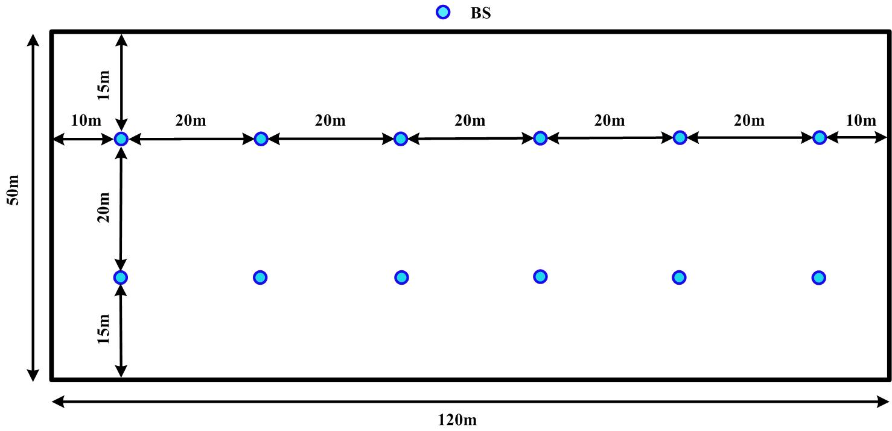
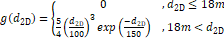
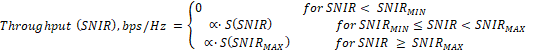

+----------------------------------+----------------------------------+
| 3GPP TR 38.834 V17.2.0 (2022-09) |                                  |
+==================================+==================================+
| Technical Report                 |                                  |
+----------------------------------+----------------------------------+
| 3^rd^ Generation Partnership     |                                  |
| Project;                         |                                  |
|                                  |                                  |
| Technical Specification Group    |                                  |
| Radio Access Network;            |                                  |
|                                  |                                  |
| Measurements of User Equipment   |                                  |
| (UE) Over-the-Air (OTA)          |                                  |
| performance for NR FR1;          |                                  |
|                                  |                                  |
| Total Radiated Power (TRP) and   |                                  |
| Total Radiated Sensitivity (TRS) |                                  |
| test methodology                 |                                  |
|                                  |                                  |
| (Release 17)                     |                                  |
+----------------------------------+----------------------------------+
|                                  |                                  |
+----------------------------------+----------------------------------+
| {width="1.325in" | 3GPP-logo\_web](./media/image2.p |
| height="0.9152777777777777in"}   | ng){width="1.7729166666666667in" |
|                                  | height="1.038888888888889in"}    |
+----------------------------------+----------------------------------+
|                                  |                                  |
+----------------------------------+----------------------------------+
| The present document has been    |                                  |
| developed within the 3^rd^       |                                  |
| Generation Partnership Project   |                                  |
| (3GPP ^TM^) and may be further   |                                  |
| elaborated for the purposes of   |                                  |
| 3GPP.\                           |                                  |
| The present document has not     |                                  |
| been subject to any approval     |                                  |
| process by the 3GPP              |                                  |
| Organizational Partners and      |                                  |
| shall not be implemented.\       |                                  |
| This Specification is provided   |                                  |
| for future development work      |                                  |
| within 3GPP only. The            |                                  |
| Organizational Partners accept   |                                  |
| no liability for any use of this |                                  |
| Specification.\                  |                                  |
| Specifications and Reports for   |                                  |
| implementation of the 3GPP ^TM^  |                                  |
| system should be obtained via    |                                  |
| the 3GPP Organizational          |                                  |
| Partners' Publications Offices.  |                                  |
+----------------------------------+----------------------------------+

+----------------------------------------------------------------------+
|                                                                      |
+======================================================================+
| > ***3GPP***                                                         |
| >                                                                    |
| > Postal address                                                     |
| >                                                                    |
| > 3GPP support office address                                        |
| >                                                                    |
| > 650 Route des Lucioles -- Sophia Antipolis                         |
| >                                                                    |
| > Valbonne -- FRANCE                                                 |
| >                                                                    |
| > Tel.: +33 4 92 94 42 00 Fax: +33 4 93 65 47 16                     |
| >                                                                    |
| > Internet                                                           |
| >                                                                    |
| > <http://www.3gpp.org>                                              |
+----------------------------------------------------------------------+
| ***Copyright Notification***                                         |
|                                                                      |
| No part may be reproduced except as authorized by written            |
| permission.\                                                         |
| The copyright and the foregoing restriction extend to reproduction   |
| in all media.                                                        |
|                                                                      |
| © 2022, 3GPP Organizational Partners (ARIB, ATIS, CCSA, ETSI, TSDSI, |
| TTA, TTC).                                                           |
|                                                                      |
| All rights reserved.                                                 |
|                                                                      |
| UMTS™ is a Trade Mark of ETSI registered for the benefit of its      |
| members                                                              |
|                                                                      |
| 3GPP™ is a Trade Mark of ETSI registered for the benefit of its      |
| Members and of the 3GPP Organizational Partners\                     |
| LTE™ is a Trade Mark of ETSI registered for the benefit of its       |
| Members and of the 3GPP Organizational Partners                      |
|                                                                      |
| GSM® and the GSM logo are registered and owned by the GSM            |
| Association                                                          |
+----------------------------------------------------------------------+

 Contents {#contents .TT}
========

Foreword 5

1 Scope 7

2 References 7

3 Definitions of terms, symbols and abbreviations 8

3.1 Terms 8

3.2 Symbols 8

3.3 Abbreviations 8

4 General 9

4.1 Device types 9

4.2 Testing configuration 9

4.3 Testing bands 9

5 Performance metrics 14

5.1 Definition of the Total Radiated Power (TRP) 14

5.2 Definition of Total Radiated Sensitivity (TRS) 15

6 UE positioning guidelines 16

6.1 Free space 16

6.2 Hand phantom only (Browsing mode) 16

6.3 Head and Hand phantom (Talk Mode) 18

7 Test setup and calibration 19

7.1 General 19

7.2 Test setup 21

7.3 Calibration procedure 21

7.4 Ripple test for Quiet Zone 22

7.4.1 General 22

7.4.2 Ripple test procedure 23

7.5 TAS OFF verification procedure 26

8 SA test methodology 27

8.1 General 27

8.2 Total Radiated Power (TRP) 27

8.3 Total Radiated Sensitivity (TRS) 28

9 EN-DC test methodology 29

9.1 General 29

9.2 Total Radiated Power (TRP) 29

9.3 Total Radiated Sensitivity (TRS) 29

10 Alternate test procedure to reduce test time 30

10.1 General 30

10.2 Test procedure 30

**Annex A: UE coordinate system** 30

A.1 Reference coordinate system 30

**Annex B (informative): Estimation of measurement uncertainty** 32

B.1 General 32

B.2 Measurement uncertainty contribution descriptions 33

B.2.1 Mismatch uncertainty 33

B.2.2 Insertion loss 37

B.2.3 Influence of the antenna cable 38

B.2.4 Measurement receiver: uncertainty of the absolute level 38

B.2.5 Communication tester: uncertainty of the absolute level 39

B.2.6 Sensitivity measurement: output level step resolution 39

B.2.7 Measurement distance 39

B.2.8 Quality of quiet zone 40

B.2.9 DUT Tx-power drift 41

B.2.10 DUT sensitivity drift 42

B.2.11 Uncertainty related to the use of phantoms 42

B.2.12 Coarse sampling grid 44

B.2.13 Random uncertainty 45

B.2.14 Frequency response 46

B.2.15 Uncertainty of network nalyser 46

B.2.16 Uncertainty of the gain/efficiency of the calibration antenna 46

B.3 Total Radiated Power (TRP) 46

B.4 Total Radiated Sensitivity (TRS) 48

**Annex C: Environmental requirements** 50

C.1 Scope 50

C.2 Ambient temperature 50

C.3 Operating voltage 50

**Annex D: Phantom Definition** 50

D.1 Head Phantom 50

D.2 Hand Phantom 51

D.2.1 PDA Grip Hand 51

D.2.2 Wide Grip Hand 51

**Annex E: Configurations for multi-antenna UE** 52

E.1 Test methodology and configurations for UE with UL Tx Diversity 52

E.2 Test methodology and configurations for UE with Tx antenna switch ON
52

E.3 Test methodology and configurations for UE with multi antenna
receivers 52

**Annex F (informative): Change history** 53

Foreword
========

This Technical Report has been produced by the 3^rd^ Generation
Partnership Project (3GPP).

The contents of the present document are subject to continuing work
within the TSG and may change following formal TSG approval. Should the
TSG modify the contents of the present document, it will be re-released
by the TSG with an identifying change of release date and an increase in
version number as follows:

Version x.y.z

where:

x the first digit:

1 presented to TSG for information;

2 presented to TSG for approval;

3 or greater indicates TSG approved document under change control.

Y the second digit is incremented for all changes of substance, i.e.
technical enhancements, corrections, updates, etc.

z the third digit is incremented when editorial only changes have been
incorporated in the document.

In the present document, modal verbs have the following meanings:

**shall** indicates a mandatory requirement to do something

**shall not** indicates an interdiction (prohibition) to do something

The constructions "shall" and "shall not" are confined to the context of
normative provisions, and do not appear in Technical Reports.

The constructions "must" and "must not" are not used as substitutes for
"shall" and "shall not". Their use is avoided insofar as possible, and
they are not used in a normative context except in a direct citation
from an external, referenced, non-3GPP document, or so as to maintain
continuity of style when extending or modifying the provisions of such a
referenced document.

**Should** indicates a recommendation to do something

**should not** indicates a recommendation not to do something

**may** indicates permission to do something

**need not** indicates permission not to do something

The construction "may not" is ambiguous and is not used in normative
elements. The unambiguous constructions "might not" or "shall not" are
used instead, depending upon the meaning intended.

**Can** indicates that something is possible

**cannot** indicates that something is impossible

The constructions "can" and "cannot" are not substitutes for "may" and
"need not".

**Will** indicates that something is certain or expected to happen as a
result of action taken by an agency the behaviour of which is outside
the scope of the present document

**will not** indicates that something is certain or expected not to
happen as a result of action taken by an agency the behaviour of which
is outside the scope of the present document

**might** indicates a likelihood that something will happen as a result
of action taken by some agency the behaviour of which is outside the
scope of the present document

**might not** indicates a likelihood that something will not happen as a
result of action taken by some agency the behaviour of which is outside
the scope of the present document

In addition:

**is** (or any other verb in the indicative mood) indicates a statement
of fact

**is not** (or any other negative verb in the indicative mood) indicates
a statement of fact

The constructions "is" and "is not" do not indicate requirements.

 1 Scope
=======

The present document is a technical report for FR1 Total Radiated Power
(TRP) and Total Radiated Sensitivity (TRS) test methodology, for NR
standalone (SA) and NR non-standalone (NSA) operation mode.

2 References
============

The following documents contain provisions which, through reference in
this text, constitute provisions of the present document.

\- References are either specific (identified by date of publication,
edition number, version number, etc.) or non‑specific.

\- For a specific reference, subsequent revisions do not apply.

\- For a non-specific reference, the latest version applies. In the case
of a reference to a 3GPP document (including a GSM document), a
non-specific reference implicitly refers to the latest version of that
document *in the same Release as the present document*.

\[1\] 3GPP TR 21.905: "Vocabulary for 3GPP Specifications".

\[2\] 3GPP TR 38.827: "Study on radiated metrics and test methodology
for the verification of multi-antenna reception performance of NR User
Equipment (UE)".

\[3\] 3GPP TS 38.101-1: "NR; User Equipment (UE) radio transmission and
reception; Part 1: Range 1 Standalone".

\[4\] 3GPP TS 38.101-3: "NR; User Equipment (UE) radio transmission and
reception; Part 3: Range 1 and Range 2 Interworking operation with other
radios".

\[5\] 3GPP TS 38.521-1: "NR; User Equipment (UE) conformance
specification; Radio transmission and reception; Part 1: Range 1
Standalone".

\[6\] 3GPP TS 38.521-3: "NR; User Equipment (UE) conformance
specification; Radio transmission and reception; Part 3: Range 1 and
Range 2 Interworking operation with other radios".

\[7\] 3GPP TS 38.508-1: "5GS; User Equipment (UE) conformance
specification; Part 1: Common test environment ".

\[8\] 3GPP TR 25.914: "Measurements of radio performances for UMTS
terminals in speech mode".

\[9\] IEEE Std 149: "IEEE Standard Test Procedures for Antennas", IEEE.

\[10\] JCGM 100:2008: "Evaluation of measurement data --- Guide to the
expression of uncertainty in measurement".

\[11\] ETSI TR 102 273-1-1: "Electromagnetic compatibility and Radio
spectrum Matters (ERM); Improvement on Radiated Methods of Measurement
(using test site) and evaluation of the corresponding measurement
uncertainties; Part 1: Uncertainties in the measurement of mobile radio
equipment characteristics; Sub-part 1: Introduction".

\[12\] ETSI TR 100 028-2: "ElectroMagnetic Compatibility and Radio
Spectrum Matters (ERM); Uncertainties in the measurement of mobile radio
equipment characteristics; Part 2".

\[13\] ETSI TR 102 273-1-2: "Electromagnetic compatibility and Radio
spectrum Matters (ERM); Improvement on Radiated Methods of Measurement
(using test site) and evaluation of the corresponding measurement
uncertainties; Part 1: Uncertainties in the measurement of mobile radio
equipment characteristics; Sub-part 2: Examples and annexes".

\[14\] CTIA Certification™ OTA Test Plan: " CTIA Certification Test Plan
for Wireless Device Over-the-Air Performance, Version 3.9.X ",
<https://ctiacertification.org/test-plans/>

\[15\] Foegelle, M.D., "The Surface Standard Deviation Method for TRP
Measurement Uncertainty", 25^th^ Proceedings of the Antenna Measurement
Techniques Association (AMTA 2003), A03-027

\[16\] 3GPP TR 37.902: "Measurements of User Equipment (UE) radio
performances for LTE/UMTS terminals; Total Radiated Power (TRP) and
Total Radiated Sensitivity (TRS) test ".

\[17\] 3GPP TS 37.544: "Universal Terrestrial Radio Access (UTRA) and
Evolved Universal Terrestrial Radio Access (E-UTRA); User Equipment (UE)
Over The Air (OTA) performance; Conformance testing ".

3 Definitions of terms, symbols and abbreviations
=================================================

3.1 Terms
---------

For the purposes of the present document, the terms given in 3GPP
TR 21.905 \[1\] and the following apply. A term defined in the present
document takes precedence over the definition of the same term, if any,
in 3GPP TR 21.905 \[1\].

Definition format (Normal)

**\<defined term\>:** \<definition\>.

**Example:** text used to clarify abstract rules by applying them
literally.

3.2 Symbols
-----------

For the purposes of the present document, the following symbols apply:

Symbol format (EW)

\<symbol\> \<Explanation\>

3.3 Abbreviations
-----------------

For the purposes of the present document, the abbreviations given in
3GPP TR 21.905 \[1\] and the following apply. An abbreviation defined in
the present document takes precedence over the definition of the same
abbreviation, if any, in 3GPP TR 21.905 \[1\].

DUT Device Under Test

EIRP Effective Isotropic Radiated Power

EUT Equipment Under Test

FR1 Frequency Range 1

FS Free Space

LEE Laptop Embedded Equipment

LME Laptop Mounted Equipment

NSA Non-Standalone, a mode of operation where operation of an other
radio is assisted with an other radio

OTA Over The Air

QZ Quiet Zone

SA Standalone

SS System Simulator

TAA Time-Averaging Algorithm

TAS Tx Antenna Switching

TRP Total Radiated Power

TRS Total Radiated Sensitivity

UE User Equipment

4 General
=========

4.1 Device types
----------------

The following device types are within the scope of FR1 TRP TRS WI:

\- Smartphone

\- Considering Ues with antenna configurations of 1Tx, 2Tx, 2 Rx and 4
Rx

\- Tablet

\- Laptop embedded equipment (LEE)

\- Laptop mounted equipment (LME)

The development of test methodology aspects shall initially focus on the
smartphone device type.

4.2 Testing configuration
-------------------------

### 4.2.1 UE use scenarios for TRP TRS test 

The following use scenarios are considered for TRP TRS test:

\- Talk mode using head & hand phantom for narrow devices between 56 mm
and 72 mm and for wide devices with a width \>72 mm and \<92 mm.

\- Browsing mode using hand phantom for narrow and wide phones

\- Free Space for devices not used in talk or browsing mode

For smartphone, head/hand phantoms testing configuration is the first
priority. How to select Talk mode or Browsing mode is FFS.

For other device types, free space (FS) testing configuration is the
first priority.

### 4.2.2 UE mechanical mode description 

The mechanical modes of a device under test (DUT) are declared by the
manufacturer. A DUT shall have at least one mechanical mode. If only one
mode is supported, then this is defined as the primary. If multiple
modes are supported, the manufacturer can declare different primary
mechanical modes applicable for different user scenarios, e.g.,
different primary mechanical mode for Browsing mode usage and Talk mode
usage for the same UE.

4.3 Testing bands
-----------------

### 4.3.1 General 

The frequency ranges in which NR can operate are identified as described
in Table 4.3.1-1.

Table 4.3.1-1: Definition of frequency ranges

  Frequency range designation   Corresponding frequency range
  ----------------------------- -------------------------------
  FR1                           410 MHz -- 7125 MHz
  FR2                           24250 MHz -- 52600 MHz

The present technical report covers FR1 operating bands and FR1
non-standalone (NSA) operation mode with E-UTRA.

### 4.3.2 Operating bands 

Operating bands for NR FR1 are defined in Table 5.2-1 in TS 38.101-1
\[3\]. The operating bands for EN-DC are defined in Clause 5.5B in TS
38.101-3 \[4\].

### 4.3.3 Test parameters for each band

The detailed testing parameters for each band is defined in Table
4.3.3-1 and Table 4.3.3-2.

Table 4.3.3-1: NR FR1 TRP measurement parameters

<table>
<thead>
<tr class="header">
<th>NR Band</th>
<th>CBW 
[MHz]</th>
<th>SCS (kHz)</th>
<th>UL modulation</th>
<th>Range</th>
<th>
UL Carrier centre

[ARFCN]
</th>
<th>UL Carrier Center (MHz)</th>
<th>
DL Carrier centre

[ARFCN]
</th>
<th>DL Carrier Center (MHz)</th>
<th>
UL RB Allocation

(LCRB @ RBstart)
</th>
<th>DL configuration</th>
</tr>
</thead>
<tbody>
<tr class="odd">
<td>n1</td>
<td>15</td>
<td>15</td>
<td>
DFT-s-OFDM

QPSK
</td>
<td>Low</td>
<td>385500</td>
<td>1927.5</td>
<td>423500</td>
<td>2117.5</td>
<td>36@18</td>
<td>N/A</td>
</tr>
<tr class="even">
<td></td>
<td></td>
<td></td>
<td></td>
<td>Mid</td>
<td>390000</td>
<td>1950</td>
<td>428000</td>
<td>2140</td>
<td></td>
<td></td>
</tr>
<tr class="odd">
<td></td>
<td></td>
<td></td>
<td></td>
<td>High</td>
<td>394500</td>
<td>1972.5</td>
<td>432500</td>
<td>2162.5</td>
<td></td>
<td></td>
</tr>
<tr class="even">
<td>n2</td>
<td>15</td>
<td>15</td>
<td>
DFT-s-OFDM

QPSK
</td>
<td>Low</td>
<td>371500</td>
<td>1857.5</td>
<td>387500</td>
<td>1937.5</td>
<td>36@18</td>
<td>N/A</td>
</tr>
<tr class="odd">
<td></td>
<td></td>
<td></td>
<td></td>
<td>Mid</td>
<td>376000</td>
<td>1880</td>
<td>392000</td>
<td>1960</td>
<td></td>
<td></td>
</tr>
<tr class="even">
<td></td>
<td></td>
<td></td>
<td></td>
<td>High</td>
<td>380500</td>
<td>1902.5</td>
<td>396500</td>
<td>1982.5</td>
<td></td>
<td></td>
</tr>
<tr class="odd">
<td>n3</td>
<td>20</td>
<td>15</td>
<td>
DFT-s-OFDM

QPSK
</td>
<td>Low</td>
<td>344000</td>
<td>1720</td>
<td>363000</td>
<td>1815</td>
<td>50@25</td>
<td>N/A</td>
</tr>
<tr class="even">
<td></td>
<td></td>
<td></td>
<td></td>
<td>Mid</td>
<td>349500</td>
<td>1747.5</td>
<td>368500</td>
<td>1842.5</td>
<td></td>
<td></td>
</tr>
<tr class="odd">
<td></td>
<td></td>
<td></td>
<td></td>
<td>High</td>
<td>355000</td>
<td>1775</td>
<td>374000</td>
<td>1870</td>
<td></td>
<td></td>
</tr>
<tr class="even">
<td>n5</td>
<td>15</td>
<td>15</td>
<td>
DFT-s-OFDM

QPSK
</td>
<td>Low</td>
<td>166300</td>
<td>831.5</td>
<td>175300</td>
<td>876.5</td>
<td>36@18</td>
<td>N/A</td>
</tr>
<tr class="odd">
<td></td>
<td></td>
<td></td>
<td></td>
<td>Mid</td>
<td>167300</td>
<td>836.5</td>
<td>176300</td>
<td>881.5</td>
<td></td>
<td></td>
</tr>
<tr class="even">
<td></td>
<td></td>
<td></td>
<td></td>
<td>High</td>
<td>168300</td>
<td>841.5</td>
<td>177300</td>
<td>886.5</td>
<td></td>
<td></td>
</tr>
<tr class="odd">
<td>n7</td>
<td>15</td>
<td>15</td>
<td>
DFT-s-OFDM

QPSK
</td>
<td>Low</td>
<td>501500</td>
<td>2507.5</td>
<td>525500</td>
<td>2627.5</td>
<td>36@18</td>
<td>N/A</td>
</tr>
<tr class="even">
<td></td>
<td></td>
<td></td>
<td></td>
<td>Mid</td>
<td>507000</td>
<td>2535</td>
<td>531000</td>
<td>2655</td>
<td></td>
<td></td>
</tr>
<tr class="odd">
<td></td>
<td></td>
<td></td>
<td></td>
<td>High</td>
<td>512500</td>
<td>2562.5</td>
<td>536500</td>
<td>2682.5</td>
<td></td>
<td></td>
</tr>
<tr class="even">
<td>n8</td>
<td>15</td>
<td>15</td>
<td>
DFT-s-OFDM

QPSK
</td>
<td>Low</td>
<td>177500</td>
<td>887.5</td>
<td>186500</td>
<td>932.5</td>
<td>36@18</td>
<td>N/A</td>
</tr>
<tr class="odd">
<td></td>
<td></td>
<td></td>
<td></td>
<td>Mid</td>
<td>179500</td>
<td>897.5</td>
<td>188500</td>
<td>942.5</td>
<td></td>
<td></td>
</tr>
<tr class="even">
<td></td>
<td></td>
<td></td>
<td></td>
<td>High</td>
<td>181500</td>
<td>907.5</td>
<td>190500</td>
<td>952.5</td>
<td></td>
<td></td>
</tr>
<tr class="odd">
<td>n12</td>
<td>10</td>
<td>15</td>
<td>
DFT-s-OFDM

QPSK
</td>
<td>Low</td>
<td>140800</td>
<td>704</td>
<td>146800</td>
<td>734</td>
<td>25@12</td>
<td>N/A</td>
</tr>
<tr class="even">
<td></td>
<td></td>
<td></td>
<td></td>
<td>Mid</td>
<td>141500</td>
<td>707.5</td>
<td>147500</td>
<td>737.5</td>
<td></td>
<td></td>
</tr>
<tr class="odd">
<td></td>
<td></td>
<td></td>
<td></td>
<td>High</td>
<td>142200</td>
<td>711</td>
<td>148200</td>
<td>741</td>
<td></td>
<td></td>
</tr>
<tr class="even">
<td>n14</td>
<td>10</td>
<td>15</td>
<td>
DFT-s-OFDM

QPSK
</td>
<td>Low</td>
<td>158600</td>
<td>793</td>
<td>152600</td>
<td>763</td>
<td>25@12</td>
<td>N/A</td>
</tr>
<tr class="odd">
<td></td>
<td></td>
<td></td>
<td></td>
<td>Mid</td>
<td></td>
<td></td>
<td></td>
<td></td>
<td></td>
<td></td>
</tr>
<tr class="even">
<td></td>
<td></td>
<td></td>
<td></td>
<td>High</td>
<td></td>
<td></td>
<td></td>
<td></td>
<td></td>
<td></td>
</tr>
<tr class="odd">
<td>n20</td>
<td>15</td>
<td>15</td>
<td>
DFT-s-OFDM

QPSK
</td>
<td>Low</td>
<td>167900</td>
<td>839.5</td>
<td>159700</td>
<td>798.5</td>
<td>36@18</td>
<td>N/A</td>
</tr>
<tr class="even">
<td></td>
<td></td>
<td></td>
<td></td>
<td>Mid</td>
<td>169400</td>
<td>847</td>
<td>161200</td>
<td>806</td>
<td></td>
<td></td>
</tr>
<tr class="odd">
<td></td>
<td></td>
<td></td>
<td></td>
<td>High</td>
<td>170900</td>
<td>854.5</td>
<td>162700</td>
<td>813.5</td>
<td></td>
<td></td>
</tr>
<tr class="even">
<td>n25</td>
<td>15</td>
<td>15</td>
<td>
DFT-s-OFDM

QPSK
</td>
<td>Low</td>
<td>371500</td>
<td>1857.5</td>
<td>387500</td>
<td>1937.5</td>
<td>36@18</td>
<td>N/A</td>
</tr>
<tr class="odd">
<td></td>
<td></td>
<td></td>
<td></td>
<td>Mid</td>
<td>376500</td>
<td>1882.5</td>
<td>392500</td>
<td>1962.5</td>
<td></td>
<td></td>
</tr>
<tr class="even">
<td></td>
<td></td>
<td></td>
<td></td>
<td>High</td>
<td>381500</td>
<td>1907.5</td>
<td>397500</td>
<td>1987.5</td>
<td></td>
<td></td>
</tr>
<tr class="odd">
<td>n26</td>
<td>10</td>
<td>15</td>
<td>
DFT-s-OFDM

QPSK
</td>
<td>Low</td>
<td>163800</td>
<td>819</td>
<td>172800</td>
<td>864</td>
<td>25@12</td>
<td>N/A</td>
</tr>
<tr class="even">
<td></td>
<td></td>
<td></td>
<td></td>
<td>Mid</td>
<td>166300</td>
<td>831.5</td>
<td>175300</td>
<td>876.5</td>
<td></td>
<td></td>
</tr>
<tr class="odd">
<td></td>
<td></td>
<td></td>
<td></td>
<td>High</td>
<td>168800</td>
<td>844</td>
<td>177800</td>
<td>889</td>
<td></td>
<td></td>
</tr>
<tr class="even">
<td>n28</td>
<td>20</td>
<td>15</td>
<td>
DFT-s-OFDM

QPSK
</td>
<td>Low</td>
<td>142600</td>
<td>713</td>
<td>153600</td>
<td>768</td>
<td>50@25</td>
<td>N/A</td>
</tr>
<tr class="odd">
<td></td>
<td></td>
<td></td>
<td></td>
<td>Mid</td>
<td>145600</td>
<td>728</td>
<td>156600</td>
<td>783</td>
<td></td>
<td></td>
</tr>
<tr class="even">
<td></td>
<td></td>
<td></td>
<td></td>
<td>High</td>
<td>147600</td>
<td>738</td>
<td>158600</td>
<td>793</td>
<td></td>
<td></td>
</tr>
<tr class="odd">
<td>n30</td>
<td>10</td>
<td>15</td>
<td>
DFT-s-OFDM

QPSK
</td>
<td>Low</td>
<td>462000</td>
<td>2310</td>
<td>471000</td>
<td>2355</td>
<td>25@12</td>
<td>N/A</td>
</tr>
<tr class="even">
<td></td>
<td></td>
<td></td>
<td></td>
<td>Mid</td>
<td></td>
<td></td>
<td></td>
<td></td>
<td></td>
<td></td>
</tr>
<tr class="odd">
<td></td>
<td></td>
<td></td>
<td></td>
<td>High</td>
<td></td>
<td></td>
<td></td>
<td></td>
<td></td>
<td></td>
</tr>
<tr class="even">
<td>n34</td>
<td>10</td>
<td>15</td>
<td>
DFT-s-OFDM

QPSK
</td>
<td>Low</td>
<td>403000</td>
<td>2015</td>
<td>403000</td>
<td>2015</td>
<td>25@12</td>
<td>N/A</td>
</tr>
<tr class="odd">
<td></td>
<td></td>
<td></td>
<td></td>
<td>Mid</td>
<td>403500</td>
<td>2017.5</td>
<td>403500</td>
<td>2017.5</td>
<td></td>
<td></td>
</tr>
<tr class="even">
<td></td>
<td></td>
<td></td>
<td></td>
<td>High</td>
<td>404000</td>
<td>2020</td>
<td>404000</td>
<td>2020</td>
<td></td>
<td></td>
</tr>
<tr class="odd">
<td>n38</td>
<td>15</td>
<td>15</td>
<td>
DFT-s-OFDM

QPSK
</td>
<td>Low</td>
<td>515500</td>
<td>2577.5</td>
<td>515500</td>
<td>2577.5</td>
<td>36@18</td>
<td>N/A</td>
</tr>
<tr class="even">
<td></td>
<td></td>
<td></td>
<td></td>
<td>Mid</td>
<td>519000</td>
<td>2595</td>
<td>519000</td>
<td>2595</td>
<td></td>
<td></td>
</tr>
<tr class="odd">
<td></td>
<td></td>
<td></td>
<td></td>
<td>High</td>
<td>522500</td>
<td>2612.5</td>
<td>522500</td>
<td>2612.5</td>
<td></td>
<td></td>
</tr>
<tr class="even">
<td>n39</td>
<td>20</td>
<td>15</td>
<td>
DFT-s-OFDM

QPSK
</td>
<td>Low</td>
<td>378000</td>
<td>1890</td>
<td>378000</td>
<td>1890</td>
<td>50@25</td>
<td>N/A</td>
</tr>
<tr class="odd">
<td></td>
<td></td>
<td></td>
<td></td>
<td>Mid</td>
<td>380000</td>
<td>1900</td>
<td>380000</td>
<td>1900</td>
<td></td>
<td></td>
</tr>
<tr class="even">
<td></td>
<td></td>
<td></td>
<td></td>
<td>High</td>
<td>382000</td>
<td>1910</td>
<td>382000</td>
<td>1910</td>
<td></td>
<td></td>
</tr>
<tr class="odd">
<td>n40</td>
<td>30</td>
<td>15</td>
<td>
DFT-s-OFDM

QPSK
</td>
<td>Low</td>
<td>463000</td>
<td>2315</td>
<td>463000</td>
<td>2315</td>
<td>TBD</td>
<td>N/A</td>
</tr>
<tr class="even">
<td></td>
<td></td>
<td></td>
<td></td>
<td>Mid</td>
<td>470000</td>
<td>2350</td>
<td>470000</td>
<td>2350</td>
<td></td>
<td></td>
</tr>
<tr class="odd">
<td></td>
<td></td>
<td></td>
<td></td>
<td>High</td>
<td>477000</td>
<td>2385</td>
<td>477000</td>
<td>2385</td>
<td></td>
<td></td>
</tr>
<tr class="even">
<td>n41</td>
<td>100</td>
<td>30</td>
<td>
DFT-s-OFDM

QPSK
</td>
<td>Low</td>
<td>509202</td>
<td>2546.01</td>
<td>509202</td>
<td>2546.01</td>
<td>135@67</td>
<td>N/A</td>
</tr>
<tr class="odd">
<td></td>
<td></td>
<td></td>
<td></td>
<td>Mid</td>
<td>518598</td>
<td>2592.99</td>
<td>518598</td>
<td>2592.99</td>
<td></td>
<td></td>
</tr>
<tr class="even">
<td></td>
<td></td>
<td></td>
<td></td>
<td>High</td>
<td>528000</td>
<td>2640</td>
<td>528000</td>
<td>2640</td>
<td></td>
<td></td>
</tr>
<tr class="odd">
<td>n48</td>
<td>20</td>
<td>15</td>
<td>
DFT-s-OFDM

QPSK
</td>
<td>Low</td>
<td>637334</td>
<td>3560.01</td>
<td>637334</td>
<td>3560.01</td>
<td>50@25</td>
<td>N/A</td>
</tr>
<tr class="even">
<td></td>
<td></td>
<td></td>
<td></td>
<td>Mid</td>
<td>641666</td>
<td>3624.99</td>
<td>641666</td>
<td>3624.99</td>
<td></td>
<td></td>
</tr>
<tr class="odd">
<td></td>
<td></td>
<td></td>
<td></td>
<td>High</td>
<td>646000</td>
<td>3690</td>
<td>646000</td>
<td>3690</td>
<td></td>
<td></td>
</tr>
<tr class="even">
<td>n50</td>
<td>20</td>
<td>15</td>
<td>
DFT-s-OFDM

QPSK
</td>
<td>Low</td>
<td>288400</td>
<td>1442</td>
<td>288400</td>
<td>1442</td>
<td>50@25</td>
<td>N/A</td>
</tr>
<tr class="odd">
<td></td>
<td></td>
<td></td>
<td></td>
<td>Mid</td>
<td>294900</td>
<td>1474.5</td>
<td>294900</td>
<td>1474.5</td>
<td></td>
<td></td>
</tr>
<tr class="even">
<td></td>
<td></td>
<td></td>
<td></td>
<td>High</td>
<td>301400</td>
<td>1507</td>
<td>301400</td>
<td>1507</td>
<td></td>
<td></td>
</tr>
<tr class="odd">
<td>n51</td>
<td>5</td>
<td>15</td>
<td>
DFT-s-OFDM

QPSK
</td>
<td>Low</td>
<td>285900</td>
<td>1429.5</td>
<td>285900</td>
<td>1429.5</td>
<td>12@6</td>
<td>N/A</td>
</tr>
<tr class="even">
<td></td>
<td></td>
<td></td>
<td></td>
<td>Mid</td>
<td></td>
<td></td>
<td></td>
<td></td>
<td></td>
<td></td>
</tr>
<tr class="odd">
<td></td>
<td></td>
<td></td>
<td></td>
<td>High</td>
<td></td>
<td></td>
<td></td>
<td></td>
<td></td>
<td></td>
</tr>
<tr class="even">
<td>n53</td>
<td>10</td>
<td>15</td>
<td>
DFT-s-OFDM

QPSK
</td>
<td>Low</td>
<td>497700</td>
<td>2488.5</td>
<td>497700</td>
<td>2488.5</td>
<td>25@12</td>
<td>N/A</td>
</tr>
<tr class="odd">
<td></td>
<td></td>
<td></td>
<td></td>
<td>Mid</td>
<td>497860</td>
<td>2489.3</td>
<td>497860</td>
<td>2489.3</td>
<td></td>
<td></td>
</tr>
<tr class="even">
<td></td>
<td></td>
<td></td>
<td></td>
<td>High</td>
<td>498000</td>
<td>2490</td>
<td>498000</td>
<td>2490</td>
<td></td>
<td></td>
</tr>
<tr class="odd">
<td>n65</td>
<td>15</td>
<td>15</td>
<td>
DFT-s-OFDM

QPSK
</td>
<td>Low</td>
<td>423500</td>
<td>2117.5</td>
<td>423500</td>
<td>2117.5</td>
<td>36@18</td>
<td>N/A</td>
</tr>
<tr class="even">
<td></td>
<td></td>
<td></td>
<td></td>
<td>Mid</td>
<td>431000</td>
<td>2155</td>
<td>431000</td>
<td>2155</td>
<td></td>
<td></td>
</tr>
<tr class="odd">
<td></td>
<td></td>
<td></td>
<td></td>
<td>High</td>
<td>438500</td>
<td>2192.5</td>
<td>438500</td>
<td>2192.5</td>
<td></td>
<td></td>
</tr>
<tr class="even">
<td>n66</td>
<td>20 (20+20)</td>
<td>15</td>
<td>
DFT-s-OFDM

QPSK
</td>
<td>Low</td>
<td>344000</td>
<td>1720</td>
<td>424000</td>
<td>2120</td>
<td>50@25</td>
<td>N/A</td>
</tr>
<tr class="odd">
<td></td>
<td></td>
<td></td>
<td></td>
<td>Mid</td>
<td>349000</td>
<td>1745</td>
<td>429000</td>
<td>2145</td>
<td></td>
<td></td>
</tr>
<tr class="even">
<td></td>
<td></td>
<td></td>
<td></td>
<td>High</td>
<td>354000</td>
<td>1770</td>
<td>434000</td>
<td>2170</td>
<td></td>
<td></td>
</tr>
<tr class="odd">
<td>n70</td>
<td>15 (15+15)</td>
<td>15</td>
<td>
DFT-s-OFDM

QPSK
</td>
<td>Low</td>
<td>340500</td>
<td>1702.5</td>
<td>400500</td>
<td>2002.5</td>
<td>36@18</td>
<td>N/A</td>
</tr>
<tr class="even">
<td></td>
<td></td>
<td></td>
<td></td>
<td>Mid</td>
<td></td>
<td></td>
<td></td>
<td></td>
<td></td>
<td></td>
</tr>
<tr class="odd">
<td></td>
<td></td>
<td></td>
<td></td>
<td>High</td>
<td></td>
<td></td>
<td></td>
<td></td>
<td></td>
<td></td>
</tr>
<tr class="even">
<td>n71</td>
<td>10</td>
<td>15</td>
<td>
DFT-s-OFDM

QPSK
</td>
<td>Low</td>
<td>133600</td>
<td>668</td>
<td>124400</td>
<td>622</td>
<td>25@12</td>
<td>N/A</td>
</tr>
<tr class="odd">
<td></td>
<td></td>
<td></td>
<td></td>
<td>Mid</td>
<td>136100</td>
<td>680.5</td>
<td>126900</td>
<td>634.5</td>
<td></td>
<td></td>
</tr>
<tr class="even">
<td></td>
<td></td>
<td></td>
<td></td>
<td>High</td>
<td>138600</td>
<td>693</td>
<td>129400</td>
<td>647</td>
<td></td>
<td></td>
</tr>
<tr class="odd">
<td>n74</td>
<td>15</td>
<td>15</td>
<td>
DFT-s-OFDM

QPSK
</td>
<td>Low</td>
<td>286900</td>
<td>1434.5</td>
<td>296500</td>
<td>1482.5</td>
<td>36@18</td>
<td>N/A</td>
</tr>
<tr class="even">
<td></td>
<td></td>
<td></td>
<td></td>
<td>Mid</td>
<td>289700</td>
<td>1448.5</td>
<td>299300</td>
<td>1496.5</td>
<td></td>
<td></td>
</tr>
<tr class="odd">
<td></td>
<td></td>
<td></td>
<td></td>
<td>High</td>
<td>292500</td>
<td>1462.5</td>
<td>302100</td>
<td>1510.5</td>
<td></td>
<td></td>
</tr>
<tr class="even">
<td>n77</td>
<td>100</td>
<td>30</td>
<td>
DFT-s-OFDM

QPSK
</td>
<td>Low</td>
<td>623334</td>
<td>3350.01</td>
<td>623334</td>
<td>3350.01</td>
<td>135@67</td>
<td>N/A</td>
</tr>
<tr class="odd">
<td></td>
<td></td>
<td></td>
<td></td>
<td>Mid</td>
<td>650000</td>
<td>3750</td>
<td>650000</td>
<td>3750</td>
<td></td>
<td></td>
</tr>
<tr class="even">
<td></td>
<td></td>
<td></td>
<td></td>
<td>High</td>
<td>676666</td>
<td>4149.99</td>
<td>676666</td>
<td>4149.99</td>
<td></td>
<td></td>
</tr>
<tr class="odd">
<td>n78</td>
<td>100</td>
<td>30</td>
<td>
DFT-s-OFDM

QPSK
</td>
<td>Low</td>
<td>623334</td>
<td>3350.01</td>
<td>623334</td>
<td>3350.01</td>
<td>135@67</td>
<td>N/A</td>
</tr>
<tr class="even">
<td></td>
<td></td>
<td></td>
<td></td>
<td>Mid</td>
<td>636666</td>
<td>3549.99</td>
<td>636666</td>
<td>3549.99</td>
<td></td>
<td></td>
</tr>
<tr class="odd">
<td></td>
<td></td>
<td></td>
<td></td>
<td>High</td>
<td>650000</td>
<td>3750</td>
<td>650000</td>
<td>3750</td>
<td></td>
<td></td>
</tr>
<tr class="even">
<td>n79</td>
<td>100</td>
<td>30</td>
<td>
DFT-s-OFDM

QPSK
</td>
<td>Low</td>
<td>696668</td>
<td>4450.02</td>
<td>696668</td>
<td>4450.02</td>
<td>135@67</td>
<td>N/A</td>
</tr>
<tr class="odd">
<td></td>
<td></td>
<td></td>
<td></td>
<td>Mid</td>
<td>713334</td>
<td>4700.01</td>
<td>713334</td>
<td>4700.01</td>
<td></td>
<td></td>
</tr>
<tr class="even">
<td></td>
<td></td>
<td></td>
<td></td>
<td>High</td>
<td>730000</td>
<td>4950</td>
<td>730000</td>
<td>4950</td>
<td></td>
<td></td>
</tr>
<tr class="odd">
<td>n80</td>
<td>20</td>
<td>15</td>
<td>
DFT-s-OFDM

QPSK
</td>
<td>Low</td>
<td>344000</td>
<td>1720</td>
<td>N/A</td>
<td>N/A</td>
<td>50@25</td>
<td>N/A</td>
</tr>
<tr class="even">
<td></td>
<td></td>
<td></td>
<td></td>
<td>Mid</td>
<td>349500</td>
<td>1747.5</td>
<td>N/A</td>
<td>N/A</td>
<td></td>
<td></td>
</tr>
<tr class="odd">
<td></td>
<td></td>
<td></td>
<td></td>
<td>High</td>
<td>355000</td>
<td>1775</td>
<td>N/A</td>
<td>N/A</td>
<td></td>
<td></td>
</tr>
<tr class="even">
<td>n81</td>
<td>15</td>
<td>15</td>
<td>
DFT-s-OFDM

QPSK
</td>
<td>Low</td>
<td>177500</td>
<td>887.5</td>
<td>N/A</td>
<td>N/A</td>
<td>36@18</td>
<td>N/A</td>
</tr>
<tr class="odd">
<td></td>
<td></td>
<td></td>
<td></td>
<td>Mid</td>
<td>179500</td>
<td>897.5</td>
<td>N/A</td>
<td>N/A</td>
<td></td>
<td></td>
</tr>
<tr class="even">
<td></td>
<td></td>
<td></td>
<td></td>
<td>High</td>
<td>181500</td>
<td>907.5</td>
<td>N/A</td>
<td>N/A</td>
<td></td>
<td></td>
</tr>
<tr class="odd">
<td>n82</td>
<td>15</td>
<td>15</td>
<td>
DFT-s-OFDM

QPSK
</td>
<td>Low</td>
<td>167900</td>
<td>839.5</td>
<td>N/A</td>
<td>N/A</td>
<td>36@18</td>
<td>N/A</td>
</tr>
<tr class="even">
<td></td>
<td></td>
<td></td>
<td></td>
<td>Mid</td>
<td>169400</td>
<td>847</td>
<td>N/A</td>
<td>N/A</td>
<td></td>
<td></td>
</tr>
<tr class="odd">
<td></td>
<td></td>
<td></td>
<td></td>
<td>High</td>
<td>170900</td>
<td>854.5</td>
<td>N/A</td>
<td>N/A</td>
<td></td>
<td></td>
</tr>
<tr class="even">
<td>n83</td>
<td>15</td>
<td>15</td>
<td>
DFT-s-OFDM

QPSK
</td>
<td>Low</td>
<td>142100</td>
<td>710.5</td>
<td>N/A</td>
<td>N/A</td>
<td>36@18</td>
<td>N/A</td>
</tr>
<tr class="odd">
<td></td>
<td></td>
<td></td>
<td></td>
<td>Mid</td>
<td>145100</td>
<td>725.5</td>
<td>N/A</td>
<td>N/A</td>
<td></td>
<td></td>
</tr>
<tr class="even">
<td></td>
<td></td>
<td></td>
<td></td>
<td>High</td>
<td>148100</td>
<td>740.5</td>
<td>N/A</td>
<td>N/A</td>
<td></td>
<td></td>
</tr>
<tr class="odd">
<td>n84</td>
<td>15</td>
<td>15</td>
<td>
DFT-s-OFDM

QPSK
</td>
<td>Low</td>
<td>385500</td>
<td>1927.5</td>
<td>N/A</td>
<td>N/A</td>
<td>36@18</td>
<td>N/A</td>
</tr>
<tr class="even">
<td></td>
<td></td>
<td></td>
<td></td>
<td>Mid</td>
<td>390000</td>
<td>1950</td>
<td>N/A</td>
<td>N/A</td>
<td></td>
<td></td>
</tr>
<tr class="odd">
<td></td>
<td></td>
<td></td>
<td></td>
<td>High</td>
<td>394500</td>
<td>1972.5</td>
<td>N/A</td>
<td>N/A</td>
<td></td>
<td></td>
</tr>
<tr class="even">
<td>n86</td>
<td>20</td>
<td>15</td>
<td>
DFT-s-OFDM

QPSK
</td>
<td>Low</td>
<td>344000</td>
<td>1720</td>
<td>N/A</td>
<td>N/A</td>
<td>50@25</td>
<td>N/A</td>
</tr>
<tr class="odd">
<td></td>
<td></td>
<td></td>
<td></td>
<td>Mid</td>
<td>349000</td>
<td>1745</td>
<td>N/A</td>
<td>N/A</td>
<td></td>
<td></td>
</tr>
<tr class="even">
<td></td>
<td></td>
<td></td>
<td></td>
<td>High</td>
<td>354000</td>
<td>1770</td>
<td>N/A</td>
<td>N/A</td>
<td></td>
<td></td>
</tr>
<tr class="odd">
<td>N95</td>
<td>10</td>
<td>15</td>
<td>
DFT-s-OFDM

QPSK
</td>
<td>Low</td>
<td>403000</td>
<td>2015</td>
<td>N/A</td>
<td>N/A</td>
<td>50@25</td>
<td>N/A</td>
</tr>
<tr class="even">
<td></td>
<td></td>
<td></td>
<td></td>
<td>Mid</td>
<td>403500</td>
<td>2017.5</td>
<td>N/A</td>
<td>N/A</td>
<td></td>
<td></td>
</tr>
<tr class="odd">
<td></td>
<td></td>
<td></td>
<td></td>
<td>High</td>
<td>404000</td>
<td>2020</td>
<td>N/A</td>
<td>N/A</td>
<td></td>
<td></td>
</tr>
</tbody>
</table>

Table 4.3.3-2: NR FR1 TRS measurement parameters

<table>
<thead>
<tr class="header">
<th>NR Band</th>
<th>CBW 
(MHz)</th>
<th>SCS (kHz)</th>
<th>DL modulation</th>
<th>UL modulation</th>
<th>Range</th>
<th>
UL Carrier centre

[ARFCN]
</th>
<th>UL Carrier Center (MHz)</th>
<th>
DL Carrier centre

[ARFCN]
</th>
<th>DL Carrier Center (MHz)</th>
<th>
UL RB Allocation

<strong>(</strong>LCRB @ RBstart<strong>)</strong>
</th>
<th>DL Configuration (FULL RB, LCRB @ RBstart)</th>
</tr>
</thead>
<tbody>
<tr class="odd">
<td>n1</td>
<td>15</td>
<td>15</td>
<td>CP-OFDM QPSK</td>
<td>
DFT-s-OFDM

QPSK
</td>
<td>Low</td>
<td>385500</td>
<td>1927.5</td>
<td>423500</td>
<td>2117.5</td>
<td>75@4</td>
<td>79@0</td>
</tr>
<tr class="even">
<td></td>
<td></td>
<td></td>
<td></td>
<td></td>
<td>Mid</td>
<td>390000</td>
<td>1950</td>
<td>428000</td>
<td>2140</td>
<td></td>
<td></td>
</tr>
<tr class="odd">
<td></td>
<td></td>
<td></td>
<td></td>
<td></td>
<td>High</td>
<td>394500</td>
<td>1972.5</td>
<td>432500</td>
<td>2162.5</td>
<td></td>
<td></td>
</tr>
<tr class="even">
<td>n2</td>
<td>15</td>
<td>15</td>
<td>CP-OFDM QPSK</td>
<td>
DFT-s-OFDM

QPSK
</td>
<td>Low</td>
<td>371500</td>
<td>1857.5</td>
<td>387500</td>
<td>1937.5</td>
<td>50@29</td>
<td>79@0</td>
</tr>
<tr class="odd">
<td></td>
<td></td>
<td></td>
<td></td>
<td></td>
<td>Mid</td>
<td>376000</td>
<td>1880</td>
<td>392000</td>
<td>1960</td>
<td></td>
<td></td>
</tr>
<tr class="even">
<td></td>
<td></td>
<td></td>
<td></td>
<td></td>
<td>High</td>
<td>380500</td>
<td>1902.5</td>
<td>396500</td>
<td>1982.5</td>
<td></td>
<td></td>
</tr>
<tr class="odd">
<td>n3</td>
<td>20</td>
<td>15</td>
<td>CP-OFDM QPSK</td>
<td>
DFT-s-OFDM

QPSK
</td>
<td>Low</td>
<td>344000</td>
<td>1720</td>
<td>363000</td>
<td>1815</td>
<td>50@56</td>
<td>106@0</td>
</tr>
<tr class="even">
<td></td>
<td></td>
<td></td>
<td></td>
<td></td>
<td>Mid</td>
<td>349500</td>
<td>1747.5</td>
<td>368500</td>
<td>1842.5</td>
<td></td>
<td></td>
</tr>
<tr class="odd">
<td></td>
<td></td>
<td></td>
<td></td>
<td></td>
<td>High</td>
<td>355000</td>
<td>1775</td>
<td>374000</td>
<td>1870</td>
<td></td>
<td></td>
</tr>
<tr class="even">
<td>n5</td>
<td>15</td>
<td>15</td>
<td>CP-OFDM QPSK</td>
<td>
DFT-s-OFDM

QPSK
</td>
<td>Low</td>
<td>166300</td>
<td>831.5</td>
<td>175300</td>
<td>876.5</td>
<td>25@54</td>
<td>79@0</td>
</tr>
<tr class="odd">
<td></td>
<td></td>
<td></td>
<td></td>
<td></td>
<td>Mid</td>
<td>167300</td>
<td>836.5</td>
<td>176300</td>
<td>881.5</td>
<td></td>
<td></td>
</tr>
<tr class="even">
<td></td>
<td></td>
<td></td>
<td></td>
<td></td>
<td>High</td>
<td>168300</td>
<td>841.5</td>
<td>177300</td>
<td>886.5</td>
<td></td>
<td></td>
</tr>
<tr class="odd">
<td>n7</td>
<td>15</td>
<td>15</td>
<td>CP-OFDM QPSK</td>
<td>
DFT-s-OFDM

QPSK
</td>
<td>Low</td>
<td>501500</td>
<td>2507.5</td>
<td>525500</td>
<td>2627.5</td>
<td>75@4</td>
<td>79@0</td>
</tr>
<tr class="even">
<td></td>
<td></td>
<td></td>
<td></td>
<td></td>
<td>Mid</td>
<td>507000</td>
<td>2535</td>
<td>531000</td>
<td>2655</td>
<td></td>
<td></td>
</tr>
<tr class="odd">
<td></td>
<td></td>
<td></td>
<td></td>
<td></td>
<td>High</td>
<td>512500</td>
<td>2562.5</td>
<td>536500</td>
<td>2682.5</td>
<td></td>
<td></td>
</tr>
<tr class="even">
<td>n8</td>
<td>15</td>
<td>15</td>
<td>CP-OFDM QPSK</td>
<td>
DFT-s-OFDM

QPSK
</td>
<td>Low</td>
<td>177500</td>
<td>887.5</td>
<td>186500</td>
<td>932.5</td>
<td>25@54</td>
<td>79@0</td>
</tr>
<tr class="odd">
<td></td>
<td></td>
<td></td>
<td></td>
<td></td>
<td>Mid</td>
<td>179500</td>
<td>897.5</td>
<td>188500</td>
<td>942.5</td>
<td></td>
<td></td>
</tr>
<tr class="even">
<td></td>
<td></td>
<td></td>
<td></td>
<td></td>
<td>High</td>
<td>181500</td>
<td>907.5</td>
<td>190500</td>
<td>952.5</td>
<td></td>
<td></td>
</tr>
<tr class="odd">
<td>n12</td>
<td>10</td>
<td>15</td>
<td>CP-OFDM QPSK</td>
<td>
DFT-s-OFDM

QPSK
</td>
<td>Low</td>
<td>140800</td>
<td>704</td>
<td>146800</td>
<td>734</td>
<td>20@32</td>
<td>52@0</td>
</tr>
<tr class="even">
<td></td>
<td></td>
<td></td>
<td></td>
<td></td>
<td>Mid</td>
<td>141500</td>
<td>707.5</td>
<td>147500</td>
<td>737.5</td>
<td></td>
<td></td>
</tr>
<tr class="odd">
<td></td>
<td></td>
<td></td>
<td></td>
<td></td>
<td>High</td>
<td>142200</td>
<td>711</td>
<td>148200</td>
<td>741</td>
<td></td>
<td></td>
</tr>
<tr class="even">
<td>n14</td>
<td>10</td>
<td>15</td>
<td>CP-OFDM QPSK</td>
<td>
DFT-s-OFDM

QPSK
</td>
<td>Low</td>
<td>158600</td>
<td>793</td>
<td>152600</td>
<td>763</td>
<td>20@32</td>
<td>52@0</td>
</tr>
<tr class="odd">
<td></td>
<td></td>
<td></td>
<td></td>
<td></td>
<td>Mid</td>
<td></td>
<td></td>
<td></td>
<td></td>
<td></td>
<td></td>
</tr>
<tr class="even">
<td></td>
<td></td>
<td></td>
<td></td>
<td></td>
<td>High</td>
<td></td>
<td></td>
<td></td>
<td></td>
<td></td>
<td></td>
</tr>
<tr class="odd">
<td>n20</td>
<td>15</td>
<td>15</td>
<td>CP-OFDM QPSK</td>
<td>
DFT-s-OFDM

QPSK
</td>
<td>Low</td>
<td>167900</td>
<td>839.5</td>
<td>159700</td>
<td>798.5</td>
<td>20@11</td>
<td>79@0</td>
</tr>
<tr class="even">
<td></td>
<td></td>
<td></td>
<td></td>
<td></td>
<td>Mid</td>
<td>169400</td>
<td>847</td>
<td>161200</td>
<td>806</td>
<td></td>
<td></td>
</tr>
<tr class="odd">
<td></td>
<td></td>
<td></td>
<td></td>
<td></td>
<td>High</td>
<td>170900</td>
<td>854.5</td>
<td>162700</td>
<td>813.5</td>
<td></td>
<td></td>
</tr>
<tr class="even">
<td>n25</td>
<td>15</td>
<td>15</td>
<td>CP-OFDM QPSK</td>
<td>
DFT-s-OFDM

QPSK
</td>
<td>Low</td>
<td>371500</td>
<td>1857.5</td>
<td>387500</td>
<td>1937.5</td>
<td>50@29</td>
<td>79@0</td>
</tr>
<tr class="odd">
<td></td>
<td></td>
<td></td>
<td></td>
<td></td>
<td>Mid</td>
<td>376500</td>
<td>1882.5</td>
<td>392500</td>
<td>1962.5</td>
<td></td>
<td></td>
</tr>
<tr class="even">
<td></td>
<td></td>
<td></td>
<td></td>
<td></td>
<td>High</td>
<td>381500</td>
<td>1907.5</td>
<td>397500</td>
<td>1987.5</td>
<td></td>
<td></td>
</tr>
<tr class="odd">
<td>n26</td>
<td>10</td>
<td>15</td>
<td>CP-OFDM QPSK</td>
<td>
DFT-s-OFDM

QPSK
</td>
<td>Low</td>
<td>163800</td>
<td>819</td>
<td>172800</td>
<td>864</td>
<td>25@27</td>
<td>52@0</td>
</tr>
<tr class="even">
<td></td>
<td></td>
<td></td>
<td></td>
<td></td>
<td>Mid</td>
<td>166300</td>
<td>831.5</td>
<td>175300</td>
<td>876.5</td>
<td></td>
<td></td>
</tr>
<tr class="odd">
<td></td>
<td></td>
<td></td>
<td></td>
<td></td>
<td>High</td>
<td>168800</td>
<td>844</td>
<td>177800</td>
<td>889</td>
<td></td>
<td></td>
</tr>
<tr class="even">
<td>n28</td>
<td>20</td>
<td>15</td>
<td>CP-OFDM QPSK</td>
<td>
DFT-s-OFDM

QPSK
</td>
<td>Low</td>
<td>142600</td>
<td>713</td>
<td>153600</td>
<td>768</td>
<td>25@81</td>
<td>106@0</td>
</tr>
<tr class="odd">
<td></td>
<td></td>
<td></td>
<td></td>
<td></td>
<td>Mid</td>
<td>145600</td>
<td>728</td>
<td>156600</td>
<td>783</td>
<td></td>
<td></td>
</tr>
<tr class="even">
<td></td>
<td></td>
<td></td>
<td></td>
<td></td>
<td>High</td>
<td>147600</td>
<td>738</td>
<td>158600</td>
<td>793</td>
<td></td>
<td></td>
</tr>
<tr class="odd">
<td>n30</td>
<td>10</td>
<td>15</td>
<td>CP-OFDM QPSK</td>
<td>
DFT-s-OFDM

QPSK
</td>
<td>Low</td>
<td>462000</td>
<td>2310</td>
<td>471000</td>
<td>2355</td>
<td>20@32</td>
<td>52@0</td>
</tr>
<tr class="even">
<td></td>
<td></td>
<td></td>
<td></td>
<td></td>
<td>Mid</td>
<td></td>
<td></td>
<td></td>
<td></td>
<td></td>
<td></td>
</tr>
<tr class="odd">
<td></td>
<td></td>
<td></td>
<td></td>
<td></td>
<td>High</td>
<td></td>
<td></td>
<td></td>
<td></td>
<td></td>
<td></td>
</tr>
<tr class="even">
<td>n34</td>
<td>10</td>
<td>15</td>
<td>CP-OFDM QPSK</td>
<td>
DFT-s-OFDM

QPSK
</td>
<td>Low</td>
<td>403000</td>
<td>2015</td>
<td>403000</td>
<td>2015</td>
<td>50@0</td>
<td>52@0</td>
</tr>
<tr class="odd">
<td></td>
<td></td>
<td></td>
<td></td>
<td></td>
<td>Mid</td>
<td>403500</td>
<td>2017.5</td>
<td>403500</td>
<td>2017.5</td>
<td></td>
<td></td>
</tr>
<tr class="even">
<td></td>
<td></td>
<td></td>
<td></td>
<td></td>
<td>High</td>
<td>404000</td>
<td>2020</td>
<td>404000</td>
<td>2020</td>
<td></td>
<td></td>
</tr>
<tr class="odd">
<td>n38</td>
<td>15</td>
<td>15</td>
<td>CP-OFDM QPSK</td>
<td>
DFT-s-OFDM

QPSK
</td>
<td>Low</td>
<td>515500</td>
<td>2577.5</td>
<td>515500</td>
<td>2577.5</td>
<td>75@0</td>
<td>79@0</td>
</tr>
<tr class="even">
<td></td>
<td></td>
<td></td>
<td></td>
<td></td>
<td>Mid</td>
<td>519000</td>
<td>2595</td>
<td>519000</td>
<td>2595</td>
<td></td>
<td></td>
</tr>
<tr class="odd">
<td></td>
<td></td>
<td></td>
<td></td>
<td></td>
<td>High</td>
<td>522500</td>
<td>2612.5</td>
<td>522500</td>
<td>2612.5</td>
<td></td>
<td></td>
</tr>
<tr class="even">
<td>n39</td>
<td>20</td>
<td>15</td>
<td>CP-OFDM QPSK</td>
<td>
DFT-s-OFDM

QPSK
</td>
<td>Low</td>
<td>378000</td>
<td>1890</td>
<td>378000</td>
<td>1890</td>
<td>100@0</td>
<td>106@0</td>
</tr>
<tr class="odd">
<td></td>
<td></td>
<td></td>
<td></td>
<td></td>
<td>Mid</td>
<td>380000</td>
<td>1900</td>
<td>380000</td>
<td>1900</td>
<td></td>
<td></td>
</tr>
<tr class="even">
<td></td>
<td></td>
<td></td>
<td></td>
<td></td>
<td>High</td>
<td>382000</td>
<td>1910</td>
<td>382000</td>
<td>1910</td>
<td></td>
<td></td>
</tr>
<tr class="odd">
<td>n40</td>
<td>30</td>
<td>15</td>
<td>CP-OFDM QPSK</td>
<td>
DFT-s-OFDM

QPSK
</td>
<td>Low</td>
<td>463000</td>
<td>2315</td>
<td>463000</td>
<td>2315</td>
<td>160@0</td>
<td>160@0</td>
</tr>
<tr class="even">
<td></td>
<td></td>
<td></td>
<td></td>
<td></td>
<td>Mid</td>
<td>470000</td>
<td>2350</td>
<td>470000</td>
<td>2350</td>
<td></td>
<td></td>
</tr>
<tr class="odd">
<td></td>
<td></td>
<td></td>
<td></td>
<td></td>
<td>High</td>
<td>477000</td>
<td>2385</td>
<td>477000</td>
<td>2385</td>
<td></td>
<td></td>
</tr>
<tr class="even">
<td>n41</td>
<td>100</td>
<td>30</td>
<td>CP-OFDM QPSK</td>
<td>
DFT-s-OFDM

QPSK
</td>
<td>Low</td>
<td>509202</td>
<td>2546.01</td>
<td>509202</td>
<td>2546.01</td>
<td>270@0</td>
<td>273@0</td>
</tr>
<tr class="odd">
<td></td>
<td></td>
<td></td>
<td></td>
<td></td>
<td>Mid</td>
<td>518598</td>
<td>2592.99</td>
<td>518598</td>
<td>2592.99</td>
<td></td>
<td></td>
</tr>
<tr class="even">
<td></td>
<td></td>
<td></td>
<td></td>
<td></td>
<td>High</td>
<td>528000</td>
<td>2640</td>
<td>528000</td>
<td>2640</td>
<td></td>
<td></td>
</tr>
<tr class="odd">
<td>n48</td>
<td>20</td>
<td>15</td>
<td>CP-OFDM QPSK</td>
<td>
DFT-s-OFDM

QPSK
</td>
<td>Low</td>
<td>637334</td>
<td>3560.01</td>
<td>637334</td>
<td>3560.01</td>
<td>100@0</td>
<td>106@0</td>
</tr>
<tr class="even">
<td></td>
<td></td>
<td></td>
<td></td>
<td></td>
<td>Mid</td>
<td>641666</td>
<td>3624.99</td>
<td>641666</td>
<td>3624.99</td>
<td></td>
<td></td>
</tr>
<tr class="odd">
<td></td>
<td></td>
<td></td>
<td></td>
<td></td>
<td>High</td>
<td>646000</td>
<td>3690</td>
<td>646000</td>
<td>3690</td>
<td></td>
<td></td>
</tr>
<tr class="even">
<td>n50</td>
<td>20</td>
<td>15</td>
<td>CP-OFDM QPSK</td>
<td>
DFT-s-OFDM

QPSK
</td>
<td>Low</td>
<td>288400</td>
<td>1442</td>
<td>288400</td>
<td>1442</td>
<td>100@0</td>
<td>106@0</td>
</tr>
<tr class="odd">
<td></td>
<td></td>
<td></td>
<td></td>
<td></td>
<td>Mid</td>
<td>294900</td>
<td>1474.5</td>
<td>294900</td>
<td>1474.5</td>
<td></td>
<td></td>
</tr>
<tr class="even">
<td></td>
<td></td>
<td></td>
<td></td>
<td></td>
<td>High</td>
<td>301400</td>
<td>1507</td>
<td>301400</td>
<td>1507</td>
<td></td>
<td></td>
</tr>
<tr class="odd">
<td>n51</td>
<td>5</td>
<td>15</td>
<td>CP-OFDM QPSK</td>
<td>
DFT-s-OFDM

QPSK
</td>
<td>Low</td>
<td>285900</td>
<td>1429.5</td>
<td>285900</td>
<td>1429.5</td>
<td>25@0</td>
<td>25@0</td>
</tr>
<tr class="even">
<td></td>
<td></td>
<td></td>
<td></td>
<td></td>
<td>Mid</td>
<td></td>
<td></td>
<td></td>
<td></td>
<td></td>
<td></td>
</tr>
<tr class="odd">
<td></td>
<td></td>
<td></td>
<td></td>
<td></td>
<td>High</td>
<td></td>
<td></td>
<td></td>
<td></td>
<td></td>
<td></td>
</tr>
<tr class="even">
<td>n53</td>
<td>10</td>
<td>15</td>
<td>CP-OFDM QPSK</td>
<td>
DFT-s-OFDM

QPSK
</td>
<td>Low</td>
<td>497700</td>
<td>2488.5</td>
<td>497700</td>
<td>2488.5</td>
<td>50@0</td>
<td>52@0</td>
</tr>
<tr class="odd">
<td></td>
<td></td>
<td></td>
<td></td>
<td></td>
<td>Mid</td>
<td>497860</td>
<td>2489.3</td>
<td>497860</td>
<td>2489.3</td>
<td></td>
<td></td>
</tr>
<tr class="even">
<td></td>
<td></td>
<td></td>
<td></td>
<td></td>
<td>High</td>
<td>498000</td>
<td>2490</td>
<td>498000</td>
<td>2490</td>
<td></td>
<td></td>
</tr>
<tr class="odd">
<td>n65</td>
<td>15</td>
<td>15</td>
<td>CP-OFDM QPSK</td>
<td>
DFT-s-OFDM

QPSK
</td>
<td>Low</td>
<td>423500</td>
<td>2117.5</td>
<td>423500</td>
<td>2117.5</td>
<td>75@4</td>
<td>79@0</td>
</tr>
<tr class="even">
<td></td>
<td></td>
<td></td>
<td></td>
<td></td>
<td>Mid</td>
<td>431000</td>
<td>2155</td>
<td>431000</td>
<td>2155</td>
<td></td>
<td></td>
</tr>
<tr class="odd">
<td></td>
<td></td>
<td></td>
<td></td>
<td></td>
<td>High</td>
<td>438500</td>
<td>2192.5</td>
<td>438500</td>
<td>2192.5</td>
<td></td>
<td></td>
</tr>
<tr class="even">
<td>n66</td>
<td>20 (20+20)</td>
<td>15</td>
<td>CP-OFDM QPSK</td>
<td>
DFT-s-OFDM

QPSK
</td>
<td>Low</td>
<td>344000</td>
<td>1720</td>
<td>424000</td>
<td>2120</td>
<td>100@6</td>
<td>106@0</td>
</tr>
<tr class="odd">
<td></td>
<td></td>
<td></td>
<td></td>
<td></td>
<td>Mid</td>
<td>349000</td>
<td>1745</td>
<td>429000</td>
<td>2145</td>
<td></td>
<td></td>
</tr>
<tr class="even">
<td></td>
<td></td>
<td></td>
<td></td>
<td></td>
<td>High</td>
<td>354000</td>
<td>1770</td>
<td>434000</td>
<td>2170</td>
<td></td>
<td></td>
</tr>
<tr class="odd">
<td>n70</td>
<td>15</td>
<td>15</td>
<td>CP-OFDM QPSK</td>
<td>
DFT-s-OFDM

QPSK
</td>
<td>Low</td>
<td>340500</td>
<td>1702.5</td>
<td>400500</td>
<td>2002.5</td>
<td>75@4</td>
<td>79@0</td>
</tr>
<tr class="even">
<td></td>
<td></td>
<td></td>
<td></td>
<td></td>
<td>Mid</td>
<td></td>
<td></td>
<td></td>
<td></td>
<td></td>
<td></td>
</tr>
<tr class="odd">
<td></td>
<td></td>
<td></td>
<td></td>
<td></td>
<td>High</td>
<td></td>
<td></td>
<td></td>
<td></td>
<td></td>
<td></td>
</tr>
<tr class="even">
<td>n71</td>
<td>10</td>
<td>15</td>
<td>CP-OFDM QPSK</td>
<td>
DFT-s-OFDM

QPSK
</td>
<td>Low</td>
<td>133600</td>
<td>668</td>
<td>124400</td>
<td>622</td>
<td>25@0</td>
<td>52@0</td>
</tr>
<tr class="odd">
<td></td>
<td></td>
<td></td>
<td></td>
<td></td>
<td>Mid</td>
<td>136100</td>
<td>680.5</td>
<td>126900</td>
<td>634.5</td>
<td></td>
<td></td>
</tr>
<tr class="even">
<td></td>
<td></td>
<td></td>
<td></td>
<td></td>
<td>High</td>
<td>138600</td>
<td>693</td>
<td>129400</td>
<td>647</td>
<td></td>
<td></td>
</tr>
<tr class="odd">
<td>n74</td>
<td>15</td>
<td>15</td>
<td>CP-OFDM QPSK</td>
<td>
DFT-s-OFDM

QPSK
</td>
<td>Low</td>
<td>286900</td>
<td>1434.5</td>
<td>296500</td>
<td>1482.5</td>
<td>25@54</td>
<td>79@0</td>
</tr>
<tr class="even">
<td></td>
<td></td>
<td></td>
<td></td>
<td></td>
<td>Mid</td>
<td>289700</td>
<td>1448.5</td>
<td>299300</td>
<td>1496.5</td>
<td></td>
<td></td>
</tr>
<tr class="odd">
<td></td>
<td></td>
<td></td>
<td></td>
<td></td>
<td>High</td>
<td>292500</td>
<td>1462.5</td>
<td>302100</td>
<td>1510.5</td>
<td></td>
<td></td>
</tr>
<tr class="even">
<td>n75 SDL</td>
<td>15</td>
<td>15</td>
<td>CP-OFDM QPSK</td>
<td>
DFT-s-OFDM

QPSK
</td>
<td>Low</td>
<td>N/A</td>
<td>N/A</td>
<td>287900</td>
<td>1439.5</td>
<td>NA</td>
<td>79@0</td>
</tr>
<tr class="odd">
<td></td>
<td></td>
<td></td>
<td></td>
<td></td>
<td>Mid</td>
<td>N/A</td>
<td>N/A</td>
<td>294900</td>
<td>1474.5</td>
<td></td>
<td></td>
</tr>
<tr class="even">
<td></td>
<td></td>
<td></td>
<td></td>
<td></td>
<td>High</td>
<td>N/A</td>
<td>N/A</td>
<td>301900</td>
<td>1509.5</td>
<td></td>
<td></td>
</tr>
<tr class="odd">
<td>n76 SDL</td>
<td>5</td>
<td>15</td>
<td>CP-OFDM QPSK</td>
<td>
DFT-s-OFDM

QPSK
</td>
<td>Low</td>
<td>N/A</td>
<td>N/A</td>
<td>285900</td>
<td>1429.5</td>
<td>NA</td>
<td>25@0</td>
</tr>
<tr class="even">
<td></td>
<td></td>
<td></td>
<td></td>
<td></td>
<td>Mid</td>
<td></td>
<td></td>
<td></td>
<td></td>
<td></td>
<td></td>
</tr>
<tr class="odd">
<td></td>
<td></td>
<td></td>
<td></td>
<td></td>
<td>High</td>
<td></td>
<td></td>
<td></td>
<td></td>
<td></td>
<td></td>
</tr>
<tr class="even">
<td>n77</td>
<td>100</td>
<td>30</td>
<td>CP-OFDM QPSK</td>
<td>
DFT-s-OFDM

QPSK
</td>
<td>Low</td>
<td>623334</td>
<td>3350.01</td>
<td>623334</td>
<td>3350.01</td>
<td>270@0</td>
<td>273@0</td>
</tr>
<tr class="odd">
<td></td>
<td></td>
<td></td>
<td></td>
<td></td>
<td>Mid</td>
<td>650000</td>
<td>3750</td>
<td>650000</td>
<td>3750</td>
<td></td>
<td></td>
</tr>
<tr class="even">
<td></td>
<td></td>
<td></td>
<td></td>
<td></td>
<td>High</td>
<td>676666</td>
<td>4149.99</td>
<td>676666</td>
<td>4149.99</td>
<td></td>
<td></td>
</tr>
<tr class="odd">
<td>n78</td>
<td>100</td>
<td>30</td>
<td>CP-OFDM QPSK</td>
<td>
DFT-s-OFDM

QPSK
</td>
<td>Low</td>
<td>623334</td>
<td>3350.01</td>
<td>623334</td>
<td>3350.01</td>
<td>270@0</td>
<td>273@0</td>
</tr>
<tr class="even">
<td></td>
<td></td>
<td></td>
<td></td>
<td></td>
<td>Mid</td>
<td>636666</td>
<td>3549.99</td>
<td>636666</td>
<td>3549.99</td>
<td></td>
<td></td>
</tr>
<tr class="odd">
<td></td>
<td></td>
<td></td>
<td></td>
<td></td>
<td>High</td>
<td>650000</td>
<td>3750</td>
<td>650000</td>
<td>3750</td>
<td></td>
<td></td>
</tr>
<tr class="even">
<td>n79</td>
<td>100</td>
<td>30</td>
<td>CP-OFDM QPSK</td>
<td>
DFT-s-OFDM

QPSK
</td>
<td>Low</td>
<td>696668</td>
<td>4450.02</td>
<td>696668</td>
<td>4450.02</td>
<td>270@0</td>
<td>273@0</td>
</tr>
<tr class="odd">
<td></td>
<td></td>
<td></td>
<td></td>
<td></td>
<td>Mid</td>
<td>713334</td>
<td>4700.01</td>
<td>713334</td>
<td>4700.01</td>
<td></td>
<td></td>
</tr>
<tr class="even">
<td></td>
<td></td>
<td></td>
<td></td>
<td></td>
<td>High</td>
<td>730000</td>
<td>4950</td>
<td>730000</td>
<td>4950</td>
<td></td>
<td></td>
</tr>
</tbody>
</table>

Table 4.3.3-3: Measurement parameters for example inter-band EN-DC band
combinations (two bands)

+-----------------------+-----------------------+-------------------+
| EN-DC                 | E-UTRA configurations | NR configurations |
|                       |                       |                   |
| configuration         |                       |                   |
+=======================+=======================+===================+
| DC\_3A\_n28A          | Note1                 | Note2             |
+-----------------------+-----------------------+-------------------+
| DC\_2A\_n41A          | Note1                 | Note2             |
+-----------------------+-----------------------+-------------------+
| DC\_1A\_n78A          | Note1                 | Note2             |
+-----------------------+-----------------------+-------------------+
| DC\_1A\_n79A          | Note1                 | Note2             |
+-----------------------+-----------------------+-------------------+
| Note 1: As per TR     |                       |                   |
| 37.902 \[16\],        |                       |                   |
| Section 6.4           |                       |                   |
| (Measurement          |                       |                   |
| frequencies).         |                       |                   |
|                       |                       |                   |
| Note 2: As per Table  |                       |                   |
| 4.3.3-1 and Table     |                       |                   |
| 4.3.3-2 in this       |                       |                   |
| technical report. The |                       |                   |
| measurement           |                       |                   |
| parameters for NR Low |                       |                   |
| Mid High ranges       |                       |                   |
| correspond to E-UTRA  |                       |                   |
| Low Mid High ranges   |                       |                   |
| respectively.         |                       |                   |
+-----------------------+-----------------------+-------------------+

Principle of EN-DC combinations selection for TRP TRS OTA testing:

1\) Focus on the performance of the NR carrier and do not consider
multiple permutations between different LTE bands and NR band under
test, i.e., for each NR band, only select one EN-DC band combination.

2\) For UE supporting multiple EN-DC band combinations for the same NR
band, consider only those EN-DC configurations which have no MSD impact
on either LTE or NR, i.e., the selected EN-DC combination should be no
MSD issue identified in TS 38.101-3 Section 7.3B.2.3 (Inter-band EN-DC
within FR1).

5 Performance metrics
=====================

5.1 Definition of the Total Radiated Power (TRP)
------------------------------------------------

*Transmitter power measurements shall be performed using the Total
Radiated Power (TRP) as the measurement metric.*

This definition will be used to calculate the Total Radiated Power (TRP)
value of NR FR1 DUT.

The TRP with Anechoic Chamber method is defined as:

$\text{TRP} = \ \frac{1}{4\pi}\int_{\theta = 0}^{\pi}{\int_{\phi = 0}^{2\pi}\left\lbrack \text{EIRP}_{\theta}\left( \theta,\phi \right) + \text{EIRP}_{\phi}\left( \theta,\phi \right) \right\rbrack\sin{\left( \theta \right)\text{dϕ}\text{dθ}}}$
(5.1)

Where the effective isotropic radiated power (EIRP) is defined as

$\text{EIRP}\left( \theta,\phi \right) = P_{T}G_{T}\left( \theta,\phi \right)$
(5.2)

Where $P_{T}G_{T}$ is the product of the power delivered to the antenna
and the antenna's power gain.

Where EIRP~θ~ and EIRP~ϕ~ are the EIRP in the corresponding θ and ϕ
polarizations.

The summation form based on the sinθ⋅∆θ weights of TRP with Anechoic
Chamber method is defined as:

$\text{TRP} \approx \ \frac{\pi}{2\text{NM}}\sum_{n = 0}^{N - 1}{\sum_{m = 0}^{M - 1}{\left\lbrack \text{EIRP}_{\theta}\left( \theta_{n},\phi_{m} \right) + \text{EIRP}_{\phi}\left( \theta_{n},\phi_{m} \right) \right\rbrack\sin\theta_{n}}}$
(5.3)

Where N and M are the number of sampling intervals for θ and ϕ. θ~n~ and
ϕ~m~ are the measurement angles.

The summation form based on the Clenshaw-Curtis quadrature integral
approximation of TRP with Anechoic Chamber method is defined as:

$\text{TRP} \approx \ \frac{1}{2M}\sum_{n = 0}^{N}{\sum_{m = 0}^{M - 1}\left\lbrack \text{EIRP}_{\theta}\left( \theta_{n},\phi_{m} \right) + \text{EIRP}_{\phi}\left( \theta_{n},\phi_{m} \right) \right\rbrack}W\left( \theta_{n} \right)$
(5.4)

Where the value of W(θ~n~) follows Table 5.1-1.

Table 5.1-1 Weights for Clenshaw-Curtis Quadrature with ∆θ=**15^o^**

  Clenshaw-Curtis   
  ----------------- ---------
  θ \[deg\]         Weights
  0                 0.007
  15                0.0661
  30                0.1315
  45                0.1848
  60                0.227
  75                0.2527
  90                0.262
  105               0.2527
  120               0.227
  135               0.1848
  150               0.1315
  165               0.0661
  180               0.007

5.2 Definition of Total Radiated Sensitivity (TRS)
--------------------------------------------------

*Receiver sensitivity measurements shall be performed using data
throughput as the measurement metric. The DUT's receiver sensitivity
corresponds to the minimum downlink signal power required to provide a
data throughput rate greater than or equal to 95% of the maximum
throughput of the reference measurement channel (RMC).*

This definition will be used to calculate the Total Radiated Sensitivity
(TRS) value of NR FR1 DUT.

The TRS with Anechoic Chamber method is defined as:

$\text{TRS} = \frac{4\pi}{\int_{\theta = 0}^{\pi}{\int_{\phi = 0}^{2\pi}{\left\lbrack \frac{1}{\text{EIS}_{\theta}\left( \theta,\phi \right)} + \frac{1}{\text{EIS}_{\phi}\left( \theta,\phi \right)} \right\rbrack\sin\theta d\text{ϕdθ}}}}$
(5.5)

Where the effective isotropic sensitivity (*EIS*) is defined as the
minimum power level at which the throughput exceeds or equal to 95% of
the maximum throughput of the specified RMC, at each sampling point.

Where EIS~θ~ and EIS~ϕ~ are the EIS in the corresponding θ and ϕ
polarizations.

The summation form based on the sinθ⋅∆θ weights of TRS with Anechoic
Chamber method defined as:

$\text{TRS} \approx \frac{2\text{NM}}{\pi\sum_{n = 0}^{N - 1}{\sum_{m = 0}^{M - 1}{\left\lbrack \frac{1}{\text{EIS}_{\theta}\left( \theta_{n},\phi_{m} \right)} + \frac{1}{\text{EIS}_{\phi}\left( \theta_{n},\phi_{m} \right)} \right\rbrack\sin\theta_{n}}}}$
(5.6)

Where N and M are the number of sampling intervals for θ and ϕ. θ~n~ and
ϕ~m~ are the measurement angles.

The summation form based on the Clenshaw-Curtis quadrature integral
approximation of TRS with Anechoic Chamber method is defined as:

$TRS \approx \frac{2M}{\sum_{n = 0}^{N}{\sum_{m = 0}^{M - 1}{\left\lbrack \frac{1}{\text{EIS}_{\theta}\left( \theta_{n},\phi_{m} \right)} + \frac{1}{\text{EIS}_{\phi}\left( \theta_{n},\phi_{m} \right)} \right\rbrack W\left( \theta_{n} \right)}}}$
(5.7)

Where the value of W(θ~n~) follows Table 5.2-1.

Table 5.2-1 Weights for Clenshaw-Curtis Quadrature with ∆θ=**30^o^**

  Clenshaw-Curtis   
  ----------------- ---------
  θ \[deg\]         Weights
  0                 0.007
  30                0.1315
  60                0.227
  90                0.262
  120               0.227
  150               0.1315
  180               0.007

6 UE positioning guidelines
===========================

6.1 Free space
--------------

For Free space configuration, the centre of the reference coordinate
system shall be aligned with the geometric centre of the DUT in order to
minimize the offset between antenna arrays integrated at any position of
the UE and the centre of the quiet zone.

Table 6.1-1: UE positioning for Free space

+----------------+-------------+-------------------------------------+
| Test condition | DUT\        | Diagram                             |
|                | orientation |                                     |
+================+=============+=====================================+
| Free space     | α = 0º;\    | {width="2.0076388888888888in" |
|                |             | height="2.3208333333333333in"}      |
+----------------+-------------+-------------------------------------+

6.2 Hand phantom only (Browsing mode)
-------------------------------------

According to the UE use scenarios for TRP TRS test defined in Section
4.2.1, the positioning specified in this clause is used for the test
cases for Browsing Mode with Hand Phantom. The characteristics of the
Hand Phantom are specified in Annex D. Browsing mode is used to simulate
user cases were the DUT is held in hand, but not pressed against ear
e.g. web browsing and navigation. The DUT shall be mounted in a suitable
hand phantom and oriented such that the DUT's main display is tilted 45
degrees from vertical:

\- Wide Grip Hand for UE with Width \>72mm and ≤92mm

\- PDA Grip Hand for UE with Width ≥56mm and ≤72mm

### 6.2.1 Wide Grip Hand 

This positioning guideline is suitable for DUTs with width \>72mm and
≤92mm.

The positioning guideline defined in CTIA Certification OTA Test Plan
section A.1.4.4 \[14\], is used for FR1 TRP TRS testing for UE with
Width \>72mm and ≤92mm in this technical report.

{width="4.159315398075241in"
height="3.0378794838145233in"}

Figure 6.2.1-1: Positioning guidance for Wide Grip Hand (© 2001 -- 2022
CTIA Certification. Reproduced with permission.), defined in the CTIA
Certification OTA Test Plan

### 6.2.2 PDA Grip Hand 

This positioning guideline is suitable for DUTs with width ≥56mm and
≤72mm.

To help achieve a consistent positioning, the DUT is aligned to a PDA
palm spacer. No alignment tool is required. The PDA spacer features side
and bottom walls to ensure consistent alignment of DUTs of various
sizes.

> 1\. Place the DUT on the PDA spacer between the fingers and align the
> DUT to the side wall of the PDA.
>
> 2\. If the DUT is shorter than 135 mm, then align the top of the DUT
> with the top of the PDA spacer. Otherwise, align the bottom of the DUT
> with the bottom wall of the PDA spacer.
>
> 3\. While keeping the DUT in the hand phantom in the position defined
> in previous steps, place the DUT and the hand phantom against the head
> phantom in such way that the DUT is in 6°tilt angle as described in
> Subclause 4.3.3.

{width="1.3441557305336833in"
height="2.4293493000874893in"}

Figure 6.2.2-1: Right-handed PDA Grip hand phantom with a spacer

NOTE: Use left-handed (mirror-imaged) spacers with left-handed phantoms.

6.3 Head and Hand phantom (Talk Mode)
-------------------------------------

### 6.3.1 General 

According to the UE use scenarios for TRP TRS test defined in Section
4.2.1, the positioning specified in this clause is used for the test
cases for Talk Mode using Head & Hand Phantom. The characteristics of
the Hand Phantom and Head Phantom are specified in Annex D.

Talk mode is used to simulate user cases where the DUT is placed into a
hand phantom, which is holding the DUT against the SAM head phantom,
presenting a realistic voice call operation of the DUT. Same as Browsing
mode, the DUT for talk mode shall also be mounted in a suitable hand
phantom:

\- Wide Grip Hand for UE with Width \>72mm and ≤92mm

\- PDA Grip Hand for UE with Width ≥56mm and ≤72mm

In this section, the procedure provides the guideline on how to place
the DUT+hand against the head phantom. The detailed DUT positioning into
hand phantom for talk mode is defined in section 6.3.2 and 6.3.3.

For talk mode, the DUT is attached to the head phantom in "cheek"
position. The DUT performance is measured on both left and right side of
the head. Three points as shown in Figure 6.3.1-1 define the reference
plane: centre of the right ear piece (RE), centre of the left ear piece
(LE) and centre of mouth (M).

Definition of the 'Cheek' position:

> 1\. Align the ear piece of the phone (see Figure 4.3.1-1) at the line
> RE-LE. Then, position the DUT beside the phantom so that the vertical
> line (see Figure 4.3.1-3) is parallel to the reference plane in Figure
> 4.3.1-2 and is aligned with the line M-RE on the reference plane (see
> Figure 4.3.1-3).
>
> 2\. Position the DUT so that the ear piece of the DUT touches the ear
> piece of the phantom head on the line RE-LE. Tilt the DUT chassis
> towards the cheek of the phantom having the vertical line aligned with
> the reference plane until any point on the front side of the DUT is in
> contact with the cheek or until the contact with the ear is lost.

NOTE: A holder fixture made of e.g. plastic may be used to position the
handset against the phantom.

{width="2.0833333333333335in"
height="1.5208333333333333in"}

Figure 6.3.1-1: Reference plane on head phantom, front view

{width="1.4013888888888888in"
height="1.4534722222222223in"}

Figure 6.3.1-2: Reference plane on head phantom, side view

In addition, 6°tilt angle from the cheek is being used instead of having
direct contact between the cheek and DUT. A mask may be used to help
configuration of cheek + 6° tilt angle. The mask is a 32 mm wide
conformal strip, created by sweeping the surface of the head phantom
through a 6º rotation about the ear. Direct DUT contact against the mask
thus establishes the required 6º spacing away from the cheek, regardless
of DUT form factor. The material for the head phantom mask spacer shall
have dielectric constant of less than 1.3 and a loss tangent of less
than 0.003. Material additions can be used to help fixing of the mask
spacer onto the head phantom.

### 6.3.2 Wide Grip Hand and Head 

This procedure is suitable for talk mode use with DUTs of width \>72mm
and ≤92mm. The positioning of the DUT in the Wide Grip hand for talk
mode is identical to that for browsing mode described in section 6.2.2.

### 6.3.3 PDA Grip Hand and Head

This procedure is suitable for talk mode use with DUTs of width ≥56mm
and ≤72mm. The positioning of the DUT in the PDA Grip hand for talk mode
is identical to that for browsing mode described in section 6.2.3.

7 Test setup and calibration
============================

7.1 General
-----------

### 7.1.1 Minimum Range Length

This sub-section specifies the minimum range lengths for NR FR1 TRP-TRS
OTA systems. The range length is defined as the distance from the centre
of the quiet zone to the aperture of the measurement probes/antennas, as
illustrated in Figure 7.1.1-1.

{width="2.3361111111111112in"
height="2.3680555555555554in"}

Figure 7.1.1-1: Illustration of range length definition

The minimum range length shall be the maximum of the following three
limits

\- The phase uncertainty limit: *R*~QZ~+2*D*~rad~^2^/λ

\- The amplitude uncertainty limit: 3*D*

\- The reactive Near-Field limit: *R*~QZ~+2λ

where *R*~QZ~ is defined as the radius of the quiet zone, i.e.,
*R*~QZ~=*D*/2, and *D*~rad~ is the diameter of the effective radiating
aperture. The minimum range length calculations for *D*=30cm quiet zone
size TRP-TRS OTA test systems shall assume that *D*~rad~ is 30cm below
1GHz and decrease linearly from 30cm to 5cm from 1GHz to 7.125GHz,
respectively. The last column of Table 7.1.1-1 shall be considered the
minimum range length for NR FR1 TRP-TRS OTA systems with 30cm quiet zone
size.

Table 7.1.1-1: Minimum Range Length for NR FR1 TRP-TRS OTA systems with
30cm quiet zone size.

  *F* \[GHz\]   D~rad~ \[m\]   R~QZ~+2*D~rad~*²/λ   3*D* = 6*R*~QZ~   R~QZ~+2λ   max(R~QZ~+2λ,3*D*,R~QZ~+2*D*²/λ)
  ------------- -------------- -------------------- ----------------- ---------- ----------------------------------
  0.41          0.30           0.40                 0.9               1.61       1.61
  0.6           0.30           0.51                 0.9               1.15       1.15
  0.7           0.30           0.57                 0.9               1.01       1.01
  0.8           0.30           0.63                 0.9               0.90       0.90
  1             0.30           0.75                 0.9               0.75       0.90
  1.2           0.29           0.83                 0.9               0.65       0.90
  1.4           0.28           0.90                 0.9               0.58       0.90
  1.6           0.28           0.96                 0.9               0.52       0.96
  1.8           0.27           1.01                 0.9               0.48       1.01
  2             0.26           1.05                 0.9               0.45       1.05
  2.2           0.25           1.07                 0.9               0.42       1.07
  2.4           0.24           1.09                 0.9               0.40       1.09
  2.6           0.23           1.11                 0.9               0.38       1.11
  2.8           0.23           1.11                 0.9               0.36       1.11
  3             0.22           1.10                 0.9               0.35       1.10
  4             0.18           0.99                 0.9               0.30       0.99
  5             0.14           0.77                 0.9               0.27       0.90
  6             0.10           0.52                 0.9               0.25       0.90
  7             0.06           0.29                 0.9               0.24       0.90
  7.125         0.05           0.27                 0.9               0.23       0.90

7.2 Test setup
--------------

For FR1 TRP TRS testing, both Single-antenna and multiple-antennas
anechoic chambers can both be applied. In Figure 7.2-1, an example TRP
TRS test system with combined axes system is presented.

{width="5.904166666666667in"
height="2.9520833333333334in"}

Figure 7.2-1: Example of a FR1 TRP TRS OTA test system with combined
axis

In Figure 7.2-2, an example TRP TRS test system with distributed axes
system is presented.

{width="5.904166666666667in"
height="3.2881944444444446in"}

Figure 7.2-2: Example of a FR1 TRP TRS OTA test system with distributed
axis

7.3 Calibration procedure 
-------------------------

The relative power values of the measurement points will be transformed
to absolute radiated power values (in dBm) by performing a range path
loss calibration measurement. The system needs to be calibrated by using
a reference calibration antenna with known gain values. In the range
path loss calibration measurement, the reference antenna is measured in
the same place as the DUT, i.e. the center of the QZ, and the
attenuation of the complete transmission path ($L_{\text{total}}$) from
the DUT to the measurement receiver/BS simulator is calibrated out.

{width="5.9118055555555555in"
height="2.8881944444444443in"}

Figure 7.3-1: Example FR1 TRP TRS calibration setup

The calibration measurement is repeated for each measurement path (two
orthogonal polarizations and each signal path). The range path loss
calibration measurement is performed in a two-step process including
total path loss measurement and cable calibration.

> Step 1: Cable calibration: the measurement of path loss *L~DE~*
> $L_{\text{DE}}$~,~ by connecting the cable from D to E to the two
> ports of VNA, and measure the cable path loss.
>
> Step 2: Total path loss measurement: the measurement of total path
> loss *L~BC~*;
>
> 1\. Place the reference calibration antenna (e.g. reference dipole) in
> the center of the test zone aligned with θ polarization of the
> measurement antenna, connected to a VNA port E, with the other VNA
> port C connected to the input of the Switch box -- in Figure 7.3-1.
>
> 2\. Configure the proper output power of VNA.
>
> 3\. Measure the response *L~CE~* $L_{\text{CE}}\ $of each path from
> each θ polarization of the measurement antenna to the reference
> antenna in the center of QZ.
>
> 4\. Repeat the steps 1 to 3 with the reference antenna aligned with
> the ϕ polarization of the measurement antenna.

Then, the
$L_{\text{total}} = \left( L_{\text{CE}} - L_{\text{DE}} + G_{\text{cal}} \right)$,
Where *L~DE~* $L_{\text{DE}}$ is cable loss from D to E.
$G_{\text{cal}}$ is the gain or efficiency of the calibration antenna at
the frequency of interest. In TRP and TRS measurements point C is
connected to the calibrated input/output port of measurement receiver.

This range path loss calibration procedure is common to both SA and
EN-DC measurements.

7.4 Ripple test for Quiet Zone 
------------------------------

7.4.1 General
-------------

The ripple test procedure is defined in this clause. Frequencies to be
used for ripple test:

Table 7.4.1-1: Frequencies for FR1 ripple test

  ----------------------------- ------- ----------------------
  NR FR1 Bands                  Range   Test frequency (MHz)
  n71                           Low     617MHz
  n12, n17, n29, n14, n28               722MHz
  n5, n8, n18, n20                      836.5MHz
  n50, n51, n74                 Mid     1575.42MHz
  n3, n2, n25, n39                      1880MHz
  n1, n34, n65                          2132.5MHz
  n7, n30, n41, n40, n38, n90           2450MHz
  n77, n78                      High    3600MHz
  n79                                   \[4700MHz\]
  ----------------------------- ------- ----------------------

7.4.2 Ripple test procedure
---------------------------

Unwanted reflections and support structure blockage cause a volumetric
ripple to the field magnitude measured by or created by the measurement
antenna as shown in Figure 7.4.2-1, affecting every possible test point
within a desired test volume. By rotating an omnidirectional antenna
through the test volume as illustrated by the red line, this volumetric
ripple may be probed to obtain an estimate of the measurement
uncertainty due to this volumetric error. Note, however, that the
volumetric ripple caused by multipath reflections is related to the
wavelength and the relative path lengths of the direct and reflected
paths to the measurement antenna, and is not inherently a function of
the test volume. As illustrated in Figure 7.4.2-1(left), when the
wavelength is relatively large compared to the test volume, it may not
be possible to probe the entire range of errors that may actually exist
within the test volume. Doing so would require probing an area larger
than the test volume in order to accurately estimate the error within
the test volume. Even when the test volume is several wavelengths in
size, a given evaluation of the ripple may not completely caliper the
worst-case error conditions within the test volume (Figure 7.4.2-1
(right)).

{width="6.177083333333333in"
height="2.6041666666666665in"}

Figure 7.4.2-1: Volumetric ripple and 20cm Phi axis cut

Conversely, field non-uniformities in the test volume caused by
amplitude taper of the measurement antenna and shadowing of portions of
the test volume by support structure are geometric in nature and relate
directly to the size of the test volume and the related factors of the
measurement antenna and support structure. This test procedure attempts
to capture the impact of these effects to within the practical limits of
the available test volume and test equipment expected in the lab.

The quiet zone ripple test covers two cylindrical test volumes, one for
handsets and smaller devices, with or without head and/or hand phantoms,
and a larger volume for testing up to notebook PC sized devices. The
smaller cylinder is 30 cm in diameter, concentric to the phi axis, and
30 cm tall along the phi axis, centered on the intersection of the theta
and phi axes. The larger cylinder is 50 cm in diameter, concentric to
the phi axis, with the base of the cylinder coincident with that of the
smaller cylinder and a height of 36 cm along the phi axis. The test
consists of a set of individual ripple tests about the phi- and
theta-axes utilizing both electric dipoles and magnetic loop dipoles to
generate uniform omnidirectional dipole-like patterns about the axis of
rotation. Data is measured on the co-polarized measurement antenna
element for each corresponding test.

For the phi-axis ripple test, each reference antenna is oriented with
its axis parallel to the phi axis at a total of three positions, offset
15 cm perpendicular to the phi axis with 0 cm and ±15 cm offsets
parallel to the phi axis. At each position, the phi axis is rotated 360°
to record the ripple. Each position is labeled by its radial and axial
offset from the center position, (*R*, *Z*). See Figure 7.4.2-2 for
additional information.

{width="5.708333333333333in" height="2.625in"}

Figure 7.4.2-2: Phi-axis test geometry

For the notebook sized test volume, three additional test positions are
added to the phi-axis test in order to cover the larger test cylinder.
These positions are offset 25 cm perpendicular to the phi axis with -15,
0, and +21 cm offsets parallel to the phi axis, as shown in Figure
7.4.2-3.

{width="5.8125in" height="2.6875in"}

Figure 7.4.2-3: Phi-axis test geometry for the notebook sized test
volume

For the theta-axis ripple test, each reference antenna is oriented with
its axis parallel to the theta axis at a total of eight positions on the
surface of the cylinder defined above. Defining Cartesian coordinates
(X, Y, Z) with the Z-axis along the phi-axis, the Y-axis along the
theta-axis, and the measurement antenna moving in the XZ plane relative
to the reference antenna used for the ripple test, the test positions
are given as (±15 cm, 0, ±15 cm) and (0, ±15 cm, ±15 cm), relative to
the center of the test volume as shown in Figure 7.4.2-4. At each
position, the theta axis is rotated over as much of 360° as supported by
the system to record the ripple (e.g. ±165°). For systems that can only
move theta in the range of 0-180° or less, the phi axis may be rotated
180° and a second cut measured to meet or exceed the ±165° range. Each
position is labeled by its (X, Y, Z) offset from the center position.

{width="6.427083333333333in" height="2.625in"}

Figure 7.4.2-4: Theta-axis test geometry

For the notebook sized test volume, eight additional test positions are
added to the theta-axis test in order to cover the larger test cylinder.
These positions are given as (±25 cm, 0, -15 cm), (±25 cm, 0, +21 cm),
(0, ±25 cm, 0, -15 cm), and (0, ±25 cm, +21 cm), as shown in Figure
7.4.2-5.

{width="6.427083333333333in"
height="2.6145833333333335in"}

Figure 7.4.2-5: Theta-axis test geometry for the notebook sized test
volume

For each polarization and band, repeat the following steps:

For the phi-axis ripple test:

1\. Place the measurement antenna and any associated theta-axis
positioner at theta = 90° such that the measurement antenna is boresight
with the center of the quiet zone. The measurement antenna should be at
the same separation distance to be used for actual pattern measurements.
This distance must be at least the minimum measurement distance away
from the center of the quiet zone as defined in clause 7.1. Select the
polarization of the measurement antenna to correspond to the
polarization (theta or phi) to be tested.

2\. Mount the reference antenna to the phi-axis positioner using a low
permittivity dielectric support. Use the sleeve dipole for the theta
polarization and the loop for the phi polarization. At each of the
specified offset positions, ensure that the axis of the reference
antenna is parallel to the phi axis of rotation.

3\. Attach a signal source to a coaxial cable feeding the measurement
antenna and set the frequency to the appropriate channel. Set the
amplitude to a level appropriate for the measurement receiver. Connect a
measurement receiver to the reference antenna. The received signal
during the ripple test measurement should be at least 40 dB above the
noise floor or noise errors greater than 0.1 dB will result. Ensure that
all coaxial cables are dressed to minimize effects upon the measurement
results.

4\. Rotate the reference antenna about the phi axis and record the
signal received by the measurement antenna at resolution sufficient to
ensure smoothly varying curves for a total of 360°.

5\. Record the measurement results in a format suitable for calculating
the ripple test metric.

6\. Record test parameters including: (a) the distance between the
measurement and reference antennas, (b) cable losses and other losses
associated with the measurement setup, (c) the power of the signal
source at the reference antenna connector, and (d) the noise level of
the receiver with no signal applied.

7\. Repeat steps 1 through 6 above for each reference antenna
(polarization and band) for each of the required test positions. In
order to accommodate reference positioning in the lower portion of the
quiet zone, support materials with a dielectric constant less than 1.2
may be removed to a maximum distance of 25 cm outside the quiet zone for
the tests that require additional clearance.

For the theta-axis ripple test:

1\. Place the measurement antenna such that it is boresight with the
center of the quiet zone. The measurement antenna should be at the same
separation distance to be used for actual pattern measurements. This
distance must be at least the minimum measurement distance away from the
center of the quiet zone as defined in clause 7.1. Select the
polarization of the measurement antenna to correspond to the
polarization (theta or phi) to be tested.

2\. Mount the reference antenna in the quiet zone using a low
permittivity dielectric support and such that rotating the theta
positioner will cause the measurement antenna to rotate relative to the
reference antenna. Use the sleeve dipole for the phi polarization and
the loop for the theta polarization. At each of the specified offset
positions, ensure that the axis of the reference antenna is parallel to
the theta axis of rotation.

3\. Attach a signal source to a coaxial cable feeding the measurement
antenna and set the frequency to the appropriate channel. Set the
amplitude to a level appropriate for the measurement receiver. Connect a
measurement receiver to the reference antenna. The received signal
during the ripple test measurement should be at least 40 dB above the
noise floor or noise errors greater than 0.1 dB will result. Ensure that
all coaxial cables are dressed to minimize effects upon the measurement
results.

4\. Rotate the reference antenna about the theta axis and record the
signal received by the measurement antenna at resolution sufficient to
ensure smoothly varying curves for a total of at least ±165° or the
equivalent (e.g. 0-360°). For systems that are unable to rotate a full
±165°, the reference antenna may be mounted to the phi axis and two
separate theta cuts from 0 to165° may be taken, after rotating the phi
axis 180° between the first and second cut.

5\. Record the measurement results in a format suitable for calculating
the ripple test metric.

6\. Record test parameters including: (a) the distance between the
measurement and reference antennas, (b) cable losses and other losses
associated with the measurement setup, (c) the power of the signal
source at the reference antenna connector, and (d) the noise level of
the receiver with no signal applied.

7\. Repeat steps 1 through 6 above for each reference antenna
(polarization and band) for each of the required test positions. In
order to accommodate reference positioning in the lower portion of the
quiet zone, support materials with a dielectric constant less than 1.2
may be removed to a maximum distance of 25 cm outside the quiet zone for
the tests that require additional clearance.

7.5 TAS OFF verification procedure
----------------------------------

As described in Clause 8.2.2 and 9.2.2, for SA and EN-DC testing
respectively, the TAS OFF should be ensured before performing TRP test.
In order to provide guidance on how to check UE antenna locking
condition, this Clause define an informative test procedure to verify
TAS OFF.

The general verification procedure is as following:

\- Perform OTA TRP measurement baseline test with top of device pointing
towards +Z and display oriented at phi (azimuth) 0 degree following the
traditional alignment method;

\- Benchmark with similar TRP measurement OTA test with top of device
pointing towards -Z and display oriented at phi (azimuth) 0 degree. The
point equivalently spaced from the bottom of the device as the original
reference point is spaced from the top of the device will be positioned
at the center of the quiet zone.

Expectation: The magnitude of the TRP measurement being equal; similar
2D and/or 3D radiation pattern is expected (with 180 degrees rotation).
This provides non-intrusive confirmation that the device indeed is
tested with TAS OFF.

An additional alignment option to perform the above verification
procedure is to orient the display in vertical alignment (along z-axis)
flip the DUT upside down (vary theta) and perform the comparison of
radiation pattern as described above.

The applicability of this verification procedure is FFS. The criteria of
confirming TAS-OFF based on above verification procedure is FFS.

Note: The above test procedure is informative and not a mandated action
for test lab to be done before UE TRP testing.

8 SA test methodology
=====================

8.1 General
-----------

For UE radiated conformance testing P-MPR~c~ shall be 0 dB.

FR1 TRP and TRS radiated conformance testing shall be performed with the
UE consistently operating at maximum power level, e.g., Time-Averaged
Algorithm (TAA) and other power back-off functions should be disabled.
The above functions OFF should be based on manufacturer declaration, if
declared, then the manufacturer is required to provide a mechanism for
the test lab to enable/disable the function.

The NR SS should send continuous uplink power control "up" commands to
the DUT to ensure the DUT's transmitter is at maximum output power
during the SA TRP and TRS test.

8.2 Total Radiated Power (TRP)
------------------------------

### 8.2.1 Test Conditions

The TRP of the DUT is measured by sampling the radiated transmit power
of the DUT with three-dimensional scan at various locations surrounding
the device. The measurement is performed with a constant sampling step
of 15 degrees in both theta (θ) and phi (φ) axes for TRP measurement.
This accounts for a total of 266 measurements for each of two orthogonal
polarizations since measurements at theta = 0 and 180 degrees only
require one measurement each. For some test system can not measure 180º
EIRP, then the extrapolation approach can be adopted when generating the
3D antenna pattern. All of the measured power values will be integrated
to TRP, as defined in Clause 5.1.

### 8.2.2 UE configurations

For devices containing multiple Tx antennas, the Tx Antenna Switching
(TAS) function should be OFF, and the TRP should be measured for each Tx
antenna individually. The antenna with better TRP is identified as the
primary antenna, and the corresponding TRP result will be used to
determine the pass/fail compliance. Otherwise the primary antenna should
be selected based on manufacturer declaration. To ensure the TAS OFF
testing, the manufacture should provide either software/guidance to lab
to control which Tx antenna is used, or the pre-configured DUT locked at
primary antenna.

The NR System Simulator (SS) and DUT shall be configured per TS 38.521-1
\[5\], section 6.2.1 (UE maximum output power) using the default
settings specified in TS 38.521-1 \[5\] and TS 38.508-1 \[7\] as
applicable. The measurement should be carried out based on the detailed
test parameters for each band, as defined in Table 4.3-1.

### 8.2.3 Test procedure

For TRP measurement, the evaluations shall be performed at maximum
transmit power.

The measurement procedure includes the following steps:

1\) Place the DUT inside the QZ following the positioning guideline
defined in Clause 6.

2\) Connect the SS with the DUT through the link antenna following steps
1 and 2 in section 6.2.1.4.2 of TS 38.521-1 \[5\] and ensure the DUT
transmits with its maximum power.

> 3\) Measure the power at each measurement point, and calculate
> $\text{EIRP}\left( \theta,\phi \right)$ by adding the composite loss
> of the entire transmission path.

The TRP value is calculated using the TRP integration approaches
outlined in Clause 5.1.

8.3 Total Radiated Sensitivity (TRS)
------------------------------------

### 8.3.1 Test Conditions

The TRS of the DUT is measured by sampling effective isotropic
sensitivity (EIS) of the DUT with three-dimensional scan at various
locations surrounding the device. The measurement is performed with a
constant sampling step of 30 degrees in both theta (θ) and phi (φ) axes
for TRS measurement.

EIS, or receiver sensitivity measurements, is defined as the minimum
downlink signal power received at the UE antenna input required to
provide a data throughput rate greater than or equal to 95% of the
maximum throughput of the reference measurement channel (RMC) (the
maximum throughput is per Appendix A of TS 38.521-1 \[5\]).

### 8.3.2 UE configurations

For TRS measurement, no specific setting is needed for Rx antennas. By
default, the maximum number of Rx antennas supported at each band should
be enabled during the TRS test.

The NR System Simulator (SS) and DUT shall be configured per section
7.3.2 (Reference sensitivity power level) of TS 38.521-1 \[5\] using the
defaults specified in TS 38.521-1 \[5\] and TS 38.508-1 \[7\] as
applicable. The measurement should be carried out based on the detailed
test parameters for each band, as defined in Table 4.3-2.

### 8.3.3 Test procedure

For TRS measurement, the evaluations shall be performed at maximum
transmit power.

The measurement procedure includes the following steps:

1\) Place the DUT inside the QZ following the positioning guideline
defined in Clause 6.

2\) Connect the SS with the DUT through the measurement antenna.

> 3\) Follow steps 1 through 4 in section 7.3.2.4.2 of TS 38.521-1
> \[5\], with the following exception: determine each EIS, i.e., by
> adjusting the downlink signal level until the minimum power level at
> which the throughput exceeds or equal to 95% of the maximum throughput
> of the specified RMC, at each sampling point. The downlink power step
> size shall be no more than 0.5 dB when the RF power level is near the
> NR sensitivity level.

The TRS value is calculated using the equation outlined in Clause 5.2.

9 EN-DC test methodology
========================

9.1 General
-----------

For UE radiated conformance testing P-MPR~c~ shall be 0 dB.

FR1 TRP and TRS radiated conformance testing shall be performed with the
UE consistently operating at maximum power level, e.g., Time-Averaged
Algorithm (TAA) and other power back-off functions should be disabled.
The above functions OFF should be based on manufacturer declaration, if
declared, then the manufacturer is required to provide a mechanism for
the test lab to enable/disable the function.

The NR SS should send continuous uplink power control "up" commands to
the DUT to ensure the DUT's transmitter is at maximum output power
during the EN-DC TRP and TRS test.

9.2 Total Radiated Power (TRP)
------------------------------

### 9.2.1 Test Conditions

For UE TRP measurement in EN-DC mode, the TRP measurement should be only
performed at NR carrier. An LTE link antenna is used to provide a stable
LTE link to the DUT without precise path loss or polarization control.

The sampling step for EN-DC TRP measurement is the same as SA mode,
defined in Clause 8.2.1.

### 9.2.2 UE configurations

For UE TRP measurement in EN-DC mode, the UL output power of LTE carrier
should be set as a constant power of 10dBm, while measuring NR at
maximum output power, i.e., with fixed p-MaxEUTRA-r15=10 dBm, and
p-NR-FR1 not configured.

For devices supporting multiple Tx antennas, the guidelines specified in
Clause 8.2.2 shall be used.

For EN-DC, the SS and DUT shall be configured per TS 38.521-3 \[6\],
Section 6.2B.1 (UE Maximum Output Power for EN-DC) using the default
settings specified in TS 38.521-3 \[6\] and TS 38.508 \[7\] as
applicable. The measurement should be carried out based on the detailed
test parameters for each band, as defined in Table 4.3-3 for EN-DC TRP.

### 9.2.3 Test procedure

For TRP measurement, the evaluations shall be performed at 10dBm LTE
output power and NR maximum transmit power, i.e., with fixed
p-MaxEUTRA-r15=10 dBm, and p-NR-FR1 not configured.

The measurement procedure for EN-DC TRP is identical to that for SA mode
specified in Clause 8.2.3, as long as the specific SS and UE
configuration in Clause 9.2.2 is adopted.

9.3 Total Radiated Sensitivity (TRS)
------------------------------------

### 9.3.1 Test Conditions

For UE TRS measurement in EN-DC mode, the TRS measurement should be only
performed at NR carrier. When NR is under test, the LTE carrier is used
only to provide a stable connection, and therefore a calibrated downlink
power level to the DUT is not required. It is recommended that the DL
power on the untested LTE carrier be limited in order to minimize the
potential interference for NR.

The definition of EN-DC TRS measurement and the sampling step is
identical to that for SA mode, defined in Clause 8.3.1.

### 9.3.2 UE configurations

For EN-DC TRS measurement, the UL power configuration for LTE and NR is
50%-50% power splitting, i.e.,

\- For PC3, p-MaxEUTRA-r15=20 dBm, and p-NR-FR1= 20dBm;

\- For PC2, p-MaxEUTRA-r15=23 dBm, and p-NR-FR1= 23dBm.

For devices supporting multiple Rx antennas, the guidelines specified in
Clause 8.3.2 shall be used. It should be noted that all receivers on
both LTE and NR shall be enabled during EN-DC test.

The EN-DC SS and DUT shall be configured per section 7.3B.2 (Reference
Sensitivity for EN-DC) of TS 38.521-3 \[6\], using the defaults
specified in TS 38.521-3 \[6\] and TS 38.508 \[7\], as applicable. The
measurement should be carried out based on the detailed test parameters
for each band, as defined in Table 4.3-3 for EN-DC TRS.

### 9.3.3 Test procedure

For EN-DC TRS test, only NR carrier measurement is required. The test
procedure for EN-DC TRS is identical to that defined in Clause 8.3.3, as
long as the specific SS and UE configuration in Clause 9.3.2 is adopted.

10 Alternate test procedure to reduce test time
===============================================

10.1 General
------------

\<Editor's note: Alternate test procedure to reduce the testing time, or
the framework on how to narrow down the number of EN-DC combinations can
be added. \>

10.2 Test procedure 
-------------------

**Annex A: UE coordinate system**
=================================

A.1 Reference coordinate system
===============================

This annex defines the measurement coordinate system for NR FR1 TRP and
TRS measurements. The reference coordinate system, as defined in \[9\]
is provided in Figure A.1-1 below while A.1-2 shows the DUT in the
default alignment for Free Space.

{width="5.358333333333333in"
height="5.131944444444445in"}

Figure A.1-1: Reference coordinate system

{width="2.670138888888889in"
height="3.1416666666666666in"}

Figure A.1-2: DUT default alignment to coordinate system

The following aspects are necessary:

\- A basic understanding of the top and bottom of the device is needed
in order to define unambiguous DUT positioning requirements for the
test, e.g., in the drawings used in this annex, the earpiece is on the
top center of the device (front), the three buttons are on the bottom of
the device (front) and the camera is on the top of the device (back).

\- An understanding of the origin and alignment of the coordinate system
inside the test system, i.e. the directions in which the x, y, z axes
point inside the test chamber, is needed in order to define unambiguous
DUT orientation and measurement angles.

**Annex B (informative): ****Estimation of measurement uncertainty**
====================================================================

B.1 General
===========

1.  Individual uncertainty contributions in the TRP and TRS measurements
    are discussed and evaluated in this Annex. A technique for
    calculating the total measurement uncertainty is also presented.

    An important part of a standard measurement procedure is the
    identification of uncertainty sources and the evaluation of the
    overall measurement uncertainty. There are various individual
    uncertainty sources in the measurement procedure that introduce a
    certain uncertainty contribution to the final measurement result.
    The approach in this standard test procedure is that the test
    laboratories are not limited to using some specific instruments and
    antenna positioners, for example.

    The TRP/TRS measurement procedure can be considered to include two
    stages. In Stage 1 the calibration of the absolute level of the DUT
    measurement results is performed by means of using a calibration
    antenna whose absolute gain/radiation efficiency is known at the
    frequencies of interest. In Stage 2 the actual measurement of the
    3-D pattern of the Device Under Test (DUT) is performed. The
    uncertainty contributions are analysed in clause B.2 while the
    uncertainty budget and example tables related to TRP and TRS are
    listed in clauses B.3 and B.4 respectively.

    The calculation of the uncertainty contribution is based on the
    Guide to the expression of uncertainty in measurement \[10\]. Each
    individual uncertainty is expressed by its Standard Deviation
    (termed here as 'standard uncertainty') and represented by symbol U.
    The uncertainty contributions can be classified to two categories:
    Type-A uncertainties, which are statistically determined e.g. by
    repeated measurements, and Type-B uncertainties, which are derived
    from existing data e.g. data sheets. Several individual
    uncertainties are common in Stage 1 and Stage 2 and therefore
    cancel.

    The procedure of forming the uncertainty budget is:

1\) Compile lists of individual uncertainty contributions for TRP or TRS
measurement in both Stage 1 and Stage 2.

2\) Determine the standard uncertainty of each contribution by

a\) Determining the distribution of the uncertainty (Actual, U-shaped,
rectangular, etc.)

b\) Determining the maximum value of each uncertainty (unless the
distribution is Actual)

c\) Calculating the standard uncertainty by dividing the uncertainty by
$\sqrt{2}$ if the distribution is U-shaped, and by $\sqrt{3}$ if the
distribution is rectangular.

3\) Convert the units (if necessary) of each uncertainty element into
the chose unit, i.e. dB.

4\) Combine all the standard uncertainties by the root-sum-squares (RSS)
method to derive the 'combined standard uncertainty'.

5\) Multiply the result by an expansion factor of 1.96 to derive
expanded uncertainty at 95% confidence level: $1.96 \cdot U_{c}$.

The combination of uncertainties is performed using dB values for
simplicity. It has been shown that using dB uncertainty values gives a
slightly worse combined uncertainty result than using linear values for
the uncertainties. The analysis method therefore errs on the safe side.

B.2 Measurement uncertainty contribution descriptions
=====================================================

B.2.1 Mismatch uncertainty
--------------------------

If the same chain configuration (e.g. including the measurement
receiver; the measurement antenna and other elements) is used in both
stages, the uncertainty is considered systematic and constant 0.00dB
value.

If it is not the case, this uncertainty contribution has to be
considered and determined by the following methods.

### B.2.1.1 Mismatch uncertainty between measurement receiver / communication tester and the measurement antenna

In a measurement configuration, when two elements (devices, networks...)
are connected, if the matching is not ideal, there is an uncertainty in
the RF level signal passing through the connection. The magnitude of the
uncertainty depends on the VSWR at the junction of the two connectors.
In practical measurement system there are probably several connections
in a test set-up, they will all interact and contribute to the combined
mismatch uncertainty.

The total combined mismatch uncertainty is composed of 2 parts:

1\) The mismatch through the connector between two elements.

2\) The mismatch due to the interaction between two elements.

#### B.2.1.1.1 Mismatch uncertainty through the connector between two elements

Hereunder, a measurement configuration:

{width="5.291666666666667in"
height="0.5104166666666666in"}

Figure B.2.1.1.1-1: Mismatch uncertainty through the connector

$\Gamma_{\text{MR}}$ is the complex reflection coefficient of the
Measurement Receiver. This term is also applicable to the communication
tester.

$\Gamma_{cable4}$ is the complex reflection coefficient of the cable4.

$S_{21}$ is the forward gain in the network between the two reflection
coefficients of interest.

$S_{12}$ is the backward gain in the network between the two reflection
coefficients of interest.

Note that $S_{21}$ and $S_{12}$ are set to 1 if the two parts are
directly connected.

The uncertainty limits of the mismatch are calculated by means of the
following formula (equation 6.1 of \[11\]):

$$\text{Mismatch\ limits}\left( \%\ \text{voltage} \right) = \left| \Gamma_{\text{MR}} \right| \cdot \left| \Gamma_{cable4} \right| \cdot \left| S_{21} \right| \cdot \left| S_{12} \right| \cdot 100$$

These mismatch limits are divided by $\sqrt{2}$ (equation 6.2 of \[11\])
because of the U-shaped distribution of the mismatch uncertainty and
give the following standard uncertainty:

$$U_{\text{mismatc}h}\left( \%\ \text{voltage} \right) = \frac{\left| \Gamma_{\text{MR}} \right| \cdot \left| \Gamma_{\text{cable}4} \right| \cdot \left| S_{21} \right| \cdot \left| S_{12} \right| \cdot 100}{\sqrt{2}}$$

To convert this standard uncertainty in dB, we divide it by the standard
uncertainty conversion factor (table 1 of \[11\]):

$$U_{\text{mismatc}h}\left( \text{dB} \right) = \frac{\left| \Gamma_{\text{MR}} \right| \cdot \left| \Gamma_{\text{cable}4} \right| \cdot \left| S_{21} \right| \cdot \left| S_{12} \right| \cdot 100}{\sqrt{2} \cdot 11.5}$$

#### B.2.1.1.2 Mismatch uncertainty due to the interaction of several elements

Previously, we presented how to determine the mismatch uncertainty
between two elements through the junction (connector). Now, we introduce
the other type of mismatch uncertainty, which is a result of the
interaction between several elements.

Hereunder, a measurement configuration:

{width="6.0625in" height="0.75in"}

Figure B.2.1.1.1.2-1: Mismatch uncertainty due to the interaction of
several elements

Firstly, we determine the mismatch uncertainty between junctions of the
elements:

Between the MR and the cable3:

$$U_{\text{mismatc}h1}\left( \text{dB} \right) = \frac{\left| \Gamma_{\text{MR}} \right| \cdot \left| \Gamma_{cable3} \right| \cdot \left| S_{21} \right| \cdot \left| S_{12} \right| \cdot 100}{\sqrt{2} \cdot 11.5}$$

Between the cable3 and the cable4:

$$U_{\text{mismatc}h2}\left( \text{dB} \right) = \frac{\left| \Gamma_{cable3} \right| \cdot \left| \Gamma_{cable4} \right| \cdot \left| S_{21} \right| \cdot \left| S_{12} \right| \cdot 100}{\sqrt{2} \cdot 11.5}$$

$\left| S_{21} \right|$ and $\left| S_{12} \right|$ are set to 1 because
there is no element between cable3 and cable 4.

$$U_{\text{mismatc}h1}\left( \text{dB} \right) = \frac{\left| \Gamma_{\text{MR}} \right| \cdot \left| \Gamma_{cable3} \right| \cdot 100}{\sqrt{2} \cdot 11.5}$$

$$U_{\text{mismatc}h2}\left( \text{dB} \right) = \frac{\left| \Gamma_{cable3} \right| \cdot \left| \Gamma_{cable4} \right| \cdot 100}{\sqrt{2} \cdot 11.5}$$

Each mismatch uncertainty due to the interaction between the measurement
receiver and the cable4 is determined by means of the following formula:

$$U_{\text{mismatc}h\_ interaction1}\left( \text{dB} \right) = \frac{\left| \Gamma_{\text{MR}} \right| \cdot \left| \Gamma_{\text{cable}4} \right| \cdot \left| S_{21\text{Cable}3} \right| \cdot \left| S_{12\text{Cable}3} \right| \cdot 100}{\sqrt{2} \cdot 11.5}$$

$\left| S_{21} \right|$ and $\left| S_{12} \right|$ are equal and
correspond to the cable3 attenuation.

$$U_{\text{mismatc}h\_ interaction1}\left( \text{dB} \right) = \frac{\left| \Gamma_{\text{MR}} \right| \cdot \left| \Gamma_{cable4} \right| \cdot \left| S_{21Cable3} \right|^{2} \cdot 100}{\sqrt{2} \cdot 11.5}$$

We consider in the general case, the following measurement
configuration:

{width="6.302083333333333in"
height="0.7395833333333334in"}

Figure B.2.1.1.1.2-2: Mismatch uncertainty measurement configuration

In the general case, this uncertainty contribution can be calculated by:

$$U_{\text{mismatc}h\_ interactionN}\left( \text{dB} \right) = \frac{\left| \Gamma_{\text{MR}} \right| \cdot \left| \Gamma_{\text{antenna}} \right| \cdot \left| S_{21cable1} \right| \cdot \left| S_{12cable1} \right| \cdot \text{…} \cdot \left| S_{21cableN} \right| \cdot \left| S_{12cableN} \right| \cdot 100}{\sqrt{2} \cdot 11.5}$$

$\left| S_{21} \right| = \left| S_{12} \right|$ for passive elements
(cables...)

$$U_{\text{mismatc}h\_ interactionN}\left( \text{dB} \right) = \frac{\left| \Gamma_{\text{MR}} \right| \cdot \left| \Gamma_{\text{antenna}} \right| \cdot \left| S_{21cable1} \right|^{2} \cdot \text{…} \cdot \left| S_{21cableN} \right|^{2} \cdot 100}{\sqrt{2} \cdot 11.5}$$

#### B.2.1.1.3 Total combined mismatch uncertainty

The two kinds of mismatch uncertainty contributions are combined by the
root-sum-squares (RSS) method to derive the total combined mismatch
uncertainty.

The total combined mismatch uncertainty is equal to:

$\sqrt{U_{\text{mismatc}h1}^{2} + \text{…} + U_{\text{mismatc}hN}^{2} + U_{\text{mismatc}h\_ interaction1}^{2} + \text{…} + U_{\text{mismatc}h\_ interactionN}^{2}}$

This formula shows that the uncertainty is frequency dependent by the
way of the forward and the backward gains in the network between the two
components. The uncertainty upon $\left| S_{21} \right|$ and
$\left| S_{12} \right|$ increases with frequency.

Note that for an anechoic chamber, horn antennas are frequently used as
measurement antennas. There are two kinds of horn antennas:
single-polarized and dual-polarized. With the second one, it is possible
to measure the co‑polarized and cross‑polarized signals without any
movement of the measurement antenna, which reduces the cable antenna
uncertainty contribution and improves the measurement stability.

To conduct the signals to the measurement receiver, the measurement
system configuration using a dual‑polarized horn antenna has to be
completed with an RF Relay. This device will include new mismatch
uncertainty contributions, which have to be determined with the
previously presented calculation methods, completed by the RF relay
parameters contributions, and described in the following.

### B.2.1.2 Mismatch uncertainty of the RF relay

If the same receiver chain configuration (including the measurement
receiver; the measurement antenna and other elements) is used in both
stages, the uncertainty is considered systematic and constant 0.00dB
value.

If it is not the case, this uncertainty contribution has to be
considered and determined by the following method.

The following figure describes the RF Relay with its S-parameters and
the complex reflection coefficient of the inputs and output:

{width="5.15625in"
height="3.5833333333333335in"}

Figure B.2.1.2-1: Mismatch uncertainty of the RF relay

The RF relay is used to switchover the cross and direct polarization
signals from the measurement antenna. To determine RF Relay mismatch
uncertainty contributions, reflection coefficients for each port and the
cross-talk attenuation have to be known.

The total combined mismatch uncertainty is composed of two parts:

1\) The mismatch uncertainty contributions when the RF Relay switches on
the direct polarization signal

2\) The mismatch uncertainty contributions when the RF Relay switches on
the cross-polarization signal

Each part is composed of two types of uncertainties introduced in the
previous paragraph: the mismatch through the connector between two
elements and the mismatch due to the interaction between several
elements.

#### B.2.1.2.1 First part: RF Relay switched on the co-polarized signal

##### B.2.1.2.1.1 The mismatch through the connector between two elements

Between the Input1 and the port1:

$$U_{\text{mismatc}h1}\left( \text{dB} \right) = \frac{\left| \Gamma_{1} \right| \cdot \left| S_{11} \right| \cdot 100}{\sqrt{2} \cdot 11.5}$$

Between the port3 and the Output:

$$U_{\text{mismatc}h2}\left( \text{dB} \right) = \frac{\left| \Gamma_{3} \right| \cdot \left| S_{33} \right| \cdot 100}{\sqrt{2} \cdot 11.5}$$

Between the Input2 and the port2:

The RF Relay switchovers on the direct polarization signal. As a result,
there is no mismatch uncertainty contribution.

##### B.2.1.2.1.2 Mismatch due to the interaction between two elements or more 

Between the Input1 and the Output:

$$U_{\text{mismatc}h\_ interaction1}\left( \text{dB} \right) = \frac{\left| \Gamma_{1} \right| \cdot \left| \Gamma_{3} \right| \cdot \left| S_{31} \right| \cdot \left| S_{13} \right| \cdot 100}{\sqrt{2} \cdot 11.5}$$

Between the Input1 and the Input2:

$$U_{\text{mismatc}h\_ interaction2}\left( \text{dB} \right) = \frac{\left| \Gamma_{1} \right| \cdot \left| \Gamma_{2} \right| \cdot \left| S_{21} \right| \cdot \left| S_{12} \right| \cdot 100}{\sqrt{2} \cdot 11.5}$$

The RF Relay switchovers on the cross-polarization signal. As a result;
this uncertainty contribution is usually disregarded because of the high
crosstalk attenuation which is characterized by $\left| S_{21} \right|$
and $\left| S_{12} \right|$ S-parameters. If the crosstalk attenuation
is low, this uncertainty contribution has to be considered.

Between the Input2 and the Output:

$$U_{\text{mismatc}h\_ interaction3}\left( \text{dB} \right) = \frac{\left| \Gamma_{2} \right| \cdot \left| \Gamma_{3} \right| \cdot \left| S_{23} \right| \cdot \left| S_{32} \right| \cdot 100}{\sqrt{2} \cdot 11.5}$$

The RF Relay switchovers on the cross polarization signal. As a result;
this uncertainty contribution is usually disregarded because of the high
cross-talk attenuation, which is characterized by
$\left| S_{23} \right|$ and $\left| S_{32} \right|$ S-parameters. If the
crosstalk attenuation is low, this uncertainty contribution has to be
considered.

#### B.2.1.2.2 Second part: RF relay switched on the cross-polarized signal

##### B.2.1.2.2.1 The mismatch through the connector between two elements

Between the Input1 and the port1: the RF Relay switchovers on the direct
polarization signal. As a result, there is no mismatch uncertainty
contribution.

Between the port3 and the Output:

$$U_{\text{mismatc}h3}\left( \text{dB} \right) = \frac{\left| \Gamma_{3} \right| \cdot \left| S_{33} \right| \cdot 100}{\sqrt{2} \cdot 11.5}$$

Between the Input2 and the port2:

$$U_{\text{mismatc}h4}\left( \text{dB} \right) = \frac{\left| \Gamma_{2} \right| \cdot \left| S_{22} \right| \cdot 100}{\sqrt{2} \cdot 11.5}$$

##### B.2.1.2.2.2 Mismatch due to the interaction between two elements or more

Between the Input1 and the Output:

$$U_{\text{mismatc}h\_ interaction4}\left( \text{dB} \right) = \frac{\left| \Gamma_{1} \right| \cdot \left| \Gamma_{3} \right| \cdot \left| S_{31} \right| \cdot \left| S_{13} \right| \cdot 100}{\sqrt{2} \cdot 11.5}$$

The RF Relay switchovers on the cross-polarization signal. As a result;
this uncertainty contribution is usually disregarded because of the high
crosstalk attenuation which is characterized by $\left| S_{31} \right|$
and $\left| S_{13} \right|$ S-parameters. If the crosstalk attenuation
is low, this uncertainty contribution has to be considered.

Between the Input1 and the Input2:

$$U_{\text{mismatc}h\_ interaction5}\left( \text{dB} \right) = \frac{\left| \Gamma_{1} \right| \cdot \left| \Gamma_{2} \right| \cdot \left| S_{21} \right| \cdot \left| S_{12} \right| \cdot 100}{\sqrt{2} \cdot 11.5}$$

The RF Relay switchovers on the cross-polarization signal. As a result;
this uncertainty contribution is usually disregarded because of the high
crosstalk attenuation which is characterized by $\left| S_{21} \right|$
and $\left| S_{12} \right|$ S-parameters. If the crosstalk attenuation
is low, this uncertainty contribution has to be considered.

Between the Input2 and the Output:

$$U_{\text{mismatc}h\_ interaction6}\left( \text{dB} \right) = \frac{\left| \Gamma_{2} \right| \cdot \left| \Gamma_{3} \right| \cdot \left| S_{23} \right| \cdot \left| S_{32} \right| \cdot 100}{\sqrt{2} \cdot 11.5}$$

#### B.2.1.2.3 Total combined mismatch uncertainty

Each non-zero mismatch uncertainty contribution from both parts (RF
Relay switched on the cross and direct polarization signal) are combined
by the root-sum-squares (RSS) method to derive the total combined
mismatch uncertainty.

The total combined mismatch uncertainty is equal to: [ ]{.underline}

$$\sqrt{U_{\text{mismatc}h1}^{2} + \text{…} + U_{\text{mismatc}hN}^{2} + U_{\text{mismatc}h\_ interaction1}^{2} + \text{…} + U_{\text{mismatc}h\_ interactionN}^{2}}$$

If a RF Relay is used to drive the cross and direct polarization signals
from the dual-polarized antenna, this total combined mismatch
uncertainty has to be added with all the uncertainty measurement
contributions for the total combined measurement uncertainty.

B.2.2 Insertion loss 
--------------------

### B.2.2.1 Insertion loss of the measurement antenna cable

If the measurement antenna cable does not move between the calibration
and the DUT measurement stage, the uncertainty due to the insertion loss
of the cable is assumed to be systematic. Moreover, this uncertainty is
common and constant in both stages and that is why this leads to 0.00dB
value.

If a different cable is used in the calibration measurement and in the
DUT measurement, and the difference of the insertion loss is used in the
calculations, then the overall combined standard uncertainty of the
insertion loss measurement should be used in the uncertainty budget. The
distribution of this uncertainty is assumed to be rectangular, in which
case the standard uncertainty can be calculated as the maximum value
divided by $\sqrt{3}$.

### B.2.2.2 Insertion loss of the measurement antenna attenuator (if used)

See Insertion loss of the measurement antenna cable

If the measurement antenna attenuator is used in both stages, the
uncertainty is considered systematic and constant 0.00dB value.

### B.2.2.3 Insertion loss of the RF relays (if used)

See Insertion loss of the measurement antenna cable.

If the RF relay is used in both stages, the uncertainty is considered
systematic and constant 0.00dB value.

### B.2.2.4 Insertion loss: calibration antenna feed cable

The feed cable of the calibration antenna only appears in Stage 1. As a
result, this uncertainty has to be considered.

This uncertainty will be measured or calculated from the manufacturer's
data in logs with a rectangular distribution (see clause 5.1.2 in
\[11\]).

### B.2.2.5 Insertion loss: calibration antenna attenuator (if used)

If a calibration antenna attenuator is used, it only appears in Stage 1.
As a result, this uncertainty has to be considered.

This uncertainty will be calculated from the manufacturer's data in logs
with a rectangular distribution (see clause 5.1.2 in \[11\]).

B.2.3 Influence of the antenna cable
------------------------------------

### B.2.3.1 Measurement antenna cable

If the measurement antenna is directional (i.e. peak gain \>+5dBi e.g.
horn, LPDA, etc.) and the same measurement antenna cable configuration
is used for both stages, the uncertainty is considered systematic and
constant 0.00dB value.

### B.2.3.2 Calibration antenna cable

If an efficiency calibration is performed, influence of the calibration
antenna feed cable can be assumed to be negligible, due to data
averaging.

In the case of gain calibration, the influence of the calibration
antenna feed cable must be assessed by measurements. A gain calibration
measurement is repeated with a reasonably differing routing of the feed
cable. Largest difference between the results is entered to the
uncertainty budget with a rectangular distribution.

B.2.4 Measurement receiver: uncertainty of the absolute level
-------------------------------------------------------------

The receiving device is used to measure the received signal level in TRP
tests either as an absolute level or as a relative level. Receiving
device used is typically a communication tester, spectrum nalyser (SA),
or power meter (PM). Generally, there occurs an uncertainty contribution
from limited absolute level accuracy and non-linearity.

This uncertainty will be determined from the manufacturer's datasheet
and the distribution used (see clause 5.1.2 in \[11\]) shall match that
provided in the datasheet. In the absence of a declared distribution in
the datasheet, the rectangular distribution should be used.

B.2.5 Communication tester: uncertainty of the absolute level
-------------------------------------------------------------

The transmitter device (typically a communication tester or BS
simulator) is used to drive a signal to the measurement antenna in
sensitivity tests either as an absolute level or as a relative level.
Receiving device used is the UE. Generally, there occurs uncertainty
contribution from limited absolute level accuracy and non-linearity of
the communication tester.

For practical reasons, the calibration measurement (Stage 1) should be
only performed with the measurement antenna as a receiver. Hence, the
uncertainty on the absolute level of the transmitter device cannot be
assumed as systematic. This uncertainty will be determined from the
manufacturer's datasheet and the distribution used (see clause 5.1.2 in
\[11\]) shall match that provided in the datasheet. In the absence of a
declared distribution in the datasheet, the rectangular distribution
should be used. Furthermore, the uncertainty of the non-linearity of the
device is included in the absolute level uncertainty.

B.2.6 Sensitivity measurement: output level step resolution
-----------------------------------------------------------

When output power of the communication tester is swept to reach the
throughput target that defines the sensitivity threshold, used power
step resolution creates this uncertainty. Output power step used in the
sensitivity measurement is divided by factor 2 and then a rectangular
distribution applied to obtain the uncertainty.

B.2.7 Measurement distance
--------------------------

The uncertainty contribution from a finite measurement distance is
estimated in three parts. The two three elements of mismatch uncertainty
contributions are combined by the root-sum-squares (RSS) method to
derive the total combined mismatch uncertainty.

### B.2.7.1 Offset of phase centre from axis(es) of rotation

#### B.2.7.1.1 Offset of DUT phase centre from axis(es) of rotation

In all the measurements defined in this test procedure the DUT and
phantom combination is rotated about the ear reference point of SAM
phantom, which is also assumed to be the location of the phase centre in
both angular directions of the measurements.

For some positioning systems this may be practically impossible in which
case a measurement uncertainty contribution can arise because the phase
centre will rotate on a non-zero radius about the centre of rotation,
thereby giving a variable measurement distance. Data averaging process
may lead to a partial self-cancel of this uncertainty.

The uncertainty limits of this effect are calculated by means of the
following formula (u~j22~ of \[12\]):

$$\text{Phase\ centre\ limits}\left( \% \right) = \frac{\pm \ \text{estimated}\ \text{offset}\ \text{from}\ the\ \text{axis}\ \text{of}\ \text{rotation}}{\text{range}\ \text{lengt}h} \cdot 100$$

Because of the phase center can be anywhere between the offset limits,
the distribution is assumed to have a rectangular and the phase center
limit is divided by $\sqrt{3}$giving the following standard uncertainty:

$$U_{\text{phase\ centre\ offset}}\left( \% \right) = \frac{\pm \ estimated\ offset\ from\ the\ axis\ of\ rotation}{range\ length \cdot \sqrt{3}} \cdot 100$$

To convert this standard uncertainty in dB, we divide it by the standard
uncertainty conversion factor (table 1 of \[11\]):

$$U_{\text{phase\ centre\ offset}}\left( \text{dB} \right) = \frac{\pm \ estimated\ offset\ from\ the\ axis\ of\ rotation}{\text{range\ length} \cdot \sqrt{3} \cdot 11.5} \cdot 100$$

#### B.2.7.1.2 Offset of calibration antenna phase centre from axis(es) of rotation

If a gain calibration is performed in Stage 1 with a directive antenna
(e.g. horn antenna), the uncertainty contribution of calibration
antenna's phase centre displacement is estimated by means of the
following formula (u~j21~ of \[12\]):

$$\text{Phase\ centre\ limits}\left( \% \right) = \frac{\pm \ \text{maximum}\ \text{dimension}\ \text{of}\ the\ \text{antenna}}{2 \cdot \text{range}\ \text{lengt}h} \cdot 100$$

Because of the phase center can be anywhere between the offset limits,
the distribution is assumed to have a rectangular distribution and the
phase center limit is divided by $\sqrt{3}$giving the following standard
uncertainty:

$$U_{\text{phase\ centre\ offset}}\left( \% \right) = \frac{\pm \ maximum\ dimension\ of\ the\ antenna}{2 \cdot range\ length \cdot \sqrt{3}} \cdot 100$$

To convert this standard uncertainty in dB, we divide it by the standard
uncertainty conversion factor (table 1 of \[11\]):

$$U_{\text{phase\ centre\ offset}}\left( \text{dB} \right) = \frac{\pm \ maximum\ dimension\ of\ the\ antenna}{2 \cdot range\ length \cdot \sqrt{3} \cdot 11.5} \cdot 100$$

If a gain calibration is performed in Stage 1 with omnidirectional
calibration antenna (e.g. sleeve dipoles), uncertainty should be 0.00 dB
provided that care is taken in their positioning since the phase centre
are easily identifiable.

For an efficiency calibration with an omnidirectional calibration
antenna, the $U_{\text{phase\ centre\ offset}}$ is calculated similarly
as for gain calibration but the uncertainty may be divided by factor 2.
This is due to correcting impact of data averaging in this type of
calibration.

### B.2.7.2 Mutual coupling

In measurement of radio performances of UMTS mobile phones in speech
mode, the mutual coupling uncertainty for this frequency band is a
0.00dB value (see annex A.2 in \[13\]).

The 0.00dB value can be extended for NR FR1 band frequencies.

### B.2.7.3 Phase curvature

This uncertainty originates from the finite far-field measurement
distance, which causes phase curvature across the DUT. If the minimum
measurement distance is respected, this error is assumed to be
negligible..

B.2.8 Quality of quiet zone
---------------------------

The uncertainty contribution due to unwanted reflections and
obstructions within the anechoic chamber, including imperfect absorber
treatments and the impact of positioning equipment support structure, is
determined from data acquired using the ripple test methodology in
clause 7.4. This data consists of single-axis pattern cuts that
represent the sum of direct and reflected rays from a highly symmetrical
omnidirectional radiation pattern measured at various points throughout
the test volume. The data must be measured in sufficient spatial or
angular resolution to accurately capture the peaks and nulls of the
pattern to within a small fraction of the overall ripple contribution.
In general, the worst-case peak-to-null ripple will reflect the
potential error in a peak EIRP or EIS measurement for an omnidirectional
DUT pattern located anywhere within the test volume. Note however that
nulls in the pattern can exhibit considerably larger errors due to
reflected signals being stronger than the line-of-sight signal from the
null.

When measuring the range path loss in Stage 1 using a dipole pattern,
the associated measurement uncertainty may be determined from the
peak-to-null ripple, after relative path loss compensation, of a single
radial offset ripple test, where the range is configured as for range
calibration (e.g. with any extraneous support structure removed) using a
rectangular distribution.

For spherically integrated quantities such as TRP and TRS, the
peak-to-null ripple would overestimate the measurement uncertainty due
to the inherent averaging of the various peaks and nulls as the
spherical pattern is integrated. In this case, the surface standard
deviation (SSD) \[15\] is used to obtain a statistical representation of
the expected impact of ripple on the integrated power from an isotropic
radiator placed anywhere within the test volume. Due to the
impracticality of maintaining a constant path loss reference between
individual ripple test cuts, each resultant pattern is treated
individually and then the worst case SSD result is chosen as the
standard uncertainty of the quiet zone.

For the phi-axis ripple tests, the pattern can be considered an
equatorial (theta = 90°) cut of the isotropic pattern where every point
has equal weighting on an evenly spaced spherical surface. Thus, the
standard deviation of the single cut should be equivalent to the
standard deviation of the entire spherical surface. Defining $p_{k}$ *as
the* $k$*th ripple measurement point in linear power units*
$\left( p_{k}\  = \ 10^{\left( \frac{P_{k}\left( \text{dB} \right)}{10} \right)} \right)$*,
and* $\overline{p}$ as the average of all $p_{k}$ *values in the
associated ripple test, then the standard deviation of the corresponding
cut is given by:*

$$s\left( p_{k} \right) = \sqrt{\frac{1}{\left( N - 1 \right)}\sum_{k - 0}^{N - 1}\left( \frac{p_{k}}{\overline{p}} - 1 \right)^{2}}$$

On the theta-axis ripple test each ripple test cut can be considered as
a great circle cut through an isotropic pattern with the symmetrical
distortions that would be produced by revolving the pattern about the
phi (0-180°) axis. Thus, it becomes apparent that ripple near the poles
impacts a smaller total surface area on the sphere than that near theta
= 90 and 270°. In this case, sin(theta) weighting is used to generate
the spherical surface weighted standard deviation as:

$$s\left( p_{k} \right)\  = \ \sqrt{\frac{1}{N - 1}\sum_{k = 0}^{N - 1}\left\lbrack \left( \left( \frac{p_{k}}{\overline{p}} - 1 \right)\sin\left( \theta_{k} \right) \right)^{2} \right\rbrack}$$

Note that this equation simplifies to the previous equation when theta =
90°, so the two formulations are in fact the same, regardless of which
orientation of the ripple test is used.

The standard uncertainty for the quiet zone ripple contribution to the
TRP/TRS measurement is then given by the maximum SSD from all of the
ripple test measurements.

B.2.9 DUT Tx-power drift
------------------------

A single point power reference measurement in the beginning and at the
end of the measurement procedure is recommended to monitor the power
drift of the DUT. Based on TX-power drift measurements for typical 3G
UE, an uncertainty of 0.2 dB shall be entered to uncertainty budget with
a rectangular distribution. If the drift measurement indicates larger
drift, the actual drift shall be included to uncertainty.

*In order to minimize Tx-power drift error it is recommended to
interleave sensitivity and power measurement of multiple channels. This
spreads the measurements over a longer period, which helps to average
the drift of the TX-power.*

Typical TX-power drifts of 3G UE, measured in a single angular point,
DUT placed against phantom head are shown in Figure B.2.9-1.

{width="6.354166666666667in" height="3.40625in"}

Figure B.2.9-1: Output power variation of typical 3G UE during battery
life

B.2.10 DUT sensitivity drift
----------------------------

Due to statistical uncertainty of sensitivity measurement, drift in the
TRS cannot be monitored similarly to TRP. An uncertainty value of 0.2dB
can be used with a rectangular distribution, or the TRS drift should be
measured, with a setup corresponding to the actual TRS measurement.

B.2.11 Uncertainty related to the use of phantoms
-------------------------------------------------

### B.2.11.1 Uncertainty from using different types of SAM phantom

This uncertainty contribution originates from the fact that different
laboratories may use the two different versions of SAM head: the SAM
head phantom or the SAM phantom including the head and the shoulders.
The standard SAM head is the specified phantom. However, the use of the
other type of SAM is also allowed with the requirement that the
resulting uncertainty contribution is considered in the uncertainty
budget.

### B.2.11.2 Simulated tissue liquid uncertainty

This uncertainty will occur, if the laboratory uses a liquid which has
dielectric parameters deviating more than ±15% of the target parameters.

### B.2.11.3 Uncertainty of dielectric properties and shape of the hand phantom

The hand phantom contributes to OTA measurement uncertainty due to the
manufacturing tolerances of its dielectric properties and shape. The
dielectric properties on the surface of the hand may differ from those
of its interior, so both are included in the evaluation. The moulded
exterior surface of the hand shall be measured directly with an
open-ended coaxial probe. The interior hand material is evaluated
indirectly, by substituting a cube-shaped sample moulded from the same
material and having some exterior surfaces removed. Following procedure
will be used to evaluate the dielectric properties of the hand phantom;

1\. Each hand shall be manufactured together with a reference cube of
the same material. The sides of the reference cube shall be not less
than 40 mm in length.

2\. The moulded surface on three orthogonal sides of the cube shall be
sliced away to a depth of at least 3 mm, in order to expose interior
material for evaluation. The remaining three sides of the cube shall be
left untreated.

3\. Relative permittivity and conductivity shall be measured at ten
different points on each of the three cut, exposed surfaces of the
reference cube, and the combined interior averages
(${\varepsilon_{\text{int}}}_{\text{avg}}$,
$\sigma_{\text{int}_{\text{avg}}}$, 30 points) and standard deviations
(${\varepsilon_{\text{int}}}_{\text{std}}$,$\sigma_{\text{int}_{\text{std}}}$,30
points) shall be calculated. Individual interior averages for each of
these three sides
(${\varepsilon_{\text{int}}}_{i}$,$\sigma_{\text{int}_{i}}$,10 points)
shall also be calculated.

4\. Relative permittivity and conductivity shall be measured at ten
points on the hand phantom exterior. A measurement point shall be
located to each fingertip or as close to the tip as applicable. One
measurement point shall be located to the back of the hand and one to
the inner surface of wrist area. The exterior averages
($\varepsilon_{ext\_ avg}$, $\sigma_{ext\_ avg}$, 10 points) and
standard deviations ($\varepsilon_{ext\_ std}$, $\sigma_{ext\_ std}$, 10
points) calculated accordingly.

5\. The total averages ($\varepsilon_{\text{avg}}$ ,
$\sigma_{\text{avg}}$) shall be calculated as the average of exterior
and interior values by either evaluating all data points or using
equations :

$$\varepsilon_{\text{avg}} = \frac{\varepsilon_{ext\_ avg} + 3 \cdot \varepsilon_{int\_ avg}}{4}$$

$$\sigma_{\text{avg}} = \frac{\sigma_{ext\_ avg} + 3 \cdot \sigma_{int\_ avg}}{4}$$

6\. The total standard deviations ($\varepsilon_{\text{std}}$ ,
$\sigma_{\text{std}}$) shall be calculated as the statistical
combination of exterior and interior values by either evaluating all
data points or using equations:

$$\varepsilon_{\text{std}} = \sqrt{\frac{1}{4}\left( \varepsilon_{ext\_ std}^{2} + \varepsilon_{ext\_ avg}^{2} + 3*\left( \varepsilon_{int\_ std}^{2} + \varepsilon_{int\_ avg}^{2} \right) \right) - \varepsilon_{\text{avg}}^{2}}$$

$$\sigma_{\text{std}} = \sqrt{\frac{1}{4}\left( \sigma_{ext\_ std}^{2} + \sigma_{ext\_ avg}^{2} + 3*\left( \sigma_{int\_ std}^{2} + \sigma_{int\_ avg}^{2} \right) \right) - \sigma_{\text{avg}}^{2}}$$

7\. The hands are acceptable for radiated performance testing, i.e.,
meet the minimal requirements, if

a\. $\varepsilon_{\text{avg}}\ $deviates by less than 15% from the
target values

b\. $\sigma_{\text{avg}}$ deviates by less than 25% from the target
values

c\. the difference between the averaged permittivity of each 10-point
interior surface $\varepsilon_{int\_ avg}$ deviates by less than 10% and
$\varepsilon_{ext\_ avg}$ by less than 20% from the total average
$\varepsilon_{\text{avg}}$

d\. the difference between the averaged conductivity of each 10-point
interior surface$\sigma_{int\_ avg}$ deviates by less than 20% and
$\sigma_{ext\_ avg}$ by less than 30% from the total average
$\sigma_{\text{avg}}$

e\. the standard deviation of the combined measurements (30 interior
points and 10 exterior points) is less than 20% for permittivity
$\varepsilon_{\text{std}}$ and less than 40% for conductivity
$\sigma_{\text{std}}$

8\. For the hands meeting the minimal requirements of step 7, the
following approximations shall be used to determine the hand uncertainty
due to dielectric properties.

$$U_{\varepsilon}\left( \text{dB} \right) = c_{1} \cdot \left\lbrack 10\log_{10}\left( 1 + \left| \frac{\sqrt{\mathrm{\Delta}\varepsilon_{\text{avg}}^{2} + \varepsilon_{\text{unc}}^{2} + \left( a_{1}\varepsilon_{\text{std}} \right)^{2}}}{\varepsilon} \right| \right) \right\rbrack$$

$$U_{\sigma}\left\lbrack \text{dB} \right\rbrack = c_{2} \cdot \left\lbrack 10\log_{10}\left( 1 + \left| \frac{\sqrt{\mathrm{\Delta}\sigma_{\text{avg}}^{2} + \sigma_{\text{unc}}^{2} + \left( a_{1}\sigma_{\text{std}} \right)^{2}}}{\varepsilon} \right| \right) \right\rbrack$$

> ${\mathrm{\Delta}\varepsilon}_{\text{avg}}$,
> $\mathrm{\Delta}\sigma_{\text{avg}}$, $\varepsilon_{\text{std}}$,
> $\sigma_{\text{std}}$ are the values determined as defined above and
> $\varepsilon_{\text{unc}}$ and $\sigma_{\text{unc}}$ are expanded
> measurement uncertainties (k = 2) of the dielectric parameter
> measurement method. The cube will be provided together with the hand
> such that the user can evaluate if the interior (cube) properties of
> the hand has degenerated over time by performing the test above.
> Coefficient $c_{1} = 0.78$, $c_{2} = 0.39$ and $a_{1} = 0.50$ were
> determined by numeric simulations.

In case the hand phantoms are manufactured within CAD models, the
tolerance is 2% and therefore the effects shape errors are negligible.
If the tolerance is larger, a numerical study must be conducted.

### B.2.11.4 Uncertainty from using different types of Laptop Ground Plane phantom

This uncertainty contribution originates from the fact that different
laboratories may use different variations of Laptop Ground Plane
phantom. The standard Laptop Ground Plane is the specified phantom.

B.2.12 Coarse sampling grid
---------------------------

Decreasing of sampling density to finite number of samples affects the
measurement uncertainty by two different errors. First is due to
inadequate number of samples and second is a systematic discrimination
approximation error in TRP and TRS equations.

Figure B.2.12-1 shows simulated sampling grid errors for typical 3G UE.
Approximation error is not included. Simulations are based on thin plate
surface interpolation of real radiation patterns, measured beside a
phantom head.

{width="5.5in" height="3.375in"}

Figure B.2.12-1: Simulated TPR/TRS error as a function of sampling grid

The offset of systematic approximation error can be expressed by using
formula

$$Offset = 10\log_{10}\left( \frac{\pi}{2N}\sum_{n - 1}^{N}{\sin\left( \theta_{n} \right)} \right)$$

where

$N$ is number of angular intervals in elevation,

$\theta_{n}$ is elevation.

{width="5.5in" height="3.3645833333333335in"}

Figure B.2.12-2: Approximation error of TRP/TRS

The 15° sampling grid used in TRP measurements has been shown to
introduce only very small differences as compared to the results
obtained with denser grids, so with that sampling grid the uncertainty
contribution can assumed negligible.

When using sample step size of 15° - 30°, standard uncertainty of 0.15dB
can be assumed to cover errors. If step size \>30° is used, larger
uncertainty should be considered.

B.2.13 Random uncertainty
-------------------------

The random uncertainty characterizes the undefined and miscellaneous
effects which cannot be forecasted. One can estimate this type of
uncertainty with a repeatability test by making a series of repeated
measurement with a reference DUT without changing anything in the
measurement setup.

The random uncertainty differs from one laboratory to another. Moreover,
each DUT has its own electromagnetic behaviour and random uncertainty.
Some uncertainty also occurs from the positioning of the DUT against the
SAM phantom, as the DUT cannot be attached exactly in the same way every
time. This uncertainty depends on how much the DUT's positioning against
the SAM phantom and hand phantoms varies from the specified testing
positions. It is noted that the uncertainty of the phone positioning
depends on the phone holder and the measurement operator and is in fact
difficult to distinguish from random uncertainty. Some uncertainty also
occurs from the positioning of the DUT plugged into the Laptop Ground
Plane phantom, as the DUT may not be plugged into the USB connector and
positioned exactly in the same way every time. This uncertainty depends
on how much the DUT's position plugged into the Laptop Ground Plane
phantom varies from the specified plug-in position. Therefore, the
positioning uncertainty is included in random uncertainty.

To estimate this uncertainty for the SAM phantom, it is suggested to
perform at least five evaluations of TRP/TRS whereby the device shall be
dismounted and newly positioned with a fully charged battery before each
test. This measurement set has to be carried out in mid channel of
lowest and highest frequency bands utilized by the testing lab, for at
least three phones with different type of mechanical design. The values
have to be normalized by the mean for each measurement set. As a result,
the uncertainty contribution entered to uncertainty budget is the
difference between the maximum and minimum normalized values.

With head and hand phantoms, random uncertainty evaluation may be done
separately for each measurement configuration i.e. head only, browsing
mode or speech mode. A speech mode random uncertainty evaluation, were
both head and hand phantoms are used, can reasonably be considered to be
the worst-case scenario and thus random uncertainties in other
configurations to be less.

To estimate this uncertainty for the Laptop Ground Plane phantom, it is
suggested to perform at least five evaluations of TRP/TRS for the
plug-in position whereby the device shall be dismounted and newly
positioned before each test. This measurement set has to be carried out
in mid channel of lowest and highest frequency bands utilized by the
testing lab, for at least three USBs with different type of mechanical
design. The values have to be normalized by the mean for each
measurement set. As a result, the uncertainty contribution entered to
uncertainty budget is the difference between the maximum and minimum
normalized value.

B.2.14 Frequency response
-------------------------

Test systems might not be able to ensure flat frequency response across
the entire channel bandwith required for testing (e.g. up to 100MHz for
NR FR1). When a frequency response correction based on the results from
the system calibration measurements in Stage 1 is not possible or
practical, this uncertainty has to be considered.

This uncertainty term can be estimated as described in \[14\] using the
following formula:

$$\varepsilon_{j} = 10\log\left( \frac{\sum_{k = j - \frac{N}{2}}^{j + \frac{N}{2}}\text{PL}_{k}}{\left( N + 1 \right)\text{PL}_{j}} \right)$$

where $\varepsilon_{j}\ $is the expected relative error in the average
power result for a given channel in dB, $\text{PL}j$, is the linear path
loss at the center frequency of the given channel, $\text{PL}k$, is the
linear path loss at each frequency point across the corresponding
channel, and *N* is the number of frequency steps across a given channel
bandwidth. The maximum deviation $\varepsilon_{j}\ $across all of the
possible channels in a band shall be used to estimate the required
frequency response uncertainty contribution with a rectangular
distribution.

This error may be removed directly at each frequency, *f~j~*, by using
the average path loss across the channel as the range loss correction
rather than the path loss at the center frequency as described in
\[14\].

For sensitivity measurements, this effect is included in the output
level step resolution.

B.2.15 Uncertainty of network nalyser
-------------------------------------

This uncertainty includes the all uncertainties involved in the S21
measurement with a network nalyser, and will be determined from the
manufacturer's datasheet and the distribution used (see clause 5.1.2 in
\[11\]) shall match that provided in the datasheet. In the absence of a
declared distribution in the datasheet, the rectangular distribution
should be used.

B.2.16 Uncertainty of the gain/efficiency of the calibration antenna
--------------------------------------------------------------------

The calibration antenna only appears in Stage 1. Therefore, the
gain/efficiency uncertainty has to be considered.

This uncertainty will be determined from the manufacturer's datasheet
and the distribution used (see clause 5.1.2 in \[11\]) shall match that
provided in the datasheet. In the absence of a declared distribution in
the datasheet, the rectangular distribution should be used.
Alternatively, the uncertainty could come from a calibration report with
traceability to a National Metrology Institute with measurement
uncertainty budgets generated following the guidelines outlined in
internationally accepted standards

If the manufacturer's data do not give the information, the value has to
be checked, see annex A.12 in \[13\].

B.3 Total Radiated Power (TRP)
==============================

The uncertainty contributions related to TRP are listed in Table B.3-1.
A preliminary example uncertainty budget is presented in Table B.3-2.

Table B.3-1 Uncertainty contributions in TRP measurement for anechoic
chamber method

  **UID**                                                                        **Description of uncertainty contribution**                                         **Details in clause**
  ------------------------------------------------------------------------------ ----------------------------------------------------------------------------------- -----------------------
  **Stage 2: DUT measurement (Figure 7.2-1, Figure 7.2-2)**                                                                                                          
  1                                                                              Mismatch of receiver chain                                                          B.2.1
  2                                                                              Insertion loss of receiver chain                                                    B.2.2
  3                                                                              Influence of the measurement antenna cable                                          B.2.3
  4                                                                              Measurement Receiver: uncertainty of the absolute level                             B.2.4
  5                                                                              Measurement distance                                                                B.2.7
  6                                                                              Quality of quiet zone                                                               B.2.8
  7                                                                              DUT Tx-power drift                                                                  B.2.9
  8                                                                              Uncertainty related to the use of phantoms                                          B.2.11
  9                                                                              Coarse sampling grid                                                                B.2.12
  10                                                                             Random uncertainty                                                                  B.2.13
  11                                                                             Frequency Response                                                                  B.2.14
  **Stage 1: Calibration measurement, network analyzer method (Figure 7.3-1)**                                                                                       
  12                                                                             Uncertainty of network analyzer                                                     B.2.15
  13                                                                             Mismatch of receiver chain                                                          B.2.1
  14                                                                             Insertion loss of receiver chain                                                    B.2.2
  15                                                                             Mismatch in the connection of calibration antenna                                   B.2.1
  16                                                                             Influence of the calibration antenna feed cable                                     B.2.3
  17                                                                             Influence of the measurement antenna cable                                          B.2.3
  18                                                                             Uncertainty of the absolute gain/ radiation efficiency of the calibration antenna   B.2.16
  19                                                                             Measurement distance                                                                B.2.7
  20                                                                             Quality of the Quiet Zone                                                           B.2.8

Table B.3-2 Preliminary example of uncertainty budget for TRP hand only
(browsing mode) measurement for anechoic chamber method for NR FR1 bands

  **UID**                                                  **Uncertainty Source**                                                              **Comment**                                                       **Uncertainty Value \[dB\]**   **Prob Distr**   **Div**   **ci**   **Standard Uncertainty \[dB\]**
  -------------------------------------------------------- ----------------------------------------------------------------------------------- ----------------------------------------------------------------- ------------------------------ ---------------- --------- -------- ---------------------------------
  **Stage 2: DUT measurement**                                                                                                                                                                                                                                                      
  1                                                        Mismatch of receiver chain                                                          Г~power\ meter~ \<0.05 Г~measurement\ antenna~ \<0.16             0.07                           U-shaped         1.41      1        0.05
  2                                                        Insertion loss of receiver chain                                                    Systematic with Stage 1 (=\> cancels)                             0                              Rectangular      1.73      1        0.00
  3                                                        Influence of the measurement antenna cable                                          Systematic with Stage 1 (=\> cancels)                             0                              Rectangular      1.73      1        0.00
  4                                                        Measurement Receiver: uncertainty of the absolute level                             Power Meter                                                       0.06                           Rectangular      1.73      1        0.03
  5                                                        Measurement distance                                                                d=1.6m, Δd=0.05m                                                  0.27                           Rectangular      1.73      1        0.16
  6                                                        Quality of quiet zone                                                               Surface standard deviation of power measurements in ripple test   0.5                            Actual           1         1        0.50
  7                                                        DUT Tx-power drift                                                                  Drift                                                             0.2                            Rectangular      1.73      1        0.12
  8                                                        Uncertainty related to the use of phantoms                                          *U~ε~* \[dB\] = 0.20 U~σ~ \[dB\] = 0.15                           0.32                           Rectangular      1.73      1        0.18
  9                                                        Coarse sampling grid                                                                Negligible 15° sampling grid                                      0                              Actual           1         1        0.00
  10                                                       Random Uncertainty                                                                  Monoblock, clamshell and PDA design used for testing              0.81                           Rectangular      1.73      1        0.47
  11                                                       Frequency Response                                                                  Average path loss corrected                                       0                              Rectangular      1.73      1        0.00
                                                           **Stage 1: Calibration measurement, network analyzer method**                                                                                                                                                            
  12                                                       Uncertainty of network analyzer                                                     Manufacturer's uncertainty                                        0.5                            Rectangular      1.73      1        0.29
  13                                                       Mismatch of receiver chain                                                          Taken into account in VNA uncertainty term                        0                              U-shaped         1.41      1        0.00
  14                                                       Insertion loss of receiver chain                                                    Systematic with Stage 2 (=\> cancels)                             0                              Rectangular      1.73      1        0.00
  15                                                       Mismatch in the connection of calibration antenna                                   Taken in to account in VNA setup uncertainty                      0                              U-shaped         1.41      1        0.00
  16                                                       Influence of the calibration antenna feed cable                                     Gain calibration with a dipole                                    0.3                            Rectangular      1.73      1        0.17
  17                                                       Influence of the measurement antenna cable                                          Systematic with Stage 2 (=\> cancels)                             0                              Rectangular      1.73      1        0.00
  18                                                       Uncertainty of the absolute gain/ radiation efficiency of the calibration antenna   Calibration certificate                                           0.5                            Rectangular      1.73      1        0.29
  19                                                       Measurement distance                                                                Dipole: aligned with phase center                                 0                              Rectangular      1.73      1        0.00
  20                                                       Quality of the Quiet Zone                                                           Peak-to-null ripple                                               0.5                            Rectangular      1.73      1        0.29
  **Combined standard uncertainty**                        **0.91**                                                                                                                                                                                                                 
  **Expanded uncertainty (Confidence interval of 95 %)**   **1.78**                                                                                                                                                                                                                 

B.4 Total Radiated Sensitivity (TRS)
====================================

The uncertainty contributions related to TRS are listed in Table B.4-1.
A preliminary *example uncertainty budget is presented in Table B.4-2.*

Table B.4-1 Uncertainty contributions in TRS measurement for anechoic
chamber method

  **UID**                                                                        **Description of uncertainty contribution**                                        **Details in clause**
  ------------------------------------------------------------------------------ ---------------------------------------------------------------------------------- -----------------------
  **Stage 2: DUT measurement (Figure 7.2-1, Figure 7.2-2)**                                                                                                         
  1                                                                              Mismatch of transmitter chain                                                      B.2.1
  2                                                                              Insertion loss of transmitter chain                                                B.2.2
  3                                                                              Influence of the measurement antenna cable                                         B.2.3
  4                                                                              Communication Tester: uncertainty of the absolute output level                     B.2.5
  5                                                                              Sensitivity measurement: output level step resolution                              B.2.6
  6                                                                              Measurement distance                                                               B.2.7
  7                                                                              Quality of quiet zone                                                              B.2.8
  8                                                                              DUT sensitivity drift                                                              B.2.10
  9                                                                              Uncertainty related to the use of phantoms                                         B.2.11
  10                                                                             Coarse sampling grid                                                               B.2.12
  11                                                                             Random uncertainty                                                                 B.2.13
  12                                                                             Frequency Response                                                                 B.2.14
  **Stage 1: Calibration measurement, network analyzer method (Figure 7.3-1)**                                                                                      
  13                                                                             Uncertainty of network analyzer                                                    B.2.15
  14                                                                             Mismatch of transmitter chain                                                      B.2.1
  15                                                                             Insertion loss of transmitter chain                                                B.2.2
  16                                                                             Mismatch in the connection of calibration antenna                                  B.2.1
  17                                                                             Influence of the calibration antenna feed cable                                    B.2.3
  18                                                                             Influence of the measurement antenna cable                                         B.2.3
  19                                                                             Uncertainty of the absolute gain/radiation efficiency of the calibration antenna   B.2.16
  20                                                                             Measurement distance                                                               B.2.7
  21                                                                             Quality of quiet zone                                                              B.2.8

Table B.4-2: Preliminary example of uncertainty budget for TRS hand only
(browsing mode) measurement for anechoic chamber method for NR FR1 bands

+-------+-------+-------+-------+-------+-------+-------+-------+
| **    | **U   | *     | **U   | *     | **    | *     | **Sta |
| UID** | ncert | *Comm | ncert | *Prob | Div** | *ci** | ndard |
|       | ainty | ent** | ainty | Di    |       |       | U     |
|       | Sou   |       | Value | str** |       |       | ncert |
|       | rce** |       | \[d   |       |       |       | ainty |
|       |       |       | B\]** |       |       |       | \[d   |
|       |       |       |       |       |       |       | B\]** |
+=======+=======+=======+=======+=======+=======+=======+=======+
| **    |       |       |       |       |       |       |       |
| Stage |       |       |       |       |       |       |       |
| 2:    |       |       |       |       |       |       |       |
| DUT   |       |       |       |       |       |       |       |
| mea   |       |       |       |       |       |       |       |
| surem |       |       |       |       |       |       |       |
| ent** |       |       |       |       |       |       |       |
+-------+-------+-------+-------+-------+-------+-------+-------+
| 1     | Mis   | Г~C   | 0.07  | U-s   | 1.41  | 1     | 0.05  |
|       | match | ommTe |       | haped |       |       |       |
|       | of    | ster~ |       |       |       |       |       |
|       | t     | \     |       |       |       |       |       |
|       | ransm | <0.13 |       |       |       |       |       |
|       | itter | Г     |       |       |       |       |       |
|       | chain | ~     |       |       |       |       |       |
|       |       | anten |       |       |       |       |       |
|       |       | na\ c |       |       |       |       |       |
|       |       | onnec |       |       |       |       |       |
|       |       | tion~ |       |       |       |       |       |
|       |       | \     |       |       |       |       |       |
|       |       | <0.03 |       |       |       |       |       |
+-------+-------+-------+-------+-------+-------+-------+-------+
| 2     | Inse  | Syste | 0     | R     | 1.73  | 1     | 0.00  |
|       | rtion | matic |       | ectan |       |       |       |
|       | loss  | with  |       | gular |       |       |       |
|       | of    | Stage |       |       |       |       |       |
|       | t     | 1     |       |       |       |       |       |
|       | ransm | (=\>  |       |       |       |       |       |
|       | itter | can   |       |       |       |       |       |
|       | chain | cels) |       |       |       |       |       |
+-------+-------+-------+-------+-------+-------+-------+-------+
| 3     | Infl  | Syste | 0     | R     | 1.73  | 1     | 0.00  |
|       | uence | matic |       | ectan |       |       |       |
|       | of    | with  |       | gular |       |       |       |
|       | the   | Stage |       |       |       |       |       |
|       | m     | 1     |       |       |       |       |       |
|       | easur | (=\>  |       |       |       |       |       |
|       | ement | can   |       |       |       |       |       |
|       | an    | cels) |       |       |       |       |       |
|       | tenna |       |       |       |       |       |       |
|       | cable |       |       |       |       |       |       |
+-------+-------+-------+-------+-------+-------+-------+-------+
| 4     | Com   | Manu  | 1     | R     | 1.73  | 1     | 0.58  |
|       | munic | factu |       | ectan |       |       |       |
|       | ation | rer's |       | gular |       |       |       |
|       | Te    | data  |       |       |       |       |       |
|       | ster: | sheet |       |       |       |       |       |
|       | u     |       |       |       |       |       |       |
|       | ncert |       |       |       |       |       |       |
|       | ainty |       |       |       |       |       |       |
|       | of    |       |       |       |       |       |       |
|       | the   |       |       |       |       |       |       |
|       | abs   |       |       |       |       |       |       |
|       | olute |       |       |       |       |       |       |
|       | o     |       |       |       |       |       |       |
|       | utput |       |       |       |       |       |       |
|       | level |       |       |       |       |       |       |
+-------+-------+-------+-------+-------+-------+-------+-------+
| 5     | S     | Step  | 0.25  | R     | 1.73  | 1     | 0.14  |
|       | ensit | of    |       | ectan |       |       |       |
|       | ivity | 0.5   |       | gular |       |       |       |
|       | me    | dB    |       |       |       |       |       |
|       | asure |       |       |       |       |       |       |
|       | ment: |       |       |       |       |       |       |
|       | o     |       |       |       |       |       |       |
|       | utput |       |       |       |       |       |       |
|       | level |       |       |       |       |       |       |
|       | step  |       |       |       |       |       |       |
|       | resol |       |       |       |       |       |       |
|       | ution |       |       |       |       |       |       |
+-------+-------+-------+-------+-------+-------+-------+-------+
| 6     | M     | d=    | 0.27  | R     | 1.73  | 1     | 0.16  |
|       | easur | 1.6m, |       | ectan |       |       |       |
|       | ement | Δd=   |       | gular |       |       |       |
|       | dis   | 0.05m |       |       |       |       |       |
|       | tance |       |       |       |       |       |       |
+-------+-------+-------+-------+-------+-------+-------+-------+
| 7     | Qu    | Su    | 0.5   | A     | 1     | 1     | 0.5   |
|       | ality | rface |       | ctual |       |       |       |
|       | of    | sta   |       |       |       |       |       |
|       | quiet | ndard |       |       |       |       |       |
|       | zone  | devi  |       |       |       |       |       |
|       |       | ation |       |       |       |       |       |
|       |       | of    |       |       |       |       |       |
|       |       | power |       |       |       |       |       |
|       |       | me    |       |       |       |       |       |
|       |       | asure |       |       |       |       |       |
|       |       | ments |       |       |       |       |       |
|       |       | in    |       |       |       |       |       |
|       |       | r     |       |       |       |       |       |
|       |       | ipple |       |       |       |       |       |
|       |       | test  |       |       |       |       |       |
+-------+-------+-------+-------+-------+-------+-------+-------+
| 8     | DUT   | Drift | 0.2   | R     | 1.73  | 1     | 0.12  |
|       | s     | m     |       | ectan |       |       |       |
|       | ensit | easur |       | gular |       |       |       |
|       | ivity | ement |       |       |       |       |       |
|       | drift |       |       |       |       |       |       |
+-------+-------+-------+-------+-------+-------+-------+-------+
| 9     | U     | *     | 0.32  | R     | 1.73  | 1     | 0.18  |
|       | ncert | U~ε~* |       | ectan |       |       |       |
|       | ainty | \     |       | gular |       |       |       |
|       | re    | [dB\] |       |       |       |       |       |
|       | lated | =     |       |       |       |       |       |
|       | to    | 0.20  |       |       |       |       |       |
|       | the   |       |       |       |       |       |       |
|       | use   | U~σ~  |       |       |       |       |       |
|       | of    | \     |       |       |       |       |       |
|       | pha   | [dB\] |       |       |       |       |       |
|       | ntoms | =     |       |       |       |       |       |
|       |       | 0.15  |       |       |       |       |       |
+-------+-------+-------+-------+-------+-------+-------+-------+
| 10    | C     | 30°   | 0.15  | A     | 1     | 1     | 0.15  |
|       | oarse | sam   |       | ctual |       |       |       |
|       | sam   | pling |       |       |       |       |       |
|       | pling | grid  |       |       |       |       |       |
|       | grid  |       |       |       |       |       |       |
+-------+-------+-------+-------+-------+-------+-------+-------+
| 11    | R     | Monob | 0.91  | R     | 1.73  | 1     | 0.53  |
|       | andom | lock, |       | ectan |       |       |       |
|       | u     | clam  |       | gular |       |       |       |
|       | ncert | shell |       |       |       |       |       |
|       | ainty | and   |       |       |       |       |       |
|       |       | PDA   |       |       |       |       |       |
|       |       | used  |       |       |       |       |       |
|       |       | for   |       |       |       |       |       |
|       |       | te    |       |       |       |       |       |
|       |       | sting |       |       |       |       |       |
+-------+-------+-------+-------+-------+-------+-------+-------+
| 12    | Freq  | Inc   | 0     | R     | 1.73  | 1     | 0.00  |
|       | uency | luded |       | ectan |       |       |       |
|       | Res   | in    |       | gular |       |       |       |
|       | ponse | the   |       |       |       |       |       |
|       |       | o     |       |       |       |       |       |
|       |       | utput |       |       |       |       |       |
|       |       | level |       |       |       |       |       |
|       |       | step  |       |       |       |       |       |
|       |       | resol |       |       |       |       |       |
|       |       | ution |       |       |       |       |       |
+-------+-------+-------+-------+-------+-------+-------+-------+
| **    |       |       |       |       |       |       |       |
| Stage |       |       |       |       |       |       |       |
| 1:    |       |       |       |       |       |       |       |
| C     |       |       |       |       |       |       |       |
| alibr |       |       |       |       |       |       |       |
| ation |       |       |       |       |       |       |       |
| me    |       |       |       |       |       |       |       |
| asure |       |       |       |       |       |       |       |
| ment, |       |       |       |       |       |       |       |
| ne    |       |       |       |       |       |       |       |
| twork |       |       |       |       |       |       |       |
| ana   |       |       |       |       |       |       |       |
| lyzer |       |       |       |       |       |       |       |
| met   |       |       |       |       |       |       |       |
| hod** |       |       |       |       |       |       |       |
+-------+-------+-------+-------+-------+-------+-------+-------+
| 13    | U     | Manu  | 0.5   | R     | 1.73  | 1     | 0.29  |
|       | ncert | factu |       | ectan |       |       |       |
|       | ainty | rer's |       | gular |       |       |       |
|       | of    | u     |       |       |       |       |       |
|       | ne    | ncert |       |       |       |       |       |
|       | twork | ainty |       |       |       |       |       |
|       | ana   | c     |       |       |       |       |       |
|       | lyzer | alcul |       |       |       |       |       |
|       |       | ator, |       |       |       |       |       |
|       |       | c     |       |       |       |       |       |
|       |       | overs |       |       |       |       |       |
|       |       | NA    |       |       |       |       |       |
|       |       | setup |       |       |       |       |       |
+-------+-------+-------+-------+-------+-------+-------+-------+
| 14    | Mis   | Taken | 0     | U-s   | 1.41  | 1     | 0.00  |
|       | match | in to |       | haped |       |       |       |
|       | of    | ac    |       |       |       |       |       |
|       | t     | count |       |       |       |       |       |
|       | ransm | in    |       |       |       |       |       |
|       | itter | VNA   |       |       |       |       |       |
|       | chain | setup |       |       |       |       |       |
|       |       | u     |       |       |       |       |       |
|       |       | ncert |       |       |       |       |       |
|       |       | ainty |       |       |       |       |       |
+-------+-------+-------+-------+-------+-------+-------+-------+
| 15    | Inse  | Syste | 0     | R     | 1.73  | 1     | 0.00  |
|       | rtion | matic |       | ectan |       |       |       |
|       | loss  | with  |       | gular |       |       |       |
|       | of    | Stage |       |       |       |       |       |
|       | t     | 2     |       |       |       |       |       |
|       | ransm | (=\>  |       |       |       |       |       |
|       | itter | can   |       |       |       |       |       |
|       | chain | cels) |       |       |       |       |       |
+-------+-------+-------+-------+-------+-------+-------+-------+
| 16    | Mis   | Taken | 0     | U-s   | 1.41  | 1     | 0.00  |
|       | match | in to |       | haped |       |       |       |
|       | in    | ac    |       |       |       |       |       |
|       | the   | count |       |       |       |       |       |
|       | conne | in    |       |       |       |       |       |
|       | ction | VNA   |       |       |       |       |       |
|       | of    | setup |       |       |       |       |       |
|       | c     | u     |       |       |       |       |       |
|       | alibr | ncert |       |       |       |       |       |
|       | ation | ainty |       |       |       |       |       |
|       | an    |       |       |       |       |       |       |
|       | tenna |       |       |       |       |       |       |
+-------+-------+-------+-------+-------+-------+-------+-------+
| 17    | Infl  | Gain  | 0.3   | R     | 1.73  | 1     | 0.17  |
|       | uence | c     |       | ectan |       |       |       |
|       | of    | alibr |       | gular |       |       |       |
|       | the   | ation |       |       |       |       |       |
|       | c     | with  |       |       |       |       |       |
|       | alibr | d     |       |       |       |       |       |
|       | ation | ipole |       |       |       |       |       |
|       | an    |       |       |       |       |       |       |
|       | tenna |       |       |       |       |       |       |
|       | feed  |       |       |       |       |       |       |
|       | cable |       |       |       |       |       |       |
+-------+-------+-------+-------+-------+-------+-------+-------+
| 18    | Infl  | Syste | 0     | R     | 1.73  | 1     | 0.00  |
|       | uence | matic |       | ectan |       |       |       |
|       | of    | with  |       | gular |       |       |       |
|       | the   | Stage |       |       |       |       |       |
|       | m     | 2     |       |       |       |       |       |
|       | easur | (=\>  |       |       |       |       |       |
|       | ement | can   |       |       |       |       |       |
|       | an    | cels) |       |       |       |       |       |
|       | tenna |       |       |       |       |       |       |
|       | cable |       |       |       |       |       |       |
+-------+-------+-------+-------+-------+-------+-------+-------+
| 19    | U     | C     | 0.5   | R     | 1.73  | 1     | 0.29  |
|       | ncert | alibr |       | ectan |       |       |       |
|       | ainty | ation |       | gular |       |       |       |
|       | of    | c     |       |       |       |       |       |
|       | the   | ertif |       |       |       |       |       |
|       | abs   | icate |       |       |       |       |       |
|       | olute |       |       |       |       |       |       |
|       | gain/ |       |       |       |       |       |       |
|       | radi  |       |       |       |       |       |       |
|       | ation |       |       |       |       |       |       |
|       | effic |       |       |       |       |       |       |
|       | iency |       |       |       |       |       |       |
|       | of    |       |       |       |       |       |       |
|       | the   |       |       |       |       |       |       |
|       | c     |       |       |       |       |       |       |
|       | alibr |       |       |       |       |       |       |
|       | ation |       |       |       |       |       |       |
|       | an    |       |       |       |       |       |       |
|       | tenna |       |       |       |       |       |       |
+-------+-------+-------+-------+-------+-------+-------+-------+
| 20    | M     | Di    | 0     | R     | 1.73  | 1     | 0.00  |
|       | easur | pole: |       | ectan |       |       |       |
|       | ement | al    |       | gular |       |       |       |
|       | dis   | igned |       |       |       |       |       |
|       | tance | with  |       |       |       |       |       |
|       |       | phase |       |       |       |       |       |
|       |       | c     |       |       |       |       |       |
|       |       | enter |       |       |       |       |       |
+-------+-------+-------+-------+-------+-------+-------+-------+
| 21    | Qu    | Pe    | 0.5   | R     | 1.73  | 1     | 0.29  |
|       | ality | ak-to |       | ectan |       |       |       |
|       | of    | -null |       | gular |       |       |       |
|       | quiet | r     |       |       |       |       |       |
|       | zone  | ipple |       |       |       |       |       |
+-------+-------+-------+-------+-------+-------+-------+-------+
| **Com | **1   |       |       |       |       |       |       |
| bined | .12** |       |       |       |       |       |       |
| sta   |       |       |       |       |       |       |       |
| ndard |       |       |       |       |       |       |       |
| unc   |       |       |       |       |       |       |       |
| ertai |       |       |       |       |       |       |       |
| nty** |       |       |       |       |       |       |       |
+-------+-------+-------+-------+-------+-------+-------+-------+
| **Exp | **2   |       |       |       |       |       |       |
| anded | .20** |       |       |       |       |       |       |
| u     |       |       |       |       |       |       |       |
| ncert |       |       |       |       |       |       |       |
| ainty |       |       |       |       |       |       |       |
| (     |       |       |       |       |       |       |       |
| Confi |       |       |       |       |       |       |       |
| dence |       |       |       |       |       |       |       |
| int   |       |       |       |       |       |       |       |
| erval |       |       |       |       |       |       |       |
| of    |       |       |       |       |       |       |       |
| 95    |       |       |       |       |       |       |       |
|  %)** |       |       |       |       |       |       |       |
+-------+-------+-------+-------+-------+-------+-------+-------+

**Annex C: Environmental requirements**
=======================================

 C.1 Scope
=========

The requirements in this clause apply to all types of UE(s) in FR1 for
SA and EN-DC mode.

C.2 Ambient temperature
=======================

All the test cases defined in this technical report should be measured
in room temperature e.g. 25°C.

C.3 Operating voltage
=====================

For FR1 TRP TRS, test cases shall be performed with the DUT operated in
stand-alone battery powered mode. It is preferable if the UE is fully
charged in the beginning of the Test.

**Annex D: Phantom Definition**
===============================

D.1 Head Phantom
================

The basic head phantom is based on the "SAM" head phantom in IEEE Std
1528-2003, which is also described in TS 37.544 Annex A.2 \[17\]. For
TRP TRS test, the IEEE SAM head model has been extended with the neck
region, which is specified in CTIA Certification OTA Test Plan \[14\].

The Head phantom defined in CTIA Certification OTA Test Plan section C.2
\[14\], is used for FR1 TRP TRS testing in this technical report.

{width="4.266701662292213in"
height="1.9242432195975503in"}

Figure D.1-1 Head Phantom (© 2001 -- 2022 CTIA Certification. Reproduced
with permission.), defined in the CTIA Certification OTA Test Plan

D.2 Hand Phantom
================

D.2.1 PDA Grip Hand
-------------------

The PDA Grip Hand described in TS 37.544 Annex A.2.2 \[17\], which is
identical to that defined in CTIA Certification OTA Test Plan section
C.4.8 \[14\], is adopted for TRP TRS testing for the UE with width ≥56mm
and ≤72mm.

D.2.2 Wide Grip Hand
--------------------

The Wide Grip hand defined in CTIA Certification OTA Test Plan section
C.4.9 \[14\], is used for FR1 TRP TRS testing for UE with Width \>72mm
and ≤92mm in this technical report.

{width="3.3309339457567804in"
height="2.42296697287839in"}

Figure D.2.2-1 Wide Grip hand (© 2001 -- 2022 CTIA Certification.
Reproduced with permission.), defined in the CTIA Certification OTA Test
Plan

**Annex E: Configurations for multi-antenna UE**
================================================

E.1 Test methodology and configurations for UE with UL Tx Diversity
===================================================================

This clause defines the OTA test methodology for UE working at Tx
Diversity mode, the test method is FFS. FFS whether ULFPTx is considered
or not.

E.2 Test methodology and configurations for UE with Tx antenna switch ON
========================================================================

The UE antenna switch mechanism depends on various of the influenced
factors which may trigger the software algorithm to decide antenna
switching status. The considered influenced factors with priority are
described in Table E.2-1.

Table E.2-1 The influenced factors with priority for Tx antenna switch
ON

  Factor ID   Potential Influence factors                                                                                                                  Priority
  ----------- -------------------------------------------------------------------------------------------------------------------------------------------- ----------
  Factor 1    Downlink Rx signal                                                                                                                           High
  Factor 2    Near-body/object sensor                                                                                                                      Low
  Factor 3    USIM card setting                                                                                                                            Low
  Factor 4    Base station signalling                                                                                                                      TBD
  Factor 5    Particular optimization algorithms                                                                                                           TBD
  Factor 6    Efficacy of the TAS ON methodology (i.e. ability to rank devices based on lab test to be correlated to ranking based on field performance)   NA

Note: Other influenced factors, if any, will be included in future
releases.

For the high priority influenced factor, i.e. Downlink Rx signal, the
potential effective approach to trigger Tx antenna switch algorithm is
that combining the measurement antenna and the link antenna to be one
unified antenna in the OTA chamber (FFS the downlink signal power level
and control algorithm). Furthermore, introducing a dwell or wait time
between the change in DL direction and the power measurement to ensure
the switching state stable in the measurement procedure will be
considered.

The test method for Tx antenna switch ON is FFS.

E.3 Test methodology and configurations for UE with multi antenna receivers
===========================================================================

For TRS measurement, no specific setting is needed for Rx antennas, as
described in Clause 8.3.2.

**Annex F (informative): Change history**
=========================================

+-------+-------+-------+-------+-------+-------+-------+-------+
| **C   |       |       |       |       |       |       |       |
| hange |       |       |       |       |       |       |       |
| hist  |       |       |       |       |       |       |       |
| ory** |       |       |       |       |       |       |       |
+-------+-------+-------+-------+-------+-------+-------+-------+
| **D   | *     | **T   | *     | **    | **    | **Su  | **New |
| ate** | *Meet | doc** | *CR** | Rev** | Cat** | bject | vers  |
|       | ing** |       |       |       |       | /Comm | ion** |
|       |       |       |       |       |       | ent** |       |
+-------+-------+-------+-------+-------+-------+-------+-------+
| 20    | RAN4\ | R4-21 |       |       |       | In    | 0.0.1 |
| 21-05 | #99-e | 08625 |       |       |       | itial |       |
|       |       |       |       |       |       | Ske   |       |
|       |       |       |       |       |       | leton |       |
+-------+-------+-------+-------+-------+-------+-------+-------+
| 20    | R     | R4-21 |       |       |       | I     | 0.1.0 |
| 21-08 | AN4\# | 13985 |       |       |       | mplem |       |
|       | 100-e |       |       |       |       | ented |       |
|       |       |       |       |       |       | the   |       |
|       |       |       |       |       |       | foll  |       |
|       |       |       |       |       |       | owing |       |
|       |       |       |       |       |       | text  |       |
|       |       |       |       |       |       | prop  |       |
|       |       |       |       |       |       | osal: |       |
|       |       |       |       |       |       |       |       |
|       |       |       |       |       |       | R4-21 |       |
|       |       |       |       |       |       | 13975 |       |
|       |       |       |       |       |       | TP to |       |
|       |       |       |       |       |       | TR3   |       |
|       |       |       |       |       |       | 8.834 |       |
|       |       |       |       |       |       | on    |       |
|       |       |       |       |       |       | ge    |       |
|       |       |       |       |       |       | neral |       |
|       |       |       |       |       |       | as    |       |
|       |       |       |       |       |       | pects |       |
+-------+-------+-------+-------+-------+-------+-------+-------+
| 20    | R     | R4-21 |       |       |       | I     | 0.2.0 |
| 21-11 | AN4\# | 19176 |       |       |       | mplem |       |
|       | 101-e |       |       |       |       | ented |       |
|       |       |       |       |       |       | the   |       |
|       |       |       |       |       |       | foll  |       |
|       |       |       |       |       |       | owing |       |
|       |       |       |       |       |       | test  |       |
|       |       |       |       |       |       | propo |       |
|       |       |       |       |       |       | sals: |       |
|       |       |       |       |       |       |       |       |
|       |       |       |       |       |       | R4-21 |       |
|       |       |       |       |       |       | 19178 |       |
|       |       |       |       |       |       | TP to |       |
|       |       |       |       |       |       | TR3   |       |
|       |       |       |       |       |       | 8.834 |       |
|       |       |       |       |       |       | on UE |       |
|       |       |       |       |       |       | coord |       |
|       |       |       |       |       |       | inate |       |
|       |       |       |       |       |       | s     |       |
|       |       |       |       |       |       | ystem |       |
|       |       |       |       |       |       |       |       |
|       |       |       |       |       |       | R4-21 |       |
|       |       |       |       |       |       | 20686 |       |
|       |       |       |       |       |       | TP to |       |
|       |       |       |       |       |       | TR    |       |
|       |       |       |       |       |       | 3     |       |
|       |       |       |       |       |       | 8.834 |       |
|       |       |       |       |       |       | on    |       |
|       |       |       |       |       |       | ge    |       |
|       |       |       |       |       |       | neral |       |
|       |       |       |       |       |       | as    |       |
|       |       |       |       |       |       | pects |       |
|       |       |       |       |       |       | and   |       |
|       |       |       |       |       |       | band  |       |
|       |       |       |       |       |       | param |       |
|       |       |       |       |       |       | eters |       |
|       |       |       |       |       |       |       |       |
|       |       |       |       |       |       | R4-21 |       |
|       |       |       |       |       |       | 20688 |       |
|       |       |       |       |       |       | TP to |       |
|       |       |       |       |       |       | TR    |       |
|       |       |       |       |       |       | 3     |       |
|       |       |       |       |       |       | 8.834 |       |
|       |       |       |       |       |       | on SA |       |
|       |       |       |       |       |       | test  |       |
|       |       |       |       |       |       | setup |       |
|       |       |       |       |       |       | and   |       |
|       |       |       |       |       |       | c     |       |
|       |       |       |       |       |       | alibr |       |
|       |       |       |       |       |       | ation |       |
|       |       |       |       |       |       | proc  |       |
|       |       |       |       |       |       | edure |       |
|       |       |       |       |       |       |       |       |
|       |       |       |       |       |       | R4-21 |       |
|       |       |       |       |       |       | 20691 |       |
|       |       |       |       |       |       | TP to |       |
|       |       |       |       |       |       | TR    |       |
|       |       |       |       |       |       | 3     |       |
|       |       |       |       |       |       | 8.834 |       |
|       |       |       |       |       |       | on    |       |
|       |       |       |       |       |       | p     |       |
|       |       |       |       |       |       | erfor |       |
|       |       |       |       |       |       | mance |       |
|       |       |       |       |       |       | me    |       |
|       |       |       |       |       |       | trics |       |
+-------+-------+-------+-------+-------+-------+-------+-------+
| 20    | RAN4\ | R4-22 |       |       |       | I     | 0.3.0 |
| 22-01 | #101- | 02049 |       |       |       | mplem |       |
|       | bis-e |       |       |       |       | ented |       |
|       |       |       |       |       |       | the   |       |
|       |       |       |       |       |       | foll  |       |
|       |       |       |       |       |       | owing |       |
|       |       |       |       |       |       | test  |       |
|       |       |       |       |       |       | propo |       |
|       |       |       |       |       |       | sals: |       |
|       |       |       |       |       |       |       |       |
|       |       |       |       |       |       | [R    |       |
|       |       |       |       |       |       | 4-220 |       |
|       |       |       |       |       |       | 0450] |       |
|       |       |       |       |       |       | (http |       |
|       |       |       |       |       |       | s://w |       |
|       |       |       |       |       |       | ww.3g |       |
|       |       |       |       |       |       | pp.or |       |
|       |       |       |       |       |       | g/ftp |       |
|       |       |       |       |       |       | /TSG_ |       |
|       |       |       |       |       |       | RAN/W |       |
|       |       |       |       |       |       | G4_Ra |       |
|       |       |       |       |       |       | dio/T |       |
|       |       |       |       |       |       | SGR4_ |       |
|       |       |       |       |       |       | 101-b |       |
|       |       |       |       |       |       | is-e/ |       |
|       |       |       |       |       |       | Docs/ |       |
|       |       |       |       |       |       | R4-22 |       |
|       |       |       |       |       |       | 00450 |       |
|       |       |       |       |       |       | .zip) |       |
|       |       |       |       |       |       | TP to |       |
|       |       |       |       |       |       | TR    |       |
|       |       |       |       |       |       | 3     |       |
|       |       |       |       |       |       | 8.834 |       |
|       |       |       |       |       |       | on    |       |
|       |       |       |       |       |       | P-MPR |       |
|       |       |       |       |       |       | han   |       |
|       |       |       |       |       |       | dling |       |
|       |       |       |       |       |       |       |       |
|       |       |       |       |       |       | [R    |       |
|       |       |       |       |       |       | 4-220 |       |
|       |       |       |       |       |       | 0935] |       |
|       |       |       |       |       |       | (http |       |
|       |       |       |       |       |       | s://w |       |
|       |       |       |       |       |       | ww.3g |       |
|       |       |       |       |       |       | pp.or |       |
|       |       |       |       |       |       | g/ftp |       |
|       |       |       |       |       |       | /TSG_ |       |
|       |       |       |       |       |       | RAN/W |       |
|       |       |       |       |       |       | G4_Ra |       |
|       |       |       |       |       |       | dio/T |       |
|       |       |       |       |       |       | SGR4_ |       |
|       |       |       |       |       |       | 101-b |       |
|       |       |       |       |       |       | is-e/ |       |
|       |       |       |       |       |       | Docs/ |       |
|       |       |       |       |       |       | R4-22 |       |
|       |       |       |       |       |       | 00935 |       |
|       |       |       |       |       |       | .zip) |       |
|       |       |       |       |       |       | TP to |       |
|       |       |       |       |       |       | TR    |       |
|       |       |       |       |       |       | 3     |       |
|       |       |       |       |       |       | 8.834 |       |
|       |       |       |       |       |       | on    |       |
|       |       |       |       |       |       | p     |       |
|       |       |       |       |       |       | erfor |       |
|       |       |       |       |       |       | mance |       |
|       |       |       |       |       |       | me    |       |
|       |       |       |       |       |       | trics |       |
|       |       |       |       |       |       |       |       |
|       |       |       |       |       |       | [R    |       |
|       |       |       |       |       |       | 4-220 |       |
|       |       |       |       |       |       | 1649] |       |
|       |       |       |       |       |       | (http |       |
|       |       |       |       |       |       | s://w |       |
|       |       |       |       |       |       | ww.3g |       |
|       |       |       |       |       |       | pp.or |       |
|       |       |       |       |       |       | g/ftp |       |
|       |       |       |       |       |       | /TSG_ |       |
|       |       |       |       |       |       | RAN/W |       |
|       |       |       |       |       |       | G4_Ra |       |
|       |       |       |       |       |       | dio/T |       |
|       |       |       |       |       |       | SGR4_ |       |
|       |       |       |       |       |       | 101-b |       |
|       |       |       |       |       |       | is-e/ |       |
|       |       |       |       |       |       | Docs/ |       |
|       |       |       |       |       |       | R4-22 |       |
|       |       |       |       |       |       | 01649 |       |
|       |       |       |       |       |       | .zip) |       |
|       |       |       |       |       |       | TP to |       |
|       |       |       |       |       |       | TR    |       |
|       |       |       |       |       |       | 3     |       |
|       |       |       |       |       |       | 8.834 |       |
|       |       |       |       |       |       | on    |       |
|       |       |       |       |       |       | ske   |       |
|       |       |       |       |       |       | leton |       |
|       |       |       |       |       |       | for   |       |
|       |       |       |       |       |       | Annex |       |
|       |       |       |       |       |       | B     |       |
|       |       |       |       |       |       |       |       |
|       |       |       |       |       |       | R4-22 |       |
|       |       |       |       |       |       | 03069 |       |
|       |       |       |       |       |       | TP to |       |
|       |       |       |       |       |       | TR    |       |
|       |       |       |       |       |       | 3     |       |
|       |       |       |       |       |       | 8.834 |       |
|       |       |       |       |       |       | on    |       |
|       |       |       |       |       |       | multi |       |
|       |       |       |       |       |       | an    |       |
|       |       |       |       |       |       | tenna |       |
|       |       |       |       |       |       |       |       |
|       |       |       |       |       |       | [R    |       |
|       |       |       |       |       |       | 4-220 |       |
|       |       |       |       |       |       | ](htt |       |
|       |       |       |       |       |       | ps:// |       |
|       |       |       |       |       |       | www.3 |       |
|       |       |       |       |       |       | gpp.o |       |
|       |       |       |       |       |       | rg/ft |       |
|       |       |       |       |       |       | p/TSG |       |
|       |       |       |       |       |       | _RAN/ |       |
|       |       |       |       |       |       | WG4_R |       |
|       |       |       |       |       |       | adio/ |       |
|       |       |       |       |       |       | TSGR4 |       |
|       |       |       |       |       |       | _101- |       |
|       |       |       |       |       |       | bis-e |       |
|       |       |       |       |       |       | /Docs |       |
|       |       |       |       |       |       | /R4-2 |       |
|       |       |       |       |       |       | 20097 |       |
|       |       |       |       |       |       | 2.zip |       |
|       |       |       |       |       |       | )3071 |       |
|       |       |       |       |       |       | TP to |       |
|       |       |       |       |       |       | TR    |       |
|       |       |       |       |       |       | 3     |       |
|       |       |       |       |       |       | 8.834 |       |
|       |       |       |       |       |       | on SA |       |
|       |       |       |       |       |       | TRP   |       |
|       |       |       |       |       |       | TRS   |       |
|       |       |       |       |       |       | test  |       |
|       |       |       |       |       |       | proc  |       |
|       |       |       |       |       |       | edure |       |
|       |       |       |       |       |       |       |       |
|       |       |       |       |       |       | [R    |       |
|       |       |       |       |       |       | 4-220 |       |
|       |       |       |       |       |       | ](htt |       |
|       |       |       |       |       |       | ps:// |       |
|       |       |       |       |       |       | www.3 |       |
|       |       |       |       |       |       | gpp.o |       |
|       |       |       |       |       |       | rg/ft |       |
|       |       |       |       |       |       | p/TSG |       |
|       |       |       |       |       |       | _RAN/ |       |
|       |       |       |       |       |       | WG4_R |       |
|       |       |       |       |       |       | adio/ |       |
|       |       |       |       |       |       | TSGR4 |       |
|       |       |       |       |       |       | _101- |       |
|       |       |       |       |       |       | bis-e |       |
|       |       |       |       |       |       | /Docs |       |
|       |       |       |       |       |       | /R4-2 |       |
|       |       |       |       |       |       | 20097 |       |
|       |       |       |       |       |       | 3.zip |       |
|       |       |       |       |       |       | )3072 |       |
|       |       |       |       |       |       | Discu |       |
|       |       |       |       |       |       | ssion |       |
|       |       |       |       |       |       | and   |       |
|       |       |       |       |       |       | Text  |       |
|       |       |       |       |       |       | Prop  |       |
|       |       |       |       |       |       | osals |       |
|       |       |       |       |       |       | on    |       |
|       |       |       |       |       |       | EN-DC |       |
|       |       |       |       |       |       | TRP   |       |
|       |       |       |       |       |       | TRS   |       |
|       |       |       |       |       |       | test  |       |
|       |       |       |       |       |       | proc  |       |
|       |       |       |       |       |       | edure |       |
|       |       |       |       |       |       |       |       |
|       |       |       |       |       |       | [R    |       |
|       |       |       |       |       |       | 4-220 |       |
|       |       |       |       |       |       | ](htt |       |
|       |       |       |       |       |       | ps:// |       |
|       |       |       |       |       |       | www.3 |       |
|       |       |       |       |       |       | gpp.o |       |
|       |       |       |       |       |       | rg/ft |       |
|       |       |       |       |       |       | p/TSG |       |
|       |       |       |       |       |       | _RAN/ |       |
|       |       |       |       |       |       | WG4_R |       |
|       |       |       |       |       |       | adio/ |       |
|       |       |       |       |       |       | TSGR4 |       |
|       |       |       |       |       |       | _101- |       |
|       |       |       |       |       |       | bis-e |       |
|       |       |       |       |       |       | /Docs |       |
|       |       |       |       |       |       | /R4-2 |       |
|       |       |       |       |       |       | 20097 |       |
|       |       |       |       |       |       | 5.zip |       |
|       |       |       |       |       |       | )3073 |       |
|       |       |       |       |       |       | Discu |       |
|       |       |       |       |       |       | ssion |       |
|       |       |       |       |       |       | and   |       |
|       |       |       |       |       |       | Text  |       |
|       |       |       |       |       |       | Prop  |       |
|       |       |       |       |       |       | osals |       |
|       |       |       |       |       |       | on    |       |
|       |       |       |       |       |       | band  |       |
|       |       |       |       |       |       | param |       |
|       |       |       |       |       |       | eters |       |
+-------+-------+-------+-------+-------+-------+-------+-------+
| 20    | R     | R4-22 |       |       |       | I     | 0.4.0 |
| 22-03 | AN4\# | 05491 |       |       |       | mplem |       |
|       | 102-e |       |       |       |       | ented |       |
|       |       |       |       |       |       | the   |       |
|       |       |       |       |       |       | foll  |       |
|       |       |       |       |       |       | owing |       |
|       |       |       |       |       |       | test  |       |
|       |       |       |       |       |       | propo |       |
|       |       |       |       |       |       | sals: |       |
|       |       |       |       |       |       |       |       |
|       |       |       |       |       |       | R4-22 |       |
|       |       |       |       |       |       | 04954 |       |
|       |       |       |       |       |       | Rappo |       |
|       |       |       |       |       |       | rteur |       |
|       |       |       |       |       |       | input |       |
|       |       |       |       |       |       | to TR |       |
|       |       |       |       |       |       | 3     |       |
|       |       |       |       |       |       | 8.834 |       |
|       |       |       |       |       |       |       |       |
|       |       |       |       |       |       | R4-22 |       |
|       |       |       |       |       |       | 04959 |       |
|       |       |       |       |       |       | TP to |       |
|       |       |       |       |       |       | TR    |       |
|       |       |       |       |       |       | 3     |       |
|       |       |       |       |       |       | 8.834 |       |
|       |       |       |       |       |       | on    |       |
|       |       |       |       |       |       | Ph    |       |
|       |       |       |       |       |       | antom |       |
|       |       |       |       |       |       | defin |       |
|       |       |       |       |       |       | ition |       |
|       |       |       |       |       |       |       |       |
|       |       |       |       |       |       | R4-22 |       |
|       |       |       |       |       |       | 05731 |       |
|       |       |       |       |       |       | TP to |       |
|       |       |       |       |       |       | TR    |       |
|       |       |       |       |       |       | 3     |       |
|       |       |       |       |       |       | 8.834 |       |
|       |       |       |       |       |       | on    |       |
|       |       |       |       |       |       | TR    |       |
|       |       |       |       |       |       | P-TRS |       |
|       |       |       |       |       |       | test  |       |
|       |       |       |       |       |       | proc  |       |
|       |       |       |       |       |       | edure |       |
|       |       |       |       |       |       |       |       |
|       |       |       |       |       |       | R4-22 |       |
|       |       |       |       |       |       | 05826 |       |
|       |       |       |       |       |       | TP to |       |
|       |       |       |       |       |       | TR    |       |
|       |       |       |       |       |       | 3     |       |
|       |       |       |       |       |       | 8.834 |       |
|       |       |       |       |       |       | on    |       |
|       |       |       |       |       |       | con   |       |
|       |       |       |       |       |       | tents |       |
|       |       |       |       |       |       | for   |       |
|       |       |       |       |       |       | Annex |       |
|       |       |       |       |       |       | B     |       |
|       |       |       |       |       |       |       |       |
|       |       |       |       |       |       | R4-22 |       |
|       |       |       |       |       |       | 07320 |       |
|       |       |       |       |       |       | TP to |       |
|       |       |       |       |       |       | TR    |       |
|       |       |       |       |       |       | 3     |       |
|       |       |       |       |       |       | 8.834 |       |
|       |       |       |       |       |       | on    |       |
|       |       |       |       |       |       | Env   |       |
|       |       |       |       |       |       | ironm |       |
|       |       |       |       |       |       | ental |       |
|       |       |       |       |       |       | cond  |       |
|       |       |       |       |       |       | ition |       |
|       |       |       |       |       |       |       |       |
|       |       |       |       |       |       | R4-22 |       |
|       |       |       |       |       |       | 07321 |       |
|       |       |       |       |       |       | Discu |       |
|       |       |       |       |       |       | ssion |       |
|       |       |       |       |       |       | and   |       |
|       |       |       |       |       |       | TP on |       |
|       |       |       |       |       |       | P     |       |
|       |       |       |       |       |       | erfor |       |
|       |       |       |       |       |       | mance |       |
|       |       |       |       |       |       | me    |       |
|       |       |       |       |       |       | trics |       |
|       |       |       |       |       |       |       |       |
|       |       |       |       |       |       | R4-22 |       |
|       |       |       |       |       |       | 07324 |       |
|       |       |       |       |       |       | TP to |       |
|       |       |       |       |       |       | TR    |       |
|       |       |       |       |       |       | 3     |       |
|       |       |       |       |       |       | 8.834 |       |
|       |       |       |       |       |       | on    |       |
|       |       |       |       |       |       | R     |       |
|       |       |       |       |       |       | ipple |       |
|       |       |       |       |       |       | test  |       |
|       |       |       |       |       |       | proc  |       |
|       |       |       |       |       |       | edure |       |
|       |       |       |       |       |       |       |       |
|       |       |       |       |       |       | R4-22 |       |
|       |       |       |       |       |       | 07325 |       |
|       |       |       |       |       |       | TP to |       |
|       |       |       |       |       |       | TR    |       |
|       |       |       |       |       |       | 3     |       |
|       |       |       |       |       |       | 8.834 |       |
|       |       |       |       |       |       | on    |       |
|       |       |       |       |       |       | M     |       |
|       |       |       |       |       |       | easur |       |
|       |       |       |       |       |       | ement |       |
|       |       |       |       |       |       | dis   |       |
|       |       |       |       |       |       | tance |       |
|       |       |       |       |       |       |       |       |
|       |       |       |       |       |       | R4-22 |       |
|       |       |       |       |       |       | 07329 |       |
|       |       |       |       |       |       | TP to |       |
|       |       |       |       |       |       | TR    |       |
|       |       |       |       |       |       | 3     |       |
|       |       |       |       |       |       | 8.834 |       |
|       |       |       |       |       |       | on    |       |
|       |       |       |       |       |       | mul   |       |
|       |       |       |       |       |       | ti-an |       |
|       |       |       |       |       |       | tenna |       |
|       |       |       |       |       |       | UE    |       |
+-------+-------+-------+-------+-------+-------+-------+-------+
| 20    | RAN\  | RP-2  |       |       |       | Pres  | 1.0.0 |
| 22-03 | #95-e | 20785 |       |       |       | ented |       |
|       |       |       |       |       |       | to    |       |
|       |       |       |       |       |       | RAN   |       |
|       |       |       |       |       |       | for   |       |
|       |       |       |       |       |       | app   |       |
|       |       |       |       |       |       | roval |       |
+-------+-------+-------+-------+-------+-------+-------+-------+
| 20    | RAN\  | RP-2  |       |       |       | Edit  | 1.0.1 |
| 22-03 | #95-e | 20859 |       |       |       | orial |       |
|       |       |       |       |       |       | c     |       |
|       |       |       |       |       |       | orrec |       |
|       |       |       |       |       |       | tions |       |
+-------+-------+-------+-------+-------+-------+-------+-------+

  **Change history**                                                                                                                    
  -------------------- ------------- ----------- -------- --------- --------- --------------------------------------------------------- -----------------
  **Date**             **Meeting**   **TDoc**    **CR**   **Rev**   **Cat**   **Subject/Comment**                                       **New version**
  2022-03              RAN\#95                                                Approved by plenary -- Rel-17 spec under change control   17.0.0
  2022-06              RAN\#96       RP-221681   0001     1         F         CR to TR38.834 on TAS OFF verification procedure          17.1.0
  2022-09              RAN\#97       RP-222040   0002     1         F         CR to TR 38.834 on TAA configuration                      17.2.0
