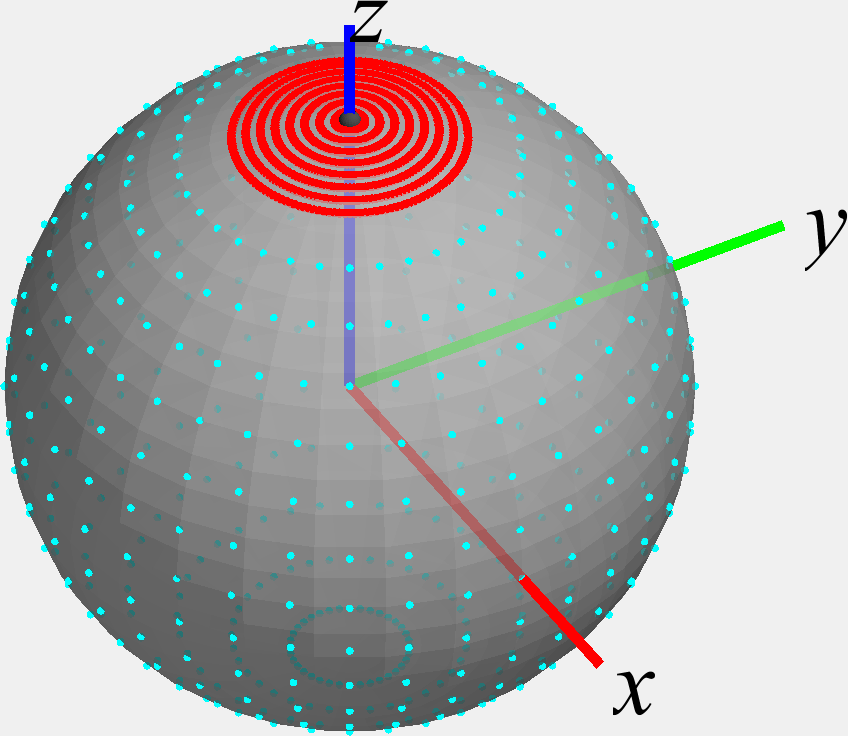
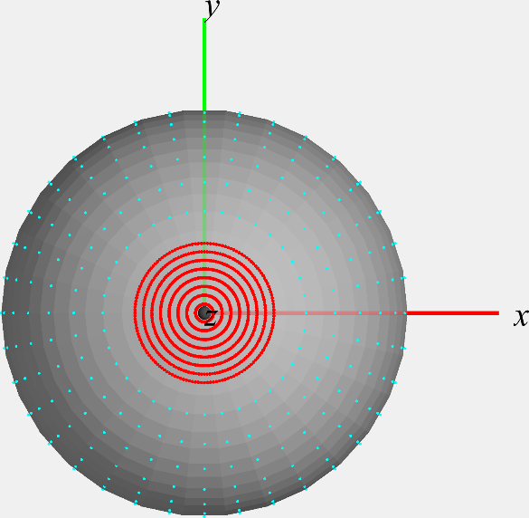
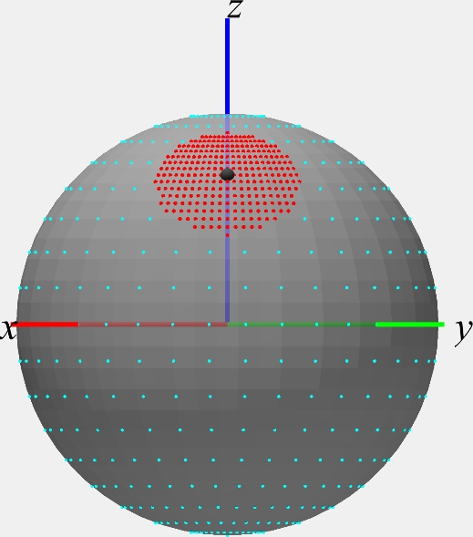
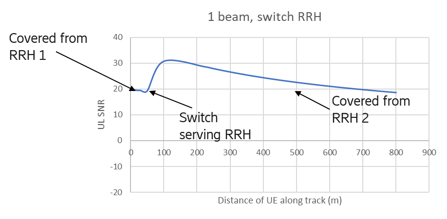
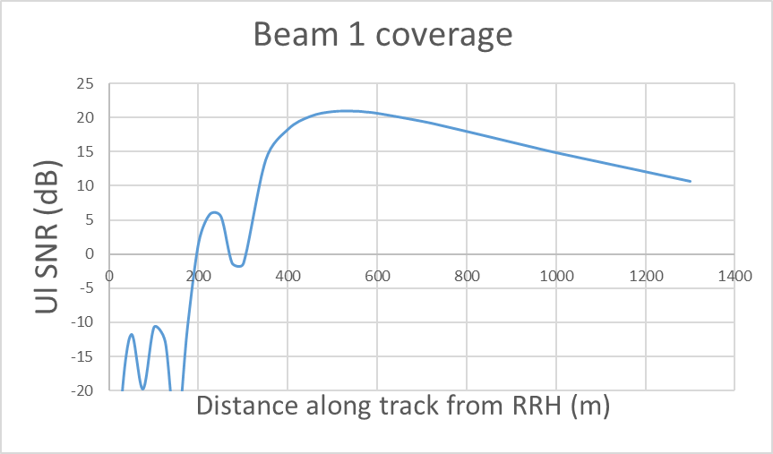
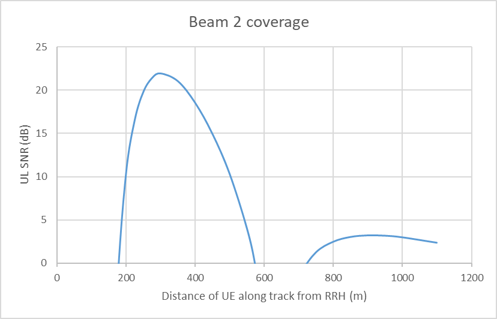
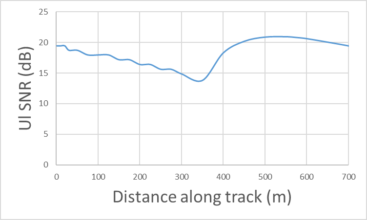
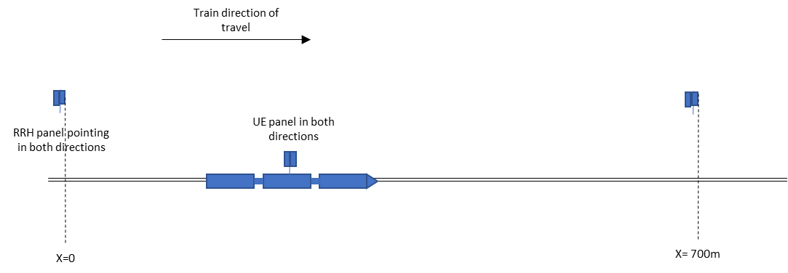

+----------------------------------+----------------------------------+
| 3GPP TR 38.854 V17.3.0 (2023-09) |                                  |
+==================================+==================================+
| Technical Report                 |                                  |
+----------------------------------+----------------------------------+
| 3rd Generation Partnership       |                                  |
| Project;                         |                                  |
|                                  |                                  |
| Technical Specification Group    |                                  |
| Radio Access Network;            |                                  |
|                                  |                                  |
| NR;                              |                                  |
|                                  |                                  |
| NR support for high speed train  |                                  |
| scenario in frequency range 2    |                                  |
| (FR2)                            |                                  |
|                                  |                                  |
| (Release 17)                     |                                  |
+----------------------------------+----------------------------------+
|                                  |                                  |
+----------------------------------+----------------------------------+
| {width="1.3263888888888888in" | ng){width="1.7708333333333333in" |
| height="0.9166666666666666in"}   | height="1.0347222222222223in"}   |
+----------------------------------+----------------------------------+
|                                  |                                  |
+----------------------------------+----------------------------------+
| The present document has been    |                                  |
| developed within the 3rd         |                                  |
| Generation Partnership Project   |                                  |
| (3GPP ^TM^) and may be further   |                                  |
| elaborated for the purposes of   |                                  |
| 3GPP.\                           |                                  |
| The present document has not     |                                  |
| been subject to any approval     |                                  |
| process by the 3GPP              |                                  |
| Organizational Partners and      |                                  |
| shall not be implemented.\       |                                  |
| This Specification is provided   |                                  |
| for future development work      |                                  |
| within 3GPP only. The            |                                  |
| Organizational Partners accept   |                                  |
| no liability for any use of this |                                  |
| Specification.\                  |                                  |
| Specifications and Reports for   |                                  |
| implementation of the 3GPP ^TM^  |                                  |
| system should be obtained via    |                                  |
| the 3GPP Organizational          |                                  |
| Partners\' Publications Offices. |                                  |
+----------------------------------+----------------------------------+

+----------------------------------------------------------------------+
|                                                                      |
+======================================================================+
| > ***3GPP***                                                         |
| >                                                                    |
| > Postal address                                                     |
| >                                                                    |
| > 3GPP support office address                                        |
| >                                                                    |
| > 650 Route des Lucioles - Sophia Antipolis                          |
| >                                                                    |
| > Valbonne - FRANCE                                                  |
| >                                                                    |
| > Tel.: +33 4 92 94 42 00 Fax: +33 4 93 65 47 16                     |
| >                                                                    |
| > Internet                                                           |
| >                                                                    |
| > http://www.3gpp.org                                                |
+----------------------------------------------------------------------+
| ***Copyright Notification***                                         |
|                                                                      |
| No part may be reproduced except as authorized by written            |
| permission.\                                                         |
| The copyright and the foregoing restriction extend to reproduction   |
| in all media.                                                        |
|                                                                      |
| © 2023, 3GPP Organizational Partners (ARIB, ATIS, CCSA, ETSI, TSDSI, |
| TTA, TTC).                                                           |
|                                                                      |
| All rights reserved.                                                 |
|                                                                      |
| UMTS™ is a Trade Mark of ETSI registered for the benefit of its      |
| members                                                              |
|                                                                      |
| 3GPP™ is a Trade Mark of ETSI registered for the benefit of its      |
| Members and of the 3GPP Organizational Partners\                     |
| LTE™ is a Trade Mark of ETSI registered for the benefit of its       |
| Members and of the 3GPP Organizational Partners                      |
|                                                                      |
| GSM® and the GSM logo are registered and owned by the GSM            |
| Association                                                          |
+----------------------------------------------------------------------+

 Contents {#contents .TT}
========

Foreword 7

1 Scope 9

2 References 9

3 Definitions of terms, symbols and abbreviations 9

3.1 Terms 9

3.2 Symbols 9

3.3 Abbreviations 9

4 Introduction 9

5 FR2 HST deployment scenario 10

5.1 General 10

5.2 HST scenario and RRH parameters 11

5.2.1 Unidirectional deployments 12

5.2.2 Bidirectional deployment 13

5.2.3 RRH Parameters 17

5.3 Train roof-mounted high-power CPE parameters 18

5.3.0 Introduction 18

5.3.1 Number of panels per CPE 18

5.3.2 Placement of CPE panel(s) 18

5.3.3 Number of CPE devices 18

6 FR2 high speed feasibility evaluation 18

6.1 Evaluation Parameters 19

6.1.1 RRH antenna array parameters for evaluation 19

6.1.2 RRH antenna element parameters for evaluation 19

6.1.3 CPE antenna array parameters for evaluation 20

6.1.4 CPE antenna element parameters for evaluation 20

6.2 Channel model for FR2 HST 20

6.2.1 Pathloss model used for link budget evaluation 20

6.2.2 Channel modelling for performance requirements 22

6.3 FR2 Feasibility Evaluation 26

6.3.1 Idle/inactive mode 26

6.3.2 Connected mode 26

6.3.2.1 Number of Rx beams 26

6.3.2.1.1 Scenario-A 27

6.3.2.1.2 Scenario-B 28

6.3.3 Link Performance and Throughput Performance 32

6.3.3.1 Link Performance Evaluation from Samsung 32

6.3.3.1.1 Scenario-A, Uni-directional RRH Deployment 32

6.3.3.1.2 Scenario-A, Bi-directional RRH Deployment 34

6.3.3.1.3 Scenario-B, Uni-directional RRH Deployment 36

6.3.3.1.4 Scenario-B, Bi-directional RRH Deployment 36

6.3.3.2 Link performance Evaluation from Huawei 36

6.3.3.2.1 Scenario A 36

6.3.3.2.1.1 Scenario A, Bi-directional 36

6.3.3.2.1.2 Scenario A, Uni-directional 37

6.3.3.2.2 Scenario B 38

6.3.3.2.2.1 Scenario B, Bi-directional 39

6.3.3.2.2.2 Scenario B, Uni-directional 42

6.3.3.3 Link level performance from Ericsson 43

6.3.3.3.1 Scenario-A, Uni-directional RRH Deployment 43

6.3.3.3.2 Scenario-A, Bi-directional RRH Deployment 46

6.3.3.3.3 Scenario-B, Uni-directional RRH Deployment 46

6.3.3.3.4 Scenario-B, Bi-directional RRH Deployment 49

6.3.3.4 Throughput Performance from Nokia 50

6.3.4 Mobility Performance 54

6.3.4.1 System-level evaluation of mobility performance by Nokia 55

6.3.4.1.1 Legacy RRM requirement mobility performance 55

6.3.4.1.1.1 Uni-directional Scenario-A without DPS 56

6.3.4.1.1.2 Uni-directional Scenario-A with DPS 59

6.3.4.1.1.3 Uni-directional Scenario-B without DPS 61

6.3.4.1.1.4 Uni-directional Scenario-B with DPS 63

6.3.4.1.1.5 Bi-directional Scenario-B without DPS 65

6.3.4.1.1.6 Bi-directional Scenario-B with DPS 67

6.3.4.1.1.7 Bi-directional Scenario-A without DPS 69

6.3.4.1.1.8 Bi-directional Scenario-A with DPS 71

6.3.4.1.2 Enhanced RRM requirement mobility performance 72

6.3.4.1.2.1 Uni-directional Scenario-A without DPS 75

6.3.4.1.2.2 Uni-directional Scenario-A with DPS 77

6.3.4.1.2.3 Uni-directional Scenario-B without DPS 79

6.3.4.1.2.4 Uni-directional Scenario-B with DPS 81

6.3.4.1.2.5 Bi-directional Scenario-B without DPS 83

6.3.4.1.2.6 Bi-directional Scenario-B with DPS 85

6.3.4.1.2.7 Bi-directional Scenario-A without DPS 86

6.3.4.1.2.8 Bi-directional Scenario-A with DPS 89

6.3.4.1.3 Conclusions on mobility performance 91

6.3.5 Receive time difference 92

6.3.6 Maximum supported Doppler frequency 92

6.3.7 Maximum supported Speed 92

6.3.8 Beam dwelling time 93

6.3.8.1 Simulation results 93

6.3.8.2 Beam coverage analysis 98

7 Identified RAN4 requirements 101

7.1 CPE RF core requirements 101

7.1.1 Minimum Peak EIRP 103

7.1.2 Beam Correspondence 104

7.2 RRM requirements 105

7.2.1 Idle/inactive mode 106

7.2.2 Connected mode 106

7.2.2.1 UE UL transmit timing 110

7.2.2.1.1 Random Access based timing adjustment 110

7.3 Demodulation performance requirements 111

7.3.1 UE demodulation requirements 112

7.3.2 BS demodulation requirements 123

8 Conclusion 130

Annex A (informative): Change history 131

Foreword
========

This Technical Report has been produced by the 3rd Generation
Partnership Project (3GPP).

The contents of the present document are subject to continuing work
within the TSG and may change following formal TSG approval. Should the
TSG modify the contents of the present document, it will be re-released
by the TSG with an identifying change of release date and an increase in
version number as follows:

Version x.y.z

where:

x the first digit:

1 presented to TSG for information;

2 presented to TSG for approval;

3 or greater indicates TSG approved document under change control.

y the second digit is incremented for all changes of substance, i.e.
technical enhancements, corrections, updates, etc.

z the third digit is incremented when editorial only changes have been
incorporated in the document.

In the present document, modal verbs have the following meanings:

**shall** indicates a mandatory requirement to do something

**shall not** indicates an interdiction (prohibition) to do something

The constructions \"shall\" and \"shall not\" are confined to the
context of normative provisions, and do not appear in Technical Reports.

The constructions \"must\" and \"must not\" are not used as substitutes
for \"shall\" and \"shall not\". Their use is avoided insofar as
possible, and they are not used in a normative context except in a
direct citation from an external, referenced, non-3GPP document, or so
as to maintain continuity of style when extending or modifying the
provisions of such a referenced document.

**should** indicates a recommendation to do something

**should not** indicates a recommendation not to do something

**may** indicates permission to do something

**need not** indicates permission not to do something

The construction \"may not\" is ambiguous and is not used in normative
elements. The unambiguous constructions \"might not\" or \"shall not\"
are used instead, depending upon the meaning intended.

**can** indicates that something is possible

**cannot** indicates that something is impossible

The constructions \"can\" and \"cannot\" are not substitutes for \"may\"
and \"need not\".

**will** indicates that something is certain or expected to happen as a
result of action taken by an agency the behaviour of which is outside
the scope of the present document

**will not** indicates that something is certain or expected not to
happen as a result of action taken by an agency the behaviour of which
is outside the scope of the present document

**might** indicates a likelihood that something will happen as a result
of action taken by some agency the behaviour of which is outside the
scope of the present document

**might not** indicates a likelihood that something will not happen as a
result of action taken by some agency the behaviour of which is outside
the scope of the present document

In addition:

**is** (or any other verb in the indicative mood) indicates a statement
of fact

**is not** (or any other negative verb in the indicative mood) indicates
a statement of fact

The constructions \"is\" and \"is not\" do not indicate requirements.

 1 Scope
=======

The present document is a technical report for Rel-17 NR support for
high speed train scenario in FR2.

2 References
============

The following documents contain provisions which, through reference in
this text, constitute provisions of the present document.

\- References are either specific (identified by date of publication,
edition number, version number, etc.) or non‑specific.

\- For a specific reference, subsequent revisions do not apply.

\- For a non-specific reference, the latest version applies. In the case
of a reference to a 3GPP document (including a GSM document), a
non-specific reference implicitly refers to the latest version of that
document *in the same Release as the present document*.

\[1\] 3GPP TR 21.905: \"Vocabulary for 3GPP Specifications\".

\[2\] C.A. Balanis: \"Antenna theory: design and analysis \", Wiley,
2005.

3 Definitions of terms, symbols and abbreviations
=================================================

3.1 Terms
---------

For the purposes of the present document, the terms given in 3GPP
TR 21.905 \[1\] and the following apply. A term defined in the present
document takes precedence over the definition of the same term, if any,
in 3GPP TR 21.905 \[1\].

3.2 Symbols
-----------

For the purposes of the present document, the following symbols apply:

3.3 Abbreviations
-----------------

For the purposes of the present document, the abbreviations given in
3GPP TR 21.905 \[1\] and the following apply. An abbreviation defined in
the present document takes precedence over the definition of the same
abbreviation, if any, in 3GPP TR 21.905 \[1\].

4 Introduction
==============

5G NR operating in millimeter wave bands (i.e., Frequency Range 2) is
recognized as the technology capable of providing ultra-high data-rate
transmission, thanks to the availability of enormous amount of bandwidth
in FR2 and the advanced 5G NR design for FR2 beamforming-based
operation. Inspired by the successful commercial FR2 deployment
globally, more potential 5G NR deployment scenarios in FR2 draw
attentions from the industry. Among those scenarios identified, high
speed train (HST) scenario has the special importance, because of the
fast expanding HST systems worldwide deployed and the great demands of
high-speed connections from passengers and HST special services. This
triggers the new and challenging demand for 5G NR FR2 HST scenario.

In existing study and work items led by 3GPP RAN4 (for either LTE or
NR), high speed train scenarios under consideration has the operating
bands up to 3.5GHz, however no existing works studied the more
challenging millimeter wave frequency range 2, in which Doppler shift
and Doppler spread will be further severe (e.g., for 240km/h with 28GHz,
the Doppler shift is about 6.22kHz) and more challenging to radio
resource management. Specifically, the existing FR2 RRM and demodulation
requirements has not yet taken into account the impact of high speed in
the above-mentioned scenario, where the channel model and mobility
scenario need further study and the demodulation, measurement, mobility
and beam management related requirements require to be further
specified.

It should be noted that user equipment considered in 5G NR FR2 HST
scenario is vehicle-roof mounted customer-premises equipment (CPE),
which are expected to communicate with track-side deployed gNBs for the
backhaul link and to further provide on-board broadband connections to
user terminals and/or for other train-specific demands as access link.

**This work will specify NR UE RF requirements**, UE RRM requirements
and BS/UE performance requirements for high speed train scenario with up
to 350km/h in Rel-17.

5 FR2 HST deployment scenario 
=============================

Following section include the agreed FR2 HST deployment specific
investigated options and agreements.

5.1 General
-----------

This section includes the agreed scenario and RRH parameters to be used
in the investigated FR2 HST deployments. It **captures the agreement and
conclusions made during the work on FR2 HST deployment scenario and
related aspects.** Following figure 5.1-1 illustrates the definition of
the different used D-values.

{width="6.686805555555556in"
height="1.8881944444444445in"}

Figure 5.1-1 Illustration of the D-values used on RAN4 work.

General deployment parameters:

RAN4 will at least consider the following general deployment scenarios:

\- **D~s~ and D~min~: Take the 5 scenarios in table 5.1-1 as basic
assumption**; and

\- **Scenario 1 and 4 shall be considered with high priority; and**

\- **D~min~ for \[5m, 20, 30 and 50 meters\] if found to be necessary;
and**

\- **D~RRH\_height~: 15m as basic assumption, \[10,20m\] if found to be
necessary; and**

> \- D~UE\_height~: 5m.

  Scenario   Ds (meter)   D~min~ (meter)
  ---------- ------------ ----------------
  1          800          10
  2          700          10
  3          500          10
  4          700          150
  5          200          30

Tunnel Deployment Scenario (study tunnel scenario after the prioritized
scenarios):

The detailed deployment scenario for tunnel deployment for FR2 HST is
still open in RAN4

\- RAN4 will further study tunnel deployment scenario for FR2 HST.

Sub-Carrier Spacing (SCS):

It is still open which SCS options to consider. The options are:

\- **Option-1: SCS = 120kHz; and**

**- Option-2: Consider both SCS = 120kHz and 60kHz.**

Concerning the transmissions schemes following schemes were discussed in
distinguished:

\- JT: Joint Transmission scheme applied for all channel (SSB, TRS,
PDCCH, PDSCH) -- Full SFN; and

\- DPS: Dynamic Point Selection based on the Rel-15 beam management (BM)
principles; and

\- Multi-DCI based Multi-TRP transmission based on the Rel-15 eMIMO
principles.

Among these the following down selection has been agreed:

\- For this WI discussion, FR2 HST transmission schemes which are not
compatible with Rel-15/16 NR are precluded; and

\- For this WI discussion, Joint transmission (JT) used for FR2 HST,
only full SFN is considered; and

\- For this WI discussion, Multi-DCI based multi-TRP transmission is
precluded.

RAN4 primarily consider HST FR2 deployment with

\- One train moving over one railway track in one direction. RAN4
focuses on 1 direction 1 train. If this opposite direction is completely
symmetric, the 1 direction study can apply directly; and

\- RRHs are located on one side of the track.

Dedicated network for roof-mounted CPE:

\- RAN4 to assume that in HST FR2 Scenario A, only high-speed CPEs
installed on the roof of the train can be present in the network.

RAN4 did comparison between unidirectional and bi-directional RRH
deployments for Scenario-A and concluded that from signal strength and
beam coverage perspective the bi-directional deployment will not provide
significant throughput improvement compared to unidirectional
deployment. This conclusion is based on the deployment scenario
analysis. RAN4 will only consider unidirectional deployments for
Scenario-A. Bi-directional deployment can be considered if the
feasibility issue of unidirectional deployment is identified.

RAN4 assume that FR2 HST with CPEs is operated as dedicated network.
Hence, assumption in RAN4 is that in HST FR2 Scenario A and B, only
high-speed CPEs installed on the roof of the train can be present in the
network. There is no need to differentiate roof-mounted CPE from other
FR2 UEs in HST FR2 scenario.

RAN4 will not consider curvature when defining the requirements.

5.2 HST scenario and RRH parameters
-----------------------------------

RAN4 will investigate both unidirectional and bidirectional deployment
scenarios for FR2 HST.

The exact understanding and definition of HST still needs further
discussion based on the following interpretations:

\- **HST Interpretation-1: All RRHs under one BBU transmit the same
signal (SFN)**.

\- Selected RRH(s) for TX, depending on DPS Tx mode is used or not.

**- HST Interpretation-2: All RRHs under one BBU in the same cell ID,
but for different TCI.**

\- **Other interpretation is not precluded.**

For full SFN JT and unidirectional RRH deployment, only consider
following scenario:

\- The setting with only one TCI state transmission.

The value of Ds\_offset implicitly limit the RRH beam direction, so
there is no need to introduce additional restriction on RRH beam's
possible range of angle on azimuthal plane.

### 5.2.1 Unidirectional deployments

For the unidirectional scenario RAN4 will consider a scenario, where,
**one panel per RRH pointed to the same direction for all RRHs (figure
5.2.1-1).**

{width="6.686805555555556in"
height="1.8881944444444445in"}

Figure 5.2.1-1 HST scenario with one panel per RRH pointing to the same
direction for all RRHs

For the unidirectional scenario the following unidirectional deployment
scenario in table 5.2-1 will be prioritized:

Table 5.2-1: Assumed deployment parameters for unidirectional scenario.

+----------------------------------+----------------------------------+
| Parameter                        | Value                            |
+==================================+==================================+
| Ds and Dmin                      | Scenario 2: Ds = 700m and Dmin = |
|                                  | 10m                              |
|                                  |                                  |
|                                  | Scenario 4: Ds = 700m and Dmin = |
|                                  | 150m                             |
+----------------------------------+----------------------------------+
| RRH height                       | 15m                              |
+----------------------------------+----------------------------------+
| Number of RRH sites per BBU      | 4                                |
+----------------------------------+----------------------------------+
| Number of RRH panels per RRH     | 1 (i.e. unidirectional)          |
| sites                            | ^Note\ 1^                        |
+----------------------------------+----------------------------------+
| Number of analog beams per RRH   | 1 or 2 ^Note\ 2^                 |
| panel                            |                                  |
+----------------------------------+----------------------------------+
| RRH panel orientation            | Option 1: RRH panel boresight    |
|                                  | pointed to the railway at the    |
|                                  | direction of Ds (projection of   |
|                                  | the neighboring RRH on the       |
|                                  | railway).                        |
|                                  |                                  |
|                                  | Option 2: other options not      |
|                                  | precluded                        |
+----------------------------------+----------------------------------+
| Analog beam orientation          | Based on companies' selection    |
|                                  | for better performance           |
+----------------------------------+----------------------------------+
| Note 1: For JT for all channels, |                                  |
| 1 beam per RRH panel is          |                                  |
| considered.                      |                                  |
|                                  |                                  |
| Note 2: For DPS, 1 or 2 analog   |                                  |
| beams per RRH panel can be       |                                  |
| considered.                      |                                  |
+----------------------------------+----------------------------------+

Number of Beam for unidirectional RRH deployment, Scenario 2:

\- For scenario 2, unidirectional, RRH parameter: 1 beam per RRH panel;
and

\- For scenario 2, unidirectional, UE parameter:

a\) 1 beam per panel; and

b\) 2 panels assumed to be implemented in the UE side; and

c\) Only the one active panel per UE can be used for Tx and Rx; and FFS
whether another panel can be used for beam search

RRH switching point for unidirectional RRH deployment, Scenario 2,
figure 5.2.1-2:

\- RRH switching point is where the UE switches from the source RRH beam
to the target RRH beam based on maximizing SNR among detected beams.

{width="6.458333333333333in"
height="2.1601640419947508in"}

Figure 5.2.1-2: RRH switching point for unidirectional RRH deployment.

Number of Beam for unidirectional RRH deployment, Scenario 4:

\- For scenario 4, unidirectional, RRH parameter:

a\) 1 beam per RRH panel; or

b\) 2 beams per RRH panel; or

c\) 3 beams per RRH panel; or

d\) 4 beams per RRH panel.

Note that uneven separation between beams can be considered.

RAN4 agreed that at least 2 beams per RRH panel is considered. Other
options are not precluded, and it is FFS whether there are benefits of
implementing more beams per RRH panel.

\- For scenario 4, unidirectional, UE parameter:

a\) 1 beam per UE panel; or

b\) 2 beams per UE panel; or

c\) 7 beams per UE panel.

RAN4 assumes 2 panels to be implemented in the UE side. Only the one
active panel per UE can be used for Tx and Rx; and FFS whether another
panel can be used for beam search.

RAN4 decided that at least option a) of having 1 beam per panel is
considered. Other options are not precluded, and it is FFS whether there
are benefits of implementing more beams per UE panel.

### 5.2.2 Bidirectional deployment

For the bidirectional scenario RAN4 will consider a scenario where there
is one panel per RRH with signals to opposite directions along the track
(figure 5.2.2-1).

{width="6.686805555555556in"
height="2.2534722222222223in"}

Figure 5.2.2-1 HST scenario with one panel per RRH

Additionally, also SFN scenario where there are two panels per RRH
(figure 5.2.2-2).

{width="6.686805555555556in"
height="1.8881944444444445in"}

Figure 5.2.2-2 HST scenario with two panels per RRH

For the bi-directional scenario the following bi-directional deployment
scenario in table 5.2-2 will be studied:

Table 5.2-2: Assumed deployment parameters for bi-directional scenario.

+----------------------------------+----------------------------------+
| Parameter                        | Value                            |
+==================================+==================================+
| Ds and Dmin                      | Scenario 2: Ds = 700m and Dmin = |
|                                  | 10m                              |
|                                  |                                  |
|                                  | Scenario 4: Ds = 700m and Dmin = |
|                                  | 150m                             |
+----------------------------------+----------------------------------+
| RRH height                       | 15m                              |
+----------------------------------+----------------------------------+
| Number of RRH sites per BBU      | 4                                |
+----------------------------------+----------------------------------+
| Number of RRH panels per RRH     | 2 (i.e. bi-directional)          |
| sites                            |                                  |
+----------------------------------+----------------------------------+
| Number of analog beams per RRH   | 1, 2 or 4                        |
| panel                            |                                  |
+----------------------------------+----------------------------------+
| RRH panel orientation            | Option 1: RRH panel boresight    |
|                                  | pointed to the railway in the    |
|                                  | middle point between 2 RRHs.     |
|                                  |                                  |
|                                  | Option 2: RRH panel boresight    |
|                                  | pointed to the railway at the    |
|                                  | distance of Ds (projection of    |
|                                  | the neighboring RRH on the       |
|                                  | railway). Other options not      |
|                                  | precluded.                       |
+----------------------------------+----------------------------------+
| Analog beam orientation          | Based on companies' selection    |
|                                  | for better performance           |
+----------------------------------+----------------------------------+

Candidate schemes for bi-directional deployment for further analysis,
scenario 2:

{width="5.122259405074366in"
height="2.288416447944007in"}

Figure 5.2.2-3: Connecting to 2nd-Nearest RRH

{width="5.0867279090113735in"
height="2.23122375328084in"}

Figure 5.2.2-4: Scheme-2: Connecting to Nearest RRH except Coverage Hole

For Scenario 2 bi-directional RRH deployment:

\- \[Scheme 1 under bi-directional scenario is feasible without coverage
hole issue, and no propagation delay jump between switching points\];

\- Scheme-2 can be used as starting points for further analysis.

Number of beams for bi-directional RRH deployment, Scenario 2:

\- For scenario 2, bi-directional, RRH parameter: 1 beam per RRH panel,
two panels in opposite directions; and

\- For scenario 2, bi-directional, UE parameter: 1 beam per UE panel
(i.e., 2 beams per UE).

Candidate schemes for bi-directional deployment for further analysis,
for scenario 4:

{width="4.205592738407699in"
height="1.878886701662292in"}

Figure 5.2.2-5: Connecting to 2nd-Nearest RRH

{width="4.408234908136483in"
height="1.9336122047244095in"}

Figure 5.2.2-67: Scheme-2: Connecting to Nearest RRH except Coverage
Hole

{width="4.048729221347331in"
height="1.5026465441819772in"}

Figure 5.2.2-7: Scheme-3: Connecting to Nearest RRH except the area
under the RRH

For Scenario 4 bi-directional RRH deployment: the schemes above can be
used as starting points for further analysis.

Number of beams for bi-directional RRH deployment, Scenario 4:

\- For scenario B, bi-directional, RRH parameter:

a\) 1 beam per RRH panel; or

b\) 2 beams per RRH panel; or

c\) 3 beams per RRH panel; or

d\) 4 beams per RRH panel.

Note that uneven separation between beams can be considered.

RAN4 agreed that at least 2 beams per RRH panel is considered. Other
options are not precluded, and it is FFS whether there are benefits of
implementing more beams per RRH panel.

\- For scenario 4, bi-directional, UE parameter:

a\) 1 beam per UE panel; or

b\) 2 beams per UE panel; or

c\) 7 beams per UE panel.

RAN4 assumes 2 panels to be implemented in the UE side. Only the one
active panel per UE can be used for Tx and Rx; and FFS whether another
panel can be used for beam search.

RAN4 decided that at least option a) of having 1 beam per panel is
considered. Other options are not precluded, and it is FFS whether there
are benefits of implementing more beams per UE panel.

For bi-directional RRH deployment, DPS transmission scheme shall be
considered.

### 5.2.3 RRH Parameters

**The detailed RRH parameters are still under discussion in RAN4 and
following options have been agreed for potential down selection:**

Number of RRH sites per BBU:

\- **\[1 to 4\] RRHs sites per BBU**; and

\- **Other values are not precluded.**

Number of Analog Beams per panel in RRH:

\- **\[1,2,4\] analogue beam(s) per panel in RRH**; and

\- **Other values are not precluded.**

SSB index to Beam Mapping. The impact of following options for SSB index
to Beam mapping is FFS:

1\) Option 1:

a\) All RRHs (connected to one BBU with fiber) share the same cell ID;
and

b\) All RRHs under the same cell use the same set of SSB indexes, e.g.,
all RRHs use SSB-0 to SSB-3.

2\) Option 2:

a\) All RRHs (connected to one BBU with fiber) share the same cell ID;
and

b\) RRHs under the same cell use the different sets of SSB indexes,
e.g., RRH-1 uses SSB-0 to SSB-3, RRH-2 uses SSB-4 to SSB-7.

When DPS is used as transmission scheme, SSB index to Beam Mapping used
in the discussion for this WI is as follows:

RRHs under the same cell use different sets of SSB indexes, e.g., RRH-1
uses SSB-0 to SSB-3, RRH-2 uses SSB-4 to SSB-7, etc.

RAN4 discussed the aspect of potential handover problem due to sudden RX
signal increase of the target cell. RAN4 thinks that this can be
alleviated by DPS transmission scheme with carefully allocated SSB-index
among neighboring cells to avoid inter-cell interference.

Concerning RRH antenna array orientation the impact of following options
for RRH antenna array orientation is FFS:

\- **Option 1: RRH panel boresight pointed to the railway in the middle
point between 2 RRHs**; or

\- **Option 2: RRH panel boresight pointed to the railway at the
distance of Ds (projection of the neighbouring RRH on the railway); or**

**- Other option is not precluded.**

**Related to** RRH/UE boresight direction of Antenna Panel and beam
direction, RAN4 may not need to specify RRH/UE boresight direction of
antenna panel and beam direction for deployment scenario study, but left
for companies' choice:

\- RRH/UE boresight direction of antenna panel and beam direction
information can be provided by individual company to accompany their
deployment scenario analysis result, which can be captured in TR.

5.3 Train roof-mounted high-power CPE parameters
------------------------------------------------

### 5.3.0 Introduction

NOTE: Single panel, i.e. only one active antenna panel at a time, as
baseline antenna assumption

### 5.3.1 Number of panels per CPE

**The number of panels per CPE was open and for discussion.** Concerning
the number of panels per CPE following will be considered:

\- 2 panels per CPE each for both for TX and RX. Each panel points in
opposite directions.

For the bi-directional Operation for Two Panels in the CPE following is
considered:

\- Follow the Rel-15/16 principle of "only one active Rx/Tx panel at a
time".

### 5.3.2 Placement of CPE panel(s)

UE antenna panel(s) for forward and backward directions:

\- RAN4 to consider CPE to be equipped with two panels pointed forward
and backward along the track.

UE boresight direction of Antenna Panel and beam direction, RAN4 may not
need to specify RRH/UE boresight direction of antenna panel and beam
direction for deployment scenario study, but left for companies' choice:

\- RRH/UE boresight direction of antenna panel and beam direction
information can be provided by individual company to accompany their
deployment scenario analysis result, which can be captured in TR.

### 5.3.3 Number of CPE devices

Number of CPE devices per train/carriage:

\- RAN4 requirement can be defined based on the baseline of 1 CPE device
per train.

6 FR2 high speed feasibility evaluation 
=======================================

This section will include the evaluation parameters and channel model
used in the FR2 HST and used for evaluating the feasibility FR2 HST.

6.1 Evaluation Parameters
-------------------------

### 6.1.1 RRH antenna array parameters for evaluation

RAN4 will perform FR2 HST feasibility study based on following RRH
antenna array parameters in table 6.1.1.1 for evaluation:

Table 6.1.1.1

  Parameter   Urban Macro 30 GHz
  ----------- --------------------
  A~m~        30
  SLA~y~      30
  j~3dB~      90
  q~3dB~      90
  G~e,max~    5.5
  L~E~        1.8
  P           2
  d~y~        0.5l
  d~h~        0.5l

Antenna array configuration options were considered:

\- **Option-1: \[Mg, Ng, M, N, P\] = \[1, 1, 4, 8, 2\]**; and

\- **Option-2: \[Mg, Ng, M, N, P\] = \[1, 1, 8, 8, 2\]; and**

**- Option-3: \[Mg, Ng, M, N, P\] = \[1, 1, 8, 16, 2\].**

**RAN4 also agreed that other options are not precluded.** RRH Antenna
Element Assumption for RRH side following option is assumed:

\- Option-2: \[Mg, Ng, M, N, P\] = \[1, 1, 8, 8, 2\].

RF session can trigger relevant discussion on RF requirements taking
above agreements into account.

### 6.1.2 RRH antenna element parameters for evaluation

RAN4 agreed to use the following RAN1 assumptions in table 6.1.2.1 for
BS evaluation as baseline, while other assumptions are not precluded:

Table 6.1.2.1: BS evaluation parameters.

  ------------------------------------------------------------- --------------------------------------------------------- -----------
  Radiation power pattern of a single antenna element for TRP   Vertical cut of the radiation power pattern (dB)          
                                                                Horizontal cut of the radiation power pattern (dB)        
                                                                3D radiation power pattern (dB)                           
                                                                Maximum directional gain of an antenna element G~E,max~   \[8\] dBi
  ------------------------------------------------------------- --------------------------------------------------------- -----------

### 6.1.3 CPE antenna array parameters for evaluation

RAN4 will perform the FR2 HST feasibility study based on following CPE
antenna array parameters for evaluation:

\- **RAN1 assumption: 2 ports: \[Mg, Ng, M, N, P\] = \[1, 1, 2, 4,
2\]**; and

\- **PC4 assumption: 2 ports: \[Mg, Ng, M, N, P\] = \[1, 1, 4, 4, 2\].**

RAN4 also agreed that other options are not precluded.

UE Antenna Element Assumption: on UE side:

\- Option 1: N=4, M=4 with 2 polarizations as starting point, and other
options not precluded pending on further discussion.

RF session can trigger relevant discussion on RF requirements taking
above agreements into account.

### 6.1.4 CPE antenna element parameters for evaluation

RAN4 use the following RAN1 assumption for CPE antenna element
parameters evaluation in table 6.1.4.1 as baseline:

Table 6.1.4.1: CPE antenna element parameters.

  Parameter                                                 Values
  --------------------------------------------------------- ----------
  Antenna element radiation pattern in θ'' dim (dB)         
  Antenna element radiation pattern in ϕ'' dim (dB)         
  Combining method for 3D antenna element pattern (dB)      
  Maximum directional gain of an antenna element G~E,max~   **5dBi**

6.2 Channel model for FR2 HST
-----------------------------

This section collects the channel model information used for FR2 HST
feasibility evaluation and provides the analysis on channel modelling
for performance requirements.

### 6.2.1 Pathloss model used for link budget evaluation

To have the link budget analysis for the proposed FR2 HST deployment
scenarios, the accurate large-scale pathloss model is one of the
prerequisites. The following large scale pathloss models are proposed to
be considered as candidate options**:**

\- **Option-1: TR38.901 RMa LoS (baseline option)**; or

\- **Option-2: free space model; or**

**- Option-3: TR38.901 UMa LoS.**

TS38.901 RMa LoS pathloss model will be used for link budget evaluation
at least for scenario 2 in table 5.1-1.

RAN4 to choose TS38.901 RMa LoS pathloss model also for the evaluation
of Scenario 4 in table 5.1-1.

For the purpose of demonstrating and validating which large scale
channel modeling is suitable for FR2 HST, the analysis has been provided
based on the practical field measurement. Specifically, based upon the
conditions provided in the Table 6.2.1-1, the practical field testing on
a trait along a typical railway has been conducted to obtain measurement
data at the frequency of 28GHz, as illustrated in the Figure 6.2.1-1.

Table 6.2.1-1 Parameters for practical field measurement for typical
high speed train scenario

  Parameter name             Configuration value
  -------------------------- ---------------------
  Minimum TX-RX distance     60 m
  Maximum TX-RX distance     550 m
  Distance granularity       1 m
  Center frequency           28 GHz
  TX antenna height          5 m
  RX antenna height          3 m
  Parameter *h*~E~ in 3GPP   1 m

{width="3.4583333333333335in"
height="2.5760520559930007in"}

Figure 6.2.1-1 Illustration of practical field measurement conducted for
typical high speed train scenario

By having the analysis based on the measurement data obtained from the
measurement campaign as above described, the comparison among
measurement results and pathloss models (i.e., the three options of RMa
LOS, UMa LOS and free space model) is demonstrated in Figure 6.2.1-2 and
accompanying Table 6.2.1-2 in which the numerical results are contained.

{width="4.701388888888889in"
height="3.2705369641294837in"}

Figure 6.2.1-2 Comparison of measurement data and pathloss models for
FR2 HST

By leveraging the numerical results in terms of the root mean square
error (RMSE), mean error and standard deviation (Std), it has been
demonstrated that for the evaluated range there is no significant
difference from three different pathloss LoS models, and the field
measurement also validate that LoS model can reflect the practical FR2
HST channel condition compared with NLoS models. By further
investigating three LoS models' similarity from measurement data, it has
been demonstrated that RMa LoS model can achieve the lowest value of
RMSE and best mean error with reasonable standard deviation.

Table 6.2.1-2 Numerical comparison of measurement data and pathloss
models for FR2 HST

                     RMSE      Mean Error   Std
  ------------------ --------- ------------ --------
  Free space model   4.5212    -0.74819     4.4634
  RMa LoS model      4.4716    0.13552      4.4741
  UMa LoS model      4.4974    -0.3428      4.4889
  RMa NLoS model     35.1499   34.4667      6.9036
  UMa NLoS model     26.5      25.692       6.5006

Based upon the above analysis on the measurement data from the typical
railway environment for 28GHz, it has been demonstrated that TS38.901
RMa LoS model is an accurate large-scale pathloss model and it is agreed
that TS38.901 RMa LoS pathloss model is adopted to be used for link
budget evaluation at least for Scenario-A.

Editor Note: FFS pathloss model for tunnel deployment scenario and
Scenario-B.

### 6.2.2 Channel modelling for performance requirements

Based on WID as follows, RAN4 is tasked to further study the channel
model for FR2 HST, where the key question needs to be answer:

\- **Whether or not single-tap per RRH channel model is assumed in UL
direction**; and

\- **Whether single- or multi-tap model is assumed in DL direction.**

Compared with the FR1 counterpart, the major difference of having analog
beamforming in FR2 should be considered in determining channel model for
performance requirement. Depending on whether or not joint transmission
is allowed for FR2 HST, it could be possible to have multiple taps from
neighboring RRHs, while if only DPS is allowed single tap model should
be employed.

Furthermore, whether or not the single tap is accurate enough for a
single TX-RX link in FR2 HST scenario has been studied. Specifically, a
measurement-data-calibrated FR2 HST ray-tracing model is used to
simulate various paths of LoS and reflected path for a practical railway
scenario. As required by WID, the UE is mounted on top of the driver's
cabin of the train in the simulation. And the traveling length is 2000
m, with a sampling distance of 20 m, thus making 200 snapshots (UE
locations) be simulated.

{width="5.764031058617673in"
height="3.0833333333333335in"}

Figure 6.2.2-1 Illustrative of the setup for FR2 HST ray-tracing
simulation

For each given UE location, the received signals from 4 RRHs are
simulated by using the ray-tracing model. Numerically, it has been
demonstrated that all simulated snap shots have the ratio of received
non-first-tap power over total received power smaller than 0.01, or in
other words, in all snap shots, the first tap can contain more than 99%
of the energy, which validate the single-tap assumption from a single
TX-RX link in FR2 HST.

{width="5.8284722222222225in"
height="4.365972222222222in"}

Figure 6.2.2-2 CDF of the ratio of non-first-tap power over total power

Based on measurement-data-calibrated ray-tracing modeling at 28GHz for
typical railway environment, it has been validated that the single-tap
is accurate enough to represent a single TX-RX link for FR2 HST.
Therefore, it is agreed that for channel modelling for performance
requirement, the single-tap can be assumed for a single TX-RX link at
least for Scenario-A.

Editor Note: FFS multi-tap models are needed for SFN and other scenarios
and FFS channel model for Scenario-B.

For channel modelling for performance requirement evaluation:

\- Single-tap can be assumed for a single TX-RX link at least for
scenario 2 in table 5.1-1.

RAN4 agreed that for both uplink and downlink the cosine of angle θ(t)
used in Doppler shift in channel model is applied. This applies for:

\- A particular uni-directional deployment scenario; and

\- A particular bi-directional deployment scenario.

The single tap propagation model can be assumed for each single Tx-Rx
link for both scenario 2 and scenario 4 in table 5.1-1

RAN4 agreed that the uplink and downlink channel model in
uni-directional deployments one channel model (either toward to serving
beam or away from serving beam) is applied for demodulation requirement
even if UE can travel in two directions in practice.

RAN4 will use the following HST-DPS channel model as a starting point
for FR2 HST uni-directional RRH deployment:

\- UE is moving towards the serving beam

\- The cosine of angle θ(t) used in Doppler shift
${f_{s}\left( t \right) = f_{d}\ \cos}{\theta\left( t \right)}$ is
provided as

\-
$\cos{\theta\left( t \right)} = \frac{D_{s\_\text{offset}}\ \mathbf{+}\mathbf{D}_{\mathbf{s}} - \text{vt}}{\sqrt{D_{\min}^{2} + \left( D_{s\_\text{offset}}\mathbf{+}\mathbf{D}_{\mathbf{s}} - \text{vt} \right)^{2}}},\ \ 0 < t \leq \frac{D_{s}}{v}$
(1)

\-
$\text{cosθ}\left( t \right) = \text{cosθ}\left( t\text{~mod}\left( \frac{D_{s}}{v} \right) \right),\ \ t > D_{s}/v\text{~~}$
(2)

Where:

\- $0\  \leq D_{s\_\text{offset}} < D_{s}$ (3)

The Ds\_offset value for introducing performance requirements is 10m and
100m for Scenarios A and B, respectively. The Ds\_offset value has no
restriction concerning deployments and the value is only used for
developing the demodulation requirements. The Ds\_offset is derived from
the worst case based on analysis of deployment scenarios. Note,
demodulation simulation assumptions should cover at least one Doppler
shift jump region.

RAN4 decided regarding the HST FR2 channel model in bi-directional
deployment to use option 2 with DPS based channel model as starting
point and based on this RAN4 agreed to use the following cosine values
for the different schemes 2a -- 2c below. Of the options RAN4 agreed to
apply channel modelling as option 2a for FR2 HST Bi-directional RRH
deployment:

Option 2(a): To match Bi-directional deployment Scheme-1: UE connect to
2nd-nearest RRH):

\-
$\cos{\theta\left( t \right)} = \frac{D_{s} - \text{vt}}{\sqrt{D_{\min}^{2} + \left( D_{s} - \text{vt} \right)^{2}}},\ \ 0 < t \leq {(0.5*D}_{s})/v$
(4)

\-
$\cos{\theta\left( t \right)} = - \frac{\text{vt}}{\sqrt{D_{\min}^{2} + \left( \text{vt} \right)^{2}}},\ \ {(0.5*D}_{s})/v < t \leq D_{s}/v$
(5)

\-
$\text{cosθ}\left( \text{t~mod}\left( \frac{D_{s}}{v} \right) \right),\ \ \ \ t > D_{s}/v$
**(6)**

Option 2(b): based on Scheme-2 for Bidirectional RRH Deployment:

\-
$\cos\theta\left( t \right) = \frac{- （D_{s} + \text{vt}）}{\sqrt{D_{\min}^{2} + \left( D_{s} + \text{vt} \right)^{2}}}$,
$0 \leq t < \frac{D_{s\_ offset}}{v}$, (7)

\-
$\cos\theta\left( t \right) = \frac{D_{s} - vt}{\sqrt{D_{\min}^{2} + \left( D_{s} - vt \right)^{2}}}$,
$\frac{{0.5*D}_{s}}{v} \leq t < \frac{{(D}_{s}{- D}_{s\_ offset})}{v}$
*(8)*

\-
$\cos\theta\left( t \right) = \frac{- vt}{\sqrt{D_{\min}^{2} + \left( - vt \right)^{2}}}$,
$\frac{{(D}_{s}{- D}_{s\_ offset})}{v} \leq t < \frac{D_{s}}{v}$ *(9)*

\-
$\cos\theta\left( t \right) = \ \cos\theta\left( t\ \text{mod}(\frac{D_{s}}{v}) \right)$,
$t > \frac{D_{s}}{v}$ *(10)*

\- $D_{s_{\text{offset}}} = 100m$ (The Ds\_offset is derived from the
worst case based on analysis of deployment scenarios)

Option 2(c): based on Scheme-3 for Bidirectional RRH Deployment:

\-
$\cos{\theta\left( t \right)} = \frac{D_{s} - vt}{\sqrt{D_{\min}^{2} + \left( D_{s} - vt \right)^{2}}},\ \ 0 < t \leq A_{\text{offset}}/v$
(11)

\-
$\cos{\theta\left( t \right)} = - \frac{\text{vt}}{\sqrt{D_{\min}^{2} + \left( \text{vt} \right)^{2}}},\ \ \ A_{\text{offset}}/v < t \leq {(0.5*D}_{s})/v\ $
(12)

\-
$\cos{\theta\left( t \right)} = \frac{D_{s} - vt}{\sqrt{D_{\min}^{2} + \left( D_{s} - vt \right)^{2}}},\ \ {(0.5*D}_{s})/v\  < t \leq B_{\text{offset}}/v$
(13)

\-
$\cos{\theta\left( t \right)} = - \frac{\text{vt}}{\sqrt{D_{\min}^{2} + \left( \text{vt} \right)^{2}}},\ \ B_{\text{offset}}/v < t \leq {(D}_{s})/v$
(14)

\-
$\text{cosθ}\left( \text{t~mod}\left( \frac{D_{s}}{v} \right) \right),\ \ \ t > D_{s}/v$
**(15)**

\- $A_{\text{offset}} < {(0.5*D}_{s}) < B_{\text{offset}}\  < D_{s}$
*(16)*

RAN4 agrees to use DPS channel model for both uni-directional and
bi-directional for performance requirements.

It was agreed that TCI switching belongs RRM scope, and there is no need
to model and consider this in demodulation requirements. Demodulation
requirements will not verify the PDSCH performance during TCI switching
period. No propagation delay and delay jump modelling in channel model
for DL PDSCH demodulation.

6.3 FR2 Feasibility Evaluation
------------------------------

**RAN4 perform feasibility study on FR2 HST scenario, by at least
considering following aspects:**

1\) The feasibility of a deployment based the beam dwelling time and
measurement period framework:

a\) How many beams/SSBs per RRH can be deployed (given other deployment
parameters such as D~min~, D~s~, speed etc) while maintain mobility
performance with FR2 BM mechanism?; and

b\) How much beam refinement is needed to achieve coverage and mobility?

\- How much beam overlapping area is needed (given other deployment
parameters such as Dmin, Ds, speed etc.) to ensure beam refinement
procedure can be executed successfully?

2\) Study throughput performance and mobility performance:

a\) More number of analogue beams and sharper beam may provide better
link budget performance but more challenging on mobility performance.

3\) Receive timing difference.

4\) Maximum supported Doppler shift for both UL and DL and maximum
supported UE speed.

Other feasibility study is not precluded.

For evaluating the maximum supported speed following numerology will be
considered:

\- For FR2 HST evaluations and possible performance requirements
definition, RAN4 only consider 120kHz SCS as baseline assumption.

### 6.3.1 Idle/inactive mode

### 6.3.2 Connected mode

#### 6.3.2.1 Number of Rx beams

**RAN4 discussed the Rx beam number for RRM requirements definition and
agreed to define two sets of enhanced RRM requirements in terms of the
number of Rx beams (i.e., Rx beam sweeping scaling factor) per UE:**

\- **Set 1: 2 Rx beams**

\- **Set 2: 6 Rx beams**

Set 1 is more relevant to the deployments where the RRHs are located
next to the railway track, e.g., like in Scenario-A with Dmin = 10m.
Whereases, Set 2 can be used in the scenarios where RRHs are further
away from the track, e.g., like Scenario-B with Dmin=150m.

The analysis below is based on the system-level simulations carried out
following the assumptions and parameters from Table 6.3.8.1-1.

It was found out that in priority scenarios additional beams oriented
upwards (i.e., up from the horizontal plane parallel to the railways
track) do not provide meaningful pefromance gains. Therefore, the
analysis below is focusing only on the beams with different orientations
in the horizontal plane.

Following the antenna panel parameters from the Section 6.1, the
half-power width for the RRH boresight beam is around 12.6 degrees (8x8
panel). Whereas the half-power width of the UE boresight beam is around
26 degrees (4x4 panel).

##### 6.3.2.1.1 Scenario-A

The considered deployment is uni-directional Scenario-A where the train
is traveling in the direction opposite to the serving beam as presented
in Figure 6.3.2.1.1-1. It is assumed that the RRH panel is oriented
towards the projection of the following RRH on the railway track, and
only one beam is used per RRH panel. The UE panel boresight is parallel
to the railway track.

Figure 6.3.2.1.1-1: HST FR2 Uni-directional deployment, the train is
moving towards the serving beam.

In Figure 6.3.2.1.1-2, simulation results (cumulative distribution
function of SINR) are shown when only one Rx beam with fixed orientation
is configured at the UE. It can be seen that the beam co-oriented with
the UE panel's boresight (RxBeams1-90) provides the highest SINR.

{width="4.848188976377953in"
height="2.940298556430446in"}

Figure 6.3.2.1.1-2: CDF of SINR for different orientations of a single
Rx beam.

Next, a scenario where multiple Rx beams can be used at the UE side is
considered. In Figure 6.3.2.1.1-3, it is demonstrated that no gain from
using more than one boresight beam (i.e., the beam 90) is observed even
if all of the additional beams are oriented towards the RRH.

{width="3.985389326334208in"
height="2.84328302712161in"}

Figure 6.3.2.1.1-3: CDF of SINR for different number of Rx beams.

#### 6.3.2.1.2 Scenario-B

A scheme of uni-directional deployments in HST FR2 Scenario-B is shown
in Figure 6.3.2.1.2-1. We also indicate the orientation of Tx beams at
RRH and Rx beams at CPE used in the simulations.

Figure 6.3.2.1.2-1: The schemes of uni- and bi-directional deployments
in HST FR2 Scenario-B with the orientation of Tx and Rx beams.

From Figure 6.3.2.1.2-2 it can be noticed that increasing the number of
Tx beams on RRH side provides very minor gain in HST FR2 uni-directional
Scenario-B if only one Rx beam is used. Indeed, in this case, the CPE
stays mostly in the coverage area of the boresight Tx beam, and
additional beams are not used much.

{width="4.3737664041994755in"
height="3.0749376640419945in"}

Figure 6.3.2.1.2-2: SINR CDF in uni-directional Scenario-B for different
number of Tx beams when only one Rx beam parallel to the track is used.

Firstly, the scenario where one boresight Tx beam is used at the RRH and
one Rx beam is used at the UE is considered. Different UE Rx beams
directions are compared in Figure 6.3.2.1.2-3. The results demonstrate
that Rx beam orientation has a significant impact on performance. For
example, wrong orientation of Rx beam (e.g., to the other side from the
RRH) results in the significant loss of performance. It was also found
that Rx beam oriented 10-15 degrees from the UE panel boresight towards
the RRH (i.e., RxBeams1-80, RxBeams1-75) provide best performance in
Scenario-B.

{width="4.971009405074366in"
height="3.258147419072616in"}{width="4.992548118985127in"
height="3.0955522747156605in"}

Figure 6.3.2.1.2-3: L1-RSRP traces of serving RRH (top) and SINR CDFs
(bottom) in uni-directional Scenario-B for different orientations of Rx
beams.

Next, it is studied how the performance depends on the orientation of
one Rx beam when multiple Tx beams are used. These results are shown in
Figure 6.3.2.1.2-4. Like in Figure 6.3.2.1.2-2, one can observe that
adding more Tx beams when only one Rx beam parallel to the track is used
does not provide significant gain. However, if we orient the Rx beam
more towards the RRH, then in the areas next to the RRH the received
signal power can be significantly increased.

{width="4.470476815398075in"
height="2.903190069991251in"}

{width="4.495082020997375in"
height="3.029103237095363in"}

Figure 6.3.2.1.2-4: L1-RSRP traces of serving RRH (top) and SINR CDFs
(bottom) in uni-directional Scenario-B with multiple Tx beams and for
different orientations of Rx beam.

Finally, the scenario where multiple (four) Tx and multiple (up to four)
Rx beams are configured together is analyzed (Figure 6.3.2.1.2-5). It is
shown that the correct choice of Rx beams improves the received signal
strength in the areas where the coverage of additional Tx beams is
present. The median value of the SINR can be increased for around 4 dB.
One can also notice that the use of 2 and 3 Rx beams provide significant
gains, whereases the gain from more additional beams (e.g., 4 in total)
is not significant.

{width="4.1793974190726155in"
height="2.6777449693788276in"}

{width="4.107719816272966in"
height="2.9820866141732285in"}

Figure 6.3.2.1.2-5: L1-RSRP traces of serving RRH (top) and SINR CDFs
(bottom) in uni-directional Scenario-B with four Tx and multiple Rx
beams.

### 6.3.3 Link Performance and Throughput Performance

**Based on the evaluation parameters provided in clause 6.1 and channel
modeling provided in clause 6.2, companies are provided evaluation
results by examining the link performance and throughput performance. In
the following sub-section, companies' evaluation results are provided
for information, which are used as the technical basis to derive the
conclusion.**

#### 6.3.3.1 Link Performance Evaluation from Samsung

**For Scenario-A, uni-directional and bi-directional deployment, Samsung
provide the evaluation in the contributions R4-2110234 and R4-2113170
respectively.**

##### 6.3.3.1.1 Scenario-A, Uni-directional RRH Deployment

**As provided in clause 6.2 for the detailed simulation assumption and
the detailed beam configuration in Table 6.3.3.1.1-1, it has been shown
that with 1 beam per RRH panel and 1 beam per UE panel, the link budget
performance is satisfactory, in terms of at least \~30dB margin over FR2
PC4 REFSENS requirement and at least \~21dB margin over FR2 PC4
spherical coverage requirement, as illustrated in following figure. Even
considering 31dBm for TX power is a bit optimistic assumption for 8x8
panel configuration (e.g., with per element P\_out = 12dBm and 3dB
polarization gain, 8x8 panel can achieve 12 + 10log(64) + 3 = 34dBm
without considering any implementation margin), the cellular coverage
should still be satisfactory with implementation margin considered.**

{width="4.415094050743657in"
height="3.3115824584426945in"}

Figure 6.3.3.1.1-1 RX power without UE RX beamforming, Scenario-A,
Uni-directional

**Next, we take UE RX beamforming gain into account, and assume 1 beam
per panel (which is existing agreement in R4-2106100). For simplicity,
it is assumed that UE boresight direction is opposite to RRH boresight
direction (i.e., the largest UE beamforming gain is achieved when UE is
located at the projection point of the neighboring RRH on the railway).
It is shown in the following figure, with UE RX beamforming gain into
account, the received signal power after RX beamforming is no less than
-50dBm even for the nearest coverage point (which is corresponding to
least RX beamforming gain around 15dB), which also should be regarded as
satisfactory link performance.**

{width="4.413385826771654in"
height="3.311023622047244in"}

Figure 6.3.3.1.1-2 RX power with UE RX beamforming, Scenario-A,
Uni-directional

**The evaluation and analysis above is based on the parameters provided
in clause 6.1, while some of additional used assumptions are summarized
in the below Table:**

Table 6.3.3.1.1-1 Additional Assumptions for Uni-directional RRH
Deployment Link Performance Evaluation

+----------------------------------+----------------------------------+
| Parameter                        | Value                            |
+==================================+==================================+
| **Channel parameters**           |                                  |
+----------------------------------+----------------------------------+
| Carrier frequency                | 30 GHz                           |
+----------------------------------+----------------------------------+
| Propagation model                | RMa LoS                          |
+----------------------------------+----------------------------------+
| RRH parameters                   |                                  |
+----------------------------------+----------------------------------+
| RRH Tx Power                     | 31 dBm                           |
+----------------------------------+----------------------------------+
| RRH antenna array model          | \[Mg, Ng, M, N, P\]=\[1, 1, 8,   |
|                                  | 8, 2\]                           |
+----------------------------------+----------------------------------+
| RRH panel orientation            | Option-1: RRH panel boresight    |
|                                  | pointed to the railway at the    |
|                                  | distance of Ds (projection of    |
|                                  | the neighboring RRH on the       |
|                                  | railway)\                        |
|                                  | - Azimuth angle: 0.8 degree      |
|                                  |                                  |
|                                  | \- Down-titling: 1.2 degree      |
+----------------------------------+----------------------------------+
| Number of RRH panels per RRH     | 1 (i.e., uni-directional)        |
| sites                            |                                  |
+----------------------------------+----------------------------------+
| Number of Analog Beams per RRH   | 1                                |
+----------------------------------+----------------------------------+
| Analog Beam orientation          | boresight direction as RRH panel |
|                                  | orientation                      |
+----------------------------------+----------------------------------+
| UE parameters                    |                                  |
+----------------------------------+----------------------------------+
| UE antenna array model           | \[Mg, Ng, M, N, P\]=\[1, 1, 4,   |
|                                  | 4, 2\]                           |
|                                  |                                  |
|                                  | 5dBi per element antenna gain    |
+----------------------------------+----------------------------------+
| UE panel orientation             | Direction is opposite to RRH     |
|                                  | boresight direction              |
|                                  |                                  |
|                                  | (Note: RRH boresight direction   |
|                                  | for Scenario-A:Azimuth angle:    |
|                                  | 0.8 degree                       |
|                                  |                                  |
|                                  | Down-titling: 1.2 degree)        |
+----------------------------------+----------------------------------+
| Number of Beams per UE panel     | 1                                |
+----------------------------------+----------------------------------+

##### 6.3.3.1.2 Scenario-A, Bi-directional RRH Deployment

**Two candidate schemes for Bi-directional deployment for Scenario-A are
discussed, and the illustration of two scheme are captured in WF
R4-2106100 for information, i.e.,**

\- Scheme-1: Connecting to 2nd-Nearest RRH;

\- Scheme-2: Connecting to Nearest RRH except Coverage Hole.

Scheme-1: Connecting to 2nd-Nearest RRH Scheme-2: Connecting to Nearest
RRH except Coverage Hole

Figure 6.3.3.1.2-1 Illustration of Scheme-1 and 2 for bi-directional
deployment

Accordingly the link performance of scheme-1 and scheme-2 are provided
in the following two figures respectively.

Figure 6.3.3.1.2-2 RX power with UE RX beamforming for Scheme-1,
Scenario-A, Bi-directional

Figure 6.3.3.1.2-3 RX power with UE RX beamforming for Scheme-2,
Scenario-A, Bi-directional

**The evaluation and analysis above is based on the parameters provided
in clause 6.1, while some of additional used assumptions and the
detailed beam configuration in Table 6.3.3.1.2-1 are summarized in the
below Table:**

Table 6.3.3.1.2-1 Additional Assumptions for Bi-directional RRH
Deployment Link Performance Evaluation

+----------------------------------+----------------------------------+
| Parameter                        | Value                            |
+==================================+==================================+
| Channel parameters               |                                  |
+----------------------------------+----------------------------------+
| Carrier frequency                | 30 GHz                           |
+----------------------------------+----------------------------------+
| Propagation model                | RMa LoS                          |
+----------------------------------+----------------------------------+
| RRH parameters                   |                                  |
+----------------------------------+----------------------------------+
| RRH Tx Power                     | 31 dBm                           |
+----------------------------------+----------------------------------+
| RRH antenna array model          | \[Mg, Ng, M, N, P\]=\[1, 1, 8,   |
|                                  | 8, 2\]                           |
+----------------------------------+----------------------------------+
| RRH panel orientation            | Option-1: RRH panel boresight    |
|                                  | pointed to the railway in the    |
|                                  | middle point between 2 RRHs      |
|                                  |                                  |
|                                  | Scenario-A:Azimuth angle: 1.6    |
|                                  | degree                           |
|                                  |                                  |
|                                  | Down-titling: 2.5 degree         |
+----------------------------------+----------------------------------+
| Number of RRH panels per RRH     | 2 (i.e., Bi-directional)         |
| sites                            |                                  |
+----------------------------------+----------------------------------+
| Number of Analog Beams per RRH   | 1                                |
+----------------------------------+----------------------------------+
| Analog Beam orientation          | boresight direction as RRH panel |
|                                  | orientation                      |
+----------------------------------+----------------------------------+
| UE parameters                    |                                  |
+----------------------------------+----------------------------------+
| UE antenna array model           | \[Mg, Ng, M, N, P\]=\[1, 1, 4,   |
|                                  | 4, 2\]                           |
|                                  |                                  |
|                                  | 5dBi per element antenna gain    |
+----------------------------------+----------------------------------+
| UE panel orientation             | Direction is opposite to RRH     |
|                                  | boresight direction              |
|                                  |                                  |
|                                  | (Note: RRH boresight direction   |
|                                  | for Scenario-A:Azimuth angle:    |
|                                  | 1.6 degreeDown-titling: 2.5      |
|                                  | degree)                          |
+----------------------------------+----------------------------------+
| Number of Beams per UE panel     | 1                                |
+----------------------------------+----------------------------------+

##### 6.3.3.1.3 Scenario-B, Uni-directional RRH Deployment

***Editor Notes: TBA.***

##### 6.3.3.1.4 Scenario-B, Bi-directional RRH Deployment

***Editor Notes: TBA.***

#### 6.3.3.2 Link performance Evaluation from Huawei

##### 6.3.3.2.1 Scenario A

For Scenario-A, uni-directional and bi-directional deployment, Huawei
provide the evaluation in the contributions R4-2119021 based on
simulation assumption as shown in clause 6.1 and Table 6.3.3.2.1-1.

Table 6.3.3.2.1-1 Simulation assumption for Scenario-A

  Parameter           Value
  ------------------- --------------------------------------------------------------------
  Carrier frequency   30GHz
  Ds                  700m
  Dmin                10m
  RRH Tx power        47dBm
  RRH height          15m
  RRH antenna array   \[Mg, Ng, M, N, P\]=\[1, 1, 8, 8, 2\]
  Path Loss           RMa LoS
  UE antenna height   5m
  UE antenna array    \[Mg, Ng, M, N, P\]=\[1, 1, 4, 4, 2\]
  UE noise figure     10dB
  ILs                 13 dB
  SNR                 18.6dB (i.e. FR2 Test 2-6, 64QAM CR=0.43 and Rank2 in TS 38.101-4)

###### 6.3.3.2.1.1 Scenario A, Bi-directional

There are two schemes for Bi-directional deployment. Considering very
small Dmin, the angle between RRH-UE line and the railway can be
negligible, so only Scheme-1 is for further analysis.

Figure 6.3.3.2.1.1-1 Scheme-1 for Bi-directional deployment

For Scheme-1, 1 beam per RRH panel and 6 beam per UE panel is selected.
Note that a single RRH panel or UE panel refers to the antenna
configuration in Table 6.3.3.2.1-1. The RRH panel boresight is pointed
to the railway at the distance of Ds, the beam is pointed to the railway
at the distance of Ds. When the UE is at the distance of Ds, the UE
panel boresight is point to RRH panel boresight rightly. The link budget
analysis is shown as Figure 6.3.3.2.1.1-2 below.

{width="5.834645669291339in"
height="4.3858267716535435in"}

Figure 6.3.3.2.1.1-2 Link budget for Scheme-1

For Scheme-1, the power of side-lobes for different beams change rapidly
when UE is near to the RRH and the minimum time duration for the best
beam with same beam index can be far less than 160 ms that is the
L1-RSRP measurement period for HST FR2 scenario. It is a great challenge
for the UE to ensure the performance not to degrade in such location. UE
can use different strategy by implementation, such as select the best
beam as per RSRP measurement result or directly switch the UE beam point
to the main-lobe beam transmission from the next RRH. For the former
one, the best beam may be unavailable with high probability once UE beam
switching has been performed.

###### 6.3.3.2.1.2 Scenario A, Uni-directional

For Uni-directional deployment, 1 beam per RRH panel and 2 beam per UE
panel is selected. Note that a single RRH panel or UE panel refers to
the antenna configuration in Table 6.3.3.2.1-1. The RRH panel boresight
is pointed to the railway at the distance of Ds, the beam is pointed to
0 degrees. When the UE is at the distance of Ds, the UE panel boresight
is point to RRH panel boresight rightly. The link budget analysis is
shown as Figure 6.3.3.2.1.2-1 below.

{width="5.833333333333333in"
height="4.385416666666667in"}

Figure 6.3.3.2.1.2-1 Link budget for Uni-directional deployment

The link budget remaining and the minimum beam dwelling time for
Uni-directional deployment is shown as Table 6.3.3.2.1.2-1 below.

Table 6.3.3.2.1.2-1 Link budget remaining and minimum beam dwelling time

  link budget remaining\[dB\]   minimum beam dwelling time\[s\]   Beam switching point\[m\]
  ----------------------------- --------------------------------- ---------------------------
  19.2                          7.20                              50

##### 6.3.3.2.2 Scenario B

For Scenario-B, uni-directional and bi-directional deployment, Huawei
provide the evaluation in the contributions R4-2119022 based on
simulation assumption as shown in clause 6.1 and Table 6.3.3.2.2-1.

Table 6.3.3.2.2-1 Simulation assumption for Scenario-B

  Parameter           Value
  ------------------- --------------------------------------------------------------------
  Carrier frequency   30GHz
  Ds                  700m
  Dmin                150m
  RRH Tx power        47dBm
  RRH height          15m
  RRH antenna array   \[Mg, Ng, M, N, P\]=\[1, 1, 8, 8, 2\]
  Path Loss           RMa LoS
  UE antenna height   5m
  UE antenna array    \[Mg, Ng, M, N, P\]=\[1, 1, 4, 4, 2\]
  UE noise figure     10dB
  ILs                 13 dB
  SNR                 18.6dB (i.e. FR2 Test 2-6, 64QAM CR=0.43 and Rank2 in TS 38.101-4)

###### 6.3.3.2.2.1 Scenario B, Bi-directional

There are four schemes for Bi-directional deployment are for further
analysis.

a\) Scheme-1 b) Scheme-2

{width="5.7315977690288715in"
height="1.1206375765529308in"}

c\) Scheme-3

Figure 6.3.3.2.2.1-1 Candidate schemes for Bi-directional deployment

For Scheme-1, 1 beam per RRH panel and 6 beam per UE panel is selected.
Note that a single RRH panel or UE panel refers to the antenna
configuration in Table 6.3.3.2.2-1. The RRH panel boresight is pointed
to the railway at the distance of Ds, the beam is pointed to the railway
at the distance of Ds. When the UE is at the distance of Ds, the UE
panel boresight is point to RRH panel boresight rightly. The link budget
analysis is shown as Figure 6.3.3.2.2.1-2 below.

{width="5.833333333333333in"
height="4.385416666666667in"}

Figure 6.3.3.2.2.1-2 Link budget for Scheme-1

For Scheme-2, 1 beam for one RRH panel and 2 beams for another RRH panel
and 6 beam per UE panel is selected. Note that a single RRH panel or UE
panel refers to the antenna configuration in Table 6.3.3.2.2-1. The RRH
panel boresight is pointed to the railway at the distance of Ds, the
beam is pointed to 0 and 10 degrees. When the UE is at the distance of
Ds, the UE panel boresight is point to RRH panel boresight rightly. The
link budget analysis is shown as Figure 6.3.3.2.2.1-3 below.

{width="5.833333333333333in"
height="4.385416666666667in"}

Figure 6.3.3.2.2.1-3 Link budget for Scheme-2

For Scheme-3, 2 beam per RRH panel and 6 beam per UE panel is selected.
The RRH panel boresight is pointed to the railway at the distance of Ds,
the beam is pointed to 0 and 10 degrees. When the UE is at the distance
of Ds, the UE panel boresight is point to RRH panel boresight rightly.
The link budget analysis is shown as Figure 6.3.3.2.2.1-4 below.

{width="5.833333333333333in"
height="4.385416666666667in"}

Figure 6.3.3.2.2.1-4 Link budget for Scheme-3

The link budget remaining and the minimum beam dwelling time for three
schemes are shown as Table 6.3.3.2.2.1-1 below.

Table 6.3.3.2.2.1-1 Link budget remaining and minimum beam dwelling time

             link budget remaining\[dB\]   Minimum beam dwelling time\[s\]   Beam switching point\[m\]
  ---------- ----------------------------- --------------------------------- ---------------------------
  Scheme-1   14.3                          3.60                              \[0,350\]
  Scheme-2   17.7                          2.06                              \[150, 350, 500\]
  Scheme-3   19.8                          1.54                              \[0, 200, 350, 500\]

###### 6.3.3.2.2.2 Scenario B, Uni-directional

For Uni-directional deployment, 2 beams per RRH panel and 6 beam per UE
panel is selected. The RRH panel boresight is pointed to the railway at
the distance of Ds, the beam is pointed to 0 and 10 degrees. When the UE
is at the distance of Ds, the UE panel boresight is point to RRH panel
boresight rightly. The link budget analysis is shown as Figure
6.3.3.2.2.2-1 below.

{width="5.833333333333333in"
height="4.385416666666667in"}

Figure 6.3.3.2.2.2-1 Link budget for Uni-directional deployment

The link budget remaining and the minimum beam dwelling time for
Uni-directional deployment is shown as Table 6.3.3.2.2.2-1 below.

Table 6.3.3.2.2.2-1 Link budget remaining and minimum beam dwelling time

  link budget remaining\[dB\]   minimum beam dwelling time\[s\]   Beam switching point\[m\]
  ----------------------------- --------------------------------- ---------------------------
  15.8                          2.57                              \[200, 450\]

#### 6.3.3.3 Link level performance from Ericsson

For scenario A and B, uni- and bi-directional scenarios, Ericsson
provided evaluation in contributions R4-2104679 and R4-2104680. The
analysis has been performed using the antenna array configurations in
sections 6.1.1 and 6.1.3.

##### 6.3.3.3.1 Scenario-A, Uni-directional RRH Deployment

For this scenario, it was assumed that the RRHis positioned such that
the antenna(s) face directly along the track; i.e. a zero degree steered
beam is parallel to the track (in both azimuth and elevation). The UE on
the train is positioned such that it's antenna(s) point directly along
the track.

Zero beam steering was assumed, and so the RRHbeam points along the
track (but is 10m away from the track) and the UE beam points along the
track.

These assumptions are not fully optimal, but they are sufficient to
demonstrate that a single TX and a single RX beam is sufficient.

The antenna radiation patterns in azimuth for the UE and RRHare depicted
in figure 6.3.3.3.1-1. The array is symmetrical in both axes, so the
elevation patterns are the same as the azimuth patterns.

{width="2.8958333333333335in"
height="1.7407086614173228in"}{width="2.9517246281714784in"
height="1.7743055555555556in"}

Figure 6.3.3.3.1-1: RRH and UE antenna radiation patterns in azimuth
(Elevation patterns are the same)

The most critical link for coverage is the uplink. Thus, the uplink was
modelled considering 23dBm transmitter power for the UE. For a train
mounted UE, this may be an underestimate for the power.

The coverage pattern for the single TX / RX beam is depicted in figure
6.3.3.3.1-3. A uni-directional deployment is considered in which the
RRHantenna is pointing in the direction of movement of the train and the
UE antenna away from the direction of movement of the train. The x axis
represents the distance along the track from the point on the track that
is closest to the RRH. (That implies, at zero on the x axis the UE on
the side is parallel to the RRH which is 10m away from the side of the
track). The y axis represents UL SNR assuming 10dB noise figure at the
RRH

{width="7.1875in" height="2.5069444444444446in"}

Figure 6.3.3.3.1-2: Unidirectional deployment scenario

As can be seen in the figure, good coverage is obtained when the train
is further than 60-70m along the track from the RRH. Furthermore, the
SNR remains good from 700-800m; i.e. the SNR from the RRHat position
zero on the track is still good as the UE passes the next RRH (located
at 700m along the track)

{width="5.013888888888889in"
height="3.013888888888889in"}

Figure 6.3.3.3.1-3: UL SNR for single TX and single RX beam

Using DPS, the UE can switch RRH after travelling around 60-70m along
the track from RRH2 in the figure. Assuming that this is the case, then
the SNR observed when travelling along the track is as depicted in
figure 4. For downlink, the SNR will be greater.

{width="6.120833333333334in" height="3.0in"}

Figure 6.3.3.3.1-4: UL SNR assuming single TX/RX beam and DPS switching
between RRH

Based on this analysis, we observe that in scenario 1, in a
uni-directional deployment it is sufficient to operate with a single TX
beam and a single RX beam.

##### 6.3.3.3.2 Scenario-A, Bi-directional RRH Deployment

Uni-directional deployment in Scenario A provides very good coverage.
Bi-directional deployment would require connection to the second nearest
basestation when the UE would be within around 50m from a basestation
due to the large azimuth angle to the nearest RRH at that point. Thus,
bi-directional deployment would require double the antenna
infrastructure at basestations with no coverage or capacity gain.

If RRH are equipped with two antenna, improved throughput can be
obtained by operating each direction as an independent uni-directional
UE. In a future release, multi-antenna single UE operation may also be
introduced.

##### 6.3.3.3.3 Scenario-B, Uni-directional RRH Deployment

To consider the number of beams and coverage, a deployment has been
analyzed considering scenario B. The RRH antennas are rotated by 13
degrees towards the track, whilst the UE antenna points parallel to the
track. Up to 3 RRH beams and up to 2 UE beams are considered. Uplink SNR
is considered for depicting the coverage of the beams, since UL SNR is
the most critical scenario. DL SNR will be larger than UL SNR.

The x axis represents the distance along the track from the point on the
track that is closest to the RRH. (That implies, at zero on the x axis
the UE on the side is parallel to the RRH, which is 150m away from the
side of the track). The y axis represents UL SNR assuming 10dB noise
figure at the RRH and 23dBm UE TRP.

{width="5.754166666666666in"
height="3.3805555555555555in"}

Figure 6.3.3.3.3-1: Coverage of RRH beam 1 + UE beam 1

{width="5.520138888888889in"
height="3.547222222222222in"}

Figure 6.3.3.3.3-2: Coverage of RRH beam 2 + UE beam 1

{width="5.013888888888889in"
height="3.013888888888889in"}

Figure 6.3.3.3.3-3: Coverage of RRH beam 3 + UE beam 2

Figure 6.3.3.3.3-1 indicates that the first RRH beam can provide
coverage from around 300-400m along the track to around 1km along the
track. This means that the RRH can provide coverage to a point well
beyond the following RRH. Figures 6.3.3.3.3-2 and 6.3.3.3.3-3 indicate
that the remaining beams can provide coverage closer to the RRH.

There is little point in providing more beams. Beam 3 provides coverage
from around 100-150m from the RRH. Closer to the RRH, beam 1 from the
previous RRH is able to provide coverage. Further beams closer to the
RRH would be narrow in coverage and do not improve SNR.

Figure 6.3.3.3.3-4 indicates the SNR if a single TX/RX beam (beam 1) is
used and coverage close to the RRH is provided from the previous/next
RRH. The figure indicates that good UL SNR of above 15dB (DL SNR will be
larger than this) can be provided along the length of the track with one
TX and one RX beam.

{width="5.013888888888889in"
height="3.013888888888889in"}

Figure 6.3.3.3.3-4: Coverage provided from next and previous RRH with 1
beam per RRH and UE antenna.

Figure 6.3.3.3.3-5 depicts the coverage obtained with 3 beams per RRH
antenna and 2 beams per UE antenna, considering both the current and
previous RRH. The figure shows that the lowest SNR level can be improved
a few dB compared to the single beam case.

{width="5.013888888888889in"
height="3.013888888888889in"}

Figure 6.3.3.3.3-5: Coverage provided from next and previous RRH with 3
beams per RRH antenna and 2 beams per UE antenna.

Thus, we observe that it is perfectly feasible to assume just on beam
per antenna also for scenario B as long as the RRH antenna is oriented
slightly towards the track. There is some scope for further optimization
if 3 RRH / 2 UE beams are considered. Also, allowing for more beams
offers more robustness for covering track curves.

##### 6.3.3.3.4 Scenario-B, Bi-directional RRH Deployment

For bi-directional deployment, half of the distance along the track
would be covered by one RRH and the other half by the following RRH

{width="7.220833333333333in"
height="2.5069444444444446in"}

Figure 6.3.3.3.4-1: Bi-directional deployment scenario

The figure below depicts the achievable coverage using 3 beams at the
RRH and 3 beams at the UE, with the RRH and UE antennas pointed parallel
to the track. After 350m along the track, coverage would be provided by
the next RRH. To avoid a break in coverage close to the RRH, the next
nearest RRH should be used to serve the UE when it is close in to a RRH.

{width="5.053472222222222in"
height="3.0805555555555557in"}

Figure 6.3.3.3.4-2: UL SNR with 3 beams per UE and RRH in each direction
with DPS switching between beams and RRH

#### 6.3.3.4 Throughput Performance from Nokia

The throughput CDFs are obtained from fully dynamic system-level
simulations, which were carried out to evaluate RRM requirements and
mobility performance under high-speed train scenarios in FR2.
Simulations were performed with train speed 350 km/h in both
uni-directional Scenario-A and -B. In bi-directional case only
throughput results for Scenario-B are covered. 50MHz channel bandwidth
is assumed.

The results include "non-SFN and non-DPS" (i.e., without DPS)
transmission scheme analysis corresponding to L3-mobility based on the
traditional HO procedure. In these simulations, it is assumed that each
BBU has only one RRH corresponding to a more challenging mobility
scenario due to longer delays. Alternatively, simulation results for
Dynamic Point Selection (DPS) deployments assume that all RRHs are
connected to the same BBU, i.e., the mobility is based on L1
measurements and is provided by beam management procedures instead of
HO.

On the RRH side, the number of Tx beams is chosen according to the
deployment, i.e., only 1 Tx beam in Scenario-A, and 1 or 2 Tx beams in
Scenario-B.

The simulation assumptions and parameters for the evaluation of mobility
performance are shown in Table 6.3.8.1-1 6.3.4.1.1-1 and 6.3.4.1.2-1
without DRX.

Throughput statistics are shown in figures 6.3.3.4-1, 6.3.3.4-2,
6.3.3.4-3, 6.3.3.4-4, 6.3.3.4-5, 6.3.3.4-6, 6.3.3.4-7 and 6.3.3.4-8. The
used metric is windowed user (CPE) throughput where each sample
represents average throughput over 100 ms window of the CPE. The maximum
achievable CPE throughput in this scenario setting with 50 MHz and
maximum modulation 64QAM is about 300 Mbps when there is only one CPE
served by a cell at a time. Both the performance with enhanced RRM
requirements (Req: Enhanced) and legacy RRM requirements (Req: Legacy)
are shown in the figures.

The results demostrate that in the investigated uni-directional
scenarios maximum throughput is achieved over 90% of the time. The
reason for such a high performance is that there is only one CPE in the
simulated area at a time creating very favorable interference
conditions. Propagation condition is fully LOS, which causes the
coverage area of a RRH to be long along the track. Also, mobility
performance (see 6.3.4.1) in non-DRX case is sufficient to keep CPE most
of the time in the cell and beam with good signal conditions. In the
uni-directional scenario where train is traveling to opposite direction
than RRH beams are pointing to the throughput performance tends to be
lower than in the cases where train is traveling to the same direction
as RRH beams are pointing to. The reason for this is in the mobility
performance that is clearly better in the same direction case. However,
enhanced requirements clearly also improve the throughput performance of
the opposite direction case. The throughputs in DPS deployment are
higher than without DPS in all uni-directional cases.

In the bi-directional scenarios maximum throughputs are achieved more
seldom i.e., 40-60% of the window samples. One reason, why throughput in
bi-directional Scenario-B is not optimal might be because UE is not
connected to the closest RRH but to the next closest one, e.g., like it
is shown in Figure 5.2.2-3. Bi-directional scenarios are also affected
by more frequent handovers and beam switches compared to uni-directional
scenarios, which can cause small breaks in data transmission affecting
throughput for some of the sampled windows. However, also bi-directional
scenario throughput performance gets better when enhanced RRM
requirements are applied, despite the lower number of Rx beam options in
use compared to legacy RRM requirements. The delay in switching to a
better cell or beam gets lower with enhanced requirements. The
throughputs in DPS deployment are higher than without DPS in all
bi-directional cases.

{width="4.048182414698163in"
height="2.7559055118110236in"}

Figure 6.3.3.4-1: Windowed user throughput in uni-directional Scenario-A
without DPS

{width="3.951237970253718in"
height="2.7559055118110236in"}

Figure 6.3.3.4-2: Windowed user throughput in uni-directional Scenario-A
with DPS

{width="4.048182414698163in"
height="2.7559055118110236in"}

Figure 6.3.3.4-3: Windowed user throughput in uni-directional Scenario-B
without DPS (RRHBeams:1)

{width="3.951237970253718in"
height="2.7559055118110236in"}

Figure 6.3.3.4-4: Windowed user throughput in uni-directional Scenario-B
with DPS (RRHBeams:1)

{width="3.951237970253718in"
height="2.7559055118110236in"}

Figure 6.3.3.4-5: Windowed user throughput in uni-directional Scenario-B
without DPS (RRHBeams:2)

{width="3.951237970253718in"
height="2.7559055118110236in"}

Figure 6.3.3.4-6: Windowed user throughput in uni-directional Scenario-B
with DPS (RRHBeams:2)

{width="3.951237970253718in"
height="2.7559055118110236in"}

Figure 6.3.3.4-7: Windowed user throughput in bi-directional Scenario-B
without DPS

{width="3.951237970253718in"
height="2.7559055118110236in"}

Figure 6.3.3.4-8: Windowed user throughput in bi-directional Scenario-B
with DPS

### 6.3.4 Mobility Performance

**RAN4 discussed the RX beam number for RRM requirements definition and
agreed to define two set of requirements for Scenario A and Scenario B
in terms of number of RX beams per UE:**

\- **Scenario A: \[2\] RX beams for all scenarios**.

\- **Scenario B: \[6\] RX beams for all scenarios.**

NOTE: if there is insignificant difference between Scenario A and B
requirements, then further discussion on unified requirements can take
place

For RRC CONNECTED mode requirements for DRX (based on GtW):

\- Define requirements for the short DRX configurations (≤ \[80\] ms).

Handover:

\- Existing FR2 requirement should be applicable to the HST FR2
deployments when the target cell is known.

Requirements on inter-frequency measurements:

\- Do not define inter-frequency measurements requirements for FR2 HST.

Requirements on inter-RAT measurements:

\- Do not define inter-RAT measurements requirements for FR2 HST.

Measurement procedures:

1\) Cell identification - PSS/SSS detection:

\- Option1: The Cell identification - PSS/SSS detection requirements
shall be enhanced.

2\) Cell identification - Intra-frequency measurements:

\- Option 1: The intra-frequency measurement requirement shall be
enhanced.

3\) Restriction on SMTC periodicity:

\- Restriction on SMTC periodicity configuration are preferred in FR2
HST.

4\) CSI-RS based L3 measurements:

\- The analysis of the requirements to be de-prioritized.

L1 measurements:

\- The L1 measurements shall be enhanced.

#### 6.3.4.1 System-level evaluation of mobility performance by Nokia

The simulation results are obtained from fully dynamic system-level
simulations, which were carried out to evaluate RRM requirements and
mobility performance under high-speed train scenarios in FR2.
Simulations were performed with train speed 350 km/h in both uni- and
bi-directional Scenario-A and -B.

The results include "non-SFN and non-DPS" (i.e., without DPS)
transmission scheme analysis corresponding to L3-mobility based on the
traditional HO procedure. In these simulations, it is assumed that each
BBU has only one RRH creating a more challenging mobility scenario due
to longer delays. Alternatively, simulation results for Dynamic Point
Selection (DPS) deployments assume that all RRHs are connected to the
same BBU, i.e., the mobility is based on L1 measurements and is provided
by beam management procedures instead of HO.

Additionally, different settings are considered for DRX configurations
in CONNECTED mode, including DRX disabled and DRX cycles of 40, 80, and
160 ms.

On the RRH side, the number of Tx beams is chosen according to the
deployment, i.e., only 1 Tx beam in Scenario-A, and 1 or 2 Tx beams in
Scenario-B.

Non-ideal PDCCH model is used with Aggregation Level (AL) 16.

The simulation assumptions and parameters for the evaluation of mobility
performance are shown in Table 6.3.8.1-1. The differences from these
parameters are explicitly described in the sections below.

##### 6.3.4.1.1 Legacy RRM requirement mobility performance

In the sub-sections below the mobility performance results in HST FR2
deployments based on legacy, i.e., not enhanced, FR2 requirements are
presented.

In Table 6.3.4.1.1-1, we show parameters that are different from the
ones presented in Table 6.3.8.1-1.

Table 6.3.4.1.1-1: Legacy simulation assumptions for mobility
performance evaluation.

+-------------------------------+-------------------------------------+
| Parameter                     | Value                               |
+===============================+=====================================+
| Number of beams per CPE panel | Enhanced requirements:              |
|                               |                                     |
|                               | > Uni-directional Scenario-A:       |
|                               | >                                   |
|                               | > 1 Rx beam (scaling factor 8 is    |
|                               | > assumed for RRC measurements, L1  |
|                               | > measurements and cell detection   |
|                               | > delays in simulations)            |
|                               | >                                   |
|                               | > Rx beam is oriented parallel to   |
|                               | > the railway track towards the     |
|                               | > serving Tx beam.                  |
|                               | >                                   |
|                               | > Uni-directional Scenario-B:       |
|                               | >                                   |
|                               | > 8 Rx beams (scaling factor 8 is   |
|                               | > assumed for RRC measurements, L1  |
|                               | > measurements and cell detection   |
|                               | > delays in simulations)            |
|                               | >                                   |
|                               | > Rx beam orientations (90 degrees  |
|                               | > is boresight of antenna panel):   |
|                               | > 55, 65, 75, 85, 95, 105, 115, 125 |
|                               | > degrees (only first three are     |
|                               | > usable for RRHs north from track  |
|                               | > to be comparable with             |
|                               | > bi-directional case)              |
|                               | >                                   |
|                               | > Bi-directional Scenario-B:        |
|                               | >                                   |
|                               | > 4 Rx beams (scaling factor 8 is   |
|                               | > assumed for RRC measurements, L1  |
|                               | > measurements and cell detection   |
|                               | > delays in simulations)            |
|                               | >                                   |
|                               | > Rx beam orientations (90 degrees  |
|                               | > is boresight of antenna panel):   |
|                               | > 55, 65, 75, 85 degrees            |
|                               | >                                   |
|                               | > Bi-directional Scenario-A:        |
|                               | >                                   |
|                               | > 1 Rx beam per panel (scaling      |
|                               | > factor 8 is assumed for RRC       |
|                               | > measurements, L1 measurements and |
|                               | > cell detection delays in          |
|                               | > simulations)                      |
|                               | >                                   |
|                               | > Two Rx beams of the CPE are       |
|                               | > oriented parallel to the railway  |
|                               | > track in opposite directions.     |
+-------------------------------+-------------------------------------+
| DRX                           | DRX disabled (DRX 0), 40, 80, 160   |
|                               | ms cycles                           |
+-------------------------------+-------------------------------------+
| RRC measurement period        | N=8 assumed in scaling              |
|                               |                                     |
| L1 RSRP measurement period    | > DRX 0: 480 ms                     |
|                               | >                                   |
|                               | > DRX 40: 1440 ms                   |
|                               | >                                   |
|                               | > DRX 80: 2880 ms                   |
|                               | >                                   |
|                               | > DRX 160: 5760 ms                  |
+-------------------------------+-------------------------------------+
| Cell detection delay          | N = 8 is assumed in scaling         |
|                               |                                     |
| (T~PSS/SSS\_sync\_intra~)     | > DRX 0: 600 ms                     |
|                               | >                                   |
|                               | > DRX 40: 1440 ms                   |
|                               | >                                   |
|                               | > DRX 80: 2880 ms                   |
|                               | >                                   |
|                               | > DRX 160: 5760 ms                  |
+-------------------------------+-------------------------------------+
| RLM assumptions               | N=8 assumed in scaling              |
|                               |                                     |
|                               | > T~Evaluate\_out\_CSI-RS~: 600,    |
|                               | > 3600, 7200, 14400 ms (DRX 0, 40,  |
|                               | > 80, 160)                          |
|                               | >                                   |
|                               | > T~Evaluate\_in\_CSI-RS~: 300,     |
|                               | > 1800, 3600, 7200 ms (DRX 0, 40,   |
|                               | > 80, 160)                          |
+-------------------------------+-------------------------------------+
| BFD assumptions               | N=8 assumed in scaling              |
|                               |                                     |
|                               | > T~Evaluate\_BFD\_CSI-RS~: 300,    |
|                               | > 1800, 3600, 7200 ms (DRX 0, 40,   |
|                               | > 80, 160)                          |
+-------------------------------+-------------------------------------+
| PDCCH model                   | Non-ideal PDCCH model with AL16     |
+-------------------------------+-------------------------------------+

###### 6.3.4.1.1.1 Uni-directional Scenario-A without DPS

This section shows system level simulation mobility performance results
for uni-directional Scenario-A without DPS for both the case when train
is traveling into same direction (Dir:Same in legends) as RRH beam are
pointing to and into opposite direction (Dir:Opposite in legends).
Figure 6.3.4.1.1.1-1 shows successful handover rate per CPE per second
and ping-pong rate as percentage of ping-pong handovers per all
handovers. Ping-pong handover is observed when two handovers happen back
and forth between two same cells in one second. It is observed that
handover and ping-pong rates are the highest without DRX and gradually
decrease when DRX cycle is increased. Significant drop in successful
handovers is observed when train travels to opposite direction than RRH
beams are pointed to and DRX is used. Ping-pongs are not observed in the
cases with DRX configured.

{width="3.2933639545056868in"
height="2.4803149606299213in"}{width="3.2933639545056868in"
height="2.4803149606299213in"}Figure 6.3.4.1.1.1-1 Handover and
ping-pong handover rates

Figure 6.3.4.1.1.1-2 shows average time-of-stay in cell (RRH). It is
observed that without DRX the time-of-stay in RRH is slightly lower than
the time train with 350 km/h speed takes to travel the distance of one
Ds of 700 meters (about 7.2 seconds). This result is due to ping-pongs
observed in Figure 6.3.4.1.1.1-1. With DRX cycles 80-160 ms the
time-of-stay increases to over 7 seconds.

{width="3.2933639545056868in"
height="2.4803149606299213in"}

Figure 6.3.4.1.1.1-2 Time-of-stay in cell

Figure 6.3.4.1.1.1-3 shows time-of-outage percentage per call (existence
of CPE in the simulation) and average time-of-outage duration due to low
SINR (below -8 dB) conditions. Time-of-outage percentage per call
includes all the sources of outage combined. This consists of handover
execution time, the time it takes to perform radio link failure related
procedures from observing radio link problem until re-establishment of
connection and the time below -8 dB SINR conditions are observed in the
simulation even prior to radio link problem can be detected based on
filtering. It is observed from the results that significant outage is
detected only in case train travels to opposite direction than RRHs are
pointing to and DRX is used.

{width="3.2933639545056868in"
height="2.4803149606299213in"}{width="3.2933639545056868in"
height="2.4803149606299213in"}

Figure 6.3.4.1.1.1-3 Time-of-outage per call and time-of-outage duration
due to low SINR

Figure 6.3.4.1.1.1-4 shows inter-cell mobility failure rate (RLF + HOF
percentage of all handover and failure events). The results show that
failure rate is very high in case train is traveling to opposite
direction than RRH beams are pointing to and DRX is used in case of
legacy RRM requirements. DRX 40 ms causes about 70% failure rate and DRX
80-160 ms causes even higher number of problems with over 80% failure
rate in this scenario. No failures are observed when train is traveling
into same direct as RRH beams are pointing to.

{width="3.2933639545056868in"
height="2.4803149606299213in"}

Figure 6.3.4.1.1.1-4 Mobility failure rate

Figure 6.3.4.1.2.1-5 shows distribution of raw SINR values taken from
the CQI measurements and it is observed that SINR level is high and
clearly sufficient to support high mobility performance except in the
cases with DRX 40-160 ms and train traveling to opposite direction.

{width="4.194477252843394in"
height="2.4803149606299213in"}

Figure 6.3.4.1.1.1-5 SINR distributions

###### 6.3.4.1.1.2 Uni-directional Scenario-A with DPS

This section shows system level simulation mobility performance results
for uni-directional Scenario-A with DPS. Some of the observed statistics
are of different type than in the section without DPS. Figure
6.3.4.1.1.2-1 shows successful beam switch rate per CPE per second and
ping-pong rate as percentage of ping-pong beam switches per all beam
switches. Beam ping-pong is observed when two beam switches happen back
and forth between two same beams in one second. Practically in
Scenario-A with just one Tx beam per RRH this means ping-pongs between
RRHs. In DPS case the same trend is observed in beam switches as with
handovers in non-DPS case, without DRX the rates are the highest and
gradually rates decrease when longer DRX cycles are used. The
differences between the rates in train travel direction are rather low
except in the case with DRX cycle 160 ms where beam switch rate drops
significantly when train in traveling to opposite direction.

{width="3.2933639545056868in"
height="2.4803149606299213in"}{width="3.2933639545056868in"
height="2.4803149606299213in"}

Figure 6.3.4.1.1.2-1 Beam switch and beam ping-pong rates

Figure 6.3.4.1.1.2-2 shows time-of-outage percentage per call (existence
of CPE in the simulation) and average time-of-outage duration due to low
SINR (below -8 dB) conditions. Similar trend is observed here as without
DPS that the time-of-outage rates are very low when train is traveling
to the same direction as RRH beams are pointing to and none of the
outages are caused by low SINR. In the opposite direction time-of-outage
starts to increase significantly when DRX cycles are 40 ms or longer.
However, time-of-outage is significantly lower than without DPS due to
lower delay when switching to different RRH location. Regardless of this
the case of DRX cycle 160 ms has very significant time-of-outage in the
opposite direction.

{width="3.2933639545056868in"
height="2.4803149606299213in"}{width="3.2933639545056868in"
height="2.4803149606299213in"}

Figure 6.3.4.1.1.2-2 Time-of-outage per call and time-of-outage duration
due to low SINR

Figure 6.3.4.1.1.2-3 shows beam failure indication rate as percentage of
BFIs per beam switches. Similar trend is observed without DPS that no
failures happen among the studied DRX cycles when train is traveling to
same direction as RRH beams are pointing to. In case of opposite
direction, the failure indication rates are very high even with short
DRX when legacy performance requirements are used with scaling factor 8.

{width="3.2933639545056868in"
height="2.4803149606299213in"}

Figure 6.3.4.1.1.2-3 Beam failure indication rate

Figure 6.3.4.1.1.2-4 shows distribution of raw SINR values taken from
the CQI measurements and it is observed that SINR level is high and
clearly sufficient to support high mobility performance except in the
cases with DRX 40-160 ms and train traveling to opposite direction.
However, the amount of low SINR samples below 0 dB are less common in
cases of DRX 40-80 ms when DPS is used.

{width="3.9987817147856517in"
height="2.4803149606299213in"}

Figure 6.3.4.1.1.2-4 SINR distributions

###### 6.3.4.1.1.3 Uni-directional Scenario-B without DPS

This section shows system level simulation mobility performance results
for uni-directional Scenario-B without DPS. Also, comparison between 1
and 2 beams per RRH is included in this section. Figure 6.3.4.1.1.3-1
shows successful handover rate per CPE per second and ping-pong rate as
percentage of ping-pong handovers per all handovers. It is observed that
without DRX the handover rate is the highest and it drops when DRX cycle
40 ms is used but remains at approximately same level with all simulated
DRX cycles. This indicates that there is more time to perform handover
in Scenario-B than in Scenario-A particularly when comparing the cases
when train is traveling to opposite direction than the RRH beams are
pointing to. It is also observed that without DRX there are higher
handover and ping-pong rates with 1 beam per RRH than 2 beams per RRH.

{width="3.2933639545056868in"
height="2.4803149606299213in"}{width="3.2933639545056868in"
height="2.4803149606299213in"}

Figure 6.3.4.1.1.3-1 Handover and ping-pong handover rates

Figure 6.3.4.1.1.3-2 shows average time-of-stay in cell (RRH). It is
observed that without DRX the time-of-stay in RRH is significantly lower
than the time train with 350 km/h speed takes to travel the distance of
one Ds of 700 meters (about 7.2 seconds) particularly with 1 Tx beam per
RRH. This result is due to ping-pongs observed in Figure 6.3.4.1.1.3-1
in similar way as in Scenario A. Time-of-stay is relatively close among
all studied DRX cycles in this scenario and close to the expected
time-of-stay based on Ds.

{width="3.2933639545056868in"
height="2.4803149606299213in"}

Figure 6.3.4.1.1.3-2 Time-of-stay in cell

Figure 6.3.4.1.1.3-3 shows time-of-outage percentage per call (existence
of CPE in the simulation) and average time-of-outage duration due to low
SINR (below -8 dB) conditions. It is observed that in Scenario-B the
outage rates are very low compared to Scenario-A in case where train is
traveling to opposite direction. Only in case of DRX cycle 160 ms there
is significant increase in time-of-outage particularly with 2 RRH beams.
Beam management becomes more challenging with long DRX and scaling
factor 8.

{width="3.2933639545056868in"
height="2.4803149606299213in"}{width="3.2933639545056868in"
height="2.4803149606299213in"}

Figure 6.3.4.1.1.3-3 Time-of-outage per call and time-of-outage duration
due to low SINR

Figure 6.3.4.1.1.3-4 shows inter-cell mobility failure rate (RLF + HOF
percentage of all handover and failure events). There are no failures in
Scenario-B except with DRX 160 ms and train traveling to opposite
direction where about 2-8 % failure rate is observed. This is very
significantly lower rate of failures than in the corresponding
Scenario-A case.

{width="3.2933639545056868in"
height="2.4803149606299213in"}

Figure 6.3.4.1.1.3-4 Mobility failure rate

Figure 6.3.4.1.1.3-5 shows distribution of raw SINR values taken from
the CQI measurements and it is observed that SINR level is high and
clearly sufficient to support always high mobility performance in all
cases except DRX 160 ms and train traveling to opposite direction. It is
also observed than without DRX and DRX 40 ms there is clear gain in SINR
from having 2 beams per RRH compared to 1 beam per RRH, but when longer
DRX is applied the gain is no longer observed. This is caused by the
delays in selecting optimal beams with longer DRX.

{width="3.3289490376202973in"
height="1.968503937007874in"}{width="3.3289490376202973in"
height="1.968503937007874in"}

Figure 6.3.4.1.1.3-5 SINR distributions

###### 6.3.4.1.1.4 Uni-directional Scenario-B with DPS

This section shows system level simulation mobility performance results
for uni-directional Scenario-B with DPS. Figure 6.3.4.1.1.4-1 shows
successful beam switch rate per CPE per second and ping-pong rate as
percentage of ping-pong beam switches per all beam switches. It is
observed that there are clearly more beam switches with 2 beams per RRH
than 1 beam per RRH. However, beam ping-pongs are less common in case of
2 beams per RRH. As observed in previous scenarios beam switch and
ping-pong rates gradually decrease when DRX in used.

{width="3.2933639545056868in"
height="2.4803149606299213in"}{width="3.2933639545056868in"
height="2.4803149606299213in"}

Figure 6.3.4.1.1.4-1 Beam switch and beam ping-pong rates

Figure 6.3.4.1.1.4-2 shows time-of-outage percentage per call (existence
of CPE in the simulation) and average time-of-outage duration due to low
SINR (below -8 dB) conditions. It is observed that time-of-outage rates
are very low without DRX and DRX up to 80 ms. Particularly in cases
where train is traveling to opposite direction than RRHs are pointing to
the time-of-outage rates increase when DRX cycle 160 ms is applied.

{width="3.2933639545056868in"
height="2.4803149606299213in"}{width="3.2933639545056868in"
height="2.4803149606299213in"}

Figure 6.3.4.1.1.4-2 Time-of-outage per call and time-of-outage duration
due to low SINR

Figure 6.3.4.1.1.4-3 shows beam failure indication rate as percentage of
BFIs per beam switches. It is observed that failure indications only
happen in significant rate with DRX 160 ms and when train is traveling
to opposite direction. Also, in this case the failure rate is lower than
in Scenario-A.

{width="3.2933639545056868in"
height="2.4803149606299213in"}

Figure 6.3.4.1.1.4-3 Beam failure indication rate

Figure 6.3.4.1.1.4-4 shows distribution of raw SINR values taken from
the CQI measurements and it is observed that SINR level is high and
clearly sufficient to support high mobility performance except it the
cases with DRX 160 ms and train traveling to opposite direction. Also,
DRX 80 ms causes some significant degradation in SINR in the opposite
direction, but as observed from failure rates it does not cause high
number of problems.

{width="3.173636264216973in"
height="1.968503937007874in"}{width="3.173636264216973in"
height="1.968503937007874in"}

Figure 6.3.4.1.1.4-4 SINR distributions

###### 6.3.4.1.1.5 Bi-directional Scenario-B without DPS

This section shows system level simulation mobility performance results
for bi-directional Scenario-B without DPS. Figure 6.3.4.1.1.5-1 shows
successful handover rate per CPE per second and ping-pong rate as
percentage of ping-pong handovers per all handovers. It is observed that
general levels of handover and ping-pong rates are clearly higher in
bi-directional scenario than in uni-directional scenario.
Uni-directional Scenario-B has maximum of about 0.2 HO/CPE/s and
bi-directional has over 0.8 HO/CPE/s. Ping-pongs are much more common
even with DRX in bi-directional scenario.

{width="3.2933639545056868in"
height="2.4803149606299213in"}{width="3.2933639545056868in"
height="2.4803149606299213in"}

Figure 6.3.4.1.1.5-1 Handover and ping-pong handover rates

Figure 6.3.4.1.1.5-2 shows average time-of-stay in cell (RRH). It is
observed that time-of-stay is significantly affected by DRX cycle and
the number of beams per RRH. Generally, time-of-stay times in
bi-directional scenario are about half of the times or lower in
comparison to uni-directional scenario.

{width="3.2933639545056868in"
height="2.4803149606299213in"}

Figure 6.3.4.1.1.5-2 Time-of-stay in cell

Figure 6.3.4.1.1.5-3 shows time-of-outage percentage per call (existence
of CPE in the simulation) and average time-of-outage duration due to low
SINR (below -8 dB) conditions. It is observed that time-of-outage
percentage per call is higher in bi-directional scenario than in
uni-directional scenario mainly due to increased handovers. However,
also in bi-directional Scenario-B clearly increased outage is only seen
when DRX cycle is set to 160 ms.

{width="3.2933639545056868in"
height="2.4803149606299213in"}{width="3.2933639545056868in"
height="2.4803149606299213in"}

Figure 6.3.4.1.1.5-3 Time-of-outage per call and time-of-outage duration
due to low SINR

Figure 6.3.4.1.1.5-4 shows inter-cell mobility failure rate (RLF + HOF
percentage of all handover and failure events). It is observed that
significant number of failures happen only with DRX cycle 160 ms.

{width="3.2933639545056868in"
height="2.4803149606299213in"}

Figure 6.3.4.1.1.5-4 Mobility failure rate

Figure 6.3.4.1.1.5-5 shows distribution of raw SINR values taken from
the CQI measurements and it is observed that SINR level is high and
clearly sufficient to support always high mobility performance in all
cases except DRX 160 ms. It is also observed than without DRX and DRX 40
ms there is clear gain in SINR from having 2 beams per RRH compared to 1
beam per RRH, but when longer DRX is applied the gain is no longer
observed. This is caused by the delays in selecting optimal beams with
longer DRX. It is noted that SINR level in low SINR percentiles is lower
in bi-directional scenario than uni-directional Scenario-B. Possible
reasons for this include using multi-panel UE assumption 1 in
bi-directional scenario where two panels per CPE are used. With this
assumption only one panel can be activated at the time and used for
measurements causing some additional delays in mobility and beam
management.

{width="3.328950131233596in"
height="1.968503937007874in"}{width="3.328950131233596in"
height="1.968503937007874in"}

Figure 6.3.4.1.1.5-5 SINR distributions

###### 6.3.4.1.1.6 Bi-directional Scenario-B with DPS

This section shows system level simulation mobility performance results
for bi-directional Scenario-B with DPS. Figure 6.3.4.1.1.6-1 shows
successful beam switch rate per CPE per second and ping-pong rate as
percentage of ping-pong beam switches per all beam switches. It is
observed that DRX cycle and the number of beams per RRH have significant
impact on beam switch rate by decreasing rate when DRX cycle increases.
There are more beam switches with 2 beams per RRH than 1 beam per RRH as
would be expected in DPS scenario.

{width="3.2933639545056868in"
height="2.4803149606299213in"}{width="3.2933639545056868in"
height="2.4803149606299213in"}

Figure 6.3.4.1.1.6-1 Beam switch and beam ping-pong rates

Figure 6.3.4.1.1.6-2 shows time-of-outage percentage per call (existence
of CPE in the simulation) and average time-of-outage duration due to low
SINR (below -8 dB) conditions. It is observed that the outage percentage
per call is lower in DPS scenario than without DPS. This is caused by
lower outage time in beam switch than handover. Only with DRX 160 ms the
outage rate significantly increases from the level without DRX. This can
be caused by less optimal beam selection.

{width="3.2933639545056868in"
height="2.4803149606299213in"}{width="3.2933639545056868in"
height="2.4803149606299213in"}

Figure 6.3.4.1.1.6-2 Time-of-outage per call and time-of-outage duration
due to low SINR

Figure 6.3.4.1.1.6-3 shows beam failure indication rate as percentage of
BFIs per beam switches. Beam failure indication are only observed with
DRX with generally more problems in the case with 1 beam per RRH.

{width="3.2933639545056868in"
height="2.4803149606299213in"}

Figure 6.3.4.1.1.6-3 Beam failure indication rate

Figure 6.3.4.1.1.6-4 shows distribution of raw SINR values taken from
the CQI measurements and it is observed that SINR level is high and
clearly sufficient to support high mobility performance in the most
cases. It is also observed that 2 beams per RRH only bring gain in cases
where DRX cycle is lower than 80 ms. There is loss when the highest DRX
cycle is used due to the least optimal beam management when longest
delays are observed.

{width="3.173636264216973in"
height="1.968503937007874in"}{width="3.173636264216973in"
height="1.968503937007874in"}

Figure 6.3.4.1.1.6-4 SINR distributions

###### 6.3.4.1.1.7 Bi-directional Scenario-A without DPS

This section shows system-level mobility performance simulation results
for bi-directional Scenario-A without DPS with legacy RRM requirements.
In addition to other parameters varied in the rest of the scenarios, the
results with both multi-panel assumption 1 (MPUEAssumption:as1) and 3
(MPUEAssumption:as3) are shown here. With assumption 1, only one panel
at a time can perform measurements and with assumption 3 both panels can
measure at the same time.

Figure 6.3.4.1.1.7-1 shows handover rate per CPE per second and
ping-pong handover rate relative to all handovers. It is observed that
assumption 3 increases the number of handovers, but not always the
number of ping-pongs in this scenario. When measuring with both panels
at the same time the measurements are more up to date, which may reduce
back-and-forth ping-pong handovers. As seen in other scenarios, longer
DRX cycles significantly reduce the number of handovers.

{width="3.2933639545056868in"
height="2.4803149606299213in"}{width="3.2933639545056868in"
height="2.4803149606299213in"}

Figure 6.3.4.1.1.7-1 Handover and ping-pong handover rates

Figure 6.3.4.1.1.7-2 shows average time-of-stay in a cell. In
bi-directional scenario, time-of-stay is very short without DRX due to
frequent handovers. The time-of-stay is generally longer with assumption
1 due to more delays in following the best radio conditions, causing
less handover to occur. Also, longer DRX cycles increase the average
time-of-stay in a cell.

{width="3.2933639545056868in"
height="2.4803149606299213in"}

Figure 6.3.4.1.1.7-2 Time-of-stay in cell

Figure 6.3.4.1.1.7-3 shows time-of-outage statistics for both the total
percentage of outage conditions relative to call length and average
durations of outage due to low SINR level. With legacy requirements, the
time-of-outage is very significant even without DRX and when multi-panel
UE assumption 1 is configured. This is caused by the long delays due to
legacy scaling factor 8 particularly when train is traveling towards the
serving beam and quickly passing through the RRH location.

{width="3.2933639545056868in"
height="2.4803149606299213in"}{width="3.2933639545056868in"
height="2.4803149606299213in"}

**Figure 6.3.4.1.1.7-3 Time-of-outage per call and time-of-outage
duration due to low SINR**

Figure 6.3.4.1.1.7-4 shows mobility failure rates, and it behaves in the
similar way as time-of-outage. The failure rate is high particularly
with DRX, but also without DRX in cases where assumption 1 is
configured.

{width="3.2933639545056868in"
height="2.4803149606299213in"}

Figure 6.3.4.1.1.7-4 Mobility failure rate

Figure 6.3.4.1.1.7-5 shows SINR distributions for all simulated DRX
cycles and multi-panel assumptions. It is observed that with legacy
requirements only cases without DRX can provide fast enough mobility
procedures to maintain good SINR level. However, with assumption 1, also
the case without DRX has significantly degraded SINR for over 5% of the
samples.

{width="4.194342738407699in"
height="2.4803149606299213in"}

**Figure 6.3.4.1.1.7-5 SINR distributions**

###### 6.3.4.1.1.8 Bi-directional Scenario-A with DPS

This section shows system-level mobility performance simulation results
for bi-directional Scenario-A with DPS with legacy requirements.

Figure 6.3.4.1.1.8-1 shows beam switch and beam ping-pong rates. The
results show that the beam switch rate is significantly higher with
multi-panel assumption 3, which is inline with the results seen in
6.3.4.1.1.7 for handovers in non-DPS case. Also, longer DRX cycles
decrease the number of beam switches. Ping-pong rates are much more
variant depending on DRX cycle where multi-panel assumptions are rather
equal except in DRX 80 ms case, where there is higher ping-pong rate
with assumption 3.

{width="3.2933639545056868in"
height="2.4803149606299213in"}{width="3.397915573053368in"
height="2.559055118110236in"}

Figure 6.3.4.1.1.8-1 Beam switch and beam ping-pong rates

Figure 6.3.4.1.1.8-2 shows time-of-outage statistics with DPS. The
results show that the rates generally increase with longer DRX but are
lower than in non-DPS case in 6.3.4.1.1.7. Non-DRX case does not cause
significant outages with either assumption 1 or 3. Due to high delays
caused by legacy requirements and DRX, the time-of-outage can be high
with both multi-panel assumptions when the longest DRX cycle is used.

{width="3.2933639545056868in"
height="2.4803149606299213in"}{width="3.2933639545056868in"
height="2.4803149606299213in"}

Figure 6.3.4.1.1.8-2 Time-of-outage per call and time-of-outage duration
due to low SINR

Figure 6.3.4.1.1.8-3 shows beam failure indication rates in DPS
scenario. It is observed that beam failures are either not observed at
all or almost zero without DRX depending on the multi-panel assumption.
However, when DRX cycle increases the failure indication rates become
high with both assumptions.

{width="3.2933639545056868in"
height="2.4803149606299213in"}

Figure 6.3.4.1.1.8-3 Beam failure indication rate

Figure 6.3.4.1.1.8-4 shows SINR distributions for all simulated DRX
cycles and multi-panel assumptions. It is observed that SINR
significantly degrades when mobility delays are increased with DRX
cycles. The SINR difference between multi-panel assumptions is not so
clear as in non-DPS case in 6.3.4.1.1.7. Assumption 3 gives gain in
median and peak percentiles of the CDF particularly without DRX, but
assumption 1 can be better in low percentiles of the CDF.

{width="3.998620953630796in"
height="2.4803149606299213in"}

Figure 6.3.4.1.1.8-4 SINR distributions

##### 6.3.4.1.2 Enhanced RRM requirement mobility performance

In the sub-sections below the mobility performance results in HST FR2
deployments with enhanced requirements selected according to the number
of Rx beams are presented, i.e., with scaling factors 2 for Scenario-A
and 6 for Scenario-B.

In Table 6.3.4.1.2-1, we are introducing the parameters that are
different in between the baseline legacy FR2 RRM requirements (assuming
scaling factor 8) and enhanced HST FR2 requirements.

Table 6.3.4.1.2-1: Enhanced simulation assumptions for mobility
performance evaluation.

+-------------------------------+-------------------------------------+
| Parameter                     | Value                               |
+===============================+=====================================+
| Number of beams per CPE panel | Enhanced requirements:              |
|                               |                                     |
|                               | > Uni-directional Scenario-A:       |
|                               |                                     |
|                               | \- 1 Rx beam (scaling factor 2 is   |
|                               | assumed for RRC measurements, L1    |
|                               | measurements and cell detection     |
|                               | delays in simulations)              |
|                               |                                     |
|                               | \- Rx beam is oriented parallel to  |
|                               | the railway track towards the       |
|                               | serving Tx beam.                    |
|                               |                                     |
|                               | Uni-directional Scenario-B:         |
|                               |                                     |
|                               | \- 6 Rx beams (scaling factor 6 is  |
|                               | assumed for RRC measurements, L1    |
|                               | measurements and cell detection     |
|                               | delays in simulations)              |
|                               |                                     |
|                               | \- Rx beam orientations (90 degrees |
|                               | is boresight of antenna panel): 65, |
|                               | 75, 85, 95, 105, 115 degrees (only  |
|                               | first three are usable for RRHs     |
|                               | north from track to be comparable   |
|                               | with bi-directional case)           |
|                               |                                     |
|                               | Bi-directional Scenario-B:          |
|                               |                                     |
|                               | \- 3 Rx beams (scaling factor 6 is  |
|                               | assumed for RRC measurements, L1    |
|                               | measurements and cell detection     |
|                               | delays in simulations)              |
|                               |                                     |
|                               | \- Rx beam orientations (90 degrees |
|                               | is boresight of antenna panel): 65, |
|                               | 75, 85 degrees                      |
|                               |                                     |
|                               | Bi-directional Scenario-A:          |
|                               |                                     |
|                               | \- 1 Rx beam per panel (scaling     |
|                               | factor 2 is assumed for RRC         |
|                               | measurements, L1 measurements and   |
|                               | cell detection delays in            |
|                               | simulations)                        |
|                               |                                     |
|                               | \- Two Rx beams of CPE are oriented |
|                               | parallel to the railway in opposite |
|                               | directions                          |
+-------------------------------+-------------------------------------+
| DRX                           | DRX disabled (DRX 0), 40, 80, 160   |
|                               | ms cycles                           |
+-------------------------------+-------------------------------------+
| RRC measurement period        | Scaling factor N=2:                 |
|                               |                                     |
| L1 RSRP measurement period    | > DRX 0: 120 ms                     |
|                               | >                                   |
|                               | > DRX 40: 360 ms                    |
|                               | >                                   |
|                               | > DRX 80: 720 ms                    |
|                               | >                                   |
|                               | > DRX 160: 1440 ms                  |
|                               |                                     |
|                               | Scaling factor N = 6:               |
|                               |                                     |
|                               | > DRX 0: 360 ms                     |
|                               | >                                   |
|                               | > DRX 40: 1080 ms                   |
|                               | >                                   |
|                               | > DRX 80: 2160 ms                   |
|                               | >                                   |
|                               | > DRX 160: 4320 ms                  |
+-------------------------------+-------------------------------------+
| Cell detection delay          | Scaling factor N=2:                 |
|                               |                                     |
| (T~PSS/SSS\_sync\_intra~)     | > DRX 0: 600 ms                     |
|                               | >                                   |
|                               | > DRX 40: 600 ms                    |
|                               | >                                   |
|                               | > DRX 80: 720 ms                    |
|                               | >                                   |
|                               | > DRX 160: 1440 ms                  |
|                               |                                     |
|                               | Scaling factor N = 6:               |
|                               |                                     |
|                               | > DRX 0: 600 ms                     |
|                               | >                                   |
|                               | > DRX 40: 1080 ms                   |
|                               | >                                   |
|                               | > DRX 80: 2160 ms                   |
|                               | >                                   |
|                               | > DRX 160: 4320 ms                  |
+-------------------------------+-------------------------------------+
| RLM assumptions               | Scaling factor N=2:                 |
|                               |                                     |
|                               | > T~Evaluate\_out\_CSI-RS~: 600,    |
|                               | > 3600, 720, 14400 ms (DRX 0, 40,   |
|                               | > 80, 160)                          |
|                               |                                     |
|                               | Scaling factor N = 6:               |
|                               |                                     |
|                               | > T~Evaluate\_out\_CSI-RS~: 600,    |
|                               | > 3600, 720, 14400 ms (DRX 0, 40,   |
|                               | > 80, 160)                          |
|                               |                                     |
|                               | N310: 2 samples                     |
|                               |                                     |
|                               | N311: 2 samples                     |
|                               |                                     |
|                               | Q~out~ threshold SINR: -8 dB        |
|                               |                                     |
|                               | Q~in~ threshold SINR: -6 dB         |
+-------------------------------+-------------------------------------+
| BFD assumptions               | Scaling factor N=2:                 |
|                               |                                     |
|                               | > T~Evaluate\_BFD\_CSI-RS~: 300,    |
|                               | > 1800, 3600, 7200 ms (DRX 0, 40,   |
|                               | > 80, 160)                          |
|                               |                                     |
|                               | Scaling factor N = 6:               |
|                               |                                     |
|                               | > T~Evaluate\_BFD\_CSI-RS~: 300,    |
|                               | > 1800, 3600, 7200 ms (DRX 0, 40,   |
|                               | > 80, 160)                          |
+-------------------------------+-------------------------------------+
| PDCCH model                   | Non-ideal PDCCH model with AL16     |
+-------------------------------+-------------------------------------+

###### 6.3.4.1.2.1 Uni-directional Scenario-A without DPS

This section shows system level simulation mobility performance results
for uni-directional Scenario-A without DPS for both the case when train
is traveling into same direction (Dir:Same in legends) as RRH beam are
pointing to and into opposite direction (Dir:Opposite in legends).
Figure 6.3.4.1.2.1-1 shows successful handover rate per CPE per second
and ping-pong rate as percentage of ping-pong handovers per all
handovers. Ping-pong handover is observed when two handovers happen back
and forth between two same cells in one second. It is observed that
handover and ping-pong rates are the highest without DRX and gradually
decrease when DRX cycle is increased. Significant drop in successful
handovers is observed when train travels to opposite direction than RRH
beams are pointed to and DRX cycle is increased to 160 ms.

{width="3.2933639545056868in"
height="2.4803149606299213in"}{width="3.2933639545056868in"
height="2.4803149606299213in"}

Figure 6.3.4.1.2.1-1 Handover and ping-pong handover rates

Figure 6.3.4.1.2.1-2 shows average time-of-stay in cell (RRH). It is
observed that without DRX the time-of-stay in RRH is significantly lower
than the time train with 350 km/h speed takes to travel the distance of
one Ds of 700 meters (about 7.2 seconds). This result is due to
ping-pongs observed in Figure 6.3.4.1.2.1-1. With DRX cycles 80-160 ms
the time-of-stay increases to about 7 seconds.

{width="3.2933639545056868in"
height="2.4803149606299213in"}

Figure 6.3.4.1.2.1-2 Time-of-stay in cell

Figure 6.3.4.1.2.1-3 shows time-of-outage percentage per call (existence
of CPE in the simulation) and average time-of-outage duration due to low
SINR (below -8 dB) conditions. Time-of-outage percentage per call
includes all the sources of outage combined. This consists of handover
execution time, the time it takes to perform radio link failure related
procedures from observing radio link problem until re-establishment of
connection and the time below -8 dB SINR conditions are observed in the
simulation even prior to radio link problem can be detected based on
filtering. It is observed from the results that significant outage is
detected only in case train travels to opposite direction than RRHs are
pointing to and DRX cycles are 80 ms or longer.

{width="3.2933639545056868in"
height="2.4803149606299213in"}{width="3.2933639545056868in"
height="2.4803149606299213in"}

Figure 6.3.4.1.2.1-3 Time-of-outage per call and time-of-outage duration
due to low SINR

Figure 6.3.4.1.2.1-4 shows inter-cell mobility failure rate (RLF + HOF
percentage of all handover and failure events). It is seen that
similarly as significant time-of-outage rates are observed only scenario
where train travels to opposite direction than RRHs are pointing to
causes mobility failures among the simulated DRX cycles. DRX 80 ms
causes about 7% failure rate and DRX 160 ms causes very significant
problems with over 60% failure rate in this scenario. No failures are
observed when train is traveling into same direct as RRH beams are
pointing to.

{width="3.2933639545056868in"
height="2.4803149606299213in"}

Figure 6.3.4.1.2.1-4 Mobility failure rate

Figure 6.3.4.1.2.1-5 shows distribution of raw SINR values taken from
the CQI measurements and it is observed that SINR level is high and
clearly sufficient to support high mobility performance except it the
cases with DRX 80-160 ms and train traveling to opposite direction.

{width="4.194477252843394in"
height="2.4803149606299213in"}

Figure 6.3.4.1.2.1-5 SINR distributions

###### 6.3.4.1.2.2 Uni-directional Scenario-A with DPS

This section shows system level simulation mobility performance results
for uni-directional Scenario-A with DPS. Some of the observed statistics
are of different type than in the section without DPS. Figure
6.3.4.1.2.2-1 shows successful beam switch rate per CPE per second and
ping-pong rate as percentage of ping-pong beam switches per all beam
switches. Beam ping-pong is observed when two beam switches happen back
and forth between two same beams in one second. Practically in
Scenario-A with just one Tx beam per RRH this means ping-pongs between
RRHs. In DPS case the same trend is observed in beam switches as with
handovers in non-DPS case, without DRX the rates are the highest and
gradually rates decrease when longer DRX cycles are used. The
differences between the rates in train travel direction are rather low.

{width="3.2933639545056868in"
height="2.4803149606299213in"}{width="3.2933639545056868in"
height="2.4803149606299213in"}

Figure 6.3.4.1.2.2-1 Beam switch and beam ping-pong rates

Figure 6.3.4.1.2.2-2 shows time-of-outage percentage per call (existence
of CPE in the simulation) and average time-of-outage duration due to low
SINR (below -8 dB) conditions. Similar trend is observed here as without
DPS that the time-of-outage rates are very low when train is traveling
to the same direction as RRH beams are pointing to and none of the
outages are caused by low SINR. In the opposite direction time-of-outage
starts to increase significantly when DRX cycles are 80 ms or longer.
However, time-of-outage is significantly lower than without DPS due to
lower delay when switching to different RRH location.

{width="3.2933639545056868in"
height="2.4803149606299213in"}{width="3.2933639545056868in"
height="2.4803149606299213in"}

Figure 6.3.4.1.2.2-2 Time-of-outage per call and time-of-outage duration
due to low SINR

Figure 6.3.4.1.2.2-3 shows beam failure indication rate as percentage of
BFIs per beam switches. Similar trend is observed without DPS that no
failures happen among the studied DRX cycles when train is traveling to
same direction as RRH beams are pointing to. Only in case of DRX cycle
80 ms or more failures are observed with train traveling to opposite
direction.

{width="3.2933639545056868in"
height="2.4803149606299213in"}

Figure 6.3.4.1.2.2-3 Beam failure indication rate

Figure 6.3.4.1.2.2-4 shows distribution of raw SINR values taken from
the CQI measurements and it is observed that SINR level is high and
clearly sufficient to support high mobility performance except in the
cases with DRX 80-160 ms and train traveling to opposite direction.
However, the amount of low SINR samples below 0 dB are less common even
in these cases when DPS is used.

{width="3.9987817147856517in"
height="2.4803149606299213in"}

Figure 6.3.4.1.2.2-4 SINR distributions

###### 6.3.4.1.2.3 Uni-directional Scenario-B without DPS

This section shows system level simulation mobility performance results
for uni-directional Scenario-B without DPS. Also, comparison between 1
and 2 beams per RRH is included in this section. Figure 6.3.4.1.2.3-1
shows successful handover rate per CPE per second and ping-pong rate as
percentage of ping-pong handovers per all handovers. It is observed that
without DRX the handover rate is the highest and it drops when DRX cycle
40 ms is used but remains at approximately same level with all simulated
DRX cycles. This indicates that there is more time to perform handover
in Scenario-B than in Scenario-A particularly when comparing the cases
when train is traveling to opposite direction than the RRH beams are
pointing to. It is also observed that without DRX there are higher
handover and ping-pong rates with 1 beam per RRH than 2 beams per RRH.

{width="3.2933639545056868in"
height="2.4803149606299213in"}{width="3.2933639545056868in"
height="2.4803149606299213in"}

Figure 6.3.4.1.2.3-1 Handover and ping-pong handover rates

Figure 6.3.4.1.2.3-2 shows average time-of-stay in cell (RRH). It is
observed that without DRX the time-of-stay in RRH is significantly lower
than the time train with 350 km/h speed takes to travel the distance of
one Ds of 700 meters (about 7.2 seconds) particularly with 1 Tx beam per
RRH. This result is due to ping-pongs observed in Figure 6.3.4.1.2.3-1
in similar way as in Scenario A. Time-of-stay is relatively close with
all studied DRX cycles in this scenario.

{width="3.2933639545056868in"
height="2.4803149606299213in"}

Figure 6.3.4.1.2.3-2 Time-of-stay in cell

Figure 6.3.4.1.2.3-3 shows time-of-outage percentage per call (existence
of CPE in the simulation) and average time-of-outage duration due to low
SINR (below -8 dB) conditions. It is observed that in Scenario-B the
outage rates are very low compared to Scenario-A in case where train is
traveling to opposite direction.

{width="3.2933639545056868in"
height="2.4803149606299213in"}{width="3.2933639545056868in"
height="2.4803149606299213in"}

Figure 6.3.4.1.2.3-3 Time-of-outage per call and time-of-outage duration
due to low SINR

Figure 6.3.4.1.2.3-4 shows inter-cell mobility failure rate (RLF + HOF
percentage of all handover and failure events). There are no failures in
Scenario-B except with DRX 160 ms, train traveling to opposite direction
and 2 beams per RRH where about 1 % failure rate is observed. This is
very significantly lower rate of failures than in the corresponding
Scenario-A case.

{width="3.2933639545056868in"
height="2.4803149606299213in"}

Figure 6.3.4.1.2.3-4 Mobility failure rate

Figure 6.3.4.1.2.3-5 shows distribution of raw SINR values taken from
the CQI measurements and it is observed that SINR level is high and
clearly sufficient to support always high mobility performance in all
cases except DRX 160 ms and train traveling to opposite direction. It is
also observed than without DRX and DRX 40 ms there is clear gain in SINR
from having 2 beams per RRH compared to 1 beam per RRH, but when longer
DRX is applied the gain is no longer observed. This is caused by the
delays in selecting optimal beams for longer DRX.

{width="3.3289490376202973in"
height="1.968503937007874in"}{width="3.3289490376202973in"
height="1.968503937007874in"}

Figure 6.3.4.1.2.3-5 SINR distributions

###### 6.3.4.1.2.4 Uni-directional Scenario-B with DPS

This section shows system level simulation mobility performance results
for uni-directional Scenario-B with DPS. Figure 6.3.4.1.2.4-1 shows
successful beam switch rate per CPE per second and ping-pong rate as
percentage of ping-pong beam switches per all beam switches. It is
observed that there are clearly more beam switches with 2 beams per RRH
than 1 beam per RRH. However, beam ping-pongs are less common is case of
2 beams per RRH. As observed in previous scenarios beam switch and
ping-pong rates gradually decrease when DRX in used.

{width="3.2933639545056868in"
height="2.4803149606299213in"}{width="3.2933639545056868in"
height="2.4803149606299213in"}

Figure 6.3.4.1.2.4-1 Beam switch and beam ping-pong rates

Figure 6.3.4.1.2.4-2 shows time-of-outage percentage per call (existence
of CPE in the simulation) and average time-of-outage duration due to low
SINR (below -8 dB) conditions. It is observed that time-of-outage rates
are very low without DRX and DRX up to 80 ms. Particularly in cases
where train is traveling to opposite direction than RRHs are pointing to
the time-of-outage rates increase when DRX cycle 160 ms is applied.

{width="3.2933639545056868in"
height="2.4803149606299213in"}{width="3.2933639545056868in"
height="2.4803149606299213in"}

Figure 6.3.4.1.2.4-2 Time-of-outage per call and time-of-outage duration
due to low SINR

Figure 6.3.4.1.2.4-3 shows beam failure indication rate as percentage of
BFIs per beam switches. It is observed that failure indications only
happen with DRX 160 ms and when train is traveling to opposite
direction. Also, in this case the failure rate is lower than in
Scenario-A.

{width="3.2933639545056868in"
height="2.4803149606299213in"}

Figure 6.3.4.1.2.4-3 Beam failure indication rate

Figure 6.3.4.1.2.4-4 shows distribution of raw SINR values taken from
the CQI measurements and it is observed that SINR level is high and
clearly sufficient to support high mobility performance except it the
cases with DRX 160 ms and train traveling to opposite direction.

{width="3.108147419072616in"
height="1.968503937007874in"}{width="3.108147419072616in"
height="1.968503937007874in"}

Figure 6.3.4.1.2.4-4 SINR distributions

###### 6.3.4.1.2.5 Bi-directional Scenario-B without DPS

This section shows system level simulation mobility performance results
for bi-directional Scenario-B without DPS. Figure 6.3.4.1.2.5-1 shows
successful handover rate per CPE per second and ping-pong rate as
percentage of ping-pong handovers per all handovers. It is observed that
general levels of handover and ping-pong rates are clearly higher in
bi-directional scenario than in uni-directional scenario.
Uni-directional Scenario-B as maximum of about 0.2 HO/CPE/s and
bi-directional has almost 0.7 HO/CPE/s. Ping-pongs are much more common
even with DRX in bi-directional scenario.

{width="3.2933639545056868in"
height="2.4803149606299213in"}{width="3.2933639545056868in"
height="2.4803149606299213in"}

Figure 6.3.4.1.2.5-1 Handover and ping-pong handover rates

Figure 6.3.4.1.2.5-2 shows average time-of-stay in cell (RRH). It is
observed that time-of-stay is significantly affected by DRX cycle and
the number of beams per RRH. Generally, time-of-stay times in
bi-directional scenario are about half of the times or lower in
comparison to uni-directional scenario.

{width="3.2933639545056868in"
height="2.4803149606299213in"}

Figure 6.3.4.1.2.5-2 Time-of-stay in cell

Figure 6.3.4.1.2.5-3 shows time-of-outage percentage per call (existence
of CPE in the simulation) and average time-of-outage duration due to low
SINR (below -8 dB) conditions. It is observed that time-of-outage
percentage per call is higher in bi-directional scenario than in
uni-directional scenario mainly due to increased handovers. However,
also in bi-directional Scenario-B clearly increased outage is only seen
when DRX cycle is set to 160 ms.

{width="3.2933639545056868in"
height="2.4803149606299213in"}{width="3.2933639545056868in"
height="2.4803149606299213in"}

Figure 6.3.4.1.2.5-3 Time-of-outage per call and time-of-outage duration
due to low SINR

Figure 6.3.4.1.2.5-4 shows inter-cell mobility failure rate (RLF + HOF
percentage of all handover and failure events). It is observed that
significant number of failures happen only with DRX cycle 160 ms.

{width="3.2933639545056868in"
height="2.4803149606299213in"}

Figure 6.3.4.1.2.5-4 Mobility failure rate

Figure 6.3.4.1.2.5-5 shows distribution of raw SINR values taken from
the CQI measurements and it is observed that SINR level is high and
clearly sufficient to support always high mobility performance in all
cases except DRX 160 ms. It is also observed than without DRX and DRX 40
ms there is clear gain in SINR from having 2 beams per RRH compared to 1
beam per RRH, but when longer DRX is applied the gain is no longer
observed. This is caused by the delays in selecting optimal beams with
longer DRX. It is noted that SINR level in low SINR percentiles is lower
in bi-directional scenario than uni-directional Scenario-B. Possible
reasons for this include using multi-panel UE assumption 1 in
bi-directional scenario where two panels per CPE are used. With this
assumption only one panel can be activated at the time and used for
measurements causing some additional delays in mobility and beam
management.

{width="3.328950131233596in"
height="1.968503937007874in"}{width="3.328950131233596in"
height="1.968503937007874in"}

Figure 6.3.4.1.2.5-5 SINR distributions

###### 6.3.4.1.2.6 Bi-directional Scenario-B with DPS

This section shows system level simulation mobility performance results
for bi-directional Scenario-B with DPS. Figure 6.3.4.1.2.6-1 shows
successful beam switch rate per CPE per second and ping-pong rate as
percentage of ping-pong beam switches per all beam switches. It is
observed that DRX cycle and the number of beams per RRH have significant
impact on beam switch rate by decreasing rate when DRX cycle increases.
There are more beam switches with 2 beams per RRH than 1 beam per RRH as
would be expected in DPS scenario.

{width="3.2933639545056868in"
height="2.4803149606299213in"}{width="3.2933639545056868in"
height="2.4803149606299213in"}

Figure 6.3.4.1.2.6-1 Beam switch and beam ping-pong rates

Figure 6.3.4.1.2.6-2 shows time-of-outage percentage per call (existence
of CPE in the simulation) and average time-of-outage duration due to low
SINR (below -8 dB) conditions. It is observed that the outage percentage
per call is lower in DPS scenario than without DPS. This is caused by
lower outage time in beam switch than handover. Only with DRX 160 ms the
outage rate significantly increases from the level without DRX. This can
be caused by less optimal beam selection.

{width="3.2933639545056868in"
height="2.4803149606299213in"}{width="3.2933639545056868in"
height="2.4803149606299213in"}

Figure 6.3.4.1.2.6-2 Time-of-outage per call and time-of-outage duration
due to low SINR

Figure 6.3.4.1.2.6-3 shows beam failure indication rate as percentage of
BFIs per beam switches. Only in case of DRX 160 ms a significant rate of
failures is observed but remaining in low rate. This indicates good
performance in beam management with DPS in bi-directional Scenario-B.

{width="3.2933639545056868in"
height="2.4803149606299213in"}

Figure 6.3.4.1.2.6-3 Beam failure indication rate

Figure 6.3.4.1.2.6-4 shows distribution of raw SINR values taken from
the CQI measurements and it is observed that SINR level is high and
clearly sufficient to support high mobility performance in the most
cases. It is also observed that 2 beams per RRH only bring gain in cases
where DRX cycle is lower than 160 ms. There is loss when the highest DRX
cycle is used due to the least optimal beam management when longest
delays are observed.

{width="3.173636264216973in"
height="1.968503937007874in"}{width="3.173636264216973in"
height="1.968503937007874in"}

Figure 6.3.4.1.2.6-4 SINR distributions

###### 6.3.4.1.2.7 Bi-directional Scenario-A without DPS

This section shows system level mobility performance simulation results
for bi-directional Scenario-A without DPS with enhanced RRM
requirements. In addition to other parameters varied in the rest of the
scenario the results with both multi-panel assumption 1
(MPUEAssumption:as1) and 3 (MPUEAssumption:as3) are shown here. With
assumption 1, only one panel at a time can perform measurements and with
assumption 3 both panels can measurement at the same time.

Figure 6.3.4.1.2.7-1 shows handover rate per CPE per second and
ping-pong handover rate. It is observed that assumption 3 increases the
number of handovers, but not the number of ping-pongs in this scenario.
When measuring with both panels at the same time, the measurements are
more up to date, which may reduce back-and-forth ping-pong handovers. As
it can be seen in other scenarios, longer DRX cycles significantly
reduce the number of handovers. Enhanced requirements increase the
number of handovers compared to legacy requirements due to lower
mobility delays from measurements.

{width="3.2933639545056868in"
height="2.4803149606299213in"}{width="3.2933639545056868in"
height="2.4803149606299213in"}

**Figure 6.3.4.1.2.7-1 Handover and ping-pong handover rates**

Figure 6.3.4.1.2.7-2 shows average time-of-stay in a cell. In
bi-directional scenario, time-of-stay is very short without DRX due to
frequent handovers. The time-of-stay increases with longer DRX cycles.
The time-of-stay is generally shorter with enhanced requirements due to
lower mobility delays compared to legacy requirements.

{width="3.2933639545056868in"
height="2.4803149606299213in"}

Figure 6.3.4.1.2.7-2 Time-of-stay in cell

Figure 6.3.4.1.2.7-3 shows time-of-outage statistics for both the total
percentage of outage conditions relative to call length and average
durations of outage due to low SINR level. Even with enhanced
requirements the time-of-outage is very significant when multi-panel UE
assumption 1 is configured and DRX is used. With longest DRX cycle, also
outage with assumption 3 is high. However, the outage rates are much
lower with these enhanced requirements than the legacy requirements.

{width="3.2933639545056868in"
height="2.4803149606299213in"}{width="3.2933639545056868in"
height="2.4803149606299213in"}

**Figure 6.3.4.1.2.7-3 Time-of-outage per call and time-of-outage
duration due to low SINR**

Figure 6.3.4.1.2.7-4 shows mobility failure rates, and it is observed
that in the similar way as time-of-outage, the failure rate is high
particularly with DRX, but also without DRX in cases where assumption 1
is configured. However, the failure rates are much lower with these
enhanced requirements than the legacy requirements.

{width="3.2933639545056868in"
height="2.4803149606299213in"}

**Figure 6.3.4.1.2.7-4 Mobility failure rate**

Figure 6.3.4.1.2.7-5 shows SINR distributions for all simulated DRX
cycles and multi-panel assumptions. It is observed that with enhanced
requirements DRX cycles up to 80 ms with multi-panel assumption 3 can
provide fast enough mobility procedures to maintain a good SINR level.
Also, multi-panel assumption 1 can provide good SINR without DRX in over
95% of the samples. Higher DRX cycles have significantly degraded SINRs
with assumption 1.

{width="4.194342738407699in"
height="2.4803149606299213in"}

**Figure 6.3.4.1.2.7-5 SINR distributions**

###### 6.3.4.1.2.8 Bi-directional Scenario-A with DPS

This section shows system level mobility performance simulation results
for bi-directional Scenario-A with DPS with enhanced RRM requirements.

Figure 6.3.4.1.2.8-1 shows beam switch and beam ping-pong rates. The
results show that the beam switch rate is significantly higher with
multi-panel assumption 3, except in the case without DRX where the
numbers are rather equal. Also, longer DRX cycles decrease the number of
beam switches. The beam switch rate is generally higher with enhanced
requirements compared to legacy requirements. Ping-pong rates are quite
equal between the multi-panel assumptions.

{width="3.2933639545056868in"
height="2.4803149606299213in"}{width="3.2933639545056868in"
height="2.4803149606299213in"}

Figure 6.3.4.1.2.8-1 Beam switch and beam ping-pong rates

Figure 6.3.4.1.2.8-2 shows time-of-outage statistics with DPS. The
results show generally very low outage rate with enhanced requirements
up to DRX cycle 80 ms.

{width="3.2933639545056868in"
height="2.4803149606299213in"}{width="3.2933639545056868in"
height="2.4803149606299213in"}

Figure 6.3.4.1.2.8-2 Time-of-outage per call and time-of-outage duration
due to low SINR

Figure 6.3.4.1.2.8-3 shows beam failure indication rate with enhanced
requirements. The rate is very low or zero up to DRX cycle 80 ms with
both multi-panel assumptions-

{width="3.2933639545056868in"
height="2.4803149606299213in"}

Figure 6.3.4.1.2.8-3 Beam failure indication rate

Figure 6.3.4.1.2.8-4 shows SINR distributions for all simulated DRX
cycles and multi-panel assumptions with enhanced requirements. It is
observed that SINR levels are generally good up to DRX cycle 80 ms and
the SINRs with the longest DRX cycle 160 ms are much less degraded than
in the scenario with legacy requirements. The SINR difference between
multi-panel assumptions is not so clear as in non-DPS case in
6.3.4.1.2.7. Assumption 3 gives gain in median and peak percentiles of
the CDF particularly without DRX, but assumption 1 can be better in low
percentiles.

{width="3.998620953630796in"
height="2.4803149606299213in"}

Figure 6.3.4.1.2.8-4 SINR distributions

##### 6.3.4.1.3 Conclusions on mobility performance

In the previous sections (6.3.4.1.1.1, 6.3.4.1.1.2, 6.3.4.1.2.1,
6.3.4.1.2.2), it was demonstrated that HST FR2 Scenario-A deployment
(Figure 6.3.4.1.3-1) where the train is travelling in the direction
opposite to serving beam orientation may experience mobility challenges
when DRX cycle of 40 ms is used with legacy requirements. This happens
due to the very fast degradation of serving RRH signal (Figure
6.3.4.1.3-2). However, there is a significant improvement in Scenario-A
from enhanced requirements compared to legacy requirements. With
enhanced requirements, mobility robustness is sufficient when DRX cycle
of 40 ms is used, but problems can be observed when DRX cycle is
increased to 80 ms when the train is travelling in the direction
opposite to serving beam orientation.

Figure 6.3.4.1.3-1: A scheme of HST FR2 opposite uni-directional
Scenario-A.

{width="3.7666666666666666in"
height="2.033279746281715in"}

Figure 6.3.4.1.3-2: Propagation map of the serving RRH, antenna model
without back lobe.

The RSRP traces of the serving (RRH1) and target (RRH2) RRHs are shown
in Figure 6.3.4.1.3-3 with at different zoom levels. One can observe
that the signal level from target RRH get high enough already much
earlier than handover happens. However, the source RRH signal drops
drastically near the RRH location. In this traced case, the handover
happens early enough to transmit control messages even with realistic
PDCCH model. It is also obvious that even slight delays in handover
initiation will cause source RRH to drop to unreachable levels (e.g.,
RSRP below -120 dBm).

{width="3.1555555555555554in"
height="2.091178915135608in"} {width="3.1333333333333333in"
height="2.110964566929134in"}

Figure 6.3.4.1.3-3: RSRP traces of serving and target RRHs at two
different scales. Vertical lines show A3 trigger coordinate, HO
complete, and source RRH location.

Based on the simulation results and analysis presented above we can
conclude that DRX cycle of 80ms shall be used with precautions in
uni-directional Scenario-A.

In sections (6.3.4.1.1.3, 6.3.4.1.1.4, 6.3.4.1.1.5, 6.3.4.1.1.6,
6.3.4.1.2.3, 6.3.4.1.2.4, 6.3.4.1.2.5, 6.3.4.1.2.6) it was demonstrated
that Scenario-B mobility performance with enhanced RRM requirements in
both uni-directional and bi-directional scenarios is sufficient with DRX
cycles up to 80 ms. Compared to legacy RRM requirements the mobility
robustness measured by mobility failure and time-of-outage rates is
significantly improved with enhanced RRM requirements also in
Scenario-B.

In sections 6.3.4.1.1.7, 6.3.4.1.1.8, 6.3.4.1.2.7, 6.3.4.1.2.8, it was
shown that Scenario-A with bi-directional deployment needs similar
precautions for DRX cycle of 80 ms as uni-directional scenario. Also,
bi-directional scenario mobility robustness is significantly improved by
the enhanced RRM requirements compared to legacy RRM requirements.
Multi-panel UE measurement assumption was also shown to have significant
impact to mobility robustness particularly in non-DPS scenario. Having
UE capability to measure both directions at the same time can benefit
mobility robustness.

### 6.3.5 Receive time difference

Not applicable to FR2 HST

### 6.3.6 Maximum supported Doppler frequency

Carrier frequency for Doppler frequency calculation

\- 30GHz.

### 6.3.7 Maximum supported Speed

Companies' observation on Maximum Speed feasibility:

\- It is feasible to support maximum speed with 350km/h for downlink
with TRS (4 symbol interval) for frequency offset tracking under
unidirectional RRH deployment with 120KHz SCS.

\- It is feasible to support maximum speed with 350km/h for downlink
with TRS (4 symbol interval) +SSB for frequency offset tracking under
unidirectional and bi-directional RRH deployment with 120KHz SCS.

\- It is feasible to support maximum speed with 350km/h for downlink
with TRS (4 symbol interval) + PTRS (L=1) for frequency offset tracking
under bi-directional RRH deployment with 120KHz SCS.

\- It is feasible to support maximum speed with 350km/h for downlink
with PTRS or DMRS(1+1+1) + PTRS (L=1,K=2) configuration used for
frequency offset tracking under single tap propagation conditions with
120KHz SCS.

Configure PTRS during the PDSCH demodulation test.

RS as baseline for frequency offset tracking to support 350km/h

\- multiple options under discussion.

DMRS configuration for PDSCH demodulation requirement

\- Option 1: 1 DMRS; and

\- Option 2: 1+1+1 DMRS.

### 6.3.8 Beam dwelling time

#### 6.3.8.1 Simulation results

The system simulation assumptions for beam dwelling time are shown in
table 6.3.8.1-1. The simulation results of beam dwelling time are
obtained from system-level simulations which were carried out to
evaluate legacy RRM requirements under high-speed train scenarios.

Table 6.3.8.1-1: Simulation assumptions for beam dwelling time

+----------------------------------+----------------------------------+
| Parameter                        | Value                            |
+==================================+==================================+
| Number of sites (separate gNBs)  | 12                               |
+----------------------------------+----------------------------------+
| Inter-site distance (ISD, Ds)    | 700 m                            |
+----------------------------------+----------------------------------+
| RRH distance to track (Dmin)     | 10 m (Scenario A), 150 m         |
|                                  | (Scenario B)                     |
+----------------------------------+----------------------------------+
| RRH height (D\_RRH\_Height)      | 15 m                             |
+----------------------------------+----------------------------------+
| CPE height (D\_CPE\_Height)      | 5 m                              |
+----------------------------------+----------------------------------+
| Carrier frequency                | 28 GHz                           |
+----------------------------------+----------------------------------+
| Bandwidth                        | 50 MHz                           |
+----------------------------------+----------------------------------+
| Subcarrier spacing               | 120 kHz                          |
+----------------------------------+----------------------------------+
| Propagation and channel model    | TR 38.901 RMa with LOS only      |
+----------------------------------+----------------------------------+
| RRH TX output power              | 31 dBm                           |
+----------------------------------+----------------------------------+
| RRH antenna panel                | \[Mg, Ng, M, N, P\] = \[1, 1, 8, |
|                                  | 8, 2\]                           |
|                                  |                                  |
|                                  | Panel is pointing towards the    |
|                                  | track at the x-axis where the    |
|                                  | next site is situated (ISD away) |
+----------------------------------+----------------------------------+
| RRH antenna panel direction in   | Opposite direction (train moves  |
| relation to train in             | east, RRHs pointing west)        |
| uni-directional deployments      |                                  |
|                                  | Same direction (train moves      |
|                                  | east, RRHs pointing east)        |
+----------------------------------+----------------------------------+
| SSB beams per RRH                | Uni-directional:                 |
|                                  |                                  |
|                                  | 1 beam:                          |
|                                  |                                  |
|                                  | Pointing into the boresight of   |
|                                  | the RRH antenna panel            |
|                                  |                                  |
|                                  | 2 beams:                         |
|                                  |                                  |
|                                  | One beam is pointing into the    |
|                                  | boresight and the other beam is  |
|                                  | pointing 20 degrees towards the  |
|                                  | track from boresight             |
|                                  |                                  |
|                                  | 4 beams:                         |
|                                  |                                  |
|                                  | One beam is pointing into the    |
|                                  | boresight and the other beams    |
|                                  | are pointing 20, 40, 60 degrees  |
|                                  | towards the track from boresight |
|                                  |                                  |
|                                  | Bi-directional:                  |
|                                  |                                  |
|                                  | 1 beam:                          |
|                                  |                                  |
|                                  | Pointing into the boresight of   |
|                                  | the RRH antenna panel            |
|                                  |                                  |
|                                  | 2 beams:                         |
|                                  |                                  |
|                                  | One beam is pointing into the    |
|                                  | boresight and the other beam is  |
|                                  | pointing towards the track at    |
|                                  | Ds/2                             |
|                                  |                                  |
|                                  | 4 beams:                         |
|                                  |                                  |
|                                  | One beam is pointing into the    |
|                                  | boresight and the other beams    |
|                                  | are pointing towards the track   |
|                                  | at Ds/2, Ds/4, Ds/8              |
+----------------------------------+----------------------------------+
| CPE (Train) speed                | 350 km/h                         |
+----------------------------------+----------------------------------+
| CPE antenna panel                | \[Mg, Ng, M, N, P\] = \[1, 1 or  |
|                                  | 2, 4, 4, 2\]                     |
|                                  |                                  |
|                                  | In uni-directional case where    |
|                                  | RRHs point east CPE has one      |
|                                  | antenna panel pointing west      |
|                                  |                                  |
|                                  | In bi-directional case CPE has   |
|                                  | two antenna panels pointing to   |
|                                  | 180 degrees opposite directions  |
|                                  | (west-east)                      |
|                                  |                                  |
|                                  | MPUE assumption: only one panel  |
|                                  | can be used at a time for        |
|                                  | measurements                     |
+----------------------------------+----------------------------------+
| Number of beams per CPE panel    | 1 beam (even though it is 1,     |
|                                  | scaling factor 8 is assumed for  |
|                                  | RRC measurements, L1             |
|                                  | measurements and cell detection  |
|                                  | delays in simulations)           |
+----------------------------------+----------------------------------+
| Traffic                          | DL Full Buffer                   |
+----------------------------------+----------------------------------+
| Inter-cell interference          | Only one train with one CPE is   |
|                                  | simulated meaning there is no    |
|                                  | inter-cell interference          |
+----------------------------------+----------------------------------+
| DRX                              | DRX disabled (DRX 0), 40, 80,    |
|                                  | 160, 256, 320 ms cycles          |
+----------------------------------+----------------------------------+
| SMTC period                      | 20 ms                            |
+----------------------------------+----------------------------------+
| Handover assumptions             | Event A3 with SS-RSRP            |
|                                  |                                  |
|                                  | Offset: 3 dB                     |
|                                  |                                  |
|                                  | Time-to-trigger: 80 ms           |
+----------------------------------+----------------------------------+
| RRC measurement period           | Note: N=8 assumed in scaling     |
|                                  |                                  |
| L1 RSRP measurement period       | DRX 0: 480 ms                    |
|                                  |                                  |
|                                  | DRX 40: 1440 ms                  |
|                                  |                                  |
|                                  | DRX 80: 2880 ms                  |
|                                  |                                  |
|                                  | DRX 160: 5760 ms                 |
|                                  |                                  |
|                                  | DRX 256: 9216 ms                 |
|                                  |                                  |
|                                  | DRX 320: 11520 ms                |
+----------------------------------+----------------------------------+
| Cell detection delay             | Note: N = 8 is assumed in        |
|                                  | scaling                          |
| (T~PSS/SSS\_sync\_intra~)        |                                  |
|                                  | DRX 0: 600 ms                    |
|                                  |                                  |
|                                  | DRX 40: 1440 ms                  |
|                                  |                                  |
|                                  | DRX 80: 2880 ms                  |
|                                  |                                  |
|                                  | DRX 160: 5760 ms                 |
|                                  |                                  |
|                                  | DRX 256: 9216 ms                 |
|                                  |                                  |
|                                  | DRX 320: 11520 ms                |
+----------------------------------+----------------------------------+
| RLM assumptions                  | Note: N=8 assumed in scaling     |
|                                  |                                  |
|                                  | T~Evaluate\_out\_CSI-RS~: 600,   |
|                                  | 3600, 7200, 14400, 23040, 28800  |
|                                  | ms (DRX 0, 40, 80, 160, 256,     |
|                                  | 320)                             |
|                                  |                                  |
|                                  | T~Evaluate\_in\_CSI-RS~: 300,    |
|                                  | 1800, 3600, 7200, 11520, 14400   |
|                                  | ms (DRX 0, 40, 80, 160, 256,     |
|                                  | 320)                             |
|                                  |                                  |
|                                  | N310: 2 samples                  |
|                                  |                                  |
|                                  | N311: 2 samples                  |
|                                  |                                  |
|                                  | Q~out~ threshold SINR: -8 dB     |
|                                  |                                  |
|                                  | Q~in~ threshold SINR: -6 dB      |
+----------------------------------+----------------------------------+
| BFD assumptions                  | Note: N=8 assumed in scaling     |
|                                  |                                  |
|                                  | T~Evaluate\_BFD\_CSI-RS~: 300,   |
|                                  | 1800, 3600, 7200, 11520, 14400   |
|                                  | ms (DRX 0, 40, 80, 160, 256,     |
|                                  | 320)                             |
+----------------------------------+----------------------------------+
| Simulation length                | 100 seconds (20 drops of 100     |
|                                  | seconds simulated, and           |
|                                  | statistics samples are gathered  |
|                                  | from all drops)                  |
+----------------------------------+----------------------------------+

The simulation results of beam dwelling time are shown in figures
6.3.8.1-1-3 for unidirectional scenarios with a different number beams
transmitted by RRH. The simulation results of beam dwelling time are
shown in figures 6.3.8.1-4-6 for bidirectional scenarios with different
number of beams transmitted by RRH.

It is worth noting that the simulation results are the average beam
dwelling time. In the simulation, beam dwelling time is influenced by
beam coverage and beam switching rate (including hysteresis). Beam
coverage is discussed in detail in clause 6.3.8.2, where ideal beam
dwelling time is investigated.

In the case of multi-beam operation cases shown in figures 6.3.8.1-2,
6.3.8.1-3, 6.3.8.1-5 and 6.3.8.1-6, it can be observed that the dwelling
time of Beam 0 is the shortest because the coverage of Beam 0 is the
smallest.

{width="4.262288932633421in"
height="2.4803149606299213in"}

Figure 6.3.8.1-1: Average beam dwelling time with 1 beam per RRH for
unidirectional scenarios

{width="4.275990813648294in"
height="2.4803149606299213in"}

Figure 6.3.8.1-2: Average beam dwelling time with 2 beams per RRH for
unidirectional scenarios

{width="4.275990813648294in"
height="2.4803149606299213in"}

Figure 6.3.8.1-3: Average beam dwelling time with 4 beams per RRH for
unidirectional scenarios

{width="4.272659667541557in"
height="2.4803149606299213in"}

Figure 6.3.8.1-4: Average beam dwelling time with 1 beam per RRH for
bidirectional scenarios

{width="4.275990813648294in"
height="2.4803149606299213in"}

Figure 6.3.8.1-5: Average beam dwelling time with 2 beams per RRH for
bidirectional scenarios

{width="4.281996937882765in"
height="2.4803149606299213in"}

Figure 6.3.8.1-6: Average beam dwelling time with 2 beams per RRH for
bidirectional scenarios

#### 6.3.8.2 Beam coverage analysis

In HST deployment scenarios, the footprint of an RRH beam can be
represented by an ellipse as shown in figure 6.3.8.2-1. It is assumed
that UE aboard an HST is moving with constant velocity
$\overrightarrow{v}$ and its trajectory is a straight line. An RRH is
located at the point $G(0,0,h_{\text{RRH}})$ in which its antenna array
boresight for the $k$th beam is oriented towards a point
$P_{k}(D_{\min},y_{k},h)$ which is along the trajectory of UE.

{width="6.522222222222222in"
height="4.011111111111111in"}

Figure 6.3.8.2-1: RRH beam footprint

The ellipse centred at $C\left( x_{c},y_{c},z_{c} \right)$ can be
expressed as

$\frac{\left\lbrack \left( x - x_{c} \right)\cos\phi_{k} + \left( y - y_{c} \right)\sin\phi_{k} \right\rbrack}{a^{2}}^{2} + \frac{\left\lbrack \left( y - y_{c} \right)\cos\phi_{k} - \left( x - x_{c} \right)\sin\phi_{k} \right\rbrack^{2}}{b^{2}} = 1,$
$z = h,$ $0 < h < h_{\text{RRH}}$

where

$a = \frac{\left| \overrightarrow{\text{GQ}} \right|}{2}\left\lbrack \tan{\left( \theta_{k}^{'} + \frac{\theta_{\text{HPBW}}}{2} \right) - \tan\left( \theta_{k}^{'} - \frac{\theta_{\text{HPBW}}}{2} \right)} \right\rbrack$,
$\left( \theta_{k}^{'} - \frac{\theta_{\text{HPBW}}}{2} \right) < \theta_{k}^{'} < \left( \theta_{k}^{'} + \frac{\theta_{\text{HPBW}}}{2} \right) < 90^{{^\circ}}$

$b = \underset{\left| \overrightarrow{\text{GC}} \right|}{\overset{\left| \overrightarrow{\text{GQ}} \right|\sec\left( \theta_{c}^{'} \right)}{︸}}\tan\left( \frac{\phi_{\text{HPBW}}}{2} \right)$

$x_{c} = \frac{\left| \overrightarrow{\text{QC}} \right|}{\sqrt{1 + \left( \frac{y_{k}}{u} \right)^{2}}}$,
$y_{c} = \frac{y_{k}}{u}\ x_{c}$, $z_{c} = h$

From trigonometry, $\left| \overrightarrow{\text{QC}} \right|$ can be
derived from the elevation HPBW $\theta_{\text{HPBW}}$, elevation
pointing angle $\theta_{k}^{'}$, semimajor axis $a$ and the magnitude of
$\overrightarrow{\text{GQ}}$ as follows

$\left| \overrightarrow{\text{QC}} \right| = \left| \overrightarrow{\text{GQ}} \right|\tan{\left( \theta_{k}^{'} - \frac{\theta_{\text{HPBW}}}{2} \right) + a}$

In the equation of the semi-minor axis, $\theta_{c}^{'}$ is the angle
between the vectors $\overrightarrow{\text{GQ}}$ and
$\overrightarrow{\text{GC}}$, which can be expressed in terms of the
semi-major axis $a$, elevation HPBW $\theta_{\text{HPBW}}$ and elevation
pointing angle $\theta_{k}^{'}$.

$\theta_{c}^{'} = \tan^{- 1}\left( \tan\left( \theta_{k}^{'} - \frac{\theta_{\text{HPBW}}}{2} \right) + \frac{a}{\left| \overrightarrow{\text{GQ}} \right|} \right)$

Referring to figure 6.3.8.2-1, the segment length of the UE's trajectory
covered by the footprint of beam $k$ is the line segment joining the
points $P_{1}\left( D_{\min},y_{1},h \right)$ and
$P_{2}\left( D_{\min},y_{2},h \right)$, which are the intersection
points of the ellipse with the line $x = D_{\min}$, $z = h$. In
determining these two points, rewriting the ellipse equation as a
quadratic equation for $y$ gives

$\alpha y^{2} + \beta y + \gamma = 0$

where the coefficients are

$\alpha = a^{2}\cos^{2}\phi_{k} + b^{2}\sin^{2}\phi_{k}$

$\beta = 2\left\lbrack y_{c}\left( - a^{2}\cos^{2}\phi_{k} - b^{2}\sin^{2}\phi_{k} \right) + \left( D_{\min} - x_{c} \right)\left( b^{2}\cos\phi_{k}\sin\phi_{k} - a^{2}\cos\phi_{k}\sin\phi_{k} \right) \right\rbrack\ $

$\gamma = y_{c}^{2}\left( a^{2}\cos^{2}\phi_{k} + b^{2}\sin^{2}\phi_{k} \right) + 2y_{c}\left( D_{\min} - x_{c} \right)\left( a^{2}\cos\phi_{k}\sin\phi_{k} - b^{2}\cos\phi_{k}\sin\phi_{k} \right) +$

$\left( D_{\min} - x_{c} \right)^{2}a^{2}\sin^{2}\phi_{k} + \left( D_{\min} - x_{c} \right)^{2}b^{2}\cos^{2}\phi_{k}\  - a^{2}b^{2}$

The two solutions to the quadratic equation are

$y_{1} = \frac{- \beta - \sqrt{\beta^{2} - 4\alpha\gamma}}{2\alpha}$,
$y_{2} = \frac{- \beta + \sqrt{\beta^{2} - 4\alpha\gamma}}{2\alpha}$

The segment length $l_{k}$ (in metres) of the UE's trajectory covered by
beam $k$ is given by

$l_{k} = y_{2} - y_{1}$

Thus, the dwelling time $t_{k}$ (in seconds) for beam $k$ is defined by

$t_{k} = \frac{l_{k}}{\left| \overrightarrow{v} \right|}$

In order to determine the width of the footprint provided by beam $k$,
it is the points of intersection of the ellipse with a straight line
passing through $P_{k}\left( D_{\min},y_{k},h \right)$ perpendicular to
the line $x = D_{\min}$, $z = h$. The width $w_{k}$ (in metres) of the
footprint defined by beam $k$ is expressed as

$w_{k} = x_{2} - x_{1}$

where

$x_{1} = \frac{- \beta^{'} - \sqrt{{\beta^{'}}^{2} - 4\alpha^{'}\gamma^{'}}}{2\alpha^{'}}$,
$\text{\ \ \ \ \ \ \ x}_{2} = \frac{- \beta^{'} + \sqrt{{\beta^{'}}^{2} - 4\alpha^{'}\gamma^{'}}}{2\alpha^{'}}$

$\alpha^{'} = a^{2}\sin^{2}\phi_{k} + b^{2}\cos^{2}\phi_{k}$

$\beta^{'} = 2\lbrack x_{c}\left( - a^{2}\sin^{2}\phi_{k} - b^{2}\cos^{2}\phi_{k} \right) + (y_{k} - y_{c})(b^{2}\cos\phi_{k}\sin\phi_{k} - a^{2}\cos\phi_{k}\sin\phi_{k})\rbrack$

$\gamma^{'} = x_{c}^{2}\left( a^{2}\sin^{2}\phi_{k} + b^{2}\cos^{2}\phi_{k} \right) + 2x_{c}\left( y_{k} - y_{c} \right)\left( a^{2}\cos\phi_{k}\sin\phi_{k} - b^{2}\cos\phi_{k}\sin\phi_{k} \right) +$

$\text{\ \ \ \ \ \ \ \ \ }\left( y_{k} - y_{c} \right)^{2}a^{2}\cos^{2}\phi_{k} + \left( y_{k} - y_{c} \right)^{2}b^{2}\sin^{2}\phi_{k}$

Table 6.3.8.2-1 shows the coverage length, width and dwelling time for 3
beams where the boresight is pointing to different positions along the
UE's trajectory for Scenario A.

Table 6.3.8.2-1: Beam coverage length, width and dwelling time

  $\mathbf{D}_{\mathbf{\min}}\mathbf{= 10\ m}$, $\mathbf{\theta}_{\mathbf{\text{HPBW}}}\mathbf{=}\mathbf{12.6}^{\mathbf{{^\circ}}}$, $\mathbf{\phi}_{\mathbf{\text{HPBW}}}\mathbf{=}\mathbf{12.6}^{\mathbf{{^\circ}}}$                                                                              
  ---------------------------------------------------------------------------------------------------------------------------------------------------------------------------------------------------------------------- -------------------------------------------------- ----------- ----------- -----------
  Beam $k$                                                                                                                                                                                                               $$P_{k}\left( D_{\min},y_{k},h \right)$$           $$l_{k}$$   $$w_{k}$$   $$t_{k}$$
  0                                                                                                                                                                                                                      $$P_{k}\left( D_{\min},{5D}_{\min},h \right)$$     57 m        14 m        0.6 s
  1                                                                                                                                                                                                                      $$P_{k}\left( D_{\min},{7.5D}_{\min},h \right)$$   244 m       31 m        2.5 s
  2                                                                                                                                                                                                                      $$P_{k}\left( D_{\min},{8.5D}_{\min},h \right)$$   813 m       60 m        8.4 s

As can be observed in table 6.3.8.2-1, the beam coverage length shrinks
as $y_{k}$ decreases, resulting in non-uniform beam coverage. A beam
with very short beam segment length $l_{k}$ is not useful for HST
because the UE may not be able detect it before moving to the adjacent
beam. As such, the number of useful beams per RRH can be limited, which
depends on deployment scenarios. Referring to the equation of the
ellipse, the beam footprint size is a function of the semimajor axis $a$
and semiminor axis $b$. It can be observed from the equation that one
key parameter that influences the magnitude of $a$ and $b$ is the
elevation HPBW $\theta_{\text{HPBW}}$ and azimuth HPBW
$\phi_{\text{HPBW}}$. This means, those beams with a short segment
length can be increased by widening the HPBW. However, it is important
to note that antenna array directivity is inversely proportional to the
HPBW; that is, a wider HPBW leads to lower antenna-array directivity. As
the RRH typically employs uniform rectangular antenna arrays, the
directivity $D$ can be expressed in terms of the elevation and azimuth
HPBW as \[2\]

$D \approx \frac{\pi^{2}}{\phi_{\text{HPBW}}\theta_{\text{HPBW}}}$

For Beam $k$, if $\theta_{\text{HPBW}}$ and $\phi_{\text{HPBW}}$ are
widened by a factor of $\sigma_{\theta,k}$ and $\sigma_{\phi,k}$,
respectively, the resultant directivity $D_{k}$ is

$D_{k} = \frac{\pi^{2}}{\left( \sigma_{\theta,k}\ \theta_{\text{HPBW}} \right)\left( \sigma_{\phi,k}\ \phi_{\text{HPBW}} \right)}$

*Let* $D_{0}$ *denote the original directivity of Beam 0 (where the HPBW
is not widened) and dividing it by* $D_{k}$ *yields*

$\frac{D_{0}}{D_{k}} = \sigma_{\phi,k}\ \sigma_{\theta,k}$

*As compared with* $D_{0}$*,* $D_{k}$ *is now dropped by the product of*
$\sigma_{\phi,k}$ *and* $\sigma_{\theta,k}$*, where both terms are real
numbers. In order to ensure the link budget (or performance) of Beam*
$k$ *is not worse than Beam* $0$ *as a consequence of using lower
directivity, the product (*$\sigma_{\phi,k}\ \sigma_{\theta,k}$*) should
be bounded by the condition*

$1 \leq \left( \sigma_{\phi,k}\ \sigma_{\theta,k} \right) \leq \left( \frac{r_{0}}{r_{k}} \right)^{2}$*,*
$r_{k} < r_{0}$

*where the term* $\left( \frac{r_{0}}{r_{k}} \right)^{2}$ *is the ratio
of the free space path loss between Beams* $0$ *and* $k$, and for
$r_{0} = \left| \overrightarrow{\text{GP}_{0}} \right|$, and
$r_{k} = \left| \overrightarrow{\text{GP}_{k}} \right|$*. Beam* $0$
*serves as a baseline beam whose directivity equals the original
unenlarged HPBW. When*
$\sigma_{\phi,k}\text{\ σ}_{\theta,k} = \left( \frac{r_{0}}{r_{k}} \right)^{2}$
*the drop in directivity for Beam* $k$ *is equalized by the decrease in
free space path loss with reference to Beam* $0$*.*

Widening the HPBW of beams with a short segment length in coverage areas
near to the RRH provides an alternative solution to mitigate the problem
identified in clause 6.3.4.1 for unidirectional deployment scenarios,
where the UE is moving in the opposite direction to the pointing
direction of RRH Tx beams. It can also be used to extend coverage in
areas near to RRH in bi-directional deployment scenarios, and to reduce
the large propagation delay jump, which causes uplink timing issues.

7 Identified RAN4 requirements
==============================

7.1 CPE RF core requirements 
----------------------------

RAN4 will further study and discuss the CPE core requirements.

Concerning the CPE RF requirements RAN will further discuss and select
among following options for the baseline power class:

\- Baseline power class for FR2 HST:

1\) Option-1: PC4 as baseline, and FFS PC4 requirement is applicable to
FR2 HST scenario; or

2\) Option-2: To define new PC for FR2 HST; or

3\) Option-2a: To define new PC for FR2 HST, with PC5 requirement as
baseline.

Additionally, RAN4 will further discuss how the specify the UE RF
requirements. Options listed are:

\- **Option-1: Provide an applicability rule of FR2 PC4 for the
train-roof-mounted UE for FR2 HST scenario, i.e., the applicable FR2 PC4
requirement set for FR2 HST scenario; or**

**- Option-2: Revisit the full set of UE RF requirements for FR2 PC4 UE;
or**

**- Option-3: New RF requirement is defined for FR2 HST UE which is
different from PC4, specifically, the min peak EIRP for FR2 HST UE
follows the agreement for PC5(new FR2 FWA UE).**

For power class, it is agreed to introduce a new power class for FR2 HST
UE (UE power class 6), by numbering as UE power class 6 and specifying
UE type as 'High Speed Train Roof-Mounted UE':

Table 7.1-1: New power class 6 for FR2 HST UE

  UE Power class   UE type
  ---------------- ----------------------------------
  1                Fixed wireless access (FWA) UE
  2                Vehicular UE
  3                Handheld UE
  4                High power non-handheld UE
  5                Fixed wireless access (FWA) UE
  6                High Speed Train Roof-Mounted UE

The RF requirement applicability rule (based on NW flag signalling) is
not introduced. FR2 HST UE shall satisfy the relevant RF requirement,
regardless of this NW flag signalling. Additionally, RAN4 define unified
RF requirement for both uni- and bi-directional RRH deployment.

It was agreed that the UE TX minimum output power and transmit signal
quality for FR2 PC6 UE, RAN4 adopt the same requirement as FR2 PC5 UE
for are:

\- Minimum output power, and

\- Transmit signal quality

For UE TX requirement for UL-MIMO it was agreed that similar to other
power classes, RAN4 define UL-MIMO TX requirements for FR2 PC6 UE, by
following the same requirement as PC6 single TX port requirement
numerically.

It was agreed that unified RF requirements for FR2 HST UE are defined
except spherical coverage. RAN4 will further discuss the spherical
coverage requirements:

\- Option 1: use the union of the largest spherical coverage of theta
and phi to define the unified requirements

\- Option 2: The unified RF requirement for FR2 HST UE is defined based
on one particular scenario requiring the largest spherical coverage

RAN4 agreed not to define core requirement for one-panel based spherical
coverage requirement.

For UE RF requirement framework, RAN4 agreed to use the assumption, that
UE has two panels, i.e., back-to-back panels, which will be used to
derive spherical coverage requirements.

RAN4 will further discuss whether one panel based spherical coverage
requirement will be specified and whether to mandate two panels for UE
RF requirement framework. Concerning spherical coverage and the
direction of the antenna panels RAN4 reached following agreements:

\- Directions of antenna panels:

\- Boresight directions for forward and backward panels shall be
declared by UE vendors. It is FFS whether the limitation on the
boresight directions is needed.

\- Coordination system to be used for requirement definition:

\- Option-1: absolute coordination system

\- Option 2: relative coordination system (relative to the claimed
boresight direction)

\- Spherical coverage x%-tile point per panel:

\- Azimuth angle (i.e., phi) range to cover:

\- Option-1: \[-45, +45\] degree relative to absolute coordination
system

\- Option-2: \[-25, +25\] degree relative to UE declared boresight
direction

\- Other options are not precluded

\- Elevation angle (i.e., theta) range to cover:

\- Option-1: \[45, 90\] degree relative to absolute coordination system

\- Option-2: \[-10, +10\] degree relative to UE declared boresight
direction

**Related to spherical coverage requirement -- Coordination system RAN4
agreed to use the absolution coordination system as well as the
following as baseline:**

The minimum EIRP measured over the spherical coverage evaluation areas
specified below is defined as the spherical coverage requirement and is
found in Table 7.1-2 below. UE spherical coverage evaluation areas are
found in Table 7.1-3 below, by consisting of Area-1 and Area-2, in the
reference coordinate system in Annex J.1. The requirement is verified
with the test metric of EIRP (Link= Spherical coverage grid, Meas=Link
angle).

Table 7.1-2: UE spherical coverage for power class 6.

  Band   ∆MB~P,n~ (dB)   ∆MB~S,n~ (dB)
  ------ --------------- ---------------
  n257   0.7             0.7
  n258   0.7             0.7
  n261   0.7             0.7

Table 7.1-3: UE spherical coverage evaluation areas for power class 6.

+------------------------------+------------------+------------------+
|                              | θ range (degree) | θ range (degree) |
+==============================+==================+==================+
| Area-1                       | 90 to 60         | -37.5 to + 37.5  |
+------------------------------+------------------+------------------+
| Area-2                       | 90 to 60         | 142.5 to 217.5   |
+------------------------------+------------------+------------------+
| NOTE 1: When testing power   |                  |                  |
| class 6 UEs, DUT orientation |                  |                  |
| can be determined according  |                  |                  |
| to the UE spherical coverage |                  |                  |
| evaluation areas, not        |                  |                  |
| necessarily following        |                  |                  |
| default alignment in Figure  |                  |                  |
| J.1-2 or positioning         |                  |                  |
| guidelines in clause J.3.    |                  |                  |
|                              |                  |                  |
| NOTE 2: High speed train     |                  |                  |
| deployment is expected to be |                  |                  |
| w.r.t. the reference         |                  |                  |
| coordination system: θ = 90  |                  |                  |
| (degree) corresponds to the  |                  |                  |
| ground plane the train is    |                  |                  |
| running on, and ϕ= 0 or 180  |                  |                  |
| with θ = 90 are the train    |                  |                  |
| track directions             |                  |                  |
+------------------------------+------------------+------------------+

Agreement is that network signaling is provided to configure UE to
follow enhanced RRM requirement Set 2.

Evaluation on EIRP spherical coverage requirement over the above
baseline for UE spherical evaluation areas is FFS.

RAN4 agreed that for FR2 HST UE, RAN4 adopt REFSENS requirement as PC5,
that is:

Table 7.1-4: FR2 HST UE REFSENS requirement.

  Operating Band                                                               REFSENS (dBm) / Channel bandwidth                       
  ---------------------------------------------------------------------------- ----------------------------------- --------- --------- ---------
                                                                               50 MHZ                              100 MHZ   150 MHZ   200 MHZ
  n257                                                                         -92.6                               -89.6     -86.6     -83.6
  n258                                                                         -92.8                               -89.8     -86.8     -83.8
  n261                                                                         -92.6                               -89.6     -86.6     -83.6
  NOTE 1: The transmitter shall be set to P~UMAX~ as defined in clause 6.2.4                                                           

### 7.1.1 Minimum Peak EIRP

Minimum peak EIRP requirement for FR2 HST UE it is agreed to adopt 30.x
dBm (similar to PC5) as baseline.

A multi-band relaxation factor of 0.7 dB which is similar to PC5 is
introduced as shown in table 7.1.1-1.

Table 7.1.1-1: Multi-band relaxation.

  Band   ∆MB~P,n~ (dB)   ∆MB~S,n~ (dB)
  ------ --------------- ---------------
  n257   0.7             0.7
  n258   0.7             0.7
  n261   0.7             0.7

Concerning Spherical coverage requirement and EIRP drop from min. Peak
EIRP it was agreed to allow 10dB EIRP drop (i.e., x dB lower than min.
Peak EIRP requirement).

### 7.1.2 Beam Correspondence

For the roof mounted HST UE the Rel-15 beam correspondence apply, and
the FR2 HST UE (roof-mounted UE type) shall mandatorily support
*beamCorrespondenceWithoutUL-BeamSweeping*.

No need to introduce Beam Correspondence tolerance requirement because
all FR2 HST UE need mandatory support of Rel-15 BC without uplink beam
sweeping. If Rel-15 Beam Correspondence feature
*beamCorrespondenceWithoutUL-BeamSweeping* is mandatorily supported by
FR2 HST UE, then by following PC3 BC requirement:

\- **For Rel-15 Beam Correspondence capable UE, the UE shall meet the
minimum peak EIRP requirement and spherical coverage requirement with
its autonomously chosen UL beams and without uplink beam sweeping. Such
UE is considered to have met the beam correspondence tolerance
requirement. In other words, no need to introduce Beam Correspondence
requirement for as Rel-15 PC3.**

FR2 HST UE support of Rel-16 feature *beamCorrespondenceSSB-based-r16
shall be mandated but the support of Rel-16
beamCorrespondenceCSI-RS-based-r16* shall be optional.

*For FR2 HST UE, the beam correspondence support can be summarized in
the following table:*

Table 7.1.2-1: Beam correspondence support for a UE supporting FR2 HST.

+----------+----------+----------+----------+----------+----------+
| FR2      | Rel-15   | Rel-16   | Rel-16   | Req      | Side     |
| Power    | BC       | SSB      | CSI-RS   | uirement | c        |
| Class    | Feature\ | based    | based    | Appli    | ondition |
|          | be       | enhanced | enhanced | cability |          |
|          | amCorres | BC\      | BC\      | for\     |          |
|          | pondence | beamCor  | be       | (1)      |          |
|          |          | responde | amCorres | Minimum  |          |
|          | Withou   | nceSSB-b | pondence | peak     |          |
|          | tUL-Beam | ased-r16 | CSI-RS-b | EIRP,    |          |
|          | Sweeping |          | ased-r16 | s        |          |
|          |          |          |          | pherical |          |
|          |          |          |          | coverage |          |
|          |          |          |          | requ     |          |
|          |          |          |          | irement\ |          |
|          |          |          |          | (2) BC   |          |
|          |          |          |          | T        |          |
|          |          |          |          | olerance |          |
|          |          |          |          | req      |          |
|          |          |          |          | uirement |          |
+==========+==========+==========+==========+==========+==========+
| FR2 HST  | S        | S        | Not      | Meet (1) | Side     |
| UE       | upported | upported | S        | w/o UL   | c        |
|          |          |          | upported | beam     | ondition |
| (PC X)   | (Ma      | (Ma      |          | sweeping | for SSB  |
|          | ndatory) | ndatory) |          |          | based    |
|          |          |          |          | BC       | enh. BC  |
|          |          |          |          | T        |          |
|          |          |          |          | olerance | (CSI-RS  |
|          |          |          |          | req. (2) | not      |
|          |          |          |          | is met   | p        |
|          |          |          |          | im       | rovided) |
|          |          |          |          | plicitly |          |
+----------+----------+----------+----------+----------+----------+
|          |          |          | S        |          | Side     |
|          |          |          | upported |          | c        |
|          |          |          |          |          | ondition |
|          |          |          |          |          | for      |
|          |          |          |          |          | CSI-RS   |
|          |          |          |          |          | based    |
|          |          |          |          |          | enh. BC  |
|          |          |          |          |          |          |
|          |          |          |          |          | (weak    |
|          |          |          |          |          | SSB)     |
+----------+----------+----------+----------+----------+----------+

*For PC6 EIS spherical coverage requirement, the side conditions for
beam correspondence requirement can be derived according by:*

\- Minimum SSB\_RP = EIS spherical coverage(PC6, n259, 50MHz) -
10\*log10(nrofRBs x 12) -- SNR(at Refsens) + SSB Ês/Iot + ΔMB~S~

For EIS Spherical Coverage requirements, the text in the follow table is
agreeable but the numbers in the table will be updated based on the
agreements:

Table 7.1.2-2: EIS spherical coverage for power class 6

+-------------+-------------+-------------+-------------+-------------+
| Operating   | Max EIS     |             |             |             |
| Band        | over UE     |             |             |             |
|             | spherical   |             |             |             |
|             | coverage    |             |             |             |
|             | evaluation  |             |             |             |
|             | areas (dBm) |             |             |             |
|             | / Channel   |             |             |             |
|             | bandwidth   |             |             |             |
+=============+=============+=============+=============+=============+
|             | **50 MHZ**  | **100 MHZ** | **200 MHZ** | **400 MHZ** |
+-------------+-------------+-------------+-------------+-------------+
| n257        | \[-80.6\]   | \[-77.6\]   | \[-74.6\]   | \[-71.6\]   |
+-------------+-------------+-------------+-------------+-------------+
| n258        | \[-80.8\]   | \[-77.8\]   | \[-74.8\]   | \[-71.8\]   |
+-------------+-------------+-------------+-------------+-------------+
| n261        | \[-80.6\]   | \[-77.6\]   | \[-74.6\]   | \[-71.6\]   |
+-------------+-------------+-------------+-------------+-------------+
| NOTE 1: The |             |             |             |             |
| transmitter |             |             |             |             |
| shall be    |             |             |             |             |
| set to      |             |             |             |             |
| P~UMAX~ as  |             |             |             |             |
| defined in  |             |             |             |             |
| clause      |             |             |             |             |
| 6.2.4       |             |             |             |             |
|             |             |             |             |             |
| NOTE 2: The |             |             |             |             |
| EIS         |             |             |             |             |
| spherical   |             |             |             |             |
| coverage    |             |             |             |             |
| r           |             |             |             |             |
| equirements |             |             |             |             |
| are         |             |             |             |             |
| verified    |             |             |             |             |
| only under  |             |             |             |             |
| normal      |             |             |             |             |
| thermal     |             |             |             |             |
| conditions  |             |             |             |             |
| as defined  |             |             |             |             |
| in Annex    |             |             |             |             |
| E.2.1       |             |             |             |             |
+-------------+-------------+-------------+-------------+-------------+

7.2 RRM requirements
--------------------

Concerning the maximum supported speed for FR2 HST RAN4 agreed to use
350kmph as a reference maximum train speed and define RRM requirements
to guarantee that.

It was agreed to add a flag to enable the UE to identify
different/enhanced RRM requirements in HST FR2 deployments. FR2 HST UE
has the capacity to support both unidirectional and bidirectional
deployment scenarios. RAN4 agreed to introduce network assistance to
inform UE on the FR2 HST deployment type (uni-directional or
bi-directional). No enhanced requirement should be applied to other than
PC6 UEs even when HST FR2 flags are configured.

PC6 shall be used to identify the feature support of HST FR2 operation.

RAN4 agreed **to introduce dedicated new RRC based network signalling
flag will be specified to enable/disable one shot large UL timing
adjustment. Such RRC based network signalling is not limited to a
particular FR2 HST deployment and/or scenarios, i.e., bi-directional
scenario or uni-directional scenario.**

In Scenario A, whether the RRH position on one side or both sides of
railway tracks have no impact on RRM requirements under the assumption
that FR2 HST UE boresight direction (or the beam direction if there is
only one beam) is parallel to the track.

Under FR2 HST scenarios, the PSS/SSS detection is robust to deal with
ISI and time differences.

Additional need for network signalling and CPE capabilities for HST FR2
deployments continued based on the deployment options and presence of
non-CPE UEs. It was agreed that it is not necessary to introduce UE
capability to indicate the support of FR2 HST.

It was also concluded that there is no need for CPE capability to change
beam sweep number in uni-/bi-directional operation.

RAN4 agreed to introduce network signaling to configure UE to follow
either Set 1 or Set 2 RRM requirements.

Concerning the number of Rx Beams from RRM perspective RAN4 agreed that
related to the scope of the RRM requirements and the requirements for
Scenario A and scenario B to only define two sets of enhanced RRM
requirements in terms of number of RX beams (i.e. RX beam sweeping
scaling factor) per UE:

\- Set 1: 2 RX beams

\- Set 1: 6 RX beams

RAN4 will introduce network signalling to configure UE to follow either
Set 1 or Set 2 RRM requirements.

Set 1 requirements are developed based on the analysis with Dmin = 10m
and Ds = 750m, and the recommended applicable range of Dmin for Set 1
requirement is Dmin \<= \[30\] m. For the deployment with a larger Dmin,
set 2 requirements are recommended to be configured by the network.

Regarding RRM requirements for scenario A and scenario B, for
uni-directional and bi-directional deployments, it was agreed that
**there separate requirements for uni-/bi-directional deployments will
not be developed.**

**For scenario B only, when considering requirements for RRH deployment
on both sides of the track, the** *RRH positions at one/both sides of
rail track doesn't have impact on 6Rx beams agreement in Scenario B (set
2).*

Concerning *[Lightweight network assistance signaling it will be
discussed further]{.underline}* which NWA signaling is needed:

\- *Option 1: Enable network assisted signaling of SSB index and order
per RRH*

\- *Option 2: The network assistance signaling of SSB configuration
shall not be introduced in Rel-17*

\- *Option 3: Introduce inter-RRH indication*

\- *Option 4: Other options are not precluded*

[For Inter-RRH indication RAN4 agreed not introduce explicit inter-RRH
indication signalling for NR FR2 HST in Rel-17.]{.underline}

[UE capabilities:]{.underline}

*FR2 HST UE (power class 6 UE) shall mandatorily support both Set 1 and
Set 2 enhanced RRM requirements, in terms of different RX beams (i.e.,
RX beam sweeping scaling factor) per UE.*

It is agreed to *introduce feature group x-2 "Support of one shot large
UL timing adjustment" with prerequisite feature group (x-1, "Support of
FR2 HST operation").*

### 7.2.1 Idle/inactive mode 

RAN agreed for idle/inactive mode that the cell reselection requirements
in IDLE/INACTIVE mode are enhanced.

Concerning requirements for when UE is applying long DRX RAN4 agreed to
apply the existing R16 requirements for when the long DRX cycles are
used, i.e. above the upper bound of DRX cycle.

HST FR2 enhanced requirement is applied to SMTC \<=40ms. SMTC
periodicity is not restricted.

RAN4 will only define *enhanced requirements for DRX 320 ms and
requirements for longer DRX cycles are left without changes.*

For the M2 scaling factor for short DRX the way forward is to use as
**baseline: M2 =** *1.5 if SMTC periodicity \> \[40\] ms, otherwise
M2=1. Discussion continues whether different scaling factor is needed
for scenario-B with two-side RRH.*

RAN4 defined enhanced requirements for Cell reselection in IDLE/INACTIVE
mode for DRX 320 ms in HST FR2 deployments according to table:

Table 7.2.1-1: Cell reselection in IDLE/INACTIVE mode.

+-----------+-----------+-----------+-----------+-----------+---+
| DRX cycle | Scaling   | T~detec   | T~measur  | T~ev      |   |
| length    | Factor    | t,NR\_Int | e,NR\_Int | aluate,NR |   |
| \[s\]     | (N1)      | ra~ \[s\] | ra~ \[s\] | \_Intra~  |   |
|           |           | (number   | (number   |           |   |
|           |           | of DRX    | of DRX    | \[s\]     |   |
|           |           | cycles)   | cycles)   | (number   |   |
|           |           |           |           | of DRX    |   |
|           |           |           |           | cycles)   |   |
+===========+===========+===========+===========+===========+===+
|           |           |           |           |           |   |
+-----------+-----------+-----------+-----------+-----------+---+
| 0.32      | 2 or      | 2.56 x N1 | 0.32 x N1 | 0.96 x N1 |   |
|           | 6^Note1^  | x M2 (8 x | x M3 (1 x | x M4 (3 x |   |
|           |           | N1 x M2)  | N1 x M3)  | M4)       |   |
+-----------+-----------+-----------+-----------+-----------+---+
| 0.64      | 5         | 17.92 x   | 1.28 x N1 | 5.12 x N1 |   |
|           |           | N1 (28 x  | (2 x N1)  | (8 x N1)  |   |
|           |           | N1)       |           |           |   |
+-----------+-----------+-----------+-----------+-----------+---+
| 1.28      | 4         | 32 x N1   | 1.28 x N1 | 6.4 x N1  |   |
|           |           | (25 x     | (1 x N1)  | (5 x N1)  |   |
|           |           | N1)       |           |           |   |
+-----------+-----------+-----------+-----------+-----------+---+
| 2.56      | 3         | 58.88 x   | 2.56 x N1 | 7.68 x N1 |   |
|           |           | N1 (23 x  | (1 x N1)  | (3 x N1)  |   |
|           |           | N1)       |           |           |   |
+-----------+-----------+-----------+-----------+-----------+---+
| NOTE 1:   |           |           |           |           |   |
| N1 refers |           |           |           |           |   |
| to the    |           |           |           |           |   |
| number of |           |           |           |           |   |
| Rx beams  |           |           |           |           |   |
| and       |           |           |           |           |   |
| equals 2  |           |           |           |           |   |
| for Set   |           |           |           |           |   |
| 1, and 6  |           |           |           |           |   |
| for Set   |           |           |           |           |   |
| 2         |           |           |           |           |   |
|           |           |           |           |           |   |
| NOTE 2:   |           |           |           |           |   |
| when SMTC |           |           |           |           |   |
| \< = 40   |           |           |           |           |   |
| ms, M2 =  |           |           |           |           |   |
| M3 = M4 = |           |           |           |           |   |
| 1; and    |           |           |           |           |   |
| when SMTC |           |           |           |           |   |
| \> 40 ms, |           |           |           |           |   |
| M2 = 1.5, |           |           |           |           |   |
| M3 = M4 = |           |           |           |           |   |
| 2         |           |           |           |           |   |
|           |           |           |           |           |   |
| NOTE 3:   |           |           |           |           |   |
| The       |           |           |           |           |   |
| re        |           |           |           |           |   |
| quirement |           |           |           |           |   |
| in this   |           |           |           |           |   |
| table     |           |           |           |           |   |
| shall     |           |           |           |           |   |
| only      |           |           |           |           |   |
| apply to  |           |           |           |           |   |
| power     |           |           |           |           |   |
| class 6   |           |           |           |           |   |
| UE*,*     |           |           |           |           |   |
| when the  |           |           |           |           |   |
| network   |           |           |           |           |   |
| signaling |           |           |           |           |   |
| \[*highSp |           |           |           |           |   |
| eedMeasFl |           |           |           |           |   |
| ag-r17\]* |           |           |           |           |   |
| is        |           |           |           |           |   |
| c         |           |           |           |           |   |
| onfigured |           |           |           |           |   |
| to        |           |           |           |           |   |
| \[set1\]  |           |           |           |           |   |
| or        |           |           |           |           |   |
| \[        |           |           |           |           |   |
| set2\]*.* |           |           |           |           |   |
+-----------+-----------+-----------+-----------+-----------+---+

N1 refers to the number of Rx beams and equals 2 for Set 1, and 6 for
Set 2

### 7.2.2 Connected mode

For connected mode mobility RAN4 agreed not to support RRC Release with
Redirection in the FR2 HST scenario.

RAN4 agreed to revise the TCI state known conditions for the FR2 HST
scenario.

Concerning requirements for when UE is applying long DRX RAN4 agreed to
apply the existing R16 requirements for when the long DRX cycles are
used, i.e. above the upper bound of DRX cycle.

HST FR2 enhanced requirement is applied to SMTC \<=40ms. SMTC
periodicity is not restricted.

For handover and the criteria of known cell for FR2, the target FR2 cell
is known if it has been meeting the relevant cell identification
requirement during the last 5 seconds; otherwise, it is unknown.

For RLM and BFD the current sharing factor P and PCBD can be reused for
FR2 HST.

For the Connected mode, RAN4 assumes that as baseline for developing the
UE requirements, the DRX upper bound for enhanced RRM HST FR2
requirements is \[80\]ms

For Handover RAN4 will not **enhance requirements for HO to unknown
cell. Additionally, as current, if the target cell is a known cell, then
Tsearch = 0 ms.**

[Deployment-related issues:]{.underline}

*The DRX upper bound = 80 ms applies both to Sets 1 (Scenario-A) and 2
(Scenario-B), there will be* **no special consideration for two-side RRH
deployment for RRM requirements definition.**

*For the change of RRH panel orientation in uni-directional deployments
RAN4 will not define defined additional network signalling to identify
to the UE a change of RRH panel orientation in uni-directional
deployment.*

**[For RLM/BFD requirements:]{.underline}**

**It was agreed that** the existing 1280ms duration for known condition
is applied for FR2 HST scenario. RAN4 will further study the RLM/BFD
requirements for DRX \<=80ms for FR2 HST scenarios:

\- Option 1: following RX beam factor for set-1 and set-2

\- Option 2: The existing RLM/BFD requirements for DRX \<=80ms is
applied

For CSI-RS based RLM and BFD, there is no standard impact for Rel-17 FR2
HST UE (i.e., FR2 PC6 UE).

**[For CBD requirements:]{.underline}**

**RAN4 will not** develop enhancement on CBD requirements for DRX
\<=80ms.

**[For PSS/SS and intra-frequency measurement:]{.underline}**

**It was agreed to** reuse the Rel-16 FR1 HST scaling factor M2 for FR2
HST with the same SMTC periodicity bound of 40ms unless technical issues
identified

**[For L1-RSRP measurement:]{.underline}**

**RAN4 will** reuse the Rel-16 FR1 HST scaling factor K for FR2 HST
L1-RSRP measurement requirement, with the same SMTC periodicity bound of
40ms unless technical issues identified. It is also agreed to define
separate sets of requirements for deployment Scenarios A and B

Table 7.2.2-1: L1-RSRP measurement requirements for deployment Set-1.

+----------------------------------+----------------------------------+
| Configuration                    | T~L1                             |
|                                  | -RSRP\_Measurement\_Period\_SSB~ |
|                                  | (ms)                             |
+==================================+==================================+
| non-DRX                          | max(T~Report~,                   |
|                                  | ceil(M\*P\*N~A~)\*T~SSB~)        |
+----------------------------------+----------------------------------+
| DRX cycle ≤ 80ms                 | max(T~Report~,                   |
|                                  | ceil(M\*P                        |
|                                  | \*N~A~\*M2)\*max(T~DRX~,T~SSB~)) |
+----------------------------------+----------------------------------+
| NOTE 1: T~SSB~ =                 |                                  |
| ssb-periodicityServingCell is    |                                  |
| the periodicity of the SSB-Index |                                  |
| configured for L1-RSRP           |                                  |
| measurement. T~DRX~ is the DRX   |                                  |
| cycle length. T~Report~ is       |                                  |
| configured periodicity for       |                                  |
| reporting.                       |                                  |
|                                  |                                  |
| NOTE 2: M2 = 1.5 if SMTC         |                                  |
| periodicity \> 40 ms; otherwise  |                                  |
| M2 = 1                           |                                  |
+----------------------------------+----------------------------------+

N~A~ = 2

Table 7.2.2-2: L1-RSRP measurement requirements for deployment Best-2.

+----------------------------------+----------------------------------+
| Configuration                    | T~L1                             |
|                                  | -RSRP\_Measurement\_Period\_SSB~ |
|                                  | (ms)                             |
+==================================+==================================+
| non-DRX                          | max(T~Report~,                   |
|                                  | ceil(M\*P\*N~B~)\*T~SSB~)        |
+----------------------------------+----------------------------------+
| DRX cycle ≤ 80ms                 | max(T~Report~,                   |
|                                  | ceil(M\*P                        |
|                                  | \*N~B~\*M2)\*max(T~DRX~,T~SSB~)) |
+----------------------------------+----------------------------------+
| NOTE 1: T~SSB~ =                 |                                  |
| ssb-periodicityServingCell is    |                                  |
| the periodicity of the SSB-Index |                                  |
| configured for L1-RSRP           |                                  |
| measurement. T~DRX~ is the DRX   |                                  |
| cycle length. T~Report~ is       |                                  |
| configured periodicity for       |                                  |
| reporting.                       |                                  |
|                                  |                                  |
| NOTE 2: M2 = 1.5 if SMTC         |                                  |
| periodicity \> 40 ms; otherwise  |                                  |
| M2 = 1                           |                                  |
+----------------------------------+----------------------------------+

N~B~ = 6

RAN4 is still FFS whether enhanced requirement should be applied to
other than PC6 UEs even when HST FR2 flags are configured.

[Scheduling Restrictions:]{.underline}

Concerning scheduling restriction related to large propagation delay
difference caused by inter-RRH beam switching in FR2 HST:

\- Option 1: FFS the necessity of UL scheduling restriction (i.e., the
UE is not expected to transmit PUCCH/PUSCH/SRS) after cross-RRH TCI
state switch until the first TRS is received after the TCI state switch;
or

\- Option 2: RAN4 introduce scheduling restriction for the symbol before
and after reference symbols used for L1-RSRP measurement and Such
scheduling restriction shall be specified in clauses of L1 measurement
(i.e., L1-SINR and L1-RSRP).

**It was agreed that no enhancements are needed in HO requirement.
Additionally, it was agreed not to define RRC Re-establishment
requirement to known cell for HST FR2. RAN4 will** *define* RRC
connection re-establishment requirement to unknown NR intra-frequency
cell T~identify\_intra\_NR~ = MAX (1000 ms, 10 x N1 x T~SMTC~) when
SINR≥ -8dB, the value of N1 refers to agreed RX beam number.

**Cell detection requirements for Set 1:**

Table 7.2.2-3: Time period for PSS/SSS detection when \[flag1\] is
configured, (Frequency range FR2).

+----------------------------------+----------------------------------+
| DRX cycle                        | T~PSS/SSS\_sync\_intra~          |
+==================================+==================================+
| No DRX                           | max(600ms, ceil(\[6\] x K~p~ x   |
|                                  | K~layer1\_measurement~)~ ~ x     |
|                                  | SMTC period)^Note\ 1^ x          |
|                                  | CSSF~intra~                      |
+----------------------------------+----------------------------------+
| DRX cycle≤ 80 ms                 | max(600ms, ceil(\[6\] x          |
|                                  | M2^Note\ 2^ x K~p~ x             |
|                                  | K~layer1\_measurement~) x        |
|                                  | max(SMTC period,DRX cycle)) x    |
|                                  | CSSF~intra~                      |
+----------------------------------+----------------------------------+
| 80ms\< DRX cycle≤ 320ms          | max(600ms, ceil(M2 x             |
|                                  | M~pss/sss\_sync\_w/o\_gaps~  x   |
|                                  | K~p~ x K~layer1\_measurement~) x |
|                                  | max(SMTC period,DRX cycle)) x    |
|                                  | CSSF~intra~                      |
+----------------------------------+----------------------------------+
| DRX cycle\>320ms                 | c                                |
|                                  | eil(M~pss/sss\_sync\_w/o\_gaps~  |
|                                  | x K~p~ x                         |
|                                  | K~layer1\_measurement~)  x DRX   |
|                                  | cycle x CSSF~intra~              |
+----------------------------------+----------------------------------+
| NOTE 1: If different SMTC        |                                  |
| periodicities are configured for |                                  |
| different cells, the SMTC period |                                  |
| in the requirement is the one    |                                  |
| used by the cell being           |                                  |
| identified                       |                                  |
|                                  |                                  |
| NOTE 2: M2 = 1.5 if SMTC         |                                  |
| periodicity \> 40 ms; otherwise  |                                  |
| M2 = 1                           |                                  |
+----------------------------------+----------------------------------+

**Cell detection requirements for Set 2:**

Table 7.2.2-4: Time period for PSS/SSS detection when \[flag2\] is
configured, (Frequency range FR2).

+----------------------------------+----------------------------------+
| e                                | T~PSS/SSS\_sync\_intra~          |
+==================================+==================================+
| No DRX                           | max(600ms, ceil(\[18\] x K~p~ x  |
|                                  | K~layer1\_measurement~)~ ~ x     |
|                                  | SMTC period)^Note\ 1^ x          |
|                                  | CSSF~intra~                      |
+----------------------------------+----------------------------------+
| DRX cycle≤ 80ms                  | max(600ms, ceil(\[18\] x         |
|                                  | M2^Note\ 2^ x K~p~ x             |
|                                  | K~layer1\_measurement~) x        |
|                                  | max(SMTC period,DRX cycle)) x    |
|                                  | CSSF~intra~                      |
+----------------------------------+----------------------------------+
| 80ms\< DRX cycle≤ 320ms          | max(600ms, ceil(M2 x             |
|                                  | M~pss/sss\_sync\_w/o\_gaps~  x   |
|                                  | K~p~ x K~layer1\_measurement~) x |
|                                  | max(SMTC period,DRX cycle)) x    |
|                                  | CSSF~intra~                      |
+----------------------------------+----------------------------------+
| DRX cycle\>320ms                 | c                                |
|                                  | eil(M~pss/sss\_sync\_w/o\_gaps~  |
|                                  | x K~p~ x                         |
|                                  | K~layer1\_measurement~)  x DRX   |
|                                  | cycle x CSSF~intra~              |
+----------------------------------+----------------------------------+
| NOTE 1: If different SMTC        |                                  |
| periodicities are configured for |                                  |
| different cells, the SMTC period |                                  |
| in the requirement is the one    |                                  |
| used by the cell being           |                                  |
| identified                       |                                  |
|                                  |                                  |
| NOTE 2: M2 = 1.5 if SMTC         |                                  |
| periodicity \> 40 ms; otherwise  |                                  |
| M2 = 1                           |                                  |
+----------------------------------+----------------------------------+

**Measurement period for Set-1:**

Table 7.2.2-5: Measurement period for intra-frequency measurements
without gaps when \[flag1\] is configured (FR2).

+----------------------------------+----------------------------------+
| DRX cycle                        | T                                |
|                                  | ~SSB                             |
|                                  | \_measurement\_period\_intra~    |
+==================================+==================================+
| No DRX                           | max(400ms, ceil(\[6\] x K~p~ x   |
|                                  | K~layer1\_measurement~) x SMTC   |
|                                  | period)^Note\ 1^ x CSSF~intra~   |
+----------------------------------+----------------------------------+
| DRX cycle≤ 80ms                  | max(400ms, ceil(\[6\] x          |
|                                  | M2^Note\ 2^ x K~p~ x             |
|                                  | K~layer1\_measurement~) x        |
|                                  | max(SMTC period,DRX cycle)) x    |
|                                  | CSSF~intra~                      |
+----------------------------------+----------------------------------+
| 80ms\< DRX cycle≤ 320ms          | max(400ms, ceil(M2x              |
|                                  | M~meas\_period\_w/o\_gaps~ x     |
|                                  | K~p~ x K~layer1\_measurement~) x |
|                                  | max(SMTC period,DRX cycle)) x    |
|                                  | CSSF~intra~                      |
+----------------------------------+----------------------------------+
| DRX cycle\>320ms                 | ceil(M~meas\_period\_w/o\_gaps~  |
|                                  | xK~p~ x K~layer1\_measurement~ ) |
|                                  | x DRX cycle x CSSF~intra~        |
+----------------------------------+----------------------------------+
| NOTE 1: If different SMTC        |                                  |
| periodicities are configured for |                                  |
| different cells, the SMTC period |                                  |
| in the requirement is the one    |                                  |
| used by the cell being           |                                  |
| identified                       |                                  |
|                                  |                                  |
| NOTE 2: M2 = 1.5 if SMTC         |                                  |
| periodicity \> 40 ms; otherwise  |                                  |
| M2 = 1                           |                                  |
+----------------------------------+----------------------------------+

**Measurement period for Set-2:**

Table 7.2.2-6: Measurement period for intra-frequency measurements
without gaps when \[flag2\] is configured (FR2).

+----------------------------------+----------------------------------+
| DRX cycle                        | T                                |
|                                  | ~SSB                             |
|                                  | \_measurement\_period\_intra~    |
+==================================+==================================+
| No DRX                           | max(400ms, ceil(\[18\] x K~p~ x  |
|                                  | K~layer1\_measurement~) x SMTC   |
|                                  | period)^Note\ 1^ x CSSF~intra~   |
+----------------------------------+----------------------------------+
| DRX cycle≤ \[80ms\]              | max(400ms, ceil(\[18\] x         |
|                                  | M2^Note\ 2^ x K~p~ x             |
|                                  | K~layer1\_measurement~) x        |
|                                  | max(SMTC period,DRX cycle)) x    |
|                                  | CSSF~intra~                      |
+----------------------------------+----------------------------------+
| 80ms\< DRX cycle≤ 320ms          | max(400ms, ceil(M2x              |
|                                  | M~meas\_period\_w/o\_gaps~ x     |
|                                  | K~p~ x K~layer1\_measurement~) x |
|                                  | max(SMTC period,DRX cycle)) x    |
|                                  | CSSF~intra~                      |
+----------------------------------+----------------------------------+
| DRX cycle\>320ms                 | ceil(M~meas\_period\_w/o\_gaps~  |
|                                  | xK~p~ x K~layer1\_measurement~ ) |
|                                  | x DRX cycle x CSSF~intra~        |
+----------------------------------+----------------------------------+
| NOTE 1: If different SMTC        |                                  |
| periodicities are configured for |                                  |
| different cells, the SMTC period |                                  |
| in the requirement is the one    |                                  |
| used by the cell being           |                                  |
| identified                       |                                  |
|                                  |                                  |
| NOTE 2: M2 = 1.5 if SMTC         |                                  |
| periodicity \> 40 ms; otherwise  |                                  |
| M2 = 1                           |                                  |
+----------------------------------+----------------------------------+

**RAN4 agreed** to define the scaling factors *factors
(M~pss/sss\_synch\_w/o\_gaps~ and ~Mmeas\_period\_w/o\_gaps~) equal to 6
for Set 1 and \[18\] for Set 2.*

*Define scaling factor N for no DRX and DRX cycle \<=80 ms by following
the number of RX beams per UE for Set 1 and Set 2: Set 1: 2 RX beams;
(2) Set 2: 6 RX beams.*

[TCI switching delay:]{.underline}

*RAN4 will introduce additional TCI switching delay for UE to perform
fine downlink timing tracking. Additionally,* **an additional symbol of
delay during TCI switching when TOk=0 for PC6 UEs will be defined**

*[Uplink Spatial Relation Switch Delay:]{.underline}*

*For the known conditions for spatial relation when associated with
DL-RS, the requirement defined in Rel-16 shall be reused, and no
standard impact is expected for Rel-17 FR2 HST*

#### 7.2.2.1 UE UL transmit timing

RAN4 discussed the UE requirements related to UE transmit timing and the
UE gradual timing adjustment if the necessary adjustments to be made to
the UE uplink timing exceed the current adjustment rules.

RAN4 agreed that *it is up to network configuration to enable* one shot
large uplink timing adjustment *mechanism. If one shot large uplink
timing adjustment is disabled, existing uplink timing adjustment, i.e.,
RA based mechanism, and related existing RAN4 requirements will be
applied when needed. Otherwise, RAN4 will introduce a mechanism for one
shot large uplink timing adjustment for FR2 HST scenarios with UE
allowed to adjust uplink timing beyond T~q~.*

*With network signalling to enable one shot large timing adjustment UE
shall apply one shot large timing adjustment on TCI switching occasion
if UE measurement on DL timing difference is larger than a timing
difference threshold:*

\- Option 1: 9\*64\*Tc = CP/2

\- Option 2: Tq = 4.5\*64\*TC = CP/4

\- Option 3: Select a threshold from above options or new options, and
the performance degradation due to timing error on both DL and UL to UE
and network after TCI state switch is expected if network assistant
signalling to inform UE on cross RRH TCI state switch is not introduced.

\- Other options are not precluded

RAN4 will further study RRM requirement, and acceptable value of
residual error in UE large one-shot UL timing adjustment. RAN4 will
further discuss the accuracy performance and testing issues based on
conclusion of related procedures.

[Random Access Procedure:]{.underline}

No specification change shall be introduced for the current RA procedure
due to Rel-17 FR2 HST.

##### 7.2.2.1.1 Random Access based timing adjustment

When large one-shot UL timing adjustment procedure is disabled, i.e.,
when the *highSpeedLargeOneStepUL-TimingFR2-r17* flag defined in TS
38.331 is false, there is still a need to adjust UL timing of the UE to
address a large difference in radio propagation delays in between the
source and the target beams.

A large jump in propagation delays is typical for inter-RRH TCI state
switch in uni-directional scenarios, e.g., shown in Figure 5.2.1-2.
However, RAN4 has also agreed that
*highSpeedLargeOneStepUL-TimingFR2-r17* signaling is not limited to a
particular FR2 HST deployment and/or scenarios, i.e., bi-directional
scenario or uni-directional scenario. Therefore, network-based solution
shall also be applicable for the bi-directional scenarios (e.g., shown
in Figures 5.2.2-5,6,7) where the jump in propagation delays cannot be
avoided either.

Since beam management procedures were originally designed in NR Rel-15,
it is generally assumed that the Tx beams are collocated, i.e., a large
propagation delay difference in between the source and the target beams
is not expected. Hence, TCI state change does not imply any explicit UL
synchronization procedure, such as RA as a part of HO.

The straightforward approach in the term of HST FR2 Rel-17 WI is to use
already existing and standardized procedures for UL timing adjustment.
Random Access (RA) towards the target TCI state provides a possibility
for the network to measure the propagation delay from the RA preamble
and to signal the accurate UL timing advance value with random access
reply (RAR). Transmission of RA preamble itself can be triggered with
the PDCCH order.

An example of sequence diagram of the procedure is shown in Figure
7.2.2.1-1. The upper box includes the beam management related operations
that are repeated periodically, such as transmission of reference
signals in the UL, network-initiated and small-scale autonomous UL
timing adjustments, beam/SSB measurements, detection, and reporting,
etc. The core of the network-controlled UL timing adjustment mechanism
is contained in the lower box that is executed when the NW triggers TCI
state switch.

Figure 7.2.2.1.1-1: A sequence diagram of RA-based UL timing adjustment
at TCI state switch.

7.3 Demodulation performance requirements
-----------------------------------------

It is feasible to support maximum speed with 350km for uplink with PTRS
or DMRS+PTRS configuration used for frequency offset tracking with
120KHz SCS

Configure PTRS during the PUSCH demodulation test

DMRS+PTRS configuration for PUSCH demodulation requirement with
single-tap channel model

\- Option 1: 1 DMRS +PTRS (L=1,K=2); or

\- Option 2: 1+1 DMRS +PTRS (L=1,K=2); or

\- Option 3: 1+1+1 DMRS+PTRS(L=1, K=2).

Agreed Simulation assumption for PDSCH requirement for FR2 HST are
captured in R4-2120704.

### 7.3.1 UE demodulation requirements

RAN4 agreed following baseline assumption: No NWA signalling needed to
differentiate the Deployment type, Intra/Inter-RRH TCI Switching type
from RAN4 demodulation performance requirements perspective if no clear
performance benefits identified with such new NWA signalling.

From demodulation requirements aspect, it is agreed that there is no
need to define network assistance signalling to indicate TCI state
switching type or deployment type.

RAN4 agreed not to introduce UE capability for Uni-directional and
Bi-directional deployment scenario from UE demodulation aspect.

No need to define additional signalling to indicate UE supporting of
demodulation requirements for FR2 HST, if UE indicates supporting FR2
HST operation with FR2 UE power class PC6 signalling.

Test Scope of DL requirements:

\- Only define PDSCH demodulation performance requirements in Rel-17 FR
HST WI.

\- Doppler frequency for PDSCH requirement in Bi-directional deployment
scenario, if Bi-directional deployment scenario is introduced:

\- Option 1: 9722Hz targeting 350km/h at 30GHz

\- Option 2: 7000Hz with the smallest RS range of frequency offset
estimation

\- the maximum Doppler frequency offset for PDSCH requirement in
unidirectional deployment scenario

\- 9722 Hz targeting 350km/h at 30 GHz

\- RAN4 decided not define PDSCH requirement with HST single-tap
channel.

\- RAN4 decided to define PDSCH requirement in Bi-directional scenario
with Doppler Frequency as 9722Hz.

Requirement for uni-and bi-directional RRH deployment scenarios:

\- Consider output of FR2 HST Deployment scenarios discussion whether to
cover uni- and/or bi-directional RRH deployment.

\- No dedicated PDSCH requirement for bidirectional Scenario A

\- Introduce PDSCH requirement for unidirectional Scenario A if the
feasibility of unidirectional deployment is confirmed

\- Introduce PDSCH requirement in unidirectional and bidirectional for
Scenario B

Transmission schemes:

\- No PDSCH requirement with SFN joint transmission scheme in Rel-17 FR2
HST WI.

\- DPS transmission schemes in uni-directional RRH deployment scenario.
Introduce DPS scheme 1a and scheme 1b for PDSCH requirement in
uni-directional scenario if the feasibility of uni-directional
deployment is confirmed:

\- Option 1: scheme 1a

\- Option 2: scheme 1b

\- Option 3: both scheme 1a and scheme 1b

RAN4 define UE demodulation requirements with transmission schemes as
Case 1: Uni-directional scenario A with DPS scheme 1b.

\- DPS transmission scheme in bi-directional RRH deployment scenario.
Introduce DPS scheme 1a for PDSCH requirement in bi-directional scenario
of scenario B:

\- Option 1: scheme 1a

\- Option 2: scheme 1b

\- Option 3: both scheme 1a and scheme 1b

RAN4 define UE demodulation requirements with transmission schemes as
Case 2: Bi-directional scenario B with DPS scheme 1a.

\- Channel Model names for DPS transmission schemes:

\- Uni-directional scenario A: HST-DPS-FR2-UNI-A

\- Bi-directional scenario B: HST-DPS-FR2-BI-B

\- Test applicability rule.:

\- Option 1: If UE is capable of more than 1 activated TCI state, UE
should pass test both case 1 and case 2, otherwise, UE should only pass
test of case 2

\- Option 2:

\- If UE is capable of more than 1 activated TCI state, UE should pass
test both case 1 and case 2, otherwise, UE should only pass test of case
2

\- If UE passes case 1 (Uni-directional scenario A with DPS scheme 1b),
the performance of Uni-directional scenario B with DPS scheme 1b are
also guaranteed

PDSCH requirement for Uni-directional scenario:

For TCI switching scheduling it is agreed to schedule the active TCI
switching for PDSCH demodulation test with the channel model assuming
the Uni-directional Scenario A as follows: switch from RRH \#(k-1) to
RRH \#k at the location of (k-1)⋅D\_s-D\_(s\_offset),k=0,1,2,...,
illustrated in figure 7.3.1-1

Figure 7.3.1-1: TCI switching for Uni-directional Scenario A

The number of RRH and SSB(TRS) per Cell for test RAN4 will use infinite
RRHs per Cell, configure the maximum number 4 of SSB and TRS index.
Additionally, RAN4 is assuming PDSCH is not scheduled in slots \#160n,
n=0,1,2.

Slot for scheduling TCI switching command is slot\#57600 n (Assuming UE
speed =350km/h, the UE start position (t=0) is the coverage area of the
first RRH as following (option1), which is aligned the channel model
used for demodulation requirement:

Figure 7.3.1-2: TCI switching for Uni-directional Scenario A

PDSCH allocation time for Uni-directional scenario with DPS scheme 1b:

RAN4 will not consider the following period after receiving MAC CE
active TCI switching from the throughput statistics. RAN4 will use
T~HARQ~+T~MAC\ Pro~ as baseline, where:

\- T~HARQ~: Number of slots between PDSCH and corresponding HARQ-ACK
information, T~HARQ~ = 4 (slots), and

\- T~MAC\ proc~: Number of slots for MAC CE processing, T~MAC\ proc~ =
24 (slots)

FFS the value of T~HARQ~, T~MAC\ Proc.~

PDSCH requirement for Bi-directional scenario:

For TCI switching scheduling it is agreed to schedule the active TCI
switching for PDSCH demodulation test with the channel model assuming
the Bi-directional Scenario B as follows:

\- Switch from RRH \#(k-1) to RRH \#(k+1) at the location of 2k⋅1/2
D\_s,k=0,1,2,...

\- Switch from RRH \#(k+1) to RRH \#k at the location of 2(k+1)⋅1/2
D\_s,k=0,1,2,...

Illustrated in figure 7.3.1-2:

Figure 7.3.1-3: TCI switching for Bi-directional Scenario B

For the number of RRH and SSB(TRS) per Cell for test RAN4 will assume
infinite RRHs per Cell, configure the maximum number 8 of SSB and TRS
index. Additionally, RAN4 will be assuming PDSCH is not scheduled in
slots \#160n and \#160n+1, n=0, 1, 2...

Slot for scheduling TCI switching command is slot\#28800 n (Assuming UE
speed =350km/h, the UE start position (t=0) is the closest area of the
first RRH as following, which is aligned the channel model used for
demodulation requirement:

{width="5.790972222222222in"
height="3.582638888888889in"}

Figure 7.3.1-4: TCI switching for Bi-directional Scenario B

PDSCH allocation time for Bi-directional scenario with DPS scheme 1a

RAN4 apply the following value for PDSCH allocation timeline for
Bi-directional scenario A with DPS scheme 1a:

\- T~HARQ~ = 4 (slots)

\- T~MAC\ proc~ = 24 (slots)

\- T~TRSproc~ = 16 (slots)

\- T~SSB\ pros~ = 16 (slots)

\- T~firstSSB~ = 132 (slots)

\- T~firstTRSafterSSB~ =66 (slots)

**Figure 7.3.1-4:** PDSCH allocation timeline for Bi-directional
scenario B with DPS scheme 1a

RAN4 will not consider the following period after receiving MAC CE
active TCI switching from the throughput statistics:

\- T~HARQ~+T~MAC\ Proc~+T~firstSSB~ + T~SSB\ proc~ +T~firstTRSafterSSB~+
T~TRS\ pro~ as baseline, where:

\- T~HARQ~: Number of slots between PDSCH and corresponding HARQ-ACK
information

\- T~MAC\ proc~: Number of slots for MAC CE processing

\- T~firstSSB~ is the number of slots to the first SSB transmission
occasion after MAC CE command is decoded by the UE

\- T~SSB\ proc~ is the number of slots for SSB processing

\- T~firstTRSafterSSB~ is the number of slot to the first TRS
transmission occasion available after (T~firstSSB~ + T~SSB\ proc~)

\- T~TRS\ pro~ is the number of slots for TRS processing

FFS the value of T~HARQ,~ T~MAC\ Proc~, T~firstSSB~,
T~firstTRSafterSSB~, T~TRS\ pro~

SCS and BW:

\- Option 1: 120KHz with 100MHz; or

\- Option 2: 120KHz with 200MHz.

BW:

\- 200 MHz CBW is defined.

Regarding the test setup for PDSCH RAN4 has reached following
agreements:

RS configuration:

1\) the assumption of RS for frequency offset tracking is up to UE
implementation. The RS configuration for PDSCH requirement is FFS and
options are:

a\) Configure SSB every 20ms; and

b\) Configure TRS every 10ms; and

c\) Configure PTRS with K~PT-RS~S=2 and L~PT-RS~=1.

\- It is agreed to configure SSB transmission period as 20ms and TRS
transmission period as 10ms for FR2 HST UE PDSCH demodulation
requirement test. Configuration SSB slot offset as 0 as baseline

DMRS configuration. RAN4 has agreed:

\- 1+1+1 DMRS configuration for DPS scheme.

UE frequency error:

\- RAN4 agreed not consider extra UE frequency error for demodulation
tests in FR2 HST WI. Any impact of UE frequency error can be included in
companies' impairment results when RAN4 sets the UE demodulation
requirement for FR2 HST.

PDSCH simulation assumptions:

Simulation assumptions for results alignment and further requirements
definition are summarized in Table 1.

Table 7.3.1-1: Simulation assumptions for results alignment and further
requirements definition.

+----------------+----------------+----------------+----------------+
| Parameter      | Value          |                |                |
+================+================+================+================+
| Carrier        | 30 GHz         |                |                |
| frequency      |                |                |                |
+----------------+----------------+----------------+----------------+
| Duplex mode    | TDD            |                |                |
+----------------+----------------+----------------+----------------+
| SCS            | 120 kHz        |                |                |
+----------------+----------------+----------------+----------------+
| CBW            | 200 MHz        |                |                |
+----------------+----------------+----------------+----------------+
| Antenna        | 2x2            |                |                |
| configuration  |                |                |                |
+----------------+----------------+----------------+----------------+
| TDD pattern    | DDDSU, S: 10D  |                |                |
|                | + 2G + 2U      |                |                |
|                |                |                |                |
|                | Schedule PDSCH |                |                |
|                | in special     |                |                |
|                | slots (Note 1) |                |                |
+----------------+----------------+----------------+----------------+
| PDSCH DMRS     | DMRS type      | Type 1         |                |
| configuration  |                |                |                |
+----------------+----------------+----------------+----------------+
|                | Number of      | 2              |                |
|                | additional     |                |                |
|                | DMRS           |                |                |
+----------------+----------------+----------------+----------------+
|                | Maximum number | 1              |                |
|                | of OFDM        |                |                |
|                | symbols for DL |                |                |
|                | front loaded   |                |                |
|                | DMRS           |                |                |
+----------------+----------------+----------------+----------------+
| PDSCH          | Mapping type   | Type A         |                |
| configuration  |                |                |                |
+----------------+----------------+----------------+----------------+
|                | Starting       | 1              |                |
|                | symbol (S)     |                |                |
+----------------+----------------+----------------+----------------+
|                | Length (L)     | 13             |                |
+----------------+----------------+----------------+----------------+
|                | PRB bundling   | 2              |                |
|                | size           |                |                |
+----------------+----------------+----------------+----------------+
|                | Resource       | Type 0         |                |
|                | allocation     |                |                |
|                | type           |                |                |
+----------------+----------------+----------------+----------------+
|                | RGB size       | Config2        |                |
+----------------+----------------+----------------+----------------+
| CSI-RS for     | Resource set   | First OFDM     | l~0~ = 5 for   |
| tracking       | \#1            | symbol in the  | CSI-RS         |
|                |                | PRB used for   | resource 1 and |
|                |                | CSI-RS         | 3              |
|                |                |                |                |
|                |                |                | l~0~ = 9 for   |
|                |                |                | CSI-RS         |
|                |                |                | resource 2 and |
|                |                |                | 4              |
+----------------+----------------+----------------+----------------+
|                |                | CSI-RS density | 3              |
+----------------+----------------+----------------+----------------+
|                |                | CSI-RS         | 80 slots for   |
|                |                | periodicity    | CSI-RS         |
|                |                |                | resource       |
|                |                |                | 1,2,3,4        |
+----------------+----------------+----------------+----------------+
|                |                | CSI-RS offset  | 2 for CSI-RS   |
|                |                |                | resource 1 and |
|                |                |                | 2\             |
|                |                |                | 3 for CSI-RS   |
|                |                |                | resource 3 and |
|                |                |                | 4              |
+----------------+----------------+----------------+----------------+
|                |                | Frequency      | Start PRB 0    |
|                |                | occupation     |                |
|                |                |                | Number of PRB  |
|                |                |                | =              |
|                |                |                |                |
|                |                |                | ceil(BWP       |
|                |                |                | size/4)\*4     |
+----------------+----------------+----------------+----------------+
|                |                | QCL info       | TCI state \#2  |
+----------------+----------------+----------------+----------------+
|                | Resource set   | First OFDM     | l~0~ = 6 for   |
|                | \#2            | symbol in the  | CSI-RS         |
|                |                | PRB used for   | resource 5 and |
|                |                | CSI-RS         | 7              |
|                |                |                |                |
|                |                |                | l~0~ = 10 for  |
|                |                |                | CSI-RS         |
|                |                |                | resource 6 and |
|                |                |                | 8              |
+----------------+----------------+----------------+----------------+
|                |                | CSI-RS density | 3              |
+----------------+----------------+----------------+----------------+
|                |                | CSI-RS         | 80 slots for   |
|                |                | periodicity    | CSI-RS         |
|                |                |                | resource       |
|                |                |                | 5,6,7,8        |
+----------------+----------------+----------------+----------------+
|                |                | CSI-RS offset  | 2 for CSI-RS   |
|                |                |                | resource 5 and |
|                |                |                | 6\             |
|                |                |                | 3 for CSI-RS   |
|                |                |                | resource 7 and |
|                |                |                | 8              |
+----------------+----------------+----------------+----------------+
|                |                | Frequency      | Start PRB 0    |
|                |                | occupation     |                |
|                |                |                | Number of PRB  |
|                |                |                | =              |
|                |                |                |                |
|                |                |                | ceil(BWP       |
|                |                |                | size/4)\*4     |
+----------------+----------------+----------------+----------------+
|                |                | QCL info       | TCI state \#3  |
+----------------+----------------+----------------+----------------+
| TCI state \#0  | Type 1 QCL     | CSI-RS         | CSI-RS for     |
|                | information    | resource       | resource 1     |
|                |                |                | from "CSI-RS   |
|                |                |                | for tracking   |
|                |                |                | Resource set   |
|                |                |                | \#1"           |
|                |                |                | configuration  |
+----------------+----------------+----------------+----------------+
|                |                | QCL type       | Type A         |
+----------------+----------------+----------------+----------------+
|                | Type 2 QCL     | CSI-RS         | CSI-RS for     |
|                | information    | resource       | resource 1     |
|                |                |                | from "CSI-RS   |
|                |                |                | for tracking   |
|                |                |                | Resource set   |
|                |                |                | \#1"           |
|                |                |                | configuration  |
+----------------+----------------+----------------+----------------+
|                |                | QCL type       | Type D         |
+----------------+----------------+----------------+----------------+
| TCI state \#1  | Type 1 QCL     | CSI-RS         | CSI-RS for     |
|                | information    | resource       | resource 5     |
|                |                |                | from "CSI-RS   |
|                |                |                | for tracking   |
|                |                |                | Resource set   |
|                |                |                | \#2"           |
|                |                |                | configuration  |
+----------------+----------------+----------------+----------------+
|                |                | QCL type       | Type A         |
+----------------+----------------+----------------+----------------+
|                | Type 12QCL     | CSI-RS         | CSI-RS for     |
|                | information    | resource       | resource 5     |
|                |                |                | from "CSI-RS   |
|                |                |                | for tracking   |
|                |                |                | Resource set   |
|                |                |                | \#2"           |
|                |                |                | configuration  |
+----------------+----------------+----------------+----------------+
|                |                | QCL type       | Type D         |
+----------------+----------------+----------------+----------------+
| TCI state \#2  | Type 1 QCL     | SSB index      | SSB \#0        |
|                | information    |                |                |
+----------------+----------------+----------------+----------------+
|                |                | QCL type       | Type C         |
+----------------+----------------+----------------+----------------+
|                | Type 2 QCL     | SSB index      | SSB \#0        |
|                | information    |                |                |
+----------------+----------------+----------------+----------------+
|                |                | QCL type       | Type D         |
+----------------+----------------+----------------+----------------+
| TCI state \#3  | Type 1 QCL     | SSB index      | SSB \#1        |
|                | information    |                |                |
+----------------+----------------+----------------+----------------+
|                |                | QCL type       | Type C         |
+----------------+----------------+----------------+----------------+
|                | Type 2 QCL     | SSB index      | SSB \#1        |
|                | information    |                |                |
+----------------+----------------+----------------+----------------+
|                |                | QCL type       | Type D         |
+----------------+----------------+----------------+----------------+
| PTRS           | Frequency      | 2              |                |
| configuration  | density        |                |                |
|                | (K~PT-RS~)     |                |                |
+----------------+----------------+----------------+----------------+
|                | Time density   | 1              |                |
|                | (T~PT-RS~)     |                |                |
+----------------+----------------+----------------+----------------+
| MCS and Rank   | MCS 17 and     |                |                |
|                | Rank 2         |                |                |
+----------------+----------------+----------------+----------------+
| Number of HARQ | 8              |                |                |
| processes      |                |                |                |
+----------------+----------------+----------------+----------------+
| SSB and CSI-RS | 2 SSBs         |                |                |
| for tracking   | associated     |                |                |
| assumptions    | with 2 CSI-RS  |                |                |
|                | resources sets |                |                |
|                | for PDSCH      |                |                |
|                | requirement,   |                |                |
|                | where SSB \#   |                |                |
|                | (k mod 2),     |                |                |
|                | CSI-RS (for    |                |                |
|                | tracking)      |                |                |
|                | resource set   |                |                |
|                | \# ((k mod 2)  |                |                |
|                | + 1), CSI-RS   |                |                |
|                | (for CSI       |                |                |
|                | acquisition)   |                |                |
|                | resource set   |                |                |
|                | \# ((k mod 2)  |                |                |
|                | + 3) and       |                |                |
|                | CSI-RS (for    |                |                |
|                | beam           |                |                |
|                | refinement)    |                |                |
|                | resource set   |                |                |
|                | \# ((k mod     |                |                |
|                | 2)+5) are      |                |                |
|                | transmitted by |                |                |
|                | k^th^ RRH      |                |                |
+----------------+----------------+----------------+----------------+
| SSB            | 20ms           |                |                |
| periodicity    |                |                |                |
+----------------+----------------+----------------+----------------+
| SSB slot       | 0              |                |                |
| offset         |                |                |                |
+----------------+----------------+----------------+----------------+
| Propagation    | U              |                |                |
| conditions     | ni-directional |                |                |
|                | Scenario A,\   |                |                |
|                | Bi-directional |                |                |
|                | Scenario B     |                |                |
+----------------+----------------+----------------+----------------+
| Maximum        | 9722           |                |                |
| Doppler shift  |                |                |                |
+----------------+----------------+----------------+----------------+
| Test metric    | SNR at 70% of  |                |                |
|                | maximum        |                |                |
|                | throughput     |                |                |
+----------------+----------------+----------------+----------------+
| NOTE 1: For    |                |                |                |
| further study  |                |                |                |
|                |                |                |                |
| NOTE 2: Other  |                |                |                |
| remaining      |                |                |                |
| parameters can |                |                |                |
| be found in TS |                |                |                |
| 38.101-4 Table |                |                |                |
| 7.2-1 and      |                |                |                |
| Table          |                |                |                |
| 7.2.2.2.1-2    |                |                |                |
+----------------+----------------+----------------+----------------+

CSI-RS/TRS configuration:

RAN4 will use TRS configuration for TRS resource set 2 with l0 =4/8

NZP CSI-RS resources configuration:

In the test, configure NZP CSI-RS resources for CSI acquisition for all
the TCI states so that the target TCI sate is known at the active TCI
switching.

UE demodulation test:

For Test cases definition and test applicability rule RAN4 will define
UE demodulation requirements with transmission schemes with test
applicable rule as:

1\) Case 1: Uni-directional scenario A with DPS scheme 1b.

2\) Case 2: Bi-directional scenario B with DPS scheme 1a.

3\) Test applicable rule

a\) If UE is capable of more than 1 activated TCI state, UE should pass
test both case 1 and case 2, otherwise, UE should only pass test of case
2

4\) It is RAN4 common understanding that if UE passes case 1
(Uni-directional scenario A with DPS scheme 1b), the performance of
Uni-directional scenario B with DPS scheme 1b are also guaranteed.

Test setup for PDSCH allocation timeline for Uni-directional scenario:

1\) Step 1: Two RRHs of RRH\#(2k), RRH\#(2k+1) are assumed, and SSB\#(2k
mod 4) and SSB\#((2k+1 )mod 4) are transmitted for each TRPs,
separately, where k is the RRH number with k =0, 1, 2, ....

a\) UE is configured with TCI\#(2k mod 4) and TCI \#((2k+1)mod 4) that
are associated with TRS \#(2k mod 4) and TRS\#((2k+1)mod 4) transmitted
from RRH\#(2k) and RRH\#(2k+1) respectively by RRC signalling
tci-StatesToAddModList in the PDSCH-Config and tci-PresentInDCI is not
configured;

b\) All the configured TCI states are known to UE. UE is configured with
NZP-CSI-RS resource for L1-RSRP measurements by RRC signalling
nzp-CSI-RS-ResourceSet within the CSI-ResourceConfig and periodic CSI
reporting by setting reportConfigType to periodic and reportQuantity to
cri-RSRP (Note: reported L1-RSRP mesurements are not tested)

2\) Step 2: TE actives TCI \#0 for PDCCH by "TCI State Indication for
UE-specific PDCCH MAC CE";

3\) Step 3: PDSCH associated with TCI \#0 is transmitted during the
slots from 0 to \[n+ T~HARQ~ + T~MAC~\]

4\) Step4 : In slot n TE start triggering TCI state switching command to
TCI \#1 by "TCI State Indication for UE-specific PDCCH MAC CE with MCS
4";

5\) Step 5: PDSCH associated with TCI \#1 is transmitted in slots from
n+1 + T~HARQ~ + T~MAC~ to \[N\].

6\) PDSCH associated with TCI\#(k mod 4) (k=1) is transmitted in slot
from 0 to \[n + T~HARQ~ + T~MAC~\]

7\) PDSCH associated with TCI \#(k mod 4) (k=2, 3,...) is transmitted in
slot from \[(k-1)\*n+1 + T~HARQ~ + T~MAC~\] to \[(k\*n+ T~HARQ~ +
T~MAC~\], where n =57600 is the number of slots between the location of
(k-1)Ds- DS\_offset and the location of (k)⋅DS-DS\_offset. And k is the
RRH number in the channel model.

8\) PDCCH and PDSCH are DTXed in other slots in which throughput
statistics are not considered

9\) The output of RRM discussion regarding FR2 HST TCI state switching
delay can be considered to PDSCH requirement test setup.

Test setup for PDSCH allocation timeline for Bi-directional scenario:

1\) Step 1: Three RRHs of RRH\#(k-1), RRH\#(k), RRH\#(k+1) are assumed,
and SSB\#((2(k-1)+l)mod8), SSB\#((2k+l)mod8), and SSB\#((2(k+1)+l)mod8)
are transmitted from each TRPs, separately, where k is the RRH number
with k=1,2,3,..., l is the SSB index with l=0,1

a\) UE is configured with TCI\#((2(k-1)+1) mod 8) (l=0,1) , TCI
\#((2k+1) mod 8) (l=0,1) and TCI\#(((2k+1)+1)mod 8) (l=0,1) transmitted
from RRH\#(k-1), RRH\#(k) and RRH\#(k+1) respectively by RRC signalling
tci-StatesToAddModList in the PDSCH-Config and tci-PresentInDCI is not
configured;

b\) All the configured TCI states are known to UE. UE is configured with
NZP-CSI-RS resource for L1-RSRP measurements by RRC signalling
nzp-CSI-RS-ResourceSet within the CSI-ResourceConfig and periodic CSI
reporting by setting reportConfigType to periodic and reportQuantity to
cri-RSRP (Note: reported L1-RSRP measurements are not tested)

2\) Step 2: TE actives TCI \#2 for PDCCH by "TCI State Indication for
UE-specific PDCCH MAC CE";

3\) Step 3: PDSCH associated with TCI \#2 is transmitted during the
slots from 0 to \[n + T~HARQ~ + T~MAC\ pros~ \];

4\) Step 4: In slot n TE start triggering TCI state switching command to
TCI \#1 by "TCI State Indication for UE-specific PDCCH MAC CE with MCS
4";

5\) Step 5: PDSCH associated with TCI \#1 is transmitted in slots from
n+1 + T~HARQ~ + T~MAC\ proc~ + T~firstSSB~ + T~SSB\ proc~ +
T~firstTRSafterSSB~ + T~TRS\ proc~ to \[2n+ T~HARQ~ + T~MAC\ proc~\]

6\) Step 6: In slot 2n TE start triggering TCI state switching command
to TCI\# 4 by "TCI State Indication for UE-specific PDCCH MAC CE with
MCS 4"

7\) Step 7: PDSCH associated with TCI \#4 is transmitted in slots from
\[2n+1 + T~HARQ~ + T~MAC\ proc~ + T~firstSSB~ + T~SSB\ proc~ +
T~firstTRSafterSSB~ + T~SSB\ proc~\] to \[3n+T~HARQ~ + T~MAC\ proc~\];

8\) PDSCH associated with TCI\#(2k mod 8) (k=1) is transmitted in slot
from 0 to \[n+ T~HARQ~ + T~MAC\ proc~\]

9\) PDSCH associated with TCI \#(2k mod 8) (k=2,3, ...) is transmitted
in slot from \[(2k-2)n +1 + T~HARQ~ + T~MAC\ proc~ + T~firstSSB~ +
T~SSB\ proc~ + T~firstTRSafterSSB~ + T~TRS\ proc~\] to \[(2k-1)n +
T~HARQ~ + T~MAC\ proc~\]

10\) PDSCH associated with TCI \#((2k+1)mod 8) (k=0,1,2,...) is
transmitted in slot from \[(2k+1)n +1+ T~HARQ~ + T~MAC\ proc~ +
T~firstSSB~ + T~SSB\ proc~ + T~firstTRSafterSSB~ + T~TRS\ proc~\] to
\[(2(k+1)n+ T~HARQ~ + T~MAC\ proc~) where n =28800 slots is the half of
the number of slots between two RRHs.

11\) PDCCH and PDSCH are DTXed in other slots in which throughput
statistic are not considered

12\) The output of RRM discussion regarding FR2 HST TCI state switching
time line can be considered to PDSCH requirement test setup

### 7.3.2 BS demodulation requirements

Define manufacturer declaration, applicable to BS Type 2-O, for PUSCH
additional DM-RS in FR2 HST scenario.\
The intention is that all combinations of pos0, pos1, and pos2 should be
possible to declare. Exact wording is FFS.

FR2 HST PUSCH requirement test shall apply only for the additional DM-RS
position declared to be supported.\
If more than one DMRS configuration is declared to be supported, the
test shall be done for the minimum number of DMRS supported.

RAN4 will adopt the following manufacturer declaration for different
additional DM-RS position support for FR2 HST:

\- Additional DM-RS position for FR2 high speed train: Declaration of
supported additional DM-RS position[(s)]{.underline} for FR2 high speed
train scenario for PUSCH and UL timing adjustment, i.e., pos0, pos1,
pos2, [or any combination]{.underline}.

Test scope of UL requirements. RAN4 will only define the following BS
demodulation performance requirements in Rel-17 FR HST WI

\- PUSCH

1\) RAN4 agreed to introduce PUSCH requirement with Doppler frequency as
19444Hz targeting 350km/h at 30GHz.

2\) Additionally, RAN4 has agreed not introduce PUSCH requirement with
Doppler frequency as 14444Hz targeting 260km/h at 30GHz, if no issue
with supporting 350km/h was identified.

3\) No dedicated PUSCH requirement for bidirectional Scenario A

4\) Introduce PUSCH requirement for unidirectional and bidirectional
Scenario B

5\) Introduce PUSCH requirement in Uni-directional for Scenario A if the
feasibility of Uni-directional deployment is confirmed.

6\) Define only one set of requirements for PUSCH.

7\) Define HST FR2 model based on Bi-directional scenario-B model.

**8)** No test applicability rules are needed.

\- UL timing adjustment

1\) PRACH

Test Setup for PUSCH requirements:

1\) Waveform:

a\) Only CP-OFDM.

2\) SCS&BW:

a\) Option 1: 120KHz SCS with 50MHz, 100MHz or 200MHz; and

b\) Option 2: 120KHz SCS with 100MHz; and

c\) Option 3: 120KHz SCS with 200MHz.

3\) Antenna Configuration:

1\) 1Tx2Rx Low.

4\) Resource mapping type: type B.

5\) Length of data symbol:

The length of PUSCH data symbol is 10.

6\) MCS:

a\) Only MCS19.

RAN4 agreed to define PUSCH requirements with MCS(s) between MCS16-20
that is/are feasible and testable.

It was agreed to assume a receiver with post FFT FOC.

7\) RS configuration:

a\) Option 1: 1 DMRS +PTRS (L=1,K=2); and

b\) Option 2: 2 DMRS+ PTRS (L=1,K=2); and

c\) Option 3: 3 DMRS +PTRS (L=1,K=2) with Option 3a: If companies have
strong concern about DMRS 1+1, create an applicability rule that only
one DMRS configuration shall be tested by manufacture declaration.

RAN4 agreed following:

a\) Define requirement with 1 DMRS + PT\_RS (L=1, K=2) configuration

\- Define FRC for 1 DMRS + PT\_RS (L=1, K=2)

b\) Define requirement based on the simulation results with 2 DMRS+
PT\_RS (L=1, K=2) configuration, but the final requirements are
applicable for both 2 DMRS+ PT\_RS (L=1, K=2) and 3 DMRS + PT\_RS (L=1,
K=2)

\- Define FRC for 2 DMRS + PT\_RS (L=1, K=2)

\- Define FRC for 3 DMRS + PT\_RS (L=1, K=2)

8\) CBW:

Both 50MHz and 200MHz CBWs are defined with the test applicability rule
that only one of them is tested based on BS manufacturer.

9\) Phase noise model:

a\) No explicit phase noise modelling in the alignment results

b\) Realistic phase noise modelling is left up to the contributing
entities

c\) The phase noise impact can be included in the impairment results,
but it is left up to companies

RAN4 agreed **no explicit phase noise modelling in the alignment result.
Phase noise impact can be included in the impairment results, but it is
left up to companies.**

10\) With regard to the test metric for PUSCH requirements, only 70% of
the throughput is used

Table 7.3.2.1 Simulation assumption for PUSCH requirement

+----------------------+----------------------+---------------------+
| Parameter            | Value                |                     |
+======================+======================+=====================+
| Channel Model        | Uni-directional      |                     |
|                      | scenario A and B     |                     |
|                      |                      |                     |
|                      | Bi-directional       |                     |
|                      | scenario B           |                     |
|                      |                      |                     |
|                      | The details can be   |                     |
|                      | referred as          |                     |
|                      | R4-2115725           |                     |
+----------------------+----------------------+---------------------+
| Transform precoding  | Disabled             |                     |
+----------------------+----------------------+---------------------+
| Default TDD UL-DL    | 120kHz SCS:          |                     |
| pattern (Note 1)     |                      |                     |
|                      | 3D1S1U, S=10D:2G:2U  |                     |
+----------------------+----------------------+---------------------+
| HARQ                 | Maximum number of    | 4                   |
|                      | HARQ transmissions   |                     |
+----------------------+----------------------+---------------------+
|                      | RV sequence          | 0, 2, 3, 1          |
+----------------------+----------------------+---------------------+
| DM-RS                | DM-RS configuration  | 1                   |
|                      | type                 |                     |
+----------------------+----------------------+---------------------+
|                      | DM-RS duration       | single-symbol DM-RS |
+----------------------+----------------------+---------------------+
|                      | Additional DM-RS     | Pos0, Pos1 and Pos2 |
|                      | symbols              |                     |
+----------------------+----------------------+---------------------+
|                      | Number of DM-RS CDM  | 2                   |
|                      | group(s) without     |                     |
|                      | data                 |                     |
+----------------------+----------------------+---------------------+
|                      | Ratio of PUSCH EPRE  | -3 dB               |
|                      | to DM-RS EPRE        |                     |
+----------------------+----------------------+---------------------+
|                      | DM-RS port(s)        | {0}                 |
+----------------------+----------------------+---------------------+
|                      | DM-RS sequence       | NID=0, nSCID =0     |
|                      | generation           |                     |
+----------------------+----------------------+---------------------+
| Time domain resource | PUSCH mapping type   | B                   |
+----------------------+----------------------+---------------------+
|                      | Start symbol index   | 0                   |
+----------------------+----------------------+---------------------+
|                      | Allocation length    | 10                  |
+----------------------+----------------------+---------------------+
| Frequency domain     | RB assignment        | 50MHz and 200MHz    |
| resource             |                      |                     |
+----------------------+----------------------+---------------------+
|                      | Frequency hopping    | Disabled            |
+----------------------+----------------------+---------------------+
| Code block group     | Disabled             |                     |
| based PUSCH          |                      |                     |
| transmission         |                      |                     |
+----------------------+----------------------+---------------------+
| PT-RS configuration  | Frequency density    | 2                   |
|                      | (KPT-RS)             |                     |
+----------------------+----------------------+---------------------+
|                      | Time density         | 1                   |
|                      | (LPT-RS)             |                     |
+----------------------+----------------------+---------------------+
| NOTE 1: The same     |                      |                     |
| requirements are     |                      |                     |
| applicable to TDD    |                      |                     |
| with different UL-DL |                      |                     |
| patterns             |                      |                     |
+----------------------+----------------------+---------------------+

Test Setup for UL timing adjustment requirement:

It was agreed to introduce UL timing adjustment requirements for FR2
HST. [For test applicability it was agreed to]{.underline} share the
same applicability rule with PUSCH. Additionally, it was agreed the
[manufacturer declaration on HST FR2 DM-RS support -- UL TA --
to]{.underline} share the same manufacturer declaration with PUSCH.

1\) Waveform:

a\) Only CP-OFDM.

2\) CBW: align CBW for UL timing adjustment and PUCH requirements. 50MHz
and 200MHz CBWs are defined with the test applicability rule that only
one of them is tested based on BS manufacturer. The existing PUSCH
applicability rule for different channel bandwidth for UL timing
adjustment requirements are:

a\) For each subcarrier spacing declared to be supported, the test
requirements for a specific channel bandwidth shall apply only if the BS
supports it.

b\) Unless otherwise stated, for each subcarrier spacing declared to be
supported, the tests shall be done only for the widest supported channel
bandwidth. If performance requirement is not specified for this widest
supported channel bandwidth, the tests shall be done by using
performance requirement for the closest channel bandwidth lower than
this widest supported bandwidth; the tested PRBs shall then be centered
in this widest supported channel bandwidth.

3\) PUSCH resource allocation:

a\) 50MHz CBW: 16RBs for each UE, Moving UE RBs: 0\~15; Stationary UE
RBs: 16\~31

b\) 200MHz CBW: 66RBs for each UE, Moving UE RBs: 0\~65; Stationary UE
RBs: 66\~131

4\) RS configuration:

a\) Align RS configuration for UL timing adjustment requirement and
PUSCH requirement

RAN4 agreed following:

a\) Define requirement with 1 DMRS + PT\_RS (L=1, K=2) configuration

\- Define FRC for 1 DMRS + PT\_RS (L=1, K=2)

b\) Define requirement based on the simulation results with 2 DMRS+
PT\_RS (L=1, K=2) configuration, but the final requirements are
applicable for both 2 DMRS+ PT\_RS (L=1, K=2) and 3 DMRS + PT\_RS (L=1,
K=2)

\- Define FRC for 2 DMRS + PT\_RS (L=1, K=2)

\- Define FRC for 3 DMRS + PT\_RS (L=1, K=2)

5\) PUSCH mapping type:

a\) Type B.

6\) Length of PUSCH allocation. Align with PUSCH for UL timing
adjustment:

a\) Option 1: 10; and

b\) Option 2: 9.

7\) MSC, Align with PUSCH for UL timing adjustment:

a\) Only MCS16 is used.

8\) SRS bandwidth configuration:

a\) 50MHz CBW (32RBs)\~C\_SRS =9, B\_SRS =0

b\) 200MHz CBW (132RBs)\~ C\_SRS=33, B\_SRS=0

9\) SRS Transmission comb: K~TC~=2. SRS transmission in UL timing
adjustment requirement is optional

10\) SRS Transmission periodicity : K~SRS~=10.

11\) Slots in which sounding RS is transmitted:

a\) The last symbol in slot\#3 in radio frames for 120KHz SCS.

**It was agreed that the SRS transmission location is the last symbol in
slot\#3 in radio frame with TDD pattern as DDDSU, S=10:2:2**

12\) Test Parameters for timing offset:

a\) Option 1: A: 1.25 us and Δw: 1.04 s-1 corresponding to 120KHz SCS
for HST FR2 UL timing adjustment requirements; and

b\) Option 2: FFS on A =2.5 us; and

c\) Other options are not preluded

RAN4 agreed to use Option 1.

13\) Test different between moving UE and stationary UE:

a\) Option 1: \[Δt-(TA-31)x16\*8Tc\]. Note: The timing different can be
updated with taken into account the output of possible enhancements for
timing adjustment command discussion in RRM session

RAN4 agreed to **apply the timing difference between moving UE and
stationary UE as Δτ-(TA-31)x16\*8Tc for UL timing adjustment
requirement**

14\) The length of PUSCH data is 10

15\) Test Scenario:

a\) Scenario Y.

16\) Simulation Assumption for scenario Y:

a\) Option 1.

Table 7.3.2.2 Simulation assumption for UL timing adjustment requirement

+----------------------------------+----------------------------------+
| Parameter                        | Value                            |
+==================================+==================================+
| Channel Model                    | Follow same approach as existing |
|                                  | PUSCH UL timing adjustment       |
|                                  | requirement demodulation         |
|                                  | requirement specified in TS      |
|                                  | 38.104                           |
+----------------------------------+----------------------------------+
| UE Speed                         | 350 km/h                         |
+----------------------------------+----------------------------------+
| Waveform                         | CP-OFDM                          |
+----------------------------------+----------------------------------+
| CP Length                        | Normal                           |
+----------------------------------+----------------------------------+
| A                                | 1.25 μs                          |
+----------------------------------+----------------------------------+
| ∆ꞷ                               | 1T2R                             |
+----------------------------------+----------------------------------+
| MCS                              | 16                               |
+----------------------------------+----------------------------------+
| CBW                              | 50MHz and 200MHz                 |
+----------------------------------+----------------------------------+
| DM-RS type                       | Type 1                           |
+----------------------------------+----------------------------------+
| Mapping type                     | B                                |
+----------------------------------+----------------------------------+
| Length of PUSCH data             | 10                               |
+----------------------------------+----------------------------------+
| RS configuration                 | 1DMRS+PT-RS(L=1,K=2)             |
|                                  |                                  |
|                                  | 2DMRS+PT-RS(L=1,K=2)             |
|                                  |                                  |
|                                  | 3DMRS+PT-RS(L=1,K=2)             |
+----------------------------------+----------------------------------+
| Number of DM-RS CDM group(s)     | 2                                |
| without data                     |                                  |
+----------------------------------+----------------------------------+
| Ratio of PUSCH EPRE to DM-RS     | -3dB                             |
| EPRE                             |                                  |
+----------------------------------+----------------------------------+
| DM-RS port                       | {0}                              |
+----------------------------------+----------------------------------+
| DM-RS sequence generation        | N~ID~^0^=0, n~SCID~ =0 for       |
|                                  | moving UE                        |
|                                  |                                  |
|                                  | N~ID~^0^=1, n~SCID~ =1 for       |
|                                  | stationary UE                    |
+----------------------------------+----------------------------------+
| PUSCH resource allocation        | 50MHz: 0 to 15 RB for moving UE, |
|                                  | 16 to 31 for stationary UE (if   |
|                                  | 100MHz                           |
|                                  |                                  |
|                                  | 200MHz: 0 to 65RB for moving UE, |
|                                  | 66 to 131 for stationary UE      |
+----------------------------------+----------------------------------+
| SRS resource allocation          | 50MHz CBW (32RBs)\~C\_SRS =9,    |
|                                  | B\_SRS =0                        |
|                                  |                                  |
|                                  | 200MHz CBW (132RBs)\~ C\_SRS=33, |
|                                  | B\_SRS=0                         |
+----------------------------------+----------------------------------+

FRC for FR2 HST PUSCH UL timing adjustment with different RS
configuration as following:

Table 7.3.2.3 **FRC parameters for FR2 PUSCH performance requirements,
transform precoding disabled, Additional DM-RS position = pos0 and 1
transmission layer (16QAM, R=658/1024)**

+--------------------------------------+--------------+--------------+
| Reference channel                    | G-FR2-Ax-xx  | G-FR2-Ax-xx  |
+======================================+==============+==============+
| **Subcarrier spacing \[kHz\]**       | **120**      | **120**      |
+--------------------------------------+--------------+--------------+
| **Allocated resource blocks**        | **16**       | **66**       |
+--------------------------------------+--------------+--------------+
| **CP-OFDM Symbols per slot (Note     | **9**        | **9**        |
| 1)**                                 |              |              |
+--------------------------------------+--------------+--------------+
| **Modulation**                       | **16QAM**    | **16QAM**    |
+--------------------------------------+--------------+--------------+
| **Code rate (Note 2)**               | **658/1024** | **658/1024** |
+--------------------------------------+--------------+--------------+
| **Payload size (bits)**              | **4480**     | **18432**    |
+--------------------------------------+--------------+--------------+
| **Transport block CRC (bits)**       | **24**       | **24**       |
+--------------------------------------+--------------+--------------+
| **Code block CRC size (bits)**       | **-**        | **24**       |
+--------------------------------------+--------------+--------------+
| **Number of code blocks - C**        | **1**        | **3**        |
+--------------------------------------+--------------+--------------+
| **Code block size including CRC      | **4504**     | **6176**     |
| (bits) (Note 2)**                    |              |              |
+--------------------------------------+--------------+--------------+
| **Total number of bits per slot with | **6624**     | **27324**    |
| PT-RS (Note 3)**                     |              |              |
+--------------------------------------+--------------+--------------+
| **Total symbols per slot with        | **1656**     | **6831**     |
| PT-RS**                              |              |              |
+--------------------------------------+--------------+--------------+
| **NOTE 1: *DM-RS configuration type* |              |              |
| = 1 with *DM-RS duration =           |              |              |
| single-symbol DM-RS* and the number  |              |              |
| of DM-RS CDM groups without data is  |              |              |
| 2, *Additional DM-RS position =      |              |              |
| pos0*, *l~0~*= 0 and *l* =10 for     |              |              |
| PUSCH mapping type B as per table    |              |              |
| 6.4.1.1.3-3 of TS 38.211 \[5\].**    |              |              |
|                                      |              |              |
| NOTE 2: Code block size including    |              |              |
| CRC (bits) equals to *K\'* in clause |              |              |
| 5.2.2 of TS 38.212 \[15\].           |              |              |
|                                      |              |              |
| NOTE 3: PT-RS configuration          |              |              |
| *K~PT-RS~ =2, L~PT-RS~ =1.*          |              |              |
+--------------------------------------+--------------+--------------+

Table 7.3.2.4 **FRC parameters for FR2 PUSCH performance requirements,
transform precoding disabled, Additional DM-RS position = pos1 and 1
transmission layer (16QAM, R=658/1024)**

+--------------------------------------+--------------+--------------+
| Reference channel                    | G-FR2-Ax-xx  | G-FR2-Ax-xx  |
+======================================+==============+==============+
| **Subcarrier spacing \[kHz\]**       | **120**      | **120**      |
+--------------------------------------+--------------+--------------+
| **Allocated resource blocks**        | **16**       | **66**       |
+--------------------------------------+--------------+--------------+
| **CP-OFDM Symbols per slot (Note     | **8**        | **8**        |
| 1)**                                 |              |              |
+--------------------------------------+--------------+--------------+
| **Modulation**                       | **16QAM**    | **16QAM**    |
+--------------------------------------+--------------+--------------+
| **Code rate (Note 2)**               | **658/1024** | **658/1024** |
+--------------------------------------+--------------+--------------+
| **Payload size (bits)**              | **2976**     | **16392**    |
+--------------------------------------+--------------+--------------+
| **Transport block CRC (bits)**       | **24**       | **24**       |
+--------------------------------------+--------------+--------------+
| **Code block CRC size (bits)**       | **-**        | **24**       |
+--------------------------------------+--------------+--------------+
| **Number of code blocks - C**        | **1**        | **2**        |
+--------------------------------------+--------------+--------------+
| **Code block size including CRC      | **2992**     | **8232**     |
| (bits) (Note 2)**                    |              |              |
+--------------------------------------+--------------+--------------+
| **Total number of bits per slot with | **5888**     | **24288**    |
| PT-RS (Note 3)**                     |              |              |
+--------------------------------------+--------------+--------------+
| **Total symbols per slot**           | **1472**     | **6072**     |
+--------------------------------------+--------------+--------------+
| **NOTE 1: *DM-RS configuration type* |              |              |
| = 1 with *DM-RS duration =           |              |              |
| single-symbol DM-RS* and the number  |              |              |
| of DM-RS CDM groups without data is  |              |              |
| 2, *Additional DM-RS position =      |              |              |
| pos0*, *l~0~*= 0 for PUSCH mapping   |              |              |
| type B as per table 6.4.1.1.3-3 of   |              |              |
| TS 38.211 \[5\].**                   |              |              |
|                                      |              |              |
| NOTE 2: Code block size including    |              |              |
| CRC (bits) equals to *K\'* in clause |              |              |
| 5.2.2 of TS 38.212 \[15\].           |              |              |
|                                      |              |              |
| NOTE 3: PT-RS configuration          |              |              |
| *K~PT-RS~ =2, L~PT-RS~ =1.*          |              |              |
+--------------------------------------+--------------+--------------+

Table 7.3.2.5 **FRC parameters for FR2 PUSCH performance requirements,
transform precoding disabled, Additional DM-RS position = pos2 and 1
transmission layer (16QAM, R=658/1024)**

+--------------------------------------+--------------+--------------+
| Reference channel                    | G-FR2-Ax-xx  | G-FR2-Ax-xx  |
+======================================+==============+==============+
| **Subcarrier spacing \[kHz\]**       | **120**      | **120**      |
+--------------------------------------+--------------+--------------+
| **Allocated resource blocks**        | **16**       | **66**       |
+--------------------------------------+--------------+--------------+
| **CP-OFDM Symbols per slot (Note     | **7**        | **7**        |
| 1)**                                 |              |              |
+--------------------------------------+--------------+--------------+
| **Modulation**                       | **16QAM**    | **16QAM**    |
+--------------------------------------+--------------+--------------+
| **Code rate (Note 2)**               | **658/1024** | **658/1024** |
+--------------------------------------+--------------+--------------+
| **Payload size (bits)**              | **3496**     | **14344**    |
+--------------------------------------+--------------+--------------+
| **Transport block CRC (bits)**       | **24**       | **24**       |
+--------------------------------------+--------------+--------------+
| **Code block CRC size (bits)**       | **-**        | **24**       |
+--------------------------------------+--------------+--------------+
| **Number of code blocks - C**        | **1**        | **2**        |
+--------------------------------------+--------------+--------------+
| **Code block size including CRC      | **3512**     | **7208**     |
| (bits) (Note 2)**                    |              |              |
+--------------------------------------+--------------+--------------+
| **Total number of bits per slot with | **5152**     | **21252**    |
| PT-RS (Note 3)**                     |              |              |
+--------------------------------------+--------------+--------------+
| **Total symbols per slot**           | **1288**     | **5313**     |
+--------------------------------------+--------------+--------------+
| **NOTE 1: *DM-RS configuration type* |              |              |
| = 1 with *DM-RS duration =           |              |              |
| single-symbol DM-RS* and the number  |              |              |
| of DM-RS CDM groups without data is  |              |              |
| 2, *Additional DM-RS position =      |              |              |
| pos0*, *l~0~*= 0 for PUSCH mapping   |              |              |
| type B as per table 6.4.1.1.3-3 of   |              |              |
| TS 38.211 \[5\].**                   |              |              |
|                                      |              |              |
| NOTE 2: Code block size including    |              |              |
| CRC (bits) equals to *K\'* in clause |              |              |
| 5.2.2 of TS 38.212 \[15\].           |              |              |
|                                      |              |              |
| NOTE 3: PT-RS configuration          |              |              |
| *K~PT-RS~ =2, L~PT-RS~ =1.*          |              |              |
+--------------------------------------+--------------+--------------+

Test setup for PRACH:

1\) PRACH format:

\- only C2;

\- Channel

\- AWGN

2\) Frequency offset:

a\) 19444Hz with 350km/h at 30GHz carrier frequency.

3\) Test Preamble Configuration for Ncs. RAN4 agreed to use option 1 as
baseline.:

a\) Ncs=0

4\) Timing offset configuration:

a\) Option 1: Reuse Rel-15 FR2 timing offset configuration for PRACH,
i.e., 0.8us; and

b\) Option 2: Update the timing offset configuration based on the
largest expected cell radius, i.e., derived from scenario B. Note:

\- Scenario A (Ds=700m, Dmin=10m), cell radius = 700m

\- Scenario B (Ds=700m, Dmin=150ms), cell radius = 716ms

> RAN4 decided to use **one timing offset configuration. Configure the
> maximum timing offset (i.e., the end of the tested range) in FR2 HST
> testing setup equal to 4.8us:**

\- **Value of Timing offset: 0**

\- **Step of Timing offset increase: 0.48us**

5\) Timing error tolerance:

a\) 0.07us for AWGN, as a default value for 120KHz SCS.

Table 7.3.2.3 Simulation assumption for PRACH requirement

  Parameters               Value
  ------------------------ --------------------------------
  Ncs                      0
  Logical sequence index   0
  v                        0
  Channel                  AWGN
  Antenna configuration    1T2R
  SCS                      120KHz
  Frequency offset         19444Hz
  Time error tolerance     0.07us
  Timing offset            4.8us with TO range 0:0.48:4.8

[Requirement selection:]{.underline}

Apply standard requirement selection to (post-FFT) results with outlier
selection, as in Rel-15 \[R4-1904713\] \[R4-19004714\]. Choose ideal
result alignment threshold as \[2.5dB\], and impairment threshold as
\[4dB\].

8 Conclusion
============

######## Annex A (informative): Change history

  -------------------- -------------- ------------ -------- --------- --------- ---------------------------------------------------------------------------------------------------- -----------------
  **Change history**                                                                                                                                                                 
  **Date**             **Meeting**    **TDoc**     **CR**   **Rev**   **Cat**   **Subject/Comment**                                                                                  **New version**
  2021-04              RAN4\#98       R4-2103240                                **Way forward on Deployment Scenario and UE RF Requirement for FR2 HST**                             0.0.1
  2021-05              RAN4\#98bis    R4-2105794                                **WF on FR2 HST RRM requirements**                                                                   0.0.1
  2021-05              RAN4\#98bis    R4-2106100                                **WF on FR2 HST Deployment Scenario Analysis**                                                       0.0.1
  2021-05              RAN4\#98bis    R4-2106101                                **Way Forward on Channel Modeling for FR2 HST**                                                      0.0.1
  2021-05              RAN4\#98bis    R4-2106102                                **WF on Demodulation requirement for FR2 HST**                                                       0.0.1
  2021-08              RAN4\#99       R4-2107861                                **WF on UE RF requirement for FR2 HST**                                                              0.1.0
  2021-08              RAN4\#99       R4-2108660                                **WF on FR2 HST Deployment Scenario Analysis**                                                       0.1.0
  2021-08              RAN4\#99       R4-2108661                                **WF on Channel Modeling for FR2 HST**                                                               0.1.0
  2021-08              RAN4\#99       R4-2108637                                **WF for FR2 HST Demodulation**                                                                      0.1.0
  2021-08              RAN4\#99       R4-2108342                                **WF on FR2 HST RRM requirements**                                                                   0.1.0
  2021-08              RAN4\#99       R4-2105025                                **Channel modeling for FR2 HST and TP to TR 38.854**                                                 0.1.0
  2021-11              RAN4\#100      R4-2114976                                **WF on UE RF requirement for FR2 HST**                                                              0.1.0
  2021-11              RAN4\#100      R4-2115725                                **WF on Remaining issues on FR2 HST deployment scenario and channel modeling**                       0.1.0
  2021-11              RAN4\#100      R4-2115726                                **WF for FR2 HST Demodulation**                                                                      0.1.0
  2021-11              RAN4\#100      R4-2115334                                **WF on FR2 HST RRM requirements (part 1)**                                                          0.1.0
  2021-11              RAN4\#100      R4-2115335                                **WF on FR2 HST RRM requirements (part 2)**                                                          0.1.0
  2021-11              RAN4\#100      R4-2115809                                **TP to TR 38.854 -- beam dwelling time for FR2 HST**                                                0.1.0
  2022-01              RAN4\#101      R4-2120066                                **WF on FR2 HST UE requirements**                                                                    0.2.0
  2022-01              RAN4\#101      R4-2120701                                **TP to TR 38.854 on Deployment Scenario Analysis for FR2 HST**                                      0.2.0
  2022-01              RAN4\#101      R4-2120775                                **WF on general and UE demodulation requirement for FR2 HST**                                        0.2.0
  2022-01              RAN4\#101      R4-2120703                                **WF on BS demodulation requirement for FR2 HST**                                                    0.2.0
  2022-01              RAN4\#101      R4-2120704                                **Simulation assumption for PDSCH requirement for FR2 HST**                                          0.2.0
  2022-01              RAN4\#101      R4-2120292                                **WF on FR2 HST RRM requirements (part 1)**                                                          0.2.0
  2022-01              RAN4\#101      R4-2120416                                **WF on FR2 HST RRM requirements (part 2)**                                                          0.2.0
  2022-01              RAN4\#101bis   R4-2202594                                **WF on FR2 HST RRM requirements (part 1)**                                                          0.3.0
  2022-01              RAN4\#101bis   R4-2202767                                **WF on uplink timing for FR2 HST**                                                                  0.3.0
  2022-01              RAN4\#101bis   R4-2201847                                **TP to TR 38.854 on Mobility Performance in HST FR2 Deployment Scenarios**                          0.3.0
  2022-01              RAN4\#101bis   R4-2201848                                **TP to TR 38.854 on the Number of Rx beams**                                                        0.3.0
  2022-01              RAN4\#101bis   R4-2202270                                **WF on UE RF requirement for FR2 HST**                                                              0.3.0
  2022-01              RAN4\#101bis   R4-2203088                                **TP to TR 38.854 on Deployment Scenario Analysis for FR2 HST**                                      0.3.0
  2022-01              RAN4\#101bis   R4-2203089                                **TP to TR 38.854: Coverage analysis**                                                               0.3.0
  2022-01              RAN4\#101bis   R4-2203093                                **WF on UE demodulation requirement for FR2 HST**                                                    0.3.0
  2022-01              RAN4\#101bis   R4-2203094                                **Simulation assumption for PDSCH requirement for FR2 HST**                                          0.3.0
  2022-01              RAN4\#101bis   R4-2203006                                **WF on BS demodulation requirement for FR2 HST**                                                    0.3.0
  2022-03              RAN4\#102      R4-2206520                                **WF on remaining issues for FR2 PC6 for HST Scenarios**                                             0.4.0
  2022-03              RAN4\#102      R4-2206848                                **WF on FR2 HST RRM (part 1)**                                                                       0.4.0
  2022-03              RAN4\#102      R4-2207230                                **WF on UE demodulation requirement for FR2 HST**                                                    0.4.0
  2022-03              RAN4\#102      R4-2207235                                **WF on BS demodulation requirement for FR2 HST**                                                    0.4.0
  2022-03              RAN4\#102      R4-2205896                                **TP to TR 38.854 -- beam coverage for FR2 HST**                                                     0.4.0
  2022-03              RAN4\#102      R4-2205960                                **TP to TR 38.854 on Legacy RRM Requirement Mobility Performance in HST FR2 Deployment Scenarios**   0.4.0
  2022-03              RAN4\#102      R4-2205961                                **TP to TR 38.854 on Analysis of Mobility Performance in HST FR2 Deployment Scenarios**              0.4.0
  2022-03              RAN4\#102      R4-2206849                                **TP to TR 38.854 on the Number of Rx beams**                                                        0.4.0
  2022-03              RAN\#95        RP-220425                                 **TR for 1 step approval**                                                                           1.0.0
  2022-03              RAN\#95        RP-220918                                 **TR for 1-step approval (with editorial changes to comply with TR rules)**                          1.0.1
  -------------------- -------------- ------------ -------- --------- --------- ---------------------------------------------------------------------------------------------------- -----------------

  **Change history**                                                                                                                                          
  -------------------- ------------- ----------- -------- --------- --------- ------------------------------------------------------------------------------- -----------------
  **Date**             **Meeting**   **TDoc**    **CR**   **Rev**   **Cat**   **Subject/Comment**                                                             **New version**
  2022-03              RAN\#95                                                Approved by plenary -- Rel-17 spec under change control                         17.0.0
  2022-06              RAN\#96       RP-221681   0001               F         CR to TR 38.854 on Bi-directional Scenario-A Mobility Performance               17.1.0
  2022-06              RAN\#967      RP-221681   0002               F         CR to TR 38.854 on Throughput Performance in HST FR2 Scenarios                  17.1.0
  2022-06              RAN\#96       RP-221681   0003     1         F         CR to TR 38.854 on HST FR2 RA-Based Timing Adjustment                           17.1.0
  2023-06              RAN\#100      RP-231354   0004               F         CR to TR 38.854 on HST FR2 RA-Based Timing Adjustment                           17.2.0
  2023-06              RAN\#100      RP-231354   0005               F         CR to TR 38.854 on Throughput Performance in HST FR2 Scenarios                  17.2.0
  2023-09              RAN\#101      RP-232491   0006     1         F         \[NR\_HST\_FR2\] CR to TR 38.854 Rel-17 on UL timing adjustment in between TA   17.3.0
