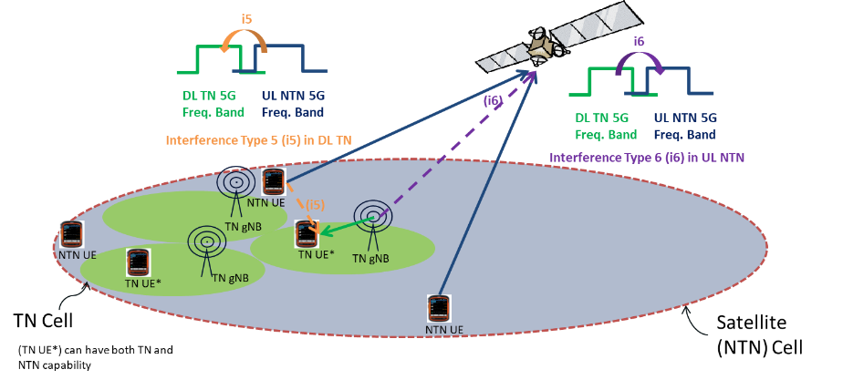
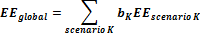
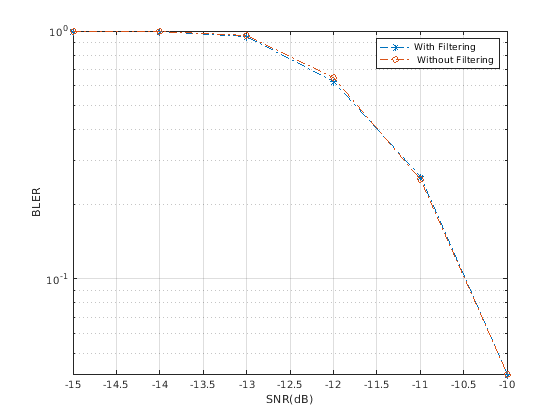

Annex C: Appendix to Performance evaluations for R17 performance targets
========================================================================

C.1 Performance analysis of Rel-16 positioning solutions 
--------------------------------------------------------

### C.1.1 Positioning accuracy analysis

#### C.1.1.1 Results from source \[4\]

##### C.1.1.1.1 Description of evaluation scenarios

The scenarios to be presented in this contribution include

\- Baseline scenarios with InF-SH/InF-DH with fixed UE/gNB height and
without UE/gNB calibration error (Case 0xx series)

\- InF-DH with variable UE/gNB height (Case 1xx series)

\- InF-SH/In-DH with UE/gNB calibration error (Case 2xx series)

Evaluation assumptions for system level analysis are provided in Table
C.1.1.1.1-1 to C.1.1.1.1-5.

Table C.1.1.1.1-1: Rel.16 NR positioning (baseline) - evaluation
scenarios and parameters

+-------+-------+-------+-------+-------+-------+-------+-------+-------+
| Para  | Case  | Case  | Case  | Case  | Case  | Case  | Case  | Case  |
| meter | 1     | 2     | 3     | 4     | 5     | 6     | 7     | 8     |
|       | (In   | (In   | (In   | (In   | (In   | (In   | (In   | (In   |
|       | F-SH, | F-SH, | F-SH, | F-SH, | F-DH, | F-DH, | F-DH, | F-DH, |
|       | FR1)  | FR1)  | FR1)  | FR1)  | FR1)  | FR1)  | FR1)  | FR1)  |
+=======+=======+=======+=======+=======+=======+=======+=======+=======+
| Ch    | I     | I     | In-SH | I     | I     | I     | I     | I     |
| annel | nF-SH | nF-SH |       | nF-SH | nF-DH | nF-DH | nF-DH | nF-DH |
| model |       |       |       |       |       |       |       |       |
| (base |       |       |       |       | (40%, | (40%, | (40%, | (40%, |
| line, |       |       |       |       | 2, 2) | 2, 2) | 2, 2) | 2, 2) |
| othe  |       |       |       |       |       |       |       |       |
| rwise |       |       |       |       |       |       |       |       |
| state |       |       |       |       |       |       |       |       |
| any   |       |       |       |       |       |       |       |       |
| modi  |       |       |       |       |       |       |       |       |
| ficat |       |       |       |       |       |       |       |       |
| ions) |       |       |       |       |       |       |       |       |
+-------+-------+-------+-------+-------+-------+-------+-------+-------+
| Ca    | 3     | 3     | 3     | 3     | 3     | 3     | 3     | 3     |
| rrier | .5GHz | .5GHz | .5GHz | .5GHz | .5GHz | .5GHz | .5GHz | .5GHz |
| freq  |       |       |       |       |       |       |       |       |
| uency |       |       |       |       |       |       |       |       |
+-------+-------+-------+-------+-------+-------+-------+-------+-------+
| Subca | 30kHz | 30kHz | 30kHz | 30kHz | 30kHz | 30kHz | 30kHz | 30kHz |
| rrier |       |       |       |       |       |       |       |       |
| sp    |       |       |       |       |       |       |       |       |
| acing |       |       |       |       |       |       |       |       |
+-------+-------+-------+-------+-------+-------+-------+-------+-------+
| Refe  | 1     | 1     | 1     | 1     | 1     | 1     | 1     | 1     |
| rence | 00MHz | 00MHz | 00MHz | 00MHz | 00MHz | 00MHz | 00MHz | 00MHz |
| S     |       |       |       |       |       |       |       |       |
| ignal |       |       |       |       |       |       |       |       |
| Tr    |       |       |       |       |       |       |       |       |
| ansmi |       |       |       |       |       |       |       |       |
| ssion |       |       |       |       |       |       |       |       |
| Band  |       |       |       |       |       |       |       |       |
| width |       |       |       |       |       |       |       |       |
+-------+-------+-------+-------+-------+-------+-------+-------+-------+
| Refe  | D     | P     | P     | DL-   | D     | P     | P     | DL-   |
| rence | L-PRS | osSRS | osSRS | PRS+P | L-PRS | osSRS | osSRS | PRS+P |
| S     | (Co   | (Co   | (Co   | osSRS | (Co   | (Co   | (Co   | osSRS |
| ignal | mb-4, | mb-4, | mb-4, | (Co   | mb-4, | mb-4, | mb-4, | (Co   |
| Phy   | 4     | 4     | 4     | mb-4, | 4     | 4     | 4     | mb-4, |
| sical | sy    | sy    | sy    | 4     | sy    | sy    | sy    | 4     |
| Stru  | mbol) | mbol) | mbol) | sy    | mbol) | mbol) | mbol) | sy    |
| cture |       |       |       | mbol) |       |       |       | mbol) |
| and   |       |       |       |       |       |       |       |       |
| Res   |       |       |       |       |       |       |       |       |
| ource |       |       |       |       |       |       |       |       |
| Alloc |       |       |       |       |       |       |       |       |
| ation |       |       |       |       |       |       |       |       |
| (RE   |       |       |       |       |       |       |       |       |
| pat   |       |       |       |       |       |       |       |       |
| tern) |       |       |       |       |       |       |       |       |
| (refe |       |       |       |       |       |       |       |       |
| rence |       |       |       |       |       |       |       |       |
| to    |       |       |       |       |       |       |       |       |
| f     |       |       |       |       |       |       |       |       |
| igure |       |       |       |       |       |       |       |       |
| in    |       |       |       |       |       |       |       |       |
| con   |       |       |       |       |       |       |       |       |
| tribu |       |       |       |       |       |       |       |       |
| tion) |       |       |       |       |       |       |       |       |
+-------+-------+-------+-------+-------+-------+-------+-------+-------+
| Refe  | Gold, | ZC,   | ZC,   | Gol   | Gold, | ZC,   | ZC,   | Gol   |
| rence | s     | s     | s     | d/ZC, | s     | s     | s     | d/ZC, |
| s     | ingle | ingle | ingle | s     | ingle | ingle | ingle | s     |
| ignal | port  | port  | port  | ingle | port  | port  | port  | ingle |
|       |       |       |       | port  |       |       |       | port  |
| (type |       |       |       |       |       |       |       |       |
| of    |       |       |       |       |       |       |       |       |
| sequ  |       |       |       |       |       |       |       |       |
| ence, |       |       |       |       |       |       |       |       |
| n     |       |       |       |       |       |       |       |       |
| umber |       |       |       |       |       |       |       |       |
| of    |       |       |       |       |       |       |       |       |
| p     |       |       |       |       |       |       |       |       |
| orts, |       |       |       |       |       |       |       |       |
| ...)  |       |       |       |       |       |       |       |       |
+-------+-------+-------+-------+-------+-------+-------+-------+-------+
| N     | 7     | 7     | 7     | 7     | 7     | 7     | 7     | 7     |
| umber |       |       |       |       |       |       |       |       |
| of    |       |       |       |       |       |       |       |       |
| sites |       |       |       |       |       |       |       |       |
+-------+-------+-------+-------+-------+-------+-------+-------+-------+
| N     | 4     | 4     | 4     | 4     | 4     | 4     | 4     | 4     |
| umber |       |       |       |       |       |       |       |       |
| of    |       |       |       |       |       |       |       |       |
| sy    |       |       |       |       |       |       |       |       |
| mbols |       |       |       |       |       |       |       |       |
| used  |       |       |       |       |       |       |       |       |
| per   |       |       |       |       |       |       |       |       |
| occ   |       |       |       |       |       |       |       |       |
| asion |       |       |       |       |       |       |       |       |
+-------+-------+-------+-------+-------+-------+-------+-------+-------+
| n     | 1     | 1     | 1     | 1     | 1     | 1     | 1     | 1     |
| umber |       |       |       |       |       |       |       |       |
| of    |       |       |       |       |       |       |       |       |
| occa  |       |       |       |       |       |       |       |       |
| sions |       |       |       |       |       |       |       |       |
| used  |       |       |       |       |       |       |       |       |
| per   |       |       |       |       |       |       |       |       |
| p     |       |       |       |       |       |       |       |       |
| ositi |       |       |       |       |       |       |       |       |
| oning |       |       |       |       |       |       |       |       |
| est   |       |       |       |       |       |       |       |       |
| imate |       |       |       |       |       |       |       |       |
+-------+-------+-------+-------+-------+-------+-------+-------+-------+
| Powe  | 6dB   | 6dB   | 6dB   | 6dB   | 6dB   | 6dB   | 6dB   | 6dB   |
| r-boo |       |       |       |       |       |       |       |       |
| sting |       |       |       |       |       |       |       |       |
| level |       |       |       |       |       |       |       |       |
+-------+-------+-------+-------+-------+-------+-------+-------+-------+
| U     | Not   | Not   | Not   | Not   | Not   | Not   | Not   | Not   |
| plink | ap    | ap    | ap    | ap    | ap    | ap    | ap    | ap    |
| power | plied | plied | plied | plied | plied | plied | plied | plied |
| co    |       |       |       |       |       |       |       |       |
| ntrol |       |       |       |       |       |       |       |       |
| (a    |       |       |       |       |       |       |       |       |
| pplie |       |       |       |       |       |       |       |       |
| d/not |       |       |       |       |       |       |       |       |
| app   |       |       |       |       |       |       |       |       |
| lied) |       |       |       |       |       |       |       |       |
+-------+-------+-------+-------+-------+-------+-------+-------+-------+
| in    | Ideal | Ideal | Ideal | Ideal | Ideal | Ideal | Ideal | Ideal |
| terfe |       |       |       |       |       |       |       |       |
| rence |       |       |       |       |       |       |       |       |
| mode  |       |       |       |       |       |       |       |       |
| lling |       |       |       |       |       |       |       |       |
| (     |       |       |       |       |       |       |       |       |
| ideal |       |       |       |       |       |       |       |       |
| mu    |       |       |       |       |       |       |       |       |
| ting, |       |       |       |       |       |       |       |       |
| or    |       |       |       |       |       |       |       |       |
| o     |       |       |       |       |       |       |       |       |
| ther) |       |       |       |       |       |       |       |       |
+-------+-------+-------+-------+-------+-------+-------+-------+-------+
| D     | Super | Super | Super | Super | Super | Super | Super | Super |
| escri | resol | resol | resol | resol | resol | resol | resol | resol |
| ption | ution | ution | ution | ution | ution | ution | ution | ution |
| of    |       |       |       |       |       |       |       |       |
| M     | No    | No    | No    | No    | No    | No    | No    | No    |
| easur | LOS   | LOS   | LOS   | LOS   | LOS   | LOS   | LOS   | LOS   |
| ement | /NLOS | /NLOS | /NLOS | /NLOS | /NLOS | /NLOS | /NLOS | /NLOS |
| Algo  | dete  | dete  | dete  | dete  | dete  | dete  | dete  | dete  |
| rithm | ction | ction | ction | ction | ction | ction | ction | ction |
| (e.g. |       |       |       |       |       |       |       |       |
| super |       |       |       |       |       |       |       |       |
| r     |       |       |       |       |       |       |       |       |
| esolu |       |       |       |       |       |       |       |       |
| tion, |       |       |       |       |       |       |       |       |
| in    |       |       |       |       |       |       |       |       |
| terfe |       |       |       |       |       |       |       |       |
| rence |       |       |       |       |       |       |       |       |
| can   |       |       |       |       |       |       |       |       |
| cella |       |       |       |       |       |       |       |       |
| tion, |       |       |       |       |       |       |       |       |
| ....) |       |       |       |       |       |       |       |       |
+-------+-------+-------+-------+-------+-------+-------+-------+-------+
| D     | DL    | UL    | UL-T  | Mult  | DL    | UL    | UL-T  | Mult  |
| escri | -TDOA | -TDOA | DOA+U | i-RTT | -TDOA | -TDOA | DOA+U | i-RTT |
| ption |       |       | L-AoA |       |       |       | L-AoA |       |
| of    | PSO   | PSO   |       | PSO   | PSO   | PSO   |       | PSO   |
| p     |       |       | PSO   |       |       |       | PSO   |       |
| ositi |       |       |       |       |       |       |       |       |
| oning |       |       |       |       |       |       |       |       |
| tech  |       |       |       |       |       |       |       |       |
| nique |       |       |       |       |       |       |       |       |
| /     |       |       |       |       |       |       |       |       |
| ap    |       |       |       |       |       |       |       |       |
| plied |       |       |       |       |       |       |       |       |
| p     |       |       |       |       |       |       |       |       |
| ositi |       |       |       |       |       |       |       |       |
| oning |       |       |       |       |       |       |       |       |
| algo  |       |       |       |       |       |       |       |       |
| rithm |       |       |       |       |       |       |       |       |
| (e.g. |       |       |       |       |       |       |       |       |
| Least |       |       |       |       |       |       |       |       |
| sq    |       |       |       |       |       |       |       |       |
| uare, |       |       |       |       |       |       |       |       |
| T     |       |       |       |       |       |       |       |       |
| aylor |       |       |       |       |       |       |       |       |
| se    |       |       |       |       |       |       |       |       |
| ries, |       |       |       |       |       |       |       |       |
| etc)  |       |       |       |       |       |       |       |       |
+-------+-------+-------+-------+-------+-------+-------+-------+-------+
| Ne    | Ideal | Ideal | Ideal | Ideal | Ideal | Ideal | Ideal | Ideal |
| twork |       |       |       |       |       |       |       |       |
| synch |       |       |       |       |       |       |       |       |
| roniz |       |       |       |       |       |       |       |       |
| ation |       |       |       |       |       |       |       |       |
| a     |       |       |       |       |       |       |       |       |
| ssump |       |       |       |       |       |       |       |       |
| tions |       |       |       |       |       |       |       |       |
+-------+-------+-------+-------+-------+-------+-------+-------+-------+
| U     | Ideal | Ideal | Ideal | Ideal | Ideal | Ideal | Ideal | Ideal |
| E/gNB |       |       |       |       |       |       |       |       |
| T     |       |       |       |       |       |       |       |       |
| x/Rx\ |       |       |       |       |       |       |       |       |
| C     |       |       |       |       |       |       |       |       |
| alibr |       |       |       |       |       |       |       |       |
| ation |       |       |       |       |       |       |       |       |
| Error |       |       |       |       |       |       |       |       |
+-------+-------+-------+-------+-------+-------+-------+-------+-------+
| Be    | Tx    | Tx    | Tx    | Tx    | Tx    | Tx    | Tx    | Tx    |
| am-re | beam  | beam  | beam  | beam  | beam  | beam  | beam  | beam  |
| lated | swe   | swe   | swe   | swe   | swe   | swe   | swe   | swe   |
| assum | eping | eping | eping | eping | eping | eping | eping | eping |
| ption |       |       |       |       |       |       |       |       |
| (beam |       |       |       |       |       |       |       |       |
| swe   |       |       |       |       |       |       |       |       |
| eping |       |       |       |       |       |       |       |       |
| /     |       |       |       |       |       |       |       |       |
| alig  |       |       |       |       |       |       |       |       |
| nment |       |       |       |       |       |       |       |       |
| a     |       |       |       |       |       |       |       |       |
| ssump |       |       |       |       |       |       |       |       |
| tions |       |       |       |       |       |       |       |       |
| at    |       |       |       |       |       |       |       |       |
| the   |       |       |       |       |       |       |       |       |
| tx    |       |       |       |       |       |       |       |       |
| and   |       |       |       |       |       |       |       |       |
| rx    |       |       |       |       |       |       |       |       |
| s     |       |       |       |       |       |       |       |       |
| ides) |       |       |       |       |       |       |       |       |
+-------+-------+-------+-------+-------+-------+-------+-------+-------+
| Prec  | Tx    | Tx    | Tx    | Tx    | Tx    | Tx    | Tx    | Tx    |
| oding | code  | code  | code  | code  | code  | code  | code  | code  |
| a     | book- | book- | book- | book- | book- | book- | book- | book- |
| ssump | based | based | based | based | based | based | based | based |
| tions |       |       |       |       |       |       |       |       |
| (code |       |       |       |       |       |       |       |       |
| book, |       |       |       |       |       |       |       |       |
| nrof  |       |       |       |       |       |       |       |       |
| an    |       |       |       |       |       |       |       |       |
| tenna |       |       |       |       |       |       |       |       |
| ele   |       |       |       |       |       |       |       |       |
| ments |       |       |       |       |       |       |       |       |
| used, |       |       |       |       |       |       |       |       |
| etc)  |       |       |       |       |       |       |       |       |
+-------+-------+-------+-------+-------+-------+-------+-------+-------+
| Addit | Fixed | Fixed | Fixed | Fixed | Fixed | Fixed | Fixed | Fixed |
| ional | U     | U     | U     | U     | U     | U     | U     | U     |
| n     | E/gNB | E/gNB | E/gNB | E/gNB | E/gNB | E/gNB | E/gNB | E/gNB |
| otes, | he    | he    | he    | he    | he    | he    | he    | he    |
| if    | ight. | ight. | ight. | ight. | ight. | ight. | ight. | ight. |
| any   |       |       |       |       |       |       |       |       |
+-------+-------+-------+-------+-------+-------+-------+-------+-------+

Table C.1.1.1.1-2: Rel.16 NR positioning (baseline) - evaluation
scenarios and parameters

+-------+-------+-------+-------+-------+-------+-------+-------+-------+
| Para  | Case  | Case  | Case  | Case  | Case  | Case  | Case  | Case  |
| meter | 9     | 10    | 11    | 12    | 13    | 14    | 15    | 16    |
|       | (In   | (In   | (In   | (In   | (In   | (In   | (In   | (In   |
|       | F-SH, | F-SH, | F-SH, | F-SH, | F-DH, | F-DH, | F-DH, | F-DH, |
|       | FR2)  | FR2)  | FR2)  | FR2)  | FR2)  | FR2)  | FR2)  | FR2)  |
+=======+=======+=======+=======+=======+=======+=======+=======+=======+
| Ch    | I     | I     | In-SH | I     | I     | I     | I     | I     |
| annel | nF-SH | nF-SH |       | nF-SH | nF-DH | nF-DH | nF-DH | nF-DH |
| model |       |       |       |       |       |       |       |       |
| (base |       |       |       |       | (40%, | (40%, | (40%, | (40%, |
| line, |       |       |       |       | 2, 2) | 2, 2) | 2, 2) | 2, 2) |
| othe  |       |       |       |       |       |       |       |       |
| rwise |       |       |       |       |       |       |       |       |
| state |       |       |       |       |       |       |       |       |
| any   |       |       |       |       |       |       |       |       |
| modi  |       |       |       |       |       |       |       |       |
| ficat |       |       |       |       |       |       |       |       |
| ions) |       |       |       |       |       |       |       |       |
+-------+-------+-------+-------+-------+-------+-------+-------+-------+
| Ca    | 28GHz | 28GHz | 28GHz | 28GHz | 28GHz | 28GHz | 28GHz | 28GHz |
| rrier |       |       |       |       |       |       |       |       |
| freq  |       |       |       |       |       |       |       |       |
| uency |       |       |       |       |       |       |       |       |
+-------+-------+-------+-------+-------+-------+-------+-------+-------+
| Subca | 1     | 1     | 1     | 1     | 1     | 1     | 1     | 1     |
| rrier | 20kHz | 20kHz | 20kHz | 20kHz | 20kHz | 20kHz | 20kHz | 20kHz |
| sp    |       |       |       |       |       |       |       |       |
| acing |       |       |       |       |       |       |       |       |
+-------+-------+-------+-------+-------+-------+-------+-------+-------+
| Refe  | 4     | 4     | 4     | 4     | 4     | 4     | 4     | 4     |
| rence | 00MHz | 00MHz | 00MHz | 00MHz | 00MHz | 00MHz | 00MHz | 00MHz |
| S     |       |       |       |       |       |       |       |       |
| ignal |       |       |       |       |       |       |       |       |
| Tr    |       |       |       |       |       |       |       |       |
| ansmi |       |       |       |       |       |       |       |       |
| ssion |       |       |       |       |       |       |       |       |
| Band  |       |       |       |       |       |       |       |       |
| width |       |       |       |       |       |       |       |       |
+-------+-------+-------+-------+-------+-------+-------+-------+-------+
| Refe  | D     | D     | P     | DL-   | D     | D     | P     | DL-   |
| rence | L-PRS | L-PRS | osSRS | PRS+P | L-PRS | L-PRS | osSRS | PRS+P |
| S     | (Co   | (Co   | (Co   | osSRS | (Co   | (Co   | (Co   | osSRS |
| ignal | mb-4, | mb-4, | mb-4, | (Co   | mb-4, | mb-4, | mb-4, | (Co   |
| Phy   | 4     | 4     | 4     | mb-4, | 4     | 4     | 4     | mb-4, |
| sical | sy    | sy    | sy    | 4     | sy    | sy    | sy    | 4     |
| Stru  | mbol) | mbol) | mbol) | sy    | mbol) | mbol) | mbol) | sy    |
| cture |       |       |       | mbol) |       |       |       | mbol) |
| and   |       |       |       |       |       |       |       |       |
| Res   |       |       |       |       |       |       |       |       |
| ource |       |       |       |       |       |       |       |       |
| Alloc |       |       |       |       |       |       |       |       |
| ation |       |       |       |       |       |       |       |       |
| (RE   |       |       |       |       |       |       |       |       |
| pat   |       |       |       |       |       |       |       |       |
| tern) |       |       |       |       |       |       |       |       |
| (refe |       |       |       |       |       |       |       |       |
| rence |       |       |       |       |       |       |       |       |
| to    |       |       |       |       |       |       |       |       |
| f     |       |       |       |       |       |       |       |       |
| igure |       |       |       |       |       |       |       |       |
| in    |       |       |       |       |       |       |       |       |
| con   |       |       |       |       |       |       |       |       |
| tribu |       |       |       |       |       |       |       |       |
| tion) |       |       |       |       |       |       |       |       |
+-------+-------+-------+-------+-------+-------+-------+-------+-------+
| Refe  | Gold, | Gold, | ZC,   | Gol   | Gold, | Gold, | ZC,   | Gol   |
| rence | s     | s     | s     | d/ZC, | s     | s     | s     | d/ZC, |
| s     | ingle | ingle | ingle | s     | ingle | ingle | ingle | s     |
| ignal | port  | port  | port  | ingle | port  | port  | port  | ingle |
|       |       |       |       | port  |       |       |       | port  |
| (type |       |       |       |       |       |       |       |       |
| of    |       |       |       |       |       |       |       |       |
| sequ  |       |       |       |       |       |       |       |       |
| ence, |       |       |       |       |       |       |       |       |
| n     |       |       |       |       |       |       |       |       |
| umber |       |       |       |       |       |       |       |       |
| of    |       |       |       |       |       |       |       |       |
| p     |       |       |       |       |       |       |       |       |
| orts, |       |       |       |       |       |       |       |       |
| ...)  |       |       |       |       |       |       |       |       |
+-------+-------+-------+-------+-------+-------+-------+-------+-------+
| N     | 7     | 7     | 7     | 7     | 7     | 7     | 7     | 7     |
| umber |       |       |       |       |       |       |       |       |
| of    |       |       |       |       |       |       |       |       |
| sites |       |       |       |       |       |       |       |       |
+-------+-------+-------+-------+-------+-------+-------+-------+-------+
| N     | 4     | 4     | 4     | 4     | 4     | 4     | 4     | 4     |
| umber |       |       |       |       |       |       |       |       |
| of    |       |       |       |       |       |       |       |       |
| sy    |       |       |       |       |       |       |       |       |
| mbols |       |       |       |       |       |       |       |       |
| used  |       |       |       |       |       |       |       |       |
| per   |       |       |       |       |       |       |       |       |
| occ   |       |       |       |       |       |       |       |       |
| asion |       |       |       |       |       |       |       |       |
+-------+-------+-------+-------+-------+-------+-------+-------+-------+
| n     | 1     | 1     | 1     | 1     | 1     | 1     | 1     | 1     |
| umber |       |       |       |       |       |       |       |       |
| of    |       |       |       |       |       |       |       |       |
| occa  |       |       |       |       |       |       |       |       |
| sions |       |       |       |       |       |       |       |       |
| used  |       |       |       |       |       |       |       |       |
| per   |       |       |       |       |       |       |       |       |
| p     |       |       |       |       |       |       |       |       |
| ositi |       |       |       |       |       |       |       |       |
| oning |       |       |       |       |       |       |       |       |
| est   |       |       |       |       |       |       |       |       |
| imate |       |       |       |       |       |       |       |       |
+-------+-------+-------+-------+-------+-------+-------+-------+-------+
| Powe  | 6dB   | 6dB   | 6dB   | 6dB   | 6dB   | 6dB   | 6dB   | 6dB   |
| r-boo |       |       |       |       |       |       |       |       |
| sting |       |       |       |       |       |       |       |       |
| level |       |       |       |       |       |       |       |       |
+-------+-------+-------+-------+-------+-------+-------+-------+-------+
| U     | Not   | Not   | Not   | Not   | Not   | Not   | Not   | Not   |
| plink | ap    | ap    | ap    | ap    | ap    | ap    | ap    | ap    |
| power | plied | plied | plied | plied | plied | plied | plied | plied |
| co    |       |       |       |       |       |       |       |       |
| ntrol |       |       |       |       |       |       |       |       |
| (a    |       |       |       |       |       |       |       |       |
| pplie |       |       |       |       |       |       |       |       |
| d/not |       |       |       |       |       |       |       |       |
| app   |       |       |       |       |       |       |       |       |
| lied) |       |       |       |       |       |       |       |       |
+-------+-------+-------+-------+-------+-------+-------+-------+-------+
| in    | Ideal | Ideal | Ideal | Ideal | Ideal | Ideal | Ideal | Ideal |
| terfe |       |       |       |       |       |       |       |       |
| rence |       |       |       |       |       |       |       |       |
| mode  |       |       |       |       |       |       |       |       |
| lling |       |       |       |       |       |       |       |       |
| (     |       |       |       |       |       |       |       |       |
| ideal |       |       |       |       |       |       |       |       |
| mu    |       |       |       |       |       |       |       |       |
| ting, |       |       |       |       |       |       |       |       |
| or    |       |       |       |       |       |       |       |       |
| o     |       |       |       |       |       |       |       |       |
| ther) |       |       |       |       |       |       |       |       |
+-------+-------+-------+-------+-------+-------+-------+-------+-------+
| D     | Super | Super | Super | Super | Super | Super | Super | Super |
| escri | resol | resol | resol | resol | resol | resol | resol | resol |
| ption | ution | ution | ution | ution | ution | ution | ution | ution |
| of    |       |       |       |       |       |       |       |       |
| M     | No    | No    | No    | No    | No    | No    | No    | No    |
| easur | LOS   | LOS   | LOS   | LOS   | LOS   | LOS   | LOS   | LOS   |
| ement | /NLOS | /NLOS | /NLOS | /NLOS | /NLOS | /NLOS | /NLOS | /NLOS |
| Algo  | dete  | dete  | dete  | dete  | dete  | dete  | dete  | dete  |
| rithm | ction | ction | ction | ction | ction | ction | ction | ction |
| (e.g. |       |       |       |       |       |       |       |       |
| super |       |       |       |       |       |       |       |       |
| r     |       |       |       |       |       |       |       |       |
| esolu |       |       |       |       |       |       |       |       |
| tion, |       |       |       |       |       |       |       |       |
| in    |       |       |       |       |       |       |       |       |
| terfe |       |       |       |       |       |       |       |       |
| rence |       |       |       |       |       |       |       |       |
| can   |       |       |       |       |       |       |       |       |
| cella |       |       |       |       |       |       |       |       |
| tion, |       |       |       |       |       |       |       |       |
| ....) |       |       |       |       |       |       |       |       |
+-------+-------+-------+-------+-------+-------+-------+-------+-------+
| D     | DL    | DL-T  | UL-T  | Mult  | DL    | DL-T  | UL-T  | Mult  |
| escri | -TDOA | DOA+D | DOA+U | i-RTT | -TDOA | DOA+D | DOA+U | i-RTT |
| ption |       | L-AoD | L-AoA |       |       | L-AoD | L-AoA |       |
| of    | PSO   |       |       | PSO   | PSO   |       |       | PSO   |
| p     |       | PSO   | PSO   |       |       | PSO   | PSO   |       |
| ositi |       |       |       |       |       |       |       |       |
| oning |       |       |       |       |       |       |       |       |
| tech  |       |       |       |       |       |       |       |       |
| nique |       |       |       |       |       |       |       |       |
| /     |       |       |       |       |       |       |       |       |
| ap    |       |       |       |       |       |       |       |       |
| plied |       |       |       |       |       |       |       |       |
| p     |       |       |       |       |       |       |       |       |
| ositi |       |       |       |       |       |       |       |       |
| oning |       |       |       |       |       |       |       |       |
| algo  |       |       |       |       |       |       |       |       |
| rithm |       |       |       |       |       |       |       |       |
| (e.g. |       |       |       |       |       |       |       |       |
| Least |       |       |       |       |       |       |       |       |
| sq    |       |       |       |       |       |       |       |       |
| uare, |       |       |       |       |       |       |       |       |
| T     |       |       |       |       |       |       |       |       |
| aylor |       |       |       |       |       |       |       |       |
| se    |       |       |       |       |       |       |       |       |
| ries, |       |       |       |       |       |       |       |       |
| etc)  |       |       |       |       |       |       |       |       |
+-------+-------+-------+-------+-------+-------+-------+-------+-------+
| Ne    | Ideal | Ideal | Ideal | Ideal | Ideal | Ideal | Ideal | Ideal |
| twork |       |       |       |       |       |       |       |       |
| synch |       |       |       |       |       |       |       |       |
| roniz |       |       |       |       |       |       |       |       |
| ation |       |       |       |       |       |       |       |       |
| a     |       |       |       |       |       |       |       |       |
| ssump |       |       |       |       |       |       |       |       |
| tions |       |       |       |       |       |       |       |       |
+-------+-------+-------+-------+-------+-------+-------+-------+-------+
| U     | Ideal | Ideal | Ideal | Ideal | Ideal | Ideal | Ideal | Ideal |
| E/gNB |       |       |       |       |       |       |       |       |
| T     |       |       |       |       |       |       |       |       |
| x/Rx\ |       |       |       |       |       |       |       |       |
| C     |       |       |       |       |       |       |       |       |
| alibr |       |       |       |       |       |       |       |       |
| ation |       |       |       |       |       |       |       |       |
| Error |       |       |       |       |       |       |       |       |
+-------+-------+-------+-------+-------+-------+-------+-------+-------+
| Be    | Tx    | Tx    | Tx    | Tx    | Tx    | Tx    | Tx    | Tx    |
| am-re | beam  | beam  | beam  | beam  | beam  | beam  | beam  | beam  |
| lated | swe   | swe   | swe   | swe   | swe   | swe   | swe   | swe   |
| assum | eping | eping | eping | eping | eping | eping | eping | eping |
| ption |       |       |       |       |       |       |       |       |
| (beam | Rx    | Rx    | Rx    | Rx    | Rx    | Rx    | Rx    | Rx    |
| swe   | beam  | beam  | beam  | beam  | beam  | beam  | beam  | beam  |
| eping | swe   | swe   | swe   | swe   | swe   | swe   | swe   | swe   |
| /     | eping | eping | eping | eping | eping | eping | eping | eping |
| alig  |       |       |       |       |       |       |       |       |
| nment |       |       |       |       |       |       |       |       |
| a     |       |       |       |       |       |       |       |       |
| ssump |       |       |       |       |       |       |       |       |
| tions |       |       |       |       |       |       |       |       |
| at    |       |       |       |       |       |       |       |       |
| the   |       |       |       |       |       |       |       |       |
| tx    |       |       |       |       |       |       |       |       |
| and   |       |       |       |       |       |       |       |       |
| rx    |       |       |       |       |       |       |       |       |
| s     |       |       |       |       |       |       |       |       |
| ides) |       |       |       |       |       |       |       |       |
+-------+-------+-------+-------+-------+-------+-------+-------+-------+
| Prec  | Tx    | Tx    | Tx    | Tx    | Tx    | Tx    | Tx    | Tx    |
| oding | code  | code  | code  | code  | code  | code  | code  | code  |
| a     | book- | book- | book- | book- | book- | book- | book- | book- |
| ssump | based | based | based | based | based | based | based | based |
| tions |       |       |       |       |       |       |       |       |
| (code | Rx    | Rx    | Rx    | Rx    | Rx    | Rx    | Rx    | Rx    |
| book, | cod   | cod   | cod   | cod   | cod   | cod   | cod   | cod   |
| nrof  | ebook | ebook | ebook | ebook | ebook | ebook | ebook | ebook |
| an    | based | based | based | based | based | based | based | based |
| tenna |       |       |       |       |       |       |       |       |
| ele   |       |       |       |       |       |       |       |       |
| ments |       |       |       |       |       |       |       |       |
| used, |       |       |       |       |       |       |       |       |
| etc)  |       |       |       |       |       |       |       |       |
+-------+-------+-------+-------+-------+-------+-------+-------+-------+
| Addit | Fixed | Fixed | Fixed | Fixed | Fixed | Fixed | Fixed | Fixed |
| ional | U     | U     | U     | U     | U     | U     | U     | U     |
| n     | E/gNB | E/gNB | E/gNB | E/gNB | E/gNB | E/gNB | E/gNB | E/gNB |
| otes, | he    | he    | he    | he    | he    | he    | he    | he    |
| if    | ight. | ight. | ight. | ight. | ight. | ight. | ight. | ight. |
| any   |       |       |       |       |       |       |       |       |
+-------+-------+-------+-------+-------+-------+-------+-------+-------+

Table C.1.1.1.1-3: Rel.16 NR positioning (modified DH and 3D
positioning) - evaluation scenarios and parameters

+-------+-------+-------+-------+-------+-------+-------+-------+-------+
| Para  | Case  | Case  | Case  | Case  | Case  | Case  | Case  | Case  |
| meter | 101   | 102   | 103   | 104   | 105   | 106   | 107   | 108   |
|       | (In   | (In   | (In   | (In   | (In   | (In   | (In   | (In   |
|       | F-DH, | F-DH, | F-DH, | F-DH, | F-DH, | F-DH, | F-DH, | F-DH, |
|       | FR1)  | FR1)  | FR1)  | FR1)  | FR2)  | FR2)  | FR2)  | FR2)  |
+=======+=======+=======+=======+=======+=======+=======+=======+=======+
| Ch    | I     | I     | I     | I     | I     | I     | I     | I     |
| annel | nF-DH | nF-DH | nF-DH | nF-DH | nF-DH | nF-DH | nF-DH | nF-DH |
| model |       |       |       |       |       |       |       |       |
| (base | (40%, | (40%, | (40%, | (40%, | (40%, | (40%, | (40%, | (40%, |
| line, | 3, 5) | 3, 5) | 3, 5) | 3, 5) | 3, 5) | 3, 5) | 3, 5) | 3, 5) |
| othe  |       |       |       |       |       |       |       |       |
| rwise |       |       |       |       |       |       |       |       |
| state |       |       |       |       |       |       |       |       |
| any   |       |       |       |       |       |       |       |       |
| modi  |       |       |       |       |       |       |       |       |
| ficat |       |       |       |       |       |       |       |       |
| ions) |       |       |       |       |       |       |       |       |
+-------+-------+-------+-------+-------+-------+-------+-------+-------+
| Ca    | 3.5   | 3     | 3     | 3     | 28GHz | 28GHz | 28GHz | 28GHz |
| rrier | GHzHz | .5GHz | .5GHz | .5GHz |       |       |       |       |
| freq  |       |       |       |       |       |       |       |       |
| uency |       |       |       |       |       |       |       |       |
+-------+-------+-------+-------+-------+-------+-------+-------+-------+
| Subca | 30kHz | 30kHz | 30kHz | 30kHz | 1     | 1     | 1     | 1     |
| rrier |       |       |       |       | 20kHz | 20kHz | 20kHz | 20kHz |
| sp    |       |       |       |       |       |       |       |       |
| acing |       |       |       |       |       |       |       |       |
+-------+-------+-------+-------+-------+-------+-------+-------+-------+
| Refe  | 1     | 1     | 1     | 1     | 4     | 4     | 4     | 4     |
| rence | 00Mhz | 00Mhz | 00Mhz | 00Mhz | 00MHz | 00MHz | 00MHz | 00MHz |
| S     |       |       |       |       |       |       |       |       |
| ignal |       |       |       |       |       |       |       |       |
| Tr    |       |       |       |       |       |       |       |       |
| ansmi |       |       |       |       |       |       |       |       |
| ssion |       |       |       |       |       |       |       |       |
| Band  |       |       |       |       |       |       |       |       |
| width |       |       |       |       |       |       |       |       |
+-------+-------+-------+-------+-------+-------+-------+-------+-------+
| Refe  | P     | DL-   | P     | DL-   | P     | DL-   | P     | DL-   |
| rence | osSRS | PRS+P | osSRS | PRS+P | osSRS | PRS+P | osSRS | PRS+P |
| S     | (Co   | osSRS | (Co   | osSRS | (Co   | osSRS | (Co   | osSRS |
| ignal | mb-4, | (Co   | mb-4, | (Co   | mb-4, | (Co   | mb-4, | (Co   |
| Phy   | 4     | mb-4, | 4     | mb-4, | 4     | mb-4, | 4     | mb-4, |
| sical | sy    | 4     | sy    | 4     | sy    | 4     | sy    | 4     |
| Stru  | mbol) | sy    | mbol) | sy    | mbol) | sy    | mbol) | sy    |
| cture |       | mbol) |       | mbol) |       | mbol) |       | mbol) |
| and   |       |       |       |       |       |       |       |       |
| Res   |       |       |       |       |       |       |       |       |
| ource |       |       |       |       |       |       |       |       |
| Alloc |       |       |       |       |       |       |       |       |
| ation |       |       |       |       |       |       |       |       |
| (RE   |       |       |       |       |       |       |       |       |
| pat   |       |       |       |       |       |       |       |       |
| tern) |       |       |       |       |       |       |       |       |
| (refe |       |       |       |       |       |       |       |       |
| rence |       |       |       |       |       |       |       |       |
| to    |       |       |       |       |       |       |       |       |
| f     |       |       |       |       |       |       |       |       |
| igure |       |       |       |       |       |       |       |       |
| in    |       |       |       |       |       |       |       |       |
| con   |       |       |       |       |       |       |       |       |
| tribu |       |       |       |       |       |       |       |       |
| tion) |       |       |       |       |       |       |       |       |
+-------+-------+-------+-------+-------+-------+-------+-------+-------+
| Refe  | ZC,   | Gol   | ZC,   | Gol   | ZC,   | Gol   | ZC,   | Gol   |
| rence | s     | d/ZC, | s     | d/ZC, | s     | d/ZC, | s     | d/ZC, |
| s     | ingle | s     | ingle | s     | ingle | s     | ingle | s     |
| ignal | port  | ingle | port  | ingle | port  | ingle | port  | ingle |
|       |       | port  |       | port  |       | port  |       | port  |
| (type |       |       |       |       |       |       |       |       |
| of    |       |       |       |       |       |       |       |       |
| sequ  |       |       |       |       |       |       |       |       |
| ence, |       |       |       |       |       |       |       |       |
| n     |       |       |       |       |       |       |       |       |
| umber |       |       |       |       |       |       |       |       |
| of    |       |       |       |       |       |       |       |       |
| p     |       |       |       |       |       |       |       |       |
| orts, |       |       |       |       |       |       |       |       |
| ...)  |       |       |       |       |       |       |       |       |
+-------+-------+-------+-------+-------+-------+-------+-------+-------+
| N     | 7     | 7     | 7     | 7     | 7     | 7     | 7     | 7     |
| umber |       |       |       |       |       |       |       |       |
| of    |       |       |       |       |       |       |       |       |
| sites |       |       |       |       |       |       |       |       |
+-------+-------+-------+-------+-------+-------+-------+-------+-------+
| N     | 4     | 4     | 4     | 4     | 4     | 4     | 4     | 4     |
| umber |       |       |       |       |       |       |       |       |
| of    |       |       |       |       |       |       |       |       |
| sy    |       |       |       |       |       |       |       |       |
| mbols |       |       |       |       |       |       |       |       |
| used  |       |       |       |       |       |       |       |       |
| per   |       |       |       |       |       |       |       |       |
| occ   |       |       |       |       |       |       |       |       |
| asion |       |       |       |       |       |       |       |       |
+-------+-------+-------+-------+-------+-------+-------+-------+-------+
| n     | 1     | 1     | 1     | 1     | 1     | 1     | 1     | 1     |
| umber |       |       |       |       |       |       |       |       |
| of    |       |       |       |       |       |       |       |       |
| occa  |       |       |       |       |       |       |       |       |
| sions |       |       |       |       |       |       |       |       |
| used  |       |       |       |       |       |       |       |       |
| per   |       |       |       |       |       |       |       |       |
| p     |       |       |       |       |       |       |       |       |
| ositi |       |       |       |       |       |       |       |       |
| oning |       |       |       |       |       |       |       |       |
| est   |       |       |       |       |       |       |       |       |
| imate |       |       |       |       |       |       |       |       |
+-------+-------+-------+-------+-------+-------+-------+-------+-------+
| Powe  | 6dB   | 6dB   | 6dB   | 6dB   | 6dB   | 6dB   | 6dB   | 6dB   |
| r-boo |       |       |       |       |       |       |       |       |
| sting |       |       |       |       |       |       |       |       |
| level |       |       |       |       |       |       |       |       |
+-------+-------+-------+-------+-------+-------+-------+-------+-------+
| U     | Not   | Not   | Not   | Not   | Not   | Not   | Not   | Not   |
| plink | ap    | ap    | ap    | ap    | ap    | ap    | ap    | ap    |
| power | plied | plied | plied | plied | plied | plied | plied | plied |
| co    |       |       |       |       |       |       |       |       |
| ntrol |       |       |       |       |       |       |       |       |
| (a    |       |       |       |       |       |       |       |       |
| pplie |       |       |       |       |       |       |       |       |
| d/not |       |       |       |       |       |       |       |       |
| app   |       |       |       |       |       |       |       |       |
| lied) |       |       |       |       |       |       |       |       |
+-------+-------+-------+-------+-------+-------+-------+-------+-------+
| in    | Ideal | Ideal | Ideal | Ideal | Ideal | Ideal | Ideal | Ideal |
| terfe |       |       |       |       |       |       |       |       |
| rence |       |       |       |       |       |       |       |       |
| mode  |       |       |       |       |       |       |       |       |
| lling |       |       |       |       |       |       |       |       |
| (     |       |       |       |       |       |       |       |       |
| ideal |       |       |       |       |       |       |       |       |
| mu    |       |       |       |       |       |       |       |       |
| ting, |       |       |       |       |       |       |       |       |
| or    |       |       |       |       |       |       |       |       |
| o     |       |       |       |       |       |       |       |       |
| ther) |       |       |       |       |       |       |       |       |
+-------+-------+-------+-------+-------+-------+-------+-------+-------+
| D     | Super | Super | Super | Super | Super | Super | Super | Super |
| escri | resol | resol | resol | resol | resol | resol | resol | resol |
| ption | ution | ution | ution | ution | ution | ution | ution | ution |
| of    |       |       |       |       |       |       |       |       |
| M     | No    | No    | No    | No    | No    | No    | No    | No    |
| easur | LOS   | LOS   | LOS   | LOS   | LOS   | LOS   | LOS   | LOS   |
| ement | /NLOS | /NLOS | /NLOS | /NLOS | /NLOS | /NLOS | /NLOS | /NLOS |
| Algo  | dete  | dete  | dete  | dete  | dete  | dete  | dete  | dete  |
| rithm | ction | ction | ction | ction | ction | ction | ction | ction |
| (e.g. |       |       |       |       |       |       |       |       |
| super |       |       |       |       |       |       |       |       |
| r     |       |       |       |       |       |       |       |       |
| esolu |       |       |       |       |       |       |       |       |
| tion, |       |       |       |       |       |       |       |       |
| in    |       |       |       |       |       |       |       |       |
| terfe |       |       |       |       |       |       |       |       |
| rence |       |       |       |       |       |       |       |       |
| can   |       |       |       |       |       |       |       |       |
| cella |       |       |       |       |       |       |       |       |
| tion, |       |       |       |       |       |       |       |       |
| ....) |       |       |       |       |       |       |       |       |
+-------+-------+-------+-------+-------+-------+-------+-------+-------+
| D     | UL-T  | Mult  | UL-T  | Mult  | UL-T  | Mult  | UL-T  | Mult  |
| escri | DOA+U | i-RTT | DOA+U | i-RTT | DOA+U | i-RTT | DOA+U | i-RTT |
| ption | L-AoA |       | L-AoA |       | L-AoA |       | L-AoA |       |
| of    |       | PSO   |       | PSO   |       | PSO   |       | PSO   |
| p     | PSO   |       | PSO   |       | PSO   |       | PSO   |       |
| ositi |       |       |       |       |       |       |       |       |
| oning |       |       |       |       |       |       |       |       |
| tech  |       |       |       |       |       |       |       |       |
| nique |       |       |       |       |       |       |       |       |
| /     |       |       |       |       |       |       |       |       |
| ap    |       |       |       |       |       |       |       |       |
| plied |       |       |       |       |       |       |       |       |
| p     |       |       |       |       |       |       |       |       |
| ositi |       |       |       |       |       |       |       |       |
| oning |       |       |       |       |       |       |       |       |
| algo  |       |       |       |       |       |       |       |       |
| rithm |       |       |       |       |       |       |       |       |
| (e.g. |       |       |       |       |       |       |       |       |
| Least |       |       |       |       |       |       |       |       |
| sq    |       |       |       |       |       |       |       |       |
| uare, |       |       |       |       |       |       |       |       |
| T     |       |       |       |       |       |       |       |       |
| aylor |       |       |       |       |       |       |       |       |
| se    |       |       |       |       |       |       |       |       |
| ries, |       |       |       |       |       |       |       |       |
| etc)  |       |       |       |       |       |       |       |       |
+-------+-------+-------+-------+-------+-------+-------+-------+-------+
| Ne    | Ideal | Ideal | Ideal | Ideal | Ideal | Ideal | Ideal | Ideal |
| twork |       |       |       |       |       |       |       |       |
| synch |       |       |       |       |       |       |       |       |
| roniz |       |       |       |       |       |       |       |       |
| ation |       |       |       |       |       |       |       |       |
| a     |       |       |       |       |       |       |       |       |
| ssump |       |       |       |       |       |       |       |       |
| tions |       |       |       |       |       |       |       |       |
+-------+-------+-------+-------+-------+-------+-------+-------+-------+
| U     | Ideal | Ideal | Ideal | Ideal | Ideal | Ideal | Ideal | Ideal |
| E/gNB |       |       |       |       |       |       |       |       |
| T     |       |       |       |       |       |       |       |       |
| x/Rx\ |       |       |       |       |       |       |       |       |
| C     |       |       |       |       |       |       |       |       |
| alibr |       |       |       |       |       |       |       |       |
| ation |       |       |       |       |       |       |       |       |
| Error |       |       |       |       |       |       |       |       |
+-------+-------+-------+-------+-------+-------+-------+-------+-------+
| Be    | Tx    | Tx    | Tx    | Tx    | Tx    | Tx    | Tx    | Tx    |
| am-re | beam  | beam  | beam  | beam  | beam  | beam  | beam  | beam  |
| lated | swe   | swe   | swe   | swe   | swe   | swe   | swe   | swe   |
| assum | eping | eping | eping | eping | eping | eping | eping | eping |
| ption |       |       |       |       |       |       |       |       |
| (beam |       |       |       |       | Rx    | Rx    | Rx    | Rx    |
| swe   |       |       |       |       | beam  | beam  | beam  | beam  |
| eping |       |       |       |       | swe   | swe   | swe   | swe   |
| /     |       |       |       |       | eping | eping | eping | eping |
| alig  |       |       |       |       |       |       |       |       |
| nment |       |       |       |       |       |       |       |       |
| a     |       |       |       |       |       |       |       |       |
| ssump |       |       |       |       |       |       |       |       |
| tions |       |       |       |       |       |       |       |       |
| at    |       |       |       |       |       |       |       |       |
| the   |       |       |       |       |       |       |       |       |
| tx    |       |       |       |       |       |       |       |       |
| and   |       |       |       |       |       |       |       |       |
| rx    |       |       |       |       |       |       |       |       |
| s     |       |       |       |       |       |       |       |       |
| ides) |       |       |       |       |       |       |       |       |
+-------+-------+-------+-------+-------+-------+-------+-------+-------+
| Prec  | Tx    | Tx    | Tx    | Tx    | Tx    | Tx    | Tx    | Tx    |
| oding | code  | code  | code  | code  | code  | code  | code  | code  |
| a     | book- | book- | book- | book- | book- | book- | book- | book- |
| ssump | based | based | based | based | based | based | based | based |
| tions |       |       |       |       |       |       |       |       |
| (code |       |       |       |       | Rx    | Rx    | Rx    | Rx    |
| book, |       |       |       |       | cod   | cod   | cod   | cod   |
| nrof  |       |       |       |       | ebook | ebook | ebook | ebook |
| an    |       |       |       |       | based | based | based | based |
| tenna |       |       |       |       |       |       |       |       |
| ele   |       |       |       |       |       |       |       |       |
| ments |       |       |       |       |       |       |       |       |
| used, |       |       |       |       |       |       |       |       |
| etc)  |       |       |       |       |       |       |       |       |
+-------+-------+-------+-------+-------+-------+-------+-------+-------+
| Addit | Fixed | Fixed | UE    | UE    | Fixed | Fixed | UE    | UE    |
| ional | U     | U     | h     | h     | U     | U     | h     | h     |
| n     | E/gNB | E/gNB | eight | eight | E/gNB | E/gNB | eight | eight |
| otes, | he    | he    | w     | w     | he    | he    | w     | w     |
| if    | ight. | ight. | ithin | ithin | ight. | ight. | ithin | ithin |
| any   |       |       | \     | \     |       |       | \     | \     |
|       |       |       | [0.5, | [0.5, |       |       | [0.5, | [0.5, |
|       |       |       | 3\]   | 3\]   |       |       | 3\]   | 3\]   |
|       |       |       |       |       |       |       |       |       |
|       |       |       | gNB   | gNB   |       |       | gNB   | gNB   |
|       |       |       | h     | h     |       |       | h     | h     |
|       |       |       | eight | eight |       |       | eight | eight |
|       |       |       | {4,   | {4,   |       |       | {4,   | {4,   |
|       |       |       | 8}    | 8}    |       |       | 8}    | 8}    |
+-------+-------+-------+-------+-------+-------+-------+-------+-------+

Table C.1.1.1.1-4: Rel.16 NR positioning (UE/gNB calibration error) -
evaluation scenarios and parameters

+-------+-------+-------+-------+-------+-------+-------+-------+-------+
| Para  | Case  | Case  | Case  | Case  | Case  | Case  | Case  | Case  |
| meter | 201   | 202   | 203   | 204   | 205   | 206   | 207   | 208   |
|       | (In   | (In   | (In   | (In   | (In   | (In   | (In   | (In   |
|       | F-SH, | F-SH, | F-SH, | F-SH, | F-DH, | F-DH, | F-DH, | F-DH, |
|       | FR1)  | FR1)  | FR1)  | FR1)  | FR1)  | FR1)  | FR1)  | FR1)  |
+=======+=======+=======+=======+=======+=======+=======+=======+=======+
| Ch    | I     | In-SH | I     | I     | I     | I     | I     | I     |
| annel | nF-SH |       | nF-SH | nF-SH | nF-DH | nF-DH | nF-DH | nF-DH |
| model |       |       |       |       |       |       |       |       |
| (base |       |       |       |       | (40%, | (40%, | (40%, | (40%, |
| line, |       |       |       |       | 2, 2) | 2, 2) | 2, 2) | 2, 2) |
| othe  |       |       |       |       |       |       |       |       |
| rwise |       |       |       |       |       |       |       |       |
| state |       |       |       |       |       |       |       |       |
| any   |       |       |       |       |       |       |       |       |
| modi  |       |       |       |       |       |       |       |       |
| ficat |       |       |       |       |       |       |       |       |
| ions) |       |       |       |       |       |       |       |       |
+-------+-------+-------+-------+-------+-------+-------+-------+-------+
| Ca    | 3.5   | 3     | 3     | 3     | 3.5   | 3     | 3     | 3     |
| rrier | GHzHz | .5GHz | .5GHz | .5GHz | GHzHz | .5GHz | .5GHz | .5GHz |
| freq  |       |       |       |       |       |       |       |       |
| uency |       |       |       |       |       |       |       |       |
+-------+-------+-------+-------+-------+-------+-------+-------+-------+
| Subca | 30kHz | 30kHz | 30kHz | 30kHz | 30kHz | 30kHz | 30kHz | 30kHz |
| rrier |       |       |       |       |       |       |       |       |
| sp    |       |       |       |       |       |       |       |       |
| acing |       |       |       |       |       |       |       |       |
+-------+-------+-------+-------+-------+-------+-------+-------+-------+
| Refe  | 1     | 1     | 1     | 1     | 1     | 1     | 1     | 1     |
| rence | 00Mhz | 00Mhz | 00Mhz | 00Mhz | 00Mhz | 00Mhz | 00Mhz | 00Mhz |
| S     |       |       |       |       |       |       |       |       |
| ignal |       |       |       |       |       |       |       |       |
| Tr    |       |       |       |       |       |       |       |       |
| ansmi |       |       |       |       |       |       |       |       |
| ssion |       |       |       |       |       |       |       |       |
| Band  |       |       |       |       |       |       |       |       |
| width |       |       |       |       |       |       |       |       |
+-------+-------+-------+-------+-------+-------+-------+-------+-------+
| Refe  | D     | P     | P     | DL-   | D     | P     | P     | DL-   |
| rence | L-PRS | osSRS | osSRS | PRS+P | L-PRS | osSRS | osSRS | PRS+P |
| S     | (Co   | (Co   | (Co   | osSRS | (Co   | (Co   | (Co   | osSRS |
| ignal | mb-4, | mb-4, | mb-4, | (Co   | mb-4, | mb-4, | mb-4, | (Co   |
| Phy   | 4     | 4     | 4     | mb-4, | 4     | 4     | 4     | mb-4, |
| sical | sy    | sy    | sy    | 4     | sy    | sy    | sy    | 4     |
| Stru  | mbol) | mbol) | mbol) | sy    | mbol) | mbol) | mbol) | sy    |
| cture |       |       |       | mbol) |       |       |       | mbol) |
| and   |       |       |       |       |       |       |       |       |
| Res   |       |       |       |       |       |       |       |       |
| ource |       |       |       |       |       |       |       |       |
| Alloc |       |       |       |       |       |       |       |       |
| ation |       |       |       |       |       |       |       |       |
| (RE   |       |       |       |       |       |       |       |       |
| pat   |       |       |       |       |       |       |       |       |
| tern) |       |       |       |       |       |       |       |       |
| (refe |       |       |       |       |       |       |       |       |
| rence |       |       |       |       |       |       |       |       |
| to    |       |       |       |       |       |       |       |       |
| f     |       |       |       |       |       |       |       |       |
| igure |       |       |       |       |       |       |       |       |
| in    |       |       |       |       |       |       |       |       |
| con   |       |       |       |       |       |       |       |       |
| tribu |       |       |       |       |       |       |       |       |
| tion) |       |       |       |       |       |       |       |       |
+-------+-------+-------+-------+-------+-------+-------+-------+-------+
| Refe  | Gold, | ZC,   | ZC,   | Gol   | Gold, | ZC,   | ZC,   | Gol   |
| rence | s     | s     | s     | d/ZC, | s     | s     | s     | d/ZC, |
| s     | ingle | ingle | ingle | s     | ingle | ingle | ingle | s     |
| ignal | port  | port  | port  | ingle | port  | port  | port  | ingle |
|       |       |       |       | port  |       |       |       | port  |
| (type |       |       |       |       |       |       |       |       |
| of    |       |       |       |       |       |       |       |       |
| sequ  |       |       |       |       |       |       |       |       |
| ence, |       |       |       |       |       |       |       |       |
| n     |       |       |       |       |       |       |       |       |
| umber |       |       |       |       |       |       |       |       |
| of    |       |       |       |       |       |       |       |       |
| p     |       |       |       |       |       |       |       |       |
| orts, |       |       |       |       |       |       |       |       |
| ...)  |       |       |       |       |       |       |       |       |
+-------+-------+-------+-------+-------+-------+-------+-------+-------+
| N     | 7     | 7     | 7     | 7     | 7     | 7     | 7     | 7     |
| umber |       |       |       |       |       |       |       |       |
| of    |       |       |       |       |       |       |       |       |
| sites |       |       |       |       |       |       |       |       |
+-------+-------+-------+-------+-------+-------+-------+-------+-------+
| N     | 4     | 4     | 4     | 4     | 4     | 4     | 4     | 4     |
| umber |       |       |       |       |       |       |       |       |
| of    |       |       |       |       |       |       |       |       |
| sy    |       |       |       |       |       |       |       |       |
| mbols |       |       |       |       |       |       |       |       |
| used  |       |       |       |       |       |       |       |       |
| per   |       |       |       |       |       |       |       |       |
| occ   |       |       |       |       |       |       |       |       |
| asion |       |       |       |       |       |       |       |       |
+-------+-------+-------+-------+-------+-------+-------+-------+-------+
| n     | 1     | 1     | 1     | 1     | 1     | 1     | 1     | 1     |
| umber |       |       |       |       |       |       |       |       |
| of    |       |       |       |       |       |       |       |       |
| occa  |       |       |       |       |       |       |       |       |
| sions |       |       |       |       |       |       |       |       |
| used  |       |       |       |       |       |       |       |       |
| per   |       |       |       |       |       |       |       |       |
| p     |       |       |       |       |       |       |       |       |
| ositi |       |       |       |       |       |       |       |       |
| oning |       |       |       |       |       |       |       |       |
| est   |       |       |       |       |       |       |       |       |
| imate |       |       |       |       |       |       |       |       |
+-------+-------+-------+-------+-------+-------+-------+-------+-------+
| Powe  | 6dB   | 6dB   | 6dB   | 6dB   | 6dB   | 6dB   | 6dB   | 6dB   |
| r-boo |       |       |       |       |       |       |       |       |
| sting |       |       |       |       |       |       |       |       |
| level |       |       |       |       |       |       |       |       |
+-------+-------+-------+-------+-------+-------+-------+-------+-------+
| U     | Not   | Not   | Not   | Not   | Not   | Not   | Not   | Not   |
| plink | ap    | ap    | ap    | ap    | ap    | ap    | ap    | ap    |
| power | plied | plied | plied | plied | plied | plied | plied | plied |
| co    |       |       |       |       |       |       |       |       |
| ntrol |       |       |       |       |       |       |       |       |
| (a    |       |       |       |       |       |       |       |       |
| pplie |       |       |       |       |       |       |       |       |
| d/not |       |       |       |       |       |       |       |       |
| app   |       |       |       |       |       |       |       |       |
| lied) |       |       |       |       |       |       |       |       |
+-------+-------+-------+-------+-------+-------+-------+-------+-------+
| in    | Ideal | Ideal | Ideal | Ideal | Ideal | Ideal | Ideal | Ideal |
| terfe |       |       |       |       |       |       |       |       |
| rence |       |       |       |       |       |       |       |       |
| mode  |       |       |       |       |       |       |       |       |
| lling |       |       |       |       |       |       |       |       |
| (     |       |       |       |       |       |       |       |       |
| ideal |       |       |       |       |       |       |       |       |
| mu    |       |       |       |       |       |       |       |       |
| ting, |       |       |       |       |       |       |       |       |
| or    |       |       |       |       |       |       |       |       |
| o     |       |       |       |       |       |       |       |       |
| ther) |       |       |       |       |       |       |       |       |
+-------+-------+-------+-------+-------+-------+-------+-------+-------+
| D     | Super | Super | Super | Super | Super | Super | Super | Super |
| escri | resol | resol | resol | resol | resol | resol | resol | resol |
| ption | ution | ution | ution | ution | ution | ution | ution | ution |
| of    |       |       |       |       |       |       |       |       |
| M     | No    | No    | No    | No    | No    | No    | No    | No    |
| easur | LOS   | LOS   | LOS   | LOS   | LOS   | LOS   | LOS   | LOS   |
| ement | /NLOS | /NLOS | /NLOS | /NLOS | /NLOS | /NLOS | /NLOS | /NLOS |
| Algo  | dete  | dete  | dete  | dete  | dete  | dete  | dete  | dete  |
| rithm | ction | ction | ction | ction | ction | ction | ction | ction |
| (e.g. |       |       |       |       |       |       |       |       |
| super |       |       |       |       |       |       |       |       |
| r     |       |       |       |       |       |       |       |       |
| esolu |       |       |       |       |       |       |       |       |
| tion, |       |       |       |       |       |       |       |       |
| in    |       |       |       |       |       |       |       |       |
| terfe |       |       |       |       |       |       |       |       |
| rence |       |       |       |       |       |       |       |       |
| can   |       |       |       |       |       |       |       |       |
| cella |       |       |       |       |       |       |       |       |
| tion, |       |       |       |       |       |       |       |       |
| ....) |       |       |       |       |       |       |       |       |
+-------+-------+-------+-------+-------+-------+-------+-------+-------+
| D     | DL    | UL    | UL-T  | Mult  | DL    | UL    | UL-T  | Mult  |
| escri | -TDOA | -TDOA | DOA+U | i-RTT | -TDOA | -TDOA | DOA+U | i-RTT |
| ption |       |       | L-AoA |       |       |       | L-AoA |       |
| of    | PSO   | PSO   |       | PSO   | PSO   | PSO   |       | PSO   |
| p     |       |       | PSO   |       |       |       | PSO   |       |
| ositi |       |       |       |       |       |       |       |       |
| oning |       |       |       |       |       |       |       |       |
| tech  |       |       |       |       |       |       |       |       |
| nique |       |       |       |       |       |       |       |       |
| /     |       |       |       |       |       |       |       |       |
| ap    |       |       |       |       |       |       |       |       |
| plied |       |       |       |       |       |       |       |       |
| p     |       |       |       |       |       |       |       |       |
| ositi |       |       |       |       |       |       |       |       |
| oning |       |       |       |       |       |       |       |       |
| algo  |       |       |       |       |       |       |       |       |
| rithm |       |       |       |       |       |       |       |       |
| (e.g. |       |       |       |       |       |       |       |       |
| Least |       |       |       |       |       |       |       |       |
| sq    |       |       |       |       |       |       |       |       |
| uare, |       |       |       |       |       |       |       |       |
| T     |       |       |       |       |       |       |       |       |
| aylor |       |       |       |       |       |       |       |       |
| se    |       |       |       |       |       |       |       |       |
| ries, |       |       |       |       |       |       |       |       |
| etc)  |       |       |       |       |       |       |       |       |
+-------+-------+-------+-------+-------+-------+-------+-------+-------+
| Ne    | Ideal | Ideal | Ideal | Ideal | Ideal | Ideal | Ideal | Ideal |
| twork |       |       |       |       |       |       |       |       |
| synch |       |       |       |       |       |       |       |       |
| roniz |       |       |       |       |       |       |       |       |
| ation |       |       |       |       |       |       |       |       |
| a     |       |       |       |       |       |       |       |       |
| ssump |       |       |       |       |       |       |       |       |
| tions |       |       |       |       |       |       |       |       |
+-------+-------+-------+-------+-------+-------+-------+-------+-------+
| U     | gNB   |       |       |       |       |       |       |       |
| E/gNB | Rx/Tx |       |       |       |       |       |       |       |
| T     | Time  |       |       |       |       |       |       |       |
| x/Rx\ | error |       |       |       |       |       |       |       |
| C     | T1=   |       |       |       |       |       |       |       |
| alibr | 1.4ns |       |       |       |       |       |       |       |
| ation |       |       |       |       |       |       |       |       |
| Error | UE    |       |       |       |       |       |       |       |
|       | Rx/Tx |       |       |       |       |       |       |       |
|       | time  |       |       |       |       |       |       |       |
|       | error |       |       |       |       |       |       |       |
|       | T1=   |       |       |       |       |       |       |       |
|       | 5.6ns |       |       |       |       |       |       |       |
+-------+-------+-------+-------+-------+-------+-------+-------+-------+
| Be    | Tx    | Tx    | Tx    | Tx    | Tx    | Tx    | Tx    | Tx    |
| am-re | beam  | beam  | beam  | beam  | beam  | beam  | beam  | beam  |
| lated | swe   | swe   | swe   | swe   | swe   | swe   | swe   | swe   |
| assum | eping | eping | eping | eping | eping | eping | eping | eping |
| ption |       |       |       |       |       |       |       |       |
| (beam |       |       |       |       |       |       |       |       |
| swe   |       |       |       |       |       |       |       |       |
| eping |       |       |       |       |       |       |       |       |
| /     |       |       |       |       |       |       |       |       |
| alig  |       |       |       |       |       |       |       |       |
| nment |       |       |       |       |       |       |       |       |
| a     |       |       |       |       |       |       |       |       |
| ssump |       |       |       |       |       |       |       |       |
| tions |       |       |       |       |       |       |       |       |
| at    |       |       |       |       |       |       |       |       |
| the   |       |       |       |       |       |       |       |       |
| tx    |       |       |       |       |       |       |       |       |
| and   |       |       |       |       |       |       |       |       |
| rx    |       |       |       |       |       |       |       |       |
| s     |       |       |       |       |       |       |       |       |
| ides) |       |       |       |       |       |       |       |       |
+-------+-------+-------+-------+-------+-------+-------+-------+-------+
| Prec  | Tx    | Tx    | Tx    | Tx    | Tx    | Tx    | Tx    | Tx    |
| oding | code  | code  | code  | code  | code  | code  | code  | code  |
| a     | book- | book- | book- | book- | book- | book- | book- | book- |
| ssump | based | based | based | based | based | based | based | based |
| tions |       |       |       |       |       |       |       |       |
| (code |       |       |       |       |       |       |       |       |
| book, |       |       |       |       |       |       |       |       |
| nrof  |       |       |       |       |       |       |       |       |
| an    |       |       |       |       |       |       |       |       |
| tenna |       |       |       |       |       |       |       |       |
| ele   |       |       |       |       |       |       |       |       |
| ments |       |       |       |       |       |       |       |       |
| used, |       |       |       |       |       |       |       |       |
| etc)  |       |       |       |       |       |       |       |       |
+-------+-------+-------+-------+-------+-------+-------+-------+-------+
| Addit | Fixed | Fixed | Fixed | Fixed | Fixed | Fixed | Fixed | Fixed |
| ional | U     | U     | U     | U     | U     | U     | U     | U     |
| n     | E/gNB | E/gNB | E/gNB | E/gNB | E/gNB | E/gNB | E/gNB | E/gNB |
| otes, | he    | he    | he    | he    | he    | he    | he    | he    |
| if    | ight. | ight. | ight. | ight. | ight. | ight. | ight. | ight. |
| any   |       |       |       |       |       |       |       |       |
+-------+-------+-------+-------+-------+-------+-------+-------+-------+

Table C.1.1.1.1-5: Rel.16 NR positioning (gNB angle calibration error) -
evaluation scenarios and parameters

+-------------+-------------+-------------+-------------+-------------+
| Parameter   | Case 209    | Case 210    | Case 211    | Case 212    |
|             | (InF-SH,    | (InF-SH,    | (InF-SH,    | (InF-SH,    |
|             | FR1)        | FR1)        | FR1)        | FR1)        |
+=============+=============+=============+=============+=============+
| Channel     | InF-SH      | In-SH       | InF-SH      | InF-SH      |
| model       |             |             |             |             |
| (baseline,  |             |             |             |             |
| otherwise   |             |             |             |             |
| state any   |             |             |             |             |
| mod         |             |             |             |             |
| ifications) |             |             |             |             |
+-------------+-------------+-------------+-------------+-------------+
| Carrier     | 3.5GHzHz    | 3.5GHz      | 3.5GHz      | 3.5GHz      |
| frequency   |             |             |             |             |
+-------------+-------------+-------------+-------------+-------------+
| Subcarrier  | 30kHz       | 30kHz       | 30kHz       | 30kHz       |
| spacing     |             |             |             |             |
+-------------+-------------+-------------+-------------+-------------+
| Reference   | 100Mhz      | 100Mhz      | 100Mhz      | 100Mhz      |
| Signal      |             |             |             |             |
| T           |             |             |             |             |
| ransmission |             |             |             |             |
| Bandwidth   |             |             |             |             |
+-------------+-------------+-------------+-------------+-------------+
| Reference   | PosSRS      | PosSRS      | PosSRS      | PosSRS      |
| Signal      | (Comb-4, 4  | (Comb-4, 4  | (Comb-4, 4  | (Comb-4, 4  |
| Physical    | symbol)     | symbol)     | symbol)     | symbol)     |
| Structure   |             |             |             |             |
| and         |             |             |             |             |
| Resource    |             |             |             |             |
| Allocation  |             |             |             |             |
| (RE         |             |             |             |             |
| pattern)    |             |             |             |             |
| (reference  |             |             |             |             |
| to figure   |             |             |             |             |
| in          |             |             |             |             |
| co          |             |             |             |             |
| ntribution) |             |             |             |             |
+-------------+-------------+-------------+-------------+-------------+
| Reference   | ZC, single  | ZC, single  | ZC, single  | ZC, single  |
| signal      | port        | port        | port        | port        |
|             |             |             |             |             |
| (type of    |             |             |             |             |
| sequence,   |             |             |             |             |
| number of   |             |             |             |             |
| ports, ...) |             |             |             |             |
+-------------+-------------+-------------+-------------+-------------+
| Number of   | 7           | 7           | 7           | 7           |
| sites       |             |             |             |             |
+-------------+-------------+-------------+-------------+-------------+
| Number of   | 4           | 4           | 4           | 4           |
| symbols     |             |             |             |             |
| used per    |             |             |             |             |
| occasion    |             |             |             |             |
+-------------+-------------+-------------+-------------+-------------+
| number of   | 1           | 1           | 1           | 1           |
| occasions   |             |             |             |             |
| used per    |             |             |             |             |
| positioning |             |             |             |             |
| estimate    |             |             |             |             |
+-------------+-------------+-------------+-------------+-------------+
| Pow         | 6dB         | 6dB         | 6dB         | 6dB         |
| er-boosting |             |             |             |             |
| level       |             |             |             |             |
+-------------+-------------+-------------+-------------+-------------+
| Uplink      | Not applied | Not applied | Not applied | Not applied |
| power       |             |             |             |             |
| control     |             |             |             |             |
| (           |             |             |             |             |
| applied/not |             |             |             |             |
| applied)    |             |             |             |             |
+-------------+-------------+-------------+-------------+-------------+
| i           | Ideal       | Ideal       | Ideal       | Ideal       |
| nterference |             |             |             |             |
| modelling   |             |             |             |             |
| (ideal      |             |             |             |             |
| muting, or  |             |             |             |             |
| other)      |             |             |             |             |
+-------------+-------------+-------------+-------------+-------------+
| Description | Super       | Super       | Super       | Super       |
| of          | resolution  | resolution  | resolution  | resolution  |
| Measurement |             |             |             |             |
| Algorithm   | No LOS/NLOS | No LOS/NLOS | No LOS/NLOS | No LOS/NLOS |
| (e.g. super | detection   | detection   | detection   | detection   |
| resolution, |             |             |             |             |
| i           |             |             |             |             |
| nterference |             |             |             |             |
| ca          |             |             |             |             |
| ncellation, |             |             |             |             |
| ....)       |             |             |             |             |
+-------------+-------------+-------------+-------------+-------------+
| Description | UL-AOA      | UL-AOA      | UL-AOA      | UL-AOA      |
| of          |             |             |             |             |
| positioning | PSO         | PSO         | PSO         | PSO         |
| technique / |             |             |             |             |
| applied     |             |             |             |             |
| positioning |             |             |             |             |
| algorithm   |             |             |             |             |
| (e.g. Least |             |             |             |             |
| square,     |             |             |             |             |
| Taylor      |             |             |             |             |
| series,     |             |             |             |             |
| etc)        |             |             |             |             |
+-------------+-------------+-------------+-------------+-------------+
| Network     | Ideal       | Ideal       | Ideal       | Ideal       |
| sync        |             |             |             |             |
| hronization |             |             |             |             |
| assumptions |             |             |             |             |
+-------------+-------------+-------------+-------------+-------------+
| UE/gNB      | Ideal       | gNB Rx      | gNB Rx      | gNB Rx      |
| Tx/Rx\      |             | Angle error | Angle error | Angle error |
| Calibration |             |             |             |             |
| Error       |             | $$\theta =  | $$\theta =  | $$\theta =  |
|             |             | 1{^\circ}$$ | 2{^\circ}$$ | 5{^\circ}$$ |
+-------------+-------------+-------------+-------------+-------------+
| B           | Tx beam     | Tx beam     | Tx beam     | Tx beam     |
| eam-related | sweeping    | sweeping    | sweeping    | sweeping    |
| assumption  |             |             |             |             |
| (beam       |             |             |             |             |
| sweeping /  |             |             |             |             |
| alignment   |             |             |             |             |
| assumptions |             |             |             |             |
| at the tx   |             |             |             |             |
| and rx      |             |             |             |             |
| sides)      |             |             |             |             |
+-------------+-------------+-------------+-------------+-------------+
| Precoding   | Tx          | Tx          | Tx          | Tx          |
| assumptions | cod         | cod         | cod         | cod         |
| (codebook,  | ebook-based | ebook-based | ebook-based | ebook-based |
| nrof        |             |             |             |             |
| antenna     |             |             |             |             |
| elements    |             |             |             |             |
| used, etc)  |             |             |             |             |
+-------------+-------------+-------------+-------------+-------------+
| Additional  | Fixed       | Fixed       | Fixed       | Fixed       |
| notes, if   | UE/gNB      | UE/gNB      | UE/gNB      | UE/gNB      |
| any         | height.     | height.     | height.     | height.     |
+-------------+-------------+-------------+-------------+-------------+

##### C.1.1.1.2 Positioning accuracy evaluation results

Table C.1.1.1.2-1 provides summary of NR positioning evaluations results
for horizontal location error under the baseline scenarios.

Table C.1.1.1.2-2 provides summary of NR positioning evaluations results
for horizontal location error under the modified DH and 3D positioning.

Table C.1.1.1.2-3 provides summary of NR positioning evaluations results
for horizontal location error under UE/gNB calibration error.

Table C.1.1.1.2-4 provides summary of NR positioning evaluations results
for vertical location error under the 3D positioning.

Table C.1.1.1.2-1: Rel.16 NR positioning (baseline) - horizontal
location error results from \[4\]

  Cases                                                   50%      67%      80%      90%
  ---------------------------------- -------------------- -------- -------- -------- --------
  1, InF-SH, FR1, DL-TDOA            (Optional) All UEs   0.077    0.153    0.419    2.789
                                     Convex UEs           0.053    0.090    0.224    1.964
  2, InF-SH, FR1, UL-TDOA            (Optional) All UEs   0.0871   0.1708   0.4013   1.8678
                                     Convex UEs           0.0621   0.1096   0.2410   1.0277
  3, InF-SH, FR1, UL-TDOA/AoA        (Optional) All UEs   0.0465   0.0731   0.1271   0.299
                                     Convex UEs           0.0434   0.0648   0.1116   0.2682
  4, InF-SH, FR1, Multi-RTT          (Optional) All UEs   0.0721   0.2035   0.6628   1.9481
                                     Convex UEs           0.0665   0.1798   0.5628   1.6992
  5, InF-DH422, FR1, DL-TDOA         (Optional) All UEs   0.861    3.448    8.103    15.212
                                     Convex UEs           0.703    2.904    8.399    15.635
  6, InF-DH422, FR1, UL-TDOA         (Optional) All UEs   0.4309   1.6317   4.9693   9.9453
                                     Convex UEs           0.3354   1.2393   4.6237   9.6631
  7, InF-DH422, FR1, UL-TDOA/AoA     (Optional) All UEs   0.0702   0.1673   0.3825   1.0453
                                     Convex UEs           0.0643   0.1529   0.3206   0.8016
  8, InF-DH422, FR1, Multi-RTT       (Optional) All UEs   0.0699   0.1260   0.3916   7.8992
                                     Convex UEs           0.0667   0.1164   0.3338   7.3110
  9, InF-SH, FR2, DL-TDOA            (Optional) All UEs   0.0089   0.0329   0.1935   1.1281
                                     Convex UEs           0.0077   0.0265   0.1586   0.9633
  10, InF-SH, FR2, DL-TDOA/AoD       (Optional) All UEs   0.0118   0.0203   0.0345   0.0918
                                     Convex UEs           0.0143   0.0231   0.0387   0.0654
  11, InF-SH, FR2, UL-TDOA/AoA       (Optional) All UEs   0.0102   0.0191   0.0365   0.0991
                                     Convex UEs           0.0084   0.0156   0.0296   0.0694
  12, InF-SH, FR2, Multi-RTT         (Optional) All UEs   0.0049   0.0143   0.0881   0.4697
                                     Convex UEs           0.0048   0.0137   0.0841   0.4496
  13, InF-DH422, FR2, DL-TDOA        (Optional) All UEs   0.0466   0.5795   3.6866   9.2401
                                     Convex UEs           0.0321   0.4003   2.7974   9.6798
  14, InF- DH422, FR2, DL-TDOA/AoD   (Optional) All UEs   0.0755   0.1861   0.4228   0.9619
                                     Convex UEs           0.0587   0.1452   0.3221   0.7197
  15, InF-DH422, FR2, UL-TDOA/AoA    (Optional) All UEs   0.0732   0.1728   0.3750   0.9277
                                     Convex UEs           0.0603   0.1309   0.2717   0.7086
  16, InF- DH422, FR2, Multi-RTT     (Optional) All UEs   0.0317   0.1905   1.0572   4.1555
                                     Convex UEs           0.0259   0.1425   0.8398   4.2895

Table C.1.1.1.2-2: Rel.16 NR positioning (modified DH and 3D
positioning) - horizontal location error results from \[4\]

  Cases                                                      50%         67%         80%         90%
  ------------------------------------- -------------------- ----------- ----------- ----------- ------------
  101, InF-DH435, FR1, UL-TDOA/AoA      (Optional) All UEs   0.0742      0.1792      0.4392      1.3838
                                        Convex UEs           0.0628      0.1571      0.3844      1.3012
  102, InF-DH435, FR1, Multi-RTT        (Optional) All UEs   0.0713      0.1249      0.4734      8.6557
                                        Convex UEs           0.0663      0.1082      0.4952      9.8411
  103, InF-DH435-3D, FR1, UL-TDOA/AoA   (Optional) All UEs   0.3405(H)   1.0103(H)   2.3157(H)   5.1203(H)
                                        Convex UEs           0.2923(H)   0.8122(H)   2.0088(H)   4.3405(H)
  104, InF-DH435-3D, FR1, Multi-RTT     (Optional) All UEs   0.1721(H)   1.3411(H)   7.4143(H)   15.4966(H)
                                        Convex UEs           0.1258(H)   1.4345(H)   8.9295(H)   16.0515(H)
  105, InF-DH435, FR2, UL-TDOA/AoA      (Optional) All UEs   0.0943      0.2314      0.4973      1.3007
                                        Convex UEs           0.0865      0.2101      0.4707      1.1486
  106, InF-DH435, FR2, Multi-RTT        (Optional) All UEs   0.3364      0.9128      2.4777      5.7209
                                        Convex UEs           0.3079      0.8594      2.2392      5.4600
  107, InF-DH435-3D, FR2, UL-TDOA/AoA   (Optional) All UEs   0.1297(H)   0.4173(H)   1.1042(H)   2.6878(H)
                                        Convex UEs           0.1109(H)   0.3273(H)   0.8667(H)   2.4365(H)
  108, InF-DH435-3D, FR2, Multi-RTT     (Optional) All UEs   0.5012(H)   2.2343(H)   6.6096(H)   15.6304(H)
                                        Convex UEs           0.4304(H)   2.4466(H)   7.9926(H)   15.5828(H)

Table C.1.1.1.2-3: Rel.16 NR positioning (UE/gNB calibration error) -
horizontal location error results from \[4\]

  Cases                                                                      50%      67%      80%      90%
  ----------------------------------------------------- -------------------- -------- -------- -------- --------
  201, InF-SH, FR1, DL-TDOA, Group Delay Error          (Optional) All UEs   0.587    0.874    1.462    3.540
                                                        Convex UEs           0.462    0.614    0.829    1.458
  202, InF-SH, FR1, UL-TDOA, Group delay error          (Optional) All UEs   0.5937   0.8672   1.3135   2.6395
                                                        Convex UEs           0.4653   0.6145   0.8120   1.2343
  203, InF-SH, FR1, UL-TDOA/AoA, Group delay error      (Optional) All UEs   0.0699   0.1180   0.2034   0.3878
                                                        Convex UEs           0.0661   0.1094   0.1750   0.3251
  204, InF-SH, FR1, Multi-RTT, Group delay error        (Optional) All UEs   1.7167   2.3902   3.3592   4.4076
                                                        Convex UEs           1.7105   2.3963   3.3574   4.2662
  205, InF-DH422, FR1, DL-TDOA, Group delay error       (Optional) All UEs   1.719    4.034    8.588    15.330
                                                        Convex UEs           1.391    3.407    8.570    15.039
  206, InF-DH422, FR1, UL-TDOA, Group delay error       (Optional) All UEs   1.0065   2.0631   4.7037   10.459
                                                        Convex UEs           0.8741   1.5739   4.2751   9.4102
  207, InF-DH422, FR1, UL-TDOA/AoA, Group delay error   (Optional) All UEs   0.0810   0.184    0.4251   1.1961
                                                        Convex UEs           0.0717   0.1577   0.3371   0.8662
  208, InF-DH422, FR1, Multi-RTT, Group delay error     (Optional) All UEs   2.2640   3.2695   4.7279   8.9874
                                                        Convex UEs           2.2784   3.3381   5.0728   9.5701
  209, InF-SH, FR1, UL-AoA                              (Optional) All UEs   0.0446   0.0615   0.0879   0.1383
                                                        Convex UEs           0.0410   0.0552   0.0758   0.1119
  210, InF-SH, FR1, UL-AoA, Angle error 1 degree        (Optional) All UEs   0.4960   0.6675   0.8724   1.3003
                                                        Convex UEs           0.4629   0.6280   0.8016   1.1676
  211, InF-SH, FR1, UL-AoA, Angle error 2 degrees       (Optional) All UEs   0.9357   1.2729   1.6915   2.6204
                                                        Convex UEs           0.8848   1.1961   1.5487   2.1732
  212, InF-SH, FR1, UL-AoA, Angle error 5 degrees       (Optional) All UEs   2.3274   3.1571   4.2839   5.9433
                                                        Convex UEs           2.2187   2.9534   4.0582   5.3982

Table C.1.1.1.2-4: Rel.16 NR positioning (modified DH and 3D
positioning) - altitude location error results from \[4\]

  Cases                                                      50%         67%         80%         90%
  ------------------------------------- -------------------- ----------- ----------- ----------- -----------
  103, InF-DH435-3D, FR1, UL-TDOA/AoA   (Optional) All UEs   0.0905(V)   0.2923(V)   0.7287(V)   1.3239(V)
                                        Convex UEs           00682(V)    0.2182(V)   0.5301(V)   1.1585(V)
  104, InF-DH435-3D, FR1, Multi-RTT     (Optional) All UEs   0.2176(V)   0.6510(V)   1.1742(V)   1.7622(V)
                                        Convex UEs           0.1666(V)   0.5005(V)   1.0346(V)   1.6675(V)
  107, InF-DH435-3D, FR2, UL-TDOA/AoA   (Optional) All UEs   0.0361(V)   0.1075(V)   0.2471(V)   0.5573(V)
                                        Convex UEs           0.0288(V)   0.0796(V)   0.1879(V)   0.4593(V)
  108, InF-DH435-3D, FR2, Multi-RTT     (Optional) All UEs   0.3436(V)   0.9022(V)   1.5000(V)   1.9555(V)
                                        Convex UEs           0.2871(V)   0.7927(V)   1.3316(V)   1.8800(V)

Figures C.1.1.1.2-1 to C.1.1.1.2-4 provide positioning evaluations
results for the baseline scenario.

Figures C.1.1.1.2-5 to C.1.1.1.2-8 provide positioning evaluation
results for the modified DH and 3D positioning (including horizontal and
vertical error).

Figures C.1.1.1.2-9 to C.1.1.1.2-11 provide positioning evaluation
results for the UE/gNB calibration error.

{width="3.4680555555555554in"
height="2.845833333333333in"}

Figure C.1.1.1.2-1: Rel.16 NR positioning error results (baseline) from
\[4\]

{width="3.4680555555555554in"
height="2.845833333333333in"}

Figure C.1.1.1.2-2: Rel.16 NR positioning error results (baseline) from
\[4\]

{width="3.4680555555555554in"
height="2.845833333333333in"}

Figure C.1.1.1.2-3: Rel.16 NR positioning error results (baseline) from
\[4\]

{width="3.4680555555555554in"
height="2.845833333333333in"}

Figure C.1.1.1.2-4: Rel.16 NR positioning error results (baseline) from
\[4\]

{width="3.4680555555555554in"
height="2.845833333333333in"}

Figure C.1.1.1.2-5: Rel.16 NR positioning error results (modified DH and
2D) from \[4\]

{width="3.4680555555555554in"
height="2.845833333333333in"}

Figure C.1.1.1.2-6: Rel.16 NR positioning error results (modified DH and
3D) from \[4\]

{width="3.4680555555555554in"
height="2.845833333333333in"}

Figure C.1.1.1.2-7: Rel.16 NR positioning error results (modified DH and
2D) from \[4\]

{width="3.4680555555555554in"
height="2.845833333333333in"}

Figure C.1.1.1.2-8: Rel.16 NR positioning error results (modified DH and
3D) from \[4\]

{width="3.4680555555555554in"
height="2.845833333333333in"}

Figure C.1.1.1.2-9: Rel.16 NR positioning error results (UE/gNB
calibration error) from \[4\]

{width="3.4680555555555554in"
height="2.845833333333333in"}

Figure C.1.1.1.2-10: Rel.16 NR positioning error results (UE/gNB
calibration error) from \[4\]

{width="3.4875in"
height="2.9166666666666665in"}

Figure C.1.1.1.2-11: Rel.16 NR positioning error results (gNB angle
calibration error) from \[4\]

#### C.1.1.2 Results from source \[7\]

##### C.1.1.2.1 Description of evaluation scenarios

The evaluation scenarios for verifying achievable accuracy based on
Rel-16 positioning methods in this contribution include,

\- Baseline scenarios with InF-SH/InF-DH (both FR1 and FR2) with fixed
UE/gNB height and without network synchronization, for comparing results
when UEs are uniformly distributed and inside the covex hull over the
factory.

\- Baseline scenarios with InF-SH/InF-DH (both FR1 and FR2) with fixed
UE/gNB height and without network synchronization, for comparing results
when gNBs have different Tx calibration errors (0ns ,0.5 ns, 1 ns and 2
ns).

\- InF-SH/InF-DH (both FR1 and FR2) with discrete gNB (staggered
distribution) height and uniformly distributed UE height, for
investigating vertical positioning accuracy.

Some scenario common parameters can be found in Table C.1.2.2.1-1. In
addition, Table C.1.2.2.1-2 reveals some controlled variables of all
simulation cases (Case 1-24).

Table C.1.1.2.1-1 Scenario common parameters

Table C.1.1.2.1-2 All simulation cases for positioning accuracy
evaluation based on Rel-16 positioning methods

  Simulation cases   Scenario     FR1/FR2   UE horizontal drop procedure   gNB Tx calibration error   Clutter parameters
  ------------------ ------------ --------- ------------------------------ -------------------------- --------------------
  **Case 1**         **InF-SH**   **FR1**   Uniformly distributed          0ns                        {20%, 2m, 10m}
  **Case 2**         **InF-SH**   **FR1**   I**nside convex hull**         0ns                        {20%, 2m, 10m}
  **Case 3**         **InF-SH**   **FR1**   I**nside convex hull**         0.5ns                      {20%, 2m, 10m}
  **Case 4**         **InF-SH**   **FR1**   I**nside convex hull**         1ns                        {20%, 2m, 10m}
  **Case 5**         **InF-SH**   **FR1**   I**nside convex hull**         2ns                        {20%, 2m, 10m}
  **Case 6**         **InF-SH**   **FR2**   Uniformly distributed          0ns                        {20%, 2m, 10m}
  **Case 7**         **InF-SH**   **FR2**   I**nside convex hull**         0ns                        {20%, 2m, 10m}
  **Case 8**         **InF-SH**   **FR2**   I**nside convex hull**         0.5ns                      {20%, 2m, 10m}
  **Case 9**         **InF-SH**   **FR2**   I**nside convex hull**         1ns                        {20%, 2m, 10m}
  **Case 10**        **InF-SH**   **FR2**   I**nside convex hull**         2ns                        {20%, 2m, 10m}
  **Case 11**        **InF-DH**   **FR1**   Uniformly distributed          0ns                        {40%, 2m, 2m}
  **Case 12**        **InF-DH**   **FR1**   I**nside convex hull**         0ns                        {40%, 2m, 2m}
  **Case 13**        **InF-DH**   **FR1**   I**nside convex hull**         0.5ns                      {40%, 2m, 2m}
  **Case 14**        **InF-DH**   **FR1**   I**nside convex hull**         1ns                        {40%, 2m, 2m}
  **Case 15**        **InF-DH**   **FR1**   I**nside convex hull**         2ns                        {40%, 2m, 2m}
  **Case 16**        **InF-DH**   **FR2**   Uniformly distributed          0ns                        {40%, 2m, 2m}
  **Case 17**        **InF-DH**   **FR2**   I**nside convex hull**         0ns                        {40%, 2m, 2m}
  **Case 18**        **InF-DH**   **FR2**   I**nside convex hull**         0.5ns                      {40%, 2m, 2m}
  **Case 19**        **InF-DH**   **FR2**   I**nside convex hull**         1ns                        {40%, 2m, 2m}
  **Case 20**        **InF-DH**   **FR2**   I**nside convex hull**         2ns                        {40%, 2m, 2m}
  **Case 21**        **InF-SH**   **FR1**   I**nside convex hull**         0ns                        {20%, 2m, 10m}
  **Case 22**        **InF-SH**   **FR2**   I**nside convex hull**         0ns                        {20%, 2m, 10m}
  **Case 23**        **InF-DH**   **FR1**   I**nside convex hull**         0ns                        {40%, 3m,5m}
  **Case 24**        **InF-DH**   **FR2**   I**nside convex hull**         0ns                        {40%, 3m, 5m}

##### C.1.1.2.2 Positioning accuracy evaluation results

Table C.1.1.2.2-1 provides CDF of horizontal positioning accuracy at
some specific percentiles for InF-SH, FR1 scenario, and corresponding
CDF curves can be found in Figure C.1.1.2.2-1-1.

Table C.1.1.2.2-2 provides CDF of horizontal positioning accuracy at
some specific percentiles for InF-SH, FR2 scenario, and corresponding
CDF curves can be found in Figure C.1.1.2.2-1-2.

Table C.1.1.2.2-3 provides CDF of horizontal positioning accuracy at
some specific percentiles for InF-DH, FR1 scenario, and corresponding
CDF curves can be found in Figure C.1.1.2.2-1-3.

Table C.1.1.2.2-4 provides CDF of horizontal positioning accuracy at
some specific percentiles for InF-DH, FR2 scenario, and corresponding
CDF curves can be found in Figure C.1.1.2.2-1-4.

Table C.1.1.2.2-5 provides CDF of vertical positioning accuracy at some
specific percentiles for InF-SH and InF-DH, and corresponding CDF curves
can be found in Figure C.1.1.2.2-2.

Table C.1.1.2.2-1 CDF of horizontal positioning accuracy at some
specific percentiles for InF-SH, FR1 scenario

  Cases    Horizontal positioning accuracy (m)                   
  -------- ------------------------------------- ------- ------- -------
           50%                                   67%     80%     90%
  Case 1   0.282                                 0.370   0.467   0.603
  Case 2   0.264                                 0.350   0.469   0.568
  Case 3   0.301                                 0.411   0.549   0.704
  Case 4   0.475                                 0.616   0.767   0.943
  Case 5   0.841                                 1.042   1.239   1.479

**Table C.1.1.2.2-2 CDF of horizontal positioning accuracy at some
specific percentiles for InF-SH, FR2 scenario**

  Cases     Horizontal positioning accuracy (m)                   
  --------- ------------------------------------- ------- ------- -------
            50%                                   67%     80%     90%
  Case 6    0.044                                 0.059   0.072   0.092
  Case 7    0.041                                 0.055   0.070   0.090
  Case 8    0.171                                 0.223   0.257   0.300
  Case 9    0.419                                 0.480   0.545   0.615
  Case 10   0.833                                 0.971   1.086   1.224

**Table C.1.1.2.2-3 CDF of horizontal positioning accuracy at some
specific percentiles for InF-DH, FR1 scenario**

  Cases     Horizontal positioning accuracy (m)                    
  --------- ------------------------------------- ------- -------- --------
            50%                                   67%     80%      90%
  Case 11   0.552                                 5.708   10.120   12.433
  Case 12   0.414                                 1.060   7.337    12.345
  Case13    0.885                                 1.719   7.544    12.386
  Case 14   1.242                                 3.560   8.249    12.368
  Case 15   1.632                                 4.127   7.701    12.458

Table C.1.1.2.2-4 CDF of horizontal positioning accuracy at some
specific percentiles for InF-DH, FR2 scenario

  Cases     Horizontal positioning accuracy (m)                    
  --------- ------------------------------------- ------- -------- --------
            50%                                   67%     80%      90%
  Case 16   0.076                                 0.150   10.255   14.759
  Case 17   0.062                                 0.097   0.174    12.174
  Case 18   0.323                                 0.458   0.665    10.815
  Case 19   0.542                                 0.738   1.045    12.285
  Case 20   0.958                                 1.220   11.075   14.845

Table C.1.1.2.2-5 CDF of vertical positioning accuracy at some specific
percentiles for InF-SH and InF-DH

  Simulation cases   Vertical positioning accuracy (m)                   
  ------------------ ----------------------------------- ------- ------- -------
                     50%                                 67%     80%     90%
  Case 21            0.411                               0.623   0.815   0.979
  Case 22            0.185                               0.293   0.362   0.459
  Case 23            0.522                               0.814   1.062   1.419
  Case 24            0.222                               0.414   0.705   1.271

{width="3.1979166666666665in"
height="2.401388888888889in"}{width="3.1979166666666665in"
height="2.401388888888889in"}

Figure C.1.1.2.2-1-1 InF-SH, FR1 Figure C.1.1.2.2-1-2 InF-SH, FR2

{width="3.203472222222222in"
height="2.401388888888889in"}{width="3.203472222222222in"
height="2.401388888888889in"}

Figure C.1.1.2.2-1-3 InF-DH, FR1 Figure C.1.1.2.2-1-4 InF-DH, FR2

Figure C.1.1.2.2-1 Horizontal positioning accuracy based on Rel-16
DL-TDOA method

{width="3.009027777777778in"
height="2.2597222222222224in"}{width="3.0083333333333333in"
height="2.2597222222222224in"}

Figure C.1.1.2.2-2-1 InF-SH Figure C.1.1.2.2-2-2 InF-DH

Figure C.1.1.2.2-2 Vertical positioning accuracy based on Rel-16 DL-TDOA
method

Table C.1.1.1.2-1: Rel.16 NR positioning (baseline) - horizontal
location error results from \[4\]

  Cases                                                   50%      67%      80%      90%
  ---------------------------------- -------------------- -------- -------- -------- --------
  1, InF-SH, FR1, DL-TDOA            (Optional) All UEs   0.077    0.153    0.419    2.789
                                     Convex UEs           0.053    0.090    0.224    1.964
  2, InF-SH, FR1, UL-TDOA            (Optional) All UEs   0.0871   0.1708   0.4013   1.8678
                                     Convex UEs           0.0621   0.1096   0.2410   1.0277
  3, InF-SH, FR1, UL-TDOA/AoA        (Optional) All UEs   0.0465   0.0731   0.1271   0.299
                                     Convex UEs           0.0434   0.0648   0.1116   0.2682
  4, InF-SH, FR1, Multi-RTT          (Optional) All UEs   0.0721   0.2035   0.6628   1.9481
                                     Convex UEs           0.0665   0.1798   0.5628   1.6992
  5, InF-DH422, FR1, DL-TDOA         (Optional) All UEs   0.861    3.448    8.103    15.212
                                     Convex UEs           0.703    2.904    8.399    15.635
  6, InF-DH422, FR1, UL-TDOA         (Optional) All UEs   0.4309   1.6317   4.9693   9.9453
                                     Convex UEs           0.3354   1.2393   4.6237   9.6631
  7, InF-DH422, FR1, UL-TDOA/AoA     (Optional) All UEs   0.0702   0.1673   0.3825   1.0453
                                     Convex UEs           0.0643   0.1529   0.3206   0.8016
  8, InF-DH422, FR1, Multi-RTT       (Optional) All UEs   0.0699   0.1260   0.3916   7.8992
                                     Convex UEs           0.0667   0.1164   0.3338   7.3110
  9, InF-SH, FR2, DL-TDOA            (Optional) All UEs   0.0089   0.0329   0.1935   1.1281
                                     Convex UEs           0.0077   0.0265   0.1586   0.9633
  10, InF-SH, FR2, DL-TDOA/AoD       (Optional) All UEs   0.0118   0.0203   0.0345   0.0918
                                     Convex UEs           0.0143   0.0231   0.0387   0.0654
  11, InF-SH, FR2, UL-TDOA/AoA       (Optional) All UEs   0.0102   0.0191   0.0365   0.0991
                                     Convex UEs           0.0084   0.0156   0.0296   0.0694
  12, InF-SH, FR2, Multi-RTT         (Optional) All UEs   0.0049   0.0143   0.0881   0.4697
                                     Convex UEs           0.0048   0.0137   0.0841   0.4496
  13, InF-DH422, FR2, DL-TDOA        (Optional) All UEs   0.0466   0.5795   3.6866   9.2401
                                     Convex UEs           0.0321   0.4003   2.7974   9.6798
  14, InF- DH422, FR2, DL-TDOA/AoD   (Optional) All UEs   0.0755   0.1861   0.4228   0.9619
                                     Convex UEs           0.0587   0.1452   0.3221   0.7197
  15, InF-DH422, FR2, UL-TDOA/AoA    (Optional) All UEs   0.0732   0.1728   0.3750   0.9277
                                     Convex UEs           0.0603   0.1309   0.2717   0.7086
  16, InF- DH422, FR2, Multi-RTT     (Optional) All UEs   0.0317   0.1905   1.0572   4.1555
                                     Convex UEs           0.0259   0.1425   0.8398   4.2895

Table C.1.1.1.2-2: Rel.16 NR positioning (modified DH and 3D
positioning) - horizontal location error results from \[4\]

  Cases                                                      50%         67%         80%         90%
  ------------------------------------- -------------------- ----------- ----------- ----------- ------------
  101, InF-DH435, FR1, UL-TDOA/AoA      (Optional) All UEs   0.0742      0.1792      0.4392      1.3838
                                        Convex UEs           0.0628      0.1571      0.3844      1.3012
  102, InF-DH435, FR1, Multi-RTT        (Optional) All UEs   0.0713      0.1249      0.4734      8.6557
                                        Convex UEs           0.0663      0.1082      0.4952      9.8411
  103, InF-DH435-3D, FR1, UL-TDOA/AoA   (Optional) All UEs   0.3405(H)   1.0103(H)   2.3157(H)   5.1203(H)
                                        Convex UEs           0.2923(H)   0.8122(H)   2.0088(H)   4.3405(H)
  104, InF-DH435-3D, FR1, Multi-RTT     (Optional) All UEs   0.1721(H)   1.3411(H)   7.4143(H)   15.4966(H)
                                        Convex UEs           0.1258(H)   1.4345(H)   8.9295(H)   16.0515(H)
  105, InF-DH435, FR2, UL-TDOA/AoA      (Optional) All UEs   0.0943      0.2314      0.4973      1.3007
                                        Convex UEs           0.0865      0.2101      0.4707      1.1486
  106, InF-DH435, FR2, Multi-RTT        (Optional) All UEs   0.3364      0.9128      2.4777      5.7209
                                        Convex UEs           0.3079      0.8594      2.2392      5.4600
  107, InF-DH435-3D, FR2, UL-TDOA/AoA   (Optional) All UEs   0.1297(H)   0.4173(H)   1.1042(H)   2.6878(H)
                                        Convex UEs           0.1109(H)   0.3273(H)   0.8667(H)   2.4365(H)
  108, InF-DH435-3D, FR2, Multi-RTT     (Optional) All UEs   0.5012(H)   2.2343(H)   6.6096(H)   15.6304(H)
                                        Convex UEs           0.4304(H)   2.4466(H)   7.9926(H)   15.5828(H)

Table C.1.1.1.2-3: Rel.16 NR positioning (UE/gNB calibration error) -
horizontal location error results from \[4\]

  Cases                                                                      50%      67%      80%      90%
  ----------------------------------------------------- -------------------- -------- -------- -------- --------
  201, InF-SH, FR1, DL-TDOA, Group Delay Error          (Optional) All UEs   0.587    0.874    1.462    3.540
                                                        Convex UEs           0.462    0.614    0.829    1.458
  202, InF-SH, FR1, UL-TDOA, Group delay error          (Optional) All UEs   0.5937   0.8672   1.3135   2.6395
                                                        Convex UEs           0.4653   0.6145   0.8120   1.2343
  203, InF-SH, FR1, UL-TDOA/AoA, Group delay error      (Optional) All UEs   0.0699   0.1180   0.2034   0.3878
                                                        Convex UEs           0.0661   0.1094   0.1750   0.3251
  204, InF-SH, FR1, Multi-RTT, Group delay error        (Optional) All UEs   1.7167   2.3902   3.3592   4.4076
                                                        Convex UEs           1.7105   2.3963   3.3574   4.2662
  205, InF-DH422, FR1, DL-TDOA, Group delay error       (Optional) All UEs   1.719    4.034    8.588    15.330
                                                        Convex UEs           1.391    3.407    8.570    15.039
  206, InF-DH422, FR1, UL-TDOA, Group delay error       (Optional) All UEs   1.0065   2.0631   4.7037   10.459
                                                        Convex UEs           0.8741   1.5739   4.2751   9.4102
  207, InF-DH422, FR1, UL-TDOA/AoA, Group delay error   (Optional) All UEs   0.0810   0.184    0.4251   1.1961
                                                        Convex UEs           0.0717   0.1577   0.3371   0.8662
  208, InF-DH422, FR1, Multi-RTT, Group delay error     (Optional) All UEs   2.2640   3.2695   4.7279   8.9874
                                                        Convex UEs           2.2784   3.3381   5.0728   9.5701
  209, InF-SH, FR1, UL-AoA                              (Optional) All UEs   0.0446   0.0615   0.0879   0.1383
                                                        Convex UEs           0.0410   0.0552   0.0758   0.1119
  210, InF-SH, FR1, UL-AoA, Angle error 1 degree        (Optional) All UEs   0.4960   0.6675   0.8724   1.3003
                                                        Convex UEs           0.4629   0.6280   0.8016   1.1676
  211, InF-SH, FR1, UL-AoA, Angle error 2 degrees       (Optional) All UEs   0.9357   1.2729   1.6915   2.6204
                                                        Convex UEs           0.8848   1.1961   1.5487   2.1732
  212, InF-SH, FR1, UL-AoA, Angle error 5 degrees       (Optional) All UEs   2.3274   3.1571   4.2839   5.9433
                                                        Convex UEs           2.2187   2.9534   4.0582   5.3982

Table C.1.1.1.2-4: Rel.16 NR positioning (modified DH and 3D
positioning) - altitude location error results from \[4\]

  Cases                                                      50%         67%         80%         90%
  ------------------------------------- -------------------- ----------- ----------- ----------- -----------
  103, InF-DH435-3D, FR1, UL-TDOA/AoA   (Optional) All UEs   0.0905(V)   0.2923(V)   0.7287(V)   1.3239(V)
                                        Convex UEs           00682(V)    0.2182(V)   0.5301(V)   1.1585(V)
  104, InF-DH435-3D, FR1, Multi-RTT     (Optional) All UEs   0.2176(V)   0.6510(V)   1.1742(V)   1.7622(V)
                                        Convex UEs           0.1666(V)   0.5005(V)   1.0346(V)   1.6675(V)
  107, InF-DH435-3D, FR2, UL-TDOA/AoA   (Optional) All UEs   0.0361(V)   0.1075(V)   0.2471(V)   0.5573(V)
                                        Convex UEs           0.0288(V)   0.0796(V)   0.1879(V)   0.4593(V)
  108, InF-DH435-3D, FR2, Multi-RTT     (Optional) All UEs   0.3436(V)   0.9022(V)   1.5000(V)   1.9555(V)
                                        Convex UEs           0.2871(V)   0.7927(V)   1.3316(V)   1.8800(V)

Figures C.1.1.1.2-1 to C.1.1.1.2-4 provide positioning evaluations
results for the baseline scenario.

Figures C.1.1.1.2-5 to C.1.1.1.2-8 provide positioning evaluation
results for the modified DH and 3D positioning (including horizontal and
vertical error).

Figures C.1.1.1.2-9 to C.1.1.1.2-11 provide positioning evaluation
results for the UE/gNB calibration error.

{width="3.4680555555555554in"
height="2.845833333333333in"}

Figure C.1.1.1.2-1: Rel.16 NR positioning error results (baseline) from
\[4\]

{width="3.4680555555555554in"
height="2.845833333333333in"}

Figure C.1.1.1.2-2: Rel.16 NR positioning error results (baseline) from
\[4\]

{width="3.4680555555555554in"
height="2.845833333333333in"}

Figure C.1.1.1.2-3: Rel.16 NR positioning error results (baseline) from
\[4\]

{width="3.4680555555555554in"
height="2.845833333333333in"}

Figure C.1.1.1.2-4: Rel.16 NR positioning error results (baseline) from
\[4\]

{width="3.4680555555555554in"
height="2.845833333333333in"}

Figure C.1.1.1.2-5: Rel.16 NR positioning error results (modified DH and
2D) from \[4\]

{width="3.4680555555555554in"
height="2.845833333333333in"}

Figure C.1.1.1.2-6: Rel.16 NR positioning error results (modified DH and
3D) from \[4\]

{width="3.4680555555555554in"
height="2.845833333333333in"}

Figure C.1.1.1.2-7: Rel.16 NR positioning error results (modified DH and
2D) from \[4\]

{width="3.4680555555555554in"
height="2.845833333333333in"}

Figure C.1.1.1.2-8: Rel.16 NR positioning error results (modified DH and
3D) from \[4\]

{width="3.4680555555555554in"
height="2.845833333333333in"}

Figure C.1.1.1.2-9: Rel.16 NR positioning error results (UE/gNB
calibration error) from \[4\]

{width="3.4680555555555554in"
height="2.845833333333333in"}

Figure C.1.1.1.2-10: Rel.16 NR positioning error results (UE/gNB
calibration error) from \[4\]

{width="3.4875in"
height="2.9166666666666665in"}

Figure C.1.1.1.2-11: Rel.16 NR positioning error results (gNB angle
calibration error) from \[4\]

Table C.1.1.1.1-1: Rel.16 NR positioning (baseline) - evaluation
scenarios and parameters

+-------+-------+-------+-------+-------+-------+-------+-------+-------+
| Para  | Case  | Case  | Case  | Case  | Case  | Case  | Case  | Case  |
| meter | 1     | 2     | 3     | 4     | 5     | 6     | 7     | 8     |
|       | (In   | (In   | (In   | (In   | (In   | (In   | (In   | (In   |
|       | F-SH, | F-SH, | F-SH, | F-SH, | F-DH, | F-DH, | F-DH, | F-DH, |
|       | FR1)  | FR1)  | FR1)  | FR1)  | FR1)  | FR1)  | FR1)  | FR1)  |
+=======+=======+=======+=======+=======+=======+=======+=======+=======+
| Ch    | I     | I     | In-SH | I     | I     | I     | I     | I     |
| annel | nF-SH | nF-SH |       | nF-SH | nF-DH | nF-DH | nF-DH | nF-DH |
| model |       |       |       |       |       |       |       |       |
| (base |       |       |       |       | (40%, | (40%, | (40%, | (40%, |
| line, |       |       |       |       | 2, 2) | 2, 2) | 2, 2) | 2, 2) |
| othe  |       |       |       |       |       |       |       |       |
| rwise |       |       |       |       |       |       |       |       |
| state |       |       |       |       |       |       |       |       |
| any   |       |       |       |       |       |       |       |       |
| modi  |       |       |       |       |       |       |       |       |
| ficat |       |       |       |       |       |       |       |       |
| ions) |       |       |       |       |       |       |       |       |
+-------+-------+-------+-------+-------+-------+-------+-------+-------+
| Ca    | 3     | 3     | 3     | 3     | 3     | 3     | 3     | 3     |
| rrier | .5GHz | .5GHz | .5GHz | .5GHz | .5GHz | .5GHz | .5GHz | .5GHz |
| freq  |       |       |       |       |       |       |       |       |
| uency |       |       |       |       |       |       |       |       |
+-------+-------+-------+-------+-------+-------+-------+-------+-------+
| Subca | 30kHz | 30kHz | 30kHz | 30kHz | 30kHz | 30kHz | 30kHz | 30kHz |
| rrier |       |       |       |       |       |       |       |       |
| sp    |       |       |       |       |       |       |       |       |
| acing |       |       |       |       |       |       |       |       |
+-------+-------+-------+-------+-------+-------+-------+-------+-------+
| Refe  | 1     | 1     | 1     | 1     | 1     | 1     | 1     | 1     |
| rence | 00MHz | 00MHz | 00MHz | 00MHz | 00MHz | 00MHz | 00MHz | 00MHz |
| S     |       |       |       |       |       |       |       |       |
| ignal |       |       |       |       |       |       |       |       |
| Tr    |       |       |       |       |       |       |       |       |
| ansmi |       |       |       |       |       |       |       |       |
| ssion |       |       |       |       |       |       |       |       |
| Band  |       |       |       |       |       |       |       |       |
| width |       |       |       |       |       |       |       |       |
+-------+-------+-------+-------+-------+-------+-------+-------+-------+
| Refe  | D     | P     | P     | DL-   | D     | P     | P     | DL-   |
| rence | L-PRS | osSRS | osSRS | PRS+P | L-PRS | osSRS | osSRS | PRS+P |
| S     | (Co   | (Co   | (Co   | osSRS | (Co   | (Co   | (Co   | osSRS |
| ignal | mb-4, | mb-4, | mb-4, | (Co   | mb-4, | mb-4, | mb-4, | (Co   |
| Phy   | 4     | 4     | 4     | mb-4, | 4     | 4     | 4     | mb-4, |
| sical | sy    | sy    | sy    | 4     | sy    | sy    | sy    | 4     |
| Stru  | mbol) | mbol) | mbol) | sy    | mbol) | mbol) | mbol) | sy    |
| cture |       |       |       | mbol) |       |       |       | mbol) |
| and   |       |       |       |       |       |       |       |       |
| Res   |       |       |       |       |       |       |       |       |
| ource |       |       |       |       |       |       |       |       |
| Alloc |       |       |       |       |       |       |       |       |
| ation |       |       |       |       |       |       |       |       |
| (RE   |       |       |       |       |       |       |       |       |
| pat   |       |       |       |       |       |       |       |       |
| tern) |       |       |       |       |       |       |       |       |
| (refe |       |       |       |       |       |       |       |       |
| rence |       |       |       |       |       |       |       |       |
| to    |       |       |       |       |       |       |       |       |
| f     |       |       |       |       |       |       |       |       |
| igure |       |       |       |       |       |       |       |       |
| in    |       |       |       |       |       |       |       |       |
| con   |       |       |       |       |       |       |       |       |
| tribu |       |       |       |       |       |       |       |       |
| tion) |       |       |       |       |       |       |       |       |
+-------+-------+-------+-------+-------+-------+-------+-------+-------+
| Refe  | Gold, | ZC,   | ZC,   | Gol   | Gold, | ZC,   | ZC,   | Gol   |
| rence | s     | s     | s     | d/ZC, | s     | s     | s     | d/ZC, |
| s     | ingle | ingle | ingle | s     | ingle | ingle | ingle | s     |
| ignal | port  | port  | port  | ingle | port  | port  | port  | ingle |
|       |       |       |       | port  |       |       |       | port  |
| (type |       |       |       |       |       |       |       |       |
| of    |       |       |       |       |       |       |       |       |
| sequ  |       |       |       |       |       |       |       |       |
| ence, |       |       |       |       |       |       |       |       |
| n     |       |       |       |       |       |       |       |       |
| umber |       |       |       |       |       |       |       |       |
| of    |       |       |       |       |       |       |       |       |
| p     |       |       |       |       |       |       |       |       |
| orts, |       |       |       |       |       |       |       |       |
| ...)  |       |       |       |       |       |       |       |       |
+-------+-------+-------+-------+-------+-------+-------+-------+-------+
| N     | 7     | 7     | 7     | 7     | 7     | 7     | 7     | 7     |
| umber |       |       |       |       |       |       |       |       |
| of    |       |       |       |       |       |       |       |       |
| sites |       |       |       |       |       |       |       |       |
+-------+-------+-------+-------+-------+-------+-------+-------+-------+
| N     | 4     | 4     | 4     | 4     | 4     | 4     | 4     | 4     |
| umber |       |       |       |       |       |       |       |       |
| of    |       |       |       |       |       |       |       |       |
| sy    |       |       |       |       |       |       |       |       |
| mbols |       |       |       |       |       |       |       |       |
| used  |       |       |       |       |       |       |       |       |
| per   |       |       |       |       |       |       |       |       |
| occ   |       |       |       |       |       |       |       |       |
| asion |       |       |       |       |       |       |       |       |
+-------+-------+-------+-------+-------+-------+-------+-------+-------+
| n     | 1     | 1     | 1     | 1     | 1     | 1     | 1     | 1     |
| umber |       |       |       |       |       |       |       |       |
| of    |       |       |       |       |       |       |       |       |
| occa  |       |       |       |       |       |       |       |       |
| sions |       |       |       |       |       |       |       |       |
| used  |       |       |       |       |       |       |       |       |
| per   |       |       |       |       |       |       |       |       |
| p     |       |       |       |       |       |       |       |       |
| ositi |       |       |       |       |       |       |       |       |
| oning |       |       |       |       |       |       |       |       |
| est   |       |       |       |       |       |       |       |       |
| imate |       |       |       |       |       |       |       |       |
+-------+-------+-------+-------+-------+-------+-------+-------+-------+
| Powe  | 6dB   | 6dB   | 6dB   | 6dB   | 6dB   | 6dB   | 6dB   | 6dB   |
| r-boo |       |       |       |       |       |       |       |       |
| sting |       |       |       |       |       |       |       |       |
| level |       |       |       |       |       |       |       |       |
+-------+-------+-------+-------+-------+-------+-------+-------+-------+
| U     | Not   | Not   | Not   | Not   | Not   | Not   | Not   | Not   |
| plink | ap    | ap    | ap    | ap    | ap    | ap    | ap    | ap    |
| power | plied | plied | plied | plied | plied | plied | plied | plied |
| co    |       |       |       |       |       |       |       |       |
| ntrol |       |       |       |       |       |       |       |       |
| (a    |       |       |       |       |       |       |       |       |
| pplie |       |       |       |       |       |       |       |       |
| d/not |       |       |       |       |       |       |       |       |
| app   |       |       |       |       |       |       |       |       |
| lied) |       |       |       |       |       |       |       |       |
+-------+-------+-------+-------+-------+-------+-------+-------+-------+
| in    | Ideal | Ideal | Ideal | Ideal | Ideal | Ideal | Ideal | Ideal |
| terfe |       |       |       |       |       |       |       |       |
| rence |       |       |       |       |       |       |       |       |
| mode  |       |       |       |       |       |       |       |       |
| lling |       |       |       |       |       |       |       |       |
| (     |       |       |       |       |       |       |       |       |
| ideal |       |       |       |       |       |       |       |       |
| mu    |       |       |       |       |       |       |       |       |
| ting, |       |       |       |       |       |       |       |       |
| or    |       |       |       |       |       |       |       |       |
| o     |       |       |       |       |       |       |       |       |
| ther) |       |       |       |       |       |       |       |       |
+-------+-------+-------+-------+-------+-------+-------+-------+-------+
| D     | Super | Super | Super | Super | Super | Super | Super | Super |
| escri | resol | resol | resol | resol | resol | resol | resol | resol |
| ption | ution | ution | ution | ution | ution | ution | ution | ution |
| of    |       |       |       |       |       |       |       |       |
| M     | No    | No    | No    | No    | No    | No    | No    | No    |
| easur | LOS   | LOS   | LOS   | LOS   | LOS   | LOS   | LOS   | LOS   |
| ement | /NLOS | /NLOS | /NLOS | /NLOS | /NLOS | /NLOS | /NLOS | /NLOS |
| Algo  | dete  | dete  | dete  | dete  | dete  | dete  | dete  | dete  |
| rithm | ction | ction | ction | ction | ction | ction | ction | ction |
| (e.g. |       |       |       |       |       |       |       |       |
| super |       |       |       |       |       |       |       |       |
| r     |       |       |       |       |       |       |       |       |
| esolu |       |       |       |       |       |       |       |       |
| tion, |       |       |       |       |       |       |       |       |
| in    |       |       |       |       |       |       |       |       |
| terfe |       |       |       |       |       |       |       |       |
| rence |       |       |       |       |       |       |       |       |
| can   |       |       |       |       |       |       |       |       |
| cella |       |       |       |       |       |       |       |       |
| tion, |       |       |       |       |       |       |       |       |
| ....) |       |       |       |       |       |       |       |       |
+-------+-------+-------+-------+-------+-------+-------+-------+-------+
| D     | DL    | UL    | UL-T  | Mult  | DL    | UL    | UL-T  | Mult  |
| escri | -TDOA | -TDOA | DOA+U | i-RTT | -TDOA | -TDOA | DOA+U | i-RTT |
| ption |       |       | L-AoA |       |       |       | L-AoA |       |
| of    | PSO   | PSO   |       | PSO   | PSO   | PSO   |       | PSO   |
| p     |       |       | PSO   |       |       |       | PSO   |       |
| ositi |       |       |       |       |       |       |       |       |
| oning |       |       |       |       |       |       |       |       |
| tech  |       |       |       |       |       |       |       |       |
| nique |       |       |       |       |       |       |       |       |
| /     |       |       |       |       |       |       |       |       |
| ap    |       |       |       |       |       |       |       |       |
| plied |       |       |       |       |       |       |       |       |
| p     |       |       |       |       |       |       |       |       |
| ositi |       |       |       |       |       |       |       |       |
| oning |       |       |       |       |       |       |       |       |
| algo  |       |       |       |       |       |       |       |       |
| rithm |       |       |       |       |       |       |       |       |
| (e.g. |       |       |       |       |       |       |       |       |
| Least |       |       |       |       |       |       |       |       |
| sq    |       |       |       |       |       |       |       |       |
| uare, |       |       |       |       |       |       |       |       |
| T     |       |       |       |       |       |       |       |       |
| aylor |       |       |       |       |       |       |       |       |
| se    |       |       |       |       |       |       |       |       |
| ries, |       |       |       |       |       |       |       |       |
| etc)  |       |       |       |       |       |       |       |       |
+-------+-------+-------+-------+-------+-------+-------+-------+-------+
| Ne    | Ideal | Ideal | Ideal | Ideal | Ideal | Ideal | Ideal | Ideal |
| twork |       |       |       |       |       |       |       |       |
| synch |       |       |       |       |       |       |       |       |
| roniz |       |       |       |       |       |       |       |       |
| ation |       |       |       |       |       |       |       |       |
| a     |       |       |       |       |       |       |       |       |
| ssump |       |       |       |       |       |       |       |       |
| tions |       |       |       |       |       |       |       |       |
+-------+-------+-------+-------+-------+-------+-------+-------+-------+
| U     | Ideal | Ideal | Ideal | Ideal | Ideal | Ideal | Ideal | Ideal |
| E/gNB |       |       |       |       |       |       |       |       |
| T     |       |       |       |       |       |       |       |       |
| x/Rx\ |       |       |       |       |       |       |       |       |
| C     |       |       |       |       |       |       |       |       |
| alibr |       |       |       |       |       |       |       |       |
| ation |       |       |       |       |       |       |       |       |
| Error |       |       |       |       |       |       |       |       |
+-------+-------+-------+-------+-------+-------+-------+-------+-------+
| Be    | Tx    | Tx    | Tx    | Tx    | Tx    | Tx    | Tx    | Tx    |
| am-re | beam  | beam  | beam  | beam  | beam  | beam  | beam  | beam  |
| lated | swe   | swe   | swe   | swe   | swe   | swe   | swe   | swe   |
| assum | eping | eping | eping | eping | eping | eping | eping | eping |
| ption |       |       |       |       |       |       |       |       |
| (beam |       |       |       |       |       |       |       |       |
| swe   |       |       |       |       |       |       |       |       |
| eping |       |       |       |       |       |       |       |       |
| /     |       |       |       |       |       |       |       |       |
| alig  |       |       |       |       |       |       |       |       |
| nment |       |       |       |       |       |       |       |       |
| a     |       |       |       |       |       |       |       |       |
| ssump |       |       |       |       |       |       |       |       |
| tions |       |       |       |       |       |       |       |       |
| at    |       |       |       |       |       |       |       |       |
| the   |       |       |       |       |       |       |       |       |
| tx    |       |       |       |       |       |       |       |       |
| and   |       |       |       |       |       |       |       |       |
| rx    |       |       |       |       |       |       |       |       |
| s     |       |       |       |       |       |       |       |       |
| ides) |       |       |       |       |       |       |       |       |
+-------+-------+-------+-------+-------+-------+-------+-------+-------+
| Prec  | Tx    | Tx    | Tx    | Tx    | Tx    | Tx    | Tx    | Tx    |
| oding | code  | code  | code  | code  | code  | code  | code  | code  |
| a     | book- | book- | book- | book- | book- | book- | book- | book- |
| ssump | based | based | based | based | based | based | based | based |
| tions |       |       |       |       |       |       |       |       |
| (code |       |       |       |       |       |       |       |       |
| book, |       |       |       |       |       |       |       |       |
| nrof  |       |       |       |       |       |       |       |       |
| an    |       |       |       |       |       |       |       |       |
| tenna |       |       |       |       |       |       |       |       |
| ele   |       |       |       |       |       |       |       |       |
| ments |       |       |       |       |       |       |       |       |
| used, |       |       |       |       |       |       |       |       |
| etc)  |       |       |       |       |       |       |       |       |
+-------+-------+-------+-------+-------+-------+-------+-------+-------+
| Addit | Fixed | Fixed | Fixed | Fixed | Fixed | Fixed | Fixed | Fixed |
| ional | U     | U     | U     | U     | U     | U     | U     | U     |
| n     | E/gNB | E/gNB | E/gNB | E/gNB | E/gNB | E/gNB | E/gNB | E/gNB |
| otes, | he    | he    | he    | he    | he    | he    | he    | he    |
| if    | ight. | ight. | ight. | ight. | ight. | ight. | ight. | ight. |
| any   |       |       |       |       |       |       |       |       |
+-------+-------+-------+-------+-------+-------+-------+-------+-------+

Table C.1.1.1.1-2: Rel.16 NR positioning (baseline) - evaluation
scenarios and parameters

+-------+-------+-------+-------+-------+-------+-------+-------+-------+
| Para  | Case  | Case  | Case  | Case  | Case  | Case  | Case  | Case  |
| meter | 9     | 10    | 11    | 12    | 13    | 14    | 15    | 16    |
|       | (In   | (In   | (In   | (In   | (In   | (In   | (In   | (In   |
|       | F-SH, | F-SH, | F-SH, | F-SH, | F-DH, | F-DH, | F-DH, | F-DH, |
|       | FR2)  | FR2)  | FR2)  | FR2)  | FR2)  | FR2)  | FR2)  | FR2)  |
+=======+=======+=======+=======+=======+=======+=======+=======+=======+
| Ch    | I     | I     | In-SH | I     | I     | I     | I     | I     |
| annel | nF-SH | nF-SH |       | nF-SH | nF-DH | nF-DH | nF-DH | nF-DH |
| model |       |       |       |       |       |       |       |       |
| (base |       |       |       |       | (40%, | (40%, | (40%, | (40%, |
| line, |       |       |       |       | 2, 2) | 2, 2) | 2, 2) | 2, 2) |
| othe  |       |       |       |       |       |       |       |       |
| rwise |       |       |       |       |       |       |       |       |
| state |       |       |       |       |       |       |       |       |
| any   |       |       |       |       |       |       |       |       |
| modi  |       |       |       |       |       |       |       |       |
| ficat |       |       |       |       |       |       |       |       |
| ions) |       |       |       |       |       |       |       |       |
+-------+-------+-------+-------+-------+-------+-------+-------+-------+
| Ca    | 28GHz | 28GHz | 28GHz | 28GHz | 28GHz | 28GHz | 28GHz | 28GHz |
| rrier |       |       |       |       |       |       |       |       |
| freq  |       |       |       |       |       |       |       |       |
| uency |       |       |       |       |       |       |       |       |
+-------+-------+-------+-------+-------+-------+-------+-------+-------+
| Subca | 1     | 1     | 1     | 1     | 1     | 1     | 1     | 1     |
| rrier | 20kHz | 20kHz | 20kHz | 20kHz | 20kHz | 20kHz | 20kHz | 20kHz |
| sp    |       |       |       |       |       |       |       |       |
| acing |       |       |       |       |       |       |       |       |
+-------+-------+-------+-------+-------+-------+-------+-------+-------+
| Refe  | 4     | 4     | 4     | 4     | 4     | 4     | 4     | 4     |
| rence | 00MHz | 00MHz | 00MHz | 00MHz | 00MHz | 00MHz | 00MHz | 00MHz |
| S     |       |       |       |       |       |       |       |       |
| ignal |       |       |       |       |       |       |       |       |
| Tr    |       |       |       |       |       |       |       |       |
| ansmi |       |       |       |       |       |       |       |       |
| ssion |       |       |       |       |       |       |       |       |
| Band  |       |       |       |       |       |       |       |       |
| width |       |       |       |       |       |       |       |       |
+-------+-------+-------+-------+-------+-------+-------+-------+-------+
| Refe  | D     | D     | P     | DL-   | D     | D     | P     | DL-   |
| rence | L-PRS | L-PRS | osSRS | PRS+P | L-PRS | L-PRS | osSRS | PRS+P |
| S     | (Co   | (Co   | (Co   | osSRS | (Co   | (Co   | (Co   | osSRS |
| ignal | mb-4, | mb-4, | mb-4, | (Co   | mb-4, | mb-4, | mb-4, | (Co   |
| Phy   | 4     | 4     | 4     | mb-4, | 4     | 4     | 4     | mb-4, |
| sical | sy    | sy    | sy    | 4     | sy    | sy    | sy    | 4     |
| Stru  | mbol) | mbol) | mbol) | sy    | mbol) | mbol) | mbol) | sy    |
| cture |       |       |       | mbol) |       |       |       | mbol) |
| and   |       |       |       |       |       |       |       |       |
| Res   |       |       |       |       |       |       |       |       |
| ource |       |       |       |       |       |       |       |       |
| Alloc |       |       |       |       |       |       |       |       |
| ation |       |       |       |       |       |       |       |       |
| (RE   |       |       |       |       |       |       |       |       |
| pat   |       |       |       |       |       |       |       |       |
| tern) |       |       |       |       |       |       |       |       |
| (refe |       |       |       |       |       |       |       |       |
| rence |       |       |       |       |       |       |       |       |
| to    |       |       |       |       |       |       |       |       |
| f     |       |       |       |       |       |       |       |       |
| igure |       |       |       |       |       |       |       |       |
| in    |       |       |       |       |       |       |       |       |
| con   |       |       |       |       |       |       |       |       |
| tribu |       |       |       |       |       |       |       |       |
| tion) |       |       |       |       |       |       |       |       |
+-------+-------+-------+-------+-------+-------+-------+-------+-------+
| Refe  | Gold, | Gold, | ZC,   | Gol   | Gold, | Gold, | ZC,   | Gol   |
| rence | s     | s     | s     | d/ZC, | s     | s     | s     | d/ZC, |
| s     | ingle | ingle | ingle | s     | ingle | ingle | ingle | s     |
| ignal | port  | port  | port  | ingle | port  | port  | port  | ingle |
|       |       |       |       | port  |       |       |       | port  |
| (type |       |       |       |       |       |       |       |       |
| of    |       |       |       |       |       |       |       |       |
| sequ  |       |       |       |       |       |       |       |       |
| ence, |       |       |       |       |       |       |       |       |
| n     |       |       |       |       |       |       |       |       |
| umber |       |       |       |       |       |       |       |       |
| of    |       |       |       |       |       |       |       |       |
| p     |       |       |       |       |       |       |       |       |
| orts, |       |       |       |       |       |       |       |       |
| ...)  |       |       |       |       |       |       |       |       |
+-------+-------+-------+-------+-------+-------+-------+-------+-------+
| N     | 7     | 7     | 7     | 7     | 7     | 7     | 7     | 7     |
| umber |       |       |       |       |       |       |       |       |
| of    |       |       |       |       |       |       |       |       |
| sites |       |       |       |       |       |       |       |       |
+-------+-------+-------+-------+-------+-------+-------+-------+-------+
| N     | 4     | 4     | 4     | 4     | 4     | 4     | 4     | 4     |
| umber |       |       |       |       |       |       |       |       |
| of    |       |       |       |       |       |       |       |       |
| sy    |       |       |       |       |       |       |       |       |
| mbols |       |       |       |       |       |       |       |       |
| used  |       |       |       |       |       |       |       |       |
| per   |       |       |       |       |       |       |       |       |
| occ   |       |       |       |       |       |       |       |       |
| asion |       |       |       |       |       |       |       |       |
+-------+-------+-------+-------+-------+-------+-------+-------+-------+
| n     | 1     | 1     | 1     | 1     | 1     | 1     | 1     | 1     |
| umber |       |       |       |       |       |       |       |       |
| of    |       |       |       |       |       |       |       |       |
| occa  |       |       |       |       |       |       |       |       |
| sions |       |       |       |       |       |       |       |       |
| used  |       |       |       |       |       |       |       |       |
| per   |       |       |       |       |       |       |       |       |
| p     |       |       |       |       |       |       |       |       |
| ositi |       |       |       |       |       |       |       |       |
| oning |       |       |       |       |       |       |       |       |
| est   |       |       |       |       |       |       |       |       |
| imate |       |       |       |       |       |       |       |       |
+-------+-------+-------+-------+-------+-------+-------+-------+-------+
| Powe  | 6dB   | 6dB   | 6dB   | 6dB   | 6dB   | 6dB   | 6dB   | 6dB   |
| r-boo |       |       |       |       |       |       |       |       |
| sting |       |       |       |       |       |       |       |       |
| level |       |       |       |       |       |       |       |       |
+-------+-------+-------+-------+-------+-------+-------+-------+-------+
| U     | Not   | Not   | Not   | Not   | Not   | Not   | Not   | Not   |
| plink | ap    | ap    | ap    | ap    | ap    | ap    | ap    | ap    |
| power | plied | plied | plied | plied | plied | plied | plied | plied |
| co    |       |       |       |       |       |       |       |       |
| ntrol |       |       |       |       |       |       |       |       |
| (a    |       |       |       |       |       |       |       |       |
| pplie |       |       |       |       |       |       |       |       |
| d/not |       |       |       |       |       |       |       |       |
| app   |       |       |       |       |       |       |       |       |
| lied) |       |       |       |       |       |       |       |       |
+-------+-------+-------+-------+-------+-------+-------+-------+-------+
| in    | Ideal | Ideal | Ideal | Ideal | Ideal | Ideal | Ideal | Ideal |
| terfe |       |       |       |       |       |       |       |       |
| rence |       |       |       |       |       |       |       |       |
| mode  |       |       |       |       |       |       |       |       |
| lling |       |       |       |       |       |       |       |       |
| (     |       |       |       |       |       |       |       |       |
| ideal |       |       |       |       |       |       |       |       |
| mu    |       |       |       |       |       |       |       |       |
| ting, |       |       |       |       |       |       |       |       |
| or    |       |       |       |       |       |       |       |       |
| o     |       |       |       |       |       |       |       |       |
| ther) |       |       |       |       |       |       |       |       |
+-------+-------+-------+-------+-------+-------+-------+-------+-------+
| D     | Super | Super | Super | Super | Super | Super | Super | Super |
| escri | resol | resol | resol | resol | resol | resol | resol | resol |
| ption | ution | ution | ution | ution | ution | ution | ution | ution |
| of    |       |       |       |       |       |       |       |       |
| M     | No    | No    | No    | No    | No    | No    | No    | No    |
| easur | LOS   | LOS   | LOS   | LOS   | LOS   | LOS   | LOS   | LOS   |
| ement | /NLOS | /NLOS | /NLOS | /NLOS | /NLOS | /NLOS | /NLOS | /NLOS |
| Algo  | dete  | dete  | dete  | dete  | dete  | dete  | dete  | dete  |
| rithm | ction | ction | ction | ction | ction | ction | ction | ction |
| (e.g. |       |       |       |       |       |       |       |       |
| super |       |       |       |       |       |       |       |       |
| r     |       |       |       |       |       |       |       |       |
| esolu |       |       |       |       |       |       |       |       |
| tion, |       |       |       |       |       |       |       |       |
| in    |       |       |       |       |       |       |       |       |
| terfe |       |       |       |       |       |       |       |       |
| rence |       |       |       |       |       |       |       |       |
| can   |       |       |       |       |       |       |       |       |
| cella |       |       |       |       |       |       |       |       |
| tion, |       |       |       |       |       |       |       |       |
| ....) |       |       |       |       |       |       |       |       |
+-------+-------+-------+-------+-------+-------+-------+-------+-------+
| D     | DL    | DL-T  | UL-T  | Mult  | DL    | DL-T  | UL-T  | Mult  |
| escri | -TDOA | DOA+D | DOA+U | i-RTT | -TDOA | DOA+D | DOA+U | i-RTT |
| ption |       | L-AoD | L-AoA |       |       | L-AoD | L-AoA |       |
| of    | PSO   |       |       | PSO   | PSO   |       |       | PSO   |
| p     |       | PSO   | PSO   |       |       | PSO   | PSO   |       |
| ositi |       |       |       |       |       |       |       |       |
| oning |       |       |       |       |       |       |       |       |
| tech  |       |       |       |       |       |       |       |       |
| nique |       |       |       |       |       |       |       |       |
| /     |       |       |       |       |       |       |       |       |
| ap    |       |       |       |       |       |       |       |       |
| plied |       |       |       |       |       |       |       |       |
| p     |       |       |       |       |       |       |       |       |
| ositi |       |       |       |       |       |       |       |       |
| oning |       |       |       |       |       |       |       |       |
| algo  |       |       |       |       |       |       |       |       |
| rithm |       |       |       |       |       |       |       |       |
| (e.g. |       |       |       |       |       |       |       |       |
| Least |       |       |       |       |       |       |       |       |
| sq    |       |       |       |       |       |       |       |       |
| uare, |       |       |       |       |       |       |       |       |
| T     |       |       |       |       |       |       |       |       |
| aylor |       |       |       |       |       |       |       |       |
| se    |       |       |       |       |       |       |       |       |
| ries, |       |       |       |       |       |       |       |       |
| etc)  |       |       |       |       |       |       |       |       |
+-------+-------+-------+-------+-------+-------+-------+-------+-------+
| Ne    | Ideal | Ideal | Ideal | Ideal | Ideal | Ideal | Ideal | Ideal |
| twork |       |       |       |       |       |       |       |       |
| synch |       |       |       |       |       |       |       |       |
| roniz |       |       |       |       |       |       |       |       |
| ation |       |       |       |       |       |       |       |       |
| a     |       |       |       |       |       |       |       |       |
| ssump |       |       |       |       |       |       |       |       |
| tions |       |       |       |       |       |       |       |       |
+-------+-------+-------+-------+-------+-------+-------+-------+-------+
| U     | Ideal | Ideal | Ideal | Ideal | Ideal | Ideal | Ideal | Ideal |
| E/gNB |       |       |       |       |       |       |       |       |
| T     |       |       |       |       |       |       |       |       |
| x/Rx\ |       |       |       |       |       |       |       |       |
| C     |       |       |       |       |       |       |       |       |
| alibr |       |       |       |       |       |       |       |       |
| ation |       |       |       |       |       |       |       |       |
| Error |       |       |       |       |       |       |       |       |
+-------+-------+-------+-------+-------+-------+-------+-------+-------+
| Be    | Tx    | Tx    | Tx    | Tx    | Tx    | Tx    | Tx    | Tx    |
| am-re | beam  | beam  | beam  | beam  | beam  | beam  | beam  | beam  |
| lated | swe   | swe   | swe   | swe   | swe   | swe   | swe   | swe   |
| assum | eping | eping | eping | eping | eping | eping | eping | eping |
| ption |       |       |       |       |       |       |       |       |
| (beam | Rx    | Rx    | Rx    | Rx    | Rx    | Rx    | Rx    | Rx    |
| swe   | beam  | beam  | beam  | beam  | beam  | beam  | beam  | beam  |
| eping | swe   | swe   | swe   | swe   | swe   | swe   | swe   | swe   |
| /     | eping | eping | eping | eping | eping | eping | eping | eping |
| alig  |       |       |       |       |       |       |       |       |
| nment |       |       |       |       |       |       |       |       |
| a     |       |       |       |       |       |       |       |       |
| ssump |       |       |       |       |       |       |       |       |
| tions |       |       |       |       |       |       |       |       |
| at    |       |       |       |       |       |       |       |       |
| the   |       |       |       |       |       |       |       |       |
| tx    |       |       |       |       |       |       |       |       |
| and   |       |       |       |       |       |       |       |       |
| rx    |       |       |       |       |       |       |       |       |
| s     |       |       |       |       |       |       |       |       |
| ides) |       |       |       |       |       |       |       |       |
+-------+-------+-------+-------+-------+-------+-------+-------+-------+
| Prec  | Tx    | Tx    | Tx    | Tx    | Tx    | Tx    | Tx    | Tx    |
| oding | code  | code  | code  | code  | code  | code  | code  | code  |
| a     | book- | book- | book- | book- | book- | book- | book- | book- |
| ssump | based | based | based | based | based | based | based | based |
| tions |       |       |       |       |       |       |       |       |
| (code | Rx    | Rx    | Rx    | Rx    | Rx    | Rx    | Rx    | Rx    |
| book, | cod   | cod   | cod   | cod   | cod   | cod   | cod   | cod   |
| nrof  | ebook | ebook | ebook | ebook | ebook | ebook | ebook | ebook |
| an    | based | based | based | based | based | based | based | based |
| tenna |       |       |       |       |       |       |       |       |
| ele   |       |       |       |       |       |       |       |       |
| ments |       |       |       |       |       |       |       |       |
| used, |       |       |       |       |       |       |       |       |
| etc)  |       |       |       |       |       |       |       |       |
+-------+-------+-------+-------+-------+-------+-------+-------+-------+
| Addit | Fixed | Fixed | Fixed | Fixed | Fixed | Fixed | Fixed | Fixed |
| ional | U     | U     | U     | U     | U     | U     | U     | U     |
| n     | E/gNB | E/gNB | E/gNB | E/gNB | E/gNB | E/gNB | E/gNB | E/gNB |
| otes, | he    | he    | he    | he    | he    | he    | he    | he    |
| if    | ight. | ight. | ight. | ight. | ight. | ight. | ight. | ight. |
| any   |       |       |       |       |       |       |       |       |
+-------+-------+-------+-------+-------+-------+-------+-------+-------+

Table C.1.1.1.1-3: Rel.16 NR positioning (modified DH and 3D
positioning) - evaluation scenarios and parameters

+-------+-------+-------+-------+-------+-------+-------+-------+-------+
| Para  | Case  | Case  | Case  | Case  | Case  | Case  | Case  | Case  |
| meter | 101   | 102   | 103   | 104   | 105   | 106   | 107   | 108   |
|       | (In   | (In   | (In   | (In   | (In   | (In   | (In   | (In   |
|       | F-DH, | F-DH, | F-DH, | F-DH, | F-DH, | F-DH, | F-DH, | F-DH, |
|       | FR1)  | FR1)  | FR1)  | FR1)  | FR2)  | FR2)  | FR2)  | FR2)  |
+=======+=======+=======+=======+=======+=======+=======+=======+=======+
| Ch    | I     | I     | I     | I     | I     | I     | I     | I     |
| annel | nF-DH | nF-DH | nF-DH | nF-DH | nF-DH | nF-DH | nF-DH | nF-DH |
| model |       |       |       |       |       |       |       |       |
| (base | (40%, | (40%, | (40%, | (40%, | (40%, | (40%, | (40%, | (40%, |
| line, | 3, 5) | 3, 5) | 3, 5) | 3, 5) | 3, 5) | 3, 5) | 3, 5) | 3, 5) |
| othe  |       |       |       |       |       |       |       |       |
| rwise |       |       |       |       |       |       |       |       |
| state |       |       |       |       |       |       |       |       |
| any   |       |       |       |       |       |       |       |       |
| modi  |       |       |       |       |       |       |       |       |
| ficat |       |       |       |       |       |       |       |       |
| ions) |       |       |       |       |       |       |       |       |
+-------+-------+-------+-------+-------+-------+-------+-------+-------+
| Ca    | 3.5   | 3     | 3     | 3     | 28GHz | 28GHz | 28GHz | 28GHz |
| rrier | GHzHz | .5GHz | .5GHz | .5GHz |       |       |       |       |
| freq  |       |       |       |       |       |       |       |       |
| uency |       |       |       |       |       |       |       |       |
+-------+-------+-------+-------+-------+-------+-------+-------+-------+
| Subca | 30kHz | 30kHz | 30kHz | 30kHz | 1     | 1     | 1     | 1     |
| rrier |       |       |       |       | 20kHz | 20kHz | 20kHz | 20kHz |
| sp    |       |       |       |       |       |       |       |       |
| acing |       |       |       |       |       |       |       |       |
+-------+-------+-------+-------+-------+-------+-------+-------+-------+
| Refe  | 1     | 1     | 1     | 1     | 4     | 4     | 4     | 4     |
| rence | 00Mhz | 00Mhz | 00Mhz | 00Mhz | 00MHz | 00MHz | 00MHz | 00MHz |
| S     |       |       |       |       |       |       |       |       |
| ignal |       |       |       |       |       |       |       |       |
| Tr    |       |       |       |       |       |       |       |       |
| ansmi |       |       |       |       |       |       |       |       |
| ssion |       |       |       |       |       |       |       |       |
| Band  |       |       |       |       |       |       |       |       |
| width |       |       |       |       |       |       |       |       |
+-------+-------+-------+-------+-------+-------+-------+-------+-------+
| Refe  | P     | DL-   | P     | DL-   | P     | DL-   | P     | DL-   |
| rence | osSRS | PRS+P | osSRS | PRS+P | osSRS | PRS+P | osSRS | PRS+P |
| S     | (Co   | osSRS | (Co   | osSRS | (Co   | osSRS | (Co   | osSRS |
| ignal | mb-4, | (Co   | mb-4, | (Co   | mb-4, | (Co   | mb-4, | (Co   |
| Phy   | 4     | mb-4, | 4     | mb-4, | 4     | mb-4, | 4     | mb-4, |
| sical | sy    | 4     | sy    | 4     | sy    | 4     | sy    | 4     |
| Stru  | mbol) | sy    | mbol) | sy    | mbol) | sy    | mbol) | sy    |
| cture |       | mbol) |       | mbol) |       | mbol) |       | mbol) |
| and   |       |       |       |       |       |       |       |       |
| Res   |       |       |       |       |       |       |       |       |
| ource |       |       |       |       |       |       |       |       |
| Alloc |       |       |       |       |       |       |       |       |
| ation |       |       |       |       |       |       |       |       |
| (RE   |       |       |       |       |       |       |       |       |
| pat   |       |       |       |       |       |       |       |       |
| tern) |       |       |       |       |       |       |       |       |
| (refe |       |       |       |       |       |       |       |       |
| rence |       |       |       |       |       |       |       |       |
| to    |       |       |       |       |       |       |       |       |
| f     |       |       |       |       |       |       |       |       |
| igure |       |       |       |       |       |       |       |       |
| in    |       |       |       |       |       |       |       |       |
| con   |       |       |       |       |       |       |       |       |
| tribu |       |       |       |       |       |       |       |       |
| tion) |       |       |       |       |       |       |       |       |
+-------+-------+-------+-------+-------+-------+-------+-------+-------+
| Refe  | ZC,   | Gol   | ZC,   | Gol   | ZC,   | Gol   | ZC,   | Gol   |
| rence | s     | d/ZC, | s     | d/ZC, | s     | d/ZC, | s     | d/ZC, |
| s     | ingle | s     | ingle | s     | ingle | s     | ingle | s     |
| ignal | port  | ingle | port  | ingle | port  | ingle | port  | ingle |
|       |       | port  |       | port  |       | port  |       | port  |
| (type |       |       |       |       |       |       |       |       |
| of    |       |       |       |       |       |       |       |       |
| sequ  |       |       |       |       |       |       |       |       |
| ence, |       |       |       |       |       |       |       |       |
| n     |       |       |       |       |       |       |       |       |
| umber |       |       |       |       |       |       |       |       |
| of    |       |       |       |       |       |       |       |       |
| p     |       |       |       |       |       |       |       |       |
| orts, |       |       |       |       |       |       |       |       |
| ...)  |       |       |       |       |       |       |       |       |
+-------+-------+-------+-------+-------+-------+-------+-------+-------+
| N     | 7     | 7     | 7     | 7     | 7     | 7     | 7     | 7     |
| umber |       |       |       |       |       |       |       |       |
| of    |       |       |       |       |       |       |       |       |
| sites |       |       |       |       |       |       |       |       |
+-------+-------+-------+-------+-------+-------+-------+-------+-------+
| N     | 4     | 4     | 4     | 4     | 4     | 4     | 4     | 4     |
| umber |       |       |       |       |       |       |       |       |
| of    |       |       |       |       |       |       |       |       |
| sy    |       |       |       |       |       |       |       |       |
| mbols |       |       |       |       |       |       |       |       |
| used  |       |       |       |       |       |       |       |       |
| per   |       |       |       |       |       |       |       |       |
| occ   |       |       |       |       |       |       |       |       |
| asion |       |       |       |       |       |       |       |       |
+-------+-------+-------+-------+-------+-------+-------+-------+-------+
| n     | 1     | 1     | 1     | 1     | 1     | 1     | 1     | 1     |
| umber |       |       |       |       |       |       |       |       |
| of    |       |       |       |       |       |       |       |       |
| occa  |       |       |       |       |       |       |       |       |
| sions |       |       |       |       |       |       |       |       |
| used  |       |       |       |       |       |       |       |       |
| per   |       |       |       |       |       |       |       |       |
| p     |       |       |       |       |       |       |       |       |
| ositi |       |       |       |       |       |       |       |       |
| oning |       |       |       |       |       |       |       |       |
| est   |       |       |       |       |       |       |       |       |
| imate |       |       |       |       |       |       |       |       |
+-------+-------+-------+-------+-------+-------+-------+-------+-------+
| Powe  | 6dB   | 6dB   | 6dB   | 6dB   | 6dB   | 6dB   | 6dB   | 6dB   |
| r-boo |       |       |       |       |       |       |       |       |
| sting |       |       |       |       |       |       |       |       |
| level |       |       |       |       |       |       |       |       |
+-------+-------+-------+-------+-------+-------+-------+-------+-------+
| U     | Not   | Not   | Not   | Not   | Not   | Not   | Not   | Not   |
| plink | ap    | ap    | ap    | ap    | ap    | ap    | ap    | ap    |
| power | plied | plied | plied | plied | plied | plied | plied | plied |
| co    |       |       |       |       |       |       |       |       |
| ntrol |       |       |       |       |       |       |       |       |
| (a    |       |       |       |       |       |       |       |       |
| pplie |       |       |       |       |       |       |       |       |
| d/not |       |       |       |       |       |       |       |       |
| app   |       |       |       |       |       |       |       |       |
| lied) |       |       |       |       |       |       |       |       |
+-------+-------+-------+-------+-------+-------+-------+-------+-------+
| in    | Ideal | Ideal | Ideal | Ideal | Ideal | Ideal | Ideal | Ideal |
| terfe |       |       |       |       |       |       |       |       |
| rence |       |       |       |       |       |       |       |       |
| mode  |       |       |       |       |       |       |       |       |
| lling |       |       |       |       |       |       |       |       |
| (     |       |       |       |       |       |       |       |       |
| ideal |       |       |       |       |       |       |       |       |
| mu    |       |       |       |       |       |       |       |       |
| ting, |       |       |       |       |       |       |       |       |
| or    |       |       |       |       |       |       |       |       |
| o     |       |       |       |       |       |       |       |       |
| ther) |       |       |       |       |       |       |       |       |
+-------+-------+-------+-------+-------+-------+-------+-------+-------+
| D     | Super | Super | Super | Super | Super | Super | Super | Super |
| escri | resol | resol | resol | resol | resol | resol | resol | resol |
| ption | ution | ution | ution | ution | ution | ution | ution | ution |
| of    |       |       |       |       |       |       |       |       |
| M     | No    | No    | No    | No    | No    | No    | No    | No    |
| easur | LOS   | LOS   | LOS   | LOS   | LOS   | LOS   | LOS   | LOS   |
| ement | /NLOS | /NLOS | /NLOS | /NLOS | /NLOS | /NLOS | /NLOS | /NLOS |
| Algo  | dete  | dete  | dete  | dete  | dete  | dete  | dete  | dete  |
| rithm | ction | ction | ction | ction | ction | ction | ction | ction |
| (e.g. |       |       |       |       |       |       |       |       |
| super |       |       |       |       |       |       |       |       |
| r     |       |       |       |       |       |       |       |       |
| esolu |       |       |       |       |       |       |       |       |
| tion, |       |       |       |       |       |       |       |       |
| in    |       |       |       |       |       |       |       |       |
| terfe |       |       |       |       |       |       |       |       |
| rence |       |       |       |       |       |       |       |       |
| can   |       |       |       |       |       |       |       |       |
| cella |       |       |       |       |       |       |       |       |
| tion, |       |       |       |       |       |       |       |       |
| ....) |       |       |       |       |       |       |       |       |
+-------+-------+-------+-------+-------+-------+-------+-------+-------+
| D     | UL-T  | Mult  | UL-T  | Mult  | UL-T  | Mult  | UL-T  | Mult  |
| escri | DOA+U | i-RTT | DOA+U | i-RTT | DOA+U | i-RTT | DOA+U | i-RTT |
| ption | L-AoA |       | L-AoA |       | L-AoA |       | L-AoA |       |
| of    |       | PSO   |       | PSO   |       | PSO   |       | PSO   |
| p     | PSO   |       | PSO   |       | PSO   |       | PSO   |       |
| ositi |       |       |       |       |       |       |       |       |
| oning |       |       |       |       |       |       |       |       |
| tech  |       |       |       |       |       |       |       |       |
| nique |       |       |       |       |       |       |       |       |
| /     |       |       |       |       |       |       |       |       |
| ap    |       |       |       |       |       |       |       |       |
| plied |       |       |       |       |       |       |       |       |
| p     |       |       |       |       |       |       |       |       |
| ositi |       |       |       |       |       |       |       |       |
| oning |       |       |       |       |       |       |       |       |
| algo  |       |       |       |       |       |       |       |       |
| rithm |       |       |       |       |       |       |       |       |
| (e.g. |       |       |       |       |       |       |       |       |
| Least |       |       |       |       |       |       |       |       |
| sq    |       |       |       |       |       |       |       |       |
| uare, |       |       |       |       |       |       |       |       |
| T     |       |       |       |       |       |       |       |       |
| aylor |       |       |       |       |       |       |       |       |
| se    |       |       |       |       |       |       |       |       |
| ries, |       |       |       |       |       |       |       |       |
| etc)  |       |       |       |       |       |       |       |       |
+-------+-------+-------+-------+-------+-------+-------+-------+-------+
| Ne    | Ideal | Ideal | Ideal | Ideal | Ideal | Ideal | Ideal | Ideal |
| twork |       |       |       |       |       |       |       |       |
| synch |       |       |       |       |       |       |       |       |
| roniz |       |       |       |       |       |       |       |       |
| ation |       |       |       |       |       |       |       |       |
| a     |       |       |       |       |       |       |       |       |
| ssump |       |       |       |       |       |       |       |       |
| tions |       |       |       |       |       |       |       |       |
+-------+-------+-------+-------+-------+-------+-------+-------+-------+
| U     | Ideal | Ideal | Ideal | Ideal | Ideal | Ideal | Ideal | Ideal |
| E/gNB |       |       |       |       |       |       |       |       |
| T     |       |       |       |       |       |       |       |       |
| x/Rx\ |       |       |       |       |       |       |       |       |
| C     |       |       |       |       |       |       |       |       |
| alibr |       |       |       |       |       |       |       |       |
| ation |       |       |       |       |       |       |       |       |
| Error |       |       |       |       |       |       |       |       |
+-------+-------+-------+-------+-------+-------+-------+-------+-------+
| Be    | Tx    | Tx    | Tx    | Tx    | Tx    | Tx    | Tx    | Tx    |
| am-re | beam  | beam  | beam  | beam  | beam  | beam  | beam  | beam  |
| lated | swe   | swe   | swe   | swe   | swe   | swe   | swe   | swe   |
| assum | eping | eping | eping | eping | eping | eping | eping | eping |
| ption |       |       |       |       |       |       |       |       |
| (beam |       |       |       |       | Rx    | Rx    | Rx    | Rx    |
| swe   |       |       |       |       | beam  | beam  | beam  | beam  |
| eping |       |       |       |       | swe   | swe   | swe   | swe   |
| /     |       |       |       |       | eping | eping | eping | eping |
| alig  |       |       |       |       |       |       |       |       |
| nment |       |       |       |       |       |       |       |       |
| a     |       |       |       |       |       |       |       |       |
| ssump |       |       |       |       |       |       |       |       |
| tions |       |       |       |       |       |       |       |       |
| at    |       |       |       |       |       |       |       |       |
| the   |       |       |       |       |       |       |       |       |
| tx    |       |       |       |       |       |       |       |       |
| and   |       |       |       |       |       |       |       |       |
| rx    |       |       |       |       |       |       |       |       |
| s     |       |       |       |       |       |       |       |       |
| ides) |       |       |       |       |       |       |       |       |
+-------+-------+-------+-------+-------+-------+-------+-------+-------+
| Prec  | Tx    | Tx    | Tx    | Tx    | Tx    | Tx    | Tx    | Tx    |
| oding | code  | code  | code  | code  | code  | code  | code  | code  |
| a     | book- | book- | book- | book- | book- | book- | book- | book- |
| ssump | based | based | based | based | based | based | based | based |
| tions |       |       |       |       |       |       |       |       |
| (code |       |       |       |       | Rx    | Rx    | Rx    | Rx    |
| book, |       |       |       |       | cod   | cod   | cod   | cod   |
| nrof  |       |       |       |       | ebook | ebook | ebook | ebook |
| an    |       |       |       |       | based | based | based | based |
| tenna |       |       |       |       |       |       |       |       |
| ele   |       |       |       |       |       |       |       |       |
| ments |       |       |       |       |       |       |       |       |
| used, |       |       |       |       |       |       |       |       |
| etc)  |       |       |       |       |       |       |       |       |
+-------+-------+-------+-------+-------+-------+-------+-------+-------+
| Addit | Fixed | Fixed | UE    | UE    | Fixed | Fixed | UE    | UE    |
| ional | U     | U     | h     | h     | U     | U     | h     | h     |
| n     | E/gNB | E/gNB | eight | eight | E/gNB | E/gNB | eight | eight |
| otes, | he    | he    | w     | w     | he    | he    | w     | w     |
| if    | ight. | ight. | ithin | ithin | ight. | ight. | ithin | ithin |
| any   |       |       | \     | \     |       |       | \     | \     |
|       |       |       | [0.5, | [0.5, |       |       | [0.5, | [0.5, |
|       |       |       | 3\]   | 3\]   |       |       | 3\]   | 3\]   |
|       |       |       |       |       |       |       |       |       |
|       |       |       | gNB   | gNB   |       |       | gNB   | gNB   |
|       |       |       | h     | h     |       |       | h     | h     |
|       |       |       | eight | eight |       |       | eight | eight |
|       |       |       | {4,   | {4,   |       |       | {4,   | {4,   |
|       |       |       | 8}    | 8}    |       |       | 8}    | 8}    |
+-------+-------+-------+-------+-------+-------+-------+-------+-------+

Table C.1.1.1.1-4: Rel.16 NR positioning (UE/gNB calibration error) -
evaluation scenarios and parameters

+-------+-------+-------+-------+-------+-------+-------+-------+-------+
| Para  | Case  | Case  | Case  | Case  | Case  | Case  | Case  | Case  |
| meter | 201   | 202   | 203   | 204   | 205   | 206   | 207   | 208   |
|       | (In   | (In   | (In   | (In   | (In   | (In   | (In   | (In   |
|       | F-SH, | F-SH, | F-SH, | F-SH, | F-DH, | F-DH, | F-DH, | F-DH, |
|       | FR1)  | FR1)  | FR1)  | FR1)  | FR1)  | FR1)  | FR1)  | FR1)  |
+=======+=======+=======+=======+=======+=======+=======+=======+=======+
| Ch    | I     | In-SH | I     | I     | I     | I     | I     | I     |
| annel | nF-SH |       | nF-SH | nF-SH | nF-DH | nF-DH | nF-DH | nF-DH |
| model |       |       |       |       |       |       |       |       |
| (base |       |       |       |       | (40%, | (40%, | (40%, | (40%, |
| line, |       |       |       |       | 2, 2) | 2, 2) | 2, 2) | 2, 2) |
| othe  |       |       |       |       |       |       |       |       |
| rwise |       |       |       |       |       |       |       |       |
| state |       |       |       |       |       |       |       |       |
| any   |       |       |       |       |       |       |       |       |
| modi  |       |       |       |       |       |       |       |       |
| ficat |       |       |       |       |       |       |       |       |
| ions) |       |       |       |       |       |       |       |       |
+-------+-------+-------+-------+-------+-------+-------+-------+-------+
| Ca    | 3.5   | 3     | 3     | 3     | 3.5   | 3     | 3     | 3     |
| rrier | GHzHz | .5GHz | .5GHz | .5GHz | GHzHz | .5GHz | .5GHz | .5GHz |
| freq  |       |       |       |       |       |       |       |       |
| uency |       |       |       |       |       |       |       |       |
+-------+-------+-------+-------+-------+-------+-------+-------+-------+
| Subca | 30kHz | 30kHz | 30kHz | 30kHz | 30kHz | 30kHz | 30kHz | 30kHz |
| rrier |       |       |       |       |       |       |       |       |
| sp    |       |       |       |       |       |       |       |       |
| acing |       |       |       |       |       |       |       |       |
+-------+-------+-------+-------+-------+-------+-------+-------+-------+
| Refe  | 1     | 1     | 1     | 1     | 1     | 1     | 1     | 1     |
| rence | 00Mhz | 00Mhz | 00Mhz | 00Mhz | 00Mhz | 00Mhz | 00Mhz | 00Mhz |
| S     |       |       |       |       |       |       |       |       |
| ignal |       |       |       |       |       |       |       |       |
| Tr    |       |       |       |       |       |       |       |       |
| ansmi |       |       |       |       |       |       |       |       |
| ssion |       |       |       |       |       |       |       |       |
| Band  |       |       |       |       |       |       |       |       |
| width |       |       |       |       |       |       |       |       |
+-------+-------+-------+-------+-------+-------+-------+-------+-------+
| Refe  | D     | P     | P     | DL-   | D     | P     | P     | DL-   |
| rence | L-PRS | osSRS | osSRS | PRS+P | L-PRS | osSRS | osSRS | PRS+P |
| S     | (Co   | (Co   | (Co   | osSRS | (Co   | (Co   | (Co   | osSRS |
| ignal | mb-4, | mb-4, | mb-4, | (Co   | mb-4, | mb-4, | mb-4, | (Co   |
| Phy   | 4     | 4     | 4     | mb-4, | 4     | 4     | 4     | mb-4, |
| sical | sy    | sy    | sy    | 4     | sy    | sy    | sy    | 4     |
| Stru  | mbol) | mbol) | mbol) | sy    | mbol) | mbol) | mbol) | sy    |
| cture |       |       |       | mbol) |       |       |       | mbol) |
| and   |       |       |       |       |       |       |       |       |
| Res   |       |       |       |       |       |       |       |       |
| ource |       |       |       |       |       |       |       |       |
| Alloc |       |       |       |       |       |       |       |       |
| ation |       |       |       |       |       |       |       |       |
| (RE   |       |       |       |       |       |       |       |       |
| pat   |       |       |       |       |       |       |       |       |
| tern) |       |       |       |       |       |       |       |       |
| (refe |       |       |       |       |       |       |       |       |
| rence |       |       |       |       |       |       |       |       |
| to    |       |       |       |       |       |       |       |       |
| f     |       |       |       |       |       |       |       |       |
| igure |       |       |       |       |       |       |       |       |
| in    |       |       |       |       |       |       |       |       |
| con   |       |       |       |       |       |       |       |       |
| tribu |       |       |       |       |       |       |       |       |
| tion) |       |       |       |       |       |       |       |       |
+-------+-------+-------+-------+-------+-------+-------+-------+-------+
| Refe  | Gold, | ZC,   | ZC,   | Gol   | Gold, | ZC,   | ZC,   | Gol   |
| rence | s     | s     | s     | d/ZC, | s     | s     | s     | d/ZC, |
| s     | ingle | ingle | ingle | s     | ingle | ingle | ingle | s     |
| ignal | port  | port  | port  | ingle | port  | port  | port  | ingle |
|       |       |       |       | port  |       |       |       | port  |
| (type |       |       |       |       |       |       |       |       |
| of    |       |       |       |       |       |       |       |       |
| sequ  |       |       |       |       |       |       |       |       |
| ence, |       |       |       |       |       |       |       |       |
| n     |       |       |       |       |       |       |       |       |
| umber |       |       |       |       |       |       |       |       |
| of    |       |       |       |       |       |       |       |       |
| p     |       |       |       |       |       |       |       |       |
| orts, |       |       |       |       |       |       |       |       |
| ...)  |       |       |       |       |       |       |       |       |
+-------+-------+-------+-------+-------+-------+-------+-------+-------+
| N     | 7     | 7     | 7     | 7     | 7     | 7     | 7     | 7     |
| umber |       |       |       |       |       |       |       |       |
| of    |       |       |       |       |       |       |       |       |
| sites |       |       |       |       |       |       |       |       |
+-------+-------+-------+-------+-------+-------+-------+-------+-------+
| N     | 4     | 4     | 4     | 4     | 4     | 4     | 4     | 4     |
| umber |       |       |       |       |       |       |       |       |
| of    |       |       |       |       |       |       |       |       |
| sy    |       |       |       |       |       |       |       |       |
| mbols |       |       |       |       |       |       |       |       |
| used  |       |       |       |       |       |       |       |       |
| per   |       |       |       |       |       |       |       |       |
| occ   |       |       |       |       |       |       |       |       |
| asion |       |       |       |       |       |       |       |       |
+-------+-------+-------+-------+-------+-------+-------+-------+-------+
| n     | 1     | 1     | 1     | 1     | 1     | 1     | 1     | 1     |
| umber |       |       |       |       |       |       |       |       |
| of    |       |       |       |       |       |       |       |       |
| occa  |       |       |       |       |       |       |       |       |
| sions |       |       |       |       |       |       |       |       |
| used  |       |       |       |       |       |       |       |       |
| per   |       |       |       |       |       |       |       |       |
| p     |       |       |       |       |       |       |       |       |
| ositi |       |       |       |       |       |       |       |       |
| oning |       |       |       |       |       |       |       |       |
| est   |       |       |       |       |       |       |       |       |
| imate |       |       |       |       |       |       |       |       |
+-------+-------+-------+-------+-------+-------+-------+-------+-------+
| Powe  | 6dB   | 6dB   | 6dB   | 6dB   | 6dB   | 6dB   | 6dB   | 6dB   |
| r-boo |       |       |       |       |       |       |       |       |
| sting |       |       |       |       |       |       |       |       |
| level |       |       |       |       |       |       |       |       |
+-------+-------+-------+-------+-------+-------+-------+-------+-------+
| U     | Not   | Not   | Not   | Not   | Not   | Not   | Not   | Not   |
| plink | ap    | ap    | ap    | ap    | ap    | ap    | ap    | ap    |
| power | plied | plied | plied | plied | plied | plied | plied | plied |
| co    |       |       |       |       |       |       |       |       |
| ntrol |       |       |       |       |       |       |       |       |
| (a    |       |       |       |       |       |       |       |       |
| pplie |       |       |       |       |       |       |       |       |
| d/not |       |       |       |       |       |       |       |       |
| app   |       |       |       |       |       |       |       |       |
| lied) |       |       |       |       |       |       |       |       |
+-------+-------+-------+-------+-------+-------+-------+-------+-------+
| in    | Ideal | Ideal | Ideal | Ideal | Ideal | Ideal | Ideal | Ideal |
| terfe |       |       |       |       |       |       |       |       |
| rence |       |       |       |       |       |       |       |       |
| mode  |       |       |       |       |       |       |       |       |
| lling |       |       |       |       |       |       |       |       |
| (     |       |       |       |       |       |       |       |       |
| ideal |       |       |       |       |       |       |       |       |
| mu    |       |       |       |       |       |       |       |       |
| ting, |       |       |       |       |       |       |       |       |
| or    |       |       |       |       |       |       |       |       |
| o     |       |       |       |       |       |       |       |       |
| ther) |       |       |       |       |       |       |       |       |
+-------+-------+-------+-------+-------+-------+-------+-------+-------+
| D     | Super | Super | Super | Super | Super | Super | Super | Super |
| escri | resol | resol | resol | resol | resol | resol | resol | resol |
| ption | ution | ution | ution | ution | ution | ution | ution | ution |
| of    |       |       |       |       |       |       |       |       |
| M     | No    | No    | No    | No    | No    | No    | No    | No    |
| easur | LOS   | LOS   | LOS   | LOS   | LOS   | LOS   | LOS   | LOS   |
| ement | /NLOS | /NLOS | /NLOS | /NLOS | /NLOS | /NLOS | /NLOS | /NLOS |
| Algo  | dete  | dete  | dete  | dete  | dete  | dete  | dete  | dete  |
| rithm | ction | ction | ction | ction | ction | ction | ction | ction |
| (e.g. |       |       |       |       |       |       |       |       |
| super |       |       |       |       |       |       |       |       |
| r     |       |       |       |       |       |       |       |       |
| esolu |       |       |       |       |       |       |       |       |
| tion, |       |       |       |       |       |       |       |       |
| in    |       |       |       |       |       |       |       |       |
| terfe |       |       |       |       |       |       |       |       |
| rence |       |       |       |       |       |       |       |       |
| can   |       |       |       |       |       |       |       |       |
| cella |       |       |       |       |       |       |       |       |
| tion, |       |       |       |       |       |       |       |       |
| ....) |       |       |       |       |       |       |       |       |
+-------+-------+-------+-------+-------+-------+-------+-------+-------+
| D     | DL    | UL    | UL-T  | Mult  | DL    | UL    | UL-T  | Mult  |
| escri | -TDOA | -TDOA | DOA+U | i-RTT | -TDOA | -TDOA | DOA+U | i-RTT |
| ption |       |       | L-AoA |       |       |       | L-AoA |       |
| of    | PSO   | PSO   |       | PSO   | PSO   | PSO   |       | PSO   |
| p     |       |       | PSO   |       |       |       | PSO   |       |
| ositi |       |       |       |       |       |       |       |       |
| oning |       |       |       |       |       |       |       |       |
| tech  |       |       |       |       |       |       |       |       |
| nique |       |       |       |       |       |       |       |       |
| /     |       |       |       |       |       |       |       |       |
| ap    |       |       |       |       |       |       |       |       |
| plied |       |       |       |       |       |       |       |       |
| p     |       |       |       |       |       |       |       |       |
| ositi |       |       |       |       |       |       |       |       |
| oning |       |       |       |       |       |       |       |       |
| algo  |       |       |       |       |       |       |       |       |
| rithm |       |       |       |       |       |       |       |       |
| (e.g. |       |       |       |       |       |       |       |       |
| Least |       |       |       |       |       |       |       |       |
| sq    |       |       |       |       |       |       |       |       |
| uare, |       |       |       |       |       |       |       |       |
| T     |       |       |       |       |       |       |       |       |
| aylor |       |       |       |       |       |       |       |       |
| se    |       |       |       |       |       |       |       |       |
| ries, |       |       |       |       |       |       |       |       |
| etc)  |       |       |       |       |       |       |       |       |
+-------+-------+-------+-------+-------+-------+-------+-------+-------+
| Ne    | Ideal | Ideal | Ideal | Ideal | Ideal | Ideal | Ideal | Ideal |
| twork |       |       |       |       |       |       |       |       |
| synch |       |       |       |       |       |       |       |       |
| roniz |       |       |       |       |       |       |       |       |
| ation |       |       |       |       |       |       |       |       |
| a     |       |       |       |       |       |       |       |       |
| ssump |       |       |       |       |       |       |       |       |
| tions |       |       |       |       |       |       |       |       |
+-------+-------+-------+-------+-------+-------+-------+-------+-------+
| U     | gNB   |       |       |       |       |       |       |       |
| E/gNB | Rx/Tx |       |       |       |       |       |       |       |
| T     | Time  |       |       |       |       |       |       |       |
| x/Rx\ | error |       |       |       |       |       |       |       |
| C     | T1=   |       |       |       |       |       |       |       |
| alibr | 1.4ns |       |       |       |       |       |       |       |
| ation |       |       |       |       |       |       |       |       |
| Error | UE    |       |       |       |       |       |       |       |
|       | Rx/Tx |       |       |       |       |       |       |       |
|       | time  |       |       |       |       |       |       |       |
|       | error |       |       |       |       |       |       |       |
|       | T1=   |       |       |       |       |       |       |       |
|       | 5.6ns |       |       |       |       |       |       |       |
+-------+-------+-------+-------+-------+-------+-------+-------+-------+
| Be    | Tx    | Tx    | Tx    | Tx    | Tx    | Tx    | Tx    | Tx    |
| am-re | beam  | beam  | beam  | beam  | beam  | beam  | beam  | beam  |
| lated | swe   | swe   | swe   | swe   | swe   | swe   | swe   | swe   |
| assum | eping | eping | eping | eping | eping | eping | eping | eping |
| ption |       |       |       |       |       |       |       |       |
| (beam |       |       |       |       |       |       |       |       |
| swe   |       |       |       |       |       |       |       |       |
| eping |       |       |       |       |       |       |       |       |
| /     |       |       |       |       |       |       |       |       |
| alig  |       |       |       |       |       |       |       |       |
| nment |       |       |       |       |       |       |       |       |
| a     |       |       |       |       |       |       |       |       |
| ssump |       |       |       |       |       |       |       |       |
| tions |       |       |       |       |       |       |       |       |
| at    |       |       |       |       |       |       |       |       |
| the   |       |       |       |       |       |       |       |       |
| tx    |       |       |       |       |       |       |       |       |
| and   |       |       |       |       |       |       |       |       |
| rx    |       |       |       |       |       |       |       |       |
| s     |       |       |       |       |       |       |       |       |
| ides) |       |       |       |       |       |       |       |       |
+-------+-------+-------+-------+-------+-------+-------+-------+-------+
| Prec  | Tx    | Tx    | Tx    | Tx    | Tx    | Tx    | Tx    | Tx    |
| oding | code  | code  | code  | code  | code  | code  | code  | code  |
| a     | book- | book- | book- | book- | book- | book- | book- | book- |
| ssump | based | based | based | based | based | based | based | based |
| tions |       |       |       |       |       |       |       |       |
| (code |       |       |       |       |       |       |       |       |
| book, |       |       |       |       |       |       |       |       |
| nrof  |       |       |       |       |       |       |       |       |
| an    |       |       |       |       |       |       |       |       |
| tenna |       |       |       |       |       |       |       |       |
| ele   |       |       |       |       |       |       |       |       |
| ments |       |       |       |       |       |       |       |       |
| used, |       |       |       |       |       |       |       |       |
| etc)  |       |       |       |       |       |       |       |       |
+-------+-------+-------+-------+-------+-------+-------+-------+-------+
| Addit | Fixed | Fixed | Fixed | Fixed | Fixed | Fixed | Fixed | Fixed |
| ional | U     | U     | U     | U     | U     | U     | U     | U     |
| n     | E/gNB | E/gNB | E/gNB | E/gNB | E/gNB | E/gNB | E/gNB | E/gNB |
| otes, | he    | he    | he    | he    | he    | he    | he    | he    |
| if    | ight. | ight. | ight. | ight. | ight. | ight. | ight. | ight. |
| any   |       |       |       |       |       |       |       |       |
+-------+-------+-------+-------+-------+-------+-------+-------+-------+

Table C.1.1.1.1-5: Rel.16 NR positioning (gNB angle calibration error) -
evaluation scenarios and parameters

+-------------+-------------+-------------+-------------+-------------+
| Parameter   | Case 209    | Case 210    | Case 211    | Case 212    |
|             | (InF-SH,    | (InF-SH,    | (InF-SH,    | (InF-SH,    |
|             | FR1)        | FR1)        | FR1)        | FR1)        |
+=============+=============+=============+=============+=============+
| Channel     | InF-SH      | In-SH       | InF-SH      | InF-SH      |
| model       |             |             |             |             |
| (baseline,  |             |             |             |             |
| otherwise   |             |             |             |             |
| state any   |             |             |             |             |
| mod         |             |             |             |             |
| ifications) |             |             |             |             |
+-------------+-------------+-------------+-------------+-------------+
| Carrier     | 3.5GHzHz    | 3.5GHz      | 3.5GHz      | 3.5GHz      |
| frequency   |             |             |             |             |
+-------------+-------------+-------------+-------------+-------------+
| Subcarrier  | 30kHz       | 30kHz       | 30kHz       | 30kHz       |
| spacing     |             |             |             |             |
+-------------+-------------+-------------+-------------+-------------+
| Reference   | 100Mhz      | 100Mhz      | 100Mhz      | 100Mhz      |
| Signal      |             |             |             |             |
| T           |             |             |             |             |
| ransmission |             |             |             |             |
| Bandwidth   |             |             |             |             |
+-------------+-------------+-------------+-------------+-------------+
| Reference   | PosSRS      | PosSRS      | PosSRS      | PosSRS      |
| Signal      | (Comb-4, 4  | (Comb-4, 4  | (Comb-4, 4  | (Comb-4, 4  |
| Physical    | symbol)     | symbol)     | symbol)     | symbol)     |
| Structure   |             |             |             |             |
| and         |             |             |             |             |
| Resource    |             |             |             |             |
| Allocation  |             |             |             |             |
| (RE         |             |             |             |             |
| pattern)    |             |             |             |             |
| (reference  |             |             |             |             |
| to figure   |             |             |             |             |
| in          |             |             |             |             |
| co          |             |             |             |             |
| ntribution) |             |             |             |             |
+-------------+-------------+-------------+-------------+-------------+
| Reference   | ZC, single  | ZC, single  | ZC, single  | ZC, single  |
| signal      | port        | port        | port        | port        |
|             |             |             |             |             |
| (type of    |             |             |             |             |
| sequence,   |             |             |             |             |
| number of   |             |             |             |             |
| ports, ...) |             |             |             |             |
+-------------+-------------+-------------+-------------+-------------+
| Number of   | 7           | 7           | 7           | 7           |
| sites       |             |             |             |             |
+-------------+-------------+-------------+-------------+-------------+
| Number of   | 4           | 4           | 4           | 4           |
| symbols     |             |             |             |             |
| used per    |             |             |             |             |
| occasion    |             |             |             |             |
+-------------+-------------+-------------+-------------+-------------+
| number of   | 1           | 1           | 1           | 1           |
| occasions   |             |             |             |             |
| used per    |             |             |             |             |
| positioning |             |             |             |             |
| estimate    |             |             |             |             |
+-------------+-------------+-------------+-------------+-------------+
| Pow         | 6dB         | 6dB         | 6dB         | 6dB         |
| er-boosting |             |             |             |             |
| level       |             |             |             |             |
+-------------+-------------+-------------+-------------+-------------+
| Uplink      | Not applied | Not applied | Not applied | Not applied |
| power       |             |             |             |             |
| control     |             |             |             |             |
| (           |             |             |             |             |
| applied/not |             |             |             |             |
| applied)    |             |             |             |             |
+-------------+-------------+-------------+-------------+-------------+
| i           | Ideal       | Ideal       | Ideal       | Ideal       |
| nterference |             |             |             |             |
| modelling   |             |             |             |             |
| (ideal      |             |             |             |             |
| muting, or  |             |             |             |             |
| other)      |             |             |             |             |
+-------------+-------------+-------------+-------------+-------------+
| Description | Super       | Super       | Super       | Super       |
| of          | resolution  | resolution  | resolution  | resolution  |
| Measurement |             |             |             |             |
| Algorithm   | No LOS/NLOS | No LOS/NLOS | No LOS/NLOS | No LOS/NLOS |
| (e.g. super | detection   | detection   | detection   | detection   |
| resolution, |             |             |             |             |
| i           |             |             |             |             |
| nterference |             |             |             |             |
| ca          |             |             |             |             |
| ncellation, |             |             |             |             |
| ....)       |             |             |             |             |
+-------------+-------------+-------------+-------------+-------------+
| Description | UL-AOA      | UL-AOA      | UL-AOA      | UL-AOA      |
| of          |             |             |             |             |
| positioning | PSO         | PSO         | PSO         | PSO         |
| technique / |             |             |             |             |
| applied     |             |             |             |             |
| positioning |             |             |             |             |
| algorithm   |             |             |             |             |
| (e.g. Least |             |             |             |             |
| square,     |             |             |             |             |
| Taylor      |             |             |             |             |
| series,     |             |             |             |             |
| etc)        |             |             |             |             |
+-------------+-------------+-------------+-------------+-------------+
| Network     | Ideal       | Ideal       | Ideal       | Ideal       |
| sync        |             |             |             |             |
| hronization |             |             |             |             |
| assumptions |             |             |             |             |
+-------------+-------------+-------------+-------------+-------------+
| UE/gNB      | Ideal       | gNB Rx      | gNB Rx      | gNB Rx      |
| Tx/Rx\      |             | Angle error | Angle error | Angle error |
| Calibration |             |             |             |             |
| Error       |             | $$\theta =  | $$\theta =  | $$\theta =  |
|             |             | 1{^\circ}$$ | 2{^\circ}$$ | 5{^\circ}$$ |
+-------------+-------------+-------------+-------------+-------------+
| B           | Tx beam     | Tx beam     | Tx beam     | Tx beam     |
| eam-related | sweeping    | sweeping    | sweeping    | sweeping    |
| assumption  |             |             |             |             |
| (beam       |             |             |             |             |
| sweeping /  |             |             |             |             |
| alignment   |             |             |             |             |
| assumptions |             |             |             |             |
| at the tx   |             |             |             |             |
| and rx      |             |             |             |             |
| sides)      |             |             |             |             |
+-------------+-------------+-------------+-------------+-------------+
| Precoding   | Tx          | Tx          | Tx          | Tx          |
| assumptions | cod         | cod         | cod         | cod         |
| (codebook,  | ebook-based | ebook-based | ebook-based | ebook-based |
| nrof        |             |             |             |             |
| antenna     |             |             |             |             |
| elements    |             |             |             |             |
| used, etc)  |             |             |             |             |
+-------------+-------------+-------------+-------------+-------------+
| Additional  | Fixed       | Fixed       | Fixed       | Fixed       |
| notes, if   | UE/gNB      | UE/gNB      | UE/gNB      | UE/gNB      |
| any         | height.     | height.     | height.     | height.     |
+-------------+-------------+-------------+-------------+-------------+

#### C.1.1.3 Results from source \[8\]

##### C.1.1.3.1 Description of evaluation scenarios

Evaluation assumptions for system level analysis are provided from Table
C.1.1.3.3-1a to Table C.1.1.3.3-1f.

\- Case IDs: 1 to 36.

\- Scenarios: InF-SH-2D, InF-DH-2D, InF-SH-3D, InF-DH-3D, IOO.

\- Frequency Bands: FR1, FR2.

\- Positioning Techniques: R.16 DL-TDOA, R.16 UL-TDOA, R.16 Multi-RTT,
R.16 DL-AOD, R.16 UL-TDOA +R.16 UL-AOA.

Note 1

\- InF-SH-2D: 300x150 m, Horizontal: gNB antenna height (8m), UE antenna
height (1.5m), low clutter density {20%, 2m, 10m}.

\- InF-SH-3D: 300x150 m, Horizontal and vertical: gNB antenna height
(4m+8m), UE antenna height uniformly distributed \[0.5m, 2m\], low
clutter density {20%, 2m, 10m}

\- InF-DH-2D: 120x60 m, Horizontal: gNB antenna height (8m), UE antenna
height (1.5m), high clutter density \#1{40%, 2m, 2m}

\- InF-DH-3D: 120x60 m, Horizontal and vertical: gNB antenna height
(4m+8m), UE antenna height uniformly distributed \[0.5m, 3m\], high
clutter density \#2{40%, 3m, 5m}.

Table C.1.1.3.3-1a: Rel.16 NR positioning - evaluation scenarios and
parameters \[InF-SH-FR1\]

+-------+-------+-------+-------+-------+-------+-------+-------+
| Para  | \     | \     | \     | \     | \     | \     | \     |
| meter | [Case | [Case | [Case | [Case | [Case | [Case | [Case |
|       | 1\],  | 2\],  | 3\],  | 4\],  | 5\],  | 6\],  | 7\],  |
|       | \[In  | \     | \     | \[In  | \     | \[In  | \[In  |
|       | F-SH- | [InF- | [InF- | F-SH- | [InF- | F-SH- | F-SH- |
|       | 2D\], | SH-   | SH-   | 3D\], | SH-   | 3D\], | 3D\], |
|       | \[F   | 2D\], | 2D\], | \[F   | 3D\], | \[F   | \[F   |
|       | R1\], | \[F   | \[F   | R1\], | \[F   | R1\], | R1\], |
|       | \     | R1\], | R1\], | \     | R1\], | \[U   | \[M   |
|       | [DL-T | \     | \[M   | [DL-T | \     | L-TDO | ulti- |
|       | DOA\] | [UL-T | ulti- | DOA\] | [UL-T | A+UL- | RTT\] |
|       |       | DOA\] | RTT\] |       | DOA\] | AOA\] |       |
+=======+=======+=======+=======+=======+=======+=======+=======+
| Ch    | InF-  | InF-  | InF-  | InF-  | InF-  | InF-  | InF-  |
| annel | SH-2D | SH-2D | SH-2D | SH-3D | SH-3D | SH-3D | SH-3D |
| model |       |       |       |       |       |       |       |
| (base |       |       |       |       |       |       |       |
| line) |       |       |       |       |       |       |       |
+-------+-------+-------+-------+-------+-------+-------+-------+
| Ca    | 3     | 3     | 3     | 3     | 3     | 3     | 3     |
| rrier | .5GHz | .5GHz | .5GHz | .5GHz | .5GHz | .5GHz | .5GHz |
| freq  |       |       |       |       |       |       |       |
| uency |       |       |       |       |       |       |       |
+-------+-------+-------+-------+-------+-------+-------+-------+
| Subca | 30KHz | 30KHz | 30KHz | 30KHz | 30KHz | 30KHz | 30KHz |
| rrier |       |       |       |       |       |       |       |
| sp    |       |       |       |       |       |       |       |
| acing |       |       |       |       |       |       |       |
+-------+-------+-------+-------+-------+-------+-------+-------+
| Refe  | 1     | 1     | 1     | 1     | 1     | 1     | 1     |
| rence | 00MHz | 00MHz | 00MHz | 00MHz | 00MHz | 00MHz | 00MHz |
| S     |       |       |       |       |       |       |       |
| ignal |       |       |       |       |       |       |       |
| Tr    |       |       |       |       |       |       |       |
| ansmi |       |       |       |       |       |       |       |
| ssion |       |       |       |       |       |       |       |
| Band  |       |       |       |       |       |       |       |
| width |       |       |       |       |       |       |       |
+-------+-------+-------+-------+-------+-------+-------+-------+
| Refe  | DL    | UL    | DL    | DL    | UL    | UL    | DL    |
| rence | PRS,  | SRS,  | PRS,  | PRS,  | SRS,  | SRS,  | PRS,  |
| S     |       |       | Comb- |       |       |       | Comb- |
| ignal | Comb- | Comb- | 6; UL | Comb- | Comb- | Comb- | 6;    |
| Phy   | 6     | 8     | SRS,  | 6     | 8     | 8     |       |
| sical |       |       | Comb- |       |       |       | UL    |
| Stru  |       |       | 8     |       |       |       | SRS,  |
| cture |       |       |       |       |       |       | Comb- |
| and   |       |       |       |       |       |       | 8     |
| Res   |       |       |       |       |       |       |       |
| ource |       |       |       |       |       |       |       |
| Alloc |       |       |       |       |       |       |       |
| ation |       |       |       |       |       |       |       |
| (RE   |       |       |       |       |       |       |       |
| pat   |       |       |       |       |       |       |       |
| tern) |       |       |       |       |       |       |       |
+-------+-------+-------+-------+-------+-------+-------+-------+
| Refe  | Gold  | ZC    | Gold  | Gold  | ZC    | ZC    | Gold  |
| rence | sequ  | sequ  | & ZC  | sequ  | sequ  | sequ  | & ZC  |
| s     | ence, | ence, | sequ  | ence, | ence, | ence, | seq   |
| ignal |       |       | ence, |       |       |       | uence |
|       | P     | P     |       | P     | P     | P     |       |
| (type | ort-1 | ort-1 | P     | ort-1 | ort-1 | ort-1 | P     |
| of    |       |       | ort-1 |       |       |       | ort-1 |
| sequ  |       |       |       |       |       |       |       |
| ence, |       |       |       |       |       |       |       |
| n     |       |       |       |       |       |       |       |
| umber |       |       |       |       |       |       |       |
| of    |       |       |       |       |       |       |       |
| p     |       |       |       |       |       |       |       |
| orts, |       |       |       |       |       |       |       |
| ...)  |       |       |       |       |       |       |       |
+-------+-------+-------+-------+-------+-------+-------+-------+
| N     | 6     | 6     | 6     | 6     | 6     | 6     | 6     |
| umber |       |       |       |       |       |       |       |
| of    |       |       |       |       |       |       |       |
| sites |       |       |       |       |       |       |       |
+-------+-------+-------+-------+-------+-------+-------+-------+
| N     | 1 for | 1 for | 1 for | 1 for | 1 for | 1 for | 1 for |
| umber | FR1;  | FR1;  | FR1;  | FR1;  | FR1;  | FR1;  | FR1;  |
| of    |       |       |       |       |       |       |       |
| sy    | 12    | 12    | 12    | 12    | 12    | 12    | 12    |
| mbols | for   | for   | for   | for   | for   | for   | for   |
| used  | FR2   | FR2   | FR2   | FR2   | FR2   | FR2   | FR2   |
| per   |       |       |       |       |       |       |       |
| occ   |       |       |       |       |       |       |       |
| asion |       |       |       |       |       |       |       |
+-------+-------+-------+-------+-------+-------+-------+-------+
| n     | 1     | 1     | 1     | 1     | 1     | 1     | 1     |
| umber |       |       |       |       |       |       |       |
| of    |       |       |       |       |       |       |       |
| occa  |       |       |       |       |       |       |       |
| sions |       |       |       |       |       |       |       |
| used  |       |       |       |       |       |       |       |
| per   |       |       |       |       |       |       |       |
| p     |       |       |       |       |       |       |       |
| ositi |       |       |       |       |       |       |       |
| oning |       |       |       |       |       |       |       |
| est   |       |       |       |       |       |       |       |
| imate |       |       |       |       |       |       |       |
+-------+-------+-------+-------+-------+-------+-------+-------+
| Powe  | 7     | 9dB   | 7.78  | 7     | 9dB   | 9dB   | 7.78  |
| r-boo | .78dB |       | / 9   | .78dB |       |       | / 9   |
| sting |       |       | dB    |       |       |       | dB    |
| level |       |       |       |       |       |       |       |
+-------+-------+-------+-------+-------+-------+-------+-------+
| U     | -     | -     | -     | -     | -     | -     | -     |
| plink | ----- | ----- | ----- | ----- | ----- | ----- | ----- |
| power |       |       |       |       |       |       |       |
| co    |       |       |       |       |       |       |       |
| ntrol |       |       |       |       |       |       |       |
| (a    |       |       |       |       |       |       |       |
| pplie |       |       |       |       |       |       |       |
| d/Not |       |       |       |       |       |       |       |
| app   |       |       |       |       |       |       |       |
| lied) |       |       |       |       |       |       |       |
+-------+-------+-------+-------+-------+-------+-------+-------+
| in    | Ideal | Ideal | Ideal | Ideal | Ideal | Ideal | Ideal |
| terfe | m     | m     | m     | m     | m     | m     | m     |
| rence | uting | uting | uting | uting | uting | uting | uting |
| mode  |       |       |       |       |       |       |       |
| lling |       |       |       |       |       |       |       |
| (     |       |       |       |       |       |       |       |
| ideal |       |       |       |       |       |       |       |
| mu    |       |       |       |       |       |       |       |
| ting, |       |       |       |       |       |       |       |
| or    |       |       |       |       |       |       |       |
| o     |       |       |       |       |       |       |       |
| ther) |       |       |       |       |       |       |       |
+-------+-------+-------+-------+-------+-------+-------+-------+
| D     | MUSIC | MUSIC | MUSIC | MUSIC | MUSIC | MUSIC | MUSIC |
| escri |       |       |       |       |       |       |       |
| ption |       |       |       |       |       |       |       |
| of    |       |       |       |       |       |       |       |
| M     |       |       |       |       |       |       |       |
| easur |       |       |       |       |       |       |       |
| ement |       |       |       |       |       |       |       |
| Algo  |       |       |       |       |       |       |       |
| rithm |       |       |       |       |       |       |       |
+-------+-------+-------+-------+-------+-------+-------+-------+
| D     | R.16  | R.16  | R.16  | R.16  | R.16  | R.16  | R.16  |
| escri | DL    | UL    | Mult  | DL    | UL    | UL-   | Mult  |
| ption | -TDOA | -TDOA | i-RTT | -TDOA | -TDOA | TDOA+ | i-RTT |
| of    |       |       |       |       |       | R.16  |       |
| p     |       |       |       |       |       | U     |       |
| ositi |       |       |       |       |       | L-AOA |       |
| oning |       |       |       |       |       |       |       |
| tech  |       |       |       |       |       |       |       |
| nique |       |       |       |       |       |       |       |
| /     |       |       |       |       |       |       |       |
| ap    |       |       |       |       |       |       |       |
| plied |       |       |       |       |       |       |       |
| p     |       |       |       |       |       |       |       |
| ositi |       |       |       |       |       |       |       |
| oning |       |       |       |       |       |       |       |
| algo  |       |       |       |       |       |       |       |
| rithm |       |       |       |       |       |       |       |
| (e.g. |       |       |       |       |       |       |       |
| Least |       |       |       |       |       |       |       |
| sq    |       |       |       |       |       |       |       |
| uare, |       |       |       |       |       |       |       |
| T     |       |       |       |       |       |       |       |
| aylor |       |       |       |       |       |       |       |
| se    |       |       |       |       |       |       |       |
| ries, |       |       |       |       |       |       |       |
| etc)  |       |       |       |       |       |       |       |
+-------+-------+-------+-------+-------+-------+-------+-------+
| Ne    | Pe    | Pe    | Pe    | Pe    | Pe    | Pe    | Pe    |
| twork | rfect | rfect | rfect | rfect | rfect | rfect | rfect |
| synch |       |       |       |       |       |       |       |
| roniz |       |       |       |       |       |       |       |
| ation |       |       |       |       |       |       |       |
| a     |       |       |       |       |       |       |       |
| ssump |       |       |       |       |       |       |       |
| tions |       |       |       |       |       |       |       |
+-------+-------+-------+-------+-------+-------+-------+-------+
| U     | 0     | 0     | 0     | 0     | 0     | 0     | 0     |
| E/gNB |       |       |       |       |       |       |       |
| T     |       |       |       |       |       |       |       |
| x/Rx\ |       |       |       |       |       |       |       |
| C     |       |       |       |       |       |       |       |
| alibr |       |       |       |       |       |       |       |
| ation |       |       |       |       |       |       |       |
| Error |       |       |       |       |       |       |       |
+-------+-------+-------+-------+-------+-------+-------+-------+
| Be    | No    | No    | No    | No    | No    | No    | No    |
| am-re |       |       |       |       |       |       |       |
| lated |       |       |       |       |       |       |       |
| assum |       |       |       |       |       |       |       |
| ption |       |       |       |       |       |       |       |
| (beam |       |       |       |       |       |       |       |
| swe   |       |       |       |       |       |       |       |
| eping |       |       |       |       |       |       |       |
| /     |       |       |       |       |       |       |       |
| alig  |       |       |       |       |       |       |       |
| nment |       |       |       |       |       |       |       |
| a     |       |       |       |       |       |       |       |
| ssump |       |       |       |       |       |       |       |
| tions |       |       |       |       |       |       |       |
| at    |       |       |       |       |       |       |       |
| the   |       |       |       |       |       |       |       |
| tx    |       |       |       |       |       |       |       |
| and   |       |       |       |       |       |       |       |
| rx    |       |       |       |       |       |       |       |
| s     |       |       |       |       |       |       |       |
| ides) |       |       |       |       |       |       |       |
+-------+-------+-------+-------+-------+-------+-------+-------+
| Prec  | No    | No    | No    | No    | No    | No    | No    |
| oding |       |       |       |       |       |       |       |
| a     |       |       |       |       |       |       |       |
| ssump |       |       |       |       |       |       |       |
| tions |       |       |       |       |       |       |       |
| (code |       |       |       |       |       |       |       |
| book, |       |       |       |       |       |       |       |
| nrof  |       |       |       |       |       |       |       |
| an    |       |       |       |       |       |       |       |
| tenna |       |       |       |       |       |       |       |
| ele   |       |       |       |       |       |       |       |
| ments |       |       |       |       |       |       |       |
| used, |       |       |       |       |       |       |       |
| etc)  |       |       |       |       |       |       |       |
+-------+-------+-------+-------+-------+-------+-------+-------+
| Addit |       |       |       |       |       |       |       |
| ional |       |       |       |       |       |       |       |
| N     |       |       |       |       |       |       |       |
| otes, |       |       |       |       |       |       |       |
| if    |       |       |       |       |       |       |       |
| any   |       |       |       |       |       |       |       |
+-------+-------+-------+-------+-------+-------+-------+-------+

Table C.1.1.3.3-1b: Rel.16 NR positioning - evaluation scenarios and
parameters \[InF-DH-FR1\]

+-------+-------+-------+-------+-------+-------+-------+-------+
| Para  | \     | \     | \     | \     | \     | \     | \     |
| meter | [Case | [Case | [Case | [Case | [Case | [Case | [Case |
|       | 8\],  | 9\],  | 10\], | 11\], | 12\], | 13\], | 14\], |
|       | \[In  | \     | \[In  | \[In  | \[In  | \[In  | \[In  |
|       | F-DH- | [InF- | F-DH- | F-DH- | F-DH- | F-DH- | F-DH- |
|       | 2D\], | DH-   | 2D\], | 3D\], | 3D\], | 3D\], | 3D\], |
|       | \[F   | 2D\], | \[F   | \[F   | \[F   | \[F   | \[F   |
|       | R1\], | \[F   | R1\], | R1\], | R1\], | R1\], | R1\], |
|       | \     | R1\], | \[M   | \     | \     | \[U   | \[M   |
|       | [DL-T | \     | ulti- | [DL-T | [UL-T | L-TDO | ulti- |
|       | DOA\] | [UL-T | RTT\] | DOA\] | DOA\] | A+UL- | RTT\] |
|       |       | DOA\] |       |       |       | AOA\] |       |
+=======+=======+=======+=======+=======+=======+=======+=======+
| Ch    | InF-  | InF-  | InF-  | InF-  | InF-  | InF-  | InF-  |
| annel | DH-2D | DH-2D | DH-2D | DH-3D | DH-3D | DH-3D | DH-3D |
| model |       |       |       |       |       |       |       |
| (base |       |       |       |       |       |       |       |
| line) |       |       |       |       |       |       |       |
+-------+-------+-------+-------+-------+-------+-------+-------+
| Ca    | 3     | 3     | 3     | 3     | 3     | 3     | 3     |
| rrier | .5GHz | .5GHz | .5GHz | .5GHz | .5GHz | .5GHz | .5GHz |
| freq  |       |       |       |       |       |       |       |
| uency |       |       |       |       |       |       |       |
+-------+-------+-------+-------+-------+-------+-------+-------+
| Subca | 30KHz | 30KHz | 30KHz | 30KHz | 30KHz | 30KHz | 30KHz |
| rrier |       |       |       |       |       |       |       |
| sp    |       |       |       |       |       |       |       |
| acing |       |       |       |       |       |       |       |
+-------+-------+-------+-------+-------+-------+-------+-------+
| Refe  | 1     | 1     | 1     | 1     | 1     | 1     | 1     |
| rence | 00MHz | 00MHz | 00MHz | 00MHz | 00MHz | 00MHz | 00MHz |
| S     |       |       |       |       |       |       |       |
| ignal |       |       |       |       |       |       |       |
| Tr    |       |       |       |       |       |       |       |
| ansmi |       |       |       |       |       |       |       |
| ssion |       |       |       |       |       |       |       |
| Band  |       |       |       |       |       |       |       |
| width |       |       |       |       |       |       |       |
+-------+-------+-------+-------+-------+-------+-------+-------+
| Refe  | DL    | UL    | DL    | DL    | UL    | UL    | DL    |
| rence | PRS,  | SRS,  | PRS,  | PRS,  | SRS,  | SRS,  | PRS,  |
| S     |       |       | Comb- |       |       |       | Comb- |
| ignal | Comb- | Comb- | 6; UL | Comb- | Comb- | Comb- | 6;    |
| Phy   | 6     | 8     | SRS,  | 6     | 8     | 8     |       |
| sical |       |       | Comb- |       |       |       | UL    |
| Stru  |       |       | 8     |       |       |       | SRS,  |
| cture |       |       |       |       |       |       | Comb- |
| and   |       |       |       |       |       |       | 8     |
| Res   |       |       |       |       |       |       |       |
| ource |       |       |       |       |       |       |       |
| Alloc |       |       |       |       |       |       |       |
| ation |       |       |       |       |       |       |       |
| (RE   |       |       |       |       |       |       |       |
| pat   |       |       |       |       |       |       |       |
| tern) |       |       |       |       |       |       |       |
+-------+-------+-------+-------+-------+-------+-------+-------+
| Refe  | Gold  | ZC    | Gold  | Gold  | ZC    | ZC    | Gold  |
| rence | sequ  | sequ  | & ZC  | sequ  | sequ  | sequ  | & ZC  |
| s     | ence, | ence, | sequ  | ence, | ence, | ence, | seq   |
| ignal |       |       | ence, |       |       |       | uence |
|       | P     | P     |       | P     | P     | P     |       |
| (type | ort-1 | ort-1 | P     | ort-1 | ort-1 | ort-1 | P     |
| of    |       |       | ort-1 |       |       |       | ort-1 |
| sequ  |       |       |       |       |       |       |       |
| ence, |       |       |       |       |       |       |       |
| n     |       |       |       |       |       |       |       |
| umber |       |       |       |       |       |       |       |
| of    |       |       |       |       |       |       |       |
| p     |       |       |       |       |       |       |       |
| orts, |       |       |       |       |       |       |       |
| ...)  |       |       |       |       |       |       |       |
+-------+-------+-------+-------+-------+-------+-------+-------+
| N     | 6     | 6     | 6     | 6     | 6     | 6     | 6     |
| umber |       |       |       |       |       |       |       |
| of    |       |       |       |       |       |       |       |
| sites |       |       |       |       |       |       |       |
+-------+-------+-------+-------+-------+-------+-------+-------+
| N     | 1 for | 1 for | 1 for | 1 for | 1 for | 1 for | 1 for |
| umber | FR1;  | FR1;  | FR1;  | FR1;  | FR1;  | FR1;  | FR1;  |
| of    |       |       |       |       |       |       |       |
| sy    | 12    | 12    | 12    | 12    | 12    | 12    | 12    |
| mbols | for   | for   | for   | for   | for   | for   | for   |
| used  | FR2   | FR2   | FR2   | FR2   | FR2   | FR2   | FR2   |
| per   |       |       |       |       |       |       |       |
| occ   |       |       |       |       |       |       |       |
| asion |       |       |       |       |       |       |       |
+-------+-------+-------+-------+-------+-------+-------+-------+
| n     | 1     | 1     | 1     | 1     | 1     | 1     | 1     |
| umber |       |       |       |       |       |       |       |
| of    |       |       |       |       |       |       |       |
| occa  |       |       |       |       |       |       |       |
| sions |       |       |       |       |       |       |       |
| used  |       |       |       |       |       |       |       |
| per   |       |       |       |       |       |       |       |
| p     |       |       |       |       |       |       |       |
| ositi |       |       |       |       |       |       |       |
| oning |       |       |       |       |       |       |       |
| est   |       |       |       |       |       |       |       |
| imate |       |       |       |       |       |       |       |
+-------+-------+-------+-------+-------+-------+-------+-------+
| Powe  | 7     | 9dB   | 7.78  | 7     | 9dB   | 9dB   | 7.78  |
| r-boo | .78dB |       | / 9   | .78dB |       |       | / 9   |
| sting |       |       | dB    |       |       |       | dB    |
| level |       |       |       |       |       |       |       |
+-------+-------+-------+-------+-------+-------+-------+-------+
| U     | -     | -     | -     | -     | -     | -     | -     |
| plink | ----- | ----- | ----- | ----- | ----- | ----- | ----- |
| power |       |       |       |       |       |       |       |
| co    |       |       |       |       |       |       |       |
| ntrol |       |       |       |       |       |       |       |
| (a    |       |       |       |       |       |       |       |
| pplie |       |       |       |       |       |       |       |
| d/Not |       |       |       |       |       |       |       |
| app   |       |       |       |       |       |       |       |
| lied) |       |       |       |       |       |       |       |
+-------+-------+-------+-------+-------+-------+-------+-------+
| in    | Ideal | Ideal | Ideal | Ideal | Ideal | Ideal | Ideal |
| terfe | m     | m     | m     | m     | m     | m     | m     |
| rence | uting | uting | uting | uting | uting | uting | uting |
| mode  |       |       |       |       |       |       |       |
| lling |       |       |       |       |       |       |       |
| (     |       |       |       |       |       |       |       |
| ideal |       |       |       |       |       |       |       |
| mu    |       |       |       |       |       |       |       |
| ting, |       |       |       |       |       |       |       |
| or    |       |       |       |       |       |       |       |
| o     |       |       |       |       |       |       |       |
| ther) |       |       |       |       |       |       |       |
+-------+-------+-------+-------+-------+-------+-------+-------+
| D     | MUSIC | MUSIC | MUSIC | MUSIC | MUSIC | MUSIC | MUSIC |
| escri |       |       |       |       |       |       |       |
| ption |       |       |       |       |       |       |       |
| of    |       |       |       |       |       |       |       |
| M     |       |       |       |       |       |       |       |
| easur |       |       |       |       |       |       |       |
| ement |       |       |       |       |       |       |       |
| Algo  |       |       |       |       |       |       |       |
| rithm |       |       |       |       |       |       |       |
+-------+-------+-------+-------+-------+-------+-------+-------+
| D     | R.16  | R.16  | R.16  | R.16  | R.16  | R.16  | R.16  |
| escri | DL    | UL    | Mult  | DL    | UL    | UL-   | Mult  |
| ption | -TDOA | -TDOA | i-RTT | -TDOA | -TDOA | TDOA+ | i-RTT |
| of    |       |       |       |       |       | R.16  |       |
| p     |       |       |       |       |       | U     |       |
| ositi |       |       |       |       |       | L-AOA |       |
| oning |       |       |       |       |       |       |       |
| tech  |       |       |       |       |       |       |       |
| nique |       |       |       |       |       |       |       |
| /     |       |       |       |       |       |       |       |
| ap    |       |       |       |       |       |       |       |
| plied |       |       |       |       |       |       |       |
| p     |       |       |       |       |       |       |       |
| ositi |       |       |       |       |       |       |       |
| oning |       |       |       |       |       |       |       |
| algo  |       |       |       |       |       |       |       |
| rithm |       |       |       |       |       |       |       |
+-------+-------+-------+-------+-------+-------+-------+-------+
| Ne    | Pe    | Pe    | Pe    | Pe    | Pe    | Pe    | Pe    |
| twork | rfect | rfect | rfect | rfect | rfect | rfect | rfect |
| synch |       |       |       |       |       |       |       |
| roniz |       |       |       |       |       |       |       |
| ation |       |       |       |       |       |       |       |
| a     |       |       |       |       |       |       |       |
| ssump |       |       |       |       |       |       |       |
| tions |       |       |       |       |       |       |       |
+-------+-------+-------+-------+-------+-------+-------+-------+
| U     | 0     | 0     | 0     | 0     | 0     | 0     | 0     |
| E/gNB |       |       |       |       |       |       |       |
| T     |       |       |       |       |       |       |       |
| x/Rx\ |       |       |       |       |       |       |       |
| C     |       |       |       |       |       |       |       |
| alibr |       |       |       |       |       |       |       |
| ation |       |       |       |       |       |       |       |
| Error |       |       |       |       |       |       |       |
+-------+-------+-------+-------+-------+-------+-------+-------+
| Be    | No    | No    | No    | No    | No    | No    | No    |
| am-re |       |       |       |       |       |       |       |
| lated |       |       |       |       |       |       |       |
| assum |       |       |       |       |       |       |       |
| ption |       |       |       |       |       |       |       |
| (beam |       |       |       |       |       |       |       |
| swe   |       |       |       |       |       |       |       |
| eping |       |       |       |       |       |       |       |
| /     |       |       |       |       |       |       |       |
| alig  |       |       |       |       |       |       |       |
| nment |       |       |       |       |       |       |       |
| a     |       |       |       |       |       |       |       |
| ssump |       |       |       |       |       |       |       |
| tions |       |       |       |       |       |       |       |
| at    |       |       |       |       |       |       |       |
| the   |       |       |       |       |       |       |       |
| tx    |       |       |       |       |       |       |       |
| and   |       |       |       |       |       |       |       |
| rx    |       |       |       |       |       |       |       |
| s     |       |       |       |       |       |       |       |
| ides) |       |       |       |       |       |       |       |
+-------+-------+-------+-------+-------+-------+-------+-------+
| Prec  | No    | No    | No    | No    | No    | No    | No    |
| oding |       |       |       |       |       |       |       |
| a     |       |       |       |       |       |       |       |
| ssump |       |       |       |       |       |       |       |
| tions |       |       |       |       |       |       |       |
+-------+-------+-------+-------+-------+-------+-------+-------+
| Addit |       |       |       |       |       |       |       |
| ional |       |       |       |       |       |       |       |
| N     |       |       |       |       |       |       |       |
| otes, |       |       |       |       |       |       |       |
| if    |       |       |       |       |       |       |       |
| any   |       |       |       |       |       |       |       |
+-------+-------+-------+-------+-------+-------+-------+-------+

Table C.1.1.3.3-1c: Rel.16 NR positioning - evaluation scenarios and
parameters \[IOO-FR1\]

+-------+-------+-------+-------+-------+-------+-------+-------+-------+
| Para  | \     | \     | \     | \     | \     | \     | \     | \     |
| meter | [Case | [Case | [Case | [Case | [Case | [Case | [Case | [Case |
|       | 15\], | 16\], | 17\], | 18\], | 19\], | 20\], | 21\], | 22\], |
|       | \[I   | \[I   | \[I   | \[I   | \[I   | \[I   | \[I   | \[I   |
|       | OO\], | OO\], | OO\], | OO\], | OO\], | OO\], | OO\], | OO\], |
|       | \[F   | \[F   | \[F   | \[F   | \[F   | \[F   | \[F   | \[F   |
|       | R1\], | R1\], | R1\], | R1\], | R1\], | R1\], | R1\], | R1\], |
|       | \     | \     | \[U   | \[M   | \     | \     | \[U   | \[M   |
|       | [DL-T | [UL-T | L-TDO | ulti- | [DL-T | [UL-T | L-TDO | ulti- |
|       | DOA\] | DOA\] | A+UL- | RTT\] | DOA\] | DOA\] | A+UL- | RTT\] |
|       |       |       | AOA\] |       |       |       | AOA\] |       |
+=======+=======+=======+=======+=======+=======+=======+=======+=======+
| Ch    | IOO   | IOO   | IOO   | IOO   | IOO   | IOO   | IOO   | IOO   |
| annel |       |       |       |       |       |       |       |       |
| model |       |       |       |       |       |       |       |       |
| (base |       |       |       |       |       |       |       |       |
| line) |       |       |       |       |       |       |       |       |
+-------+-------+-------+-------+-------+-------+-------+-------+-------+
| Ca    | 3     | 3     | 3     | 3     | 3     | 3     | 3     | 3     |
| rrier | .5GHz | .5GHz | .5GHz | .5GHz | .5GHz | .5GHz | .5GHz | .5GHz |
| freq  |       |       |       |       |       |       |       |       |
| uency |       |       |       |       |       |       |       |       |
+-------+-------+-------+-------+-------+-------+-------+-------+-------+
| Subca | 30KHz | 30KHz | 30KHz | 30KHz | 30KHz | 30KHz | 30KHz | 30KHz |
| rrier |       |       |       |       |       |       |       |       |
| sp    |       |       |       |       |       |       |       |       |
| acing |       |       |       |       |       |       |       |       |
+-------+-------+-------+-------+-------+-------+-------+-------+-------+
| Refe  | 1     | 1     | 1     | 1     | 1     | 1     | 1     | 1     |
| rence | 00MHz | 00MHz | 00MHz | 00MHz | 00MHz | 00MHz | 00MHz | 00MHz |
| S     |       |       |       |       |       |       |       |       |
| ignal |       |       |       |       |       |       |       |       |
| Tr    |       |       |       |       |       |       |       |       |
| ansmi |       |       |       |       |       |       |       |       |
| ssion |       |       |       |       |       |       |       |       |
| Band  |       |       |       |       |       |       |       |       |
| width |       |       |       |       |       |       |       |       |
+-------+-------+-------+-------+-------+-------+-------+-------+-------+
| Refe  | DL    | UL    | UL    | DL    | DL    | UL    | UL    | DL    |
| rence | PRS,  | SRS,  | SRS,  | PRS,  | PRS,  | SRS,  | SRS,  | PRS,  |
| S     |       |       | Comb- | Comb- |       |       |       | Comb- |
| ignal | Comb- | Comb- | 8     | 6; UL | Comb- | Comb- | Comb- | 6;    |
| Phy   | 6     | 8     |       | SRS,  | 6     | 8     | 8     |       |
| sical |       |       |       | Comb- |       |       |       | UL    |
| Stru  |       |       |       | 8     |       |       |       | SRS,  |
| cture |       |       |       |       |       |       |       | Comb- |
| and   |       |       |       |       |       |       |       | 8     |
| Res   |       |       |       |       |       |       |       |       |
| ource |       |       |       |       |       |       |       |       |
| Alloc |       |       |       |       |       |       |       |       |
| ation |       |       |       |       |       |       |       |       |
| (RE   |       |       |       |       |       |       |       |       |
| pat   |       |       |       |       |       |       |       |       |
| tern) |       |       |       |       |       |       |       |       |
| (refe |       |       |       |       |       |       |       |       |
| rence |       |       |       |       |       |       |       |       |
| to    |       |       |       |       |       |       |       |       |
| f     |       |       |       |       |       |       |       |       |
| igure |       |       |       |       |       |       |       |       |
| in    |       |       |       |       |       |       |       |       |
| con   |       |       |       |       |       |       |       |       |
| tribu |       |       |       |       |       |       |       |       |
| tion) |       |       |       |       |       |       |       |       |
+-------+-------+-------+-------+-------+-------+-------+-------+-------+
| Refe  | Gold  | ZC    | ZC    | Gold  | Gold  | ZC    | ZC    | Gold  |
| rence | sequ  | sequ  | sequ  | & ZC  | sequ  | sequ  | sequ  | & ZC  |
| s     | ence, | ence, | ence, | sequ  | ence, | ence, | ence, | seq   |
| ignal |       |       |       | ence, |       |       |       | uence |
|       | P     | P     | P     |       | P     | P     | P     |       |
| (type | ort-1 | ort-1 | ort-1 | P     | ort-1 | ort-1 | ort-1 | P     |
| of    |       |       |       | ort-1 |       |       |       | ort-1 |
| sequ  |       |       |       |       |       |       |       |       |
| ence, |       |       |       |       |       |       |       |       |
| n     |       |       |       |       |       |       |       |       |
| umber |       |       |       |       |       |       |       |       |
| of    |       |       |       |       |       |       |       |       |
| p     |       |       |       |       |       |       |       |       |
| orts, |       |       |       |       |       |       |       |       |
| ...)  |       |       |       |       |       |       |       |       |
+-------+-------+-------+-------+-------+-------+-------+-------+-------+
| N     | 6     | 6     | 6     | 6     | 6     | 6     | 6     | 6     |
| umber |       |       |       |       |       |       |       |       |
| of    |       |       |       |       |       |       |       |       |
| sites |       |       |       |       |       |       |       |       |
+-------+-------+-------+-------+-------+-------+-------+-------+-------+
| N     | 1 for | 1 for | 1 for | 1 for | 1 for | 1 for | 1 for | 1 for |
| umber | FR1;  | FR1;  | FR1;  | FR1;  | FR1;  | FR1;  | FR1;  | FR1;  |
| of    |       |       |       |       |       |       |       |       |
| sy    | 12    | 12    | 12    | 12    | 12    | 12    | 12    | 12    |
| mbols | for   | for   | for   | for   | for   | for   | for   | for   |
| used  | FR2   | FR2   | FR2   | FR2   | FR2   | FR2   | FR2   | FR2   |
| per   |       |       |       |       |       |       |       |       |
| occ   |       |       |       |       |       |       |       |       |
| asion |       |       |       |       |       |       |       |       |
+-------+-------+-------+-------+-------+-------+-------+-------+-------+
| n     | 1     | 1     | 1     | 1     | 1     | 1     | 1     | 1     |
| umber |       |       |       |       |       |       |       |       |
| of    |       |       |       |       |       |       |       |       |
| occa  |       |       |       |       |       |       |       |       |
| sions |       |       |       |       |       |       |       |       |
| used  |       |       |       |       |       |       |       |       |
| per   |       |       |       |       |       |       |       |       |
| p     |       |       |       |       |       |       |       |       |
| ositi |       |       |       |       |       |       |       |       |
| oning |       |       |       |       |       |       |       |       |
| est   |       |       |       |       |       |       |       |       |
| imate |       |       |       |       |       |       |       |       |
+-------+-------+-------+-------+-------+-------+-------+-------+-------+
| Powe  | 7     | 9dB   | 9dB   | 7.78  | 7     | 9dB   | 9dB   | 7.78  |
| r-boo | .78dB |       |       | / 9   | .78dB |       |       | / 9   |
| sting |       |       |       | dB    |       |       |       | dB    |
| level |       |       |       |       |       |       |       |       |
+-------+-------+-------+-------+-------+-------+-------+-------+-------+
| U     | -     | -     | -     | -     | -     | -     | -     | -     |
| plink | ----- | ----- | ----- | ----- | ----- | ----- | ----- | ----- |
| power |       |       |       |       |       |       |       |       |
| co    |       |       |       |       |       |       |       |       |
| ntrol |       |       |       |       |       |       |       |       |
| (a    |       |       |       |       |       |       |       |       |
| pplie |       |       |       |       |       |       |       |       |
| d/Not |       |       |       |       |       |       |       |       |
| app   |       |       |       |       |       |       |       |       |
| lied) |       |       |       |       |       |       |       |       |
+-------+-------+-------+-------+-------+-------+-------+-------+-------+
| in    | Ideal | Ideal | Ideal | Ideal | Ideal | Ideal | Ideal | Ideal |
| terfe | m     | m     | m     | m     | m     | m     | m     | m     |
| rence | uting | uting | uting | uting | uting | uting | uting | uting |
| mode  |       |       |       |       |       |       |       |       |
| lling |       |       |       |       |       |       |       |       |
| (     |       |       |       |       |       |       |       |       |
| ideal |       |       |       |       |       |       |       |       |
| mu    |       |       |       |       |       |       |       |       |
| ting, |       |       |       |       |       |       |       |       |
| or    |       |       |       |       |       |       |       |       |
| o     |       |       |       |       |       |       |       |       |
| ther) |       |       |       |       |       |       |       |       |
+-------+-------+-------+-------+-------+-------+-------+-------+-------+
| D     | MUSIC | MUSIC | MUSIC | MUSIC | MUSIC | MUSIC | MUSIC | MUSIC |
| escri |       |       |       |       |       |       |       |       |
| ption |       |       |       |       |       |       |       |       |
| of    |       |       |       |       |       |       |       |       |
| M     |       |       |       |       |       |       |       |       |
| easur |       |       |       |       |       |       |       |       |
| ement |       |       |       |       |       |       |       |       |
| Algo  |       |       |       |       |       |       |       |       |
| rithm |       |       |       |       |       |       |       |       |
+-------+-------+-------+-------+-------+-------+-------+-------+-------+
| D     | R.16  | R.16  | R.16  | R.16  | R.16  | R.16  | R.16  | R.16  |
| escri | DL    | UL    | UL-   | Mult  | DL    | UL    | UL-   | Mult  |
| ption | -TDOA | -TDOA | TDOA+ | i-RTT | -TDOA | -TDOA | TDOA+ | i-RTT |
| of    |       |       | R.16  |       |       |       | R.16  |       |
| p     |       |       | U     |       |       |       | U     |       |
| ositi |       |       | L-AOA |       |       |       | L-AOA |       |
| oning |       |       |       |       |       |       |       |       |
| tech  |       |       |       |       |       |       |       |       |
| nique |       |       |       |       |       |       |       |       |
| /     |       |       |       |       |       |       |       |       |
| ap    |       |       |       |       |       |       |       |       |
| plied |       |       |       |       |       |       |       |       |
| p     |       |       |       |       |       |       |       |       |
| ositi |       |       |       |       |       |       |       |       |
| oning |       |       |       |       |       |       |       |       |
| algo  |       |       |       |       |       |       |       |       |
| rithm |       |       |       |       |       |       |       |       |
| (e.g. |       |       |       |       |       |       |       |       |
| Least |       |       |       |       |       |       |       |       |
| sq    |       |       |       |       |       |       |       |       |
| uare, |       |       |       |       |       |       |       |       |
| T     |       |       |       |       |       |       |       |       |
| aylor |       |       |       |       |       |       |       |       |
| se    |       |       |       |       |       |       |       |       |
| ries, |       |       |       |       |       |       |       |       |
| etc)  |       |       |       |       |       |       |       |       |
+-------+-------+-------+-------+-------+-------+-------+-------+-------+
| Ne    | Pe    | Pe    | Pe    | Pe    | Not   | Not   | Not   | Not   |
| twork | rfect | rfect | rfect | rfect | Pe    | Pe    | Pe    | Pe    |
| synch |       |       |       |       | rfect | rfect | rfect | rfect |
| roniz |       |       |       |       |       |       |       |       |
| ation |       |       |       |       |       |       |       |       |
| a     |       |       |       |       |       |       |       |       |
| ssump |       |       |       |       |       |       |       |       |
| tions |       |       |       |       |       |       |       |       |
+-------+-------+-------+-------+-------+-------+-------+-------+-------+
| U     | 0     | 0     | 0     | 0     | Yes   | Yes   | Yes   | Yes   |
| E/gNB |       |       |       |       |       |       |       |       |
| T     |       |       |       |       |       |       |       |       |
| x/Rx\ |       |       |       |       |       |       |       |       |
| C     |       |       |       |       |       |       |       |       |
| alibr |       |       |       |       |       |       |       |       |
| ation |       |       |       |       |       |       |       |       |
| Error |       |       |       |       |       |       |       |       |
+-------+-------+-------+-------+-------+-------+-------+-------+-------+
| Be    | No    | No    | No    | No    | No    | No    | No    | No    |
| am-re |       |       |       |       |       |       |       |       |
| lated |       |       |       |       |       |       |       |       |
| assum |       |       |       |       |       |       |       |       |
| ption |       |       |       |       |       |       |       |       |
| (beam |       |       |       |       |       |       |       |       |
| swe   |       |       |       |       |       |       |       |       |
| eping |       |       |       |       |       |       |       |       |
| /     |       |       |       |       |       |       |       |       |
| alig  |       |       |       |       |       |       |       |       |
| nment |       |       |       |       |       |       |       |       |
| a     |       |       |       |       |       |       |       |       |
| ssump |       |       |       |       |       |       |       |       |
| tions |       |       |       |       |       |       |       |       |
| at    |       |       |       |       |       |       |       |       |
| the   |       |       |       |       |       |       |       |       |
| tx    |       |       |       |       |       |       |       |       |
| and   |       |       |       |       |       |       |       |       |
| rx    |       |       |       |       |       |       |       |       |
| s     |       |       |       |       |       |       |       |       |
| ides) |       |       |       |       |       |       |       |       |
+-------+-------+-------+-------+-------+-------+-------+-------+-------+
| Prec  | No    | No    | No    | No    | No    | No    | No    | No    |
| oding |       |       |       |       |       |       |       |       |
| a     |       |       |       |       |       |       |       |       |
| ssump |       |       |       |       |       |       |       |       |
| tions |       |       |       |       |       |       |       |       |
| (code |       |       |       |       |       |       |       |       |
| book, |       |       |       |       |       |       |       |       |
| nrof  |       |       |       |       |       |       |       |       |
| an    |       |       |       |       |       |       |       |       |
| tenna |       |       |       |       |       |       |       |       |
| ele   |       |       |       |       |       |       |       |       |
| ments |       |       |       |       |       |       |       |       |
| used, |       |       |       |       |       |       |       |       |
| etc)  |       |       |       |       |       |       |       |       |
+-------+-------+-------+-------+-------+-------+-------+-------+-------+
| Addit |       |       |       |       |       |       |       |       |
| ional |       |       |       |       |       |       |       |       |
| N     |       |       |       |       |       |       |       |       |
| otes, |       |       |       |       |       |       |       |       |
| if    |       |       |       |       |       |       |       |       |
| any   |       |       |       |       |       |       |       |       |
+-------+-------+-------+-------+-------+-------+-------+-------+-------+

Table C.1.1.3.3-1d: Rel.16 NR positioning - evaluation scenarios and
parameters \[InF-SH-FR2\]

+-------------+-------------+-------------+-------------+-------------+
| Parameter   | \[Case      | \[Case      | \[Case      | \[Case      |
|             | 23\],       | 24\],       | 25\],       | 26\],       |
|             | \[I         | \[InF-      | \[I         | \[InF-      |
|             | nF-SH-2D\], | SH-2D\],    | nF-SH-3D\], | SH-3D\],    |
|             | \[FR2\],    | \[FR2\],    | \[FR2\],    | \[FR2\],    |
|             | \[DL-TDOA\] | \[UL-TDOA\] | \[DL-TDOA\] | \[UL-TDOA\] |
+=============+=============+=============+=============+=============+
| Channel     | InF-SH-2D   | InF-SH-2D   | InF-SH-3D   | InF-SH-3D   |
| model       |             |             |             |             |
| (baseline,  |             |             |             |             |
| otherwise   |             |             |             |             |
| state any   |             |             |             |             |
| mod         |             |             |             |             |
| ifications) |             |             |             |             |
+-------------+-------------+-------------+-------------+-------------+
| Carrier     | 28GHz       | 28GHz       | 28GHz       | 28GHz       |
| frequency   |             |             |             |             |
+-------------+-------------+-------------+-------------+-------------+
| Subcarrier  | 120KHz      | 120KHz      | 120KHz      | 120KHz      |
| spacing     |             |             |             |             |
+-------------+-------------+-------------+-------------+-------------+
| Reference   | 400MHz      | 400MHz      | 400MHz      | 400MHz      |
| Signal      |             |             |             |             |
| T           |             |             |             |             |
| ransmission |             |             |             |             |
| Bandwidth   |             |             |             |             |
+-------------+-------------+-------------+-------------+-------------+
| Reference   | DL PRS,     | UL SRS,     | DL PRS,     | UL SRS,     |
| Signal      |             |             |             |             |
| Physical    | Comb- 6     | Comb- 8     | Comb- 6     | Comb- 8     |
| Structure   |             |             |             |             |
| and         |             |             |             |             |
| Resource    |             |             |             |             |
| Allocation  |             |             |             |             |
| (RE         |             |             |             |             |
| pattern)    |             |             |             |             |
| (reference  |             |             |             |             |
| to figure   |             |             |             |             |
| in          |             |             |             |             |
| co          |             |             |             |             |
| ntribution) |             |             |             |             |
+-------------+-------------+-------------+-------------+-------------+
| Reference   | Gold        | ZC          | Gold        | ZC          |
| signal      | sequence,   | sequence,   | sequence,   | sequence,   |
|             |             |             |             |             |
| (type of    | Port-1      | Port-1      | Port-1      | Port-1      |
| sequence,   |             |             |             |             |
| number of   |             |             |             |             |
| ports, ...) |             |             |             |             |
+-------------+-------------+-------------+-------------+-------------+
| Number of   | 6           | 6           | 6           | 6           |
| sites       |             |             |             |             |
+-------------+-------------+-------------+-------------+-------------+
| Number of   | 1 for FR1;  | 1 for FR1;  | 1 for FR1;  | 1 for FR1;  |
| symbols     |             |             |             |             |
| used per    | 12 for FR2  | 12 for FR2  | 12 for FR2  | 12 for FR2  |
| occasion    |             |             |             |             |
+-------------+-------------+-------------+-------------+-------------+
| number of   | 1           | 1           | 1           | 1           |
| occasions   |             |             |             |             |
| used per    |             |             |             |             |
| positioning |             |             |             |             |
| estimate    |             |             |             |             |
+-------------+-------------+-------------+-------------+-------------+
| Pow         | 7.78dB      | 9dB         | 7.78dB      | 9dB         |
| er-boosting |             |             |             |             |
| level       |             |             |             |             |
+-------------+-------------+-------------+-------------+-------------+
| Uplink      | ------      | ------      | ------      | ------      |
| power       |             |             |             |             |
| control     |             |             |             |             |
| (           |             |             |             |             |
| applied/Not |             |             |             |             |
| applied)    |             |             |             |             |
+-------------+-------------+-------------+-------------+-------------+
| i           | Ideal       | Ideal       | Ideal       | Ideal       |
| nterference | muting      | muting      | muting      | muting      |
| modelling   |             |             |             |             |
| (ideal      |             |             |             |             |
| muting, or  |             |             |             |             |
| other)      |             |             |             |             |
+-------------+-------------+-------------+-------------+-------------+
| Description | MUSIC       | MUSIC       | MUSIC       | MUSIC       |
| of          |             |             |             |             |
| Measurement |             |             |             |             |
| Algorithm   |             |             |             |             |
+-------------+-------------+-------------+-------------+-------------+
| Description | R.16        | R.16        | R.16        | R.16        |
| of          | DL-TDOA     | UL-TDOA     | DL-TDOA     | UL-TDOA     |
| positioning |             |             |             |             |
| technique / |             |             |             |             |
| applied     |             |             |             |             |
| positioning |             |             |             |             |
| algorithm   |             |             |             |             |
+-------------+-------------+-------------+-------------+-------------+
| Network     | Perfect     | Perfect     | Perfect     | Perfect     |
| sync        |             |             |             |             |
| hronization |             |             |             |             |
| assumptions |             |             |             |             |
+-------------+-------------+-------------+-------------+-------------+
| UE/gNB      | 0           | 0           | 0           | 0           |
| Tx/Rx\      |             |             |             |             |
| Calibration |             |             |             |             |
| Error       |             |             |             |             |
+-------------+-------------+-------------+-------------+-------------+
| B           | No          | No          | No          | No          |
| eam-related |             |             |             |             |
| assumption  |             |             |             |             |
| (beam       |             |             |             |             |
| sweeping /  |             |             |             |             |
| alignment   |             |             |             |             |
| assumptions |             |             |             |             |
| at the tx   |             |             |             |             |
| and rx      |             |             |             |             |
| sides)      |             |             |             |             |
+-------------+-------------+-------------+-------------+-------------+
| Precoding   | No          | No          | No          | No          |
| assumptions |             |             |             |             |
| (codebook,  |             |             |             |             |
| nrof        |             |             |             |             |
| antenna     |             |             |             |             |
| elements    |             |             |             |             |
| used, etc)  |             |             |             |             |
+-------------+-------------+-------------+-------------+-------------+
| Additional  |             |             |             |             |
| Notes, if   |             |             |             |             |
| any         |             |             |             |             |
+-------------+-------------+-------------+-------------+-------------+

Table C.1.1.3.3-1e: Rel.16 NR positioning - evaluation scenarios and
parameters \[InF-DH-FR2\]

+-------------+-------------+-------------+-------------+-------------+
| Parameter   | \[Case      | \[Case      | \[Case      | \[Case      |
|             | 27\],       | 28\],       | 29\],       | 30\],       |
|             | \[I         | \[I         | \[I         | \[I         |
|             | nF-DH-2D\], | nF-DH-2D\], | nF-DH-3D\], | nF-DH-3D\], |
|             | \[FR2\],    | \[FR2\],    | \[FR2\],    | \[FR2\],    |
|             | \[DL-TDOA\] | \[UL-TDOA\] | \[DL-TDOA\] | \[UL-TDOA\] |
+=============+=============+=============+=============+=============+
| Channel     | InF-DH-2D   | InF-DH-2D   | InF-DH-3D   | InF-DH-3D   |
| model       |             |             |             |             |
| (baseline,  |             |             |             |             |
| otherwise   |             |             |             |             |
| state any   |             |             |             |             |
| mod         |             |             |             |             |
| ifications) |             |             |             |             |
+-------------+-------------+-------------+-------------+-------------+
| Carrier     | 28GHz       | 28GHz       | 28GHz       | 28GHz       |
| frequency   |             |             |             |             |
+-------------+-------------+-------------+-------------+-------------+
| Subcarrier  | 120KHz      | 120KHz      | 120KHz      | 120KHz      |
| spacing     |             |             |             |             |
+-------------+-------------+-------------+-------------+-------------+
| Reference   | 400MHz      | 400MHz      | 400MHz      | 400MHz      |
| Signal      |             |             |             |             |
| T           |             |             |             |             |
| ransmission |             |             |             |             |
| Bandwidth   |             |             |             |             |
+-------------+-------------+-------------+-------------+-------------+
| Reference   | DL PRS,     | UL SRS,     | DL PRS,     | UL SRS,     |
| Signal      |             |             |             |             |
| Physical    | Comb- 6     | Comb- 8     | Comb- 6     | Comb- 8     |
| Structure   |             |             |             |             |
| and         |             |             |             |             |
| Resource    |             |             |             |             |
| Allocation  |             |             |             |             |
| (RE         |             |             |             |             |
| pattern)    |             |             |             |             |
| (reference  |             |             |             |             |
| to figure   |             |             |             |             |
| in          |             |             |             |             |
| co          |             |             |             |             |
| ntribution) |             |             |             |             |
+-------------+-------------+-------------+-------------+-------------+
| Reference   | Gold        | ZC          | Gold        | ZC          |
| signal      | sequence,   | sequence,   | sequence,   | sequence,   |
|             |             |             |             |             |
| (type of    | Port-1      | Port-1      | Port-1      | Port-1      |
| sequence,   |             |             |             |             |
| number of   |             |             |             |             |
| ports, ...) |             |             |             |             |
+-------------+-------------+-------------+-------------+-------------+
| Number of   | 6           | 6           | 6           | 6           |
| sites       |             |             |             |             |
+-------------+-------------+-------------+-------------+-------------+
| Number of   | 1 for FR1;  | 1 for FR1;  | 1 for FR1;  | 1 for FR1;  |
| symbols     |             |             |             |             |
| used per    | 12 for FR2  | 12 for FR2  | 12 for FR2  | 12 for FR2  |
| occasion    |             |             |             |             |
+-------------+-------------+-------------+-------------+-------------+
| number of   | 1           | 1           | 1           | 1           |
| occasions   |             |             |             |             |
| used per    |             |             |             |             |
| positioning |             |             |             |             |
| estimate    |             |             |             |             |
+-------------+-------------+-------------+-------------+-------------+
| Pow         | 7.78dB      | 9dB         | 7.78dB      | 9dB         |
| er-boosting |             |             |             |             |
| level       |             |             |             |             |
+-------------+-------------+-------------+-------------+-------------+
| Uplink      | ------      | ------      | ------      | ------      |
| power       |             |             |             |             |
| control     |             |             |             |             |
| (           |             |             |             |             |
| applied/Not |             |             |             |             |
| applied)    |             |             |             |             |
+-------------+-------------+-------------+-------------+-------------+
| i           | Ideal       | Ideal       | Ideal       | Ideal       |
| nterference | muting      | muting      | muting      | muting      |
| modelling   |             |             |             |             |
| (ideal      |             |             |             |             |
| muting, or  |             |             |             |             |
| other)      |             |             |             |             |
+-------------+-------------+-------------+-------------+-------------+
| Description | MUSIC       | MUSIC       | MUSIC       | MUSIC       |
| of          |             |             |             |             |
| Measurement |             |             |             |             |
| Algorithm   |             |             |             |             |
| (e.g. super |             |             |             |             |
| resolution, |             |             |             |             |
| i           |             |             |             |             |
| nterference |             |             |             |             |
| ca          |             |             |             |             |
| ncellation, |             |             |             |             |
| ....)       |             |             |             |             |
+-------------+-------------+-------------+-------------+-------------+
| Description | R.16        | R.16        | R.16        | R.16        |
| of          | DL-TDOA     | UL-TDOA     | DL-TDOA     | UL-TDOA     |
| positioning |             |             |             |             |
| technique / |             |             |             |             |
| applied     |             |             |             |             |
| positioning |             |             |             |             |
| algorithm   |             |             |             |             |
| (e.g. Least |             |             |             |             |
| square,     |             |             |             |             |
| Taylor      |             |             |             |             |
| series,     |             |             |             |             |
| etc)        |             |             |             |             |
+-------------+-------------+-------------+-------------+-------------+
| Network     | Perfect     | Perfect     | Perfect     | Perfect     |
| sync        |             |             |             |             |
| hronization |             |             |             |             |
| assumptions |             |             |             |             |
+-------------+-------------+-------------+-------------+-------------+
| UE/gNB      | 0           | 0           | 0           | 0           |
| Tx/Rx\      |             |             |             |             |
| Calibration |             |             |             |             |
| Error       |             |             |             |             |
+-------------+-------------+-------------+-------------+-------------+
| B           | No          | No          | No          | No          |
| eam-related |             |             |             |             |
| assumption  |             |             |             |             |
| (beam       |             |             |             |             |
| sweeping /  |             |             |             |             |
| alignment   |             |             |             |             |
| assumptions |             |             |             |             |
| at the tx   |             |             |             |             |
| and rx      |             |             |             |             |
| sides)      |             |             |             |             |
+-------------+-------------+-------------+-------------+-------------+
| Precoding   | No          | No          | No          | No          |
| assumptions |             |             |             |             |
| (codebook,  |             |             |             |             |
| nrof        |             |             |             |             |
| antenna     |             |             |             |             |
| elements    |             |             |             |             |
| used, etc)  |             |             |             |             |
+-------------+-------------+-------------+-------------+-------------+
| Additional  |             |             |             |             |
| Notes, if   |             |             |             |             |
| any         |             |             |             |             |
+-------------+-------------+-------------+-------------+-------------+

Table C.1.1.3.3-1f: Rel.16 NR positioning - evaluation scenarios and
parameters \[IOO-FR2\]

+---------+---------+---------+---------+---------+---------+---------+
| Pa      | \[Case  | \[Case  | \[Case  | \[Case  | \[Case  | \[Case  |
| rameter | 31\],   | 32\],   | 33\],   | 34\],   | 35\],   | 36\],   |
|         | \       | \       | \       | \       | \       | \       |
|         | [IOO\], | [IOO\], | [IOO\], | [IOO\], | [IOO\], | [IOO\], |
|         | \       | \       | \       | \       | \       | \       |
|         | [FR2\], | [FR2\], | [FR2\], | [FR2\], | [FR2\], | [FR2\], |
|         | \[DL    | \[UL    | \[Mult  | \[DL    | \[UL    | \[Mult  |
|         | -TDOA\] | -TDOA\] | i-RTT\] | -TDOA\] | -TDOA\] | i-RTT\] |
+=========+=========+=========+=========+=========+=========+=========+
| Channel | IOO     | IOO     | IOO     | IOO     | IOO     | IOO     |
| model   |         |         |         |         |         |         |
| (ba     |         |         |         |         |         |         |
| seline, |         |         |         |         |         |         |
| ot      |         |         |         |         |         |         |
| herwise |         |         |         |         |         |         |
| state   |         |         |         |         |         |         |
| any     |         |         |         |         |         |         |
| modific |         |         |         |         |         |         |
| ations) |         |         |         |         |         |         |
+---------+---------+---------+---------+---------+---------+---------+
| Carrier | 28GHz   | 28GHz   | 28GHz   | 28GHz   | 28GHz   | 28GHz   |
| fr      |         |         |         |         |         |         |
| equency |         |         |         |         |         |         |
+---------+---------+---------+---------+---------+---------+---------+
| Sub     | 120KHz  | 120KHz  | 120KHz  | 120KHz  | 120KHz  | 120KHz  |
| carrier |         |         |         |         |         |         |
| spacing |         |         |         |         |         |         |
+---------+---------+---------+---------+---------+---------+---------+
| Re      | 400MHz  | 400MHz  | 400MHz  | 400MHz  | 400MHz  | 400MHz  |
| ference |         |         |         |         |         |         |
| Signal  |         |         |         |         |         |         |
| Trans   |         |         |         |         |         |         |
| mission |         |         |         |         |         |         |
| Ba      |         |         |         |         |         |         |
| ndwidth |         |         |         |         |         |         |
+---------+---------+---------+---------+---------+---------+---------+
| Re      | DL PRS, | UL SRS, | DL PRS, | DL PRS, | UL SRS, | DL PRS, |
| ference |         |         | Comb-   |         |         | Comb-   |
| Signal  | Comb- 6 | Comb- 8 | 6; UL   | Comb- 6 | Comb- 8 | 6;      |
| P       |         |         | SRS,    |         |         |         |
| hysical |         |         | Comb- 8 |         |         | UL SRS, |
| St      |         |         |         |         |         | Comb- 8 |
| ructure |         |         |         |         |         |         |
| and     |         |         |         |         |         |         |
| R       |         |         |         |         |         |         |
| esource |         |         |         |         |         |         |
| All     |         |         |         |         |         |         |
| ocation |         |         |         |         |         |         |
| (RE     |         |         |         |         |         |         |
| p       |         |         |         |         |         |         |
| attern) |         |         |         |         |         |         |
| (re     |         |         |         |         |         |         |
| ference |         |         |         |         |         |         |
| to      |         |         |         |         |         |         |
| figure  |         |         |         |         |         |         |
| in      |         |         |         |         |         |         |
| contri  |         |         |         |         |         |         |
| bution) |         |         |         |         |         |         |
+---------+---------+---------+---------+---------+---------+---------+
| Re      | Gold    | ZC      | Gold &  | Gold    | ZC      | Gold &  |
| ference | se      | se      | ZC      | se      | se      | ZC      |
| signal  | quence, | quence, | se      | quence, | quence, | s       |
|         |         |         | quence, |         |         | equence |
| (type   | Port-1  | Port-1  |         | Port-1  | Port-1  |         |
| of      |         |         | Port-1  |         |         | Port-1  |
| se      |         |         |         |         |         |         |
| quence, |         |         |         |         |         |         |
| number  |         |         |         |         |         |         |
| of      |         |         |         |         |         |         |
| ports,  |         |         |         |         |         |         |
| ...)    |         |         |         |         |         |         |
+---------+---------+---------+---------+---------+---------+---------+
| Number  | 6       | 6       | 6       | 6       | 6       | 6       |
| of      |         |         |         |         |         |         |
| sites   |         |         |         |         |         |         |
+---------+---------+---------+---------+---------+---------+---------+
| Number  | 1 for   | 1 for   | 1 for   | 1 for   | 1 for   | 1 for   |
| of      | FR1;    | FR1;    | FR1;    | FR1;    | FR1;    | FR1;    |
| symbols |         |         |         |         |         |         |
| used    | 12 for  | 12 for  | 12 for  | 12 for  | 12 for  | 12 for  |
| per     | FR2     | FR2     | FR2     | FR2     | FR2     | FR2     |
| o       |         |         |         |         |         |         |
| ccasion |         |         |         |         |         |         |
+---------+---------+---------+---------+---------+---------+---------+
| number  | 1       | 1       | 1       | 1       | 1       | 1       |
| of      |         |         |         |         |         |         |
| oc      |         |         |         |         |         |         |
| casions |         |         |         |         |         |         |
| used    |         |         |         |         |         |         |
| per     |         |         |         |         |         |         |
| posi    |         |         |         |         |         |         |
| tioning |         |         |         |         |         |         |
| e       |         |         |         |         |         |         |
| stimate |         |         |         |         |         |         |
+---------+---------+---------+---------+---------+---------+---------+
| Power-b | 7.78dB  | 9dB     | 7.78 /  | 7.78dB  | 9dB     | 7.78 /  |
| oosting |         |         | 9 dB    |         |         | 9 dB    |
| level   |         |         |         |         |         |         |
+---------+---------+---------+---------+---------+---------+---------+
| Uplink  | ------  | ------  | ------  | ------  | ------  | ------  |
| power   |         |         |         |         |         |         |
| control |         |         |         |         |         |         |
| (appl   |         |         |         |         |         |         |
| ied/Not |         |         |         |         |         |         |
| a       |         |         |         |         |         |         |
| pplied) |         |         |         |         |         |         |
+---------+---------+---------+---------+---------+---------+---------+
| inter   | Ideal   | Ideal   | Ideal   | Ideal   | Ideal   | Ideal   |
| ference | muting  | muting  | muting  | muting  | muting  | muting  |
| mo      |         |         |         |         |         |         |
| delling |         |         |         |         |         |         |
| (ideal  |         |         |         |         |         |         |
| muting, |         |         |         |         |         |         |
| or      |         |         |         |         |         |         |
| other)  |         |         |         |         |         |         |
+---------+---------+---------+---------+---------+---------+---------+
| Desc    | MUSIC   | MUSIC   | MUSIC   | MUSIC   | MUSIC   | MUSIC   |
| ription |         |         |         |         |         |         |
| of      |         |         |         |         |         |         |
| Meas    |         |         |         |         |         |         |
| urement |         |         |         |         |         |         |
| Al      |         |         |         |         |         |         |
| gorithm |         |         |         |         |         |         |
| (e.g.   |         |         |         |         |         |         |
| super   |         |         |         |         |         |         |
| reso    |         |         |         |         |         |         |
| lution, |         |         |         |         |         |         |
| inter   |         |         |         |         |         |         |
| ference |         |         |         |         |         |         |
| cancel  |         |         |         |         |         |         |
| lation, |         |         |         |         |         |         |
| ....)   |         |         |         |         |         |         |
+---------+---------+---------+---------+---------+---------+---------+
| Desc    | R.16    | R.16    | R.16    | R.16    | R.16    | R.16    |
| ription | DL-TDOA | UL-TDOA | Mu      | DL-TDOA | UL-TDOA | Mu      |
| of      |         |         | lti-RTT |         |         | lti-RTT |
| posi    |         |         |         |         |         |         |
| tioning |         |         |         |         |         |         |
| te      |         |         |         |         |         |         |
| chnique |         |         |         |         |         |         |
| /       |         |         |         |         |         |         |
| applied |         |         |         |         |         |         |
| posi    |         |         |         |         |         |         |
| tioning |         |         |         |         |         |         |
| al      |         |         |         |         |         |         |
| gorithm |         |         |         |         |         |         |
| (e.g.   |         |         |         |         |         |         |
| Least   |         |         |         |         |         |         |
| square, |         |         |         |         |         |         |
| Taylor  |         |         |         |         |         |         |
| series, |         |         |         |         |         |         |
| etc)    |         |         |         |         |         |         |
+---------+---------+---------+---------+---------+---------+---------+
| Network | Perfect | Perfect | Perfect | Not     | Not     | Not     |
| s       |         |         |         | Perfect | Perfect | Perfect |
| ynchron |         |         |         |         |         |         |
| ization |         |         |         |         |         |         |
| assu    |         |         |         |         |         |         |
| mptions |         |         |         |         |         |         |
+---------+---------+---------+---------+---------+---------+---------+
| UE/gNB  | 0       | 0       | 0       | Yes     | Yes     | Yes     |
| Tx/Rx\  |         |         |         |         |         |         |
| Cali    |         |         |         |         |         |         |
| bration |         |         |         |         |         |         |
| Error   |         |         |         |         |         |         |
+---------+---------+---------+---------+---------+---------+---------+
| Beam-   | No      | No      | No      | No      | No      | No      |
| related |         |         |         |         |         |         |
| ass     |         |         |         |         |         |         |
| umption |         |         |         |         |         |         |
| (beam   |         |         |         |         |         |         |
| s       |         |         |         |         |         |         |
| weeping |         |         |         |         |         |         |
| /       |         |         |         |         |         |         |
| al      |         |         |         |         |         |         |
| ignment |         |         |         |         |         |         |
| assu    |         |         |         |         |         |         |
| mptions |         |         |         |         |         |         |
| at the  |         |         |         |         |         |         |
| tx and  |         |         |         |         |         |         |
| rx      |         |         |         |         |         |         |
| sides)  |         |         |         |         |         |         |
+---------+---------+---------+---------+---------+---------+---------+
| Pr      | No      | No      | No      | No      | No      | No      |
| ecoding |         |         |         |         |         |         |
| assu    |         |         |         |         |         |         |
| mptions |         |         |         |         |         |         |
| (co     |         |         |         |         |         |         |
| debook, |         |         |         |         |         |         |
| nrof    |         |         |         |         |         |         |
| antenna |         |         |         |         |         |         |
| e       |         |         |         |         |         |         |
| lements |         |         |         |         |         |         |
| used,   |         |         |         |         |         |         |
| etc)    |         |         |         |         |         |         |
+---------+---------+---------+---------+---------+---------+---------+
| Add     |         |         |         |         |         |         |
| itional |         |         |         |         |         |         |
| Notes,  |         |         |         |         |         |         |
| if any  |         |         |         |         |         |         |
+---------+---------+---------+---------+---------+---------+---------+

Table C.1.1.3.3-1a: Rel.16 NR positioning - evaluation scenarios and
parameters \[InF-SH-FR1\]

+-------+-------+-------+-------+-------+-------+-------+-------+
| Para  | \     | \     | \     | \     | \     | \     | \     |
| meter | [Case | [Case | [Case | [Case | [Case | [Case | [Case |
|       | 1\],  | 2\],  | 3\],  | 4\],  | 5\],  | 6\],  | 7\],  |
|       | \[In  | \     | \     | \[In  | \     | \[In  | \[In  |
|       | F-SH- | [InF- | [InF- | F-SH- | [InF- | F-SH- | F-SH- |
|       | 2D\], | SH-   | SH-   | 3D\], | SH-   | 3D\], | 3D\], |
|       | \[F   | 2D\], | 2D\], | \[F   | 3D\], | \[F   | \[F   |
|       | R1\], | \[F   | \[F   | R1\], | \[F   | R1\], | R1\], |
|       | \     | R1\], | R1\], | \     | R1\], | \[U   | \[M   |
|       | [DL-T | \     | \[M   | [DL-T | \     | L-TDO | ulti- |
|       | DOA\] | [UL-T | ulti- | DOA\] | [UL-T | A+UL- | RTT\] |
|       |       | DOA\] | RTT\] |       | DOA\] | AOA\] |       |
+=======+=======+=======+=======+=======+=======+=======+=======+
| Ch    | InF-  | InF-  | InF-  | InF-  | InF-  | InF-  | InF-  |
| annel | SH-2D | SH-2D | SH-2D | SH-3D | SH-3D | SH-3D | SH-3D |
| model |       |       |       |       |       |       |       |
| (base |       |       |       |       |       |       |       |
| line) |       |       |       |       |       |       |       |
+-------+-------+-------+-------+-------+-------+-------+-------+
| Ca    | 3     | 3     | 3     | 3     | 3     | 3     | 3     |
| rrier | .5GHz | .5GHz | .5GHz | .5GHz | .5GHz | .5GHz | .5GHz |
| freq  |       |       |       |       |       |       |       |
| uency |       |       |       |       |       |       |       |
+-------+-------+-------+-------+-------+-------+-------+-------+
| Subca | 30KHz | 30KHz | 30KHz | 30KHz | 30KHz | 30KHz | 30KHz |
| rrier |       |       |       |       |       |       |       |
| sp    |       |       |       |       |       |       |       |
| acing |       |       |       |       |       |       |       |
+-------+-------+-------+-------+-------+-------+-------+-------+
| Refe  | 1     | 1     | 1     | 1     | 1     | 1     | 1     |
| rence | 00MHz | 00MHz | 00MHz | 00MHz | 00MHz | 00MHz | 00MHz |
| S     |       |       |       |       |       |       |       |
| ignal |       |       |       |       |       |       |       |
| Tr    |       |       |       |       |       |       |       |
| ansmi |       |       |       |       |       |       |       |
| ssion |       |       |       |       |       |       |       |
| Band  |       |       |       |       |       |       |       |
| width |       |       |       |       |       |       |       |
+-------+-------+-------+-------+-------+-------+-------+-------+
| Refe  | DL    | UL    | DL    | DL    | UL    | UL    | DL    |
| rence | PRS,  | SRS,  | PRS,  | PRS,  | SRS,  | SRS,  | PRS,  |
| S     |       |       | Comb- |       |       |       | Comb- |
| ignal | Comb- | Comb- | 6; UL | Comb- | Comb- | Comb- | 6;    |
| Phy   | 6     | 8     | SRS,  | 6     | 8     | 8     |       |
| sical |       |       | Comb- |       |       |       | UL    |
| Stru  |       |       | 8     |       |       |       | SRS,  |
| cture |       |       |       |       |       |       | Comb- |
| and   |       |       |       |       |       |       | 8     |
| Res   |       |       |       |       |       |       |       |
| ource |       |       |       |       |       |       |       |
| Alloc |       |       |       |       |       |       |       |
| ation |       |       |       |       |       |       |       |
| (RE   |       |       |       |       |       |       |       |
| pat   |       |       |       |       |       |       |       |
| tern) |       |       |       |       |       |       |       |
+-------+-------+-------+-------+-------+-------+-------+-------+
| Refe  | Gold  | ZC    | Gold  | Gold  | ZC    | ZC    | Gold  |
| rence | sequ  | sequ  | & ZC  | sequ  | sequ  | sequ  | & ZC  |
| s     | ence, | ence, | sequ  | ence, | ence, | ence, | seq   |
| ignal |       |       | ence, |       |       |       | uence |
|       | P     | P     |       | P     | P     | P     |       |
| (type | ort-1 | ort-1 | P     | ort-1 | ort-1 | ort-1 | P     |
| of    |       |       | ort-1 |       |       |       | ort-1 |
| sequ  |       |       |       |       |       |       |       |
| ence, |       |       |       |       |       |       |       |
| n     |       |       |       |       |       |       |       |
| umber |       |       |       |       |       |       |       |
| of    |       |       |       |       |       |       |       |
| p     |       |       |       |       |       |       |       |
| orts, |       |       |       |       |       |       |       |
| ...)  |       |       |       |       |       |       |       |
+-------+-------+-------+-------+-------+-------+-------+-------+
| N     | 6     | 6     | 6     | 6     | 6     | 6     | 6     |
| umber |       |       |       |       |       |       |       |
| of    |       |       |       |       |       |       |       |
| sites |       |       |       |       |       |       |       |
+-------+-------+-------+-------+-------+-------+-------+-------+
| N     | 1 for | 1 for | 1 for | 1 for | 1 for | 1 for | 1 for |
| umber | FR1;  | FR1;  | FR1;  | FR1;  | FR1;  | FR1;  | FR1;  |
| of    |       |       |       |       |       |       |       |
| sy    | 12    | 12    | 12    | 12    | 12    | 12    | 12    |
| mbols | for   | for   | for   | for   | for   | for   | for   |
| used  | FR2   | FR2   | FR2   | FR2   | FR2   | FR2   | FR2   |
| per   |       |       |       |       |       |       |       |
| occ   |       |       |       |       |       |       |       |
| asion |       |       |       |       |       |       |       |
+-------+-------+-------+-------+-------+-------+-------+-------+
| n     | 1     | 1     | 1     | 1     | 1     | 1     | 1     |
| umber |       |       |       |       |       |       |       |
| of    |       |       |       |       |       |       |       |
| occa  |       |       |       |       |       |       |       |
| sions |       |       |       |       |       |       |       |
| used  |       |       |       |       |       |       |       |
| per   |       |       |       |       |       |       |       |
| p     |       |       |       |       |       |       |       |
| ositi |       |       |       |       |       |       |       |
| oning |       |       |       |       |       |       |       |
| est   |       |       |       |       |       |       |       |
| imate |       |       |       |       |       |       |       |
+-------+-------+-------+-------+-------+-------+-------+-------+
| Powe  | 7     | 9dB   | 7.78  | 7     | 9dB   | 9dB   | 7.78  |
| r-boo | .78dB |       | / 9   | .78dB |       |       | / 9   |
| sting |       |       | dB    |       |       |       | dB    |
| level |       |       |       |       |       |       |       |
+-------+-------+-------+-------+-------+-------+-------+-------+
| U     | -     | -     | -     | -     | -     | -     | -     |
| plink | ----- | ----- | ----- | ----- | ----- | ----- | ----- |
| power |       |       |       |       |       |       |       |
| co    |       |       |       |       |       |       |       |
| ntrol |       |       |       |       |       |       |       |
| (a    |       |       |       |       |       |       |       |
| pplie |       |       |       |       |       |       |       |
| d/Not |       |       |       |       |       |       |       |
| app   |       |       |       |       |       |       |       |
| lied) |       |       |       |       |       |       |       |
+-------+-------+-------+-------+-------+-------+-------+-------+
| in    | Ideal | Ideal | Ideal | Ideal | Ideal | Ideal | Ideal |
| terfe | m     | m     | m     | m     | m     | m     | m     |
| rence | uting | uting | uting | uting | uting | uting | uting |
| mode  |       |       |       |       |       |       |       |
| lling |       |       |       |       |       |       |       |
| (     |       |       |       |       |       |       |       |
| ideal |       |       |       |       |       |       |       |
| mu    |       |       |       |       |       |       |       |
| ting, |       |       |       |       |       |       |       |
| or    |       |       |       |       |       |       |       |
| o     |       |       |       |       |       |       |       |
| ther) |       |       |       |       |       |       |       |
+-------+-------+-------+-------+-------+-------+-------+-------+
| D     | MUSIC | MUSIC | MUSIC | MUSIC | MUSIC | MUSIC | MUSIC |
| escri |       |       |       |       |       |       |       |
| ption |       |       |       |       |       |       |       |
| of    |       |       |       |       |       |       |       |
| M     |       |       |       |       |       |       |       |
| easur |       |       |       |       |       |       |       |
| ement |       |       |       |       |       |       |       |
| Algo  |       |       |       |       |       |       |       |
| rithm |       |       |       |       |       |       |       |
+-------+-------+-------+-------+-------+-------+-------+-------+
| D     | R.16  | R.16  | R.16  | R.16  | R.16  | R.16  | R.16  |
| escri | DL    | UL    | Mult  | DL    | UL    | UL-   | Mult  |
| ption | -TDOA | -TDOA | i-RTT | -TDOA | -TDOA | TDOA+ | i-RTT |
| of    |       |       |       |       |       | R.16  |       |
| p     |       |       |       |       |       | U     |       |
| ositi |       |       |       |       |       | L-AOA |       |
| oning |       |       |       |       |       |       |       |
| tech  |       |       |       |       |       |       |       |
| nique |       |       |       |       |       |       |       |
| /     |       |       |       |       |       |       |       |
| ap    |       |       |       |       |       |       |       |
| plied |       |       |       |       |       |       |       |
| p     |       |       |       |       |       |       |       |
| ositi |       |       |       |       |       |       |       |
| oning |       |       |       |       |       |       |       |
| algo  |       |       |       |       |       |       |       |
| rithm |       |       |       |       |       |       |       |
| (e.g. |       |       |       |       |       |       |       |
| Least |       |       |       |       |       |       |       |
| sq    |       |       |       |       |       |       |       |
| uare, |       |       |       |       |       |       |       |
| T     |       |       |       |       |       |       |       |
| aylor |       |       |       |       |       |       |       |
| se    |       |       |       |       |       |       |       |
| ries, |       |       |       |       |       |       |       |
| etc)  |       |       |       |       |       |       |       |
+-------+-------+-------+-------+-------+-------+-------+-------+
| Ne    | Pe    | Pe    | Pe    | Pe    | Pe    | Pe    | Pe    |
| twork | rfect | rfect | rfect | rfect | rfect | rfect | rfect |
| synch |       |       |       |       |       |       |       |
| roniz |       |       |       |       |       |       |       |
| ation |       |       |       |       |       |       |       |
| a     |       |       |       |       |       |       |       |
| ssump |       |       |       |       |       |       |       |
| tions |       |       |       |       |       |       |       |
+-------+-------+-------+-------+-------+-------+-------+-------+
| U     | 0     | 0     | 0     | 0     | 0     | 0     | 0     |
| E/gNB |       |       |       |       |       |       |       |
| T     |       |       |       |       |       |       |       |
| x/Rx\ |       |       |       |       |       |       |       |
| C     |       |       |       |       |       |       |       |
| alibr |       |       |       |       |       |       |       |
| ation |       |       |       |       |       |       |       |
| Error |       |       |       |       |       |       |       |
+-------+-------+-------+-------+-------+-------+-------+-------+
| Be    | No    | No    | No    | No    | No    | No    | No    |
| am-re |       |       |       |       |       |       |       |
| lated |       |       |       |       |       |       |       |
| assum |       |       |       |       |       |       |       |
| ption |       |       |       |       |       |       |       |
| (beam |       |       |       |       |       |       |       |
| swe   |       |       |       |       |       |       |       |
| eping |       |       |       |       |       |       |       |
| /     |       |       |       |       |       |       |       |
| alig  |       |       |       |       |       |       |       |
| nment |       |       |       |       |       |       |       |
| a     |       |       |       |       |       |       |       |
| ssump |       |       |       |       |       |       |       |
| tions |       |       |       |       |       |       |       |
| at    |       |       |       |       |       |       |       |
| the   |       |       |       |       |       |       |       |
| tx    |       |       |       |       |       |       |       |
| and   |       |       |       |       |       |       |       |
| rx    |       |       |       |       |       |       |       |
| s     |       |       |       |       |       |       |       |
| ides) |       |       |       |       |       |       |       |
+-------+-------+-------+-------+-------+-------+-------+-------+
| Prec  | No    | No    | No    | No    | No    | No    | No    |
| oding |       |       |       |       |       |       |       |
| a     |       |       |       |       |       |       |       |
| ssump |       |       |       |       |       |       |       |
| tions |       |       |       |       |       |       |       |
| (code |       |       |       |       |       |       |       |
| book, |       |       |       |       |       |       |       |
| nrof  |       |       |       |       |       |       |       |
| an    |       |       |       |       |       |       |       |
| tenna |       |       |       |       |       |       |       |
| ele   |       |       |       |       |       |       |       |
| ments |       |       |       |       |       |       |       |
| used, |       |       |       |       |       |       |       |
| etc)  |       |       |       |       |       |       |       |
+-------+-------+-------+-------+-------+-------+-------+-------+
| Addit |       |       |       |       |       |       |       |
| ional |       |       |       |       |       |       |       |
| N     |       |       |       |       |       |       |       |
| otes, |       |       |       |       |       |       |       |
| if    |       |       |       |       |       |       |       |
| any   |       |       |       |       |       |       |       |
+-------+-------+-------+-------+-------+-------+-------+-------+

Table C.1.1.3.3-1b: Rel.16 NR positioning - evaluation scenarios and
parameters \[InF-DH-FR1\]

+-------+-------+-------+-------+-------+-------+-------+-------+
| Para  | \     | \     | \     | \     | \     | \     | \     |
| meter | [Case | [Case | [Case | [Case | [Case | [Case | [Case |
|       | 8\],  | 9\],  | 10\], | 11\], | 12\], | 13\], | 14\], |
|       | \[In  | \     | \[In  | \[In  | \[In  | \[In  | \[In  |
|       | F-DH- | [InF- | F-DH- | F-DH- | F-DH- | F-DH- | F-DH- |
|       | 2D\], | DH-   | 2D\], | 3D\], | 3D\], | 3D\], | 3D\], |
|       | \[F   | 2D\], | \[F   | \[F   | \[F   | \[F   | \[F   |
|       | R1\], | \[F   | R1\], | R1\], | R1\], | R1\], | R1\], |
|       | \     | R1\], | \[M   | \     | \     | \[U   | \[M   |
|       | [DL-T | \     | ulti- | [DL-T | [UL-T | L-TDO | ulti- |
|       | DOA\] | [UL-T | RTT\] | DOA\] | DOA\] | A+UL- | RTT\] |
|       |       | DOA\] |       |       |       | AOA\] |       |
+=======+=======+=======+=======+=======+=======+=======+=======+
| Ch    | InF-  | InF-  | InF-  | InF-  | InF-  | InF-  | InF-  |
| annel | DH-2D | DH-2D | DH-2D | DH-3D | DH-3D | DH-3D | DH-3D |
| model |       |       |       |       |       |       |       |
| (base |       |       |       |       |       |       |       |
| line) |       |       |       |       |       |       |       |
+-------+-------+-------+-------+-------+-------+-------+-------+
| Ca    | 3     | 3     | 3     | 3     | 3     | 3     | 3     |
| rrier | .5GHz | .5GHz | .5GHz | .5GHz | .5GHz | .5GHz | .5GHz |
| freq  |       |       |       |       |       |       |       |
| uency |       |       |       |       |       |       |       |
+-------+-------+-------+-------+-------+-------+-------+-------+
| Subca | 30KHz | 30KHz | 30KHz | 30KHz | 30KHz | 30KHz | 30KHz |
| rrier |       |       |       |       |       |       |       |
| sp    |       |       |       |       |       |       |       |
| acing |       |       |       |       |       |       |       |
+-------+-------+-------+-------+-------+-------+-------+-------+
| Refe  | 1     | 1     | 1     | 1     | 1     | 1     | 1     |
| rence | 00MHz | 00MHz | 00MHz | 00MHz | 00MHz | 00MHz | 00MHz |
| S     |       |       |       |       |       |       |       |
| ignal |       |       |       |       |       |       |       |
| Tr    |       |       |       |       |       |       |       |
| ansmi |       |       |       |       |       |       |       |
| ssion |       |       |       |       |       |       |       |
| Band  |       |       |       |       |       |       |       |
| width |       |       |       |       |       |       |       |
+-------+-------+-------+-------+-------+-------+-------+-------+
| Refe  | DL    | UL    | DL    | DL    | UL    | UL    | DL    |
| rence | PRS,  | SRS,  | PRS,  | PRS,  | SRS,  | SRS,  | PRS,  |
| S     |       |       | Comb- |       |       |       | Comb- |
| ignal | Comb- | Comb- | 6; UL | Comb- | Comb- | Comb- | 6;    |
| Phy   | 6     | 8     | SRS,  | 6     | 8     | 8     |       |
| sical |       |       | Comb- |       |       |       | UL    |
| Stru  |       |       | 8     |       |       |       | SRS,  |
| cture |       |       |       |       |       |       | Comb- |
| and   |       |       |       |       |       |       | 8     |
| Res   |       |       |       |       |       |       |       |
| ource |       |       |       |       |       |       |       |
| Alloc |       |       |       |       |       |       |       |
| ation |       |       |       |       |       |       |       |
| (RE   |       |       |       |       |       |       |       |
| pat   |       |       |       |       |       |       |       |
| tern) |       |       |       |       |       |       |       |
+-------+-------+-------+-------+-------+-------+-------+-------+
| Refe  | Gold  | ZC    | Gold  | Gold  | ZC    | ZC    | Gold  |
| rence | sequ  | sequ  | & ZC  | sequ  | sequ  | sequ  | & ZC  |
| s     | ence, | ence, | sequ  | ence, | ence, | ence, | seq   |
| ignal |       |       | ence, |       |       |       | uence |
|       | P     | P     |       | P     | P     | P     |       |
| (type | ort-1 | ort-1 | P     | ort-1 | ort-1 | ort-1 | P     |
| of    |       |       | ort-1 |       |       |       | ort-1 |
| sequ  |       |       |       |       |       |       |       |
| ence, |       |       |       |       |       |       |       |
| n     |       |       |       |       |       |       |       |
| umber |       |       |       |       |       |       |       |
| of    |       |       |       |       |       |       |       |
| p     |       |       |       |       |       |       |       |
| orts, |       |       |       |       |       |       |       |
| ...)  |       |       |       |       |       |       |       |
+-------+-------+-------+-------+-------+-------+-------+-------+
| N     | 6     | 6     | 6     | 6     | 6     | 6     | 6     |
| umber |       |       |       |       |       |       |       |
| of    |       |       |       |       |       |       |       |
| sites |       |       |       |       |       |       |       |
+-------+-------+-------+-------+-------+-------+-------+-------+
| N     | 1 for | 1 for | 1 for | 1 for | 1 for | 1 for | 1 for |
| umber | FR1;  | FR1;  | FR1;  | FR1;  | FR1;  | FR1;  | FR1;  |
| of    |       |       |       |       |       |       |       |
| sy    | 12    | 12    | 12    | 12    | 12    | 12    | 12    |
| mbols | for   | for   | for   | for   | for   | for   | for   |
| used  | FR2   | FR2   | FR2   | FR2   | FR2   | FR2   | FR2   |
| per   |       |       |       |       |       |       |       |
| occ   |       |       |       |       |       |       |       |
| asion |       |       |       |       |       |       |       |
+-------+-------+-------+-------+-------+-------+-------+-------+
| n     | 1     | 1     | 1     | 1     | 1     | 1     | 1     |
| umber |       |       |       |       |       |       |       |
| of    |       |       |       |       |       |       |       |
| occa  |       |       |       |       |       |       |       |
| sions |       |       |       |       |       |       |       |
| used  |       |       |       |       |       |       |       |
| per   |       |       |       |       |       |       |       |
| p     |       |       |       |       |       |       |       |
| ositi |       |       |       |       |       |       |       |
| oning |       |       |       |       |       |       |       |
| est   |       |       |       |       |       |       |       |
| imate |       |       |       |       |       |       |       |
+-------+-------+-------+-------+-------+-------+-------+-------+
| Powe  | 7     | 9dB   | 7.78  | 7     | 9dB   | 9dB   | 7.78  |
| r-boo | .78dB |       | / 9   | .78dB |       |       | / 9   |
| sting |       |       | dB    |       |       |       | dB    |
| level |       |       |       |       |       |       |       |
+-------+-------+-------+-------+-------+-------+-------+-------+
| U     | -     | -     | -     | -     | -     | -     | -     |
| plink | ----- | ----- | ----- | ----- | ----- | ----- | ----- |
| power |       |       |       |       |       |       |       |
| co    |       |       |       |       |       |       |       |
| ntrol |       |       |       |       |       |       |       |
| (a    |       |       |       |       |       |       |       |
| pplie |       |       |       |       |       |       |       |
| d/Not |       |       |       |       |       |       |       |
| app   |       |       |       |       |       |       |       |
| lied) |       |       |       |       |       |       |       |
+-------+-------+-------+-------+-------+-------+-------+-------+
| in    | Ideal | Ideal | Ideal | Ideal | Ideal | Ideal | Ideal |
| terfe | m     | m     | m     | m     | m     | m     | m     |
| rence | uting | uting | uting | uting | uting | uting | uting |
| mode  |       |       |       |       |       |       |       |
| lling |       |       |       |       |       |       |       |
| (     |       |       |       |       |       |       |       |
| ideal |       |       |       |       |       |       |       |
| mu    |       |       |       |       |       |       |       |
| ting, |       |       |       |       |       |       |       |
| or    |       |       |       |       |       |       |       |
| o     |       |       |       |       |       |       |       |
| ther) |       |       |       |       |       |       |       |
+-------+-------+-------+-------+-------+-------+-------+-------+
| D     | MUSIC | MUSIC | MUSIC | MUSIC | MUSIC | MUSIC | MUSIC |
| escri |       |       |       |       |       |       |       |
| ption |       |       |       |       |       |       |       |
| of    |       |       |       |       |       |       |       |
| M     |       |       |       |       |       |       |       |
| easur |       |       |       |       |       |       |       |
| ement |       |       |       |       |       |       |       |
| Algo  |       |       |       |       |       |       |       |
| rithm |       |       |       |       |       |       |       |
+-------+-------+-------+-------+-------+-------+-------+-------+
| D     | R.16  | R.16  | R.16  | R.16  | R.16  | R.16  | R.16  |
| escri | DL    | UL    | Mult  | DL    | UL    | UL-   | Mult  |
| ption | -TDOA | -TDOA | i-RTT | -TDOA | -TDOA | TDOA+ | i-RTT |
| of    |       |       |       |       |       | R.16  |       |
| p     |       |       |       |       |       | U     |       |
| ositi |       |       |       |       |       | L-AOA |       |
| oning |       |       |       |       |       |       |       |
| tech  |       |       |       |       |       |       |       |
| nique |       |       |       |       |       |       |       |
| /     |       |       |       |       |       |       |       |
| ap    |       |       |       |       |       |       |       |
| plied |       |       |       |       |       |       |       |
| p     |       |       |       |       |       |       |       |
| ositi |       |       |       |       |       |       |       |
| oning |       |       |       |       |       |       |       |
| algo  |       |       |       |       |       |       |       |
| rithm |       |       |       |       |       |       |       |
+-------+-------+-------+-------+-------+-------+-------+-------+
| Ne    | Pe    | Pe    | Pe    | Pe    | Pe    | Pe    | Pe    |
| twork | rfect | rfect | rfect | rfect | rfect | rfect | rfect |
| synch |       |       |       |       |       |       |       |
| roniz |       |       |       |       |       |       |       |
| ation |       |       |       |       |       |       |       |
| a     |       |       |       |       |       |       |       |
| ssump |       |       |       |       |       |       |       |
| tions |       |       |       |       |       |       |       |
+-------+-------+-------+-------+-------+-------+-------+-------+
| U     | 0     | 0     | 0     | 0     | 0     | 0     | 0     |
| E/gNB |       |       |       |       |       |       |       |
| T     |       |       |       |       |       |       |       |
| x/Rx\ |       |       |       |       |       |       |       |
| C     |       |       |       |       |       |       |       |
| alibr |       |       |       |       |       |       |       |
| ation |       |       |       |       |       |       |       |
| Error |       |       |       |       |       |       |       |
+-------+-------+-------+-------+-------+-------+-------+-------+
| Be    | No    | No    | No    | No    | No    | No    | No    |
| am-re |       |       |       |       |       |       |       |
| lated |       |       |       |       |       |       |       |
| assum |       |       |       |       |       |       |       |
| ption |       |       |       |       |       |       |       |
| (beam |       |       |       |       |       |       |       |
| swe   |       |       |       |       |       |       |       |
| eping |       |       |       |       |       |       |       |
| /     |       |       |       |       |       |       |       |
| alig  |       |       |       |       |       |       |       |
| nment |       |       |       |       |       |       |       |
| a     |       |       |       |       |       |       |       |
| ssump |       |       |       |       |       |       |       |
| tions |       |       |       |       |       |       |       |
| at    |       |       |       |       |       |       |       |
| the   |       |       |       |       |       |       |       |
| tx    |       |       |       |       |       |       |       |
| and   |       |       |       |       |       |       |       |
| rx    |       |       |       |       |       |       |       |
| s     |       |       |       |       |       |       |       |
| ides) |       |       |       |       |       |       |       |
+-------+-------+-------+-------+-------+-------+-------+-------+
| Prec  | No    | No    | No    | No    | No    | No    | No    |
| oding |       |       |       |       |       |       |       |
| a     |       |       |       |       |       |       |       |
| ssump |       |       |       |       |       |       |       |
| tions |       |       |       |       |       |       |       |
+-------+-------+-------+-------+-------+-------+-------+-------+
| Addit |       |       |       |       |       |       |       |
| ional |       |       |       |       |       |       |       |
| N     |       |       |       |       |       |       |       |
| otes, |       |       |       |       |       |       |       |
| if    |       |       |       |       |       |       |       |
| any   |       |       |       |       |       |       |       |
+-------+-------+-------+-------+-------+-------+-------+-------+

Table C.1.1.3.3-1c: Rel.16 NR positioning - evaluation scenarios and
parameters \[IOO-FR1\]

+-------+-------+-------+-------+-------+-------+-------+-------+-------+
| Para  | \     | \     | \     | \     | \     | \     | \     | \     |
| meter | [Case | [Case | [Case | [Case | [Case | [Case | [Case | [Case |
|       | 15\], | 16\], | 17\], | 18\], | 19\], | 20\], | 21\], | 22\], |
|       | \[I   | \[I   | \[I   | \[I   | \[I   | \[I   | \[I   | \[I   |
|       | OO\], | OO\], | OO\], | OO\], | OO\], | OO\], | OO\], | OO\], |
|       | \[F   | \[F   | \[F   | \[F   | \[F   | \[F   | \[F   | \[F   |
|       | R1\], | R1\], | R1\], | R1\], | R1\], | R1\], | R1\], | R1\], |
|       | \     | \     | \[U   | \[M   | \     | \     | \[U   | \[M   |
|       | [DL-T | [UL-T | L-TDO | ulti- | [DL-T | [UL-T | L-TDO | ulti- |
|       | DOA\] | DOA\] | A+UL- | RTT\] | DOA\] | DOA\] | A+UL- | RTT\] |
|       |       |       | AOA\] |       |       |       | AOA\] |       |
+=======+=======+=======+=======+=======+=======+=======+=======+=======+
| Ch    | IOO   | IOO   | IOO   | IOO   | IOO   | IOO   | IOO   | IOO   |
| annel |       |       |       |       |       |       |       |       |
| model |       |       |       |       |       |       |       |       |
| (base |       |       |       |       |       |       |       |       |
| line) |       |       |       |       |       |       |       |       |
+-------+-------+-------+-------+-------+-------+-------+-------+-------+
| Ca    | 3     | 3     | 3     | 3     | 3     | 3     | 3     | 3     |
| rrier | .5GHz | .5GHz | .5GHz | .5GHz | .5GHz | .5GHz | .5GHz | .5GHz |
| freq  |       |       |       |       |       |       |       |       |
| uency |       |       |       |       |       |       |       |       |
+-------+-------+-------+-------+-------+-------+-------+-------+-------+
| Subca | 30KHz | 30KHz | 30KHz | 30KHz | 30KHz | 30KHz | 30KHz | 30KHz |
| rrier |       |       |       |       |       |       |       |       |
| sp    |       |       |       |       |       |       |       |       |
| acing |       |       |       |       |       |       |       |       |
+-------+-------+-------+-------+-------+-------+-------+-------+-------+
| Refe  | 1     | 1     | 1     | 1     | 1     | 1     | 1     | 1     |
| rence | 00MHz | 00MHz | 00MHz | 00MHz | 00MHz | 00MHz | 00MHz | 00MHz |
| S     |       |       |       |       |       |       |       |       |
| ignal |       |       |       |       |       |       |       |       |
| Tr    |       |       |       |       |       |       |       |       |
| ansmi |       |       |       |       |       |       |       |       |
| ssion |       |       |       |       |       |       |       |       |
| Band  |       |       |       |       |       |       |       |       |
| width |       |       |       |       |       |       |       |       |
+-------+-------+-------+-------+-------+-------+-------+-------+-------+
| Refe  | DL    | UL    | UL    | DL    | DL    | UL    | UL    | DL    |
| rence | PRS,  | SRS,  | SRS,  | PRS,  | PRS,  | SRS,  | SRS,  | PRS,  |
| S     |       |       | Comb- | Comb- |       |       |       | Comb- |
| ignal | Comb- | Comb- | 8     | 6; UL | Comb- | Comb- | Comb- | 6;    |
| Phy   | 6     | 8     |       | SRS,  | 6     | 8     | 8     |       |
| sical |       |       |       | Comb- |       |       |       | UL    |
| Stru  |       |       |       | 8     |       |       |       | SRS,  |
| cture |       |       |       |       |       |       |       | Comb- |
| and   |       |       |       |       |       |       |       | 8     |
| Res   |       |       |       |       |       |       |       |       |
| ource |       |       |       |       |       |       |       |       |
| Alloc |       |       |       |       |       |       |       |       |
| ation |       |       |       |       |       |       |       |       |
| (RE   |       |       |       |       |       |       |       |       |
| pat   |       |       |       |       |       |       |       |       |
| tern) |       |       |       |       |       |       |       |       |
| (refe |       |       |       |       |       |       |       |       |
| rence |       |       |       |       |       |       |       |       |
| to    |       |       |       |       |       |       |       |       |
| f     |       |       |       |       |       |       |       |       |
| igure |       |       |       |       |       |       |       |       |
| in    |       |       |       |       |       |       |       |       |
| con   |       |       |       |       |       |       |       |       |
| tribu |       |       |       |       |       |       |       |       |
| tion) |       |       |       |       |       |       |       |       |
+-------+-------+-------+-------+-------+-------+-------+-------+-------+
| Refe  | Gold  | ZC    | ZC    | Gold  | Gold  | ZC    | ZC    | Gold  |
| rence | sequ  | sequ  | sequ  | & ZC  | sequ  | sequ  | sequ  | & ZC  |
| s     | ence, | ence, | ence, | sequ  | ence, | ence, | ence, | seq   |
| ignal |       |       |       | ence, |       |       |       | uence |
|       | P     | P     | P     |       | P     | P     | P     |       |
| (type | ort-1 | ort-1 | ort-1 | P     | ort-1 | ort-1 | ort-1 | P     |
| of    |       |       |       | ort-1 |       |       |       | ort-1 |
| sequ  |       |       |       |       |       |       |       |       |
| ence, |       |       |       |       |       |       |       |       |
| n     |       |       |       |       |       |       |       |       |
| umber |       |       |       |       |       |       |       |       |
| of    |       |       |       |       |       |       |       |       |
| p     |       |       |       |       |       |       |       |       |
| orts, |       |       |       |       |       |       |       |       |
| ...)  |       |       |       |       |       |       |       |       |
+-------+-------+-------+-------+-------+-------+-------+-------+-------+
| N     | 6     | 6     | 6     | 6     | 6     | 6     | 6     | 6     |
| umber |       |       |       |       |       |       |       |       |
| of    |       |       |       |       |       |       |       |       |
| sites |       |       |       |       |       |       |       |       |
+-------+-------+-------+-------+-------+-------+-------+-------+-------+
| N     | 1 for | 1 for | 1 for | 1 for | 1 for | 1 for | 1 for | 1 for |
| umber | FR1;  | FR1;  | FR1;  | FR1;  | FR1;  | FR1;  | FR1;  | FR1;  |
| of    |       |       |       |       |       |       |       |       |
| sy    | 12    | 12    | 12    | 12    | 12    | 12    | 12    | 12    |
| mbols | for   | for   | for   | for   | for   | for   | for   | for   |
| used  | FR2   | FR2   | FR2   | FR2   | FR2   | FR2   | FR2   | FR2   |
| per   |       |       |       |       |       |       |       |       |
| occ   |       |       |       |       |       |       |       |       |
| asion |       |       |       |       |       |       |       |       |
+-------+-------+-------+-------+-------+-------+-------+-------+-------+
| n     | 1     | 1     | 1     | 1     | 1     | 1     | 1     | 1     |
| umber |       |       |       |       |       |       |       |       |
| of    |       |       |       |       |       |       |       |       |
| occa  |       |       |       |       |       |       |       |       |
| sions |       |       |       |       |       |       |       |       |
| used  |       |       |       |       |       |       |       |       |
| per   |       |       |       |       |       |       |       |       |
| p     |       |       |       |       |       |       |       |       |
| ositi |       |       |       |       |       |       |       |       |
| oning |       |       |       |       |       |       |       |       |
| est   |       |       |       |       |       |       |       |       |
| imate |       |       |       |       |       |       |       |       |
+-------+-------+-------+-------+-------+-------+-------+-------+-------+
| Powe  | 7     | 9dB   | 9dB   | 7.78  | 7     | 9dB   | 9dB   | 7.78  |
| r-boo | .78dB |       |       | / 9   | .78dB |       |       | / 9   |
| sting |       |       |       | dB    |       |       |       | dB    |
| level |       |       |       |       |       |       |       |       |
+-------+-------+-------+-------+-------+-------+-------+-------+-------+
| U     | -     | -     | -     | -     | -     | -     | -     | -     |
| plink | ----- | ----- | ----- | ----- | ----- | ----- | ----- | ----- |
| power |       |       |       |       |       |       |       |       |
| co    |       |       |       |       |       |       |       |       |
| ntrol |       |       |       |       |       |       |       |       |
| (a    |       |       |       |       |       |       |       |       |
| pplie |       |       |       |       |       |       |       |       |
| d/Not |       |       |       |       |       |       |       |       |
| app   |       |       |       |       |       |       |       |       |
| lied) |       |       |       |       |       |       |       |       |
+-------+-------+-------+-------+-------+-------+-------+-------+-------+
| in    | Ideal | Ideal | Ideal | Ideal | Ideal | Ideal | Ideal | Ideal |
| terfe | m     | m     | m     | m     | m     | m     | m     | m     |
| rence | uting | uting | uting | uting | uting | uting | uting | uting |
| mode  |       |       |       |       |       |       |       |       |
| lling |       |       |       |       |       |       |       |       |
| (     |       |       |       |       |       |       |       |       |
| ideal |       |       |       |       |       |       |       |       |
| mu    |       |       |       |       |       |       |       |       |
| ting, |       |       |       |       |       |       |       |       |
| or    |       |       |       |       |       |       |       |       |
| o     |       |       |       |       |       |       |       |       |
| ther) |       |       |       |       |       |       |       |       |
+-------+-------+-------+-------+-------+-------+-------+-------+-------+
| D     | MUSIC | MUSIC | MUSIC | MUSIC | MUSIC | MUSIC | MUSIC | MUSIC |
| escri |       |       |       |       |       |       |       |       |
| ption |       |       |       |       |       |       |       |       |
| of    |       |       |       |       |       |       |       |       |
| M     |       |       |       |       |       |       |       |       |
| easur |       |       |       |       |       |       |       |       |
| ement |       |       |       |       |       |       |       |       |
| Algo  |       |       |       |       |       |       |       |       |
| rithm |       |       |       |       |       |       |       |       |
+-------+-------+-------+-------+-------+-------+-------+-------+-------+
| D     | R.16  | R.16  | R.16  | R.16  | R.16  | R.16  | R.16  | R.16  |
| escri | DL    | UL    | UL-   | Mult  | DL    | UL    | UL-   | Mult  |
| ption | -TDOA | -TDOA | TDOA+ | i-RTT | -TDOA | -TDOA | TDOA+ | i-RTT |
| of    |       |       | R.16  |       |       |       | R.16  |       |
| p     |       |       | U     |       |       |       | U     |       |
| ositi |       |       | L-AOA |       |       |       | L-AOA |       |
| oning |       |       |       |       |       |       |       |       |
| tech  |       |       |       |       |       |       |       |       |
| nique |       |       |       |       |       |       |       |       |
| /     |       |       |       |       |       |       |       |       |
| ap    |       |       |       |       |       |       |       |       |
| plied |       |       |       |       |       |       |       |       |
| p     |       |       |       |       |       |       |       |       |
| ositi |       |       |       |       |       |       |       |       |
| oning |       |       |       |       |       |       |       |       |
| algo  |       |       |       |       |       |       |       |       |
| rithm |       |       |       |       |       |       |       |       |
| (e.g. |       |       |       |       |       |       |       |       |
| Least |       |       |       |       |       |       |       |       |
| sq    |       |       |       |       |       |       |       |       |
| uare, |       |       |       |       |       |       |       |       |
| T     |       |       |       |       |       |       |       |       |
| aylor |       |       |       |       |       |       |       |       |
| se    |       |       |       |       |       |       |       |       |
| ries, |       |       |       |       |       |       |       |       |
| etc)  |       |       |       |       |       |       |       |       |
+-------+-------+-------+-------+-------+-------+-------+-------+-------+
| Ne    | Pe    | Pe    | Pe    | Pe    | Not   | Not   | Not   | Not   |
| twork | rfect | rfect | rfect | rfect | Pe    | Pe    | Pe    | Pe    |
| synch |       |       |       |       | rfect | rfect | rfect | rfect |
| roniz |       |       |       |       |       |       |       |       |
| ation |       |       |       |       |       |       |       |       |
| a     |       |       |       |       |       |       |       |       |
| ssump |       |       |       |       |       |       |       |       |
| tions |       |       |       |       |       |       |       |       |
+-------+-------+-------+-------+-------+-------+-------+-------+-------+
| U     | 0     | 0     | 0     | 0     | Yes   | Yes   | Yes   | Yes   |
| E/gNB |       |       |       |       |       |       |       |       |
| T     |       |       |       |       |       |       |       |       |
| x/Rx\ |       |       |       |       |       |       |       |       |
| C     |       |       |       |       |       |       |       |       |
| alibr |       |       |       |       |       |       |       |       |
| ation |       |       |       |       |       |       |       |       |
| Error |       |       |       |       |       |       |       |       |
+-------+-------+-------+-------+-------+-------+-------+-------+-------+
| Be    | No    | No    | No    | No    | No    | No    | No    | No    |
| am-re |       |       |       |       |       |       |       |       |
| lated |       |       |       |       |       |       |       |       |
| assum |       |       |       |       |       |       |       |       |
| ption |       |       |       |       |       |       |       |       |
| (beam |       |       |       |       |       |       |       |       |
| swe   |       |       |       |       |       |       |       |       |
| eping |       |       |       |       |       |       |       |       |
| /     |       |       |       |       |       |       |       |       |
| alig  |       |       |       |       |       |       |       |       |
| nment |       |       |       |       |       |       |       |       |
| a     |       |       |       |       |       |       |       |       |
| ssump |       |       |       |       |       |       |       |       |
| tions |       |       |       |       |       |       |       |       |
| at    |       |       |       |       |       |       |       |       |
| the   |       |       |       |       |       |       |       |       |
| tx    |       |       |       |       |       |       |       |       |
| and   |       |       |       |       |       |       |       |       |
| rx    |       |       |       |       |       |       |       |       |
| s     |       |       |       |       |       |       |       |       |
| ides) |       |       |       |       |       |       |       |       |
+-------+-------+-------+-------+-------+-------+-------+-------+-------+
| Prec  | No    | No    | No    | No    | No    | No    | No    | No    |
| oding |       |       |       |       |       |       |       |       |
| a     |       |       |       |       |       |       |       |       |
| ssump |       |       |       |       |       |       |       |       |
| tions |       |       |       |       |       |       |       |       |
| (code |       |       |       |       |       |       |       |       |
| book, |       |       |       |       |       |       |       |       |
| nrof  |       |       |       |       |       |       |       |       |
| an    |       |       |       |       |       |       |       |       |
| tenna |       |       |       |       |       |       |       |       |
| ele   |       |       |       |       |       |       |       |       |
| ments |       |       |       |       |       |       |       |       |
| used, |       |       |       |       |       |       |       |       |
| etc)  |       |       |       |       |       |       |       |       |
+-------+-------+-------+-------+-------+-------+-------+-------+-------+
| Addit |       |       |       |       |       |       |       |       |
| ional |       |       |       |       |       |       |       |       |
| N     |       |       |       |       |       |       |       |       |
| otes, |       |       |       |       |       |       |       |       |
| if    |       |       |       |       |       |       |       |       |
| any   |       |       |       |       |       |       |       |       |
+-------+-------+-------+-------+-------+-------+-------+-------+-------+

Table C.1.1.3.3-1d: Rel.16 NR positioning - evaluation scenarios and
parameters \[InF-SH-FR2\]

+-------------+-------------+-------------+-------------+-------------+
| Parameter   | \[Case      | \[Case      | \[Case      | \[Case      |
|             | 23\],       | 24\],       | 25\],       | 26\],       |
|             | \[I         | \[InF-      | \[I         | \[InF-      |
|             | nF-SH-2D\], | SH-2D\],    | nF-SH-3D\], | SH-3D\],    |
|             | \[FR2\],    | \[FR2\],    | \[FR2\],    | \[FR2\],    |
|             | \[DL-TDOA\] | \[UL-TDOA\] | \[DL-TDOA\] | \[UL-TDOA\] |
+=============+=============+=============+=============+=============+
| Channel     | InF-SH-2D   | InF-SH-2D   | InF-SH-3D   | InF-SH-3D   |
| model       |             |             |             |             |
| (baseline,  |             |             |             |             |
| otherwise   |             |             |             |             |
| state any   |             |             |             |             |
| mod         |             |             |             |             |
| ifications) |             |             |             |             |
+-------------+-------------+-------------+-------------+-------------+
| Carrier     | 28GHz       | 28GHz       | 28GHz       | 28GHz       |
| frequency   |             |             |             |             |
+-------------+-------------+-------------+-------------+-------------+
| Subcarrier  | 120KHz      | 120KHz      | 120KHz      | 120KHz      |
| spacing     |             |             |             |             |
+-------------+-------------+-------------+-------------+-------------+
| Reference   | 400MHz      | 400MHz      | 400MHz      | 400MHz      |
| Signal      |             |             |             |             |
| T           |             |             |             |             |
| ransmission |             |             |             |             |
| Bandwidth   |             |             |             |             |
+-------------+-------------+-------------+-------------+-------------+
| Reference   | DL PRS,     | UL SRS,     | DL PRS,     | UL SRS,     |
| Signal      |             |             |             |             |
| Physical    | Comb- 6     | Comb- 8     | Comb- 6     | Comb- 8     |
| Structure   |             |             |             |             |
| and         |             |             |             |             |
| Resource    |             |             |             |             |
| Allocation  |             |             |             |             |
| (RE         |             |             |             |             |
| pattern)    |             |             |             |             |
| (reference  |             |             |             |             |
| to figure   |             |             |             |             |
| in          |             |             |             |             |
| co          |             |             |             |             |
| ntribution) |             |             |             |             |
+-------------+-------------+-------------+-------------+-------------+
| Reference   | Gold        | ZC          | Gold        | ZC          |
| signal      | sequence,   | sequence,   | sequence,   | sequence,   |
|             |             |             |             |             |
| (type of    | Port-1      | Port-1      | Port-1      | Port-1      |
| sequence,   |             |             |             |             |
| number of   |             |             |             |             |
| ports, ...) |             |             |             |             |
+-------------+-------------+-------------+-------------+-------------+
| Number of   | 6           | 6           | 6           | 6           |
| sites       |             |             |             |             |
+-------------+-------------+-------------+-------------+-------------+
| Number of   | 1 for FR1;  | 1 for FR1;  | 1 for FR1;  | 1 for FR1;  |
| symbols     |             |             |             |             |
| used per    | 12 for FR2  | 12 for FR2  | 12 for FR2  | 12 for FR2  |
| occasion    |             |             |             |             |
+-------------+-------------+-------------+-------------+-------------+
| number of   | 1           | 1           | 1           | 1           |
| occasions   |             |             |             |             |
| used per    |             |             |             |             |
| positioning |             |             |             |             |
| estimate    |             |             |             |             |
+-------------+-------------+-------------+-------------+-------------+
| Pow         | 7.78dB      | 9dB         | 7.78dB      | 9dB         |
| er-boosting |             |             |             |             |
| level       |             |             |             |             |
+-------------+-------------+-------------+-------------+-------------+
| Uplink      | ------      | ------      | ------      | ------      |
| power       |             |             |             |             |
| control     |             |             |             |             |
| (           |             |             |             |             |
| applied/Not |             |             |             |             |
| applied)    |             |             |             |             |
+-------------+-------------+-------------+-------------+-------------+
| i           | Ideal       | Ideal       | Ideal       | Ideal       |
| nterference | muting      | muting      | muting      | muting      |
| modelling   |             |             |             |             |
| (ideal      |             |             |             |             |
| muting, or  |             |             |             |             |
| other)      |             |             |             |             |
+-------------+-------------+-------------+-------------+-------------+
| Description | MUSIC       | MUSIC       | MUSIC       | MUSIC       |
| of          |             |             |             |             |
| Measurement |             |             |             |             |
| Algorithm   |             |             |             |             |
+-------------+-------------+-------------+-------------+-------------+
| Description | R.16        | R.16        | R.16        | R.16        |
| of          | DL-TDOA     | UL-TDOA     | DL-TDOA     | UL-TDOA     |
| positioning |             |             |             |             |
| technique / |             |             |             |             |
| applied     |             |             |             |             |
| positioning |             |             |             |             |
| algorithm   |             |             |             |             |
+-------------+-------------+-------------+-------------+-------------+
| Network     | Perfect     | Perfect     | Perfect     | Perfect     |
| sync        |             |             |             |             |
| hronization |             |             |             |             |
| assumptions |             |             |             |             |
+-------------+-------------+-------------+-------------+-------------+
| UE/gNB      | 0           | 0           | 0           | 0           |
| Tx/Rx\      |             |             |             |             |
| Calibration |             |             |             |             |
| Error       |             |             |             |             |
+-------------+-------------+-------------+-------------+-------------+
| B           | No          | No          | No          | No          |
| eam-related |             |             |             |             |
| assumption  |             |             |             |             |
| (beam       |             |             |             |             |
| sweeping /  |             |             |             |             |
| alignment   |             |             |             |             |
| assumptions |             |             |             |             |
| at the tx   |             |             |             |             |
| and rx      |             |             |             |             |
| sides)      |             |             |             |             |
+-------------+-------------+-------------+-------------+-------------+
| Precoding   | No          | No          | No          | No          |
| assumptions |             |             |             |             |
| (codebook,  |             |             |             |             |
| nrof        |             |             |             |             |
| antenna     |             |             |             |             |
| elements    |             |             |             |             |
| used, etc)  |             |             |             |             |
+-------------+-------------+-------------+-------------+-------------+
| Additional  |             |             |             |             |
| Notes, if   |             |             |             |             |
| any         |             |             |             |             |
+-------------+-------------+-------------+-------------+-------------+

Table C.1.1.3.3-1e: Rel.16 NR positioning - evaluation scenarios and
parameters \[InF-DH-FR2\]

+-------------+-------------+-------------+-------------+-------------+
| Parameter   | \[Case      | \[Case      | \[Case      | \[Case      |
|             | 27\],       | 28\],       | 29\],       | 30\],       |
|             | \[I         | \[I         | \[I         | \[I         |
|             | nF-DH-2D\], | nF-DH-2D\], | nF-DH-3D\], | nF-DH-3D\], |
|             | \[FR2\],    | \[FR2\],    | \[FR2\],    | \[FR2\],    |
|             | \[DL-TDOA\] | \[UL-TDOA\] | \[DL-TDOA\] | \[UL-TDOA\] |
+=============+=============+=============+=============+=============+
| Channel     | InF-DH-2D   | InF-DH-2D   | InF-DH-3D   | InF-DH-3D   |
| model       |             |             |             |             |
| (baseline,  |             |             |             |             |
| otherwise   |             |             |             |             |
| state any   |             |             |             |             |
| mod         |             |             |             |             |
| ifications) |             |             |             |             |
+-------------+-------------+-------------+-------------+-------------+
| Carrier     | 28GHz       | 28GHz       | 28GHz       | 28GHz       |
| frequency   |             |             |             |             |
+-------------+-------------+-------------+-------------+-------------+
| Subcarrier  | 120KHz      | 120KHz      | 120KHz      | 120KHz      |
| spacing     |             |             |             |             |
+-------------+-------------+-------------+-------------+-------------+
| Reference   | 400MHz      | 400MHz      | 400MHz      | 400MHz      |
| Signal      |             |             |             |             |
| T           |             |             |             |             |
| ransmission |             |             |             |             |
| Bandwidth   |             |             |             |             |
+-------------+-------------+-------------+-------------+-------------+
| Reference   | DL PRS,     | UL SRS,     | DL PRS,     | UL SRS,     |
| Signal      |             |             |             |             |
| Physical    | Comb- 6     | Comb- 8     | Comb- 6     | Comb- 8     |
| Structure   |             |             |             |             |
| and         |             |             |             |             |
| Resource    |             |             |             |             |
| Allocation  |             |             |             |             |
| (RE         |             |             |             |             |
| pattern)    |             |             |             |             |
| (reference  |             |             |             |             |
| to figure   |             |             |             |             |
| in          |             |             |             |             |
| co          |             |             |             |             |
| ntribution) |             |             |             |             |
+-------------+-------------+-------------+-------------+-------------+
| Reference   | Gold        | ZC          | Gold        | ZC          |
| signal      | sequence,   | sequence,   | sequence,   | sequence,   |
|             |             |             |             |             |
| (type of    | Port-1      | Port-1      | Port-1      | Port-1      |
| sequence,   |             |             |             |             |
| number of   |             |             |             |             |
| ports, ...) |             |             |             |             |
+-------------+-------------+-------------+-------------+-------------+
| Number of   | 6           | 6           | 6           | 6           |
| sites       |             |             |             |             |
+-------------+-------------+-------------+-------------+-------------+
| Number of   | 1 for FR1;  | 1 for FR1;  | 1 for FR1;  | 1 for FR1;  |
| symbols     |             |             |             |             |
| used per    | 12 for FR2  | 12 for FR2  | 12 for FR2  | 12 for FR2  |
| occasion    |             |             |             |             |
+-------------+-------------+-------------+-------------+-------------+
| number of   | 1           | 1           | 1           | 1           |
| occasions   |             |             |             |             |
| used per    |             |             |             |             |
| positioning |             |             |             |             |
| estimate    |             |             |             |             |
+-------------+-------------+-------------+-------------+-------------+
| Pow         | 7.78dB      | 9dB         | 7.78dB      | 9dB         |
| er-boosting |             |             |             |             |
| level       |             |             |             |             |
+-------------+-------------+-------------+-------------+-------------+
| Uplink      | ------      | ------      | ------      | ------      |
| power       |             |             |             |             |
| control     |             |             |             |             |
| (           |             |             |             |             |
| applied/Not |             |             |             |             |
| applied)    |             |             |             |             |
+-------------+-------------+-------------+-------------+-------------+
| i           | Ideal       | Ideal       | Ideal       | Ideal       |
| nterference | muting      | muting      | muting      | muting      |
| modelling   |             |             |             |             |
| (ideal      |             |             |             |             |
| muting, or  |             |             |             |             |
| other)      |             |             |             |             |
+-------------+-------------+-------------+-------------+-------------+
| Description | MUSIC       | MUSIC       | MUSIC       | MUSIC       |
| of          |             |             |             |             |
| Measurement |             |             |             |             |
| Algorithm   |             |             |             |             |
| (e.g. super |             |             |             |             |
| resolution, |             |             |             |             |
| i           |             |             |             |             |
| nterference |             |             |             |             |
| ca          |             |             |             |             |
| ncellation, |             |             |             |             |
| ....)       |             |             |             |             |
+-------------+-------------+-------------+-------------+-------------+
| Description | R.16        | R.16        | R.16        | R.16        |
| of          | DL-TDOA     | UL-TDOA     | DL-TDOA     | UL-TDOA     |
| positioning |             |             |             |             |
| technique / |             |             |             |             |
| applied     |             |             |             |             |
| positioning |             |             |             |             |
| algorithm   |             |             |             |             |
| (e.g. Least |             |             |             |             |
| square,     |             |             |             |             |
| Taylor      |             |             |             |             |
| series,     |             |             |             |             |
| etc)        |             |             |             |             |
+-------------+-------------+-------------+-------------+-------------+
| Network     | Perfect     | Perfect     | Perfect     | Perfect     |
| sync        |             |             |             |             |
| hronization |             |             |             |             |
| assumptions |             |             |             |             |
+-------------+-------------+-------------+-------------+-------------+
| UE/gNB      | 0           | 0           | 0           | 0           |
| Tx/Rx\      |             |             |             |             |
| Calibration |             |             |             |             |
| Error       |             |             |             |             |
+-------------+-------------+-------------+-------------+-------------+
| B           | No          | No          | No          | No          |
| eam-related |             |             |             |             |
| assumption  |             |             |             |             |
| (beam       |             |             |             |             |
| sweeping /  |             |             |             |             |
| alignment   |             |             |             |             |
| assumptions |             |             |             |             |
| at the tx   |             |             |             |             |
| and rx      |             |             |             |             |
| sides)      |             |             |             |             |
+-------------+-------------+-------------+-------------+-------------+
| Precoding   | No          | No          | No          | No          |
| assumptions |             |             |             |             |
| (codebook,  |             |             |             |             |
| nrof        |             |             |             |             |
| antenna     |             |             |             |             |
| elements    |             |             |             |             |
| used, etc)  |             |             |             |             |
+-------------+-------------+-------------+-------------+-------------+
| Additional  |             |             |             |             |
| Notes, if   |             |             |             |             |
| any         |             |             |             |             |
+-------------+-------------+-------------+-------------+-------------+

Table C.1.1.3.3-1f: Rel.16 NR positioning - evaluation scenarios and
parameters \[IOO-FR2\]

+---------+---------+---------+---------+---------+---------+---------+
| Pa      | \[Case  | \[Case  | \[Case  | \[Case  | \[Case  | \[Case  |
| rameter | 31\],   | 32\],   | 33\],   | 34\],   | 35\],   | 36\],   |
|         | \       | \       | \       | \       | \       | \       |
|         | [IOO\], | [IOO\], | [IOO\], | [IOO\], | [IOO\], | [IOO\], |
|         | \       | \       | \       | \       | \       | \       |
|         | [FR2\], | [FR2\], | [FR2\], | [FR2\], | [FR2\], | [FR2\], |
|         | \[DL    | \[UL    | \[Mult  | \[DL    | \[UL    | \[Mult  |
|         | -TDOA\] | -TDOA\] | i-RTT\] | -TDOA\] | -TDOA\] | i-RTT\] |
+=========+=========+=========+=========+=========+=========+=========+
| Channel | IOO     | IOO     | IOO     | IOO     | IOO     | IOO     |
| model   |         |         |         |         |         |         |
| (ba     |         |         |         |         |         |         |
| seline, |         |         |         |         |         |         |
| ot      |         |         |         |         |         |         |
| herwise |         |         |         |         |         |         |
| state   |         |         |         |         |         |         |
| any     |         |         |         |         |         |         |
| modific |         |         |         |         |         |         |
| ations) |         |         |         |         |         |         |
+---------+---------+---------+---------+---------+---------+---------+
| Carrier | 28GHz   | 28GHz   | 28GHz   | 28GHz   | 28GHz   | 28GHz   |
| fr      |         |         |         |         |         |         |
| equency |         |         |         |         |         |         |
+---------+---------+---------+---------+---------+---------+---------+
| Sub     | 120KHz  | 120KHz  | 120KHz  | 120KHz  | 120KHz  | 120KHz  |
| carrier |         |         |         |         |         |         |
| spacing |         |         |         |         |         |         |
+---------+---------+---------+---------+---------+---------+---------+
| Re      | 400MHz  | 400MHz  | 400MHz  | 400MHz  | 400MHz  | 400MHz  |
| ference |         |         |         |         |         |         |
| Signal  |         |         |         |         |         |         |
| Trans   |         |         |         |         |         |         |
| mission |         |         |         |         |         |         |
| Ba      |         |         |         |         |         |         |
| ndwidth |         |         |         |         |         |         |
+---------+---------+---------+---------+---------+---------+---------+
| Re      | DL PRS, | UL SRS, | DL PRS, | DL PRS, | UL SRS, | DL PRS, |
| ference |         |         | Comb-   |         |         | Comb-   |
| Signal  | Comb- 6 | Comb- 8 | 6; UL   | Comb- 6 | Comb- 8 | 6;      |
| P       |         |         | SRS,    |         |         |         |
| hysical |         |         | Comb- 8 |         |         | UL SRS, |
| St      |         |         |         |         |         | Comb- 8 |
| ructure |         |         |         |         |         |         |
| and     |         |         |         |         |         |         |
| R       |         |         |         |         |         |         |
| esource |         |         |         |         |         |         |
| All     |         |         |         |         |         |         |
| ocation |         |         |         |         |         |         |
| (RE     |         |         |         |         |         |         |
| p       |         |         |         |         |         |         |
| attern) |         |         |         |         |         |         |
| (re     |         |         |         |         |         |         |
| ference |         |         |         |         |         |         |
| to      |         |         |         |         |         |         |
| figure  |         |         |         |         |         |         |
| in      |         |         |         |         |         |         |
| contri  |         |         |         |         |         |         |
| bution) |         |         |         |         |         |         |
+---------+---------+---------+---------+---------+---------+---------+
| Re      | Gold    | ZC      | Gold &  | Gold    | ZC      | Gold &  |
| ference | se      | se      | ZC      | se      | se      | ZC      |
| signal  | quence, | quence, | se      | quence, | quence, | s       |
|         |         |         | quence, |         |         | equence |
| (type   | Port-1  | Port-1  |         | Port-1  | Port-1  |         |
| of      |         |         | Port-1  |         |         | Port-1  |
| se      |         |         |         |         |         |         |
| quence, |         |         |         |         |         |         |
| number  |         |         |         |         |         |         |
| of      |         |         |         |         |         |         |
| ports,  |         |         |         |         |         |         |
| ...)    |         |         |         |         |         |         |
+---------+---------+---------+---------+---------+---------+---------+
| Number  | 6       | 6       | 6       | 6       | 6       | 6       |
| of      |         |         |         |         |         |         |
| sites   |         |         |         |         |         |         |
+---------+---------+---------+---------+---------+---------+---------+
| Number  | 1 for   | 1 for   | 1 for   | 1 for   | 1 for   | 1 for   |
| of      | FR1;    | FR1;    | FR1;    | FR1;    | FR1;    | FR1;    |
| symbols |         |         |         |         |         |         |
| used    | 12 for  | 12 for  | 12 for  | 12 for  | 12 for  | 12 for  |
| per     | FR2     | FR2     | FR2     | FR2     | FR2     | FR2     |
| o       |         |         |         |         |         |         |
| ccasion |         |         |         |         |         |         |
+---------+---------+---------+---------+---------+---------+---------+
| number  | 1       | 1       | 1       | 1       | 1       | 1       |
| of      |         |         |         |         |         |         |
| oc      |         |         |         |         |         |         |
| casions |         |         |         |         |         |         |
| used    |         |         |         |         |         |         |
| per     |         |         |         |         |         |         |
| posi    |         |         |         |         |         |         |
| tioning |         |         |         |         |         |         |
| e       |         |         |         |         |         |         |
| stimate |         |         |         |         |         |         |
+---------+---------+---------+---------+---------+---------+---------+
| Power-b | 7.78dB  | 9dB     | 7.78 /  | 7.78dB  | 9dB     | 7.78 /  |
| oosting |         |         | 9 dB    |         |         | 9 dB    |
| level   |         |         |         |         |         |         |
+---------+---------+---------+---------+---------+---------+---------+
| Uplink  | ------  | ------  | ------  | ------  | ------  | ------  |
| power   |         |         |         |         |         |         |
| control |         |         |         |         |         |         |
| (appl   |         |         |         |         |         |         |
| ied/Not |         |         |         |         |         |         |
| a       |         |         |         |         |         |         |
| pplied) |         |         |         |         |         |         |
+---------+---------+---------+---------+---------+---------+---------+
| inter   | Ideal   | Ideal   | Ideal   | Ideal   | Ideal   | Ideal   |
| ference | muting  | muting  | muting  | muting  | muting  | muting  |
| mo      |         |         |         |         |         |         |
| delling |         |         |         |         |         |         |
| (ideal  |         |         |         |         |         |         |
| muting, |         |         |         |         |         |         |
| or      |         |         |         |         |         |         |
| other)  |         |         |         |         |         |         |
+---------+---------+---------+---------+---------+---------+---------+
| Desc    | MUSIC   | MUSIC   | MUSIC   | MUSIC   | MUSIC   | MUSIC   |
| ription |         |         |         |         |         |         |
| of      |         |         |         |         |         |         |
| Meas    |         |         |         |         |         |         |
| urement |         |         |         |         |         |         |
| Al      |         |         |         |         |         |         |
| gorithm |         |         |         |         |         |         |
| (e.g.   |         |         |         |         |         |         |
| super   |         |         |         |         |         |         |
| reso    |         |         |         |         |         |         |
| lution, |         |         |         |         |         |         |
| inter   |         |         |         |         |         |         |
| ference |         |         |         |         |         |         |
| cancel  |         |         |         |         |         |         |
| lation, |         |         |         |         |         |         |
| ....)   |         |         |         |         |         |         |
+---------+---------+---------+---------+---------+---------+---------+
| Desc    | R.16    | R.16    | R.16    | R.16    | R.16    | R.16    |
| ription | DL-TDOA | UL-TDOA | Mu      | DL-TDOA | UL-TDOA | Mu      |
| of      |         |         | lti-RTT |         |         | lti-RTT |
| posi    |         |         |         |         |         |         |
| tioning |         |         |         |         |         |         |
| te      |         |         |         |         |         |         |
| chnique |         |         |         |         |         |         |
| /       |         |         |         |         |         |         |
| applied |         |         |         |         |         |         |
| posi    |         |         |         |         |         |         |
| tioning |         |         |         |         |         |         |
| al      |         |         |         |         |         |         |
| gorithm |         |         |         |         |         |         |
| (e.g.   |         |         |         |         |         |         |
| Least   |         |         |         |         |         |         |
| square, |         |         |         |         |         |         |
| Taylor  |         |         |         |         |         |         |
| series, |         |         |         |         |         |         |
| etc)    |         |         |         |         |         |         |
+---------+---------+---------+---------+---------+---------+---------+
| Network | Perfect | Perfect | Perfect | Not     | Not     | Not     |
| s       |         |         |         | Perfect | Perfect | Perfect |
| ynchron |         |         |         |         |         |         |
| ization |         |         |         |         |         |         |
| assu    |         |         |         |         |         |         |
| mptions |         |         |         |         |         |         |
+---------+---------+---------+---------+---------+---------+---------+
| UE/gNB  | 0       | 0       | 0       | Yes     | Yes     | Yes     |
| Tx/Rx\  |         |         |         |         |         |         |
| Cali    |         |         |         |         |         |         |
| bration |         |         |         |         |         |         |
| Error   |         |         |         |         |         |         |
+---------+---------+---------+---------+---------+---------+---------+
| Beam-   | No      | No      | No      | No      | No      | No      |
| related |         |         |         |         |         |         |
| ass     |         |         |         |         |         |         |
| umption |         |         |         |         |         |         |
| (beam   |         |         |         |         |         |         |
| s       |         |         |         |         |         |         |
| weeping |         |         |         |         |         |         |
| /       |         |         |         |         |         |         |
| al      |         |         |         |         |         |         |
| ignment |         |         |         |         |         |         |
| assu    |         |         |         |         |         |         |
| mptions |         |         |         |         |         |         |
| at the  |         |         |         |         |         |         |
| tx and  |         |         |         |         |         |         |
| rx      |         |         |         |         |         |         |
| sides)  |         |         |         |         |         |         |
+---------+---------+---------+---------+---------+---------+---------+
| Pr      | No      | No      | No      | No      | No      | No      |
| ecoding |         |         |         |         |         |         |
| assu    |         |         |         |         |         |         |
| mptions |         |         |         |         |         |         |
| (co     |         |         |         |         |         |         |
| debook, |         |         |         |         |         |         |
| nrof    |         |         |         |         |         |         |
| antenna |         |         |         |         |         |         |
| e       |         |         |         |         |         |         |
| lements |         |         |         |         |         |         |
| used,   |         |         |         |         |         |         |
| etc)    |         |         |         |         |         |         |
+---------+---------+---------+---------+---------+---------+---------+
| Add     |         |         |         |         |         |         |
| itional |         |         |         |         |         |         |
| Notes,  |         |         |         |         |         |         |
| if any  |         |         |         |         |         |         |
+---------+---------+---------+---------+---------+---------+---------+

##### C.1.1.3.2 Positioning accuracy evaluation results

Evaluation results are presented from Table C.1.1.3.2-1 to Table
C.1.1.3.2-2.

Table C.1.1.3.2-1 provides summary of NR positioning evaluations results
for horizontal location error.

Table C.1.1.3.2-1: Rel.16 NR positioning - horizontal location error
results from \[8\]

                                                                                 50%       67%       80%       90%
  --------------------------------------------------------- -------------------- --------- --------- --------- ---------
  \[Case 1\], \[InF-SH-2D\], \[FR1\], \[DL-TDOA\]           Convex UEs           0.0418    0.0603    0.0836    0.1650
                                                            (Optional) All UEs   0.0996    0.104     0.1196    0.3159
  \[Case 2\], \[InF-SH-2D\], \[FR1\], \[UL-TDOA\]           Convex UEs           0.0430    0.0621    0.0823    0.1551
  \[Case 3\], \[InF-SH-2D\], \[FR1\], \[Multi-RTT\]         Convex UEs           0.03969   0.05828   0.08561   0.1650
  \[Case 4\], \[InF-SH-3D\], \[FR1\], \[DL-TDOA\]           Convex UEs           0.079     0.1083    0.1379    0.2045
  \[Case 5\], \[InF-SH-3D\], \[FR1\], \[UL-TDOA\]           Convex UEs           0.0754    0.1143    0.1728    0.2574
  \[Case 6\], \[InF-SH-3D\], \[FR1\], \[UL-TDOA+UL-AOA\]    Convex UEs           0.033     0.054     0.1428    0.2677
  \[Case 7\], \[InF-SH-3D\], \[FR1\], \[Multi-RTT\]         Convex UEs           0.08      0.108     0.153     0.2540
  \[Case 8\], \[InF-DH-2D\], \[FR1\], \[DL-TDOA\]           Convex UEs           0.0599    0.088     0.1185    0.1693
  \[Case 9\], \[InF-DH-2D\], \[FR1\], \[UL-TDOA\]           Convex UEs           0.0488    0.0695    0.0856    0.1184
  \[Case 10\], \[InF-DH-2D\], \[FR1\], \[Multi-RTT\]        Convex UEs           0.04744   0.06356   0.08704   0.1237
  \[Case 11\], \[InF-DH-3D\], \[FR1\], \[DL-TDOA\]          Convex UEs           0.1201    0.2499    0.4116    0.7089
  \[Case 12\], \[InF-DH-3D\], \[FR1\], \[UL-TDOA\]          Convex UEs           0.108     0.155     0.3692    0.6937
  \[Case 13\], \[InF-DH-3D\], \[FR1\], \[UL-TDOA+UL-AOA\]   Convex UEs           0.044     0.062     0.118     0.151
  \[Case 14\], \[InF-DH-3D\], \[FR1\], \[Multi-RTT\]        Convex UEs           0.115     0.179     0.391     0.692
  \[Case 15\], \[IOO\], \[FR1\], \[DL-TDOA\]                Convex UEs           0.079     0.1028    0.1338    0.2288
  \[Case 16\], \[IOO\], \[FR1\], \[UL-TDOA\]                Convex UEs           0.0646    0.0984    0.127     0.1836
  \[Case 17\], \[IOO\], \[FR1\], \[UL-TDOA+UL-AOA\]         Convex UEs           0.013     0.031     0.049     0.1219
  \[Case 18\], \[IOO\], \[FR1\], \[Multi-RTT\]              Convex UEs           0.073     0.1024    0.1331    0.283
  \[Case 19\], \[IOO\], \[FR1\], \[DL-TDOA\]                Convex UEs           7.4192    13.0891   18.592    32.4509
  \[Case 20\], \[IOO\], \[FR1\], \[UL-TDOA\]                Convex UEs           6.6813    12.6521   18.281    32.0927
  \[Case 21\], \[IOO\], \[FR1\], \[UL-TDOA+UL-AOA\]         Convex UEs           2.4591    3.7312    5.603     9.2356
  \[Case 22\], \[IOO\], \[FR1\], \[Multi-RTT\]              Convex UEs           0.3828    0.4918    0.6728    1.3668
  \[Case 23\], \[InF-SH-2D\], \[FR2\], \[DL-TDOA\]          Convex UEs           0.0136    0.0223    0.028     0.0372
  \[Case 24\], \[InF-SH-2D\], \[FR2\], \[UL-TDOA\]          Convex UEs           0.022     0.0296    0.041     0.0538
  \[Case 25\], \[InF-SH-3D\], \[FR2\], \[DL-TDOA\]          Convex UEs           0.025     0.0324    0.046     0.0789
  \[Case 26\], \[InF-SH-3D\], \[FR2\], \[UL-TDOA\]          Convex UEs           0.0223    0.0276    0.0383    0.0817
  \[Case 27\], \[InF-DH-2D\], \[FR2\], \[DL-TDOA\]          Convex UEs           0.0178    0.023     0.0277    0.0388
  \[Case 28\], \[InF-DH-2D\], \[FR2\], \[UL-TDOA\]          Convex UEs           0.0204    0.0296    0.0416    0.0553
  \[Case 29\], \[InF-DH-3D\], \[FR2\], \[DL-TDOA\]          Convex UEs           0.0314    0.089     0.2996    0.7033
  \[Case 30\], \[InF-DH-3D\], \[FR2\], \[UL-TDOA\]          Convex UEs           0.0282    0.0561    0.2827    0.6848
  \[Case 31\], \[IOO\], \[FR2\], \[DL-TDOA\]                Convex UEs           0.0166    0.0225    0.0301    0.0406
  \[Case 32\], \[IOO\], \[FR2\], \[UL-TDOA\]                Convex UEs           0.011     0.0179    0.0243    0.0397
  \[Case 33\], \[IOO\], \[FR2\], \[Multi-RTT\]              Convex UEs           0.01636   0.022     0.03      0.0402
  \[Case 34\], \[IOO\], \[FR2\], \[DL-TDOA\]                Convex UEs           7.3189    13.0765   18.572    32.3809
  \[Case 35\], \[IOO\], \[FR2\], \[UL-TDOA\]                Convex UEs           6.6798    12.5968   18.2581   32.0887
  \[Case 36\], \[IOO\], \[FR2\], \[Multi-RTT\]              Convex UEs           0.3475    0.4718    0.6565    1.2681

Table C.1.1.3.2-2 provides summary of NR positioning evaluations results
for vertical location error.

Table C.1.1.3.2-2: Rel.16 NR positioning - altitude location error
results from \[8\]

                                                                          50%      67%      80%      90%
  ---------------------------------------------------------- ------------ -------- -------- -------- --------
  \[Case 4\], \[InF-SH-3D\], \[FR1\], \[DL-TDOA\]            Convex UEs   0.608    0.9636   1.3383   1.8954
  \[Case 5\], \[InF-SH-3D\], \[FR1\], \[UL-TDOA\]            Convex UEs   0.608    1.036    1.3383   2.0599
  \[Case 6\], \[InF-SH-3D\], \[FR1\], \[UL-TDOA+UL-AOA\]     Convex UEs   0.8572   1.154    1.516    2.256
  \[Case 7\], \[InF-SH-3D\], \[FR1\], \[Multi-RTT\]          Convex UEs   0.639    0.917    1.60     2.18
  \[Case 11\], \[InF-DH-3D\], \[FR1\], \[DL-TDOA\]           Convex UEs   0.461    0.8138   1.3474   2.9917
  \[Case 12\], \[InF- DH-3D\], \[FR1\], \[UL-TDOA\]          Convex UEs   0.4167   0.6408   1.0091   2.049
  \[Case 13\], \[InF- DH-3D\], \[FR1\], \[UL-TDOA+UL-AOA\]   Convex UEs   0.334    0.486    0.593    0.633
  \[Case 14\], \[InF- DH-3D\], \[FR1\], \[Multi-RTT\]        Convex UEs   0.507    0.723    1.59     2.82
  \[Case 25\], \[InF-SH-3D\], \[FR2\], \[DL-TDOA\]           Convex UEs   0.1581   0.277    0.3961   0.6283
  \[Case 26\], \[InF- SH-3D\], \[FR2\], \[UL-TDOA\]          Convex UEs   0.2018   0.3084   0.4611   0.8304
  \[Case 29\], \[InF-DH-3D\], \[FR2\], \[DL-TDOA\]           Convex UEs   0.1337   0.2703   0.6779   3.0578
  \[Case 30\], \[InF-DH-3D\], \[FR2\], \[UL-TDOA\]           Convex UEs   0.116    0.2358   0.5051   3.1267

#### C.1.1.4 Results from source \[13\]

##### C.1.1.4.1 Description of evaluation scenarios

In this section results are provided for the InF-SH, InF-DH, IOO, and
UMi scenarios. In addition, simulations for phase center offset errors
were performed.

Table C.1.1.4.1-1 Description of evaluation scenarios

  Parameter                                                                                                      Case 1 \[InF-SH, DL-TDOA, FR1, 100 MHz\]   Case 2 \[InF-DH, DL-TDOA, FR1, 100 MHz\]   Case 3 \[IOO, DL-TDOA, FR1, 100 MHz\]   Case 4 \[IOO, DL-TDOA, FR1, 100 MHz\]   Case 5 \[UMi, DL-TDOA, FR1, 100 MHz\]   Case 6 \[InF-SH, DL-TDOA, FR1, 100 MHz\]   Case 7 \[InF-DH, DL-TDOA, FR1, 100 MHz\]   Case 8 \[Phase Center Offset, FR2\]
  -------------------------------------------------------------------------------------------------------------- ------------------------------------------ ------------------------------------------ --------------------------------------- --------------------------------------- --------------------------------------- ------------------------------------------ ------------------------------------------ ------------------------------------------------------------------------------------------------------------------------------
  Channel model (baseline, otherwise state any modifications)                                                    Baseline                                   Baseline                                   Baseline                                Baseline                                Baseline                                Baseline                                   Baseline                                   Baseline
  Reference Signal Physical Structure and Resource Allocation (RE pattern)                                       Comb-6, 6 symbol NR PRS                    Comb-6, 6 symbol NR PRS                    Comb-6, 6 symbol NR PRS                 Comb-6, 6 symbol NR PRS                 Comb-6, 6 symbol NR PRS                 Comb-6, 6 symbol NR PRS                    Comb-6, 6 symbol NR PRS                    Comb-2, 2 symbol SRS-Pos
  Reference signal (type of sequence, number of ports, ...)                                                      NR PRS, single port                        NR PRS, single port                        NR PRS, single port                     NR PRS, single port                     NR PRS, single port                     NR PRS, single port                        NR PRS, single port                        SRS-Pos
  Number of sites                                                                                                18                                        18                                        18                                     18                                     18                                     18                                        18                                        Not applicable
  Number of symbols used per slot per positioning estimate                                                       6 symbols per slot                        6 symbols per slot                        6 symbols per slot                     6 symbols per slot                     6 symbols per slot                     6 symbols per slot                        6 symbols per slot                        Not applicable
  Number of slots per positioning estimate                                                                       1 slot                                    1 slot                                    1 slot                                 1 slot                                 1 slot                                 1 slot                                    1 slot                                    1 slot
  Power-boosting level                                                                                           6 dB                                       6 dB                                       6 dB                                    6 dB                                    6 dB                                    6 dB                                       6 dB                                       0 dB
  Uplink power control (applied/not applied)                                                                     Not applicable                            Not applicable                            Not applicable                         Not applicable                         Not applicable                         Not applicable                            Not applicable                            Not applied
  interference modelling (ideal muting, or other)                                                                Ideal muting                              Ideal muting                              Ideal muting                           Ideal muting                           Ideal muting                           Ideal muting                              Ideal muting                              Ideal Muting
  Description of Measurement Algorithm (e.g. super resolution, interference cancellation, ....)                  Thresholding, 0.5, (No oversampling)       Thresholding, 0.5, (No oversampling)       Thresholding, 0.5, (Oversampling x4)    Thresholding, 0.5, (No oversampling)    Thresholding, 0.5, (No oversampling)    Thresholding, 0.5, (Oversampling x4)       Thresholding, 0.5, (Oversampling x4)       Not applicable
  Description of positioning technique / applied positioning algorithm (e.g. Least square, taylor series, etc)   Taylor Series, Least Squares               Taylor Series, Least Squares               Series, Least Square                    Taylor Series, Least Squares            Taylor Series, Least Squares            Taylor Series, Least Squares               Taylor Series, Least Squares               Not applicable
  Network synchronization assumptions                                                                            Perfect Synchronization                   Perfect Synchronization                   Perfect Synchronization                Perfect Synchronization                Perfect Synchronization                Perfect Synchronization                   Perfect Synchronization                   Perfect Syncrhonization
  Beam-related assumption (beam sweeping / alignment assumptions at the tx and rx sides)                         N/A                                       N/A                                       N/A                                    N/A                                    N/A                                    N/A                                       N/A                                       N/A
  Precoding assumptions (codebook, nr of antenna elements used, etc)                                             N/A                                       N/A                                       N/A                                     N/A                                    N/A                                    N/A                                       N/A                                       N/A
  Addiitonal Notes, if any                                                                                                                                                                                                                                                                                                                                                                                           Test UE with 1:8 element antenna array (both co-pol and cross-pol) was simulated for different AoA and beam steering angles.

##### C.1.1.4.2 Positioning accuracy evaluation results

Table C.1.1.4.2-1 Positioning accuracy evaluation results

  Case                               UEs          50%    67%    80%     90%
  ---------------------------------- ------------ ------ ------ ------- -------
  Case 1, \[InF-SH, DL-TDOA, FR1\]   Convex UEs   0.98   1.47   2.13    4.35
  Case 2, \[InF-DH, DL-TDOA, FR1\]   Convex UEs   1.71   3.15   4.39    7.16
  Case 3, \[IOO, DL-TDOA, FR1\]      All UEs      0.46   0.82   1.68    4.31
  Case 4, \[IOO, DL-TDOA, FR1\]      All UEs      1.17   1.92   3.24    6.50
  Case 5, \[UMi, DL-TDOA, FR1\]      All UEs      5.29   9.59   14.92   23.81
  Case 6, \[InF-SH, DL-TDOA, FR1\]   Convex UEs   0.26   0.38   0.66    1.65
  Case 7, \[InF-DH, DL-TDOA, FR1\]   Convex UEs   1.29   2.04   3.34    4.99

For Case 8 the results depict the errors arising from phase center
offsets and are shown in Figure C.1.1.4-1.

{width="6.69375in"
height="2.5034503499562555in"}

**Figure C.1.1.4-1**: Positioning error simulation results.

#### C.1.1.5 Results from source \[5\]

##### C.1.1.5.1 Description of evaluation scenarios

Evaluation assumptions for system level analysis are provided in Table
C.1.1.5.1-1.1- Table C.1.1.5.1-1.8.

Table C.1.1.5.1-1: Rel.16 NR positioning - evaluation scenarios and
parameters

<table>
<thead>
<tr class="header">
<th>Parameter</th>
<th>[Case 1] (InF-SH, FR1)</th>
<th>[Case 2] (InF-SH, FR1)</th>
<th>[Case 3] (InF-SH, FR2)</th>
<th>[Case 4] (InF-SH, FR2)</th>
<th>[Case 5] (InF-DH, FR1)</th>
<th>[Case 6] (InF-DH, FR1)</th>
<th>[Case 7] (InF-DH, FR2)</th>
<th>[Case 8] (InF-DH, FR2)</th>
<th>[Case 9] (InF-DH, FR1)</th>
<th>[Case 10] (InF-DH, FR2)</th>
</tr>
</thead>
<tbody>
<tr class="odd">
<td>Channel model (baseline, otherwise state any modifications)</td>
<td>InF-SH</td>
<td>InF-SH</td>
<td>InF-SH</td>
<td>InF-SH</td>
<td>
InF-DH

(40%, 2, 2)
</td>
<td>
InF-DH

(40%, 2, 2)
</td>
<td>
InF-DH

(40%, 2, 2)
</td>
<td>
InF-DH

(40%, 2, 2)
</td>
<td>
InF-DH

(60%, 6, 2)
</td>
<td>
InF-DH

(60%, 6, 2)
</td>
</tr>
<tr class="even">
<td>Carrier frequency</td>
<td>3.5GHz</td>
<td>3.5GHz</td>
<td>28GHz</td>
<td>28GHz</td>
<td>3.5GHz</td>
<td>3.5GHz</td>
<td>28GHz</td>
<td>28GHz</td>
<td>3.5GHz</td>
<td>28GHz</td>
</tr>
<tr class="odd">
<td>Subcarrier spacing</td>
<td>30kHz</td>
<td>30kHz</td>
<td>120kHz</td>
<td>120kHz</td>
<td>30kHz</td>
<td>30kHz</td>
<td>120kHz</td>
<td>120kHz</td>
<td>30kHz</td>
<td>120kHz</td>
</tr>
<tr class="even">
<td>Reference Signal Transmission Bandwidth</td>
<td>100MHz</td>
<td>100MHz</td>
<td>400kHz</td>
<td>400kHz</td>
<td>100MHz</td>
<td>100MHz</td>
<td>400kHz</td>
<td>400kHz</td>
<td>100MHz</td>
<td>400kHz</td>
</tr>
<tr class="odd">
<td>Reference Signal Physical Structure and Resource Allocation (RE pattern) (reference to figure in contribution)</td>
<td>
R16 PRS

(comb-6 6 symbols)
</td>
<td></td>
<td></td>
<td></td>
<td></td>
<td></td>
<td></td>
<td></td>
<td></td>
<td></td>
</tr>
<tr class="even">
<td>
Reference signal

(type of sequence, number of ports, )
</td>
<td>1 port, QPSK-PN sequence</td>
<td></td>
<td></td>
<td></td>
<td></td>
<td></td>
<td></td>
<td></td>
<td></td>
<td></td>
</tr>
<tr class="odd">
<td>Number of sites</td>
<td>
18

(4 sites are chosen)
</td>
<td></td>
<td></td>
<td></td>
<td></td>
<td></td>
<td></td>
<td></td>
<td></td>
<td></td>
</tr>
<tr class="even">
<td>Number of symbols used per occasion</td>
<td>1</td>
<td></td>
<td></td>
<td></td>
<td></td>
<td></td>
<td></td>
<td></td>
<td></td>
<td></td>
</tr>
<tr class="odd">
<td>number of occasions used per positioning estimate</td>
<td>1</td>
<td></td>
<td></td>
<td></td>
<td></td>
<td></td>
<td></td>
<td></td>
<td></td>
<td></td>
</tr>
<tr class="even">
<td>Power-boosting level</td>
<td>7.78dB</td>
<td></td>
<td></td>
<td></td>
<td></td>
<td></td>
<td></td>
<td></td>
<td></td>
<td></td>
</tr>
<tr class="odd">
<td>Uplink power control (applied/not applied)</td>
<td>not applied</td>
<td></td>
<td></td>
<td></td>
<td></td>
<td></td>
<td></td>
<td></td>
<td></td>
<td></td>
</tr>
<tr class="even">
<td>interference modelling (ideal muting, or other)</td>
<td>ideal muting</td>
<td></td>
<td></td>
<td></td>
<td></td>
<td></td>
<td></td>
<td></td>
<td></td>
<td></td>
</tr>
<tr class="odd">
<td>Description of Measurement Algorithm (e.g. super resolution, interference cancellation, .)</td>
<td>super resolution</td>
<td></td>
<td></td>
<td></td>
<td></td>
<td></td>
<td></td>
<td></td>
<td></td>
<td></td>
</tr>
<tr class="even">
<td>Description of positioning technique / applied positioning algorithm (e.g. Least square, Taylor series, etc)</td>
<td>DL-TDOA taylor series RSRP</td>
<td>DL-TDOA taylor series RSRP</td>
<td>DL-TDOA taylor series RSRP</td>
<td>DL-TDOA taylor series RSRP</td>
<td>DL-TDOA taylor series RSRP</td>
<td>DL-TDOA taylor series RSRP</td>
<td>DL-TDOA taylor series RSRP</td>
<td>DL-TDOA taylor series RSRP</td>
<td>DL-TDOA taylor series RSRP</td>
<td>DL-TDOA taylor series RSRP</td>
</tr>
<tr class="odd">
<td>Network synchronization assumptions</td>
<td>Perfect sync</td>
<td>sync error 50ns</td>
<td>Perfect sync</td>
<td>sync error 50ns</td>
<td>Perfect sync</td>
<td>sync error 50ns</td>
<td>Perfect sync</td>
<td>sync error 50ns</td>
<td>Perfect sync</td>
<td>Perfect sync</td>
</tr>
<tr class="even">
<td>UE/gNB Tx/Rx 
Calibration Error</td>
<td>0</td>
<td></td>
<td></td>
<td></td>
<td></td>
<td></td>
<td></td>
<td></td>
<td></td>
<td></td>
</tr>
<tr class="odd">
<td>Beam-related assumption (beam sweeping / alignment assumptions at the tx and rx sides)</td>
<td>alignment assumptions at the tx and rx sides</td>
<td></td>
<td></td>
<td></td>
<td></td>
<td></td>
<td></td>
<td></td>
<td></td>
<td></td>
</tr>
<tr class="even">
<td>Precoding assumptions (codebook, nrof antenna elements used, etc)</td>
<td>codebook</td>
<td></td>
<td></td>
<td></td>
<td></td>
<td></td>
<td></td>
<td></td>
<td></td>
<td></td>
</tr>
<tr class="odd">
<td>Additional notes, if any</td>
<td></td>
<td></td>
<td></td>
<td></td>
<td></td>
<td></td>
<td></td>
<td></td>
<td></td>
<td></td>
</tr>
</tbody>
</table>

Table C.1.1.5.1-2: Rel.16 NR positioning - evaluation scenarios and
parameters

+-------+-------+-------+-------+-------+-------+-------+-------+-------+
| Para  | \     | \     | \     | \     | \     | \     | \     | \     |
| meter | [Case | [Case | [Case | [Case | [Case | [Case | [Case | [Case |
|       | 11\]  | 12\]  | 13\]  | 14\]  | 15\]  | 16\]  | 17\]  | 18\]  |
|       | (In   | (In   | (In   | (In   | (In   | (In   | (In   | (In   |
|       | F-SH, | F-SH, | F-SH, | F-SH, | F-DH, | F-DH, | F-DH, | F-DH, |
|       | FR1)  | FR1)  | FR2)  | FR2)  | FR1)  | FR1)  | FR2)  | FR2)  |
+=======+=======+=======+=======+=======+=======+=======+=======+=======+
| Ch    | I     | I     | I     | I     | I     | I     | I     | I     |
| annel | nF-SH | nF-SH | nF-SH | nF-SH | nF-DH | nF-DH | nF-DH | nF-DH |
| model |       |       |       |       |       |       |       |       |
| (base |       |       |       |       | (40%, | (40%, | (40%, | (40%, |
| line, |       |       |       |       | 2, 2) | 2, 2) | 2, 2) | 2, 2) |
| othe  |       |       |       |       |       |       |       |       |
| rwise |       |       |       |       |       |       |       |       |
| state |       |       |       |       |       |       |       |       |
| any   |       |       |       |       |       |       |       |       |
| modi  |       |       |       |       |       |       |       |       |
| ficat |       |       |       |       |       |       |       |       |
| ions) |       |       |       |       |       |       |       |       |
+-------+-------+-------+-------+-------+-------+-------+-------+-------+
| Ca    | 3     | 3     | 28GHz | 28GHz | 3     | 3     | 28GHz | 28GHz |
| rrier | .5GHz | .5GHz |       |       | .5GHz | .5GHz |       |       |
| freq  |       |       |       |       |       |       |       |       |
| uency |       |       |       |       |       |       |       |       |
+-------+-------+-------+-------+-------+-------+-------+-------+-------+
| Subca | 30kHz | 30kHz | 1     | 1     | 30kHz | 30kHz | 1     | 1     |
| rrier |       |       | 20kHz | 20kHz |       |       | 20kHz | 20kHz |
| sp    |       |       |       |       |       |       |       |       |
| acing |       |       |       |       |       |       |       |       |
+-------+-------+-------+-------+-------+-------+-------+-------+-------+
| Refe  | 1     | 1     | 4     | 4     | 1     | 1     | 4     | 4     |
| rence | 00MHz | 00MHz | 00kHz | 00kHz | 00MHz | 00MHz | 00kHz | 00kHz |
| S     |       |       |       |       |       |       |       |       |
| ignal |       |       |       |       |       |       |       |       |
| Tr    |       |       |       |       |       |       |       |       |
| ansmi |       |       |       |       |       |       |       |       |
| ssion |       |       |       |       |       |       |       |       |
| Band  |       |       |       |       |       |       |       |       |
| width |       |       |       |       |       |       |       |       |
+-------+-------+-------+-------+-------+-------+-------+-------+-------+
| Refe  | R16   |       |       |       |       |       |       |       |
| rence | PRS   |       |       |       |       |       |       |       |
| S     |       |       |       |       |       |       |       |       |
| ignal | (c    |       |       |       |       |       |       |       |
| Phy   | omb-6 |       |       |       |       |       |       |       |
| sical | 6     |       |       |       |       |       |       |       |
| Stru  | sym   |       |       |       |       |       |       |       |
| cture | bols) |       |       |       |       |       |       |       |
| and   |       |       |       |       |       |       |       |       |
| Res   |       |       |       |       |       |       |       |       |
| ource |       |       |       |       |       |       |       |       |
| Alloc |       |       |       |       |       |       |       |       |
| ation |       |       |       |       |       |       |       |       |
| (RE   |       |       |       |       |       |       |       |       |
| pat   |       |       |       |       |       |       |       |       |
| tern) |       |       |       |       |       |       |       |       |
| (refe |       |       |       |       |       |       |       |       |
| rence |       |       |       |       |       |       |       |       |
| to    |       |       |       |       |       |       |       |       |
| f     |       |       |       |       |       |       |       |       |
| igure |       |       |       |       |       |       |       |       |
| in    |       |       |       |       |       |       |       |       |
| con   |       |       |       |       |       |       |       |       |
| tribu |       |       |       |       |       |       |       |       |
| tion) |       |       |       |       |       |       |       |       |
+-------+-------+-------+-------+-------+-------+-------+-------+-------+
| Refe  | 1     |       |       |       |       |       |       |       |
| rence | port, |       |       |       |       |       |       |       |
| s     | QP    |       |       |       |       |       |       |       |
| ignal | SK-PN |       |       |       |       |       |       |       |
|       | seq   |       |       |       |       |       |       |       |
| (type | uence |       |       |       |       |       |       |       |
| of    |       |       |       |       |       |       |       |       |
| sequ  |       |       |       |       |       |       |       |       |
| ence, |       |       |       |       |       |       |       |       |
| n     |       |       |       |       |       |       |       |       |
| umber |       |       |       |       |       |       |       |       |
| of    |       |       |       |       |       |       |       |       |
| p     |       |       |       |       |       |       |       |       |
| orts, |       |       |       |       |       |       |       |       |
| ...)  |       |       |       |       |       |       |       |       |
+-------+-------+-------+-------+-------+-------+-------+-------+-------+
| N     | 18    |       |       |       |       |       |       |       |
| umber |       |       |       |       |       |       |       |       |
| of    | (4    |       |       |       |       |       |       |       |
| sites | sites |       |       |       |       |       |       |       |
|       | are   |       |       |       |       |       |       |       |
|       | ch    |       |       |       |       |       |       |       |
|       | osen) |       |       |       |       |       |       |       |
+-------+-------+-------+-------+-------+-------+-------+-------+-------+
| N     | 1     |       |       |       |       |       |       |       |
| umber |       |       |       |       |       |       |       |       |
| of    |       |       |       |       |       |       |       |       |
| sy    |       |       |       |       |       |       |       |       |
| mbols |       |       |       |       |       |       |       |       |
| used  |       |       |       |       |       |       |       |       |
| per   |       |       |       |       |       |       |       |       |
| occ   |       |       |       |       |       |       |       |       |
| asion |       |       |       |       |       |       |       |       |
+-------+-------+-------+-------+-------+-------+-------+-------+-------+
| n     | 1     |       |       |       |       |       |       |       |
| umber |       |       |       |       |       |       |       |       |
| of    |       |       |       |       |       |       |       |       |
| occa  |       |       |       |       |       |       |       |       |
| sions |       |       |       |       |       |       |       |       |
| used  |       |       |       |       |       |       |       |       |
| per   |       |       |       |       |       |       |       |       |
| p     |       |       |       |       |       |       |       |       |
| ositi |       |       |       |       |       |       |       |       |
| oning |       |       |       |       |       |       |       |       |
| est   |       |       |       |       |       |       |       |       |
| imate |       |       |       |       |       |       |       |       |
+-------+-------+-------+-------+-------+-------+-------+-------+-------+
| Powe  | 7     |       |       |       |       |       |       |       |
| r-boo | .78dB |       |       |       |       |       |       |       |
| sting |       |       |       |       |       |       |       |       |
| level |       |       |       |       |       |       |       |       |
+-------+-------+-------+-------+-------+-------+-------+-------+-------+
| U     | not   |       |       |       |       |       |       |       |
| plink | ap    |       |       |       |       |       |       |       |
| power | plied |       |       |       |       |       |       |       |
| co    |       |       |       |       |       |       |       |       |
| ntrol |       |       |       |       |       |       |       |       |
| (a    |       |       |       |       |       |       |       |       |
| pplie |       |       |       |       |       |       |       |       |
| d/not |       |       |       |       |       |       |       |       |
| app   |       |       |       |       |       |       |       |       |
| lied) |       |       |       |       |       |       |       |       |
+-------+-------+-------+-------+-------+-------+-------+-------+-------+
| in    | ideal |       |       |       |       |       |       |       |
| terfe | m     |       |       |       |       |       |       |       |
| rence | uting |       |       |       |       |       |       |       |
| mode  |       |       |       |       |       |       |       |       |
| lling |       |       |       |       |       |       |       |       |
| (     |       |       |       |       |       |       |       |       |
| ideal |       |       |       |       |       |       |       |       |
| mu    |       |       |       |       |       |       |       |       |
| ting, |       |       |       |       |       |       |       |       |
| or    |       |       |       |       |       |       |       |       |
| o     |       |       |       |       |       |       |       |       |
| ther) |       |       |       |       |       |       |       |       |
+-------+-------+-------+-------+-------+-------+-------+-------+-------+
| D     | super |       |       |       |       |       |       |       |
| escri | resol |       |       |       |       |       |       |       |
| ption | ution |       |       |       |       |       |       |       |
| of    |       |       |       |       |       |       |       |       |
| M     |       |       |       |       |       |       |       |       |
| easur |       |       |       |       |       |       |       |       |
| ement |       |       |       |       |       |       |       |       |
| Algo  |       |       |       |       |       |       |       |       |
| rithm |       |       |       |       |       |       |       |       |
| (e.g. |       |       |       |       |       |       |       |       |
| super |       |       |       |       |       |       |       |       |
| r     |       |       |       |       |       |       |       |       |
| esolu |       |       |       |       |       |       |       |       |
| tion, |       |       |       |       |       |       |       |       |
| in    |       |       |       |       |       |       |       |       |
| terfe |       |       |       |       |       |       |       |       |
| rence |       |       |       |       |       |       |       |       |
| can   |       |       |       |       |       |       |       |       |
| cella |       |       |       |       |       |       |       |       |
| tion, |       |       |       |       |       |       |       |       |
| ....) |       |       |       |       |       |       |       |       |
+-------+-------+-------+-------+-------+-------+-------+-------+-------+
| D     | DL    | DL    | DL    | DL    | DL    | DL    | DL    | DL    |
| escri | -TDOA | -TDOA | -TDOA | -TDOA | -TDOA | -TDOA | -TDOA | -TDOA |
| ption | t     | t     | t     | t     | t     | t     | t     | t     |
| of    | aylor | aylor | aylor | aylor | aylor | aylor | aylor | aylor |
| p     | s     | s     | s     | s     | s     | s     | s     | s     |
| ositi | eries | eries | eries | eries | eries | eries | eries | eries |
| oning | fi    | fi    | fi    | fi    | fi    | fi    | fi    | fi    |
| tech  | rst/m | rst/m | rst/m | rst/m | rst/m | rst/m | rst/m | rst/m |
| nique | edian | edian | edian | edian | edian | edian | edian | edian |
| /     | peak  | peak  | peak  | peak  | peak  | peak  | peak  | peak  |
| ap    |       |       |       |       |       |       |       |       |
| plied |       |       |       |       |       |       |       |       |
| p     |       |       |       |       |       |       |       |       |
| ositi |       |       |       |       |       |       |       |       |
| oning |       |       |       |       |       |       |       |       |
| algo  |       |       |       |       |       |       |       |       |
| rithm |       |       |       |       |       |       |       |       |
| (e.g. |       |       |       |       |       |       |       |       |
| Least |       |       |       |       |       |       |       |       |
| sq    |       |       |       |       |       |       |       |       |
| uare, |       |       |       |       |       |       |       |       |
| T     |       |       |       |       |       |       |       |       |
| aylor |       |       |       |       |       |       |       |       |
| se    |       |       |       |       |       |       |       |       |
| ries, |       |       |       |       |       |       |       |       |
| etc)  |       |       |       |       |       |       |       |       |
+-------+-------+-------+-------+-------+-------+-------+-------+-------+
| Ne    | Pe    | sync  | Pe    | sync  | Pe    | sync  | Pe    | sync  |
| twork | rfect | error | rfect | error | rfect | error | rfect | error |
| synch | sync  | 50ns  | sync  | 50ns  | sync  | 50ns  | sync  | 50ns  |
| roniz |       |       |       |       |       |       |       |       |
| ation |       |       |       |       |       |       |       |       |
| a     |       |       |       |       |       |       |       |       |
| ssump |       |       |       |       |       |       |       |       |
| tions |       |       |       |       |       |       |       |       |
+-------+-------+-------+-------+-------+-------+-------+-------+-------+
| U     | 0     |       |       |       |       |       |       |       |
| E/gNB |       |       |       |       |       |       |       |       |
| T     |       |       |       |       |       |       |       |       |
| x/Rx\ |       |       |       |       |       |       |       |       |
| C     |       |       |       |       |       |       |       |       |
| alibr |       |       |       |       |       |       |       |       |
| ation |       |       |       |       |       |       |       |       |
| Error |       |       |       |       |       |       |       |       |
+-------+-------+-------+-------+-------+-------+-------+-------+-------+
| Be    | alig  |       |       |       |       |       |       |       |
| am-re | nment |       |       |       |       |       |       |       |
| lated | a     |       |       |       |       |       |       |       |
| assum | ssump |       |       |       |       |       |       |       |
| ption | tions |       |       |       |       |       |       |       |
| (beam | at    |       |       |       |       |       |       |       |
| swe   | the   |       |       |       |       |       |       |       |
| eping | tx    |       |       |       |       |       |       |       |
| /     | and   |       |       |       |       |       |       |       |
| alig  | rx    |       |       |       |       |       |       |       |
| nment | sides |       |       |       |       |       |       |       |
| a     |       |       |       |       |       |       |       |       |
| ssump |       |       |       |       |       |       |       |       |
| tions |       |       |       |       |       |       |       |       |
| at    |       |       |       |       |       |       |       |       |
| the   |       |       |       |       |       |       |       |       |
| tx    |       |       |       |       |       |       |       |       |
| and   |       |       |       |       |       |       |       |       |
| rx    |       |       |       |       |       |       |       |       |
| s     |       |       |       |       |       |       |       |       |
| ides) |       |       |       |       |       |       |       |       |
+-------+-------+-------+-------+-------+-------+-------+-------+-------+
| Prec  | cod   |       |       |       |       |       |       |       |
| oding | ebook |       |       |       |       |       |       |       |
| a     |       |       |       |       |       |       |       |       |
| ssump |       |       |       |       |       |       |       |       |
| tions |       |       |       |       |       |       |       |       |
| (code |       |       |       |       |       |       |       |       |
| book, |       |       |       |       |       |       |       |       |
| nrof  |       |       |       |       |       |       |       |       |
| an    |       |       |       |       |       |       |       |       |
| tenna |       |       |       |       |       |       |       |       |
| ele   |       |       |       |       |       |       |       |       |
| ments |       |       |       |       |       |       |       |       |
| used, |       |       |       |       |       |       |       |       |
| etc)  |       |       |       |       |       |       |       |       |
+-------+-------+-------+-------+-------+-------+-------+-------+-------+
| Addit |       |       |       |       |       |       |       |       |
| ional |       |       |       |       |       |       |       |       |
| n     |       |       |       |       |       |       |       |       |
| otes, |       |       |       |       |       |       |       |       |
| if    |       |       |       |       |       |       |       |       |
| any   |       |       |       |       |       |       |       |       |
+-------+-------+-------+-------+-------+-------+-------+-------+-------+

Table C.1.1.5.1-3: Rel.16 NR positioning - evaluation scenarios and
parameters

+-------+-------+-------+-------+-------+-------+-------+-------+-------+
| Para  | \     | \     | \     | \     | \     | \     | \     | \     |
| meter | [Case | [Case | [Case | [Case | [Case | [Case | [Case | [Case |
|       | 19\]  | 20\]  | 21\]  | 22\]  | 23\]  | 24\]  | 25\]  | 26\]  |
|       | (In   | (In   | (In   | (In   | (In   | (In   | (In   | (In   |
|       | F-SH, | F-SH, | F-SH, | F-SH, | F-DH, | F-DH, | F-DH, | F-DH, |
|       | FR1)  | FR1)  | FR2)  | FR2)  | FR1)  | FR1)  | FR2)  | FR2)  |
+=======+=======+=======+=======+=======+=======+=======+=======+=======+
| Ch    | I     | I     | I     | I     | I     | I     | I     | I     |
| annel | nF-SH | nF-SH | nF-SH | nF-SH | nF-DH | nF-DH | nF-DH | nF-DH |
| model |       |       |       |       |       |       |       |       |
| (base |       |       |       |       | (40%, | (40%, | (40%, | (40%, |
| line, |       |       |       |       | 2, 2) | 2, 2) | 2, 2) | 2, 2) |
| othe  |       |       |       |       |       |       |       |       |
| rwise |       |       |       |       |       |       |       |       |
| state |       |       |       |       |       |       |       |       |
| any   |       |       |       |       |       |       |       |       |
| modi  |       |       |       |       |       |       |       |       |
| ficat |       |       |       |       |       |       |       |       |
| ions) |       |       |       |       |       |       |       |       |
+-------+-------+-------+-------+-------+-------+-------+-------+-------+
| Ca    | 3     | 3     | 28GHz | 28GHz | 3     | 3     | 28GHz | 28GHz |
| rrier | .5GHz | .5GHz |       |       | .5GHz | .5GHz |       |       |
| freq  |       |       |       |       |       |       |       |       |
| uency |       |       |       |       |       |       |       |       |
+-------+-------+-------+-------+-------+-------+-------+-------+-------+
| Subca | 30kHz | 30kHz | 1     | 1     | 30kHz | 30kHz | 1     | 1     |
| rrier |       |       | 20kHz | 20kHz |       |       | 20kHz | 20kHz |
| sp    |       |       |       |       |       |       |       |       |
| acing |       |       |       |       |       |       |       |       |
+-------+-------+-------+-------+-------+-------+-------+-------+-------+
| Refe  | 1     | 1     | 4     | 4     | 1     | 1     | 4     | 4     |
| rence | 00MHz | 00MHz | 00kHz | 00kHz | 00MHz | 00MHz | 00kHz | 00kHz |
| S     |       |       |       |       |       |       |       |       |
| ignal |       |       |       |       |       |       |       |       |
| Tr    |       |       |       |       |       |       |       |       |
| ansmi |       |       |       |       |       |       |       |       |
| ssion |       |       |       |       |       |       |       |       |
| Band  |       |       |       |       |       |       |       |       |
| width |       |       |       |       |       |       |       |       |
+-------+-------+-------+-------+-------+-------+-------+-------+-------+
| Refe  | SRS   | SRS   | SRS   | SRS   | SRS   | SRS   | SRS   | SRS   |
| rence |       |       |       |       |       |       |       |       |
| S     | (c    | (c    | (c    | (c    | (c    | (c    | (c    | (c    |
| ignal | omb-4 | omb-4 | omb-4 | omb-4 | omb-4 | omb-4 | omb-4 | omb-4 |
| Phy   | 4     | 4     | 4     | 4     | 4     | 4     | 4     | 4     |
| sical | sym   | sym   | sym   | sym   | sym   | sym   | sym   | sym   |
| Stru  | bols) | bols) | bols) | bols) | bols) | bols) | bols) | bols) |
| cture |       |       |       |       |       |       |       |       |
| and   |       |       |       |       |       |       |       |       |
| Res   |       |       |       |       |       |       |       |       |
| ource |       |       |       |       |       |       |       |       |
| Alloc |       |       |       |       |       |       |       |       |
| ation |       |       |       |       |       |       |       |       |
| (RE   |       |       |       |       |       |       |       |       |
| pat   |       |       |       |       |       |       |       |       |
| tern) |       |       |       |       |       |       |       |       |
| (refe |       |       |       |       |       |       |       |       |
| rence |       |       |       |       |       |       |       |       |
| to    |       |       |       |       |       |       |       |       |
| f     |       |       |       |       |       |       |       |       |
| igure |       |       |       |       |       |       |       |       |
| in    |       |       |       |       |       |       |       |       |
| con   |       |       |       |       |       |       |       |       |
| tribu |       |       |       |       |       |       |       |       |
| tion) |       |       |       |       |       |       |       |       |
+-------+-------+-------+-------+-------+-------+-------+-------+-------+
| Refe  | 1     |       |       |       |       |       |       |       |
| rence | port, |       |       |       |       |       |       |       |
| s     | ZC    |       |       |       |       |       |       |       |
| ignal | seq   |       |       |       |       |       |       |       |
|       | uence |       |       |       |       |       |       |       |
| (type |       |       |       |       |       |       |       |       |
| of    |       |       |       |       |       |       |       |       |
| sequ  |       |       |       |       |       |       |       |       |
| ence, |       |       |       |       |       |       |       |       |
| n     |       |       |       |       |       |       |       |       |
| umber |       |       |       |       |       |       |       |       |
| of    |       |       |       |       |       |       |       |       |
| p     |       |       |       |       |       |       |       |       |
| orts, |       |       |       |       |       |       |       |       |
| ...)  |       |       |       |       |       |       |       |       |
+-------+-------+-------+-------+-------+-------+-------+-------+-------+
| N     | 18    |       |       |       |       |       |       |       |
| umber |       |       |       |       |       |       |       |       |
| of    | (4    |       |       |       |       |       |       |       |
| sites | sites |       |       |       |       |       |       |       |
|       | are   |       |       |       |       |       |       |       |
|       | ch    |       |       |       |       |       |       |       |
|       | osen) |       |       |       |       |       |       |       |
+-------+-------+-------+-------+-------+-------+-------+-------+-------+
| N     | 1     |       |       |       |       |       |       |       |
| umber |       |       |       |       |       |       |       |       |
| of    |       |       |       |       |       |       |       |       |
| sy    |       |       |       |       |       |       |       |       |
| mbols |       |       |       |       |       |       |       |       |
| used  |       |       |       |       |       |       |       |       |
| per   |       |       |       |       |       |       |       |       |
| occ   |       |       |       |       |       |       |       |       |
| asion |       |       |       |       |       |       |       |       |
+-------+-------+-------+-------+-------+-------+-------+-------+-------+
| n     | 1     |       |       |       |       |       |       |       |
| umber |       |       |       |       |       |       |       |       |
| of    |       |       |       |       |       |       |       |       |
| occa  |       |       |       |       |       |       |       |       |
| sions |       |       |       |       |       |       |       |       |
| used  |       |       |       |       |       |       |       |       |
| per   |       |       |       |       |       |       |       |       |
| p     |       |       |       |       |       |       |       |       |
| ositi |       |       |       |       |       |       |       |       |
| oning |       |       |       |       |       |       |       |       |
| est   |       |       |       |       |       |       |       |       |
| imate |       |       |       |       |       |       |       |       |
+-------+-------+-------+-------+-------+-------+-------+-------+-------+
| Powe  | 6dB   |       |       |       |       |       |       |       |
| r-boo |       |       |       |       |       |       |       |       |
| sting |       |       |       |       |       |       |       |       |
| level |       |       |       |       |       |       |       |       |
+-------+-------+-------+-------+-------+-------+-------+-------+-------+
| U     | not   |       |       |       |       |       |       |       |
| plink | ap    |       |       |       |       |       |       |       |
| power | plied |       |       |       |       |       |       |       |
| co    |       |       |       |       |       |       |       |       |
| ntrol |       |       |       |       |       |       |       |       |
| (a    |       |       |       |       |       |       |       |       |
| pplie |       |       |       |       |       |       |       |       |
| d/not |       |       |       |       |       |       |       |       |
| app   |       |       |       |       |       |       |       |       |
| lied) |       |       |       |       |       |       |       |       |
+-------+-------+-------+-------+-------+-------+-------+-------+-------+
| in    | ideal |       |       |       |       |       |       |       |
| terfe | m     |       |       |       |       |       |       |       |
| rence | uting |       |       |       |       |       |       |       |
| mode  |       |       |       |       |       |       |       |       |
| lling |       |       |       |       |       |       |       |       |
| (     |       |       |       |       |       |       |       |       |
| ideal |       |       |       |       |       |       |       |       |
| mu    |       |       |       |       |       |       |       |       |
| ting, |       |       |       |       |       |       |       |       |
| or    |       |       |       |       |       |       |       |       |
| o     |       |       |       |       |       |       |       |       |
| ther) |       |       |       |       |       |       |       |       |
+-------+-------+-------+-------+-------+-------+-------+-------+-------+
| D     | super |       |       |       |       |       |       |       |
| escri | resol |       |       |       |       |       |       |       |
| ption | ution |       |       |       |       |       |       |       |
| of    |       |       |       |       |       |       |       |       |
| M     |       |       |       |       |       |       |       |       |
| easur |       |       |       |       |       |       |       |       |
| ement |       |       |       |       |       |       |       |       |
| Algo  |       |       |       |       |       |       |       |       |
| rithm |       |       |       |       |       |       |       |       |
| (e.g. |       |       |       |       |       |       |       |       |
| super |       |       |       |       |       |       |       |       |
| r     |       |       |       |       |       |       |       |       |
| esolu |       |       |       |       |       |       |       |       |
| tion, |       |       |       |       |       |       |       |       |
| in    |       |       |       |       |       |       |       |       |
| terfe |       |       |       |       |       |       |       |       |
| rence |       |       |       |       |       |       |       |       |
| can   |       |       |       |       |       |       |       |       |
| cella |       |       |       |       |       |       |       |       |
| tion, |       |       |       |       |       |       |       |       |
| ....) |       |       |       |       |       |       |       |       |
+-------+-------+-------+-------+-------+-------+-------+-------+-------+
| D     | UL    | UL    | UL    | UL    | UL    | UL    | UL    | UL    |
| escri | -TDOA | -TDOA | -TDOA | -TDOA | -TDOA | -TDOA | -TDOA | -TDOA |
| ption | t     | t     | t     | t     | t     | t     | t     | t     |
| of    | aylor | aylor | aylor | aylor | aylor | aylor | aylor | aylor |
| p     | s     | s     | s     | s     | s     | s     | s     | s     |
| ositi | eries | eries | eries | eries | eries | eries | eries | eries |
| oning | RSRP  | RSRP  | RSRP  | RSRP  | RSRP  | RSRP  | RSRP  | RSRP  |
| tech  |       |       |       |       |       |       |       |       |
| nique |       |       |       |       |       |       |       |       |
| /     |       |       |       |       |       |       |       |       |
| ap    |       |       |       |       |       |       |       |       |
| plied |       |       |       |       |       |       |       |       |
| p     |       |       |       |       |       |       |       |       |
| ositi |       |       |       |       |       |       |       |       |
| oning |       |       |       |       |       |       |       |       |
| algo  |       |       |       |       |       |       |       |       |
| rithm |       |       |       |       |       |       |       |       |
| (e.g. |       |       |       |       |       |       |       |       |
| Least |       |       |       |       |       |       |       |       |
| sq    |       |       |       |       |       |       |       |       |
| uare, |       |       |       |       |       |       |       |       |
| T     |       |       |       |       |       |       |       |       |
| aylor |       |       |       |       |       |       |       |       |
| se    |       |       |       |       |       |       |       |       |
| ries, |       |       |       |       |       |       |       |       |
| etc)  |       |       |       |       |       |       |       |       |
+-------+-------+-------+-------+-------+-------+-------+-------+-------+
| Ne    | Pe    | sync  | Pe    | sync  | Pe    | sync  | Pe    | sync  |
| twork | rfect | error | rfect | error | rfect | error | rfect | error |
| synch | sync  | 50ns  | sync  | 50ns  | sync  | 50ns  | sync  | 50ns  |
| roniz |       |       |       |       |       |       |       |       |
| ation |       |       |       |       |       |       |       |       |
| a     |       |       |       |       |       |       |       |       |
| ssump |       |       |       |       |       |       |       |       |
| tions |       |       |       |       |       |       |       |       |
+-------+-------+-------+-------+-------+-------+-------+-------+-------+
| U     | 0     |       |       |       |       |       |       |       |
| E/gNB |       |       |       |       |       |       |       |       |
| T     |       |       |       |       |       |       |       |       |
| x/Rx\ |       |       |       |       |       |       |       |       |
| C     |       |       |       |       |       |       |       |       |
| alibr |       |       |       |       |       |       |       |       |
| ation |       |       |       |       |       |       |       |       |
| Error |       |       |       |       |       |       |       |       |
+-------+-------+-------+-------+-------+-------+-------+-------+-------+
| Be    | alig  |       |       |       |       |       |       |       |
| am-re | nment |       |       |       |       |       |       |       |
| lated | a     |       |       |       |       |       |       |       |
| assum | ssump |       |       |       |       |       |       |       |
| ption | tions |       |       |       |       |       |       |       |
| (beam | at    |       |       |       |       |       |       |       |
| swe   | the   |       |       |       |       |       |       |       |
| eping | tx    |       |       |       |       |       |       |       |
| /     | and   |       |       |       |       |       |       |       |
| alig  | rx    |       |       |       |       |       |       |       |
| nment | sides |       |       |       |       |       |       |       |
| a     |       |       |       |       |       |       |       |       |
| ssump |       |       |       |       |       |       |       |       |
| tions |       |       |       |       |       |       |       |       |
| at    |       |       |       |       |       |       |       |       |
| the   |       |       |       |       |       |       |       |       |
| tx    |       |       |       |       |       |       |       |       |
| and   |       |       |       |       |       |       |       |       |
| rx    |       |       |       |       |       |       |       |       |
| s     |       |       |       |       |       |       |       |       |
| ides) |       |       |       |       |       |       |       |       |
+-------+-------+-------+-------+-------+-------+-------+-------+-------+
| Prec  | cod   |       |       |       |       |       |       |       |
| oding | ebook |       |       |       |       |       |       |       |
| a     |       |       |       |       |       |       |       |       |
| ssump |       |       |       |       |       |       |       |       |
| tions |       |       |       |       |       |       |       |       |
| (code |       |       |       |       |       |       |       |       |
| book, |       |       |       |       |       |       |       |       |
| nrof  |       |       |       |       |       |       |       |       |
| an    |       |       |       |       |       |       |       |       |
| tenna |       |       |       |       |       |       |       |       |
| ele   |       |       |       |       |       |       |       |       |
| ments |       |       |       |       |       |       |       |       |
| used, |       |       |       |       |       |       |       |       |
| etc)  |       |       |       |       |       |       |       |       |
+-------+-------+-------+-------+-------+-------+-------+-------+-------+
| Addit |       |       |       |       |       |       |       |       |
| ional |       |       |       |       |       |       |       |       |
| n     |       |       |       |       |       |       |       |       |
| otes, |       |       |       |       |       |       |       |       |
| if    |       |       |       |       |       |       |       |       |
| any   |       |       |       |       |       |       |       |       |
+-------+-------+-------+-------+-------+-------+-------+-------+-------+

Table C.1.1.5.1-4: Rel.16 NR positioning - evaluation scenarios and
parameters

+-------+-------+-------+-------+-------+-------+-------+-------+-------+
| Para  | \     | \     | \     | \     | \     | \     | \     | \     |
| meter | [Case | [Case | [Case | [Case | [Case | [Case | [Case | [Case |
|       | 27\]  | 28\]  | 29\]  | 30\]  | 31\]  | 32\]  | 33\]  | 34\]  |
|       | (In   | (In   | (In   | (In   | (In   | (In   | (In   | (In   |
|       | F-SH, | F-SH, | F-SH, | F-SH, | F-DH, | F-DH, | F-DH, | F-DH, |
|       | FR1)  | FR1)  | FR2)  | FR2)  | FR1)  | FR1)  | FR2)  | FR2)  |
+=======+=======+=======+=======+=======+=======+=======+=======+=======+
| Ch    | I     | I     | I     | I     | I     | I     | I     | I     |
| annel | nF-SH | nF-SH | nF-SH | nF-SH | nF-DH | nF-DH | nF-DH | nF-DH |
| model |       |       |       |       |       |       |       |       |
| (base |       |       |       |       | (40%, | (40%, | (40%, | (40%, |
| line, |       |       |       |       | 2, 2) | 2, 2) | 2, 2) | 2, 2) |
| othe  |       |       |       |       |       |       |       |       |
| rwise |       |       |       |       |       |       |       |       |
| state |       |       |       |       |       |       |       |       |
| any   |       |       |       |       |       |       |       |       |
| modi  |       |       |       |       |       |       |       |       |
| ficat |       |       |       |       |       |       |       |       |
| ions) |       |       |       |       |       |       |       |       |
+-------+-------+-------+-------+-------+-------+-------+-------+-------+
| Ca    | 3     | 3     | 28GHz | 28GHz | 3     | 3     | 28GHz | 28GHz |
| rrier | .5GHz | .5GHz |       |       | .5GHz | .5GHz |       |       |
| freq  |       |       |       |       |       |       |       |       |
| uency |       |       |       |       |       |       |       |       |
+-------+-------+-------+-------+-------+-------+-------+-------+-------+
| Subca | 30kHz | 30kHz | 1     | 1     | 30kHz | 30kHz | 1     | 1     |
| rrier |       |       | 20kHz | 20kHz |       |       | 20kHz | 20kHz |
| sp    |       |       |       |       |       |       |       |       |
| acing |       |       |       |       |       |       |       |       |
+-------+-------+-------+-------+-------+-------+-------+-------+-------+
| Refe  | 1     | 1     | 4     | 4     | 1     | 1     | 4     | 4     |
| rence | 00MHz | 00MHz | 00kHz | 00kHz | 00MHz | 00MHz | 00kHz | 00kHz |
| S     |       |       |       |       |       |       |       |       |
| ignal |       |       |       |       |       |       |       |       |
| Tr    |       |       |       |       |       |       |       |       |
| ansmi |       |       |       |       |       |       |       |       |
| ssion |       |       |       |       |       |       |       |       |
| Band  |       |       |       |       |       |       |       |       |
| width |       |       |       |       |       |       |       |       |
+-------+-------+-------+-------+-------+-------+-------+-------+-------+
| Refe  | SRS   | SRS   | SRS   | SRS   | SRS   | SRS   | SRS   | SRS   |
| rence |       |       |       |       |       |       |       |       |
| S     | (c    | (c    | (c    | (c    | (c    | (c    | (c    | (c    |
| ignal | omb-4 | omb-4 | omb-4 | omb-4 | omb-4 | omb-4 | omb-4 | omb-4 |
| Phy   | 4     | 4     | 4     | 4     | 4     | 4     | 4     | 4     |
| sical | sym   | sym   | sym   | sym   | sym   | sym   | sym   | sym   |
| Stru  | bols) | bols) | bols) | bols) | bols) | bols) | bols) | bols) |
| cture |       |       |       |       |       |       |       |       |
| and   |       |       |       |       |       |       |       |       |
| Res   |       |       |       |       |       |       |       |       |
| ource |       |       |       |       |       |       |       |       |
| Alloc |       |       |       |       |       |       |       |       |
| ation |       |       |       |       |       |       |       |       |
| (RE   |       |       |       |       |       |       |       |       |
| pat   |       |       |       |       |       |       |       |       |
| tern) |       |       |       |       |       |       |       |       |
| (refe |       |       |       |       |       |       |       |       |
| rence |       |       |       |       |       |       |       |       |
| to    |       |       |       |       |       |       |       |       |
| f     |       |       |       |       |       |       |       |       |
| igure |       |       |       |       |       |       |       |       |
| in    |       |       |       |       |       |       |       |       |
| con   |       |       |       |       |       |       |       |       |
| tribu |       |       |       |       |       |       |       |       |
| tion) |       |       |       |       |       |       |       |       |
+-------+-------+-------+-------+-------+-------+-------+-------+-------+
| Refe  | 1     |       |       |       |       |       |       |       |
| rence | port, |       |       |       |       |       |       |       |
| s     | ZC    |       |       |       |       |       |       |       |
| ignal | seq   |       |       |       |       |       |       |       |
|       | uence |       |       |       |       |       |       |       |
| (type |       |       |       |       |       |       |       |       |
| of    |       |       |       |       |       |       |       |       |
| sequ  |       |       |       |       |       |       |       |       |
| ence, |       |       |       |       |       |       |       |       |
| n     |       |       |       |       |       |       |       |       |
| umber |       |       |       |       |       |       |       |       |
| of    |       |       |       |       |       |       |       |       |
| p     |       |       |       |       |       |       |       |       |
| orts, |       |       |       |       |       |       |       |       |
| ...)  |       |       |       |       |       |       |       |       |
+-------+-------+-------+-------+-------+-------+-------+-------+-------+
| N     | 18    |       |       |       |       |       |       |       |
| umber |       |       |       |       |       |       |       |       |
| of    | (4    |       |       |       |       |       |       |       |
| sites | sites |       |       |       |       |       |       |       |
|       | are   |       |       |       |       |       |       |       |
|       | ch    |       |       |       |       |       |       |       |
|       | osen) |       |       |       |       |       |       |       |
+-------+-------+-------+-------+-------+-------+-------+-------+-------+
| N     | 1     |       |       |       |       |       |       |       |
| umber |       |       |       |       |       |       |       |       |
| of    |       |       |       |       |       |       |       |       |
| sy    |       |       |       |       |       |       |       |       |
| mbols |       |       |       |       |       |       |       |       |
| used  |       |       |       |       |       |       |       |       |
| per   |       |       |       |       |       |       |       |       |
| occ   |       |       |       |       |       |       |       |       |
| asion |       |       |       |       |       |       |       |       |
+-------+-------+-------+-------+-------+-------+-------+-------+-------+
| n     | 1     |       |       |       |       |       |       |       |
| umber |       |       |       |       |       |       |       |       |
| of    |       |       |       |       |       |       |       |       |
| occa  |       |       |       |       |       |       |       |       |
| sions |       |       |       |       |       |       |       |       |
| used  |       |       |       |       |       |       |       |       |
| per   |       |       |       |       |       |       |       |       |
| p     |       |       |       |       |       |       |       |       |
| ositi |       |       |       |       |       |       |       |       |
| oning |       |       |       |       |       |       |       |       |
| est   |       |       |       |       |       |       |       |       |
| imate |       |       |       |       |       |       |       |       |
+-------+-------+-------+-------+-------+-------+-------+-------+-------+
| Powe  | 6dB   |       |       |       |       |       |       |       |
| r-boo |       |       |       |       |       |       |       |       |
| sting |       |       |       |       |       |       |       |       |
| level |       |       |       |       |       |       |       |       |
+-------+-------+-------+-------+-------+-------+-------+-------+-------+
| U     | not   |       |       |       |       |       |       |       |
| plink | ap    |       |       |       |       |       |       |       |
| power | plied |       |       |       |       |       |       |       |
| co    |       |       |       |       |       |       |       |       |
| ntrol |       |       |       |       |       |       |       |       |
| (a    |       |       |       |       |       |       |       |       |
| pplie |       |       |       |       |       |       |       |       |
| d/not |       |       |       |       |       |       |       |       |
| app   |       |       |       |       |       |       |       |       |
| lied) |       |       |       |       |       |       |       |       |
+-------+-------+-------+-------+-------+-------+-------+-------+-------+
| in    | ideal |       |       |       |       |       |       |       |
| terfe | m     |       |       |       |       |       |       |       |
| rence | uting |       |       |       |       |       |       |       |
| mode  |       |       |       |       |       |       |       |       |
| lling |       |       |       |       |       |       |       |       |
| (     |       |       |       |       |       |       |       |       |
| ideal |       |       |       |       |       |       |       |       |
| mu    |       |       |       |       |       |       |       |       |
| ting, |       |       |       |       |       |       |       |       |
| or    |       |       |       |       |       |       |       |       |
| o     |       |       |       |       |       |       |       |       |
| ther) |       |       |       |       |       |       |       |       |
+-------+-------+-------+-------+-------+-------+-------+-------+-------+
| D     | super |       |       |       |       |       |       |       |
| escri | resol |       |       |       |       |       |       |       |
| ption | ution |       |       |       |       |       |       |       |
| of    |       |       |       |       |       |       |       |       |
| M     |       |       |       |       |       |       |       |       |
| easur |       |       |       |       |       |       |       |       |
| ement |       |       |       |       |       |       |       |       |
| Algo  |       |       |       |       |       |       |       |       |
| rithm |       |       |       |       |       |       |       |       |
| (e.g. |       |       |       |       |       |       |       |       |
| super |       |       |       |       |       |       |       |       |
| r     |       |       |       |       |       |       |       |       |
| esolu |       |       |       |       |       |       |       |       |
| tion, |       |       |       |       |       |       |       |       |
| in    |       |       |       |       |       |       |       |       |
| terfe |       |       |       |       |       |       |       |       |
| rence |       |       |       |       |       |       |       |       |
| can   |       |       |       |       |       |       |       |       |
| cella |       |       |       |       |       |       |       |       |
| tion, |       |       |       |       |       |       |       |       |
| ....) |       |       |       |       |       |       |       |       |
+-------+-------+-------+-------+-------+-------+-------+-------+-------+
| D     | UL    | UL    | UL    | UL    | UL    | UL    | UL    | UL    |
| escri | -TDOA | -TDOA | -TDOA | -TDOA | -TDOA | -TDOA | -TDOA | -TDOA |
| ption | t     | t     | t     | t     | t     | t     | t     | t     |
| of    | aylor | aylor | aylor | aylor | aylor | aylor | aylor | aylor |
| p     | s     | s     | s     | s     | s     | s     | s     | s     |
| ositi | eries | eries | eries | eries | eries | eries | eries | eries |
| oning | fi    | fi    | fi    | fi    | fi    | fi    | fi    | fi    |
| tech  | rst/m | rst/m | rst/m | rst/m | rst/m | rst/m | rst/m | rst/m |
| nique | edian | edian | edian | edian | edian | edian | edian | edian |
| /     | peak  | peak  | peak  | peak  | peak  | peak  | peak  | peak  |
| ap    |       |       |       |       |       |       |       |       |
| plied |       |       |       |       |       |       |       |       |
| p     |       |       |       |       |       |       |       |       |
| ositi |       |       |       |       |       |       |       |       |
| oning |       |       |       |       |       |       |       |       |
| algo  |       |       |       |       |       |       |       |       |
| rithm |       |       |       |       |       |       |       |       |
| (e.g. |       |       |       |       |       |       |       |       |
| Least |       |       |       |       |       |       |       |       |
| sq    |       |       |       |       |       |       |       |       |
| uare, |       |       |       |       |       |       |       |       |
| T     |       |       |       |       |       |       |       |       |
| aylor |       |       |       |       |       |       |       |       |
| se    |       |       |       |       |       |       |       |       |
| ries, |       |       |       |       |       |       |       |       |
| etc)  |       |       |       |       |       |       |       |       |
+-------+-------+-------+-------+-------+-------+-------+-------+-------+
| Ne    | Pe    | sync  | Pe    | sync  | Pe    | sync  | Pe    | sync  |
| twork | rfect | error | rfect | error | rfect | error | rfect | error |
| synch | sync  | 50ns  | sync  | 50ns  | sync  | 50ns  | sync  | 50ns  |
| roniz |       |       |       |       |       |       |       |       |
| ation |       |       |       |       |       |       |       |       |
| a     |       |       |       |       |       |       |       |       |
| ssump |       |       |       |       |       |       |       |       |
| tions |       |       |       |       |       |       |       |       |
+-------+-------+-------+-------+-------+-------+-------+-------+-------+
| U     | 0     |       |       |       |       |       |       |       |
| E/gNB |       |       |       |       |       |       |       |       |
| T     |       |       |       |       |       |       |       |       |
| x/Rx\ |       |       |       |       |       |       |       |       |
| C     |       |       |       |       |       |       |       |       |
| alibr |       |       |       |       |       |       |       |       |
| ation |       |       |       |       |       |       |       |       |
| Error |       |       |       |       |       |       |       |       |
+-------+-------+-------+-------+-------+-------+-------+-------+-------+
| Be    | alig  |       |       |       |       |       |       |       |
| am-re | nment |       |       |       |       |       |       |       |
| lated | a     |       |       |       |       |       |       |       |
| assum | ssump |       |       |       |       |       |       |       |
| ption | tions |       |       |       |       |       |       |       |
| (beam | at    |       |       |       |       |       |       |       |
| swe   | the   |       |       |       |       |       |       |       |
| eping | tx    |       |       |       |       |       |       |       |
| /     | and   |       |       |       |       |       |       |       |
| alig  | rx    |       |       |       |       |       |       |       |
| nment | sides |       |       |       |       |       |       |       |
| a     |       |       |       |       |       |       |       |       |
| ssump |       |       |       |       |       |       |       |       |
| tions |       |       |       |       |       |       |       |       |
| at    |       |       |       |       |       |       |       |       |
| the   |       |       |       |       |       |       |       |       |
| tx    |       |       |       |       |       |       |       |       |
| and   |       |       |       |       |       |       |       |       |
| rx    |       |       |       |       |       |       |       |       |
| s     |       |       |       |       |       |       |       |       |
| ides) |       |       |       |       |       |       |       |       |
+-------+-------+-------+-------+-------+-------+-------+-------+-------+
| Prec  | cod   |       |       |       |       |       |       |       |
| oding | ebook |       |       |       |       |       |       |       |
| a     |       |       |       |       |       |       |       |       |
| ssump |       |       |       |       |       |       |       |       |
| tions |       |       |       |       |       |       |       |       |
| (code |       |       |       |       |       |       |       |       |
| book, |       |       |       |       |       |       |       |       |
| nrof  |       |       |       |       |       |       |       |       |
| an    |       |       |       |       |       |       |       |       |
| tenna |       |       |       |       |       |       |       |       |
| ele   |       |       |       |       |       |       |       |       |
| ments |       |       |       |       |       |       |       |       |
| used, |       |       |       |       |       |       |       |       |
| etc)  |       |       |       |       |       |       |       |       |
+-------+-------+-------+-------+-------+-------+-------+-------+-------+
| Addit |       |       |       |       |       |       |       |       |
| ional |       |       |       |       |       |       |       |       |
| n     |       |       |       |       |       |       |       |       |
| otes, |       |       |       |       |       |       |       |       |
| if    |       |       |       |       |       |       |       |       |
| any   |       |       |       |       |       |       |       |       |
+-------+-------+-------+-------+-------+-------+-------+-------+-------+

Table C.1.1.5.1-5: Rel.16 NR positioning - evaluation scenarios and
parameters

+-------+-------+-------+-------+-------+-------+-------+-------+-------+
| Para  | \     | \     | \     | \     | \     | \     | \     | \     |
| meter | [Case | [Case | [Case | [Case | [Case | [Case | [Case | [Case |
|       | 35\]  | 36\]  | 37\]  | 38\]  | 39\]  | 40\]  | 41\]  | 42\]  |
|       | (In   | (In   | (In   | (In   | (In   | (In   | (In   | (In   |
|       | F-SH, | F-SH, | F-DH, | F-DH, | F-SH, | F-SH, | F-DH, | F-DH, |
|       | FR1)  | FR1)  | FR1)  | FR1)  | FR1)  | FR1)  | FR1)  | FR1)  |
+=======+=======+=======+=======+=======+=======+=======+=======+=======+
| Ch    | I     | I     | I     | I     | I     | I     | I     | I     |
| annel | nF-SH | nF-SH | nF-DH | nF-DH | nF-SH | nF-SH | nF-DH | nF-DH |
| model |       |       |       |       |       |       |       |       |
| (base |       |       | (40%, | (40%, |       |       | (40%, | (40%, |
| line, |       |       | 2, 2) | 2, 2) |       |       | 2, 2) | 2, 2) |
| othe  |       |       |       |       |       |       |       |       |
| rwise |       |       |       |       |       |       |       |       |
| state |       |       |       |       |       |       |       |       |
| any   |       |       |       |       |       |       |       |       |
| modi  |       |       |       |       |       |       |       |       |
| ficat |       |       |       |       |       |       |       |       |
| ions) |       |       |       |       |       |       |       |       |
+-------+-------+-------+-------+-------+-------+-------+-------+-------+
| Ca    | 3     | 3     | 3     | 3     | 3     | 3     | 3     | 3     |
| rrier | .5GHz | .5GHz | .5GHz | .5GHz | .5GHz | .5GHz | .5GHz | .5GHz |
| freq  |       |       |       |       |       |       |       |       |
| uency |       |       |       |       |       |       |       |       |
+-------+-------+-------+-------+-------+-------+-------+-------+-------+
| Subca | 30kHz | 30kHz | 30kHz | 30kHz | 30kHz | 30kHz | 30kHz | 30kHz |
| rrier |       |       |       |       |       |       |       |       |
| sp    |       |       |       |       |       |       |       |       |
| acing |       |       |       |       |       |       |       |       |
+-------+-------+-------+-------+-------+-------+-------+-------+-------+
| Refe  | 1     | 1     | 4     | 4     | 1     | 1     | 4     | 4     |
| rence | 00MHz | 00MHz | 00kHz | 00kHz | 00MHz | 00MHz | 00kHz | 00kHz |
| S     |       |       |       |       |       |       |       |       |
| ignal |       |       |       |       |       |       |       |       |
| Tr    |       |       |       |       |       |       |       |       |
| ansmi |       |       |       |       |       |       |       |       |
| ssion |       |       |       |       |       |       |       |       |
| Band  |       |       |       |       |       |       |       |       |
| width |       |       |       |       |       |       |       |       |
+-------+-------+-------+-------+-------+-------+-------+-------+-------+
| Refe  | SRS   | SRS   | SRS   | SRS   | SRS   | SRS   | SRS   | SRS   |
| rence |       |       |       |       |       |       |       |       |
| S     | (c    | (c    | (c    | (c    | (c    | (c    | (c    | (c    |
| ignal | omb-4 | omb-4 | omb-4 | omb-4 | omb-4 | omb-4 | omb-4 | omb-4 |
| Phy   | 4     | 4     | 4     | 4     | 4     | 4     | 4     | 4     |
| sical | sym   | sym   | sym   | sym   | sym   | sym   | sym   | sym   |
| Stru  | bols) | bols) | bols) | bols) | bols) | bols) | bols) | bols) |
| cture |       |       |       |       |       |       |       |       |
| and   |       |       |       |       |       |       |       |       |
| Res   |       |       |       |       |       |       |       |       |
| ource |       |       |       |       |       |       |       |       |
| Alloc |       |       |       |       |       |       |       |       |
| ation |       |       |       |       |       |       |       |       |
| (RE   |       |       |       |       |       |       |       |       |
| pat   |       |       |       |       |       |       |       |       |
| tern) |       |       |       |       |       |       |       |       |
| (refe |       |       |       |       |       |       |       |       |
| rence |       |       |       |       |       |       |       |       |
| to    |       |       |       |       |       |       |       |       |
| f     |       |       |       |       |       |       |       |       |
| igure |       |       |       |       |       |       |       |       |
| in    |       |       |       |       |       |       |       |       |
| con   |       |       |       |       |       |       |       |       |
| tribu |       |       |       |       |       |       |       |       |
| tion) |       |       |       |       |       |       |       |       |
+-------+-------+-------+-------+-------+-------+-------+-------+-------+
| Refe  | 1     |       |       |       |       |       |       |       |
| rence | port, |       |       |       |       |       |       |       |
| s     | ZC    |       |       |       |       |       |       |       |
| ignal | seq   |       |       |       |       |       |       |       |
|       | uence |       |       |       |       |       |       |       |
| (type |       |       |       |       |       |       |       |       |
| of    |       |       |       |       |       |       |       |       |
| sequ  |       |       |       |       |       |       |       |       |
| ence, |       |       |       |       |       |       |       |       |
| n     |       |       |       |       |       |       |       |       |
| umber |       |       |       |       |       |       |       |       |
| of    |       |       |       |       |       |       |       |       |
| p     |       |       |       |       |       |       |       |       |
| orts, |       |       |       |       |       |       |       |       |
| ...)  |       |       |       |       |       |       |       |       |
+-------+-------+-------+-------+-------+-------+-------+-------+-------+
| N     | 18    |       |       |       |       |       |       |       |
| umber |       |       |       |       |       |       |       |       |
| of    | (4    |       |       |       |       |       |       |       |
| sites | sites |       |       |       |       |       |       |       |
|       | are   |       |       |       |       |       |       |       |
|       | ch    |       |       |       |       |       |       |       |
|       | osen) |       |       |       |       |       |       |       |
+-------+-------+-------+-------+-------+-------+-------+-------+-------+
| N     | 1     |       |       |       |       |       |       |       |
| umber |       |       |       |       |       |       |       |       |
| of    |       |       |       |       |       |       |       |       |
| sy    |       |       |       |       |       |       |       |       |
| mbols |       |       |       |       |       |       |       |       |
| used  |       |       |       |       |       |       |       |       |
| per   |       |       |       |       |       |       |       |       |
| occ   |       |       |       |       |       |       |       |       |
| asion |       |       |       |       |       |       |       |       |
+-------+-------+-------+-------+-------+-------+-------+-------+-------+
| n     | 1     |       |       |       |       |       |       |       |
| umber |       |       |       |       |       |       |       |       |
| of    |       |       |       |       |       |       |       |       |
| occa  |       |       |       |       |       |       |       |       |
| sions |       |       |       |       |       |       |       |       |
| used  |       |       |       |       |       |       |       |       |
| per   |       |       |       |       |       |       |       |       |
| p     |       |       |       |       |       |       |       |       |
| ositi |       |       |       |       |       |       |       |       |
| oning |       |       |       |       |       |       |       |       |
| est   |       |       |       |       |       |       |       |       |
| imate |       |       |       |       |       |       |       |       |
+-------+-------+-------+-------+-------+-------+-------+-------+-------+
| Powe  | 6dB   |       |       |       |       |       |       |       |
| r-boo |       |       |       |       |       |       |       |       |
| sting |       |       |       |       |       |       |       |       |
| level |       |       |       |       |       |       |       |       |
+-------+-------+-------+-------+-------+-------+-------+-------+-------+
| U     | not   |       |       |       |       |       |       |       |
| plink | ap    |       |       |       |       |       |       |       |
| power | plied |       |       |       |       |       |       |       |
| co    |       |       |       |       |       |       |       |       |
| ntrol |       |       |       |       |       |       |       |       |
| (a    |       |       |       |       |       |       |       |       |
| pplie |       |       |       |       |       |       |       |       |
| d/not |       |       |       |       |       |       |       |       |
| app   |       |       |       |       |       |       |       |       |
| lied) |       |       |       |       |       |       |       |       |
+-------+-------+-------+-------+-------+-------+-------+-------+-------+
| in    | ideal |       |       |       |       |       |       |       |
| terfe | m     |       |       |       |       |       |       |       |
| rence | uting |       |       |       |       |       |       |       |
| mode  |       |       |       |       |       |       |       |       |
| lling |       |       |       |       |       |       |       |       |
| (     |       |       |       |       |       |       |       |       |
| ideal |       |       |       |       |       |       |       |       |
| mu    |       |       |       |       |       |       |       |       |
| ting, |       |       |       |       |       |       |       |       |
| or    |       |       |       |       |       |       |       |       |
| o     |       |       |       |       |       |       |       |       |
| ther) |       |       |       |       |       |       |       |       |
+-------+-------+-------+-------+-------+-------+-------+-------+-------+
| D     | super |       |       |       |       |       |       |       |
| escri | resol |       |       |       |       |       |       |       |
| ption | ution |       |       |       |       |       |       |       |
| of    |       |       |       |       |       |       |       |       |
| M     |       |       |       |       |       |       |       |       |
| easur |       |       |       |       |       |       |       |       |
| ement |       |       |       |       |       |       |       |       |
| Algo  |       |       |       |       |       |       |       |       |
| rithm |       |       |       |       |       |       |       |       |
| (e.g. |       |       |       |       |       |       |       |       |
| super |       |       |       |       |       |       |       |       |
| r     |       |       |       |       |       |       |       |       |
| esolu |       |       |       |       |       |       |       |       |
| tion, |       |       |       |       |       |       |       |       |
| in    |       |       |       |       |       |       |       |       |
| terfe |       |       |       |       |       |       |       |       |
| rence |       |       |       |       |       |       |       |       |
| can   |       |       |       |       |       |       |       |       |
| cella |       |       |       |       |       |       |       |       |
| tion, |       |       |       |       |       |       |       |       |
| ....) |       |       |       |       |       |       |       |       |
+-------+-------+-------+-------+-------+-------+-------+-------+-------+
| D     | U     | U     | U     | U     | U     | U     | U     | U     |
| escri | L-AOA | L-AOA | L-AOA | L-AOA | L-TDO | L-TDO | L-TDO | L-TDO |
| ption | Least | Least | Least | Least | A+AOA | A+AOA | A+AOA | A+AOA |
| of    | s     | s     | s     | s     |       |       |       |       |
| p     | quare | quare | quare | quare | Least | Least | Least | Least |
| ositi |       |       |       |       | s     | s     | s     | s     |
| oning | fi    | fi    | fi    | fi    | quare | quare | quare | quare |
| tech  | rst/m | rst/m | rst/m | rst/m |       |       |       |       |
| nique | edian | edian | edian | edian | fi    | fi    | fi    | fi    |
| /     | peak  | peak  | peak  | peak  | rst/m | rst/m | rst/m | rst/m |
| ap    |       |       |       |       | edian | edian | edian | edian |
| plied |       |       |       |       | peak  | peak  | peak  | peak  |
| p     |       |       |       |       |       |       |       |       |
| ositi |       |       |       |       |       |       |       |       |
| oning |       |       |       |       |       |       |       |       |
| algo  |       |       |       |       |       |       |       |       |
| rithm |       |       |       |       |       |       |       |       |
| (e.g. |       |       |       |       |       |       |       |       |
| Least |       |       |       |       |       |       |       |       |
| sq    |       |       |       |       |       |       |       |       |
| uare, |       |       |       |       |       |       |       |       |
| T     |       |       |       |       |       |       |       |       |
| aylor |       |       |       |       |       |       |       |       |
| se    |       |       |       |       |       |       |       |       |
| ries, |       |       |       |       |       |       |       |       |
| etc)  |       |       |       |       |       |       |       |       |
+-------+-------+-------+-------+-------+-------+-------+-------+-------+
| Ne    | Pe    | sync  | Pe    | sync  | Pe    | sync  | Pe    | sync  |
| twork | rfect | error | rfect | error | rfect | error | rfect | error |
| synch | sync  | 50ns  | sync  | 50ns  | sync  | 50ns  | sync  | 50ns  |
| roniz |       |       |       |       |       |       |       |       |
| ation |       |       |       |       |       |       |       |       |
| a     |       |       |       |       |       |       |       |       |
| ssump |       |       |       |       |       |       |       |       |
| tions |       |       |       |       |       |       |       |       |
+-------+-------+-------+-------+-------+-------+-------+-------+-------+
| U     | 0     |       |       |       |       |       |       |       |
| E/gNB |       |       |       |       |       |       |       |       |
| T     |       |       |       |       |       |       |       |       |
| x/Rx\ |       |       |       |       |       |       |       |       |
| C     |       |       |       |       |       |       |       |       |
| alibr |       |       |       |       |       |       |       |       |
| ation |       |       |       |       |       |       |       |       |
| Error |       |       |       |       |       |       |       |       |
+-------+-------+-------+-------+-------+-------+-------+-------+-------+
| Be    | alig  |       |       |       |       |       |       |       |
| am-re | nment |       |       |       |       |       |       |       |
| lated | a     |       |       |       |       |       |       |       |
| assum | ssump |       |       |       |       |       |       |       |
| ption | tions |       |       |       |       |       |       |       |
| (beam | at    |       |       |       |       |       |       |       |
| swe   | the   |       |       |       |       |       |       |       |
| eping | tx    |       |       |       |       |       |       |       |
| /     | and   |       |       |       |       |       |       |       |
| alig  | rx    |       |       |       |       |       |       |       |
| nment | sides |       |       |       |       |       |       |       |
| a     |       |       |       |       |       |       |       |       |
| ssump |       |       |       |       |       |       |       |       |
| tions |       |       |       |       |       |       |       |       |
| at    |       |       |       |       |       |       |       |       |
| the   |       |       |       |       |       |       |       |       |
| tx    |       |       |       |       |       |       |       |       |
| and   |       |       |       |       |       |       |       |       |
| rx    |       |       |       |       |       |       |       |       |
| s     |       |       |       |       |       |       |       |       |
| ides) |       |       |       |       |       |       |       |       |
+-------+-------+-------+-------+-------+-------+-------+-------+-------+
| Prec  | cod   |       |       |       |       |       |       |       |
| oding | ebook |       |       |       |       |       |       |       |
| a     |       |       |       |       |       |       |       |       |
| ssump |       |       |       |       |       |       |       |       |
| tions |       |       |       |       |       |       |       |       |
| (code |       |       |       |       |       |       |       |       |
| book, |       |       |       |       |       |       |       |       |
| nrof  |       |       |       |       |       |       |       |       |
| an    |       |       |       |       |       |       |       |       |
| tenna |       |       |       |       |       |       |       |       |
| ele   |       |       |       |       |       |       |       |       |
| ments |       |       |       |       |       |       |       |       |
| used, |       |       |       |       |       |       |       |       |
| etc)  |       |       |       |       |       |       |       |       |
+-------+-------+-------+-------+-------+-------+-------+-------+-------+
| Addit |       |       |       |       |       |       |       |       |
| ional |       |       |       |       |       |       |       |       |
| n     |       |       |       |       |       |       |       |       |
| otes, |       |       |       |       |       |       |       |       |
| if    |       |       |       |       |       |       |       |       |
| any   |       |       |       |       |       |       |       |       |
+-------+-------+-------+-------+-------+-------+-------+-------+-------+

Table C.1.1.5.1-6: Rel.16 NR positioning - evaluation scenarios and
parameters

+-------+-------+-------+-------+-------+-------+-------+-------+-------+
| Para  | \     | \     | \     | \     | \     | \     | \     | \     |
| meter | [Case | [Case | [Case | [Case | [Case | [Case | [Case | [Case |
|       | 43\]  | 44\]  | 45\]  | 46\]  | 47\]  | 48\]  | 49\]  | 50\]  |
|       | (In   | (In   | (In   | (In   | (In   | (In   | (In   | (In   |
|       | F-SH, | F-SH, | F-SH, | F-SH, | F-DH, | F-DH, | F-DH, | F-DH, |
|       | FR1)  | FR1)  | FR2)  | FR2)  | FR1)  | FR1)  | FR2)  | FR2)  |
+=======+=======+=======+=======+=======+=======+=======+=======+=======+
| Ch    | I     | I     | I     | I     | I     | I     | I     | I     |
| annel | nF-SH | nF-SH | nF-SH | nF-SH | nF-DH | nF-DH | nF-DH | nF-DH |
| model |       |       |       |       |       |       |       |       |
| (base |       |       |       |       | (40%, | (40%, | (40%, | (40%, |
| line, |       |       |       |       | 2, 2) | 2, 2) | 2, 2) | 2, 2) |
| othe  |       |       |       |       |       |       |       |       |
| rwise |       |       |       |       |       |       |       |       |
| state |       |       |       |       |       |       |       |       |
| any   |       |       |       |       |       |       |       |       |
| modi  |       |       |       |       |       |       |       |       |
| ficat |       |       |       |       |       |       |       |       |
| ions) |       |       |       |       |       |       |       |       |
+-------+-------+-------+-------+-------+-------+-------+-------+-------+
| Ca    | 3     | 3     | 28GHz | 28GHz | 3     | 3     | 28GHz | 28GHz |
| rrier | .5GHz | .5GHz |       |       | .5GHz | .5GHz |       |       |
| freq  |       |       |       |       |       |       |       |       |
| uency |       |       |       |       |       |       |       |       |
+-------+-------+-------+-------+-------+-------+-------+-------+-------+
| Subca | 30kHz | 30kHz | 1     | 1     | 30kHz | 30kHz | 1     | 1     |
| rrier |       |       | 20kHz | 20kHz |       |       | 20kHz | 20kHz |
| sp    |       |       |       |       |       |       |       |       |
| acing |       |       |       |       |       |       |       |       |
+-------+-------+-------+-------+-------+-------+-------+-------+-------+
| Refe  | 1     | 1     | 4     | 4     | 1     | 1     | 4     | 4     |
| rence | 00MHz | 00MHz | 00kHz | 00kHz | 00MHz | 00MHz | 00kHz | 00kHz |
| S     |       |       |       |       |       |       |       |       |
| ignal |       |       |       |       |       |       |       |       |
| Tr    |       |       |       |       |       |       |       |       |
| ansmi |       |       |       |       |       |       |       |       |
| ssion |       |       |       |       |       |       |       |       |
| Band  |       |       |       |       |       |       |       |       |
| width |       |       |       |       |       |       |       |       |
+-------+-------+-------+-------+-------+-------+-------+-------+-------+
| Refe  | R16   | R16   | R16   | R16   | R16   | R16   | R16   | R16   |
| rence | PRS   | PRS   | PRS   | PRS   | PRS   | PRS   | PRS   | PRS   |
| S     |       |       |       |       |       |       |       |       |
| ignal | (c    | (c    | (c    | (c    | (c    | (c    | (c    | (c    |
| Phy   | omb-6 | omb-6 | omb-6 | omb-6 | omb-6 | omb-6 | omb-6 | omb-6 |
| sical | 6     | 6     | 6     | 6     | 6     | 6     | 6     | 6     |
| Stru  | sym   | sym   | sym   | sym   | sym   | sym   | sym   | sym   |
| cture | bols) | bols) | bols) | bols) | bols) | bols) | bols) | bols) |
| and   | + SRS | + SRS | + SRS | + SRS | + SRS | + SRS | + SRS | + SRS |
| Res   |       |       |       |       |       |       |       |       |
| ource | (c    | (c    | (c    | (c    | (c    | (c    | (c    | (c    |
| Alloc | omb-4 | omb-4 | omb-4 | omb-4 | omb-4 | omb-4 | omb-4 | omb-4 |
| ation | 4     | 4     | 4     | 4     | 4     | 4     | 4     | 4     |
| (RE   | sym   | sym   | sym   | sym   | sym   | sym   | sym   | sym   |
| pat   | bols) | bols) | bols) | bols) | bols) | bols) | bols) | bols) |
| tern) |       |       |       |       |       |       |       |       |
| (refe |       |       |       |       |       |       |       |       |
| rence |       |       |       |       |       |       |       |       |
| to    |       |       |       |       |       |       |       |       |
| f     |       |       |       |       |       |       |       |       |
| igure |       |       |       |       |       |       |       |       |
| in    |       |       |       |       |       |       |       |       |
| con   |       |       |       |       |       |       |       |       |
| tribu |       |       |       |       |       |       |       |       |
| tion) |       |       |       |       |       |       |       |       |
+-------+-------+-------+-------+-------+-------+-------+-------+-------+
| Refe  | 1     |       |       |       |       |       |       |       |
| rence | port, |       |       |       |       |       |       |       |
| s     | QP    |       |       |       |       |       |       |       |
| ignal | SK-PN |       |       |       |       |       |       |       |
|       | + 1   |       |       |       |       |       |       |       |
| (type | port, |       |       |       |       |       |       |       |
| of    | ZC    |       |       |       |       |       |       |       |
| sequ  | seq   |       |       |       |       |       |       |       |
| ence, | uence |       |       |       |       |       |       |       |
| n     |       |       |       |       |       |       |       |       |
| umber |       |       |       |       |       |       |       |       |
| of    |       |       |       |       |       |       |       |       |
| p     |       |       |       |       |       |       |       |       |
| orts, |       |       |       |       |       |       |       |       |
| ...)  |       |       |       |       |       |       |       |       |
+-------+-------+-------+-------+-------+-------+-------+-------+-------+
| N     | 18    |       |       |       |       |       |       |       |
| umber |       |       |       |       |       |       |       |       |
| of    | (4    |       |       |       |       |       |       |       |
| sites | sites |       |       |       |       |       |       |       |
|       | are   |       |       |       |       |       |       |       |
|       | ch    |       |       |       |       |       |       |       |
|       | osen) |       |       |       |       |       |       |       |
+-------+-------+-------+-------+-------+-------+-------+-------+-------+
| N     | 1     |       |       |       |       |       |       |       |
| umber |       |       |       |       |       |       |       |       |
| of    |       |       |       |       |       |       |       |       |
| sy    |       |       |       |       |       |       |       |       |
| mbols |       |       |       |       |       |       |       |       |
| used  |       |       |       |       |       |       |       |       |
| per   |       |       |       |       |       |       |       |       |
| occ   |       |       |       |       |       |       |       |       |
| asion |       |       |       |       |       |       |       |       |
+-------+-------+-------+-------+-------+-------+-------+-------+-------+
| n     | 1     |       |       |       |       |       |       |       |
| umber |       |       |       |       |       |       |       |       |
| of    |       |       |       |       |       |       |       |       |
| occa  |       |       |       |       |       |       |       |       |
| sions |       |       |       |       |       |       |       |       |
| used  |       |       |       |       |       |       |       |       |
| per   |       |       |       |       |       |       |       |       |
| p     |       |       |       |       |       |       |       |       |
| ositi |       |       |       |       |       |       |       |       |
| oning |       |       |       |       |       |       |       |       |
| est   |       |       |       |       |       |       |       |       |
| imate |       |       |       |       |       |       |       |       |
+-------+-------+-------+-------+-------+-------+-------+-------+-------+
| Powe  | DL:7  |       |       |       |       |       |       |       |
| r-boo | .78dB |       |       |       |       |       |       |       |
| sting |       |       |       |       |       |       |       |       |
| level | U     |       |       |       |       |       |       |       |
|       | L:6dB |       |       |       |       |       |       |       |
+-------+-------+-------+-------+-------+-------+-------+-------+-------+
| U     | not   |       |       |       |       |       |       |       |
| plink | ap    |       |       |       |       |       |       |       |
| power | plied |       |       |       |       |       |       |       |
| co    |       |       |       |       |       |       |       |       |
| ntrol |       |       |       |       |       |       |       |       |
| (a    |       |       |       |       |       |       |       |       |
| pplie |       |       |       |       |       |       |       |       |
| d/not |       |       |       |       |       |       |       |       |
| app   |       |       |       |       |       |       |       |       |
| lied) |       |       |       |       |       |       |       |       |
+-------+-------+-------+-------+-------+-------+-------+-------+-------+
| in    | ideal |       |       |       |       |       |       |       |
| terfe | m     |       |       |       |       |       |       |       |
| rence | uting |       |       |       |       |       |       |       |
| mode  |       |       |       |       |       |       |       |       |
| lling |       |       |       |       |       |       |       |       |
| (     |       |       |       |       |       |       |       |       |
| ideal |       |       |       |       |       |       |       |       |
| mu    |       |       |       |       |       |       |       |       |
| ting, |       |       |       |       |       |       |       |       |
| or    |       |       |       |       |       |       |       |       |
| o     |       |       |       |       |       |       |       |       |
| ther) |       |       |       |       |       |       |       |       |
+-------+-------+-------+-------+-------+-------+-------+-------+-------+
| D     | super |       |       |       |       |       |       |       |
| escri | resol |       |       |       |       |       |       |       |
| ption | ution |       |       |       |       |       |       |       |
| of    |       |       |       |       |       |       |       |       |
| M     |       |       |       |       |       |       |       |       |
| easur |       |       |       |       |       |       |       |       |
| ement |       |       |       |       |       |       |       |       |
| Algo  |       |       |       |       |       |       |       |       |
| rithm |       |       |       |       |       |       |       |       |
| (e.g. |       |       |       |       |       |       |       |       |
| super |       |       |       |       |       |       |       |       |
| r     |       |       |       |       |       |       |       |       |
| esolu |       |       |       |       |       |       |       |       |
| tion, |       |       |       |       |       |       |       |       |
| in    |       |       |       |       |       |       |       |       |
| terfe |       |       |       |       |       |       |       |       |
| rence |       |       |       |       |       |       |       |       |
| can   |       |       |       |       |       |       |       |       |
| cella |       |       |       |       |       |       |       |       |
| tion, |       |       |       |       |       |       |       |       |
| ....) |       |       |       |       |       |       |       |       |
+-------+-------+-------+-------+-------+-------+-------+-------+-------+
| D     | Mult  | Mult  | Mult  | Mult  | Mult  | Mult  | Mult  | Mult  |
| escri | i-RTT | i-RTT | i-RTT | i-RTT | i-RTT | i-RTT | i-RTT | i-RTT |
| ption | t     | t     | t     | t     | t     | t     | t     | t     |
| of    | aylor | aylor | aylor | aylor | aylor | aylor | aylor | aylor |
| p     | s     | s     | s     | s     | s     | s     | s     | s     |
| ositi | eries | eries | eries | eries | eries | eries | eries | eries |
| oning | RSRP  | RSRP  | RSRP  | RSRP  | RSRP  | RSRP  | RSRP  | RSRP  |
| tech  |       |       |       |       |       |       |       |       |
| nique |       |       |       |       |       |       |       |       |
| /     |       |       |       |       |       |       |       |       |
| ap    |       |       |       |       |       |       |       |       |
| plied |       |       |       |       |       |       |       |       |
| p     |       |       |       |       |       |       |       |       |
| ositi |       |       |       |       |       |       |       |       |
| oning |       |       |       |       |       |       |       |       |
| algo  |       |       |       |       |       |       |       |       |
| rithm |       |       |       |       |       |       |       |       |
| (e.g. |       |       |       |       |       |       |       |       |
| Least |       |       |       |       |       |       |       |       |
| sq    |       |       |       |       |       |       |       |       |
| uare, |       |       |       |       |       |       |       |       |
| T     |       |       |       |       |       |       |       |       |
| aylor |       |       |       |       |       |       |       |       |
| se    |       |       |       |       |       |       |       |       |
| ries, |       |       |       |       |       |       |       |       |
| etc)  |       |       |       |       |       |       |       |       |
+-------+-------+-------+-------+-------+-------+-------+-------+-------+
| Ne    | Pe    | sync  | Pe    | sync  | Pe    | sync  | Pe    | sync  |
| twork | rfect | error | rfect | error | rfect | error | rfect | error |
| synch | sync  | 50ns  | sync  | 50ns  | sync  | 50ns  | sync  | 50ns  |
| roniz |       |       |       |       |       |       |       |       |
| ation |       |       |       |       |       |       |       |       |
| a     |       |       |       |       |       |       |       |       |
| ssump |       |       |       |       |       |       |       |       |
| tions |       |       |       |       |       |       |       |       |
+-------+-------+-------+-------+-------+-------+-------+-------+-------+
| U     | 0     |       |       |       |       |       |       |       |
| E/gNB |       |       |       |       |       |       |       |       |
| T     |       |       |       |       |       |       |       |       |
| x/Rx\ |       |       |       |       |       |       |       |       |
| C     |       |       |       |       |       |       |       |       |
| alibr |       |       |       |       |       |       |       |       |
| ation |       |       |       |       |       |       |       |       |
| Error |       |       |       |       |       |       |       |       |
+-------+-------+-------+-------+-------+-------+-------+-------+-------+
| Be    | alig  |       |       |       |       |       |       |       |
| am-re | nment |       |       |       |       |       |       |       |
| lated | a     |       |       |       |       |       |       |       |
| assum | ssump |       |       |       |       |       |       |       |
| ption | tions |       |       |       |       |       |       |       |
| (beam | at    |       |       |       |       |       |       |       |
| swe   | the   |       |       |       |       |       |       |       |
| eping | tx    |       |       |       |       |       |       |       |
| /     | and   |       |       |       |       |       |       |       |
| alig  | rx    |       |       |       |       |       |       |       |
| nment | sides |       |       |       |       |       |       |       |
| a     |       |       |       |       |       |       |       |       |
| ssump |       |       |       |       |       |       |       |       |
| tions |       |       |       |       |       |       |       |       |
| at    |       |       |       |       |       |       |       |       |
| the   |       |       |       |       |       |       |       |       |
| tx    |       |       |       |       |       |       |       |       |
| and   |       |       |       |       |       |       |       |       |
| rx    |       |       |       |       |       |       |       |       |
| s     |       |       |       |       |       |       |       |       |
| ides) |       |       |       |       |       |       |       |       |
+-------+-------+-------+-------+-------+-------+-------+-------+-------+
| Prec  | cod   |       |       |       |       |       |       |       |
| oding | ebook |       |       |       |       |       |       |       |
| a     |       |       |       |       |       |       |       |       |
| ssump |       |       |       |       |       |       |       |       |
| tions |       |       |       |       |       |       |       |       |
| (code |       |       |       |       |       |       |       |       |
| book, |       |       |       |       |       |       |       |       |
| nrof  |       |       |       |       |       |       |       |       |
| an    |       |       |       |       |       |       |       |       |
| tenna |       |       |       |       |       |       |       |       |
| ele   |       |       |       |       |       |       |       |       |
| ments |       |       |       |       |       |       |       |       |
| used, |       |       |       |       |       |       |       |       |
| etc)  |       |       |       |       |       |       |       |       |
+-------+-------+-------+-------+-------+-------+-------+-------+-------+
| Addit |       |       |       |       |       |       |       |       |
| ional |       |       |       |       |       |       |       |       |
| n     |       |       |       |       |       |       |       |       |
| otes, |       |       |       |       |       |       |       |       |
| if    |       |       |       |       |       |       |       |       |
| any   |       |       |       |       |       |       |       |       |
+-------+-------+-------+-------+-------+-------+-------+-------+-------+

Table C.1.1.5.1-7: Rel.16 NR positioning - evaluation scenarios and
parameters

+-------+-------+-------+-------+-------+-------+-------+-------+-------+
| Para  | \     | \     | \     | \     | \     | \     | \     | \     |
| meter | [Case | [Case | [Case | [Case | [Case | [Case | [Case | [Case |
|       | 51\]  | 52\]  | 53\]  | 54\]  | 55\]  | 56\]  | 57\]  | 58\]  |
|       | (In   | (In   | (In   | (In   | (In   | (In   | (In   | (In   |
|       | F-SH, | F-SH, | F-SH, | F-SH, | F-DH, | F-DH, | F-DH, | F-DH, |
|       | FR1)  | FR1)  | FR2)  | FR2)  | FR1)  | FR1)  | FR2)  | FR2)  |
+=======+=======+=======+=======+=======+=======+=======+=======+=======+
| Ch    | I     | I     | I     | I     | I     | I     | I     | I     |
| annel | nF-SH | nF-SH | nF-SH | nF-SH | nF-DH | nF-DH | nF-DH | nF-DH |
| model |       |       |       |       |       |       |       |       |
| (base |       |       |       |       | (40%, | (40%, | (40%, | (40%, |
| line, |       |       |       |       | 2, 2) | 2, 2) | 2, 2) | 2, 2) |
| othe  |       |       |       |       |       |       |       |       |
| rwise |       |       |       |       |       |       |       |       |
| state |       |       |       |       |       |       |       |       |
| any   |       |       |       |       |       |       |       |       |
| modi  |       |       |       |       |       |       |       |       |
| ficat |       |       |       |       |       |       |       |       |
| ions) |       |       |       |       |       |       |       |       |
+-------+-------+-------+-------+-------+-------+-------+-------+-------+
| Ca    | 3     | 3     | 28GHz | 28GHz | 3     | 3     | 28GHz | 28GHz |
| rrier | .5GHz | .5GHz |       |       | .5GHz | .5GHz |       |       |
| freq  |       |       |       |       |       |       |       |       |
| uency |       |       |       |       |       |       |       |       |
+-------+-------+-------+-------+-------+-------+-------+-------+-------+
| Subca | 30kHz | 30kHz | 1     | 1     | 30kHz | 30kHz | 1     | 1     |
| rrier |       |       | 20kHz | 20kHz |       |       | 20kHz | 20kHz |
| sp    |       |       |       |       |       |       |       |       |
| acing |       |       |       |       |       |       |       |       |
+-------+-------+-------+-------+-------+-------+-------+-------+-------+
| Refe  | 1     | 1     | 4     | 4     | 1     | 1     | 4     | 4     |
| rence | 00MHz | 00MHz | 00kHz | 00kHz | 00MHz | 00MHz | 00kHz | 00kHz |
| S     |       |       |       |       |       |       |       |       |
| ignal |       |       |       |       |       |       |       |       |
| Tr    |       |       |       |       |       |       |       |       |
| ansmi |       |       |       |       |       |       |       |       |
| ssion |       |       |       |       |       |       |       |       |
| Band  |       |       |       |       |       |       |       |       |
| width |       |       |       |       |       |       |       |       |
+-------+-------+-------+-------+-------+-------+-------+-------+-------+
| Refe  | R16   | R16   | R16   | R16   | R16   | R16   | R16   | R16   |
| rence | PRS   | PRS   | PRS   | PRS   | PRS   | PRS   | PRS   | PRS   |
| S     |       |       |       |       |       |       |       |       |
| ignal | (c    | (c    | (c    | (c    | (c    | (c    | (c    | (c    |
| Phy   | omb-6 | omb-6 | omb-6 | omb-6 | omb-6 | omb-6 | omb-6 | omb-6 |
| sical | 6     | 6     | 6     | 6     | 6     | 6     | 6     | 6     |
| Stru  | sym   | sym   | sym   | sym   | sym   | sym   | sym   | sym   |
| cture | bols) | bols) | bols) | bols) | bols) | bols) | bols) | bols) |
| and   | + SRS | + SRS | + SRS | + SRS | + SRS | + SRS | + SRS | + SRS |
| Res   |       |       |       |       |       |       |       |       |
| ource | (c    | (c    | (c    | (c    | (c    | (c    | (c    | (c    |
| Alloc | omb-4 | omb-4 | omb-4 | omb-4 | omb-4 | omb-4 | omb-4 | omb-4 |
| ation | 4     | 4     | 4     | 4     | 4     | 4     | 4     | 4     |
| (RE   | sym   | sym   | sym   | sym   | sym   | sym   | sym   | sym   |
| pat   | bols) | bols) | bols) | bols) | bols) | bols) | bols) | bols) |
| tern) |       |       |       |       |       |       |       |       |
| (refe |       |       |       |       |       |       |       |       |
| rence |       |       |       |       |       |       |       |       |
| to    |       |       |       |       |       |       |       |       |
| f     |       |       |       |       |       |       |       |       |
| igure |       |       |       |       |       |       |       |       |
| in    |       |       |       |       |       |       |       |       |
| con   |       |       |       |       |       |       |       |       |
| tribu |       |       |       |       |       |       |       |       |
| tion) |       |       |       |       |       |       |       |       |
+-------+-------+-------+-------+-------+-------+-------+-------+-------+
| Refe  | 1     |       |       |       |       |       |       |       |
| rence | port, |       |       |       |       |       |       |       |
| s     | QP    |       |       |       |       |       |       |       |
| ignal | SK-PN |       |       |       |       |       |       |       |
|       | + 1   |       |       |       |       |       |       |       |
| (type | port, |       |       |       |       |       |       |       |
| of    | ZC    |       |       |       |       |       |       |       |
| sequ  | seq   |       |       |       |       |       |       |       |
| ence, | uence |       |       |       |       |       |       |       |
| n     |       |       |       |       |       |       |       |       |
| umber |       |       |       |       |       |       |       |       |
| of    |       |       |       |       |       |       |       |       |
| p     |       |       |       |       |       |       |       |       |
| orts, |       |       |       |       |       |       |       |       |
| ...)  |       |       |       |       |       |       |       |       |
+-------+-------+-------+-------+-------+-------+-------+-------+-------+
| N     | 18    |       |       |       |       |       |       |       |
| umber |       |       |       |       |       |       |       |       |
| of    | (4    |       |       |       |       |       |       |       |
| sites | sites |       |       |       |       |       |       |       |
|       | are   |       |       |       |       |       |       |       |
|       | ch    |       |       |       |       |       |       |       |
|       | osen) |       |       |       |       |       |       |       |
+-------+-------+-------+-------+-------+-------+-------+-------+-------+
| N     | 1     |       |       |       |       |       |       |       |
| umber |       |       |       |       |       |       |       |       |
| of    |       |       |       |       |       |       |       |       |
| sy    |       |       |       |       |       |       |       |       |
| mbols |       |       |       |       |       |       |       |       |
| used  |       |       |       |       |       |       |       |       |
| per   |       |       |       |       |       |       |       |       |
| occ   |       |       |       |       |       |       |       |       |
| asion |       |       |       |       |       |       |       |       |
+-------+-------+-------+-------+-------+-------+-------+-------+-------+
| n     | 1     |       |       |       |       |       |       |       |
| umber |       |       |       |       |       |       |       |       |
| of    |       |       |       |       |       |       |       |       |
| occa  |       |       |       |       |       |       |       |       |
| sions |       |       |       |       |       |       |       |       |
| used  |       |       |       |       |       |       |       |       |
| per   |       |       |       |       |       |       |       |       |
| p     |       |       |       |       |       |       |       |       |
| ositi |       |       |       |       |       |       |       |       |
| oning |       |       |       |       |       |       |       |       |
| est   |       |       |       |       |       |       |       |       |
| imate |       |       |       |       |       |       |       |       |
+-------+-------+-------+-------+-------+-------+-------+-------+-------+
| Powe  | DL:7  |       |       |       |       |       |       |       |
| r-boo | .78dB |       |       |       |       |       |       |       |
| sting |       |       |       |       |       |       |       |       |
| level | U     |       |       |       |       |       |       |       |
|       | L:6dB |       |       |       |       |       |       |       |
+-------+-------+-------+-------+-------+-------+-------+-------+-------+
| U     | not   |       |       |       |       |       |       |       |
| plink | ap    |       |       |       |       |       |       |       |
| power | plied |       |       |       |       |       |       |       |
| co    |       |       |       |       |       |       |       |       |
| ntrol |       |       |       |       |       |       |       |       |
| (a    |       |       |       |       |       |       |       |       |
| pplie |       |       |       |       |       |       |       |       |
| d/not |       |       |       |       |       |       |       |       |
| app   |       |       |       |       |       |       |       |       |
| lied) |       |       |       |       |       |       |       |       |
+-------+-------+-------+-------+-------+-------+-------+-------+-------+
| in    | ideal |       |       |       |       |       |       |       |
| terfe | m     |       |       |       |       |       |       |       |
| rence | uting |       |       |       |       |       |       |       |
| mode  |       |       |       |       |       |       |       |       |
| lling |       |       |       |       |       |       |       |       |
| (     |       |       |       |       |       |       |       |       |
| ideal |       |       |       |       |       |       |       |       |
| mu    |       |       |       |       |       |       |       |       |
| ting, |       |       |       |       |       |       |       |       |
| or    |       |       |       |       |       |       |       |       |
| o     |       |       |       |       |       |       |       |       |
| ther) |       |       |       |       |       |       |       |       |
+-------+-------+-------+-------+-------+-------+-------+-------+-------+
| D     | super |       |       |       |       |       |       |       |
| escri | resol |       |       |       |       |       |       |       |
| ption | ution |       |       |       |       |       |       |       |
| of    |       |       |       |       |       |       |       |       |
| M     |       |       |       |       |       |       |       |       |
| easur |       |       |       |       |       |       |       |       |
| ement |       |       |       |       |       |       |       |       |
| Algo  |       |       |       |       |       |       |       |       |
| rithm |       |       |       |       |       |       |       |       |
| (e.g. |       |       |       |       |       |       |       |       |
| super |       |       |       |       |       |       |       |       |
| r     |       |       |       |       |       |       |       |       |
| esolu |       |       |       |       |       |       |       |       |
| tion, |       |       |       |       |       |       |       |       |
| in    |       |       |       |       |       |       |       |       |
| terfe |       |       |       |       |       |       |       |       |
| rence |       |       |       |       |       |       |       |       |
| can   |       |       |       |       |       |       |       |       |
| cella |       |       |       |       |       |       |       |       |
| tion, |       |       |       |       |       |       |       |       |
| ....) |       |       |       |       |       |       |       |       |
+-------+-------+-------+-------+-------+-------+-------+-------+-------+
| D     | Mult  | Mult  | Mult  | Mult  | Mult  | Mult  | Mult  | Mult  |
| escri | i-RTT | i-RTT | i-RTT | i-RTT | i-RTT | i-RTT | i-RTT | i-RTT |
| ption | t     | t     | t     | t     | t     | t     | t     | t     |
| of    | aylor | aylor | aylor | aylor | aylor | aylor | aylor | aylor |
| p     | s     | s     | s     | s     | s     | s     | s     | s     |
| ositi | eries | eries | eries | eries | eries | eries | eries | eries |
| oning | fi    | fi    | fi    | fi    | fi    | fi    | fi    | fi    |
| tech  | rst/m | rst/m | rst/m | rst/m | rst/m | rst/m | rst/m | rst/m |
| nique | edian | edian | edian | edian | edian | edian | edian | edian |
| /     | peak  | peak  | peak  | peak  | peak  | peak  | peak  | peak  |
| ap    |       |       |       |       |       |       |       |       |
| plied |       |       |       |       |       |       |       |       |
| p     |       |       |       |       |       |       |       |       |
| ositi |       |       |       |       |       |       |       |       |
| oning |       |       |       |       |       |       |       |       |
| algo  |       |       |       |       |       |       |       |       |
| rithm |       |       |       |       |       |       |       |       |
| (e.g. |       |       |       |       |       |       |       |       |
| Least |       |       |       |       |       |       |       |       |
| sq    |       |       |       |       |       |       |       |       |
| uare, |       |       |       |       |       |       |       |       |
| T     |       |       |       |       |       |       |       |       |
| aylor |       |       |       |       |       |       |       |       |
| se    |       |       |       |       |       |       |       |       |
| ries, |       |       |       |       |       |       |       |       |
| etc)  |       |       |       |       |       |       |       |       |
+-------+-------+-------+-------+-------+-------+-------+-------+-------+
| Ne    | Pe    | sync  | Pe    | sync  | Pe    | sync  | Pe    | sync  |
| twork | rfect | error | rfect | error | rfect | error | rfect | error |
| synch | sync  | 50ns  | sync  | 50ns  | sync  | 50ns  | sync  | 50ns  |
| roniz |       |       |       |       |       |       |       |       |
| ation |       |       |       |       |       |       |       |       |
| a     |       |       |       |       |       |       |       |       |
| ssump |       |       |       |       |       |       |       |       |
| tions |       |       |       |       |       |       |       |       |
+-------+-------+-------+-------+-------+-------+-------+-------+-------+
| U     | 0     |       |       |       |       |       |       |       |
| E/gNB |       |       |       |       |       |       |       |       |
| T     |       |       |       |       |       |       |       |       |
| x/Rx\ |       |       |       |       |       |       |       |       |
| C     |       |       |       |       |       |       |       |       |
| alibr |       |       |       |       |       |       |       |       |
| ation |       |       |       |       |       |       |       |       |
| Error |       |       |       |       |       |       |       |       |
+-------+-------+-------+-------+-------+-------+-------+-------+-------+
| Be    | alig  |       |       |       |       |       |       |       |
| am-re | nment |       |       |       |       |       |       |       |
| lated | a     |       |       |       |       |       |       |       |
| assum | ssump |       |       |       |       |       |       |       |
| ption | tions |       |       |       |       |       |       |       |
| (beam | at    |       |       |       |       |       |       |       |
| swe   | the   |       |       |       |       |       |       |       |
| eping | tx    |       |       |       |       |       |       |       |
| /     | and   |       |       |       |       |       |       |       |
| alig  | rx    |       |       |       |       |       |       |       |
| nment | sides |       |       |       |       |       |       |       |
| a     |       |       |       |       |       |       |       |       |
| ssump |       |       |       |       |       |       |       |       |
| tions |       |       |       |       |       |       |       |       |
| at    |       |       |       |       |       |       |       |       |
| the   |       |       |       |       |       |       |       |       |
| tx    |       |       |       |       |       |       |       |       |
| and   |       |       |       |       |       |       |       |       |
| rx    |       |       |       |       |       |       |       |       |
| s     |       |       |       |       |       |       |       |       |
| ides) |       |       |       |       |       |       |       |       |
+-------+-------+-------+-------+-------+-------+-------+-------+-------+
| Prec  | cod   |       |       |       |       |       |       |       |
| oding | ebook |       |       |       |       |       |       |       |
| a     |       |       |       |       |       |       |       |       |
| ssump |       |       |       |       |       |       |       |       |
| tions |       |       |       |       |       |       |       |       |
| (code |       |       |       |       |       |       |       |       |
| book, |       |       |       |       |       |       |       |       |
| nrof  |       |       |       |       |       |       |       |       |
| an    |       |       |       |       |       |       |       |       |
| tenna |       |       |       |       |       |       |       |       |
| ele   |       |       |       |       |       |       |       |       |
| ments |       |       |       |       |       |       |       |       |
| used, |       |       |       |       |       |       |       |       |
| etc)  |       |       |       |       |       |       |       |       |
+-------+-------+-------+-------+-------+-------+-------+-------+-------+
| Addit |       |       |       |       |       |       |       |       |
| ional |       |       |       |       |       |       |       |       |
| n     |       |       |       |       |       |       |       |       |
| otes, |       |       |       |       |       |       |       |       |
| if    |       |       |       |       |       |       |       |       |
| any   |       |       |       |       |       |       |       |       |
+-------+-------+-------+-------+-------+-------+-------+-------+-------+

Table C.1.1.5.1-8: Rel.16 NR positioning - evaluation scenarios and
parameters

+-------+-------+-------+-------+-------+-------+-------+-------+-------+
| Para  | \     | \     | \     | \     | \     | \     | \     | \     |
| meter | [Case | [Case | [Case | [Case | [Case | [Case | [Case | [Case |
|       | V1\]  | V2\]  | V3\]  | V4\]  | V5\]  | V6\]  | V7\]  | V8\]  |
|       | (In   | (In   | (In   | (In   | (In   | (In   | (In   | (In   |
|       | F-SH, | F-DH, | F-SH, | F-DH, | F-SH, | F-DH, | F-SH, | F-DH, |
|       | FR1)  | FR1)  | FR1)  | FR1)  | FR1)  | FR1)  | FR1)  | FR1)  |
+=======+=======+=======+=======+=======+=======+=======+=======+=======+
| Ch    | I     | I     | I     | I     | I     | I     | I     | I     |
| annel | nF-SH | nF-DH | nF-SH | nF-DH | nF-SH | nF-DH | nF-SH | nF-DH |
| model |       |       |       |       |       |       |       |       |
| (base | (BS   | (40%, | (BS   | (40%, | (BS   | (40%, | (BS   | (40%, |
| line, | h     | 2, 2) | h     | 2, 2) | h     | 2,    | h     | 2, 2) |
| othe  | eight | (BS   | eight | (BS   | eight | 2),   | eight | (BS   |
| rwise | = 8m  | h     | =     | h     | =8m   | (BS   | =     | h     |
| state |       | eight | {     | eight |       | h     | {     | eight |
| any   | UE    | = 8m  | 4,8}m | =     | UE    | eight | 4,8}m | =     |
| modi  | h     |       |       | {     | h     | =8m   |       | {     |
| ficat | eight | UE    | UE    | 4,8}m | eight |       | UE    | 4,8}m |
| ions) | =     | h     | h     |       | =\    | UE    | h     |       |
|       | 1.5m) | eight | eight | UE    | [0.5, | h     | eight | UE    |
|       |       | =     | =     | h     | 2\]m) | eight | =\    | h     |
|       |       | 1.5m) | 1.5m) | eight |       | =\    | [0.5, | eight |
|       |       |       |       | =     |       | [0.5, | 2\]m) | =\    |
|       |       |       |       | 1.5m) |       | 2\]m) |       | [0.5, |
|       |       |       |       |       |       |       |       | 2\]m) |
+-------+-------+-------+-------+-------+-------+-------+-------+-------+
| Ca    | 3     | 3     | 3     | 3     | 3     | 3     | 3     | 3     |
| rrier | .5GHz | .5GHz | .5GHz | .5GHz | .5GHz | .5GHz | .5GHz | .5GHz |
| freq  |       |       |       |       |       |       |       |       |
| uency |       |       |       |       |       |       |       |       |
+-------+-------+-------+-------+-------+-------+-------+-------+-------+
| Subca | 30kHz | 30kHz | 30kHz | 30kHz | 30kHz | 30kHz | 30kHz | 30kHz |
| rrier |       |       |       |       |       |       |       |       |
| sp    |       |       |       |       |       |       |       |       |
| acing |       |       |       |       |       |       |       |       |
+-------+-------+-------+-------+-------+-------+-------+-------+-------+
| Refe  | 1     | 1     | 1     | 1     | 1     | 1     | 1     | 1     |
| rence | 00MHz | 00MHz | 00MHz | 00MHz | 00MHz | 00MHz | 00MHz | 00MHz |
| S     |       |       |       |       |       |       |       |       |
| ignal |       |       |       |       |       |       |       |       |
| Tr    |       |       |       |       |       |       |       |       |
| ansmi |       |       |       |       |       |       |       |       |
| ssion |       |       |       |       |       |       |       |       |
| Band  |       |       |       |       |       |       |       |       |
| width |       |       |       |       |       |       |       |       |
+-------+-------+-------+-------+-------+-------+-------+-------+-------+
| Refe  | SRS   | SRS   | SRS   | SRS   | SRS   | SRS   | SRS   | SRS   |
| rence |       |       |       |       |       |       |       |       |
| S     | (c    | (c    | (c    | (c    | (c    | (c    | (c    | (c    |
| ignal | omb-4 | omb-4 | omb-4 | omb-4 | omb-4 | omb-4 | omb-4 | omb-4 |
| Phy   | 4     | 4     | 4     | 4     | 4     | 4     | 4     | 4     |
| sical | sym   | sym   | sym   | sym   | sym   | sym   | sym   | sym   |
| Stru  | bols) | bols) | bols) | bols) | bols) | bols) | bols) | bols) |
| cture |       |       |       |       |       |       |       |       |
| and   |       |       |       |       |       |       |       |       |
| Res   |       |       |       |       |       |       |       |       |
| ource |       |       |       |       |       |       |       |       |
| Alloc |       |       |       |       |       |       |       |       |
| ation |       |       |       |       |       |       |       |       |
| (RE   |       |       |       |       |       |       |       |       |
| pat   |       |       |       |       |       |       |       |       |
| tern) |       |       |       |       |       |       |       |       |
| (refe |       |       |       |       |       |       |       |       |
| rence |       |       |       |       |       |       |       |       |
| to    |       |       |       |       |       |       |       |       |
| f     |       |       |       |       |       |       |       |       |
| igure |       |       |       |       |       |       |       |       |
| in    |       |       |       |       |       |       |       |       |
| con   |       |       |       |       |       |       |       |       |
| tribu |       |       |       |       |       |       |       |       |
| tion) |       |       |       |       |       |       |       |       |
+-------+-------+-------+-------+-------+-------+-------+-------+-------+
| Refe  | 1     |       |       |       |       |       |       |       |
| rence | port, |       |       |       |       |       |       |       |
| s     | ZC    |       |       |       |       |       |       |       |
| ignal | seq   |       |       |       |       |       |       |       |
|       | uence |       |       |       |       |       |       |       |
| (type |       |       |       |       |       |       |       |       |
| of    |       |       |       |       |       |       |       |       |
| sequ  |       |       |       |       |       |       |       |       |
| ence, |       |       |       |       |       |       |       |       |
| n     |       |       |       |       |       |       |       |       |
| umber |       |       |       |       |       |       |       |       |
| of    |       |       |       |       |       |       |       |       |
| p     |       |       |       |       |       |       |       |       |
| orts, |       |       |       |       |       |       |       |       |
| ...)  |       |       |       |       |       |       |       |       |
+-------+-------+-------+-------+-------+-------+-------+-------+-------+
| N     | 18    |       |       |       |       |       |       |       |
| umber |       |       |       |       |       |       |       |       |
| of    | (4    |       |       |       |       |       |       |       |
| sites | sites |       |       |       |       |       |       |       |
|       | are   |       |       |       |       |       |       |       |
|       | ch    |       |       |       |       |       |       |       |
|       | osen) |       |       |       |       |       |       |       |
+-------+-------+-------+-------+-------+-------+-------+-------+-------+
| N     | 1     |       |       |       |       |       |       |       |
| umber |       |       |       |       |       |       |       |       |
| of    |       |       |       |       |       |       |       |       |
| sy    |       |       |       |       |       |       |       |       |
| mbols |       |       |       |       |       |       |       |       |
| used  |       |       |       |       |       |       |       |       |
| per   |       |       |       |       |       |       |       |       |
| occ   |       |       |       |       |       |       |       |       |
| asion |       |       |       |       |       |       |       |       |
+-------+-------+-------+-------+-------+-------+-------+-------+-------+
| n     | 1     |       |       |       |       |       |       |       |
| umber |       |       |       |       |       |       |       |       |
| of    |       |       |       |       |       |       |       |       |
| occa  |       |       |       |       |       |       |       |       |
| sions |       |       |       |       |       |       |       |       |
| used  |       |       |       |       |       |       |       |       |
| per   |       |       |       |       |       |       |       |       |
| p     |       |       |       |       |       |       |       |       |
| ositi |       |       |       |       |       |       |       |       |
| oning |       |       |       |       |       |       |       |       |
| est   |       |       |       |       |       |       |       |       |
| imate |       |       |       |       |       |       |       |       |
+-------+-------+-------+-------+-------+-------+-------+-------+-------+
| Powe  | 6dB   |       |       |       |       |       |       |       |
| r-boo |       |       |       |       |       |       |       |       |
| sting |       |       |       |       |       |       |       |       |
| level |       |       |       |       |       |       |       |       |
+-------+-------+-------+-------+-------+-------+-------+-------+-------+
| U     | not   |       |       |       |       |       |       |       |
| plink | ap    |       |       |       |       |       |       |       |
| power | plied |       |       |       |       |       |       |       |
| co    |       |       |       |       |       |       |       |       |
| ntrol |       |       |       |       |       |       |       |       |
| (a    |       |       |       |       |       |       |       |       |
| pplie |       |       |       |       |       |       |       |       |
| d/not |       |       |       |       |       |       |       |       |
| app   |       |       |       |       |       |       |       |       |
| lied) |       |       |       |       |       |       |       |       |
+-------+-------+-------+-------+-------+-------+-------+-------+-------+
| in    | ideal |       |       |       |       |       |       |       |
| terfe | m     |       |       |       |       |       |       |       |
| rence | uting |       |       |       |       |       |       |       |
| mode  |       |       |       |       |       |       |       |       |
| lling |       |       |       |       |       |       |       |       |
| (     |       |       |       |       |       |       |       |       |
| ideal |       |       |       |       |       |       |       |       |
| mu    |       |       |       |       |       |       |       |       |
| ting, |       |       |       |       |       |       |       |       |
| or    |       |       |       |       |       |       |       |       |
| o     |       |       |       |       |       |       |       |       |
| ther) |       |       |       |       |       |       |       |       |
+-------+-------+-------+-------+-------+-------+-------+-------+-------+
| D     | super |       |       |       |       |       |       |       |
| escri | resol |       |       |       |       |       |       |       |
| ption | ution |       |       |       |       |       |       |       |
| of    |       |       |       |       |       |       |       |       |
| M     |       |       |       |       |       |       |       |       |
| easur |       |       |       |       |       |       |       |       |
| ement |       |       |       |       |       |       |       |       |
| Algo  |       |       |       |       |       |       |       |       |
| rithm |       |       |       |       |       |       |       |       |
| (e.g. |       |       |       |       |       |       |       |       |
| super |       |       |       |       |       |       |       |       |
| r     |       |       |       |       |       |       |       |       |
| esolu |       |       |       |       |       |       |       |       |
| tion, |       |       |       |       |       |       |       |       |
| in    |       |       |       |       |       |       |       |       |
| terfe |       |       |       |       |       |       |       |       |
| rence |       |       |       |       |       |       |       |       |
| can   |       |       |       |       |       |       |       |       |
| cella |       |       |       |       |       |       |       |       |
| tion, |       |       |       |       |       |       |       |       |
| ....) |       |       |       |       |       |       |       |       |
+-------+-------+-------+-------+-------+-------+-------+-------+-------+
| D     | UL-AO | UL-AO | UL-AO | UL-AO | UL-AO | UL-AO | UL-AO | UL-AO |
| escri | A+ZOA | A+ZOA | A+ZOA | A+ZOA | A+ZOA | A+ZOA | A+ZOA | A+ZOA |
| ption | t     | t     | t     | t     | t     | t     | t     | t     |
| of    | aylor | aylor | aylor | aylor | aylor | aylor | aylor | aylor |
| p     | s     | s     | s     | s     | s     | s     | s     | s     |
| ositi | eries | eries | eries | eries | eries | eries | eries | eries |
| oning | fi    | fi    | fi    | fi    | fi    | fi    | fi    | fi    |
| tech  | rst/m | rst/m | rst/m | rst/m | rst/m | rst/m | rst/m | rst/m |
| nique | edian | edian | edian | edian | edian | edian | edian | edian |
| /     | peak  | peak  | peak  | peak  | peak  | peak  | peak  | peak  |
| ap    |       |       |       |       |       |       |       |       |
| plied |       |       |       |       |       |       |       |       |
| p     |       |       |       |       |       |       |       |       |
| ositi |       |       |       |       |       |       |       |       |
| oning |       |       |       |       |       |       |       |       |
| algo  |       |       |       |       |       |       |       |       |
| rithm |       |       |       |       |       |       |       |       |
| (e.g. |       |       |       |       |       |       |       |       |
| Least |       |       |       |       |       |       |       |       |
| sq    |       |       |       |       |       |       |       |       |
| uare, |       |       |       |       |       |       |       |       |
| T     |       |       |       |       |       |       |       |       |
| aylor |       |       |       |       |       |       |       |       |
| se    |       |       |       |       |       |       |       |       |
| ries, |       |       |       |       |       |       |       |       |
| etc)  |       |       |       |       |       |       |       |       |
+-------+-------+-------+-------+-------+-------+-------+-------+-------+
| Ne    | Pe    | Pe    | Pe    | Pe    | Pe    | Pe    | Pe    | Pe    |
| twork | rfect | rfect | rfect | rfect | rfect | rfect | rfect | rfect |
| synch | sync  | sync  | sync  | sync  | sync  | sync  | sync  | sync  |
| roniz |       |       |       |       |       |       |       |       |
| ation |       |       |       |       |       |       |       |       |
| a     |       |       |       |       |       |       |       |       |
| ssump |       |       |       |       |       |       |       |       |
| tions |       |       |       |       |       |       |       |       |
+-------+-------+-------+-------+-------+-------+-------+-------+-------+
| U     | 0     |       |       |       |       |       |       |       |
| E/gNB |       |       |       |       |       |       |       |       |
| T     |       |       |       |       |       |       |       |       |
| x/Rx\ |       |       |       |       |       |       |       |       |
| C     |       |       |       |       |       |       |       |       |
| alibr |       |       |       |       |       |       |       |       |
| ation |       |       |       |       |       |       |       |       |
| Error |       |       |       |       |       |       |       |       |
+-------+-------+-------+-------+-------+-------+-------+-------+-------+
| Be    | alig  |       |       |       |       |       |       |       |
| am-re | nment |       |       |       |       |       |       |       |
| lated | a     |       |       |       |       |       |       |       |
| assum | ssump |       |       |       |       |       |       |       |
| ption | tions |       |       |       |       |       |       |       |
| (beam | at    |       |       |       |       |       |       |       |
| swe   | the   |       |       |       |       |       |       |       |
| eping | tx    |       |       |       |       |       |       |       |
| /     | and   |       |       |       |       |       |       |       |
| alig  | rx    |       |       |       |       |       |       |       |
| nment | sides |       |       |       |       |       |       |       |
| a     |       |       |       |       |       |       |       |       |
| ssump |       |       |       |       |       |       |       |       |
| tions |       |       |       |       |       |       |       |       |
| at    |       |       |       |       |       |       |       |       |
| the   |       |       |       |       |       |       |       |       |
| tx    |       |       |       |       |       |       |       |       |
| and   |       |       |       |       |       |       |       |       |
| rx    |       |       |       |       |       |       |       |       |
| s     |       |       |       |       |       |       |       |       |
| ides) |       |       |       |       |       |       |       |       |
+-------+-------+-------+-------+-------+-------+-------+-------+-------+
| Prec  | cod   |       |       |       |       |       |       |       |
| oding | ebook |       |       |       |       |       |       |       |
| a     |       |       |       |       |       |       |       |       |
| ssump |       |       |       |       |       |       |       |       |
| tions |       |       |       |       |       |       |       |       |
| (code |       |       |       |       |       |       |       |       |
| book, |       |       |       |       |       |       |       |       |
| nrof  |       |       |       |       |       |       |       |       |
| an    |       |       |       |       |       |       |       |       |
| tenna |       |       |       |       |       |       |       |       |
| ele   |       |       |       |       |       |       |       |       |
| ments |       |       |       |       |       |       |       |       |
| used, |       |       |       |       |       |       |       |       |
| etc)  |       |       |       |       |       |       |       |       |
+-------+-------+-------+-------+-------+-------+-------+-------+-------+
| Addit |       |       |       |       |       |       |       |       |
| ional |       |       |       |       |       |       |       |       |
| n     |       |       |       |       |       |       |       |       |
| otes, |       |       |       |       |       |       |       |       |
| if    |       |       |       |       |       |       |       |       |
| any   |       |       |       |       |       |       |       |       |
+-------+-------+-------+-------+-------+-------+-------+-------+-------+

##### C.1.1.5.2 Positioning accuracy evaluation results

Table C.1.1.5.2-1 provides summary of NR positioning evaluations results
for horizontal location error.

Table C.1.1.5.2-1: Rel.16 NR positioning - horizontal location error
results from \[5\]

+----------------+----------------+-------+-------+-------+-------+
|                |                | 50%   | 67%   | 80%   | 90%   |
+================+================+=======+=======+=======+=======+
| \[Case 1\],    | Convex UEs     | 0.041 | 0.055 | 0.099 | 4.15  |
| \[SH, perfect  |                |       |       |       |       |
| sync\],        |                |       |       |       |       |
| \[FR1\],       |                |       |       |       |       |
| \[DL-TDOA,     |                |       |       |       |       |
| MUSIC, select  |                |       |       |       |       |
| based on       |                |       |       |       |       |
| RSRP\]         |                |       |       |       |       |
+----------------+----------------+-------+-------+-------+-------+
|                | (Optional) All | 0.059 | 0.17  | 1.40  | 6.73  |
|                | UEs            |       |       |       |       |
+----------------+----------------+-------+-------+-------+-------+
| \[Case 2\],    | Convex UEs     | 11.49 | 14.48 | 19.44 | 24.06 |
| \[SH, sync     |                |       |       |       |       |
| error 50ns\],  |                |       |       |       |       |
| \[FR1\],       |                |       |       |       |       |
| \[DL-TDOA,     |                |       |       |       |       |
| MUSIC, select  |                |       |       |       |       |
| based on       |                |       |       |       |       |
| RSRP\]         |                |       |       |       |       |
+----------------+----------------+-------+-------+-------+-------+
|                | (Optional) All | 13.41 | 18.91 | 25.07 | 35.48 |
|                | UEs            |       |       |       |       |
+----------------+----------------+-------+-------+-------+-------+
| \[Case 3\],    | Convex UEs     | 0.010 | 0.013 | 0.021 | 2.97  |
| \[SH, perfect  |                |       |       |       |       |
| sync\],        |                |       |       |       |       |
| \[FR2\],       |                |       |       |       |       |
| \[DL-TDOA,     |                |       |       |       |       |
| MUSIC, select  |                |       |       |       |       |
| based on       |                |       |       |       |       |
| RSRP\]         |                |       |       |       |       |
+----------------+----------------+-------+-------+-------+-------+
|                | (Optional) All | 0.014 | 0.029 | 0.35  | 4.82  |
|                | UEs            |       |       |       |       |
+----------------+----------------+-------+-------+-------+-------+
| \[Case 4\],    | Convex UEs     | 11.67 | 13.44 | 17.49 | 23.21 |
| \[SH, sync     |                |       |       |       |       |
| error 50ns\],  |                |       |       |       |       |
| \[FR2\],       |                |       |       |       |       |
| \[DL-TDOA,     |                |       |       |       |       |
| MUSIC, select  |                |       |       |       |       |
| based on       |                |       |       |       |       |
| RSRP\]         |                |       |       |       |       |
+----------------+----------------+-------+-------+-------+-------+
|                | (Optional) All | 13.45 | 17.71 | 23.46 | 33.34 |
|                | UEs            |       |       |       |       |
+----------------+----------------+-------+-------+-------+-------+
| \[Case 5\],    | Convex UEs     | 0.056 | 0.33  | 2.97  | 5.92  |
| \[DH, perfect  |                |       |       |       |       |
| sync\],        |                |       |       |       |       |
| \[FR1\],       |                |       |       |       |       |
| \[DL-TDOA,     |                |       |       |       |       |
| MUSIC,         |                |       |       |       |       |
|                |                |       |       |       |       |
| select based   |                |       |       |       |       |
| on RSRP\]      |                |       |       |       |       |
+----------------+----------------+-------+-------+-------+-------+
|                | (Optional) All | 0.10  | 1.23  | 4.60  | 9.80  |
|                | UEs            |       |       |       |       |
+----------------+----------------+-------+-------+-------+-------+
| \[Case 6\],    | Convex UEs     | 9.95  | 13.09 | 16.43 | 23.79 |
| \[DH, sync     |                |       |       |       |       |
| error 50ns\],  |                |       |       |       |       |
| \[FR1\],       |                |       |       |       |       |
| \[DL-TDOA,     |                |       |       |       |       |
| MUSIC, select  |                |       |       |       |       |
| based on       |                |       |       |       |       |
| RSRP\]         |                |       |       |       |       |
+----------------+----------------+-------+-------+-------+-------+
|                | (Optional) All | 12.65 | 16.29 | 20.59 | 30.46 |
|                | UEs            |       |       |       |       |
+----------------+----------------+-------+-------+-------+-------+
| \[Case 7\],    | Convex UEs     | 0.012 | 0.23  | 2.72  | 5.77  |
| \[DH, perfect  |                |       |       |       |       |
| sync\],        |                |       |       |       |       |
| \[FR2\],       |                |       |       |       |       |
| \[DL-TDOA,     |                |       |       |       |       |
| MUSIC, select  |                |       |       |       |       |
| based on       |                |       |       |       |       |
| RSRP\]         |                |       |       |       |       |
+----------------+----------------+-------+-------+-------+-------+
|                | (Optional) All | 0.023 | 1.06  | 4.08  | 9.67  |
|                | UEs            |       |       |       |       |
+----------------+----------------+-------+-------+-------+-------+
| \[Case 8\],    | Convex UEs     | 9.39  | 12.89 | 15.05 | 22.90 |
| \[DH, sync     |                |       |       |       |       |
| error 50ns\],  |                |       |       |       |       |
| \[FR2\],       |                |       |       |       |       |
| \[DL-TDOA,     |                |       |       |       |       |
| MUSIC, select  |                |       |       |       |       |
| based on       |                |       |       |       |       |
| RSRP\]         |                |       |       |       |       |
+----------------+----------------+-------+-------+-------+-------+
|                | (Optional) All | 11.79 | 14.79 | 17.49 | 22.93 |
|                | UEs            |       |       |       |       |
+----------------+----------------+-------+-------+-------+-------+
| \[Case 9\],    | Convex UEs     | 6.13  | 7.76  | 13.38 | 18.71 |
| \[DH           |                |       |       |       |       |
| {0.6,6,2},     |                |       |       |       |       |
| perfect        |                |       |       |       |       |
| sync\],        |                |       |       |       |       |
| \[FR1\],       |                |       |       |       |       |
| \[DL-TDOA,     |                |       |       |       |       |
| MUSIC, select  |                |       |       |       |       |
| based on       |                |       |       |       |       |
| RSRP\]         |                |       |       |       |       |
+----------------+----------------+-------+-------+-------+-------+
|                | (Optional) All | 6.49  | 10.35 | 15.33 | 24.59 |
|                | UEs            |       |       |       |       |
+----------------+----------------+-------+-------+-------+-------+
| \[Case 10\],   | Convex UEs     | 6.63  | 9.01  | 13.6  | 15.09 |
| \[DH           |                |       |       |       |       |
| {0.6,6,2},     |                |       |       |       |       |
| perfect        |                |       |       |       |       |
| sync\],        |                |       |       |       |       |
| \[FR2\],       |                |       |       |       |       |
| \[DL-TDOA,     |                |       |       |       |       |
| MUSIC, select  |                |       |       |       |       |
| based on       |                |       |       |       |       |
| RSRP\]         |                |       |       |       |       |
+----------------+----------------+-------+-------+-------+-------+
|                | (Optional) All | 8.04  | 12.84 | 15.23 | 23.12 |
|                | UEs            |       |       |       |       |
+----------------+----------------+-------+-------+-------+-------+
| \[Case 11\],   | Convex UEs     | 0.038 | 0.049 | 0.069 | 0.094 |
| \[SH, perfect  |                |       |       |       |       |
| sync\],        |                |       |       |       |       |
| \[FR1\],       |                |       |       |       |       |
| \[DL-TDOA,     |                |       |       |       |       |
| MUSIC,         |                |       |       |       |       |
|                |                |       |       |       |       |
| select based   |                |       |       |       |       |
| on             |                |       |       |       |       |
| first/median   |                |       |       |       |       |
| peak\]         |                |       |       |       |       |
+----------------+----------------+-------+-------+-------+-------+
|                | (Optional) All | 0.052 | 0.080 | 0.15  | 0.30  |
|                | UEs            |       |       |       |       |
+----------------+----------------+-------+-------+-------+-------+
| \[Case 12\],   | Convex UEs     | 11.20 | 14.93 | 18.32 | 26.09 |
| \[SH, sync     |                |       |       |       |       |
| error 50ns\],  |                |       |       |       |       |
| \[FR1\],       |                |       |       |       |       |
| \[DL-TDOA,     |                |       |       |       |       |
| MUSIC, select  |                |       |       |       |       |
| based on       |                |       |       |       |       |
| first/median   |                |       |       |       |       |
| peak\]         |                |       |       |       |       |
+----------------+----------------+-------+-------+-------+-------+
|                | (Optional) All | 13.82 | 18.12 | 23.77 | 36.35 |
|                | UEs            |       |       |       |       |
+----------------+----------------+-------+-------+-------+-------+
| \[Case 13\],   | Convex UEs     | 0.011 | 0.013 | 0.017 | 0.031 |
| \[SH, perfect  |                |       |       |       |       |
| sync\],        |                |       |       |       |       |
| \[FR2\],       |                |       |       |       |       |
| \[DL-TDOA,     |                |       |       |       |       |
| MUSIC, select  |                |       |       |       |       |
| based on       |                |       |       |       |       |
| first/median   |                |       |       |       |       |
| peak\]         |                |       |       |       |       |
+----------------+----------------+-------+-------+-------+-------+
|                | (Optional) All | 0.013 | 0.020 | 0.046 | 0.11  |
|                | UEs            |       |       |       |       |
+----------------+----------------+-------+-------+-------+-------+
| \[Case 14\],   | Convex UEs     | 10.12 | 13.01 | 17.49 | 25.67 |
| \[SH, sync     |                |       |       |       |       |
| error 50ns\],  |                |       |       |       |       |
| \[FR2\],       |                |       |       |       |       |
| \[DL-TDOA,     |                |       |       |       |       |
| MUSIC, select  |                |       |       |       |       |
| based on       |                |       |       |       |       |
| first/median   |                |       |       |       |       |
| peak\]         |                |       |       |       |       |
+----------------+----------------+-------+-------+-------+-------+
|                | (Optional) All | 12.27 | 17.54 | 23.28 | 32.26 |
|                | UEs            |       |       |       |       |
+----------------+----------------+-------+-------+-------+-------+
| \[Case 15\],   | Convex UEs     | 0.062 | 0.079 | 0.11  | 0.60  |
| \[DH, perfect  |                |       |       |       |       |
| sync\],        |                |       |       |       |       |
| \[FR1\],       |                |       |       |       |       |
| \[DL-TDOA,     |                |       |       |       |       |
| MUSIC,         |                |       |       |       |       |
|                |                |       |       |       |       |
| select based   |                |       |       |       |       |
| on             |                |       |       |       |       |
| first/median   |                |       |       |       |       |
| peak\]         |                |       |       |       |       |
+----------------+----------------+-------+-------+-------+-------+
|                | (Optional) All | 0.093 | 0.15  | 0.25  | 3.23  |
|                | UEs            |       |       |       |       |
+----------------+----------------+-------+-------+-------+-------+
| \[Case 16\],   | Convex UEs     | 10.14 | 13.00 | 14.93 | 20.30 |
| \[DH, sync     |                |       |       |       |       |
| error 50ns\],  |                |       |       |       |       |
| \[FR1\],       |                |       |       |       |       |
| \[DL-TDOA,     |                |       |       |       |       |
| MUSIC, select  |                |       |       |       |       |
| based on       |                |       |       |       |       |
| first/median   |                |       |       |       |       |
| peak\]         |                |       |       |       |       |
+----------------+----------------+-------+-------+-------+-------+
|                | (Optional) All | 12.24 | 15.42 | 20.30 | 31.59 |
|                | UEs            |       |       |       |       |
+----------------+----------------+-------+-------+-------+-------+
| \[Case 17\],   | Convex UEs     | 0.011 | 0.015 | 0.018 | 0.049 |
| \[DH, perfect  |                |       |       |       |       |
| sync\],        |                |       |       |       |       |
| \[FR2\],       |                |       |       |       |       |
| \[DL-TDOA,     |                |       |       |       |       |
| MUSIC, select  |                |       |       |       |       |
| based on       |                |       |       |       |       |
| first/median   |                |       |       |       |       |
| peak\]         |                |       |       |       |       |
+----------------+----------------+-------+-------+-------+-------+
|                | (Optional) All | 0.014 | 0.023 | 0.041 | 0.60  |
|                | UEs            |       |       |       |       |
+----------------+----------------+-------+-------+-------+-------+
| \[Case 18\],   | Convex UEs     | 9.71  | 12.14 | 15.19 | 20.16 |
| \[DH, sync     |                |       |       |       |       |
| error 50ns\],  |                |       |       |       |       |
| \[FR2\],       |                |       |       |       |       |
| \[DL-TDOA,     |                |       |       |       |       |
| MUSIC, select  |                |       |       |       |       |
| based on       |                |       |       |       |       |
| first/median   |                |       |       |       |       |
| peak\]         |                |       |       |       |       |
+----------------+----------------+-------+-------+-------+-------+
|                | (Optional) All | 11.36 | 14.65 | 17.97 | 25.55 |
|                | UEs            |       |       |       |       |
+----------------+----------------+-------+-------+-------+-------+
| \[Case 19\],   | Convex UEs     | 0.041 | 0.051 | 0.087 | 4.22  |
| \[SH, perfect  |                |       |       |       |       |
| sync\],        |                |       |       |       |       |
| \[FR1\],       |                |       |       |       |       |
| \[UL-TDOA,     |                |       |       |       |       |
| MUSIC,         |                |       |       |       |       |
|                |                |       |       |       |       |
| select based   |                |       |       |       |       |
| on RSRP\]      |                |       |       |       |       |
+----------------+----------------+-------+-------+-------+-------+
|                | (Optional) All | 0.057 | 0.13  | 1.40  | 6.68  |
|                | UEs            |       |       |       |       |
+----------------+----------------+-------+-------+-------+-------+
| \[Case 20\],   | Convex UEs     | 11.50 | 14.77 | 19.49 | 24.51 |
| \[SH, sync     |                |       |       |       |       |
| error 50ns\],  |                |       |       |       |       |
| \[FR1\],       |                |       |       |       |       |
| \[UL-TDOA,     |                |       |       |       |       |
| MUSIC, select  |                |       |       |       |       |
| based on       |                |       |       |       |       |
| RSRP\]         |                |       |       |       |       |
+----------------+----------------+-------+-------+-------+-------+
|                | (Optional) All | 13.81 | 19.44 | 26.32 | 35.51 |
|                | UEs            |       |       |       |       |
+----------------+----------------+-------+-------+-------+-------+
| \[Case 21\],   | Convex UEs     | 0.010 | 0.013 | 0.033 | 4.07  |
| \[SH, perfect  |                |       |       |       |       |
| sync\],        |                |       |       |       |       |
| \[FR2\],       |                |       |       |       |       |
| \[UL-TDOA,     |                |       |       |       |       |
| MUSIC, select  |                |       |       |       |       |
| based on       |                |       |       |       |       |
| RSRP\]         |                |       |       |       |       |
+----------------+----------------+-------+-------+-------+-------+
|                | (Optional) All | 0.015 | 0.036 | 0.54  | 5.61  |
|                | UEs            |       |       |       |       |
+----------------+----------------+-------+-------+-------+-------+
| \[Case 22\],   | Convex UEs     | 11.70 | 13.82 | 18.11 | 23.21 |
| \[SH, sync     |                |       |       |       |       |
| error 50ns\],  |                |       |       |       |       |
| \[FR2\],       |                |       |       |       |       |
| \[UL-TDOA,     |                |       |       |       |       |
| MUSIC, select  |                |       |       |       |       |
| based on       |                |       |       |       |       |
| RSRP\]         |                |       |       |       |       |
+----------------+----------------+-------+-------+-------+-------+
|                | (Optional) All | 13.65 | 18.95 | 23.67 | 33.34 |
|                | UEs            |       |       |       |       |
+----------------+----------------+-------+-------+-------+-------+
| \[Case 23\],   | Convex UEs     | 0.060 | 0.19  | 2.77  | 5.85  |
| \[DH, perfect  |                |       |       |       |       |
| sync\],        |                |       |       |       |       |
| \[FR1\],       |                |       |       |       |       |
| \[UL-TDOA,     |                |       |       |       |       |
| MUSIC,         |                |       |       |       |       |
|                |                |       |       |       |       |
| select based   |                |       |       |       |       |
| on RSRP\]      |                |       |       |       |       |
+----------------+----------------+-------+-------+-------+-------+
|                | (Optional) All | 0.10  | 1.04  | 4.48  | 9.14  |
|                | UEs            |       |       |       |       |
+----------------+----------------+-------+-------+-------+-------+
| \[Case 24\],   | Convex UEs     | 9.92  | 13.47 | 16.02 | 22.90 |
| \[DH, sync     |                |       |       |       |       |
| error 50ns\],  |                |       |       |       |       |
| \[FR1\],       |                |       |       |       |       |
| \[UL-TDOA,     |                |       |       |       |       |
| MUSIC, select  |                |       |       |       |       |
| based on       |                |       |       |       |       |
| RSRP\]         |                |       |       |       |       |
+----------------+----------------+-------+-------+-------+-------+
|                | (Optional) All | 12.31 | 15.40 | 19.04 | 23.85 |
|                | UEs            |       |       |       |       |
+----------------+----------------+-------+-------+-------+-------+
| \[Case 25\],   | Convex UEs     | 0.013 | 0.35  | 2.85  | 5.76  |
| \[DH, perfect  |                |       |       |       |       |
| sync\],        |                |       |       |       |       |
| \[FR2\],       |                |       |       |       |       |
| \[UL-TDOA,     |                |       |       |       |       |
| MUSIC, select  |                |       |       |       |       |
| based on       |                |       |       |       |       |
| RSRP\]         |                |       |       |       |       |
+----------------+----------------+-------+-------+-------+-------+
|                | (Optional) All | 0.025 | 1.09  | 4.60  | 9.95  |
|                | UEs            |       |       |       |       |
+----------------+----------------+-------+-------+-------+-------+
| \[Case 26\],   | Convex UEs     | 10.52 | 13.46 | 16.09 | 18.92 |
| \[DH, sync     |                |       |       |       |       |
| error 50ns\],  |                |       |       |       |       |
| \[FR2\],       |                |       |       |       |       |
| \[UL-TDOA,     |                |       |       |       |       |
| MUSIC, select  |                |       |       |       |       |
| based on       |                |       |       |       |       |
| RSRP\]         |                |       |       |       |       |
+----------------+----------------+-------+-------+-------+-------+
|                | (Optional) All | 12.22 | 15.26 | 18.72 | 23.64 |
|                | UEs            |       |       |       |       |
+----------------+----------------+-------+-------+-------+-------+
| \[Case 27\],   | Convex UEs     | 0.038 | 0.055 | 0.070 | 0.087 |
| \[SH, perfect  |                |       |       |       |       |
| sync\],        |                |       |       |       |       |
| \[FR1\],       |                |       |       |       |       |
| \[UL-TDOA,     |                |       |       |       |       |
| MUSIC,         |                |       |       |       |       |
|                |                |       |       |       |       |
| select based   |                |       |       |       |       |
| on             |                |       |       |       |       |
| first/median   |                |       |       |       |       |
| peak\]         |                |       |       |       |       |
+----------------+----------------+-------+-------+-------+-------+
|                | (Optional) All | 0.055 | 0.078 | 0.13  | 0.29  |
|                | UEs            |       |       |       |       |
+----------------+----------------+-------+-------+-------+-------+
| \[Case 28\],   | Convex UEs     | 11.23 | 15.14 | 20.06 | 27.70 |
| \[SH, sync     |                |       |       |       |       |
| error 50ns\],  |                |       |       |       |       |
| \[FR1\],       |                |       |       |       |       |
| \[UL-TDOA,     |                |       |       |       |       |
| MUSIC, select  |                |       |       |       |       |
| based on       |                |       |       |       |       |
| first/median   |                |       |       |       |       |
| peak\]         |                |       |       |       |       |
+----------------+----------------+-------+-------+-------+-------+
|                | (Optional) All | 13.95 | 18.53 | 24.10 | 36.35 |
|                | UEs            |       |       |       |       |
+----------------+----------------+-------+-------+-------+-------+
| \[Case 29\],   | Convex UEs     | 0.011 | 0.013 | 0.017 | 0.032 |
| \[SH, perfect  |                |       |       |       |       |
| sync\],        |                |       |       |       |       |
| \[FR2\],       |                |       |       |       |       |
| \[UL-TDOA,     |                |       |       |       |       |
| MUSIC, select  |                |       |       |       |       |
| based on       |                |       |       |       |       |
| first/median   |                |       |       |       |       |
| peak\]         |                |       |       |       |       |
+----------------+----------------+-------+-------+-------+-------+
|                | (Optional) All | 0.013 | 0.020 | 0.038 | 0.11  |
|                | UEs            |       |       |       |       |
+----------------+----------------+-------+-------+-------+-------+
| \[Case 30\],   | Convex UEs     | 11.11 | 14.30 | 18.27 | 25.67 |
| \[SH, sync     |                |       |       |       |       |
| error 50ns\],  |                |       |       |       |       |
| \[FR2\],       |                |       |       |       |       |
| \[UL-TDOA,     |                |       |       |       |       |
| MUSIC, select  |                |       |       |       |       |
| based on       |                |       |       |       |       |
| first/median   |                |       |       |       |       |
| peak\]         |                |       |       |       |       |
+----------------+----------------+-------+-------+-------+-------+
|                | (Optional) All | 13.38 | 18.28 | 23.63 | 32.51 |
|                | UEs            |       |       |       |       |
+----------------+----------------+-------+-------+-------+-------+
| \[Case 31\],   | Convex UEs     | 0.058 | 0.075 | 0.11  | 0.60  |
| \[DH, perfect  |                |       |       |       |       |
| sync\],        |                |       |       |       |       |
| \[FR1\],       |                |       |       |       |       |
| \[UL-TDOA,     |                |       |       |       |       |
| MUSIC,         |                |       |       |       |       |
|                |                |       |       |       |       |
| select based   |                |       |       |       |       |
| on             |                |       |       |       |       |
| first/median   |                |       |       |       |       |
| peak\]         |                |       |       |       |       |
+----------------+----------------+-------+-------+-------+-------+
|                | (Optional) All | 0.088 | 0.16  | 0.26  | 2.83  |
|                | UEs            |       |       |       |       |
+----------------+----------------+-------+-------+-------+-------+
| \[Case 32\],   | Convex UEs     | 10.14 | 13.35 | 16.32 | 22.01 |
| \[DH, sync     |                |       |       |       |       |
| error 50ns\],  |                |       |       |       |       |
| \[FR1\],       |                |       |       |       |       |
| \[UL-TDOA,     |                |       |       |       |       |
| MUSIC, select  |                |       |       |       |       |
| based on       |                |       |       |       |       |
| first/median   |                |       |       |       |       |
| peak\]         |                |       |       |       |       |
+----------------+----------------+-------+-------+-------+-------+
|                | (Optional) All | 12.14 | 15.29 | 18.76 | 27.05 |
|                | UEs            |       |       |       |       |
+----------------+----------------+-------+-------+-------+-------+
| \[Case 33\],   | Convex UEs     | 0.010 | 0.014 | 0.019 | 0.051 |
| \[DH, perfect  |                |       |       |       |       |
| sync\],        |                |       |       |       |       |
| \[FR2\],       |                |       |       |       |       |
| \[UL-TDOA,     |                |       |       |       |       |
| MUSIC, select  |                |       |       |       |       |
| based on       |                |       |       |       |       |
| first/median   |                |       |       |       |       |
| peak\]         |                |       |       |       |       |
+----------------+----------------+-------+-------+-------+-------+
|                | (Optional) All | 0.015 | 0.023 | 0.052 | 0.89  |
|                | UEs            |       |       |       |       |
+----------------+----------------+-------+-------+-------+-------+
| \[Case 34\],   | Convex UEs     | 9.93  | 13.20 | 16.64 | 19.74 |
| \[DH, sync     |                |       |       |       |       |
| error 50ns\],  |                |       |       |       |       |
| \[FR2\],       |                |       |       |       |       |
| \[UL-TDOA,     |                |       |       |       |       |
| MUSIC, select  |                |       |       |       |       |
| based on       |                |       |       |       |       |
| first/median   |                |       |       |       |       |
| peak\]         |                |       |       |       |       |
+----------------+----------------+-------+-------+-------+-------+
|                | (Optional) All | 12.15 | 15.34 | 18.35 | 24.03 |
|                | UEs            |       |       |       |       |
+----------------+----------------+-------+-------+-------+-------+
| \[Case 35\],   | Convex UEs     | 1.25  | 2.15  | 3.28  | 5.93  |
| \[SH, perfect  |                |       |       |       |       |
| sync\],        |                |       |       |       |       |
| \[FR1\],       |                |       |       |       |       |
| \[UL-AOA\]     |                |       |       |       |       |
+----------------+----------------+-------+-------+-------+-------+
|                | (Optional) All | 1.35  | 2.21  | 3.38  | 6.08  |
|                | UEs            |       |       |       |       |
+----------------+----------------+-------+-------+-------+-------+
| \[Case 36\],   | Convex UEs     | 1.31  | 2.24  | 3.75  | 6.20  |
| \[SH, sync     |                |       |       |       |       |
| error 50ns\],  |                |       |       |       |       |
| \[FR1\],       |                |       |       |       |       |
| \[UL-AOA\]     |                |       |       |       |       |
+----------------+----------------+-------+-------+-------+-------+
|                | (Optional) All | 1.43  | 2.41  | 4.02  | 6.47  |
|                | UEs            |       |       |       |       |
+----------------+----------------+-------+-------+-------+-------+
| \[Case 37\],   | Convex UEs     | 2.28  | 3.39  | 4.29  | 5.48  |
| \[DH, perfect  |                |       |       |       |       |
| sync\],        |                |       |       |       |       |
| \[FR1\],       |                |       |       |       |       |
| \[UL-AOA\]     |                |       |       |       |       |
+----------------+----------------+-------+-------+-------+-------+
|                | (Optional) All | 2.45  | 3.63  | 4.70  | 6.86  |
|                | UEs            |       |       |       |       |
+----------------+----------------+-------+-------+-------+-------+
| \[Case 38\],   | Convex UEs     | 2.45  | 3.56  | 4.45  | 5.76  |
| \[DH, sync     |                |       |       |       |       |
| error 50ns\],  |                |       |       |       |       |
| \[FR1\],       |                |       |       |       |       |
| \[UL-AOA\]     |                |       |       |       |       |
+----------------+----------------+-------+-------+-------+-------+
|                | (Optional) All | 2.63  | 3.68  | 4.75  | 7.06  |
|                | UEs            |       |       |       |       |
+----------------+----------------+-------+-------+-------+-------+
| \[Case 39\],   | Convex UEs     | 0.067 | 0.11  | 0.21  | 0.41  |
| \[SH, perfect  |                |       |       |       |       |
| sync\],        |                |       |       |       |       |
| \[FR1\],       |                |       |       |       |       |
| \[UL           |                |       |       |       |       |
| -TDOA+UL-AOA\] |                |       |       |       |       |
+----------------+----------------+-------+-------+-------+-------+
|                | (Optional) All | 0.078 | 0.14  | 0.25  | 0.41  |
|                | UEs            |       |       |       |       |
+----------------+----------------+-------+-------+-------+-------+
| \[Case 40\],   | Convex UEs     | 0.098 | 0.17  | 0.26  | 0.43  |
| \[SH, sync     |                |       |       |       |       |
| error 50ns\],  |                |       |       |       |       |
| \[FR1\],       |                |       |       |       |       |
| \[UL           |                |       |       |       |       |
| -TDOA+UL-AOA\] |                |       |       |       |       |
+----------------+----------------+-------+-------+-------+-------+
|                | (Optional) All | 0.11  | 0.21  | 0.33  | 0.63  |
|                | UEs            |       |       |       |       |
+----------------+----------------+-------+-------+-------+-------+
| \[Case 41\],   | Convex UEs     | 0.047 | 0.094 | 0.18  | 0.68  |
| \[DH, perfect  |                |       |       |       |       |
| sync\],        |                |       |       |       |       |
| \[FR1\],       |                |       |       |       |       |
| \[UL           |                |       |       |       |       |
| -TDOA+UL-AOA\] |                |       |       |       |       |
+----------------+----------------+-------+-------+-------+-------+
|                | (Optional) All | 0.055 | 0.11  | 0.41  | 4.12  |
|                | UEs            |       |       |       |       |
+----------------+----------------+-------+-------+-------+-------+
| \[Case 42\],   | Convex UEs     | 0.059 | 0.10  | 0.26  | 0.77  |
| \[DH, sync     |                |       |       |       |       |
| error 50ns\],  |                |       |       |       |       |
| \[FR1\],       |                |       |       |       |       |
| \[UL           |                |       |       |       |       |
| -TDOA+UL-AOA\] |                |       |       |       |       |
+----------------+----------------+-------+-------+-------+-------+
|                | (Optional) All | 0.083 | 0.17  | 0.44  | 4.23  |
|                | UEs            |       |       |       |       |
+----------------+----------------+-------+-------+-------+-------+
| \[Case 43\],   | Convex UEs     | 0.039 | 0.050 | 0.095 | 4.25  |
| \[SH, perfect  |                |       |       |       |       |
| sync\],        |                |       |       |       |       |
| \[FR1\],       |                |       |       |       |       |
| \[Multi-RTT,   |                |       |       |       |       |
| MUSIC, select  |                |       |       |       |       |
| based on       |                |       |       |       |       |
| RSRP\]         |                |       |       |       |       |
+----------------+----------------+-------+-------+-------+-------+
|                | (Optional) All | 0.054 | 0.12  | 1.34  | 6.70  |
|                | UEs            |       |       |       |       |
+----------------+----------------+-------+-------+-------+-------+
| \[Case 44\],   | Convex UEs     | 0.042 | 0.055 | 0.11  | 4.71  |
| \[SH, sync     |                |       |       |       |       |
| error 50ns\],  |                |       |       |       |       |
| \[FR1\],       |                |       |       |       |       |
| \[Multi-RTT,   |                |       |       |       |       |
| MUSIC, select  |                |       |       |       |       |
| based on       |                |       |       |       |       |
| RSRP\]         |                |       |       |       |       |
+----------------+----------------+-------+-------+-------+-------+
|                | (Optional) All | 0.060 | 0.14  | 1.49  | 6.72  |
|                | UEs            |       |       |       |       |
+----------------+----------------+-------+-------+-------+-------+
| \[Case 45\],   | Convex UEs     | 0.010 | 0.011 | 0.033 | 3.96  |
| \[SH, perfect  |                |       |       |       |       |
| sync\],        |                |       |       |       |       |
| \[FR2\],       |                |       |       |       |       |
| \[Multi-RTT,   |                |       |       |       |       |
| MUSIC, select  |                |       |       |       |       |
| based on       |                |       |       |       |       |
| RSRP\]         |                |       |       |       |       |
+----------------+----------------+-------+-------+-------+-------+
|                | (Optional) All | 0.014 | 0.027 | 0.43  | 5.19  |
|                | UEs            |       |       |       |       |
+----------------+----------------+-------+-------+-------+-------+
| \[Case 46\],   | Convex UEs     | 0.010 | 0.013 | 0.034 | 4.13  |
| \[SH, sync     |                |       |       |       |       |
| error 50ns\],  |                |       |       |       |       |
| \[FR2\],       |                |       |       |       |       |
| \[Multi-RTT,   |                |       |       |       |       |
| MUSIC, select  |                |       |       |       |       |
| based on       |                |       |       |       |       |
| RSRP\]         |                |       |       |       |       |
+----------------+----------------+-------+-------+-------+-------+
|                | (Optional) All | 0.014 | 0.037 | 0.50  | 5.87  |
|                | UEs            |       |       |       |       |
+----------------+----------------+-------+-------+-------+-------+
| \[Case 47\],   | Convex UEs     | 0.068 | 0.13  | 2.89  | 5.88  |
| \[DH, perfect  |                |       |       |       |       |
| sync\],        |                |       |       |       |       |
| \[FR1\],       |                |       |       |       |       |
| \[Multi-RTT,   |                |       |       |       |       |
| MUSIC, select  |                |       |       |       |       |
| based on       |                |       |       |       |       |
| RSRP\]         |                |       |       |       |       |
+----------------+----------------+-------+-------+-------+-------+
|                | (Optional) All | 0.092 | 1.09  | 4.55  | 9.82  |
|                | UEs            |       |       |       |       |
+----------------+----------------+-------+-------+-------+-------+
| \[Case 48\],   | Convex UEs     | 0.068 | 0.23  | 3.18  | 6.20  |
| \[DH, sync     |                |       |       |       |       |
| error 50ns\],  |                |       |       |       |       |
| \[FR1\],       |                |       |       |       |       |
| \[Multi-RTT,   |                |       |       |       |       |
| MUSIC, select  |                |       |       |       |       |
| based on       |                |       |       |       |       |
| RSRP\]         |                |       |       |       |       |
+----------------+----------------+-------+-------+-------+-------+
|                | (Optional) All | 0.091 | 1.34  | 5.49  | 10.71 |
|                | UEs            |       |       |       |       |
+----------------+----------------+-------+-------+-------+-------+
| \[Case 49\],   | Convex UEs     | 0.013 | 0.28  | 2.61  | 5.74  |
| \[DH, perfect  |                |       |       |       |       |
| sync\],        |                |       |       |       |       |
| \[FR2\],       |                |       |       |       |       |
| \[Multi-RTT,   |                |       |       |       |       |
| MUSIC, select  |                |       |       |       |       |
| based on       |                |       |       |       |       |
| RSRP\]         |                |       |       |       |       |
+----------------+----------------+-------+-------+-------+-------+
|                | (Optional) All | 0.024 | 1.04  | 3.31  | 9.24  |
|                | UEs            |       |       |       |       |
+----------------+----------------+-------+-------+-------+-------+
| \[Case 50\],   | Convex UEs     | 0.010 | 0.30  | 2.80  | 6.23  |
| \[DH, sync     |                |       |       |       |       |
| error 50ns\],  |                |       |       |       |       |
| \[FR2\],       |                |       |       |       |       |
| \[Multi-RTT,   |                |       |       |       |       |
| MUSIC, select  |                |       |       |       |       |
| based on       |                |       |       |       |       |
| RSRP\]         |                |       |       |       |       |
+----------------+----------------+-------+-------+-------+-------+
|                | (Optional) All | 0.025 | 1.51  | 4.53  | 10.10 |
|                | UEs            |       |       |       |       |
+----------------+----------------+-------+-------+-------+-------+
| \[Case 51\],   | Convex UEs     | 0.040 | 0.050 | 0.069 | 0.10  |
| \[SH, perfect  |                |       |       |       |       |
| sync\],        |                |       |       |       |       |
| \[FR1\],       |                |       |       |       |       |
| \[Multi-RTT,   |                |       |       |       |       |
| MUSIC, select  |                |       |       |       |       |
| based on       |                |       |       |       |       |
| first/median   |                |       |       |       |       |
| peak\]         |                |       |       |       |       |
+----------------+----------------+-------+-------+-------+-------+
|                | (Optional) All | 0.052 | 0.074 | 0.12  | 0.25  |
|                | UEs            |       |       |       |       |
+----------------+----------------+-------+-------+-------+-------+
| \[Case 52\],   | Convex UEs     | 0.042 | 0.058 | 0.069 | 0.10  |
| \[SH, sync     |                |       |       |       |       |
| error 50ns\],  |                |       |       |       |       |
| \[FR1\],       |                |       |       |       |       |
| \[Multi-RTT,   |                |       |       |       |       |
| MUSIC, select  |                |       |       |       |       |
| based on       |                |       |       |       |       |
| first/median   |                |       |       |       |       |
| peak\]         |                |       |       |       |       |
+----------------+----------------+-------+-------+-------+-------+
|                | (Optional) All | 0.048 | 0.080 | 0.15  | 0.32  |
|                | UEs            |       |       |       |       |
+----------------+----------------+-------+-------+-------+-------+
| \[Case 53\],   | Convex UEs     | 0.010 | 0.014 | 0.017 | 0.031 |
| \[SH, perfect  |                |       |       |       |       |
| sync\],        |                |       |       |       |       |
| \[FR2\],       |                |       |       |       |       |
| \[Multi-RTT,   |                |       |       |       |       |
| MUSIC, select  |                |       |       |       |       |
| based on       |                |       |       |       |       |
| first/median   |                |       |       |       |       |
| peak\]         |                |       |       |       |       |
+----------------+----------------+-------+-------+-------+-------+
|                | (Optional) All | 0.013 | 0.020 | 0.037 | 0.11  |
|                | UEs            |       |       |       |       |
+----------------+----------------+-------+-------+-------+-------+
| \[Case 54\],   | Convex UEs     | 0.010 | 0.012 | 0.017 | 0.030 |
| \[SH, sync     |                |       |       |       |       |
| error 50ns\],  |                |       |       |       |       |
| \[FR2\],       |                |       |       |       |       |
| \[Multi-RTT,   |                |       |       |       |       |
| MUSIC, select  |                |       |       |       |       |
| based on       |                |       |       |       |       |
| first/median   |                |       |       |       |       |
| peak\]         |                |       |       |       |       |
+----------------+----------------+-------+-------+-------+-------+
|                | (Optional) All | 0.013 | 0.021 | 0.039 | 0.10  |
|                | UEs            |       |       |       |       |
+----------------+----------------+-------+-------+-------+-------+
| \[Case 55\],   | Convex UEs     | 0.061 | 0.082 | 0.11  | 0.60  |
| \[DH, perfect  |                |       |       |       |       |
| sync\],        |                |       |       |       |       |
| \[FR1\],       |                |       |       |       |       |
| \[Multi-RTT,   |                |       |       |       |       |
| MUSIC, select  |                |       |       |       |       |
| based on       |                |       |       |       |       |
| first/median   |                |       |       |       |       |
| peak\]         |                |       |       |       |       |
+----------------+----------------+-------+-------+-------+-------+
|                | (Optional) All | 0.076 | 0.12  | 0.20  | 3.13  |
|                | UEs            |       |       |       |       |
+----------------+----------------+-------+-------+-------+-------+
| \[Case 56\],   | Convex UEs     | 0.063 | 0.092 | 0.12  | 0.78  |
| \[DH, sync     |                |       |       |       |       |
| error 50ns\],  |                |       |       |       |       |
| \[FR1\],       |                |       |       |       |       |
| \[Multi-RTT,   |                |       |       |       |       |
| MUSIC, select  |                |       |       |       |       |
| based on       |                |       |       |       |       |
| first/median   |                |       |       |       |       |
| peak\]         |                |       |       |       |       |
+----------------+----------------+-------+-------+-------+-------+
|                | (Optional) All | 0.087 | 0.13  | 0.28  | 4.72  |
|                | UEs            |       |       |       |       |
+----------------+----------------+-------+-------+-------+-------+
| \[Case 57\],   | Convex UEs     | 0.010 | 0.013 | 0.018 | 0.051 |
| \[DH, perfect  |                |       |       |       |       |
| sync\],        |                |       |       |       |       |
| \[FR2\],       |                |       |       |       |       |
| \[Multi-RTT,   |                |       |       |       |       |
| MUSIC, select  |                |       |       |       |       |
| based on       |                |       |       |       |       |
| first/median   |                |       |       |       |       |
| peak\]         |                |       |       |       |       |
+----------------+----------------+-------+-------+-------+-------+
|                | (Optional) All | 0.014 | 0.022 | 0.039 | 0.63  |
|                | UEs            |       |       |       |       |
+----------------+----------------+-------+-------+-------+-------+
| \[Case 58\],   | Convex UEs     | 0.011 | 0.015 | 0.021 | 0.055 |
| \[DH, sync     |                |       |       |       |       |
| error 50ns\],  |                |       |       |       |       |
| \[FR2\],       |                |       |       |       |       |
| \[Multi-RTT,   |                |       |       |       |       |
| MUSIC, select  |                |       |       |       |       |
| based on       |                |       |       |       |       |
| first/median   |                |       |       |       |       |
| peak\]         |                |       |       |       |       |
+----------------+----------------+-------+-------+-------+-------+
|                | (Optional) All | 0.016 | 0.023 | 0.041 | 0.69  |
|                | UEs            |       |       |       |       |
+----------------+----------------+-------+-------+-------+-------+

Table C.1.1.5.2-2 provides summary of NR positioning evaluations results
for vertical location error.

Table C.1.1.5.2-2: Rel.16 NR positioning - altitude location error
results from \[23\]

+------------------+------------------+------+------+------+------+
|                  |                  | 50%  | 67%  | 80%  | 90%  |
+==================+==================+======+======+======+======+
| \[Case V1\],     | Convex UEs       | 0.28 | 0.43 | 0.52 | 0.66 |
| \[SH, perfect    |                  |      |      |      |      |
| sync\], \[FR1\], |                  |      |      |      |      |
| \[ BS height =   |                  |      |      |      |      |
| 8m               |                  |      |      |      |      |
|                  |                  |      |      |      |      |
| UE height        |                  |      |      |      |      |
| =1.5m\]          |                  |      |      |      |      |
| \[UL-AOA+ZOA,    |                  |      |      |      |      |
| MUSIC, select    |                  |      |      |      |      |
| based on         |                  |      |      |      |      |
| first/median     |                  |      |      |      |      |
| peak\]           |                  |      |      |      |      |
+------------------+------------------+------+------+------+------+
|                  | (Optional) All   | 0.48 | 0.54 | 0.58 | 0.90 |
|                  | UEs              |      |      |      |      |
+------------------+------------------+------+------+------+------+
| \[Case V2\],     | Convex UEs       | 0.48 | 0.63 | 0.83 | 1.12 |
| \[DH, perfect    |                  |      |      |      |      |
| sync\], \[FR1\], |                  |      |      |      |      |
| \[ BS height =   |                  |      |      |      |      |
| 8m               |                  |      |      |      |      |
|                  |                  |      |      |      |      |
| UE height        |                  |      |      |      |      |
| =1.5m\]          |                  |      |      |      |      |
| \[UL-AOA+ZOA,    |                  |      |      |      |      |
| MUSIC, select    |                  |      |      |      |      |
| based on         |                  |      |      |      |      |
| first/median     |                  |      |      |      |      |
| peak\]           |                  |      |      |      |      |
+------------------+------------------+------+------+------+------+
|                  | (Optional) All   | 0.44 | 0.63 | 0.83 | 1.27 |
|                  | UEs              |      |      |      |      |
+------------------+------------------+------+------+------+------+
| \[Case V3\],     | Convex UEs       | 0.30 | 0.38 | 0.64 | 0.82 |
| \[SH, perfect    |                  |      |      |      |      |
| sync\], \[FR1\], |                  |      |      |      |      |
| \[ BS height =   |                  |      |      |      |      |
| {4,8}m           |                  |      |      |      |      |
|                  |                  |      |      |      |      |
| UE height        |                  |      |      |      |      |
| =1.5m\]          |                  |      |      |      |      |
| \[UL-AOA+ZOA,    |                  |      |      |      |      |
| MUSIC, select    |                  |      |      |      |      |
| based on         |                  |      |      |      |      |
| first/median     |                  |      |      |      |      |
| peak\]           |                  |      |      |      |      |
+------------------+------------------+------+------+------+------+
|                  | (Optional) All   | 0.33 | 0.48 | 0.68 | 0.98 |
|                  | UEs              |      |      |      |      |
+------------------+------------------+------+------+------+------+
| \[Case V4\],     | Convex UEs       | 0.43 | 0.64 | 0.90 | 1.39 |
| \[DH, perfect    |                  |      |      |      |      |
| sync\], \[FR1\], |                  |      |      |      |      |
| \[ BS height =   |                  |      |      |      |      |
| {4,8}m           |                  |      |      |      |      |
|                  |                  |      |      |      |      |
| UE height        |                  |      |      |      |      |
| =1.5m\]          |                  |      |      |      |      |
| \[UL-AOA+ZOA,    |                  |      |      |      |      |
| MUSIC, select    |                  |      |      |      |      |
| based on         |                  |      |      |      |      |
| first/median     |                  |      |      |      |      |
| peak\]           |                  |      |      |      |      |
+------------------+------------------+------+------+------+------+
|                  | (Optional) All   | 0.46 | 0.74 | 1.13 | 3.61 |
|                  | UEs              |      |      |      |      |
+------------------+------------------+------+------+------+------+
| \[Case V5\],     | Convex UEs       | 0.39 | 0.57 | 0.74 | 1.05 |
| \[SH, perfect    |                  |      |      |      |      |
| sync\], \[FR1\], |                  |      |      |      |      |
| \[ BS height =   |                  |      |      |      |      |
| 8m               |                  |      |      |      |      |
|                  |                  |      |      |      |      |
| UE height        |                  |      |      |      |      |
| =\[0.5,2\]m\]    |                  |      |      |      |      |
| \[UL-AOA+ZOA,    |                  |      |      |      |      |
| MUSIC, select    |                  |      |      |      |      |
| based on         |                  |      |      |      |      |
| first/median     |                  |      |      |      |      |
| peak\]           |                  |      |      |      |      |
+------------------+------------------+------+------+------+------+
|                  | (Optional) All   | 0.43 | 0.63 | 0.95 | 1.35 |
|                  | UEs              |      |      |      |      |
+------------------+------------------+------+------+------+------+
| \[Case V6\],     | Convex UEs       | 2.07 | 3.19 | 4.83 | 5.46 |
| \[DH, perfect    |                  |      |      |      |      |
| sync\], \[FR1\], |                  |      |      |      |      |
| \[ BS height =   |                  |      |      |      |      |
| 8m               |                  |      |      |      |      |
|                  |                  |      |      |      |      |
| UE height        |                  |      |      |      |      |
| =\[0.5,2\]m\]    |                  |      |      |      |      |
| \[UL-AOA+ZOA,    |                  |      |      |      |      |
| MUSIC, select    |                  |      |      |      |      |
| based on         |                  |      |      |      |      |
| first/median     |                  |      |      |      |      |
| peak\]           |                  |      |      |      |      |
+------------------+------------------+------+------+------+------+
|                  | (Optional) All   | 2.58 | 4.15 | 4.89 | 5.46 |
|                  | UEs              |      |      |      |      |
+------------------+------------------+------+------+------+------+
| \[Case V7\],     | Convex UEs       | 0.45 | 0.62 | 0.96 | 1.21 |
| \[SH, perfect    |                  |      |      |      |      |
| sync\], \[FR1\], |                  |      |      |      |      |
| \[ BS height =   |                  |      |      |      |      |
| {4,8}m           |                  |      |      |      |      |
|                  |                  |      |      |      |      |
| UE height        |                  |      |      |      |      |
| =\[0.5,2\]m\]    |                  |      |      |      |      |
| \[UL-AOA+ZOA,    |                  |      |      |      |      |
| MUSIC, select    |                  |      |      |      |      |
| based on         |                  |      |      |      |      |
| first/median     |                  |      |      |      |      |
| peak\]           |                  |      |      |      |      |
+------------------+------------------+------+------+------+------+
|                  | (Optional) All   | 0.45 | 0.70 | 1.06 | 1.33 |
|                  | UEs              |      |      |      |      |
+------------------+------------------+------+------+------+------+
| \[Case V8\],     | Convex UEs       | 3.80 | 4.39 | 4.93 | 9.06 |
| \[DH, perfect    |                  |      |      |      |      |
| sync\], \[FR1\], |                  |      |      |      |      |
| \[ BS height =   |                  |      |      |      |      |
| {4,8}m           |                  |      |      |      |      |
|                  |                  |      |      |      |      |
| UE height        |                  |      |      |      |      |
| =\[0.5,2\]m\]    |                  |      |      |      |      |
| \[UL-AOA+ZOA,    |                  |      |      |      |      |
| MUSIC, select    |                  |      |      |      |      |
| based on         |                  |      |      |      |      |
| first/median     |                  |      |      |      |      |
| peak\]           |                  |      |      |      |      |
+------------------+------------------+------+------+------+------+
|                  | (Optional) All   | 3.83 | 4.44 | 5.09 | 9.06 |
|                  | UEs              |      |      |      |      |
+------------------+------------------+------+------+------+------+

#### C.1.1.6 Results from source \[12\]

##### C.1.1.6.1 Description of evaluation scenarios

The following scenarios are included for evaluate the performance of
rel16 baseline:

\- Baseline scenarios with InF-SH/InF-DH with fixed UE/gNB height and
without UE/gNB calibration error

Evaluation assumptions for system level analysis are provided in Table
C.1.1.6.1-1.

Table C.1.1.6.1-1: Rel.16 NR positioning - evaluation scenarios and
parameters

+----------------------+----------------------+----------------------+
| Parameter            | Case1 ( InF-SH, FR1) | Case2 ( InF-DH, FR1) |
+======================+======================+======================+
| Channel model        | InF-SH               | InF-DH (40%,2,2)     |
| (baseline, otherwise |                      |                      |
| state any            |                      |                      |
| modifications)       |                      |                      |
+----------------------+----------------------+----------------------+
| Carrier frequency    | 3.5GHz               | 3.5GHz               |
+----------------------+----------------------+----------------------+
| Subcarrier spacing   | 30kHz                | 30kHz                |
+----------------------+----------------------+----------------------+
| Reference Signal     | 100MHz               | 100MHz               |
| Transmission         |                      |                      |
| Bandwidth            |                      |                      |
+----------------------+----------------------+----------------------+
| Reference Signal     | DL-PRS               | DL-PRS               |
| Physical Structure   |                      |                      |
| and Resource         |                      |                      |
| Allocation (RE       |                      |                      |
| pattern) (reference  |                      |                      |
| to figure in         |                      |                      |
| contribution)        |                      |                      |
+----------------------+----------------------+----------------------+
| Reference signal     | Gold, single port    | Gold, single port    |
|                      |                      |                      |
| (type of sequence,   |                      |                      |
| number of ports,     |                      |                      |
| ...)                 |                      |                      |
+----------------------+----------------------+----------------------+
| Number of sites      | 18                   | 18                   |
+----------------------+----------------------+----------------------+
| Number of symbols    | 1                    | 1                    |
| used per occasion    |                      |                      |
+----------------------+----------------------+----------------------+
| number of occasions  | 1                    | 1                    |
| used per positioning |                      |                      |
| estimate             |                      |                      |
+----------------------+----------------------+----------------------+
| Power-boosting level | 6dB                  | 6dB                  |
+----------------------+----------------------+----------------------+
| Uplink power control | Not applied          | Not applied          |
| (applied/not         |                      |                      |
| applied)             |                      |                      |
+----------------------+----------------------+----------------------+
| interference         | Ideal                | Ideal                |
| modelling (ideal     |                      |                      |
| muting, or other)    |                      |                      |
+----------------------+----------------------+----------------------+
| Description of       | ML                   | ML                   |
| Measurement          |                      |                      |
| Algorithm (e.g.      |                      |                      |
| super resolution,    |                      |                      |
| interference         |                      |                      |
| cancellation, ....)  |                      |                      |
+----------------------+----------------------+----------------------+
| Description of       | DL-TDOA              | DL-TDOA              |
| positioning          |                      |                      |
| technique / applied  | Chan                 | Chan                 |
| positioning          |                      |                      |
| algorithm (e.g.      |                      |                      |
| Least square, Taylor |                      |                      |
| series, etc)         |                      |                      |
+----------------------+----------------------+----------------------+
| Network              | Ideal                | Ideal                |
| synchronization      |                      |                      |
| assumptions          |                      |                      |
+----------------------+----------------------+----------------------+
| UE/gNB Tx/Rx\        | Ideal                | Ideal                |
| Calibration Error    |                      |                      |
+----------------------+----------------------+----------------------+
| Beam-related         | alignment            | alignment            |
| assumption (beam     | assumptions at the   | assumptions at the   |
| sweeping / alignment | tx and rx sides      | tx and rx sides      |
| assumptions at the   |                      |                      |
| tx and rx sides)     |                      |                      |
+----------------------+----------------------+----------------------+
| Precoding            | Tx codebook-based    | Tx codebook-based    |
| assumptions          |                      |                      |
| (codebook, nrof      |                      |                      |
| antenna elements     |                      |                      |
| used, etc)           |                      |                      |
+----------------------+----------------------+----------------------+
| Additional notes, if |                      |                      |
| any                  |                      |                      |
+----------------------+----------------------+----------------------+

##### C.1.1.6.2 Positioning accuracy evaluation results

Table C.1.1.6.2-1 provides summary of NR positioning evaluations results
for horizontal location error.

Table C.1.1.1.2-1: Rel.16 NR positioning - horizontal location error
results from \[12\]

                                               50%    67%    80%    90%
  ------------------------------- ------------ ------ ------ ------ ------
  Case1, (InF-SH, FR1, DL-TDOA)   Convex UEs   0.26   0.4    2.14   8.58
  Case2, (InF-DH, FR1, DL-TDOA)   Convex UEs   1.86   4.95   8.75   14.9

#### C.1.1.7 Results from source \[10\]

##### C.1.1.7.1 Description of evaluation scenarios

Evaluation assumptions for system level analysis are provided in Table
C.1.1.7.1-1.

Table C.1.1.7.1-1: Rel.16 NR positioning - evaluation scenarios and
parameters

+-------------+-------------+-------------+-------------+-------------+
| Parameter   | Case 1,     | Case 2,     | Case 3,     | Case 4,     |
|             | InF-SH,     | InF-DH,     | InF-SH,     | InF-DH,     |
|             |             |             |             |             |
|             | FR1,        | FR1,        | FR2,        | FR2,        |
|             | DL-TDOA     | DL-TDOA     | DL-TDOA     | DL-TDOA     |
+=============+=============+=============+=============+=============+
| Channel     | Baseline    | Baseline    | Baseline    | Baseline    |
| model       |             |             |             |             |
| (baseline,  |             |             |             |             |
| otherwise   |             |             |             |             |
| state any   |             |             |             |             |
| mod         |             |             |             |             |
| ifications) |             |             |             |             |
+-------------+-------------+-------------+-------------+-------------+
| Carrier     | 3.5 GHz     | 3.5 GHz     | 28 GHz      | 28 GHz      |
| frequency   |             |             |             |             |
+-------------+-------------+-------------+-------------+-------------+
| Subcarrier  | 30 kHz      | 30 kHz      | 120 kHz     | 120 kHz     |
| spacing     |             |             |             |             |
+-------------+-------------+-------------+-------------+-------------+
| Reference   | 100 MHz     | 100 MHz     | 400 MHz     | 400 MHz     |
| Signal      |             |             |             |             |
| T           |             |             |             |             |
| ransmission |             |             |             |             |
| Bandwidth   |             |             |             |             |
+-------------+-------------+-------------+-------------+-------------+
| Reference   | DL PRS:     | DL PRS:     | DL PRS:     | DL PRS:     |
| Signal      | Comb-2      | Comb-2      | Comb-2      | Comb-2      |
| Physical    |             |             |             |             |
| Structure   |             |             |             |             |
| and         |             |             |             |             |
| Resource    |             |             |             |             |
| Allocation  |             |             |             |             |
| (RE         |             |             |             |             |
| pattern)    |             |             |             |             |
| (reference  |             |             |             |             |
| to figure   |             |             |             |             |
| in          |             |             |             |             |
| co          |             |             |             |             |
| ntribution) |             |             |             |             |
+-------------+-------------+-------------+-------------+-------------+
| Reference   | DL PRS:     | DL PRS:     | DL PRS:     | DL PRS:     |
| signal      | single port | single port | single port | single port |
|             |             |             |             |             |
| (type of    |             |             |             |             |
| sequence,   |             |             |             |             |
| number of   |             |             |             |             |
| ports, ...) |             |             |             |             |
+-------------+-------------+-------------+-------------+-------------+
| Number of   | 1           | 1           | 3           | 3           |
| sites       |             |             |             |             |
+-------------+-------------+-------------+-------------+-------------+
| Number of   | DL PRS: 2   | DL PRS: 2   | DL PRS: 2   | DL PRS: 2   |
| symbols     | symbols     | symbols     | symbols     | symbols     |
| used per    |             |             |             |             |
| occasion    |             |             |             |             |
+-------------+-------------+-------------+-------------+-------------+
| number of   | 1           | 1           | 1           | 1           |
| occasions   |             |             |             |             |
| used per    |             |             |             |             |
| positioning |             |             |             |             |
| estimate    |             |             |             |             |
+-------------+-------------+-------------+-------------+-------------+
| Pow         | DL PRS: 3   | DL PRS: 3   | DL PRS: 3   | DL PRS: 3   |
| er-boosting | dB          | dB          | dB          | dB          |
| level       |             |             |             |             |
+-------------+-------------+-------------+-------------+-------------+
| Uplink      | Not applied | Not applied | Not applied | Not applied |
| power       |             |             |             |             |
| control     |             |             |             |             |
| (           |             |             |             |             |
| applied/not |             |             |             |             |
| applied)    |             |             |             |             |
+-------------+-------------+-------------+-------------+-------------+
| i           | Ideal       | Ideal       | Ideal       | Ideal       |
| nterference | muting      | muting      | muting      | muting      |
| modelling   |             |             |             |             |
| (ideal      |             |             |             |             |
| muting, or  |             |             |             |             |
| other)      |             |             |             |             |
+-------------+-------------+-------------+-------------+-------------+
| Description | FAP timing  | FAP timing  | FAP timing  | FAP timing  |
| of          | estimation  | estimation  | estimation  | estimation  |
| Measurement | based on    | based on    | based on    | based on    |
| Algorithm   | adaptive    | adaptive    | adaptive    | adaptive    |
| (e.g. super | threshold   | threshold   | threshold   | threshold   |
| resolution, |             |             |             |             |
| i           |             |             |             |             |
| nterference |             |             |             |             |
| ca          |             |             |             |             |
| ncellation, |             |             |             |             |
| ....)       |             |             |             |             |
+-------------+-------------+-------------+-------------+-------------+
| Description | Taylor      | Taylor      | Taylor      | Taylor      |
| of          | series      | series      | series      | series      |
| positioning |             |             |             |             |
| technique / |             |             |             |             |
| applied     |             |             |             |             |
| positioning |             |             |             |             |
| algorithm   |             |             |             |             |
| (e.g. Least |             |             |             |             |
| square,     |             |             |             |             |
| Taylor      |             |             |             |             |
| series,     |             |             |             |             |
| etc)        |             |             |             |             |
+-------------+-------------+-------------+-------------+-------------+
| Network     | Ideal       | Ideal       | Ideal       | Ideal       |
| sync        | sync        | sync        | sync        | sync        |
| hronization | hronization | hronization | hronization | hronization |
| assumptions |             |             |             |             |
+-------------+-------------+-------------+-------------+-------------+
| UE/gNB      | No timing   | No timing   | No timing   | No timing   |
| Tx/Rx\      | calibration | calibration | calibration | calibration |
| Calibration | error       | error       | error       | error       |
| Error       |             |             |             |             |
+-------------+-------------+-------------+-------------+-------------+
| B           | No Tx/Rx    | No Tx/Rx    | Tx beam     | Tx beam     |
| eam-related | beam        | beam        | sweeping    | sweeping    |
| assumption  | sweeping    | sweeping    |             |             |
| (beam       |             |             |             |             |
| sweeping /  |             |             |             |             |
| alignment   |             |             |             |             |
| assumptions |             |             |             |             |
| at the tx   |             |             |             |             |
| and rx      |             |             |             |             |
| sides)      |             |             |             |             |
+-------------+-------------+-------------+-------------+-------------+
| Precoding   | Single Tx   | Single Tx   | Single Tx   | Single Tx   |
| assumptions | port        | port        | port        | port        |
| (codebook,  |             |             |             |             |
| nrof        |             |             |             |             |
| antenna     |             |             |             |             |
| elements    |             |             |             |             |
| used, etc)  |             |             |             |             |
+-------------+-------------+-------------+-------------+-------------+
| Additional  |             |             |             |             |
| notes, if   |             |             |             |             |
| any         |             |             |             |             |
+-------------+-------------+-------------+-------------+-------------+

+-------------+-------------+-------------+-------------+-------------+
| Parameter   | Case 5,     | Case 6,     | Case 7,     | Case 8,     |
|             | InF-SH,     | InF-DH,     | InF-SH,     | InF-DH,     |
|             |             |             |             |             |
|             | FR1,        | FR1,        | FR2,        | FR2,        |
|             | UL-TDOA     | UL-TDOA     | UL-TDOA     | UL-TDOA     |
+=============+=============+=============+=============+=============+
| Channel     | Baseline    | Baseline    | Baseline    | Baseline    |
| model       |             |             |             |             |
| (baseline,  |             |             |             |             |
| otherwise   |             |             |             |             |
| state any   |             |             |             |             |
| mod         |             |             |             |             |
| ifications) |             |             |             |             |
+-------------+-------------+-------------+-------------+-------------+
| Carrier     | 3.5 GHz     | 3.5 GHz     | 28 GHz      | 28 GHz      |
| frequency   |             |             |             |             |
+-------------+-------------+-------------+-------------+-------------+
| Subcarrier  | 30 kHz      | 30 kHz      | 120 kHz     | 120 kHz     |
| spacing     |             |             |             |             |
+-------------+-------------+-------------+-------------+-------------+
| Reference   | 100 MHz     | 100 MHz     | 400 MHz     | 400 MHz     |
| Signal      |             |             |             |             |
| T           |             |             |             |             |
| ransmission |             |             |             |             |
| Bandwidth   |             |             |             |             |
+-------------+-------------+-------------+-------------+-------------+
| Reference   | UL SRS:     | UL SRS:     | UL SRS:     | UL SRS:     |
| Signal      | Comb-2      | Comb-2      | Comb-2      | Comb-2      |
| Physical    |             |             |             |             |
| Structure   |             |             |             |             |
| and         |             |             |             |             |
| Resource    |             |             |             |             |
| Allocation  |             |             |             |             |
| (RE         |             |             |             |             |
| pattern)    |             |             |             |             |
| (reference  |             |             |             |             |
| to figure   |             |             |             |             |
| in          |             |             |             |             |
| co          |             |             |             |             |
| ntribution) |             |             |             |             |
+-------------+-------------+-------------+-------------+-------------+
| Reference   | UL SRS:     | UL SRS:     | UL SRS:     | UL SRS:     |
| signal      | single port | single port | single port | single port |
|             |             |             |             |             |
| (type of    |             |             |             |             |
| sequence,   |             |             |             |             |
| number of   |             |             |             |             |
| ports, ...) |             |             |             |             |
+-------------+-------------+-------------+-------------+-------------+
| Number of   | 1           | 1           | 3           | 3           |
| sites       |             |             |             |             |
+-------------+-------------+-------------+-------------+-------------+
| Number of   | UL SRS: 1   | UL SRS: 1   | UL SRS: 1   | UL SRS: 1   |
| symbols     | symbol      | symbol      | symbol      | symbol      |
| used per    |             |             |             |             |
| occasion    |             |             |             |             |
+-------------+-------------+-------------+-------------+-------------+
| number of   | 1           | 1           | 1           | 1           |
| occasions   |             |             |             |             |
| used per    |             |             |             |             |
| positioning |             |             |             |             |
| estimate    |             |             |             |             |
+-------------+-------------+-------------+-------------+-------------+
| Pow         | UL SRS: 3   | UL SRS: 3   | UL SRS: 3   | UL SRS: 3   |
| er-boosting | dB          | dB          | dB          | dB          |
| level       |             |             |             |             |
+-------------+-------------+-------------+-------------+-------------+
| Uplink      | Not applied | Not applied | Not applied | Not applied |
| power       |             |             |             |             |
| control     |             |             |             |             |
| (           |             |             |             |             |
| applied/not |             |             |             |             |
| applied)    |             |             |             |             |
+-------------+-------------+-------------+-------------+-------------+
| i           | Ideal       | Ideal       | Ideal       | Ideal       |
| nterference | muting      | muting      | muting      | muting      |
| modelling   |             |             |             |             |
| (ideal      |             |             |             |             |
| muting, or  |             |             |             |             |
| other)      |             |             |             |             |
+-------------+-------------+-------------+-------------+-------------+
| Description | FAP timing  | FAP timing  | FAP timing  | FAP timing  |
| of          | estimation  | estimation  | estimation  | estimation  |
| Measurement | based on    | based on    | based on    | based on    |
| Algorithm   | adaptive    | adaptive    | adaptive    | adaptive    |
| (e.g. super | threshold   | threshold   | threshold   | threshold   |
| resolution, |             |             |             |             |
| i           |             |             |             |             |
| nterference |             |             |             |             |
| ca          |             |             |             |             |
| ncellation, |             |             |             |             |
| ....)       |             |             |             |             |
+-------------+-------------+-------------+-------------+-------------+
| Description | Taylor      | Taylor      | Taylor      | Taylor      |
| of          | series      | series      | series      | series      |
| positioning |             |             |             |             |
| technique / |             |             |             |             |
| applied     |             |             |             |             |
| positioning |             |             |             |             |
| algorithm   |             |             |             |             |
| (e.g. Least |             |             |             |             |
| square,     |             |             |             |             |
| Taylor      |             |             |             |             |
| series,     |             |             |             |             |
| etc)        |             |             |             |             |
+-------------+-------------+-------------+-------------+-------------+
| Network     | Ideal       | Ideal       | Ideal       | Ideal       |
| sync        | sync        | sync        | sync        | sync        |
| hronization | hronization | hronization | hronization | hronization |
| assumptions |             |             |             |             |
+-------------+-------------+-------------+-------------+-------------+
| UE/gNB      | No timing   | No timing   | No timing   | No timing   |
| Tx/Rx\      | calibration | calibration | calibration | calibration |
| Calibration | error       | error       | error       | error       |
| Error       |             |             |             |             |
+-------------+-------------+-------------+-------------+-------------+
| B           | No Tx/Rx    | No Tx/Rx    | Rx beam     | Rx beam     |
| eam-related | beam        | beam        | sweeping    | sweeping    |
| assumption  | sweeping    | sweeping    |             |             |
| (beam       |             |             |             |             |
| sweeping /  |             |             |             |             |
| alignment   |             |             |             |             |
| assumptions |             |             |             |             |
| at the tx   |             |             |             |             |
| and rx      |             |             |             |             |
| sides)      |             |             |             |             |
+-------------+-------------+-------------+-------------+-------------+
| Precoding   | Single Tx   | Single Tx   | Single Tx   | Single Tx   |
| assumptions | port        | port        | port        | port        |
| (codebook,  |             |             |             |             |
| nrof        |             |             |             |             |
| antenna     |             |             |             |             |
| elements    |             |             |             |             |
| used, etc)  |             |             |             |             |
+-------------+-------------+-------------+-------------+-------------+
| Additional  |             |             |             |             |
| notes, if   |             |             |             |             |
| any         |             |             |             |             |
+-------------+-------------+-------------+-------------+-------------+

+-------------+-------------+-------------+-------------+-------------+
| Parameter   | Case 9,     | Case 10,    | Case 11,    | Case 12,    |
|             | InF-SH,     | InF-DH,     | InF-SH,     | InF-DH,     |
|             |             |             |             |             |
|             | FR1,        | FR1,        | FR2,        | FR2,        |
|             | Multi-RTT   | Multi-RTT   | Multi-RTT   | Multi-RTT   |
+=============+=============+=============+=============+=============+
| Channel     | Baseline    | Baseline    | Baseline    | Baseline    |
| model       |             |             |             |             |
| (baseline,  |             |             |             |             |
| otherwise   |             |             |             |             |
| state any   |             |             |             |             |
| mod         |             |             |             |             |
| ifications) |             |             |             |             |
+-------------+-------------+-------------+-------------+-------------+
| Carrier     | 3.5 GHz     | 3.5 GHz     | 28 GHz      | 28 GHz      |
| frequency   |             |             |             |             |
+-------------+-------------+-------------+-------------+-------------+
| Subcarrier  | 30 kHz      | 30 kHz      | 120 kHz     | 120 kHz     |
| spacing     |             |             |             |             |
+-------------+-------------+-------------+-------------+-------------+
| Reference   | 100 MHz     | 100 MHz     | 400 MHz     | 400 MHz     |
| Signal      |             |             |             |             |
| T           |             |             |             |             |
| ransmission |             |             |             |             |
| Bandwidth   |             |             |             |             |
+-------------+-------------+-------------+-------------+-------------+
| Reference   | DL PRS:     | DL PRS:     | DL PRS:     | DL PRS:     |
| Signal      | Comb-2      | Comb-2      | Comb-2      | Comb-2      |
| Physical    |             |             |             |             |
| Structure   | UL SRS:     | UL SRS:     | UL SRS:     | UL SRS:     |
| and         | Comb-2      | Comb-2      | Comb-2      | Comb-2      |
| Resource    |             |             |             |             |
| Allocation  |             |             |             |             |
| (RE         |             |             |             |             |
| pattern)    |             |             |             |             |
| (reference  |             |             |             |             |
| to figure   |             |             |             |             |
| in          |             |             |             |             |
| co          |             |             |             |             |
| ntribution) |             |             |             |             |
+-------------+-------------+-------------+-------------+-------------+
| Reference   | DL PRS:     | DL PRS:     | DL PRS:     | DL PRS:     |
| signal      | single port | single port | single port | single port |
|             |             |             |             |             |
| (type of    | UL SRS:     | UL SRS:     | UL SRS:     | UL SRS:     |
| sequence,   | single port | single port | single port | single port |
| number of   |             |             |             |             |
| ports, ...) |             |             |             |             |
+-------------+-------------+-------------+-------------+-------------+
| Number of   | 1           | 1           | 3           | 3           |
| sites       |             |             |             |             |
+-------------+-------------+-------------+-------------+-------------+
| Number of   | DL PRS: 2   | DL PRS: 2   | DL PRS: 2   | DL PRS: 2   |
| symbols     | symbols     | symbols     | symbols     | symbols     |
| used per    |             |             |             |             |
| occasion    | UL SRS:1    | UL SRS:1    | UL SRS:1    | UL SRS:1    |
|             | symbol      | symbol      | symbol      | symbol      |
+-------------+-------------+-------------+-------------+-------------+
| number of   | 1           | 1           | 1           | 1           |
| occasions   |             |             |             |             |
| used per    |             |             |             |             |
| positioning |             |             |             |             |
| estimate    |             |             |             |             |
+-------------+-------------+-------------+-------------+-------------+
| Pow         | DL PRS: 3   | DL PRS: 3   | DL PRS: 3   | DL PRS: 3   |
| er-boosting | dB          | dB          | dB          | dB          |
| level       |             |             |             |             |
|             | UL SRS: 3   | UL SRS: 3   | UL SRS: 3   | UL SRS: 3   |
|             | dB          | dB          | dB          | dB          |
+-------------+-------------+-------------+-------------+-------------+
| Uplink      | Not applied | Not applied | Not applied | Not applied |
| power       |             |             |             |             |
| control     |             |             |             |             |
| (           |             |             |             |             |
| applied/not |             |             |             |             |
| applied)    |             |             |             |             |
+-------------+-------------+-------------+-------------+-------------+
| i           | Ideal       | Ideal       | Ideal       | Ideal       |
| nterference | muting      | muting      | muting      | muting      |
| modelling   |             |             |             |             |
| (ideal      |             |             |             |             |
| muting, or  |             |             |             |             |
| other)      |             |             |             |             |
+-------------+-------------+-------------+-------------+-------------+
| Description | FAP timing  | FAP timing  | FAP timing  | FAP timing  |
| of          | estimation  | estimation  | estimation  | estimation  |
| Measurement | based on    | based on    | based on    | based on    |
| Algorithm   | adaptive    | adaptive    | adaptive    | adaptive    |
| (e.g. super | threshold   | threshold   | threshold   | threshold   |
| resolution, |             |             |             |             |
| i           |             |             |             |             |
| nterference |             |             |             |             |
| ca          |             |             |             |             |
| ncellation, |             |             |             |             |
| ....)       |             |             |             |             |
+-------------+-------------+-------------+-------------+-------------+
| Description | Taylor      | Taylor      | Taylor      | Taylor      |
| of          | series      | series      | series      | series      |
| positioning |             |             |             |             |
| technique / |             |             |             |             |
| applied     |             |             |             |             |
| positioning |             |             |             |             |
| algorithm   |             |             |             |             |
| (e.g. Least |             |             |             |             |
| square,     |             |             |             |             |
| Taylor      |             |             |             |             |
| series,     |             |             |             |             |
| etc)        |             |             |             |             |
+-------------+-------------+-------------+-------------+-------------+
| Network     | Ideal       | Ideal       | Ideal       | Ideal       |
| sync        | sync        | sync        | sync        | sync        |
| hronization | hronization | hronization | hronization | hronization |
| assumptions |             |             |             |             |
+-------------+-------------+-------------+-------------+-------------+
| UE/gNB      | No timing   | No timing   | No timing   | No timing   |
| Tx/Rx\      | calibration | calibration | calibration | calibration |
| Calibration | error       | error       | error       | error       |
| Error       |             |             |             |             |
+-------------+-------------+-------------+-------------+-------------+
| B           | No Tx/Rx    | No Tx/Rx    | DL PRS: Tx  | DL PRS: Tx  |
| eam-related | beam        | beam        | beam        | beam        |
| assumption  | sweeping    | sweeping    | sweeping    | sweeping    |
| (beam       |             |             |             |             |
| sweeping /  |             |             | UL SRS: Rx  | UL SRS: Rx  |
| alignment   |             |             | beam        | beam        |
| assumptions |             |             | sweeping    | sweeping    |
| at the tx   |             |             |             |             |
| and rx      |             |             |             |             |
| sides)      |             |             |             |             |
+-------------+-------------+-------------+-------------+-------------+
| Precoding   | Single Tx   | Single Tx   | Single Tx   | Single Tx   |
| assumptions | port        | port        | port        | port        |
| (codebook,  |             |             |             |             |
| nrof        |             |             |             |             |
| antenna     |             |             |             |             |
| elements    |             |             |             |             |
| used, etc)  |             |             |             |             |
+-------------+-------------+-------------+-------------+-------------+
| Additional  |             |             |             |             |
| notes, if   |             |             |             |             |
| any         |             |             |             |             |
+-------------+-------------+-------------+-------------+-------------+

##### C.1.1.7.2 Positioning accuracy evaluation results

Table C.1.1.7.2-1 provides summary of NR positioning evaluations results
for horizontal location error.

Table C.1.1.7.2-1: Rel.16 NR positioning - horizontal location error
results from

                                                 50%    67%    80%    90%
  --------------------------------- ------------ ------ ------ ------ ------
  Case 1, InF-SH, FR1, DL-TDOA      Convex UEs   0.16   0.25   0.45   0.85
  Case 2, InF-DH, FR1, DL-TDOA      Convex UEs   1.04   2      3.6    6.2
  Case 3, InF-SH, FR2, DL-TDOA      Convex UEs   0.1    0.19   0.36   0.65
  Case 4, InF-DH, FR2, DL-TDOA      Convex UEs   0.87   1.9    5.17   17.3
  Case 5, InF-SH, FR1, UL-TDOA      Convex UEs   0.15   0.25   0.42   0.77
  Case 6, InF-DH, FR1, UL-TDOA      Convex UEs   0.97   1.7    4.7    6.13
  Case 7, InF-SH, FR2, UL-TDOA      Convex UEs   0.6    0.09   0.27   0.9
  Case 8, InF-DH, FR2, UL-TDOA      Convex UEs   0.87   2.08   3.6    16.9
  Case 9, InF-SH, FR1, Multi-RTT    Convex UEs   0.07   0.11   0.14   0.25
  Case 10, InF-DH, FR1, Multi-RTT   Convex UEs   1.35   4.2    9.6    16.3
  Case 11, InF-SH, FR2, Multi-RTT   Convex UEs   0.06   0.09   0.27   0.9
  Case 12, InF-DH, FR2, Multi-RTT   Convex UEs   0.44   1.45   3.2    7.72

Table C.1.1.7.2-2 provides summary of NR positioning evaluations results
for vertical location error.

Table C.1.1.7.2-2: Rel.16 NR positioning - altitude location error
results from \[10\]

                                                 50%     67%     80%     90%
  --------------------------------- ------------ ------- ------- ------- -------
  Case 1, InF-SH, FR1, DL-TDOA      Convex UEs   1.17    6.4     8.5     8.5
  Case 2, InF-DH, FR1, DL-TDOA      Convex UEs   6.4     6.5     8.4     12.6
  Case 3, InF-SH, FR2, DL-TDOA      Convex UEs   6.3     6.4     6.5     12.88
  Case 4, InF-DH, FR2, DL-TDOA      Convex UEs   10.82   13.38   29.7    63.4
  Case 5, InF-SH, FR1, UL-TDOA      Convex UEs   1.1     6.4     6.7     12.9
  Case 6, InF-DH, FR1, UL-TDOA      Convex UEs   6.4     6.5     8.45    12.9
  Case 7, InF-SH, FR2, UL-TDOA      Convex UEs   6.3     6.4     6.5     13
  Case 8, InF-DH, FR2, UL-TDOA      Convex UEs   10.75   13.38   29.68   62.78
  Case 9, InF-SH, FR1, Multi-RTT    Convex UEs   0.3     0.67    4.3     13.1
  Case 10, InF-DH, FR1, Multi-RTT   Convex UEs   3.2     12.88   27.75   66
  Case 11, InF-SH, FR2, Multi-RTT   Convex UEs   0.37    0.51    0.89    6.45
  Case 12, InF-DH, FR2, Multi-RTT   Convex UEs   0.33    1.52    5.03    7.07

  Analysis for FR1                                                                       
  -------------------------------------------------------------------------------------- --------------------------------------------------------------------------------------
  {width="3.3090277777777777in" height="2.4819444444444443in"}   {width="3.3090277777777777in" height="2.4819444444444443in"}
  Analysis for FR2                                                                       
  {width="3.3090277777777777in" height="2.4819444444444443in"}   {width="3.3090277777777777in" height="2.4819444444444443in"}

Figure C.1.1.7.2-1. Accuracy for Rel 16 positioning solutions
