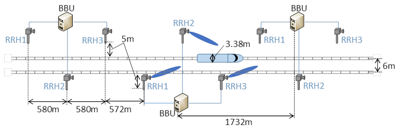

C.2 Performance of studied NR positioning enhancements
------------------------------------------------------

### C.2.1 Positioning accuracy analysis for NR positioning enhancements 

#### C.2.1.1 Results from source \[4\]

##### C.2.1.1.1 Description of evaluation scenarios

The following enhancements are evaluated for accuracy:

\- LOS/NLOS identification

\- PRS/SRS frequency aggregation

\- 1-symbol PRS

\- PRS punctured by SSB

\- AoA with ULA

\- E-CID enhancement

\- Synchronization error compensation

Evaluation assumptions for system level analysis of NR positioning
accuracy enhancements are provided in Tables C.2.1.1.1-1 to Table
C.2.1.1.1-4.

Table C.2.1.1.1-1: NR positioning enhancements (LOS/NLOS identification
31x and PRS/SRS frequency aggregation 32x) - evaluation scenarios and
parameters

+-------+-------+-------+-------+-------+-------+-------+-------+
| Para  | Case  | Case  | Case  | Case  | Case  | Case  | Case  |
| meter | 311   | 312   | 313   | 314   | 321   | 322   | 323   |
|       | (In   | (In   | (In   | (In   | (In   | (In   | (In   |
|       | F-DH, | F-DH, | F-DH, | F-DH, | F-DH, | F-DH, | F-DH, |
|       | FR1)  | FR1)  | FR1)  | FR1)  | FR1)  | FR1)  | FR1)  |
+=======+=======+=======+=======+=======+=======+=======+=======+
| Ch    | I     | I     | I     | I     | I     | I     | I     |
| annel | nF-DH | nF-DH | nF-DH | nF-DH | nF-DH | nF-DH | nF-DH |
| model |       |       |       |       |       |       |       |
| (base | (40%, | (40%, | (40%, | (40%, | (40%, | (40%, | (40%, |
| line, | 2, 2) | 2, 2) | 2, 2) | 2, 2) | 2, 2) | 2, 2) | 2, 2) |
| othe  |       |       |       |       |       |       |       |
| rwise |       |       |       |       |       |       |       |
| state |       |       |       |       |       |       |       |
| any   |       |       |       |       |       |       |       |
| modi  |       |       |       |       |       |       |       |
| ficat |       |       |       |       |       |       |       |
| ions) |       |       |       |       |       |       |       |
+-------+-------+-------+-------+-------+-------+-------+-------+
| Ca    | 3     | 3     | 3     | 3     | 3     | 3     | 3     |
| rrier | .5GHz | .5GHz | .5GHz | .5GHz | .5GHz | .5GHz | .5GHz |
| freq  |       |       |       |       |       |       |       |
| uency |       |       |       |       |       |       |       |
+-------+-------+-------+-------+-------+-------+-------+-------+
| Subca | 30kHz | 30kHz | 30kHz | 30kHz | 30kHz | 30kHz | 30kHz |
| rrier |       |       |       |       |       |       |       |
| sp    |       |       |       |       |       |       |       |
| acing |       |       |       |       |       |       |       |
+-------+-------+-------+-------+-------+-------+-------+-------+
| Refe  | 1     | 1     | 1     | 1     | 1     | 2     | 50    |
| rence | 00MHz | 00MHz | 00MHz | 00MHz | 00MHz | 00MHz | MHz+1 |
| S     |       |       |       |       |       |       | 00MHz |
| ignal |       |       |       |       |       |       | (     |
| Tr    |       |       |       |       |       |       | gap)+ |
| ansmi |       |       |       |       |       |       | 50MHz |
| ssion |       |       |       |       |       |       |       |
| Band  |       |       |       |       |       |       |       |
| width |       |       |       |       |       |       |       |
+-------+-------+-------+-------+-------+-------+-------+-------+
| Refe  | P     | P     | P     | P     | P     | P     | P     |
| rence | osSRS | osSRS | osSRS | osSRS | osSRS | osSRS | osSRS |
| S     | (Co   | (Co   | (Co   | (Co   | (Co   | (Co   | (Co   |
| ignal | mb-4, | mb-4, | mb-4, | mb-4, | mb-4, | mb-4, | mb-4, |
| Phy   | 4     | 4     | 4     | 4     | 4     | 4     | 4     |
| sical | sy    | sy    | sy    | sy    | sy    | sy    | sy    |
| Stru  | mbol) | mbol) | mbol) | mbol) | mbol) | mbol) | mbol) |
| cture |       |       |       |       |       |       |       |
| and   |       |       |       |       |       |       |       |
| Res   |       |       |       |       |       |       |       |
| ource |       |       |       |       |       |       |       |
| Alloc |       |       |       |       |       |       |       |
| ation |       |       |       |       |       |       |       |
| (RE   |       |       |       |       |       |       |       |
| pat   |       |       |       |       |       |       |       |
| tern) |       |       |       |       |       |       |       |
| (refe |       |       |       |       |       |       |       |
| rence |       |       |       |       |       |       |       |
| to    |       |       |       |       |       |       |       |
| f     |       |       |       |       |       |       |       |
| igure |       |       |       |       |       |       |       |
| in    |       |       |       |       |       |       |       |
| con   |       |       |       |       |       |       |       |
| tribu |       |       |       |       |       |       |       |
| tion) |       |       |       |       |       |       |       |
+-------+-------+-------+-------+-------+-------+-------+-------+
| Refe  | ZC,   | ZC,   | ZC,   | ZC,   | ZC,   | ZC,   | ZC,   |
| rence | s     | s     | s     | s     | s     | s     | s     |
| s     | ingle | ingle | ingle | ingle | ingle | ingle | ingle |
| ignal | port  | port  | port  | port  | port  | port  | port  |
|       |       |       |       |       |       |       |       |
| (type |       |       |       |       |       |       |       |
| of    |       |       |       |       |       |       |       |
| sequ  |       |       |       |       |       |       |       |
| ence, |       |       |       |       |       |       |       |
| n     |       |       |       |       |       |       |       |
| umber |       |       |       |       |       |       |       |
| of    |       |       |       |       |       |       |       |
| p     |       |       |       |       |       |       |       |
| orts, |       |       |       |       |       |       |       |
| ...)  |       |       |       |       |       |       |       |
+-------+-------+-------+-------+-------+-------+-------+-------+
| N     | 7     | 7     | 7     | 7     | 7     | 7     | 7     |
| umber |       |       |       |       |       |       |       |
| of    |       |       |       |       |       |       |       |
| sites |       |       |       |       |       |       |       |
+-------+-------+-------+-------+-------+-------+-------+-------+
| N     | 4     | 4     | 4     | 4     | 4     | 4     | 4     |
| umber |       |       |       |       |       |       |       |
| of    |       |       |       |       |       |       |       |
| sy    |       |       |       |       |       |       |       |
| mbols |       |       |       |       |       |       |       |
| used  |       |       |       |       |       |       |       |
| per   |       |       |       |       |       |       |       |
| occ   |       |       |       |       |       |       |       |
| asion |       |       |       |       |       |       |       |
+-------+-------+-------+-------+-------+-------+-------+-------+
| n     | 1     | 1     | 1     | 1     | 1     | 1     | 1     |
| umber |       |       |       |       |       |       |       |
| of    |       |       |       |       |       |       |       |
| occa  |       |       |       |       |       |       |       |
| sions |       |       |       |       |       |       |       |
| used  |       |       |       |       |       |       |       |
| per   |       |       |       |       |       |       |       |
| p     |       |       |       |       |       |       |       |
| ositi |       |       |       |       |       |       |       |
| oning |       |       |       |       |       |       |       |
| est   |       |       |       |       |       |       |       |
| imate |       |       |       |       |       |       |       |
+-------+-------+-------+-------+-------+-------+-------+-------+
| Powe  | 6dB   | 6dB   | 6dB   | 6dB   | 6dB   | 6dB   | 6dB   |
| r-boo |       |       |       |       |       |       |       |
| sting |       |       |       |       |       |       |       |
| level |       |       |       |       |       |       |       |
+-------+-------+-------+-------+-------+-------+-------+-------+
| U     | Not   | Not   | Not   | Not   | Not   | Not   | Not   |
| plink | ap    | ap    | ap    | ap    | ap    | ap    | ap    |
| power | plied | plied | plied | plied | plied | plied | plied |
| co    |       |       |       |       |       |       |       |
| ntrol |       |       |       |       |       |       |       |
| (a    |       |       |       |       |       |       |       |
| pplie |       |       |       |       |       |       |       |
| d/not |       |       |       |       |       |       |       |
| app   |       |       |       |       |       |       |       |
| lied) |       |       |       |       |       |       |       |
+-------+-------+-------+-------+-------+-------+-------+-------+
| in    | Ideal | Ideal | Ideal | Ideal | Ideal | Ideal | Ideal |
| terfe |       |       |       |       |       |       |       |
| rence |       |       |       |       |       |       |       |
| mode  |       |       |       |       |       |       |       |
| lling |       |       |       |       |       |       |       |
| (     |       |       |       |       |       |       |       |
| ideal |       |       |       |       |       |       |       |
| mu    |       |       |       |       |       |       |       |
| ting, |       |       |       |       |       |       |       |
| or    |       |       |       |       |       |       |       |
| o     |       |       |       |       |       |       |       |
| ther) |       |       |       |       |       |       |       |
+-------+-------+-------+-------+-------+-------+-------+-------+
| D     | Super | Super | Super | Super | Super | Super | Super |
| escri | resol | resol | resol | resol | resol | resol | resol |
| ption | ution | ution | ution | ution | ution | ution | ution |
| of    |       |       |       |       |       |       |       |
| M     | No    | RAIM  | LOS   | Ideal | No    | No    | No    |
| easur | LOS   |       | /NLOS | LOS   | LOS   | LOS   | LOS   |
| ement | /NLOS |       | dete  | /NLOS | /NLOS | /NLOS | /NLOS |
| Algo  | dete  |       | ction | dete  | dete  | dete  | dete  |
| rithm | ction |       |       | ction | ction | ction | ction |
| (e.g. |       |       |       |       |       |       |       |
| super |       |       |       |       |       |       |       |
| r     |       |       |       |       |       |       |       |
| esolu |       |       |       |       |       |       |       |
| tion, |       |       |       |       |       |       |       |
| in    |       |       |       |       |       |       |       |
| terfe |       |       |       |       |       |       |       |
| rence |       |       |       |       |       |       |       |
| can   |       |       |       |       |       |       |       |
| cella |       |       |       |       |       |       |       |
| tion, |       |       |       |       |       |       |       |
| ....) |       |       |       |       |       |       |       |
+-------+-------+-------+-------+-------+-------+-------+-------+
| D     | UL    | UL    | UL    | UL    | UL    | UL    | UL    |
| escri | -TDOA | -TDOA | -TDOA | -TDOA | -TDOA | -TDOA | -TDOA |
| ption |       |       |       |       |       |       |       |
| of    | PSO   | PSO   | PSO   | PSO   | PSO   | PSO   | PSO   |
| p     |       |       |       |       |       |       |       |
| ositi |       |       |       |       |       |       |       |
| oning |       |       |       |       |       |       |       |
| tech  |       |       |       |       |       |       |       |
| nique |       |       |       |       |       |       |       |
| /     |       |       |       |       |       |       |       |
| ap    |       |       |       |       |       |       |       |
| plied |       |       |       |       |       |       |       |
| p     |       |       |       |       |       |       |       |
| ositi |       |       |       |       |       |       |       |
| oning |       |       |       |       |       |       |       |
| algo  |       |       |       |       |       |       |       |
| rithm |       |       |       |       |       |       |       |
| (e.g. |       |       |       |       |       |       |       |
| Least |       |       |       |       |       |       |       |
| sq    |       |       |       |       |       |       |       |
| uare, |       |       |       |       |       |       |       |
| T     |       |       |       |       |       |       |       |
| aylor |       |       |       |       |       |       |       |
| se    |       |       |       |       |       |       |       |
| ries, |       |       |       |       |       |       |       |
| etc)  |       |       |       |       |       |       |       |
+-------+-------+-------+-------+-------+-------+-------+-------+
| Ne    | Ideal | Ideal | Ideal | Ideal | Ideal | Ideal | Ideal |
| twork |       |       |       |       |       |       |       |
| synch |       |       |       |       |       |       |       |
| roniz |       |       |       |       |       |       |       |
| ation |       |       |       |       |       |       |       |
| a     |       |       |       |       |       |       |       |
| ssump |       |       |       |       |       |       |       |
| tions |       |       |       |       |       |       |       |
+-------+-------+-------+-------+-------+-------+-------+-------+
| U     | Ideal | Ideal | Ideal | Ideal | Ideal | Ideal | Ideal |
| E/gNB |       |       |       |       |       |       |       |
| T     |       |       |       |       |       |       |       |
| x/Rx\ |       |       |       |       |       |       |       |
| C     |       |       |       |       |       |       |       |
| alibr |       |       |       |       |       |       |       |
| ation |       |       |       |       |       |       |       |
| Error |       |       |       |       |       |       |       |
+-------+-------+-------+-------+-------+-------+-------+-------+
| Be    | Tx    | Tx    | Tx    | Tx    | Tx    | Tx    | Tx    |
| am-re | beam  | beam  | beam  | beam  | beam  | beam  | beam  |
| lated | swe   | swe   | swe   | swe   | swe   | swe   | swe   |
| assum | eping | eping | eping | eping | eping | eping | eping |
| ption |       |       |       |       |       |       |       |
| (beam |       |       |       |       |       |       |       |
| swe   |       |       |       |       |       |       |       |
| eping |       |       |       |       |       |       |       |
| /     |       |       |       |       |       |       |       |
| alig  |       |       |       |       |       |       |       |
| nment |       |       |       |       |       |       |       |
| a     |       |       |       |       |       |       |       |
| ssump |       |       |       |       |       |       |       |
| tions |       |       |       |       |       |       |       |
| at    |       |       |       |       |       |       |       |
| the   |       |       |       |       |       |       |       |
| tx    |       |       |       |       |       |       |       |
| and   |       |       |       |       |       |       |       |
| rx    |       |       |       |       |       |       |       |
| s     |       |       |       |       |       |       |       |
| ides) |       |       |       |       |       |       |       |
+-------+-------+-------+-------+-------+-------+-------+-------+
| Prec  | Tx    | Tx    | Tx    | Tx    | Tx    | Tx    | Tx    |
| oding | code  | code  | code  | code  | code  | code  | code  |
| a     | book- | book- | book- | book- | book- | book- | book- |
| ssump | based | based | based | based | based | based | based |
| tions |       |       |       |       |       |       |       |
| (code |       |       |       |       |       |       |       |
| book, |       |       |       |       |       |       |       |
| nrof  |       |       |       |       |       |       |       |
| an    |       |       |       |       |       |       |       |
| tenna |       |       |       |       |       |       |       |
| ele   |       |       |       |       |       |       |       |
| ments |       |       |       |       |       |       |       |
| used, |       |       |       |       |       |       |       |
| etc)  |       |       |       |       |       |       |       |
+-------+-------+-------+-------+-------+-------+-------+-------+
| Addit |       |       |       |       |       |       |       |
| ional |       |       |       |       |       |       |       |
| n     |       |       |       |       |       |       |       |
| otes, |       |       |       |       |       |       |       |
| if    |       |       |       |       |       |       |       |
| any   |       |       |       |       |       |       |       |
+-------+-------+-------+-------+-------+-------+-------+-------+

Table C.2.1.1.1-2: NR positioning enhancements (1-symbol PRS 33x and PRS
punctured by SSB 34x) - evaluation scenarios and parameters

+---------+---------+---------+---------+---------+---------+---------+
| Pa      | Case    | Case    | Case    | Case    | Case    | Case    |
| rameter | 331     | 332     | 333     | 334     | 341     | 342     |
|         | (       | (       | (       | (       | (       | (       |
|         | InF-SH, | InF-SH, | InF-SH, | InF-SH, | InF-SH, | InF-SH, |
|         | FR1)    | FR1)    | FR1)    | FR1)    | FR1)    | FR1)    |
+=========+=========+=========+=========+=========+=========+=========+
| Channel | InF-SH  | InF-SH  | InF-SH  | InF-SH  | InF-SH  | InF-SH  |
| model   |         |         |         |         |         |         |
| (ba     |         |         |         |         |         |         |
| seline, |         |         |         |         |         |         |
| ot      |         |         |         |         |         |         |
| herwise |         |         |         |         |         |         |
| state   |         |         |         |         |         |         |
| any     |         |         |         |         |         |         |
| modific |         |         |         |         |         |         |
| ations) |         |         |         |         |         |         |
+---------+---------+---------+---------+---------+---------+---------+
| Carrier | 3.5GHz  | 3.5GHz  | 3.5GHz  | 3.5GHz  | 3.5GHz  | 3.5GHz  |
| fr      |         |         |         |         |         |         |
| equency |         |         |         |         |         |         |
+---------+---------+---------+---------+---------+---------+---------+
| Sub     | 30kHz   | 30kHz   | 30kHz   | 30kHz   | 30kHz   | 30kHz   |
| carrier |         |         |         |         |         |         |
| spacing |         |         |         |         |         |         |
+---------+---------+---------+---------+---------+---------+---------+
| Re      | 100MHz  | 100MHz  | 100MHz  | 100MHz  | 100MHz  | 100MHz  |
| ference |         |         |         |         |         |         |
| Signal  |         |         |         |         |         |         |
| Trans   |         |         |         |         |         |         |
| mission |         |         |         |         |         |         |
| Ba      |         |         |         |         |         |         |
| ndwidth |         |         |         |         |         |         |
+---------+---------+---------+---------+---------+---------+---------+
| Re      | DL-PRS  | DL-PRS  | DL-PRS  | DL-PRS  | DL-PRS  | DL-PRS  |
| ference | (       | (       | (C      | (C      | (       | (       |
| Signal  | Comb-4, | Comb-4, | omb-12, | omb-12, | Comb-4, | Comb-4, |
| P       | 4       | 1       | 12      | 1       | 4       | 1       |
| hysical | symbol) | symbol) | symbol) | symbol) | symbol) | symbol) |
| St      |         |         |         |         |         |         |
| ructure |         |         |         |         |         |         |
| and     |         |         |         |         |         |         |
| R       |         |         |         |         |         |         |
| esource |         |         |         |         |         |         |
| All     |         |         |         |         |         |         |
| ocation |         |         |         |         |         |         |
| (RE     |         |         |         |         |         |         |
| p       |         |         |         |         |         |         |
| attern) |         |         |         |         |         |         |
| (re     |         |         |         |         |         |         |
| ference |         |         |         |         |         |         |
| to      |         |         |         |         |         |         |
| figure  |         |         |         |         |         |         |
| in      |         |         |         |         |         |         |
| contri  |         |         |         |         |         |         |
| bution) |         |         |         |         |         |         |
+---------+---------+---------+---------+---------+---------+---------+
| Re      | Gold,   | Gold,   | Gold,   | Gold,   | Gold,   | Gold,   |
| ference | single  | single  | single  | single  | single  | single  |
| signal  | port    | port    | port    | port    | port    | port    |
|         |         |         |         |         |         |         |
| (type   |         |         |         |         |         |         |
| of      |         |         |         |         |         |         |
| se      |         |         |         |         |         |         |
| quence, |         |         |         |         |         |         |
| number  |         |         |         |         |         |         |
| of      |         |         |         |         |         |         |
| ports,  |         |         |         |         |         |         |
| ...)    |         |         |         |         |         |         |
+---------+---------+---------+---------+---------+---------+---------+
| Number  | 7       | 7       | 7       | 7       | 7       | 7       |
| of      |         |         |         |         |         |         |
| sites   |         |         |         |         |         |         |
+---------+---------+---------+---------+---------+---------+---------+
| Number  | 4       | 4       | 4       | 4       | 4       | 4       |
| of      |         |         |         |         |         |         |
| symbols |         |         |         |         |         |         |
| used    |         |         |         |         |         |         |
| per     |         |         |         |         |         |         |
| o       |         |         |         |         |         |         |
| ccasion |         |         |         |         |         |         |
+---------+---------+---------+---------+---------+---------+---------+
| number  | 1       | 1       | 1       | 1       | 1       | 1       |
| of      |         |         |         |         |         |         |
| oc      |         |         |         |         |         |         |
| casions |         |         |         |         |         |         |
| used    |         |         |         |         |         |         |
| per     |         |         |         |         |         |         |
| posi    |         |         |         |         |         |         |
| tioning |         |         |         |         |         |         |
| e       |         |         |         |         |         |         |
| stimate |         |         |         |         |         |         |
+---------+---------+---------+---------+---------+---------+---------+
| Power-b | 6dB     | 6dB     | 10.8dB  | 10.8dB  | 6dB     | 6dB     |
| oosting |         |         |         |         |         |         |
| level   |         |         |         |         |         |         |
+---------+---------+---------+---------+---------+---------+---------+
| Uplink  | Not     | Not     | Not     | Not     | Not     | Not     |
| power   | applied | applied | applied | applied | applied | applied |
| control |         |         |         |         |         |         |
| (appl   |         |         |         |         |         |         |
| ied/not |         |         |         |         |         |         |
| a       |         |         |         |         |         |         |
| pplied) |         |         |         |         |         |         |
+---------+---------+---------+---------+---------+---------+---------+
| inter   | Ideal   | Ideal   | Ideal   | Ideal   | Ideal   | Ideal   |
| ference |         |         |         |         |         |         |
| mo      |         |         |         |         |         |         |
| delling |         |         |         |         |         |         |
| (ideal  |         |         |         |         |         |         |
| muting, |         |         |         |         |         |         |
| or      |         |         |         |         |         |         |
| other)  |         |         |         |         |         |         |
+---------+---------+---------+---------+---------+---------+---------+
| Desc    | Super   | Super   | Super   | Super   | Super   | Super   |
| ription | res     | res     | res     | res     | res     | res     |
| of      | olution | olution | olution | olution | olution | olution |
| Meas    |         |         |         |         |         |         |
| urement | Ideal   | Ideal   | Ideal   | Ideal   | Ideal   | Ideal   |
| Al      | L       | L       | L       | L       | L       | L       |
| gorithm | OS/NLOS | OS/NLOS | OS/NLOS | OS/NLOS | OS/NLOS | OS/NLOS |
| (e.g.   | de      | de      | de      | de      | de      | de      |
| super   | tection | tection | tection | tection | tection | tection |
| reso    |         |         |         |         |         |         |
| lution, |         |         |         |         |         |         |
| inter   |         |         |         |         |         |         |
| ference |         |         |         |         |         |         |
| cancel  |         |         |         |         |         |         |
| lation, |         |         |         |         |         |         |
| ....)   |         |         |         |         |         |         |
+---------+---------+---------+---------+---------+---------+---------+
| Desc    | DL-TDOA | DL-TDOA | DL-TDOA | DL-TDOA | DL-TDOA | DL-TDOA |
| ription |         |         |         |         |         |         |
| of      | PSO     | PSO     | PSO     | PSO     | PSO     | PSO     |
| posi    |         |         |         |         |         |         |
| tioning |         |         |         |         |         |         |
| te      |         |         |         |         |         |         |
| chnique |         |         |         |         |         |         |
| /       |         |         |         |         |         |         |
| applied |         |         |         |         |         |         |
| posi    |         |         |         |         |         |         |
| tioning |         |         |         |         |         |         |
| al      |         |         |         |         |         |         |
| gorithm |         |         |         |         |         |         |
| (e.g.   |         |         |         |         |         |         |
| Least   |         |         |         |         |         |         |
| square, |         |         |         |         |         |         |
| Taylor  |         |         |         |         |         |         |
| series, |         |         |         |         |         |         |
| etc)    |         |         |         |         |         |         |
+---------+---------+---------+---------+---------+---------+---------+
| Network | Ideal   | Ideal   | Ideal   | Ideal   | Ideal   | Ideal   |
| s       |         |         |         |         |         |         |
| ynchron |         |         |         |         |         |         |
| ization |         |         |         |         |         |         |
| assu    |         |         |         |         |         |         |
| mptions |         |         |         |         |         |         |
+---------+---------+---------+---------+---------+---------+---------+
| UE/gNB  | Ideal   | Ideal   | Ideal   | Ideal   | Ideal   | Ideal   |
| Tx/Rx\  |         |         |         |         |         |         |
| Cali    |         |         |         |         |         |         |
| bration |         |         |         |         |         |         |
| Error   |         |         |         |         |         |         |
+---------+---------+---------+---------+---------+---------+---------+
| Beam-   | Tx beam | Tx beam | Tx beam | Tx beam | Tx beam | Tx beam |
| related | s       | s       | s       | s       | s       | s       |
| ass     | weeping | weeping | weeping | weeping | weeping | weeping |
| umption |         |         |         |         |         |         |
| (beam   |         |         |         |         |         |         |
| s       |         |         |         |         |         |         |
| weeping |         |         |         |         |         |         |
| /       |         |         |         |         |         |         |
| al      |         |         |         |         |         |         |
| ignment |         |         |         |         |         |         |
| assu    |         |         |         |         |         |         |
| mptions |         |         |         |         |         |         |
| at the  |         |         |         |         |         |         |
| tx and  |         |         |         |         |         |         |
| rx      |         |         |         |         |         |         |
| sides)  |         |         |         |         |         |         |
+---------+---------+---------+---------+---------+---------+---------+
| Pr      | Tx      | Tx      | Tx      | Tx      | Tx      | Tx      |
| ecoding | codeboo | codeboo | codeboo | codeboo | codeboo | codeboo |
| assu    | k-based | k-based | k-based | k-based | k-based | k-based |
| mptions |         |         |         |         |         |         |
| (co     |         |         |         |         |         |         |
| debook, |         |         |         |         |         |         |
| nrof    |         |         |         |         |         |         |
| antenna |         |         |         |         |         |         |
| e       |         |         |         |         |         |         |
| lements |         |         |         |         |         |         |
| used,   |         |         |         |         |         |         |
| etc)    |         |         |         |         |         |         |
+---------+---------+---------+---------+---------+---------+---------+
| Add     |         |         |         |         |         | PRS     |
| itional |         |         |         |         |         | center  |
| notes,  |         |         |         |         |         | 20RBs   |
| if any  |         |         |         |         |         | are     |
|         |         |         |         |         |         | pu      |
|         |         |         |         |         |         | nctured |
|         |         |         |         |         |         | by SSB  |
+---------+---------+---------+---------+---------+---------+---------+

Table C.2.1.1.1-3: Rel.16 NR positioning (UL-AoA enhancement with ULA
36x and E-CID enhancement 37x) - evaluation scenarios and parameters

+----------+----------+----------+----------+----------+----------+
| P        | Case 361 | Case 362 | Case 363 | Case 371 | Case 372 |
| arameter | (InF-DH, | (InF-DH, | (InF-DH, | (InF-DH, | (InF-DH, |
|          | FR1)     | FR1)     | FR1)     | FR1)     | FR1)     |
+==========+==========+==========+==========+==========+==========+
| Channel  | InF-DH   | InF-DH   | InF-DH   | InF-DH   | InF-DH   |
| model    |          |          |          |          |          |
| (b       | (40%, 2, | (40%, 2, | (40%, 2, | (40%, 2, | (40%, 2, |
| aseline, | 2)       | 2)       | 2)       | 2)       | 2)       |
| o        |          |          |          |          |          |
| therwise |          |          |          |          |          |
| state    |          |          |          |          |          |
| any      |          |          |          |          |          |
| modifi   |          |          |          |          |          |
| cations) |          |          |          |          |          |
+----------+----------+----------+----------+----------+----------+
| Carrier  | 3.5GHz   | 3.5GHz   | 3.5GHz   | 3.5GHz   | 3.5GHz   |
| f        |          |          |          |          |          |
| requency |          |          |          |          |          |
+----------+----------+----------+----------+----------+----------+
| Su       | 30kHz    | 30kHz    | 30kHz    | 30kHz    | 30kHz    |
| bcarrier |          |          |          |          |          |
| spacing  |          |          |          |          |          |
+----------+----------+----------+----------+----------+----------+
| R        | 100MHz   | 100MHz   | 100MHz   | 100MHz   | 100MHz   |
| eference |          |          |          |          |          |
| Signal   |          |          |          |          |          |
| Tran     |          |          |          |          |          |
| smission |          |          |          |          |          |
| B        |          |          |          |          |          |
| andwidth |          |          |          |          |          |
+----------+----------+----------+----------+----------+----------+
| R        | PosSRS   | PosSRS   | PosSRS   | DL-PR    | CS       |
| eference | (Comb-4, | (Comb-4, | (Comb-4, | S+PosSRS | I-RS+SRS |
| Signal   | 4        | 4        | 4        | (Comb-4, | (Comb-4, |
| Physical | symbol)  | symbol)  | symbol)  | 4        | 4        |
| S        |          |          |          | symbol)  | symbol)  |
| tructure |          |          |          |          |          |
| and      |          |          |          |          |          |
| Resource |          |          |          |          |          |
| Al       |          |          |          |          |          |
| location |          |          |          |          |          |
| (RE      |          |          |          |          |          |
| pattern) |          |          |          |          |          |
| (r       |          |          |          |          |          |
| eference |          |          |          |          |          |
| to       |          |          |          |          |          |
| figure   |          |          |          |          |          |
| in       |          |          |          |          |          |
| contr    |          |          |          |          |          |
| ibution) |          |          |          |          |          |
+----------+----------+----------+----------+----------+----------+
| R        | ZC,      | ZC,      | ZC,      | Gold/ZC, | Gold/ZC, |
| eference | single   | single   | single   | single   | single   |
| signal   | port     | port     | port     | port     | port     |
|          |          |          |          |          |          |
| (type of |          |          |          |          |          |
| s        |          |          |          |          |          |
| equence, |          |          |          |          |          |
| number   |          |          |          |          |          |
| of       |          |          |          |          |          |
| ports,   |          |          |          |          |          |
| ...)     |          |          |          |          |          |
+----------+----------+----------+----------+----------+----------+
| Number   | 7        | 7        | 7        | 7        | 1        |
| of sites |          |          |          |          |          |
+----------+----------+----------+----------+----------+----------+
| Number   | 4        | 4        | 4        | 4        | 4        |
| of       |          |          |          |          |          |
| symbols  |          |          |          |          |          |
| used per |          |          |          |          |          |
| occasion |          |          |          |          |          |
+----------+----------+----------+----------+----------+----------+
| number   | 1        | 1        | 1        | 1        | 1        |
| of       |          |          |          |          |          |
| o        |          |          |          |          |          |
| ccasions |          |          |          |          |          |
| used per |          |          |          |          |          |
| pos      |          |          |          |          |          |
| itioning |          |          |          |          |          |
| estimate |          |          |          |          |          |
+----------+----------+----------+----------+----------+----------+
| Power-   | 6dB      | 6dB      | 6dB      | 6dB      | 6dB      |
| boosting |          |          |          |          |          |
| level    |          |          |          |          |          |
+----------+----------+----------+----------+----------+----------+
| Uplink   | Not      | Not      | Not      | Not      | Not      |
| power    | applied  | applied  | applied  | applied  | applied  |
| control  |          |          |          |          |          |
| (app     |          |          |          |          |          |
| lied/not |          |          |          |          |          |
| applied) |          |          |          |          |          |
+----------+----------+----------+----------+----------+----------+
| inte     | Ideal    | Ideal    | Ideal    | Ideal    | Ideal    |
| rference |          |          |          |          |          |
| m        |          |          |          |          |          |
| odelling |          |          |          |          |          |
| (ideal   |          |          |          |          |          |
| muting,  |          |          |          |          |          |
| or       |          |          |          |          |          |
| other)   |          |          |          |          |          |
+----------+----------+----------+----------+----------+----------+
| Des      | Super    | Super    | Super    | Super    | Super    |
| cription | re       | re       | re       | re       | re       |
| of       | solution | solution | solution | solution | solution |
| Mea      |          |          |          |          |          |
| surement | Ideal    | Ideal    | Ideal    | Ideal    | Ideal    |
| A        | LOS/NLOS | LOS/NLOS | LOS/NLOS | LOS/NLOS | LOS/NLOS |
| lgorithm | d        | d        | d        | d        | d        |
| (e.g.    | etection | etection | etection | etection | etection |
| super    |          |          |          |          |          |
| res      |          |          |          |          |          |
| olution, |          |          |          |          |          |
| inte     |          |          |          |          |          |
| rference |          |          |          |          |          |
| cance    |          |          |          |          |          |
| llation, |          |          |          |          |          |
| ....)    |          |          |          |          |          |
+----------+----------+----------+----------+----------+----------+
| Des      | UL-TDO   | UL-TDO   | UL-TDO   | M        | E-CID    |
| cription | A+UL-AoA | A+UL-AoA | A+UL-AoA | ulti-RTT | (RTT+AoA |
| of       |          |          |          |          | only     |
| pos      | PSO      | PSO      | PSO      | PSO      | from the |
| itioning |          |          |          |          | serving  |
| t        |          |          |          |          | cell)    |
| echnique |          |          |          |          |          |
| /        |          |          |          |          |          |
| applied  |          |          |          |          |          |
| pos      |          |          |          |          |          |
| itioning |          |          |          |          |          |
| a        |          |          |          |          |          |
| lgorithm |          |          |          |          |          |
| (e.g.    |          |          |          |          |          |
| Least    |          |          |          |          |          |
| square,  |          |          |          |          |          |
| Taylor   |          |          |          |          |          |
| series,  |          |          |          |          |          |
| etc)     |          |          |          |          |          |
+----------+----------+----------+----------+----------+----------+
| Network  | Ideal    | Ideal    | Ideal    | Ideal    | Ideal    |
| synchro  |          |          |          |          |          |
| nization |          |          |          |          |          |
| ass      |          |          |          |          |          |
| umptions |          |          |          |          |          |
+----------+----------+----------+----------+----------+----------+
| UE/gNB   | Ideal    | Ideal    | Ideal    | Ideal    | Ideal    |
| Tx/Rx\   |          |          |          |          |          |
| Cal      |          |          |          |          |          |
| ibration |          |          |          |          |          |
| Error    |          |          |          |          |          |
+----------+----------+----------+----------+----------+----------+
| Beam     | Tx beam  | Tx beam  | Tx beam  | Tx beam  | Tx beam  |
| -related | sweeping | sweeping | sweeping | sweeping | sweeping |
| as       |          |          |          |          |          |
| sumption |          |          |          |          |          |
| (beam    |          |          |          |          |          |
| sweeping |          |          |          |          |          |
| /        |          |          |          |          |          |
| a        |          |          |          |          |          |
| lignment |          |          |          |          |          |
| ass      |          |          |          |          |          |
| umptions |          |          |          |          |          |
| at the   |          |          |          |          |          |
| tx and   |          |          |          |          |          |
| rx       |          |          |          |          |          |
| sides)   |          |          |          |          |          |
+----------+----------+----------+----------+----------+----------+
| P        | Tx       | Tx       | Tx       | Tx       | Tx       |
| recoding | codebo   | codebo   | codebo   | codebo   | codebo   |
| ass      | ok-based | ok-based | ok-based | ok-based | ok-based |
| umptions |          |          |          |          |          |
| (c       |          |          |          |          |          |
| odebook, |          |          |          |          |          |
| nrof     |          |          |          |          |          |
| antenna  |          |          |          |          |          |
| elements |          |          |          |          |          |
| used,    |          |          |          |          |          |
| etc)     |          |          |          |          |          |
+----------+----------+----------+----------+----------+----------+
| Ad       | UPA      | ULA      | ULA      |          |          |
| ditional | 4x4x2    | 1x4x1    | 1x4x1    |          |          |
| notes,   |          | assuming | with     |          |          |
| if any   |          | legacy   | modified |          |          |
|          |          | AoA      | AoA      |          |          |
+----------+----------+----------+----------+----------+----------+

Table C.2.1.1.1-4: NR positioning enhancements (Synchronization error
compensation) - evaluation scenarios and parameters

+-------+-------+-------+-------+-------+-------+-------+-------+-------+
| Para  | Case  | Case  | Case  | Case  | Case  | Case  | Case  | Case  |
| meter | 381   | 382   | 383   | 384   | 385   | 386   | 387   | 388   |
|       | (In   | (In   | (In   | (In   | (In   | (In   | (In   | (In   |
|       | F-SH, | F-SH, | F-SH, | F-SH, | F-SH, | F-SH, | F-SH, | F-SH, |
|       | FR1)  | FR1)  | FR1)  | FR1)  | FR1)  | FR1)  | FR1)  | FR1)  |
+=======+=======+=======+=======+=======+=======+=======+=======+=======+
| Ch    | I     | I     | I     | I     | I     | I     | I     | I     |
| annel | nF-SH | nF-SH | nF-SH | nF-SH | nF-SH | nF-SH | nF-SH | nF-SH |
| model |       |       |       |       |       |       |       |       |
| (base |       |       |       |       |       |       |       |       |
| line, |       |       |       |       |       |       |       |       |
| othe  |       |       |       |       |       |       |       |       |
| rwise |       |       |       |       |       |       |       |       |
| state |       |       |       |       |       |       |       |       |
| any   |       |       |       |       |       |       |       |       |
| modi  |       |       |       |       |       |       |       |       |
| ficat |       |       |       |       |       |       |       |       |
| ions) |       |       |       |       |       |       |       |       |
+-------+-------+-------+-------+-------+-------+-------+-------+-------+
| Ca    | 3     | 3     | 3     | 3     | 3     | 3     | 3     | 3     |
| rrier | .5GHz | .5GHz | .5GHz | .5GHz | .5GHz | .5GHz | .5GHz | .5GHz |
| freq  |       |       |       |       |       |       |       |       |
| uency |       |       |       |       |       |       |       |       |
+-------+-------+-------+-------+-------+-------+-------+-------+-------+
| Subca | 30kHz | 30kHz | 30kHz | 30kHz | 30kHz | 30kHz | 30kHz | 30kHz |
| rrier |       |       |       |       |       |       |       |       |
| sp    |       |       |       |       |       |       |       |       |
| acing |       |       |       |       |       |       |       |       |
+-------+-------+-------+-------+-------+-------+-------+-------+-------+
| Refe  | 1     | 1     | 1     | 1     | 1     | 1     | 1     | 1     |
| rence | 00MHz | 00MHz | 00MHz | 00MHz | 00MHz | 00MHz | 00MHz | 00MHz |
| S     |       |       |       |       |       |       |       |       |
| ignal |       |       |       |       |       |       |       |       |
| Tr    |       |       |       |       |       |       |       |       |
| ansmi |       |       |       |       |       |       |       |       |
| ssion |       |       |       |       |       |       |       |       |
| Band  |       |       |       |       |       |       |       |       |
| width |       |       |       |       |       |       |       |       |
+-------+-------+-------+-------+-------+-------+-------+-------+-------+
| Refe  | P     | P     | P     | P     | P     | P     | P     | P     |
| rence | osSRS | osSRS | osSRS | osSRS | osSRS | osSRS | osSRS | osSRS |
| S     | (Co   | (Co   | (Co   | (Co   | (Co   | (Co   | (Co   | (Co   |
| ignal | mb-4, | mb-4, | mb-4, | mb-4, | mb-4, | mb-4, | mb-4, | mb-4, |
| Phy   | 4     | 4     | 4     | 4     | 4     | 4     | 4     | 4     |
| sical | sy    | sy    | sy    | sy    | sy    | sy    | sy    | sy    |
| Stru  | mbol) | mbol) | mbol) | mbol) | mbol) | mbol) | mbol) | mbol) |
| cture |       |       |       |       |       |       |       |       |
| and   |       |       |       |       |       |       |       |       |
| Res   |       |       |       |       |       |       |       |       |
| ource |       |       |       |       |       |       |       |       |
| Alloc |       |       |       |       |       |       |       |       |
| ation |       |       |       |       |       |       |       |       |
| (RE   |       |       |       |       |       |       |       |       |
| pat   |       |       |       |       |       |       |       |       |
| tern) |       |       |       |       |       |       |       |       |
| (refe |       |       |       |       |       |       |       |       |
| rence |       |       |       |       |       |       |       |       |
| to    |       |       |       |       |       |       |       |       |
| f     |       |       |       |       |       |       |       |       |
| igure |       |       |       |       |       |       |       |       |
| in    |       |       |       |       |       |       |       |       |
| con   |       |       |       |       |       |       |       |       |
| tribu |       |       |       |       |       |       |       |       |
| tion) |       |       |       |       |       |       |       |       |
+-------+-------+-------+-------+-------+-------+-------+-------+-------+
| Refe  | ZC,   | ZC,   | ZC,   | ZC,   | ZC,   | ZC,   | ZC,   | ZC,   |
| rence | s     | s     | s     | s     | s     | s     | s     | s     |
| s     | ingle | ingle | ingle | ingle | ingle | ingle | ingle | ingle |
| ignal | port  | port  | port  | port  | port  | port  | port  | port  |
|       |       |       |       |       |       |       |       |       |
| (type |       |       |       |       |       |       |       |       |
| of    |       |       |       |       |       |       |       |       |
| sequ  |       |       |       |       |       |       |       |       |
| ence, |       |       |       |       |       |       |       |       |
| n     |       |       |       |       |       |       |       |       |
| umber |       |       |       |       |       |       |       |       |
| of    |       |       |       |       |       |       |       |       |
| p     |       |       |       |       |       |       |       |       |
| orts, |       |       |       |       |       |       |       |       |
| ...)  |       |       |       |       |       |       |       |       |
+-------+-------+-------+-------+-------+-------+-------+-------+-------+
| N     | 7     | 7     | 7     | 7     | 7     | 7     | 7     | 7     |
| umber |       |       |       |       |       |       |       |       |
| of    |       |       |       |       |       |       |       |       |
| sites |       |       |       |       |       |       |       |       |
+-------+-------+-------+-------+-------+-------+-------+-------+-------+
| N     | 4     | 4     | 4     | 4     | 4     | 4     | 4     | 4     |
| umber |       |       |       |       |       |       |       |       |
| of    |       |       |       |       |       |       |       |       |
| sy    |       |       |       |       |       |       |       |       |
| mbols |       |       |       |       |       |       |       |       |
| used  |       |       |       |       |       |       |       |       |
| per   |       |       |       |       |       |       |       |       |
| occ   |       |       |       |       |       |       |       |       |
| asion |       |       |       |       |       |       |       |       |
+-------+-------+-------+-------+-------+-------+-------+-------+-------+
| n     | 1     | 1     | 1     | 1     | 1     | 1     | 1     | 1     |
| umber |       |       |       |       |       |       |       |       |
| of    |       |       |       |       |       |       |       |       |
| occa  |       |       |       |       |       |       |       |       |
| sions |       |       |       |       |       |       |       |       |
| used  |       |       |       |       |       |       |       |       |
| per   |       |       |       |       |       |       |       |       |
| p     |       |       |       |       |       |       |       |       |
| ositi |       |       |       |       |       |       |       |       |
| oning |       |       |       |       |       |       |       |       |
| est   |       |       |       |       |       |       |       |       |
| imate |       |       |       |       |       |       |       |       |
+-------+-------+-------+-------+-------+-------+-------+-------+-------+
| Powe  | 6dB   | 6dB   | 6dB   | 6dB   | 6dB   | 6dB   | 6dB   | 6dB   |
| r-boo |       |       |       |       |       |       |       |       |
| sting |       |       |       |       |       |       |       |       |
| level |       |       |       |       |       |       |       |       |
+-------+-------+-------+-------+-------+-------+-------+-------+-------+
| U     | Not   | Not   | Not   | Not   | Not   | Not   | Not   | Not   |
| plink | ap    | ap    | ap    | ap    | ap    | ap    | ap    | ap    |
| power | plied | plied | plied | plied | plied | plied | plied | plied |
| co    |       |       |       |       |       |       |       |       |
| ntrol |       |       |       |       |       |       |       |       |
| (a    |       |       |       |       |       |       |       |       |
| pplie |       |       |       |       |       |       |       |       |
| d/not |       |       |       |       |       |       |       |       |
| app   |       |       |       |       |       |       |       |       |
| lied) |       |       |       |       |       |       |       |       |
+-------+-------+-------+-------+-------+-------+-------+-------+-------+
| in    | Ideal | Ideal | Ideal | Ideal | Ideal | Ideal | Ideal | Ideal |
| terfe |       |       |       |       |       |       |       |       |
| rence |       |       |       |       |       |       |       |       |
| mode  |       |       |       |       |       |       |       |       |
| lling |       |       |       |       |       |       |       |       |
| (     |       |       |       |       |       |       |       |       |
| ideal |       |       |       |       |       |       |       |       |
| mu    |       |       |       |       |       |       |       |       |
| ting, |       |       |       |       |       |       |       |       |
| or    |       |       |       |       |       |       |       |       |
| o     |       |       |       |       |       |       |       |       |
| ther) |       |       |       |       |       |       |       |       |
+-------+-------+-------+-------+-------+-------+-------+-------+-------+
| D     | Super | Super | Super | Super | Super | Super | Super | Super |
| escri | resol | resol | resol | resol | resol | resol | resol | resol |
| ption | ution | ution | ution | ution | ution | ution | ution | ution |
| of    |       |       |       |       |       |       |       |       |
| M     | Ideal | Ideal | Ideal | Ideal | Ideal | Ideal | Ideal | Ideal |
| easur | LOS   | LOS   | LOS   | LOS   | LOS   | LOS   | LOS   | LOS   |
| ement | /NLOS | /NLOS | /NLOS | /NLOS | /NLOS | /NLOS | /NLOS | /NLOS |
| Algo  | dete  | dete  | dete  | dete  | dete  | dete  | dete  | dete  |
| rithm | ction | ction | ction | ction | ction | ction | ction | ction |
| (e.g. |       |       |       |       |       |       |       |       |
| super |       |       |       |       |       |       |       |       |
| r     |       |       |       |       |       |       |       |       |
| esolu |       |       |       |       |       |       |       |       |
| tion, |       |       |       |       |       |       |       |       |
| in    |       |       |       |       |       |       |       |       |
| terfe |       |       |       |       |       |       |       |       |
| rence |       |       |       |       |       |       |       |       |
| can   |       |       |       |       |       |       |       |       |
| cella |       |       |       |       |       |       |       |       |
| tion, |       |       |       |       |       |       |       |       |
| ....) |       |       |       |       |       |       |       |       |
+-------+-------+-------+-------+-------+-------+-------+-------+-------+
| D     | UL    | UL    | UL    | UL    | UL    | UL    | UL    | UL    |
| escri | -TDOA | -TDOA | -TDOA | -TDOA | -TDOA | -TDOA | -TDOA | -TDOA |
| ption |       |       |       |       |       |       |       |       |
| of    | PSO   | PSO   | PSO   | PSO   | PSO   | PSO   | PSO   | PSO   |
| p     |       |       |       |       |       |       |       |       |
| ositi |       |       |       |       |       |       |       |       |
| oning |       |       |       |       |       |       |       |       |
| tech  |       |       |       |       |       |       |       |       |
| nique |       |       |       |       |       |       |       |       |
| /     |       |       |       |       |       |       |       |       |
| ap    |       |       |       |       |       |       |       |       |
| plied |       |       |       |       |       |       |       |       |
| p     |       |       |       |       |       |       |       |       |
| ositi |       |       |       |       |       |       |       |       |
| oning |       |       |       |       |       |       |       |       |
| algo  |       |       |       |       |       |       |       |       |
| rithm |       |       |       |       |       |       |       |       |
| (e.g. |       |       |       |       |       |       |       |       |
| Least |       |       |       |       |       |       |       |       |
| sq    |       |       |       |       |       |       |       |       |
| uare, |       |       |       |       |       |       |       |       |
| T     |       |       |       |       |       |       |       |       |
| aylor |       |       |       |       |       |       |       |       |
| se    |       |       |       |       |       |       |       |       |
| ries, |       |       |       |       |       |       |       |       |
| etc)  |       |       |       |       |       |       |       |       |
+-------+-------+-------+-------+-------+-------+-------+-------+-------+
| Ne    | 0ns   | 0.2ns | 0.5ns | 1ns   | 0ns   | 0.2ns | 0.5ns | 1ns   |
| twork |       |       |       |       |       |       |       |       |
| synch |       |       |       |       |       |       |       |       |
| roniz |       |       |       |       |       |       |       |       |
| ation |       |       |       |       |       |       |       |       |
| a     |       |       |       |       |       |       |       |       |
| ssump |       |       |       |       |       |       |       |       |
| tions |       |       |       |       |       |       |       |       |
+-------+-------+-------+-------+-------+-------+-------+-------+-------+
| U     | Ideal | Ideal | Ideal | Ideal | Ideal | Ideal | Ideal | Ideal |
| E/gNB |       |       |       |       |       |       |       |       |
| T     |       |       |       |       |       |       |       |       |
| x/Rx\ |       |       |       |       |       |       |       |       |
| C     |       |       |       |       |       |       |       |       |
| alibr |       |       |       |       |       |       |       |       |
| ation |       |       |       |       |       |       |       |       |
| Error |       |       |       |       |       |       |       |       |
+-------+-------+-------+-------+-------+-------+-------+-------+-------+
| Be    | Tx    | Tx    | Tx    | Tx    | Tx    | Tx    | Tx    | Tx    |
| am-re | beam  | beam  | beam  | beam  | beam  | beam  | beam  | beam  |
| lated | swe   | swe   | swe   | swe   | swe   | swe   | swe   | swe   |
| assum | eping | eping | eping | eping | eping | eping | eping | eping |
| ption |       |       |       |       |       |       |       |       |
| (beam |       |       |       |       |       |       |       |       |
| swe   |       |       |       |       |       |       |       |       |
| eping |       |       |       |       |       |       |       |       |
| /     |       |       |       |       |       |       |       |       |
| alig  |       |       |       |       |       |       |       |       |
| nment |       |       |       |       |       |       |       |       |
| a     |       |       |       |       |       |       |       |       |
| ssump |       |       |       |       |       |       |       |       |
| tions |       |       |       |       |       |       |       |       |
| at    |       |       |       |       |       |       |       |       |
| the   |       |       |       |       |       |       |       |       |
| tx    |       |       |       |       |       |       |       |       |
| and   |       |       |       |       |       |       |       |       |
| rx    |       |       |       |       |       |       |       |       |
| s     |       |       |       |       |       |       |       |       |
| ides) |       |       |       |       |       |       |       |       |
+-------+-------+-------+-------+-------+-------+-------+-------+-------+
| Prec  | Tx    | Tx    | Tx    | Tx    | Tx    | Tx    | Tx    | Tx    |
| oding | code  | code  | code  | code  | code  | code  | code  | code  |
| a     | book- | book- | book- | book- | book- | book- | book- | book- |
| ssump | based | based | based | based | based | based | based | based |
| tions |       |       |       |       |       |       |       |       |
| (code |       |       |       |       |       |       |       |       |
| book, |       |       |       |       |       |       |       |       |
| nrof  |       |       |       |       |       |       |       |       |
| an    |       |       |       |       |       |       |       |       |
| tenna |       |       |       |       |       |       |       |       |
| ele   |       |       |       |       |       |       |       |       |
| ments |       |       |       |       |       |       |       |       |
| used, |       |       |       |       |       |       |       |       |
| etc)  |       |       |       |       |       |       |       |       |
+-------+-------+-------+-------+-------+-------+-------+-------+-------+
| Addit | 1     | 1     | 1     | 1     | 2     | 2     | 2     | 2     |
| ional | 00MHz | 00MHz | 00MHz | 00MHz | 00MHz | 00MHz | 00MHz | 00MHz |
| n     | conti | conti | conti | conti | conti | conti | conti | conti |
| otes, | guous | guous | guous | guous | guous | guous | guous | guous |
| if    |       |       |       |       |       |       |       |       |
| any   |       |       |       |       |       |       |       |       |
+-------+-------+-------+-------+-------+-------+-------+-------+-------+

##### C.2.1.1.2 Positioning accuracy evaluation results for NR positioning enhancements

Evaluation results of horizontal location error for NR positioning
enhancements are provided in Table C.2.1.1.2-1:

Table C.2.1.1.2-1: NR positioning enhancements - horizontal location
error results from \[4\]

  Features                             Cases                                                                            50%      67%      80%      90%
  ------------------------------------ ----------------------------------------------------------- -------------------- -------- -------- -------- --------
  LOS/NLOS identification              311, InF-DH422, FR1, UL-TDOA                                (Optional) All UEs   0.4309   1.6317   4.9693   9.9453
                                                                                                   Convex UEs           0.3354   1.2393   4.6237   9.6631
                                       312, InF-DH422, FR1, UL-TDOA w/ RAIM                        (Optional) All UEs   0.0371   0.0748   0.1912   1.4517
                                                                                                   Convex UEs           0.0301   0.0554   0.1217   0.6569
                                       313, InF-DH422, FR1, UL-TDOA w/ LOS/NLOS identification     (Optional) All UEs   0.0397   0.0701   0.1354   0.4836
                                                                                                   Convex UEs           0.0311   0.0505   0.0862   0.2111
                                       314, InF-DH422, FR1, UL-TDOA w/ ideal LOS selection         (Optional) All UEs   0.0394   0.0608   0.1399   0.4452
                                                                                                   Convex UEs           0.0310   0.0506   0.0855   0.2022
  PRS/SRS frequency aggregation        321, InF-DH422, FR1, UL-TDOA, 100M contiguous               (Optional) All UEs   0.0394   0.0608   0.1399   0.4452
                                                                                                   Convex UEs           0.0310   0.0506   0.0855   0.2022
                                       322, InF-DH422, FR1, UL-TDOA, 200M contiguous               (Optional) All UEs   0.0106   0.0179   0.0332   0.0827
                                                                                                   Convex UEs           0.0082   0.0122   0.0197   0.0384
                                       323, InF-DH422, FR1, UL-TDOA, 50MHz+100MHz (Gap)+50MHz      (Optional) All UEs   0.0148   0.0273   0.0570   0.2244
                                                                                                   Convex UEs           0.0109   0.0189   0.0337   0.0912
  1-symbol PRS                         331, InF-SH, FR1, DL-TDOA, Comb-4 and 4-symbol              (Optional) All UEs   0.0252   0.0425   0.0718   0.1531
                                                                                                   Convex UEs           0.0196   0.0314   0.0504   0.0939
                                       332, InF-SH, FR1, DL-TDOA, Comb-4 and 1-symbol              (Optional) All UEs   0.0268   0.0473   0.0836   0.1693
                                                                                                   Convex UEs           0.0210   0.0347   0.0567   0.1123
                                       333, InF-SH, FR1, DL-TDOA, Comb-12 and 12-symbol            (Optional) All UEs   0.0279   0.0492   0.0835   0.1647
                                                                                                   Convex UEs           0.0219   0.0347   0.0573   0.1091
                                       334, InF-SH, FR1, DL-TDOA, Comb-12 and 1-symbol             (Optional) All UEs   0.0284   0.0484   0.0866   0.1784
                                                                                                   Convex UEs           0.0209   0.0359   0.0595   0.1199
  PRS punctured by SSB                 341, InF-SH, FR1, DL-TDOA                                   (Optional) All UEs   0.0252   0.0425   0.0718   0.1531
                                                                                                   Convex UEs           0.0196   0.0314   0.0504   0.0939
                                       342, InF-SH, FR1, DL-TDOA, 20-RB of PRS punctured by SSB    (Optional) All UEs   0.0293   0.0475   0.0846   0.1699
                                                                                                   Convex UEs           0.0213   0.0346   0.0539   0.1090
  UL-AoA enhancement with ULA          361, InF-DH422, FR1, UL-TDOA/AoA                            (Optional) All UEs   0.0216   0.0318   0.0460   0.0735
                                                                                                   Convex UEs           0.0203   0.0276   0.0396   0.0665
                                       362, InF-DH422, FR1, UL-TDOA/AoA, ULA 4x1 w/ legacy AoA)    (Optional) All UEs   2.4977   3.3503   4.1807   4.9986
                                                                                                   Convex UEs           2.2164   3.1038   3.9067   4.8161
                                       363, InF-DH422, FR1, UL-TDOA/AoA, ULA 4x1 w/ modified AoA   (Optional) All UEs   0.0406   0.0626   0.1027   0.2058
                                                                                                   Convex UEs           0.0348   0.0525   0.0821   0.1694
  E-CID enhancement                    371, InF-DH422, FR1, Multi-RTT                              (Optional) All UEs   0.0423   0.0591   0.0901   0.1756
                                                                                                   Convex UEs           0.0388   0.0555   0.0871   0.1694
                                       372, InF-DH422, FR1, E-CID w/ single cell RTT/AoA           (Optional) All UEs   0.0471   0.0651   0.1068   0.2497
                                                                                                   Convex UEs           0.0473   0.0647   0.1040   0.2395
  Synchronization error compensation   381, InF-SH, FR1, UL-TDOA, 100M0ns gNB Sync error         (Optional) All UEs   0.0369   0.0622   0.1026   0.1867
                                                                                                   Convex UEs           0.0263   0.0433   0.0654   0.1136
                                       382, InF-SH, FR1, UL-TDOA, 100M0.2ns gNB Sync error       (Optional) All UEs   0.0828   0.1153   0.1643   0.2672
                                                                                                   Convex UEs           0.0662   0.0855   0.1096   0.1452
                                       383, InF-SH, FR1, UL-TDOA, 100M0.5ns gNB Sync error       (Optional) All UEs   0.1811   0.2482   0.3330   0.5173
                                                                                                   Convex UEs           0.1454   0.1877   0.2306   0.2828
                                       384, InF-SH, FR1, UL-TDOA, 100M1ns gNB Sync error         (Optional) All UEs   0.3500   0.4709   0.6348   1.0315
                                                                                                   Convex UEs           0.2731   0.3530   0.4353   0.5372
                                       385, InF-SH, FR1, UL-TDOA, 200M, 0ns gNB Sync error         (Optional) All UEs   0.0086   0.0144   0.0240   0.0456
                                                                                                   Convex UEs           0.0065   0.0101   0.0149   0.0250
                                       386, InF-SH, FR1, UL-TDOA, 200M, 0.2ns gNB Sync error       (Optional) All UEs   0.0710   0.0971   0.1330   0.2158
                                                                                                   Convex UEs           0.0558   0.0726   0.0901   0.1102
                                       387 InF-SH, FR1, UL-TDOA, 200M, 0.5ns gNB Sync error        (Optional) All UEs   0.1725   0.2328   0.3055   0.4895
                                                                                                   Convex UEs           0.1406   0.1790   0.2178   0.2659
                                       388 InF-SH, FR1, UL-TDOA, 200M, 1ns gNB Sync error          (Optional) All UEs   0.3490   0.4658   0.6330   0.9466
                                                                                                   Convex UEs           0.2735   0.3582   0.4407   0.5340

Figure C.2.1.1.2-1 provides the positioning evaluation results for
LOS/NLOS identification.

Figure C.2.1.1.2-2 provides the positioning evaluation results for
PRS/SRS frequency aggregation.

Figure C.2.1.1.2-3 provides the positioning evaluation results for
1-symbol PRS.

Figure C.2.1.1.2-4 provides the positioning evaluation results for PRS
punctured by SSB.

Figure C.2.1.1.2-5 provides the positioning evaluation results for
UL-AoA enhancement with ULA.

Figure C.2.1.1.2-6 provides the positioning evaluation results for E-CID
enhancement.

Figure C.2.1.1.2-7 and Figure C.2.1.1.2-8 provide the positioning
evaluation results for synchronization error compensation.

{width="3.5in" height="2.925in"}

Figure C.2.1.1.2-1: Positioning error results for LOS/NLOS
identification from \[4\]

{width="3.5in" height="2.925in"}

Figure C.2.1.1.2-2: Positioning error results for PRS/SRS frequency
aggregation from \[4\]

{width="3.5in" height="2.925in"}

Figure C.2.1.1.2-3: Positioning error results for 1-symbol PRS from
\[4\]

{width="3.5in" height="2.925in"}

Figure C.2.1.1.2-4: Positioning error results for PRS punctured by SSB
from \[4\]

{width="3.5in" height="2.925in"}

Figure C.2.1.1.2-5: Positioning error results for UL-AoA enhancement
with ULA from \[4\]

{width="3.5in" height="2.925in"}

Figure C.2.1.1.2-6: Positioning error results for E-CID enhancement from
\[4\]

{width="3.5in" height="2.925in"}

Figure C.2.1.1.2-7: Positioning error results for synchronization error
compensation from \[4\]

{width="3.5in" height="2.925in"}

Figure C.2.1.1.2-8: Positioning error results for synchronization error
compensation from \[4\]

#### C.2.1.2 Results from source \[7\]

##### C.2.1.2.1 Description of evaluation scenarios

The evaluation scenarios in this contribution for verifying achievable
accuracy based on enhanced positioning methods include,

\- InF-DH (both FR1 and FR2) with fixed UE/gNB height and without
network synchronization, ideal LOS identification is assumed.

\- InF-DH (both FR1 and FR2) with fixed UE/gNB height and without
network synchronization, Rician K-factor as assistance information to
determine LOS and NLOS links.

\- InF-DH (both FR1 and FR2) with fixed UE/gNB height and without
network synchronization, coherence bandwidth as assistance information
to determine LOS and NLOS links.

Some scenario common parameters can be found in Table C.1.2.2.1-1. In
addition, Table C.2.1.2.1-1 reveals some controlled variables of all
simulation cases.

Table C.2.1.2.1-1 All simulation cases for positioning accuracy
evaluation based on enhanced positioning methods

+---------+---------+---------+---------+---------+---------+---------+
| > Sim   | > S     | >       | >       | > UE    | > gNB   | >       |
| ulation | cenario | FR1/FR2 | Whether | > hor   | > Tx    | Clutter |
| > cases |         |         | >       | izontal | > cali  | > par   |
|         |         |         |  Rel-17 | > drop  | bration | ameters |
|         |         |         | > enha  | > pr    | > error |         |
|         |         |         | ncement | ocedure |         |         |
|         |         |         | > is    |         |         |         |
|         |         |         | > impl  |         |         |         |
|         |         |         | emented |         |         |         |
+=========+=========+=========+=========+=========+=========+=========+
| > Case  | >       | > FR1   | > NO    | >       | > 0ns   | > {40%, |
| > 12    |  InF-DH |         |         |  Inside |         | > 2m,   |
|         |         |         |         | >       |         | > 2m}   |
|         |         |         |         |  convex |         |         |
|         |         |         |         | > hull  |         |         |
+---------+---------+---------+---------+---------+---------+---------+
| > Case  | >       | > FR1   | > Ideal | >       | > 0ns   | > {40%, |
| > 25    |  InF-DH |         | > LOS   |  Inside |         | > 2m,   |
|         |         |         | >       | >       |         | > 2m}   |
|         |         |         | identif |  convex |         |         |
|         |         |         | ication | > hull  |         |         |
+---------+---------+---------+---------+---------+---------+---------+
| > Case  | >       | > FR1   | >       | >       | > 0ns   | > {40%, |
| > 26    |  InF-DH |         |  Rician |  Inside |         | > 2m,   |
|         |         |         | > K     | >       |         | > 2m}   |
|         |         |         | -factor |  convex |         |         |
|         |         |         |         | > hull  |         |         |
+---------+---------+---------+---------+---------+---------+---------+
| > Case  | >       | > FR1   | > Co    | >       | > 0ns   | > {40%, |
| > 27    |  InF-DH |         | herence |  Inside |         | > 2m,   |
|         |         |         | > ba    | >       |         | > 2m}   |
|         |         |         | ndwidth |  convex |         |         |
|         |         |         |         | > hull  |         |         |
+---------+---------+---------+---------+---------+---------+---------+
| > Case  | >       | > FR2   | > NO    | >       | > 0ns   | > {40%, |
| > 17    |  InF-DH |         |         |  Inside |         | > 2m,   |
|         |         |         |         | >       |         | > 2m}   |
|         |         |         |         |  convex |         |         |
|         |         |         |         | > hull  |         |         |
+---------+---------+---------+---------+---------+---------+---------+
| > Case  | >       | > FR2   | > Ideal | >       | > 0ns   | > {40%, |
| > 28    |  InF-DH |         | > LOS   |  Inside |         | > 2m,   |
|         |         |         | >       | >       |         | > 2m}   |
|         |         |         | identif |  convex |         |         |
|         |         |         | ication | > hull  |         |         |
+---------+---------+---------+---------+---------+---------+---------+
| > Case  | >       | > FR2   | >       | >       | > 0ns   | > {40%, |
| > 29    |  InF-DH |         |  Rician |  Inside |         | > 2m,   |
|         |         |         | > K     | >       |         | > 2m}   |
|         |         |         | -factor |  convex |         |         |
|         |         |         |         | > hull  |         |         |
+---------+---------+---------+---------+---------+---------+---------+
| > Case  | >       | > FR2   | > Co    | >       | > 0ns   | > {40%, |
| > 30    |  InF-DH |         | herence |  Inside |         | > 2m,   |
|         |         |         | > ba    | >       |         | > 2m}   |
|         |         |         | ndwidth |  convex |         |         |
|         |         |         |         | > hull  |         |         |
+---------+---------+---------+---------+---------+---------+---------+

##### C.2.1.2.2 Positioning accuracy evaluation results for NR positioning enhancements

Table C.1.1.2.2-1 provides CDF of horizontal positioning accuracy at
some specific percentiles for InF-DH scenario based on enhanced
positioning method, and corresponding CDF curves can be found in Figure
C.2.1.2.2-1.

Table C.2.1.2.2-1: NR positioning enhancements - horizontal location
error results from \[7\]

  Cases     Horizontal positioning accuracy (m)                    
  --------- ------------------------------------- -------- ------- --------
            50%                                   67%      80%     90%
  Case 12   0.414                                 1.060    7.337   12.345
  Case 25   0.261                                 0.371    0.493   0.648
  Case 26   0.294                                 0.4207   0.786   7.205
  Case 27   0.300                                 0.4232   0.659   2.003
  Case 17   0.062                                 0.097    0.174   12.174
  Case 28   0.047                                 0.062    0.080   0.107
  Case 29   0.053                                 0.074    0.101   9.248
  Case 30   0.051                                 0.069    0.091   0.228

{width="3.203472222222222in"
height="2.401388888888889in"}{width="3.203472222222222in"
height="2.401388888888889in"}

Figure C.2.1.2.2-1-1 InF-DH, FR1 Figure C.2.1.2.2-2 InF-DH, FR2

Figure C.2.1.2.2-1 Rel-17 enhancements with LOS identification

#### C.2.1.3 Results from source \[8\]

##### C.2.1.3.1 Description of evaluation scenarios

Evaluation assumptions for system level analysis of NR positioning
accuracy enhancements are provided in Table C.2.1.3.1-1.

\- Case ID: 1 to 2.

\- Scenario: InF-HH-2D.

\- Frequency Band: FR1.

\- Positioning Technique: DL-TDOA +DL-CPP, UL-TDOA + UL-CPP
\[R1-2007860\].

Table C.2.1.3.1-1: NR positioning enhancements - evaluation scenarios
and parameters \[8\]

+----------------------+----------------------+----------------------+
| Parameter            | \[Case 1\],          | \[Case 2\],          |
|                      | \[InF-HH-2D\],       | \[InF-HH-2D\],       |
|                      | \[FR1\], \[DL-TDOA+  | \[FR1\], \[UL-TDOA+  |
|                      | DL-CPP\]             | UL-CPP\]             |
+======================+======================+======================+
| Channel model        | InF-HH-2D            | InF-HH-2D            |
| (baseline)           |                      |                      |
+----------------------+----------------------+----------------------+
| Carrier frequency    | 3.5GHz               | 3.5GHz               |
+----------------------+----------------------+----------------------+
| Subcarrier spacing   | 30KHz                | 30KHz                |
+----------------------+----------------------+----------------------+
| Reference Signal     | 100MHz               | 100MHz               |
| Transmission         |                      |                      |
| Bandwidth            |                      |                      |
+----------------------+----------------------+----------------------+
| Reference Signal     | DL PRS,              | UL SRS,              |
| Physical Structure   |                      |                      |
| and Resource         | Comb- 6              | Comb- 8              |
| Allocation (RE       |                      |                      |
| pattern)             |                      |                      |
+----------------------+----------------------+----------------------+
| Reference signal     | Gold sequence,       | ZC sequence,         |
|                      |                      |                      |
| (type of sequence,   | Port-1               | Port-1               |
| number of ports,     |                      |                      |
| ...)                 |                      |                      |
+----------------------+----------------------+----------------------+
| Number of sites      | 6                    | 6                    |
+----------------------+----------------------+----------------------+
| Number of symbols    | 12                   | 12                   |
| used per occasion    |                      |                      |
+----------------------+----------------------+----------------------+
| number of occasions  | 1                    | 1                    |
| used per positioning |                      |                      |
| estimate             |                      |                      |
+----------------------+----------------------+----------------------+
| Power-boosting level | 7.78dB               | 9dB                  |
+----------------------+----------------------+----------------------+
| Uplink power control | ------               | ------               |
| (applied/Not         |                      |                      |
| applied)             |                      |                      |
+----------------------+----------------------+----------------------+
| interference         | Ideal muting         | Ideal muting         |
| modelling (ideal     |                      |                      |
| muting, or other)    |                      |                      |
+----------------------+----------------------+----------------------+
| Description of       | MUSIC + PLL          | MUSIC + PLL          |
| Measurement          |                      |                      |
| Algorithm            |                      |                      |
+----------------------+----------------------+----------------------+
| Description of       | EKF + Chan           | EKF + Chan           |
| positioning          |                      |                      |
| technique / applied  |                      |                      |
| positioning          |                      |                      |
| algorithm (e.g.      |                      |                      |
| Least square, Taylor |                      |                      |
| series, etc)         |                      |                      |
+----------------------+----------------------+----------------------+
| Network              | Perfect              | Perfect              |
| synchronization      |                      |                      |
| assumptions          |                      |                      |
+----------------------+----------------------+----------------------+
| UE/gNB Tx/Rx\        | 0                    | 0                    |
| Calibration Error    |                      |                      |
+----------------------+----------------------+----------------------+
| Beam-related         | No                   | No                   |
| assumption (beam     |                      |                      |
| sweeping / alignment |                      |                      |
| assumptions at the   |                      |                      |
| tx and rx sides)     |                      |                      |
+----------------------+----------------------+----------------------+
| Precoding            | No                   | No                   |
| assumptions          |                      |                      |
| (codebook, nrof      |                      |                      |
| antenna elements     |                      |                      |
| used, etc)           |                      |                      |
+----------------------+----------------------+----------------------+
| Evaluated            | DL-TDOA+ DL-CPP      | UL-TDOA+ UL-CPP      |
| Enhancement\         |                      |                      |
| for Rel.17           |                      |                      |
+----------------------+----------------------+----------------------+
| Additional Notes, if | Double differential  | Double differential  |
| any                  | with reference UE to | with reference UE to |
|                      | overcome network     | overcome network     |
|                      | synchronization      | synchronization      |
|                      | error \[R1-2007860\] | error                |
|                      |                      |                      |
|                      |                      | \[R1-2007860\]       |
+----------------------+----------------------+----------------------+

##### C.2.1.3.2 Positioning accuracy evaluation results for NR positioning enhancements

Evaluation results of horizontal location error for NR positioning
enhancements are provided in Table C.2.1.3.2-1:

Table C.2.1.3.2-1: NR positioning enhancements - horizontal location
error results from \[8\]

                                                                          50%      67%      80%      90%
  ---------------------------------------------------------- ------------ -------- -------- -------- -------
  \[Case 1\], \[InF-HH-2D\], \[FR1\], \[DL- TDOA+ DL-CPP\]   Convex UEs   0.0218   0.0321   0.0387   0.051
  \[Case 2\], \[InF-HH-2D\], \[FR1\], \[UL- TDOA+ UL-CPP\]   Convex UEs   0.0196   0.0306   0.0368   0.049

#### C.2.1.4 Results from source \[13\]

##### C.2.1.4.1 Description of evaluation scenarios

  Parameter                                                                                                      Case 1 \[InF-SH, UL-TDOA, FR1, 100 MHz\]                                     Case 1 \[InF-DH, UL-TDOA, FR1, 100 MHz\]
  -------------------------------------------------------------------------------------------------------------- ---------------------------------------------------------------------------- ----------------------------------------------------------------------------
  Channel model (baseline, otherwise state any modifications)                                                    Baseline                                                                     Baseline
  Reference Signal Physical Structure and Resource Allocation (RE pattern)                                       Comb-2, 2 symbol SRS-Pos                                                     Comb-2, 2 symbol SRS-Pos
  Reference signal (type of sequence, number of ports, ...)                                                      NR SRS-Pos                                                                   NR SRS-Pos
  Number of sites                                                                                                18                                                                          18
  Number of symbols used per slot per positioning estimate                                                       2 symbols per slot                                                          2 symbols per slot
  Number of slots per positioning estimate                                                                       1 slot                                                                      1 slot
  Power-boosting level                                                                                           fixed power (max)                                                            fixed power (max)
  Uplink power control (applied/not applied)                                                                     Not applicable                                                              Not applicable
  interference modelling (ideal muting, or other)                                                                Ideal muting                                                                Ideal muting
  Description of Measurement Algorithm (e.g. super resolution, interference cancellation, ....)                  Thresholding, 0.5, (Oversampling x4)                                         Thresholding, 0.5, (Oversampling x4)
  Description of positioning technique / applied positioning algorithm (e.g. Least square, taylor series, etc)   Taylor Series, Least Squares                                                 Taylor Series, Least Squares
  Network synchronization assumptions                                                                            Perfect Synchronization                                                     Perfect Synchronization
  Beam-related assumption (beam sweeping / alignment assumptions at the tx and rx sides)                         N/A                                                                         N/A
  Precoding assumptions (codebook, nr of antenna elements used, etc)                                             N/A                                                                         N/A
  Additional notes, if any                                                                                       LoS detector and Outlier rejection algorithm based on relative path powers   LoS detector and Outlier rejection algorithm based on relative path powers

##### C.2.1.4.2 Positioning accuracy evaluation results for NR positioning enhancements

  Case                                        UEs          50%    67%    80%    90%
  ------------------------------------------- ------------ ------ ------ ------ ------
  Case 1, \[InF-SH, UL-TDOA, FR1,100 MHz\]    Convex UEs   0.38   0.55   1.06   1.94
  Case 2, \[InF-DH, UL-TDOA, FR1, 100 MHz\]   Convex UEs   1.60   2.35   3.08   4.2

#### C.2.1.5 Results from source \[5\]

##### C.2.1.5.1 Description of evaluation scenarios

Evaluation assumptions for system level analysis of NR positioning
accuracy enhancements are provided in Table C.2.1.5.1-1- Table
C.2.1.5.1-19.

Table C.2.1.5.1-1: NR positioning enhancements - evaluation scenarios
and parameters

+-------+-------+-------+-------+-------+-------+-------+-------+-------+
| Para  | \     | \     | \     | \     | \     | \     | \     | \     |
| meter | [Case | [Case | [Case | [Case | [Case | [Case | [Case | [Case |
|       | E1\]  | E2\]  | E3\]  | E4\]  | E5\]  | E6\]  | E7\]  | E8\]  |
|       | (In   | (In   | (In   | (In   | (In   | (In   | (In   | (In   |
|       | F-SH, | F-SH, | F-SH, | F-SH, | F-DH, | F-DH, | F-DH, | F-DH, |
|       | FR1)  | FR1)  | FR2)  | FR2)  | FR1)  | FR1)  | FR2)  | FR2)  |
+=======+=======+=======+=======+=======+=======+=======+=======+=======+
| Ch    | I     | I     | I     | I     | I     | I     | I     | I     |
| annel | nF-SH | nF-SH | nF-SH | nF-SH | nF-DH | nF-DH | nF-DH | nF-DH |
| model |       |       |       |       |       |       |       |       |
| (base |       |       |       |       | (40%, | (40%, | (40%, | (40%, |
| line, |       |       |       |       | 2, 2) | 2, 2) | 2, 2) | 2, 2) |
| othe  |       |       |       |       |       |       |       |       |
| rwise |       |       |       |       |       |       |       |       |
| state |       |       |       |       |       |       |       |       |
| any   |       |       |       |       |       |       |       |       |
| modi  |       |       |       |       |       |       |       |       |
| ficat |       |       |       |       |       |       |       |       |
| ions) |       |       |       |       |       |       |       |       |
+-------+-------+-------+-------+-------+-------+-------+-------+-------+
| Ca    | 3     | 3     | 28GHz | 28GHz | 3     | 3     | 28GHz | 28GHz |
| rrier | .5GHz | .5GHz |       |       | .5GHz | .5GHz |       |       |
| freq  |       |       |       |       |       |       |       |       |
| uency |       |       |       |       |       |       |       |       |
+-------+-------+-------+-------+-------+-------+-------+-------+-------+
| Subca | 30kHz | 30kHz | 1     | 1     | 30kHz | 30kHz | 1     | 1     |
| rrier |       |       | 20kHz | 20kHz |       |       | 20kHz | 20kHz |
| sp    |       |       |       |       |       |       |       |       |
| acing |       |       |       |       |       |       |       |       |
+-------+-------+-------+-------+-------+-------+-------+-------+-------+
| Refe  | 1     | 1     | 4     | 4     | 1     | 1     | 4     | 4     |
| rence | 00MHz | 00MHz | 00kHz | 00kHz | 00MHz | 00MHz | 00kHz | 00kHz |
| S     |       |       |       |       |       |       |       |       |
| ignal |       |       |       |       |       |       |       |       |
| Tr    |       |       |       |       |       |       |       |       |
| ansmi |       |       |       |       |       |       |       |       |
| ssion |       |       |       |       |       |       |       |       |
| Band  |       |       |       |       |       |       |       |       |
| width |       |       |       |       |       |       |       |       |
+-------+-------+-------+-------+-------+-------+-------+-------+-------+
| Refe  | R16   | R16   | R16   | R16   | R16   | R16   | R16   | R16   |
| rence | PRS   | PRS   | PRS   | PRS   | PRS   | PRS   | PRS   | PRS   |
| S     |       |       |       |       |       |       |       |       |
| ignal | (c    | (c    | (c    | (c    | (c    | (c    | (c    | (c    |
| Phy   | omb-6 | omb-6 | omb-6 | omb-6 | omb-6 | omb-6 | omb-6 | omb-6 |
| sical | 6     | 6     | 6     | 6     | 6     | 6     | 6     | 6     |
| Stru  | sym   | sym   | sym   | sym   | sym   | sym   | sym   | sym   |
| cture | bols) | bols) | bols) | bols) | bols) | bols) | bols) | bols) |
| and   |       |       |       |       |       |       |       |       |
| Res   |       |       |       |       |       |       |       |       |
| ource |       |       |       |       |       |       |       |       |
| Alloc |       |       |       |       |       |       |       |       |
| ation |       |       |       |       |       |       |       |       |
| (RE   |       |       |       |       |       |       |       |       |
| pat   |       |       |       |       |       |       |       |       |
| tern) |       |       |       |       |       |       |       |       |
| (refe |       |       |       |       |       |       |       |       |
| rence |       |       |       |       |       |       |       |       |
| to    |       |       |       |       |       |       |       |       |
| f     |       |       |       |       |       |       |       |       |
| igure |       |       |       |       |       |       |       |       |
| in    |       |       |       |       |       |       |       |       |
| con   |       |       |       |       |       |       |       |       |
| tribu |       |       |       |       |       |       |       |       |
| tion) |       |       |       |       |       |       |       |       |
+-------+-------+-------+-------+-------+-------+-------+-------+-------+
| Refe  | 1     |       |       |       |       |       |       |       |
| rence | port, |       |       |       |       |       |       |       |
| s     | QP    |       |       |       |       |       |       |       |
| ignal | SK-PN |       |       |       |       |       |       |       |
|       | seq   |       |       |       |       |       |       |       |
| (type | uence |       |       |       |       |       |       |       |
| of    |       |       |       |       |       |       |       |       |
| sequ  |       |       |       |       |       |       |       |       |
| ence, |       |       |       |       |       |       |       |       |
| n     |       |       |       |       |       |       |       |       |
| umber |       |       |       |       |       |       |       |       |
| of    |       |       |       |       |       |       |       |       |
| p     |       |       |       |       |       |       |       |       |
| orts, |       |       |       |       |       |       |       |       |
| ...)  |       |       |       |       |       |       |       |       |
+-------+-------+-------+-------+-------+-------+-------+-------+-------+
| N     | 18    |       |       |       |       |       |       |       |
| umber |       |       |       |       |       |       |       |       |
| of    | (4    |       |       |       |       |       |       |       |
| sites | sites |       |       |       |       |       |       |       |
|       | are   |       |       |       |       |       |       |       |
|       | ch    |       |       |       |       |       |       |       |
|       | osen) |       |       |       |       |       |       |       |
+-------+-------+-------+-------+-------+-------+-------+-------+-------+
| N     | 1     |       |       |       |       |       |       |       |
| umber |       |       |       |       |       |       |       |       |
| of    |       |       |       |       |       |       |       |       |
| sy    |       |       |       |       |       |       |       |       |
| mbols |       |       |       |       |       |       |       |       |
| used  |       |       |       |       |       |       |       |       |
| per   |       |       |       |       |       |       |       |       |
| occ   |       |       |       |       |       |       |       |       |
| asion |       |       |       |       |       |       |       |       |
+-------+-------+-------+-------+-------+-------+-------+-------+-------+
| n     | 1     |       |       |       |       |       |       |       |
| umber |       |       |       |       |       |       |       |       |
| of    |       |       |       |       |       |       |       |       |
| occa  |       |       |       |       |       |       |       |       |
| sions |       |       |       |       |       |       |       |       |
| used  |       |       |       |       |       |       |       |       |
| per   |       |       |       |       |       |       |       |       |
| p     |       |       |       |       |       |       |       |       |
| ositi |       |       |       |       |       |       |       |       |
| oning |       |       |       |       |       |       |       |       |
| est   |       |       |       |       |       |       |       |       |
| imate |       |       |       |       |       |       |       |       |
+-------+-------+-------+-------+-------+-------+-------+-------+-------+
| Powe  | 7     |       |       |       |       |       |       |       |
| r-boo | .78dB |       |       |       |       |       |       |       |
| sting |       |       |       |       |       |       |       |       |
| level |       |       |       |       |       |       |       |       |
+-------+-------+-------+-------+-------+-------+-------+-------+-------+
| U     | not   |       |       |       |       |       |       |       |
| plink | ap    |       |       |       |       |       |       |       |
| power | plied |       |       |       |       |       |       |       |
| co    |       |       |       |       |       |       |       |       |
| ntrol |       |       |       |       |       |       |       |       |
| (a    |       |       |       |       |       |       |       |       |
| pplie |       |       |       |       |       |       |       |       |
| d/not |       |       |       |       |       |       |       |       |
| app   |       |       |       |       |       |       |       |       |
| lied) |       |       |       |       |       |       |       |       |
+-------+-------+-------+-------+-------+-------+-------+-------+-------+
| in    | ideal |       |       |       |       |       |       |       |
| terfe | m     |       |       |       |       |       |       |       |
| rence | uting |       |       |       |       |       |       |       |
| mode  |       |       |       |       |       |       |       |       |
| lling |       |       |       |       |       |       |       |       |
| (     |       |       |       |       |       |       |       |       |
| ideal |       |       |       |       |       |       |       |       |
| mu    |       |       |       |       |       |       |       |       |
| ting, |       |       |       |       |       |       |       |       |
| or    |       |       |       |       |       |       |       |       |
| o     |       |       |       |       |       |       |       |       |
| ther) |       |       |       |       |       |       |       |       |
+-------+-------+-------+-------+-------+-------+-------+-------+-------+
| D     | super |       |       |       |       |       |       |       |
| escri | resol |       |       |       |       |       |       |       |
| ption | ution |       |       |       |       |       |       |       |
| of    |       |       |       |       |       |       |       |       |
| M     |       |       |       |       |       |       |       |       |
| easur |       |       |       |       |       |       |       |       |
| ement |       |       |       |       |       |       |       |       |
| Algo  |       |       |       |       |       |       |       |       |
| rithm |       |       |       |       |       |       |       |       |
| (e.g. |       |       |       |       |       |       |       |       |
| super |       |       |       |       |       |       |       |       |
| r     |       |       |       |       |       |       |       |       |
| esolu |       |       |       |       |       |       |       |       |
| tion, |       |       |       |       |       |       |       |       |
| in    |       |       |       |       |       |       |       |       |
| terfe |       |       |       |       |       |       |       |       |
| rence |       |       |       |       |       |       |       |       |
| can   |       |       |       |       |       |       |       |       |
| cella |       |       |       |       |       |       |       |       |
| tion, |       |       |       |       |       |       |       |       |
| ....) |       |       |       |       |       |       |       |       |
+-------+-------+-------+-------+-------+-------+-------+-------+-------+
| D     | DL    | DL    | DL    | DL    | DL    | DL    | DL    | DL    |
| escri | -TDOA | -TDOA | -TDOA | -TDOA | -TDOA | -TDOA | -TDOA | -TDOA |
| ption | t     | t     | t     | t     | t     | t     | t     | t     |
| of    | aylor | aylor | aylor | aylor | aylor | aylor | aylor | aylor |
| p     | s     | s     | s     | s     | s     | s     | s     | s     |
| ositi | eries | eries | eries | eries | eries | eries | eries | eries |
| oning | RSRP  | RSRP  | RSRP  | RSRP  | RSRP  | RSRP  | RSRP  | RSRP  |
| tech  |       |       |       |       |       |       |       |       |
| nique |       |       |       |       |       |       |       |       |
| /     |       |       |       |       |       |       |       |       |
| ap    |       |       |       |       |       |       |       |       |
| plied |       |       |       |       |       |       |       |       |
| p     |       |       |       |       |       |       |       |       |
| ositi |       |       |       |       |       |       |       |       |
| oning |       |       |       |       |       |       |       |       |
| algo  |       |       |       |       |       |       |       |       |
| rithm |       |       |       |       |       |       |       |       |
| (e.g. |       |       |       |       |       |       |       |       |
| Least |       |       |       |       |       |       |       |       |
| sq    |       |       |       |       |       |       |       |       |
| uare, |       |       |       |       |       |       |       |       |
| T     |       |       |       |       |       |       |       |       |
| aylor |       |       |       |       |       |       |       |       |
| se    |       |       |       |       |       |       |       |       |
| ries, |       |       |       |       |       |       |       |       |
| etc)  |       |       |       |       |       |       |       |       |
+-------+-------+-------+-------+-------+-------+-------+-------+-------+
| Ne    | Pe    | sync  | Pe    | sync  | Pe    | sync  | Pe    | sync  |
| twork | rfect | error | rfect | error | rfect | error | rfect | error |
| synch | sync  | 50ns  | sync  | 50ns  | sync  | 50ns  | sync  | 50ns  |
| roniz |       |       |       |       |       |       |       |       |
| ation |       |       |       |       |       |       |       |       |
| a     |       |       |       |       |       |       |       |       |
| ssump |       |       |       |       |       |       |       |       |
| tions |       |       |       |       |       |       |       |       |
+-------+-------+-------+-------+-------+-------+-------+-------+-------+
| U     | 0     |       |       |       |       |       |       |       |
| E/gNB |       |       |       |       |       |       |       |       |
| T     |       |       |       |       |       |       |       |       |
| x/Rx\ |       |       |       |       |       |       |       |       |
| C     |       |       |       |       |       |       |       |       |
| alibr |       |       |       |       |       |       |       |       |
| ation |       |       |       |       |       |       |       |       |
| Error |       |       |       |       |       |       |       |       |
+-------+-------+-------+-------+-------+-------+-------+-------+-------+
| Be    | alig  |       |       |       |       |       |       |       |
| am-re | nment |       |       |       |       |       |       |       |
| lated | a     |       |       |       |       |       |       |       |
| assum | ssump |       |       |       |       |       |       |       |
| ption | tions |       |       |       |       |       |       |       |
| (beam | at    |       |       |       |       |       |       |       |
| swe   | the   |       |       |       |       |       |       |       |
| eping | tx    |       |       |       |       |       |       |       |
| /     | and   |       |       |       |       |       |       |       |
| alig  | rx    |       |       |       |       |       |       |       |
| nment | sides |       |       |       |       |       |       |       |
| a     |       |       |       |       |       |       |       |       |
| ssump |       |       |       |       |       |       |       |       |
| tions |       |       |       |       |       |       |       |       |
| at    |       |       |       |       |       |       |       |       |
| the   |       |       |       |       |       |       |       |       |
| tx    |       |       |       |       |       |       |       |       |
| and   |       |       |       |       |       |       |       |       |
| rx    |       |       |       |       |       |       |       |       |
| s     |       |       |       |       |       |       |       |       |
| ides) |       |       |       |       |       |       |       |       |
+-------+-------+-------+-------+-------+-------+-------+-------+-------+
| Prec  | cod   |       |       |       |       |       |       |       |
| oding | ebook |       |       |       |       |       |       |       |
| a     |       |       |       |       |       |       |       |       |
| ssump |       |       |       |       |       |       |       |       |
| tions |       |       |       |       |       |       |       |       |
| (code |       |       |       |       |       |       |       |       |
| book, |       |       |       |       |       |       |       |       |
| nrof  |       |       |       |       |       |       |       |       |
| an    |       |       |       |       |       |       |       |       |
| tenna |       |       |       |       |       |       |       |       |
| ele   |       |       |       |       |       |       |       |       |
| ments |       |       |       |       |       |       |       |       |
| used, |       |       |       |       |       |       |       |       |
| etc)  |       |       |       |       |       |       |       |       |
+-------+-------+-------+-------+-------+-------+-------+-------+-------+
| Eval  | RAIM  | RAIM  | RAIM  | RAIM  | RAIM  | RAIM  | RAIM  | RAIM  |
| uated |       |       |       |       |       |       |       |       |
| E     |       |       |       |       |       |       |       |       |
| nhanc |       |       |       |       |       |       |       |       |
| ement |       |       |       |       |       |       |       |       |
| for   |       |       |       |       |       |       |       |       |
| R     |       |       |       |       |       |       |       |       |
| el.17 |       |       |       |       |       |       |       |       |
+-------+-------+-------+-------+-------+-------+-------+-------+-------+
| Addit |       |       |       |       |       |       |       |       |
| ional |       |       |       |       |       |       |       |       |
| n     |       |       |       |       |       |       |       |       |
| otes, |       |       |       |       |       |       |       |       |
| if    |       |       |       |       |       |       |       |       |
| any   |       |       |       |       |       |       |       |       |
+-------+-------+-------+-------+-------+-------+-------+-------+-------+

Table C.2.1.5.1-2: NR positioning enhancements - evaluation scenarios
and parameters

+-------+-------+-------+-------+-------+-------+-------+-------+-------+
| Para  | \     | \     | \     | \     | \     | \     | \     | \     |
| meter | [Case | [Case | [Case | [Case | [Case | [Case | [Case | [Case |
|       | E9\]  | E10\] | E11\] | E12\] | E13\] | E14\] | E15\] | E16\] |
|       | (In   | (In   | (In   | (In   | (In   | (In   | (In   | (In   |
|       | F-SH, | F-SH, | F-SH, | F-SH, | F-DH, | F-DH, | F-DH, | F-DH, |
|       | FR1)  | FR1)  | FR2)  | FR2)  | FR1)  | FR1)  | FR2)  | FR2)  |
+=======+=======+=======+=======+=======+=======+=======+=======+=======+
| Ch    | I     | I     | I     | I     | I     | I     | I     | I     |
| annel | nF-SH | nF-SH | nF-SH | nF-SH | nF-DH | nF-DH | nF-DH | nF-DH |
| model |       |       |       |       |       |       |       |       |
| (base |       |       |       |       | (40%, | (40%, | (40%, | (40%, |
| line, |       |       |       |       | 2, 2) | 2, 2) | 2, 2) | 2, 2) |
| othe  |       |       |       |       |       |       |       |       |
| rwise |       |       |       |       |       |       |       |       |
| state |       |       |       |       |       |       |       |       |
| any   |       |       |       |       |       |       |       |       |
| modi  |       |       |       |       |       |       |       |       |
| ficat |       |       |       |       |       |       |       |       |
| ions) |       |       |       |       |       |       |       |       |
+-------+-------+-------+-------+-------+-------+-------+-------+-------+
| Ca    | 3     | 3     | 28GHz | 28GHz | 3     | 3     | 28GHz | 28GHz |
| rrier | .5GHz | .5GHz |       |       | .5GHz | .5GHz |       |       |
| freq  |       |       |       |       |       |       |       |       |
| uency |       |       |       |       |       |       |       |       |
+-------+-------+-------+-------+-------+-------+-------+-------+-------+
| Subca | 30kHz | 30kHz | 1     | 1     | 30kHz | 30kHz | 1     | 1     |
| rrier |       |       | 20kHz | 20kHz |       |       | 20kHz | 20kHz |
| sp    |       |       |       |       |       |       |       |       |
| acing |       |       |       |       |       |       |       |       |
+-------+-------+-------+-------+-------+-------+-------+-------+-------+
| Refe  | 1     | 1     | 4     | 4     | 1     | 1     | 4     | 4     |
| rence | 00MHz | 00MHz | 00kHz | 00kHz | 00MHz | 00MHz | 00kHz | 00kHz |
| S     |       |       |       |       |       |       |       |       |
| ignal |       |       |       |       |       |       |       |       |
| Tr    |       |       |       |       |       |       |       |       |
| ansmi |       |       |       |       |       |       |       |       |
| ssion |       |       |       |       |       |       |       |       |
| Band  |       |       |       |       |       |       |       |       |
| width |       |       |       |       |       |       |       |       |
+-------+-------+-------+-------+-------+-------+-------+-------+-------+
| Refe  | R16   | R16   | R16   | R16   | R16   | R16   | R16   | R16   |
| rence | PRS   | PRS   | PRS   | PRS   | PRS   | PRS   | PRS   | PRS   |
| S     |       |       |       |       |       |       |       |       |
| ignal | (c    | (c    | (c    | (c    | (c    | (c    | (c    | (c    |
| Phy   | omb-6 | omb-6 | omb-6 | omb-6 | omb-6 | omb-6 | omb-6 | omb-6 |
| sical | 6     | 6     | 6     | 6     | 6     | 6     | 6     | 6     |
| Stru  | sym   | sym   | sym   | sym   | sym   | sym   | sym   | sym   |
| cture | bols) | bols) | bols) | bols) | bols) | bols) | bols) | bols) |
| and   |       |       |       |       |       |       |       |       |
| Res   |       |       |       |       |       |       |       |       |
| ource |       |       |       |       |       |       |       |       |
| Alloc |       |       |       |       |       |       |       |       |
| ation |       |       |       |       |       |       |       |       |
| (RE   |       |       |       |       |       |       |       |       |
| pat   |       |       |       |       |       |       |       |       |
| tern) |       |       |       |       |       |       |       |       |
| (refe |       |       |       |       |       |       |       |       |
| rence |       |       |       |       |       |       |       |       |
| to    |       |       |       |       |       |       |       |       |
| f     |       |       |       |       |       |       |       |       |
| igure |       |       |       |       |       |       |       |       |
| in    |       |       |       |       |       |       |       |       |
| con   |       |       |       |       |       |       |       |       |
| tribu |       |       |       |       |       |       |       |       |
| tion) |       |       |       |       |       |       |       |       |
+-------+-------+-------+-------+-------+-------+-------+-------+-------+
| Refe  | 1     |       |       |       |       |       |       |       |
| rence | port, |       |       |       |       |       |       |       |
| s     | QP    |       |       |       |       |       |       |       |
| ignal | SK-PN |       |       |       |       |       |       |       |
|       | seq   |       |       |       |       |       |       |       |
| (type | uence |       |       |       |       |       |       |       |
| of    |       |       |       |       |       |       |       |       |
| sequ  |       |       |       |       |       |       |       |       |
| ence, |       |       |       |       |       |       |       |       |
| n     |       |       |       |       |       |       |       |       |
| umber |       |       |       |       |       |       |       |       |
| of    |       |       |       |       |       |       |       |       |
| p     |       |       |       |       |       |       |       |       |
| orts, |       |       |       |       |       |       |       |       |
| ...)  |       |       |       |       |       |       |       |       |
+-------+-------+-------+-------+-------+-------+-------+-------+-------+
| N     | 18    |       |       |       |       |       |       |       |
| umber |       |       |       |       |       |       |       |       |
| of    | (4    |       |       |       |       |       |       |       |
| sites | sites |       |       |       |       |       |       |       |
|       | are   |       |       |       |       |       |       |       |
|       | ch    |       |       |       |       |       |       |       |
|       | osen) |       |       |       |       |       |       |       |
+-------+-------+-------+-------+-------+-------+-------+-------+-------+
| N     | 1     |       |       |       |       |       |       |       |
| umber |       |       |       |       |       |       |       |       |
| of    |       |       |       |       |       |       |       |       |
| sy    |       |       |       |       |       |       |       |       |
| mbols |       |       |       |       |       |       |       |       |
| used  |       |       |       |       |       |       |       |       |
| per   |       |       |       |       |       |       |       |       |
| occ   |       |       |       |       |       |       |       |       |
| asion |       |       |       |       |       |       |       |       |
+-------+-------+-------+-------+-------+-------+-------+-------+-------+
| n     | 1     |       |       |       |       |       |       |       |
| umber |       |       |       |       |       |       |       |       |
| of    |       |       |       |       |       |       |       |       |
| occa  |       |       |       |       |       |       |       |       |
| sions |       |       |       |       |       |       |       |       |
| used  |       |       |       |       |       |       |       |       |
| per   |       |       |       |       |       |       |       |       |
| p     |       |       |       |       |       |       |       |       |
| ositi |       |       |       |       |       |       |       |       |
| oning |       |       |       |       |       |       |       |       |
| est   |       |       |       |       |       |       |       |       |
| imate |       |       |       |       |       |       |       |       |
+-------+-------+-------+-------+-------+-------+-------+-------+-------+
| Powe  | 7     |       |       |       |       |       |       |       |
| r-boo | .78dB |       |       |       |       |       |       |       |
| sting |       |       |       |       |       |       |       |       |
| level |       |       |       |       |       |       |       |       |
+-------+-------+-------+-------+-------+-------+-------+-------+-------+
| U     | not   |       |       |       |       |       |       |       |
| plink | ap    |       |       |       |       |       |       |       |
| power | plied |       |       |       |       |       |       |       |
| co    |       |       |       |       |       |       |       |       |
| ntrol |       |       |       |       |       |       |       |       |
| (a    |       |       |       |       |       |       |       |       |
| pplie |       |       |       |       |       |       |       |       |
| d/not |       |       |       |       |       |       |       |       |
| app   |       |       |       |       |       |       |       |       |
| lied) |       |       |       |       |       |       |       |       |
+-------+-------+-------+-------+-------+-------+-------+-------+-------+
| in    | ideal |       |       |       |       |       |       |       |
| terfe | m     |       |       |       |       |       |       |       |
| rence | uting |       |       |       |       |       |       |       |
| mode  |       |       |       |       |       |       |       |       |
| lling |       |       |       |       |       |       |       |       |
| (     |       |       |       |       |       |       |       |       |
| ideal |       |       |       |       |       |       |       |       |
| mu    |       |       |       |       |       |       |       |       |
| ting, |       |       |       |       |       |       |       |       |
| or    |       |       |       |       |       |       |       |       |
| o     |       |       |       |       |       |       |       |       |
| ther) |       |       |       |       |       |       |       |       |
+-------+-------+-------+-------+-------+-------+-------+-------+-------+
| D     | super |       |       |       |       |       |       |       |
| escri | resol |       |       |       |       |       |       |       |
| ption | ution |       |       |       |       |       |       |       |
| of    |       |       |       |       |       |       |       |       |
| M     |       |       |       |       |       |       |       |       |
| easur |       |       |       |       |       |       |       |       |
| ement |       |       |       |       |       |       |       |       |
| Algo  |       |       |       |       |       |       |       |       |
| rithm |       |       |       |       |       |       |       |       |
| (e.g. |       |       |       |       |       |       |       |       |
| super |       |       |       |       |       |       |       |       |
| r     |       |       |       |       |       |       |       |       |
| esolu |       |       |       |       |       |       |       |       |
| tion, |       |       |       |       |       |       |       |       |
| in    |       |       |       |       |       |       |       |       |
| terfe |       |       |       |       |       |       |       |       |
| rence |       |       |       |       |       |       |       |       |
| can   |       |       |       |       |       |       |       |       |
| cella |       |       |       |       |       |       |       |       |
| tion, |       |       |       |       |       |       |       |       |
| ....) |       |       |       |       |       |       |       |       |
+-------+-------+-------+-------+-------+-------+-------+-------+-------+
| D     | DL    | DL    | DL    | DL    | DL    | DL    | DL    | DL    |
| escri | -TDOA | -TDOA | -TDOA | -TDOA | -TDOA | -TDOA | -TDOA | -TDOA |
| ption | t     | t     | t     | t     | t     | t     | t     | t     |
| of    | aylor | aylor | aylor | aylor | aylor | aylor | aylor | aylor |
| p     | s     | s     | s     | s     | s     | s     | s     | s     |
| ositi | eries | eries | eries | eries | eries | eries | eries | eries |
| oning | fi    | fi    | fi    | fi    | fi    | fi    | fi    | fi    |
| tech  | rst/m | rst/m | rst/m | rst/m | rst/m | rst/m | rst/m | rst/m |
| nique | edian | edian | edian | edian | edian | edian | edian | edian |
| /     | peak  | peak  | peak  | peak  | peak  | peak  | peak  | peak  |
| ap    |       |       |       |       |       |       |       |       |
| plied |       |       |       |       |       |       |       |       |
| p     |       |       |       |       |       |       |       |       |
| ositi |       |       |       |       |       |       |       |       |
| oning |       |       |       |       |       |       |       |       |
| algo  |       |       |       |       |       |       |       |       |
| rithm |       |       |       |       |       |       |       |       |
| (e.g. |       |       |       |       |       |       |       |       |
| Least |       |       |       |       |       |       |       |       |
| sq    |       |       |       |       |       |       |       |       |
| uare, |       |       |       |       |       |       |       |       |
| T     |       |       |       |       |       |       |       |       |
| aylor |       |       |       |       |       |       |       |       |
| se    |       |       |       |       |       |       |       |       |
| ries, |       |       |       |       |       |       |       |       |
| etc)  |       |       |       |       |       |       |       |       |
+-------+-------+-------+-------+-------+-------+-------+-------+-------+
| Ne    | Pe    | sync  | Pe    | sync  | Pe    | sync  | Pe    | sync  |
| twork | rfect | error | rfect | error | rfect | error | rfect | error |
| synch | sync  | 50ns  | sync  | 50ns  | sync  | 50ns  | sync  | 50ns  |
| roniz |       |       |       |       |       |       |       |       |
| ation |       |       |       |       |       |       |       |       |
| a     |       |       |       |       |       |       |       |       |
| ssump |       |       |       |       |       |       |       |       |
| tions |       |       |       |       |       |       |       |       |
+-------+-------+-------+-------+-------+-------+-------+-------+-------+
| U     | 0     |       |       |       |       |       |       |       |
| E/gNB |       |       |       |       |       |       |       |       |
| T     |       |       |       |       |       |       |       |       |
| x/Rx\ |       |       |       |       |       |       |       |       |
| C     |       |       |       |       |       |       |       |       |
| alibr |       |       |       |       |       |       |       |       |
| ation |       |       |       |       |       |       |       |       |
| Error |       |       |       |       |       |       |       |       |
+-------+-------+-------+-------+-------+-------+-------+-------+-------+
| Be    | alig  |       |       |       |       |       |       |       |
| am-re | nment |       |       |       |       |       |       |       |
| lated | a     |       |       |       |       |       |       |       |
| assum | ssump |       |       |       |       |       |       |       |
| ption | tions |       |       |       |       |       |       |       |
| (beam | at    |       |       |       |       |       |       |       |
| swe   | the   |       |       |       |       |       |       |       |
| eping | tx    |       |       |       |       |       |       |       |
| /     | and   |       |       |       |       |       |       |       |
| alig  | rx    |       |       |       |       |       |       |       |
| nment | sides |       |       |       |       |       |       |       |
| a     |       |       |       |       |       |       |       |       |
| ssump |       |       |       |       |       |       |       |       |
| tions |       |       |       |       |       |       |       |       |
| at    |       |       |       |       |       |       |       |       |
| the   |       |       |       |       |       |       |       |       |
| tx    |       |       |       |       |       |       |       |       |
| and   |       |       |       |       |       |       |       |       |
| rx    |       |       |       |       |       |       |       |       |
| s     |       |       |       |       |       |       |       |       |
| ides) |       |       |       |       |       |       |       |       |
+-------+-------+-------+-------+-------+-------+-------+-------+-------+
| Prec  | cod   |       |       |       |       |       |       |       |
| oding | ebook |       |       |       |       |       |       |       |
| a     |       |       |       |       |       |       |       |       |
| ssump |       |       |       |       |       |       |       |       |
| tions |       |       |       |       |       |       |       |       |
| (code |       |       |       |       |       |       |       |       |
| book, |       |       |       |       |       |       |       |       |
| nrof  |       |       |       |       |       |       |       |       |
| an    |       |       |       |       |       |       |       |       |
| tenna |       |       |       |       |       |       |       |       |
| ele   |       |       |       |       |       |       |       |       |
| ments |       |       |       |       |       |       |       |       |
| used, |       |       |       |       |       |       |       |       |
| etc)  |       |       |       |       |       |       |       |       |
+-------+-------+-------+-------+-------+-------+-------+-------+-------+
| Eval  | RAIM  | RAIM  | RAIM  | RAIM  | RAIM  | RAIM  | RAIM  | RAIM  |
| uated |       |       |       |       |       |       |       |       |
| E     |       |       |       |       |       |       |       |       |
| nhanc |       |       |       |       |       |       |       |       |
| ement |       |       |       |       |       |       |       |       |
| for   |       |       |       |       |       |       |       |       |
| R     |       |       |       |       |       |       |       |       |
| el.17 |       |       |       |       |       |       |       |       |
+-------+-------+-------+-------+-------+-------+-------+-------+-------+
| Addit |       |       |       |       |       |       |       |       |
| ional |       |       |       |       |       |       |       |       |
| n     |       |       |       |       |       |       |       |       |
| otes, |       |       |       |       |       |       |       |       |
| if    |       |       |       |       |       |       |       |       |
| any   |       |       |       |       |       |       |       |       |
+-------+-------+-------+-------+-------+-------+-------+-------+-------+

Table C.2.1.5.1-3: NR positioning enhancements - evaluation scenarios
and parameters

+-------+-------+-------+-------+-------+-------+-------+-------+-------+
| Para  | \     | \     | \     | \     | \     | \     | \     | \     |
| meter | [Case | [Case | [Case | [Case | [Case | [Case | [Case | [Case |
|       | E17\] | E18\] | E19\] | E20\] | E21\] | E22\] | E23\] | E24\] |
|       | (In   | (In   | (In   | (In   | (In   | (In   | (In   | (In   |
|       | F-SH, | F-SH, | F-SH, | F-SH, | F-DH, | F-DH, | F-DH, | F-DH, |
|       | FR1)  | FR1)  | FR2)  | FR2)  | FR1)  | FR1)  | FR2)  | FR2)  |
+=======+=======+=======+=======+=======+=======+=======+=======+=======+
| Ch    | I     | I     | I     | I     | I     | I     | I     | I     |
| annel | nF-SH | nF-SH | nF-SH | nF-SH | nF-DH | nF-DH | nF-DH | nF-DH |
| model |       |       |       |       |       |       |       |       |
| (base |       |       |       |       | (40%, | (40%, | (40%, | (40%, |
| line, |       |       |       |       | 2, 2) | 2, 2) | 2, 2) | 2, 2) |
| othe  |       |       |       |       |       |       |       |       |
| rwise |       |       |       |       |       |       |       |       |
| state |       |       |       |       |       |       |       |       |
| any   |       |       |       |       |       |       |       |       |
| modi  |       |       |       |       |       |       |       |       |
| ficat |       |       |       |       |       |       |       |       |
| ions) |       |       |       |       |       |       |       |       |
+-------+-------+-------+-------+-------+-------+-------+-------+-------+
| Ca    | 3     | 3     | 28GHz | 28GHz | 3     | 3     | 28GHz | 28GHz |
| rrier | .5GHz | .5GHz |       |       | .5GHz | .5GHz |       |       |
| freq  |       |       |       |       |       |       |       |       |
| uency |       |       |       |       |       |       |       |       |
+-------+-------+-------+-------+-------+-------+-------+-------+-------+
| Subca | 30kHz | 30kHz | 1     | 1     | 30kHz | 30kHz | 1     | 1     |
| rrier |       |       | 20kHz | 20kHz |       |       | 20kHz | 20kHz |
| sp    |       |       |       |       |       |       |       |       |
| acing |       |       |       |       |       |       |       |       |
+-------+-------+-------+-------+-------+-------+-------+-------+-------+
| Refe  | 1     | 1     | 4     | 4     | 1     | 1     | 4     | 4     |
| rence | 00MHz | 00MHz | 00kHz | 00kHz | 00MHz | 00MHz | 00kHz | 00kHz |
| S     |       |       |       |       |       |       |       |       |
| ignal |       |       |       |       |       |       |       |       |
| Tr    |       |       |       |       |       |       |       |       |
| ansmi |       |       |       |       |       |       |       |       |
| ssion |       |       |       |       |       |       |       |       |
| Band  |       |       |       |       |       |       |       |       |
| width |       |       |       |       |       |       |       |       |
+-------+-------+-------+-------+-------+-------+-------+-------+-------+
| Refe  | SRS   | SRS   | SRS   | SRS   | SRS   | SRS   | SRS   | SRS   |
| rence |       |       |       |       |       |       |       |       |
| S     | (c    | (c    | (c    | (c    | (c    | (c    | (c    | (c    |
| ignal | omb-4 | omb-4 | omb-4 | omb-4 | omb-4 | omb-4 | omb-4 | omb-4 |
| Phy   | 4     | 4     | 4     | 4     | 4     | 4     | 4     | 4     |
| sical | sym   | sym   | sym   | sym   | sym   | sym   | sym   | sym   |
| Stru  | bols) | bols) | bols) | bols) | bols) | bols) | bols) | bols) |
| cture |       |       |       |       |       |       |       |       |
| and   |       |       |       |       |       |       |       |       |
| Res   |       |       |       |       |       |       |       |       |
| ource |       |       |       |       |       |       |       |       |
| Alloc |       |       |       |       |       |       |       |       |
| ation |       |       |       |       |       |       |       |       |
| (RE   |       |       |       |       |       |       |       |       |
| pat   |       |       |       |       |       |       |       |       |
| tern) |       |       |       |       |       |       |       |       |
| (refe |       |       |       |       |       |       |       |       |
| rence |       |       |       |       |       |       |       |       |
| to    |       |       |       |       |       |       |       |       |
| f     |       |       |       |       |       |       |       |       |
| igure |       |       |       |       |       |       |       |       |
| in    |       |       |       |       |       |       |       |       |
| con   |       |       |       |       |       |       |       |       |
| tribu |       |       |       |       |       |       |       |       |
| tion) |       |       |       |       |       |       |       |       |
+-------+-------+-------+-------+-------+-------+-------+-------+-------+
| Refe  | 1     |       |       |       |       |       |       |       |
| rence | port, |       |       |       |       |       |       |       |
| s     | ZC    |       |       |       |       |       |       |       |
| ignal | seq   |       |       |       |       |       |       |       |
|       | uence |       |       |       |       |       |       |       |
| (type |       |       |       |       |       |       |       |       |
| of    |       |       |       |       |       |       |       |       |
| sequ  |       |       |       |       |       |       |       |       |
| ence, |       |       |       |       |       |       |       |       |
| n     |       |       |       |       |       |       |       |       |
| umber |       |       |       |       |       |       |       |       |
| of    |       |       |       |       |       |       |       |       |
| p     |       |       |       |       |       |       |       |       |
| orts, |       |       |       |       |       |       |       |       |
| ...)  |       |       |       |       |       |       |       |       |
+-------+-------+-------+-------+-------+-------+-------+-------+-------+
| N     | 18    |       |       |       |       |       |       |       |
| umber |       |       |       |       |       |       |       |       |
| of    | (4    |       |       |       |       |       |       |       |
| sites | sites |       |       |       |       |       |       |       |
|       | are   |       |       |       |       |       |       |       |
|       | ch    |       |       |       |       |       |       |       |
|       | osen) |       |       |       |       |       |       |       |
+-------+-------+-------+-------+-------+-------+-------+-------+-------+
| N     | 1     |       |       |       |       |       |       |       |
| umber |       |       |       |       |       |       |       |       |
| of    |       |       |       |       |       |       |       |       |
| sy    |       |       |       |       |       |       |       |       |
| mbols |       |       |       |       |       |       |       |       |
| used  |       |       |       |       |       |       |       |       |
| per   |       |       |       |       |       |       |       |       |
| occ   |       |       |       |       |       |       |       |       |
| asion |       |       |       |       |       |       |       |       |
+-------+-------+-------+-------+-------+-------+-------+-------+-------+
| n     | 1     |       |       |       |       |       |       |       |
| umber |       |       |       |       |       |       |       |       |
| of    |       |       |       |       |       |       |       |       |
| occa  |       |       |       |       |       |       |       |       |
| sions |       |       |       |       |       |       |       |       |
| used  |       |       |       |       |       |       |       |       |
| per   |       |       |       |       |       |       |       |       |
| p     |       |       |       |       |       |       |       |       |
| ositi |       |       |       |       |       |       |       |       |
| oning |       |       |       |       |       |       |       |       |
| est   |       |       |       |       |       |       |       |       |
| imate |       |       |       |       |       |       |       |       |
+-------+-------+-------+-------+-------+-------+-------+-------+-------+
| Powe  | 6dB   |       |       |       |       |       |       |       |
| r-boo |       |       |       |       |       |       |       |       |
| sting |       |       |       |       |       |       |       |       |
| level |       |       |       |       |       |       |       |       |
+-------+-------+-------+-------+-------+-------+-------+-------+-------+
| U     | not   |       |       |       |       |       |       |       |
| plink | ap    |       |       |       |       |       |       |       |
| power | plied |       |       |       |       |       |       |       |
| co    |       |       |       |       |       |       |       |       |
| ntrol |       |       |       |       |       |       |       |       |
| (a    |       |       |       |       |       |       |       |       |
| pplie |       |       |       |       |       |       |       |       |
| d/not |       |       |       |       |       |       |       |       |
| app   |       |       |       |       |       |       |       |       |
| lied) |       |       |       |       |       |       |       |       |
+-------+-------+-------+-------+-------+-------+-------+-------+-------+
| in    | ideal |       |       |       |       |       |       |       |
| terfe | m     |       |       |       |       |       |       |       |
| rence | uting |       |       |       |       |       |       |       |
| mode  |       |       |       |       |       |       |       |       |
| lling |       |       |       |       |       |       |       |       |
| (     |       |       |       |       |       |       |       |       |
| ideal |       |       |       |       |       |       |       |       |
| mu    |       |       |       |       |       |       |       |       |
| ting, |       |       |       |       |       |       |       |       |
| or    |       |       |       |       |       |       |       |       |
| o     |       |       |       |       |       |       |       |       |
| ther) |       |       |       |       |       |       |       |       |
+-------+-------+-------+-------+-------+-------+-------+-------+-------+
| D     | super |       |       |       |       |       |       |       |
| escri | resol |       |       |       |       |       |       |       |
| ption | ution |       |       |       |       |       |       |       |
| of    |       |       |       |       |       |       |       |       |
| M     |       |       |       |       |       |       |       |       |
| easur |       |       |       |       |       |       |       |       |
| ement |       |       |       |       |       |       |       |       |
| Algo  |       |       |       |       |       |       |       |       |
| rithm |       |       |       |       |       |       |       |       |
| (e.g. |       |       |       |       |       |       |       |       |
| super |       |       |       |       |       |       |       |       |
| r     |       |       |       |       |       |       |       |       |
| esolu |       |       |       |       |       |       |       |       |
| tion, |       |       |       |       |       |       |       |       |
| in    |       |       |       |       |       |       |       |       |
| terfe |       |       |       |       |       |       |       |       |
| rence |       |       |       |       |       |       |       |       |
| can   |       |       |       |       |       |       |       |       |
| cella |       |       |       |       |       |       |       |       |
| tion, |       |       |       |       |       |       |       |       |
| ....) |       |       |       |       |       |       |       |       |
+-------+-------+-------+-------+-------+-------+-------+-------+-------+
| D     | UL    | UL    | UL    | UL    | UL    | UL    | UL    | UL    |
| escri | -TDOA | -TDOA | -TDOA | -TDOA | -TDOA | -TDOA | -TDOA | -TDOA |
| ption | t     | t     | t     | t     | t     | t     | t     | t     |
| of    | aylor | aylor | aylor | aylor | aylor | aylor | aylor | aylor |
| p     | s     | s     | s     | s     | s     | s     | s     | s     |
| ositi | eries | eries | eries | eries | eries | eries | eries | eries |
| oning | RSRP  | RSRP  | RSRP  | RSRP  | RSRP  | RSRP  | RSRP  | RSRP  |
| tech  |       |       |       |       |       |       |       |       |
| nique |       |       |       |       |       |       |       |       |
| /     |       |       |       |       |       |       |       |       |
| ap    |       |       |       |       |       |       |       |       |
| plied |       |       |       |       |       |       |       |       |
| p     |       |       |       |       |       |       |       |       |
| ositi |       |       |       |       |       |       |       |       |
| oning |       |       |       |       |       |       |       |       |
| algo  |       |       |       |       |       |       |       |       |
| rithm |       |       |       |       |       |       |       |       |
| (e.g. |       |       |       |       |       |       |       |       |
| Least |       |       |       |       |       |       |       |       |
| sq    |       |       |       |       |       |       |       |       |
| uare, |       |       |       |       |       |       |       |       |
| T     |       |       |       |       |       |       |       |       |
| aylor |       |       |       |       |       |       |       |       |
| se    |       |       |       |       |       |       |       |       |
| ries, |       |       |       |       |       |       |       |       |
| etc)  |       |       |       |       |       |       |       |       |
+-------+-------+-------+-------+-------+-------+-------+-------+-------+
| Ne    | Pe    | sync  | Pe    | sync  | Pe    | sync  | Pe    | sync  |
| twork | rfect | error | rfect | error | rfect | error | rfect | error |
| synch | sync  | 50ns  | sync  | 50ns  | sync  | 50ns  | sync  | 50ns  |
| roniz |       |       |       |       |       |       |       |       |
| ation |       |       |       |       |       |       |       |       |
| a     |       |       |       |       |       |       |       |       |
| ssump |       |       |       |       |       |       |       |       |
| tions |       |       |       |       |       |       |       |       |
+-------+-------+-------+-------+-------+-------+-------+-------+-------+
| U     | 0     |       |       |       |       |       |       |       |
| E/gNB |       |       |       |       |       |       |       |       |
| T     |       |       |       |       |       |       |       |       |
| x/Rx\ |       |       |       |       |       |       |       |       |
| C     |       |       |       |       |       |       |       |       |
| alibr |       |       |       |       |       |       |       |       |
| ation |       |       |       |       |       |       |       |       |
| Error |       |       |       |       |       |       |       |       |
+-------+-------+-------+-------+-------+-------+-------+-------+-------+
| Be    | alig  |       |       |       |       |       |       |       |
| am-re | nment |       |       |       |       |       |       |       |
| lated | a     |       |       |       |       |       |       |       |
| assum | ssump |       |       |       |       |       |       |       |
| ption | tions |       |       |       |       |       |       |       |
| (beam | at    |       |       |       |       |       |       |       |
| swe   | the   |       |       |       |       |       |       |       |
| eping | tx    |       |       |       |       |       |       |       |
| /     | and   |       |       |       |       |       |       |       |
| alig  | rx    |       |       |       |       |       |       |       |
| nment | sides |       |       |       |       |       |       |       |
| a     |       |       |       |       |       |       |       |       |
| ssump |       |       |       |       |       |       |       |       |
| tions |       |       |       |       |       |       |       |       |
| at    |       |       |       |       |       |       |       |       |
| the   |       |       |       |       |       |       |       |       |
| tx    |       |       |       |       |       |       |       |       |
| and   |       |       |       |       |       |       |       |       |
| rx    |       |       |       |       |       |       |       |       |
| s     |       |       |       |       |       |       |       |       |
| ides) |       |       |       |       |       |       |       |       |
+-------+-------+-------+-------+-------+-------+-------+-------+-------+
| Prec  | cod   |       |       |       |       |       |       |       |
| oding | ebook |       |       |       |       |       |       |       |
| a     |       |       |       |       |       |       |       |       |
| ssump |       |       |       |       |       |       |       |       |
| tions |       |       |       |       |       |       |       |       |
| (code |       |       |       |       |       |       |       |       |
| book, |       |       |       |       |       |       |       |       |
| nrof  |       |       |       |       |       |       |       |       |
| an    |       |       |       |       |       |       |       |       |
| tenna |       |       |       |       |       |       |       |       |
| ele   |       |       |       |       |       |       |       |       |
| ments |       |       |       |       |       |       |       |       |
| used, |       |       |       |       |       |       |       |       |
| etc)  |       |       |       |       |       |       |       |       |
+-------+-------+-------+-------+-------+-------+-------+-------+-------+
| Eval  | RAIM  | RAIM  | RAIM  | RAIM  | RAIM  | RAIM  | RAIM  | RAIM  |
| uated |       |       |       |       |       |       |       |       |
| E     |       |       |       |       |       |       |       |       |
| nhanc |       |       |       |       |       |       |       |       |
| ement |       |       |       |       |       |       |       |       |
| for   |       |       |       |       |       |       |       |       |
| R     |       |       |       |       |       |       |       |       |
| el.17 |       |       |       |       |       |       |       |       |
+-------+-------+-------+-------+-------+-------+-------+-------+-------+
| Addit |       |       |       |       |       |       |       |       |
| ional |       |       |       |       |       |       |       |       |
| n     |       |       |       |       |       |       |       |       |
| otes, |       |       |       |       |       |       |       |       |
| if    |       |       |       |       |       |       |       |       |
| any   |       |       |       |       |       |       |       |       |
+-------+-------+-------+-------+-------+-------+-------+-------+-------+

Table C.2.1.5.1-4: NR positioning enhancements - evaluation scenarios
and parameters

+-------+-------+-------+-------+-------+-------+-------+-------+-------+
| Para  | \     | \     | \     | \     | \     | \     | \     | \     |
| meter | [Case | [Case | [Case | [Case | [Case | [Case | [Case | [Case |
|       | E25\] | E26\] | E27\] | E28\] | E29\] | E30\] | E31\] | E32\] |
|       | (In   | (In   | (In   | (In   | (In   | (In   | (In   | (In   |
|       | F-SH, | F-SH, | F-SH, | F-SH, | F-DH, | F-DH, | F-DH, | F-DH, |
|       | FR1)  | FR1)  | FR2)  | FR2)  | FR1)  | FR1)  | FR2)  | FR2)  |
+=======+=======+=======+=======+=======+=======+=======+=======+=======+
| Ch    | I     | I     | I     | I     | I     | I     | I     | I     |
| annel | nF-SH | nF-SH | nF-SH | nF-SH | nF-DH | nF-DH | nF-DH | nF-DH |
| model |       |       |       |       |       |       |       |       |
| (base |       |       |       |       | (40%, | (40%, | (40%, | (40%, |
| line, |       |       |       |       | 2, 2) | 2, 2) | 2, 2) | 2, 2) |
| othe  |       |       |       |       |       |       |       |       |
| rwise |       |       |       |       |       |       |       |       |
| state |       |       |       |       |       |       |       |       |
| any   |       |       |       |       |       |       |       |       |
| modi  |       |       |       |       |       |       |       |       |
| ficat |       |       |       |       |       |       |       |       |
| ions) |       |       |       |       |       |       |       |       |
+-------+-------+-------+-------+-------+-------+-------+-------+-------+
| Ca    | 3     | 3     | 28GHz | 28GHz | 3     | 3     | 28GHz | 28GHz |
| rrier | .5GHz | .5GHz |       |       | .5GHz | .5GHz |       |       |
| freq  |       |       |       |       |       |       |       |       |
| uency |       |       |       |       |       |       |       |       |
+-------+-------+-------+-------+-------+-------+-------+-------+-------+
| Subca | 30kHz | 30kHz | 1     | 1     | 30kHz | 30kHz | 1     | 1     |
| rrier |       |       | 20kHz | 20kHz |       |       | 20kHz | 20kHz |
| sp    |       |       |       |       |       |       |       |       |
| acing |       |       |       |       |       |       |       |       |
+-------+-------+-------+-------+-------+-------+-------+-------+-------+
| Refe  | 1     | 1     | 4     | 4     | 1     | 1     | 4     | 4     |
| rence | 00MHz | 00MHz | 00kHz | 00kHz | 00MHz | 00MHz | 00kHz | 00kHz |
| S     |       |       |       |       |       |       |       |       |
| ignal |       |       |       |       |       |       |       |       |
| Tr    |       |       |       |       |       |       |       |       |
| ansmi |       |       |       |       |       |       |       |       |
| ssion |       |       |       |       |       |       |       |       |
| Band  |       |       |       |       |       |       |       |       |
| width |       |       |       |       |       |       |       |       |
+-------+-------+-------+-------+-------+-------+-------+-------+-------+
| Refe  | SRS   | SRS   | SRS   | SRS   | SRS   | SRS   | SRS   | SRS   |
| rence |       |       |       |       |       |       |       |       |
| S     | (c    | (c    | (c    | (c    | (c    | (c    | (c    | (c    |
| ignal | omb-4 | omb-4 | omb-4 | omb-4 | omb-4 | omb-4 | omb-4 | omb-4 |
| Phy   | 4     | 4     | 4     | 4     | 4     | 4     | 4     | 4     |
| sical | sym   | sym   | sym   | sym   | sym   | sym   | sym   | sym   |
| Stru  | bols) | bols) | bols) | bols) | bols) | bols) | bols) | bols) |
| cture |       |       |       |       |       |       |       |       |
| and   |       |       |       |       |       |       |       |       |
| Res   |       |       |       |       |       |       |       |       |
| ource |       |       |       |       |       |       |       |       |
| Alloc |       |       |       |       |       |       |       |       |
| ation |       |       |       |       |       |       |       |       |
| (RE   |       |       |       |       |       |       |       |       |
| pat   |       |       |       |       |       |       |       |       |
| tern) |       |       |       |       |       |       |       |       |
| (refe |       |       |       |       |       |       |       |       |
| rence |       |       |       |       |       |       |       |       |
| to    |       |       |       |       |       |       |       |       |
| f     |       |       |       |       |       |       |       |       |
| igure |       |       |       |       |       |       |       |       |
| in    |       |       |       |       |       |       |       |       |
| con   |       |       |       |       |       |       |       |       |
| tribu |       |       |       |       |       |       |       |       |
| tion) |       |       |       |       |       |       |       |       |
+-------+-------+-------+-------+-------+-------+-------+-------+-------+
| Refe  | 1     |       |       |       |       |       |       |       |
| rence | port, |       |       |       |       |       |       |       |
| s     | ZC    |       |       |       |       |       |       |       |
| ignal | seq   |       |       |       |       |       |       |       |
|       | uence |       |       |       |       |       |       |       |
| (type |       |       |       |       |       |       |       |       |
| of    |       |       |       |       |       |       |       |       |
| sequ  |       |       |       |       |       |       |       |       |
| ence, |       |       |       |       |       |       |       |       |
| n     |       |       |       |       |       |       |       |       |
| umber |       |       |       |       |       |       |       |       |
| of    |       |       |       |       |       |       |       |       |
| p     |       |       |       |       |       |       |       |       |
| orts, |       |       |       |       |       |       |       |       |
| ...)  |       |       |       |       |       |       |       |       |
+-------+-------+-------+-------+-------+-------+-------+-------+-------+
| N     | 18    |       |       |       |       |       |       |       |
| umber |       |       |       |       |       |       |       |       |
| of    | (4    |       |       |       |       |       |       |       |
| sites | sites |       |       |       |       |       |       |       |
|       | are   |       |       |       |       |       |       |       |
|       | ch    |       |       |       |       |       |       |       |
|       | osen) |       |       |       |       |       |       |       |
+-------+-------+-------+-------+-------+-------+-------+-------+-------+
| N     | 1     |       |       |       |       |       |       |       |
| umber |       |       |       |       |       |       |       |       |
| of    |       |       |       |       |       |       |       |       |
| sy    |       |       |       |       |       |       |       |       |
| mbols |       |       |       |       |       |       |       |       |
| used  |       |       |       |       |       |       |       |       |
| per   |       |       |       |       |       |       |       |       |
| occ   |       |       |       |       |       |       |       |       |
| asion |       |       |       |       |       |       |       |       |
+-------+-------+-------+-------+-------+-------+-------+-------+-------+
| n     | 1     |       |       |       |       |       |       |       |
| umber |       |       |       |       |       |       |       |       |
| of    |       |       |       |       |       |       |       |       |
| occa  |       |       |       |       |       |       |       |       |
| sions |       |       |       |       |       |       |       |       |
| used  |       |       |       |       |       |       |       |       |
| per   |       |       |       |       |       |       |       |       |
| p     |       |       |       |       |       |       |       |       |
| ositi |       |       |       |       |       |       |       |       |
| oning |       |       |       |       |       |       |       |       |
| est   |       |       |       |       |       |       |       |       |
| imate |       |       |       |       |       |       |       |       |
+-------+-------+-------+-------+-------+-------+-------+-------+-------+
| Powe  | 6dB   |       |       |       |       |       |       |       |
| r-boo |       |       |       |       |       |       |       |       |
| sting |       |       |       |       |       |       |       |       |
| level |       |       |       |       |       |       |       |       |
+-------+-------+-------+-------+-------+-------+-------+-------+-------+
| U     | not   |       |       |       |       |       |       |       |
| plink | ap    |       |       |       |       |       |       |       |
| power | plied |       |       |       |       |       |       |       |
| co    |       |       |       |       |       |       |       |       |
| ntrol |       |       |       |       |       |       |       |       |
| (a    |       |       |       |       |       |       |       |       |
| pplie |       |       |       |       |       |       |       |       |
| d/not |       |       |       |       |       |       |       |       |
| app   |       |       |       |       |       |       |       |       |
| lied) |       |       |       |       |       |       |       |       |
+-------+-------+-------+-------+-------+-------+-------+-------+-------+
| in    | ideal |       |       |       |       |       |       |       |
| terfe | m     |       |       |       |       |       |       |       |
| rence | uting |       |       |       |       |       |       |       |
| mode  |       |       |       |       |       |       |       |       |
| lling |       |       |       |       |       |       |       |       |
| (     |       |       |       |       |       |       |       |       |
| ideal |       |       |       |       |       |       |       |       |
| mu    |       |       |       |       |       |       |       |       |
| ting, |       |       |       |       |       |       |       |       |
| or    |       |       |       |       |       |       |       |       |
| o     |       |       |       |       |       |       |       |       |
| ther) |       |       |       |       |       |       |       |       |
+-------+-------+-------+-------+-------+-------+-------+-------+-------+
| D     | super |       |       |       |       |       |       |       |
| escri | resol |       |       |       |       |       |       |       |
| ption | ution |       |       |       |       |       |       |       |
| of    |       |       |       |       |       |       |       |       |
| M     |       |       |       |       |       |       |       |       |
| easur |       |       |       |       |       |       |       |       |
| ement |       |       |       |       |       |       |       |       |
| Algo  |       |       |       |       |       |       |       |       |
| rithm |       |       |       |       |       |       |       |       |
| (e.g. |       |       |       |       |       |       |       |       |
| super |       |       |       |       |       |       |       |       |
| r     |       |       |       |       |       |       |       |       |
| esolu |       |       |       |       |       |       |       |       |
| tion, |       |       |       |       |       |       |       |       |
| in    |       |       |       |       |       |       |       |       |
| terfe |       |       |       |       |       |       |       |       |
| rence |       |       |       |       |       |       |       |       |
| can   |       |       |       |       |       |       |       |       |
| cella |       |       |       |       |       |       |       |       |
| tion, |       |       |       |       |       |       |       |       |
| ....) |       |       |       |       |       |       |       |       |
+-------+-------+-------+-------+-------+-------+-------+-------+-------+
| D     | UL    | UL    | UL    | UL    | UL    | UL    | UL    | UL    |
| escri | -TDOA | -TDOA | -TDOA | -TDOA | -TDOA | -TDOA | -TDOA | -TDOA |
| ption | t     | t     | t     | t     | t     | t     | t     | t     |
| of    | aylor | aylor | aylor | aylor | aylor | aylor | aylor | aylor |
| p     | s     | s     | s     | s     | s     | s     | s     | s     |
| ositi | eries | eries | eries | eries | eries | eries | eries | eries |
| oning | fi    | fi    | fi    | fi    | fi    | fi    | fi    | fi    |
| tech  | rst/m | rst/m | rst/m | rst/m | rst/m | rst/m | rst/m | rst/m |
| nique | edian | edian | edian | edian | edian | edian | edian | edian |
| /     | peak  | peak  | peak  | peak  | peak  | peak  | peak  | peak  |
| ap    |       |       |       |       |       |       |       |       |
| plied |       |       |       |       |       |       |       |       |
| p     |       |       |       |       |       |       |       |       |
| ositi |       |       |       |       |       |       |       |       |
| oning |       |       |       |       |       |       |       |       |
| algo  |       |       |       |       |       |       |       |       |
| rithm |       |       |       |       |       |       |       |       |
| (e.g. |       |       |       |       |       |       |       |       |
| Least |       |       |       |       |       |       |       |       |
| sq    |       |       |       |       |       |       |       |       |
| uare, |       |       |       |       |       |       |       |       |
| T     |       |       |       |       |       |       |       |       |
| aylor |       |       |       |       |       |       |       |       |
| se    |       |       |       |       |       |       |       |       |
| ries, |       |       |       |       |       |       |       |       |
| etc)  |       |       |       |       |       |       |       |       |
+-------+-------+-------+-------+-------+-------+-------+-------+-------+
| Ne    | Pe    | sync  | Pe    | sync  | Pe    | sync  | Pe    | sync  |
| twork | rfect | error | rfect | error | rfect | error | rfect | error |
| synch | sync  | 50ns  | sync  | 50ns  | sync  | 50ns  | sync  | 50ns  |
| roniz |       |       |       |       |       |       |       |       |
| ation |       |       |       |       |       |       |       |       |
| a     |       |       |       |       |       |       |       |       |
| ssump |       |       |       |       |       |       |       |       |
| tions |       |       |       |       |       |       |       |       |
+-------+-------+-------+-------+-------+-------+-------+-------+-------+
| U     | 0     |       |       |       |       |       |       |       |
| E/gNB |       |       |       |       |       |       |       |       |
| T     |       |       |       |       |       |       |       |       |
| x/Rx\ |       |       |       |       |       |       |       |       |
| C     |       |       |       |       |       |       |       |       |
| alibr |       |       |       |       |       |       |       |       |
| ation |       |       |       |       |       |       |       |       |
| Error |       |       |       |       |       |       |       |       |
+-------+-------+-------+-------+-------+-------+-------+-------+-------+
| Be    | alig  |       |       |       |       |       |       |       |
| am-re | nment |       |       |       |       |       |       |       |
| lated | a     |       |       |       |       |       |       |       |
| assum | ssump |       |       |       |       |       |       |       |
| ption | tions |       |       |       |       |       |       |       |
| (beam | at    |       |       |       |       |       |       |       |
| swe   | the   |       |       |       |       |       |       |       |
| eping | tx    |       |       |       |       |       |       |       |
| /     | and   |       |       |       |       |       |       |       |
| alig  | rx    |       |       |       |       |       |       |       |
| nment | sides |       |       |       |       |       |       |       |
| a     |       |       |       |       |       |       |       |       |
| ssump |       |       |       |       |       |       |       |       |
| tions |       |       |       |       |       |       |       |       |
| at    |       |       |       |       |       |       |       |       |
| the   |       |       |       |       |       |       |       |       |
| tx    |       |       |       |       |       |       |       |       |
| and   |       |       |       |       |       |       |       |       |
| rx    |       |       |       |       |       |       |       |       |
| s     |       |       |       |       |       |       |       |       |
| ides) |       |       |       |       |       |       |       |       |
+-------+-------+-------+-------+-------+-------+-------+-------+-------+
| Prec  | cod   |       |       |       |       |       |       |       |
| oding | ebook |       |       |       |       |       |       |       |
| a     |       |       |       |       |       |       |       |       |
| ssump |       |       |       |       |       |       |       |       |
| tions |       |       |       |       |       |       |       |       |
| (code |       |       |       |       |       |       |       |       |
| book, |       |       |       |       |       |       |       |       |
| nrof  |       |       |       |       |       |       |       |       |
| an    |       |       |       |       |       |       |       |       |
| tenna |       |       |       |       |       |       |       |       |
| ele   |       |       |       |       |       |       |       |       |
| ments |       |       |       |       |       |       |       |       |
| used, |       |       |       |       |       |       |       |       |
| etc)  |       |       |       |       |       |       |       |       |
+-------+-------+-------+-------+-------+-------+-------+-------+-------+
| Eval  | RAIM  | RAIM  | RAIM  | RAIM  | RAIM  | RAIM  | RAIM  | RAIM  |
| uated |       |       |       |       |       |       |       |       |
| E     |       |       |       |       |       |       |       |       |
| nhanc |       |       |       |       |       |       |       |       |
| ement |       |       |       |       |       |       |       |       |
| for   |       |       |       |       |       |       |       |       |
| R     |       |       |       |       |       |       |       |       |
| el.17 |       |       |       |       |       |       |       |       |
+-------+-------+-------+-------+-------+-------+-------+-------+-------+
| Addit |       |       |       |       |       |       |       |       |
| ional |       |       |       |       |       |       |       |       |
| n     |       |       |       |       |       |       |       |       |
| otes, |       |       |       |       |       |       |       |       |
| if    |       |       |       |       |       |       |       |       |
| any   |       |       |       |       |       |       |       |       |
+-------+-------+-------+-------+-------+-------+-------+-------+-------+

Table C.2.1.5.1-5: NR positioning enhancements - evaluation scenarios
and parameters

+-------+-------+-------+-------+-------+-------+-------+-------+-------+
| Para  | \     | \     | \     | \     | \     | \     | \     | \     |
| meter | [Case | [Case | [Case | [Case | [Case | [Case | [Case | [Case |
|       | E33\] | E34\] | E35\] | E36\] | E37\] | E38\] | E39\] | E40\] |
|       | (In   | (In   | (In   | (In   | (In   | (In   | (In   | (In   |
|       | F-SH, | F-SH, | F-SH, | F-SH, | F-DH, | F-DH, | F-DH, | F-DH, |
|       | FR1)  | FR1)  | FR2)  | FR2)  | FR1)  | FR1)  | FR2)  | FR2)  |
+=======+=======+=======+=======+=======+=======+=======+=======+=======+
| Ch    | I     | I     | I     | I     | I     | I     | I     | I     |
| annel | nF-SH | nF-SH | nF-SH | nF-SH | nF-DH | nF-DH | nF-DH | nF-DH |
| model |       |       |       |       |       |       |       |       |
| (base |       |       |       |       | (40%, | (40%, | (40%, | (40%, |
| line, |       |       |       |       | 2, 2) | 2, 2) | 2, 2) | 2, 2) |
| othe  |       |       |       |       |       |       |       |       |
| rwise |       |       |       |       |       |       |       |       |
| state |       |       |       |       |       |       |       |       |
| any   |       |       |       |       |       |       |       |       |
| modi  |       |       |       |       |       |       |       |       |
| ficat |       |       |       |       |       |       |       |       |
| ions) |       |       |       |       |       |       |       |       |
+-------+-------+-------+-------+-------+-------+-------+-------+-------+
| Ca    | 3     | 3     | 28GHz | 28GHz | 3     | 3     | 28GHz | 28GHz |
| rrier | .5GHz | .5GHz |       |       | .5GHz | .5GHz |       |       |
| freq  |       |       |       |       |       |       |       |       |
| uency |       |       |       |       |       |       |       |       |
+-------+-------+-------+-------+-------+-------+-------+-------+-------+
| Subca | 30kHz | 30kHz | 1     | 1     | 30kHz | 30kHz | 1     | 1     |
| rrier |       |       | 20kHz | 20kHz |       |       | 20kHz | 20kHz |
| sp    |       |       |       |       |       |       |       |       |
| acing |       |       |       |       |       |       |       |       |
+-------+-------+-------+-------+-------+-------+-------+-------+-------+
| Refe  | 1     | 1     | 4     | 4     | 1     | 1     | 4     | 4     |
| rence | 00MHz | 00MHz | 00kHz | 00kHz | 00MHz | 00MHz | 00kHz | 00kHz |
| S     |       |       |       |       |       |       |       |       |
| ignal |       |       |       |       |       |       |       |       |
| Tr    |       |       |       |       |       |       |       |       |
| ansmi |       |       |       |       |       |       |       |       |
| ssion |       |       |       |       |       |       |       |       |
| Band  |       |       |       |       |       |       |       |       |
| width |       |       |       |       |       |       |       |       |
+-------+-------+-------+-------+-------+-------+-------+-------+-------+
| Refe  | R16   | R16   | R16   | R16   | R16   | R16   | R16   | R16   |
| rence | PRS   | PRS   | PRS   | PRS   | PRS   | PRS   | PRS   | PRS   |
| S     |       |       |       |       |       |       |       |       |
| ignal | (c    | (c    | (c    | (c    | (c    | (c    | (c    | (c    |
| Phy   | omb-6 | omb-6 | omb-6 | omb-6 | omb-6 | omb-6 | omb-6 | omb-6 |
| sical | 6     | 6     | 6     | 6     | 6     | 6     | 6     | 6     |
| Stru  | sym   | sym   | sym   | sym   | sym   | sym   | sym   | sym   |
| cture | bols) | bols) | bols) | bols) | bols) | bols) | bols) | bols) |
| and   | + SRS | + SRS | + SRS | + SRS | + SRS | + SRS | + SRS | + SRS |
| Res   |       |       |       |       |       |       |       |       |
| ource | (c    | (c    | (c    | (c    | (c    | (c    | (c    | (c    |
| Alloc | omb-4 | omb-4 | omb-4 | omb-4 | omb-4 | omb-4 | omb-4 | omb-4 |
| ation | 4     | 4     | 4     | 4     | 4     | 4     | 4     | 4     |
| (RE   | sym   | sym   | sym   | sym   | sym   | sym   | sym   | sym   |
| pat   | bols) | bols) | bols) | bols) | bols) | bols) | bols) | bols) |
| tern) |       |       |       |       |       |       |       |       |
| (refe |       |       |       |       |       |       |       |       |
| rence |       |       |       |       |       |       |       |       |
| to    |       |       |       |       |       |       |       |       |
| f     |       |       |       |       |       |       |       |       |
| igure |       |       |       |       |       |       |       |       |
| in    |       |       |       |       |       |       |       |       |
| con   |       |       |       |       |       |       |       |       |
| tribu |       |       |       |       |       |       |       |       |
| tion) |       |       |       |       |       |       |       |       |
+-------+-------+-------+-------+-------+-------+-------+-------+-------+
| Refe  | 1     |       |       |       |       |       |       |       |
| rence | port, |       |       |       |       |       |       |       |
| s     | QP    |       |       |       |       |       |       |       |
| ignal | SK-PN |       |       |       |       |       |       |       |
|       | + 1   |       |       |       |       |       |       |       |
| (type | port, |       |       |       |       |       |       |       |
| of    | ZC    |       |       |       |       |       |       |       |
| sequ  | seq   |       |       |       |       |       |       |       |
| ence, | uence |       |       |       |       |       |       |       |
| n     |       |       |       |       |       |       |       |       |
| umber |       |       |       |       |       |       |       |       |
| of    |       |       |       |       |       |       |       |       |
| p     |       |       |       |       |       |       |       |       |
| orts, |       |       |       |       |       |       |       |       |
| ...)  |       |       |       |       |       |       |       |       |
+-------+-------+-------+-------+-------+-------+-------+-------+-------+
| N     | 18    |       |       |       |       |       |       |       |
| umber |       |       |       |       |       |       |       |       |
| of    | (4    |       |       |       |       |       |       |       |
| sites | sites |       |       |       |       |       |       |       |
|       | are   |       |       |       |       |       |       |       |
|       | ch    |       |       |       |       |       |       |       |
|       | osen) |       |       |       |       |       |       |       |
+-------+-------+-------+-------+-------+-------+-------+-------+-------+
| N     | 1     |       |       |       |       |       |       |       |
| umber |       |       |       |       |       |       |       |       |
| of    |       |       |       |       |       |       |       |       |
| sy    |       |       |       |       |       |       |       |       |
| mbols |       |       |       |       |       |       |       |       |
| used  |       |       |       |       |       |       |       |       |
| per   |       |       |       |       |       |       |       |       |
| occ   |       |       |       |       |       |       |       |       |
| asion |       |       |       |       |       |       |       |       |
+-------+-------+-------+-------+-------+-------+-------+-------+-------+
| n     | 1     |       |       |       |       |       |       |       |
| umber |       |       |       |       |       |       |       |       |
| of    |       |       |       |       |       |       |       |       |
| occa  |       |       |       |       |       |       |       |       |
| sions |       |       |       |       |       |       |       |       |
| used  |       |       |       |       |       |       |       |       |
| per   |       |       |       |       |       |       |       |       |
| p     |       |       |       |       |       |       |       |       |
| ositi |       |       |       |       |       |       |       |       |
| oning |       |       |       |       |       |       |       |       |
| est   |       |       |       |       |       |       |       |       |
| imate |       |       |       |       |       |       |       |       |
+-------+-------+-------+-------+-------+-------+-------+-------+-------+
| Powe  | DL:7  |       |       |       |       |       |       |       |
| r-boo | .78dB |       |       |       |       |       |       |       |
| sting |       |       |       |       |       |       |       |       |
| level | U     |       |       |       |       |       |       |       |
|       | L:6dB |       |       |       |       |       |       |       |
+-------+-------+-------+-------+-------+-------+-------+-------+-------+
| U     | not   |       |       |       |       |       |       |       |
| plink | ap    |       |       |       |       |       |       |       |
| power | plied |       |       |       |       |       |       |       |
| co    |       |       |       |       |       |       |       |       |
| ntrol |       |       |       |       |       |       |       |       |
| (a    |       |       |       |       |       |       |       |       |
| pplie |       |       |       |       |       |       |       |       |
| d/not |       |       |       |       |       |       |       |       |
| app   |       |       |       |       |       |       |       |       |
| lied) |       |       |       |       |       |       |       |       |
+-------+-------+-------+-------+-------+-------+-------+-------+-------+
| in    | ideal |       |       |       |       |       |       |       |
| terfe | m     |       |       |       |       |       |       |       |
| rence | uting |       |       |       |       |       |       |       |
| mode  |       |       |       |       |       |       |       |       |
| lling |       |       |       |       |       |       |       |       |
| (     |       |       |       |       |       |       |       |       |
| ideal |       |       |       |       |       |       |       |       |
| mu    |       |       |       |       |       |       |       |       |
| ting, |       |       |       |       |       |       |       |       |
| or    |       |       |       |       |       |       |       |       |
| o     |       |       |       |       |       |       |       |       |
| ther) |       |       |       |       |       |       |       |       |
+-------+-------+-------+-------+-------+-------+-------+-------+-------+
| D     | super |       |       |       |       |       |       |       |
| escri | resol |       |       |       |       |       |       |       |
| ption | ution |       |       |       |       |       |       |       |
| of    |       |       |       |       |       |       |       |       |
| M     |       |       |       |       |       |       |       |       |
| easur |       |       |       |       |       |       |       |       |
| ement |       |       |       |       |       |       |       |       |
| Algo  |       |       |       |       |       |       |       |       |
| rithm |       |       |       |       |       |       |       |       |
| (e.g. |       |       |       |       |       |       |       |       |
| super |       |       |       |       |       |       |       |       |
| r     |       |       |       |       |       |       |       |       |
| esolu |       |       |       |       |       |       |       |       |
| tion, |       |       |       |       |       |       |       |       |
| in    |       |       |       |       |       |       |       |       |
| terfe |       |       |       |       |       |       |       |       |
| rence |       |       |       |       |       |       |       |       |
| can   |       |       |       |       |       |       |       |       |
| cella |       |       |       |       |       |       |       |       |
| tion, |       |       |       |       |       |       |       |       |
| ....) |       |       |       |       |       |       |       |       |
+-------+-------+-------+-------+-------+-------+-------+-------+-------+
| D     | Mult  | Mult  | Mult  | Mult  | Mult  | Mult  | Mult  | Mult  |
| escri | i-RTT | i-RTT | i-RTT | i-RTT | i-RTT | i-RTT | i-RTT | i-RTT |
| ption | t     | t     | t     | t     | t     | t     | t     | t     |
| of    | aylor | aylor | aylor | aylor | aylor | aylor | aylor | aylor |
| p     | s     | s     | s     | s     | s     | s     | s     | s     |
| ositi | eries | eries | eries | eries | eries | eries | eries | eries |
| oning | RSRP  | RSRP  | RSRP  | RSRP  | RSRP  | RSRP  | RSRP  | RSRP  |
| tech  |       |       |       |       |       |       |       |       |
| nique |       |       |       |       |       |       |       |       |
| /     |       |       |       |       |       |       |       |       |
| ap    |       |       |       |       |       |       |       |       |
| plied |       |       |       |       |       |       |       |       |
| p     |       |       |       |       |       |       |       |       |
| ositi |       |       |       |       |       |       |       |       |
| oning |       |       |       |       |       |       |       |       |
| algo  |       |       |       |       |       |       |       |       |
| rithm |       |       |       |       |       |       |       |       |
| (e.g. |       |       |       |       |       |       |       |       |
| Least |       |       |       |       |       |       |       |       |
| sq    |       |       |       |       |       |       |       |       |
| uare, |       |       |       |       |       |       |       |       |
| T     |       |       |       |       |       |       |       |       |
| aylor |       |       |       |       |       |       |       |       |
| se    |       |       |       |       |       |       |       |       |
| ries, |       |       |       |       |       |       |       |       |
| etc)  |       |       |       |       |       |       |       |       |
+-------+-------+-------+-------+-------+-------+-------+-------+-------+
| Ne    | Pe    | sync  | Pe    | sync  | Pe    | sync  | Pe    | sync  |
| twork | rfect | error | rfect | error | rfect | error | rfect | error |
| synch | sync  | 50ns  | sync  | 50ns  | sync  | 50ns  | sync  | 50ns  |
| roniz |       |       |       |       |       |       |       |       |
| ation |       |       |       |       |       |       |       |       |
| a     |       |       |       |       |       |       |       |       |
| ssump |       |       |       |       |       |       |       |       |
| tions |       |       |       |       |       |       |       |       |
+-------+-------+-------+-------+-------+-------+-------+-------+-------+
| U     | 0     |       |       |       |       |       |       |       |
| E/gNB |       |       |       |       |       |       |       |       |
| T     |       |       |       |       |       |       |       |       |
| x/Rx\ |       |       |       |       |       |       |       |       |
| C     |       |       |       |       |       |       |       |       |
| alibr |       |       |       |       |       |       |       |       |
| ation |       |       |       |       |       |       |       |       |
| Error |       |       |       |       |       |       |       |       |
+-------+-------+-------+-------+-------+-------+-------+-------+-------+
| Be    | alig  |       |       |       |       |       |       |       |
| am-re | nment |       |       |       |       |       |       |       |
| lated | a     |       |       |       |       |       |       |       |
| assum | ssump |       |       |       |       |       |       |       |
| ption | tions |       |       |       |       |       |       |       |
| (beam | at    |       |       |       |       |       |       |       |
| swe   | the   |       |       |       |       |       |       |       |
| eping | tx    |       |       |       |       |       |       |       |
| /     | and   |       |       |       |       |       |       |       |
| alig  | rx    |       |       |       |       |       |       |       |
| nment | sides |       |       |       |       |       |       |       |
| a     |       |       |       |       |       |       |       |       |
| ssump |       |       |       |       |       |       |       |       |
| tions |       |       |       |       |       |       |       |       |
| at    |       |       |       |       |       |       |       |       |
| the   |       |       |       |       |       |       |       |       |
| tx    |       |       |       |       |       |       |       |       |
| and   |       |       |       |       |       |       |       |       |
| rx    |       |       |       |       |       |       |       |       |
| s     |       |       |       |       |       |       |       |       |
| ides) |       |       |       |       |       |       |       |       |
+-------+-------+-------+-------+-------+-------+-------+-------+-------+
| Prec  | cod   |       |       |       |       |       |       |       |
| oding | ebook |       |       |       |       |       |       |       |
| a     |       |       |       |       |       |       |       |       |
| ssump |       |       |       |       |       |       |       |       |
| tions |       |       |       |       |       |       |       |       |
| (code |       |       |       |       |       |       |       |       |
| book, |       |       |       |       |       |       |       |       |
| nrof  |       |       |       |       |       |       |       |       |
| an    |       |       |       |       |       |       |       |       |
| tenna |       |       |       |       |       |       |       |       |
| ele   |       |       |       |       |       |       |       |       |
| ments |       |       |       |       |       |       |       |       |
| used, |       |       |       |       |       |       |       |       |
| etc)  |       |       |       |       |       |       |       |       |
+-------+-------+-------+-------+-------+-------+-------+-------+-------+
| Eval  | RAIM  | RAIM  | RAIM  | RAIM  | RAIM  | RAIM  | RAIM  | RAIM  |
| uated |       |       |       |       |       |       |       |       |
| E     |       |       |       |       |       |       |       |       |
| nhanc |       |       |       |       |       |       |       |       |
| ement |       |       |       |       |       |       |       |       |
| for   |       |       |       |       |       |       |       |       |
| R     |       |       |       |       |       |       |       |       |
| el.17 |       |       |       |       |       |       |       |       |
+-------+-------+-------+-------+-------+-------+-------+-------+-------+
| Addit |       |       |       |       |       |       |       |       |
| ional |       |       |       |       |       |       |       |       |
| n     |       |       |       |       |       |       |       |       |
| otes, |       |       |       |       |       |       |       |       |
| if    |       |       |       |       |       |       |       |       |
| any   |       |       |       |       |       |       |       |       |
+-------+-------+-------+-------+-------+-------+-------+-------+-------+

Table C.2.1.5.1-6: NR positioning enhancements - evaluation scenarios
and parameters

+-------+-------+-------+-------+-------+-------+-------+-------+-------+
| Para  | \     | \     | \     | \     | \     | \     | \     | \     |
| meter | [Case | [Case | [Case | [Case | [Case | [Case | [Case | [Case |
|       | E41\] | E42\] | E43\] | E44\] | E45\] | E46\] | E47\] | E48\] |
|       | (In   | (In   | (In   | (In   | (In   | (In   | (In   | (In   |
|       | F-SH, | F-SH, | F-SH, | F-SH, | F-DH, | F-DH, | F-DH, | F-DH, |
|       | FR1)  | FR1)  | FR2)  | FR2)  | FR1)  | FR1)  | FR2)  | FR2)  |
+=======+=======+=======+=======+=======+=======+=======+=======+=======+
| Ch    | I     | I     | I     | I     | I     | I     | I     | I     |
| annel | nF-SH | nF-SH | nF-SH | nF-SH | nF-DH | nF-DH | nF-DH | nF-DH |
| model |       |       |       |       |       |       |       |       |
| (base |       |       |       |       | (40%, | (40%, | (40%, | (40%, |
| line, |       |       |       |       | 2, 2) | 2, 2) | 2, 2) | 2, 2) |
| othe  |       |       |       |       |       |       |       |       |
| rwise |       |       |       |       |       |       |       |       |
| state |       |       |       |       |       |       |       |       |
| any   |       |       |       |       |       |       |       |       |
| modi  |       |       |       |       |       |       |       |       |
| ficat |       |       |       |       |       |       |       |       |
| ions) |       |       |       |       |       |       |       |       |
+-------+-------+-------+-------+-------+-------+-------+-------+-------+
| Ca    | 3     | 3     | 28GHz | 28GHz | 3     | 3     | 28GHz | 28GHz |
| rrier | .5GHz | .5GHz |       |       | .5GHz | .5GHz |       |       |
| freq  |       |       |       |       |       |       |       |       |
| uency |       |       |       |       |       |       |       |       |
+-------+-------+-------+-------+-------+-------+-------+-------+-------+
| Subca | 30kHz | 30kHz | 1     | 1     | 30kHz | 30kHz | 1     | 1     |
| rrier |       |       | 20kHz | 20kHz |       |       | 20kHz | 20kHz |
| sp    |       |       |       |       |       |       |       |       |
| acing |       |       |       |       |       |       |       |       |
+-------+-------+-------+-------+-------+-------+-------+-------+-------+
| Refe  | 1     | 1     | 4     | 4     | 1     | 1     | 4     | 4     |
| rence | 00MHz | 00MHz | 00kHz | 00kHz | 00MHz | 00MHz | 00kHz | 00kHz |
| S     |       |       |       |       |       |       |       |       |
| ignal |       |       |       |       |       |       |       |       |
| Tr    |       |       |       |       |       |       |       |       |
| ansmi |       |       |       |       |       |       |       |       |
| ssion |       |       |       |       |       |       |       |       |
| Band  |       |       |       |       |       |       |       |       |
| width |       |       |       |       |       |       |       |       |
+-------+-------+-------+-------+-------+-------+-------+-------+-------+
| Refe  | R16   | R16   | R16   | R16   | R16   | R16   | R16   | R16   |
| rence | PRS   | PRS   | PRS   | PRS   | PRS   | PRS   | PRS   | PRS   |
| S     |       |       |       |       |       |       |       |       |
| ignal | (c    | (c    | (c    | (c    | (c    | (c    | (c    | (c    |
| Phy   | omb-6 | omb-6 | omb-6 | omb-6 | omb-6 | omb-6 | omb-6 | omb-6 |
| sical | 6     | 6     | 6     | 6     | 6     | 6     | 6     | 6     |
| Stru  | sym   | sym   | sym   | sym   | sym   | sym   | sym   | sym   |
| cture | bols) | bols) | bols) | bols) | bols) | bols) | bols) | bols) |
| and   | + SRS | + SRS | + SRS | + SRS | + SRS | + SRS | + SRS | + SRS |
| Res   |       |       |       |       |       |       |       |       |
| ource | (c    | (c    | (c    | (c    | (c    | (c    | (c    | (c    |
| Alloc | omb-4 | omb-4 | omb-4 | omb-4 | omb-4 | omb-4 | omb-4 | omb-4 |
| ation | 4     | 4     | 4     | 4     | 4     | 4     | 4     | 4     |
| (RE   | sym   | sym   | sym   | sym   | sym   | sym   | sym   | sym   |
| pat   | bols) | bols) | bols) | bols) | bols) | bols) | bols) | bols) |
| tern) |       |       |       |       |       |       |       |       |
| (refe |       |       |       |       |       |       |       |       |
| rence |       |       |       |       |       |       |       |       |
| to    |       |       |       |       |       |       |       |       |
| f     |       |       |       |       |       |       |       |       |
| igure |       |       |       |       |       |       |       |       |
| in    |       |       |       |       |       |       |       |       |
| con   |       |       |       |       |       |       |       |       |
| tribu |       |       |       |       |       |       |       |       |
| tion) |       |       |       |       |       |       |       |       |
+-------+-------+-------+-------+-------+-------+-------+-------+-------+
| Refe  | 1     |       |       |       |       |       |       |       |
| rence | port, |       |       |       |       |       |       |       |
| s     | QP    |       |       |       |       |       |       |       |
| ignal | SK-PN |       |       |       |       |       |       |       |
|       | + 1   |       |       |       |       |       |       |       |
| (type | port, |       |       |       |       |       |       |       |
| of    | ZC    |       |       |       |       |       |       |       |
| sequ  | seq   |       |       |       |       |       |       |       |
| ence, | uence |       |       |       |       |       |       |       |
| n     |       |       |       |       |       |       |       |       |
| umber |       |       |       |       |       |       |       |       |
| of    |       |       |       |       |       |       |       |       |
| p     |       |       |       |       |       |       |       |       |
| orts, |       |       |       |       |       |       |       |       |
| ...)  |       |       |       |       |       |       |       |       |
+-------+-------+-------+-------+-------+-------+-------+-------+-------+
| N     | 18    |       |       |       |       |       |       |       |
| umber |       |       |       |       |       |       |       |       |
| of    | (4    |       |       |       |       |       |       |       |
| sites | sites |       |       |       |       |       |       |       |
|       | are   |       |       |       |       |       |       |       |
|       | ch    |       |       |       |       |       |       |       |
|       | osen) |       |       |       |       |       |       |       |
+-------+-------+-------+-------+-------+-------+-------+-------+-------+
| N     | 1     |       |       |       |       |       |       |       |
| umber |       |       |       |       |       |       |       |       |
| of    |       |       |       |       |       |       |       |       |
| sy    |       |       |       |       |       |       |       |       |
| mbols |       |       |       |       |       |       |       |       |
| used  |       |       |       |       |       |       |       |       |
| per   |       |       |       |       |       |       |       |       |
| occ   |       |       |       |       |       |       |       |       |
| asion |       |       |       |       |       |       |       |       |
+-------+-------+-------+-------+-------+-------+-------+-------+-------+
| n     | 1     |       |       |       |       |       |       |       |
| umber |       |       |       |       |       |       |       |       |
| of    |       |       |       |       |       |       |       |       |
| occa  |       |       |       |       |       |       |       |       |
| sions |       |       |       |       |       |       |       |       |
| used  |       |       |       |       |       |       |       |       |
| per   |       |       |       |       |       |       |       |       |
| p     |       |       |       |       |       |       |       |       |
| ositi |       |       |       |       |       |       |       |       |
| oning |       |       |       |       |       |       |       |       |
| est   |       |       |       |       |       |       |       |       |
| imate |       |       |       |       |       |       |       |       |
+-------+-------+-------+-------+-------+-------+-------+-------+-------+
| Powe  | DL:7  |       |       |       |       |       |       |       |
| r-boo | .78dB |       |       |       |       |       |       |       |
| sting |       |       |       |       |       |       |       |       |
| level | U     |       |       |       |       |       |       |       |
|       | L:6dB |       |       |       |       |       |       |       |
+-------+-------+-------+-------+-------+-------+-------+-------+-------+
| U     | not   |       |       |       |       |       |       |       |
| plink | ap    |       |       |       |       |       |       |       |
| power | plied |       |       |       |       |       |       |       |
| co    |       |       |       |       |       |       |       |       |
| ntrol |       |       |       |       |       |       |       |       |
| (a    |       |       |       |       |       |       |       |       |
| pplie |       |       |       |       |       |       |       |       |
| d/not |       |       |       |       |       |       |       |       |
| app   |       |       |       |       |       |       |       |       |
| lied) |       |       |       |       |       |       |       |       |
+-------+-------+-------+-------+-------+-------+-------+-------+-------+
| in    | ideal |       |       |       |       |       |       |       |
| terfe | m     |       |       |       |       |       |       |       |
| rence | uting |       |       |       |       |       |       |       |
| mode  |       |       |       |       |       |       |       |       |
| lling |       |       |       |       |       |       |       |       |
| (     |       |       |       |       |       |       |       |       |
| ideal |       |       |       |       |       |       |       |       |
| mu    |       |       |       |       |       |       |       |       |
| ting, |       |       |       |       |       |       |       |       |
| or    |       |       |       |       |       |       |       |       |
| o     |       |       |       |       |       |       |       |       |
| ther) |       |       |       |       |       |       |       |       |
+-------+-------+-------+-------+-------+-------+-------+-------+-------+
| D     | super |       |       |       |       |       |       |       |
| escri | resol |       |       |       |       |       |       |       |
| ption | ution |       |       |       |       |       |       |       |
| of    |       |       |       |       |       |       |       |       |
| M     |       |       |       |       |       |       |       |       |
| easur |       |       |       |       |       |       |       |       |
| ement |       |       |       |       |       |       |       |       |
| Algo  |       |       |       |       |       |       |       |       |
| rithm |       |       |       |       |       |       |       |       |
| (e.g. |       |       |       |       |       |       |       |       |
| super |       |       |       |       |       |       |       |       |
| r     |       |       |       |       |       |       |       |       |
| esolu |       |       |       |       |       |       |       |       |
| tion, |       |       |       |       |       |       |       |       |
| in    |       |       |       |       |       |       |       |       |
| terfe |       |       |       |       |       |       |       |       |
| rence |       |       |       |       |       |       |       |       |
| can   |       |       |       |       |       |       |       |       |
| cella |       |       |       |       |       |       |       |       |
| tion, |       |       |       |       |       |       |       |       |
| ....) |       |       |       |       |       |       |       |       |
+-------+-------+-------+-------+-------+-------+-------+-------+-------+
| D     | Mult  | Mult  | Mult  | Mult  | Mult  | Mult  | Mult  | Mult  |
| escri | i-RTT | i-RTT | i-RTT | i-RTT | i-RTT | i-RTT | i-RTT | i-RTT |
| ption | t     | t     | t     | t     | t     | t     | t     | t     |
| of    | aylor | aylor | aylor | aylor | aylor | aylor | aylor | aylor |
| p     | s     | s     | s     | s     | s     | s     | s     | s     |
| ositi | eries | eries | eries | eries | eries | eries | eries | eries |
| oning | fi    | fi    | fi    | fi    | fi    | fi    | fi    | fi    |
| tech  | rst/m | rst/m | rst/m | rst/m | rst/m | rst/m | rst/m | rst/m |
| nique | edian | edian | edian | edian | edian | edian | edian | edian |
| /     | peak  | peak  | peak  | peak  | peak  | peak  | peak  | peak  |
| ap    |       |       |       |       |       |       |       |       |
| plied |       |       |       |       |       |       |       |       |
| p     |       |       |       |       |       |       |       |       |
| ositi |       |       |       |       |       |       |       |       |
| oning |       |       |       |       |       |       |       |       |
| algo  |       |       |       |       |       |       |       |       |
| rithm |       |       |       |       |       |       |       |       |
| (e.g. |       |       |       |       |       |       |       |       |
| Least |       |       |       |       |       |       |       |       |
| sq    |       |       |       |       |       |       |       |       |
| uare, |       |       |       |       |       |       |       |       |
| T     |       |       |       |       |       |       |       |       |
| aylor |       |       |       |       |       |       |       |       |
| se    |       |       |       |       |       |       |       |       |
| ries, |       |       |       |       |       |       |       |       |
| etc)  |       |       |       |       |       |       |       |       |
+-------+-------+-------+-------+-------+-------+-------+-------+-------+
| Ne    | Pe    | sync  | Pe    | sync  | Pe    | sync  | Pe    | sync  |
| twork | rfect | error | rfect | error | rfect | error | rfect | error |
| synch | sync  | 50ns  | sync  | 50ns  | sync  | 50ns  | sync  | 50ns  |
| roniz |       |       |       |       |       |       |       |       |
| ation |       |       |       |       |       |       |       |       |
| a     |       |       |       |       |       |       |       |       |
| ssump |       |       |       |       |       |       |       |       |
| tions |       |       |       |       |       |       |       |       |
+-------+-------+-------+-------+-------+-------+-------+-------+-------+
| U     | 0     |       |       |       |       |       |       |       |
| E/gNB |       |       |       |       |       |       |       |       |
| T     |       |       |       |       |       |       |       |       |
| x/Rx\ |       |       |       |       |       |       |       |       |
| C     |       |       |       |       |       |       |       |       |
| alibr |       |       |       |       |       |       |       |       |
| ation |       |       |       |       |       |       |       |       |
| Error |       |       |       |       |       |       |       |       |
+-------+-------+-------+-------+-------+-------+-------+-------+-------+
| Be    | alig  |       |       |       |       |       |       |       |
| am-re | nment |       |       |       |       |       |       |       |
| lated | a     |       |       |       |       |       |       |       |
| assum | ssump |       |       |       |       |       |       |       |
| ption | tions |       |       |       |       |       |       |       |
| (beam | at    |       |       |       |       |       |       |       |
| swe   | the   |       |       |       |       |       |       |       |
| eping | tx    |       |       |       |       |       |       |       |
| /     | and   |       |       |       |       |       |       |       |
| alig  | rx    |       |       |       |       |       |       |       |
| nment | sides |       |       |       |       |       |       |       |
| a     |       |       |       |       |       |       |       |       |
| ssump |       |       |       |       |       |       |       |       |
| tions |       |       |       |       |       |       |       |       |
| at    |       |       |       |       |       |       |       |       |
| the   |       |       |       |       |       |       |       |       |
| tx    |       |       |       |       |       |       |       |       |
| and   |       |       |       |       |       |       |       |       |
| rx    |       |       |       |       |       |       |       |       |
| s     |       |       |       |       |       |       |       |       |
| ides) |       |       |       |       |       |       |       |       |
+-------+-------+-------+-------+-------+-------+-------+-------+-------+
| Prec  | cod   |       |       |       |       |       |       |       |
| oding | ebook |       |       |       |       |       |       |       |
| a     |       |       |       |       |       |       |       |       |
| ssump |       |       |       |       |       |       |       |       |
| tions |       |       |       |       |       |       |       |       |
| (code |       |       |       |       |       |       |       |       |
| book, |       |       |       |       |       |       |       |       |
| nrof  |       |       |       |       |       |       |       |       |
| an    |       |       |       |       |       |       |       |       |
| tenna |       |       |       |       |       |       |       |       |
| ele   |       |       |       |       |       |       |       |       |
| ments |       |       |       |       |       |       |       |       |
| used, |       |       |       |       |       |       |       |       |
| etc)  |       |       |       |       |       |       |       |       |
+-------+-------+-------+-------+-------+-------+-------+-------+-------+
| Eval  | RAIM  | RAIM  | RAIM  | RAIM  | RAIM  | RAIM  | RAIM  | RAIM  |
| uated |       |       |       |       |       |       |       |       |
| E     |       |       |       |       |       |       |       |       |
| nhanc |       |       |       |       |       |       |       |       |
| ement |       |       |       |       |       |       |       |       |
| for   |       |       |       |       |       |       |       |       |
| R     |       |       |       |       |       |       |       |       |
| el.17 |       |       |       |       |       |       |       |       |
+-------+-------+-------+-------+-------+-------+-------+-------+-------+
| Addit |       |       |       |       |       |       |       |       |
| ional |       |       |       |       |       |       |       |       |
| n     |       |       |       |       |       |       |       |       |
| otes, |       |       |       |       |       |       |       |       |
| if    |       |       |       |       |       |       |       |       |
| any   |       |       |       |       |       |       |       |       |
+-------+-------+-------+-------+-------+-------+-------+-------+-------+

Table C.2.1.5.1-7: NR positioning enhancements - evaluation scenarios
and parameters

+---------+---------+---------+---------+---------+---------+---------+
| Pa      | \[Case  | \[Case  | \[Case  | \[Case  | \[Case  | \[Case  |
| rameter | E49\]   | E50\]   | E51\]   | E52\]   | E53\]   | E54\]   |
|         | (       | (       | (       | (       | (       | (       |
|         | InF-SH, | InF-SH, | InF-SH, | InF-SH, | InF-SH, | InF-SH, |
|         | FR1)    | FR1)    | FR1)    | FR1)    | FR1)    | FR1)    |
+=========+=========+=========+=========+=========+=========+=========+
| Channel | InF-SH  | InF-SH  | InF-SH  | InF-SH  | InF-SH  | InF-SH  |
| model   |         |         |         |         |         |         |
| (ba     |         |         |         |         |         |         |
| seline, |         |         |         |         |         |         |
| ot      |         |         |         |         |         |         |
| herwise |         |         |         |         |         |         |
| state   |         |         |         |         |         |         |
| any     |         |         |         |         |         |         |
| modific |         |         |         |         |         |         |
| ations) |         |         |         |         |         |         |
+---------+---------+---------+---------+---------+---------+---------+
| Carrier | 3.5GHz  | 3.5GHz  | 3.5GHz  | 3.5GHz  | 3.5GHz  | 3.5GHz  |
| fr      |         |         |         |         |         |         |
| equency |         |         |         |         |         |         |
+---------+---------+---------+---------+---------+---------+---------+
| Sub     | 30kHz   | 30kHz   | 30kHz   | 30kHz   | 30kHz   | 30kHz   |
| carrier |         |         |         |         |         |         |
| spacing |         |         |         |         |         |         |
+---------+---------+---------+---------+---------+---------+---------+
| Re      | 100MHz  | 100MHz  | 100MHz  | 100MHz  | 100MHz  | 100MHz  |
| ference |         |         |         |         |         |         |
| Signal  |         |         |         |         |         |         |
| Trans   |         |         |         |         |         |         |
| mission |         |         |         |         |         |         |
| Ba      |         |         |         |         |         |         |
| ndwidth |         |         |         |         |         |         |
+---------+---------+---------+---------+---------+---------+---------+
| Re      | R16 PRS | R16 PRS | R16 PRS | R16 PRS | R16 PRS | R16 PRS |
| ference |         |         |         |         |         |         |
| Signal  | (comb-6 | (comb-6 | (comb-6 | (comb-6 | (comb-6 | (comb-6 |
| P       | 6       | 6       | 6       | 6       | 6       | 6       |
| hysical | s       | s       | s       | s       | s       | s       |
| St      | ymbols) | ymbols) | ymbols) | ymbols) | ymbols) | ymbols) |
| ructure |         |         |         |         |         |         |
| and     |         |         |         |         |         |         |
| R       |         |         |         |         |         |         |
| esource |         |         |         |         |         |         |
| All     |         |         |         |         |         |         |
| ocation |         |         |         |         |         |         |
| (RE     |         |         |         |         |         |         |
| p       |         |         |         |         |         |         |
| attern) |         |         |         |         |         |         |
| (re     |         |         |         |         |         |         |
| ference |         |         |         |         |         |         |
| to      |         |         |         |         |         |         |
| figure  |         |         |         |         |         |         |
| in      |         |         |         |         |         |         |
| contri  |         |         |         |         |         |         |
| bution) |         |         |         |         |         |         |
+---------+---------+---------+---------+---------+---------+---------+
| Re      | 1 port, |         |         |         |         |         |
| ference | QPSK-PN |         |         |         |         |         |
| signal  | s       |         |         |         |         |         |
|         | equence |         |         |         |         |         |
| (type   |         |         |         |         |         |         |
| of      |         |         |         |         |         |         |
| se      |         |         |         |         |         |         |
| quence, |         |         |         |         |         |         |
| number  |         |         |         |         |         |         |
| of      |         |         |         |         |         |         |
| ports,  |         |         |         |         |         |         |
| ...)    |         |         |         |         |         |         |
+---------+---------+---------+---------+---------+---------+---------+
| Number  | 18      |         |         |         |         |         |
| of      |         |         |         |         |         |         |
| sites   | (4      |         |         |         |         |         |
|         | sites   |         |         |         |         |         |
|         | are     |         |         |         |         |         |
|         | chosen) |         |         |         |         |         |
+---------+---------+---------+---------+---------+---------+---------+
| Number  | 1       |         |         |         |         |         |
| of      |         |         |         |         |         |         |
| symbols |         |         |         |         |         |         |
| used    |         |         |         |         |         |         |
| per     |         |         |         |         |         |         |
| o       |         |         |         |         |         |         |
| ccasion |         |         |         |         |         |         |
+---------+---------+---------+---------+---------+---------+---------+
| number  | 1       |         |         |         |         |         |
| of      |         |         |         |         |         |         |
| oc      |         |         |         |         |         |         |
| casions |         |         |         |         |         |         |
| used    |         |         |         |         |         |         |
| per     |         |         |         |         |         |         |
| posi    |         |         |         |         |         |         |
| tioning |         |         |         |         |         |         |
| e       |         |         |         |         |         |         |
| stimate |         |         |         |         |         |         |
+---------+---------+---------+---------+---------+---------+---------+
| Power-b | 7.78dB  |         |         |         |         |         |
| oosting |         |         |         |         |         |         |
| level   |         |         |         |         |         |         |
+---------+---------+---------+---------+---------+---------+---------+
| Uplink  | not     |         |         |         |         |         |
| power   | applied |         |         |         |         |         |
| control |         |         |         |         |         |         |
| (appl   |         |         |         |         |         |         |
| ied/not |         |         |         |         |         |         |
| a       |         |         |         |         |         |         |
| pplied) |         |         |         |         |         |         |
+---------+---------+---------+---------+---------+---------+---------+
| inter   | ideal   |         |         |         |         |         |
| ference | muting  |         |         |         |         |         |
| mo      |         |         |         |         |         |         |
| delling |         |         |         |         |         |         |
| (ideal  |         |         |         |         |         |         |
| muting, |         |         |         |         |         |         |
| or      |         |         |         |         |         |         |
| other)  |         |         |         |         |         |         |
+---------+---------+---------+---------+---------+---------+---------+
| Desc    | super   |         |         |         |         |         |
| ription | res     |         |         |         |         |         |
| of      | olution |         |         |         |         |         |
| Meas    |         |         |         |         |         |         |
| urement |         |         |         |         |         |         |
| Al      |         |         |         |         |         |         |
| gorithm |         |         |         |         |         |         |
| (e.g.   |         |         |         |         |         |         |
| super   |         |         |         |         |         |         |
| reso    |         |         |         |         |         |         |
| lution, |         |         |         |         |         |         |
| inter   |         |         |         |         |         |         |
| ference |         |         |         |         |         |         |
| cancel  |         |         |         |         |         |         |
| lation, |         |         |         |         |         |         |
| ....)   |         |         |         |         |         |         |
+---------+---------+---------+---------+---------+---------+---------+
| Desc    | DL-TDOA | DL-TDOA | DL-TDOA | DL-TDOA | DL-TDOA | DL-TDOA |
| ription | taylor  | taylor  | taylor  | taylor  | taylor  | taylor  |
| of      | series  | series  | series  | series  | series  | series  |
| posi    | first   | first   | first   | first   | first   | first   |
| tioning | /median | /median | /median | /median | /median | /median |
| te      | peak    | peak    | peak    | peak    | peak    | peak    |
| chnique |         |         |         |         |         |         |
| /       |         |         |         |         |         |         |
| applied |         |         |         |         |         |         |
| posi    |         |         |         |         |         |         |
| tioning |         |         |         |         |         |         |
| al      |         |         |         |         |         |         |
| gorithm |         |         |         |         |         |         |
| (e.g.   |         |         |         |         |         |         |
| Least   |         |         |         |         |         |         |
| square, |         |         |         |         |         |         |
| Taylor  |         |         |         |         |         |         |
| series, |         |         |         |         |         |         |
| etc)    |         |         |         |         |         |         |
+---------+---------+---------+---------+---------+---------+---------+
| Network | Perfect | Perfect | Perfect | Perfect | Perfect | Perfect |
| s       | sync    | sync    | sync    | sync    | sync    | sync    |
| ynchron |         |         |         |         |         |         |
| ization |         |         |         |         |         |         |
| assu    |         |         |         |         |         |         |
| mptions |         |         |         |         |         |         |
+---------+---------+---------+---------+---------+---------+---------+
| UE/gNB  | 0       |         |         |         |         |         |
| Tx/Rx\  |         |         |         |         |         |         |
| Cali    |         |         |         |         |         |         |
| bration |         |         |         |         |         |         |
| Error   |         |         |         |         |         |         |
+---------+---------+---------+---------+---------+---------+---------+
| Beam-   | al      |         |         |         |         |         |
| related | ignment |         |         |         |         |         |
| ass     | assu    |         |         |         |         |         |
| umption | mptions |         |         |         |         |         |
| (beam   | at the  |         |         |         |         |         |
| s       | tx and  |         |         |         |         |         |
| weeping | rx      |         |         |         |         |         |
| /       | sides   |         |         |         |         |         |
| al      |         |         |         |         |         |         |
| ignment |         |         |         |         |         |         |
| assu    |         |         |         |         |         |         |
| mptions |         |         |         |         |         |         |
| at the  |         |         |         |         |         |         |
| tx and  |         |         |         |         |         |         |
| rx      |         |         |         |         |         |         |
| sides)  |         |         |         |         |         |         |
+---------+---------+---------+---------+---------+---------+---------+
| Pr      | c       |         |         |         |         |         |
| ecoding | odebook |         |         |         |         |         |
| assu    |         |         |         |         |         |         |
| mptions |         |         |         |         |         |         |
| (co     |         |         |         |         |         |         |
| debook, |         |         |         |         |         |         |
| nrof    |         |         |         |         |         |         |
| antenna |         |         |         |         |         |         |
| e       |         |         |         |         |         |         |
| lements |         |         |         |         |         |         |
| used,   |         |         |         |         |         |         |
| etc)    |         |         |         |         |         |         |
+---------+---------+---------+---------+---------+---------+---------+
| Ev      | RAIM    | 100%    | 100%    | 95% LOS | 90% LOS | no LOS  |
| aluated |         | LOS     | LOS     | de      | de      | de      |
| Enha    |         | de      | de      | tection | tection | tection |
| ncement |         | tection | tection | prob    | prob    | without |
| for     |         | prob    | prob    | ability | ability | RAIM    |
| Rel.17  |         | ability | ability | without | without |         |
|         |         | without | with    | RAIM    | RAIM    |         |
|         |         | RAIM    | RAIM    |         |         |         |
+---------+---------+---------+---------+---------+---------+---------+
| Add     |         |         |         |         |         |         |
| itional |         |         |         |         |         |         |
| notes,  |         |         |         |         |         |         |
| if any  |         |         |         |         |         |         |
+---------+---------+---------+---------+---------+---------+---------+

Table C.2.1.5.1-8: NR positioning enhancements - evaluation scenarios
and parameters

+---------+---------+---------+---------+---------+---------+---------+
| Pa      | \[Case  | \[Case  | \[Case  | \[Case  | \[Case  | \[Case  |
| rameter | E55\]   | E56\]   | E57\]   | E58\]   | E59\]   | E60\]   |
|         | (       | (       | (       | (       | (       | (       |
|         | InF-DH, | InF-DH, | InF-DH, | InF-DH, | InF-DH, | InF-DH, |
|         | FR1)    | FR1)    | FR1)    | FR1)    | FR1)    | FR1)    |
+=========+=========+=========+=========+=========+=========+=========+
| Channel | InF-DH  | InF-DH  | InF-DH  | InF-DH  | InF-DH  | InF-DH  |
| model   |         |         |         |         |         |         |
| (ba     | (40%,   | (40%,   | (40%,   | (40%,   | (40%,   | (40%,   |
| seline, | 2, 2)   | 2, 2)   | 2, 2)   | 2, 2)   | 2, 2)   | 2, 2)   |
| ot      |         |         |         |         |         |         |
| herwise |         |         |         |         |         |         |
| state   |         |         |         |         |         |         |
| any     |         |         |         |         |         |         |
| modific |         |         |         |         |         |         |
| ations) |         |         |         |         |         |         |
+---------+---------+---------+---------+---------+---------+---------+
| Carrier | 3.5GHz  | 3.5GHz  | 3.5GHz  | 3.5GHz  | 3.5GHz  | 3.5GHz  |
| fr      |         |         |         |         |         |         |
| equency |         |         |         |         |         |         |
+---------+---------+---------+---------+---------+---------+---------+
| Sub     | 30kHz   | 30kHz   | 30kHz   | 30kHz   | 30kHz   | 30kHz   |
| carrier |         |         |         |         |         |         |
| spacing |         |         |         |         |         |         |
+---------+---------+---------+---------+---------+---------+---------+
| Re      | 100MHz  | 100MHz  | 100MHz  | 100MHz  | 100MHz  | 100MHz  |
| ference |         |         |         |         |         |         |
| Signal  |         |         |         |         |         |         |
| Trans   |         |         |         |         |         |         |
| mission |         |         |         |         |         |         |
| Ba      |         |         |         |         |         |         |
| ndwidth |         |         |         |         |         |         |
+---------+---------+---------+---------+---------+---------+---------+
| Re      | R16 PRS | R16 PRS | R16 PRS | R16 PRS | R16 PRS | R16 PRS |
| ference |         |         |         |         |         |         |
| Signal  | (comb-6 | (comb-6 | (comb-6 | (comb-6 | (comb-6 | (comb-6 |
| P       | 6       | 6       | 6       | 6       | 6       | 6       |
| hysical | s       | s       | s       | s       | s       | s       |
| St      | ymbols) | ymbols) | ymbols) | ymbols) | ymbols) | ymbols) |
| ructure |         |         |         |         |         |         |
| and     |         |         |         |         |         |         |
| R       |         |         |         |         |         |         |
| esource |         |         |         |         |         |         |
| All     |         |         |         |         |         |         |
| ocation |         |         |         |         |         |         |
| (RE     |         |         |         |         |         |         |
| p       |         |         |         |         |         |         |
| attern) |         |         |         |         |         |         |
| (re     |         |         |         |         |         |         |
| ference |         |         |         |         |         |         |
| to      |         |         |         |         |         |         |
| figure  |         |         |         |         |         |         |
| in      |         |         |         |         |         |         |
| contri  |         |         |         |         |         |         |
| bution) |         |         |         |         |         |         |
+---------+---------+---------+---------+---------+---------+---------+
| Re      | 1 port, |         |         |         |         |         |
| ference | QPSK-PN |         |         |         |         |         |
| signal  | s       |         |         |         |         |         |
|         | equence |         |         |         |         |         |
| (type   |         |         |         |         |         |         |
| of      |         |         |         |         |         |         |
| se      |         |         |         |         |         |         |
| quence, |         |         |         |         |         |         |
| number  |         |         |         |         |         |         |
| of      |         |         |         |         |         |         |
| ports,  |         |         |         |         |         |         |
| ...)    |         |         |         |         |         |         |
+---------+---------+---------+---------+---------+---------+---------+
| Number  | 18      |         |         |         |         |         |
| of      |         |         |         |         |         |         |
| sites   | (4      |         |         |         |         |         |
|         | sites   |         |         |         |         |         |
|         | are     |         |         |         |         |         |
|         | chosen) |         |         |         |         |         |
+---------+---------+---------+---------+---------+---------+---------+
| Number  | 1       |         |         |         |         |         |
| of      |         |         |         |         |         |         |
| symbols |         |         |         |         |         |         |
| used    |         |         |         |         |         |         |
| per     |         |         |         |         |         |         |
| o       |         |         |         |         |         |         |
| ccasion |         |         |         |         |         |         |
+---------+---------+---------+---------+---------+---------+---------+
| number  | 1       |         |         |         |         |         |
| of      |         |         |         |         |         |         |
| oc      |         |         |         |         |         |         |
| casions |         |         |         |         |         |         |
| used    |         |         |         |         |         |         |
| per     |         |         |         |         |         |         |
| posi    |         |         |         |         |         |         |
| tioning |         |         |         |         |         |         |
| e       |         |         |         |         |         |         |
| stimate |         |         |         |         |         |         |
+---------+---------+---------+---------+---------+---------+---------+
| Power-b | 7.78dB  |         |         |         |         |         |
| oosting |         |         |         |         |         |         |
| level   |         |         |         |         |         |         |
+---------+---------+---------+---------+---------+---------+---------+
| Uplink  | not     |         |         |         |         |         |
| power   | applied |         |         |         |         |         |
| control |         |         |         |         |         |         |
| (appl   |         |         |         |         |         |         |
| ied/not |         |         |         |         |         |         |
| a       |         |         |         |         |         |         |
| pplied) |         |         |         |         |         |         |
+---------+---------+---------+---------+---------+---------+---------+
| inter   | ideal   |         |         |         |         |         |
| ference | muting  |         |         |         |         |         |
| mo      |         |         |         |         |         |         |
| delling |         |         |         |         |         |         |
| (ideal  |         |         |         |         |         |         |
| muting, |         |         |         |         |         |         |
| or      |         |         |         |         |         |         |
| other)  |         |         |         |         |         |         |
+---------+---------+---------+---------+---------+---------+---------+
| Desc    | super   |         |         |         |         |         |
| ription | res     |         |         |         |         |         |
| of      | olution |         |         |         |         |         |
| Meas    |         |         |         |         |         |         |
| urement |         |         |         |         |         |         |
| Al      |         |         |         |         |         |         |
| gorithm |         |         |         |         |         |         |
| (e.g.   |         |         |         |         |         |         |
| super   |         |         |         |         |         |         |
| reso    |         |         |         |         |         |         |
| lution, |         |         |         |         |         |         |
| inter   |         |         |         |         |         |         |
| ference |         |         |         |         |         |         |
| cancel  |         |         |         |         |         |         |
| lation, |         |         |         |         |         |         |
| ....)   |         |         |         |         |         |         |
+---------+---------+---------+---------+---------+---------+---------+
| Desc    | DL-TDOA | DL-TDOA | DL-TDOA | DL-TDOA | DL-TDOA | DL-TDOA |
| ription | taylor  | taylor  | taylor  | taylor  | taylor  | taylor  |
| of      | series  | series  | series  | series  | series  | series  |
| posi    | first   | first   | first   | first   | first   | first   |
| tioning | /median | /median | /median | /median | /median | /median |
| te      | peak    | peak    | peak    | peak    | peak    | peak    |
| chnique |         |         |         |         |         |         |
| /       |         |         |         |         |         |         |
| applied |         |         |         |         |         |         |
| posi    |         |         |         |         |         |         |
| tioning |         |         |         |         |         |         |
| al      |         |         |         |         |         |         |
| gorithm |         |         |         |         |         |         |
| (e.g.   |         |         |         |         |         |         |
| Least   |         |         |         |         |         |         |
| square, |         |         |         |         |         |         |
| Taylor  |         |         |         |         |         |         |
| series, |         |         |         |         |         |         |
| etc)    |         |         |         |         |         |         |
+---------+---------+---------+---------+---------+---------+---------+
| Network | Perfect | Perfect | Perfect | Perfect | Perfect | Perfect |
| s       | sync    | sync    | sync    | sync    | sync    | sync    |
| ynchron |         |         |         |         |         |         |
| ization |         |         |         |         |         |         |
| assu    |         |         |         |         |         |         |
| mptions |         |         |         |         |         |         |
+---------+---------+---------+---------+---------+---------+---------+
| UE/gNB  | 0       |         |         |         |         |         |
| Tx/Rx\  |         |         |         |         |         |         |
| Cali    |         |         |         |         |         |         |
| bration |         |         |         |         |         |         |
| Error   |         |         |         |         |         |         |
+---------+---------+---------+---------+---------+---------+---------+
| Beam-   | al      |         |         |         |         |         |
| related | ignment |         |         |         |         |         |
| ass     | assu    |         |         |         |         |         |
| umption | mptions |         |         |         |         |         |
| (beam   | at the  |         |         |         |         |         |
| s       | tx and  |         |         |         |         |         |
| weeping | rx      |         |         |         |         |         |
| /       | sides   |         |         |         |         |         |
| al      |         |         |         |         |         |         |
| ignment |         |         |         |         |         |         |
| assu    |         |         |         |         |         |         |
| mptions |         |         |         |         |         |         |
| at the  |         |         |         |         |         |         |
| tx and  |         |         |         |         |         |         |
| rx      |         |         |         |         |         |         |
| sides)  |         |         |         |         |         |         |
+---------+---------+---------+---------+---------+---------+---------+
| Pr      | c       |         |         |         |         |         |
| ecoding | odebook |         |         |         |         |         |
| assu    |         |         |         |         |         |         |
| mptions |         |         |         |         |         |         |
| (co     |         |         |         |         |         |         |
| debook, |         |         |         |         |         |         |
| nrof    |         |         |         |         |         |         |
| antenna |         |         |         |         |         |         |
| e       |         |         |         |         |         |         |
| lements |         |         |         |         |         |         |
| used,   |         |         |         |         |         |         |
| etc)    |         |         |         |         |         |         |
+---------+---------+---------+---------+---------+---------+---------+
| Ev      | RAIM    | 100%    | 100%    | 95% LOS | 90% LOS | no LOS  |
| aluated |         | LOS     | LOS     | de      | de      | de      |
| Enha    |         | de      | de      | tection | tection | tection |
| ncement |         | tection | tection | prob    | prob    | without |
| for     |         | prob    | prob    | ability | ability | RAIM    |
| Rel.17  |         | ability | ability | without | without |         |
|         |         | without | with    | RAIM    | RAIM    |         |
|         |         | RAIM    | RAIM    |         |         |         |
+---------+---------+---------+---------+---------+---------+---------+
| Add     |         |         |         |         |         |         |
| itional |         |         |         |         |         |         |
| notes,  |         |         |         |         |         |         |
| if any  |         |         |         |         |         |         |
+---------+---------+---------+---------+---------+---------+---------+

Table C.2.1.5.1-9: NR positioning enhancements - evaluation scenarios
and parameters

+---------+---------+---------+---------+---------+---------+---------+
| Pa      | \[Case  | \[Case  | \[Case  | \[Case  | \[Case  | \[Case  |
| rameter | E61\]   | E62\]   | E63\]   | E64\]   | E65\]   | E66\]   |
|         | (       | (       | (       | (       | (       | (       |
|         | InF-DH, | InF-DH, | InF-DH, | InF-DH, | InF-DH, | InF-DH, |
|         | FR1)    | FR1)    | FR1)    | FR1)    | FR1)    | FR1)    |
+=========+=========+=========+=========+=========+=========+=========+
| Channel | InF-SH  | InF-SH  | InF-SH  | InF-DH  | InF-DH  | InF-DH  |
| model   |         |         |         |         |         |         |
| (ba     |         |         |         | (40%,   | (40%,   | (40%,   |
| seline, |         |         |         | 2, 2)   | 2, 2)   | 2, 2)   |
| ot      |         |         |         |         |         |         |
| herwise |         |         |         |         |         |         |
| state   |         |         |         |         |         |         |
| any     |         |         |         |         |         |         |
| modific |         |         |         |         |         |         |
| ations) |         |         |         |         |         |         |
+---------+---------+---------+---------+---------+---------+---------+
| Carrier | 3.5GHz  | 3.5GHz  | 3.5GHz  | 3.5GHz  | 3.5GHz  | 3.5GHz  |
| fr      |         |         |         |         |         |         |
| equency |         |         |         |         |         |         |
+---------+---------+---------+---------+---------+---------+---------+
| Sub     | 30kHz   | 30kHz   | 30kHz   | 30kHz   | 30kHz   | 30kHz   |
| carrier |         |         |         |         |         |         |
| spacing |         |         |         |         |         |         |
+---------+---------+---------+---------+---------+---------+---------+
| Re      | 100MHz  | 100MHz  | 100MHz  | 100MHz  | 100MHz  | 100MHz  |
| ference |         |         |         |         |         |         |
| Signal  |         |         |         |         |         |         |
| Trans   |         |         |         |         |         |         |
| mission |         |         |         |         |         |         |
| Ba      |         |         |         |         |         |         |
| ndwidth |         |         |         |         |         |         |
+---------+---------+---------+---------+---------+---------+---------+
| Re      | R16 PRS | R16 PRS | R16 PRS | R16 PRS | R16 PRS | R16 PRS |
| ference |         |         |         |         |         |         |
| Signal  | (comb-6 | (comb-6 | (comb-6 | (comb-6 | (comb-6 | (comb-6 |
| P       | 6       | 6       | 6       | 6       | 6       | 6       |
| hysical | s       | s       | s       | s       | s       | s       |
| St      | ymbols) | ymbols) | ymbols) | ymbols) | ymbols) | ymbols) |
| ructure |         |         |         |         |         |         |
| and     |         |         |         |         |         |         |
| R       |         |         |         |         |         |         |
| esource |         |         |         |         |         |         |
| All     |         |         |         |         |         |         |
| ocation |         |         |         |         |         |         |
| (RE     |         |         |         |         |         |         |
| p       |         |         |         |         |         |         |
| attern) |         |         |         |         |         |         |
| (re     |         |         |         |         |         |         |
| ference |         |         |         |         |         |         |
| to      |         |         |         |         |         |         |
| figure  |         |         |         |         |         |         |
| in      |         |         |         |         |         |         |
| contri  |         |         |         |         |         |         |
| bution) |         |         |         |         |         |         |
+---------+---------+---------+---------+---------+---------+---------+
| Re      | 1 port, |         |         |         |         |         |
| ference | QPSK-PN |         |         |         |         |         |
| signal  | s       |         |         |         |         |         |
|         | equence |         |         |         |         |         |
| (type   |         |         |         |         |         |         |
| of      |         |         |         |         |         |         |
| se      |         |         |         |         |         |         |
| quence, |         |         |         |         |         |         |
| number  |         |         |         |         |         |         |
| of      |         |         |         |         |         |         |
| ports,  |         |         |         |         |         |         |
| ...)    |         |         |         |         |         |         |
+---------+---------+---------+---------+---------+---------+---------+
| Number  | 18      |         |         |         |         |         |
| of      |         |         |         |         |         |         |
| sites   | (4      |         |         |         |         |         |
|         | sites   |         |         |         |         |         |
|         | are     |         |         |         |         |         |
|         | chosen) |         |         |         |         |         |
+---------+---------+---------+---------+---------+---------+---------+
| Number  | 1       |         |         |         |         |         |
| of      |         |         |         |         |         |         |
| symbols |         |         |         |         |         |         |
| used    |         |         |         |         |         |         |
| per     |         |         |         |         |         |         |
| o       |         |         |         |         |         |         |
| ccasion |         |         |         |         |         |         |
+---------+---------+---------+---------+---------+---------+---------+
| number  | 1       |         |         |         |         |         |
| of      |         |         |         |         |         |         |
| oc      |         |         |         |         |         |         |
| casions |         |         |         |         |         |         |
| used    |         |         |         |         |         |         |
| per     |         |         |         |         |         |         |
| posi    |         |         |         |         |         |         |
| tioning |         |         |         |         |         |         |
| e       |         |         |         |         |         |         |
| stimate |         |         |         |         |         |         |
+---------+---------+---------+---------+---------+---------+---------+
| Power-b | 7.78dB  |         |         |         |         |         |
| oosting |         |         |         |         |         |         |
| level   |         |         |         |         |         |         |
+---------+---------+---------+---------+---------+---------+---------+
| Uplink  | not     |         |         |         |         |         |
| power   | applied |         |         |         |         |         |
| control |         |         |         |         |         |         |
| (appl   |         |         |         |         |         |         |
| ied/not |         |         |         |         |         |         |
| a       |         |         |         |         |         |         |
| pplied) |         |         |         |         |         |         |
+---------+---------+---------+---------+---------+---------+---------+
| inter   | ideal   |         |         |         |         |         |
| ference | muting  |         |         |         |         |         |
| mo      |         |         |         |         |         |         |
| delling |         |         |         |         |         |         |
| (ideal  |         |         |         |         |         |         |
| muting, |         |         |         |         |         |         |
| or      |         |         |         |         |         |         |
| other)  |         |         |         |         |         |         |
+---------+---------+---------+---------+---------+---------+---------+
| Desc    | super   |         |         |         |         |         |
| ription | res     |         |         |         |         |         |
| of      | olution |         |         |         |         |         |
| Meas    |         |         |         |         |         |         |
| urement |         |         |         |         |         |         |
| Al      |         |         |         |         |         |         |
| gorithm |         |         |         |         |         |         |
| (e.g.   |         |         |         |         |         |         |
| super   |         |         |         |         |         |         |
| reso    |         |         |         |         |         |         |
| lution, |         |         |         |         |         |         |
| inter   |         |         |         |         |         |         |
| ference |         |         |         |         |         |         |
| cancel  |         |         |         |         |         |         |
| lation, |         |         |         |         |         |         |
| ....)   |         |         |         |         |         |         |
+---------+---------+---------+---------+---------+---------+---------+
| Desc    | DL-TDOA | DL-TDOA | DL-TDOA | DL-TDOA | DL-TDOA | DL-TDOA |
| ription | taylor  | taylor  | taylor  | taylor  | taylor  | taylor  |
| of      | series  | series  | series  | series  | series  | series  |
| posi    | first   | first   | first   | first   | first   | first   |
| tioning | /median | /median | /median | /median | /median | /median |
| te      | peak    | peak    | peak    | peak    | peak    | peak    |
| chnique |         |         |         |         |         |         |
| /       |         |         |         |         |         |         |
| applied |         |         |         |         |         |         |
| posi    |         |         |         |         |         |         |
| tioning |         |         |         |         |         |         |
| al      |         |         |         |         |         |         |
| gorithm |         |         |         |         |         |         |
| (e.g.   |         |         |         |         |         |         |
| Least   |         |         |         |         |         |         |
| square, |         |         |         |         |         |         |
| Taylor  |         |         |         |         |         |         |
| series, |         |         |         |         |         |         |
| etc)    |         |         |         |         |         |         |
+---------+---------+---------+---------+---------+---------+---------+
| Network | Perfect | Perfect | Perfect | Perfect | Perfect | Perfect |
| s       | sync    | sync    | sync    | sync    | sync    | sync    |
| ynchron |         |         |         |         |         |         |
| ization |         |         |         |         |         |         |
| assu    |         |         |         |         |         |         |
| mptions |         |         |         |         |         |         |
+---------+---------+---------+---------+---------+---------+---------+
| UE/gNB  | 0       |         |         |         |         |         |
| Tx/Rx\  |         |         |         |         |         |         |
| Cali    |         |         |         |         |         |         |
| bration |         |         |         |         |         |         |
| Error   |         |         |         |         |         |         |
+---------+---------+---------+---------+---------+---------+---------+
| Beam-   | al      |         |         |         |         |         |
| related | ignment |         |         |         |         |         |
| ass     | assu    |         |         |         |         |         |
| umption | mptions |         |         |         |         |         |
| (beam   | at the  |         |         |         |         |         |
| s       | tx and  |         |         |         |         |         |
| weeping | rx      |         |         |         |         |         |
| /       | sides   |         |         |         |         |         |
| al      |         |         |         |         |         |         |
| ignment |         |         |         |         |         |         |
| assu    |         |         |         |         |         |         |
| mptions |         |         |         |         |         |         |
| at the  |         |         |         |         |         |         |
| tx and  |         |         |         |         |         |         |
| rx      |         |         |         |         |         |         |
| sides)  |         |         |         |         |         |         |
+---------+---------+---------+---------+---------+---------+---------+
| Pr      | c       |         |         |         |         |         |
| ecoding | odebook |         |         |         |         |         |
| assu    |         |         |         |         |         |         |
| mptions |         |         |         |         |         |         |
| (co     |         |         |         |         |         |         |
| debook, |         |         |         |         |         |         |
| nrof    |         |         |         |         |         |         |
| antenna |         |         |         |         |         |         |
| e       |         |         |         |         |         |         |
| lements |         |         |         |         |         |         |
| used,   |         |         |         |         |         |         |
| etc)    |         |         |         |         |         |         |
+---------+---------+---------+---------+---------+---------+---------+
| Ev      | RAIM    | RAIM    | RAIM    | RAIM    | RAIM    | RAIM    |
| aluated |         |         |         |         |         |         |
| Enha    | timing  | timing  | timing  | timing  | timing  | timing  |
| ncement | report  | report  | report  | report  | report  | report  |
| for     | gran    | gran    | gran    | gran    | gran    | gran    |
| Rel.17  | ularity | ularity | ularity | ularity | ularity | ularity |
|         | 0.5ns   | 1ns     | 2ns     | 0.5ns   | 1ns     | 2ns     |
+---------+---------+---------+---------+---------+---------+---------+
| Add     |         |         |         |         |         |         |
| itional |         |         |         |         |         |         |
| notes,  |         |         |         |         |         |         |
| if any  |         |         |         |         |         |         |
+---------+---------+---------+---------+---------+---------+---------+

Table C.2.1.5.1-10: NR positioning enhancements - evaluation scenarios
and parameters

<table>
<thead>
<tr class="header">
<th>Parameter</th>
<th>[Case E67] (InF-SH, FR1)</th>
<th>[Case E68] (InF-SH, FR1)</th>
<th>[Case E69] (InF-SH, FR1)</th>
<th>[Case E70] (InF-SH, FR1)</th>
<th>[Case E71] (InF-SH, FR1)</th>
<th>[Case E72] (InF-SH, FR1)</th>
<th>[Case E73] (InF-SH, FR1)</th>
<th>[Case E74] (InF-SH, FR1)</th>
<th>[Case E75] (InF-SH, FR1)</th>
</tr>
</thead>
<tbody>
<tr class="odd">
<td>Channel model (baseline, otherwise state any modifications)</td>
<td>InF-SH</td>
<td>InF-SH</td>
<td>InF-SH</td>
<td>InF-SH</td>
<td>InF-SH</td>
<td>InF-SH</td>
<td>InF-SH</td>
<td>InF-SH</td>
<td>InF-SH</td>
</tr>
<tr class="even">
<td>Carrier frequency</td>
<td>3.5GHz</td>
<td>3.5GHz</td>
<td>3.5GHz</td>
<td>3.5GHz</td>
<td>3.5GHz</td>
<td>3.5GHz</td>
<td>3.5GHz</td>
<td>3.5GHz</td>
<td>3.5GHz</td>
</tr>
<tr class="odd">
<td>Subcarrier spacing</td>
<td>30kHz</td>
<td>30kHz</td>
<td>30kHz</td>
<td>30kHz</td>
<td>30kHz</td>
<td>30kHz</td>
<td>30kHz</td>
<td>30kHz</td>
<td>30kHz</td>
</tr>
<tr class="even">
<td>Reference Signal Transmission Bandwidth</td>
<td>100MHz</td>
<td>100MHz</td>
<td>100MHz</td>
<td>100MHz</td>
<td>100MHz</td>
<td>100MHz</td>
<td>100MHz</td>
<td>100MHz</td>
<td>100MHz</td>
</tr>
<tr class="odd">
<td>Reference Signal Physical Structure and Resource Allocation (RE pattern) (reference to figure in contribution)</td>
<td>
R16 PRS

(comb-6 6 symbols)
</td>
<td>
R16 PRS

(comb-6 6 symbols)
</td>
<td>
R16 PRS

(comb-6 6 symbols)
</td>
<td>
R16 PRS

(comb-6 6 symbols)
</td>
<td>
R16 PRS

(comb-6 6 symbols)
</td>
<td>
R16 PRS

(comb-6 6 symbols)
</td>
<td>
R16 PRS

(comb-6 6 symbols)
</td>
<td>
R16 PRS

(comb-6 6 symbols)
</td>
<td>
R16 PRS

(comb-6 6 symbols)
</td>
</tr>
<tr class="even">
<td>
Reference signal

(type of sequence, number of ports, )
</td>
<td>1 port, QPSK-PN sequence</td>
<td></td>
<td></td>
<td></td>
<td></td>
<td></td>
<td></td>
<td></td>
<td></td>
</tr>
<tr class="odd">
<td>Number of sites</td>
<td>
18

(4 sites are chosen)
</td>
<td></td>
<td></td>
<td></td>
<td></td>
<td></td>
<td></td>
<td></td>
<td></td>
</tr>
<tr class="even">
<td>Number of symbols used per occasion</td>
<td>1</td>
<td></td>
<td></td>
<td></td>
<td></td>
<td></td>
<td></td>
<td></td>
<td></td>
</tr>
<tr class="odd">
<td>number of occasions used per positioning estimate</td>
<td>1</td>
<td></td>
<td></td>
<td></td>
<td></td>
<td></td>
<td></td>
<td></td>
<td></td>
</tr>
<tr class="even">
<td>Power-boosting level</td>
<td>7.78dB</td>
<td></td>
<td></td>
<td></td>
<td></td>
<td></td>
<td></td>
<td></td>
<td></td>
</tr>
<tr class="odd">
<td>Uplink power control (applied/not applied)</td>
<td>not applied</td>
<td></td>
<td></td>
<td></td>
<td></td>
<td></td>
<td></td>
<td></td>
<td></td>
</tr>
<tr class="even">
<td>interference modelling (ideal muting, or other)</td>
<td>ideal muting</td>
<td></td>
<td></td>
<td></td>
<td></td>
<td></td>
<td></td>
<td></td>
<td></td>
</tr>
<tr class="odd">
<td>Description of Measurement Algorithm (e.g. super resolution, interference cancellation, .)</td>
<td>super resolution</td>
<td></td>
<td></td>
<td></td>
<td></td>
<td></td>
<td></td>
<td></td>
<td></td>
</tr>
<tr class="even">
<td>Description of positioning technique / applied positioning algorithm (e.g. Least square, Taylor series, etc)</td>
<td>DL-TDOA taylor series first/median peak</td>
<td>DL-TDOA taylor series first/median peak</td>
<td>DL-TDOA taylor series first/median peak</td>
<td>DL-TDOA taylor series first/median peak</td>
<td>DL-TDOA taylor series first/median peak</td>
<td>DL-TDOA taylor series first/median peak</td>
<td>DL-TDOA taylor series first/median peak</td>
<td>DL-TDOA taylor series first/median peak</td>
<td>DL-TDOA taylor series first/median peak</td>
</tr>
<tr class="odd">
<td>Network synchronization assumptions</td>
<td>Perfect sync</td>
<td>Perfect sync</td>
<td>Perfect sync</td>
<td>Perfect sync</td>
<td>Perfect sync</td>
<td>Perfect sync</td>
<td>Perfect sync</td>
<td>Perfect sync</td>
<td>Perfect sync</td>
</tr>
<tr class="even">
<td>UE/gNB Tx/Rx 
Calibration Error</td>
<td>BS timing error 0.5ns, UE timing error 0.5ns</td>
<td>BS timing error 0.5ns, UE timing error 1ns</td>
<td>BS timing error 0.5ns, UE timing error 2ns</td>
<td>BS timing error 0.5ns, UE timing error 3ns</td>
<td>BS timing error 0.5ns, UE timing error 5ns</td>
<td>BS timing error 1ns, UE timing error 0.5ns</td>
<td>BS timing error 2ns, UE timing error 0.5ns</td>
<td>BS timing error 3ns, UE timing error 0.5ns</td>
<td>BS timing error 5ns, UE timing error 0.5ns</td>
</tr>
<tr class="odd">
<td>Beam-related assumption (beam sweeping / alignment assumptions at the tx and rx sides)</td>
<td>alignment assumptions at the tx and rx sides</td>
<td></td>
<td></td>
<td></td>
<td></td>
<td></td>
<td></td>
<td></td>
<td></td>
</tr>
<tr class="even">
<td>Precoding assumptions (codebook, nrof antenna elements used, etc)</td>
<td>codebook</td>
<td></td>
<td></td>
<td></td>
<td></td>
<td></td>
<td></td>
<td></td>
<td></td>
</tr>
<tr class="odd">
<td>Evaluated Enhancement for Rel.17</td>
<td>RAIM</td>
<td>RAIM</td>
<td>RAIM</td>
<td>RAIM</td>
<td>RAIM</td>
<td>RAIM</td>
<td>RAIM</td>
<td>RAIM</td>
<td>RAIM</td>
</tr>
<tr class="even">
<td>Additional notes, if any</td>
<td></td>
<td></td>
<td></td>
<td></td>
<td></td>
<td></td>
<td></td>
<td></td>
<td></td>
</tr>
</tbody>
</table>

Table C.2.1.5.1-11: NR positioning enhancements - evaluation scenarios
and parameters

<table>
<thead>
<tr class="header">
<th>Parameter</th>
<th>[Case E76] (InF-DH, FR1)</th>
<th>[Case E77] (InF-DH, FR1)</th>
<th>[Case E78] (InF-DH, FR1)</th>
<th>[Case E79] (InF-DH, FR1)</th>
<th>[Case E80] (InF-DH, FR1)</th>
<th>[Case E81] (InF-DH, FR1)</th>
<th>[Case E82] (InF-DH, FR1)</th>
<th>[Case E83] (InF-DH, FR1)</th>
<th>[Case E84] (InF-DH, FR1)</th>
</tr>
</thead>
<tbody>
<tr class="odd">
<td>Channel model (baseline, otherwise state any modifications)</td>
<td>
InF-DH

(40%, 2, 2)
</td>
<td>
InF-DH

(40%, 2, 2)
</td>
<td>
InF-DH

(40%, 2, 2)
</td>
<td>
InF-DH

(40%, 2, 2)
</td>
<td>
InF-DH

(40%, 2, 2)
</td>
<td>
InF-DH

(40%, 2, 2)
</td>
<td>
InF-DH

(40%, 2, 2)
</td>
<td>
InF-DH

(40%, 2, 2)
</td>
<td>
InF-DH

(40%, 2, 2)
</td>
</tr>
<tr class="even">
<td>Carrier frequency</td>
<td>3.5GHz</td>
<td>3.5GHz</td>
<td>3.5GHz</td>
<td>3.5GHz</td>
<td>3.5GHz</td>
<td>3.5GHz</td>
<td>3.5GHz</td>
<td>3.5GHz</td>
<td>3.5GHz</td>
</tr>
<tr class="odd">
<td>Subcarrier spacing</td>
<td>30kHz</td>
<td>30kHz</td>
<td>30kHz</td>
<td>30kHz</td>
<td>30kHz</td>
<td>30kHz</td>
<td>30kHz</td>
<td>30kHz</td>
<td>30kHz</td>
</tr>
<tr class="even">
<td>Reference Signal Transmission Bandwidth</td>
<td>100MHz</td>
<td>100MHz</td>
<td>100MHz</td>
<td>100MHz</td>
<td>100MHz</td>
<td>100MHz</td>
<td>100MHz</td>
<td>100MHz</td>
<td>100MHz</td>
</tr>
<tr class="odd">
<td>Reference Signal Physical Structure and Resource Allocation (RE pattern) (reference to figure in contribution)</td>
<td>
R16 PRS

(comb-6 6 symbols)
</td>
<td>
R16 PRS

(comb-6 6 symbols)
</td>
<td>
R16 PRS

(comb-6 6 symbols)
</td>
<td>
R16 PRS

(comb-6 6 symbols)
</td>
<td>
R16 PRS

(comb-6 6 symbols)
</td>
<td>
R16 PRS

(comb-6 6 symbols)
</td>
<td>
R16 PRS

(comb-6 6 symbols)
</td>
<td>
R16 PRS

(comb-6 6 symbols)
</td>
<td>
R16 PRS

(comb-6 6 symbols)
</td>
</tr>
<tr class="even">
<td>
Reference signal

(type of sequence, number of ports, )
</td>
<td>1 port, QPSK-PN sequence</td>
<td></td>
<td></td>
<td></td>
<td></td>
<td></td>
<td></td>
<td></td>
<td></td>
</tr>
<tr class="odd">
<td>Number of sites</td>
<td>
18

(4 sites are chosen)
</td>
<td></td>
<td></td>
<td></td>
<td></td>
<td></td>
<td></td>
<td></td>
<td></td>
</tr>
<tr class="even">
<td>Number of symbols used per occasion</td>
<td>1</td>
<td></td>
<td></td>
<td></td>
<td></td>
<td></td>
<td></td>
<td></td>
<td></td>
</tr>
<tr class="odd">
<td>number of occasions used per positioning estimate</td>
<td>1</td>
<td></td>
<td></td>
<td></td>
<td></td>
<td></td>
<td></td>
<td></td>
<td></td>
</tr>
<tr class="even">
<td>Power-boosting level</td>
<td>7.78dB</td>
<td></td>
<td></td>
<td></td>
<td></td>
<td></td>
<td></td>
<td></td>
<td></td>
</tr>
<tr class="odd">
<td>Uplink power control (applied/not applied)</td>
<td>not applied</td>
<td></td>
<td></td>
<td></td>
<td></td>
<td></td>
<td></td>
<td></td>
<td></td>
</tr>
<tr class="even">
<td>interference modelling (ideal muting, or other)</td>
<td>ideal muting</td>
<td></td>
<td></td>
<td></td>
<td></td>
<td></td>
<td></td>
<td></td>
<td></td>
</tr>
<tr class="odd">
<td>Description of Measurement Algorithm (e.g. super resolution, interference cancellation, .)</td>
<td>super resolution</td>
<td></td>
<td></td>
<td></td>
<td></td>
<td></td>
<td></td>
<td></td>
<td></td>
</tr>
<tr class="even">
<td>Description of positioning technique / applied positioning algorithm (e.g. Least square, Taylor series, etc)</td>
<td>DL-TDOA taylor series first/median peak</td>
<td>DL-TDOA taylor series first/median peak</td>
<td>DL-TDOA taylor series first/median peak</td>
<td>DL-TDOA taylor series first/median peak</td>
<td>DL-TDOA taylor series first/median peak</td>
<td>DL-TDOA taylor series first/median peak</td>
<td>DL-TDOA taylor series first/median peak</td>
<td>DL-TDOA taylor series first/median peak</td>
<td>DL-TDOA taylor series first/median peak</td>
</tr>
<tr class="odd">
<td>Network synchronization assumptions</td>
<td>Perfect sync</td>
<td>Perfect sync</td>
<td>Perfect sync</td>
<td>Perfect sync</td>
<td>Perfect sync</td>
<td>Perfect sync</td>
<td>Perfect sync</td>
<td>Perfect sync</td>
<td>Perfect sync</td>
</tr>
<tr class="even">
<td>UE/gNB Tx/Rx 
Calibration Error</td>
<td>BS timing error 0.5ns, UE timing error 0.5ns</td>
<td>BS timing error 0.5ns, UE timing error 1ns</td>
<td>BS timing error 0.5ns, UE timing error 2ns</td>
<td>BS timing error 0.5ns, UE timing error 3ns</td>
<td>BS timing error 0.5ns, UE timing error 5ns</td>
<td>BS timing error 1ns, UE timing error 0.5ns</td>
<td>BS timing error 2ns, UE timing error 0.5ns</td>
<td>BS timing error 3ns, UE timing error 0.5ns</td>
<td>BS timing error 5ns, UE timing error 0.5ns</td>
</tr>
<tr class="odd">
<td>Beam-related assumption (beam sweeping / alignment assumptions at the tx and rx sides)</td>
<td>alignment assumptions at the tx and rx sides</td>
<td></td>
<td></td>
<td></td>
<td></td>
<td></td>
<td></td>
<td></td>
<td></td>
</tr>
<tr class="even">
<td>Precoding assumptions (codebook, nrof antenna elements used, etc)</td>
<td>codebook</td>
<td></td>
<td></td>
<td></td>
<td></td>
<td></td>
<td></td>
<td></td>
<td></td>
</tr>
<tr class="odd">
<td>Evaluated Enhancement for Rel.17</td>
<td>RAIM</td>
<td>RAIM</td>
<td>RAIM</td>
<td>RAIM</td>
<td>RAIM</td>
<td>RAIM</td>
<td>RAIM</td>
<td>RAIM</td>
<td>RAIM</td>
</tr>
<tr class="even">
<td>Additional notes, if any</td>
<td></td>
<td></td>
<td></td>
<td></td>
<td></td>
<td></td>
<td></td>
<td></td>
<td></td>
</tr>
</tbody>
</table>

Table C.2.1.5.1-12: NR positioning enhancements - evaluation scenarios
and parameters

<table>
<thead>
<tr class="header">
<th>Parameter</th>
<th>[Case E85] (InF-SH, FR1)</th>
<th>[Case E86] (InF-SH, FR1)</th>
<th>[Case E87] (InF-SH, FR1)</th>
<th>[Case E88] (InF-SH, FR1)</th>
<th>[Case E89] (InF-SH, FR1)</th>
<th>[Case E90] (InF-SH, FR1)</th>
<th>[Case E91] (InF-SH, FR1)</th>
<th>[Case E92] (InF-SH, FR1)</th>
<th>[Case E93] (InF-SH, FR1)</th>
</tr>
</thead>
<tbody>
<tr class="odd">
<td>Channel model (baseline, otherwise state any modifications)</td>
<td>InF-SH</td>
<td>InF-SH</td>
<td>InF-SH</td>
<td>InF-SH</td>
<td>InF-SH</td>
<td>InF-SH</td>
<td>InF-SH</td>
<td>InF-SH</td>
<td>InF-SH</td>
</tr>
<tr class="even">
<td>Carrier frequency</td>
<td>3.5GHz</td>
<td>3.5GHz</td>
<td>3.5GHz</td>
<td>3.5GHz</td>
<td>3.5GHz</td>
<td>3.5GHz</td>
<td>3.5GHz</td>
<td>3.5GHz</td>
<td>3.5GHz</td>
</tr>
<tr class="odd">
<td>Subcarrier spacing</td>
<td>30kHz</td>
<td>30kHz</td>
<td>30kHz</td>
<td>30kHz</td>
<td>30kHz</td>
<td>30kHz</td>
<td>30kHz</td>
<td>30kHz</td>
<td>30kHz</td>
</tr>
<tr class="even">
<td>Reference Signal Transmission Bandwidth</td>
<td>100MHz</td>
<td>100MHz</td>
<td>100MHz</td>
<td>100MHz</td>
<td>100MHz</td>
<td>100MHz</td>
<td>100MHz</td>
<td>100MHz</td>
<td>100MHz</td>
</tr>
<tr class="odd">
<td>Reference Signal Physical Structure and Resource Allocation (RE pattern) (reference to figure in contribution)</td>
<td>
R16 PRS

(comb-6 6 symbols) + SRS

(comb-4 4 symbols)
</td>
<td>
R16 PRS

(comb-6 6 symbols) + SRS

(comb-4 4 symbols)
</td>
<td>
R16 PRS

(comb-6 6 symbols) + SRS

(comb-4 4 symbols)
</td>
<td>
R16 PRS

(comb-6 6 symbols) + SRS

(comb-4 4 symbols)
</td>
<td>
R16 PRS

(comb-6 6 symbols) + SRS

(comb-4 4 symbols)
</td>
<td>
R16 PRS

(comb-6 6 symbols) + SRS

(comb-4 4 symbols)
</td>
<td>
R16 PRS

(comb-6 6 symbols) + SRS

(comb-4 4 symbols)
</td>
<td>
R16 PRS

(comb-6 6 symbols) + SRS

(comb-4 4 symbols)
</td>
<td>
R16 PRS

(comb-6 6 symbols) + SRS

(comb-4 4 symbols)
</td>
</tr>
<tr class="even">
<td>
Reference signal

(type of sequence, number of ports, )
</td>
<td>1 port, QPSK-PN + 1 port, ZC sequence</td>
<td></td>
<td></td>
<td></td>
<td></td>
<td></td>
<td></td>
<td></td>
<td></td>
</tr>
<tr class="odd">
<td>Number of sites</td>
<td>
18

(4 sites are chosen)
</td>
<td></td>
<td></td>
<td></td>
<td></td>
<td></td>
<td></td>
<td></td>
<td></td>
</tr>
<tr class="even">
<td>Number of symbols used per occasion</td>
<td>1</td>
<td></td>
<td></td>
<td></td>
<td></td>
<td></td>
<td></td>
<td></td>
<td></td>
</tr>
<tr class="odd">
<td>number of occasions used per positioning estimate</td>
<td>1</td>
<td></td>
<td></td>
<td></td>
<td></td>
<td></td>
<td></td>
<td></td>
<td></td>
</tr>
<tr class="even">
<td>Power-boosting level</td>
<td>
DL:7.78dB

UL:6dB
</td>
<td></td>
<td></td>
<td></td>
<td></td>
<td></td>
<td></td>
<td></td>
<td></td>
</tr>
<tr class="odd">
<td>Uplink power control (applied/not applied)</td>
<td>not applied</td>
<td></td>
<td></td>
<td></td>
<td></td>
<td></td>
<td></td>
<td></td>
<td></td>
</tr>
<tr class="even">
<td>interference modelling (ideal muting, or other)</td>
<td>ideal muting</td>
<td></td>
<td></td>
<td></td>
<td></td>
<td></td>
<td></td>
<td></td>
<td></td>
</tr>
<tr class="odd">
<td>Description of Measurement Algorithm (e.g. super resolution, interference cancellation, .)</td>
<td>super resolution</td>
<td></td>
<td></td>
<td></td>
<td></td>
<td></td>
<td></td>
<td></td>
<td></td>
</tr>
<tr class="even">
<td>Description of positioning technique / applied positioning algorithm (e.g. Least square, Taylor series, etc)</td>
<td>Multi-RTT taylor series first/median peak</td>
<td>Multi-RTT taylor series first/median peak</td>
<td>Multi-RTT taylor series first/median peak</td>
<td>Multi-RTT taylor series first/median peak</td>
<td>Multi-RTT taylor series first/median peak</td>
<td>Multi-RTT taylor series first/median peak</td>
<td>Multi-RTT taylor series first/median peak</td>
<td>Multi-RTT taylor series first/median peak</td>
<td>Multi-RTT taylor series first/median peak</td>
</tr>
<tr class="odd">
<td>Network synchronization assumptions</td>
<td>Perfect sync</td>
<td>Perfect sync</td>
<td>Perfect sync</td>
<td>Perfect sync</td>
<td>Perfect sync</td>
<td>Perfect sync</td>
<td>Perfect sync</td>
<td>Perfect sync</td>
<td>Perfect sync</td>
</tr>
<tr class="even">
<td>UE/gNB Tx/Rx 
Calibration Error</td>
<td>BS timing error 0.5ns, UE timing error 0.5ns</td>
<td>BS timing error 0.5ns, UE timing error 1ns</td>
<td>BS timing error 0.5ns, UE timing error 2ns</td>
<td>BS timing error 0.5ns, UE timing error 3ns</td>
<td>BS timing error 0.5ns, UE timing error 5ns</td>
<td>BS timing error 1ns, UE timing error 0.5ns</td>
<td>BS timing error 2ns, UE timing error 0.5ns</td>
<td>BS timing error 3ns, UE timing error 0.5ns</td>
<td>BS timing error 5ns, UE timing error 0.5ns</td>
</tr>
<tr class="odd">
<td>Beam-related assumption (beam sweeping / alignment assumptions at the tx and rx sides)</td>
<td>alignment assumptions at the tx and rx sides</td>
<td></td>
<td></td>
<td></td>
<td></td>
<td></td>
<td></td>
<td></td>
<td></td>
</tr>
<tr class="even">
<td>Precoding assumptions (codebook, nrof antenna elements used, etc)</td>
<td>codebook</td>
<td></td>
<td></td>
<td></td>
<td></td>
<td></td>
<td></td>
<td></td>
<td></td>
</tr>
<tr class="odd">
<td>Evaluated Enhancement for Rel.17</td>
<td>RAIM</td>
<td>RAIM</td>
<td>RAIM</td>
<td>RAIM</td>
<td>RAIM</td>
<td>RAIM</td>
<td>RAIM</td>
<td>RAIM</td>
<td>RAIM</td>
</tr>
<tr class="even">
<td>Additional notes, if any</td>
<td></td>
<td></td>
<td></td>
<td></td>
<td></td>
<td></td>
<td></td>
<td></td>
<td></td>
</tr>
</tbody>
</table>

Table C.2.1.5.1-13: NR positioning enhancements - evaluation scenarios
and parameters

<table>
<thead>
<tr class="header">
<th>Parameter</th>
<th>[Case E94] (InF-DH, FR1)</th>
<th>[Case E95] (InF-DH, FR1)</th>
<th>[Case E96] (InF-DH, FR1)</th>
<th>[Case E97] (InF-DH, FR1)</th>
<th>[Case E98] (InF-DH, FR1)</th>
<th>[Case E99] (InF-DH, FR1)</th>
<th>[Case E100] (InF-DH, FR1)</th>
<th>[Case E101] (InF-DH, FR1)</th>
<th>[Case E102] (InF-DH, FR1)</th>
</tr>
</thead>
<tbody>
<tr class="odd">
<td>Channel model (baseline, otherwise state any modifications)</td>
<td>
InF-DH

(40%, 2, 2)
</td>
<td>
InF-DH

(40%, 2, 2)
</td>
<td>
InF-DH

(40%, 2, 2)
</td>
<td>
InF-DH

(40%, 2, 2)
</td>
<td>
InF-DH

(40%, 2, 2)
</td>
<td>
InF-DH

(40%, 2, 2)
</td>
<td>
InF-DH

(40%, 2, 2)
</td>
<td>
InF-DH

(40%, 2, 2)
</td>
<td>
InF-DH

(40%, 2, 2)
</td>
</tr>
<tr class="even">
<td>Carrier frequency</td>
<td>3.5GHz</td>
<td>3.5GHz</td>
<td>3.5GHz</td>
<td>3.5GHz</td>
<td>3.5GHz</td>
<td>3.5GHz</td>
<td>3.5GHz</td>
<td>3.5GHz</td>
<td>3.5GHz</td>
</tr>
<tr class="odd">
<td>Subcarrier spacing</td>
<td>30kHz</td>
<td>30kHz</td>
<td>30kHz</td>
<td>30kHz</td>
<td>30kHz</td>
<td>30kHz</td>
<td>30kHz</td>
<td>30kHz</td>
<td>30kHz</td>
</tr>
<tr class="even">
<td>Reference Signal Transmission Bandwidth</td>
<td>100MHz</td>
<td>100MHz</td>
<td>100MHz</td>
<td>100MHz</td>
<td>100MHz</td>
<td>100MHz</td>
<td>100MHz</td>
<td>100MHz</td>
<td>100MHz</td>
</tr>
<tr class="odd">
<td>Reference Signal Physical Structure and Resource Allocation (RE pattern) (reference to figure in contribution)</td>
<td>
R16 PRS

(comb-6 6 symbols) + SRS

(comb-4 4 symbols)
</td>
<td>
R16 PRS

(comb-6 6 symbols) + SRS

(comb-4 4 symbols)
</td>
<td>
R16 PRS

(comb-6 6 symbols) + SRS

(comb-4 4 symbols)
</td>
<td>
R16 PRS

(comb-6 6 symbols) + SRS

(comb-4 4 symbols)
</td>
<td>
R16 PRS

(comb-6 6 symbols) + SRS

(comb-4 4 symbols)
</td>
<td>
R16 PRS

(comb-6 6 symbols) + SRS

(comb-4 4 symbols)
</td>
<td>
R16 PRS

(comb-6 6 symbols) + SRS

(comb-4 4 symbols)
</td>
<td>
R16 PRS

(comb-6 6 symbols) + SRS

(comb-4 4 symbols)
</td>
<td>
R16 PRS

(comb-6 6 symbols) + SRS

(comb-4 4 symbols)
</td>
</tr>
<tr class="even">
<td>
Reference signal

(type of sequence, number of ports, )
</td>
<td>1 port, QPSK-PN + 1 port, ZC sequence</td>
<td></td>
<td></td>
<td></td>
<td></td>
<td></td>
<td></td>
<td></td>
<td></td>
</tr>
<tr class="odd">
<td>Number of sites</td>
<td>
18

(4 sites are chosen)
</td>
<td></td>
<td></td>
<td></td>
<td></td>
<td></td>
<td></td>
<td></td>
<td></td>
</tr>
<tr class="even">
<td>Number of symbols used per occasion</td>
<td>1</td>
<td></td>
<td></td>
<td></td>
<td></td>
<td></td>
<td></td>
<td></td>
<td></td>
</tr>
<tr class="odd">
<td>number of occasions used per positioning estimate</td>
<td>1</td>
<td></td>
<td></td>
<td></td>
<td></td>
<td></td>
<td></td>
<td></td>
<td></td>
</tr>
<tr class="even">
<td>Power-boosting level</td>
<td>
DL:7.78dB

UL:6dB
</td>
<td></td>
<td></td>
<td></td>
<td></td>
<td></td>
<td></td>
<td></td>
<td></td>
</tr>
<tr class="odd">
<td>Uplink power control (applied/not applied)</td>
<td>not applied</td>
<td></td>
<td></td>
<td></td>
<td></td>
<td></td>
<td></td>
<td></td>
<td></td>
</tr>
<tr class="even">
<td>interference modelling (ideal muting, or other)</td>
<td>ideal muting</td>
<td></td>
<td></td>
<td></td>
<td></td>
<td></td>
<td></td>
<td></td>
<td></td>
</tr>
<tr class="odd">
<td>Description of Measurement Algorithm (e.g. super resolution, interference cancellation, .)</td>
<td>super resolution</td>
<td></td>
<td></td>
<td></td>
<td></td>
<td></td>
<td></td>
<td></td>
<td></td>
</tr>
<tr class="even">
<td>Description of positioning technique / applied positioning algorithm (e.g. Least square, Taylor series, etc)</td>
<td>Multi-RTT taylor series first/median peak</td>
<td>Multi-RTT taylor series first/median peak</td>
<td>Multi-RTT taylor series first/median peak</td>
<td>Multi-RTT taylor series first/median peak</td>
<td>Multi-RTT taylor series first/median peak</td>
<td>Multi-RTT taylor series first/median peak</td>
<td>Multi-RTT taylor series first/median peak</td>
<td>Multi-RTT taylor series first/median peak</td>
<td>Multi-RTT taylor series first/median peak</td>
</tr>
<tr class="odd">
<td>Network synchronization assumptions</td>
<td>Perfect sync</td>
<td>Perfect sync</td>
<td>Perfect sync</td>
<td>Perfect sync</td>
<td>Perfect sync</td>
<td>Perfect sync</td>
<td>Perfect sync</td>
<td>Perfect sync</td>
<td>Perfect sync</td>
</tr>
<tr class="even">
<td>UE/gNB Tx/Rx 
Calibration Error</td>
<td>BS timing error 0.5ns, UE timing error 0.5ns</td>
<td>BS timing error 0.5ns, UE timing error 1ns</td>
<td>BS timing error 0.5ns, UE timing error 2ns</td>
<td>BS timing error 0.5ns, UE timing error 3ns</td>
<td>BS timing error 0.5ns, UE timing error 5ns</td>
<td>BS timing error 1ns, UE timing error 0.5ns</td>
<td>BS timing error 2ns, UE timing error 0.5ns</td>
<td>BS timing error 3ns, UE timing error 0.5ns</td>
<td>BS timing error 5ns, UE timing error 0.5ns</td>
</tr>
<tr class="odd">
<td>Beam-related assumption (beam sweeping / alignment assumptions at the tx and rx sides)</td>
<td>alignment assumptions at the tx and rx sides</td>
<td></td>
<td></td>
<td></td>
<td></td>
<td></td>
<td></td>
<td></td>
<td></td>
</tr>
<tr class="even">
<td>Precoding assumptions (codebook, nrof antenna elements used, etc)</td>
<td>codebook</td>
<td></td>
<td></td>
<td></td>
<td></td>
<td></td>
<td></td>
<td></td>
<td></td>
</tr>
<tr class="odd">
<td>Evaluated Enhancement for Rel.17</td>
<td>RAIM</td>
<td>RAIM</td>
<td>RAIM</td>
<td>RAIM</td>
<td>RAIM</td>
<td>RAIM</td>
<td>RAIM</td>
<td>RAIM</td>
<td>RAIM</td>
</tr>
<tr class="even">
<td>Additional notes, if any</td>
<td></td>
<td></td>
<td></td>
<td></td>
<td></td>
<td></td>
<td></td>
<td></td>
<td></td>
</tr>
</tbody>
</table>

Table C.2.1.5.1-14: NR positioning enhancements - evaluation scenarios
and parameters

+---------+---------+---------+---------+---------+---------+---------+
| Pa      | \[Case  | \[Case  | \[Case  | \[Case  | \[Case  | \[Case  |
| rameter | E103\]  | E104\]  | E105\]  | E106\]  | E107\]  | E108\]  |
|         | (       | (       | (       | (       | (       | (       |
|         | InF-SH, | InF-SH, | InF-SH, | InF-DH, | InF-DH, | InF-DH, |
|         | FR1)    | FR1)    | FR1)    | FR1)    | FR1)    | FR1)    |
+=========+=========+=========+=========+=========+=========+=========+
| Channel | InF-SH  | InF-SH  | InF-SH  | InF-DH  | InF-DH  | InF-DH  |
| model   |         |         |         |         |         |         |
| (ba     |         |         |         | (40%,   | (40%,   | (40%,   |
| seline, |         |         |         | 2, 2)   | 2, 2)   | 2, 2)   |
| ot      |         |         |         |         |         |         |
| herwise |         |         |         |         |         |         |
| state   |         |         |         |         |         |         |
| any     |         |         |         |         |         |         |
| modific |         |         |         |         |         |         |
| ations) |         |         |         |         |         |         |
+---------+---------+---------+---------+---------+---------+---------+
| Carrier | 3.5GHz  | 3.5GHz  | 3.5GHz  | 3.5GHz  | 3.5GHz  | 3.5GHz  |
| fr      |         |         |         |         |         |         |
| equency |         |         |         |         |         |         |
+---------+---------+---------+---------+---------+---------+---------+
| Sub     | 30kHz   | 30kHz   | 30kHz   | 30kHz   | 30kHz   | 30kHz   |
| carrier |         |         |         |         |         |         |
| spacing |         |         |         |         |         |         |
+---------+---------+---------+---------+---------+---------+---------+
| Re      | 50MHz   | 100MHz  | 50MH    | 50MHz   | 100MHz  | 50MH    |
| ference |         |         | z+50MHz |         |         | z+50MHz |
| Signal  |         |         |         |         |         |         |
| Trans   |         |         |         |         |         |         |
| mission |         |         |         |         |         |         |
| Ba      |         |         |         |         |         |         |
| ndwidth |         |         |         |         |         |         |
+---------+---------+---------+---------+---------+---------+---------+
| Re      | R16 PRS | R16 PRS | R16 PRS | R16 PRS | R16 PRS | R16 PRS |
| ference |         |         |         |         |         |         |
| Signal  | (comb-6 | (comb-6 | (comb-6 | (comb-6 | (comb-6 | (comb-6 |
| P       | 6       | 6       | 6       | 6       | 6       | 6       |
| hysical | s       | s       | s       | s       | s       | s       |
| St      | ymbols) | ymbols) | ymbols) | ymbols) | ymbols) | ymbols) |
| ructure | + SRS   | + SRS   | + SRS   | + SRS   | + SRS   | + SRS   |
| and     |         |         |         |         |         |         |
| R       | (comb-4 | (comb-4 | (comb-4 | (comb-4 | (comb-4 | (comb-4 |
| esource | 4       | 4       | 4       | 4       | 4       | 4       |
| All     | s       | s       | s       | s       | s       | s       |
| ocation | ymbols) | ymbols) | ymbols) | ymbols) | ymbols) | ymbols) |
| (RE     |         |         |         |         |         |         |
| p       |         |         |         |         |         |         |
| attern) |         |         |         |         |         |         |
| (re     |         |         |         |         |         |         |
| ference |         |         |         |         |         |         |
| to      |         |         |         |         |         |         |
| figure  |         |         |         |         |         |         |
| in      |         |         |         |         |         |         |
| contri  |         |         |         |         |         |         |
| bution) |         |         |         |         |         |         |
+---------+---------+---------+---------+---------+---------+---------+
| Re      | 1 port, |         |         |         |         |         |
| ference | QPSK-PN |         |         |         |         |         |
| signal  | + 1     |         |         |         |         |         |
|         | port,   |         |         |         |         |         |
| (type   | ZC      |         |         |         |         |         |
| of      | s       |         |         |         |         |         |
| se      | equence |         |         |         |         |         |
| quence, |         |         |         |         |         |         |
| number  |         |         |         |         |         |         |
| of      |         |         |         |         |         |         |
| ports,  |         |         |         |         |         |         |
| ...)    |         |         |         |         |         |         |
+---------+---------+---------+---------+---------+---------+---------+
| Number  | 18      |         |         |         |         |         |
| of      |         |         |         |         |         |         |
| sites   | (4      |         |         |         |         |         |
|         | sites   |         |         |         |         |         |
|         | are     |         |         |         |         |         |
|         | chosen) |         |         |         |         |         |
+---------+---------+---------+---------+---------+---------+---------+
| Number  | 1       |         |         |         |         |         |
| of      |         |         |         |         |         |         |
| symbols |         |         |         |         |         |         |
| used    |         |         |         |         |         |         |
| per     |         |         |         |         |         |         |
| o       |         |         |         |         |         |         |
| ccasion |         |         |         |         |         |         |
+---------+---------+---------+---------+---------+---------+---------+
| number  | 1       |         |         |         |         |         |
| of      |         |         |         |         |         |         |
| oc      |         |         |         |         |         |         |
| casions |         |         |         |         |         |         |
| used    |         |         |         |         |         |         |
| per     |         |         |         |         |         |         |
| posi    |         |         |         |         |         |         |
| tioning |         |         |         |         |         |         |
| e       |         |         |         |         |         |         |
| stimate |         |         |         |         |         |         |
+---------+---------+---------+---------+---------+---------+---------+
| Power-b | DL      |         |         |         |         |         |
| oosting | :7.78dB |         |         |         |         |         |
| level   |         |         |         |         |         |         |
|         | UL:6dB  |         |         |         |         |         |
+---------+---------+---------+---------+---------+---------+---------+
| Uplink  | not     |         |         |         |         |         |
| power   | applied |         |         |         |         |         |
| control |         |         |         |         |         |         |
| (appl   |         |         |         |         |         |         |
| ied/not |         |         |         |         |         |         |
| a       |         |         |         |         |         |         |
| pplied) |         |         |         |         |         |         |
+---------+---------+---------+---------+---------+---------+---------+
| inter   | ideal   |         |         |         |         |         |
| ference | muting  |         |         |         |         |         |
| mo      |         |         |         |         |         |         |
| delling |         |         |         |         |         |         |
| (ideal  |         |         |         |         |         |         |
| muting, |         |         |         |         |         |         |
| or      |         |         |         |         |         |         |
| other)  |         |         |         |         |         |         |
+---------+---------+---------+---------+---------+---------+---------+
| Desc    | super   |         |         |         |         |         |
| ription | res     |         |         |         |         |         |
| of      | olution |         |         |         |         |         |
| Meas    |         |         |         |         |         |         |
| urement |         |         |         |         |         |         |
| Al      |         |         |         |         |         |         |
| gorithm |         |         |         |         |         |         |
| (e.g.   |         |         |         |         |         |         |
| super   |         |         |         |         |         |         |
| reso    |         |         |         |         |         |         |
| lution, |         |         |         |         |         |         |
| inter   |         |         |         |         |         |         |
| ference |         |         |         |         |         |         |
| cancel  |         |         |         |         |         |         |
| lation, |         |         |         |         |         |         |
| ....)   |         |         |         |         |         |         |
+---------+---------+---------+---------+---------+---------+---------+
| Desc    | Mu      | Mu      | Mu      | Mu      | Mu      | Mu      |
| ription | lti-RTT | lti-RTT | lti-RTT | lti-RTT | lti-RTT | lti-RTT |
| of      | taylor  | taylor  | taylor  | taylor  | taylor  | taylor  |
| posi    | series  | series  | series  | series  | series  | series  |
| tioning | first   | first   | first   | first   | first   | first   |
| te      | /median | /median | /median | /median | /median | /median |
| chnique | peak    | peak    | peak    | peak    | peak    | peak    |
| /       |         |         |         |         |         |         |
| applied |         |         |         |         |         |         |
| posi    |         |         |         |         |         |         |
| tioning |         |         |         |         |         |         |
| al      |         |         |         |         |         |         |
| gorithm |         |         |         |         |         |         |
| (e.g.   |         |         |         |         |         |         |
| Least   |         |         |         |         |         |         |
| square, |         |         |         |         |         |         |
| Taylor  |         |         |         |         |         |         |
| series, |         |         |         |         |         |         |
| etc)    |         |         |         |         |         |         |
+---------+---------+---------+---------+---------+---------+---------+
| Network | Perfect | Perfect | Perfect | Perfect | Perfect | Perfect |
| s       | sync    | sync    | sync    | sync    | sync    | sync    |
| ynchron |         |         |         |         |         |         |
| ization |         |         |         |         |         |         |
| assu    |         |         |         |         |         |         |
| mptions |         |         |         |         |         |         |
+---------+---------+---------+---------+---------+---------+---------+
| UE/gNB  | 0       | 0       | 0       | 0       | 0       | 0       |
| Tx/Rx\  |         |         |         |         |         |         |
| Cali    |         |         |         |         |         |         |
| bration |         |         |         |         |         |         |
| Error   |         |         |         |         |         |         |
+---------+---------+---------+---------+---------+---------+---------+
| Beam-   | al      |         |         |         |         |         |
| related | ignment |         |         |         |         |         |
| ass     | assu    |         |         |         |         |         |
| umption | mptions |         |         |         |         |         |
| (beam   | at the  |         |         |         |         |         |
| s       | tx and  |         |         |         |         |         |
| weeping | rx      |         |         |         |         |         |
| /       | sides   |         |         |         |         |         |
| al      |         |         |         |         |         |         |
| ignment |         |         |         |         |         |         |
| assu    |         |         |         |         |         |         |
| mptions |         |         |         |         |         |         |
| at the  |         |         |         |         |         |         |
| tx and  |         |         |         |         |         |         |
| rx      |         |         |         |         |         |         |
| sides)  |         |         |         |         |         |         |
+---------+---------+---------+---------+---------+---------+---------+
| Pr      | c       |         |         |         |         |         |
| ecoding | odebook |         |         |         |         |         |
| assu    |         |         |         |         |         |         |
| mptions |         |         |         |         |         |         |
| (co     |         |         |         |         |         |         |
| debook, |         |         |         |         |         |         |
| nrof    |         |         |         |         |         |         |
| antenna |         |         |         |         |         |         |
| e       |         |         |         |         |         |         |
| lements |         |         |         |         |         |         |
| used,   |         |         |         |         |         |         |
| etc)    |         |         |         |         |         |         |
+---------+---------+---------+---------+---------+---------+---------+
| Ev      | RAIM    | RAIM    | RAIM    | RAIM    | RAIM    | RAIM    |
| aluated |         |         |         |         |         |         |
| Enha    |         |         | Aggr    |         |         | Aggr    |
| ncement |         |         | egation |         |         | egation |
| for     |         |         | of DL   |         |         | of DL   |
| Rel.17  |         |         | posi    |         |         | posi    |
|         |         |         | tioning |         |         | tioning |
|         |         |         | fr      |         |         | fr      |
|         |         |         | equency |         |         | equency |
|         |         |         | layers  |         |         | layers  |
+---------+---------+---------+---------+---------+---------+---------+
| Add     |         |         |         |         |         |         |
| itional |         |         |         |         |         |         |
| notes,  |         |         |         |         |         |         |
| if any  |         |         |         |         |         |         |
+---------+---------+---------+---------+---------+---------+---------+

Table C.2.1.5.1-15: NR positioning enhancements - evaluation scenarios
and parameters

+---------+---------+---------+---------+---------+---------+---------+
| Pa      | \[Case  | \[Case  | \[Case  | \[Case  | \[Case  | \[Case  |
| rameter | E109\]  | E110\]  | E111\]  | E112\]  | E113\]  | E114\]  |
|         | (IOO,   | (IOO,   | (IOO,   | (IOO,   | (IOO,   | (IOO,   |
|         | FR1)    | FR2)    | FR1)    | FR2)    | FR1)    | FR2)    |
+=========+=========+=========+=========+=========+=========+=========+
| Channel | IOO     | IOO     | IOO     | IOO     | IOO     | IOO     |
| model   |         |         |         |         |         |         |
| (ba     |         |         |         |         |         |         |
| seline, |         |         |         |         |         |         |
| ot      |         |         |         |         |         |         |
| herwise |         |         |         |         |         |         |
| state   |         |         |         |         |         |         |
| any     |         |         |         |         |         |         |
| modific |         |         |         |         |         |         |
| ations) |         |         |         |         |         |         |
+---------+---------+---------+---------+---------+---------+---------+
| Carrier | 4GHz    | 30GHz   | 4GHz    | 30GHz   | 4GHz    | 30GHz   |
| fr      |         |         |         |         |         |         |
| equency |         |         |         |         |         |         |
+---------+---------+---------+---------+---------+---------+---------+
| Sub     | 30kHz   | 120kHz  | 30kHz   | 120kHz  | 30kHz   | 120kHz  |
| carrier |         |         |         |         |         |         |
| spacing |         |         |         |         |         |         |
+---------+---------+---------+---------+---------+---------+---------+
| Re      | 100MHz  | 400MHz  | 100MHz  | 400MHz  | 100MHz  | 400MHz  |
| ference |         |         |         |         |         |         |
| Signal  |         |         |         |         |         |         |
| Trans   |         |         |         |         |         |         |
| mission |         |         |         |         |         |         |
| Ba      |         |         |         |         |         |         |
| ndwidth |         |         |         |         |         |         |
+---------+---------+---------+---------+---------+---------+---------+
| Re      | R16 PRS | R16 PRS | SRS     | SRS     | R16 PRS | R16 PRS |
| ference |         |         |         |         |         |         |
| Signal  | (comb-6 | (comb-6 | (comb-4 | (comb-4 | (comb-6 | (comb-6 |
| P       | 6       | 6       | 4       | 4       | 6       | 6       |
| hysical | s       | s       | s       | s       | s       | s       |
| St      | ymbols) | ymbols) | ymbols) | ymbols) | ymbols) | ymbols) |
| ructure |         |         |         |         | + SRS   | + SRS   |
| and     |         |         |         |         |         |         |
| R       |         |         |         |         | (comb-4 | (comb-4 |
| esource |         |         |         |         | 4       | 4       |
| All     |         |         |         |         | s       | s       |
| ocation |         |         |         |         | ymbols) | ymbols) |
| (RE     |         |         |         |         |         |         |
| p       |         |         |         |         |         |         |
| attern) |         |         |         |         |         |         |
| (re     |         |         |         |         |         |         |
| ference |         |         |         |         |         |         |
| to      |         |         |         |         |         |         |
| figure  |         |         |         |         |         |         |
| in      |         |         |         |         |         |         |
| contri  |         |         |         |         |         |         |
| bution) |         |         |         |         |         |         |
+---------+---------+---------+---------+---------+---------+---------+
| Re      | 1 port, | 1 port, | 1 port, | 1 port, | 1 port, | 1 port, |
| ference | QPSK-PN | QPSK-PN | ZC      | ZC      | Q       | Q       |
| signal  |         |         | s       | s       | PSK-PN; | PSK-PN; |
|         |         |         | equence | equence |         |         |
| (type   |         |         |         |         | 1 port, | 1 port, |
| of      |         |         |         |         | ZC      | ZC      |
| se      |         |         |         |         | s       | s       |
| quence, |         |         |         |         | equence | equence |
| number  |         |         |         |         |         |         |
| of      |         |         |         |         |         |         |
| ports,  |         |         |         |         |         |         |
| ...)    |         |         |         |         |         |         |
+---------+---------+---------+---------+---------+---------+---------+
| Number  | 18      |         |         |         |         |         |
| of      |         |         |         |         |         |         |
| sites   | (4      |         |         |         |         |         |
|         | sites   |         |         |         |         |         |
|         | are     |         |         |         |         |         |
|         | chosen) |         |         |         |         |         |
+---------+---------+---------+---------+---------+---------+---------+
| Number  | 1       |         |         |         |         |         |
| of      |         |         |         |         |         |         |
| symbols |         |         |         |         |         |         |
| used    |         |         |         |         |         |         |
| per     |         |         |         |         |         |         |
| o       |         |         |         |         |         |         |
| ccasion |         |         |         |         |         |         |
+---------+---------+---------+---------+---------+---------+---------+
| number  | 1       |         |         |         |         |         |
| of      |         |         |         |         |         |         |
| oc      |         |         |         |         |         |         |
| casions |         |         |         |         |         |         |
| used    |         |         |         |         |         |         |
| per     |         |         |         |         |         |         |
| posi    |         |         |         |         |         |         |
| tioning |         |         |         |         |         |         |
| e       |         |         |         |         |         |         |
| stimate |         |         |         |         |         |         |
+---------+---------+---------+---------+---------+---------+---------+
| Power-b | 7.78dB  |         |         |         |         |         |
| oosting |         |         |         |         |         |         |
| level   |         |         |         |         |         |         |
+---------+---------+---------+---------+---------+---------+---------+
| Uplink  | not     |         |         |         |         |         |
| power   | applied |         |         |         |         |         |
| control |         |         |         |         |         |         |
| (appl   |         |         |         |         |         |         |
| ied/not |         |         |         |         |         |         |
| a       |         |         |         |         |         |         |
| pplied) |         |         |         |         |         |         |
+---------+---------+---------+---------+---------+---------+---------+
| inter   | ideal   |         |         |         |         |         |
| ference | muting  |         |         |         |         |         |
| mo      |         |         |         |         |         |         |
| delling |         |         |         |         |         |         |
| (ideal  |         |         |         |         |         |         |
| muting, |         |         |         |         |         |         |
| or      |         |         |         |         |         |         |
| other)  |         |         |         |         |         |         |
+---------+---------+---------+---------+---------+---------+---------+
| Desc    | super   |         |         |         |         |         |
| ription | res     |         |         |         |         |         |
| of      | olution |         |         |         |         |         |
| Meas    |         |         |         |         |         |         |
| urement |         |         |         |         |         |         |
| Al      |         |         |         |         |         |         |
| gorithm |         |         |         |         |         |         |
| (e.g.   |         |         |         |         |         |         |
| super   |         |         |         |         |         |         |
| reso    |         |         |         |         |         |         |
| lution, |         |         |         |         |         |         |
| inter   |         |         |         |         |         |         |
| ference |         |         |         |         |         |         |
| cancel  |         |         |         |         |         |         |
| lation, |         |         |         |         |         |         |
| ....)   |         |         |         |         |         |         |
+---------+---------+---------+---------+---------+---------+---------+
| Desc    | DL-TDOA | DL-TDOA | UL-TDOA | UL-TDOA | Mu      | Mu      |
| ription | taylor  | taylor  | taylor  | taylor  | lti-RTT | lti-RTT |
| of      | series  | series  | series  | series  | taylor  | taylor  |
| posi    | first   | first   | first   | first   | series  | series  |
| tioning | /median | /median | /median | /median | first   | first   |
| te      | peak    | peak    | peak    | peak    | /median | /median |
| chnique |         |         |         |         | peak    | peak    |
| /       |         |         |         |         |         |         |
| applied |         |         |         |         |         |         |
| posi    |         |         |         |         |         |         |
| tioning |         |         |         |         |         |         |
| al      |         |         |         |         |         |         |
| gorithm |         |         |         |         |         |         |
| (e.g.   |         |         |         |         |         |         |
| Least   |         |         |         |         |         |         |
| square, |         |         |         |         |         |         |
| Taylor  |         |         |         |         |         |         |
| series, |         |         |         |         |         |         |
| etc)    |         |         |         |         |         |         |
+---------+---------+---------+---------+---------+---------+---------+
| Network | Perfect | Perfect | Perfect | Perfect | Perfect | Perfect |
| s       | sync    | sync    | sync    | sync    | sync    | sync    |
| ynchron |         |         |         |         |         |         |
| ization |         |         |         |         |         |         |
| assu    |         |         |         |         |         |         |
| mptions |         |         |         |         |         |         |
+---------+---------+---------+---------+---------+---------+---------+
| UE/gNB  | 0       | 0       | 0       | 0       | 0       | 0       |
| Tx/Rx\  |         |         |         |         |         |         |
| Cali    |         |         |         |         |         |         |
| bration |         |         |         |         |         |         |
| Error   |         |         |         |         |         |         |
+---------+---------+---------+---------+---------+---------+---------+
| Beam-   | al      |         |         |         |         |         |
| related | ignment |         |         |         |         |         |
| ass     | assu    |         |         |         |         |         |
| umption | mptions |         |         |         |         |         |
| (beam   | at the  |         |         |         |         |         |
| s       | tx and  |         |         |         |         |         |
| weeping | rx      |         |         |         |         |         |
| /       | sides   |         |         |         |         |         |
| al      |         |         |         |         |         |         |
| ignment |         |         |         |         |         |         |
| assu    |         |         |         |         |         |         |
| mptions |         |         |         |         |         |         |
| at the  |         |         |         |         |         |         |
| tx and  |         |         |         |         |         |         |
| rx      |         |         |         |         |         |         |
| sides)  |         |         |         |         |         |         |
+---------+---------+---------+---------+---------+---------+---------+
| Pr      | c       |         |         |         |         |         |
| ecoding | odebook |         |         |         |         |         |
| assu    |         |         |         |         |         |         |
| mptions |         |         |         |         |         |         |
| (co     |         |         |         |         |         |         |
| debook, |         |         |         |         |         |         |
| nrof    |         |         |         |         |         |         |
| antenna |         |         |         |         |         |         |
| e       |         |         |         |         |         |         |
| lements |         |         |         |         |         |         |
| used,   |         |         |         |         |         |         |
| etc)    |         |         |         |         |         |         |
+---------+---------+---------+---------+---------+---------+---------+
| Ev      | RAIM    | RAIM    | RAIM    | RAIM    | RAIM    | RAIM    |
| aluated |         |         |         |         |         |         |
| Enha    |         |         |         |         |         |         |
| ncement |         |         |         |         |         |         |
| for     |         |         |         |         |         |         |
| Rel.17  |         |         |         |         |         |         |
+---------+---------+---------+---------+---------+---------+---------+
| Add     | Without | Without | Without | Without | Without | Without |
| itional | a       | a       | a       | a       | a       | a       |
| notes,  | bsolute | bsolute | bsolute | bsolute | bsolute | bsolute |
| if any  | time of | time of | time of | time of | time of | time of |
|         | arrival | arrival | arrival | arrival | arrival | arrival |
|         | mo      | mo      | mo      | mo      | mo      | mo      |
|         | delling | delling | delling | delling | delling | delling |
+---------+---------+---------+---------+---------+---------+---------+

Table C.2.1.5.1-16: NR positioning enhancements - evaluation scenarios
and parameters

+---------+---------+---------+---------+---------+---------+---------+
| Pa      | \[Case  | \[Case  | \[Case  | \[Case  | \[Case  | \[Case  |
| rameter | E115\]  | E116\]  | E117\]  | E118\]  | E119\]  | E120\]  |
|         | (       | (       | (       | (       | (       | (       |
|         | InF-SH, | InF-SH, | InF-SH, | InF-SH, | InF-DH, | InF-DH, |
|         | FR1)    | FR1)    | FR1)    | FR1)    | FR1)    | FR1)    |
+=========+=========+=========+=========+=========+=========+=========+
| Channel | InF-SH  | InF-SH  | InF-SH  | InF-SH  | InF-DH  | InF-DH  |
| model   |         |         |         |         |         |         |
| (ba     |         |         |         |         | (60%,   | (60%,   |
| seline, |         |         |         |         | 6, 2)   | 6, 2)   |
| ot      |         |         |         |         |         |         |
| herwise |         |         |         |         |         |         |
| state   |         |         |         |         |         |         |
| any     |         |         |         |         |         |         |
| modific |         |         |         |         |         |         |
| ations) |         |         |         |         |         |         |
+---------+---------+---------+---------+---------+---------+---------+
| Carrier | 3.5GHz  | 3.5GHz  | 3.5GHz  | 3.5GHz  | 3.5GHz  | 3.5GHz  |
| fr      |         |         |         |         |         |         |
| equency |         |         |         |         |         |         |
+---------+---------+---------+---------+---------+---------+---------+
| Sub     | 30kHz   | 30kHz   | 30kHz   | 30kHz   | 30kHz   | 30kHz   |
| carrier |         |         |         |         |         |         |
| spacing |         |         |         |         |         |         |
+---------+---------+---------+---------+---------+---------+---------+
| Re      | 100MHz  | 100MHz  | 100MHz  | 100MHz  | 100MHz  | 100MHz  |
| ference |         |         |         |         |         |         |
| Signal  |         |         |         |         |         |         |
| Trans   |         |         |         |         |         |         |
| mission |         |         |         |         |         |         |
| Ba      |         |         |         |         |         |         |
| ndwidth |         |         |         |         |         |         |
+---------+---------+---------+---------+---------+---------+---------+
| Re      | R16 PRS | R16 PRS | SRS     | SRS     | R16 PRS | R16 PRS |
| ference |         |         |         |         |         |         |
| Signal  | (comb-6 | (comb-6 | (comb-4 | (comb-4 | (comb-6 | (comb-6 |
| P       | 6       | 6       | 4       | 4       | 6       | 6       |
| hysical | s       | s       | s       | s       | s       | s       |
| St      | ymbols) | ymbols) | ymbols) | ymbols) | ymbols) | ymbols) |
| ructure |         |         |         |         |         |         |
| and     |         |         |         |         |         |         |
| R       |         |         |         |         |         |         |
| esource |         |         |         |         |         |         |
| All     |         |         |         |         |         |         |
| ocation |         |         |         |         |         |         |
| (RE     |         |         |         |         |         |         |
| p       |         |         |         |         |         |         |
| attern) |         |         |         |         |         |         |
| (re     |         |         |         |         |         |         |
| ference |         |         |         |         |         |         |
| to      |         |         |         |         |         |         |
| figure  |         |         |         |         |         |         |
| in      |         |         |         |         |         |         |
| contri  |         |         |         |         |         |         |
| bution) |         |         |         |         |         |         |
+---------+---------+---------+---------+---------+---------+---------+
| Re      | 1 port, | 1 port, | 1 port, | 1 port, | 1 port, | 1 port, |
| ference | QPSK-PN | QPSK-PN | ZC      | ZC      | QPSK-PN | QPSK-PN |
| signal  |         |         | s       | s       |         |         |
|         |         |         | equence | equence |         |         |
| (type   |         |         |         |         |         |         |
| of      |         |         |         |         |         |         |
| se      |         |         |         |         |         |         |
| quence, |         |         |         |         |         |         |
| number  |         |         |         |         |         |         |
| of      |         |         |         |         |         |         |
| ports,  |         |         |         |         |         |         |
| ...)    |         |         |         |         |         |         |
+---------+---------+---------+---------+---------+---------+---------+
| Number  | 18      |         |         |         |         |         |
| of      |         |         |         |         |         |         |
| sites   | (4      |         |         |         |         |         |
|         | sites   |         |         |         |         |         |
|         | are     |         |         |         |         |         |
|         | chosen) |         |         |         |         |         |
+---------+---------+---------+---------+---------+---------+---------+
| Number  | 1       |         |         |         |         |         |
| of      |         |         |         |         |         |         |
| symbols |         |         |         |         |         |         |
| used    |         |         |         |         |         |         |
| per     |         |         |         |         |         |         |
| o       |         |         |         |         |         |         |
| ccasion |         |         |         |         |         |         |
+---------+---------+---------+---------+---------+---------+---------+
| number  | 1       |         |         |         |         |         |
| of      |         |         |         |         |         |         |
| oc      |         |         |         |         |         |         |
| casions |         |         |         |         |         |         |
| used    |         |         |         |         |         |         |
| per     |         |         |         |         |         |         |
| posi    |         |         |         |         |         |         |
| tioning |         |         |         |         |         |         |
| e       |         |         |         |         |         |         |
| stimate |         |         |         |         |         |         |
+---------+---------+---------+---------+---------+---------+---------+
| Power-b | DL      | DL      | UL:6dB  | UL:6dB  | DL      | DL      |
| oosting | :7.78dB | :7.78dB |         |         | :7.78dB | :7.78dB |
| level   |         |         |         |         |         |         |
+---------+---------+---------+---------+---------+---------+---------+
| Uplink  | not     |         |         |         |         |         |
| power   | applied |         |         |         |         |         |
| control |         |         |         |         |         |         |
| (appl   |         |         |         |         |         |         |
| ied/not |         |         |         |         |         |         |
| a       |         |         |         |         |         |         |
| pplied) |         |         |         |         |         |         |
+---------+---------+---------+---------+---------+---------+---------+
| inter   | ideal   |         |         |         |         |         |
| ference | muting  |         |         |         |         |         |
| mo      |         |         |         |         |         |         |
| delling |         |         |         |         |         |         |
| (ideal  |         |         |         |         |         |         |
| muting, |         |         |         |         |         |         |
| or      |         |         |         |         |         |         |
| other)  |         |         |         |         |         |         |
+---------+---------+---------+---------+---------+---------+---------+
| Desc    | super   | super   | super   | super   | Machine | Machine |
| ription | res     | res     | res     | res     | l       | l       |
| of      | olution | olution | olution | olution | earning | earning |
| Meas    |         |         |         |         |         |         |
| urement |         |         |         |         |         |         |
| Al      |         |         |         |         |         |         |
| gorithm |         |         |         |         |         |         |
| (e.g.   |         |         |         |         |         |         |
| super   |         |         |         |         |         |         |
| reso    |         |         |         |         |         |         |
| lution, |         |         |         |         |         |         |
| inter   |         |         |         |         |         |         |
| ference |         |         |         |         |         |         |
| cancel  |         |         |         |         |         |         |
| lation, |         |         |         |         |         |         |
| ....)   |         |         |         |         |         |         |
+---------+---------+---------+---------+---------+---------+---------+
| Desc    | DL-TDOA | DL-TDOA | UL-     | UL-     | Machine | Machine |
| ription | taylor  | taylor  | AOA+AOA | AOA+AOA | l       | l       |
| of      | series  | series  | taylor  | taylor  | earning | earning |
| posi    | first   | first   | series  | series  |         |         |
| tioning | /median | /median | first   | first   |         |         |
| te      | peak    | peak    | /median | /median |         |         |
| chnique |         |         | peak    | peak    |         |         |
| /       |         |         |         |         |         |         |
| applied |         |         |         |         |         |         |
| posi    |         |         |         |         |         |         |
| tioning |         |         |         |         |         |         |
| al      |         |         |         |         |         |         |
| gorithm |         |         |         |         |         |         |
| (e.g.   |         |         |         |         |         |         |
| Least   |         |         |         |         |         |         |
| square, |         |         |         |         |         |         |
| Taylor  |         |         |         |         |         |         |
| series, |         |         |         |         |         |         |
| etc)    |         |         |         |         |         |         |
+---------+---------+---------+---------+---------+---------+---------+
| Network | sync    | Perfect | sync    | Perfect | Perfect | sync    |
| s       | error   | sync    | error   | sync    | sync    | error   |
| ynchron | 50ns    |         | 50ns    |         |         | 50ns    |
| ization |         |         |         |         |         |         |
| assu    |         |         |         |         |         |         |
| mptions |         |         |         |         |         |         |
+---------+---------+---------+---------+---------+---------+---------+
| UE/gNB  | 0       | BS      | 0       | BS      | 0       | 0       |
| Tx/Rx\  |         | timing  |         | timing  |         |         |
| Cali    |         | error   |         | error   |         |         |
| bration |         | 5ns, UE |         | 5ns, UE |         |         |
| Error   |         | timing  |         | timing  |         |         |
|         |         | error   |         | error   |         |         |
|         |         | 0.5ns   |         | 0.5ns   |         |         |
+---------+---------+---------+---------+---------+---------+---------+
| Beam-   | al      |         |         |         |         |         |
| related | ignment |         |         |         |         |         |
| ass     | assu    |         |         |         |         |         |
| umption | mptions |         |         |         |         |         |
| (beam   | at the  |         |         |         |         |         |
| s       | tx and  |         |         |         |         |         |
| weeping | rx      |         |         |         |         |         |
| /       | sides   |         |         |         |         |         |
| al      |         |         |         |         |         |         |
| ignment |         |         |         |         |         |         |
| assu    |         |         |         |         |         |         |
| mptions |         |         |         |         |         |         |
| at the  |         |         |         |         |         |         |
| tx and  |         |         |         |         |         |         |
| rx      |         |         |         |         |         |         |
| sides)  |         |         |         |         |         |         |
+---------+---------+---------+---------+---------+---------+---------+
| Pr      | c       |         |         |         |         |         |
| ecoding | odebook |         |         |         |         |         |
| assu    |         |         |         |         |         |         |
| mptions |         |         |         |         |         |         |
| (co     |         |         |         |         |         |         |
| debook, |         |         |         |         |         |         |
| nrof    |         |         |         |         |         |         |
| antenna |         |         |         |         |         |         |
| e       |         |         |         |         |         |         |
| lements |         |         |         |         |         |         |
| used,   |         |         |         |         |         |         |
| etc)    |         |         |         |         |         |         |
+---------+---------+---------+---------+---------+---------+---------+
| Ev      | RAIM    | RAIM    | RAIM    | RAIM    | Machine | Machine |
| aluated |         |         |         |         | l       | l       |
| Enha    | Sync    | Rx/Tx   | Sync    | Rx/Tx   | earning | earning |
| ncement | error   | timing  | error   | timing  |         |         |
| for     | reduced | error   | reduced | error   |         |         |
| Rel.17  | by      | reduced | by      | reduced |         |         |
|         | diffe   | by      | UL-T    | by      |         |         |
|         | rential | diffe   | DOA+AOA | UL-T    |         |         |
|         | posi    | rential |         | DOA+AOA |         |         |
|         | tioning | posi    |         |         |         |         |
|         |         | tioning |         |         |         |         |
+---------+---------+---------+---------+---------+---------+---------+
| Add     |         |         |         |         |         |         |
| itional |         |         |         |         |         |         |
| notes,  |         |         |         |         |         |         |
| if any  |         |         |         |         |         |         |
+---------+---------+---------+---------+---------+---------+---------+

Table C.2.1.5.1-17: NR positioning enhancements - evaluation scenarios
and parameters

+-------+-------+-------+-------+-------+-------+-------+-------+-------+
| Para  | \     | \     | \     | \     | \     | \     | \     | \     |
| meter | [Case | [Case | [Case | [Case | [Case | [Case | [Case | [Case |
|       | E     | E     | E     | E     | E     | E     | E     | E     |
|       | 121\] | 122\] | 123\] | 124\] | 125\] | 126\] | 127\] | 128\] |
|       | (In   | (In   | (In   | (In   | (In   | (In   | (In   | (In   |
|       | F-SH, | F-SH, | F-SH, | F-SH, | F-DH, | F-DH, | F-DH, | F-DH, |
|       | FR1)  | FR1)  | FR1)  | FR1)  | FR1)  | FR1)  | FR1)  | FR1)  |
+=======+=======+=======+=======+=======+=======+=======+=======+=======+
| Ch    | I     | I     | I     | I     | I     | I     | nF-DH | nF-DH |
| annel | nF-SH | nF-SH | nF-SH | nF-SH | nF-DH | nF-DH |       |       |
| model |       |       |       |       |       |       | (40%, | (40%, |
| (base |       |       |       |       | (40%, | (40%, | 2, 2) | 2, 2) |
| line, |       |       |       |       | 2, 2) | 2, 2) |       |       |
| othe  |       |       |       |       |       |       |       |       |
| rwise |       |       |       |       |       |       |       |       |
| state |       |       |       |       |       |       |       |       |
| any   |       |       |       |       |       |       |       |       |
| modi  |       |       |       |       |       |       |       |       |
| ficat |       |       |       |       |       |       |       |       |
| ions) |       |       |       |       |       |       |       |       |
+-------+-------+-------+-------+-------+-------+-------+-------+-------+
| Ca    | 3     | 3     | 3     | 3     | 3     | 3     | 3     | 3     |
| rrier | .5GHz | .5GHz | .5GHz | .5GHz | .5GHz | .5GHz | .5GHz | .5GHz |
| freq  |       |       |       |       |       |       |       |       |
| uency |       |       |       |       |       |       |       |       |
+-------+-------+-------+-------+-------+-------+-------+-------+-------+
| Subca | 30kHz | 30kHz | 30kHz | 30kHz | 30kHz | 30kHz | 30kHz | 30kHz |
| rrier |       |       |       |       |       |       |       |       |
| sp    |       |       |       |       |       |       |       |       |
| acing |       |       |       |       |       |       |       |       |
+-------+-------+-------+-------+-------+-------+-------+-------+-------+
| Refe  | 50    |       |       |       |       |       |       |       |
| rence | M+50M |       |       |       |       |       |       |       |
| S     |       |       |       |       |       |       |       |       |
| ignal |       |       |       |       |       |       |       |       |
| Tr    |       |       |       |       |       |       |       |       |
| ansmi |       |       |       |       |       |       |       |       |
| ssion |       |       |       |       |       |       |       |       |
| Band  |       |       |       |       |       |       |       |       |
| width |       |       |       |       |       |       |       |       |
+-------+-------+-------+-------+-------+-------+-------+-------+-------+
| Refe  | R16   |       |       |       |       |       |       |       |
| rence | PRS   |       |       |       |       |       |       |       |
| S     |       |       |       |       |       |       |       |       |
| ignal | (c    |       |       |       |       |       |       |       |
| Phy   | omb-6 |       |       |       |       |       |       |       |
| sical | 6     |       |       |       |       |       |       |       |
| Stru  | sym   |       |       |       |       |       |       |       |
| cture | bols) |       |       |       |       |       |       |       |
| and   |       |       |       |       |       |       |       |       |
| Res   |       |       |       |       |       |       |       |       |
| ource |       |       |       |       |       |       |       |       |
| Alloc |       |       |       |       |       |       |       |       |
| ation |       |       |       |       |       |       |       |       |
| (RE   |       |       |       |       |       |       |       |       |
| pat   |       |       |       |       |       |       |       |       |
| tern) |       |       |       |       |       |       |       |       |
| (refe |       |       |       |       |       |       |       |       |
| rence |       |       |       |       |       |       |       |       |
| to    |       |       |       |       |       |       |       |       |
| f     |       |       |       |       |       |       |       |       |
| igure |       |       |       |       |       |       |       |       |
| in    |       |       |       |       |       |       |       |       |
| con   |       |       |       |       |       |       |       |       |
| tribu |       |       |       |       |       |       |       |       |
| tion) |       |       |       |       |       |       |       |       |
+-------+-------+-------+-------+-------+-------+-------+-------+-------+
| Refe  | 1     |       |       |       |       |       |       |       |
| rence | port, |       |       |       |       |       |       |       |
| s     | QP    |       |       |       |       |       |       |       |
| ignal | SK-PN |       |       |       |       |       |       |       |
|       |       |       |       |       |       |       |       |       |
| (type |       |       |       |       |       |       |       |       |
| of    |       |       |       |       |       |       |       |       |
| sequ  |       |       |       |       |       |       |       |       |
| ence, |       |       |       |       |       |       |       |       |
| n     |       |       |       |       |       |       |       |       |
| umber |       |       |       |       |       |       |       |       |
| of    |       |       |       |       |       |       |       |       |
| p     |       |       |       |       |       |       |       |       |
| orts, |       |       |       |       |       |       |       |       |
| ...)  |       |       |       |       |       |       |       |       |
+-------+-------+-------+-------+-------+-------+-------+-------+-------+
| N     | 18    |       |       |       |       |       |       |       |
| umber |       |       |       |       |       |       |       |       |
| of    | (4    |       |       |       |       |       |       |       |
| sites | sites |       |       |       |       |       |       |       |
|       | are   |       |       |       |       |       |       |       |
|       | ch    |       |       |       |       |       |       |       |
|       | osen) |       |       |       |       |       |       |       |
+-------+-------+-------+-------+-------+-------+-------+-------+-------+
| N     | 1     |       |       |       |       |       |       |       |
| umber |       |       |       |       |       |       |       |       |
| of    |       |       |       |       |       |       |       |       |
| sy    |       |       |       |       |       |       |       |       |
| mbols |       |       |       |       |       |       |       |       |
| used  |       |       |       |       |       |       |       |       |
| per   |       |       |       |       |       |       |       |       |
| occ   |       |       |       |       |       |       |       |       |
| asion |       |       |       |       |       |       |       |       |
+-------+-------+-------+-------+-------+-------+-------+-------+-------+
| n     | 1     |       |       |       |       |       |       |       |
| umber |       |       |       |       |       |       |       |       |
| of    |       |       |       |       |       |       |       |       |
| occa  |       |       |       |       |       |       |       |       |
| sions |       |       |       |       |       |       |       |       |
| used  |       |       |       |       |       |       |       |       |
| per   |       |       |       |       |       |       |       |       |
| p     |       |       |       |       |       |       |       |       |
| ositi |       |       |       |       |       |       |       |       |
| oning |       |       |       |       |       |       |       |       |
| est   |       |       |       |       |       |       |       |       |
| imate |       |       |       |       |       |       |       |       |
+-------+-------+-------+-------+-------+-------+-------+-------+-------+
| Powe  | 7     |       |       |       |       |       |       |       |
| r-boo | .78dB |       |       |       |       |       |       |       |
| sting |       |       |       |       |       |       |       |       |
| level |       |       |       |       |       |       |       |       |
+-------+-------+-------+-------+-------+-------+-------+-------+-------+
| U     | not   |       |       |       |       |       |       |       |
| plink | ap    |       |       |       |       |       |       |       |
| power | plied |       |       |       |       |       |       |       |
| co    |       |       |       |       |       |       |       |       |
| ntrol |       |       |       |       |       |       |       |       |
| (a    |       |       |       |       |       |       |       |       |
| pplie |       |       |       |       |       |       |       |       |
| d/not |       |       |       |       |       |       |       |       |
| app   |       |       |       |       |       |       |       |       |
| lied) |       |       |       |       |       |       |       |       |
+-------+-------+-------+-------+-------+-------+-------+-------+-------+
| in    | ideal |       |       |       |       |       |       |       |
| terfe | m     |       |       |       |       |       |       |       |
| rence | uting |       |       |       |       |       |       |       |
| mode  |       |       |       |       |       |       |       |       |
| lling |       |       |       |       |       |       |       |       |
| (     |       |       |       |       |       |       |       |       |
| ideal |       |       |       |       |       |       |       |       |
| mu    |       |       |       |       |       |       |       |       |
| ting, |       |       |       |       |       |       |       |       |
| or    |       |       |       |       |       |       |       |       |
| o     |       |       |       |       |       |       |       |       |
| ther) |       |       |       |       |       |       |       |       |
+-------+-------+-------+-------+-------+-------+-------+-------+-------+
| D     | super |       |       |       |       |       |       |       |
| escri | resol |       |       |       |       |       |       |       |
| ption | ution |       |       |       |       |       |       |       |
| of    |       |       |       |       |       |       |       |       |
| M     |       |       |       |       |       |       |       |       |
| easur |       |       |       |       |       |       |       |       |
| ement |       |       |       |       |       |       |       |       |
| Algo  |       |       |       |       |       |       |       |       |
| rithm |       |       |       |       |       |       |       |       |
| (e.g. |       |       |       |       |       |       |       |       |
| super |       |       |       |       |       |       |       |       |
| r     |       |       |       |       |       |       |       |       |
| esolu |       |       |       |       |       |       |       |       |
| tion, |       |       |       |       |       |       |       |       |
| in    |       |       |       |       |       |       |       |       |
| terfe |       |       |       |       |       |       |       |       |
| rence |       |       |       |       |       |       |       |       |
| can   |       |       |       |       |       |       |       |       |
| cella |       |       |       |       |       |       |       |       |
| tion, |       |       |       |       |       |       |       |       |
| ....) |       |       |       |       |       |       |       |       |
+-------+-------+-------+-------+-------+-------+-------+-------+-------+
| D     | DL    |       |       |       |       |       |       |       |
| escri | -TDOA |       |       |       |       |       |       |       |
| ption | t     |       |       |       |       |       |       |       |
| of    | aylor |       |       |       |       |       |       |       |
| p     | s     |       |       |       |       |       |       |       |
| ositi | eries |       |       |       |       |       |       |       |
| oning | fi    |       |       |       |       |       |       |       |
| tech  | rst/m |       |       |       |       |       |       |       |
| nique | edian |       |       |       |       |       |       |       |
| /     | peak  |       |       |       |       |       |       |       |
| ap    |       |       |       |       |       |       |       |       |
| plied |       |       |       |       |       |       |       |       |
| p     |       |       |       |       |       |       |       |       |
| ositi |       |       |       |       |       |       |       |       |
| oning |       |       |       |       |       |       |       |       |
| algo  |       |       |       |       |       |       |       |       |
| rithm |       |       |       |       |       |       |       |       |
| (e.g. |       |       |       |       |       |       |       |       |
| Least |       |       |       |       |       |       |       |       |
| sq    |       |       |       |       |       |       |       |       |
| uare, |       |       |       |       |       |       |       |       |
| T     |       |       |       |       |       |       |       |       |
| aylor |       |       |       |       |       |       |       |       |
| se    |       |       |       |       |       |       |       |       |
| ries, |       |       |       |       |       |       |       |       |
| etc)  |       |       |       |       |       |       |       |       |
+-------+-------+-------+-------+-------+-------+-------+-------+-------+
| Ne    | Pe    |       |       |       |       |       |       |       |
| twork | rfect |       |       |       |       |       |       |       |
| synch | sync  |       |       |       |       |       |       |       |
| roniz |       |       |       |       |       |       |       |       |
| ation |       |       |       |       |       |       |       |       |
| a     |       |       |       |       |       |       |       |       |
| ssump |       |       |       |       |       |       |       |       |
| tions |       |       |       |       |       |       |       |       |
+-------+-------+-------+-------+-------+-------+-------+-------+-------+
| U     | 0     |       |       |       |       |       |       |       |
| E/gNB |       |       |       |       |       |       |       |       |
| T     |       |       |       |       |       |       |       |       |
| x/Rx\ |       |       |       |       |       |       |       |       |
| C     |       |       |       |       |       |       |       |       |
| alibr |       |       |       |       |       |       |       |       |
| ation |       |       |       |       |       |       |       |       |
| Error |       |       |       |       |       |       |       |       |
+-------+-------+-------+-------+-------+-------+-------+-------+-------+
| Be    | alig  |       |       |       |       |       |       |       |
| am-re | nment |       |       |       |       |       |       |       |
| lated | a     |       |       |       |       |       |       |       |
| assum | ssump |       |       |       |       |       |       |       |
| ption | tions |       |       |       |       |       |       |       |
| (beam | at    |       |       |       |       |       |       |       |
| swe   | the   |       |       |       |       |       |       |       |
| eping | tx    |       |       |       |       |       |       |       |
| /     | and   |       |       |       |       |       |       |       |
| alig  | rx    |       |       |       |       |       |       |       |
| nment | sides |       |       |       |       |       |       |       |
| a     |       |       |       |       |       |       |       |       |
| ssump |       |       |       |       |       |       |       |       |
| tions |       |       |       |       |       |       |       |       |
| at    |       |       |       |       |       |       |       |       |
| the   |       |       |       |       |       |       |       |       |
| tx    |       |       |       |       |       |       |       |       |
| and   |       |       |       |       |       |       |       |       |
| rx    |       |       |       |       |       |       |       |       |
| s     |       |       |       |       |       |       |       |       |
| ides) |       |       |       |       |       |       |       |       |
+-------+-------+-------+-------+-------+-------+-------+-------+-------+
| Prec  | cod   |       |       |       |       |       |       |       |
| oding | ebook |       |       |       |       |       |       |       |
| a     |       |       |       |       |       |       |       |       |
| ssump |       |       |       |       |       |       |       |       |
| tions |       |       |       |       |       |       |       |       |
| (code |       |       |       |       |       |       |       |       |
| book, |       |       |       |       |       |       |       |       |
| nrof  |       |       |       |       |       |       |       |       |
| an    |       |       |       |       |       |       |       |       |
| tenna |       |       |       |       |       |       |       |       |
| ele   |       |       |       |       |       |       |       |       |
| ments |       |       |       |       |       |       |       |       |
| used, |       |       |       |       |       |       |       |       |
| etc)  |       |       |       |       |       |       |       |       |
+-------+-------+-------+-------+-------+-------+-------+-------+-------+
| Eval  | RAIM  | RAIM  | RAIM  | RAIM  | RAIM  | RAIM  | RAIM  | RAIM  |
| uated |       |       |       |       |       |       |       |       |
| E     | A     | A     | A     | A     | A     | A     | A     | A     |
| nhanc | ggreg | ggreg | ggreg | ggreg | ggreg | ggreg | ggreg | ggreg |
| ement | ation | ation | ation | ation | ation | ation | ation | ation |
| for   | of DL | of DL | of DL | of DL | of DL | of DL | of DL | of DL |
| R     | p     | p     | p     | p     | p     | p     | p     | p     |
| el.17 | ositi | ositi | ositi | ositi | ositi | ositi | ositi | ositi |
|       | oning | oning | oning | oning | oning | oning | oning | oning |
|       | freq  | freq  | freq  | freq  | freq  | freq  | freq  | freq  |
|       | uency | uency | uency | uency | uency | uency | uency | uency |
|       | l     | l     | l     | l     | l     | l     | l     | l     |
|       | ayers | ayers | ayers | ayers | ayers | ayers | ayers | ayers |
|       |       |       |       |       |       |       |       |       |
|       | T     | T     | T     | T     | T     | T     | T     | T     |
|       | iming | iming | iming | iming | iming | iming | iming | iming |
|       | o     | o     | o     | o     | o     | o     | o     | o     |
|       | ffset | ffset | ffset | ffset | ffset | ffset | ffset | ffset |
|       | 1ns   | 5ns   | 10ns  | 20ns  | 1ns   | 5ns   | 10ns  | 20ns  |
+-------+-------+-------+-------+-------+-------+-------+-------+-------+
| Addit |       |       |       |       |       |       |       |       |
| ional |       |       |       |       |       |       |       |       |
| n     |       |       |       |       |       |       |       |       |
| otes, |       |       |       |       |       |       |       |       |
| if    |       |       |       |       |       |       |       |       |
| any   |       |       |       |       |       |       |       |       |
+-------+-------+-------+-------+-------+-------+-------+-------+-------+

Table C.2.1.5.1-18: NR positioning enhancements - evaluation scenarios
and parameters

+---------+---------+---------+---------+---------+---------+---------+
| Pa      | \[Case  | \[Case  | \[Case  | \[Case  | \[Case  | \[Case  |
| rameter | E129\]  | E130\]  | E131\]  | E132\]  | E133\]  | E134\]  |
|         | (IOO,   | (IOO,   | (IOO,   | (IOO,   | (IOO,   | (IOO,   |
|         | FR1)    | FR2)    | FR1)    | FR2)    | FR1)    | FR2)    |
+=========+=========+=========+=========+=========+=========+=========+
| Channel | IOO     | IOO     | IOO     | IOO     | IOO     | IOO     |
| model   |         |         |         |         |         |         |
| (ba     |         |         |         |         |         |         |
| seline, |         |         |         |         |         |         |
| ot      |         |         |         |         |         |         |
| herwise |         |         |         |         |         |         |
| state   |         |         |         |         |         |         |
| any     |         |         |         |         |         |         |
| modific |         |         |         |         |         |         |
| ations) |         |         |         |         |         |         |
+---------+---------+---------+---------+---------+---------+---------+
| Carrier | 4GHz    | 30GHz   | 4GHz    | 30GHz   | 4GHz    | 30GHz   |
| fr      |         |         |         |         |         |         |
| equency |         |         |         |         |         |         |
+---------+---------+---------+---------+---------+---------+---------+
| Sub     | 30kHz   | 120kHz  | 30kHz   | 120kHz  | 30kHz   | 120kHz  |
| carrier |         |         |         |         |         |         |
| spacing |         |         |         |         |         |         |
+---------+---------+---------+---------+---------+---------+---------+
| Re      | 100MHz  | 400MHz  | 100MHz  | 400MHz  | 100MHz  | 400MHz  |
| ference |         |         |         |         |         |         |
| Signal  |         |         |         |         |         |         |
| Trans   |         |         |         |         |         |         |
| mission |         |         |         |         |         |         |
| Ba      |         |         |         |         |         |         |
| ndwidth |         |         |         |         |         |         |
+---------+---------+---------+---------+---------+---------+---------+
| Re      | R16 PRS | R16 PRS | SRS     | SRS     | R16 PRS | R16 PRS |
| ference |         |         |         |         |         |         |
| Signal  | (comb-6 | (comb-6 | (comb-4 | (comb-4 | (comb-6 | (comb-6 |
| P       | 6       | 6       | 4       | 4       | 6       | 6       |
| hysical | s       | s       | s       | s       | s       | s       |
| St      | ymbols) | ymbols) | ymbols) | ymbols) | ymbols) | ymbols) |
| ructure |         |         |         |         | + SRS   | + SRS   |
| and     |         |         |         |         |         |         |
| R       |         |         |         |         | (comb-4 | (comb-4 |
| esource |         |         |         |         | 4       | 4       |
| All     |         |         |         |         | s       | s       |
| ocation |         |         |         |         | ymbols) | ymbols) |
| (RE     |         |         |         |         |         |         |
| p       |         |         |         |         |         |         |
| attern) |         |         |         |         |         |         |
| (re     |         |         |         |         |         |         |
| ference |         |         |         |         |         |         |
| to      |         |         |         |         |         |         |
| figure  |         |         |         |         |         |         |
| in      |         |         |         |         |         |         |
| contri  |         |         |         |         |         |         |
| bution) |         |         |         |         |         |         |
+---------+---------+---------+---------+---------+---------+---------+
| Re      | 1 port, | 1 port, | 1 port, | 1 port, | 1 port, | 1 port, |
| ference | QPSK-PN | QPSK-PN | ZC      | ZC      | Q       | Q       |
| signal  |         |         | s       | s       | PSK-PN; | PSK-PN; |
|         |         |         | equence | equence |         |         |
| (type   |         |         |         |         | 1 port, | 1 port, |
| of      |         |         |         |         | ZC      | ZC      |
| se      |         |         |         |         | s       | s       |
| quence, |         |         |         |         | equence | equence |
| number  |         |         |         |         |         |         |
| of      |         |         |         |         |         |         |
| ports,  |         |         |         |         |         |         |
| ...)    |         |         |         |         |         |         |
+---------+---------+---------+---------+---------+---------+---------+
| Number  | 18      |         |         |         |         |         |
| of      |         |         |         |         |         |         |
| sites   | (4      |         |         |         |         |         |
|         | sites   |         |         |         |         |         |
|         | are     |         |         |         |         |         |
|         | chosen) |         |         |         |         |         |
+---------+---------+---------+---------+---------+---------+---------+
| Number  | 1       |         |         |         |         |         |
| of      |         |         |         |         |         |         |
| symbols |         |         |         |         |         |         |
| used    |         |         |         |         |         |         |
| per     |         |         |         |         |         |         |
| o       |         |         |         |         |         |         |
| ccasion |         |         |         |         |         |         |
+---------+---------+---------+---------+---------+---------+---------+
| number  | 1       |         |         |         |         |         |
| of      |         |         |         |         |         |         |
| oc      |         |         |         |         |         |         |
| casions |         |         |         |         |         |         |
| used    |         |         |         |         |         |         |
| per     |         |         |         |         |         |         |
| posi    |         |         |         |         |         |         |
| tioning |         |         |         |         |         |         |
| e       |         |         |         |         |         |         |
| stimate |         |         |         |         |         |         |
+---------+---------+---------+---------+---------+---------+---------+
| Power-b | 7.78dB  |         |         |         |         |         |
| oosting |         |         |         |         |         |         |
| level   |         |         |         |         |         |         |
+---------+---------+---------+---------+---------+---------+---------+
| Uplink  | not     |         |         |         |         |         |
| power   | applied |         |         |         |         |         |
| control |         |         |         |         |         |         |
| (appl   |         |         |         |         |         |         |
| ied/not |         |         |         |         |         |         |
| a       |         |         |         |         |         |         |
| pplied) |         |         |         |         |         |         |
+---------+---------+---------+---------+---------+---------+---------+
| inter   | ideal   |         |         |         |         |         |
| ference | muting  |         |         |         |         |         |
| mo      |         |         |         |         |         |         |
| delling |         |         |         |         |         |         |
| (ideal  |         |         |         |         |         |         |
| muting, |         |         |         |         |         |         |
| or      |         |         |         |         |         |         |
| other)  |         |         |         |         |         |         |
+---------+---------+---------+---------+---------+---------+---------+
| Desc    | super   |         |         |         |         |         |
| ription | res     |         |         |         |         |         |
| of      | olution |         |         |         |         |         |
| Meas    |         |         |         |         |         |         |
| urement |         |         |         |         |         |         |
| Al      |         |         |         |         |         |         |
| gorithm |         |         |         |         |         |         |
| (e.g.   |         |         |         |         |         |         |
| super   |         |         |         |         |         |         |
| reso    |         |         |         |         |         |         |
| lution, |         |         |         |         |         |         |
| inter   |         |         |         |         |         |         |
| ference |         |         |         |         |         |         |
| cancel  |         |         |         |         |         |         |
| lation, |         |         |         |         |         |         |
| ....)   |         |         |         |         |         |         |
+---------+---------+---------+---------+---------+---------+---------+
| Desc    | DL-TDOA | DL-TDOA | UL-TDOA | UL-TDOA | Mu      | Mu      |
| ription | taylor  | taylor  | taylor  | taylor  | lti-RTT | lti-RTT |
| of      | series  | series  | series  | series  | taylor  | taylor  |
| posi    | first   | first   | first   | first   | series  | series  |
| tioning | /median | /median | /median | /median | first   | first   |
| te      | peak    | peak    | peak    | peak    | /median | /median |
| chnique |         |         |         |         | peak    | peak    |
| /       |         |         |         |         |         |         |
| applied |         |         |         |         |         |         |
| posi    |         |         |         |         |         |         |
| tioning |         |         |         |         |         |         |
| al      |         |         |         |         |         |         |
| gorithm |         |         |         |         |         |         |
| (e.g.   |         |         |         |         |         |         |
| Least   |         |         |         |         |         |         |
| square, |         |         |         |         |         |         |
| Taylor  |         |         |         |         |         |         |
| series, |         |         |         |         |         |         |
| etc)    |         |         |         |         |         |         |
+---------+---------+---------+---------+---------+---------+---------+
| Network | Perfect | Perfect | Perfect | Perfect | Perfect | Perfect |
| s       | sync    | sync    | sync    | sync    | sync    | sync    |
| ynchron |         |         |         |         |         |         |
| ization |         |         |         |         |         |         |
| assu    |         |         |         |         |         |         |
| mptions |         |         |         |         |         |         |
+---------+---------+---------+---------+---------+---------+---------+
| UE/gNB  | 0       | 0       | 0       | 0       | 0       | 0       |
| Tx/Rx\  |         |         |         |         |         |         |
| Cali    |         |         |         |         |         |         |
| bration |         |         |         |         |         |         |
| Error   |         |         |         |         |         |         |
+---------+---------+---------+---------+---------+---------+---------+
| Beam-   | al      |         |         |         |         |         |
| related | ignment |         |         |         |         |         |
| ass     | assu    |         |         |         |         |         |
| umption | mptions |         |         |         |         |         |
| (beam   | at the  |         |         |         |         |         |
| s       | tx and  |         |         |         |         |         |
| weeping | rx      |         |         |         |         |         |
| /       | sides   |         |         |         |         |         |
| al      |         |         |         |         |         |         |
| ignment |         |         |         |         |         |         |
| assu    |         |         |         |         |         |         |
| mptions |         |         |         |         |         |         |
| at the  |         |         |         |         |         |         |
| tx and  |         |         |         |         |         |         |
| rx      |         |         |         |         |         |         |
| sides)  |         |         |         |         |         |         |
+---------+---------+---------+---------+---------+---------+---------+
| Pr      | c       |         |         |         |         |         |
| ecoding | odebook |         |         |         |         |         |
| assu    |         |         |         |         |         |         |
| mptions |         |         |         |         |         |         |
| (co     |         |         |         |         |         |         |
| debook, |         |         |         |         |         |         |
| nrof    |         |         |         |         |         |         |
| antenna |         |         |         |         |         |         |
| e       |         |         |         |         |         |         |
| lements |         |         |         |         |         |         |
| used,   |         |         |         |         |         |         |
| etc)    |         |         |         |         |         |         |
+---------+---------+---------+---------+---------+---------+---------+
| Ev      | RAIM    | RAIM    | RAIM    | RAIM    | RAIM    | RAIM    |
| aluated |         |         |         |         |         |         |
| Enha    |         |         |         |         |         |         |
| ncement |         |         |         |         |         |         |
| for     |         |         |         |         |         |         |
| Rel.17  |         |         |         |         |         |         |
+---------+---------+---------+---------+---------+---------+---------+
| Add     | With    | With    | With    | With    | With    | With    |
| itional | a       | a       | a       | a       | a       | a       |
| notes,  | bsolute | bsolute | bsolute | bsolute | bsolute | bsolute |
| if any  | time of | time of | time of | time of | time of | time of |
|         | arrival | arrival | arrival | arrival | arrival | arrival |
|         | mo      | mo      | mo      | mo      | mo      | mo      |
|         | delling | delling | delling | delling | delling | delling |
+---------+---------+---------+---------+---------+---------+---------+

Table C.2.1.5.1-19: NR positioning enhancements - evaluation scenarios
and parameters

+-------+-------+-------+-------+-------+-------+-------+-------+-------+
| Para  | \     | \     | \     | \     | \     | \     | \     | \     |
| meter | [Case | [Case | [Case | [Case | [Case | [Case | [Case | [Case |
|       | E     | E     | E-    | E     | E-    | E     | E     | E     |
|       | -V1\] | -V2\] | V3\]  | -V4\] | V5\]  | -V6\] | -V7\] | -V8\] |
|       | (In   | (In   | (In   | (In   | (In   | (In   | (In   | (In   |
|       | F-SH, | F-DH, | F-SH, | F-DH, | F-SH, | F-DH, | F-SH, | F-DH, |
|       | FR1)  | FR1)  | FR1)  | FR1)  | FR1)  | FR1)  | FR1)  | FR1)  |
+=======+=======+=======+=======+=======+=======+=======+=======+=======+
| Ch    | I     | I     | I     | I     | I     | I     | I     | I     |
| annel | nF-SH | nF-DH | nF-SH | nF-DH | nF-SH | nF-DH | nF-SH | nF-DH |
| model |       |       |       |       |       |       |       |       |
| (base | (BS   | (40%, | (BS   | (40%, | (BS   | (40%, | (BS   | (40%, |
| line, | h     | 2, 2) | h     | 2, 2) | h     | 2,    | h     | 2, 2) |
| othe  | eight | (BS   | eight | (BS   | eight | 2),   | eight | (BS   |
| rwise | = 8m  | h     | =     | h     | =8m   | (BS   | =     | h     |
| state |       | eight | {     | eight |       | h     | {     | eight |
| any   | UE    | = 8m  | 4,8}m | =     | UE    | eight | 4,8}m | =     |
| modi  | h     |       |       | {     | h     | =8m   |       | {     |
| ficat | eight | UE    | UE    | 4,8}m | eight |       | UE    | 4,8}m |
| ions) | =     | h     | h     |       | =\    | UE    | h     |       |
|       | 1.5m) | eight | eight | UE    | [0.5, | h     | eight | UE    |
|       |       | =     | =     | h     | 2\]m) | eight | =\    | h     |
|       |       | 1.5m) | 1.5m) | eight |       | =\    | [0.5, | eight |
|       |       |       |       | =     |       | [0.5, | 2\]m) | =\    |
|       |       |       |       | 1.5m) |       | 2\]m) |       | [0.5, |
|       |       |       |       |       |       |       |       | 2\]m) |
+-------+-------+-------+-------+-------+-------+-------+-------+-------+
| Ca    | 3     | 3     | 3     | 3     | 3     | 3     | 3     | 3     |
| rrier | .5GHz | .5GHz | .5GHz | .5GHz | .5GHz | .5GHz | .5GHz | .5GHz |
| freq  |       |       |       |       |       |       |       |       |
| uency |       |       |       |       |       |       |       |       |
+-------+-------+-------+-------+-------+-------+-------+-------+-------+
| Subca | 30kHz | 30kHz | 30kHz | 30kHz | 30kHz | 30kHz | 30kHz | 30kHz |
| rrier |       |       |       |       |       |       |       |       |
| sp    |       |       |       |       |       |       |       |       |
| acing |       |       |       |       |       |       |       |       |
+-------+-------+-------+-------+-------+-------+-------+-------+-------+
| Refe  | 1     | 1     | 1     | 1     | 1     | 1     | 1     | 1     |
| rence | 00MHz | 00MHz | 00MHz | 00MHz | 00MHz | 00MHz | 00MHz | 00MHz |
| S     |       |       |       |       |       |       |       |       |
| ignal |       |       |       |       |       |       |       |       |
| Tr    |       |       |       |       |       |       |       |       |
| ansmi |       |       |       |       |       |       |       |       |
| ssion |       |       |       |       |       |       |       |       |
| Band  |       |       |       |       |       |       |       |       |
| width |       |       |       |       |       |       |       |       |
+-------+-------+-------+-------+-------+-------+-------+-------+-------+
| Refe  | R16   | R16   | R16   | R16   | R16   | R16   | R16   | R16   |
| rence | PRS   | PRS   | PRS   | PRS   | PRS   | PRS   | PRS   | PRS   |
| S     |       |       |       |       |       |       |       |       |
| ignal | (c    | (c    | (c    | (c    | (c    | (c    | (c    | (c    |
| Phy   | omb-6 | omb-6 | omb-6 | omb-6 | omb-6 | omb-6 | omb-6 | omb-6 |
| sical | 6     | 6     | 6     | 6     | 6     | 6     | 6     | 6     |
| Stru  | sym   | sym   | sym   | sym   | sym   | sym   | sym   | sym   |
| cture | bols) | bols) | bols) | bols) | bols) | bols) | bols) | bols) |
| and   |       |       |       |       |       |       |       |       |
| Res   |       |       |       |       |       |       |       |       |
| ource |       |       |       |       |       |       |       |       |
| Alloc |       |       |       |       |       |       |       |       |
| ation |       |       |       |       |       |       |       |       |
| (RE   |       |       |       |       |       |       |       |       |
| pat   |       |       |       |       |       |       |       |       |
| tern) |       |       |       |       |       |       |       |       |
| (refe |       |       |       |       |       |       |       |       |
| rence |       |       |       |       |       |       |       |       |
| to    |       |       |       |       |       |       |       |       |
| f     |       |       |       |       |       |       |       |       |
| igure |       |       |       |       |       |       |       |       |
| in    |       |       |       |       |       |       |       |       |
| con   |       |       |       |       |       |       |       |       |
| tribu |       |       |       |       |       |       |       |       |
| tion) |       |       |       |       |       |       |       |       |
+-------+-------+-------+-------+-------+-------+-------+-------+-------+
| Refe  | 1     |       |       |       |       |       |       |       |
| rence | port, |       |       |       |       |       |       |       |
| s     | QP    |       |       |       |       |       |       |       |
| ignal | SK-PN |       |       |       |       |       |       |       |
|       |       |       |       |       |       |       |       |       |
| (type |       |       |       |       |       |       |       |       |
| of    |       |       |       |       |       |       |       |       |
| sequ  |       |       |       |       |       |       |       |       |
| ence, |       |       |       |       |       |       |       |       |
| n     |       |       |       |       |       |       |       |       |
| umber |       |       |       |       |       |       |       |       |
| of    |       |       |       |       |       |       |       |       |
| p     |       |       |       |       |       |       |       |       |
| orts, |       |       |       |       |       |       |       |       |
| ...)  |       |       |       |       |       |       |       |       |
+-------+-------+-------+-------+-------+-------+-------+-------+-------+
| N     | 18    |       |       |       |       |       |       |       |
| umber |       |       |       |       |       |       |       |       |
| of    | (4    |       |       |       |       |       |       |       |
| sites | sites |       |       |       |       |       |       |       |
|       | are   |       |       |       |       |       |       |       |
|       | ch    |       |       |       |       |       |       |       |
|       | osen) |       |       |       |       |       |       |       |
+-------+-------+-------+-------+-------+-------+-------+-------+-------+
| N     | 1     |       |       |       |       |       |       |       |
| umber |       |       |       |       |       |       |       |       |
| of    |       |       |       |       |       |       |       |       |
| sy    |       |       |       |       |       |       |       |       |
| mbols |       |       |       |       |       |       |       |       |
| used  |       |       |       |       |       |       |       |       |
| per   |       |       |       |       |       |       |       |       |
| occ   |       |       |       |       |       |       |       |       |
| asion |       |       |       |       |       |       |       |       |
+-------+-------+-------+-------+-------+-------+-------+-------+-------+
| n     | 1     |       |       |       |       |       |       |       |
| umber |       |       |       |       |       |       |       |       |
| of    |       |       |       |       |       |       |       |       |
| occa  |       |       |       |       |       |       |       |       |
| sions |       |       |       |       |       |       |       |       |
| used  |       |       |       |       |       |       |       |       |
| per   |       |       |       |       |       |       |       |       |
| p     |       |       |       |       |       |       |       |       |
| ositi |       |       |       |       |       |       |       |       |
| oning |       |       |       |       |       |       |       |       |
| est   |       |       |       |       |       |       |       |       |
| imate |       |       |       |       |       |       |       |       |
+-------+-------+-------+-------+-------+-------+-------+-------+-------+
| Powe  | 7     |       |       |       |       |       |       |       |
| r-boo | .78dB |       |       |       |       |       |       |       |
| sting |       |       |       |       |       |       |       |       |
| level |       |       |       |       |       |       |       |       |
+-------+-------+-------+-------+-------+-------+-------+-------+-------+
| U     | not   |       |       |       |       |       |       |       |
| plink | ap    |       |       |       |       |       |       |       |
| power | plied |       |       |       |       |       |       |       |
| co    |       |       |       |       |       |       |       |       |
| ntrol |       |       |       |       |       |       |       |       |
| (a    |       |       |       |       |       |       |       |       |
| pplie |       |       |       |       |       |       |       |       |
| d/not |       |       |       |       |       |       |       |       |
| app   |       |       |       |       |       |       |       |       |
| lied) |       |       |       |       |       |       |       |       |
+-------+-------+-------+-------+-------+-------+-------+-------+-------+
| in    | ideal |       |       |       |       |       |       |       |
| terfe | m     |       |       |       |       |       |       |       |
| rence | uting |       |       |       |       |       |       |       |
| mode  |       |       |       |       |       |       |       |       |
| lling |       |       |       |       |       |       |       |       |
| (     |       |       |       |       |       |       |       |       |
| ideal |       |       |       |       |       |       |       |       |
| mu    |       |       |       |       |       |       |       |       |
| ting, |       |       |       |       |       |       |       |       |
| or    |       |       |       |       |       |       |       |       |
| o     |       |       |       |       |       |       |       |       |
| ther) |       |       |       |       |       |       |       |       |
+-------+-------+-------+-------+-------+-------+-------+-------+-------+
| D     | super |       |       |       |       |       |       |       |
| escri | resol |       |       |       |       |       |       |       |
| ption | ution |       |       |       |       |       |       |       |
| of    |       |       |       |       |       |       |       |       |
| M     |       |       |       |       |       |       |       |       |
| easur |       |       |       |       |       |       |       |       |
| ement |       |       |       |       |       |       |       |       |
| Algo  |       |       |       |       |       |       |       |       |
| rithm |       |       |       |       |       |       |       |       |
| (e.g. |       |       |       |       |       |       |       |       |
| super |       |       |       |       |       |       |       |       |
| r     |       |       |       |       |       |       |       |       |
| esolu |       |       |       |       |       |       |       |       |
| tion, |       |       |       |       |       |       |       |       |
| in    |       |       |       |       |       |       |       |       |
| terfe |       |       |       |       |       |       |       |       |
| rence |       |       |       |       |       |       |       |       |
| can   |       |       |       |       |       |       |       |       |
| cella |       |       |       |       |       |       |       |       |
| tion, |       |       |       |       |       |       |       |       |
| ....) |       |       |       |       |       |       |       |       |
+-------+-------+-------+-------+-------+-------+-------+-------+-------+
| D     | DL    | DL    | DL    | DL    | DL    | DL    | DL    | DL    |
| escri | -TDOA | -TDOA | -TDOA | -TDOA | -TDOA | -TDOA | -TDOA | -TDOA |
| ption | t     | t     | t     | t     | t     | t     | t     | t     |
| of    | aylor | aylor | aylor | aylor | aylor | aylor | aylor | aylor |
| p     | s     | s     | s     | s     | s     | s     | s     | s     |
| ositi | eries | eries | eries | eries | eries | eries | eries | eries |
| oning | fi    | fi    | fi    | fi    | fi    | fi    | fi    | fi    |
| tech  | rst/m | rst/m | rst/m | rst/m | rst/m | rst/m | rst/m | rst/m |
| nique | edian | edian | edian | edian | edian | edian | edian | edian |
| /     | peak  | peak  | peak  | peak  | peak  | peak  | peak  | peak  |
| ap    |       |       |       |       |       |       |       |       |
| plied |       |       |       |       |       |       |       |       |
| p     |       |       |       |       |       |       |       |       |
| ositi |       |       |       |       |       |       |       |       |
| oning |       |       |       |       |       |       |       |       |
| algo  |       |       |       |       |       |       |       |       |
| rithm |       |       |       |       |       |       |       |       |
| (e.g. |       |       |       |       |       |       |       |       |
| Least |       |       |       |       |       |       |       |       |
| sq    |       |       |       |       |       |       |       |       |
| uare, |       |       |       |       |       |       |       |       |
| T     |       |       |       |       |       |       |       |       |
| aylor |       |       |       |       |       |       |       |       |
| se    |       |       |       |       |       |       |       |       |
| ries, |       |       |       |       |       |       |       |       |
| etc)  |       |       |       |       |       |       |       |       |
+-------+-------+-------+-------+-------+-------+-------+-------+-------+
| Ne    | Pe    | Pe    | Pe    | Pe    | Pe    | Pe    | Pe    | Pe    |
| twork | rfect | rfect | rfect | rfect | rfect | rfect | rfect | rfect |
| synch | sync  | sync  | sync  | sync  | sync  | sync  | sync  | sync  |
| roniz |       |       |       |       |       |       |       |       |
| ation |       |       |       |       |       |       |       |       |
| a     |       |       |       |       |       |       |       |       |
| ssump |       |       |       |       |       |       |       |       |
| tions |       |       |       |       |       |       |       |       |
+-------+-------+-------+-------+-------+-------+-------+-------+-------+
| U     | 0     | 0     | 0     | 0     | 0     | 0     | 0     | 0     |
| E/gNB |       |       |       |       |       |       |       |       |
| T     |       |       |       |       |       |       |       |       |
| x/Rx\ |       |       |       |       |       |       |       |       |
| C     |       |       |       |       |       |       |       |       |
| alibr |       |       |       |       |       |       |       |       |
| ation |       |       |       |       |       |       |       |       |
| Error |       |       |       |       |       |       |       |       |
+-------+-------+-------+-------+-------+-------+-------+-------+-------+
| Be    | alig  |       |       |       |       |       |       |       |
| am-re | nment |       |       |       |       |       |       |       |
| lated | a     |       |       |       |       |       |       |       |
| assum | ssump |       |       |       |       |       |       |       |
| ption | tions |       |       |       |       |       |       |       |
| (beam | at    |       |       |       |       |       |       |       |
| swe   | the   |       |       |       |       |       |       |       |
| eping | tx    |       |       |       |       |       |       |       |
| /     | and   |       |       |       |       |       |       |       |
| alig  | rx    |       |       |       |       |       |       |       |
| nment | sides |       |       |       |       |       |       |       |
| a     |       |       |       |       |       |       |       |       |
| ssump |       |       |       |       |       |       |       |       |
| tions |       |       |       |       |       |       |       |       |
| at    |       |       |       |       |       |       |       |       |
| the   |       |       |       |       |       |       |       |       |
| tx    |       |       |       |       |       |       |       |       |
| and   |       |       |       |       |       |       |       |       |
| rx    |       |       |       |       |       |       |       |       |
| s     |       |       |       |       |       |       |       |       |
| ides) |       |       |       |       |       |       |       |       |
+-------+-------+-------+-------+-------+-------+-------+-------+-------+
| Prec  | cod   |       |       |       |       |       |       |       |
| oding | ebook |       |       |       |       |       |       |       |
| a     |       |       |       |       |       |       |       |       |
| ssump |       |       |       |       |       |       |       |       |
| tions |       |       |       |       |       |       |       |       |
| (code |       |       |       |       |       |       |       |       |
| book, |       |       |       |       |       |       |       |       |
| nrof  |       |       |       |       |       |       |       |       |
| an    |       |       |       |       |       |       |       |       |
| tenna |       |       |       |       |       |       |       |       |
| ele   |       |       |       |       |       |       |       |       |
| ments |       |       |       |       |       |       |       |       |
| used, |       |       |       |       |       |       |       |       |
| etc)  |       |       |       |       |       |       |       |       |
+-------+-------+-------+-------+-------+-------+-------+-------+-------+
| Eval  | RAIM  | RAIM  | RAIM  | RAIM  | RAIM  | RAIM  | RAIM  | RAIM  |
| uated |       |       |       |       |       |       |       |       |
| E     |       |       |       |       |       |       |       |       |
| nhanc |       |       |       |       |       |       |       |       |
| ement |       |       |       |       |       |       |       |       |
| for   |       |       |       |       |       |       |       |       |
| R     |       |       |       |       |       |       |       |       |
| el.17 |       |       |       |       |       |       |       |       |
+-------+-------+-------+-------+-------+-------+-------+-------+-------+
| Addit |       |       |       |       |       |       |       |       |
| ional |       |       |       |       |       |       |       |       |
| n     |       |       |       |       |       |       |       |       |
| otes, |       |       |       |       |       |       |       |       |
| if    |       |       |       |       |       |       |       |       |
| any   |       |       |       |       |       |       |       |       |
+-------+-------+-------+-------+-------+-------+-------+-------+-------+

##### C.2.1.5.2 Positioning accuracy evaluation results for NR positioning enhancements

Evaluation results of horizontal location error for NR positioning
enhancements are provided in Table C.2.1.5.2-1.1- Table C.2.1.5.2-1.3:

Table C.2.1.5.2-1.1: NR positioning enhancements - horizontal location
error results from \[5\]

+----------------+----------------+-------+-------+-------+-------+
|                |                | 50%   | 67%   | 80%   | 90%   |
+================+================+=======+=======+=======+=======+
| \[Case E1\],   | Convex UEs     | 0.039 | 0.049 | 0.072 | 0.099 |
| \[SH, perfect  |                |       |       |       |       |
| sync\],        |                |       |       |       |       |
| \[FR1\],       |                |       |       |       |       |
| \[DL-TDOA,     |                |       |       |       |       |
| MUSIC, select  |                |       |       |       |       |
| based on RSRP, |                |       |       |       |       |
| RAIM\]         |                |       |       |       |       |
+----------------+----------------+-------+-------+-------+-------+
|                | (Optional) All | 0.049 | 0.080 | 0.20  | 0.89  |
|                | UEs            |       |       |       |       |
+----------------+----------------+-------+-------+-------+-------+
| \[Case E2\],   | Convex UEs     | 10.25 | 13.23 | 17.16 | 26.57 |
| \[SH, sync     |                |       |       |       |       |
| error 50ns\],  |                |       |       |       |       |
| \[FR1\],       |                |       |       |       |       |
| \[DL-TDOA,     |                |       |       |       |       |
| MUSIC, select  |                |       |       |       |       |
| based on RSRP, |                |       |       |       |       |
| RAIM\]         |                |       |       |       |       |
+----------------+----------------+-------+-------+-------+-------+
|                | (Optional) All | 13.09 | 17.89 | 25.44 | 34.70 |
|                | UEs            |       |       |       |       |
+----------------+----------------+-------+-------+-------+-------+
| \[Case E3\],   | Convex UEs     | 0.009 | 0.012 | 0.016 | 0.024 |
| \[SH, perfect  |                |       |       |       |       |
| sync\],        |                |       |       |       |       |
| \[FR2\],       |                |       |       |       |       |
| \[DL-TDOA,     |                |       |       |       |       |
| MUSIC, select  |                |       |       |       |       |
| based on RSRP, |                |       |       |       |       |
| RAIM\]         |                |       |       |       |       |
+----------------+----------------+-------+-------+-------+-------+
|                | (Optional) All | 0.013 | 0.020 | 0.042 | 0.34  |
|                | UEs            |       |       |       |       |
+----------------+----------------+-------+-------+-------+-------+
| \[Case E4\],   | Convex UEs     | 9.78  | 12.77 | 15.84 | 26.39 |
| \[SH, sync     |                |       |       |       |       |
| error 50ns\],  |                |       |       |       |       |
| \[FR2\],       |                |       |       |       |       |
| \[DL-TDOA,     |                |       |       |       |       |
| MUSIC, select  |                |       |       |       |       |
| based on RSRP, |                |       |       |       |       |
| RAIM\]         |                |       |       |       |       |
+----------------+----------------+-------+-------+-------+-------+
|                | (Optional) All | 13.52 | 17.85 | 23.58 | 33.52 |
|                | UEs            |       |       |       |       |
+----------------+----------------+-------+-------+-------+-------+
| \[Case E5\],   | Convex UEs     | 0.058 | 0.10  | 0.18  | 4.43  |
| \[DH, perfect  |                |       |       |       |       |
| sync\],        |                |       |       |       |       |
| \[FR1\],       |                |       |       |       |       |
| \[DL-TDOA,     |                |       |       |       |       |
| MUSIC, select  |                |       |       |       |       |
| based on RSRP, |                |       |       |       |       |
| RAIM\]         |                |       |       |       |       |
+----------------+----------------+-------+-------+-------+-------+
|                | (Optional) All | 0.11  | 0.26  | 0.85  | 5.72  |
|                | UEs            |       |       |       |       |
+----------------+----------------+-------+-------+-------+-------+
| \[Case E6\],   | Convex UEs     | 9.32  | 11.97 | 14.63 | 21.94 |
| \[DH, sync     |                |       |       |       |       |
| error 50ns\],  |                |       |       |       |       |
| \[FR1\],       |                |       |       |       |       |
| \[DL-TDOA,     |                |       |       |       |       |
| MUSIC, select  |                |       |       |       |       |
| based on RSRP, |                |       |       |       |       |
| RAIM\]         |                |       |       |       |       |
+----------------+----------------+-------+-------+-------+-------+
|                | (Optional) All | 10.80 | 14.46 | 17.66 | 23.84 |
|                | UEs            |       |       |       |       |
+----------------+----------------+-------+-------+-------+-------+
| \[Case E7\],   | Convex UEs     | 0.010 | 0.013 | 0.026 | 4.35  |
| \[DH, perfect  |                |       |       |       |       |
| sync\],        |                |       |       |       |       |
| \[FR2\],       |                |       |       |       |       |
| \[DL-TDOA,     |                |       |       |       |       |
| MUSIC, select  |                |       |       |       |       |
| based on RSRP, |                |       |       |       |       |
| RAIM\]         |                |       |       |       |       |
+----------------+----------------+-------+-------+-------+-------+
|                | (Optional) All | 0.015 | 0.027 | 0.21  | 4.98  |
|                | UEs            |       |       |       |       |
+----------------+----------------+-------+-------+-------+-------+
| \[Case E8\],   | Convex UEs     | 10.52 | 13.61 | 16.58 | 18.89 |
| \[DH, sync     |                |       |       |       |       |
| error 50ns\],  |                |       |       |       |       |
| \[FR2\],       |                |       |       |       |       |
| \[DL-TDOA,     |                |       |       |       |       |
| MUSIC, select  |                |       |       |       |       |
| based on RSRP, |                |       |       |       |       |
| RAIM\]         |                |       |       |       |       |
+----------------+----------------+-------+-------+-------+-------+
|                | (Optional) All | 11.74 | 15.26 | 18.18 | 22.95 |
|                | UEs            |       |       |       |       |
+----------------+----------------+-------+-------+-------+-------+
| \[Case E9\],   | Convex UEs     | 0.037 | 0.048 | 0.069 | 0.094 |
| \[SH, perfect  |                |       |       |       |       |
| sync\],        |                |       |       |       |       |
| \[FR1\],       |                |       |       |       |       |
| \[DL-TDOA,     |                |       |       |       |       |
| MUSIC, select  |                |       |       |       |       |
| based on       |                |       |       |       |       |
| first/median   |                |       |       |       |       |
| peak, RAIM\]   |                |       |       |       |       |
+----------------+----------------+-------+-------+-------+-------+
|                | (Optional) All | 0.051 | 0.074 | 0.13  | 0.30  |
|                | UEs            |       |       |       |       |
+----------------+----------------+-------+-------+-------+-------+
| \[Case E10\],  | Convex UEs     | 11.42 | 13.97 | 17.67 | 25.67 |
| \[SH, sync     |                |       |       |       |       |
| error 50ns\],  |                |       |       |       |       |
| \[FR1\],       |                |       |       |       |       |
| \[DL-TDOA,     |                |       |       |       |       |
| MUSIC, select  |                |       |       |       |       |
| based on       |                |       |       |       |       |
| first/median   |                |       |       |       |       |
| peak, RAIM\]   |                |       |       |       |       |
+----------------+----------------+-------+-------+-------+-------+
|                | (Optional) All | 13.67 | 17.73 | 23.65 | 37.47 |
|                | UEs            |       |       |       |       |
+----------------+----------------+-------+-------+-------+-------+
| \[Case E11\],  | Convex UEs     | 0.009 | 0.012 | 0.017 | 0.024 |
| \[SH, perfect  |                |       |       |       |       |
| sync\],        |                |       |       |       |       |
| \[FR2\],       |                |       |       |       |       |
| \[DL-TDOA,     |                |       |       |       |       |
| MUSIC, select  |                |       |       |       |       |
| based on       |                |       |       |       |       |
| first/median   |                |       |       |       |       |
| peak, RAIM\]   |                |       |       |       |       |
+----------------+----------------+-------+-------+-------+-------+
|                | (Optional) All | 0.012 | 0.019 | 0.033 | 0.10  |
|                | UEs            |       |       |       |       |
+----------------+----------------+-------+-------+-------+-------+
| \[Case E12\],  | Convex UEs     | 10.84 | 13.91 | 17.53 | 23.80 |
| \[SH, sync     |                |       |       |       |       |
| error 50ns\],  |                |       |       |       |       |
| \[FR2\],       |                |       |       |       |       |
| \[DL-TDOA,     |                |       |       |       |       |
| MUSIC, select  |                |       |       |       |       |
| based on       |                |       |       |       |       |
| first/median   |                |       |       |       |       |
| peak, RAIM\]   |                |       |       |       |       |
+----------------+----------------+-------+-------+-------+-------+
|                | (Optional) All | 12.57 | 16.84 | 24.54 | 34.93 |
|                | UEs            |       |       |       |       |
+----------------+----------------+-------+-------+-------+-------+
| \[Case E13\],  | Convex UEs     | 0.056 | 0.075 | 0.11  | 0.17  |
| \[DH, perfect  |                |       |       |       |       |
| sync\],        |                |       |       |       |       |
| \[FR1\],       |                |       |       |       |       |
| \[DL-TDOA,     |                |       |       |       |       |
| MUSIC, select  |                |       |       |       |       |
| based on       |                |       |       |       |       |
| first/median   |                |       |       |       |       |
| peak, RAIM\]   |                |       |       |       |       |
+----------------+----------------+-------+-------+-------+-------+
|                | (Optional) All | 0.087 | 0.14  | 0.25  | 0.62  |
|                | UEs            |       |       |       |       |
+----------------+----------------+-------+-------+-------+-------+
| \[Case E14\],  | Convex UEs     | 8.91  | 12.07 | 14.26 | 19.69 |
| \[DH, sync     |                |       |       |       |       |
| error 50ns\],  |                |       |       |       |       |
| \[FR1\],       |                |       |       |       |       |
| \[DL-TDOA,     |                |       |       |       |       |
| MUSIC, select  |                |       |       |       |       |
| based on       |                |       |       |       |       |
| first/median   |                |       |       |       |       |
| peak, RAIM\]   |                |       |       |       |       |
+----------------+----------------+-------+-------+-------+-------+
|                | (Optional) All | 11.42 | 15.01 | 17.54 | 24.96 |
|                | UEs            |       |       |       |       |
+----------------+----------------+-------+-------+-------+-------+
| \[Case E15\],  | Convex UEs     | 0.011 | 0.015 | 0.018 | 0.034 |
| \[DH, perfect  |                |       |       |       |       |
| sync\],        |                |       |       |       |       |
| \[FR2\],       |                |       |       |       |       |
| \[DL-TDOA,     |                |       |       |       |       |
| MUSIC, select  |                |       |       |       |       |
| based on       |                |       |       |       |       |
| first/median   |                |       |       |       |       |
| peak, RAIM\]   |                |       |       |       |       |
+----------------+----------------+-------+-------+-------+-------+
|                | (Optional) All | 0.015 | 0.022 | 0.040 | 0.32  |
|                | UEs            |       |       |       |       |
+----------------+----------------+-------+-------+-------+-------+
| \[Case E16\],  | Convex UEs     | 9.94  | 13.35 | 15.10 | 18.17 |
| \[DH, sync     |                |       |       |       |       |
| error 50ns\],  |                |       |       |       |       |
| \[FR2\],       |                |       |       |       |       |
| \[DL-TDOA,     |                |       |       |       |       |
| MUSIC, select  |                |       |       |       |       |
| based on       |                |       |       |       |       |
| first/median   |                |       |       |       |       |
| peak, RAIM\]   |                |       |       |       |       |
+----------------+----------------+-------+-------+-------+-------+
|                | (Optional) All | 11.78 | 14.66 | 18.03 | 21.48 |
|                | UEs            |       |       |       |       |
+----------------+----------------+-------+-------+-------+-------+
| \[Case E17\],  | Convex UEs     | 0.037 | 0.049 | 0.061 | 0.10  |
| \[SH, perfect  |                |       |       |       |       |
| sync\],        |                |       |       |       |       |
| \[FR1\],       |                |       |       |       |       |
| \[UL-TDOA,     |                |       |       |       |       |
| MUSIC, select  |                |       |       |       |       |
| based on RSRP, |                |       |       |       |       |
| RAIM\]         |                |       |       |       |       |
+----------------+----------------+-------+-------+-------+-------+
|                | (Optional) All | 0.051 | 0.086 | 0.17  | 0.98  |
|                | UEs            |       |       |       |       |
+----------------+----------------+-------+-------+-------+-------+
| \[Case E18\],  | Convex UEs     | 9.80  | 13.23 | 17.04 | 26.38 |
| \[SH, sync     |                |       |       |       |       |
| error 50ns\],  |                |       |       |       |       |
| \[FR1\],       |                |       |       |       |       |
| \[UL-TDOA,     |                |       |       |       |       |
| MUSIC, select  |                |       |       |       |       |
| based on RSRP, |                |       |       |       |       |
| RAIM\]         |                |       |       |       |       |
+----------------+----------------+-------+-------+-------+-------+
|                | (Optional) All | 13.09 | 17.30 | 25.36 | 35.25 |
|                | UEs            |       |       |       |       |
+----------------+----------------+-------+-------+-------+-------+
| \[Case E19\],  | Convex UEs     | 0.009 | 0.012 | 0.016 | 0.034 |
| \[SH, perfect  |                |       |       |       |       |
| sync\],        |                |       |       |       |       |
| \[FR2\],       |                |       |       |       |       |
| \[UL-TDOA,     |                |       |       |       |       |
| MUSIC, select  |                |       |       |       |       |
| based on RSRP, |                |       |       |       |       |
| RAIM\]         |                |       |       |       |       |
+----------------+----------------+-------+-------+-------+-------+
|                | (Optional) All | 0.012 | 0.019 | 0.036 | 0.31  |
|                | UEs            |       |       |       |       |
+----------------+----------------+-------+-------+-------+-------+
| \[Case E20\],  | Convex UEs     | 10.40 | 13.17 | 19.07 | 26.42 |
| \[SH, sync     |                |       |       |       |       |
| error 50ns\],  |                |       |       |       |       |
| \[FR2\],       |                |       |       |       |       |
| \[UL-TDOA,     |                |       |       |       |       |
| MUSIC, select  |                |       |       |       |       |
| based on RSRP, |                |       |       |       |       |
| RAIM\]         |                |       |       |       |       |
+----------------+----------------+-------+-------+-------+-------+
|                | (Optional) All | 13.17 | 17.91 | 24.74 | 35.56 |
|                | UEs            |       |       |       |       |
+----------------+----------------+-------+-------+-------+-------+
| \[Case E21\],  | Convex UEs     | 0.058 | 0.098 | 0.18  | 5.48  |
| \[DH, perfect  |                |       |       |       |       |
| sync\],        |                |       |       |       |       |
| \[FR1\],       |                |       |       |       |       |
| \[UL-TDOA,     |                |       |       |       |       |
| MUSIC, select  |                |       |       |       |       |
| based on RSRP, |                |       |       |       |       |
| RAIM\]         |                |       |       |       |       |
+----------------+----------------+-------+-------+-------+-------+
|                | (Optional) All | 0.10  | 0.21  | 1.14  | 5.98  |
|                | UEs            |       |       |       |       |
+----------------+----------------+-------+-------+-------+-------+
| \[Case E22\],  | Convex UEs     | 9.91  | 13.28 | 16.02 | 22.90 |
| \[DH, sync     |                |       |       |       |       |
| error 50ns\],  |                |       |       |       |       |
| \[FR1\],       |                |       |       |       |       |
| \[UL-TDOA,     |                |       |       |       |       |
| MUSIC, select  |                |       |       |       |       |
| based on RSRP, |                |       |       |       |       |
| RAIM\]         |                |       |       |       |       |
+----------------+----------------+-------+-------+-------+-------+
|                | (Optional) All | 12.26 | 15.28 | 18.57 | 23.85 |
|                | UEs            |       |       |       |       |
+----------------+----------------+-------+-------+-------+-------+
| \[Case E23\],  | Convex UEs     | 0.010 | 0.020 | 0.089 | 4.55  |
| \[DH, perfect  |                |       |       |       |       |
| sync\],        |                |       |       |       |       |
| \[FR2\],       |                |       |       |       |       |
| \[UL-TDOA,     |                |       |       |       |       |
| MUSIC, select  |                |       |       |       |       |
| based on RSRP, |                |       |       |       |       |
| RAIM\]         |                |       |       |       |       |
+----------------+----------------+-------+-------+-------+-------+
|                | (Optional) All | 0.016 | 0.029 | 0.50  | 5.96  |
|                | UEs            |       |       |       |       |
+----------------+----------------+-------+-------+-------+-------+
| \[Case E24\],  | Convex UEs     | 10.52 | 13.61 | 16.21 | 18.75 |
| \[DH, sync     |                |       |       |       |       |
| error 50ns\],  |                |       |       |       |       |
| \[FR2\],       |                |       |       |       |       |
| \[UL-TDOA,     |                |       |       |       |       |
| MUSIC, select  |                |       |       |       |       |
| based on RSRP, |                |       |       |       |       |
| RAIM\]         |                |       |       |       |       |
+----------------+----------------+-------+-------+-------+-------+
|                | (Optional) All | 12.23 | 15.25 | 18.43 | 23.60 |
|                | UEs            |       |       |       |       |
+----------------+----------------+-------+-------+-------+-------+
| \[Case E25\],  | Convex UEs     | 0.037 | 0.048 | 0.060 | 0.083 |
| \[SH, perfect  |                |       |       |       |       |
| sync\],        |                |       |       |       |       |
| \[FR1\],       |                |       |       |       |       |
| \[UL-TDOA,     |                |       |       |       |       |
| MUSIC, select  |                |       |       |       |       |
| based on       |                |       |       |       |       |
| first/median   |                |       |       |       |       |
| peak, RAIM\]   |                |       |       |       |       |
+----------------+----------------+-------+-------+-------+-------+
|                | (Optional) All | 0.050 | 0.072 | 0.13  | 0.25  |
|                | UEs            |       |       |       |       |
+----------------+----------------+-------+-------+-------+-------+
| \[Case E26\],  | Convex UEs     | 11.50 | 14.13 | 17.81 | 26.09 |
| \[SH, sync     |                |       |       |       |       |
| error 50ns\],  |                |       |       |       |       |
| \[FR1\],       |                |       |       |       |       |
| \[UL-TDOA,     |                |       |       |       |       |
| MUSIC, select  |                |       |       |       |       |
| based on       |                |       |       |       |       |
| first/median   |                |       |       |       |       |
| peak, RAIM\]   |                |       |       |       |       |
+----------------+----------------+-------+-------+-------+-------+
|                | (Optional) All | 13.61 | 17.81 | 23.77 | 37.64 |
|                | UEs            |       |       |       |       |
+----------------+----------------+-------+-------+-------+-------+
| \[Case E27\],  | Convex UEs     | 0.009 | 0.010 | 0.016 | 0.032 |
| \[SH, perfect  |                |       |       |       |       |
| sync\],        |                |       |       |       |       |
| \[FR2\],       |                |       |       |       |       |
| \[UL-TDOA,     |                |       |       |       |       |
| MUSIC, select  |                |       |       |       |       |
| based on       |                |       |       |       |       |
| first/median   |                |       |       |       |       |
| peak, RAIM\]   |                |       |       |       |       |
+----------------+----------------+-------+-------+-------+-------+
|                | (Optional) All | 0.011 | 0.018 | 0.033 | 0.11  |
|                | UEs            |       |       |       |       |
+----------------+----------------+-------+-------+-------+-------+
| \[Case E28\],  | Convex UEs     | 11.50 | 14.38 | 18.06 | 26.01 |
| \[SH, sync     |                |       |       |       |       |
| error 50ns\],  |                |       |       |       |       |
| \[FR2\],       |                |       |       |       |       |
| \[UL-TDOA,     |                |       |       |       |       |
| MUSIC, select  |                |       |       |       |       |
| based on       |                |       |       |       |       |
| first/median   |                |       |       |       |       |
| peak, RAIM\]   |                |       |       |       |       |
+----------------+----------------+-------+-------+-------+-------+
|                | (Optional) All | 14.13 | 16.70 | 24.49 | 36.40 |
|                | UEs            |       |       |       |       |
+----------------+----------------+-------+-------+-------+-------+
| \[Case E29\],  | Convex UEs     | 0.053 | 0.073 | 0.11  | 0.19  |
| \[DH, perfect  |                |       |       |       |       |
| sync\],        |                |       |       |       |       |
| \[FR1\],       |                |       |       |       |       |
| \[UL-TDOA,     |                |       |       |       |       |
| MUSIC, select  |                |       |       |       |       |
| based on       |                |       |       |       |       |
| first/median   |                |       |       |       |       |
| peak, RAIM\]   |                |       |       |       |       |
+----------------+----------------+-------+-------+-------+-------+
|                | (Optional) All | 0.086 | 0.16  | 0.27  | 0.65  |
|                | UEs            |       |       |       |       |
+----------------+----------------+-------+-------+-------+-------+
| \[Case E30\],  | Convex UEs     | 10.0  | 13.35 | 16.53 | 22.54 |
| \[DH, sync     |                |       |       |       |       |
| error 50ns\],  |                |       |       |       |       |
| \[FR1\],       |                |       |       |       |       |
| \[UL-TDOA,     |                |       |       |       |       |
| MUSIC, select  |                |       |       |       |       |
| based on       |                |       |       |       |       |
| first/median   |                |       |       |       |       |
| peak, RAIM\]   |                |       |       |       |       |
+----------------+----------------+-------+-------+-------+-------+
|                | (Optional) All | 12.77 | 15.12 | 18.62 | 26.28 |
|                | UEs            |       |       |       |       |
+----------------+----------------+-------+-------+-------+-------+
| \[Case E31\],  | Convex UEs     | 0.011 | 0.014 | 0.019 | 0.043 |
| \[DH, perfect  |                |       |       |       |       |
| sync\],        |                |       |       |       |       |
| \[FR2\],       |                |       |       |       |       |
| \[UL-TDOA,     |                |       |       |       |       |
| MUSIC, select  |                |       |       |       |       |
| based on       |                |       |       |       |       |
| first/median   |                |       |       |       |       |
| peak, RAIM\]   |                |       |       |       |       |
+----------------+----------------+-------+-------+-------+-------+
|                | (Optional) All | 0.015 | 0.022 | 0.051 | 0.34  |
|                | UEs            |       |       |       |       |
+----------------+----------------+-------+-------+-------+-------+
| \[Case E32\],  | Convex UEs     | 9.93  | 13.21 | 16.55 | 20.23 |
| \[DH, sync     |                |       |       |       |       |
| error 50ns\],  |                |       |       |       |       |
| \[FR2\],       |                |       |       |       |       |
| \[UL-TDOA,     |                |       |       |       |       |
| MUSIC, select  |                |       |       |       |       |
| based on       |                |       |       |       |       |
| first/median   |                |       |       |       |       |
| peak, RAIM\]   |                |       |       |       |       |
+----------------+----------------+-------+-------+-------+-------+
|                | (Optional) All | 12.11 | 15.60 | 19.18 | 24.03 |
|                | UEs            |       |       |       |       |
+----------------+----------------+-------+-------+-------+-------+
| \[Case E33\],  | Convex UEs     | 0.040 | 0.052 | 0.071 | 0.11  |
| \[SH, perfect  |                |       |       |       |       |
| sync\],        |                |       |       |       |       |
| \[FR1\],       |                |       |       |       |       |
| \[Multi-RTT,   |                |       |       |       |       |
| MUSIC, select  |                |       |       |       |       |
| based on RSRP, |                |       |       |       |       |
| RAIM\]         |                |       |       |       |       |
+----------------+----------------+-------+-------+-------+-------+
|                | (Optional) All | 0.054 | 0.076 | 0.12  | 0.51  |
|                | UEs            |       |       |       |       |
+----------------+----------------+-------+-------+-------+-------+
| \[Case E34\],  | Convex UEs     | 0.043 | 0.055 | 0.069 | 0.14  |
| \[SH, sync     |                |       |       |       |       |
| error 50ns\],  |                |       |       |       |       |
| \[FR1\],       |                |       |       |       |       |
| \[Multi-RTT,   |                |       |       |       |       |
| MUSIC, select  |                |       |       |       |       |
| based on RSRP, |                |       |       |       |       |
| RAIM\]         |                |       |       |       |       |
+----------------+----------------+-------+-------+-------+-------+
|                | (Optional) All | 0.051 | 0.074 | 0.13  | 0.62  |
|                | UEs            |       |       |       |       |
+----------------+----------------+-------+-------+-------+-------+
| \[Case E35\],  | Convex UEs     | 0.010 | 0.014 | 0.019 | 0.049 |
| \[SH, perfect  |                |       |       |       |       |
| sync\],        |                |       |       |       |       |
| \[FR2\],       |                |       |       |       |       |
| \[Multi-RTT,   |                |       |       |       |       |
| MUSIC, select  |                |       |       |       |       |
| based on RSRP, |                |       |       |       |       |
| RAIM\]         |                |       |       |       |       |
+----------------+----------------+-------+-------+-------+-------+
|                | (Optional) All | 0.013 | 0.021 | 0.036 | 0.14  |
|                | UEs            |       |       |       |       |
+----------------+----------------+-------+-------+-------+-------+
| \[Case E36\],  | Convex UEs     | 0.011 | 0.015 | 0.019 | 0.12  |
| \[SH, sync     |                |       |       |       |       |
| error 50ns\],  |                |       |       |       |       |
| \[FR2\],       |                |       |       |       |       |
| \[Multi-RTT,   |                |       |       |       |       |
| MUSIC, select  |                |       |       |       |       |
| based on RSRP, |                |       |       |       |       |
| RAIM\]         |                |       |       |       |       |
+----------------+----------------+-------+-------+-------+-------+
|                | (Optional) All | 0.014 | 0.021 | 0.034 | 0.19  |
|                | UEs            |       |       |       |       |
+----------------+----------------+-------+-------+-------+-------+
| \[Case E37\],  | Convex UEs     | 0.068 | 0.12  | 0.23  | 4.89  |
| \[DH, perfect  |                |       |       |       |       |
| sync\],        |                |       |       |       |       |
| \[FR1\],       |                |       |       |       |       |
| \[Multi-RTT,   |                |       |       |       |       |
| MUSIC, select  |                |       |       |       |       |
| based on RSRP, |                |       |       |       |       |
| RAIM\]         |                |       |       |       |       |
+----------------+----------------+-------+-------+-------+-------+
|                | (Optional) All | 0.091 | 0.14  | 0.78  | 6.39  |
|                | UEs            |       |       |       |       |
+----------------+----------------+-------+-------+-------+-------+
| \[Case E38\],  | Convex UEs     | 0.063 | 0.092 | 0.26  | 5.12  |
| \[DH, sync     |                |       |       |       |       |
| error 50ns\],  |                |       |       |       |       |
| \[FR1\],       |                |       |       |       |       |
| \[Multi-RTT,   |                |       |       |       |       |
| MUSIC, select  |                |       |       |       |       |
| based on RSRP, |                |       |       |       |       |
| RAIM\]         |                |       |       |       |       |
+----------------+----------------+-------+-------+-------+-------+
|                | (Optional) All | 0.092 | 0.16  | 0.88  | 6.84  |
|                | UEs            |       |       |       |       |
+----------------+----------------+-------+-------+-------+-------+
| \[Case E39\],  | Convex UEs     | 0.013 | 0.019 | 0.11  | 4.12  |
| \[DH, perfect  |                |       |       |       |       |
| sync\],        |                |       |       |       |       |
| \[FR2\],       |                |       |       |       |       |
| \[Multi-RTT,   |                |       |       |       |       |
| MUSIC, select  |                |       |       |       |       |
| based on RSRP, |                |       |       |       |       |
| RAIM\]         |                |       |       |       |       |
+----------------+----------------+-------+-------+-------+-------+
|                | (Optional) All | 0.018 | 0.065 | 0.59  | 4.82  |
|                | UEs            |       |       |       |       |
+----------------+----------------+-------+-------+-------+-------+
| \[Case E40\],  | Convex UEs     | 0.013 | 0.019 | 0.039 | 4.26  |
| \[DH, sync     |                |       |       |       |       |
| error 50ns\],  |                |       |       |       |       |
| \[FR2\],       |                |       |       |       |       |
| \[Multi-RTT,   |                |       |       |       |       |
| MUSIC, select  |                |       |       |       |       |
| based on RSRP, |                |       |       |       |       |
| RAIM\]         |                |       |       |       |       |
+----------------+----------------+-------+-------+-------+-------+
|                | (Optional) All | 0.033 | 0.081 | 0.78  | 5.49  |
|                | UEs            |       |       |       |       |
+----------------+----------------+-------+-------+-------+-------+
| \[Case E41\],  | Convex UEs     | 0.040 | 0.050 | 0.068 | 0.092 |
| \[SH, perfect  |                |       |       |       |       |
| sync\],        |                |       |       |       |       |
| \[FR1\],       |                |       |       |       |       |
| \[Multi-RTT,   |                |       |       |       |       |
| MUSIC, select  |                |       |       |       |       |
| based on       |                |       |       |       |       |
| first/median   |                |       |       |       |       |
| peak, RAIM\]   |                |       |       |       |       |
+----------------+----------------+-------+-------+-------+-------+
|                | (Optional) All | 0.044 | 0.066 | 0.097 | 0.24  |
|                | UEs            |       |       |       |       |
+----------------+----------------+-------+-------+-------+-------+
| \[Case E42\],  | Convex UEs     | 0.048 | 0.058 | 0.067 | 0.092 |
| \[SH, sync     |                |       |       |       |       |
| error 50ns\],  |                |       |       |       |       |
| \[FR1\],       |                |       |       |       |       |
| \[Multi-RTT,   |                |       |       |       |       |
| MUSIC, select  |                |       |       |       |       |
| based on       |                |       |       |       |       |
| first/median   |                |       |       |       |       |
| peak, RAIM\]   |                |       |       |       |       |
+----------------+----------------+-------+-------+-------+-------+
|                | (Optional) All | 0.049 | 0.069 | 0.12  | 0.23  |
|                | UEs            |       |       |       |       |
+----------------+----------------+-------+-------+-------+-------+
| \[Case E43\],  | Convex UEs     | 0.010 | 0.014 | 0.018 | 0.030 |
| \[SH, perfect  |                |       |       |       |       |
| sync\],        |                |       |       |       |       |
| \[FR2\],       |                |       |       |       |       |
| \[Multi-RTT,   |                |       |       |       |       |
| MUSIC, select  |                |       |       |       |       |
| based on       |                |       |       |       |       |
| first/median   |                |       |       |       |       |
| peak, RAIM\]   |                |       |       |       |       |
+----------------+----------------+-------+-------+-------+-------+
|                | (Optional) All | 0.013 | 0.019 | 0.030 | 0.055 |
|                | UEs            |       |       |       |       |
+----------------+----------------+-------+-------+-------+-------+
| \[Case E44\],  | Convex UEs     | 0.012 | 0.016 | 0.021 | 0.037 |
| \[SH, sync     |                |       |       |       |       |
| error 50ns\],  |                |       |       |       |       |
| \[FR2\],       |                |       |       |       |       |
| \[Multi-RTT,   |                |       |       |       |       |
| MUSIC, select  |                |       |       |       |       |
| based on       |                |       |       |       |       |
| first/median   |                |       |       |       |       |
| peak, RAIM\]   |                |       |       |       |       |
+----------------+----------------+-------+-------+-------+-------+
|                | (Optional) All | 0.016 | 0.021 | 0.033 | 0.072 |
|                | UEs            |       |       |       |       |
+----------------+----------------+-------+-------+-------+-------+
| \[Case E45\],  | Convex UEs     | 0.059 | 0.083 | 0.11  | 0.19  |
| \[DH, perfect  |                |       |       |       |       |
| sync\],        |                |       |       |       |       |
| \[FR1\],       |                |       |       |       |       |
| \[Multi-RTT,   |                |       |       |       |       |
| MUSIC, select  |                |       |       |       |       |
| based on       |                |       |       |       |       |
| first/median   |                |       |       |       |       |
| peak, RAIM\]   |                |       |       |       |       |
+----------------+----------------+-------+-------+-------+-------+
|                | (Optional) All | 0.078 | 0.12  | 0.18  | 0.31  |
|                | UEs            |       |       |       |       |
+----------------+----------------+-------+-------+-------+-------+
| \[Case E46\],  | Convex UEs     | 0.060 | 0.091 | 0.13  | 0.20  |
| \[DH, sync     |                |       |       |       |       |
| error 50ns\],  |                |       |       |       |       |
| \[FR1\],       |                |       |       |       |       |
| \[Multi-RTT,   |                |       |       |       |       |
| MUSIC, select  |                |       |       |       |       |
| based on       |                |       |       |       |       |
| first/median   |                |       |       |       |       |
| peak, RAIM\]   |                |       |       |       |       |
+----------------+----------------+-------+-------+-------+-------+
|                | (Optional) All | 0.086 | 0.13  | 0.19  | 0.35  |
|                | UEs            |       |       |       |       |
+----------------+----------------+-------+-------+-------+-------+
| \[Case E47\],  | Convex UEs     | 0.012 | 0.016 | 0.020 | 0.048 |
| \[DH, perfect  |                |       |       |       |       |
| sync\],        |                |       |       |       |       |
| \[FR2\],       |                |       |       |       |       |
| \[Multi-RTT,   |                |       |       |       |       |
| MUSIC, select  |                |       |       |       |       |
| based on       |                |       |       |       |       |
| first/median   |                |       |       |       |       |
| peak, RAIM\]   |                |       |       |       |       |
+----------------+----------------+-------+-------+-------+-------+
|                | (Optional) All | 0.013 | 0.018 | 0.029 | 0.11  |
|                | UEs            |       |       |       |       |
+----------------+----------------+-------+-------+-------+-------+
| \[Case E48\],  | Convex UEs     | 0.013 | 0.016 | 0.021 | 0.051 |
| \[DH, sync     |                |       |       |       |       |
| error 50ns\],  |                |       |       |       |       |
| \[FR2\],       |                |       |       |       |       |
| \[Multi-RTT,   |                |       |       |       |       |
| MUSIC, select  |                |       |       |       |       |
| based on       |                |       |       |       |       |
| first/median   |                |       |       |       |       |
| peak, RAIM\]   |                |       |       |       |       |
+----------------+----------------+-------+-------+-------+-------+
|                | (Optional) All | 0.014 | 0.020 | 0.026 | 0.11  |
|                | UEs            |       |       |       |       |
+----------------+----------------+-------+-------+-------+-------+
| \[Case E49\],  | Convex UEs     | 0.037 | 0.048 | 0.069 | 0.094 |
| \[SH, perfect  |                |       |       |       |       |
| sync\],        |                |       |       |       |       |
| \[FR1\],       |                |       |       |       |       |
| \[DL-TDOA,     |                |       |       |       |       |
| RAIM\]         |                |       |       |       |       |
|                |                |       |       |       |       |
| (Case E9)      |                |       |       |       |       |
+----------------+----------------+-------+-------+-------+-------+
| \[Case E50\],  | Convex UEs     | 0.037 | 0.049 | 0.073 | 0.096 |
| \[SH, perfect  |                |       |       |       |       |
| sync\],        |                |       |       |       |       |
| \[FR1\],       |                |       |       |       |       |
| \[DL-TDOA,     |                |       |       |       |       |
| known LOS      |                |       |       |       |       |
| without RAIM\] |                |       |       |       |       |
+----------------+----------------+-------+-------+-------+-------+
| \[Case E51\],  | Convex UEs     | 0.037 | 0.047 | 0.063 | 0.083 |
| \[SH, perfect  |                |       |       |       |       |
| sync\],        |                |       |       |       |       |
| \[FR1\],       |                |       |       |       |       |
| \[DL-TDOA,     |                |       |       |       |       |
| known LOS+     |                |       |       |       |       |
| RAIM\]         |                |       |       |       |       |
+----------------+----------------+-------+-------+-------+-------+
| \[Case E52\],  | Convex UEs     | 0.039 | 0.052 | 0.080 | 2.86  |
| \[SH, perfect  |                |       |       |       |       |
| sync\],        |                |       |       |       |       |
| \[FR1\],       |                |       |       |       |       |
| \[DL-TDOA, 95% |                |       |       |       |       |
| LOS without    |                |       |       |       |       |
| RAIM\]         |                |       |       |       |       |
+----------------+----------------+-------+-------+-------+-------+
| \[Case E53\],  | Convex UEs     | 0.041 | 0.052 | 0.083 | 4.54  |
| \[SH, perfect  |                |       |       |       |       |
| sync\],        |                |       |       |       |       |
| \[FR1\],       |                |       |       |       |       |
| \[DL-TDOA, 90% |                |       |       |       |       |
| LOS without    |                |       |       |       |       |
| RAIM\]         |                |       |       |       |       |
+----------------+----------------+-------+-------+-------+-------+
| \[Case E54\],  | Convex UEs     | 0.042 | 0.055 | 0.11  | 4.62  |
| \[SH, perfect  |                |       |       |       |       |
| sync\],        |                |       |       |       |       |
| \[FR1\],       |                |       |       |       |       |
| \[DL-TDOA,     |                |       |       |       |       |
| unknown LOS    |                |       |       |       |       |
| without RAIM\] |                |       |       |       |       |
+----------------+----------------+-------+-------+-------+-------+
| \[Case E55\],  | Convex UEs     | 0.056 | 0.075 | 0.11  | 0.17  |
| \[DH, perfect  |                |       |       |       |       |
| sync\],        |                |       |       |       |       |
| \[FR1\],       |                |       |       |       |       |
| \[DL-TDOA,     |                |       |       |       |       |
| RAIM\]         |                |       |       |       |       |
+----------------+----------------+-------+-------+-------+-------+
| \[Case E56\],  | Convex UEs     | 0.060 | 0.097 | 0.15  | 0.33  |
| \[DH, perfect  |                |       |       |       |       |
| sync\],        |                |       |       |       |       |
| \[FR1\],       |                |       |       |       |       |
| \[DL-TDOA,     |                |       |       |       |       |
| known LOS      |                |       |       |       |       |
| without RAIM\] |                |       |       |       |       |
+----------------+----------------+-------+-------+-------+-------+
| \[Case E57\],  | Convex UEs     | 0.055 | 0.071 | 0.11  | 0.17  |
| \[DH, perfect  |                |       |       |       |       |
| sync\],        |                |       |       |       |       |
| \[FR1\],       |                |       |       |       |       |
| \[DL-TDOA,     |                |       |       |       |       |
| known LOS+     |                |       |       |       |       |
| RAIM\]         |                |       |       |       |       |
+----------------+----------------+-------+-------+-------+-------+
| \[Case E58\],  | Convex UEs     | 0.042 | 0.064 | 0.30  | 3.40  |
| \[DH, perfect  |                |       |       |       |       |
| sync\],        |                |       |       |       |       |
| \[FR1\],       |                |       |       |       |       |
| \[DL-TDOA, 95% |                |       |       |       |       |
| LOS without    |                |       |       |       |       |
| RAIM\]         |                |       |       |       |       |
+----------------+----------------+-------+-------+-------+-------+
| \[Case E59\],  | Convex UEs     | 0.043 | 0.065 | 1.82  | 3.43  |
| \[DH, perfect  |                |       |       |       |       |
| sync\],        |                |       |       |       |       |
| \[FR1\],       |                |       |       |       |       |
| \[DL-TDOA, 90% |                |       |       |       |       |
| LOS without    |                |       |       |       |       |
| RAIM\]         |                |       |       |       |       |
+----------------+----------------+-------+-------+-------+-------+
| \[Case E60\],  | Convex UEs     | 0.048 | 1.05  | 3.49  | 8.64  |
| \[DH, perfect  |                |       |       |       |       |
| sync\],        |                |       |       |       |       |
| \[FR1\],       |                |       |       |       |       |
| \[DL-TDOA,     |                |       |       |       |       |
| unknown LOS    |                |       |       |       |       |
| without RAIM\] |                |       |       |       |       |
+----------------+----------------+-------+-------+-------+-------+
| \[Case E61\],  | Convex UEs     | 0.070 | 0.092 | 0.12  | 0.16  |
| \[SH, perfect  |                |       |       |       |       |
| sync\],        |                |       |       |       |       |
| \[FR1\],       |                |       |       |       |       |
| \[DL-TDOA\]    |                |       |       |       |       |
|                |                |       |       |       |       |
| \[granularity  |                |       |       |       |       |
| 0.5ns\]        |                |       |       |       |       |
+----------------+----------------+-------+-------+-------+-------+
| \[Case E62\],  | Convex UEs     | 0.10  | 0.13  | 0.16  | 0.21  |
| \[SH, perfect  |                |       |       |       |       |
| sync\],        |                |       |       |       |       |
| \[FR1\],       |                |       |       |       |       |
| \[DL-TDOA\]    |                |       |       |       |       |
|                |                |       |       |       |       |
| \[granularity  |                |       |       |       |       |
| 1ns\]          |                |       |       |       |       |
+----------------+----------------+-------+-------+-------+-------+
| \[Case E63\],  | Convex UEs     | 0.21  | 0.28  | 0.32  | 0.47  |
| \[SH, perfect  |                |       |       |       |       |
| sync\],        |                |       |       |       |       |
| \[FR1\],       |                |       |       |       |       |
| \[DL-TDOA\]    |                |       |       |       |       |
|                |                |       |       |       |       |
| \[granularity  |                |       |       |       |       |
| 2ns\]          |                |       |       |       |       |
+----------------+----------------+-------+-------+-------+-------+
| \[Case E64\],  | Convex UEs     | 0.063 | 0.086 | 0.11  | 0.17  |
| \[DH, perfect  |                |       |       |       |       |
| sync\],        |                |       |       |       |       |
| \[FR1\],       |                |       |       |       |       |
| \[DL-TDOA\]    |                |       |       |       |       |
|                |                |       |       |       |       |
| \[granularity  |                |       |       |       |       |
| 0.5ns\]        |                |       |       |       |       |
+----------------+----------------+-------+-------+-------+-------+
| \[Case E65\],  | Convex UEs     | 0.12  | 0.15  | 0.21  | 0.35  |
| \[DH, perfect  |                |       |       |       |       |
| sync\],        |                |       |       |       |       |
| \[FR1\],       |                |       |       |       |       |
| \[DL-TDOA\]    |                |       |       |       |       |
|                |                |       |       |       |       |
| \[granularity  |                |       |       |       |       |
| 1ns\]          |                |       |       |       |       |
+----------------+----------------+-------+-------+-------+-------+
| \[Case E66\],  | Convex UEs     | 0.22  | 0.27  | 0.33  | 0.59  |
| \[DH, perfect  |                |       |       |       |       |
| sync\],        |                |       |       |       |       |
| \[FR1\],       |                |       |       |       |       |
| \[DL-TDOA\]    |                |       |       |       |       |
|                |                |       |       |       |       |
| \[granularity  |                |       |       |       |       |
| 2ns\]          |                |       |       |       |       |
+----------------+----------------+-------+-------+-------+-------+
| \[Case E67\],  | Convex UEs     | 0.14  | 0.19  | 0.23  | 0.30  |
| \[SH, perfect  |                |       |       |       |       |
| sync\],        |                |       |       |       |       |
| \[FR1\],       |                |       |       |       |       |
| \[DL-TDOA\]    |                |       |       |       |       |
|                |                |       |       |       |       |
| \[BS timing    |                |       |       |       |       |
| error 0.5ns,   |                |       |       |       |       |
| UE timing      |                |       |       |       |       |
| error 0.5ns\]  |                |       |       |       |       |
+----------------+----------------+-------+-------+-------+-------+
| \[Case E68\],  | Convex UEs     | 0.14  | 0.18  | 0.23  | 0.34  |
| \[SH, perfect  |                |       |       |       |       |
| sync\],        |                |       |       |       |       |
| \[FR1\],       |                |       |       |       |       |
| \[DL-TDOA\]    |                |       |       |       |       |
|                |                |       |       |       |       |
| \[BS timing    |                |       |       |       |       |
| error 0.5ns,   |                |       |       |       |       |
| UE timing      |                |       |       |       |       |
| error 1ns\]    |                |       |       |       |       |
+----------------+----------------+-------+-------+-------+-------+
| \[Case E69\],  | Convex UEs     | 0.14  | 0.18  | 0.23  | 0.36  |
| \[SH, perfect  |                |       |       |       |       |
| sync\],        |                |       |       |       |       |
| \[FR1\],       |                |       |       |       |       |
| \[DL-TDOA\]    |                |       |       |       |       |
|                |                |       |       |       |       |
| \[BS timing    |                |       |       |       |       |
| error 0.5ns,   |                |       |       |       |       |
| UE timing      |                |       |       |       |       |
| error 2ns\]    |                |       |       |       |       |
+----------------+----------------+-------+-------+-------+-------+
| \[Case E70\],  | Convex UEs     | 0.14  | 0.18  | 0.22  | 0.35  |
| \[SH, perfect  |                |       |       |       |       |
| sync\],        |                |       |       |       |       |
| \[FR1\],       |                |       |       |       |       |
| \[DL-TDOA\]    |                |       |       |       |       |
|                |                |       |       |       |       |
| \[BS timing    |                |       |       |       |       |
| error 0.5ns,   |                |       |       |       |       |
| UE timing      |                |       |       |       |       |
| error 3ns\]    |                |       |       |       |       |
+----------------+----------------+-------+-------+-------+-------+
| \[Case E71\],  | Convex UEs     | 0.14  | 0.17  | 0.23  | 0.37  |
| \[SH, perfect  |                |       |       |       |       |
| sync\],        |                |       |       |       |       |
| \[FR1\],       |                |       |       |       |       |
| \[DL-TDOA\]    |                |       |       |       |       |
|                |                |       |       |       |       |
| \[BS timing    |                |       |       |       |       |
| error 0.5ns,   |                |       |       |       |       |
| UE timing      |                |       |       |       |       |
| error 5ns\]    |                |       |       |       |       |
+----------------+----------------+-------+-------+-------+-------+
| \[Case E72\],  | Convex UEs     | 0.18  | 0.23  | 0.29  | 0.42  |
| \[SH, perfect  |                |       |       |       |       |
| sync\],        |                |       |       |       |       |
| \[FR1\],       |                |       |       |       |       |
| \[DL-TDOA\]    |                |       |       |       |       |
|                |                |       |       |       |       |
| \[BS timing    |                |       |       |       |       |
| error 1ns, UE  |                |       |       |       |       |
| timing error   |                |       |       |       |       |
| 0.5ns\]        |                |       |       |       |       |
+----------------+----------------+-------+-------+-------+-------+
| \[Case E73\],  | Convex UEs     | 0.37  | 0.45  | 0.60  | 0.83  |
| \[SH, perfect  |                |       |       |       |       |
| sync\],        |                |       |       |       |       |
| \[FR1\],       |                |       |       |       |       |
| \[DL-TDOA\]    |                |       |       |       |       |
|                |                |       |       |       |       |
| \[BS timing    |                |       |       |       |       |
| error 2ns, UE  |                |       |       |       |       |
| timing error   |                |       |       |       |       |
| 0.5ns\]        |                |       |       |       |       |
+----------------+----------------+-------+-------+-------+-------+
| \[\[Case       | Convex UEs     | 0.47  | 0.61  | 0.76  | 1.07  |
| E74\], \[SH,   |                |       |       |       |       |
| perfect        |                |       |       |       |       |
| sync\],        |                |       |       |       |       |
| \[FR1\],       |                |       |       |       |       |
| \[DL-TDOA\]    |                |       |       |       |       |
|                |                |       |       |       |       |
| \[BS timing    |                |       |       |       |       |
| error 3ns, UE  |                |       |       |       |       |
| timing error   |                |       |       |       |       |
| 0.5ns\]        |                |       |       |       |       |
+----------------+----------------+-------+-------+-------+-------+
| \[Case E75\],  | Convex UEs     | 0.80  | 1.00  | 1.24  | 1.87  |
| \[SH, perfect  |                |       |       |       |       |
| sync\],        |                |       |       |       |       |
| \[FR1\],       |                |       |       |       |       |
| \[DL-TDOA\]    |                |       |       |       |       |
|                |                |       |       |       |       |
| \[BS timing    |                |       |       |       |       |
| error 5ns, UE  |                |       |       |       |       |
| timing error   |                |       |       |       |       |
| 0.5ns\]        |                |       |       |       |       |
+----------------+----------------+-------+-------+-------+-------+
| \[Case E76\],  | Convex UEs     | 0.14  | 0.18  | 0.23  | 0.31  |
| \[DH, perfect  |                |       |       |       |       |
| sync\],        |                |       |       |       |       |
| \[FR1\],       |                |       |       |       |       |
| \[DL-TDOA\]    |                |       |       |       |       |
|                |                |       |       |       |       |
| \[BS timing    |                |       |       |       |       |
| error 0.5ns,   |                |       |       |       |       |
| UE timing      |                |       |       |       |       |
| error 0.5ns\]  |                |       |       |       |       |
+----------------+----------------+-------+-------+-------+-------+
| \[Case E77\],  | Convex UEs     | 0.13  | 0.17  | 0.21  | 0.32  |
| \[DH, perfect  |                |       |       |       |       |
| sync\],        |                |       |       |       |       |
| \[FR1\],       |                |       |       |       |       |
| \[DL-TDOA\]    |                |       |       |       |       |
|                |                |       |       |       |       |
| \[BS timing    |                |       |       |       |       |
| error 0.5ns,   |                |       |       |       |       |
| UE timing      |                |       |       |       |       |
| error 1ns\]    |                |       |       |       |       |
+----------------+----------------+-------+-------+-------+-------+
| \[Case E78\],  | Convex UEs     | 0.13  | 0.18  | 0.21  | 0.32  |
| \[DH, perfect  |                |       |       |       |       |
| sync\],        |                |       |       |       |       |
| \[FR1\],       |                |       |       |       |       |
| \[DL-TDOA\]    |                |       |       |       |       |
|                |                |       |       |       |       |
| \[BS timing    |                |       |       |       |       |
| error 0.5ns,   |                |       |       |       |       |
| UE timing      |                |       |       |       |       |
| error 2ns\]    |                |       |       |       |       |
+----------------+----------------+-------+-------+-------+-------+
| \[Case E79\],  | Convex UEs     | 0.13  | 0.17  | 0.20  | 0.28  |
| \[DH, perfect  |                |       |       |       |       |
| sync\],        |                |       |       |       |       |
| \[FR1\],       |                |       |       |       |       |
| \[DL-TDOA\]    |                |       |       |       |       |
|                |                |       |       |       |       |
| \[BS timing    |                |       |       |       |       |
| error 0.5ns,   |                |       |       |       |       |
| UE timing      |                |       |       |       |       |
| error 3ns\]    |                |       |       |       |       |
+----------------+----------------+-------+-------+-------+-------+
| \[Case E80\],  | Convex UEs     | 0.12  | 0.18  | 0.22  | 0.31  |
| \[DH, perfect  |                |       |       |       |       |
| sync\],        |                |       |       |       |       |
| \[FR1\],       |                |       |       |       |       |
| \[DL-TDOA\]    |                |       |       |       |       |
|                |                |       |       |       |       |
| \[BS timing    |                |       |       |       |       |
| error 0.5ns,   |                |       |       |       |       |
| UE timing      |                |       |       |       |       |
| error 5ns\]    |                |       |       |       |       |
+----------------+----------------+-------+-------+-------+-------+
| \[Case E81\],  | Convex UEs     | 0.18  | 0.24  | 0.33  | 0.40  |
| \[DH, perfect  |                |       |       |       |       |
| sync\],        |                |       |       |       |       |
| \[FR1\],       |                |       |       |       |       |
| \[DL-TDOA\]    |                |       |       |       |       |
|                |                |       |       |       |       |
| \[BS timing    |                |       |       |       |       |
| error 1ns, UE  |                |       |       |       |       |
| timing error   |                |       |       |       |       |
| 0.5ns\]        |                |       |       |       |       |
+----------------+----------------+-------+-------+-------+-------+
| \[Case E82     | Convex UEs     | 0.40  | 0.48  | 0.62  | 0.76  |
| \[DH, perfect  |                |       |       |       |       |
| sync\],        |                |       |       |       |       |
| \[FR1\],       |                |       |       |       |       |
| \[DL-TDOA\]    |                |       |       |       |       |
|                |                |       |       |       |       |
| \[BS timing    |                |       |       |       |       |
| error 2ns, UE  |                |       |       |       |       |
| timing error   |                |       |       |       |       |
| 0.5ns\]        |                |       |       |       |       |
+----------------+----------------+-------+-------+-------+-------+
| \[\[Case       | Convex UEs     | 0.54  | 0.62  | 0.75  | 0.88  |
| E83\], \[DH,   |                |       |       |       |       |
| perfect        |                |       |       |       |       |
| sync\],        |                |       |       |       |       |
| \[FR1\],       |                |       |       |       |       |
| \[DL-TDOA\]    |                |       |       |       |       |
|                |                |       |       |       |       |
| \[BS timing    |                |       |       |       |       |
| error 3ns, UE  |                |       |       |       |       |
| timing error   |                |       |       |       |       |
| 0.5ns\]        |                |       |       |       |       |
+----------------+----------------+-------+-------+-------+-------+
| \[Case E84\],  | Convex UEs     | 0.78  | 1.08  | 1.19  | 1.94  |
| \[DH, perfect  |                |       |       |       |       |
| sync\],        |                |       |       |       |       |
| \[FR1\],       |                |       |       |       |       |
| \[DL-TDOA\]    |                |       |       |       |       |
|                |                |       |       |       |       |
| \[BS timing    |                |       |       |       |       |
| error 5ns, UE  |                |       |       |       |       |
| timing error   |                |       |       |       |       |
| 0.5ns\]        |                |       |       |       |       |
+----------------+----------------+-------+-------+-------+-------+
| \[Case E85\],  | Convex UEs     | 0.089 | 0.13  | 0.18  | 0.24  |
| \[SH, perfect  |                |       |       |       |       |
| sync\],        |                |       |       |       |       |
| \[FR1\],       |                |       |       |       |       |
| \[Multi-RTT\]  |                |       |       |       |       |
|                |                |       |       |       |       |
| \[BS timing    |                |       |       |       |       |
| error 0.5ns,   |                |       |       |       |       |
| UE timing      |                |       |       |       |       |
| error 0.5ns\]  |                |       |       |       |       |
+----------------+----------------+-------+-------+-------+-------+
| \[Case E86\],  | Convex UEs     | 0.094 | 0.13  | 0.17  | 0.23  |
| \[SH, perfect  |                |       |       |       |       |
| sync\],        |                |       |       |       |       |
| \[FR1\],       |                |       |       |       |       |
| \[Multi-RTT\]  |                |       |       |       |       |
|                |                |       |       |       |       |
| \[BS timing    |                |       |       |       |       |
| error 0.5ns,   |                |       |       |       |       |
| UE timing      |                |       |       |       |       |
| error 1ns\]    |                |       |       |       |       |
+----------------+----------------+-------+-------+-------+-------+
| \[Case E87\],  | Convex UEs     | 0.12  | 0.15  | 0.19  | 0.27  |
| \[SH, perfect  |                |       |       |       |       |
| sync\],        |                |       |       |       |       |
| \[FR1\],       |                |       |       |       |       |
| \[Multi-RTT\]  |                |       |       |       |       |
|                |                |       |       |       |       |
| \[BS timing    |                |       |       |       |       |
| error 0.5ns,   |                |       |       |       |       |
| UE timing      |                |       |       |       |       |
| error 2ns\]    |                |       |       |       |       |
+----------------+----------------+-------+-------+-------+-------+
| \[Case E88\],  | Convex UEs     | 0.13  | 0.17  | 0.23  | 0.33  |
| \[SH, perfect  |                |       |       |       |       |
| sync\],        |                |       |       |       |       |
| \[FR1\],       |                |       |       |       |       |
| \[Multi-RTT\]  |                |       |       |       |       |
|                |                |       |       |       |       |
| \[BS timing    |                |       |       |       |       |
| error 0.5ns,   |                |       |       |       |       |
| UE timing      |                |       |       |       |       |
| error 3ns\]    |                |       |       |       |       |
+----------------+----------------+-------+-------+-------+-------+
| \[Case E89\],  | Convex UEs     | 0.16  | 0.25  | 0.34  | 0.44  |
| \[SH, perfect  |                |       |       |       |       |
| sync\],        |                |       |       |       |       |
| \[FR1\],       |                |       |       |       |       |
| \[Multi-RTT\]  |                |       |       |       |       |
|                |                |       |       |       |       |
| \[BS timing    |                |       |       |       |       |
| error 0.5ns,   |                |       |       |       |       |
| UE timing      |                |       |       |       |       |
| error 5ns\]    |                |       |       |       |       |
+----------------+----------------+-------+-------+-------+-------+
| \[Case E90\],  | Convex UEs     | 0.12  | 0.17  | 0.22  | 0.28  |
| \[SH, perfect  |                |       |       |       |       |
| sync\],        |                |       |       |       |       |
| \[FR1\],       |                |       |       |       |       |
| \[Multi-RTT\]  |                |       |       |       |       |
|                |                |       |       |       |       |
| \[BS timing    |                |       |       |       |       |
| error 1ns, UE  |                |       |       |       |       |
| timing error   |                |       |       |       |       |
| 0.5ns\]        |                |       |       |       |       |
+----------------+----------------+-------+-------+-------+-------+
| \[Case E91\],  | Convex UEs     | 0.17  | 0.21  | 0.28  | 0.34  |
| \[SH, perfect  |                |       |       |       |       |
| sync\],        |                |       |       |       |       |
| \[FR1\],       |                |       |       |       |       |
| \[Multi-RTT\]  |                |       |       |       |       |
|                |                |       |       |       |       |
| \[BS timing    |                |       |       |       |       |
| error 2ns, UE  |                |       |       |       |       |
| timing error   |                |       |       |       |       |
| 0.5ns\]        |                |       |       |       |       |
+----------------+----------------+-------+-------+-------+-------+
| \[\[Case       | Convex UEs     | 0.39  | 0.49  | 0.61  | 0.76  |
| E92\], \[SH,   |                |       |       |       |       |
| perfect        |                |       |       |       |       |
| sync\],        |                |       |       |       |       |
| \[FR1\],       |                |       |       |       |       |
| \[Multi-RTT\]  |                |       |       |       |       |
|                |                |       |       |       |       |
| \[BS timing    |                |       |       |       |       |
| error 3ns, UE  |                |       |       |       |       |
| timing error   |                |       |       |       |       |
| 0.5ns\]        |                |       |       |       |       |
+----------------+----------------+-------+-------+-------+-------+
| \[Case E93\],  | Convex UEs     | 0.56  | 0.69  | 0.88  | 1.26  |
| \[SH, perfect  |                |       |       |       |       |
| sync\],        |                |       |       |       |       |
| \[FR1\],       |                |       |       |       |       |
| \[Multi-RTT\]  |                |       |       |       |       |
|                |                |       |       |       |       |
| \[BS timing    |                |       |       |       |       |
| error 5ns, UE  |                |       |       |       |       |
| timing error   |                |       |       |       |       |
| 0.5ns\]        |                |       |       |       |       |
+----------------+----------------+-------+-------+-------+-------+
| \[Case E94\],  | Convex UEs     | 0.10  | 0.12  | 0.17  | 0.24  |
| \[DH, perfect  |                |       |       |       |       |
| sync\],        |                |       |       |       |       |
| \[FR1\],       |                |       |       |       |       |
| \[Multi-RTT\]  |                |       |       |       |       |
|                |                |       |       |       |       |
| \[BS timing    |                |       |       |       |       |
| error 0.5ns,   |                |       |       |       |       |
| UE timing      |                |       |       |       |       |
| error 0.5ns\]  |                |       |       |       |       |
+----------------+----------------+-------+-------+-------+-------+
| \[Case E95\],  | Convex UEs     | 0.10  | 0.13  | 0.17  | 0.24  |
| \[DH, perfect  |                |       |       |       |       |
| sync\],        |                |       |       |       |       |
| \[FR1\],       |                |       |       |       |       |
| \[Multi-RTT\]  |                |       |       |       |       |
|                |                |       |       |       |       |
| \[BS timing    |                |       |       |       |       |
| error 0.5ns,   |                |       |       |       |       |
| UE timing      |                |       |       |       |       |
| error 1ns\]    |                |       |       |       |       |
+----------------+----------------+-------+-------+-------+-------+
| \[Case E96\],  | Convex UEs     | 0.11  | 0.15  | 0.20  | 0.28  |
| \[DH, perfect  |                |       |       |       |       |
| sync\],        |                |       |       |       |       |
| \[FR1\],       |                |       |       |       |       |
| \[Multi-RTT\]  |                |       |       |       |       |
|                |                |       |       |       |       |
| \[BS timing    |                |       |       |       |       |
| error 0.5ns,   |                |       |       |       |       |
| UE timing      |                |       |       |       |       |
| error 2ns\]    |                |       |       |       |       |
+----------------+----------------+-------+-------+-------+-------+
| \[Case E97\],  | Convex UEs     | 0.13  | 0.17  | 0.23  | 0.36  |
| \[DH, perfect  |                |       |       |       |       |
| sync\],        |                |       |       |       |       |
| \[FR1\],       |                |       |       |       |       |
| \[Multi-RTT\]  |                |       |       |       |       |
|                |                |       |       |       |       |
| \[BS timing    |                |       |       |       |       |
| error 0.5ns,   |                |       |       |       |       |
| UE timing      |                |       |       |       |       |
| error 3ns\]    |                |       |       |       |       |
+----------------+----------------+-------+-------+-------+-------+
| \[Case E98\],  | Convex UEs     | 0.18  | 0.25  | 0.33  | 0.46  |
| \[DH, perfect  |                |       |       |       |       |
| sync\],        |                |       |       |       |       |
| \[FR1\],       |                |       |       |       |       |
| \[Multi-RTT\]  |                |       |       |       |       |
|                |                |       |       |       |       |
| \[BS timing    |                |       |       |       |       |
| error 0.5ns,   |                |       |       |       |       |
| UE timing      |                |       |       |       |       |
| error 5ns\]    |                |       |       |       |       |
+----------------+----------------+-------+-------+-------+-------+
| \[Case E99\],  | Convex UEs     | 0.14  | 0.20  | 0.26  | 0.34  |
| \[DH, perfect  |                |       |       |       |       |
| sync\],        |                |       |       |       |       |
| \[FR1\],       |                |       |       |       |       |
| \[Multi-RTT\]  |                |       |       |       |       |
|                |                |       |       |       |       |
| \[BS timing    |                |       |       |       |       |
| error 1ns, UE  |                |       |       |       |       |
| timing error   |                |       |       |       |       |
| 0.5ns\]        |                |       |       |       |       |
+----------------+----------------+-------+-------+-------+-------+
| \[Case E100\], | Convex UEs     | 0.21  | 0.26  | 0.35  | 0.48  |
| \[DH, perfect  |                |       |       |       |       |
| sync\],        |                |       |       |       |       |
| \[FR1\],       |                |       |       |       |       |
| \[Multi-RTT\]  |                |       |       |       |       |
|                |                |       |       |       |       |
| \[BS timing    |                |       |       |       |       |
| error 2ns, UE  |                |       |       |       |       |
| timing error   |                |       |       |       |       |
| 0.5ns\]        |                |       |       |       |       |
+----------------+----------------+-------+-------+-------+-------+
| \[\[Case       | Convex UEs     | 0.37  | 0.51  | 0.62  | 0.87  |
| E101\], \[DH,  |                |       |       |       |       |
| perfect        |                |       |       |       |       |
| sync\],        |                |       |       |       |       |
| \[FR1\],       |                |       |       |       |       |
| \[Multi-RTT\]  |                |       |       |       |       |
|                |                |       |       |       |       |
| \[BS timing    |                |       |       |       |       |
| error 3ns, UE  |                |       |       |       |       |
| timing error   |                |       |       |       |       |
| 0.5ns\]        |                |       |       |       |       |
+----------------+----------------+-------+-------+-------+-------+
| \[Case E102\], | Convex UEs     | 0.57  | 0.71  | 0.98  | 1.28  |
| \[DH, perfect  |                |       |       |       |       |
| sync\],        |                |       |       |       |       |
| \[FR1\],       |                |       |       |       |       |
| \[Multi-RTT\]  |                |       |       |       |       |
|                |                |       |       |       |       |
| \[BS timing    |                |       |       |       |       |
| error 5ns, UE  |                |       |       |       |       |
| timing error   |                |       |       |       |       |
| 0.5ns\]        |                |       |       |       |       |
+----------------+----------------+-------+-------+-------+-------+
| \[Case E103\], | Convex UEs     | 0.12  | 0.16  | 0.20  | 0.31  |
| \[SH, perfect  |                |       |       |       |       |
| sync\],        |                |       |       |       |       |
| \[FR1\],       |                |       |       |       |       |
| \[50M\]        |                |       |       |       |       |
+----------------+----------------+-------+-------+-------+-------+
|                | (Optional) All | 0.16  | 0.25  | 0.38  | 0.95  |
|                | UEs            |       |       |       |       |
+----------------+----------------+-------+-------+-------+-------+
| \[Case E104\], | Convex UEs     | 0.037 | 0.048 | 0.069 | 0.094 |
| \[SH, perfect  |                |       |       |       |       |
| sync\],        |                |       |       |       |       |
| \[FR1\],       |                |       |       |       |       |
| \[100M\]       |                |       |       |       |       |
|                |                |       |       |       |       |
| (Case E9)      |                |       |       |       |       |
+----------------+----------------+-------+-------+-------+-------+
|                | (Optional) All | 0.051 | 0.074 | 0.13  | 0.25  |
|                | UEs            |       |       |       |       |
+----------------+----------------+-------+-------+-------+-------+
| \[Case E105\], | Convex UEs     | 0.072 | 0.12  | 0.16  | 0.21  |
| \[SH, perfect  |                |       |       |       |       |
| sync\],        |                |       |       |       |       |
| \[FR1\],       |                |       |       |       |       |
| \[50M+50M\]    |                |       |       |       |       |
+----------------+----------------+-------+-------+-------+-------+
|                | (Optional) All | 0.11  | 0.17  | 0.28  | 0.58  |
|                | UEs            |       |       |       |       |
+----------------+----------------+-------+-------+-------+-------+
| \[Case E106\], | Convex UEs     | 0.11  | 0.16  | 0.21  | 0.44  |
| \[DH, perfect  |                |       |       |       |       |
| sync\],        |                |       |       |       |       |
| \[FR1\],       |                |       |       |       |       |
| \[50M\]        |                |       |       |       |       |
+----------------+----------------+-------+-------+-------+-------+
|                | (Optional) All | 0.17  | 0.26  | 0.50  | 0.98  |
|                | UEs            |       |       |       |       |
+----------------+----------------+-------+-------+-------+-------+
| \[Case E107\], | Convex UEs     | 0.056 | 0.075 | 0.11  | 0.17  |
| \[DH, perfect  |                |       |       |       |       |
| sync\],        |                |       |       |       |       |
| \[FR1\],       |                |       |       |       |       |
| \[100M\]       |                |       |       |       |       |
+----------------+----------------+-------+-------+-------+-------+
|                | (Optional) All | 0.087 | 0.14  | 0.25  | 0.62  |
|                | UEs            |       |       |       |       |
+----------------+----------------+-------+-------+-------+-------+
| \[Case E108\], | Convex UEs     | 0.069 | 0.095 | 0.15  | 0.23  |
| \[DH, perfect  |                |       |       |       |       |
| sync\],        |                |       |       |       |       |
| \[FR1\],       |                |       |       |       |       |
| \[50M+50M\]    |                |       |       |       |       |
+----------------+----------------+-------+-------+-------+-------+
|                | (Optional) All | 0.11  | 0.20  | 0.39  | 0.91  |
|                | UEs            |       |       |       |       |
+----------------+----------------+-------+-------+-------+-------+

Table C.2.1.5.2-1.2: NR positioning enhancements - horizontal location
error results from \[22\]

+----------------+------------+-------+-------+-------+-------+
|                |            | 50%   | 67%   | 80%   | 90%   |
+================+============+=======+=======+=======+=======+
| \[Case E115\], | Convex UEs | 0.046 | 0.061 | 0.077 | 0.11  |
| \[SH, sync     |            |       |       |       |       |
| error 50ns\],  |            |       |       |       |       |
| \[FR1\],       |            |       |       |       |       |
| \[DL-TDOA\]    |            |       |       |       |       |
|                |            |       |       |       |       |
| \[sync error   |            |       |       |       |       |
| reduced by     |            |       |       |       |       |
| differential   |            |       |       |       |       |
| positioning\]  |            |       |       |       |       |
+----------------+------------+-------+-------+-------+-------+
| \[Case E116\], | Convex UEs | 0.060 | 0.074 | 0.087 | 0.13  |
| \[SH, perfect  |            |       |       |       |       |
| sync\],        |            |       |       |       |       |
| \[FR1\],       |            |       |       |       |       |
| \[DL-TDOA\]    |            |       |       |       |       |
|                |            |       |       |       |       |
| \[BS timing    |            |       |       |       |       |
| error 5ns, UE  |            |       |       |       |       |
| timing error   |            |       |       |       |       |
| 0.5ns\]        |            |       |       |       |       |
|                |            |       |       |       |       |
| \[Rx/Tx timing |            |       |       |       |       |
| error reduced  |            |       |       |       |       |
| by             |            |       |       |       |       |
| differential   |            |       |       |       |       |
| positioning\]  |            |       |       |       |       |
+----------------+------------+-------+-------+-------+-------+
| \[Case E117\], | Convex UEs | 1.24  | 1.39  | 1.69  | 3.16  |
| \[SH, sync     |            |       |       |       |       |
| error 50ns\],  |            |       |       |       |       |
| \[FR1\],       |            |       |       |       |       |
| \[UL-TDOA\]    |            |       |       |       |       |
|                |            |       |       |       |       |
| \[sync error   |            |       |       |       |       |
| reduced by     |            |       |       |       |       |
| UL-TDOA+AOA\]  |            |       |       |       |       |
+----------------+------------+-------+-------+-------+-------+
| \[Case E118\], | Convex UEs | 0.64  | 0.85  | 1.08  | 1.50  |
| \[SH, perfect  |            |       |       |       |       |
| sync\],        |            |       |       |       |       |
| \[FR1\],       |            |       |       |       |       |
| \[UL-TDOA\]    |            |       |       |       |       |
|                |            |       |       |       |       |
| \[BS timing    |            |       |       |       |       |
| error 5ns, UE  |            |       |       |       |       |
| timing error   |            |       |       |       |       |
| 0.5ns\]        |            |       |       |       |       |
|                |            |       |       |       |       |
| \[Rx/Tx timing |            |       |       |       |       |
| error reduced  |            |       |       |       |       |
| by             |            |       |       |       |       |
| UL-TDOA+AOA\]  |            |       |       |       |       |
+----------------+------------+-------+-------+-------+-------+
| \[Case E119\], | all UEs    | 2.49  | 3.05  | 3.64  | 4.60  |
| \[DH,          |            |       |       |       |       |
| (60%,6,2),     |            |       |       |       |       |
| perfect        |            |       |       |       |       |
| sync\],        |            |       |       |       |       |
| \[FR1\],       |            |       |       |       |       |
|                |            |       |       |       |       |
| \[machine      |            |       |       |       |       |
| learning\]     |            |       |       |       |       |
+----------------+------------+-------+-------+-------+-------+
| \[Case E120\], | all UEs    | 2.24  | 2.99  | 3.68  | 5.12  |
| \[DH,          |            |       |       |       |       |
| (60%,6,2),     |            |       |       |       |       |
| sync error     |            |       |       |       |       |
| 50ns\],        |            |       |       |       |       |
| \[FR1\],       |            |       |       |       |       |
|                |            |       |       |       |       |
| \[machine      |            |       |       |       |       |
| learning\]     |            |       |       |       |       |
+----------------+------------+-------+-------+-------+-------+
| \[Case E121\], | Convex UEs | 0.19  | 0.25  | 0.33  | 0.46  |
| \[SH, perfect  |            |       |       |       |       |
| sync\],        |            |       |       |       |       |
| \[FR1\],       |            |       |       |       |       |
|                |            |       |       |       |       |
| \[50M+50M\]    |            |       |       |       |       |
| \[timing       |            |       |       |       |       |
| offset 1ns\]   |            |       |       |       |       |
+----------------+------------+-------+-------+-------+-------+
| \[Case E122\], | Convex UEs | 0.93  | 1.17  | 1.58  | 2.03  |
| \[SH, perfect  |            |       |       |       |       |
| sync\],        |            |       |       |       |       |
| \[FR1\],       |            |       |       |       |       |
|                |            |       |       |       |       |
| \[50M+50M\]    |            |       |       |       |       |
| \[timing       |            |       |       |       |       |
| offset 5ns\]   |            |       |       |       |       |
+----------------+------------+-------+-------+-------+-------+
| \[Case E123\], | Convex UEs | 2.15  | 2.57  | 3.55  | 5.46  |
| \[SH, perfect  |            |       |       |       |       |
| sync\],        |            |       |       |       |       |
| \[FR1\],       |            |       |       |       |       |
|                |            |       |       |       |       |
| \[50M+50M\]    |            |       |       |       |       |
| \[timing       |            |       |       |       |       |
| offset 10ns\]  |            |       |       |       |       |
+----------------+------------+-------+-------+-------+-------+
| \[Case E124\], | Convex UEs | 4.60  | 5.21  | 6.81  | 10.05 |
| \[SH, perfect  |            |       |       |       |       |
| sync\],        |            |       |       |       |       |
| \[FR1\],       |            |       |       |       |       |
|                |            |       |       |       |       |
| \[50M+50M\]    |            |       |       |       |       |
| \[timing       |            |       |       |       |       |
| offset 20ns\]  |            |       |       |       |       |
+----------------+------------+-------+-------+-------+-------+
| \[Case E125\], | Convex UEs | 0.24  | 0.36  | 0.51  | 0.96  |
| \[DH, perfect  |            |       |       |       |       |
| sync\],        |            |       |       |       |       |
| \[FR1\],       |            |       |       |       |       |
|                |            |       |       |       |       |
| \[50M+50M\]    |            |       |       |       |       |
| \[timing       |            |       |       |       |       |
| offset 1ns\]   |            |       |       |       |       |
+----------------+------------+-------+-------+-------+-------+
| \[Case E126\], | Convex UEs | 1.03  | 1.40  | 2.15  | 3.90  |
| \[DH, perfect  |            |       |       |       |       |
| sync\],        |            |       |       |       |       |
| \[FR1\],       |            |       |       |       |       |
|                |            |       |       |       |       |
| \[50M+50M\]    |            |       |       |       |       |
| \[timing       |            |       |       |       |       |
| offset 5ns\]   |            |       |       |       |       |
+----------------+------------+-------+-------+-------+-------+
| \[Case E127\], | Convex UEs | 2.08  | 2.79  | 3.97  | 8.34  |
| \[DH, perfect  |            |       |       |       |       |
| sync\],        |            |       |       |       |       |
| \[FR1\],       |            |       |       |       |       |
|                |            |       |       |       |       |
| \[50M+50M\]    |            |       |       |       |       |
| \[timing       |            |       |       |       |       |
| offset 10ns\]  |            |       |       |       |       |
+----------------+------------+-------+-------+-------+-------+
| \[Case E128\], | Convex UEs | 3.70  | 5.94  | 7.48  | 10.69 |
| \[DH, perfect  |            |       |       |       |       |
| sync\],        |            |       |       |       |       |
| \[FR1\],       |            |       |       |       |       |
|                |            |       |       |       |       |
| \[50M+50M\]    |            |       |       |       |       |
| \[timing       |            |       |       |       |       |
| offset 20ns\]  |            |       |       |       |       |
+----------------+------------+-------+-------+-------+-------+

Table C.2.1.5.2-1.3: NR positioning enhancements - IOO horizontal
location error results from \[23\]

                                                                                                                                                                         50%    67%    80%    90%
  ------------------------------------------------------------------------------------------------------------------------------------------------------------ --------- ------ ------ ------ ------
  \[Case E109\], \[IOO scenario without absolute time of arrival modelling, perfect sync\], \[FR1\], \[DL-TDOA, MUSIC, select based on first/median peak\]     all UEs   0.11   0.19   0.35   0.80
  \[Case E110\], \[IOO scenario without absolute time of arrival modelling, perfect sync\], \[FR2\], \[DL-TDOA, MUSIC, select based on first/median peak\]     all UEs   0.03   0.06   0.13   0.54
  \[Case E111\], \[IOO scenario without absolute time of arrival modelling, perfect sync\], \[FR1\], \[UL-TDOA, MUSIC, select based on first/median peak\]     all UEs   0.11   0.19   0.38   0.84
  \[Case E112\], \[IOO scenario without absolute time of arrival modelling, perfect sync\], \[FR2\], \[UL-TDOA, MUSIC, select based on first/median peak\]     all UEs   0.03   0.06   0.13   0.56
  \[Case E113\], \[IOO scenario without absolute time of arrival modelling, perfect sync\], \[FR1\], \[Multi-RTT, MUSIC, select based on first/median peak\]   all UEs   0.11   0.17   0.37   0.68
  \[Case E114\], \[IOO scenario without absolute time of arrival modelling, perfect sync\], \[FR2\], \[Multi-RTT MUSIC, select based on first/median peak\]    all UEs   0.03   0.05   0.11   0.50
  \[Case E129\], \[IOO scenario with absolute time of arrival modelling, perfect sync\], \[FR1\], \[DL-TDOA, MUSIC, select based on first/median peak\]        all UEs   0.11   0.19   0.38   0.82
  \[Case E130\], \[IOO scenario with absolute time of arrival modelling, perfect sync\], \[FR2\], \[DL-TDOA, MUSIC, select based on first/median peak\]        all UEs   0.03   0.06   0.22   0.56
  \[Case E131\], \[IOO scenario with absolute time of arrival modelling, perfect sync\], \[FR1\], \[UL-TDOA, MUSIC, select based on first/median peak\]        all UEs   0.12   0.19   0.38   0.86
  \[Case E132\], \[IOO scenario with absolute time of arrival modelling, perfect sync\], \[FR2\], \[UL-TDOA, MUSIC, select based on first/median peak\]        all UEs   0.03   0.07   0.19   0.62
  \[Case E133\], \[IOO scenario with absolute time of arrival modelling, perfect sync\], \[FR1\], \[Multi-RTT, MUSIC, select based on first/median peak\]      all UEs   0.11   0.19   0.33   0.68
  \[Case E134\], \[IOO scenario with absolute time of arrival modelling, perfect sync\], \[FR2\], \[Multi-RTT MUSIC, select based on first/median peak\]       all UEs   0.03   0.05   0.11   0.54

Evaluation results of vertical location error for NR positioning
enhancements are provided in Table C.2.1.5.2-2:

Table C.2.1.5.2-2: NR positioning enhancements - vertical location error
results from \[23\]

+------------------+------------------+------+------+------+------+
|                  |                  | 50%  | 67%  | 80%  | 90%  |
+==================+==================+======+======+======+======+
| \[Case E-V1\],   | Convex UEs       | 0.19 | 0.30 | 0.46 | 0.58 |
| \[SH, perfect    |                  |      |      |      |      |
| sync\], \[FR1\], |                  |      |      |      |      |
| \[ BS height =   |                  |      |      |      |      |
| 8m               |                  |      |      |      |      |
|                  |                  |      |      |      |      |
| UE height        |                  |      |      |      |      |
| =1.5m\]          |                  |      |      |      |      |
| \[DL-TDOA,       |                  |      |      |      |      |
| MUSIC, select    |                  |      |      |      |      |
| based on         |                  |      |      |      |      |
| first/median     |                  |      |      |      |      |
| peak\]           |                  |      |      |      |      |
+------------------+------------------+------+------+------+------+
|                  | (Optional) All   | 0.19 | 0.33 | 0.54 | 0.84 |
|                  | UEs              |      |      |      |      |
+------------------+------------------+------+------+------+------+
| \[Case E-V2\],   | Convex UEs       | 0.12 | 0.20 | 0.41 | 0.64 |
| \[DH, perfect    |                  |      |      |      |      |
| sync\], \[FR1\], |                  |      |      |      |      |
| \[ BS height =   |                  |      |      |      |      |
| 8m               |                  |      |      |      |      |
|                  |                  |      |      |      |      |
| UE height        |                  |      |      |      |      |
| =1.5m\]          |                  |      |      |      |      |
| \[DL-TDOA,       |                  |      |      |      |      |
| MUSIC, select    |                  |      |      |      |      |
| based on         |                  |      |      |      |      |
| first/median     |                  |      |      |      |      |
| peak\]           |                  |      |      |      |      |
+------------------+------------------+------+------+------+------+
|                  | (Optional) All   | 0.13 | 0.22 | 0.41 | 1.39 |
|                  | UEs              |      |      |      |      |
+------------------+------------------+------+------+------+------+
| \[Case E-V3\],   | Convex UEs       | 0.24 | 0.42 | 0.62 | 1.25 |
| \[SH, perfect    |                  |      |      |      |      |
| sync\], \[FR1\], |                  |      |      |      |      |
| \[ BS height =   |                  |      |      |      |      |
| {4,8}m           |                  |      |      |      |      |
|                  |                  |      |      |      |      |
| UE height        |                  |      |      |      |      |
| =1.5m\]          |                  |      |      |      |      |
| \[DL-TDOA,       |                  |      |      |      |      |
| MUSIC, select    |                  |      |      |      |      |
| based on         |                  |      |      |      |      |
| first/median     |                  |      |      |      |      |
| peak\]           |                  |      |      |      |      |
+------------------+------------------+------+------+------+------+
|                  | (Optional) All   | 0.24 | 0.39 | 0.70 | 1.38 |
|                  | UEs              |      |      |      |      |
+------------------+------------------+------+------+------+------+
| \[Case E-V4\],   | Convex UEs       | 1.03 | 2.05 | 2.68 | 4.62 |
| \[DH, perfect    |                  |      |      |      |      |
| sync\], \[FR1\], |                  |      |      |      |      |
| \[ BS height =   |                  |      |      |      |      |
| {4,8}m           |                  |      |      |      |      |
|                  |                  |      |      |      |      |
| UE height        |                  |      |      |      |      |
| =1.5m\]          |                  |      |      |      |      |
| \[DL-TDOA,       |                  |      |      |      |      |
| MUSIC, select    |                  |      |      |      |      |
| based on         |                  |      |      |      |      |
| first/median     |                  |      |      |      |      |
| peak\]           |                  |      |      |      |      |
+------------------+------------------+------+------+------+------+
|                  | (Optional) All   | 1.21 | 2.50 | 2.94 | 5.24 |
|                  | UEs              |      |      |      |      |
+------------------+------------------+------+------+------+------+
| \[Case E-V5\],   | Convex UEs       | 0.16 | 0.25 | 0.45 | 0.66 |
| \[SH, perfect    |                  |      |      |      |      |
| sync\], \[FR1\], |                  |      |      |      |      |
| \[ BS height =   |                  |      |      |      |      |
| 8m               |                  |      |      |      |      |
|                  |                  |      |      |      |      |
| UE height        |                  |      |      |      |      |
| =\[0.5,2\]m\]    |                  |      |      |      |      |
| \[DL-TDOA,       |                  |      |      |      |      |
| MUSIC, select    |                  |      |      |      |      |
| based on         |                  |      |      |      |      |
| first/median     |                  |      |      |      |      |
| peak\]           |                  |      |      |      |      |
+------------------+------------------+------+------+------+------+
|                  | (Optional) All   | 0.19 | 0.30 | 0.46 | 0.76 |
|                  | UEs              |      |      |      |      |
+------------------+------------------+------+------+------+------+
| \[Case E-V6\],   | Convex UEs       | 0.82 | 1.17 | 2.03 | 3.16 |
| \[DH, perfect    |                  |      |      |      |      |
| sync\], \[FR1\], |                  |      |      |      |      |
| \[ BS height =   |                  |      |      |      |      |
| 8m               |                  |      |      |      |      |
|                  |                  |      |      |      |      |
| UE height        |                  |      |      |      |      |
| =\[0.5,2\]m\]    |                  |      |      |      |      |
| \[DL-TDOA,       |                  |      |      |      |      |
| MUSIC, select    |                  |      |      |      |      |
| based on         |                  |      |      |      |      |
| first/median     |                  |      |      |      |      |
| peak\]           |                  |      |      |      |      |
+------------------+------------------+------+------+------+------+
|                  | (Optional) All   | 0.91 | 1.68 | 2.75 | 3.47 |
|                  | UEs              |      |      |      |      |
+------------------+------------------+------+------+------+------+
| \[Case E-V7\],   | Convex UEs       | 0.28 | 0.45 | 0.72 | 1.27 |
| \[SH, perfect    |                  |      |      |      |      |
| sync\], \[FR1\], |                  |      |      |      |      |
| \[ BS height =   |                  |      |      |      |      |
| {4,8}m           |                  |      |      |      |      |
|                  |                  |      |      |      |      |
| UE height        |                  |      |      |      |      |
| =\[0.5,2\]m\]    |                  |      |      |      |      |
| \[DL-TDOA,       |                  |      |      |      |      |
| MUSIC, select    |                  |      |      |      |      |
| based on         |                  |      |      |      |      |
| first/median     |                  |      |      |      |      |
| peak\]           |                  |      |      |      |      |
+------------------+------------------+------+------+------+------+
|                  | (Optional) All   | 0.28 | 0.45 | 0.76 | 1.48 |
|                  | UEs              |      |      |      |      |
+------------------+------------------+------+------+------+------+
| \[Case E-V8\],   | Convex UEs       | 0.67 | 1.77 | 3.02 | 4.93 |
| \[DH, perfect    |                  |      |      |      |      |
| sync\], \[FR1\], |                  |      |      |      |      |
| \[ BS height =   |                  |      |      |      |      |
| {4,8}m           |                  |      |      |      |      |
|                  |                  |      |      |      |      |
| UE height        |                  |      |      |      |      |
| =\[0.5,2\]m\]    |                  |      |      |      |      |
| \[DL-TDOA,       |                  |      |      |      |      |
| MUSIC, select    |                  |      |      |      |      |
| based on         |                  |      |      |      |      |
| first/median     |                  |      |      |      |      |
| peak\]           |                  |      |      |      |      |
+------------------+------------------+------+------+------+------+
|                  | (Optional) All   | 0.86 | 2.39 | 3.12 | 5.98 |
|                  | UEs              |      |      |      |      |
+------------------+------------------+------+------+------+------+

#### C.2.1.6 Results from source \[12\]

##### C.2.1.6.1 Description of evaluation scenarios

The following enhancements for NR positioning are evaluated:

\- NLOS classification to mitigate NLOS

\- Multipath mitigation method

\- Combination of NLOS classification and multipath mitigation

Evaluation assumptions for system level analysis of NR positioning
accuracy enhancements are provided in Table C.2.1.6.1-1.

Table C.2.1.6.1-1: NR positioning enhancements - evaluation scenarios
and parameters

+----------------------+----------------------+----------------------+
| Parameter            | Case1 ( InF-SH, FR1) | Case2 ( InF-DH, FR1) |
+======================+======================+======================+
| Channel model        | InF-SH               | InF-DH (40%,2,2)     |
| (baseline, otherwise |                      |                      |
| state any            |                      |                      |
| modifications)       |                      |                      |
+----------------------+----------------------+----------------------+
| Carrier frequency    | 3.5GHz               | 3.5GHz               |
+----------------------+----------------------+----------------------+
| Subcarrier spacing   | 30kHz                | 30kHz                |
+----------------------+----------------------+----------------------+
| Reference Signal     | 100MHz               | 100MHz               |
| Transmission         |                      |                      |
| Bandwidth            |                      |                      |
+----------------------+----------------------+----------------------+
| Reference Signal     | DL-PRS               | DL-PRS               |
| Physical Structure   |                      |                      |
| and Resource         |                      |                      |
| Allocation (RE       |                      |                      |
| pattern) (reference  |                      |                      |
| to figure in         |                      |                      |
| contribution)        |                      |                      |
+----------------------+----------------------+----------------------+
| Reference signal     | Gold, single port    | Gold, single port    |
|                      |                      |                      |
| (type of sequence,   |                      |                      |
| number of ports,     |                      |                      |
| ...)                 |                      |                      |
+----------------------+----------------------+----------------------+
| Number of sites      | 18                   | 18                   |
+----------------------+----------------------+----------------------+
| Number of symbols    | 1                    | 1                    |
| used per occasion    |                      |                      |
+----------------------+----------------------+----------------------+
| number of occasions  | 1                    | 1                    |
| used per positioning |                      |                      |
| estimate             |                      |                      |
+----------------------+----------------------+----------------------+
| Power-boosting level | 6dB                  | 6dB                  |
+----------------------+----------------------+----------------------+
| Uplink power control | Not applied          | Not applied          |
| (applied/not         |                      |                      |
| applied)             |                      |                      |
+----------------------+----------------------+----------------------+
| interference         | Ideal                | Ideal                |
| modelling (ideal     |                      |                      |
| muting, or other)    |                      |                      |
+----------------------+----------------------+----------------------+
| Description of       | ML                   | ML                   |
| Measurement          |                      |                      |
| Algorithm (e.g.      |                      |                      |
| super resolution,    |                      |                      |
| interference         |                      |                      |
| cancellation, ....)  |                      |                      |
+----------------------+----------------------+----------------------+
| Description of       | DL-TDOA              | DL-TDOA              |
| positioning          |                      |                      |
| technique / applied  | Chan                 | Chan                 |
| positioning          |                      |                      |
| algorithm (e.g.      |                      |                      |
| Least square, Taylor |                      |                      |
| series, etc)         |                      |                      |
+----------------------+----------------------+----------------------+
| Network              | Ideal                | Ideal                |
| synchronization      |                      |                      |
| assumptions          |                      |                      |
+----------------------+----------------------+----------------------+
| UE/gNB Tx/Rx\        | Ideal                | Ideal                |
| Calibration Error    |                      |                      |
+----------------------+----------------------+----------------------+
| Beam-related         | alignment            | alignment            |
| assumption (beam     | assumptions at the   | assumptions at the   |
| sweeping / alignment | tx and rx sides      | tx and rx sides      |
| assumptions at the   |                      |                      |
| tx and rx sides)     |                      |                      |
+----------------------+----------------------+----------------------+
| Precoding            | Tx codebook-based    | Tx codebook-based    |
| assumptions          |                      |                      |
| (codebook, nrof      |                      |                      |
| antenna elements     |                      |                      |
| used, etc)           |                      |                      |
+----------------------+----------------------+----------------------+
| Evaluated            |                      |                      |
| Enhancement\         |                      |                      |
| for Rel.17           |                      |                      |
+----------------------+----------------------+----------------------+
| Additional notes, if |                      |                      |
| any                  |                      |                      |
+----------------------+----------------------+----------------------+

The following cases are evalueated:

  Case number   Scenarios   Band   Positioning method   Enhancement
  ------------- ----------- ------ -------------------- ---------------------------------------
  Case 1        InF-SH      FR1    DL-TDOA              NLOS classification
  Case 2        InF-SH      FR1    DL-TDOA              NLOS mitigation
  Case 3        InF-SH      FR1    DL-TDOA              NLOS mitigation + NLOS classification
  Case 4        InF-DH      FR1    DL-TDOA              NLOS classification
  Case 5        InF-DH      FR1    DL-TDOA              NLOS mitigation
  Case 6        InF-DH      FR1    DL-TDOA              NLOS mitigation + NLOS classification
  Case 7        InF-SH      FR1    DL-TDOA              Ideal NLOS classification
  Case 8        InF-DH      FR1    DL-TDOA              Ideal NLOS classification

##### C.2.1.6.2 Positioning accuracy evaluation results for NR positioning enhancements

Evaluation results of horizontal location error for NR positioning
enhancements are provided in Table C.2.1.6.2-1:

Table C.2.1.6.2-1: NR positioning enhancements - horizontal location
error results from \[12\]

+---------------------------------------+------------+------+------+------+------+
| Cases1                                | UEs        | 50%  | 67%  | 80%  | 90%  |
+=======================================+============+======+======+======+======+
| Case1, (InF-SH,                       | Convex UEs | 0.17 | 0.22 | 0.33 | 0.87 |
|                                       |            |      |      |      |      |
| NLOS classification                   |            |      |      |      |      |
|                                       |            |      |      |      |      |
| FR1)                                  |            |      |      |      |      |
+---------------------------------------+------------+------+------+------+------+
| Case2, (InF-SH,                       | Convex UEs | 0.20 | 0.32 | 1.07 | 3.12 |
|                                       |            |      |      |      |      |
| NLOS mitigation                       |            |      |      |      |      |
|                                       |            |      |      |      |      |
| FR1)                                  |            |      |      |      |      |
+---------------------------------------+------------+------+------+------+------+
| Case3, (InF-SH,                       | Convex UEs | 0.16 | 0.20 | 0.24 | 0.31 |
|                                       |            |      |      |      |      |
| NLOS classification + NLOS mitigation |            |      |      |      |      |
|                                       |            |      |      |      |      |
| FR1)                                  |            |      |      |      |      |
+---------------------------------------+------------+------+------+------+------+
| Case4, (InF-DH,                       | Convex UEs | 2.08 | 4.13 | 7.29 | 12.5 |
|                                       |            |      |      |      |      |
| NLOS classification                   |            |      |      |      |      |
|                                       |            |      |      |      |      |
| FR1)                                  |            |      |      |      |      |
+---------------------------------------+------------+------+------+------+------+
| Case5, (InF-DH,                       | Convex UEs | 0.73 | 1.73 | 3.0  | 5.49 |
|                                       |            |      |      |      |      |
| NLOS mitigation                       |            |      |      |      |      |
|                                       |            |      |      |      |      |
| FR1)                                  |            |      |      |      |      |
+---------------------------------------+------------+------+------+------+------+
| Case6, (InF-DH,                       | Convex UEs | 0.21 | 0.29 | 0.75 | 2.47 |
|                                       |            |      |      |      |      |
| NLOS classification+ NLOS mitigation  |            |      |      |      |      |
|                                       |            |      |      |      |      |
| FR1)                                  |            |      |      |      |      |
+---------------------------------------+------------+------+------+------+------+
| Case7, (InF-SH,                       | Convex UEs | 0.14 | 0.17 | 0.21 | 0.23 |
|                                       |            |      |      |      |      |
| Ideal NLOS classification             |            |      |      |      |      |
|                                       |            |      |      |      |      |
| FR1)                                  |            |      |      |      |      |
+---------------------------------------+------------+------+------+------+------+
| Case8, (InF-DH,                       | Convex UEs | 0.16 | 0.20 | 0.25 | 0.31 |
|                                       |            |      |      |      |      |
| Ideal NLOS classification             |            |      |      |      |      |
|                                       |            |      |      |      |      |
| FR1)                                  |            |      |      |      |      |
+---------------------------------------+------------+------+------+------+------+

#### C.2.1.7 Results from source \[10\] 

##### C.2.1.7.1 Description of evaluation scenarios

Evaluation assumptions for system level analysis of NR positioning
accuracy enhancements are provided in Table C.2.1.7.1-1.

Table C.2.1.7.1-1: NR positioning enhancements - evaluation scenarios
and parameters

+-------------+-------------+-------------+-------------+-------------+
| Parameter   | Case 13,    | Case 14,    | Case 15,    | Case 16,    |
|             | InF-SH,     | InF-DH,     | InF-SH,     | InF-DH,     |
|             |             |             |             |             |
|             | FR1,        | FR1,        | FR2,        | FR2,        |
|             | DL-TDOA     | DL-TDOA     | DL-TDOA     | DL-TDOA     |
+=============+=============+=============+=============+=============+
| Channel     | Baseline    | Baseline    | Baseline    | Baseline    |
| model       |             |             |             |             |
| (baseline,  |             |             |             |             |
| otherwise   |             |             |             |             |
| state any   |             |             |             |             |
| mod         |             |             |             |             |
| ifications) |             |             |             |             |
+-------------+-------------+-------------+-------------+-------------+
| Carrier     | 3.5 GHz     | 3.5 GHz     | 28 GHz      | 28 GHz      |
| frequency   |             |             |             |             |
+-------------+-------------+-------------+-------------+-------------+
| Subcarrier  | 30 kHz      | 30 kHz      | 120 kHz     | 120 kHz     |
| spacing     |             |             |             |             |
+-------------+-------------+-------------+-------------+-------------+
| Reference   | 100 MHz     | 100 MHz     | 400 MHz     | 400 MHz     |
| Signal      |             |             |             |             |
| T           |             |             |             |             |
| ransmission |             |             |             |             |
| Bandwidth   |             |             |             |             |
+-------------+-------------+-------------+-------------+-------------+
| Reference   | DL PRS:     | DL PRS:     | DL PRS:     | DL PRS:     |
| Signal      | Comb-2      | Comb-2      | Comb-2      | Comb-2      |
| Physical    |             |             |             |             |
| Structure   |             |             |             |             |
| and         |             |             |             |             |
| Resource    |             |             |             |             |
| Allocation  |             |             |             |             |
| (RE         |             |             |             |             |
| pattern)    |             |             |             |             |
| (reference  |             |             |             |             |
| to figure   |             |             |             |             |
| in          |             |             |             |             |
| co          |             |             |             |             |
| ntribution) |             |             |             |             |
+-------------+-------------+-------------+-------------+-------------+
| Reference   | DL PRS:     | DL PRS:     | DL PRS:     | DL PRS:     |
| signal      | single port | single port | single port | single port |
|             |             |             |             |             |
| (type of    |             |             |             |             |
| sequence,   |             |             |             |             |
| number of   |             |             |             |             |
| ports, ...) |             |             |             |             |
+-------------+-------------+-------------+-------------+-------------+
| Number of   | 1           | 1           | 3           | 3           |
| sites       |             |             |             |             |
+-------------+-------------+-------------+-------------+-------------+
| Number of   | DL PRS: 2   | DL PRS: 2   | DL PRS: 2   | DL PRS: 2   |
| symbols     | symbols     | symbols     | symbols     | symbols     |
| used per    |             |             |             |             |
| occasion    |             |             |             |             |
+-------------+-------------+-------------+-------------+-------------+
| number of   | 1           | 1           | 1           | 1           |
| occasions   |             |             |             |             |
| used per    |             |             |             |             |
| positioning |             |             |             |             |
| estimate    |             |             |             |             |
+-------------+-------------+-------------+-------------+-------------+
| Pow         | DL PRS: 3   | DL PRS: 3   | DL PRS: 3   | DL PRS: 3   |
| er-boosting | dB          | dB          | dB          | dB          |
| level       |             |             |             |             |
+-------------+-------------+-------------+-------------+-------------+
| Uplink      | Not applied | Not applied | Not applied | Not applied |
| power       |             |             |             |             |
| control     |             |             |             |             |
| (           |             |             |             |             |
| applied/not |             |             |             |             |
| applied)    |             |             |             |             |
+-------------+-------------+-------------+-------------+-------------+
| i           | Ideal       | Ideal       | Ideal       | Ideal       |
| nterference | muting      | muting      | muting      | muting      |
| modelling   |             |             |             |             |
| (ideal      |             |             |             |             |
| muting, or  |             |             |             |             |
| other)      |             |             |             |             |
+-------------+-------------+-------------+-------------+-------------+
| Description | FAP timing  | FAP timing  | FAP timing  | FAP timing  |
| of          | estimation  | estimation  | estimation  | estimation  |
| Measurement | based on    | based on    | based on    | based on    |
| Algorithm   | adaptive    | adaptive    | adaptive    | adaptive    |
| (e.g. super | threshold   | threshold   | threshold   | threshold   |
| resolution, |             |             |             |             |
| i           |             |             |             |             |
| nterference |             |             |             |             |
| ca          |             |             |             |             |
| ncellation, |             |             |             |             |
| ....)       |             |             |             |             |
+-------------+-------------+-------------+-------------+-------------+
| Description | Taylor      | Taylor      | Taylor      | Taylor      |
| of          | series      | series      | series      | series      |
| positioning |             |             |             |             |
| technique / |             |             |             |             |
| applied     |             |             |             |             |
| positioning |             |             |             |             |
| algorithm   |             |             |             |             |
| (e.g. Least |             |             |             |             |
| square,     |             |             |             |             |
| Taylor      |             |             |             |             |
| series,     |             |             |             |             |
| etc)        |             |             |             |             |
+-------------+-------------+-------------+-------------+-------------+
| Network     | Ideal       | Ideal       | Ideal       | Ideal       |
| sync        | sync        | sync        | sync        | sync        |
| hronization | hronization | hronization | hronization | hronization |
| assumptions |             |             |             |             |
+-------------+-------------+-------------+-------------+-------------+
| UE/gNB      | No timing   | No timing   | No timing   | No timing   |
| Tx/Rx\      | calibration | calibration | calibration | calibration |
| Calibration | error       | error       | error       | error       |
| Error       |             |             |             |             |
+-------------+-------------+-------------+-------------+-------------+
| B           | No Tx/Rx    | No Tx/Rx    | Tx beam     | Tx beam     |
| eam-related | beam        | beam        | sweeping    | sweeping    |
| assumption  | sweeping    | sweeping    |             |             |
| (beam       |             |             |             |             |
| sweeping /  |             |             |             |             |
| alignment   |             |             |             |             |
| assumptions |             |             |             |             |
| at the tx   |             |             |             |             |
| and rx      |             |             |             |             |
| sides)      |             |             |             |             |
+-------------+-------------+-------------+-------------+-------------+
| Precoding   | Single Tx   | Single Tx   | Single Tx   | Single Tx   |
| assumptions | port        | port        | port        | port        |
| (codebook,  |             |             |             |             |
| nrof        |             |             |             |             |
| antenna     |             |             |             |             |
| elements    |             |             |             |             |
| used, etc)  |             |             |             |             |
+-------------+-------------+-------------+-------------+-------------+
| Additional  | LOS/NLOS    | LOS/NLOS    | LOS/NLOS    | LOS/NLOS    |
| notes, if   | cla         | cla         | cla         | cla         |
| any         | ssification | ssification | ssification | ssification |
+-------------+-------------+-------------+-------------+-------------+

+-------------+-------------+-------------+-------------+-------------+
| Parameter   | Case 17,    | Case 18,    | Case 19,    | Case 20,    |
|             | InF-SH,     | InF-DH,     | InF-SH,     | InF-DH,     |
|             |             |             |             |             |
|             | FR1,        | FR1,        | FR2,        | FR2,        |
|             | UL-TDOA     | UL-TDOA     | UL-TDOA     | UL-TDOA     |
+=============+=============+=============+=============+=============+
| Channel     | Baseline    | Baseline    | Baseline    | Baseline    |
| model       |             |             |             |             |
| (baseline,  |             |             |             |             |
| otherwise   |             |             |             |             |
| state any   |             |             |             |             |
| mod         |             |             |             |             |
| ifications) |             |             |             |             |
+-------------+-------------+-------------+-------------+-------------+
| Carrier     | 3.5 GHz     | 3.5 GHz     | 28 GHz      | 28 GHz      |
| frequency   |             |             |             |             |
+-------------+-------------+-------------+-------------+-------------+
| Subcarrier  | 30 kHz      | 30 kHz      | 120 kHz     | 120 kHz     |
| spacing     |             |             |             |             |
+-------------+-------------+-------------+-------------+-------------+
| Reference   | 100 MHz     | 100 MHz     | 400 MHz     | 400 MHz     |
| Signal      |             |             |             |             |
| T           |             |             |             |             |
| ransmission |             |             |             |             |
| Bandwidth   |             |             |             |             |
+-------------+-------------+-------------+-------------+-------------+
| Reference   | UL SRS:     | UL SRS:     | UL SRS:     | UL SRS:     |
| Signal      | Comb-2      | Comb-2      | Comb-2      | Comb-2      |
| Physical    |             |             |             |             |
| Structure   |             |             |             |             |
| and         |             |             |             |             |
| Resource    |             |             |             |             |
| Allocation  |             |             |             |             |
| (RE         |             |             |             |             |
| pattern)    |             |             |             |             |
| (reference  |             |             |             |             |
| to figure   |             |             |             |             |
| in          |             |             |             |             |
| co          |             |             |             |             |
| ntribution) |             |             |             |             |
+-------------+-------------+-------------+-------------+-------------+
| Reference   | UL SRS:     | UL SRS:     | UL SRS:     | UL SRS:     |
| signal      | single port | single port | single port | single port |
|             |             |             |             |             |
| (type of    |             |             |             |             |
| sequence,   |             |             |             |             |
| number of   |             |             |             |             |
| ports, ...) |             |             |             |             |
+-------------+-------------+-------------+-------------+-------------+
| Number of   | 1           | 1           | 3           | 3           |
| sites       |             |             |             |             |
+-------------+-------------+-------------+-------------+-------------+
| Number of   | UL SRS: 1   | UL SRS: 1   | UL SRS: 1   | UL SRS: 1   |
| symbols     | symbol      | symbol      | symbol      | symbol      |
| used per    |             |             |             |             |
| occasion    |             |             |             |             |
+-------------+-------------+-------------+-------------+-------------+
| number of   | 1           | 1           | 1           | 1           |
| occasions   |             |             |             |             |
| used per    |             |             |             |             |
| positioning |             |             |             |             |
| estimate    |             |             |             |             |
+-------------+-------------+-------------+-------------+-------------+
| Pow         | UL SRS: 3   | UL SRS: 3   | UL SRS: 3   | UL SRS: 3   |
| er-boosting | dB          | dB          | dB          | dB          |
| level       |             |             |             |             |
+-------------+-------------+-------------+-------------+-------------+
| Uplink      | Not applied | Not applied | Not applied | Not applied |
| power       |             |             |             |             |
| control     |             |             |             |             |
| (           |             |             |             |             |
| applied/not |             |             |             |             |
| applied)    |             |             |             |             |
+-------------+-------------+-------------+-------------+-------------+
| i           | Ideal       | Ideal       | Ideal       | Ideal       |
| nterference | muting      | muting      | muting      | muting      |
| modelling   |             |             |             |             |
| (ideal      |             |             |             |             |
| muting, or  |             |             |             |             |
| other)      |             |             |             |             |
+-------------+-------------+-------------+-------------+-------------+
| Description | FAP timing  | FAP timing  | FAP timing  | FAP timing  |
| of          | estimation  | estimation  | estimation  | estimation  |
| Measurement | based on    | based on    | based on    | based on    |
| Algorithm   | adaptive    | adaptive    | adaptive    | adaptive    |
| (e.g. super | threshold   | threshold   | threshold   | threshold   |
| resolution, |             |             |             |             |
| i           |             |             |             |             |
| nterference |             |             |             |             |
| ca          |             |             |             |             |
| ncellation, |             |             |             |             |
| ....)       |             |             |             |             |
+-------------+-------------+-------------+-------------+-------------+
| Description | Taylor      | Taylor      | Taylor      | Taylor      |
| of          | series      | series      | series      | series      |
| positioning |             |             |             |             |
| technique / |             |             |             |             |
| applied     |             |             |             |             |
| positioning |             |             |             |             |
| algorithm   |             |             |             |             |
| (e.g. Least |             |             |             |             |
| square,     |             |             |             |             |
| Taylor      |             |             |             |             |
| series,     |             |             |             |             |
| etc)        |             |             |             |             |
+-------------+-------------+-------------+-------------+-------------+
| Network     | Ideal       | Ideal       | Ideal       | Ideal       |
| sync        | sync        | sync        | sync        | sync        |
| hronization | hronization | hronization | hronization | hronization |
| assumptions |             |             |             |             |
+-------------+-------------+-------------+-------------+-------------+
| UE/gNB      | No timing   | No timing   | No timing   | No timing   |
| Tx/Rx\      | calibration | calibration | calibration | calibration |
| Calibration | error       | error       | error       | error       |
| Error       |             |             |             |             |
+-------------+-------------+-------------+-------------+-------------+
| B           | No Tx/Rx    | No Tx/Rx    | Rx beam     | Rx beam     |
| eam-related | beam        | beam        | sweeping    | sweeping    |
| assumption  | sweeping    | sweeping    |             |             |
| (beam       |             |             |             |             |
| sweeping /  |             |             |             |             |
| alignment   |             |             |             |             |
| assumptions |             |             |             |             |
| at the tx   |             |             |             |             |
| and rx      |             |             |             |             |
| sides)      |             |             |             |             |
+-------------+-------------+-------------+-------------+-------------+
| Precoding   | Single Tx   | Single Tx   | Single Tx   | Single Tx   |
| assumptions | port        | port        | port        | port        |
| (codebook,  |             |             |             |             |
| nrof        |             |             |             |             |
| antenna     |             |             |             |             |
| elements    |             |             |             |             |
| used, etc)  |             |             |             |             |
+-------------+-------------+-------------+-------------+-------------+
| Additional  | LOS/NLOS    | LOS/NLOS    | LOS/NLOS    | LOS/NLOS    |
| notes, if   | cla         | cla         | cla         | cla         |
| any         | ssification | ssification | ssification | ssification |
+-------------+-------------+-------------+-------------+-------------+

+-------------+-------------+-------------+-------------+-------------+
| Parameter   | Case 21,    | Case 22,    | Case 23,    | Case 24,    |
|             | InF-SH,     | InF-DH,     | InF-SH,     | InF-DH,     |
|             |             |             |             |             |
|             | FR1,        | FR1,        | FR2,        | FR2,        |
|             | Multi-RTT   | Multi-RTT   | Multi-RTT   | Multi-RTT   |
+=============+=============+=============+=============+=============+
| Channel     | Baseline    | Baseline    | Baseline    | Baseline    |
| model       |             |             |             |             |
| (baseline,  |             |             |             |             |
| otherwise   |             |             |             |             |
| state any   |             |             |             |             |
| mod         |             |             |             |             |
| ifications) |             |             |             |             |
+-------------+-------------+-------------+-------------+-------------+
| Carrier     | 3.5 GHz     | 3.5 GHz     | 28 GHz      | 28 GHz      |
| frequency   |             |             |             |             |
+-------------+-------------+-------------+-------------+-------------+
| Subcarrier  | 30 kHz      | 30 kHz      | 120 kHz     | 120 kHz     |
| spacing     |             |             |             |             |
+-------------+-------------+-------------+-------------+-------------+
| Reference   | 100 MHz     | 100 MHz     | 400 MHz     | 400 MHz     |
| Signal      |             |             |             |             |
| T           |             |             |             |             |
| ransmission |             |             |             |             |
| Bandwidth   |             |             |             |             |
+-------------+-------------+-------------+-------------+-------------+
| Reference   | DL PRS:     | DL PRS:     | DL PRS:     | DL PRS:     |
| Signal      | Comb-2      | Comb-2      | Comb-2      | Comb-2      |
| Physical    |             |             |             |             |
| Structure   | UL SRS:     | UL SRS:     | UL SRS:     | UL SRS:     |
| and         | Comb-2      | Comb-2      | Comb-2      | Comb-2      |
| Resource    |             |             |             |             |
| Allocation  |             |             |             |             |
| (RE         |             |             |             |             |
| pattern)    |             |             |             |             |
| (reference  |             |             |             |             |
| to figure   |             |             |             |             |
| in          |             |             |             |             |
| co          |             |             |             |             |
| ntribution) |             |             |             |             |
+-------------+-------------+-------------+-------------+-------------+
| Reference   | DL PRS:     | DL PRS:     | DL PRS:     | DL PRS:     |
| signal      | single port | single port | single port | single port |
|             |             |             |             |             |
| (type of    | UL SRS:     | UL SRS:     | UL SRS:     | UL SRS:     |
| sequence,   | single port | single port | single port | single port |
| number of   |             |             |             |             |
| ports, ...) |             |             |             |             |
+-------------+-------------+-------------+-------------+-------------+
| Number of   | 1           | 1           | 3           | 3           |
| sites       |             |             |             |             |
+-------------+-------------+-------------+-------------+-------------+
| Number of   | DL PRS: 2   | DL PRS: 2   | DL PRS: 2   | DL PRS: 2   |
| symbols     | symbols     | symbols     | symbols     | symbols     |
| used per    |             |             |             |             |
| occasion    | UL SRS:1    | UL SRS:1    | UL SRS:1    | UL SRS:1    |
|             | symbol      | symbol      | symbol      | symbol      |
+-------------+-------------+-------------+-------------+-------------+
| number of   | 1           | 1           | 1           | 1           |
| occasions   |             |             |             |             |
| used per    |             |             |             |             |
| positioning |             |             |             |             |
| estimate    |             |             |             |             |
+-------------+-------------+-------------+-------------+-------------+
| Pow         | DL PRS: 3   | DL PRS: 3   | DL PRS: 3   | DL PRS: 3   |
| er-boosting | dB          | dB          | dB          | dB          |
| level       |             |             |             |             |
|             | UL SRS: 3   | UL SRS: 3   | UL SRS: 3   | UL SRS: 3   |
|             | dB          | dB          | dB          | dB          |
+-------------+-------------+-------------+-------------+-------------+
| Uplink      | Not applied | Not applied | Not applied | Not applied |
| power       |             |             |             |             |
| control     |             |             |             |             |
| (           |             |             |             |             |
| applied/not |             |             |             |             |
| applied)    |             |             |             |             |
+-------------+-------------+-------------+-------------+-------------+
| i           | Ideal       | Ideal       | Ideal       | Ideal       |
| nterference | muting      | muting      | muting      | muting      |
| modelling   |             |             |             |             |
| (ideal      |             |             |             |             |
| muting, or  |             |             |             |             |
| other)      |             |             |             |             |
+-------------+-------------+-------------+-------------+-------------+
| Description | FAP timing  | FAP timing  | FAP timing  | FAP timing  |
| of          | estimation  | estimation  | estimation  | estimation  |
| Measurement | based on    | based on    | based on    | based on    |
| Algorithm   | adaptive    | adaptive    | adaptive    | adaptive    |
| (e.g. super | threshold   | threshold   | threshold   | threshold   |
| resolution, |             |             |             |             |
| i           |             |             |             |             |
| nterference |             |             |             |             |
| ca          |             |             |             |             |
| ncellation, |             |             |             |             |
| ....)       |             |             |             |             |
+-------------+-------------+-------------+-------------+-------------+
| Description | Taylor      | Taylor      | Taylor      | Taylor      |
| of          | series      | series      | series      | series      |
| positioning |             |             |             |             |
| technique / |             |             |             |             |
| applied     |             |             |             |             |
| positioning |             |             |             |             |
| algorithm   |             |             |             |             |
| (e.g. Least |             |             |             |             |
| square,     |             |             |             |             |
| Taylor      |             |             |             |             |
| series,     |             |             |             |             |
| etc)        |             |             |             |             |
+-------------+-------------+-------------+-------------+-------------+
| Network     | Ideal       | Ideal       | Ideal       | Ideal       |
| sync        | sync        | sync        | sync        | sync        |
| hronization | hronization | hronization | hronization | hronization |
| assumptions |             |             |             |             |
+-------------+-------------+-------------+-------------+-------------+
| UE/gNB      | No timing   | No timing   | No timing   | No timing   |
| Tx/Rx\      | calibration | calibration | calibration | calibration |
| Calibration | error       | error       | error       | error       |
| Error       |             |             |             |             |
+-------------+-------------+-------------+-------------+-------------+
| B           | No Tx/Rx    | No Tx/Rx    | DL PRS: Tx  | DL PRS: Tx  |
| eam-related | beam        | beam        | beam        | beam        |
| assumption  | sweeping    | sweeping    | sweeping    | sweeping    |
| (beam       |             |             |             |             |
| sweeping /  |             |             | UL SRS: Rx  | UL SRS: Rx  |
| alignment   |             |             | beam        | beam        |
| assumptions |             |             | sweeping    | sweeping    |
| at the tx   |             |             |             |             |
| and rx      |             |             |             |             |
| sides)      |             |             |             |             |
+-------------+-------------+-------------+-------------+-------------+
| Precoding   | Single Tx   | Single Tx   | Single Tx   | Single Tx   |
| assumptions | port        | port        | port        | port        |
| (codebook,  |             |             |             |             |
| nrof        |             |             |             |             |
| antenna     |             |             |             |             |
| elements    |             |             |             |             |
| used, etc)  |             |             |             |             |
+-------------+-------------+-------------+-------------+-------------+
| Additional  | LOS/NLOS    | LOS/NLOS    | LOS/NLOS    | LOS/NLOS    |
| notes, if   | cla         | cla         | cla         | cla         |
| any         | ssification | ssification | ssification | ssification |
+-------------+-------------+-------------+-------------+-------------+

+-------------+-------------+-------------+-------------+-------------+
| Parameter   | Case 25,    | Case 26,    | Case 27,    | Case 28,    |
|             | InF-SH,     | InF-DH,     | InF-SH,     | InF-DH,     |
|             |             |             |             |             |
|             | FR1,        | FR1,        | FR2,        | FR2,        |
|             | Multi-RTT+  | Multi-RTT+  | Multi-RTT+  | Multi-RTT+  |
|             | vertical    | vertical    | vertical    | vertical    |
|             | AoA         | AoA         | AoA         | AoA         |
+=============+=============+=============+=============+=============+
| Channel     | Baseline    | Baseline    | Baseline    | Baseline    |
| model       |             |             |             |             |
| (baseline,  |             |             |             |             |
| otherwise   |             |             |             |             |
| state any   |             |             |             |             |
| mod         |             |             |             |             |
| ifications) |             |             |             |             |
+-------------+-------------+-------------+-------------+-------------+
| Carrier     | 3.5 GHz     | 3.5 GHz     | 28 GHz      | 28 GHz      |
| frequency   |             |             |             |             |
+-------------+-------------+-------------+-------------+-------------+
| Subcarrier  | 30 kHz      | 30 kHz      | 120 kHz     | 120 kHz     |
| spacing     |             |             |             |             |
+-------------+-------------+-------------+-------------+-------------+
| Reference   | 100 MHz     | 100 MHz     | 400 MHz     | 400 MHz     |
| Signal      |             |             |             |             |
| T           |             |             |             |             |
| ransmission |             |             |             |             |
| Bandwidth   |             |             |             |             |
+-------------+-------------+-------------+-------------+-------------+
| Reference   | DL PRS:     | DL PRS:     | DL PRS:     | DL PRS:     |
| Signal      | Comb-2      | Comb-2      | Comb-2      | Comb-2      |
| Physical    |             |             |             |             |
| Structure   | UL SRS:     | UL SRS:     | UL SRS:     | UL SRS:     |
| and         | Comb-2      | Comb-2      | Comb-2      | Comb-2      |
| Resource    |             |             |             |             |
| Allocation  |             |             |             |             |
| (RE         |             |             |             |             |
| pattern)    |             |             |             |             |
| (reference  |             |             |             |             |
| to figure   |             |             |             |             |
| in          |             |             |             |             |
| co          |             |             |             |             |
| ntribution) |             |             |             |             |
+-------------+-------------+-------------+-------------+-------------+
| Reference   | DL PRS:     | DL PRS:     | DL PRS:     | DL PRS:     |
| signal      | single port | single port | single port | single port |
|             |             |             |             |             |
| (type of    | UL SRS:     | UL SRS:     | UL SRS:     | UL SRS:     |
| sequence,   | single port | single port | single port | single port |
| number of   |             |             |             |             |
| ports, ...) |             |             |             |             |
+-------------+-------------+-------------+-------------+-------------+
| Number of   | 1           | 1           | 3           | 3           |
| sites       |             |             |             |             |
+-------------+-------------+-------------+-------------+-------------+
| Number of   | DL PRS: 2   | DL PRS: 2   | DL PRS: 2   | DL PRS: 2   |
| symbols     | symbols     | symbols     | symbols     | symbols     |
| used per    |             |             |             |             |
| occasion    | UL SRS:1    | UL SRS:1    | UL SRS:1    | UL SRS:1    |
|             | symbol      | symbol      | symbol      | symbol      |
+-------------+-------------+-------------+-------------+-------------+
| number of   | 1           | 1           | 1           | 1           |
| occasions   |             |             |             |             |
| used per    |             |             |             |             |
| positioning |             |             |             |             |
| estimate    |             |             |             |             |
+-------------+-------------+-------------+-------------+-------------+
| Pow         | DL PRS: 3   | DL PRS: 3   | DL PRS: 3   | DL PRS: 3   |
| er-boosting | dB          | dB          | dB          | dB          |
| level       |             |             |             |             |
|             | UL SRS: 3   | UL SRS: 3   | UL SRS: 3   | UL SRS: 3   |
|             | dB          | dB          | dB          | dB          |
+-------------+-------------+-------------+-------------+-------------+
| Uplink      | Not applied | Not applied | Not applied | Not applied |
| power       |             |             |             |             |
| control     |             |             |             |             |
| (           |             |             |             |             |
| applied/not |             |             |             |             |
| applied)    |             |             |             |             |
+-------------+-------------+-------------+-------------+-------------+
| i           | Ideal       | Ideal       | Ideal       | Ideal       |
| nterference | muting      | muting      | muting      | muting      |
| modelling   |             |             |             |             |
| (ideal      |             |             |             |             |
| muting, or  |             |             |             |             |
| other)      |             |             |             |             |
+-------------+-------------+-------------+-------------+-------------+
| Description | FAP timing  | FAP timing  | FAP timing  | FAP timing  |
| of          | estimation  | estimation  | estimation  | estimation  |
| Measurement | based on    | based on    | based on    | based on    |
| Algorithm   | adaptive    | adaptive    | adaptive    | adaptive    |
| (e.g. super | threshold   | threshold   | threshold   | threshold   |
| resolution, |             |             |             |             |
| i           | Vertical    | Vertical    |             |             |
| nterference | AoA         | AoA         |             |             |
| ca          | estimation  | estimation  |             |             |
| ncellation, | based of    | based of    |             |             |
| ....)       | detected    | detected    |             |             |
|             | FAP         | FAP         |             |             |
+-------------+-------------+-------------+-------------+-------------+
| Description | Taylor      | Taylor      | Taylor      | Taylor      |
| of          | series      | series      | series      | series      |
| positioning |             |             |             |             |
| technique / |             |             |             |             |
| applied     |             |             |             |             |
| positioning |             |             |             |             |
| algorithm   |             |             |             |             |
| (e.g. Least |             |             |             |             |
| square,     |             |             |             |             |
| Taylor      |             |             |             |             |
| series,     |             |             |             |             |
| etc)        |             |             |             |             |
+-------------+-------------+-------------+-------------+-------------+
| Network     | Ideal       | Ideal       | Ideal       | Ideal       |
| sync        | sync        | sync        | sync        | sync        |
| hronization | hronization | hronization | hronization | hronization |
| assumptions |             |             |             |             |
+-------------+-------------+-------------+-------------+-------------+
| UE/gNB      | No timing   | No timing   | No timing   | No timing   |
| Tx/Rx\      | calibration | calibration | calibration | calibration |
| Calibration | error       | error       | error       | error       |
| Error       |             |             |             |             |
+-------------+-------------+-------------+-------------+-------------+
| B           | No Tx/Rx    | No Tx/Rx    | DL PRS: Tx  | DL PRS: Tx  |
| eam-related | beam        | beam        | beam        | beam        |
| assumption  | sweeping    | sweeping    | sweeping    | sweeping    |
| (beam       |             |             |             |             |
| sweeping /  |             |             | UL SRS: Rx  | UL SRS: Rx  |
| alignment   |             |             | beam        | beam        |
| assumptions |             |             | sweeping    | sweeping    |
| at the tx   |             |             |             |             |
| and rx      |             |             |             |             |
| sides)      |             |             |             |             |
+-------------+-------------+-------------+-------------+-------------+
| Precoding   | Single Tx   | Single Tx   | Single Tx   | Single Tx   |
| assumptions | port        | port        | port        | port        |
| (codebook,  |             |             |             |             |
| nrof        |             |             |             |             |
| antenna     |             |             |             |             |
| elements    |             |             |             |             |
| used, etc)  |             |             |             |             |
+-------------+-------------+-------------+-------------+-------------+
| Additional  | LOS/NLOS    | LOS/NLOS    | LOS/NLOS    | LOS/NLOS    |
| notes, if   | cla         | cla         | cla         | cla         |
| any         | ssification | ssification | ssification | ssification |
+-------------+-------------+-------------+-------------+-------------+

+-------------+-------------+-------------+-------------+-------------+
| Parameter   | Case 29,    | Case 30,    | Case 31,    | Case 32,    |
|             | InF-SH,     | InF-DH,     | InF-SH,     | InF-DH,     |
|             |             |             |             |             |
|             | FR1,        | FR1,        | FR2,        | FR2,        |
|             | Multi-RTT   | Multi-RTT   | Multi-RTT   | Multi-RTT   |
|             | with Tx/Rx  | RTT with    | RTT with    | RTT with    |
|             | timing      | Tx/Rx       | Tx/Rx       | Tx/Rx       |
|             | error       | timing      | timing      | timing      |
|             | c           | error       | error       | error       |
|             | ompensation | c           | c           | c           |
|             |             | ompensation | ompensation | ompensation |
+=============+=============+=============+=============+=============+
| Channel     | Baseline    | Baseline    | Baseline    | Baseline    |
| model       |             |             |             |             |
| (baseline,  |             |             |             |             |
| otherwise   |             |             |             |             |
| state any   |             |             |             |             |
| mod         |             |             |             |             |
| ifications) |             |             |             |             |
+-------------+-------------+-------------+-------------+-------------+
| Carrier     | 3.5 GHz     | 3.5 GHz     | 28 GHz      | 28 GHz      |
| frequency   |             |             |             |             |
+-------------+-------------+-------------+-------------+-------------+
| Subcarrier  | 30 kHz      | 30 kHz      | 120 kHz     | 120 kHz     |
| spacing     |             |             |             |             |
+-------------+-------------+-------------+-------------+-------------+
| Reference   | 100 MHz     | 100 MHz     | 400 MHz     | 400 MHz     |
| Signal      |             |             |             |             |
| T           |             |             |             |             |
| ransmission |             |             |             |             |
| Bandwidth   |             |             |             |             |
+-------------+-------------+-------------+-------------+-------------+
| Reference   | DL PRS:     | DL PRS:     | DL PRS:     | DL PRS:     |
| Signal      | Comb-2      | Comb-2      | Comb-2      | Comb-2      |
| Physical    |             |             |             |             |
| Structure   | UL SRS:     | UL SRS:     | UL SRS:     | UL SRS:     |
| and         | Comb-2      | Comb-2      | Comb-2      | Comb-2      |
| Resource    |             |             |             |             |
| Allocation  |             |             |             |             |
| (RE         |             |             |             |             |
| pattern)    |             |             |             |             |
| (reference  |             |             |             |             |
| to figure   |             |             |             |             |
| in          |             |             |             |             |
| co          |             |             |             |             |
| ntribution) |             |             |             |             |
+-------------+-------------+-------------+-------------+-------------+
| Reference   | DL PRS:     | DL PRS:     | DL PRS:     | DL PRS:     |
| signal      | single port | single port | single port | single port |
|             |             |             |             |             |
| (type of    | UL SRS:     | UL SRS:     | UL SRS:     | UL SRS:     |
| sequence,   | single port | single port | single port | single port |
| number of   |             |             |             |             |
| ports, ...) |             |             |             |             |
+-------------+-------------+-------------+-------------+-------------+
| Number of   | 1           | 1           | 3           | 3           |
| sites       |             |             |             |             |
+-------------+-------------+-------------+-------------+-------------+
| Number of   | DL PRS: 2   | DL PRS: 2   | DL PRS: 2   | DL PRS: 2   |
| symbols     | symbols     | symbols     | symbols     | symbols     |
| used per    |             |             |             |             |
| occasion    | UL SRS:1    | UL SRS:1    | UL SRS:1    | UL SRS:1    |
|             | symbol      | symbol      | symbol      | symbol      |
+-------------+-------------+-------------+-------------+-------------+
| number of   | 1           | 1           | 1           | 1           |
| occasions   |             |             |             |             |
| used per    |             |             |             |             |
| positioning |             |             |             |             |
| estimate    |             |             |             |             |
+-------------+-------------+-------------+-------------+-------------+
| Pow         | DL PRS: 3   | DL PRS: 3   | DL PRS: 3   | DL PRS: 3   |
| er-boosting | dB          | dB          | dB          | dB          |
| level       |             |             |             |             |
|             | UL SRS: 3   | UL SRS: 3   | UL SRS: 3   | UL SRS: 3   |
|             | dB          | dB          | dB          | dB          |
+-------------+-------------+-------------+-------------+-------------+
| Uplink      | Not applied | Not applied | Not applied | Not applied |
| power       |             |             |             |             |
| control     |             |             |             |             |
| (           |             |             |             |             |
| applied/not |             |             |             |             |
| applied)    |             |             |             |             |
+-------------+-------------+-------------+-------------+-------------+
| i           | Ideal       | Ideal       | Ideal       | Ideal       |
| nterference | muting      | muting      | muting      | muting      |
| modelling   |             |             |             |             |
| (ideal      |             |             |             |             |
| muting, or  |             |             |             |             |
| other)      |             |             |             |             |
+-------------+-------------+-------------+-------------+-------------+
| Description | FAP timing  | FAP timing  | FAP timing  | FAP timing  |
| of          | estimation  | estimation  | estimation  | estimation  |
| Measurement | based on    | based on    | based on    | based on    |
| Algorithm   | adaptive    | adaptive    | adaptive    | adaptive    |
| (e.g. super | threshold   | threshold   | threshold   | threshold   |
| resolution, |             |             |             |             |
| i           |             |             |             |             |
| nterference |             |             |             |             |
| ca          |             |             |             |             |
| ncellation, |             |             |             |             |
| ....)       |             |             |             |             |
+-------------+-------------+-------------+-------------+-------------+
| Description | Taylor      | Taylor      | Taylor      | Taylor      |
| of          | series      | series      | series      | series      |
| positioning |             |             |             |             |
| technique / |             |             |             |             |
| applied     |             |             |             |             |
| positioning |             |             |             |             |
| algorithm   |             |             |             |             |
| (e.g. Least |             |             |             |             |
| square,     |             |             |             |             |
| Taylor      |             |             |             |             |
| series,     |             |             |             |             |
| etc)        |             |             |             |             |
+-------------+-------------+-------------+-------------+-------------+
| Network     | Ideal       | Ideal       | Ideal       | Ideal       |
| sync        | sync        | sync        | sync        | sync        |
| hronization | hronization | hronization | hronization | hronization |
| assumptions |             |             |             |             |
+-------------+-------------+-------------+-------------+-------------+
| UE/gNB      | UE Tx/Rx    | UE Tx/Rx    | UE Tx/Rx    | UE Tx/Rx    |
| Tx/Rx\      | timing      | timing      | timing      | timing      |
| Calibration | error is    | error is    | error is    | error is    |
| Error       | modeled     | modeled     | modeled     | modeled     |
|             | with X = 10 | with X = 10 | with X = 10 | with X = 10 |
|             | ns          | ns          | ns          | ns          |
|             |             |             |             |             |
|             | gNB Tx/Rx   | gNB Tx/Rx   | gNB Tx/Rx   | gNB Tx/Rx   |
|             | timing      | timing      | timing      | timing      |
|             | error is    | error is    | error is    | error is    |
|             | modeled     | modeled     | modeled     | modeled     |
|             | with Y = 5  | with Y = 5  | with Y = 5  | with Y = 5  |
|             | ns          | ns          | ns          | ns          |
+-------------+-------------+-------------+-------------+-------------+
| B           | No Tx/Rx    | No Tx/Rx    | DL PRS: Tx  | DL PRS: Tx  |
| eam-related | beam        | beam        | beam        | beam        |
| assumption  | sweeping    | sweeping    | sweeping    | sweeping    |
| (beam       |             |             |             |             |
| sweeping /  |             |             | UL SRS: Rx  | UL SRS: Rx  |
| alignment   |             |             | beam        | beam        |
| assumptions |             |             | sweeping    | sweeping    |
| at the tx   |             |             |             |             |
| and rx      |             |             |             |             |
| sides)      |             |             |             |             |
+-------------+-------------+-------------+-------------+-------------+
| Precoding   | Single Tx   | Single Tx   | Single Tx   | Single Tx   |
| assumptions | port        | port        | port        | port        |
| (codebook,  |             |             |             |             |
| nrof        |             |             |             |             |
| antenna     |             |             |             |             |
| elements    |             |             |             |             |
| used, etc)  |             |             |             |             |
+-------------+-------------+-------------+-------------+-------------+
| Additional  | LOS/NLOS    | LOS/NLOS    | LOS/NLOS    | LOS/NLOS    |
| notes, if   | cla         | cla         | cla         | cla         |
| any         | ssification | ssification | ssification | ssification |
+-------------+-------------+-------------+-------------+-------------+

+-------------+-------------+-------------+-------------+-------------+
| Parameter   | Case 33,    | Case 34,    | Case 35,    | Case 36,    |
|             | InF-SH,     | InF-DH,     | InF-SH,     | InF-DH,     |
|             |             |             |             |             |
|             | FR1,        | FR1,        | FR2,        | FR2,        |
|             | Multi-RTT   | Multi-RTT   | Multi-RTT   | Multi-RTT   |
+=============+=============+=============+=============+=============+
| Channel     | Baseline    | Baseline    | Baseline    | Baseline    |
| model       |             |             |             |             |
| (baseline,  |             |             |             |             |
| otherwise   |             |             |             |             |
| state any   |             |             |             |             |
| mod         |             |             |             |             |
| ifications) |             |             |             |             |
+-------------+-------------+-------------+-------------+-------------+
| Carrier     | 3.5 GHz     | 3.5 GHz     | 28 GHz      | 28 GHz      |
| frequency   |             |             |             |             |
+-------------+-------------+-------------+-------------+-------------+
| Subcarrier  | 30 kHz      | 30 kHz      | 120 kHz     | 120 kHz     |
| spacing     |             |             |             |             |
+-------------+-------------+-------------+-------------+-------------+
| Reference   | 400 MHz     | 400 MHz     | 800 MHz     | 800 MHz     |
| Signal      |             |             |             |             |
| T           |             |             |             |             |
| ransmission |             |             |             |             |
| Bandwidth   |             |             |             |             |
+-------------+-------------+-------------+-------------+-------------+
| Reference   | DL PRS:     | DL PRS:     | DL PRS:     | DL PRS:     |
| Signal      | Comb-2      | Comb-2      | Comb-2      | Comb-2      |
| Physical    |             |             |             |             |
| Structure   | UL SRS:     | UL SRS:     | UL SRS:     | UL SRS:     |
| and         | Comb-2      | Comb-2      | Comb-2      | Comb-2      |
| Resource    |             |             |             |             |
| Allocation  |             |             |             |             |
| (RE         |             |             |             |             |
| pattern)    |             |             |             |             |
| (reference  |             |             |             |             |
| to figure   |             |             |             |             |
| in          |             |             |             |             |
| co          |             |             |             |             |
| ntribution) |             |             |             |             |
+-------------+-------------+-------------+-------------+-------------+
| Reference   | DL PRS:     | DL PRS:     | DL PRS:     | DL PRS:     |
| signal      | single port | single port | single port | single port |
|             |             |             |             |             |
| (type of    | UL SRS:     | UL SRS:     | UL SRS:     | UL SRS:     |
| sequence,   | single port | single port | single port | single port |
| number of   |             |             |             |             |
| ports, ...) |             |             |             |             |
+-------------+-------------+-------------+-------------+-------------+
| Number of   | 1           | 1           | 3           | 3           |
| sites       |             |             |             |             |
+-------------+-------------+-------------+-------------+-------------+
| Number of   | DL PRS: 2   | DL PRS: 2   | DL PRS: 2   | DL PRS: 2   |
| symbols     | symbols     | symbols     | symbols     | symbols     |
| used per    |             |             |             |             |
| occasion    | UL SRS:1    | UL SRS:1    | UL SRS:1    | UL SRS:1    |
|             | symbol      | symbol      | symbol      | symbol      |
+-------------+-------------+-------------+-------------+-------------+
| number of   | 1           | 1           | 1           | 1           |
| occasions   |             |             |             |             |
| used per    |             |             |             |             |
| positioning |             |             |             |             |
| estimate    |             |             |             |             |
+-------------+-------------+-------------+-------------+-------------+
| Pow         | DL PRS: 3   | DL PRS: 3   | DL PRS: 3   | DL PRS: 3   |
| er-boosting | dB          | dB          | dB          | dB          |
| level       |             |             |             |             |
|             | UL SRS: 3   | UL SRS: 3   | UL SRS: 3   | UL SRS: 3   |
|             | dB          | dB          | dB          | dB          |
+-------------+-------------+-------------+-------------+-------------+
| Uplink      | Not applied | Not applied | Not applied | Not applied |
| power       |             |             |             |             |
| control     |             |             |             |             |
| (           |             |             |             |             |
| applied/not |             |             |             |             |
| applied)    |             |             |             |             |
+-------------+-------------+-------------+-------------+-------------+
| i           | Ideal       | Ideal       | Ideal       | Ideal       |
| nterference | muting      | muting      | muting      | muting      |
| modelling   |             |             |             |             |
| (ideal      |             |             |             |             |
| muting, or  |             |             |             |             |
| other)      |             |             |             |             |
+-------------+-------------+-------------+-------------+-------------+
| Description | FAP timing  | FAP timing  | FAP timing  | FAP timing  |
| of          | estimation  | estimation  | estimation  | estimation  |
| Measurement | based on    | based on    | based on    | based on    |
| Algorithm   | adaptive    | adaptive    | adaptive    | adaptive    |
| (e.g. super | threshold   | threshold   | threshold   | threshold   |
| resolution, |             |             |             |             |
| i           |             |             |             |             |
| nterference |             |             |             |             |
| ca          |             |             |             |             |
| ncellation, |             |             |             |             |
| ....)       |             |             |             |             |
+-------------+-------------+-------------+-------------+-------------+
| Description | Taylor      | Taylor      | Taylor      | Taylor      |
| of          | series      | series      | series      | series      |
| positioning |             |             |             |             |
| technique / |             |             |             |             |
| applied     |             |             |             |             |
| positioning |             |             |             |             |
| algorithm   |             |             |             |             |
| (e.g. Least |             |             |             |             |
| square,     |             |             |             |             |
| Taylor      |             |             |             |             |
| series,     |             |             |             |             |
| etc)        |             |             |             |             |
+-------------+-------------+-------------+-------------+-------------+
| Network     | Ideal       | Ideal       | Ideal       | Ideal       |
| sync        | sync        | sync        | sync        | sync        |
| hronization | hronization | hronization | hronization | hronization |
| assumptions |             |             |             |             |
+-------------+-------------+-------------+-------------+-------------+
| UE/gNB      | No timing   | No timing   | No timing   | No timing   |
| Tx/Rx\      | calibration | calibration | calibration | calibration |
| Calibration | error       | error       | error       | error       |
| Error       |             |             |             |             |
+-------------+-------------+-------------+-------------+-------------+
| B           | No Tx/Rx    | No Tx/Rx    | DL PRS: Tx  | DL PRS: Tx  |
| eam-related | beam        | beam        | beam        | beam        |
| assumption  | sweeping    | sweeping    | sweeping    | sweeping    |
| (beam       |             |             |             |             |
| sweeping /  |             |             | UL SRS: Rx  | UL SRS: Rx  |
| alignment   |             |             | beam        | beam        |
| assumptions |             |             | sweeping    | sweeping    |
| at the tx   |             |             |             |             |
| and rx      |             |             |             |             |
| sides)      |             |             |             |             |
+-------------+-------------+-------------+-------------+-------------+
| Precoding   | Single Tx   | Single Tx   | Single Tx   | Single Tx   |
| assumptions | port        | port        | port        | port        |
| (codebook,  |             |             |             |             |
| nrof        |             |             |             |             |
| antenna     |             |             |             |             |
| elements    |             |             |             |             |
| used, etc)  |             |             |             |             |
+-------------+-------------+-------------+-------------+-------------+
| Additional  | Ideal LOS   | Ideal LOS   | Ideal LOS   | Ideal LOS   |
| notes, if   | cla         | cla         | cla         | cla         |
| any         | ssification | ssification | ssification | ssification |
|             |             |             |             |             |
|             | Adjacent    | Adjacent    | Adjacent    | Adjacent    |
|             | bandwidth   | bandwidth   | bandwidth   | bandwidth   |
+-------------+-------------+-------------+-------------+-------------+

##### C.2.1.7.2 Positioning accuracy evaluation results for NR positioning enhancements

Evaluation results of horizontal location error for NR positioning
enhancements are provided in Table C.2.1.7.2-1:

Table C.2.1.7.2-1: NR positioning enhancements - horizontal location
error results from

                                                                                   50%    67%    80%    90%
  ------------------------------------------------------------------- ------------ ------ ------ ------ ------
  Case 13, InF-SH, FR1, DL-TDOA                                       Convex UEs   0.11   0.15   0.23   0.37
  Case 14, InF-DH, FR1, DL-TDOA                                       Convex UEs   0.22   0.56   1.2    1.94
  Case 15, InF-SH, FR2, DL-TDOA                                       Convex UEs   0.06   0.08   0.11   0.21
  Case 16, InF-DH, FR2, DL-TDOA                                       Convex UEs   0.08   0.14   0.22   0.89
  Case 17, InF-SH, FR1, UL-TDOA                                       Convex UEs   0.12   0.17   0.25   0.4
  Case 18, InF-DH, FR1, UL-TDOA                                       Convex UEs   0.39   0.81   1.45   4.4
  Case 19, InF-SH, FR2, UL-TDOA                                       Convex UEs   0.08   0.12   0.15   0.24
  Case 20, InF-DH, FR2, UL-TDOA                                       Convex UEs   0.12   0.17   0.28   0.68
  Case 21, InF-SH, FR1, Multi-RTT                                     Convex UEs   0.07   0.1    0.13   0.17
  Case 22, InF-DH, FR1, Multi-RTT                                     Convex UEs   0.1    0.15   0.2    0.3
  Case 23, InF-SH, FR2, Multi-RTT                                     Convex UEs   0.05   0.07   0.08   0.1
  Case 24, InF-DH, FR2, Multi-RTT                                     Convex UEs   0.07   0.09   0.12   0.17
  Case 25, InF-SH, FR1, Multi-RTT + vertical AoA                      Convex UEs   0.05   0.07   0.09   0.1
  Case 26, InF-DH, FR1, Multi-RTT + vertical AoA                      Convex UEs   0.07   0.1    0.13   0.19
  Case 27, InF-SH, FR2, Multi-RTT + vertical AoA                      Convex UEs   0.04   0.05   0.06   0.08
  Case 28, InF-DH, FR2, Multi-RTT + vertical AoA                      Convex UEs   0.06   0.07   0.09   0.2
  Case 29, InF-SH, FR1, Multi-RTT + Tx/Rx timing error compensation   Convex UEs   0.09   0.13   0.19   0.28
  Case 30, InF-DH, FR1, Multi-RTT + Tx/Rx timing error compensation   Convex UEs   0.15   0.24   0.36   0.55
  Case 31, InF-SH, FR2, Multi-RTT + Tx/Rx timing error compensation   Convex UEs   0.06   0.08   0.11   0.14
  Case 32, InF-DH, FR2, Multi-RTT + Tx/Rx timing error compensation   Convex UEs   0.09   0.14   0.5    8.7
  Case 33, InF-SH, FR1, Multi-RTT                                     Convex UEs   0.03   0.04   0.05   0.06
  Case 34, InF-DH, FR1, Multi-RTT                                     Convex UEs   0.05   0.07   0.09   0.11
  Case 35, InF-SH, FR2, Multi-RTT                                     Convex UEs   0.02   0.03   0.04   0.05
  Case 36, InF-DH, FR2, Multi-RTT                                     Convex UEs   0.04   0.05   0.06   0.07

Evaluation results of vertical location error for NR positioning
enhancements are provided in Table C.2.1.7.2-2:

Table C.2.1.7.2-2: NR positioning enhancements - altitude location error
results from

                                                                                   50%    67%    80%    90%
  ------------------------------------------------------------------- ------------ ------ ------ ------ ------
  Case 13, InF-SH, FR1, DL-TDOA                                       Convex UEs   0.64   1.2    6.2    6.9
  Case 14, InF-DH, FR1, DL-TDOA                                       Convex UEs   0.65   6.2    6.3    12.4
  Case 15, InF-SH, FR2, DL-TDOA                                       Convex UEs   0.35   0.78   2.5    6.6
  Case 16, InF-DH, FR2, DL-TDOA                                       Convex UEs   0.28   0.6    1.8    5.8
  Case 17, InF-SH, FR1, UL-TDOA                                       Convex UEs   1.1    6.4    6.5    12.8
  Case 18, InF-DH, FR1, UL-TDOA                                       Convex UEs   6.2    6.3    6.4    12.9
  Case 19, InF-SH, FR2, UL-TDOA                                       Convex UEs   0.44   0.81   6.1    11.3
  Case 20, InF-DH, FR2, UL-TDOA                                       Convex UEs   0.29   0.47   0.71   0.64
  Case 21, InF-SH, FR1, Multi-RTT                                     Convex UEs   0.19   0.34   0.52   0.89
  Case 22, InF-DH, FR1, Multi-RTT                                     Convex UEs   0.12   0.2    0.3    0.49
  Case 23, InF-SH, FR2, Multi-RTT                                     Convex UEs   0.38   0.53   0.7    1
  Case 24, InF-DH, FR2, Multi-RTT                                     Convex UEs   0.18   0.25   0.32   0.45
  Case 25, InF-SH, FR1, Multi-RTT + vertical AoA                      Convex UEs   0.08   0.12   0.18   0.27
  Case 26, InF-DH, FR1, Multi-RTT + vertical AoA                      Convex UEs   0.04   0.08   0.12   0.2
  Case 27, InF-SH, FR2, Multi-RTT + vertical AoA                      Convex UEs   0.01   0.03   0.05   0.08
  Case 28, InF-DH, FR2, Multi-RTT + vertical AoA                      Convex UEs   0.01   0.02   0.03   0.06
  Case 29, InF-SH, FR1, Multi-RTT + Tx/Rx timing error compensation   Convex UEs   0.38   0.64   1.1    1.86
  Case 30, InF-DH, FR1, Multi-RTT + Tx/Rx timing error compensation   Convex UEs   0.34   0.64   1.15   2.64
  Case 31, InF-SH, FR2, Multi-RTT + Tx/Rx timing error compensation   Convex UEs   0.33   0.58   1.37   12.7
  Case 32, InF-DH, FR2, Multi-RTT + Tx/Rx timing error compensation   Convex UEs   0.31   0.92   6.4    12.9
  Case 33, InF-SH, FR1, Multi-RTT                                     Convex UEs   0.15   0.22   0.29   0.4
  Case 34, InF-DH, FR1, Multi-RTT                                     Convex UEs   0.07   0.1    0.14   0.19
  Case 35, InF-SH, FR2, Multi-RTT                                     Convex UEs   0.17   0.25   0.31   0.39
  Case 36, InF-DH, FR2, Multi-RTT                                     Convex UEs   0.11   0.15   0.2    0.25

  Analysis for FR1                                                            
  --------------------------------------------------------------------------- ---------------------------------------------------------------------------
  {width="3.30625in" height="2.6194444444444445in"}   {width="3.30625in" height="2.634027777777778in"}
  Analysis for FR2                                                            
  {width="3.30625in" height="2.6194444444444445in"}   {width="3.30625in" height="2.6194444444444445in"}

Figure C.2.1.7.2-1. Accuracy for Rel 17 positioning solutions with
LOS/NLOS classification

  Analysis for FR1 and FR2                                                               
  -------------------------------------------------------------------------------------- --------------------------------------------------------------------------------------
  {width="3.3041666666666667in" height="2.4402777777777778in"}   {width="3.3041666666666667in" height="2.4479166666666665in"}

Figure C.2.1.7.2-2. Accuracy for Rel 17 positioning solutions based on
Multi-RTT and vertical AoA measurements with LOS/NLOS classification

  Analysis for FR1 and FR2                                                               
  -------------------------------------------------------------------------------------- -------------------------------------------------------------------------------------
  {width="3.3041666666666667in" height="2.4881944444444444in"}   {width="3.3041666666666667in" height="2.479861111111111in"}

Figure C.2.1.7.2-3. Accuracy for Rel 17 positioning solutions for
Multi-RTT with Tx/Rx timing errors

  Analysis for FR1                                                                      
  ------------------------------------------------------------------------------------- -------------------------------------------------------------------------------------
  {width="3.3041666666666667in" height="2.479861111111111in"}   {width="3.3041666666666667in" height="2.479861111111111in"}
  Analysis for FR2                                                                      
                                                                                        

Figure C.2.1.7.2-4. Accuracy for Rel 17 positioning solutions with
aggregated bandwidth
