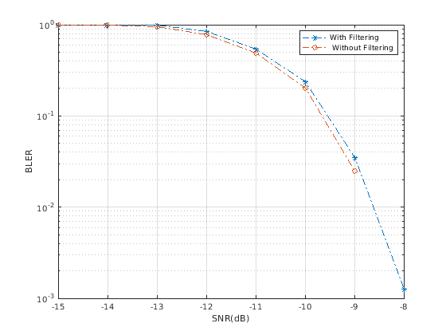

+----------------------------------+----------------------------------+
| 3GPP TR 38.860 V17.0.0 (2021-09) |                                  |
+==================================+==================================+
| Technical Report                 |                                  |
+----------------------------------+----------------------------------+
| 3rd Generation Partnership       |                                  |
| Project;                         |                                  |
|                                  |                                  |
| Technical Specification Group    |                                  |
| Radio Access Network;            |                                  |
|                                  |                                  |
| NR;                              |                                  |
|                                  |                                  |
| Study on Extended 600 MHz NR     |                                  |
| band;                            |                                  |
|                                  |                                  |
| (Release 17)                     |                                  |
+----------------------------------+----------------------------------+
|                                  |                                  |
+----------------------------------+----------------------------------+
| {width="1.3229166666666667in" | ng){width="1.7708333333333333in" |
| height="0.9166666666666666in"}   | height="1.0416666666666667in"}   |
+----------------------------------+----------------------------------+
|                                  |                                  |
+----------------------------------+----------------------------------+
| The present document has been    |                                  |
| developed within the 3rd         |                                  |
| Generation Partnership Project   |                                  |
| (3GPP ^TM^) and may be further   |                                  |
| elaborated for the purposes of   |                                  |
| 3GPP.\                           |                                  |
| The present document has not     |                                  |
| been subject to any approval     |                                  |
| process by the 3GPP              |                                  |
| Organizational Partners and      |                                  |
| shall not be implemented.\       |                                  |
| This Specification is provided   |                                  |
| for future development work      |                                  |
| within 3GPP only. The            |                                  |
| Organizational Partners accept   |                                  |
| no liability for any use of this |                                  |
| Specification.\                  |                                  |
| Specifications and Reports for   |                                  |
| implementation of the 3GPP ^TM^  |                                  |
| system should be obtained via    |                                  |
| the 3GPP Organizational          |                                  |
| Partners\' Publications Offices. |                                  |
+----------------------------------+----------------------------------+

+----------------------------------------------------------------------+
|                                                                      |
+======================================================================+
| > ***3GPP***                                                         |
| >                                                                    |
| > Postal address                                                     |
| >                                                                    |
| > 3GPP support office address                                        |
| >                                                                    |
| > 650 Route des Lucioles - Sophia Antipolis                          |
| >                                                                    |
| > Valbonne - FRANCE                                                  |
| >                                                                    |
| > Tel.: +33 4 92 94 42 00 Fax: +33 4 93 65 47 16                     |
| >                                                                    |
| > Internet                                                           |
| >                                                                    |
| > http://www.3gpp.org                                                |
+----------------------------------------------------------------------+
| ***Copyright Notification***                                         |
|                                                                      |
| No part may be reproduced except as authorized by written            |
| permission.\                                                         |
| The copyright and the foregoing restriction extend to reproduction   |
| in all media.                                                        |
|                                                                      |
| © 2021, 3GPP Organizational Partners (ARIB, ATIS, CCSA, ETSI, TSDSI, |
| TTA, TTC).                                                           |
|                                                                      |
| All rights reserved.                                                 |
|                                                                      |
| UMTS™ is a Trade Mark of ETSI registered for the benefit of its      |
| members                                                              |
|                                                                      |
| 3GPP™ is a Trade Mark of ETSI registered for the benefit of its      |
| Members and of the 3GPP Organizational Partners\                     |
| LTE™ is a Trade Mark of ETSI registered for the benefit of its       |
| Members and of the 3GPP Organizational Partners                      |
|                                                                      |
| GSM® and the GSM logo are registered and owned by the GSM            |
| Association                                                          |
+----------------------------------------------------------------------+

 Contents {#contents .TT}
========

Foreword 4

1 Scope 6

2 References 6

3 Definitions of terms, symbols and abbreviations 6

3.1 Terms 6

3.2 Symbols 6

3.3 Abbreviations 7

4 Background 8

4.1 General 8

4.2 Options for study: B1 9

4.3 Options for study: B2 9

4.4 Options for study B2a 10

5 Regulatory landscape 12

5.1 General 12

5.2 ITU Region 3 14

6 Frequency band arrangements and regulatory background 15

6.1 Operating band and channel bandwidth 15

6.2 Void 16

6.3 Nearby non-3GPP services 16

6.3.1 Introduction 16

6.3.2 Coexistence between 600 MHz and TV services 17

6.3.3 Coexistence between 600 MHz Radio Astronomy Service (RAS) 17

6.4 Duplex filter implementation issues 18

6.4.1.1 Full band filter 18

6.4.1.2 Split filter 23

6.4.2.1 Band plan 6.4.2.1 Band plan 26

6.4.2.2 Duplexer performance 27

6.4.2.3 Relative cost and size 30

6.4.3 Option B2a 31

6.4.3.1 General 31

6.4.3.2 Option B2a with Single Duplexer 32

7 List of band specific issues for APT600 MHz frequency band 33

7.1 General 33

7.2 Unwanted emissions requirements 33

7.2.1 NS values for indicating UE additional requirements 33

7.3 Economies of scale: n71-capable UEs and APT 600 MHz deployments 34

7.3.1 Option B1 34

7.3.2 Option B2 34

7.3.3 Option B2a 34

7.4 Band combinations 34

7.4.1 Option B1 34

7.4.2 Option B2 34

7.4.3 Option B2a 34

8\. Conclusion 35

Annex A(informative): Change history 36

Foreword
========

This Technical Report has been produced by the 3rd Generation
Partnership Project (3GPP).

The contents of the present document are subject to continuing work
within the TSG and may change following formal TSG approval. Should the
TSG modify the contents of the present document, it will be re-released
by the TSG with an identifying change of release date and an increase in
version number as follows:

Version x.y.z

where:

x the first digit:

1 presented to TSG for information;

2 presented to TSG for approval;

3 or greater indicates TSG approved document under change control.

y the second digit is incremented for all changes of substance, i.e.
technical enhancements, corrections, updates, etc.

z the third digit is incremented when editorial only changes have been
incorporated in the document.

In the present document, modal verbs have the following meanings:

**shall** indicates a mandatory requirement to do something

**shall not** indicates an interdiction (prohibition) to do something

The constructions \"shall\" and \"shall not\" are confined to the
context of normative provisions, and do not appear in Technical Reports.

The constructions \"must\" and \"must not\" are not used as substitutes
for \"shall\" and \"shall not\". Their use is avoided insofar as
possible, and they are not used in a normative context except in a
direct citation from an external, referenced, non-3GPP document, or so
as to maintain continuity of style when extending or modifying the
provisions of such a referenced document.

**should** indicates a recommendation to do something

**should not** indicates a recommendation not to do something

**may** indicates permission to do something

**need not** indicates permission not to do something

The construction \"may not\" is ambiguous and is not used in normative
elements. The unambiguous constructions \"might not\" or \"shall not\"
are used instead, depending upon the meaning intended.

**can** indicates that something is possible

**cannot** indicates that something is impossible

The constructions \"can\" and \"cannot\" are not substitutes for \"may\"
and \"need not\".

**will** indicates that something is certain or expected to happen as a
result of action taken by an agency the behaviour of which is outside
the scope of the present document

**will not** indicates that something is certain or expected not to
happen as a result of action taken by an agency the behaviour of which
is outside the scope of the present document

**might** indicates a likelihood that something will happen as a result
of action taken by some agency the behaviour of which is outside the
scope of the present document

**might not** indicates a likelihood that something will not happen as a
result of action taken by some agency the behaviour of which is outside
the scope of the present document

In addition:

**is** (or any other verb in the indicative mood) indicates a statement
of fact

**is not** (or any other negative verb in the indicative mood) indicates
a statement of fact

The constructions \"is\" and \"is not\" do not indicate requirements.

 1 Scope
=======

The present document is a technical report for the study item of APT 600
MHz NR FDD band.

2 References {#references-1}
============

The following documents contain provisions which, through reference in
this text, constitute provisions of the present document.

\- References are either specific (identified by date of publication,
edition number, version number, etc.) or non‑specific.

\- For a specific reference, subsequent revisions do not apply.

\- For a non-specific reference, the latest version applies. In the case
of a reference to a 3GPP document (including a GSM document), a
non-specific reference implicitly refers to the latest version of that
document *in the same Release as the present document*.

\[1\] 3GPP TR 21.905: \"Vocabulary for 3GPP Specifications\"

\[2\] R4-2103270 Work plan of study on extended 600MHz NR band, Spark NZ
Ltd, RAN4\#98e

\[3\] 3GPP TR 36.755: \"US 600 MHz band for LTE"

\[4\] ITU-R, "Radio Regulations"

\[5\] APT/AWG, Report 79, "Frequency Arrangements for IMT in the bands
470- 698 MHz".

\[6\] 3GPP TS 38.101-1: \"NR; User Equipment (UE) radio transmission and
reception"

\[7\] ITU-R, Res 224, "Frequency bands for the terrestrial component of
International Mobile Telecommunications below 1 GHz" WRC 2019

\[8\] R4-2110978, "TP for TR 38.860: Filter option B1", Qualcomm
Incorporated

\[9\] R4-2110165, "TP to TR38.860 on band plan and duplex filter
considerations for 600 MHz", Apple

\[10\] R4-2111045, "TP to TR 38.860: B1 full band filter feasibility
analysis", Huawei

\[11\] RP-202143, "Liaison Statement to 3GPP RAN, 3GPP RAN4 by the
26^th^ Meeting of the APT Wireless Group (AWG-26)", APT

\[12\] RP-202924, "Study on extended 600MHz NR band", Spark NZ, CBN

3 Definitions of terms, symbols and abbreviations
=================================================

3.1 Terms
---------

For the purposes of the present document, the terms given in 3GPP
TR 21.905\[1\] and the following apply. A term defined in the present
document takes precedence over the definition of the same term, if any,
in 3GPP TR 21.905 \[1\].

3.2 Symbols
-----------

Void.

3.3 Abbreviations
-----------------

For the purposes of the present document, the abbreviations given in
3GPP TR 21.905 \[1\] and the following apply. An abbreviation defined in
the present document takes precedence over the definition of the same
abbreviation, if any, in 3GPP TR 21.905 \[1\].

ACLR Adjacent Channel Leakage RatioB1A35 Lower duplexer of the option B1
with the split duplexers

B1B35 Upper duplexer of the option B1 with the split duplexers

B1F Option B1 with full band duplexer

B1X25 Outer 25 MHz duplexer for B1 option

B2F Option B2 with full band duplexer

B2A35 Lower duplexer of the option B2 with the split duplexers

B2B35 Upper duplexer of the option B2 with the split duplexers

BS Base Station

BW Bandwidth

CH36 DTV Channel \#36

DL Downlink

DTV Digital Television

EARFCN E-UTRA Absolute Radio Frequency Channel Number

FCC Federal Communications Commission

FDD Frequency Division Duplex

IL Insertion Loss

IMT International Mobile Telecommunications

n71F Full band n71 filter

nX New band for eh B2a option

RAS Radio Astronomy Service

REFSENS Reference Sensitivity

RF Radio Frequency

TC SAW Temperature Compensated Surface Acoustic Wave

TX Transmitter

UE User Equipment

UHF Ultra High Frequency

UL Uplink

4 Background
============

4.1 General
-----------

*During the RAN \#90e meeting a new study item was agreed \[12\] to
study various band configurations for the 600 MHz band in ITU R Region
3.A liaison statement from the APT Wireless Group (AWG) \[11\] was also
received that had two filter combinations- namely B1 and B2 as
candidates for study.*

*The objectives for the extended 600 MHz study item are listed below:*

\- Regulatory study of the frequency range around 600 MHz in Region 3

\- Co -existence study for the frequency range of 612-652/663-703MHz
such as with DTV (if needed)

\- Study potential frequency arrangements and conclude the possible
implications (such as insertion loss, transmitter and receiver
characteristics for both the BS and UE, system limitations such as
channel bandwidths etc.) of different duplex filter implementations.

\- Consider options B1 and B2 from AWG LS \[11\] but other options are
not precluded.

\- Answer the request from AWG regarding technical feasibility of option
B1 and B2 respectively. Further options are not precluded and may be
included in LS to AWG.

> NOTE: Since regulatory study of frequency range around 600 MHz is for
> Region 3, the SI outcome will not impact any requirements defined for
> US 600 MHz band.

Furthermore, for option B2 including four different suggested sizes of
the second duplexer overlapping with the US600 band n71, feedback on
different suggested sizes of the second duplexer from a feasibility and
cost-efficient perspective were requested by APT.

Details of options B1 and B2 are based on inputs provided by APT LS
\[11\] and in the work plan in \[2\] and provided in clauses 4.2 and
4.3, respectively.

RAN4 feasibility analyses for options B1, B2 and B2a are provided in
clauses 6.4 respectively. RAN4 decided not to provide any final
recommendation on the frequency arrangements to apply in the frequency
range in question. Decision on the frequency arrangement is to be taken
by the AWG regulatory body.

*The above studies have been on going in RAN4 meetings. The present
document documents the results of the studies.*

*3GPP band 28 and US 600 MHz bands \[3\] are shown below in Figure
4.1-1:*

{width="6.268055555555556in"
height="1.0819444444444444in"}

Figure 4.1-1: US 600 MHz band (n71) and 3GPP band 28

*By examining the US 600 MHz band \[3\] it is noted that the band
extends only up to 698 MHz leaving the range 698 - 703 MHz unusable.*

*The objective of the SI is to study spectrum options that will enable
usage of 698- 703 MHz.*

There are three duplex filter options considered in the present
document.

4.2 Options for study: B1
-------------------------

This option is based on an extension to band n71 and is shown on figure
4.2-1. There are three cases, a single filter and two overlapping
duplexer options case shown below.

{width="5.96875in"
height="5.802083333333333in"}

Figure 4.2-1: Filter options B1

The full band duplexer has a duplex spacing of 51 MHz.

The cases of dual duplexers demonstrate two different arrangements:

\- The first option B1 35 + 35 maintains same duplex spacing (i.e. 51
MHz) in both duplexers

\- The second option B1 35 + 25 has an n71 duplexer and 25 MHz wide
second duplexer. In this case, the duplex spacing for both duplexers is
different, i.e. 46 MHz and 66 MHz respectively.

4.3 Options for study: B2
-------------------------

This option uses two duplexers as shown in Figure 4.3-1 and the duplex
distance is 46 MHz. Also the bottom duplexer is the same as that of band
n71, with an additional upper duplexer that should have as large
possible overlap as possible with the lower duplexer but at the same
time being able to handle the duplex gap of 6 MHz. The size of this
upper duplexer needs to be studied and decided prior to being specified.
It can be considered to have variable bandwidths ranging from 35 MHz to
25 MHz respectively. Like option B1, this arrangement B2 is also a
reversed duplex arrangement.

There are three cases, all with overlapping duplexers but in all cases
one of the duplexers is that of US 600 MHz band.

{width="5.385416666666667in"
height="5.96875in"}

Figure 4.3-1: Filter options B2

4.4 Options for study B2a
-------------------------

It is proposed to use band 71/n71 as is covering the frequency range 663
-- 698 MHz for UL and 617-652 MHz for DL in the APT region and specify a
new band covering at least the additional 2x 5 MHz spectrum proposed in
the SI, but it could also support up to 2x 30 MHz to maximize the
overlap with band 71/n71. The new band plan for a 2x 30 MHz overlapping
duplexer could look like shown in Figure 4.4-1 below.

{width="6.239583333333333in"
height="1.84375in"}

Figure 4.4-1

The above option consists of two bands, the existing NR operating band
n71 and a new band labelled as band nX for the purpose of this TR.

5 Regulatory landscape
======================

5.1 General
-----------

**The 470 - 694 MHz frequency range is allocated to the broadcasting
service and mobile service on a co-primary basis in Region 3 \[4\].**
The frequency band 470 - 698 MHz, or parts thereof, was identified by
WRC-15 in 7 countries in Region 3 through footnote No. 5.296A for use by
those administrations as listed wishing to implement terrestrial IMT
systems. In addition, there was interest from other significant markets
to do the same. Elsewhere, USA, Mexico and several other countries in
Region 2 also identified this band for IMT through footnotes 5.295 and
5.308A. It is noted that resolves 2 of \[7\] Resolution 224 (Rev.WRC-19)
states that :

> *to encourage administrations to take into account results of the
> existing relevant ITU Radiocommunication Sector studies, when
> implementing IMT applications/systems in the frequency bands 694-862
> MHz in Region 1, in the frequency band 470-806 MHz in Region 2, in the
> frequency band 790-862 MHz in Region 3, in the frequency band 470-698
> MHz, or portions thereof, for those administrations mentioned in No.
> **5.296A**, and in the frequency band 698-790 MHz, or portions
> thereof, for those administrations mentioned in No. **5.313A***

The regulatory landscape overview for all regions in frequency range 470
-- 694 MHz is provided in Table 5.1-1, based on ITU radio regulations
\[4\].

Table 5.1-1: ITU-R frequency allocation to services \[4\]

{width="5.885416666666667in"
height="7.041666666666667in"}

NOTE: Since regulatory study of frequency range around 600 MHz is for
Region 3, the outcomes of the present document item will not impact any
requirements defined for US 600 MHz band, i.e. band n71.

The footnotes in \[4\] referred in this clause are listed:

> *"5.149 In making assignments to stations of other services to which
> the bands: 13 360-13 410 kHz, 25 550-25 670 kHz, 37.5-38.25 MHz,
> 73-74.6 MHz in Regions 1 and 3, 150.05-153 MHz in Region 1, 322-328.6
> MHz, 406.1-410 MHz, 608-614 MHz in Regions 1 and 3, 1 330-1 400 MHz, 1
> 610.6-1 613.8 MHz, 1 660-1 670 MHz, 1 718.8-1 722.2 MHz, 2 655-2 690
> MHz, 3 260-3 267 MHz, 3 332-3 339 MHz, 3 345.8-3 352.5 MHz, 4 825-4
> 835 MHz, 4 950-4 990 MHz, 4 990-5 000 MHz, 6 650-6 675.2 MHz,
> 10.6-10.68 GHz, 14.47-14.5 GHz, 22.01-22.21 GHz, 22.21-22.5 GHz,
> 22.81-22.86 GHz, 23.07-23.12 GHz, 31.2-31.3 GHz, 31.5-31.8 GHz in
> Regions 1 and 3, 36.43-36.5 GHz, 42.5-43.5 GHz, 48.94-49.04 GHz, 76-86
> GHz, 92-94 GHz, 94.1-100 GHz, 102-109.5 GHz, 111.8-114.25 GHz,
> 128.33-128.59 GHz, 129.23-129.49 GHz, 130-134 GHz, 136-148.5 GHz,
> 151.5-158.5 GHz, 168.59-168.93 GHz, 171.11-171.45 GHz, 172.31-172.65
> GHz, 173.52-173.85 GHz, 195.75-196.15 GHz, 209-226 GHz, 241-250 GHz,
> 252-275* GHz are allocated, *administrations are urged to take all
> practicable steps to protect the radio astronomy service from harmful
> interference. Emissions from spaceborne or airborne stations can be
> particularly serious sources of interference to the radio astronomy
> service (see Nos. 4.5 and 4.6 and Article 29). (WRC-07)*

*5.295 In the Bahamas, Barbados, Canada, the United States and Mexico,
the frequency band 470-608 MHz, or*

> *portions thereof, is identified for International Mobile
> Telecommunications (IMT) -- see Resolution 224 (Rev.WRC-19). This
> identification does not preclude the use of these frequency bands by
> any application of the services to which they are allocated and does
> not establish priority in the Radio Regulations. Mobile service
> stations of the IMT system within the frequency band are subject to
> agreement obtained under No. 9.21 and shall not cause harmful
> interference to, or claim protection from, the broadcasting service of
> neighboring countries. Nos. 5.43 and 5.43A apply. (WRC-19)*
>
> ***5.296A** In Micronesia, the Solomon Islands, Tuvalu and Vanuatu,
> the frequency band 470-698 MHz, or portions thereof, and in
> Bangladesh, Maldives and New Zealand, the frequency band 610-698 MHz,
> or portions thereof, are identified for use by these administrations
> wishing to implement International Mobile Telecommunications (IMT) --
> see Resolution **224 (Rev.WRC-19)**. This identification does not
> preclude the use of these frequency bands by any application of the
> services to which they are allocated and does not establish priority
> in the Radio Regulations. The mobile allocation in this frequency band
> shall not be used for IMT systems unless subject to agreement obtained
> under No. **9.21** and shall not cause harmful interference to, or
> claim protection from, the broadcasting service of neighboring
> countries. Nos. **5.43** and **5.43A** apply. (WRC-19)*
>
> ***5.305** Additional allocation: in China, the band 606-614 MHz is
> also allocated to the radio astronomy service on a primary basis.*
>
> ***5.306** Additional allocation: in Region 1, except in the African
> Broadcasting Area (see Nos. **5.10** to **5.13**), and*
>
> *in Region 3, the band 608-614 MHz is also allocated to the radio
> astronomy service on a secondary basis.*
>
> ***5.307** Additional allocation: in India, the band 608-614 MHz is
> also allocated to the radio astronomy service on a primary basis.*

*5.308A In the Bahamas, Barbados, Belize, Canada, Colombia, the United
States, Guatemala and Mexico, the*

> *frequency band 614-698 MHz, or portions thereof, is identified for
> International Mobile Telecommunications (IMT) -- see Resolution 224
> (Rev.WRC-19). This identification does not preclude the use of these
> frequency bands by any application of the services to which they are
> allocated and does not establish priority in the Radio Regulations.
> Mobile service stations of the IMT system within the frequency band
> are subject to agreement obtained under No. 9.21 and shall not cause
> harmful interference to, or claim protection from, the broadcasting
> service of neighboring countries. Nos. 5.43 and 5.43A apply. (WRC-19)*
>
> ***5.313A** The frequency band, or portions of the frequency band
> 698-790 MHz, in Australia, Bangladesh, Brunei Darussalam, Cambodia,
> China, Korea (Rep. of), Fiji, India, Indonesia, Japan, Kiribati, Lao
> P.D.R., Malaysia, Myanmar (Union of), New Zealand, Pakistan, Papua New
> Guinea, the Philippines, the Dem. People's Rep. of Korea, Solomon
> Islands, Samoa, Singapore, Thailand, Tonga, Tuvalu, Vanuatu and Viet
> Nam, are identified for use by these administrations wishing to
> implement International Mobile Telecommunications (IMT). This
> identification does not preclude the use of these frequency bands by
> any application of the services to which they are allocated and does
> not establish priority in the Radio Regulations. (WRC-19)".*

5.2 ITU Region 3
----------------

ITU Region 3 specific regulatory aspects for the frequency range 470 --
694 MHz are provided in this clause.

Referring to the APT LS, AWG-26 agreed to undertake the study to revise
the APT/AWG/REP-79 \[5\] to develop frequency arrangements in the band
470-703 MHz for APT Members that wish to implement both the APT700 and a
600 MHz frequency arrangement that is optimal for APT Members.

According to Radio Regulations, in Region 3, the 610 -- 890 MHz band is
allocated to Fixed Service, Mobile Service and Broadcasting Service on a
primary basis. Additionally, 606 -- 614 MHz band is allocated for Radio
Astronomy Service in China (i.e. footnote 5.305) and band 608 - 614 MHz
is allocated for Radio Astronomy Service in India (i.e. footnote 5.307).
Footnote 5.149 urges administrator to *protect the radio astronomy
service from harmful interference.*

*Digital television has various channel allocations depending on country
allocations in Region 3. IMT and DTV coexistence may require additional
consideration on a per-country basis, leading to potential need for a
guard band.*

*No specific regional regulatory requirements on unwanted emissions were
identified for the IMT operation in* frequency range 470 -- 694 MHz in
Region 3, *so far*.

6 Frequency band arrangements and regulatory background
=======================================================

6.1 Operating band and channel bandwidth
----------------------------------------

The band plan for the extended 600 MHz NR band are shown below in Tables
6.1-1 to 6.1-7. Options B1 and B2 have split duplexers, partially
overlapping, but part of the same band. Option B2a has two duplexers,
but one is band n71 and the other is a new band.

The Tx-Rx is \"reverse-duplex\"; in other words, the downlink frequency
band is below the duplex gap while the uplink frequency band is above
the duplex gap. This arrangement is opposite to conventional notation;
however, for this band, it provides the benefit of aligning the uplink
band adjacent to 3GPP band 28 thereby minimizing interference conditions
at the 703 MHz boundary.

Table 6.1-1: NR operating band (option B1)

  ----------------------------------------------------------------------------------------------------------
  Uplink (UL) operating band\   Downlink (DL) operating band\   Duplex Mode                            
  BS receive\                   BS transmit\                                                           
  UE transmit                   UE receive                                                             
  ----------------------------- ------------------------------- ------------- --------- ---- --------- -----
  F~UL\_low~ -- F~UL\_high~     F~DL\_low~ -- F~DL\_high~                                              

  663 MHz                       --                              703 MHz       612 MHz   --   652 MHz   FDD
  ----------------------------------------------------------------------------------------------------------

The above could be implemented as a single or overlapping duplexers. In
case of overlapping duplexers, the following option is studied:

Table 6.1-2: Duplexer arrangements (option B1)

+-------+-------+-------+-------+-------+----+-------+-----+
| Dup   | U     | Dow   | D     |       |    |       |     |
| lexer | plink | nlink | uplex |       |    |       |     |
| type  | (UL)  | (DL)  | Mode  |       |    |       |     |
|       | oper  | oper  |       |       |    |       |     |
|       | ating | ating |       |       |    |       |     |
|       | band\ | band\ |       |       |    |       |     |
|       | BS    | BS    |       |       |    |       |     |
|       | rec   | tran  |       |       |    |       |     |
|       | eive\ | smit\ |       |       |    |       |     |
|       | UE    | UE    |       |       |    |       |     |
|       | tra   | re    |       |       |    |       |     |
|       | nsmit | ceive |       |       |    |       |     |
+=======+=======+=======+=======+=======+====+=======+=====+
|       | F~UL\ | F~DL\ |       |       |    |       |     |
|       | _low~ | _low~ |       |       |    |       |     |
|       | --    | --    |       |       |    |       |     |
|       | F     | F     |       |       |    |       |     |
|       | ~UL\_ | ~DL\_ |       |       |    |       |     |
|       | high~ | high~ |       |       |    |       |     |
+-------+-------+-------+-------+-------+----+-------+-----+
| Full  | 663   | --    | 703   | 612   | -- | 652   | FDD |
|       | MHz   |       | MHz   | MHz   |    | MHz   |     |
+-------+-------+-------+-------+-------+----+-------+-----+
| 35 +  | 663 - | 612 - | FDD   |       |    |       |     |
| 35    | 698   | 647   |       |       |    |       |     |
|       | MHz   | MHz   |       |       |    |       |     |
|       |       |       |       |       |    |       |     |
|       | 668 - | 617 - |       |       |    |       |     |
|       | 703   | 652   |       |       |    |       |     |
|       | MHz   | MHz   |       |       |    |       |     |
+-------+-------+-------+-------+-------+----+-------+-----+
|       |       |       | FDD   |       |    |       |     |
+-------+-------+-------+-------+-------+----+-------+-----+
| n71 + | 663 - | 617 - |   FDD |       |    |       |     |
| 25    | 698   | 652   |       |       |    |       |     |
|       | MHz   | MHz   | ----- |       |    |       |     |
| Dual  |       |       |   FDD |       |    |       |     |
| 35+25 | 678 - | 612 - |       |       |    |       |     |
|       | 703   | 637   |       |       |    |       |     |
|       | MHz   | MHz   |       |       |    |       |     |
+-------+-------+-------+-------+-------+----+-------+-----+

Table 6.1-3.: NR operating band (option B2)

  ----------------------------------------------------------------------------------------------------------
  Uplink (UL) operating band\   Downlink (DL) operating band\   Duplex Mode                            
  BS receive\                   BS transmit\                                                           
  UE transmit                   UE receive                                                             
  ----------------------------- ------------------------------- ------------- --------- ---- --------- -----
  F~UL\_low~ -- F~UL\_high~     F~DL\_low~ -- F~DL\_high~                                              

  663 MHz                       --                              703 MHz       617 MHz   --   657 MHz   FDD
  ----------------------------------------------------------------------------------------------------------

The above could be implemented as a single or overlapping duplexers. In
case of overlapping/split duplexers, three sub options are studied.

Table 6.1-4: Duplexer arrangements (option B2 35 + 35)

+-----------------+-----------------+-----------------+-------------+
| Duplexer type   | Uplink (UL)     | Downlink (DL)   | Duplex Mode |
|                 | operating band\ | operating band\ |             |
|                 | BS receive\     | BS transmit\    |             |
|                 | UE transmit     | UE receive      |             |
+=================+=================+=================+=============+
|                 | F~UL\_low~ --   | F~DL\_low~ --   |             |
|                 | F~UL\_high~     | F~DL\_high~     |             |
+-----------------+-----------------+-----------------+-------------+
| Duplex 1        | 663 MHz -- 698  | 617MHz -- 652   | FDD         |
|                 | MHz             | MHz             |             |
| Duplex 2        |                 |                 |             |
|                 | 668 MHz -- 703  | 622MHz -- 657   |             |
|                 | MHz             | MHz             |             |
+-----------------+-----------------+-----------------+-------------+
|                 |                 |                 | FDD         |
+-----------------+-----------------+-----------------+-------------+
| NOTE: Both      |                 |                 |             |
| duplexers will  |                 |                 |             |
| be part of the  |                 |                 |             |
| same band       |                 |                 |             |
+-----------------+-----------------+-----------------+-------------+

Table 6.1-5: Duplexer arrangements (option B2 35+30)

+-----------------+-----------------+-----------------+-------------+
| Duplexer type   | Uplink (UL)     | Downlink (DL)   | Duplex Mode |
|                 | operating band\ | operating band\ |             |
|                 | BS receive\     | BS transmit\    |             |
|                 | UE transmit     | UE receive      |             |
+=================+=================+=================+=============+
|                 | F~UL\_low~ --   | F~DL\_low~ --   |             |
|                 | F~UL\_high~     | F~DL\_high~     |             |
+-----------------+-----------------+-----------------+-------------+
| Duplex1         | 663 MHz -- 698  | 617MHz -- 652   | FDD         |
|                 | MHz             | MHz             |             |
| Duplex 2        |                 |                 |             |
|                 | 673 MHz -- 703  | 627MHz -- 657   |             |
|                 | MHz             | MHz             |             |
+-----------------+-----------------+-----------------+-------------+
|                 |                 |                 | FDD         |
+-----------------+-----------------+-----------------+-------------+
| NOTE: Both      |                 |                 |             |
| duplexers will  |                 |                 |             |
| be part of the  |                 |                 |             |
| same band       |                 |                 |             |
+-----------------+-----------------+-----------------+-------------+

Table 6.1-6: Duplexer arrangements (option B2 35+25)

+-----------------+-----------------+-----------------+-------------+
| Duplexer type   | Uplink (UL)     | Downlink (DL)   | Duplex Mode |
|                 | operating band\ | operating band\ |             |
|                 | BS receive\     | BS transmit\    |             |
|                 | UE transmit     | UE receive      |             |
+=================+=================+=================+=============+
|                 | F~UL\_low~ --   | F~DL\_low~ --   |             |
|                 | F~UL\_high~     | F~DL\_high~     |             |
+-----------------+-----------------+-----------------+-------------+
| Duplex 1        | 663 MHz -- 698  | 617MHz -- 652   | FDD         |
|                 | MHz             | MHz             |             |
| Duplex 2        |                 |                 |             |
|                 | 678 MHz -- 703  | 632MHz -- 657   |             |
|                 | MHz             | MHz             |             |
+-----------------+-----------------+-----------------+-------------+
|                 |                 |                 | FDD         |
+-----------------+-----------------+-----------------+-------------+
| NOTE: Both      |                 |                 |             |
| duplexers will  |                 |                 |             |
| be part of the  |                 |                 |             |
| same band       |                 |                 |             |
+-----------------+-----------------+-----------------+-------------+

Table 6.1-7: NR operating bands (option B2a) \[6\]

  -----------------------------------------------------------------------------------------------------------------------------------------------------------------------------------------------------------------------------------------------------------------------------------
  Operating Bands                                                                                                                                                          Uplink (UL) operating band\   Downlink (DL) operating band\   Duplex Mode                            
                                                                                                                                                                           BS receive\                   BS transmit\                                                           
                                                                                                                                                                           UE transmit                   UE receive                                                             
  ------------------------------------------------------------------------------------------------------------------------------------------------------------------------ ----------------------------- ------------------------------- ------------- --------- ---- --------- -----
                                                                                                                                                                           F~UL\_low~ -- F~UL\_high~     F~DL\_low~ -- F~DL\_high~                                              

  n71                                                                                                                                                                      663 MHz                       --                              698 MHz       617 MHz   --   652 MHz   FDD

  nX                                                                                                                                                                       673 MHz                       --                              703 MHz       627 MHz   --   657 MHz   FDD

  NOTE: These are two bands, band n71 plus band nX. A UE that complies with NR requirements in this specification shall also comply with NR Band 71 minimum requirements                                                                                                        
  -----------------------------------------------------------------------------------------------------------------------------------------------------------------------------------------------------------------------------------------------------------------------------------

Tx-Rx separation is shown in Table 6.1-9 and is dependent upon the
filter options.

Table 6.1-9: Default UE TX-RX frequency separation

+--------------------------+---------------------------+
| Filter Option            | TX -- RX\                 |
|                          | carrier centre frequency\ |
|                          | separation                |
+==========================+===========================+
| B1 (Full band)           | -51 MHz                   |
+--------------------------+---------------------------+
| B1 (duplexer 1) 35 + 35  | -51 MHz                   |
|                          |                           |
| B1 (duplexer 2) 35 + 35  | -51 MHz                   |
+--------------------------+---------------------------+
| B1 (duplexer 1) n71 + 25 | -46 MHz                   |
+--------------------------+---------------------------+
| B1 (duplexer 2) n71 +25  | 66 MHz                    |
+--------------------------+---------------------------+
| B2 (duplexer 1)          | 46 MHz                    |
|                          |                           |
| B2 (duplexer 2)          |                           |
+--------------------------+---------------------------+
|                          | 46 MHz                    |
+--------------------------+---------------------------+
| B2a                      | 46 MHz for both bands     |
+--------------------------+---------------------------+

6.2 Void
--------

6.3 Nearby non-3GPP services 
----------------------------

### 6.3.1 Introduction

During the study item, multiple co-existence scenarios were discussed,
with the aim to identify if dedicated requirements shall be considered
in RAN4 for the possible protection of non-3GPP services.

Adjacent to frequency range considered by APT, the following existing
services are deployed, which are subject to interference protection from
600 MHz broadband wireless services:

\- DTV service, and

\- Radio Astronomy Service (RAS).

Coexistence aspects between 600 MHz and the above two services are
addressed in the following clause.

Unlicensed TV white space device (secondary service) may be allowed in
APT which is not further discussed assuming that specific protection
from 600 MHz broadband is not required, other than required for DTV
protection.

### 6.3.2 Coexistence between 600 MHz and TV services

In Region 3, multiple DTV systems exists with various channel
allocations across countries. Consideration of all such DTV channel
allocations would result in many frequency separation values between the
lower edge of an NR band (DL) and DTV depending on the considered DTV
system.

For all the frequency arrangements considered in this study item it was
agreed that no specific emission limits are to be specified in RAN4 for
the protection of DTV from 600 MHz BS. It was decided sufficient to rely
on the general BS spurious emissions limits.

Additionally, the frequency separation between the lower edge of the NR
band (DL) and DTV channel was discussed. It was concluded that due to
various DTV channel arrangements across national regulations, the
frequency separation is considered to be decided by administrators.

Referring to \[TR 36.755\], broadcast TV services and Band 71/n71
Downlink are separated by 9 MHz guard band (including channel 37) for
FCC channel arrangement, which is 2 MHz larger than the minimum
frequency separation required by FCC to protect against a TV transmitter
interfering with a mobile broadband UE receiver and an BS transmitter
interfering with a TV receiver. Band 71/n71 guard band value (i.e. 9 MHz
guard band is available between the APT 600 MHz band and DTV service) is
also assumed for all frequency arrangement options for APT.

The TV channels that do not have sufficient guard band may need to be
vacated. It is noted that in some cases TV channel which is not vacated
may impact feasible filtering solutions.

NOTE: Please note, that frequency allocation of option B1 starts 5 MHz
lower than option B2. The referred Band 71/n71 guard bands apply to
option B2 as is, but may need an additional 5 MHz shift down in case of
option B1. In addition, since the research on the minimum frequency
separation required by FCC is conducted in the LTE scenario, for NR
system, the additional 5MHz shift down may not only cause the additional
DTV channels need to be vacated, but also may require further market
specific co-existence studies with DTV system, which are out of scope of
this TR. The potential impact may require further evaluation.

It was concluded that due to various DTV channel arrangements across
national regulations, the frequency separation is considered to be
decided by administrators.

The value of 7 MHz separation derived from the FCC decision on the
protection separation of broadcast from the band 71 can be considered as
reference.

For more details on the coexistence analyses between 600 MHz and DTV in
Region 2, refer to \[TR 36.755\].

### 6.3.3 Coexistence between 600 MHz Radio Astronomy Service (RAS)

Radio Astronomy Service (RAS) is a receive-only service that uses highly
sensitive receivers to examine and study radio waves of cosmic origin.
The band 606-614 MHz in China and the band 608 - 614 MHz in India are
allocated to the radio astronomy service on a primary basis, as captured
in clause 5.

Referring to \[3\], FCC requires the geographical separation of 600 MHz
base station from the RAS telescopes. This requirement is assumed as a
baseline for the coexistence with RAS also for APT region until further
detail is provided by these administrations.

ITU-R made a compatibility and sharing studies between the radio
astronomy service and IMT systems. The conclusion, based on measured IMT
equipments indicated that the compatibility between RAS stations and IMT
systems can be achieved using separation distances of order 60 - 80
kilometres between a RAS antenna and an IMT macro rural base stations,
and of order 1 - 20 kilometres for a mobile terminals (assuming an
unwanted emission level of --50 dBm/MHz and a flat terrain profile).

For all the frequency arrangements considered in this study item, it was
agreed that no BS spurious emissions limits be specified for protection
of RAS services. Any possible protections measured required for the RAS
services protection are considered to be under the responsibility of
each administration considering aspects such as distance separation site
engineering solutions, etc.

6.4 Duplex filter implementation issues
---------------------------------------

6.4.1 Option B1

#### 6.4.1.1 Full band filter

Option B1 is based on spectrum allocation of 663-703 MHz for TX and
612-652 MHz for RX. The first considered approach is to use a full band
filter option B1 as illustrated below.

{width="4.479166666666667in"
height="1.5416666666666667in"}

Figure 6.4.1.1-1: Option B1

One advantage of option B1 compared to other filtering options is that
B1 is conducive to a single full-band filter implementation. The
potential advantage of single filter is reduced size and
bill-of-materials of the required front-end and reduced complexity for
intra-band carrier aggregation across the filters and inter-band carrier
aggregation with another band in close frequency proximity when
quadplexing is needed are limited. On the other hand, the performance of
a dual filter solution in insertion loss and stop band attenuation may
be superior to a single filter.

For option B1, extending the 35 MHz filter passband to 40 MHz increases
the relative bandwidth from 5.5% to 6.3% at 600 MHz. At the time that
Band 28 was defined, such relative bandwidths were not feasible.
However, since that time with technological advances in filter design
and materials, wider relative bandwidths have now become available.
Therefore, from a relative bandwidth perspective option B1 is regarded
as feasible. Considering out-of-band rejection, the blocking requirement
of Band 71/n71 at 12 MHz offset is considered below when the passband
increases to 40 MHz. The filter rejection is checked at 9 MHz offset
since the DTV channel is centered at 12 MHz offset so its edge is
expected at 9 MHz offset. A reduction in filter rejection due to
widening of the passband reduces tolerance to DTV jamming unless the
linearity of the Rx path post filtering is improved to compensate. Tx
and Rx isolation as well as passband insertion loss are also relevant in
comparing the widened filter against the Band 71/n71 filter.

A second level filter simulation implementing design rules and including
packaging parasitic effects but without optimization was conducted and
provided in \[8\]. The filter technology used is a conventional, mass
produced TC SAW filter technology rather than a more advanced technology
and represents typical performance at this point. The focus of the
design effort was on the transmit side to ensure that emissions and
coexistence requirements could be met, while less effort was placed on
the receiver side. The study below specifically evaluates the ability of
the wide B1 filter to meet existing Band 71 filter requirements where
the existing Band 71 filter requirements are those that are listed on
the data sheet from the same filter vendor. Although the Band 71 filter
requirements are largely met, there may be a loss in performance
compared to a narrower Band 71 filter using the same generation of
filter technology and the same constraints.

The Tx and Rx insertion loss is first shown.

  ------------------------------------------------------------------------------------ -------------------------------------------------------------------------------------
  {width="3.117972440944882in" height="1.9078007436570428in"}   {width="3.1981386701662293in" height="1.977665135608049in"}
  ------------------------------------------------------------------------------------ -------------------------------------------------------------------------------------

Figure 6.4.1.1-2.: Tx and Rx insertion losses

On the transmit side, the insertion loss is approaching 3 dB but still
meets the Band 71 filter specification. In comparison to a narrower Band
71 filter using the same generation of filter technology and the same
constraints, an increase in Tx insertion loss towards the band edge may
be expected. Moreover, the maximum output power for Band n71 provides a
lower tolerance of 2.5 dB so the insertion loss of the Tx filter is not
expected to be a problem.

On the receiver side, the insertion loss is approaching 2 dB. The steep
drop-off of the filter at the upper edge of the band at 652 MHz is
likely due to the relatively narrow duplex gap and the need to provide
sufficient Tx isolation. In comparison to a narrower Band 71 filter
using the same generation of filter technology and the same constraints,
an increase in Rx insertion loss may be expected. But since the
reference sensitivity requirement for Band 71 is relatively relaxed to
accommodate the noise and spurious products from the transmitter, it is
not expected that the increase in Rx IL will hinder a device
implementing the B1 filter from meeting Band 71 receiver requirements.
Moreover, while the duplex gap is relatively narrow for Band 71 at 11
MHz, the Tx-Rx separation is 46 MHz so the Tx isolation at 11 MHz offset
may be slightly compromised if band edge Rx insertion loss needs to be
improved.

The Tx-Rx filter performance is studied next.

  ------------------------------------------------------------------------------------- --------------------------------------------------------------------------------------
  {width="3.209011373578303in" height="1.8723403324584427in"}   {width="3.0104166666666665in" height="1.8456999125109361in"}
  ------------------------------------------------------------------------------------- --------------------------------------------------------------------------------------

Figure 6.4.1.1-3: Tx and Rx narrowband filter response

On the transmit side, all requirements in the Band 71 Rx band are met.
On the receiver side, all requirements in the Band 71 Tx band are met,
although the rejection is marginal at the 663 MHz edge. Slight filter
tuning or shifting should improve the Tx rejection at the band edge.

Coexistence with Band 29 is also critical for the Band 71 UE. The \[6\]
specification imposes a requirement of -38 dBm/MHz into the receive band
of Band 29, 717 -- 728 MHz. The Band 71 filter rejection requirement
over this frequency range is met by the wider filter, although the
transition band is steep.

The next aspect to consider is the ability of the filter to reject
blockers. An in-band blocking requirement, as shown below, has been
defined for Band n71 to reject interference from a nearby DTV
transmission.

Table 6.4.1.1-1: In-band blocking for NR bands with F~DL\_high~ \< 2700
MHz and F~UL\_high~ \< 2700 MHz (Table  7.6.2-2 of TS 38.101-1 \[6\])

+---------+---------+---------+---------+---------+---------+---------+
| **NR    | **Para  | *       | **Case  | **Case  | **Case  | **Case  |
| band**  | meter** | *Unit** | 1**     | 2**     | 3**     | 4**     |
+=========+=========+=========+=========+=========+=========+=========+
|         | P~inte  | dBm     | -56     | -44     | -15     | -38     |
|         | rferer~ |         |         |         |         |         |
+---------+---------+---------+---------+---------+---------+---------+
|         | F~inte  | MHz     | -BW~Cha | ≤       |         | -BW     |
|         | rferer~ |         | nnel~/2 | -BW~Cha |         | ~Channe |
|         | (       |         | --      | nnel~/2 |         | l~/2-11 |
|         | offset) |         |         | --      |         |         |
|         |         |         | F~Ioff  |         |         |         |
|         |         |         | set,\ c | F~Ioff  |         |         |
|         |         |         | ase\ 1~ | set,\ c |         |         |
|         |         |         |         | ase\ 2~ |         |         |
|         |         |         | and     |         |         |         |
|         |         |         |         | and     |         |         |
|         |         |         | BW~Cha  |         |         |         |
|         |         |         | nnel~/2 | ≥       |         |         |
|         |         |         | +       | BW~Cha  |         |         |
|         |         |         |         | nnel~/2 |         |         |
|         |         |         | F~Ioff  | +       |         |         |
|         |         |         | set,\ c |         |         |         |
|         |         |         | ase\ 1~ | F~Ioff  |         |         |
|         |         |         |         | set,\ c |         |         |
|         |         |         |         | ase\ 2~ |         |         |
+---------+---------+---------+---------+---------+---------+---------+
| n71     | F~inte  | MHz     | NOTE 2  | F~D     | F~D     |         |
|         | rferer~ |         |         | L\_low~ | L\_low~ |         |
|         |         |         |         | -- 12   | -- 12   |         |
|         |         |         |         | to      |         |         |
|         |         |         |         | F~DL    |         |         |
|         |         |         |         | \_high~ |         |         |
|         |         |         |         | + 15    |         |         |
+---------+---------+---------+---------+---------+---------+---------+
| NOTE 1: |         |         |         |         |         |         |
| The     |         |         |         |         |         |         |
| a       |         |         |         |         |         |         |
| bsolute |         |         |         |         |         |         |
| value   |         |         |         |         |         |         |
| of the  |         |         |         |         |         |         |
| int     |         |         |         |         |         |         |
| erferer |         |         |         |         |         |         |
| offset  |         |         |         |         |         |         |
| Fint    |         |         |         |         |         |         |
| erferer |         |         |         |         |         |         |
| (       |         |         |         |         |         |         |
| offset) |         |         |         |         |         |         |
| shall   |         |         |         |         |         |         |
| be      |         |         |         |         |         |         |
| further |         |         |         |         |         |         |
| a       |         |         |         |         |         |         |
| djusted |         |         |         |         |         |         |
| to MHz  |         |         |         |         |         |         |
| with    |         |         |         |         |         |         |
| SCS the |         |         |         |         |         |         |
| sub-    |         |         |         |         |         |         |
| carrier |         |         |         |         |         |         |
| spacing |         |         |         |         |         |         |
| of the  |         |         |         |         |         |         |
| wanted  |         |         |         |         |         |         |
| signal  |         |         |         |         |         |         |
| in MHz. |         |         |         |         |         |         |
| The     |         |         |         |         |         |         |
| int     |         |         |         |         |         |         |
| erferer |         |         |         |         |         |         |
| is an   |         |         |         |         |         |         |
| NR      |         |         |         |         |         |         |
| signal  |         |         |         |         |         |         |
| with 15 |         |         |         |         |         |         |
| kHz     |         |         |         |         |         |         |
| SCS.    |         |         |         |         |         |         |
|         |         |         |         |         |         |         |
| NOTE 2: |         |         |         |         |         |         |
| For     |         |         |         |         |         |         |
| each    |         |         |         |         |         |         |
| carrier |         |         |         |         |         |         |
| fre     |         |         |         |         |         |         |
| quency, |         |         |         |         |         |         |
| the     |         |         |         |         |         |         |
| requ    |         |         |         |         |         |         |
| irement |         |         |         |         |         |         |
| applies |         |         |         |         |         |         |
| for two |         |         |         |         |         |         |
| int     |         |         |         |         |         |         |
| erferer |         |         |         |         |         |         |
| carrier |         |         |         |         |         |         |
| frequ   |         |         |         |         |         |         |
| encies: |         |         |         |         |         |         |
| a:      |         |         |         |         |         |         |
| -BW~Cha |         |         |         |         |         |         |
| nnel~/2 |         |         |         |         |         |         |
| --      |         |         |         |         |         |         |
| F~Ioffs |         |         |         |         |         |         |
| et,\ ca |         |         |         |         |         |         |
| se\ 1~; |         |         |         |         |         |         |
| b:      |         |         |         |         |         |         |
| BW~Cha  |         |         |         |         |         |         |
| nnel~/2 |         |         |         |         |         |         |
| +       |         |         |         |         |         |         |
| F~Ioff  |         |         |         |         |         |         |
| set,\ c |         |         |         |         |         |         |
| ase\ 1~ |         |         |         |         |         |         |
|         |         |         |         |         |         |         |
| NOTE 3: |         |         |         |         |         |         |
| n48     |         |         |         |         |         |         |
| follows |         |         |         |         |         |         |
| the     |         |         |         |         |         |         |
| requ    |         |         |         |         |         |         |
| irement |         |         |         |         |         |         |
| in this |         |         |         |         |         |         |
| fr      |         |         |         |         |         |         |
| equency |         |         |         |         |         |         |
| range   |         |         |         |         |         |         |
| ac      |         |         |         |         |         |         |
| cording |         |         |         |         |         |         |
| to the  |         |         |         |         |         |         |
| general |         |         |         |         |         |         |
| requ    |         |         |         |         |         |         |
| irement |         |         |         |         |         |         |
| defined |         |         |         |         |         |         |
| in      |         |         |         |         |         |         |
| Clause  |         |         |         |         |         |         |
| 7.1.    |         |         |         |         |         |         |
+---------+---------+---------+---------+---------+---------+---------+

In the absence of this requirement, the case 3 blocking requirement
would not have been present and the case 2 blocking requirement at -44
dBm would have extended to F~DL\_low~ -- 15. Instead, the case 3 in-band
blocker models a Channel 36 DTV transmission centered at approximately
605 MHz, extending from 602 to 608 MHz and received at -15 dBm. With the
passband of the Rx filter extended down to 612 MHz, it was initially
considered that there is no opportunity to provide meaningful filter
rejection to a CH 36 blocker as shown in Figure 6.4.1.1-1. Updated
simulations with further optimization under typical conditions, however,
do reveal that rejection of CH 36 is possible with this design. The spot
attenuation at the edge of CH 36 at 608 MHz was found to be 31 dB (with
average attenuation over the CH36 frequency range of approximately 30 dB
and worst case attenuation over the CH36 frequency range of
approximately 29 dB) with 2.5 dB at the Rx passband edge of 612 MHz as
shown in Figure 6.4.1.1-4. The ability of the filter to rejection CH36
is also consistent with a separate finding reported in \[10\] and shown
below in Figure 6.4.1.1-5. A channel 35 blocker at -15 dBm being one
channel further away can be rejected. For other filter designs not fully
optimized to reject CH36, some rejection to CH36 can be still achieved
at the possible expense of increased Rx IL over the lowermost 5 MHz of
the Rx band.

{width="5.541666666666667in"
height="6.1875in"}

Figure 6.4.1.1-4: Further optimized B1 filter option to include Ch 36 Rx
rejection. Green trace is the optimized design.

*The simulation results indicate that the B1 filter is technically
feasible* and despite the potential increase in IL is expected to fulfil
Band 71 requirements including rejection of the CH36 blocker for
optimized designs which have so far been evaluated under typical
conditions. The results provided are not exhaustive and not yet
optimized and only for the typical condition, so it is expected that
worst case over process and temperature will be worse. On the other
hand, the results are for a design that has not yet been optimized and
is based on conventional technology in wide use today and are provided
with the intention to investigate the filter option feasibility.

Table 6.4.1.1-2 below lists another set of filter results reported in
\[9\] from three vendors; it is likely that they will improve over time
due to optimization:

Table 6.4.1.1-2: Performance Characteristics of a Single Duplexer for
Option B1

  Vendor                                            Vendor A        Vendor B                                                           Vendor C
  ------------------------------------------------- --------------- ------------------------------------------------------------------ ----------------
  Frequency range (TX)                              663 - 703 MHz   663 - 703 MHz                                                      663 - 703 MHz
  TX Insertion loss relative to n71 duplexer (dB)   +0.4            +0.0                                                               \<3dB absolute
  Rejection for n29                                 \>20            \>20                                                               \~30
  Frequency range (RX)                              612-652 MHz     612-652 MHz                                                        612-652 MHz
  RX Insertion loss relative to n71 duplexer (dB)   +0.5            +0.6dB, expected to come close to n71 duplexer with optimization   \<4dB absolute
  Rejection for CH36 band edge                      \<15dB          \<20dB                                                             \~20dB

Although these initial values are difficult to compare, it can generally
be seen that the insertion loss for these filters will increase with the
increasing bandwidth, especially at the band edges. For example, the
loss of the RX filter at the upper edge can be degraded because the
filter curve is shifted to lower frequencies. Generally, the loss in the
middle of the passband is relatively constant, while at the band edges
the insertion loss is increased compared to the n71 duplexer. With the
exception of Vendor C which offers higher stop band rejection and whose
insertion loss is reported as absolute, the Tx and Rx insertion loss
increase relative to n71 is reported to be on the order of 0.5 dB.

If design optimization and employing more advanced filter technologies
can become more prevalent for the extended 600 MHz band, it is expected
that the results will improve.

Yet another full band filter evaluation was provided in \[10\]. During
the preliminary analyses it was identified that full band duplexer for
option B1 is considered to be implementation feasible, while keeping
enough Tx/Rx attenuation, as well as the rejection at Band 29. However,
it was identified that the blocking to DTV channel 36 may be worse than
that of band n71. Further evaluations were required to verify if the
newly designed duplexer for B1 can provide enough rejection as that of
band n71 duplexer. Although the study did not specifically evaluate the
ability of the wide B1 filter to meet existing Band 71 filter
requirements, where the existing Band 71 filter requirements are those
that are listed on the data sheet from the same filter vendor, they are
reasonably aligned with the studies provided above.

Based on further evaluation results with an optimized design, the full
band duplexer for option B1 was recognized as being able to provide
equivalent rejection capability as that of commercially available band
n71 duplexer for DTV CH36.

With this, option B1 was confirmed to be technically feasible based on
simulations for the available requirements.

{width="5.583333333333333in"
height="3.6339588801399825in"}

Figure 6.4.1.1-5: Duplexer evaluation for option B1 \[10\]

#### 6.4.1.2 Split filter

For completeness, other filter implementations of B1 using dual 35MHz
duplexers have been studied and are described in Figure 6.4.1.2-1 with
B1: 35+35 at the bottom. These are denominated as B1A35 for the lower
duplexer and B1B35 for the upper duplexer and compared to the full band
duplexer approach (B1F) in other figures.

{width="5.974576771653544in"
height="1.9152537182852143in"}

Figure 6.4.1.2-1: The different duplexer options for B1

The comparison of in-band insertion losses (top) and the general
performance (bottom) of the dual duplexer (dashed line for lower
duplexer and dotted line for upper duplexer) with the full band duplexer
(plain line) is shown in Figure 6.4.1.2-2.

{width="6.686441382327209in"
height="2.7817235345581803in"}

{width="6.686441382327209in"
height="2.857995406824147in"}

Figure 6.4.1.2-2: Top: Tx-Ant (blue) and Rx-Ant (green) losses for full
duplexer (plain) and dual duplexer (two types of dashed lines), Bottom:
same filter attenuation with CH36/37 and US/Asia neighbour bands.

As an alternative another dual duplexer approach enabling the reuse of
the band n71 full band duplexer was studied and the duplexer frequency
arrangement is shown in Figure 6.4.1.2-3.

{width="5.974576771653544in"
height="1.8813560804899387in"}

Figure 6.4.1.2-3: Dual duplexer filter arrangement reusing band n71 full
band duplexer

In this case the inner 35MHz duplexer is the same as the full band n71
filter (n71F) that can thus be used to support the US spectrum with
uncompromised performance. The outer 25MHz duplexer (B1X25) provides the
support for the 5 MHz extension needed for B1.

Given that the overlap of the two duplexers is from the lower end in DL
and upper end in the UL, duplex distance may vary between channels which
can be supported by the NR specification.

This aspect is further illustrated in Figure 6.4.1.2-4. In yellow is
shown how the channels are distributed across the two duplexers. In the
n71 duplexer from top to bottom channels are occupying from 35 to 20 MHz
while 5 to 20 MHz occupies the second duplexer. In dark blue, the
corresponding duplex distance for the channels in the n71 duplexer is
provided (from 46 to 31 MHz for total channel BW varying from 35 to 20
MHz), while the light blue provides the one for the second duplexer
(from 86 to 71 MHz for total channel BW varying from 5 to 20 MHz).

{width="6.432203630796151in"
height="2.211979440069991in"}

Figure 6.4.1.2-4: Possible channel distribution across n71F and B1X25
duplexer and resulting duplex distances.

For information, Figure 6.4.1.2-5 shows the existing 35 MHz full band
n71 duplexer (plain line) with the additional 25 MHz duplexer (dashed
line). Using this duplexer arrangement, the band n71 filter can be
reused as is for the spectrum without any compromise on performance and
especially in term of rejection of channel 36 avoiding potential
receiver blocking issues. The 25 MHz second duplexer has relaxed
requirement and offers better insertion losses and overall no issue with
other neighbour bands. But this configuration requires two duplexers and
therefore does not enjoy the advantages of a single full-band filter
design.

{width="6.67796697287839in"
height="3.05917104111986in"}

{width="6.686441382327209in"
height="3.477074584426947in"}

Figure 6.4.1.2-5: Top: Tx-Ant (blue), Rx-Ant losses (green) and Tx-RX
isolation (red) for n71 duplexer (plain) and band extension duplexer
(dashed lines), Bottom: same filter attenuation with CH36/37 and US/Asia
neighbor bands.

6.4.2 Option B2

#### 6.4.2.1 Band plan 6.4.2.1 Band plan 

Option B2 proposes a dual duplexer solution where one duplexer is
supposed to cover the band 71/n71 frequency range and the other covers
additional spectrum below or above band n71 according to Figure
6.4.2.1-1.

{width="5.841666666666667in"
height="4.990277777777778in"}

Figure 6.4.2.1-1: Band plan for Option B2

Band 71 was originally specified as a dual duplexer band, since at that
time filter vendors considered a 2x 35 MHz duplexer as not implementable
with reasonable performance concerning insertion loss as well as stop
band attenuation. Meanwhile technology has improved and there are single
duplexers available for band 71/n71 that can cover the 2x 35 MHz with
reasonable performance, however, they are still worse than usual
duplexers with lower bandwidth. So having 2x 35 MHz as a duplexer is
still marginal, but it can be used as one duplexer/band of a dual
duplexer/band solution. The other advantage is that meanwhile band
71/n71 is mainstream and implemented in a huge number of smartphones,
therefore it is useful to re-use it.

The second duplexer can be freely specified according to the band plan.
However, since the 35 MHz BW is still marginal the second duplexer/band
may cover less than 35 MHz to get a better performance of the duplexer
concerning insertion loss and stopband attenuation.

#### 6.4.2.2 Duplexer performance

Table 6.4.2.2-1 list the band definition and duplexer implementations
that are studied in the following clauses, including the full 2x40 MHz
duplexer. These duplexer arrangements are illustrated in Figure
6.4.2.2-2.

Table 6.4.2.2-1: band definition and duplexer implementation options
that have been simulated

+-------------+-------------+------------+-------------+-------------+
| Band        | Duplexer    | Name       | Duplexer UL | Duplexer DL |
| definitions |             |            | range       | range       |
|             | arrangement |            |             |             |
| Frequency   |             |            |             |             |
| range       |             |            |             |             |
+=============+=============+============+=============+=============+
| B2          | Full 40 MHz | B2F        | 663 - 703   | 617 - 657   |
|             |             |            | MHz         | MHz         |
| UL: 663 -   |             |            |             |             |
| 703 MHz     |             |            |             |             |
|             |             |            |             |             |
| DL: 617 -   |             |            |             |             |
| 657 MHz     |             |            |             |             |
|             |             |            |             |             |
| Duplex      |             |            |             |             |
| Distance:   |             |            |             |             |
| 46 MHz      |             |            |             |             |
+-------------+-------------+------------+-------------+-------------+
|             | Dual 35     | n71F/B2A35 | 663 - 698   | 617 - 652   |
|             | MHz\*       |            | MHz         | MHz         |
|             |             | B2B35      |             |             |
|             |             |            | 668 - 703   | 622 - 657   |
|             |             |            | MHz         | MHz         |
+-------------+-------------+------------+-------------+-------------+
|             | Dual 35+25  | n71F/B2A35 | 663 - 698   | 617 - 652   |
|             | MHz\*       |            | MHz         | MHz         |
|             |             | B2B25      |             |             |
|             |             |            | 678 - 703   | 632 - 657   |
|             |             |            | MHz         | MHz         |
+-------------+-------------+------------+-------------+-------------+

{width="6.6875in" height="0.6770833333333334in"}

Figure 6.4.2.2-2: The different duplexer options

In Figure 6.4.2.2-3, the 46 MHz duplex distance B2 cases performance is
presented with the addition of the 40 MHz full duplexer (B2F) in plain
line while the 35 MHz dual duplexer uses dashed lines for lower duplexer
(B2A35) and dotted lines for upper duplexer (B2B35).

{width="6.6875in" height="3.553472222222222in"}

{width="6.6875in" height="3.553472222222222in"}

Figure 6.4.2.2-3: Top: Tx-Ant and Rx-Ant losses for 40 MHz full duplexer
(plain), dual duplexer approaches B2A35/n71 35 MHz duplexer (dashed
lines), B2B35 35 MHz duplexer (dotted lines) and alternative B2B25 25
MHz duplexer (dashed-dotted lines), Bottom: same filter attenuation with
CH36/37 and US/Asia neighbor bands.

As expected, the 40 MHz full duplexer approach has higher insertion
losses. It is compatible with n71 band and provides similar attenuation
of CH36 than a 35 MHz n71 full duplexer. However, the main issue for
this B2 solution is the performance in the 6 MHz duplex gap. To better
asses this issue, Figure 6.4.2.2-4 zooms into the narrow 6 MHz gap.

{width="6.6875in" height="3.553472222222222in"}

Figure 6.4.2.2-4: Same cases than Figure 6.4.2.2-2 zoomed in the 6 MHz
gap.

**Observations for 40 MHz B2F full duplexer is listed.**

\- Thanks to a higher number of resonators it has a better duplex gap
transition, thus it provides a slightly better protection of the DL, but
the gap is truly 6 MHz so the filter is more subject shifts due to
temperature coefficients, even with TC SAW.

\- Also, with this 6 MHz gap the Tx-Rx isolation is degraded compared
with the dual duplexers case which still benefits from a 11 MHz gap and
cannot reach 50dB in all conditions unless the design uses even more
resonators and thus is even more subject to temperature shifts and
higher insertion losses.

\- In any case, using a full duplexer for B2 results in further degraded
REFSENS.

#### 6.4.2.3 Relative cost and size

It is not possible for us to provide exact and absolute numbers, but
cost and sizes can be discussed relative to the band n71F duplexer
baseline:

\- For option B2B35, it is simple since B2B25 duplexer size is only
marginally bigger than n71F duplexer due to the scaling, it can be twice
the cost and size of a band n71 solution

\- For option B2B25, due to the reduced BW and increased gap, the size
and cost can be reduced compared to n71F thanks to lower number of
resonators and simplified process steps.

Although full duplexer seems to be a much smaller size or cost-effective
approach, it is only the case if they can be reused for n71 with
negligible impact on n71 performance in terms of insertion losses or DTV
CH36 attenuation. Also, a full duplexer implementation uses a more
advanced technology and more resonators, thus cost is increased versus
the reference 35 MHz full band n71 duplexer. As discussed above, the B2
40 MHz full duplexer feasibility and performance is highly questionable
and would only result in further degradation of the n71 REFSENS
performance.

Table 6.4.2.3-1: Comparison of the different extended 600 MHz
implementation options

+-------------+-------------+-------------+-------------+-------------+
| Band        | Duplexer    | Pro         | Con         | Cost/size   |
| definitions |             |             |             | vs n71      |
|             | arrangement |             |             |             |
| Frequency   |             |             |             |             |
| range       |             |             |             |             |
+=============+=============+=============+=============+=============+
| B2          | Full 40 MHz | Reusable    | Issue with  | \>1.5x if   |
|             | B2F         | for n71     | too small   | reused for  |
| UL: 663 -   |             |             | gap for the | n71but      |
| 703 MHz     |             |             | upper 5 MHz |             |
|             |             |             | and         | probably    |
| DL: 617 -   |             |             | increased   | not         |
| 657 MHz     |             |             | MSD         | feasible    |
|             |             |             | including   |             |
| Duplex      |             |             | for n71     |             |
| Distance:   |             |             |             |             |
|             |             |             |             |             |
| 46 MHz      |             |             |             |             |
+-------------+-------------+-------------+-------------+-------------+
|             | Dual 35     | Reusable    | Double the  | \~2x        |
|             | MHz\*       | for n71     | size and    |             |
|             |             | without     | cost of n71 |             |
|             | n71F-       | performance |             |             |
|             | B2a35/B2B35 | compromises |             |             |
+-------------+-------------+-------------+-------------+-------------+
|             | Dual 35+25  | Reusable    | Reduced     | \~1.7x      |
|             | MHz\*       | for n71     | channel     |             |
|             |             | without     | bandwidth   |             |
|             | n71F-       | performance | support in  |             |
|             | B2a35/B2B25 | compromises | the upper   |             |
|             |             |             | 25 MHz      |             |
+-------------+-------------+-------------+-------------+-------------+

6.4.2.4 Summary of option B2

Single duplexer of full 2x40 MHz:

\- This duplexer implementation supports 663-703 MHz for TX and 617-657
MHz for RX. Since the duplex gap is just 6 MHz, severe REFSENS issues
are expected. It is practically not feasible.

Dual duplexer with lower duplexer identical to n71:

\- This duplexer implementation is based on the lower duplexer the same
as n71. The same performance as n71, when reusing n71 duplexer, is
achieved. Own band protection may need to be reduced within the upper 5
MHz of the RX band, however smaller upper duplexer (than 35 MHz) can
provide a balanced trade-off, though the channel bandwidth is restricted
in the passband of upper duplexer.

### 6.4.3 Option B2a

#### 6.4.3.1 General

A device that supports the extension of the 600MHz band may choose to
also support the existing 600MHz band, n71, with the same or different
hardware. Specifying a new dual duplexer solution, which accommodates a
device that supports the extension of the 600 MHz band and the existing
band n71, which is already specified allowing at least a dual duplexer
architecture, may introduce implementation challenges. A new dual
duplexer band or any other band that extends beyond the current 600 MHz
band definitions would require new UE designs. To enable existing UE's
already on the market, the APT band plan would need to include the
existing band 71/n71 band definition and its requirements.

One option illustrated below is to use band 71/n71 as is, covering the
frequency range 663-698 MHz for UL and 617-652 MHz for DL in the APT
region, and specify a new band covering at least the additional 2 x 5
MHz spectrum proposed in the SI, but it could also support up to 2x
30MHz to maximize the overlap with band 71/n71 to enable CA/DC within
the new band. The new band plan could look like shown in Figure
6.4.3.1-1 below.

{width="6.695138888888889in"
height="4.177777777777778in"}

Figure 6.4.3.1-1: Band plan proposal for Option B2a

To maximize the overlap to enable CA/DC, option 5 above can specify one
new single duplexer FDD band nX additionally to band n71, which is
already specified. The operating band table can be as shown in Table
6.4.3.1-1 below:

Table 6.4.3.1-1: Operating band table for Option B2a

+----------------+----------------+----------------+----------------+
| **NR operating | **Uplink (UL)  | **Downlink     | **Duplex       |
| band**         | *operating     | (DL)           | Mode**         |
|                | band*\         | *operating     |                |
|                | BS receive /   | band*\         |                |
|                | UE transmit**  | BS transmit /  |                |
|                |                | UE receive**   |                |
|                | **F~UL\_low~   |                |                |
|                | --             | **F~DL\_low~   |                |
|                | F~UL\_high~**  | --             |                |
|                |                | F~DL\_high~**  |                |
+================+================+================+================+
| n71            | 663 MHz -- 698 | 617 MHz -- 652 | FDD            |
|                | MHz            | MHz            |                |
+----------------+----------------+----------------+----------------+
| nX             | 673 MHz -- 703 | 627 MHz -- 657 | FDD            |
|                | MHz            | MHz            |                |
+----------------+----------------+----------------+----------------+
| NOTE: UE that  |                |                |                |
| complies with  |                |                |                |
| the NR Band nX |                |                |                |
| minimum        |                |                |                |
| requirements   |                |                |                |
| in the present |                |                |                |
| document shall |                |                |                |
| also comply    |                |                |                |
| with the NR    |                |                |                |
| Band n71       |                |                |                |
| minimum        |                |                |                |
| requirements.  |                |                |                |
+----------------+----------------+----------------+----------------+

#### 6.4.3.2 Option B2a with Single Duplexer

Band 71 together with Option B2a span 663-703 MHz for TX and 617-657 MHz
for RX. Since the duplex gap is just 6 MHz, there are challenges to
implement it with a single duplexer using current filter technology.

6.4.3.3 Option B2a with Dual Duplexer

Option B2a can be implemented with a dual duplexer configuration. One
duplexer could cover the frequency range of n71 with 35MHz and 663-698
MHz for TX and 617-652 MHz for RX and the second the additional APT
frequencies with a bandwidth of 35MHz or less, for example for a 30MHz
duplexer 673-703 MHz for TX and 627-657 MHz for RX. Option B2a has no
impact on the filter performance of the Band 71 duplexer.

Due to the small duplex gap there will be an issue to protect the upper
part of the RX band with -50dBm/MHz from the own TX, in case this is
specified as a single band with Option B2. If the band is split into n71
and the additional frequency range as Option B2a, this issue still
exists since the n71 Tx filter is not able to provide rejection to the
upper 652--657 MHz portion of the downlink in the new band with only 6
MHz separation without, e.g., a relaxation of the protection
requirement.

7 List of band specific issues for APT600 MHz frequency band
============================================================

7.1 General
-----------

The following general aspect is relevant for discussing reuse of the
Band n71 ecosystem: an operating band is designated a band number, which
is indicated as a frequency band indicator (FBI) by the network in the
system information acquired by the UE attaching to a cell or as part of
a handover procedure. The network can indicate more than one frequency
band indicator in a serving cell, sometimes referred to as 'multiple
FBI', thus allowing UEs supporting one of more frequency bands
overlapping with the carrier frequency to attach to the said serving
cell/carrier as long as the UE complies with the applicable requirements
for the cell. The (overlapping) frequency bands are indicated in the IE
*frequencyBandList, a list* containing frequency band(s) to which the
carrier belongs, the UE applies the first listed band that it supports.
Example: for APT 600 MHz, the frequency band indicators for both the APT
band and n71 could be indicated in a cell depending on the band
arrangement and the applicable regulatory requirements in the region.

Consideration of the antenna efficiency is also important for APT 600
MHz implementation but has not been considered in this study. It is
noted that the extension down to 612 MHz merits further investigation
since the relative antenna bandwidth is further increased.

7.2 Unwanted emissions requirements
-----------------------------------

### 7.2.1 NS values for indicating UE additional requirements 

New network signalling (NS) values for indicating the unwanted emissions
requirements applicable for the APT 600 MHz band must be specified
unless the applicable UE unwanted emissions limits in different
geographical regions are either accommodated by either

\- the general NR unwanted emissions requirement according to sub-clause
6.5 of \[6\] indicated by "NS\_01" or

\- the FCC requirements for Band n71 according to sub-clause 6.5.2.3.1
of \[6\] indicated by "NS\_35".

The latter requirements are repeated below for convenience

Table 7.2.1-1: Additional requirements for \"NS\_35\"

  -------------------------------------------------------------------------------------------------------------------------------------------------------------
  Δf~OOB~\                                           Channel bandwidth (MHz) / Spectrum emission limit (dBm)   Measurement bandwidth                  
  (MHz)                                                                                                                                               
  -------------------------------------------------- --------------------------------------------------------- ----------------------- -------- ----- ---------
                                                     5                                                         10                      15       20    

  ± 0-0.1                                            -15                                                       -18                     -20      -21   30 kHz

  ± 0.1-6                                            -13                                                       -13                     -13      -13   100 kHz

  ± 6-10                                             -25^1^                                                    -13                     -13      -13   100 kHz

  ± 10-15                                                                                                      -25^1^                  -13      -13   100 kHz

  ± 15-20                                                                                                                              -25^1^   -13   100 kHz

  ± 20-25                                                                                                                                       -25   1 MHz

  NOTE 1: The measurement bandwidth shall be 1 MHz                                                                                                    
  -------------------------------------------------------------------------------------------------------------------------------------------------------------

and could allow use of n71-capable UEs in an APT 600 MHz deployment for
channel bandwidths up to 20 MHz in case the APT 600 MHz unwanted
emissions requirements for the region of operation are identical or less
stringent than the FCC requirements above.

It is noted that NS values could also be used for other purposes, e.g.
for facilitating compliance with the standard UE-UE band coexistence
requirements across the APT 600 MHz duplex gap.

7.3 Economies of scale: n71-capable UEs and APT 600 MHz deployments
-------------------------------------------------------------------

### 7.3.1 Option B1

Band n71 is partially overlapping with arrangement B1. Use of multiple
FBI for allowing n71-capable UE in cells of a B1 frequency plan is not
straightforward for the B1 and n71 duplex spacings (TX-RX separation)
are different. This could possibly be resolved by use of asymmetric
bandwidths as supported by n71 could possibly be used (asymmetric
bandwidths implicitly modify the TX-RX spacing) if the operator blocks
permit.

### 7.3.2 Option B2

Band n71 is overlapping with the lower 35 MHz of arrangement B2. Use of
multiple FBI for allowing n71-capable UE in cells of a B1 frequency plan
is straightforward since the B1 and n71 duplex spacings are the same.
Band n71 can be allowed in the cell if the unwanted emissions
requirements are those listed in clause 7.2.1 or if the applicable
regulatory requirements in the B2 cell are more relaxed than those
indicated by NS\_35 (FCC).

A network indicating the FBIs for both the APT 600 band and n71 also
supports operation of n71 UEs in the lower 35 MHz of the B2 arrangements
irrespective of the n71 implementation (split duplexers of full band).
Now, UEs supporting the APT 600 MHz band are likely to be implemented
with a n71 lower filter with up to 35 MHz passband and an additional
duplexer covering the remaining part of B2. Hence, use of multiple FBI
in a B2 network with n71 in the list also covers the B2a option since
APT 600 capable UEs would be implemented like UEs supporting both n71
and the additional band nX of B2a and UEs supporting n71 can attach to
the lower 35 MHz of the APT 600 band.

### 7.3.3 Option B2a

Option B2a is based on n71. Use of the B2a option requires that the
applicable unwanted emissions requirements in the region of deployment
are as described in clause 7.2.1 and indicated in a cell by either
NS\_01 or NS\_35. If not, a new NS value must be specified boy n71. A UE
supporting the entire B2(a) frequency range must support both n71 and
the additional band nX. The option B2a is essentially covered by option
B2 with multiple FBI indication.

7.4 Band combinations
---------------------

### 7.4.1 Option B1

Option 1 can be implemented with single full-band UE duplex filter. For
CA combinations of the APT 600 MHz band with other regional bands below
1 GHz, this can possibly be supported by UEs implemented with a
multiplexer (if feasible) depending on the CA configuration and the
antenna performance required.

CA combinations of the APT 600 MHz band with other regional bands above
1.5 GHz are more readily supported by UEs (using duplexing).

### 7.4.2 Option B2

Option B2 must be implemented with split duplexers in the UE. For CA
combinations of the APT 600 MHz band with other bands below 1 GHz, the
split-duplexer design may require a duplication of a multiplexer
implementation (if feasible).

CA combinations of the APT 600 MHz band with other regional bands above
1.5 GHz are more readily supported by UEs (using duplexing).

### 7.4.3 Option B2a

Option B2a requires UEs supporting both Band n71 and the new Band nX in
CA configurations. Support of CA requires UEs supporting band
combinations of regional bands with both n71 and nX.

8. Conclusion
=============

Option B1 requires that the adjacent broadcast spectrum is repurposed
below 612 MHz. The main advantage of this option is that it could be
supported with a single 40 MHz filter (channel bandwidths up to 40 MHz
could be supported with a single duplex filter, the bill of materials
for the UE is reduced, software complexity is reduced, interband CA and
EN-DC configurations are more easily accommodated) while still
maintaining Band n71 filter requirements). Preliminary data show that
compliance with the n71 filter requirements including CH36 blocking
requirement would be feasible. With this option B1, allowing n71 UEs in
the network by multiple FBI requires further investigations since the
duplex spacings of band n71 and option B1 are different.

Option B2 requires that the broadcast spectrum is repurposed below 617
MHz. For option B2, a single UE filter does not appear to be technically
feasible with state-of-the art technology at this time though may be
achievable in the future as technology advances. Option B2 can be
implemented with dual duplexers, e.g. either 35+35 or 35+25
configuration. UEs supporting B2 could also support band n71 and thus
meet band n71 requirements. Some degradation in the protection of the
own DL band might be expected for the full range due to the narrow 6 MHz
duplex gap. With option B2, network could allow legacy n71 UEs by using
multiple FBI within the n71 range of B2 (as long as option B2 SEM can be
accommodated by either NR or n71).

Option B2a would introduce a new band overlapping n71. Carrier
aggregation for B2a would have to rely on the band combinations defined
for n71 (the same for the new band) and the unwanted emissions
requirements throughout the B2 range should be aligned with FCC ones for
n71.

Consideration of the antenna efficiency is also important topic but has
not been considered in this study.

########  Annex A(informative): Change history

+-------+-------+-------+-------+-------+-------+-------+-------+
| **C   |       |       |       |       |       |       |       |
| hange |       |       |       |       |       |       |       |
| hist  |       |       |       |       |       |       |       |
| ory** |       |       |       |       |       |       |       |
+-------+-------+-------+-------+-------+-------+-------+-------+
| **D   | *     | **T   | *     | **    | **    | **Su  | **New |
| ate** | *Meet | Doc** | *CR** | Rev** | Cat** | bject | vers  |
|       | ing** |       |       |       |       | /Comm | ion** |
|       |       |       |       |       |       | ent** |       |
+-------+-------+-------+-------+-------+-------+-------+-------+
| 20    | RAN4\ | R4-21 |       |       |       | R     | 0.0.0 |
| 21-02 | #98-e | 03265 |       |       |       | eport |       |
|       |       |       |       |       |       | ske   |       |
|       |       |       |       |       |       | leton |       |
|       |       |       |       |       |       |       |       |
|       |       |       |       |       |       | **R4- |       |
|       |       |       |       |       |       | 21032 |       |
|       |       |       |       |       |       | 65**, |       |
|       |       |       |       |       |       | "     |       |
|       |       |       |       |       |       | Blank |       |
|       |       |       |       |       |       | TR    |       |
|       |       |       |       |       |       | for   |       |
|       |       |       |       |       |       | ext   |       |
|       |       |       |       |       |       | ended |       |
|       |       |       |       |       |       | 6     |       |
|       |       |       |       |       |       | 00MHz |       |
|       |       |       |       |       |       | NR    |       |
|       |       |       |       |       |       | band" |       |
+-------+-------+-------+-------+-------+-------+-------+-------+
| 20    | RAN4  | R4-21 |       |       |       | Conve | 0.2.0 |
| 21-04 | \#98- | 05423 |       |       |       | rsion |       |
|       | bis-e |       |       |       |       | to    |       |
|       |       |       |       |       |       | the   |       |
|       |       |       |       |       |       | l     |       |
|       |       |       |       |       |       | atest |       |
|       |       |       |       |       |       | ve    |       |
|       |       |       |       |       |       | rsion |       |
|       |       |       |       |       |       | of    |       |
|       |       |       |       |       |       | the   |       |
|       |       |       |       |       |       | TR    |       |
|       |       |       |       |       |       | tem   |       |
|       |       |       |       |       |       | plate |       |
|       |       |       |       |       |       | and   |       |
|       |       |       |       |       |       | TR    |       |
|       |       |       |       |       |       | n     |       |
|       |       |       |       |       |       | umber |       |
|       |       |       |       |       |       | a     |       |
|       |       |       |       |       |       | dded. |       |
|       |       |       |       |       |       |       |       |
|       |       |       |       |       |       | A     |       |
|       |       |       |       |       |       | greed |       |
|       |       |       |       |       |       | Text  |       |
|       |       |       |       |       |       | Prop  |       |
|       |       |       |       |       |       | osals |       |
|       |       |       |       |       |       | in    |       |
|       |       |       |       |       |       | R     |       |
|       |       |       |       |       |       | AN4\# |       |
|       |       |       |       |       |       | 98-e: |       |
|       |       |       |       |       |       |       |       |
|       |       |       |       |       |       | **R4- |       |
|       |       |       |       |       |       | 21032 |       |
|       |       |       |       |       |       | 67**, |       |
|       |       |       |       |       |       | \"    |       |
|       |       |       |       |       |       | Regul |       |
|       |       |       |       |       |       | atory |       |
|       |       |       |       |       |       | as    |       |
|       |       |       |       |       |       | pects |       |
|       |       |       |       |       |       | for   |       |
|       |       |       |       |       |       | the   |       |
|       |       |       |       |       |       | 6     |       |
|       |       |       |       |       |       | 00MHz |       |
|       |       |       |       |       |       | range |       |
|       |       |       |       |       |       | in    |       |
|       |       |       |       |       |       | APT   |       |
|       |       |       |       |       |       | re    |       |
|       |       |       |       |       |       | gion" |       |
+-------+-------+-------+-------+-------+-------+-------+-------+
| 20    | RAN4\ | R4-21 |       |       |       | A     | 0.3.0 |
| 21-06 | #99-e | 11721 |       |       |       | greed |       |
|       |       |       |       |       |       | Text  |       |
|       |       |       |       |       |       | Prop  |       |
|       |       |       |       |       |       | osals |       |
|       |       |       |       |       |       | in    |       |
|       |       |       |       |       |       | R     |       |
|       |       |       |       |       |       | AN4\# |       |
|       |       |       |       |       |       | 98-e: |       |
|       |       |       |       |       |       |       |       |
|       |       |       |       |       |       | R     |       |
|       |       |       |       |       |       | 4-210 |       |
|       |       |       |       |       |       | 7891, |       |
|       |       |       |       |       |       | "TP   |       |
|       |       |       |       |       |       | for   |       |
|       |       |       |       |       |       | TR    |       |
|       |       |       |       |       |       | 38    |       |
|       |       |       |       |       |       | .860: |       |
|       |       |       |       |       |       | F     |       |
|       |       |       |       |       |       | ilter |       |
|       |       |       |       |       |       | o     |       |
|       |       |       |       |       |       | ption |       |
|       |       |       |       |       |       | B2"   |       |
|       |       |       |       |       |       |       |       |
|       |       |       |       |       |       | R     |       |
|       |       |       |       |       |       | 4-210 |       |
|       |       |       |       |       |       | 7892, |       |
|       |       |       |       |       |       | "Text |       |
|       |       |       |       |       |       | Pro   |       |
|       |       |       |       |       |       | posal |       |
|       |       |       |       |       |       | for   |       |
|       |       |       |       |       |       | TR    |       |
|       |       |       |       |       |       | 38    |       |
|       |       |       |       |       |       | .860" |       |
|       |       |       |       |       |       |       |       |
|       |       |       |       |       |       | R     |       |
|       |       |       |       |       |       | 4-210 |       |
|       |       |       |       |       |       | 7895, |       |
|       |       |       |       |       |       | "TP   |       |
|       |       |       |       |       |       | to TR |       |
|       |       |       |       |       |       | 38    |       |
|       |       |       |       |       |       | .860: |       |
|       |       |       |       |       |       | c     |       |
|       |       |       |       |       |       | oexis |       |
|       |       |       |       |       |       | tence |       |
|       |       |       |       |       |       | with  |       |
|       |       |       |       |       |       | other |       |
|       |       |       |       |       |       | serv  |       |
|       |       |       |       |       |       | ices" |       |
|       |       |       |       |       |       |       |       |
|       |       |       |       |       |       | R     |       |
|       |       |       |       |       |       | 4-210 |       |
|       |       |       |       |       |       | 7999, |       |
|       |       |       |       |       |       | "TP   |       |
|       |       |       |       |       |       | to    |       |
|       |       |       |       |       |       | TR3   |       |
|       |       |       |       |       |       | 8.860 |       |
|       |       |       |       |       |       | on    |       |
|       |       |       |       |       |       | band  |       |
|       |       |       |       |       |       | plan  |       |
|       |       |       |       |       |       | and   |       |
|       |       |       |       |       |       | d     |       |
|       |       |       |       |       |       | uplex |       |
|       |       |       |       |       |       | f     |       |
|       |       |       |       |       |       | ilter |       |
|       |       |       |       |       |       | cons  |       |
|       |       |       |       |       |       | idera |       |
|       |       |       |       |       |       | tions |       |
|       |       |       |       |       |       | for   |       |
|       |       |       |       |       |       | 600   |       |
|       |       |       |       |       |       | MHz"  |       |
|       |       |       |       |       |       |       |       |
|       |       |       |       |       |       | R     |       |
|       |       |       |       |       |       | 4-210 |       |
|       |       |       |       |       |       | 8000, |       |
|       |       |       |       |       |       | "TP   |       |
|       |       |       |       |       |       | for   |       |
|       |       |       |       |       |       | TR    |       |
|       |       |       |       |       |       | 38    |       |
|       |       |       |       |       |       | .860: |       |
|       |       |       |       |       |       | F     |       |
|       |       |       |       |       |       | ilter |       |
|       |       |       |       |       |       | o     |       |
|       |       |       |       |       |       | ption |       |
|       |       |       |       |       |       | B1"   |       |
|       |       |       |       |       |       |       |       |
|       |       |       |       |       |       | Edit  |       |
|       |       |       |       |       |       | orial |       |
|       |       |       |       |       |       | c     |       |
|       |       |       |       |       |       | orrec |       |
|       |       |       |       |       |       | tions |       |
|       |       |       |       |       |       | by    |       |
|       |       |       |       |       |       | ETSI  |       |
|       |       |       |       |       |       | edi   |       |
|       |       |       |       |       |       | tHelp |       |
+-------+-------+-------+-------+-------+-------+-------+-------+
| 20    | R     | R4-21 |       |       |       | A     | 1.0.0 |
| 21-08 | AN4\# | 11721 |       |       |       | greed |       |
|       | 100-e |       |       |       |       | Text  |       |
|       |       |       |       |       |       | Prop  |       |
|       |       |       |       |       |       | osals |       |
|       |       |       |       |       |       | in    |       |
|       |       |       |       |       |       | R     |       |
|       |       |       |       |       |       | AN4\# |       |
|       |       |       |       |       |       | 98-e: |       |
|       |       |       |       |       |       |       |       |
|       |       |       |       |       |       | R     |       |
|       |       |       |       |       |       | 4-211 |       |
|       |       |       |       |       |       | 5058, |       |
|       |       |       |       |       |       | "TP   |       |
|       |       |       |       |       |       | to TR |       |
|       |       |       |       |       |       | 3     |       |
|       |       |       |       |       |       | 8.860 |       |
|       |       |       |       |       |       | --    |       |
|       |       |       |       |       |       | Concl |       |
|       |       |       |       |       |       | usion |       |
|       |       |       |       |       |       |       |       |
|       |       |       |       |       |       | R     |       |
|       |       |       |       |       |       | 4-211 |       |
|       |       |       |       |       |       | 5061, |       |
|       |       |       |       |       |       | "TP   |       |
|       |       |       |       |       |       | to    |       |
|       |       |       |       |       |       | TR38  |       |
|       |       |       |       |       |       | .860: |       |
|       |       |       |       |       |       | edit  |       |
|       |       |       |       |       |       | orial |       |
|       |       |       |       |       |       | cle   |       |
|       |       |       |       |       |       | anup" |       |
|       |       |       |       |       |       |       |       |
|       |       |       |       |       |       | R     |       |
|       |       |       |       |       |       | 4-211 |       |
|       |       |       |       |       |       | 5060, |       |
|       |       |       |       |       |       | "Prop |       |
|       |       |       |       |       |       | osals |       |
|       |       |       |       |       |       | to    |       |
|       |       |       |       |       |       | con   |       |
|       |       |       |       |       |       | clude |       |
|       |       |       |       |       |       | the   |       |
|       |       |       |       |       |       | A     |       |
|       |       |       |       |       |       | PT600 |       |
|       |       |       |       |       |       | s     |       |
|       |       |       |       |       |       | tudy" |       |
|       |       |       |       |       |       |       |       |
|       |       |       |       |       |       | R     |       |
|       |       |       |       |       |       | 4-211 |       |
|       |       |       |       |       |       | 5056, |       |
|       |       |       |       |       |       | "A    |       |
|       |       |       |       |       |       | PT600 |       |
|       |       |       |       |       |       | band  |       |
|       |       |       |       |       |       | spe   |       |
|       |       |       |       |       |       | cific |       |
|       |       |       |       |       |       | asp   |       |
|       |       |       |       |       |       | ects" |       |
|       |       |       |       |       |       |       |       |
|       |       |       |       |       |       | R     |       |
|       |       |       |       |       |       | 4-211 |       |
|       |       |       |       |       |       | 5057, |       |
|       |       |       |       |       |       | "c    |       |
|       |       |       |       |       |       | oexis |       |
|       |       |       |       |       |       | tence |       |
|       |       |       |       |       |       | with  |       |
|       |       |       |       |       |       | other |       |
|       |       |       |       |       |       | serv  |       |
|       |       |       |       |       |       | ices" |       |
|       |       |       |       |       |       |       |       |
|       |       |       |       |       |       | R     |       |
|       |       |       |       |       |       | 4-211 |       |
|       |       |       |       |       |       | 5059, |       |
|       |       |       |       |       |       | "Fu   |       |
|       |       |       |       |       |       | rther |       |
|       |       |       |       |       |       | B1    |       |
|       |       |       |       |       |       | f     |       |
|       |       |       |       |       |       | ilter |       |
|       |       |       |       |       |       | opt   |       |
|       |       |       |       |       |       | imiza |       |
|       |       |       |       |       |       | tion" |       |
+-------+-------+-------+-------+-------+-------+-------+-------+
| 20    | RAN\  |       |       |       |       | TR    | 1     |
| 21-09 | #93-e |       |       |       |       | 3     | 7.0.0 |
|       |       |       |       |       |       | 8.860 |       |
+-------+-------+-------+-------+-------+-------+-------+-------+
