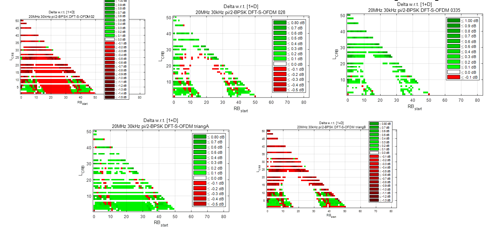
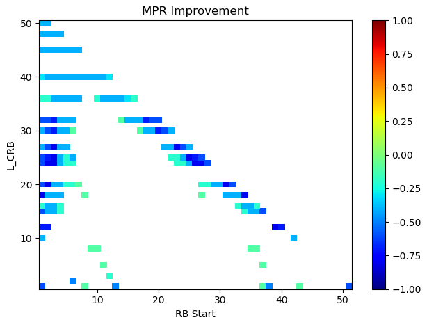

3GPP TR 38.868 V17.0.0 (2022-03)

Technical Report

3rd Generation Partnership Project;

Technical Specification Group Radio Access Network;

Optimizations of pi/2 BPSK uplink power in NR;

User Equipment (UE) radio transmission and reception;

(Release 17)

{width="1.31875in"
height="0.9201388888888888in"}
{width="1.7791666666666666in"
height="1.0368055555555555in"}

The present document has been developed within the 3rd Generation
Partnership Project (3GPP ^TM^) and may be further elaborated for the
purposes of 3GPP.\
The present document has not been subject to any approval process by the
3GPP Organizational Partners and shall not be implemented.\
This Report is provided for future development work within 3GPP only.
The Organizational Partners accept no liability for any use of this
Specification.\
Specifications and Reports for implementation of the 3GPP ^TM^ system
should be obtained via the 3GPP Organizational Partners\' Publications
Offices.

> Keywords
>
> \<NR V2X (vehicle-to-everything), Sidelink, Public safety, Proximity
> based Services\>
>
> ***3GPP***
>
> Postal address
>
> 3GPP support office address
>
> 650 Route des Lucioles - Sophia Antipolis
>
> Valbonne - FRANCE
>
> Tel.: +33 4 92 94 42 00 Fax: +33 4 93 65 47 16
>
> Internet
>
> http://www.3gpp.org

***Copyright Notification***

No part may be reproduced except as authorized by written permission.\
The copyright and the foregoing restriction extend to reproduction in
all media.

© 2022, 3GPP Organizational Partners (ARIB, ATIS, CCSA, ETSI, TSDSI,
TTA, TTC).

All rights reserved.

UMTS™ is a Trade Mark of ETSI registered for the benefit of its members

3GPP™ is a Trade Mark of ETSI registered for the benefit of its Members
and of the 3GPP Organizational Partners\
LTE™ is a Trade Mark of ETSI registered for the benefit of its Members
and of the 3GPP Organizational Partners

GSM® and the GSM logo are registered and owned by the GSM Association

 Contents {#contents .TT}
========

Foreword 5

1 Scope 6

2 References 6

3 Definitions, symbols and abbreviations 6

3.1 Definitions 6

3.2 Symbols 6

3.3 Abbreviations 6

4 Background 7

4.1 Justification 7

4.2 Objective 8

5 Evaluation of link level simulation 8

5.1 Qualcomm link level simulation results 8

5.2 Huawei link level simulation results 11

5.3 Nokia link level simulation results 12

5.3.1 Spectral shaping transparent to gNB receiver 12

5.3.2 Spectral shaping known to gNB receiver 14

5.4 IITH, IITM, CEWiT, Reliance Jio, Tejas Networks link level
simulation results 15

5.5 Intel link level simulation results 17

5.6 Vivo link level simulation results 20

6 Evaluation of Pulse shaping filters 22

6.1 Pulse shaping filter simulation results 23

6.1.1 Huawei simulation results for pulse shaping filter 23

6.1.2 Nokia simulation results for pulse shaping filters 24

6.2 Net gain analysis of combined Tx and Rx impacts 25

6.2.1 Nokia simulation results for net gain analysis of combined Tx and
Rx impacts (w.r.t 1+D) DMRS not shaped 25

6.2.1.1 Net gain simulation results for TDL-C300ns 26

6.2.1.2 Net gain simulation results for TDL-A 30ns 28

6.2.1.3 Net gain simulation results for TDL-D 30ns 30

6.2.2 Nokia simulation results for net gain analysis of combined Tx and
Rx impacts (w.r.t \[0.2 1 0.2\]) 32

6.2.2.1 Net gain simulation results for TDL-C300ns 33

6.2.2.2 Net gain simulation results for TDL-A 30ns 35

6.2.2.3 Net gain simulation results for TDL-D 30ns 37

6.2.3 Intel Tx + Rx link margin analysis 39

6.2.3.1 Tx + Rx combined link margin 39

6.2.3.2 Tx + Rx combined link margin (relative to MPR0 and maximum SNR)
41

6.2.4 Qualcomm Net link margin analysis 44

7 SAR mitigation solutions 46

8 Feasibility analysis of power enhancement 46

8.1 Qualcomm results for power enhancement 46

8.2 Nokia results for power enhancement 47

8.2.1 Power enhancement with respect to \[1+D\] filter with DMRS shaped
48

8.2.2 Power enhancement with respect to \[1+D\] filter with DMRS not
shaped 52

8.2.3 Best filters per channel bandwidth 57

8.2.4 Minimum MPR w.r.t 29 dBm 62

8.3 IITH, IITM, CEWiT, Reliance Jio, Tejas Networks results for power
enhancement 65

8.4 Intel results for power enhancement 66

8.5 Huawei results for power enhancement 68

8.5.1 MPR comparison results 68

8.5.2 Optimization of RB regions for MPR specifications 70

8.6 Skyworks results for power enhancement 72

8.6.1 Power enhancement results1 72

8.6.2 Power enhancement results2 77

8.7 Apple results for power enhancement 81

8.7.1 Results for power boost \>2dB 81

8.7.2 Results for power boost between 1dB to 2dB 86

9 Agreements, conclusion and recommendations 90

9.1 RAN4 and RAN agreements 90

9.2 Conclusions 90

Annex A: Change history 92

 Foreword
========

This Technical Report has been produced by the 3^rd^ Generation
Partnership Project (3GPP).

The contents of the present document are subject to continuing work
within the TSG and may change following formal TSG approval. Should the
TSG modify the contents of the present document, it will be re-released
by the TSG with an identifying change of release date and an increase in
version number as follows:

Version x.y.z

where:

x the first digit:

1 presented to TSG for information;

2 presented to TSG for approval;

3 or greater indicates TSG approved document under change control.

y the second digit is incremented for all changes of substance, i.e.
technical enhancements, corrections, updates, etc.

z the third digit is incremented when editorial only changes have been
incorporated in the document.

 

1 Scope
=======

This document is a technical report for optimization of pi/2 BPSK NR
uplink power in Rel-17. The purpose is to evaluate the feasibility of
increasing the UE's uplink power in TDD bands for pi/2 BPSK modulation
assuming use of existing UE power classes as indicated per band or band
combination. The objectives are applicable to FR1 TDD bands n34, n39,
n40, n41, n77, n78 and n79. The justification and objectives of this
work item are outlined in section 4.1 and section 4.2.

2 References
============

The following documents contain provisions which, through reference in
this text, constitute provisions of the present document.

\- References are either specific (identified by date of publication,
edition number, version number, etc.) or non‑specific.

\- For a specific reference, subsequent revisions do not apply.

\- For a non-specific reference, the latest version applies. In the case
of a reference to a 3GPP document (including a GSM document), a
non-specific reference implicitly refers to the latest version of that
document *in the same Release as the present document*.

\[1\] 3GPP TR 21.905: \"Vocabulary for 3GPP Specifications\".

\[2\] 3GPP TR 30.007: \"Guideline on WI/SI for new Operating Bands\".

\[3\] 3GPP TS 38.101-1: \"NR; User Equipment (UE) radio transmission and
reception; Part 1: Range 1 Standalone\".

\[4\] 3GPP TS 38.101-2: \"NR; User Equipment (UE) radio transmission and
reception; Part 2: Range 2 Standalone\".

\[5\] 3GPP TS 38.101-3: \"NR; User Equipment (UE) radio transmission and
reception; Part 3: Range 1 and Range 2 Interworking operation with other
radios\".

3 Definitions, symbols and abbreviations
========================================

3.1 Definitions
---------------

For the purposes of the present document, the terms and definitions
given in 3GPP TR 21.905 \[1\] and the following apply. A term defined in
the present document takes precedence over the definition of the same
term, if any, in 3GPP TR 21.905 \[1\].

3.2 Symbols
-----------

For the purposes of the present document, the following symbols apply:

3.3 Abbreviations
-----------------

For the purposes of the present document, the abbreviations given in
3GPP TR 21.905 \[1\] and the following apply. An abbreviation defined in
the present document takes precedence over the definition of the same
abbreviation, if any, in 3GPP TR 21.905 \[1\].

ACLR Adjacent Channel Leakage Ratio

ACS Adjacent Channel Selectivity

AGC Automatic Gain Control

A-MPR Additional Maximum Power Reduction

BLER BLock Error Rate

BS Base Station

CBW Channel Bandwidth

CDF Cumulative Distribution Function

CP-OFDM Cyclic Prefix-OFDM

DMRS Demodulation Reference Signal

DSRC Dedicated Short-Range Communications

EIRP Equivalent Isotropically Radiated Power

EVM Error Vector Magnitude

FDD Frequency Division Duplex

FDM Frequency Division Multiplexing

FR1 Frequency Range 1

FR2 Frequency Range 2

ITS Intelligent Transportation System

LDPC Low Density Parity Check

LTE Long Term Evolution

LOS Line-Of-Sight

MPR Maximum Power Reduction

NF Noise Figure

NLOS Non-Line-Of-Sight

NR New Radio

OLPC Open Loop Power Control

PC Power Control

PRB Physical Resource Block

PRR Package Reception Ratio

ProSe Proximity-based Services

PSCCH Physical Sidelink Control CHannel

PSSCH Physical Sidelink Shared CHannel

REFSENS Reference Sensitivity

RF Radio Frequency

SCS Sub-Carrier Spacing

SINR Signal to Interference plus Noise Ratio

SL Sidelink

SNR Signal-to-Noise Ratio

TDD Time Division Duplex

TDM Time Division Multiplexing

UE User Equipment

UL Uplink

V2V Vehicle to Vehicle

V2X Vehicle to Everything

4 Background
============

4.1 Justification
-----------------

Coverage enhancement is a study item led by RAN1 for Rel-17. It has been
identified that uplink channels are the bottleneck in many of the
evaluated scenarios in terms of the coverage achieved. Given a fixed
number of antennas and fixed MCS choices, an improvement in the uplink
link budget is only possible through an increase in the UE's UL power.

The current MPR tables may not fully exploit spectrum shaping of pi/2
BPSK waveforms. Meaningful reduction in MPR for certain waveforms could
be achieved if UEs exclusively rely on 'strong' shaping. Increase in
maximum achievable power may also be feasible relative to the MPR0 power
level. For PC2 devices MPR1 is the output power level at which the
ACLR=31 dBc obtained with a QPSK full RB DFT-S\_OFDM waveform. The
output power MPR0 is defined as, MPR0=MPR1+1dB.

Using precedent in Rel-15 and Rel-16 for high power transmissions, duty
cycle restrictions will help maintain average power levels at 23 dBm for
compliance with SAR requirements.

In this study item, we propose to exploit strong spectrum shaping to
realize UL power gains for pi2BPSK waveforms.

4.2 Objective
-------------

The objective of this study is to evaluate the feasibility of increasing
the UE's uplink power in TDD bands for pi/2 BPSK modulation assuming use
of existing UE power classes as indicated per band or band combination.
The objectives are applicable to FR1 TDD bands n34, n39, n40, n41, n77,
n78 and n79.

> 1\. Identify achievable UE Tx power for pi/2 BPSK with the filter
> studied in this study item. \[RAN4\]
>
> 2\. Evaluate SAR-related duty-cycle restrictions and reporting
> mechanisms \[RAN4\]
>
> 3\. Identify filter characteristics necessary to enable the new power
> capability while ensuring good and robust BS receiver performance.
> \[RAN4\]
>
> a\. The choice of filters is up to UE implementations and transparent
> to the network
>
> b\. Evaluate possible pulse shaping filter requirement applicable to
> the identified new UE power capability if achievable \[RAN4\]
>
> c\. Identify if necessary, changes that are needed to EVM equalizer
> flatness mask requirements to capture necessary filter. Changes to the
> existing 14 dB p-p baseline to be assessed in relation to any
> potential gains in UL link performance while still ensuring robust BS
> receiver performance for all UEs in a cell. \[RAN4\]

Note: whether or not a new UE power class will be introduced for the
identified achievable UE Tx power for pi/2 BPSK will be decided at the
drafting stage of the following WI.

5 Evaluation of link level simulation 
=====================================

#### 5.1 Qualcomm link level simulation results

The following table gives the link level parameters that were considered
in the simulations:

Table 5.1.1: Link level simulation parameters

  **Parameter**             **Value**
  ------------------------- ---------------------------------------------------------------------
  Pulse shaping filter      Filter configuration conforms to 38.101-1
  Channel model             TDL-A30ns
  MCS Code rate             0
  Waveform                  DFTS OFDM with pi/2 BPSK filtered by same filter as for Rel-16 DMRS
  \# of DMRS symbols/slot   2
  \# of data symbols/slot   12
  \# of RBs                 2, 4, 8, 16
  TX/RX configuration       1TX/4RX
  BW                        100 MHz
  UE speed                  3 km/h
  SCS                       30 kHz
  HARQ configuration        No retransmissions

Below are the link simulation results for 2, 4, 8 and 16 RBs

{width="4.166666666666667in"
height="3.1666666666666665in"}

Figure 5.1.1: Waveform with number of RB=2

{width="4.1875in"
height="3.0729166666666665in"}

Figure 5.1.2: Waveform with number of RB=4

{width="4.208333333333333in"
height="3.1145833333333335in"}

Figure 5.1.3: Waveform with number of RB=8

{width="4.28125in"
height="3.3958333333333335in"}

Figure 5.1.4: Waveform with number of RB=16

For a BLER=10^-1^ the following is observed from the simulation results:

Table 5.1.2: Filter degradation as a function of RB\#

  **Waveform RB \#**   **SNR @** BLER=10^-1^ No filter   **SNR @** BLER=10^-1^ with filter   **Delta (dB)**
  -------------------- --------------------------------- ----------------------------------- ----------------
  2                    -6.9                              -6.5                                0.4
  4                    -8.7                              -8.5                                0.2
  8                    -9.9                              -9.7                                0.2
  16                   -10.8                             -10.7                               0.2

Based on this data the maximum degradation due to pulse shaping is seen
to be 0.4 dB.

#### 5.2 Huawei link level simulation results

The Table 2 below is the recommended parameter list for link level
simulation.

Table 5.2.1: Recommended Parameter list

  Parameter                 Value
  ------------------------- ---------------------------------------------------------------------
  Pulse shaping filter      Filter configuration conforms to 38.101-1
  Channel model             TDL-C300ns, TDL-A30, TDL-D30
  MCS                       0
  Code rate                 1/8, 1/4, 1/3, 1/2, 2/3
  Waveform                  DFTS OFDM with pi/2 BPSK filtered by same filter as for Rel-16 DMRS
  \# of DMRS symbols/slot   2
  \# of data symbols/slot   12
  \# of RBs                 \[2, 4, 8, 16, 64\]
  TX/RX configuration       1TX/4RX
  BW                        100 MHz
  UE speed                  3 km/h
  SCS                       30 kHz
  HARQ configuration        No retransmissions

With the simulation assumptions in Table 2, Figure below shows the BLER
performance for NLoS channel with narrow (100MHz, 8 PRB) and large
bandwidth allocation (100MHz, 64 PRB), respectively.

{width="2.8125in"
height="2.3333333333333335in"} {width="2.5625in"
height="2.3645833333333335in"}

\(a\) Small RB allocation (8PRB) (b) Large RB allocation (64PRB)

Figure 5.2.1: BLER performance of different shaping filters

#### 5.3 Nokia link level simulation results

##### 5.3.1 Spectral shaping transparent to gNB receiver

Simulation parameters are shown in Table 3 and the link simulation
results for 2-64 PRB bandwidths in the below figures.

Table 5.3.1.1: Simulation assumptions

+-------------------------+-------------------------------------+
| Carrier frequency       | 4GHz                                |
+=========================+=====================================+
| Channel BW              | 100MHz                              |
+-------------------------+-------------------------------------+
| SCS                     | 30kHz                               |
+-------------------------+-------------------------------------+
| Channel model           | TDL-C 300ns, TDL-A 30ns, TDL-D 30ns |
+-------------------------+-------------------------------------+
| UE speed                | 3km/h                               |
+-------------------------+-------------------------------------+
| Channel estimation      | Frequency domain                    |
+-------------------------+-------------------------------------+
| Number of Tx antennas   | 1                                   |
+-------------------------+-------------------------------------+
| Number of Rx antennas   | 4                                   |
+-------------------------+-------------------------------------+
| DMRS config             | Low PAPR sequence type 2, 2 symbols |
+-------------------------+-------------------------------------+
| Waveform                | DFT-S-OFDM                          |
+-------------------------+-------------------------------------+
| HARQ config             | No retransmissions                  |
+-------------------------+-------------------------------------+
| Num PRBs                | 2,4,8,16,64                         |
+-------------------------+-------------------------------------+
| MCS                     | 0                                   |
+-------------------------+-------------------------------------+
| Channel                 | PUSCH, 14 OFDM symbols              |
+-------------------------+-------------------------------------+
| Frequency hopping       | No                                  |
+-------------------------+-------------------------------------+
| BLER                    | 10%                                 |
+-------------------------+-------------------------------------+
| Spectral shaping filter | 3-tap, FD implementation            |
|                         |                                     |
|                         | 1+D (not used for DMRS symbols)     |
|                         |                                     |
|                         | Triangular filters                  |
+-------------------------+-------------------------------------+

{width="3.401867891513561in"
height="2.3227252843394575in"}{width="3.1784142607174104in"
height="2.3125in"}

{width="3.327439851268591in"
height="2.2319444444444443in"}{width="3.327854330708661in"
height="2.2118055555555554in"}

{width="3.40625in" height="2.25in"}

Figure 5.3.1.1: Required SNR for 10% BLER for different channel profiles

Based on company results the maximum degradation due to pulse shaping is
seen to be up to 0.87dB for all 3 channel models.

##### 5.3.2 Spectral shaping known to gNB receiver

The \[0.335, 1.0, 0.335\] spectral shaping filter used in this paper is
the most aggressive 3-tap filter that meets the current spectral
flatness requirements as shown in our paper from RAN4\#99e
\[R4-2109742\]. Less aggressive 3-tap filters are included too. 3-tap
filter is implemented in frequency domain due to lower complexity.
Simulation parameters are shown in Table 5.3.2.1 and the link simulation
results for 2-64 PRB bandwidths in Figure 5.3.2.1. Simulation parameters
are according to agreed way forward \[R4-2108018\].

Table 5.3.2.1: Simulation assumptions

  Carrier frequency         4GHz
  ------------------------- -------------------------------------
  Channel BW                100MHz
  SCS                       30kHz
  Channel model             TDL-C 300ns, TDL-A 30ns, TDL-D 30ns
  UE speed                  3km/h
  Channel estimation        Frequency domain
  Number of Tx antennas     1
  Number of Rx antennas     4
  DMRS config               Low PAPR sequence type 2, 2 symbols
  Waveform                  DFT-S-OFDM
  HARQ config               No retransmissions
  Num PRBs                  2,4,8,16,64
  MCS                       0
  Channel                   PUSCH, 14 OFDM symbols 
  Frequency hopping         No
  BLER                      10%
  Spectral shaping filter   3-tap, FD implementation

{width="3.3714129483814523in"
height="2.5118110236220472in"}{width="3.1811023622047245in"
height="2.512357830271216in"}

{width="3.3698425196850392in"
height="2.47244094488189in"}{width="3.3809470691163606in"
height="2.456692913385827in"}

{width="3.39463801399825in"
height="2.456692913385827in"}

Figure 5.3.2.1: Required SNR for 10% BLER for different channel profiles

**Observation 1:** Link loss due to more aggressive spectral shaping
filtering is higher with small bandwidths.

**Observation 2:** For given number of PRBs, the performance difference
between the used filters is quite similar for all the channel models.

#### 5.4 IITH, IITM, CEWiT, Reliance Jio, Tejas Networks link level simulation results

Table 5.4.1: Simulation parameters

  **Parameter**             **Value**
  ------------------------- ---------------------------------------------------------------------
  Pulse shaping filter      1+D
  Channel model             TDL-D 30, TDL-A30
  MCS                       0
  Waveform                  DFTS OFDM with pi/2 BPSK filtered by same filter as for Rel-16 DMRS
  \# of DMRS symbols/slot   2
  \# of data symbols/slot   12
  \# of RBs                 1,4,16
  TX/RX configuration       1TX/4RX
  BW                        100 MHz
  SCS                       30 kHz
  HARQ configuration        No retransmissions

Table 5.4.2: SNR comparison with and without 1+D spectrum shaping at
10\^-1 BLER in TDLD-30

  **Allocation Size**   **W/O Filter**   **With 1+D Filter**   **Delta (dB)**
  --------------------- ---------------- --------------------- ----------------
  1 PRB                 -4.68            -4.39                 0.29
  4 PRB                 -9.667           -9.55                 0.117
  16 PRB                -10.49           -10.484               0.006

{width="3.2694444444444444in"
height="2.4520833333333334in"}

Figure 5.4.1: BLER for 1 PRB allocation with and without 1+D spectrum
shaping in TDLD-30

{width="3.3368055555555554in"
height="2.5in"}

Figure 5.4.2: BLER for 4 PRB allocation with and without 1+D spectrum
shaping in TDLD-30

{width="3.4229166666666666in"
height="2.5770833333333334in"}

Figure 5.4.3: BLER for 16 PRB allocation with and without 1+D spectrum
shaping in TDLD-30

Simulation results for TDLA-30ns is given in the following table

Table 5.4.3: SNR comparison with and without 1+D spectrum shaping at
10\^-1 BLER in TDLA-30

  **Allocation Size**   **W/O Filter**   **With 1+D Filter**   **Delta (dB)**
  --------------------- ---------------- --------------------- ----------------
  1 PRB                 -3.7             -3.5                  0.2
  4 PRB                 -8.05            -7.95                 0.1
  16 PRB                -8.24            -8.24                 0

Observation: The loss due to 1+D spectrum shaping does not exceed 0.3
dB.

#### 5.5 Intel link level simulation results

Table 5.5.1 provides a summary of link-level simulation assumptions. The
results of analysis of pulse-shaping filtering impact on PUSCH
demodulation performance are summarized in Tables 5.5.2 to 5.5.5, which
provide estimated PUSCH SNR loss @ 1% BLER due to filtering. Figure
5.5.1 provides illustration of the obtained performance in TDLC300
channel model.

Table 5.5.1: Simulation assumptions

+-------------------------+-------------------------------------------+
| **Parameter**           | **Value**                                 |
+=========================+===========================================+
| Pulse shaping filters   | \[0.2 1 0.2\]                             |
|                         |                                           |
|                         | \[0.28 1 0.28\]                           |
|                         |                                           |
|                         | \[0.335 1 0.335\]                         |
+-------------------------+-------------------------------------------+
| Channel model           | AWGN, TDL-C300ns, TDL-A30, TDL-D30        |
+-------------------------+-------------------------------------------+
| MCS                     | 0 (MCS Table 1)                           |
+-------------------------+-------------------------------------------+
| Waveform                | DFTS OFDM with pi/2 BPSK filtered by same |
|                         | filter as for Rel-16 DMRS                 |
+-------------------------+-------------------------------------------+
| DMRS configuration      | Rel-16 low PAPR DMRS sequence             |
+-------------------------+-------------------------------------------+
| \# of DMRS symbols/slot | 2                                         |
+-------------------------+-------------------------------------------+
| \# of Data symbols/slot | 12                                        |
+-------------------------+-------------------------------------------+
| \# of RBs               | 2, 4, 8, 16, 64                           |
+-------------------------+-------------------------------------------+
| TX/RX configuration     | 1TX/4RX (low correlation)                 |
+-------------------------+-------------------------------------------+
| CBW                     | 100 MHz                                   |
+-------------------------+-------------------------------------------+
| SCS                     | 30 kHz                                    |
+-------------------------+-------------------------------------------+
| HARQ configuration      | No retransmissions                        |
+-------------------------+-------------------------------------------+
| Test metric             | 1% BLER                                   |
+-------------------------+-------------------------------------------+

Table 5.5.2: SNR loss compared to scenario without pulse-shaping in
AWGN, dB

  **Parameter**   **Filters**                               
  --------------- ------------------- --------------------- -----------------------
                  **\[0.2 1 0.2\]**   **\[0.28 1 0.28\]**   **\[0.335 1 0.335\]**
  2 PRB           1.1                 1.7                   2.2
  4 PRB           0.3                 0.9                   1.5
  8 PRB           0.4                 1.1                   1.6
  16 PRB          0.5                 1.1                   1.7
  64 PRB          0.7                 1.3                   1.8

Table 5.5.3: SNR loss compared to scenario without pulse-shaping in
TDLA30, dB

  **Parameter**   **Filters**                               
  --------------- ------------------- --------------------- -----------------------
                  **\[0.2 1 0.2\]**   **\[0.28 1 0.28\]**   **\[0.335 1 0.335\]**
  2 PRB           1.2                 1.2                   2.2
  4 PRB           0.3                 0.3                   1.5
  8 PRB           0.1                 0.1                   1.5
  16 PRB          0.5                 0.5                   1.8
  64 PRB          0.7                 0.7                   1.8

Table 5.5.4: SNR loss compared to scenario without pulse-shaping in
TDLC300, dB

  **Parameter**   **Filters**                               
  --------------- ------------------- --------------------- -----------------------
                  **\[0.2 1 0.2\]**   **\[0.28 1 0.28\]**   **\[0.335 1 0.335\]**
  2 PRB           1.0                 1.6                   2.2
  4 PRB           0.8                 1.5                   1.9
  8 PRB           0.6                 1.5                   2.2
  16 PRB          0.4                 1.1                   1.9
  64 PRB          0.8                 1.3                   1.7

Table 5.5.5: SNR loss compared to scenario without pulse-shaping in
TDLD30, dB

  **Parameter**   **Filters**                               
  --------------- ------------------- --------------------- -----------------------
                  **\[0.2 1 0.2\]**   **\[0.28 1 0.28\]**   **\[0.335 1 0.335\]**
  2 PRB           1.1                 1.7                   2.2
  4 PRB           0.1                 0.6                   1.2
  8 PRB           0.1                 0.6                   1.2
  16 PRB          0.4                 0.9                   1.4
  64 PRB          0.8                 1.2                   1.6

  {width="3.1498567366579175in" height="2.3622047244094486in"}   {width="3.1498567366579175in" height="2.3622047244094486in"}
  -------------------------------------------------------------------------------------- --------------------------------------------------------------------------------------
  {width="3.1498567366579175in" height="2.3622047244094486in"}   {width="3.1498567366579175in" height="2.3622047244094486in"}
  {width="3.1498567366579175in" height="2.3622047244094486in"}   
  Figure 5.5.1: BLER vs SNR for TDL-C channel model                                      

Based on the obtained results we make the following observations:

> *1) Pulse shaping result in PUSCH demodulation performance loss with
> larger performance degradation observed for more aggressive filters.
> Up to 2.2 dB SNR loss is observed for \[0.335 1 0.335\] filter.*
>
> *2) The largest degradation is observed for small PRB allocations and
> the reduces in case of using larger PRB allocations*
>
> *3) There is a negligible performance loss dependency on channel model
> at least with practical receive processing*

#### 5.6 Vivo link level simulation results

we provide link level simulation results for pi/2 BPSK based on the
below parameter list in table 5.6.1.

Table 5.6.1: Recommended Parameter list

  **Parameter**             **Value**
  ------------------------- ---------------------------------------------------------------------
  Pulse shaping filter      Filter configuration conforms to 38.101-1
  Channel model             TDL-C300ns, TDL-A30, TDL-D30
  MCS                       0
  Waveform                  DFTS OFDM with pi/2 BPSK filtered by same filter as for Rel-16 DMRS
  \# of DMRS symbols/slot   2
  \# of data symbols/slot   12
  \# of RBs                 \[2, 4, 8, 16, 64\]
  TX/RX configuration       1TX/4RX
  BW                        100 MHz
  UE speed                  3 km/h
  SCS                       30 kHz
  HARQ configuration        No retransmissions

The Bler curves for different configuration parameters of three-tap
filter are shown is figure 5.6.2.

The frequency domain characteristic curves are shown in figure 5.6.1. It
can be observed that for the more aggressive spectral shape filter, the
curve is narrower in the frequency domain. And it also shows that the
correlation between time-domain data would be greater and the PAPR would
be smaller. Therefore, it is helpful to boost the power of UE output.

However, for the spectral shape filter, the receive demodulation
performance would also be reduced compared with no filter since the FDSS
would cause non-uniform distribution of SNR on each subcarrier and
impact the channel equalization.

{width="5.773611111111111in" height="3.0in"}

Figure 5.6.1: Frequency characteristics of different spectral shape
filters

Observation 1: For the more aggressive spectral shape filter, the PAPR
would be smaller

  -------------------------------------------------------------------------------------- --------------------------------------------------------------------------------------
  {width="3.2694444444444444in" height="2.4784722222222224in"}   {width="3.3041666666666667in" height="2.4784722222222224in"}
  -------------------------------------------------------------------------------------- --------------------------------------------------------------------------------------

  -------------------------------------------------------------------------------------- -------------------------------------------------------------------------------------
  {width="3.5479166666666666in" height="2.6694444444444443in"}   {width="3.373611111111111in" height="2.6694444444444443in"}
  -------------------------------------------------------------------------------------- -------------------------------------------------------------------------------------

  ------------------------------------------------------------------------------------- -------------------------------------------------------------------------------------
  {width="3.373611111111111in" height="2.5305555555555554in"}   {width="3.347916666666667in" height="2.5131944444444443in"}
  ------------------------------------------------------------------------------------- -------------------------------------------------------------------------------------

Figure 5.6.2: Bler performance of different spectrum shape filters

It can be observed that for all channel model (e.g., TDL-A, TDL-C,
TDL-D) and RBs (2RB and 8RB), for the more aggressive spectral shape
filter (e.g., \[0.33 1 0.33\]), the Bler performance would be worse. In
addition, the maximum SNR difference between no-filter and FDSS filter
when the Bler is 10% is about is 1dB.

Observation 2: For all channel model (e.g., TDL-A, TDL-C, TDL-D) and RBs
(2RB and 8RB), for the more aggressive spectral shape filter (e.g.,
\[0.33 1 0.33\]), the Bler performance would be worse.

Observation 3: The maximum SNR difference between no-filter and FDSS
filter when the Bler is 10% is about 1dB.

Based on the above analyse, we can see that it is very necessary to
select the appropriate filter, PAPR performance and Bler performance
must be taken into consideration at the same time.

Observation 4: PAPR performance and Bler performance must be taken into
consideration at the same time for FDSS filter selection.

6 Evaluation of Pulse shaping filters
=====================================

#### 6.1 Pulse shaping filter simulation results

##### 6.1.1 Huawei simulation results for pulse shaping filter

Figure 6.1.1.1 illustrates the evaluated FDSS filter in term of the
spectrum shape for the example of allocation of 20 PRBs.

{width="3.4930555555555554in"
height="2.6180555555555554in"}

Figure 6.1.1.1: Spectrum shape of the FDSS filters

To further elaborate our consideration and understanding of shaping
filter, the comparison of different implementation is provided in
figures below.

{width="2.951388888888889in"
height="2.5416666666666665in"}{width="2.9166666666666665in"
height="2.5833333333333335in"}

Figure 6.1.1.2: PAPR of different shaping filters (CBW 100MHz, 64RB)

{width="2.875in"
height="2.5208333333333335in"}{width="2.8333333333333335in"
height="2.5625in"}

Figure 6.1.1.3: PAPR of different shaping filters (CBW 10MHz, 8RB)

These results indicate that the PAPR for a given CCDF is lower for more
aggressive pulse shaping filtering.

##### 6.1.2 Nokia simulation results for pulse shaping filters

The following figure shous the tested filters.

{width="2.9469870953630797in"
height="2.2102405949256343in"}

Figure 6.1.2.1: Tested filters

0.335 is the most aggressive 3-tap filter that meets the current
spectral flatness requirements, less aggressive 3-tap filters are
included too (0.2 and 0.28). Triang A is the most aggressive triangular
window that meets the current spectral flatness requirements, and Triang
B is a less aggressive triangular window, with similar frequency shape
as the 0.2 3-tap filter.

A subset of the results for the evaluation of the pulse shaping filters
from the transmitter point of view from \[3\] is shown in the following
figures, where the filter that provides the highest output power is
selected for each allocation configuration.

{width="3.307087707786527in"
height="2.4803149606299213in"}
{width="3.307087707786527in"
height="2.4803149606299213in"}

Figure 6.1.2.2: Shaping filter that provides the maximum output power
for (left) 10 MHz channel BW, and (right) 50 MHz channel BW

Conclusions of the simulations (all available results are not included
here due to vast amount of them but they can be found in \[3\],):

For all the tested channel bandwidth, and allocation configurations,
there are filters that conform to 38.101-1 Rel-16 requirements that
offer larger or same output power than the \[1+D\] filter when the DMRS
are shaped.

For all the tested channel bandwidth, and allocation configurations,
there are filters that conform to 38.101-1 Rel-16 requirements that
offer larger or same output power than the \[1+D\] filter when the DMRS
are not shaped.

#### 6.2 Net gain analysis of combined Tx and Rx impacts

##### 6.2.1 Nokia simulation results for net gain analysis of combined Tx and Rx impacts (w.r.t 1+D) DMRS not shaped

Note: The LS from RAN to RAN4 \[RP-213655\] states that both the data
and DMRS should be filtered. The results in this section were generated
prior to this decision and therefore do not conform to the instruction
provided in this LS

In order to characterize the filters, it is needed to consider both the
transmitter performance (i.e., the achievable output power) from our
paper \[3\], and the link level performance obtained in \[4\]. With that
information, it is possible to compute the net gain with respect to a
reference filter as:

$$\text{Net~Gain~}\left\lbrack \text{dB} \right\rbrack = \left( \text{Pou}t_{\text{Filter~i}} - Pout_{\text{Ref.~filter}} \right) + \left( SNR10\%_{\text{Ref.~filter}} - SNR10\%_{\text{Filter~i}} \right)\ $$

Where $\text{Pou}t_{\text{Filter~i}}$ is the output power of the filter
being compared against the reference filter,
$\text{Pou}t_{\text{Ref.~filter}}$ is the output power of the reference
filter, $SNR10\%_{\text{Ref.~filter}}$ is the required SNR to achieve
10% BLER of the reference filter, and $SNR10\%_{\text{Filter~i}}$ is the
required SNR to achieve 10% BLER of the filter being compared against
the reference filter.

The following slides show the net gain of the filters with respect to
the \[1+D\] filter with DMRS not shaped, for pi/2 BPSK considering the
transmitter \[3\] and link level \[4\] performance for the following
allocations and channels:

2, 4, 8, 16 and 64 PRB

TDL-C 300 ns, TDL-A 30 ns and TDL-D 30 ns

Filters tested:

\[-0.2 1 -0.2\], \[-0.28 1 -0.28\], \[-0.335 1 -0.335\], Triang A \[6
14\] and Triang B \[6 8\]

The tested filters assume that the filter is transparent to the gNB, and
the DMRS are shaped. For the \[1+D\], matched filter is used in
reception.

###### 6.2.1.1 Net gain simulation results for TDL-C300ns

For 2 and 4 PRB, \[1+D\] without DMRS shaped performs better than all
the filters in center allocations (0.1-0.2 dB better than the 0.2 filter
and 0-0.1 dB better than Triang B).

For 8 and 16 PRB, \[1+D\] without DMRS shaped is never the best for any
allocation. Triang B is the best filter, providing gain for most of the
possible allocations within the channel.

For 64 PRB, in central allocations, the performance is the same as
Triang B. In edge band allocations, the 0.335 filter provides up to 0.9
dB gain.

For small allocation sizes, it must be noted that less aggressive
filters perform better than aggressive filters in central band
allocations.

There is not a single best solution for all the evaluated cases.
Depending on the allocation configuration, different filters (i.e., more
or less aggressive) perform differently.

Results are given in the below figures

{width="3.6in" height="2.7in"}

Figure 6.2.1.1.1: 2 PRB

{width="3.6in" height="2.7in"}

Figure 6.2.1.1.2: 4 PRB

{width="3.6in" height="2.7in"}

Figure 6.2.1.1.3: 8 PRB

{width="3.5999989063867015in" height="2.7in"}

Figure 6.2.1.1.4: 16 PRB

{width="3.6in" height="2.7in"}

Figure 6.2.1.1.5: 64 PRB

***Observation***: For allocation sizes ≤ 16 PRB, less aggressive
filters perform better than aggressive filters in central band
allocations.

###### 6.2.1.2 Net gain simulation results for TDL-A 30ns

For 2 and 4 PRB, \[1+D\] without DMRS shaped performs better than all
the filters in all allocations (0.1-0.2 dB better than the Triang B
filter).

For 8 and 16 PRB, \[1+D\] without DMRS shaped is never the best for any
allocation position.

For 64 PRB, in central allocations, the performance is the same as
Triang B. In edge band allocations, the 0.335 filter provides up to
0.8-0.9 dB gain.

For small allocation sizes, it must be noted that less aggressive
filters perform better than aggressive filters in central band
allocations.

There is not a single best solution for all the evaluated cases.
Depending on the allocation configuration, different filters (i.e., more
or less aggressive) perform differently.

Results are given in the below figures

{width="3.6in" height="2.7in"}

Figure 6.2.1.2.1: 2 PRB

{width="3.6in" height="2.7in"}

Figure 6.2.1.2.2: 4 PRB

{width="3.6in" height="2.7in"}

Figure 6.2.1.2.3: 8 PRB

{width="3.6in" height="2.7in"}

Figure 6.2.1.2.4: 16 PRB

{width="3.6in" height="2.7in"}

Figure 6.2.1.2.5: 64 PRB

###### 6.2.1.3 Net gain simulation results for TDL-D 30ns

For 2 and 4 PRB, \[1+D\] without DMRS shaped performs better than all
the filters in all allocations (0.1-0.2 dB better than the Triang B
filter)

For 8 and 16 PRB, \[1+D\] without DMRS shaped is never the best for any
allocation. In central band allocations, Triang B provides gain. 0.335
filter provides up to 1 dB gain in edge band allocations.

For 64 PRB, in central band allocations Triang B provides gain. In edge
allocations, Triang A, 0.28 and 0.335 filters provide up to 0.8 dB gain.

For small allocation sizes, it must be noted that less aggressive
filters perform better than aggressive filters in central band
allocations.

There is not a single best solution for all the evaluated cases.
Depending on the allocation configuration, different filters (i.e., more
or less aggressive) perform differently.

Results are given in the below figures

{width="3.6in" height="2.7in"}

Figure 6.2.1.3.1: 2 PRB

{width="3.6in" height="2.7in"}

Figure 6.2.1.3.2: 4 PRB

{width="3.5999989063867015in" height="2.7in"}

Figure 6.2.1.3.3: 8 PRB

{width="3.5999989063867015in" height="2.7in"}

Figure 6.2.1.3.4: 16 PRB

{width="3.5999989063867015in" height="2.7in"}

Figure 6.2.1.3.5: 64 PRB

##### 6.2.2 Nokia simulation results for net gain analysis of combined Tx and Rx impacts (w.r.t \[0.2 1 0.2\])

The most aggressive filters have up to 0.6-0.8 dB loss with respect to
the less aggressive filters in the small allocations (2, 4, 8 PRB in the
evaluation) and central band allocations. These results suggest that
following the agreements on the WF after RAN4\#101e \[R4-2120057\], and
the SI objectives \[RP-213535\] (objective 3. c) there is a need for
different spectral flatness requirements for the filters based on the
allocation within the channel band. It would be beneficial to have
tighter spectral flatness requirements for small allocations band to
optimize the net gain.

**Observation 1**:  The most aggressive filters have up to 0.6-0.8 dB
loss with respect to the less aggressive filters in the small
allocations

**Observation 2**: For allocation sizes ≤ 16 PRB, less aggressive
filters perform better than aggressive filters in terms of achievable
output power and link performance.

**Observation 3**: There is not a single solution for all the evaluated
cases. Depending on the allocation configuration, different filters
(i.e., more or less aggressive) perform differently.

**Observation 4:** Based on the previous agreement in RAN4\#101bis-e
\[R4-2202386\], if spectrum flatness requirements are not tightened for
small allocations, net gain cannot be guaranteed.

###### 6.2.2.1 Net gain simulation results for TDL-C300ns

For 2 and 4 PRB, the two less aggressive filters tested (Triang B and
0.2) show the best performance for all the allocations within the
channel.

For 8 and 16 PRB, Triang B is the best filter, providing gain for most
of the possible allocations within the channel, except in the edge
allocations, where more aggressive filters offer gains of up to 1 dB.

For 64 PRB, in central allocations, the performance is the best for
Triang B. In edge band allocations, the 0.335 filter provides up to 1 dB
gain.

For small allocation sizes, it must be noted that less aggressive
filters perform better than aggressive filters.

Results are given in the below figures

{width="3.6in" height="2.7in"}

Figure 6.2.2.1.1: 2 PRB

{width="3.6in" height="2.7in"}

Figure 6.2.2.1.2: 4 PRB

{width="3.6in" height="2.7in"}

Figure 6.2.2.1.3: 8 PRB

{width="3.6in" height="2.7in"}

Figure 6.2.2.1.4: 16 PRB

{width="3.6in" height="2.7in"}

Figure 6.2.2.1.5: 64 PRB

###### 6.2.2.2 Net gain simulation results for TDL-A 30ns

For 2 and 4 PRB, the two less aggressive filters tested (Triang B and
0.2) show the best performance for all the allocations within the
channel.

For 8 and 16 PRB, Triang B is the best filter, providing gain for most
of the possible allocations within the channel, except in the edge (or
outer) allocations, where more aggressive filters offer gains of up to
1.3 dB.

For 64 PRB, in central allocations, Triang B offers the best
performance, with the rest of the filters offering the same net gain. In
edge band allocations, the 0.335 filter provides up to 0.8-1.1 dB gain.

For small allocation sizes, it must be noted that less aggressive
filters perform better than aggressive filters.

{width="3.6in" height="2.7in"}

Figure 6.2.2.2.1: 2 PRB

{width="3.6in" height="2.7in"}

Figure 6.2.2.2.2: 4 PRB

{width="3.6in" height="2.7in"}

Figure 6.2.2.2.3: 8 PRB

{width="3.6in" height="2.7in"}

Figure 6.2.2.2.4: 16 PRB

{width="3.6in" height="2.7in"}

Figure 6.2.2.2.5: 64 PRB

###### 6.2.2.3 Net gain simulation results for TDL-D 30ns

For 2 and 4 PRB, the two less aggressive filters tested (Triang B and
0.2) show the best performance for all the allocations within the
channel.

For 8 and 16 PRB, Triang B is the best filter, providing gain for most
of the possible allocations within the channel, except in the edge (or
outer) allocations, where more aggressive filters offer gains of up to
1.4 dB.

For 64 PRB, in central allocations, Triang B offers the best
performance, with the rest of the filters offering the same net gain. In
edge band allocations, the 0.335 filter provides up to 0.7-1 dB gain.

For small allocation sizes, it must be noted that less aggressive
filters perform better than aggressive filters.

{width="3.6in" height="2.7in"}

Figure 6.2.2.3.1: 2 PRB

{width="3.6in" height="2.7in"}

Figure 6.2.2.3.2: 4 PRB

{width="3.6in" height="2.7in"}

Figure 6.2.2.3.3: 8 PRB

{width="3.6in" height="2.7in"}

Figure 6.2.2.3.4: 16 PRB

{width="3.6in" height="2.7in"}

Figure 6.2.2.3.5: 64 PRB

### 6.2.3 Intel Tx + Rx link margin analysis

Table 6.2.3.1 provides a summary of link-level simulation assumptions.
NR design assumes that pi/2 BPSK spectral shaping on UE side is
performed on both data and DMRS symbols and, hence, the filtering is
transparent to the gNB receiver. Three filters \[0.2 1 0.2\], \[0.28 1
0.28\], and \[1+D\] were used as example of least, moderate and most
aggressive filtering respectively based on frequency roll-off. A single
PC2 PA was used in the Tx chain and was calibrated to 1dB MPR for
DFT-s-OFDM, QPSK, BW=20MHz, 100RB with 4 dB post PA loss in order to be
comparable with other simulation results in this study item. TDLC300 and
TDLA30 channel models were used for evaluations and SNR @ 10% BLER was
used as a test metric.

Table 6.2.3.1: Tx + Rx Simulation Assumptions

+-------------------------+-------------------------------------------+
| **Parameter**           | **Value**                                 |
+=========================+===========================================+
| Power Amplifier         | Single PC2 PA                             |
+-------------------------+-------------------------------------------+
| PA Calibration          | 1dB MPR: DFT-s-OFDM QPSK 20MHz, 100RB     |
|                         | with 4 dB post PA loss                    |
+-------------------------+-------------------------------------------+
| Pulse shaping filters   | \[0.2 1 0.2\]                             |
|                         |                                           |
|                         | \[0.28 1 0.28\]                           |
|                         |                                           |
|                         | \[1+D\]                                   |
+-------------------------+-------------------------------------------+
| Channel model           | TDL-C300ns, TDL-A30ns,                    |
+-------------------------+-------------------------------------------+
| MCS                     | 0 (MCS Table 3)                           |
+-------------------------+-------------------------------------------+
| Waveform                | DFTS OFDM with pi/2 BPSK filtered by same |
|                         | filter as for Rel-16 DMRS                 |
+-------------------------+-------------------------------------------+
| DMRS configuration      | Rel-16 low PAPR DMRS sequence             |
+-------------------------+-------------------------------------------+
| \# of DMRS symbols/slot | 2                                         |
+-------------------------+-------------------------------------------+
| \# of Data symbols/slot | 12                                        |
+-------------------------+-------------------------------------------+
| TX/RX configuration     | 1TX/4RX (low correlation)                 |
+-------------------------+-------------------------------------------+
| CBW                     | 20 MHz                                    |
+-------------------------+-------------------------------------------+
| SCS                     | 30 kHz                                    |
+-------------------------+-------------------------------------------+
| HARQ configuration      | No retransmissions                        |
+-------------------------+-------------------------------------------+

In order to have good comparison between the different filters and
channel models it is necessary to clearly define Net Tx + Rx Gain. One
way to evaluate Tx+Rx link margin is to compare delta of performance
with a filter against the same setup using no filter. This is done in
the clause 6.2.3.1 and allows for comparison in filter performance.
However, it is also useful to analyse absolute performance of the
achievable link budget. This is done in clause 6.2.3.2.

#### 6.2.3.1 Tx + Rx combined link margin 

In this section we evaluate the Tx + Rx combined link margin delta of
using a filter to no filter. The three pulse shaping filters used are
again \[0.20 1 0.2\], \[0.28 1 0.28\] and \[1+D\]. Two different channel
models, *TDLC300 and TDLA30 are used to highlight the effect of the
channel on pulse shaping filter behavior. In the three following
figures, simulation results using the pulse shaping filter are compared
with the same exact setup to no pulse shaping filter and the performance
difference is measured in dB. The formula for link margin delta used
was:*

$$\text{Link\ Margin\ delta~}\left\lbrack \text{dB} \right\rbrack = \left( \text{Tx\ Pou}t_{\text{Filter~i}} - Tx\ Pout_{\text{no~filter}} \right) + \left( Rx\ SNR10\%_{\text{no~filter}} - Rx\ SNR10\%_{\text{Filter~i}} \right)$$

*Positive dB represent a combination of higher Tx power and better Rx
SNR whereas negative dB represent lower Tx power and lower SNR. It is
noted that in all cases, adding a pulse shaping filter is done with the
performance tradeoff of slightly lower SNR due to the blind Rx
equalization process.*

{width="6.688888888888889in"
height="2.7708333333333335in"}

Figure 6.2.3.1.1: Tx + Rx Link Margin filter delta for \[0.2 1 0.2\].
(a) TDL-C300ns case, (b) TDL-A30ns case

Figure 6.2.3.1.1 shows the Tx + Rx link margin delta for \[0.2 1 0.2\].
For this filter, it can be seen that link margin performance is improved
by up to 2.5dB for all outer RB locations. For inner RB locations, pulse
filtering provides little benefit to Tx performance, yet does reduce Rx
performance as the equalizer must blindly accommodate the filtering.
Thus, for the TDL-C300nS channel model, the RBs mostly represent
negative link margin delta of (-0.1dB to -0.2dB) (blueish shades). For
the TDL-A30nS case, there are fewer negative link margin locations as
the Rx equalizer performance is less degraded by this channel model.

{width="6.688888888888889in"
height="2.767361111111111in"}

Figure 6.2.3.1.2: Tx + Rx Link Margin filter delta for \[0.28 1 0.28\].
(a) TDL-C300ns case, (b) TDL-A30ns case

In Figure 6.2.3.1.2, the Tx + Rx link margin delta for \[0.28 1 0.28\]
is seen. For this filter, outer RBs achieve slightly higher link margin
delta. This is because the sharper filter improves ACLR for outer RBs
compared to the \[0.2 1 0.2\] case. However, for inner RBs the filtering
does not improve the Tx performance, while the Rx performance is more
negatively impacted by the more aggressive filter. For the TDL-A30nS
case, there are fewer negative link margin locations than for the
TDL-C300nS case as the Rx equalizer performance is less degraded by the
channel model.

{width="6.688888888888889in"
height="2.798611111111111in"}

Figure 6.2.3.1.3: Tx + Rx Link Margin filter delta for \[1+D\]. (a)
TDL-C300ns case, (b) TDL-A30ns case

In Figure 6.2.3.1.3, the Tx + Rx link margin delta for \[1+D\] is seen.
For this more aggressive filter, outer RBs achieve link margin delta
nearly as high as the \[0.28 1 0.28\] case and better than the \[0.2 1
0.2\] case. This also is because the sharper filter improves ACLR for
outer RBs compared to the \[0.2 1 0.2\] case. However, for inner RBs,
where the filtering does not improve the Tx performance, this filter
shows the lowest Rx performance and has the most negative link margin
delta compared to no filter.

#### 6.2.3.2 Tx + Rx combined link margin (relative to MPR0 and maximum SNR)

In this analysis, we are interested in evaluating the regions of
operation on the 2D MPR figures to understand which operating regions
have the highest combined Tx + Rx link performance. Tx output may range
between 23dBm to 28dBm, Rx SNR for Pi/2BPSK may range from -13 to -5dB
and there is also the path loss. SNR varies with LCRB and tends to be
best for large LCRBs and degrade for small LCRBs. For this analysis, we
normalize to zero value for MPR0 (26dBm) Tx power and we normalize Rx
SNR for the highest achievable value (LCRB=50) with no filter. By
normalizing the Rx with the largest LCRB case with no filter which is
the best case, we can see the small trade-offs between filter
performance.

$$\text{Link\ Margin\ ~}\left\lbrack \text{dB} \right\rbrack = \left( \text{Tx\ Pou}t_{\text{Filter~i}} - MPR0\ (26dBm) \right) + \left( Rx\ SNR10\%_{\text{max\ with\ no~filter}} - Rx\ SNR10\%_{\text{Filter~i}} \right)$$

In the following figures Tx + Rx combined link margin is represented;
positive dB represent better performance in terms of higher Tx power
and/or better SNR.

{width="6.686805555555556in"
height="2.8090277777777777in"}

Figure 6.2.3.2.1: Tx + Rx Link Margin above Tx PC2 (26dBm) and Rx SNR
for LCRB=50 for \[0.2 1 0.2\]. (a) TDL-C300ns case, (b) TDL-A30ns case

{width="6.686805555555556in"
height="2.861111111111111in"}

Figure 6.2.3.2.2: Tx + Rx Link Margin above Tx PC2 (26dBm) and Rx SNR
for LCRB=50 for \[0.28 1 0.28\]. (a) TDL-C300ns case, (b) TDL-A30ns case

{width="6.686805555555556in"
height="2.8090277777777777in"}

Figure 6.2.3.2.3: Tx + Rx Link Margin above Tx PC2 (26dBm) and Rx SNR
for LCRB=50 for \[1+D\]. (a) TDL-C300ns case, (b) TDL-A30ns case

All six of the plots in Figure 6.2.3.2.1 - 6.2.3.2.3 have some common
trends. In all cases the lower 12% of LCRB cases (LCRB*≤*6 for
CBW=20MHz) have at least some negative link margins. For these small
LCRBs, the degradation in equalization performance exceeds any gains in
Tx output power had by using Pi/2BPSK.

Observation 1: In all cases simulated, the lower 12% of LCRB cases (LCRB
≤ 5 for CBW=20MHz) have at least some negative link margins for the
channel models evaluated.

This is due to fact that small RBs are more easily impacted by sharp
fades from the channel models. It can also be observed that this effect
is more severe for the TLD-C300nS channel model than the TLD-A30nS
model.

The largest 12% of LCRBs cases (LCRB ≥ 45 for CBW=20MHz) have slightly
lower link performance than the middle LCRBs, but only by 0.5dB to 1.0dB
less link margin. This is due to ACLR/SEM limitation on the Tx side.

Observation 2: The link margin is the highest for a small triangle of
middle LRCBs above and below 12% of the top and bottom edges, and with
the peak values in the centre at LCRB near 40% of LCRBmax.

It is also noted that the left and right edge RBs within 8% of LCRBmax
also have degraded link margin due to ACLR/SEM limitations on the Tx
side.

Table 6.2.3.2.1: Selected Link Margin values from the TDL-A30ns case for
comparison

                        **Link Margin (dB)**                             
  --------------------- ---------------------- ------------ ------------ ---------
  **Filter**            **40RB6**              **20RB16**   **10RB21**   **Max**
  **\[0.2 1 0.2\]**     2.2                    2.8          2.2          2.9
  **\[0.28 1 0.28\]**   2.6                    2.6          2.0          2.7
  **\[1+D\]**           2.5                    2.5          1.8          2.6

Next, we compare between the three filters. Table 6.2.3.2.1 shows some
specific values selected from the Figures 6.2.3.2.1 -- 6.2.3.2.3. The
first observation is that there isn't a significant difference in Tx +
Rx link performance between the three filters. There is only 0.3dB
difference between the least aggressive and the most aggressive filter.

For max Link margin the \[0.2 1 0.2\] filter achieves the highest value.
This is because the Rx equalization is simplest with the flattest, least
aggressive filter.

Table 6.2.3.2.2: Link Margin values for LCRB = 40 for the TDL-A30ns case
for comparison

{width="6.69375in"
height="0.7638888888888888in"}

In Table 6.2.3.2.2, values are shown for each filter for the LCRB = 40
case. This represents the upper region of the 2D plot. In the table it
is seen that the \[0.28 1 0.28\] filter has the highest value and the
widest region of high values. This phenomenon can also be seen comparing
Figure 6.2.3.2.2 to Figure 6.2.3.2.1, 6.2.3.2.3. The inner triangle
region is largest for the \[0.28 1 0.28\] filter.

Observation 3: The \[0.2 1 0.2\] filter achieves the highest value for
link margin. However, the \[0.28 1 0.28\] filter has the largest inner
triangle region of high values, making it the best compromise filter.
The overall difference in performance of different filters is rather
limited and as stated in the updated SI objectives the actual filter
design can be transparent to the network.

In summary, two methods of evaluating Tx + Rx link margin were
presented. The first, Tx + Rx absolute link margin shows the RB regions
with highest combined performance. All of the RBs within the region 12%
from top or bottom and 8% from the edges. The middle aggressive \[0.28 1
0.28\] filter gives the highest overall link margin for the widest range
of RBs. The second Tx + Rx link margin delta compares the filter
performance. In this case, we see that the middle aggressive \[0.28 1
0.28\] filter also gives the highest performance for outer RB locations.
However, for inner RB locations no filter or the least aggressive \[0.2
1 0.2\] filter is best for avoiding Rx performance degradation due to
filtering.

##### 

##### 6.2.4 Qualcomm Net link margin analysis

The below table shows the average output power above MPR0 observed for
various filter shapes for edge, inner and outer PRB allocations using a
DFT-S-OFDM pi/2 BPSK waveform with pi/2 BPSK DMRS. Results indicate that
the output power above MPR0 increases with the aggressiveness of the
shaping filter and this increase in output power is not limited to less
aggressive filters. This table also gives the delta increase in output
power between no filtering i.e. \[0 1 0\] and a filter with \[X 1 X\]
coefficients where X=0.1, 0.2 and 0.3. Measurements indicated that the
worst-case output power increase above MPR0 for filter coefficients
\[0.28 0.91 0.28\] was 0.9 dB. This difference can be attributed to a
more conservative PA model compared to the actual measured hardware.

Table 6.2.4.1 -- Output power increase above MPR0 and output power
increase from \[0 1 0\] \[X 1 X\]

  **Filter coefficients \[X 1 X\]**   **Average output power above MPR0**               **\[0 1 0\] \[X 1 X\] Delta power**                             
  ----------------------------------- ------------------------------------- ----------- ------------------------------------- -- ---------- ----------- -----------
  **X**                               **edge**                              **outer**   **inner**                                **edge**   **outer**   **inner**
                                      (dB)                                  (dB)        (dB)                                     (dB)       (dB)        (dB)
  0 -- No filtering                   0.2                                   0.1         0.2                                                             
  0.1                                 0.3                                   0.35        0.3                                      0.1        0.3         0.1
  0.2                                 0.35                                  0.42        0.4                                      0.2        0.3         0.2
  0.3                                 0.37                                  0.45        0.45                                     0.2        0.4         0.3

Observation1: The output power above MPR0 increases with the
aggressiveness of the shaping filter

The table below shows the SNR \@0.1 BLER as a function of the \#PRBs and
the filter coefficient X for TDLA 30ns. Results indicate that for a
given \#PRB the SNR \@0.1BLER changes at most by 0.2 dB as the
aggressiveness of the shaping filter is increased. Results do not show
any significant benefit with less aggressive shaping filter profiles for
narrow RBs.

Table 6.4.2.2 -- SNR \@0.1 BLER for various filter coefficients and SNR
change when comparing \[0 1 0\] to \[X 1 X\]

         SNR \@0.1 BLER                     **\[0 1 0\] \[X 1 X\] Delta SNR**                              
  ------ ---------------- -------- -------- ----------------------------------- ------ --------- --------- ---------
         X=0              X=0.1    X=0.2    X=0.3                                      X=0 0.1   X=0 0.2   X=0 0.3
  RB\#   (dB)             (dB)     (dB)     (dB)                                RB\#   (dB)      (dB)      (dB)
  2      -6.8             -6.75    -6.7     -6.6                                2      0.0       -0.1      -0.2
  4      -8.75            -8.7     -8.6     -8.8                                4      -0.1      -0.2      0.1
  8      -9.85            -9.85    -9.8     -9.75                               8      0.0       0.0       -0.1
  16     -10.85           -10.85   -10.85   -10.8                               16     0.0       0.0       0.0
  64     -11.95           -12      -12      -12                                 64     0.1       0.1       0.1

Observation2: Simulation results indicate that for a given \#PRB the SNR
@ 0.1BLER changes very little with the aggressiveness of the shaping
filter profile

Observation3: Our results do not show any significant benefit with less
aggressive shaping filter profiles for narrow RBs

Net gain is defined as:

$$\text{Net~Gain~}\left\lbrack \text{dB} \right\rbrack = \left( \text{Pou}t_{\text{Filter~i}} - Pout_{\text{Ref.~filter}} \right) + \left( SNR10\%_{\text{Ref.~filter}} - SNR10\%_{\text{Filter~i}} \right)$$

Taking the reference filter as the no filtering case of \[0 1 0\] the
net gain can be calculated for all other filter coefficients in
comparison to this reference. The results of this comparison is given
below:

Table 6.4.2.3 -- comparison of net gain using a reference filter of \[0
1 0\]

  Net gain comparing \[0 1 0\] to \[0.1 1 0.1\]                   
  ----------------------------------------------- ------- ------- -------
  RB\#                                            edge    outer   inner
  2                                               0.05    0.2     0.05
  4                                               0.05    0.2     0.05
  8                                               0.1     0.25    0.1
  16                                              0.1     0.25    0.1
                                                                   
  Net gain comparing \[0 1 0\] to \[0.2 1 0.2\]                   
  RB\#                                            edge    outer   inner
  2                                               0.05    0.22    0.1
  4                                               0.00    0.17    0.05
  8                                               0.1     0.27    0.15
  16                                              0.15    0.32    0.2
                                                                   
  Net gain comparing \[0 1 0\] to \[0.3 1 0.3\]                   
  RB\#                                            edge    outer   inner
  2                                               -0.03   0.15    0.05
  4                                               0.22    0.4     0.3
  8                                               0.07    0.25    0.15
  16                                              0.12    0.3     0.2

Observation 4: Results indicate that the net gain increase is not larger
for less aggressive filters.

Observation 5: Based on results it is seen that the net gain increase is
marginal for all filter shapes

Observation 6: Results indicate that there is no significant net gain
increase for narrow RBs for less aggressive filters.

7 SAR mitigation solutions 
==========================

To guarantee SAR compliance and to reduce strain on the PA it was agreed
that for a 1dB power boost above PC2 the UL duty cycle would be limited
to a maximum value of 25%. It is anticipated that for higher power
boosts the maximum duty cycle would have to be reduced further.

8 Feasibility analysis of power enhancement 
===========================================

#### 8.1 Qualcomm results for power enhancement

Investigations were done at f=3450MHz using the parameters given in the
following table.

Table 8.1.1: Measurement parameters

  **Parameter**          **Value**
  ---------------------- -------------------------------------------
  Pulse shaping filter   \[0.28 0.91 0.28\]
  Waveform               DFTS OFDM with pi/2 BPSK with Rel-16 DMRS
  Start RB               \[10 30 50 70 90\]
  LCRB                   \[2 4 8 16 64\]
  **BW**                 40 MHz
  **SCS**                30 kHz

Each Pi/2 BPSK waveform was filtered using a 3-tap filter given in table
1. This filter was selected to give waveforms with PAPRs around 2dB
which is was thought to be a good compromise between achieving higher
output power and limiting excessive filtering of the signal. For each
start RB/LCRB combination the PA output was analyzed for IBE, EVM, ACLR,
SEM and output power. The table below gives the measured results based
on one PA sample. The increase in output power for various pi/2 BPSK
waveforms above the PC2 MPR0 power level is given along with the SEM and
IBE margins. The pi/2 BPSK output power is constrained by practical
implementation considerations.

Table 8.1.2: Measured PA results

  Waveform   Output Power above PC2 MPR0   SEM margin   IBE margin
  ---------- ----------------------------- ------------ ------------
             (dBm)                         (dB)         (dB)
  2RB10      1.4                           10.7         16.4
  2RB30      1.2                           12.3         15.5
  2RB50      1.3                           26.6         22.7
  2RB70      1.1                           22.3         15.6
  2RB90      1.0                           11.9         16.3
  4RB10      1.2                           12.3         15.8
  4RB40      1.1                           16.7         15.9
  4RB50      1.0                           28.4         22.2
  4RB70      1.0                           17.4         15.7
  4RB90      1.0                           13.9         15.6
  8RB10      1.1                           14.0         15.7
  8RB30      1.0                           18.0         15.4
  8RB50      1.0                           28.3         23.8
  8RB70      0.9                           21.1         14.8
  16Rb10     1.1                           16.3         16.6
  16RB30     1.2                           26.9         22.4
  16RB50     1.0                           28.4         22.9
  16RB70     1.1                           19.2         16.4
  64RB10     1.0                           8.4          20.1
  64RB30     1.3                           10.9         20.9

The IBE, EVM, ACLR and SEM were all seen to pass with sufficient margin
for these waveforms.

**Observation 1: Measurements on a PC2 PA revealed that Pi/2 BPSK
waveforms can deliver approximately 1 dB of extra power compared to PC2
MPR0 power**

#### 8.2 Nokia results for power enhancement

The following figure shows the tested filters

{width="2.9674584426946633in"
height="2.226415135608049in"}

Figure 8.2.1: Tested filters

###### 8.2.1 Power enhancement with respect to \[1+D\] filter with DMRS shaped

The following slides show the delta in output power for all the filters,
CBW and allocations with respect to the \[1+D\] filter with the DMRS
shaped.

Green colors mean more output power for the compared filter with respect
to the \[1+D\], red colors mean less output power for the compared
filter with respect to the \[1+D\].

{width="5.726415135608049in"
height="2.684257436570429in"}

**Figure 8.2.1.1: 10 MHz CBW. Delta w.r.t. \[1+D\]**

{width="5.86244750656168in"
height="2.6603772965879267in"}

**Figure 8.2.1.2: 15 MHz CBW. Delta w.r.t. \[1+D\]**

{width="6.23584864391951in"
height="2.937296587926509in"}Figure 8.2.1.3: 20 MHz CBW. Delta w.r.t.
\[1+D\]

{width="6.356862423447069in"
height="3.2358497375328086in"}

**Figure 8.2.1.4: 30 MHz CBW. Delta w.r.t. \[1+D\]**

{width="6.066037839020122in"
height="2.8403062117235347in"}

Figure 8.2.1.5: 40 MHz CBW. Delta w.r.t. \[1+D\]

{width="5.904981408573928in"
height="2.915094050743657in"}

Figure 8.2.1.6: 50 MHz CBW. Delta w.r.t. \[1+D\]

{width="5.613207567804024in"
height="2.7360892388451443in"}

**Figure 8.2.1.7: 60 MHz CBW. Delta w.r.t. \[1+D\]**

{width="6.382804024496938in"
height="3.1132075678040243in"}

Figure 8.2.1.8: 80 MHz CBW. Delta w.r.t. \[1+D\]

{width="6.122641076115485in"
height="2.824856736657918in"}

**Figure 8.2.1.9: 90 MHz CBW. Delta w.r.t. \[1+D\]**

{width="5.867924321959755in"
height="2.7865332458442693in"}

**Figure 8.2.1.10: 100 MHz CBW. Delta w.r.t. \[1+D\]**

**Observation 1**: For all the tested channel bandwidth, and allocation
configurations, there are filters that conform to 38.101-1 Rel-16
requirements that offer larger or same output power than the \[1+D\]
filter with DMRS shaping.

###### 8.2.2 Power enhancement with respect to \[1+D\] filter with DMRS not shaped

Note: The LS from RAN to RAN4 \[RP-213655\] states that both the data
and DMRS should be filtered. The results in this section were generated
prior to this decision and therefore do not conform to the instruction
provided in this LS

{width="5.962263779527559in"
height="2.9210881452318462in"}

**Figure 8.2.2.1: 10 MHz CBW. Delta w.r.t. \[1+D\]**

{width="6.688888888888889in"
height="3.4784722222222224in"}

Figure 8.2.2.2: 15 MHz CBW. Delta w.r.t. \[1+D\]

{width="6.688888888888889in"
height="3.1951388888888888in"}

**Figure 8.2.2.3: 20 MHz CBW. Delta w.r.t. \[1+D\]**

{width="6.688888888888889in"
height="3.2083333333333335in"}

Figure 8.2.2.4: 30 MHz CBW. Delta w.r.t. \[1+D\]

{width="6.688888888888889in"
height="3.3368055555555554in"}

**Figure 8.2.2.5: 40 MHz CBW. Delta w.r.t. \[1+D\]**

{width="5.9811318897637795in"
height="2.9483398950131234in"}

Figure 8.2.2.6: 50 MHz CBW. Delta w.r.t. \[1+D\]

{width="5.9905653980752405in"
height="3.367826990376203in"}

**Figure 8.2.2.7: 60 MHz CBW. Delta w.r.t. \[1+D\]**

{width="6.084905949256343in"
height="3.07088145231846in"}

**Figure 8.2.2.8: 80 MHz CBW. Delta w.r.t. \[1+D\]**

{width="6.139478346456693in"
height="3.1698118985126857in"}

**Figure 8.2.2.9: 90 MHz CBW. Delta w.r.t. \[1+D\]**

{width="6.688888888888889in"
height="3.4506944444444443in"}

**Figure 8.2.2.10: 100 MHz CBW. Delta w.r.t. \[1+D\]**

**Observation 2**: For all the tested channel bandwidth, and allocation
configurations, there are filters that conform to 38.101-1 Rel-16
requirements that offer larger or same output power than the \[1+D\]
filter without DMRS shaping.

**Observation 3**: When comparing \[1+D\] results with and without DMRS
shaping, it can be noted that in most of the cases DMRS without shaping
offers smaller output power. 

###### 8.2.3 Best filters per channel bandwidth

Note: The LS from RAN to RAN4 \[RP-213655\] states that both the data
and DMRS should be filtered. The results in this section were generated
prior to this decision and therefore do not conform to the instruction
provided in this LS

10 MHz: For central and small-medium size transmission, 0.2 and Triang B
(less aggressive filters) offer best performance. For edge transmission,
0.335 and 0.28 (more aggressive than Triang B and 0.2) are best. For the
small allocations, less aggressive filters perform better.

{width="3.3230522747156606in"
height="2.490566491688539in"}

Figure 8.2.3.1: 10 MHz CBW

15 MHz: Central and small-medium allocations, 0.2 and Triang B are best.
For edge and medium-large allocations, small difference between 0.335,
0.28.

{width="3.707691382327209in"
height="2.778846237970254in"}

Figure 8.2.3.2: 15 MHz CBW

20 MHz: Small and medium allocations, less aggressive filters perform
better (0.2 and Triang B). For larger (and edge) allocations, more
aggressive filters (0.28, 0.335 and Triang A). \[1+D\] is barely ever
the best filter.

{width="3.625873797025372in"
height="2.7205129046369203in"}

Figure 8.2.3.3: 20 MHz CBW

30 MHz: Small and medium allocations, less aggressive filters perform
better (0.2 and Triang B). For larger allocations, closer to the edge,
0.335 is best, and 0.28 for allocations further from the edge.

{width="3.789765966754156in"
height="2.8434820647419072in"}

Figure 8.2.3.4: 30 MHz CBW

40 MHz: For small and central allocations, 0.2 and Triang B are the
best. For 1 PRB allocation, closer to the edges, \[1+D\] is the best.
Again, for larger allocations, and edge allocations, more aggressive
filters perform better.

{width="3.9855577427821522in"
height="2.990384951881015in"}

Figure 8.2.3.5: 40 MHz CBW

50 MHz: For small and central allocations, 0.2 and Triang B are the
best. Again, for larger allocations, and edge allocations, more
aggressive filters perform better.

{width="4.128205380577428in"
height="3.096153762029746in"}

Figure 8.2.3.6: 50 MHz CBW

60 MHz: For small and central allocations, 0.2 and Triang B are the
best. For 1 PRB allocation, closer to the edges, 0.335 is the best.
Again, for larger allocations, and edge allocations, more aggressive
filters perform better.

{width="3.7550131233595803in"
height="2.817308617672791in"}

Figure 8.2.3.7: 60 MHz CBW

80 MHz: For small and central allocations, 0.2 and Triang B are the
best. Again, for larger allocations, and edge allocations, more
aggressive filters perform better.

{width="3.4986986001749782in"
height="2.625in"}

Figure 8.2.3.8: 80 MHz CBW

90 MHz: For small and central allocations, Triang B and 0.2 are the
best. Again, for larger allocations, and edge allocations, more
aggressive filters perform better.

{width="3.8830358705161854in"
height="2.913462379702537in"}

Figure 8.2.3.9: 90 MHz CBW

100 MHz: For small and central allocations, 0.2 and Triang B are the
best. Again, for larger allocations, and edge allocations, more
aggressive filters perform better. For closer to the edge allocations,
0.335 is the best, then 0.28 and Triang A are better for large
allocations not next to the edge of the channel.

{width="3.178193350831146in"
height="2.384615048118985in"}

Figure 8.2.3.10: 100 MHz CBW

###### 8.2.4 Minimum MPR w.r.t 29 dBm

The following figures show the required MPR for the best and worse
tested filter per channel BW and transmission configuration.

{width="6.688888888888889in"
height="4.623611111111111in"}

**Figure 8.2.4.1: 10, 15 and 20 MHz maximum and minimum MPR filters**

{width="6.688888888888889in"
height="4.644444444444445in"}

Figure 8.2.4.2: 30, 40 and 50 MHz maximum and minimum MPR filters

{width="6.28125in" height="6.6875in"}

Figure 8.2.4.3: 60 and 80 MHz maximum and minimum MPR filters

{width="6.229166666666667in"
height="6.770833333333333in"}

Figure 8.2.4.4: 90 and 100 MHz maximum and minimum MPR filters

**Observation 1**: The required MPR depends on the filter, and there can
be up to 1 dB difference in required MPR for different filters.

**Observation 2:** Current MPR regions could be used to define the MPR
values.

#### 8.3 IITH, IITM, CEWiT, Reliance Jio, Tejas Networks results for power enhancement

Following are the results from measurements using a commercial PC2 PA

  Power class of the PA   PC2
  ----------------------- ----------
  Band support            N78
  Rated Gain              30-32 dB

{width="5.0in"
height="3.1631944444444446in"}

Figure 8.3.1 : Output power of the PA versus Input power to the PA.

In 8.3.1, the output power is plotted as a function of input power for
CP-OFDM waveform with QPSK modulation, DFT-S-OFDM waveform with QPSK
modulation, and DFT-s-OFDM waveform with Pi/2 BPSK with spectrum shaping
using a 2-tap 1+D filter. We see that the gain is about 32 dB and the
saturation level is about 32 dBm. The vertical dotted lines in the plot
show the IP1dB compression points.

{width="3.0in"
height="1.875in"}{width="3.0in"
height="1.875in"}

Figure 8.3.2: The left figure shows the ACLR for the upper end of the
spectrum and the right figure shows the ACLR fort the lower end of the
spectrum.

Observations:

\- For the ACLR limit of 31 dB, we see that the maximum output power of
QPSK CP-OFDM is about 25.5 dBm.

\- For the ACLR limit of 31 dB, we see that the maximum output power of
QPSK DFT-s-OFDM is about 29.2 dBm.

\- For the ACLR limit of 31 dB, we see that the maximum output power of
Pi/2 BPSK with 2-tap (1+D) spectrum shaping is about 31.8 dBm.

\- MPR0=30.2 dBm and maximum output power is 31.8 dBm for an ACLR=-31
dB. Therefore, gain boost =1.6 dB. MPR0 is defined in section 4.1.

#### 8.4 Intel results for power enhancement

The following figures shows the MPR power enhancement for different
filtering profiles as a function of RB init. Negative values represent
MPR power enhancement above 26dBm which is MPR0.

{width="6.688888888888889in"
height="2.770138888888889in"}

Figure 8.4.1: MPR results above MPR0=26dBm for \[0.2 1 0.2\] filter and
\[0.28 1 0.28\] filter

The MPR power enhancement shown in Figure 8.4.1 shows that highest power
enhancement is for the \[0.28 1 0.28\] filter. This is because the more
aggressive \[0.28 1 0.28\] filter reduces ACLR impacts more than less
aggressive filters.

{width="6.688888888888889in"
height="2.8833333333333333in"}

Figure 8.4.2: MPR results above MPR0=26dBm for no filter and \[1+D\]
filter

The MPR power enhancement shown in Figure 8.4.2 shows the MPR for the
'no filter' case and \[1+D\]. For the 'no filter' case the output power
is lowest in the outer RBs whereas for the inner most RBs, the output
power is the same as for the other filter cases. For the \[1+D\] filter,
the output power similar to the \[0.28 1 0.28\] filter but with slightly
lower performance at the edge RBs

{width="5.295651793525809in"
height="3.5754516622922137in"}

Figure 8.4.3: Comparison between filters for MPR using BW = 20MHz, LCRB
= 16

In Figure 8.4.3, a horizontal cross section of the previous MPR figures
is compared for the LCRB = 16 within the 2D figures. In addition, MPR
curves for QPSK with no pulse shaping filter and \[0.335 1 0.335\]
filter are shown. In the inner region the advantage of Pi/2BPSK can be
seen over QPSK. Near the outer edges, the impact of filtering can be
seen. The Pi/2QPSK case with no filtering is only slightly better than
QPSK. However all of the cases with filtering show MPR improvement over
the no filtering case. The \[0.335 1 0.335\] case is more aggressive
than the \[0.28 1 0.28\] case but shows little MPR improvement.

Observation 1: For Inner RBs, the MPR is nearly identical for the four
filters considered \[0.2 1 0.2\], \[0.28 1 0.28\], \[1+D\] and \[0.335 1
0.335\].

Observation 2: For Inner RBs, the MPR for filtered Pi/2BPSK represents
0.8dB additional power that the UE PA can deliver compared to QPSK.

Observation 3: More aggressive roll-off filters improve UE PA output
power for the RBs near the edge. \[0.28 1 0.28\] is the least aggressive
filter that yields most of the benefits of filtering.

#### 8.5 Huawei results for power enhancement

##### 8.5.1 MPR comparison results

The common MPR simulation assumptions are used. More explicitly, they
are:

\- Single power class 2 PA

\- PA Calibration: 1 dB MPR\@20MHz DFT-s-OFDM QPSK 100RB0 with 4 dB
insertion loss

\- Carrier Leakage: 28 dBc

\- Image: 28 dBc

\- CIM3: 60 dBc

\- Modulation: Pi/2 BPSK with R16 DMRS, 2 DMRS symbols/slot

\- BW: 20MHz, SCS: 30 kHz

Both 3-tap FIR filters and RRC filters (implemented in frequency domain)
are used in the simulations. For the purpose of comparison, the
differences of the MPR values are shown in the figures below. **Note
that negative values indicate MPR improvement, while positive values
imply MPR degradation**.

**3-tap FIR filters**

  -------------------------------------------------------------------------------------------------------------------------------- -----------------------------------------------------------------------------------------------------------------------------------------------
  {width="2.9131944444444446in" height="2.2020833333333334in"}   {width="2.9131944444444446in" height="2.2118055555555554in"}
  -------------------------------------------------------------------------------------------------------------------------------- -----------------------------------------------------------------------------------------------------------------------------------------------

Figure 8.5.1.1: MPR Comparison: \[0.3, 1, 0.3\] vs \[0.2, 1, 0.2\]

  ----------------------------------------------------------------------------------------------------------------------------------------------- -----------------------------------------------------------------------------------------------------------------------------------------
  {width="2.8944444444444444in" height="2.1631944444444446in"}   {width="2.970833333333333in" height="2.220833333333333in"}
  ----------------------------------------------------------------------------------------------------------------------------------------------- -----------------------------------------------------------------------------------------------------------------------------------------

Figure 8.5.1.2: MPR Comparison: \[0.4, 1, 0.4\] vs \[0.3, 1, 0.3\]

> RRC filters with different roll-offs (a: roll-off factor, b:
> truncation factor)

  -------------------------------------------------------------------------------------------------------------------------------- ----------------------------------------------------------------------------------------------------------------------------------------------
  {width="2.9131944444444446in" height="2.1631944444444446in"}   {width="2.904166666666667in" height="2.1729166666666666in"}
  -------------------------------------------------------------------------------------------------------------------------------- ----------------------------------------------------------------------------------------------------------------------------------------------

Figure 8.5.1.3: MPR Comparison: T-RRC (a=2/3, b=5/6) vs T-RRC (a=1/3,
b=2/3)

  ------------------------------------------------------------------------------------------------------------------- ----------------------------------------------------------------------------------------------------------------------------------
  {width="2.875in" height="2.1631944444444446in"}   {width="2.875in" height="2.1729166666666666in"}
  ------------------------------------------------------------------------------------------------------------------- ----------------------------------------------------------------------------------------------------------------------------------

Figure 8.5.1.4: MPR Comparison: T-RRC (a=1, b=1) vs T-RRC (a=2/3, b=5/6)

> **FIR \[0.4, 1, 0.4\] and 1+D**

  ------------------------------------------------------------------------------------------------------------------------------ -----------------------------------------------------------------------------------------------------------------------------
  {width="2.904166666666667in" height="2.192361111111111in"}   {width="2.875in" height="2.154166666666667in"}
  ------------------------------------------------------------------------------------------------------------------------------ -----------------------------------------------------------------------------------------------------------------------------

Figure 8.5.1.5: MPR Comparison: \[0.4, 1, 0.4\] vs 1+D (Note: The
frequency response of 1+D is equivalent to that of T-RRC (a=1, b=1))

From the above figures, it can be observed that:

Observation 2: For the majority of the inner region, the power
capability is not affected much by the spectral shaping filters.

Observation 3: Increasing the filter attenuation might boost the power
for the outer region, but the power capability of the inner region,
especially the small RB allocations near the channel edges could be
reduced.

Observation 4: The MPR performance difference caused by different
spectral filters is small, no more than around 1 dB.

##### 8.5.2 Optimization of RB regions for MPR specifications

In \[R4-2202029\] and \[R4-2117968\], the "V-shaped" lines were reported
on the MPR plots for large CBWs, where a sudden increase of MPR is
required. Using our PA model, we also observe the same phenomenon for
large CBWs. For example, Figure 8.5.2.1 shows the V-shaped lines on the
MPR plot for 100MHz CBW.

{width="4.385416666666667in"
height="3.3125in"}

Figure 8.5.2.1: MPR for CBW 100MHz SCS 30kHz Pi/2 BPSK DFT-s-OFDM. The
V-shaped lines are shown.

Apart from simulations, the existence of such V-shaped lines were
verified by measurements in \[R4-2202029\]. It's reasonable to avoid
power boosting at those RB allocations.

So far numerous simulation/measurement results have been provided by
various companies, which are largely captured in the latest
TR\[TR38.868\]. Based on those results, the following can be observed.

**Observation 2: For the inner centred region, the Tx power can be
boosted with no/moderate filtering, while moderate/aggressive filtering
is needed for other regions.**

**Observation 3: The loss of Rx performance (e.g. Rx SNR\@10%BLER)
increases with the aggressiveness of the filter. More than 1 dB loss was
reported for the aggressive 3-tap filter \[0.335, 1, 0.335\].**

**Observation 4: The net gain for the inner centred region should be the
most and it diminishes in other regions.**

**Observation 5: The study of power boosting has been focused on small
number of RBs such as 2/4/8/16/64, which are the typical use cases for
cell edge UEs.**

**Based on the above observations, we believe that the** power boost
should be focused on the inner centred region. We tend to support
simpler classification schemes, and the exact definitions of the new
regions can be left for the WI stage to allow more time for refinement
as well as verification. An example scheme is illustrated in Figure
8.5.2.2 below.

{width="4.635416666666667in"
height="3.78125in"}

Figure 8.5.2.2: Illustration of New MPR regions for Pi/2 BPSK power
boosting.

#### 8.6 Skyworks results for power enhancement

##### 8.6.1 Power enhancement results1

Measured PA current consumption increase vs consumption at PC2 0dB MPR
and gain compression for 1,2,3 dB boosting above the PC2 0dB MPR
reference level is given in Table 8.6.1.

Table 8.6.1.1: Measured PA current consumption

  Boosting level(dB)                  **1**   **2**   **3**
  ----------------------------------- ------- ------- -------
  Current consumption increase (mA)   12%     27%     61%
  Gain compression (dB)               0.0     -0.4    -2.9

PA consumption increases from 12% for 1dB boost to 61% for 3dB boost.
Its gain drops by 2.9dB when operated at 3dB boost.

[From a PMU/PA thermal management perspective:]{.underline}

It may be assumed that 12% current consumption increase could be
supported without impacting current technology. However, at 2dB boost,
27% increase represents a challenge, and at 3dB boost, it is considered
impractical, if not impossible to support a 61% increase in current
consumption and maintain economy of scale with UEs designed to support
PC2. At 3dB boost, it is also considered impractical to drive the PA at
such high levels of compression due to thermal runaway considerations
that may impact the component lifetime and reliability. We were unable
to monitor PA temperature for this measurement campaign, but as an
indication of the severity of the thermal issues, we've had to attach
heatsinks to the PA evaluation board to stabilize the PA behaviour on
one of our test benches. Beyond the thermal issue, a 3dB power boosting
at 3dB gain compression, creates potential reliability issues
(breakdown) but also questions the design robustness against worst-case
process, temperature and voltage (PVT conditions) and becomes very
sensitive to load line design and antenna VSWR.

[From a transceiver perspective:]{.underline}

The tested band n41 PA represents somehow a best-case scenario since the
tested part exhibits a high small signal gain. From an RF transceiver
perspective, band n77 or n79 represents a worst-case scenario since
these PA typically deliver 6dB lower small signal gain than the part
tested in this campaign. Based on gain compression data and if we put
aside the PA heavy compression operation, we estimate that, in order to
deliver 3dB boost with 4dB post PA losses, the RF transceiver would have
to deliver approximately +9dBm rms output power level; and this does not
consider worst case PVT corners. At such output levels, the RF
transceiver performance and impact on overall system performance should
be carefully evaluated. Note that the PA gain reported here is for APT
PAs and the issue may be exacerbated when operated in Envelope-Tracking
mode. It may also be further problematic for operation in band n79 where
PA small-signal gain may be further reduced.

[From an RF-FE component technology perspective]{.underline}:

As previously mentioned in \[4\], metrics observed in Table 1 at 3dB
boosting level present two types of challenges for RF-FE components:
thermal runway situations and component reliability. Unstable thermal
runaway situations may occur due to the PA higher current consumption
which leads to higher operating temperatures, which, in turn, may shift
the filters cut-off frequencies; which may increase the filter's
insertion loss; which may require driving the PA further into
compression; which may further increase the current consumption and
therefore further increase the device temperature etc. As for component
reliability, we have serious concerns regarding how components directly
interfacing with the antenna ports where the VSWR presented to these
components may result in very high voltages that may lead to component
destruction. In any case for the RF FE components between the PA and the
antenna, the increased power will lead to larger designs and thus impair
the possibility to build on the PC2 ecosystem.

For all these reasons, we consider that 3dB power boosting may not be
sustained and we consider a maximum of 2dB boost at best. For
restrictions on uplink transmission slots, we propose to adopt a
restriction of 25% at 2dB boost above PC2 0dB MPR since this is
equivalent to the agreed power-class 3 restriction of 40% at 0.2dB MPR
referenced to 26dBm 0dB MPR (Inner RB allocations Table 6.2.2-1).

Key results are highlighted and mapped onto simulation results
reproduced from \[R4-2117473\] in Figure 8.6.1.1 and in Figure 8.6.1.2
below for 50MHz CBW, SCS30kHz. Figure 8.6.1.3 shows the results for
50MHz CBW SCS15kHz. The simulated V-shaped lines for which simulation
data indicates a drop in boosting levels are highlighted with overlaid
orange lines. Power boosting is explored by varying RB~start~ for
allocations with L~CRB~ equal to 1,2,4,20,50,100,120,125,128 RBs for
50MHz SCS30, and with L~CRB~ =1,2,4,20,180,200,216,250,270 for 50MHz
SCS15. For each RB allocation, ACLR, SEM, EVM and IBE is verified for
0,1,2,3 dB boosting above the PC2 0dB MPR power level. Red boxes and red
arrows indicate RB allocations where the SEM margin suddenly drops. In
Figure 8.6.1.1, the blue boxes are used to show the measured ACLR and
SEM margins at L~CRB~ =50RB on each side of the V-shaped line for 1 and
2dB boost, while in Figure 2 and in Figure 3 they indicate RB
allocations for which up to 2dB boosting may be achieved considering
solely 3GPP gating factors, and no practical PA/PMU
considerations/limitations.

{width="6.53125in" height="4.0625in"}

Figure 8.6.1.1: 50MHz SCS30kHz Edge and Outer RB allocation measurement
results (right) vs simulation data reproduced from \[2\].

{width="6.688888888888889in"
height="4.264583333333333in"}

Figure 8.6.1.2: 50MHz SCS30kHz Inner RB allocation measurement results
(right) vs simulation data reproduced from \[2\].

{width="2.6979166666666665in"
height="3.5104166666666665in"} {width="2.4270833333333335in"
height="4.6875in"}

Figure 8.6.1.3: 50MHz SCS15kHz Edge, Outer (left) and Inner (right) RB
allocation measurement results.

The measurement results confirm the presence of sudden drops in power
boosting capability as simulated in \[R4-2117473, R4-2117968\]. For
example, Figure 8.6.1.1 shows that at 2dB boost, the worst-case SEM
margin for L~CRB~ =50 RB~start~ 15,16,17,20 is approximately 3dB, but at
RB~start~ 18 and 19 SEM is failed by -4.8dB, meaning that for 50RB18 and
50RB19 a maximum of 1dB boost may be achieved only. Measurements also
confirm that for small L~CRB~ (\<5), the "new-inner" region, a region in
which maximum power boosting may be supported, is bounded by RB
allocations where a sudden drop in boosting capability occurs.

In Figure 8.6.1.2, the zoom on simulation results from \[R4-2117473\]
for small L~CRB~ indicate that the boosting "drop" affects the 1RB43
allocation, while maximum boosting may be supported for 1RB44. This is
more visible on simulation results from \[R4-2117968\] where the sharp
color contrast clearly highlights this transition. Simulation results
indicate that at L~CRB~ =1, maximum boosting may be supported over the
range 44≤ RB~start~ ≤88 (Figure 8.6.1.1, Figure 8.6.1.2). In our
measurements, we did not select 1RB43 and 1RB44 as candidate waveforms
for SCS30kHz 50MHz CBW. We have however observed a similar drop at
L~CRB~ =1RB88 for 50MHz SCS15kHz -- refer to Figure 8.6.1.3. This
allocation may be considered equivalent to 1RB43 at SCS30kHz.

Observation 1: V-shaped lines are confirmed by measurements. These lines
bound the width of the "new-inner" allocation region where maximum power
boosting may be achieved. They also restrict the maximum of boosting
that may be achieved for "outer" RB allocations.

The contours of a tentative "new-inner" region triangle are explored in
Figure 8.6.1.4 and Figure 8.6.1.5 using 50MHz SCS30kHz measurement
results. The tentative "new-inner" triangle summit is L~CRB~=80RB, i.e.,
3/5 N~RB~ for SCS30, and its base is 44RB wide, i.e., 1/3 N~RB~, where
N~RB~ is the maximum number of RBs for a given Channel bandwidth and
sub-carrier spacing defined in Table 5.3.2-1 (TS38.101-1). The
"new-inner" region is bounded in width by the V-shaped lines as
discussed in the previous section. In both figures:

The red boxes and red arrows indicate allocations where boosting ranges
from 0 to 1 dB. For L~CRB~ less than 4, they indicate allocations for
which 1dB boosting is not feasible since SEM margins are close to zero.
Example 1RB1,1RB2...1RB40. It is worth reminding that 1RB43 may only
support 0dB boosting (Figure 2).

The blue boxes highlight RB allocations where up to 2dB may be
supported. These allocations are located within the tentative inner
triangle or at the border of this triangle.

The orange boxes indicate allocations where 1dB maximum boosting may be
supported with sufficient margin.

{width="6.688888888888889in"
height="4.184722222222222in"}

Figure 8.6.1.4: 50MHz SCS30kHz Edge and Outer RB allocation measurement
results (right) vs simulation data reproduced from \[2\].

{width="6.688888888888889in"
height="4.184722222222222in"}

Figure 8.6.1.5: 50MHz SCS30kHz Edge and Outer RB allocation measurement
results (right) vs simulation data reproduced from \[2\]

From Figure 8.6.1.4, up to 2dB boosting may be achieved for fully
centered allocations with L~CRB~ ranging from 1 to 50
(1RB66,2RB65,4RB64,20RB56,50RB41). In Figure 5, data collected at 50MHz
CBW SCS30 indicate 1dB boost may be supported with for fully centered
allocations of L~CRB~ greater than 100RB (100RB16,120RB6, 128RB2).
Additional data points have been overlaid with dark blue filled boxes by
extrapolating data from other CBW measurement data. For example, from
data collected at:

50MHz CBW SCS15kHz (Figure 3 -- left), 2dB boosting may be supported
with low margin on SEM for 90RB22;

10MHz CBW SCS 30kHz (Annex Figure 8), 2dB boost may be supported for
80RB25; and,

40MHz CBW SCS30kHz (Annex Figure 7), 2dB boost may be supported for
60RB36.

##### 8.6.2 Power enhancement results2

The measurements are performed in band n79 with the following waveform
parameters:

Waveform parameters:

DFT-s-OFDM Pi/2 BPSK with REL-16 DMRS;

Local Oscillator (LO) leakage: -28dBc;

IQ Image rejection: -28dB;

C-IM3: -60dBc, C-IM5: -70dBc;

Pulse shaping filter coefficients: \[-0.28 1 -0.28\];

CBW (MHz)/SCS (kHz): 5/15, 20/15, 50/15; and

RB allocations: a selection of Edge/Outer and Inner allocations. The
list of tested waveforms is too large to be captured in tables or text.
For example, for 50MHz CBW SCS15, we tested 275 different waveforms,
slicing the RB allocation triangle at
L~CRB~=1,2,4,12,60,90,135,162,180,200,216,225,250,256,270.

The PA output power level is swept in 0.5dB steps. At each output power
level, and each waveform, ACLR, NR general Spectrum Emission Mask (SEM),
EVM and In-band Emission (IBE) mask are verified;

Throughout this document, the Pi/2 BPSK boosting is referenced to the
PC2 0dB MPR output power level. In this measurement campaign, we focus
our investigations on 0,1,2dB boost levels to explore the contours of
the inner region and the boosting drop "v-shaped lines".

In our previous contribution \[R4-2202029\], we proposed a maximum of
2dB boosting and corresponding MPR table based on measurements captured
with a band n41 PA. We also noted that at higher frequencies, such as
band n79, the small-signal gain of the PA is generally lower than that
of a band n41 PA. We estimated that the combined effect of lower
small-signal gain and high gain compression at 2dB boost above the PC2
0dB MPR level would require the RF transceiver to deliver approximately
+9dBm into the PA. The measurements performed in band n79 confirm these
initial estimations: at 2dB boost, they indicate the RF transceiver need
to output approximately +8dBm input power level to the PA. Practical
considerations presented in \[R4-2202029\] are exacerbated when
operating in high frequency bands: PA power consumption increase and
impact on temperature rise and DC-DC converters, heavy PA gain
compression, impact on RF transceiver performance, component reliability
under high VSWR, PVT considerations, etc... We therefore consider that
2dB maximum boost may not be sustained. We propose a maximum boost of
1dB above the PC2 0dB MPR level. For restrictions of the number of
uplink slots, we propose aligning the restrictions for Pi/2 BPSK PC2
with the PC1.5 agreement, i.e. of restrict the number of uplink slots to
25%.

Observation 1: Practical considerations limit the maximum amount of
power boosting to within 1dB above the PC2 0dB MPR power level for
shaped Pi/2 BPSK waveforms. This corresponds to WF \[R4-2202386\] option
1. Restrictions on the maximum number of uplink transmission slots is
25%.

We present data with the following colour code:

In green: RB allocations for which 1dB boost is feasible (reported as
"≥1");

in white: RB allocations for which boosting may be greater then 0.5dB
and strictly less than 1dB (reported as "0.5≤ \<1");

in orange: RB allocations for which less than 0.5dB boosting is feasible
(reported as "≤0.5");

in red: RB allocations for which boosting may not exceed 0dB and may, in
certain cases, require 0.5 dB back-off (reported as "≤0.5").

The colour scheme is presented for 3 levels of margins vs the worst
measured margin amongst EVM, ACLR, IBE and SEM: 6dB worst-case margin,
3dB worst-case margin and 0dB margin. Due to 0.5dB power steps, this
colour scheme cannot provide a high level of accuracy. It is intended to
graphically highlight the contours of the RB allocation regions where a
1dB boost is feasible.

Results for RB allocations sliced at L~CRB~=1,2 and 4RB are highlighted
and overlaid onto simulation results reproduced from \[R4-2117473\] in
8.6.2.1 for 50MHz CBW, SCS15kHz. For each L~CRB~ slice, RB~start~ is
swept in 1RB steps. The tabulated data in Figure 2-right confirm the
sudden transition observed in simulation results \[R4-2117473,
R4-2200443\]: no boosting for 6dB margin, or less than 0.5dB boosting
(for 0dB margin) is observed at:

RB~start~=87,88 and 181,182,183 for L~CRB~=1;

RB~start~=86,87,88 and 180,181,182 for L~CRB~=2;

RB~start~=85,86,87 and 179,180,181 for L~CRB~=4.

These results confirm that the new-inner RB allocation proposed in \[2\]
of (1/3)N~RB~ base-width is valid and can be exploited even at low
L~CRB~ value of 1RB.

{width="7.034884076990376in"
height="3.8531561679790025in"}

Figure 8.6.2.1: 50MHz SCS15kHz "New-Inner" triangle "base-width" results
overlaid on 100MHz SCS30kHz simulation data \[3\]. RB allocation slicing
at L~CRB~=1,2,4.

Observation 2: For 1dB boost, the base-width of (1/3)N~RB~ for the
new-inner RB allocation region is feasible at L~CRB~=1. For this
new-inner region, valid RB~start~ positions range from 89 to 180 for
L~CRB~=1, from 89 to 179 for L~CRB~=2, and from 88 to 178 for L~CRB~=4.

The goal of this section is to verify the "width" (expressed in
RB~start~) and "depth" (expressed in boost "drop") of the lines where
power boost suddenly drops due to emissions failing the first segment of
the SEM, lines also referred to "V-shaped" and highlighted in orange in
all figures of this document. 8.6.2.2 summarizes the measurement data
obtained by slicing the 50MHz SCS15kHz waveform-set at
L~CRB~=60,90,135,180,250. For each slice, RB~start~ candidates are
calculated according to the equations provided in \[R4-2200443\] and by
adding a few start positions on each side of the line crossings.

{width="5.6351235783027125in"
height="4.197673884514436in"}

Figure 8.6.2.2: "V-shaped" line measurements at 50MHz SCS15kHz for
L~CRB~=60,90,135,180,250 overlaid on 100MHz SCS30kHz simulation results
from \[R4-2117473\].

The data confirms the sudden power boost "drop" observed in simulation
results \[R4-2117473, R4-2200443\] and the validity of equations in
\[R4-2200443\]. We observe no boosting for 6dB margin, or less than
0.5dB boosting (for 0dB margin) at:

RB~start~=18,19,20 and 48,49,50 for L~CRB~=60;

RB~start~=41,42,43 and 137,138,139 for L~CRB~=90;

RB~start~=30,31 and 104,105 for L~CRB~=135;

RB~start~=18,19,20 for L~CRB~=180;

RB~start~=1,2,3 for L~CRB~=250.

Observation 3: V-shaped lines RB~start~ positions are accurately
captured by equations presented in \[R4-2200443\]. For RB~start~
positions crossing each of these lines, no boosting for 6dB margin, or
less than 0.5dB boosting (for 0dB margin) is observed in measurements.

The goal of this section is to verify if the previously proposed L~CRB~
"height/summit" of (3/5)N~RB~ for "new-inner" RB region may be increased
\[R4-2202029\]. The inner region is explored by slicing the 50MHz
SCS15kHz waveform set at L~CRB~=135,162,180,200,216,225,250,256 and 270.
For each slice, a range of RB~start~ position is evaluated, including a
fully centred RB allocation. The measurement data is overlaid on
simulation data \[R4-2117473\] and summarized in tables in
8.6.2.3-right. 1dB boost is observed feasible for:

RB~start~=45 to 90 at L~CRB~=135, i.e. at (1/2)N~RB~ "summit";

RB~start~=42 to 66 at L~CRB~=162, i.e. at (3/5)N~RB~ "summit";

RB~start~=45 at L~CRB~=180, i.e. at (2/3)N~RB~ "summit";

For L~CRB~ 200, and 216, between 0.5dB and 1dB boost is feasible for
fully centred waveforms. For higher L~CRB~ values, a maximum of 0.5dB
boosting may be achieved when fully centred.

{width="6.533250218722659in"
height="4.139535214348206in"}

Figure 8.6.2.3: 50MHz SCS30kHz "New-Inner" triangle summit exploration
results mapped onto 100MHz SCS30kHz simulation data from \[R4-2117473\].
RB allocation slicing at L~CRB~=135,162,180,200,216,225,250,256,270.

8.6.2.4 below illustrates the MPR region proposal of "new-inner",
"new-outer" and edge allocation region contours using the 50MHz CBW
SCS15kHz triangle as example plot.

{width="4.09375in"
height="3.8958333333333335in"}

Figure 8.6.2.4: Simplified new-inner, new-outer and edge allocation
region contours based on measurement dataset.

Where:

**Edge Allocations**: We propose to extend the edge allocations to
L~CRB~\<=4 RB based on agreements reached for PC1.5. The proposed
boosting for these allocations remains limited by windowing
considerations to -3.5dB, i.e. a 6.5 dB MPR;

**New-inner allocations** are defined as allocations where maximum
boosting of 1dB above the PC2 0dB reference level may be supported and
is illustrated by the dark blue triangle of Figure 6. The base of the
triangle is (1/3) of N~RB~ in width and its summit reaches (2/3) of
N~RB~ centred in the channel. The proposed MPR is 1dB with 25%
restrictions on the number of UL transmission slots;

**New-outer allocations** are defined as allocations which are neither
an Inner allocation nor an Edge allocation. The proposed MPR is 3dB.

**0dB MPR reference level:** for consistency with the agreed PC3
boosting specifications, we propose 29dBm as 0dB MPR reference level and
capture boosting in the form of MPR relative to this level.

The following parameters are defined to specify valid RB allocation
ranges for Outer and Inner RB allocations:

\- NRB is the maximum number of RBs for a given Channel bandwidth and
sub-carrier spacing defined in Table 5.3.2-1;

\- RB~Start,Low~ = Max(1, Floor(N~RB~/3 - L~CRB~/4);) and,

\- RB~Start,High~ = N~RB~ -- RB~Start,Low~ -- L~CRB~.

where max() indicates the largest value of all arguments and floor(x) is
the greatest integer less than or equal to x.

The RB allocation is an inner RB allocation if the following conditions
are met:

RB~Start,Low~ ≤ RB~Start~ ≤ RB~Start,High~ AND and L~CRB~ ≤ Ceil(2/3
N~RB~).

where Ceil(x) is the smallest integer greater than or equal to x.

An Edge RB allocation is one for which the RB(s) is (are) allocated at
the lowermost or uppermost edge of the channel with L~CRB~ ≤ 4 RBs.

The RB allocation is an Outer RB allocation for all other allocations
which are not an Inner RB allocation or an Edge RB allocation.

Observation 4: Practical considerations limit the maximum amount of
power boosting to within 1dB above the PC2 0dB MPR power level for
shaped Pi/2 BPSK waveforms. This corresponds to WF \[1\] option 1.
Restrictions on the maximum number of uplink transmission slots is 25%.

Observation 5: 1dB boost may be supported with reasonable margins in the
centred inner region triangle of width (1/3)N~RB~ and summit (2/3)N~RB.~
The inner triangle illustrated in blue in figure 8.6.2.3.

#### 8.7 Apple results for power enhancement

##### 8.7.1 Results for power boost \>2dB

The typical 3GPP calibration and the agreed waveform configuration from
\[R4-210818\] was used. The simulation setup is summarized below:

\- Single Tx with power class 2

\- Calibration: 1dB MPR: DFT-s-OFDM QPSK 20MHz, 100RB with 4 dB post PA
loss

\- Carrier Leakage: 28dBc

\- Image: 28dBc

\- CIM3: 60dBc

\- CIM5: 70dBc

\- Modulation: pi/2 BPSK with Rel-16 DMRS

\- Number of DMRS symbols/slot set to 2

Simulations have been conducted for several CBW from 10MHz to 100MHz.
Selected simulation results can be found in the Table 8.7.1.1 with SCS
of 30kHz and a shaping filter with the coefficients \[0.28 1 0.28\]. The
results are displayed in a quantitative manner. Dark colours indicate
large power boost capability while bright colours imply low to no power
enhancement. The assigned dark and bright colour association was chosen
as it simply allows to slightly better identify the new RB regions
compared to the case where the association is inverted.

With observing Table 8.7.1.1 the aim is to identify features which exist
for all channel bandwidth. Most prominent is the dark patch located in
the middle indicating high power boost. The patch overlaps with the
conventional inner and outer MPR regions. The limiting factor is either
EVM/IBE (most likely belonging to inner allocations), SEM/ACLR (most
likely belonging to outer allocations) or the power limitation of the
calibrated PC2 power amplifier. The second distinct feature consists of
a region with low LCRB number located at the lower and upper third of
RB\_Start. The intermodulation products are falling into the mask region
and SEM is strongly limiting the power enhancement. For this region the
power boost is very low for small LCRB but tends to rise with increasing
LCRB number. The third feature typically appears for

Table 8.7.1.1: Quantitative plots for identifying RB regions

+----------------------------------+----------------------------------+
| CBW = 10 MHz                     | CBW = 20 MHz                     |
|                                  |                                  |
| {width="3.0868055555555554in" | ng){width="3.1215277777777777in" |
| height="2.6694444444444443in"}   | height="2.7041666666666666in"}   |
+==================================+==================================+
| CBW = 40 MHz                     | CBW = 50 MHz                     |
|                                  |                                  |
| {width="3.1479166666666667in" | ng){width="3.1041666666666665in" |
| height="2.64375in"}              | height="2.6694444444444443in"}   |
+----------------------------------+----------------------------------+
| CBW = 80 MHz                     | CBW = 100MHz                     |
|                                  |                                  |
| {width="3.173611111111111in" | ng){width="3.1909722222222223in" |
| height="2.7215277777777778in"}   | height="2.7215277777777778in"}   |
+----------------------------------+----------------------------------+

channel bandwidth of 50 MHz and above. The locations resemble V-shaped
lines with the root starting at LCRB of one. The lines thickness is
typically one or two adjacent RB\_start positions with 30kHz SCS. The
lines are created by intermodulation products falling into the very
first SEM bin directly adjacent to the channel.

In general, the available power boost of an individual RB allocation is
dependent on the applied shaping filter. In most cases this means that
with increasing the aggressiveness of the shaping filter the power boost
for certain RB allocations increases. For example, several allocations
with LCRB sizes above NRB/2 benefit from more aggressive shaping. This
can be observed in table 8.7.1.2 where the power enhancement is
displayed for different filter setups. However, there are certain RB
allocations which do not benefit from applying more aggressive shaping
filter. Those are mostly RB allocations with small number of LCRB
located at the lower and upper third of RB\_start. This is due to the
intermodulation products falling into the mask region are not affected
by the spectral shaping and the SEM remains a limiting factor.

Table 8.7.1.2: Quantitative power enhancement comparison for several
shaping filter

+-------+--------------+--------------+--------------+--------------+
| CBW   | \[0.17 1     | \[0.28 1     | \[0.4 1      | \[1+D\]      |
|       | 0.17\]       | 0.28\]       | 0.4\]        |              |
| (MHz) |              |              |              |              |
+=======+==============+==============+==============+==============+
| 20    | {wid | /media/image | 149.png){wid | /media/image |
|       | th="1.617361 | 148.png){wid | th="1.617361 | 150.png){wid |
|       | 111111111in" | th="1.617361 | 111111111in" | th="1.617361 |
|       | heigh        | 111111111in" | heigh        | 111111111in" |
|       | t="1.4173611 | hei          | t="1.4173611 | height       |
|       | 11111111in"} | ght="1.4in"} | 11111111in"} | ="1.40902777 |
|       |              |              |              | 77777778in"} |
+-------+--------------+--------------+--------------+--------------+
| 50    | {wid | 152.png){wid | ge153.png){w | utomatically |
|       | th="1.617361 | th="1.617361 | idth="1.6in" | generated    |
|       | 111111111in" | 111111111in" | height       | with low     |
|       | heigh        | heigh        | ="1.36527777 | confidence]  |
|       | t="1.3826388 | t="1.3826388 | 77777778in"} | (./media/ima |
|       | 88888889in"} | 88888889in"} |              | ge154.png){w |
|       |              |              |              | idth="1.6in" |
|       |              |              |              | height       |
|       |              |              |              | ="1.37361111 |
|       |              |              |              | 11111111in"} |
+-------+--------------+--------------+--------------+--------------+

Observing the behaviour regarding different CBW (Table 8.7.1.1) and the
effect of the shaping filter setup (Table 8.7.1.2) we identified several
distinctive regions. Those regions are mimicked by abstract shapes
efficiently covering the diverse needs of power boosting. The selected
shapes can be described by a certain set of conditions while keeping the
complexity in a reasonable range. The proposed shapes for classifying
the different regions are displayed in figure 8.7.1.1.

{width="4.052083333333333in"
height="3.3305555555555557in"}

Fig. 8.7.1.1: Visualizing regions featuring different properties for
power enhancement

The RB allocations with highest power boost are located inside region
A3. The RB regions A1, A2 and A4 include allocations which only feature
small boost or even no boost at all. The V-shaped lines are summarised
with A4. Further region is A5 which shall provide the possibility to
define specific MPR for the top part. The remaining allocations which
are not part of A1 to A5 are considered to belong to A6.

The proposed shapes are chosen to allow efficient coverage while still
having reasonable complexity for setting up the conditions. The goal is
to have a description which fits for all channel bandwidths and
subcarrier spacings so that one set of parameters is sufficient. Table
8.7.1.3 contains the proposed conditions for each region. The conditions
are parameterised to allow easy tuning to explore different setups. A
set of parameters is provided in the table 8.7.1.4. The parameters have
been tested for several channel bandwidths and subcarrier spacings. The
targeted shaping filter coefficients are \[0.28 1 0.28\].

Table 8.7.1.3: Conditions for RB regions

+-----------+---------------------------+---------------------------+
| RB Region | Conditions                | Notes                     |
+===========+===========================+===========================+
| A1        | 1\) RB\_start \<= c1      | A1 consists of two        |
|           |                           | sections bordering the    |
|           | 2\) RB\_start \>= N\_RB   | lower and upper edges of  |
|           | -- c8                     | the channel.              |
|           |                           |                           |
|           | with LCRB \<= c0          |                           |
+-----------+---------------------------+---------------------------+
| A2        | 1\) c0 + RB\_start \<     | A2 consists of two        |
|           | LCRB \<= c3               | sections bordering the    |
|           |                           | lower and upper edges of  |
|           | 2\) c0 + (N\_RB -- LCRB   | the channel.              |
|           | -- RB\_start) \< LCRB \<= |                           |
|           | c3                        | Alternative has           |
|           |                           | rectangular shape instead |
|           | Alternative:              | of triangular.            |
|           |                           |                           |
|           | 1\) RB\_start \<= c2      |                           |
|           |                           |                           |
|           | 2\) RB\_start \>= N\_RB   |                           |
|           | -- LCRB -- c2             |                           |
|           |                           |                           |
|           | with c0 \< LCRB \<= c3    |                           |
+-----------+---------------------------+---------------------------+
| A3        | if c14 \< LCRB \< c9:     |                           |
|           |                           |                           |
|           | floor(N\_RB\*c11-         |                           |
|           | LCRB\*c4 -- c6 + c7) \<   |                           |
|           | RB\_start \<              |                           |
|           | floor(N\_RB\*c12 --       |                           |
|           | LCRB\*c5 + c13 -- c6)     |                           |
|           |                           |                           |
|           | if LCRB \<= c14:          |                           |
|           |                           |                           |
|           | c1 \< RB\_start \< N\_RB  |                           |
|           | -- c8                     |                           |
+-----------+---------------------------+---------------------------+
| A4        | 1\) floor(N\_RB\*c11 --   | A4 consists of four       |
|           | LCRB\*c5 -- c6) \<=       | sections to cover the     |
|           | RB\_start \<=             | V-shaped lines            |
|           | floor(N\_RB\*c11 --       |                           |
|           | LCRB\*c5 -- c6 + c7)      |                           |
|           |                           |                           |
|           | 2\) floor(N\_RB\*c11 --   |                           |
|           | LCRB\*c4 -- c6) \<=       |                           |
|           | RB\_start \<=             |                           |
|           | floor(N\_RB\*c11 --       |                           |
|           | LCRB\*c4 -- c6 + c7)      |                           |
|           |                           |                           |
|           | 3\) floor(N\_RB\*c12 --   |                           |
|           | LCRB\*c5 + c13 -- c6) \<= |                           |
|           | RB\_start \<=             |                           |
|           | floor(N\_RB\*c12 --       |                           |
|           | LCRB\*c5 + c13 -- c6 +    |                           |
|           | c7)                       |                           |
|           |                           |                           |
|           | 4\) floor(N\_RB\*c12 --   |                           |
|           | LCRB\*c4 + c13 -- c6) \<= |                           |
|           | RB\_start \<=             |                           |
|           | floor(N\_RB\*c12 --       |                           |
|           | LCRB\*c4 + c13 -- c6 +    |                           |
|           | c7)                       |                           |
|           |                           |                           |
|           | with c0 \< LCRB \< c10    |                           |
+-----------+---------------------------+---------------------------+
| A5        | LCRB \>= c10              |                           |
+-----------+---------------------------+---------------------------+
| A6        | All RB allocations which  |                           |
|           | are not part of A1, A2,   |                           |
|           | A3, A4 and A5             |                           |
+-----------+---------------------------+---------------------------+

Table 8.7.1.4: Parameter set for RB region conditions

+---------------------+----------------------+
| c0 = 6              | c8 = c1 + 4          |
|                     |                      |
| c1 = ceil(N\_RB/3)  | c9 = floor(N\_RB/2)  |
|                     |                      |
| c2 = ceil(N\_RB/20) | c10 = N\_RB-3        |
|                     |                      |
| c3 = ceil(N\_RB/8)  | c11 = 0.25           |
|                     |                      |
| c4 = 0.25           | c12 = 0.75           |
|                     |                      |
| c5 = 0.75           | c13 = 4              |
|                     |                      |
| c6 = 3              | c14 = ceil(N\_RB/10) |
|                     |                      |
| c7 = 3              |                      |
+---------------------+----------------------+

### 8.7.2 Results for power boost between 1dB to 2dB

We conducted simulations in band n77 and deployed PC2 power amplifier
model. The typical 3GPP calibration and the agreed waveform
configuration from \[R4-2108018\] was used. The simulation setup is
summarized below:

\- Single Tx with power class 2

\- Calibration: 1dB MPR: DFT-s-OFDM QPSK 20MHz, 100RB with 4 dB post PA
loss

\- Carrier Leakage: 28dBc

\- Image: 28dBc

\- CIM3: 60dBc

\- CIM5: 70dBc

\- Modulation: pi/2 BPSK with Rel-16 DMRS

\- Number of DMRS symbols/slot set to 2

This contribution proposes one set of RB regions suited for a power
boost of 1dB and another set of RB regions for the range 1.5 to 2dB.

Quantitative plots for power backoff are provided in Tables 8.7.2.1 to
8.7.2.3. Please note that the visualization of the plots is optimised
for identifying allocation regions and not for providing data on MPR.
Comparing the plots with those found in our previous contribution
\[R4-2200443\] one can observe that less RB regions are required.
Therefore, the updated proposal removes unnecessary regions and rescales
the remaining regions accordingly. One benefit of the new proposal is
that it offers lower complexity.

Table 8.7.2.1: Quantitative plots for identifying RB regions for 1.5dB
to 2dB power boost

  CBW/ SCS   15kHz                                                                                                                                      30kHz
  ---------- ------------------------------------------------------------------------------------------------------------------------------------------ ----------------------------------------------------------------------------------------------------------------------------------------------------
  10MHz      {width="2.3661417322834644in" height="2.017557961504812in"}   {width="2.3622047244094486in" height="2.0600765529308838in"}
  20MHz      {width="2.3622047244094486in" height="2.01001968503937in"}    {width="2.3622047244094486in" height="2.0386231408573927in"}
  50MHz      {width="2.3622047244094486in" height="2.0135947069116362in"}             {width="2.3622047244094486in" height="2.019553805774278in"}
  100MHz                                                                                                                                                {width="2.3622047244094486in" height="2.0159787839020122in"}

Table 8.7.2.2: Quantitative power enhancement comparison for several
shaping filter for 1.5dB to 2dB power boost and SCS of 15kHz

+-------+--------------+--------------+--------------+--------------+
| CBW   | \[0.17 1     | \[0.28 1     | \[0.4 1      | \[1+D\]      |
|       | 0.17\]       | 0.28\]       | 0.4\]        |              |
| (MHz) |              |              |              |              |
+=======+==============+==============+==============+==============+
| 20    | {widt |
|       | media/image1 | 64.png){widt | 65.png){widt | h="1.6141732 |
|       | 63.png){widt | h="1.6141732 | h="1.6141732 | 283464567in" |
|       | h="1.6141732 | 283464567in" | 283464567in" | heigh        |
|       | 283464567in" | heigh        | height       | t="1.3767519 |
|       | height       | t="1.3759230 | ="1.37592191 | 68503937in"} |
|       | ="1.37664588 | 09623797in"} | 60104987in"} |              |
|       | 80139982in"} |              |              |              |
+-------+--------------+--------------+--------------+--------------+
| 50    | {widt | 69.png){widt | 70.png){widt |
|       | 67.png){widt | h="1.6141732 | h="1.6141732 | h="1.6141732 |
|       | h="1.6141732 | 283464567in" | 283464567in" | 283464567in" |
|       | 283464567in" | height       | height       | heigh        |
|       | height       | ="1.37302493 | ="1.36433508 | t="1.3738571 |
|       | ="1.37447287 | 43832022in"} | 31146106in"} | 74103237in"} |
|       | 83902012in"} |              |              |              |
+-------+--------------+--------------+--------------+--------------+

Table 8.7.2.3: Quantitative power enhancement comparison for several
shaping filter for 1.5dB to 2dB power boost and SCS of 30kHz

+-------+--------------+--------------+--------------+--------------+
| CBW   | \[0.17 1     | \[0.28 1     | \[0.4 1      | \[1+D\]      |
|       | 0.17\]       | 0.28\]       | 0.4\]        |              |
| (MHz) |              |              |              |              |
+=======+==============+==============+==============+==============+
| 20    | {widt | media/image1 | media/image1 | media/image1 |
|       | h="1.6141732 | 72.png){widt | 73.png){widt | 74.png){widt |
|       | 283464567in" | h="1.6141732 | h="1.6141732 | h="1.6141732 |
|       | heig         | 283464567in" | 283464567in" | 283464567in" |
|       | ht="1.404164 | height       | height       | height       |
|       | 47944007in"} | ="1.40126749 | ="1.39764654 | ="1.41077318 |
|       |              | 78127735in"} | 41819772in"} | 46019247in"} |
+-------+--------------+--------------+--------------+--------------+
| 50    | {widt | 77.png){widt | 78.png){widt |
|       | 75.png){widt | h="1.6141732 | h="1.6141732 | h="1.6141732 |
|       | h="1.6141732 | 283464567in" | 283464567in" | 283464567in" |
|       | 283464567in" | height       | height       | height       |
|       | height       | ="1.34623031 | ="1.37374890 | ="1.37023731 |
|       | ="1.37664588 | 49606298in"} | 63867017in"} | 40857393in"} |
|       | 80139982in"} |              |              |              |
+-------+--------------+--------------+--------------+--------------+

The updated shapes for classifying the different regions are displayed
in figure 8.7.2.1.

{width="3.093462379702537in"
height="2.625in"}

Fig. 8.7.2.1: Visualizing regions featuring different properties for
power enhancement

> The RB allocations with highest power boost are located inside region
> A2. The RB region A1 includes allocations which feature no boost
> compared to 26dBm. The V-shaped lines are combined in A3. The
> remaining allocations which are not part of A1, A2 and A3 are
> considered to belong to A4. Those allocations can achieve a certain
> power boost which is in between A1 and A2.

The proposed shapes are chosen to allow efficient coverage while still
having reasonable complexity for setting up the conditions. The goal is
to have a description which fits for all channel bandwidths and
subcarrier spacings so that one set of parameters is sufficient. Table
8.7.2.4 contains the proposed conditions for each region. RB\_start
shall be contained in the range \[0, N\_RB-1\]. The conditions are
parameterised to allow easy tuning to explore different setups. A set of
parameters is provided in the table 8.7.2.5. The parameters have been
tested for several channel bandwidths and subcarrier spacings. The
shaping filter coefficients are optimized for \[0.28 1 0.28\] but are
suited for other filter coefficients as well.

Table 8.7.2.4: Conditions for RB regions

+-----------+---------------------------+---------------------------+
| RB Region | Conditions                | Notes                     |
+===========+===========================+===========================+
| A1        | 1\) RB\_start \<= c1      | A1 consists of two        |
|           |                           | sections bordering the    |
|           | 2\) RB\_start \>= N\_RB   | lower and upper edges of  |
|           | -- c8                     | the channel.              |
|           |                           |                           |
|           | with LCRB \<= c0          |                           |
+-----------+---------------------------+---------------------------+
| A2        | if c0 \< LCRB \< c9:      |                           |
|           |                           |                           |
|           | floor(N\_RB\*c11-         |                           |
|           | LCRB\*c4 - c6 + c7) \<    |                           |
|           | RB\_start \<              |                           |
|           | floor(N\_RB\*c12 -        |                           |
|           | LCRB\*c5 + c13 - c6)      |                           |
|           |                           |                           |
|           | if LCRB \<= c0:           |                           |
|           |                           |                           |
|           | c1 \< RB\_start \< N\_RB  |                           |
|           | - c8                      |                           |
+-----------+---------------------------+---------------------------+
| A3        | 1\) floor(N\_RB\*c11 -    | A4 consists of four       |
|           | LCRB\*c5 - c6) \<=        | sections to cover the     |
|           | RB\_start \<=             | V-shaped lines            |
|           | floor(N\_RB\*c11 -        |                           |
|           | LCRB\*c5 - c6 + c7)       |                           |
|           |                           |                           |
|           | 2\) floor(N\_RB\*c11 -    |                           |
|           | LCRB\*c4 - c6) \<=        |                           |
|           | RB\_start \<=             |                           |
|           | floor(N\_RB\*c11 -        |                           |
|           | LCRB\*c4 - c6 + c7)       |                           |
|           |                           |                           |
|           | 3\) floor(N\_RB\*c12 -    |                           |
|           | LCRB\*c5 + c13 - c6) \<=  |                           |
|           | RB\_start \<=             |                           |
|           | floor(N\_RB\*c12 -        |                           |
|           | LCRB\*c5 + c13 - c6 + c7) |                           |
|           |                           |                           |
|           | 4\) floor(N\_RB\*c12 -    |                           |
|           | LCRB\*c4 + c13 - c6) \<=  |                           |
|           | RB\_start \<=             |                           |
|           | floor(N\_RB\*c12 -        |                           |
|           | LCRB\*c4 + c13 - c6 + c7) |                           |
|           |                           |                           |
|           | with c0 \< LCRB           |                           |
+-----------+---------------------------+---------------------------+
| A4        | All RB allocations which  |                           |
|           | are not part of A1, A2    |                           |
|           | and A3                    |                           |
+-----------+---------------------------+---------------------------+

Table 8.7.2.5: Parameter set for RB region conditions

+---------------------+------------------------+
| c0 = ceil(N\_RB/10) | c8 = c1 + 1            |
|                     |                        |
| c1 = ceil(N\_RB/3)  | c9 = floor(N\_RB/3\*2) |
|                     |                        |
| c4 = 0.25           | c11 = 0.25             |
|                     |                        |
| c5 = 0.75           | c12 = 0.75             |
|                     |                        |
| c6 = 4              | c13 = 5                |
|                     |                        |
| c7 = 4              |                        |
+---------------------+------------------------+

9 Agreements, conclusion and recommendations
============================================

#### 9.1 RAN4 and RAN agreements

The following has been agreed in this study item:

> 1\. PA architecture (R4-2107897, RAN4\#99-e):
>
> \- All companies to initially study 1 PA designs
>
> \- Interested companies can subsequently study multi-PA designs
>
> 2\. Adjustment of ACLR requirements (R4-2115064, RAN4\#100-e):
>
> \- Companies agreed that if the output power is increased beyond PC1
> levels, the ACLR would have to be re-evaluated.
>
> 3\. UE type considered for power enhancement (R4-2115064,
> RAN4\#100-e):
>
> **- Companies agreed to initially address UE handhelds with PC2 as a
> baseline**
>
> **- Other power classes are not precluded (moderator comment)**
>
> **4**. **Use of net gain for evaluating candidate filters**
> (R4-2120057, RAN4\#101-e):
>
> **- Net gain that combines both the transmitter and receiver
> performances should be the deciding criterion for filter evaluation**
>
> **5. Both data and DMRS are filtered. The choice of filters is up to
> UE implementation and transparent to the network (RP-213655,
> RAN\#94e)**
>
> 6\. There is no need to update ACLR requirements for PC2 (R4-2202386,
> RAN\#101-bis-e)
>
> 7\. Maintain the spectral flatness specifications established in the
> Rel-16 specifications (R4-2202386, RAN\#101-bis-e)
>
> 8\. There is no need to specify a minimum LCRB value for net gain
> (R4-2202386, RAN\#101-bis-e).
>
> 9\. Whether to modify the MPRs for the existing regions or define new
> regions for power boost of PC2 1Tx PA can be deprioritized in the SI
> (R4-2206598, RAN4\#102-e)
>
> 10\. Regarding maximum power boost for 1Tx PC2 PAs, MRP relative to
> 29dBm should be less than or equal to 2dB for limited set of RB
> allocations. (R4-2206598, RAN4\#102-e)
>
> 11\. Limit UL slots in radio frame to max 25% to guarantee SAR
> compliance and to reduce strain on amplifier (R4-2203682, R4-2204085)
> for 1 dB power boost (R4-2206598, RAN4\#102-e)
>
> 12\. Further study of the power boosting requirements for PC2 with
> dual Tx can be deprioritized in SI (R4-2206598, RAN4\#102-e)

#### 9.2 Conclusions

In this SI the power boost capability of 1Tx PC2 PAs were investigated.
PC2 PAs for UE handhelds was the primary focus of this work.
Investigations revealed that with existing hardware the output power
obtained through boosting was less than PC1 values. Therefore, it was
decided that the PC2 ACLR requirements need not be modified for this
level of boosting in PC2 PAs. If in the future higher boosting is
possible whereby PC1 levels are exceeded, then the issue of modifying
the ACLR values can be revisited.

The concept of 'Net gain' was used to evaluate candidate filter types.
It was agreed that both data and DMRS would be filtered, and that the
choice of filter is up to UE implementation and transparent to the
network as it was in Rel-16. Also, companies agreed to maintain the
spectral flatness specifications established in Rel-16.

Discussions related to modifying the MPRs for boosted PAs either by
updating existing MPR tables or defining new MPR regions was
deprioritized in the SI.

It was agreed that regarding maximum power boost for 1Tx PC2 PAs the MPR
relative to 29 dBm should be less than or equal to 2 dB for limited set
of RB allocations and that the UL duty cycle for 1 dB power boost should
be limited to a maximum value of 25%.

It was also decided that power boosting for dual Tx architectures should
be deprioritized in the SI

[ ]{.underline}Annex A: Change history
======================================

  -------------------- ----------------- ------------ -------- --------- --------- ------------------------------------------------------------------------------------------------------------- -----------------
  **Change history**                                                                                                                                                                             
  **Date**             **Meeting**       **TDoc**     **CR**   **Rev**   **Cat**   **Subject/Comment**                                                                                           **New version**
  2021-05              RAN4 \#99e        R4-2109373                                TR38.xxx v0.0.1: TR skeleton for optimizations of pi/2 BPSK uplink power in NR                                0.0.1
  2021                 RAN4\#100e        R4-2109377                                General information for TR skeleton for optimizations of pi.2 BPSK uplink power in NR                         0.0.2
  2022                 RAN4\#101-bis-e   R4-2200506                                Added contents of TP R4-2117644                                                                               0.0.3
  2022                 RAN4\#102-e       R4-2204012                                Added contents of TP R4-2202387                                                                               0.0.4
  2022-03              RP-95e            RP-220824                                 Added contents of TP R4-2204014, R4-2204414, R4-2206564, R4-2206565. TR is provided to TSG RAN for approval   1.0.0
  2022-03              RP-95e            RP-220861                                 Editorial changes                                                                                             1.0.1
  -------------------- ----------------- ------------ -------- --------- --------- ------------------------------------------------------------------------------------------------------------- -----------------

  **Change history**                                                                                                                   
  -------------------- ------------- ---------- -------- --------- --------- --------------------------------------------------------- -----------------
  **Date**             **Meeting**   **TDoc**   **CR**   **Rev**   **Cat**   **Subject/Comment**                                       **New version**
  2022-03              RAN\#95                                               Approved by plenary -- Rel-17 spec under change control   17.0.0
