+----------------------------------+----------------------------------+
| 3GPP TR 38.884 V1.3.0 (2022-01)  |                                  |
+==================================+==================================+
| Technical Report                 |                                  |
+----------------------------------+----------------------------------+
| 3rd Generation Partnership       |                                  |
| Project;                         |                                  |
|                                  |                                  |
| Technical Specification Group    |                                  |
| Radio Access Network;            |                                  |
|                                  |                                  |
| NR;                              |                                  |
|                                  |                                  |
| Study on enhanced test methods   |                                  |
| for FR2 NR UEs;                  |                                  |
|                                  |                                  |
| (Release 17)                     |                                  |
+----------------------------------+----------------------------------+
|                                  |                                  |
+----------------------------------+----------------------------------+
| {width="1.3138888888888889in" | ng){width="1.7715277777777778in" |
| height="0.9069444444444444in"}   | height="1.042361111111111in"}    |
+----------------------------------+----------------------------------+
|                                  |                                  |
+----------------------------------+----------------------------------+
| The present document has been    |                                  |
| developed within the 3rd         |                                  |
| Generation Partnership Project   |                                  |
| (3GPP ^TM^) and may be further   |                                  |
| elaborated for the purposes of   |                                  |
| 3GPP.\                           |                                  |
| The present document has not     |                                  |
| been subject to any approval     |                                  |
| process by the 3GPP              |                                  |
| Organizational Partners and      |                                  |
| shall not be implemented.\       |                                  |
| This Specification is provided   |                                  |
| for future development work      |                                  |
| within 3GPP only. The            |                                  |
| Organizational Partners accept   |                                  |
| no liability for any use of this |                                  |
| Specification.\                  |                                  |
| Specifications and Reports for   |                                  |
| implementation of the 3GPP ^TM^  |                                  |
| system should be obtained via    |                                  |
| the 3GPP Organizational          |                                  |
| Partners\' Publications Offices. |                                  |
+----------------------------------+----------------------------------+

+----------------------------------------------------------------------+
|                                                                      |
+======================================================================+
| > ***3GPP***                                                         |
| >                                                                    |
| > Postal address                                                     |
| >                                                                    |
| > 3GPP support office address                                        |
| >                                                                    |
| > 650 Route des Lucioles - Sophia Antipolis                          |
| >                                                                    |
| > Valbonne - FRANCE                                                  |
| >                                                                    |
| > Tel.: +33 4 92 94 42 00 Fax: +33 4 93 65 47 16                     |
| >                                                                    |
| > Internet                                                           |
| >                                                                    |
| > http://www.3gpp.org                                                |
+----------------------------------------------------------------------+
| ***Copyright Notification***                                         |
|                                                                      |
| No part may be reproduced except as authorized by written            |
| permission.\                                                         |
| The copyright and the foregoing restriction extend to reproduction   |
| in all media.                                                        |
|                                                                      |
| © 2022, 3GPP Organizational Partners (ARIB, ATIS, CCSA, ETSI, TSDSI, |
| TTA, TTC).                                                           |
|                                                                      |
| All rights reserved.                                                 |
|                                                                      |
| UMTS™ is a Trade Mark of ETSI registered for the benefit of its      |
| members                                                              |
|                                                                      |
| 3GPP™ is a Trade Mark of ETSI registered for the benefit of its      |
| Members and of the 3GPP Organizational Partners\                     |
| LTE™ is a Trade Mark of ETSI registered for the benefit of its       |
| Members and of the 3GPP Organizational Partners                      |
|                                                                      |
| GSM® and the GSM logo are registered and owned by the GSM            |
| Association                                                          |
+----------------------------------------------------------------------+

 Contents {#contents .TT}
========

Foreword 6

1 Scope 8

2 References 9

3 Definitions of terms, symbols and abbreviations 10

3.1 Terms 10

3.2 Symbols 10

3.3 Abbreviations 10

4 General 12

5 UE RF testing methodology enhancements 13

5.1 High DL power and low UL power 13

5.1.1 General 13

5.1.2 Beam management sensitivity study of NF based solutions 14

5.1.2.1 Simulation assumptions 14

5.1.2.2 Simulation results 15

5.1.3 Manufacturer declarations 17

5.1.4 Permitted Methodologies: CFFNF, CFFDNF and CFFdeltaNF 24

5.1.4.1 Asymptotic Expansion Approach for CFFNF 26

5.1.4.2 Test Procedures for CFFDNF, CFFNF and CFFdeltaNF 28

5.1.4.3 Simulation Assumptions 34

5.1.4.4 Simulation results for CFFDNF 35

5.1.4.5 Simulation results for CFFNF (using Black & White-Box Approach)
52

5.1.4.6 Simulation results for CFFNF (using Black-Box Approach) 54

5.1.4.7 Simulation results for sensitivity of CFFNF to relative
measurement uncertainties 58

5.1.4.8 Simulation results for CFFdeltaNF 59

5.1.4.9 Simulation results for Influence of Noise 75

5.1.4.10 Simulation Results for offset error MU 78

5.1.5 Applicability of NF methodologies 80

5.1.6 Improvement of permitted methods 83

5.2 Polarization basis mismatch between the TE and DUT 84

5.2.1 General 84

5.2.2 Enhanced test method for EIRP measurement 85

5.2.2.1 TPMI method 85

5.2.2.2 Applicability of TPMI side condition method 85

5.2.2.3 Alternative test method 86

5.2.3 Enhanced test method for UL demodulation measurement 86

5.2.3.1 Test equipment Zero-forcing MIMO receiver 86

5.2.3.1.1 Method 1 86

5.2.3.1.1.1 Method 1 description 86

5.2.3.1.1.2 Method 1 MIMO Equalization 88

5.2.3.1.1.3 Method 1 Maximum Ratio Combining 88

5.2.3.1.1.4 Method 1 Layer processing 89

5.2.3.1.2 Method 2 89

5.2.3.1.2.1 Method 2 description 89

5.2.3.1.2.2 Method 2 MIMO Equalization 90

5.2.3.1.2.3 Method 2 Maximal Ratio Combining 91

5.2.3.1.2.4 Method 2 EVM equalizer flatness 92

5.2.3.1.2.5 Method 2 channel invertibility considerations 92

5.2.3.1.2.6 Method 2 DC (LO) cancellation 93

5.2.3.1.3 Analysis of Method 1 & 2 94

5.2.3.1.3.1 Comparison of both Methods 94

5.2.3.1.3.2 Conclusion 96

5.3 Inter-band (FR2+FR2) CA 96

5.3.1 General 96

5.3.2 Impact of multiple test antennae 97

5.3.2.1 PSD imbalance with DL signals from test equipment 97

5.3.2.1.1 DL PSD towards UE supporting independent beam management (IBM)
97

5.3.2.1.2 DL PSD towards UE supporting common beam management (CBM) 98

5.3.2.2 Impact of off-focus test system antennae 100

5.3.2.2.1 Quality of quiet zone (QoQZ) 100

5.3.2.2.2 Rx beam profiles with an independent beam management (IBM) UE
106

5.3.2.2.3 Propensity to trigger incorrect beam in CBM UE 107

5.3.2.2.4 Spherical coverage measurement simulation with common beam
management (CBM) UE 108

5.3.2.3 Summary on applicability of offset antenna test system 110

5.3.2.4 Points to design the FR2 OTA test system with offset test
antennae 110

5.3.3 Inter-band testing ramifications 111

5.3.3.1 Single antenna 112

5.3.3.2 Multiple antennae 112

5.4 Extreme temperature conditions 112

5.4.1 ETC test system 112

5.4.2 Calibration procedure 113

5.4.3 Test procedure 113

5.4.4 Temperature tolerance limit of ETC test system 113

5.5 Extension of frequency applicability for band n262 114

5.6 Extension of frequency applicability for band FR2-2 114

5.6.1 Permitted test methods 114

5.6.2 Enhanced test methods 114

5.6.2.1 High DL power and low UL power 114

5.6.2.2 Polarization basis mismatch between the TE and DUT 114

5.6.2.3 Inter-band (FR2+FR2) CA 114

5.6.2.4 Extreme temperature conditions 114

5.6.2.5 Test time reduction 114

6 UE RRM testing methodology enhancements 115

6.1 Extension of frequency applicability for band n262 115

6.2 Extension of frequency applicability for FR2-2 115

6.2.1 General 115

6.2.2 Noc methodology 115

6.2.3 Maximum SNR derivation 116

7 UE demodulation testing methodology enhancements 117

7.1 Extension of frequency applicability for band n262 117

7.2 Extension of frequency applicability for FR2-2 119

7.2.1 General 119

7.2.2 Noc methodology 119

7.2.3 Maximum SNR derivation 119

8 Test time reduction 121

8.1 General 121

8.2 New measurement grid 121

8.2.1 New measurement grids based on 4x2 antenna pattern assumption 121

8.2.1.1 Beam Peak Search Measurement Grid 122

8.2.1.2 Spherical Coverage Measurement Grid 124

8.2.1.3 TRP Measurement Grid 125

8.2.2 Applicability of the 4x2 measurement grids 128

8.3 RSRP(B) based RX beam peak search 129

8.3.1 Test procedure 129

8.3.2 RSRP(B) accuracy 129

8.4 Single link polarization measurement 129

8.4.1 Test procedure 129

8.4.2 Applicability of Single link polarization measurement 130

8.5 Other methods 131

8.5.1 Fast Spherical Coverage Method 131

8.5.1.1 General 131

8.5.1.2 Tx Fast Spherical Coverage Method 131

8.5.1.3 Rx Fast Spherical Coverage Method 132

8.5.2 Non-Uniform TRP Measurement Grids 133

9 Propagation conditions 135

9.1 Extension of frequency applicability for FR2-2 135

Annex A: Environment conditions 136

A.1 Operating voltage 136

A.2 Temperature 136

Annex B: Measurement uncertainty 137

B.1 Measurement uncertainty budget for UE RF testing methodology 137

B.1.1 High DL power and low UL power 137

B.1.1.1 Uncertainty Contributions 137

B.1.1.2 Uncertainty Contributions descriptions 140

B.1.1.2.1 DUT antenna location estimation 140

B.1.1.2.2 Probe antenna pattern 140

B.1.1.2.3 EIRP measurement error [in NF]{.underline} 141

B.1.1.2.4 TRP measurement error [in NF]{.underline} 141

B.1.1.2.5 Near-field interaction between probe antenna and DUT antenna
141

B.1.1.2.6 Influence of power measurement uncertainty 141

B.1.1.2.7 Influence of noise 141

B.1.1.3 Uncertainty assessment 141

B.1.2 Polarization basis mismatch between the TE and DUT 142

B.1.3 Inter-band (FR2+FR2) CA 142

B.1.4 Test system for ETC 142

B.1.5 Measurement uncertainty budget for FR2-2 test methods 143

Annex \<X\>: Change history 144

For definitive guidance on drafting 3GPP TSs and TRs, see [3GPP TS
21.801](http://www.3gpp.org/DynaReport/21801.htm) supplemented by the
3GPP web page
<http://www.3gpp.org/specifications-groups/delegates-corner/writing-a-new-spec>.

Ensure all blue guidance text is removed before submitting the TS/TR to
the TSG for approval.

Foreword
========

This Technical Report has been produced by the 3rd Generation
Partnership Project (3GPP).

The contents of the present document are subject to continuing work
within the TSG and may change following formal TSG approval. Should the
TSG modify the contents of the present document, it will be re-released
by the TSG with an identifying change of release date and an increase in
version number as follows:

Version x.y.z

where:

x the first digit:

1 presented to TSG for information;

2 presented to TSG for approval;

3 or greater indicates TSG approved document under change control.

y the second digit is incremented for all changes of substance, i.e.
technical enhancements, corrections, updates, etc.

z the third digit is incremented when editorial only changes have been
incorporated in the document.

In drafting the TS/TR, pay particular attention to the use of modal
auxiliary verbs! TRs shall not contain any normative provisions.

In the present document, modal verbs have the following meanings:

**shall** indicates a mandatory requirement to do something

**shall not** indicates an interdiction (prohibition) to do something

The constructions \"shall\" and \"shall not\" are confined to the
context of normative provisions, and do not appear in Technical Reports.

The constructions \"must\" and \"must not\" are not used as substitutes
for \"shall\" and \"shall not\". Their use is avoided insofar as
possible, and they are not used in a normative context except in a
direct citation from an external, referenced, non-3GPP document, or so
as to maintain continuity of style when extending or modifying the
provisions of such a referenced document.

**should** indicates a recommendation to do something

**should not** indicates a recommendation not to do something

**may** indicates permission to do something

**need not** indicates permission not to do something

The construction \"may not\" is ambiguous and is not used in normative
elements. The unambiguous constructions \"might not\" or \"shall not\"
are used instead, depending upon the meaning intended.

**can** indicates that something is possible

**cannot** indicates that something is impossible

The constructions \"can\" and \"cannot\" are not substitutes for \"may\"
and \"need not\".

**will** indicates that something is certain or expected to happen as a
result of action taken by an agency the behaviour of which is outside
the scope of the present document

**will not** indicates that something is certain or expected not to
happen as a result of action taken by an agency the behaviour of which
is outside the scope of the present document

**might** indicates a likelihood that something will happen as a result
of action taken by some agency the behaviour of which is outside the
scope of the present document

**might not** indicates a likelihood that something will not happen as a
result of action taken by some agency the behaviour of which is outside
the scope of the present document

In addition:

**is** (or any other verb in the indicative mood) indicates a statement
of fact

**is not** (or any other negative verb in the indicative mood) indicates
a statement of fact

The constructions \"is\" and \"is not\" do not indicate requirements.

 1 Scope
=======

**The objectives of this study are to enhance the FR2 RF testing
methodology and to quantify the impact of the enhancements on the UE
performance, as related to the polarization basis mismatch between the
test equipment and UE and to add support for testing under extreme
temperature conditions.**

**The development of testing methodology enhancements proceeds within
the following scope:**

\- In general

\- Target the testing and calibration aspects of the permitted methods
for FR2 UE RF testing and the preliminary assessment of measurement
uncertainty (Clause 5.2 and Annex B of TR38.810)

\- The test methodologies and procedures shall be applicable for
different device types and power classes with DUT size defined in the TR
38.810. Prioritize the study to **PC3 for aspects related to DUT size,**
and limit the study to free space conditions

\- The study item outcomes shall capture the efficacy of the
enhancements

\- Objectives related to regulatory test cases shall be prioritized

The detailed objectives are:

1\. Define test methodology for high DL power and low UL power test
cases

\- Considering path loss reduction, measurement antenna gain
improvement, DUT positioning improvement, and MU improvement

\- Considering NFTF (defined in Clause 5.2 of TR38.810) and direct near
field test methodologies as possible alternative methods

\- Other approaches are not precluded

\- Study preliminary assessment of measurement uncertainty of new
alternative methods

2\. Define solutions to minimize the impact of polarization basis
mismatch between the TE and DUT on the RF testing

\- Considering polarization basis mismatch between the test equipment
and UE and UE implementations which may be impacted by this mismatch

\- Study EIS test metric which can apply to different UE RF
implementations considering downlink polarization sweep enhancement

\- Limit the study of this objective to the permitted UE RF methods
defined in Clause 5.2 of TR38.810

\- Possible enhancements may be described as

\- Downlink polarization sweeping by the test equipment (i.e.
introducing an additional degree of freedom for polarization alignment
of the measurement antenna)

\- The use of circular polarization to perform measurements

\- Coherent combining and demodulation of orthogonally polarized
received signals in the test equipment

\- Uplink polarization sweeping by the test equipment to search for the
optimal polarization angle to receive and demodulate the signal
transmitted by the UE

\- Considering NFTF (defined in Clause 5.2 of TR38.810) test methodology
for EIS measurement

\- TPMI side condition method, where TPMI side conditions are applicable
to Rel-16 (and higher) UEs

\- Test mode to trigger TX diversity

\- Other approaches are not precluded

3\. Study testability enhancements to support the verification of RF
requirements for inter-band (FR2+FR2) CA

\- Work on inter-band DL CA is prioritized

\- Whether the test setup shall be restricted to emulating the signal
from the same direction for the aggregated bands shall be aligned with
the UE RF architecture assumption taken in the work item on NR RF
Requirement Enhancements for FR2 \[UID 830189\]

4\. Support extreme temperature conditions for all applicable FR2 UE RF
test cases

\- Considering beam peak search, spherical coverage, and total radiated
power procedures

\- Limit the study of this objective to the permitted UE RF methods
defined in Clause 5.2 of TR38.810

\- Study preliminary impacts on system measurement uncertainty under
extreme temperature conditions

5\. Study testability enhancements to reduce test time

\- Including RF test method enhancement with reduced test time, and
possible test time saving approach for UE Demodulation test and RRM test

6\. Study testability aspects for the introduction of the new band n262

\- Considering the extension of frequency applicability of the permitted
methods in TR38.810 from 43.5 GHz up to at least 48.2 GHz

\- Considering the extension of frequency applicability of the test
methodology enhancements in Objectives 1 through 5 above

2 References
============

The following documents contain provisions which, through reference in
this text, constitute provisions of the present document.

\- References are either specific (identified by date of publication,
edition number, version number, etc.) or non‑specific.

\- For a specific reference, subsequent revisions do not apply.

\- For a non-specific reference, the latest version applies. In the case
of a reference to a 3GPP document (including a GSM document), a
non-specific reference implicitly refers to the latest version of that
document *in the same Release as the present document*.

\[1\] 3GPP TR 21.905: \"Vocabulary for 3GPP Specifications\".

\[2\] 3GPP TS 38.101-2: \"User Equipment (UE) radio transmission and
reception; Part 2: Range 2 Standalone\".

\[3\] 3GPP TR 38.810: \"NR; Study on test methods\".

\[4\] 3GPP TS 38.211: \"NR; Physical channels and modulation\".

\[5\] 3GPP TS 38.212: \"NR; Multiplexing and channel coding\".

\[6\] 3GPP TS 38.521-2: \"NR; User Equipment (UE) conformance
specification; Radio transmission and reception; Part 2: Range 2
Standalone\".

\[7\] 3GPP TR 38.903: \" Derivation of test tolerances and measurement
uncertainty for User Equipment (UE) conformance test cases\".

\[8\] L. Anttila, A. Brihuega, M. Valkama. On Antenna Array Out-of-Band
Emissions, IEEE Wireless Communications Letters, Dec 2019

\[9\] H. Li, X. Li, C. Wei, The analysis of the performance of
multi-beamforming in memory nonlinear power amplifier, EURASIP Journal
on Advances in Signal Processing, 2014

\[10\] 3GPP TS 38.508-1: \"5GS; User Equipment (UE) conformance
specification; Part 1: Common test environment\".

...

\[x\] \<doctype\> \<\#\>\[ (\[up to and
including\]{yyyy\[-mm\]\|V\<a\[.b\[.c\]\]\>}\[onwards\])\]:
\"\<Title\>\".

3 Definitions of terms, symbols and abbreviations
=================================================

This clause and its three subclauses are mandatory. The contents shall
be shown as \"void\" if the TS/TR does not define any terms, symbols, or
abbreviations.

3.1 Terms
---------

For the purposes of the present document, the terms given in 3GPP
TR 21.905 \[1\] and the following apply. A term defined in the present
document takes precedence over the definition of the same term, if any,
in 3GPP TR 21.905 \[1\].

Definition format (Normal)

**\<defined term\>:** \<definition\>.

**example:** text used to clarify abstract rules by applying them
literally.

3.2 Symbols
-----------

For the purposes of the present document, the following symbols apply:

Symbol format (EW)

\<symbol\> \<Explanation\>

3.3 Abbreviations
-----------------

For the purposes of the present document, the abbreviations given in
3GPP TR 21.905 \[1\] and the following apply. An abbreviation defined in
the present document takes precedence over the definition of the same
abbreviation, if any, in 3GPP TR 21.905 \[1\].

AoA Angle of Arrival

BP Beam Peak

CA Carrier Aggregation

CBW Channel Bandwidth

CFFNF Combined Far-Field/Near-Field

CFFDNF Combined Far-Field/Direct-Near-Field

DFF Direct Far Field

DNF Direct Near Field

DUT Device Under Test

EIS Effective Isotropic Sensitivity

EIRP Effective (or equivalent) isotropic radiated power

EPRE Energy per resource element

ETC Extreme Temperature Condition

EVM Error Vector Magnitude

FF Far-Field

FR1 Frequency Range 1

FR2 Frequency Range 2

FS Free Space

IBM Independent Beam Management

IFF Indirect Far Field

MU Measurement Uncertainty

NF Near-Field

NFTF Near Field to Far-field

NSA Non-standalone

OTA Over The Air

QZ Quiet Zone

RSRP Reference signal receive power

SNR Signal-to-Noise Ratio

SS System Simulator

SS-RSRPB SS reference signal received power per branch

TRP Total Radiated Power

UBF UE beam lock function

UE User Equipment

 4 General
=========

Editor's note: general aspects related to the scope of the study or
common study outcomes can be captured in this clause.

The enhanced test methods defined in the following clauses are not only
applicable to current release, the general applicability can be
categorized as following:

1\. If a test case or requirement was not-testable in an older Release
(e.g. Rel-15), and a new test method or procedure unblocks it in Rel-17,
then the method can be said to be release-independent and would apply to
the older release.

2\. If we call one of the enhanced test methodologies as a Rel-17 test
equipment feature, then a test equipment setup implementing the earlier
release conformance test specification should be allowed to bring in a
Rel-17 feature, provided that it meets all of the applicable Rel-17
requirements for that feature.

3\. When there is a core requirement change (or modification/relaxation)
in, e.g. Rel-17, to enable testing/unblock testability issues, then the
requirement change should be applicable only from Rel-17 onwards.

4\. When the enhanced test methodology applies to a UE feature supported
only from a specific release, the test method becomes applicable only
from that release onwards.

 5 UE RF testing methodology enhancements
========================================

Editor's note: testing and calibration aspects of the permitted methods
for FR2 UE RF testing and the preliminary assessment of measurement
uncertainty (Clause 5.2 and Annex B of TR38.810) define the baseline UE
RF methodology for the purpose of this study.

5.1 High DL power and low UL power
----------------------------------

### 5.1.1 General

The investigation of high DL power and low UL power enhancements to the
FR2 test methodology includes the following aspects: scope of test cases
with high DL power and low UL power issues, enhanced test systems,
including the investigation of non-permitted systems, enhancements to
permitted methods, manufacturer declarations, beam management
sensitivity of the DUT in near-field test system environments, and path
loss comparison across system types.

Table 5.1.1-1 below provides a summary of the test cases and testability
issues.

Table 5.1.1-1: Summary of test cases and testability issues

  Clause    Requirement                             Testability issue   Test Metric
  --------- --------------------------------------- ------------------- ------------------------------------------------------
  6.3.1     Minimum output power                    Low UL power        EIRP (Link=TX beam peak direction, Meas=Link angle).
  6.3.2     Transmit OFF power                      Low UL power        TRP (Link=TX beam peak direction, Meas=TRP grid)
  6.5.1     Occupied bandwidth                      Low UL power        OBW (Link=TX beam peak direction, Meas=Link angle)
  6.5.2.3   Adjacent channel leakage ratio          Low UL power        TRP (Link=TX beam peak direction, Meas=TRP grid).
  6.5.3.2   Additional spurious emissions           Low UL power        TRP (Link=TX beam peak direction, Meas=TRP grid).
  7.4       Maximum input power                     High DL power       EIS (Link=RX beam peak direction, Meas=Link angle).
  7.5       Adjacent channel selectivity (case 1)   High DL power       EIS (Link=RX beam peak direction, Meas=Link angle)
  7.5       Adjacent channel selectivity (case 2)   High DL power       EIS (Link=RX beam peak direction, Meas=Link angle)
  7.6.2     In-band blocking                        High DL power       EIS (Link=RX beam peak direction, Meas=Link angle)
  7.9       Receiver spurious emissions             Low UL power        TRP (Link=TX beam peak direction, Meas=TRP grid).

The investigation of test methodology enhancements to strive to reduce
the testability issues which were identified includes study of the
feasibility of enhancing test systems which are permitted in TR38.810
\[3\] as well as test systems which are not permitted. Non-permitted
test systems according to TR38.810 \[3\] are not required to verify all
requirements in TS38.101-2 \[2\]. The candidate test systems are limited
to near-field (NF) based solutions and include the following solutions:

\- The Direct near-field (DNF) system assumes that all measurements and
call setups are performed with a measurement probe in the NF of the DUT.

\- The Combined far-field/near-field (CFFNF) system utilizing a
transform-based approach assumes that the UE beamlock function (UBF)
activation is performed towards the FF beam peak direction based on the
far-field method and then test case procedures are performed with
measurement probe(s) in the NF of the DUT.

\- Combined far-field/direct-near-field (CFFDNF) system assumes that the
UE beamlock function (UBF) activation is performed towards the FF beam
peak direction based on the far-field method and then test case
procedures are performed based on the direct near-field method.

\- Combined far-field/delta-near-field (CFFdeltaNF) system utilizing a
relative measurement approach assumes that the UE beamlock function
(UBF) activation is performed towards the FF beam peak direction based
on the far-field method, a reference test case without testability
issues is performed both in FF and NF to obtain the relative correction
factor, and the final test case procedure are performed in the NF and
compensated with the relative correction factor.

The applicability of these NF methodologies is further outlined in
Clause 5.1.4.

### 5.1.2 Beam management sensitivity study of NF based solutions

#### 5.1.2.1 Simulation assumptions

For NF based solutions, where beam peak search is necessary to perform
all applicable test case procedures, an evaluation of UE beam management
sensitivity to magnitude/phase variation of the DL signal is needed. Two
assumptions are made about the NF based system:

\- Beam peak search is performed in the NF (i.e. DNF system); OR

\- Beam peak search is first performed in the FF/IFF and test case is
executed in the NF (i.e. CFFNF system).

Using the spherical coverage measurement grid assumptions shown in Table
5.1.2.1-1, evaluations were performed of the UE beam management
sensitivity in terms of simulated radiated performance metrics for each
of the assumptions.

Table 5.1.2.1-1: Beam management sensitivity simulation assumptions

+----------------------+----------------------+----------------------+
| Parameter            | Value                | Notes                |
+======================+======================+======================+
| Spherical coverage   | Annex G.1.1 in       |                      |
| Measurement Grids    | TR38.810             |                      |
| baseline assumption  |                      |                      |
+----------------------+----------------------+----------------------+
| Antenna array        | \- 8x2 and 4x1       | Element near-field   |
|                      |                      | assumption is        |
|                      | \- Antenna element   | implementation       |
|                      | HPBW: {260/130,      | specific             |
|                      | 90/90} deg           |                      |
+----------------------+----------------------+----------------------+
| Simulated DUT        | Two antenna arrays   | See Figure 5.1.2.1-1 |
|                      | are integrated in    | for example          |
|                      | the UE for the       | positions of two     |
|                      | spherical coverage   | antenna arrays       |
|                      | analyses             |                      |
|                      |                      |                      |
|                      | \- Antenna panels    |                      |
|                      | are studied with Nz  |                      |
|                      | x Ny with Nz\>Ny,    |                      |
|                      | e.g., 8x2            |                      |
|                      | corresponds to Nz =  |                      |
|                      | 8 and Ny = 2         |                      |
|                      |                      |                      |
|                      | \- The               |                      |
|                      | implementation loss  |                      |
|                      | for the antenna near |                      |
|                      | the front is 0dB     |                      |
|                      | less than that for   |                      |
|                      | the antenna near the |                      |
|                      | back                 |                      |
|                      |                      |                      |
|                      | \- The antenna in    |                      |
|                      | the back is on the   |                      |
|                      | opposite side of the |                      |
|                      | UE (mirrored around  |                      |
|                      | (0,0,0)).            |                      |
+----------------------+----------------------+----------------------+
| Beam steering        | \- In the xy plane,  |                      |
|                      | assume 45º beam      |                      |
|                      | steering granularity |                      |
|                      | (AZ from -45º to     |                      |
|                      | +45º)                |                      |
|                      |                      |                      |
|                      | \- In the xz plane,  |                      |
|                      | assume 22.5o beam    |                      |
|                      | steering granularity |                      |
|                      | (EL from -90º to     |                      |
|                      | 90º)                 |                      |
+----------------------+----------------------+----------------------+
| Offsets              | \- Various antenna   | Offset is defined    |
|                      | offsets (yoffset,    | with respect to the  |
|                      | zoffset) beyond      | center of antenna    |
|                      | 7.5cm in radius      | array                |
|                      | (12.5cm max)         |                      |
|                      |                      |                      |
|                      | \- For TRP analysis, |                      |
|                      | model random antenna |                      |
|                      | offsets anywhere     |                      |
|                      | within the 30cm      |                      |
|                      | spherical QZ         |                      |
+----------------------+----------------------+----------------------+
| Range Lengths        | \- 30cm, 20m (more   | Defined as distance  |
|                      | range lengths are    | between centre of    |
|                      | not precluded)       | QZ/positioning axes  |
|                      |                      | and measurement      |
|                      | \- Goal is to        | probe                |
|                      | eventually determine |                      |
|                      | min. range length    |                      |
|                      | and MU for           |                      |
|                      | performing spherical |                      |
|                      | coverage tests in    |                      |
|                      | DNF                  |                      |
+----------------------+----------------------+----------------------+
| Test methodology     | \- CFFDNF/DNF (while |                      |
|                      | taking path loss     |                      |
|                      | offsets into         |                      |
|                      | account)             |                      |
|                      |                      |                      |
|                      | \- CFFNF             |                      |
+----------------------+----------------------+----------------------+
| Sampling grid        | Study finer than     | Parametric studies   |
|                      | 7.5deg step size for | to show convergence  |
|                      | constant-step size   | for the selected     |
|                      | grids                | assumption           |
+----------------------+----------------------+----------------------+

Figure 5.1.2.1-1 below illustrates example positions of two antenna
arrays in the simulated DUT.

{width="4.0in" height="2.818380358705162in"}

Figure 5.1.2.1-1: Simulated DUT antenna assumptions for beam management
sensitivity study

#### 5.1.2.2 Simulation results

Table 5.1.2.2-1 below summarizes the results from simulations of beam
management sensitivity of a DNF system (i.e. beam peak search is
performed in the NF).

Table 5.1.2.2-1: Beam management sensitivity results of a DNF system

+----------+----------+----------+----------+----------+----------+
| Company  | Swept    | Beam     | Notes    |          |          |
| label    | pa       | ma       |          |          |          |
|          | rameters | nagement |          |          |          |
|          |          | per      |          |          |          |
|          |          | formance |          |          |          |
|          |          | maximum  |          |          |          |
|          |          | ∆        |          |          |          |
|          |          | relative |          |          |          |
|          |          | to       |          |          |          |
|          |          | r        |          |          |          |
|          |          | eference |          |          |          |
|          |          | (dB)     |          |          |          |
+==========+==========+==========+==========+==========+==========+
|          |          | Beam     | 50% CDF  | TRP      |          |
|          |          | peak     |          |          |          |
+----------+----------+----------+----------+----------+----------+
| Company  | Array:   | 2.5      | Not      | Not      | There is |
| A        | 8x2      |          | analysed | analysed | appro    |
|          |          |          |          |          | ximately |
|          | Range:   |          |          |          | 2.5 dB   |
|          | {0.2,    |          |          |          | of BP    |
|          | 0.4,     |          |          |          | error    |
|          | 0.8} m   |          |          |          | when     |
|          |          |          |          |          | range    |
|          | Offset:  |          |          |          | length   |
|          | {0,      |          |          |          | is       |
|          | 0.05,    |          |          |          | reduced  |
|          | 0.10} m  |          |          |          | to 0.2m  |
|          |          |          |          |          | in       |
|          | HPBW:    |          |          |          | presence |
|          | {90/90}  |          |          |          | of the   |
|          |          |          |          |          | module   |
|          |          |          |          |          | offset   |
|          |          |          |          |          | m        |
|          |          |          |          |          | entioned |
|          |          |          |          |          | above.   |
|          |          |          |          |          | There is |
|          |          |          |          |          | also     |
|          |          |          |          |          | sig      |
|          |          |          |          |          | nificant |
|          |          |          |          |          | pert     |
|          |          |          |          |          | urbation |
|          |          |          |          |          | of the   |
|          |          |          |          |          | CDF      |
|          |          |          |          |          | curve.   |
|          |          |          |          |          | CDF      |
|          |          |          |          |          | st       |
|          |          |          |          |          | atistics |
|          |          |          |          |          | start to |
|          |          |          |          |          | converge |
|          |          |          |          |          | when the |
|          |          |          |          |          | range    |
|          |          |          |          |          | length   |
|          |          |          |          |          | is at    |
|          |          |          |          |          | least 4  |
|          |          |          |          |          | times    |
|          |          |          |          |          | the      |
|          |          |          |          |          | offset.  |
+----------+----------+----------+----------+----------+----------+
| Company  | Array:   | 7.0      | 1.0      | TRP      | The EIRP |
| B        | 8x2, 4x1 |          |          | analysed | beam     |
|          |          |          |          | se       | peak     |
|          | Range:   |          |          | parately | (        |
|          | {0.25,   |          |          |          | 100%-ile |
|          | 0.3,     |          |          |          | EIRP)    |
|          | 0.45,    |          |          |          | and      |
|          | 20} m    |          |          |          | d        |
|          |          |          |          |          | irection |
|          | Offset:  |          |          |          | cannot   |
|          | {0.125   |          |          |          | be       |
|          | in y,    |          |          |          | measured |
|          | 0.125 in |          |          |          | ac       |
|          | z, 0.09  |          |          |          | curately |
|          | in y &   |          |          |          | with the |
|          | z} m     |          |          |          | direct   |
|          |          |          |          |          | NF       |
|          | HPBW:    |          |          |          | met      |
|          | {        |          |          |          | hodology |
|          | 260/130} |          |          |          |          |
+----------+----------+----------+----------+----------+----------+
| Company  | Array:   |          |          | 0.66 dB  | Large    |
| B        | 8x2      |          |          | sy       | uncer    |
|          |          |          |          | stematic | tainties |
|          | Range:   |          |          |          | can be   |
|          | 0.2 m    |          |          | 0.46 dB  | observed |
|          |          |          |          | RSS'ed   | for TRP  |
|          | Offset:  |          |          |          | for      |
|          | 0.15 m   |          |          |          | meas     |
|          | in x, y, |          |          |          | urements |
|          | z        |          |          |          | p        |
|          |          |          |          |          | erformed |
|          | HPBW:    |          |          |          | in the   |
|          | {        |          |          |          | NF       |
|          | 260/130} |          |          |          | u        |
|          |          |          |          |          | tilizing |
|          |          |          |          |          | the      |
|          |          |          |          |          | black    |
|          |          |          |          |          | back box |
|          |          |          |          |          | approach |
+----------+----------+----------+----------+----------+----------+
| Company  | Array:   | 0.3      | 0        | Not      | Figure   |
| C        | 4x1      |          |          | clear    | of       |
|          |          |          |          | whether  | merits   |
|          | Range:   |          |          | 0.1 or   | such as  |
|          | {100,    |          |          | 0.4      | EIRP,    |
|          | 4.2,     |          |          |          | TRP, and |
|          | 0.9,     |          |          |          | S        |
|          | 0.45,    |          |          |          | pherical |
|          | 0.3} m   |          |          |          | Coverage |
|          |          |          |          |          | are not  |
|          | Offsets: |          |          |          | in       |
|          | not      |          |          |          | fluenced |
|          | s        |          |          |          | dram     |
|          | pecified |          |          |          | atically |
|          |          |          |          |          | from     |
|          | Full     |          |          |          | range    |
|          | phone    |          |          |          | length   |
|          | model    |          |          |          |          |
|          | (i       |          |          |          |          |
|          | ncluding |          |          |          |          |
|          | the PCB  |          |          |          |          |
|          | and      |          |          |          |          |
|          | phone    |          |          |          |          |
|          | house)   |          |          |          |          |
|          | has been |          |          |          |          |
|          | co       |          |          |          |          |
|          | nsidered |          |          |          |          |
+----------+----------+----------+----------+----------+----------+
| Company  | Array:   | 4.2      |          |          | UE       |
| B        | {4x1,    |          |          |          | selected |
|          | 8x2}     |          |          |          | d        |
|          |          |          |          |          | ifferent |
|          | Range:   |          |          |          | beam     |
|          | 0.25 m   |          |          |          | between  |
|          |          |          |          |          | NF beam  |
|          | Offset:  |          |          |          | peak     |
|          | {0,      |          |          |          | d        |
|          | 0.125,   |          |          |          | irection |
|          | 0.9} m   |          |          |          | and FF   |
|          | in y, z  |          |          |          | beam     |
|          |          |          |          |          | peak     |
|          | HPBW:    |          |          |          | d        |
|          | {90/90}  |          |          |          | irection |
+----------+----------+----------+----------+----------+----------+
| Company  | Array:   | 10.4     |          |          | UE       |
| B        | {4x1,    |          |          |          | select   |
|          | 8x2}     |          |          |          | the same |
|          |          |          |          |          | beam in  |
|          | Range:   |          |          |          | the NF   |
|          | 0.25 m   |          |          |          | as in    |
|          |          |          |          |          | the FF   |
|          | Offset:  |          |          |          | more     |
|          | {0,      |          |          |          | often,   |
|          | 0.53,    |          |          |          | we still |
|          | 0.75} m  |          |          |          | see      |
|          | in x, y, |          |          |          | co       |
|          | z        |          |          |          | ncerning |
|          |          |          |          |          | trends   |
|          | HPBW:    |          |          |          | with the |
|          | {90/90}  |          |          |          | peak     |
|          |          |          |          |          | EIRP     |
|          |          |          |          |          | deltas   |
+----------+----------+----------+----------+----------+----------+
| Company  | Reuse    | 2.5      | 1.2      |          | Sim      |
| B        | ass      |          |          |          | ulations |
|          | umptions |          |          |          | were     |
|          | used by  |          |          |          | p        |
|          | Company  |          |          |          | erformed |
|          | A:       |          |          |          | to       |
|          |          |          |          |          | e        |
|          | Array:   |          |          |          | stablish |
|          | 8x2      |          |          |          | a        |
|          |          |          |          |          | lignment |
|          | Range:   |          |          |          | with     |
|          | {0.2,    |          |          |          | another  |
|          | 0.4,     |          |          |          | company  |
|          | 0.8} m   |          |          |          |          |
|          |          |          |          |          |          |
|          | Offset:  |          |          |          |          |
|          | {0,      |          |          |          |          |
|          | 0.05,    |          |          |          |          |
|          | 0.10} m  |          |          |          |          |
|          |          |          |          |          |          |
|          | HPBW:    |          |          |          |          |
|          | {90/90}  |          |          |          |          |
+----------+----------+----------+----------+----------+----------+

Table 5.1.2.2-2 below summarizes the results from simulations of beam
management sensitivity of a CFFNF system (i.e. beam peak search is first
performed in the FF/IFF and test case is executed in the NF).

Table 5.1.2.2-2: Beam management sensitivity results of a CFFNF system

+----------+----------+----------+----------+----------+----------+
| Company  | Swept    | Beam     | Notes    |          |          |
| and      | pa       | ma       |          |          |          |
| r        | rameters | nagement |          |          |          |
| eference |          | per      |          |          |          |
|          |          | formance |          |          |          |
|          |          | maximum  |          |          |          |
|          |          | ∆        |          |          |          |
|          |          | relative |          |          |          |
|          |          | to       |          |          |          |
|          |          | r        |          |          |          |
|          |          | eference |          |          |          |
|          |          | (dB)     |          |          |          |
+==========+==========+==========+==========+==========+==========+
|          |          | Beam     | 50% CDF  | TRP      |          |
|          |          | peak     |          |          |          |
+----------+----------+----------+----------+----------+----------+
| Company  | Array:   | Max µ =  | Not      | Not      | These    |
| B        | 8x2, 4x1 | 0.2      | analysed | analysed | results  |
| ("Black  |          |          |          |          | were     |
| box with | Range:   | Max σ =  |          |          | obtained |
| t        | {0.22 -- | 0.3      |          |          | using a  |
| ransform | 0.30} m  |          |          |          | transfo  |
| ap       |          |          |          |          | rm-based |
| proach") | Offset:  |          |          |          | approach |
|          | {0,      |          |          |          | to       |
|          | 0.50,    |          |          |          | correct  |
|          | 0.10,    |          |          |          | the      |
|          | 0.125} m |          |          |          | incurred |
|          |          |          |          |          | path     |
|          |          |          |          |          | loss.    |
|          |          |          |          |          | Feedback |
|          |          |          |          |          | from     |
|          |          |          |          |          | industry |
|          |          |          |          |          | is       |
|          |          |          |          |          | r        |
|          |          |          |          |          | equested |
|          |          |          |          |          | whether  |
|          |          |          |          |          | to       |
|          |          |          |          |          | continue |
|          |          |          |          |          | efforts  |
|          |          |          |          |          | in terms |
|          |          |          |          |          | of       |
|          |          |          |          |          | sim      |
|          |          |          |          |          | ulations |
|          |          |          |          |          | and      |
|          |          |          |          |          | e        |
|          |          |          |          |          | mpirical |
|          |          |          |          |          | invest   |
|          |          |          |          |          | igations |
|          |          |          |          |          | on this  |
|          |          |          |          |          | enhanced |
|          |          |          |          |          | NF       |
|          |          |          |          |          | met      |
|          |          |          |          |          | hodology |
|          |          |          |          |          | with     |
|          |          |          |          |          | t        |
|          |          |          |          |          | ransform |
|          |          |          |          |          | u        |
|          |          |          |          |          | tilizing |
|          |          |          |          |          | b        |
|          |          |          |          |          | lack-box |
|          |          |          |          |          | approach |
+----------+----------+----------+----------+----------+----------+
| Company  | Array:   | Max µ =  | Not      | TRP      | These    |
| B        | 8x2, 4x1 | 0.1      | analysed | analysed | results  |
| ("Black  |          |          |          | se       | were     |
| & White  | Range:   | Max σ =  |          | parately | obtained |
| box with | {0.22 -- | 0.3      |          |          | using a  |
| t        | 0.30} m  |          |          |          | transfo  |
| ransform |          |          |          |          | rm-based |
| ap       | Offset:  |          |          |          | approach |
| proach") | {0,      |          |          |          | to       |
|          | 0.50,    |          |          |          | correct  |
|          | 0.10,    |          |          |          | the      |
|          | 0.125} m |          |          |          | incurred |
|          |          |          |          |          | path     |
|          |          |          |          |          | loss.    |
|          |          |          |          |          | Feedback |
|          |          |          |          |          | from     |
|          |          |          |          |          | industry |
|          |          |          |          |          | is       |
|          |          |          |          |          | r        |
|          |          |          |          |          | equested |
|          |          |          |          |          | whether  |
|          |          |          |          |          | to       |
|          |          |          |          |          | continue |
|          |          |          |          |          | efforts  |
|          |          |          |          |          | in terms |
|          |          |          |          |          | of       |
|          |          |          |          |          | sim      |
|          |          |          |          |          | ulations |
|          |          |          |          |          | and      |
|          |          |          |          |          | e        |
|          |          |          |          |          | mpirical |
|          |          |          |          |          | invest   |
|          |          |          |          |          | igations |
|          |          |          |          |          | on this  |
|          |          |          |          |          | enhanced |
|          |          |          |          |          | NF       |
|          |          |          |          |          | met      |
|          |          |          |          |          | hodology |
|          |          |          |          |          | with     |
|          |          |          |          |          | t        |
|          |          |          |          |          | ransform |
|          |          |          |          |          | u        |
|          |          |          |          |          | tilizing |
|          |          |          |          |          | the      |
|          |          |          |          |          | white&b  |
|          |          |          |          |          | lack-box |
|          |          |          |          |          | approach |
+----------+----------+----------+----------+----------+----------+
| Company  | Array:   |          |          | 0.02 dB  | These    |
| B ("TRP  | 8x2      |          |          | sy       | results  |
| with     |          |          |          | stematic | were     |
| comp     | Range:   |          |          |          | obtained |
| ensation | 0.2 m    |          |          | 0.21 dB  | using    |
| for      |          |          |          | RSS'ed   | the DNF  |
| antenna  | Offset:  |          |          |          | met      |
| offset") | 0.15 m   |          |          |          | hodology |
|          | in x, y, |          |          |          | with     |
|          | z        |          |          |          | declared |
|          |          |          |          |          | offset;  |
|          | HPBW:    |          |          |          | altern   |
|          | {        |          |          |          | atively, |
|          | 260/130} |          |          |          | these    |
|          |          |          |          |          | results  |
|          |          |          |          |          | could be |
|          |          |          |          |          | obtained |
|          |          |          |          |          | using a  |
|          |          |          |          |          | t        |
|          |          |          |          |          | ransform |
|          |          |          |          |          | based    |
|          |          |          |          |          | approach |
|          |          |          |          |          | to       |
|          |          |          |          |          | estimate |
|          |          |          |          |          | the      |
|          |          |          |          |          | phase    |
|          |          |          |          |          | centre   |
|          |          |          |          |          | offset.  |
|          |          |          |          |          | With the |
|          |          |          |          |          | offset   |
|          |          |          |          |          | of the   |
|          |          |          |          |          | antenna  |
|          |          |          |          |          | array    |
|          |          |          |          |          | known,   |
|          |          |          |          |          | e.g.,    |
|          |          |          |          |          | e        |
|          |          |          |          |          | stimated |
|          |          |          |          |          | with the |
|          |          |          |          |          | enhanced |
|          |          |          |          |          | NF       |
|          |          |          |          |          | met      |
|          |          |          |          |          | hodology |
|          |          |          |          |          | in       |
|          |          |          |          |          | troduced |
|          |          |          |          |          | in this  |
|          |          |          |          |          | contr    |
|          |          |          |          |          | ibution, |
|          |          |          |          |          | very     |
|          |          |          |          |          | accurate |
|          |          |          |          |          | TRP      |
|          |          |          |          |          | meas     |
|          |          |          |          |          | urements |
|          |          |          |          |          | in the   |
|          |          |          |          |          | NF can   |
|          |          |          |          |          | be made  |
|          |          |          |          |          | with a   |
|          |          |          |          |          | TRP      |
|          |          |          |          |          | offset   |
|          |          |          |          |          | comp     |
|          |          |          |          |          | ensation |
|          |          |          |          |          | approach |
+----------+----------+----------+----------+----------+----------+
| Company  | Array:   | 0.3      | 1.0      | 0.8      | These    |
| C        | 4x1      |          |          |          | results  |
|          |          |          |          |          | were     |
|          | Range:   |          |          |          | obtained |
|          | {100,    |          |          |          | using    |
|          | 4.2,     |          |          |          | the DNF  |
|          | 0.9,     |          |          |          | meth     |
|          | 0.45,    |          |          |          | odology. |
|          | 0.3} m   |          |          |          | Figure   |
|          |          |          |          |          | of       |
|          | Offsets: |          |          |          | merits   |
|          | not      |          |          |          | such as  |
|          | s        |          |          |          | EIRP,    |
|          | pecified |          |          |          | TRP, and |
|          |          |          |          |          | S        |
|          | Full     |          |          |          | pherical |
|          | phone    |          |          |          | Coverage |
|          | model    |          |          |          | are not  |
|          | (i       |          |          |          | in       |
|          | ncluding |          |          |          | fluenced |
|          | the PCB  |          |          |          | dram     |
|          | and      |          |          |          | atically |
|          | phone    |          |          |          | from     |
|          | house)   |          |          |          | range    |
|          | has been |          |          |          | length   |
|          | co       |          |          |          |          |
|          | nsidered |          |          |          | Full     |
|          |          |          |          |          | phone    |
|          |          |          |          |          | model    |
|          |          |          |          |          | (i       |
|          |          |          |          |          | ncluding |
|          |          |          |          |          | the PCB  |
|          |          |          |          |          | and      |
|          |          |          |          |          | phone    |
|          |          |          |          |          | house)   |
|          |          |          |          |          | has been |
|          |          |          |          |          | co       |
|          |          |          |          |          | nsidered |
+----------+----------+----------+----------+----------+----------+

### 5.1.3 Manufacturer declarations

If a manufacturer declaration is used to inform or optimize a test
system parameter, and the DUT is positioned in the test system according
to parameters which are informed by this declaration, then the DUT is
measured assuming a "white box" configuration. If no manufacturer
declaration is used, and the DUT is positioned in the test system
according to common procedures, then the DUT is measured assuming a
"black box" configuration.

Black box testing requires no knowledge which antenna panel is active at
any given time and the detailed location of the active panel within the
DUT. In this test configuration, the geometric centre of the DUT is
aligned with the centre of the quiet zone as illustrated in Figure
5.1.3-1.

{width="3.124919072615923in" height="2.72in"}
{width="3.0in" height="2.719899387576553in"}

Figure 5.1.3-1: Illustration of black box approach

White box testing on the other hand requires the manufacturer
declaration of detailed locations of all antenna panels and which
antenna panel is active in any UL/DL test direction In this test
configuration, the centre of the radiating aperture (of the active
panel) is aligned with the centre of the quiet zone as illustrated in
Figure 5.1.3-2.

{width="3.127308617672791in" height="2.72in"}
{width="3.0008694225721784in" height="2.72in"}

Figure 5.1.3-2: Illustration of white box approach

The black&white-box approach combines the advantages of both the black
and white-box approaches where the antenna phase centre offset(s) are
declared, i.e., white-box approach, but the geometric centre of the DUT
is aligned with the centre of the QZ, i.e., black-box approach.

The following paragraphs provide further information on the need for the
various vendor declarations with the help of sample illustrations. Here,
a DUT with three antenna panels is considered shown schematically in
Figure 5.1.3-3 on the left. The right side shows coverage sectors and
the corresponding antenna panels the DUT would select if the DL was
presented from within those sectors. In this example, the red antenna
panel would yield the TX beam peak in the horizontal direction; this
direction would be identified following the TX beam peak search. For
simplicity, most of the arguments in the next few paragraphs are applied
to testing in the FF but they can be applied to testing in the NF as
well.

{width="6.0in" height="2.146454505686789in"}

Figure 5.1.3-3: Illustration of Sample DUT with three antenna panels

The beam peak search or spherical coverage test case of the DUT
utilizing the black-box approach, i.e., none of the antenna offsets are
known/declared, is illustrated in Figure 5.1.3-4. Here, the geometric
centre of the DUT is aligned with the centre of the QZ (yellow circle).
The (green) beam peak search grid points sample the EIRP around the DUT.

{width="2.660416666666667in"
height="2.6069444444444443in"}

Figure 5.1.3-4: Illustration of beam peak search of sample DUT utilizing
black-box approach.

Test cases without a 3D scan, e.g., EIRP/EIS test case towards the known
TX/RX beam peak direction, utilizing the black-box approach are
illustrated in Figure 5.1.3-5. Here, the geometric centre of the DUT is
aligned with the centre of the QZ (yellow circle) and the TX beam peak
direction is known from a previous beam peak search measurement, e.g.,
from an IFF system. Hence, the single (green) FF grid point is aligned
with the FF TX beam peak direction.

{width="2.7805555555555554in"
height="2.453472222222222in"}

Figure 5.1.3-5: Illustration low UL power test case along TX BP
direction of sample DUT utilizing black-box approach.

For the white-box measurement approach, the level of information
provided in vendor declarations largely depends on the purpose of test
case coverage. If the white-box approach is leveraged for all
conformance test cases including the beam peak searches, the total
number of panels and the phase centre offsets of each panel need to be
declared. Additionally, vendors would have to declare which antenna
panel is active for each grid point or test sectors so that the
respective antenna panel is aligned with the centre of the QZ during
testing. This approach is further illustrated in Figure 5.1.3-6. To
sample EIRPs on all beam peak search grid points, three different device
positions have to be applied, i.e., for the angular range covering the

\- red grid points (declared by OEM), the red antenna panel (location
declared by OEM) has to be aligned with the centre of QZ (yellow circle)

\- purple grid points (declared by OEM), the purple antenna panel
(location declared by OEM) has to be aligned with the centre of QZ
(yellow circle)

\- blue grid points (declared by OEM), the blue antenna panel (location
declared by OEM) has to be aligned with the centre of QZ (yellow circle)

{width="6.0in" height="1.9426738845144358in"}

Figure 5.1.3-6: Illustration of beam peak search of sample DUT utilizing
white-box approach.

In summary, the information that would have to be declared by the OEMs
if the white-box approach is utilized for all conformance test cases is
tabulated in Table 5.1.3-1.

Table 5.1.3-1: Sample Vendor Declaration for white box approach
supporting all conformance test cases

  ----------------------------------------------------------------------------------------------------------------------
  Number of Antenna\   \#                                                 
  Panels in DUT                                                           
  -------------------- -------------------------------------------------- ----------------------------------------------
  Antenna Panel \#     Phase-centre offset from geometric centre of DUT   Range of Angles covered by Antenna Panel

  1                    (*x*~off1~, *y*~off1~, *z*~off1~)                  (θ~start1~ to θ~end1~, φ~start1~ to φ~end1~)

  2                    (*x*~off2~, *y*~off2~, *z*~off2~)                  (θ~start2~ to θ~end2~, φ~start2~ to φ~end2~)

  ...                  ...                                                ...

  N                    (*x*~offN~, *y*~offN~, *z*~offN~)                  (θ~startN~ to θ~endN~, φ~startN~ to φ~endN~)
  ----------------------------------------------------------------------------------------------------------------------

Assuming the enhanced test methodology needs to perform beam peak
searches and a white box approach was selected, the DUT should be
measured in several positions inside the test volume, where two options
could be considered:

a\. DUT is placed manually in the corresponding off-center positions.
This will likely result in significant test time increase and additional
MU due to inaccuracies in the alignment of the DUT.

b\. x-y-z positioning systems are needed to fully automate testing based
on the knowledge of which antenna panel is active in any given UL/DL
test direction, as outlined in Figure 5.1.3-6. This will in effect
likely result in significant signal ripple and near field coupling
effects which is expected to degrade the quality of QZ MU which could
offset the offset MU a white box approach eliminates. Such positioning
system will furthermore increase test system complexity from a SW and HW
perspective as well as test time.

Test cases without a 3D scan, e.g., EIRP/EIS test case towards the known
TX/RX beam peak direction, utilizing the white-box approach is
illustrated in Figure 5.1.3-7. Here, the phase centre of the red panel
(yielding beam peak radiation) of the DUT is aligned with the centre of
the QZ (yellow circle) and the TX beam peak direction is known from a
previous beam peak search measurement; thus the single (green) grid
point is aligned with the FF TX beam peak direction. In this case, only
the location of the one antenna panel that yields the beam peak
radiation would have to be declared. A sample declaration is shown in
Table 5.1.3-2.

{width="3.0in" height="2.8610772090988625in"}

Figure 5.1.3-7: Illustration of low UL power test case along TX BP
direction of sample DUT utilizing white-box approach.

Table 5.1.3-2: Sample Vendor Declaration for white-box approach
supporting low UL power test cases

  Antenna Panel (yielding TX beam peak radiation)   Phase-centre offset from geometric centre of DUT
  ------------------------------------------------- --------------------------------------------------
                                                    (*x*~off~, *y*~off~, *z*~off~)

Two different black&white-box approaches could be further considered,
i.e.,

\- Extensive Black&white-box approach: When the NF methodology is used
for spherical coverage test cases and for beam peak searches, all active
antenna locations are declared together with the angular ranges (theta,
phi) each active antenna performs best (when compared to the remaining
antenna panels, i.e., the vendor declaration is as outlined in Table
5.1.3-1. Very much similar to the white-box approach with the only
difference that the geometric centre of DUT is aligned with the centre
of QZ.

\- Black&white box: When the NF methodology is used only for EIS based
high DL power or EIRP/TRP based low UL power test cases, only the
antenna location of the antenna that yields the beam peak needs to be
declared, i.e., the vendor declaration is as outlined in Table 5.1.3-2.
The geometric centre of DUT is aligned with the centre of QZ.

For test cases focused only on the for EIS based high DL power or
EIRP/TRP based low UL power test cases, the key differences are
illustrated in Figure 5.1.3-8 for the black-box approach (left),
black&white-box approach (centre), and the white-box approach (right).
While the black-box approach requires local searches to determine the NF
test direction, the need for local searches for the black&white-box
approach is FFS. No local search is necessary for the white-box
approach.

For the spherical coverage test cases or the beam peak searches, the
extensive black&white-box approach is further outlined in Figure
5.1.3-9. On the other hand, the black-box approach is outlined in Figure
5.1.3-4 while the white-box approach is outlined in Figure 5.1.3-6.

{width="6.0in" height="2.473895450568679in"}

Figure 5.1.3-8: Illustration of black-box approach (left),
black&white-box approach (centre), and the white-box approach (right)
for the low-UL power test case.

{width="2.660416666666667in"
height="2.6069444444444443in"}

Figure 5.1.3-9: Illustration of beam peak search or beam peak search of
sample DUT utilizing extensive black&white-box approach

For white box testing, the minimum radius of the NF probe antenna from
the centre of the quiet zone generally must exceed the maximum diameter
of the device, as illustrated in Figure 5.1.3-10, to prevent
interference of the near field scanning probe with the DUT. While this
requirement of the NF range length having to exceed the maximum diameter
of the DUT is generally applicable to TRP where the NF Probe antenna
needs to perform a full 3D scan around the DUT, this could very well be
applicable to single-directional measurements as well, as illustrated in
Figure 5.1.3-10 using a PC1 CPE as an example. Similar restrictions
apply when testing using ETC enclosures surrounding the DUT.

{width="3.0in" height="3.4044149168853894in"}

Figure 5.1.3-10: Illustration of min. Range length of NF Systems when
applying white box testing

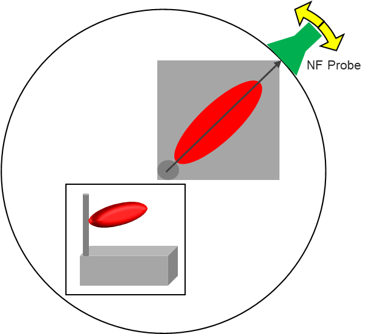{width="3.0in" height="2.719673009623797in"}

Figure 5.1.3-11: Illustration of min. Range length for NF Systems using
PC1 CPE as example.

The corresponding FF and NF min. range lengths are tabulated for
selected FR2 frequencies in Table 5.1.3-3 for PC3 devices with fixed
D=5cm.

Table 5.1.3-3: Minimum FF and NF Range Lengths for black box and white
box conditions for PC3 devices

+-----------+-------------+-------------+-------------+-------------+
| f \[GHz\] | Antenna     | Antenna     |             |             |
|           | Config. 1   | Config. 1   |             |             |
|           | and 2\      | and 2\      |             |             |
|           | - BLACK BOX | - WHITE BOX |             |             |
|           | -\          | -\          |             |             |
|           | (PC3        | (PC3        |             |             |
|           | Devices:    | Devices:    |             |             |
|           | D=5cm)      | D=5cm)      |             |             |
+===========+=============+=============+=============+=============+
|           | Min. FF     | Min. NF     | Min. FF     | Min. NF     |
|           | Range       | Range       | Range       | Range       |
|           | Length      | Length\     | Length\     | Length\     |
|           | \[m\]       | \[m\]       | \[m\]       | \[m\]       |
|           |             |             |             |             |
|           | $$\frac{    | $$\frac{\m  | $$\         | $$          |
|           | \mathbf{D}_ | athbf{D}_{\ | text{max}\l | \text{max}\ |
|           | {\mathbf{\t | mathbf{\tex | eft( \frac{ | left( \math |
|           | ext{DUT}}}} | t{DUT}}}}{\ | \mathbf{2}\ | bf{0.62}\sq |
|           | {\mathbf{2} | mathbf{2}}\ | mathbf{D}^{ | rt{\frac{\m |
|           | }\mathbf{-} | mathbf{-}\f | \mathbf{2}} | athbf{D}^{\ |
|           | \frac{\math | rac{\mathbf | }{\mathbf{\ | mathbf{3}}} |
|           | bf{D}}{\mat | {D}}{\mathb | lambda}}\ma | {\mathbf{\l |
|           | hbf{2}}\mat | f{2}}\mathb | thbf{,}\mat | ambda}}}\ma |
|           | hbf{+}\frac | f{+ 0.62}\s | hbf{D}_{\ma | thbf{,}\mat |
|           | {\mathbf{2} | qrt{\frac{\ | thbf{\text{ | hbf{D}_{\ma |
|           | \mathbf{D}^ | mathbf{D}^{ | DUT}}}\math | thbf{\text{ |
|           | {\mathbf{2} | \mathbf{3}} | bf{-}\frac{ | DUT}}}\math |
|           | }}{\mathbf{ | }{\mathbf{\ | \mathbf{D}} | bf{-}\frac{ |
|           | \lambda}}$$ | lambda}}}$$ | {\mathbf{2} | \mathbf{D}} |
|           |             |             | } \right)$$ | {\mathbf{2} |
|           |             |             |             | } \right)$$ |
+-----------+-------------+-------------+-------------+-------------+
| 24.25     | 0.53        | 0.19        | 0.40        | 0.28        |
+-----------+-------------+-------------+-------------+-------------+
| 30        | 0.63        | 0.19        | 0.50        | 0.28        |
+-----------+-------------+-------------+-------------+-------------+
| 40        | 0.79        | 0.21        | 0.67        | 0.28        |
+-----------+-------------+-------------+-------------+-------------+
| 43.5      | 0.85        | 0.21        | 0.73        | 0.28        |
+-----------+-------------+-------------+-------------+-------------+
| 52.6      | 1.00        | 0.22        | 0.88        | 0.28        |
+-----------+-------------+-------------+-------------+-------------+

Table 5.1.3-4 summarizes the path loss comparison between "white box"
and "black box" configuration across IFF/DFF and NF system types.

Table 5.1.3-4: Path loss comparison between "white box" and "black box"
configuration

+---------+--------------+--------------+--------------+--------------+
| f (GHz) | Antenna      | Antenna      |              |              |
|         | Config. 1,   | Config. 1    |              |              |
|         | 2, and 3\    | and 2\       |              |              |
|         | - BLACK BOX  | - WHITE BOX  |              |              |
|         | -            | -\           |              |              |
|         |              | (PC3         |              |              |
|         | (PC3         | Devices:     |              |              |
|         | Devices:     | D=5cm)       |              |              |
|         | D=5cm)       |              |              |              |
+=========+==============+==============+==============+==============+
|         | IFF/DFF      | NF           | DFF          | NF           |
+---------+--------------+--------------+--------------+--------------+
|         | Path Loss    | Path Loss    | Path Loss    | Path Loss    |
|         | with 1m      | with 0.22m   | with 0.88m   | with 0.28m   |
|         | range length | range length | range length | range length |
+---------+--------------+--------------+--------------+--------------+
| 24.25   | 60.16        | 46.86        | 59.01        | 48.93        |
+---------+--------------+--------------+--------------+--------------+
| 30      | 62.01        | 48.71        | 60.85        | 50.78        |
+---------+--------------+--------------+--------------+--------------+
| 40      | 64.51        | 51.21        | 63.35        | 53.28        |
+---------+--------------+--------------+--------------+--------------+
| 43.5    | 65.24        | 51.94        | 64.08        | 54.00        |
+---------+--------------+--------------+--------------+--------------+
| 52.6    | 66.89        | 53.59        | 65.73        | 55.65        |
+---------+--------------+--------------+--------------+--------------+

Based on the analysis shown in Table 5.1.3-4, it can be concluded that a
"white box" is not deemed a feasible enhancement of the methodology.

Additionally, since the beam peak searches and the spherical coverage
test cases are not part of the low UL/high DL power test cases and given
the complexity of the vendor declaration of the extensive
black&white-box approach, it can be concluded that the extensive
black&white-box approach is not deemed a feasible enhancement of the
methodology.

### 5.1.4 Permitted Methodologies: CFFNF, CFFDNF and CFFdeltaNF

Both methodologies have in common that a FF probe, e.g., reflector &
feed probe from the IFF methodology, is used for the test cases that are
not considered low UL power/high DL power. This FF probe is used for the
low UL/high DL power test cases to steer and lock the beam in the known
FF direction before the NF measurements are performed with a NF probe
that exhibits much lower free-space path losses. An example test setup
of such a hybrid system is shown in Figure 5.1.4-1.

The main differences between the three measurement approaches are
outlined in Table 5.1.4-1.

Table 5.1.4-1: Main differences between CFFDNF and CFFNF measurement
approaches

+----------------+----------------+----------------+----------------+
| ► Methodology  | CFFDNF         | CFFNF          | CFFdeltaNF     |
| ►              |                |                |                |
|                |                |                |                |
| ▼ Test         |                |                |                |
| Approach ▼     |                |                |                |
+================+================+================+================+
| Black Box      | N/A (Note 1)   | Wide local     | Local search   |
|                |                | search at      | at fixed       |
|                |                | initial radius | radius,        |
|                |                | r1, narrow     | reference      |
|                |                | local searches | measurement at |
|                |                | at radii r2,   | FF and NF to   |
|                |                | r3, i.e.,      | obtain the     |
|                |                | multiple NF    | relative       |
|                |                | measurements   | correction     |
|                |                | at r1, r2, and | factor         |
|                |                | r3             | $\math         |
|                |                |                | rm{\Delta}_{\t |
|                |                |                | ext{NFtoFF}}$, |
|                |                |                | single NF      |
|                |                |                | measurement    |
+----------------+----------------+----------------+----------------+
| B              | Single NF      | Single NF      | N/A            |
| lack&white-box | measurement or | measurements   |                |
|                | local search   | at r1, and r2  |                |
|                | at r1          |                |                |
+----------------+----------------+----------------+----------------+
| Note 1: This   |                |                |                |
| can be revised |                |                |                |
| whenever       |                |                |                |
| empirical      |                |                |                |
| methods to     |                |                |                |
| determine the  |                |                |                |
| offset         |                |                |                |
| location or    |                |                |                |
| other methods  |                |                |                |
| are shown      |                |                |                |
| feasible.      |                |                |                |
+----------------+----------------+----------------+----------------+

{width="5.0in" height="3.4388517060367456in"}

Figure 5.1.4-1: Hybrid NF/(I)FF test setup suitable for NF measurements

In a NF system, the NF beam peak direction for an offset antenna is not
necessarily the same as the FF beam peak direction; however, the
knowledge of the antenna phase centre offset, i.e., black&white-box
approach, can be leveraged to measure at the NF beam peak direction as
illustrated in 5.1.4-2. The knowledge of the offset together with the
probe antenna pattern will allow the calculation of the optimized DUT
orientation to optimize the NF measurement. The beam peak direction in
the NF can either be calculated or determined via a local search.

{width="2.6173611111111112in" height="1.7375in"}
{width="3.2006944444444443in"
height="1.426388888888889in"}

Figure 5.1.4-2: Illustration of NF testing utilizing the black&white-box
approach.

To guarantee that the correct beam is measured for when the
black&white-box measurement approach is applied, the CFF(D)NF approach
utilizes a FF probe that allows the UE to select the proper beam in the
known beam peak direction. A beam lock activation via the UBF makes sure
that the UE no longer changes its antenna pattern when the NF
measurement probe is used to perform the measurements with significantly
reduced free-space path losses compared to existing IFF systems.

The CFFDNF approach and test steps for EIRP/EIS/TRP follow those for
IFF/DFF outlined in Annex K \[6\] with the exception that the minimum
range length is reduced. The minimum number of TRP grid points, required
grid point spacing, and the effect of compensation of the declared/known
offset is further outlined in this this clause.

#### 5.1.4.1 Asymptotic Expansion Approach for CFFNF

The asymptotic expansion approach for CFFNF that is using measurements

\- at three different radii including local searches around the FF beam
peak direction (black-box approach) or

\- at two different radii without local searches as the NF beam peak
direction can be calculated (black&white-box approach)

is primarily meant to estimate the FF EIRP/EIS at the beam peak with NF
EIRP/EIS measurements performed in the radiative NF instead of the
reactive NF. This expansion approach is not suitable to determine the FF
pattern given the required overhead with the measurements at multiple
radii.

The asymptotic expansion approach is based on the superposition approach

$$\text{Signal}\left( \theta,\phi \right) \propto \sum_{k = 1}^{N_{y} \cdot N_{z}}{x_{k}F_{k}\left( \theta_{k},\phi_{k} \right)}F_{p}\left( \alpha_{k},\beta_{k} \right)\frac{\lambda}{4\pi d_{k}}e^{j2\pi\frac{d_{k}}{\lambda}}$$

with

\- Signal(𝜃, ϕ): signal at measurement grid point (𝜃, *ϕ*, 𝑟)

\- $x_{k}$: complex coefficient for *k*^th^ antenna array element

\- $F_{k}$: field pattern for *k*^th^ antenna element

\- $F_{p}$: field pattern for probe antenna

\- (𝜃*~k~*, *ϕ~k~*): EL and AZ angles of *k*^th^ antenna element with
respect to measurement grid point (𝜃, *ϕ*, 𝑟)

\- (𝛼*~k~*, 𝛽*~k~*): EL and AZ angles of probe antenna with respect to
the *k*^th^ antenna element

\- $\lambda$: wavelength

\- $d_{k}$: distance between *k*^th^ antenna element to measurement grid
point (𝜃, *ϕ*, 𝑟)

\- *r*: range length/measurement distance between centre of QZ and probe
antenna

\- $\frac{\lambda}{4\pi d_{k}}$: amplitude loss caused by propagation on
length of $d_{k}$

\- $2\pi\frac{d_{k}}{\lambda}$: the phase variation caused by
propagation on length of $d_{k}$

The estimate of the FF EIRP based on NF measurements, p(d), can be
expressed as follows

$$\text{EIRP}\left( d_{f} \right) = p\left( d_{1} \right) + \,\int_{d_{1}}^{d_{f}}{\frac{\partial p}{\partial d}\ d\mathrm{\Delta}d}$$

with

$$p \propto \left| \text{Signal} \cdot d \right|^{2}$$

where EIRP(*d~f~*) is the estimated EIRP in the far-field and *d~f~* is
the distance between the phase centre of the antenna array and the
far-field beam peak at range length *r* (in the FF: *r* \~ *d~f~*) while
*p*(*d*~1~) is the measured power with the probe antenna at a near-field
distance *d*~1~ (measured from the phase centre of the antenna array to
probe antenna), ∂*p*/∂*d* is the derivative of power *p* to distance
*d*. Because the near-field distance *d*~1~ is unknown for the black box
approach, measurements of the EIRP at multiple measurement distances are
needed to determine the parameters of the ∂*p*/∂*d* derivative and the
first near-field distance *d~1~*.

Following the implementation of the CFFNF simulations and an in-depth
analysis of the derivative of the superposition expression above, the
approximation of normalized power to distance ∂*p*/∂*d* was determined
to be

$$\frac{\partial p}{\partial d} = b_{1}d^{- 3}$$

which yields dependency of normalized power to *d* of

$$p\left( d \right) = - \frac{b_{1}}{2}d^{- 2} + b_{2}$$

This approximation in turn corresponds to a power (field) dependence in
the NF of 1/*r*^4^ (1/*r*^2^) which is commonly observed in the
radiative NF. CST simulations were used to further support this
formulation. Here, an 8x2 antenna array, placed at (0,0,0), was
evaluated. Two measurements at *r*~1~ and *r*~2~ were used to estimate
the asymptotic expansion coefficients *b~i~*; this allowed to estimate
the power/EIRP at various distances which was can be compared with
actual CST simulations at those distances. The
$\frac{\partial p}{\partial d} = b_{1}d^{- 3}\,$behaviour and the
normalized power (compensating the path loss) estimated from two sets of
two measurements at (*r*~1~, *r*~2~) of (7.5cm, 9.5cm) and (20cm, 22cm)
simulated at various distances (\>*r*~2~) are shown in Figure 5.1.4.1-1.

{width="3.24793416447944in"
height="2.5in"}{width="3.1859503499562556in"
height="2.5in"}

{width="3.334711286089239in"
height="2.5in"}{width="3.2685958005249343in"
height="2.5in"}

Figure 5.1.4.1-1: Normalized power (left) and power derivative (right)
and as a function of transformed distance. The NF evaluations were
performed at *r~1~*=7.5cm, *r~2~*=8.5cm, *r~3~*=9.5cm (top) and at
*r~1~*=20cm, *r~2~*=21cm, *r~3~*=22cm (bottom)

These curves show that the
$\frac{\partial p}{\partial d} = b_{1}d^{- 3}\,;\, p = - \frac{b_{1}}{2}d^{- 2} + b_{2}$
asymptotic expansion formulation yields good estimates of EIRP/EIS based
on measurements in the radiative NF.

#### 5.1.4.2 Test Procedures for CFFDNF, CFFNF and CFFdeltaNF

The appropriate test steps required for NF testing based on the CFFDNF
approach of DUTs with known phase-centre offsets (black&white-box) are
illustrated in Figure 5.1.4.2-1.

{width="4.0in" height="5.025in"}

Figure 5.1.4.2-1: Test Steps for CFFDNF testing of DUTs with known
antenna phase centre offset (black&white-box approach).

For the CFFNF methodology that supports both the black-box and the
black&white-box approach, the initial test steps are the same as steps
1-3 in Figure 5.1.4.2-1. The test steps for the NF measurement portion
of the black-box approach are further outlined in Figure 5.1.4.2-2 while
the NF test steps for the black&white-box approach are outlined in
Figure 5.1.4.2-3. The diagrams on the right of Figure 5.1.4.2-2
illustrate the different local searches required for the measurements at
each of the three radii. The measurements at the very first radius
*r*~1~ require a wide sector of grid points around the known FF beam
peak direction big enough so that the local/NF beam peak is captured
properly. For the initial local search at *r*~1~=20cm, the width of the
sector is about ±40^o^ which can be covered using coarse and fine scans
to further reduce the number of points. On the other hand, the sector of
grid points for measurements at radius *r*~2~ and *r*~3~ can be
significantly smaller as only a small region around the local NF beam
peak found at *r*~1~ is needed.

{width="4.5in" height="3.648169291338583in"}

Figure 5.1.4.2-2: Illustration of the additional CFFNF test steps with
asymptotic expansion transform utilizing the black-box approach.

{width="3.25in" height="2.7494028871391074in"}

Figure 5.1.4.2-3: Illustration of the additional CFFNF test steps with
asymptotic expansion transform utilizing the black&white-box approach.

For the CFFdeltaNF methodology that supports the black-box approach, the
initial test steps are the same as steps 1-3 in Figure 5.1.4.2-1. The
additional test steps for the NF relative and final measurement portion
of the black-box approach are further outlined in Figure 5.1.4.2-4. The
diagrams on the right of Figure 5.1.4.2-4 illustrate the local search
required for the measurements in NF. At *r*=35cm, the width of the
sector is about ±20^o^ which can be covered using coarse and fine scans
to further reduce the number of points.

{width="4.5in" height="5.042370953630797in"}

Figure 5.1.4.2-4: Illustration of the additional CFFdeltaNF test steps
utilizing the black-box approach.

The sample sequence of test steps for the CFFDNF test methodology with
the black&white-box approach is as follows (aligned in principle with
Clause K.1.3 of \[6\]):

1\. Connect the SS (System Simulator) with the DUT through the FF
measurement antenna with polarization reference Pol~Link~ to form the TX
beam towards the FF TX beam peak direction. Allow at least
BEAM\_SELECT\_WAIT\_TIME for the UE TX beam selection to complete.

2\. SS activates the UE Beamlock Function (UBF) by performing the
procedure as specified in TS 38.508-1 clause 4.9.2 using condition Tx
only.

3\. If necessary, switch the connection of the SS from the FF probe to
the NF probe at range length *r*~1~ with polarization reference
Pol~Link~. Position the device so that the NF probe antenna is pointed
towards the NF TX beam peak direction (determined from the antenna
offset, range length, and FF beam peak direction). The range length is
left up to system implementation.

4\. Measure the mean power *P*~meas~(Pol~Meas~=θ, Pol~Link~) of the
modulated signal arriving at the power measurement equipment (such as a
spectrum analyser, power meter, or gNB emulator).

5\. Calculate the EIRP(Pol~Meas~=θ, Pol~Link~) from the measured power
*P*~meas~(Pol~Meas~=θ, Pol~Link~)

a\. adding the calibrated composite loss of the entire transmission path
between the TE and the centre of QZ (displaced from measurement probe by
*r*), *L*~EIRP,θ~

b\. compensating the actual measurement distance *d* (between the centre
of the array to the measurement probe) using term 20 log~10~(*d*/*r*)

c\. applying the probe antenna gain NF correction

6\. Measure the mean power *P*~meas~(Pol~Meas~=φ, Pol~Link~) of the
modulated signal arriving at the power measurement equipment (such as a
spectrum analyser, power meter, or gNB emulator).

7\. Calculate the EIRP(Pol~Meas~=φ, Pol~Link~) from the measured power
P~meas~(Pol~Meas~=φ, Pol~Link~)

a\. adding the calibrated composite loss of the entire transmission path
between the TE and the centre of QZ (displaced from measurement probe by
*r*), *L*~EIRP,ϕ~

b\. compensating the actual measurement distance *d* (between the centre
of the array to the measurement probe) using term 20 log~10~(*d*/*r*)

c\. applying the probe antenna gain NF correction

8\. Calculate the resulting "total EIRP(Pol~Link~)", for the chosen
Pol~Link~ of θ or φ as follows:

total EIRP (Pol~Link~) = EIRP(Pol~Meas~=θ, Pol~Link~) +
EIRP(Pol~Meas~=φ, Pol~Link~)

9\. SS deactivates the UE Beamlock Function (UBF) by performing the
procedure as specified in TS 38.508-1 clause 4.9.3.

The sample sequence of test steps for the CFFNF test methodology with
the black&white-box approach is as follows (aligned in principle with
Clause K.1.3 of \[6\]):

1\. Connect the SS (System Simulator) with the DUT through the FF
measurement antenna with polarization reference Pol~Link~ to form the TX
beam towards the FF TX beam peak direction. Allow at least
BEAM\_SELECT\_WAIT\_TIME for the UE TX beam selection to complete.

2\. SS activates the UE Beamlock Function (UBF) by performing the
procedure as specified in TS 38.508-1 clause 4.9.2 using condition Tx
only.

3\. If necessary, switch the connection of the SS from the FF probe to
the NF probe at range length *r=r*~1~ /at measurement distance
*d*=*d*~1~ (between the centre of the array to the measurement probe)
with polarization reference Pol~Link~.

4\. Position the device so that the NF probe antenna is pointed towards
the NF TX beam peak direction (determined from the antenna offset, range
length *r*, and FF beam peak direction). The range length *r* is left up
to system implementation.

5\. Measure *N* averages of the mean power *P*~meas~(*d*, Pol~Meas~=θ,
Pol~Link~) of the modulated signal arriving at the power measurement
equipment (such as a spectrum analyser, power meter, or gNB emulator).
The number of averages is left up to system implementation.

6\. Calculate the normalized NF power *p*(*d*, Pol~Meas~=θ, Pol~Link~)
from the measured power *P*~meas~(*d*, Pol~Meas~=θ, Pol~Link~)

a\. adding the calibrated composite loss of the entire transmission path
between the TE and the centre of QZ (displaced from measurement probe by
*r*=*r*~1~), *L*~EIRP,θ~

b\. compensating the actual measurement distance *d* using term 20
log~10~(*d*/*r*)

c\. applying the probe antenna gain NF correction

7\. Measure *N* averages of the mean power *P*~meas~(*d*, Pol~Meas~=φ,
Pol~Link~) of the modulated signal arriving at the power measurement
equipment (such as a spectrum analyser, power meter, or gNB emulator).
The number of averages is left up to system implementation.

8\. Calculate the normalized NF power *p*(*d*, Pol~Meas~=φ, Pol~Link~)
from the measured power P~meas~(*d*, Pol~Meas~=φ, Pol~Link~)

a\. adding the calibrated composite loss of the entire transmission path
between the TE and the centre of QZ (displaced from measurement probe by
*r*), *L*~EIRP,ϕ~

b\. compensating the actual measurement distance *d* (between the centre
of the array to the measurement probe) using term 20 log~10~(*d*/*r*)

c\. applying the probe antenna gain NF correction

9\. Repeat Steps 4-8 for *r*=*r*~2~ and *d*=*d*~2~

10\. Calculate the total normalized NF power for the chosen Pol~Link~ of
θ or φ as follows:

*p*(*d~i~*) = *p*(*d~i~*, Pol~Meas~=θ, Pol~Link~) + *p*(*d~i~*,
Pol~Meas~=φ, Pol~Link~) with *i*={1,2}

11\. Based on the selected asymptotic expansion formulation, determine
the "total FF EIRP(Pol~Link~)" from the two total normalized NF power
measurement measurements, *p*(d~1~) and *p*(d~2~). For an asymptotic
expansion formulation of

$$p\left( d \right) = - \frac{b_{1}}{2}d^{- 2} + b_{2}$$

*The* resulting "total FF EIRP(Pol~Link~)", for the chosen Pol~Link~ of
θ or φ is calculated as follows

$$\text{total FF EIRP}\left( \text{Po}\text{l}_{\text{Link}} \right) = \frac{d_{1}^{2}p\left( d_{1} \right) - d_{2}^{2}p\left( d_{2} \right)}{d_{1}^{2} - d_{2}^{2}}$$

12\. SS deactivates the UE Beamlock Function (UBF) by performing the
procedure as specified in TS 38.508-1 clause 4.9.3.

The sample sequence of test steps for the CFFNF test methodology with
the black-box approach is as follows (aligned in principle with Clause
K.1.3 of \[6\]):

1\. Connect the SS (System Simulator) with the DUT through the FF
measurement antenna with polarization reference Pol~Link~ to form the TX
beam towards the FF TX beam peak direction. Allow at least
BEAM\_SELECT\_WAIT\_TIME for the UE TX beam selection to complete.

2\. SS activates the UE Beamlock Function (UBF) by performing the
procedure as specified in TS 38.508-1 clause 4.9.2 using condition Tx
only.

3\. If necessary, switch the connection of the SS from the FF probe to
the NF probe at range length *r*~1~ with polarization reference
Pol~Link~. Position the device so that that NF probe antenna is pointed
towards the FF TX beam peak direction. The range length *r*~1~ is left
up to system implementation.

4\. Perform a NF BP search on a sector around the FF BP direction at
radius *r*=*r*~1~, which could determine *K* (≥1) possible NF BP
directions and corresponding antenna array phase centre positions and
thus distances between the antenna array and the measurement probe,
d~1,*k*~. Based on the NF BP directions and antenna array phase centre
positions, the corresponding NF BP directions at radius *r*=*r*~2~ and
*r*=*r*~3~ can be determined. Details including the range lengths *r*~2~
and *r*~3~ are left up to system implementation.

5\. Measure *N* averages of the mean power *P*~meas,k~(*d~i~*~,*k*~,
Pol~Meas~=θ, Pol~Link~), *k*={1,2,..., *K*} of the modulated signal
arriving at the power measurement equipment (such as a spectrum
analyser, power meter, or gNB emulator) at each of the *K* possible NF
BP direction at radius *r*=*r*~i~ with *i*={1,2,3} determined in Step 4.
The number of averages is left up to system implementation.

6\. Calculate the normalized NF power *p*~meas,k~(*d~i,k~*, Pol~Meas~=θ,
Pol~Link~), *k*={1,2,..., *K*}, from the measured power
P~meas,k~(*d~i,k~*, Pol~Meas~=θ, Pol~Link~), *k*={1,2,...,*K*}, at
radius *r*=*r*~i~ with *i*={1,2,3}

a\. adding the calibrated composite loss of the entire transmission path
between the TE and the centre of QZ (displaced from measurement probe by
*r*=*r*~i~), *L*~EIRP,θ~

b\. compensating the actual measurement distance *d*=*d*~i~ (between the
centre of the array to the measurement probe) using term 20
log~10~(*d~i~*~,*k*~/*r*~i~)

c\. applying the probe antenna gain NF correction

7\. Measure *N* averages of the mean power *P*~meas,k~(*d~i~*~,*k*~,
Pol~Meas~=φ, Pol~Link~), *k*={1,2,...,*K*}, of the modulated signal
arriving at the power measurement equipment (such as a spectrum
analyser, power meter, or gNB emulator) at each of the possible NF BP
direction at radius *r*=*r*~i~ with *i*={1,2,3} determined in Step 4.
The number of averages is left up to system implementation.

8\. Calculate the normalized NF power *p*~meas,k~(*d~i~*~,*k*~,
Pol~Meas~=φ, Pol~Link~), *k*={1,2,..., *K*}, from the measured power
P~meas,k~(*d~i~*~,*k*~, Pol~Meas~=φ, Pol~Link~), *k*={1,2,..., *K*}, at
radius *r*=*r*~i~ with *i*={1,2,3}

a\. adding the calibrated composite loss of the entire transmission path
between the TE and the centre of QZ (displaced from measurement probe by
*r*=*r*~i~), *L*~EIRP,φ~

b\. compensating the actual measurement distance *d*=*d*~i~ (between the
centre of the array to the measurement probe) using term 20
log~10~(*d~i~*~,*k*~/*r*~i~)

c\. applying the probe antenna gain NF correction

9\. Calculate the total normalized NF power for each of possible NF BP
directions with the chosen Pol~Link~ of θ or φ as follows:

*p*~meas,k~(*d~i~*) = *p*~meas~(*d~i,k~*, Pol~Meas~=θ, Pol~Link~) +
*p*~meas~(*d~i,k~*, Pol~Meas~=φ, Pol~Link~) with *k*={1,2,...,*K*} and
*i*={1,2,3}

10\. For each of *K* possible NF BP directions, based on the
*p*~meas,k~, *k*={1,2,...,*K*}, results at *r*=*r*~1,~ *r*=*r*~2,~ and
*r*=*r*~3~ perform a linear fitting to determine far-field normalized
power "total FF EIRP~k~(Pol~Link~)" and fitting error *err*~k~, based on
the selected expansion formulation, e.g.,

$$p\left( d \right) = - \frac{b_{1}}{2}d^{- 2} + b_{2}$$

11\. Determine the final NF BP direction by choosing the NF BP direction
with minimum fitting error
$k_{\text{BP}} = \min_{k}{\text{er}r_{k}}\text{. }$Details of this step
are left up to system implementation.

12\. Based on the selected NF BP direction in Step 11, *the* resulting
"total FF EIRP(Pol~Link~)", for the chosen Pol~Link~ of θ or φ is
determined as
$\text{totalFF}\text{EIRP}_{k_{\text{BP}}}\left( \text{Pol}_{\text{Link}} \right)$

13\. SS deactivates the UE Beamlock Function (UBF) by performing the
procedure as specified in TS 38.508-1 clause 4.9.3.

The sample sequence of test steps for the CFFdeltaNF test methodology
with the black-box approach is as follows (aligned in principle with
Clause K.1.3 of \[6\]):

1\. Connect the SS (System Simulator) with the DUT through the FF
measurement antenna with polarization reference Pol~Link~ to form the TX
beam towards the FF TX beam peak direction. Allow at least
BEAM\_SELECT\_WAIT\_TIME for the UE TX beam selection to complete.

2\. SS activates the UE Beamlock Function (UBF) by performing the
procedure as specified in TS 38.508-1 clause 4.9.2 using condition Tx
only.

3\. Measure the mean power *P*~meas~(Pol~Meas~=θ, Pol~Link~) and
*P*~meas~(Pol~Meas~=ϕ, Pol~Link~) of the modulated signal arriving at
the power measurement equipment (such as a spectrum analyser, power
meter, or gNB emulator) [through the FF measurement antenna]{.underline}
for the reference test case without testability issue (e.g. Peak EIRP).

4\. If necessary, switch the connection of the SS from the FF probe to
the NF probe at range length *r*~1~ with polarization reference
Pol~Link~. The range length is left up to system implementation.

5\. Position the device so that the NF probe antenna is pointed towards
the FF TX beam peak direction and perform a NF BP search on a sector
around the FF BP direction at range length *r~1~* to determine the NF Tx
beam peak direction.

6\. Measure the mean power *P*~meas~(Pol~Meas~=θ, Pol~Link~) and
*P*~meas~(Pol~Meas~=ϕ, Pol~Link~) of the modulated signal arriving at
the power measurement equipment (such as a spectrum analyser, power
meter, or gNB emulator) [through the NF measurement antenna]{.underline}
for the reference test case without testability issue (e.g. Peak EIRP)
at the NF beam peak direction.

7\. Calculate the NF correction factor $\mathrm{\Delta}_{\text{NFtoFF}}$
for each polarization as the difference between the measured mean power
and the composite loss of the entire transmission path through the FF
and NF measurement antennas:

$$\mathrm{\Delta}_{NFtoFF,\ \theta} = {(P}_{meas,\ FF,\theta} - P_{meas,\ NF,\theta}) + \left( L_{FF,\theta} - L_{NF,\theta} \right)$$

$$\mathrm{\Delta}_{NFtoFF,\ \phi} = {(P}_{meas,\ FF,\phi} - P_{meas,\ NF,\phi}) + \left( L_{FF,\theta} - L_{NF,\phi} \right)$$

Note: this correction factor $\mathrm{\Delta}_{\text{NFtoFF}}$ include
all effects due to the usage of a NF probe (i.e. DUT antenna location
displacement from center, probe antenna pattern and near-field
interaction between probe antenna and DUT antenna)

8\. If necessary, calculate the NF correction factor
$\mathrm{\Delta}_{\text{NFtoFF}}$ for each polarization at the correct
test frequency for the low UL power test case to include the additional
effect of the system frequency response:

$$\mathrm{\Delta}_{NFtoFF,\ \theta}\left( f \right) = \mathrm{\Delta}_{NFtoFF,\ \theta}\left( f_{\text{ref}} \right) + \left( L_{FF,\ \theta}\left( f \right) - L_{NF,\ \theta}\left( f \right) \right)$$

$$\mathrm{\Delta}_{NFtoFF,\ \phi}\left( f \right) = \mathrm{\Delta}_{NFtoFF,\ \phi}\left( f_{\text{ref}} \right) + \left( L_{FF,\ \phi}\left( f \right) - L_{NF,\ \phi}\left( f \right) \right)$$

9\. Measure the mean power *P*~meas~(Pol~Meas~=θ, Pol~Link~) of the
modulated signal arriving at the power measurement equipment (such as a
spectrum analyser, power meter, or gNB emulator) [through the NF
measurement antenna]{.underline} for the low UL power test case at the
NF beam peak direction.

10\. Calculate the EIRP(Pol~Meas~=θ, Pol~Link~) from the measured power
*P*~meas~(Pol~Meas~=θ, Pol~Link~) by adding the composite correction
factor between FF and DNF $\mathrm{\Delta}_{NFtoFF,\ \theta}$ and the
frequency to the measured power *P*~meas~(Pol~Meas~=θ, Pol~Link~).

11\. Measure the mean power *P*~meas~(Pol~Meas~=φ, Pol~Link~) of the
modulated signal arriving at the power measurement equipment (such as a
spectrum analyser, power meter, or gNB emulator) [through the NF
measurement antenna]{.underline} for the low UL power test case at the
NF beam peak direction.

12\. Calculate the EIRP(Pol~Meas~=φ, Pol~Link~) from the measured power
P~meas~(Pol~Meas~=φ, Pol~Link~) by adding the composite correction
factor between FF and DNF $\mathrm{\Delta}_{NFtoFF,\ \phi}$ and the
frequency to the measured power *P*~meas~(Pol~Meas~=ϕ, Pol~Link~).

13\. Calculate the resulting "total EIRP(Pol~Link~)", for the chosen
Pol~Link~ of θ or φ as follows:

> total EIRP (Pol~Link~) = EIRP(Pol~Meas~=θ, Pol~Link~) +
> EIRP(Pol~Meas~=φ, Pol~Link~)

14\. SS deactivates the UE Beamlock Function (UBF) by performing the
procedure as specified in TS 38.508-1 clause 4.9.3.

#### 5.1.4.3 Simulation Assumptions

The simulation assumptions for the CFFDNF, CFFNF and CFFdeltaNF
methodologies are summarized in Table 5.1.4.3-1.

Table 5.1.4.3-1: Simulation assumptions for CFFDNF, CFFNF and CFFdeltaNF
simulations

+----------------------+----------------------+----------------------+
| Parameter            | Value(s)/Assumptions | Comment              |
+======================+======================+======================+
| Methodology          | CFFDNF: with         |                      |
|                      | black&white-box      |                      |
|                      | approach             |                      |
|                      |                      |                      |
|                      | CFFNF: with          |                      |
|                      | black-box and        |                      |
|                      | black&white-box      |                      |
|                      | approach             |                      |
|                      |                      |                      |
|                      | CFFdeltaNF: with     |                      |
|                      | black-box approach   |                      |
+----------------------+----------------------+----------------------+
| Simulation Frequency | 28 (others are not   |                      |
| \[GHz\]              | precluded)           |                      |
+----------------------+----------------------+----------------------+
| UE Antenna Array     | PC3: 8x2 and 4x1     |                      |
| Configuration        |                      |                      |
|                      | PC1: 12x12           |                      |
+----------------------+----------------------+----------------------+
| Beam Steering        | N/A                  | Not needed for       |
| Assumptions          |                      | combined FF and NF   |
|                      |                      | methods as beam peak |
|                      |                      | searches and         |
|                      |                      | spherical coverage   |
|                      |                      | measurements are     |
|                      |                      | based on FF probe    |
+----------------------+----------------------+----------------------+
| HPBW of Individual   | 90^o^/90^o^          |                      |
| Array Element        |                      |                      |
+----------------------+----------------------+----------------------+
| Offsets of Active    | PC3 8x2&4x1:         | Offsets should be    |
| Array Panel          |                      | picked randomly (for |
|                      | 0 ≤ *x*~offset~ ≤    | uniform              |
|                      | 12.5cm               | distribution)        |
|                      |                      |                      |
|                      | -12.5cm              | Min of 500 offsets   |
|                      | ≤ *y*~offset~ ≤      | selected randomly    |
|                      | 12.5cm               | with uniform         |
|                      |                      | distribution         |
|                      | -12.5cm              |                      |
|                      | ≤ *z*~offset~ ≤      |                      |
|                      | 12.5cm               |                      |
|                      |                      |                      |
|                      | (The maximum radial  |                      |
|                      | offset cannot exceed |                      |
|                      | 12.5cm)              |                      |
|                      |                      |                      |
|                      |                      |                      |
|                      |                      |                      |
|                      | PC1 12x12:           |                      |
|                      |                      |                      |
|                      | 0 ≤ *x*~offset~ ≤ 10 |                      |
|                      | cm                   |                      |
|                      |                      |                      |
|                      | -10cm                |                      |
|                      | ≤ *y*~offset~ ≤ 10cm |                      |
|                      |                      |                      |
|                      | -10cm                |                      |
|                      | ≤ *z*~offset~ ≤ 10cm |                      |
|                      |                      |                      |
|                      | (The maximum radial  |                      |
|                      | offset cannot exceed |                      |
|                      | 10cm)                |                      |
+----------------------+----------------------+----------------------+
| Path Loss Correction | Compensation of      | Path loss applied to |
|                      | antenna array offset | the EIRP             |
|                      | for black&white-box  | measurements is not  |
|                      | approaches and the   | referenced to the    |
|                      | CFFNF black-box      | centre of QZ but to  |
|                      | approach.            | the phase centre of  |
|                      |                      | the active antenna   |
|                      | N/A for CFFdeltaNF   | array                |
|                      | black-box approach   |                      |
+----------------------+----------------------+----------------------+
| NF Measurement       | Determined           |                      |
| Direction            | theoretically from   |                      |
|                      | range length, FF BP  |                      |
|                      | direction, and array |                      |
|                      | offsets for          |                      |
|                      | black&white-box      |                      |
|                      | approach.            |                      |
|                      |                      |                      |
|                      | Determined with      |                      |
|                      | local search for     |                      |
|                      | black-box approach.  |                      |
+----------------------+----------------------+----------------------+
| Probe antenna        | With compensation    | N/A for CFFdeltaNF   |
| pattern/gain         | (uniform pattern     |                      |
| compensation         | assumed in           |                      |
|                      | simulations)         |                      |
|                      |                      |                      |
|                      | Without compensation |                      |
|                      | (typical horn        |                      |
|                      | pattern with \~50^o^ |                      |
|                      | HPBW pattern         |                      |
|                      | applied)             |                      |
+----------------------+----------------------+----------------------+
| Tool Used for        | Matlab or EM         |                      |
| Simulations          | simulator            |                      |
+----------------------+----------------------+----------------------+
| Range Lengths        | 20cm, 25cm, 30cm,    |                      |
|                      | 35cm, 40cm, 45cm,    |                      |
|                      | 20m                  |                      |
+----------------------+----------------------+----------------------+

#### 5.1.4.4 Simulation results for CFFDNF

The main intention of this clause is to estimate the measurement
uncertainties of EIRP measurements performed in the NF at various range
lengths. Since the beam peak search and spherical coverage analyses are
performed with the FF probe, beam steering assumptions are not required
here. The definitions of offsets (*x*~offset~/*y*~offset~/*z*~offset~),
maximum offsets (≤12.5cm for PC3 and ≤10cm for PC1), array
configurations (PC3: 8x2 and 4x1, PC1: 12x12), and range lengths are
summarized in Table 5.1.4.3-1.

The FF 8x2 and 4x1 array patterns with the 90^o^/90^o^ HPBW assumption
are shown in Figure 5.1.4.4-1.

{width="2.915681321084864in"
height="2.3in"}{width="2.963429571303587in"
height="2.3in"}

Figure 5.1.4.4-1: FF antenna pattern with 90^o^/90^o^ HPBW for 8x2
antenna array configuration (left) and 4x1 antenna array configuration
(right).

The pattern simulations assume superpositions of individual,
single-element far-field antenna patterns; this approach requires that
the NF of Ny x Nz antenna array is well in the FF of the single-element
antenna. The EIRP simulations were performed using Matlab and CST.

The simulations assume that the FF beam peak direction of the DUT is
known for the sample DUT considered.

For the statistical analyses using Matlab, a total of 100,000
simulations with random and uniformly spaced offsets were performed.
These offsets were varied between 0 to 12.5cm (10cm) in *x* and from
-12.5cm (-10cm) to 12.5cm (10cm) in *y* and *z* for PC3 (PC1) while
making sure that the maximum radial offset cannot exceed 12.5cm (10cm).
The offsets in *x* were limited to positive values since it is assumed
that the front antenna of the DUT is always in the upper hemisphere
since the geometric centre of the device is aligned with the centre of
the QZ. A sample set of 100,000 random offsets is visualized in Figure
5.1.4.4-2. Histograms of the respective offset radii, and offsets in
*x*, *y*, and *z* are shown in Figure 5.1.4.4-3.

{width="2.5in" height="2.4633300524934385in"}

Figure 5.1.4.4-2: Illustration of 100,000 random offsets uniformly
spaced within 12.5cm in a single hemisphere.

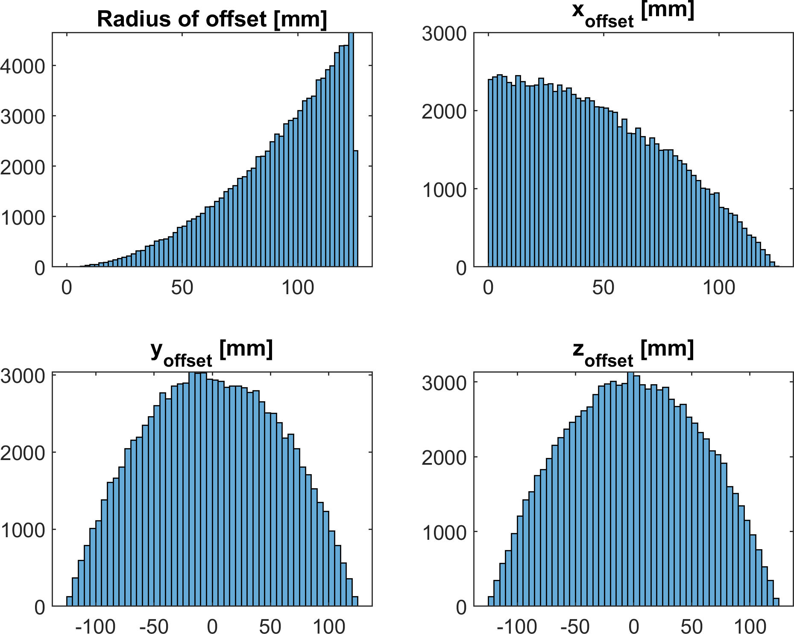{width="4.841666666666667in"
height="3.8722222222222222in"}

Figure 5.1.4.4-3: Histograms of 100,000 random offsets uniformly spaced
within 12.5cm in a single hemisphere.

Since each of the offsets are known/declared, the offset can be properly
compensated, i.e., the pathloss applied to the EIRP measurements is not
referenced to the centre of QZ but to the phase centre of the active
antenna array. The results in this clause focus only on the EIRP results
after the path loss with respect to the offset antenna array was
compensated.

Additionally, for the best/optimized measurement uncertainties, the
probe antenna pattern/gain must be compensated since the array offsets
can result in the NF beam peak to be observed from directions with large
deviations from the peak gain direction of the measurement probe/horn as
illustrated in Figure 5.1.4-2. In the simulations, probe pattern/gain
compensation can be modelled in the simplest approximation by assuming
an omnidirectional pattern of the probe. To quantify the effect of not
compensating the probe antenna pattern, this section will present
measurement uncertainties for a typical horn antenna. For these
simulations, a symmetric pattern of a horn antenna with \~50^o^ HPBW
pattern is assumed as plotted in Figure 5.1.4.4-4, which was obtained
using the following Matlab commands:

ProbeTheta=-180:1:180;

HPBW=50;

ProbePattern\_norm=-12\*(ProbeTheta/HPBW);

{width="4.0in" height="3.0565529308836394in"}

Figure 5.1.4.4-4: Assumed measurement probe antenna pattern.

The NF beam peak direction, illustrated in Figure 5.1.4-2, was
calculated using the known FF beam peak direction, the offset of the
antenna array, and the range length.

A histogram of the 100k EIRP simulations for 4 different NF range
lengths (20cm, 25cm, 30cm, 45cm) and the 20m FF range lengths is shown
in Figure 5.1.4.4-5 and the statistical results of these simulations are
tabulated in Table 5.1.4.4-1. These results assume that the antenna
array offsets and the probe pattern/gain were compensated.

{width="5.0in" height="4.27082239720035in"}

Figure 5.1.4.4-5: Histogram of 100,000 EIRP CFFDNF simulations based on
black&white-box approach with random 8x2 antenna array offsets uniformly
spaced within 12.5cm in a single hemisphere. The antenna array offsets
and the probe pattern/gain were compensated

Table 5.1.4.4-1: Statistical results of 100,000 EIRP CFFDNF simulations
based on black&white-box approach with random 8x2 antenna array offsets
uniformly spaced within 12.5cm in a single hemisphere. The antenna array
offsets and the probe pattern/gain were compensated

  -------------------- --------------------- --------------------------------- -------------------------------------- -------------------------
  Range Length \[m\]   Max-Min EIRP \[dB\]   Max EIRP Error w.r.t. FF \[dB\]   \|Mean EIRP Error\| w.r.t. FF \[dB\]   Std. Dev of EIRP \[dB\]
  0.2                  1.17                  1.36                              0.48                                   0.22
  0.25                 0.37                  0.50                              0.23                                   0.08
  0.3                  0.17                  0.26                              0.14                                   0.04
  0.35                 0.09                  0.16                              0.09                                   0.02
  0.4                  0.06                  0.10                              0.07                                   0.01
  0.45                 0.04                  0.07                              0.05                                   0.01
  20                   0.00                  0.00                              0.00                                   0.00
  -------------------- --------------------- --------------------------------- -------------------------------------- -------------------------

Figure 5.1.4.4-6 illustrates which simulations for the 20cm range length
result in the minimum and maximum EIRPs after antenna offset and probe
pattern compensation.

{width="3.1262904636920386in"
height="2.6in"}{width="3.2165529308836396in"
height="2.6in"}

Figure 5.1.4.4-6: Illustration of simulations for the 20cm range length
with 8x2 antenna configuration resulting in smallest (left) and largest
(right) EIRPs after antenna offset and probe pattern compensation.

When the antenna array offset is towards the probe antenna, shown in the
left plot of Figure 5.1.4.4-6, the EIRP without the offset compensation
is very high (20.7dBm in this example); however, the offset
compensation, i.e., applying the pathloss between the probe antenna and
the active antenna array, helps to significantly improve the EIRP
measurement uncertainty with respect to the EIRP measured in the FF.

Once the array offsets and the probe antenna pattern are compensated in
the NF with CFFDNF methodology assuming the black&white-box approach,
almost insignificant measurement uncertainties for PC3 devices can be
observed at 45cm. At distances less than 45cm, measurement uncertainties
must be taken into account.

When the probe pattern/gain is not compensated, a much larger variation
of the measured EIRP results is expected due to the large off broadside
directions of the antenna panels from the probe antenna, as illustrated
schematically in Figure 5.1.4-2. This is further quantified in Figure
5.1.4.4-6 and in Table 5.1.4.4-2 for the same simulations. These results
assume that the antenna array offsets are compensated while the probe
pattern/gain were not compensated, i.e., the pattern in Figure 5.1.4.4-4
was applied to the simulations.

{width="5.0in" height="4.27082239720035in"}

Figure 5.1.4.4-7: Histogram of 100,000 EIRP CFFDNF simulations based on
black&white-box approach with random 8x2 antenna array offsets uniformly
spaced within 12.5cm in a single hemisphere. The antenna array offsets
were compensated while the probe pattern/gain was not compensated

Table 5.1.4.4-2: Statistical results of 100,000 EIRP CFFDNF simulations
based on black&white-box approach with random 8x2 antenna array offsets
uniformly spaced within 12.5cm in a single hemisphere. The antenna array
offsets were compensated while the probe pattern/gain was not
compensated.

  -------------------- ------------------------------- --------------------------------- -------------------------------------- -----------------------------------
  Range Length \[m\]   Max-Min EIRP at (90,0) \[dB\]   Max EIRP Error w.r.t. FF \[dB\]   \|Mean EIRP Error\| w.r.t. FF \[dB\]   Std. Dev of EIRP at (90,0) \[dB\]
  0.2                  7.31                            7.51                              3.15                                   1.82
  0.25                 4.36                            4.49                              1.89                                   1.11
  0.3                  2.93                            3.02                              1.27                                   0.75
  0.35                 2.11                            2.18                              0.92                                   0.54
  0.4                  1.60                            1.65                              0.69                                   0.41
  0.45                 1.25                            1.29                              0.54                                   0.32
  20                   0.00                            0.00                              0.00                                   0.00
  -------------------- ------------------------------- --------------------------------- -------------------------------------- -----------------------------------

The latter results clearly demonstrate that when performing measurements
in the NF with CFFDNF methodology assuming the black&white-box approach,
the probe antenna pattern must be compensated.

A study to determine whether 1k or even 250 offset simulations are
sufficient for the MU results, a comparison of 100k vs 1k vs 250 offset
simulations was made. The visualization of 100k vs 1k random offsets is
illustrated in Figure 5.1.4.4-8. Clearly, the 100k offsets are uniformly
distributed in the hemisphere while the random 250 and 1k offsets are
distributed rather sparsely.

{width="2.1298742344706914in" height="2.1in"}
{width="2.1298742344706914in" height="2.1in"}
{width="2.1340113735783026in" height="2.1in"}

Figure 5.1.4.4-8: Illustration of 100k (left) vs 1k (middle) vs 250
(right) offsets.

The results summarizing the different simulations are tabulated in Table
5.1.4.4-3. The results show that regardless of range length and antenna
configuration, the difference in mean error and standard deviation is
almost insignificant.

Table 5.1.4.4-3: Statistical results of 100k vs 1k vs 250 EIRP CFFDNF
offset simulations based on black&white-box approach with random antenna
array offsets uniformly spaced within 12.5cm (PC3)/10cm (PC1) in a
single hemisphere. The antenna array offsets were compensated.

  Antenna Configuration   Number of Offsets   Range Length \[m\]   Mean EIRP Error w.r.t. FF \[dB\]   Std. Dev of EIRP at NF BP \[dB\]
  ----------------------- ------------------- -------------------- ---------------------------------- ----------------------------------
  8x2                     100k                0.2                  0.48                               0.22
                                              0.25                 0.23                               0.08
                                              0.3                  0.14                               0.04
                                              0.35                 0.09                               0.02
                                              0.4                  0.07                               0.01
                                              0.45                 0.05                               0.01
                                              20                   0.00                               0.00
  8x2                     1k                  0.2                  0.48                               0.21
                                              0.25                 0.23                               0.07
                                              0.3                  0.14                               0.03
                                              0.35                 0.09                               0.02
                                              0.4                  0.07                               0.01
                                              0.45                 0.05                               0.01
                                              20                   0.00                               0.00
  8x2                     250                 0.2                  0.49                               0.23
                                              0.25                 0.23                               0.08
                                              0.3                  0.14                               0.04
                                              0.35                 0.09                               0.02
                                              0.4                  0.07                               0.01
                                              0.45                 0.05                               0.01
                                              20                   0.00                               0.00
  12x12                   100k                0.2                  3.41                               1.09
                                              0.25                 1.84                               0.44
                                              0.3                  1.16                               0.22
                                              0.35                 0.80                               0.13
                                              0.4                  0.59                               0.08
                                              0.45                 0.45                               0.05
                                              20                   0.00                               0.00
  12x12                   1k                  0.2                  3.43                               1.10
                                              0.25                 1.85                               0.44
                                              0.3                  1.17                               0.22
                                              0.35                 0.81                               0.13
                                              0.4                  0.59                               0.08
                                              0.45                 0.45                               0.05
                                              20                   0.00                               0.00
  12x12                   250                 0.2                  3.47                               1.13
                                              0.25                 1.87                               0.45
                                              0.3                  1.18                               0.23
                                              0.35                 0.81                               0.13
                                              0.4                  0.60                               0.08
                                              0.45                 0.46                               0.06
                                              20                   0.00                               0.00

Another investigation focused on the MUs at two different frequencies at
opposite ends of FR2, i.e., 28GHz and 49GHz using the same fixed range
lengths. The simulation results are tabulated in Table 5.1.4.4-5 which
show that the MUs at 28GHz are larger than at 49GHz.

As outlined in Table 5.1.4.4-4 below, the range lengths as a function of
wavelength are different between those two frequencies. The MUs are
smaller for 49GHz when compared to 28GHz since the distances in
wavelength are larger for the 40GHz case.

Table 5.1.4.4-4: Range length vs frequency

  Range Length \[m\]   Frequency \[GHz\]   
  -------------------- ------------------- ----------------
                       28                  49
                       Distance \[λ\]      Distance \[λ\]
  0.2                  19                  33
  0.3                  28                  49
  0.45                 42                  74
  20                   1868                3269

Table 5.1.4.4-5: Statistical results of 28GHz vs 49GHz EIRP CFFDNF
offset simulations based on black&white-box approach with random antenna
array offsets uniformly spaced within 12.5cm (PC3)/10cm (PC1) in a
single

  Antenna Configuration   Simulation Frequency \[GHz\]   Range Length \[m\]   \|Mean EIRP Error\| w.r.t. FF \[dB\]   Std. Dev of EIRP at NF BP \[dB\]
  ----------------------- ------------------------------ -------------------- -------------------------------------- ----------------------------------
  8x2                     28                             0.2                  0.48                                   0.22
                                                         0.25                 0.23                                   0.08
                                                         0.3                  0.14                                   0.04
                                                         0.35                 0.09                                   0.02
                                                         0.4                  0.07                                   0.01
                                                         0.45                 0.05                                   0.01
                                                         20                   0.00                                   0.00
  8x2                     49                             0.2                  0.16                                   0.07
                                                         0.25                 0.08                                   0.02
                                                         0.3                  0.05                                   0.01
                                                         0.35                 0.03                                   0.01
                                                         0.4                  0.02                                   0.00
                                                         0.45                 0.02                                   0.00
                                                         20                   0.00                                   0.00

Another investigation focused on whether Matlab which is using an
analytical approximation of the radiation pattern of the antenna arrays
in the NF and FF based on the superposition approach yields similar
uncertainties as a full EM simulation tool, i.e., CST, which is
calculating the NF and FF patterns based on a numerical approach. Figure
5.1.4.4-9 illustrates the differences of the simulated 8x2 antenna
patterns between Matlab (solid lines) and CST (dashed lines) both for
the FF interface distance of 2*D*^2^/λ, i.e., 47cm at 28GHz with
*D*=5cm, (red lines) and the NF interface distance of
$0.62\sqrt{D^{3}\text{/}\lambda}\text{  }$, i.e., 7cm at 28GHz with
*D*=5cm, (blue lines) in two principal cuts. Clearly, the agreement
between Matlab and CST simulations of a dipole-based antenna element
array placed over a ground plane is very good in both NF and FF. The CST
analyses which used a grid size of 1^o^ in ∆θ and ∆φ. Those results are
summarized in Table 5.1.4.4-6 and assume that array offsets and the feed
probe have been compensated. The simulations with the limited number of
offsets assumed the same offsets were used in Matlab and CST. Overall,
these results show that were good agreement between 100k and the limited
number of offsets can be achieved and that the Matlab and CST
simulations yield excellent agreement.

{width="5.0in" height="4.492407042869641in"}

Figure 5.1.4.4-9: Comparison of CST and Matlab 8x2 antenna pattern.

Table 5.1.4.4-6: Statistical results of EIRP CFFDNF simulations
performed with Matlab and CST.

  Antenna Configuration   Simulation Tool   Number of Offsets   Range Length \[m\]   Max-Min EIRP at NF BP \[dB\]   Max EIRP Error w.r.t. FF \[dB\]   \|Mean EIRP Error\| w.r.t. FF \[dB\]   Std. Dev of EIRP at NF BP \[dB\]
  ----------------------- ----------------- ------------------- -------------------- ------------------------------ --------------------------------- -------------------------------------- ----------------------------------
  8x2                     Matlab            100k                0.2                  1.17                           1.36                              0.48                                   0.22
                                                                0.25                 0.37                           0.50                              0.23                                   0.08
                                                                0.3                  0.17                           0.26                              0.14                                   0.04
  8x2                     Matlab            500                 0.2                  1.05                           1.25                              0.48                                   0.22
                                                                0.25                 0.34                           0.47                              0.23                                   0.07
                                                                0.3                  0.16                           0.25                              0.14                                   0.03
  8x2                     CST               500                 0.2                  0.93                           1.10                              0.42                                   0.19
                                                                0.25                 0.34                           0.45                              0.22                                   0.07
                                                                0.3                  0.18                           0.26                              0.14                                   0.04
  12x12                   Matlab            100k                0.25                 2.07                           3.26                              1.84                                   0.44
                                                                0.3                  1.02                           1.85                              1.16                                   0.22
                                                                0.35                 0.58                           1.19                              0.80                                   0.13
  12x12                   CST               500                 0.25                 2.15                           3.45                              1.98                                   0.47
                                                                0.3                  1.09                           2.00                              1.26                                   0.24
                                                                0.35                 0.63                           1.31                              0.89                                   0.14

The results for the other antenna configurations are tabulated in Table
5.1.4.4-7.

Table 5.1.4.4-7: Statistical results of 100,000 EIRP CFFDNF simulations
based on black&white-box approach with random antenna array offsets
uniformly spaced within 12.5cm (PC3)/10cm (PC1) in a single hemisphere.
The antenna array offsets were compensated.

  Antenna Configuration   Probe Pattern Compensation   Range Length \[m\]   Max-Min EIRP at NF BP \[dB\]   Max EIRP Error w.r.t. FF \[dB\]   \|Mean EIRP Error\| w.r.t. FF \[dB\]   Std. Dev of EIRP at NF BP \[dB\]
  ----------------------- ---------------------------- -------------------- ------------------------------ --------------------------------- -------------------------------------- ----------------------------------
  4x1                     yes                          0.2                  0.10                           0.11                              0.04                                   0.02
                                                       0.25                 0.03                           0.04                              0.02                                   0.01
                                                       0.3                  0.01                           0.02                              0.01                                   0.00
                                                       0.35                 0.01                           0.01                              0.01                                   0.00
                                                       0.4                  0.01                           0.01                              0.01                                   0.00
                                                       0.45                 0.00                           0.01                              0.00                                   0.00
                                                       20                   0.00                           0.00                              0.00                                   0.00
                          no                           0.2                  7.19                           7.21                              2.73                                   1.84
                                                       0.25                 4.32                           4.33                              1.68                                   1.12
                                                       0.3                  2.91                           2.92                              1.15                                   0.76
                                                       0.35                 2.10                           2.11                              0.84                                   0.55
                                                       0.4                  1.59                           1.60                              0.64                                   0.42
                                                       0.45                 1.25                           1.25                              0.50                                   0.33
                                                       20                   0.00                           0.00                              0.00                                   0.00
  12x12                   yes                          0.2                  5.38                           7.24                              3.41                                   1.09
                                                       0.25                 2.07                           3.26                              1.84                                   0.44
                                                       0.3                  1.02                           1.85                              1.16                                   0.22
                                                       0.35                 0.58                           1.19                              0.80                                   0.13
                                                       0.4                  0.36                           0.82                              0.59                                   0.08
                                                       0.45                 0.24                           0.61                              0.45                                   0.05
                                                       20                   0.00                           0.00                              0.00                                   0.00
                          no                           0.2                  5.63                           7.49                              5.07                                   1.41
                                                       0.25                 3.05                           4.25                              2.89                                   0.73
                                                       0.3                  1.98                           2.81                              1.88                                   0.47
                                                       0.35                 1.40                           2.02                              1.33                                   0.33
                                                       0.4                  1.05                           1.52                              0.99                                   0.25
                                                       0.45                 0.82                           1.19                              0.77                                   0.20
                                                       20                   0.00                           0.00                              0.00                                   0.00

The simulation results from two different companies using the same
simulation assumptions are tabulated in Table 5.1.4.4-8.

Table 5.1.4.4-8: CFFDNF simulation results utilizing black&white-box
with antenna array offset and feed antenna pattern compensated.

                                         Company A (using Matlab and 100k Offsets)   Company A (using CST and 500 Offsets)   Company B (using Matlab and 500 Offsets)                                                                             
  ----------------- -------------------- ------------------------------------------- --------------------------------------- ------------------------------------------ ---------------------------------- -------------------------------------- ----------------------------------
  Antenna Config.   Range Length \[m\]   \|Mean EIRP Error\| w.r.t. FF \[dB\]        Std. Dev of EIRP at NF BP \[dB\]        \|Mean EIRP Error\| w.r.t. FF \[dB\]       Std. Dev of EIRP at NF BP \[dB\]   \|Mean EIRP Error\| w.r.t. FF \[dB\]   Std. Dev of EIRP at NF BP \[dB\]
  4x1               0.2                  0.04                                        0.02                                                                                                                  0.034                                  0.015
                    0.25                 0.02                                        0.01                                                                                                                  0.016                                  0.005
                    0.3                  0.01                                        0.00                                                                                                                  0.010                                  0.002
                    0.35                 0.01                                        0.00                                                                                                                  0.006                                  0.003
                    0.4                  0.01                                        0.00                                                                                                                  0.003                                  0.001
                    0.45                 0.00                                        0.00                                                                                                                  0.002                                  0.000
                    20                   0.00                                        0.00                                                                                                                  0.000                                  0.000
  8x2               0.2                  0.48                                        0.22                                    0.42                                       0.19                               0.391                                  0.174
                    0.25                 0.23                                        0.08                                    0.22                                       0.07                               0.188                                  0.058
                    0.3                  0.14                                        0.04                                    0.14                                       0.04                               0.113                                  0.026
                    0.35                 0.09                                        0.02                                                                                                                  0.075                                  0.016
                    0.4                  0.07                                        0.01                                                                                                                  0.054                                  0.008
                    0.45                 0.05                                        0.01                                                                                                                  0.041                                  0.006
                    20                   0.00                                        0.00                                                                                                                  0.000                                  0.000
  12x12             0.2                  3.41                                        1.09                                                                                                                  2.697                                  0.832
                    0.25                 1.84                                        0.44                                    1.98                                       0.47                               1.450                                  0.333
                    0.3                  1.16                                        0.22                                    1.26                                       0.24                               0.913                                  0.166
                    0.35                 0.80                                        0.13                                    0.89                                       0.14                               0.627                                  0.097
                    0.4                  0.59                                        0.08                                                                                                                  0.460                                  0.061
                    0.45                 0.45                                        0.05                                                                                                                  0.351                                  0.040
                    20                   0.00                                        0.00                                                                                                                  0.000                                  0.000

While it has always been argued that TRP can be tested in the near-field
due to conservation of power, no clear measurement uncertainty analyses
have been presented to quantify the errors. The findings for measurement
uncertainties when testing TRP in the near field using CFFDNF are
presented next.

An analysis of the impact on measurement uncertainty by testing TRP in
the NF was performed according to the assumption for TRP offsets in
Table 5.1.2.1-1. In this analysis, near-field effects of the antenna
pattern were taken into account. Figure 5.1.4.4-10 below illustrates the
differences in the 8x2 antenna pattern at the 2D^2^/λ distance (a) and
at 1/8^th^ of that distance (b).

{width="2.9991557305336833in"
height="2.091666666666667in"}{width="3.0in"
height="2.092261592300962in"}

Figure 5.1.4.4-10: Radiation pattern of the 8x2 antenna array at 2D^2^/λ
FF distance (left) and in NF at 1/8^th^ of FF distance (right)

Table 5.1.4.4-9 below summarizes the impact of the approaches with and
without offset correction on TRP MU.

Table 5.1.4.4-9: Impact of TRP measurement with and without offset
correction on MU

  Antenna Configuration   Range Length (cm)   Constant Step-Size Grid Step Size ∆θ=∆φ \[^o^\]   With Offset Correction      Without Offset Correction                               
  ----------------------- ------------------- ------------------------------------------------- --------------------------- --------------------------- --------------------------- ----------------------
                                                                                                \|Mean TRP Error\| \[dB\]   TRP Std. Dev. \[dB\]        \|Mean TRP Error\| \[dB\]   TRP Std. Dev. \[dB\]
  8x2                     20                  5                                                 0.01                        0.04                        0.39                        0.24
                                              10                                                0.03                        0.17                        0.39                        0.29
                          25                  5                                                 0.02                        0.02                        0.24                        0.14
                                              10                                                0.03                        0.08                        0.24                        0.16
                          30                  5                                                 0.02                        0.01                        0.16                        0.09
                                              10                                                0.03                        0.04                        0.16                        0.10
                          35                  5                                                 0.02                        0.01                        0.12                        0.07
                                              10                                                0.04                        0.03                        0.12                        0.07
                          40                  5                                                 0.02                        0.01                        0.09                        0.05
                                              10                                                0.04                        0.03                        0.09                        0.05

Additionally, CDF curves for the various simulation results are
presented in Figure 5.1.4.4-11 below.

{width="4.0in" height="3.0in"}

Figure 5.1.4.4-11: Distribution of simulated TRP measurements with and
without offset correction

Next, TRP simulation results are presented for the CFFDNF methodology
for PC1 based on the 12x12 antenna configuration following the
assumptions outlined in Section 5.1.4.3. The Matlab simulation results
are summarized in Table 5.1.4.4-10 with and without path loss
correction. For these simulations, a uniform angular grid spacing was
applied in θ and φ to the TRP grid. It should be noted that the antenna
array offset must be known/declared when the path loss correction is
applied.

Table 5.1.4.4-10: CFFDNF TRP simulation results with and without path
loss correction for PC1 devices (12x12 antenna configuration) with a
uniform angular spacing in θ and φ.

  Antenna Configuration   Range Length \[cm\]   Constant Step-Size Grid Step Size ∆θ=∆φ \[^o^\]   With Path Loss Correction   Without Path Loss Correction                               
  ----------------------- --------------------- ------------------------------------------------- --------------------------- ------------------------------ --------------------------- ----------------------
                                                                                                  \|Mean TRP Error\| \[dB\]   TRP Std. Dev. \[dB\]           \|Mean TRP Error\| \[dB\]   TRP Std. Dev. \[dB\]
  12x12                   20                    5                                                 0.02                        0.02                           0.27                        0.16
                                                7.5                                               0.01                        0.19                           0.27                        0.23
                          25                    5                                                 0                           0.02                           0.17                        0.1
                          30                    5                                                 0.02                        0.02                           0.11                        0.06
                          35                    5                                                 0.02                        0.02                           0.08                        0.05
                          40                    5                                                 0.03                        0.02                           0.06                        0.04
                          45                    5                                                 0.03                        0.02                           0.05                        0.03

For PC1, TRP test cases with a uniform angular spacing in θ and φ do not
require additional measurement uncertainty due to reduced range length
for

\- range lengths exceeding 20cm if the path loss correction is applied
for measurement grids with step size of at most 5^o^ (unique number of
grid points: 2522)

\- for range lengths exceeding 35cm if the path loss correction is not
applied for measurement grids with step size of at most 5^o^ (unique
number of grid points: 2522)

Given the large number of grid points, additional test time reduction
techniques based on non-uniform grids were investigated. The focus of
this investigation is for the antenna array offset applied, i.e., the
offset must be known/declared which can be used to determine the NF beam
peak direction. The idea here is to apply a fine grid around the NF beam
peak direction to capture the main portion of the very directive beam
while a coarse grid around the remaining portion of the sphere is
applied. This is further illustrated in Figure 5.1.4.4-12 with the
following non-uniform TRP grid assumptions:

\- The known NF beam is shown with the large grey dot. On top, the NF
beam peak is assumed at (0o,0o) while the NF beam peak on the bottom is
assumed at (45o,45o).

\- The red grid points are within a ±20o cone centred around the NF beam
peak with ∆θ=∆φ=2.5^o^.

\- The cyan grid points are outside a ±20o cone centred around the NF
beam peak with ∆θ=∆φ=10^o^.

{width="3.0in"
height="2.601319991251094in"}{width="2.6614523184601926in"
height="2.6in"}

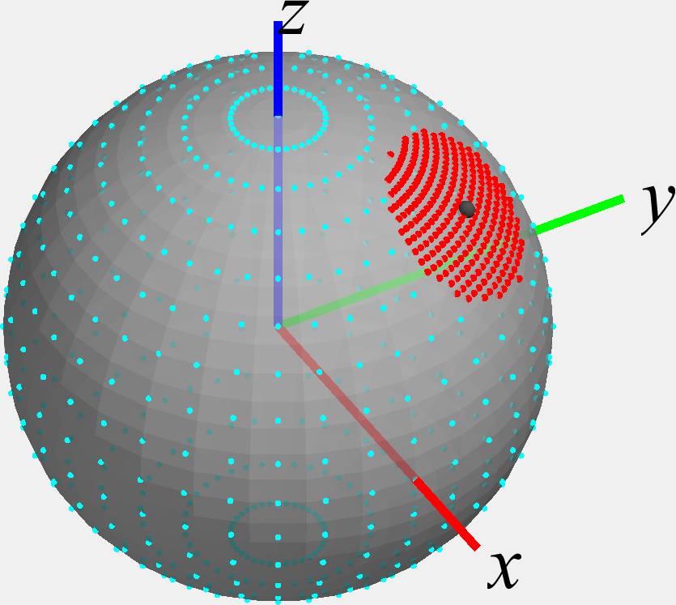{width="3.0in"
height="2.6792213473315836in"}{width="2.3576826334208225in"
height="2.68in"}

Figure 5.1.4.4-12: Visualization of non-uniform TRP grids for NF beam at
(0^o^,0^o^) on top and at (45^o^,45^o^) on bottom. Grid points in cyan
(red) are outside (inside) the conical NF beam peak region.

Simulation with 2000 random offsets up to 10cm were performed together
with random permutations of the beam peak direction (rotation in **θ, φ,
and twist α** as outlined in Clause G.1 of \[3\]). Table 5.1.4.4-11
shows the simulation results for the non-uniform measurement grids
considered the most suitable for PC1 devices. The average number of
unique grid points based on all simulations investigated is \~900 which
shows a significant test time reduction with the same TRP MUs as the
5^o^ measurement grid with uniform spacing in **θ and** φ, Table
5.1.4.4-10. For PC1, TRP test cases with a non-uniform angular spacing
in θ and φ do not require additional measurement uncertainty due to
reduced range length for range lengths exceeding 20cm if the path loss
correction is applied for measurement grids with step size of 2.5^o^
within ±20^o^ of the NF beam peak and step size of 10^o^ outside ±20^o^
of the NF beam peak.

Table 5.1.4.4-11: CFFDNF TRP simulation results with path loss
correction for PC1 devices (12x12 antenna configuration) using
non-uniform measurement grids.

  Antenna Configuration   Range Length \[cm\]   Cone width (±) \[^o^\]   Constant Step-Size Grid Step Size outside cone ∆θ=∆φ \[^o^\]   Constant Step-Size Grid Step Size within cone ∆θ=∆φ \[^o^\]   Average number of unique grid points   With Path Loss Correction   
  ----------------------- --------------------- ------------------------ -------------------------------------------------------------- ------------------------------------------------------------- -------------------------------------- --------------------------- ----------------------
                                                                                                                                                                                                                                             \|Mean TRP Error\| \[dB\]   TRP Std. Dev. \[dB\]
  12x12                   20                    20                       10                                                             2.5                                                           917                                    0.02                        0.04
                          25                                                                                                                                                                          916                                    0.01                        0.04
                          30                                                                                                                                                                          914                                    0.02                        0.04
                          35                                                                                                                                                                          914                                    0.03                        0.04
                          40                                                                                                                                                                          914                                    0.04                        0.04
                          45                                                                                                                                                                          914                                    0.04                        0.04

Similar simulations were performed for PC3 devices with the 8x2 antenna
configuration with random offsets up to 12.5cm. The results for the
non-uniform grids are tabulated in Table 5.1.4.4-12.

Table 5.1.4.4-12: CFFDNF TRP simulation results with path loss
correction for PC3 devices (8x2 antenna configuration) using non-uniform
measurement grids.

  Antenna Configuration   Range Length \[cm\]   Cone width (±) \[^o^\]   Constant Step-Size Grid Step Size outside cone ∆θ=∆φ \[^o^\]   Constant Step-Size Grid Step Size within cone ∆θ=∆φ \[^o^\]   Average number of unique grid points   With Path Loss Correction   
  ----------------------- --------------------- ------------------------ -------------------------------------------------------------- ------------------------------------------------------------- -------------------------------------- --------------------------- ----------------------
                                                                                                                                                                                                                                             \|Mean TRP Error\| \[dB\]   TRP Std. Dev. \[dB\]
  8x2                     20                    30                       15                                                             5                                                             428                                    0.05                        0.05
                          25                                                                                                                                                                          427                                    0.06                        0.04
                          30                                                                                                                                                                          427                                    0.06                        0.04
                          35                                                                                                                                                                          427                                    0.06                        0.04
                          40                                                                                                                                                                          427                                    0.06                        0.04
                          45                                                                                                                                                                          426                                    0.06                        0.04

For PC3, TRP test cases with a non-uniform angular spacing in θ and φ do
not require additional measurement uncertainty due to reduced range
length for range lengths exceeding 20cm if the path loss correction is
applied for measurement grids with step size of 5^o^ within ±30^o^ of
the NF beam peak and step size of 15^o^ outside ±30^o^ of the NF beam
peak.

The comparison of the TRP measurement grid parameters and the min.
number of grid points are tabulated in Table 5.1.4.4-13 when the antenna
array offset is known and compensated with angular grid spacings placed
uniformly and non-uniformly in θ and φ. Clearly, the non-uniform TRP
measurement grid approach is especially beneficial in terms of test time
reduction. The TRP calculation is left to the system vendor as there are
different approaches to determine TRP, e.g., interpolation of all
results to the fine grid vs partial TRPs calculated within the cone and
outside the cone.

Table 5.1.4.4-13: Comparison of the TRP measurement grid parameters for
PC3 and PC1 including potential test time improvement. The simulations
assume the offset is known/declared and the path loss correction was
applied.

  Antenna Config.   Range Length \[cm\]   Non-uniform angular spacing   Uniform angular spacing                                        Potential Test Time Improvement with non-uniform angular spacing in θ and φ (factor)                                                                                                                                 
  ----------------- --------------------- ----------------------------- -------------------------------------------------------------- -------------------------------------------------------------------------------------- -------------------------------------- ------------------------------------------------- ------------------------------ ----- --
                                          Cone width (±) \[^o^\]        Constant Step-Size Grid Step Size outside cone ∆θ=∆φ \[^o^\]   Constant Step-Size Grid Step Size within cone ∆θ=∆φ \[^o^\]                            Average Number of unique grid points   Constant Step-Size Grid Step Size ∆θ=∆φ \[^o^\]   Number of unique grid points         
                                                                                                                                                                                                                                                                                                                                                            
  8x2               20                    30                            15                                                             5                                                                                      427                                    5                                                 2522                           5.9   
                    25                                                                                                                                                                                                                                               10                                                614                            1.4   
  12x12             20                    20                            10                                                             2.5                                                                                    915                                    5                                                 2522                           2.8   

Additional simulations were performed based on the assumption that the
DUT changes the antenna configuration between high-UL power operation,
e.g., 8x2 configuration, and low-UL power operation, e.g., 4x1, 1x2,
1x1. Sample configurations of the active antenna elements placed near
the edge and the centre are visualized in Figure 5.1.4.4-13 for the 8x2
antenna configuration.

{width="6.695138888888889in"
height="2.7284722222222224in"}

Figure 5.1.4.4-13: 8x2 configuration for high UL power operation (left)
and sample configurations for low UL power operation

The following high-level procedure for the CFFDNF test methodology as
presented in clause 5.1.4.2 for the black&white-box approach was used:

-   Step 1: form the beam towards FF antenna in the Tx beam peak
    direction for the higher array order, i.e. 8x2, then activate UBF.

-   Step 2: set the NF probe antenna towards the NF TX beam peak
    direction, determined from the antenna offset, range length, and FF
    beam peak direction for the higher array order, i.e., 8x2.

-   Step 3: set UE array to transmit with the lower power mode, i.e., by
    reducing the number of active elements.

-   Step 4: Measure NF power of the UE for the lower power mode in the
    NF beam peak direction determined in Step 2.

-   Step 5: Calculate the EIRP from the NF power in Step 4 by:

    -   Adding the composite loss to the centre of the QZ

    -   Compensate the actual measurement distance to the centre of the
        UE array, using the 8x2 order

    -   Applying the probe antenna NF correction.

The simulation results from two companies are for the steps outlined
above and the PC3 worst-case array assumption of 8x2 and the 0.2m NF
range length are shown in Table 5.1.4.4-14. It can be observed that

-   The MUs for the case when the antenna array does not change its
    antenna configuration, i.e., the low-UL and high-UL configuration is
    8x2, matches the MU presented in Table 5.1.4.4-1

-   The MUs for the sub-array configurations, i.e., {4x1, 1x1, 1x2}, are
    the same or generally smaller than the MU for the 8x2 case

Table 5.1.4.4-14: CFFDNF simulation results utilizing black&white-box
with antenna array offset and feed antenna pattern compensated based on
the assumption that the antenna configuration could change from 8x2
(high-UL power configuration).

  ----------------------------------------------------------------------------------------------------------------------------------------------------------------------------------------------------------------------------------------------------------------
  Company   Number of Offsets   Range Length \[m\]   NF BP Direction determined from   Antenna Centre used for Path Loss Compensation   MUs                 Low Power Antenna Config                                                                  
  --------- ------------------- -------------------- --------------------------------- ------------------------------------------------ ------------------- -------------------------- ---------- ---------------- ---------- ------------ ---------- ------------
                                                                                                                                                            8x2                        4x1\       4x1 \"centre\"   1x1\       1x1\         1x2\       1x2\
                                                                                                                                                                                       \"edge\"                    \"edge\"   \"centre\"   \"edge\"   \"centre\"

  A         5000                0.2                  Reference Antenna\                Reference\                                       Mean Error \[dB\]   0.48                       0.48       0.04             0.20       0.01         0.20       0.01
                                                     (High-UL Power) offset            (High UL-Power)                                                                                                                                                

                                                                                                                                        Std. Dev. \[dB\]    0.22                       0.22       0.02             0.09       0.00         0.09       0.00

  B         500                 0.2                                                    Reference\                                       Mean Error \[dB\]                              0.43       0.06             0.21       0.03         0.21       0.03
                                                                                       (High UL-Power)                                                                                                                                                

                                                                                                                                        Std. Dev. \[dB\]                               0.20       0.03             0.10       0.02         0.10       0.01

  A         5000                0.2                  Sub-Array\                        Sub-Array\                                       Mean Error \[dB\]                              0.04       0.04             0.00       0.00         0.00       0.00
                                                     (Low-UL Power) offset             (Low-UL Power) offset                                                                                                                                          

                                                                                                                                        Std. Dev. \[dB\]                               0.02       0.02             0.00       0.00         0.00       0.00
  ----------------------------------------------------------------------------------------------------------------------------------------------------------------------------------------------------------------------------------------------------------------

Separate analyses were performed that take the same antenna array
offsets into account but instead of determining the NF beam peak
direction and the applying the path loss compensation with respect to
the phase centre of the 8x2 antenna array, the NF beam peak direction
and offset compensation was based on the centre of the sub-antenna array
configuration {4x1, 1x1, 1x2}. These results are presented in the third
row of the table above. Clearly, the MUs for the 4x1 configuration match
the MUs presented in Table 5.1.4.4-7.

Similar simulations were performed for the 12x12 (PC1) baseline/high-UL
power configuration and various {8x2, 4x1, 1x1, 1x2} sub-array
configurations for the low-UL power operation; those simulations are
shown in Table 5.1.4.4-15.

Table 5.1.4.4-15: CFFDNF simulation results utilizing black&white-box
with antenna array offset and feed antenna pattern compensated based on
the assumption that the antenna configuration could change from 12x12
(high-UL power configuration).

  ---------------------------------------------------------------------------------------------------------------------------------------------------------------------------------------------------------------------------------
  NF BP Direction determined from   Antenna Centre used for Path Loss Compensation   MUs                 Low Power Antenna Config                                                                                      
  --------------------------------- ------------------------------------------------ ------------------- -------------------------- ---------- ------------ ---------- ------------ ---------- ------------ ---------- ------------
                                                                                                         12x12                      8x2\       8x2\         4x1\       4x1\         1x1\       1x1\         1x2\       1x2\
                                                                                                                                    \"edge\"   \"centre\"   \"edge\"   \"centre\"   \"edge\"   \"centre\"   \"edge\"   \"centre\"

  Reference Antenna\                Reference\                                       Mean Error \[dB\]   0.45                       0.30       0.05         0.23       0.00         0.01       0.00         0.13       0.00
  (High-UL Power) offset            (High UL-Power)                                                                                                                                                                    

                                                                                     Std. Dev. \[dB\]    0.05                       0.04       0.01         0.03       0.00         0.00       0.00         0.02       0.00

  Sub-Array\                        Sub-Array\                                       Mean Error \[dB\]                              0.05       0.05         0.00       0.00                                            
  (Low-UL Power) offset             (Low-UL Power) offset                                                                                                                                                              

                                                                                     Std. Dev. \[dB\]                               0.01       0.01         0.00       0.00                                            
  ---------------------------------------------------------------------------------------------------------------------------------------------------------------------------------------------------------------------------------

Similar observations as for the PC3 analyses can be drawn:

-   The MUs for the case when the antenna array does not change its
    antenna configuration, i.e., the low-UL and high-UL configuration is
    12x12, matches the MU presented earlier which is captured in Table
    5.1.4.4-3

-   The MUs for the sub-array configurations, i.e., {8x2, 4x1, 1x1,
    1x2}, are smaller than the MU for the 12x12 case (which is serving
    as the reference for PC1 MU purposes)

-   The MUs for the case when the actual offset position of the
    sub-array is declared match the MUs determined in previous
    simulations, e.g., the MUs for the 8x2 antenna and for 0.45cm range
    length match the MUs for the 8x2 antenna array shown in Table
    5.1.4.4-3.

-   It can therefore be concluded that for CFFDNF (with black&white-box
    approach):If the phase centre of the reference antenna array (high
    UL-power operation: 8x2 for PC3, 12x12 for PC1) is declared, the
    previously determined MUs hold if the antenna changes its
    configuration for the low-UL power operation

-   If the phase centre of the sub-antenna array used for low-UL power
    operation is declared, the previously determined MUs can be further
    reduced

#### 5.1.4.5 Simulation results for CFFNF (using Black & White-Box Approach)

In this clause, results for near-field and far-field simulations of
*N~y~* x *N~z~* antenna arrays for the CFFNF methodology based on the
black&white-box approach, i.e., the location of active antenna panel for
the FF beam peak direction is known/declared, are presented. The
simulation assumptions are, for the most part, the same as those in
Table 5.1.4.3-1.

Initial simulations were performed with an EM simulator, CST. The grid
size used for the CST simulations had step sizes of 1^o^ in ∆θ and ∆φ.
Given the previous observation regarding the need to offset the probe
pattern, the simulations for CFFNF using black&white approach only
focused on the feed probe pattern compensated.

The CFFNF results are tabulated in Table 5.1.4.5-1 for 8x2 (PC3) and in
Table 5.1.4.5-2 for 12x12 (PC1) and compared with the CFFDNF results
(same as those in Table 5.1.4.4-8). Clearly, the measurement at the
additional radius *r*~2~ significantly reduces the measurement
uncertainties and allows EIRP/EIS measurements of PC3 (PC1) devices at
21cm (31cm) range length without additional (with very small) MU. These
simulations assume that *r*~2~ is either *r*~2~=*r*~1~+1cm or
*r*~2~=*r*~1~+2cm.

Subsequent simulations were performed with Matlab based on the same
assumptions. The PC3 results are tabulated in Table 5.1.4.5-3 with
results from two different companies while the PC1 results are tabulated
in Table 5.1.4.5-4.

Table 5.1.4.5-1: Statistical results of 500 EIRP CFFNF & CFFDNF CST
simulations based on black&white-box approach with random 8x2 antenna
array offsets uniformly spaced within 12.5cm in a single hemisphere. The
antenna array offsets and probe pattern were compensated.

  --------------------------------------------------------------------------------------------------------------------------------------------------------------------------------------------------------------
  Method                                                                                                  Range Length(m)   Max-Min EIRP (dB)   Max Error w.r.t. FF (dB)   \|Mean Error\| (dB)   Std. Dev (dB)
  ------------------------------------------------------------------------------------------------------- ----------------- ------------------- -------------------------- --------------------- ---------------
  CFFNF\                                                                                                  0.21              0.24                0.16                       0.04                  0.04
  B&W Box\                                                                                                                                                                                       
  (*r*~2~=*r*~1~+1cm)                                                                                                                                                                            

                                                                                                          0.26              0.22                0.13                       0.03                  0.03

                                                                                                          0.31              0.25                0.15                       0.03                  0.03

  CFFNF\                                                                                                  0.22              0.30                0.23                       0.04                  0.04
  B&W Box\                                                                                                                                                                                       
  (*r*~2~=*r*~1~+2cm)                                                                                                                                                                            

                                                                                                          0.27              0.25                0.16                       0.03                  0.04

                                                                                                          0.32              0.25                0.17                       0.03                  0.04

  CFFDNF\                                                                                                 0.20              0.93                1.10                       0.42                  0.19
  B&W Box                                                                                                                                                                                        

                                                                                                          0.25              0.34                0.45                       0.22                  0.07

                                                                                                          0.30              0.18                0.26                       0.14                  0.04

  Note: The range length for CFFNF with black&white-box approach is reported for radius *r*~2~\>*r*~1~.                                                                                          
  --------------------------------------------------------------------------------------------------------------------------------------------------------------------------------------------------------------

Table 5.1.4.5-2: Statistical results of 500 EIRP CFFNF & CFFDNF CST
simulations based on black&white-box approach with random 12x12 antenna
array offsets uniformly spaced within 10cm in a single hemisphere. The
antenna array offsets and probe pattern were compensated.

  --------------------------------------------------------------------------------------------------------------------------------------------------------------------------------------------------------------
  Method                                                                                                  Range Length(m)   Max-Min EIRP (dB)   Max Error w.r.t. FF (dB)   \|Mean Error\| (dB)   Std. Dev (dB)
  ------------------------------------------------------------------------------------------------------- ----------------- ------------------- -------------------------- --------------------- ---------------
  CFFNF\                                                                                                  0.26              0.74                0.89                       0.36                  0.15
  B&W Box\                                                                                                                                                                                       
  (*r*~2~=*r*~1~+1cm)                                                                                                                                                                            

                                                                                                          0.31              0.40                0.42                       0.18                  0.07

                                                                                                          0.36              0.32                0.29                       0.10                  0.05

  CFFNF\                                                                                                  0.27              0.73                0.87                       0.36                  0.15
  B&W Box\                                                                                                                                                                                       
  (*r*~2~=*r*~1~+2cm)                                                                                                                                                                            

                                                                                                          0.32              0.37                0.39                       0.18                  0.07

                                                                                                          0.37              0.28                0.25                       0.10                  0.05

  CFFDNF\                                                                                                 0.25              2.15                3.45                       1.98                  0.47
  B&W Box                                                                                                                                                                                        

                                                                                                          0.30              1.09                2.00                       1.26                  0.24

                                                                                                          0.35              0.63                1.31                       0.89                  0.14

  Note: The range length for CFFNF with black&white-box approach is reported for radius *r*~2~\>*r*~1~.                                                                                          
  --------------------------------------------------------------------------------------------------------------------------------------------------------------------------------------------------------------

Table 5.1.4.5-3: Statistical results of EIRP CFFNF offset simulations
based on black&white-box approach with random antenna array offsets
uniformly spaced within 12.5cm (PC3) in a single hemisphere. The antenna
array offsets were compensated.

  ----------------------------------------------------------------------------------------------------------------------------------------------------------------------------------------------
  Company►►►►►             **Company A**             **Company B**             **Company B**                                                                                     
  ------------------------ ------------------------- ------------------------- --------------------- --------------- --------------------- --------------- --------------------- ---------------
  Tool ►►►►►               **CST**                   **Matlab**                **Matlab**                                                                                        

  Number of Offsets►►►►►   **500**                   **500**                   **1000**                                                                                          

  Method                   Range Length *r*~1~ (m)   Range Length *r*~2~ (m)   \|Mean Error\| (dB)   Std. Dev (dB)   \|Mean Error\| (dB)   Std. Dev (dB)   \|Mean Error\| (dB)   Std. Dev (dB)

  CFFNF\                   0.2                       0.21                      0.04                  0.04            0.06                  0.03            0.03                  0.02
  B&W Box\                                                                                                                                                                       
  *r~2~*=*r~1~*+1cm                                                                                                                                                              

                           0.25                      0.26                      0.03                  0.03            0.03                  0.01            0.01                  0

                           0.3                       0.31                      0.03                  0.03                                                  0                     0

                           0.35                      0.36                                                                                                  0                     0

                           0.4                       0.41                                                                                                  0                     0

                           0.45                      0.46                                                                                                  0                     0

                           20                        20.01                                                                                                 0                     0

  CFFNF\                   0.2                       0.22                      0.04                  0.04                                                  0.02                  0.02
  B&W Box\                                                                                                                                                                       
  *r~2~*=*r~1~*+2cm                                                                                                                                                              

                           0.25                      0.27                      0.03                  0.04                                                  0.01                  0

                           0.3                       0.32                      0.03                  0.04                                                  0                     0

                           0.35                      0.37                                                                                                  0                     0

                           0.4                       0.42                                                                                                  0                     0

                           0.45                      0.47                                                                                                  0                     0

                           20                        20.02                                                                                                 0                     0
  ----------------------------------------------------------------------------------------------------------------------------------------------------------------------------------------------

Table 5.1.4.5-4: Statistical results of EIRP CFFNF offset simulations
based on black&white-box approach with random antenna array offsets
uniformly spaced within 10cm (PC1) in a single hemisphere. The antenna
array offsets were compensated.

  ------------------------------------------------------------------------------------------------------------------------------------------------------------------------------------------------------
  Tool ►►►►►                                                                                              CST                Matlab                                                      
  ------------------------------------------------------------------------------------------------------- ------------------ --------------------- --------------- --------------------- ---------------
  Number of Offsets ►►                                                                                    500                1000                                                        

  Method                                                                                                  Range Length (m)   \|Mean Error\| (dB)   Std. Dev (dB)   \|Mean Error\| (dB)   Std. Dev (dB)

  CFFNF\                                                                                                  0.26               0.36                  0.15            0.30                  0.12
  B&W Box\                                                                                                                                                                               
  *r~2~*=*r~1~*+1cm                                                                                                                                                                      

                                                                                                          0.31               0.18                  0.07            0.13                  0.04

                                                                                                          0.36               0.10                  0.05            0.07                  0.02

  CFFNF\                                                                                                  0.27               0.33                  0.14            0.27                  0.11
  B&W Box\                                                                                                                                                                               
  *r~2~*=*r~1~*+2cm                                                                                                                                                                      

                                                                                                          0.32               0.17                  0.06            0.12                  0.04

                                                                                                          0.37               0.10                  0.04            0.06                  0.02

  Note: The range length for CFFNF with black&white-box approach is reported for radius *r*~2~\>*r*~1~.                                                                                  
  ------------------------------------------------------------------------------------------------------------------------------------------------------------------------------------------------------

#### 5.1.4.6 Simulation results for CFFNF (using Black-Box Approach)

In this clause, results for near-field and far-field simulations of
*N~y~* x *N~z~* antenna arrays for the CFFNF methodology are presented
based on the black-box approach, i.e., the location active antenna panel
for the FF beam peak direction is unknown while only the FF BP direction
is known. The simulation assumptions are, for the most part, the same as
those in Table 5.1.4.3-1.

All simulations are performed with an EM simulator, CST. The grid size
used for the CST simulations had step sizes of 1^o^ in ∆θ and ∆φ. Given
the previous observation regarding the need to offset the probe pattern,
the simulations for CFFNF using black&white approach only focused on the
feed probe pattern compensated.

The angular widths of the cone needed for the local searches as a
function of the range length is tabulated in Table 5.1.4.6-1.

Table 5.1.4.6-1: Local search cone angles for PC3 device with maximum
offset of 12.5cm

  Range Length \[cm\]   Single-Sided Cone Angle \[deg\]
  --------------------- ---------------------------------
  20                    38.7
  25                    30.0
  30                    24.6
  35                    20.9

Since the black-box approach utilizes/requires relatively wide area
local searches at *r *= *r*~1~, e.g., the width of the sector is about
±40^o^ for *r*~1~=20cm, with limited local searches at *r*~2~ and *r*~3~
as illustrated in Figure 5.1.4.2-2, the test time for the black-box
approach is inherently longer than the black&white-box approach due to
the 3 vs 2 radii and the need for local searches vs no local search
requirements. On the other hand, this approach does not require the
declaration of the active antenna array location.

Suitable approaches to reduce the test time of these local searches
include coarse and fine search approaches, e.g., Figures M.2.2-3 and
M.2.2-4 of \[6\]. Alternatively, continuous non-demodulated EIRP
measurements on sectors with fixed angular distance could be utilized to
speed up the local searches, as illustrated in Figure 5.1.4.6-1 for BP
directions near the poles. For this accelerated search approach, the
positioner is moved continuously while the measurements are performed in
close succession.

{width="5.0in" height="3.201949912510936in"}

Figure 5.1.4.6-1: Stepped (left) vs continuous (right) search approach
for EIRP for a FF BP near the pole.

Even for arbitrary FF BP directions not near the pole, a continuous scan
over the sector, can be performed since the beam is locked with the UBF
towards the FF beam peak direction. An illustration of this approach is
in Figure 5.1.4.6-2.

{width="5.0in" height="3.2864851268591426in"}

Figure 5.1.4.6-2: Stepped (left) vs continuous (right) search approach
for EIRP for an arbitrary FF BP direction.

As outlined in earlier, the CFFNF methodology based on the black-box
approach leverages the declared FF beam peak direction and since the
antenna array offset is not known/declared, a localized search for the
NF beam peak in the NF must be performed over a small sector around the
FF beam peak direction. For an approximately ±40^o^ cone needed for PC3
devices (based on the 8x2 antenna array configuration) with a 20cm range
length and a constant-step size measurement grid with ∆φ=∆θ=1^o^, around
14k grid points for the initial NF local search at *r*=*r*~1~ would be
required. Obviously, this is completely impractical due to the enormous
test time requirements. The measurement uncertainties serving as the
reference for investigations to follow, are shown in Table 5.1.4.6-2.

Table 5.1.4.6-2: Statistical results of 500 EIRP CFFNF & CFFDNF CST
simulations based on black-box approach with random 8x2 (12x12) antenna
array offsets uniformly spaced within 12.5cm (10cm) in a single
hemisphere. The antenna array offsets and probe pattern were compensated
and the search grids were based on ∆φ=∆θ=1^o^.

  Antenna Configuration   Method              Range Length r3 (m)   \|Mean Error\| (dB)   Std. Dev (dB)   Approximate max. number of local search grid points \@r1
  ----------------------- ------------------- --------------------- --------------------- --------------- ----------------------------------------------------------
  8x2                     CFFNF (Black Box)   0.22                  0.09                  0.24            14k
                                              0.27                  0.04                  0.09            11k
                                              0.32                  0.00                  0.07            9k
  12x12                   CFFNF (Black Box)   0.27                  0.29                  0.61            8k
                                              0.32                  0.16                  0.53            7k
                                              0.37                  0.17                  0.45            6k

These CFFNF results are tabulated in Table 5.1.4.6-3 for 8x2 (PC3) and
for 12x12 (PC1) and compared with the CFFDNF results (same as those in
Table 5.1.4.4-8). These simulations assume that *r*~2~ is either
*r*~2~=*r*~1~+1cm or *r*~2~=*r*~1~+2cm.

Table 5.1.4.6-3: Statistical results of 500 EIRP CFFNF & CFFDNF CST
simulations based on black-box, black&white-box approach with random 8x2
and 12x12 antenna array offsets uniformly spaced within 12.5cm for 8x2
and within 10cm for 12x12 in a single hemisphere. The antenna array
offsets and probe pattern were compensated.

+-------------+-------------+-------------+-------------+-------------+
| Antenna     | Method      | Range       | \|Mean      | Std. Dev    |
| Co          |             | Length(m)   | Error\|     | (dB)        |
| nfiguration |             |             | (dB)        |             |
+=============+=============+=============+=============+=============+
| 8x2         | CFFNF\      | 0.22        | 0.09        | 0.24        |
|             | Black Box   |             |             |             |
+-------------+-------------+-------------+-------------+-------------+
|             |             | 0.27        | 0.04        | 0.09        |
+-------------+-------------+-------------+-------------+-------------+
|             |             | 0.32        | 0.00        | 0.07        |
+-------------+-------------+-------------+-------------+-------------+
|             | CFFNF\      | 0.21        | 0.04        | 0.04        |
|             | B&W Box\    |             |             |             |
|             | (*r*~2~=    |             |             |             |
|             | *r*~1~+1cm) |             |             |             |
+-------------+-------------+-------------+-------------+-------------+
|             |             | 0.26        | 0.03        | 0.03        |
+-------------+-------------+-------------+-------------+-------------+
|             |             | 0.31        | 0.03        | 0.03        |
+-------------+-------------+-------------+-------------+-------------+
|             | CFFNF\      | 0.22        | 0.04        | 0.04        |
|             | B&W Box\    |             |             |             |
|             | (*r*~2~=    |             |             |             |
|             | *r*~1~+2cm) |             |             |             |
+-------------+-------------+-------------+-------------+-------------+
|             |             | 0.27        | 0.03        | 0.04        |
+-------------+-------------+-------------+-------------+-------------+
|             |             | 0.32        | 0.03        | 0.04        |
+-------------+-------------+-------------+-------------+-------------+
|             | CFFDNF\     | 0.20        | 0.42        | 0.19        |
|             | B&W Box     |             |             |             |
+-------------+-------------+-------------+-------------+-------------+
|             |             | 0.25        | 0.22        | 0.07        |
+-------------+-------------+-------------+-------------+-------------+
|             |             | 0.30        | 0.14        | 0.04        |
+-------------+-------------+-------------+-------------+-------------+
| 12x12       | CFFNF       | 0.27        | 0.29        | 0.61        |
|             |             |             |             |             |
|             | Black Box   |             |             |             |
+-------------+-------------+-------------+-------------+-------------+
|             |             | 0.32        | 0.16        | 0.53        |
+-------------+-------------+-------------+-------------+-------------+
|             |             | 0.37        | 0.17        | 0.45        |
+-------------+-------------+-------------+-------------+-------------+
|             | CFFNF\      | 0.26        | 0.36        | 0.15        |
|             | B&W Box\    |             |             |             |
|             | (*r*~2~=    |             |             |             |
|             | *r*~1~+1cm) |             |             |             |
+-------------+-------------+-------------+-------------+-------------+
|             |             | 0.31        | 0.18        | 0.07        |
+-------------+-------------+-------------+-------------+-------------+
|             |             | 0.36        | 0.10        | 0.05        |
+-------------+-------------+-------------+-------------+-------------+
|             | CFFNF\      | 0.27        | 0.36        | 0.15        |
|             | B&W Box\    |             |             |             |
|             | (*r*~2~=    |             |             |             |
|             | *r*~1~+2cm) |             |             |             |
+-------------+-------------+-------------+-------------+-------------+
|             |             | 0.32        | 0.18        | 0.07        |
+-------------+-------------+-------------+-------------+-------------+
|             |             | 0.37        | 0.10        | 0.05        |
+-------------+-------------+-------------+-------------+-------------+
|             | CFFDNF\     | 0.25        | 1.98        | 0.47        |
|             | B&W Box     |             |             |             |
+-------------+-------------+-------------+-------------+-------------+
|             |             | 0.30        | 1.26        | 0.24        |
+-------------+-------------+-------------+-------------+-------------+
|             |             | 0.35        | 0.89        | 0.14        |
+-------------+-------------+-------------+-------------+-------------+
| Note 1: The |             |             |             |             |
| range       |             |             |             |             |
| length for  |             |             |             |             |
| CFFNF with  |             |             |             |             |
| blac        |             |             |             |             |
| k&white-box |             |             |             |             |
| approach is |             |             |             |             |
| reported    |             |             |             |             |
| for radius  |             |             |             |             |
| *r*~        |             |             |             |             |
| 2~\>*r*~1~. |             |             |             |             |
|             |             |             |             |             |
| Note 2: The |             |             |             |             |
| range       |             |             |             |             |
| length for  |             |             |             |             |
| CFFNF with  |             |             |             |             |
| black-box   |             |             |             |             |
| approach is |             |             |             |             |
| reported    |             |             |             |             |
| for radius  |             |             |             |             |
| *r*~3~\>*r* |             |             |             |             |
| ~2~\>*r*~1~ |             |             |             |             |
| and         |             |             |             |             |
| *r*~3       |             |             |             |             |
| ~=*r*~2~+1= |             |             |             |             |
| *r*~1~+2cm. |             |             |             |             |
+-------------+-------------+-------------+-------------+-------------+

For the CFFNF (black box) simulations shown in Table 5.1.4.6-3, the
local searches were performed using a 1^o^ step size in θ and φ to
establish the reference MUs for the CFFNF methodology.

On top of the initial local search at *r*=*r*~1~, small local searches
at *r*=*r*~2~ and *r*=*r*~3~ are required as outlined in Section
5.1.4.2, i.e., the total number of grid points could exceed the numbers
listed in Table 5.1.4.6-2. To significantly reduce the number of total
number of grid points, coarse and fine searches were investigated more
closely, i.e., an initial coarse search at *r*=*r*~1~ with ∆θ~r1,coarse~
and ∆φ~r1,coarse~ and fine searches around potential NF beam peak
candidates with ∆θ~r123,fine~=∆φ~r123,fine~ are then performed at
*r*=*r*~1~, *r*=*r*~2~, and *r*=*r*~3~. The MUs for the optimized search
procedures are shown in Table 5.1.4.6-4; clearly, the presented
optimized search grids significantly reduce the total number of search
grid points while maintaining MUs similar to the reference MUs, Table
5.1.4.6-2.

Table 5.1.4.6-4: Statistical results of 500 EIRP CFFNF & CFFDNF CST
simulations based on black-box approach with random 8x2 (12x12) antenna
array offsets uniformly spaced within 12.5cm (10cm) in a single
hemisphere. The antenna array offsets and probe pattern were compensated
and the search grids were optimized with coarse & fine local searches.

  ---------------------------------------------------------------------------------------------------------------------------------------------------------------------------------------------------------------------------------
  Antenna Configuration   Method              Range Length r3 (m)   ∆θ~r1,coarse~ \@r~1~\   ∆φ~r1,coarse~\   ∆θ~r123,fine~=\      \|Mean Error\| (dB)   Std. Dev (dB)   Approximate max. total number of local search grid points
                                                                    \[^o^\]                 \@r~1~\          ∆φ~r123,fine~\                                             
                                                                                            \[^o^\]          \@r~1~, r~2~, r~3\                                         
                                                                                                             ~\[^o^\]                                                   
  ----------------------- ------------------- --------------------- ----------------------- ---------------- -------------------- --------------------- --------------- -----------------------------------------------------------
  8x2                     CFFNF (Black Box)   0.22                  8                       15               2                    0.10                  0.27            400

                                              0.27                                                                                0.05                  0.12            

                                              0.32                                                                                0.02                  0.10            

                          CFFNF (Black Box)   0.22                  10                      15               2                    0.12                  0.32            370

                                              0.27                                                                                0.06                  0.15            

                                              0.32                                                                                0.01                  0.13            

  12x12                   CFFNF (Black Box)   0.27                  8                       15               2                    0.28                  0.64            160

                                              0.32                                                                                0.17                  0.52            

                                              0.37                                                                                0.20                  0.41            

                          CFFNF (Black Box)   0.27                  10                      15               2                    0.28                  0.64            160

                                              0.32                                                                                0.17                  0.52            

                                              0.37                                                                                0.20                  0.43            
  ---------------------------------------------------------------------------------------------------------------------------------------------------------------------------------------------------------------------------------

Constant step size measurement grids can leverage continuous scans to
speed up the searches while 5^o^ searches yield between 200-500 grid
points for a \~±40^o^ cone at *r*~1~=20cm. Leveraging coarse and fine
search approaches, e.g., a coarse search grid of 10^o^ (between 40-110
grid points for a \~±40^o^ cone) over the entire cone with localized
fine 5^o^ searches could likely significantly drop the number of grid
points for the NF BP search. The total number could be further reduced
when utilizing constant density search grids instead of constant-step
size grids.

A hybrid CFFNF approach could be used which combines the advantages in
terms of test time of the black&white-box approach without the need of a
vendor declaration, i.e., black box. Instead of having to declare the
phase centre offset, this offset is determined first using the CFFNF
methodology based on black-box approach. Here, the following sample
approach could be leveraged:

\- For low UL power test case \#1

\- Apply the black-box CFFNF test methodology using FF probe

\- Use the FF probe to steer the antenna beam towards the known BP
direction

\- Lock the beam using UBF

\- Switch operation to NF probe

\- Perform local searches around sectors centred around the FF peak at
three different radii in the NF

\- Determine FF EIRP

\- Determine phase centre offset of the active antenna

\- For low UL power test cases ≥\#2

\- Apply the black&white-box NF test approach using NF probe

\- Use the FF probe to steer the antenna beam towards the known BP
direction

\- Lock the beam using UBF

\- Switch operation to NF probe

\- Perform EIRP measurements at two different radii in the NF BP
direction

\- Determine EIRP

#### 5.1.4.7 Simulation results for sensitivity of CFFNF to relative measurement uncertainties 

This clause provides simulation assumptions for how uncertainties of
power measurements in the NF, *p*(*d~i~*), affect the estimates for
EIRP/EIS measurements based on the asymptotic expansion approach. As
outlined in Figure 5.1.4-2, *d* is the distance between the NF
measurement probe and the centre of the antenna array, while *r* is the
range length defined as the distance between the centre of QZ and the NF
measurement probe.

The asymptotic expansion approach expression for the normalized power as
a function of d is assumed as follows

$$p\left( d \right) = - \frac{b_{1}}{2}d^{- 2} + b_{2}$$

and is illustrated for two cases, i.e., d1 & d2 maximized and minimized,
in Figure 5.1.4.7-1. For the simulations in this clause, it is assumed
that r2 = r1 + 2cm.

{width="6.695138888888889in"
height="2.7868055555555555in"}

Figure 5.1.4.7-1: Illustration of the asymptotic expansion approach
using two radii approach with the antenna array located closer to the NF
probe on the left than on the right.

Power measurement uncertainties, *u~i~*, on the NF measurements
*p*(*d*~i~) can have an effect on the resulting estimate of the
estimated FF EIRP/EIS due to the asymptotic expansion transformation.
This effect is illustrated schematically in Figure 5.1.4.7-2.

{width="3.2777777777777777in"
height="1.8791808836395452in"}

Figure 5.1.4.7-2: Illustration of the effect of power measurement
uncertainties ui applied to NF measurements p(di) on the estimated FF
EIRP/EIS.

For these simulations, *u~i~* is assumed to be a Gaussian distribution
with std. deviation of σ varying from 0 to 0.4dB. It should be noted
that the test equipment uncertainties, e.g., Uncertainty of the RF power
measurement equipment (B.2.1.6 of \[7\]) or gNB emulator uncertainty
(B.2.1.17 of \[7\]), are not applicable in full here since the
measurements at *r*~1~ and *r*~2~ are performed with the same equipment
in close succession. Instead, the relative power measurement MU apply
here.

In these simulations, it is furthermore assumed that *N*=30 averages are
taken for each power measurement *[p]{.underline}*(*d~i~*).

For fixed offsets, the effect of *u~i~* with fixed standard deviations
are shown in Table 5.1.4.7-1for the two extreme cases with
*d*~CFFNF,min~=7.5cm and *d*~CFFNF,max~=20cm, visualized schematically
in Figure 5.1.4.7-1. For each offset, 100K random Gaussian distributions
for *u~i~* with fixed standard deviations (ranging from 0 to 0.4dB) were
simulated to get obtain the mean errors with respect to the FF EIRP and
the standard deviation.

Table 5.1.4.7-1: Impact of power measurement uncertainty *u~i~* applied
to *p(d)* measurements on FF EIRP for fixed offsets.

  Std. Deviation of *u~i~* (dB)   *d*~CFFNF,min~=7.5cm & *d*~CFFNF,min~+2cm=9.5cm   *d*~CFFNF,max~=20cm & *d*~CFFMF,max~+2cm=22cm                                          
  ------------------------------- ------------------------------------------------- ----------------------------------------------- -------------------------------------- --------------------------------------
                                  \|Mean Error of FF EIRP Error\| (dB)              Std. Deviation of FF EIRP Error (dB)            \|Mean Error of FF EIRP Error\| (dB)   Std. Deviation of FF EIRP Error (dB)
  0                               0.09                                              0                                               0.01                                   0
  0.1                             0.09                                              0.05                                            0.01                                   0.14
  0.2                             0.09                                              0.11                                            0.02                                   0.31
  0.3                             0.10                                              0.19                                            0.04                                   0.52
  0.4                             0.12                                              0.27                                            0.07                                   0.77

In order to obtain an overall estimate of the MUs, 1000 random offsets
from Company A (500 random offsets from Company B) were evaluated. For
each of the 1000 (500) random offsets, 100K random Gaussian
distributions (100) for *u~i~* with fixed standard deviations were
simulated to get obtain the mean errors and standard deviation for the
FF EIRP; these results are tabulated in Table 5.1.4.7-2.

Table 5.1.4.7-2: Impact of measurement uncertainty *u~i~* applied to
*p(d)* measurements on FF EIRP with random offsets

<table>
<thead>
<tr class="header">
<th>Std. Deviation of <em>u</em>i (dB)</th>
<th>
Company A

(N=30)
</th>
<th>
Company B

(N=1)
</th>
<th>
Company B

(N=30)
</th>
<th>
Company A

(N=1)
</th>
<th>
Company A

(N=30)
</th>
<th></th>
<th></th>
<th></th>
<th></th>
<th></th>
</tr>
</thead>
<tbody>
<tr class="odd">
<td></td>
<td>|Mean Error of FF EIRP Error| (dB)</td>
<td>Std. Dev. of FF EIRP Error (dB)</td>
<td>|Mean Error of FF EIRP Error| (dB)</td>
<td>Std. Dev. of FF EIRP Error (dB)</td>
<td>|Mean Error of FF EIRP Error| (dB)</td>
<td>Std. Dev. of FF EIRP Error (dB)</td>
<td>|Mean Error of FF EIRP Error| (dB)</td>
<td>Std. Dev. of FF EIRP Error (dB)</td>
<td>|Mean Error of FF EIRP Error| (dB)</td>
<td>Std. Dev. of FF EIRP Error (dB)</td>
</tr>
<tr class="even">
<td>0</td>
<td>0.04</td>
<td>0.0</td>
<td></td>
<td></td>
<td></td>
<td></td>
<td></td>
<td></td>
<td></td>
<td></td>
</tr>
<tr class="odd">
<td>0.1</td>
<td>0.04</td>
<td>0.07</td>
<td>0.035</td>
<td>0.249</td>
<td>0.041</td>
<td>0.093</td>
<td>0.12</td>
<td>0.95</td>
<td>0.03</td>
<td>0.16</td>
</tr>
<tr class="even">
<td>0.2</td>
<td>0.04</td>
<td>0.16</td>
<td></td>
<td></td>
<td></td>
<td></td>
<td>0.4</td>
<td>2.23</td>
<td>0.01</td>
<td>0.29</td>
</tr>
<tr class="odd">
<td>0.3</td>
<td>0.05</td>
<td>0.27</td>
<td>0.017</td>
<td>0.730</td>
<td>0.039</td>
<td>0.152</td>
<td>0.53</td>
<td>3.13</td>
<td>0.06</td>
<td>0.37</td>
</tr>
<tr class="even">
<td>0.4</td>
<td>0.06</td>
<td>0.40</td>
<td></td>
<td></td>
<td></td>
<td></td>
<td>0.43</td>
<td>3.65</td>
<td>0.16</td>
<td>0.44</td>
</tr>
<tr class="odd">
<td>0.5</td>
<td></td>
<td></td>
<td>0.136</td>
<td>1.347</td>
<td>0.035</td>
<td>0.229</td>
<td></td>
<td></td>
<td></td>
<td></td>
</tr>
</tbody>
</table>

#### 5.1.4.8 Simulation results for CFFdeltaNF

In this clause, results for near-field and far-field simulations of
*N~y~* x *N~z~* antenna arrays for the CFFdeltaNF methodology are
presented based on the black-box approach, i.e., the location active
antenna panel for the FF beam peak direction is unknown while only the
FF BP direction is known. The simulation assumptions are, for the most
part, the same as those in Table 5.1.4.3-1. All simulations are
performed with various NF search step sizes in ∆θ and ∆φ.

It has to be noted that the local search cone angles per range length
shown in Table 5.1.4.6-1 are valid for CFFdeltaNF, same as the coarse
and fine search approaches to reduce the test time.

The following analyses focus on NF and FF Matlab simulations based the
following high-level test procedure

-   Step 1: Measure FF EIRP of the DUT in the FF beam peak direction for
    max UL power with the FF probe

-   Step 2: Perform a local search around the FF beam peak direction for
    max UL power with the NF probe without compensating the probe
    antenna pattern.

-   Step 3: Measure NF EIRP of the DUT in the NF beam peak direction
    (determine in Step 2) for max UL power with the NF probe

-   Step 4: Determine the correlation factor (difference between FF and
    NF EIRP measurements in Steps 1 and 3)

-   Step 5: Measure NF EIRP of the DUT in the NF beam peak direction for
    low UL power with the NF probe

-   Step 6: Estimate the FF EIRP for the low UL power case with the
    correlation factor determined in Step 4 and the NF EIRP measured in
    Step 5

These simulations assume that for the reference high-UL power operation
measurements, a 4x1 and 8x2 PC3 antenna configuration of MxN is used in
Steps 1 and 3. When the operation is switched to the low-UL power
operation in Step 5, it is assumed that the DUT can switch to an OxP
configuration with O≤M and P≤N. Additionally, it is assumed that any
arbitrary sub-array can be activated, i.e., towards the edges, the
centre, or anywhere in between the full array configuration. Examples
for the 8x2 configuration and various OxP configurations for the low-UL
power operation are illustrated in Figure 5.1.4.4-13. For the low-UL
power operation, antenna arrays of O={1, 2, 4, 8} x P={1,2} for the 8x2
and O={1, 2, 4} x P={1} for the 4x2 configuration were simulated with
[all]{.underline} possible locations within the MxN array.

These simulations assumed 2000 random offsets and that the NF beam peak
direction was determined without the NF probe antenna pattern
compensation with 1^o^, 2.5^o^ and 5^o^ local search step sizes for the
local search (see step 2 above). The simulation results for the PC3 DUT
with 8x2 configuration for the high-UL power operation are tabulated in
Table 5.1.4.8-1 and with 4x1 configuration for the high-UL power
operation in Table 5.1.4.8-2. The simulation results for PC1 DUT with
12x12 configuration for the high-UL power operation are tabulated in
Table 5.1.4.8-3.

Table 5.1.4.8-1: CFFdeltaNF using black-box approach for 8x2 PC3
configuration. The low UL power configuration of the antenna array can
be O={1, 2, 4, 8} x P={1,2} and be configured anywhere within the 8x2
array.

  Search Step Size ►►►   ∆θ=∆φ=1^o^           ∆θ=∆φ=2.5^o^                            ∆θ=∆φ=5^o^                                                                                                                                                    
  ---------------------- -------------------- --------------------------------------- -------------------------------------- --------------------------------------- -------------------------------------- --------------------------------------- --------------------------------------
  Range Length \[m\]     OxP Antenna Config   FF Low Pwr EIRP-Max Mean Error \[dB\]   FF Low Pwr EIRP-Max Std. Dev. \[dB\]   FF Low Pwr EIRP-Max Mean Error \[dB\]   FF Low Pwr EIRP-Max Std. Dev. \[dB\]   FF Low Pwr EIRP-Max Mean Error \[dB\]   FF Low Pwr EIRP-Max Std. Dev. \[dB\]
  0.2                    1x1                  -0.72                                   0.36                                   -0.79                                   0.42                                   -1.04                                   0.60
  0.2                    2x1                  -0.72                                   0.36                                   -0.79                                   0.41                                   -1.02                                   0.59
  0.2                    4x1                  -0.67                                   0.34                                   -0.73                                   0.38                                   -0.44                                   0.61
  0.2                    1x2                  -0.55                                   0.25                                   -0.62                                   0.31                                   -0.86                                   0.53
  0.2                    2x2                  -0.55                                   0.25                                   -0.61                                   0.30                                   -0.84                                   0.51
  0.2                    4x2                  -0.50                                   0.23                                   -0.08                                   0.29                                   -0.27                                   0.57
  0.2                    8x2                  0.00                                    0.00                                   0.00                                    0.00                                   0.00                                    0.00
  0.25                   1x1                  -0.36                                   0.15                                   -0.42                                   0.19                                   -0.62                                   0.36
  0.25                   2x1                  -0.35                                   0.15                                   -0.41                                   0.19                                   -0.61                                   0.34
  0.25                   4x1                  -0.33                                   0.15                                   -0.16                                   0.21                                   -0.31                                   0.38
  0.25                   1x2                  -0.26                                   0.09                                   -0.32                                   0.13                                   -0.51                                   0.31
  0.25                   2x2                  -0.26                                   0.09                                   -0.31                                   0.13                                   -0.34                                   0.30
  0.25                   4x2                  -0.02                                   0.08                                   -0.06                                   0.16                                   -0.20                                   0.35
  0.25                   8x2                  0.00                                    0.00                                   0.00                                    0.00                                   0.00                                    0.00
  0.3                    1x1                  -0.21                                   0.08                                   -0.26                                   0.11                                   -0.43                                   0.26
  0.3                    2x1                  -0.21                                   0.08                                   -0.25                                   0.11                                   -0.33                                   0.26
  0.3                    4x1                  -0.07                                   0.08                                   -0.10                                   0.13                                   -0.23                                   0.27
  0.3                    1x2                  -0.16                                   0.04                                   -0.20                                   0.08                                   -0.37                                   0.25
  0.3                    2x2                  -0.16                                   0.04                                   -0.11                                   0.08                                   -0.27                                   0.25
  0.3                    4x2                  -0.01                                   0.05                                   -0.05                                   0.11                                   -0.17                                   0.26
  0.3                    8x2                  0.00                                    0.00                                   0.00                                    0.00                                   0.00                                    0.00
  0.35                   1x1                  -0.14                                   0.05                                   -0.19                                   0.08                                   -0.31                                   0.22
  0.35                   2x1                  -0.14                                   0.05                                   -0.12                                   0.08                                   -0.28                                   0.22
  0.35                   4x1                  -0.05                                   0.06                                   -0.08                                   0.10                                   -0.21                                   0.22
  0.35                   1x2                  -0.11                                   0.03                                   -0.15                                   0.06                                   -0.26                                   0.21
  0.35                   2x2                  -0.11                                   0.03                                   -0.08                                   0.07                                   -0.23                                   0.21
  0.35                   4x2                  -0.01                                   0.04                                   -0.04                                   0.09                                   -0.16                                   0.22
  0.35                   8x2                  0.00                                    0.00                                   0.00                                    0.00                                   0.00                                    0.00
  0.4                    1x1                  -0.11                                   0.04                                   -0.12                                   0.07                                   -0.27                                   0.20
  0.4                    2x1                  -0.11                                   0.04                                   -0.10                                   0.07                                   -0.24                                   0.19
  0.4                    4x1                  -0.04                                   0.04                                   -0.07                                   0.08                                   -0.18                                   0.19
  0.4                    1x2                  -0.08                                   0.02                                   -0.09                                   0.06                                   -0.23                                   0.19
  0.4                    2x2                  -0.03                                   0.02                                   -0.07                                   0.06                                   -0.20                                   0.19
  0.4                    4x2                  -0.01                                   0.03                                   -0.04                                   0.07                                   -0.14                                   0.19
  0.4                    8x2                  0.00                                    0.00                                   0.00                                    0.00                                   0.00                                    0.00
  0.45                   1x1                  -0.08                                   0.03                                   -0.10                                   0.06                                   -0.25                                   0.18
  0.45                   2x1                  -0.05                                   0.03                                   -0.09                                   0.06                                   -0.23                                   0.18
  0.45                   4x1                  -0.03                                   0.03                                   -0.06                                   0.07                                   -0.17                                   0.18
  0.45                   1x2                  -0.06                                   0.01                                   -0.08                                   0.05                                   -0.22                                   0.18
  0.45                   2x2                  -0.03                                   0.02                                   -0.06                                   0.05                                   -0.20                                   0.18
  0.45                   4x2                  -0.01                                   0.02                                   -0.04                                   0.06                                   -0.14                                   0.17
  0.45                   8x2                  0.00                                    0.00                                   0.00                                    0.00                                   0.00                                    0.00
  20                     1x1                  0.00                                    0.00                                   0.00                                    0.00                                   0.00                                    0.00
  20                     2x1                  0.00                                    0.00                                   0.00                                    0.00                                   0.00                                    0.00
  20                     4x1                  0.00                                    0.00                                   0.00                                    0.00                                   0.00                                    0.00
  20                     1x2                  0.00                                    0.00                                   0.00                                    0.00                                   0.00                                    0.00
  20                     2x2                  0.00                                    0.00                                   0.00                                    0.00                                   0.00                                    0.00
  20                     4x2                  0.00                                    0.00                                   0.00                                    0.00                                   0.00                                    0.00
  20                     8x2                  0.00                                    0.00                                   0.00                                    0.00                                   0.00                                    0.00

Table 5.1.4.8-2: CFFdeltaNF using black-box approach for 4x1 PC3
configuration. The low UL power configuration of the antenna array can
be O={1, 2, 4} x P={1} and be configured anywhere within the 4x1 array.

  Search Step Size ►►►   ∆θ=∆φ=1^o^           ∆θ=∆φ=2.5^o^                            ∆θ=∆φ=5^o^                                                                                                                                                    
  ---------------------- -------------------- --------------------------------------- -------------------------------------- --------------------------------------- -------------------------------------- --------------------------------------- --------------------------------------
  Range Length \[m\]     OxP Antenna Config   FF Low Pwr EIRP-Max Mean Error \[dB\]   FF Low Pwr EIRP-Max Std. Dev. \[dB\]   FF Low Pwr EIRP-Max Mean Error \[dB\]   FF Low Pwr EIRP-Max Std. Dev. \[dB\]   FF Low Pwr EIRP-Max Mean Error \[dB\]   FF Low Pwr EIRP-Max Std. Dev. \[dB\]
  0.2                    1x1                  -0.11                                   0.14                                   -0.13                                   0.17                                   -0.19                                   0.26
  0.2                    2x1                  -0.08                                   0.13                                   -0.10                                   0.16                                   -0.15                                   0.23
  0.2                    4x1                  0.00                                    0.00                                   0.00                                    0.00                                   0.00                                    0.00
  0.25                   1x1                  -0.05                                   0.06                                   -0.06                                   0.08                                   -0.12                                   0.15
  0.25                   2x1                  -0.04                                   0.06                                   -0.05                                   0.08                                   -0.10                                   0.13
  0.25                   4x1                  0.00                                    0.00                                   0.00                                    0.00                                   0.00                                    0.00
  0.3                    1x1                  -0.03                                   0.04                                   -0.04                                   0.06                                   -0.09                                   0.11
  0.3                    2x1                  -0.02                                   0.03                                   -0.03                                   0.05                                   -0.07                                   0.09
  0.3                    4x1                  0.00                                    0.00                                   0.00                                    0.00                                   0.00                                    0.00
  0.35                   1x1                  -0.02                                   0.02                                   -0.03                                   0.04                                   -0.07                                   0.08
  0.35                   2x1                  -0.02                                   0.02                                   -0.02                                   0.04                                   -0.05                                   0.07
  0.35                   4x1                  0.00                                    0.00                                   0.00                                    0.00                                   0.00                                    0.00
  0.4                    1x1                  -0.01                                   0.02                                   -0.02                                   0.03                                   -0.06                                   0.07
  0.4                    2x1                  -0.01                                   0.02                                   -0.02                                   0.03                                   -0.05                                   0.06
  0.4                    4x1                  0.00                                    0.00                                   0.00                                    0.00                                   0.00                                    0.00
  0.45                   1x1                  -0.01                                   0.01                                   -0.02                                   0.02                                   -0.05                                   0.06
  0.45                   2x1                  -0.01                                   0.01                                   -0.02                                   0.02                                   -0.04                                   0.05
  0.45                   4x1                  0.00                                    0.00                                   0.00                                    0.00                                   0.00                                    0.00
  1.05                   1x1                  0.00                                    0.00                                   -0.01                                   0.01                                   -0.04                                   0.03
  1.05                   2x1                  0.00                                    0.00                                   -0.01                                   0.01                                   -0.03                                   0.03
  1.05                   4x1                  0.00                                    0.00                                   0.00                                    0.00                                   0.00                                    0.00
  20                     1x1                  0.00                                    0.00                                   0.00                                    0.00                                   0.00                                    0.00
  20                     2x1                  0.00                                    0.00                                   0.00                                    0.00                                   0.00                                    0.00
  20                     4x1                  0.00                                    0.00                                   0.00                                    0.00                                   0.00                                    0.00

Table 5.1.4.8-3: CFFdeltaNF using black-box approach for 12x12 PC1
configuration. The low UL power configuration of the antenna array can
be O={1, 2, 4, 8} x P={1, 2} and be configured anywhere within the 12x12
array.

  Search Step Size ►►►   ∆θ=∆φ=1^o^           ∆θ=∆φ=2.5^o^                                                                                                           
  ---------------------- -------------------- --------------------------------------- -------------------------------------- --------------------------------------- --------------------------------------
  Range Length \[m\]     OxP Antenna Config   FF Low Pwr EIRP-Max Mean Error \[dB\]   FF Low Pwr EIRP-Max Std. Dev. \[dB\]   FF Low Pwr EIRP-Max Mean Error \[dB\]   FF Low Pwr EIRP-Max Std. Dev. \[dB\]
  0.2                    12x12                0.00                                    0.00                                   0.00                                    0.00
  0.2                    1x1                  -3.44                                   1.12                                   -3.62                                   1.17
  0.2                    2x1                  -3.44                                   1.12                                   -3.62                                   1.17
  0.2                    4x1                  -3.42                                   1.11                                   -3.58                                   1.16
  0.2                    1x2                  -3.44                                   1.12                                   -3.62                                   1.17
  0.2                    2x2                  -3.44                                   1.12                                   -3.62                                   1.17
  0.2                    4x2                  -3.41                                   1.11                                   -3.58                                   1.16
  0.2                    8x2                  -3.08                                   1.00                                   -3.21                                   1.03
  0.25                   12x12                0.00                                    0.00                                   0.00                                    0.00
  0.25                   1x1                  -1.88                                   0.45                                   -2.06                                   0.52
  0.25                   2x1                  -1.88                                   0.45                                   -2.06                                   0.51
  0.25                   4x1                  -1.86                                   0.45                                   -2.03                                   0.51
  0.25                   1x2                  -1.88                                   0.45                                   -2.06                                   0.51
  0.25                   2x2                  -1.88                                   0.45                                   -2.05                                   0.51
  0.25                   4x2                  -1.86                                   0.45                                   -2.03                                   0.50
  0.25                   8x2                  -1.67                                   0.40                                   -1.17                                   0.51
  0.3                    12x12                0.00                                    0.00                                   0.00                                    0.00
  0.3                    1x1                  -1.20                                   0.23                                   -1.37                                   0.29
  0.3                    2x1                  -1.20                                   0.23                                   -1.36                                   0.29
  0.3                    4x1                  -1.18                                   0.23                                   -1.35                                   0.29
  0.3                    1x2                  -1.20                                   0.23                                   -1.36                                   0.29
  0.3                    2x2                  -1.19                                   0.23                                   -1.36                                   0.29
  0.3                    4x2                  -1.18                                   0.23                                   -1.34                                   0.29
  0.3                    8x2                  -1.07                                   0.21                                   -0.78                                   0.35
  0.35                   12x12                0.00                                    0.00                                   0.00                                    0.00
  0.35                   1x1                  -0.84                                   0.14                                   -1.00                                   0.20
  0.35                   2x1                  -0.84                                   0.14                                   -1.00                                   0.20
  0.35                   4x1                  -0.83                                   0.13                                   -0.67                                   0.21
  0.35                   1x2                  -0.84                                   0.14                                   -1.00                                   0.20
  0.35                   2x2                  -0.84                                   0.14                                   -1.00                                   0.20
  0.35                   4x2                  -0.83                                   0.13                                   -0.67                                   0.20
  0.35                   8x2                  -0.46                                   0.13                                   -0.58                                   0.28
  0.4                    12x12                0.00                                    0.00                                   0.00                                    0.00
  0.4                    1x1                  -0.62                                   0.09                                   -0.79                                   0.17
  0.4                    2x1                  -0.62                                   0.09                                   -0.79                                   0.17
  0.4                    4x1                  -0.61                                   0.09                                   -0.54                                   0.18
  0.4                    1x2                  -0.62                                   0.09                                   -0.78                                   0.17
  0.4                    2x2                  -0.62                                   0.09                                   -0.78                                   0.17
  0.4                    4x2                  -0.61                                   0.09                                   -0.52                                   0.18
  0.4                    8x2                  -0.34                                   0.10                                   -0.46                                   0.24
  0.45                   12x12                0.00                                    0.00                                   0.00                                    0.00
  0.45                   1x1                  -0.48                                   0.06                                   -0.64                                   0.15
  0.45                   2x1                  -0.48                                   0.06                                   -0.56                                   0.15
  0.45                   4x1                  -0.48                                   0.06                                   -0.46                                   0.16
  0.45                   1x2                  -0.48                                   0.06                                   -0.64                                   0.15
  0.45                   2x2                  -0.48                                   0.06                                   -0.47                                   0.15
  0.45                   4x2                  -0.48                                   0.06                                   -0.37                                   0.16
  0.45                   8x2                  -0.27                                   0.08                                   -0.30                                   0.21
  20                     12x12                0.00                                    0.00                                   0.00                                    0.00
  20                     1x1                  -0.01                                   0.00                                   -0.01                                   0.00
  20                     2x1                  -0.01                                   0.00                                   -0.01                                   0.00
  20                     4x1                  0.00                                    0.00                                   0.00                                    0.00
  20                     1x2                  -0.01                                   0.00                                   -0.01                                   0.00
  20                     2x2                  0.00                                    0.00                                   0.00                                    0.00
  20                     4x2                  0.00                                    0.00                                   0.00                                    0.00
  20                     8x2                  0.00                                    0.00                                   0.00                                    0.00

Modelling PA behaviour in polynomial mode is a common method for RF link
simulation and well accepted by the industry \[8\]\[9\]. Here, a
simplified PA model is added into Matlab simulations to investigate how
the PA behaviour will impact the beamforming pattern shape for high
power vs low power.

The received signal expansion after beamforming based on the
superposition approach outlined in detail in 5.1.4.1

$$\text{Signal}(\theta,\phi) \propto \sum_{k = 1}^{N_{y} \cdot N_{z}}{x_{k}F_{k}\left( \theta_{k},\phi_{k} \right)}F_{p}\left( \alpha_{k},\beta_{k} \right)\frac{\lambda}{4\pi d_{k}}e^{j2\pi\frac{d_{k}}{\lambda}}$$

A PA model in polynomial can be expressed as follows \[8\]\[9\]:

$$y = \ a_{1}x + \ \sum_{i = 2}^{N}a_{i}x^{i}$$

\- $x$: equivalent complex baseband input signal sample for PA

\- $y$: equivalent complex baseband output signal sample from PA

\- $a_{1}:$ PA gain in linear

\- $a_{i}\left( 2 \leq i \leq N \right):$ Parameter charactering PA
non-linearity property determined by output P1dB and output IP2, IP3,
etc. $\sum_{i = 2}^{3}a_{i}x^{i}$ contribute to the non-linearity
components, without loss of generality: $a_{i} \ll$ $a_{1}$

A simplified PA model $y = \ a_{1}x + \ a_{3}x^{3}$, which only contains
one non-linearity item $a_{3}x^{3}$ is introduced into the received
signal expression, the complex input signal for *k*^th^ antenna array
element $x_{k}$ is turned to $a_{1}x_{k} + a_{3}x_{k}^{3}$, then

$$\text{Signal}\left( \theta,\phi \right) \propto \sum_{k = 1}^{N_{y} \cdot N_{z}}{\left( a_{1}x_{k} + a_{3}x_{k}^{3} \right)F_{k}\left( \theta_{k},\phi_{k} \right)}F_{p}\left( \alpha_{k},\beta_{k} \right)\frac{\lambda}{4\pi d_{k}}e^{j2\pi\frac{d_{k}}{\lambda}}$$

$$\propto a_{1}\sum_{k = 1}^{N_{y} \cdot N_{z}}{x_{k}F_{k}\left( \theta_{k},\phi_{k} \right)}F_{p}\left( \alpha_{k},\beta_{k} \right)\frac{\lambda}{4\pi d_{k}}e^{j2\pi\frac{d_{k}}{\lambda}} + \ a_{3}\sum_{k = 1}^{N_{y} \cdot N_{z}}{x_{k}^{3}F_{k}\left( \theta_{k},\phi_{k} \right)}F_{p}\left( \alpha_{k},\beta_{k} \right)\frac{\lambda}{4\pi d_{k}}e^{j2\pi\frac{d_{k}}{\lambda}}$$

In this simulation, we set the PA parameters, keep the low-UL power
input signal power unchanged, but change the high-UL power input signal
power to two different levels: the 2^nd^ one is 2 dB higher than the
1^st^ one. The simulations assume 200 random antenna array centre
offsets and beam tilt for PC3 with 8x2 antenna configuration. The NF
simulation test distance is 35cm, the low-UL power EIRP simulation error
is plotted in Figure 5.1.4.8-1.

When the operation is switched from high-UL power to low-UL power, the
input signal power experiences a significant change, which means the PA
is operated in two different regions. If both the high-UL power and
low-UL power tests operate the PA in its perfect linearity region, the
beam pattern shape change between high and low power is small and
negligible under same antenna configuration as illustrated in Figure
5.1.4.8-1 (left plot), but if the high-UL power case working point is
approaching the beginning of the nonlinearity region, for some
beamforming tilt direction the beam pattern shape in the high-UL power
case will have a large difference compared to the low-UL power case as
illustrated in Figure 5.1.4.8-1 (right plot). This will then yield a
relatively large error introduced by using the correlation factor
deduced from the high-UL power case.

{width="3.0in"
height="2.2521489501312337in"}{width="3.0in"
height="2.2457141294838143in"}

Figure 5.1.4.8-1: CDF of Correlation Factor with different PA model
assumptions

Some more work is needed to quantify the effect of non-linear PA
behaviour on the CFFdeltaNF MUs.

The high-level six-step measurement procedure was applied with a phased
antenna array operated at 26 GHz. This phased antenna array has an 8x8
configuration and supports beam steering using external control of the
code books. The FF measurements were performed at 84 cm while the NF
measurements were performed at 20 cm. Three beam steering directions,
i.e., -60^o^, 0^o^, and 60^o^ were considered. Some parameters of the
measurement procedures are summarized in Table 5.1.4.8-4.

Table 5.1.4.8-4: Measurement Parameters of CFFdeltaNF methodology using
black-box approach

  Parameter                            Value
  ------------------------------------ ---------------------
  Phased Antenna Array Configuration   8x8
  Beam Steering Configuration          -60^o^, 0^o^, 60^o^
  Frequency                            26 GHz
  FF Distance                          84 cm
  NF Distance                          20 cm
  Offset                               0 cm

Since each individual antenna array element has independent amplitude
and phase control, the high-UL power operation of the antenna array was
implemented by maximizing the amplitude weights while those weights were
reduced by 30 dB for the low-UL power operation.

With beam steering applied in a just a single direction, single
principal cut measurements were performed to determine the NF direction
(step 2 of the 6-step procedure introduced in the previous section); the
NF probe antenna pattern was not compensated. The NF and FF EIRP
patterns at 26 GHz are plotted in Figure 5.1.4.8-2 for the high-UL and
low-UL power operations. It should be noted that the path loss (to the
centre of QZ) was compensated in these plots already. Some pattern
changes between the FF and NF patterns but also pattern changes between
the high-UL and low-UL operation can be noticed.

The measurement results for the three different beam steering directions
are tabulated in Table 5.1.4.8-5. The estimated FF EIRP for the low-UL
case is compared with the measured EIRP to determine the error in the
CFFdeltaNF EIRP MU. Clearly, the results show that the FF EIRP can be
estimated well but the pattern changes due to low-UL vs high-UL power
operation can introduce some MUs. More detailed analyses are required to
study the pattern changes due to amplifiers and phase shifters operated
at different power levels to determine the corresponding example MU.

{width="6.695138888888889in"
height="4.470833333333333in"}

Figure 5.1.4.8-2: Measured NF and FF EIRP patterns of the 8x8 antenna
array with high-UL and low-UL power operation.

Table 5.1.4.8-5: Measurement results for CFFdeltaNF methodology using
black-box approach with no change in antenna array configuration of 8x8.

  Beam Steering Angle \[deg\] ►►►                           -60      0        60
  --------------------------------------------------------- -------- -------- --------
  FF EIRP for High UL at FF BP Direction \[dBm\]            38.07    41.45    38.46
  NF EIRP for High UL at NF BP Direction \[dBm\]            51.00    53.67    52.62
  Correlation Factor \[dB\]                                 -12.93   -12.22   -14.17
  FF EIRP for Low UL at FF BP Direction \[dBm\]             7.71     12.46    8.74
  NF EIRP for High UL at NF BP Direction \[dBm\]            20.56    24.84    23.21
  Estimated FF EIRP for Low UL at FF BP Direction \[dBm\]   7.63     12.62    9.04
  FF Error in estimated EIRP \[dB\]                         0.08     -0.16    -0.30

While the errors in Table 5.1.4.8-5 are relatively small and could be
interpreted as overall measurement MUs instead of being caused by the
change in antenna pattern, the overall trend of the pattern plots and
EIRP errors seem to support the earlier findings.

Another set of measurements was performed where the antenna
configuration was modified between high-UL (MxN=8x8) and low-UL (OxP)
operation similar as described in the previous section. Here, the OxP
configuration was a subset of the 8x8 configuration with OxP={8x4, 8x2,
and 8x1} configurations. For each of the OxP array configurations,
different positions within the 8x8 array were activated. Sample 8x4
low-UL configurations and starting coordinates are visualized in Figure
5.1.4.8-3.

{width="6.695138888888889in"
height="2.8208333333333333in"}

Figure 5.1.4.8-3: 8x8 Configuration for high-UL power operation (left)
and sample 8x4 configurations for low UL-power operation.

The measurement results for the set of measurements at two different NF
range lengths of 20cm and 35cm with changes in the antenna array
configuration are tabulated in Table 5.1.4.8-6. These results yield
similar findings as presented earlier:

-   When the antenna configuration for the low UL power operation is a
    subset of the antenna configuration for the high UL power operation,
    the CFFdeltaNF methodology needs to take EIRP MU uncertainties into
    account

-   These uncertainties increase with decreasing range lengths

Table 5.1.4.8-6: Measurement results for CFFdeltaNF methodology using
black-box approach with changes in antenna array configuration from 8x8
(high-UL power) to OxP (low-UL power).

  Range Length   Description of Meas./Calc.                 High-UL Power   Low-UL Power                                                                                                                                 
  -------------- ------------------------------------------ --------------- -------------- ------------- ------------- ------------- ------------- ------------- ------------- ------------- ------------- ------------- -------------
                                                            8x8             8x4 @ (1,1)    8x4 @ (1,2)   8x4 @ (1,3)   8x2 @ (1,1)   8x2 @ (1,2)   8x2 @ (1,3)   8x2 @ (1,4)   8x1 @ (1,1)   8x1 @ (1,2)   8x1 @ (1,3)   8x1 @ (1,4)
  FF @ 84cm      EIRP in FF BP Dir. \[dB\]                  45.61           40.64          40.84         40.99         37.18         35.61         34.96         36.46         33.87         31.9          31.43         30.18
  NF @ 35cm      EIRP in NF BP Dir. \[dB\]                  52.93           48.04          48.32         48.29         44.62         43.31         42.7          44.1          41.02         39.62         39.24         38.71
                 Correlation Factor \[dB\]                  -7.32                                                                                                                                                         
                 Estimated FF EIRP in FF BP. Dir. \[dBm\]                   40.72          41.00         40.97         37.30         35.99         35.38         36.78         33.70         32.30         31.91         31.39
                 FF Error in estimated EIRP \[dB\]                          0.08           0.16          -0.02         0.12          0.38          0.42          0.32          -0.17         0.40          0.49          1.21
  FF @ 84cm      EIRP in FF BP Dir. \[dB\]                  45.61           40.64          40.84         40.99         37.18         35.61         34.96         36.46         33.87         31.9          31.43         30.18
  NF @ 20cm      EIRP in NF BP Dir. \[dB\]                  56.33           52.13          51.97         52.53         48.41         46.83         46.61         48.04         44.56         43.32         42.33         42.95
                 Correlation Factor \[dB\]                  -10.72                                                                                                                                                        
                 Estimated FF EIRP in FF BP. Dir. \[dBm\]                   41.41          41.24         41.81         37.68         36.11         35.89         37.31         33.84         32.60         31.61         32.23
                 FF Error in estimated EIRP \[dB\]                          0.77           0.40          0.82          0.50          0.50          0.92          0.85          -0.03         0.70          0.18          2.05

The next part focuses on simulations based on the CFFdeltaNF methodology
using black-box approach, specifically the correlation factor approach
where the low-UL power operation is no longer triggered. Instead, the
low-UL power measurement is the result of performing measurements at
frequencies that yield low EIRPs when compared to the EIRPs at the
reference frequency, e.g., ACLR. Therefore, the test procedure for this
approach is as follows with the first 4 steps identical and slightly
adjusted steps 5 and 6 to the approach introduced earlier:

-   Step 1: Measure FF EIRP of the DUT in the FF beam peak direction for
    high-UL power with the FF probe at the reference frequency

-   Step 2: Perform a local search around the FF beam peak direction for
    high-UL power with the NF probe without compensating the probe
    antenna pattern at the reference frequency.

-   Step 3: Measure NF EIRP of the DUT in the NF beam peak direction
    (determined in Step 2) for high-UL power with the NF probe at the
    reference frequency

-   Step 4: Determine the correlation factor (difference between FF and
    NF EIRP measurements in Steps 1 and 3) and add the pathloss
    differences at the desired frequency

-   Step 5: Measure NF EIRP of the DUT in the NF beam peak direction
    with the NF probe at the desired frequency other than the reference
    frequency

-   Step 6: Estimate the FF EIRP for the desired frequency with the
    correlation factor determined in Step 4 and the NF EIRP measured in
    Step 5

The simplified PA model $y = \ a_{1}x + \ a_{3}x^{3}$ described in the
previous section is used in this simulation. The 1^st^ item
$a_{1}\sum_{k = 1}^{N_{y} \cdot N_{z}}{x_{k}F_{k}\left( \theta_{k},\phi_{k} \right)}F_{p}\left( \alpha_{k},\beta_{k} \right)\frac{\lambda}{4\pi d_{k}}e^{j2\pi\frac{d_{k}}{\lambda}}$
is the major component for in-band (wanted) signal, while some of the
2^nd^ item
$a_{3}\sum_{k = 1}^{N_{y} \cdot N_{z}}{x_{k}^{3}F_{k}\left( \theta_{k},\phi_{k} \right)}F_{p}\left( \alpha_{k},\beta_{k} \right)\frac{\lambda}{4\pi d_{k}}e^{j2\pi\frac{d_{k}}{\lambda}}$
will also contribute to the in-band pattern; the OOB signal's pattern
shape will be impacted by the non-linearity component $a_{3}x_{k}^{3}$
\[8\]\[9\].

When $x_{k}$ is defined in amplitude and phase expression as
$x_{k} = \left| x_{k} \right|\exp\left( j\varphi_{k} \right)$, we assume
the amplitude is [constant]{.underline} and only adjust the phase for
each channel, then the 2^nd^ item can be expressed as
$a_{3}\sum_{k = 1}^{N_{y} \cdot N_{z}}{{\exp\left( j{3\varphi}_{k} \right)F}_{k}\left( \theta_{k},\phi_{k} \right)}F_{p}\left( \alpha_{k},\beta_{k} \right)\frac{\lambda}{4\pi d_{k}}e^{j2\pi\frac{d_{k}}{\lambda}}$

If $\varphi_{k}$ is not always zeros for all indices $k$ ,
$\sum_{k = 1}^{N_{y} \cdot N_{z}}{{\exp\left( j{3\varphi}_{k} \right)F}_{k}\left( \theta_{k},\phi_{k} \right)}F_{p}\left( \alpha_{k},\beta_{k} \right)\frac{\lambda}{4\pi d_{k}}e^{j2\pi\frac{d_{k}}{\lambda}}$
will not generate the same pattern shape as
$\sum_{k = 1}^{N_{y} \cdot N_{z}}{{\exp\left( j\varphi_{k} \right)F}_{k}\left( \theta_{k},\phi_{k} \right)}F_{p}\left( \alpha_{k},\beta_{k} \right)\frac{\lambda}{4\pi d_{k}}e^{j2\pi\frac{d_{k}}{\lambda}}$
because of the different phase offset among multiple channels.

Below Figures 5.1.4.8-4 and 5.1.4.8-5 use the 8x2 antenna array with
random position offset and beam tilt as an example to show the PA's
non-linearity impact on the OOB signal pattern shape.

For Figure 5.1.4.8-4, when the PA has poor linearity, the OOB signal
pattern shape (plot on right) is different from the in-band signal
pattern (plot on left). In this case, when using the relative
correlation factor approach and the local NF peak direction deduced from
the in-band signal to estimate OOB EIRP, the error can be as large as
-3.67 dB.

For Figures 5.1.4.8-4, when the PA has very good linearity, the OOB
signal pattern shape (plot on right) is almost same as the in-band
signal pattern (plot on left). In this case, the error is insignificant.

These analyses show the out-of-band signal's pattern shape will be
impacted by the PA behaviour; the relative correlation factor deduced
from the in-band signal to estimate out of band signal's FF power will
introduce extra errors. Clearly, the corresponding EIRP MUs are
dependent on the PA and needs further study.

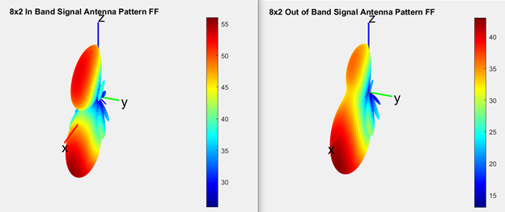{width="6.239583333333333in"
height="2.6258245844269466in"}

Figure 5.1.4.8-4: PA with poor linearity. In-band pattern on the left,
OOB pattern on the right.

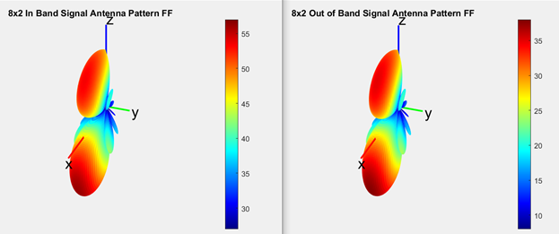{width="6.385416666666667in"
height="2.6738932633420824in"}

Figure 5.1.4.8-5: PA with good linearity. In-band pattern on the left,
OOB pattern on the right.

The next investigation focuses on measurements and the 6-step procedure
discussed earlier. The measurements presented in Table 5.1.4.8-7 use the
same 8x8 antenna array introduced earlier. Here, a 200 MHz wide signal
is applied to the RF ports of the phased antenna array and the power in
the reference channel around 26 GHz as well as the adjacent channels
(Low, High) were measured in both the NF at {20cm, 35cm} range lengths
and FF at 84cm range length in the respective in-band beam peak
directions.

Table 5.1.4.8-7: Measurement results for CFFdeltaNF methodology using
black-box approach.

  Range Length \[cm\]   Beam Steering Angle \[deg\] ►►►                                            0       10       20       30       40       50       60
  --------------------- -------------------------------------------------------------------------- ------- -------- -------- -------- -------- -------- --------
  35                    FF EIRP in reference channel at FF BP Direction \[dBm\]                    46.16   46.35    44.43    44.69    43.95    43.35    42.02
                        NF EIRP in reference channel at NF BP Direction \[dBm\]                    52.05   51.89    50.92    51.83    51.32    50.82    49.42
                        Correlation Factor \[dB\]                                                  -5.89   -5.54    -6.49    -7.14    -7.37    -7.47    -7.40
                        FF EIRP in reference channel (low) at FF BP Direction \[dBm\]              24.49   25.12    22.03    24.22    22.48    21.39    20.24
                        FF EIRP in reference channel (high) at FF BP Direction \[dBm\]             27.68   28.86    26.23    26.50    26.83    25.76    25.31
                        NF EIRP in reference channel (low) at NF BP Direction \[dBm\]              30.71   30.22    28.25    30.79    28.94    28.07    26.69
                        NF EIRP in reference channel (high) at NF BP Direction \[dBm\]             32.82   33.54    32.25    32.53    32.86    31.87    31.09
                        Estimated FF EIRP in reference channel (low) at FF BP Direction \[dBm\]    24.82   24.68    21.76    23.64    21.57    20.61    19.29
                        Error in estimated EIRP in reference channel (low) \[dB\]                  -0.33   0.44     0.27     0.58     0.92     0.78     0.95
                        Estimated FF EIRP in reference channel (high) at FF BP Direction \[dBm\]   26.93   28.00    25.76    25.39    25.48    24.40    23.69
                        Error in estimated EIRP in reference channel (high) \[dB\]                 0.75    0.86     0.48     1.11     1.34     1.35     1.62
  20                    FF EIRP in reference channel at FF BP Direction \[dBm\]                    46.16   46.35    44.43    44.69    43.95    43.35    42.02
                        NF EIRP in reference channel at NF BP Direction \[dBm\]                    55.79   56.48    55.79    56.05    55.90    55.27    55.31
                        Correlation Factor \[dB\]                                                  -9.64   -10.13   -11.36   -11.36   -11.95   -11.92   -13.29
                        FF EIRP in reference channel (low) at FF BP Direction \[dBm\]              24.49   25.12    22.03    24.22    22.48    21.39    20.24
                        FF EIRP in reference channel (high) at FF BP Direction \[dBm\]             27.68   28.86    26.23    26.50    26.83    25.76    25.31
                        NF EIRP in reference channel (low) at NF BP Direction \[dBm\]              33.15   35.01    32.97    35.01    34.04    32.84    31.80
                        NF EIRP in reference channel (high) at NF BP Direction \[dBm\]             42.18   43.44    42.04    42.15    42.48    41.16    37.29
                        Estimated FF EIRP in reference channel (low) at FF BP Direction \[dBm\]    23.52   24.88    21.61    23.64    22.09    20.92    18.51
                        Error in estimated EIRP in reference channel (low) \[dB\]                  0.97    0.24     0.42     0.58     0.39     0.46     1.73
                        Estimated FF EIRP in reference channel (high) at FF BP Direction \[dBm\]   32.54   33.31    30.68    30.79    30.53    29.24    24.00
                        Error in estimated EIRP in reference channel (high) \[dB\]                 -4.86   -4.45    -4.45    -4.29    -3.71    -3.49    1.31

These results show that the relative correlation factor approach of
CFFdeltaNF is generally applicable for measurements at frequencies other
than the reference frequency. However, as outlined earlier, MUs should
be considered for this approach to take into account pattern changes due
to non-ideal PA behaviour which was verified using measurements. More
detailed analyses are required to study the non-linearity effects of PAs
on the corresponding EIRP MU of CFFdeltaNF.

Another investigation focused on the effect of the UE pattern change
over frequency in the resulting EIRP using the CFFdeltaNF methodology
with black-box approach as described in clause 5.1.4.2. A simulation
campaign using Matlab was defined following the assumptions presented in
Table 5.1.4.3-1 with additional frequencies at 50, 100, 200, 400, 800
and 1200MHz from the centre frequency (i.e. 28GHz).

In this case, the EIRP error is calculated between the theoretical EIRP
value in FF at the test frequency (e.g. 400MHz from channel's centre
frequency) and the resulting EIRP value calculated in the FF at the same
test frequency but applying the
$\mathbf{\mathrm{\Delta}}_{\mathbf{\text{NFtoFF}}}$ calculated for the
reference test case at the reference frequency.

Mean and standard deviation errors, for all offsets and test
frequencies, are presented in table 5.1.4.8-8, including results for
different grid steps for the local search:

Table 5.1.4.8-8: Statistical results of EIRP simulations for CFFdeltaNF
with black-box approach

  **Antenna configuration**   **Range length (m)**   **Grid step**   **\|Mean Error\| (dB)**   **Std. Deviation (dB)**
  --------------------------- ---------------------- --------------- ------------------------- -------------------------
  8x2                         0.20                   1º              0.016                     0.017
                                                     5º              0.024                     0.028
                                                     10º             0.050                     0.075
                              0.25                   1º              0.009                     0.008
                                                     5º              0.015                     0.018
                                                     10º             0.037                     0.056
                              0.30                   1º              0.006                     0.005
                                                     5º              0.012                     0.014
                                                     10º             0.032                     0.051
                              0.35                   1º              0.004                     0.004
                                                     5º              0.010                     0.012
                                                     10º             0.031                     0.048
                              0.40                   1º              0.003                     0.003
                                                     5º              0.008                     0.011
                                                     10º             0.028                     0.043
                              0.45                   1º              0.003                     0.002
                                                     5º              0.007                     0.009
                                                     10º             0.026                     0.041

These results, assuming no change in antenna patterns due to
non-linearities of the PAs, etc., confirm that CFFdeltaNF method is not
impacted the potential changes in the pattern of the UE array due to
frequency response.

#### 5.1.4.9 Simulation results for Influence of Noise 

This clause provides influence of noise simulation assumptions and
results for IFF/DFF, CFFDNF, and CFFNF methodologies.

The influence of noise quantifies the effect of a SNR at the TE input on
EIRP measurements as outlined in \[7\].

+----------------------------------------------------------------------+
| B.2.1.27 Influence of noise                                          |
|                                                                      |
| This contributor describes an offset uncertainty factor caused by a  |
| noise floor especially in a case of low SNR. This contributor works  |
| as a bias to measured results only to a direction to increase values |
| and thus this shall be included in the uncertainty budget table as a |
| systematic uncertainty. The uncertainty value can be derived by the  |
| following equation.                                                  |
|                                                                      |
| $$\text{Influence\ of\ noise} = 10\log_                              |
| {10}\left( 1 + 10^{\left( - \frac{\text{SNR}}{10} \right)} \right)$$ |
+----------------------------------------------------------------------+

For low UL power test cases, the \~1m path losses due to range length
(DFF) or focal distance (IFF) yield very poor SNR conditions at the TE
input. Assuming a fixed noise level at the TE input, a reduction in
measurement distance/range loss will significantly improve the SNR
conditions for CFFDNF and CFFNF when compared to DFF/IFF as illustrated
in Figure 5.1.4.9-1.

{width="6.695138888888889in"
height="3.0444444444444443in"}

Figure 5.1.4.9-1: SNR Conditions for different test methodologies

The analyses in this clause are focused on the following PC3 assumption:

\- For an *r*~1~=20cm CFFNF range length (distance between probe and
centre of QZ), the min distance between the probe and the antenna array
is *d*~CFFNF,min~= *r*~1~-12.5cm (max offset)=7.5cm

\- For an *r*~1~=20cm CFFNF range length, the max distance between the
probe and the antenna array is *d*~CFFNF,max~=*r*~1~=20cm

\- Similarly, for the CFFDNF methodology with a range length of
*r*~CFFDNF~=35cm, the min (max) distance between the probe and the
antenna array is *d*~CFFDNF,min~ = *r*~CFFDNF~-12.5cm=22.5cm
(*d*~CFFDNF,max~ = *r*~CFFDNF~=35cm).

\- For the DFF/IFF calculations, we considered a *r*~DFF/IFF~=1m range
length for simplicity.

The improvements in SNR for CFFNF and CFFDNF compared to DFF/IFF are
tabulated in Table 5.1.4.9-1.

Table 5.1.4.9-1: SNR Improvement due to reduced measurement distance
w.r.t. 1m DFF/IFF FSPL with fixed noise at TE Input

  Methodology ►►   DFF/IFF   CFFDNF   CFFNF               
  ---------------- --------- -------- ---------- -------- ---------
  ▼*f* \[GHz\]▼    \@100cm   \@35cm   \@22.5cm   \@20cm   \@7.5cm
  24               0.0       9.1      13.0       14.0     22.5
  30               0.0       9.1      13.0       14.0     22.5
  35               0.0       9.1      13.0       14.0     22.5
  40               0.0       9.1      13.0       14.0     22.5
  45               0.0       9.1      13.0       14.0     22.5
  50               0.0       9.1      13.0       14.0     22.5

In our influence of noise calculations, we assumed a range of SNR values
for the DFF/IFF methodology at the TE input and scaled the effective SNR
at the TE input for the CFFDNF/CFFNF analyses as shown in Table
5.1.4.9-2 based on the FSPL/SNR improvements in Table 5.1.4.9-1.

Table 5.1.4.9-2: Effective SNRs at the TE Input based on assumed SNR at
the TE input for DFF/IFF

  Methodology ►►          DFF/IFF   CFFDNF   CFFNF               
  ----------------------- --------- -------- ---------- -------- ---------
  ▼DFF/IFF SNR \[dB\] ▼   \@100cm   \@35cm   \@22.5cm   \@20cm   \@7.5cm
  -15                     -15.0     -5.9     -2.0       -1.0     7.5
  -10                     -10.0     -0.9     3.0        4.0      12.5
  -5                      -5.0      4.1      8.0        9.0      17.5
  0                       0.0       9.1      13.0       14.0     22.5
  5                       5.0       14.1     18.0       19.0     27.5
  10                      10.0      19.1     23.0       24.0     32.5
  15                      15.0      24.1     28.0       29.0     37.5

The analyses of the difference in EIRP when compared to the FF EIRP due
to noise were based on 10k different AWGN simulations and *N*=30
averages were taken for each EIRP analysed. In each of the 10k AWGN
simulations, a signal is generated first with 1000 samples, subsequently
AWGN with specified SNR on the signal is applied, and in the end power
of signal + AWGN was measured. These simulated results, labelled '\|Mean
Err to FF Reference\|' in the following tables are then compared with
the calculations using the analytical
$10*log\left( 1 + 10^{- SNR\text{/}10} \right)$ equation and labelled
'Influence of Noise' in the following tables: for *r*~DFF/IFF~,
*d*~CFFDNF,min~, and *d*~CFFNF,min~ in Table 5.1.4.9-3 and for
*r*~DFF/IFF~, *d*~CFFDNF,max~, and *d*~CFFNF,max~ in Table 5.1.4.9-4. In
these simulations, it was assumed that *r*~2~ = *r*~1~ + 2cm.$\ $

Table 5.1.4.9-3: Influence of Noise Simulations and Calculations for
DFF/IFF, CFFDNF, CFFNF based on shortest measurement distance d~min~

  -------------------------------------------------------------------------------------------------------------------------------------------------------------------------------------------------------------------------------------------------------------------------------------------------------------------------------
  DFF/IFF                   CFFDNF                              CFFNF                                                                                                                                                                                                           
  ------------------------- ----------------------------------- --------------------------------------- --------------------- ----------------------------------- ------------------------- --------------------- ------------------------- ----------------------------------- -------------------------------------------------
  *r*~DFF/IFF~=100cm        *d*~CFFDNF,min~=22.5cm              (*d*~CFFNF,min~, *d*~CFFNF,min~+2cm)\                                                                                                                                                                           
                                                                =(7.5, 9.5)cm                                                                                                                                                                                                   

  SNR @ *r*~DFF/IFF~ (dB)   \|Mean Err to FF Reference\| (dB)   Influence of Noise (dB)                 SNR @ *d*~min~ (dB)   \|Mean Err to FF Reference\| (dB)   Influence of Noise (dB)   SNR @ *d*~min~ (dB)   SNR @ *d*~min~+2cm (dB)   \|Mean Err to FF Reference\| (dB)   Influence of Noise with SNR@ *d*~min~ +2cm (dB)

  -15.00                    15.1                                15.1                                    -2.0                  4.0                                 4.2                       7.5                   5.4                       1.44                                1.1

  -10.00                    10.4                                10.4                                    3.0                   1.6                                 1.8                       12.5                  10.4                      0.45                                0.4

  -5.00                     6.2                                 6.2                                     8.0                   0.5                                 0.6                       17.5                  15.4                      0.09                                0.1

  0.00                      3.0                                 3.0                                     11                    0.1                                 0.2                       22.5                  20.4                      0.04                                0.0

  5.00                      1.2                                 1.2                                     17                    0.1                                 0.1                       27.5                  25.4                      0.07                                0.0

  10.00                     0.4                                 0.4                                     23                    0.1                                 0.0                       32.5                  30.4                      0.09                                0.0

  15.00                     0.1                                 0.1                                     28                    0.1                                 0.0                       37.5                  35.4                      0.09                                0.0
  -------------------------------------------------------------------------------------------------------------------------------------------------------------------------------------------------------------------------------------------------------------------------------------------------------------------------------

Table 5.1.4.9-4: Influence of Noise Simulations and Calculations for
DFF/IFF, CFFDNF, CFFNF based on largest measurement distance d~max~

  -------------------------------------------------------------------------------------------------------------------------------------------------------------------------------------------------------------------------------------------------------------------------------------------------------------------------------
  DFF/IFF                   CFFDNF                              CFFNF                                                                                                                                                                                                           
  ------------------------- ----------------------------------- --------------------------------------- --------------------- ----------------------------------- ------------------------- --------------------- ------------------------- ----------------------------------- -------------------------------------------------
  *r*~DFF/IFF~=100cm        *d*~CFFDNF,max~=35cm                (*d*~CFFNF,max~, *d*~CFFNF,max~+2cm)\                                                                                                                                                                           
                                                                =(20, 22)cm                                                                                                                                                                                                     

  SNR @ *r*~DFF/IFF~ (dB)   \|Mean Err to FF Reference\| (dB)   Influence of Noise (dB)                 SNR @ *d*~max~ (dB)   \|Mean Err to FF Reference\| (dB)   Influence of Noise (dB)   SNR @ *d*~max~ (dB)   SNR @ *d*~max~+2cm (dB)   \|Mean Err to FF Reference\| (dB)   Influence of Noise with SNR@ *d*~max~ +2cm (dB)

  -15.00                    15.1                                15.1                                    -5.9                  6.8                                 6.9                       -1.0                  -1.8                      5.7                                 4.0

  -10.00                    10.4                                10.4                                    -0.9                  3.4                                 3.5                       4.0                   3.2                       2.7                                 1.7

  -5.00                     6.2                                 6.2                                     4.1                   1.4                                 1.4                       9.0                   8.2                       1.0                                 0.6

  0.00                      3.0                                 3.0                                     9.1                   0.4                                 0.5                       14.0                  13.2                      0.4                                 0.2

  5.00                      1.2                                 1.2                                     14.1                  0.1                                 0.2                       19.0                  18.2                      0.1                                 0.1

  10.00                     0.4                                 0.4                                     19.1                  0.0                                 0.1                       24.0                  23.2                      0.0                                 0.0

  15.00                     0.1                                 0.1                                     24.1                  0.1                                 0.0                       29.0                  28.2                      0.0                                 0.0
  -------------------------------------------------------------------------------------------------------------------------------------------------------------------------------------------------------------------------------------------------------------------------------------------------------------------------------

The simulated influence of noise, i.e., \|Mean Err to FF Reference\|,
was determined for non-fixed distances *d*. Here, 1000 random offsets
uniformly spaced from 0 to 12.5cm were simulated and the individual
results were averaged to obtain the results tabulated in Table 5.1.4.9-5
for PC3 devices. The simulated influences of noise are within the
results at the respective extremes presented in Table 5.1.4.9-3 (min
offset) and Table 5.1.4.9-4 (max offset). Similar simulations were
performed for PC1 devices with the 12x12 antenna configuration with
maximum offset of 10cm and are tabulated in Table 5.1.4.9-6.

Table 5.1.4.9-5: Influence of Noise Simulations and Calculations for
DFF/IFF, CFFDNF, CFFNF based on 1000 random offsets uniformly spaced
within 12.5cm (PC3) in a single hemisphere and *N*=1.

  -----------------------------------------------------------------------------------------------------------------------------------------------------------------------------------------------------------------------------------
  DFF/IFF               CFFDNF                              CFFNF                                                                                                                                 
  --------------------- ----------------------------------- ------------------------- ----------------------- ----------------------------------- ----------------------- ----------------------- -----------------------------------
  rDFF/IFF=100cm        22.5cm ≤dCFFDNF≤35cm                7.5cm≤dCFFNF≤20cm\                                                                                                                    
                                                            r2=r1+2cm                                                                                                                             

                                                                                                                                                                                                  

  SNR @ rDFF/IFF (dB)   \|Mean Err to FF Reference\| (dB)   Influence of Noise (dB)   Average SNR @ r1 (dB)   \|Mean Err to FF Reference\| (dB)   Average SNR @ r1 (dB)   Average SNR @ r2 (dB)   \|Mean Err to FF Reference\| (dB)

  -15                   15.1                                15.1                      -4.3                    5.6                                 2.5                     1.2                     3.6

  -10                   10.4                                10.4                      0.7                     2.6                                 7.5                     6.2                     1.5

  -5                    6.2                                 6.2                       5.7                     1                                   12.5                    11.2                    0.5

  0                     3                                   3                         10.7                    0.3                                 17.5                    16.2                    0.2

  5                     1.2                                 1.2                       15.7                    0                                   22.5                    21.2                    0

  10                    0.4                                 0.4                       20.7                    0.1                                 27.5                    26.2                    0

  15                    0.1                                 0.1                       25.7                    0.1                                 32.5                    31.2                    0
  -----------------------------------------------------------------------------------------------------------------------------------------------------------------------------------------------------------------------------------

Table 5.1.4.9-6: Influence of Noise Simulations and Calculations for
DFF/IFF, CFFDNF, CFFNF based on 1000 random offsets uniformly spaced
within 10cm (PC1) in a single hemisphere and *N*=1.

  -----------------------------------------------------------------------------------------------------------------------------------------------------------------------------------------------------------------------------------
  DFF/IFF               CFFDNF                              CFFNF                                                                                                                                 
  --------------------- ----------------------------------- ------------------------- ----------------------- ----------------------------------- ----------------------- ----------------------- -----------------------------------
  rDFF/IFF=100cm        35cm ≤dCFFDNF≤45cm                  20cm≤dCFFNF≤30cm\                                                                                                                     
                                                            r2=r1+2cm                                                                                                                             

                                                                                                                                                                                                  

  SNR @ rDFF/IFF (dB)   \|Mean Err to FF Reference\| (dB)   Influence of Noise (dB)   Average SNR @ r1 (dB)   \|Mean Err to FF Reference\| (dB)   Average SNR @ r1 (dB)   Average SNR @ r2 (dB)   \|Mean Err to FF Reference\| (dB)

  -15                   15.1                                15.1                      -7.2                    10.5                                -3.1                    -3.8                    6.8

  -10                   10.4                                10.4                      -2.2                    6.2                                 1.9                     1.2                     3.4

  -5                    6.2                                 6.2                       2.8                     3.0                                 6.9                     6.2                     1.3

  0                     3                                   3                         7.8                     1.1                                 11.9                    11.2                    0.4

  5                     1.2                                 1.2                       12.8                    0.4                                 16.9                    16.2                    0.1

  10                    0.4                                 0.4                       17.8                    0.1                                 21.9                    21.2                    0.1

  15                    0.1                                 0.1                       22.8                    0.0                                 26.9                    26.2                    0.1
  -----------------------------------------------------------------------------------------------------------------------------------------------------------------------------------------------------------------------------------

While these results compare the simulated Influence of Noise, i.e., Mean
Err to FF Reference, for the different methodologies at fixed DFF/IFF
SNRs based on a 1m free-space path loss, it should be pointed out that
for the same SNR at *r*~CFFDNF~, the CFFDNF Influence of Noise is lower
than the CFFNF Influence of Noise for the same SNR at *r*~2,CFFNF~ *\<
r*~CFFDNF~.

#### 5.1.4.10 Simulation Results for offset error MU

The analyses in this clause are to determine the uncertainties on
EIRP/EIS when the antenna offset is declared incorrectly, i.e., when the
actual antenna offset deviates from the declared antenna offset. These
analyses are based on differences in path losses between the declared
and the actual offsets and the difference in compensated probe gains.
Here, the following assumptions were made:

\- 1000 random offsets (*x~offset~, y~offset~, z~offset~*), illustrated
with red dots in Figure 5.1.4.10-1, were simulated and each offset was
considered the actual offset of the antenna array.

\- For each random offset, 1000 random declaration errors (*x~error~,
y~error~, z~error~*), illustrated with blue dots in Figure 5.1.4.10-1,
were generated with a fixed radius from the actual offset

\- For each actual offset and for each of the declared offsets, the
device orientation was calculated so that the NF probe is placed in the
actual/declared NF beam peak direction

\- For each actual offset and for each of the declared offsets, the
corresponding path losses between the (actual/declared) antenna offsets
and the probe were determined

\- For each actual offset and for each of the declared offsets, the
corresponding probe antenna gains were determined in the respective NF
beam peak directions.

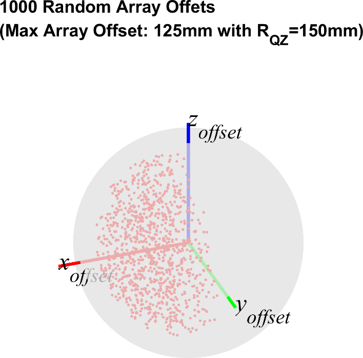{width="3.217361111111111in"
height="3.173611111111111in"}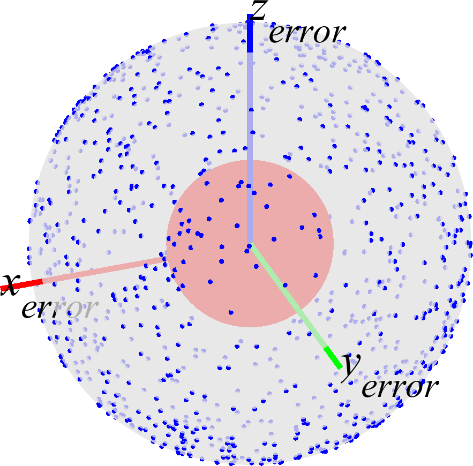{width="2.141078302712161in"
height="2.1087554680664917in"}

Figure 5.1.4.10-1: Illustration of simulation assumptions. The 1000
random offsets considered the actual antenna offsets shown on the left;
1000 random errors around each offset shown on the right.

The results for this analysis are tabulated in Table 5.1.4.10-1. Similar
analyses from another company are included in Table 5.1.4.10-1 focusing
only on the uncertainties based on the effect of the antenna offset
error on the pathloss, i.e., without the probe antenna gain impact.

Table 5.1.4.10-1: Statistical results of 1M EIRP CFFDNF simulations to
determine the effect of offset declaration error on EIRP/EIS

+-------------+-------------+-------------+-------------+-------------+
| Error in    | Range       | Company A   | Company B   |             |
| declared    | Length      |             |             |             |
| offset      | \[m\]       |             |             |             |
| \[cm\]      |             |             |             |             |
+=============+=============+=============+=============+=============+
|             |             | Std. Dev of | Mean EIRP   | Std. Dev of |
|             |             | EIRP \[dB\] | error       | EIRP \[dB\] |
|             |             |             |             |             |
|             |             |             | \[dB\]      |             |
+-------------+-------------+-------------+-------------+-------------+
| 0.1         | 0.4         |             | 0.056       | 0.019       |
+-------------+-------------+-------------+-------------+-------------+
| 0.5         | 0.2         | 0.17        |             |             |
+-------------+-------------+-------------+-------------+-------------+
|             | 0.25        | 0.12        |             |             |
+-------------+-------------+-------------+-------------+-------------+
|             | 0.3         | 0.10        |             |             |
+-------------+-------------+-------------+-------------+-------------+
|             | 0.35        | 0.08        |             |             |
+-------------+-------------+-------------+-------------+-------------+
|             | 0.4         | 0.07        | 0.074       | 0.087       |
+-------------+-------------+-------------+-------------+-------------+
|             | 0.45        | 0.06        |             |             |
+-------------+-------------+-------------+-------------+-------------+
|             | 1           | 0.03        |             |             |
+-------------+-------------+-------------+-------------+-------------+
|             | 20          | 0.00        |             |             |
+-------------+-------------+-------------+-------------+-------------+
| 1           | 0.2         | 0.35        |             |             |
+-------------+-------------+-------------+-------------+-------------+
|             | 0.25        | 0.24        |             |             |
+-------------+-------------+-------------+-------------+-------------+
|             | 0.3         | 0.19        |             |             |
+-------------+-------------+-------------+-------------+-------------+
|             | 0.35        | 0.16        |             |             |
+-------------+-------------+-------------+-------------+-------------+
|             | 0.4         | 0.14        | 0.129       | 0.221       |
+-------------+-------------+-------------+-------------+-------------+
|             | 0.45        | 0.12        |             |             |
+-------------+-------------+-------------+-------------+-------------+
|             | 1           | 0.05        |             |             |
+-------------+-------------+-------------+-------------+-------------+
|             | 20          | 0.00        |             |             |
+-------------+-------------+-------------+-------------+-------------+
| 2           | 0.2         | 0.71        |             |             |
+-------------+-------------+-------------+-------------+-------------+
|             | 0.25        | 0.49        |             |             |
+-------------+-------------+-------------+-------------+-------------+
|             | 0.3         | 0.38        |             |             |
+-------------+-------------+-------------+-------------+-------------+
|             | 0.35        | 0.32        |             |             |
+-------------+-------------+-------------+-------------+-------------+
|             | 0.4         | 0.28        |             |             |
+-------------+-------------+-------------+-------------+-------------+
|             | 0.45        | 0.24        |             |             |
+-------------+-------------+-------------+-------------+-------------+
|             | 1           | 0.10        |             |             |
+-------------+-------------+-------------+-------------+-------------+
|             | 20          | 0.01        |             |             |
+-------------+-------------+-------------+-------------+-------------+

### 5.1.5 Applicability of NF methodologies

Here, the applicability of the NF methodologies considered, i.e., direct
Near Field (DNF), Combined Far-Field/Direct Near Field (CFFDNF),
Combined Far-Field/Near Field (CFFNF), and Combined
far-field/delta-near-field (CFFdeltaNF), are further analysed.

The CFFNF with transform (e.g. asymptotic expansion transform) has the
following applicability:

\- Beam peak searches and spherical coverage test cases are performed
with black box approach using the FF probe. Performing these tests with
the NF measurement probe would require the extensive black&white-box
approach which is not deemed a feasible enhancement of the methodology.

\- The low UL power/high DL power EIRP/EIS test cases in known FF BP
direction are applicable to the black-box approach using transform
techniques:

\- Three radii approach (i.e. local search on radius r1 and very
localized searches at r2 and r3) can be used.

\- EIRP/EIS can be approximated very accurately with the NF probe at
very close distances with optimized improvements in relaxations

\- 22cm for PC3 with \~0.3dB standard deviation and \~0.1dB mean error
(systematic uncertainty),

\- 32cm for PC1 with \~0.6dB standard deviation and \~0.3dB mean error
(systematic uncertainty).

\- The unknown antenna location can be estimated accurately which allows
very accurate TRP measurements at very close distances with large
improvement in relaxations and no additional MU (mean error and standard
deviation).

\- an MU element related to estimated DUT antenna offset error is
required

\- an MU element related to the sensitivity of the asymptotic expansion
approach to relative measurement uncertainty is required

\- the Influence of Noise MU element needs to be revised for the
asymptotic expansion approach

\- EIRP/EIS based test cases require the compensation of the path loss
(with respect to the active antenna array) and the compensation of the
probe antenna pattern

\- The low UL power/high DL power EIRP/EIS test cases in known FF BP
direction are applicable to the black&white-box approach.

\- Two radii approach without local searches can be used.

\- EIRP/EIS can be approximated very accurately with the NF probe at
very close distances with optimized improvements in relaxations.

\- 22cm for PC3 with no additional MU (mean error and standard
deviation).

\- 32cm for PC1 with\~0.1dB mean error (systematic uncertainty).

\- an MU element related to declared DUT antenna offset error is
required

\- an MU element related to the relative measurement uncertainty on the
asymptotic expansion approach is required

\- the Influence of Noise MU element needs to be revised for the
asymptotic expansion approach

\- EIRP/EIS based test cases require the compensation of the path loss
(with respect to the active antenna array) and the compensation of the
probe antenna pattern

\- The low UL power TRP test cases are not applicable to transform
approach (CFFNF) since that approach would be test time prohibitive.
However, the known offset (empirical evaluation with black box approach
or declared with black&white-box approach) can be compensated using
CFFDNF approach to obtain very accurate TRP results at very close
distances.

The CFFDNF has the following applicability:

\- Beam peak searches and spherical coverage test cases are performed
with black box approach using the FF probe. Performing these tests with
the NF measurement probe would require the extensive black&white-box
approach which is not deemed a feasible enhancement of the methodology.

\- The low UL power/high DL power EIRP/EIS test cases in the known FF BP
direction are applicable to the black&white-box approach.

\- A local search to determine the NF test direction and/or optimize
EIRP/EIS is not required.

\- EIRP/EIS can be approximated very accurately in the NF, i.e., at

\- 35cm for PC3 with an additional 0.1dB mean error (systematic error)
due to reduced range length

\- 45 cm for PC1 with an additional 0.5dB mean error (systematic error)
due to reduced range length.

\- For PC3, TRP test cases do not require additional measurement
uncertainty due to reduced range length for

\- range lengths exceeding 20cm if the path loss correction is applied
for measurement grids with step size of at most 5^o^

\- range lengths exceeding 25cm if the path loss correction is applied
for measurement grids with step size of at most 10^o^

\- non-uniform measurement grid can be utilized if the path loss
correction is applied for measurement grids to further reduce the number
of grid points without any additional measurement uncertainty, i.e.,
using a constant step size grid of ∆θ=∆φ=5^o^ within a ±30^o^ cone
centred around the NF beam peak and a constant step size grid of
∆θ=∆φ=15^o^ outside that cone.

\- for range lengths exceeding 40cm if the path loss correction is not
applied for measurement grids with step size of at most 10^o^

\- For PC1, TRP test cases do not require additional measurement
uncertainty due to reduced range length for

\- range lengths exceeding 20cm if the path loss correction is applied
for measurement grids with step size of at most 5^o^

\- non-uniform measurement grid can be utilized if the path loss
correction is applied for measurement grids to further reduce the number
of grid points without any additional measurement uncertainty, i.e.,
using a constant step size grid of ∆θ=∆φ=2.5^o^ within a ±20^o^ cone
centred around the NF beam peak and a constant step size grid of
∆θ=∆φ=10^o^ outside that cone.

\- for range lengths exceeding 35cm if the path loss correction is not
applied for measurement grids with step size of at most 5^o^

\- EIRP/EIS based test cases require the compensation of the path loss
(with respect to the active antenna array) and the compensation of the
probe antenna pattern

\- an MU element related to declared DUT antenna offset error is
required

The CFFdeltaNF has the following applicability:

> \- Beam peak searches and spherical coverage test cases are performed
> with black box approach using the FF probe. Performing these tests
> with the NF measurement probe would require the extensive
> black&white-box approach which is not deemed a feasible enhancement of
> the methodology.
>
> \- The low UL power/high DL power EIRP/EIS test cases in the known FF
> BP direction are applicable to the black-box approach.
>
> \- A local search to determine the NF test direction is required.
>
> \- EIRP/EIS can be approximated very accurately in the NF, i.e., at
>
> \- 35cm for PC3 with an additional 0.14dB mean error (systematic
> error) due to reduced range length for a 1deg step size of the NF
> local search grid size (based on antenna pattern/configuration
> changes); the effect of pattern changes due to non-linear PA behaviour
> is FFS.
>
> \- 45cm for PC1 with an additional 0.5dB mean error (systematic error)
> due to reduced range length for a 1deg step size of the NF local
> search grid size (based on antenna pattern/configuration changes); the
> effect of pattern changes due to non-linear PA behaviour is FFS.
>
> \- The low UL power TRP test cases are not applicable.

DNF has the following applicability:

\- Beam peak searches and spherical coverage test cases are not
applicable for the black-box approach. An extensive black&white-box
approach would be required to perform these tests with the NF
measurement probe. Given the complexities of the extensive
black&white-box approach, DNF is not deemed a feasible enhancement of
the methodology for conformance testing but it might be suitable during
UE development phase.

\- The low UL power/high DL power EIRP/EIS test cases in the known FF BP
direction are not applicable to the black box approach.

\- The applicability of the low UL power/high DL power EIRP/TRP/EIS test
cases in the known BP direction and with the black&white-box approach is
FFS.

The assumption for this "black & white box" testing approach is that the
antenna phase centre offset for the antenna panel that corresponds to
the FF beam peak is known and declared, i.e., following the "white box"
approach discussed earlier. On the other hand, however, it is assumed
that the geometric centre of the DUT is aligned with the centre of the
QZ, i.e., following the "black box" approach. This approach would have
the same advantages as the "black box" approach over the "white box"
approach in terms of complexity, test time, MU, and improvements of the
relaxations and is summarized in Table 5.1.5-1 below.

Table 5.1.5-1: Comparison between the "black box" and "black & white
box" approaches

  Approach                                                                     Knowledge of FF BP Direction (from Meas.)   Declaration of Antenna Phase Centre Offset of Antenna yielding BP   Need for FF probes and UBF   Need for local searches around NF BP   Meas. at different Radii   Test Time Impact                                   Estimated maximum Improvement of Relaxation (NOTE 1)
  ---------------------------------------------------------------------------- ------------------------------------------- ------------------------------------------------------------------- ---------------------------- -------------------------------------- -------------------------- -------------------------------------------------- -----------------------------------------------------------
  CFFNF for EIRP/EIS using Black Box                                           Yes                                         No                                                                  Yes                          Yes                                    Yes (x3 in NF)             Medium (local searches & 3 different radii)        \~14dB (for 20cm range length).
  CFFNF for EIRP/EIS using Black & White Box                                   Yes                                         Yes                                                                 Yes                          No                                     Yes (x2 in NF)             Low (2 different radii in fixed NF BP Direction)   \~14dB (for 20cm range length)
  CFFDNF for TRP using Black Box                                               Yes                                         No                                                                  Yes                          No                                     No                         None                                               Without offset correction: \~10dB (for 32cm range length)
  CFFDNF for TRP using Black &White Box                                        Yes                                         Yes                                                                 Yes                          No                                     No                         None                                               With offset correction: \~14dB (for 20cm range length)
  CFFDNF for EIRP/EIS using Black &White Box                                   Yes                                         Yes                                                                 Yes                          FFS                                    No                         Depends on local search                            With pathloss correction: \~9dB (for 35cm range length)
  CFFdeltaNF for EIRP/EIS using Black Box                                      Yes                                         No                                                                  Yes                          Yes                                    Yes (x1 FF, x2 NF)         Low (local search)                                 \~9dB (for 35cm range length)
  NOTE 1: Improvement of relaxation is only considering Free Space Path Loss                                                                                                                                                                                                                                                                     

### 5.1.6 Improvement of permitted methods

Tables 5.1.6-1 and 5.1.6-2 below provide a preliminary list of potential
improvement of permitted methods based on the analysis provided by one
company and are applicable to the frequency range of 24.25 -- 43.5 GHz.

Table 5.1.6-1: Summary of potential improvement of permitted methods by
Tx test case (24.25 -- 43.5 GHz)

+---------+---------+---------+---------+---------+---------+---------+
| Clause  | Requ    | Test    | Test    | Reg     | TS      | Po      |
|         | irement | ability | Metric  | ulatory | 3       | tential |
|         |         | issue   |         | related | 8.521-2 | impr    |
|         |         |         |         |         | Test    | ovement |
|         |         |         |         |         | Requi   |         |
|         |         |         |         |         | rements |         |
+=========+=========+=========+=========+=========+=========+=========+
| 6.3.1   | Minimum | Low UL  | EIRP    | No      | No      | Impro   |
|         | output  | power   | (       |         | rel     | vements |
|         | power   |         | Link=TX |         | axation | remove  |
|         |         |         | beam    |         | for     | r       |
|         |         |         | peak    |         | PC1.    | equired |
|         |         |         | dir     |         | For     | rela    |
|         |         |         | ection, |         | other   | xations |
|         |         |         | Me      |         | power   | from TC |
|         |         |         | as=Link |         | c       |         |
|         |         |         | angle). |         | lasses, |         |
|         |         |         |         |         | rel     |         |
|         |         |         |         |         | axation |         |
|         |         |         |         |         | varies  |         |
|         |         |         |         |         | from    |         |
|         |         |         |         |         | 0dB to  |         |
|         |         |         |         |         | 13.5dB  |         |
|         |         |         |         |         | de      |         |
|         |         |         |         |         | pending |         |
|         |         |         |         |         | on the  |         |
|         |         |         |         |         | op      |         |
|         |         |         |         |         | erating |         |
|         |         |         |         |         | band    |         |
|         |         |         |         |         | and     |         |
|         |         |         |         |         | channel |         |
|         |         |         |         |         | ban     |         |
|         |         |         |         |         | dwidth. |         |
+---------+---------+---------+---------+---------+---------+---------+
| 6.3.2   | T       | Low UL  | TRP     | Yes     | Rela    | \~ 10dB |
|         | ransmit | power   | (       |         | xations | for     |
|         | OFF     |         | Link=TX |         | for     | FR2a    |
|         | power   |         | beam    |         | n257:   | and     |
|         |         |         | peak    |         | 21.4dB  | FR2b    |
|         |         |         | dir     |         | @       |         |
|         |         |         | ection, |         | 50MHz,  |         |
|         |         |         | M       |         | 24.4dB  |         |
|         |         |         | eas=TRP |         | @       |         |
|         |         |         | grid)   |         | 100MHz, |         |
|         |         |         |         |         | 27.4dB  |         |
|         |         |         |         |         | @       |         |
|         |         |         |         |         | 200MHz  |         |
|         |         |         |         |         | and     |         |
|         |         |         |         |         | 30.4dB  |         |
|         |         |         |         |         | @       |         |
|         |         |         |         |         | 400MHz. |         |
|         |         |         |         |         |         |         |
|         |         |         |         |         | Rela    |         |
|         |         |         |         |         | xations |         |
|         |         |         |         |         | for     |         |
|         |         |         |         |         | n258    |         |
|         |         |         |         |         | and     |         |
|         |         |         |         |         | n261:   |         |
|         |         |         |         |         | \[2     |         |
|         |         |         |         |         | 1.4\]dB |         |
|         |         |         |         |         | @       |         |
|         |         |         |         |         | 50MHz,  |         |
|         |         |         |         |         | \[2     |         |
|         |         |         |         |         | 4.4\]dB |         |
|         |         |         |         |         | @       |         |
|         |         |         |         |         | 100MHz, |         |
|         |         |         |         |         | \[2     |         |
|         |         |         |         |         | 7.4\]dB |         |
|         |         |         |         |         | @       |         |
|         |         |         |         |         | 200MHz  |         |
|         |         |         |         |         | and     |         |
|         |         |         |         |         | \[3     |         |
|         |         |         |         |         | 0.4\]dB |         |
|         |         |         |         |         | @       |         |
|         |         |         |         |         | 400MHz. |         |
|         |         |         |         |         |         |         |
|         |         |         |         |         | Rela    |         |
|         |         |         |         |         | xations |         |
|         |         |         |         |         | for     |         |
|         |         |         |         |         | n260:   |         |
|         |         |         |         |         | \[2     |         |
|         |         |         |         |         | 4.1\]dB |         |
|         |         |         |         |         | @       |         |
|         |         |         |         |         | 50MHz,  |         |
|         |         |         |         |         | \[2     |         |
|         |         |         |         |         | 7.1\]dB |         |
|         |         |         |         |         | @       |         |
|         |         |         |         |         | 100MHz, |         |
|         |         |         |         |         | \[3     |         |
|         |         |         |         |         | 0.1\]dB |         |
|         |         |         |         |         | @       |         |
|         |         |         |         |         | 200MHz  |         |
|         |         |         |         |         | and     |         |
|         |         |         |         |         | \[3     |         |
|         |         |         |         |         | 3.1\]dB |         |
|         |         |         |         |         | @       |         |
|         |         |         |         |         | 400MHz. |         |
+---------+---------+---------+---------+---------+---------+---------+
| 6.5.1   | O       | Low UL  | OBW     | Yes     | No      | N/A for |
|         | ccupied | power   | (       |         | rela    | FR2a    |
|         | ba      |         | Link=TX |         | xations | and     |
|         | ndwidth |         | beam    |         | for     | FR2b    |
|         |         |         | peak    |         | FR2a    |         |
|         |         |         | dir     |         | and     |         |
|         |         |         | ection, |         | FR2b    |         |
|         |         |         | Me      |         |         |         |
|         |         |         | as=Link |         |         |         |
|         |         |         | angle)  |         |         |         |
+---------+---------+---------+---------+---------+---------+---------+
| 6.5.2.3 | A       | Low UL  | TRP     | Yes     | Rel     | Impro   |
|         | djacent | power   | (       |         | axation | vements |
|         | channel |         | Link=TX |         | for     | remove  |
|         | leakage |         | beam    |         | n257,   | r       |
|         | ratio   |         | peak    |         | n258    | equired |
|         |         |         | dir     |         | and     | rela    |
|         |         |         | ection, |         | n261:   | xations |
|         |         |         | M       |         | 0dB,    | from TC |
|         |         |         | eas=TRP |         | except  |         |
|         |         |         | grid).  |         | for     | TC      |
|         |         |         |         |         | 200MHz  | c       |
|         |         |         |         |         | (1.5dB  | overage |
|         |         |         |         |         | in two  | is      |
|         |         |         |         |         | test    | e       |
|         |         |         |         |         | IDs)    | xtended |
|         |         |         |         |         | and     | for     |
|         |         |         |         |         | 400MHz  | FR2b    |
|         |         |         |         |         | (       |         |
|         |         |         |         |         | between |         |
|         |         |         |         |         | 0 and   |         |
|         |         |         |         |         | 5.5dB)  |         |
+---------+---------+---------+---------+---------+---------+---------+
| 6.5.3.2 | Add     | Low UL  | TRP     | Yes     | Between | TBD     |
|         | itional | power   | (       |         | 0.3dB   |         |
|         | s       |         | Link=TX |         | and     |         |
|         | purious |         | beam    |         | 13dB    |         |
|         | em      |         | peak    |         | rel     |         |
|         | issions |         | dir     |         | axation |         |
|         |         |         | ection, |         | de      |         |
|         |         |         | M       |         | pending |         |
|         |         |         | eas=TRP |         | on the  |         |
|         |         |         | grid).  |         | comb    |         |
|         |         |         |         |         | ination |         |
|         |         |         |         |         | of NR   |         |
|         |         |         |         |         | Band    |         |
|         |         |         |         |         | and     |         |
|         |         |         |         |         | Pr      |         |
|         |         |         |         |         | otected |         |
|         |         |         |         |         | band.   |         |
+---------+---------+---------+---------+---------+---------+---------+

Table 5.1.6-2: Summary of potential improvement of permitted methods by
Rx test case (24.25 -- 43.5 GHz)

+--------+---------+---------+---------+---------+---------+---------+
| Clause | Requ    | Test    | Test    | Reg     | TS      | Po      |
|        | irement | ability | Metric  | ulatory | 3       | tential |
|        |         | issue   |         | related | 8.521-2 | impr    |
|        |         |         |         |         | Test    | ovement |
|        |         |         |         |         | Requi   |         |
|        |         |         |         |         | rements |         |
+========+=========+=========+=========+=========+=========+=========+
| 7.4    | Maximum | High DL | EIS     | No      | 26dB    | \~ 12dB |
|        | input   | power   | (       |         | rel     | for     |
|        | power   |         | Link=RX |         | axation | FR2a    |
|        |         |         | beam    |         | for     |         |
|        |         |         | peak    |         | 24.25   | \~16dB  |
|        |         |         | dir     |         | \~ 29.5 | for     |
|        |         |         | ection, |         | GHz and | FR2b    |
|        |         |         | Me      |         | 34 dB   |         |
|        |         |         | as=Link |         | rel     |         |
|        |         |         | angle). |         | axation |         |
|        |         |         |         |         | for 37  |         |
|        |         |         |         |         | \~ 40   |         |
|        |         |         |         |         | GHz     |         |
|        |         |         |         |         | with    |         |
|        |         |         |         |         | respect |         |
|        |         |         |         |         | to      |         |
|        |         |         |         |         | minimun |         |
|        |         |         |         |         | requir  |         |
|        |         |         |         |         | ements. |         |
+--------+---------+---------+---------+---------+---------+---------+
| 7.5    | A       | High DL | EIS     | Yes     | 50MHz:  | Similar |
|        | djacent | power   | (       |         | 1.8dB   | impro   |
|        | channel |         | Link=RX |         | rel     | vements |
|        | sele    |         | beam    |         | axation | as for  |
|        | ctivity |         | peak    |         | for     | TC 7.4  |
|        | (case   |         | dir     |         | power   |         |
|        | 1)      |         | ection, |         | in      | Impro   |
|        |         |         | Me      |         | trans   | vements |
|        |         |         | as=Link |         | mission | remove  |
|        |         |         | angle)  |         | BW and  | r       |
|        |         |         |         |         | int     | equired |
|        |         |         |         |         | erferer | rela    |
|        |         |         |         |         | for     | xations |
|        |         |         |         |         | band    | from TC |
|        |         |         |         |         | n260.   |         |
|        |         |         |         |         |         |         |
|        |         |         |         |         | 100MHz: |         |
|        |         |         |         |         | 4.8dB   |         |
|        |         |         |         |         | rel     |         |
|        |         |         |         |         | axation |         |
|        |         |         |         |         | for     |         |
|        |         |         |         |         | power   |         |
|        |         |         |         |         | in      |         |
|        |         |         |         |         | trans   |         |
|        |         |         |         |         | mission |         |
|        |         |         |         |         | BW and  |         |
|        |         |         |         |         | int     |         |
|        |         |         |         |         | erferer |         |
|        |         |         |         |         | for     |         |
|        |         |         |         |         | band    |         |
|        |         |         |         |         | n260.   |         |
|        |         |         |         |         |         |         |
|        |         |         |         |         | 200MHz  |         |
|        |         |         |         |         | and     |         |
|        |         |         |         |         | 400MHz  |         |
|        |         |         |         |         | are     |         |
|        |         |         |         |         | deemed  |         |
|        |         |         |         |         | not     |         |
|        |         |         |         |         | te      |         |
|        |         |         |         |         | stable. |         |
+--------+---------+---------+---------+---------+---------+---------+
| 7.5    | A       | High DL | EIS     | No      | D       | Int     |
|        | djacent | power   | (       |         | ecision | erferer |
|        | channel |         | Link=RX |         | not     | need \~ |
|        | sele    |         | beam    |         | test    | 15-22dB |
|        | ctivity |         | peak    |         | ACS     | rel     |
|        | (case   |         | dir     |         | case 2. | axation |
|        | 2)      |         | ection, |         |         |         |
|        |         |         | Me      |         |         |         |
|        |         |         | as=Link |         |         |         |
|        |         |         | angle)  |         |         |         |
+--------+---------+---------+---------+---------+---------+---------+
| 7.6.2  | In-band | High DL | EIS     | Yes     | 50MHz:  | Similar |
|        | b       | power   | (       |         | 1.8dB   | impro   |
|        | locking |         | Link=RX |         | rel     | vements |
|        |         |         | beam    |         | axation | as for  |
|        |         |         | peak    |         | for     | TC 7.4  |
|        |         |         | dir     |         | power   |         |
|        |         |         | ection, |         | in      | Impro   |
|        |         |         | Me      |         | trans   | vements |
|        |         |         | as=Link |         | mission | remove  |
|        |         |         | angle)  |         | BW and  | r       |
|        |         |         |         |         | int     | equired |
|        |         |         |         |         | erferer | rela    |
|        |         |         |         |         | for     | xations |
|        |         |         |         |         | band    | from TC |
|        |         |         |         |         | n260.   |         |
|        |         |         |         |         |         |         |
|        |         |         |         |         | 100MHz: |         |
|        |         |         |         |         | 4.8dB   |         |
|        |         |         |         |         | rel     |         |
|        |         |         |         |         | axation |         |
|        |         |         |         |         | for     |         |
|        |         |         |         |         | power   |         |
|        |         |         |         |         | in      |         |
|        |         |         |         |         | trans   |         |
|        |         |         |         |         | mission |         |
|        |         |         |         |         | BW and  |         |
|        |         |         |         |         | int     |         |
|        |         |         |         |         | erferer |         |
|        |         |         |         |         | for     |         |
|        |         |         |         |         | band    |         |
|        |         |         |         |         | n260.   |         |
|        |         |         |         |         |         |         |
|        |         |         |         |         | 200MHz  |         |
|        |         |         |         |         | and     |         |
|        |         |         |         |         | 400MHz  |         |
|        |         |         |         |         | are     |         |
|        |         |         |         |         | deemed  |         |
|        |         |         |         |         | not     |         |
|        |         |         |         |         | te      |         |
|        |         |         |         |         | stable. |         |
+--------+---------+---------+---------+---------+---------+---------+
| 7.9    | R       | Low UL  | TRP     | Yes     | Rela    | TBD     |
|        | eceiver | power   | (       |         | xations |         |
|        | s       |         | Link=TX |         | for     |         |
|        | purious |         | beam    |         | n257,   |         |
|        | em      |         | peak    |         | n258,   |         |
|        | issions |         | dir     |         | n260,   |         |
|        |         |         | ection, |         | and     |         |
|        |         |         | M       |         | n261:   |         |
|        |         |         | eas=TRP |         | 10.2dB  |         |
|        |         |         | grid).  |         | between |         |
|        |         |         |         |         | 6       |         |
|        |         |         |         |         | -20GHz, |         |
|        |         |         |         |         | 17.2dB  |         |
|        |         |         |         |         | between |         |
|        |         |         |         |         | 2       |         |
|        |         |         |         |         | 0-40GHz |         |
|        |         |         |         |         | and     |         |
|        |         |         |         |         | 33.1dB  |         |
|        |         |         |         |         | between |         |
|        |         |         |         |         | 40GHz   |         |
|        |         |         |         |         | and the |         |
|        |         |         |         |         | 2^nd^   |         |
|        |         |         |         |         | ha      |         |
|        |         |         |         |         | rmonic. |         |
|        |         |         |         |         |         |         |
|        |         |         |         |         | Rela    |         |
|        |         |         |         |         | xations |         |
|        |         |         |         |         | for     |         |
|        |         |         |         |         | other   |         |
|        |         |         |         |         | bands   |         |
|        |         |         |         |         | are     |         |
|        |         |         |         |         | still   |         |
|        |         |         |         |         | TBD.    |         |
+--------+---------+---------+---------+---------+---------+---------+

For a given test case, NF based solutions should only be considered if
the improvement for current methods is not enough to remove the
relaxations determined by RAN5.

5.2 Polarization basis mismatch between the TE and DUT
------------------------------------------------------

### 5.2.1 General

The investigation of polarization basis mismatch enhancements to the FR2
test methodology includes the following aspects: scope of test cases
with polarization basis mismatch between the TE and DUT issues, enhanced
test methods, applicability of the enhanced test methods.

The initial testing methodology for FR2 UE RF requirement verification
is defined in \[3\] and features a measurement antenna capable of

\- transmitting and receiving on two orthogonal polarizations

\- introducing linearly polarized downlink signals at the centre of the
quiet zone one polarization at a time

\- measuring the total uplink signal power by combining the power
measured by two orthogonally polarized antennas sequentially or

\- demodulating the signal received by a single polarization at a time.

Regarding polarization basis mismatch between the UE TE and DUT, there
are two main issues:

\- DL polarization basis mismatch for EIRP measurement. The mismatch
between the TE and UE may lead such UEs to disable a Tx chain associated
with one DL polarization and may result in an EIRP measurement which
fails to include the polarization gain at some test points;

\- UL polarization basis mismatch for demodulation. Some UE
implementations may support uplink transmission diversity schemes which,
although transparent to the specification, impact the demodulation
performance when the UL signal is demodulated on just a single
polarization.

Therefore, these two issues are addressed separated with different
approach. The potential solutions to minimize the impact of polarization
basis mismatch address two distinct goals: to enhance the EIRP
measurement of UEs with various capabilities, and to enhance the test
equipment demodulation performance in the uplink, such that a test mode
to disable Tx diversity at the UE is no longer necessary for the UE to
perform conformance testing.

### 5.2.2 Enhanced test method for EIRP measurement

#### 5.2.2.1 TPMI method 

Transmitted Matrix Precoding Indicator (TPMI) is the basis of codebook
based transmission enabling multi-port antenna transmission. TPMI method
is identified as applicable method to enhance EIRP measurement, which is
able to activate dual polarization transmission in EIRP measurement. The
applicability of this method is defined in Clause 5.2.2.2.

For FR2 UEs support the TPMI method, the precoding matrix $W$ is given
by Table 5.2.2.1-1 (same as Table 6.3.1.5-1 in TS 38.211 \[4\]). 2Tx
TPMI index 2-5 can force UE single-layer transmission using two antenna
ports. Among them, only TPMI index 2 is selected for EIRP measurement.

Table 5.2.2.1-1: Precoding matrix $\mathbf{W}$ for single-layer
transmission using two antenna ports.

  TPMI index   $$\mathbf{W}\mathbf{                                                                                                                                                                                                                     
               }$$                                                                                                                                                                                                                                      
  ------------ ------------------------------------- ------------------------------------- ------------------------------------- ------------------------------------- ------------------------------------- ------------------------------------- ---- ----
  0 -- 5       $$\frac{1}{\sqrt{2}}\begin{bmatrix}   $$\frac{1}{\sqrt{2}}\begin{bmatrix}   $$\frac{1}{\sqrt{2}}\begin{bmatrix}   $$\frac{1}{\sqrt{2}}\begin{bmatrix}   $$\frac{1}{\sqrt{2}}\begin{bmatrix}   $$\frac{1}{\sqrt{2}}\begin{bmatrix}   \-   \-
               1 \\                                  0 \\                                  1 \\                                  1 \\                                  1 \\                                  1 \\                                       
               0 \\                                  1 \\                                  1 \\                                   - 1 \\                               j \\                                   - j \\                                    
               \end{bmatrix}$$                       \end{bmatrix}$$                       \end{bmatrix}$$                       \end{bmatrix}$$                       \end{bmatrix}$$                       \end{bmatrix}$$                            

The permitted test methods (i.e. DFF, IFF and NFTF) in \[3\] are all
applicable for TPMI method with the additional procedure that the UE
should be configured with TPMI index and working at single-layer
transmission using two antenna ports, before performing EIRP-based test
procedures in Clause 5.2.1.3 in TR38.810 \[3\].:

\- Peak EIRP Measurement Procedure

\- TRP Measurement Procedure

\- TX Beam Peak direction search and EIRP Spherical Coverage

#### 5.2.2.2 Applicability of TPMI side condition method 

TPMI is applicable for one layer transmission with multi-port antenna.
In FR2, dual polarization can be regarded as dual antenna ports, so it
is natural to activate dual polarization transmission with TPMI side
condition in EIRP measurement procedure. However, for TPMI supporting
dual antenna ports, the number of SRS ports (*nrofSRS-Ports*) is
configured as 2 for both one layer transmission with 'full power
transmission' and two layers transmission with regular UL MIMO, as
specified in clause 6.1 of TS 38.101-2 \[2\]:

+----------------------------------------------------------------------+
| For a UE that supports \'UL full power transmission\' and is         |
| configured to transmit a single layer with *nrofSRS-Ports* = 2, the  |
| requirements for UL MIMO operation apply only when it is configured  |
| for any of its declared full power modes in IE                       |
| *FullPowerTransmission-r16* (as defined in TS 38.331\[13\]).         |
|                                                                      |
| For a UE configured to transmit 2 layers, transmitter requirements   |
| for UL MIMO operation apply when the UE transmits on 2 ports on the  |
| same CDM group. The UE may use higher MPR values outside this        |
| limitation.                                                          |
+----------------------------------------------------------------------+

Thus, TPMI method is applicable for the following FR2 UEs:

\- Rel-15 Coherent UE

\- Rel-16 Coherent UE

\- Rel-16 UE supporting UL full power transmission mode1
(*ul-FullPowerTransmission* = *fullpowerMode1*)

Other UEs are not applicable for TPMI based test method.

#### 5.2.2.3 Alternative test method 

A number of open issues have been identified with the configuration of
2-port CSI-RS method, and a conclusion whether this method is a feasible
enhancement is TBD.

### 5.2.3 Enhanced test method for UL demodulation measurement

#### 5.2.3.1 Test equipment Zero-forcing MIMO receiver 

As an enhancement to the FR2 test equipment topology, it has been
proposed to adopt a zero-forcing MIMO receiver architecture so that
dual-polarization transmissions by the UE can be demodulated by the test
equipment receiver.

Two methods of demodulation and EVM calculation were discussed, one
utilized DMRS-based channel inversion (Method 1), and the other based on
inversion of the LSE-estimate of the channel (Method 2).

##### 5.2.3.1.1 Method 1

###### 5.2.3.1.1.1 Method 1 description

The EVM calculation method for 2-layer measurements is shown in Figure
5.2.3.1.1.1-1 and for 1-layer measurements in Figure 5.2.3.1.1.1-2.

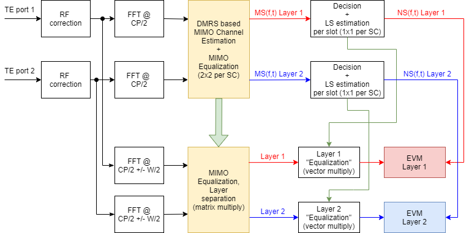{width="6.5375in"
height="3.248611111111111in"}

Figure 5.2.3.1.1.1-1: EVM calculation block diagram for 2-Layer UL MIMO

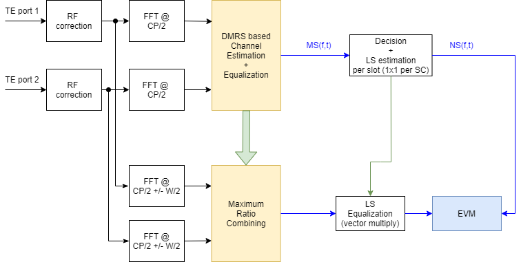{width="6.536111111111111in" height="3.29375in"}

Figure 5.2.3.1.1.1-2: EVM calculation block diagram for 1-Layer

The TE receives signals from 2 different ports which are connected to
the dual polarized measurement antenna in the FR2 test system.

For the 2-layer transmission case shown in Figure 5.2.3.1.1.1-1 a MIMO
equalization step as described in section 5.2.3.1.1.2 is performed to
separate the layers.

For the 1-layer transmission case shown in Figure 5.2.3.1.1.1-2 the
signals from both measurement antenna polarizations are combined using
maximum ratio combining as described in section 5.2.3.1.1.3.

Each layer is then processed as described in section 5.2.3.1.1.4 to
receive the measurement results for each individual layer.

###### 5.2.3.1.1.2 Method 1 MIMO Equalization

The MIMO equalization is based only on reference signals (DMRS) without
using any data symbols. In order to obtain comparable EVM results
independent of the number of DMRS symbols per slot, only the first DMRS
symbol in each slot is used.

Estimation of effective 2x2 channel matrix is a well known procedure if
reference signals use different subcarriers, e.g. in case of DMRS
antenna ports 0 and 2. In case that same subcarriers are used, e.g. DMRS
antenna ports 0 and 1, a channel decomposition is necessary taking
advantage of the orthogonal codes *w~f~* and *w~t~* and assuming
identical channel coefficients for adjacent subcarriers of same CDM
group.

Effective channel including the precoding matrix *P* is:

$$\widetilde{H} = HP = \ \begin{bmatrix}
{\widetilde{h}}_{0,0} & {\widetilde{h}}_{0,1} \\
{\widetilde{h}}_{1,0} & {\widetilde{h}}_{1,1} \\
\end{bmatrix}$$

with

$${\widetilde{h}}_{n,\nu} = \frac{y_{n}r_{\nu}^{*}}{{|r_{\nu}|}^{2}}$$

where *y* denotes the received symbol on port index *n* and *r* the
reference signal for layer index *ν*.

Since reference signals of a specific layer are transmitted only on
subcarriers of one CDM group channel, interpolation is needed in order
to obtain channel coefficients for all subcarriers. Channel
interpolation is done using the channel coefficients of active CDM group
in all other CDM groups.

The channel coefficients used to calculate the equalizer coefficients
are obtained after channel smoothing in frequency domain by computing
the moving average of interpolated channel coefficients. The moving
average window size is 7. For subcarriers at or near the edge of
allocation the window size is reduced accordingly.

The ZF equalizer coefficients are calculated as pseudo inverse of
effective channel matrix, in general:

$$G_{\text{ZF}} = {\widetilde{H}}^{+} = {({\widetilde{H}}^{H}\widetilde{H})}^{- 1}{\widetilde{H}}^{H}$$

###### 5.2.3.1.1.3 Method 1 Maximum Ratio Combining

The channel estimation for maximum ratio combining is based only on
reference signals (DMRS) w/o including any data symbols. One or all DMRS
symbols of one slot can be considered, but in order to obtain comparable
EVM results independent of number of DMRS symbols per slot, only first
DMRS symbol is used.

Estimation of effective 2x1 channel is a well known procedure. In case
of transmit diversity, the effective channel includes the precoding
matrix *P*:

$$\widetilde{H} = HP = \ \begin{bmatrix}
{\widetilde{h}}_{0} \\
{\widetilde{h}}_{1} \\
\end{bmatrix}$$

with

$${\widetilde{h}}_{n} = \frac{y_{n}r^{*}}{{|r|}^{2}}$$

where *y* denotes the received symbol on port index *n* and *r* the
reference signal.

Since reference signals are transmitted only on subcarriers of one CDM
group, channel interpolation is needed in order to obtain channel
coefficients for all subcarriers. Channel interpolation is done using
the channel coefficients of active CDM group in all other CDM groups.

The channel coefficients used to calculate the equalizer coefficients
are obtained after channel smoothing in frequency domain by computing
the moving average of interpolated channel coefficients. The moving
average window size is 7. For subcarriers at or near the edge of
allocation the window size is reduced accordingly.

The ZF equalizer coefficients for maximum ratio combining are calculated
as pseudo inverse of effective channel, in general:

$$G_{\text{ZF}} = {\widetilde{H}}^{+} = {({\widetilde{H}}^{H}\widetilde{H})}^{- 1}{\widetilde{H}}^{H}$$

###### 5.2.3.1.1.4 Method 1 Layer processing

After performing either the MIMO equalization as described in section
5.2.3.1.1.2 or the maximum ratio combining as described in section
5.2.3.1.1.3, each layer is processed using the existing procedure as
defined in Annex E of TS 38.521-1 \[6\].

Since the channel estimation is calculated only on first DMRS symbol an
averaging including all 14 symbols of one slot, i.e. data and reference
signals, is needed in order to minimize EVM. The averaging is achieved
by the LS equalization method described for single layer in Annex E.3.
of TS 38.521-2 \[6\].

*MS(f,t)* and *NS(f,t)* are processed with a least square (LS)
estimator, to derive one equalizer coefficient per time slot and per
allocated subcarrier. *EC(f)* is defined for each layer as:

$$\text{EC}_{\nu}(f) = \frac{\sum_{t = 0}^{13}{\text{NS}_{\nu}(f,t)^{*}\text{NS}_{\nu}(f,t)}}{\sum_{t = 0}^{13}{MS_{\nu}(f,t)^{*}\text{NS}_{\nu}(f,t)}}$$

With \* denoting complex conjugation. *EC(f)* are used to equalize layer
data symbols.

EVM equalizer spectral flatness is derived from equalizer coefficients
for each layer as follows:

$$c_{\nu} = \left| \text{EC}_{\nu}(f) \right|\ \sqrt{\left| g_{\nu,0} \right|^{2} + \left| g_{\nu,1} \right|^{2}}$$

##### 5.2.3.1.2 Method 2 

###### 5.2.3.1.2.1 Method 2 description

The block diagram of this demodulation scheme for FR2 2L UL is shown in
figure 5.2.3.1.2.1-1. Everything to the right of the FFT blocks is per
SC, and therefore must be replicated for the entire UL allocation.
Figure 5.2.3.1.2.1-2 shows the 2L demodulation calculator while
suppressing sections that would be unused for single layer operation.

For the 2-layer transmission case shown in Figure 5.2.3.1.2.1-1 a MIMO
equalization step as described in section 5.2.3.1.2.2 is performed to
separate the layers.

For the 1-layer transmission case shown in Figure 5.3.2.1.2.1-2 the
signals from both measurement antenna polarizations are combined using
maximum ratio combining as described in section 5.2.3.1.2.3.

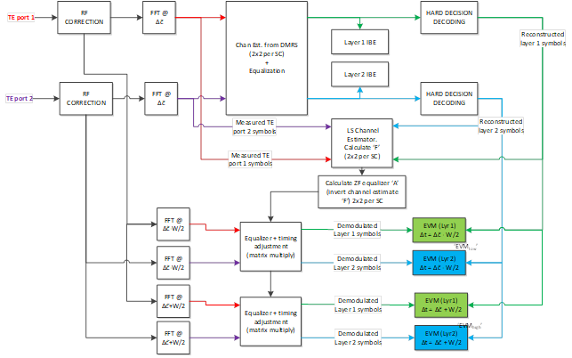{width="5.822916666666667in"
height="3.6399365704286963in"}

Figure 5.2.3.1.2.1-1: Demodulation scheme for FR2 2L UL

{width="6.695138888888889in"
height="4.0993055555555555in"}

Figure 5.2.3.1.2.1-2: Demodulation scheme for 2L UL, used for single
layer UL

###### 5.2.3.1.2.2 Method 2 MIMO Equalization

For the 2L UL MIMO EVM test case, the system is framed as:

$$\mathbf{y = H\ }\left( \mathbf{G}\ \mathbf{W}\ \mathbf{x} + \mathbf{n} \right)$$

Here, H is the 2x2 OTA channel, G is the 2x2 diversity scheme that the
UE uses, and W is the 2x2 precoder matrix. G and W are UE-resident as
shown in Figure 5.2.3.1.2.2-1.

{width="3.259301181102362in" height="2.29in"}

Figure 5.2.3.1.2.2-1: UE implementation model

Here, the effective channel (HGW) as seen by the TE can be represented
by a 2x2 matrix for each subcarrier ('SC'). The process of equalization
is implemented by multiplying data collected simultaneously at the TE
receiver ports 'y' by an equalization matrix 'A'. A unique 'A' matrix is
computed for each SC. Using the ZF equalization method, 'A' is generated
as the inverse of the estimate 'F' of the effective channel HGW for that
SC.

$$\widehat{\mathbf{x}} = \mathbf{A}.\mathbf{y}$$

$\mathbf{A}{\mathbf{=}\left( \mathbf{F} \right)}^{- 1}$; where
$\mathbf{F = \ }\widehat{\mathbf{(HGW)}}$

For each SC, the train of reconstructed symbols and received symbols are
jointly used to estimate F (effective channel, also per SC), by
minimizing the LSE between the received symbols and those that are
calculated from the estimated channel and the reconstructed symbols,
over all the symbols in the measurement interval. This technique is a 2L
generalization of the legacy method to estimate the legacy rank 1
channel. This LSE minimization procedure results in the following
channel estimate:

$$\mathbf{F} = \sum_{k}^{}{\mathbf{y}_{\mathbf{k}}\mathbf{\text{.x}}}_{\mathbf{k}}^{\mathbf{H}}.\left( \sum_{k}^{}{\mathbf{x}_{\mathbf{k}}\mathbf{x}_{\mathbf{k}}^{\mathbf{H}}} \right)^{- 1}$$

Where **x~k~** and **y~k~** are respectively the k^th^ transmitted and
received OFDM symbol in the measurement interval:

$$\mathbf{x}_{\mathbf{k}} = \begin{bmatrix}
x_{1,k} \\
x_{2,k} \\
\end{bmatrix};\ \mathbf{y}_{\mathbf{k}} = \begin{bmatrix}
y_{1,k} \\
y_{2,k} \\
\end{bmatrix}$$

Note the strong resemblance to the expression for channel estimate for
the single layer legacy demodulation case.

While A can be taken as the inverse of 'F' for the ZF equalizer, we show
later that there is a more general form of A that helps streamline
single layer and 2L treatments. Two aspects bear further consideration:
the existence of F and the invertibility of 'F', see section
5.2.3.1.2.5. The detailed treatment logically derives that if either F
or F^-1^ do not exist, it is because the UE cannot support an OTA
channel (coded into matrix 'H') of rank2, and is unable to maintain
valid 2L UL. Failure to calculate either of the quantities therefore is
tied to poor UE implementation rather than TE limitation.

Noting that A is the inverse of the estimate of the product HGW, the
equalization step can be written as:

$$\widehat{\mathbf{x}} = \mathbf{A}.\mathbf{y = A\ H\ G\ Wx + A\ H\ n ≝ x + A\ H\ n}$$

The matrix equation can be resolved into 2 separate scalar equations
corresponding to the two layers:

$$\widehat{x_{1}} = x_{1} + v_{1}$$

$$\widehat{x_{2}} = x_{2} + v_{2}$$

Where, x̂~m~ represents equalized layer data 'm', x~m~ represents
reconstructed (ideal) layer 'm' data, and *v*~m~ represents noise
accompanying ideal layer data 'm' after equalization. Note that the
transmitted symbols are recovered without phase or gain modification,
albeit in the presence of accompanying noise (responsible for EVM
degradation). This is the case for every allocated SC -- when the symbol
on each sub carrier on each layer is reproduced without gain
modification as this method does, no flatness artefacts are introduced
into the measurements.

###### 5.2.3.1.2.3 Method 2 Maximal Ratio Combining

The channel estimate remains of the same form as in the 2L case, but the
dimensions are now 2x1 because x is now a scalar for the single layer
case:

$$\mathbf{F} = \sum_{k}^{}{\mathbf{y}_{\mathbf{k}}\text{.x}}_{k}^{H}.\left( \sum_{k}^{}{x_{k}x_{k}^{H}} \right)^{- 1}$$

Because x is a scalar, (Σxx^H^)^-1^ is merely the reciprocal of a scalar
quantity. Consequently, there are no numerical corner cases pertaining
to existence of the quantity to ponder.

Due to F not being square, the equalization matrix 'A' must be derived
as the pseudo inverse of F, rather than a true inverse as in the 2L
case:

$$\mathbf{A}_{\mathbf{\text{SL}}}{\mathbf{=}\left( \mathbf{F}^{\mathbf{H}}\mathbf{F} \right)}^{- 1}\mathbf{F}^{\mathbf{H}}$$

This type of ZF equalizer implements MRC for the single layer case. Note
that this expression simplifies to A=F^-1^ for the 2L case, and so,
'A~SL~' is a more general construction for 'A' that is applicable to
both cases (single layer as well as 2L).

###### 5.2.3.1.2.4 Method 2 EVM equalizer flatness

In the legacy single layer UL case, the channel estimate for each SC was
a (complex) scalar, so it was straightforward to evaluate equalizer
flatness. In the 2L test case however, the channel equalizer 'A'
consists of 4 elements, 2 for each layer. Framing A as a row vector:

$$A = \begin{bmatrix}
A_{1}^{T} \\
A_{2}^{T} \\
\end{bmatrix} = \begin{bmatrix}
a_{11} & a_{12} \\
a_{21} & a_{22} \\
\end{bmatrix}$$

For layer 'm', recall that the ZF equalization coefficients for each
layer A~m~^T^ are scaled to diagonalize the channel. There is no
realistic bound on the relative ratios of the coefficients, but the
coefficients together preserve any frequency domain shape of the
channel. Therefore, a composite parameter c~m~ for each layer 'm' can be
used to evaluate the equalizer spectrum flatness, given by:

$$c_{m} = \left\| \mathbf{A}_{\mathbf{m}}^{\mathbf{T}} \right\|$$

Or

$$c_{m} = \sqrt{\left| a_{m1} \right|^{2} + \left| a_{m2} \right|^{2}}$$

The FR2 single layer case is merely a subset of the 2L case, where 'm'
can take on just one value: 1.

###### 5.2.3.1.2.5 Method 2 channel invertibility considerations

Recall that F, the estimate of the effective channel for each sub
carrier is derived as an averaging operation over multiple OFDM symbols:

$$\mathbf{F} = \sum_{k}^{}{\mathbf{y}_{\mathbf{k}}\mathbf{\text{.x}}}_{\mathbf{k}}^{\mathbf{H}}.\left( \sum_{k}^{}{\mathbf{x}_{\mathbf{k}}\mathbf{x}_{\mathbf{k}}^{\mathbf{H}}} \right)^{- 1}$$

The existence of F depends on the sum matrix Σxx^H^ being rank 2. Recall
now that 'x~k~' is the train of constellation symbols per SC, for both
layers, as embedded in the train of OFDM symbols. For pseudo-random
data, the sum matrix Σxx^H^ accumulates positive values along the
diagonal, and random zero-mean values in off diagonal locations (cross
correlation across independent data). As the number of OFDM symbols
increases in the averaging interval, this matrix tends towards a
multiple of an identity matrix. Could this matrix be rank 1 in some
corner case? Mathematically, this can happen only if 'x' is the same
(both layers) in a SC for all OFDM symbols in the averaging interval.
This outcome is extremely improbable if not impossible due to reliance
on scramblers and standardized pseudo-random data generators in the UE.
One can therefore conclude that F exists if the TE can merely work out
'x~k~'. Since the TE estimates 'x~k~' by decoding measured data (see
figure 2.2.1-1), the TE still depends on the UE's ability to transmit
data with enough inter-layer isolation to allow reconstruction. If F
does not exist or is ill conditioned, it must mean that the UE is unable
to maintain valid 2L UL.

The invertibility of 'F' depends on the invertibility of the
cross-correlation term Σyx^H^ in the expression for 'F':

$$\sum_{k}^{}{\mathbf{y}_{\mathbf{k}}\mathbf{\text{.x}}}_{\mathbf{k}}^{\mathbf{H}} = H.\left( \text{GW.}\sum_{k}^{}{\mathbf{x}_{\mathbf{k}}\mathbf{\text{.x}}}_{\mathbf{k}}^{\mathbf{H}} + \sum_{k}^{}{\mathbf{n}_{\mathbf{k}}\mathbf{\text{.x}}}_{\mathbf{k}}^{\mathbf{H}} \right)$$

The first term inside the parenthesis (GWΣxx^H^) involves 2 unitary
matrices multiplied by a strongly diagonal matrix (as discussed in the
section about the existence of F), and so remains rank 2. The second
term inside the parenthesis (Σnx^H^) is a measure of correlation between
noise and data symbols.

'Noise' can be truly thermal (low output power cases) in which case the
second term would tend towards an all-zero matrix and can be ignored. We
can therefore conclude that in low output power cases, Σyx^H^ is rank 2
(i.e it is invertible) if H is also rank 2. Now, H contains information
about the UE antenna's cross-pol isolation: H is strongly rank 2 for UE
implementations with good cross-pol isolation. H loses rank or becomes
ill-conditioned if the UE's transmit chains suffer from high antenna
correlation. If F is not invertible or is ill conditioned, the reason
can be traced back to the UE's inability to maintain valid 2L UL.

Alternatively, the 'noise' can be composed of third order non-linearity
from a PA. This is the case for high output power cases. A PA can be
approximated by the time domain normalized characteristic shown here
(*k~3~* \> 0):

$$v_{o} = v_{i} - k_{3}.{v_{i}.\left| v_{i} \right|}^{2}$$

The cubic term retains strong correlation with the linear term, so the
PA model's cubic term output can be approximated as sum of a correlated
component ('*a.x*', where 'a' is related to the correlation coefficient
of the cubic term to the linear term) and an un-correlated component
('*n~un~*'). In the post-FFT frequency domain, Σyx^H^ can be rewritten
as:

$$\sum_{k}^{}{\mathbf{y}_{\mathbf{k}}\mathbf{\text{.x}}}_{\mathbf{k}}^{\mathbf{H}} = H.\left( \text{GW.}\sum_{k}^{}{\mathbf{x}_{\mathbf{k}}\mathbf{\text{.x}}}_{\mathbf{k}}^{\mathbf{H}} - \alpha.k_{3}.\sum_{k}^{}{\mathbf{x}_{\mathbf{k}}\mathbf{\text{.x}}}_{\mathbf{k}}^{\mathbf{H}} + \sum_{k}^{}{{\mathbf{n}_{\mathbf{\text{un}}}}_{\mathbf{k}}\mathbf{\text{.x}}}_{\mathbf{k}}^{\mathbf{H}} \right)$$

We focus on the matrix inside the parenthesis:

$$B = \left( \text{GW.}\sum_{k}^{}{\mathbf{x}_{\mathbf{k}}\mathbf{\text{.x}}}_{\mathbf{k}}^{\mathbf{H}} - \alpha.k_{3}.\sum_{k}^{}{\mathbf{x}_{\mathbf{k}}\mathbf{\text{.x}}}_{\mathbf{k}}^{\mathbf{H}} + \sum_{k}^{}{{\mathbf{n}_{\mathbf{\text{un}}}}_{\mathbf{k}}\mathbf{\text{.x}}}_{\mathbf{k}}^{\mathbf{H}} \right)$$

The third term inside the parenthesis is a measure of correlation
between data and the un-correlated component, which (by definition)
would tend towards an all-zero matrix and can be ignored, like the low
output power case. There is still risk of Σyx^H^ losing rank and
becoming non-invertible, however, for example if the matrix
(GW-a.k~3~.I) loses rank.

Note that this mechanism (3^rd^ order nonlinearity) also exists in the
case of demodulation by TE with single chain receivers, and experience
tells us that PA non-linearity products do not contribute to a situation
where the channel cannot be inverted. Legacy demodulation procedures
therefore serve as empirical proof of the argument that the matrix
(G.W-a.k~3~.I) never loses rank.

Physically, for compliant UEs, \| k~3~\| is in the range of 0.10-0.20 in
normalized form, and a, while PAPR dependent, can be verified to be \<=
2 for NR UL waveforms. We also note that matrices G and W are unitary,
which allows direct comparison of the terms in (GW-a.k~3~.I); the
relative magnitude of \| a.k~3~\| is small enough that matrix B would
still be dominated by the first term (GW Σxx^H^) for the range of EVMs
expected to be measured. We therefore expect B is rank 2 for pseudo
random data. Consequently, here too, rank of Σyx^H^ depends solely on
rank of H. i.e Σyx^H^ is rank 2 (i.e it is invertible) if H is also rank
2. If F is still not invertible (i.e Σyx^H^ is rank 1), it is because
the UE cannot support an OTA channel (H) of rank2, and is unable to
maintain valid 2L UL.

This treatment can conclude with the observation that both F and F^-1^
exist provided the UE can support a rank 2 OTA channel, i.e rank(H)=2.

###### 5.2.3.1.2.6 Method 2 DC (LO) cancellation

EVM calculation is gated by the TE's procedure to cancel LO. Per
existing signaling, only one LO location can be declared per BWP for the
carrier being tested, be it single layer or two. More significantly, the
only locations allowed to be declared are SC locations. For NR, LO
cancellation based on signaling declaration of LO location can therefore
be performed either pre- or post-FFT. Per layer quantities are only
available in the post-FFT, post-equalization domain where the channel
has already been diagonalized, so the focus in the treatment below is
the post-FFT method.

A UE can expect LO cancellation only if the LO location is signalled in
terms of a valid subcarrier location. If the UE reports 3300 or 3301 via
IE *txDirectCurrentLocation* the TE or network can get no information on
LO location other than 'it does not coincide with the FFT grid'. This
aspect is consistent with the exception in the core-requirement
pertaining to this IE.

The following passage describes a method based on post-FFT LO removal
based on LO location declaration via IE *txDirectCurrentLocation*.
Post-FFT LO removal involves removing dependency on the LO-bearing SC or
being able to ignore the impact of LO leakage.

Recall that each allocated SC has an instantiation of the post-FFT
procedure outlined in figure 2.2.1-2. The equalization matrix 'A' is
calculated for each sub carrier and is derived from reconstructed
symbols recovered from processing DMRS. In NR, DMRS symbols do not
occupy each SC of the OFDM symbol, necessitating some form of
interpolation for DMRS-less sub carriers. To minimize impact of LO
leakage on the accuracy of the process of reconstructing the transmitted
symbols, a logical choice is to select a DMRS comb that skips over the
SC declared to have the LO leakage.

While it is relatively easy to ensure that the reconstruction process
remains free of impact from LO leakage by using the comb, the measured
symbols 'y' for the LO-bearing SC still contain a systematic and
constant leakage term for all OFDM symbols in the measurement interval.

$\mathbf{y = H\ }\left( \mathbf{G}\ \mathbf{W}\ \mathbf{x} + \mathbf{n + \ }\begin{bmatrix}
c_{1} \\
c_{2} \\
\end{bmatrix} \right)\mathbf{≝ \ }\mathbf{y}_{\mathbf{\text{LO}}}\mathbf{+ C}$;
where $\mathbf{C} ≝ H\begin{bmatrix}
c_{1} \\
c_{2} \\
\end{bmatrix}$

where c~1~ and c~2~ are complex constants pertaining to the LO leakage.
The channel estimate for the LO-bearing SC starts with the LSE estimate:

$$\mathbf{F} = \sum_{k}^{}{\mathbf{y}_{\mathbf{k}}\text{.x}}_{k}^{H}.\left( \sum_{k}^{}{x_{k}x_{k}^{H}} \right)^{- 1}$$

$$= C.\sum_{k}^{}x_{k}^{H}.\left( \sum_{k}^{}{x_{k}x_{k}^{H}} \right)^{- 1} + \sum_{k}^{}{{\mathbf{y}_{\mathbf{\text{LO}}}}_{\mathbf{k}}\text{.x}}_{k}^{H}.\left( \sum_{k}^{}{x_{k}x_{k}^{H}} \right)^{- 1}$$

There are multiple options to deal with this extra term from LO leakage
(C(Σx^H^(Σxx^H^)^-1^). The first option is to use a very long-term
averaging to determine 'F' for the LO-bearing SC. Since 'C' is a
constant and (Σx^H^) can reasonably be assumed to be zero for a long
enough average, the contribution of the first term reduces to zero. So,
the first option is to do nothing other than ensure a very long-term
average is used for calculating 'F' for the LO bearing SC. The second
option is to interpolate from neighbour SCs to determine F for the
LO-bearing SC. Other, more sophisticated treatments may also exist. 'F'
calculated from either of these methods can be compared to 'F'
calculated using the LSE-estimate expression over the standard
measurement interval to derive the value of 'C' for the measured
interval.

The equalization equation for an LO-bearing SC is:

{width="6.695138888888889in"
height="1.6736111111111112in"}

Figure 5.2.3.1.2.6-1: Equalization equation for an LO-bearing SC

The calculated quantity 'AC' can be used both to estimate carrier
leakage per layer, as well as to correct the estimated symbol on the
LO-bearing SC prior to EVM calculation.

##### 5.2.3.1.3 Analysis of Method 1 & 2

###### 5.2.3.1.3.1 Comparison of both Methods

To downselect one of the Methods described above, the EVM measurement
performance for both methods has been analysed with the following
assumptions:

\- Test waveforms constructed with:

\- Flat signal PSD

\- Injected AWGN

\- Signal configuration:

\- \[50/66\] contiguous RBs

\- CP-OFDM (QPSK -- 64QAM -- 256QAM) PUSCH, rank 2

\- UL RMC as defined in appendix of 38.101-2

In the following, the results of the analysis of Method 1 and 2 are
presented and compared.

As a first step the EVM accuracy for both methods has been analysed. As
can be seen from Figure 5.2.3.1.3.1-1, both Methods show good EVM
measurement accuracy, while Method 1 has equivalent or superior accuracy
to Method 2.

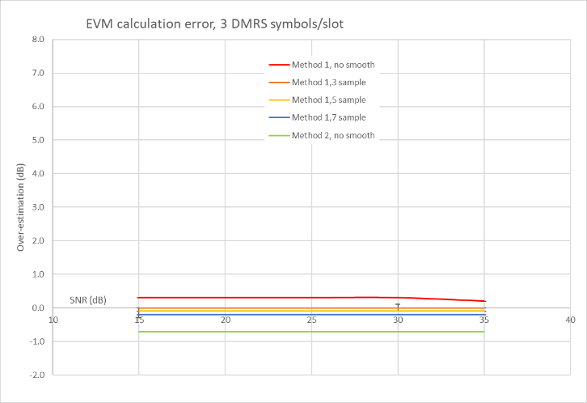{width="4.270833333333333in"
height="2.6319444444444446in"}

Figure 5.2.3.1.3.1-1: EVM accuracy evaluation for slot length signals
with Method 1 & 2

Figure 5.2.3.1.3.1-2 shows further analysis of Method 1, here the
results of 2-layer signal analysed with Method 1 are compared to an
analysis of a SISO signal, which has been measured according to the EVM
measurement definition in TS 38.521-2 Annex E. For signals with 3 DMRS
as defined for the UL RMCs the difference is around 0.2 dB, This applies
for all different modulations as can be seen from the graphs for QPSK
and 64QAM.

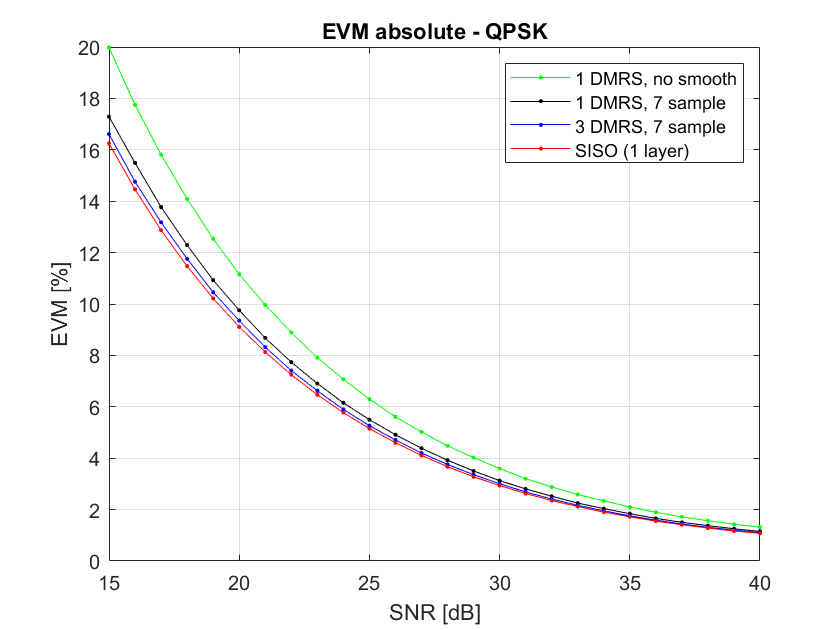{width="3.223186789151356in"
height="2.4173917322834644in"}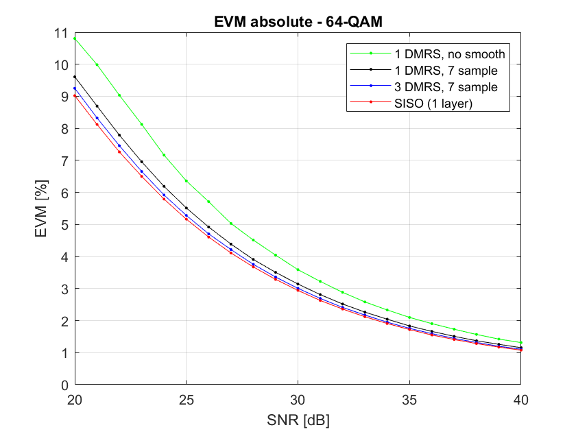{width="3.2604166666666665in"
height="2.4453127734033244in"}

Figure 5.2.3.1.3.1-2: Absolute EVM accuracy evaluation for slot length
signals with Method 1

Further analysis of Method 1 shows a good performance also under the
condition of varying antenna misalignments or antenna port
configurations. While in Figure 5.2.3.1.3.1-3 it can be observed that
for reasonable SNR levels, the EVM is only overestimated by less than
0.5 dB, this may still mean that the EVM evaluation is impacted by the
different antenna ports or antenna misalignment. Figure 5.2.3.1.3.1-4
shows that the EVM evaluation is independent of those factors and the
same results are obtained for different combinations of antenna ports
and misalignments.

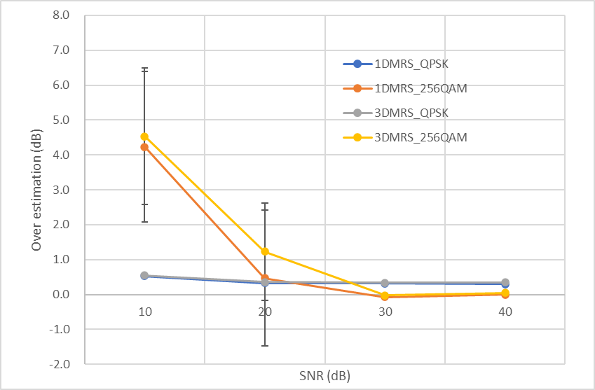{width="2.9895833333333335in"
height="2.5625in"}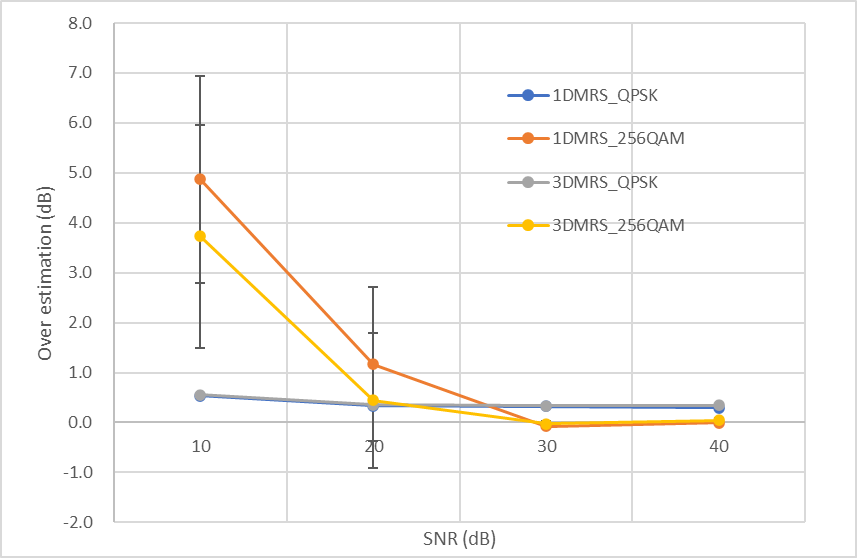{width="3.3333333333333335in"
height="2.5520833333333335in"}

Figure 5.2.3.1.3.1-3: Method 1 EVM evaluation for the identity matrix
(left) and rotation matrix (right)

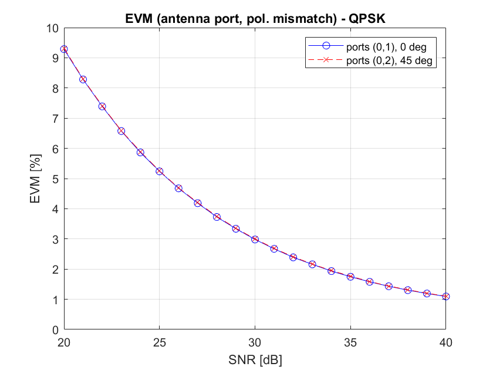{width="4.833333333333333in" height="3.625in"}

Figure 5.2.3.1.3.1-4: Method 1 EVM results for different antenna
misalignments and ports

###### 5.2.3.1.3.2 Conclusion

Based on the analysis shown in section 5.2.3.1.3.1 it is recommended to
adapt Method 1 as the enhanced test method for UL MIMO demodulation
measurement. Further implementation details to ensure that the results
among different TE vendors are comparable, are up to RAN5 definition.

5.3 Inter-band (FR2+FR2) CA
---------------------------

### 5.3.1 General

In this sub-clause, following analyses with an in-direct far field (IFF)
OTA test systems are introduced in achieving RF measurements of an
inter-band CA UE in FR2.

a\) Impact of multiple test antennae

1\) PSD imbalance with DL signals from test equipment

DL PSD towards UE supporting independent beam management (IBM)

DL PSD towards UE supporting common beam management (CBM)

2\) Impact of off-focus test system antennae

Quality of quiet zone (QoQZ)

Rx beam profiles with an independent beam management (IBM) UE

Propensity to trigger incorrect beam in CBM UE

Spherical coverage measurement simulation with common beam management
(CBM) UE

3\) Summary on applicability of offset antenna test system

b\) Inter-band testing ramifications

### 5.3.2 Impact of multiple test antennae

#### 5.3.2.1 PSD imbalance with DL signals from test equipment

##### 5.3.2.1.1 DL PSD towards UE supporting independent beam management (IBM)

An impact of an AoA offset ranging from 0 to 7 degrees was analyzed for
UE supporting independent beam management. The gain difference between
the CCs is a test case parameter informed by the recent agreement on the
PSD difference in the REFSENS and EIS spherical coverage requirement for
DL inter-band CA within FR2 \[2\]. The simulation assumptions are shown
in Table 5.3.2.1.1-1 below.

Table 5.3.2.1.1-1: Simulation assumptions for PSD imbalance

  Simulation Parameters                      
  ------------------------------------------ ----------------------------------------
  Antenna array size                         4x1
  Element spacing                            5mm
  Element pattern                            See TR38.803
  Antenna impairments                        Not considered
  Phase shifter impairments                  See TR38.817-01
  Transmission line impairments              Modeled TL length and loss per element
  AoA offset                                 {0, 2, 5, 7} deg
  Beam management assumptions                Independent beam management on each CC
  Center frequencies of component carriers   f1 = 27.9 GHz, f2 = 38.5 GHz
  Gain difference between CC1 and CC2        15.2 dB

For each AoA offset the PSD difference between CC1 and CC2 was
calculated after spatially filtering the signal with the array response
pattern corresponding to each CC. Figure 5.3.2.1.1-1 below illustrates
the simulation results.

{width="4.0in" height="3.000103893263342in"}

Figure 5.3.2.1.1-1: Spatially filtered PSD difference vs. angular
separation between CCs

Table 5.3.2.1.1-2 below summarizes the simulation results.

Table 5.3.2.1.1-2: Simulation results for spatially filtered PSD
difference vs. angular separation between CCs

  Max excess PSD difference due to AoA offset (dB)   
  -------------------------------------------------- ---------------
  AoA offset (º)                                     PSD diff (dB)
  2                                                  0.4
  5                                                  1.1
  7                                                  1.7

The requirement for inter-band CA between bands n261 and n260 is defined
assuming a non-zero PSD difference between the component carriers. This
assumption holds for the class of inter-band CA configurations to which
the independent beam management (IBM) type is applicable. It is observed
that at least for IBM inter-band CA requirements, AoA offsets of up to 7
degrees between two FR2 CA component carriers do not significantly
impact the PSD difference assumption taken for the core requirement.
This observation should be double-checked after the band n262
requirements are finalized and the scope of CA configurations with n262
are understood.

Further note that as part of the Rel-17 FR2 RF enhancement work item,
RAN4 is discussing the potential definition of requirements assuming
common beam management (CBM) for combination of certain band groups,
such as 28+28 GHz. An analysis of the impact of AoA offsets in the test
setup for inter-band CA with CBM is needed after the scope of CBM
requirements and associated agreements are better understood.

##### 5.3.2.1.2 DL PSD towards UE supporting common beam management (CBM)

Following a similar simulation methodology as described in 5.3.2.1.1, an
analysis of the impact of an AoA offset ranging from 0 to 7 degrees was
analyzed for UE supporting common beam management. The gain difference
between the CCs is a test case parameter informed by the recent
agreement on the PSD difference in the REFSENS and EIS spherical
coverage requirement for DL inter-band CA within FR2 \[2\]. The
simulation assumptions are shown in Table 5.3.2.1.2-1 below.

Table 5.3.2.1.2-1: Simulation assumptions for PSD imbalance with CBM

+----------------------------------+----------------------------------+
| Simulation Parameters            |                                  |
+==================================+==================================+
| Antenna array size               | 4x1                              |
+----------------------------------+----------------------------------+
| Element spacing                  | 5mm                              |
+----------------------------------+----------------------------------+
| Element pattern                  | See TR38.803                     |
+----------------------------------+----------------------------------+
| Antenna impairments              | Not considered                   |
+----------------------------------+----------------------------------+
| Phase shifter impairments        | See TR38.817-01                  |
+----------------------------------+----------------------------------+
| Transmission line impairments    | Modeled TL length and loss per   |
|                                  | element                          |
+----------------------------------+----------------------------------+
| AoA offset                       | {0, 2, 5, 7} deg                 |
+----------------------------------+----------------------------------+
| Beam management assumptions      | Common beam management between   |
|                                  | CC1 and CC2 (codebook optimized  |
|                                  | for f1)                          |
+----------------------------------+----------------------------------+
| Center frequencies of component  | Case 1: f1 = 24.25 GHz, f2 =     |
| carriers                         | 29.5 GHz                         |
|                                  |                                  |
|                                  | Case 2: f1 = 37.0 GHz, f2 = 43.5 |
|                                  | GHz                              |
+----------------------------------+----------------------------------+
| Gain difference between CC1 and  | Case 1: 0.0 dB                   |
| CC2                              |                                  |
|                                  | Case 2: 1.2 dB (difference in    |
|                                  | EIS spherical coverage between   |
|                                  | n260 and n259)                   |
+----------------------------------+----------------------------------+

For each AoA offset the PSD difference between CC1 and CC2 was
calculated after spatially filtering the signal with the array response
pattern corresponding to each CC. Figure 5.3.2.1.2-1 below illustrates
the simulation results.

a\) {width="3.0in" height="2.250077646544182in"}
b) {width="3.0in" height="2.250077646544182in"}

Figure 5.3.2.1.2-1: Spatially filtered PSD difference vs. angular
separation between CCs; a) Case 1 (24.25 + 29.5 GHz); b) Case 2 (37.0 +
43.5 GHz)

Table 5.3.2.1.2-2 below summarizes the simulation results.

Table 5.3.2.1.2-2: Simulation results for spatially filtered PSD
difference vs. angular separation between CCs

  Max excess PSD difference due to AoA offset (dB)                   
  -------------------------------------------------- --------------- --------
  AoA offset (º)                                     PSD diff (dB)   
                                                     Case 1          Case 2
  2                                                  0.3             -0.2
  5                                                  0.8             0.3
  7                                                  1.7             1.2

Because RAN4 is still discussing the potential introduction of
requirements for CBM CA between bands within the same band group (as of
\#98-e meeting 2021 Jan.), the PSD difference analysis in this subclause
assumes a convergence toward 0 dB PSD difference or, in the case of
bands with different spherical coverage requirements, for the difference
to be bounded by the difference in spherical coverage EIS values.

We note that because the CBM CA architecture is, in essence, an
optimization, the UE receiver is more sensitive to PSD differences
beyond those assumed for the core requirement. Although Table
5.3.2.1.2-2 indicates that the maximum excess PSD difference due to AoA
offset ≤ 1.7 dB which is applicable only to PC3 UE, this effect
compounds with the beam squint impairment.

Again noting that the core requirement work on CBM CA is still ongoing,
it is not possible to use the results to disqualify the proposed AoA
offset method from applicability to CBM CA test cases. However, the
impact of AoA offset on PSD difference assumptions made in the core
requirement definition should be taken into account.

#### 5.3.2.2 Impact of off-focus test system antennae

##### 5.3.2.2.1 Quality of quiet zone (QoQZ)

The IFF system for FR2 UE OTA testing is constructed around an offset
parabolic mirror to collimate beams from a test antenna towards the UE.
The architecture allows for a quiet zone (QZ) roughly the size of the
spot on the mirror illuminated by the source. The key to this
architecture is locating the source at the focus of the parabola that
describers the mirror.

The burgeoning number of FR2 bands place increasing demands on both, the
antenna, as well as the RFFE in test equipment.

The effect of off-focus test system antenna in IFF systems was studied
before listing ramifications to inter-band test requirements. The
components of the IFF are much larger than the wavelength of signals
under test. The primary effect of the EM solution to the IFF problem can
hence be determined by an equivalent optics problem.

From the geometry of a parabola, there is a unique location (the focus)
that allows a test antenna to appear as a far-field antenna after
reflection off the mirror. The far-field characteristic comes from the
wavefront geometry that is transformed by the mirror from spherical to
planar. The planar wavefront is normal to the optical axis of the
mirror. Unfortunately, the favorable characteristics of the parabolic
mirror are limited to proper placement of the source, and optical
aberration is expected outside the geometry demands specific to the
mirror in use. For example, in astronomy, the 'coma' aberration has long
been associated with telescopes when wavefronts of incoming light are
not normal to the optical axis.

To simplify the problem, the following assumptions were made about the
IFF system, which was modelled with a 2D ray tracer:

1\. The TE antenna was modelled as a point light source with uniform
illumination in the hemisphere facing the mirror, and no illumination
facing the source.

2\. Light not incident on the mirror was modelled as being perfectly
absorbed by the background

3\. Edge effects of the mirror were not considered

4\. The primary focal length was chosen to be 0.65m, for an effective
focal length with the offset mirror of \~ 0.7m. The mirror offset was
such that the mirror extended from y = 0.2 m to y = 0.5 m off the
optical axis.

5\. QZ plane was placed orthogonal to the optical axis 1.5 m away from
the point where the axis intersects the parabola.

6\. Source-to-source interaction, in case of multiple sources, are
neglected

7\. EM field perturbation due to presence of positioner or DUT fixturing
is neglected by virtue of choosing an optic method

8\. Light source locations considered (d,h defined in figure
5.3.2.2.1-1):

Note that assumption \#1 is not valid for typical horn antennae, but the
uniform illumination assumption serves as a good reference point for
studying power variation across the QZ when the source is moved
off-focus.

Table 5.3.2.2.1-1: Source locations

  Location id   d (m)   h (m)
  ------------- ------- -------
  1 (focus)     0       0
  2             0       0.05
  3             0       0.10
  4             -0.05   0.10
  5             +0.05   0.10

Figures 5.3.2.2.1-1 shows the position of the mirror relative to the
sources, as well as the illumination levels at the QZ (sub figure 1b).
The blue curve in the sub-figure 1b indicates 2 things about a source at
the focus (location1). The first observation is that the nominal QZ is
located between y = 0.2 and y=0.5, which coincides with the mirror
extents in the y-dimension. This detail is expected. The second
observation is that an isotropic source gets transformed to a
non-uniform illumination at the QZ.

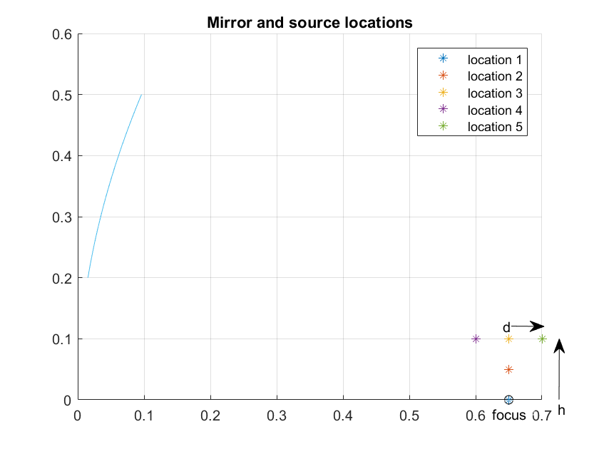{width="3.2in"
height="2.4in"}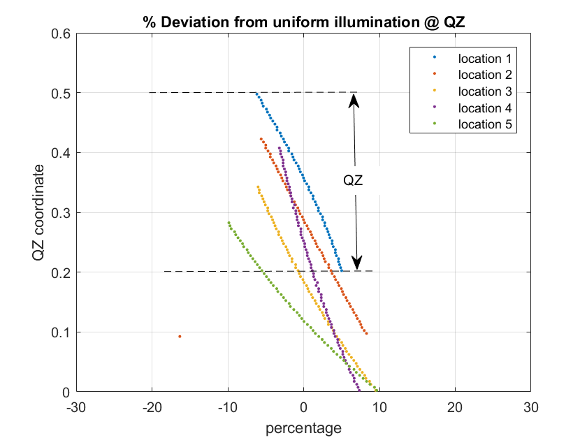{width="3.2in" height="2.4in"}

Figure 5.3.2.2.1-1: a: Mirror and source locations; b : Source to QZ
power density distortion

Furthermore, the illumination intensity curves corresponding to other
source locations inform that the collimated beam moves progressively off
the QZ as the source is moved away from focus. In the example locations
studied, the beam develops a down tilt, but an up tilt is also possible
if the source is moved to a location, say, below and to the left of the
focus in figure 1a.

In figure 5.3.2.2.1-2, it is observed that the wavefront also starts to
deviate from being purely orthogonal to the optical axis. The wavefront
shape is consistent with the 'beam tilt' observation made earlier.

{width="3.2in"
height="2.4in"}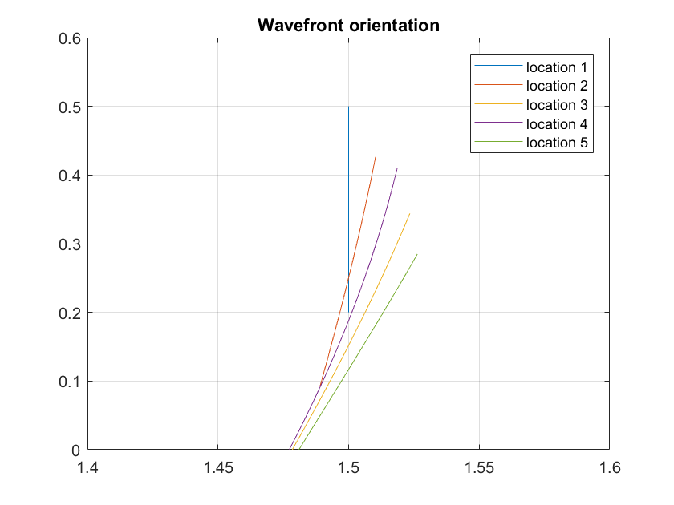{width="3.2in" height="2.4in"}

Figure 5.3.2.2.1-2: Wavefront orientation at QZ due to off-focus source

For a UE's perspective on off-focus sources, candidate source locations
were characterized by their angular locations relative to mirror normal.
Note that the focus is off the mirror normal due to 'offset mirror'
geometry, so it has a non-zero value. In the example studied, the focus
is 15.4 degrees below mirror normal, and the other off-focus source
locations studied all have lower angular offsets than the focus. In
figure 5.3.2.2.1-3 we show that the rate of increase beam tilt and the
rate of increase in angular offset of the source are very similar, i.e
close to 1:1 for the geometry studied.

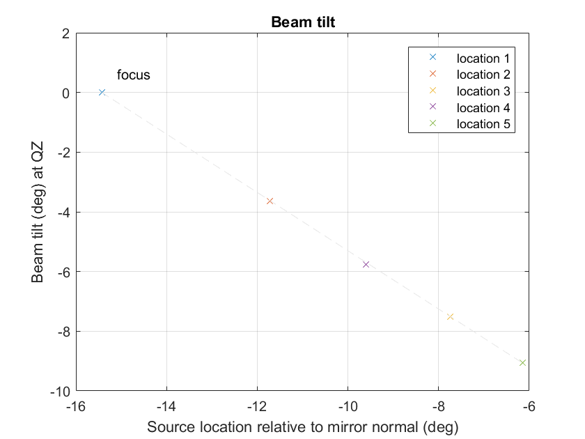{width="4.5in" height="3.375in"}

Figure 5.3.2.2.1-3: Beam tilt due to off-focus source

Recall that the nominal QZ location is the illuminated spot in the plane
of the QZ when the source is located at the focus of the mirror. In case
of our example, the nominal QZ extends from (x=1.5, y= 0.2) to (x=1.5,
y= 0.5). Beam tilt causes the illuminated spot in the plane of the QZ to
move off the nominal QZ location. When multiple sources illuminate the
mirror, the effective QZ size reduces to the common area across the
beams from all sources. Beam tilt consequently has the effect of
reducing the effective QZ size. See figure 5.3.2.2.1-4. The reduction in
size is a function of both, the angular offset between source and focus,
and the distance of the QZ from the mirror.

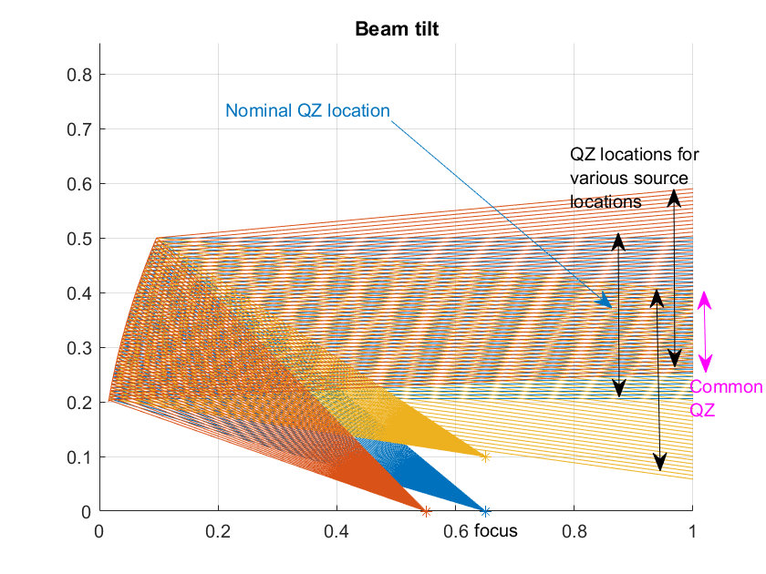{width="4.5in" height="3.375in"}

Figure 5.3.2.2.1-4: Beam tilt causes QZ size reduction

Now, different UE power classes have different beam shapes, and
different beam packing densities. For power class 1, 3dB beam widths are
expected to be between 5 and 10 degrees as an extreme example. A beam
tilt in the range of a few degrees could cause a PC1 UE to select a
different beam for an off-focus source, relative to a source at the
focus.

UE size also limits how close to the mirror the QZ plane can be moved.
The radiating face of PC1 device can measure in the 10s of cm in each
dimension, which would force the QZ far away from the mirror. This
restriction would, in turn, cause much greater reduction in QZ size for
a given beam tilt angle, when using multiple sources. These problems
would be less serious for PC3 devices.

In a case a test antenna is located simply off the position from a focal
point (normally at a position of a main test antenna) in the IFF test
system, a centre of a beam from the offset feed antenna would shift
depending on a distance of focal length (f), a distance between the
reflector and a centre of a quiet zone (r), and a distance of the
antenna offset (δ). Figure 5.3.2.2.1-5 depicts the relationship of this
shift (δ').

{width="6.0in" height="2.5277777777777777in"}

Figure 5.3.2.2.1-5: Offset of antenna beam peak from centre of QZ (Top
view of IFF test system)

Here the shift (δ') can be calculated geometrically by the following
equation, and it may cause an increase of QoQZ measurement uncertainty
in a 30 cm quiet zone.

$$\begin{matrix}
\delta ’ = \ \delta*\ \left( \frac{r}{f} - 1 \right)\#\left( 1 \right) \\
\end{matrix}$$

From our experience to date, an electric field intensity in a quiet zone
when a feed antenna is located near a focal point is decided by two
factors, an antenna pattern of the feed antenna for a test equipment and
a shape of the reflector. Especially the antenna pattern can be assumed
as the main factor to decide this characteristic, which is directly
connected also to the QoQZ.

Based on this observation an estimation was made with an impact of the
offset antenna to QoQZ from an experimental data which was obtained by
measuring the electric field intensity of a feed antenna via a
reflector. Figure 5.3.2.2.1-6 shows one of the experimental data
obtained by scanning the field intensity in a range of +/- 200 mm from a
centre of the quiet zone. Here a 40.8 GHz vertical polarization beam was
scanned along with theta (x) direction.

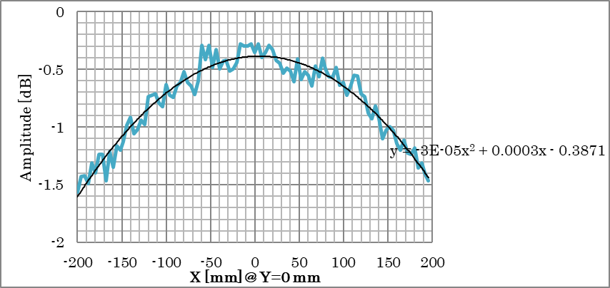{width="5.69375in" height="2.69375in"}

Figure 5.3.2.2.1-6: Electric field intensity of feed antenna scanned
along with theta direction (40.8 GHz, V-pol)

Table 5.3.2.2.1-2 and Figure 5.3.2.2.1-7 show the estimation of
difference between the QoQZ of main antenna and of the offset antenna.
Note that these values are specific to the feed antenna (amplitude
taper) in this experiment and thus they may vary depending on an antenna
pattern used by each test equipment vendor.

Table 5.3.2.2.1-2: Estimation of QoQZ difference between main and offset
antenna

             Estimation of QoQZ difference (EIRP) \[dB\]                
  ---------- --------------------------------------------- ------------ ----------
  δ \[mm\]   23.45 GHz                                     32.125 GHz   40.8 GHz
  0          0.00                                          0.00         0.00
  15         0.02                                          0.02         0.01
  30         0.04                                          0.05         0.03
  45         0.08                                          0.08         0.06
  60         0.11                                          0.11         0.09
  75         0.14                                          0.15         0.11

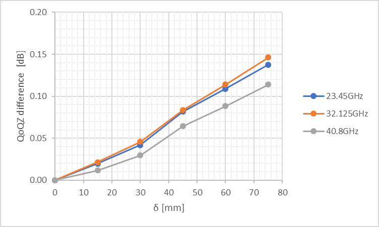{width="4.351999125109361in"
height="2.6160214348206474in"}

Figure 5.3.2.2.1-7: Plot of QoQZ difference

Though these differences may vary depending on an antenna pattern
(amplitude taper) of a feed antenna, as can be seen from above, there is
a chance that the difference of QoQZ due to the offset antenna can be
limited within an acceptable level by optimizing an arrangement of
antennas.

As described above, these QoQZ differences are estimated based on the
antenna configuration with which the offset antenna is simply off the
position from a focal point. And there is a way to mitigate the impact
of the offset antenna to the actual QoQZ.

One of major factors to decide QoQZ is the electric field intensity in
the quiet zone. Figure 5.3.2.2.1-8 depicts a 2D-image of the electric
field intensity (amplitude taper) in the quiet zone when the offset
antenna is used. As shown in the figure, due to the shift of beam centre
from the main antenna, distribution of the field intensity becomes
asymmetric in the quiet zone and thus it causes the increase of the QoQZ
MU value. However it is possible to shift the beam peak position by
tilting the offset antenna and make the distribution of the field
intensity close to symmetric in the quiet zone like the one from the
main antenna, allowing us to mitigate the impact of beam centre shift to
the QoQZ value. Figure 5.3.2.2.1-9 depicts the image of the improvement
with the offset antenna placement. At the same time, there might be
diffraction and/or scattering effects created by the reflector's
paraboloid edges and the size of the paraboloid that impact the QoQZ
characteristics. Thus, there should be some limitations with antenna
offset ranges and angles to tilt the offset antenna that depend on a
relationship between reflector size, measurement antenna offset and
range length. All these factors should be considered during the design
of the test system.

{width="6.0in" height="2.611111111111111in"}

Figure 5.3.2.2.1-8: 2D image of the electric field intensity (amplitude
taper) in the quiet zone from an offset antenna

{width="6.0in" height="2.611111111111111in"}

Figure 5.3.2.2.1-9: 2D image of the electric field intensity in the
quiet zone from a tilted offset antenna

There is another way of recovering desired QZ illumination. In Figure
5.3.2.2.1-4, it is shown that beam tilt causes reduction in size of QZ
that is common to all source locations. This mechanism is intuitive and
can be pre-compensated during design of the test system.

The matter of QZ quality however involves more complexity. As a first
approximation, QZ quality can be quantified by the illumination
distribution from a hypothetical constant density source illuminating
the mirror. Here it becomes evident that angular offset of the antenna
alone is not enough to determine illumination distribution. See figure
5.3.2.2.1-10. Locations 2, 3 and 4 all have approximately the same
angular offset (\<0.5 degree difference), but their QZ illumination can
be made better or worse than that of the on-focus source by adjusting
mirror to source distance. In the graphic example, the source location
closest to the mirror has the least variation QZ illumination.

It is therefore possible to recover desired QZ illumination by adjusting
the source location distance from mirror in concert with angular offset.
A discussion regarding whether the different QoQZ MU needs to be applied
compared to the single carrier case can be left to RAN5.

As shown later in the discussion of wavefront shapes however (see
sub-clause 5.3.2.2.3), there are other constraints governing offset
source to mirror distance.

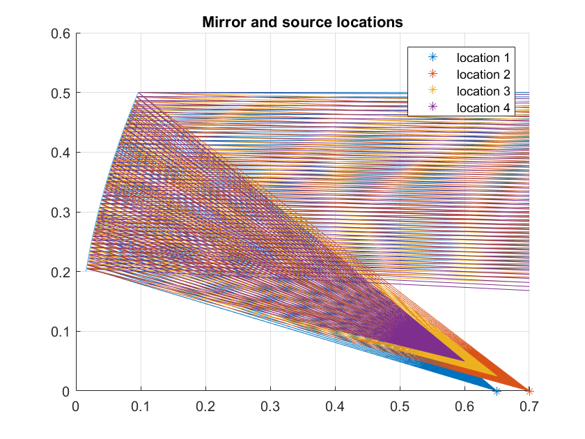{width="3.297222222222222in"
height="2.470833333333333in"}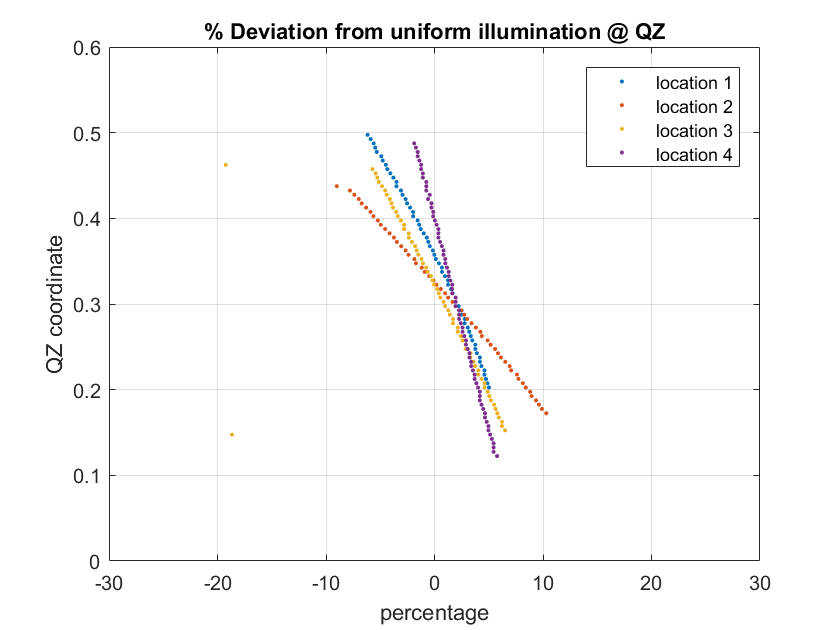{width="3.297222222222222in"
height="2.470833333333333in"}

Figure 5.3.2.2.1-10: a: Mirror and source locations. Locations 2, 3 and
4 have similar offset; b: Locations 2, 3 and 4 cause different
illumination distribution at QZ

##### 5.3.2.2.2 Rx beam profiles with an independent beam management (IBM) UE 

In this sub-clause, an explanation is shown that it is possible to
measure the appropriate EIS spherical coverage beam profiles by the test
system which equips the non co-located (offset) antenna even with the
inter-band 2 DL CA cases as long as the UE is supporting the independent
beam management (IBM).

First we consider a single carrier Rx spherical coverage beam profile
which we can obtain by two kinds of antennae. If we compare Rx beam
profiles of two different cases, one which has been measured by main
antenna of the OTA test system, or the other with which the DL beam
frequency is same but has been measured from the offset antenna, both
beam profiles can be assumed identical as far as following conditions
are satisfied.

\- Two measurement antennae (main and offset) are arranged along with
the θ rotation of the positioner

\- DL power of the offset antenna is calibrated and capable of
transmitting same power level with the main measurement antenna.

For the rotation angles of positioner, refer to Annex D.2.6 in TS 38.810
\[3\].

Figure 5.3.2.2.2-1 depicts the image of two beam profiles obtained by
different antennae. Note that the profiles are obtained one by one since
the link has to be maintained with either of antennae during the
measurement.

{width="5.0in" height="2.9305555555555554in"}

Figure 5.3.2.2.2-1: 2D image of beam profile obtained by two antennae

If we compare the two measurements, a difference between them are just a
point of sight from the UE, in other words a boresight of UE is slightly
rotated depending on the arrangement of measured antennae.

There is an angular offset between the two measurement antennae such as
2.5 to 7 degrees. Therefore to compare the two obtained beam profiles,
rotation of either one of profiles in accordance with the actual antenna
alignment is necessary. Also the adjustment of the start/ stop
coordinates to measure is necessary with a case of the offset antenna.

Now we consider beam profiles which are obtained by the test system that
transmits two DL signals from single antenna (system A), and the system
which has one additional offset antenna to transmit two DL signals - one
DL from the main antenna and the other from the offset antenna (system
B). For inter-band 2 DL CA case for example with band n260 and n261,
suppose only system B transmits n261 from the offset antenna, properties
of each beam profile are summarized in Table 5.3.2.2.2-1. Note that 2
measurement antennae of system B are assumed to be arranged along with
the θ rotation of the positioner again just as mentioned above.

Table 5.3.2.2.2-1: Beam profiles obtained by system A and system B in a
case with IBM antennae in a UE

                         System A (2 DL from main antenna, 1 AoA)   System B (2 DL from slightly offset 2 AoA antennae)
  ---------------------- ------------------------------------------ --------------------------------------------------------------------------------------------------------------------------------------------------
  Beam profile of n260   Obtained by main antenna                   Obtained by main antenna. Thus completely identical with system A.
  Beam profile of n261   Obtained by main antenna                   Obtained by the offset antenna. The shape of profile should be same but rotated in accordance with the angular offset between two test antennae.

Taking all explanations above into consideration, system B requires a
post processing of the obtained data in accordance with the slightly
rotated coordinate system. But the obtained beam profiles can be assumed
as identical with ones obtained by system A as far as the UE is
supporting the IBM. i.e. There is a way to make IBM UEs to choose same
relative beam direction and conduct spherical coverage tests properly
like a single test antenna system.

Choice of the beam by UEs with common beam management (CBM) is studied
at the next sub-clause.

##### 5.3.2.2.3 Propensity to trigger incorrect beam in CBM UE

The primary mechanism that can mislead CBM UEs is band-specific beam
tilt in the test setup. As shown in sub-clause 5.3.2.2.1, beam tilt at
the QZ is roughly 1:1 with source angular offset. In the spherical
coverage space of a UE, beam tilt becomes a significant problem for beam
management at beam boundaries. The impact to measured performance is
directly related to probability of finding a beam boundary during 3D
search. Beam tilt therefore penalizes UEs with dense beam packing (i.e
more beam boundaries).

Dense beam packing is often associated with UEs with good spherical
coverage. It can be reasonably argued that the impact of beam tilt in
this context is worse for UEs with better spherical coverage. This
problem does not have a systematic effect across all UE designs and
therefore difficult to overcome.

Another important characteristic of a far field scenario is a nearly
planar wavefront. Figures 5.3.2.2.3-1 shows the deviation from planar
wavefront at the QZ when the source is moved off-focus. As before, in
the figures below, locations 2,3 and 4 have similar angular offset, but
differ in mirror to source distance. The figures show that there is an
optimal distance from the mirror for any angular offset of the source,
for the wavefront to appear planar at the QZ.

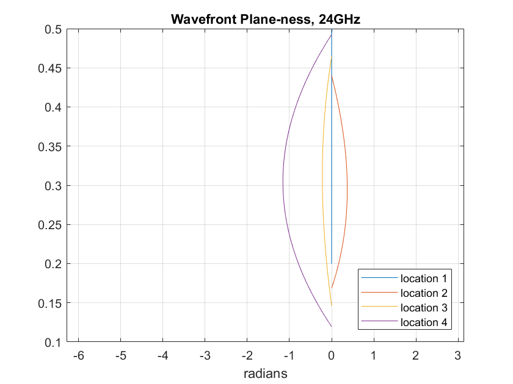{width="3.297222222222222in"
height="2.470833333333333in"}{width="3.297222222222222in"
height="2.470833333333333in"}

Figure 5.3.2.2.3-1: Wavefront orientation at QZ due to off-focus source

Also note that positioning an offset source at the optimal distance may
not result in optimal illumination density of the QZ. From a beam
management standpoint however, it is more important to ensure quality of
the wavefront given that the deviation in illumination density seems
minor. (Explanation: Position 3 is close to the optimal point, as
witnessed by its nearly flat wavefront in figures 5.3.2.2.3-1. In figure
5.3.2.2.3-1, illumination density curves of location 3 and location 1,
the focus or 'ideal location', track closely)

The figures 5.3.2.2.3-1 also reasonably predict that the non-linear
phase variation varies with frequency. Ergo, it is advantageous to
reserve the ideal location (focus) for the antenna serving the highest
frequencies and use offset locations for antennae serving lower
frequencies.

##### 5.3.2.2.4 Spherical coverage measurement simulation with common beam management (CBM) UE

For inter-band CA requirements within 28 GHz range (L + L) or 39 GHz
range (H + H) which has a possibility of transmissions by CBM, a
simulation was made on the influence of the offset antenna measurement
for inter-band CA case with CBM UE. From this simulation we tried to
clarify a difference with the measurement of 2 DL by 1 AoA at a
frequency range from 37 GHz and 43.5 GHz.

**Assumption of the UE antenna inter-element distance**

It is difficult for us to expect an actual inter-element distance (D) of
an antenna in the current UE since it is implementation dependent. But
as a starting point, during this simulation we put an assumption that an
optimization of the inter-element distance is made at the centre
frequency between the lower edge of band n258 (24.25 GHz) and higher
edge of n259 (43.5 GHz), i.e. 33.875 GHz where D/λ becomes 0.5.

Table 5.3.2.2.4-1: Optimized frequency and corresponding ratio (D/l) for
simulation frequencies

  Optimized frequency (D/λ = 0.5)   Frequency 1 (f1) for simulation   Frequency 2 (f2) for simulation
  --------------------------------- --------------------------------- ---------------------------------
  33.875 GHz (0.5)                  37.0 GHz (0.55)                   43.5 GHz (0.64)

**Assumption of phase shifter in a UE**

For a beam forming method of the UE, following two methods were applied
in the simulation.

i\) A fixed phase shift to the antenna regardless with the carrier
frequencies, which we assume this method is causing the beam squint.

ii\) A different phase shift which is proportional to the carrier
frequencies so called true time delay (TTD).

**Simulation procedures for spherical coverage**

The simulation of the spherical coverage measurement was carried out by
the following steps.

Step 1) Decide a code book to obtain the maximum sensitivity at
frequency 1 (37.0 GHz) with a measurement grid placed randomly against a
DUT.

Step 2) Keep the identified code book at step 1) and calculate gain
profiles at frequency 2 (43.5 GHz). Then compare the following two
cases.

Case 1) Gain profile at frequency 2 measured by the main antenna

\- Only the difference of the ratio (D/λ) can be monitored as the
difference from the frequency 1. This result can be assumed as a
baseline when comparing the influence of the offset antenna measurement.

Case 2) Gain profile at frequency 2 measured by the offset antenna

\- In addition to the difference of the ratio (D/λ), influence of the
offset antenna is included in this result. (e.g. influence to the
measurement grid due to the offset of the antenna.)

**Simulation parameter**

Simulation parameters are summarized in Table 5.3.2.2.4-2.

Table 5.3.2.2.4-2: Simulation parameter for spherical coverage gain
profile

  Item                Parameter
  ------------------- ------------------------------------------------------------------
  Grid                Constant Density 200 pt, 1000 random orientations against a DUT.
  Antenna offset      θ = 4.0 degrees
  Array antenna       1 x 4. Inter-element distance is optimized at 33.875 GHz.
  Phase shifter       Non TTD (Constant Phase), TTD (True Time Delay)
  Carrier frequency   37.0 GHz, 43.5 GHz

**Spherical coverage simulation result**

Simulation results of the spherical coverage are summarized in Table
5.3.2.2.4-3 and 5.3.2.2.4-4.

Table 5.3.2.2.4-3: Simulation result of spherical coverage -- Mean
50%-ile error (against 1deg uniform grid as a reference)

  -------------------------------------------------------------------------------------
  D/λ\               Non-TTD        TTD                                
  (Test frequency)                                                     
  ------------------ -------------- ---------------- ----------------- ----------------
                     Main antenna   Offset antenna   Main antenna      Offset antenna

  0.55 (37.0 GHz)    0.024          \-               Same as Non-TTD   \-

  0.64 (43.5 GHz)    0.016          0.101            0.019             0.135
  -------------------------------------------------------------------------------------

Table 5.3.2.2.4-4: Simulation result of spherical coverage -- Standard
deviation of 50%-ile value

  -------------------------------------------------------------------------------------
  D/λ\               Non-TTD        TTD                                
  (Test frequency)                                                     
  ------------------ -------------- ---------------- ----------------- ----------------
                     Main antenna   Offset antenna   Main antenna      Offset antenna

  0.55 (37.0 GHz)    0.059          \-               Same as Non-TTD   \-

  0.64 (43.5 GHz)    0.096          0.102            0.111             0.168
  -------------------------------------------------------------------------------------

Comparing the results between the main antenna and offset antenna, we
observed that the mean error by measuring from the offset antenna
increases slightly with both non-TTD and TTD type phase shifter (0.085
dB with non-TTD and 0.116 dB with TTD at 43.5 GHz.). This means that the
total measurement uncertainty by measuring from offset antenna will
increase approximately 0.1 dB as the systematic uncertainty.

For the standard deviation, only the result with TTD phase shifter
showed the slight increase of measurement uncertainty (0.057 at 43.5
GHz.). However this increase of random uncertainty should be a
negligible level compared to the other uncertainty contribution.

Therefore for both mean error (systematic error) and standard deviation
(random error) with offset antenna, these values are within the
acceptable level because the simulation assumptions in this paper are
chosen as one of the severest conditions from the viewpoint of the
frequency point to optimize inter-element distance, test frequencies,
basic frequency point of phase shift, etc. And since the optimization of
the inter-element distance was assumed at 33.875 GHz, if this
optimization is made at a higher frequency such as at the middle of 37
GHz and 43.5 GHz, the observed uncertainty should be decreased.

Considering all the observations above, we assume that the FR2 OTA test
system with the offset test antenna has a feasibility of measuring
inter-band DL CA test cases for both CBM and IBM UEs under some
limitations.

For cases with UEs which supports wider frequencies (such as n262 in
addition) or higher power such as PC1 need a further study.

#### 5.3.2.3 Summary on applicability of offset antenna test system

Taking into consideration of study results in sub-clause 5.3.2.1 and
5.3.2.2, an applicability of the offset antenna test system to the
spherical coverage test with an inter-band CA UE is summarized as
follows.

IBM UE:

On a test for UEs supporting inter-band CA with IBM, there is a way to
make IBM UEs to choose same relative beam direction and conduct
spherical coverage tests properly like a single test antenna system. It
is recommended that a design of the test system is optimized to mitigate
an impact of the offset antenna to the QoQZ measurement uncertainty,
including the diffraction and/or scattering effects created by the
reflector's paraboloid edges and the size of the paraboloid.

CBM UE:

On a test for UEs supporting inter-band CA with CBM, there might be a
limitation with the feasibility by the offset antenna test system. But
this relates also to the on-going WI discussion on the necessity of
spherical coverage requirements with CBM UEs supporting a same band
group e.g. 28 GHz + 28 GHz.

#### 5.3.2.4 Points to design the FR2 OTA test system with offset test antennae

To design FR2 OTA IFF test system for inter-band CA UE, following points
were analyzed in the previous sub-clauses with regards to an impact of
off-focus test antennae.

\- Distance (and angular offset) between the main antenna and the offset
antenna

\- Arrangement of the offset antenna

\- Angle to fix (tilt) the offset antenna

\- Distance between the offset antenna and a reflector

\- Arrangement of antennae associated with their frequency coverage

We pick out and iterate examples from the previous analyses which need
to be considered during a design of the test system to minimize impacts
from the offset antenna. We also consider further with their feasibility
from some other aspects e.g. another affecting factor, actual system
assembly procedures and test operations.

**Distance (and angular offset) between main antenna and offset
antenna**

Based on the assumption that a range length in an IFF chamber is from
800 mm to 1200 mm, antenna offset from 50 mm to 100 mm were studied.
These offsets are equivalent to approximately 2.5 to 7 degrees as an
angular offset. And due to a shift of focal point from a centre of the
quiet zone, approximately 0.15 dB degradation of the quality of quiet
zone MU is estimated at the frequency range from 23.45 to 40.8 GHz. Note
the estimation may vary depending on components and system designs in
each vendor.

From the previous studies, it is obvious that the impact is proportional
to the distance between antennae. From this point it is preferrable that
each antenna is arranged as close as possible. However another effect of
mutual coupling arises if the gap becomes too close like that of one
wavelength (i.e. approximately 10 mm around 30 GHz.). Though we can
assume that the effect can be included while evaluating the quality of
quiet zone, at the same time when we think of an assembly of cables to
each antenna, some clearances must be ensured and thus a gap around 40
to 50 mm between antennae is considered possible closest distance.

**Arrangement of the offset antenna**

On condition that a DUT is supporting IBM, we have a chance to carry out
the inter-band CA test case with the offset antenna test system
equivalent to the system only with the main antenna. To obtain identical
beam profiles from both of main and offset antenna, following conditions
need to be satisfied:

\- Two measurement antennae (main and offset) are arranged along with
the θ rotation of the positioner

\- DL power of the offset antenna is calibrated and capable of
transmitting same power level with the main measurement antenna.

Since there is an angular offset between the two measurement antennae
such as 2.5 to 7 degrees, to compare the two obtained beam profiles, a
post processing of obtained data is necessary with either one of
profiles in accordance with the actual antenna alignment. Also the
adjustment of the start/ stop coordinates to measure is necessary with
the offset antenna.

**Angle to fix (tilt) the offset antenna**

It is recommended that also an angle to fix (tilt) the offset antenna is
considered while designing the test system. It is possible to shift the
electric field intensity by tilting the offset antenna (e.g. 0.5 to 0.7
degree) and make the distribution of the field intensity, in other words
an amplitude taper, close to symmetric in the quiet zone like the one
from the main antenna. However since the applicable tilt angles are
closely related with a size of reflector and the range length, there
should be some limitations and care must be taken to avoid diffraction
and/or scattering effects created by the reflector's paraboloid edges.

**Distance between the offset antenna and a reflector**

It is possible to optimize the shape of wavefront and illumination at
the centre of the quiet zone by adjusting a distance between the offset
antenna and a reflector. However since the QZ illumination also depends
on the frequency of beam, and considering the current frequency range of
mmWave region, which is wide spread from 24 GHz to 52 GHz, it is not
practical to change the distance for each antenna one by one. Also when
we consider a design that the placement of the offset antenna is above
the main antenna, there might be another factor to increase the
measurement uncertainty since coordinates of the measurement grid
changes. Thus as mentioned above, it is recommended that antennas are
arranged along with the θ rotation of the positioner

**Arrangement of antennae associated with their frequency coverage**

It is predicted that the non-linear phase variation varies with
frequency. Ergo, it is advantageous to reserve the ideal location
(focus) for the antenna serving the highest frequencies and use offset
locations for antennae serving lower frequencies.

### 5.3.3 Inter-band testing ramifications

The primary dependency of inter-band test set ramifications is the
frequency coverage of each antenna in an IFF system with multiple
antennae.

#### 5.3.3.1 Single antenna

For bands that can be supported by a single antenna, the condition to
evaluate is if the antenna is not at the focus of the mirror. On-focus
single antenna IFF systems have already been studied and their MU
quantified, and do not need to be considered again in this context.
Non-ideal (off-focus) location causes the following problems:

\- A shifted QZ due to beam tilt. Note however that all bands have the
same AoA at the UE.

\- Beam tilt causes the AoA to no longer be parallel to the optical
axis. This aspect must be properly considered during system calibration;
for example, a directional calibration antenna placed at the QZ must be
pointed accurately along the arrival direction for an accurate path loss
estimate.

Provided the problems above are accounted for, UEs with either CBM or
IBM can tolerate an IFF system with an off-focus source.

#### 5.3.3.2 Multiple antennae

The assumption for inter-band testing in this context is that the bands
are supported through multiple non-co-located test system antennae. For
this set up, the considerations listed in the single antenna case get
further complicated.

\- A reduction in QZ size due to different beam tilt experienced by
different bands.

\- Beam tilt causes different AoA for different bands. There are two
problems associated with this aspect:

\- Calibration for each band will require adjustment of a directional
calibration antenna so it is pointed along arrival direction of band
being calibrated.

\- This set up can be perceived as 'non-co-located' gNBs by some UEs.

The calibration step complication, and the QZ size reduction may be
surmountable, but the non-co-located gNB implication can cause
significant problems for UEs with CBM limitation.

A special note is warranted for ACS and IBB requirements -- the standard
requires that the interferer share the same AoA as the DL band being
tested. Fortunately, ACS and IBB interferers are expected to be in the
same band as the DL being tested, so it would be natural for the test
equipment to use the same antenna for both. If such is not the case,
additional MU would be introduced into the system, which is not
preferred.

5.4 Extreme temperature conditions
----------------------------------

### 5.4.1 ETC test system

Permitted test methods (i.e. DFF, IFF, NFTF) defined in Clause 5, TR
38.810 \[3\] can support extreme temperature condition tests with the
update of additional temperature control system. An example of IFF-based
ETC test system is shown in Figure 5.4.1-1 below.

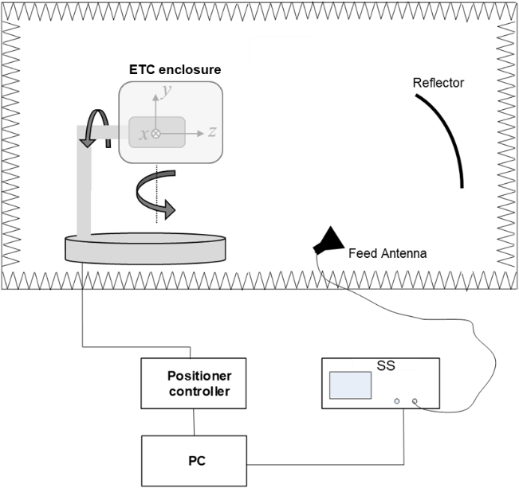{width="2.937778871391076in"
height="2.770138888888889in"}

Figure 5.4.1-1: An example of an IFF-based ETC test system

The key aspects of the ETC setup are:

\- The test system should support the temperature range for extreme
conditions, i.e. -10C to +55C, defined in Annex E.2.1 in TS 38.101-2
\[2\].

\- The criterion temperature tolerance is defined in 5.4.5

\- A positioning system can support 3D scan.

### 5.4.2 Calibration procedure

The path loss calibration should be performed with the ETC enclosure
surrounding the calibration reference antenna. All measurements
performed with the ETC enclosure in place shall use the path loss
calibration performed under this condition.

### 5.4.3 Test procedure

For EIRP/EIS beam peak searching procedure under ETC, two test
procedures are available:

-- Option 1: perform 3D scan

-- Option 2: beam peak search within a certain cone of directions around
peak position under NTC (by declaration or NTC peak searching results)

By default, 3D scan is used for ETC tests. If a certain cone of
directions around peak position under NTC can be declared by UE vendor
or be got from NTC peak searching results, then option 2 can be used.

Note: 3D scan (option 1) is needed for UE with best antenna panel
switched by temperature variation and/or UE without declaration present.

### 5.4.4 Temperature tolerance limit of ETC test system 

The temperature tolerance for FR2 ETC system should be defined, and the
test can only be executed under target temperature within the tolerance.
At least two aspects need to consider:

\- An accuracy of temperature control by an air conditioner

\- Accuracy of a thermocouple to measure a temperature in the ETC
enclosure

The recommended temperature tolerance limit of FR2 ETC system is
±\[4\]ºC.

5.5 Extension of frequency applicability for band n262
------------------------------------------------------

Editor's note: outcome of SI Objective 6 related to the extension of
frequency applicability of the permitted methods is captured in this
clause

5.6 Extension of frequency applicability for band FR2-2
-------------------------------------------------------

### 5.6.1 Permitted test methods

Unless otherwise stated, FR2-2 will follow the baseline UE RF
methodology detailed in TR 38.810. This includes the extension of
frequency applicability of permitted test methods in clause 5.2.

### 5.6.2 Enhanced test methods

#### 5.6.2.1 High DL power and low UL power

#### 5.6.2.2 Polarization basis mismatch between the TE and DUT

#### 5.6.2.3 Inter-band (FR2+FR2) CA

#### 5.6.2.4 Extreme temperature conditions

#### 5.6.2.5 Test time reduction

6 UE RRM testing methodology enhancements
=========================================

Editor's note: testing and calibration aspects of the permitted methods
for FR2 UE RRM testing and the preliminary assessment of measurement
uncertainty (Clause 6.2 and Annex B.2 of TR38.810) define the baseline
UE RRM methodology for the purpose of this study.

6.1 Extension of frequency applicability for band n262
------------------------------------------------------

Following the derivation of band-dependent parameters provided in Clause
7.1 and reusing the assumptions from Clause 6.2.1.4 of TR38.810 related
to AoA scenarios and requirement types, the maximum achievable SNR for
the RRM test setups with a PC3 DUT can be summarized as shown in Table
6.1-1 below.

Table 6.1-1: Comparison of maximum SNR between TR38.810 and preliminary
extension to band n262

+-------------+-------------+-----------+-------------+-------------+
| RRM test    | UE          | CBW (MHz) | Max SNR     | Max SNR     |
| setup       |             |           | (dB)        | (dB)        |
|             |             |           | \           | \[n262\]    |
|             |             |           | [TR38.810\] |             |
+=============+=============+===========+=============+=============+
| Scenario 1  | Single band | 100       | \[19.7\]    | \[15.2\]    |
| (1AoA RX    | UE          |           |             |             |
| beam peak)  |             |           |             |             |
| for Type 1  |             |           |             |             |
| R           |             |           |             |             |
| equirements |             |           |             |             |
| ("Fine" RX  |             |           |             |             |
| beams) and  |             |           |             |             |
| Mode 1      |             |           |             |             |
| Co          |             |           |             |             |
| nfiguration |             |           |             |             |
| (S+N)       |             |           |             |             |
+-------------+-------------+-----------+-------------+-------------+
|             |             | 200       | \[16.7\]    | \[12.2\]    |
+-------------+-------------+-----------+-------------+-------------+
|             | Multi-band  | 100       | \[17.7\]    | \[14.2\]    |
|             | UE          |           |             |             |
|             | ^(N         |           |             |             |
|             | OTEs\ 1,2)^ |           |             |             |
+-------------+-------------+-----------+-------------+-------------+
|             |             | 200       | \[14.6\]    | \[11.2\]    |
+-------------+-------------+-----------+-------------+-------------+
| Scenario 1  | Single band | 100       | \[12.5\]    | \[7.6\]     |
| (1AoA RX    | UE          |           |             |             |
| beam peak)  |             |           |             |             |
| for Type 2  |             |           |             |             |
| R           |             |           |             |             |
| equirements |             |           |             |             |
| ("Rough" RX |             |           |             |             |
| beams) and  |             |           |             |             |
| Mode 1      |             |           |             |             |
| Co          |             |           |             |             |
| nfiguration |             |           |             |             |
| (S+N)       |             |           |             |             |
+-------------+-------------+-----------+-------------+-------------+
|             |             | 200       | \[9.5\]     | \[4.6\]     |
+-------------+-------------+-----------+-------------+-------------+
|             | Multi-band  | 100       | \[10.5\]    | \[6.6\]     |
|             | UE          |           |             |             |
|             | ^(N         |           |             |             |
|             | OTEs\ 1,2)^ |           |             |             |
+-------------+-------------+-----------+-------------+-------------+
|             |             | 200       | \[7.5\]     | \[3.6\]     |
+-------------+-------------+-----------+-------------+-------------+
| Scenario 2  | Single band | 100       | \[6.7\]     | \[-2.7\]    |
| (1AoA RX    | UE          |           |             |             |
| non-beam    |             |           |             |             |
| peak) for   |             |           |             |             |
| Type 1      |             |           |             |             |
| R           |             |           |             |             |
| equirements |             |           |             |             |
| ("Fine" RX  |             |           |             |             |
| beams) and  |             |           |             |             |
| Mode 1      |             |           |             |             |
| Co          |             |           |             |             |
| nfiguration |             |           |             |             |
| (S+N)       |             |           |             |             |
+-------------+-------------+-----------+-------------+-------------+
|             |             | 200       | \[3.7\]     | \[-5.7\]    |
+-------------+-------------+-----------+-------------+-------------+
|             | Multi-band  | 100       | \[4.7\]     | \[-3.7\]    |
|             | UE          |           |             |             |
|             | ^(N         |           |             |             |
|             | OTEs\ 1,2)^ |           |             |             |
+-------------+-------------+-----------+-------------+-------------+
|             |             | 200       | \[1.7\]     | \[-6.7\]    |
+-------------+-------------+-----------+-------------+-------------+
| Scenario 2  | Single band | 100       | Not usable  | Not usable  |
| (1AoA RX    | UE          |           |             |             |
| non-beam    |             |           |             |             |
| peak) for   |             |           |             |             |
| Type 2      |             |           |             |             |
| R           |             |           |             |             |
| equirements |             |           |             |             |
| ("Rough" RX |             |           |             |             |
| beams) and  |             |           |             |             |
| Mode 1      |             |           |             |             |
| Co          |             |           |             |             |
| nfiguration |             |           |             |             |
| (S+N)       |             |           |             |             |
+-------------+-------------+-----------+-------------+-------------+
|             |             | 200       | Not usable  | Not usable  |
+-------------+-------------+-----------+-------------+-------------+
|             | Multi-band  | 100       | Not usable  | Not usable  |
|             | UE          |           |             |             |
|             | ^(N         |           |             |             |
|             | OTEs\ 1,2)^ |           |             |             |
+-------------+-------------+-----------+-------------+-------------+
|             |             | 200       | Not usable  | Not usable  |
+-------------+-------------+-----------+-------------+-------------+
| NOTE 1: For |             |           |             |             |
| ∑MBp from   |             |           |             |             |
| TS          |             |           |             |             |
| 38.         |             |           |             |             |
| 101-2 \[2\] |             |           |             |             |
| Table       |             |           |             |             |
| 6.2.1.3-4   |             |           |             |             |
| allows up   |             |           |             |             |
| to 2 dB in  |             |           |             |             |
| Rel-15      |             |           |             |             |
|             |             |           |             |             |
| NOTE 2:     |             |           |             |             |
| From Rel-16 |             |           |             |             |
| and later   |             |           |             |             |
| ∑MBp can be |             |           |             |             |
| rounded up  |             |           |             |             |
| to 1.0 dB   |             |           |             |             |
| for all     |             |           |             |             |
| bands       |             |           |             |             |
|             |             |           |             |             |
| NOTE 3: The |             |           |             |             |
| parameters  |             |           |             |             |
| and values  |             |           |             |             |
| in this     |             |           |             |             |
| table are   |             |           |             |             |
| preliminary |             |           |             |             |
| and subject |             |           |             |             |
| to further  |             |           |             |             |
| refinement  |             |           |             |             |
| by RAN5 as  |             |           |             |             |
| part of     |             |           |             |             |
| their       |             |           |             |             |
| conformance |             |           |             |             |
| test        |             |           |             |             |
| development |             |           |             |             |
| work.       |             |           |             |             |
+-------------+-------------+-----------+-------------+-------------+

6.2 Extension of frequency applicability for FR2-2
--------------------------------------------------

### 6.2.1 General

Unless otherwise stated, all test methods and measurement setup for FR2
RRM methodology defined in TR 38.810 \[3\] Clause 6 and in TS 38.508-1
\[10\] Clause 7 are applicable for FR2-2.

### 6.2.2 Noc methodology

The Noc level for Scenario 1 (1AoA RX beam peak) for Type 1 Requirements
(\"Fine\" RX beams) and Mode 1 Configuration (S+N) described in TR
38.810 Clause 6.2.1.4.3 need to be adjusted and can be derived similar
to the Noc level for UE demodulation test methods described in Clause
7.2.2.

### 6.2.3 Maximum SNR derivation

Following the derivation of band-dependent parameters provided in Clause
7.2 and reusing the assumptions from Clause 6.2.1.4 of TR 38.810 related
to AoA scenarios and requirement types, the maximum achievable SNR for
the RRM test setups can be summarized as shown in Table 6.2.3-1.

Table 6.2.3-1: Maximum SNR preliminary extension to band n263

  RRM test setup                                                                                                 UE               CBW (MHz)   Max SNR (dB) \[n263\]
  -------------------------------------------------------------------------------------------------------------- ---------------- ----------- -----------------------
  Scenario 1 (1AoA RX beam peak) for Type 1 Requirements ("Fine" RX beams) and Mode 1 Configuration (S+N)        Single band UE   100         TBD
                                                                                                                                  400         TBD
                                                                                                                 Multi-band UE    100         TBD
                                                                                                                                  400         TBD
  Scenario 1 (1AoA RX beam peak) for Type 2 Requirements ("Rough" RX beams) and Mode 1 Configuration (S+N)       Single band UE   100         TBD
                                                                                                                                  400         TBD
                                                                                                                 Multi-band UE    100         TBD
                                                                                                                                  400         TBD
  Scenario 2 (1AoA RX non-beam peak) for Type 1 Requirements ("Fine" RX beams) and Mode 1 Configuration (S+N)    Single band UE   100         TBD
                                                                                                                                  400         TBD
                                                                                                                 Multi-band UE    100         TBD
                                                                                                                                  400         TBD
  Scenario 2 (1AoA RX non-beam peak) for Type 2 Requirements ("Rough" RX beams) and Mode 1 Configuration (S+N)   Single band UE   100         TBD
                                                                                                                                  400         TBD
                                                                                                                 Multi-band UE    100         TBD
                                                                                                                                  400         TBD

7 UE demodulation testing methodology enhancements
==================================================

Editor's note: testing and calibration aspects of the permitted methods
for FR2 UE demodulation testing and the preliminary assessment of
measurement uncertainty (Clause 7.2 and Annex B.2 of TR38.810) define
the baseline UE demodulation methodology for the purpose of this study.

7.1 Extension of frequency applicability for band n262
------------------------------------------------------

Annex B.3 in TR38.810 describes the detailed calculations of the maximum
achievable SNR by the demodulation test setup. Although range length for
the DFF setup is not a requirement for permitted methods, a reference
value of 0.725m is used in the TR38.810 calculations. Furthermore, the
maximum achievable SNR values are calculated assuming the highest band
n259 frequency (f=43.5 GHz). The highest frequency to be considered for
the SNR calculation is the highest frequency of band n262: 48.2 GHz.
Using the reference range length of 0.725m we determine free space path
loss at f=48.2 GHz, as shown in Figure 7.1-1 below.

{width="4.0in" height="3.000103893263342in"}

Figure 7.1-1: Free space path loss vs. frequency for d=0.725m

Based on this analysis, the relative increase in free space path loss
from 43.5 GHz to 48.2 GHz is 0.9 dB.

Another parameter in the SNR calculation which scales with frequency is
cable loss per meter. Using the datasheets from five different
commercially available RF cables, which are rated up to 50 GHz, the
average cable loss per meter is calculated (averaging performed in
linear gain units), as shown in Figure 7.1-2 below.

{width="4.0in" height="3.000103893263342in"}

Figure 7.1-2: Cable loss per meter vs. frequency

Based on this analysis, the relative increase in cable loss per meter
from 43.5 GHz to 48.2 GHz is 0.33 dB.

The SNR calculation related to cable loss also includes connector losses
and additional margin, and it is feasible to reuse these parameters for
the calculations related to band n262.

The SNR calculation also includes two parameters which are taken from UE
RF requirements: REFSENS and multi-band relaxation. For REFSENS the
recently agreed value of -82.8 dBm/50 MHz is used, and for MBR 1.0 dB
(rounded up from 0.7 dB) is used \[2\]. Table 7.1-1 below summarizes the
parameters.

Table 7.1-1: Preliminary demodulation test setup SNR calculation
parameters for band n262

  Parameter                                                                                                                                                     Value              Comment
  ------------------------------------------------------------------------------------------------------------------------------------------------------------- ------------------ ------------------------------------------------------
  REFSENS                                                                                                                                                       -82.8 dBm/50 MHz   Using REFSENS agreed for band n262
  Multi-band relaxation                                                                                                                                         1.0 dB             Defined as ceil(.); change from 2.0 dB
  FS path loss                                                                                                                                                  -63.2 dB           Change from -62.3 dB (scaling from 43.5 to 48.2 GHz)
  Cable loss                                                                                                                                                    -8.7 dB            Additional 0.33 dB/m in cable loss at 48.2 GHz
  Probe antenna gain                                                                                                                                            \[12.0\] dB        
  Backoff from P1dB                                                                                                                                             \[13.0\] dB        
  NOTE: The parameters and values in this table are preliminary and subject to further refinement by RAN5 as part of their conformance test development work.                      

The maximum achievable SNR for the demodulation test setup can be
summarized as shown in Table 7.1-2.

Table 7.1-2: Comparison of maximum SNR between TR38.810 and preliminary
extension to band n262

+-----------------+-----------+-----------------+----------------+
|                 | CBW (MHz) | Max SNR         | Max SNR (n262) |
|                 |           | (TR38.810)      |                |
+=================+===========+=================+================+
| Single band UE  | 100       | \[19.7 dB\]     | \[15.2\]       |
+-----------------+-----------+-----------------+----------------+
|                 | 200       | \[16.7 dB\]     | \[12.2\]       |
+-----------------+-----------+-----------------+----------------+
| Multi-band UE   | 100       | \[17.7 dB\]     | \[14.2\]       |
| ^(NOTEs\ 1,2)^  |           |                 |                |
+-----------------+-----------+-----------------+----------------+
|                 | 200       | \[14.6 dB\]     | \[11.2\]       |
+-----------------+-----------+-----------------+----------------+
| NOTE 1: For     |           |                 |                |
| ∑MBp from TS    |           |                 |                |
| 38.101-2 \[2\]  |           |                 |                |
| Table 6.2.1.3-4 |           |                 |                |
| allows up to    |           |                 |                |
| 2 dB in Rel-15  |           |                 |                |
|                 |           |                 |                |
| NOTE 2: From    |           |                 |                |
| Rel-16 and      |           |                 |                |
| later ∑MBp can  |           |                 |                |
| be rounded up   |           |                 |                |
| to 1.0 dB for   |           |                 |                |
| all bands       |           |                 |                |
+-----------------+-----------+-----------------+----------------+

In general, there is a 3.5 dB degradation in maximum achievable SNR for
band n262 relative to the budgeted values in TR38.810.

7.2 Extension of frequency applicability for FR2-2
--------------------------------------------------

Editor's note: extension of frequency applicability of the permitted
methods and enhanced test methods is captured in this clause

### 7.2.1 General

Unless otherwise stated, all test methods and measurement setup for FR2
UE demodulation and CSI testing methodology defined in TR 38.810 Clause
7 \[3\] are applicable for FR2-2.

### 7.2.2 Noc methodology

The following methodology to define the minimum Noc level for power
class X (PC\_X) and operating band Y (Band\_Y) is used for the single
carrier case and a single band device:

\- Noc (PC\_X, Band\_Y) = RESFENS~PCX,\ BandY~ -10log10(SCS~REFSENS~ x
PRB~REFSENS~ x 12) - SNR~REFSENS~ + ∆~thermal~

\- REFSENS~PCX,\ BandY~ is the REFSENS value in dBm specified for Power
Class X UE in band Y for \[100MHz\] channel bandwidth

\- SCS~REFSENS~ is \[120 kHz\].

\- PRB~REFSENS~ is NRB associated with subcarrier spacing SCS~REFSENS~
for \[100MHz\] channel bandwidth

\- 12 is the number of subcarriers in a PRB

\- SNR~REFSENS~ = -1 dB is the SNR used for simulation of REFSENS

\- ∆~thermal~ is the amount of dB that the wanted noise is set above UE
thermal noise, giving a rise in total noise of ∆~BB~. ∆~thermal~ = 6dB,
giving a rise in total noise of 1dB.

Note: Further confirmation of used parameters is needed based on core
requirements definition.

### 7.2.3 Maximum SNR derivation

This clause includes an informational assessment of testable DL SNR
range for FR2-2 for maximum frequency (\~71GHz) using TR38.810
methodology. Annex B.3 in TR38.810 describes the detailed calculations
of the maximum achievable SNR by the demodulation test setup. As an
informative assessment, calculation of the maximum testable DL SNR for
band n263 is performed below. IFF test method is considered.

Demodulation test system setup parameters required for SNR calculation
are summarized in Table 7.2.3-1.

Table 7.2.3-1: Demodulation test setup SNR calculation parameters for
band n263

  Parameter                                  Comment
  ------------------------------------------ -----------------------------------------------
                                             
  REFSENS                                    Using REFSENS agreed for band n263
  Multi-band relaxation                      TBD
  TE amplifier 1dB compression               TBD
  Backoff from P1dB                          TBD
  Cable loss                                 \[10.3\] dB, assuming \[1m\] length
  Connector insertion loss                   TBD
  FS path loss                               \[66.7\] dB, assuming \[0.725m\] range length
  TE DL absolute power setting uncertainty   TBD
  Probe antenna gain                         TBD
  Beam peak search procedure error           TBD

The maximum achievable DL SNR is summarized in Table 7.2.3-2.

Table 7.2.3-2: Maximum DL testable SNR preliminary extension for band
n263

                   CBW (MHz)   Test method
  ---------------- ----------- -------------
                               IFF
  Single band UE   100         TBD
                   400         TBD
                   800         TBD
                   1600        TBD
                   2000        TBD
  Multi band UE    100         TBD
                   400         TBD
                   800         TBD
                   1600        TBD
                   2000        TBD

8 Test time reduction
=====================

8.1 General
-----------

The verification methodologies for FR2 UE RF, UE RRM, and UE
demodulation requirements are all OTA measurements. Given the complexity
of OTA test system, the test time of RF, RRM and demodulation test have
been dramatically increased compare with FR1 conducted test cases.

An example of test time of some FR2 RF test cases is listed in Table
8.1-1.

Table 8.1-1: Feedback of actual FR2 testing time from one TE vendor
(example)

  FR2 test cases based on TS38.521-3/2:                                                                                             Time/h or min                                                                                             
  --------------------------------------------------------------------------------------------------------------------------------- --------------- ----------------------------------------------------------------------------------------- ----------------------
  38.521-2                                                                                                                          　              Tx beam peak direction search                                                             4h (with 7.5° step)
  38.521-2                                                                                                                          　              Rx beam peak direction search                                                             11h (with 7.5° step)
  38.521-3                                                                                                                          6.2B.1.4.1      UE Maximum Output Power for Inter-Band EN-DC including FR2 (2 CCs) - EIRP and TRP         30min
  38.521-3                                                                                                                          6.2B.1.4.2      UE Maximum Output Power for Inter-Band EN-DC including FR2 (2 CCs) - Spherical Coverage   1h
  38.521-3                                                                                                                          6.3B.2.4        Transmit OFF Power for inter-band EN-DC including FR2                                     15min
  38.521-3                                                                                                                          6.5B.2.4.1      Spectrum emissions mask for Inter-band EN-DC including FR2 (2 CCs)                        35min
  38.521-3                                                                                                                          6.5B.2.4.3      Adjacent channel leakage ratio for Inter-band EN-DC including FR2 (2 CCs)                 35min
  38.521-3                                                                                                                          6.5B.3.4.1      General Spurious Emissions for Inter-band including FR2 (2 CCs)                           1h
  Note: The above testing time is varied due to different UE performance, Test software version, and detailed parameters setting.                                                                                                             

In addition, given all the FR2 UE should be tested with the DUT operated
in stand-alone battery powered mode \[3\], which means much power
charging time should also be considered, then the total testing time
would be further increased. Therefore, proper approaches to reduce the
FR2 test time significantly is a key issue to be resolved.

8.2 New measurement grid
------------------------

### 8.2.1 New measurement grids based on 4x2 antenna pattern assumption 

For PC3 UEs, an 4x2 antenna array has been agreed for measurement grid
analyses. The Table 8.2.1-1 and Table 8.2.1-2 outline the antenna
patterns for simulation.

Table 8.2.1-1: Single Antenna Element Radiation Pattern

  Antenna element horizontal radiation pattern            $A_{E,H}\left( \varphi \right) = - \min\left\lbrack 12\left( \frac{\varphi}{\varphi_{3dB}} \right)^{2},A_{m} \right\rbrack$, A~m~ = 30 dB
  ------------------------------------------------------- -------------------------------------------------------------------------------------------------------------------------------------------------------------------------------------------------
  Horizontal half-power beamwidth of single element       260°
  Antenna element vertical radiation pattern              $A_{E,V}\left( \varphi \right) = - \min\left\lbrack 12\left( \frac{\theta - 90}{\theta_{3dB}} \right)^{2},\text{SLA}_{V} \right\rbrack$, SLA~V~ = 30 dB
  Vertical half-power beamwidth of single array element   130º
  Array element radiation pattern                         $A_{E}\left( \varphi,\theta \right) = G_{E,\text{max}} - \min\left\lbrack \left( A_{E,H}\left( \varphi \right) + A_{E,V}\left( \theta \right) \right),A_{m} \right\rbrack,\ $G~E,max~ = 1.5 dBi
  Element gain without antenna losses                     G~E,max~ = 1.5 dBi

Table 8.2.1-2: Composite Antenna Array Radiation Pattern

+----------------------------------+----------------------------------+
| Composite array radiation        | $A_{                             |
| pattern in dB                    | A,Beams}\left( \theta,\varphi \r |
| $A_{                             | ight) = A_{E}\left( \varphi,\the |
| E}\left( \varphi,\theta \right)$ | ta \right) + 10\log_{10}\left( \ |
|                                  | left| \sum_{m = 1}^{N_{H}}{\sum_ |
|                                  | {n = 1}^{N_{V}}{w_{i,n,m} \bulle |
|                                  | t v_{n,m}}} \right|^{2} \right)$ |
|                                  |                                  |
|                                  | the super position vector is     |
|                                  | given by:                        |
|                                  |                                  |
|                                  | $v_{n,m} = \text{exp}            |
|                                  | \left( i \bullet 2\pi\left( \lef |
|                                  | t( n - 1 \right) \bullet \frac{d |
|                                  | _{V}}{\lambda} \bullet \cos{\lef |
|                                  | t( \theta \right) + \left( m - 1 |
|                                  |  \right) \bullet \frac{d_{H}}{\l |
|                                  | ambda} \bullet \sin{\left( \thet |
|                                  | a \right) \bullet \sin\left( \va |
|                                  | rphi \right)}} \right) \right)$, |
|                                  |                                  |
|                                  | $n = 1,2,\ld                     |
|                                  | ots N_{V};m = 1,2,\ldots N_{H}$; |
|                                  |                                  |
|                                  | the weighting is given by:       |
|                                  |                                  |
|                                  | $w_{i,n,m} = \fra                |
|                                  | c{1}{\sqrt{N_{HN_{V}}}}\text{exp |
|                                  | }\left( i \bullet 2\pi\left( \le |
|                                  | ft( n - 1 \right) \bullet \frac{ |
|                                  | d_{V}}{\lambda} \bullet {\sin\le |
|                                  | ft( \theta_{i,etilt} \right)}{-  |
|                                  | \left( m - 1 \right) \bullet \fr |
|                                  | ac{d_{H}}{\lambda} \bullet {\cos |
|                                  | \left( \theta_{i,etilt} \right)} |
|                                  | {\bullet \sin\left( \varphi_{i,e |
|                                  | tilt} \right)}} \right) \right)$ |
+==================================+==================================+
| Antenna array configuration      | 4 × 2                            |
| (Row×Column)                     |                                  |
+----------------------------------+----------------------------------+
| Horizontal radiating element     | 0.5                              |
| spacing d~h~/λ                   |                                  |
+----------------------------------+----------------------------------+
| Vertical radiating element       | 0.5                              |
| spacing d~v~/λ                   |                                  |
+----------------------------------+----------------------------------+

Based on 4x2 antenna array, the following three types of measurement
grids need to be derived:

\- Beam Peak Search Grid: using this grid, the TX and RX beam peak
direction will be determined. 3D EIRP scans are used to determine the TX
beam peak direction and 3D Throughput/RSRP/EIS scans for RX beam peak
directions.

\- Spherical Coverage Grid: using this grid, the CDF of the EIRP/EIS
distribution in 3D is calculated to determine the spherical coverage
performance.

\- TRP Measurement Grid: using this grid, the total power radiated by
the DUT in the TX beam peak direction is determined by integrating the
EIRP measurements taken on the sampling grid.

#### 8.2.1.1 Beam Peak Search Measurement Grid

Following the analysis approach in TR38.810 Annex G, similar analyses
based on 50k simulations have been performed for the 4x2 antenna array
assumption. The global beam peak of the 4x2 antenna array was determined
first. Subsequently, the relative orientation of the simulated antenna
array and the measurement grid was altered randomly.

Sample histograms and CDF distributions for the beam peak error for
constant step-size measurement grids are shown in Figure 8.2.1.1-1 and
for the constant density measurement grid (based on the charged particle
implementation) in Figure 8.2.1.1-2. The histograms show a half-normal
distribution.

Given the half-normal distribution, the MU term should be based on the
determination of the offset from the beam peak that contains 95% of the
distribution (alternatively, the value at which the CDF is 5%). This
offset shall be considered a systematic error in the MU budget. The
various statistical metrics are illustrated in Figure 8.2.1.1-3.

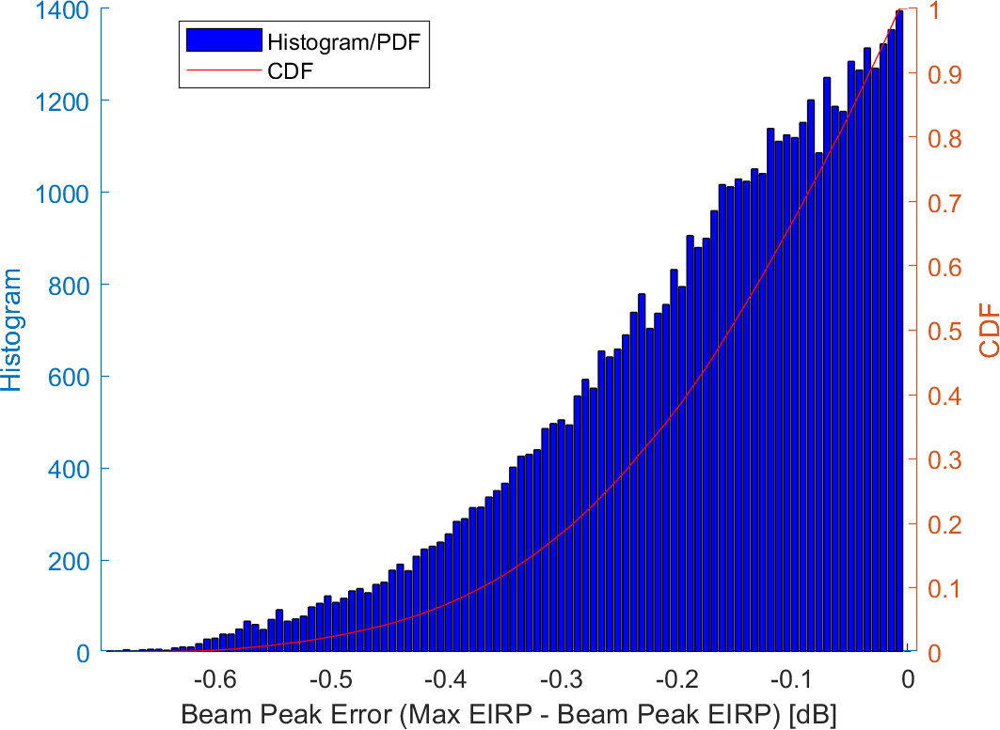{width="3.0in"
height="2.192849956255468in"}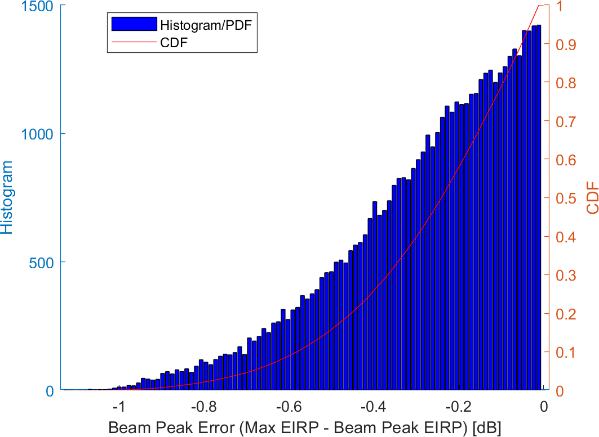{width="3.0in"
height="2.192849956255468in"}

Figure 8.2.1.1-1: Histogram of maximum beam peak errors for sample
constant-step size meausurement grids (left: 12^o^, right: 15^o^ step
size) for 260^o^/130^o^ HPBW

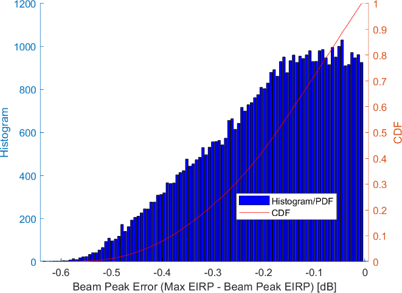{width="3.0in"
height="2.193827646544182in"}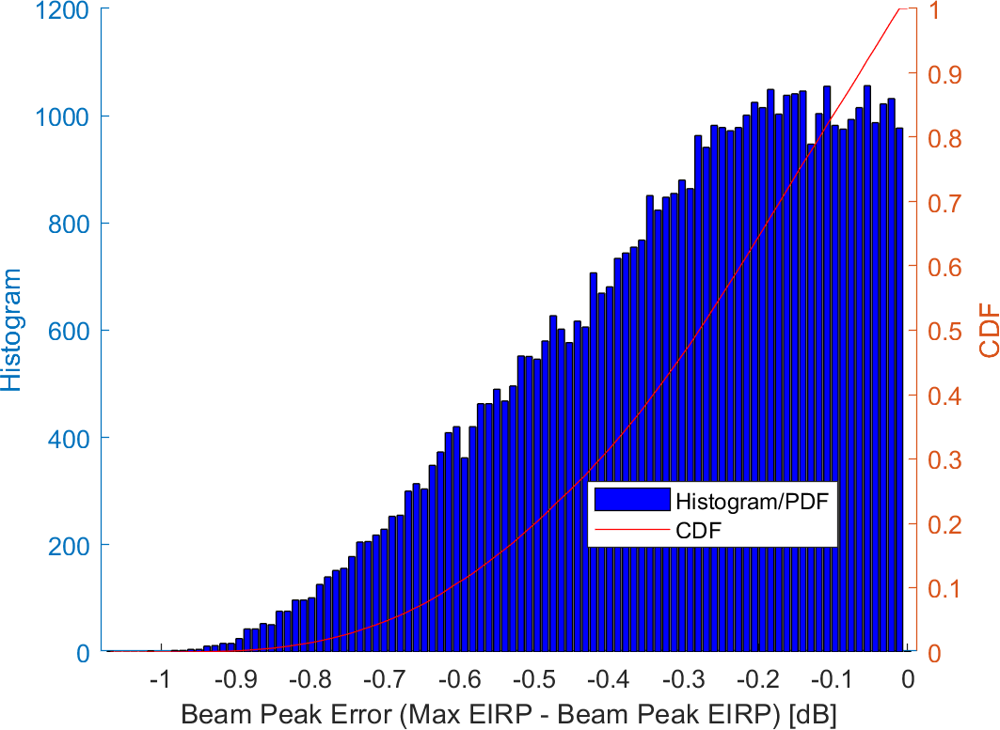{width="3.0in"
height="2.192849956255468in"}

Figure 8.2.1.1-2: Histogram of maximum beam peak errors for sample
constant density measurement grids (left: 320, right: 200 grid points)
for 260^o^/130^o^ HPBW

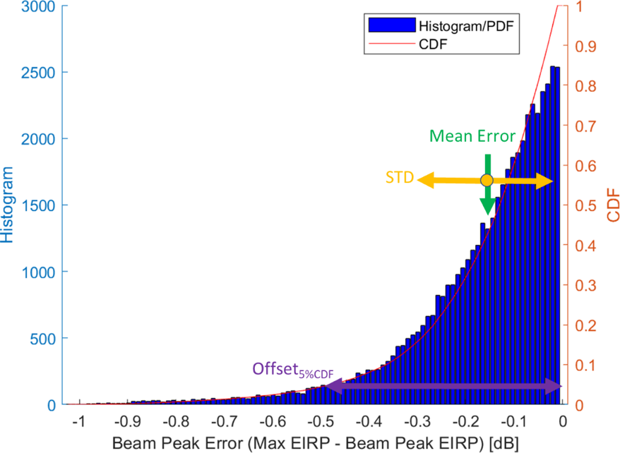{width="4.0in" height="2.9166666666666665in"}

Figure 8.2.1.1-3: Statistical metrics for a sample half-normal
distribution

The statistical results from simulations using 50k random orientations
are then used for further analyses, summarized in Table 8.2.1.1-1 for
constant-step size grids and in Table 8.2.1.1-2 for constant-density
grids. The simulation assumptions of the rotations were the same as
those outlined in Annex G.1.1 of \[3\]. it should be noted that these
measurement grids are derived without consideration of UE beam steering
effect (i.e. beam correspondence).

Table 8.2.1.1-1: Statistical Analyses of the 50k simulations for the
constant-step size grids

  Angular Step Size \[^o^\]   Number of unique grid points   Mean Error \[dB\]   STD \[dB\]   Offset~5%CDF~ \[dB\]
  --------------------------- ------------------------------ ------------------- ------------ ----------------------
  7.5                         1106                           0.07                0.05         0.17
  9.0                         762                            0.10                0.07         0.25
  10.0                        614                            0.12                0.09         0.31
  11.25                       482                            0.15                0.11         0.38
  12.0                        422                            0.17                0.13         0.44
  12.86                       366                            0.20                0.15         0.50
  13.8                        314                            0.23                0.17         0.58
  15.0                        266                            0.27                0.21         0.69

Table 8.2.1.1-2: Statistical Analyses of the 50k simulations for the
constant-density grids

  Number of unique grid points   Mean Error \[dB\]   STD \[dB\]   Offset~5%CDF~ \[dB\]
  ------------------------------ ------------------- ------------ ----------------------
  800                            0.07                0.05         0.17
  700                            0.09                0.06         0.20
  650                            0.09                0.06         0.21
  600                            0.10                0.07         0.23
  550                            0.11                0.07         0.25
  500                            0.12                0.08         0.28
  450                            0.13                0.09         0.31
  400                            0.15                0.10         0.35
  350                            0.17                0.12         0.39
  300                            0.20                0.14         0.46
  275                            0.22                0.15         0.50
  250                            0.24                0.16         0.55

Based on the previously agreed limit of Offset~5%CDF~ of 0.5dB
(systematic error), the following minimum number of grid points would be
required for Beam Peak Search Grid.

\- Constant density grid with at least 275 grid points

\- Constant step size grid with at least 366 grid points

Table 8.2.1.1-3: Min Number of Grid Points for TX/RX Beam Peak Search

  ---------------------------------------------------------
  Antenna\             8x2    4x2   Factor of Improvement
  Assumption\                       
  \                                 
  \                                 
  Grid Type                         
  -------------------- ------ ----- -----------------------
  Constant-Step Size   1106   366   3.0

  Constant-Density     800    275   2.9
  ---------------------------------------------------------

The approximate test times for the 4x2 beam peak searches are as
follows:

\- Constant-Step Size: TX \~0.7hrs; RX \~4hrs

\- Constant Density: TX \~0.5hrs; RX \~3hrs

#### 8.2.1.2 Spherical Coverage Measurement Grid 

The simulation assumptions including the antenna patterns for the
spherical coverage measurement grids are the same as Clause G.3 \[3\]
except the 4x2 antenna array assumptions instead of 8x2.

At the 50%-tile CDF, i.e., the target CDF for Power Class 3, statistical
analyses of all 10000 EIRPs, EIRP50%CDF, are performed.

The simulations in this contribution were only for the case where the
beam peak is oriented in completely random orientations, i.e., the beam
peak is not always aligned to a grid point. It is understood that the
CDF curve cannot be used to accurately determine the TX beam peak
(100%-tile CDF)

Unlike in \[3\], the simulations here were performed for EIRP only it
was shown previously that the EIS simulations with infinitesimal DL
power step sizes match the standard deviations of the EIRP results and
that a finite DL power step size introduces a mean error that matches
the DL power step size.

The results for various constant-step size measurement grids are
tabulated in Table 8.2.1.2-1 and the grid with similar MUs as previously
agreed for the 8x2 based PC3 configuration is highlighted.

Table 8.2.1.2-1: Statistical results of EIRP50%CDF for the 4x2 antenna
array for constant step size measurement grids and the beam peak
oriented in completely random orientations.

  Step Size \[o\]   Number of unique grid points   Std. Dev \[dB\]   \|Mean Error\| \[dB\]
  ----------------- ------------------------------ ----------------- -----------------------
  10.0              614                            0.03              0.00
  12.0              422                            0.08              0.01
  15.0              266                            0.06              0.02
  20.0              146                            0.10              0.03
  22.5              114                            0.22              0.02
  30.0              62                             0.21              0.04
  45.0              26                             0.30              0.14

Similar results for the constant-density measurement grids are tabulated
in Table 8.2.1.2-2 and the grid with similar MUs as previously agreed
for the 8x2 based PC3 configuration is highlighted.

Table 8.2.1.2-2: Statistical results of EIRP50%CDF for the 4x2 antenna
array for constant density measurement grids and the beam peak oriented
in completely random orientations.

  Number of unique grid points   Std. Dev \[dB\]   \|Mean Error\| \[dB\]
  ------------------------------ ----------------- -----------------------
  50                             0.19              0.05
  60                             0.25              0.03
  70                             0.21              0.04
  80                             0.22              0.03
  90                             0.14              0.03
  100                            0.12              0.03
  110                            0.10              0.03
  120                            0.09              0.03
  130                            0.07              0.02
  140                            0.07              0.02
  150                            0.07              0.02

At least 100 (constant density grid with charged particle
implementation) or 146 (constant step size grid with 20deg step size)
measurement grid points shall be used for EIRP spherical coverage
procedure. Compared with 8x2 antenna array, the factor of improvement
based on new measurement grid with 4x2 antenna is about 2, as summarized
in the table 8.2.1.2-3.

Table 8.2.1.2-3: Min Number of Grid Points for Spherical Coverage

  ------------------------------------------------------------------------------
  Antenna\             8x2              4x2              Factor of Improvement
  Assumption\                                            
  \                                                      
  \                                                      
  Grid Type                                              
  -------------------- ---------------- ---------------- -----------------------
  Constant-Step Size   266 (15.0 deg)   146 (20.0 deg)   1.8

  Constant-Density     200              100              2
  ------------------------------------------------------------------------------

#### 8.2.1.3 TRP Measurement Grid 

The simulation assumptions including the antenna patterns for the TRP
measurement grids are the same as Clause G.2 \[3\] except a 4x2 antenna
array assumption instead of 8x2 for both single-element antenna
patterns.

The results tabulated in this section outline the results of a
statistical analyses with the positioning concept taken into account,
i.e., the analyses were performed with and without the assumption that
the beam peak direction is oriented away from the hemisphere towards the
pole at θ = 180^o^. Additionally, the standard deviations are presented
when ranges of pattern values are disregarded (zeroed out). For the
constant-step size measurement grids, three cases were investigated,
i.e., no pattern values are disregarded, values only at one latitude at
θ=180^o^, and the values at the bottom two latitudes are disregarded.
The results with the re-positioning concept applied are summarized in
Table 8.2.1.3-1 for the sin(theta) and the Clenshaw-Curtis quadratures
while the results without the re-positioning concept applied are
summarized in Table 8.2.1.3-2.

For the constant density measurement grids, a similar investigation was
performed using the Charged Particle implementation. Two cases
investigated were: no pattern values are disregarded and values
between X ≤ θ ≤ 180^o^ are disregarded. The results with the
re-positioning concept applied are summarized in Table 8.2.1.3-2 for the
Charged Particle implementation while the results without the
re-positioning concept applied are summarized in Table 8.2.1.3-4.

The previously agreed limit for the PC3 TRP grids is 0.25dB. Those
measurement grids meeting that limit have been highlighted in green
while the grids exceeding that limit are highlighted in red. It should
be noted that some mean errors are relatively high for grids that meet
the 0.25dB std. deviation limit and therefore should not be considered
candidate measurement grids.

Table 8.2.1.3-1: Statistics of quadrature approaches for constant step
size measurement grids for the 4x2 antenna array with the re-positioning
concept applied.

  Number of       Step Size ∆θ=∆φ   Number of unique grid points   Number of Latitudes disregarded   Mean Error \[dB\]   Std. Dev \[dB\]   Quadrature   Re-Positioning Concept Applied   
  --------------- ----------------- ------------------------------ --------------------------------- ------------------- ----------------- ------------ -------------------------------- -----
  **Latitudes**   **Longitudes**                                                                                                                                                         
  13              24                15                             266                               1                   -0.02             0.05         Sin(theta)                       yes
  13              24                15                             266                               1                   -0.01             0.01         Clenshaw-Curtis                  yes
  13              24                15                             266                               2                   -0.10             0.16         Sin(theta)                       yes
  13              24                15                             266                               2                   -0.08             0.12         Clenshaw-Curtis                  yes
  13              24                15                             266                               3                   -0.18             0.17         Sin(theta)                       yes
  13              24                15                             266                               3                   -0.16             0.14         Clenshaw-Curtis                  yes
  10              18                20                             146                               1                   -0.05             0.10         Sin(theta)                       yes
  10              18                20                             146                               1                   -0.01             0.03         Clenshaw-Curtis                  yes
  10              18                20                             146                               2                   -0.19             0.27         Sin(theta)                       yes
  10              18                20                             146                               2                   -0.15             0.18         Clenshaw-Curtis                  yes
  10              18                20                             146                               3                   -0.31             0.21         Sin(theta)                       yes
  10              18                20                             146                               3                   -0.28             0.17         Clenshaw-Curtis                  yes
  8               14                25.71                          86                                1                   -0.08             0.19         Sin(theta)                       yes
  8               14                25.71                          86                                1                   -0.02             0.05         Clenshaw-Curtis                  yes
  8               14                25.71                          86                                2                   -0.32             0.40         Sin(theta)                       yes
  8               14                25.71                          86                                2                   -0.25             0.26         Clenshaw-Curtis                  yes
  8               14                25.71                          86                                3                   -0.52             0.24         Sin(theta)                       yes
  8               14                25.71                          86                                3                   -0.46             0.17         Clenshaw-Curtis                  yes
  7               12                30                             62                                1                   -0.11             0.33         Sin(theta)                       yes
  7               12                30                             62                                1                   -0.03             0.13         Clenshaw-Curtis                  yes
  7               12                30                             62                                2                   -0.44             0.53         Sin(theta)                       yes
  7               12                30                             62                                2                   -0.34             0.32         Clenshaw-Curtis                  yes
  7               12                30                             62                                3                   -0.73             0.36         Sin(theta)                       yes
  7               12                30                             62                                3                   -0.66             0.26         Clenshaw-Curtis                  yes

Table 8.2.1.3-2: Statistics of quadrature approaches for constant step
size measurement grids for the 4x2 antenna array without the
re-positioning concept applied.

  Number of       Step Size ∆θ=∆φ   Number of unique grid points   Number of Latitudes disregarded   Mean Error \[dB\]   Std. Dev \[dB\]   Quadrature   Re-Positioning Concept Applied   
  --------------- ----------------- ------------------------------ --------------------------------- ------------------- ----------------- ------------ -------------------------------- ----
  **Latitudes**   **Longitudes**                                                                                                                                                         
  13              24                15                             266                               1                   -0.03             0.06         Sin(theta)                       no
  13              24                15                             266                               1                   -0.02             0.04         Clenshaw-Curtis                  no
  13              24                15                             266                               2                   -0.19             0.37         Sin(theta)                       no
  13              24                15                             266                               2                   -0.18             0.35         Clenshaw-Curtis                  no
  10              18                20                             146                               1                   -0.05             0.10         Sin(theta)                       no
  10              18                20                             146                               1                   -0.03             0.07         Clenshaw-Curtis                  no
  10              18                20                             146                               2                   -0.35             0.63         Sin(theta)                       no
  10              18                20                             146                               2                   -0.33             0.59         Clenshaw-Curtis                  no
  8               14                25.71                          86                                1                   -0.08             0.20         Sin(theta)                       no
  8               14                25.71                          86                                1                   -0.05             0.12         Clenshaw-Curtis                  no
  8               14                25.71                          86                                2                   -0.62             0.96         Sin(theta)                       no
  8               14                25.71                          86                                2                   -0.56             0.90         Clenshaw-Curtis                  no
  7               12                30                             62                                1                   -0.11             0.33         Sin(theta)                       no
  7               12                30                             62                                1                   -0.07             0.22         Clenshaw-Curtis                  no
  7               12                30                             62                                2                   -0.87             1.24         Sin(theta)                       no
  7               12                30                             62                                2                   -0.79             1.15         Clenshaw-Curtis                  no

Table 8.2.1.3-3: Statistics for constant density measurement grid types
for the 4x2 reference antenna array with the re-positioning concept
applied (charged particle implementation only)

  Number of Grid Points   Range of Angles disregarded   Mean Error \[dB\]   Std. Dev \[dB\]   Re-Positioning Concept Applied
  ----------------------- ----------------------------- ------------------- ----------------- --------------------------------
  90                      none                          0.05                0.02              yes
  80                      none                          0.05                0.03              yes
  70                      none                          0.05                0.03              yes
  60                      none                          0.05                0.05              yes
  50                      none                          0.05                0.07              yes
  40                      none                          0.04                0.17              yes
  90                      165^o^-180^o^                 0.00                0.08              yes
  80                      165^o^-180^o^                 -0.01               0.09              yes
  70                      165^o^-180^o^                 0.02                0.07              yes
  60                      165^o^-180^o^                 0.01                0.09              yes
  50                      165^o^-180^o^                 0.00                0.11              yes
  40                      165^o^-180^o^                 0.04                0.17              yes
  90                      150^o^-180^o^                 -0.10               0.18              yes
  80                      150^o^-180^o^                 -0.09               0.18              yes
  70                      150^o^-180^o^                 -0.11               0.20              yes
  60                      150^o^-180^o^                 -0.10               0.20              yes
  50                      150^o^-180^o^                 -0.14               0.21              yes
  40                      150^o^-180^o^                 -0.13               0.28              yes

Table 8.2.1.3-4: Statistics for constant density measurement grid types
for the 4x2 reference antenna array without the re-positioning concept
applied (charged particle implementation only)

  Number of Grid Points   Range of Angles disregarded   Mean Error \[dB\]   Std. Dev \[dB\]   Re-Positioning Concept Applied
  ----------------------- ----------------------------- ------------------- ----------------- --------------------------------
  90                      none                          0.05                0.02              no
  80                      none                          0.05                0.03              no
  70                      none                          0.05                0.03              no
  60                      none                          0.05                0.05              no
  50                      none                          0.05                0.07              no
  40                      none                          0.05                0.17              no
  90                      165^o^-180^o^                 0.00                0.13              no
  80                      165^o^-180^o^                 -0.01               0.14              no
  70                      165^o^-180^o^                 -0.02               0.17              no
  60                      165^o^-180^o^                 -0.03               0.21              no
  50                      165^o^-180^o^                 -0.04               0.26              no
  40                      165^o^-180^o^                 -0.08               0.39              no
  90                      150^o^-180^o^                 -0.28               0.58              no
  80                      150^o^-180^o^                 -0.26               0.56              no
  70                      150^o^-180^o^                 -0.32               0.64              no
  60                      150^o^-180^o^                 -0.29               0.61              no
  50                      150^o^-180^o^                 -0.36               0.70              no
  40                      150^o^-180^o^                 -0.34               0.73              no

According to the above analysis, the following conclusions can be made:

\- If the re-positioning concept is not applied to TRP test cases:

\- 40 measurement grid points for constant density grid -- Charged
Particle implementation, with standard deviation of 0.17dB.

\- 8 latitudes and 14 longitudes (84 grid points) for constant step size
grid -- sin (theta) weights integration approach, with standard
deviation of 0.20dB with the allowance to skip and interpolate
measurements at the pole at θ=180^o^.

\- 7 latitudes and 12 longitudes (62 grid points) for constant step size
grid -- Clenshaw Curtis weights integration approach, with standard
deviation of 0.22 dB with the allowance to skip and interpolate
measurements at the pole at θ=180^o^

\- If the re-positioning concept is applied to TRP test cases:

\- 50 measurement grid points for constant density grid -- Charged
Particle implementation, with standard deviation of 0.21 dB with the
allowance to skip and interpolate measurements beyond 150^o^ in θ

\- 8 latitudes and 14 longitudes (86 grid points) for constant step size
grid -- sin (theta) weights integration approach, with standard
deviation of 0.19dB with the allowance to skip and interpolate
measurements the at pole at θ=180^o^

\- 7 latitudes and 12 longitudes (62 grid points) for constant step size
grid -- Clenshaw Curtis weights integration approach, with standard
deviation of 0.13 dB with the allowance to skip and interpolate
measurements the at pole at θ=180^o^

### 8.2.2 Applicability of the 4x2 measurement grids

Since RAN5 has decided on maximum test system uncertainties and test
tolerances already, it is not suggested to change the assumptions at
this point as this will have significant impact in RAN5 and industry
since changes in MU/MTSU could have impact on certifications and test
platform validations. Keep the system-related assumptions unchanged in
RAN5, i.e., based on the previously agreed worst case 8x2 assumptions.

It is therefore the 4x2-antenna-based measurement grids are agreed as an
additional option for FR2 test cases, but not replace previous 8x2 based
measurement grids. The selection of measurement grid based on 4x2 or 8x2
is based on optional vendor declaration.

The above new measurement grids based on 4x2 antenna array are
applicable to both NTC and ETC test cases.

8.3 RSRP(B) based RX beam peak search
-------------------------------------

RSRP(B)-based RX beam peak search approach is applicable to find the
beam peak, the beam peak searching time can be reduced significantly.

### 8.3.1 Test procedure 

The RX beam peak direction is found with a 3D RSRP(B) scan (separately
for each orthogonal downlink polarization). The RX beam peak direction
is where the maximum total component of RSRP is found. The RX beam peak
direction search grid points for this single grid approach are defined
in Clause 8.2.

The measurement procedure includes the following steps:

1\) Select any of the three Alignment Options (1, 2, or 3) from Tables
N.2-1 through N.2-3 \[6\] to mount the DUT inside the QZ.

2\) Position the DUT in DUT Orientation 1 or 2 from Tables N.2-1 through
N.2-3 \[6\].

3\) Connect the SS (System Simulator) with the DUT through the
measurement antenna with Pol~Link~=θ polarization to form the RX beam
towards the measurement antenna.

4\) Set a proper high DL power supported by the test system, this value
will be defined in RAN5 conformance test spec. Determine RSRP or RSRPBs
(one per receiver branch) at Pol~Meas~=Pol~Link~=θ condition reported by
UE.

5\) Connect the SS (System Simulator) with the DUT through the
measurement antenna with Pol~Link~=φ polarization to form the RX beam
towards the measurement antenna.

6\) Set the same DL power as the one in step 4. Determine RSRP or RSRPBs
(one per receiver branch) at Pol~Meas~=Pol~Link~=φ condition reported by
UE.

7\) Advance to the next grid point and repeat steps 3 through 6 until
measurements within the full 3D scan have been completed.

8\) Data processing the linear sum of four reported RSRPBs. How to
calculate the reported RSRPs is FFS.

Note: RSRPB-based test procedure is adopted for RX beam peak.
Feasibility of RSRP-based approach is FFS.

### 8.3.2 RSRP(B) accuracy 

To guarantee RSRP(B) accuracy, SNR side condition configuration can
refer to the minimum SSB\_RP specified for beam correspondence in TS
38.101-2.

8.4 Single link polarization measurement 
----------------------------------------

As an enhancement to the FR2 2Tx test cases, it has been proposed to
adopt a Single link polarization measurement to reduce the test time.
**Single Pol~link~ can be randomly selected from either theta Pol~link~
or phi Pol~link~.**

**For EIRP test, whether single Pol~link~ is adopted or test under 2
link directions, depends on UE declaration**.

### 8.4.1 Test procedure 

For single link polarization measurement, the link antenna can be
randomly selected, in this clause the detailed Single Pol~link~
measurement procedure for TX Beam Peak direction search and EIRP
Spherical Coverage based on Pol~Link~=θ is presented as an example:

1\) Select any of the three Alignment Options (1, 2, or 3) from Tables
N.2-1 through N.2-3 \[6\] to mount the DUT inside the QZ.

2\) Position the DUT in DUT Orientation 1 from Tables N.2-1 through
N.2-3 \[6\].

3\) Connect the SS (System Simulator) with the DUT through the
measurement antenna with Pol~Link~=θ to form the TX beam towards the
measurement antenna.

4\) DUT refines its TX beam toward that direction depending on DUT's
beam correspondence capability which shall match OEM declaration:

a\) if DUT's beam correspondence capability is \[bit-1\], then DUT
autonomously chooses the corresponding TX beam for PUSCH transmission
using downlink reference signals to transmit in the direction of the
incoming DL signal, which is based on beam correspondence without
relying on UL beam sweeping

b\) if DUT's beam correspondence capability is \[bit-0\], then DUT
chooses the TX beam for PUSCH transmission which is based on beam
correspondence that relies on both DL measurements on downlink reference
signals and network-assisted uplink beam sweeping.

5\) Lock the beam and send continuously power control \"up\" commands in
every uplink scheduling information to the UE

6\) Measure the mean power P~meas~(Pol~Meas~=θ, Pol~Link~=θ) of the
modulated signal arriving at the power measurement equipment (such as a
spectrum analyser, power meter, or gNB emulator).

7\) Calculate EIRP (Pol~Meas~=θ,Pol~Link~=θ) by adding the composite
loss of the entire transmission path for utilized signal path,
L~EIRP,θ~, and frequency to the measured power
P~meas~(Pol~Meas~=θ,Pol~Link~=θ)

8\) Measure the mean power P~meas~ (Pol~Meas~=φ,Pol~Link~=θ) of the
modulated signal arriving at the power measurement equipment.

9\) Calculate EIRP (Pol~Meas~=φ,Pol~Link~=θ) by adding the composite
losses of the entire transmission path for utilized signal path,
L~EIRP,ϕ~, and frequency to the measured power P~meas~
(Pol~Meas~=φ,Pol~Link~=θ)

10\) Calculate total EIRP(Pol~Link~=θ) = EIRP(Pol~Meas~=θ,Pol~Link~=θ) +
EIRP(Pol~Meas~=φ,Pol~Link~=θ)

11\) Advance to the next grid point and repeat steps 3 through 13 until
measurements within zenith range 0^o^≤θ≤90^o^ have been completed

12\) After the measurements within zenith range 0^o^≤θ≤90^o^ have been
completed and

a\) if the re-positioning concept is applied to the TX test cases,
position the device in DUT Orientation 2 (either Options 1 or 2) from
Tables N.2-1 through N.2-3 \[6\] for the Alignment Option selected in
Step 1. For the TX beam peak search in the second hemisphere, perform
steps 3 through 14 for the range of zenith angles 90^o^\<θ≤0^o^.

b\) if the re-positioning concept is not applied to the TX test cases,
continue steps 3 through 13 for the range of zenith angles
90^o^\<θ≤180^o^

The TX beam peak direction is where the maximum total component of
EIRP(Pol~Link~=θ) is found.

The EIRP~target-CDF~ is then obtained from the Cumulative Distribution
Function (CDF) computed using maximum EIRP(Pol~Link~=θ) for all grid
points.

### 8.4.2 Applicability of Single link polarization measurement

Whether single Pol~link~ is adopted or test under 2 link directions,
depends on UE declaration. Link antenna for **Single Pol~link~
measurement can be randomly selected, i.e., using either theta Pol~link~
or phi Pol~link~**.

8.5 Other methods
-----------------

### 8.5.1 Fast Spherical Coverage Method

#### 8.5.1.1 General

The Fast Spherical Coverage Method is a test method providing an
optimized test time for Tx and Rx spherical coverage measurements.

Instead of measuring all grid points as defined in Annex M of TS
38.521-2 \[6\] as required by the current test procedure as defined in
Annex K.1.5 and Annex K.1.6 of TS 38.521-2 \[6\], the Fast Spherical
Coverage Method requires only a reduced number of grid points to be
measured.

For test systems where the device repositioning approach outlined in
Annex N of TS 38.521-2 \[6\] is applied, the grid points of up to a
zenith of \[90\]° are allowed to be measured in the first hemisphere
before the device needs to be placed in the second orientation.

This method is applicable to Constant Density grid type. Fast spherical
coverage measurement method is also applicable for constant step size
grid type.

#### 8.5.1.2 Tx Fast Spherical Coverage Method

The measurement procedure for an EIRP Fast Spherical Coverage Method
includes the following steps:

1\) Select any of the three Alignment Options (1, 2, or 3) from Tables
N.2-1 through N.2-3 \[6\] to mount the DUT inside the QZ.

2\) Position the DUT in DUT Orientation 1 or 2 from Tables N.2-1 through
N.2-3 \[6\].

3\) Connect the SS (System Simulator) with the DUT through the
measurement antenna with Pol~Link~=θ polarization to form the TX beam
towards the measurement antenna.

4\) Send continuously uplink power control \"up\" commands in every
uplink scheduling information to the UE.

5\) For beam correspondence, DUT refines its TX beam toward that
direction depending on DUT's beam correspondence capability which shall
match OEM declaration.

6\) Lock the beam using the UE beamlock function.

7\) Measure the mean power P~meas~ (Pol~Meas~= θ, Pol~Link~= θ) of the
modulated signal arriving at the power measurement equipment (such as a
spectrum analyser, power meter, or gNB emulator).

8\) Calculate EIRP (Pol~Meas~= θ, Pol~Link~= θ) by adding the composite
loss of the entire transmission path for utilized signal path,
L~EIRP,θ~, and frequency to the measured power P~meas~(Pol~Meas~= θ,
Pol~Link~= θ).

9\) Measure the mean power P~meas~ (Pol~Meas~= ϕ, Pol~Link~= θ) of the
modulated signal arriving at the power measurement equipment.

10\) Calculate EIRP (Pol~Meas~= ϕ, Pol~Link~= θ) by adding the composite
losses of the entire transmission path for utilized signal path,
L~EIRP,ϕ~, and frequency to the measured power P~meas~ (Pol~Meas~= ϕ,
Pol~Link~= θ).

11\) Calculate total EIRP(Pol~Link~= θ) = (Pol~Meas~= θ, Pol~Link~= θ) +
EIRP(Pol~Meas~= ϕ, Pol~Link~= θ).

12\) Unlock the beam using the UE beamlock function.

13\) Connect the SS (System Simulator) with the DUT through the
measurement antenna with Pol~Link~= ϕ polarization to form the TX beam
towards the measurement antenna and repeat steps 4 through 12.

14\) Calculate the EIRP result for the grid point as EIRP~spherical~ =
Max(EIRP(Pol~Link~= θ), EIRP(Pol~Link~= ϕ)). If the EIRP~spherical~
value is above the Min EIRP spherical coverage limit increase
N~grid,\ meas,\ PASS~ by 1.

15\) Calculate the percentage of total grid points measured so far above
the EIRP spherical coverage requirement limit N~grid,\ meas,\ PASS~
compared to the total number of grid points on the measurement grid
N~grid,total~.

16\) If the percentage calculated in step 15 is equal to or higher than
(100 - n^th^ percentile for EIRP spherical coverage)%, pass the device,
otherwise continue to step 17. If all grid points have been measured,
calculate the CDF for all grid points and pass the UE if the derived
%-tile EIRP in measurement distribution exceeds the requirement.
Otherwise fail the UE.

17\) Advance to the next grid point and repeat steps 3 through 16 until
measurements within zenith range 0º≤ θ ≤\[90\]º have been completed

18\) After the measurements within zenith range 0º≤ θ ≤\[90\]º have been
completed and

a\) if the re-positioning concept is applied to the TX test cases,
position the device in the corresponding second DUT Orientation from
Tables N.2-1 through N.2-3 \[6\] for the Alignment Option selected in
Step 1 and DUT Orientation selected in Step 2. For the TX spherical
coverage measurement in the second hemisphere, perform steps 3 through
16 for the range of zenith angles \[90\]º\< θ ≤0º.

b\) if the re-positioning concept is not applied to the TX test cases,
continue steps 3 through 16 for the range of zenith angles \[90\]º\< θ
≤180º.

#### 8.5.1.3 Rx Fast Spherical Coverage Method

The measurement procedure for an EIS Fast Spherical Coverage Method
includes the following steps:

1\) Select any of the three Alignment Options (1, 2, or 3) from Tables
N.2-1 through N.2-3 \[6\] to mount the DUT inside the QZ.

2\) Position the DUT in DUT Orientation 1 or 2 from Tables N.2-1 through
N.2-3 \[6\].

3\) Connect the SS (System Simulator) with the DUT through the
measurement antenna with Pol~Link~= θ polarization to form the RX beam
towards the measurement antenna.

4\) Determine EIS(Pol~Meas~= θ Pol~Link~= θ) for θ-polarization, i.e.,
the power level for the θ-polarization at which the throughput exceeds
the requirements for the specified reference measurement channel. The
downlink power step size shall be no more than 0.2 dB when the RF power
level is near the sensitivity level.

5\) Connect the SS (System Simulator) with the DUT through the
measurement antenna with Pol~Link~= ϕ polarization to form the RX beam
towards the RX beam peak direction.

6\) Determine EIS(Pol~Meas~= ϕ Pol~Link~= ϕ) for ϕ-polarization, i.e.,
the power level for the ϕ-polarization at which the throughput exceeds
the requirements for the specified reference measurement channel. The
downlink power step size shall be no more than 0.2 dB when the RF power
level is near the sensitivity level.

7\) Calculate the resulting averaged EIS as: EIS = 2\*\[1/EIS(Pol~Meas~=
θ Pol~Link~= θ) +1/EIS(Pol~Meas~= ϕ Pol~Link~= ϕ)\]^-1^. If the EIS
value is below the EIS spherical coverage limit increase
N~grid,\ meas,\ PASS~ by 1.

8\) Calculate the percentage of total grid points measured so far below
the EIS spherical coverage requirement limit N~grid,\ meas,\ PASS~
compared to the total number of grid points on the measurement grid
N~grid,total~.

9\) If the percentage calculated in step 8 is equal to or higher than
(100 - n^th^ percentile for EIS spherical coverage)%, pass the device,
otherwise continue to step 10. If all grid points have been measured,
calculate the CCDF for all grid points and pass the UE if the derived
%-tile EIS in measurement distribution is lower than the requirement.
Otherwise fail the UE.

10\) Advance to the next grid point and repeat steps 3 through 16 until
measurements within zenith range 0º≤ θ ≤\[90\]º have been completed

11\) After the measurements within zenith range 0º≤ θ ≤\[90\]º have been
completed and

a\) if the re-positioning concept is applied to the TX test cases,
position the device in the corresponding second DUT Orientation from
Tables N.2-1 through N.2-3 \[6\] for the Alignment Option selected in
Step 1 and DUT Orientation selected in Step 2. For the RX spherical
coverage measurement in the second hemisphere, perform steps 3 through 9
for the range of zenith angles \[90\]º\< θ ≤0º.

b\) if the re-positioning concept is not applied to the RX test cases,
continue steps 3 through 9 for the range of zenith angles \[90\]º\< θ
≤180º.

### 8.5.2 Non-Uniform TRP Measurement Grids

Given the large number of PC1 TRP grid points, as specified in Clause
M.4.1.1 of \[6\], additional test time reduction can be achieved based
on non-uniform grids. The idea here is to apply a fine grid around the
FF beam peak direction to capture the main portion of the very directive
beam while a coarse grid around the remaining portion of the sphere is
applied. This is further illustrated in Figure 8.5.2-1 for a constant
step-size grid with the following non-uniform TRP grid assumptions:

\- The known FF beam is shown with the large grey dot. On top, the FF
beam peak is assumed at (0^o^,0^o^) while the FF beam peak on the bottom
is assumed at (45^o^,45^o^).

\- The red grid points are within a ±20^o^ cone centred around the NF
beam peak with ∆θ=∆φ=7.5^o^.

\- The cyan grid points are outside a ±20^o^ cone centred around the NF
beam peak with ∆θ=∆φ=15^o^.

/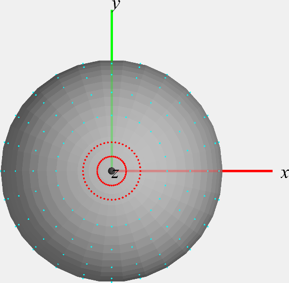{width="2.5597222222222222in" height="2.5in"}

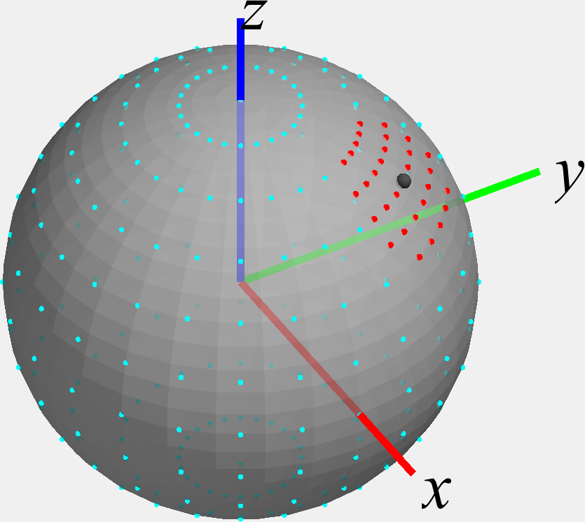{width="3.0in"
height="2.678472222222222in"}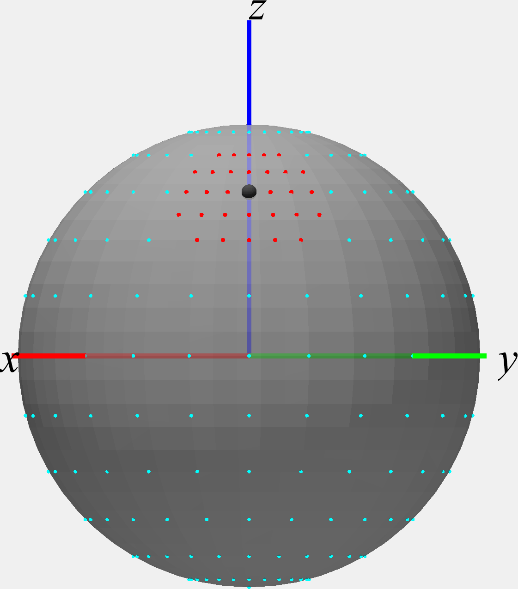{width="2.3569444444444443in"
height="2.678472222222222in"}

Figure 8.5.2-1: Visualization of non-uniform TRP grids for NF beam at
(0o,0o) on top and at (45o,45o) on bottom. Grid points in cyan (red) are
outside (inside) the conical NF beam peak region.

Simulations with 2000 random permutations of the beam peak direction
(rotation in **θ, φ, and twist α** as outlined in Clause G.1 of \[3\])
were performed for a FF range length of 20m; only the Clenshaw-Curtis
quadrature was considered here. Table 8.5.2-1 shows the simulation
results for the non-uniform measurement grids considered suitable for
PC1 devices; the grid with step size of 7.5^o^ within ±20^o^ of the FF
beam peak and step size of 15^o^ outside ±20^o^ of the FF beam peak is
meeting the same MUs are the current measurement grid. The average
number of unique grid points based on all simulations investigated is
\~300 which shows a significant test time reduction compared to the
current standard TRP grid with 1106 grid points while maintaining the
same MU as the grid with uniform step sizes in **θ and φ**.

Table 8.5.2-1: CFFDNF TRP simulation results (using Clenshaw-Curtis
quadrature) for PC1 devices (12x12 antenna configuration) using
non-uniform measurement grids.

  Antenna Configuration   Cone width (±) \[o\]   Constant Step-Size Grid Step Size outside cone ∆θ=∆φ \[^o^\]   Constant Step-Size Grid Step Size within cone ∆θ=∆φ \[^o^\]   Average number of unique grid points   \|Mean TRP Error\| \[dB\]   TRP Std. Dev. \[dB\]
  ----------------------- ---------------------- -------------------------------------------------------------- ------------------------------------------------------------- -------------------------------------- --------------------------- ----------------------
  12x12                   15                     10                                                             5                                                             648                                    0.1                         0.1
                          20                     15                                                             5                                                             338                                    0.1                         0.1
                                                 15                                                             7.5                                                           293                                    0.1                         0.1

The TRP calculation is left to the system vendor as there are different
approaches to determine TRP, e.g., interpolation of all results to the
fine grid vs partial TRPs calculated within the cone and outside the
cone.

The comparison of the TRP measurement grid parameters and the min.
number of grid points are tabulated in Table 8.5.2-2 with angular grid
spacings placed uniformly and non-uniformly in θ and φ. Clearly, the
non-uniform TRP measurement grid approach is beneficial in terms of test
time reduction.

Table 8.5.2-2: Comparison of the TRP measurement grid parameters for PC1
including potential test time improvement.

  Antenna Config.   Non-uniform angular spacing   Uniform angular spacing                                        Potential Test Time Improvement with non-uniform angular spacing in θ and φ (factor)                                                                                                                           
  ----------------- ----------------------------- -------------------------------------------------------------- -------------------------------------------------------------------------------------- -------------------------------------- ------------------------------------------------- ------------------------------ -----
                    Cone width (±) \[^o^\]        Constant Step-Size Grid Step Size outside cone ∆θ=∆φ \[^o^\]   Constant Step-Size Grid Step Size within cone ∆θ=∆φ \[^o^\]                            Average Number of unique grid points   Constant Step-Size Grid Step Size ∆θ=∆φ \[^o^\]   Number of unique grid points   
  12x12             20                            15                                                             7.5                                                                                    293                                    7.5                                               1106                           3.8

This non-uniform TRP grid approach is also applicable to the
constant-density measurement grid type.

9 Propagation conditions
========================

9.1 Extension of frequency applicability for FR2-2
--------------------------------------------------

Unless otherwise stated, the propagation condition methodology defined
in TR 38.810 Clause 8 \[3\] is applicable for FR2-2:

\- Static propagation conditions

\- Model is described in TR 38.810 clause 8.3.

\- Applicable to the UE RRM testing methodology and UE Demodulation and
CSI testing methodology.

\- Multi-path fading propagation conditions

\- Fading propagation conditions between the DUT and the emulated gNB
sources are modelled as Single probe channel models as described in TR
38.810 clause 8.2.

\- Applicable to the UE RRM testing methodology and UE Demodulation and
CSI testing methodology.

\- For FR2-2 measurement system is expected to support modelling of
multi-path fading for single carrier scenarios with channel bandwidth of
at least TBD MHz.

\- For FR2-2 single carrier scenarios with channel bandwidth up to TBD
MHz, the Fsample is defined as TBD MHz and ∆T ≤ TBD ns.

########  Annex A: Environment conditions

A.1 Operating voltage
=====================

A.2 Temperature
===============

Table A.2-1: Temperature conditions

  \+ 25 ⁰C ± 10 ⁰C   For normal (room temperature) conditions with relative humidity of 25 % to 75 %
  ------------------ ---------------------------------------------------------------------------------
  -10°C to +55°C     For extreme conditions

For ETC test system defined in Clause 5.4, the extreme temperature
conditions in Table A.2-1 applies.

########  Annex B: Measurement uncertainty

B.1 Measurement uncertainty budget for UE RF testing methodology
================================================================

Editor's note: collect the MU elements which are impacted by the
enhancements in Clauses 5 and 6 in this clause; if impact on the MU
budget of the RRM and/or demodulation setups is identified, the
corresponding clauses can be added. Organize the Annex to mirror the
TR38.810 structure

B.1.1 High DL power and low UL power
------------------------------------

Editor's note: the conclusion of MU impacts of the enhanced test methods
(i.e. direct Near Field (DNF), Combined Far-Field/Direct Near Field
(CFFDNF), and Combined Far-Field/Near Field (CFFNF)) should be captured.

### B.1.1.1 Uncertainty Contributions

This section covers the additional MU elements for different enhanced
test systems in the following tables.

Table B.1.1.3-1: Uncertainty contributions for CFFNF system for PC3 UEs
utilizing the black-box approach

+----------------+----------------+----------------+----------------+
| UID            | Description of | Uncertainty    | Details in     |
|                | uncertainty    | Value          | Clause         |
|                | contribution   |                |                |
+================+================+================+================+
| Measurement    |                |                |                |
| stage          |                |                |                |
+----------------+----------------+----------------+----------------+
| 1              | DUT antenna    | 0 (Note 1)     | N/A            |
|                | location       |                |                |
|                | estimation     |                |                |
+----------------+----------------+----------------+----------------+
| 2              | Probe antenna  | 0              | B.1.1.2.2      |
|                | pattern        |                |                |
+----------------+----------------+----------------+----------------+
| 3              | EIRP           | 0.27 (Note 2)  | 5.1.4.6\       |
|                | measurement    |                | (Table         |
|                | error in NF    |                | 5.1.4.6-4)     |
+----------------+----------------+----------------+----------------+
| 4              | Near-field     | 0              | B.1.1.2.6      |
|                | interaction    |                |                |
|                | between probe  |                |                |
|                | antenna and    |                |                |
|                | DUT antenna    |                |                |
+----------------+----------------+----------------+----------------+
| 5              | Influence of   | FFS (Note 3)   | 5.1.4.7        |
|                | power          |                |                |
|                | measurement    |                |                |
|                | uncertainty    |                |                |
+----------------+----------------+----------------+----------------+
| Systematic     |                |                |                |
| Uncertainties  |                |                |                |
+----------------+----------------+----------------+----------------+
| 6              | EIRP           | 0.10           | 5.1.4.6\       |
|                | measurement    |                | (Table         |
|                | error in NF    |                | 5.1.4.6-4)     |
+----------------+----------------+----------------+----------------+
| Note: The      |                |                |                |
| range length   |                |                |                |
| for CFFNF with |                |                |                |
| black-box      |                |                |                |
| approach is    |                |                |                |
| reported for   |                |                |                |
| radius         |                |                |                |
| *r*~3~\>       |                |                |                |
| *r*~2~\>*r*~1~ |                |                |                |
| and            |                |                |                |
| *r*~3~=*r      |                |                |                |
| *~2~+1 cm=*r*~ |                |                |                |
| 1~+2 cm=22 cm. |                |                |                |
|                |                |                |                |
| Note 1:        |                |                |                |
| Black-box does |                |                |                |
| not require    |                |                |                |
| the            |                |                |                |
| declaration of |                |                |                |
| the antenna    |                |                |                |
| offset         |                |                |                |
|                |                |                |                |
| Note 2: Probe  |                |                |                |
| antenna        |                |                |                |
| pattern must   |                |                |                |
| be             |                |                |                |
| compensated.   |                |                |                |
|                |                |                |                |
| Note 3: MU can |                |                |                |
| be finalized   |                |                |                |
| in RAN5 based  |                |                |                |
| on the         |                |                |                |
| analysis       |                |                |                |
| framework in   |                |                |                |
| Clause         |                |                |                |
| 5.1.4.7.       |                |                |                |
+----------------+----------------+----------------+----------------+

Table B.1.1.3-2: Uncertainty contributions for CFFNF system for PC1 UEs
utilizing the black-box approach

+----------------+----------------+----------------+----------------+
| UID            | Description of | Uncertainty    | Details in     |
|                | uncertainty    | Value          | Clause         |
|                | contribution   |                |                |
+================+================+================+================+
| Measurement    |                |                |                |
| stage          |                |                |                |
+----------------+----------------+----------------+----------------+
| 1              | DUT antenna    | 0 (Note 1)     | N/A            |
|                | location       |                |                |
|                | estimation     |                |                |
+----------------+----------------+----------------+----------------+
| 2              | Probe antenna  | 0              | B.1.1.2.2      |
|                | pattern        |                |                |
+----------------+----------------+----------------+----------------+
| 3              | EIRP           | 0.52 (Note 2)  | 5.1.4.6\       |
|                | measurement    |                | (Table         |
|                | error in NF    |                | 5.1.4.6-4)     |
+----------------+----------------+----------------+----------------+
| 4              | Near-field     | 0              | B.1.1.2.6      |
|                | interaction    |                |                |
|                | between probe  |                |                |
|                | antenna and    |                |                |
|                | DUT antenna    |                |                |
+----------------+----------------+----------------+----------------+
| 5              | Influence of   | FFS (Note 3)   | 5.1.4.7        |
|                | power          |                |                |
|                | measurement    |                |                |
|                | uncertainty    |                |                |
+----------------+----------------+----------------+----------------+
| Systematic     |                |                |                |
| Uncertainties  |                |                |                |
+----------------+----------------+----------------+----------------+
| 6              | EIRP           | 0.17 (Note 2)  | 5.1.4.6\       |
|                | measurement    |                | (Table         |
|                | error in NF    |                | 5.1.4.6-4)     |
+----------------+----------------+----------------+----------------+
| Note: The      |                |                |                |
| range length   |                |                |                |
| for CFFNF with |                |                |                |
| black-box      |                |                |                |
| approach is    |                |                |                |
| reported for   |                |                |                |
| radius         |                |                |                |
| *r*~3~\>       |                |                |                |
| *r*~2~\>*r*~1~ |                |                |                |
| and            |                |                |                |
| *r*~3~=*r      |                |                |                |
| *~2~+1 cm=*r*~ |                |                |                |
| 1~+2 cm=32 cm. |                |                |                |
|                |                |                |                |
| Note 1:        |                |                |                |
| Black-box does |                |                |                |
| not require    |                |                |                |
| the            |                |                |                |
| declaration of |                |                |                |
| the antenna    |                |                |                |
| offset         |                |                |                |
|                |                |                |                |
| Note 2: Probe  |                |                |                |
| antenna        |                |                |                |
| pattern must   |                |                |                |
| be             |                |                |                |
| compensated.   |                |                |                |
|                |                |                |                |
| Note 3: MU can |                |                |                |
| be finalized   |                |                |                |
| in RAN5 based  |                |                |                |
| on the         |                |                |                |
| analysis       |                |                |                |
| framework in   |                |                |                |
| Clause         |                |                |                |
| 5.1.4.7.       |                |                |                |
+----------------+----------------+----------------+----------------+

Table B.1.1.3-3: Uncertainty contributions for CFFNF system for PC3 UEs
utilizing the black&white-box approach

+----------------+----------------+----------------+----------------+
| UID            | Description of | Uncertainty    | Details in     |
|                | uncertainty    | Value          | Clause         |
|                | contribution   |                |                |
+================+================+================+================+
| Measurement    |                |                |                |
| stage          |                |                |                |
+----------------+----------------+----------------+----------------+
| 1              | DUT antenna    | FFS (Note 1)   | 5.1.4.10       |
|                | location       |                |                |
|                | estimation     |                |                |
+----------------+----------------+----------------+----------------+
| 2              | Probe antenna  | 0              | B.1.1.2.2      |
|                | pattern        |                |                |
+----------------+----------------+----------------+----------------+
| 3              | EIRP           | 0.02 (Note 2)  | 5.1.4.5\       |
|                | measurement    |                | (Table         |
|                | error in NF    |                | 5.1.4.5-3)     |
+----------------+----------------+----------------+----------------+
| 4              | Near-field     | 0              | B.1.1.2.6      |
|                | interaction    |                |                |
|                | between probe  |                |                |
|                | antenna and    |                |                |
|                | DUT antenna    |                |                |
+----------------+----------------+----------------+----------------+
| 5              | Influence of   | 0.37           | 5.1.4.7        |
|                | power          |                |                |
|                | measurement    |                |                |
|                | uncertainty    |                |                |
+----------------+----------------+----------------+----------------+
| Note: The      |                |                |                |
| range length   |                |                |                |
| for CFFNF with |                |                |                |
| b              |                |                |                |
| lack&white-box |                |                |                |
| approach is    |                |                |                |
| reported for   |                |                |                |
| radius         |                |                |                |
| *r*~2~\>*r*~1~ |                |                |                |
| and            |                |                |                |
| *r*~2~=*r*~    |                |                |                |
| 1~+2 cm=22 cm. |                |                |                |
|                |                |                |                |
| Note 1:        |                |                |                |
| Pending OEM    |                |                |                |
| feedback on    |                |                |                |
| typical offset |                |                |                |
| estimation     |                |                |                |
| error.         |                |                |                |
| Analyses in    |                |                |                |
| Clause 5.1.4.9 |                |                |                |
|                |                |                |                |
| Note 2: Probe  |                |                |                |
| antenna        |                |                |                |
| pattern and    |                |                |                |
| array offset   |                |                |                |
| must be        |                |                |                |
| compensated.   |                |                |                |
+----------------+----------------+----------------+----------------+

Table B.1.1.3-4: Uncertainty contributions for CFFNF system for PC1 UEs
utilizing the black&white-box approach

+----------------+----------------+----------------+----------------+
| UID            | Description of | Uncertainty    | Details in     |
|                | uncertainty    | Value          | Clause         |
|                | contribution   |                |                |
+================+================+================+================+
| Measurement    |                |                |                |
| stage          |                |                |                |
+----------------+----------------+----------------+----------------+
| 1              | DUT antenna    | FFS (Note 1)   | 5.1.4.10       |
|                | location       |                |                |
|                | estimation     |                |                |
+----------------+----------------+----------------+----------------+
| 2              | Probe antenna  | 0              | B.1.1.2.2      |
|                | pattern        |                |                |
+----------------+----------------+----------------+----------------+
| 3              | EIRP           | 0.04 (Note 2)  | 5.1.4.5\       |
|                | measurement    |                | (Table         |
|                | error in NF    |                | 5.1.4.5-4)     |
+----------------+----------------+----------------+----------------+
| 4              | Near-field     | 0              | B.1.1.2.6      |
|                | interaction    |                |                |
|                | between probe  |                |                |
|                | antenna and    |                |                |
|                | DUT antenna    |                |                |
+----------------+----------------+----------------+----------------+
| 5              | Influence of   | FFS (Note 3)   | 5.1.4.7        |
|                | power          |                |                |
|                | measurement    |                |                |
|                | uncertainty    |                |                |
+----------------+----------------+----------------+----------------+
| Systematic     |                |                |                |
| Uncertainties  |                |                |                |
+----------------+----------------+----------------+----------------+
| 6              | EIRP           | 0.12 (Note 2)  | 5.1.4.5\       |
|                | measurement    |                | (Table         |
|                | error in NF    |                | 5.1.4.5-4)     |
+----------------+----------------+----------------+----------------+
| Note: The      |                |                |                |
| range length   |                |                |                |
| for CFFNF with |                |                |                |
| b              |                |                |                |
| lack&white-box |                |                |                |
| approach is    |                |                |                |
| reported for   |                |                |                |
| radius         |                |                |                |
| *r*~2~\>*r*~1~ |                |                |                |
| and            |                |                |                |
| *r*~2~=*r*~    |                |                |                |
| 1~+2 cm=32 cm. |                |                |                |
|                |                |                |                |
| Note 1:        |                |                |                |
| Pending OEM    |                |                |                |
| feedback on    |                |                |                |
| typical offset |                |                |                |
| estimation     |                |                |                |
| error.         |                |                |                |
| Analyses in    |                |                |                |
| Clause 5.1.4.9 |                |                |                |
|                |                |                |                |
| Note 2: Probe  |                |                |                |
| antenna        |                |                |                |
| pattern and    |                |                |                |
| array offset   |                |                |                |
| must be        |                |                |                |
| compensated.   |                |                |                |
|                |                |                |                |
| Note 3: MU can |                |                |                |
| be finalized   |                |                |                |
| in RAN5 based  |                |                |                |
| on the         |                |                |                |
| analysis       |                |                |                |
| framework in   |                |                |                |
| Clause         |                |                |                |
| 5.1.4.7.       |                |                |                |
+----------------+----------------+----------------+----------------+

Table B.1.1.3-5: Uncertainty contributions for CFFDNF system for PC3 UEs
utilizing the black&white-box approach

+----------------+----------------+----------------+----------------+
| UID            | Description of | Uncertainty    | Details in     |
|                | uncertainty    | Value          | Clause         |
|                | contribution   |                |                |
+================+================+================+================+
| Measurement    |                |                |                |
| stage          |                |                |                |
+----------------+----------------+----------------+----------------+
| 1              | DUT antenna    | FFS (Note 1)   | 5.1.4.10       |
|                | location       |                |                |
|                | estimation     |                |                |
+----------------+----------------+----------------+----------------+
| 2              | Probe antenna  | 0              | B.1.1.2.2      |
|                | pattern        |                |                |
+----------------+----------------+----------------+----------------+
| 3              | EIRP           | 0.02 (Note 2)  | 5.1.4.4\       |
|                | measurement    |                | (Table         |
|                | error in NF    |                | 5.1.4.4-8)     |
+----------------+----------------+----------------+----------------+
| 4              | TRP            | 0.05 (Note 3)  | 5.1.4.4\       |
|                | measurement    |                | (Table         |
|                | error in NF    |                | 5.1.4.4-9 for  |
|                |                |                | uniform        |
|                |                |                | constant-step  |
|                |                |                | size grids;    |
|                |                |                |                |
|                |                |                | Table          |
|                |                |                | 5.1.4.4-12 for |
|                |                |                | non-uniform    |
|                |                |                | constant-step  |
|                |                |                | size grids)    |
+----------------+----------------+----------------+----------------+
| 5              | Near-field     | 0              | B.1.1.2.6      |
|                | interaction    |                |                |
|                | between probe  |                |                |
|                | antenna and    |                |                |
|                | DUT antenna    |                |                |
+----------------+----------------+----------------+----------------+
| Note: The      |                |                |                |
| range length   |                |                |                |
| for CFFNF with |                |                |                |
| b              |                |                |                |
| lack&white-box |                |                |                |
| approach is    |                |                |                |
| reported for   |                |                |                |
| radius         |                |                |                |
| *r*=35 cm      |                |                |                |
| (EIRP) and     |                |                |                |
| *r*=20 cm      |                |                |                |
| (TRP).         |                |                |                |
|                |                |                |                |
| Note 1:        |                |                |                |
| Pending OEM    |                |                |                |
| feedback on    |                |                |                |
| typical offset |                |                |                |
| estimation     |                |                |                |
| error.         |                |                |                |
| Analyses in    |                |                |                |
| Clause 5.1.4.9 |                |                |                |
|                |                |                |                |
| Note 2: Probe  |                |                |                |
| antenna        |                |                |                |
| pattern and    |                |                |                |
| array offset   |                |                |                |
| must be        |                |                |                |
| compensated    |                |                |                |
|                |                |                |                |
| Note 3:        |                |                |                |
| Alternate      |                |                |                |
| minimum range  |                |                |                |
| lengths, need  |                |                |                |
| for offset     |                |                |                |
| compensation,  |                |                |                |
| and            |                |                |                |
| measurement    |                |                |                |
| grids defined  |                |                |                |
| in Clause      |                |                |                |
| 5.1.4.4        |                |                |                |
+----------------+----------------+----------------+----------------+

Table B.1.1.3-6: Uncertainty contributions for CFFDNF system for PC1 UEs
utilizing the black&white-box approach

+----------------+----------------+----------------+----------------+
| UID            | Description of | Uncertainty    | Details in     |
|                | uncertainty    | Value          | Clause         |
|                | contribution   |                |                |
+================+================+================+================+
| Measurement    |                |                |                |
| stage          |                |                |                |
+----------------+----------------+----------------+----------------+
| 1              | DUT antenna    | FFS (Note 1)   | 5.1.4.10       |
|                | location       |                |                |
|                | estimation     |                |                |
+----------------+----------------+----------------+----------------+
| 2              | Probe antenna  | 0              | B.1.1.2.2      |
|                | pattern        |                |                |
+----------------+----------------+----------------+----------------+
| 3              | EIRP           | 0.05 (Note 2)  | 5.1.4.4\       |
|                | measurement    |                | (Table         |
|                | error in NF    |                | 5.1.4.4-8)     |
+----------------+----------------+----------------+----------------+
| 4              | TRP            | 0.04 (Note 3)  | 5.1.4.4\       |
|                | measurement    |                | (Table         |
|                | error in NF    |                | 5.1.4.4-10 for |
|                |                |                | uniform        |
|                |                |                | constant-step  |
|                |                |                | size grids;    |
|                |                |                |                |
|                |                |                | Table          |
|                |                |                | 5.1.4.4-11 for |
|                |                |                | non-uniform    |
|                |                |                | constant-step  |
|                |                |                | size grids)    |
+----------------+----------------+----------------+----------------+
| 5              | Near-field     | 0              | B.1.1.2.6      |
|                | interaction    |                |                |
|                | between probe  |                |                |
|                | antenna and    |                |                |
|                | DUT antenna    |                |                |
+----------------+----------------+----------------+----------------+
| Systematic     |                |                |                |
| Uncertainties  |                |                |                |
+----------------+----------------+----------------+----------------+
| 6              | EIRP           | 0.45 (Note 2)  | 5.1.4.4\       |
|                | measurement    |                | (Table         |
|                | error          |                | 5.1.4.4-8)     |
+----------------+----------------+----------------+----------------+
| Note: The      |                |                |                |
| range length   |                |                |                |
| for CFFNF with |                |                |                |
| b              |                |                |                |
| lack&white-box |                |                |                |
| approach is    |                |                |                |
| reported for   |                |                |                |
| radius         |                |                |                |
| *r*=45 cm      |                |                |                |
| (EIRP) and     |                |                |                |
| *r*=20 cm      |                |                |                |
| (TRP).         |                |                |                |
|                |                |                |                |
| Note 1:        |                |                |                |
| Pending OEM    |                |                |                |
| feedback on    |                |                |                |
| typical offset |                |                |                |
| estimation     |                |                |                |
| error.         |                |                |                |
| Analyses in    |                |                |                |
| Clause 5.1.4.9 |                |                |                |
|                |                |                |                |
| Note 2: Probe  |                |                |                |
| antenna        |                |                |                |
| pattern and    |                |                |                |
| array offset   |                |                |                |
| must be        |                |                |                |
| compensated    |                |                |                |
|                |                |                |                |
| Note 3:        |                |                |                |
| Alternative    |                |                |                |
| minimum range  |                |                |                |
| lengths, need  |                |                |                |
| for offset     |                |                |                |
| compensation,  |                |                |                |
| and            |                |                |                |
| measurement    |                |                |                |
| grids defined  |                |                |                |
| in Clause      |                |                |                |
| 5.1.4.4        |                |                |                |
+----------------+----------------+----------------+----------------+

Table B.1.1.3-7 Uncertainty contributions for CFFdeltaNF system for PC3
UEs utilizing the black-box approach

+----------------+----------------+----------------+----------------+
| UID            | Description of | Uncertainty    | Details in     |
|                | uncertainty    | Value          | Clause         |
|                | contribution   |                |                |
+================+================+================+================+
| Measurement    |                |                |                |
| stage          |                |                |                |
+----------------+----------------+----------------+----------------+
| 1              | DUT antenna    | 0              | N/A            |
|                | location       |                |                |
|                | estimation     |                |                |
+----------------+----------------+----------------+----------------+
| 2              | Probe antenna  | 0              | N/A            |
|                | pattern        |                |                |
+----------------+----------------+----------------+----------------+
| 3              | EIRP           | 0 (Note 1)     | 5.1.4.8        |
|                | measurement    |                |                |
|                | error in NF    |                | (Table         |
|                |                |                | 5.1.4.8-1)     |
+----------------+----------------+----------------+----------------+
| 4              | Near-field     | 0              | N/A            |
|                | interaction    |                |                |
|                | between probe  |                |                |
|                | antenna and    |                |                |
|                | DUT antenna    |                |                |
+----------------+----------------+----------------+----------------+
| Systematic     |                |                |                |
| Uncertainties  |                |                |                |
+----------------+----------------+----------------+----------------+
| 5              | EIRP           | 0.14 (Note 1)  | 5.1.4.8        |
|                | measurement    |                |                |
|                | error in NF    |                | (Table         |
|                |                |                | 5.1.4.8-1)     |
+----------------+----------------+----------------+----------------+
| Note: The      |                |                |                |
| range length   |                |                |                |
| for CFFdeltaNF |                |                |                |
| with           |                |                |                |
| b              |                |                |                |
| lack&white-box |                |                |                |
| approach is    |                |                |                |
| reported for   |                |                |                |
| radius         |                |                |                |
| *r*=35 cm      |                |                |                |
| (EIRP).        |                |                |                |
| Alternate      |                |                |                |
| minimum range  |                |                |                |
| lengths in     |                |                |                |
| Clause 5.1.4.8 |                |                |                |
|                |                |                |                |
| Note 1: MUs    |                |                |                |
| include effect |                |                |                |
| due to pattern |                |                |                |
| change based   |                |                |                |
| on antenna     |                |                |                |
| array          |                |                |                |
| configuration  |                |                |                |
| adjustment     |                |                |                |
| between        |                |                |                |
| high-UL and    |                |                |                |
| low-UL         |                |                |                |
| operation; the |                |                |                |
| effect due to  |                |                |                |
| pattern change |                |                |                |
| based on PA    |                |                |                |
| nonlinearities |                |                |                |
| are FFS        |                |                |                |
+----------------+----------------+----------------+----------------+

Table B.1.1.3-8: Uncertainty contributions for CFFdeltaNF system for PC1
UEs utilizing the black-box approach

+----------------+----------------+----------------+----------------+
| UID            | Description of | Uncertainty    | Details in     |
|                | uncertainty    | Value          | Clause         |
|                | contribution   |                |                |
+================+================+================+================+
| Measurement    |                |                |                |
| stage          |                |                |                |
+----------------+----------------+----------------+----------------+
| 1              | DUT antenna    | 0              | N/A            |
|                | location       |                |                |
|                | estimation     |                |                |
+----------------+----------------+----------------+----------------+
| 2              | Probe antenna  | 0              | N/A            |
|                | pattern        |                |                |
+----------------+----------------+----------------+----------------+
| 3              | EIRP           | 0 (Note 1)     | 5.1.4.8        |
|                | measurement    |                |                |
|                | error in NF    |                | (Table         |
|                |                |                | 5.1.4.8-3)     |
+----------------+----------------+----------------+----------------+
| 4              | EIRP           | FFS            | 5.1.4.8        |
|                | measurement    |                |                |
|                | error in NF    |                |                |
|                | due to pattern |                |                |
|                | changes caused |                |                |
|                | by PA          |                |                |
|                | n              |                |                |
|                | on-linearities |                |                |
+----------------+----------------+----------------+----------------+
| 5              | Near-field     | 0              | N/A            |
|                | interaction    |                |                |
|                | between probe  |                |                |
|                | antenna and    |                |                |
|                | DUT antenna    |                |                |
+----------------+----------------+----------------+----------------+
| Systematic     |                |                |                |
| Uncertainties  |                |                |                |
+----------------+----------------+----------------+----------------+
| 6              | EIRP           | 0.5 (Note 1)   | 5.1.4.8        |
|                | measurement    |                |                |
|                | error in NF    |                | (Table         |
|                |                |                | 5.1.4.8-3)     |
+----------------+----------------+----------------+----------------+
| Note: The      |                |                |                |
| range length   |                |                |                |
| for CFFdeltaNF |                |                |                |
| with           |                |                |                |
| b              |                |                |                |
| lack&white-box |                |                |                |
| approach is    |                |                |                |
| reported for   |                |                |                |
| radius r=45 cm |                |                |                |
| (EIRP).        |                |                |                |
| Alternate      |                |                |                |
| minimum range  |                |                |                |
| lengths in     |                |                |                |
| Clause 5.1.4.8 |                |                |                |
|                |                |                |                |
| Note 1: MUs    |                |                |                |
| include effect |                |                |                |
| due to pattern |                |                |                |
| change based   |                |                |                |
| on antenna     |                |                |                |
| array          |                |                |                |
| configuration  |                |                |                |
| adjustment     |                |                |                |
| between        |                |                |                |
| high-UL and    |                |                |                |
| low-UL         |                |                |                |
| operation; the |                |                |                |
| effect due to  |                |                |                |
| pattern change |                |                |                |
| based on PA    |                |                |                |
| nonlinearities |                |                |                |
| are FFS        |                |                |                |
+----------------+----------------+----------------+----------------+

### B.1.1.2 Uncertainty Contributions descriptions

#### B.1.1.2.1 DUT antenna location estimation

This contribution originates from estimating the phase centre of the
active antenna array and thus declaring the phase centre offset
incorrectly in the vendor declaration for the black&white-box approach.
The factors included in this uncertainty are the differences in path
losses between the declare and the actual offsets and the difference in
compensated probe pattern. This uncertainty is assumed to have a
Gaussian distribution. This MU element is applicable to CFFDNF&CFFNF
methodologies with the black&white-box approach.

Additional background: This MU element was analysed in Clause 5.1.4.9.

#### B.1.1.2.2 Probe antenna pattern

The probe pattern is assumed to be known so that the measurement in the
near field can be corrected when the probe pattern needs to be
compensated. There is no direct dependence between the UE pattern and
the probe pattern in near field measurements. This uncertainty is
assumed to have a Gaussian distribution. This MU element is applicable
to the CFFDNF&CFFNF methodologies.

Additional background: This MU element is similar to the 'A3-14 Probe
pattern knowledge' of the Near Field Test Range in TR 37.941 and should
be considered 0 since the probe pattern can readily be measured.

#### B.1.1.2.3 EIRP measurement error [in NF]{.underline}

The cause of this uncertainty contributor is due to the reduction of
distance between the measurement antenna and the DUT from Far-Field to
Near-Field. This uncertainty is assumed to have a Gaussian distribution.
This MU element is applicable to the CFFDNF, CFFNF, and CFFdeltaNF
methodologies. This MU element, if a non-insignificant mean error was
identified, shall also be listed under System Uncertainties.

Additional background: This MU element was analysed in Clauses 5.1.4.4,
5.1.4.5, 5.1.4.6, 5.1.4.8.

For the CFFdeltaNF methodology, there is an additional impact due to
changes in antenna pattern caused by PA non-linearities, etc. which is
FFS.

Additional background: This effect was analysed in Clause 5.1.4.8.

#### B.1.1.2.4 TRP measurement error [in NF]{.underline}

This contribution originates from calculating the Total Radiated Power
based on EIRP measurements in the NF. This uncertainty is assumed to
have a Gaussian distribution. This MU element is applicable to the
CFFDNF methodology.

**Additional background:** This MU element was analysed in Clause
5.1.4.4.

#### B.1.1.2.5 Near-field interaction between probe antenna and DUT antenna

This uncertainty term is related to the coupling between the UE antenna
and the measurement antenna in the near field at different distances.
This uncertainty can be determined by multiple measurements of the DUT
when at different distance from the probe. This uncertainty is assumed
to have a Gaussian distribution. This MU element is applicable to the
CFFDNF&CFFNF methodologies.

Additional background: This MU element is similar to the 'A3-15 Multiple
Reflections' MU element of the Near Field Test Range in TR 37.941 and
can be assumed to be 0 but needs to be evaluated for each system
separately.

#### B.1.1.2.6 Influence of power measurement uncertainty

This contribution originates from relative power measurement
uncertainties at different radii when applied to the asymptotic
expansion transformation. This uncertainty is assumed to have a Gaussian
distribution. This MU element is applicable to the CFFNF methodology.

**Additional background:** This MU element was analysed in Clause
5.1.4.7.

#### B.1.1.2.7 Influence of noise

This contributor describes an offset uncertainty factor caused by a
noise floor especially in a case of low SNR. This contributor works as a
bias to measured results only to a direction to increase values and thus
this shall be included in the uncertainty budget table as a systematic
uncertainty. The uncertainty value can be derived by the following
equation for CFFDNF and CFFdeltaNF.

$$Influence\ of\ noise = 10*log(1 + 10^{\left( - \frac{\text{SNR}}{10} \right)})$$

For the CFFNF methodology, the asymptotic expansion approach requires
EIRP measurements of two (black&white-box) or three different radii
(black-box approach) and thus different SNR conditions for each EIRP
measurement. The influence of noise MU therefore requires an AWGN
analyses with those varying SNR conditions applied to the signals.

The available SNR for the CFFDNF and CFFNF methodologies must take the
reduction in free-space path losses due to measurements in the near
field and the reduction of relaxations into account while making sure
that the available SNR is above 6dB.

Additional background: This MU element was analysed in Clause 5.1.4.8

### B.1.1.3 Uncertainty assessment

FFS

B.1.2 Polarization basis mismatch between the TE and DUT
--------------------------------------------------------

For TPMI-based test method for EIRP measurement, the fixed TPMI index is
used to configure the UE to ensure 1 layer 2 port transmission. The test
setup and test procedure keep unchanged, thus no additional MU is
identified for this enhanced test method.

B.1.3 Inter-band (FR2+FR2) CA
-----------------------------

For IFF-based off-focus test system defined in Clause 5.3, the Quality
of quiet zone (QoQZ) will be impacted by both the main antenna and of
the offset antenna. The preliminary QoQZ difference is analysed to
present the measurement uncertainty induced by the off-focus test
system.

The difference between the QoQZ of main antenna and of the offset
antenna is summarized in Table B.1.3-1 and plotted in Figure B.1.3-1.
Note that these values are specific to the feed antenna (amplitude
taper) in this experiment and thus they may vary depending on an antenna
pattern used by each test equipment vendor.

Table B.1.3-1: Estimation of QoQZ difference between main and offset
antenna

             Estimation of QoQZ difference (EIRP) \[dB\]                
  ---------- --------------------------------------------- ------------ ----------
  δ \[mm\]   23.45 GHz                                     32.125 GHz   40.8 GHz
  0          0.00                                          0.00         0.00
  15         0.02                                          0.02         0.01
  30         0.04                                          0.05         0.03
  45         0.08                                          0.08         0.06
  60         0.11                                          0.11         0.09
  75         0.14                                          0.15         0.11

{width="4.351999125109361in"
height="2.6160214348206474in"}

Figure B.1.3-1: Plot of QoQZ difference

B.1.4 Test system for ETC
-------------------------

The ETC test method has been defined in Clause 5.4. The ETC test system
will increase measurement uncertainty compared with NTC test system. For
MOP-EIRP and REFSENS-EIS, the comparison of the MU under NTC and ETC is
summarized in the table B.1.4-1.

Table B.1.4-1: Comparison of MOP-EIRP and REFSENS-EIS MTSUs.

+-------------+-------------+-------------+-------------+-------------+
| Test Case   | MTSU \[dB\] |             |             |             |
+=============+=============+=============+=============+=============+
|             | NTC         | ETC         |             |             |
+-------------+-------------+-------------+-------------+-------------+
|             | FR2A        | FR2B        | FR2A        | FR2B        |
|             |             |             |             |             |
|             | (23.45GHz - | (32.125GHz  | (23.45GHz - | (32.125GHz  |
|             | 32.125GHz)  | - 40.8GHz)  | 32.125GHz)  | - 40.8GHz)  |
+-------------+-------------+-------------+-------------+-------------+
| MOP-EIRP    | 4.89        | 5.09        | 5.17        | 5.37        |
+-------------+-------------+-------------+-------------+-------------+
| REFSENS-EIS | 5.19        | 5.19        | 5.45        | 5.45        |
+-------------+-------------+-------------+-------------+-------------+

Whether the recommended ±\[4\]ºC temperature tolerance limit of FR2 ETC
system defined in clause 5.4.4 would introduce additional MU or not, is
FFS.

B.1.5 Measurement uncertainty budget for FR2-2 test methods 
-----------------------------------------------------------

Editor's note: based on the approved SID, the preliminary MU assessment
for 52.6GHz should be added.

########  Annex \<X\>: Change history

This is the last annex for TS/TSs which details the change history using
the following table.\
This table is to be used for recording progress during the WG drafting
process till TSG approval of this TS/TR.\
For TRs under change control, use one line per approved Change Request\
Date: use format YYYY-MM\
CR: four digits, leading zeros as necessary\
Rev: blank, or number (max two digits)\
Cat: use one of the letters A, B, C, D, F\
Subject/Comment: for TSs under change control, include full text of the
subject field of the Change Request cover\
New vers: use format \[n\]n.\[n\]n.\[n\]n

+-------+-------+-------+-------+-------+-------+-------+-------+
| **C   |       |       |       |       |       |       |       |
| hange |       |       |       |       |       |       |       |
| hist  |       |       |       |       |       |       |       |
| ory** |       |       |       |       |       |       |       |
+-------+-------+-------+-------+-------+-------+-------+-------+
| **D   | *     | **T   | *     | **    | **    | **Su  | **New |
| ate** | *Meet | Doc** | *CR** | Rev** | Cat** | bject | vers  |
|       | ing** |       |       |       |       | /Comm | ion** |
|       |       |       |       |       |       | ent** |       |
+-------+-------+-------+-------+-------+-------+-------+-------+
| 20    | R4\#  | R4-19 |       |       |       | In    | 0.0.1 |
| 19-10 | 92bis | 13071 |       |       |       | itial |       |
|       |       |       |       |       |       | ske   |       |
|       |       |       |       |       |       | leton |       |
+-------+-------+-------+-------+-------+-------+-------+-------+
| 20    | R4    | R4-20 |       |       |       | I     | 0.1.0 |
| 20-11 | \#97e | 17663 |       |       |       | mplem |       |
|       |       |       |       |       |       | ented |       |
|       |       |       |       |       |       | the   |       |
|       |       |       |       |       |       | foll  |       |
|       |       |       |       |       |       | owing |       |
|       |       |       |       |       |       | text  |       |
|       |       |       |       |       |       | prop  |       |
|       |       |       |       |       |       | osal: |       |
|       |       |       |       |       |       |       |       |
|       |       |       |       |       |       | R4-20 |       |
|       |       |       |       |       |       | 17598 |       |
|       |       |       |       |       |       | TP to |       |
|       |       |       |       |       |       | TR3   |       |
|       |       |       |       |       |       | 8.884 |       |
|       |       |       |       |       |       | on    |       |
|       |       |       |       |       |       | High  |       |
|       |       |       |       |       |       | DL    |       |
|       |       |       |       |       |       | and   |       |
|       |       |       |       |       |       | Low   |       |
|       |       |       |       |       |       | UL    |       |
|       |       |       |       |       |       | power |       |
|       |       |       |       |       |       | test  |       |
|       |       |       |       |       |       | cases |       |
+-------+-------+-------+-------+-------+-------+-------+-------+
| 20    | R4    | R4-21 |       |       |       | I     | 0.2.0 |
| 21-02 | \#98e | 03985 |       |       |       | mplem |       |
|       |       |       |       |       |       | ented |       |
|       |       |       |       |       |       | the   |       |
|       |       |       |       |       |       | foll  |       |
|       |       |       |       |       |       | owing |       |
|       |       |       |       |       |       | text  |       |
|       |       |       |       |       |       | propo |       |
|       |       |       |       |       |       | sals: |       |
|       |       |       |       |       |       |       |       |
|       |       |       |       |       |       | R4-21 |       |
|       |       |       |       |       |       | 00530 |       |
|       |       |       |       |       |       | TP to |       |
|       |       |       |       |       |       | TR3   |       |
|       |       |       |       |       |       | 8.884 |       |
|       |       |       |       |       |       | on    |       |
|       |       |       |       |       |       | stru  |       |
|       |       |       |       |       |       | cture |       |
|       |       |       |       |       |       | up    |       |
|       |       |       |       |       |       | dates |       |
|       |       |       |       |       |       | re    |       |
|       |       |       |       |       |       | lated |       |
|       |       |       |       |       |       | to    |       |
|       |       |       |       |       |       | band  |       |
|       |       |       |       |       |       | n262  |       |
|       |       |       |       |       |       |       |       |
|       |       |       |       |       |       | R4-21 |       |
|       |       |       |       |       |       | 03966 |       |
|       |       |       |       |       |       | TP to |       |
|       |       |       |       |       |       | TR    |       |
|       |       |       |       |       |       | 3     |       |
|       |       |       |       |       |       | 8.884 |       |
|       |       |       |       |       |       | on    |       |
|       |       |       |       |       |       | Low   |       |
|       |       |       |       |       |       | UL    |       |
|       |       |       |       |       |       | Power |       |
|       |       |       |       |       |       | /High |       |
|       |       |       |       |       |       | DL    |       |
|       |       |       |       |       |       | Power |       |
|       |       |       |       |       |       | Test  |       |
|       |       |       |       |       |       | Cases |       |
|       |       |       |       |       |       |       |       |
|       |       |       |       |       |       | R4-21 |       |
|       |       |       |       |       |       | 03967 |       |
|       |       |       |       |       |       | TP to |       |
|       |       |       |       |       |       | TR3   |       |
|       |       |       |       |       |       | 8.884 |       |
|       |       |       |       |       |       | v     |       |
|       |       |       |       |       |       | 0.1.0 |       |
|       |       |       |       |       |       | on    |       |
|       |       |       |       |       |       | po    |       |
|       |       |       |       |       |       | lariz |       |
|       |       |       |       |       |       | ation |       |
|       |       |       |       |       |       | basis |       |
|       |       |       |       |       |       | mis   |       |
|       |       |       |       |       |       | match |       |
|       |       |       |       |       |       |       |       |
|       |       |       |       |       |       | R4-21 |       |
|       |       |       |       |       |       | 03968 |       |
|       |       |       |       |       |       | TP to |       |
|       |       |       |       |       |       | TR    |       |
|       |       |       |       |       |       | 3     |       |
|       |       |       |       |       |       | 8.884 |       |
|       |       |       |       |       |       | on    |       |
|       |       |       |       |       |       | Inter |       |
|       |       |       |       |       |       | -band |       |
|       |       |       |       |       |       | DL CA |       |
|       |       |       |       |       |       | in    |       |
|       |       |       |       |       |       | FR2   |       |
+-------+-------+-------+-------+-------+-------+-------+-------+
| 20    | R4\#  | R4-21 |       |       |       | I     | 0.3.0 |
| 21-04 | 98bis | 06165 |       |       |       | mplem |       |
|       |       |       |       |       |       | ented |       |
|       |       |       |       |       |       | the   |       |
|       |       |       |       |       |       | foll  |       |
|       |       |       |       |       |       | owing |       |
|       |       |       |       |       |       | text  |       |
|       |       |       |       |       |       | propo |       |
|       |       |       |       |       |       | sals: |       |
|       |       |       |       |       |       |       |       |
|       |       |       |       |       |       | R4-21 |       |
|       |       |       |       |       |       | 04523 |       |
|       |       |       |       |       |       | TP to |       |
|       |       |       |       |       |       | TR3   |       |
|       |       |       |       |       |       | 8.884 |       |
|       |       |       |       |       |       | v     |       |
|       |       |       |       |       |       | 0.2.0 |       |
|       |       |       |       |       |       | on MU |       |
|       |       |       |       |       |       | Annex |       |
|       |       |       |       |       |       |       |       |
|       |       |       |       |       |       | R4-21 |       |
|       |       |       |       |       |       | 04897 |       |
|       |       |       |       |       |       | Rappo |       |
|       |       |       |       |       |       | rteur |       |
|       |       |       |       |       |       | input |       |
|       |       |       |       |       |       | to    |       |
|       |       |       |       |       |       | TR3   |       |
|       |       |       |       |       |       | 8.884 |       |
|       |       |       |       |       |       |       |       |
|       |       |       |       |       |       | R4-21 |       |
|       |       |       |       |       |       | 04958 |       |
|       |       |       |       |       |       | TP to |       |
|       |       |       |       |       |       | TR    |       |
|       |       |       |       |       |       | 3     |       |
|       |       |       |       |       |       | 8.884 |       |
|       |       |       |       |       |       | on    |       |
|       |       |       |       |       |       | Inter |       |
|       |       |       |       |       |       | -band |       |
|       |       |       |       |       |       | DL CA |       |
|       |       |       |       |       |       | in    |       |
|       |       |       |       |       |       | FR2   |       |
|       |       |       |       |       |       |       |       |
|       |       |       |       |       |       | R4-21 |       |
|       |       |       |       |       |       | 06129 |       |
|       |       |       |       |       |       | TP to |       |
|       |       |       |       |       |       | TR3   |       |
|       |       |       |       |       |       | 8.884 |       |
|       |       |       |       |       |       | v     |       |
|       |       |       |       |       |       | 0.2.0 |       |
|       |       |       |       |       |       | on    |       |
|       |       |       |       |       |       | ETC   |       |
|       |       |       |       |       |       | s     |       |
|       |       |       |       |       |       | ystem |       |
|       |       |       |       |       |       |       |       |
|       |       |       |       |       |       | R4-21 |       |
|       |       |       |       |       |       | 04519 |       |
|       |       |       |       |       |       | Discu |       |
|       |       |       |       |       |       | ssion |       |
|       |       |       |       |       |       | and   |       |
|       |       |       |       |       |       | TP to |       |
|       |       |       |       |       |       | TR3   |       |
|       |       |       |       |       |       | 8.884 |       |
|       |       |       |       |       |       | on    |       |
|       |       |       |       |       |       | FR2   |       |
|       |       |       |       |       |       | test  |       |
|       |       |       |       |       |       | time  |       |
|       |       |       |       |       |       | redu  |       |
|       |       |       |       |       |       | ction |       |
|       |       |       |       |       |       |       |       |
|       |       |       |       |       |       | R4-21 |       |
|       |       |       |       |       |       | 06164 |       |
|       |       |       |       |       |       | Text  |       |
|       |       |       |       |       |       | pro   |       |
|       |       |       |       |       |       | posal |       |
|       |       |       |       |       |       | to    |       |
|       |       |       |       |       |       | TR38  |       |
|       |       |       |       |       |       | .884: |       |
|       |       |       |       |       |       | Fast  |       |
|       |       |       |       |       |       | Sphe  |       |
|       |       |       |       |       |       | rical |       |
|       |       |       |       |       |       | Cov   |       |
|       |       |       |       |       |       | erage |       |
|       |       |       |       |       |       | M     |       |
|       |       |       |       |       |       | ethod |       |
+-------+-------+-------+-------+-------+-------+-------+-------+
| 20    | R4    | R4-21 |       |       |       | I     | 0.4.0 |
| 21-05 | \#99e | 08098 |       |       |       | mplem |       |
|       |       |       |       |       |       | ented |       |
|       |       |       |       |       |       | the   |       |
|       |       |       |       |       |       | foll  |       |
|       |       |       |       |       |       | owing |       |
|       |       |       |       |       |       | text  |       |
|       |       |       |       |       |       | propo |       |
|       |       |       |       |       |       | sals: |       |
|       |       |       |       |       |       |       |       |
|       |       |       |       |       |       | R4-21 |       |
|       |       |       |       |       |       | 08652 |       |
|       |       |       |       |       |       | TP to |       |
|       |       |       |       |       |       | TR3   |       |
|       |       |       |       |       |       | 8.884 |       |
|       |       |       |       |       |       | v     |       |
|       |       |       |       |       |       | 0.3.0 |       |
|       |       |       |       |       |       | on UL |       |
|       |       |       |       |       |       | s     |       |
|       |       |       |       |       |       | ignal |       |
|       |       |       |       |       |       | de    |       |
|       |       |       |       |       |       | modul |       |
|       |       |       |       |       |       | ation |       |
|       |       |       |       |       |       |       |       |
|       |       |       |       |       |       | R4-21 |       |
|       |       |       |       |       |       | 08658 |       |
|       |       |       |       |       |       | TP to |       |
|       |       |       |       |       |       | TR3   |       |
|       |       |       |       |       |       | 8.884 |       |
|       |       |       |       |       |       | v     |       |
|       |       |       |       |       |       | 0.3.0 |       |
|       |       |       |       |       |       | on    |       |
|       |       |       |       |       |       | E     |       |
|       |       |       |       |       |       | nviro |       |
|       |       |       |       |       |       | nment |       |
|       |       |       |       |       |       | condi |       |
|       |       |       |       |       |       | tions |       |
|       |       |       |       |       |       |       |       |
|       |       |       |       |       |       | R4-21 |       |
|       |       |       |       |       |       | 08659 |       |
|       |       |       |       |       |       | TP to |       |
|       |       |       |       |       |       | TR3   |       |
|       |       |       |       |       |       | 8.884 |       |
|       |       |       |       |       |       | v     |       |
|       |       |       |       |       |       | 0.3.0 |       |
|       |       |       |       |       |       | on    |       |
|       |       |       |       |       |       | m     |       |
|       |       |       |       |       |       | easur |       |
|       |       |       |       |       |       | ement |       |
|       |       |       |       |       |       | u     |       |
|       |       |       |       |       |       | ncert |       |
|       |       |       |       |       |       | ainty |       |
|       |       |       |       |       |       |       |       |
|       |       |       |       |       |       | R4-21 |       |
|       |       |       |       |       |       | 08653 |       |
|       |       |       |       |       |       | TP on |       |
|       |       |       |       |       |       | high  |       |
|       |       |       |       |       |       | DL    |       |
|       |       |       |       |       |       | power |       |
|       |       |       |       |       |       | and   |       |
|       |       |       |       |       |       | low   |       |
|       |       |       |       |       |       | UL    |       |
|       |       |       |       |       |       | power |       |
|       |       |       |       |       |       | test  |       |
|       |       |       |       |       |       | cases |       |
|       |       |       |       |       |       |       |       |
|       |       |       |       |       |       | R4-21 |       |
|       |       |       |       |       |       | 08655 |       |
|       |       |       |       |       |       | TP to |       |
|       |       |       |       |       |       | TR3   |       |
|       |       |       |       |       |       | 8.884 |       |
|       |       |       |       |       |       | v     |       |
|       |       |       |       |       |       | 0.3.0 |       |
|       |       |       |       |       |       | on    |       |
|       |       |       |       |       |       | te    |       |
|       |       |       |       |       |       | sting |       |
|       |       |       |       |       |       | time  |       |
|       |       |       |       |       |       | redu  |       |
|       |       |       |       |       |       | ction |       |
|       |       |       |       |       |       |       |       |
|       |       |       |       |       |       | R4-21 |       |
|       |       |       |       |       |       | 08657 |       |
|       |       |       |       |       |       | TP to |       |
|       |       |       |       |       |       | TR3   |       |
|       |       |       |       |       |       | 8.884 |       |
|       |       |       |       |       |       | on    |       |
|       |       |       |       |       |       | perm  |       |
|       |       |       |       |       |       | itted |       |
|       |       |       |       |       |       | test  |       |
|       |       |       |       |       |       | me    |       |
|       |       |       |       |       |       | thods |       |
|       |       |       |       |       |       | for   |       |
|       |       |       |       |       |       | de    |       |
|       |       |       |       |       |       | modul |       |
|       |       |       |       |       |       | ation |       |
|       |       |       |       |       |       | and   |       |
|       |       |       |       |       |       | RRM   |       |
|       |       |       |       |       |       | in    |       |
|       |       |       |       |       |       | band  |       |
|       |       |       |       |       |       | n262  |       |
+-------+-------+-------+-------+-------+-------+-------+-------+
| 20    | RP    | RP-2  |       |       |       | Pres  | 1.0.0 |
| 21-06 | \#92e | 11465 |       |       |       | ented |       |
|       |       |       |       |       |       | to    |       |
|       |       |       |       |       |       | RAN   |       |
|       |       |       |       |       |       | for   |       |
|       |       |       |       |       |       | i     |       |
|       |       |       |       |       |       | nform |       |
|       |       |       |       |       |       | ation |       |
+-------+-------+-------+-------+-------+-------+-------+-------+
| 20    | R4\   | R4-21 |       |       |       | I     | 1.1.0 |
| 21-08 | #100e | 15820 |       |       |       | mplem |       |
|       |       |       |       |       |       | ented |       |
|       |       |       |       |       |       | the   |       |
|       |       |       |       |       |       | foll  |       |
|       |       |       |       |       |       | owing |       |
|       |       |       |       |       |       | text  |       |
|       |       |       |       |       |       | propo |       |
|       |       |       |       |       |       | sals: |       |
|       |       |       |       |       |       |       |       |
|       |       |       |       |       |       | R4-21 |       |
|       |       |       |       |       |       | 12986 |       |
|       |       |       |       |       |       | TP to |       |
|       |       |       |       |       |       | TR3   |       |
|       |       |       |       |       |       | 8.884 |       |
|       |       |       |       |       |       | on    |       |
|       |       |       |       |       |       | TPMI  |       |
|       |       |       |       |       |       | index |       |
|       |       |       |       |       |       | for   |       |
|       |       |       |       |       |       | EIRP  |       |
|       |       |       |       |       |       | m     |       |
|       |       |       |       |       |       | easur |       |
|       |       |       |       |       |       | ement |       |
|       |       |       |       |       |       |       |       |
|       |       |       |       |       |       | R4-21 |       |
|       |       |       |       |       |       | 15762 |       |
|       |       |       |       |       |       | TP on |       |
|       |       |       |       |       |       | high  |       |
|       |       |       |       |       |       | DL    |       |
|       |       |       |       |       |       | power |       |
|       |       |       |       |       |       | and   |       |
|       |       |       |       |       |       | low   |       |
|       |       |       |       |       |       | UL    |       |
|       |       |       |       |       |       | power |       |
|       |       |       |       |       |       | test  |       |
|       |       |       |       |       |       | cases |       |
|       |       |       |       |       |       |       |       |
|       |       |       |       |       |       | R4-21 |       |
|       |       |       |       |       |       | 15764 |       |
|       |       |       |       |       |       | TP to |       |
|       |       |       |       |       |       | TR3   |       |
|       |       |       |       |       |       | 8.884 |       |
|       |       |       |       |       |       | on    |       |
|       |       |       |       |       |       | the   |       |
|       |       |       |       |       |       | EVM   |       |
|       |       |       |       |       |       | c     |       |
|       |       |       |       |       |       | alcul |       |
|       |       |       |       |       |       | ation |       |
|       |       |       |       |       |       | m     |       |
|       |       |       |       |       |       | ethod |       |
|       |       |       |       |       |       |       |       |
|       |       |       |       |       |       | R4-21 |       |
|       |       |       |       |       |       | 15766 |       |
|       |       |       |       |       |       | TP to |       |
|       |       |       |       |       |       | TR3   |       |
|       |       |       |       |       |       | 8.884 |       |
|       |       |       |       |       |       | on    |       |
|       |       |       |       |       |       | enh   |       |
|       |       |       |       |       |       | anced |       |
|       |       |       |       |       |       | test  |       |
|       |       |       |       |       |       | me    |       |
|       |       |       |       |       |       | thods |       |
|       |       |       |       |       |       | for   |       |
|       |       |       |       |       |       | FR2   |       |
|       |       |       |       |       |       | te    |       |
|       |       |       |       |       |       | sting |       |
|       |       |       |       |       |       | time  |       |
|       |       |       |       |       |       | redu  |       |
|       |       |       |       |       |       | ction |       |
|       |       |       |       |       |       |       |       |
|       |       |       |       |       |       | R4-21 |       |
|       |       |       |       |       |       | 15822 |       |
|       |       |       |       |       |       | TR    |       |
|       |       |       |       |       |       | stru  |       |
|       |       |       |       |       |       | cture |       |
|       |       |       |       |       |       | to    |       |
|       |       |       |       |       |       | a     |       |
|       |       |       |       |       |       | ccomm |       |
|       |       |       |       |       |       | odate |       |
|       |       |       |       |       |       | OTA   |       |
|       |       |       |       |       |       | test  |       |
|       |       |       |       |       |       | me    |       |
|       |       |       |       |       |       | thods |       |
|       |       |       |       |       |       | for   |       |
|       |       |       |       |       |       | 52.6- |       |
|       |       |       |       |       |       | 71GHz |       |
+-------+-------+-------+-------+-------+-------+-------+-------+
| 20    | R4\   | R4-21 |       |       |       | I     | 1.2.0 |
| 21-11 | #101e | 20768 |       |       |       | mplem |       |
|       |       |       |       |       |       | ented |       |
|       |       |       |       |       |       | the   |       |
|       |       |       |       |       |       | foll  |       |
|       |       |       |       |       |       | owing |       |
|       |       |       |       |       |       | text  |       |
|       |       |       |       |       |       | propo |       |
|       |       |       |       |       |       | sals: |       |
|       |       |       |       |       |       |       |       |
|       |       |       |       |       |       | R4-21 |       |
|       |       |       |       |       |       | 20697 |       |
|       |       |       |       |       |       | TP on |       |
|       |       |       |       |       |       | CFFde |       |
|       |       |       |       |       |       | ltaNF |       |
|       |       |       |       |       |       | Rohde |       |
|       |       |       |       |       |       | &     |       |
|       |       |       |       |       |       | Sch   |       |
|       |       |       |       |       |       | warz, |       |
|       |       |       |       |       |       | Key   |       |
|       |       |       |       |       |       | sight |       |
|       |       |       |       |       |       | Te    |       |
|       |       |       |       |       |       | chnol |       |
|       |       |       |       |       |       | ogies |       |
|       |       |       |       |       |       |       |       |
|       |       |       |       |       |       | R4-21 |       |
|       |       |       |       |       |       | 20696 |       |
|       |       |       |       |       |       | P     |       |
|       |       |       |       |       |       | relim |       |
|       |       |       |       |       |       | inary |       |
|       |       |       |       |       |       | MU    |       |
|       |       |       |       |       |       | asses |       |
|       |       |       |       |       |       | sment |       |
|       |       |       |       |       |       | of    |       |
|       |       |       |       |       |       | C     |       |
|       |       |       |       |       |       | FFDNF |       |
|       |       |       |       |       |       | and   |       |
|       |       |       |       |       |       | CFFNF |       |
|       |       |       |       |       |       | met   |       |
|       |       |       |       |       |       | hodol |       |
|       |       |       |       |       |       | ogies |       |
|       |       |       |       |       |       | Key   |       |
|       |       |       |       |       |       | sight |       |
|       |       |       |       |       |       | Tec   |       |
|       |       |       |       |       |       | hnolo |       |
|       |       |       |       |       |       | gies, |       |
|       |       |       |       |       |       | Rohde |       |
|       |       |       |       |       |       | &     |       |
|       |       |       |       |       |       | Sc    |       |
|       |       |       |       |       |       | hwarz |       |
|       |       |       |       |       |       |       |       |
|       |       |       |       |       |       | R4-21 |       |
|       |       |       |       |       |       | 20695 |       |
|       |       |       |       |       |       | TP to |       |
|       |       |       |       |       |       | TR    |       |
|       |       |       |       |       |       | 3     |       |
|       |       |       |       |       |       | 8.884 |       |
|       |       |       |       |       |       | on    |       |
|       |       |       |       |       |       | ge    |       |
|       |       |       |       |       |       | neral |       |
|       |       |       |       |       |       | as    |       |
|       |       |       |       |       |       | pects |       |
|       |       |       |       |       |       | vivo  |       |
+-------+-------+-------+-------+-------+-------+-------+-------+
| 20    | R4\#1 | R4-22 |       |       |       | I     | 1.3.0 |
| 22-01 | 01bis | 03128 |       |       |       | mplem |       |
|       |       |       |       |       |       | ented |       |
|       |       |       |       |       |       | the   |       |
|       |       |       |       |       |       | foll  |       |
|       |       |       |       |       |       | owing |       |
|       |       |       |       |       |       | text  |       |
|       |       |       |       |       |       | propo |       |
|       |       |       |       |       |       | sals: |       |
|       |       |       |       |       |       |       |       |
|       |       |       |       |       |       | R4-22 |       |
|       |       |       |       |       |       | 00452 |       |
|       |       |       |       |       |       | TP to |       |
|       |       |       |       |       |       | TR    |       |
|       |       |       |       |       |       | 3     |       |
|       |       |       |       |       |       | 8.884 |       |
|       |       |       |       |       |       | on    |       |
|       |       |       |       |       |       | re    |       |
|       |       |       |       |       |       | lease |       |
|       |       |       |       |       |       | in    |       |
|       |       |       |       |       |       | depen |       |
|       |       |       |       |       |       | dence |       |
|       |       |       |       |       |       | app   |       |
|       |       |       |       |       |       | licab |       |
|       |       |       |       |       |       | ility |       |
|       |       |       |       |       |       | of    |       |
|       |       |       |       |       |       | test  |       |
|       |       |       |       |       |       | m     |       |
|       |       |       |       |       |       | ethod |       |
|       |       |       |       |       |       | en    |       |
|       |       |       |       |       |       | hance |       |
|       |       |       |       |       |       | ments |       |
|       |       |       |       |       |       |       |       |
|       |       |       |       |       |       | R4-22 |       |
|       |       |       |       |       |       | 03078 |       |
|       |       |       |       |       |       | TP to |       |
|       |       |       |       |       |       | TR    |       |
|       |       |       |       |       |       | 38.   |       |
|       |       |       |       |       |       | 884   |       |
|       |       |       |       |       |       | on    |       |
|       |       |       |       |       |       | exte  |       |
|       |       |       |       |       |       | nsion |       |
|       |       |       |       |       |       | of NR |       |
|       |       |       |       |       |       | test  |       |
|       |       |       |       |       |       | me    |       |
|       |       |       |       |       |       | thods |       |
|       |       |       |       |       |       | to    |       |
|       |       |       |       |       |       | FR2-2 |       |
+-------+-------+-------+-------+-------+-------+-------+-------+
